# TÀI LIỆU THIẾT KẾ BACKEND & POSTGRESQL DDL
## HỆ THỐNG QUẢN LÝ LƯU XÁ PHANXICÔ

| | |
|---|---|
| **Phiên bản** | 1.0 — bản thiết kế hoàn chỉnh (ngày lập 03/10/2026) |
| **Phạm vi** | Audit nghiệp vụ 12 phân hệ · Kiến trúc & chi phí · ERD · DDL PostgreSQL 16 (đã chạy thật) · Lưu trữ tệp · REST API · Kế hoạch chỉnh sửa Frontend · Ứng dụng AI · Bảo mật & vận hành · Lộ trình & Master Backlog |
| **Đối tượng đọc** | Trưởng nhà / Ban điều hành (Phần 0, 1, 10) · Kiến trúc sư & đội phát triển (Phần 2–9) · Người kiểm thử (Phần 4.8, 10) |
| **Nguồn** | Mã nguồn Frontend Next.js ở commit `740ac5d` (`src/app`, `src/components`, `src/lib/store.tsx`, `src/lib/mockData.ts`; commit này thêm kiểm tra sức chứa phòng ở phía client, hộp thoại xác nhận tùy biến và chuẩn hóa ô nhập, nên mọi số dòng trích dẫn đã được đối chiếu lại) và yêu cầu trong `PROMPT_BACKEND_PGSQL_DDL.md` |
| **Tính chất** | Tài liệu thiết kế: không chứa mã ứng dụng backend; chỉ có DDL SQL chính xác từng dòng, sơ đồ, đặc tả, đoạn minh họa ngắn |

> **Cam kết kiểm chứng.** Toàn bộ DDL ở Phần 4 (các file `01`–`52`) đã được áp dụng liên tiếp vào một cơ sở dữ liệu **PostgreSQL 16.9** trống mà không lỗi, sau đó chạy bộ kiểm thử `60_smoke_tests.sql` (các nhóm kịch bản S2 đến S14, chạy dưới vai trò `luuxa_app` chịu RLS, trong một transaction rồi `ROLLBACK`) để chứng minh các ràng buộc, trigger, hàm nghiệp vụ và chính sách RLS hoạt động. Quá trình kiểm thử đã phát hiện và sửa nhiều lỗi thiết kế thật (liệt kê ở Phần 4.8). Tài liệu này **không** thay thế tư vấn pháp lý; các nội dung về dữ liệu cá nhân là khuyến nghị kỹ thuật.

### Cách đọc nhãn và ký hiệu

| Ký hiệu | Ý nghĩa |
|---|---|
| `[HIỆN CÓ]` | Đã thấy trong mã nguồn Frontend / mô tả dự án |
| `[ĐỀ XUẤT]` | Đội thiết kế đề xuất thêm hoặc sửa |
| `[GIẢ ĐỊNH]` | Suy đoán vì thiếu thông tin — gom tập trung ở **Phụ lục A** để Ban điều hành xác nhận |
| `MUST / SHOULD / COULD / WON'T-NOW` | Thang ưu tiên MoSCoW. `WON'T-NOW` = không làm ở giai đoạn này, luôn kèm lý do trung thực |
| `S / M / L / XL` | Công sức ước lượng (gồm FE + BE + kiểm thử): S ≈ 1–3, M ≈ 4–8, L ≈ 9–20, XL ≈ 21–40 người-ngày |
| `Thấp / Vừa / Cao` | Giá trị mang lại cho cộng đoàn |
| `BR-<MÃ>-NN` | Business Rule (quy tắc nghiệp vụ), luôn ánh xạ tới ràng buộc/trigger/policy/hàm của DDL hoặc tới tầng service; danh mục đầy đủ ở Phần 1.15 |
| `BL-…`, `FX-…`, `AI-…` | Mã hạng mục trong Master Backlog (Phần 10): nghiệp vụ/BE/OPS (`BL`), chỉnh sửa Frontend (`FX`), AI (`AI`) |
| `FE-XX-nn` | Mã vấn đề phát hiện khi audit Frontend (445 vấn đề, mã theo module: TC thu-chi, HC hậu cần, HT học tập, SK sự kiện, TV thành viên/xác thực/cài đặt, SDN sơ đồ nhà, KK khoảnh khắc, BC bếp cơm, DB dashboard, DD diễn đàn, PV phụng vụ, TB thông báo, ARCH/MOD/SHELL/STATE/UI kiến trúc chung) |
| Mã phân hệ | `AUTH` `MEM` `HOUSE` `DUTY` `ACAD` `EVT` `FIN` `FAC` `MOM` `COM` `LAU` `STO` `PLAT` `SEC` `AI` và các phân hệ mới `LEAVE` `VIS` `INV` `MEAL` `POL` `MER` `LIT` `TUT` `ALU` `HAND` `KEY` |

## Mục lục

- [HỆ THỐNG QUẢN LÝ LƯU XÁ PHANXICÔ](#hệ-thống-quản-lý-lưu-xá-phanxicô)
  - [Cách đọc nhãn và ký hiệu](#cách-đọc-nhãn-và-ký-hiệu)
- [Mục lục](#mục-lục)
- [PHẦN 0: TÓM TẮT ĐIỀU HÀNH](#phần-0-tóm-tắt-điều-hành)
- [PHẦN 1: AUDIT NGHIỆP VỤ VÀ ĐỀ XUẤT QUY TRÌNH TỐI ƯU](#phần-1-audit-nghiệp-vụ-và-đề-xuất-quy-trình-tối-ưu)
  - [1.1 Phân hệ 1 — Xác thực & Phân quyền (Auth & RBAC)](#11-phân-hệ-1--xác-thực--phân-quyền-auth--rbac)
  - [1.2 Phân hệ 2 — Hồ sơ thành viên & Đời sống Công giáo (`/thanh-vien`)](#12-phân-hệ-2--hồ-sơ-thành-viên--đời-sống-công-giáo-thanh-vien)
  - [1.3 Phân hệ 3 — Cấu trúc nhà & phòng (`/so-do-nha`)](#13-phân-hệ-3--cấu-trúc-nhà--phòng-so-do-nha)
  - [1.4 Phân hệ 4 — Hậu cần, Trực nhật & Vệ sinh](#14-phân-hệ-4--hậu-cần-trực-nhật--vệ-sinh)
  - [1.5 Phân hệ 5 — Học tập & Bảng điểm](#15-phân-hệ-5--học-tập--bảng-điểm)
  - [1.6 Phân hệ 6 — Sự kiện, Điểm danh & Biểu quyết](#16-phân-hệ-6--sự-kiện-điểm-danh--biểu-quyết)
  - [1.7 Phân hệ 7 — Sổ quỹ Thu–Chi & Ma trận đóng quỹ](#17-phân-hệ-7--sổ-quỹ-thuchi--ma-trận-đóng-quỹ)
  - [1.8 Phân hệ 8 — Cơ sở vật chất & Báo hỏng](#18-phân-hệ-8--cơ-sở-vật-chất--báo-hỏng)
  - [1.9 Phân hệ 9 — Khoảnh khắc & Album](#19-phân-hệ-9--khoảnh-khắc--album)
  - [1.10 Phân hệ 10 — Thông báo, Diễn đàn, Ý chỉ cầu nguyện & Đặt lịch giặt](#110-phân-hệ-10--thông-báo-diễn-đàn-ý-chỉ-cầu-nguyện--đặt-lịch-giặt)
  - [1.11 Phân hệ 11 — Object Storage & Upload Pipeline](#111-phân-hệ-11--object-storage--upload-pipeline)
  - [1.12 Phân hệ 12 — Hạ tầng xuyên suốt](#112-phân-hệ-12--hạ-tầng-xuyên-suốt)
  - [1.13 Đánh giá các phân hệ nghiệp vụ mới](#113-đánh-giá-các-phân-hệ-nghiệp-vụ-mới)
  - [1.14 Đối chiếu các chủ đề audit bắt buộc](#114-đối-chiếu-các-chủ-đề-audit-bắt-buộc)
  - [1.15 Danh mục tổng hợp quy tắc nghiệp vụ (Business Rules)](#115-danh-mục-tổng-hợp-quy-tắc-nghiệp-vụ-business-rules)
- [PHẦN 2: KIẾN TRÚC TỔNG QUAN VÀ TECH STACK ĐỀ XUẤT](#phần-2-kiến-trúc-tổng-quan-và-tech-stack-đề-xuất)
  - [2.1 So sánh phương án và lựa chọn](#21-so-sánh-phương-án-và-lựa-chọn)
  - [2.2 Kiến trúc tổng thể](#22-kiến-trúc-tổng-thể)
  - [2.3 Cơ sở dữ liệu và quyết định về RLS](#23-cơ-sở-dữ-liệu-và-quyết-định-về-rls)
  - [2.4 Thành phần phụ trợ và thời điểm nâng cấp](#24-thành-phần-phụ-trợ-và-thời-điểm-nâng-cấp)
  - [2.5 Xác thực và bảo mật ứng dụng ở mức kiến trúc](#25-xác-thực-và-bảo-mật-ứng-dụng-ở-mức-kiến-trúc)
  - [2.6 Môi trường, CI/CD, migration và bí mật](#26-môi-trường-cicd-migration-và-bí-mật)
  - [2.7 Quan sát hệ thống](#27-quan-sát-hệ-thống)
  - [2.8 Ước tính chi phí hạ tầng hàng tháng](#28-ước-tính-chi-phí-hạ-tầng-hàng-tháng)
  - [2.9 Danh sách quyết định kiến trúc (ADR)](#29-danh-sách-quyết-định-kiến-trúc-adr)
- [PHẦN 3: ERD & DATA MODELING](#phần-3-erd--data-modeling)
  - [3.1 Tổng quan mô hình dữ liệu](#31-tổng-quan-mô-hình-dữ-liệu)
  - [3.2 ERD chi tiết theo module](#32-erd-chi-tiết-theo-module)
  - [3.3 Phân tích quan hệ 1–1, 1–N, N–N và bảng nối](#33-phân-tích-quan-hệ-11-1n-nn-và-bảng-nối)
  - [3.4 Quy ước đặt tên và kiểu dữ liệu](#34-quy-ước-đặt-tên-và-kiểu-dữ-liệu)
  - [3.5 Nguyên tắc thiết kế bắt buộc và cách hiện thực](#35-nguyên-tắc-thiết-kế-bắt-buộc-và-cách-hiện-thực)
  - [3.6 Danh mục bảng](#36-danh-mục-bảng)
- [PHẦN 4: BỘ DDL POSTGRESQL 16 HOÀN CHỈNH, SẴN SÀNG TRIỂN KHAI](#phần-4-bộ-ddl-postgresql-16-hoàn-chỉnh-sẵn-sàng-triển-khai)
  - [4.0 Hướng dẫn triển khai và bản đồ file](#40-hướng-dẫn-triển-khai-và-bản-đồ-file)
  - [4.1 Khối 1 — Nền tảng: vai trò, extension, tiện ích](#41-khối-1--nền-tảng-vai-trò-extension-tiện-ích)
  - [4.2 Khối 2 — ENUM và bảng tra cứu](#42-khối-2--enum-và-bảng-tra-cứu)
  - [4.3 Khối 3 — Bảng dữ liệu (`CREATE TABLE`)](#43-khối-3--bảng-dữ-liệu-create-table)
  - [4.4 Khối 4 — Index](#44-khối-4--index)
  - [4.5 Khối 5 — Hàm, trigger, view](#45-khối-5--hàm-trigger-view)
  - [4.6 Khối 6 — Row-Level Security, quyền bảng/cột và ma trận quyền](#46-khối-6--row-level-security-quyền-bảngcột-và-ma-trận-quyền)
  - [4.7 Khối 7 — Seed data và chuyển đổi `mockData.ts`](#47-khối-7--seed-data-và-chuyển-đổi-mockdatats)
  - [4.8 Khối 8 — Migration, rollback và kiểm thử DB](#48-khối-8--migration-rollback-và-kiểm-thử-db)
- [PHẦN 5: LƯU TRỮ TỆP VÀ QUY TRÌNH UPLOAD ẢNH](#phần-5-lưu-trữ-tệp-và-quy-trình-upload-ảnh)
  - [5.1 Quy trình presigned URL từ đầu đến cuối](#51-quy-trình-presigned-url-từ-đầu-đến-cuối)
  - [5.2 Bucket, đường dẫn, đặt tên và phân quyền truy cập](#52-bucket-đường-dẫn-đặt-tên-và-phân-quyền-truy-cập)
  - [5.3 Kiểm tra, làm sạch và xử lý](#53-kiểm-tra-làm-sạch-và-xử-lý)
  - [5.4 Vòng đời tệp, tệp mồ côi, lưu trữ lạnh và hạn mức](#54-vòng-đời-tệp-tệp-mồ-côi-lưu-trữ-lạnh-và-hạn-mức)
  - [5.5 DDL lưu trữ và cách liên kết với thực thể](#55-ddl-lưu-trữ-và-cách-liên-kết-với-thực-thể)
  - [5.6 Bảng loại tệp, bucket, quyền và xử lý](#56-bảng-loại-tệp-bucket-quyền-và-xử-lý)
- [PHẦN 6: ĐẶC TẢ RESTFUL API](#phần-6-đặc-tả-restful-api)
  - [6.1 Quy ước chung](#61-quy-ước-chung)
  - [6.2 Nhóm Xác thực và tài khoản (auth)](#62-nhóm-xác-thực-và-tài-khoản-auth)
  - [6.3 Nhóm Thành viên và hồ sơ (members)](#63-nhóm-thành-viên-và-hồ-sơ-members)
  - [6.4 Nhóm Nhà và phòng (house)](#64-nhóm-nhà-và-phòng-house)
  - [6.5 Nhóm Trực nhật (duty)](#65-nhóm-trực-nhật-duty)
  - [6.6 Nhóm Học tập (academic)](#66-nhóm-học-tập-academic)
  - [6.7 Sự kiện, điểm danh, biểu quyết, phụng vụ và đơn xin phép](#67-sự-kiện-điểm-danh-biểu-quyết-phụng-vụ-và-đơn-xin-phép)
  - [6.8 Tài chính](#68-tài-chính)
  - [6.9 Cơ sở vật chất](#69-cơ-sở-vật-chất)
  - [6.10 Khoảnh khắc](#610-khoảnh-khắc)
  - [6.11 Giao tiếp cộng đoàn](#611-giao-tiếp-cộng-đoàn)
  - [6.12 Đặt lịch giặt](#612-đặt-lịch-giặt)
  - [6.13 Lưu trữ tệp](#613-lưu-trữ-tệp)
  - [6.14 Nền tảng và quản trị](#614-nền-tảng-và-quản-trị)
  - [6.15 AI](#615-ai)
  - [6.16 Thời gian thực (SSE và WebSocket)](#616-thời-gian-thực-sse-và-websocket)
  - [6.17 Webhook và tích hợp tùy chọn](#617-webhook-và-tích-hợp-tùy-chọn)
  - [6.18 OpenAPI 3.1 và bảng mã lỗi nghiệp vụ (nửa 2)](#618-openapi-31-và-bảng-mã-lỗi-nghiệp-vụ-nửa-2)
- [PHẦN 7: ĐỀ XUẤT CHỈNH SỬA FRONTEND (FE REFACTOR VÀ UX PLAN)](#phần-7-đề-xuất-chỉnh-sửa-frontend-fe-refactor-và-ux-plan)
  - [7.1 Audit kiến trúc FE hiện tại](#71-audit-kiến-trúc-fe-hiện-tại)
  - [7.2 Kế hoạch thay Mock Store bằng dữ liệu thật](#72-kế-hoạch-thay-mock-store-bằng-dữ-liệu-thật)
  - [7.3 Chỉnh sửa theo từng màn hình và phân hệ](#73-chỉnh-sửa-theo-từng-màn-hình-và-phân-hệ)
  - [7.4 UX di động và trải nghiệm thực địa](#74-ux-di-động-và-trải-nghiệm-thực-địa)
  - [7.5 Phân quyền và bảo mật phía FE](#75-phân-quyền-và-bảo-mật-phía-fe)
  - [7.6 Dashboard và báo cáo đề xuất](#76-dashboard-và-báo-cáo-đề-xuất)
  - [7.7 Kiểm thử FE](#77-kiểm-thử-fe)
- [PHẦN 8: ỨNG DỤNG AI VÀ AI CÓ TRÁCH NHIỆM](#phần-8-ứng-dụng-ai-và-ai-có-trách-nhiệm)
  - [8.1 Danh mục ứng dụng AI đề xuất](#81-danh-mục-ứng-dụng-ai-đề-xuất)
  - [8.2 Kiến trúc kỹ thuật AI](#82-kiến-trúc-kỹ-thuật-ai)
  - [8.3 AI có trách nhiệm và quyền riêng tư](#83-ai-có-trách-nhiệm-và-quyền-riêng-tư)
  - [8.4 Lộ trình AI, chỉ số đo và điều kiện dừng](#84-lộ-trình-ai-chỉ-số-đo-và-điều-kiện-dừng)
- [PHẦN 9: BẢO MẬT, QUYỀN RIÊNG TƯ, SAO LƯU VÀ GIÁM SÁT](#phần-9-bảo-mật-quyền-riêng-tư-sao-lưu-và-giám-sát)
  - [9.1 Phân loại dữ liệu và biện pháp tương ứng](#91-phân-loại-dữ-liệu-và-biện-pháp-tương-ứng)
  - [9.2 Bảo vệ dữ liệu cá nhân và đồng ý](#92-bảo-vệ-dữ-liệu-cá-nhân-và-đồng-ý)
  - [9.3 Bảo mật ứng dụng](#93-bảo-mật-ứng-dụng)
  - [9.4 Sao lưu và khôi phục thảm họa](#94-sao-lưu-và-khôi-phục-thảm-họa)
  - [9.5 Nhật ký kiểm toán và báo cáo kiểm toán](#95-nhật-ký-kiểm-toán-và-báo-cáo-kiểm-toán)
  - [9.6 Giám sát, cảnh báo, ứng phó sự cố và quản lý thay đổi](#96-giám-sát-cảnh-báo-ứng-phó-sự-cố-và-quản-lý-thay-đổi)
- [PHẦN 10: LỘ TRÌNH TRIỂN KHAI, KIỂM THỬ & VẬN HÀNH](#phần-10-lộ-trình-triển-khai-kiểm-thử--vận-hành)
  - [10.1 Nguyên tắc lập kế hoạch và giả định về đội ngũ](#101-nguyên-tắc-lập-kế-hoạch-và-giả-định-về-đội-ngũ)
  - [10.2 Các giai đoạn: mục tiêu, đầu ra, tiêu chí nghiệm thu, rủi ro, phụ thuộc](#102-các-giai-đoạn-mục-tiêu-đầu-ra-tiêu-chí-nghiệm-thu-rủi-ro-phụ-thuộc)
  - [10.3 Biểu đồ thời gian (phạm vi MUST, đội tham chiếu)](#103-biểu-đồ-thời-gian-phạm-vi-must-đội-tham-chiếu)
  - [10.4 Chiến lược kiểm thử tổng thể](#104-chiến-lược-kiểm-thử-tổng-thể)
  - [10.5 Master Backlog (toàn bộ đề xuất: nghiệp vụ, Frontend, Backend, AI, bảo mật, vận hành)](#105-master-backlog-toàn-bộ-đề-xuất-nghiệp-vụ-frontend-backend-ai-bảo-mật-vận-hành)
  - [10.6 Danh sách câu hỏi mở cần Ban điều hành quyết định trước khi triển khai](#106-danh-sách-câu-hỏi-mở-cần-ban-điều-hành-quyết-định-trước-khi-triển-khai)
- [PHỤ LỤC A: DANH SÁCH [GIẢ ĐỊNH] CẦN XÁC NHẬN](#phụ-lục-a-danh-sách-giả-định-cần-xác-nhận)
- [PHỤ LỤC B: GIỚI HẠN ĐÃ BIẾT VÀ VIỆC CHƯA LÀM](#phụ-lục-b-giới-hạn-đã-biết-và-việc-chưa-làm)
  - [B.1 Phạm vi đã kiểm chứng và chưa kiểm chứng](#b1-phạm-vi-đã-kiểm-chứng-và-chưa-kiểm-chứng)
  - [B.2 Việc vá DDL còn lại](#b2-việc-vá-ddl-còn-lại)
  - [B.3 Giới hạn thiết kế đã chấp nhận](#b3-giới-hạn-thiết-kế-đã-chấp-nhận)
  - [B.4 Điểm Frontend cần mà DB hoặc API chưa có](#b4-điểm-frontend-cần-mà-db-hoặc-api-chưa-có)
- [SELF-CHECK](#self-check)


## PHẦN 0: TÓM TẮT ĐIỀU HÀNH

**Hiện trạng `[HIỆN CÓ]`.** Frontend Next.js (15 màn hình) chạy hoàn toàn trên dữ liệu giả trong bộ nhớ: không có backend, không có đăng nhập thật, dữ liệu mất khi tải lại trang. Audit ghi nhận 445 vấn đề; 13 phân hệ chấm trung bình **1,6/5** (thấp nhất: chống gian lận 1,0 và tính đúng đắn nghiệp vụ 1,4). Tài liệu này thiết kế backend PostgreSQL 16 thay mock; toàn bộ DDL (37 file đánh số từ 01 đến 52) đã chạy liên tiếp trên PostgreSQL 16.9 và vượt bộ kiểm thử S2–S14 (hơn 1.000 khẳng định, chạy dưới vai trò `luuxa_app` chịu RLS).

Quy mô thiết kế: 141 bảng, 58 ENUM, 174 hàm, 300 chính sách RLS, 392 endpoint REST (24 nhóm), 425 quy tắc nghiệp vụ, 349 hạng mục backlog nghiệp vụ và hạ tầng, 373 hạng mục sửa Frontend, 26 tác vụ AI được đánh giá.

**Mười phát hiện quan trọng nhất** (mã vấn đề FE trong ngoặc; chi tiết ở Phần 1):

1. Không có xác thực thật: một cú nhấp là thành Admin; quyền chỉ ẩn nút (FE-TV-01, FE-ARCH-01).
2. Tiền không có sổ cái: số dư là hằng số, phiếu chi âm làm quỹ tăng, hủy đóng quỹ không để lại vết (FE-TC-01, FE-TC-02).
3. Phiếu chi tự lập, tự duyệt, tự chi; không hai chữ ký, đối soát hay chốt sổ (FE-TC-06, FE-TC-03).
4. Trực nhật: check-in không gắn người và ca, ảnh minh chứng giả được, tự nghiệm thu ca của mình (FE-HC-02, FE-HC-03, FE-HC-04).
5. Điểm danh QR chỉ là hình trang trí, nên điểm danh hộ là tầm thường (FE-SK-01, FE-SK-02).
6. Dữ liệu nhạy cảm (CCCD, SĐT phụ huynh, hồ sơ Công giáo, GPA) lộ cho mọi vai trò, không cần đồng ý (FE-TV-09, FE-TV-10, FE-HT-01).
7. GPA sai căn bản: thang điểm cài cứng, giá trị dẫn xuất lưu sẵn, nhập điểm hộ người khác (FE-HT-02, FE-HT-03).
8. Phân phòng chỉ ghi đè một chuỗi: không lịch sử, định danh bằng tên nên lệch dữ liệu (FE-SDN-03, FE-HC-06).
9. Ảnh và tệp không có kho lưu trữ hay kiểm tra nội dung, mất khi F5 (FE-ARCH-04, Phần 5).
10. DDL viết trên giấy chưa đủ: chạy trên PostgreSQL thật lộ 30 lỗi thiết kế (RLS không lọc được cột, hàm `INVOKER` thất bại với người dùng hợp lệ…), đã sửa và có kịch bản chứng minh (Phần 4.8).

**Mười quyết định kiến trúc then chốt** (lý do và phương án bị loại ở Phần 2.9): (1) NestJS modular monolith, một ảnh container chạy chế độ API hoặc worker (ADR-01); (2) ngữ cảnh người dùng truyền vào từng transaction, RLS là chốt chặn dữ liệu, ba nhóm kết nối theo vai trò DB (ADR-03); (3) PostgreSQL 16 là nguồn sự thật duy nhất, bản managed có PITR hoặc tự quản trên VPS (ADR-04); (4) hàng đợi nền pg-boss trong PostgreSQL, chưa dùng Redis (ADR-05); (5) tệp ở object storage S3, khuyến nghị Cloudflare R2, tải bằng presigned URL (ADR-06); (6) cookie HttpOnly, refresh token xoay vòng, MFA TOTP, Argon2id (ADR-07); (7) một container ở Singapore, Cloudflare ở rìa, không Kubernetes (ADR-08); (8) migration SQL thuần với dbmate, CI chạy toàn bộ DDL và smoke test (ADR-09); (9) quan sát tối giản có cấu trúc: log JSON, Sentry, kiểm tra uptime (ADR-10); (10) sao lưu hai lớp, diễn tập khôi phục hằng quý (ADR-11).

**Top 5 ứng dụng AI nên làm trước** (26 tác vụ được đánh giá ở Phần 8, 4 tác vụ `WON'T-NOW` kèm lý do; tất cả TẮT mặc định, người duyệt quyết định cuối): (1) kiểm ảnh minh chứng vệ sinh bằng băm ảnh và EXIF (AI-08, không tốn phí); (2) gợi ý phân công trực nhật công bằng bằng bộ giải ràng buộc (AI-07, không dùng LLM); (3) cảnh báo bất thường thu chi bằng luật (AI-02, không tốn phí); (4) OCR hóa đơn điền sẵn phiếu chi (AI-01, ≈ 4.600 đ mỗi tháng); (5) hỏi đáp nội quy có trích nguồn (AI-13, ≈ 34.400 đ mỗi tháng). Tổng ≈ 39.000 đ mỗi tháng ở 150 thành viên.

**Lộ trình tóm tắt.** Tám giai đoạn: 0 chốt giả định; 1 CSDL và kiểm thử RLS; 2 xác thực, tệp, thành viên; 3 tài chính, trực nhật, học tập; 4 sự kiện, thông báo, giặt, cơ sở vật chất, cộng đồng; 5 tích hợp Frontend và PWA; 6 AI; 7 hardening, UAT, go-live.

Công sức (hiệu suất 70%, dự phòng 20%): phạm vi **MUST** ≈ 1.528 người-ngày, **MUST + SHOULD** ≈ 2.722, toàn bộ lộ trình ≈ 3.078. Với đội tham chiếu 4 lập trình viên, riêng phần MUST cần ≈ 135 tuần (≈ 31 tháng) nên tài liệu đề xuất phát hành theo bốn lát cắt (Phần 10.1.3); kịch bản 2 và 6 lập trình viên ở Phần 10.1.1.

**Chi phí hạ tầng hàng tháng** (chưa gồm AI và nhân công; 25.500 đ mỗi USD; chi tiết ở Phần 2.8):

| Mức | 50 thành viên | 150 thành viên | 500 thành viên |
|---|---|---|---|
| Tiết kiệm, mức tối thiểu (một VPS, DB tự quản, sao lưu mã hóa ra object storage) | ≈ 357.000 đ | ≈ 701.000 đ | ≈ 1.530.000 đ |
| Khuyến nghị (DB managed có PITR, staging, giám sát trả phí) | ≈ 1.084.000 đ | ≈ 3.188.000 đ | ≈ 5.100.000 đ |

**Cần Ban điều hành xác nhận trước khi bắt đầu** `[GIẢ ĐỊNH]` (toàn bộ ở Phụ lục A; câu hỏi mở ở mục 10.6): quy mô khoảng 150 thành viên, tối đa 500, đúng một lưu xá (GD-PLAT-20, GD-PLAT-21); thông báo qua ứng dụng, Web Push và Email, Telegram tùy chọn, không Zalo và SMS (GD-PLAT-02); hai túi quỹ (tiền mặt và tài khoản ngân hàng đứng tên cá nhân Trưởng nhà), nhập sao kê CSV hằng tháng, không cổng thanh toán (GD-FIN-04, GD-FIN-05, GD-FIN-09); không phải nộp báo cáo tài chính cho cơ quan nhà nước, giáo xứ hoặc dòng chỉ nhận số liệu tổng hợp theo năm học (GD-FIN-11); quỹ 350.000 đ mỗi tháng, hai chữ ký từ 1.000.000 đ, bắt buộc ảnh hóa đơn từ 200.000 đ, đều là cấu hình (GD-FIN-01, GD-FIN-02); luật sư xác nhận hồ sơ dữ liệu cá nhân theo Nghị định 13/2023/NĐ-CP (GD-SEC-01); đội tham chiếu 4 lập trình viên (GD-ALL-90, Q-ALL-90).

**Giới hạn cần biết.** Đây là tài liệu thiết kế, không chứa mã backend; DDL đã chạy thật nhưng chưa kiểm thử tải, chưa diễn tập khôi phục, chưa có kiểm thử xâm nhập độc lập, và còn một số việc vá DDL mức thấp được nêu thẳng ở Phụ lục B và mục 6.18.4. Mọi con số tiền hạ tầng và công sức là ước lượng `[GIẢ ĐỊNH]`.


## PHẦN 1: AUDIT NGHIỆP VỤ VÀ ĐỀ XUẤT QUY TRÌNH TỐI ƯU

Phần này audit 12 phân hệ nghiệp vụ của hệ thống, rồi đánh giá các phân hệ mới nên hay không nên thêm (mục 1.13), đối chiếu các chủ đề audit bắt buộc của đề bài (mục 1.14) và tập hợp toàn bộ quy tắc nghiệp vụ (mục 1.15). Mỗi phân hệ trình bày đúng 7 mục theo khuôn của đề bài:

| Mục | Nội dung |
|---|---|
| `1.N.1` Hiện trạng FE | Những gì mã Frontend đang có, kèm đường dẫn file và dòng (đã đối chiếu với commit `740ac5d`) |
| `1.N.2` Đánh giá (Audit) | Chấm điểm 1–5 cho 5 tiêu chí kèm nhận xét ngắn |
| `1.N.3` Lỗ hổng và rủi ro nghiệp vụ | Rủi ro cụ thể, kịch bản gian lận hoặc sai sót, kèm vấn đề FE (`FE-xxx-nn`) và Business Rule kiểm soát |
| `1.N.4` Quy trình đề xuất tốt nhất | Luồng từng bước bằng Mermaid: tác nhân, điều kiện, trạng thái, chuyển trạng thái hợp lệ, ai làm gì, thông báo nào được gửi |
| `1.N.5` Quy tắc nghiệp vụ | Business Rule đánh số `BR-<MÃ>-NN`, mỗi quy tắc ánh xạ xuống ràng buộc, trigger, chính sách, hàm hoặc cấu hình thật của DDL (Phần 4), hoặc nói rõ phần chạy ở tầng service |
| `1.N.6` Tính năng mới đề xuất | Bảng tên, mô tả, MoSCoW, công sức, giá trị (mã `BL-<MÃ>-NN`, gom về Master Backlog ở Phần 10) |
| `1.N.7` Chỉ số theo dõi (KPI) | Công thức, nguồn dữ liệu (bảng, view hoặc service), mục tiêu, tần suất |

**Cách chấm điểm** (mỗi tiêu chí một số nguyên từ 1 đến 5, đánh giá hiện trạng của FE chứ không phải thiết kế mục tiêu):

| Điểm | Ý nghĩa |
|---|---|
| 1 | Không có hoặc sai về căn bản; dùng trong vận hành thật sẽ gây mất dữ liệu, sai số liệu hoặc hở bảo mật |
| 2 | Có hình thức nhưng thiếu hoặc sai nhiều chỗ quan trọng |
| 3 | Dùng được cho thử nghiệm nhỏ, còn lỗ hổng cần vá trước khi vận hành thật |
| 4 | Tốt, thiếu một vài điểm không nghiêm trọng |
| 5 | Đạt yêu cầu vận hành thật cho quy mô lưu xá |

Năm tiêu chí: **Đầy đủ chức năng**, **Tính đúng đắn nghiệp vụ**, **Khả năng chống gian lận/sai sót**, **Trải nghiệm di động**, **Khả năng mở rộng**. Phần “điểm mục tiêu” trong từng phân hệ (nếu có) là dự kiến sau khi áp dụng thiết kế, không phải đánh giá hiện trạng.

**Nhãn và quy ước** (dùng thống nhất cho cả tài liệu): `[HIỆN CÓ]` là điều thấy trong mã FE hoặc đã có trong DDL đã chạy thử; `[ĐỀ XUẤT]` là phần bổ sung hoặc thay đổi do tài liệu này đề xuất; `[GIẢ ĐỊNH]` là suy đoán vì thiếu thông tin, được gom ở Phụ lục A để Ban điều hành xác nhận. Mọi đề xuất mới có MoSCoW (`MUST`, `SHOULD`, `COULD`, `WON'T-NOW`), công sức (S ≈ 1–3, M ≈ 4–8, L ≈ 9–20, XL ≈ 21–40 người-ngày gồm FE, BE và kiểm thử) và giá trị (Thấp, Vừa, Cao); mục không đáng làm với quy mô này được ghi `WON'T-NOW` kèm lý do. Số tiền dùng `BIGINT` đơn vị đồng (VND) và ghi dạng `350.000 đ`; mọi thời điểm là `TIMESTAMPTZ`; thang điểm, mức quỹ và ngưỡng duyệt chi là cấu hình trong bảng `settings`, không hard-code.

**Phương pháp.** (1) Đọc toàn bộ mã Frontend (Next.js App Router, Context Store, dữ liệu giả `mockData.ts`) và ghi nhận 445 vấn đề thành 9 nhóm ghi chú audit, mỗi vấn đề có mã (`FE-TC-01`, `FE-HC-12`…) và mức nghiêm trọng; (2) đối chiếu từng phân hệ với yêu cầu gốc (baseline 12 phân hệ) để tìm phần thiếu; (3) thiết kế quy trình, quy tắc nghiệp vụ và mô hình dữ liệu tương ứng; (4) hiện thực thành DDL PostgreSQL 16 và chạy thật cùng bộ kiểm thử đối kháng, nên các khẳng định “DDL đã chặn” trong phần này đều đã được chứng minh bằng kiểm thử (mục S2–S14, Phần 4.8). Điểm kiểm thử gắn ở cột “Kiểm thử” của bảng quy tắc nghiệp vụ.

**Tổng quan điểm số 12 phân hệ** (thang 1–5, đánh giá hiện trạng FE; chi tiết và nhận xét ở từng phân hệ):

| Mã | Phân hệ | Đầy đủ chức năng | Tính đúng đắn nghiệp vụ | Khả năng chống gian lận / sai sót | Trải nghiệm di động | Khả năng mở rộng | TB |
|---|---|---|---|---|---|---|---|
| **AUTH** | Xác thực & phân quyền | 1 | 1 | 1 | 2 | 1 | 1.2 |
| **MEM** | Hồ sơ & đời sống Công giáo | 2 | 2 | 1 | 2 | 2 | 1.8 |
| **HOUSE** | Cấu trúc nhà & phòng | 3 | 2 | 1 | 2 | 2 | 2.0 |
| **DUTY** | Hậu cần, trực nhật & vệ sinh | 2 | 1 | 1 | 2 | 2 | 1.6 |
| **ACAD** | Học tập & bảng điểm | 2 | 1 | 1 | 2 | 2 | 1.6 |
| **EVT** | Sự kiện, điểm danh & biểu quyết | 2 | 1 | 1 | 2 | 2 | 1.6 |
| **FIN** | Sổ quỹ thu–chi | 2 | 1 | 1 | 2 | 1 | 1.4 |
| **FAC** | Cơ sở vật chất & báo hỏng | 2 | 2 | 1 | 3 | 2 | 2.0 |
| **MOM** | Khoảnh khắc & album | 3 | 2 | 1 | 2 | 1 | 1.8 |
| **COM** | Thông báo, diễn đàn & cầu nguyện | 3 | 2 | 1 | 2 | 1 | 1.8 |
| **LAU** | Đặt lịch giặt | 2 | 1 | 1 | 2 | 1 | 1.4 |
| **STO** | Lưu trữ tệp & upload | 2 | 1 | 1 | 2 | 1 | 1.4 |
| **PLAT** | Hạ tầng xuyên suốt | 1 | 1 | 1 | 2 | 1 | 1.2 |

Đọc bảng: phân hệ nào có điểm “Khả năng chống gian lận/sai sót” và “Tính đúng đắn nghiệp vụ” thấp đồng thời xử lý tiền hoặc dữ liệu cá nhân (Tài chính, Hồ sơ, Học tập, Hậu cần) là nơi cần làm trước, đúng như thứ tự ưu tiên của lộ trình ở Phần 10.


### 1.1 Phân hệ 1 — Xác thực & Phân quyền (Auth & RBAC)

Phân hệ này trả lời hai câu hỏi: "ai đang gọi hệ thống" (xác thực) và "người đó được làm gì, trên phạm vi nào, đến khi nào" (phân quyền). Mã module: `AUTH`. Bảng DB chính: `users`, `auth_sessions`, `refresh_tokens`, `password_resets`, `login_attempts`, `user_mfa_factors`, `mfa_recovery_codes`, `user_identities`, `roles`, `permissions`, `role_permissions`, `user_roles`, `role_delegations`, `member_applications`. Số liệu thiết kế đã chạy thật: 8 vai trò, 104 quyền (23 quyền nhạy cảm), ba mã BR đã nằm trong DDL (`BR-AUTH-05`, `BR-AUTH-06`, `BR-AUTH-07`) và bộ kiểm thử S2 đến S5. Phần dưới ghi rõ điều gì đã là hiện trạng FE `[HIỆN CÓ]`, điều gì là đề xuất `[ĐỀ XUẤT]` và điều gì là suy đoán cần xác nhận `[GIẢ ĐỊNH]`.

#### 1.1.1 Hiện trạng FE

FE hiện **không có xác thực thật**: mọi thứ liên quan đến đăng nhập và vai trò là giao diện hoặc trạng thái trong bộ nhớ. Toàn bộ dữ liệu thành viên, gồm CCCD và SĐT phụ huynh, nằm sẵn trong bundle JS (`src/lib/mockData.ts:133-470`).

| Thành phần | File / component | Hiện trạng | Nhãn |
|---|---|---|---|
| Trang đăng nhập | `src/app/dang-nhap/page.tsx:38-51` | Nút "Đăng nhập với Google" chỉ là `<Link href="/">`; không form, không OAuth, không phiên; link kiểm thử sang `/cho-phe-duyet` còn nằm trong giao diện (dòng 53-59); dòng chữ "Phê duyệt bởi Trưởng nhà" (dòng 66) | `[HIỆN CÓ]` |
| Trang chờ phê duyệt | `src/app/cho-phe-duyet/page.tsx:36-79` | Một yêu cầu tài khoản cứng trong JSX (tên, email, "Mới đăng ký", dòng 42-50); nút "Kiểm tra lại" là Link vào `/` nên người chờ duyệt vào thẳng ứng dụng (dòng 72-79); "Đăng xuất" cũng chỉ là Link (dòng 66-71); người duyệt được nêu ba cách khác nhau (DN:66, CPD:36, CPD:60) và lộ SĐT cá nhân của Trưởng nhà (dòng 60) | `[HIỆN CÓ]` |
| Vai trò hiện tại | `src/lib/store.tsx:47-48,170` | `currentRole: string` mặc định "Phó nhà", không lưu, chấp nhận chuỗi bất kỳ; năm giá trị: Trưởng nhà, Phó nhà, Thủ quỹ, Thành viên, Admin | `[HIỆN CÓ]` |
| Công cụ đổi vai trò | `src/components/Header.tsx:84-87,188-225`; `src/components/Sidebar.tsx:171-191` | Banner "Thử nghiệm vai trò" và menu "Chuyển vai trò thử nghiệm" cho ai cũng chuyển sang Admin hoặc Trưởng nhà bằng một cú nhấp | `[HIỆN CÓ]` |
| Danh tính người dùng | `src/components/Header.tsx:180-181`; `src/components/Sidebar.tsx:150-155` | Tên "Minh Tuấn", chữ viết tắt "MT", phòng "P.204" cài cứng; đổi vai trò không đổi danh tính | `[HIỆN CÓ]` |
| Kiểm quyền rải rác | `Header.tsx:82`; `so-do-nha/page.tsx:81`; `hau-can/page.tsx:76`; `thu-chi/page.tsx:104`; `cai-dat/page.tsx:298` | Bốn điều kiện vai trò viết rời nhau cho bốn quyền, ba tập vai trò khác nhau; Command Palette mở `addExpense`, `addMember` cho mọi vai trò (`CommandPalette.tsx:56-65`); 56 hàm của store không nhận actor hay vai trò | `[HIỆN CÓ]` |
| Ma trận "Phân quyền & Vai trò" | `src/app/cai-dat/page.tsx:693-755` | Bảng tĩnh 6 phân hệ × 5 vai trò, chỉ xem; ghi Admin "Toàn quyền" cả Thu Chi (dòng 715), Thủ quỹ "Xem" cài đặt nhưng vẫn thấy nút Lưu (dòng 298) | `[HIỆN CÓ]` |
| Bảo vệ route | `src/components/AppShell.tsx:14-23` | Không có `middleware.ts`; chỉ ẩn khung giao diện ở hai route auth; mọi URL mở trực tiếp | `[HIỆN CÓ]` |
| Chức năng không có | toàn `src/` | Đăng ký, quên mật khẩu, đăng xuất thật, xác thực hai bước, quản lý phiên và thiết bị, hồ sơ cá nhân, điều khoản và quyền riêng tư, nhật ký đăng nhập | `[HIỆN CÓ]` (khoảng trống) |

Nền tảng thiết kế DB `[ĐỀ XUẤT]` (đã chạy thật trên PostgreSQL 16) mà phần đề xuất bên dưới bám theo:

| Nhóm | Đối tượng DB | Ý nghĩa |
|---|---|---|
| Danh tính | `users` (`status`: invited, active, locked, disabled; `locked_until`; `must_change_password`) | Email hoặc SĐT E.164, mật khẩu Argon2id (`ck_users__password_argon2`), xóa mềm |
| Phiên | `auth_sessions`, `refresh_tokens` | Mỗi phiên một thiết bị; refresh token chỉ lưu SHA-256, có `rotated_at`, `replaced_by_id`, `reuse_detected_at` |
| Khôi phục và chống tấn công | `password_resets`, `login_attempts` | Token một lần hết hạn ngắn; nhật ký đăng nhập thành công và thất bại |
| MFA | `user_mfa_factors` (TOTP), `mfa_recovery_codes` | Bí mật mã hóa tầng ứng dụng, mã khôi phục lưu băm |
| Đăng nhập ngoài | `user_identities` (chỉ `google`) | Liên kết định danh Google, không tự kích hoạt tài khoản |
| RBAC | `roles`, `permissions`, `role_permissions` | 8 vai trò × 104 quyền dạng `module.object.action`, ma trận là dữ liệu |
| Gán và ủy quyền | `user_roles`, `role_delegations` | Phạm vi (`scope_type`: global, floor, cleaning_area), nhiệm kỳ, thời hạn; ủy quyền tối đa 60 ngày |
| Tuyển thành viên | `member_applications` | Máy trạng thái đơn xin vào; duyệt bằng `fn_approve_member_application` |

#### 1.1.2 Đánh giá (Audit)

| Tiêu chí | Điểm | Nhận xét |
|---|---|---|
| Đầy đủ chức năng | 1/5 | Chỉ có giao diện đăng nhập tĩnh và trang chờ phê duyệt tĩnh; thiếu đăng ký, mật khẩu, MFA, phiên, ủy quyền và màn hình duyệt tài khoản. |
| Tính đúng đắn nghiệp vụ | 1/5 | Nút Google chỉ chuyển sang trang chủ, nút Kiểm tra lại bỏ qua cổng phê duyệt, ma trận quyền tab 3 mâu thuẫn với mã (Admin Toàn quyền Thu Chi). |
| Khả năng chống gian lận / sai sót | 1/5 | Ai cũng đổi sang Admin hoặc Trưởng nhà bằng một cú nhấp, quyền chỉ ẩn nút và 56 hàm store không kiểm quyền, không có actor cho nhật ký. |
| Trải nghiệm di động | 2/5 | Trang đăng nhập gọn và co giãn tốt, nhưng banner thử nghiệm vai trò chiếm hai dòng và không có luồng đăng nhập, đăng xuất, khôi phục thật. |
| Khả năng mở rộng | 1/5 | Vai trò là chuỗi trong state với 4 điều kiện rải rác ở 6 file, không có phạm vi, nhiệm kỳ hay ủy quyền nên không mở rộng được sang nhiều Phó nhà. |
| **Điểm trung bình** | **1.2/5** |  |

Thang điểm 1-5 (5 là tốt nhất) chấm cho **FE hiện trạng**. Điểm thấp ở mọi tiêu chí có cùng nguyên nhân gốc: vai trò chỉ là một chuỗi do chính người dùng chọn, không có phiên, không có người dùng hiện tại và không có phía máy chủ để kiểm. Sức nặng của phân hệ này vì vậy nằm ở backend: nếu giữ nguyên cách hiện tại, mọi dữ liệu và mọi thao tác của lưu xá đều mở cho bất kỳ ai truy cập URL.

Thiết kế DB đi kèm tài liệu này (kiểm thử S2 đến S5 và S13 xanh) đã đưa tiêu chí chống gian lận và đúng đắn lên mức tốt cho phần lõi (băm mật khẩu, ma trận quyền từ DB, ủy quyền có giới hạn, tách Admin, khóa đổi vai trò bằng UPDATE). Những chỗ hở phát hiện khi tái hiện trên DB thử nghiệm riêng đã được vá ngay trong DDL (đánh dấu đã khép ở bảng B của mục 1.1.3); phần còn lại có hạng mục vá ở giai đoạn 1.

#### 1.1.3 Lỗ hổng & rủi ro nghiệp vụ

**A. Lỗ hổng của FE hiện trạng**

| # | Lỗ hổng / rủi ro | ID vấn đề FE | Mức |
|---|---|---|---|
| 1 | Không có xác thực thật; nút Google chỉ chuyển sang trang chủ, không route guard, mọi dữ liệu mở bằng URL | FE-TV-01, FE-ARCH-01 | Cao |
| 2 | Đổi vai trò tự do: ai cũng thành Admin hoặc Trưởng nhà bằng một cú nhấp; `currentRole` nhận chuỗi bất kỳ | FE-TV-02, FE-ARCH-02, FE-SHELL-01 | Cao |
| 3 | Quyền chỉ ẩn nút; 56 hàm store không kiểm quyền; Command Palette vẫn mở thao tác bị ẩn | FE-TV-04, FE-STATE-03, FE-SHELL-05 | Cao |
| 4 | Admin nằm trong nhóm quản lý tài chính và được ghi "Toàn quyền" Thu Chi, trái nguyên tắc tách Admin kỹ thuật khỏi duyệt chi | FE-TV-36, FE-TV-22 | Cao |
| 5 | Luồng phê duyệt tài khoản là trang tĩnh và vượt được bằng nút "Kiểm tra lại"; không có màn hình duyệt, người duyệt không thống nhất | FE-TV-06 | Cao |
| 6 | Không có "người dùng hiện tại" nên không áp được quyền "chỉ xem hồ sơ của mình" và không có actor cho nhật ký kiểm toán | FE-TV-03, FE-ARCH-09, FE-SHELL-03 | Trung bình |
| 7 | Ma trận quyền tĩnh mâu thuẫn mã (Thủ quỹ "Xem" nhưng có nút Lưu; Phó nhà "Toàn quyền" cài đặt) và thiếu nhiều phân hệ | FE-TV-36, FE-TV-05 | Trung bình |
| 8 | Mô hình vai trò gộp RBAC, chức vụ và trách vụ trong một chuỗi; không phạm vi, không nhiệm kỳ, không đa vai trò | FE-TV-22 | Trung bình |
| 9 | Thiếu khung bảo mật phiên: không brute-force protection, MFA, quản lý thiết bị, đăng xuất thật | FE-TV-08, FE-SHELL-02 | Cao |
| 10 | PII (CCCD, SĐT phụ huynh, email) nằm trong bundle JS và trang chưa đăng nhập lộ SĐT cá nhân của Trưởng nhà | FE-ARCH-16, FE-TV-07 | Cao |
| 11 | Không có ủy quyền tạm thời: Trưởng nhà vắng thì công việc tê liệt hoặc người ta dùng chung tài khoản và mật khẩu | FE-TV-22 | Trung bình |
| 12 | Hai cách xác thực mâu thuẫn: FE chỉ có Google, baseline yêu cầu Email/SĐT cùng mật khẩu Argon2id | FE-TV-08 | Trung bình |

**B. Phát hiện ở thiết kế DB** `[DDL]` (tái hiện bằng SQL trực tiếp với vai trò `luuxa_app` trên một DB thử nghiệm riêng dựng từ chính các file DDL; bốn dòng đầu đã được vá trong DDL của tài liệu này và có kiểm thử S9 hoặc S13, các dòng còn lại là khoảng trống đã biết có hạng mục vá ở giai đoạn 1)

| # | Phát hiện | Đối tượng DB | Mức | Xử lý |
|---|---|---|---|---|
| 13 | Trưởng nhà đổi `role_id` của một dòng gán sang `admin` bằng UPDATE vì chỉ chính sách INSERT chặn admin. **[HIỆN CÓ - đã khép]** `luuxa_app` chỉ còn quyền UPDATE các cột `valid_to`, `revoked_at`, `revoked_by`, `note`; đổi vai trò phải thu hồi dòng cũ rồi gán dòng mới | `GRANT UPDATE` theo cột trên `user_roles`, policy `user_roles__update__assign` | Cao | BR-AUTH-08, S13 |
| 14 | Tài khoản chỉ có Google (không mật khẩu) không thể chuyển `active` khi duyệt đơn: vi phạm `ck_users__active_has_pw`. **[HIỆN CÓ - đã khép]** ràng buộc cho phép `active` khi có mật khẩu hoặc email đã xác minh (`email_verified_at`) | constraint `ck_users__active_has_pw`, hàm `fn_approve_member_application` | Cao | BR-AUTH-16, S13 |
| 15 | Admin có `setting.write` nên nâng được ngưỡng hai chữ ký hoặc tắt yêu cầu đối soát. **[HIỆN CÓ - đã khép]** cột `settings.write_permission` đặt nhóm `finance.*` thuộc quyền `finance.settings.write` (chỉ Trưởng nhà) | policy `settings__update__setting_write`, cột `settings.write_permission` | Cao | BR-FIN-32, S9 |
| 16 | Admin có `audit.log.read` đọc được ngày sinh, quê quán, địa chỉ, Tên Thánh trong giá trị cũ-mới của nhật ký. **[HIỆN CÓ - đã khép]** `tg_audit` che thêm các cột nhạy cảm; nhật ký của bảng dữ liệu cá nhân chỉ người có `audit.sensitive.read` (Trưởng nhà) đọc | `tg_audit`, hàm `is_sensitive_audit_table`, policy `audit_logs__select` | Cao | BR-PLAT-05, S13 |
| 17 | Admin có `auth.user.manage` có thể sửa email rồi đặt lại mật khẩu để chiếm tài khoản Trưởng nhà; chỉ MFA và thông báo bắt buộc giảm nhẹ | policy `users__update__self_or_manage` | Cao | BR-AUTH-22, BL-AUTH-18 |
| 18 | Ủy quyền vai trò Thủ quỹ hoặc Phó nhà có hiệu lực ngay, không cần Trưởng nhà phê duyệt (cột `approved_by` không được kiểm) | hàm `current_role_grants` | Trung bình | BL-AUTH-19 |
| 19 | Chỉ hai quyền có kiểm tra phạm vi trong DB (`house.assign`, `duty.review`); Phó nhà chỉ gán phạm vi tầng sẽ không còn quyền nào khác (`event.manage`, `duty.manage`, `application.review`, `member.private.read` đều trả về sai); chưa có smoke test phạm vi | hàm `can_assign_room`, `can_review_area` | Trung bình | BL-AUTH-12 |
| 20 | `luuxa_auth` không gọi được `fn_notify` nên không phát thông báo bảo mật `security.new_device` trực tiếp | quyền thực thi hàm | Trung bình | BL-PLAT-19 |
| 21 | Trưởng nhà giữ 86 trong 104 quyền (19 trong 23 quyền nhạy cảm): tập trung quyền lực, chỉ bù bằng MFA và nhật ký | bảng `role_permissions` | Trung bình | BR-AUTH-11, BR-AUTH-24 |
| 22 | Sáu quyền chỉ có hiệu lực ở tầng API vì không hàm hay chính sách DB nào tham chiếu: `academic.write_own`, `finance.report.export`, `member.national_id.read`, `notification.send`, `setting.read`, `term.handover` | bảng `permissions` | Trung bình | BR-MEM-02, BR-MEM-27 |
| 23 | Vai trò `media_lead` mô tả "đăng bản tin" nhưng không có `announcement.create` | bảng `role_permissions` | Thấp | BL-AUTH-17 |

#### 1.1.4 Quy trình đề xuất tốt nhất

##### 1.1.4.1 Mô hình RBAC kết hợp phạm vi và nhiệm kỳ `[ĐỀ XUẤT]`

Mô hình gồm bốn lớp kiểm tra nối tiếp. Lớp 1 là **xác thực** (token hợp lệ, phiên chưa bị thu hồi). Lớp 2 là **quyền nguyên tử**: người gọi phải có vai trò hiệu lực (gán trực tiếp còn hạn hoặc nhận ủy quyền trong cửa sổ thời gian) và vai trò đó có mã quyền `module.object.action` trong `role_permissions`. Lớp 3 là **phạm vi**: với quyền có kiểm phạm vi, vai trò toàn nhà thỏa mọi yêu cầu, vai trò theo tầng hoặc khu vực chỉ thỏa đúng tầng hoặc khu vực của nó. Lớp 4 là **RLS và trigger nghiệp vụ** lọc hàng và ép quy tắc. Vai trò và quyền luôn được tra trong DB theo `app.current_user_id()` của từng transaction, không bao giờ lấy từ token hay từ client (`BR-AUTH-13`).

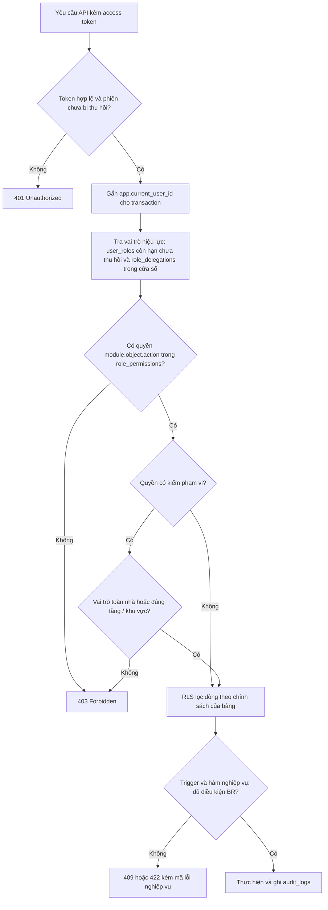

| Loại phạm vi (`scope_type`) | `scope_id` trỏ tới | Điểm kiểm tra phạm vi trong DB hiện nay | Nhãn |
|---|---|---|---|
| `global` | không có | Mọi lời gọi `app.has_permission(p)` | `[HIỆN CÓ]` |
| `floor` | `floors.id` | `app.can_assign_room` (quyền `house.assign` theo tầng của phòng) và `app.can_review_area` (quyền `duty.review` theo tầng của khu vực vệ sinh) | `[HIỆN CÓ]` |
| `cleaning_area` | `cleaning_areas.id` | `app.can_review_area` (quyền `duty.review` đúng khu vực) | `[HIỆN CÓ]` |

Hệ quả cần biết `[GIẢ ĐỊNH]`: phạm vi chỉ có tác dụng với hai quyền trên; một vai trò gán theo tầng không kế thừa các quyền toàn nhà khác. Vì vậy Phó nhà làm việc toàn nhà được gán `vice_head` phạm vi `global`; phạm vi `floor` dùng cho "quản sinh tầng" chỉ xếp phòng và nghiệm thu, hoặc mở rộng ở `BL-AUTH-12` khi có từ hai Phó nhà chia tầng (`GD-AUTH-03`).

**Nhiệm kỳ vai trò.** Dòng `user_roles` mang `board_term_id`, `valid_from`, `valid_to`. Quy ước `[ĐỀ XUẤT]`: vai trò ban điều hành đặt `valid_to` bằng cuối ngày kết thúc nhiệm kỳ; nhiệm kỳ kế tiếp tạo dòng mới (ràng buộc loại trừ `ex_user_roles__no_overlap` cho phép hai dòng liên tiếp không chồng thời gian) và dòng cũ giữ làm lịch sử. Thu hồi sớm đặt `revoked_at` và `revoked_by`, không xóa dòng (`BR-AUTH-08`, `BR-AUTH-18`).

##### 1.1.4.2 Tám vai trò và ánh xạ chức danh `[ĐỀ XUẤT]`

| Vai trò (`roles.code`) | Tên hiển thị | Số quyền | Dùng cho | Chức danh tương ứng (`positions.code`) |
|---|---|---|---|---|
| `admin` | Admin (quản trị kỹ thuật) | 19 | Hạ tầng, tài khoản, cấu hình kỹ thuật; cấp bằng migration | `sysadmin` (kiểu task) |
| `house_head` | Trưởng nhà | 86 | Đại diện pháp nhân, nhân sự, duyệt đơn, ký chi, xác nhận chốt sổ, khiếu nại | `house_head` |
| `vice_head` | Phó nhà | 57 | Điều hành đời sống: phòng, trực nhật, sự kiện, sự cố; chữ ký thứ hai khi chi lớn | `vice_head` |
| `treasurer` | Thủ quỹ | 29 | Sổ quỹ, thu chi, đối soát, đề nghị chốt sổ | `treasurer` |
| `liturgy_lead` | Trưởng ban Phụng vụ | 19 | Lịch phụng vụ, điểm danh buổi phụng vụ, xem hồ sơ Công giáo khi được đồng ý | `liturgy_head` |
| `kitchen_lead` | Trưởng ban Ẩm thực | 13 | Thực đơn, chốt suất ăn (phân hệ tạm hoãn) | `kitchen_head` |
| `media_lead` | Trưởng ban Truyền thông | 11 | Kiểm duyệt album và khoảnh khắc | `media` |
| `member` | Thành viên | 25 | Vai trò nền của mọi người đang ở | không có |

Ba vai trò trưởng ban (`liturgy_lead`, `kitchen_lead`, `media_lead`) là `[ĐỀ XUẤT]` thêm so với baseline. Lý do giữ: giảm tải cho Trưởng nhà và Phó nhà, mỗi ban có đúng quyền cần thiết (ví dụ Ban Truyền thông không đụng được tài chính), và gắn nhiệm kỳ rõ ràng. Chi phí thấp vì chỉ là dữ liệu trong ma trận. Chức danh không tự cấp quyền; thao tác "Trao nhiệm vụ" tạo cả `member_positions` lẫn `user_roles` trong một giao dịch (`BR-MEM-24`, `BL-AUTH-10`).

##### 1.1.4.3 Đánh giá lại ma trận vai trò × quyền `[ĐỀ XUẤT]`

Ma trận đầy đủ 104 quyền × 8 vai trò nằm ở Phần 4 (sinh từ DB). Bảng dưới là số quyền mỗi vai trò nắm theo nhóm, để nhìn nhanh sự phân bổ và độ tập trung.

| Nhóm quyền (tổng) | Admin | Trưởng nhà | Phó nhà | Thủ quỹ | Ban PV | Ban ẨT | Ban TT | Thành viên |
|---|---|---|---|---|---|---|---|---|
| Xác thực `auth` (5) | 3 | 5 | 1 | 1 | 0 | 0 | 0 | 0 |
| Kiểm toán `audit` (3) | 1 | 3 | 0 | 1 | 0 | 0 | 0 | 0 |
| Cấu hình `setting` (5) | 3 | 5 | 2 | 2 | 1 | 1 | 1 | 1 |
| Hồ sơ `member` (13) | 2 | 13 | 8 | 1 | 2 | 1 | 1 | 1 |
| Nhà `house` (5) | 2 | 5 | 5 | 2 | 2 | 2 | 2 | 2 |
| Trực nhật `duty` (10) | 1 | 8 | 7 | 1 | 1 | 1 | 1 | 3 |
| Học tập `academic` (7) | 1 | 5 | 4 | 0 | 0 | 0 | 0 | 2 |
| Sự kiện `event` (10) | 1 | 8 | 8 | 1 | 7 | 1 | 1 | 3 |
| Tài chính `finance` (19) | 0 | 14 | 5 | 13 | 0 | 0 | 0 | 2 |
| Cơ sở vật chất `facility` (6) | 1 | 5 | 5 | 1 | 1 | 1 | 1 | 2 |
| Cộng đồng `community` (17) | 2 | 11 | 9 | 3 | 3 | 4 | 2 | 7 |
| Lưu trữ `storage` (1) | 1 | 1 | 1 | 1 | 1 | 1 | 1 | 1 |
| AI `ai` (3) | 1 | 3 | 2 | 2 | 1 | 1 | 1 | 1 |
| **Tổng (104)** | **19** | **86** | **57** | **29** | **19** | **13** | **11** | **25** |
| Trong đó nhạy cảm (23) | 2 | 19 | 6 | 7 | 1 | 0 | 0 | 0 |

Nhận xét và chỉnh sửa đề xuất:

| # | Quan sát | Đánh giá | Đề xuất |
|---|---|---|---|
| 1 | Admin có 19 quyền, không có nhóm `finance` và không có `member.private.*`, `catholic.read_all`, `academic.read_all` (bất biến INV-13 kiểm thử S2) | Đúng nguyên tắc tách quyền | Giữ; thêm kiểm thử INV-13 mở rộng khi bổ sung quyền mới |
| 2 | Admin giữ `setting.write` và `audit.log.read` | Hai quyền này từng mở lối vòng qua tách quyền (hạ ngưỡng chi, đọc dữ liệu nhạy cảm qua nhật ký); nay đã khép bằng `finance.settings.write` (chỉ Trưởng nhà), `audit.sensitive.read` (chỉ Trưởng nhà) và che giá trị cột nhạy cảm trong nhật ký | Giữ; kiểm thử S9 và S13 chạy ở mọi lần phát hành (`BR-FIN-32`, `BR-PLAT-05`) |
| 3 | Trưởng nhà nắm 86/104 quyền, gồm 19/23 quyền nhạy cảm | Tập trung quyền lực ở một người; chỉ bù bằng hai chữ ký, nhật ký và MFA | MFA bắt buộc, rà soát quyền mỗi học kỳ, báo cáo kiểm toán chéo cho Admin (`BR-AUTH-11`, `BR-AUTH-24`) |
| 4 | Thủ quỹ có cả `finance.expense.approve` lẫn `finance.expense.pay` | Với phiếu một chữ ký (dưới ngưỡng), một người có thể duyệt rồi ghi nhận chi | Đã xử lý ở DDL: chữ ký đơn của Thủ quỹ chỉ có hiệu lực đến `finance.expense.treasurer_solo_approve_max_vnd` (mặc định 200.000 đ), trên mức đó phải có Trưởng nhà ký (`BR-FIN-17`); báo cáo bất thường cho Trưởng nhà |
| 5 | Phó nhà có `finance.expense.approve` nhưng chỉ là chữ ký thứ hai (trigger `tg_expense_approval_rules`) | Hợp lý, quyền được ép bằng trigger chứ không bằng ma trận | Giữ; ghi rõ trong màn hình ma trận |
| 6 | `application.review` (duyệt đơn xin vào) gán cho Trưởng nhà và Phó nhà | Sau khi hàm duyệt là SECURITY DEFINER thì Phó nhà dùng được | Chốt ai duyệt ở `Q-AUTH-02` |
| 7 | `auth.role.delegate` gán cho Trưởng nhà, Phó nhà, Thủ quỹ | Ủy quyền vai trò tài chính cần được duyệt | `BR-AUTH-17`, `BL-AUTH-19` |
| 8 | `media_lead` thiếu `announcement.create` dù mô tả "đăng bản tin" | Sai lệch giữa mô tả và ma trận | Thêm quyền hoặc sửa mô tả (`BL-AUTH-17`) |
| 9 | Thành viên có `member.read` nên thấy tầng 1 của mọi người, gồm cả `student_code` (MSSV) | MSSV không cần thiết cho mọi người | Che MSSV trong danh bạ (`BR-MEM-20`) |
| 10 | Sáu quyền chỉ có hiệu lực ở tầng API (xem mục 1.1.3 dòng 22) | Phải có kiểm thử API theo ma trận | Test phân quyền theo ma trận ở Phần 10 |

Đối chiếu bảng tĩnh của FE (`cai-dat/page.tsx:693-755`) với DB:

| Phân hệ (FE) | Trưởng nhà | Phó nhà | Thủ quỹ | Thành viên | Admin (FE ghi "Admin HT") | Thực tế trong DB |
|---|---|---|---|---|---|---|
| Sơ đồ nhà & xếp chuyển phòng | Toàn quyền | Toàn quyền | Xem | Xem | **Toàn quyền** | Admin chỉ `house.read`; xếp phòng là Trưởng nhà và Phó nhà |
| Thu chi & phê duyệt quỹ | Duyệt chi | Xem & đối soát | Toàn quyền | Xem minh bạch | **Toàn quyền** | Admin 0 quyền tài chính; Thành viên chỉ `finance.summary.read` |
| Đăng & ghim thông báo | Toàn quyền | Toàn quyền | Đăng thường | Xem | **Toàn quyền** | Admin chỉ đọc; ghim là Trưởng nhà và Phó nhà |
| Bếp & phân ca | Giám sát | Xếp lịch ca | Cấp tiền chợ | Báo cơm | **Toàn quyền** | `meal.manage` thuộc Trưởng nhà, Phó nhà, Ban Ẩm thực |
| Khoảnh khắc | Quản trị | Quản trị | Đăng ảnh | Đăng ảnh | **Toàn quyền** | `album.moderate` thuộc Trưởng nhà, Phó nhà, Ban Truyền thông |
| Cài đặt & danh mục | Toàn quyền | **Toàn quyền** | Xem | Không | Toàn quyền | `setting.write` chỉ Admin và Trưởng nhà; Phó nhà không sửa cài đặt |

##### 1.1.4.4 Tối thiểu đặc quyền và tách Admin kỹ thuật `[ĐỀ XUẤT]`

| Nguyên tắc | Cách áp dụng trong hệ thống | Cơ chế |
|---|---|---|
| Mặc định từ chối | Không có dòng `role_permissions` thì không có quyền; thiếu `app.current_user_id` thì không được hưởng quyền hệ thống | `app.lacks_permission`, `app.is_system_caller` (S10c) |
| Quyền theo chức năng | Mỗi vai trò chỉ nắm quyền cần cho công việc; ba Ban chỉ vài quyền | `role_permissions` (seed từ ma trận) |
| Giới hạn thời gian | Vai trò ban điều hành hết hạn theo nhiệm kỳ; ủy quyền tối đa 60 ngày | `valid_to`, `ck_role_delegations__window` |
| Giới hạn phạm vi | Quản sinh tầng chỉ xếp phòng và nghiệm thu tầng mình | `can_assign_room`, `can_review_area` |
| Tách nhiệm vụ | Người tạo phiếu khác người duyệt khác người ghi nhận chi; Admin không có quyền tài chính hay dữ liệu nhạy cảm; một tài khoản không vừa admin vừa điều hành | `tg_expense_approval_rules`, INV-13, `BR-AUTH-10` |
| Không tự nâng quyền | Không ai tự gán vai trò cho mình; không ủy quyền lại; admin không ủy quyền được | `user_roles__insert__assign`, `tg_role_delegation_rules` |
| Bước xác nhận bổ sung | MFA cho vai trò đặc quyền; thao tác rủi ro cao ghi lý do | `auth.mfa_required_roles`, `fn_audit_event` |
| Rà soát định kỳ | Mỗi học kỳ Trưởng nhà rà soát vai trò, ủy quyền, tài khoản kỹ thuật | `BR-AUTH-24`, `BL-AUTH-11` |
| Không dùng chung tài khoản | Ủy quyền thay cho chia sẻ mật khẩu khi Trưởng nhà vắng | `role_delegations` |

Ba đường mà Admin kỹ thuật vẫn có thể vòng qua tách quyền, và biện pháp đề xuất:

| Đường vòng | Biện pháp |
|---|---|
| Đổi email rồi đặt lại mật khẩu để chiếm tài khoản đặc quyền | Admin chỉ gửi liên kết tới kênh đã xác minh của chủ tài khoản; sửa email của tài khoản có vai trò thuộc `auth.mfa_required_roles` cần Trưởng nhà xác nhận; thông báo bắt buộc `security.password_changed` (`BR-AUTH-22`) |
| Hạ ngưỡng kiểm soát tài chính qua cấu hình | Tách quyền sửa khóa `finance.*` khỏi Admin (`BR-PLAT-22`) |
| Đọc dữ liệu nhạy cảm trong nhật ký | Che giá trị cột tầng 2-3 khi ghi nhật ký (`BR-PLAT-05`) |

##### 1.1.4.5 Vòng đời tài khoản `[ĐỀ XUẤT]`

Tạm khóa do đăng nhập sai dùng `users.locked_until` (tự hết hạn, không đổi trạng thái); khóa thủ công đặt `status = locked` và cần người có `auth.user.manage` mở. Tài khoản của thành viên chuyển `left` tự bị vô hiệu hóa và mọi phiên bị thu hồi (`BR-MEM-07`).

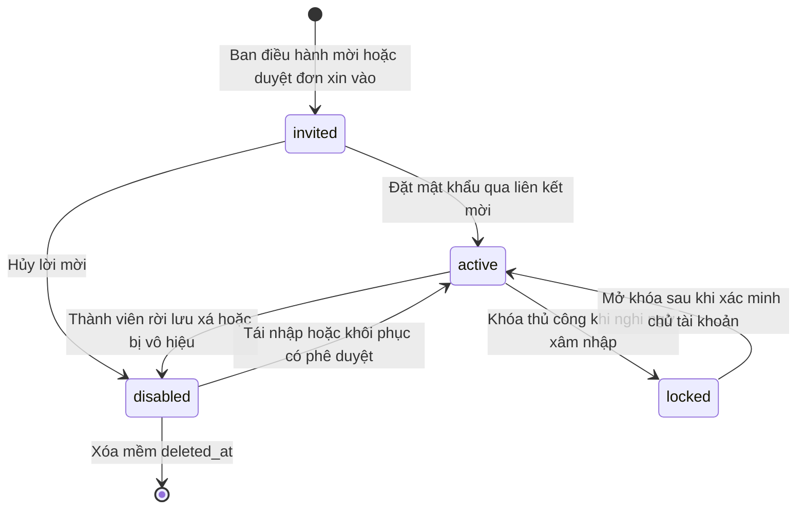

##### 1.1.4.6 Đăng nhập, phiên, brute-force, MFA `[ĐỀ XUẤT]`

Quy ước: mật khẩu Argon2id (`m=19456 KiB, t=2, p=1` `[GIẢ ĐỊNH]` theo khuyến nghị OWASP), access JWT sống 15 phút (`auth.access_token_ttl_seconds = 900`) chứa `sub` và `sid` (không chứa vai trò), refresh token sống tối đa 30 ngày (`auth.refresh_token_ttl_days = 30`) đặt trong cookie HttpOnly, Secure, SameSite=Strict; sai 5 lần (`auth.max_failed_logins`) khóa tạm 15 phút (`auth.lockout_minutes`); thông báo lỗi chung, so khớp hằng thời gian kể cả khi không có tài khoản.

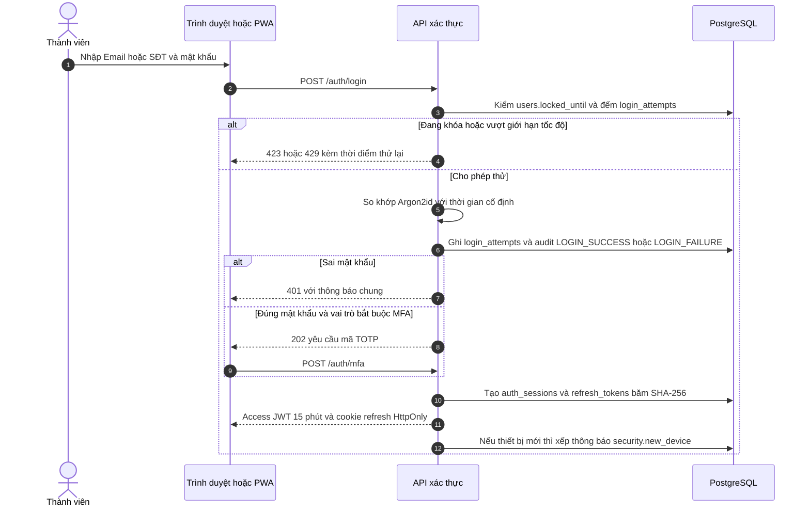

Xoay vòng refresh token và phát hiện dùng lại:

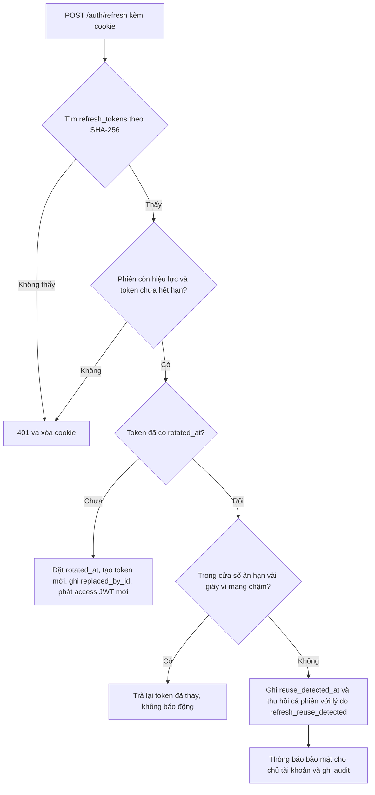

| Chủ đề | Quy tắc | Đối tượng |
|---|---|---|
| Quản lý thiết bị | Người dùng xem danh sách thiết bị (tên, IP, lần dùng cuối), đăng xuất từng thiết bị hoặc tất cả; Admin và Trưởng nhà thu hồi phiên của người khác | `auth_sessions`, `auth.session.revoke_any` (`BR-AUTH-21`) |
| Hết phiên do không hoạt động | Phiên tuyệt đối 30 ngày; thêm hạn không hoạt động (gợi ý 14 ngày không có `last_seen_at` mới thì buộc đăng nhập lại; `last_seen_at` chỉ cập nhật 5 phút một lần) `[GIẢ ĐỊNH]` | `auth_sessions.last_seen_at`, `expires_at` |
| Đổi mật khẩu | Thu hồi mọi phiên khác với lý do `password_changed`, gửi `security.password_changed` | `auth_sessions.revoked_reason` (`BR-AUTH-12`) |
| Đặt lại mật khẩu | Token một lần, SHA-256, hết hạn 30 phút, phản hồi chung dù Email có tồn tại | `password_resets` (`BR-AUTH-23`) |
| MFA | TOTP bắt buộc với `auth.mfa_required_roles`; 10 mã khôi phục dùng một lần; mất thiết bị thì quy trình khẩn cấp hai người | `user_mfa_factors`, `mfa_recovery_codes` (`BR-AUTH-11`, `BL-AUTH-13`) |
| Giám sát | Cảnh báo khi một IP sai trên 10 lần mỗi giờ hoặc có phiên bị thu hồi do dùng lại token | `login_attempts`, KPI AUTH |

##### 1.1.4.7 Đơn xin vào lưu xá và đăng nhập Google `[ĐỀ XUẤT]`

FE hiện ngụ ý luồng "đăng nhập Google, rồi chờ duyệt" nhưng không có phía người duyệt. Thiết kế giữ ý tưởng đó, bổ sung hàng chờ, trạng thái và thông báo. Đăng nhập Google chỉ **liên kết định danh** (`user_identities`) và không bao giờ tự kích hoạt tài khoản hay cấp vai trò (`BR-AUTH-16`); phương thức chính vẫn là Email/SĐT cùng mật khẩu (`GD-AUTH-01`).

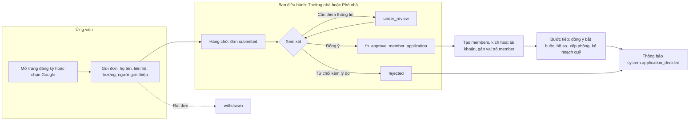

| Trạng thái đơn | Ai chuyển | Điều kiện | Thông báo gửi |
|---|---|---|---|
| `submitted` | Ứng viên | Có Email hoặc SĐT hợp lệ; người giới thiệu tùy chọn | Cho Trưởng nhà và Phó nhà: có đơn mới (`member.application_new`, loại mới `BL-PLAT-19`) |
| `under_review` | Người có `application.review` | Cần bổ sung thông tin | Cho ứng viên qua Email |
| `approved` | `fn_approve_member_application` | Chưa xử lý; tạo hồ sơ, kích hoạt tài khoản, gán `member` | `system.application_decided` (bắt buộc, Email và trong ứng dụng) |
| `rejected` | Người có `application.review` | Bắt buộc lý do từ 5 ký tự (`ck_member_applications__reject_note`) | `system.application_decided` |
| `withdrawn` | Ứng viên | Chỉ khi còn `submitted` hoặc `under_review` | Không |

Người nộp đơn sửa được nội dung đơn và rút đơn nhưng không tự đặt `approved` hay ghi người duyệt (`BR-MEM-08`, trigger bảo vệ cột đã kiểm thử bằng thí nghiệm E5c).

##### 1.1.4.8 Ủy quyền tạm thời `[ĐỀ XUẤT]`

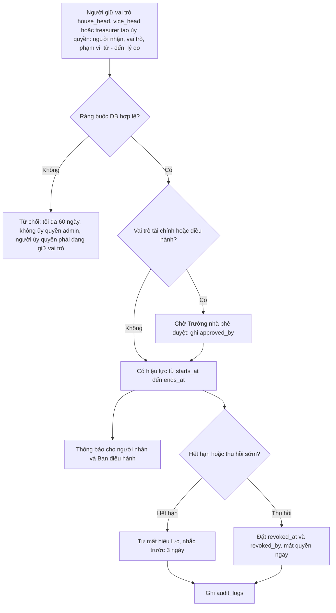

Người nhận ủy quyền được tính như đang giữ vai trò đó trong cửa sổ thời gian nên có đủ quyền của vai trò, nhưng vẫn bị ràng buộc cùng quy tắc: không ký hai lần một phiếu chi (`ux_expense_approvals__voucher_round_approver`), không tự duyệt phiếu của mình. Phần "chờ phê duyệt" cho vai trò tài chính là `[ĐỀ XUẤT]` vì DB hiện chưa kiểm `approved_by` (`BL-AUTH-19`).

##### 1.1.4.9 Sự kiện phát sinh từ phân hệ: thông báo và nhật ký `[ĐỀ XUẤT]`

| Sự kiện | Thông báo gửi | Nhật ký ghi |
|---|---|---|
| Đăng nhập thiết bị mới | `security.new_device` cho chủ tài khoản (trong ứng dụng và Email, bắt buộc) | `LOGIN_SUCCESS` |
| Đăng nhập thất bại hoặc bị khóa tạm | Chủ tài khoản khi khóa (`security.account_locked`, loại mới); cảnh báo Admin khi nghi tấn công | `LOGIN_FAILURE` |
| Đổi hoặc đặt lại mật khẩu | `security.password_changed` (bắt buộc) | `PASSWORD_CHANGE` |
| Bật hoặc tắt MFA | `security.mfa_changed` (loại mới) | `MFA_CHANGE` |
| Gán hoặc thu hồi vai trò | Người được gán và Ban điều hành (`auth.role_changed`, loại mới) | Tự động qua `trg_user_roles__audit` |
| Tạo hoặc thu hồi ủy quyền | Người nhận và Ban điều hành (`auth.delegation_started`, loại mới) | Tự động qua `trg_role_delegations__audit` |
| Phát hiện dùng lại refresh token | Chủ tài khoản và Admin | `OTHER` kèm lý do `refresh_reuse_detected` |
| Duyệt hoặc từ chối đơn | `system.application_decided` | Tự động qua `trg_member_applications__audit` |

#### 1.1.5 Quy tắc nghiệp vụ

| ID | Quy tắc | Nhãn | MoSCoW | Cơ chế thực thi (DB / service) | Kiểm thử |
|---|---|---|---|---|---|
| **BR-AUTH-01** | Mật khẩu chỉ được lưu dưới dạng băm Argon2id (chuỗi PHC bắt đầu bằng $argon2id$); vai trò API luuxa_app không có quyền đọc cột password_hash, chỉ vai trò luuxa_auth ghi/đọc. | ĐỀ XUẤT | MUST | ràng buộc `ck_users__password_argon2`<br>service: Dịch vụ xác thực băm bằng Argon2id (m=19456 KiB, t=2, p=1 [GIẢ ĐỊNH theo khuyến nghị OWASP]) và là nơi duy nhất ghi password_hash qua vai trò DB luuxa_auth | S2 |
| **BR-AUTH-02** | Mỗi tài khoản có Email hoặc SĐT dạng E.164 (ít nhất một); Email và SĐT là duy nhất giữa các tài khoản chưa xóa mềm; Email không phân biệt hoa thường. | ĐỀ XUẤT | MUST | ràng buộc `ck_users__identifier`<br>ràng buộc `ck_users__phone_format`<br>ràng buộc `ck_users__email_format`<br>index `ux_users__email`<br>index `ux_users__phone`<br>service: Chưa có ca smoke test DB riêng cho các ràng buộc này; bổ sung test tích hợp API (Phần 10) | service |
| **BR-AUTH-03** | Đăng nhập sai liên tiếp quá auth.max_failed_logins lần thì khóa tạm auth.lockout_minutes phút (users.locked_until); mọi lượt thành công/thất bại đều ghi login_attempts với lý do chuẩn hóa; thông báo lỗi dùng chung, không tiết lộ tài khoản có tồn tại hay không. | ĐỀ XUẤT | MUST | cấu hình `auth.max_failed_logins`<br>cấu hình `auth.lockout_minutes`<br>ràng buộc `ck_login_attempts__reason`<br>ràng buộc `ck_login_attempts__success_reason`<br>service: API POST /auth/login đếm login_attempts theo (identifier, ip), đặt users.locked_until, giới hạn tốc độ theo IP ở cổng API (bộ nhớ tiến trình, ADR-05); ghi audit LOGIN_FAILURE qua app.write_audit bằng vai trò luuxa_auth | service |
| **BR-AUTH-04** | Access token sống ngắn (auth.access_token_ttl_seconds); refresh token chỉ lưu SHA-256, dùng một lần và xoay vòng; xuất trình lại token đã xoay (ngoài cửa sổ ân hạn mạng chậm) là dấu hiệu bị đánh cắp: ghi reuse_detected_at và thu hồi cả phiên (refresh_reuse_detected). | ĐỀ XUẤT | MUST | cấu hình `auth.access_token_ttl_seconds`<br>cấu hình `auth.refresh_token_ttl_days`<br>ràng buộc `ux_refresh_tokens__token_hash`<br>ràng buộc `ck_refresh_tokens__hash_sha256`<br>ràng buộc `ck_auth_sessions__reason`<br>ràng buộc `ck_auth_sessions__revoked_pair`<br>service: API POST /auth/refresh thực hiện xoay vòng trong một transaction với SELECT FOR UPDATE trên refresh_tokens; access token mang sid và bị từ chối khi auth_sessions.revoked_at khác NULL | service |
| **BR-AUTH-05** | Vai trò toàn nhà thì scope_id để trống; vai trò theo phạm vi thì scope_id phải trỏ tới tầng chưa xóa hoặc khu vực vệ sinh có thật; áp dụng cho cả gán vai trò và ủy quyền. | ĐỀ XUẤT | MUST | trigger `trg_user_roles__validate_scope`<br>trigger `trg_role_delegations__validate_scope`<br>hàm `tg_validate_scope`<br>ràng buộc `ck_user_roles__scope_pair`<br>ràng buộc `ck_role_delegations__scope_pair`<br>service: Smoke test hiện chưa phủ kiểm tra phạm vi tầng/khu vực; bổ sung ca S3b | service |
| **BR-AUTH-06** | Ủy quyền tạm thời tối đa 60 ngày, có lý do từ 5 ký tự, người ủy quyền khác người nhận; không được ủy quyền vai trò admin; người ủy quyền phải đang trực tiếp giữ vai trò đó (đúng phạm vi) trong toàn bộ khoảng thời gian ủy quyền, nên không thể ủy quyền lại. | ĐỀ XUẤT | MUST | trigger `trg_role_delegations__rules`<br>hàm `tg_role_delegation_rules`<br>ràng buộc `ck_role_delegations__window`<br>ràng buộc `ck_role_delegations__distinct`<br>ràng buộc `ck_role_delegations__reason`<br>RLS `role_delegations__insert__delegator` | S3 |
| **BR-AUTH-07** | Người dùng thường chỉ được tự đổi locale và time_zone của chính mình; đổi trạng thái, khóa, email, SĐT, buộc đổi mật khẩu hoặc xóa mềm tài khoản cần quyền auth.user.manage. | ĐỀ XUẤT | MUST | trigger `trg_users__guard`<br>hàm `tg_users_guard`<br>RLS `users__update__self_or_manage`<br>RLS `users__select__self_or_admin` | S3 |
| **BR-AUTH-08** | Chỉ người có auth.role.assign (Trưởng nhà) gán hoặc thu hồi vai trò; không ai tự gán vai trò cho chính mình; vai trò admin không gán được qua API (cấp bằng migration); hai dòng gán còn hiệu lực không được chồng thời gian cho cùng (tài khoản, vai trò, phạm vi); thu hồi bằng revoked_at để giữ lịch sử. Dòng gán đã tạo chỉ được sửa các cột thời hạn và thu hồi (valid_to, revoked_at, revoked_by, note): đổi vai trò, đổi tài khoản hay đổi phạm vi bằng UPDATE bị từ chối, phải thu hồi dòng cũ rồi gán dòng mới để qua đủ kiểm tra. | ĐỀ XUẤT | MUST | RLS `user_roles__insert__assign`<br>RLS `user_roles__update__assign`<br>ràng buộc `ex_user_roles__no_overlap`<br>ràng buộc `ck_user_roles__revoked_by`<br>quyền DB: `luuxa_app` không có UPDATE; chỉ có UPDATE theo cột trên `user_roles` | S13 |
| **BR-AUTH-09** | Admin kỹ thuật không được duyệt/chi/ghi sổ quỹ và không được xem dữ liệu nhạy cảm của thành viên: không giữ finance.expense.*, finance.ledger.read, member.private.read, member.guardian.read, member.national_id.read, catholic.read_all, academic.read_all. | ĐỀ XUẤT | MUST | bảng `role_permissions`<br>bảng `roles`<br>service: Ma trận chỉ đổi qua migration có review; bất biến INV-13 trong smoke test chặn cấp nhầm | S2 |
| **BR-AUTH-10** | Một tài khoản không đồng thời giữ vai trò admin và vai trò điều hành (house_head, vice_head, treasurer); người vừa là cư dân vừa làm quản trị kỹ thuật dùng hai tài khoản riêng. | ĐỀ XUẤT | SHOULD | service: API gán vai trò từ chối tổ hợp; DB chưa ép nên thêm trigger trên user_roles (BL-AUTH-17) và kiểm tra trong báo cáo rà soát quyền | service |
| **BR-AUTH-11** | Tài khoản giữ vai trò thuộc auth.mfa_required_roles (mặc định admin, house_head, treasurer) phải bật xác thực hai bước TOTP trước khi dùng các chức năng đặc quyền; có mã khôi phục dùng một lần. | ĐỀ XUẤT | SHOULD | cấu hình `auth.mfa_required_roles`<br>ràng buộc `ux_user_mfa_factors__user_type`<br>ràng buộc `ux_mfa_recovery_codes__hash`<br>service: Đăng nhập trả mfa_enrollment_required cho tài khoản chưa đăng ký; bí mật TOTP mã hóa AES-256-GCM ở tầng ứng dụng (cột secret_enc) | service |
| **BR-AUTH-12** | Phiên bị thu hồi ngay khi tài khoản bị vô hiệu (thành viên rời lưu xá), khi đổi mật khẩu (các phiên khác) hoặc khi Admin/Trưởng nhà thu hồi; lý do thu hồi thuộc danh sách chuẩn. | ĐỀ XUẤT | MUST | trigger `trg_members__leave_effects`<br>ràng buộc `ck_auth_sessions__reason`<br>RLS `auth_sessions__update__own_or_admin`<br>service: Đổi mật khẩu thu hồi mọi phiên khác với lý do password_changed và gửi thông báo bắt buộc security.password_changed | S5 |
| **BR-AUTH-13** | Quyền được tra trong DB theo user_roles và role_delegations còn hiệu lực cùng ma trận role_permissions; ngữ cảnh người dùng truyền bằng set_config('app.current_user_id') mỗi transaction; không tin vai trò hay quyền do client gửi lên. | ĐỀ XUẤT | MUST | hàm `current_role_grants`<br>hàm `has_permission`<br>hàm `has_role`<br>hàm `current_user_id`<br>service: API đặt app.current_user_id trong từng transaction bằng set_config với tham số is_local = true; middleware không cache vai trò quá thời hạn access token | S3 |
| **BR-AUTH-14** | Phó nhà (hoặc người được gán phạm vi) chỉ xếp phòng cho phòng thuộc tầng mình phụ trách và chỉ nghiệm thu trực nhật ở khu vực/tầng mình phụ trách; vai trò toàn nhà thỏa mọi phạm vi. | ĐỀ XUẤT | SHOULD | hàm `can_assign_room`<br>hàm `can_review_area`<br>RLS `room_assignments__insert`<br>service: Chỉ hai quyền house.assign và duty.review có kiểm tra phạm vi trong DB; chưa có smoke test cho vai trò theo tầng (bổ sung S3b) | service |
| **BR-AUTH-15** | Đơn xin vào đi qua máy trạng thái submitted, under_review, approved, rejected, withdrawn (các trạng thái cuối không đổi); duyệt cần quyền application.review và tạo hồ sơ thành viên cùng vai trò member; từ chối bắt buộc có lý do từ 5 ký tự; duyệt/từ chối ghi người xử lý và thời điểm. | ĐỀ XUẤT | MUST | trigger `trg_member_applications__state`<br>hàm `fn_approve_member_application`<br>ràng buộc `ck_member_applications__reviewed`<br>ràng buộc `ck_member_applications__approved`<br>ràng buộc `ck_member_applications__reject_note`<br>RLS `member_applications__update` | service |
| **BR-AUTH-16** | Tài khoản tạo qua đăng nhập Google chỉ liên kết định danh ngoài (user_identities) và ở trạng thái invited cho đến khi đơn xin vào được duyệt; không tự kích hoạt, không tự cấp vai trò; một định danh Google chỉ gắn một tài khoản. | ĐỀ XUẤT | SHOULD | ràng buộc `ck_user_identities__provider`<br>ràng buộc `ux_user_identities__provider_subject`<br>ràng buộc `ux_user_identities__user_provider`<br>ràng buộc `ck_users__active_has_pw`<br>service: API chỉ chấp nhận email Google đã xác minh (email_verified); ck_users__active_has_pw cho phép tài khoản chỉ đăng nhập Google (không mật khẩu) chuyển active khi email_verified_at có giá trị | S13 |
| **BR-AUTH-17** | Ủy quyền vai trò tài chính (treasurer) hoặc điều hành (vice_head) chỉ có hiệu lực sau khi Trưởng nhà phê duyệt (approved_by); ủy quyền được thu hồi sớm bất cứ lúc nào và luôn ghi audit; tài khoản nhận ủy quyền không ký hai lần cùng một phiếu. | ĐỀ XUẤT | SHOULD | ràng buộc `ux_expense_approvals__voucher_round_approver`<br>RLS `role_delegations__update__revoke`<br>trigger `trg_role_delegations__audit`<br>service: current_role_grants chưa kiểm approved_by nên API chỉ tạo bản ghi ở trạng thái chờ và Trưởng nhà phê duyệt; đề xuất vá DDL ở BL-AUTH-19 | service |
| **BR-AUTH-18** | Vai trò ban điều hành gắn nhiệm kỳ (board_term_id) và tự hết hiệu lực khi hết hạn: valid_to không vượt ngày kết thúc nhiệm kỳ; nhiệm kỳ kế tiếp cấp dòng gán mới, dòng cũ giữ làm lịch sử. | ĐỀ XUẤT | SHOULD | ràng buộc `ck_user_roles__validity`<br>ràng buộc `ex_user_roles__no_overlap`<br>bảng `board_terms`<br>service: API gán vai trò đặt valid_to bằng cuối ngày ends_on của nhiệm kỳ; DB chưa ép valid_to nhỏ hơn hoặc bằng ends_on (BL-MEM-21) | service |
| **BR-AUTH-19** | Mọi thay đổi vai trò, ủy quyền, ma trận quyền và khóa/mở khóa tài khoản đều ghi audit_logs tự động; nhật ký phân quyền tra theo entity_table user_roles, role_delegations, role_permissions, users. | ĐỀ XUẤT | MUST | trigger `trg_user_roles__audit`<br>trigger `trg_role_delegations__audit`<br>trigger `trg_role_permissions__audit`<br>trigger `trg_users__audit`<br>hàm `tg_audit` | service |
| **BR-AUTH-20** | Bản production không có công cụ chuyển vai trò tự do: vai trò lấy từ GET /me (user_roles/role_delegations), FE chỉ ẩn/hiện theo danh sách quyền trả về và mọi kiểm tra thật nằm ở API và DB. | ĐỀ XUẤT | MUST | quy trình: Gỡ banner Thử nghiệm vai trò và menu Chuyển vai trò thử nghiệm khỏi build production (chỉ bật bằng biến môi trường ở dev); Phần 7 mục shared và Phần 10 kiểm thử phân quyền theo ma trận<br>service: Mỗi endpoint khai báo quyền tối thiểu (cột auth của bảng API) và được test theo ma trận vai trò | process |
| **BR-AUTH-21** | Người dùng xem và thu hồi được phiên/thiết bị của chính mình; Admin và Trưởng nhà (auth.session.revoke_any) thu hồi được phiên của người khác; đăng nhập từ thiết bị mới gửi thông báo bắt buộc security.new_device. | ĐỀ XUẤT | SHOULD | RLS `auth_sessions__select__own_or_admin`<br>RLS `auth_sessions__update__own_or_admin`<br>index `ix_auth_sessions__user_active`<br>service: luuxa_auth không gọi được app.fn_notify nên phát thông báo security.* qua hàng đợi worker hoặc hàm SECURITY DEFINER hẹp (BL-PLAT-19) | service |
| **BR-AUTH-22** | Admin không đặt hộ mật khẩu và không đổi email/SĐT của tài khoản đang giữ vai trò đặc quyền nếu không có Trưởng nhà đồng thuận; đặt lại mật khẩu chỉ bằng liên kết gửi tới kênh đã xác minh của chủ tài khoản và luôn kèm thông báo bắt buộc cùng audit. | ĐỀ XUẤT | SHOULD | RLS `users__update__self_or_manage`<br>trigger `trg_users__audit`<br>service: Luồng đặt lại mật khẩu của Admin tạo bản ghi password_resets; không có endpoint nhận mật khẩu mới từ Admin; thao tác lên tài khoản có vai trò thuộc auth.mfa_required_roles cần xác nhận của Trưởng nhà | service |
| **BR-AUTH-23** | Mật khẩu dài tối thiểu 10 ký tự, không bắt buộc ký tự đặc biệt, bị từ chối nếu nằm trong danh sách mật khẩu phổ biến hoặc đã lộ; token đặt lại mật khẩu và lời mời dùng một lần, hết hạn sau 30 phút, chỉ lưu SHA-256. | ĐỀ XUẤT | SHOULD | ràng buộc `ux_password_resets__token_hash`<br>ràng buộc `ck_password_resets__expiry`<br>service: Kiểm tra độ dài và danh sách mật khẩu lộ ở API (k-anonymity); ngưỡng tối thiểu nên thành khóa settings auth.password_min_length (BL-PLAT-19) | service |
| **BR-AUTH-24** | Mỗi học kỳ Trưởng nhà rà soát toàn bộ vai trò không phải member, ủy quyền còn hiệu lực và tài khoản kỹ thuật; vai trò thừa bị thu hồi và biên bản rà soát được lưu. | ĐỀ XUẤT | SHOULD | quy trình: Báo cáo rà soát quyền sinh từ user_roles, role_delegations, auth_sessions; Trưởng nhà xác nhận trên màn hình và hệ thống ghi audit; chu kỳ mỗi học kỳ cùng lúc chuyển giao nhiệm kỳ | process |

Các quy tắc chia thành sáu nhóm: xác thực và mật khẩu (`BR-AUTH-01`, `02`, `03`, `11`, `23`); phiên và thiết bị (`04`, `12`, `21`); phân quyền và phạm vi (`05`, `13`, `14`, `20`); gán vai trò, ủy quyền và nhiệm kỳ (`06`, `08`, `17`, `18`); tách quyền và kiểm soát tài khoản đặc quyền (`07`, `09`, `10`, `22`); đơn xin vào lưu xá và đăng nhập Google (`15`, `16`) cùng kiểm toán và rà soát quyền (`19`, `24`). Ba mã `BR-AUTH-05`, `BR-AUTH-06`, `BR-AUTH-07` đã có sẵn trong DDL (hàm `tg_validate_scope`, `tg_role_delegation_rules`, `tg_users_guard`). Cột "Cơ chế thực thi" cho biết quy tắc nằm ở đối tượng DB nào hay ở tầng service; dòng "service" kèm ghi chú khoảng trống DDL cần vá (xem `BL-AUTH-17` đến `BL-AUTH-19`).

#### 1.1.6 Tính năng mới đề xuất

| ID | Tên & mô tả | Nhãn | MoSCoW | Công sức | Giá trị | Giai đoạn |
|---|---|---|---|---|---|---|
| **BL-AUTH-01** | **Đăng nhập Email/SĐT, phiên JWT và refresh token xoay vòng** — Thay trang đăng nhập giả bằng đăng nhập thật: mật khẩu Argon2id, access token 15 phút, refresh token xoay vòng có phát hiện dùng lại, đăng xuất thu hồi phiên, route guard và GET /me trả vai trò và quyền. | ĐỀ XUẤT | MUST | L | Cao | 2 |
| **BL-AUTH-02** | **Mời thành viên, kích hoạt tài khoản và đặt lại mật khẩu** — Trưởng nhà hoặc Phó nhà mời thành viên qua Email/SĐT; liên kết dùng một lần hết hạn 30 phút để đặt mật khẩu lần đầu và để quên mật khẩu; đặt lại thu hồi các phiên khác và gửi thông báo bảo mật. | ĐỀ XUẤT | MUST | M | Cao | 2 |
| **BL-AUTH-03** | **Chống brute-force, khóa tạm và cảnh báo đăng nhập thiết bị mới** — Đếm đăng nhập sai theo tài khoản và IP, khóa tạm theo cấu hình, thông báo chung không lộ tài khoản, giới hạn tốc độ ở cổng API và thông báo bắt buộc khi có thiết bị mới. | ĐỀ XUẤT | MUST | M | Cao | 2 |
| **BL-AUTH-04** | **Đơn xin vào lưu xá và màn hình duyệt cho Trưởng/Phó nhà** — Ứng viên nộp đơn, theo dõi trạng thái; Ban điều hành xem hàng chờ, yêu cầu bổ sung, duyệt hoặc từ chối kèm lý do; duyệt tạo hồ sơ thành viên, vai trò member và khởi động các bước tiếp theo. | ĐỀ XUẤT | MUST | M | Cao | 2 |
| **BL-AUTH-05** | **Quản lý vai trò: gán, thu hồi, phạm vi và nhiệm kỳ** — Màn hình cho Trưởng nhà gán và thu hồi vai trò theo tài khoản, chọn phạm vi toàn nhà hoặc tầng, gắn nhiệm kỳ và thời hạn; xem ma trận quyền đọc từ DB và lịch sử thay đổi. | ĐỀ XUẤT | MUST | M | Cao | 2 |
| **BL-AUTH-06** | **Ủy quyền tạm thời có phê duyệt và nhắc hết hạn** — Trưởng nhà, Phó nhà, Thủ quỹ ủy quyền vai trò của mình tối đa 60 ngày khi vắng mặt; vai trò tài chính và điều hành cần Trưởng nhà phê duyệt; nhắc trước khi hết hạn, thu hồi sớm một chạm. | ĐỀ XUẤT | SHOULD | M | Vừa | 4 |
| **BL-AUTH-07** | **Quản lý phiên và thiết bị đăng nhập** — Trang Bảo mật tài khoản liệt kê thiết bị đang đăng nhập (tên thiết bị, IP, lần dùng cuối), cho đăng xuất từng thiết bị hoặc tất cả; Admin và Trưởng nhà thu hồi phiên của người khác khi nghi ngờ. | ĐỀ XUẤT | SHOULD | S | Vừa | 2 |
| **BL-AUTH-08** | **Xác thực hai bước TOTP và mã khôi phục cho vai trò đặc quyền** — Bắt buộc đăng ký ứng dụng xác thực cho admin, house_head, treasurer theo cấu hình; mã khôi phục dùng một lần; Thành viên thường có thể bật tùy chọn. | ĐỀ XUẤT | SHOULD | M | Cao | 2 |
| **BL-AUTH-09** | **Đăng nhập bằng Google (OIDC) liên kết tài khoản** — Giữ nút Google của giao diện hiện tại nhưng làm thật: chỉ liên kết định danh, tài khoản mới chờ đơn xin vào được duyệt, không tự kích hoạt hay cấp vai trò; ràng buộc mật khẩu đã cho phép tài khoản chỉ có Google chuyển active khi email đã xác minh (ck_users__active_has_pw). | ĐỀ XUẤT | SHOULD | M | Vừa | 5 |
| **BL-AUTH-10** | **Trao nhiệm vụ theo nhiệm kỳ: chức danh và vai trò trong một thao tác** — Khi Trưởng nhà trao chức vụ (Phó nhà, Thủ quỹ, Trưởng ban Phụng vụ, Ẩm thực, Truyền thông), hệ thống tạo trách vụ và vai trò cùng nhiệm kỳ, đặt hạn bằng cuối nhiệm kỳ và báo cáo đối chiếu chức danh với vai trò. | ĐỀ XUẤT | SHOULD | S | Vừa | 4 |
| **BL-AUTH-11** | **Rà soát quyền mỗi học kỳ** — Báo cáo tự sinh liệt kê vai trò không phải member, ủy quyền còn hiệu lực, tài khoản kỹ thuật và tài khoản lâu không đăng nhập; Trưởng nhà xác nhận hoặc thu hồi và biên bản được lưu. | ĐỀ XUẤT | SHOULD | S | Vừa | 7 |
| **BL-AUTH-12** | **Phó nhà phụ trách theo tầng và kiểm thử phạm vi** — Hoàn thiện mô hình phạm vi: màn hình gán Phó nhà cho một tầng, mở rộng kiểm quyền theo tầng cho sự kiện hoặc trực nhật nếu cần, và bổ sung smoke test cho vai trò theo tầng và khu vực. | ĐỀ XUẤT | COULD | M | Vừa | 5 |
| **BL-AUTH-13** | **Khôi phục quyền khẩn cấp khi mất truy cập tài khoản đặc quyền** — Quy trình có hai người xác nhận (Cha linh hướng hoặc Trưởng nhà cũ và Admin) để cấp lại quyền khi Trưởng nhà mất thiết bị hoặc MFA; mọi bước ghi kiểm toán và thông báo toàn Ban điều hành. | ĐỀ XUẤT | COULD | S | Vừa | 7 |
| **BL-AUTH-51** | **Đăng ký tài khoản mở có CAPTCHA, đặt mật khẩu qua liên kết email và chống lạm dụng (AUTH-REG-01)** — Cho người ngoài tự đăng ký và nộp đơn xin vào mà không cần Trưởng nhà tạo trước: tạo users invited cùng member_applications, gửi liên kết đặt mật khẩu (đồng thời xác minh email), CAPTCHA không theo dõi, giới hạn theo IP và email. Tắt mặc định cho tới khi Ban điều hành quyết định (Q-AUTH-01). | ĐỀ XUẤT | COULD | S | Vừa | 5 |
| **BL-AUTH-14** | **Passkeys (WebAuthn) thay mật khẩu** — Đăng nhập không mật khẩu bằng khóa truy cập của thiết bị. | ĐỀ XUẤT | WON'T-NOW | L | Thấp | — |
| **BL-AUTH-15** | **Đăng nhập một lần doanh nghiệp (SAML hoặc LDAP)** — Tích hợp danh bạ trường đại học hoặc giáo phận làm nguồn định danh. | ĐỀ XUẤT | WON'T-NOW | XL | Thấp | — |
| **BL-AUTH-16** | **Chỉnh sửa ma trận vai trò–quyền bằng giao diện** — Cho Ban điều hành tự thêm bớt quyền của từng vai trò trên màn hình thay vì qua migration. | ĐỀ XUẤT | WON'T-NOW | L | Thấp | — |

Các mục `WON'T-NOW` (Passkeys, SSO doanh nghiệp, ma trận quyền chỉnh bằng giao diện) bị loại có chủ đích vì chi phí vận hành và rủi ro cấp nhầm quyền lớn hơn lợi ích ở quy mô một lưu xá. Ngoài bảng trên còn ba hạng mục vá lỗi thiết kế DB (`BL-AUTH-17` đến `BL-AUTH-19`, khu vực SEC) xuất hiện trong Master Backlog ở giai đoạn 1; chúng phải xong trước khi mở màn hình quản lý vai trò cho người dùng thật.

#### 1.1.7 Chỉ số theo dõi (KPI)

| Chỉ số (KPI) | Công thức | Nguồn dữ liệu | Mục tiêu | Tần suất |
|---|---|---|---|---|
| Tỷ lệ tài khoản đặc quyền đã bật MFA | số tài khoản đang giữ vai trò thuộc auth.mfa_required_roles có yếu tố TOTP đã xác nhận (confirmed_at khác NULL) / tổng số tài khoản đang giữ các vai trò đó | bảng user_roles, roles, user_mfa_factors; cấu hình auth.mfa_required_roles | 100% (không có ngoại lệ quá 7 ngày kể từ lúc được cấp vai trò) | hằng tuần |
| Tỷ lệ đăng nhập thất bại và số tài khoản bị khóa tạm | số lượt login_attempts có success = false / tổng lượt đăng nhập trong 24 giờ; cộng số tài khoản có locked_until còn hiệu lực | bảng login_attempts, users.locked_until | dưới 10% mỗi ngày; cảnh báo khi một IP có trên 10 lần sai mỗi giờ hoặc tỷ lệ vượt 20% | hằng ngày |
| Thời gian duyệt đơn xin vào lưu xá (trung vị) | trung vị của (reviewed_at trừ created_at) với đơn đã approved hoặc rejected trong kỳ | bảng member_applications | không quá 48 giờ; không đơn nào ở trạng thái submitted quá 5 ngày | hằng tháng và mỗi đợt tuyển |
| Số phiên bị thu hồi do phát hiện dùng lại refresh token | đếm auth_sessions có revoked_reason = refresh_reuse_detected trong kỳ | bảng auth_sessions, refresh_tokens.reuse_detected_at | 0; mỗi ca là sự cố bảo mật được điều tra trong 24 giờ | hằng tuần |
| Tài khoản cựu thành viên hoặc đã rời còn vai trò đặc quyền | số tài khoản gắn hồ sơ có status alumni hoặc left mà vẫn có user_roles hiệu lực khác member, hoặc còn phiên chưa thu hồi | bảng members, users, user_roles, auth_sessions | 0; kiểm tra tự động mỗi đêm | hằng ngày |
| Tỷ lệ vai trò đặc quyền được rà soát mỗi học kỳ | số dòng user_roles khác member và role_delegations còn hiệu lực đã được Trưởng nhà xác nhận trong đợt rà soát / tổng số dòng cần rà soát | bảng user_roles, role_delegations, audit_logs (biên bản rà soát) | 100% mỗi học kỳ, hoàn tất trong 14 ngày đầu học kỳ | mỗi học kỳ |

Các chỉ số MFA, đăng nhập thất bại và phiên bị thu hồi do dùng lại token là chỉ số an ninh; thời gian duyệt đơn đo trải nghiệm tuyển thành viên; hai chỉ số còn lại (cựu thành viên còn quyền đặc quyền, rà soát quyền) đo vệ sinh phân quyền và nên nằm trong báo cáo kiểm toán định kỳ gửi Trưởng nhà (`BL-PLAT-10`).


### 1.2 Phân hệ 2 — Hồ sơ thành viên & Đời sống Công giáo (`/thanh-vien`)

Phân hệ này quản lý **con người** của lưu xá: hồ sơ, dữ liệu nhạy cảm và đồng ý của họ, vòng đời cư trú, trách vụ theo nhiệm kỳ. Mã module: `MEM`. Bảng DB chính: `members`, `member_private_details`, `member_guardians`, `catholic_profiles`, `member_sacraments`, `student_profiles`, `dioceses`, `universities`, `consent_purposes`, `consents`, `data_subject_requests`, `academic_years`, `semesters`, `board_terms`, `positions`, `member_positions`.

Chủ đề bắt buộc **"Chu kỳ năm học"** (đầu năm: nhập thành viên mới và xếp phòng; cuối năm: tổng kết, lưu trữ, bàn giao chức vụ; chuyển giao nhiệm kỳ; lịch sử trách vụ) được đặt như sau: phần con người, đồng ý, trách vụ và nhiệm kỳ nằm ở **mục 1.2.4.6 và 1.2.4.7 của phân hệ này**; phần xếp phòng đầu năm nằm ở **mục 1.3.4.2 của phân hệ 3 (Nhà & phòng)**.

#### 1.2.1 Hiện trạng FE

| Thành phần | File / component | Hiện trạng | Nhãn |
|---|---|---|---|
| Danh bạ | `src/app/thanh-vien/page.tsx` (473 dòng) | Lưới thẻ và bảng, tìm tên/phòng/SĐT bằng `includes` không bỏ dấu (dòng 68-74), lọc tầng bằng `startsWith("P.1")` (dòng 62-66), panel chi tiết có "SĐT Khẩn cấp" chữ đỏ (dòng 402-407); mọi vai trò thấy như nhau (`currentRole` được lấy nhưng không dùng, dòng 28) | `[HIỆN CÓ]` |
| Số liệu đầu trang | `thanh-vien/page.tsx:89-93,136-151` | "12 Sinh Viên", "100% phòng kín", "03 anh em" Ban đại diện là chuỗi cứng; thực tế Ban gồm 4 người, 12/22 chỗ | `[HIỆN CÓ]` (sai) |
| Lịch sử đóng quỹ | `thanh-vien/page.tsx:410-429` | Ba dòng "350.000đ ✓ Đã đóng" giống hệt cho mọi thành viên, mâu thuẫn dữ liệu quỹ | `[HIỆN CÓ]` (sai) |
| Sinh nhật tháng | `thanh-vien/page.tsx:158-193` | Tính ở client bằng giờ máy thật, hiển thị ngày sinh mọi người cho mọi vai trò | `[HIỆN CÓ]` |
| Sơ yếu lý lịch (CV) | `src/components/MemberCVModal.tsx:172-380` | In CCCD đủ 12 số (dòng 234), SĐT phụ huynh, tôn giáo, Bí tích; điền sẵn giá trị bịa: giới tính "Nam", bí tích mặc định, "Tình trạng quỹ ✓ Đã đối soát" (dòng 230,254,332-334), người ký cứng "Trần Văn Đức", "Lm. Phanxicô Assisi" (dòng 364,372), ngày cố định (dòng 378); mọi vai trò mở được CV của mọi người | `[HIỆN CÓ]` |
| Xuất và chia sẻ | `src/lib/zaloShare.ts:139-158`; `src/lib/pdfExport.ts:76-189`; `MemberCVModal.tsx:51-94` | "Copy Zalo", tải .txt, PDF dạng ảnh sinh ở trình duyệt; đưa họ tên, ngày sinh, SĐT, quê quán, tên cha mẹ ra clipboard bằng một cú nhấp, không xác nhận, không nhật ký | `[HIỆN CÓ]` |
| Thêm thành viên | `src/components/Modals.tsx:591-702`; `src/lib/store.tsx:397-409` | Chỉ 5 trường (họ tên, phòng, SĐT, vai trò, ảnh); id `Math.random`, `joined` theo giờ máy; không kiểm trùng, không kiểm sức chứa, cho gán "Trưởng nhà"; 18 trường hồ sơ còn lại không nhập được | `[HIỆN CÓ]` |
| Sửa và ngừng cư trú | `src/lib/store.tsx` | Không có `updateMember`, `deleteMember`, đổi vai trò hay trạng thái cư trú | `[HIỆN CÓ]` (khoảng trống) |
| Mô hình `Member` | `src/lib/mockData.ts:26-54,133-470` | 27 trường phẳng: `role` gộp RBAC và chức vụ, `duty` chuỗi tự do, `joined` dạng "MM/yyyy", cha mẹ nhúng SĐT trong chuỗi, CCCD và SĐT phụ huynh nằm trong bundle JS; 12 thành viên, 12/12 giới tính Nam | `[HIỆN CÓ]` |
| Ảnh đại diện | `src/components/ui/ImageUploadDropzone.tsx:35-78,172-193` | Base64 tới 10 MB hoặc URL ngoài tùy ý; `avatarUrl` được ghi nhưng không nơi nào hiển thị | `[HIỆN CÓ]` |

Ánh xạ trường `Member` của FE sang tầng dữ liệu và bảng DB `[ĐỀ XUẤT]` (DB đã tách tầng ngay từ thiết kế; trường nào FE có mà DB tính ra thì ghi "derived"):

| Tầng | Trường FE | Nơi lưu trong DB | Ghi chú |
|---|---|---|---|
| 1 (cộng đoàn) | `fullName`, `name`, `avatarText`, `avatarUrl` | `members.full_name`, `display_name`; avatar qua `avatar_file_id`; `avatarText` derived | Chuẩn hóa Unicode NFC và cắt khoảng trắng ở API (`BR-MEM-19`) |
| 1 | `gender` | `members.gender` (`gender_t`: male, female) | Nằm tầng 1 vì quy tắc phòng cần; mặc định FE "Nam" bị bỏ |
| 1 | `room` | derived từ `room_assignments` (view `v_member_current_room`) | Không còn chuỗi `Member.room` |
| 1 | `role`, `duty` | `user_roles` (quyền) và `member_positions` (chức danh theo nhiệm kỳ) | Tách RBAC khỏi chức vụ (`BR-MEM-24`) |
| 1 | `joined` | `members.joined_on` (DATE) và `left_on`, `status` | Cho nhập lùi ngày nhập xá |
| 1 | `phone` | `members.contact_phone_e164` và `hide_phone` | Che SĐT theo cờ ở API (`BR-MEM-10`) |
| 1 (học tập) | `university`, `major`, `academicYear`, `studentCode` | `student_profiles` (+ `universities`) | `studentCode` chỉ chính chủ và Ban điều hành (`BR-MEM-20`) |
| 2 (riêng tư) | `birthDate`, `hometown`, `homeAddress` | `member_private_details` | Ngày sinh không hiển thị công khai (`BR-MEM-29`) |
| 2 (mã hóa cột) | `identityCard` | `national_id_enc`, `national_id_bidx`, `national_id_last4` | Hiển thị `•••• 1892` (`BR-MEM-02`) |
| 2 (mã hóa cột) | `fatherName`, `motherName`, `parentPhone` | `member_guardians` (`relation`, `full_name`, `phone_enc`, `phone_last4`) | Tách khỏi chuỗi tên (`BR-MEM-03`) |
| 3 (rất nhạy cảm) | `holyName`, `parish`, `pastor`, `diocese` | `catholic_profiles` (+ `dioceses`, 27 giáo phận) | Cần đồng ý `catholic_profile` (`BR-MEM-04`) |
| 3 | `sacraments` | `member_sacraments` (`sacrament_t`, `received_on`, `place`) | Cùng cơ chế đồng ý; có ngày và nơi |

#### 1.2.2 Đánh giá (Audit)

| Tiêu chí | Điểm | Nhận xét |
|---|---|---|
| Đầy đủ chức năng | 2/5 | Danh bạ lưới/bảng, panel chi tiết và hồ sơ 27 trường rất giàu nhưng form chỉ nhập 5 trường, không sửa, không ngừng cư trú, không đồng ý, không giám hộ, không nhiệm kỳ. |
| Tính đúng đắn nghiệp vụ | 2/5 | Số liệu đầu trang cứng (12 thành viên, 03 Ban đại diện), lịch sử quỹ giống nhau cho mọi người và CV tự điền giá trị bịa (giới tính Nam, quỹ đã nộp đủ, bí tích mặc định). |
| Khả năng chống gian lận / sai sót | 1/5 | CCCD không che, SĐT phụ huynh và dữ liệu tôn giáo hiển thị cho mọi vai trò, xuất PDF hoặc Zalo bằng một cú nhấp, toàn bộ PII nằm trong bundle JS. |
| Trải nghiệm di động | 2/5 | Panel chi tiết nằm dưới danh sách, vùng chạm nhỏ hơn 44 px và bảng tràn ngang; lưới thẻ dùng tạm được trên điện thoại. |
| Khả năng mở rộng | 2/5 | Không phân trang, tìm kiếm không bỏ dấu, định danh bằng tên; mô hình Member phẳng không tách tầng nhạy cảm nên khó mở rộng đến vài trăm hồ sơ. |
| **Điểm trung bình** | **1.8/5** |  |

Thang điểm 1-5 chấm cho **FE hiện trạng**. Điểm mạnh của FE là mô hình dữ liệu hồ sơ khá phong phú (27 trường, đủ ý của baseline: hành chính, học tập, gia đình, Công giáo) và mẫu sơ yếu lý lịch có giá trị thực tế. Điểm yếu nằm ở **quyền riêng tư và toàn vẹn**: không phân tầng dữ liệu, không đồng ý, không vòng đời cư trú, xuất dữ liệu cá nhân không kiểm soát, và số liệu hoặc giá trị mặc định bịa trong văn bản hành chính.

Thiết kế DB mới giải quyết phần lớn bằng cấu trúc: ba tầng dữ liệu có RLS (kiểm thử S4), mã hóa cột cho CCCD và SĐT người giám hộ, đồng ý theo mục đích và phiên bản chặn ghi và chặn xem dữ liệu tôn giáo, trigger vòng đời khi rời lưu xá (kiểm thử S5), nhiệm kỳ và trách vụ có lịch sử. Phần còn hở được nêu ở bảng B mục 1.2.3.

#### 1.2.3 Lỗ hổng & rủi ro nghiệp vụ

**A. Lỗ hổng của FE hiện trạng**

| # | Lỗ hổng / rủi ro | ID vấn đề FE | Mức |
|---|---|---|---|
| 1 | CCCD in đủ 12 số trong CV và PDF, mọi vai trò mở được CV của bất kỳ ai, không nhật ký, CCCD của 12 người còn nằm trong bundle JS | FE-TV-09 | Cao |
| 2 | SĐT phụ huynh và tên cha mẹ hiển thị rõ cho mọi vai trò; mock còn nhúng SĐT vào chuỗi tên | FE-TV-10 | Cao |
| 3 | Dữ liệu tôn giáo (Tên Thánh, giáo phận, giáo xứ, linh mục, Bí tích) hiển thị và xuất cho mọi vai trò, không đồng ý, không rút đồng ý | FE-TV-11 | Cao |
| 4 | Xuất ngoài kiểm soát: Copy Zalo, .txt, PDF bằng một cú nhấp, PDF sinh ở trình duyệt, tên tệp chứa họ tên có dấu | FE-TV-12, FE-TV-49 | Cao |
| 5 | CV in thông tin bịa: giới tính "Nam", bí tích mặc định, "đã nộp đủ quỹ", người ký và ngày cố định, câu "đã đồng bộ cơ sở dữ liệu" | FE-TV-13 | Cao |
| 6 | Lịch sử đóng quỹ 3 tháng giống nhau cho mọi người, mâu thuẫn dữ liệu quỹ | FE-TV-14 | Cao |
| 7 | SĐT và ngày sinh của mọi người hiển thị khắp nơi (danh bạ, Command Palette, sơ đồ nhà, bếp), không tùy chọn chia sẻ | FE-TV-15, FE-SHELL-10 | Trung bình |
| 8 | Không sửa, không ngừng cư trú, không đổi vai trò; 18 trường hồ sơ không thể nhập nên CV thành viên mới toàn giá trị bịa | FE-TV-16 | Trung bình |
| 9 | Validate yếu: tên toàn dấu cách qua được, SĐT tự do có fallback "0900 000 000", không kiểm trùng, không kiểm sức chứa phòng, cho tạo nhiều Trưởng nhà | FE-TV-17 | Trung bình |
| 10 | Trường derived bị lưu (`name`, `avatarText`) và sinh sai quy ước; `fullName` không trim; định danh nhiều nơi bằng tên | FE-TV-18, FE-TV-21 | Trung bình |
| 11 | `joined` là chuỗi "MM/yyyy" theo giờ máy, không nhập lùi, không có ngày rời; thêm thành viên không sinh khoản quỹ hay tài khoản | FE-TV-19, FE-TV-20 | Trung bình |
| 12 | `Member.role` gộp RBAC, chức vụ và trách vụ; "Ban đại diện 03 anh em" cứng; Admin là một cư dân | FE-TV-22 | Trung bình |
| 13 | Không vòng đời cư trú, không kiểm tuổi hay người giám hộ cho thành viên dưới 18; 6 thành viên đã quá niên khóa vẫn là cư dân và ban điều hành | FE-TV-23 | Trung bình |
| 14 | Widget sinh nhật dùng giờ máy thật, lộ ngày sinh mọi người, không cần đồng ý | FE-TV-27 | Trung bình |
| 15 | Số liệu đầu trang cứng, lệch sau khi thêm thành viên; panel chi tiết nằm dưới danh sách trên điện thoại, vùng chạm nhỏ | FE-TV-26, FE-TV-29 | Trung bình |
| 16 | Avatar nhận base64 10 MB và URL ngoài, kiểm MIME yếu, không hiển thị | FE-TV-25 | Trung bình |

**B. Phát hiện ở thiết kế DB** `[DDL]` (tái hiện bằng SQL trực tiếp với vai trò `luuxa_app` trên DB thử nghiệm riêng dựng từ chính các file DDL; dòng ghi **[HIỆN CÓ - đã khép]** đã được vá trong DDL của tài liệu này và có kiểm thử, các dòng còn lại là khoảng trống đã biết có hạng mục vá ở giai đoạn 1)

| # | Phát hiện | Đối tượng DB | Mức | Xử lý |
|---|---|---|---|---|
| 17 | Chuyển `alumni` không vô hiệu hóa tài khoản và không thu vai trò: cựu thành viên vẫn có `finance.summary.read`, `duty.checkin`, `member.read` (E10) | trigger `trg_members__leave_effects` | Cao | BR-MEM-18, BL-MEM-21 |
| 18 | Thành viên tự sửa được `granted_at`, `policy_version`, `method` của đồng ý mình: bằng chứng không bất biến. **[HIỆN CÓ - đã khép]** `luuxa_app` chỉ còn quyền UPDATE cột `withdrawn_at` (rút đồng ý) | bảng `consents` (`GRANT UPDATE (withdrawn_at)`) | Trung bình | BR-MEM-13, S13 |
| 19 | Tái nhập (`left` về `active`) không bật lại tài khoản (E22); `members.status` không có máy trạng thái (`left` sang `alumni` được, E36) | trigger `trg_members__leave_effects` | Trung bình | BR-MEM-17, BL-MEM-21 |
| 20 | Hai người cùng giữ chức Trưởng nhà trong một nhiệm kỳ (E31); vai trò gắn nhiệm kỳ nhưng `valid_to` vượt `ends_on` được chấp nhận (E32); `term.handover` không dùng, chưa có hàm đóng nhiệm kỳ | bảng `member_positions`, `user_roles`, quyền `term.handover` | Trung bình | BR-MEM-25, BR-MEM-27, BL-MEM-21 |
| 21 | MSSV (`student_code`) từng đọc được bởi mọi thành viên. **[HIỆN CÓ - đã khép]** `student_profiles__select` chỉ cho chính chủ và người có `member.private.read`, `academic.read_all`, `academic.read_aggregate` hoặc `member.update`. Còn lại: SĐT bị ẩn (`hide_phone`) vẫn đọc được ở mức DB vì RLS không lọc cột (API che hoặc dùng view danh bạ) | policy `student_profiles__select`, `members__select__directory` | Trung bình | BR-MEM-10, BR-MEM-20, S13, BL-MEM-20 |
| 22 | Chưa có hàm ẩn danh hóa, chưa có job áp `retention_days`, chưa có view thành viên dưới 18 thiếu người giám hộ | bảng `consent_purposes`, `data_subject_requests` | Trung bình | BR-MEM-15, BR-MEM-16, BL-MEM-20 |
| 23 | Ghi nhận đồng ý bằng giấy hoặc miệng không bắt buộc `evidence_note` và `recorded_by` (E39b) | constraint `ck_consents__method` | Thấp | BR-MEM-12 |
| 24 | Nhật ký kiểm toán lưu giá trị ngày sinh, quê quán, địa chỉ, Tên Thánh, giáo xứ, linh mục mà Admin đọc được. **[HIỆN CÓ - đã khép]** cột nhạy cảm bị che trong nhật ký và Admin không đọc nhật ký của bảng dữ liệu cá nhân | `tg_audit`, `audit_logs__select` | Cao | BR-PLAT-05, S13 |

#### 1.2.4 Quy trình đề xuất tốt nhất

##### 1.2.4.1 Phân tầng dữ liệu và ai được thấy gì `[ĐỀ XUẤT]`

| Dữ liệu | Chính chủ | Thành viên khác | Phó nhà | Trưởng nhà | Trưởng ban Phụng vụ | Thủ quỹ | Admin |
|---|---|---|---|---|---|---|---|
| Tầng 1: tên, tên gọi, ảnh, giới tính, phòng hiện tại, chức danh, ngày nhập xá, trạng thái, trường và ngành | Xem, sửa phần liên lạc | Xem | Xem | Xem | Xem | Xem | Xem |
| SĐT liên lạc | Xem, sửa, ẩn | Xem nếu không bật `hide_phone` (API che) | Xem | Xem | Che nếu ẩn | Che nếu ẩn | Che nếu ẩn |
| Tầng 2: ngày sinh, quê quán, địa chỉ | Xem, sửa | Không | Xem, sửa (`member.private.read` và `write`) | Xem, sửa | Không | Không | Không |
| Người liên lạc khẩn cấp và giám hộ | Xem, sửa | Không | Xem (`member.guardian.read`) | Xem | Không | Không | Không |
| CCCD đầy đủ | Xem | Không | Chỉ 4 số cuối | Giải mã có `member.national_id.read`, ghi `READ_SENSITIVE` | Không | Không | Không |
| Tầng 3: hồ sơ Công giáo, Bí tích | Xem, sửa khi đã đồng ý ghi | Không | Xem nếu chủ thể đồng ý chia sẻ | Xem nếu chủ thể đồng ý chia sẻ | Xem nếu chủ thể đồng ý chia sẻ | Không | Không |
| Trạng thái đồng ý | Xem, rút | Không | Không | Xem (`consent.read_all`) | Không | Không | Không |
| Yêu cầu quyền dữ liệu | Tạo, xem | Không | Không | Xử lý (`dsr.manage`) | Không | Không | Xử lý kỹ thuật (`dsr.manage`) |

Hai quy tắc cứng: **Admin kỹ thuật không bao giờ thuộc nhóm xem tầng 2 và 3** (bất biến S2/INV-13); và **mọi quyền xem hồ sơ Công giáo của người khác đòi hỏi cả quyền lẫn đồng ý còn hiệu lực** (kiểm thử S4: Trưởng nhà không thấy khi chưa có `catholic_share_leadership`, thấy sau khi đồng ý, mất ngay khi rút).

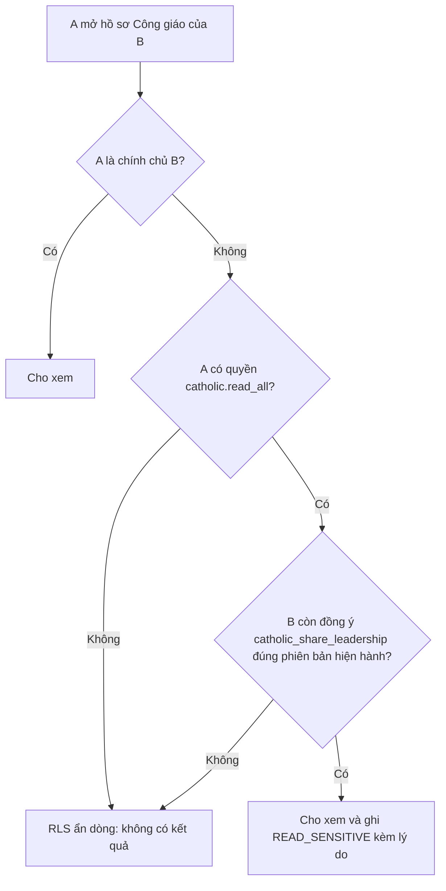

##### 1.2.4.2 Đồng ý theo mục đích `[ĐỀ XUẤT]`

Mười một mục đích đồng ý đã có sẵn trong `consent_purposes` (mỗi mục đích có phiên bản điều khoản `current_version`, đổi nội dung thì tăng phiên bản và mọi đồng ý cũ mất hiệu lực):

| Mã mục đích | Nội dung | Nhạy cảm | Bắt buộc | Cần người giám hộ nếu dưới 18 | Thời hạn lưu (ngày) | Cơ sở |
|---|---|---|---|---|---|---|
| `terms_of_use` | Điều khoản sử dụng hệ thống | Không | Có | Có | không đặt | contract |
| `privacy_notice_ack` | Đã đọc thông báo quyền riêng tư | Không | Có | Có | không đặt | legal_obligation |
| `catholic_profile` | Lưu hồ sơ Công giáo | Có | Không | Có | 365 | consent |
| `catholic_share_leadership` | Cho Ban điều hành xem hồ sơ Công giáo | Có | Không | Có | 365 | consent |
| `academic_share_leadership` | Chia sẻ bảng điểm cho Ban điều hành | Có | Không | Có | 365 | consent |
| `academic_share_tutoring` | Chia sẻ nhu cầu học tập cho người kèm | Không | Không | Có | 180 | consent |
| `academic_public_ranking` | Hiện trong thống kê học tập nội bộ (nhóm từ 3 người) | Không | Không | Có | 365 | consent |
| `photo_tagging` | Gắn thẻ tên vào ảnh và album | Không | Không | Có | 365 | consent |
| `channel_messaging` | Nhận thông báo qua Zalo, Telegram, SMS | Không | Không | Có | 180 | consent |
| `ai_processing` | Dùng AI xử lý nội dung do tôi tạo | Không | Không | Có | 180 | consent |
| `ai_academic` | Dùng AI phân tích dữ liệu học tập (chỉ chạy nội bộ) | Có | Không | Có | 180 | consent |

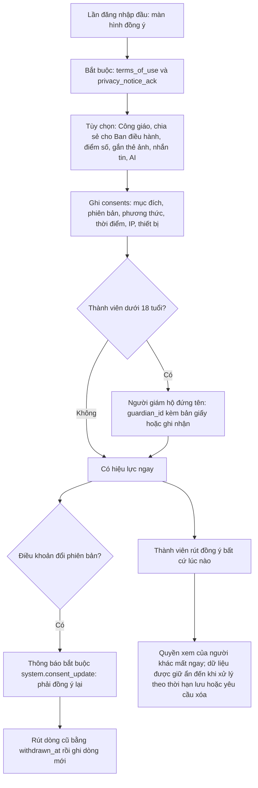

Quy tắc ghi nhận `[ĐỀ XUẤT]`: đồng ý qua ứng dụng ghi `method = in_app` kèm IP và thiết bị; thành viên không có điện thoại hoặc người giám hộ ký giấy thì Trưởng nhà hoặc Phó nhà ghi `paper` hoặc `verbal_recorded` với `evidence_note` (số phiếu, ngày ký) và `recorded_by` (`BR-MEM-12`). Dữ liệu tôn giáo chỉ được ghi sau khi có đồng ý `catholic_profile` (`BR-MEM-04`, chặn bằng trigger, áp dụng cả khi chính chủ tự nhập; kiểm thử S4). Bằng chứng đồng ý phải bất biến, chỉ `withdrawn_at` được đổi (`BR-MEM-13`).

##### 1.2.4.3 Vòng đời hồ sơ `[ĐỀ XUẤT]`

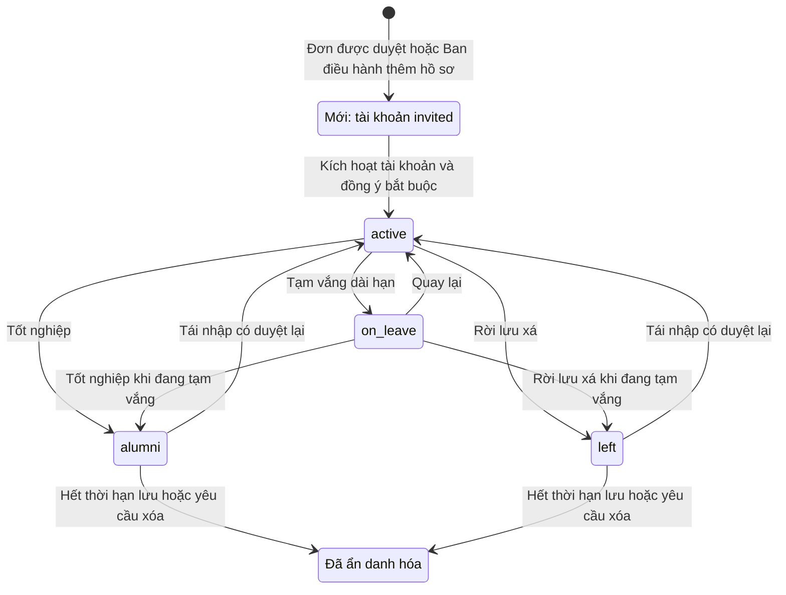

| Trạng thái (`members.status`) | Ý nghĩa | Tài khoản | Phòng | Nhận thông báo toàn nhà |
|---|---|---|---|---|
| `active` | Đang ở, đầy đủ quyền thành viên | active | Có phân phòng | Có |
| `on_leave` | Tạm vắng (thực tập, bảo lưu); DB không tự đổi gì | active, chính sách hạn chế theo `BL-MEM-13` | Giữ hoặc trả theo chính sách | Không (chỉ gửi cho `active`) |
| `alumni` | Cựu thành viên, bắt buộc có `left_on` | Hạ quyền thành chỉ xem hồ sơ của mình hoặc vô hiệu (`BR-MEM-18`, hiện DB chưa làm) | Phân phòng kết thúc vào `left_on` (tự động) | Không |
| `left` | Rời lưu xá, bắt buộc có `left_on` | Vô hiệu hóa và thu hồi mọi phiên (tự động, `BR-MEM-07`) | Phân phòng kết thúc vào `left_on` (tự động) | Không |

Cặp (`status` thuộc `alumni` hoặc `left`) và (`left_on` khác rỗng) luôn đi cùng nhau (`ck_members__left_status`), `left_on` không trước `joined_on` (`ck_members__left_dates`). Chuyển trạng thái chỉ bởi người có `member.status.change` (Trưởng nhà).

##### 1.2.4.4 Thành viên rời lưu xá, quyền xóa và ẩn danh hóa `[ĐỀ XUẤT]`

Danh mục kiểm khi rời lưu xá (`BL-MEM-04`): (1) chốt ngày rời và lý do; (2) trả phòng, đối chiếu tài sản và chìa khóa (phân hệ HOUSE và KEY); (3) tất toán công nợ quỹ (view `v_member_debts`); (4) hệ thống tự kết thúc phân phòng và, với `left`, vô hiệu hóa tài khoản; (5) chọn lưu hồ sơ cựu thành viên hoặc yêu cầu ẩn danh hóa sớm; (6) thông báo cho thành viên và Ban điều hành; (7) đặt lịch ẩn danh hóa theo `retention_days`.

Quyền xóa dữ liệu được thực hiện bằng **ẩn danh hóa** chứ không xóa cứng, vì sổ cái tài chính và nhật ký kiểm toán là bất biến: thay giá trị định danh ở tầng 2 và 3, SĐT, email, ảnh bằng giá trị trung tính, giữ khung lịch sử không định danh (thời gian ở, số liệu quỹ, điểm danh tổng hợp).

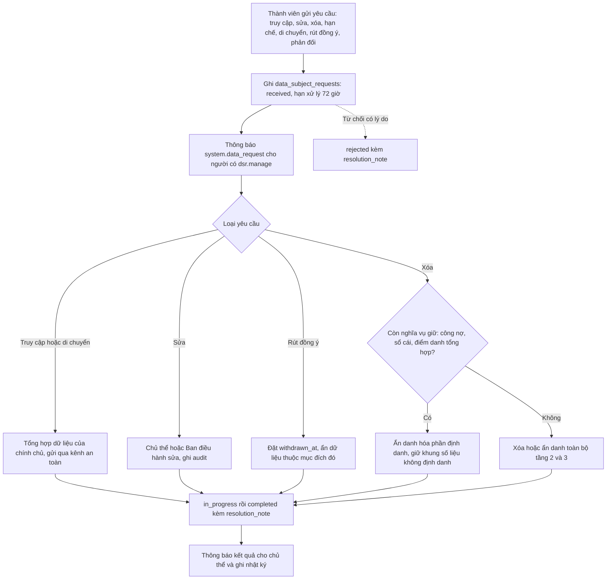

Hạn 72 giờ (`due_at` mặc định) là `[GIẢ ĐỊNH GD-MEM-03]` lấy theo khuyến nghị Nghị định 13/2023/NĐ-CP, cần tư vấn pháp lý xác nhận; tài liệu này là khuyến nghị kỹ thuật, không thay thế tư vấn pháp lý.

##### 1.2.4.5 Thành viên dưới 18 tuổi và người giám hộ `[ĐỀ XUẤT]`

| Bước | Quy tắc | Đối tượng |
|---|---|---|
| Phát hiện | Tuổi tính từ `member_private_details.birth_date`; dưới 18 tuổi gắn cờ trong màn hình hồ sơ | API (ngưỡng 18 là `GD-MEM-02`) |
| Người giám hộ | Bắt buộc có ít nhất một dòng `member_guardians` với `is_legal_guardian = true` trước khi hồ sơ hoàn tất | `BR-MEM-11` |
| Đồng ý | Mọi mục đích có `needs_guardian_if_minor` (cả 11 mục đích hiện tại) do người giám hộ đứng tên: `consents.guardian_id` kèm bản giấy ký | `consents`, `BR-MEM-12` |
| Báo cáo | Danh sách thiếu người giám hộ gửi Trưởng nhà hằng tuần đến khi bằng 0 | KPI "Thành viên dưới 18 tuổi thiếu người giám hộ" |
| Đủ 18 tuổi | Hệ thống nhắc xin đồng ý lại trực tiếp từ thành viên (đồng ý của giám hộ không tự chuyển thành đồng ý của chính chủ) | thông báo `system.consent_update` |

##### 1.2.4.6 Chu kỳ năm học — đầu năm: nhập thành viên mới và hoàn thiện hồ sơ `[ĐỀ XUẤT]`

Mục tiêu: đến tuần đầu tháng 9, mọi thành viên đang ở có hồ sơ hoàn thiện, đồng ý bắt buộc đúng phiên bản, người giám hộ (nếu dưới 18), phòng và kế hoạch quỹ. Trình hướng dẫn năm học mới (`BL-MEM-14`) đi qua các bước sau; phần xếp phòng chi tiết ở mục 1.3.4.2.

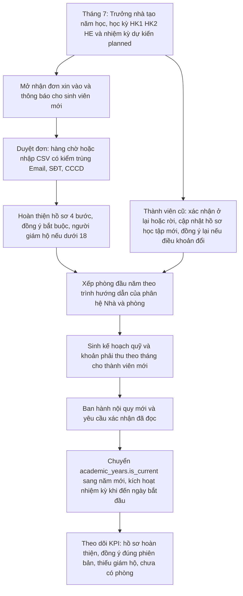

| Mốc | Việc | Người làm | Đối tượng DB |
|---|---|---|---|
| T-45 đến T-30 ngày | Tạo `academic_years` (mã `2027-2028`), `semesters`, `board_terms` dự kiến (`planned`) | Trưởng nhà (`term.manage`) | `ex_academic_years__no_overlap`, `ex_board_terms__no_overlap` |
| T-30 đến T-7 | Nhận và duyệt đơn; nhập hàng loạt; mời tài khoản | Trưởng nhà, Phó nhà | `member_applications`, `fn_approve_member_application` |
| T-7 đến T | Hoàn thiện hồ sơ, đồng ý, giám hộ; xếp phòng; sinh quỹ | Thành viên, Phó nhà, Thủ quỹ | `member_private_details`, `consents`, `room_assignments` |
| T (ngày bắt đầu) | Chuyển năm học hiện hành, ban hành nội quy | Trưởng nhà | `ux_academic_years__current`, `policy_documents` |
| T+7 | Rà soát KPI đầu năm, nhắc người còn thiếu | Phó nhà | KPI MEM và HOUSE |

Lưu ý thứ tự chuyển năm học: chỉ có một năm học `is_current` (`ux_academic_years__current`) nên phải bỏ cờ năm cũ rồi mới đặt cờ năm mới trong cùng giao dịch.

##### 1.2.4.7 Chu kỳ năm học — cuối năm, chuyển giao nhiệm kỳ và lịch sử trách vụ `[ĐỀ XUẤT]`

Nhiệm kỳ Ban điều hành đi theo năm học (`GD-MEM-07`). `ex_board_terms__no_overlap` không cho hai nhiệm kỳ chồng ngày và `ux_board_terms__active` chỉ cho một nhiệm kỳ `active` tại một thời điểm, nên chuyển giao luôn là một giao dịch: đóng nhiệm kỳ cũ rồi kích hoạt nhiệm kỳ mới (thí nghiệm E35 xác nhận đóng trước, kích hoạt sau thì thành công; kích hoạt khi cũ còn `active` bị chặn).

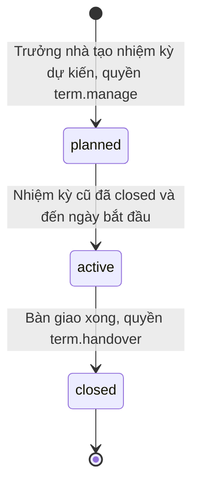

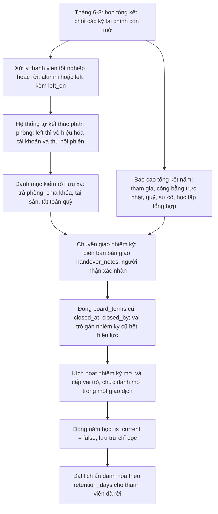

Danh mục bàn giao tối thiểu `[ĐỀ XUẤT]` ghi vào `board_terms.handover_notes` và có chữ ký xác nhận của người nhận (`BR-MEM-27`):

| Hạng mục | Nội dung bàn giao | Người giao và người nhận |
|---|---|---|
| Sổ quỹ | Số dư từng túi quỹ (`v_fund_balances`), kỳ đã chốt, khoản còn nợ, kết quả `fn_verify_ledger_chain` | Thủ quỹ cũ và mới, Trưởng nhà xác nhận |
| Tài khoản ngân hàng | Chủ tài khoản, người được ủy quyền giao dịch, thay đổi thông tin đăng nhập ngân hàng | Thủ quỹ và Trưởng nhà |
| Chìa khóa và thiết bị | Danh sách mượn chưa trả (phân hệ KEY), chìa cổng, chìa kho | Phó nhà |
| Tài sản và phòng | Sổ tài sản, biên bản bàn giao phòng, sự cố đang mở | Phó nhà |
| Tài khoản hạ tầng | Xoay mật khẩu và khóa của Admin, thu hồi quyền của người rời ban | Admin |
| Việc đang dở | Đơn chờ duyệt, yêu cầu quyền dữ liệu chưa xử lý, khiếu nại nghiệm thu | Trưởng nhà cũ và mới |

**Lịch sử trách vụ theo nhiệm kỳ.** `member_positions` ghi từng trách vụ gắn `board_term_id` (khóa duy nhất theo thành viên, chức danh, nhiệm kỳ). Sau khi đóng nhiệm kỳ, dòng được giữ nguyên để tra "ai giữ chức gì năm nào"; chức danh (`positions`, 11 chức danh seed) không tự cấp quyền, quyền nằm ở `user_roles`. Quy tắc `[ĐỀ XUẤT]`: Trưởng nhà và Thủ quỹ chỉ một người đương nhiệm tại một thời điểm (`BR-MEM-25`, DB chưa ép); thao tác "Trao nhiệm vụ" tạo chức danh và vai trò trong cùng giao dịch (`BR-MEM-24`, `BL-AUTH-10`).

| Chức danh (`positions.code`) | Loại | Vai trò đi kèm (`roles.code`) |
|---|---|---|
| `house_head`, `vice_head`, `treasurer` | leadership | `house_head`, `vice_head`, `treasurer` |
| `liturgy_head`, `kitchen_head`, `media` | committee | `liturgy_lead`, `kitchen_lead`, `media_lead` |
| `logistics`, `library`, `laundry`, `sound` | committee hoặc task | không có vai trò riêng (quyền thành viên) |
| `sysadmin` | task | `admin` (cấp bằng migration, tài khoản riêng) |

##### 1.2.4.8 Xuất hồ sơ có kiểm soát `[ĐỀ XUẤT]`

Mẫu sơ yếu lý lịch của FE có giá trị thật (đăng ký tạm trú, gửi giáo xứ) nên được giữ nhưng sinh ở máy chủ theo mục đích (`BL-MEM-10`). Bỏ chức năng "Copy Zalo" cho dữ liệu cá nhân.

| Mục đích xuất | Trường được phép | Ai xuất | Ghi nhật ký |
|---|---|---|---|
| Hồ sơ của chính mình | Toàn bộ dữ liệu của mình (CCCD che 4 số) | Chính chủ | `EXPORT` |
| Gửi giáo xứ hoặc Tỉnh Dòng | Họ tên, Tên Thánh, giáo phận, giáo xứ gốc, trường, năm nhập xá; chỉ khi chủ thể đồng ý `catholic_share_leadership` | Trưởng nhà, Phó nhà | `EXPORT` kèm mục đích |
| Đăng ký tạm trú | Họ tên, ngày sinh, quê quán, địa chỉ, CCCD đầy đủ, phòng, ngày nhập xá | Trưởng nhà (`member.national_id.read`) | `EXPORT` và `READ_SENSITIVE` |
| Danh sách chia sẻ nhóm chat | Tên gọi và phòng, không SĐT, không ngày sinh | Phó nhà | `EXPORT` |

PDF đóng dấu người xuất và thời điểm, trả bằng URL ký hạn ngắn, tên tệp không chứa họ tên có dấu; thông tin tổ chức, địa chỉ và người ký lấy từ cấu hình và chức danh đương nhiệm, không cài cứng (`FE-TV-13`).

##### 1.2.4.9 Sự kiện phát sinh từ phân hệ: thông báo và nhật ký `[ĐỀ XUẤT]`

| Sự kiện | Thông báo gửi | Nhật ký ghi |
|---|---|---|
| Thêm hoặc duyệt thành viên mới | `system.application_decided` cho ứng viên; Trưởng nhà và Phó nhà được báo có hồ sơ mới | Tự động qua `trg_members__audit` |
| Điều khoản đổi phiên bản | `system.consent_update` (bắt buộc, cần xác nhận) | `trg_consents__audit` |
| Yêu cầu quyền dữ liệu mới hoặc đổi trạng thái | `system.data_request` cho người xử lý và chủ thể | `trg_data_subject_requests__audit` |
| Xem CCCD, SĐT phụ huynh, hồ sơ Công giáo | Không (chủ thể xem được nhật ký truy cập của mình ở `BL-MEM-12`) | `READ_SENSITIVE` qua `fn_audit_event` |
| Đổi trạng thái cư trú | Thành viên và Ban điều hành (loại mới `member.status_changed`) | `trg_members__audit` |
| Thiếu người giám hộ hoặc hồ sơ chưa hoàn thiện | Nhắc thành viên và báo cáo hằng tuần cho Trưởng nhà (loại mới `member.guardian_missing`) | không |
| Đóng nhiệm kỳ | Toàn bộ thành viên (thông báo Ban điều hành mới) | `trg_board_terms__audit`, `trg_member_positions__audit` |

##### 1.2.4.10 Hồ sơ của tôi: tự phục vụ cho thành viên `[ĐỀ XUẤT]`

FE chưa có màn hình hồ sơ cá nhân, đăng xuất hay cài đặt tài khoản (`FE-SHELL-02`). Màn hình "Hồ sơ của tôi" gom mọi thứ một thành viên tự làm được, vừa giảm việc cho Ban điều hành vừa thực thi quyền của chủ thể dữ liệu:

| Khu vực | Thành viên tự làm | Giới hạn do DB hoặc API ép |
|---|---|---|
| Thông tin cộng đoàn (tầng 1) | Sửa tên gọi, ảnh đại diện, SĐT và email liên lạc, bật ẩn SĐT | Họ tên khai sinh, giới tính, ngày nhập xá cần `member.update` (`trg_members__guard`, kiểm thử S4) |
| Thông tin riêng (tầng 2) | Nhập và sửa ngày sinh, quê quán, địa chỉ, CCCD (mã hóa), người liên lạc khẩn cấp | Policy cho phép chính chủ ghi dòng của mình; CCCD đi qua API mã hóa cột |
| Hồ sơ Công giáo (tầng 3) | Nhập Tên Thánh, giáo xứ, linh mục, Bí tích sau khi bật đồng ý `catholic_profile` | Trigger chặn ghi khi chưa đồng ý (S4) |
| Học tập | Khai trường, ngành, niên khóa, MSSV | Một hồ sơ hiện hành, MSSV duy nhất theo trường |
| Trung tâm đồng ý | Bật tắt từng mục đích, xem lịch sử đồng ý, đồng ý lại khi điều khoản đổi | `BR-MEM-06`, bằng chứng bất biến `BR-MEM-13` |
| Quyền dữ liệu | Gửi yêu cầu truy cập, sửa, xóa, rút đồng ý, xem trạng thái | `data_subject_requests`, hạn 72 giờ |
| Truy cập dữ liệu của tôi | Xem ai đã xem dữ liệu nhạy cảm của mình | `BL-MEM-12` (đề xuất `COULD`) |
| Bảo mật tài khoản | Đổi mật khẩu, xem và đăng xuất thiết bị, bật xác thực hai bước | Phân hệ AUTH: `BL-AUTH-07`, `BL-AUTH-08` |
| Thông báo của tôi | Chọn kênh, giờ yên tĩnh, tần suất tóm tắt | Phân hệ PLAT: `BL-PLAT-03` |

#### 1.2.5 Quy tắc nghiệp vụ

| ID | Quy tắc | Nhãn | MoSCoW | Cơ chế thực thi (DB / service) | Kiểm thử |
|---|---|---|---|---|---|
| **BR-MEM-01** | Dữ liệu hồ sơ chia 3 tầng: tầng 1 (members, student_profiles, member_positions) mọi người dùng đăng nhập có member.read xem được; tầng 2 (member_private_details, member_guardians) chỉ chính chủ và người có member.private.read / member.guardian.read; tầng 3 (catholic_profiles, member_sacraments, CCCD mã hóa) chỉ chính chủ hoặc người có quyền VÀ chủ thể đã đồng ý. Admin kỹ thuật không thuộc nhóm nào của tầng 2 và 3. | ĐỀ XUẤT | MUST | RLS `members__select__directory`<br>RLS `member_private_details__select`<br>RLS `member_guardians__select`<br>RLS `catholic_profiles__select`<br>RLS `member_sacraments__select`<br>RLS `student_profiles__select` | S4 |
| **BR-MEM-02** | CCCD chỉ lưu dạng mã hóa cột (national_id_enc, AES-256-GCM ở tầng ứng dụng) kèm blind index HMAC chống trùng và 4 số cuối để hiển thị che; bốn cột luôn cùng có hoặc cùng trống; giải mã chỉ khi người gọi có member.national_id.read và mỗi lần giải mã ghi READ_SENSITIVE kèm lý do. | ĐỀ XUẤT | MUST | ràng buộc `ck_member_private__nid_complete`<br>ràng buộc `ck_member_private__nid_last4`<br>index `ux_member_private__nid_bidx`<br>hàm `fn_audit_event`<br>service: Quyền member.national_id.read không được tham chiếu bởi hàm/chính sách DB nên API tự kiểm trước khi giải mã; khóa mã hóa nằm ngoài DB (national_id_key_version hỗ trợ xoay khóa) | S4 |
| **BR-MEM-03** | Họ tên và SĐT người liên lạc khẩn cấp/giám hộ nằm ở bảng riêng; SĐT chỉ lưu dạng mã hóa cột kèm 4 số cuối; chỉ chính chủ và người có member.guardian.read (Trưởng nhà, Phó nhà) xem được; không nhúng SĐT vào chuỗi họ tên như dữ liệu mock. | ĐỀ XUẤT | MUST | ràng buộc `ck_member_guardians__phone`<br>ràng buộc `ck_member_guardians__name`<br>RLS `member_guardians__select`<br>trigger `trg_member_guardians__audit` | S4 |
| **BR-MEM-04** | Dữ liệu tôn giáo (hồ sơ Công giáo, Bí tích) chỉ được ghi khi thành viên có đồng ý còn hiệu lực cho mục đích catholic_profile (đúng phiên bản điều khoản hiện hành). | ĐỀ XUẤT | MUST | trigger `trg_catholic_profiles__require_consent`<br>trigger `trg_member_sacraments__require_consent`<br>hàm `tg_require_catholic_consent`<br>hàm `has_active_consent` | S4 |
| **BR-MEM-05** | Ban điều hành (catholic.read_all: Trưởng nhà, Phó nhà, Trưởng ban Phụng vụ) chỉ xem hồ sơ Công giáo của người khác khi chủ thể còn đồng ý catholic_share_leadership; rút đồng ý có hiệu lực ngay lập tức; chính chủ luôn xem được hồ sơ của mình. | ĐỀ XUẤT | MUST | hàm `can_view_catholic`<br>RLS `catholic_profiles__select`<br>RLS `member_sacraments__select` | S4 |
| **BR-MEM-06** | Đồng ý được ghi theo từng mục đích và phiên bản điều khoản (ai, mục đích, phiên bản, khi nào, bằng cách nào); mỗi cặp (thành viên, mục đích) chỉ có một đồng ý còn hiệu lực; rút đồng ý đặt withdrawn_at (không xóa); đổi phiên bản điều khoản làm đồng ý cũ mất hiệu lực và phải rút dòng cũ rồi ghi dòng mới. | ĐỀ XUẤT | MUST | index `ux_consents__active`<br>ràng buộc `ck_consents__method`<br>ràng buộc `ck_consents__withdraw_after_grant`<br>ràng buộc `ck_consents__version`<br>bảng `consent_purposes`<br>hàm `has_active_consent` | S4 |
| **BR-MEM-07** | Khi hồ sơ chuyển sang alumni hoặc left: mọi phân phòng đang hiệu lực kết thúc vào left_on; riêng left còn vô hiệu hóa tài khoản đăng nhập và thu hồi mọi phiên (user_disabled); trạng thái alumni/left luôn đi kèm ngày rời và ngày rời không trước ngày gia nhập. | ĐỀ XUẤT | MUST | trigger `trg_members__leave_effects`<br>hàm `tg_member_leave_effects`<br>ràng buộc `ck_members__left_status`<br>ràng buộc `ck_members__left_dates` | S5 |
| **BR-MEM-08** | Người nộp đơn được sửa nội dung đơn và rút đơn (status withdrawn) nhưng không tự duyệt, từ chối hay ghi người duyệt, thời điểm duyệt, ghi chú duyệt và hồ sơ kết quả; các cột đó chỉ người có application.review (hoặc hàm duyệt) thay đổi được. | ĐỀ XUẤT | MUST | trigger `trg_member_applications__guard`<br>hàm `tg_guard_columns`<br>RLS `member_applications__update` | service |
| **BR-MEM-09** | Thành viên tự sửa được tên gọi, ảnh đại diện, SĐT/email liên lạc và cờ ẩn SĐT; họ tên khai sinh, giới tính, ngày gia nhập cần member.update; trạng thái cư trú, ngày rời và xóa mềm cần member.status.change; không ai đổi được liên kết tài khoản hoặc số thành viên. | ĐỀ XUẤT | MUST | trigger `trg_members__guard`<br>hàm `tg_members_guard`<br>RLS `members__update__self_or_staff` | S4 |
| **BR-MEM-10** | API danh bạ chỉ trả tầng 1 và che SĐT khi hide_phone = true (trừ chính chủ và người có member.private.read); không trả CCCD, SĐT phụ huynh hay dữ liệu tôn giáo trong danh sách, kết quả tìm kiếm hay Command Palette. | ĐỀ XUẤT | MUST | service: RLS lọc hàng chứ không lọc cột nên DTO danh bạ do API dựng và che trường; đề xuất thêm view v_member_directory che SĐT ở DB (BL-MEM-20)<br>index `ix_members__search` | service |
| **BR-MEM-11** | Thành viên dưới 18 tuổi (tính từ birth_date) phải có ít nhất một người giám hộ hợp pháp (is_legal_guardian) trước khi hồ sơ hoàn tất; đồng ý cho mọi mục đích có needs_guardian_if_minor phải do người giám hộ đứng tên (consents.guardian_id) kèm bằng chứng giấy hoặc ghi nhận. | ĐỀ XUẤT | SHOULD | bảng `member_guardians`<br>bảng `consent_purposes`<br>bảng `consents`<br>service: DB chưa ép; API tính tuổi từ birth_date, chặn hoàn tất hồ sơ và sinh báo cáo thành viên thiếu người giám hộ; ngưỡng 18 tuổi là [GIẢ ĐỊNH] chờ tư vấn pháp lý | service |
| **BR-MEM-12** | Đồng ý bằng giấy hoặc ghi nhận miệng do Trưởng nhà/Phó nhà nhập hộ phải có ghi chú bằng chứng (số phiếu, ngày ký) và người ghi nhận; đồng ý qua ứng dụng ghi IP và thiết bị. | ĐỀ XUẤT | SHOULD | ràng buộc `ck_consents__method`<br>RLS `consents__insert`<br>service: API bắt buộc evidence_note và recorded_by khi method là paper hoặc verbal_recorded; DB chưa ép (thí nghiệm sandbox cho phép bỏ trống) | service |
| **BR-MEM-13** | Bằng chứng đồng ý là bất biến: sau khi ghi chỉ cột withdrawn_at được đổi (rút đồng ý); không ai sửa granted_at, policy_version, method hay xóa dòng. | ĐỀ XUẤT | SHOULD | RLS `consents__update__withdraw`<br>trigger `trg_consents__audit`<br>quyền DB: `luuxa_app` không có UPDATE; chỉ có UPDATE theo cột trên `consents` | S13 |
| **BR-MEM-14** | Yêu cầu quyền dữ liệu (truy cập, sửa, xóa, hạn chế, di chuyển, rút đồng ý, phản đối) do chính chủ tạo; mặc định hạn xử lý 72 giờ; chỉ người có dsr.manage xử lý; hoàn tất hoặc từ chối đều ghi thời điểm và ghi chú kết quả. | ĐỀ XUẤT | MUST | ràng buộc `ck_dsr__completed`<br>ràng buộc `ck_dsr__due`<br>RLS `data_subject_requests__insert`<br>RLS `data_subject_requests__update`<br>trigger `trg_data_subject_requests__audit` | service |
| **BR-MEM-15** | Quyền xóa dữ liệu thực hiện bằng ẩn danh hóa: xóa hoặc thay giá trị định danh ở tầng 2 và 3, SĐT/email liên lạc và ảnh; giữ lại khung lịch sử không định danh (thời gian ở, số liệu sổ cái, điểm danh tổng hợp) vì sổ cái và nhật ký là bất biến. | ĐỀ XUẤT | SHOULD | bảng `members`<br>bảng `data_subject_requests`<br>service: Chưa có hàm DB fn_anonymize_member; dịch vụ thực hiện trong một transaction bằng vai trò luuxa_worker và ghi audit (BL-MEM-20) | service |
| **BR-MEM-16** | Thời hạn lưu dữ liệu theo từng mục đích (consent_purposes.retention_days): hết hạn thì dữ liệu tầng 2 và 3 của thành viên đã rời (hoặc đã rút đồng ý) bị ẩn danh hóa; cảnh báo cho Trưởng nhà trước 30 ngày. | ĐỀ XUẤT | SHOULD | ràng buộc `ck_consent_purposes__retention`<br>bảng `consent_purposes`<br>service: app.fn_housekeeping hiện không xử lý retention_days; thêm job hằng ngày của worker | service |
| **BR-MEM-17** | Vòng đời cư trú: active và on_leave (tạm vắng) hoán đổi được; kết thúc bằng alumni (tốt nghiệp) hoặc left (rời); tái nhập từ alumni/left về active cần quyền member.status.change, kích hoạt lại tài khoản và xếp phòng mới; chỉ người có quyền đổi trạng thái. | ĐỀ XUẤT | SHOULD | trigger `trg_members__guard`<br>ràng buộc `ck_members__left_status`<br>service: DB không có máy trạng thái cho members.status (thí nghiệm sandbox: left sang alumni được) và không tự bật lại tài khoản khi tái nhập; API kiểm chuyển đổi hợp lệ | service |
| **BR-MEM-18** | Cựu thành viên (alumni) không còn quyền của thành viên đang ở (đóng quỹ, trực nhật, đặt giặt, báo hỏng): khi chuyển alumni, vai trò member bị kết thúc (valid_to) và tài khoản chỉ còn quyền xem hồ sơ của mình hoặc bị vô hiệu theo lựa chọn của Ban điều hành. | ĐỀ XUẤT | MUST | trigger `trg_members__leave_effects`<br>bảng `user_roles`<br>service: tg_member_leave_effects hiện chỉ vô hiệu hóa tài khoản khi left; alumni giữ tài khoản active và vai trò member (thí nghiệm sandbox); cần mở rộng trigger hoặc vai trò alumnus (BL-MEM-21) | service |
| **BR-MEM-19** | Mỗi tài khoản gắn tối đa một hồ sơ thành viên; số thành viên cấp tự động và không đổi; hồ sơ được giữ lại khi tài khoản bị xóa; họ tên 2-120 ký tự, tên gọi 1-60 ký tự, SĐT liên lạc dạng E.164; tên được chuẩn hóa Unicode NFC và cắt khoảng trắng ở API. | ĐỀ XUẤT | MUST | ràng buộc `ux_members__user_id`<br>ràng buộc `ux_members__member_no`<br>ràng buộc `ck_members__full_name`<br>ràng buộc `ck_members__display_name`<br>ràng buộc `ck_members__phone` | service |
| **BR-MEM-20** | Mỗi thành viên có tối đa một hồ sơ học tập hiện hành; mã số sinh viên duy nhất theo trường; MSSV chỉ hiển thị cho chính chủ và Ban điều hành chứ không cho mọi thành viên. | ĐỀ XUẤT | SHOULD | index `ux_student_profiles__current`<br>index `ux_student_profiles__code`<br>RLS `student_profiles__select` | S13 |
| **BR-MEM-21** | Mỗi lần xem dữ liệu nhạy cảm của người khác (CCCD đầy đủ, SĐT phụ huynh, hồ sơ Công giáo, bảng điểm chi tiết) phải ghi sự kiện READ_SENSITIVE gồm người xem, đối tượng và lý do; không có lý do thì không hiển thị. | ĐỀ XUẤT | MUST | hàm `fn_audit_event`<br>hàm `write_audit`<br>index `ix_audit_logs__action` | S10c |
| **BR-MEM-22** | Xuất sơ yếu lý lịch (PDF, văn bản, sao chép gửi Zalo) chỉ dành cho chính chủ và Trưởng nhà/Phó nhà; chỉ gồm trường cần thiết cho mục đích đã chọn; không gồm CCCD đầy đủ; mỗi lần xuất ghi EXPORT kèm mục đích; tệp PDF sinh ở máy chủ, đóng dấu người xuất và thời điểm. | ĐỀ XUẤT | SHOULD | hàm `fn_audit_event`<br>service: POST /members/{id}/cv-exports kiểm quyền và mục đích, tạo PDF bằng dịch vụ máy chủ, chỉ trả URL ký hạn ngắn | service |
| **BR-MEM-23** | Trách vụ ghi theo nhiệm kỳ (member_positions gắn board_term_id và chức danh); một thành viên không giữ trùng một chức danh trong cùng nhiệm kỳ; ngày kết thúc không trước ngày bắt đầu; lịch sử trách vụ được giữ nguyên sau khi đóng nhiệm kỳ; chỉ người có position.manage gán. | ĐỀ XUẤT | MUST | ràng buộc `ux_member_positions__unique`<br>ràng buộc `ck_member_positions__range`<br>RLS `member_positions__write`<br>trigger `trg_member_positions__audit` | service |
| **BR-MEM-24** | Chức danh không tự cấp quyền: thao tác Trao nhiệm vụ tạo member_positions và user_roles (cùng nhiệm kỳ, valid_to không vượt ngày kết thúc nhiệm kỳ) trong một transaction; báo cáo đối chiếu phát hiện chức danh không có vai trò và ngược lại (ánh xạ liturgy_head-liturgy_lead, kitchen_head-kitchen_lead, media-media_lead). | ĐỀ XUẤT | SHOULD | bảng `positions`<br>bảng `user_roles`<br>service: API POST /terms/{id}/appointments thực hiện hai ghi trong một transaction; báo cáo đối chiếu chạy hằng tuần | service |
| **BR-MEM-25** | Chức danh lãnh đạo duy nhất (Trưởng nhà, Thủ quỹ) chỉ có một người đương nhiệm tại mỗi thời điểm; Phó nhà tối đa theo cấu hình nhà. | ĐỀ XUẤT | SHOULD | bảng `positions`<br>service: DB chưa ép (thí nghiệm sandbox: hai người cùng house_head trong một nhiệm kỳ được chấp nhận); thêm cột giới hạn người giữ và trigger (BL-MEM-21) | service |
| **BR-MEM-26** | Nhiệm kỳ Ban điều hành không chồng lấn ngày; tại một thời điểm chỉ một nhiệm kỳ active; nhiệm kỳ closed bắt buộc có closed_at; kích hoạt nhiệm kỳ kế tiếp chỉ sau khi đóng nhiệm kỳ đang chạy, trong cùng một transaction. | ĐỀ XUẤT | MUST | ràng buộc `ex_board_terms__no_overlap`<br>ràng buộc `ck_board_terms__closed`<br>ràng buộc `ck_board_terms__range`<br>index `ux_board_terms__active` | service |
| **BR-MEM-27** | Chuyển giao nhiệm kỳ cần quyền term.handover của Trưởng nhà, biên bản bàn giao (handover_notes: sổ quỹ, tài khoản ngân hàng, chìa khóa, tài sản, mật khẩu hạ tầng, hồ sơ chờ xử lý) và xác nhận của người nhận; sau khi đóng, mọi vai trò gắn nhiệm kỳ cũ hết hiệu lực. | ĐỀ XUẤT | SHOULD | bảng `board_terms`<br>RLS `board_terms__write__term_manage`<br>service: Quyền term.handover chưa được hàm/chính sách DB nào tham chiếu (chính sách ghi board_terms dùng term.manage); API POST /terms/{id}/close kiểm term.handover và gọi hàm đóng nhiệm kỳ (BL-MEM-21) | process |
| **BR-MEM-28** | Chỉ một năm học hiện hành; các năm học không chồng lấn; mã dạng 2026-2027; học kỳ thuộc một năm học, mã HK1/HK2/HE và không chồng lấn trong năm; mọi dữ liệu theo kỳ (phòng, trực nhật, quỹ, điểm, nhiệm kỳ) gắn academic_year_id để lịch sử không lẫn. | ĐỀ XUẤT | MUST | index `ux_academic_years__current`<br>ràng buộc `ex_academic_years__no_overlap`<br>ràng buộc `ck_academic_years__code`<br>ràng buộc `ex_semesters__no_overlap`<br>ràng buộc `ck_semesters__code` | service |
| **BR-MEM-29** | Ngày sinh không hiển thị cho người khác; sinh nhật trong cộng đoàn chỉ hiện (ngày và tháng, không năm) với thành viên đã chọn chia sẻ. | ĐỀ XUẤT | COULD | RLS `member_private_details__select`<br>service: Cần cờ chia sẻ sinh nhật hoặc mục đích đồng ý riêng và hàm SECURITY DEFINER chỉ trả tên cùng ngày/tháng (BL-MEM-11) | service |

Các quy tắc chia thành tám nhóm: phân tầng và bảo vệ dữ liệu (`BR-MEM-01`, `02`, `03`, `09`, `10`, `19`, `20`, `21`, `29`); đồng ý và quyền riêng tư (`04`, `05`, `06`, `12`, `13`); quyền của chủ thể dữ liệu (`14`, `15`, `16`); thành viên dưới 18 tuổi (`11`); vòng đời hồ sơ (`07`, `17`, `18`); đơn xin vào lưu xá (`08`); xuất hồ sơ (`22`); trách vụ, nhiệm kỳ và năm học (`23` đến `28`). Ba mã đã nằm sẵn trong DDL: `BR-MEM-04` (chặn ghi dữ liệu tôn giáo khi chưa đồng ý), `BR-MEM-07` (hiệu ứng khi rời lưu xá) và `BR-MEM-08` (bảo vệ cột đơn xin vào). Các mục ghi "service" nêu rõ khoảng trống DDL (alumni, bằng chứng đồng ý, chức danh duy nhất, đóng nhiệm kỳ) và gắn hạng mục vá `BL-MEM-20`, `BL-MEM-21`.

#### 1.2.6 Tính năng mới đề xuất

| ID | Tên & mô tả | Nhãn | MoSCoW | Công sức | Giá trị | Giai đoạn |
|---|---|---|---|---|---|---|
| **BL-MEM-01** | **Hồ sơ thành viên đầy đủ: biểu mẫu nhiều bước, sửa hồ sơ và ngừng cư trú** — Thay biểu mẫu 5 trường bằng biểu mẫu 4 bước (hành chính, học tập, gia đình và người giám hộ, Công giáo có đồng ý) cùng thao tác sửa hồ sơ và đổi trạng thái cư trú (tạm vắng, cựu thành viên, rời); tự động tạo lời mời đăng nhập. | ĐỀ XUẤT | MUST | L | Cao | 2 |
| **BL-MEM-02** | **Trung tâm đồng ý theo mục đích và phiên bản điều khoản** — Màn hình cho thành viên bật tắt từng mục đích (Công giáo, chia sẻ cho Ban điều hành, điểm số, gắn thẻ ảnh, nhắn tin, AI), xem lịch sử đồng ý; Ban điều hành ghi nhận hộ bản giấy hoặc lời nói có bằng chứng; đổi điều khoản thì yêu cầu đồng ý lại. | ĐỀ XUẤT | MUST | M | Cao | 2 |
| **BL-MEM-03** | **Danh bạ cộng đoàn theo tầng dữ liệu, tìm không dấu, che SĐT** — API và màn hình danh bạ chỉ trả tầng 1, che SĐT theo tùy chọn của chủ hồ sơ, tìm tên không dấu và theo phòng, lọc theo tầng và trạng thái cư trú, số liệu sĩ số lấy từ DB thay cho chuỗi cài cứng. | ĐỀ XUẤT | MUST | M | Cao | 2 |
| **BL-MEM-04** | **Quy trình rời lưu xá và tốt nghiệp có danh mục kiểm** — Danh mục kiểm khi thành viên rời hoặc tốt nghiệp: trả phòng và tài sản, trả chìa khóa và thiết bị mượn, tất toán quỹ, thu hồi quyền, chọn lưu hồ sơ cựu thành viên hay ẩn danh hóa, thông báo và lưu biên bản. | ĐỀ XUẤT | SHOULD | M | Cao | 4 |
| **BL-MEM-05** | **Xử lý yêu cầu quyền dữ liệu (DSR) và ẩn danh hóa thành viên** — Thành viên gửi yêu cầu truy cập, sửa, xóa, rút đồng ý; Trưởng nhà hoặc Admin theo dõi hạn 72 giờ, xuất dữ liệu cá nhân cho chủ thể, thực hiện ẩn danh hóa và đóng yêu cầu kèm ghi chú. | ĐỀ XUẤT | SHOULD | L | Cao | 4 |
| **BL-MEM-06** | **Người giám hộ cho thành viên dưới 18 tuổi** — Cảnh báo khi hồ sơ dưới 18 tuổi chưa có người giám hộ hợp pháp, thu đồng ý qua người giám hộ bằng bản giấy, báo cáo thiếu giám hộ cho Ban điều hành mỗi đầu năm học. | ĐỀ XUẤT | SHOULD | S | Vừa | 2 |
| **BL-MEM-07** | **Trách vụ theo nhiệm kỳ và trang Ban điều hành** — Danh sách chức danh theo nhiệm kỳ, gán và kết thúc trách vụ, xem lịch sử trách vụ của từng thành viên qua các nhiệm kỳ, thay chuỗi duty tự do và con số Ban đại diện cài cứng. | ĐỀ XUẤT | SHOULD | M | Vừa | 4 |
| **BL-MEM-08** | **Chuyển giao nhiệm kỳ Ban điều hành có biên bản bàn giao** — Trình hướng dẫn đóng nhiệm kỳ cũ và kích hoạt nhiệm kỳ mới: danh mục bàn giao (sổ quỹ, tài khoản ngân hàng, chìa khóa, tài sản, tài khoản hạ tầng), vai trò cũ hết hiệu lực, vai trò mới được cấp, xuất biên bản. | ĐỀ XUẤT | SHOULD | M | Cao | 4 |
| **BL-MEM-09** | **Nhập hàng loạt thành viên đầu năm học từ bảng tính** — Tải tệp CSV hoặc Excel danh sách sinh viên mới, hệ thống kiểm trùng (Email, SĐT, họ tên không dấu), chạy thử để xem lỗi từng dòng, tạo hồ sơ cùng lời mời và có thể xếp phòng sau; ghi cả lô trong một giao dịch, có dòng lỗi thì không ghi gì (CCCD không nhập hàng loạt; chỉ mục băm ux_member_private__nid_bidx chặn trùng khi nhập riêng). | ĐỀ XUẤT | SHOULD | M | Vừa | 4 |
| **BL-MEM-10** | **Xuất sơ yếu lý lịch có kiểm soát** — PDF sinh ở máy chủ theo mục đích (nội bộ, gửi giáo xứ, đăng ký tạm trú) với trường tối thiểu, đóng dấu người xuất và thời điểm, ghi nhật ký EXPORT; bỏ sao chép Zalo chứa thông tin cá nhân; thông tin tổ chức và người ký lấy từ cấu hình và chức danh. | ĐỀ XUẤT | SHOULD | M | Vừa | 5 |
| **BL-MEM-13** | **Chính sách tạm vắng (on_leave): giữ phòng và tạm ngừng thu quỹ** — Chốt quy tắc cho thành viên đi thực tập hoặc bảo lưu: thời hạn tối đa, giữ hay trả phòng, tạm ngừng hay giảm quỹ, tạm ngừng nhận trực nhật; cài đặt trạng thái on_leave có hạn kèm nhắc quay lại. | ĐỀ XUẤT | SHOULD | S | Vừa | 4 |
| **BL-MEM-14** | **Khởi động năm học mới: trình hướng dẫn đầu năm** — Một chuỗi bước có tiến độ: tạo năm học, học kỳ và nhiệm kỳ dự kiến; mở nhận đơn và duyệt hàng loạt; hoàn thiện hồ sơ và đồng ý; xếp phòng; sinh kế hoạch quỹ; ban hành nội quy mới để xác nhận; chuyển năm học hiện hành. | ĐỀ XUẤT | SHOULD | M | Cao | 4 |
| **BL-MEM-15** | **Kết thúc năm học: tổng kết, lưu trữ và đóng năm** — Trình hướng dẫn cuối năm: chốt các kỳ tài chính còn mở, báo cáo tổng kết (tham gia, công bằng trực nhật, quỹ, sự cố), xử lý thành viên tốt nghiệp, đóng năm học và nhiệm kỳ, xuất bản lưu trữ chỉ đọc. | ĐỀ XUẤT | SHOULD | M | Vừa | 4 |
| **BL-MEM-11** | **Sinh nhật cộng đoàn tự nguyện** — Thành viên chọn có hiện ngày và tháng sinh nhật cho cộng đoàn hay không; widget chỉ liệt kê người đã đồng ý, không lộ năm sinh hay ngày sinh đầy đủ. | ĐỀ XUẤT | COULD | S | Thấp | 5 |
| **BL-MEM-12** | **Nhật ký Ai đã xem dữ liệu nhạy cảm của tôi** — Thành viên xem danh sách lần Ban điều hành xem CCCD, thông tin người giám hộ hay hồ sơ Công giáo của mình (ai, khi nào, lý do); tăng minh bạch và răn đe truy cập không cần thiết. | ĐỀ XUẤT | COULD | S | Vừa | 7 |
| **BL-MEM-19** | **Báo cáo tuân thủ dữ liệu cá nhân hằng quý** — Báo cáo thành viên thiếu đồng ý bắt buộc, thiếu người giám hộ, hồ sơ quá hạn lưu, yêu cầu quyền dữ liệu quá hạn và số lượt xem dữ liệu nhạy cảm không có lý do, gửi Trưởng nhà để hành động. | ĐỀ XUẤT | COULD | S | Vừa | 7 |
| **BL-MEM-16** | **Nhận diện khuôn mặt để gắn thẻ hoặc điểm danh** — Dùng sinh trắc học khuôn mặt để gắn thẻ ảnh hoặc điểm danh. | ĐỀ XUẤT | WON'T-NOW | XL | Thấp | — |
| **BL-MEM-17** | **Lưu bản quét CCCD và giấy chứng nhận Bí tích** — Cho tải lên ảnh CCCD, giấy chứng nhận Rửa tội, Thêm sức để Ban điều hành đối chiếu. | ĐỀ XUẤT | WON'T-NOW | M | Thấp | — |

Hai mục `WON'T-NOW` bị loại có chủ đích: nhận diện khuôn mặt (dữ liệu sinh trắc học, rủi ro pháp lý cao, lợi ích rất nhỏ) và lưu bản quét CCCD hoặc giấy chứng nhận Bí tích (tăng mạnh dữ liệu rất nhạy cảm mà nghiệp vụ không cần). Mạng lưới cựu thành viên nằm ở phân hệ mới ALU và không lặp lại ở đây. Ba hạng mục hạ tầng (`BL-MEM-18` quản lý khóa mã hóa; `BL-MEM-20` và `BL-MEM-21` vá DDL) thuộc khu vực SEC và BE, xuất hiện trong Master Backlog ở giai đoạn 1 và 2.

#### 1.2.7 Chỉ số theo dõi (KPI)

| Chỉ số (KPI) | Công thức | Nguồn dữ liệu | Mục tiêu | Tần suất |
|---|---|---|---|---|
| Tỷ lệ hồ sơ hoàn thiện | số thành viên active có đủ trường bắt buộc tầng 1 và 2 (họ tên, tên gọi, giới tính, ngày sinh, trường học, ít nhất một liên hệ khẩn cấp) / tổng số thành viên active | bảng members, member_private_details, student_profiles, member_guardians | từ 90% trở lên sau 30 ngày kể từ ngày nhập xá; 100% trước kỳ chốt năm học | hằng tháng |
| Tỷ lệ thành viên có đồng ý bắt buộc đúng phiên bản | số thành viên active mà app.has_active_consent đúng với cả terms_of_use và privacy_notice_ack / tổng số thành viên active | bảng consents, consent_purposes; hàm has_active_consent | 100% trong 7 ngày kể từ lúc ban hành phiên bản mới hoặc từ lúc nhập xá | hằng tuần |
| Thành viên dưới 18 tuổi thiếu người giám hộ hợp pháp | số thành viên active có tuổi tính từ birth_date dưới 18 mà không có dòng member_guardians (is_legal_guardian, chưa xóa mềm) | bảng member_private_details, member_guardians (view v_members_missing_guardian đề xuất) | 0 | hằng tuần và mỗi đầu năm học |
| Tỷ lệ yêu cầu quyền dữ liệu xử lý đúng hạn | số yêu cầu có completed_at nhỏ hơn hoặc bằng due_at / tổng số yêu cầu đã đến hạn trong kỳ | bảng data_subject_requests | 100% trong 72 giờ [GIẢ ĐỊNH GD-MEM-03]; không yêu cầu nào quá hạn chưa xử lý | hằng tháng |
| Tỷ lệ lượt xem dữ liệu nhạy cảm có lý do | số dòng audit_logs có action = READ_SENSITIVE và reason khác rỗng / tổng số dòng READ_SENSITIVE trong kỳ | bảng audit_logs; hàm fn_audit_event | 100%; mọi truy cập CCCD đầy đủ do Trưởng nhà được rà soát mỗi quý | hằng quý |
| Thời gian hoàn tất bàn giao nhiệm kỳ | closed_at của board_terms trừ ends_on; cộng số vai trò gắn nhiệm kỳ cũ còn hiệu lực sau ngày đóng | bảng board_terms, user_roles, member_positions | không quá 7 ngày sau ngày kết thúc nhiệm kỳ; 0 vai trò nhiệm kỳ cũ còn hiệu lực | mỗi nhiệm kỳ |

Bốn chỉ số đầu đo độ đầy đủ và tuân thủ của hồ sơ (cần đạt trước tuần đầu tiên của năm học); chỉ số nhật ký truy cập đo kỷ luật của Ban điều hành khi xem dữ liệu nhạy cảm; chỉ số bàn giao đo chất lượng chuyển giao nhiệm kỳ. Toàn bộ nên xuất hiện trong báo cáo tuân thủ hằng quý (`BL-MEM-19`).


### 1.3 Phân hệ 3 — Cấu trúc nhà & phòng (`/so-do-nha`)

Phân hệ này quản lý **không gian vật lý** của lưu xá: tầng, phòng, loại phòng, sức chứa, tiện ích, sơ đồ, và quan trọng nhất là **ai ở phòng nào vào thời điểm nào**. Mã module: `HOUSE`. Bảng DB chính: `floors`, `rooms`, `amenities`, `room_amenities`, `room_assignments`; liên quan `assets` (tài sản gắn phòng), `maintenance_issues` (sự cố theo phòng), `cleaning_areas` (khu vực vệ sinh có thể gắn tầng). Bốn quy tắc `BR-HOUSE-01` đến `BR-HOUSE-04` đã được trigger `trg_room_assignments__rules` ép và kiểm thử ở S5; tài liệu bổ sung thêm 16 quy tắc nữa.

#### 1.3.1 Hiện trạng FE

FE có giao diện phong phú nhất trong các phân hệ cấu trúc nhưng **phân phòng chỉ là ghi đè một chuỗi** `Member.room`: không kiểm tra gì, không lưu lịch sử, và nhiều tính năng "canvas kéo thả" chỉ là mã chết còn được quảng cáo trên giao diện.

| Thành phần | File / component | Hiện trạng | Nhãn |
|---|---|---|---|
| Trang sơ đồ | `src/app/so-do-nha/page.tsx` (1621 dòng sau `740ac5d`) | Hai chế độ xem: "Canva Kéo Thả" (mặc định) và "Danh sách thẻ"; 4 thẻ KPI; tab tầng; tìm kiếm và lọc loại chỉ tác dụng ở chế độ thẻ (dòng 161-191,665) | `[HIỆN CÓ]` |
| Canvas | `src/components/FloorplanCanvas.tsx` (1785 dòng sau `740ac5d`) | Từ `740ac5d` là bản vẽ SVG cố định cho hai tầng trong khung 680 × 420 (`viewBox`, dòng 321 và 1039) với khay thành viên có tìm kiếm, kéo thả (HTML5 DnD), chuyển nhanh và kiểm tra sức chứa ngay trên bản vẽ; mã phòng `P.1` đến `P.5` và nhãn "ĐÃ ĐỦ 2/2", "3/3" viết cứng trong mã bản vẽ | `[HIỆN CÓ]` |
| Mã chết được quảng cáo | `page.tsx:96,724,766,951`; hộp thoại thêm/sửa phòng và thêm tầng (`page.tsx:1344,1523`) | Chế độ Builder (`isBuilderMode`, `page.tsx:96`) không bao giờ bật nên các nút thêm, sửa, xóa phòng và tầng gắn với nó không hiện; sau `740ac5d` bản vẽ SVG cố định không còn kéo và đổi cỡ phòng; thêm hoặc sửa phòng chỉ còn truy cập được qua nút "Chỉnh sửa phòng" trong hộp thoại chi tiết | `[HIỆN CÓ]` |
| Hàm store | `src/lib/store.tsx:200-281` | `addRoom`, `updateRoom`, `deleteRoom`, `addFloor`, `deleteFloor`, `moveMemberToRoom`, `removeMemberFromRoom` không nhận actor, không kiểm quyền, không kiểm trạng thái hay giới tính; riêng `moveMemberToRoom` từ `740ac5d` kiểm sức chứa phòng ngủ ở client (dòng 246-260) nhưng theo tổng chỗ, không theo ngày và không có lịch sử; xóa phòng đẩy người về chuỗi cứng "Chưa xếp phòng" (dòng 212,233,278) | `[HIỆN CÓ]` |
| Phân quyền | `page.tsx:81`; `FloorplanCanvas.tsx:853-933,1034,1049-1059` | `canManageHouse` (Trưởng nhà, Phó nhà, Admin) chỉ ẩn nút ở trang; canvas không biết vai trò nên mọi vai trò kể cả Thành viên kéo thả, hủy xếp phòng, sửa, nhân bản, xóa phòng | `[HIỆN CÓ]` |
| Mô hình dữ liệu | `src/lib/mockData.ts:1-24,759-962` | `Room` (id dạng "P.1" hoặc "P.SANH1", `type` 9 giá trị, `capacity`, `status` 3 giá trị, `amenities` chuỗi tự do, `x y w h`) và `Floor` (id số); sau `740ac5d` có 2 tầng, 12 phòng, 5 phòng ngủ sức chứa 2 + 3 + 3 + 3 + 3 = 14 chỗ, 12 thành viên mẫu (86% lấp đầy); nhà vệ sinh riêng được xếp vào loại `storage` | `[HIỆN CÓ]` |
| KPI | `page.tsx:131-158` | "Chỗ trống" = tổng chỗ trừ tổng người (trừ gộp, sai khi có phòng vượt sức chứa); tính cả phòng bảo trì; người ở phòng không phải phòng ngủ không được đếm | `[HIỆN CÓ]` (sai) |
| Liên kết chéo | `Modals.tsx:73,99,641-652`; `thanh-vien/page.tsx:63-65` | Danh sách phòng khi thêm thành viên viết cứng trong modal (không đọc từ danh mục phòng); vị trí báo hỏng mặc định "Hành lang Tầng 2" không còn trong danh sách vị trí; lọc tầng bằng `startsWith("P.1")`, `"P.2"`, `"P.3"` nay sai với mã `P.1` đến `P.5` (`P.2` và `P.3` nằm ở Tầng 1) và còn một mục "Tầng 3" không tồn tại; `Contribution.room` chỉ cập nhật khi chuyển phòng | `[HIỆN CÓ]` |

**Ảnh hưởng của commit `740ac5d` lên module này** (viết lại bản vẽ và bộ dữ liệu phòng):

- Dữ liệu phòng mẫu thu gọn từ 3 tầng và 19 phòng xuống **2 tầng và 12 phòng** (Tầng 1 trệt: Phòng 1, 2, 3, Sảnh chung, Nhà để xe, nhà vệ sinh riêng của Phòng 2 và khu vệ sinh ngoài; Tầng 2: Phòng 4, Phòng 5, Sảnh nguyện đọc kinh chung và hai nhà vệ sinh riêng); mã phòng đổi từ `P.101`… sang `P.1` đến `P.5`.
- Hàm `moveMemberToRoom` và bản vẽ kiểm sức chứa phòng ngủ **ở client** (`store.tsx:246-260`): **đã sửa một phần ở FE** (FE-SDN) vì người dùng thấy lỗi sớm hơn, nhưng đường gọi thẳng store, đường nhập lại trang và mọi client khác vẫn không bị chặn; ràng buộc thật vẫn phải ở DB (`BR-HOUSE-01`).
- `window.confirm` được thay bằng `ConfirmDialog`; các điều khiển chọn dùng `CustomSelect`: thuần giao diện.
- Số dòng của hai bảng trên đã được đối chiếu lại với cây làm việc sau `740ac5d` ở mục 7.3.4 (FX-SODONHA); phần còn lại của bảng giữ nguyên mô tả vì commit không đụng tới.

Về cấu trúc tầng: baseline nêu bốn mục (Tầng 1, 2, 3, Sân thượng) nhưng FE sau `740ac5d` và DDL chỉ có **hai tầng** `T1` (Tầng trệt) và `T2` (Lầu 1); dữ liệu trực nhật còn nhắc "Tầng 3 - 4" (mock cũ) trong khi không có tầng 3 hay tầng 4 (`GD-HOUSE-04`, `Q-HOUSE-04`). Mã phòng có hai quy ước: phòng ngủ `P.<số>` (`P.1` đến `P.5`) và khu chung hoặc phụ trợ đặt tên theo chức năng (`P.SANH1`, `P.SANH2`, `P.XE`, `P.WC_P2`, `P.WC_NGOAI`, `P.WC_P4`, `P.WC_P5`); ràng buộc `ck_rooms__code` chấp nhận cả hai (`P.` cộng 1–10 ký tự chữ in hoa, số hoặc gạch dưới) và seed DDL được sinh lại từ đúng bộ mock này nên dữ liệu cũ (`Member.room`) ánh xạ thẳng vào `rooms.code`.

Đối chiếu các quy tắc phân phòng giữa FE và DB `[ĐỀ XUẤT]` (FE: kết luận từ ghi chú audit, DB: đã kiểm thử S5):

| Quy tắc | FE hiện trạng | DB sau thiết kế |
|---|---|---|
| Kiểm sức chứa | Chỉ ở client sau `740ac5d`: `moveMemberToRoom` đếm người đang ở phòng ngủ theo chuỗi `Member.room` và báo toast (`store.tsx:246-260`); không theo ngày, bỏ qua được | Có, theo từng ngày, ở DB (`BR-HOUSE-01`) |
| Chỉ phòng ngủ | Chỉ lọc ở modal chọn phòng; kéo thả thả vào mọi phòng | Có (`BR-HOUSE-02`) |
| Chặn phòng bảo trì hoặc giữ chỗ | Không; `Room.status` không được đọc ở đâu | Có (`BR-HOUSE-04`) |
| Chặn khác giới | Không; `Room` không có thuộc tính giới tính | Có khi phòng đặt chính sách (`BR-HOUSE-05`) |
| Một người một phòng tại một thời điểm | Ngầm (một chuỗi) nhưng không lịch sử | Có, ràng buộc loại trừ (`BR-HOUSE-03`) |
| Lịch sử, ngày hiệu lực, lý do, người làm, kỳ | Không | Có (`room_assignments`, `BR-HOUSE-08`) |
| Giường cụ thể | Chỉ chip "G1, G2" trang trí | Tùy chọn `bed_label` (`BR-HOUSE-06`) |
| Phân quyền theo tầng | Không | Có cho `house.assign` (`BR-HOUSE-07`) |

#### 1.3.2 Đánh giá (Audit)

| Tiêu chí | Điểm | Nhận xét |
|---|---|---|
| Đầy đủ chức năng | 3/5 | Có hai chế độ xem, KPI, tìm kiếm, điều chuyển, xếp phòng, sửa phòng và tiện ích nhưng không có lịch sử phân phòng, bảo trì, giới tính, giường, xếp phòng đầu năm; nhiều tính năng canvas là mã chết. |
| Tính đúng đắn nghiệp vụ | 2/5 | Không kiểm sức chứa, loại phòng, trạng thái, giới tính; mã phòng tự sinh có thể trùng; KPI Chỗ trống trừ gộp sai; xóa phòng đẩy người về chuỗi Chưa xếp phòng. |
| Khả năng chống gian lận / sai sót | 1/5 | Mọi vai trò kể cả Thành viên kéo thả, hủy xếp phòng, sửa và xóa phòng ở chế độ canvas; không ngày hiệu lực, lý do, người thực hiện hay nhật ký. |
| Trải nghiệm di động | 2/5 | Kéo thả HTML5 không phù hợp cảm ứng, canvas cố định 1000 px trong vùng cuộn lồng, nút hủy xếp phòng chỉ hiện khi rê chuột, vùng chạm nhỏ. |
| Khả năng mở rộng | 2/5 | Dữ liệu 2 tầng 12 phòng chạy được trong bộ nhớ nhưng id sinh ở client, bản sao room rải ở nhiều bảng, khay thành viên không phân trang. |
| **Điểm trung bình** | **2.0/5** |  |

Thang điểm 1-5 chấm cho **FE hiện trạng**. Phân hệ này có độ hoàn thiện giao diện cao nhất (điểm đầy đủ chức năng 3) vì người dùng thật sự thao tác được: xem sơ đồ, xếp, chuyển, sửa phòng. Nhưng toàn bộ giá trị nghiệp vụ nằm ở thứ FE không có: kiểm tra ràng buộc, lịch sử và phân quyền. Một thao tác duy nhất "kéo thả thành viên vào phòng" cho phép xếp ba người vào phòng hai chỗ, xếp người vào nhà nguyện, và xóa phòng làm người ở mất phòng mà không dấu vết.

Thiết kế DB mới chuyển các kiểm tra này xuống tầng dữ liệu nên FE có thể thao tác tự do trên giao diện mà không làm hỏng dữ liệu. Phần còn hở là cách trigger xử lý phòng bảo trì và chống đua giao dịch, đã tái hiện trên DB thử nghiệm và có hạng mục vá `BL-HOUSE-13` ở giai đoạn 1; xem bảng B mục 1.3.3.

#### 1.3.3 Lỗ hổng & rủi ro nghiệp vụ

**A. Lỗ hổng của FE hiện trạng**

| # | Lỗ hổng / rủi ro | ID vấn đề FE | Mức |
|---|---|---|---|
| 1 | Kiểm tra sức chứa chỉ ở client và chỉ ở một số đường vào sau `740ac5d` (bản vẽ, hai hộp thoại, `moveMemberToRoom`): **đã sửa một phần ở FE**; đường sửa sức chứa, nhập danh bạ và mọi client khác vẫn tạo được phòng "3/2" | FE-SDN-01 | Cao |
| 2 | Xếp được người vào phòng không phải phòng ngủ hoặc phòng bảo trì; người bị "treo" không hiện ở KPI hay thẻ phòng | FE-SDN-02, FE-SDN-12 | Cao |
| 3 | Không lịch sử, ngày hiệu lực, lý do, người thực hiện, kỳ: không đối soát được quỹ theo thời gian, không audit | FE-SDN-03 | Cao |
| 4 | Phân quyền chỉ ẩn nút ở `page.tsx`; canvas và store không kiểm quyền; Thành viên sửa và xóa được phòng | FE-SDN-04 | Cao |
| 5 | Mã phòng tự sinh `P.${tầng}0${đếm+1}` có thể trùng sau khi xóa phòng; đường nhân bản không kiểm trùng | FE-SDN-05 | Cao |
| 6 | Chế độ Builder (thêm, sửa, xóa phòng và tầng) không bao giờ bật nên giao diện không tạo được phòng hay tầng mới dù mã còn đó; sau `740ac5d` bản vẽ SVG cố định không còn kéo thả phòng | FE-SDN-06 | Cao |
| 7 | Xóa phòng và tầng gán chuỗi "Chưa xếp phòng", không đồng bộ bản sao `room` ở bảng quỹ, xóa cứng, không cảnh báo người ở | FE-SDN-07, FE-SDN-10 | Cao |
| 8 | Sửa phòng không giữ bất biến: giảm sức chứa dưới số người ở, đổi loại khi có người, đổi tầng nhưng mã phòng bất biến | FE-SDN-08 | Cao |
| 9 | Chuyển phòng không atomic, không idempotent; hai người cùng xếp vào chỗ cuối cùng; toast "thành công" khi không đổi gì đã được chặn ở FE sau `740ac5d` (kiểm "đã ở sẵn") | FE-SDN-09, FE-SDN-32 | Trung bình |
| 10 | KPI sai: "Chỗ trống" trừ gộp, tính cả phòng bảo trì, bỏ qua người ở phòng không hợp lệ | FE-SDN-11, FE-TV-26 | Trung bình |
| 11 | Không quy tắc giới tính; không chồng lấn tọa độ được kiểm; tiện ích là chuỗi tự do ba nguồn không thống nhất | FE-SDN-13, FE-SDN-14, FE-SDN-18 | Trung bình |
| 12 | Mặc định nguy hiểm ở modal: chọn sẵn thành viên đầu danh sách, bấm xác nhận là chuyển người đó | FE-SDN-24 | Trung bình |
| 13 | Thêm thành viên chọn phòng từ danh sách cứng, không kiểm sức chứa; lọc tầng bằng tiền tố mã | FE-SDN-26, FE-TV-17 | Trung bình |
| 14 | Không phù hợp điện thoại: kéo thả HTML5, canvas SVG cố định 680 px trong vùng cuộn lồng, nút hủy xếp phòng chỉ hiện khi rê chuột | FE-SDN-22 | Trung bình |

**B. Rủi ro còn lại trong thiết kế DB** `[DDL]` (đã tái hiện, tại thời điểm soạn, trên DB thử nghiệm riêng dựng từ chính các file DDL; mã E là mã thí nghiệm, ghi ở mục `impl` của hạng mục vá)

| # | Phát hiện | Đối tượng DB | Mức | Xử lý |
|---|---|---|---|---|
| 15 | Trigger kiểm tra cả khi chỉ **kết thúc** một phân phòng: phòng ở trạng thái `maintenance` hoặc `reserved`, đã xóa mềm, hoặc đã bị giảm sức chứa thì không thể đóng phân phòng, và chuyển thành viên sang `left` cũng bị chặn theo (E1, E1b, E2) | trigger `trg_room_assignments__rules`, hàm `tg_room_assignment_rules` | Cao | BL-HOUSE-13 |
| 16 | Hàm không khóa hàng phòng nên hai giao dịch đồng thời cùng qua kiểm tra khi chỉ còn một chỗ | hàm `tg_room_assignment_rules` | Trung bình | BL-HOUSE-13 |
| 17 | Sửa phòng không bị chặn: giảm `capacity` xuống dưới số người đang ở thành công (E2a), đổi `gender_policy` hoặc loại phòng khi có người cũng vậy | bảng `rooms` | Trung bình | BR-HOUSE-11, BL-HOUSE-13 |
| 18 | Xếp phòng cho thành viên đã `left` hoặc trước ngày nhập xá vẫn thành công (E29, E30); nhãn giường vượt sức chứa được nhận (E27) | hàm `tg_room_assignment_rules` | Thấp | BR-HOUSE-13, BR-HOUSE-06 |
| 19 | Mọi thành viên (quyền `house.read`) đọc được lý do chuyển phòng của người khác (E14) | policy `room_assignments__select` | Thấp | BR-HOUSE-19, BL-HOUSE-14 |
| 20 | `v_room_occupancy.available` không loại phòng không active và chỉ đếm tại ngày hôm nay, chưa có bản theo ngày bất kỳ cho trình hướng dẫn đầu năm | view `v_room_occupancy` | Thấp | BR-HOUSE-12, BL-HOUSE-14 |
| 21 | Chưa có smoke test cho Phó nhà theo tầng (`can_assign_room`) và cho việc kết thúc phân phòng | hàm `can_assign_room` | Thấp | BL-HOUSE-13 |
| 22 | Xóa mềm một phòng còn phân phòng đang hiệu lực không bị chặn (E40c), trong khi xóa cứng bị khóa ngoại RESTRICT chặn (E40b) | bảng `rooms` (cột `deleted_at`) | Thấp | BR-HOUSE-10, BL-HOUSE-13 |

#### 1.3.4 Quy trình đề xuất tốt nhất

##### 1.3.4.1 Xếp, chuyển và kết thúc phân phòng `[ĐỀ XUẤT]`

Phân phòng là một bản ghi có khoảng ngày đóng `[starts_on, ends_on]` (`ends_on` để trống nghĩa là đang ở). Quy ước **chuyển phòng**: đóng dòng cũ ở ngày D-1 rồi mở dòng mới ở ngày D, vì hai dòng cùng ngày vi phạm ràng buộc loại trừ (thí nghiệm E25: mở dòng mới đúng ngày kết thúc cũ bị chặn, ngày hôm sau thành công). Không có thao tác xóa phân phòng: hủy hay chuyển đều là đóng dòng kèm `end_reason` và `ended_by` để giữ lịch sử (`BR-HOUSE-08`).

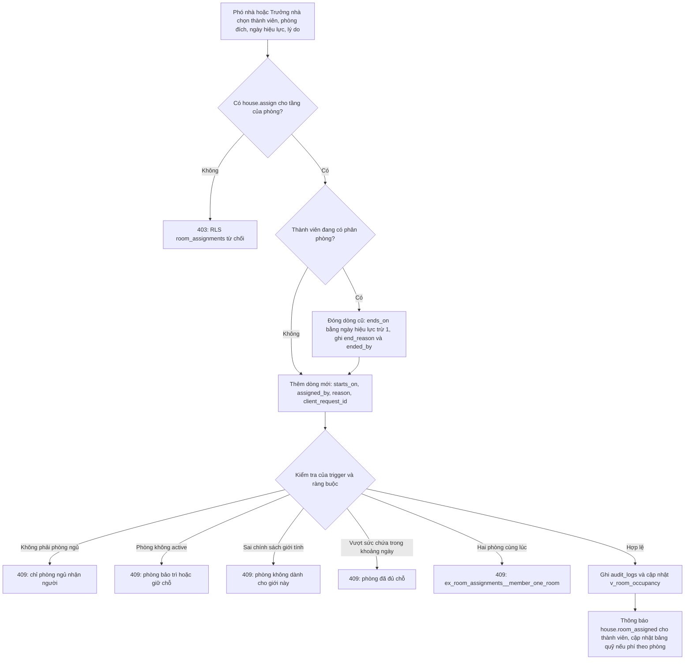

Sức chứa theo ngày hoạt động thế nào (chính xác điều trigger đã ép): với phân phòng mới, trigger lấy các mốc ngày gồm ngày bắt đầu của nó và ngày bắt đầu của mọi phân phòng khác trong cùng phòng rơi vào khoảng của nó, rồi đếm tại từng mốc số người đang ở; lấy số lớn nhất, cộng một người mới, và so với `capacity`. Quy tắc áp dụng cả lúc sửa phòng, thành viên, ngày bắt đầu hoặc kết thúc của một phân phòng.

| Ví dụ phòng 2 chỗ | Thao tác | Kết quả | Lý do |
|---|---|---|---|
| A ở từ 01/09, B ở từ 01/09 | Xếp C từ 15/09 | Từ chối | Tại 15/09 đã có 2 người |
| A ở từ 01/09 đến 31/12, B ở từ 01/10 | Xếp C từ 01/01 | Chấp nhận | Tại 01/01 chỉ còn B |
| A ở từ 01/09 đến 31/12, B ở từ 01/10 | Xếp C từ 01/12 | Từ chối | Tại 01/12 có A và B |
| A đang ở phòng 1 | Mở dòng phòng 2 cùng ngày chưa đóng dòng cũ | Từ chối | Một người một phòng tại một thời điểm |
| Phòng đặt `gender_policy = female` | Xếp thành viên nam | Từ chối | Chỉ khi thành viên có giới tính được khai |

Mã lỗi gợi ý cho API `[ĐỀ XUẤT]`: 409 `ROOM_FULL`, 409 `ROOM_NOT_ASSIGNABLE` (loại hoặc trạng thái), 409 `GENDER_MISMATCH`, 409 `MEMBER_ALREADY_ASSIGNED`, 409 `DUPLICATE_ROOM_CODE`, 409 `ROOM_HAS_ACTIVE_ASSIGNMENTS` (khi xóa phòng), 403 ngoài phạm vi tầng.

##### 1.3.4.2 Chu kỳ năm học — xếp phòng đầu năm `[ĐỀ XUẤT]`

Đây là phần xếp phòng của chủ đề "Chu kỳ năm học" (phần con người, đồng ý và nhiệm kỳ ở mục 1.2.4.6 và 1.2.4.7). Trình hướng dẫn xếp phòng (`BL-HOUSE-02`) thay việc kéo thả từng người của FE:

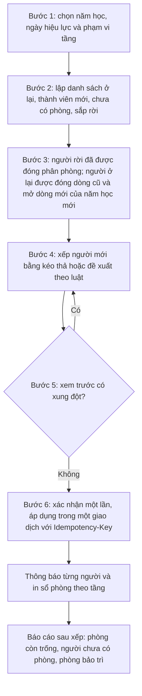

| Bước | Nội dung | Ghi chú thiết kế |
|---|---|---|
| Danh sách đầu vào | Thành viên `active` (và `on_leave` nếu giữ phòng) cùng đơn đã duyệt chưa có phòng | Lấy từ `members`, `v_member_current_room`, `member_applications` |
| Giữ phòng cho người ở lại | Mặc định tiếp tục ở phòng cũ: đóng dòng cũ ngày D-1, mở dòng mới ngày D mang `academic_year_id` của năm mới | Để lịch sử "ai ở phòng nào năm học X" rõ ràng; có thể tắt bằng lựa chọn Giữ nguyên dòng đang mở |
| Đề xuất theo luật (tùy chọn) | Cùng giới, cùng tầng với nhóm học, trộn khóa, giữ bạn cùng phòng cũ, nguyện vọng; không dùng LLM | `BL-HOUSE-07` (`COULD`); đầu ra chỉ là gợi ý |
| Xem trước xung đột | Kiểm sức chứa theo ngày, giới tính, phòng bảo trì, người chưa có phòng | Gọi cùng logic với trigger để không lệch quy tắc |
| Áp dụng | Một giao dịch; đóng toàn bộ dòng cũ trước rồi mới mở dòng mới (tránh vượt sức chứa tạm thời); thất bại một dòng thì cả lô không áp dụng; gửi lại cùng `client_request_id` không tạo trùng | `ux_room_assignments__client_req`, `idempotency_keys` (`BR-HOUSE-14`) |
| Thông báo | `house.room_assigned` (loại mới) cho từng người; báo Trưởng nhà số liệu tổng | `BL-PLAT-19` |

Điều kiện để trình hướng dẫn chạy được: phải vá lỗi trigger không cho đóng phân phòng ở phòng bảo trì (`BL-HOUSE-13`), nếu không việc đóng dòng cũ của các phòng đang sửa sẽ lỗi.

##### 1.3.4.3 Vòng đời phòng và bảo trì `[ĐỀ XUẤT]`

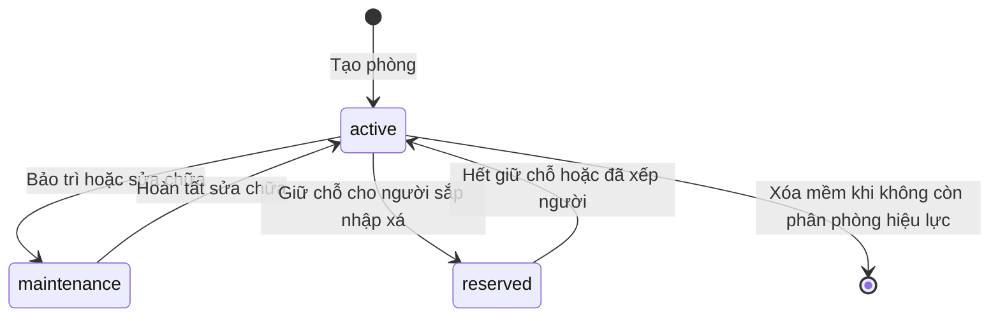

| Tình huống | Quy trình |
|---|---|
| Đặt phòng sang bảo trì khi đang có người ở | Phó nhà (có `house.structure.manage`) đặt trạng thái; hệ thống liệt kê người ở, đề xuất phòng thay thế cùng giới còn chỗ, di dời tạm (đóng dòng, mở dòng ở phòng thay thế có ghi chú tạm); gắn phiếu sự cố; thông báo `house.room_changed` cho người bị ảnh hưởng (`BR-HOUSE-15`, `BL-HOUSE-03`) |
| Phòng bảo trì hoặc giữ chỗ | Không nhận người mới (`BR-HOUSE-04`); loại khỏi chỉ số chỗ trống; cảnh báo nếu quá 30 ngày (`BR-HOUSE-20`) |
| Hoàn tất sửa chữa | Đặt lại `active`; hỏi có đưa người ở tạm về phòng cũ không |
| Xóa phòng | Chỉ xóa mềm (`deleted_at`) khi không còn phân phòng hiệu lực; giữ lịch sử nhờ khóa ngoại RESTRICT; mã phòng được giải phóng nhờ chỉ mục duy nhất một phần (`BR-HOUSE-09`, `BR-HOUSE-10`) |
| Đổi sức chứa, loại, chính sách giới tính | Chặn nếu mâu thuẫn người đang ở; phải chuyển người trước (`BR-HOUSE-11`) |

##### 1.3.4.4 Cái gì đã được DB ép và cái gì còn ở tầng service `[HIỆN CÓ]`

| Quy tắc | DB ép? | Cơ chế | Kiểm thử | Khoảng trống cần vá |
|---|---|---|---|---|
| Sức chứa theo ngày | Có | trigger `trg_room_assignments__rules` | S5 | Không khóa hàng phòng (đua giao dịch); sửa `capacity` không bị chặn |
| Chỉ phòng ngủ | Có | trigger và `ck_rooms__bed_only` | S5 | Không |
| Phòng phải `active` | Có | trigger | S5 | Chặn luôn cả việc kết thúc phân phòng (lỗi) |
| Chính sách giới tính | Có (khi cả phòng và thành viên đều có giá trị) | trigger | S5 | Đổi chính sách sau khi có người không rà soát lại |
| Một người một phòng | Có | `ex_room_assignments__member_one_room` | S5 | Không |
| Một giường một người | Có (khi có `bed_label`) | `ex_room_assignments__bed_one_person` | Chưa | Không kiểm số giường không vượt sức chứa |
| Người xếp phòng có quyền theo tầng | Có | `can_assign_room` và policy | S5 (vai trò toàn nhà) | Chưa kiểm thử vai trò theo tầng |
| Lịch sử không xóa | Có | không có policy DELETE, khóa ngoại RESTRICT | S5 | Không |
| Thành viên phải đang ở, ngày bắt đầu không trước ngày nhập xá | Không | | | Xếp được cho thành viên `left` (E29, E30) |
| Mã phòng duy nhất, đúng khuôn | Có | `ux_rooms__code`, `ck_rooms__code` | Chưa có ca riêng | Bổ sung ca kiểm thử trùng mã sau khi xóa mềm |

##### 1.3.4.5 Sơ đồ, tiện ích và hướng sản phẩm `[ĐỀ XUẤT]`

FE đứng giữa hai hướng chưa chọn (ghi nhận ở `FE-SDN-06`): **Sơ đồ cố định** (kiến trúc nhà gần như không đổi) hay **trình soạn thảo kéo thả đầy đủ**. Đề xuất chọn hướng cố định (`GD-HOUSE-05`, `Q-HOUSE-06`): sơ đồ chỉ đọc cho thành viên, tọa độ `layout_x`, `layout_y`, `layout_w`, `layout_h` nạp từ seed và chỉ sửa bằng biểu mẫu có kiểm tra không chồng lấn và không vượt khung (`ck_rooms__layout`, `ck_floors__canvas` 200-5000 điểm ảnh); xóa mã chết. Loại phòng dùng đúng 9 giá trị của `room_type_t` (`bedroom`, `common`, `chapel`, `kitchen`, `storage`, `laundry`, `stairs`, `corridor`, `other`) với một bộ nhãn tiếng Việt duy nhất, thay ba bộ nhãn lệch nhau của FE và danh sách chọn thiếu cầu thang, hành lang (`FE-SDN-17`). Tiện ích chuyển sang danh mục `amenities` (34 mục seed) và `room_amenities` có số lượng 1-100, thay ba nguồn chuỗi tự do (`BR-HOUSE-17`). Trên điện thoại ưu tiên chế độ thẻ và chuyển phòng bằng bottom-sheet thay vì kéo thả (`FE-SDN-22`).

##### 1.3.4.6 Tài sản trong phòng và bàn giao phòng `[ĐỀ XUẤT]`

Sổ tài sản (`assets`) đã gắn phòng bằng `room_id` (và `location_text` cho vị trí không phải phòng); chỉ người có `asset.manage` (Trưởng nhà, Phó nhà) ghi, mọi người đọc. Khi **nhận phòng** và **trả phòng**, Phó nhà lập biên bản bàn giao: danh sách tài sản của phòng với tình trạng thực tế, chìa khóa, ảnh nếu hư hỏng; hư hỏng sinh phiếu sự cố (`maintenance_issues.location_room_id`) và quy trách nhiệm theo người ở tại thời điểm đó nhờ lịch sử phân phòng (`BR-HOUSE-18`, `BL-HOUSE-05`). Cuối và đầu năm học, kiểm kê tài sản theo phòng (`BL-HOUSE-15`).

##### 1.3.4.7 Công suất, quá tải và cảnh báo `[ĐỀ XUẤT]`

Chỉ số công suất tính từ DB, không tính ở client: tổng chỗ chỉ cộng phòng ngủ `active`; chỗ trống tính theo từng phòng bằng `GREATEST(capacity - đang ở, 0)`; thành viên `active` chưa có phòng và phòng bảo trì quá 30 ngày hiện thành cảnh báo riêng (`BR-HOUSE-12`, `BR-HOUSE-20`). Vì trigger không cho vượt sức chứa nên "quá tải" chỉ xảy ra khi có người sửa dữ liệu ngoài API, đua giao dịch hoặc giảm `capacity` sau khi đã xếp; do đó có kiểm tra đối soát mỗi đêm (KPI "Số phòng vi phạm sức chứa hoặc chính sách giới tính").

##### 1.3.4.8 Sự kiện phát sinh từ phân hệ: thông báo và nhật ký `[ĐỀ XUẤT]`

| Sự kiện | Thông báo gửi | Nhật ký ghi |
|---|---|---|
| Xếp hoặc chuyển phòng | Thành viên và bạn cùng phòng (`house.room_assigned`, `house.room_changed`; loại mới) | Tự động qua `trg_room_assignments__audit` |
| Đổi trạng thái phòng sang bảo trì | Người đang ở và Phó nhà (`house.room_changed`) | Tự động qua `trg_rooms__audit` |
| Thành viên rời lưu xá | Phó nhà biết phòng trống (`BR-MEM-07` đóng phân phòng) | `trg_members__audit`, `trg_room_assignments__audit` |
| Còn chỗ cho người trong danh sách chờ | Người đang chờ (`house.vacancy_available`, loại mới) | không |
| Sửa cấu trúc tầng, phòng, tiện ích | Không | `trg_floors__audit`, `trg_rooms__audit` |

##### 1.3.4.9 Ai được làm gì trong phân hệ `[ĐỀ XUẤT]`

| Thao tác | Quyền | Trưởng nhà | Phó nhà toàn nhà | Phó nhà theo tầng | Thủ quỹ, các Ban | Thành viên | Admin |
|---|---|---|---|---|---|---|---|
| Xem sơ đồ, tình trạng phòng, ai ở phòng nào hiện tại | `house.read` | Có | Có | Có | Có | Có | Có |
| Tạo, sửa, xóa mềm tầng, phòng, tiện ích, tọa độ | `house.structure.manage` | Có | Có | Không (chính sách ghi `rooms` đòi quyền toàn nhà) | Không | Không | Không |
| Xếp, chuyển, kết thúc phân phòng | `house.assign` | Có | Có | Chỉ phòng thuộc tầng được gán | Không | Không | Không |
| Xem lý do và lịch sử phân phòng của người khác | `house.assign` hoặc chính chủ (đề xuất `BR-HOUSE-19`) | Có | Có | Có | Không | Chỉ của mình | Không |
| Ghi tài sản gắn phòng, lịch bảo trì | `asset.manage` | Có | Có | Không | Không | Không | Không |
| Đổi trạng thái cư trú (kết thúc phân phòng tự động) | `member.status.change` | Có | Không | Không | Không | Không | Không |
| Đặt phòng sang bảo trì hoặc giữ chỗ | `house.structure.manage` | Có | Có | Không | Không | Không | Không |

Thành viên thường chỉ xem; nút kéo thả, hủy xếp phòng, sửa và xóa phòng của FE hiện tại phải biến mất với họ và, quan trọng hơn, API từ chối các thao tác đó (RLS chặn ghi `room_assignments` và `rooms`; kiểm thử S5 xác nhận thành viên thường bị từ chối xếp phòng). Admin kỹ thuật không xếp phòng được: bảng FE ghi Admin "Toàn quyền" sơ đồ nhà là sai so với ma trận quyền.

#### 1.3.5 Quy tắc nghiệp vụ

| ID | Quy tắc | Nhãn | MoSCoW | Cơ chế thực thi (DB / service) | Kiểm thử |
|---|---|---|---|---|---|
| **BR-HOUSE-01** | Số người ở chồng thời gian trong một phòng không vượt sức chứa (rooms.capacity) tại bất kỳ ngày nào của khoảng phân phòng; kiểm khi thêm hoặc sửa phòng, thành viên, ngày bắt đầu hay kết thúc của một phân phòng. | HIỆN CÓ | MUST | trigger `trg_room_assignments__rules`<br>hàm `tg_room_assignment_rules`<br>ràng buộc `ck_rooms__capacity`<br>service: Hàm đếm bằng quét ngày bắt đầu nhưng không khóa hàng phòng nên hai giao dịch đồng thời có thể cùng qua kiểm tra khi chỉ còn một chỗ (BL-HOUSE-13); FE hiện chỉ ẩn nút Thêm người khi đầy (FE-SDN-01) | S5 |
| **BR-HOUSE-02** | Chỉ phòng ngủ (room_type = bedroom) nhận người ở; sức chứa lớn hơn 0 chỉ hợp lệ với phòng ngủ (nhà nguyện, bếp, kho, giặt, cầu thang, hành lang có sức chứa 0). | HIỆN CÓ | MUST | trigger `trg_room_assignments__rules`<br>hàm `tg_room_assignment_rules`<br>ràng buộc `ck_rooms__bed_only` | S5 |
| **BR-HOUSE-03** | Một thành viên tại mỗi thời điểm chỉ ở một phòng; khoảng ngày [starts_on, ends_on] là khoảng đóng nên chuyển phòng phải đóng dòng cũ ở ngày D-1 và mở dòng mới ở ngày D (trùng đúng một ngày cũng bị từ chối). | HIỆN CÓ | MUST | ràng buộc `ex_room_assignments__member_one_room`<br>ràng buộc `ck_room_assignments__range`<br>index `ix_room_assignments__member_now` | S5 |
| **BR-HOUSE-04** | Chỉ phòng ở trạng thái active mới nhận người mới; phòng bảo trì (maintenance) hoặc giữ chỗ (reserved) và phòng đã xóa mềm từ chối phân phòng. | ĐỀ XUẤT | MUST | trigger `trg_room_assignments__rules`<br>hàm `tg_room_assignment_rules`<br>enum `room_status_t`<br>service: Cùng hàm kiểm tra cũng chạy khi kết thúc một phân phòng nên chặn luôn việc đóng phân phòng ở phòng bảo trì và việc chuyển thành viên sang left (thí nghiệm sandbox); cần sửa (BL-HOUSE-13) | S5 |
| **BR-HOUSE-05** | Phòng có chính sách giới tính (gender_policy) chỉ nhận thành viên cùng giới; phòng không đặt chính sách (NULL) hoặc thành viên chưa khai giới tính thì không bị chặn. | ĐỀ XUẤT | SHOULD | trigger `trg_room_assignments__rules`<br>hàm `tg_room_assignment_rules`<br>enum `gender_t` | S5 |
| **BR-HOUSE-06** | Nhãn giường có dạng G1-G99 và một giường tại một thời điểm chỉ một người; giường không bắt buộc (lưu xá hai chỗ mỗi phòng có thể bỏ trống nhãn). | ĐỀ XUẤT | COULD | ràng buộc `ex_room_assignments__bed_one_person`<br>ràng buộc `ck_room_assignments__bed`<br>service: DB không kiểm nhãn giường không vượt sức chứa (thí nghiệm sandbox nhận G9 trong phòng 2 chỗ); API chỉ cho nhãn từ G1 đến G(capacity) | service |
| **BR-HOUSE-07** | Chỉ người có house.assign xếp, chuyển hoặc kết thúc phân phòng; Phó nhà được giới hạn theo tầng chỉ xếp phòng thuộc tầng mình phụ trách; thành viên thường không ghi được phân phòng. | ĐỀ XUẤT | MUST | hàm `can_assign_room`<br>RLS `room_assignments__insert`<br>RLS `room_assignments__update` | S5 |
| **BR-HOUSE-08** | Lịch sử phân phòng không bị xóa: API không có thao tác xóa phân phòng; hủy hoặc chuyển phòng = đặt ends_on kèm end_reason và người thực hiện (ended_by); mỗi phân phòng mới ghi lý do, ngày hiệu lực và người xếp. | ĐỀ XUẤT | MUST | ràng buộc `ck_room_assignments__ended_by`<br>ràng buộc `room_assignments_room_id_fkey`<br>ràng buộc `room_assignments_member_id_fkey`<br>trigger `trg_room_assignments__audit` | S5 |
| **BR-HOUSE-09** | Mã phòng có dạng P.1 hoặc P.SANH1 (P. cộng 1–10 ký tự chữ in hoa, số hoặc gạch dưới) và duy nhất giữa các phòng chưa xóa; mã tầng và cấp tầng cũng duy nhất; mã phòng do máy chủ kiểm, không tự sinh ở client. | ĐỀ XUẤT | MUST | ràng buộc `ck_rooms__code`<br>index `ux_rooms__code`<br>ràng buộc `ck_floors__code`<br>index `ux_floors__code`<br>index `ux_floors__level` | service |
| **BR-HOUSE-10** | Tầng và phòng chỉ tạo, sửa, xóa bởi người có house.structure.manage; không xóa cứng tầng còn phòng hay phòng còn lịch sử phân phòng (khóa ngoại RESTRICT); xóa mềm phòng chỉ khi không còn phân phòng đang hiệu lực. | ĐỀ XUẤT | MUST | RLS `rooms__write`<br>RLS `floors__write`<br>ràng buộc `rooms_floor_id_fkey`<br>trigger `trg_rooms__audit`<br>service: API chặn xóa mềm khi còn phân phòng hiệu lực và trả 409 ROOM_HAS_ACTIVE_ASSIGNMENTS; DB chưa chặn xóa mềm | service |
| **BR-HOUSE-11** | Sửa phòng không làm sai phân phòng đang hiệu lực: không giảm sức chứa dưới số người đang ở, không đổi loại phòng ngủ sang loại khác hoặc đổi chính sách giới tính mâu thuẫn khi còn người ở; muốn đổi phải chuyển người trước. | ĐỀ XUẤT | MUST | ràng buộc `ck_rooms__capacity`<br>service: DB chưa ép (thí nghiệm sandbox: giảm capacity 2 xuống 1 khi đang 2 người ở thành công rồi chặn mọi cập nhật phân phòng của phòng đó); thêm trigger BEFORE UPDATE trên rooms (BL-HOUSE-13) | service |
| **BR-HOUSE-12** | Chỉ số công suất tính theo từng phòng ngủ đang active: chỗ trống = tổng GREATEST(sức chứa trừ số người ở, 0), tỷ lệ lấp đầy = số người ở chia sức chứa; thành viên đang ở nhưng chưa có phòng và phòng bảo trì được báo riêng, không trừ gộp. | ĐỀ XUẤT | MUST | view `v_room_occupancy`<br>view `v_member_current_room`<br>service: v_room_occupancy.available chưa loại phòng không active nên API lọc status = active và room_type = bedroom khi cộng KPI | S5 |
| **BR-HOUSE-13** | Chỉ thành viên đang ở (status active, có thể on_leave) được xếp phòng; ngày bắt đầu không trước ngày gia nhập; thành viên chuyển sang alumni hoặc left tự mất phòng (xem BR-MEM-07). | ĐỀ XUẤT | SHOULD | trigger `trg_members__leave_effects`<br>service: tg_room_assignment_rules chưa kiểm trạng thái thành viên và joined_on (thí nghiệm sandbox: xếp phòng cho thành viên đã left và trước ngày gia nhập thành công); API kiểm trước | service |
| **BR-HOUSE-14** | Xếp phòng đầu năm học làm hàng loạt trong một giao dịch có kiểm tra toàn bộ ràng buộc và Idempotency-Key; gửi lại cùng client_request_id không tạo bản ghi thứ hai; thất bại một dòng thì cả lô không áp dụng. | ĐỀ XUẤT | SHOULD | index `ux_room_assignments__client_req`<br>bảng `idempotency_keys`<br>service: API POST /room-assignments/batch xử lý trong một transaction, trả danh sách xung đột trước khi xác nhận | service |
| **BR-HOUSE-15** | Chuyển phòng sang bảo trì hoặc giữ chỗ cần house.structure.manage; nếu còn người ở, hệ thống liệt kê người bị ảnh hưởng, đề xuất phòng thay thế cùng giới và thông báo cho họ; phòng bảo trì liên kết với sự cố đang mở và bị loại khỏi chỉ số chỗ trống. | ĐỀ XUẤT | SHOULD | RLS `rooms__write`<br>enum `room_status_t`<br>service: API PATCH /rooms/{id}/status trả danh sách người ở; thông báo loại house.room_changed cần bổ sung vào notification_types (BL-PLAT-19) | service |
| **BR-HOUSE-16** | Tọa độ phòng gồm đủ bốn giá trị (x, y, rộng, cao) hoặc để trống cả bốn; khung sơ đồ mỗi tầng 200-5000 điểm ảnh; phòng cùng tầng không chồng lấn và không vượt khung; sơ đồ là kiến trúc cố định, chỉ người có house.structure.manage sửa tọa độ. | ĐỀ XUẤT | SHOULD | ràng buộc `ck_rooms__layout`<br>ràng buộc `ck_floors__canvas`<br>service: Kiểm tra chồng lấn và vượt khung ở API lưu layout (PUT /floors/{id}/layout) bằng khóa lạc quan version | service |
| **BR-HOUSE-17** | Tiện ích phòng lấy từ danh mục amenities (mã duy nhất) và gắn qua room_amenities với số lượng 1-100; không còn chuỗi tiện ích tự do. | ĐỀ XUẤT | SHOULD | ràng buộc `ux_amenities__code`<br>ràng buộc `ck_room_amenities__quantity`<br>RLS `amenities__write__house_manage` | service |
| **BR-HOUSE-18** | Thiết bị và đồ đạc có giá trị thuộc sổ tài sản (assets) và gắn phòng bằng room_id; chỉ người có asset.manage ghi; bàn giao phòng khi nhận hoặc trả phòng đối chiếu danh sách tài sản của phòng với tình trạng thực tế. | ĐỀ XUẤT | SHOULD | bảng `assets`<br>RLS `assets__write`<br>trigger `trg_assets__audit`<br>service: Biên bản bàn giao phòng chưa có bảng riêng; dùng bản ghi sự cố và ghi chú phân phòng cho đến khi triển khai BL-HOUSE-05 | service |
| **BR-HOUSE-19** | Mọi thành viên xem được sơ đồ, tình trạng phòng và ai ở phòng nào hiện tại; lý do chuyển phòng, ghi chú và lịch sử trước đây chỉ chính chủ và người có house.assign xem; SĐT người ở hiển thị theo hide_phone. | ĐỀ XUẤT | SHOULD | RLS `room_assignments__select`<br>view `v_member_current_room`<br>service: room_assignments__select hiện cho mọi người có house.read đọc cả reason/end_reason (thí nghiệm sandbox); API dựng DTO hoặc đổi chính sách (BL-HOUSE-14) | service |
| **BR-HOUSE-20** | Mỗi thành viên đang ở nên có phòng trong 7 ngày kể từ ngày gia nhập; thành viên chưa có phòng, phòng vượt sức chứa (về lý thuyết bằng 0 nhờ BR-HOUSE-01) và phòng bảo trì trên 30 ngày hiện trong báo cáo cảnh báo của Phó nhà. | ĐỀ XUẤT | COULD | view `v_member_current_room`<br>view `v_room_occupancy`<br>quy trình: Báo cáo hằng tuần gửi Trưởng nhà và Phó nhà; ngưỡng 7 và 30 ngày [GIẢ ĐỊNH] đưa vào cấu hình khi xác nhận | process |

Các quy tắc chia thành sáu nhóm: ràng buộc phân phòng theo thời gian (`BR-HOUSE-01` sức chứa, `02` loại phòng, `03` một người một phòng, `04` trạng thái phòng, `05` giới tính, `06` giường, `13` thành viên đang ở); quyền và lịch sử (`07`, `08`, `19`); cấu trúc nhà (`09`, `10`, `11`, `17`, `18`); công suất và cảnh báo (`12`, `20`); quy trình năm học và bảo trì (`14`, `15`); sơ đồ (`16`). Bốn mã `BR-HOUSE-01` đến `BR-HOUSE-04` nằm sẵn trong DDL và được smoke test S5 kiểm; riêng `BR-HOUSE-01` và `BR-HOUSE-04` còn ghi chú khoảng trống cần vá (không khóa hàng phòng; trigger chặn nhầm việc đóng phân phòng ở phòng bảo trì).

#### 1.3.6 Tính năng mới đề xuất

| ID | Tên & mô tả | Nhãn | MoSCoW | Công sức | Giá trị | Giai đoạn |
|---|---|---|---|---|---|---|
| **BL-HOUSE-01** | **Phân phòng, chuyển phòng và hủy phân phòng có lịch sử** — API và giao diện xếp, chuyển, kết thúc phân phòng với ngày hiệu lực, lý do và người thực hiện; mọi quy tắc sức chứa, loại phòng, trạng thái, giới tính do DB ép; sơ đồ hiển thị lỗi nghiệp vụ rõ ràng thay cho thông báo thành công giả. | ĐỀ XUẤT | MUST | M | Cao | 2 |
| **BL-HOUSE-04** | **Chỉ số công suất và cảnh báo phòng ở** — Thẻ KPI lấy từ DB: số phòng ngủ đang hoạt động, tổng chỗ, đang ở, còn trống đúng từng phòng, tỷ lệ lấp đầy, thành viên chưa có phòng, phòng bảo trì quá hạn; thay công thức trừ gộp ở client. | ĐỀ XUẤT | MUST | S | Cao | 2 |
| **BL-HOUSE-02** | **Trình hướng dẫn xếp phòng đầu năm học** — Bước 1 chọn năm học và ngày hiệu lực; bước 2 liệt kê thành viên cũ ở lại, thành viên mới và người chưa có phòng; bước 3 xếp bằng kéo thả hoặc đề xuất theo luật; bước 4 xem xung đột; bước 5 áp dụng một giao dịch và thông báo từng người. | ĐỀ XUẤT | SHOULD | M | Cao | 4 |
| **BL-HOUSE-03** | **Đóng phòng bảo trì: danh sách người ở, di dời tạm và liên kết sự cố** — Khi đặt phòng sang bảo trì hoặc giữ chỗ, hiển thị người đang ở, đề xuất phòng thay thế phù hợp giới tính, di dời tạm có ngày quay lại, gắn với phiếu sự cố đang mở và loại phòng khỏi chỉ số chỗ trống đến khi hoạt động lại. | ĐỀ XUẤT | SHOULD | S | Vừa | 4 |
| **BL-HOUSE-05** | **Biên bản bàn giao phòng khi nhận và trả phòng** — Danh mục kiểm tài sản và tình trạng phòng (giường, tủ, bàn, điều hòa, chìa khóa) có ảnh, người nhận và người giao ký xác nhận, tự tạo phiếu sự cố cho hư hỏng, lưu theo phân phòng để quy trách nhiệm. | ĐỀ XUẤT | SHOULD | M | Vừa | 4 |
| **BL-HOUSE-08** | **In và xuất sơ đồ, sổ phòng theo tầng** — Xuất PDF sơ đồ từng tầng kèm danh sách người ở và tiện ích, xuất Excel sổ phòng theo năm học để lưu hồ sơ hoặc báo cáo giáo xứ; ghi nhật ký xuất. | ĐỀ XUẤT | SHOULD | S | Vừa | 5 |
| **BL-HOUSE-09** | **Chốt sơ đồ kiến trúc cố định và sửa tọa độ bằng biểu mẫu có kiểm tra** — Theo hướng Sơ đồ cố định: bỏ mã kéo thả đã chết, sơ đồ chỉ đọc cho thành viên, Phó nhà sửa tọa độ và kích thước bằng biểu mẫu có kiểm tra chồng lấn và vượt khung, lưu bằng khóa lạc quan. | ĐỀ XUẤT | SHOULD | M | Vừa | 5 |
| **BL-HOUSE-06** | **Danh sách chờ và giữ chỗ cho thành viên mới** — Khi hết chỗ, đơn đã duyệt vào danh sách chờ theo thứ tự; Phó nhà giữ chỗ (phòng reserved hoặc phân phòng tương lai) cho người sắp nhập xá và được nhắc khi có chỗ trống. | ĐỀ XUẤT | COULD | S | Vừa | 5 |
| **BL-HOUSE-07** | **Gợi ý ghép phòng theo luật** — Đề xuất xếp phòng bằng luật và điểm số đơn giản: cùng giới, cùng khóa hoặc trường, giờ giấc, nguyện vọng, giữ nguyên bạn cùng phòng cũ; kết quả chỉ là gợi ý để Phó nhà chỉnh và duyệt. | ĐỀ XUẤT | COULD | M | Vừa | 6 |
| **BL-HOUSE-15** | **Kiểm kê tài sản theo phòng đầu và cuối năm học** — Lịch kiểm kê tài sản gắn phòng (tình trạng, thiếu, hỏng), đối chiếu với sổ tài sản, sinh phiếu sự cố hoặc đề xuất chi bổ sung, báo cáo tổng hợp theo tầng. | ĐỀ XUẤT | COULD | M | Vừa | 4 |
| **BL-HOUSE-10** | **Quản lý giường cụ thể trong phòng** — Gán từng người vào giường G1, G2 và hiển thị trên sơ đồ. | ĐỀ XUẤT | WON'T-NOW | M | Thấp | — |
| **BL-HOUSE-11** | **Đa tòa nhà hoặc đa cơ sở** — Thêm thực thể tòa nhà phía trên tầng và phân quyền theo cơ sở. | ĐỀ XUẤT | WON'T-NOW | L | Thấp | — |
| **BL-HOUSE-12** | **Trình soạn thảo sơ đồ kéo thả đầy đủ** — Kéo phòng, đổi cỡ, bảng mẫu hình phòng, lưới hút bám trên canvas. | ĐỀ XUẤT | WON'T-NOW | XL | Thấp | — |

Ba mục `WON'T-NOW` bị loại có chủ đích: giường cụ thể (mỗi phòng chỉ hai chỗ), đa tòa nhà (chưa có nhu cầu), trình soạn thảo sơ đồ kéo thả đầy đủ (kiến trúc ít đổi, mã hiện đã chết, hỗ trợ cảm ứng kém). Hai hạng mục `BL-HOUSE-13` và `BL-HOUSE-14` (vá trigger, view và chính sách; khu vực BE) xuất hiện trong Master Backlog ở giai đoạn 1 và là điều kiện để trình hướng dẫn xếp phòng đầu năm chạy đúng.

#### 1.3.7 Chỉ số theo dõi (KPI)

| Chỉ số (KPI) | Công thức | Nguồn dữ liệu | Mục tiêu | Tần suất |
|---|---|---|---|---|
| Tỷ lệ lấp đầy phòng ngủ | tổng số người đang ở / tổng sức chứa của các phòng ngủ đang active | view v_room_occupancy (lọc room_type = bedroom và status = active) | từ 85% trở lên đầu năm học và không vượt 100% ở bất kỳ phòng nào | hằng tuần |
| Thành viên đang ở chưa có phòng sau 7 ngày | số thành viên active có joined_on cách hôm nay trên 7 ngày mà không có dòng trong v_member_current_room | bảng members; view v_member_current_room | 0 | hằng tuần |
| Số phòng vi phạm sức chứa hoặc chính sách giới tính | số phòng có số người đang ở lớn hơn capacity, hoặc có người khác giới với gender_policy | bảng room_assignments, rooms, members; hàm tg_room_assignment_rules | 0; kiểm tra đối soát mỗi đêm để bắt trường hợp đua giao dịch hay sửa dữ liệu ngoài API | hằng ngày |
| Thời gian từ duyệt đơn đến xếp phòng (trung vị) | trung vị của (created_at của phân phòng đầu tiên trừ reviewed_at của đơn đã duyệt) | bảng member_applications, room_assignments | không quá 3 ngày | mỗi đợt tuyển |
| Phòng ở trạng thái bảo trì hoặc giữ chỗ quá 30 ngày | số phòng có status khác active liên tục trên 30 ngày (lấy mốc từ nhật ký thay đổi trạng thái) | bảng rooms, audit_logs (entity_table = rooms, changed_fields chứa status) | 0; mỗi phòng có phiếu sự cố hoặc lý do giữ chỗ còn hiệu lực | hằng tháng |
| Số lần chuyển phòng giữa năm học trên 100 thành viên | số phân phòng có starts_on sau ngày bắt đầu năm học và end_reason của dòng trước khác member_left / số thành viên active * 100 | bảng room_assignments, academic_years | không quá 10 lần mỗi 100 thành viên mỗi năm học | mỗi học kỳ |

Chỉ số lấp đầy và thành viên chưa có phòng đo hiệu quả vận hành; chỉ số vi phạm sức chứa là kiểm tra sức khỏe dữ liệu (kỳ vọng luôn bằng 0); chỉ số thời gian xếp phòng đo trải nghiệm thành viên mới; chỉ số chuyển phòng giữa năm đo mức ổn định của chính sách phân phòng đầu năm.


### 1.4 Phân hệ 4 — Hậu cần, Trực nhật & Vệ sinh

Phân hệ này giữ cho ngôi nhà sạch và ngăn nắp mỗi ngày mà không dồn việc lên một vài người: ai trực khu vực nào vào ca nào, làm xong có bằng chứng gì, ai kiểm tra, sai thì khiếu nại ra sao, đổi ca thế nào và công sức được ghi nhận bằng điểm đóng góp. Mã module: `DUTY`; phân hệ mới đi kèm: `MER` (điểm đóng góp, DDL đã có). Phần báo hỏng, mượn đồ và đặt lịch giặt nằm cùng route `/hau-can` nhưng thuộc phân hệ 8 (mục 1.8) và phân hệ 10 (mục 1.10), không bàn lại ở đây. Đối tượng DB: 17 bảng (15 bảng trực nhật và 2 bảng điểm đóng góp), 12 mã BR đã nằm trong DDL (`BR-DUTY-01` đến `BR-DUTY-12`), 11 khóa cấu hình `duty.*`, hai view `v_duty_week_stats` và `v_duty_member_stats`, 10 quyền (`duty.*` và `merit.*`), 7 loại thông báo `duty.*` và bộ kiểm thử S6. Nhãn dùng trong mục: `[HIỆN CÓ]` là điều thấy trong code FE hoặc DDL đã chạy, `[ĐỀ XUẤT]` là điều tài liệu này thêm hoặc sửa, `[GIẢ ĐỊNH]` cần xác nhận (xem `GD-DUTY-01` đến `GD-DUTY-08` và `Q-DUTY-01` đến `Q-DUTY-06`). Mọi số dòng FE đã được kiểm lại trên cây làm việc sau commit `740ac5d`.

#### 1.4.1 Hiện trạng FE

Trực nhật là tab mặc định `truc-nhat` của route `/hau-can` (`src/app/hau-can/page.tsx`, nội dung từ dòng 419). Toàn bộ dữ liệu là mảng `cleaningDuties` trong `src/lib/store.tsx`, khởi tạo từ `INITIAL_CLEANING_DUTIES` (`src/lib/mockData.ts:1530`, 8 ca mẫu), mất khi tải lại trang; chưa có API.

| Thành phần | File / component | Hiện trạng | Nhãn |
|---|---|---|---|
| Mô hình ca trực | `src/lib/mockData.ts:1511-1528` (`CleaningDuty`) | Mỗi ca là một bản ghi phẳng: `dateStr` dạng chữ ("02/10/2026", ca mới tạo là "Tuần này"), `area` và `areaIcon` là chuỗi tự do, `assignedRoom` chuỗi, `assignedMembers: string[]` chứa tên (có phần tử giả "Tất cả thành viên"), `shift` là chuỗi "Ca Sáng (06:30)" với giờ nhúng trong nhãn, `status` chỉ bốn giá trị `pending / submitted / approved / rejected`; các trường check-in và nghiệm thu đều là chuỗi, giờ là "HH:mm" theo đồng hồ máy khách | `[HIỆN CÓ]` |
| Thống kê và bộ lọc | `page.tsx:171-183` | "Hôm nay" cài cứng là Thứ Sáu hoặc `02/10/2026` (dòng 171, 178); tiến độ tuần là số ca `approved` chia số mọi ca của mọi tuần (dòng 183); lọc theo ngày và trạng thái, không lọc theo khu vực hay "ca của tôi" | `[HIỆN CÓ]` |
| Check-in | `page.tsx:231-257`, `ImageUploadDropzone` ở `page.tsx:1049`, `store.tsx:534-553` | Khi mở modal, ảnh đầu của `SAMPLE_CLEANING_PHOTOS` (ảnh stock Unsplash; dòng 90, 129, 235) đã được chọn sẵn nên bấm gửi mà không chụp ảnh nào; checklist bốn ô chỉ được ghép thành chuỗi ghi chú; bất kỳ ai bấm được; store đặt `submitted`, giờ HH:mm của máy khách và dùng ảnh Unsplash dự phòng khi ảnh trống (`store.tsx:546`) | `[HIỆN CÓ]` |
| Nghiệm thu | `page.tsx:259-264`, nút ở `page.tsx:653`, `store.tsx:555-573` | Nhị phân Đạt hoặc Chưa đạt kèm nhận xét; người nghiệm thu là hằng chuỗi "Ban Quản Lý Lưu Xá" (dòng 262); nút hiện theo `canReviewDuties` (dòng 116: Trưởng nhà, Phó nhà, Admin); không điểm số, không khiếu nại; ca làm lại giữ nguyên nhận xét cũ | `[HIỆN CÓ]` |
| Đổi ca | `page.tsx:266-279`, `store.tsx:575-590`, modal giả `Modals.tsx:872` | Đổi thẳng: thay tên trong `assignedMembers` và ghi đè `checkInNote`; người nhận chọn trong mọi thành viên; modal `swapDuty` toàn cục là luồng giả lập thứ hai không nối vào store | `[HIỆN CÓ]` |
| Phân công ca mới | `page.tsx:281-307`, `store.tsx:592-598` | Biểu mẫu khu vực (chữ tự do), thứ, ca, phòng, tên người; `dateStr: "Tuần này"`; không sửa, xóa hay nhân bản; id sinh bằng `duty-${Date.now()}` | `[HIỆN CÓ]` |
| Copy Zalo | `page.tsx:205-229` | Văn bản gồm mọi ca của mọi tuần, in tên người trực và phòng; trạng thái `rejected` bị in thành "Chưa trực" (dòng 213) | `[HIỆN CÓ]` |
| Chức năng không có | toàn module | Roster tuần, xoay vòng, bỏ ca, hủy ca, chấm điểm, khiếu nại, điểm đóng góp, khai báo bận, cấu hình khu vực / ca / checklist, thông báo và mọi kiểm tra quyền thật | `[HIỆN CÓ]` (khoảng trống) |

**Ảnh hưởng của commit `740ac5d` lên module này** (13 file, không file nào thêm kiểm tra nghiệp vụ):

- Bộ lọc trạng thái và bốn modal chuyển sang `CustomSelect`, `CustomInput`, `CustomTextarea`; logic giữ nguyên.
- Danh sách "Người đại diện Check-in" đã lọc bỏ những người đã có tên trong ca: **đã sửa một phần ở FE** (FE-HC-03, hết hiện một người hai lần) nhưng vẫn cho chọn mọi thành viên và không kiểm thuộc ca, vẫn cần ràng buộc ở DB (`BR-DUTY-01`).
- Hằng `AREA_ICON_OPTIONS` có thêm 🧹 nên lỗi lệch biểu tượng mặc định đã hết: **đã sửa một phần ở FE** (FE-HC-19); khu vực vẫn là chuỗi tự do.
- Module không dùng `window.confirm` hay `ConfirmDialog` nên nghiệm thu, đổi ca, hủy vẫn không có bước xác nhận.
- Dữ liệu mẫu đổi theo cấu trúc nhà mới (Phòng 1 đến 5, Sảnh Nguyện T2, Nhà để xe và Sân trước) nên tên khu vực mẫu khác sáu khu vực chuẩn của nghiệp vụ; xem `GD-DUTY-02`.

**Sáu khu vực chuẩn so với DDL** `[HIỆN CÓ]` (bảng `cleaning_areas`, dữ liệu cấu hình, không phải hằng trong mã):

| # | Khu vực nghiệp vụ | Mã DDL | Độ khó (`difficulty_points`) | Người tối thiểu (`min_assignees`) |
|---|---|---|---|---|
| 1 | Bếp & bàn ăn | `KITCHEN` | 3 | 2 |
| 2 | Cầu thang & hành lang | `STAIRS` | 2 | 2 |
| 3 | Nhà tắm & WC | `BATHROOM` | 4 | 2 |
| 4 | Nguyện đường & phòng sinh hoạt | `CHAPEL` | 2 | 2 |
| 5 | Sân thượng & khu giặt phơi | `ROOF` | 2 | 2 |
| 6 | Cổng chính & sân trước | `GATE` | 1 | 1 |
| thêm | Tổng vệ sinh toàn nhà (FE có, nghiệp vụ không nêu) | `WHOLE_HOUSE` (`is_whole_house`) | 5 | 1 |

**Năm trạng thái nghiệp vụ so với DDL** `[HIỆN CÓ]` (enum `duty_status_t`, máy trạng thái bằng `trg_duty_assignments__state`):

| Nghiệp vụ | FE hiện tại | DDL | Ghi chú |
|---|---|---|---|
| Chờ thực hiện | `pending` | `scheduled` | Trạng thái đầu duy nhất |
| Đã check-in | `submitted` | `checked_in` | Sinh tự động khi ghi `duty_checkins` |
| Đạt yêu cầu | `approved` | `approved` | Cuối; sinh khi nghiệm thu đạt hoặc khiếu nại được chấp nhận |
| Cần làm lại | `rejected` | `rework_required` | Cho check-in lại, tăng `attempt_count` |
| Bỏ ca | (không có) | `missed` | Worker tự đánh dấu; chỉ chuyển tiếp sang `excused` |
| (thêm) | (không có) | `cancelled`, `excused` | Hủy ca và có phép; cả `missed`, `cancelled`, `excused` bắt buộc `status_reason` |

**Nền tảng thiết kế DB** `[ĐỀ XUẤT]` (đã chạy thật trên PostgreSQL 16, kiểm thử S6 xanh):

| Nhóm | Đối tượng DB | Ý nghĩa |
|---|---|---|
| Cấu hình | `cleaning_areas`, `duty_shifts`, `checklist_templates`, `checklist_template_items` | Khu vực, ca và mẫu tiêu chí cấu hình được; mỗi ca đóng băng mẫu checklist lúc tạo |
| Roster | `duty_rosters`, `duty_assignments`, `duty_assignment_members` | Tuần ISO bắt đầu Thứ Hai, mỗi ca là (khu vực, ngày, ca), người trực là bảng nối không trùng ca |
| Bằng chứng | `duty_checkins`, `checkin_items` | Nhiều lần check-in mỗi ca, ảnh bắt buộc và duy nhất, kết quả từng tiêu chí |
| Nghiệm thu | `duty_reviews`, `duty_review_appeals` | Nghiệm thu bất biến; mỗi nghiệm thu tối đa một khiếu nại |
| Đổi ca và lịch sử | `duty_swap_requests`, `duty_status_history`, `duty_swap_status_history` | Đổi ca ba bước; nhật ký chuyển trạng thái bất biến |
| Lịch bận | `member_unavailability` | Khoảng bận tự khai (thi, lớp, thực tập, gia đình) |
| Điểm đóng góp | `merit_rules`, `merit_entries` | Quy tắc điểm cấu hình và sổ điểm bất biến (phân hệ `MER`) |
| Thống kê | `v_duty_week_stats`, `v_duty_member_stats` | Tiến độ tuần và số liệu công bằng theo người |

#### 1.4.2 Đánh giá (Audit)

| Tiêu chí | Điểm | Nhận xét |
|---|---|---|
| Đầy đủ chức năng | 2/5 | Có thẻ ca, lọc ngày và trạng thái, check-in, nghiệm thu nhị phân, đổi ca và Copy Zalo nhưng không có roster tuần, xoay vòng, bỏ ca, chấm điểm, khiếu nại, điểm đóng góp, sửa hoặc xóa ca. |
| Tính đúng đắn nghiệp vụ | 1/5 | Ngày hôm nay và tuần cài cứng vào Thứ Sáu 02/10, tiến độ tuần cộng dồn mọi tuần, trạng thái thay đổi không qua máy trạng thái, người trực nhận diện bằng chuỗi tên và nhận xét cũ không bị xóa khi làm lại. |
| Khả năng chống gian lận / sai sót | 1/5 | Ai cũng check-in và nghiệm thu được, không chặn tự nghiệm thu, ảnh minh chứng mặc định là ảnh Unsplash hoặc URL tùy ý, đổi ca đổi thẳng và ghi đè ghi chú check-in. |
| Trải nghiệm di động | 2/5 | Modal check-in cuộn được nhưng modal nghiệm thu, đổi ca và phân công không có giới hạn chiều cao, vùng chạm theo ước tính 28–38 px, chữ 10–11 px và tên người trực bị cắt không có chú giải. |
| Khả năng mở rộng | 2/5 | Dữ liệu nằm trong bộ nhớ, id sinh ở client, ảnh lưu base64, danh sách ca không phân trang và không có chiều tuần nên không phát triển được sang nhiều tuần. |
| **Điểm trung bình** | **1.6/5** |  |

Thang điểm 1-5 (5 là tốt nhất) chấm cho **FE hiện trạng**. Điểm thấp nhất nằm ở tính đúng đắn và chống gian lận vì cùng một nguyên nhân: FE không biết người dùng hiện tại là ai, nên không thể kiểm "người check-in thuộc ca", "người nghiệm thu không thuộc ca", "ảnh này mới chụp" hay "ca này đã bắt đầu chưa"; mọi chuyển trạng thái chỉ là việc ẩn hiện nút. Phần xếp ca có thể dùng ngay là phần giao diện (thẻ ca, bộ lọc, mẫu check-in bốn tiêu chí), còn lại phải xây mới ở backend.

DDL đi kèm tài liệu này đã ép phần lõi (người check-in thuộc ca, khung giờ, ảnh hợp lệ và không tái sử dụng, không tự nghiệm thu, đổi ca ba bước, điểm bất biến) và qua kiểm thử S6. Khi rà soát nghiệp vụ, tài liệu này tái hiện thêm 13 chỗ DDL còn hở (bảng B ở mục 1.4.3). Năm chỗ nặng nhất — hạn làm lại neo vào giờ kết thúc ca, người xin đổi ca tự nhảy bước, người có `duty.manage` tự duyệt ca của mình bằng UPDATE trực tiếp, xung đột lợi ích khi quyết định khiếu nại hoặc duyệt đổi ca, và tự cộng điểm thủ công cho mình — đã được vá trong lô DDL cuối và kiểm bằng kịch bản S14; tám chỗ còn lại có hạng mục vá ở giai đoạn 1.

#### 1.4.3 Lỗ hổng & rủi ro nghiệp vụ

**A. Lỗ hổng của FE hiện trạng**

| # | Lỗ hổng / rủi ro | ID vấn đề FE | Mức |
|---|---|---|---|
| 1 | Phân quyền chỉ ẩn nút: check-in, nghiệm thu, phân công, đổi ca đều không kiểm vai trò ở store; vai trò đổi tự do bằng menu thử nghiệm | FE-HC-01 | Cao |
| 2 | Không chặn tự nghiệm thu: người duyệt là hằng chuỗi "Ban Quản Lý Lưu Xá", FE không biết người dùng hiện tại nên không so được với danh sách người trực (dữ liệu mẫu duty-1 và duty-6 có cả Trưởng nhà lẫn Phó nhà trong ca) | FE-HC-02 | Cao |
| 3 | Check-in không gắn người và ca: ai cũng check-in được ca bất kỳ, kể cả ca ngày khác; giờ lấy từ đồng hồ máy khách; danh sách người đại diện đã hết trùng tên sau `740ac5d` nhưng vẫn là mọi thành viên | FE-HC-03, FE-HC-13 | Cao |
| 4 | Bằng chứng giả được: ảnh mặc định, bốn ảnh mẫu và ảnh dự phòng của store đều là ảnh Unsplash, cho nhập URL bất kỳ, không EXIF, không hash, không giới hạn thời điểm chụp | FE-HC-04, FE-HC-34 | Cao |
| 5 | Đổi ca đổi thẳng, không người nhận xác nhận, không quản trị duyệt; ghi đè `checkInNote`; hai luồng đổi ca mâu thuẫn (luồng trên trang và modal giả toàn cục) | FE-HC-05, FE-HC-18 | Cao |
| 6 | Định danh bằng chuỗi tên, lệch danh bạ và có phần tử giả "Tất cả thành viên" | FE-HC-06 | Cao |
| 7 | "Hôm nay" và "tuần" cài cứng; tiến độ tuần cộng dồn mọi tuần; Dashboard và trang này định nghĩa "hoàn thành" khác nhau | FE-HC-10, FE-HC-24 | Cao |
| 8 | Không có roster tuần, xoay vòng, cân bằng số ca, tránh trùng lịch học và sự kiện; phân công từng ca bằng tay | FE-HC-11 | Trung bình |
| 9 | Nghiệm thu thiếu chấm điểm, khiếu nại, trạng thái bỏ ca; ca làm lại giữ nhận xét cũ; store không bảo vệ chuyển trạng thái | FE-HC-12, FE-HC-15 | Trung bình |
| 10 | Checklist không có cấu trúc (ghép vào ghi chú) và một mẫu thiên về nhà vệ sinh áp cho mọi khu vực | FE-HC-14 | Trung bình |
| 11 | Khu vực là chuỗi tự do, sáu khu vực của FE khác sáu khu vực nghiệp vụ; biểu tượng mặc định lệch (đã sửa một phần ở FE) | FE-HC-19 | Trung bình |
| 12 | Copy Zalo đẩy tên và phòng ra kênh ngoài, in sai trạng thái làm lại | FE-HC-25, FE-HC-26 | Trung bình |
| 13 | Modal tự dựng thiếu `role="dialog"`, modal nghiệm thu, đổi ca, phân công không cuộn được; vùng chạm nhỏ; ảnh lưu base64 trong state | FE-HC-20, FE-HC-21, FE-HC-22 | Trung bình |
| 14 | Nhãn gây hiểu nhầm ("Ảnh nghiệm thu" thực ra là ảnh check-in, "Hoàn thành xuất sắc" cho mọi ca đạt); modal giữ bản sao object thay vì id | FE-HC-32, FE-HC-33 | Thấp |

**B. Khoảng trống trong DDL** `[HIỆN CÓ]` (các mục 1 đến 6 và 8 đã được tái hiện bằng giao dịch hoàn tác trên DB thử nghiệm dựng từ chính các file DDL; các mục 1 đến 5 sau đó đã được vá và kiểm ở S14 — cột Xử lý ghi trạng thái; các mục còn lại đọc từ mã nguồn SQL)

| # | Phát hiện | Đối tượng DB | Mức | Xử lý |
|---|---|---|---|---|
| 1 | Hạn làm lại neo vào giờ kết thúc ca: ca được trả lại làm lại sau hơn 6 giờ kể từ khi hết ca bị worker đánh dấu `missed` và trừ 5 điểm người đã check-in ngay lần chạy kế tiếp; quá 12 giờ thì cửa sổ check-in cũng đã đóng, nên đường `rework_required` gần như không dùng được khi người nghiệm thu duyệt vào hôm sau | `fn_mark_missed_duties`, `tg_duty_checkin_rules`, `duty.missed_after_hours` | Cao | Đã khép (S14): cột `rework_due_at`, khóa `duty.rework.window_hours`; BR-DUTY-26 |
| 2 | Người xin đổi ca tự chuyển đơn từ `pending_peer` sang `pending_admin` (bỏ bước người nhận) và tự ghi `approved`; quản trị duyệt tiếp sẽ xếp vào ca một người chưa hề đồng ý | policy `duty_swap_requests__update` | Cao | Đã khép (S14): hai bước sau chỉ qua hàm DEFINER, UPDATE trực tiếp chỉ để hủy đơn; BR-DUTY-21 |
| 3 | Người có `duty.manage` tự `UPDATE` ca của mình từ `checked_in` sang `approved` mà không có bản ghi nghiệm thu: vòng qua BR-DUTY-02 | policy `duty_assignments__write`, `trg_duty_assignments__state` | Cao | Đã khép (S14): `trg_duty_assignments__guard`; BR-DUTY-27 |
| 4 | Trưởng nhà thuộc ca tự quyết định khiếu nại của ca mình; Phó nhà tự duyệt đơn đổi ca do chính mình xin: hàm chỉ kiểm quyền, không kiểm xung đột lợi ích | `fn_decide_review_appeal`, `fn_admin_decide_duty_swap` | Trung bình | Đã khép (S14); chọn người thay thế còn ở service (BR-DUTY-28, BL-DUTY-11) |
| 5 | Điều chỉnh điểm thủ công cho chính mình: Trưởng nhà tự cộng 50 điểm thành công | policy `merit_entries__insert__manual` | Trung bình | Đã khép (S14): BR-MER-05; ngưỡng người thứ hai còn ở BL-MER-02 |
| 6 | Ca nằm trọn trong đơn nghỉ được duyệt sau khi xếp ca vẫn bị `missed` và trừ 5 điểm | `fn_mark_missed_duties` | Trung bình | BR-DUTY-16, BL-DUTY-12 |
| 7 | Khiếu nại: cửa sổ 48 giờ chỉ là cấu hình, không hàm hay trigger kiểm; không có hàm tạo hoặc rút khiếu nại (trạng thái `withdrawn` không có đường vào); chấp nhận khiếu nại không bù trừ điểm `duty_rework` (phần chỉ cộng `duty_approved` khi ca còn `rework_required` đã được vá, S14) | policy `duty_review_appeals__insert`, `fn_decide_review_appeal`, `duty.appeal.window_hours` | Trung bình | BR-DUTY-10, BR-DUTY-25, BL-DUTY-12 |
| 8 | Tự khai bận không giới hạn: mỗi dòng tối đa 120 ngày, ba dòng khóa kín 360 ngày mà không cần duyệt, né được trực nhật | `member_unavailability`, `ck_member_unavailability__max` | Trung bình | BR-DUTY-29, BL-DUTY-07 |
| 9 | `v_duty_member_stats` dùng JOIN trong nên thành viên chưa có ca (người mới, người vừa nghỉ phép) vắng khỏi bảng công bằng; thuật toán đọc view sẽ không thấy "người ít ca nhất" | view `v_duty_member_stats` | Trung bình | BL-DUTY-12 |
| 10 | Ca `WHOLE_HOUSE` không có hàm thêm người: `fn_publish_roster` bỏ qua kiểm số người nhưng quyền check-in và điểm thưởng đều dựa trên `duty_assignment_members`; quên thêm thì không ai check-in và không ai được điểm | `fn_publish_roster`, `cleaning_areas.is_whole_house` | Trung bình | BR-DUTY-24, BL-DUTY-12 |
| 11 | Chống gian lận ảnh còn hở: `client_captured_at` do client khai và `duty.evidence.require_exif` mặc định `false` nên ảnh mất EXIF qua được nếu khai giờ hợp lệ; SHA-256 và pHash chỉ so với ảnh của các check-in khác (không so với ảnh sự cố); không kiểm `storage_files.uploaded_by` là người check-in; không dùng EXIF GPS | trigger `trg_duty_checkins__rules` | Trung bình | BR-DUTY-03, GD-DUTY-05 |
| 12 | Trigger phân công không xét sự kiện bắt buộc (`events.requires_attendance`) trùng ca và `member_unavailability` không biểu diễn được lịch học lặp hằng tuần | `tg_duty_member_rules`, `member_unavailability` | Trung bình | BR-DUTY-23, BL-DUTY-07 |
| 13 | `duty_rosters` không có máy trạng thái hay hàm đóng tuần: giá trị `closed` không có đường nào đặt, người có `duty.manage` đặt được `published` về `draft`; tiêu chí checklist sửa tại chỗ được dù mẫu có `version`; chia điểm theo ca nên người ăn theo hưởng như nhau; chưa có loại thông báo cho khiếu nại và điều chỉnh điểm | `duty_rosters`, `checklist_template_items__write`, `fn_award_duty_merit`, `notification_types` | Thấp | BL-DUTY-11, BR-DUTY-17, BL-DUTY-14, BL-PLAT-19 |

#### 1.4.4 Quy trình đề xuất tốt nhất

##### 1.4.4.1 Vòng đời của một ca trực `[ĐỀ XUẤT]`

Ca trực có bảy trạng thái; chuyển trạng thái do trigger kiểm và mỗi lần chuyển được ghi vào `duty_status_history` (bất biến). Trạng thái cuối là `approved`, `cancelled` và `excused`.

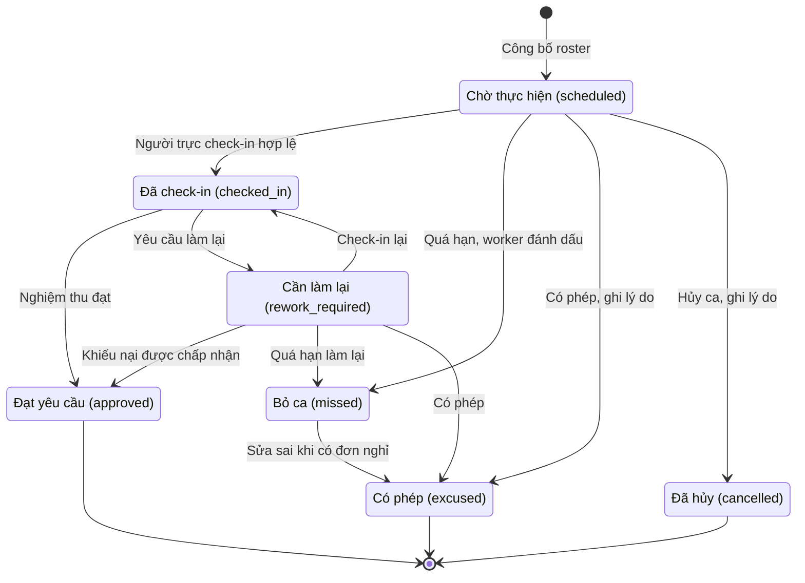

| Chuyển trạng thái | Ai và điều kiện | Cơ chế | Thông báo |
|---|---|---|---|
| Tạo ca, công bố | Người có `duty.manage` (Phó nhà, Trưởng nhà); mỗi ca đủ `min_assignees` | `fn_publish_roster`, `BR-DUTY-12` | `duty.assigned` tới từng người trực |
| `scheduled` sang `checked_in` | Người trực có `duty.checkin`, trong cửa sổ giờ, ảnh hợp lệ, đủ tiêu chí bắt buộc | `trg_duty_checkins__rules`, `trg_duty_checkins__required_items` | `duty.review_needed` tới người có `duty.review` đúng phạm vi |
| `checked_in` sang `approved` hoặc `rework_required` | Người có `duty.review` không thuộc ca; đạt cần điểm 1 đến 5, làm lại cần nhận xét từ 5 ký tự | `trg_duty_reviews__rules`, `trg_duty_reviews__apply` | `duty.reviewed` tới người trực |
| `rework_required` sang `approved` | Trưởng nhà (`duty.appeal.decide`) chấp nhận khiếu nại, không thuộc ca | `fn_decide_review_appeal` | `duty.reviewed` (kèm loại mới `duty.appeal_decided`) |
| Sang `missed` | Worker, ca quá hạn không check-in | `fn_mark_missed_duties`, trừ điểm `duty_missed` | `duty.missed` tới người trực và Phó nhà |
| Sang `excused` hoặc `cancelled` | Người có `duty.manage`, bắt buộc lý do (đơn nghỉ, sự kiện, nghỉ lễ) | `ck_duty_assignments__reason` | Thông báo cho người trực (cần thêm loại `duty.cancelled`) |

##### 1.4.4.2 Quy trình tuần từ khai báo đến đóng tuần `[ĐỀ XUẤT]`

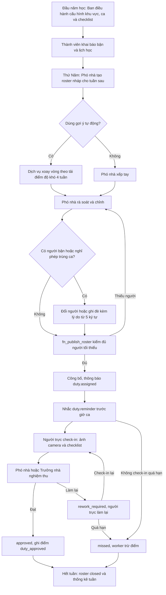

Nhịp vận hành `[ĐỀ XUẤT]`: roster tuần sau được công bố chậm nhất tối Thứ Năm để thành viên có 3 ngày xin đổi ca (ngưỡng tối thiểu 12 giờ trước ca do `duty.swap.min_notice_hours`); nhắc ca gửi trước giờ bắt đầu; hàng đợi nghiệm thu được xử lý trong 24 giờ (KPI); worker đánh dấu bỏ ca mỗi 30 phút; cuối tuần roster chuyển `closed` bằng hàm đóng tuần (cần vá, mục 1.4.3 B13).

##### 1.4.4.3 Công bằng phân công: xoay vòng, cân bằng số ca, tránh trùng lịch `[ĐỀ XUẤT]`

Với 30 đến 150 thành viên (`GD-DUTY-07`) một thuật toán quy tắc đơn giản, minh bạch và giải thích được tốt hơn bộ giải ràng buộc. Nguyên tắc:

1. **Tải của một người** là tổng `difficulty_points` của các ca được giao trong cửa sổ trượt bốn tuần (đọc từ `v_duty_member_stats` sau khi vá thành LEFT JOIN từ mọi thành viên đang ở). Nhà tắm (4 điểm) nặng hơn cổng (1 điểm) nên không bị dồn cho cùng một người.
2. **Mỗi lượt xếp**: lọc ứng viên (đang ở, không trong `member_unavailability`, không có đơn nghỉ được duyệt, không có ca khác trùng khung giờ, không trùng sự kiện bắt buộc, chưa đạt trần ca mỗi tuần), chọn người có tải thấp nhất; khi hòa thì chọn người lâu nhất chưa trực đúng khu vực đó (xoay vòng khu vực), sau cùng dùng hạt giống cố định theo tuần để kết quả tái lập được.
3. **Thứ tự xếp**: ca khó và ca ít ứng viên trước (Nhà tắm, Bếp), ca dễ sau, tránh dồn người yếu cho cuối.
4. **Kiểm sau cùng**: độ lệch tải (lớn nhất trừ nhỏ nhất) chia trung bình không quá 30% (KPI); vượt thì hoán đổi cặp người cho tới khi đạt hoặc báo Phó nhà.
5. **Ghi đè**: Phó nhà chỉnh tay được, mọi ghi đè lúc người đang bận ghi `override_reason` (từ 5 ký tự, `BR-DUTY-05`); cờ `duty_rosters.generated_by_solver` đánh dấu roster do máy sinh.

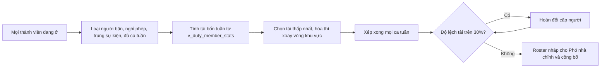

| Nguồn tránh xung đột | Trạng thái trong DDL | Cách dùng |
|---|---|---|
| Khoảng bận tự khai (`exam`, `class`, `internship`, `family`, `other`) | Có (`member_unavailability`, `BR-DUTY-05` chặn trừ khi ghi đè) | Dịch vụ loại ứng viên; trigger là lưới an toàn |
| Đơn xin phép đã duyệt (`leave_requests`) | Có (cùng trigger, chỉ mục `ix_leave_requests__range`) | Như trên |
| Lịch học lặp hằng tuần | Chưa (cửa sổ tối đa 120 ngày không biểu diễn được) | Đề xuất bảng `member_weekly_schedule` (`BL-DUTY-07`) |
| Sự kiện bắt buộc (`events`) | Chưa kiểm trong trigger | Dịch vụ loại ứng viên; cân nhắc cảnh báo trong `tg_duty_member_rules` |
| Phân công phụng vụ (`liturgy_assignments`) | Chưa | Dịch vụ loại ứng viên (xem mục 1.6) |

Bộ giải ràng buộc bằng AI (`duty.roster_solver`) đang tắt và chỉ đáng cân nhắc khi vượt 150 thành viên hoặc có ràng buộc phức tạp hơn nhiều (Phần 8).

##### 1.4.4.4 Check-in và chống gian lận ảnh `[ĐỀ XUẤT]`

Thành viên mở ca của mình, chụp ảnh trực tiếp bằng camera, tick các tiêu chí bắt buộc và gửi; ảnh đi qua presigned URL vào bucket `cleaning-evidence`, worker xử lý (quét, trích EXIF, tính SHA-256 và pHash) rồi mới gắn vào check-in. Trigger `trg_duty_checkins__rules` kiểm theo thứ tự sau (tất cả ngưỡng đọc từ `settings`, không cài cứng):

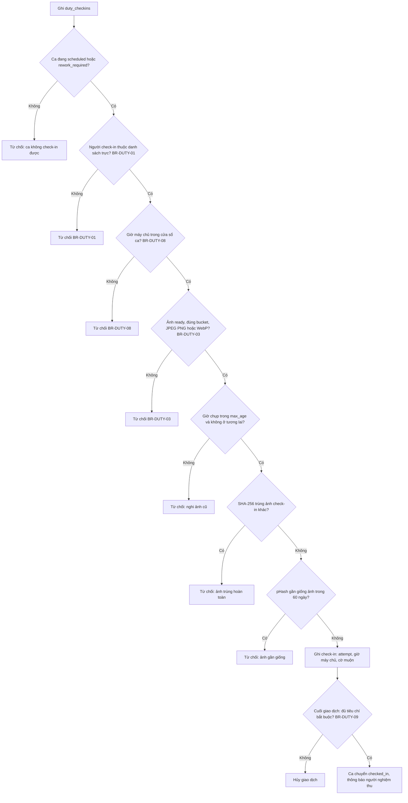

Các ngưỡng mặc định `[HIỆN CÓ]`: cửa sổ từ 60 phút trước giờ bắt đầu đến 720 phút sau giờ kết thúc ca; đánh dấu muộn khi quá 60 phút sau giờ kết thúc; ảnh phải chụp trong 120 phút trước lúc check-in; pHash lệch tối đa 6 bit trong 60 ngày; `require_exif` tắt. Bảng dưới nói thẳng DDL ép được gì và chưa ép gì:

| Kỹ thuật | Đã ép ở DB | Giới hạn còn lại | Bổ sung đề xuất |
|---|---|---|---|
| Giờ chụp (EXIF hoặc camera) | `taken_at` do worker trích; lệch tối đa `duty.evidence.max_age_minutes` và không quá 5 phút tương lai | Mất EXIF thì dùng `client_captured_at` do client khai; `require_exif` mặc định tắt | Chụp trực tiếp bằng camera; đo tỷ lệ thiếu EXIF một tháng rồi bật `require_exif` (`GD-DUTY-05`) |
| SHA-256 | Không trùng ảnh của bất kỳ check-in nào khác (mọi thời điểm); mỗi tệp một check-in (`ux_duty_checkins__evidence`) | Đổi một điểm ảnh là đổi hash; không so với ảnh bucket khác | Dựa vào pHash cho trường hợp gần giống |
| pHash 64 bit | Hamming không quá 6 so với ảnh check-in trong 60 ngày | Quét tuần tự (đủ nhanh ở quy mô này); ảnh cắt hoặc xoay mạnh có thể qua | Chấp nhận ở quy mô này |
| Chủ sở hữu tệp | Người check-in thuộc ca, tệp đúng bucket | Không kiểm `uploaded_by` | Thêm kiểm trong `tg_duty_checkin_rules` |
| Vị trí chụp | Không | EXIF GPS chưa dùng | Lưu cờ nếu có GPS, không bắt buộc (riêng tư) |
| Người nghiệm thu | Không thuộc ca, xem ảnh và checklist | Phụ thuộc con người | Nghiệm thu trong 24 giờ; khiếu nại nếu sai |
| AI kiểm ảnh | Tắt (`duty.photo_check`) | Chi phí và ảnh có người | `WON'T-NOW`, xem Phần 8 |

##### 1.4.4.5 Nghiệm thu và khiếu nại (`BR-DUTY-10`) `[ĐỀ XUẤT]`

Người nghiệm thu thấy ảnh, checklist, giờ check-in và cờ muộn; chấm điểm 1 đến 5 hoặc yêu cầu làm lại kèm nhận xét. Phó nhà chỉ nghiệm thu được trong phạm vi toàn nhà, tầng hoặc khu vực được gán (`can_review_area`); nếu chính người đó thuộc ca thì hệ thống từ chối. Khiếu nại là con đường duy nhất sửa kết quả vì `duty_reviews` bất biến.

```mermaid
flowchart LR
    A["Ca checked_in"] --> B["Người nghiệm thu xem ảnh và checklist"]
    B -->|Đạt, điểm 1 đến 5| C["approved, ghi duty_approved cho từng người"]
    B -->|Làm lại, nhận xét từ 5 ký tự| D["rework_required, ghi duty_rework lần đầu"]
    D --> E{"Người trực làm lại trong hạn?"}
    E -->|Có| A
    E -->|Không| M["missed, duty_missed"]
    D --> F{"Khiếu nại trong 48 giờ?"}
    F -->|Có| G["Trưởng nhà không thuộc ca xem xét, ghi lý do"]
    G -->|Chấp nhận| H["approved, ghi duty_approved và bù trừ duty_rework"]
    G -->|Bác bỏ| I["Giữ rework_required"]
```

Quy tắc phụ `[ĐỀ XUẤT]`: người khiếu nại chỉ là người trực của ca; mỗi nghiệm thu một khiếu nại; hạn làm lại tính từ lúc nhận yêu cầu (mặc định 24 giờ, `BR-DUTY-26`), không tính từ giờ hết ca như DDL hiện tại.

##### 1.4.4.6 Đổi ca ba bước (`BR-DUTY-11`, `BR-DUTY-21`, `BR-DUTY-22`) `[ĐỀ XUẤT]`

```mermaid
stateDiagram-v2
    [*] --> pending_peer : Người trực xin đổi, trước giờ ca ít nhất 12 giờ
    pending_peer --> pending_admin : Người nhận đồng ý
    pending_peer --> rejected : Người nhận từ chối
    pending_peer --> cancelled : Người xin rút đơn
    pending_peer --> expired : Quá hạn 48 giờ hoặc cách giờ ca dưới 2 giờ
    pending_admin --> approved : Ban điều hành duyệt, hoán đổi người trực
    pending_admin --> rejected : Ban điều hành từ chối
    pending_admin --> cancelled : Người xin rút đơn
    pending_admin --> expired : Quá hạn
    approved --> [*]
    rejected --> [*]
    cancelled --> [*]
    expired --> [*]
```

Người xin chọn một trong các ca `scheduled` của mình và một thành viên chưa thuộc ca; người nhận nhận thông báo `duty.swap_request` và xác nhận trong ứng dụng; Phó nhà hoặc Trưởng nhà (`duty.swap.approve`, không thuộc ca) duyệt; khi duyệt, `fn_admin_decide_duty_swap` xóa người cũ và thêm người mới trong một giao dịch và vẫn chịu `BR-DUTY-04` (không trùng ca) và `BR-DUTY-05` (không trùng bận hoặc nghỉ; hàm hiện không có tham số ghi đè nên đổi sang người đang bận bị từ chối, cần bổ sung ở `BL-DUTY-12`). Mỗi (ca, người xin) chỉ có một đơn mở. Cần vá trước khi dùng: khóa cột để người xin không tự nhảy bước (mục 1.4.3 B2).

##### 1.4.4.7 Khu vực, ca và checklist cấu hình được `[ĐỀ XUẤT]`

Người có `duty.area.manage` (Trưởng nhà, Phó nhà) thêm khu vực (mã chữ in hoa, độ khó 1 đến 10, số người tối thiểu 1 đến 20, gắn tầng hoặc phòng nếu có), đổi giờ ca (kết thúc sau bắt đầu) và quản lý mẫu checklist: mỗi khu vực có mẫu riêng hoặc dùng mẫu mặc định "Mẫu 4 tiêu chuẩn" (lau và cọ sàn, gom và đổ rác, cọ rửa bề mặt, bổ sung vật tư; nhãn lấy từ nghiệp vụ, không dùng nhãn thiên về nhà vệ sinh của FE). Khi muốn đổi tiêu chí, tạo phiên bản mẫu mới và ngừng dùng mẫu cũ; ca đã tạo giữ mẫu cũ (`BR-DUTY-17`). Tiêu chí `is_required` phải đạt mới nộp được; tiêu chí không bắt buộc ghi nhận nhưng không chặn.

##### 1.4.4.8 Điểm đóng góp (phân hệ mới `MER`): thưởng, phạt và giới hạn `[ĐỀ XUẤT]`

Điểm đóng góp có đáng làm với quy mô này không? **Có, ở mức tối thiểu (SHOULD, công sức M, giá trị Vừa; xem `BL-MER-01`)**: nó là công cụ cân bằng phân công và ghi nhận công sức, DDL đã có, và chi phí biên thấp vì mọi bút toán sinh tự động từ nghiệm thu, bỏ ca, điểm danh và buổi kèm. **Không làm** các phần dễ gây hại cho cộng đoàn nhỏ: bảng xếp hạng công khai (`BL-MER-05`), đổi điểm lấy quyền lợi (`BL-MER-06`) và phạt tiền (`BL-DUTY-15`), đều xếp `WON'T-NOW` kèm lý do.

| Quy tắc (`merit_rules.code`) | Điểm mặc định | Phát sinh từ | Ghi chú |
|---|---|---|---|
| `duty_approved` | +3 nhân độ khó khu vực | Nghiệm thu đạt hoặc khiếu nại được chấp nhận | Mỗi người trong ca một bút toán, ví dụ nhà tắm +12 |
| `duty_rework` | -1 | Yêu cầu làm lại lần đầu | Không nhân độ khó; bù trừ khi khiếu nại thành công (`BR-DUTY-25`) |
| `duty_missed` | -5 | Worker đánh dấu bỏ ca | Không nhân độ khó; không áp khi có đơn nghỉ (`BR-DUTY-16`) |
| `event_present` | +1 | Đóng điểm danh sự kiện (phân hệ 1.6) | Chỉ trạng thái `present` |
| `event_absent` | -1 | Đóng điểm danh sự kiện | Không áp khi vắng có phép |
| `tutoring_hour` | +2 mỗi giờ | Buổi kèm học hai bên xác nhận (phân hệ 1.5) | Tối thiểu 1 điểm mỗi buổi |
| `manual_adjust` | tự đặt từ -100 đến 100 | Trưởng nhà hoặc Phó nhà (`merit.adjust`) | Lý do từ 5 ký tự; không được điều chỉnh điểm của chính mình (`BR-MER-05`, S14) |

```mermaid
flowchart LR
    A["Nghiệm thu đạt hoặc làm lại"] --> M["merit_entries, sổ bất biến"]
    B["Bỏ ca tự động"] --> M
    C["Đóng điểm danh sự kiện"] --> M
    D["Buổi kèm học hai bên xác nhận"] --> M
    E["Điều chỉnh thủ công có lý do"] --> M
    M --> V1["Điểm của tôi, chỉ chính chủ"]
    M --> V2["Thống kê công bằng cho Ban điều hành"]
    V2 --> R["Roster kế tiếp, cân bằng tải"]
```

Nguyên tắc: sổ chỉ ghi thêm (`BR-MER-01`), sai thì bù trừ bằng bút toán mới; một nguồn chỉ sinh điểm một lần (`BR-MER-02`); điểm chỉ dùng để cân bằng và ghi nhận, mọi hậu quả do Ban điều hành quyết định bằng trao đổi (`BR-MER-08`); chính chủ xem điểm của mình, Ban điều hành xem để xếp ca (`BR-MER-07`).

##### 1.4.4.9 Thông báo, quyền và tiến trình nền `[ĐỀ XUẤT]`

| Sự kiện | Loại thông báo | Người nhận | Trong DDL |
|---|---|---|---|
| Công bố roster | `duty.assigned` | Từng người trực | Có |
| Nhắc trước giờ ca | `duty.reminder` | Người trực chưa check-in | Có |
| Có check-in chờ nghiệm thu | `duty.review_needed` | Người có `duty.review` đúng phạm vi | Có |
| Kết quả nghiệm thu | `duty.reviewed` | Người trực | Có |
| Xin đổi ca, kết quả đổi ca | `duty.swap_request`, `duty.swap_decided` | Người nhận, người duyệt, người xin | Có |
| Bỏ ca tự động | `duty.missed` | Người trực, Phó nhà | Có |
| Khiếu nại mở, khiếu nại được quyết định | `duty.appeal_opened`, `duty.appeal_decided` | Trưởng nhà, người trực | Chưa (`BL-PLAT-19`) |
| Điều chỉnh điểm thủ công | `merit.adjusted` | Chủ thể bút toán | Chưa |

Quyền theo vai trò: Thành viên có `duty.read`, `duty.checkin`, `duty.swap.request`; Phó nhà có `duty.manage`, `duty.area.manage`, `duty.review`, `duty.swap.approve`, `merit.read_all`, `merit.adjust`; Trưởng nhà có thêm `duty.appeal.decide`; Admin kỹ thuật chỉ có `duty.read` (không check-in, không nghiệm thu, không xếp ca). Tiến trình nền chạy bằng vai trò `luuxa_worker`: `fn_mark_missed_duties` mỗi 30 phút, `fn_housekeeping` mỗi giờ (đóng đơn đổi ca quá hạn), nhắc ca và nhắc nghiệm thu quá hạn ở tầng service (`BL-DUTY-10`).

#### 1.4.5 Quy tắc nghiệp vụ

| ID | Quy tắc | Nhãn | MoSCoW | Cơ chế thực thi (DB / service) | Kiểm thử |
|---|---|---|---|---|---|
| **BR-DUTY-01** | Chỉ thành viên có tên trong danh sách trực của ca mới được check-in cho ca đó, và người check-in phải là chính tài khoản đang đăng nhập; không check-in hộ người khác hay người ngoài ca. | ĐỀ XUẤT | MUST | trigger `trg_duty_checkins__rules`<br>hàm `tg_duty_checkin_rules`<br>RLS `duty_checkins__insert`<br>bảng `duty_assignment_members` | S6 |
| **BR-DUTY-02** | Người thuộc danh sách trực không được nghiệm thu ca của chính mình; người nghiệm thu ghi kết quả bằng chính tài khoản của mình và phải có quyền duty.review đúng phạm vi toàn nhà, tầng hoặc khu vực của ca. | ĐỀ XUẤT | MUST | trigger `trg_duty_reviews__rules`<br>hàm `tg_duty_review_rules`<br>hàm `can_review_area`<br>RLS `duty_reviews__insert` | S6 |
| **BR-DUTY-03** | Ảnh minh chứng bắt buộc, phải là tệp JPEG/PNG/WebP đã xử lý xong (ready) trong bucket cleaning-evidence; thời điểm chụp (EXIF hoặc camera) phải nằm trong duty.evidence.max_age_minutes trước lúc check-in; không trùng SHA-256 với bất kỳ ảnh check-in nào khác và không gần giống (pHash, khoảng cách Hamming tối đa duty.evidence.phash_max_distance) ảnh đã dùng trong duty.evidence.dedupe_days ngày; một tệp chỉ dùng cho một lần check-in. | ĐỀ XUẤT | MUST | trigger `trg_duty_checkins__rules`<br>hàm `tg_duty_checkin_rules`<br>ràng buộc `ux_duty_checkins__evidence`<br>cấu hình `duty.evidence.max_age_minutes`<br>cấu hình `duty.evidence.require_exif`<br>cấu hình `duty.evidence.phash_max_distance`<br>cấu hình `duty.evidence.dedupe_days`<br>index `ix_duty_checkins__phash` | S6 |
| **BR-DUTY-04** | Một người không bị xếp hai ca trùng ngày và ca; một tổ hợp (khu vực, ngày, ca) chỉ có một ca trực. | ĐỀ XUẤT | MUST | ràng buộc `ux_duty_assignment_members__member_slot`<br>ràng buộc `fk_duty_assignment_members__assignment`<br>ràng buộc `ux_duty_assignments__slot` | S6 |
| **BR-DUTY-05** | Chỉ xếp trực cho thành viên đang ở (active). Thành viên đã khai báo bận (member_unavailability) hoặc có đơn xin phép được duyệt trùng khung ca chỉ được xếp khi người xếp ghi override_reason từ 5 ký tự. | ĐỀ XUẤT | MUST | trigger `trg_duty_assignment_members__rules`<br>hàm `tg_duty_member_rules`<br>ràng buộc `ck_member_unavailability__range`<br>RLS `member_unavailability__write` | S6 |
| **BR-DUTY-06** | Ngày trực phải nằm trong tuần của roster; roster bắt đầu vào Thứ Hai và mỗi tuần chỉ có một roster; roster đã đóng (closed) không nhận ca mới. | ĐỀ XUẤT | MUST | trigger `trg_duty_assignments__rules`<br>hàm `tg_duty_assignment_rules`<br>ràng buộc `ck_duty_rosters__monday`<br>ràng buộc `ux_duty_rosters__week` | S6 |
| **BR-DUTY-07** | Ca đã check-in hoặc đã có kết quả không được thêm, bớt người trực ngoài quy trình đổi ca, và không được đổi ngày, khu vực hay ca. | ĐỀ XUẤT | MUST | trigger `trg_duty_assignment_members__rules`<br>hàm `tg_duty_member_rules`<br>trigger `trg_duty_assignments__rules` | S6 |
| **BR-DUTY-08** | Check-in chỉ hợp lệ từ duty.checkin.window_before_minutes phút trước giờ bắt đầu ca đến duty.checkin.window_after_minutes phút sau giờ kết thúc; sau duty.checkin.late_after_minutes phút kể từ giờ kết thúc thì ghi nhận là muộn kèm số phút muộn. Mốc thời gian là giờ máy chủ, không dùng đồng hồ của thiết bị. | ĐỀ XUẤT | MUST | trigger `trg_duty_checkins__rules`<br>cấu hình `duty.checkin.window_before_minutes`<br>cấu hình `duty.checkin.window_after_minutes`<br>cấu hình `duty.checkin.late_after_minutes`<br>ràng buộc `ck_duty_checkins__late` | S6 |
| **BR-DUTY-09** | Mọi tiêu chí bắt buộc (is_required) của mẫu checklist gắn với ca phải có kết quả đạt khi nộp check-in; việc kiểm tra thực hiện cuối giao dịch để cho phép ghi check-in trước, các tiêu chí sau. | HIỆN CÓ | MUST | trigger `trg_duty_checkins__required_items`<br>hàm `tg_duty_checkin_required_items`<br>bảng `checkin_items` | S6 |
| **BR-DUTY-10** | Người trực của ca được khiếu nại kết quả nghiệm thu, mỗi nghiệm thu tối đa một khiếu nại, lý do từ 10 ký tự, trong vòng duty.appeal.window_hours giờ. Trưởng nhà quyết định (duty.appeal.decide) và bắt buộc ghi lý do từ 5 ký tự; chấp nhận thì ca rework_required chuyển approved và ghi điểm, bác bỏ thì giữ nguyên. | ĐỀ XUẤT | MUST | hàm `fn_decide_review_appeal`<br>ràng buộc `ux_duty_review_appeals__review`<br>ràng buộc `ck_duty_review_appeals__reason`<br>ràng buộc `ck_duty_review_appeals__decided`<br>RLS `duty_review_appeals__insert`<br>cấu hình `duty.appeal.window_hours`<br>service: API tạo khiếu nại kiểm cửa sổ duty.appeal.window_hours tính từ duty_reviews.reviewed_at; DB chưa ép cửa sổ này (BL-DUTY-12) | S6 |
| **BR-DUTY-11** | Chỉ người đang trong ca được xin đổi, chỉ với ca còn scheduled, trước giờ bắt đầu ít nhất duty.swap.min_notice_hours giờ; người nhận phải là người khác và chưa thuộc ca; mỗi (ca, người xin) chỉ có một đơn đang mở; đơn tự hết hạn sau duty.swap.request_ttl_hours giờ hoặc trước giờ ca 2 giờ. | ĐỀ XUẤT | MUST | hàm `fn_request_duty_swap`<br>cấu hình `duty.swap.min_notice_hours`<br>cấu hình `duty.swap.request_ttl_hours`<br>index `ux_duty_swap_requests__open_per_assignment`<br>ràng buộc `ck_duty_swap_requests__distinct`<br>hàm `fn_housekeeping` | S6 |
| **BR-DUTY-12** | Chỉ công bố roster khi có ít nhất một ca và mọi ca (trừ khu vực tổng vệ sinh toàn nhà) đủ số người tối thiểu min_assignees của khu vực; công bố ghi người và thời điểm. | ĐỀ XUẤT | MUST | hàm `fn_publish_roster`<br>ràng buộc `ck_cleaning_areas__min`<br>ràng buộc `ck_duty_rosters__published` | S6 |
| **BR-DUTY-13** | Ca trực đi theo máy trạng thái bảy trạng thái (scheduled, checked_in, approved, rework_required, missed, cancelled, excused); chuyển không hợp lệ bị từ chối, các trạng thái missed, cancelled, excused bắt buộc có lý do, và mọi chuyển được ghi vào nhật ký bất biến duty_status_history. | ĐỀ XUẤT | MUST | trigger `trg_duty_assignments__state`<br>trigger `trg_duty_assignments__history`<br>trigger `trg_duty_status_history__immutable`<br>ràng buộc `ck_duty_assignments__reason` | S6 |
| **BR-DUTY-14** | Nghiệm thu đạt phải có điểm từ 1 đến 5; yêu cầu làm lại phải có nhận xét từ 5 ký tự; chỉ nghiệm thu lần check-in mới nhất của ca đang checked_in; mỗi lần check-in có đúng một nghiệm thu và bản ghi nghiệm thu bất biến, kết quả sai chỉ được sửa qua khiếu nại. | ĐỀ XUẤT | MUST | ràng buộc `ck_duty_reviews__score`<br>ràng buộc `ck_duty_reviews__feedback`<br>ràng buộc `ck_duty_reviews__approved_score`<br>ràng buộc `ux_duty_reviews__checkin`<br>trigger `trg_duty_reviews__immutable`<br>trigger `trg_duty_reviews__apply` | S6 |
| **BR-DUTY-15** | Ca còn scheduled hoặc rework_required quá duty.missed_after_hours giờ sau khi hết ca được tiến trình nền tự đánh dấu missed (lý do 'Tự động: quá hạn check-in') và trừ điểm duty_missed cho từng người trực; tiến trình dùng khóa SKIP LOCKED nên chạy song song an toàn. Mốc tính hiện neo vào giờ kết thúc ca kể cả với ca rework_required (xem BR-DUTY-26). | ĐỀ XUẤT | MUST | hàm `fn_mark_missed_duties`<br>cấu hình `duty.missed_after_hours`<br>hàm `fn_award_duty_merit`<br>service: Worker (vai trò luuxa_worker) gọi app.fn_mark_missed_duties mỗi 30 phút; luuxa_app không có quyền gọi | S6 |
| **BR-DUTY-16** | Ca nằm trọn trong một đơn xin phép đã được duyệt (kể cả duyệt sau khi đã xếp ca) không bị tính bỏ ca và không trừ điểm: tiến trình nền chuyển ca sang excused kèm lý do dẫn tới đơn nghỉ. | ĐỀ XUẤT | MUST | service: Sửa app.fn_mark_missed_duties để tra leave_requests (status approved, khoảng thời gian phủ app.shift_window) và member_unavailability trước khi đánh dấu missed; hiện hàm chưa tra, ca vẫn bị missed và trừ 5 điểm (BL-DUTY-12)<br>hàm `shift_window` | service |
| **BR-DUTY-17** | Tiêu chí check-in cấu hình được: mỗi khu vực có mẫu riêng hoặc dùng mẫu mặc định (area_id rỗng); mỗi ca đóng băng mẫu tại lúc tạo nên đổi mẫu về sau không làm sai lịch sử; mẫu đã có kết quả không được sửa tại chỗ mà phải tạo phiên bản mới. | ĐỀ XUẤT | MUST | bảng `checklist_templates`<br>bảng `checklist_template_items`<br>trigger `trg_duty_assignments__rules`<br>ràng buộc `ux_checklist_template_items__code`<br>RLS `checklist_templates__write`<br>service: Hiện DB cho sửa nhãn tiêu chí tại chỗ; API chỉ cho tạo phiên bản mẫu mới và vô hiệu mẫu cũ (BL-DUTY-08) | S6 |
| **BR-DUTY-18** | Khu vực vệ sinh và ca trực là dữ liệu cấu hình (mã chữ in hoa, độ khó 1 đến 10, số người tối thiểu 1 đến 20, giờ kết thúc sau giờ bắt đầu); chỉ người có quyền duty.area.manage được thêm, sửa, ngừng dùng; không dùng chuỗi tự do cho khu vực. | ĐỀ XUẤT | SHOULD | bảng `cleaning_areas`<br>ràng buộc `ck_cleaning_areas__points`<br>ràng buộc `ck_cleaning_areas__min`<br>ràng buộc `ck_duty_shifts__time`<br>RLS `cleaning_areas__write`<br>RLS `duty_shifts__write` | S12e |
| **BR-DUTY-19** | Roster nháp (draft) chỉ Ban điều hành có duty.manage thấy; sau khi công bố thành viên có duty.read xem được ca và danh sách người trực; thành viên chỉ nhìn thấy dữ liệu check-in của ca mình trực, của chính mình hoặc khi có quyền duty.manage hoặc duty.review. | ĐỀ XUẤT | MUST | RLS `duty_rosters__select`<br>RLS `duty_assignments__select`<br>RLS `duty_checkins__select` | service |
| **BR-DUTY-20** | Mọi mốc nghiệp vụ của trực nhật (check-in, nghiệm thu, chuyển trạng thái, quyết định đổi ca) là timestamptz do máy chủ ghi; client_captured_at chỉ là thông tin phụ trợ khi ảnh thiếu EXIF và không bao giờ thay thế giờ máy chủ. | ĐỀ XUẤT | MUST | trigger `trg_duty_checkins__rules`<br>bảng `duty_checkins`<br>bảng `duty_status_history` | S6 |
| **BR-DUTY-21** | Mỗi bước của đơn đổi ca do đúng người thực hiện: người xin chỉ tạo đơn và hủy đơn đang chờ của chính mình (UPDATE trực tiếp chỉ còn cột status sang cancelled), chỉ người được nhờ xác nhận hoặc từ chối bước 2 (fn_peer_respond_duty_swap), chỉ người có duty.swap.approve quyết định bước 3 (fn_admin_decide_duty_swap); hai hàm này là SECURITY DEFINER nên người xin không tự điền được mốc xác nhận hay quyết định. | ĐỀ XUẤT | MUST | hàm `fn_peer_respond_duty_swap`<br>hàm `fn_admin_decide_duty_swap`<br>trigger `trg_duty_swap_requests__state`<br>RLS `duty_swap_requests__update`<br>quyền DB: `luuxa_app` chỉ có UPDATE theo cột trên `duty_swap_requests` | S14 |
| **BR-DUTY-22** | Duyệt đổi ca hoán đổi người trực trong một giao dịch và vẫn chịu kiểm tra không trùng ca (BR-DUTY-04) và không trùng bận hoặc nghỉ (BR-DUTY-05); đơn quá hạn chuyển expired; mọi bước ghi nhật ký bất biến duty_swap_status_history. | ĐỀ XUẤT | MUST | hàm `fn_admin_decide_duty_swap`<br>trigger `trg_duty_swap_requests__state`<br>trigger `trg_duty_swap_requests__history`<br>trigger `trg_duty_swap_status_history__immutable`<br>ràng buộc `ck_duty_swap_requests__admin` | S6 |
| **BR-DUTY-23** | Phân công tự động phải công bằng: tải của một người là tổng điểm độ khó (difficulty_points) các ca được giao trong cửa sổ trượt bốn tuần; mỗi lượt xếp chọn người có tải thấp nhất còn trống, chênh lệch tải giữa người nhiều và ít nhất không quá một ca của khu vực khó nhất; không xếp người có ca trùng khung sự kiện bắt buộc hoặc vượt số ca tối đa mỗi tuần. | ĐỀ XUẤT | SHOULD | view `v_duty_member_stats`<br>bảng `member_unavailability`<br>service: Dịch vụ sinh roster nháp (rule-based, task AI duty.roster_solver chỉ là phương án nâng cao đang tắt) đọc v_duty_member_stats, member_unavailability, leave_requests đã duyệt và events bắt buộc; kết quả là bản nháp để Phó nhà chỉnh trước khi fn_publish_roster; v_duty_member_stats cần sửa thành LEFT JOIN để thấy cả người chưa có ca (BL-DUTY-12) | service |
| **BR-DUTY-24** | Ca của khu vực tổng vệ sinh toàn nhà (is_whole_house) phải có danh sách người trực là toàn bộ thành viên đang ở được dịch vụ thêm vào duty_assignment_members (bỏ qua hoặc ghi đè có lý do cho người đang bận), vì quyền check-in và điểm thưởng đều dựa trên bảng này. | ĐỀ XUẤT | SHOULD | bảng `cleaning_areas`<br>hàm `fn_publish_roster`<br>service: Dịch vụ thêm hàng loạt thành viên active vào ca WHOLE_HOUSE trước khi công bố; fn_publish_roster không kiểm số người của khu vực này nên nếu quên thì không ai check-in được (BL-DUTY-12) | service |
| **BR-DUTY-25** | Khi khiếu nại được chấp nhận, bút toán trừ điểm duty_rework của chính ca đó được bù trừ bằng một bút toán mới (sổ điểm bất biến nên không xóa), điểm duty_approved chỉ ghi một lần cho mỗi người. | ĐỀ XUẤT | SHOULD | hàm `fn_decide_review_appeal`<br>index `ux_merit_entries__source`<br>service: Thêm quy tắc merit_rules duty_rework_reversal (điểm dương bằng điểm duty_rework) và gọi từ fn_decide_review_appeal; hiện hàm chỉ ghi duty_approved nên khoản trừ làm lại vẫn còn (BL-DUTY-12) | service |
| **BR-DUTY-26** | Người trực có thời hạn làm lại tính từ lúc nghiệm thu yêu cầu làm lại (mặc định 24 giờ, khóa duty.rework.window_hours), không tính từ giờ kết thúc ca: trong thời hạn đó check-in lần sau (attempt từ 2) không bị khung giờ của ca gốc chặn và không bị tính muộn, ca không bị worker đánh dấu bỏ ca; hết hạn thì check-in bị từ chối và worker đánh dấu missed. Khiếu nại được chấp nhận chỉ cộng điểm khi ca còn ở rework_required. | ĐỀ XUẤT | MUST | cấu hình `duty.rework.window_hours`<br>hàm `fn_mark_missed_duties`<br>trigger `trg_duty_checkins__rules`<br>trigger `trg_duty_reviews__apply`<br>hàm `fn_decide_review_appeal` | S14 |
| **BR-DUTY-27** | Kết quả nghiệm thu chỉ phát sinh qua bản ghi duty_reviews (hoặc qua quyết định khiếu nại): người có duty.manage chỉ xếp, hủy hoặc miễn ca, không UPDATE trực tiếp trạng thái ca sang checked_in, approved, rework_required hay missed và không sửa attempt_count, rework_due_at; các đường hợp lệ chạy bằng SECURITY DEFINER hoặc worker nên không chịu chặn. | ĐỀ XUẤT | MUST | trigger `trg_duty_assignments__guard`<br>hàm `tg_duty_assignment_guard`<br>trigger `trg_duty_assignments__guard_cols`<br>RLS `duty_assignments__write`<br>trigger `trg_duty_assignments__state`<br>trigger `trg_duty_reviews__apply` | S14 |
| **BR-DUTY-28** | Người quyết định khiếu nại và người duyệt đơn đổi ca không được là người có tên trong ca đó, người khiếu nại, người xin hoặc người nhận đổi ca: fn_decide_review_appeal và fn_admin_decide_duty_swap từ chối người liên quan. Khi Trưởng nhà thuộc ca thì việc quyết định chuyển cho người nhận ủy quyền tạm thời (role_delegations); phần chọn người thay thế chạy ở service. | ĐỀ XUẤT | MUST | hàm `fn_decide_review_appeal`<br>hàm `fn_admin_decide_duty_swap`<br>service: Người nhận ủy quyền tạm thời quyết định thay khi Trưởng nhà thuộc ca: API chọn người có duty.appeal.decide qua role_delegations còn hiệu lực và không thuộc ca (BL-DUTY-11); kiểm tra xung đột lợi ích đã được ép trong hai hàm và kiểm ở S14 | S14 |
| **BR-DUTY-29** | Khai báo bận tự do có trần để không dùng làm cách né trực: tổng số ngày bận tự khai (trừ lịch thi có minh chứng) không quá 10 ngày mỗi tháng; vượt trần cần Phó nhà duyệt. Hiện mỗi dòng tối đa 120 ngày và không giới hạn số dòng, ba dòng đủ khóa kín 360 ngày mà không cần duyệt (đã tái hiện). | ĐỀ XUẤT | SHOULD | bảng `member_unavailability`<br>RLS `member_unavailability__write`<br>ràng buộc `ck_member_unavailability__max`<br>service: Cột trạng thái duyệt cho member_unavailability và khóa settings duty.unavailability.max_days_per_month (mặc định 10); tg_duty_member_rules chỉ tính các khoảng đã duyệt hoặc dưới trần (BL-DUTY-07) | service |

Các quy tắc chia thành bảy nhóm: check-in và bằng chứng (`BR-DUTY-01`, `03`, `08`, `09`, `20`); nghiệm thu và khiếu nại (`02`, `10`, `14`, `25`, `27`, `28`); phân công và roster (`04`, `05`, `06`, `07`, `12`, `19`, `24`); đổi ca (`11`, `21`, `22`); trạng thái và bỏ ca (`13`, `15`, `16`, `26`); cấu hình khu vực và checklist (`17`, `18`); công bằng (`23`, `29`). Mười hai mã đầu (`01` đến `12`) đã nằm trong thông báo lỗi của DDL; các mã còn lại là quy tắc bổ sung, trong đó `16`, `21`, `23` đến `29` cần vá DDL hoặc làm ở tầng service (cột Cơ chế nói rõ). Quy tắc nào dựa vào `service` đều có hạng mục trong Master Backlog.

##### 1.4.5.1 Quy tắc điểm đóng góp (`MER`)

| ID | Quy tắc | Nhãn | MoSCoW | Cơ chế thực thi (DB / service) | Kiểm thử |
|---|---|---|---|---|---|
| **BR-MER-01** | Sổ điểm đóng góp là sổ chỉ ghi thêm: không sửa, không xóa bút toán (trigger và quyền bảng cùng chặn); sai sót được sửa bằng bút toán điều chỉnh có lý do. | ĐỀ XUẤT | MUST | trigger `trg_merit_entries__immutable`<br>bảng `merit_entries` | S6 |
| **BR-MER-02** | Một nguồn phát sinh điểm (ca trực, buổi kèm học, bản ghi điểm danh) chỉ sinh điểm một lần cho mỗi người và mỗi quy tắc; ghi lại là idempotent. | ĐỀ XUẤT | MUST | index `ux_merit_entries__source`<br>hàm `fn_award_duty_merit` | S6 |
| **BR-MER-03** | Giá trị điểm của từng quy tắc là cấu hình (khác 0, từ -50 đến 50) và mỗi bút toán nằm trong khoảng -100 đến 100; đổi giá trị quy tắc không tác động ngược lên bút toán đã ghi vì bút toán lưu điểm tại thời điểm ghi. | ĐỀ XUẤT | MUST | bảng `merit_rules`<br>ràng buộc `ck_merit_rules__points`<br>ràng buộc `ck_merit_entries__points`<br>RLS `merit_rules__write__setting_write` | S12e |
| **BR-MER-04** | Điểm thưởng dương của một ca được nhân với độ khó của khu vực (difficulty_points) để cân bằng công sức; điểm trừ không nhân độ khó để không phạt nặng ở khu vực khó. | ĐỀ XUẤT | SHOULD | hàm `fn_award_duty_merit`<br>ràng buộc `ck_cleaning_areas__points` | S6 |
| **BR-MER-05** | Điều chỉnh điểm thủ công (quy tắc manual_adjust) cần quyền merit.adjust, ghi created_by là người thực hiện, bắt buộc lý do từ 5 ký tự và không áp dụng cho điểm của chính người điều chỉnh (bút toán tự điều chỉnh phải do người thứ hai ghi). | ĐỀ XUẤT | MUST | ràng buộc `ck_merit_entries__manual_note`<br>RLS `merit_entries__insert__manual` | S14 |
| **BR-MER-06** | Người điều chỉnh không được cộng hoặc trừ điểm cho chính mình; điều chỉnh có trị tuyệt đối lớn hơn ngưỡng cấu hình cần người thứ hai (Trưởng nhà hoặc Phó nhà khác) xác nhận. | ĐỀ XUẤT | MUST | RLS `merit_entries__insert__manual`<br>service: Thêm điều kiện created_by khác chủ thể bút toán vào policy merit_entries__insert__manual hoặc trigger BEFORE INSERT; hiện Trưởng nhà tự cộng 50 điểm cho chính mình được (đã tái hiện trên DB thử nghiệm, BL-MER-02) | service |
| **BR-MER-07** | Điểm đóng góp là dữ liệu riêng tư theo mặc định: chính chủ xem điểm của mình, Ban điều hành có merit.read_all xem để cân bằng phân công; không công khai bảng xếp hạng toàn nhà. | ĐỀ XUẤT | MUST | RLS `merit_entries__select`<br>service: API không cung cấp endpoint xếp hạng; màn hình 'Điểm của tôi' chỉ hiển thị dữ liệu của chính người xem | S12e |
| **BR-MER-08** | Điểm đóng góp không tự động dẫn tới phạt tiền, hạn chế quyền hay xếp phòng; mọi hậu quả (nhắc nhở, trao đổi riêng, ưu tiên ca) do Ban điều hành quyết định và ghi lý do; điểm chỉ dùng để cân bằng phân công, ghi nhận đóng góp và tổng kết cuối năm. | ĐỀ XUẤT | MUST | quy trình: Nội quy lưu xá ghi rõ mục đích sử dụng điểm đóng góp; thay đổi mục đích cần Ban điều hành thông qua và thông báo thành viên | process |
| **BR-MER-09** | Bút toán gắn với năm học (academic_year_id) để thống kê theo năm; kết thúc năm học không xóa hay đặt lại sổ mà bắt đầu năm học mới với tổng bằng không và giữ lịch sử. | ĐỀ XUẤT | SHOULD | bảng `merit_entries`<br>view `v_duty_member_stats` | S6 |

Chín quy tắc `MER` gồm ba lớp: toàn vẹn sổ (`BR-MER-01`, `02`, `03`), cách tính (`04`, `09`) và quản trị (`05`, `06`, `07`, `08`). Chỉ `BR-MER-06` cần vá DDL.

#### 1.4.6 Tính năng mới đề xuất

Tính năng người dùng thấy:

| ID | Tên & mô tả | Nhãn | MoSCoW | Công sức | Giá trị | Giai đoạn |
|---|---|---|---|---|---|---|
| **BL-DUTY-01** | **Roster tuần: lập, chỉnh, công bố và xem bảng trực** — API và màn hình lập roster theo tuần ISO (lưới khu vực × ngày × ca), thêm bớt người trực với cảnh báo bận hoặc nghỉ phép, công bố bằng fn_publish_roster rồi gửi thông báo duty.assigned; thành viên xem lịch của mình và của cả nhà theo tuần thật, thay cho danh sách ca rời với ngày chữ. | ĐỀ XUẤT | MUST | L | Cao | 3 |
| **BL-DUTY-02** | **Check-in ca trực bằng camera, checklist cấu trúc và ảnh hợp lệ** — Biểu mẫu check-in chụp ảnh trực tiếp bằng camera (thuộc tính capture), tải qua presigned URL vào bucket cleaning-evidence, tick đủ tiêu chí bắt buộc và hiển thị rõ lý do bị chặn (ảnh cũ, ảnh trùng, ngoài giờ); bỏ ảnh mẫu Unsplash, chế độ nhập URL và ảnh dự phòng của store. | ĐỀ XUẤT | MUST | M | Cao | 3 |
| **BL-DUTY-03** | **Hàng đợi nghiệm thu: ảnh, checklist, chấm điểm 1–5 và phản hồi** — Màn hình cho Phó nhà và Trưởng nhà duyệt ca đang checked_in: xem ảnh và tiêu chí, chấm điểm hoặc yêu cầu làm lại kèm nhận xét, người nghiệm thu lấy từ phiên đăng nhập; nút Nghiệm thu biến mất với ca có tên mình; thông báo duty.review_needed và duty.reviewed. | ĐỀ XUẤT | MUST | M | Cao | 3 |
| **BL-DUTY-04** | **Khiếu nại kết quả nghiệm thu trong 48 giờ** — Người trực gửi hoặc rút khiếu nại trong duty.appeal.window_hours giờ, Trưởng nhà quyết định kèm lý do ở hàng đợi riêng, thông báo hai chiều; chấp nhận thì ca về approved và điểm làm lại được bù trừ. | ĐỀ XUẤT | MUST | M | Vừa | 3 |
| **BL-DUTY-05** | **Đổi ca ba bước trên một luồng duy nhất** — Một luồng đổi ca cho mọi loại ca thay cho hai luồng giả lập hiện nay: người trực chọn ca của mình và người nhận, người nhận xác nhận trong hộp thư, Phó nhà hoặc Trưởng nhà duyệt; đơn quá hạn tự chuyển expired; lịch sử từng bước hiển thị trên thẻ ca. | ĐỀ XUẤT | MUST | M | Cao | 3 |
| **BL-DUTY-06** | **Tạo roster nháp tự động, công bằng và tránh xung đột** — Dịch vụ rule-based sinh roster nháp cho tuần: xoay vòng theo tải điểm độ khó bốn tuần gần nhất, loại người bận, nghỉ phép, trùng sự kiện bắt buộc và vượt trần ca mỗi tuần; Phó nhà chỉnh tay rồi công bố. Bộ giải ràng buộc bằng AI (duty.roster_solver) chỉ cân nhắc khi quy mô vượt 150 thành viên. | ĐỀ XUẤT | SHOULD | L | Cao | 4 |
| **BL-DUTY-07** | **Khai báo bận và thời khóa biểu hằng tuần của thành viên** — Thành viên khai khoảng bận (thi, thực tập, việc gia đình) và lịch học lặp hằng tuần; cửa sổ tối đa 120 ngày của member_unavailability không biểu diễn được lịch học lặp nên thêm bảng member_weekly_schedule; cả hai nguồn được roster và phân công phụng vụ dùng. | ĐỀ XUẤT | SHOULD | M | Vừa | 3 |
| **BL-DUTY-08** | **Quản trị khu vực vệ sinh, ca trực và mẫu checklist** — Màn hình Cài đặt cho duty.area.manage: thêm khu vực (độ khó 1–10, số người tối thiểu), giờ ca, tạo phiên bản mẫu checklist mới thay vì sửa tại chỗ, ngừng dùng mẫu cũ; có xem trước ca đang dùng mẫu nào. | ĐỀ XUẤT | SHOULD | S | Vừa | 3 |
| **BL-DUTY-09** | **Bảng tiến độ tuần, ca của tôi và thống kê theo người** — Thay các thẻ cài cứng Thứ Sáu và tiến độ cộng dồn bằng v_duty_week_stats theo tuần chọn; chip Ca của tôi, lọc khu vực; thống kê số ca đạt, làm lại, bỏ theo người từ v_duty_member_stats cho Ban điều hành; một định nghĩa hoàn thành duy nhất cho Dashboard. | ĐỀ XUẤT | SHOULD | S | Vừa | 3 |
| **BL-DUTY-13** | **Bản tin lịch trực để chia sẻ hoặc in, đúng trạng thái** — Thay nút Copy Zalo bằng bản tin sinh từ roster đã công bố: đủ bảy trạng thái, lọc theo tuần, không kèm số phòng; thêm trang in A4 cho bảng tin nhà. | ĐỀ XUẤT | COULD | S | Thấp | 6 |
| **BL-DUTY-14** | **Xác nhận có mặt từng người trong ca nhiều người** — Mỗi người trực xác nhận tham gia bằng một chạm (hoặc ảnh có mặt) và điểm thưởng chỉ chia cho người đã xác nhận, để giảm tình trạng một người làm cả ca. Đánh đổi: thêm một bước cho mỗi người; chỉ bật cho khu vực khó. | ĐỀ XUẤT | COULD | M | Vừa | 6 |
| **BL-DUTY-15** | **Phạt tiền khi bỏ ca hoặc phải làm lại** — Thu tiền phạt qua sổ quỹ khi bỏ ca hoặc làm lại nhiều lần. | ĐỀ XUẤT | WON'T-NOW | L | Thấp | — |
| **BL-DUTY-16** | **Chấm công bằng nhận diện khuôn mặt hoặc cảm biến cửa** — Tự động xác nhận người trực có mặt bằng sinh trắc học hoặc cảm biến. | ĐỀ XUẤT | WON'T-NOW | XL | Thấp | — |

Vá DDL, hạ tầng và tiến trình nền của phân hệ:

| ID | Tên & mô tả | Nhãn | MoSCoW | Công sức | Giá trị | Giai đoạn |
|---|---|---|---|---|---|---|
| **BL-DUTY-11** | **Vá DDL đổi ca, nghiệm thu và roster còn lại: máy trạng thái roster và thay thế người quyết định khi Trưởng nhà thuộc ca** — Đã khép ở DDL, kiểm ở S14: đơn đổi ca chỉ đi qua hai hàm SECURITY DEFINER và người xin chỉ hủy được đơn của mình (BR-DUTY-21); trigger chặn UPDATE trực tiếp trạng thái ca sang checked_in, approved, rework_required, missed (BR-DUTY-27); hai hàm quyết định từ chối người thuộc ca hoặc người liên quan (BR-DUTY-28). Còn lại: (1) máy trạng thái draft, published, closed cho duty_rosters kèm hàm đóng tuần; (2) API chọn người nhận ủy quyền tạm thời (role_delegations) khi Trưởng nhà thuộc ca. | ĐỀ XUẤT | SHOULD | S | Vừa | 1 |

| ID | Tên & mô tả | Nhãn | MoSCoW | Công sức | Giá trị | Giai đoạn |
|---|---|---|---|---|---|---|
| **BL-DUTY-12** | **Vá DDL trực nhật: bỏ ca theo đơn nghỉ, khiếu nại có cửa sổ và đảo điểm, view công bằng, ca tổng vệ sinh** — (1) fn_mark_missed_duties tra đơn nghỉ đã duyệt và khoảng bận trước khi đánh dấu; (2) hàm tạo khiếu nại kiểm cửa sổ duty.appeal.window_hours; (3) quy tắc duty_rework_reversal bù trừ điểm làm lại khi khiếu nại thành công; (4) v_duty_member_stats dùng LEFT JOIN từ thành viên đang ở; (5) hàm thêm toàn bộ thành viên vào ca WHOLE_HOUSE; (6) chặn sửa tiêu chí checklist đã có kết quả; (7) hạn làm lại tính từ lúc nhận yêu cầu (rework_due_at, khóa duty.rework.window_hours) cho cửa sổ check-in lần sau và cho worker bỏ ca, và khiếu nại chỉ cộng điểm khi ca còn rework_required: đã khép ở DDL (BR-DUTY-26), kiểm ở S14; các mục (1) đến (6) còn lại. | ĐỀ XUẤT | MUST | M | Cao | 1 |
| **BL-DUTY-50** | **Hiện thực API trực nhật: cấu hình, roster, ca, check-in, nghiệm thu, khiếu nại, đổi ca, điểm đóng góp (35 endpoint DUT)** — Triển khai nhóm duty, duty-flow và duty-merit của mục 6.5: check-in trong một transaction (duty_checkins, checkin_items, media_attachments) với ràng buộc hoãn kiểm tiêu chí bắt buộc, nghiệm thu và khiếu nại, đổi ca ba bước chỉ gọi ba hàm fn_*, sinh nháp phân công cân bằng theo luật, sổ điểm đóng góp chỉ ghi thêm. | ĐỀ XUẤT | MUST | L | Cao | 3 |
| **BL-DUTY-51** | **Hàm app.fn_swap_candidates: ứng viên đổi ca không lộ lịch bận của người khác** — member_unavailability và leave_requests chỉ chính chủ hoặc Ban điều hành đọc được nên thành viên không lọc được ứng viên đổi ca không trùng bận; chỉ biết ở bước duyệt thứ ba. Thêm hàm SECURITY DEFINER trả danh sách thành viên active không thuộc ca, không trùng ca khác cùng khung và không bận, không tiết lộ lý do bận. | ĐỀ XUẤT | SHOULD | S | Vừa | 3 |

| ID | Tên & mô tả | Nhãn | MoSCoW | Công sức | Giá trị | Giai đoạn |
|---|---|---|---|---|---|---|
| **BL-DUTY-10** | **Job nền trực nhật: bỏ ca, nhắc ca, nhắc nghiệm thu, hết hạn đổi ca** — Worker gọi fn_mark_missed_duties mỗi 30 phút, gửi duty.reminder trước ca và duty.review_needed khi ca chờ nghiệm thu quá 12 giờ, fn_housekeeping hằng giờ đóng đơn đổi ca quá hạn; mọi job chạy bằng vai trò luuxa_worker và ghi nhật ký lần chạy. | ĐỀ XUẤT | MUST | S | Cao | 3 |

##### 1.4.6.1 Phân hệ mới MER: điểm đóng góp

Đánh giá trung thực: **đáng làm ở mức tối thiểu** (DDL đã có; thêm API và hai màn hình), và **không làm** bảng xếp hạng công khai hay đổi điểm lấy quyền lợi (xem lý do ở từng hạng mục `WON'T-NOW`).

| ID | Tên & mô tả | Nhãn | MoSCoW | Công sức | Giá trị | Giai đoạn |
|---|---|---|---|---|---|---|
| **BL-MER-01** | **Sổ điểm đóng góp: màn hình Điểm của tôi và báo cáo cho Ban điều hành** — API đọc merit_entries theo năm học và nguồn, màn hình Điểm của tôi liệt kê từng bút toán có lý do; Ban điều hành có merit.read_all xem tổng theo người để cân bằng phân công và xuất CSV cuối năm; không có bảng xếp hạng công khai. | ĐỀ XUẤT | SHOULD | M | Vừa | 3 |
| **BL-MER-03** | **Nhắc nhẹ riêng tư khi điểm âm kéo dài** — Khi tổng điểm bốn tuần của một người thấp hơn ngưỡng cấu hình, gửi nhắc riêng cho chính người đó và gợi ý Phó nhà trò chuyện; không hiển thị cho người khác và không tự áp hậu quả. | ĐỀ XUẤT | COULD | S | Thấp | 6 |
| **BL-MER-04** | **Tổng kết đóng góp cuối năm học và ghi nhận** — Báo cáo cuối năm cho Trưởng nhà liệt kê người đóng góp nhiều theo ngưỡng (không xếp hạng đầy đủ) để cảm ơn và khen thưởng; gắn với quy trình kết thúc năm học. | ĐỀ XUẤT | COULD | S | Vừa | 6 |
| **BL-MER-05** | **Bảng xếp hạng điểm đóng góp công khai toàn nhà** — Hiển thị thứ hạng điểm đóng góp của mọi thành viên cho cả nhà xem. | ĐỀ XUẤT | WON'T-NOW | S | Thấp | — |
| **BL-MER-06** | **Đổi điểm đóng góp lấy quyền lợi (ưu tiên phòng, giảm quỹ)** — Dùng điểm như tiền tệ nội bộ để đổi quyền lợi. | ĐỀ XUẤT | WON'T-NOW | L | Thấp | — |

| ID | Tên & mô tả | Nhãn | MoSCoW | Công sức | Giá trị | Giai đoạn |
|---|---|---|---|---|---|---|
| **BL-MER-02** | **Vá DDL điều chỉnh điểm còn lại: ngưỡng cần người thứ hai xác nhận** — Đã khép ở DDL, kiểm ở S14: policy merit_entries__insert__manual không cho người điều chỉnh ghi điểm của chính mình (BR-MER-05). Còn lại: điều chỉnh vượt ngưỡng cấu hình cần người thứ hai xác nhận (khóa settings merit.adjust.second_approver_min_points), kèm ca kiểm thử. | ĐỀ XUẤT | SHOULD | S | Vừa | 1 |

#### 1.4.7 Chỉ số theo dõi (KPI)

| Chỉ số (KPI) | Công thức | Nguồn dữ liệu | Mục tiêu | Tần suất |
|---|---|---|---|---|
| Tỷ lệ hoàn thành trực nhật trong tuần | số ca approved / số ca của roster tuần không ở trạng thái cancelled hoặc excused (cột completion_rate_pct) | view v_duty_week_stats | từ 90% trở lên mỗi tuần; dưới 75% hai tuần liên tiếp thì Ban điều hành xem lại phân công | hằng tuần |
| Tỷ lệ ca đạt ngay lần nghiệm thu đầu | số nghiệm thu decision = approved của lần check-in số 1 / số nghiệm thu của lần check-in số 1 | bảng duty_checkins (cột attempt), duty_reviews | từ 80% trở lên; thấp hơn nghĩa là checklist hoặc tiêu chuẩn chưa rõ | hằng tháng |
| Tỷ lệ bỏ ca không phép | số ca missed / số ca đã đến hạn trong tháng (approved, rework_required, missed và các ca checked_in) | bảng duty_assignments; cột missed của view v_duty_member_stats | không quá 3% số ca; không thành viên nào bỏ quá một ca mỗi tháng | hằng tháng |
| Thời gian nghiệm thu trung vị | trung vị của (reviewed_at của duty_reviews trừ checked_in_at của duty_checkins) theo từng ca | bảng duty_checkins, duty_reviews | không quá 24 giờ; số ca chờ nghiệm thu quá 48 giờ bằng 0 | hằng tuần |
| Độ lệch công bằng phân công | (tải lớn nhất trừ tải nhỏ nhất) / tải trung bình; tải của một người là tổng difficulty_points các ca được giao trong bốn tuần gần nhất, tính cho mọi thành viên đang ở kể cả người chưa có ca | view v_duty_member_stats (cần vá thành LEFT JOIN, BL-DUTY-12), bảng cleaning_areas | không quá 30% | hằng tháng |
| Tỷ lệ điều chỉnh điểm thủ công | số bút toán manual_adjust / tổng số bút toán merit_entries trong năm học; kèm số bút toán có created_by là chính chủ thể (phải bằng 0) | bảng merit_entries | không quá 5% và không có bút toán tự điều chỉnh cho mình | hằng quý |

Cách đọc: ba chỉ số đầu đo hiệu quả vận hành (hoàn thành, chất lượng ngay lần đầu, bỏ ca), chỉ số thứ tư đo sức khỏe quy trình nghiệm thu, chỉ số thứ năm đo công bằng và chỉ số thứ sáu đo lạm dụng sổ điểm. Tất cả tính trực tiếp bằng truy vấn trên view và bảng có sẵn, không cần dữ liệu phụ. Hai chỉ số cần vá DDL trước khi tin số liệu: độ lệch công bằng (view `v_duty_member_stats` phải thấy cả người chưa có ca) và tỷ lệ bỏ ca (hạn làm lại phải đúng thì số `missed` mới phản ánh đúng việc bỏ ca thật, không phản ánh việc nghiệm thu chậm).


### 1.5 Phân hệ 5 — Học tập & Bảng điểm

Phân hệ này giúp mỗi thành viên giữ bảng điểm của mình đúng và có minh chứng, giúp Ban điều hành hiểu tình hình học tập chung mà không xâm phạm riêng tư, và nối những người cần được kèm với những người có thể kèm. Mã module: `ACAD`; phân hệ mới đi kèm: `TUT` (phụ đạo, DDL đã có). Đối tượng DB: 12 bảng (`grade_scales`, `grade_scale_bands`, `grade_rank_bands`, `courses`, `academic_records`, `grade_records`, `gpa_snapshots`, `study_goals`, `tutoring_offers`, `tutoring_requests`, `tutoring_matches`, `tutoring_sessions`), năm mã BR đã nằm trong DDL (`BR-ACAD-01` đến `BR-ACAD-05`), hàm `fn_scale_for`, `fn_recompute_gpa`, `fn_academic_aggregate`, `can_view_academic`, view `v_member_gpa_latest`, bảy quyền (`academic.*`, `tutoring.*`), bốn mục đích đồng ý liên quan (`academic_share_leadership`, `academic_share_tutoring`, `academic_public_ranking`, `ai_academic`) và bộ kiểm thử S7. Phần OCR bảng điểm và dự báo rủi ro bằng AI (`academic.transcript_ocr`, `academic.risk_forecast`, đều tắt và `never_external`) thuộc Phần 8. Nhãn: `[HIỆN CÓ]`, `[ĐỀ XUẤT]`, `[GIẢ ĐỊNH]` (xem `GD-ACAD-01` đến `GD-ACAD-07`, `GD-TUT-01`, `GD-TUT-02`, `Q-ACAD-01` đến `Q-ACAD-06`). Số dòng FE đã được kiểm lại sau commit `740ac5d`.

#### 1.5.1 Hiện trạng FE

Route `/hoc-tap` là một file `src/app/hoc-tap/page.tsx` (1096 dòng) gồm tiêu đề, bốn thẻ KPI, thanh lọc, chế độ bảng hoặc thẻ, modal xem minh chứng và modal nhập điểm. Dữ liệu là mảng `academicRecords` trong `src/lib/store.tsx` (khởi tạo từ `INITIAL_ACADEMIC_RECORDS`, `mockData.ts:1332`, 7 bản ghi), mất khi tải lại; chưa có API, chưa có kiểm quyền.

| Thành phần | File / component | Hiện trạng | Nhãn |
|---|---|---|---|
| Mô hình | `mockData.ts:1300-1331` (`SubjectScore`, `AcademicRecord`) | Một bản ghi phẳng cho mỗi (sinh viên, học kỳ): tên, phòng, trường, ngành, MSSV là chuỗi nhập lại mỗi lần; `academicYear` chuỗi "2025-2026"; `semester` ba giá trị cứng; `gpa10`, `gpa4`, `rank`, `totalScore`, `letterGrade` được LƯU sẵn; `aspirations` gộp nguyện vọng, mục tiêu, khó khăn; ba cờ `scholarshipEligible`, `supportNeeded`, `supportSubject` | `[HIỆN CÓ]` |
| Tính điểm | `page.tsx:157-170`, `203-213` | Tổng kết = làm tròn(0,4 × giữa kỳ + 0,6 × cuối kỳ) với trọng số cài cứng; điểm chữ A+ từ 9,0 đến D từ 4,0, không có D+; GPA hệ 10 có trọng số tín chỉ; GPA hệ 4 = `gpa10/10*4` tuyến tính, tách rời điểm chữ; xếp loại 3,6 / 3,2 / 2,5 / 2,0 áp lên `gpa4` đã làm tròn; không Đạt hoặc Nợ môn, không GPA tích lũy | `[HIỆN CÓ]` |
| Nhập điểm | `page.tsx:173-239` (`handleCreateRecordSubmit`), nút ở `page.tsx:305`, modal từ dòng 831, `store.tsx:512-520` | Chỉ có thêm mới (nhãn "Điền / Cập Nhật" nhưng không cập nhật): chọn bất kỳ thành viên nào, nhập trường, ngành, MSSV mặc định cài cứng (dòng 78-80); ảnh minh chứng mặc định là ảnh Unsplash (dòng 84-86) và cờ học bổng mặc định đã tick (dòng 89); nguyện vọng để trống bị thay bằng câu tự sinh; mọi vai trò thấy nút | `[HIỆN CÓ]` |
| Sửa, xóa | `store.tsx:522-534` | `updateAcademicRecord` và `deleteAcademicRecord` có trong store nhưng không nối vào giao diện; xóa cứng không xác nhận | `[HIỆN CÓ]` |
| KPI | `page.tsx:126-142` | Bốn thẻ tính trên toàn bộ bản ghi, không theo bộ lọc; "SV" thực ra đếm bản ghi (một người nhiều kỳ bị đếm nhiều lần); GPA trung bình là trung bình cộng đơn giản các `gpa4` | `[HIỆN CÓ]` |
| Xem minh chứng và điểm môn | `page.tsx:572-581` (nút "Xem EVD"), modal EVD từ dòng 717 | Mọi vai trò xem ảnh bảng điểm, từng môn, nguyện vọng và môn cần phụ đạo của tất cả sinh viên; không đồng ý chia sẻ, không che | `[HIỆN CÓ]` |
| Sao chép Zalo | `page.tsx:242-261` | Văn bản gồm tên, phòng, trường, GPA và xếp loại của 5 bản ghi đầu mảng (không sắp theo GPA), cộng bốn số thống kê của toàn bộ dữ liệu; mọi vai trò dùng được | `[HIỆN CÓ]` |
| Chức năng không có | toàn module | Xác minh minh chứng, đồng ý chia sẻ, lịch sử sửa điểm, GPA tích lũy, danh mục môn, thang điểm theo trường, ghép cặp phụ đạo, thông báo, kiểm quyền thật | `[HIỆN CÓ]` (khoảng trống) |

**Ảnh hưởng của commit `740ac5d`**: chỉ thay `<select>` gốc bằng `CustomSelect` ở ô chọn thành viên, niên khóa, học kỳ trong modal nhập điểm (`page.tsx:861-925`); không đổi công thức, quyền, xác minh hay riêng tư nên mọi vấn đề nghiệp vụ FE-HT-01 đến FE-HT-18 còn nguyên. Module không dùng `window.confirm` hay `ConfirmDialog`. Dữ liệu mẫu học tập (7 bản ghi, GPA 8,65 / 9,15 / 7,85 / 8,30 / 8,10 / 6,85 / 8,40) không đổi, vẫn lệch công thức của chính trang ở cả 7 bản ghi theo kiểm chứng của ghi chú audit.

**Cờ của FE và baseline đi đâu trong DDL** `[ĐỀ XUẤT]`:

| FE hoặc baseline | DDL | Giải thích |
|---|---|---|
| `scholarshipEligible` / `hasScholarship` | `academic_records.has_scholarship`, `scholarship_note` | Cờ tự khai theo học kỳ; chỉ tính vào thống kê khi bảng điểm đã `verified` (`BR-ACAD-15`); xác minh học bổng riêng là `BL-ACAD-09` |
| `supportNeeded`, `supportSubject` | `tutoring_requests` (`course_id` hoặc `subject_text`, `status`) | Tách khỏi bảng điểm để không buộc phải lộ điểm khi xin được kèm; chia sẻ cho người kèm theo đồng ý `academic_share_tutoring` |
| `isTutoringEligible` (baseline) | Không có cột; "đủ điều kiện làm người kèm" là có một `tutoring_offers` đang `open` | Điều kiện do Ban điều hành xác nhận, không dùng điểm số tự động (`BR-TUT-08`, `GD-TUT-02`) |
| `aspirations` | `study_goals.goals`, `difficulties`, `visibility` | Ba mức `private` (mặc định), `leadership`, `community`; mỗi học kỳ một dòng |
| `gpa10`, `gpa4`, `rank`, `totalScore`, `letterGrade` | `gpa_snapshots` và các cột dẫn xuất của `grade_records` | Không lưu tay; trigger và `fn_recompute_gpa` tính theo thang của bảng điểm |
| `subjects[]` | `grade_records` + `courses` | Môn thuộc danh mục theo trường; điểm chữ, đạt hoặc nợ, có tính GPA do trigger gán |
| `evidencePhoto` | `media_attachments(entity_type = 'academic_record', purpose = 'transcript')` → `storage_files` bucket `academic-evidence` | Bắt buộc khi nộp, không trùng SHA-256 với người khác |
| `academicYear`, `semester` | `semesters`, `academic_years` | Kỳ học là bảng có ngày bắt đầu, dùng để chọn thang điểm hiệu lực |
| `memberName`, `room`, `university`, `major`, `studentId` | `member_id`, `university_id`, `major_snapshot`, `student_code_snapshot` | Tên và phòng lấy bằng join; ngành và MSSV là ảnh chụp lúc nhập, tự điền từ hồ sơ sinh viên |

**Thang điểm mặc định đã seed** `[GIẢ ĐỊNH]` (mã `VN_10_LETTER_DEFAULT`, hiệu lực từ 2000-01-01, trọng số 40/60, làm tròn một chữ số, hệ 4 từ điểm chữ; mỗi trường thay bằng thang riêng, `GD-ACAD-01`):

| Điểm chữ | Từ điểm (hệ 10) | Điểm hệ 4 | Đạt |
|---|---|---|---|
| A+ | 9,0 | 4,0 | Có |
| A | 8,5 | 4,0 | Có |
| B+ | 8,0 | 3,5 | Có |
| B | 7,0 | 3,0 | Có |
| C+ | 6,5 | 2,5 | Có |
| C | 5,5 | 2,0 | Có |
| D+ | 5,0 | 1,5 | Có |
| D | 4,0 | 1,0 | Có |
| F | 0 | 0 | Không (nợ môn) |

Xếp loại (`grade_rank_bands`): Xuất sắc từ 3,60; Giỏi từ 3,20; Khá từ 2,50; Trung bình từ 2,00; Cần cố gắng từ 0.

#### 1.5.2 Đánh giá (Audit)

| Tiêu chí | Điểm | Nhận xét |
|---|---|---|
| Đầy đủ chức năng | 2/5 | Có nhập điểm theo môn, GPA học kỳ, xếp loại, bốn thẻ KPI, xem minh chứng và Copy Zalo nhưng không sửa hoặc xóa, không GPA tích lũy, không Đạt hoặc Nợ môn, không xác minh, không lịch sử và không ghép cặp phụ đạo. |
| Tính đúng đắn nghiệp vụ | 1/5 | Trọng số 40/60, ngưỡng điểm chữ và xếp loại cài cứng, GPA hệ 4 tính tuyến tính tách rời điểm chữ, giá trị dẫn xuất được lưu sẵn và dữ liệu mẫu lệch công thức ở cả 7 bản ghi, KPI đếm bản ghi thay vì sinh viên. |
| Khả năng chống gian lận / sai sót | 1/5 | Mọi vai trò nhập điểm cho bất kỳ ai, ảnh minh chứng mặc định là ảnh Unsplash và không bắt buộc thật, không trạng thái xác minh, không đồng ý chia sẻ, mọi người xem được điểm và nguyện vọng của nhau. |
| Trải nghiệm di động | 2/5 | Mặc định xem dạng bảng tám cột cuộn ngang, hàng nhập môn có ba ô rộng cố định nên theo ước tính chỉ còn ít chỗ cho tên môn ở màn 360 px, vùng chạm 22–28 px và chữ 9–11 px. |
| Khả năng mở rộng | 2/5 | Một mảng bản ghi trong bộ nhớ với id theo thời gian, ảnh base64, không kỳ học hay danh mục môn, tìm kiếm phân biệt dấu và toàn bộ thống kê tính ở client. |
| **Điểm trung bình** | **1.6/5** |  |

Thang điểm 1-5 (5 là tốt nhất) chấm cho **FE hiện trạng**. Phần mạnh nhất của FE là giao diện đọc (lọc, hai chế độ xem, thẻ KPI, modal minh chứng); phần yếu là mọi quy tắc nằm ở client: công thức, ngưỡng và cờ đều cài cứng hoặc tick tay, giá trị dẫn xuất được lưu sẵn nên sai một lần là sai mãi, và không có ranh giới riêng tư nào dù đây là loại dữ liệu cá nhân nhạy cảm nhất của cộng đoàn sau hồ sơ Công giáo.

DDL đi kèm đã chuyển toàn bộ quy tắc xuống DB (thang cấu hình theo trường, tính điểm bằng trigger, GPA học kỳ và tích lũy, xác minh không tự xác minh, đồng ý chia sẻ, thống kê k-ẩn danh) và qua kiểm thử S7. Rà soát nghiệp vụ tái hiện thêm bốn lối vòng quanh khóa bảng điểm (xóa dòng điểm rớt, chuyển dòng sang bản nháp khác, đổi thang, tự đặt môn loại khỏi GPA) và một lỗ hổng điểm đóng góp ở phụ đạo; tất cả có hạng mục vá ở giai đoạn 1 (`BL-ACAD-06`, `BL-TUT-03`).

#### 1.5.3 Lỗ hổng & rủi ro nghiệp vụ

**A. Lỗ hổng của FE hiện trạng**

| # | Lỗ hổng / rủi ro | ID vấn đề FE | Mức |
|---|---|---|---|
| 1 | Không phân quyền xem: mọi vai trò (kể cả người chưa đăng nhập) thấy GPA, MSSV, trường, môn yếu, nguyện vọng, ảnh bảng điểm của tất cả sinh viên; không đồng ý chia sẻ | FE-HT-01 | Cao |
| 2 | Ai cũng nhập điểm cho bất kỳ thành viên nào; hàm store không nhận người thực hiện | FE-HT-02 | Cao |
| 3 | GPA hệ 4 tuyến tính tách rời điểm chữ, trọng số 40/60 và ngưỡng chữ cài cứng, không theo trường; thang lai (có A+, thiếu D+) | FE-HT-03, FE-HT-09 | Cao |
| 4 | Giá trị suy diễn được lưu sẵn, sửa không tính lại; dữ liệu mẫu lệch công thức ở cả 7 bản ghi; làm tròn kép (8,99 thành Xuất sắc) | FE-HT-04, FE-HT-30 | Cao |
| 5 | Không có sửa, xóa, kiểm trùng (sinh viên, học kỳ): nộp hai lần ra hai bản ghi và KPI đếm đôi | FE-HT-05 | Cao |
| 6 | Minh chứng không đáng tin: ảnh Unsplash mặc định, `required` chỉ vẽ dấu sao, không trạng thái xác minh, không hash; cho dán URL ngoài | FE-HT-06, FE-HT-23 | Cao |
| 7 | Sao chép Zalo đẩy tên, phòng, GPA của tối đa 5 người vào nhóm chat không có đồng ý; danh sách "tiêu biểu" thực ra là 5 bản ghi đầu | FE-HT-07 | Cao |
| 8 | KPI sai nghĩa (đếm bản ghi, không theo bộ lọc, trung bình đơn giản); không GPA tích lũy; không Đạt hoặc Nợ môn | FE-HT-08, FE-HT-10 | Trung bình |
| 9 | Định danh bằng tên, `memberId` mẫu không có trong danh bạ; dữ liệu trường, ngành, MSSV nhập lại và mâu thuẫn hồ sơ | FE-HT-11, FE-HT-12 | Trung bình |
| 10 | Form không reset, cờ học bổng mặc định tick, nguyện vọng trống bị thay bằng câu tự sinh, tín chỉ chỉ số nguyên 1 đến 10 | FE-HT-13, FE-HT-15 | Trung bình |
| 11 | Cờ học bổng và phụ đạo tick tay, không tiêu chí; không có ghép cặp dù README quảng cáo | FE-HT-14 | Trung bình |
| 12 | Kỳ học là chuỗi, môn học nhập tự do không danh mục, không lịch sử sửa điểm | FE-HT-16, FE-HT-17, FE-HT-18 | Trung bình |
| 13 | Di động và truy cập: bảng tám cột mặc định kể cả trên điện thoại, hàng nhập môn chật, modal tự dựng thiếu `role="dialog"`, ảnh base64 | FE-HT-19, FE-HT-20, FE-HT-21 | Trung bình |
| 14 | Tìm kiếm phân biệt dấu, không phân trang, `RANK_BADGES` không có dự phòng; hai nút mở cùng một modal; mã chưa dọn | FE-HT-22, FE-HT-24 đến FE-HT-29, FE-HT-31 | Thấp |

**B. Khoảng trống trong DDL** `[HIỆN CÓ]` (các mục 1 đến 5 đã được tái hiện bằng giao dịch hoàn tác trên DB thử nghiệm dựng từ chính các file DDL rồi được vá và kiểm ở S14 — cột Xử lý ghi trạng thái; các mục còn lại đọc từ mã nguồn SQL)

| # | Phát hiện | Đối tượng DB | Mức | Xử lý |
|---|---|---|---|---|
| 1 | Chủ bảng điểm xóa dòng điểm rớt khỏi bảng điểm đã `verified`: GPA hệ 4 tăng từ 2,00 lên 4,00, số môn nợ về 0, trạng thái vẫn `verified`; trigger khóa chỉ chạy khi thêm hoặc sửa | `trg_grade_records__compute`, policy `grade_records__write` | Cao | Đã khép (S14): `trg_grade_records__lock`; BR-ACAD-16 |
| 2 | Chuyển dòng điểm rớt sang một bản nháp khác bằng `UPDATE record_id`: GPA học kỳ gốc tăng từ 2,00 lên 4,00 (trigger chỉ kiểm bảng điểm đích) | `trg_grade_records__compute` | Cao | Đã khép (S14): `trg_grade_records__lock` kiểm cả bảng điểm cũ; BR-ACAD-16 |
| 3 | Chủ bảng điểm đổi `scale_id` trên bản ghi `verified` sang thang tuyến tính hay thang khác: GPA hệ 4 từ 3,44 lên 4,00 mà vẫn `verified`; cũng sửa tự do `has_scholarship` | policy `academic_records__update`, `trg_academic_records__rules` | Cao | Phần đổi `scale_id` đã khép (S14): `trg_academic_records__guard`, BR-ACAD-16; cờ `has_scholarship` là khai báo (BR-ACAD-15) |
| 4 | Thành viên tự tạo môn với `excluded_from_gpa = true` để loại môn rớt khỏi GPA (số môn nợ vẫn tính) | policy `courses__insert` | Trung bình | Đã khép (S14): `trg_courses__guard`; BR-ACAD-18 |
| 5 | Phụ đạo: người kèm tự đặt mốc đồng ý của người được kèm khiến cặp tự `active`, và tự xác nhận hộ buổi kèm 5 giờ để nhận 10 điểm đóng góp | policy `tutoring_matches__update`, `tutoring_sessions__update`, `trg_tutoring_sessions__merit` | Cao | Đã khép (S14): `trg_tutoring_matches__guard`, `trg_tutoring_sessions__guard`; BR-TUT-05 |
| 6 | Thống kê tổng hợp: ngưỡng k cài cứng 3 trong hàm (trái nguyên tắc không hard-code); đếm cả bản ghi chưa xác minh; hai lần xem trước và sau khi một người nộp bảng điểm cho phép suy ra điểm cá nhân khi nhóm nhỏ; `need_support` đếm toàn hệ thống không theo kỳ | `fn_academic_aggregate` | Trung bình | BR-ACAD-14, BL-ACAD-05 |
| 7 | `is_retake` chỉ là cờ ghi chú: môn rớt rồi học lại đạt vẫn bị tính nợ và GPA cộng cả hai lần | `grade_records.is_retake`, `fn_recompute_gpa` | Trung bình | BR-ACAD-17, BL-ACAD-06 |
| 8 | Phụ đạo: không có hàm ghép cặp; không trigger ép sức chứa của lời đề nghị hay cập nhật `tutoring_requests.status` khi cặp `active` (phần buổi kèm chỉ cho cặp `active` và `held_at` không ở tương lai đã được vá, S14) | `tutoring_offers.capacity`, `tutoring_sessions__insert` | Trung bình | BR-TUT-06, BR-TUT-07, BL-TUT-03 |
| 9 | Mục đích đồng ý `academic_share_tutoring` và `academic_public_ranking` chưa có hàm hay policy nào tiêu thụ; người kèm chỉ thấy yêu cầu sau khi được ghép | bảng `consent_purposes` | Thấp | BR-ACAD-20, BR-TUT-04 |
| 10 | Thành viên không đồng ý chia sẻ không bao giờ có bảng điểm `verified` vì policy xác minh đòi `can_view_academic` (thiết kế ưu tiên riêng tư, cần nói rõ với thành viên) | policy `academic_records__update` | Thấp | GD-ACAD-03 |
| 11 | `fn_recompute_gpa` xóa và chèn lại toàn bộ `gpa_snapshots` của người đó cho mỗi dòng điểm thay đổi (nhập 8 môn tính lại 8 lần); không chặn học kỳ tương lai hoặc trước ngày gia nhập | trigger `trg_grade_records__gpa`, `academic_records` | Thấp | BL-ACAD-06 |
| 12 | Thiếu loại thông báo `academic.verify_needed`, `academic.record_due`, `academic.record_verified`; chỉ có `academic.record_returned` và `academic.tutoring_match` | bảng `notification_types` | Thấp | BL-ACAD-10, BL-PLAT-19 |

#### 1.5.4 Quy trình đề xuất tốt nhất

##### 1.5.4.1 Vòng đời bảng điểm: nháp, nộp, xác minh `[ĐỀ XUẤT]`

```mermaid
stateDiagram-v2
    state "Nháp (draft)" as draft
    state "Đã nộp (submitted)" as submitted
    state "Đã xác minh (verified)" as verified
    state "Bị từ chối (rejected)" as rejected
    [*] --> draft : Thành viên tạo bảng điểm kỳ mới
    draft --> submitted : Nộp, có ít nhất một môn và một ảnh minh chứng
    submitted --> verified : Người xác minh khác chính chủ
    submitted --> rejected : Từ chối, ghi lý do từ 5 ký tự
    submitted --> draft : Chính chủ rút về sửa
    rejected --> draft : Chính chủ sửa lại
    verified --> draft : Mở lại, xóa dấu xác minh
```

| Chuyển trạng thái | Ai và điều kiện | Cơ chế | Thông báo |
|---|---|---|---|
| Tạo và sửa bản nháp | Chính chủ (`academic.write_own`); nhập lại cùng học kỳ là cập nhật; GPA chưa tính khi còn nháp | RLS `is_self`, `ux_academic_records__member_semester` | Không |
| `draft` sang `submitted` | Chính chủ; cần ≥ 1 môn, ≥ 1 ảnh `transcript`, ảnh không trùng SHA-256 của người khác | `tg_academic_record_rules` (`BR-ACAD-04`, `BR-ACAD-05`) | `academic.verify_needed` tới người xác minh (loại mới) |
| `submitted` sang `verified` | Người có `academic.verify` không phải chính chủ, và chính chủ đã đồng ý chia sẻ | `BR-ACAD-02`, policy `academic_records__update` | `academic.record_verified` tới chính chủ (loại mới) |
| `submitted` sang `rejected` | Người xác minh, kèm lý do | `ck_academic_records__rejected` | `academic.record_returned` |
| Sang `draft` | Chính chủ (rút hoặc mở lại); xóa `submitted_at`, `verified_at`, `verified_by` | `tg_academic_record_rules` | Không |

Khi bảng điểm ở `submitted` hoặc `verified`, mọi chỉnh sửa phải đi qua việc mở lại về `draft` (GPA tạm biến mất khỏi thống kê, được tính lại khi nộp lần sau) và để lại dấu vết trong nhật ký kiểm toán (`BR-ACAD-03`). Các lối vòng quanh khóa này (mục 1.5.3 B1 đến B3) phải được vá.

##### 1.5.4.2 Thang điểm theo trường và đường tính điểm `[ĐỀ XUẤT]`

Không có con số nào của phép tính nằm trong mã: thang điểm gồm trọng số, quy tắc làm tròn, cách tính hệ 4, bậc điểm chữ và bậc xếp loại, mỗi trường một thang có hiệu lực theo ngày. Khi tạo bảng điểm, trigger chọn thang hiệu lực tại ngày bắt đầu học kỳ (`fn_scale_for`: thang riêng của trường ưu tiên, thiếu thì dùng thang mặc định); bảng điểm lưu `scale_id` nên thang mới ra không làm đổi kết quả cũ.

```mermaid
flowchart TD
    A["Thành viên chọn trường và học kỳ"] --> B["fn_scale_for chọn thang hiệu lực"]
    B --> C["Nhập điểm quá trình, cuối kỳ hoặc điểm chính thức, tín chỉ"]
    C --> D{"Có điểm chính thức của trường?"}
    D -->|Có| E["Tổng kết = điểm chính thức"]
    D -->|Không| F["Tổng kết = trung bình có trọng số theo thang"]
    E --> G["Làm tròn theo thang"]
    F --> G
    G --> H["Tra bậc điểm chữ: chữ, điểm hệ 4, đạt hoặc nợ, có tính GPA"]
    H --> I["Sau khi nộp: fn_recompute_gpa tính GPA học kỳ và tích lũy"]
    I --> J["Tra bậc xếp loại theo GPA hệ 4 của thang"]
    J --> K["gpa_snapshots, view v_member_gpa_latest"]
```

Ví dụ minh họa vì sao thang phải cấu hình: cùng hai môn (8,6 điểm 3 tín chỉ; 7,3 điểm 4 tín chỉ) cho GPA hệ 10 là 7,86 ở mọi thang, nhưng **hệ 4 là 3,43 (Giỏi) nếu tính từ điểm chữ (`from_letter`) và 3,14 (Khá) nếu tính tuyến tính (`linear`, cách của FE hiện tại)**; một sinh viên toàn điểm A (8,5) được 4,00 ở thang chữ nhưng chỉ 3,40 ở FE. Trước khi thành viên nhập điểm, Ban điều hành cần biết trường nào dùng cách nào (`Q-ACAD-01`).

##### 1.5.4.3 Riêng tư: ai thấy gì `[ĐỀ XUẤT]`

```mermaid
flowchart TD
    Q["Người dùng xem dữ liệu học tập"] --> A{"Là chính chủ?"}
    A -->|Có| OWN["Thấy toàn bộ: bản nháp, điểm môn, GPA, nguyện vọng"]
    A -->|Không| B{"Có academic.read_all và chủ thể còn đồng ý chia sẻ?"}
    B -->|Có| LEAD["Thấy bảng điểm đã nộp hoặc đã xác minh, không thấy bản nháp"]
    B -->|Không| C{"Có academic.read_aggregate?"}
    C -->|Có| AGG["Chỉ thấy số liệu tổng hợp khi nhóm đạt ngưỡng k"]
    C -->|Không| NONE["Không thấy gì"]
```

- **Chính chủ**: thấy mọi thứ của mình; có nút bật tắt chia sẻ cho Ban điều hành (`academic_share_leadership`) và thu hồi bất kỳ lúc nào, hiệu lực ngay (`has_active_consent` kiểm phiên bản chính sách và `withdrawn_at`).
- **Ban điều hành có đồng ý**: chỉ thấy bảng điểm `submitted` hoặc `verified` của người đã đồng ý, vì các policy `academic_records__select`, `grade_records__select`, `gpa_snapshots__select` đều gọi `can_view_academic` (`BR-ACAD-01`). Bản nháp không bao giờ lộ.
- **Tổng hợp ẩn danh**: `fn_academic_aggregate(semester)` cho người có `academic.read_aggregate` (Trưởng nhà, Phó nhà) số sinh viên, GPA hệ 4 trung bình theo sinh viên, số Giỏi trở lên, số có học bổng và số yêu cầu kèm mở, **chỉ khi nhóm có ít nhất k thành viên**. Hiện k = 3 cài cứng; đề xuất đưa vào cấu hình, mặc định 5, chỉ tính bảng điểm `verified`, làm tròn GPA và không cho xem lặp theo từng tuần (`BR-ACAD-14`, `BL-ACAD-05`).
- **Người khác (thành viên thường)**: không thấy điểm của ai; muốn một bảng vinh danh phải có đồng ý riêng `academic_public_ranking` của từng người (hiện chưa có hàm nào dùng mục đích này; xem `BR-ACAD-20`).
- **Kênh ngoài**: không xuất tên kèm điểm ra Zalo; chỉ gửi số liệu tổng hợp (`BR-ACAD-20`).

##### 1.5.4.4 Xác minh minh chứng và chống gian lận `[ĐỀ XUẤT]`

| Lớp kiểm | Đã ép ở DB | Giới hạn còn lại |
|---|---|---|
| Có minh chứng | Nộp cần ít nhất một ảnh `transcript` trong bucket `academic-evidence` (`BR-ACAD-04`) | Chỉ kiểm tồn tại, không kiểm ảnh có đúng là bảng điểm |
| Không dùng chung ảnh | SHA-256 không trùng minh chứng của thành viên khác (`BR-ACAD-05`) | Chụp lại cùng bảng điểm đổi hash; không có pHash cho bucket này |
| Người xác minh | Khác chính chủ, có `academic.verify`, chủ thể đã đồng ý chia sẻ (`BR-ACAD-02`) | Xác minh bằng mắt dựa trên ảnh cổng thông tin sinh viên |
| Khóa sau nộp | Thêm, sửa điểm môn bị chặn khi `submitted` hoặc `verified` (`BR-ACAD-03`) | Xóa dòng, chuyển dòng, đổi thang chưa bị chặn (mục 1.5.3 B1 đến B3, `BR-ACAD-16`) |
| Điểm chính thức | Nhập `official_total_score` thì dùng đúng số đó, không tính lại | Người xác minh phải so với ảnh |
| Lịch sử | Mọi INSERT, UPDATE, DELETE ghi `audit_logs`; dòng thuộc nhóm nhạy cảm chỉ người có `audit.sensitive.read` xem được | Chính chủ chưa có màn xem lịch sử (`BL-ACAD-07`) |
| OCR bảng điểm bằng AI | Tắt (`academic.transcript_ocr`, chỉ tự host, cần đồng ý) | Thuộc Phần 8; chỉ điền sẵn, người nhập vẫn xác nhận |

Chỉ cần thêm một lớp để đóng vòng: ảnh phải do người dùng tải lên bằng presigned URL (không URL ngoài, không ảnh mẫu) và người xác minh kiểm tên sinh viên, trường và học kỳ trên ảnh khớp với bảng điểm.

##### 1.5.4.5 Nguyện vọng, khó khăn và học bổng `[ĐỀ XUẤT]`

Nguyện vọng và khó khăn học tập tách khỏi bảng điểm (`study_goals`, mỗi học kỳ một dòng, tối đa 2000 ký tự mỗi trường) và mặc định riêng tư; chính chủ chọn `leadership` để Ban điều hành thấy (có nghĩa chỉ những người có `academic.read_all`) hoặc `community` để cả nhà thấy. Nhờ vậy một thành viên không muốn chia sẻ điểm vẫn có thể nhờ giúp đỡ. Học bổng giữ ở mức khai báo theo học kỳ (`has_scholarship`, `scholarship_note`), chỉ đưa vào báo cáo khi bảng điểm đã `verified`; nếu Ban điều hành muốn dùng để xét hỗ trợ thì tách thành quy trình khai báo có loại, nguồn và minh chứng riêng (`BL-ACAD-09`, `Q-ACAD-04`).

##### 1.5.4.6 Phụ đạo `TUT`: ghép cặp và giờ kèm `[ĐỀ XUẤT]`

Phụ đạo có đáng làm không? **Có, ở mức đơn giản (SHOULD, công sức M, giá trị Vừa; xem `BL-TUT-01`, `BL-TUT-02`)** (đăng nhu cầu, ghép bằng tay có gợi ý, hai bên xác nhận, ghi giờ). **Không làm** ngân hàng thời gian quy đổi tín dụng (`BL-TUT-04`, `WON'T-NOW`) vì điểm đóng góp đã ghi nhận công sức. DDL đã có bốn bảng; còn thiếu hàm gợi ý ghép và các khóa chống tự xác nhận (mục 1.5.3 B5 và B8).

```mermaid
stateDiagram-v2
    state "Đề xuất (proposed)" as proposed
    state "Đang kèm (active)" as active
    state "Hoàn tất (completed)" as completed
    state "Từ chối (declined)" as declined
    state "Hủy (cancelled)" as cancelled
    [*] --> proposed : Ban điều hành hoặc hệ thống đề xuất cặp
    proposed --> active : Cả người kèm và người được kèm đồng ý
    proposed --> declined : Một bên từ chối
    proposed --> cancelled : Hủy trước khi bắt đầu
    active --> completed : Kết thúc chương trình kèm
    active --> cancelled : Dừng giữa chừng
    completed --> [*]
    declined --> [*]
    cancelled --> [*]
```

Luồng: người kèm đăng lời đề nghị (`tutoring_offers`: môn, lịch, sức chứa 1 đến 10); người cần kèm đăng yêu cầu (`tutoring_requests`: môn, mô tả, **không kèm điểm**); người có `tutoring.manage` hoặc dịch vụ gợi ý cặp theo cùng môn, lịch rảnh, sức chứa và tải thấp nhất, rồi tạo `tutoring_matches` ở `proposed`; mỗi bên xác nhận phần của mình, đủ hai mốc thì tự `active` (`ck_tutoring_matches__active`, `trg_tutoring_matches__activate`); mỗi buổi kèm ghi vào `tutoring_sessions` (15 đến 300 phút) và khi hai bên cùng xác nhận thì người kèm nhận 2 điểm mỗi giờ (`tg_tutoring_session_merit`, mỗi buổi một lần). Hai bên chỉ thấy cặp của mình; không bên nào thấy điểm của bên kia (`BR-TUT-04`).

##### 1.5.4.7 Thông báo, quyền và tiến trình nền `[ĐỀ XUẤT]`

| Sự kiện | Loại thông báo | Người nhận | Trong DDL |
|---|---|---|---|
| Bảng điểm bị trả lại hoặc từ chối | `academic.record_returned` | Chính chủ | Có |
| Có người đề xuất ghép cặp phụ đạo | `academic.tutoring_match` | Hai bên của cặp | Có |
| Có bảng điểm chờ xác minh | `academic.verify_needed` | Người có `academic.verify` | Chưa (`BL-ACAD-10`) |
| Học kỳ kết thúc, nhắc nộp bảng điểm | `academic.record_due` | Thành viên chưa nộp | Chưa |
| Bảng điểm đã được xác minh | `academic.record_verified` | Chính chủ | Chưa |

Quyền: Thành viên có `academic.write_own` và `tutoring.participate`; Phó nhà và Trưởng nhà có `academic.read_all` (chỉ qua đồng ý), `academic.read_aggregate`, `academic.verify`, `tutoring.manage`; Admin kỹ thuật và Trưởng nhà có `academic.scale.manage`. Tiến trình nền: nhắc nộp bảng điểm sau khi học kỳ kết thúc 14 và 30 ngày, nhắc xác minh tồn đọng quá 7 ngày (`BL-ACAD-10`).

#### 1.5.5 Quy tắc nghiệp vụ

| ID | Quy tắc | Nhãn | MoSCoW | Cơ chế thực thi (DB / service) | Kiểm thử |
|---|---|---|---|---|---|
| **BR-ACAD-01** | Điểm cá nhân chỉ chính chủ xem chi tiết; người khác chỉ xem khi có quyền academic.read_all VÀ chủ thể còn đồng ý academic_share_leadership (đúng phiên bản chính sách hiện hành), và chỉ với bảng điểm đã nộp; bản nháp luôn riêng tư. Người không đồng ý chỉ xuất hiện trong số liệu tổng hợp ẩn danh. | ĐỀ XUẤT | MUST | hàm `can_view_academic`<br>hàm `has_active_consent`<br>RLS `academic_records__select`<br>RLS `grade_records__select`<br>RLS `gpa_snapshots__select` | S7 |
| **BR-ACAD-02** | Không được tự xác minh bảng điểm của chính mình; chuyển sang verified cần quyền academic.verify và chủ thể đã đồng ý chia sẻ để người xác minh nhìn thấy bảng điểm; xác minh ghi người và thời điểm. | ĐỀ XUẤT | MUST | trigger `trg_academic_records__rules`<br>hàm `tg_academic_record_rules`<br>RLS `academic_records__update`<br>ràng buộc `ck_academic_records__verified` | S7 |
| **BR-ACAD-03** | Thêm hoặc sửa điểm môn của bảng điểm đã nộp hoặc đã xác minh bị chặn; muốn sửa phải trả bảng điểm về bản nháp (xóa dấu nộp và xác minh) và mọi thay đổi ở bảng điểm, điểm môn, thang điểm đều được ghi vào nhật ký kiểm toán. Xóa và chuyển dòng điểm môn chưa bị chặn (xem BR-ACAD-16). | ĐỀ XUẤT | MUST | trigger `trg_grade_records__compute`<br>hàm `tg_grade_record_compute`<br>trigger `trg_academic_records__state`<br>trigger `trg_grade_records__audit`<br>trigger `trg_academic_records__audit` | S7 |
| **BR-ACAD-04** | Chỉ nộp được bảng điểm có ít nhất một môn và ít nhất một ảnh hoặc bản chụp minh chứng loại transcript; nộp ghi submitted_at và xóa lý do từ chối cũ. | ĐỀ XUẤT | MUST | trigger `trg_academic_records__rules`<br>hàm `tg_academic_record_rules`<br>bảng `media_attachments`<br>ràng buộc `ck_academic_records__submitted` | S7 |
| **BR-ACAD-05** | Minh chứng không được trùng hoàn toàn (SHA-256) với minh chứng của thành viên khác để tránh dùng chung hoặc lấy ảnh người khác; trùng với chính mình ở học kỳ khác không bị chặn. | ĐỀ XUẤT | MUST | trigger `trg_academic_records__rules`<br>hàm `tg_academic_record_rules`<br>index `ix_storage_files__sha256` | S7 |
| **BR-ACAD-06** | Thang điểm là cấu hình theo trường: trọng số điểm quá trình và cuối kỳ cộng bằng 100, cách làm tròn, cách tính hệ 4 (from_letter hoặc linear), bậc điểm chữ và bậc xếp loại đều nằm trong grade_scales, grade_scale_bands, grade_rank_bands; thang riêng của trường ưu tiên hơn thang mặc định; không có hai thang đang hiệu lực chồng thời gian cho cùng một trường; mỗi bảng điểm lưu scale_id đã dùng nên kết quả cũ không đổi khi thang mới ra đời. | ĐỀ XUẤT | MUST | bảng `grade_scales`<br>bảng `grade_scale_bands`<br>bảng `grade_rank_bands`<br>ràng buộc `ex_grade_scales__no_overlap`<br>ràng buộc `ck_grade_scales__weights`<br>hàm `fn_scale_for`<br>trigger `trg_academic_records__defaults`<br>RLS `grade_scales__write__scale_manage` | S7 |
| **BR-ACAD-07** | Điểm tổng kết môn là điểm chính thức của trường nếu thành viên nhập, nếu không là trung bình có trọng số của thang và làm tròn theo thang; điểm chữ, điểm hệ 4, đạt hoặc nợ và việc có tính vào GPA do trigger tra bậc điểm của thang rồi gán, không ai nhập tay; điểm vượt thang tối đa bị từ chối. | HIỆN CÓ | MUST | trigger `trg_grade_records__compute`<br>hàm `tg_grade_record_compute`<br>ràng buộc `ck_grade_records__has_score`<br>ràng buộc `ck_grade_records__scores`<br>ràng buộc `ck_grade_scales__max` | S7 |
| **BR-ACAD-08** | GPA học kỳ và GPA tích lũy được tính lại tự động mỗi khi điểm môn, trạng thái hoặc thang của bảng điểm đổi: trọng số tín chỉ, chỉ môn counts_in_gpa, hệ 4 theo gpa4_mode của thang, chỉ từ bảng điểm submitted hoặc verified; ghi cờ includes_unverified; số môn nợ là số môn không đạt; xếp loại tra grade_rank_bands của thang. | ĐỀ XUẤT | MUST | hàm `fn_recompute_gpa`<br>trigger `trg_grade_records__gpa`<br>trigger `trg_academic_records__gpa`<br>bảng `gpa_snapshots`<br>view `v_member_gpa_latest` | S7 |
| **BR-ACAD-09** | Mỗi (thành viên, học kỳ) chỉ có một bảng điểm và nhập lại là cập nhật; trong một bảng điểm mỗi môn xuất hiện một lần; tín chỉ lớn hơn 0 và không quá 15 và có thể là số lẻ. | ĐỀ XUẤT | MUST | ràng buộc `ux_academic_records__member_semester`<br>ràng buộc `ux_grade_records__record_course`<br>ràng buộc `ck_grade_records__credits` | S7 |
| **BR-ACAD-10** | Môn học thuộc danh mục theo trường, tên được chuẩn hóa bỏ dấu và không phân biệt hoa thường nên một môn không bị tạo hai lần; môn điều kiện (GDTC, GDQP) được đánh dấu excluded_from_gpa. | ĐỀ XUẤT | MUST | bảng `courses`<br>ràng buộc `ux_courses__university_name`<br>RLS `courses__update` | S7 |
| **BR-ACAD-11** | Bảng điểm đi theo máy trạng thái draft, submitted, verified, rejected; từ chối bắt buộc lý do từ 5 ký tự; verified có người và thời điểm; mọi trạng thái khác draft có submitted_at. | ĐỀ XUẤT | MUST | trigger `trg_academic_records__state`<br>ràng buộc `ck_academic_records__rejected`<br>ràng buộc `ck_academic_records__verified`<br>ràng buộc `ck_academic_records__submitted` | S7 |
| **BR-ACAD-12** | Thành viên chỉ tạo, sửa điểm môn và xóa (khi còn nháp) bảng điểm của chính mình; Ban điều hành không nhập hộ mà chỉ xác minh hoặc trả lại; tài khoản không có hồ sơ thành viên (Admin kỹ thuật) không ghi được bảng điểm. | ĐỀ XUẤT | MUST | RLS `academic_records__insert`<br>RLS `academic_records__delete`<br>RLS `grade_records__write`<br>RLS `academic_records__update` | S7 |
| **BR-ACAD-13** | Nguyện vọng và khó khăn học tập mặc định riêng tư; chính chủ chọn mức chia sẻ private, leadership hoặc community cho từng học kỳ; độ dài mỗi trường tối đa 2000 ký tự. | ĐỀ XUẤT | SHOULD | bảng `study_goals`<br>ràng buộc `ck_study_goals__visibility`<br>ràng buộc `ck_study_goals__len`<br>RLS `study_goals__select` | service |
| **BR-ACAD-14** | Thống kê học tập tổng hợp chỉ dành cho người có academic.read_aggregate và chỉ trả số liệu khi nhóm có ít nhất k thành viên (k-anonymity); trung bình tính theo sinh viên có trọng số, không đếm bản ghi. Ngưỡng k hiện cài cứng là 3 trong hàm và cần chuyển thành cấu hình academic.aggregate.min_group (đề xuất 5). | ĐỀ XUẤT | MUST | hàm `fn_academic_aggregate`<br>service: Thêm khóa settings academic.aggregate.min_group (mặc định 5) và đọc bằng app.setting_int trong fn_academic_aggregate thay cho hằng 3; chỉ tính bảng điểm verified (BL-ACAD-05) | S7 |
| **BR-ACAD-15** | Cờ học bổng (has_scholarship) là khai báo theo học kỳ kèm ghi chú; chỉ được đưa vào thống kê và báo cáo khi bảng điểm đã verified và có minh chứng; Ban điều hành không dùng cờ tự khai làm căn cứ cấp quyền lợi. | HIỆN CÓ | SHOULD | bảng `academic_records`<br>hàm `fn_academic_aggregate`<br>service: fn_academic_aggregate hiện đếm has_scholarship của mọi bảng điểm đã nộp kể cả chưa xác minh; cần lọc status = verified (BL-ACAD-05); tách xác minh học bổng thành quy trình riêng nếu Ban điều hành dùng để xét hỗ trợ (BL-ACAD-09) | service |
| **BR-ACAD-16** | Sau khi nộp hoặc xác minh, chủ bảng điểm không được đổi scale_id, semester_id, university_id của bảng điểm, không được xóa dòng điểm môn và không được chuyển dòng điểm môn sang bảng điểm khác; muốn sửa phải trả về bản nháp (mọi thay đổi được ghi audit). Biến phiên app.academic_unlock chỉ có hiệu lực với migration hoặc worker, phiên người dùng tự đặt biến này không mở được khóa. | ĐỀ XUẤT | MUST | trigger `trg_academic_records__guard`<br>hàm `tg_academic_record_guard`<br>trigger `trg_grade_records__lock`<br>hàm `tg_grade_record_lock`<br>trigger `trg_academic_records__rules`<br>trigger `trg_grade_records__compute` | S14 |
| **BR-ACAD-17** | Môn học lại hoặc cải thiện (is_retake) được xử lý theo chính sách của thang: thay thế điểm cũ, lấy điểm cao nhất hoặc tính cả hai; số môn nợ và GPA tích lũy không đếm hai lần cùng một môn. Hiện cột is_retake chỉ là cờ ghi chú, môn rớt rồi học lại đạt vẫn bị tính nợ. | ĐỀ XUẤT | SHOULD | bảng `grade_records`<br>hàm `fn_recompute_gpa`<br>service: Thêm cột retake_policy vào grade_scales (replace, best, both) và áp trong fn_recompute_gpa; đếm failed_courses theo môn chưa đạt ở lần học gần nhất (BL-ACAD-06) | service |
| **BR-ACAD-18** | Môn do thành viên tạo khi nhập điểm luôn có excluded_from_gpa bằng false và tín chỉ mặc định chỉ là gợi ý; chỉ người có academic.scale.manage được đặt cờ excluded_from_gpa để thành viên không tự loại môn rớt khỏi GPA. | ĐỀ XUẤT | MUST | trigger `trg_courses__guard`<br>RLS `courses__insert`<br>RLS `courses__update` | S14 |
| **BR-ACAD-19** | Lịch sử sửa điểm lấy từ nhật ký kiểm toán (giá trị trước và sau, người sửa, thời điểm); dòng kiểm toán của các bảng học vụ thuộc nhóm nhạy cảm nên chỉ người có audit.sensitive.read xem được; chủ bảng điểm xem lịch sử của chính mình qua API riêng. | ĐỀ XUẤT | SHOULD | hàm `is_sensitive_audit_table`<br>trigger `trg_grade_records__audit`<br>trigger `trg_academic_records__audit`<br>service: API GET /academic/records/{id}/history dựng từ audit_logs bằng hàm SECURITY DEFINER chỉ trả cho chính chủ hoặc người xác minh được đồng ý (BL-ACAD-07) | service |
| **BR-ACAD-20** | Không xuất tên kèm điểm hoặc xếp loại cá nhân ra kênh ngoài (Zalo, tin nhắn) nếu từng người chưa đồng ý công khai (academic_public_ranking); báo cáo gửi ngoài chỉ chứa thống kê tổng hợp k-ẩn danh. | ĐỀ XUẤT | MUST | service: API xuất báo cáo học tập chỉ gọi fn_academic_aggregate; nút Sao chép Zalo ở FE bị thay bằng bản tóm tắt tổng hợp; mục đích academic_public_ranking hiện chưa có hàm nào tiêu thụ | process |

Các quy tắc chia thành sáu nhóm: riêng tư và quyền xem (`BR-ACAD-01`, `12`, `13`, `14`, `20`); nộp, xác minh và trạng thái (`02`, `04`, `05`, `11`); khóa và lịch sử (`03`, `16`, `19`); thang điểm và tính điểm (`06`, `07`, `08`, `17`); dữ liệu nền (`09`, `10`, `18`); học bổng (`15`). Năm mã đầu đã nằm trong thông báo lỗi và chú thích hàm của DDL; các quy tắc `16`, `17`, `18`, `19`, `20` và phần đổi cấu hình của `14` cần vá DDL hoặc làm ở tầng service.

##### 1.5.5.1 Quy tắc phụ đạo (`TUT`)

| ID | Quy tắc | Nhãn | MoSCoW | Cơ chế thực thi (DB / service) | Kiểm thử |
|---|---|---|---|---|---|
| **BR-TUT-01** | Ghép cặp phụ đạo do Ban điều hành hoặc hệ thống đề xuất (proposed) và chỉ chuyển active hoặc completed khi cả người kèm và người được kèm đã đồng ý; khi đủ hai mốc đồng ý thì tự chuyển active; chuyển trạng thái theo máy trạng thái. | ĐỀ XUẤT | MUST | ràng buộc `ck_tutoring_matches__active`<br>trigger `trg_tutoring_matches__activate`<br>trigger `trg_tutoring_matches__state` | service |
| **BR-TUT-02** | Người kèm và người được kèm là hai thành viên khác nhau; chỉ người có tutoring.manage tạo cặp, hai bên chỉ thấy cặp của mình. | ĐỀ XUẤT | MUST | ràng buộc `ck_tutoring_matches__distinct`<br>RLS `tutoring_matches__insert`<br>RLS `tutoring_matches__select` | service |
| **BR-TUT-03** | Điểm đóng góp tutoring_hour (2 điểm mỗi giờ, tối thiểu 1 điểm) chỉ ghi cho người kèm khi cả hai bên đã xác nhận buổi kèm, đúng một lần cho mỗi buổi; thời lượng mỗi buổi từ 15 đến 300 phút. | ĐỀ XUẤT | MUST | trigger `trg_tutoring_sessions__merit`<br>hàm `tg_tutoring_session_merit`<br>index `ux_merit_entries__source`<br>ràng buộc `ck_tutoring_sessions__duration` | service |
| **BR-TUT-04** | Ghép cặp phụ đạo không tiết lộ điểm của bên nào cho bên kia: yêu cầu kèm và lời đề nghị kèm chỉ chứa môn học, mô tả nhu cầu và lịch; người kèm chỉ thấy yêu cầu của người đã được ghép với mình. | ĐỀ XUẤT | MUST | bảng `tutoring_requests`<br>RLS `tutoring_requests__select`<br>RLS `tutoring_offers__select` | service |
| **BR-TUT-05** | Mỗi bên chỉ được đặt mốc đồng ý và mốc xác nhận buổi kèm của chính mình (một lần, theo giờ máy chủ); không bên nào đặt hộ bên kia, nên cặp chỉ active khi cả hai tự đồng ý và điểm tutoring_hour chỉ phát sinh khi cả hai tự xác nhận; sau khi có xác nhận không đổi thời điểm hay thời lượng buổi kèm; cặp đã tạo không đổi người kèm, người được kèm hay yêu cầu. | ĐỀ XUẤT | MUST | trigger `trg_tutoring_matches__guard`<br>hàm `tg_tutoring_match_guard`<br>trigger `trg_tutoring_sessions__guard`<br>hàm `tg_tutoring_session_guard`<br>RLS `tutoring_matches__update`<br>RLS `tutoring_sessions__update` | S14 |
| **BR-TUT-06** | Buổi kèm phải thuộc cặp active và thời điểm held_at không ở tương lai (trigger ép); tổng giờ được tính điểm của một người kèm không quá trần cấu hình mỗi tuần (đề xuất 6 giờ) để không nuôi điểm. | ĐỀ XUẤT | SHOULD | trigger `trg_tutoring_sessions__guard`<br>RLS `tutoring_sessions__insert`<br>service: Trần giờ mỗi tuần đọc từ settings tutoring.max_credit_hours_per_week (khóa mới) trong tg_tutoring_session_merit (BL-TUT-03); phần cặp active và held_at không ở tương lai đã có ở DDL và kiểm ở S14 | S14 |
| **BR-TUT-07** | Lời đề nghị kèm có sức chứa 1 đến 10 người; số cặp active của một đề nghị không vượt sức chứa; khi cặp active thì yêu cầu chuyển matched, khi hoàn tất hoặc hủy thì mở lại hoặc đóng theo lựa chọn của người được kèm. | ĐỀ XUẤT | SHOULD | ràng buộc `ck_tutoring_offers__capacity`<br>service: Trigger trên tutoring_matches đếm cặp active theo offer_id và cập nhật tutoring_requests.status; hiện sức chứa và trạng thái open/matched chỉ là dữ liệu, không có trigger ép (BL-TUT-03) | service |
| **BR-TUT-08** | Điều kiện làm người kèm là tự khai kèm xác nhận của Ban điều hành dựa trên trao đổi trực tiếp; hệ thống không dùng điểm số cá nhân để tự xếp hạng hay loại người kèm, không có cờ isTutoringEligible trong DB. | ĐỀ XUẤT | SHOULD | bảng `tutoring_offers`<br>quy trình: Ban điều hành xác nhận người kèm (tin tưởng và năng lực) khi duyệt đề nghị; trạng thái open của tutoring_offers là cờ đủ điều kiện, cờ FE isTutoringEligible được thay bằng sự tồn tại của một đề nghị đang open | process |

Tám quy tắc `TUT`: ghép cặp và toàn vẹn (`BR-TUT-01`, `02`, `05`, `07`), giờ kèm và điểm (`03`, `06`), riêng tư và điều kiện (`04`, `08`). `BR-TUT-05` là lỗ hổng cần vá trước khi mở chức năng.

#### 1.5.6 Tính năng mới đề xuất

Tính năng người dùng thấy:

| ID | Tên & mô tả | Nhãn | MoSCoW | Công sức | Giá trị | Giai đoạn |
|---|---|---|---|---|---|---|
| **BL-ACAD-01** | **Nhập bảng điểm theo học kỳ: danh mục trường, môn, điểm quá trình, cuối kỳ hoặc chính thức** — Biểu mẫu mới thay modal hiện tại: chọn trường và học kỳ từ danh mục, môn từ courses (tự thêm môn mới), nhập điểm quá trình, cuối kỳ hoặc điểm tổng kết chính thức, tín chỉ lẻ; GPA, điểm chữ, đạt hoặc nợ hiển thị từ server; nhập lại cùng học kỳ là cập nhật; bỏ ảnh mẫu, mặc định học bổng đã tick và các câu nguyện vọng tự sinh. | ĐỀ XUẤT | MUST | L | Cao | 3 |
| **BL-ACAD-02** | **Quản trị thang điểm theo trường: bậc điểm, trọng số, xếp loại, hiệu lực** — Màn hình cho academic.scale.manage tạo hoặc nhân bản thang theo trường (trọng số, làm tròn, cách tính hệ 4, bậc điểm chữ, bậc xếp loại, ngày hiệu lực), xem trước kết quả với điểm mẫu, cảnh báo chồng hiệu lực; thang mặc định được seed và đánh dấu giả định. | ĐỀ XUẤT | MUST | M | Cao | 3 |
| **BL-ACAD-03** | **Nộp, xác minh và trả lại bảng điểm** — Hàng đợi xác minh cho Phó nhà hoặc Trưởng nhà (ảnh minh chứng cạnh danh sách điểm), duyệt hoặc từ chối kèm lý do, thông báo academic.record_returned, thành viên mở lại về nháp để sửa; người xác minh không xác minh bảng điểm của chính mình. | ĐỀ XUẤT | MUST | M | Cao | 3 |
| **BL-ACAD-04** | **Trung tâm riêng tư học tập: Điểm của tôi, đồng ý chia sẻ và thu hồi** — Bảng điểm chi tiết chỉ hiện cho chính chủ; công tắc chia sẻ cho Ban điều hành (academic_share_leadership) có giải thích ai sẽ thấy gì và thu hồi bất kỳ lúc nào; bỏ toàn bộ bảng điểm của mọi người khỏi trang mặc định. | ĐỀ XUẤT | MUST | M | Cao | 3 |
| **BL-ACAD-05** | **Thống kê tổng hợp k-ẩn danh có cấu hình** — Đưa ngưỡng k vào settings (academic.aggregate.min_group, mặc định 5), chỉ tính bảng điểm verified, làm tròn GPA bình quân, thẻ KPI cho Ban điều hành (GPA bình quân có trọng số, tỷ lệ Giỏi trở lên, số có học bổng đã xác minh, số yêu cầu kèm mở); nhóm dưới k hiển thị chưa đủ dữ liệu. | ĐỀ XUẤT | SHOULD | S | Vừa | 4 |
| **BL-ACAD-07** | **Lịch sử sửa điểm cho chính chủ và người xác minh** — Hàm SECURITY DEFINER dựng dòng thời gian thay đổi bảng điểm (ai, lúc nào, giá trị trước và sau) từ audit_logs chỉ cho chính chủ và người xác minh được đồng ý; hiển thị lý do mở lại bản nháp. | ĐỀ XUẤT | SHOULD | M | Vừa | 4 |
| **BL-ACAD-08** | **Nguyện vọng và khó khăn học tập với ba mức chia sẻ** — Màn hình study_goals theo học kỳ: nhập mục tiêu và khó khăn, chọn private, leadership hoặc community; tách khỏi bảng điểm để người không muốn chia sẻ điểm vẫn có thể nhờ giúp đỡ. | ĐỀ XUẤT | SHOULD | S | Vừa | 4 |
| **BL-ACAD-09** | **Học bổng: khai báo, minh chứng và xác minh riêng** — Tách học bổng khỏi cờ has_scholarship thành khai báo có loại, nguồn, giá trị, minh chứng và trạng thái xác minh, để Ban điều hành xét hỗ trợ mà không phụ thuộc cờ tự khai. | ĐỀ XUẤT | COULD | M | Vừa | 6 |
| **BL-ACAD-11** | **Báo cáo học tập tổng hợp để gửi giáo xứ hoặc nhà tài trợ** — Xuất PDF hoặc CSV chỉ chứa số liệu tổng hợp k-ẩn danh theo năm học (không tên, không điểm cá nhân), có ghi chú phương pháp và người xuất. | ĐỀ XUẤT | COULD | M | Thấp | 7 |
| **BL-ACAD-12** | **Cảnh báo học vụ tự động cho Ban điều hành** — Hệ thống tự gắn cờ thành viên có nguy cơ (GPA giảm mạnh, nợ nhiều môn) và báo cho Ban điều hành. | ĐỀ XUẤT | WON'T-NOW | L | Thấp | — |

Vá DDL, hiện thực API và tiến trình nền:

| ID | Tên & mô tả | Nhãn | MoSCoW | Công sức | Giá trị | Giai đoạn |
|---|---|---|---|---|---|---|
| **BL-ACAD-06** | **Vá DDL học tập còn lại: chính sách học lại và tính GPA theo câu lệnh** — Đã khép ở DDL, kiểm ở S14: trigger khóa scale_id, semester_id, university_id, member_id khi bảng điểm không còn nháp, khóa xóa và chuyển dòng điểm môn của bảng điểm đã nộp hoặc xác minh, biến app.academic_unlock chỉ có hiệu lực với migration và worker (BR-ACAD-16), ép excluded_from_gpa = false khi thành viên tạo môn (BR-ACAD-18). Còn lại: (1) retake_policy trong grade_scales (replace, best, both) áp trong fn_recompute_gpa, đếm môn nợ theo lần học gần nhất (BR-ACAD-17); (2) tính GPA theo câu lệnh thay vì từng dòng để tránh tính lại nhiều lần. | ĐỀ XUẤT | SHOULD | M | Vừa | 3 |

| ID | Tên & mô tả | Nhãn | MoSCoW | Công sức | Giá trị | Giai đoạn |
|---|---|---|---|---|---|---|
| **BL-ACAD-13** | **Hiện thực API học tập: bảng điểm, điểm môn, thang điểm, danh mục môn, xác minh và thống kê tổng hợp** — Triển khai nhóm academic của mục 6.6 (hồ sơ trường, thang điểm, danh mục môn, bảng điểm và điểm môn, GPA, nguyện vọng, thống kê tổng hợp): kiểm tra DTO, ánh xạ lỗi BR-ACAD sang mã lỗi, ETag và If-Match, Idempotency-Key cho nộp bảng điểm, kiểm thử hợp đồng; tính điểm, GPA và xếp loại chỉ nhờ trigger và hàm của DDL, API không tự tính. | ĐỀ XUẤT | MUST | L | Cao | 3 |
| **BL-ACAD-50** | **Hiện thực API trường, thang điểm, môn, bảng điểm, GPA, thống kê k-ẩn danh và nguyện vọng (21 endpoint ACD)** — Triển khai nhóm academic của mục 6.6: nhập bảng điểm bằng PUT thay thế toàn bộ môn của bản nháp, server tính mọi cột dẫn xuất qua trigger, nộp và xác minh bằng cập nhật trạng thái, đọc điểm của người khác chỉ với lý do và đồng ý, thống kê chỉ qua fn_academic_aggregate. | ĐỀ XUẤT | MUST | L | Cao | 3 |

| ID | Tên & mô tả | Nhãn | MoSCoW | Công sức | Giá trị | Giai đoạn |
|---|---|---|---|---|---|---|
| **BL-ACAD-10** | **Job nhắc nộp bảng điểm cuối kỳ và nhắc xác minh tồn đọng** — Worker nhắc thành viên chưa nộp bảng điểm sau khi học kỳ kết thúc 14 và 30 ngày, nhắc người xác minh khi hàng đợi quá 7 ngày; tôn trọng giờ yên tĩnh và tùy chọn thông báo. | ĐỀ XUẤT | SHOULD | S | Vừa | 4 |

##### 1.5.6.1 Phân hệ mới TUT: phụ đạo

Đánh giá trung thực: **đáng làm ở mức đơn giản** nếu Ban điều hành muốn có chương trình kèm học (`Q-TUT-01`); phải vá DDL trước (`BL-TUT-03`) vì hiện người kèm tự nuôi điểm được. Không làm ngân hàng thời gian.

| ID | Tên & mô tả | Nhãn | MoSCoW | Công sức | Giá trị | Giai đoạn |
|---|---|---|---|---|---|---|
| **BL-TUT-01** | **Đề nghị kèm và yêu cầu được kèm: đăng, xem, đóng** — Người kèm đăng lời đề nghị (môn, lịch, sức chứa), người cần kèm đăng yêu cầu chọn môn từ danh mục; mặc định không kèm điểm; chia sẻ nhu cầu cho người kèm theo đồng ý academic_share_tutoring; thay cờ supportNeeded và isTutoringEligible. | ĐỀ XUẤT | SHOULD | M | Vừa | 4 |
| **BL-TUT-02** | **Ghép cặp phụ đạo do Ban điều hành hoặc theo luật gợi ý** — Hàng đợi yêu cầu mở cho người có tutoring.manage, gợi ý ghép theo cùng môn, lịch rảnh, sức chứa và người kèm ít tải; hai bên xác nhận trong ứng dụng rồi cặp active; thông báo academic.tutoring_match; ghi buổi kèm và hai bên xác nhận để tính điểm. | ĐỀ XUẤT | SHOULD | M | Vừa | 4 |
| **BL-TUT-05** | **Phản hồi nhanh sau buổi kèm (tự nguyện, hai chiều)** — Sau khi cả hai xác nhận, mỗi bên có thể chấm 1–5 và ghi một dòng phản hồi chỉ hai bên cùng Ban điều hành thấy, để điều chỉnh việc ghép cặp. | ĐỀ XUẤT | COULD | S | Thấp | 6 |
| **BL-TUT-04** | **Ngân hàng thời gian: quy đổi giờ kèm thành tín dụng dùng được** — Giờ kèm tích lũy thành tín dụng để đổi lấy dịch vụ khác trong cộng đoàn. | ĐỀ XUẤT | WON'T-NOW | L | Thấp | — |

| ID | Tên & mô tả | Nhãn | MoSCoW | Công sức | Giá trị | Giai đoạn |
|---|---|---|---|---|---|---|
| **BL-TUT-03** | **Vá DDL phụ đạo còn lại: trần giờ tính điểm mỗi tuần, sức chứa đề nghị và trạng thái yêu cầu** — Đã khép ở DDL, kiểm ở S14: trigger khóa mốc đồng ý và xác nhận để mỗi bên chỉ ghi phần của mình, khóa hai thành viên của cặp, kiểm cặp active và held_at không ở tương lai khi chèn buổi kèm (BR-TUT-05, BR-TUT-06). Còn lại: trần giờ tính điểm mỗi tuần (settings tutoring.max_credit_hours_per_week, đọc trong tg_tutoring_session_merit); trigger cập nhật tutoring_requests.status và chặn vượt sức chứa của lời đề nghị (BR-TUT-07). | ĐỀ XUẤT | SHOULD | S | Vừa | 3 |

| ID | Tên & mô tả | Nhãn | MoSCoW | Công sức | Giá trị | Giai đoạn |
|---|---|---|---|---|---|---|
| **BL-TUT-06** | **Hiện thực API phụ đạo: đề nghị kèm, yêu cầu được kèm, ghép cặp, buổi kèm và xác nhận hai bên** — Triển khai nhóm phụ đạo của mục 6.6 (tutoring_offers, tutoring_requests, tutoring_matches, tutoring_sessions): kiểm tra DTO, ánh xạ lỗi BR-TUT, mỗi bên chỉ ghi mốc đồng ý và xác nhận của chính mình, không bao giờ trả điểm của bên này cho bên kia, kiểm thử hợp đồng; điểm giờ kèm chỉ sinh từ trigger tg_tutoring_session_merit. | ĐỀ XUẤT | SHOULD | M | Vừa | 4 |
| **BL-TUT-50** | **Hiện thực API phụ đạo: đề nghị kèm, yêu cầu được kèm, ghép cặp và buổi kèm (12 endpoint tutoring)** — Triển khai nhóm tutoring của mục 6.6: mỗi bên chỉ đặt mốc đồng ý và xác nhận của chính mình (API bảo đảm cho tới khi DDL có trigger khóa cột), điểm đóng góp tutoring_hour do trigger ghi khi cả hai xác nhận, không tiết lộ điểm của bên nào cho bên kia. | ĐỀ XUẤT | SHOULD | M | Vừa | 4 |

#### 1.5.7 Chỉ số theo dõi (KPI)

| Chỉ số (KPI) | Công thức | Nguồn dữ liệu | Mục tiêu | Tần suất |
|---|---|---|---|---|
| Tỷ lệ thành viên đã nộp bảng điểm học kỳ | số thành viên đang ở có academic_records ở trạng thái submitted hoặc verified cho học kỳ / số thành viên đang ở có joined_on trước ngày kết thúc học kỳ | bảng academic_records, members, semesters | từ 85% trở lên sau 30 ngày kể từ khi học kỳ kết thúc | mỗi học kỳ |
| Thời gian xác minh bảng điểm trung vị | trung vị của (verified_at trừ submitted_at) của các bảng điểm đã xác minh trong kỳ | bảng academic_records | không quá 7 ngày; không bảng điểm nào chờ quá 14 ngày | hằng tháng |
| Tỷ lệ bảng điểm bị trả lại | số lần bảng điểm chuyển sang rejected hoặc bị mở lại về draft sau khi đã nộp / số bảng điểm đã nộp trong kỳ | bảng academic_records; nhật ký audit_logs (entity_table = academic_records, thay đổi cột status) | không quá 10%; cao hơn nghĩa là hướng dẫn chụp minh chứng chưa rõ | mỗi học kỳ |
| Học kỳ có đủ dữ liệu cho thống kê tổng hợp | số học kỳ mà fn_academic_aggregate trả về một dòng (nhóm đạt ngưỡng k) / số học kỳ đã kết thúc | hàm fn_academic_aggregate | 100% học kỳ vừa kết thúc; nếu chưa đạt k thì báo chưa đủ dữ liệu và không hạ k | mỗi học kỳ |
| Tỷ lệ thành viên có môn nợ | số thành viên có failed_courses từ 1 trở lên ở GPA tích lũy mới nhất / số thành viên có GPA tích lũy; chỉ công bố khi nhóm đạt ngưỡng k | view v_member_gpa_latest (qua hàm tổng hợp k-ẩn danh của BL-ACAD-05) | dưới 15%; trên 25% thì Ban điều hành cân nhắc mở chương trình kèm học | mỗi học kỳ |
| Tỷ lệ yêu cầu kèm được ghép trong 7 ngày | số tutoring_requests có tutoring_matches chuyển active trong 7 ngày kể từ khi tạo / số tutoring_requests tạo trong kỳ | bảng tutoring_requests, tutoring_matches | từ 70% trở lên; số giờ kèm được hai bên xác nhận mỗi tháng tăng theo kỳ | hằng tháng |

Cách đọc: hai chỉ số đầu đo kỷ luật nộp và xác minh; chỉ số thứ ba đo chất lượng hướng dẫn minh chứng; chỉ số thứ tư là điều kiện để mọi thống kê tổng hợp có nghĩa (nhóm phải đạt ngưỡng k); chỉ số thứ năm là tín hiệu để mở chương trình kèm; chỉ số thứ sáu đo hiệu quả của phụ đạo. Mọi số liệu về người đều phải đi qua `fn_academic_aggregate` hoặc truy vấn tổng hợp tương đương, không bao giờ xuất danh sách tên kèm điểm.


### 1.6 Phân hệ 6 — Sự kiện, Điểm danh & Biểu quyết

Phân hệ này trả lời bốn câu hỏi của đời sống cộng đoàn: khi nào có gì (lịch và lịch định kỳ), ai có mặt (điểm danh), ai xin vắng và vì sao (đơn xin phép), cả nhà nghĩ gì (biểu quyết), và buổi phụng vụ nào cần ai phục vụ (lịch phụng vụ). Mã module: `EVT`; hai phân hệ mới đi kèm: `LEAVE` (đơn xin phép vắng, ra ngoài, về muộn) và `LIT` (lịch phụng vụ, phân công đọc sách thánh, giúp lễ, hát). Điểm đóng góp sinh từ điểm danh nằm ở `MER` (mục 1.4); phụ đạo nằm ở `TUT` (mục 1.5). Đối tượng DB: 15 bảng (`events`, `event_recurrence_rules`, `event_recurrence_exceptions`, `event_organizers`, `event_participants`, `qr_sessions`, `attendance_records`, `leave_requests`, `polls`, `poll_options`, `poll_votes`, `liturgical_days`, `liturgy_role_types`, `liturgy_assignments`, `reflections`), tám mã BR đã nằm trong DDL (`BR-EVT-01` đến `BR-EVT-08`), các hàm `fn_generate_recurring_events`, `fn_qr_token`, `fn_checkin_by_qr`, `fn_close_event_attendance`, `fn_cast_vote`, `fn_poll_results`, `fn_close_expired_polls`, view `v_event_attendance`, mười quyền (`event.*`, `leave.*`, `poll.*`, `liturgy.manage`), bốn loại thông báo `event.*` và bộ kiểm thử S8. Nhãn: `[HIỆN CÓ]`, `[ĐỀ XUẤT]`, `[GIẢ ĐỊNH]` (xem `GD-EVT-01` đến `GD-EVT-07`, `GD-LEAVE-01`, `GD-LEAVE-02`, `GD-LIT-01`, `GD-LIT-02`, `Q-EVT-01` đến `Q-EVT-06`). Số dòng FE đã được kiểm lại sau commit `740ac5d`.

#### 1.6.1 Hiện trạng FE

Route `/lich-su-kien` là một file `src/app/lich-su-kien/page.tsx` với ba tab (Lịch Biểu, Điểm Danh & Check-in, Biểu Quyết) và ba modal tự dựng. Dữ liệu là mảng `events` trong `src/lib/store.tsx` khởi tạo từ `INITIAL_EVENTS` (`mockData.ts:674`, 4 sự kiện), mất khi tải lại; trang không dùng `currentRole`. Route `/phung-vu` (`src/app/phung-vu/page.tsx`) là trang riêng với lịch phụng vụ cài cứng.

| Thành phần | File / component | Hiện trạng | Nhãn |
|---|---|---|---|
| Mô hình | `mockData.ts:637-672` (`EventPoll`, `EventCheckInRecord`, `CalendarEvent`) | `date` "dd/mm/yyyy" và `time` "08:30 sáng" là chuỗi, không giờ kết thúc; `category` năm giá trị cứng; `organizer` chuỗi trộn người và ban; điểm danh là mảng nhúng ba trạng thái `present / late / absent`; mỗi sự kiện tối đa một poll nhúng, phiếu là mảng tên người | `[HIỆN CÓ]` |
| Lịch tháng | `page.tsx:135-139`, `302`, `494` | "Hôm nay" cài cứng về tháng 10/2026 ngày 1 (`handleGoToToday`, `isToday = isTodayActive && d === 1`); không xem tuần, ngày, danh sách; không lịch định kỳ; trong ngày không sắp theo giờ | `[HIỆN CÓ]` |
| Điểm danh | `page.tsx:199` (`handleUserCheckIn`), `store.tsx:436-472` (`checkInEvent`), nút ở `page.tsx:671`, `914`, `1169` | Ba lối vào cùng gọi `checkInEvent(id, "Minh Tuấn")`: tên cài cứng truyền từ client, luôn ghi `present` (kể cả check-in sau giờ), gọi lại ghi đè giờ; không đăng nhập, không mã, không geofence, không điểm danh thủ công cho người khác | `[HIỆN CÓ]` |
| QR | `page.tsx:1133-1159` | Hình SVG vẽ tay 3 ô định vị và 8 chấm, không phải mã QR; dòng "Mã bí mật điểm danh: LX-OCT26-ASSISI" là chuỗi cứng giống nhau cho mọi sự kiện; nút "Xác nhận tôi đã có mặt tại đây" luôn hiện | `[HIỆN CÓ]` |
| Thống kê | `page.tsx:846`, `858`, `872-873` | "Tỉ lệ có mặt trung bình" là chuỗi `92.5%`, "Check-in của bạn" là chuỗi `Đầy đủ 100%`; tiến độ mỗi sự kiện chia cho `members.length` hiện tại; người chưa điểm danh không xuất hiện trong bảng | `[HIỆN CÓ]` |
| RSVP | `page.tsx:607`, nút ở `741`, `755`, `769` | Ba nút Tham dự, Vắng phép, Chưa rõ chỉ lưu `useState` cục bộ, mặc định "Tham dự"; không lưu, không lý do, không nối đơn xin phép | `[HIỆN CÓ]` |
| Biểu quyết | `store.tsx:474-509` (`voteEventPoll`, `createEventPoll`), `page.tsx:251-288`, `697`, `1042`, `1066-1068` | Phiếu là tên người truyền từ client; một lựa chọn mỗi người, không đa lựa chọn, không hạn chót, không đóng; tạo poll mới ghi đè poll cũ và xóa sạch phiếu; danh sách tên người bỏ phiếu hiển thị công khai và đi vào văn bản Zalo; phần trăm tính trên tổng phiếu | `[HIỆN CÓ]` |
| Tạo sự kiện | `page.tsx:204-248` (`handleCreateNewEvent`), form thứ hai ở `Modals.tsx` | Hai biểu mẫu khác nhau; giờ là ô chữ tự do; luôn chèn sẵn bản ghi điểm danh cứng của "Minh Tuấn" lúc 19:00 (dòng 238) nên nút điểm danh thực tế không bao giờ hiện; không sửa, hủy, trạng thái | `[HIỆN CÓ]` |
| Khối trực nhật cứng | `page.tsx:799` | "Phân công trực nhật ngày d/m" là ba dòng tên cứng giống nhau mọi ngày, không đọc `cleaningDuties` | `[HIỆN CÓ]` |
| Lịch phụng vụ | `src/app/phung-vu/page.tsx:98-165`, `248-259` | Ba ngày cài cứng trong JSX (kể cả "Chủ sự: Văn Bình (P.102)" không có trong danh bạ), không phân công đọc sách thánh, giúp lễ, hát; thẻ suy niệm cứng; không đọc `events` | `[HIỆN CÓ]` |
| Chức năng không có | toàn module | Lịch định kỳ, QR thật, điểm danh thủ công, đơn xin phép, đóng điểm danh, thống kê thật, biểu quyết đa lựa chọn, ẩn danh, hạn chót, đóng, phân quyền thật, thông báo | `[HIỆN CÓ]` (khoảng trống) |

**Ảnh hưởng của commit `740ac5d`**: chỉ chuẩn hóa điều khiển (ô chọn chủ đề và sự kiện liên kết dùng `CustomSelect`, hai công tắc điểm danh và biểu quyết dùng `CustomToggle`, sửa chuỗi `&amp;` hiển thị trong nhãn mô tả); không đổi logic điểm danh, biểu quyết, quyền hay thống kê nên mọi vấn đề nghiệp vụ FE-SK-01 đến FE-SK-33 còn nguyên. Module không dùng `window.confirm` hay `ConfirmDialog`. Trang `/phung-vu` không thuộc commit này.

**Ánh xạ FE sang DDL** `[ĐỀ XUẤT]`:

| FE | DDL | Giải thích |
|---|---|---|
| `date` + `time` | `events.starts_at`, `ends_at` (timestamptz) | Giờ Việt Nam khi hiển thị; kết thúc sau bắt đầu, tối đa 14 ngày (hỗ trợ sự kiện nhiều ngày) |
| `category` (5 giá trị) | `events.category_id` → `categories` (kind `event`) | `Họp nhà` thành `EVT_MEET`, `Phụng vụ` thành `EVT_MASS`, `Bổn mạng` thành `EVT_PATRON`, `Dã ngoại` thành `EVT_TRIP`, `Sinh hoạt` thành `EVT_SOCIAL`; thêm `EVT_CLEAN` (tổng vệ sinh) |
| `location`, `organizer` | `location_room_id` + `location_text`; `event_organizers` + `organizer_text` | Địa điểm chọn từ phòng; ban tổ chức là thành viên có cấu trúc (chủ trì hoặc thành viên) |
| `hasCheckIn` | `events.requires_attendance` | Bật điểm danh theo từng sự kiện |
| `checkIns[]` | `attendance_records` | Bốn trạng thái `present / late / absent / excused`, bốn phương thức `qr / manual / self / import`, duy nhất theo (sự kiện, thành viên) |
| `poll` nhúng, `votes: string[]` | `polls`, `poll_options`, `poll_votes` | Nhiều poll mỗi sự kiện hoặc độc lập; phiếu theo `member_id` |
| RSVP cục bộ | `event_participants.rsvp` + `leave_requests` | RSVP là ý định; vắng có phép là đơn |
| Lịch định kỳ (không có) | `event_recurrence_rules`, `event_recurrence_exceptions` | Worker sinh các lần diễn ra |
| Lịch phụng vụ cứng | `liturgical_days`, `liturgy_role_types`, `liturgy_assignments`, `reflections` | Ngày lễ, vai trò phục vụ, phân công, suy niệm |

#### 1.6.2 Đánh giá (Audit)

| Tiêu chí | Điểm | Nhận xét |
|---|---|---|
| Đầy đủ chức năng | 2/5 | Có lưới lịch tháng, tạo sự kiện, điểm danh một chạm, RSVP cục bộ và biểu quyết một lựa chọn nhưng không có lịch định kỳ, QR thật, điểm danh thủ công, đơn xin phép, sửa hoặc hủy sự kiện, đóng hay hạn chót biểu quyết và đa lựa chọn. |
| Tính đúng đắn nghiệp vụ | 1/5 | Tỷ lệ có mặt trung bình 92,5% và Đầy đủ 100% là chuỗi cứng, mẫu số bằng tổng thành viên hiện tại, check-in luôn là present, ngày giờ là chuỗi, ngày hôm nay cài cứng và tạo poll mới xóa sạch poll cũ. |
| Khả năng chống gian lận / sai sót | 1/5 | Mã QR là hình vẽ tay và chuỗi bí mật cố định cho mọi sự kiện, điểm danh và bỏ phiếu bằng tên do client gửi, không đăng nhập, không geofence và danh tính người bỏ phiếu hiển thị công khai. |
| Trải nghiệm di động | 2/5 | Lưới tháng dùng được nhưng nút điểm danh cao khoảng 24 px và nút RSVP, chip chủ đề dưới 44 px, nhiều dòng dùng chữ 9–11 px, bảng điểm danh năm cột cuộn ngang và ba nhãn tab dài xuống dòng. |
| Khả năng mở rộng | 2/5 | Sự kiện chỉ nằm trong bộ nhớ, tab Điểm danh render mọi sự kiện cùng toàn bộ danh sách, poll nhúng trong sự kiện và id, thời gian sinh ở client. |
| **Điểm trung bình** | **1.6/5** |  |

Thang điểm 1-5 (5 là tốt nhất) chấm cho **FE hiện trạng**. Điểm danh và biểu quyết của FE là giả lập: không có người dùng thật nên "ai điểm danh" và "ai bỏ phiếu" chỉ là tên truyền từ giao diện, QR là hình trang trí, thống kê là chuỗi cứng. Lưới lịch tháng và các thẻ biểu quyết là phần giao diện dùng lại được.

DDL đi kèm đã ép các quy tắc then chốt (đăng nhập, mã HMAC xoay vòng, geofence haversine, giờ máy chủ, mẫu số đúng, đơn xin phép không tự duyệt, biểu quyết đóng và đổi phiếu nguyên tử, ẩn danh thật) và qua kiểm thử S8. Rà soát nghiệp vụ tái hiện thêm các lối vòng quanh cơ chế chống điểm danh hộ (điểm danh `self` vượt QR và geofence, tự mời mình vào sự kiện giới hạn danh sách) và ba lỗi toàn vẹn của biểu quyết (lật ẩn danh, xóa phương án có phiếu, rút phiếu sau khi đóng); tất cả đã được vá trong lô DDL cuối và kiểm bằng kịch bản S14, phần còn lại là cờ cảnh báo thiết bị trùng và kiểm thử đồng thời ở tầng API (`BL-EVT-05`, `BL-EVT-08`).

#### 1.6.3 Lỗ hổng & rủi ro nghiệp vụ

**A. Lỗ hổng của FE hiện trạng**

| # | Lỗ hổng / rủi ro | ID vấn đề FE | Mức |
|---|---|---|---|
| 1 | QR giả lập, mã bí mật cố định cho mọi sự kiện; không phiên, không xoay vòng, không chữ ký | FE-SK-01 | Cao |
| 2 | Điểm danh là tự khai: không đăng nhập, tên từ client, không geofence; điểm danh hộ là tầm thường | FE-SK-02, FE-SK-04 | Cao |
| 3 | Không phân quyền: mọi vai trò tạo sự kiện, tạo poll, xem QR, xem danh sách; `currentRole` không dùng | FE-SK-03 | Cao |
| 4 | Trạng thái `late` và `absent` không có logic sinh ra; điểm danh không chặn theo thời gian; gọi lại ghi đè | FE-SK-06, FE-SK-07 | Cao |
| 5 | Ngày giờ là chuỗi, không giờ kết thúc, không múi giờ, không sắp xếp so sánh được | FE-SK-08, FE-SK-33 | Cao |
| 6 | Không có lịch định kỳ dù họp nhà tháng và Giờ Kinh Tối là việc lặp | FE-SK-09 | Cao |
| 7 | Thống kê giả (`92.5%`, `Đầy đủ 100%`), mẫu số sai, hai định nghĩa "có mặt" khác nhau | FE-SK-10, FE-SK-24, FE-SK-25 | Cao |
| 8 | Tạo poll mới xóa sạch poll cũ; không đóng, không hạn chót, không đa lựa chọn; phiếu công khai tên | FE-SK-11, FE-SK-13, FE-SK-14, FE-SK-16 | Cao |
| 9 | Định danh bằng tên và dữ liệu mẫu lệch danh bạ; bản ghi điểm danh cứng khiến nút không bao giờ hiện | FE-SK-04, FE-SK-05, FE-SK-19 | Cao |
| 10 | Store báo thành công kể cả khi không làm gì (id sai, phương án sai làm mất phiếu); % tổng khác 100 | FE-SK-15, FE-SK-17, FE-SK-46 | Trung bình |
| 11 | Không có điểm danh thủ công và đơn xin phép; RSVP cục bộ gây hiểu nhầm là đã lưu | FE-SK-26 | Trung bình |
| 12 | Hai biểu mẫu thêm sự kiện khác nhau, không sửa, hủy, trạng thái; địa điểm và ban tổ chức là chuỗi tự do; danh mục cài cứng ở năm nơi | FE-SK-27 đến FE-SK-30 | Trung bình |
| 13 | Khối trực nhật cứng; lịch phụng vụ cứng và lệch với `evt-3`; trùng nguồn lịch | FE-SK-31, FE-PV-02, FE-PV-07 | Trung bình |
| 14 | Danh sách điểm danh lộ tên, phòng, ghi chú cá nhân cho mọi vai trò | FE-SK-32 | Trung bình |
| 15 | Truy cập, di động, trạng thái, hiệu năng: modal thiếu `role="dialog"`, vùng chạm nhỏ, không deep-link, tab render toàn bộ | FE-SK-34 đến FE-SK-36, FE-SK-42 | Thấp |

**B. Khoảng trống trong DDL** `[HIỆN CÓ]` (các mục 1, 2, 3, 5, 7 và phần `fn_poll_results` của mục 13 đã được tái hiện bằng giao dịch hoàn tác trên DB thử nghiệm dựng từ chính các file DDL; các mục 1 đến 4 sau đó đã khép ở DDL và kiểm ở S14 — cột Xử lý ghi trạng thái; các mục còn lại đọc từ mã nguồn SQL)

| # | Phát hiện | Đối tượng DB | Mức | Xử lý |
|---|---|---|---|---|
| 1 | Thành viên tự `INSERT` bản ghi `method = 'self'` cho chính mình khi sự kiện đang có phiên QR với geofence bắt buộc và thành công (`present`): vòng qua QR, HMAC và geofence; chính sách chỉ đòi `is_self` và `method = 'self'` | policy `attendance_records__insert`, `tg_attendance_rules` | Cao | Đã khép (S14): BR-EVT-17; cờ thiết bị trùng còn ở BL-EVT-05 |
| 2 | Thành viên tự `INSERT` dòng `event_participants` của mình (`is_invited` mặc định `true`) vào sự kiện `expected_scope = 'invitees'` rồi điểm danh được | policy `event_participants__insert` | Trung bình | Đã khép (S14): `trg_event_participants__rules`; BR-EVT-18 |
| 3 | Biểu quyết: người có `poll.manage` lật `is_anonymous` từ true sang false sau khi đã có phiếu thì `fn_poll_results` trả tên người bỏ phiếu; xóa phương án đã có phiếu làm mất phiếu theo (khóa ngoại CASCADE); người bỏ phiếu xóa được phiếu của mình sau khi poll đã `closed`, đổi kết quả cuối | policy `polls__write`, `poll_options__write`, `poll_votes__delete__own` | Cao | Đã khép (S14): `trg_polls__config_lock`, `trg_poll_options__lock`, policy rút phiếu; BR-EVT-19 |
| 4 | `fn_cast_vote` không khóa theo (poll, thành viên): hai lần gọi song song của cùng một người với hai tập lựa chọn khác nhau có thể vượt `max_choices` vì mỗi giao dịch chỉ thấy phiếu đã chốt cộng phiếu của chính nó (suy ra từ mã, chưa tái hiện) | hàm `fn_cast_vote`, `tg_poll_vote_rules` | Thấp | Đã khép bằng khóa advisory trong `fn_cast_vote` (BR-EVT-19); kiểm thử đồng thời ở tầng API: BL-EVT-08 |
| 5 | Đơn xin phép đã `approved` không hủy được: máy trạng thái cho `approved` sang `cancelled` nhưng `ck_leave_requests__decided` đòi trạng thái chỉ `approved` hoặc `rejected` mới có người và thời điểm quyết định, trong khi các mốc đó vẫn còn | constraint `ck_leave_requests__decided`, `trg_leave_requests__state` | Trung bình | BR-LEAVE-06, BL-LEAVE-04 |
| 6 | Đơn xin phép duyệt sau khi sự kiện đã đóng điểm danh không có tác dụng: `tg_leave_request_apply` chỉ ghi `excused` cho sự kiện chưa kết thúc, bản ghi `absent` và bút toán -1 điểm vẫn còn | `tg_leave_request_apply`, `merit_entries` | Trung bình | BR-LEAVE-08, BL-LEAVE-04 |
| 7 | Phụng vụ: người được phân công tự đổi `role_type_id` sang chủ sự và tự đặt `status = 'served'`; không có máy trạng thái cho `liturgy_assignments.status` | policy `liturgy_assignments__respond` | Trung bình | BR-LIT-04, BL-LIT-04 |
| 8 | `fn_generate_recurring_events` chỉ sao chép tiêu đề, địa điểm, mô tả và cờ điểm danh: không sao chép ban tổ chức, danh sách mời, `attendance_open_minutes`, `late_grace_minutes`; ban tổ chức không điểm danh được các buổi sinh ra cho đến khi gán lại; sửa quy tắc không cập nhật các lần đã sinh | `fn_generate_recurring_events`, `event_organizers` | Trung bình | BR-LIT-07, BL-EVT-02 |
| 9 | Không tiến trình nào chuyển `scheduled` sang `ongoing` hay tự đóng điểm danh; nếu ban tổ chức quên đóng thì người vắng không có bản ghi `absent` và điểm chuyên cần không sinh; `fn_housekeeping` chỉ đóng poll và đơn đổi ca | `fn_close_event_attendance`, `fn_housekeeping` | Trung bình | BR-EVT-20, BL-EVT-10 |
| 10 | Khóa cấu hình `qr.rotation_seconds` và `qr.default_geofence_radius_m` không hàm DB nào đọc; mặc định thực của cột là 45 giây và geofence tắt | bảng `settings`, `qr_sessions` | Thấp | BR-EVT-21, BL-EVT-03 |
| 11 | Quy tắc `event_present` mô tả "có mặt hoặc đi muộn" nhưng `fn_close_event_attendance` chỉ cộng cho `present`; đi muộn không đổi điểm | `merit_rules`, `fn_close_event_attendance` | Thấp | BR-EVT-16, GD-EVT-04 |
| 12 | `v_event_attendance` đưa `excused` vào mẫu số nên người vắng có phép làm giảm tỷ lệ; chú thích của view mơ hồ; cần thêm cột tỷ lệ không tính người vắng có phép | view `v_event_attendance` | Thấp | BR-EVT-09, BL-EVT-06 |
| 13 | `device_hash` chỉ được ghi, không có truy vấn hay kiểm tra cùng một thiết bị điểm danh cho nhiều thành viên; `fn_poll_results` (SECURITY DEFINER) trả kết quả của poll nháp cho mọi người đăng nhập nếu biết id; thiếu loại thông báo `leave.submitted`, `poll.opened`, `liturgy.assigned`, `liturgy.declined` | `attendance_records.device_hash`, `fn_poll_results`, `notification_types` | Thấp | BL-EVT-03, BL-EVT-09, BL-PLAT-19 |

#### 1.6.4 Quy trình đề xuất tốt nhất

##### 1.6.4.1 Vòng đời sự kiện và điểm danh `[ĐỀ XUẤT]`

```mermaid
stateDiagram-v2
    state "Nháp (draft)" as draft
    state "Đã lên lịch (scheduled)" as scheduled
    state "Đang diễn ra (ongoing)" as ongoing
    state "Đã xong (completed)" as completed
    state "Đã hủy (cancelled)" as cancelled
    [*] --> draft : Người có event.manage tạo
    [*] --> scheduled : Lịch định kỳ sinh tự động
    draft --> scheduled : Công bố
    draft --> cancelled : Bỏ nháp
    scheduled --> ongoing : Worker khi đến giờ bắt đầu
    scheduled --> completed : Đóng điểm danh hoặc hết giờ
    scheduled --> cancelled : Hủy kèm lý do
    scheduled --> draft : Rút về nháp
    ongoing --> completed : Đóng điểm danh
    ongoing --> cancelled : Hủy kèm lý do
    completed --> [*]
    cancelled --> [*]
```

| Bước | Ai và điều kiện | Cơ chế | Thông báo |
|---|---|---|---|
| Tạo, sửa, hủy | Người có `event.manage` (Trưởng nhà, Phó nhà, Trưởng ban Phụng vụ); thời gian hợp lệ; hủy cần lý do từ 3 ký tự | `ck_events__time`, `ck_events__cancel`, `trg_events__state` | `event.created` tới thành viên; thông báo hủy cần thêm loại `event.cancelled` |
| Nhắc và mở điểm danh | Worker | Cửa sổ mở trước giờ bắt đầu 30 phút (hoặc giá trị riêng) | `event.reminder` (24 giờ và 2 giờ trước), `event.attendance_open` |
| Điểm danh | Thành viên đã đăng nhập; QR hoặc thủ công qua ban tổ chức | `fn_checkin_by_qr`, `tg_attendance_rules` | Không |
| Đóng điểm danh | Ban tổ chức hoặc worker sau khi sự kiện kết thúc | `fn_close_event_attendance` | Kết quả cho ban tổ chức |

##### 1.6.4.2 Lịch định kỳ: tuần, tháng và ngoại lệ `[ĐỀ XUẤT]`

Quy tắc định kỳ (`event_recurrence_rules`) mô tả một chuỗi: giờ bắt đầu, thời lượng, tần suất `weekly` (nhiều thứ trong tuần, bước lặp 1 đến 12 tuần) hoặc `monthly` (ngày cố định trong tháng, hoặc thứ thứ n như "Chúa Nhật đầu tiên" và thứ cuối cùng), ngày bắt đầu, ngày kết thúc tùy chọn và horizon sinh từ 7 đến 180 ngày. Worker gọi `fn_generate_recurring_events` hằng ngày; hàm idempotent nhờ `ux_events__rule_occurrence` nên chạy lại không sinh trùng, sự kiện đã xóa mềm cũng không sinh lại.

```mermaid
flowchart TD
    A["Người có event.manage tạo quy tắc lặp"] --> B["Worker hằng ngày gọi fn_generate_recurring_events"]
    B --> C{"Ngày có khớp quy tắc và không nằm trong ngoại lệ?"}
    C -->|Không| D["Bỏ qua ngày đó"]
    C -->|Có| E["Chèn dòng events, bỏ qua nếu đã có"]
    E --> F["Sao chép ban tổ chức và phân công mặc định, cần bổ sung"]
    F --> G["Thành viên thấy buổi mới trên lịch"]
    G --> H{"Cần đổi một buổi?"}
    H -->|Một buổi| I["Sửa hoặc hủy dòng events đó, hoặc thêm ngoại lệ"]
    H -->|Các buổi sau| J["Sửa quy tắc và sinh lại các buổi chưa diễn ra"]
```

Các điểm cần xử lý: ngày 29 đến 31 của tháng không đủ ngày bị bỏ qua (nên dùng "thứ cuối cùng" hay "ngày cuối tháng" thay vì ngày 31); các buổi đã sinh không tự đổi khi sửa quy tắc (chức năng sửa cả chuỗi, `BL-EVT-02`); ban tổ chức và phân công phụng vụ mặc định phải được sao chép sang từng buổi (mục 1.6.3 B8).

##### 1.6.4.3 Điểm danh QR xoay vòng `[ĐỀ XUẤT]`

Mã hiển thị là chuỗi `phiên.slot.mac`, trong đó `slot = floor(epoch / rotation_seconds)` và `mac` là 16 byte đầu của HMAC-SHA256 của `phiên.slot` bằng khóa bí mật 32 byte của phiên; khóa chỉ hàm SECURITY DEFINER đọc được (`luuxa_app` không có quyền SELECT cột `secret`). Máy chủ chấp nhận slot hiện tại và slot liền trước nên mã có hiệu lực 45 đến 90 giây với chu kỳ 45 giây.

```mermaid
sequenceDiagram
    participant BTC as Ban tổ chức
    participant API as API
    participant DB as PostgreSQL
    participant TV as Thành viên
    BTC->>API: Mở phiên QR, chu kỳ, vị trí, bán kính
    API->>DB: Ghi qr_sessions, một phiên hoạt động mỗi sự kiện
    loop Mỗi rotation_seconds
        BTC->>API: Lấy mã hiện tại
        API->>DB: fn_qr_token kiểm quyền ban tổ chức
        DB-->>BTC: phiên.slot.mac, hiển thị thành QR
    end
    TV->>API: Quét mã, kèm vị trí và dấu thiết bị, đã đăng nhập
    API->>DB: fn_checkin_by_qr
    DB->>DB: Kiểm thành viên, slot, mac, geofence haversine
    DB->>DB: Trigger tính present hoặc late theo giờ máy chủ
    DB-->>TV: Mã bản ghi điểm danh, quét lại không đổi kết quả
```

##### 1.6.4.4 Chống chụp màn hình gửi người khác `[ĐỀ XUẤT]`

Không có biện pháp kỹ thuật tuyệt đối trên web; mục tiêu là làm gian lận tốn công hơn giá trị của nó (một điểm chuyên cần). Các lớp, từ có sẵn đến cần vá:

| Lớp | Cơ chế | Chặn được | Giới hạn |
|---|---|---|---|
| Đăng nhập và chỉ cho chính mình | `fn_checkin_by_qr` dùng `current_member_id`, từ chối tài khoản không có hồ sơ thành viên (`BR-EVT-04`) | Người ngoài và khách; điểm danh hộ không cần đăng nhập | Bạn bè đang đăng nhập hộ trên máy khác |
| Mã xoay vòng ký HMAC | Hết hạn sau 45 đến 90 giây; không đoán trước được | Mã chụp màn hình để dùng muộn | Gửi ảnh chụp trong vài chục giây vẫn được |
| Geofence | Bán kính 20 đến 5000 m, haversine, lưu `distance_m` (`BR-EVT-05`) | Người ở xa; quét từ nhà | Vị trí trình duyệt có thể giả lập |
| Cửa sổ thời gian | Giờ máy chủ, từ lúc mở đến hết sự kiện (`BR-EVT-03`) | Điểm danh trước, sau sự kiện | Không |
| Dấu thiết bị | Ghi `device_hash` | Hiện chưa chặn | Cảnh báo khi một thiết bị điểm danh cho từ hai người trở lên (`BR-EVT-17`, `BL-EVT-03`) |
| Khóa lối `self` | Từ chối INSERT trực tiếp `method = 'self'` khi sự kiện có phiên QR | Vòng qua QR (mục 1.6.3 B1) | Cần vá DDL (`BL-EVT-05`) |
| Đối soát của ban tổ chức | Điểm danh thủ công, bảng điểm danh thời gian thực, nhật ký kiểm toán | Gian lận còn sót | Cần người |

##### 1.6.4.5 Đúng giờ, muộn, vắng, có phép và chuyên cần `[ĐỀ XUẤT]`

```mermaid
flowchart TD
    A["Sự kiện bật điểm danh"] --> B{"Thành viên điểm danh trong cửa sổ?"}
    B -->|Có, trong ân hạn 10 phút| P["present"]
    B -->|Có, sau ân hạn| L["late"]
    B -->|Không| C{"Có đơn xin phép được duyệt phủ khung giờ?"}
    C -->|Có| E["excused"]
    C -->|Không| N["Chưa có bản ghi"]
    P --> Z["Đóng điểm danh sau sự kiện"]
    L --> Z
    E --> Z
    N --> Z
    Z --> Y["Người được kỳ vọng chưa có bản ghi thành absent"]
    Y --> M["Ghi chuyên cần một lần: present cộng 1, absent trừ 1"]
```

| Trạng thái | Điều kiện | Điểm chuyên cần |
|---|---|---|
| `present` | Quét QR, tự điểm danh hoặc ban tổ chức ghi, trong ân hạn `event.attendance.late_grace_minutes` | +1 (`event_present`) |
| `late` | Điểm danh sau ân hạn | 0 |
| `absent` | Được kỳ vọng nhưng không điểm danh và không có đơn xin phép | -1 (`event_absent`) |
| `excused` | Có đơn xin phép được duyệt trùng giờ (ghi khi duyệt đơn vắng sự kiện hoặc khi đóng điểm danh) | 0 |

Người được kỳ vọng là thành viên đang ở có `joined_on` không sau ngày sự kiện, hoặc danh sách mời khi `expected_scope = 'invitees'`. Điểm danh thủ công của ban tổ chức (hộ, sửa trạng thái) ghi `recorded_by` và nhật ký kiểm toán; sửa `absent` thành `excused` sau khi điểm đã ghi cần bút toán bù (`BR-LEAVE-08`).

##### 1.6.4.6 Thống kê tham gia với mẫu số đúng `[ĐỀ XUẤT]`

Tỷ lệ tham gia của một sự kiện bằng (có mặt + đi muộn) chia số người được kỳ vọng (không chia tổng thành viên hiện tại như FE). Ví dụ trong kiểm thử S8: 7 thành viên đang ở, 1 người có mặt, 5 người vắng không phép, 1 người vắng có phép thì tỷ lệ là 1/7 = 14,3%; người vắng có phép vẫn ở mẫu số và được báo riêng. Báo cáo cần có: theo sự kiện, theo thành viên, theo tháng; tách "đúng giờ" và "muộn"; hiển thị số vắng có phép bên cạnh; không hiển thị tên người vắng cho thành viên thường (chỉ ban tổ chức và `event.attendance.read_all`). Chỉ số thấp kéo dài ở một loại sự kiện là tín hiệu để xem lại giờ giấc, không phải để trừ điểm thêm.

##### 1.6.4.7 Biểu quyết: đơn, đa lựa chọn, ẩn danh, hạn chót, đổi phiếu `[ĐỀ XUẤT]`

```mermaid
stateDiagram-v2
    state "Nháp (draft)" as draft
    state "Đang mở (open)" as open
    state "Đã đóng (closed)" as closed
    [*] --> draft : Người có poll.manage soạn
    [*] --> open : Tạo và mở ngay
    draft --> open : Mở biểu quyết
    draft --> closed : Hủy nháp
    open --> closed : Đóng thủ công hoặc worker khi quá hạn
    closed --> [*]
```

| Khả năng | Cách làm |
|---|---|
| Gắn sự kiện hay độc lập | `polls.event_id` có thể rỗng; một sự kiện có nhiều poll, tạo mới không ghi đè |
| Đơn hay đa lựa chọn | `is_multi_select` và `max_choices` (đơn thì 1); `ck_polls__choices` |
| Hạn chót | `closes_at`; worker đóng poll quá hạn; đã đóng không mở lại |
| Bỏ, đổi, rút phiếu | `fn_cast_vote` thay toàn bộ lựa chọn của tôi trong một giao dịch; rút phiếu chỉ khi poll đang mở (đã vá ở DDL, B3) |
| Ẩn danh | `is_anonymous`: không ai thấy ai bỏ phiếu cho gì, kể cả người quản lý; `poll_votes` không audit; khóa cột sau khi có phiếu (cần vá) |
| Kết quả | `fn_poll_results`: phiếu từng phương án, số người đã bỏ phiếu, số người có quyền; phần trăm làm tròn ở lớp hiển thị theo phần dư lớn nhất để tổng bằng 100 |
| Ai bỏ phiếu | Thành viên đang ở, chỉ cho chính mình (`poll.vote`) |

Mức ẩn danh là "ẩn với người dùng ứng dụng"; quản trị viên cơ sở dữ liệu vẫn suy ra được từ `poll_votes.member_id` (`GD-EVT-06`), nên không dùng cho bỏ phiếu nhân sự nhạy cảm.

##### 1.6.4.8 Đơn xin phép `LEAVE`: vắng sự kiện, về muộn, ngủ ngoài, tạm vắng `[ĐỀ XUẤT]`

Đơn xin phép có đáng làm không? **Có, ưu tiên MUST (công sức M, giá trị Cao; xem `BL-LEAVE-01`, `BL-LEAVE-02`)**: nội quy giờ giới nghiêm cần đơn; nó nối điểm danh (không trừ điểm người có phép) với trực nhật (không xếp trực người đang nghỉ); DDL đã có đủ bảng và trigger; chi phí chủ yếu là hai màn hình và thông báo.

```mermaid
stateDiagram-v2
    state "Chờ duyệt (pending)" as pending
    state "Đã duyệt (approved)" as approved
    state "Từ chối (rejected)" as rejected
    state "Đã hủy (cancelled)" as cancelled
    [*] --> pending : Thành viên gửi đơn
    pending --> approved : Người có leave.review duyệt, không phải chính chủ
    pending --> rejected : Từ chối, ghi lý do từ 5 ký tự
    pending --> cancelled : Chính chủ hủy
    approved --> cancelled : Hủy đơn đã duyệt, cần vá DDL
    rejected --> [*]
    cancelled --> [*]
```

Loại đơn và trường bắt buộc: `event_absence` (chọn sự kiện), `late_return` (về muộn), `overnight_out` (ngủ ngoài, bắt buộc nơi đến), `long_leave` (tạm vắng dài, bắt buộc nơi đến); thời lượng tối đa 120 ngày; lý do từ 5 ký tự; số điện thoại liên lạc đúng định dạng E.164. Hệ quả khi duyệt: đơn vắng sự kiện ghi ngay `excused` cho sự kiện còn hiệu lực; mọi đơn phủ khung giờ sự kiện cho `excused` khi đóng điểm danh; thành viên đó không bị xếp trực trùng khung (`BR-DUTY-05`). Quy tắc nộp trước, giờ giới nghiêm và đơn nộp muộn: `BR-LEAVE-07`, `BR-LEAVE-08` (`Q-LEAVE-01`).

##### 1.6.4.9 Lịch phụng vụ và phân công phục vụ `LIT` `[ĐỀ XUẤT]`

Lịch phụng vụ có đáng làm không? **Có, ưu tiên SHOULD (công sức M, giá trị Cao; xem `BL-LIT-02`, `BL-LIT-03`)**: đây là phần đặc thù nhất của một lưu xá Công giáo, DDL đã có bốn bảng, và trang `/phung-vu` hiện chỉ là chữ cứng. Chi phí vừa vì phần lớn dùng lại `events` và `fn_generate_recurring_events`.

- **Một nguồn lịch** `[ĐỀ XUẤT]` (`BR-LIT-07`): buổi phụng vụ là dòng `events` thuộc danh mục `EVT_MASS` (Giờ Kinh Tối hằng ngày, Thánh lễ Chúa Nhật sinh từ lịch định kỳ); ngày lễ, màu áo lễ và ngày kiêng thịt lấy từ `liturgical_days` (Trưởng ban Phụng vụ nhập mỗi năm từ lịch Hội đồng Giám mục); người phục vụ lấy từ `liturgy_assignments`. Màn Phụng vụ, Dashboard và Lịch sự kiện cùng đọc nguồn này nên không còn lệch như `evt-3` so với dòng cứng cùng ngày giờ.
- **Phân công** `[ĐỀ XUẤT]`: Trưởng ban Phụng vụ (`liturgy.manage`) xếp người cho từng buổi theo `liturgy_role_types` (chủ sự, đọc sách thánh, giúp lễ, hát hoặc ca đoàn, đàn organ, âm thanh, trật tự); hệ thống gợi ý luân phiên đều, tránh người có ca trực, đơn nghỉ hoặc khoảng bận trùng giờ; người được xếp xác nhận hoặc từ chối kèm lý do; từ chối thông báo ngay cho Trưởng ban kèm gợi ý thay; nhắc 24 giờ trước lễ.
- **Vòng đời phân công**: `assigned` → `confirmed` hoặc `declined` → `served` (do người quản lý đặt sau buổi lễ). Hiện DDL chỉ kiểm tập giá trị; máy trạng thái và khóa cột là việc vá (mục 1.6.3 B7).

```mermaid
stateDiagram-v2
    state "Đã xếp (assigned)" as assigned
    state "Đã xác nhận (confirmed)" as confirmed
    state "Từ chối (declined)" as declined
    state "Đã phục vụ (served)" as served
    [*] --> assigned : Trưởng ban Phụng vụ xếp
    assigned --> confirmed : Người được xếp xác nhận
    assigned --> declined : Người được xếp từ chối, ghi lý do
    declined --> assigned : Xếp người thay
    confirmed --> served : Sau buổi lễ, người quản lý ghi nhận
    served --> [*]
```

##### 1.6.4.10 Thông báo, quyền và tiến trình nền `[ĐỀ XUẤT]`

| Sự kiện | Loại thông báo | Người nhận | Trong DDL |
|---|---|---|---|
| Sự kiện mới được công bố | `event.created` | Thành viên thuộc phạm vi | Có |
| Nhắc sự kiện | `event.reminder` | Người được kỳ vọng | Có |
| Cửa sổ điểm danh mở | `event.attendance_open` | Người được kỳ vọng | Có |
| Đơn xin phép được quyết định | `event.leave_decided` | Người nộp đơn | Có |
| Có đơn xin phép mới | `leave.submitted` | Người có `leave.review` | Chưa (`BL-LEAVE-02`) |
| Mở biểu quyết, sắp hết hạn | `poll.opened`, `poll.closing` | Thành viên chưa bỏ phiếu | Chưa |
| Phân công, từ chối, nhắc phục vụ | `liturgy.assigned`, `liturgy.declined`, `liturgy.reminder` | Người được xếp, Trưởng ban Phụng vụ | Chưa (`BL-LIT-03`) |

Quyền: mọi thành viên có `event.read`; Trưởng nhà, Phó nhà và Trưởng ban Phụng vụ có `event.manage`, `event.attendance.record`, `event.attendance.read_all`, `event.qr.manage`, `poll.manage`, `liturgy.manage`; Trưởng nhà và Phó nhà có `leave.review`; thành viên có `leave.request` và `poll.vote`. Tiến trình nền (vai trò `luuxa_worker`): sinh lịch định kỳ hằng ngày, nhắc sự kiện và mở điểm danh hằng giờ, đóng điểm danh sự kiện quá hạn, chuyển `ongoing`, đóng poll quá hạn mỗi phút hoặc mỗi giờ qua `fn_close_expired_polls` và `fn_housekeeping` (`BL-EVT-10`).

#### 1.6.5 Quy tắc nghiệp vụ

| ID | Quy tắc | Nhãn | MoSCoW | Cơ chế thực thi (DB / service) | Kiểm thử |
|---|---|---|---|---|---|
| **BR-EVT-01** | Chỉ điểm danh cho sự kiện còn tồn tại, không ở trạng thái nháp hoặc đã hủy và đã bật điểm danh (requires_attendance); nếu phạm vi dự kiến là danh sách mời (expected_scope = invitees) thì người điểm danh phải có tên trong event_participants với is_invited. | ĐỀ XUẤT | MUST | trigger `trg_attendance_records__rules`<br>hàm `tg_attendance_rules`<br>ràng buộc `ck_events__scope`<br>bảng `event_participants` | S8 |
| **BR-EVT-02** | Điểm danh thủ công (điểm danh hộ, sửa trạng thái) chỉ do người có quyền event.attendance.record hoặc thành viên ban tổ chức của chính sự kiện đó thực hiện và ghi recorded_by; thành viên khác không ghi hộ. Điểm danh thủ công hoặc nhập khẩu bắt buộc có người ghi. | ĐỀ XUẤT | MUST | hàm `fn_can_record_attendance`<br>hàm `fn_is_event_organizer`<br>bảng `event_organizers`<br>ràng buộc `ck_attendance_records__manual`<br>RLS `attendance_records__update` | S8 |
| **BR-EVT-03** | Điểm danh bằng QR hoặc tự điểm danh chỉ trong cửa sổ từ event.attendance.open_minutes_before phút trước giờ bắt đầu (hoặc giá trị riêng của sự kiện) đến hết giờ kết thúc; thời điểm ghi nhận là giờ máy chủ; present nếu trong ân hạn late_grace_minutes kể từ giờ bắt đầu, ngược lại late. | ĐỀ XUẤT | MUST | trigger `trg_attendance_records__rules`<br>hàm `tg_attendance_rules`<br>cấu hình `event.attendance.open_minutes_before`<br>cấu hình `event.attendance.late_grace_minutes`<br>ràng buộc `ck_events__open`<br>ràng buộc `ck_events__grace` | S8 |
| **BR-EVT-04** | Điểm danh QR bắt buộc đăng nhập bằng tài khoản thành viên và chỉ điểm danh cho chính mình; token có dạng phiên.slot.HMAC-SHA256, slot đổi mỗi rotation_seconds (15 đến 120 giây, mặc định 45) và chỉ chấp nhận slot hiện tại và slot liền trước; khóa bí mật của phiên không rời DB: luuxa_app không có quyền đọc hay ghi cột secret, chỉ hàm SECURITY DEFINER dùng. | ĐỀ XUẤT | MUST | hàm `fn_checkin_by_qr`<br>hàm `fn_qr_mac`<br>hàm `fn_qr_token`<br>bảng `qr_sessions`<br>ràng buộc `ck_qr_sessions__rotation`<br>ràng buộc `ck_qr_sessions__secret` | S8 |
| **BR-EVT-05** | Geofence tùy chọn theo từng phiên QR (bán kính 20 đến 5000 m quanh tọa độ cấu hình); khi require_geofence bật thì vị trí gửi lên phải nằm trong bán kính theo công thức haversine và thiết bị phải cho phép định vị, nếu không bị từ chối; khoảng cách được lưu vào bản ghi điểm danh để đối chiếu. | ĐỀ XUẤT | SHOULD | hàm `fn_distance_m`<br>ràng buộc `ck_qr_sessions__geo`<br>hàm `fn_checkin_by_qr` | S8 |
| **BR-EVT-06** | Sau khi sự kiện kết thúc, đóng điểm danh sinh bản ghi absent cho người được kỳ vọng mà chưa điểm danh, hoặc excused nếu có đơn xin phép đã duyệt phủ khung giờ sự kiện; ghi điểm chuyên cần một lần; đóng phiên QR đang mở; chuyển sự kiện sang completed. | ĐỀ XUẤT | MUST | hàm `fn_close_event_attendance`<br>bảng `attendance_records`<br>ràng buộc `ck_attendance_records__excused` | S8 |
| **BR-EVT-07** | Không được tự duyệt hay từ chối đơn xin phép của chính mình; duyệt hoặc từ chối cần quyền leave.review; ghi người quyết định và thời điểm. | ĐỀ XUẤT | MUST | trigger `trg_leave_requests__rules`<br>hàm `tg_leave_request_rules`<br>RLS `leave_requests__update` | S8 |
| **BR-EVT-08** | Chỉ nhận phiếu khi poll đang mở và trong khoảng từ opens_at đến closes_at; số phương án được chọn không vượt max_choices (poll đơn lựa chọn thì bằng 1); chỉ thành viên đang ở được bỏ phiếu và chỉ bỏ cho chính mình; đổi phiếu thay toàn bộ lựa chọn trong một giao dịch. | ĐỀ XUẤT | MUST | trigger `trg_poll_votes__rules`<br>hàm `tg_poll_vote_rules`<br>hàm `fn_cast_vote`<br>ràng buộc `ck_polls__choices`<br>RLS `poll_votes__insert__own` | S8 |
| **BR-EVT-09** | Tỷ lệ tham gia của một sự kiện bằng (có mặt + đi muộn) chia cho số người được kỳ vọng tham dự: thành viên đang ở có joined_on không sau ngày sự kiện, hoặc danh sách mời khi expected_scope = invitees; không dùng tổng số thành viên hiện tại làm mẫu số. Người vắng có phép (excused) vẫn nằm trong mẫu số và được báo cáo riêng. | ĐỀ XUẤT | MUST | view `v_event_attendance`<br>index `ix_attendance_records__event` | S8 |
| **BR-EVT-10** | Mỗi (sự kiện, thành viên) chỉ có một bản ghi điểm danh; quét lại là idempotent, không đổi kết quả present hoặc late đã có; quét QR chỉ nâng bản ghi absent hoặc excused lên có mặt; mọi thay đổi ghi nhật ký kiểm toán. | ĐỀ XUẤT | MUST | ràng buộc `ux_attendance_records__event_member`<br>hàm `fn_checkin_by_qr`<br>trigger `trg_attendance_records__audit` | S8 |
| **BR-EVT-11** | Một sự kiện chỉ có tối đa một phiên QR đang hoạt động; phiên mở không quá 24 giờ và đi theo máy trạng thái active, closed; chỉ người có event.qr.manage hoặc ban tổ chức mở, đóng phiên và chỉ người có quyền điểm danh lấy được token hiện tại. | ĐỀ XUẤT | MUST | index `ux_qr_sessions__active_per_event`<br>ràng buộc `ck_qr_sessions__window`<br>trigger `trg_qr_sessions__state`<br>RLS `qr_sessions__insert`<br>RLS `qr_sessions__update`<br>hàm `fn_qr_token` | S8 |
| **BR-EVT-12** | Thời gian sự kiện là timestamptz theo giờ Việt Nam, giờ kết thúc sau giờ bắt đầu và không quá 14 ngày; tiêu đề từ 3 đến 200 ký tự; hủy phải có lý do; sự kiện đi theo máy trạng thái draft, scheduled, ongoing, completed hoặc cancelled. | ĐỀ XUẤT | MUST | ràng buộc `ck_events__time`<br>ràng buộc `ck_events__title`<br>ràng buộc `ck_events__cancel`<br>trigger `trg_events__state` | S8 |
| **BR-EVT-13** | Lịch định kỳ hằng tuần (nhiều thứ trong tuần, bước lặp) hoặc hằng tháng (ngày cố định hoặc thứ thứ n như Chúa Nhật đầu tiên, thứ cuối cùng) được vật chất hóa thành các dòng events trong horizon cấu hình, idempotent theo (quy tắc, ngày diễn ra), bỏ qua ngày ngoại lệ; sửa hoặc hủy một lần là sửa dòng events tương ứng hoặc thêm ngoại lệ. | ĐỀ XUẤT | MUST | hàm `fn_generate_recurring_events`<br>index `ux_events__rule_occurrence`<br>bảng `event_recurrence_exceptions`<br>ràng buộc `ck_event_recurrence_rules__weekly`<br>ràng buộc `ck_event_recurrence_rules__monthly`<br>ràng buộc `ck_event_recurrence_rules__horizon` | S8 |
| **BR-EVT-14** | Biểu quyết ẩn danh là ẩn danh với người dùng ứng dụng: poll_votes không được ghi nhật ký kiểm toán, RLS chỉ cho chính chủ thấy phiếu của mình, kết quả chỉ qua fn_poll_results và tên người bỏ phiếu chỉ trả cho người có poll.manage khi poll không ẩn danh. | ĐỀ XUẤT | MUST | hàm `fn_poll_results`<br>RLS `poll_votes__select__own`<br>bảng `poll_votes` | S8 |
| **BR-EVT-15** | Poll tự đóng khi quá closes_at (tiến trình nền), đã đóng không mở lại; kết quả trả số phiếu từng phương án, số người đã bỏ phiếu và số người có quyền để tính tỷ lệ tham gia đúng; phần trăm làm tròn ở lớp hiển thị. | ĐỀ XUẤT | MUST | hàm `fn_close_expired_polls`<br>trigger `trg_polls__state`<br>hàm `fn_poll_results`<br>hàm `fn_housekeeping` | S8 |
| **BR-EVT-16** | Điểm chuyên cần ghi khi đóng điểm danh: có mặt đúng giờ được event_present (+1), vắng không phép bị event_absent (-1), đi muộn và vắng có phép không đổi điểm; mỗi bản ghi điểm danh sinh tối đa một bút toán. | ĐỀ XUẤT | SHOULD | hàm `fn_close_event_attendance`<br>bảng `merit_rules`<br>index `ux_merit_entries__source` | S8 |
| **BR-EVT-17** | Thành viên chỉ tự điểm danh bằng fn_checkin_by_qr (kiểm HMAC theo chu kỳ xoay và geofence); người thường không có đường INSERT trực tiếp dòng điểm danh: method self bị trigger từ chối, còn method qr hoặc manual chỉ ghi được khi người gọi có quyền ghi điểm danh hoặc thuộc ban tổ chức của sự kiện. Cùng một thiết bị (device_hash) điểm danh cho từ hai thành viên trở lên trong một sự kiện bị gắn cờ để ban tổ chức xem xét (phần này chạy ở service). | ĐỀ XUẤT | MUST | RLS `attendance_records__insert`<br>hàm `tg_attendance_rules`<br>trigger `trg_attendance_records__rules`<br>hàm `fn_checkin_by_qr`<br>service: Báo cáo cảnh báo device_hash trùng cho ban tổ chức là việc của service (BL-EVT-05); phần chặn đường tắt method self đã có ở DDL và được kiểm ở S14 | S14 |
| **BR-EVT-18** | Danh sách mời do người có event.manage lập; thành viên chỉ trả lời RSVP của chính mình và không tự thêm mình vào sự kiện giới hạn danh sách: dòng RSVP do người thường tạo luôn có is_invited = false và cột này không đổi được sau đó, nên điểm danh sự kiện giới hạn danh sách chỉ nhận người được người quản lý mời. | ĐỀ XUẤT | SHOULD | trigger `trg_event_participants__rules`<br>hàm `tg_event_participant_rules`<br>RLS `event_participants__insert`<br>RLS `event_participants__update`<br>ràng buộc `ck_event_participants__rsvp` | S14 |
| **BR-EVT-19** | Sau khi poll đã có phiếu: không đổi câu hỏi, is_anonymous, is_multi_select, max_choices, giờ mở; không xóa poll, không xóa hay đổi nhãn phương án (xóa sẽ kéo theo mất phiếu); không thêm phương án vào poll đã đóng và không rút phiếu khi poll đã đóng; hai lần gọi fn_cast_vote song song của cùng một người được khóa advisory nối đuôi nhau nên không vượt max_choices. | ĐỀ XUẤT | MUST | RLS `poll_votes__delete__own`<br>trigger `trg_polls__config_lock`<br>hàm `tg_poll_config_lock`<br>trigger `trg_poll_options__lock`<br>hàm `tg_poll_option_lock`<br>hàm `fn_cast_vote` | S14 |
| **BR-EVT-20** | Sự kiện bật điểm danh đã kết thúc quá event.attendance.auto_close_hours giờ mà chưa đóng thì tiến trình nền gọi fn_close_event_attendance bằng vai trò hệ thống để các bản ghi vắng, có phép và điểm chuyên cần luôn được sinh; sự kiện không bật điểm danh tự chuyển completed khi hết giờ. | ĐỀ XUẤT | SHOULD | hàm `fn_close_event_attendance`<br>service: Worker mỗi giờ quét events đã kết thúc quá N giờ (khóa cấu hình mới event.attendance.auto_close_hours, mặc định 6) và gọi hàm; trạng thái ongoing cũng do worker đặt vì DB không có tiến trình nào chuyển scheduled sang ongoing (BL-EVT-04) | service |
| **BR-EVT-21** | Giá trị mặc định của chu kỳ xoay QR và bán kính geofence lấy từ cấu hình qr.rotation_seconds và qr.default_geofence_radius_m khi API tạo phiên; ban tổ chức chỉ chỉnh trong khoảng cho phép của ràng buộc. | ĐỀ XUẤT | SHOULD | cấu hình `qr.rotation_seconds`<br>cấu hình `qr.default_geofence_radius_m`<br>service: Không hàm DB nào đọc hai khóa cấu hình này; API đọc settings rồi truyền giá trị vào INSERT qr_sessions (BL-EVT-03) | service |

Các quy tắc `EVT` chia thành năm nhóm: điểm danh và QR (`BR-EVT-01` đến `06`, `10`, `11`, `17`, `20`, `21`); thống kê và chuyên cần (`09`, `16`); sự kiện và lịch định kỳ (`12`, `13`); biểu quyết (`08`, `14`, `15`, `19`); danh sách mời (`18`) và đơn xin phép (`07`). Tám mã đầu đã nằm trong thông báo lỗi của DDL; các quy tắc `17`, `18`, `19`, `20`, `21` cần vá DDL hoặc làm ở tầng service.

##### 1.6.5.1 Quy tắc đơn xin phép (`LEAVE`)

| ID | Quy tắc | Nhãn | MoSCoW | Cơ chế thực thi (DB / service) | Kiểm thử |
|---|---|---|---|---|---|
| **BR-LEAVE-01** | Đơn xin phép thuộc một trong bốn loại (vắng sự kiện, về muộn, ngủ ngoài, tạm vắng dài); đơn vắng sự kiện phải chỉ rõ sự kiện; đơn ngủ ngoài và tạm vắng dài phải có nơi đến; thời lượng không quá 120 ngày; lý do từ 5 ký tự; số điện thoại liên lạc đúng E.164; chống gửi đúp bằng client_request_id. | ĐỀ XUẤT | MUST | enum `leave_kind_t`<br>ràng buộc `ck_leave_requests__event`<br>ràng buộc `ck_leave_requests__destination`<br>ràng buộc `ck_leave_requests__range`<br>ràng buộc `ck_leave_requests__reason`<br>ràng buộc `ck_leave_requests__phone`<br>index `ux_leave_requests__client_req` | S8 |
| **BR-LEAVE-02** | Đơn đi theo máy trạng thái pending, approved, rejected, cancelled (approved chỉ chuyển sang cancelled); thành viên chỉ sửa hoặc hủy đơn pending của mình; chỉ người có leave.review xem mọi đơn và quyết định. | ĐỀ XUẤT | MUST | trigger `trg_leave_requests__state`<br>enum `leave_status_t`<br>RLS `leave_requests__insert`<br>RLS `leave_requests__select`<br>RLS `leave_requests__update` | S12e |
| **BR-LEAVE-03** | Đơn được duyệt hoặc từ chối phải ghi người và thời điểm quyết định; từ chối bắt buộc lý do từ 5 ký tự; chỉ đơn pending mới được quyết định. | ĐỀ XUẤT | MUST | ràng buộc `ck_leave_requests__decided`<br>ràng buộc `ck_leave_requests__reject_note`<br>hàm `tg_leave_request_rules` | S8 |
| **BR-LEAVE-04** | Đơn vắng sự kiện được duyệt tự ghi bản ghi điểm danh excused cho sự kiện còn hiệu lực; đơn bất kỳ được duyệt phủ khung giờ sự kiện thì người đó được ghi excused khi đóng điểm danh và không bị trừ điểm chuyên cần. | ĐỀ XUẤT | MUST | trigger `trg_leave_requests__apply`<br>hàm `tg_leave_request_apply`<br>hàm `fn_close_event_attendance` | S8 |
| **BR-LEAVE-05** | Đơn được duyệt là căn cứ để không xếp trực trùng: thành viên có đơn nghỉ được duyệt trùng khung ca chỉ được xếp khi có ghi đè lý do; chỉ mục gist trên khoảng thời gian của đơn đã duyệt phục vụ truy vấn chồng lấn. | ĐỀ XUẤT | MUST | trigger `trg_duty_assignment_members__rules`<br>index `ix_leave_requests__range` | S6 |
| **BR-LEAVE-06** | Hủy đơn đã được duyệt phải giữ nguyên dấu vết người duyệt, thu hồi bản ghi excused đã sinh khi sự kiện chưa kết thúc và thông báo cho người liên quan. Hiện máy trạng thái cho phép approved sang cancelled nhưng ràng buộc ck_leave_requests__decided từ chối vì mốc quyết định vẫn còn, nên không hủy được (đã tái hiện). | ĐỀ XUẤT | MUST | ràng buộc `ck_leave_requests__decided`<br>trigger `trg_leave_requests__state`<br>service: Sửa ck_leave_requests__decided để chỉ ép cặp decided_at, decided_by khi status là approved hoặc rejected hoặc cancelled có quyết định trước đó, thêm cột cancelled_at, cancelled_by và trigger thu hồi excused (BL-LEAVE-04) | service |
| **BR-LEAVE-07** | Đơn về muộn và ngủ ngoài phải nộp trước ít nhất leave.min_notice_hours giờ trừ trường hợp khẩn có ghi chú; giờ giới nghiêm và quy định ra ngoài là cấu hình của Ban điều hành, không cài cứng trong mã; đơn gửi sát giờ được đẩy lên đầu hàng đợi duyệt. | ĐỀ XUẤT | SHOULD | service: Thêm khóa settings house.curfew_time và leave.min_notice_hours; API kiểm khi tạo đơn loại late_return và overnight_out; DB hiện chưa có cấu hình giờ giới nghiêm nào (BL-LEAVE-03) | service |
| **BR-LEAVE-08** | Đơn xin phép vắng sự kiện nộp sau khi sự kiện đã đóng điểm danh vẫn được xét trong leave.late_filing_days ngày (đề xuất 3); khi duyệt, bản ghi absent chuyển excused kèm leave_request_id và bút toán event_absent được bù trừ bằng một bút toán mới. Hiện duyệt đơn muộn không có tác dụng vì tg_leave_request_apply chỉ ghi excused cho sự kiện chưa kết thúc và sổ điểm bất biến. | ĐỀ XUẤT | SHOULD | hàm `tg_leave_request_apply`<br>RLS `attendance_records__update`<br>service: Hàm fn_excuse_late_absence(leave_id) đổi absent thành excused và ghi bút toán bù event_absent_reversal (quy tắc merit mới); khóa cấu hình leave.late_filing_days (BL-LEAVE-04) | service |

Tám quy tắc `LEAVE`: nộp và trạng thái (`BR-LEAVE-01`, `02`, `03`), hệ quả lên điểm danh và trực nhật (`04`, `05`), và ba quy tắc cần vá hoặc cấu hình (`06`, `07`, `08`).

##### 1.6.5.2 Quy tắc lịch phụng vụ (`LIT`)

| ID | Quy tắc | Nhãn | MoSCoW | Cơ chế thực thi (DB / service) | Kiểm thử |
|---|---|---|---|---|---|
| **BR-LIT-01** | Lịch phụng vụ là danh mục theo ngày (tên lễ, bậc lễ, màu áo lễ trong tập white, red, green, violet, rose, black, ngày kiêng thịt) do người có liturgy.manage nhập mỗi năm từ lịch Hội đồng Giám mục; mọi thành viên chỉ đọc. | ĐỀ XUẤT | SHOULD | bảng `liturgical_days`<br>ràng buộc `ck_liturgical_days__color`<br>RLS `liturgical_days__write` | service |
| **BR-LIT-02** | Vai trò phục vụ phụng vụ là dữ liệu cấu hình (chủ sự, đọc sách thánh, giúp lễ, hát hoặc ca đoàn, đàn organ, âm thanh, trật tự hoặc đón tiếp) có thể thêm bớt mà không đổi mã nguồn. | ĐỀ XUẤT | SHOULD | bảng `liturgy_role_types`<br>ràng buộc `ux_liturgy_role_types__code`<br>RLS `liturgy_role_types__write` | S12e |
| **BR-LIT-03** | Phân công phục vụ gắn một buổi (sự kiện), một vai trò và một thành viên bằng khóa duy nhất; trạng thái nằm trong tập assigned, confirmed, declined, served; chỉ người có liturgy.manage lập và sửa phân công. | ĐỀ XUẤT | MUST | bảng `liturgy_assignments`<br>ràng buộc `ux_liturgy_assignments__slot`<br>ràng buộc `ck_liturgy_assignments__status`<br>RLS `liturgy_assignments__write` | service |
| **BR-LIT-04** | Người được phân công chỉ phản hồi phần của mình: được chuyển assigned sang confirmed hoặc declined, không tự đánh dấu served, không đổi vai trò hay buổi. Hiện policy liturgy_assignments__respond cho người được phân công UPDATE mọi cột của dòng mình nên tự đổi vai trò sang chủ sự và tự đánh dấu served được (đã tái hiện). | ĐỀ XUẤT | SHOULD | RLS `liturgy_assignments__respond`<br>service: Trigger khóa cột (chỉ status, note) và máy trạng thái assigned, confirmed hoặc declined, served do người có liturgy.manage đặt sau buổi lễ (BL-LIT-04) | service |
| **BR-LIT-05** | Người được phân công từ chối phải ghi lý do; từ chối thông báo ngay cho Trưởng ban Phụng vụ kèm gợi ý người thay thế; phân công chưa xác nhận trước giờ lễ 24 giờ được nhắc lại. | ĐỀ XUẤT | SHOULD | service: Thêm loại thông báo liturgy.assigned, liturgy.declined, liturgy.reminder vào notification_types (hiện chưa có) và worker nhắc; gợi ý thay thế dựa trên số lần phục vụ gần đây (BL-LIT-03) | service |
| **BR-LIT-06** | Khi xếp người phục vụ, không xếp người có ca trực, đơn xin phép được duyệt hoặc khai báo bận trùng giờ lễ; luân phiên đều các vai trò giữa những người có thể đảm nhiệm, tránh một người giữ cùng vai trò quá ba tuần liên tiếp. | ĐỀ XUẤT | SHOULD | bảng `liturgy_assignments`<br>service: Dịch vụ gợi ý đọc duty_assignment_members, leave_requests đã duyệt, member_unavailability và lịch sử liturgy_assignments; DB chưa có trigger kiểm trùng giữa phụng vụ và trực nhật (BL-LIT-04) | service |
| **BR-LIT-07** | Lịch phụng vụ hiển thị ở màn Phụng vụ, Dashboard và Lịch sự kiện cùng đọc một nguồn: buổi phụng vụ là dòng events thuộc danh mục phụng vụ (sinh từ lịch định kỳ như Giờ Kinh Tối), ngày lễ lấy từ liturgical_days, người phục vụ lấy từ liturgy_assignments. | ĐỀ XUẤT | MUST | bảng `events`<br>hàm `fn_generate_recurring_events`<br>bảng `liturgical_days`<br>service: API GET /liturgy/schedule hợp nhất ba nguồn; hàm sinh lịch định kỳ chưa sao chép ban tổ chức và danh sách phân công mặc định sang từng buổi nên phải gán lại cho mỗi buổi (BL-EVT-02) | service |

Bảy quy tắc `LIT`: dữ liệu nền (`BR-LIT-01`, `02`), phân công (`03`, `04`, `05`, `06`) và một nguồn lịch (`07`).

#### 1.6.6 Tính năng mới đề xuất

Tính năng người dùng thấy:

| ID | Tên & mô tả | Nhãn | MoSCoW | Công sức | Giá trị | Giai đoạn |
|---|---|---|---|---|---|---|
| **BL-EVT-01** | **Quản lý sự kiện: tạo, sửa, hủy có lý do, nhiều ngày và địa điểm theo phòng** — API và biểu mẫu sự kiện với giờ bắt đầu và kết thúc timestamptz (hỗ trợ nhiều ngày), danh mục sự kiện từ bảng categories, địa điểm chọn từ phòng hoặc nhập chữ, ban tổ chức là thành viên có cấu trúc, trạng thái nháp, đã lên lịch, đã hủy; cảnh báo trùng phòng và giờ; một biểu mẫu duy nhất thay hai biểu mẫu khác nhau; sửa được để bật điểm danh hoặc biểu quyết về sau. | ĐỀ XUẤT | MUST | L | Cao | 4 |
| **BL-EVT-02** | **Lịch định kỳ: quy tắc lặp, sinh tự động, ngoại lệ và sửa cả chuỗi** — Biểu mẫu quy tắc lặp (hằng tuần nhiều thứ, hằng tháng theo ngày hoặc thứ thứ n), worker gọi fn_generate_recurring_events mỗi ngày, thêm ngoại lệ cho ngày lễ, nút Sửa các lần sau để cập nhật các lần chưa diễn ra; bổ sung sao chép ban tổ chức và phân công mặc định sang từng lần sinh ra, vì hàm hiện chỉ sao chép tiêu đề, địa điểm, mô tả và cờ điểm danh. | ĐỀ XUẤT | MUST | M | Cao | 4 |
| **BL-EVT-03** | **Điểm danh QR xoay vòng: màn hình ban tổ chức, quét bằng camera, geofence, cảnh báo thiết bị trùng** — Ban tổ chức mở phiên QR (cấu hình chu kỳ và bán kính từ settings), màn hình hiển thị gọi lại fn_qr_token mỗi chu kỳ, thành viên quét bằng camera trình duyệt hoặc nhập mã, gửi kèm vị trí khi geofence bật; cảnh báo ban tổ chức khi một thiết bị điểm danh cho từ hai người; ghi rõ đây là lớp cản trở chứ không phải bằng chứng tuyệt đối. | ĐỀ XUẤT | MUST | L | Cao | 4 |
| **BL-EVT-04** | **Điểm danh thủ công, bảng điểm danh và đóng điểm danh tự động** — Ban tổ chức điểm danh hộ và sửa trạng thái có ghi chú và nhật ký, bảng điểm danh gồm cả người chưa điểm danh, nút Đóng điểm danh gọi fn_close_event_attendance; worker tự đóng sự kiện quá hạn và chuyển trạng thái ongoing, completed. | ĐỀ XUẤT | MUST | M | Cao | 4 |
| **BL-EVT-07** | **Biểu quyết: đơn hoặc đa lựa chọn, ẩn danh, hạn chót, đổi hoặc rút phiếu, kết quả và tỷ lệ tham gia** — Tạo poll độc lập hoặc gắn sự kiện (nhiều poll mỗi sự kiện, không ghi đè), chọn đơn hoặc đa lựa chọn với trần max_choices, ẩn danh, hạn chót; thành viên bỏ, đổi, rút phiếu; kết quả hiển thị số phiếu, tỷ lệ phần trăm theo người bỏ phiếu và tỷ lệ tham gia trên số người có quyền; người quản lý đóng poll. | ĐỀ XUẤT | MUST | M | Cao | 4 |
| **BL-EVT-06** | **Thống kê tham gia theo sự kiện, thành viên và kỳ với mẫu số đúng** — Bảng điều khiển tỷ lệ tham gia từ v_event_attendance (mẫu số là người được kỳ vọng), tỷ lệ theo thành viên và theo tháng, hiển thị riêng số vắng có phép, xuất CSV; thay các chuỗi 92,5% và Đầy đủ 100% cài cứng. | ĐỀ XUẤT | SHOULD | M | Vừa | 4 |
| **BL-EVT-12** | **RSVP nối với danh sách mời và đơn xin phép** — Ba nút Tham dự, Vắng phép, Chưa rõ ghi vào event_participants.rsvp; chọn Vắng phép đề xuất mở đơn xin phép có điền sẵn sự kiện; ban tổ chức thấy số liệu RSVP để chuẩn bị. | ĐỀ XUẤT | SHOULD | S | Vừa | 4 |
| **BL-EVT-09** | **Ẩn kết quả biểu quyết đến khi đóng (results_visibility)** — Thêm tùy chọn live, after_close hoặc manager_only cho polls để tránh hiệu ứng đám đông trong các quyết định nhạy cảm; fn_poll_results tôn trọng tùy chọn và kiểm người gọi có được xem poll hay không. | ĐỀ XUẤT | COULD | S | Thấp | 6 |
| **BL-EVT-11** | **Xuất lịch iCal để đồng bộ vào điện thoại** — Đường dẫn ICS riêng (token ngẫu nhiên có thể thu hồi) chứa các sự kiện sắp tới theo quyền xem của thành viên, để hiện trong lịch điện thoại. | ĐỀ XUẤT | COULD | S | Vừa | 6 |
| **BL-EVT-13** | **Biểu quyết chọn khung giờ họp (ma trận ngày × giờ)** — Dạng poll cho phép chọn nhiều khung giờ rảnh và hiển thị khung giờ nhiều người rảnh nhất, thay cho việc gõ tay các khung giờ như poll Khung giờ họp nhà hiện nay. | ĐỀ XUẤT | COULD | M | Vừa | 6 |
| **BL-EVT-15** | **Điểm danh bằng NFC, beacon BLE hoặc nhận diện khuôn mặt** — Dùng thẻ NFC, beacon hoặc khuôn mặt để xác nhận có mặt. | ĐỀ XUẤT | WON'T-NOW | XL | Thấp | — |
| **BL-EVT-16** | **Đăng ký tham dự có hạn mức, vé và thanh toán trong sự kiện** — Giới hạn số chỗ, danh sách chờ và thu phí tham dự ngay trong màn hình sự kiện. | ĐỀ XUẤT | WON'T-NOW | L | Thấp | — |

Vá DDL, hạ tầng và tiến trình nền:

| ID | Tên & mô tả | Nhãn | MoSCoW | Công sức | Giá trị | Giai đoạn |
|---|---|---|---|---|---|---|
| **BL-EVT-05** | **Cờ cảnh báo thiết bị trùng khi điểm danh và kiểm thử đường tắt (phần vá DDL đã khép)** — Đã khép ở DDL, kiểm ở S14: policy attendance_records__insert chỉ cho người có quyền ghi điểm danh hoặc ban tổ chức, trigger từ chối method self (BR-EVT-17) và trigger khóa is_invited (BR-EVT-18). Còn lại: truy vấn và màn hình cảnh báo cho ban tổ chức khi cùng một device_hash điểm danh cho từ hai thành viên trở lên trong một sự kiện, kèm ca kiểm thử API mô phỏng một thiết bị quét hộ nhiều tài khoản. | ĐỀ XUẤT | SHOULD | S | Vừa | 4 |

| ID | Tên & mô tả | Nhãn | MoSCoW | Công sức | Giá trị | Giai đoạn |
|---|---|---|---|---|---|---|
| **BL-EVT-10** | **Job nền sự kiện: sinh lịch định kỳ, nhắc sự kiện, mở điểm danh, đóng điểm danh, chuyển ongoing** — Worker hằng ngày gọi fn_generate_recurring_events, hằng giờ nhắc event.reminder (trước 24 giờ và 2 giờ), gửi event.attendance_open khi cửa sổ điểm danh mở, đóng điểm danh sự kiện quá hạn, chuyển scheduled sang ongoing khi bắt đầu, và đóng poll quá hạn qua fn_housekeeping. | ĐỀ XUẤT | SHOULD | S | Vừa | 4 |

| ID | Tên & mô tả | Nhãn | MoSCoW | Công sức | Giá trị | Giai đoạn |
|---|---|---|---|---|---|---|
| **BL-EVT-60** | **Hiện thực API sự kiện, điểm danh QR, biểu quyết, phụng vụ và đơn xin phép (42 endpoint EVT)** — Triển khai nhóm events của mục 6.7: kiểm tra DTO, ánh xạ lỗi BR-EVT, ETag và If-Match, Idempotency-Key, kiểm thử hợp đồng; điểm danh QR và bỏ phiếu chỉ gọi các hàm fn_checkin_by_qr và fn_cast_vote. | ĐỀ XUẤT | MUST | L | Cao | 4 |
| **BL-EVT-14** | **Kết quả biểu quyết và bộ đếm điểm danh theo thời gian thực (SSE)** — Kênh Server-Sent Events đẩy số phiếu và số người đã điểm danh về màn hình đang mở để không phải tải lại; dự phòng bằng polling 15 giây. | ĐỀ XUẤT | COULD | S | Thấp | 6 |

##### 1.6.6.1 Phân hệ mới LEAVE: đơn xin phép

Đánh giá: **MUST** (xem 1.6.4.8).

| ID | Tên & mô tả | Nhãn | MoSCoW | Công sức | Giá trị | Giai đoạn |
|---|---|---|---|---|---|---|
| **BL-LEAVE-01** | **Gửi, theo dõi và hủy đơn xin phép (vắng sự kiện, về muộn, ngủ ngoài, tạm vắng dài)** — Biểu mẫu đơn theo loại với trường bắt buộc đúng ràng buộc (sự kiện, nơi đến, lý do, số điện thoại), danh sách đơn của tôi với trạng thái và lý do từ chối, hủy đơn đang chờ, chống gửi đúp bằng client_request_id; thay RSVP giả lập Vắng phép. | ĐỀ XUẤT | MUST | M | Cao | 4 |
| **BL-LEAVE-02** | **Hàng đợi duyệt đơn cho Ban điều hành, thông báo kết quả và lịch vắng toàn nhà** — Hàng đợi đơn chờ duyệt xếp theo mức khẩn, duyệt hoặc từ chối kèm lý do, thông báo event.leave_decided cho người nộp và thông báo mới leave.submitted cho người duyệt; bảng Ai vắng ngày nào cho Ban điều hành để xếp trực và chuẩn bị bữa ăn. | ĐỀ XUẤT | MUST | M | Cao | 4 |
| **BL-LEAVE-03** | **Cấu hình giờ giới nghiêm và quy tắc nộp đơn trước** — Thêm khóa settings house.curfew_time và leave.min_notice_hours, hiển thị trong nội quy; API kiểm khi tạo đơn về muộn và ngủ ngoài, cho phép trường hợp khẩn có ghi chú. | ĐỀ XUẤT | SHOULD | S | Vừa | 4 |
| **BL-LEAVE-05** | **Thông báo người giám hộ khi thành viên dưới 18 tuổi xin ra ngoài hoặc ngủ ngoài** — Với thành viên có người giám hộ, đơn ngủ ngoài hoặc tạm vắng dài gửi thông báo xác nhận cho người giám hộ theo đồng ý đã ghi; dùng khi có thành viên chưa đủ 18 tuổi. | ĐỀ XUẤT | COULD | S | Vừa | 6 |

| ID | Tên & mô tả | Nhãn | MoSCoW | Công sức | Giá trị | Giai đoạn |
|---|---|---|---|---|---|---|
| **BL-LEAVE-04** | **Vá DDL đơn xin phép: hủy đơn đã duyệt, thu hồi excused và xử lý đơn nộp muộn** — Sửa ck_leave_requests__decided để cho phép approved sang cancelled, thêm cancelled_at và cancelled_by, trigger thu hồi bản ghi excused đã sinh khi sự kiện chưa kết thúc; hàm fn_excuse_late_absence xử lý đơn nộp sau khi đóng điểm danh (đổi absent thành excused, bù trừ điểm event_absent); kiểm thử mô phỏng duyệt rồi hủy và duyệt đơn muộn. | ĐỀ XUẤT | MUST | S | Vừa | 1 |

##### 1.6.6.2 Phân hệ mới LIT: lịch phụng vụ

Đánh giá: **SHOULD** (xem 1.6.4.9); không làm tự động lấy bài đọc từ nguồn ngoài.

| ID | Tên & mô tả | Nhãn | MoSCoW | Công sức | Giá trị | Giai đoạn |
|---|---|---|---|---|---|---|
| **BL-LIT-01** | **Nhập lịch phụng vụ năm và quản lý ngày lễ** — Màn hình cho liturgy.manage nhập hoặc nhập CSV lịch phụng vụ từng năm theo lịch Hội đồng Giám mục (tên lễ, bậc lễ, màu áo, ngày kiêng thịt), nhắc nhập lịch năm sau vào tháng 11. | ĐỀ XUẤT | SHOULD | S | Vừa | 4 |
| **BL-LIT-02** | **Màn hình Phụng vụ đọc dữ liệu thật: giờ kinh, thánh lễ, ngày lễ, ngày kiêng** — Thay JSX cài cứng bằng lịch tuần hợp nhất từ events (danh mục phụng vụ), liturgical_days và liturgy_assignments; thẻ Kinh Tối hôm nay và Thánh lễ sắp tới tính từ dữ liệu; Dashboard và Lịch sự kiện cùng đọc một nguồn. | ĐỀ XUẤT | SHOULD | M | Cao | 4 |
| **BL-LIT-03** | **Phân công đọc sách thánh, giúp lễ, hát: xếp lượt, xác nhận, từ chối, nhắc, gợi ý thay thế** — Trưởng ban Phụng vụ xếp người cho từng buổi, hệ thống gợi ý luân phiên và tránh trùng ca trực hoặc đơn nghỉ, người được xếp xác nhận hoặc từ chối kèm lý do, từ chối thông báo ngay kèm gợi ý người thay, nhắc 24 giờ trước lễ; thêm loại thông báo liturgy.assigned, liturgy.declined, liturgy.reminder. | ĐỀ XUẤT | SHOULD | M | Vừa | 4 |
| **BL-LIT-05** | **Góc suy niệm Lời Chúa hằng tuần có kiểm duyệt nhẹ** — Thành viên hoặc Trưởng ban Phụng vụ đăng suy niệm tuần (reflections) với trích dẫn Kinh Thánh, trạng thái nháp, đăng, ẩn; thay khối suy niệm cài cứng; người có liturgy.manage ẩn bài không phù hợp. | ĐỀ XUẤT | COULD | S | Thấp | 6 |
| **BL-LIT-06** | **Tự động lấy bài đọc và Lời Chúa từ nguồn bên ngoài** — Tích hợp nguồn bài đọc hằng ngày để hiển thị tự động. | ĐỀ XUẤT | WON'T-NOW | M | Thấp | — |

| ID | Tên & mô tả | Nhãn | MoSCoW | Công sức | Giá trị | Giai đoạn |
|---|---|---|---|---|---|---|
| **BL-LIT-04** | **Vá DDL phụng vụ: khóa cột phản hồi, máy trạng thái phân công, kiểm trùng ca trực** — Trigger khóa cột để người được phân công chỉ ghi status (confirmed, declined) và note; máy trạng thái assigned, confirmed, declined, served với served do người quản lý đặt; cảnh báo hoặc chặn khi phân công trùng khung ca trực của cùng người; ca kiểm thử mô phỏng tự đổi vai trò thành chủ sự. | ĐỀ XUẤT | SHOULD | S | Vừa | 1 |

#### 1.6.7 Chỉ số theo dõi (KPI)

| Chỉ số (KPI) | Công thức | Nguồn dữ liệu | Mục tiêu | Tần suất |
|---|---|---|---|---|
| Tỷ lệ tham gia sự kiện bắt buộc | (present + late) / expected_count, trong đó expected_count là thành viên đang ở có joined_on không sau ngày sự kiện hoặc danh sách mời (cột attendance_rate_pct) | view v_event_attendance | từ 85% trở lên với họp nhà và Thánh lễ Bổn mạng; sinh hoạt tự nguyện chỉ theo dõi xu hướng | mỗi sự kiện, tổng hợp hằng tháng |
| Tỷ lệ điểm danh đúng giờ | present / (present + late) trên các sự kiện bật điểm danh | view v_event_attendance (cột present_count, late_count) | từ 90% trở lên | hằng tháng |
| Tỷ lệ điểm danh bằng QR | số bản ghi attendance_records có method = qr / số bản ghi present và late | bảng attendance_records | từ 80% trở lên; điểm danh thủ công trên 20% nghĩa là QR hoặc geofence khó dùng; số cặp thiết bị trùng device_hash bằng 0 | hằng tháng |
| Tỷ lệ tham gia biểu quyết | voters / eligible của hàm fn_poll_results (số người đã bỏ phiếu / số thành viên đang ở) | hàm fn_poll_results, bảng polls | từ 70% trở lên với biểu quyết về quy tắc nhà; poll mở quá hạn mà chưa đóng bằng 0 | mỗi biểu quyết |
| Thời gian duyệt đơn xin phép trung vị | trung vị của (decided_at trừ created_at) của đơn approved hoặc rejected; kèm tỷ lệ đơn vắng sự kiện được quyết định trước giờ bắt đầu sự kiện | bảng leave_requests | không quá 24 giờ; từ 95% đơn vắng sự kiện được quyết định trước giờ sự kiện | hằng tháng |
| Tỷ lệ buổi phụng vụ đủ người phục vụ đã xác nhận trước 24 giờ | số buổi phụng vụ có mọi liturgy_assignments ở trạng thái confirmed trước giờ lễ 24 giờ / số buổi phụng vụ có phân công | bảng liturgy_assignments, events (danh mục EVT_MASS) | từ 95% trở lên; buổi có người từ chối mà chưa có người thay trước 12 giờ bằng 0 | hằng tuần |

Cách đọc: hai chỉ số đầu đo sức khỏe sinh hoạt (tham gia và đúng giờ); chỉ số thứ ba đo chất lượng cơ chế điểm danh (QR phải là đường chính, thủ công là ngoại lệ, thiết bị trùng phải bằng 0); chỉ số thứ tư đo sự tham gia quyết định chung; chỉ số thứ năm đo đơn xin phép (`LEAVE`) và chỉ số thứ sáu đo độ sẵn sàng của phụng vụ (`LIT`). Chỉ số tham gia chỉ có nghĩa khi mẫu số là người được kỳ vọng, nên các số liệu này phải lấy từ `v_event_attendance` và `fn_poll_results`, không tính ở trình duyệt.


### 1.7 Phân hệ 7 — Sổ quỹ Thu–Chi & Ma trận đóng quỹ

Đây là phân hệ giữ tiền thật và niềm tin của cộng đoàn nên được audit sâu nhất. Nguồn phân tích: ghi chú audit FE route `/thu-chi` (50 vấn đề FE-TC-01 đến FE-TC-50), modal ghi chi tiêu và store (`fundBalance`, `addExpense`, `toggleContribution`), mục Cài đặt (mức quỹ, số tài khoản, nhắc đóng quỹ) và DDL đã chạy thật trên PostgreSQL 16 cùng các kịch bản kiểm thử S9, S10a, S10b, S10c. Ba kết luận chính:

- [HIỆN CÓ] Giao diện là bản mô phỏng: "số dư quỹ" là công thức cộng trừ quanh hằng số, nút thu tiền là công tắc đảo trạng thái, phiếu chi được duyệt ngay khi ghi, kỳ cũ là số liệu dựng sẵn.
- [HIỆN CÓ] DDL đã dựng sổ cái bất biến có chuỗi băm theo túi quỹ, phiếu chi 1/2 chữ ký, thu quỹ nhiều tháng, chốt sổ hai người, bút toán đảo, tổng hợp công khai không lộ tên người nợ; các ràng buộc này đã được kiểm thử bằng SQL trên DB thật.
- [ĐỀ XUẤT] Trước khi vận hành phải khép các đường ghi trực tiếp vào bảng ở lớp DB (mục 1.7.3.3), nối thông báo và nhắc đóng quỹ ở tầng service, dựng đối soát sao kê và bỏ tài khoản ngân hàng đứng tên cá nhân.

#### 1.7.1 Hiện trạng FE

##### 1.7.1.1 Thành phần và vị trí

| Thành phần | Vị trí (file:dòng) | Việc đang làm [HIỆN CÓ] |
|---|---|---|
| Trang `/thu-chi` | `src/app/thu-chi/page.tsx` (1000 dòng): logic kỳ `107-174`, bộ chọn kỳ `329-454`, thẻ số liệu `505-582`, bảng đóng quỹ `607-726`, sổ chi `771-898`, tab báo cáo `903-987` | 3 tab Tổng quan / Danh sách chi tiêu / Báo cáo & Biểu đồ; mọi con số tính ở client |
| Skeleton | `src/app/thu-chi/loading.tsx` | chỉ mô phỏng tab Tổng quan; thư mục không có `error.tsx` |
| Modal báo cáo | `src/components/FinancialReportModal.tsx` (409 dòng): tổng `56-60`, PDF `62-83`, khối ký tên `345-367` | bản A4 "Bảng đối soát thu–chi quỹ sinh hoạt chung", Copy Zalo, tải `.txt`, tải PDF |
| Xuất PDF | `src/lib/pdfExport.ts` (189 dòng) | html2pdf chụp DOM thành ảnh JPEG rồi ghép trang A4 |
| Chia sẻ Zalo | `src/lib/zaloShare.ts:34-83` | dựng văn bản kèm tên, phòng, số tiền người chưa đóng; chỉ sao chép clipboard, không gọi Zalo |
| Store | `src/lib/store.tsx`: `fundBalance` `321-326`, `addExpense` `328-337`, `toggleContribution` `339-357` | số dư, ghi chi, công tắc đóng quỹ |
| Modal ghi chi | `src/components/Modals.tsx:231-352` | 5 trường (tên, số tiền, danh mục, ảnh hóa đơn, ghi chú); người chi gán cứng "Minh Tuấn" |
| Biểu đồ | `src/components/ui/Charts.tsx` (400 dòng) | cột thu–chi, vùng số dư, donut cơ cấu chi bằng SVG tự vẽ |
| Dữ liệu mock | `src/lib/mockData.ts`: `Expense` `56-66`, `Contribution` `68-76`, seed `472-511`, `CategoryItem` `967-986` | 18 phiếu chi (3 tháng), 12 dòng đóng quỹ (1 tháng) |
| Cài đặt | `src/app/cai-dat/page.tsx`: `fundRate` `88,469-475`, `bankAccount` `93,447-452`, nhắc Telegram `506-513` | chỉ lưu `localStorage`, không phân hệ nào đọc |
| Dashboard | `src/app/page.tsx:233` và `31-38` | dùng chung `fundBalance`, có bản sao hằng số 6 tháng |
| Command Palette | `src/components/CommandPalette.tsx:59` | mục "Ghi chi tiêu quỹ mới" không kiểm tra vai trò |

##### 1.7.1.2 Chức năng đang có

- [HIỆN CÓ] Bộ chọn kỳ: theo tháng (3 tháng cứng 08, 09, 10/2026 và "Tất cả") hoặc khoảng ngày từ–đến; không có quý, năm, tháng 11 trở đi (`page.tsx:65,386-391`).
- [HIỆN CÓ] Tab Tổng quan: 4 thẻ (Tồn quỹ, Đã thu, Đã chi, Chưa thu), 2 biểu đồ 6 tháng, bảng đóng quỹ của 12 người với lọc Chưa đóng/Đã đóng/Tất cả, 5 chi tiêu gần đây (5 phần tử đầu mảng, không theo ngày).
- [HIỆN CÓ] Tab Danh sách chi tiêu: lọc theo từ khóa, trạng thái (thiếu "Từ chối"), danh mục 6 giá trị, ngày dạng chuỗi `dd/mm`; không có cột hành động, không xem được ảnh hóa đơn, không duyệt, sửa hay hủy.
- [HIỆN CÓ] Tab Báo cáo: donut cơ cấu chi động, biểu đồ cột cứng, nút Copy Zalo và Tải PDF.
- [HIỆN CÓ] Ghi chi tiêu: `addExpense` đặt `status = "Đã duyệt"` ngay, ngày lấy từ đồng hồ máy khách, ID `Math.random()`, không kiểm quyền và không kiểm số tiền dương.
- [HIỆN CÓ] Thu tiền: `toggleContribution(memberId)` đảo "Đã đóng" và "Chưa đóng", không nhập số tiền, phương thức, người thu hay lý do hủy; bấm đúp là hủy.
- [HIỆN CÓ] Tài khoản nhận quỹ trong Cài đặt đứng tên cá nhân Trưởng nhà (Techcombank, kết thúc 9999) và công tắc "nhắc đóng quỹ qua Telegram" chỉ là giao diện.

##### 1.7.1.3 Thực thể FE so với nhu cầu

| Thực thể FE | Trường đang có | Thiếu so với nghiệp vụ |
|---|---|---|
| `Expense` (`mockData.ts:56-66`) | `id`, `name`, `amount` (number), `category` (6 giá trị cứng), `date` (chuỗi), `paidBy` (chuỗi tên), `status`, `note`, `receiptUrl` (không nơi nào đọc) | số phiếu, người tạo, người duyệt và thời điểm, lý do từ chối, túi quỹ, phương thức, nhà cung cấp, số hóa đơn, lịch sử trạng thái, phiếu đảo, khóa kỳ |
| `Contribution` (`mockData.ts:68-76`) | `memberId`, `name` và `room` (bản sao lệch), `amount`, `status` (2 giá trị), `deadline`, `paidDate` | kỳ (tháng), số tiền đã thu thật, phương thức, người thu, biên nhận, miễn/giảm, đóng một phần, đóng gộp, khóa ngoại tới thành viên |
| `fundBalance` (derived, `store.tsx:321-326`) | một con số duy nhất | tách tiền mặt/ngân hàng/quỹ sự kiện, số dư theo ngày, đầu kỳ/cuối kỳ |

##### 1.7.1.4 Hằng số và số liệu dựng sẵn

| Hằng số hoặc chuỗi | Vị trí | Vấn đề |
|---|---|---|
| `8680000 + (totalCollected - 8 * 350000) - (octExpensesSpent - 2870000)` | `store.tsx:326` | hiệu chỉnh theo snapshot mock, chỉ trừ chi có chuỗi ngày chứa "10/2026" |
| `9730000` (09/2026), `7700000` (08/2026) | `page.tsx:171-172` | số dư kỳ cũ bịa; Đầu kỳ + Thu − Chi lệch +3.230.000 đ (tháng 9) và +910.000 đ (tháng 8) |
| `"6.850.000đ"`, `"7.700.000đ"`, `"8.750.000đ"` | `page.tsx:943` | "Số dư đầu kỳ" là chuỗi cứng, cuối T9 (9.730.000 đ) khác đầu T10 (8.750.000 đ) |
| `SIX_MONTH_BARS`, `SIX_MONTH_TREND` | `page.tsx:47-63` | chi T9 hiển thị 4.400.000 đ trong khi mock là 5.400.000 đ; "Hiện tại 9.730.000 đ" khác thẻ 8.680.000 đ |
| `350000`, "12 thành viên", hạn "05" | `mockData.ts:473-484`, `page.tsx:539,577,611` | không nối `fundRate` ở Cài đặt; thành viên mới không có dòng đóng quỹ |
| "Tích lũy an toàn (+12.5%)", "Trong định mức", "Quỹ an toàn" | `page.tsx:522,558,963` | chuỗi trình bày như số liệu thật nhưng không có nguồn tính |
| Người ký "Phạm Gia Bảo", "Trần Văn Đức", "Mẫu số LX-TC/2026", ngày 02/10/2026 | `FinancialReportModal.tsx:345-367,214-215` | in sẵn cho mọi người xuất, kể cả khi chưa có duyệt hay chốt kỳ |

##### 1.7.1.5 Phân quyền ở FE

- [HIỆN CÓ] `canManageFinances = ["Trưởng nhà", "Thủ quỹ", "Admin"].includes(currentRole)` (`page.tsx:104`) chỉ ẩn nút "Ghi chi tiêu" và "Thu tiền"; `addExpense` và `toggleContribution` không đọc `currentRole` (FE-TC-05).
- [HIỆN CÓ] Mọi vai trò mở được modal ghi chi qua Ctrl+K (`CommandPalette.tsx:59`); vai trò đổi tự do bằng menu "Thử nghiệm vai trò"; mặc định "Phó nhà".
- [HIỆN CÓ] Admin có đủ quyền tài chính trong FE, trái nguyên tắc tách Admin kỹ thuật khỏi duyệt chi; Thủ quỹ "ghi phiếu chi, duyệt khoản chi" ở cùng một vai (`Header.tsx:45`).
- [HIỆN CÓ] Ma trận phân quyền ở Cài đặt (`cai-dat/page.tsx:715-720`) chỉ là bảng hiển thị, không khớp hành vi code (FE-TC-30).

##### 1.7.1.6 Đối chiếu baseline phân hệ 7

| Yêu cầu baseline | FE hiện có |
|---|---|
| Số dư tiền mặt + ngân hàng | Một con số, không tách túi quỹ |
| Phiếu chi: tên, số tiền, danh mục, ngày, người chi, ghi chú, trạng thái, ảnh hóa đơn | Có đủ trường nhưng ngày/người chi bị gán cứng, ảnh không hiển thị, trạng thái luôn "Đã duyệt" |
| Ma trận 12 tháng: hạn nộp, số tiền, đã đóng/chưa đóng, ngày nộp, phương thức | Chỉ 1 tháng, tháng cũ giả lập, không có phương thức |
| Báo cáo tháng/quý/năm | Chỉ tháng và khoảng ngày; kỳ cũ là số cứng |
| Audit trail chống thất thoát | Không có (không người tạo, không lịch sử, không nhật ký) |

#### 1.7.2 Đánh giá (Audit)

| Tiêu chí | Điểm | Nhận xét |
|---|---|---|
| Đầy đủ chức năng | 2/5 | Có xem số dư, bảng đóng quỹ một tháng, sổ chi, báo cáo PDF/Zalo, nhưng thiếu duyệt chi, sổ cái, ma trận 12 tháng, chốt sổ, đối soát, nhắc nợ và túi quỹ. |
| Tính đúng đắn nghiệp vụ | 1/5 | Số dư là công thức quanh hằng số 8680000, kỳ cũ là số bịa, các thẻ và biểu đồ mâu thuẫn nhau, ngày là chuỗi và phiếu chi âm làm tăng quỹ. |
| Khả năng chống gian lận / sai sót | 1/5 | Phiếu chi tự duyệt ngay, nút thu tiền là công tắc đảo không vết, phân quyền chỉ ẩn nút (Command Palette vẫn mở), báo cáo in sẵn tên người ký. |
| Trải nghiệm di động | 2/5 | Dùng được trên điện thoại nhưng bảng 7 cột bị cắt trong modal báo cáo, vùng chạm dưới 44px, PDF bằng ảnh phụ thuộc bề rộng màn hình. |
| Khả năng mở rộng | 1/5 | Cứng 12 thành viên, một tháng, mảng trong RAM không phân trang; thêm thành viên hoặc sang tháng mới là sai số liệu. |
| **Điểm trung bình** | **1.4/5** |  |

Nhận xét:

- [HIỆN CÓ] Điểm mạnh của FE là bố cục dễ đọc, bộ lọc rõ ràng và tên danh mục/trạng thái phiếu chi khớp baseline; phần còn lại phải làm lại trên nền sổ cái.
- [HIỆN CÓ] Tính đúng đắn chỉ đạt mức thấp nhất (1/5): hai nơi trong cùng một trang hiển thị hai số dư khác nhau (8.680.000 đ và 9.730.000 đ), báo cáo kỳ cũ không thể đối soát.
- [HIỆN CÓ] Chống gian lận thấp vì mọi kiểm soát (duyệt, quyền, chốt) chưa tồn tại; phần đáng lo nhất là chi tiêu tự duyệt và thu tiền không vết.

Điểm mục tiêu sau khi áp dụng thiết kế (dự kiến, [ĐỀ XUẤT]):

| Tiêu chí | Hiện tại | Mục tiêu | Điều kiện đạt |
|---|---|---|---|
| Đầy đủ chức năng | 2 | 5 | hoàn tất BL-FIN-01 đến BL-FIN-10 |
| Tính đúng đắn nghiệp vụ | 1 | 5 | số dư và báo cáo chỉ đọc từ sổ cái, kỳ chốt có ảnh chụp và băm |
| Chống gian lận/sai sót | 1 | 4 | khép BL-FIN-22, bật MFA (BL-FIN-27), bỏ tài khoản cá nhân (BL-FIN-16) |
| Trải nghiệm di động | 2 | 4 | ma trận cuộn ngang, thẻ thay bảng 7 cột, vùng chạm 44 px (Phần 7) |
| Khả năng mở rộng | 1 | 4 | phân trang theo con trỏ, thành viên và kỳ không cứng |

#### 1.7.3 Lỗ hổng & rủi ro nghiệp vụ

##### 1.7.3.1 Sổ rủi ro

| ID | Rủi ro và kịch bản | Vấn đề FE | Kiểm soát đề xuất |
|---|---|---|---|
| R-FIN-01 (Cao) | Số dư là hằng số: sang tháng 11/2026 phiếu chi 485.000 đ không làm giảm quỹ (vẫn 8.680.000 đ); phiếu chi âm −500.000 đ làm quỹ tăng lên 9.180.000 đ; số dư âm không bị chặn | FE-TC-01, FE-STATE-01, FE-DB-01 | BR-FIN-07, BR-FIN-47, BR-FIN-18, BL-FIN-01 |
| R-FIN-02 (Cao) | Không có sổ cái và túi quỹ: thu và chi là hai mảng độc lập, "Hủy đóng" làm số dư giảm mà không để lại vết, không tách tiền mặt/ngân hàng/quỹ sự kiện | FE-TC-02, FE-TC-07 | BR-FIN-47, BR-FIN-48, BR-FIN-23, BR-FIN-27 |
| R-FIN-03 (Cao) | Số liệu kỳ cũ bịa và không liền mạch: không đối soát được, chế độ khoảng ngày và "Tất cả" trộn thu một tháng với chi ba tháng | FE-TC-03, FE-TC-04, FE-TC-12, FE-TC-32 | BR-FIN-08, BR-FIN-09, BR-FIN-19, BL-FIN-06 |
| R-FIN-04 (Cao) | Tự duyệt: phiếu chi vào trạng thái "Đã duyệt" ngay khi ghi, không có màn hình duyệt, một người vừa lập vừa duyệt vừa chi | FE-TC-06, FE-STATE-02 | BR-FIN-01, BR-FIN-02, BR-FIN-04, BR-FIN-29 |
| R-FIN-05 (Cao) | Phân quyền chỉ ẩn nút: Thành viên ghi chi bằng Ctrl+K, tự đổi vai trò thành Admin; Admin có đủ quyền tài chính | FE-TC-05, FE-TC-30, FE-SHELL-05 | BR-FIN-15, BR-FIN-16, BR-FIN-26, BR-FIN-29 đến BR-FIN-32 |
| R-FIN-06 (Cao) | Xóa phiếu chi làm sai số dư: khi backend thêm chức năng xóa mà số dư lưu thành cột hoặc sổ cái sửa được, mọi báo cáo cũ đổi theo | FE-TC-18 | BR-FIN-05, BR-FIN-47, BR-FIN-48 |
| R-FIN-07 (Cao) | Báo cáo PDF in sẵn tên người lập và người duyệt, mẫu số và ngày cứng, bất kể ai bấm xuất và kỳ có chốt hay không: tài liệu giả định đã được ký duyệt | FE-TC-09, FE-TC-47 | BR-FIN-37, BR-FIN-10 |
| R-FIN-08 (Cao) | Thu quỹ là công tắc đảo: không số tiền thực, phương thức, người thu, biên nhận; bấm đúp là hủy; xem tháng 08/09 nhưng thao tác lên dữ liệu tháng 10 | FE-TC-03, FE-TC-07, FE-TC-28 | BR-FIN-12, BR-FIN-21 đến BR-FIN-25 |
| R-FIN-09 (Cao) | Không mô hình kỳ và ma trận: cứng 12 thành viên, thành viên mới không có dòng đóng quỹ, tên và phòng sao chép lệch khỏi hồ sơ | FE-TC-10, FE-TC-14, FE-TC-15, FE-TC-33 | BR-FIN-13, BL-FIN-03, BL-FIN-04 |
| R-FIN-10 (Cao) | Không chốt kỳ, không đối soát: sửa lại quá khứ không để vết, chênh lệch với sao kê hoặc két tiền mặt không ai phát hiện | FE-TC-02, FE-TC-04 | BR-FIN-06 đến BR-FIN-11, BR-FIN-39 đến BR-FIN-41 |
| R-FIN-11 (Cao) | Tài khoản ngân hàng đứng tên cá nhân Trưởng nhà: tiền cộng đoàn lẫn tài sản cá nhân, rủi ro khi người đứng tên thay đổi, mất khả năng truy cập hoặc có tranh chấp | FE-TC-14 (Cài đặt `cai-dat/page.tsx:93`) | BR-FIN-27, BR-FIN-42, BL-FIN-16 |
| R-FIN-12 (Vừa) | Quyền riêng tư: Zalo, PDF và `.txt` công khai tên, phòng, số tiền người chưa đóng; ai cũng xuất được, không ghi kiểm toán | FE-TC-22, FE-TC-23 | BR-FIN-26, BR-FIN-37, BR-FIN-38 |
| R-FIN-13 (Vừa) | Không nhắc nợ và không có trạng thái quá hạn: hạn chỉ là chuỗi, công tắc Telegram là giao diện giả | FE-TC-29 | BR-FIN-36, BL-FIN-08 |
| R-FIN-14 (Vừa) | Định nghĩa tổng không thống nhất: tổng chi cộng mọi trạng thái trong khi số dư chỉ cộng "Đã duyệt"; donut bỏ danh mục lạ và hiện "1đ" khi rỗng; nhãn "Trong định mức" không có định mức | FE-TC-11, FE-TC-20, FE-TC-21 | BR-FIN-19, BL-FIN-29 |
| R-FIN-15 (Vừa) | Chứng từ: ảnh hóa đơn được ghi nhưng không đọc, lưu base64 tối đa 10 MB hoặc URL tùy ý, câu "mọi chứng từ đều công khai" không đúng thực tế | FE-TC-17, FE-TC-45 | BR-FIN-03, BL-FIN-18 |
| R-FIN-16 (Vừa) | Dữ liệu phiếu chi yếu: số tiền 0 hoặc âm, `1e6` thành 1, ngày chi và người chi không chọn được, danh mục cứng ở ba nơi | FE-TC-08, FE-TC-16, FE-TC-20, FE-TC-31, FE-TC-40, FE-MOD-03 | BR-FIN-20, BR-FIN-04, BL-FIN-02 |
| R-FIN-17 (Vừa) | Xuất PDF bằng ảnh: không tìm kiếm được, canvas quá cao có thể lỗi trên iOS, không số trang, không băm, không số chứng từ | FE-TC-24, FE-TC-36, FE-TC-48 | BR-FIN-37, BL-FIN-10 |
| R-FIN-18 (Vừa) | Tập trung quyền vào một người: Thủ quỹ vừa lập, duyệt chữ ký đơn, vừa ghi chi; Trưởng nhà vừa ứng tiền vừa phải duyệt | `Header.tsx:45` (mô tả vai) | BR-FIN-17, BR-FIN-35, BL-FIN-31 |
| R-FIN-19 (Thấp) | Ngày giờ và tìm kiếm: hai định dạng ngày, lọc ngày bằng chuỗi con, khoảng ngày trộn UTC với giờ địa phương, tìm kiếm không bỏ dấu, không phân trang | FE-TC-19, FE-TC-34, FE-TC-43, FE-TC-44, FE-TC-49, FE-TC-50 | BR-FIN-18, API dùng ngày ISO, phân trang theo con trỏ |

##### 1.7.3.2 Kịch bản gian lận điển hình và cách thiết kế chặn

| Kịch bản | FE hiện tại | Thiết kế chặn thế nào [HIỆN CÓ ở DDL] | Rủi ro còn lại |
|---|---|---|---|
| Tự lập, tự duyệt, tự chi một phiếu khống | `addExpense` đặt "Đã duyệt" và trừ quỹ ngay | Người tạo và người ứng không ký được (BR-FIN-01); phiếu đến 200.000 đ Thủ quỹ được tự ký, trên mức đó phải có Trưởng nhà ký để người duyệt khác người ghi chi (BR-FIN-17); từ 1.000.000 đ cần hai chữ ký có Trưởng nhà (BR-FIN-02); từ 200.000 đ phải có hóa đơn hoặc lý do (BR-FIN-03); ghi chi chỉ Thủ quỹ (BR-FIN-29); cột trạng thái bị khóa (BR-FIN-15) | Thủ quỹ chia nhỏ khoản chi thành nhiều phiếu dưới hạn mức tự ký, hoặc hai người thông đồng: giảm bằng đối soát tháng, tổng hợp công khai theo danh mục và cảnh báo phiếu liền nhau cùng người nhận (AI/luật, Phần 8) |
| "Xóa" phiếu chi để giấu hoặc làm lệch số dư | Chưa có xóa; nếu thêm xóa trên số dư lưu cột thì lệch | Không có DELETE: hủy (`cancelled`) hoặc đảo (`reversed`) bằng bút toán thu cùng số tiền, mỗi bút toán chỉ đảo một lần, sổ cái chặn UPDATE/DELETE/TRUNCATE kể cả superuser | Sửa lén bằng quyền cao nhất tắt trigger: chuỗi băm báo đứt đúng dòng (S9), job đêm cảnh báo |
| Thu tiền "ảo" hoặc thu mà không nộp quỹ | công tắc Thu tiền/Hủy đóng không vết | Phiếu thu có người thu, phương thức, mã giao dịch bắt buộc với chuyển khoản, một bút toán thu; hủy bằng bút toán đảo có lý do (BR-FIN-23) | Tiền mặt thu rồi không nộp: kiểm kê két có người chứng kiến (BR-FIN-41), biên nhận đánh số |
| Sửa số liệu tháng cũ sau khi đã báo cáo | không chốt sổ | Kỳ pending_confirmation/closed khóa ghi sổ (BR-FIN-06); mở lại chỉ Trưởng nhà, có lý do và ghi PERIOD_REOPEN (BR-FIN-11) | Ghi trực tiếp vào bảng kỳ: đã khép, `luuxa_app` không còn quyền ghi (R-DB-04, BR-FIN-30) |
| Chốt sổ một mình hoặc giả xác nhận | không có | Chốt cần hai người, `ck_financial_periods__two_person` (BR-FIN-10); chỉ ba hàm đổi trạng thái kỳ (BR-FIN-30) | Hai người thông đồng; ủy quyền vai trò kéo dài quá cần thiết (tối đa 60 ngày, có lý do, ghi kiểm toán) |
| Rút tiền từ tài khoản đứng tên cá nhân | STK mang tên Trưởng nhà | Túi quỹ gắn `is_personal_account`, đối soát sao kê bắt buộc, hai người cùng xem sao kê (BR-FIN-42) | Người đứng tên vẫn nắm tài khoản: chuyển sang đứng tên pháp nhân hoặc đồng sở hữu (BL-FIN-16) |
| Lộ danh sách người nợ ra nhóm chat | Copy Zalo kèm tên, phòng, số tiền | Tổng hợp công khai là số thuần, không tên người nợ; danh sách nợ chỉ Trưởng nhà/Thủ quỹ; nhắc nợ gửi riêng từng người (BR-FIN-26, BR-FIN-36, BR-FIN-38) | Người nhận tự chụp màn hình: nội quy sử dụng thông tin |

##### 1.7.3.3 Đường ghi trực tiếp ở lớp DB: kiểm thử đối kháng và các lỗ hổng đã khép

Ngày 02/10/2026 các thao tác dưới đây được chạy bằng SQL trực tiếp với vai trò `luuxa_app` (chịu RLS) trên DB thử nghiệm, toàn bộ ROLLBACK, để biết API sai sót hoặc bị tiêm SQL thì DB còn giữ được gì. Lần chạy đầu cho thấy sổ cái bất biến và chuỗi băm giữ nguyên nhưng chín đường ghi trực tiếp vào cột trạng thái, số tiền hoặc cấu hình vẫn mở (bảng R-DB dưới đây). [HIỆN CÓ] cả chín đường đã được khép trong DDL của tài liệu này bằng `REVOKE`/`GRANT` theo cột, trigger bảo vệ cột (`tg_guard_columns`) và hàm `SECURITY DEFINER` có kiểm quyền trong thân; các kịch bản tấn công cũ được giữ làm bộ kiểm thử S9, S10b và S13 để chạy trong CI ở mọi lần phát hành (BL-FIN-26). Nguyên tắc: RLS chỉ lọc hàng, còn quyền ghi cột và thao tác do `GRANT` và trigger bảo đảm, nên API bắt buộc chạy bằng vai trò `luuxa_app`, không bao giờ bằng superuser hay chủ bảng.

| ID | Đối tượng DB | Thao tác đối kháng đã tái hiện (trước khi vá) | Hậu quả nếu không vá | Cách đã khép [HIỆN CÓ] | Kiểm thử |
|---|---|---|---|---|---|
| R-DB-01 | `ledger_entries` | Thủ quỹ INSERT trực tiếp bút toán `expense` với `source_id` ngẫu nhiên và bút toán `adjustment` thu 7.000.000 đ, chi 3.000.000 đ | Số dư đổi (20.000.000 đ thành 23.900.000 đ) không cần phiếu; chuỗi băm vẫn hợp lệ vì chính trigger sổ cái ký | BR-FIN-16 và BR-FIN-30: `luuxa_app` không còn INSERT/UPDATE/DELETE; bút toán ghi tay chỉ qua `fn_post_ledger_entry` (số dư đầu kỳ một lần, điều chỉnh cần `finance.ledger.adjust`, quyên góp cần `finance.contribution.record`, lý do từ 10 ký tự, ghi kiểm toán `LEDGER_MANUAL_ENTRY`) | S9, S10b |
| R-DB-02 | `expense_vouchers` | Chủ phiếu 5.000.000 đ UPDATE `required_approvals` từ 2 xuống 1 rồi UPDATE `status` từ pending_approval sang approved | Phiếu approved với 0 chữ ký; Thủ quỹ gọi `fn_pay_expense` thành công, quỹ tiền mặt giảm 5.000.000 đ (20.000.000 đ xuống 15.000.000 đ) | BR-FIN-15: trigger `trg_expense_vouchers__guard` (`tg_guard_columns`) từ chối mọi INSERT/UPDATE các cột trạng thái, số chữ ký, vòng duyệt, thanh toán, liên kết bút toán, hủy bằng mã 42501; chúng chỉ đổi qua `fn_submit_expense`, `fn_decide_expense`, `fn_pay_expense`, `fn_reverse_expense`, `fn_cancel_expense`, `fn_return_expense_to_draft` | S9 |
| R-DB-03 | `expense_vouchers` | Người có quyền chi UPDATE `status = paid` và trỏ `ledger_entry_id` vào bút toán bất kỳ | Phiếu "đã chi" không có bút toán tương ứng | BR-FIN-15 khóa các cột `paid_at`, `ledger_entry_id`; chính sách UPDATE riêng cho người chi đã bỏ; bút toán chi chỉ do `fn_pay_expense` tạo và tự gắn `source_id` của phiếu (BR-FIN-34) | S9 |
| R-DB-04 | `financial_periods` | Thủ quỹ UPDATE kỳ sang closed với `confirmed_by` là Trưởng nhà (không cần Trưởng nhà thao tác), không đối soát, không ảnh chụp số dư; Trưởng nhà UPDATE về open không lý do | Vô hiệu nguyên tắc hai người và việc khóa kỳ | BR-FIN-30: thu hồi INSERT/UPDATE/DELETE; chỉ `fn_close_period`, `fn_confirm_period_close`, `fn_reopen_period` đổi trạng thái; `ck_financial_periods__two_person` (người xác nhận khác người chốt); chốt phải có biên bản đối soát khớp số dư sổ cái hiện tại và mọi kỳ cũ hơn đã closed (BR-FIN-08, BR-FIN-09) | S10b |
| R-DB-05 | `contribution_payments`, `contribution_payment_allocations` | UPDATE `amount_vnd`; đánh dấu hủy không có bút toán đảo | Khoản phải thu về unpaid trong khi tiền vẫn nằm trong sổ cái (20.350.000 đ) | BR-FIN-30: thu hồi INSERT/UPDATE/DELETE trên cả hai bảng; ghi thu và hủy thu chỉ qua `fn_record_contribution_payment`, `fn_void_contribution_payment` (hủy sinh bút toán đảo, BR-FIN-23) | S10a, S10b |
| R-DB-06 | `contributions` | Người có quyền lập kế hoạch UPDATE `paid_vnd` bằng số phải thu | Khoản phải thu thành paid không có phiếu thu | BR-FIN-31: chỉ `GRANT UPDATE` theo cột (hạn nộp, ghi chú, mốc nhắc, miễn giảm kèm lý do); `paid_vnd` và `status` do trigger tính lại từ phân bổ (BR-FIN-25); miễn giảm chỉ Trưởng nhà (BR-FIN-14) | S10a, S10b |
| R-DB-07 | `funds` | Đổi `allow_negative`, `is_personal_account`, `head_hash`, `last_seq` | `head_hash` sửa thì `fn_verify_ledger_chain` báo lệch; hai cờ rủi ro đổi lặng lẽ | BR-FIN-31: `GRANT INSERT/UPDATE` theo cột; `last_seq`, `head_hash`, `allow_negative` không ghi được qua API, `is_personal_account` chỉ khai báo lúc tạo túi quỹ | S10b |
| R-DB-08 | `settings` | Admin đặt `finance.expense.dual_approval_min_vnd` lên 1.000.000.000 đ và `finance.monthly_dues_vnd` về 0 | Vô hiệu ngưỡng 2 chữ ký mà không cần quyền tài chính | BR-FIN-32: cột `settings.write_permission` đặt nhóm `finance.*` thuộc quyền `finance.settings.write` (chỉ Trưởng nhà); trigger `trg_settings__validate` kiểm kiểu và khoảng min/max; mọi thay đổi ghi kiểm toán | S9 |
| R-DB-09 | `expense_approvals` | Phiếu từ ngưỡng do Trưởng nhà tạo hoặc ứng tiền; Thủ quỹ và Phó nhà đã ký nhưng không thể có chữ ký Trưởng nhà hợp lệ | Phiếu kẹt ở pending_approval | `tg_expense_approval_apply`: khi Trưởng nhà là người tạo hoặc người ứng thì chữ ký Trưởng nhà được thay bằng hai chữ ký Thủ quỹ và Phó nhà; hạn mức tự duyệt của Thủ quỹ là cấu hình (BR-FIN-17); cảnh báo ở API là BL-FIN-31 | S9 |
| R-DB-10 | `bank_statement_lines` | Thủ quỹ sửa số tiền hoặc ngày của dòng sao kê sau khi nhập để khớp sổ cái; xóa dòng đã khớp; nhập trùng cùng một giao dịch | Đối soát "khớp" trong khi dữ liệu gốc của ngân hàng đã bị chỉnh | BR-FIN-50: `GRANT INSERT/UPDATE` theo cột (dòng mới luôn `unmatched`, sau đó chỉ đổi kết quả khớp hoặc bỏ qua); `trg_bank_statement_lines__guard` ghi `matched_at/matched_by`, kiểm cùng quỹ, chiều, số tiền (BR-FIN-40) và chặn xóa dòng đã khớp; hai chỉ mục duy nhất chống nhập trùng và ghép một-một | S14 |

Các thiếu sót còn lại của DDL, đều ở tầng service hoặc cần bổ sung sau, không phải đường tấn công trực tiếp:

- Không hàm nghiệp vụ nào gọi `fn_notify` (hàm nội bộ, `luuxa_app` không gọi được): thông báo phiếu chờ duyệt, kỳ chờ xác nhận, nhắc đóng quỹ và thông báo đổi cấu hình hoàn toàn do service và worker gọi (BR-FIN-33, BR-FIN-36, BL-FIN-36).
- Cấu hình `finance.transparency.show_debtor_names` chưa được hàm hoặc chính sách nào đọc; nếu Ban điều hành chọn bật phải bổ sung hàm danh sách nợ giới hạn trường (BR-FIN-38).
- Giá trị `refund` của `ledger_source_t` chưa có hàm nghiệp vụ (BL-FIN-20, COULD).
- Biên bản đối soát chưa chặn lập khi còn dòng sao kê chưa khớp (BR-FIN-40, BL-FIN-30); phần chống nhập trùng, ghép một-một với bút toán và khóa cột dữ liệu gốc của dòng sao kê đã có ở DDL (BR-FIN-50, S14).
- `fn_record_contribution_payment` cho phép túi quỹ nhận tiền khác túi quỹ của kế hoạch thu (tiền thu vào túi nào do người thu chọn, mục đích thu nằm ở kế hoạch); khi thu phí sự kiện, API phải mặc định túi quỹ của kế hoạch.
- `contribution_plans.academic_year_id` không tự điền (khác `ensure_period` với kỳ tài chính) nên `v_contribution_matrix` gom nhóm theo năm học rỗng nếu API quên gán.
- `fn_pay_expense` lưu `p_reference` (tối đa 100 ký tự) vào mô tả bút toán dạng `[tham chiếu …]`; nếu sau này cần truy vấn theo mã thì BL-FIN-23 quyết định thêm cột riêng.

##### 1.7.3.4 Truy vết 50 vấn đề FE-TC

| Nhóm | Vấn đề FE | Xử lý chính |
|---|---|---|
| Số dư và sổ cái | FE-TC-01, FE-TC-02, FE-TC-04, FE-TC-12, FE-TC-32 | BR-FIN-47, BR-FIN-48, BR-FIN-18, BR-FIN-19, BL-FIN-01 |
| Phân quyền và duyệt chi | FE-TC-05, FE-TC-06, FE-TC-30, FE-TC-31, FE-TC-46 | BR-FIN-01, BR-FIN-02, BR-FIN-15, BR-FIN-17, BR-FIN-29 đến BR-FIN-32, BL-FIN-02 |
| Phiếu chi, chứng từ, danh mục | FE-TC-08, FE-TC-16, FE-TC-17, FE-TC-18, FE-TC-20, FE-TC-28, FE-TC-40, FE-TC-45 | BR-FIN-03 đến BR-FIN-05, BR-FIN-20, BL-FIN-02, BL-FIN-18 |
| Thu quỹ, kỳ, ma trận | FE-TC-03, FE-TC-07, FE-TC-10, FE-TC-13, FE-TC-14, FE-TC-15, FE-TC-21, FE-TC-29, FE-TC-33 | BR-FIN-12 đến BR-FIN-14, BR-FIN-21 đến BR-FIN-25, BR-FIN-36, BL-FIN-03, BL-FIN-04, BL-FIN-08 |
| Báo cáo, PDF, Zalo, riêng tư | FE-TC-09, FE-TC-11, FE-TC-22, FE-TC-23, FE-TC-24, FE-TC-35, FE-TC-36, FE-TC-48 | BR-FIN-26, BR-FIN-37, BR-FIN-38, BL-FIN-09 đến BL-FIN-11 |
| Ngày giờ, tìm kiếm, phân trang | FE-TC-19, FE-TC-34, FE-TC-43, FE-TC-44, FE-TC-47, FE-TC-49, FE-TC-50 | API dùng ngày ISO và múi giờ Asia/Ho_Chi_Minh, tìm không dấu, phân trang theo con trỏ (Phần 6) |
| Giao diện, truy cập, di động, bảo trì mã | FE-TC-25, FE-TC-26, FE-TC-27, FE-TC-37, FE-TC-38, FE-TC-39, FE-TC-41, FE-TC-42 | thuộc Phần 7 (chỉnh sửa FE route `/thu-chi`) |

#### 1.7.4 Quy trình đề xuất tốt nhất

##### 1.7.4.1 Bản đồ phủ các chủ đề bắt buộc của đề bài

| Chủ đề bắt buộc | Thiết kế | Trạng thái |
|---|---|---|
| Sổ cái bất biến thay vì chỉ lưu số dư | `ledger_entries` chỉ thêm, chuỗi băm SHA-256 theo từng túi quỹ, số dư là tổng bút toán (`v_fund_balances`), kiểm chứng bằng `fn_verify_ledger_chain` | [HIỆN CÓ] DDL, S9 |
| Tách thu và chi | `direction` in/out, `source_type`, phiếu thu và phiếu chi là hai luồng riêng; báo cáo thu chi là số thuần (`v_period_cashflow`) | [HIỆN CÓ] DDL, S9, S10b |
| Nhiều túi: tiền mặt, ngân hàng, quỹ sự kiện | `funds` (cash, bank, event, reserve), `fn_transfer_funds` chuyển giữa hai túi bằng hai bút toán | [HIỆN CÓ] DDL, S10b |
| Đối soát cuối tháng và chốt sổ, khóa sửa dữ liệu | `period_reconciliations`, `bank_statement_lines`, `fn_close_period`, `fn_confirm_period_close`, `fn_reopen_period`, `period_fund_balances` | [HIỆN CÓ] DDL, S10b; nhập và ghép sao kê là [ĐỀ XUẤT] service |
| Hủy hoặc điều chỉnh bằng bút toán đảo | `fn_reverse_expense`, `fn_void_contribution_payment`, `ux_ledger_entries__reversal` | [HIỆN CÓ] DDL, S9, S10a |
| Thu quỹ có miễn, giảm, nợ, đóng gộp | `contributions` (discount, partial), `contribution_payment_allocations`, `v_contribution_matrix`, `v_member_debts` | [HIỆN CÓ] DDL, S10a, S10b |
| Nhắc đóng quỹ tự động | DDL: cấu hình `finance.reminder.*`, loại thông báo, `last_reminded_at`, `fn_notify`; service: job hằng ngày | [HIỆN CÓ] một phần, job là [ĐỀ XUẤT] |
| Công khai minh bạch ở mức phù hợp | `fn_finance_summary` (số thuần, không tên người nợ), RLS theo người sở hữu | [HIỆN CÓ] DDL, S9 |
| Tài khoản ngân hàng đứng tên cá nhân | `funds.is_personal_account`, đối soát bắt buộc, lộ trình chuyển | [HIỆN CÓ] cờ; cảnh báo và lộ trình là [ĐỀ XUẤT] |
| Ngưỡng 2 chữ ký và ngưỡng hóa đơn là cấu hình | `settings` với min/max kiểm bằng trigger | [HIỆN CÓ] DDL, S9 |
| Tách quyền tạo, duyệt, chi, đảo, chốt | 17 quyền `finance.*` chia cho vai trò khác nhau | [HIỆN CÓ] DDL, S3 |
| Kiểm toán tài chính | `audit_logs` bất biến, quyền `audit.finance.read`, sự kiện PERIOD_CLOSE, PERIOD_REOPEN, EXPORT | [HIỆN CÓ] DDL, S10b |
| Báo cáo tháng, quý, năm; PDF; Zalo | báo cáo dựng ở server từ kỳ đã chốt, bản tin tổng hợp thay Copy Zalo | [ĐỀ XUẤT] BL-FIN-10, BL-FIN-11 |
| Đối soát sao kê (matching) | `bank_statement_lines` với trạng thái unmatched/matched/ignored | [HIỆN CÓ] bảng; ghép tự động là [ĐỀ XUẤT] BL-FIN-07 |

##### 1.7.4.2 Mô hình tổng thể

```mermaid
flowchart LR
  subgraph IN["Nguồn phát sinh"]
    A["Phiếu thu quỹ"]
    B["Phiếu chi đã duyệt"]
    C["Chuyển quỹ giữa hai túi"]
    D["Quyên góp, số dư đầu kỳ, điều chỉnh"]
  end
  A -->|"fn_record_contribution_payment"| L["ledger_entries: sổ cái bất biến, chuỗi băm theo túi quỹ"]
  B -->|"fn_pay_expense / fn_reverse_expense"| L
  C -->|"fn_transfer_funds"| L
  D -->|"fn_post_ledger_entry: lý do, quyền riêng, kiểm toán"| L
  L --> V1["v_fund_balances: số dư từng túi"]
  L --> V2["v_period_cashflow và mv_cashflow_monthly: thu chi thuần theo tháng"]
  L --> V3["fn_finance_summary: tổng hợp cho mọi thành viên"]
  L --> S["fn_close_period: ảnh chụp period_fund_balances kèm head_hash"]
  S --> R["Báo cáo tháng, quý, năm học"]
  V2 --> R
  V3 --> M["Trang minh bạch cho thành viên"]
```

Nguyên tắc nền [ĐỀ XUẤT, đã hiện thực ở DDL trừ khi ghi khác]:

- Số dư không bao giờ là cột sửa tay; mọi con số hiển thị suy ra từ sổ cái hoặc từ ảnh chụp kỳ đã chốt.
- Sổ cái ghi theo tiền thực nhận và thực chi (GD-FIN-06); công nợ phải thu theo tháng nằm riêng ở `contributions`; hai khái niệm không được trộn trong một con số.
- Thu và chi trên báo cáo là số thuần: đảo phiếu chi giảm tổng chi, hủy phiếu thu giảm tổng thu, chuyển quỹ nội bộ tách riêng (BR-FIN-19).
- Ngày chi do người dùng chọn (`expense_date`), ngày ghi sổ do server (`posted_at`); không ghi ngày tương lai; ngày giờ lưu `TIMESTAMPTZ`, tiền lưu `BIGINT` đơn vị VND.
- Mọi thao tác ghi gọi đúng một hàm `fn_*` trong một transaction, kèm `client_request_id` để gửi lại không ghi trùng (BR-FIN-21).
- Quy mô dự kiến [GIẢ ĐỊNH]: từ 12 đến 150 thành viên, tức mỗi tháng 12 đến 150 khoản phải thu (4.200.000 đ đến 52.500.000 đ ở mức 350.000 đ), 20 đến 60 phiếu chi và dưới 500 bút toán; không cần phân vùng sổ cái, các chỉ mục `ix_ledger_entries__fund_date`, `ix_contributions__open` và `ix_expense_vouchers__pending` là đủ.

##### 1.7.4.3 Ai được làm gì

| Hành động | Quyền | Trưởng nhà | Phó nhà | Thủ quỹ | Thành viên | Admin kỹ thuật |
|---|---|---|---|---|---|---|
| Tạo và nộp phiếu chi của mình | `finance.expense.create` | có | có | có | có | không |
| Xem mọi phiếu chi | `finance.expense.read_all` | có | có | có | chỉ phiếu của mình | không |
| Duyệt chi | `finance.expense.approve` | chữ ký đơn hoặc kép | chỉ chữ ký thứ hai | chữ ký đơn hoặc kép | không | không |
| Ghi nhận chi | `finance.expense.pay` | không | không | có | không | không |
| Đảo phiếu đã chi | `finance.expense.reverse` | có | không | có | không | không |
| Ghi nhận thu, hủy phiếu thu | `finance.contribution.record` | không | không | có | không | không |
| Lập kế hoạch thu, sinh khoản phải thu | `finance.contribution.plan.manage` | có | không | có | không | không |
| Miễn, giảm khoản phải thu | `finance.contribution.waive` | có | không | không | không | không |
| Xem ma trận mọi thành viên | `finance.contribution.read_all` | có | có | có | chỉ của mình | không |
| Xem sổ cái chi tiết | `finance.ledger.read` | có | có | có | không | không |
| Xem tổng hợp công khai | `finance.summary.read` | có | có | có | có | không |
| Quản lý túi quỹ, chuyển quỹ | `finance.fund.manage` | có | không | có | không | không |
| Nhập sao kê và đối soát | `finance.reconcile` | không | không | có | không | không |
| Chốt sổ (bước 1) | `finance.period.close` | không | không | có | không | không |
| Xác nhận chốt sổ, mở lại kỳ | `finance.period.confirm`, `finance.period.reopen` | có | không | không | không | không |
| Xuất báo cáo | `finance.report.export` | có | không | có | không | không |
| Đọc nhật ký kiểm toán tài chính | `audit.finance.read` | có | không | có | không | không |

Quyền ủy quyền có thời hạn (`role_delegations`, tối đa 60 ngày, có lý do) dùng khi Thủ quỹ hoặc Trưởng nhà vắng; không chia sẻ tài khoản đăng nhập (BR-FIN-43).

##### 1.7.4.4 Vòng đời phiếu chi

```mermaid
stateDiagram-v2
  [*] --> draft : người tạo lập phiếu
  draft --> pending_approval : fn_submit_expense nộp duyệt
  draft --> cancelled : hủy bản nháp
  pending_approval --> approved : đủ chữ ký
  pending_approval --> rejected : một người từ chối kèm lý do
  pending_approval --> draft : người tạo rút về sửa
  pending_approval --> cancelled : người duyệt hủy
  approved --> paid : fn_pay_expense ghi chi
  approved --> cancelled : hủy trước khi chi
  rejected --> draft : sửa rồi nộp lại, vòng duyệt tăng
  paid --> reversed : fn_reverse_expense bút toán đảo
  reversed --> [*]
  cancelled --> [*]
```

| Bước | Tác nhân | Điều kiện kiểm tra | Đối tượng DB | Thông báo |
|---|---|---|---|---|
| 1. Lập nháp | Mọi thành viên | số tiền từ 1 đến 1.000.000.000 đ, tiêu đề 3 đến 200 ký tự, danh mục loại chi, túi quỹ, ngày chi do người dùng chọn, người ứng (nếu có) | `expense_vouchers`, `ck_expense_vouchers__amount`, số phiếu `PC-YYYY-MM-NNNN` do `tg_expense_voucher_rules` sinh | không |
| 2. Đính kèm chứng từ | Người tạo, khi nháp hoặc bị trả về | ảnh hóa đơn tải lên kho `receipts` riêng tư, hoặc ghi lý do không có hóa đơn | `media_attachments` (purpose receipt), `no_receipt_reason` | không |
| 3. Nộp duyệt | Người tạo | từ 200.000 đ phải có hóa đơn hoặc lý do (BR-FIN-03); đóng băng `required_approvals` theo ngưỡng 1.000.000 đ; tăng `approval_round` | `fn_submit_expense`, `trg_expense_vouchers__rules` | `finance.expense_pending` tới Trưởng nhà, Thủ quỹ (service) |
| 4. Duyệt hoặc từ chối | Người có `finance.expense.approve` | không phải người tạo hoặc người ứng; vai trò hợp lệ; từ chối bắt buộc lý do từ 5 ký tự | `fn_decide_expense`, `expense_approvals`, `trg_expense_approvals__rules`, `trg_expense_approvals__apply` | `finance.expense_decided` tới người tạo và người ứng (service) |
| 5. Ghi chi | Thủ quỹ | phiếu approved; kỳ của ngày chi còn mở; số dư túi quỹ đủ | `fn_pay_expense`, `ledger_entries` (out), `trg_ledger_entries__chain` | thông báo người ứng đã được hoàn (service) |
| 6. Đảo phiếu | Trưởng nhà hoặc Thủ quỹ | phiếu paid; lý do từ 5 ký tự; bút toán đảo ghi vào kỳ đang mở | `fn_reverse_expense`, `ux_ledger_entries__reversal` | thông báo Ban điều hành (service) |

Hủy hay đảo: trước khi duyệt dùng trả về nháp hoặc hủy; đã duyệt nhưng chưa chi chỉ hủy; đã chi chỉ đảo bằng bút toán thu cùng số tiền ghi vào kỳ hiện tại. Không có thao tác xóa ở bất kỳ trạng thái nào.

[ĐỀ XUẤT] AI hỗ trợ (đánh giá ở Phần 8, các nhiệm vụ đã khai ở `ai_task_types`): `finance.receipt_ocr` điền sẵn số tiền, ngày, nhà cung cấp từ ảnh hóa đơn; `finance.anomaly_rules` dùng luật cảnh báo phiếu trùng hoặc chi vượt xu hướng; `finance.dues_message` soạn lời nhắc chỉ từ số tiền và hạn nộp. Kết quả chỉ là gợi ý, người tạo xác nhận từng trường; AI không duyệt, không ghi chi, không nhận tên người nợ khi gọi dịch vụ ngoài.

##### 1.7.4.5 Luồng duyệt một chữ ký và hai chữ ký

```mermaid
flowchart TD
  A["Người tạo nộp phiếu: fn_submit_expense"] --> B{"Số tiền từ ngưỡng hóa đơn 200.000 đ?"}
  B -- "Có" --> C{"Có ảnh hóa đơn hoặc lý do không có?"}
  C -- "Không" --> X["Chặn nộp: BR-FIN-03"]
  C -- "Có" --> D{"Số tiền từ ngưỡng hai chữ ký 1.000.000 đ?"}
  B -- "Không" --> D
  D -- "Không" --> E["required_approvals = 1"]
  D -- "Có" --> F["required_approvals = 2"]
  E --> G["Trưởng nhà ký (mọi mức) hoặc Thủ quỹ ký nếu phiếu đến 200.000 đ, không phải người tạo hay người ứng"]
  F --> H["Chữ ký thứ nhất: Trưởng nhà hoặc Thủ quỹ hoặc Phó nhà"]
  H --> I["Chữ ký thứ hai: người khác, vai trò khác, cặp phải có Trưởng nhà"]
  G --> J{"Có người từ chối?"}
  I --> J
  J -- "Có, kèm lý do" --> K["rejected: trả về nháp, sửa rồi nộp lại, vòng duyệt tăng"]
  J -- "Không, đủ chữ ký" --> L["approved"]
  L --> M["Thủ quỹ ghi chi: fn_pay_expense"]
  M --> N["Bút toán chi vào sổ cái, phiếu paid"]
```

| Số chữ ký | Người ký hợp lệ | Ghi chú |
|---|---|---|
| 1 (dưới ngưỡng 2 chữ ký) | Trưởng nhà (mọi mức) hoặc Thủ quỹ (phiếu đến `finance.expense.treasurer_solo_approve_max_vnd`, mặc định 200.000 đ) | Phó nhà không được làm chữ ký đơn (BR-FIN-02); phiếu lớn hơn hạn mức của Thủ quỹ phải do Trưởng nhà ký để người duyệt khác người ghi chi (BR-FIN-17) |
| 2 (từ ngưỡng) | Trưởng nhà cộng Thủ quỹ hoặc Phó nhà | hai người khác nhau, hai vai trò khác nhau; Phó nhà chỉ là chữ ký thứ hai; chữ ký vòng cũ được giữ lại khi nộp lại |
| Loại trừ | người tạo, người ứng hoặc được hoàn ứng, người đã ký cùng vòng | BR-FIN-01 và `ux_expense_approvals__voucher_round_approver` |

Xung đột lợi ích [HIỆN CÓ, đã tái hiện]: phiếu từ ngưỡng mà Trưởng nhà là người tạo hoặc người ứng tiền sẽ kẹt vì không thể có chữ ký Trưởng nhà hợp lệ. [ĐỀ XUẤT] BR-FIN-35: ưu tiên để Thủ quỹ ứng tiền thay; khi bắt buộc thì Trưởng nhà ủy quyền vai trò có thời hạn cho Phó nhà (`role_delegations`) hoặc Ban điều hành chấp thuận quy tắc dự phòng được ghi vào lịch sử phiếu (BL-FIN-31, câu hỏi Q-FIN-14).

```mermaid
sequenceDiagram
  autonumber
  actor TV as Người tạo
  actor TN as Trưởng nhà
  actor TQ as Thủ quỹ
  participant API as API
  participant DB as PostgreSQL
  TV->>API: Gửi phiếu nháp kèm ảnh hóa đơn
  API->>DB: INSERT expense_vouchers trạng thái draft
  TV->>API: Nộp duyệt kèm Idempotency-Key
  API->>DB: fn_submit_expense
  DB-->>API: required_approvals 1 hoặc 2
  API-->>TN: finance.expense_pending
  API-->>TQ: finance.expense_pending
  TQ->>API: Duyệt chữ ký thứ nhất
  API->>DB: fn_decide_expense approved
  Note over DB: trigger kiểm BR-FIN-01 và BR-FIN-02
  TN->>API: Duyệt chữ ký thứ hai
  API->>DB: fn_decide_expense approved
  DB-->>API: phiếu chuyển approved
  API-->>TV: finance.expense_decided
  TQ->>API: Ghi nhận chi
  API->>DB: fn_pay_expense
  DB-->>API: bút toán out và phiếu paid
```

##### 1.7.4.6 Thu quỹ, đóng gộp, miễn giảm và hủy phiếu thu

```mermaid
flowchart TD
  A["Đầu tháng: Thủ quỹ lập kế hoạch thu, mức lấy từ finance.monthly_dues_vnd"] --> B["fn_generate_contributions: khoản phải thu cho thành viên đang ở"]
  B --> C["Khoản phải thu unpaid, hạn finance.dues_due_day"]
  C --> D{"Thành viên nộp tiền"}
  D -- "Tiền mặt" --> E["Thủ quỹ nhận tiền, cấp biên nhận"]
  D -- "Chuyển khoản" --> F["Chuyển theo nội dung chuẩn, Thủ quỹ nhập mã giao dịch"]
  E --> G["fn_record_contribution_payment"]
  F --> G
  G --> H["Một bút toán thu, một phiếu thu, n phân bổ"]
  H --> I{"Phân bổ đủ khoản phải thu?"}
  I -- "Đủ" --> J["Trạng thái paid"]
  I -- "Thiếu" --> K["Trạng thái partial, còn nợ"]
  C --> L{"Trưởng nhà miễn hoặc giảm?"}
  L -- "Miễn toàn phần" --> M["Trạng thái waived"]
  L -- "Giảm" --> N["Giảm số phải thu kèm lý do"]
  J --> O["Nhập nhầm hoặc thu lại"]
  O --> P["fn_void_contribution_payment: bút toán đảo, khoản phải thu về unpaid hoặc partial"]
```

```mermaid
stateDiagram-v2
  [*] --> unpaid : fn_generate_contributions
  unpaid --> partial : thu một phần
  unpaid --> paid : thu đủ
  partial --> paid : thu nốt phần còn lại
  paid --> partial : hủy một trong các phiếu thu
  paid --> unpaid : hủy phiếu thu duy nhất
  partial --> unpaid : hủy hết phiếu thu
  unpaid --> waived : Trưởng nhà miễn toàn phần
```

| Tình huống | Cách xử lý [HIỆN CÓ ở DDL, API gọi hàm] | Ghi chú |
|---|---|---|
| Đóng gộp nhiều tháng | một phiếu thu phân bổ cho nhiều khoản phải thu (BR-FIN-12) | các tháng tương lai cần có kế hoạch thu tạo trước |
| Đóng một phần rồi đóng nốt | khoản phải thu `partial`, các phiếu thu cộng dồn | `paid_vnd` là tổng phân bổ của phiếu chưa hủy |
| Thu vượt số còn nợ | bị từ chối (BR-FIN-24) | tạo trước kế hoạch các tháng tới hoặc từ chối phần dư |
| Miễn hoặc giảm | chỉ Trưởng nhà, lý do bắt buộc (BR-FIN-14) | người duyệt do hệ thống ghi |
| Hủy phiếu thu nhập nhầm | bút toán đảo, khoản phải thu tự về unpaid hoặc partial (BR-FIN-23) | kỳ của phiếu gốc đã chốt vẫn hủy được, bút toán đảo vào kỳ hiện tại |
| Thành viên mới vào giữa tháng | chạy lại `fn_generate_contributions` bổ sung khoản phải thu cho người có `joined_on` trước hạn | tính đủ tháng [GIẢ ĐỊNH GD-FIN-01], giảm bằng discount nếu cần |
| Thành viên rời | khoản chưa đóng giữ nguyên để Trưởng nhà quyết định miễn hoặc thu | hoàn tiền là COULD (BL-FIN-20, Q-FIN-08) |
| Ghi thu bằng chuyển khoản | bắt buộc mã tham chiếu giao dịch (BR-FIN-22) | nội dung chuyển khoản chuẩn chứa `member_no` và kỳ (BL-FIN-14) |

Ma trận đóng quỹ thay cho bảng 12 người của FE: hàng là thành viên, 12 cột là các tháng của năm học (08 đến 07), mỗi ô gồm trạng thái, số phải thu sau miễn giảm, số đã thu và hạn nộp lấy từ `v_contribution_matrix.months`; lọc theo nợ và theo phòng; thành viên thường chỉ thấy dòng của mình nhờ RLS. [ĐỀ XUẤT] API phải gán `academic_year_id` cho kế hoạch thu theo tháng của kế hoạch vì DDL không tự điền cột này (khác `ensure_period`); kế hoạch để trống sẽ bị gom vào một nhóm năm học rỗng.

##### 1.7.4.7 Nhắc đóng quỹ tự động: phần DDL đã có và phần service phải làm

| Thành phần | Đã có ở DDL [HIỆN CÓ] | Phải làm ở service [ĐỀ XUẤT] |
|---|---|---|
| Cấu hình | `finance.reminder.days_before_due` = 3, `finance.reminder.overdue_every_days` = 7, `finance.dues_due_day` = 5 | màn hình Cài đặt cho Trưởng nhà |
| Loại thông báo | `finance.dues_reminder` (trong ứng dụng, đẩy, email), `finance.dues_overdue` (mức cao) | nội dung tin nhắn tiếng Việt, đường dẫn tới màn hình đóng quỹ |
| Dữ liệu | `contributions.last_reminded_at`, `due_date`, chỉ mục `ix_contributions__open`, view `v_member_debts` | không |
| Hàm | `fn_notify`, `fn_notify_roles` (chỉ `luuxa_worker`), `notification_outbox` có thử lại và giờ yên tĩnh | job hằng ngày 08:00 giờ Việt Nam chọn khoản đến hạn và gọi hàm; cập nhật `last_reminded_at`; digest cho Thủ quỹ |
| Kênh | `notification_channel_t` gồm in_app, web_push, email, zalo, telegram, sms | chỉ bật in_app, web_push, email ở giai đoạn đầu; Telegram/Zalo gửi riêng từng người nếu Ban điều hành chọn |
| Quyền riêng tư | không | không đưa tên người nợ vào kênh nhóm (BR-FIN-36) |

```mermaid
sequenceDiagram
  autonumber
  participant CR as Lịch 08:00 hằng ngày
  participant W as Worker luuxa_worker
  participant DB as PostgreSQL
  participant OB as notification_outbox
  participant M as Thành viên
  CR->>W: kích hoạt job nhắc quỹ
  W->>DB: chọn khoản unpaid hoặc partial theo due_date và last_reminded_at
  DB-->>W: danh sách đến hạn hoặc quá hạn
  loop từng thành viên
    W->>DB: fn_notify finance.dues_reminder hoặc finance.dues_overdue
    DB->>OB: xếp hàng đẩy và email theo tùy chọn
    W->>DB: cập nhật last_reminded_at
  end
  OB-->>M: thông báo riêng, không nêu tên người khác
  W->>DB: fn_notify_roles digest tổng hợp cho Thủ quỹ
```

##### 1.7.4.8 Đối soát sao kê ngân hàng và kiểm kê tiền mặt

```mermaid
flowchart TD
  A["Tải sao kê CSV hoặc Excel của tháng"] --> B["Nhập vào bank_statement_lines, trạng thái unmatched"]
  B --> C{"Ghép tự động theo số tiền, ngày lệch tối đa 3 ngày, mã tham chiếu"}
  C -- "Một ứng viên duy nhất" --> D["Gợi ý ghép, Thủ quỹ xác nhận thành matched"]
  C -- "Nhiều ứng viên hoặc không có" --> E["Thủ quỹ ghép tay hoặc ghi bút toán còn thiếu"]
  E --> F{"Giao dịch ngoài quỹ, ví dụ phí ngân hàng?"}
  F -- "Có" --> G["Ghi bút toán chi phí ngân hàng hoặc ignored kèm lý do"]
  F -- "Không" --> D
  D --> H{"Còn dòng unmatched?"}
  G --> H
  H -- "Còn" --> E
  H -- "Hết" --> I["So số dư cuối sao kê với fn_fund_balance_at cuối tháng"]
  I --> J{"Chênh lệch bằng 0?"}
  J -- "Có" --> K["Lập biên bản period_reconciliations"]
  J -- "Không" --> L["Ghi giải trình từ 10 ký tự rồi lập biên bản"]
  L --> K
  K --> M["fn_close_period kiểm biên bản còn khớp số dư sổ cái"]
```

- [HIỆN CÓ] Chỉ túi quỹ ngân hàng bị bắt buộc đối soát khi chốt; biên bản phải khớp số dư sổ cái hiện tại, lệch thì phải đối soát lại (BR-FIN-09).
- [ĐỀ XUẤT] Dùng cùng bảng `period_reconciliations` cho túi tiền mặt: số "sao kê" là số kiểm đếm, có hai chữ ký ngoài hệ thống, chênh lệch phải giải trình và xử lý bằng bút toán điều chỉnh có lý do (BR-FIN-41, BL-FIN-13).
- [ĐỀ XUẤT] Giới hạn tiền mặt giữ tại két (đề xuất 3.000.000 đ, [GIẢ ĐỊNH] cần Ban điều hành chốt ở Q-FIN-15): phần vượt được nộp vào ngân hàng bằng `fn_transfer_funds` để giảm rủi ro mất cắp và khối lượng kiểm đếm.
- [ĐỀ XUẤT] Việc ghép dòng sao kê dùng luật (số tiền, ngày, mã tham chiếu), không cần mô hình ngôn ngữ; nếu sau này dùng gợi ý tự động thì chỉ là gợi ý và Thủ quỹ xác nhận từng dòng (BR-FIN-40).
- [ĐỀ XUẤT] Giai đoạn chuyển tiếp khi còn tài khoản đứng tên cá nhân: đối soát hằng tháng không được tắt, ít nhất hai người xem sao kê trực tuyến, ghi biên bản vào kỳ (BR-FIN-42).

##### 1.7.4.9 Chốt sổ hai người và mở lại

```mermaid
stateDiagram-v2
  [*] --> open : tháng có bút toán đầu tiên
  open --> pending_confirmation : fn_close_period do Thủ quỹ
  pending_confirmation --> closed : fn_confirm_period_close do Trưởng nhà
  pending_confirmation --> open : fn_reopen_period khi chưa xác nhận
  closed --> open : fn_reopen_period kèm lý do
```

```mermaid
sequenceDiagram
  autonumber
  actor TQ as Thủ quỹ
  actor P2 as Người kiểm đếm thứ hai
  actor TN as Trưởng nhà
  participant API as API
  participant DB as PostgreSQL
  TQ->>API: Nhập sao kê, ghép dòng, lập biên bản đối soát
  API->>DB: ghi bank_statement_lines và period_reconciliations
  TQ->>P2: Kiểm đếm két tiền mặt cùng nhau
  TQ->>API: Chốt sổ tháng
  API->>DB: fn_close_period
  DB-->>API: ảnh chụp số dư và head_hash từng túi quỹ
  API-->>TN: finance.period_pending
  TN->>API: Xem báo cáo kỳ và xác nhận
  API->>DB: fn_confirm_period_close
  DB-->>API: kỳ closed, nhật ký PERIOD_CLOSE
```

Điều kiện và hệ quả [HIỆN CÓ]:

- Chỉ chốt từ ngày cuối tháng trở đi và khi kỳ liền trước đã closed (BR-FIN-08); túi ngân hàng phải có biên bản đối soát khớp số dư sổ cái hiện tại (BR-FIN-09).
- Bước 1 chụp `period_fund_balances` cho mọi túi: đầu kỳ + thu − chi = cuối kỳ (`ck_period_fund_balances__math`) và lưu `head_hash` của bút toán cuối kỳ để in lên báo cáo.
- Kỳ `pending_confirmation` và `closed` đều khóa ghi sổ (BR-FIN-06); Trưởng nhà không đồng ý thì mở lại kỳ kèm lý do; kết quả `fn_close_period` còn báo số phiếu chưa chi hoặc chưa duyệt của tháng (`unsettled_vouchers`).
- Mở lại chỉ theo thứ tự kỳ mới nhất trước, xóa ảnh chụp cũ, tăng `reopen_count`, ghi PERIOD_REOPEN (BR-FIN-11); sau khi ghi bổ sung biên bản đối soát cũ không còn khớp nên phải đối soát lại (đã kiểm thử ở S10b).

Lịch cuối tháng đề xuất [ĐỀ XUẤT]:

```mermaid
flowchart LR
  A["Ngày cuối tháng: ngừng thu tiền mặt mới, ghi nốt chứng từ"] --> B["Ngày 1 đến 3: kiểm đếm két, nhập sao kê, đối soát"]
  B --> C["Ngày 3 đến 5: Thủ quỹ chốt, Trưởng nhà xem báo cáo"]
  C --> D["Ngày 5 đến 7: Trưởng nhà xác nhận, công bố bản tin"]
  D --> E["Kỳ mới đã mở, nhắc nợ chạy tiếp"]
```

Sai sót phát hiện sau khi chốt:

| Tình huống | Cách xử lý |
|---|---|
| Nhập nhầm số tiền phiếu thu của tháng đã chốt | hủy phiếu thu (bút toán đảo vào kỳ hiện tại) rồi ghi phiếu đúng; ghi chú giải trình trong báo cáo kỳ hiện tại |
| Phiếu chi tháng đã chốt hóa ra sai | `fn_reverse_expense` ghi bút toán đảo vào kỳ đang mở, không đổi kỳ cũ |
| Thiếu hẳn một khoản thu của tháng đã chốt | ghi vào kỳ hiện tại kèm mô tả; chỉ mở lại kỳ khi sai nghiêm trọng, cần Trưởng nhà, lý do và đối soát lại |
| Chuỗi băm báo đứt | dừng ghi sổ, báo Trưởng nhà và quản trị kỹ thuật, so với bản sao lưu; ghi biên bản sự cố |

##### 1.7.4.10 Chuyển quỹ và quỹ riêng cho sự kiện

```mermaid
flowchart TD
  A["Sự kiện cần thu phí hoặc ngân sách riêng"] --> B["Trưởng nhà hoặc Thủ quỹ tạo túi quỹ loại event gắn sự kiện"]
  B --> C["Kế hoạch thu event_fee gắn event_id, túi nhận là túi sự kiện"]
  C --> D["Thu phí: fn_record_contribution_payment vào túi sự kiện"]
  D --> E["Chi từ túi sự kiện qua phiếu chi một hoặc hai chữ ký"]
  E --> F{"Sau sự kiện còn dư?"}
  F -- "Có" --> G["fn_transfer_funds về quỹ chung hoặc hoàn theo quyết định Ban điều hành"]
  F -- "Không" --> H["Đóng túi quỹ: is_active = false"]
  G --> H
```

- [HIỆN CÓ] `fn_transfer_funds` chuyển giữa hai túi bằng hai bút toán cùng `transfer_group_id` (rút ngân hàng về tiền mặt, nạp tiền mặt vào ngân hàng); chỉ người có `finance.fund.manage`; không tính vào thu chi của báo cáo (BR-FIN-49).
- [HIỆN CÓ] Túi quỹ loại `event` bắt buộc gắn sự kiện (`ck_funds__event`); kế hoạch thu `fee_type = event_fee` có thể gắn `event_id`; phiếu chi chọn túi quỹ sự kiện.
- [ĐỀ XUẤT] Kết quỹ sự kiện: chuyển số dư còn lại về quỹ chung hoặc hoàn cho người tham gia theo quyết định của Ban điều hành (Q-FIN-11); túi quỹ sự kiện đóng khi bằng 0 (BL-FIN-12).
- [ĐỀ XUẤT] Khi ghi thu cho kế hoạch quỹ sự kiện, API ép túi nhận tiền bằng túi quỹ của kế hoạch vì DDL chưa kiểm tra.

##### 1.7.4.11 Báo cáo, công khai và thay thế PDF/Zalo của FE

```mermaid
flowchart LR
  A["Chọn kỳ: tháng, quý hoặc năm học"] --> B["API kiểm quyền finance.report.export"]
  B --> C["Dựng dữ liệu từ period_fund_balances, v_period_cashflow, v_expense_by_category"]
  C --> D["Dựng PDF phía server: head_hash, người lập, người xác nhận, dấu tạm tính nếu chưa chốt"]
  D --> E["fn_audit_event ghi sự kiện EXPORT"]
  E --> F["Trả tệp cho người xuất"]
  F --> G{"Chia sẻ cho ai?"}
  G -- "Nhóm chat" --> H["Bản tin tổng hợp, không tên người nợ"]
  G -- "Giáo xứ hoặc dòng" --> I["Báo cáo năm học PDF"]
```

Ba tầng công khai [ĐỀ XUẤT, dựa trên RLS đã có]:

| Tầng | Ai | Xem được | Cơ chế |
|---|---|---|---|
| 1. Tổng hợp | Mọi thành viên | số dư đầu/cuối, thu, chi thuần, tỷ lệ thu, cơ cấu chi theo danh mục, trạng thái kỳ; phần đóng quỹ và phiếu chi của chính mình | `fn_finance_summary`, `contributions__select`, `expense_vouchers__select` |
| 2. Ban điều hành | Trưởng nhà, Phó nhà, Thủ quỹ | ma trận đóng quỹ mọi thành viên, sổ cái, phiếu chi mọi người | `finance.contribution.read_all`, `finance.ledger.read`, `finance.expense.read_all` |
| 3. Nhạy cảm | Trưởng nhà, Thủ quỹ | danh sách người chưa đóng và công nợ từng người, nhật ký kiểm toán tài chính, cảnh báo tài khoản cá nhân | `v_member_debts`, `audit.finance.read`; `finance.transparency.show_debtor_names` mặc định tắt |

Danh mục báo cáo [ĐỀ XUẤT]:

| Báo cáo | Kỳ | Nguồn dữ liệu | Ai xuất | Ghi chú |
|---|---|---|---|---|
| Báo cáo tháng | một tháng | `period_fund_balances`, `v_period_cashflow`, `v_expense_by_category`, `v_contribution_matrix` | `finance.report.export` | kỳ chưa chốt in dấu "tạm tính" |
| Báo cáo quý | ba tháng liên tiếp | cộng các kỳ đã chốt, số dư đầu quý bằng cuối kỳ trước | `finance.report.export` | `fn_finance_summary` giới hạn 366 ngày |
| Báo cáo năm học | từ 15/08 đến 14/08 | các kỳ trong `academic_years` | `finance.report.export` | nộp giáo xứ hoặc dòng nếu cần (Q-FIN-09) |
| Bản tin tài chính | tháng | `fn_finance_summary` | Thủ quỹ | văn bản tổng hợp, không tên người nợ |

- [ĐỀ XUẤT] PDF dựng ở server từ HTML in (font nhúng, văn bản chọn và tìm được), đánh số trang, in `head_hash`, người lập và người xác nhận lấy từ `financial_periods`, số báo cáo từ server; mỗi lượt xuất ghi `fn_audit_event('EXPORT')` (BR-FIN-37). Thay hoàn toàn html2pdf chụp ảnh và các tên ký cứng.
- [ĐỀ XUẤT] "Copy Zalo" đổi thành "Sao chép bản tin": văn bản lấy từ API, chỉ số tổng hợp, không tên người nợ, có liên kết yêu cầu đăng nhập; vẫn do người dùng tự dán vào nhóm vì Zalo không có API đăng nhóm phù hợp (BL-FIN-33 xếp WON'T-NOW).
- [ĐỀ XUẤT] Mọi nơi (Dashboard, hồ sơ thành viên, báo cáo) đọc cùng một hàm tổng hợp để không còn số dư mâu thuẫn như FE-TC-32 và FE-TC-33.

##### 1.7.4.12 Thông báo tài chính

| Sự kiện | Loại thông báo (đã seed) | Người nhận | Ai gọi |
|---|---|---|---|
| Phiếu chi nộp chờ duyệt | `finance.expense_pending` | Trưởng nhà, Thủ quỹ; Phó nhà khi cần chữ ký thứ hai | service sau `fn_submit_expense` |
| Phiếu được duyệt hoặc từ chối | `finance.expense_decided` | người tạo, người ứng | service sau `fn_decide_expense` |
| Nhắc đóng quỹ sắp đến hạn | `finance.dues_reminder` | thành viên còn nợ | job hằng ngày |
| Khoản quỹ quá hạn | `finance.dues_overdue` | thành viên nợ; digest cho Thủ quỹ | job hằng ngày |
| Kỳ chờ xác nhận chốt sổ | `finance.period_pending` | Trưởng nhà | service sau `fn_close_period` |
| Chuỗi băm lệch, chênh lệch đối soát lớn | loại mới `finance.integrity_alert` [ĐỀ XUẤT] | Trưởng nhà, Thủ quỹ, quản trị kỹ thuật | job đêm (BL-FIN-24) |

##### 1.7.4.13 Chuyển đổi, bàn giao và nhiệm kỳ

- [ĐỀ XUẤT] Ngày chuyển đổi (cutover): ngừng nhập ở giao diện thử nghiệm, kiểm đếm két tiền mặt và lấy số dư sao kê, ghi `opening_balance` cho từng túi quỹ có chữ ký xác nhận của Trưởng nhà và Thủ quỹ, tạo kế hoạch thu của tháng, nhập các khoản đã thu trong tháng bằng phiếu thu có ngày nộp thật, chạy `fn_verify_ledger_chain`; không nhập lại số liệu bịa của FE (BL-FIN-25).
- [ĐỀ XUẤT] Bàn giao Thủ quỹ: kiểm kê tiền mặt, đối soát ngân hàng, chốt kỳ liền trước, chuyển vai trò đúng ngày kết thúc nhiệm kỳ, lưu biên bản vào `board_terms.handover_notes` (BR-FIN-43, BL-FIN-15).
- [ĐỀ XUẤT] Thủ quỹ vắng ngắn hạn: ủy quyền vai trò có thời hạn và lý do cho người được Trưởng nhà chỉ định; ủy quyền tự hết hạn.

##### 1.7.4.14 Cấu hình tài chính (không hard-code)

| Khóa trong `settings` | Mặc định (seed) | Giới hạn do DB ép | Công khai | Tác dụng |
|---|---|---|---|---|
| `finance.monthly_dues_vnd` | 350.000 đ | 0 đến 5.000.000 đ | có | mức thu khi lập kế hoạch thu tháng (thay số 350000 cứng ở FE) |
| `finance.dues_due_day` | ngày 5 | 1 đến 28 | có | hạn nộp trong tháng |
| `finance.expense.dual_approval_min_vnd` | 1.000.000 đ [GIẢ ĐỊNH] | 100.000 đ đến 1.000.000.000 đ | không | từ mức này phiếu cần 2 chữ ký |
| `finance.expense.receipt_required_min_vnd` | 200.000 đ [GIẢ ĐỊNH] | 0 đến 1.000.000.000 đ | không | từ mức này phải có hóa đơn hoặc lý do |
| `finance.expense.treasurer_solo_approve_max_vnd` | 200.000 đ [GIẢ ĐỊNH] | 0 đến 1.000.000.000 đ | không | Thủ quỹ được tự duyệt (một chữ ký) phiếu đến mức này; trên mức này cần Trưởng nhà (BR-FIN-17) |
| `finance.period.close_requires_reconciliation` | bật | không | không | bắt buộc đối soát túi ngân hàng khi chốt |
| `finance.transparency.show_debtor_names` | tắt | không | có | công khai tên người nợ (chưa có hàm đọc, xem BR-FIN-38) |
| `finance.reminder.days_before_due` | 3 ngày | 0 đến 14 | không | nhắc trước hạn |
| `finance.reminder.overdue_every_days` | 7 ngày | 1 đến 30 | không | chu kỳ nhắc nợ quá hạn |

Giá trị ngoài giới hạn bị trigger `tg_settings_validate` từ chối (S9 thử đặt 50.000 đ và chuỗi chữ cho ngưỡng 2 chữ ký, cả hai đều bị chặn); mỗi thay đổi được ghi kiểm toán. Cả 9 khóa `finance.*` đặt `write_permission = finance.settings.write` nên chỉ Trưởng nhà sửa được, Admin kỹ thuật và Thủ quỹ thì không (BR-FIN-32; kiểm thử S9). [ĐỀ XUẤT] bổ sung hạn mức tiền mặt tại két (Q-FIN-15).

##### 1.7.4.15 Kiểm toán tài chính

| Lớp | Cơ chế [HIỆN CÓ] | Ai xem |
|---|---|---|
| Nhật ký thay đổi dữ liệu | trigger `tg_audit` trên túi quỹ, kỳ, ảnh chụp số dư, đối soát, phiếu chi, chữ ký, kế hoạch thu, khoản phải thu, phiếu thu, phân bổ, sao kê và `settings`; ghi giá trị cũ, mới, người, vai trò, IP vào `audit_logs` bất biến, phân vùng theo tháng | Trưởng nhà và Thủ quỹ chỉ thấy các bảng tài chính (`audit.finance.read`, `is_finance_audit_table`) |
| Lịch sử trạng thái phiếu chi | `expense_status_history` ghi tự động, bất biến, có lý do | người xem được phiếu |
| Chữ ký duyệt | `expense_approvals` bất biến, giữ cả vòng bị từ chối | người xem được phiếu |
| Sự kiện chốt sổ | PERIOD_CLOSE (hai bước) và PERIOD_REOPEN kèm lý do, do hàm nội bộ `write_audit` ghi | Trưởng nhà (`audit.log.read`), Thủ quỹ |
| Sự kiện xuất báo cáo | API gọi `fn_audit_event` với EXPORT, PRINT, DOWNLOAD_FILE, SHARE_LINK; người ghi lấy từ ngữ cảnh DB, không tin client | Trưởng nhà |
| Toàn vẹn sổ cái | `fn_verify_ledger_chain` tính lại băm từng bút toán; chạy hằng đêm và trước khi in báo cáo chốt sổ | Trưởng nhà, Thủ quỹ |

[ĐỀ XUẤT] Trưởng nhà xem tóm tắt kiểm toán trong họp tháng: số phiếu bị đảo, số lần mở lại kỳ, số bút toán điều chỉnh tay, số lượt xuất báo cáo, mọi thay đổi cấu hình `finance.*`, và số thao tác ghi trực tiếp ngoài hàm nghiệp vụ (phải bằng 0, vì `luuxa_app` đã bị thu hồi quyền ghi; xem BL-FIN-22); màn hình kiểm toán là BL-FIN-17.

#### 1.7.5 Quy tắc nghiệp vụ

Bảng dưới gồm 49 quy tắc: BR-FIN-01 đến BR-FIN-17 là các mã đang nằm trong thông báo lỗi của DDL (BR-FIN-15 khóa cột phiếu chi, BR-FIN-16 ghi tay sổ cái qua hàm, BR-FIN-17 hạn mức Thủ quỹ tự duyệt), BR-FIN-18 đến BR-FIN-29 và BR-FIN-46 đến BR-FIN-50 là quy tắc DDL đã thực thi, BR-FIN-30 đến BR-FIN-32 là lớp đóng đường ghi trực tiếp đã vá ở DDL (mục 1.7.3.3), BR-FIN-33 và BR-FIN-35 đến BR-FIN-44 là quy tắc ở tầng service hoặc quy trình, BR-FIN-34 là hệ quả gắn chứng từ của việc đóng đường ghi. Cột kiểm thử ghi mục smoke test; riêng các ràng buộc `ck_funds__*` (BR-FIN-27) chỉ được kiểm gián tiếp khi dựng túi quỹ ở S9, còn `ck_bank_statement_lines__match` (BR-FIN-39) được kiểm gián tiếp ở S14 khi khớp và bỏ khớp dòng sao kê.

| ID | Quy tắc | Nhãn | MoSCoW | Cơ chế thực thi (DB / service) | Kiểm thử |
|---|---|---|---|---|---|
| **BR-FIN-01** | Người tạo phiếu chi và người ứng tiền/được hoàn ứng không được duyệt phiếu của chính mình; người ký phải có quyền finance.expense.approve và chỉ được ghi chữ ký của chính mình. | ĐỀ XUẤT | MUST | trigger `trg_expense_approvals__rules`<br>hàm `tg_expense_approval_rules`<br>RLS `expense_approvals__insert`<br>hàm `fn_decide_expense` | S9 |
| **BR-FIN-02** | Phiếu dưới ngưỡng cần 1 chữ ký của Trưởng nhà hoặc Thủ quỹ; phiếu từ ngưỡng finance.expense.dual_approval_min_vnd cần 2 chữ ký của 2 người khác nhau, 2 vai trò khác nhau và bắt buộc có Trưởng nhà; Phó nhà chỉ được là chữ ký thứ hai. Một người không ký hai lần trong cùng vòng duyệt. | ĐỀ XUẤT | MUST | trigger `trg_expense_approvals__rules`<br>trigger `trg_expense_approvals__apply`<br>hàm `tg_expense_approval_apply`<br>ràng buộc `ux_expense_approvals__voucher_round_approver`<br>ràng buộc `ck_expense_approvals__role`<br>cấu hình `finance.expense.dual_approval_min_vnd` | S9 |
| **BR-FIN-03** | Phiếu từ ngưỡng finance.expense.receipt_required_min_vnd bắt buộc đính kèm ảnh hóa đơn (purpose = receipt) hoặc ghi lý do không có hóa đơn khi nộp duyệt; ngưỡng là cấu hình, không hard-code. | ĐỀ XUẤT | MUST | trigger `trg_expense_vouchers__rules`<br>hàm `tg_expense_voucher_rules`<br>cấu hình `finance.expense.receipt_required_min_vnd`<br>ràng buộc `ck_expense_vouchers__no_receipt` | S9 |
| **BR-FIN-04** | Phiếu chi chỉ đi theo máy trạng thái draft → pending_approval → approved → paid → reversed (kèm pending_approval → draft/rejected/cancelled, rejected → draft hoặc cancelled, approved → cancelled); phiếu mới luôn ở draft; mỗi lần đổi trạng thái ghi một dòng lịch sử bất biến kèm người và lý do. | HIỆN CÓ | MUST | trigger `trg_expense_vouchers__rules`<br>trigger `trg_expense_vouchers__history`<br>trigger `trg_expense_status_history__immutable`<br>bảng `expense_status_history`<br>ràng buộc `ck_expense_vouchers__approved`<br>ràng buộc `ck_expense_vouchers__paid`<br>ràng buộc `ck_expense_vouchers__reversed` | S9 |
| **BR-FIN-05** | Phiếu đã nộp không được sửa nội dung (số tiền, danh mục, ngày chi, túi quỹ, người ứng, nhà cung cấp, số hóa đơn); sai sót xử lý bằng trả về nháp khi chưa duyệt hoặc bằng bút toán đảo khi đã chi; phiếu và sổ cái không bao giờ bị xóa. | ĐỀ XUẤT | MUST | trigger `trg_expense_vouchers__rules`<br>RLS `expense_vouchers__update__owner`<br>hàm `fn_reverse_expense`<br>index `ux_ledger_entries__reversal` | S9 |
| **BR-FIN-06** | Kỳ tài chính đã chốt hoặc đang chờ xác nhận bị khóa: không ghi bút toán mới vào kỳ, không sửa số phải thu/miễn giảm của tháng đó, không đổi biên bản đối soát hay ảnh chụp số dư; sai sót được sửa bằng bút toán đảo/điều chỉnh ghi vào kỳ đang mở. | ĐỀ XUẤT | MUST | trigger `trg_ledger_entries__chain`<br>hàm `tg_ledger_entry_before_insert`<br>trigger `trg_period_reconciliations__locked`<br>trigger `trg_period_fund_balances__locked`<br>hàm `tg_period_locked_guard`<br>trigger `trg_contributions__before_write` | S10b |
| **BR-FIN-07** | Không ghi bút toán chi khi số dư túi quỹ không đủ; chỉ túi quỹ được bật allow_negative mới được âm. | ĐỀ XUẤT | MUST | trigger `trg_ledger_entries__chain`<br>bảng `funds` | S9 |
| **BR-FIN-08** | Chỉ chốt kỳ sau khi đã hết tháng và kỳ liền trước đã ở trạng thái closed (đóng sổ tuần tự, số dư đầu kỳ sau bằng cuối kỳ trước). | ĐỀ XUẤT | MUST | hàm `fn_close_period`<br>ràng buộc `ck_period_fund_balances__math` | S10b |
| **BR-FIN-09** | Túi quỹ ngân hàng phải có biên bản đối soát sao kê của kỳ và biên bản phải khớp số dư sổ cái hiện tại thì mới chốt được; chênh lệch giữa số dư sao kê và sổ cái bắt buộc có giải trình từ 10 ký tự; có thể bật/tắt yêu cầu bằng cấu hình. | ĐỀ XUẤT | MUST | hàm `fn_close_period`<br>bảng `period_reconciliations`<br>ràng buộc `ck_period_reconciliations__explain`<br>ràng buộc `ux_period_reconciliations__period_fund`<br>cấu hình `finance.period.close_requires_reconciliation` | S10b |
| **BR-FIN-10** | Chốt sổ cần hai người khác nhau: Thủ quỹ chốt (bước 1, kỳ sang pending_confirmation) rồi Trưởng nhà xác nhận (bước 2, kỳ sang closed); người xác nhận phải khác người chốt. | ĐỀ XUẤT | MUST | hàm `fn_close_period`<br>hàm `fn_confirm_period_close`<br>ràng buộc `ck_financial_periods__two_person` | S10b |
| **BR-FIN-11** | Chỉ Trưởng nhà được mở lại kỳ đã chốt, phải nêu lý do từ 10 ký tự, mở theo thứ tự kỳ mới nhất trước; ảnh chụp số dư cũ bị xóa, đối soát phải làm lại và sự kiện PERIOD_REOPEN được ghi kiểm toán. | ĐỀ XUẤT | MUST | hàm `fn_reopen_period`<br>ràng buộc `ck_financial_periods__reopen_reason`<br>ràng buộc `ck_financial_periods__reopen` | S10b |
| **BR-FIN-12** | Một phiếu thu được phân bổ cho 1..n khoản phải thu (đóng gộp nhiều tháng hoặc đóng một phần); tổng phân bổ phải đúng bằng số tiền phiếu thu, kiểm tra cuối transaction. | ĐỀ XUẤT | MUST | trigger `trg_contribution_payments__alloc_sum`<br>hàm `tg_check_payment_allocations`<br>hàm `fn_record_contribution_payment`<br>bảng `contribution_payment_allocations` | S10a |
| **BR-FIN-13** | Mỗi tháng chỉ có một kế hoạch thu quỹ sinh hoạt (không sinh khoản phải thu trùng); mức thu lấy từ cấu hình finance.monthly_dues_vnd khi lập kế hoạch, không hard-code 350.000 đ; chạy lại việc sinh khoản phải thu chỉ bổ sung thành viên mới. | ĐỀ XUẤT | MUST | index `ux_contribution_plans__monthly`<br>ràng buộc `ck_contribution_plans__monthly`<br>hàm `fn_generate_contributions`<br>cấu hình `finance.monthly_dues_vnd` | S10a |
| **BR-FIN-14** | Chỉ người có quyền finance.contribution.waive (Trưởng nhà) được đặt miễn/giảm khoản phải thu; phải nêu lý do từ 5 ký tự, số miễn giảm không vượt số phải thu và người duyệt do hệ thống ghi tự động từ người đang đăng nhập. | ĐỀ XUẤT | MUST | trigger `trg_contributions__before_write`<br>hàm `tg_contribution_before_write`<br>ràng buộc `ck_contributions__discount_reason`<br>ràng buộc `ck_contributions__discount_le_due`<br>RLS `contributions__update` | S10b |
| **BR-FIN-15** | Trạng thái, số chữ ký cần có, vòng duyệt, mốc duyệt/từ chối/chi, người ghi chi, phương thức chi, liên kết bút toán, mốc hủy và lý do hủy của phiếu chi chỉ do hàm và trigger nghiệp vụ ghi; phiên người dùng (kể cả chủ phiếu) INSERT hoặc UPDATE thẳng các cột này bị từ chối với mã 42501 nên không tự hạ required_approvals từ 2 xuống 1, không tự chuyển approved hoặc paid, không trỏ phiếu tới bút toán tùy ý. | ĐỀ XUẤT | MUST | trigger `trg_expense_vouchers__guard`<br>hàm `tg_guard_columns`<br>hàm `fn_cancel_expense`<br>hàm `fn_return_expense_to_draft`<br>RLS `expense_vouchers__update__owner` | S9 |
| **BR-FIN-16** | Bút toán ghi tay chỉ có một đường duy nhất là fn_post_ledger_entry: số dư đầu kỳ (một lần, bút toán đầu tiên của túi quỹ) và điều chỉnh cần quyền finance.ledger.adjust của Trưởng nhà, quyên góp cần quyền finance.contribution.record và phải là khoản thu; bắt buộc lý do hoặc chứng từ từ 10 ký tự, ngày hạch toán không ở tương lai, idempotent theo client_request_id, luôn ghi kiểm toán LEDGER_MANUAL_ENTRY; nguồn expense và các nguồn khác đi qua luồng nghiệp vụ riêng, vai trò ứng dụng không INSERT trực tiếp vào ledger_entries. | ĐỀ XUẤT | MUST | hàm `fn_post_ledger_entry`<br>quyền DB: `luuxa_app` không có INSERT/UPDATE/DELETE trên `ledger_entries`<br>ràng buộc `ck_ledger_entries__source_ref`<br>index `ux_ledger_entries__client_req` | S10b |
| **BR-FIN-17** | Chữ ký đơn của Thủ quỹ chỉ có hiệu lực với phiếu đến finance.expense.treasurer_solo_approve_max_vnd (mặc định 200.000 đ); phiếu lớn hơn phải có Trưởng nhà ký để người duyệt khác người ghi chi; Thủ quỹ vẫn được từ chối phiếu bất kỳ. Ngưỡng là cấu hình chỉ Trưởng nhà sửa được. | ĐỀ XUẤT | MUST | trigger `trg_expense_approvals__rules`<br>hàm `tg_expense_approval_rules`<br>cấu hình `finance.expense.treasurer_solo_approve_max_vnd` | S9 |
| **BR-FIN-18** | Ngày hạch toán (giờ Việt Nam) không được ở tương lai; kỳ tài chính là tháng dương lịch chứa ngày hạch toán và được tạo tự động khi có bút toán đầu tiên của tháng; ngày chi do người dùng chọn, tách khỏi thời điểm ghi sổ (posted_at do server). | ĐỀ XUẤT | MUST | trigger `trg_ledger_entries__chain`<br>hàm `ensure_period`<br>ràng buộc `ck_financial_periods__month_start`<br>ràng buộc `ux_financial_periods__month` | S9 |
| **BR-FIN-19** | Thu và chi trên mọi báo cáo là số thuần: bút toán đảo trừ vào chiều gốc (đảo phiếu chi giảm tổng chi, hủy phiếu thu giảm tổng thu), chuyển quỹ nội bộ tách riêng, cơ cấu chi chỉ tính phiếu paid; mọi màn hình dùng cùng một định nghĩa từ view/hàm của DB. | ĐỀ XUẤT | MUST | view `v_period_cashflow`<br>view `mv_cashflow_monthly`<br>view `v_expense_by_category`<br>hàm `fn_finance_summary` | S9 |
| **BR-FIN-20** | Mọi số tiền là BIGINT đơn vị VND và dương; phiếu chi tối đa 1.000.000.000 đ để chặn nhập nhầm; không dùng số thực. | ĐỀ XUẤT | MUST | ràng buộc `ck_ledger_entries__amount`<br>ràng buộc `ck_expense_vouchers__amount`<br>ràng buộc `ck_contribution_payments__amount`<br>ràng buộc `ck_contribution_plans__amount` | S2 |
| **BR-FIN-21** | Các thao tác nhạy cảm (tạo phiếu chi, ghi nhận thu, bút toán) mang client_request_id: gửi lại cùng khóa không ghi trùng; API còn dùng header Idempotency-Key với bảng idempotency_keys. | ĐỀ XUẤT | MUST | index `ux_contribution_payments__client_req`<br>index `ux_expense_vouchers__client_req`<br>index `ux_ledger_entries__client_req`<br>hàm `fn_record_contribution_payment` | S10a |
| **BR-FIN-22** | Phiếu thu bằng chuyển khoản bắt buộc có mã tham chiếu giao dịch ngân hàng để đối soát với sao kê. | ĐỀ XUẤT | MUST | ràng buộc `ck_contribution_payments__bank_ref` | S10a |
| **BR-FIN-23** | Hủy phiếu thu phải có lý do từ 5 ký tự và sinh bút toán đảo, không xóa dữ liệu; khoản phải thu tự trở lại unpaid/partial; mỗi phiếu chỉ hủy một lần. | ĐỀ XUẤT | MUST | hàm `fn_void_contribution_payment`<br>ràng buộc `ck_contribution_payments__void`<br>trigger `trg_contribution_payments__void_rollup`<br>trigger `trg_contribution_payments__immutable_core` | S10a |
| **BR-FIN-24** | Mỗi phân bổ không vượt số còn phải thu của khoản; khoản phải thuộc đúng thành viên nộp tiền; không thu cho khoản đã miễn toàn phần (waived) hoặc đã hủy (cancelled). | ĐỀ XUẤT | MUST | hàm `fn_record_contribution_payment`<br>ràng buộc `ck_contributions__paid_le_net` | S10a |
| **BR-FIN-25** | Trạng thái khoản phải thu (unpaid/partial/paid/waived/cancelled) và số đã thu paid_vnd là dữ liệu dẫn xuất từ số phải thu, miễn giảm và tổng phân bổ của các phiếu thu chưa hủy; không sửa tay. | ĐỀ XUẤT | MUST | hàm `fn_contribution_status`<br>trigger `trg_contributions__before_write`<br>trigger `trg_contribution_allocations__rollup`<br>hàm `fn_rollup_contribution` | S10a |
| **BR-FIN-26** | Thành viên chỉ thấy khoản phải thu, phiếu thu và phiếu chi của chính mình; tổng quan quỹ cho mọi thành viên chỉ qua fn_finance_summary (số tổng hợp, không tên người nợ, không chi tiết bút toán); Admin kỹ thuật không đọc được sổ cái, phiếu chi hay thu quỹ. | HIỆN CÓ | MUST | RLS `contributions__select`<br>RLS `contribution_payments__select`<br>RLS `expense_vouchers__select`<br>RLS `ledger_entries__select`<br>hàm `fn_finance_summary`<br>view `v_member_debts` | S10a |
| **BR-FIN-27** | Mỗi túi quỹ có loại cash/bank/event/reserve; túi ngân hàng bắt buộc có tên ngân hàng và 4 số cuối (không lưu số tài khoản đầy đủ); túi sự kiện bắt buộc gắn sự kiện; tài khoản đứng tên cá nhân phải gắn cờ is_personal_account để hệ thống cảnh báo rủi ro quản trị. | HIỆN CÓ | MUST | ràng buộc `ck_funds__bank`<br>ràng buộc `ck_funds__last4`<br>ràng buộc `ck_funds__event`<br>bảng `funds` | S9 |
| **BR-FIN-28** | Mọi thay đổi trên bảng tài chính (túi quỹ, kỳ, phiếu chi, chữ ký, kế hoạch thu, khoản phải thu, phiếu thu, sao kê, đối soát) được ghi nhật ký kiểm toán bất biến; chốt/mở lại kỳ ghi sự kiện PERIOD_CLOSE/PERIOD_REOPEN; xuất, in, tải, chia sẻ báo cáo ghi qua fn_audit_event; chỉ Trưởng nhà và Thủ quỹ đọc nhật ký tài chính. | ĐỀ XUẤT | MUST | trigger `trg_expense_vouchers__audit`<br>trigger `trg_financial_periods__audit`<br>trigger `trg_funds__audit`<br>trigger `trg_contribution_payments__audit`<br>hàm `is_finance_audit_table`<br>hàm `fn_audit_event`<br>RLS `audit_logs__select` | S10b |
| **BR-FIN-29** | Quyền được tách theo hành vi và kiểm ngay trong thân hàm nghiệp vụ SECURITY DEFINER (không dựa vào RLS để phân quyền thao tác): tạo phiếu (mọi thành viên), duyệt (Trưởng nhà, Phó nhà, Thủ quỹ), ghi chi (chỉ Thủ quỹ), đảo phiếu (Trưởng nhà, Thủ quỹ), ghi thu (chỉ Thủ quỹ), miễn giảm (chỉ Trưởng nhà), điều chỉnh sổ và sửa ngưỡng tài chính (chỉ Trưởng nhà), chốt (Thủ quỹ), xác nhận và mở lại kỳ (Trưởng nhà), đối soát (Thủ quỹ); Admin kỹ thuật không có quyền tài chính nào. | HIỆN CÓ | MUST | bảng `role_permissions`<br>bảng `permissions`<br>hàm `has_permission`<br>hàm `lacks_permission`<br>hàm `fn_pay_expense`<br>hàm `fn_reverse_expense`<br>hàm `fn_close_period` | S3 |
| **BR-FIN-30** | Vai trò ứng dụng luuxa_app không INSERT, UPDATE, DELETE trực tiếp bảng sổ cái, kỳ tài chính, ảnh chụp số dư, phiếu thu và phân bổ thu; chúng chỉ đổi qua các hàm SECURITY DEFINER (fn_post_ledger_entry, fn_pay_expense, fn_reverse_expense, fn_close_period, fn_confirm_period_close, fn_reopen_period, fn_record_contribution_payment, fn_void_contribution_payment) nên người có quyền chi không thể INSERT bút toán không phiếu, người có quyền chốt không thể đặt kỳ sang closed kèm confirmed_by giả, người có quyền thu không thể sửa số tiền phiếu thu. | ĐỀ XUẤT | MUST | quyền DB: `luuxa_app` không có INSERT/UPDATE/DELETE trên `ledger_entries`<br>quyền DB: `luuxa_app` không có INSERT/UPDATE/DELETE trên `financial_periods`<br>quyền DB: `luuxa_app` không có INSERT/UPDATE/DELETE trên `period_fund_balances`<br>quyền DB: `luuxa_app` không có INSERT/UPDATE/DELETE trên `contribution_payments`<br>quyền DB: `luuxa_app` không có INSERT/UPDATE/DELETE trên `contribution_payment_allocations`<br>hàm `fn_confirm_period_close` | S10b |
| **BR-FIN-31** | Khoản phải thu chỉ cho cập nhật trực tiếp các cột kế hoạch (hạn nộp, ghi chú, mốc nhắc, miễn giảm kèm lý do); số đã thu và trạng thái là dữ liệu dẫn xuất do trigger tính lại, người dùng không đặt paid_vnd bằng tay. Túi quỹ chỉ cho sửa tên, thông tin ngân hàng (4 số cuối), mô tả và cờ hoạt động; số thứ tự cuối (last_seq), băm đầu chuỗi (head_hash) và cờ allow_negative không ghi được qua API (chỉ trigger sổ cái hoặc người vận hành DB), còn cờ tài khoản đứng tên cá nhân chỉ khai báo được lúc tạo túi quỹ. | ĐỀ XUẤT | MUST | quyền DB: `luuxa_app` không có INSERT/UPDATE; chỉ có INSERT/UPDATE theo cột trên `contributions`<br>quyền DB: `luuxa_app` không có INSERT/UPDATE; chỉ có INSERT/UPDATE theo cột trên `funds`<br>trigger `trg_contributions__before_write`<br>ràng buộc `ck_contributions__paid_le_net`<br>RLS `funds__update` | S10b |
| **BR-FIN-32** | Ngưỡng và cấu hình tài chính (nhóm finance.*) chỉ người có quyền finance.settings.write (Trưởng nhà) được sửa; Admin kỹ thuật không đổi được ngưỡng duyệt chi hay mức quỹ; giá trị phải đúng kiểu và nằm trong khoảng cho phép (trigger kiểm min/max) và mọi thay đổi ghi nhật ký kiểm toán. | ĐỀ XUẤT | MUST | RLS `settings__update__setting_write`<br>trigger `trg_settings__validate`<br>hàm `tg_settings_validate`<br>trigger `trg_settings__audit`<br>ràng buộc `ck_settings__bounds`<br>quyền DB: `luuxa_app` không có INSERT/UPDATE/DELETE; chỉ có UPDATE theo cột trên `settings` | S9 |
| **BR-FIN-33** | Khi ngưỡng tài chính (finance.*) hoặc cờ rủi ro của túi quỹ (allow_negative, is_personal_account) thay đổi, hệ thống thông báo cho Ban điều hành kèm giá trị cũ và mới để mọi thành viên Ban điều hành biết ngay. | ĐỀ XUẤT | SHOULD | trigger `trg_settings__audit`<br>trigger `trg_funds__audit`<br>hàm `fn_notify`<br>service: worker đọc audit_logs của settings/funds và gọi app.fn_notify tới Ban điều hành; DDL mới ghi kiểm toán, chưa gửi thông báo | service |
| **BR-FIN-34** | Mọi bút toán gắn chứng từ do hàm nghiệp vụ tạo và tự lấy source_type và source_id từ chính chứng từ (phiếu chi paid, phiếu thu); source_id bắt buộc trừ các loại ghi tay (chuyển quỹ, số dư đầu kỳ, điều chỉnh, bút toán đảo, quyên góp). Vì không còn đường INSERT trực tiếp nên không thể có bút toán loại expense trỏ tới phiếu khác hoặc không có phiếu. | ĐỀ XUẤT | MUST | ràng buộc `ck_ledger_entries__source_ref`<br>hàm `fn_pay_expense`<br>hàm `fn_record_contribution_payment`<br>index `ix_ledger_entries__source` | S9 |
| **BR-FIN-35** | Phiếu từ ngưỡng 2 chữ ký mà Trưởng nhà là người tạo hoặc người ứng tiền không thể có chữ ký Trưởng nhà hợp lệ; phải xử lý bằng ủy quyền vai trò Trưởng nhà có thời hạn cho Phó nhà (role_delegations, tối đa 60 ngày, có lý do) hoặc quy tắc dự phòng được Ban điều hành chấp thuận, ghi rõ trong lịch sử phiếu. | ĐỀ XUẤT | SHOULD | bảng `role_delegations`<br>hàm `tg_expense_approval_apply`<br>service: API cảnh báo khi người tạo/người ứng là Trưởng nhà và phiếu cần 2 chữ ký; hướng dẫn tạo ủy quyền hoặc để Thủ quỹ ứng tiền thay | service |
| **BR-FIN-36** | Job hằng ngày nhắc thành viên còn nợ trước hạn finance.reminder.days_before_due ngày và nhắc lại khi quá hạn mỗi finance.reminder.overdue_every_days ngày, ghi last_reminded_at; nhắc gửi riêng từng người qua thông báo trong ứng dụng/đẩy/email, không đưa tên người nợ vào kênh nhóm; có digest tổng hợp cho Thủ quỹ. | HIỆN CÓ | SHOULD | cấu hình `finance.reminder.days_before_due`<br>cấu hình `finance.reminder.overdue_every_days`<br>index `ix_contributions__open`<br>hàm `fn_notify`<br>bảng `notification_types`<br>service: worker (luuxa_worker) chạy job 08:00 Asia/Ho_Chi_Minh: chọn contributions unpaid/partial theo due_date, gọi app.fn_notify với finance.dues_reminder/finance.dues_overdue rồi cập nhật last_reminded_at; DDL chưa có hàm job này | service |
| **BR-FIN-37** | Báo cáo PDF/văn bản chỉ dựng từ dữ liệu của kỳ ở server: kỳ chưa chốt ghi rõ ‘tạm tính’, kỳ đã chốt in head_hash, người lập và người xác nhận thật từ financial_periods; người xuất phải có finance.report.export; mỗi lượt xuất/in/chia sẻ ghi kiểm toán; văn bản gửi nhóm chat chỉ chứa số tổng hợp, không tên người nợ. | HIỆN CÓ | MUST | hàm `fn_audit_event`<br>hàm `fn_finance_summary`<br>bảng `period_fund_balances`<br>service: API GET báo cáo kiểm quyền finance.report.export, dựng PDF phía server, gọi fn_audit_event(EXPORT) trước khi trả tệp | service |
| **BR-FIN-38** | Ba tầng công khai: mọi thành viên xem số tổng hợp và phần của mình; Ban điều hành (Trưởng nhà, Phó nhà, Thủ quỹ) xem ma trận và sổ cái; danh sách người chưa đóng chỉ Trưởng nhà/Thủ quỹ. Cấu hình finance.transparency.show_debtor_names mặc định tắt; nếu bật phải qua hàm SECURITY DEFINER riêng, giới hạn trường và ghi kiểm toán. | ĐỀ XUẤT | SHOULD | cấu hình `finance.transparency.show_debtor_names`<br>hàm `fn_finance_summary`<br>RLS `contributions__select`<br>service: hiện chưa có hàm/chính sách nào đọc finance.transparency.show_debtor_names; nếu Ban điều hành chọn bật thì phải bổ sung hàm danh sách nợ giới hạn trường | service |
| **BR-FIN-39** | Dòng sao kê ngân hàng ở một trong ba trạng thái nhất quán: unmatched (chưa gắn bút toán), matched (gắn đúng một bút toán kèm thời điểm khớp), ignored (bỏ qua có lý do từ 5 ký tự). | ĐỀ XUẤT | SHOULD | bảng `bank_statement_lines`<br>ràng buộc `ck_bank_statement_lines__match`<br>index `ix_bank_statement_lines__open`<br>RLS `bank_statement_lines__write` | S14 |
| **BR-FIN-40** | Dòng sao kê chỉ ghép với bút toán cùng túi quỹ, cùng chiều và cùng số tiền (trigger ép); lệch ngày không quá 3 ngày do service và Thủ quỹ quyết định; mỗi bút toán ghép tối đa một dòng và không nhập trùng một giao dịch (hai chỉ mục duy nhất); biên bản đối soát chỉ lập khi mọi dòng sao kê của kỳ đã matched hoặc ignored; gợi ý tự động chỉ là gợi ý, Thủ quỹ xác nhận. | ĐỀ XUẤT | SHOULD | bảng `bank_statement_lines`<br>bảng `period_reconciliations`<br>index `ux_bank_statement_lines__ref`<br>index `ux_bank_statement_lines__ledger`<br>trigger `trg_bank_statement_lines__guard`<br>service: API import CSV/Excel và ghép tự động theo số tiền + ngày + mã tham chiếu; ngưỡng lệch ngày tối đa 3 ngày và điều kiện lập biên bản đối soát là việc của service; chống nhập trùng, ghép một-một và kiểm cùng quỹ/chiều/số tiền đã có ở DDL (S14) | S14 |
| **BR-FIN-41** | Cuối mỗi tháng Thủ quỹ kiểm đếm két tiền mặt cùng một người thứ hai (Phó nhà hoặc người Ban điều hành chỉ định), lập biên bản đính kèm kỳ; chênh lệch khác 0 phải có giải trình trước khi chốt và được xử lý bằng bút toán điều chỉnh có lý do, không âm thầm bù vào quỹ; tiền mặt giữ tại két không vượt hạn mức Ban điều hành đặt, phần vượt nộp vào ngân hàng bằng chuyển quỹ. | ĐỀ XUẤT | SHOULD | bảng `period_reconciliations`<br>cấu hình `finance.period.close_requires_reconciliation`<br>quy trình: biên bản kiểm kê tiền mặt có chữ ký của hai người, lưu cùng kỳ; mở rộng yêu cầu đối soát của fn_close_period sang túi quỹ cash | process |
| **BR-FIN-42** | Tài khoản ngân hàng đứng tên cá nhân (is_personal_account = true) chỉ được dùng trong giai đoạn chuyển tiếp có thời hạn: bắt buộc đối soát hằng tháng, có văn bản xác nhận của Ban điều hành, ít nhất hai người cùng xem sao kê trực tuyến, hiển thị cảnh báo trên bảng điều khiển Trưởng nhà/Thủ quỹ; mục tiêu chuyển sang tài khoản đứng tên pháp nhân hoặc đồng sở hữu. | ĐỀ XUẤT | SHOULD | bảng `funds`<br>cấu hình `finance.period.close_requires_reconciliation`<br>quy trình: Ban điều hành quyết định thời hạn chuyển tài khoản; checklist chuyển đổi; cảnh báo đọc funds.is_personal_account tại API bảng điều khiển | process |
| **BR-FIN-43** | Khi đổi Thủ quỹ: biên bản bàn giao có kiểm kê tiền mặt, đối soát ngân hàng và chốt kỳ liền trước; vai trò cũ hết hiệu lực đúng ngày kết thúc nhiệm kỳ; khi vắng ngắn hạn chỉ dùng ủy quyền có thời hạn và lý do (tối đa 60 ngày), không chia sẻ tài khoản đăng nhập. | ĐỀ XUẤT | SHOULD | bảng `role_delegations`<br>bảng `board_terms`<br>quy trình: quy trình bàn giao nhiệm kỳ tài chính: kiểm kê, đối soát, chốt kỳ, chuyển vai trò, biên bản lưu vào board_terms.handover_notes | process |
| **BR-FIN-44** | Khi người thu chỉ nhập tổng số tiền, API gợi ý phân bổ từ tháng nợ cũ nhất đến mới nhất (oldest-first) và hiển thị để Thủ quỹ xác nhận; số tiền vượt tổng nợ hiện có không được ghi nhận thành phiếu thu (phải tạo trước kế hoạch các tháng tương lai hoặc từ chối phần dư); nội dung chuyển khoản chuẩn gồm member_no và kỳ để khớp sao kê. | ĐỀ XUẤT | SHOULD | hàm `fn_record_contribution_payment`<br>view `v_member_debts`<br>service: API tính gợi ý phân bổ oldest-first từ contributions; sinh nội dung VietQR chứa members.member_no | service |
| **BR-FIN-46** | Phiên API quên gắn người dùng không bao giờ được coi là ngữ cảnh hệ thống: mọi hàm ghi tài chính từ chối khi không có người đăng nhập (chỉ tiến trình nền luuxa_worker được chạy không người dùng); các hàm nội bộ ensure_period, fn_rollup_contribution, write_audit, fn_notify bị thu hồi quyền thực thi khỏi vai trò ứng dụng nên không gọi trực tiếp được. | ĐỀ XUẤT | MUST | hàm `lacks_permission`<br>hàm `is_system_caller`<br>hàm `ensure_period`<br>hàm `fn_rollup_contribution`<br>hàm `write_audit` | S10c |
| **BR-FIN-47** | Sổ cái là nguồn sự thật duy nhất của số dư: bút toán chỉ được thêm, không UPDATE/DELETE/TRUNCATE (kể cả superuser); mỗi túi quỹ có chuỗi băm SHA-256 prev_hash → row_hash và số thứ tự liên tục; fn_verify_ledger_chain phát hiện sửa lén, hụt số thứ tự hoặc đầu chuỗi lệch funds.head_hash. | ĐỀ XUẤT | MUST | trigger `trg_ledger_entries__immutable`<br>trigger `trg_ledger_entries__no_truncate`<br>trigger `trg_ledger_entries__chain`<br>hàm `fn_verify_ledger_chain`<br>index `ux_ledger_entries__fund_seq`<br>ràng buộc `ck_ledger_entries__hashes` | S9 |
| **BR-FIN-48** | Bút toán đảo phải cùng túi quỹ, cùng số tiền và ngược chiều với bút toán gốc; mỗi bút toán chỉ được đảo một lần; không đảo một bút toán đảo; bút toán đảo luôn ghi vào kỳ đang mở. | ĐỀ XUẤT | MUST | trigger `trg_ledger_entries__chain`<br>index `ux_ledger_entries__reversal`<br>ràng buộc `ck_ledger_entries__reversal`<br>hàm `fn_reverse_expense`<br>hàm `fn_void_contribution_payment` | S9 |
| **BR-FIN-49** | Chuyển tiền giữa hai túi quỹ (ví dụ rút ngân hàng về tiền mặt) là đúng hai bút toán cùng transfer_group_id, khác túi, cùng số tiền, một chi một thu; chỉ người có quyền finance.fund.manage thực hiện; chuyển quỹ không được tính vào thu/chi của báo cáo. | ĐỀ XUẤT | MUST | trigger `trg_ledger_entries__transfer_pair`<br>hàm `tg_check_transfer_group`<br>hàm `fn_transfer_funds`<br>ràng buộc `ck_ledger_entries__transfer` | S10b |
| **BR-FIN-50** | Dòng sao kê là dữ liệu gốc của ngân hàng: sau khi nhập chỉ đổi được kết quả đối soát (khớp với bút toán, bỏ khớp, bỏ qua kèm lý do); số tiền, ngày, chiều, mã tham chiếu không sửa được; dòng mới luôn ở trạng thái chưa khớp; matched_at và matched_by do hệ thống ghi; dòng đã khớp bút toán không xóa được mà phải bỏ khớp trước (mọi thay đổi được ghi audit). | ĐỀ XUẤT | SHOULD | quyền DB: `luuxa_app` chỉ có INSERT/UPDATE theo cột trên `bank_statement_lines`<br>trigger `trg_bank_statement_lines__guard`<br>hàm `tg_bank_statement_line_guard`<br>trigger `trg_bank_statement_lines__audit` | S14 |

Cách đọc và lưu ý triển khai:

- Mã lỗi `BR-FIN-xx` có trong thông báo lỗi của DB; API ánh xạ sang thông điệp tiếng Việt cho người dùng và không để lộ chi tiết nội bộ.
- Quy tắc nào ghi "service" hoặc "process" chưa có đối tượng DB thực thi: bắt buộc có kiểm thử API hoặc biên bản quy trình tương ứng trước khi vận hành.
- Cơ chế loại `quyền DB` (BR-FIN-16, BR-FIN-30, BR-FIN-31, BR-FIN-32) là `REVOKE`/`GRANT` theo cột cho vai trò `luuxa_app`; công cụ kiểm tra tài liệu đối chiếu trực tiếp với quyền thật trong DB nên bảng không thể lệch DDL.

#### 1.7.6 Tính năng mới đề xuất

Các hạng mục nghiệp vụ dưới đây là phần mới so với FE hiện tại; hạng mục kỹ thuật (bảo mật, API, job nền, di trú dữ liệu, kiểm thử) nằm trong Master Backlog Phần 10: BL-FIN-22 (SEC, triển khai lớp DB đã gia cố), BL-FIN-23 (BE, API), BL-FIN-24 (OPS, job nền), BL-FIN-25 (DATA, di trú), BL-FIN-26 (TEST, duy trì kiểm thử đối kháng), BL-FIN-27 và BL-FIN-28 (SEC), BL-FIN-29 đến BL-FIN-31 và BL-FIN-36 (BE).

| ID | Tên & mô tả | Nhãn | MoSCoW | Công sức | Giá trị | Giai đoạn |
|---|---|---|---|---|---|---|
| **BL-FIN-01** | **Số dư thật từ sổ cái, tách túi quỹ tiền mặt / ngân hàng / quỹ sự kiện** — Thay công thức fundBalance cài cứng bằng số dư từng túi quỹ và tổng quỹ tính từ sổ cái bất biến, xem được tại bất kỳ ngày nào; thẻ số dư, bảng điều khiển và báo cáo cùng đọc một nguồn. | ĐỀ XUẤT | MUST | M | Cao | 3 |
| **BL-FIN-02** | **Phiếu chi đầy đủ vòng đời: lập nháp, đính kèm hóa đơn, nộp, duyệt 1 hoặc 2 chữ ký, ghi chi, đảo** — Màn hình lập phiếu có ngày chi, người ứng, túi quỹ, danh mục lấy từ bảng tra cứu và ảnh hóa đơn tải lên kho riêng; màn hình Chờ duyệt cho Trưởng nhà/Phó nhà/Thủ quỹ; Thủ quỹ ghi chi; Trưởng nhà/Thủ quỹ đảo phiếu có lý do. | ĐỀ XUẤT | MUST | L | Cao | 3 |
| **BL-FIN-03** | **Thu quỹ theo kỳ: ghi nhận thu, đóng gộp nhiều tháng, đóng một phần, hủy phiếu thu** — Thủ quỹ ghi nhận tiền thu thật (số tiền, phương thức, ngày nộp, mã giao dịch) và phân bổ cho một hoặc nhiều tháng; hủy phiếu thu bằng bút toán đảo có lý do; thay hoàn toàn nút công tắc Thu tiền/Hủy đóng. | ĐỀ XUẤT | MUST | L | Cao | 3 |
| **BL-FIN-04** | **Ma trận đóng quỹ thành viên × tháng theo năm học** — Bảng 12 tháng cho từng thành viên với trạng thái đã đóng / một phần / nợ / quá hạn / miễn, lọc theo nợ và theo phòng, cuộn ngang trên điện thoại; thành viên chỉ thấy dòng của mình. | ĐỀ XUẤT | MUST | M | Cao | 3 |
| **BL-FIN-06** | **Chốt sổ tháng hai người và mở lại có lý do** — Thủ quỹ chốt kỳ sau khi đối soát, Trưởng nhà xác nhận; kỳ khóa ghi sổ, huy hiệu ‘Đã chốt’ trên mọi màn hình; Trưởng nhà mở lại kỳ mới nhất khi cần với lý do bắt buộc; bản báo cáo kỳ chốt in kèm mã băm. | ĐỀ XUẤT | MUST | M | Cao | 3 |
| **BL-FIN-09** | **Trang minh bạch tài chính cho thành viên** — Mọi thành viên xem số dư theo túi quỹ, thu chi thuần của tháng, cơ cấu chi theo danh mục, tỷ lệ đã thu và trạng thái kỳ (mở/đã chốt); không có tên người nợ; thành viên xem thêm phần đóng quỹ và phiếu chi của riêng mình. | ĐỀ XUẤT | MUST | M | Cao | 3 |
| **BL-FIN-05** | **Miễn, giảm, gia hạn khoản phải thu có lý do và người duyệt** — Trưởng nhà đặt miễn hoặc giảm cho từng khoản phải thu với lý do bắt buộc; mọi thay đổi hiện trong lịch sử kiểm toán; thành viên thấy lý do miễn giảm của chính mình. | ĐỀ XUẤT | SHOULD | S | Vừa | 3 |
| **BL-FIN-07** | **Đối soát sao kê ngân hàng: nhập tệp, ghép tự động, biên bản chênh lệch** — Thủ quỹ nhập sao kê CSV/Excel, hệ thống ghép với bút toán theo số tiền, ngày và mã tham chiếu, Thủ quỹ xác nhận hoặc bỏ qua có lý do, rồi lập biên bản đối soát với số dư sao kê; chênh lệch phải giải trình. | ĐỀ XUẤT | SHOULD | L | Cao | 3 |
| **BL-FIN-08** | **Nhắc đóng quỹ tự động trước hạn và khi quá hạn** — Job hằng ngày gửi nhắc riêng từng thành viên còn nợ qua thông báo trong ứng dụng, đẩy và email theo cấu hình số ngày; Thủ quỹ nhận bản tổng hợp; không đăng tên người nợ lên nhóm chat. | ĐỀ XUẤT | SHOULD | M | Cao | 4 |
| **BL-FIN-10** | **Báo cáo tháng, quý, năm học xuất PDF phía server** — Báo cáo dựng từ kỳ đã chốt (tháng, quý, năm học) với số dư đầu/cuối, thu chi thuần, cơ cấu chi, danh sách phiếu chi, mã băm sổ cái, người lập và người xác nhận thật; kỳ chưa chốt in dấu ‘tạm tính’; mỗi lượt xuất ghi kiểm toán. | ĐỀ XUẤT | SHOULD | L | Vừa | 4 |
| **BL-FIN-12** | **Quỹ riêng cho sự kiện: thu phí, chi riêng, kết quỹ** — Tạo túi quỹ loại event gắn sự kiện, kế hoạch thu phí sự kiện cho người tham gia, phiếu chi chọn túi quỹ sự kiện; khi kết thúc chuyển số dư còn lại về quỹ chung bằng bút toán chuyển quỹ. | ĐỀ XUẤT | SHOULD | M | Vừa | 4 |
| **BL-FIN-13** | **Kiểm kê tiền mặt cuối tháng có người chứng kiến** — Biên bản kiểm đếm két do Thủ quỹ và người thứ hai ký, lưu cùng kỳ; số kiểm đếm so với số dư sổ cái của túi tiền mặt, chênh lệch phải giải trình trước khi chốt. | ĐỀ XUẤT | SHOULD | S | Vừa | 3 |
| **BL-FIN-14** | **Mã QR chuyển khoản chuẩn và gợi ý phân bổ oldest-first** — Mỗi thành viên có nội dung chuyển khoản chuẩn chứa mã thành viên và kỳ để khớp sao kê tự động; khi ghi thu, hệ thống gợi ý phân bổ từ tháng nợ cũ nhất. | ĐỀ XUẤT | SHOULD | S | Cao | 3 |
| **BL-FIN-15** | **Bàn giao nhiệm kỳ và ủy quyền Thủ quỹ** — Quy trình bàn giao có kiểm kê tiền mặt, đối soát và chốt kỳ; ủy quyền vai trò có thời hạn khi Thủ quỹ vắng, tự thu hồi khi hết hạn; biên bản bàn giao lưu cùng nhiệm kỳ. | ĐỀ XUẤT | SHOULD | S | Vừa | 4 |
| **BL-FIN-16** | **Cảnh báo và lộ trình bỏ tài khoản ngân hàng đứng tên cá nhân** — Bảng điều khiển Trưởng nhà/Thủ quỹ hiển thị cảnh báo khi có túi quỹ ngân hàng đứng tên cá nhân; checklist chuyển sang tài khoản đứng tên pháp nhân hoặc đồng sở hữu; đối soát hằng tháng bắt buộc trong thời gian chuyển tiếp. | ĐỀ XUẤT | SHOULD | S | Cao | 3 |
| **BL-FIN-17** | **Màn hình kiểm toán tài chính và nút kiểm chứng chuỗi băm** — Trưởng nhà và Thủ quỹ tra nhật ký tài chính theo phiếu, bút toán, người thao tác; có nút chạy kiểm chứng sổ cái và hiển thị kết quả; sự kiện bất thường nổi bật. | ĐỀ XUẤT | SHOULD | M | Vừa | 4 |
| **BL-FIN-18** | **Đính kèm chứng từ thanh toán sau khi chi** — Người ghi chi đính kèm ủy nhiệm chi, ảnh biên nhận hoặc ảnh hóa đơn bổ sung vào phiếu đã duyệt/đã chi. DDL đã cho phép (can_modify_attachment_target mở cho người ghi chi với phiếu approved/paid); còn lại là màn hình và API tải lên gắn với phiếu. | ĐỀ XUẤT | SHOULD | S | Vừa | 3 |
| **BL-FIN-11** | **Bản tin tài chính tháng thay nút Copy Zalo** — Văn bản tổng hợp sinh từ API (số dư, thu, chi, tỷ lệ thu, top danh mục chi) để Thủ quỹ sao chép gửi nhóm chat; không chứa tên người nợ; có liên kết yêu cầu đăng nhập để xem chi tiết. | ĐỀ XUẤT | COULD | S | Vừa | 4 |
| **BL-FIN-19** | **Ngân sách tháng theo danh mục chi và cảnh báo vượt ngân sách** — Ban điều hành đặt ngân sách tháng cho từng danh mục; thẻ chi tiêu hiển thị tỷ lệ đã dùng thật thay cho các nhãn ‘Trong định mức’ cài cứng của giao diện cũ. | ĐỀ XUẤT | COULD | M | Vừa | 7 |
| **BL-FIN-20** | **Hoàn tiền đóng thừa hoặc khi rời lưu xá** — Phiếu hoàn tiền có duyệt hai chữ ký ghi bút toán source_type = refund; áp dụng khi Ban điều hành quyết định hoàn quỹ cho thành viên rời giữa kỳ hoặc hoàn tiền cọc. | ĐỀ XUẤT | COULD | S | Thấp | 7 |
| **BL-FIN-21** | **Mẫu phiếu chi định kỳ (điện, nước, internet)** — Mẫu phiếu lặp hằng tháng tạo sẵn bản nháp với nhà cung cấp, danh mục và túi quỹ mặc định; người tạo chỉ nhập số tiền và đính kèm hóa đơn. | ĐỀ XUẤT | COULD | S | Vừa | 7 |
| **BL-FIN-32** | **Tự động kéo sao kê qua kết nối ngân hàng (Open Banking/API ngân hàng)** — Đồng bộ giao dịch ngân hàng tự động vào bank_statement_lines thay cho nhập tệp. | ĐỀ XUẤT | WON'T-NOW | XL | Vừa | — |
| **BL-FIN-33** | **Tự động đăng báo cáo lên nhóm Zalo qua Zalo OA/ZNS** — Gửi bản tin tài chính tự động vào nhóm Zalo của lưu xá. | ĐỀ XUẤT | WON'T-NOW | L | Thấp | — |
| **BL-FIN-34** | **Kế toán kép đầy đủ (hệ thống tài khoản, sổ nhật ký, bảng cân đối)** — Mô hình bút toán kép với hệ thống tài khoản kế toán, kỳ kế toán và báo cáo tài chính theo chuẩn. | ĐỀ XUẤT | WON'T-NOW | XL | Thấp | — |
| **BL-FIN-35** | **Cổng thanh toán trực tuyến thu quỹ tự động (ví điện tử, thẻ)** — Thành viên đóng quỹ trực tuyến qua cổng thanh toán và hệ thống tự ghi nhận. | ĐỀ XUẤT | WON'T-NOW | XL | Vừa | — |

#### 1.7.7 KPI

| Chỉ số (KPI) | Công thức | Nguồn dữ liệu | Mục tiêu | Tần suất |
|---|---|---|---|---|
| Tỷ lệ thu quỹ đúng hạn | số khoản phải thu của tháng đã được thu đủ (tổng phân bổ của các phiếu thu chưa hủy, ngày nộp ≤ due_date) / tổng khoản phải thu của tháng đến hạn (không tính khoản miễn) | bảng contributions, contribution_payments, contribution_payment_allocations; view v_contribution_matrix | ≥ 80% trong 6 tháng đầu, ≥ 90% sau đó; tỷ lệ thu cuối tháng ≥ 95% | hằng tháng, theo dõi ngày hạn và ngày cuối tháng |
| Công nợ quá hạn | tổng outstanding_vnd của các thành viên có has_overdue = true / tổng số tiền phải thu của kỳ; kèm số thành viên nợ quá 30 ngày | view v_member_debts, bảng contributions | ≤ 5% tổng phải thu; không thành viên nào nợ quá 2 tháng liên tiếp mà chưa có quyết định miễn giảm | hằng tuần |
| Thời gian chốt sổ sau cuối tháng | số ngày từ ngày cuối tháng đến financial_periods.confirmed_at; kèm tỷ lệ tháng chốt đúng hạn và số lần mở lại kỳ (reopen_count) | bảng financial_periods | ≤ 7 ngày sau cuối tháng ở 100% các tháng; reopen_count = 0 (tối đa 1 lần mỗi năm học) | hằng tháng |
| Thời gian duyệt phiếu chi | trung vị của (approved_at − submitted_at) của phiếu đã duyệt; kèm số phiếu chờ duyệt quá 48 giờ | bảng expense_vouchers, expense_status_history; index ix_expense_vouchers__pending | trung vị ≤ 24 giờ; không có phiếu chờ duyệt quá 72 giờ | hằng tuần |
| Tỷ lệ phiếu chi có chứng từ | số phiếu paid từ ngưỡng hóa đơn có ảnh receipt hoặc lý do không có hóa đơn / tổng phiếu paid từ ngưỡng; kèm tỷ lệ phiếu có ảnh hóa đơn thật trên mọi phiếu | bảng expense_vouchers, media_attachments (purpose = receipt) | 100% phiếu từ ngưỡng có chứng từ hoặc lý do; ≥ 85% phiếu có ảnh hóa đơn thật | hằng tháng |
| Toàn vẹn sổ cái và độ lệch đối soát | số lần chạy fn_verify_ledger_chain có first_broken_seq khác NULL hoặc head_matches = false; số biên bản period_reconciliations có difference_vnd khác 0 và tổng giá trị tuyệt đối chênh lệch | hàm fn_verify_ledger_chain, bảng period_reconciliations, bảng audit_logs | 0 lần lệch chuỗi băm; chênh lệch đối soát = 0 hoặc ≤ 50.000 đ và đã giải trình | chuỗi băm hằng đêm; đối soát hằng tháng |

Cách đo và cảnh báo:

- [ĐỀ XUẤT] Tỷ lệ thu đúng hạn và công nợ quá hạn hiển thị trên bảng điều khiển Thủ quỹ; công nợ quá hạn trên 5% tổng phải thu thì Trưởng nhà nhận cảnh báo hằng tuần.
- [ĐỀ XUẤT] Thời gian chốt sổ quá 7 ngày hoặc `reopen_count` tăng gửi cảnh báo `finance.period_pending` nhắc Trưởng nhà; mỗi lần mở lại phải được xem xét trong họp tháng.
- [ĐỀ XUẤT] Kiểm chứng chuỗi băm hằng đêm và độ lệch đối soát là chỉ số sống còn: một lần lệch chuỗi băm là sự cố nghiêm trọng, dừng ghi sổ cho đến khi điều tra xong.


### 1.8 Phân hệ 8 — Cơ sở vật chất & Báo hỏng

Phân hệ này gồm bốn nhóm việc: báo hỏng và xử lý sự cố có hạn xử lý theo mức khẩn (SLA), sổ tài sản và bảo trì định kỳ, mượn thiết bị và chìa khóa dùng chung (`asset_loans`), và chi phí sửa chữa liên kết phiếu chi của phân hệ Sổ quỹ. Nguồn phân tích: ghi chú audit FE route `/hau-can` (tab báo hỏng và tab mượn đồ), modal báo hỏng toàn cục, các vấn đề FE-HC-01 đến FE-HC-34 liên quan, FE-MOD-01 và DDL (`10_tables_facilities`, `37_fn_facilities_community`) cùng kịch bản kiểm thử S11 (S11a báo hỏng và chi phí, S11b tài sản và mượn đồ). Kho vật tư tiêu hao (INV) và việc đánh giá các phân hệ mới được trình bày ở mục phân hệ mới; ở đây chỉ nêu phần liên quan đến sửa chữa.

#### 1.8.1 Hiện trạng FE

##### 1.8.1.1 Thành phần và vị trí

| Thành phần | Vị trí (file:dòng) | Việc đang làm [HIỆN CÓ] |
|---|---|---|
| Tab Báo hỏng & Sự cố | `src/app/hau-can/page.tsx:697-829` (danh sách `700-751`, chi tiết `753-826`, hai nút hành động `802-824`) | danh sách 7 cột và chi tiết 5 cột; chọn một sự cố để xem; hai nút "Nhận xử lý ca này" và "Đánh dấu đã sửa xong" |
| Modal báo hỏng toàn cục (`reportIssue`, tương ứng ReportIssueModal trong đề bài) | `src/components/Modals.tsx:357-466` (gửi `378-384`, vị trí `402-418`, mức khẩn `420-429`, ảnh `432-438`) | 5 trường: tên sự cố, vị trí (10 giá trị cứng), mức khẩn, ảnh hiện trường, mô tả |
| Store | `src/lib/store.tsx`: `addIssue` `601-610`, `updateIssueStatus` `612-617` | thêm sự cố với ID `LOG-${random 100-999}`, đổi trạng thái bất kỳ |
| Kiểu dữ liệu | `src/lib/mockData.ts:92-103` (`MaintenanceIssue`), seed `553-584` | 3 sự cố mẫu LOG-108, LOG-107, LOG-105 |
| Tab Mượn đồ chung | `src/app/hau-can/page.tsx:907-946`, state `borrowItems` `157-163`, `handleToggleBorrow` `185-203` | 5 món, nút Mượn/Trả; dữ liệu chỉ ở state cục bộ của trang |
| Nhóm sự cố (chưa dùng) | `src/lib/mockData.ts:1008-1011` | 4 danh mục MAINT_ELEC, MAINT_WATER, MAINT_DOOR, MAINT_APP có trong Cài đặt nhưng form không dùng |
| Cài đặt | `src/app/cai-dat/page.tsx:835-838` | công tắc "Cảnh báo sự cố hỏng hóc mới" chỉ là giao diện |
| Chỉ báo | `src/components/Sidebar.tsx:57,123`, `src/app/page.tsx:133,406` | chấm đỏ và thẻ Dashboard đếm sự cố chưa "Đã xong" |
| Skeleton | `src/app/hau-can/loading.tsx:18-38` | 3 tab và bố cục 5/7, không khớp trang thật (4 tab, bố cục 7/5) |

##### 1.8.1.2 Chức năng đang có

- [HIỆN CÓ] Danh sách sự cố hiển thị nhãn trạng thái (Mới tiếp nhận, Đang xử lý, Đã xong), mã `#LOG-xxx`, ngày dạng chữ tương đối ("Hôm nay 14:20", "Hôm qua"), tiêu đề, mô tả, vị trí, người báo; không lọc, không sắp xếp, không tìm kiếm, không phân trang, không trạng thái rỗng.
- [HIỆN CÓ] Chi tiết sự cố có "Dự toán vật tư" (nếu `cost` có giá trị) và "Phụ trách" (nếu `assignee` có giá trị); không có chỗ nhập hay gán hai trường này.
- [HIỆN CÓ] "Nhận xử lý ca này" luôn hiện kể cả khi đã "Đang xử lý", không ghi ai nhận và lúc nào; "Đánh dấu đã sửa xong" không điều kiện, không xác nhận, nhưng thông báo cuối nói "đã được sửa chữa và nghiệm thu hoàn tất" dù không có bước nghiệm thu.
- [HIỆN CÓ] Modal báo hỏng thu mức khẩn Trung bình (48h), Gấp (Trong ngày), Khẩn cấp (Ngay) rồi bỏ: giá trị không được truyền vào `addIssue`, không có trường trong `MaintenanceIssue` (FE-HC-08, FE-MOD-01); người báo gán cứng "Minh Tuấn (P.204)".
- [HIỆN CÓ] Ảnh hiện trường `photoUrl` được lưu nhưng không hiển thị ở bất kỳ màn hình nào; lưu dạng base64 tối đa 10 MB hoặc URL nhập tay.
- [HIỆN CÓ] Tab Mượn đồ chung: đảo trạng thái "Có sẵn"/"Đang mượn", người mượn cố định "Bạn (Đang mượn)", bất kỳ ai cũng bấm "Trả" cho đồ người khác đang mượn, không hạn trả, không lịch sử.

##### 1.8.1.3 Thực thể FE so với nhu cầu

| Trường FE (`MaintenanceIssue`) | Thực trạng | Thiếu hoặc sai |
|---|---|---|
| `id` | `LOG-108`, mới tạo `LOG-` cộng số ngẫu nhiên 3 chữ số | chỉ 900 giá trị, xác suất trùng khoảng 8% khi có 10 sự cố; `updateIssueStatus` đổi nhiều dòng khi trùng (FE-HC-09) |
| `title`, `description` | chuỗi, mô tả không bắt buộc | không `trim`, không giới hạn độ dài |
| `location` | chuỗi lấy từ 10 lựa chọn cứng (Phòng 1 đến Phòng 5, Sảnh chung T1, Sảnh nguyện T2, Khu vệ sinh ngoài T1, Nhà để xe T1, Sân trước / Sân sau); giá trị mặc định "Hành lang Tầng 2" (`Modals.tsx:73`) không còn nằm trong danh sách | không khóa ngoại tới phòng hay tài sản dù tên lựa chọn đã trùng sơ đồ nhà; seed dùng giá trị khác ("Phòng tắm nam T1", "Phòng 204") |
| `reportedBy` | chuỗi "Tên (P.xxx)" | không có `member_id`, cài cứng trong modal |
| `date` | chuỗi tương đối | không sắp xếp, không tính thời gian xử lý được |
| `status` | 3 giá trị tiếng Việt | thiếu chờ vật tư, hủy, trùng; không máy trạng thái |
| `assignee` | chuỗi tự do trộn người và tiến độ ("Văn Bình (Đã khảo sát, đang ra tiệm điện nước mua gioăng cao su 21mm)") | không gán người nội bộ hay thợ ngoài có cấu trúc |
| `cost` | số, nhãn "Dự toán vật tư" | LOG-105 đã xong dùng như chi phí thực; không liên kết phiếu chi (FE-HC-16) |
| `urgency` | có ở form, không có ở kiểu | mất dữ liệu, không SLA |
| `photoUrl` | có, không hiển thị | không bucket riêng, không thumbnail |
| (thiếu) nhóm sự cố, tài sản, mốc tiếp nhận/xong/nghiệm thu | | không có |

Dữ liệu mượn đồ: tab "Mượn đồ chung" có 5 món cứng (Máy chiếu Full HD, Máy khoan cầm tay, Thang nhôm rút 3.8m, Ổ cắm dài 10m, Loa kéo bluetooth) và không có kiểu dữ liệu nào trong `mockData.ts`.

##### 1.8.1.4 Phân quyền ở FE

- [HIỆN CÓ] Mọi nút của tab báo hỏng và tab mượn đồ hiện với mọi vai trò kể cả Thành viên; `updateIssueStatus` không kiểm quyền (FE-HC-01, FE-STATE-03).
- [HIỆN CÓ] Nhóm "Ban Hậu Cần" xuất hiện trong chữ nhưng không có vai trò hay quyền tương ứng để tiếp nhận sự cố.
- [HIỆN CÓ] Danh tính người dùng cài cứng, vai trò chuyển tay không xác thực.

#### 1.8.2 Đánh giá (Audit)

| Tiêu chí | Điểm | Nhận xét |
|---|---|---|
| Đầy đủ chức năng | 2/5 | Có báo hỏng, danh sách và chi tiết sự cố, hai nút đổi trạng thái và tab mượn đồ, nhưng thiếu sổ tài sản, bảo trì định kỳ, SLA, phân công thợ, chi phí liên kết sổ quỹ và hiển thị ảnh. |
| Tính đúng đắn nghiệp vụ | 2/5 | Mức khẩn được thu thập rồi bỏ, mã LOG-xxx ngẫu nhiên 3 chữ số dễ trùng, trạng thái đổi tùy ý, nhãn Dự toán lẫn với chi phí thực, assignee là chuỗi tự do. |
| Khả năng chống gian lận / sai sót | 1/5 | Mọi vai trò kể cả Thành viên đều bấm được Đã xong, không ghi người xử lý hay thời điểm, ai cũng trả hộ đồ người khác mượn, không có nhật ký. |
| Trải nghiệm di động | 3/5 | Modal báo hỏng dùng được trên điện thoại nhưng chi tiết sự cố nằm dưới toàn bộ danh sách, vùng chạm nhỏ, ảnh gốc không nén. |
| Khả năng mở rộng | 2/5 | Dữ liệu trong state, không phân trang hay tìm kiếm, mã sự cố chỉ 900 giá trị; khối lượng vài chục sự cố mỗi tháng vẫn chịu được nhưng không truy vết được lâu dài. |
| **Điểm trung bình** | **2.0/5** |  |

Nhận xét:

- [HIỆN CÓ] FE thu đúng thông tin cần thiết của một phiếu báo hỏng nhưng bỏ mất mức khẩn, ảnh và người báo thật, nên không thể đo hạn xử lý hay truy trách nhiệm.
- [HIỆN CÓ] Hai nút trạng thái là điểm yếu kiểm soát lớn nhất: ai cũng đóng sự cố được, không ghi người làm, không nghiệm thu, không liên kết chi phí.
- [ĐỀ XUẤT] Với quy mô vài chục sự cố mỗi tháng, thiết kế mục tiêu giữ đơn giản: một máy trạng thái 6 trạng thái, SLA theo mức khẩn lấy từ cấu hình, chi phí đi qua phiếu chi có sẵn, sổ tài sản cho vài trăm thiết bị.

Điểm mục tiêu sau khi áp dụng thiết kế ([ĐỀ XUẤT]): đầy đủ chức năng 4, đúng đắn 5, chống gian lận 4, di động 4, mở rộng 4; điều kiện đạt gồm BL-FAC-01 đến BL-FAC-04, BL-FAC-14, BL-FAC-16 và khép các khoảng trống ở mục 1.8.3.3.

#### 1.8.3 Lỗ hổng & rủi ro nghiệp vụ

##### 1.8.3.1 Sổ rủi ro

| ID | Rủi ro và kịch bản | Vấn đề FE | Kiểm soát đề xuất |
|---|---|---|---|
| R-FAC-01 (Cao) | Bất kỳ ai, kể cả Thành viên, bấm "Đã xong" để đóng sự cố; không ghi người xử lý hay thời điểm; không có bước nghiệm thu | FE-HC-01, FE-HC-15, FE-STATE-03 | BR-FAC-02, BR-FAC-03, BR-FAC-05, BR-FAC-18 |
| R-FAC-02 (Cao) | Mức khẩn bị bỏ nên sự cố mất điện khu vực xếp ngang một bóng đèn hỏng; không có hạn xử lý để đo và nhắc | FE-HC-08, FE-MOD-01 | BR-FAC-01, BR-FAC-12, BL-FAC-04 |
| R-FAC-03 (Cao) | Mã sự cố ngẫu nhiên 3 chữ số dễ trùng: cập nhật nhầm nhiều sự cố, chọn nhầm dòng | FE-HC-09 | `issue_no` IDENTITY và mã hiển thị LOG-000108 (BR-FAC-01, S11a) |
| R-FAC-04 (Cao) | Chi phí sửa chữa không đi qua sổ quỹ: dự toán lẫn chi phí thực, không phiếu chi, không biết ai nhận tiền thợ; khoản chi sửa bóng đèn 180.000 đ và sự cố LOG-108 (120.000 đ) không có khóa liên kết | FE-HC-16 | BR-FAC-04, BR-FAC-10, BR-FAC-16, BR-FAC-17, BL-FAC-03 |
| R-FAC-05 (Vừa) | Phân công bằng chuỗi tự do trộn người và tiến độ, không biết thợ ngoài hay nội bộ, không thay đổi người phụ trách có lịch sử | FE-HC-16 | BR-FAC-10, BR-FAC-11, BL-FAC-07 |
| R-FAC-06 (Vừa) | Báo hỏng thiếu thông tin: ảnh không hiển thị, người báo cài cứng, vị trí cứng 10 giá trị không khóa ngoại và giá trị mặc định lệch danh sách, không nhóm sự cố, ngày dạng chữ | FE-HC-17, FE-MOD-07, FE-MOD-10 | BL-FAC-01, BR-FAC-13 |
| R-FAC-07 (Vừa) | Ảnh sự cố base64 tối đa 10 MB và URL tùy ý: nặng, không bóc EXIF, có thể làm bằng chứng giả hoặc tracking | FE-HC-22, FE-HC-34, FE-MOD-14 | BR-FAC-13 (tải lên kho `maintenance` riêng tư, URL ký có hạn) |
| R-FAC-08 (Vừa) | Mượn đồ chạy bằng state cục bộ: mất khi tải lại, ai cũng trả hộ đồ người khác, không hạn trả và lịch sử; không biết ai giữ chìa | FE-HC-23 | BR-FAC-06, BR-KEY-01 đến BR-KEY-03, BL-FAC-08, BL-KEY-01 |
| R-FAC-09 (Vừa) | Chỉ số mâu thuẫn: số sự cố mở tính lặp ở ba nơi, Dashboard gọi "đang xử lý" nhưng gồm cả "Mới tiếp nhận" | FE-HC-24, FE-DB-09 | `v_issue_sla`, `ix_maintenance_issues__open`, BL-FAC-10 |
| R-FAC-10 (Vừa) | Không có sổ tài sản và bảo trì định kỳ: thiết bị hỏng lặp lại không được nhận ra, bảo hành bị bỏ lỡ, bình chữa cháy và máy lạnh không có lịch | khoảng trống so với baseline | BR-FAC-07 đến BR-FAC-09, BL-FAC-05, BL-FAC-06 |
| R-FAC-11 (Thấp) | Quyền riêng tư: người báo hiển thị kèm số phòng cho mọi người, ảnh hiện trường có thể chứa người, số điện thoại thợ là dữ liệu bên thứ ba | FE-HC-26 | BR-FAC-11, BR-FAC-13 |
| R-FAC-12 (Thấp) | Giao diện: thẻ sự cố là `div onClick` không bàn phím, không trạng thái rỗng, không xác nhận hay hoàn tác, skeleton sai bố cục, import thừa | FE-HC-20, FE-HC-21, FE-HC-29, FE-HC-30, FE-HC-31 | thuộc Phần 7 (route `/hau-can`) |
| R-FAC-13 (Thấp) | Dữ liệu mock mâu thuẫn: "Sân phơi Tầng 4" không tồn tại (sơ đồ nhà mock chỉ có Tầng 1 và Tầng 2), người báo "Trần Hùng (P.201)" mang mã phòng không còn trong sơ đồ và "Trần Hùng", "Văn Bình" không có trong danh bạ | FE-HC-27 | di trú dữ liệu có kiểm tra (BL-FAC-17) |

##### 1.8.3.2 Điều DDL đã chặn và còn thiếu sau S11

| Rủi ro | Đã chặn ở DDL [HIỆN CÓ] | Còn thiếu [ĐỀ XUẤT] |
|---|---|---|
| Đóng sự cố tùy tiện | máy trạng thái `trg_maintenance_issues__state`; người báo chỉ sửa nội dung hoặc hủy (BR-FAC-05); nhật ký bất biến | thông báo người báo khi đổi trạng thái là việc của service |
| Mã sự cố trùng | `issue_no` IDENTITY, `ux_maintenance_issues__issue_no`, mã hiển thị trong `v_issue_sla` | không |
| Mất mức khẩn và SLA | `urgency` lưu cột, `sla_due_at` tính theo `facility.sla_hours.*`, cờ `sla_breached` | job cảnh báo và leo thang ở service (BR-FAC-12) |
| Chi phí không liên kết | `fn_propose_repair_expense`, `repair_costs`, tự ghi chi phí thực khi phiếu paid, tự gỡ khi phiếu bị đảo, `v_issue_costs` | chặn nhập tay dòng chi phí thực (BR-FAC-17) |
| Mượn chồng, trả hộ | `ex_asset_loans__one_borrower`, `trg_asset_loans__rules`, `trg_asset_loans__state`, chính sách UPDATE theo chủ khoản mượn | khóa cột người cấp và người nhận lại; nhắc quá hạn (BR-KEY-03) |
| Trùng mã nhãn tài sản | `ux_assets__asset_tag` (chỉ giữa tài sản chưa xóa mềm) | không |

##### 1.8.3.3 Khoảng trống còn lại ở lớp DB (kiểm thử đối kháng, cuối ngày 02/10/2026)

Các thao tác dưới đây được chạy bằng SQL trực tiếp với vai trò `luuxa_app` trên DB thử nghiệm riêng (ROLLBACK) sau khi bản vá BR-FAC-05 và BR-FAC-06 được áp dụng:

| ID | Đối tượng DB | Thao tác đã tái hiện | Hậu quả | Cách khép [ĐỀ XUẤT] |
|---|---|---|---|---|
| R-DB-F1 | `maintenance_issues` (`tg_issue_before_write`) | Người báo UPDATE `urgency` từ critical xuống low (hoặc nâng lên) sau khi tạo; `sla_due_at` được tính lại theo mức mới | Người báo né hoặc đẩy SLA, trái ý BR-FAC-05 | thêm `urgency` vào danh sách cột chỉ người có `issue.triage` được đổi |
| R-DB-F2 | `issue_assignments` | Phó nhà thêm hai phụ trách chính (lead) cùng lúc cho một sự cố | Không rõ ai chịu trách nhiệm | chỉ mục duy nhất một lead đang hiệu lực (`unassigned_at IS NULL`) |
| R-DB-F3 | `repair_costs` (`repair_costs__write`) | Người có `issue.cost.propose` INSERT dòng `actual` 999.000 đ không có phiếu chi | Chi phí thực không qua sổ quỹ | CHECK dòng `actual` phải có `expense_voucher_id`, thu hẹp chính sách (BR-FAC-17) |
| R-DB-F4 | `asset_loans` (`asset_loans__update`) | Người mượn tự ghi `received_back_by`, `checked_out_by` và gia hạn `due_at` tới 29 ngày | Giả chữ ký người giữ đồ, tự gia hạn | trigger bảo vệ cột: người mượn chỉ đặt `status = returned`, `returned_at`, `condition_note` |

Các thiếu sót khác:

- Chưa có bảng nhật ký thực hiện bảo trì: `asset_maintenance_schedules` chỉ có `last_done_by` (không có ngày làm) nên không đo được tuân thủ bảo trì (BL-FAC-16).
- Chưa có loại thông báo cho bảo trì đến hạn và mượn quá hạn; chỉ có `facility.issue_new`, `facility.issue_updated`, `facility.sla_breach`; không hàm nào gọi `fn_notify` nên thông báo sự cố là việc của service.
- `ck_assets__type` chưa có loại `key`; chìa khóa tạm dùng loại `other`.
- SLA không tạm dừng khi sự cố ở `waiting_parts` (GD-FAC-02) và không có cột liên kết sự cố phòng ngừa với lịch bảo trì.

#### 1.8.4 Quy trình đề xuất tốt nhất

##### 1.8.4.1 Ai được làm gì và chuyển đổi từ FE sang DDL

| Hành động | Quyền | Thành viên | Phó nhà | Trưởng nhà | Thủ quỹ | Admin kỹ thuật |
|---|---|---|---|---|---|---|
| Báo hỏng | `issue.create` | có | có | có | có | không |
| Xem bảng sự cố chung | `issue.read` | có | có | có | có | có |
| Sửa nội dung hoặc hủy phiếu của mình | chủ phiếu (BR-FAC-05) | có | có | có | có | không |
| Phân loại, đặt mức khẩn, phân công | `issue.triage` | không | có | có | không | không |
| Cập nhật tiến độ, đóng sự cố | `issue.resolve` | không | có | có | không | không |
| Nghiệm thu sửa chữa | người báo hoặc `issue.resolve` | chỉ phiếu do mình báo | có | có | chỉ phiếu do mình báo | không |
| Đề xuất chi phí sửa chữa | `issue.cost.propose` | không | có | có | không | không |
| Duyệt và ghi chi | quyền `finance.*` của phân hệ Sổ quỹ | không | chữ ký thứ hai | duyệt | ghi chi | không |
| Quản lý tài sản, lịch bảo trì | `asset.manage` | không | có | có | không | không |
| Xem sổ tài sản | `asset.read` | có | có | có | có | có |
| Quản lý danh bạ thợ | `vendor.manage` | không | có | có | không | không |
| Mượn đồ cho chính mình, ghi trả | chủ khoản mượn (BR-FAC-06) | có | có | có | có | không |

| Trường FE | Đích trong DDL [ĐỀ XUẤT] |
|---|---|
| `issueTitle` | `maintenance_issues.title` (3 đến 200 ký tự) |
| `issueLocation` (10 giá trị cứng) | `location_room_id` (phòng thật) hoặc `location_text`; ít nhất một trong hai (`ck_maintenance_issues__location`) |
| `issueUrgency` | `urgency` (low, medium, high, critical) và `sla_due_at` |
| `issuePhoto` | `media_attachments` (entity maintenance_issue, purpose before_photo) trong kho `maintenance` |
| `issueDesc` | `description` |
| người báo cài cứng | `reporter_member_id` lấy từ phiên đăng nhập (chính sách `maintenance_issues__insert`) |
| (thiếu) nhóm sự cố, tài sản | `category_id` (4 nhóm MAINT_*), `asset_id` |
| `id` LOG-xxx | `issue_no` IDENTITY, mã hiển thị `LOG-000108` |
| `date` chuỗi | `created_at` TIMESTAMPTZ |
| `status` 3 giá trị | `issue_status_t`: new, in_progress, waiting_parts, done, cancelled, duplicate |
| `assignee` chuỗi | `issue_assignments` (thành viên hoặc thợ ngoài) |
| `cost` | `repair_costs` (estimate/actual), `v_issue_costs` |

Mức khẩn FE `Trung bình / Gấp / Khẩn cấp` ánh xạ `medium / high / critical`; [ĐỀ XUẤT] thêm mức Thấp (`low`, 7 ngày) cho việc thẩm mỹ.

##### 1.8.4.2 Hướng dẫn chọn mức khẩn và SLA

| Mức | SLA mặc định (cấu hình) | Ví dụ | Hành động ngoài hệ thống |
|---|---|---|---|
| Khẩn cấp (`critical`) | 4 giờ (`facility.sla_hours.critical`, [GIẢ ĐỊNH]) | rò gas, điện giật, ngập nước, mất nước hoặc điện toàn nhà, cổng không đóng được | gọi điện Phó nhà ngay; cháy nổ hay nguy hiểm tính mạng gọi số khẩn cấp trước, ghi vào hệ thống sau |
| Gấp (`high`) | 24 giờ (`facility.sla_hours.high`) | vòi rò nặng, mất điện một phòng hoặc một khu, cửa phòng không khóa được | Phó nhà nhận trong ngày |
| Trung bình (`medium`) | 48 giờ (`facility.sla_hours.medium`) | bóng đèn hành lang cháy, quạt kêu, bản lề kẹt | xử lý theo hàng đợi |
| Thấp (`low`) | 7 ngày (`facility.sla_hours.low`) | sơn bong, tay nắm lỏng, đồ nội thất xuống cấp | gộp vào đợt bảo trì |

Người báo đề xuất mức khẩn khi tạo; người có `issue.triage` chốt và có thể đổi (SLA tính lại từ lúc tạo). Đồng hồ SLA chạy liên tục, không tạm dừng khi chờ vật tư (GD-FAC-02).

##### 1.8.4.3 Vòng đời sự cố

```mermaid
stateDiagram-v2
  [*] --> new : người báo tạo, hệ thống cấp mã LOG và hạn SLA
  new --> in_progress : Phó nhà nhận xử lý
  new --> waiting_parts : chờ vật tư hoặc thợ
  new --> cancelled : người báo hoặc Phó nhà hủy
  new --> duplicate : gộp vào sự cố gốc
  in_progress --> waiting_parts : chờ vật tư
  in_progress --> done : sửa xong
  in_progress --> cancelled : hủy
  in_progress --> duplicate : phát hiện trùng
  waiting_parts --> in_progress : có vật tư, tiếp tục
  waiting_parts --> done : sửa xong
  waiting_parts --> cancelled : hủy
  done --> in_progress : nghiệm thu không đạt, mở lại
  cancelled --> [*]
  duplicate --> [*]
  note right of done : nghiệm thu bằng fn_verify_issue, không đổi trạng thái
```

```mermaid
flowchart TD
  subgraph TV["Thành viên"]
    A["Báo hỏng: tiêu đề, vị trí hoặc tài sản, mức khẩn, ảnh"]
    Z["Xác nhận đã sửa tốt"]
  end
  subgraph PN["Phó nhà hoặc Trưởng nhà"]
    B["Tiếp nhận, phân loại, kiểm tra trùng"]
    C{"Tự sửa được?"}
    D["Giao người nội bộ"]
    E["Chọn thợ từ danh bạ, xin báo giá"]
    F["Cập nhật tiến độ, chờ vật tư"]
    G["Đánh dấu xong, kèm ảnh sau sửa"]
  end
  subgraph QU["Phân hệ Sổ quỹ"]
    H["fn_propose_repair_expense: phiếu chi nháp kèm dự toán"]
    I["Duyệt một hoặc hai chữ ký"]
    J["Thủ quỹ ghi chi, chi phí thực tự hiện"]
  end
  A --> B
  B --> C
  C -- "Có" --> D
  C -- "Không" --> E
  E --> H
  H --> I
  I --> J
  D --> F
  J --> F
  F --> G
  G --> Z
  Z -- "Chưa đạt" --> F
```

| Bước | Tác nhân | Điều kiện | Đối tượng DB | Thông báo |
|---|---|---|---|---|
| 1. Báo hỏng | Thành viên | tiêu đề 3 đến 200 ký tự; có phòng hoặc mô tả vị trí; nhóm sự cố loại maintenance; `client_request_id` chống gửi trùng | `maintenance_issues`, `ux_maintenance_issues__client_req`, `tg_issue_before_write` sinh `sla_due_at` | `facility.issue_new` tới Phó nhà, Trưởng nhà (service) |
| 2. Tiếp nhận | Phó nhà hoặc Trưởng nhà | chuyển `new` sang `in_progress`, hệ thống ghi `accepted_at` | `trg_maintenance_issues__state`, `issue_status_history` | `facility.issue_updated` tới người báo (service) |
| 3. Phân công | `issue.triage` | đúng một người nội bộ hoặc một thợ ngoài mỗi dòng | `issue_assignments`, `ck_issue_assignments__one_assignee` | thông báo người được giao |
| 4. Chờ vật tư | `issue.resolve` | lý do chuyển trạng thái lưu vào nhật ký | `issue_status_history` | cập nhật cho người báo |
| 5. Đề xuất chi | `issue.cost.propose` | tạo phiếu chi nháp gắn sự cố cộng dòng dự toán | `fn_propose_repair_expense`, `repair_costs` (estimate) | theo luồng phiếu chi của Sổ quỹ |
| 6. Hoàn tất | `issue.resolve` | chuyển `done`, hệ thống ghi `resolved_at` | `ck_maintenance_issues__resolved` | `facility.issue_updated` tới người báo |
| 7. Nghiệm thu | người báo hoặc `issue.resolve` | sự cố ở `done` | `fn_verify_issue`, `verified_by`, `verified_at` | thông báo Phó nhà |
| 8. Mở lại | `issue.resolve` | `done` sang `in_progress` xóa mốc xong và nghiệm thu | `tg_issue_before_write` | thông báo người báo |

Trường hợp đặc biệt: sự cố trùng gộp bằng `duplicate` bắt buộc trỏ sự cố gốc khác chính nó (`ck_maintenance_issues__duplicate`, `ck_maintenance_issues__not_self`); người báo tự hủy phiếu của mình khi báo nhầm; `cancelled` và `duplicate` là trạng thái cuối.

##### 1.8.4.4 Liên kết sự cố với phiếu chi và sổ quỹ

```mermaid
sequenceDiagram
  autonumber
  actor PN as Phó nhà
  actor TN as Trưởng nhà
  actor TQ as Thủ quỹ
  participant API as API
  participant DB as PostgreSQL
  PN->>API: Đề xuất chi sửa chữa cho sự cố
  API->>DB: fn_propose_repair_expense
  DB-->>API: phiếu nháp gắn sự cố và dòng dự toán
  PN->>API: Nộp duyệt kèm báo giá
  API->>DB: fn_submit_expense
  API-->>TN: finance.expense_pending
  TN->>API: Duyệt
  API->>DB: fn_decide_expense
  TQ->>API: Ghi chi
  API->>DB: fn_pay_expense
  Note over DB: tg_voucher_paid_to_repair_cost ghi dòng chi phí thực gắn phiếu
  DB-->>API: chi phí thực hiện cạnh dự toán
  alt Phiếu bị đảo
    TQ->>API: Đảo phiếu chi
    API->>DB: fn_reverse_expense
    Note over DB: dòng chi phí thực bị gỡ, dự toán giữ nguyên
  end
```

- [HIỆN CÓ] Phiếu chi nháp có `maintenance_issue_id` và người nhận tiền lấy từ danh bạ thợ; người đề xuất là người có `issue.cost.propose` (Phó nhà, Trưởng nhà), người đề xuất không thể tự duyệt phiếu của mình (BR-FIN-01).
- [HIỆN CÓ] Mỗi phiếu chỉ sinh một dòng chi phí thực (`ux_repair_costs__voucher`); `v_issue_costs` tách dự toán và chi phí thực để không cộng nhầm hai khái niệm như FE.
- [ĐỀ XUẤT] Từ ngưỡng hai chữ ký sửa chữa nên có ít nhất hai báo giá đính kèm (BR-FAC-15); nhắc người đề xuất cập nhật chi phí thực nếu thợ lấy thêm tiền ngoài phiếu bằng cách lập phiếu chi bổ sung, không sửa phiếu đã nộp.
- [GIẢ ĐỊNH] Chi phí lấy từ quỹ chung (GD-FAC-08).

##### 1.8.4.5 SLA, cảnh báo và leo thang

```mermaid
flowchart LR
  A["T0: sự cố mới, hệ thống tính sla_due_at"] --> B{"Mức khẩn?"}
  B -- "Khẩn cấp" --> C["Gọi điện Phó nhà ngay, gửi facility.issue_new mức cao"]
  B -- "Gấp" --> D["facility.issue_new tới Phó nhà và Trưởng nhà"]
  B -- "Trung bình hoặc Thấp" --> E["facility.issue_new vào hàng đợi thường"]
  C --> F["50 phần trăm thời hạn: nhắc nếu chưa nhận"]
  D --> F
  E --> F
  F --> G["100 phần trăm: v_issue_sla.sla_breached và facility.sla_breach tới Trưởng nhà"]
  G --> H["150 phần trăm: Trưởng nhà quyết định thuê ngoài hoặc tăng nhân lực"]
```

| Thành phần | Đã có ở DDL [HIỆN CÓ] | Phải làm ở service [ĐỀ XUẤT] |
|---|---|---|
| Hạn xử lý | `sla_due_at`, cấu hình `facility.sla_hours.*` (kiểm giới hạn 1 đến 720 giờ, riêng mức Khẩn cấp 1 đến 72 giờ) | màn hình Cài đặt cho Trưởng nhà |
| Phát hiện vi phạm | view `v_issue_sla` (`sla_breached`, `age_hours`), chỉ mục `ix_maintenance_issues__open` | worker quét mỗi 15 phút, đánh dấu đã báo để không báo lặp |
| Loại thông báo | `facility.issue_new` (cao), `facility.issue_updated`, `facility.sla_breach` (khẩn) | nội dung và người nhận (Q-FAC-02); hàm `fn_notify_roles` chỉ worker gọi được |
| Thống kê | `v_issue_costs`, nhật ký `issue_status_history` | bảng điều khiển CSVC (BL-FAC-10) |

##### 1.8.4.6 Sổ tài sản và bảo trì định kỳ

```mermaid
flowchart TD
  A["Tạo lịch: tài sản, công việc, chu kỳ 7 đến 1825 ngày"] --> B["next_due_on = anchor_on + chu kỳ"]
  B --> C["Job hằng ngày: việc đến hạn trong 7 ngày"]
  C --> D["Nhắc người phụ trách"]
  D --> E{"Đã làm?"}
  E -- "Có" --> F["Ghi ngày làm, người làm, chi phí; đặt anchor_on bằng ngày làm"]
  E -- "Chưa, quá hạn" --> G["Nhắc lại và báo Phó nhà"]
  F --> B
  G --> D
  F --> H{"Phát hiện hỏng khi bảo trì?"}
  H -- "Có" --> I["Tạo sự cố liên kết tài sản"]
```

- [HIỆN CÓ] `assets` có mã nhãn dạng `PRJ-001` duy nhất giữa tài sản chưa xóa mềm, phòng, loại (9 loại), giá mua, hết bảo hành, trạng thái (đang dùng, đang sửa, thanh lý, thất lạc), cờ cho mượn, tìm không dấu bằng `ix_assets__name_trgm`.
- [HIỆN CÓ] `asset_maintenance_schedules`: chu kỳ 7 đến 1825 ngày, `next_due_on` sinh tự động, chỉ mục các lịch đến hạn `ix_asset_maintenance_schedules__due`.
- [ĐỀ XUẤT] Việc cần bảo trì mẫu: vệ sinh lọc máy lạnh 6 tháng, kiểm tra bình chữa cháy hằng năm, vệ sinh bồn nước 6 tháng, kiểm tra hệ thống điện và dây dẫn hằng năm, bảo dưỡng máy giặt 6 tháng (khởi tạo theo Q-FAC-07).
- [ĐỀ XUẤT] Khi hoàn tất bảo trì, ghi nhật ký thực hiện (ngày, người, chi phí, ghi chú) vào bảng mới (BL-FAC-16) để đo tuân thủ; chi phí bảo trì đi qua phiếu chi như sửa chữa.
- [ĐỀ XUẤT] Kiểm kê một lần khi triển khai, dán nhãn mã, đưa 5 món của tab Mượn đồ cũ thành tài sản cho mượn (BL-FAC-17).

##### 1.8.4.7 Mượn và trả thiết bị, chìa khóa

```mermaid
stateDiagram-v2
  [*] --> open : mượn, hạn trả tối đa 30 ngày
  open --> returned : người mượn hoặc Phó nhà ghi trả
  open --> lost : người có asset.manage đánh dấu thất lạc
  returned --> [*]
  lost --> [*]
```

| Bước | Tác nhân | Điều kiện | Đối tượng DB | Thông báo |
|---|---|---|---|---|
| 1. Chọn đồ | Thành viên đang ở | tài sản `is_loanable` và `in_service`; không đang bị người khác mượn | `trg_asset_loans__rules`, `ex_asset_loans__one_borrower` | không |
| 2. Mượn | Thành viên (hoặc Phó nhà giao hộ) | hạn trả lớn hơn giờ mượn và tối đa 30 ngày; chìa cổng hoặc két chỉ người được phép | `asset_loans`, `ck_asset_loans__due`, `asset_loans__insert` | thông báo hạn trả |
| 3. Nhắc | Job nền | trước hạn 24 giờ và khi quá hạn; quá 7 ngày chuyển Phó nhà | `ix_asset_loans__open` | loại mới `facility.loan_overdue` [ĐỀ XUẤT] |
| 4. Trả | Người mượn hoặc Phó nhà | bắt buộc ghi `returned_at`; ghi tình trạng đồ; khoản đã trả không mở lại | `ck_asset_loans__returned`, `trg_asset_loans__state` | không |
| 5. Thất lạc | `asset.manage` | đánh dấu `lost`, tạo sự cố hoặc phiếu chi thay thế; mất chìa cổng thì thay khóa trong 48 giờ | `trg_asset_loans__state` | thông báo Trưởng nhà |

[ĐỀ XUẤT] Chìa khóa không cần phân hệ riêng: mỗi chìa là một tài sản mã `KEY-001` cho mượn, người cấp ký xác nhận; sổ chìa khóa là bộ lọc của sổ tài sản (BL-KEY-01). Khóa thông minh hoặc thẻ từ xếp WON'T-NOW (BL-KEY-02).

##### 1.8.4.8 Thông báo cơ sở vật chất

| Sự kiện | Loại thông báo | Người nhận | Ai gọi |
|---|---|---|---|
| Sự cố mới | `facility.issue_new` (cao, đã seed) | Phó nhà, Trưởng nhà | service sau khi tạo sự cố |
| Cập nhật tiến độ | `facility.issue_updated` (đã seed) | người báo | service sau đổi trạng thái |
| Quá hạn SLA | `facility.sla_breach` (khẩn, đã seed) | Trưởng nhà, Phó nhà | job quét `v_issue_sla` |
| Bảo trì đến hạn | `facility.maintenance_due` [ĐỀ XUẤT mới] | người phụ trách bảo trì | job hằng ngày |
| Mượn sắp hoặc quá hạn | `facility.loan_overdue` [ĐỀ XUẤT mới] | người mượn, Phó nhà | job hằng giờ |

#### 1.8.5 Quy tắc nghiệp vụ

Bảng gồm 18 quy tắc FAC. BR-FAC-04, BR-FAC-05, BR-FAC-06 là mã đang nằm trong DDL; BR-FAC-01 đến BR-FAC-03, BR-FAC-07, BR-FAC-08, BR-FAC-10, BR-FAC-11, BR-FAC-16 và BR-FAC-18 là quy tắc DDL đã thực thi (kiểm thử ở S11); BR-FAC-09 một phần ở DDL (chu kỳ, hạn kế tiếp) và một phần ở service (nhắc việc, hoàn tất bảo trì); BR-FAC-12 đến BR-FAC-15 và BR-FAC-17 cần service hoặc bổ sung DDL. Riêng BR-FAC-05 còn một kẽ hở về cột `urgency` (mục 1.8.3.3).

| ID | Quy tắc | Nhãn | MoSCoW | Cơ chế thực thi (DB / service) | Kiểm thử |
|---|---|---|---|---|---|
| **BR-FAC-01** | Mỗi sự cố lưu mức khẩn (low/medium/high/critical, mặc định medium) và hạn xử lý sla_due_at = thời điểm tạo + số giờ SLA cấu hình theo mức khẩn; đổi mức khẩn khi chưa xong thì tính lại hạn từ lúc tạo; phiếu mới không mang theo mốc tiếp nhận, hoàn tất hay nghiệm thu. | HIỆN CÓ | MUST | trigger `trg_maintenance_issues__before_write`<br>hàm `tg_issue_before_write`<br>cấu hình `facility.sla_hours.low`<br>cấu hình `facility.sla_hours.medium`<br>cấu hình `facility.sla_hours.high`<br>cấu hình `facility.sla_hours.critical` | S11 |
| **BR-FAC-02** | Sự cố đi theo máy trạng thái new → in_progress/waiting_parts/cancelled/duplicate; in_progress → waiting_parts/done/cancelled/duplicate; waiting_parts → in_progress/done/cancelled; done → in_progress (mở lại); cancelled và duplicate là trạng thái cuối; duplicate bắt buộc trỏ sự cố gốc khác chính nó; mọi lần chuyển ghi nhật ký bất biến kèm người và lý do. | HIỆN CÓ | MUST | trigger `trg_maintenance_issues__state`<br>trigger `trg_maintenance_issues__history`<br>trigger `trg_issue_status_history__immutable`<br>bảng `issue_status_history`<br>ràng buộc `ck_maintenance_issues__duplicate`<br>ràng buộc `ck_maintenance_issues__not_self`<br>ràng buộc `ck_maintenance_issues__resolved` | S11 |
| **BR-FAC-03** | Chỉ sự cố đã done mới được nghiệm thu; người xác nhận là người báo hoặc người có quyền issue.resolve; mở lại sự cố xóa mốc hoàn tất và nghiệm thu; người dùng thường không tự ghi verified_by. | ĐỀ XUẤT | MUST | hàm `fn_verify_issue`<br>ràng buộc `ck_maintenance_issues__verified`<br>trigger `trg_maintenance_issues__before_write` | S11 |
| **BR-FAC-04** | Chi phí sửa chữa đi qua sổ quỹ: đề xuất chi từ sự cố tạo phiếu chi NHÁP liên kết (maintenance_issue_id) cùng dòng dự toán (estimate); phiếu phải được nộp và duyệt như mọi phiếu chi; khi phiếu chuyển sang paid hệ thống tự ghi một dòng chi phí thực (actual) gắn đúng phiếu đó, mỗi phiếu chỉ sinh một dòng. | ĐỀ XUẤT | MUST | hàm `fn_propose_repair_expense`<br>trigger `trg_expense_vouchers__repair_cost`<br>hàm `tg_voucher_paid_to_repair_cost`<br>ràng buộc `ux_repair_costs__voucher`<br>ràng buộc `ck_repair_costs__kind`<br>view `v_issue_costs`<br>RLS `repair_costs__write` | S11 |
| **BR-FAC-05** | Người báo (không có issue.triage/issue.resolve) chỉ được sửa nội dung hoặc hủy phiếu của mình; không tự đổi tiến độ, hạn SLA, phiếu trùng hay nghiệm thu, không đổi người báo; mốc tiếp nhận/hoàn tất/nghiệm thu do hệ thống và người có quyền ghi. | ĐỀ XUẤT | MUST | trigger `trg_maintenance_issues__before_write`<br>hàm `tg_issue_before_write`<br>RLS `maintenance_issues__update`<br>RLS `maintenance_issues__insert` | S11 |
| **BR-FAC-06** | Chỉ cho mượn tài sản được đánh dấu is_loanable và đang in_service; người mượn là thành viên đang ở; mỗi tài sản chỉ có một người mượn tại mỗi thời điểm; hạn trả tối đa 30 ngày; vòng đời open → returned hoặc lost, khoản đã trả không mở lại, trả đồ phải ghi thời điểm trả; người khác không trả hộ. | HIỆN CÓ | MUST | trigger `trg_asset_loans__rules`<br>hàm `tg_asset_loan_rules`<br>trigger `trg_asset_loans__state`<br>ràng buộc `ex_asset_loans__one_borrower`<br>ràng buộc `ck_asset_loans__due`<br>ràng buộc `ck_asset_loans__returned`<br>RLS `asset_loans__update` | S11 |
| **BR-FAC-07** | Mỗi tài sản có mã nhãn dán duy nhất giữa các tài sản chưa xóa mềm, định dạng 2–4 chữ in hoa, gạch ngang, 3–6 chữ số (ví dụ PRJ-001); mã của tài sản đã xóa mềm được dùng lại. | ĐỀ XUẤT | SHOULD | ràng buộc `ck_assets__tag`<br>index `ux_assets__asset_tag` | S11 |
| **BR-FAC-08** | Loại tài sản thuộc danh mục cố định (furniture, electrical, appliance, plumbing, audio_visual, tool, safety, kitchenware, other); giá mua không âm; ngày hết bảo hành không trước ngày mua; chỉ người có asset.manage được thêm/sửa tài sản, mọi thành viên chỉ xem. | ĐỀ XUẤT | SHOULD | ràng buộc `ck_assets__type`<br>ràng buộc `ck_assets__cost`<br>ràng buộc `ck_assets__warranty`<br>RLS `assets__write` | S11 |
| **BR-FAC-09** | Lịch bảo trì có chu kỳ 7–1825 ngày, hạn kế tiếp next_due_on = anchor_on + chu kỳ (cột sinh tự động); khi hoàn tất công việc thì đặt lại anchor_on bằng ngày làm; job hằng ngày nhắc việc đến hạn cho người phụ trách. | ĐỀ XUẤT | SHOULD | ràng buộc `ck_asset_maintenance_schedules__interval`<br>index `ix_asset_maintenance_schedules__due`<br>RLS `asset_maintenance_schedules__write`<br>service: worker quét next_due_on <= hôm nay, gọi app.fn_notify cho người có asset.manage; API hoàn tất bảo trì cập nhật anchor_on và last_done_by; DDL chưa có bảng nhật ký thực hiện và loại thông báo facility.maintenance_due | S11 |
| **BR-FAC-10** | Mỗi dòng phân công là đúng một người nội bộ hoặc đúng một thợ ngoài, vai trò lead hoặc helper, thời điểm gỡ không trước thời điểm giao; chỉ người có issue.triage phân công. | ĐỀ XUẤT | MUST | ràng buộc `ck_issue_assignments__one_assignee`<br>ràng buộc `ck_issue_assignments__role`<br>ràng buộc `ck_issue_assignments__range`<br>RLS `issue_assignments__write` | S11 |
| **BR-FAC-11** | Danh bạ thợ ngoài chỉ người có vendor.manage hoặc issue.triage xem được (số điện thoại là dữ liệu bên thứ ba), số điện thoại đúng định dạng E.164, chỉ người có vendor.manage sửa. | ĐỀ XUẤT | SHOULD | RLS `vendors__select`<br>RLS `vendors__write`<br>ràng buộc `ck_vendors__phone` | S11 |
| **BR-FAC-12** | Sự cố còn mở (new/in_progress/waiting_parts) quá sla_due_at bị đánh dấu vi phạm SLA; job nền mỗi 15 phút gửi facility.sla_breach cho Trưởng nhà/Phó nhà một lần cho mỗi sự cố và nhắc khi đã dùng 50% thời hạn mà chưa tiếp nhận; sự cố critical còn được gọi điện, không chỉ nhắn trong ứng dụng. | ĐỀ XUẤT | SHOULD | view `v_issue_sla`<br>index `ix_maintenance_issues__open`<br>hàm `fn_notify_roles`<br>service: worker quét v_issue_sla.sla_breached, đánh dấu đã báo để không báo lặp, gọi app.fn_notify_roles(house_head, vice_head) với loại facility.sla_breach; DDL có view và loại thông báo nhưng chưa có hàm job | S11 |
| **BR-FAC-13** | Ảnh sự cố (before_photo) và ảnh sau sửa (after_photo) lưu ở bucket maintenance qua media_attachments, hiển thị trong chi tiết sự cố; sự cố mức high/critical nên có ảnh trước, nghiệm thu nên có ảnh sau; ảnh có thể chứa người nên không công khai ra ngoài cộng đoàn. | ĐỀ XUẤT | SHOULD | hàm `expected_bucket`<br>hàm `tg_media_attachment_rules`<br>service: API trả ảnh bằng URL ký có hạn; FE hiển thị thumbnail; khuyến nghị ảnh cho mức high/critical là cảnh báo mềm, không chặn | service |
| **BR-FAC-14** | Khi tạo sự cố hệ thống gợi ý các sự cố đang mở cùng vị trí hoặc cùng tài sản có tiêu đề tương tự (so khớp không dấu bằng pg_trgm); người có issue.triage quyết định gộp bằng trạng thái duplicate trỏ sự cố gốc, thông báo lại cho người báo. | ĐỀ XUẤT | SHOULD | index `ix_maintenance_issues__title_trgm`<br>ràng buộc `ck_maintenance_issues__duplicate`<br>service: API gợi ý sự cố trùng bằng độ tương tự trigram theo vị trí/tài sản trong 7 ngày | service |
| **BR-FAC-15** | Khoản sửa chữa từ ngưỡng finance.expense.dual_approval_min_vnd đi theo luồng 2 chữ ký của phiếu chi; sửa chữa lớn nên có ít nhất 2 báo giá đính kèm; thợ ngoài được chọn từ danh bạ vendors để lưu vết người nhận tiền. | ĐỀ XUẤT | SHOULD | cấu hình `finance.expense.dual_approval_min_vnd`<br>hàm `fn_propose_repair_expense`<br>quy trình: quy trình xin báo giá: đính kèm báo giá vào phiếu chi (media_attachments) trước khi nộp duyệt | process |
| **BR-FAC-16** | Khi phiếu chi đã chi gắn sự cố bị đảo (paid → reversed), dòng chi phí thực tương ứng bị gỡ để thống kê chi phí sự cố không tính tiền đã hoàn; dòng dự toán giữ nguyên và việc gỡ được ghi kiểm toán. | ĐỀ XUẤT | MUST | trigger `trg_expense_vouchers__repair_cost`<br>hàm `tg_voucher_paid_to_repair_cost`<br>trigger `trg_repair_costs__audit`<br>view `v_issue_costs` | S11 |
| **BR-FAC-17** | Chi phí thực (actual) của sự cố chỉ được sinh từ phiếu chi đã chi, không nhập tay; dòng actual luôn có expense_voucher_id; người có issue.cost.propose chỉ được tạo dòng dự toán. | ĐỀ XUẤT | SHOULD | bảng `repair_costs`<br>RLS `repair_costs__write`<br>service: bổ sung CHECK (cost_kind = 'estimate' OR expense_voucher_id IS NOT NULL) và thu hẹp chính sách repair_costs__write chỉ cho phép INSERT dự toán; DDL hiện cho phép nhập dòng actual không có phiếu | service |
| **BR-FAC-18** | Nhân sự tiếp nhận, phân loại và đóng sự cố là người có issue.triage/issue.resolve (Trưởng nhà, Phó nhà); mọi thành viên báo hỏng và xem bảng sự cố chung; Admin kỹ thuật chỉ xem; mọi thay đổi trên sự cố, tài sản, chi phí được ghi kiểm toán. | ĐỀ XUẤT | MUST | RLS `maintenance_issues__select`<br>RLS `issue_assignments__write`<br>trigger `trg_maintenance_issues__audit`<br>trigger `trg_assets__audit` | S11 |

Quy tắc về chìa khóa và đồ mượn quá hạn (dùng lại `asset_loans`):

| ID | Quy tắc | Nhãn | MoSCoW | Cơ chế thực thi (DB / service) | Kiểm thử |
|---|---|---|---|---|---|
| **BR-KEY-01** | Chìa khóa (phòng, cổng, tủ, két) là tài sản cho mượn có mã KEY-nnn, giao nhận qua asset_loans ghi người giao (checked_out_by) và người nhận lại (received_back_by); chìa cổng chính và chìa két chỉ cấp cho người giữ trách vụ, có chữ ký xác nhận và không cho mượn qua đêm quá hạn. | ĐỀ XUẤT | SHOULD | bảng `asset_loans`<br>ràng buộc `ck_assets__tag`<br>RLS `asset_loans__insert`<br>service: API giao nhận chìa yêu cầu người cấp có asset.manage ký xác nhận; loại tài sản hiện dùng other vì ck_assets__type chưa có loại key | service |
| **BR-KEY-02** | Mất chìa hoặc thiết bị mượn: người có asset.manage đánh dấu khoản mượn lost (trạng thái cuối); chìa cổng/két mất thì phải thay ổ khóa trong 48 giờ và mở một sự cố có phiếu chi thay thế; người làm mất chịu chi phí theo quyết định của Ban điều hành, ghi nhận bằng khoản thu riêng. | ĐỀ XUẤT | SHOULD | trigger `trg_asset_loans__state`<br>ràng buộc `ex_asset_loans__one_borrower`<br>quy trình: quy trình báo mất: đánh dấu lost, tạo sự cố facility, phiếu chi thay khóa; bồi hoàn nếu Ban điều hành quyết định thu qua kế hoạch thu fee_type = other | process |
| **BR-KEY-03** | Hạn trả mượn đồ tối đa 30 ngày; job nhắc trước hạn 24 giờ và khi quá hạn, quá hạn trên 7 ngày chuyển Phó nhà xử lý; người đang có khoản mượn quá hạn không được mượn thêm đồ khác. | ĐỀ XUẤT | SHOULD | ràng buộc `ck_asset_loans__due`<br>index `ix_asset_loans__open`<br>service: worker quét asset_loans open có due_at < now() mỗi giờ; API từ chối mượn mới nếu còn khoản quá hạn; DDL chưa có loại thông báo facility.loan_overdue | service |

#### 1.8.6 Tính năng mới đề xuất

Hạng mục kỹ thuật nằm trong Master Backlog Phần 10: BL-FAC-14 (BE, API), BL-FAC-15 (OPS, job nền), BL-FAC-16 (BE, bổ sung DDL), BL-FAC-17 (DATA, nhập sổ tài sản ban đầu).

| ID | Tên & mô tả | Nhãn | MoSCoW | Công sức | Giá trị | Giai đoạn |
|---|---|---|---|---|---|---|
| **BL-FAC-01** | **Báo hỏng có mức khẩn, vị trí chọn từ danh mục phòng, ảnh hiện trường và mã LOG-000123** — Thay modal báo hỏng cũ: lưu mức khẩn (Thấp, Trung bình, Gấp, Khẩn cấp) kèm SLA hiển thị, chọn phòng/khu vực hoặc tài sản bị hỏng, chọn nhóm sự cố, tải ảnh lên kho riêng, người báo lấy từ phiên đăng nhập, mã hiển thị do server cấp. | ĐỀ XUẤT | MUST | M | Cao | 4 |
| **BL-FAC-02** | **Bảng điều phối sự cố cho Phó nhà: tiếp nhận, phân công, theo dõi, nghiệm thu** — Danh sách sắp theo mức khẩn rồi hạn SLA với cờ vi phạm, nút Nhận xử lý ghi người và thời điểm, phân công người nội bộ hoặc thợ ngoài, chuyển chờ vật tư, đánh dấu xong, nghiệm thu bởi người báo hoặc người có quyền, mở lại khi chưa đạt. | ĐỀ XUẤT | MUST | M | Cao | 4 |
| **BL-FAC-03** | **Liên kết sửa chữa với sổ quỹ: đề xuất chi, duyệt, chi, chi phí thực** — Từ chi tiết sự cố Phó nhà tạo đề xuất chi gắn thợ; phiếu đi qua duyệt 1/2 chữ ký của phân hệ Sổ quỹ; khi chi xong chi phí thực tự hiện trên sự cố cạnh dự toán; đảo phiếu thì chi phí thực được gỡ. | ĐỀ XUẤT | MUST | M | Cao | 4 |
| **BL-FAC-04** | **Cảnh báo SLA và leo thang tự động** — Job nền mỗi 15 phút nhắc khi dùng 50% thời hạn mà sự cố chưa được nhận, báo Trưởng nhà/Phó nhà khi vi phạm SLA đúng một lần, sự cố Khẩn cấp có nút gọi điện nhanh; thống kê số vi phạm theo tuần. | ĐỀ XUẤT | SHOULD | S | Cao | 4 |
| **BL-FAC-05** | **Sổ tài sản và thiết bị có mã nhãn, vị trí, ngày mua, bảo hành** — Danh mục tài sản (mã dán nhãn dạng PRJ-001, phòng, loại, giá mua, hết bảo hành, trạng thái đang dùng/đang sửa/thanh lý/thất lạc) với tìm không dấu; liên kết sự cố với tài sản để biết thiết bị hỏng lặp lại. | ĐỀ XUẤT | SHOULD | M | Vừa | 4 |
| **BL-FAC-06** | **Bảo trì định kỳ: lịch, nhắc đến hạn, ghi nhận đã làm** — Lịch theo chu kỳ cho thiết bị (vệ sinh máy lạnh, kiểm tra bình chữa cháy, vệ sinh bồn nước) với nhắc trước hạn, ghi nhận người làm, ngày làm, ghi chú và chi phí; thống kê tỷ lệ làm đúng hạn. | ĐỀ XUẤT | SHOULD | M | Vừa | 4 |
| **BL-FAC-07** | **Danh bạ thợ và nhà cung cấp ngoài** — Lưu thợ điện, thợ nước, sửa máy giặt kèm lĩnh vực, số điện thoại, ghi chú; chọn khi phân công và khi lập phiếu chi để biết ai nhận tiền; chỉ Ban điều hành xem số điện thoại. | ĐỀ XUẤT | SHOULD | S | Vừa | 4 |
| **BL-FAC-08** | **Mượn và trả thiết bị dùng chung có hạn trả và nhắc quá hạn** — Thay tab Mượn đồ chung chạy bằng state cục bộ: danh sách đồ cho mượn từ sổ tài sản, mượn có hạn trả, chỉ người mượn hoặc Phó nhà ghi trả, lịch sử mượn, nhắc trước hạn 24 giờ và khi quá hạn. | ĐỀ XUẤT | SHOULD | S | Vừa | 4 |
| **BL-FAC-09** | **Gộp báo hỏng trùng bằng gợi ý theo vị trí và tiêu đề** — Khi nhập tiêu đề, hiển thị các sự cố đang mở gần giống ở cùng vị trí hoặc tài sản để người báo xem trước; Phó nhà gộp bằng trạng thái trùng trỏ sự cố gốc và người báo được thông báo. | ĐỀ XUẤT | SHOULD | S | Vừa | 4 |
| **BL-FAC-10** | **Bảng điều khiển cơ sở vật chất: sự cố mở, vi phạm SLA, chi phí tháng** — Một màn hình cho Phó nhà/Trưởng nhà: số sự cố mở theo mức khẩn, danh sách vi phạm SLA, thời gian xử lý trung bình, chi phí sửa chữa tháng so với dự toán, khoản mượn quá hạn, việc bảo trì đến hạn. | ĐỀ XUẤT | SHOULD | S | Vừa | 4 |
| **BL-FAC-11** | **Mã QR dán trên thiết bị để báo hỏng hoặc mượn trả nhanh** — Mỗi tài sản có mã QR dẫn tới trang tài sản: nút Báo hỏng điền sẵn tài sản và vị trí, nút Mượn/Trả; giảm nhập tay và báo hỏng sai chỗ. | ĐỀ XUẤT | COULD | S | Vừa | 7 |
| **BL-FAC-12** | **Báo cáo chi phí sửa chữa theo tài sản và khu vực để quyết định sửa hay thay** — Tổng hợp số lần hỏng và tổng chi theo tài sản, phòng, nhóm sự cố; gợi ý thay mới khi tổng chi sửa vượt tỷ lệ cấu hình của giá mua. | ĐỀ XUẤT | COULD | M | Vừa | 7 |
| **BL-FAC-13** | **Nhắc hết bảo hành và liên kết sự cố với tài sản còn bảo hành** — Nhắc trước 30 ngày khi tài sản sắp hết bảo hành; khi báo hỏng tài sản còn bảo hành, hiện ghi chú liên hệ nhà cung cấp trước khi thuê thợ ngoài. | ĐỀ XUẤT | COULD | S | Thấp | 7 |
| **BL-FAC-18** | **Cảm biến IoT tự phát hiện hỏng hóc (điện, nước, nhiệt độ)** — Cảm biến báo tự động sự cố rò nước, mất điện, quá nhiệt vào hàng đợi sự cố. | ĐỀ XUẤT | WON'T-NOW | XL | Thấp | — |
| **BL-FAC-19** | **Hệ thống quản lý bảo trì đầy đủ (CMMS): lệnh công việc, phụ tùng, giờ công** — Lệnh công việc nhiều bước, kho phụ tùng, đo giờ công và chi phí nhân công theo từng việc. | ĐỀ XUẤT | WON'T-NOW | XL | Thấp | — |
| **BL-FAC-20** | **Quản lý tồn kho vật tư sửa chữa tiêu hao (bóng đèn, gioăng, vòi)** — Theo dõi số lượng vật tư sửa chữa nhỏ trong kho, tự trừ khi dùng cho sự cố và nhắc mua khi dưới định mức. | ĐỀ XUẤT | WON'T-NOW | M | Thấp | — |

Chìa khóa và thiết bị mượn:

| ID | Tên & mô tả | Nhãn | MoSCoW | Công sức | Giá trị | Giai đoạn |
|---|---|---|---|---|---|---|
| **BL-KEY-01** | **Sổ chìa khóa dùng lại tài sản cho mượn** — Mỗi chìa (phòng, cổng, tủ, két) là một tài sản mã KEY-nnn cho mượn; giao nhận có người cấp ký xác nhận; xem ai đang giữ chìa nào; chìa cổng và két có danh sách người được phép; mất chìa mở quy trình thay khóa. | ĐỀ XUẤT | SHOULD | S | Vừa | 4 |
| **BL-KEY-02** | **Khóa thông minh hoặc thẻ từ RFID cho cổng chính** — Thay chìa vật lý bằng thẻ hoặc mã mở cửa có nhật ký ra vào. | ĐỀ XUẤT | WON'T-NOW | XL | Thấp | — |

#### 1.8.7 KPI

| Chỉ số (KPI) | Công thức | Nguồn dữ liệu | Mục tiêu | Tần suất |
|---|---|---|---|---|
| Thời gian xử lý sự cố trung bình theo mức khẩn (MTTR) | trung bình (resolved_at − created_at) của sự cố done, nhóm theo urgency | view v_issue_sla (age_hours), bảng maintenance_issues | Khẩn cấp ≤ 4 giờ; Gấp ≤ 24 giờ; Trung bình ≤ 48 giờ; Thấp ≤ 7 ngày | hằng tháng |
| Tỷ lệ tuân thủ SLA | số sự cố done có resolved_at ≤ sla_due_at / tổng sự cố done trong kỳ; kèm số sự cố đang mở có sla_breached = true | view v_issue_sla, bảng maintenance_issues | ≥ 90% sự cố xử lý đúng hạn; cuối mỗi ngày không còn sự cố Khẩn cấp hoặc Gấp quá hạn | hằng tuần |
| Thời gian tiếp nhận sự cố | trung vị của (accepted_at − created_at) của sự cố đã chuyển in_progress | bảng maintenance_issues, issue_status_history | ≤ 4 giờ trong ngày; Khẩn cấp ≤ 30 phút | hằng tuần |
| Tỷ lệ nghiệm thu một lần | số sự cố done được xác nhận (verified_at có giá trị) và không bị mở lại trong 7 ngày / tổng sự cố done; số lần done → in_progress | bảng maintenance_issues, issue_status_history | ≥ 90% nghiệm thu trong 3 ngày; tỷ lệ mở lại ≤ 10% | hằng tháng |
| Độ chính xác dự toán sửa chữa | trung bình /actual_vnd − estimate_vnd/ / estimate_vnd của sự cố có cả dự toán và chi phí thực; tổng chi phí sửa chữa tháng | view v_issue_costs, bảng repair_costs | lệch ≤ 20% ở ít nhất 80% sự cố; tổng chi sửa chữa tháng nằm trong ngân sách Ban điều hành đặt | hằng tháng |
| Tuân thủ bảo trì định kỳ và khoản mượn quá hạn | số việc bảo trì hoàn tất trước hoặc đúng next_due_on / tổng việc đến hạn; số khoản mượn open có due_at < now() | bảng asset_maintenance_schedules (cần nhật ký thực hiện, BL-FAC-16), bảng asset_loans (index ix_asset_loans__open) | ≥ 90% việc bảo trì đúng hạn; không quá 2 khoản mượn quá hạn cùng lúc | hằng tháng; mượn quá hạn theo dõi hằng ngày |

Cách đo và cảnh báo:

- [ĐỀ XUẤT] MTTR và tuân thủ SLA lấy từ `v_issue_sla`; cuối mỗi tuần Phó nhà xem danh sách sự cố vi phạm SLA, mỗi tháng Trưởng nhà xem bảng so sánh dự toán và chi phí thực.
- [ĐỀ XUẤT] Mức Khẩn cấp và Gấp quá hạn cuối ngày gửi cảnh báo `facility.sla_breach` cho Trưởng nhà; tỷ lệ mở lại trên 10% là dấu hiệu nghiệm thu hình thức, cần xem lại quy trình.
- [ĐỀ XUẤT] Tuân thủ bảo trì định kỳ chỉ đo được sau khi có nhật ký thực hiện (BL-FAC-16); trước đó theo dõi bằng số lịch quá `next_due_on`.


### 1.9 Phân hệ 9 — Khoảnh khắc & Album

Phân hệ này lưu giữ ký ức chung của lưu xá: album theo sự kiện, ảnh, thẻ tên anh em đồng hành và tim. Mã module: `MOM`. Bảng DB chính: `albums`, `album_photos`, `album_member_tags`, `album_likes`, `photo_likes`, `content_reports` (dùng chung với diễn đàn), `categories` (loại `album`) và `storage_files`. Hạng mục cần lưu ý nhất của phân hệ không nằm ở tính năng mà ở **quyền riêng tư**: ảnh có người, tên gắn thẻ, ảnh trẻ vị thành niên hoặc khách, dữ liệu vị trí trong ảnh. Vì vậy mục này nói rõ điều gì DDL đã ép (kể cả đợt vá khoảnh khắc có kịch bản S11j), điều gì mới chỉ nằm ở tầng service, và điều gì đã được tái hiện là còn hở.

Phạm vi của một số mục liên quan: khung kỹ thuật tải ảnh (presigned, xử lý nền, dọn tệp) ở mục 1.11 và Phần 5; đồng ý `photo_tagging` ở mục 1.2; kiểm duyệt dùng chung hàng đợi `content_reports` ở mục 1.10.

#### 1.9.1 Hiện trạng FE

Số dòng dưới đây đã đối chiếu lại với cây làm việc sau commit `740ac5d`. Commit này **không đụng** `khoanh-khac/page.tsx`, `loading.tsx` và `ImageUploadDropzone.tsx`; chỉ `mockData.ts` dịch lên 95 dòng ở các mục sau dòng 936 (dữ liệu phòng, tầng được viết lại: còn 2 tầng và 5 phòng ngủ). Không vấn đề FE-KK nào được sửa.

##### 1.9.1.1 Thành phần và vị trí

| Thành phần | File / component | Hiện trạng | Nhãn |
|---|---|---|---|
| Route và trang | `src/app/khoanh-khac/page.tsx` (1.572 dòng, `"use client"`), `loading.tsx` (45 dòng) | Một route duy nhất, không có `[albumId]`; "album đang mở" chỉ là state `activeAlbumId` (`page.tsx:89`), nên không có đường dẫn tới một album | `[HIỆN CÓ]` |
| Màn A, danh sách album | `page.tsx:677-1232` | 4 thẻ chỉ số tính ở client (`169-171`), banner "tiêu biểu" (`733-807`), bộ lọc năm, tháng, ngày, chủ đề, tìm kiếm (`810-960`), lưới và dòng thời gian (`963-1230`) | `[HIỆN CÓ]` |
| Màn B, thư mục album | `page.tsx:400-676` | Breadcrumb, hero, mô tả, thẻ, danh sách "anh em đồng hành", nút Trình chiếu, Thêm ảnh, Sao chép gửi Zalo, thư viện ảnh | `[HIỆN CÓ]` |
| Lightbox | `page.tsx:1234-1339` | Điều hướng vòng, phím mũi tên và Esc; giữ **bản chụp** album (`205-211`) nên nút tim không đổi màu; không vuốt, không zoom, không tải | `[HIỆN CÓ]` |
| Tạo album, thêm ảnh | `page.tsx:1341-1497`, `1499-1569` | Form tạo có tối đa 30 ảnh; thêm ảnh lẻ chỉ một ảnh mỗi lần, có 4 ảnh mẫu Unsplash (`100-105`) | `[HIỆN CÓ]` |
| Chia sẻ | `page.tsx:124-132`, nút `574-580` | Sao chép văn bản vào clipboard, **kèm toàn bộ tên người tham gia**, không có đường dẫn | `[HIỆN CÓ]` |
| Dropzone dùng chung | `src/components/ui/ImageUploadDropzone.tsx` (476 dòng) | Bản đơn (`28-322`) và bản nhiều ảnh (`334-476`); đọc ảnh bằng `FileReader` thành base64, nhận mọi `image/*`, cho nhập URL ngoài và ảnh mẫu | `[HIỆN CÓ]` |
| Store | `src/lib/store.tsx:746-796` | `addMomentAlbum` (746), `toggleLikeMoment` (757), `addPhotoToMoment` (773), `deleteMomentAlbum` (793, không nơi nào gọi) | `[HIỆN CÓ]` |
| Dữ liệu mẫu | `src/lib/mockData.ts:1017-1044` (kiểu), `1046-` (`INITIAL_MOMENTS`) | 7 album, 14 ảnh, 260 lượt thích album, 3 năm; 2 album cùng `isFeatured: true` (`1086`, `1130`) | `[HIỆN CÓ]` |

##### 1.9.1.2 Chức năng đang có

- Xem: lưới hoặc dòng thời gian; lọc ở client theo "niên khóa" (thực chất là năm dương lịch), tháng không gắn năm, ngày bằng khớp chuỗi con trên `dd/mm/yyyy`, 6 chuyên mục, và tìm kiếm không bỏ dấu (`page.tsx:174-197`). Không có sắp xếp, không phân trang.
- Tạo album: tiêu đề, chuyên mục (mặc định "Dã ngoại & Du lịch"), ngày (mặc định "02/10/2026" cài cứng), địa điểm, ảnh bìa, thẻ `#`, mô tả, chọn thành viên đồng hành (ba người được tick sẵn), tối đa 30 ảnh. Người đăng cài cứng "Minh Tuấn", vai trò "Phó nhà" (`page.tsx:289`, `297`, `313-314`).
- Tương tác: thả tim cấp album (cờ chung `isLiked`, `likesCount`), mở lightbox, thêm một ảnh, sao chép văn bản gửi Zalo.
- Chưa có: sửa, xóa (hàm store có nhưng không có nút), tim ảnh (số tim ảnh chỉ hiển thị), bình luận, tải ảnh, đổi ảnh bìa, báo cáo, kiểm duyệt, quản lý chuyên mục, nháp.

##### 1.9.1.3 Thực thể FE so với đích trong DB

| Trường FE | Vấn đề ở FE | Đích trong DB `[ĐỀ XUẤT]` |
|---|---|---|
| `MomentAlbum.id`, `MomentPhoto.id` | Sinh ở client bằng `Date.now()` (`store.tsx:749`) nên có thể trùng | `albums.id`, `album_photos.id` kiểu UUIDv7 do server |
| `category` (6 chuỗi) | Cứng ở kiểu, màu và danh sách; ngoài 6 giá trị thì trang lỗi (FE-KK-08) | `albums.category_id` trỏ `categories` loại `album` (6 dòng seed `ALB_*`) |
| `date`, `year`, `month` | Chuỗi `dd/mm/yyyy` kèm năm, tháng lưu thừa; không có ngày kết thúc | `albums.taken_on` kiểu `DATE`; năm, tháng suy ra khi truy vấn |
| `location` | Chuỗi, có giá trị mặc định ngầm | `albums.location_text` |
| `coverPhoto`, `photos[].url` | URL hoặc base64 trong state; bìa trùng ảnh đầu | `albums.cover_file_id` và `album_photos.file_id` trỏ `storage_files` (bucket `moments`) |
| `author`, `authorRole`, `uploadedBy` | Tên tự khai, vai trò chụp tại thời điểm đăng | `albums.author_member_id`, `album_photos.uploaded_by_member_id`; vai trò suy ra khi hiển thị |
| `participants` (mảng tên) | Không có `member_id`, không đồng ý | `album_member_tags` khóa (album, thành viên) kèm `status` pending, accepted, declined |
| `tags` (có `#`) | Không chuẩn hóa, không giới hạn | `albums.tags text[]`, tối đa 20 phần tử, chỉ mục GIN |
| `isFeatured` | Không UI, không quyền | `albums.is_featured` (cần bảo vệ cột, xem R-DB-M5) |
| `likesCount`, `isLiked` | Cờ chung cho mọi người | `album_likes`, `photo_likes` khóa kép; `likes_count` do trigger; `likedByMe` tính theo người xem |
| Không có ở FE | `status`, `visibility`, `version`, `event_id`, `deleted_at` | Cột đã có sẵn trong `albums` và `album_photos` |

##### 1.9.1.4 Phân quyền ở FE

Không có. Trang không đọc `currentRole`; mọi vai trò kể cả "Thành viên" tạo được album, thêm ảnh, thả tim (`page.tsx:388-394`, `566-607`). `author`, `authorRole`, `uploadedBy`, `isFeatured` do client tự khai (`page.tsx:116`, `289`, `313-317`), hàm `deleteMomentAlbum` không kiểm quyền (`store.tsx:793`).

#### 1.9.2 Đánh giá (Audit)

| Tiêu chí | Điểm | Nhận xét |
|---|---|---|
| Đầy đủ chức năng | 3/5 | Có lưới và dòng thời gian, thư mục album, lightbox, tạo album, thêm ảnh, lọc và chia sẻ bằng văn bản, nhưng thiếu sửa, xóa, tim ảnh, gắn thẻ có đồng ý, báo cáo và quản lý chuyên mục. |
| Tính đúng đắn nghiệp vụ | 2/5 | Tim là cờ dùng chung, ngày lưu bằng chuỗi, thứ tự mảng không theo thời gian, lightbox giữ bản chụp cũ, ảnh bìa trùng ảnh đầu và định danh bằng tên nên số liệu đã sai ngay ở bản mock. |
| Khả năng chống gian lận / sai sót | 1/5 | Không phân quyền, tác giả và vai trò tự khai, ai cũng đăng ảnh và gắn tên người khác không cần đồng ý, nhận mọi URL và ảnh base64 không kiểm loại tệp hay xóa GPS. |
| Trải nghiệm di động | 2/5 | Lưới ảnh co giãn được nhưng vùng chạm dưới 44 px, dải ảnh nhỏ trong lightbox tràn màn hình hẹp, không vuốt, không chụp trực tiếp hay nén ảnh trước khi tải. |
| Khả năng mở rộng | 1/5 | Toàn bộ album và ảnh nằm trong state kể cả chuỗi base64 hàng MB, không phân trang, cùng một ảnh 1200 px cho mọi cỡ hiển thị, một component 1.572 dòng. |
| **Điểm trung bình** | **1.8/5** |  |

Nhận xét:

- `[HIỆN CÓ]` Giao diện là phần đầy đủ nhất của phân hệ (lọc, hai chế độ xem, lightbox, tạo album) nên điểm chức năng cao hơn điểm đúng đắn: các con số hiển thị sai ngay trong dữ liệu mẫu (tim chung, sắp xếp theo thứ tự mảng, ngày là chuỗi).
- `[HIỆN CÓ]` Điểm chống gian lận thấp nhất vì ba hành vi cùng lúc: ai cũng đăng được, tên người khác gắn được không cần đồng ý, và ảnh nhận cả URL ngoài lẫn base64 không kiểm định dạng.
- `[ĐỀ XUẤT]` Điểm mục tiêu sau khi áp dụng thiết kế: đầy đủ chức năng 4, đúng đắn 5, chống gian lận 4, di động 4, mở rộng 4. Điều kiện đạt: BL-MOM-01 đến BL-MOM-05, BL-MOM-15, BL-MOM-16, BL-STO-07 và khép các khoảng trống còn hở ở mục 1.9.3.3.

#### 1.9.3 Lỗ hổng & rủi ro nghiệp vụ

##### 1.9.3.1 Lỗ hổng của FE hiện trạng

| # | Lỗ hổng / rủi ro | ID vấn đề FE | Mức |
|---|---|---|---|
| 1 | Không phân quyền; tác giả, vai trò, người đăng, nổi bật do client khai; "Thành viên" được mô tả là chỉ xem nhưng vẫn đăng được | FE-KK-04, FE-KK-06 | Cao |
| 2 | Gắn tên thành viên vào album không thông báo, không đồng ý, không quyền gỡ; ba người được tick sẵn; tên vào văn bản gửi Zalo; ảnh có thể chứa quý Cha, ân nhân, khách | FE-KK-05, FE-KK-21 | Cao |
| 3 | Tim là cờ dùng chung trong object album; tim ảnh chỉ hiển thị, không đổi được | FE-KK-03 | Cao |
| 4 | Ảnh lưu thành chuỗi base64 trong state, nhiều trăm MB khi chọn 30 ảnh; mất khi tải lại | FE-KK-02 | Cao |
| 5 | Chọn nhiều ảnh cùng lúc chỉ giữ một ảnh do closure cũ (`DZ:347-371`, `newUrls` không bao giờ được thêm) và `maxFiles` không được ép | FE-KK-01, FE-KK-20, FE-UI-01 | Cao |
| 6 | Định danh bằng chuỗi tên lẫn `name` và `fullName`; chip thành viên so khớp theo tên nên một người có thể bị lưu hai lần | FE-KK-06 | Cao |
| 7 | Nhận mọi `image/*` (SVG, HEIC), không kiểm magic bytes, nhận URL ngoài làm ảnh, không xóa GPS | FE-KK-19, FE-KK-33 | Trung bình |
| 8 | Danh mục chuyên mục cứng ở ba nơi, không nằm trong Cài đặt; chuyên mục lạ làm cả trang lỗi | FE-KK-08 | Trung bình |
| 9 | Dòng thời gian không theo thời gian; ngày là chuỗi; ngày tải lên lẫn ngày sự kiện | FE-KK-09, FE-KK-12 | Trung bình |
| 10 | Lightbox giữ bản chụp album nên tim trong lightbox không phản ánh trạng thái thật | FE-KK-07 | Trung bình |
| 11 | Album nổi bật chọn bằng `find(isFeatured)` rồi lấy `moments[0]` khi không có; không ai đặt được cờ | FE-KK-10 | Trung bình |
| 12 | Form thiếu kiểm tra (ngày, ảnh bìa, địa điểm, độ dài, số thẻ), nháp không dọn, bấm hai lần tạo hai album | FE-KK-11, FE-KK-22, FE-KK-23, FE-KK-26 | Trung bình |
| 13 | Ảnh bìa lặp ảnh đầu; thêm ảnh lẻ chèn lên đầu làm lệch bất biến; không đổi được bìa | FE-KK-13 | Trung bình |
| 14 | Không phân trang, không biến thể ảnh (cùng ảnh 1200 px cho thumbnail 28 px), component 1.572 dòng | FE-KK-16, FE-KK-27 | Trung bình |
| 15 | Trạng thái không lên URL; không tìm kiếm không dấu; lightbox, modal thiếu hỗ trợ bàn phím và trình đọc màn hình; vùng chạm nhỏ | FE-KK-14, FE-KK-15, FE-KK-18, FE-KK-25 | Trung bình |
| 16 | Thiếu chức năng đã có hàm: xóa, sửa, tải ảnh, bình luận | FE-KK-17 | Thấp |

##### 1.9.3.2 Điều DDL đã chặn và còn thiếu

| Rủi ro | Đã chặn ở DDL `[HIỆN CÓ]` | Còn thiếu `[ĐỀ XUẤT]` |
|---|---|---|
| Tim dùng chung, thả nhiều lần | `album_likes`, `photo_likes` khóa chính kép; chính sách chỉ cho thả bằng chính mình và với nội dung xem được; bộ đếm do `trg_album_likes__count`, `trg_photo_likes__count`; ghi trực tiếp vào bộ đếm bị `trg_albums__guard`, `trg_album_photos__guard` chặn (BR-COM-06) | không |
| Tác giả, người đăng giả | `albums__insert` và `album_photos__insert` ép `is_self` và quyền `album.create` | không |
| Xem trái phép | `albums__select` theo `visibility` và `status`, đòi hồ sơ thành viên (Admin kỹ thuật và phiên quên gắn user không thấy gì); `album_photos__select` đi theo album | không |
| Bỏ ẩn nội dung bị kiểm duyệt, tự nổi bật | `trg_albums__guard`, `trg_album_photos__guard` (BR-COM-06) | không |
| Xóa mềm | `albums__select` và `album_photos__select` cho tác giả, người kiểm duyệt còn thấy dòng vừa xóa nên UPDATE `deleted_at` thành công | Thùng rác 30 ngày do worker; nhật ký (R-DB-M9) |
| Ngày chuỗi, thứ tự sai | `taken_on` kiểu `DATE`, `ix_albums__feed` | không |
| Ảnh bìa mồ côi | `cover_file_id` khóa ngoại, `ux_album_photos__file` | Bìa phải thuộc chính album: kiểm ở service |
| URL ngoài, base64, tệp sai bucket | Không có cột URL; `trg_album_photos__file_ref`, `trg_albums__file_ref`, `trg_members__avatar_ref` ép bucket, người tải lên, trạng thái (BR-STO-05) | `attached_at` chưa được đặt nên tệp đang dùng bị dọn nhầm (R-DB-M4) |
| Nội dung quá dài, quá nhiều thẻ | `ck_albums__title`, `ck_albums__tags` (tối đa 20), `ck_album_photos__caption` | Chuẩn hóa hashtag ở service |
| Báo cáo lặp | `ux_content_reports__once`, `ck_content_reports__entity` có `album`, `album_photo` | Báo cáo vào id không tồn tại vẫn được nhận (R-DB-C4 ở mục 1.10) |
| Sửa đồng thời | `version`, `trg_albums__touch` | API so version và trả 409 |
| Thẻ không có đồng ý | `trg_album_member_tags__rules` (BR-COM-07): thẻ mới là `pending`, chỉ người được gắn đổi trạng thái, không đổi album hay người được gắn; `album_member_tags__select` ẩn thẻ `pending` và `declined`; `trg_album_member_tags__audit` | Xóa thẻ `declined` rồi gắn lại, chấp nhận hộ, `tagged_by_member_id` giả (R-DB-M7, R-DB-M8) |

##### 1.9.3.3 Khoảng trống ở lớp DB (kiểm thử đối kháng, 02/10/2026)

Các thao tác dưới đây chạy bằng SQL trực tiếp với vai trò `luuxa_app` trên DB thử nghiệm riêng dựng từ chính các file DDL (một giao dịch, hoàn tác cuối). Lượt đầu (khoảng 20:30) tái hiện sáu khoảng trống M1 đến M6 trên bản DDL lúc đó. Bản DDL cập nhật ngay sau đó (có kịch bản S11j) đã vá M1, M2, M3, M5 và bổ sung kiểm thử cho M6; tôi dựng lại DB và chạy lại để ghi trạng thái cuối trong cột cuối. Tầng API tốt vẫn chặn được phần lớn các thao tác này, nhưng mục tiêu của RLS và trigger là giữ nguyên quyền riêng tư kể cả khi một API có lỗi.

| ID | Đối tượng DB | Thao tác đã tái hiện | Hậu quả | Mức | Trạng thái cuối |
|---|---|---|---|---|---|
| R-DB-M1 | `album_member_tags` | Tác giả INSERT thẻ `accepted`; người được gắn từ chối; tác giả lật `declined` về `accepted` | Tên người đã từ chối vẫn hiện công khai | Cao | Đã vá: `trg_album_member_tags__rules` (BR-COM-07), S11j; chạy lại: INSERT `accepted` và lật trạng thái đều bị chặn |
| R-DB-M2 | `albums__select`, `album_photos__select` | Tác giả, Trưởng nhà, trưởng ban Truyền thông cùng UPDATE `deleted_at` | Cả bốn lần lỗi RLS (PostgreSQL áp chính sách SELECT lên dòng mới của UPDATE); không xóa mềm được | Cao | Đã vá: chính sách đổi theo mẫu `announcements__select`, S11j; chạy lại: cả bốn thành công |
| R-DB-M3 | `albums.cover_file_id`, `album_photos.file_id`, `members.avatar_file_id` | Dùng tệp bucket `receipts` của người khác làm ảnh album; đặt bìa bằng tệp `academic-evidence`; đặt avatar bằng tệp `receipts` | Dòng `storage_files` của hóa đơn từ 0 thành 1 với thành viên thứ ba: lộ tên tệp, băm, khóa đối tượng | Cao | Đã vá: `tg_file_ref_rules` (BR-STO-05), S11j; chạy lại: cả ba bị chặn, vẫn 0 dòng |
| R-DB-M4 | `fn_housekeeping`, `storage_files.attached_at` | Tệp ảnh album và tệp ảnh đại diện (khóa ngoại trực tiếp) có `attached_at` rỗng; trước khi vá, `fn_housekeeping` chạy khi tệp đã quá 24 giờ | Tệp đang dùng bị đặt `status = deleted` kèm `purge_after`; worker sẽ xóa object nên ảnh biến mất sau khoảng 8 ngày; cùng cơ chế áp cho ảnh bìa và ảnh minh chứng check-in | Cao | **[HIỆN CÓ - đã khép]** `fn_housekeeping` loại trừ tệp đang được khóa ngoại trực tiếp tham chiếu (S12d; BR-STO-09, BL-STO-07) |
| R-DB-M5 | `albums`, `album_photos` | Tác giả bỏ ẩn album bị kiểm duyệt, tự đặt `is_featured`, sửa `likes_count` thành 999, INSERT album với `likes_count` 500 | Bỏ ẩn nội dung đã kiểm duyệt, làm giả số tim | Cao | Đã vá: `trg_albums__guard`, `trg_album_photos__guard` (BR-COM-06), S11j; chạy lại: cả năm thao tác bị chặn |
| R-DB-M6 | `tests/t06`, `t07` | Không kịch bản nào chạm album, ảnh, thẻ, tim | Quy tắc MOM chưa được bảo chứng | Trung bình | Đã bổ sung S11j |
| R-DB-M7 | `album_member_tags__delete` | Tác giả DELETE thẻ `declined` rồi INSERT lại `pending` | Người đã từ chối bị gắn lặp lại, mất bằng chứng từ chối | Trung bình | CÒN HỞ (BR-MOM-25, BL-MOM-15) |
| R-DB-M8 | `tg_album_tag_rules` | Phó nhà (`album.moderate`) UPDATE thẻ của người chưa đồng ý sang `accepted`; INSERT thẻ với `tagged_by_member_id` là người khác | Người kiểm duyệt thay thế sự đồng ý; truy vết người gắn thẻ sai | Trung bình | CÒN HỞ: nên chỉ cho người kiểm duyệt đặt `declined` và ép `tagged_by` từ phiên (BR-MOM-25) |
| R-DB-M9 | `albums`, `album_photos` | Ẩn, bỏ ẩn, xóa mềm, đặt nổi bật không có dòng nào trong `audit_logs`; `fn_audit_event` không nhận hành động kiểm duyệt | Không truy được ai ẩn ảnh của ai và vì sao | Trung bình | CÒN HỞ (BR-MOM-26, BL-MOM-15) |

Thiếu sót nhỏ không tái hiện: `albums` không có trạng thái nháp riêng, ngày kết thúc cho sự kiện nhiều ngày, và cột lưu lời xác nhận xuất bản. Cách xử lý trong thiết kế: dùng `visibility = 'private'` làm trạng thái nháp; sự kiện nhiều ngày ghi ngày bắt đầu và nêu khoảng ngày trong mô tả `[GIẢ ĐỊNH, GD-MOM-02]`.

#### 1.9.4 Quy trình đề xuất tốt nhất

##### 1.9.4.1 Ai được làm gì `[ĐỀ XUẤT]`

| Hành động | Quyền / điều kiện | Vai trò có quyền (seed hiện tại) |
|---|---|---|
| Tạo album, đăng ảnh vào album của mình | `album.create`, tệp do chính mình tải lên | `member` (mọi thành viên; Trưởng nhà, Phó nhà phải giữ thêm vai trò này như dữ liệu kiểm thử S1) |
| Xuất bản, thu hồi về nháp, sửa, xóa mềm album của mình | Tác giả | Tác giả |
| Thả tim album hoặc ảnh | Xem được album | Mọi thành viên đang ở |
| Gắn thẻ thành viên | Tác giả hoặc `album.moderate` | Tác giả, Trưởng nhà, Phó nhà, trưởng ban Truyền thông |
| Chấp nhận, từ chối, gỡ thẻ của mình | Chính người được gắn thẻ | Người được gắn thẻ |
| Báo cáo ảnh hoặc album | Xem được nội dung | Mọi thành viên |
| Ẩn, bỏ ẩn, đặt nổi bật, xóa nội dung của người khác | `album.moderate` | `house_head`, `vice_head`, `media_lead` |
| Tải ảnh gốc, chia sẻ liên kết | Xem được album; ghi `DOWNLOAD_FILE`, `SHARE_LINK` | Mọi thành viên xem được |
| Xem album riêng tư của người khác | Không có | Admin kỹ thuật không có quyền `album.*` |

##### 1.9.4.2 Tạo album và đăng ảnh hàng loạt

Album được tạo trước ở chế độ riêng tư (nháp); ảnh tải lên song song qua hàng đợi; chỉ khi tác giả xác nhận quyền riêng tư mới xuất bản.

```mermaid
flowchart TD
    A["Thành viên chọn Tạo album"] --> B["Nhập tiêu đề, chuyên mục, ngày, địa điểm"]
    B --> C["Server tạo album với visibility private - nháp"]
    C --> D["Chọn tối đa 30 ảnh hoặc chụp trực tiếp"]
    D --> E["FE nén WebP và đưa vào hàng đợi 3 luồng"]
    E --> F["Xin URL presigned cho từng tệp"]
    F --> G["Tải thẳng lên kho đối tượng"]
    G --> H["Xác nhận tải xong: pending_upload sang uploaded"]
    H --> I["Worker kiểm magic bytes, xóa GPS, quét, tạo WebP và thumbnail"]
    I --> J{"Tệp đạt ready?"}
    J -->|"Không"| K["Báo lỗi riêng ảnh đó và nút thử lại"]
    K --> F
    J -->|"Có"| L["Gắn vào album_photos và chọn ảnh bìa"]
    L --> M["Gắn thẻ anh em đồng hành - thẻ ở trạng thái pending"]
    M --> N{"Đã tích: ảnh không đăng người chưa đồng ý?"}
    N -->|"Chưa"| O["Giữ nháp"]
    N -->|"Rồi"| P["Xuất bản: visibility community"]
    P --> Q["Gửi thông báo cho người được gắn thẻ"]
```

Điều kiện chuyển bước: tệp phải `ready` và thuộc bucket `moments` do chính tác giả tải lên (BR-MOM-15); album chỉ xuất bản khi có ít nhất một ảnh và ảnh bìa; mọi bước ghi dùng `client_request_id` để thử lại không tạo bản sao (BR-MOM-20).

##### 1.9.4.3 Vòng đời album

```mermaid
stateDiagram-v2
    state "Nháp - visibility private" as Nhap
    state "Cộng đồng - visibility community" as CongDong
    state "Bị ẩn do kiểm duyệt" as An
    state "Thùng rác 30 ngày" as ThungRac
    [*] --> Nhap : tạo album
    Nhap --> CongDong : tác giả xuất bản
    CongDong --> Nhap : tác giả thu hồi
    CongDong --> An : người kiểm duyệt ẩn
    An --> CongDong : người kiểm duyệt bỏ ẩn
    Nhap --> ThungRac : xóa mềm
    CongDong --> ThungRac : xóa mềm
    An --> ThungRac : xóa mềm
    ThungRac --> Nhap : khôi phục
    ThungRac --> [*] : xóa vĩnh viễn kèm tệp
```

Ghi chú: `leadership` là mức xem trung gian (chỉ Ban điều hành) dùng cho album họp hoặc nội bộ; xóa mềm đã làm được ở DB (S11j), còn thùng rác 30 ngày và xóa vĩnh viễn kèm tệp là việc của worker (BL-MOM-08) và chỉ an toàn sau khi vá R-DB-M4.

##### 1.9.4.4 Thẻ thành viên có đồng ý

```mermaid
stateDiagram-v2
    [*] --> pending : gắn thẻ khi chưa có đồng ý photo_tagging
    [*] --> accepted : gắn thẻ khi đã có đồng ý còn hiệu lực
    pending --> accepted : người được gắn thẻ chấp nhận
    pending --> declined : người được gắn thẻ từ chối
    pending --> [*] : tác giả gỡ thẻ chưa phản hồi
    accepted --> declined : người được gắn thẻ gỡ hoặc rút đồng ý
    declined --> accepted : chính người đó đổi ý
```

Quy tắc đi kèm: DDL đã ép thẻ mới là `pending`, chỉ người được gắn đổi trạng thái và `accepted` ngay khi đã có `photo_tagging` (BR-COM-07); `[ĐỀ XUẤT]` còn lại: người khác chỉ thấy thẻ `accepted`; thẻ `declined` không bao giờ bị tác giả gắn lại (xóa rồi gắn lại hiện vẫn qua được, R-DB-M7); người được gắn thẻ nhận thông báo khi bị gắn và có nút "Gỡ thẻ" trong trang "Ảnh có tôi"; rút đồng ý `photo_tagging` làm worker chuyển mọi thẻ `accepted` của người đó về `declined`; thay đổi thẻ nằm trong nhật ký kiểm toán (`trg_album_member_tags__audit`).

##### 1.9.4.5 Báo cáo và gỡ ảnh trong 24 giờ

```mermaid
flowchart TD
    A["Thành viên bấm Báo cáo trên album hoặc ảnh"] --> B["Nhập lý do tối thiểu 5 ký tự"]
    B --> C["content_reports ở trạng thái open - mỗi người một lần cho mỗi đối tượng"]
    C --> D["Hàng đợi người kiểm duyệt và thông báo trưởng ban Truyền thông"]
    D --> E{"Xem xét trong 24 giờ"}
    E -->|"Vi phạm"| F["Ẩn ảnh hoặc album: status hidden"]
    E -->|"Không vi phạm"| G["Bác báo cáo: dismissed"]
    F --> H["Ghi lý do và thông báo tác giả"]
    G --> H
    H --> I["Người báo cáo thấy kết quả xử lý"]
    F --> J{"Người trong ảnh yêu cầu xóa dữ liệu?"}
    J -->|"Có"| K["Chuyển sang yêu cầu quyền dữ liệu data_subject_requests"]
    J -->|"Không"| L["Tác giả chỉnh sửa rồi xin bỏ ẩn"]
```

##### 1.9.4.6 Nhận diện khuôn mặt: mặc định không làm `[ĐỀ XUẤT]`

| Tiêu chí | Đánh giá |
|---|---|
| Bản chất dữ liệu | Đặc trưng khuôn mặt là dữ liệu sinh trắc học, thuộc nhóm dữ liệu cá nhân nhạy cảm; thêm vào đó ảnh của lưu xá Công giáo gián tiếp cho biết niềm tin tôn giáo |
| Cơ sở pháp lý | Cần đồng ý riêng, rõ ràng, rút lại được, từng người, kể cả người ngoài cộng đoàn xuất hiện trong ảnh (không thể xin đồng ý của họ) |
| Giá trị | Gắn thẻ thủ công cho vài album mỗi tháng chỉ mất vài phút; thẻ có đồng ý (BR-MOM-05) giải quyết đúng nhu cầu |
| Chi phí và rủi ro | Dịch vụ ngoài làm ảnh rời hệ thống; tự host cần máy chủ và bảo trì mô hình; nhận nhầm người gây sai danh tính công khai |
| Quyết định | `WON'T-NOW` (BL-MEM-16 đã ghi nhận); BR-MOM-13 cấm tác vụ nhận diện khuôn mặt trong `ai_task_types`; chỉ xem lại khi có quyết định văn bản của Ban điều hành, đánh giá tác động và đồng ý riêng từng người |

Gợi ý AI không dùng khuôn mặt (gợi ý chú thích, gom nhóm theo thời gian, loại ảnh mờ) chỉ chạy khi thành viên có đồng ý `ai_processing`; chi tiết thuộc Phần 8.

##### 1.9.4.7 Chuyển đổi dữ liệu mẫu

Dữ liệu mẫu 7 album, 14 ảnh Unsplash không chuyển vào DB thật: ảnh là liên kết ngoài, tên là chuỗi và người đăng giả. Ảnh kỷ niệm có thật nhập qua công cụ nhập có kiểm tra (BL-MOM-19); mọi thẻ nhập từ ảnh cũ bắt đầu ở `pending`.

#### 1.9.5 Quy tắc nghiệp vụ

Bảng gồm 26 quy tắc MOM. Chưa có mã `BR-MOM` nào nằm trong DDL; ba mã DDL phục vụ phân hệ này là BR-COM-06 (bảo vệ cột album và ảnh), BR-COM-07 (thẻ tên cần người được gắn thẻ chấp nhận) và BR-STO-05 (tệp tham chiếu trực tiếp), được ánh xạ vào BR-MOM-19, BR-MOM-05 và BR-MOM-15. Các quy tắc BR-MOM-01 đến BR-MOM-06, BR-MOM-12, BR-MOM-15 và BR-MOM-19 đã có đối tượng thực thi và được kiểm thử ở S11j; BR-MOM-11 dùng chung kiểm thử báo cáo của S11f. BR-MOM-25 và BR-MOM-26 là hai khoảng trống còn hở (R-DB-M7 đến R-DB-M9); BR-MOM-13, BR-MOM-14, BR-MOM-16, BR-MOM-20 đến BR-MOM-24 nằm ở tầng service hoặc quy trình.

| ID | Quy tắc | Nhãn | MoSCoW | Cơ chế thực thi (DB / service) | Kiểm thử |
|---|---|---|---|---|---|
| **BR-MOM-01** | Người tạo album và người đăng ảnh luôn là thành viên đang đăng nhập (server gán, không nhận từ client); chỉ thành viên có quyền album.create mới tạo được album, và chỉ tác giả album hoặc người có album.moderate mới thêm ảnh vào album. | HIỆN CÓ | MUST | RLS `albums__insert`<br>RLS `album_photos__insert`<br>service: API bỏ qua mọi trường author/uploadedBy trong body; lấy member_id từ phiên rồi gán albums.author_member_id và album_photos.uploaded_by_member_id | S11j |
| **BR-MOM-02** | Chỉ tác giả album hoặc người có quyền album.moderate được sửa album, đổi chú thích và gắn thẻ; ảnh chỉ do người đăng hoặc người kiểm duyệt sửa. Thành viên khác không góp ảnh vào album của người khác (trừ khi Ban điều hành bật chế độ góp ảnh, xem Q-MOM-03). | HIỆN CÓ | MUST | RLS `albums__update`<br>RLS `album_photos__update`<br>RLS `album_photos__insert`<br>RLS `album_member_tags__insert` | S11j |
| **BR-MOM-03** | Quyền xem album theo visibility: community (mọi thành viên có hồ sơ), leadership (Ban điều hành), private (chỉ tác giả và người kiểm duyệt; dùng làm trạng thái nháp). Album hoặc ảnh bị ẩn (status khác published) chỉ tác giả và người kiểm duyệt còn thấy; nội dung đã xóa mềm không hiện trong danh sách của người khác. Phiên không gắn người dùng và tài khoản kỹ thuật không có hồ sơ thành viên (Admin) không xem được album cộng đoàn. | HIỆN CÓ | MUST | RLS `albums__select`<br>RLS `album_photos__select`<br>ràng buộc `ck_albums__visibility`<br>enum `content_status_t` | S11j |
| **BR-MOM-04** | Mỗi lượt thích thuộc về đúng một thành viên (khóa chính kép album/ảnh + thành viên, thao tác PUT/DELETE idempotent) và chỉ với album hoặc ảnh người đó xem được. Bộ đếm likes_count và photos_count do trigger duy trì, DB chặn ghi trực tiếp (BR-COM-06); API không có trường đếm trong DTO ghi. | HIỆN CÓ | MUST | bảng `album_likes`<br>bảng `photo_likes`<br>trigger `trg_album_likes__count`<br>trigger `trg_photo_likes__count`<br>trigger `trg_album_photos__count`<br>RLS `album_likes__insert`<br>RLS `photo_likes__insert`<br>service: API trả likedByMe tính theo người xem; không có likesCount/photosCount trong DTO ghi | S11j |
| **BR-MOM-05** | Thẻ thành viên ở trạng thái pending cho tới khi chính người được gắn thẻ đồng ý (trừ khi họ đã cấp đồng ý photo_tagging); người khác chỉ thấy thẻ accepted; thẻ không đổi album hoặc người được gắn; mọi thay đổi thẻ được ghi nhật ký kiểm toán. Đây là quy tắc sản phẩm của mã DDL BR-COM-07. | HIỆN CÓ | MUST | trigger `trg_album_member_tags__rules`<br>hàm `tg_album_tag_rules`<br>ràng buộc `ck_album_member_tags__status`<br>RLS `album_member_tags__select`<br>trigger `trg_album_member_tags__audit` | S11j |
| **BR-MOM-06** | Thành viên đã cấp đồng ý photo_tagging còn hiệu lực thì thẻ mới được tự chuyển accepted (nhưng vẫn được thông báo và gỡ bất kỳ lúc nào); thành viên chưa đồng ý hoặc đã rút lại thì thẻ luôn bắt đầu ở pending, và rút đồng ý thì các thẻ accepted cũ được chuyển về declined. | HIỆN CÓ | SHOULD | hàm `has_active_consent`<br>hàm `tg_album_tag_rules`<br>service: Worker chuyển các thẻ accepted của người vừa rút đồng ý về declined và gửi thông báo (BL-MOM-18) | S11j |
| **BR-MOM-07** | Tiêu đề album 3–200 ký tự, tối đa 20 hashtag, chú thích ảnh tối đa 500 ký tự; hashtag được chuẩn hóa (bỏ khoảng trắng, chữ thường, khử trùng) ở service trước khi lưu. | HIỆN CÓ | SHOULD | ràng buộc `ck_albums__title`<br>ràng buộc `ck_albums__tags`<br>ràng buộc `ck_album_photos__caption`<br>service: Zod dùng chung FE/BE chuẩn hóa hashtag và báo lỗi theo từng trường | S11j |
| **BR-MOM-08** | Mỗi tệp ảnh chỉ thuộc đúng một ảnh album; ảnh bìa phải là một ảnh đang có trong album (album chỉ lưu cover_file_id, không lưu URL riêng). | HIỆN CÓ | MUST | ràng buộc `ux_album_photos__file`<br>service: API kiểm tra coverFileId nằm trong danh sách album_photos.file_id của cùng album; đổi bìa là đổi cover_file_id | S11j |
| **BR-MOM-09** | Album có ngày diễn ra kiểu DATE (taken_on, bắt buộc); năm và tháng được suy ra khi truy vấn; danh sách sắp theo ngày diễn ra giảm dần rồi theo thời điểm tạo, không theo thứ tự chèn. | HIỆN CÓ | MUST | index `ix_albums__feed`<br>service: GET danh sách album sắp ORDER BY taken_on DESC, id DESC với cursor (taken_on, id); lọc khoảng ngày ISO thay cho chuỗi dd/mm | service |
| **BR-MOM-10** | Chỉ người có quyền album.moderate được đặt hoặc bỏ album nổi bật; tối đa 3 album nổi bật cùng lúc (cấu hình), banner chỉ hiện khi có album nổi bật thật, không lấy album đầu danh sách thay thế. | ĐỀ XUẤT | COULD | trigger `trg_albums__guard`<br>RLS `albums__update`<br>service: Endpoint riêng PUT /moments/albums/{id}/featured yêu cầu album.moderate và đếm số album nổi bật hiện tại; quyền đặt cờ do DB ép, giới hạn 3 album do service | S11j |
| **BR-MOM-11** | Mọi thành viên báo cáo được album hoặc ảnh (mỗi người một lần cho mỗi đối tượng, kèm lý do từ 5 ký tự); người có album.moderate xem hàng đợi báo cáo mở, ẩn nội dung (status hidden) hoặc bác báo cáo; người báo cáo thấy kết quả xử lý của mình. | HIỆN CÓ | MUST | ràng buộc `ux_content_reports__once`<br>ràng buộc `ck_content_reports__entity`<br>ràng buộc `ck_content_reports__reason`<br>RLS `content_reports__insert`<br>RLS `content_reports__update`<br>index `ix_content_reports__open`<br>trigger `trg_content_reports__audit` | S11f |
| **BR-MOM-12** | Xóa album hoặc ảnh là xóa mềm (UPDATE deleted_at) do tác giả/người đăng hoặc người kiểm duyệt thực hiện; nội dung đã xóa không còn trong danh sách của người khác; tệp trong storage chỉ bị xóa vật lý sau thời gian lưu giữ purge_after (thùng rác 30 ngày), không xóa ngay. | HIỆN CÓ | MUST | RLS `albums__select`<br>RLS `album_photos__select`<br>hàm `fn_housekeeping`<br>service: Xóa ảnh = UPDATE deleted_at; worker đặt storage_files.deleted_at và purge_after rồi xóa object khi tới hạn; chỉ dọn tệp không còn được album tham chiếu (BR-STO-09) | S11j |
| **BR-MOM-13** | Hệ thống KHÔNG nhận diện khuôn mặt và không trích xuất đặc trưng sinh trắc học từ ảnh khoảnh khắc (dữ liệu cá nhân nhạy cảm); mọi tác vụ AI trên ảnh album chỉ chạy khi có đồng ý ai_processing và không dùng khuôn mặt. Muốn bật phải có quyết định văn bản của Ban điều hành, đồng ý riêng từng người và đánh giá tác động. | ĐỀ XUẤT | MUST | bảng `ai_task_types`<br>cấu hình `feature.ai.enabled`<br>quy trình: Danh mục ai_task_types không có tác vụ nhận diện khuôn mặt; thêm tác vụ như vậy phải qua họp Ban điều hành và đánh giá tác động xử lý dữ liệu cá nhân (xem BL-MEM-16 ở trạng thái WON'T-NOW) | process |
| **BR-MOM-14** | Chia sẻ album ra ngoài ứng dụng chỉ bằng liên kết bắt buộc đăng nhập (không công khai, không đính kèm ảnh gốc); văn bản chia sẻ không chứa danh sách tên thành viên; mỗi lần tải ảnh hoặc tạo liên kết chia sẻ được ghi nhật ký DOWNLOAD_FILE hoặc SHARE_LINK. | ĐỀ XUẤT | SHOULD | hàm `fn_audit_event`<br>service: Endpoint /moments/albums/{id}/share trả { text, url } với text không có participants; URL trỏ route cần đăng nhập | service |
| **BR-MOM-15** | Ảnh album và ảnh bìa chỉ được tham chiếu tới tệp thuộc bucket moments, do chính người thao tác tải lên và đã tải lên xong; API chỉ nhận tệp ở trạng thái ready; không dùng URL ngoài hay ảnh mẫu ở môi trường chạy thật. Mã DDL tương ứng: BR-STO-05. | HIỆN CÓ | MUST | trigger `trg_album_photos__file_ref`<br>trigger `trg_albums__file_ref`<br>hàm `tg_file_ref_rules`<br>service: API kiểm status = ready, deleted_at IS NULL (DB chấp nhận uploaded, processing, ready) và bỏ chế độ nhập URL cùng ảnh mẫu ở FE | S11j |
| **BR-MOM-16** | Khi xuất bản album (đổi visibility từ private sang community), người đăng phải tích xác nhận rằng ảnh không đăng người chưa đồng ý (khách, linh mục, ân nhân, trẻ vị thành niên); ảnh bị người trong ảnh yêu cầu gỡ phải được ẩn trong 24 giờ. DDL chưa có cột lưu lời xác nhận nên bằng chứng là hộp xác nhận ở UI cùng dấu vết audit khi bật trigger cho albums. | ĐỀ XUẤT | SHOULD | quy trình: Hộp xác nhận bắt buộc ở bước Xuất bản; quy trình xử lý yêu cầu gỡ ảnh qua content_reports với mục tiêu 24 giờ do Trưởng nhà/trưởng ban Truyền thông theo dõi<br>RLS `content_reports__insert` | process |
| **BR-MOM-17** | Sửa album dùng khóa lạc quan: yêu cầu cập nhật kèm version hiện có, không khớp thì trả 409 để người dùng tải lại; mỗi lần sửa tăng version và cập nhật updated_at. | HIỆN CÓ | SHOULD | trigger `trg_albums__touch`<br>hàm `tg_touch_versioned` | S11j |
| **BR-MOM-18** | Tìm album theo tiêu đề và hashtag không phân biệt dấu tiếng Việt; hashtag tra cứu bằng chỉ mục GIN; lọc năm, tháng, chuyên mục thực hiện ở server với phân trang cursor. | HIỆN CÓ | SHOULD | index `ix_albums__title_trgm`<br>index `ix_albums__tags`<br>ràng buộc `fk_albums__category` | service |
| **BR-MOM-19** | Cột đặc quyền của album và ảnh được bảo vệ khỏi người sửa dòng của chính mình: is_featured và status (bỏ ẩn nội dung đã bị kiểm duyệt) chỉ người có album.moderate đổi được; bộ đếm likes_count, photos_count chỉ trigger duy trì. Mã DDL tương ứng: BR-COM-06. | HIỆN CÓ | MUST | trigger `trg_albums__guard`<br>trigger `trg_album_photos__guard`<br>hàm `tg_guard_columns` | S11j |
| **BR-MOM-20** | Đăng ảnh hàng loạt đi qua hàng đợi phía máy khách: tối đa 30 tệp mỗi lần xin URL tải lên, 50 ảnh mỗi lần thêm vào album và 300 ảnh mỗi album, tải đồng thời tối đa 3 tệp, mỗi tệp có client_request_id riêng để thử lại không tạo bản sao; album được tạo trước (ở trạng thái private), từng ảnh lỗi chỉ thử lại riêng ảnh đó, không làm hỏng cả album. | ĐỀ XUẤT | SHOULD | index `ux_storage_files__client_req`<br>cấu hình `upload.max_image_bytes`<br>service: API từ chối tệp thứ 31 trong một yêu cầu xin URL, ảnh thứ 51 trong một lần thêm vào album và album vượt 300 ảnh bằng 422; giới hạn đặt trong settings khi cần đổi | service |
| **BR-MOM-21** | Người xuất hiện trong ảnh có quyền yêu cầu gỡ thẻ ngay, yêu cầu ẩn ảnh (xử lý trong 24 giờ qua báo cáo) và yêu cầu xóa dữ liệu theo quy trình quyền dữ liệu; khi người đó rời lưu xá, ảnh đã đăng giữ lại như tư liệu chung trừ khi họ yêu cầu xóa, và thẻ tên của họ được ẩn danh hóa. | ĐỀ XUẤT | SHOULD | bảng `data_subject_requests`<br>quy trình: Yêu cầu xóa/gỡ đi qua data_subject_requests (BL-MEM-05); người kiểm duyệt ẩn ảnh trong 24 giờ, sau đó thông báo kết quả cho người yêu cầu | process |
| **BR-MOM-22** | Giao diện chỉ tải biến thể phù hợp (thumbnail ngắn cạnh 400 px cho lưới, ảnh trung bình cạnh dài 1280 px cho lightbox) qua URL ký ngắn hạn; ảnh gốc chỉ tải khi người dùng bấm Tải về và việc tải được ghi nhật ký; không công khai bucket moments trên Internet. | ĐỀ XUẤT | SHOULD | ràng buộc `ck_storage_files__variants_obj`<br>hàm `fn_audit_event`<br>service: Worker tạo variants {thumb, medium} (WebP) trước khi tệp sang ready; API ký URL sau khi RLS xác nhận người gọi xem được album | service |
| **BR-MOM-23** | Album có thể liên kết một sự kiện (event_id); khi liên kết, ngày mặc định là ngày sự kiện và danh sách gợi ý gắn thẻ lấy từ người tham dự, nhưng mỗi thẻ vẫn cần đồng ý theo BR-MOM-05. | ĐỀ XUẤT | COULD | index `ix_albums__event_id`<br>service: GET /moments/albums?eventId= và gợi ý participants từ event_participants; khóa ngoại albums.event_id ON DELETE SET NULL giữ album khi sự kiện bị xóa | service |
| **BR-MOM-24** | Gắn thẻ, đổi trạng thái thẻ, ẩn album/ảnh do kiểm duyệt và kết quả báo cáo đều gửi thông báo cho người liên quan; loại thông báo tương ứng phải có trong notification_types (hiện chưa có). | ĐỀ XUẤT | SHOULD | bảng `notification_types`<br>hàm `fn_notify`<br>service: Bổ sung loại album.tag_request, album.tag_decided, moderation.content_hidden, moderation.report_resolved (BL-COM-18); worker gọi fn_notify sau khi giao dịch nghiệp vụ hoàn tất | service |
| **BR-MOM-25** | Thẻ declined là bằng chứng từ chối: tác giả không xóa thẻ declined để gắn lại, người kiểm duyệt chỉ gỡ thẻ (declined) chứ không chấp nhận hộ người được gắn, và tagged_by_member_id luôn là người gọi. Đã tái hiện: tác giả DELETE thẻ declined rồi INSERT lại pending, người có album.moderate đặt accepted thay người được gắn, tagged_by_member_id ghi tên người khác. | ĐỀ XUẤT | MUST | RLS `album_member_tags__delete`<br>hàm `tg_album_tag_rules`<br>service: Mở rộng tg_album_tag_rules: chặn DELETE thẻ declined khi không phải chính người đó, chỉ cho người kiểm duyệt đặt declined, ép tagged_by_member_id := current_member_id() (BL-MOM-15) | service |
| **BR-MOM-26** | Mọi thay đổi trạng thái của album và ảnh (xuất bản, ẩn, bỏ ẩn, nổi bật, xóa mềm, khôi phục) để lại dấu vết gồm người làm, thời điểm và lý do; hiện albums và album_photos chưa gắn nhật ký kiểm toán nên ẩn hoặc xóa của người kiểm duyệt không truy được. | ĐỀ XUẤT | SHOULD | hàm `tg_audit`<br>trigger `trg_album_member_tags__audit`<br>service: Gắn tg_audit cho albums và album_photos (không cần che cột) và ghi lý do kiểm duyệt vào content_reports.resolution_note (BL-MOM-15) | service |

#### 1.9.6 Tính năng mới đề xuất

Các hạng mục kỹ thuật nằm trong Master Backlog Phần 10: BL-MOM-15 (SEC, vá DDL), BL-MOM-16 (TEST, mở rộng kiểm thử S11j), BL-MOM-17 (BE, API), BL-MOM-18 (OPS, job nền), BL-MOM-19 (DATA, nhập ảnh cũ).

| ID | Tên & mô tả | Nhãn | MoSCoW | Công sức | Giá trị | Giai đoạn |
|---|---|---|---|---|---|---|
| **BL-MOM-01** | **Album khoảnh khắc hoàn chỉnh: nháp, xuất bản, sửa, xóa mềm, chuyên mục, ảnh bìa chọn từ ảnh trong album** — Thay trang mock bằng album thật: tạo album ở chế độ riêng tư (nháp), thêm ảnh rồi xuất bản sang cộng đồng; sửa có khóa lạc quan; xóa mềm có thùng rác; ảnh bìa là một ảnh trong album; ngày diễn ra kiểu DATE. | ĐỀ XUẤT | MUST | L | Cao | 4 |
| **BL-MOM-02** | **Đăng ảnh hàng loạt qua hàng đợi, chụp trực tiếp và nén phía máy** — Hàng đợi tối đa 30 tệp mỗi lượt, tải 3 luồng, trạng thái riêng từng ảnh và nút thử lại, chụp bằng camera điện thoại, nén WebP trước khi tải; sửa lỗi mất ảnh của MultiImageUploadDropzone. | ĐỀ XUẤT | MUST | L | Cao | 4 |
| **BL-MOM-03** | **Gắn thẻ thành viên có đồng ý và trang Ảnh có tôi** — Thẻ ở trạng thái chờ, người được gắn chấp nhận hoặc gỡ; thành viên đã đồng ý photo_tagging thì thẻ tự chấp nhận nhưng vẫn được báo và gỡ được; trang liệt kê album có tên mình và nút yêu cầu ẩn ảnh. | ĐỀ XUẤT | MUST | M | Cao | 4 |
| **BL-MOM-04** | **Báo cáo ảnh, album và yêu cầu gỡ trong 24 giờ** — Mọi thành viên báo cáo được ảnh hoặc album; người kiểm duyệt có hàng đợi, ẩn nội dung trong 24 giờ và thông báo kết quả cho người báo cáo; dùng chung hàng đợi với diễn đàn. | ĐỀ XUẤT | MUST | M | Cao | 4 |
| **BL-MOM-05** | **Thả tim album và ảnh theo từng người** — Hai cấp tim độc lập album và ảnh, thao tác bật tắt idempotent, số tim và trạng thái đã thích tính theo người xem; xem được ảnh nhiều tim trong tuần. | ĐỀ XUẤT | SHOULD | S | Vừa | 4 |
| **BL-MOM-06** | **Dòng thời gian theo năm học và tìm kiếm không dấu** — Lọc theo năm học hoặc năm dương lịch, tháng, chuyên mục, thẻ và người xuất hiện; tìm theo tiêu đề và hashtag không phân biệt dấu; phân trang cursor; trạng thái bộ lọc nằm trên URL. | ĐỀ XUẤT | SHOULD | M | Vừa | 5 |
| **BL-MOM-07** | **Chia sẻ album bằng liên kết bắt buộc đăng nhập** — Thay nút Sao chép gửi Zalo bằng liên kết tới album chỉ mở được khi đăng nhập; văn bản chia sẻ không có danh sách tên; mỗi lần tạo liên kết ghi nhật ký SHARE_LINK. | ĐỀ XUẤT | SHOULD | S | Vừa | 5 |
| **BL-MOM-08** | **Thùng rác album và ảnh 30 ngày có khôi phục** — Xóa mềm đưa vào thùng rác; tác giả hoặc người kiểm duyệt khôi phục trong 30 ngày; sau đó worker xóa vĩnh viễn cả tệp. | ĐỀ XUẤT | SHOULD | S | Vừa | 5 |
| **BL-MOM-09** | **Album nổi bật do người kiểm duyệt đặt** — Tối đa 3 album nổi bật cùng lúc, banner trang chủ chỉ hiện khi có album nổi bật thật; thay cho việc lấy album đầu danh sách. | ĐỀ XUẤT | COULD | S | Thấp | 5 |
| **BL-MOM-10** | **Tải ảnh và tải cả album về máy có ghi nhật ký** — Nút Tải về ảnh gốc và tệp nén cả album; mỗi lần tải ghi DOWNLOAD_FILE; giới hạn số lần tải mỗi giờ để hạn chế sao chép hàng loạt. | ĐỀ XUẤT | COULD | M | Vừa | 7 |
| **BL-MOM-11** | **Sổ lưu niệm cuối năm học xuất PDF** — Chọn các album tiêu biểu của năm học để xuất bản PDF khổ A4 có ảnh bìa, chú thích và danh sách thành viên đã đồng ý; dùng khi tổng kết năm. | ĐỀ XUẤT | COULD | M | Vừa | 7 |
| **BL-MOM-12** | **Liên kết album với sự kiện và gợi ý thẻ từ danh sách tham dự** — Khi tạo album từ một sự kiện, ngày và địa điểm điền sẵn, gợi ý thẻ lấy từ người tham dự nhưng mỗi thẻ vẫn cần đồng ý. | ĐỀ XUẤT | COULD | S | Thấp | 7 |
| **BL-MOM-13** | **Bình luận dưới ảnh và album** — Ô bình luận cho từng ảnh và album. | ĐỀ XUẤT | WON'T-NOW | M | Thấp | — |
| **BL-MOM-14** | **Công khai album ra Internet (trang web công cộng)** — Trang công khai giới thiệu hoạt động lưu xá với ảnh chọn lọc. | ĐỀ XUẤT | WON'T-NOW | L | Thấp | — |

#### 1.9.7 KPI

| Chỉ số (KPI) | Công thức | Nguồn dữ liệu | Mục tiêu | Tần suất |
|---|---|---|---|---|
| Tỷ lệ thành viên hoạt động trong khoảnh khắc | số thành viên đang ở có ít nhất một lượt thả tim album hoặc ảnh hoặc đăng ảnh trong tháng / số thành viên đang ở | bảng album_likes, photo_likes, album_photos, members | ≥ 50% mỗi tháng | hằng tháng |
| Số album mới mỗi tháng | số album status published, deleted_at rỗng có created_at trong tháng; kèm số sự kiện lớn trong tháng chưa có album | bảng albums, events | ≥ 2 album mỗi tháng; mỗi sự kiện lớn có album trong 14 ngày | hằng tháng |
| Thời gian xử lý báo cáo ảnh và album | trung vị của (handled_at − created_at) của content_reports có entity_type album hoặc album_photo | bảng content_reports (chỉ mục ix_content_reports__open) | ≤ 24 giờ; không báo cáo nào mở quá 72 giờ | hằng tuần |
| Tỷ lệ thẻ được phản hồi trong 7 ngày | số thẻ album_member_tags có status khác pending trong 7 ngày kể từ created_at / số thẻ tạo cùng kỳ; kèm tỷ lệ declined | bảng album_member_tags | ≥ 80% được phản hồi; declined ≤ 5% (cao hơn là dấu hiệu gắn thẻ tràn lan) | hằng tháng |
| Tỷ lệ tải ảnh khoảnh khắc thành công | số tệp bucket moments đạt ready / số tệp bucket moments đã đăng ký tải lên trong tháng (không kể tệp người dùng hủy) | bảng storage_files (status, bucket), kết quả fn_housekeeping orphan_files_marked | ≥ 97% | hằng tháng |

Cách đo và cảnh báo:

- `[ĐỀ XUẤT]` Mức hoạt động tháng dưới 30% hai tháng liên tiếp là dấu hiệu tính năng không phục vụ nhu cầu; xem lại quyền tạo album (Q-MOM-01) trước khi thêm tính năng.
- `[ĐỀ XUẤT]` Tỷ lệ `declined` trên 5% hoặc thẻ `pending` quá 7 ngày nhiều là dấu hiệu gắn thẻ tràn lan: trưởng ban Truyền thông nhắc tác giả chỉ gắn người xuất hiện rõ trong ảnh.
- `[ĐỀ XUẤT]` Báo cáo ảnh mở quá 24 giờ gửi cảnh báo cho Trưởng nhà; chỉ số này cũng là bằng chứng tuân thủ BR-MOM-16.


### 1.10 Phân hệ 10 — Thông báo, Diễn đàn, Ý chỉ cầu nguyện & Đặt lịch giặt

Phân hệ này gom các việc giao tiếp và dịch vụ chung của cộng đoàn thành bốn tiểu mục: **10a Thông báo**, **10b Diễn đàn**, **10c Ý chỉ cầu nguyện** (cùng mã module `COM`) và **10d Đặt lịch giặt** (mã `LAU`). Hai phân hệ mới liên quan được đánh giá ngay trong mục này vì dùng chung hạ tầng thông báo, quyền và kho tệp: **Bếp & Cơm** (`MEAL`, DDL đã có, tắt bằng cờ `feature.meals.enabled`) và **Nội quy & xác nhận đã đọc** (`POL`). Đơn xin vào lưu xá (`member_applications`) đã được thiết kế ở mục 1.1 và 1.2; ở đây chỉ nhắc tham chiếu ở mục 1.10.4.8.

Đối tượng DB và mã BR đã nằm trong DDL (đã chạy thật, kiểm thử S11c đến S11i và S12b):

| Tiểu mục | Bảng chính | Hàm, trigger, view | Mã BR trong DDL |
|---|---|---|---|
| 10a Thông báo | `announcements`, `announcement_targets`, `announcement_reads`, `notifications`, `notification_types`, `notification_outbox`, `notification_preferences`, `push_subscriptions`, `member_channel_bindings`, `media_attachments` (kiểu `announcement`) | `fn_mark_announcement_read`, `is_announcement_target`, `fn_notify`, `v_announcement_read_stats`, `trg_announcements__before_write`, `trg_announcements__guard` | BR-COM-06 |
| 10b Diễn đàn | `forum_posts`, `forum_comments`, `forum_reactions`, `content_reports` | `tg_forum_comment_rules`, `tg_adjust_counter`, `trg_forum_posts__guard` | BR-COM-03, BR-COM-06 |
| 10c Ý chỉ cầu nguyện | `prayer_intentions`, `prayer_intention_authors`, `prayer_responses` | `fn_post_prayer`, `fn_reveal_prayer_author` | BR-COM-05, BR-COM-06 |
| 10d Đặt lịch giặt | `laundry_machines`, `laundry_bookings`, `laundry_waitlist` | `tg_laundry_booking_rules`, `tg_laundry_booking_apply_status`, `fn_expire_laundry_noshows`, ràng buộc `ex_laundry_bookings__no_overlap` | BR-LAU-01 đến BR-LAU-05 |
| Bếp & Cơm | `meal_menus`, `meal_menu_cooks`, `meal_registrations`, `pantry_items` | `tg_meal_registration_rules`, `v_pantry_status` | BR-MEAL-01, BR-MEAL-02 |
| Nội quy | `policy_documents`, `policy_acknowledgements` | `fn_publish_policy`, `ux_policy_documents__current` | không có |

#### 1.10.1 Hiện trạng FE

Số dòng dưới đây đã đối chiếu lại sau commit `740ac5d`: các trang `thong-bao`, `dien-dan`, `phung-vu`, `bep-com` không đổi; `store.tsx` dịch xuống 16 dòng (do sửa chuyển phòng); lưới giặt trong `hau-can/page.tsx` dịch 33 đến 40 dòng; dữ liệu mẫu nhà chỉ còn 2 tầng. Thành phần mới `ConfirmDialog` chỉ được dùng ở `cai-dat` và `so-do-nha`, nên chưa giải quyết vấn đề nào của phân hệ này (hủy ca giặt vẫn không có hộp xác nhận).

##### 1.10.1.1 Thành phần và vị trí

| Thành phần | File / component | Hiện trạng | Nhãn |
|---|---|---|---|
| Trang Thông báo | `src/app/thong-bao/page.tsx` (288 dòng) | Hộp thư hai cột, lọc 4 danh mục, tìm kiếm, ghim, "Tải về", "Tôi sẽ có mặt" | `[HIỆN CÓ]` |
| Modal đăng thông báo | `src/components/Modals.tsx:706-784` | Chỉ tiêu đề, danh mục, nội dung; tác giả cài cứng "Minh Tuấn", "Phó nhà" | `[HIỆN CÓ]` |
| Chuông và huy hiệu chưa đọc | `Modals.tsx:120-226`, `Header.tsx:78`, `Sidebar.tsx:56`, `MobileBottomNav.tsx:21`, `app/page.tsx:132` | Năm nơi cùng đếm cờ `isUnread` toàn cục | `[HIỆN CÓ]` |
| Trang Diễn đàn | `src/app/dien-dan/page.tsx` (300 dòng), modal `Modals.tsx:789-867` | Danh sách, chi tiết, trả lời một dòng, thích; ba thẻ thống kê cài cứng | `[HIỆN CÓ]` |
| Ý chỉ cầu nguyện | `src/app/phung-vu/page.tsx:171-245` | Form kèm ô "Gửi ẩn danh", danh sách, nút "người cầu nguyện" | `[HIỆN CÓ]` |
| Lưới đặt máy giặt | `src/app/hau-can/page.tsx:831-904`; hằng `SLOTS` (`78-86`), `DAYS` (`88`) | Lưới 7 thứ × 7 khung, bấm để đặt hoặc hủy | `[HIỆN CÓ]` |
| Store | `src/lib/store.tsx` | `addAnnouncement` 386, `togglePinAnnouncement` 398, `markAnnouncementRead` 409, `addThread` 619, `addReply` 633, `toggleLikeThread` 655, `addPrayer` 661, `togglePraying` 674, `bookLaundry` 690, `cancelLaundry` 696, `toggleMeal` 359, `registerAllMeals` 372 | `[HIỆN CÓ]` |
| Bếp & Cơm | `src/app/bep-com/page.tsx` (652 dòng) | Ba tab; banner "Tạm hoãn" là JSX tĩnh (`133-157`) trong khi mọi nút vẫn chạy | `[HIỆN CÓ]` |
| Cài đặt liên quan | `src/app/cai-dat/page.tsx:89-91`, `762-848` | `mealRate` 25.000, `lunchCutoff` 09:00, `dinnerCutoff` 15:00 chỉ lưu trong localStorage và trang Bếp không đọc; tab "Tích hợp Telegram" là giao diện giả | `[HIỆN CÓ]` |
| Nội quy, xác nhận đã đọc | Không có màn hình nào | Chỉ nhắc chữ "nội quy" trong văn bản mẫu | `[HIỆN CÓ]` (khoảng trống) |

##### 1.10.1.2 10a Thông báo

- Hộp thư hai cột (`thong-bao/page.tsx:132-282`): lọc `Quan trọng`, `Sự kiện`, `Chung`, `Bếp & Cơm`; tìm theo tiêu đề, tóm tắt, tác giả (không bỏ dấu, không tìm trong nội dung); chi tiết có ghim, tệp đính kèm, "Tôi sẽ có mặt".
- Đã đọc là một cờ trên bản ghi: một người mở thông báo thì mọi người hết "chưa đọc" (`store.tsx:404-411`).
- Đính kèm là giả: chỉ có `fileName`, nút "Tải về" tạo tệp `.txt` chứa nội dung thông báo (`thong-bao/page.tsx:40-51`), dung lượng "1.4 MB" cài cứng (`233`).
- "12 / 12 thành viên đã nhận" cài cứng (`248`); "Tôi sẽ có mặt" lưu ở state cục bộ và hiện với mọi thông báo kể cả báo cáo thu chi (`250-278`).
- Modal đăng không có đối tượng nhận, tệp, hạn hiển thị, đặt lịch; `preview` luôn nối thêm dấu ba chấm kể cả khi nội dung ngắn; không có sửa hay xóa.
- Telegram: ba công tắc nhắc nhở (`remindMorningShift`, `reportMealSummary`, `remindNightPrayer`) chỉ là state, không lưu, không có bot thật.

##### 1.10.1.3 10b Diễn đàn

- Danh sách chủ đề, chi tiết, trả lời nhanh một dòng, nút tim (`dien-dan/page.tsx:149-293`). Có 5 chuyên mục nhưng bộ lọc chỉ 4 (thiếu "Giải trí", `129`).
- `toggleLikeThread` luôn cộng một (`store.tsx:655`); `repliesCount` lưu sẵn lệch số bình luận thật (seed 18, 9, 12 so với 2, 0, 0); bình luận do `addReply` mang tác giả "Minh Tuấn (Bạn)".
- Ba thẻ thống kê ("24 bài viết", "158 lượt", "Dã ngoại Vũng Tàu") cài cứng (`74-113`).
- Không có ghim, khóa, ẩn, xóa, sửa, báo cáo vi phạm, trả lời lồng nhau.

##### 1.10.1.4 10c Ý chỉ cầu nguyện

- Form gửi ý (`phung-vu/page.tsx:183-219`) có ô "Gửi ẩn danh"; danh sách thẻ có nút "người cầu nguyện" (`223-243`).
- Ẩn danh chỉ là chuỗi `"Ẩn danh"` thay tên (`store.tsx:661`): không lưu tác giả thật, không cờ `isAnonymous`, nên không xóa hay kiểm duyệt được ý chỉ của chính mình; seed ẩn danh còn nêu tên người trong nội dung.
- `hasPrayed` và `prayingCount` là trạng thái toàn cục trên bản ghi (`store.tsx:674`).

##### 1.10.1.5 10d Đặt lịch giặt

- Tab "may-giat" (`hau-can/page.tsx:832-904`): tiêu đề "Đặt lịch máy giặt (Sân phơi Tầng 4)" (`836`), chip "Máy Aqua 9kg & Electrolux" (`839-841`), cột "T5 (Nay)" cài cứng (`850-851`).
- Dữ liệu là từ điển `laundryBookings["ngày-khung"] = tên người` (`store.tsx:296-300`); đặt luôn ghi đè (`bookLaundry`, `store.tsx:690-694`) với tên cố định "Minh Tuấn (Lịch của bạn)" (`hau-can/page.tsx:889`); "của mình" nhận bằng `bookedBy?.includes("Minh Tuấn")` (`865`); hủy gọi thẳng `cancelLaundry` không xác nhận, không kiểm chủ (`873`).
- Khung giờ `SLOTS` bỏ 12:00 đến 14:00; không có máy, tuần thực, hạn mức, check-in, danh sách chờ. Sau commit `740ac5d` nhà chỉ còn 2 tầng và phòng giặt là `P.WC_NGOAI` ở tầng 1 (`mockData.ts:868-882`), nên nhãn "Tầng 4" càng lệch.

##### 1.10.1.6 Bếp & Cơm, nội quy, đơn xin vào

- **Bếp & Cơm**: ai cũng bật hoặc tắt suất của người khác (`toggleMeal`); "Đăng ký ăn cả tuần" thực chất đặt trưa và tối cho cả nhà trong ngày (`registerAllMeals`, `store.tsx:372`); giờ chốt "9:00 và 15:00" chỉ là chữ (`bep-com/page.tsx:312`); báo cáo Zalo ghi sai ngày (`112`); thực đơn, đội bếp, kho là hằng cứng; các nút "Đề xuất món", "Bình chọn món", "Mua thêm" chỉ hiện toast.
- **Nội quy**: FE không có màn hình nội quy hay xác nhận đã đọc; bản mẫu `noi-quy-luu-xa` nằm trong seed DB.
- **Đơn xin vào lưu xá**: trang `cho-phe-duyet` tĩnh, đã phân tích ở mục 1.1.

#### 1.10.2 Đánh giá (Audit)

**10a, 10b, 10c (module COM)**

| Tiêu chí | Điểm | Nhận xét |
|---|---|---|
| Đầy đủ chức năng | 3/5 | Có hộp thư và chi tiết thông báo, ghim, lọc, diễn đàn có trả lời và tim, ý chỉ cầu nguyện có ẩn danh, nhưng thiếu đối tượng nhận, xác nhận thật, đính kèm thật, kênh ngoài, kiểm duyệt, báo cáo vi phạm và bình luận lồng. |
| Tính đúng đắn nghiệp vụ | 2/5 | Đã đọc, tim và hiệp ý là cờ dùng chung, bộ đếm lưu sẵn lệch số bình luận thật, '12/12 đã nhận' cài cứng, ngày giờ là chuỗi tương đối, RSVP lẫn với xác nhận đã đọc. |
| Khả năng chống gian lận / sai sót | 1/5 | Ai cũng đăng, ghim, đánh dấu đã đọc cả nhà; tác giả cài cứng 'Minh Tuấn'; ẩn danh chỉ là chuỗi 'Ẩn danh' nên không truy được người vi phạm, không kiểm duyệt, không chống spam. |
| Trải nghiệm di động | 2/5 | Chi tiết thông báo và chủ đề nằm dưới toàn bộ danh sách, thẻ là div không bàn phím, vùng chạm nút ghim và tim rất nhỏ, thông báo không có trong thanh tab dưới. |
| Khả năng mở rộng | 1/5 | Dữ liệu trong state, không phân trang, tìm kiếm không dấu, tải tệp đính kèm là tệp .txt giả; ba chuyên mục diễn đàn lệch giữa bộ lọc, form và Cài đặt. |
| **Điểm trung bình** | **1.8/5** |  |

**10d (module LAU)**

| Tiêu chí | Điểm | Nhận xét |
|---|---|---|
| Đầy đủ chức năng | 2/5 | Chỉ có một lưới 7 ngày × 7 khung bấm để đặt hoặc hủy; không chọn máy, không tuần thực, không check-in, không hạn mức, không danh sách chờ, không nhắc. |
| Tính đúng đắn nghiệp vụ | 1/5 | Đặt ghi đè vô điều kiện, khóa 'ngày-khung' lặp mãi theo thứ trong tuần, cột 'Nay' cài cứng ở thứ Năm mâu thuẫn với trực nhật, 'Sân phơi Tầng 4' trong khi nhà chỉ còn hai tầng. |
| Khả năng chống gian lận / sai sót | 1/5 | Mọi lượt là 'Minh Tuấn (Lịch của bạn)', nhận 'của mình' bằng so khớp chuỗi con, hàm hủy không kiểm chủ ca nên hai người cùng bấm là ghi đè lặng lẽ. |
| Trải nghiệm di động | 2/5 | Bảng có cuộn ngang nhưng ô lưới cao khoảng 31 px, chữ 10 px và tên người đặt bị cắt trong ô hẹp (truncate), vùng chạm dưới 44 px. |
| Khả năng mở rộng | 1/5 | Dữ liệu là một từ điển trong state; hai máy và vài chục lượt mỗi tuần không cần mở rộng lớn, nhưng không lịch sử, không báo cáo, không đo được mức sử dụng. |
| **Điểm trung bình** | **1.4/5** |  |

Nhận xét:

- `[HIỆN CÓ]` COM: giao diện khá đủ cho ba màn hình nhưng cả ba cùng một lỗi gốc: trạng thái cá nhân (đã đọc, tim, hiệp ý) là cờ chung và danh tính là chuỗi tên, nên không có số liệu đúng và không có người chịu trách nhiệm cho nội dung.
- `[HIỆN CÓ]` LAU: phần yếu nhất vì đây là tài nguyên tranh chấp: đặt ghi đè, mọi người đều là "Minh Tuấn", khóa chỉ là chỉ số trong tuần nên lịch lặp mãi; điểm đúng đắn thấp nhất của cả phân hệ.
- `[ĐỀ XUẤT]` Điểm mục tiêu sau khi áp dụng thiết kế: COM đầy đủ 4, đúng đắn 5, chống gian lận 4, di động 4, mở rộng 4; LAU đầy đủ 4, đúng đắn 5, chống gian lận 4, di động 4, mở rộng 4. Điều kiện đạt: BL-COM-01 đến BL-COM-08, BL-COM-14, BL-LAU-01, BL-LAU-10 và khép các khoảng trống ở mục 1.10.3.3 và 1.10.3.4.
- `[HIỆN CÓ]` Bếp & Cơm và Nội quy không chấm điểm riêng: Bếp đang tạm hoãn nên điểm không phản ánh giá trị cần quyết định; Nội quy chưa có trong FE. Đánh giá giá trị ở các mục 1.10.4.6 và 1.10.4.7.

#### 1.10.3 Lỗ hổng & rủi ro nghiệp vụ

##### 1.10.3.1 10a, 10b, 10c: lỗ hổng của FE hiện trạng

| # | Lỗ hổng / rủi ro | ID vấn đề FE | Mức |
|---|---|---|---|
| 1 | Đã đọc là cờ toàn cục; năm nơi cùng đếm cờ này; không thể có "đã đọc x/y" hay xác nhận thật | FE-TB-01 | Cao |
| 2 | Không phân quyền: ai cũng đăng, ghim, đánh dấu đã đọc cả nhà; tác giả cài cứng; Command Palette cũng mở được | FE-TB-02, FE-ST-03, FE-MOD-02 | Cao |
| 3 | Đính kèm giả: tệp `.txt` thay tệp thật, dung lượng cài cứng | FE-TB-06 | Cao |
| 4 | "12/12 đã nhận" cài cứng; "Tôi sẽ có mặt" lẫn với xác nhận đã đọc và mất khi chuyển trang | FE-TB-07 | Cao |
| 5 | Ngày giờ là chuỗi hỗn hợp; `authorRole` pha vai trò, phòng, thời gian tương đối | FE-TB-03, FE-TB-04 | Cao |
| 6 | Thiếu đối tượng nhận, đặt lịch và hạn, sửa xóa, kênh ngoài | FE-TB-08 | Trung bình |
| 7 | Ghim không đưa lên đầu, không giới hạn, không người ghim | FE-TB-05 | Trung bình |
| 8 | Tìm không dấu, không tìm nội dung, không phân trang; tin đang xem có thể bị lọc mất | FE-TB-10 | Trung bình |
| 9 | Form thiếu kiểm tra, nháp không dọn; danh mục cứng ở ba nơi | FE-TB-11, FE-TB-12 | Trung bình |
| 10 | Thích vô hạn, không theo người, không thể bỏ thích | FE-DD-01 | Cao |
| 11 | Tác giả bài và bình luận cài cứng, định dạng không nhất quán | FE-DD-02 | Cao |
| 12 | `repliesCount` lệch số bình luận; thống kê đầu trang cài cứng | FE-DD-03, FE-DD-04 | Cao |
| 13 | Không kiểm duyệt: không ghim, khóa, ẩn, xóa, sửa, báo cáo vi phạm | FE-DD-06, FE-DD-12 | Trung bình |
| 14 | Chuyên mục lệch giữa bộ lọc, form và Cài đặt; thời gian là chuỗi tương đối | FE-DD-05, FE-DD-07 | Trung bình |
| 15 | Ẩn danh chỉ là chuỗi: không truy được người vi phạm, không xóa được ý chỉ của chính mình | FE-PV-03 | Cao |
| 16 | `hasPrayed`, `prayingCount` toàn cục | FE-PV-04 | Cao |
| 17 | Gửi ý chỉ không giới hạn, không trim, không chống spam, không sửa hoặc đóng | FE-PV-05, FE-PV-06 | Trung bình |
| 18 | Hooks gọi sau lệnh return sớm ở ba trang (state mất khi bật skeleton, dễ sập khi thêm hook) | FE-PV-01, FE-TB-09, FE-DD-08 | Trung bình |
| 19 | Thẻ là `div onClick` không bàn phím, vùng chạm nhỏ, chi tiết nằm dưới toàn bộ danh sách trên điện thoại | FE-TB-14, FE-DD-10, FE-DD-11, FE-PV-10 | Thấp |
| 20 | Tab Telegram giả, công tắc không lưu, token để trong giao diện | FE-TV-34, FE-TV-37 | Trung bình |

##### 1.10.3.2 10d Đặt lịch giặt: lỗ hổng của FE hiện trạng

| # | Lỗ hổng / rủi ro | ID vấn đề FE | Mức |
|---|---|---|---|
| 1 | Đặt ghi đè vô điều kiện: hai người bấm cùng lúc thì người sau xóa người trước; khóa "ngày-khung" không có tuần thật nên lịch lặp mãi | FE-LD-01, FE-HC-07 | Cao |
| 2 | Hủy không kiểm chủ; "của mình" nhận bằng so khớp chuỗi con nên "Minh Tuấn" khớp mọi tên chứa chuỗi đó | FE-LD-02, FE-HC-06 | Cao |
| 3 | Không máy, hạn mức, check-in, tự hủy, danh sách chờ; thiếu khung 12:00 đến 14:00; nhãn "Sân phơi Tầng 4" lệch dữ liệu nhà | FE-LD-03, FE-HC-07 | Cao |
| 4 | "Hôm nay" mâu thuẫn giữa lưới giặt (T5), trực nhật (thứ Sáu) và Dashboard | FE-HC-10 | Cao |
| 5 | Hủy không xác nhận, ô lưới cao khoảng 31 px, chữ 10 px | FE-HC-30, FE-HC-21 | Trung bình |

##### 1.10.3.3 10a, 10b, 10c: khoảng trống còn lại ở lớp DB (kiểm thử đối kháng, 02/10/2026)

Các thao tác dưới đây chạy bằng SQL trực tiếp với vai trò `luuxa_app` trên DB thử nghiệm riêng dựng từ chính các file DDL (một giao dịch, hoàn tác cuối), trên bản DDL sau đợt vá khoảnh khắc. Cột "Mức" đánh giá hậu quả nghiệp vụ.

| ID | Đối tượng DB | Thao tác đã tái hiện | Hậu quả | Mức | Cách khép `[ĐỀ XUẤT]` |
|---|---|---|---|---|---|
| R-DB-C1 | `announcement_reads__insert` | Thành viên ngoài đối tượng nhận INSERT trực tiếp một dòng đọc cho thông báo gửi riêng một người; thành viên trong đối tượng INSERT dòng đọc với `read_at` và `acknowledged_at` lùi vài ngày cho thông báo đã quá `ack_deadline` | Thống kê `v_announcement_read_stats` ra `read_count = 1` khi người trong đối tượng chưa đọc; xác nhận quá hạn trông như đúng hạn (`acknowledged_at` nhỏ hơn `ack_deadline`) nên KPI xác nhận đúng hạn bị làm giả được | Trung bình | Siết chính sách INSERT bằng `is_announcement_target`, ép `read_at` và `acknowledged_at` bằng `now()` (BR-COM-35, BL-PLAT-20) |
| R-DB-C2 | `fn_reveal_prayer_author` | Trưởng nhà tự lập báo cáo vi phạm về một ý chỉ ẩn danh rồi gọi hàm xem tác giả với lý do 10 ký tự | Trả đúng `member_id` của người viết; chỉ còn dấu vết là một dòng `READ_SENSITIVE`; một người làm được cả hai bước | Cao | Từ chối khi người gọi là người báo cáo, thêm chữ ký thứ hai (BR-COM-21, BL-COM-14) |
| R-DB-C3 | `content_reports__select`, `__update` | Trưởng ban Truyền thông (`album.moderate`) đọc và bác (dismissed) báo cáo về ý chỉ cầu nguyện | Người không phụ trách xem và đóng báo cáo ý chỉ, làm mất điều kiện báo cáo mở của BR-COM-05 | Trung bình | Chính sách theo `entity_type`: bài và bình luận cho `forum.moderate`, ý chỉ cho `prayer.moderate`, album và ảnh cho `album.moderate` (BR-COM-34) |
| R-DB-C4 | `content_reports__insert` | Báo cáo album bằng một `entity_id` không tồn tại | Nhận dòng báo cáo mồ côi, làm bẩn hàng đợi | Thấp | Trigger kiểm thực thể tồn tại theo `entity_type` (BR-COM-34) |
| R-DB-C5 | `forum_comments`, `trg_forum_comments__count` | Tác giả xóa mềm bình luận của mình | `comments_count` của bài giữ nguyên (vẫn 1) | Thấp | Giảm bộ đếm khi `deleted_at` được đặt hoặc đếm bằng COUNT (BR-COM-31) |
| R-DB-C6 | `forum_posts__update`, `prayer_intentions__update` | Trưởng nhà sửa nội dung ý chỉ cầu nguyện và nội dung bài diễn đàn của người khác, rồi ẩn bài; đếm `audit_logs` cho `forum_posts` | Người kiểm duyệt viết lại lời của người khác; 0 dòng nhật ký cho thao tác ẩn bài | Trung bình | Khóa cột nội dung chỉ cho tác giả; gắn `tg_audit` và cột lý do (BR-COM-26, BR-COM-32, BR-COM-33) |
| R-DB-C7 | `notification_types` | Danh sách loại thông báo đã seed | Nhóm `social` và `meal` không có dòng nào; thiếu loại cho gắn thẻ ảnh, kiểm duyệt, trả lời diễn đàn, nội quy mới | Thấp | Thêm loại (BL-COM-18) |
| R-DB-C8 | `prayer_intentions__update` | Người gửi ý chỉ ẩn danh cố đóng ý chỉ của chính mình | 0 dòng bị ảnh hưởng vì `author_member_id` rỗng; người viết thấy dòng tác giả của mình nhưng không đóng, rút hay tạ ơn được | Trung bình | Hàm `app.fn_close_my_prayer` dựa trên `prayer_intention_authors` (BR-COM-20, BL-COM-14) |

Đã được DDL chặn và có kiểm thử: gắn thẻ cần đồng ý (S11j), tác giả không tự ghim, ẩn hay sửa bộ đếm bài diễn đàn, thông báo, ý chỉ (BR-COM-06, S11d đến S11f), bình luận chỉ một cấp và chỉ vào bài đang mở (BR-COM-03, S11e), tim, hiệp ý và đã đọc theo từng người (S11d đến S11f), ý chỉ ẩn danh thật với tác giả ở bảng riêng (S11f).

##### 1.10.3.4 10d Đặt lịch giặt: khoảng trống còn lại ở lớp DB

Bảng tổng hợp quy tắc đặt lịch giặt đã được DB ép (kiểm thử S11c) và phần chưa ép:

| Quy tắc | Đã ép ở DB `[HIỆN CÓ]` | Chưa ép `[ĐỀ XUẤT]` |
|---|---|---|
| Khung giờ cấu hình (BR-LAU-01) | `trg_laundry_bookings__rules` đọc `laundry.slots` | không |
| Không quá khứ, không quá xa (BR-LAU-02) | Cùng trigger, `laundry.max_days_ahead`, ân hạn 15 phút | không |
| Hạn mức lượt mỗi tuần (BR-LAU-03) | Cùng trigger; hủy và no-show trả hạn mức | Khóa đồng thời (hai yêu cầu cùng lúc), ghi nhận hủy sát giờ |
| Hủy trước giờ tối thiểu (BR-LAU-04) | `trg_laundry_bookings__apply_status`; quản lý không bị giới hạn | Né bằng trạng thái `no_show` (R-DB-L2) |
| Không tự đổi máy, giờ, người (BR-LAU-05) | `trg_laundry_bookings__guard` | không |
| Máy active, thành viên đang ở (BR-LAU-06) | `trg_laundry_bookings__rules` | Hủy hàng loạt khi máy chuyển bảo trì (BR-LAU-17) |
| Chống trùng máy và giờ (BR-LAU-07) | `ex_laundry_bookings__no_overlap`, `ck_laundry_bookings__range` | không |
| Máy trạng thái (BR-LAU-08) | `trg_laundry_bookings__state` | Tự chuyển `checked_in` sang `completed` (BR-LAU-09) |
| No-show tự hủy (BR-LAU-10) | `fn_expire_laundry_noshows` (worker mỗi 5 phút) | Thông báo cho người liên quan |
| Danh sách chờ (BR-LAU-11) | Bảng, duy nhất mỗi người một lần mỗi khung, chuyển `offered` | Mời lần lượt, giữ chỗ, hạn lời mời, hàm chấp nhận (R-DB-L1) |
| Chống giữ chỗ ảo (BR-LAU-14) | không | Đếm no-show và hủy sát giờ, tạm khóa đặt |
| Thử lại không tạo bản sao (BR-LAU-20) | `ux_laundry_bookings__client_req` | không |


| ID | Đối tượng DB | Thao tác đã tái hiện | Hậu quả | Mức | Cách khép `[ĐỀ XUẤT]` |
|---|---|---|---|---|---|
| R-DB-L1 | `fn_expire_laundry_noshows` | Hai thành viên cùng chờ một khung còn trống; worker chạy | Cả hai chuyển `offered` cùng lúc, không theo thứ tự vào hàng, không giữ chỗ, không hạn lời mời, không có hàm chấp nhận lời mời | Trung bình | Mời lần lượt (FIFO) theo từng khung, thêm hạn lời mời và `app.fn_accept_waitlist_offer` (BR-LAU-13, BL-LAU-10) |
| R-DB-L2 | `tg_laundry_booking_apply_status` | Thành viên hủy sát giờ bằng `cancelled` thì bị BR-LAU-04 chặn; đổi sang `no_show` thì thành công | Né quy tắc hủy trước 30 phút, người chờ không có thời gian phản ứng | Trung bình | Chỉ worker hoặc `laundry.manage` được đặt `no_show` (BR-LAU-12) |
| R-DB-L3 | `laundry_waitlist` | Thành viên xếp hàng chờ cho khung ở quá khứ và khung không thuộc `laundry.slots` | Nhận dòng chờ vô nghĩa | Thấp | Trigger kiểm khung hợp lệ và tương lai |

Phát hiện bằng đọc mã, chưa tái hiện: kiểm tra hạn mức BR-LAU-03 không có khóa nên hai yêu cầu đồng thời của cùng một người có thể cùng qua; `fn_expire_laundry_noshows` không tự chuyển `checked_in` sang `completed` và không gọi `fn_notify` (các loại `laundry.reminder`, `laundry.waitlist_offer`, `laundry.noshow` đã seed nhưng chưa có đường gửi); không ghi nhận hoặc phạt giữ chỗ ảo (đặt rồi hủy sát giờ, no-show lặp lại).

##### 1.10.3.5 Nội quy và Bếp & Cơm

| ID | Đối tượng | Phát hiện | Mức | Xử lý |
|---|---|---|---|---|
| R-DB-P1 | `policy_acknowledgements__insert` | Dòng xác nhận cho phép đặt `acknowledged_at` lùi 40 ngày và `ip` tùy ý (đã tái hiện); sửa hoặc xóa thì bị chặn (0 dòng) | Trung bình | Trigger ép `now()`, API gán IP từ kết nối tin cậy (BR-POL-06, BL-POL-05) |
| FE-BC | `/bep-com` | Ai cũng sửa suất người khác, giờ chốt chỉ là chữ, "đăng ký cả tuần" thành cả nhà, báo cáo Zalo sai ngày, nút giả báo thành công, lộ số điện thoại, banner "tạm hoãn" mâu thuẫn với nút vẫn chạy | Cao | FE-BC-02 đến FE-BC-05, FE-BC-08, FE-BC-09, FE-BC-11; DDL đã chặn bằng `tg_meal_registration_rules` (BR-MEAL-01 đến BR-MEAL-03) |
| DDL-MEAL | `settings` | Chưa có khóa `meal.*` cho giờ chốt và giá suất; FE lưu `mealRate`, `lunchCutoff`, `dinnerCutoff` ở localStorage | Thấp | Bổ sung khi bật phân hệ (BR-MEAL-09, BL-MEAL-06) |

#### 1.10.4 Quy trình đề xuất tốt nhất

##### 1.10.4.1 10a Thông báo: ai được làm gì và vòng đời `[ĐỀ XUẤT]`

| Hành động | Quyền / điều kiện | Vai trò có quyền (seed hiện tại) |
|---|---|---|
| Đọc thông báo dành cho mình | `announcement.read` và thuộc đối tượng nhận | Mọi vai trò |
| Soạn và đăng thông báo | `announcement.create`; danh mục Bếp và Đăng ký cơm cần thêm `meal.manage` | `house_head`, `vice_head`, `treasurer`, `liturgy_lead`, `kitchen_lead` |
| Ghim, đặt "cần xác nhận", sửa thông báo của người khác | `announcement.pin` | `house_head`, `vice_head` |
| Xác nhận đã đọc | Chính người nhận, gọi `fn_mark_announcement_read` | Thành viên thuộc đối tượng nhận |
| Xem bảng x/y đã nhận và ai chưa xác nhận | Tác giả hoặc `announcement.pin` | Tác giả, `house_head`, `vice_head` |
| Bật hoặc tắt kênh, tần suất, giờ yên tĩnh | Chính thành viên | Mọi thành viên |
| Gửi nhắc thủ công | `notification.send` (kiểm ở API) | Cùng năm vai trò được soạn thông báo |

Ghi chú: `media_lead` chưa có `announcement.create` dù mô tả vai trò là "đăng bản tin" (đã nêu ở mục 1.1, BL-AUTH-17); nếu Ban điều hành muốn trưởng ban Truyền thông đăng bản tin thì gán quyền, không đổi DDL.

```mermaid
flowchart TD
    A["Người có announcement.create soạn thông báo - draft"] --> B{"Cần ghim hoặc xác nhận?"}
    B -->|"Có"| C["Người có announcement.pin đặt ghim, requires_ack và ack_deadline"]
    B -->|"Không"| D["Chọn đối tượng nhận: toàn thể, tầng, phòng, vai trò hoặc cá nhân"]
    C --> D
    D --> E["Đính kèm tệp qua kho tệp - tối đa 5 tệp"]
    E --> F{"Đăng ngay hay đặt lịch?"}
    F -->|"Đặt lịch"| G["Giữ draft - worker đăng đúng giờ"]
    F -->|"Đăng ngay"| H["status published - server đóng dấu published_at"]
    G --> H
    H --> I["Worker xác định người nhận và gọi fn_notify cho từng người"]
    I --> J["Thông báo vào hộp thư và hàng đợi kênh ngoài theo tùy chọn"]
    J --> K["Người nhận mở thông báo - fn_mark_announcement_read"]
    K --> L{"requires_ack?"}
    L -->|"Không"| M["Chỉ ghi đã đọc"]
    L -->|"Có"| N["Người nhận bấm Xác nhận - acknowledged_at"]
    N --> O["Bảng x/y đã xác nhận cho tác giả"]
    J --> P["Nhắc 24 giờ và 2 giờ trước hạn cho người chưa xác nhận"]
    P --> Q["Sau ack_deadline gửi danh sách người chưa xác nhận cho tác giả và Trưởng nhà"]
    H --> R["Quá expires_at: ẩn với người đọc thường - tác giả vẫn xem"]
```

Trạng thái theo từng người nhận (một dòng `announcement_reads` cho mỗi cặp thông báo và thành viên):

```mermaid
stateDiagram-v2
    state "Chưa đọc - chưa có dòng đọc" as ChuaDoc
    state "Đã đọc - read_at" as DaDoc
    state "Đã xác nhận - acknowledged_at" as DaXacNhan
    state "Quá hạn xác nhận" as QuaHan
    [*] --> ChuaDoc : thông báo tới người nhận
    ChuaDoc --> DaDoc : mở thông báo
    DaDoc --> DaXacNhan : bấm Xác nhận khi requires_ack
    ChuaDoc --> QuaHan : quá ack_deadline mà chưa đọc
    DaDoc --> QuaHan : quá ack_deadline mà chưa xác nhận
    QuaHan --> DaXacNhan : xác nhận muộn
    DaXacNhan --> DaDoc : tác giả yêu cầu xác nhận lại
```

Quy tắc đối tượng nhận `[HIỆN CÓ]`: thông báo không có dòng `announcement_targets` thì gửi toàn thể thành viên đang ở; có dòng thì người nhận là hợp của các dòng theo thành viên, phòng đang ở, tầng đang ở, hoặc vai trò đang hiệu lực (`is_announcement_target`). Mẫu số của "x/y" là số người thuộc đối tượng (`fn_announcement_target_count`), không phải toàn nhà. Thông báo quá hạn, bản nháp và thông báo đã xóa mềm chỉ tác giả và người có `announcement.pin` còn thấy. Nút "Tôi sẽ có mặt" chỉ xuất hiện ở thông báo có `event_id` và ghi trả lời tham dự của sự kiện (BR-COM-40).

##### 1.10.4.2 Kênh gửi, tần suất và giờ yên tĩnh `[ĐỀ XUẤT]`

| Kênh | Mặc định | Điều kiện | Nhãn |
|---|---|---|---|
| Trong ứng dụng | Luôn có, một dòng `notifications` cho mỗi người nhận | Không tắt được với loại bắt buộc | `[HIỆN CÓ]` |
| Web Push | Bật cho các loại có trong `default_channels` | PWA, thiết bị đăng ký trong `push_subscriptions` (BL-PLAT-04) | `[ĐỀ XUẤT]` |
| Email | Loại cao hoặc bắt buộc (thông báo quan trọng, bảo mật, đổi điều khoản) | Email đã xác minh (BL-PLAT-05) | `[ĐỀ XUẤT]` |
| Telegram | Tùy chọn của từng người | Liên kết `member_channel_bindings` có `verified_at` và đồng ý `channel_messaging` (BL-PLAT-07, `COULD`) | `[ĐỀ XUẤT]` `[GIẢ ĐỊNH GD-COM-02]` |
| Zalo, SMS | Không dùng tự động | Zalo OA hoặc ZNS và SMS xếp `WON'T-NOW` (BL-PLAT-08, BL-PLAT-09); nhóm Zalo hiện có vẫn dùng bằng nút soạn tin sao chép | `[ĐỀ XUẤT]` |

Loại thông báo đã seed liên quan phân hệ này: `announcement.published` (trong ứng dụng, Web Push; mức bình thường), `announcement.important` (trong ứng dụng, Web Push, Email; mức cao; cần xác nhận; bắt buộc), `laundry.reminder`, `laundry.waitlist_offer`, `laundry.noshow`, `system.consent_update` (cần xác nhận; bắt buộc). Thiếu loại cho gắn thẻ ảnh, kiểm duyệt, trả lời diễn đàn, nội quy mới (R-DB-C7).

```mermaid
flowchart TD
    A["Nghiệp vụ gọi fn_notify với mã loại thông báo"] --> B["Tạo 1 dòng notifications cho người nhận - kênh in_app luôn có"]
    B --> C["Duyệt từng kênh ngoài trong default_channels của loại"]
    C --> D{"Người nhận đã tắt kênh này?"}
    D -->|"Có và loại không bắt buộc"| E["Bỏ qua kênh"]
    D -->|"Không hoặc loại bắt buộc"| F{"Đang trong giờ yên tĩnh?"}
    F -->|"Có và loại không khẩn, không bắt buộc"| G["next_attempt_at = hết giờ yên tĩnh"]
    F -->|"Không, hoặc khẩn, hoặc bắt buộc"| H["next_attempt_at = ngay"]
    G --> I["Ghi notification_outbox ở trạng thái queued"]
    H --> I
    I --> J["Worker lấy bằng FOR UPDATE SKIP LOCKED - thử lại tới 10 lần"]
    J --> K{"digest_mode khác immediate và loại thường?"}
    K -->|"Có"| L["Worker gom vào bản tóm tắt ngày hoặc tuần"]
    K -->|"Không"| M["Gửi ngay"]
```

Ghi chú: `fn_notify` hiện chưa đọc `digest_mode`, nên bước gom bản tóm tắt nằm ở worker (BR-COM-10). Ba loại luôn gửi ngay bất kể tùy chọn tần suất: khẩn (`urgent`), bắt buộc (`is_mandatory`) và cần xác nhận. Giờ yên tĩnh mặc định để trống để từng người tự chọn (Q-COM-06).

##### 1.10.4.3 10b Diễn đàn: đăng, báo cáo và kiểm duyệt `[ĐỀ XUẤT]`

| Hành động | Quyền | Vai trò |
|---|---|---|
| Đọc, đăng chủ đề, bình luận, thả cảm xúc | `forum.post` | `member` |
| Báo cáo bài, bình luận | Xem được nội dung | Mọi thành viên (mỗi người một lần cho mỗi đối tượng) |
| Ghim, khóa, ẩn, bỏ ẩn; xử lý báo cáo | `forum.moderate` | `house_head`, `vice_head` |
| Sửa hoặc xóa mềm bài của mình | Tác giả | Tác giả |

```mermaid
flowchart TD
    A["Thành viên đăng chủ đề - chọn chuyên mục từ danh mục"] --> B["Bài published - tác giả lấy từ phiên"]
    B --> C["Thành viên bình luận một cấp và thả cảm xúc"]
    C --> D{"Có nội dung không phù hợp?"}
    D -->|"Không"| C
    D -->|"Có"| E["Thành viên bấm Báo cáo - lý do tối thiểu 5 ký tự"]
    E --> F["content_reports ở trạng thái open - vào hàng đợi kiểm duyệt"]
    F --> G{"Người có forum.moderate xem xét"}
    G -->|"Nhắc nhở"| H["Nhắc riêng tác giả - đóng báo cáo actioned"]
    G -->|"Vi phạm"| I["Ẩn bài hoặc bình luận - status hidden - ghi lý do"]
    G -->|"Cần dừng tranh luận"| J["Khóa bài - status locked - không nhận bình luận mới"]
    G -->|"Không vi phạm"| K["Bác báo cáo - dismissed"]
    H --> L["Thông báo tác giả và người báo cáo"]
    I --> L
    J --> L
    K --> L
    I --> M["Tác giả khiếu nại - Trưởng nhà xem lại"]
```

Nguyên tắc `[ĐỀ XUẤT]`: kiểm duyệt là hậu kiểm bằng báo cáo của thành viên (không duyệt trước, `WON'T-NOW` ở BL-COM-19); người kiểm duyệt chỉ ghim, khóa, ẩn, không sửa lời của người khác (BR-COM-33); mọi thao tác để lại người làm, thời điểm, lý do (BR-COM-32); không đăng ẩn danh trong diễn đàn (BL-COM-13).

##### 1.10.4.4 10c Ý chỉ cầu nguyện ẩn danh thật `[ĐỀ XUẤT]`

```mermaid
sequenceDiagram
    participant TV as Thành viên viết ý chỉ
    participant API as API
    participant DB as Cơ sở dữ liệu
    participant TK as Thành viên khác
    participant TN as Trưởng nhà
    TV->>API: Gửi ý chỉ kèm lựa chọn ẩn danh
    API->>DB: Gọi app.fn_post_prayer
    DB->>DB: prayer_intentions để author rỗng nếu ẩn danh
    DB->>DB: prayer_intention_authors lưu danh tính riêng
    TK->>API: Bấm hiệp ý cầu nguyện
    API->>DB: Ghi prayer_responses cho chính người đó
    TK->>API: Báo cáo ý chỉ vi phạm
    API->>DB: content_reports ở trạng thái open
    TN->>API: Yêu cầu xem tác giả kèm lý do
    API->>DB: Gọi app.fn_reveal_prayer_author
    DB->>DB: Kiểm quyền, báo cáo mở của người khác, lý do từ 10 ký tự
    DB->>DB: Ghi audit READ_SENSITIVE
    DB-->>TN: Trả member_id của tác giả
    TV->>API: Rút hoặc tạ ơn ý chỉ của chính mình
    API->>DB: Gọi hàm riêng dựa trên prayer_intention_authors
```

Quy tắc xã hội và kỹ thuật `[ĐỀ XUẤT]`: ý chỉ hiển thị 30 ngày rồi tự đóng; người viết nhắc nhau không nêu tên người khác trong ý chỉ ẩn danh; ý chỉ chứa thông tin sức khỏe, gia đình nên không đưa nguyên văn vào thông báo đẩy, email hay tin Telegram (BR-COM-41) và không gửi danh tính cho dịch vụ AI (BR-COM-19); người xem tác giả phải khác người báo cáo, có lý do, ghi `READ_SENSITIVE` và nhật ký được người khác rà soát hằng quý (BR-COM-21); người kiểm duyệt chỉ ẩn hoặc hiện lại, không sửa chữ (BR-COM-26). Tác giả ẩn danh hiện chưa tự đóng được ý chỉ của mình (R-DB-C8).

##### 1.10.4.5 10d Đặt lịch giặt `[ĐỀ XUẤT]`

Giá trị mặc định đã seed trong `settings` (riêng hạn mức tuần được seed đánh dấu `[GIẢ ĐỊNH]`; Ban điều hành xác nhận cả bộ ở Q-LAU-01, Q-LAU-02):

| Khóa | Mặc định | Ý nghĩa | BR |
|---|---|---|---|
| `laundry.slots` | 7 khung 2 giờ: 06:00-08:00, 08:00-10:00, 10:00-12:00, 14:00-16:00, 16:00-18:00, 18:00-20:00, 20:00-22:00 | Lượt phải đúng một khung | BR-LAU-01 |
| `laundry.max_days_ahead` | 14 | Đặt trước tối đa (ngày) | BR-LAU-02 |
| `laundry.max_per_week` | 3 | Lượt mỗi người mỗi tuần giờ Việt Nam | BR-LAU-03 |
| `laundry.cancel_min_minutes` | 30 | Tự hủy trước giờ tối thiểu (phút) | BR-LAU-04 |
| `laundry.noshow_cancel_minutes` | 15 | Không check-in sau số phút này thì tự hủy | BR-LAU-10 |

```mermaid
stateDiagram-v2
    [*] --> booked : đặt lượt đúng khung giờ
    booked --> checked_in : check-in từ 10 phút trước giờ
    booked --> cancelled : thành viên hủy trước giờ tối thiểu 30 phút
    booked --> no_show : worker sau 15 phút không check-in
    checked_in --> completed : worker sau giờ kết thúc
    cancelled --> [*]
    no_show --> [*]
    completed --> [*]
```

```mermaid
flowchart TD
    A["Thành viên chọn tuần, máy và khung giờ"] --> B{"Còn máy trống trong khung?"}
    B -->|"Không, kín mọi máy"| C["Vào danh sách chờ - laundry_waitlist waiting"]
    B -->|"Có"| D["Gửi yêu cầu đặt kèm client_request_id"]
    D --> E["DB kiểm máy active, thành viên đang ở, đúng khung, không quá khứ, không quá 14 ngày, dưới 3 lượt mỗi tuần"]
    E --> F{"Exclusion constraint: trùng máy và giờ?"}
    F -->|"Trùng"| G["409 và gợi ý các khung còn trống"]
    F -->|"Không"| H["Lượt booked"]
    H --> I["Nhắc 30 phút trước giờ bắt đầu"]
    I --> J{"Đến giờ"}
    J -->|"Check-in trong cửa sổ"| K["checked_in rồi completed"]
    J -->|"Quá 15 phút không check-in"| L["no_show tự động - khung được trả lại"]
    H --> M["Hủy trước 30 phút - cancelled"]
    L --> N["Worker mời người chờ sớm nhất - giữ chỗ 15 phút"]
    M --> N
    C --> N
    N --> O{"Người được mời xác nhận?"}
    O -->|"Có"| P["Tạo lượt mới qua cùng các kiểm tra - waitlist fulfilled"]
    O -->|"Không hoặc quá hạn"| Q["Mời người kế tiếp - waitlist expired"]
```

Quy tắc vận hành `[ĐỀ XUẤT]`: quản lý (`laundry.manage`: Trưởng nhà, Phó nhà, Admin) đặt hộ, chuyển máy, hủy kèm lý do và thông báo người bị ảnh hưởng (BR-LAU-16); máy chuyển sang bảo trì thì hủy hàng loạt lượt tương lai và mời đặt lại (BR-LAU-17); chống giữ chỗ ảo bằng đếm no-show và tạm khóa 7 ngày từ lần thứ ba (BR-LAU-14, `GD-LAU-04`); không phạt tiền. Mọi thành viên đang ở xem được lịch kèm tên hiển thị người đặt (BR-LAU-15).

##### 1.10.4.6 Bếp & Cơm: có đáng bật không `[ĐỀ XUẤT]`

| Tiêu chí | Đánh giá |
|---|---|
| Hiện trạng | FE có giao diện đầy đủ nhưng đang tạm hoãn theo quyết định Ban điều hành; DDL đã có bảng, trigger giờ chốt, tự đăng ký chính mình, và cờ `feature.meals.enabled = false` chặn mọi đăng ký |
| Lợi ích | Biết đúng số suất mỗi bữa, giảm lãng phí; minh bạch thực đơn và đội bếp; thay bảng Excel và tin nhắn nhóm |
| Chi phí | Mỗi bữa mỗi người phải trả lời trước giờ chốt: với vài trăm thành viên là gánh nhắc nhở hằng ngày; cần Ban Ẩm thực nhập thực đơn mỗi tuần; cần API, job khóa bữa, báo cáo chốt (BL-MEAL-01, BL-MEAL-06) |
| Điều kiện nên bật | Có bếp ăn tập thể ổn định từ khoảng 15 suất mỗi bữa trở lên, có người phụ trách Ban Ẩm thực, có quy tắc chia chi phí rõ; nếu mỗi người tự lo bữa ăn hoặc chỉ ăn chung vài lần mỗi tháng thì thông báo kèm đăng ký bằng biểu quyết sự kiện là đủ |
| Quyết định | `COULD`, giai đoạn 7, ngoài lộ trình cốt lõi; giữ nguyên DDL (không tốn gì), tắt UI; bật khi Ban điều hành trả lời Q-MEAL-01. Tính tiền ăn theo suất và điểm danh tại bàn ăn xếp `WON'T-NOW` (BL-MEAL-04, BL-MEAL-05) |

```mermaid
flowchart TD
    A["Ban Ẩm thực tạo thực đơn ngày và bữa - draft"] --> B["Gán đội bếp: lead, assistant, shopper theo member_id"]
    B --> C["Mở đăng ký: status open, cutoff_at theo cấu hình"]
    C --> D["Thành viên chọn ăn hoặc báo vắng, thêm số khách"]
    D --> E{"Quá cutoff_at?"}
    E -->|"Chưa"| D
    E -->|"Rồi"| F["Chỉ meal.manage sửa - bữa closed"]
    F --> G["Báo cáo chốt: tổng suất kèm khách, ăn, vắng, chưa trả lời"]
    G --> H["Bữa diễn ra - served"]
    H --> I["Cập nhật kho bếp - danh sách cần mua"]
```

##### 1.10.4.7 Nội quy và xác nhận đã đọc: đáng làm sớm `[ĐỀ XUẤT]`

Nội quy có giá trị cao với chi phí thấp: DDL và kiểm thử S11g đã xong, FE chỉ cần một trang đọc và một nút xác nhận. Giá trị: có bằng chứng thành viên đã biết nội quy khi xảy ra tranh chấp; thay đổi nội quy được ban hành có phiên bản; đồng bộ với điều khoản sử dụng ở mục 1.2. Xếp `MUST`, giai đoạn 2 cùng đợt onboarding (BL-POL-01).

```mermaid
flowchart TD
    A["Trưởng nhà soạn nội quy Markdown"] --> B["app.fn_publish_policy: version tăng, bản cũ bỏ is_current"]
    B --> C["Thông báo mọi thành viên đang ở - cần xác nhận"]
    C --> D["Thành viên đọc và bấm Xác nhận - policy_acknowledgements"]
    D --> E{"Quá 7 ngày ân hạn mà chưa xác nhận?"}
    E -->|"Chưa"| F["Nhắc ở lần đăng nhập kế tiếp"]
    E -->|"Rồi"| G["Chặn thao tác ghi tới khi xác nhận - 403 mã POLICY_ACK_REQUIRED"]
    D --> H["Trưởng nhà xem ai chưa xác nhận"]
```

##### 1.10.4.8 Đơn xin vào lưu xá (tham chiếu)

`member_applications` đã được thiết kế ở mục 1.1 (đăng nhập, phê duyệt tài khoản) và 1.2 (tạo hồ sơ khi duyệt): máy trạng thái `submitted`, `under_review`, `approved`, `rejected`, `withdrawn`; người nộp không tự duyệt (BR-MEM-08); `fn_approve_member_application` tạo hồ sơ, kích hoạt tài khoản và gán vai trò `member`; kết quả gửi bằng loại `system.application_decided`. Phân hệ 10 chỉ bổ sung: tệp đính kèm của đơn dùng bucket `attachments` qua `media_attachments` kiểu `member_application` (BR-STO-02).

#### 1.10.5 Quy tắc nghiệp vụ

Phân hệ 10 có bốn bộ quy tắc. Mã đã nằm trong DDL: BR-COM-03, BR-COM-05, BR-COM-06 (bảo vệ cột đặc quyền của bài, bình luận, thông báo, ý chỉ, album), BR-COM-07 (thẻ tên trong album, sản phẩm tương ứng BR-MOM-05), BR-LAU-01 đến BR-LAU-05, BR-MEAL-01, BR-MEAL-02. Các quy tắc còn lại hoặc do DDL đã thực thi mà chưa gắn mã (đánh dấu `HIỆN CÓ`), hoặc là đề xuất cần service hay vá DDL (`ĐỀ XUẤT`), kèm mục kiểm thử `S11c` đến `S11i`, `S12b` khi có.

##### 1.10.5.1 10a Thông báo, 10b Diễn đàn, 10c Ý chỉ cầu nguyện (COM)

Bảng gồm 42 quy tắc: thông báo (BR-COM-01, 02, 04, 08 đến 12, 27 đến 29, 35, 36, 38 đến 40, 42), diễn đàn (BR-COM-03, 13, 14, 30 đến 33), báo cáo vi phạm (BR-COM-15, 34), ý chỉ cầu nguyện (BR-COM-05, 16 đến 21, 26, 41), xuyên suốt (BR-COM-06, 07, 22 đến 25, 37).

| ID | Quy tắc | Nhãn | MoSCoW | Cơ chế thực thi (DB / service) | Kiểm thử |
|---|---|---|---|---|---|
| **BR-COM-01** | Trạng thái đã đọc và đã xác nhận là của TỪNG thành viên (một dòng cho mỗi cặp thông báo - thành viên); không còn cờ isUnread dùng chung. Hàm ghi đọc chỉ ghi cho chính người gọi; số chưa đọc của một người = số thông báo họ được xem mà chưa có dòng đọc. | HIỆN CÓ | MUST | bảng `announcement_reads`<br>hàm `fn_mark_announcement_read`<br>RLS `announcement_reads__insert`<br>RLS `announcement_reads__select` | S11d |
| **BR-COM-02** | Thông báo bắt buộc xác nhận (requires_ack) phải có hạn xác nhận (ack_deadline) trừ khi còn là bản nháp; chỉ xác nhận được thông báo có yêu cầu xác nhận, và thời điểm xác nhận không sớm hơn thời điểm đọc. | HIỆN CÓ | MUST | ràng buộc `ck_announcements__ack`<br>ràng buộc `ck_announcement_reads__ack`<br>hàm `fn_mark_announcement_read` | S11d |
| **BR-COM-03** | Bài diễn đàn không nhận bình luận mới khi đã bị khóa, ẩn hoặc xóa; bình luận chỉ trả lời lồng tối đa một cấp và bình luận cha phải thuộc cùng bài; mỗi bình luận mới cập nhật thời điểm hoạt động cuối của bài. | HIỆN CÓ | MUST | trigger `trg_forum_comments__rules`<br>hàm `tg_forum_comment_rules`<br>trigger `trg_forum_comments__activity`<br>trigger `trg_forum_comments__count` | S11e |
| **BR-COM-04** | Thông báo không có dòng đối tượng thì gửi toàn thể thành viên đang ở; có dòng đối tượng thì chỉ người khớp theo thành viên, phòng, tầng hoặc vai trò mới thấy và mới được tính vào mẫu số của thống kê 'x/y đã nhận'. | HIỆN CÓ | MUST | bảng `announcement_targets`<br>ràng buộc `ck_announcement_targets__one`<br>hàm `is_announcement_target`<br>RLS `announcements__select`<br>view `v_announcement_read_stats` | S11d |
| **BR-COM-05** | Chỉ người có quyền prayer.reveal_author (Trưởng nhà) mới xem được tác giả của ý chỉ ẩn danh, và chỉ khi có báo cáo vi phạm đang mở về chính ý chỉ đó, kèm lý do từ 10 ký tự; mỗi lần xem ghi nhật ký kiểm toán READ_SENSITIVE. | HIỆN CÓ | MUST | hàm `fn_reveal_prayer_author`<br>bảng `prayer_intention_authors`<br>RLS `prayer_intention_authors__select__own`<br>ràng buộc `ux_content_reports__once` | S11f |
| **BR-COM-06** | Tác giả sửa được bài, bình luận, thông báo, ý chỉ, album và ảnh của mình (RLS lọc theo dòng) nhưng không tự ghim bài (forum.moderate), không tự bỏ ẩn hay khóa nội dung đã bị kiểm duyệt, không tự đặt album nổi bật (album.moderate), không tự ghim thông báo hay đặt 'cần xác nhận đã đọc' (announcement.pin), không tự đổi visibility của ý chỉ (prayer.moderate) và không ghi bộ đếm; bộ đếm chỉ do trigger SECURITY DEFINER duy trì. | HIỆN CÓ | MUST | trigger `trg_forum_posts__guard`<br>trigger `trg_forum_comments__guard`<br>trigger `trg_announcements__guard`<br>trigger `trg_prayer_intentions__guard`<br>trigger `trg_albums__guard`<br>trigger `trg_album_photos__guard`<br>hàm `tg_guard_columns` | S11e |
| **BR-COM-07** | Người gắn thẻ thành viên vào album chỉ tạo được thẻ pending; chỉ người được gắn thẻ (hoặc người kiểm duyệt album) chuyển thẻ sang accepted hoặc declined, trừ khi người được gắn thẻ đã đồng ý photo_tagging (khi đó thẻ tạo ra là accepted ngay); thẻ đã có không đổi album hoặc người được gắn thẻ (muốn đổi thì xóa rồi gắn lại). Quy tắc sản phẩm tương ứng: BR-MOM-05 và BR-MOM-06. | HIỆN CÓ | MUST | trigger `trg_album_member_tags__rules`<br>hàm `tg_album_tag_rules`<br>hàm `has_active_consent`<br>RLS `album_member_tags__update`<br>RLS `album_member_tags__select` | S11j |
| **BR-COM-08** | Tệp đính kèm thông báo và bài diễn đàn lưu ở bucket attachments, do chính người đăng tải lên, tải xuống bằng URL ký ngắn hạn với kích thước và loại tệp thật; chỉ tác giả (hoặc người có announcement.pin) gắn hoặc gỡ tệp; không sinh tệp giả. | HIỆN CÓ | SHOULD | hàm `can_modify_attachment_target`<br>RLS `media_attachments__insert`<br>trigger `trg_media_attachments__entity_exists`<br>service: Giới hạn tối đa 5 tệp mỗi thông báo (cấu hình) và kiểm tra tệp ở trạng thái ready trước khi cho tải xuống | S12a |
| **BR-COM-09** | Mỗi người nhận có một dòng thông báo trong ứng dụng; các kênh ngoài (Web Push, Email, Zalo, Telegram) xếp vào hàng đợi gửi theo loại thông báo; kênh người nhận đã tắt bị bỏ qua, giờ yên tĩnh làm hoãn gửi đến hết giờ, riêng loại bắt buộc (is_mandatory) bỏ qua tùy chọn và loại khẩn (urgent) bỏ qua giờ yên tĩnh. | HIỆN CÓ | MUST | hàm `fn_notify`<br>bảng `notification_preferences`<br>ràng buộc `ck_notification_preferences__quiet`<br>ràng buộc `ux_notification_outbox__notification_channel`<br>bảng `notification_outbox` | S12b |
| **BR-COM-10** | Tùy chọn tần suất (ngay lập tức, tóm tắt hằng ngày, tóm tắt hằng tuần) được áp dụng cho thông báo mức bình thường; thông báo khẩn, bắt buộc hoặc cần xác nhận luôn gửi ngay. Bản tóm tắt gom tối đa 20 mục và chỉ hiện tiêu đề. | ĐỀ XUẤT | SHOULD | bảng `notification_preferences`<br>service: Worker gom notifications chưa đọc theo digest_mode (daily 07:00, weekly sáng thứ Hai giờ VN) thành một thư; fn_notify hiện chưa đọc cột digest_mode nên bước gom nằm ở worker (BL-PLAT-02) | service |
| **BR-COM-11** | Thông báo cần xác nhận mà người nhận chưa xác nhận được nhắc lại ở mốc 24 giờ và 2 giờ trước hạn; sau hạn, tác giả và Trưởng nhà nhận danh sách người chưa xác nhận để liên hệ trực tiếp. | ĐỀ XUẤT | SHOULD | view `v_announcement_read_stats`<br>hàm `fn_notify`<br>service: Worker quét announcements có requires_ack đang trước hoặc sau ack_deadline, so với announcement_reads.acknowledged_at, rồi gọi fn_notify loại announcement.important | service |
| **BR-COM-12** | Kênh Zalo, Telegram, SMS chỉ dùng cho thành viên tự liên kết tài khoản (có verified_at) và còn đồng ý channel_messaging; mỗi tài khoản ngoài chỉ liên kết với một thành viên; thông tin liên kết không hiện cho người khác. | ĐỀ XUẤT | COULD | bảng `member_channel_bindings`<br>ràng buộc `ux_member_channel_bindings__external`<br>RLS `member_channel_bindings__own`<br>hàm `has_active_consent` | service |
| **BR-COM-13** | Mỗi thành viên chỉ thả một cảm xúc cùng loại (tim, ngón cái, cầu nguyện) cho mỗi bài hoặc bình luận; bấm lần nữa là bỏ; bộ đếm do trigger duy trì và không nhận từ client. | HIỆN CÓ | MUST | index `ux_forum_reactions__post`<br>index `ux_forum_reactions__comment`<br>ràng buộc `ck_forum_reactions__kind`<br>ràng buộc `ck_forum_reactions__target`<br>trigger `trg_forum_reactions__post_ins`<br>RLS `forum_reactions__insert` | S11e |
| **BR-COM-14** | Chỉ người có quyền forum.moderate (Trưởng nhà, Phó nhà) được ghim, khóa, ẩn bài và bình luận của người khác; bài bị ẩn chỉ tác giả và người kiểm duyệt còn thấy; tác giả sửa hoặc xóa mềm bài của mình; mọi thao tác kiểm duyệt có lý do và được báo cho tác giả (lý do hiện chỉ lưu được ở content_reports.resolution_note, xem BR-COM-32). | HIỆN CÓ | MUST | RLS `forum_posts__select`<br>RLS `forum_posts__update`<br>RLS `forum_comments__update`<br>enum `content_status_t`<br>service: Endpoint kiểm duyệt yêu cầu forum.moderate, bắt buộc nhập lý do và thông báo tác giả; chỉ người kiểm duyệt đặt được is_pinned và status (trigger bảo vệ cột ở BR-COM-06) | S11e |
| **BR-COM-15** | Mọi thành viên báo cáo được bài, bình luận, ý chỉ, album, ảnh (mỗi người một lần cho mỗi đối tượng, lý do từ 5 ký tự); báo cáo có trạng thái open, actioned, dismissed và chỉ đóng khi có thời điểm xử lý; người báo cáo chỉ thấy báo cáo của mình, người kiểm duyệt thấy hàng đợi. | HIỆN CÓ | MUST | bảng `content_reports`<br>ràng buộc `ck_content_reports__handled`<br>ràng buộc `ck_content_reports__status`<br>RLS `content_reports__select`<br>index `ix_content_reports__open` | S11f |
| **BR-COM-16** | Ẩn danh là ẩn danh thật: ý chỉ ẩn danh luôn có author_member_id rỗng trong bảng chính, danh tính chỉ nằm ở bảng tác giả riêng mà chỉ chính chủ đọc được; ý chỉ công khai bắt buộc có tác giả; việc ghi ý chỉ chỉ đi qua hàm gửi ý chỉ, không ghi trực tiếp vào bảng. | HIỆN CÓ | MUST | ràng buộc `ck_prayer_intentions__anon`<br>ràng buộc `ck_prayer_intentions__public_author`<br>hàm `fn_post_prayer`<br>bảng `prayer_intention_authors`<br>RLS `prayer_intention_authors__select__own` | S11f |
| **BR-COM-17** | Hiệp ý cầu nguyện là của từng người (mỗi người một lượt cho mỗi ý chỉ, bỏ hiệp ý là xóa dòng); prayer_count do trigger duy trì; không ai đặt hộ hiệp ý cho người khác. | HIỆN CÓ | MUST | bảng `prayer_responses`<br>trigger `trg_prayer_responses__count`<br>RLS `prayer_responses__insert`<br>RLS `prayer_responses__delete` | S11f |
| **BR-COM-18** | Ý chỉ cầu nguyện có hạn hiển thị mặc định 30 ngày (expires_at); hết hạn thì chuyển trạng thái closed và rời danh sách 'Ý chỉ tháng'; tác giả có thể đánh dấu answered (tạ ơn) hoặc closed sớm; trạng thái chỉ nhận open, answered, closed. | ĐỀ XUẤT | SHOULD | ràng buộc `ck_prayer_intentions__status`<br>index `ix_prayer_intentions__feed`<br>service: Worker đặt status = closed cho ý chỉ open đã qua expires_at (fn_housekeeping chưa xử lý ý chỉ); API danh sách lọc expires_at > now() như lớp bảo vệ thứ hai | service |
| **BR-COM-19** | Nội dung ý chỉ dài 5–1.000 ký tự; khi gọi dịch vụ AI hoặc ghi log chỉ dùng nội dung, không bao giờ kèm danh tính tác giả; ý chỉ không được tìm thấy qua tên tác giả; giao diện nhắc người viết không nêu tên người khác trong ý chỉ ẩn danh. | HIỆN CÓ | MUST | ràng buộc `ck_prayer_intentions__content`<br>bảng `ai_task_types`<br>service: Pipeline AI và log ứng dụng chỉ nhận prayer_intentions.content; truy vấn tìm kiếm không join prayer_intention_authors | S11f |
| **BR-COM-20** | Người gửi ý chỉ ẩn danh vẫn tự rút lại, đóng hoặc đánh dấu tạ ơn ý chỉ của chính mình thông qua một hàm riêng dựa trên bảng tác giả (không lộ danh tính cho người khác). | ĐỀ XUẤT | MUST | bảng `prayer_intention_authors`<br>service: Cần hàm SECURITY DEFINER mới (ví dụ app.fn_close_my_prayer) tra prayer_intention_authors theo thành viên hiện tại rồi cập nhật status/visibility; chính sách prayer_intentions__update hiện chỉ khớp tác giả công khai (BL-COM-14) | service |
| **BR-COM-21** | Người xem tác giả ý chỉ ẩn danh không được đồng thời là người báo cáo; việc xem chỉ để xử lý vi phạm (ẩn, nhắc nhở riêng), không để công bố; nhật ký các lần xem do Admin hoặc Trưởng nhà khác rà soát hằng quý; (tùy chọn) cần thêm chữ ký thứ hai của Phó nhà. DB hiện cho phép một người vừa lập báo cáo vừa tiết lộ tác giả (đã tái hiện). | ĐỀ XUẤT | MUST | hàm `fn_reveal_prayer_author`<br>quy trình: Rà soát audit_logs có action READ_SENSITIVE trên prayer_intention_authors mỗi quý; vá fn_reveal_prayer_author để từ chối khi reporter_member_id của mọi báo cáo mở trùng người gọi, và (tùy chọn) đòi bước xác nhận của Phó nhà (BL-COM-14) | process |
| **BR-COM-22** | Danh mục thông báo (Quan trọng và Khẩn, Sự kiện và Hoạt động, Bếp và Đăng ký cơm, Sinh hoạt chung) và chuyên mục diễn đàn do Ban điều hành quản lý trong bảng categories; bài và thông báo chỉ nhận danh mục đúng loại, danh mục đang dùng không xóa cứng. | HIỆN CÓ | SHOULD | ràng buộc `fk_announcements__category`<br>ràng buộc `fk_forum_posts__category`<br>ràng buộc `ck_announcements__category_kind`<br>ràng buộc `ck_forum_posts__category_kind` | service |
| **BR-COM-23** | Tìm thông báo và bài diễn đàn theo tiêu đề và nội dung không phân biệt dấu tiếng Việt bằng chỉ mục toàn văn; danh sách phân trang cursor theo (ghim, thời điểm hoạt động) thay cho tải toàn bộ. | HIỆN CÓ | SHOULD | index `ix_announcements__fts`<br>index `ix_forum_posts__fts`<br>index `ix_announcements__feed`<br>index `ix_forum_posts__feed` | service |
| **BR-COM-24** | Tác giả của thông báo, bài, bình luận, ý chỉ lấy từ phiên đăng nhập (không nhận từ client); nội dung hiển thị là văn bản hoặc Markdown đã lọc theo danh sách cho phép, không chèn HTML, tên tệp do người dùng đặt được chuẩn hóa. | HIỆN CÓ | MUST | RLS `announcements__insert`<br>RLS `forum_posts__insert`<br>RLS `forum_comments__insert`<br>service: Sanitizer Markdown allowlist ở API khi lưu và ở FE khi hiển thị; Content-Disposition cố định khi tải tệp | S11e |
| **BR-COM-25** | Giới hạn tốc độ đăng bài, bình luận và gửi ý chỉ mỗi thành viên (đề xuất 10 bài hoặc bình luận mỗi giờ, 3 ý chỉ mỗi ngày) và loại nội dung trùng lặp liên tiếp; vượt giới hạn trả 429. | ĐỀ XUẤT | SHOULD | service: Rate limit theo user (bộ nhớ tiến trình; Redis khi chạy nhiều instance) cho POST diễn đàn và POST ý chỉ; nhóm rate 'default' của API được siết riêng cho các endpoint này | service |
| **BR-COM-26** | Người có prayer.moderate (Trưởng nhà, Phó nhà) chỉ ẩn hoặc hiện lại ý chỉ vi phạm (visibility), không sửa nội dung của người khác; ý chỉ bị ẩn vẫn còn với tác giả công khai; báo cáo liên quan được đóng bằng bản ghi xử lý. DB hiện cho người kiểm duyệt UPDATE cả cột content (đã tái hiện). | ĐỀ XUẤT | SHOULD | RLS `prayer_intentions__select`<br>RLS `prayer_intentions__update`<br>service: Endpoint kiểm duyệt ý chỉ chỉ nhận trường visibility và lý do; thêm trigger khóa cột content/is_anonymous chỉ cho tác giả công khai (BL-COM-14) | service |
| **BR-COM-27** | Chỉ vai trò có quyền announcement.create (Trưởng nhà, Phó nhà, Thủ quỹ, trưởng ban Phụng vụ, trưởng ban Ẩm thực) được đăng thông báo, trong đó danh mục Bếp và Đăng ký cơm chỉ do người có meal.manage đăng; tác giả luôn là người đăng nhập; chỉ announcement.pin (Trưởng nhà, Phó nhà) được ghim và đặt yêu cầu xác nhận. | HIỆN CÓ | MUST | RLS `announcements__insert`<br>RLS `announcements__update`<br>trigger `trg_announcements__guard`<br>service: API tách endpoint ghim/yêu cầu xác nhận (cần announcement.pin) khỏi endpoint sửa nội dung; danh mục ANN_KITCHEN chỉ chấp nhận khi người đăng có meal.manage | S11d |
| **BR-COM-28** | Thông báo có ba trạng thái draft, published, archived; bản nháp chỉ tác giả và người có announcement.pin thấy; đặt lịch đăng là bản nháp có giờ đăng, worker chuyển sang published đúng giờ và gửi thông báo; lưu trữ (archived) thay cho xóa cứng. | ĐỀ XUẤT | SHOULD | enum `announce_status_t`<br>ràng buộc `ck_announcements__published`<br>RLS `announcements__select`<br>service: Chính sách xem không so published_at với now() nên lịch đăng là việc của worker: bản nháp mang giờ đăng dự kiến trong published_at (ck_announcements__published cho phép), API nhận qua publish_at; đến giờ worker chuyển sang published rồi mới tạo thông báo cho người nhận | S11d |
| **BR-COM-29** | Mở một thông báo ghi đồng thời lượt đọc ở announcement_reads (nguồn sự thật cho thống kê) và dấu đã đọc ở hộp thư notifications của chính người đó trong cùng giao dịch; số chưa đọc trên huy hiệu lấy từ notifications chưa đọc của người xem, không còn cờ chung. | ĐỀ XUẤT | MUST | index `ix_notifications__unread`<br>hàm `fn_mark_announcement_read`<br>RLS `notifications__update__own`<br>service: POST /announcements/{id}/read gọi fn_mark_announcement_read rồi UPDATE notifications SET read_at = now() cho đúng dòng entity_id; thời điểm đọc do máy chủ ghi (BL-PLAT-20) | S12b |
| **BR-COM-30** | Bài diễn đàn có tiêu đề 3–200 ký tự và nội dung 1–10.000 ký tự; bình luận 1–3.000 ký tự; chuyên mục lấy từ danh mục forum đang dùng; bộ đếm bình luận và cảm xúc, thời điểm hoạt động cuối do hệ thống duy trì. | HIỆN CÓ | SHOULD | ràng buộc `ck_forum_posts__title`<br>ràng buộc `ck_forum_posts__content`<br>ràng buộc `ck_forum_comments__content`<br>ràng buộc `fk_forum_posts__category` | S11e |
| **BR-COM-31** | Người dùng không xóa cứng bài hay bình luận: tác giả xóa mềm bài và bình luận của mình, người kiểm duyệt xóa mềm của người khác; bộ đếm bình luận phải loại bình luận đã xóa mềm (hiện bộ đếm chỉ giảm khi xóa cứng bằng quyền hệ thống, đã tái hiện). | ĐỀ XUẤT | SHOULD | RLS `forum_posts__update`<br>RLS `forum_comments__update`<br>trigger `trg_forum_comments__count`<br>service: Bổ sung giảm comments_count khi deleted_at đổi từ NULL sang có giá trị (trigger AFTER UPDATE OF deleted_at) hoặc tính số bình luận bằng COUNT khi hiển thị (BL-COM-14) | S11e |
| **BR-COM-32** | Mọi thao tác kiểm duyệt (ghim, khóa, ẩn, xóa, bỏ ẩn) để lại dấu vết gồm người làm, thời điểm, giá trị cũ-mới và lý do. Hiện bảng forum_posts, forum_comments, prayer_intentions, albums, album_photos chưa gắn nhật ký kiểm toán và fn_audit_event không nhận hành động kiểm duyệt, nên thao tác chủ động (không qua báo cáo) không để lại dấu vết (đã tái hiện: 0 dòng audit). | ĐỀ XUẤT | MUST | hàm `tg_audit`<br>trigger `trg_content_reports__audit`<br>service: Gắn tg_audit cho các bảng nội dung (che content ở ý chỉ cầu nguyện) và thêm cột moderation_reason/moderated_by/moderated_at, hoặc bắt buộc mọi kiểm duyệt đi qua bản ghi content_reports (BL-COM-14) | process |
| **BR-COM-33** | Người kiểm duyệt chỉ ghim, khóa, ẩn; nội dung bài và bình luận (title, content) chỉ tác giả sửa. Hiện chính sách UPDATE cho người kiểm duyệt sửa mọi cột của bài và bình luận của người khác (đã tái hiện), nên cần trigger khóa cột nội dung. | ĐỀ XUẤT | SHOULD | RLS `forum_posts__update`<br>hàm `tg_guard_columns`<br>service: Thêm khóa cột title,content,category_id chỉ cho tác giả (trg_forum_posts__guard mở rộng) và content cho bình luận; API kiểm duyệt chỉ nhận status, is_pinned và lý do (BL-COM-14) | service |
| **BR-COM-34** | Người kiểm duyệt chỉ xem và xử lý báo cáo thuộc loại mình phụ trách (forum.moderate cho bài và bình luận, prayer.moderate cho ý chỉ, album.moderate cho album và ảnh); báo cáo phải trỏ tới thực thể có thật. Hiện chính sách chỉ cần một trong ba quyền nên trưởng ban Truyền thông đọc và bác được báo cáo ý chỉ cầu nguyện, và báo cáo vào id không tồn tại vẫn được nhận (đã tái hiện). | ĐỀ XUẤT | MUST | RLS `content_reports__select`<br>RLS `content_reports__update`<br>ràng buộc `ck_content_reports__entity`<br>service: Siết chính sách theo entity_type và thêm trigger kiểm tra thực thể tồn tại khi INSERT (BL-COM-14) | service |
| **BR-COM-35** | Thống kê 'x/y đã nhận' chỉ đếm lượt đọc của người thuộc đối tượng nhận; hàm ghi đọc từ chối người ngoài đối tượng. Hiện INSERT trực tiếp vào announcement_reads của người ngoài đối tượng vẫn được nhận và làm tử số vượt mẫu số, và người nhận tự đặt được read_at, acknowledged_at lùi về trước hạn (đã tái hiện). | ĐỀ XUẤT | SHOULD | view `v_announcement_read_stats`<br>hàm `is_announcement_target`<br>RLS `announcement_reads__insert`<br>service: Chỉ gọi fn_mark_announcement_read; siết chính sách INSERT bằng is_announcement_target và đặt read_at/acknowledged_at bằng now() ở trigger (BL-PLAT-20, BL-COM-14) | S11d |
| **BR-COM-36** | Đăng ký Web Push theo từng thiết bị (endpoint https duy nhất); khi dịch vụ trả 410 Gone hoặc người dùng đăng xuất thì thu hồi (revoked_at); thành viên xem và tắt từng thiết bị trong trang Thông báo của tôi. | ĐỀ XUẤT | SHOULD | bảng `push_subscriptions`<br>ràng buộc `ck_push_subscriptions__endpoint`<br>ràng buộc `ux_push_subscriptions__endpoint`<br>service: Worker gửi Web Push (VAPID) bỏ qua bản ghi đã revoked_at hoặc quá expires_at (BL-PLAT-04) | service |
| **BR-COM-37** | Thông báo trong hộp thư đã đọc quá 90 ngày được dọn; ý chỉ cầu nguyện đã đóng quá 180 ngày và bài diễn đàn xóa mềm quá 180 ngày bị xóa hẳn hoặc ẩn danh hóa [GIẢ ĐỊNH]; bảng tác giả ý chỉ ẩn danh bị xóa cùng ý chỉ. | ĐỀ XUẤT | SHOULD | hàm `fn_housekeeping`<br>service: fn_housekeeping hiện chỉ dọn notifications đã đọc quá 90 ngày; bổ sung bước dọn ý chỉ và bài xóa mềm (BL-COM-16); ON DELETE CASCADE của prayer_intention_authors xóa danh tính cùng ý chỉ | S12d |
| **BR-COM-38** | Tối đa 3 thông báo được ghim cùng lúc (cấu hình); ghim thứ tư yêu cầu bỏ một ghim cũ; thông báo ghim luôn nổi đầu danh sách theo thời điểm ghim. | ĐỀ XUẤT | COULD | index `ix_announcements__feed`<br>service: Endpoint ghim đếm số thông báo is_pinned còn hạn rồi trả 409 kèm danh sách để chọn bỏ | service |
| **BR-COM-39** | Sửa nội dung thông báo đã có người xác nhận: lỗi nhỏ (chính tả) không đổi trạng thái xác nhận; thay đổi thực chất (giờ, địa điểm, nghĩa vụ) bắt buộc chọn 'yêu cầu xác nhận lại' để xóa dấu xác nhận hoặc đăng thông báo mới; mọi lần sửa nằm trong nhật ký kiểm toán. | ĐỀ XUẤT | SHOULD | trigger `trg_announcements__audit`<br>bảng `announcement_reads`<br>service: PATCH /announcements/{id} có cờ reack_required; khi true giao worker (luuxa_worker, vì policy announcement_reads__update chỉ cho chính chủ) đặt acknowledged_at = NULL cho mọi dòng announcement_reads của thông báo rồi gửi lại announcement.important | service |
| **BR-COM-40** | Nút 'Tôi sẽ có mặt' ghi trả lời tham dự (rsvp) của sự kiện liên kết với thông báo (announcements.event_id), không ghi vào lượt đọc; thông báo không liên kết sự kiện không có nút này. | ĐỀ XUẤT | SHOULD | index `ix_announcements__event_id`<br>ràng buộc `ck_event_participants__rsvp`<br>service: PUT /events/{eventId}/rsvp (nhóm EVT) là điểm ghi duy nhất; FE chỉ hiện nút khi thông báo có eventId | service |
| **BR-COM-41** | Nội dung ý chỉ cầu nguyện không đưa vào thông báo đẩy, email, tin Telegram/Zalo hay bản tóm tắt kèm nguyên văn; chỉ gửi số lượng ('có 3 ý chỉ mới') và đường dẫn vào ứng dụng, vì ý chỉ thường chứa thông tin sức khỏe, gia đình. | ĐỀ XUẤT | SHOULD | hàm `fn_notify`<br>service: Không tạo notification riêng cho từng ý chỉ; bản tin chỉ chứa số lượng; log ứng dụng che body của /prayer-intentions | service |
| **BR-COM-42** | Thông báo xuất bản được đóng dấu published_at bởi server; ghim tự hết hạn sau 14 ngày nếu không đặt hạn (pinned_until); thông báo quá hạn (expires_at) tự ẩn với người đọc thường nhưng tác giả và Ban điều hành vẫn xem; nội dung 1–20.000 ký tự, tiêu đề 3–200 ký tự. | HIỆN CÓ | SHOULD | trigger `trg_announcements__before_write`<br>ràng buộc `ck_announcements__published`<br>ràng buộc `ck_announcements__expiry`<br>ràng buộc `ck_announcements__title`<br>ràng buộc `ck_announcements__content`<br>RLS `announcements__select`<br>service: Truy vấn danh sách sắp theo (is_pinned AND pinned_until > now()) DESC, published_at DESC; worker bỏ cờ is_pinned khi pinned_until đã qua | S11d |

##### 1.10.5.2 10d Đặt lịch giặt (LAU)

Hai mươi quy tắc; BR-LAU-01 đến BR-LAU-05 là mã trong DDL, BR-LAU-06 đến BR-LAU-11, BR-LAU-15, BR-LAU-16, BR-LAU-18 đến BR-LAU-20 là quy tắc DDL đã thực thi, BR-LAU-12 đến BR-LAU-14 và BR-LAU-17 là đề xuất vá hoặc bổ sung.

| ID | Quy tắc | Nhãn | MoSCoW | Cơ chế thực thi (DB / service) | Kiểm thử |
|---|---|---|---|---|---|
| **BR-LAU-01** | Thời gian đặt phải đúng MỘT khung giờ trong cấu hình laundry.slots (giờ Việt Nam; mặc định 7 khung 2 giờ từ 06:00 đến 22:00, không có 12:00–14:00); API không nhận giờ tự do. | HIỆN CÓ | MUST | trigger `trg_laundry_bookings__rules`<br>hàm `tg_laundry_booking_rules`<br>cấu hình `laundry.slots` | S11c |
| **BR-LAU-02** | Không đặt lượt đã qua (cho phép trễ tối đa 15 phút so với giờ bắt đầu) và không đặt trước quá laundry.max_days_ahead ngày (mặc định 14). | HIỆN CÓ | MUST | trigger `trg_laundry_bookings__rules`<br>cấu hình `laundry.max_days_ahead` | S11c |
| **BR-LAU-03** | Mỗi thành viên có tối đa laundry.max_per_week lượt (mặc định 3) trong một tuần giờ Việt Nam bắt đầu từ thứ Hai; chỉ lượt booked, checked_in, completed được tính nên hủy hoặc no_show trả lại hạn mức. Kiểm tra chưa an toàn khi hai yêu cầu đến cùng lúc (không khóa), cần khóa tư vấn theo thành viên. | HIỆN CÓ | MUST | trigger `trg_laundry_bookings__rules`<br>cấu hình `laundry.max_per_week`<br>service: API đặt lượt trong giao dịch có pg_advisory_xact_lock(hashtext(member_id)) trước khi INSERT để hai yêu cầu đồng thời không cùng vượt hạn mức (BL-LAU-10) | S11c |
| **BR-LAU-04** | Thành viên chỉ tự hủy (cancelled) trước giờ bắt đầu ít nhất laundry.cancel_min_minutes phút (mặc định 30); người có laundry.manage (Trưởng nhà, Phó nhà, Admin) hủy được bất kỳ lúc nào, kèm lý do. | HIỆN CÓ | MUST | trigger `trg_laundry_bookings__apply_status`<br>hàm `tg_laundry_booking_apply_status`<br>cấu hình `laundry.cancel_min_minutes` | S11c |
| **BR-LAU-05** | Khung giờ và hạn mức chỉ kiểm khi INSERT, nên người đặt không tự đổi máy, giờ hoặc người của lượt đã đặt bằng UPDATE (muốn đổi thì hủy và đặt lại); người có laundry.manage được điều chỉnh, vẫn bị exclusion constraint chống trùng. | HIỆN CÓ | MUST | trigger `trg_laundry_bookings__guard`<br>hàm `tg_guard_columns` | S11c |
| **BR-LAU-06** | Chỉ đặt được máy đang hoạt động (status = active) và chỉ thành viên đang ở (members.status = active) được đặt; thành viên tạm vắng hoặc đã rời không đặt được. | HIỆN CÓ | MUST | trigger `trg_laundry_bookings__rules`<br>ràng buộc `ck_laundry_machines__status` | S11c |
| **BR-LAU-07** | Không có hai lượt booked hoặc checked_in cùng máy chồng thời gian; hai người bấm cùng lúc thì một người nhận lỗi trùng (mã 23P01, API trả 409 kèm các khung còn trống). Khung liền kề không chồng nhau (khoảng nửa mở); mỗi lượt dài tối đa 4 giờ. | HIỆN CÓ | MUST | ràng buộc `ex_laundry_bookings__no_overlap`<br>ràng buộc `ck_laundry_bookings__range`<br>index `ux_laundry_bookings__client_req` | S11c |
| **BR-LAU-08** | Lượt giặt đi theo máy trạng thái một chiều: booked sang checked_in, cancelled hoặc no_show; checked_in sang completed; các trạng thái cuối không đổi nữa. Trạng thái cancelled và no_show luôn có cancelled_at; không có dòng nào quay về booked. | HIỆN CÓ | MUST | trigger `trg_laundry_bookings__state`<br>ràng buộc `ck_laundry_bookings__cancel`<br>enum `laundry_status_t` | S11c |
| **BR-LAU-09** | Check-in (checked_in) chỉ được từ 10 phút trước giờ bắt đầu; server ghi checked_in_at; lượt đã check-in tự chuyển completed sau giờ kết thúc. | HIỆN CÓ | MUST | trigger `trg_laundry_bookings__apply_status`<br>service: Worker chuyển checked_in thành completed khi quá ends_at (DDL chưa có bước này, BL-LAU-12); check-in là thao tác tự khai trên điện thoại, không có QR hay NFC ở máy | S11c |
| **BR-LAU-10** | Lượt booked quá laundry.noshow_cancel_minutes (mặc định 15) phút sau giờ bắt đầu mà chưa check-in được worker chuyển no_show (lý do 'Tự động: không check-in') và trả khung giờ; job chạy mỗi 5 phút, idempotent, người dùng không gọi được. | HIỆN CÓ | MUST | hàm `fn_expire_laundry_noshows`<br>cấu hình `laundry.noshow_cancel_minutes`<br>index `ix_laundry_bookings__upcoming` | S11c |
| **BR-LAU-11** | Khi khung giờ đã kín mọi máy, thành viên vào danh sách chờ (mỗi người một lần cho mỗi khung giờ, machine_id rỗng là máy nào cũng được); khi có máy trống worker chuyển người chờ sang offered; chỉ chủ nhân và người có laundry.manage thấy danh sách chờ. | HIỆN CÓ | SHOULD | bảng `laundry_waitlist`<br>ràng buộc `ux_laundry_waitlist__member_slot`<br>ràng buộc `ck_laundry_waitlist__status`<br>RLS `laundry_waitlist__own`<br>hàm `fn_expire_laundry_noshows` | S11c |
| **BR-LAU-12** | Chỉ worker hoặc người có laundry.manage được chuyển lượt sang no_show; thành viên chỉ tự hủy (cancelled). Hiện thành viên tự đặt no_show sát giờ để né quy tắc hủy trước 30 phút (đã tái hiện). | ĐỀ XUẤT | MUST | trigger `trg_laundry_bookings__apply_status`<br>hàm `is_system_caller`<br>service: Sửa tg_laundry_booking_apply_status: khi NEW.status = 'no_show' và người gọi không phải hệ thống/laundry.manage thì báo lỗi BR-LAU-12 (BL-LAU-10) | service |
| **BR-LAU-13** | Lời mời từ danh sách chờ theo thứ tự vào hàng (FIFO), mỗi khung trống mời MỘT người tại một thời điểm, có hạn xác nhận 15 phút và giữ chỗ trong thời gian đó (người khác không đặt được khung đang được mời); hết hạn mời người kế tiếp; chấp nhận lời mời tạo lượt đặt qua cùng các kiểm tra BR-LAU-01..03. Hiện worker mời đồng thời mọi người đang chờ và không giữ chỗ (đã tái hiện). | ĐỀ XUẤT | SHOULD | bảng `laundry_waitlist`<br>hàm `fn_expire_laundry_noshows`<br>service: Viết lại bước mời trong fn_expire_laundry_noshows (DISTINCT ON khung giờ ORDER BY created_at) và thêm cột offer_expires_at; hàm app.fn_accept_waitlist_offer đặt lượt và chuyển fulfilled trong một giao dịch (BL-LAU-02, BL-LAU-10) | service |
| **BR-LAU-14** | Chống giữ chỗ ảo: lượt no_show và hủy sát giờ được đếm trong 30 ngày; từ lần no_show thứ hai nhắc nhở, từ lần thứ ba tạm khóa quyền đặt 7 ngày (cấu hình, người có laundry.manage mở khóa); không phạt tiền. | ĐỀ XUẤT | SHOULD | bảng `laundry_bookings`<br>service: Đếm no_show theo member_id trong 30 ngày từ laundry_bookings; khóa đặt là kiểm tra ở API (thêm khóa settings laundry.noshow_strikes_warn và laundry.noshow_strikes_block khi triển khai, BL-LAU-04) | service |
| **BR-LAU-15** | Mọi thành viên có quyền house.read thấy lịch giặt kèm tên hiển thị người đặt để tự dàn xếp, không thấy số điện thoại hay thông tin hồ sơ khác; Admin không có lý do nghiệp vụ để xem thông tin ngoài lịch. | HIỆN CÓ | SHOULD | RLS `laundry_bookings__select`<br>RLS `laundry_machines__select`<br>service: DTO lịch tuần chỉ trả bookingId, machineId, khung giờ, memberId, displayName, isMine; không trả SĐT | S11c |
| **BR-LAU-16** | Người có laundry.manage đặt hộ, chuyển máy, hủy và thêm hoặc ngưng máy; mọi điều chỉnh lượt của người khác ghi lý do (cancel_reason hoặc ghi chú) và gửi thông báo cho người bị ảnh hưởng. | HIỆN CÓ | SHOULD | RLS `laundry_bookings__insert`<br>RLS `laundry_bookings__update`<br>RLS `laundry_machines__write`<br>service: API yêu cầu lý do ≥ 5 ký tự khi người quản lý hủy hoặc chuyển lượt của người khác rồi gọi fn_notify loại laundry.noshow hoặc thông báo tương ứng | S11c |
| **BR-LAU-17** | Khi một máy chuyển sang maintenance hoặc retired, mọi lượt booked tương lai của máy đó bị hủy hàng loạt với lý do 'Máy bảo trì', người đặt được thông báo và mời đặt lại hoặc chuyển sang máy khác; máy không hoạt động không nhận lượt mới. | ĐỀ XUẤT | SHOULD | ràng buộc `ck_laundry_machines__status`<br>trigger `trg_laundry_bookings__rules`<br>service: Endpoint PATCH /laundry/machines/{id} đổi trạng thái và hủy hàng loạt lượt tương lai trong cùng giao dịch, sau đó worker gửi thông báo (BL-LAU-05) | service |
| **BR-LAU-18** | Nhắc lượt giặt 30 phút trước giờ bắt đầu, thông báo lời mời từ danh sách chờ và thông báo lượt đã tự hủy vì không đến; thông báo thuộc nhóm laundry, người dùng tắt được theo kênh, giờ yên tĩnh được tôn trọng. | HIỆN CÓ | SHOULD | bảng `notification_types`<br>hàm `fn_notify`<br>service: Worker quét lượt booked sắp tới và gọi fn_notify với laundry.reminder, laundry.waitlist_offer, laundry.noshow (loại đã seed; chưa có hàm DB gọi chúng, BL-LAU-12) | service |
| **BR-LAU-19** | Mọi mốc là TIMESTAMPTZ, hiển thị và tính tuần theo giờ Việt Nam (Asia/Ho_Chi_Minh); 'hôm nay' và 'tuần này' do máy chủ cung cấp, không tính ở trình duyệt. | HIỆN CÓ | MUST | hàm `local_date`<br>hàm `local_today`<br>service: GET /laundry/schedule?week= trả serverTime và weekStart theo giờ VN; FE không cài cứng thứ trong tuần | S11c |
| **BR-LAU-20** | Đặt lượt idempotent: client_request_id duy nhất theo (thành viên, mã yêu cầu) nên bấm đúp hoặc thử lại khi mạng yếu không tạo lượt thứ hai và không báo lỗi. | HIỆN CÓ | SHOULD | index `ux_laundry_bookings__client_req`<br>service: API dùng INSERT với mệnh đề ON CONFLICT (member_id, client_request_id) WHERE client_request_id IS NOT NULL DO NOTHING rồi trả lượt đã có | S11c |

##### 1.10.5.3 Bếp & Cơm (MEAL)

BR-MEAL-01 và BR-MEAL-02 là mã trong DDL; quy tắc còn lại giữ nguyên cho đến khi phân hệ được bật.

| ID | Quy tắc | Nhãn | MoSCoW | Cơ chế thực thi (DB / service) | Kiểm thử |
|---|---|---|---|---|---|
| **BR-MEAL-01** | Sau giờ chốt của bữa (meal_menus.cutoff_at) thành viên không đăng ký hay đổi suất được nữa; chỉ người có meal.manage (Trưởng nhà, Phó nhà, trưởng ban Ẩm thực) sửa được sau giờ chốt, ví dụ khi có người ăn thêm. | HIỆN CÓ | MUST | trigger `trg_meal_registrations__rules`<br>hàm `tg_meal_registration_rules`<br>bảng `meal_menus` | S11i |
| **BR-MEAL-02** | Thành viên chỉ đăng ký suất của chính mình; đăng ký hộ người khác cần quyền meal.manage và được ghi người đăng ký (registered_by). Không còn nút 'đăng ký cả tuần cho toàn bộ thành viên'. | HIỆN CÓ | MUST | trigger `trg_meal_registrations__rules`<br>RLS `meal_registrations__insert`<br>RLS `meal_registrations__update` | S11i |
| **BR-MEAL-03** | Phân hệ Bếp & Cơm chỉ nhận đăng ký khi cấu hình feature.meals.enabled = true; đang tắt (mặc định, theo quyết định tạm hoãn của Ban điều hành) thì DB chặn mọi đăng ký kể cả của người quản lý, nhưng dữ liệu cũ vẫn giữ nguyên để bật lại không mất gì; API cho tính năng trả 423 và FE ẩn mục Bếp & Cơm theo cùng cờ. | HIỆN CÓ | MUST | cấu hình `feature.meals.enabled`<br>trigger `trg_meal_registrations__rules`<br>service: GET /settings/public trả feature.meals.enabled; FE ẩn mục menu và banner Tạm hoãn tĩnh được thay bằng cờ này | S11i |
| **BR-MEAL-04** | Mỗi ngày mỗi bữa (trưa, tối) có đúng một thực đơn; thực đơn có trạng thái draft, open, closed, served, cancelled và chỉ nhận đăng ký khi open; chỉ người có meal.manage lập, sửa và duyệt thực đơn; đội bếp (lead, assistant, shopper) gắn theo member_id ở meal_menu_cooks, thay cho chuỗi 'Tên (Chính) · Tên (Phụ)' của FE. | HIỆN CÓ | SHOULD | ràng buộc `ux_meal_menus__date_type`<br>ràng buộc `ck_meal_menus__status`<br>RLS `meal_menus__write`<br>bảng `meal_menu_cooks` | S11i |
| **BR-MEAL-05** | Mỗi thành viên có tối đa một đăng ký cho mỗi bữa (will_eat đúng hoặc sai là 'báo vắng'); số khách đi kèm từ 0 đến 10; ba trạng thái hiển thị là đăng ký ăn, báo vắng và chưa trả lời (không có dòng). | HIỆN CÓ | MUST | ràng buộc `ux_meal_registrations__menu_member`<br>ràng buộc `ck_meal_registrations__guests`<br>index `ix_meal_registrations__menu` | S11i |
| **BR-MEAL-06** | Thành viên thường chỉ thấy đăng ký của mình; người có meal.manage thấy tất cả để chuẩn bị bữa; màn hình đăng ký và báo cáo chốt suất không hiển thị số điện thoại thành viên. | HIỆN CÓ | SHOULD | RLS `meal_registrations__select`<br>service: DTO đăng ký chỉ gồm memberId, tên hiển thị, phòng, trạng thái và số khách; không trả phone | S11i |
| **BR-MEAL-07** | Trạng thái kho suy ra từ số lượng so với định mức (đủ, sắp hết dưới 100% định mức, cần mua gấp dưới 40%), không lưu cứng; thành viên chỉ đọc, chỉ người có meal.manage cập nhật tồn kho. | HIỆN CÓ | SHOULD | view `v_pantry_status`<br>RLS `pantry_items__write`<br>bảng `pantry_items` | S11i |
| **BR-MEAL-08** | Báo cáo chốt suất mỗi bữa gồm tổng suất ăn (đăng ký ăn cộng khách), danh sách đăng ký, báo vắng và chưa trả lời, thực đơn và đội trực; sinh từ dữ liệu theo đúng ngày được chọn, không dùng mẫu số hay ngày cài cứng. | ĐỀ XUẤT | SHOULD | bảng `meal_registrations`<br>index `ix_meal_registrations__menu`<br>service: GET /meals/daily-report?date= tính từ meal_menus và meal_registrations (DDL chưa có view cho báo cáo này); Copy Zalo dùng đúng kết quả của API | service |
| **BR-MEAL-09** | Giờ chốt mặc định (trưa 09:00, tối 15:00) và giá mỗi suất (25.000 đ) là cấu hình do Ban điều hành đặt; cutoff_at và cost_per_serving_vnd của từng thực đơn được điền từ cấu hình khi tạo thực đơn. DDL hiện chưa có khóa meal.* trong settings nên cần bổ sung khi bật phân hệ. | ĐỀ XUẤT | COULD | ràng buộc `ck_meal_menus__cost`<br>bảng `settings`<br>service: Thêm khóa meal.lunch_cutoff_time, meal.dinner_cutoff_time, meal.price_per_serving_vnd (loại time và vnd) trong 51_seed_settings khi bật phân hệ (BL-MEAL-06) | service |
| **BR-MEAL-10** | Thực đơn ngày kiêng thịt (lịch phụng vụ) hiện cảnh báo cho người soạn thực đơn; thực đơn không tự chặn. | ĐỀ XUẤT | COULD | bảng `liturgy_assignments`<br>service: Khi lưu thực đơn, API tra lịch phụng vụ của ngày; DDL chưa có cờ ngày kiêng thịt nên cần bổ sung (FE-BC-14); WON'T-NOW nếu phân hệ vẫn tắt | service |

##### 1.10.5.4 Nội quy và xác nhận đã đọc (POL)

| ID | Quy tắc | Nhãn | MoSCoW | Cơ chế thực thi (DB / service) | Kiểm thử |
|---|---|---|---|---|---|
| **BR-POL-01** | Mỗi tài liệu (nội quy, quy trình, hỏi đáp, thông báo quyền riêng tư, văn bản đồng ý) có mã slug và số phiên bản tăng dần; cặp (slug, version) duy nhất; phiên bản đã ban hành không sửa đè mà ban hành phiên bản mới. | HIỆN CÓ | MUST | ràng buộc `ux_policy_documents__slug_version`<br>ràng buộc `ck_policy_documents__version`<br>ràng buộc `ck_policy_documents__slug`<br>hàm `fn_publish_policy` | S11g |
| **BR-POL-02** | Mỗi slug có đúng một phiên bản hiện hành (is_current); ban hành phiên bản mới gỡ cờ hiện hành của bản cũ trong cùng giao dịch; thành viên chỉ đọc bản hiện hành, người có policy.manage đọc được lịch sử. | HIỆN CÓ | MUST | index `ux_policy_documents__current`<br>RLS `policy_documents__select`<br>hàm `fn_publish_policy` | S11g |
| **BR-POL-03** | Chỉ người có policy.manage (Trưởng nhà) ban hành hoặc sửa tài liệu; nội dung 10–200.000 ký tự Markdown; loại tài liệu chỉ nhận house_rules, faq, procedure, privacy_notice, consent_text; mọi lần ban hành nằm trong nhật ký kiểm toán. | HIỆN CÓ | MUST | RLS `policy_documents__write`<br>ràng buộc `ck_policy_documents__content`<br>ràng buộc `ck_policy_documents__kind`<br>trigger `trg_policy_documents__audit` | S11g |
| **BR-POL-04** | Xác nhận đã đọc là của từng thành viên cho từng phiên bản (khóa chính kép), chỉ do chính người đó thực hiện và có quyền policy.acknowledge; dòng xác nhận không sửa, không xóa qua API, là bằng chứng khi có tranh chấp. | HIỆN CÓ | MUST | bảng `policy_acknowledgements`<br>RLS `policy_acknowledgements__insert`<br>RLS `policy_acknowledgements__select` | S11g |
| **BR-POL-05** | Ban hành phiên bản mới của tài liệu có requires_ack thì mọi thành viên đang ở phải xác nhận lại; danh sách chưa xác nhận = thành viên đang ở chưa có dòng xác nhận cho bản hiện hành; hệ thống nhắc ở lần đăng nhập kế tiếp và qua thông báo, quá 7 ngày báo Trưởng nhà. | ĐỀ XUẤT | SHOULD | bảng `policy_documents`<br>bảng `policy_acknowledgements`<br>hàm `fn_notify_all_active`<br>service: Worker sau fn_publish_policy gọi fn_notify_all_active loại system.consent_update (hoặc loại policy.published mới, BL-COM-18); GET /policies/pending liệt kê tài liệu chưa xác nhận của người gọi | S11g |
| **BR-POL-06** | Thời điểm xác nhận và địa chỉ IP do máy chủ ghi, không nhận từ client. Hiện INSERT cho phép đặt acknowledged_at lùi 40 ngày và ip tùy ý (đã tái hiện), nên cần trigger ép now() và API gán IP từ kết nối thật. | ĐỀ XUẤT | SHOULD | bảng `policy_acknowledgements`<br>hàm `tg_guard_columns`<br>service: Thêm trigger BEFORE INSERT đặt acknowledged_at := now() và coi cột ip là cột hệ thống (BL-POL-05); API chỉ truyền policy_id và lấy IP từ X-Forwarded-For đã được tin cậy | service |
| **BR-POL-07** | Thành viên mới xác nhận nội quy hiện hành ngay lần đăng nhập đầu; khi có phiên bản mới có thời gian ân hạn 7 ngày kể từ ngày hiệu lực (effective_from), hết ân hạn mà chưa xác nhận thì các thao tác ghi (đặt lịch giặt, đăng bài, đăng ký trực) bị chặn tới khi xác nhận. | ĐỀ XUẤT | SHOULD | bảng `policy_documents`<br>service: Middleware API tra tài liệu requires_ack đã quá effective_from + 7 ngày mà người gọi chưa xác nhận rồi trả 403 mã POLICY_ACK_REQUIRED; FE chuyển sang màn hình xác nhận [GIẢ ĐỊNH về thời gian ân hạn, GD-POL-02] | service |
| **BR-POL-08** | Bản nội quy kèm PDF lưu ở bucket documents qua liên kết đính kèm kiểu policy_document, chỉ người có policy.manage gắn được; nội dung Markdown tìm không dấu bằng chỉ mục toàn văn; trợ lý hỏi đáp (nếu bật) chỉ truy xuất bản hiện hành và trích nguồn. | HIỆN CÓ | COULD | hàm `can_modify_attachment_target`<br>index `ix_policy_documents__fts`<br>bảng `ai_task_types` | S12a |
| **BR-POL-09** | Các phiên bản cũ của tài liệu và mọi dòng xác nhận được giữ suốt thời gian thành viên ở lưu xá và thêm 1 năm sau khi rời (bằng chứng tranh chấp), sau đó ẩn danh hóa; địa chỉ IP trong dòng xác nhận được che sau 90 ngày vì là dữ liệu cá nhân [GIẢ ĐỊNH]. | ĐỀ XUẤT | COULD | bảng `policy_acknowledgements`<br>service: Worker hằng tháng đặt ip = NULL cho dòng xác nhận quá 90 ngày; DSR của thành viên cũ xử lý theo BL-MEM-05 | service |

#### 1.10.6 Tính năng mới đề xuất

Hạng mục kỹ thuật nằm trong Master Backlog Phần 10: BL-COM-14 (SEC, vá DDL), BL-COM-15 (BE, API), BL-COM-16 (OPS, job), BL-COM-17 (TEST), BL-COM-18 (BE, loại thông báo); BL-LAU-10 (SEC), BL-LAU-11 (BE), BL-LAU-12 (OPS), BL-LAU-13 (TEST); BL-MEAL-06 (BE); BL-POL-05 (SEC). Hạ tầng gửi (worker outbox, Web Push, Email, Telegram) nằm ở BL-PLAT-02 đến BL-PLAT-07 và không lặp lại ở đây.

**10a, 10b, 10c**

| ID | Tên & mô tả | Nhãn | MoSCoW | Công sức | Giá trị | Giai đoạn |
|---|---|---|---|---|---|---|
| **BL-COM-01** | **Thông báo đầy đủ: nháp, đặt lịch, đối tượng nhận, ghim, đính kèm, hết hạn** — Soạn thông báo với danh mục từ Cài đặt, đối tượng nhận (toàn thể, tầng, phòng, vai trò, cá nhân), ghim tối đa 3 và tự hết ghim sau 14 ngày, đính kèm thật qua kho tệp, hạn hiển thị; đặt lịch đăng; tác giả lấy từ phiên. | ĐỀ XUẤT | MUST | L | Cao | 4 |
| **BL-COM-02** | **Đã đọc và xác nhận theo từng người, nhắc và báo cáo người chưa xác nhận** — Bảng x/y đã nhận và ai chưa xác nhận cho tác giả và Trưởng nhà; nhắc ở mốc 24 giờ và 2 giờ trước hạn; sau hạn gửi danh sách người chưa xác nhận; sửa nội dung thực chất thì yêu cầu xác nhận lại. | ĐỀ XUẤT | MUST | M | Cao | 4 |
| **BL-COM-05** | **Diễn đàn đầy đủ: chủ đề, bình luận một cấp, cảm xúc theo người, tìm kiếm, thống kê thật** — Chuyên mục lấy từ danh mục, chủ đề và bình luận trả lời một cấp, cảm xúc tim hoặc cầu nguyện theo từng người, tìm không dấu, số liệu đầu trang tính từ dữ liệu thật, đính kèm tối đa 3 ảnh. | ĐỀ XUẤT | MUST | L | Cao | 5 |
| **BL-COM-06** | **Báo cáo vi phạm và hàng đợi kiểm duyệt dùng chung** — Một hàng đợi cho bài, bình luận, ý chỉ, album và ảnh theo đúng phạm vi quyền của người kiểm duyệt; hành động ẩn, khóa, bỏ ẩn, bác có lý do, thông báo cho tác giả và người báo cáo, để lại dấu vết. | ĐỀ XUẤT | MUST | M | Cao | 5 |
| **BL-COM-07** | **Ý chỉ cầu nguyện ẩn danh thật** — Gửi ý chỉ công khai hoặc ẩn danh qua hàm riêng, hiệp ý theo từng người, tác giả tự rút lại hoặc đóng hoặc tạ ơn kể cả ý chỉ ẩn danh, hết hạn sau 30 ngày, danh sách ý chỉ tháng và số liệu tuần. | ĐỀ XUẤT | MUST | M | Cao | 5 |
| **BL-COM-08** | **Quy trình xem tác giả ý chỉ ẩn danh có kiểm soát** — Chỉ khi có báo cáo vi phạm mở của người khác, Trưởng nhà nhập lý do, hệ thống ghi READ_SENSITIVE, thông báo cho Admin rà soát, báo cáo quý về số lần xem; tùy chọn thêm chữ ký thứ hai của Phó nhà. | ĐỀ XUẤT | MUST | S | Cao | 5 |
| **BL-COM-03** | **Tách trả lời tham dự (RSVP) khỏi xác nhận đã đọc** — Nút Tôi sẽ có mặt chỉ hiện ở thông báo gắn sự kiện và ghi vào tham dự của sự kiện đó; thông báo thường chỉ có đã đọc và xác nhận. | ĐỀ XUẤT | SHOULD | S | Vừa | 4 |
| **BL-COM-04** | **Trang Thông báo: tìm không dấu, lọc, phân trang và đường dẫn từng thông báo** — Tìm theo tiêu đề và nội dung không dấu, lọc danh mục, chưa đọc, đã ghim; phân trang cursor; mở thông báo bằng URL riêng; chi tiết hiển thị đầy đủ trên điện thoại. | ĐỀ XUẤT | SHOULD | S | Vừa | 4 |
| **BL-COM-09** | **Chống spam và nội dung độc hại cho diễn đàn và ý chỉ** — Giới hạn 10 bài hoặc bình luận mỗi giờ và 3 ý chỉ mỗi ngày, chặn nội dung trùng lặp liên tiếp, lọc Markdown theo danh sách cho phép, tên tệp chuẩn hóa. | ĐỀ XUẤT | SHOULD | S | Vừa | 5 |
| **BL-COM-10** | **Nhóm đối tượng nhận lưu sẵn (ban, tầng, phòng)** — Lưu sẵn các nhóm nhận thường dùng như Ban Ẩm thực, Ban Phụng vụ, Tầng 1, Tầng 2 để chọn nhanh khi soạn. | ĐỀ XUẤT | COULD | S | Thấp | 7 |
| **BL-COM-11** | **Bản tin tuần tổng hợp theo mẫu** — Bản tin gửi sáng thứ Hai gồm thông báo quan trọng còn hiệu lực, sự kiện tuần, số ý chỉ cầu nguyện mới (không kèm nguyên văn), lịch trực; người nhận chọn bản tin ở tùy chọn thông báo. | ĐỀ XUẤT | COULD | S | Vừa | 7 |
| **BL-COM-12** | **Nhắn tin riêng thời gian thực giữa thành viên** — Hộp thoại chat một-một và nhóm trong ứng dụng. | ĐỀ XUẤT | WON'T-NOW | L | Thấp | — |
| **BL-COM-13** | **Diễn đàn ẩn danh hoặc bí danh** — Cho đăng bài hoặc bình luận không hiện tên. | ĐỀ XUẤT | WON'T-NOW | M | Thấp | — |
| **BL-COM-19** | **Kiểm duyệt trước mọi bài diễn đàn** — Bài chỉ hiện sau khi người kiểm duyệt duyệt. | ĐỀ XUẤT | WON'T-NOW | M | Thấp | — |

**10d Đặt lịch giặt**

| ID | Tên & mô tả | Nhãn | MoSCoW | Công sức | Giá trị | Giai đoạn |
|---|---|---|---|---|---|---|
| **BL-LAU-01** | **Đặt lịch giặt theo máy và ngày thật: lưới tuần, đặt, hủy, check-in** — Lưới theo tuần ISO giờ Việt Nam, chọn máy (Aqua 9kg, Electrolux), khung giờ và hạn mức lấy từ cấu hình; đặt, hủy, check-in và hoàn tất; hiển thị rõ lý do từ chối (trùng, hết hạn mức, quá khứ); thay chuỗi 'Minh Tuấn (Lịch của bạn)' bằng người dùng thật. | ĐỀ XUẤT | MUST | M | Cao | 4 |
| **BL-LAU-02** | **Danh sách chờ có mời lần lượt và giữ chỗ 15 phút** — Khi khung giờ kín, thành viên vào danh sách chờ; khi có lượt hủy hoặc no-show hệ thống mời người chờ sớm nhất, giữ chỗ 15 phút rồi mời người kế tiếp; chấp nhận lời mời tạo lượt qua cùng các kiểm tra. | ĐỀ XUẤT | SHOULD | M | Vừa | 5 |
| **BL-LAU-03** | **Nhắc lượt giặt, thông báo hủy và lời mời** — Nhắc 30 phút trước giờ bắt đầu, báo lượt đã tự hủy vì không đến, báo lời mời từ danh sách chờ và báo khi quản lý hủy hay chuyển máy; thành viên tắt được theo kênh. | ĐỀ XUẤT | SHOULD | S | Vừa | 4 |
| **BL-LAU-04** | **Chống giữ chỗ ảo: đếm no-show và hủy sát giờ, tạm khóa đặt** — Đếm no-show và hủy sát giờ trong 30 ngày; nhắc ở lần thứ hai, tạm khóa đặt 7 ngày ở lần thứ ba; người có laundry.manage mở khóa; không phạt tiền. | ĐỀ XUẤT | SHOULD | S | Vừa | 5 |
| **BL-LAU-05** | **Quản lý máy giặt và hủy hàng loạt khi máy bảo trì** — Thêm, sửa, ngưng máy; chuyển máy sang bảo trì thì hủy các lượt tương lai kèm lý do và mời người đặt đặt lại hoặc chuyển sang máy còn lại. | ĐỀ XUẤT | SHOULD | S | Vừa | 5 |
| **BL-LAU-06** | **Báo cáo sử dụng máy giặt theo tuần và tháng** — Tỷ lệ sử dụng theo máy và khung giờ, giờ cao điểm, tỷ lệ no-show, số lượt chờ; giúp quyết định thêm máy hay đổi khung giờ. | ĐỀ XUẤT | COULD | S | Thấp | 7 |
| **BL-LAU-07** | **Mã QR dán trên máy để check-in và báo hỏng** — Quét mã QR tại máy để check-in đúng máy đã đặt và mở nhanh form báo hỏng gắn với máy đó. | ĐỀ XUẤT | COULD | S | Thấp | 7 |
| **BL-LAU-08** | **Ổ cắm hoặc máy giặt thông minh tự bắt đầu và kết thúc lượt** — Thiết bị đo điện tự nhận biết máy đang chạy để check-in và hoàn tất lượt. | ĐỀ XUẤT | WON'T-NOW | M | Thấp | — |
| **BL-LAU-09** | **Thu phí giặt theo lượt** — Tính tiền điện nước theo lượt giặt và trừ vào quỹ cá nhân. | ĐỀ XUẤT | WON'T-NOW | S | Thấp | — |

**Bếp & Cơm**

| ID | Tên & mô tả | Nhãn | MoSCoW | Công sức | Giá trị | Giai đoạn |
|---|---|---|---|---|---|---|
| **BL-MEAL-01** | **Bật Bếp & Cơm: đăng ký suất theo ngày và bữa, giờ chốt, báo cáo chốt suất** — Khi Ban điều hành quyết định bật lại: đặt feature.meals.enabled = true, thành viên đăng ký hoặc báo vắng từng bữa trước giờ chốt, Ban Ẩm thực xem tổng suất kèm khách và báo cáo chốt gửi nhóm Bếp. DDL đã có sẵn nên chi phí chủ yếu là màn hình và API. | ĐỀ XUẤT | COULD | M | Vừa | 7 |
| **BL-MEAL-02** | **Thực đơn tuần và đội bếp theo thành viên** — Ban Ẩm thực lập thực đơn trưa và tối, gán lead, trợ bếp, người đi chợ bằng member_id; thành viên xem thực đơn hôm nay và cả tuần; thay các mảng cài cứng WEEKLY_MENUS. | ĐỀ XUẤT | COULD | S | Vừa | 7 |
| **BL-MEAL-03** | **Kho bếp và danh sách cần mua** — Cập nhật tồn kho theo định mức, trạng thái Đầy đủ hoặc Sắp hết hoặc Cần mua gấp tính từ số lượng, danh sách cần mua cho người đi chợ; nút Mua thêm hiện chỉ là toast sẽ ghi yêu cầu thật. | ĐỀ XUẤT | COULD | S | Thấp | 7 |
| **BL-MEAL-04** | **Tính tiền ăn theo suất thực dùng và trừ quỹ cá nhân** — Mỗi suất ăn tính 25.000 đ trừ vào tài khoản cá nhân của thành viên. | ĐỀ XUẤT | WON'T-NOW | M | Thấp | — |
| **BL-MEAL-05** | **Điểm danh thực tế tại bàn ăn bằng QR và đối chiếu suất đăng ký** — Quét mã tại bàn ăn để biết ai thực sự ăn, đối chiếu với đăng ký để giảm lãng phí. | ĐỀ XUẤT | WON'T-NOW | M | Thấp | — |

**Nội quy**

| ID | Tên & mô tả | Nhãn | MoSCoW | Công sức | Giá trị | Giai đoạn |
|---|---|---|---|---|---|---|
| **BL-POL-01** | **Nội quy chính thức và xác nhận đã đọc khi vào ở và khi có phiên bản mới** — Thay bản nội quy mẫu bằng bản chính thức; thành viên mới xác nhận ngay lần đăng nhập đầu, khi có phiên bản mới thì xác nhận lại trong 7 ngày; Trưởng nhà xem ai chưa xác nhận. | ĐỀ XUẤT | MUST | S | Cao | 2 |
| **BL-POL-02** | **Soạn, xem khác biệt và ban hành phiên bản mới của nội quy** — Trưởng nhà soạn Markdown, xem khác biệt với bản hiện hành, chọn ngày hiệu lực, ban hành; hệ thống tự thông báo yêu cầu xác nhận lại. | ĐỀ XUẤT | SHOULD | S | Vừa | 4 |
| **BL-POL-03** | **Trang Nội quy và Hỏi đáp có tìm kiếm không dấu** — Trang đọc nội quy, quy trình và hỏi đáp thường gặp, có mục lục và tìm kiếm không dấu; tệp PDF đính kèm tải bằng URL ký. | ĐỀ XUẤT | SHOULD | S | Vừa | 4 |
| **BL-POL-04** | **Báo cáo tuân thủ xác nhận nội quy và nhắc tự động** — Danh sách thành viên chưa xác nhận bản hiện hành, nhắc theo mốc 3 ngày và 7 ngày, xuất danh sách cho Trưởng nhà. | ĐỀ XUẤT | COULD | S | Thấp | 7 |
| **BL-POL-06** | **Chữ ký điện tử hoặc mã OTP khi xác nhận nội quy** — Yêu cầu mã xác nhận gửi qua email hoặc điện thoại mỗi lần thành viên xác nhận. | ĐỀ XUẤT | WON'T-NOW | M | Thấp | — |

#### 1.10.7 KPI

**Thông báo, diễn đàn, ý chỉ cầu nguyện**

| Chỉ số (KPI) | Công thức | Nguồn dữ liệu | Mục tiêu | Tần suất |
|---|---|---|---|---|
| Tỷ lệ đã đọc thông báo trong 24 giờ | số người thuộc đối tượng nhận đã đọc trong 24 giờ sau published_at / số người thuộc đối tượng nhận, tính cho thông báo danh mục Quan trọng và Khẩn | view v_announcement_read_stats, bảng announcement_reads, announcements | ≥ 85% trong 24 giờ; ≥ 95% trong 72 giờ | hằng tuần |
| Tỷ lệ xác nhận đúng hạn | số dòng announcement_reads có acknowledged_at ≤ ack_deadline / số người thuộc đối tượng nhận của thông báo requires_ack đã quá hạn | view v_announcement_read_stats (ack_count, target_count), bảng announcements | ≥ 95%; người còn thiếu được liên hệ trực tiếp trong 24 giờ sau hạn | hằng tháng |
| Tỷ lệ gửi thành công qua kênh ngoài | số dòng notification_outbox có status sent hoặc delivered / số dòng đã hết thử (sent, delivered, failed), nhóm theo channel | bảng notification_outbox | ≥ 98% mỗi kênh; thông báo mandatory hoặc urgent gửi trễ giờ yên tĩnh = 0 | hằng tuần |
| Thời gian xử lý báo cáo vi phạm nội dung | trung vị của (handled_at − created_at) của content_reports đã đóng, tách theo entity_type | bảng content_reports (ix_content_reports__open) | ≤ 24 giờ; không báo cáo nào mở quá 72 giờ | hằng tuần |
| Mức tham gia diễn đàn | số thành viên đang ở có ít nhất một bài, bình luận hoặc cảm xúc trong 30 ngày / số thành viên đang ở; kèm số bài mới mỗi tuần | bảng forum_posts, forum_comments, forum_reactions, members | ≥ 30% thành viên mỗi tháng; ≥ 3 bài mới mỗi tuần | hằng tháng |
| Số lần xem tác giả ý chỉ ẩn danh | số dòng audit_logs có action READ_SENSITIVE và entity_table prayer_intention_authors, kèm tỷ lệ có báo cáo mở của người khác và lý do hợp lệ | bảng audit_logs, content_reports, hàm fn_reveal_prayer_author | ≤ 1 lần mỗi quý; 100% lần xem được Admin hoặc Trưởng nhà khác rà soát trong quý | hằng quý |

**Đặt lịch giặt**

| Chỉ số (KPI) | Công thức | Nguồn dữ liệu | Mục tiêu | Tần suất |
|---|---|---|---|---|
| Tỷ lệ sử dụng khung giờ máy giặt | số giờ máy có lượt booked, checked_in hoặc completed / (số máy active × số giờ trong các khung laundry.slots × số ngày) | bảng laundry_bookings, laundry_machines, settings laundry.slots | 40% đến 75%; dưới 40% kéo dài là thừa máy hoặc khung giờ kém, trên 85% kéo dài là thiếu máy | hằng tuần |
| Tỷ lệ no-show | số lượt no_show / số lượt đã đến giờ (completed, checked_in, no_show) | bảng laundry_bookings | ≤ 10% | hằng tuần |
| Tỷ lệ hủy sát giờ | số lượt cancelled có (starts_at − cancelled_at) < 2 giờ / số lượt cancelled | bảng laundry_bookings | ≤ 25%; khung bị hủy sát giờ phải còn người chờ nhận được | hằng tháng |
| Tỷ lệ lời mời danh sách chờ được chấp nhận | số dòng laundry_waitlist fulfilled / số dòng đã từng offered; kèm thời gian trung vị từ created_at đến offered_at | bảng laundry_waitlist | ≥ 60% lời mời được nhận; thời gian chờ trung vị ≤ 24 giờ | hằng tháng |
| Tỷ lệ máy sẵn sàng | số ngày-máy có status active / tổng số ngày-máy trong tháng | bảng laundry_machines, maintenance_issues liên kết máy giặt | ≥ 95%; máy hỏng quá 7 ngày được báo Trưởng nhà | hằng tháng |

**Nội quy**

| Chỉ số (KPI) | Công thức | Nguồn dữ liệu | Mục tiêu | Tần suất |
|---|---|---|---|---|
| Tỷ lệ xác nhận nội quy hiện hành trong 7 ngày | số thành viên đang ở có dòng policy_acknowledgements cho bản hiện hành trong 7 ngày kể từ effective_from / số thành viên đang ở | bảng policy_documents, policy_acknowledgements, members | ≥ 95%; 100% sau 14 ngày | mỗi lần ban hành |
| Thời gian xác nhận trung vị | trung vị của (acknowledged_at − thời điểm ban hành bản hiện hành) trên các thành viên đã xác nhận | bảng policy_acknowledgements, policy_documents (created_at) | ≤ 3 ngày | mỗi lần ban hành |
| Số phiên bản ban hành mỗi năm học | số dòng policy_documents cùng slug có created_at trong năm học | bảng policy_documents | ≤ 3 phiên bản mỗi tài liệu mỗi năm học (ban hành quá dày làm người dùng mệt mỏi xác nhận) | hằng năm học |

**Bếp & Cơm (đo sau khi bật phân hệ)**

| Chỉ số (KPI) | Công thức | Nguồn dữ liệu | Mục tiêu | Tần suất |
|---|---|---|---|---|
| Tỷ lệ thành viên phản hồi trước giờ chốt (sau khi bật phân hệ) | số thành viên đang ở có dòng meal_registrations (ăn hoặc báo vắng) trước cutoff_at / số thành viên đang ở, theo bữa | bảng meal_registrations, meal_menus (cutoff_at), members | ≥ 90% mỗi bữa | hằng tuần |
| Độ lệch số suất chốt so với số suất đã nấu (sau khi bật phân hệ) | /tổng will_eat cộng guests − số suất thực tế Ban Ẩm thực ghi nhận/ / số suất thực tế, ghi tay trên thực đơn | bảng meal_registrations, meal_menus | ≤ 10% | hằng tuần |
| Tỷ lệ bữa có thực đơn mở trước 24 giờ (sau khi bật phân hệ) | số meal_menus chuyển open trước bữa ít nhất 24 giờ / số bữa trong kỳ | bảng meal_menus (status, menu_date) | ≥ 90% | hằng tuần |

Cách đo và cảnh báo:

- `[ĐỀ XUẤT]` Thông báo quan trọng dưới 85% đã đọc sau 24 giờ thì Trưởng nhà nhận danh sách người chưa đọc để liên hệ trực tiếp; chỉ số này đo hiệu quả của cả thông báo lẫn kênh gửi.
- `[ĐỀ XUẤT]` Số lần xem tác giả ý chỉ ẩn danh trên 1 mỗi quý, hoặc bất kỳ lần xem nào thiếu báo cáo mở của người khác, là sự cố quyền riêng tư: Admin báo ngay Trưởng nhà và Cha linh hướng.
- `[ĐỀ XUẤT]` Tỷ lệ sử dụng máy giặt dưới 40% kéo dài ba tuần thì xem lại khung giờ; trên 85% kéo dài thì cân nhắc thêm máy; no-show trên 10% thì bật chống giữ chỗ ảo (BL-LAU-04).
- `[ĐỀ XUẤT]` Báo cáo vi phạm mở quá 72 giờ gửi cảnh báo cho Trưởng nhà; tỷ lệ báo cáo bị bác trên 50% là dấu hiệu quy tắc nội dung chưa rõ, cần viết lại hướng dẫn đăng bài.


### 1.11 Phân hệ 11 — Object Storage & Upload Pipeline

Phân hệ này quyết định ảnh và tệp của lưu xá đi từ điện thoại vào kho như thế nào, ai được xem, giữ bao lâu và khi nào bị xóa. Mã module: `STO`. Bảng DB chính: `storage_files` (siêu dữ liệu tệp; nội dung nằm ở kho đối tượng, không nằm trong DB) và `media_attachments` (liên kết đa hình tệp với thực thể), cùng các cột khóa ngoại tệp trực tiếp (`members.avatar_file_id`, `albums.cover_file_id`, `album_photos.file_id`, `duty_checkins.evidence_file_id`). Enum: `storage_bucket_t` (8 bucket), `file_status_t` (7 trạng thái), `attachment_entity_t` (12 loại thực thể), `attachment_purpose_t`. Mã BR đã nằm trong DDL: BR-STO-02, BR-STO-03, BR-STO-04, BR-STO-05; kiểm thử S12a, S12d, S11j.

Phạm vi: mục này nói về **quy tắc nghiệp vụ** (cái gì được tải, của ai, ai xem, giữ bao lâu). Sơ đồ tuần tự presigned, cấu trúc đường dẫn, thư viện xử lý ảnh, quét mã độc, CDN và job nền thuộc Phần 5.

#### 1.11.1 Hiện trạng FE

Các file dưới đây không đổi nội dung trong commit `740ac5d`; chỉ số dòng dịch: `hau-can/page.tsx` 33 đến 40 dòng, `Modals.tsx` lệch tối đa 5 dòng, `hoc-tap/page.tsx` lệch 8 dòng.

##### 1.11.1.1 Thành phần và vị trí

| Thành phần | File / vị trí | Hiện trạng | Nhãn |
|---|---|---|---|
| Dropzone đơn | `src/components/ui/ImageUploadDropzone.tsx:28-322` | Đọc ảnh bằng `FileReader.readAsDataURL` thành chuỗi base64; kiểm `file.type.startsWith("image/")` và kích thước gốc tối đa 10 MB; nhận mọi `image/*`; chế độ "Nhập URL" nhận địa chỉ bất kỳ; có ảnh mẫu (preset) | `[HIỆN CÓ]` |
| Dropzone nhiều ảnh | cùng file, `334-476` | Mỗi `onload` gọi `onChange` với mảng `values` cũ (bản chụp từ closure), mảng `newUrls` luôn rỗng và ảnh vừa đọc, nên chọn nhiều ảnh chỉ còn một; `maxFiles` (30 ở trang khoảnh khắc) chỉ dùng để in "n/30" | `[HIỆN CÓ]` |
| Nơi dùng | `khoanh-khac/page.tsx:1424,1434,1532`; `hau-can/page.tsx:1049`; `hoc-tap/page.tsx:1023`; `Modals.tsx:318,432,675` | Tám nơi, tương ứng 6 bucket của baseline; tất cả lưu base64 hoặc URL trần vào một chuỗi trong state | `[HIỆN CÓ]` |
| Ảnh mẫu và nguồn ngoài | 43 URL `images.unsplash.com` trong mock và code; `next.config.mjs:4-10` cho phép mọi host https | Ảnh minh chứng vệ sinh được điền sẵn ảnh stock (`hau-can/page.tsx:90,129,1055`); bảng điểm cũng gắn sẵn ảnh stock | `[HIỆN CÓ]` |
| Camera, nén, hàng đợi | Không có | Không `capture`, không canvas, không thử lại khi mạng yếu | `[HIỆN CÓ]` (khoảng trống) |

##### 1.11.1.2 Tám nơi tải ảnh so với bucket của DDL

| Bucket (`storage_bucket_t`) | Nơi dùng ở FE | Thực thể đích trong DDL | Cách gắn | Độ nhạy |
|---|---|---|---|---|
| `avatars` | `Modals.tsx:675` (thêm thành viên) | `members` | Khóa ngoại trực tiếp `avatar_file_id` | Thấp, hiển thị trong cộng đoàn |
| `receipts` | `Modals.tsx:318` (ghi chi tiêu) | `expense_voucher` | `media_attachments` | Cao, dữ liệu tài chính |
| `cleaning-evidence` | `hau-can/page.tsx:1049` | `duty_checkin` (khóa ngoại), `duty_review_appeal` | `evidence_file_id` và `media_attachments` | Trung bình, có thể có mặt người |
| `academic-evidence` | `hoc-tap/page.tsx:1023` | `academic_record` | `media_attachments` | Cao, bảng điểm cá nhân |
| `maintenance` | `Modals.tsx:432` (báo hỏng) | `maintenance_issue`, `repair_cost` | `media_attachments` | Thấp |
| `moments` | `khoanh-khac/page.tsx:1424,1434,1532` | `albums`, `album_photos` | Khóa ngoại trực tiếp | Trung bình, ảnh có người |
| `attachments` | Chưa có ở FE | `announcement`, `forum_post`, `leave_request`, `member_application`, `event` | `media_attachments` | Trung bình |
| `documents` | Chưa có ở FE | `policy_document` | `media_attachments` | Thấp |

##### 1.11.1.3 Phân quyền ở FE

Không có: thành phần tải ảnh không biết ai là người dùng, mục đích hay thực thể đích; `required` chỉ là dấu `*`; helper text ghi "PNG, JPG" trong khi mã nhận mọi `image/*`.

#### 1.11.2 Đánh giá (Audit)

| Tiêu chí | Điểm | Nhận xét |
|---|---|---|
| Đầy đủ chức năng | 2/5 | Có vùng kéo thả, xem trước, giới hạn 10 MB phía trình duyệt và chế độ nhiều ảnh cho album, nhưng không có tải lên thật, URL presigned, nén, thumbnail, quét, hạn mức hay dọn tệp. |
| Tính đúng đắn nghiệp vụ | 1/5 | Chế độ nhiều ảnh mất ảnh do closure cũ, maxFiles không được ép, chấp nhận mọi image/* kể cả SVG, ảnh lưu thành chuỗi base64 trong state và mất khi tải lại trang. |
| Khả năng chống gian lận / sai sót | 1/5 | Cho nhập URL tùy ý và ảnh mẫu Unsplash làm minh chứng, không kiểm magic bytes, không xóa GPS, không băm hay pHash, ô minh chứng vệ sinh điền sẵn ảnh mẫu. |
| Trải nghiệm di động | 2/5 | Mở được hộp chọn tệp nhưng không có camera trực tiếp, không nén trước khi tải, nút xóa thumbnail 20 px, không hàng đợi hay thử lại khi mạng yếu. |
| Khả năng mở rộng | 1/5 | Mỗi ảnh 10 MB thành 13 MB chuỗi trong bộ nhớ, tối đa 30 ảnh không được ép; mọi nơi dùng chung một ảnh 1200 px; không có kho đối tượng. |
| **Điểm trung bình** | **1.4/5** |  |

Nhận xét:

- `[HIỆN CÓ]` FE hiện không có tầng lưu trữ: "tải lên" chỉ là đọc tệp vào bộ nhớ trình duyệt, nên mọi điểm số thấp có cùng nguyên nhân gốc và phần thiết kế quan trọng nằm hoàn toàn ở phía máy chủ.
- `[HIỆN CÓ]` Bất kỳ ai dùng được ô tải ảnh đều gắn được URL bên thứ ba hoặc ảnh stock vào hóa đơn, bảng điểm và minh chứng vệ sinh; đây là lỗ hổng chống gian lận lớn nhất của cả hệ thống ảnh.
- `[ĐỀ XUẤT]` Điểm mục tiêu sau khi áp dụng thiết kế: đầy đủ chức năng 4, đúng đắn 5, chống gian lận 5, di động 4, mở rộng 4. Điều kiện đạt: BL-STO-01, BL-STO-04, BL-STO-07, BL-STO-08 và pipeline kỹ thuật ở Phần 5.

#### 1.11.3 Lỗ hổng & rủi ro nghiệp vụ

##### 1.11.3.1 Lỗ hổng của FE hiện trạng

| # | Lỗ hổng / rủi ro | ID vấn đề FE | Mức |
|---|---|---|---|
| 1 | Ảnh lưu base64 trong state (10 MB thành 13 MB chuỗi), không nén, không presigned, mất khi tải lại | FE-KK-02, FE-MOD-14, FE-HC-22, FE-HT-21 | Cao |
| 2 | Chế độ nhiều ảnh mất ảnh do closure cũ; `maxFiles`, `required` không được ép; không `onerror`; không chọn lại được cùng tệp | FE-KK-01, FE-UI-01, FE-KK-20 | Cao |
| 3 | Ảnh minh chứng gian lận được: ảnh stock chọn sẵn, nhập URL tùy ý, chọn từ thư viện, không kiểm thời điểm chụp hay băm | FE-HC-04, FE-HT-06, FE-HT-23 | Cao |
| 4 | Nhận mọi `image/*` (SVG, GIF, HEIC), không magic bytes, không giới hạn kích thước ảnh, không xóa GPS | FE-KK-19, FE-KK-05 | Trung bình |
| 5 | Nhập URL ngoài và 43 ảnh stock làm dữ liệu; `remotePatterns` mở mọi host | FE-KK-19, FE-KK-33, FE-ARCH-15, FE-ARCH-17 | Trung bình |
| 6 | Không camera trực tiếp, không nén phía máy, không hàng đợi thử lại; vùng chạm nút xóa 20 px | FE-KK-15, FE-KK-20 | Trung bình |
| 7 | Một ảnh 1200 px cho mọi cỡ hiển thị, không biến thể, không `loading=lazy` | FE-KK-16 | Trung bình |

##### 1.11.3.2 Điều DDL đã chặn và còn thiếu

| Rủi ro | Đã chặn ở DDL `[HIỆN CÓ]` | Còn thiếu `[ĐỀ XUẤT]` |
|---|---|---|
| Người dùng tự khai tệp đã "sạch" | `trg_storage_files__guard`, `trg_storage_files__verified_cols`: băm, MIME thực, pHash, EXIF, quét do worker; người dùng chỉ xác nhận `pending_upload` sang `uploaded` (BR-STO-04) | `size_bytes` vẫn do client khai (R-DB-S2) |
| Hóa đơn lẫn vào bucket công khai | `expected_bucket` cho 12 loại thực thể (BR-STO-02); `tg_file_ref_rules` cho avatar, ảnh bìa, ảnh album (BR-STO-05) | `evidence_file_id` có kiểm riêng ở BR-DUTY-03 |
| Gắn tệp của người khác | Chỉ gắn tệp do mình tải lên, kể cả tệp đã hiện trong bài (BR-STO-03, BR-STO-05) | không |
| Xem tệp ngoài quyền | `storage_files__select` đi theo quyền xem thực thể đích; Admin kỹ thuật không xem hóa đơn (S12a) | không |
| Tệp không được tải xong, bị từ chối | `ck_storage_files__ready_needs_hash`, `ck_storage_files__mime` (jpeg, png, webp, pdf), `ck_storage_files__scan` | MIME theo từng bucket (R-DB-S4) |
| Tải trùng khi mạng yếu | `ux_storage_files__client_req` (người tải, `client_request_id`) | không |
| Dung lượng quá lớn | `ck_storage_files__size` (trần cứng 20 MiB); trần mềm `upload.max_image_bytes` kiểm tra trong `settings` (giá trị vượt trần bị chặn) | API ép 10 MiB; hạn mức tháng (R-DB-S2) |
| Tệp mồ côi | `fn_housekeeping` đánh dấu sau `upload.orphan_ttl_hours` giờ, `purge_after` 7 ngày; không đụng tệp đang được khóa ngoại trực tiếp tham chiếu (R-DB-S1, đã khép) | Tệp đã gỡ khỏi thực thể vẫn giữ `attached_at` nên chưa bao giờ bị dọn (thấp) |

##### 1.11.3.3 Khoảng trống ở lớp DB (kiểm thử đối kháng, 02/10/2026)

Cùng cách làm với mục 1.9.3.3: SQL trực tiếp với vai trò `luuxa_app` hoặc `luuxa_worker` trên DB thử nghiệm riêng, dựng lại từ bản DDL mới nhất, hoàn tác cuối.

| ID | Đối tượng DB | Phát hiện | Hậu quả | Mức | Trạng thái và cách khép |
|---|---|---|---|---|---|
| R-DB-S1 | `fn_housekeeping`, `storage_files.attached_at` | `attached_at` chỉ do `tg_media_attachment_mark_attached` đặt (khi INSERT `media_attachments`). Tệp ảnh album, ảnh bìa, ảnh đại diện và ảnh minh chứng check-in (khóa ngoại trực tiếp) có `attached_at` rỗng; trước khi vá, sau 24 giờ `fn_housekeeping` đặt `status = deleted`, `deleted_at`, `purge_after` (+7 ngày) cho cả bốn loại | Ảnh đang dùng bị xóa vật lý sau khoảng 8 ngày khi worker thanh lọc | Cao | **[HIỆN CÓ - đã khép]** bước dọn mồ côi trong `fn_housekeeping` thêm điều kiện `NOT EXISTS` trên `album_photos.file_id`, `albums.cover_file_id`, `members.avatar_file_id`, `duty_checkins.evidence_file_id`; kiểm thử S12d (BR-STO-09, BL-STO-07). Phần còn lại (thấp): tệp đã gỡ khỏi thực thể vẫn giữ `attached_at` nên không bao giờ bị dọn |
| R-DB-S2 | `settings`, `storage_files.size_bytes` | Trong DDL chỉ `upload.orphan_ttl_hours` được hàm nào đọc; `upload.max_image_bytes` (trừ ràng buộc biên của settings), `upload.monthly_quota_bytes`, `upload.presign_ttl_seconds` không có đối tượng DB ép; `size_bytes` do client khai và không nằm trong cột worker xác lập | Hạn mức tháng và giới hạn 10 MiB hoàn toàn dựa vào API; client khai nhỏ hơn thực tế nếu API không đo lại bằng kích thước thật của object | Trung bình | Suy luận từ mã. Worker ghi lại `size_bytes` thật từ kho đối tượng trước khi `ready`; API cộng dung lượng đã khai và đã đo (BR-STO-06, BL-STO-01) |
| R-DB-S3 | `storage_files` | Không có cột mốc `uploaded_at`, `ready_at`; `updated_at` bị cập nhật mọi lần sửa | Không đo được thời gian xử lý nền hay tệp kẹt ở `processing` | Thấp | Thêm hai cột mốc hoặc đo ở nhật ký worker (KPI STO) |
| R-DB-S4 | `ck_storage_files__mime` | Danh sách MIME dùng chung mọi bucket (có `application/pdf` cho cả `moments`, `avatars`) | Một PDF có thể là ảnh đại diện nếu worker không chặn | Thấp | Bảng bucket-MIME ở worker, hoặc CHECK theo bucket khi danh sách ổn định (BR-STO-07) |
| R-DB-S5 | `media_attachments` | `entity_id` không có khóa ngoại (đa hình); chỉ INSERT được kiểm tồn tại | Xóa cứng thực thể để lại liên kết mồ côi; vì thực thể dùng xóa mềm nên rủi ro thấp | Thấp | Không xóa cứng thực thể có tệp; dọn liên kết khi xóa vĩnh viễn |

Đã vá và kiểm thử trong đợt cập nhật DDL trước: tệp tham chiếu trực tiếp phải đúng bucket, đã tải xong và do chính người đó tải lên (BR-STO-05, S11j); kết quả chạy lại: dùng hóa đơn của người khác làm ảnh album, đặt bìa bằng tệp `academic-evidence`, đặt avatar bằng tệp `receipts` đều bị chặn và không còn lộ dòng tệp.

#### 1.11.4 Quy trình đề xuất tốt nhất

##### 1.11.4.1 Độ nhạy theo bucket: ai xem, giữ bao lâu `[ĐỀ XUẤT]`

| Bucket | Ai xem được | Thời hạn URL ký | Nhật ký tải | Thời hạn lưu `[GIẢ ĐỊNH]` | Chống trùng |
|---|---|---|---|---|---|
| `avatars` | Mọi thành viên, như danh bạ | 5 phút | Không | Đến khi rời lưu xá | Không |
| `receipts` | Người xem được phiếu chi (Thủ quỹ, Trưởng nhà, người lập); Admin kỹ thuật không | 60 giây | `DOWNLOAD_FILE` | 5 năm | Cảnh báo hóa đơn trùng SHA-256 |
| `cleaning-evidence` | Người trong ca, người nghiệm thu, người khiếu nại | 5 phút | Không | 90 ngày | SHA-256 và pHash (BR-DUTY-03) |
| `academic-evidence` | Chính chủ; Ban điều hành khi có đồng ý `academic_share_leadership` | 60 giây | `DOWNLOAD_FILE` | Theo đồng ý, 365 ngày | SHA-256 |
| `maintenance` | Người xem được sự cố | 5 phút | Không | 2 năm | Không |
| `moments` | Người xem được album theo `visibility` | 5 phút | Tải ảnh gốc | Lâu dài | Cảnh báo, không chặn |
| `attachments` | Người xem được thực thể gắn tệp | 5 phút | Không | Theo thực thể | Không |
| `documents` | Mọi thành viên (nội quy hiện hành) | 5 phút | Không | Vĩnh viễn | Không |

Nguyên tắc `[ĐỀ XUẤT]`: mọi bucket riêng tư; API chỉ ký URL sau khi đọc được dòng `storage_files` qua RLS dưới phiên `luuxa_app` (không dòng thì trả 404, không lộ sự tồn tại); không bucket công khai và không CDN công khai cho ảnh có người (BL-STO-09 xếp `WON'T-NOW`).

##### 1.11.4.2 Vòng đời tệp

```mermaid
stateDiagram-v2
    [*] --> pending_upload : xin URL tải lên
    pending_upload --> uploaded : người dùng xác nhận tải xong
    uploaded --> processing : worker nhận việc
    processing --> ready : đạt kiểm tra, có băm và MIME thực
    processing --> rejected : sai định dạng hoặc kích thước
    processing --> quarantined : nghi nhiễm mã độc
    pending_upload --> deleted : quá hạn không tải lên
    uploaded --> deleted : mồ côi quá hạn
    ready --> deleted : xóa mềm hoặc mồ côi
    rejected --> deleted : dọn dẹp
    quarantined --> deleted : Admin xóa
    deleted --> [*] : worker xóa object khi tới purge_after
```

Người dùng chỉ thực hiện bước `pending_upload` sang `uploaded`; mọi bước còn lại và các thuộc tính kiểm chứng do worker (BR-STO-04, BR-STO-10). Tệp bị `rejected` hoặc `quarantined` không bao giờ được phục vụ cho ai.

##### 1.11.4.3 Kiểm tra khi gắn tệp vào thực thể

```mermaid
flowchart TD
    A["API nhận file_id từ FE - không nhận URL hay base64"] --> B{"Tệp tồn tại, chưa xóa, trạng thái uploaded, processing hoặc ready?"}
    B -->|"Không"| X1["Từ chối: tệp chưa tải xong hoặc đã bị loại"]
    B -->|"Có"| C{"Đúng bucket của loại thực thể?"}
    C -->|"Không"| X2["Từ chối theo BR-STO-02 hoặc BR-STO-05"]
    C -->|"Có"| D{"Người gọi là người đã tải tệp lên?"}
    D -->|"Không"| X3["Từ chối theo BR-STO-03 hoặc BR-STO-05"]
    D -->|"Có"| E{"Người gọi có quyền sửa thực thể đích?"}
    E -->|"Không"| X4["RLS từ chối"]
    E -->|"Có"| F["Ghi media_attachments hoặc cột khóa ngoại"]
    F --> G["Đặt attached_at để không bị dọn mồ côi"]
    G --> H["Với nơi cần ready: API chỉ nhận tệp ready"]
```

Bước G (đặt `attached_at`) chỉ có với `media_attachments`; tệp tham chiếu trực tiếp bằng khóa ngoại được `fn_housekeeping` nhận ra là đang dùng (R-DB-S1, đã khép). Với ảnh minh chứng check-in, DUTY có kiểm tra riêng (ảnh `ready`, đúng bucket `cleaning-evidence`, thời điểm chụp, SHA-256 và pHash, BR-DUTY-03).

##### 1.11.4.4 Từ lúc chọn ảnh đến lúc hiện trong ứng dụng

```mermaid
flowchart TD
    A["Chọn ảnh hoặc chụp trực tiếp"] --> B["Nén WebP, đọc kích thước, tạo xem trước bằng URL tạm"]
    B --> C["Xin URL presigned: bucket, mục đích, size, client_request_id"]
    C --> D{"Còn hạn mức tháng?"}
    D -->|"Không"| E["429 và thanh dung lượng báo đã dùng hết"]
    D -->|"Còn"| F["Tải thẳng lên kho đối tượng"]
    F --> G["Xác nhận tải xong"]
    G --> H["Worker: magic bytes, bỏ GPS giữ giờ chụp, quét, băm, thumbnail"]
    H --> I{"Kết quả"}
    I -->|"ready"| J["FE gắn file_id vào thực thể"]
    I -->|"rejected hoặc quarantined"| K["Báo lỗi bằng tiếng Việt và nút thử lại"]
    J --> L["Hiển thị biến thể thumbnail hoặc medium qua URL ký"]
```

##### 1.11.4.5 Đa hình hay bảng riêng: DDL chọn mô hình lai `[ĐỀ XUẤT]`

| Tiêu chí | Bảng đa hình `media_attachments` | Bảng đính kèm riêng cho từng thực thể | Khóa ngoại trực tiếp |
|---|---|---|---|
| Toàn vẹn tham chiếu | Không có khóa ngoại; dùng trigger `trg_media_attachments__entity_exists` và `entity_exists` | Khóa ngoại thật, DB tự bảo đảm | Khóa ngoại thật |
| Số bảng và mã | Một bảng, một bộ chính sách, 12 loại thực thể | 12 bảng, 12 bộ chính sách và trigger gần giống nhau | Một cột trên bảng cha |
| Thêm loại thực thể mới | Thêm một giá trị enum và một nhánh trong 3 hàm trợ giúp | Thêm bảng, FK, chính sách, chỉ mục | Thêm cột |
| Quyền xem tệp | Một hàm `can_see_attachment_target` ủy quyền sang RLS của bảng đích | Mỗi bảng tự có chính sách | Kế thừa RLS bảng cha |
| Bucket đúng loại | Một hàm `expected_bucket` | Mỗi bảng tự ràng buộc | Cần `tg_file_ref_rules` |
| Truy vấn "mọi tệp của một thực thể" hoặc "mọi tệp tôi tải" | Một truy vấn, một chỉ mục | Phải UNION nhiều bảng | Khó, rải nhiều bảng |
| Nhược điểm | Thực thể bị xóa cứng để lại liên kết mồ côi | Nhiều mã lặp, dễ lệch quy tắc | Chỉ hợp quan hệ một-một hoặc ảnh chính |

Quyết định: **mô hình lai**. Quan hệ một-nhiều và đính kèm tùy ý (hóa đơn, minh chứng, bảng điểm, ảnh sự cố, tệp thông báo và bài, đơn, sự kiện, nội quy) dùng `media_attachments` với ràng buộc duy nhất `(entity_type, entity_id, file_id)`; quan hệ một-một hoặc ảnh chính có thứ tự và thuộc tính riêng (avatar, ảnh bìa, ảnh album kèm chú thích, thứ tự, tim) dùng khóa ngoại trực tiếp. Lý do: bốn quy tắc giống nhau (đúng bucket, đúng người tải, tệp đã tải xong, quyền theo thực thể) viết một lần cho đa hình; thực thể có dữ liệu phong phú mới cần khóa ngoại riêng. Cái giá phải trả là hai đường gắn tệp phải cùng tuân thủ BR-STO-02, 03, 05 và cùng đặt `attached_at` (R-DB-S1).

##### 1.11.4.6 Chống tái sử dụng ảnh `[ĐỀ XUẤT]`

| Lớp | Cách làm | Áp dụng |
|---|---|---|
| Khớp tuyệt đối | SHA-256 trong `ix_storage_files__sha256` (bucket, băm) | Minh chứng vệ sinh, bảng điểm, hóa đơn |
| Khớp gần đúng | pHash 64-bit; khoảng cách Hamming tối đa 6 trong 60 ngày (`duty.evidence.*`) | Minh chứng vệ sinh (đã ép ở check-in) |
| Thời điểm chụp | `taken_at` từ EXIF hoặc đồng hồ camera; lệch quá 120 phút so với lúc check-in bị từ chối | Minh chứng vệ sinh |
| Nguồn ảnh | Chế độ chỉ camera, không chọn từ thư viện | Minh chứng vệ sinh, ảnh hiện trường sự cố (BL-STO-04) |
| Khoảnh khắc | Chỉ cảnh báo trùng, không chặn | `moments` |

##### 1.11.4.7 Hạn mức, dọn dẹp và quyền xóa dữ liệu

- Hạn mức 500 MB mỗi thành viên mỗi tháng, tính trên dung lượng đã đăng ký và đã đo; hiển thị thanh dung lượng; Trưởng nhà nâng cho người cụ thể (BR-STO-06).
- Tệp chưa gắn sau 24 giờ bị đánh dấu xóa, thanh lọc vật lý sau 7 ngày (BR-STO-08); bước dọn đã loại trừ tệp đang được ảnh album, ảnh bìa, ảnh đại diện và ảnh minh chứng check-in tham chiếu (R-DB-S1, kiểm thử S12d).
- Thời hạn lưu theo bucket nằm ở bảng 1.11.4.1 và `settings` (BR-STO-19). Thành viên rời lưu xá hoặc gửi yêu cầu xóa dữ liệu: avatar và minh chứng cá nhân bị xóa, ảnh khoảnh khắc giữ lại và gỡ thẻ tên, hóa đơn giữ theo nghĩa vụ kế toán (BR-STO-20).
- Dữ liệu vị trí (GPS) trong ảnh bị xóa ở worker; giờ chụp được giữ để chống gian lận (BR-STO-14).

##### 1.11.4.8 Ai làm bước nào trong chuỗi tải ảnh `[ĐỀ XUẤT]`

| Bước | Người dùng và FE | API | Worker | DB ép (mã BR) |
|---|---|---|---|---|
| 1. Chọn, nén, xem trước | Nén WebP, đọc kích thước, xem trước bằng URL tạm | Không | Không | Không |
| 2. Xin URL tải lên | Gửi mục đích, bucket, kích thước, `client_request_id` | Kiểm quyền `storage.upload`, hạn mức tháng, tối đa 30 tệp, 10 MiB; tạo `storage_files` ở `pending_upload` | Không | Chính sách INSERT, `ck_storage_files__size`, `ux_storage_files__bucket_key` (BR-STO-01) |
| 3. Tải lên | PUT thẳng lên kho, thử lại có giãn cách | Không | Không | Không |
| 4. Xác nhận tải xong | Gọi hoàn tất | Chuyển `pending_upload` sang `uploaded` | Nhận việc | `trg_storage_files__guard` (BR-STO-04) |
| 5. Xử lý nền | Chờ trạng thái | Cho xem trạng thái | Magic bytes, bỏ GPS, quét, băm, pHash, biến thể, đo lại kích thước; đặt `ready`, `rejected` hoặc `quarantined` | `ck_storage_files__ready_needs_hash`, `trg_storage_files__verified_cols`, `ck_storage_files__mime` |
| 6. Gắn vào thực thể | Gửi `file_id` | Kiểm tệp `ready`, quyền; ghi `media_attachments` hoặc cột khóa ngoại | Không | BR-STO-02, BR-STO-03, BR-STO-05, RLS |
| 7. Xem và tải | Xin URL xem | Đọc `storage_files` qua RLS, ký URL ngắn hạn, ghi `DOWNLOAD_FILE` với nhóm nhạy cảm | Không | `storage_files__select` (BR-STO-11) |
| 8. Dọn dẹp | Không | Không | `fn_housekeeping` mỗi giờ; xóa object khi tới `purge_after` | Tệp mồ côi và `attached_at` (BR-STO-08, BR-STO-09) |

##### 1.11.4.9 Thông điệp lỗi gợi ý cho người dùng `[ĐỀ XUẤT]`

| Tình huống | Mã HTTP | Thông điệp tiếng Việt | BR |
|---|---|---|---|
| Tệp ngoài JPEG, PNG, WebP, PDF | 415 | "Chỉ nhận ảnh JPEG, PNG, WebP (và PDF cho tài liệu). Ảnh HEIC của iPhone sẽ được đổi tự động." | BR-STO-21 |
| Ảnh quá lớn | 413 | "Ảnh quá lớn, ứng dụng đang nén lại. Nếu vẫn trên 10 MB hãy chọn ảnh nhỏ hơn." | BR-STO-01, BR-STO-07 |
| Hết hạn mức tháng | 429 | "Bạn đã dùng hết hạn mức tải lên của tháng này. Hãy liên hệ Trưởng nhà để tăng hạn mức." | BR-STO-06 |
| Tệp của người khác hoặc sai loại nơi dùng | 403 hoặc 422 | "Tệp này không dùng được ở đây. Hãy tải ảnh của chính bạn lên đúng mục." | BR-STO-02, BR-STO-03, BR-STO-05 |
| Ảnh minh chứng trùng ảnh đã dùng | 422 | "Ảnh này trùng với ảnh đã nộp trước đó. Hãy chụp ảnh mới ngay tại chỗ." | BR-STO-13 |
| Tệp nghi nhiễm mã độc | 422 | "Tệp không an toàn nên đã bị chặn." | BR-STO-15 |
| Tệp chưa xử lý xong | 409 | "Ảnh đang được xử lý, vui lòng đợi vài giây rồi thử lại." | BR-STO-10 |
| Liên kết xem ảnh hết hạn | 410 | "Liên kết đã hết hạn, hãy mở lại ảnh để lấy liên kết mới." | BR-STO-12 |
| Không có quyền hoặc không tồn tại | 404 | "Không tìm thấy tệp." (không tiết lộ tệp có tồn tại hay không) | BR-STO-11, BR-STO-12 |

#### 1.11.5 Quy tắc nghiệp vụ

Bảng gồm 21 quy tắc STO. BR-STO-02, BR-STO-03, BR-STO-04, BR-STO-05 là mã đang nằm trong DDL; BR-STO-01, BR-STO-10, BR-STO-11, BR-STO-16, BR-STO-21 là quy tắc DDL đã thực thi; BR-STO-06, BR-STO-07, BR-STO-09, BR-STO-12, BR-STO-15, BR-STO-17 đến BR-STO-20 là đề xuất cần service hoặc vá DDL; BR-STO-08 và BR-STO-13, BR-STO-14 phần lớn đã có ở DDL và DUTY.

| ID | Quy tắc | Nhãn | MoSCoW | Cơ chế thực thi (DB / service) | Kiểm thử |
|---|---|---|---|---|---|
| **BR-STO-01** | Tệp chỉ vào hệ thống qua bước đăng ký tải lên: người dùng có storage.upload chỉ tạo được bản ghi pending_upload cho chính mình, kích thước từ 1 byte đến trần cứng 20 MiB (trần mềm upload.max_image_bytes, mặc định 10 MiB, do API ép), khóa đối tượng 8–512 ký tự, duy nhất theo bucket; nội dung tải thẳng lên kho đối tượng bằng URL presigned, không đi qua máy chủ ứng dụng. | HIỆN CÓ | MUST | RLS `storage_files__insert`<br>ràng buộc `ck_storage_files__size`<br>ràng buộc `ck_storage_files__key_len`<br>ràng buộc `ux_storage_files__bucket_key`<br>cấu hình `upload.max_image_bytes` | S12a |
| **BR-STO-02** | Mỗi loại thực thể đính kèm chỉ nhận tệp từ đúng một bucket (phiếu chi thuộc receipts, check-in và khiếu nại thuộc cleaning-evidence, bảng điểm thuộc academic-evidence, sự cố và chi phí sửa chữa thuộc maintenance, thông báo, bài diễn đàn, đơn xin phép, đơn gia nhập và sự kiện thuộc attachments, nội quy thuộc documents); ảnh hóa đơn không lẫn vào bucket ảnh khác. | HIỆN CÓ | MUST | trigger `trg_media_attachments__entity_exists`<br>hàm `expected_bucket`<br>hàm `tg_media_attachment_rules` | S12a |
| **BR-STO-03** | Chỉ được gắn tệp do chính mình tải lên, kể cả khi tệp của người khác đã hiện công khai trong một bài viết; tệp phải ở trạng thái uploaded, processing hoặc ready và chưa bị xóa; thực thể đích phải tồn tại và còn ở trạng thái cho phép sửa. | HIỆN CÓ | MUST | trigger `trg_media_attachments__entity_exists`<br>RLS `media_attachments__insert`<br>hàm `can_modify_attachment_target`<br>hàm `entity_exists` | S12a |
| **BR-STO-04** | Thuộc tính kiểm chứng của tệp (băm SHA-256, MIME thực, pHash, thời điểm chụp EXIF, kết quả quét) và các bước xử lý nền (processing, ready, rejected, quarantined) do worker xác lập; người dùng chỉ xác nhận tải xong (pending_upload sang uploaded) và không đổi bucket, khóa đối tượng; trạng thái ready đòi có băm và MIME thực. | HIỆN CÓ | MUST | trigger `trg_storage_files__guard`<br>trigger `trg_storage_files__verified_cols`<br>hàm `tg_storage_files_guard`<br>ràng buộc `ck_storage_files__ready_needs_hash`<br>RLS `storage_files__update__uploader` | S12a |
| **BR-STO-05** | Tệp tham chiếu TRỰC TIẾP bằng khóa ngoại (ảnh album album_photos.file_id, ảnh bìa albums.cover_file_id, ảnh đại diện members.avatar_file_id) không đi qua media_attachments nên cũng phải đúng bucket (moments cho ảnh album và ảnh bìa, avatars cho ảnh đại diện), đã tải lên xong và do chính người thao tác tải lên, như BR-STO-02 và BR-STO-03. Ảnh minh chứng check-in có kiểm tra riêng ở BR-DUTY-03. | HIỆN CÓ | MUST | trigger `trg_album_photos__file_ref`<br>trigger `trg_albums__file_ref`<br>trigger `trg_members__avatar_ref`<br>hàm `tg_file_ref_rules` | S11j |
| **BR-STO-06** | Mỗi thành viên có hạn mức tải lên theo tháng giờ Việt Nam (mặc định 500 MB) tính trên tổng size_bytes các tệp đã đăng ký trong tháng, không kể tệp bị từ chối; vượt hạn mức thì xin URL mới bị từ chối (429) cho tới đầu tháng sau hoặc khi Trưởng nhà nâng hạn mức cho người đó; giao diện hiển thị dung lượng đã dùng. DB chưa tự ép. | ĐỀ XUẤT | MUST | cấu hình `upload.monthly_quota_bytes`<br>bảng `storage_files`<br>service: POST /files/presign cộng SUM(size_bytes) theo uploaded_by trong tháng từ storage_files (chỉ mục ix_storage_files__uploaded_by), từ chối khi tổng cộng thêm tệp mới vượt hạn mức; ngoại lệ theo người lưu ở settings dạng json (BL-STO-01) | service |
| **BR-STO-07** | Giới hạn theo bucket: bucket ảnh (avatars, moments, cleaning-evidence, maintenance) chỉ nhận ảnh; PDF chỉ nhận ở attachments, documents, receipts và academic-evidence; ảnh có cạnh dài tối đa 12.000 px và tối đa 50 megapixel, vượt thì rejected; DB chỉ có danh sách MIME chung, chưa có kiểm tra theo bucket. | ĐỀ XUẤT | SHOULD | ràng buộc `ck_storage_files__dims`<br>service: Worker áp bảng bucket-MIME-kích thước khi chuyển sang ready; có thể thêm CHECK ck_storage_files__bucket_mime khi danh sách ổn định [GIẢ ĐỊNH, GD-STO-03] | service |
| **BR-STO-08** | Tệp tải lên mà không gắn vào thực thể nào sau upload.orphan_ttl_hours giờ (mặc định 24) bị đánh dấu xóa và đặt purge_after 7 ngày sau; worker mới xóa object trong kho khi tới hạn. Bước dọn loại trừ tệp đang được khóa ngoại trực tiếp tham chiếu (ảnh album, ảnh bìa, ảnh đại diện, ảnh minh chứng check-in), nên chỉ tệp thật sự mồ côi mới bị đánh dấu. | HIỆN CÓ | MUST | hàm `fn_housekeeping`<br>index `ix_storage_files__orphans`<br>cấu hình `upload.orphan_ttl_hours`<br>service: Worker xóa object khi purge_after < now() rồi xóa dòng | S12d |
| **BR-STO-09** | Mọi đường gắn tệp, kể cả khóa ngoại trực tiếp (ảnh đại diện, ảnh bìa, ảnh album, ảnh minh chứng check-in), phải đặt attached_at hoặc được bước dọn tệp mồ côi nhận ra là đang dùng. Chỉ media_attachments đặt attached_at; các tham chiếu trực tiếp được fn_housekeeping nhận ra bằng điều kiện NOT EXISTS trên album_photos.file_id, albums.cover_file_id, members.avatar_file_id và duty_checkins.evidence_file_id nên không bị dọn nhầm. | HIỆN CÓ | MUST | hàm `fn_housekeeping`<br>hàm `tg_media_attachment_mark_attached`<br>index `ix_storage_files__orphans`<br>service: Tệp đã gỡ khỏi thực thể vẫn giữ attached_at nên chưa bao giờ bị dọn: job thống kê tệp không còn tham chiếu (BL-STO-07) xử lý rò rỉ dung lượng mức thấp | S12d |
| **BR-STO-10** | Tệp đi theo vòng đời pending_upload, uploaded, processing, ready (hoặc rejected, quarantined), deleted; người dùng không nhảy cóc trạng thái; tệp bị từ chối hoặc nghi nhiễm không được phục vụ cho ai; xóa mềm đặt deleted_at và purge_after, tệp còn được tham chiếu thì không purge. | HIỆN CÓ | MUST | enum `file_status_t`<br>trigger `trg_storage_files__guard`<br>ràng buộc `ck_storage_files__scan` | S12a |
| **BR-STO-11** | Quyền xem tệp đính kèm bằng quyền xem thực thể đích: ai không xem được phiếu chi thì không xem được ảnh hóa đơn; Admin kỹ thuật không xem hóa đơn, bảng điểm hay minh chứng; ảnh khoảnh khắc xem được khi xem được album (visibility, trạng thái ẩn); avatar xem được như danh bạ. | HIỆN CÓ | MUST | RLS `storage_files__select`<br>RLS `media_attachments__select`<br>hàm `can_see_attachment_target` | S12a |
| **BR-STO-12** | Mọi bucket là riêng tư; tệp được phục vụ bằng URL ký thời hạn ngắn (tối đa 5 phút cho ảnh, 60 giây cho hóa đơn và bảng điểm) chỉ sau khi API xác nhận người gọi đọc được dòng storage_files qua RLS; mỗi lần tải xuống tệp thuộc receipts và academic-evidence được ghi nhật ký DOWNLOAD_FILE. | ĐỀ XUẤT | MUST | hàm `fn_audit_event`<br>cấu hình `upload.presign_ttl_seconds`<br>service: GET /files/{id}/download-url chạy SELECT trên storage_files dưới phiên luuxa_app; không có dòng thì 404; thời hạn ký đọc từ settings (mới có khóa upload.presign_ttl_seconds cho URL tải lên) | service |
| **BR-STO-13** | Chống tái sử dụng ảnh minh chứng: so SHA-256 và pHash (khoảng cách Hamming tối đa 6 theo duty.evidence.phash_max_distance) với ảnh của các check-in 60 ngày gần đây (duty.evidence.dedupe_days); trùng thì từ chối khi check-in. Với ảnh khoảnh khắc chỉ cảnh báo trùng ở service, không chặn. | HIỆN CÓ | SHOULD | hàm `tg_duty_checkin_rules`<br>index `ix_storage_files__sha256`<br>index `ix_duty_checkins__phash`<br>cấu hình `duty.evidence.phash_max_distance`<br>cấu hình `duty.evidence.dedupe_days`<br>service: Worker tính sha256, phash; khoảng cách Hamming = bit_count(a # b); cảnh báo trùng cho ảnh khoảnh khắc ở API | S6 |
| **BR-STO-14** | Worker xóa dữ liệu vị trí (GPS) và thông tin thiết bị khỏi ảnh nhưng giữ thời điểm chụp (taken_at) và đặt exif_stripped = true trước khi tệp sang ready; ảnh minh chứng vệ sinh bắt buộc có taken_at hoặc chụp trực tiếp bằng camera khi duty.evidence.require_exif bật. | HIỆN CÓ | MUST | bảng `storage_files`<br>cấu hình `duty.evidence.require_exif`<br>trigger `trg_storage_files__verified_cols`<br>service: Worker dùng thư viện ảnh xóa EXIF GPS, ghi taken_at từ DateTimeOriginal rồi mới cập nhật status | service |
| **BR-STO-15** | Mọi tệp được quét mã độc trước khi sang ready (scan_status pending sang clean); infected chuyển quarantined và báo Admin; error cho thử lại tối đa 3 lần rồi rejected; skipped chỉ dùng khi dịch vụ quét tắt có chủ đích và ghi rõ. | ĐỀ XUẤT | SHOULD | ràng buộc `ck_storage_files__scan`<br>enum `file_status_t`<br>service: Worker gọi trình quét tự host (ví dụ ClamAV) hoặc bỏ qua có chủ đích ở giai đoạn đầu (GD-STO-05) | service |
| **BR-STO-16** | Đăng ký tải lên idempotent: client_request_id duy nhất theo người tải lên nên mạng yếu gửi lại không tạo tệp trùng; FE giữ hàng đợi tải theo từng tệp với trạng thái riêng và thử lại có giãn cách. | HIỆN CÓ | SHOULD | index `ux_storage_files__client_req`<br>service: POST /files/presign nhận client_request_id, ON CONFLICT trả bản ghi đã có cùng URL còn hiệu lực | service |
| **BR-STO-17** | Mỗi ảnh được worker tạo biến thể WebP (thumbnail cạnh ngắn 400 px, ảnh trung bình cạnh dài 1280 px) lưu trong variants; giao diện chỉ dùng biến thể, ảnh gốc chỉ tải khi người dùng yêu cầu; ảnh gốc giữ ở định dạng đã làm sạch. | ĐỀ XUẤT | SHOULD | ràng buộc `ck_storage_files__variants_obj`<br>service: Worker ghi variants dạng {thumb: key, medium: key, original: key}; API chọn biến thể theo tham số size | service |
| **BR-STO-18** | FE và API chỉ làm việc với file_id do hệ thống cấp: từ chối URL ngoài, data URI base64 và ảnh mẫu Unsplash ở môi trường chạy thật; thành phần tải ảnh dùng chung một trạng thái từng tệp (queued, uploading, processing, ready, failed). | ĐỀ XUẤT | MUST | bảng `storage_files`<br>service: Zod ở API loại trừ chuỗi bắt đầu bằng http hoặc data: trong các trường ảnh; next.config.mjs giới hạn remotePatterns theo tên miền kho tệp | service |
| **BR-STO-19** | Thời hạn lưu theo loại: ảnh minh chứng vệ sinh 90 ngày rồi xóa; hóa đơn và chứng từ chi 5 năm; ảnh bảng điểm theo thời hạn đồng ý (365 ngày, gia hạn khi còn đồng ý); ảnh sự cố 2 năm; avatar đến khi rời lưu xá; ảnh khoảnh khắc và tệp nội quy giữ lâu dài [GIẢ ĐỊNH]. Hết hạn thì worker xóa cứng cả object lẫn dòng, trừ khi có yêu cầu giữ. | ĐỀ XUẤT | SHOULD | bảng `consent_purposes`<br>hàm `fn_housekeeping`<br>service: Worker dọn theo bảng thời hạn (settings dạng json, BL-STO-03); thời hạn bảng điểm lấy từ consent_purposes.retention_days | service |
| **BR-STO-20** | Thành viên rời lưu xá hoặc gửi yêu cầu xóa dữ liệu: avatar và tệp minh chứng cá nhân (bảng điểm, giấy tờ) bị xóa theo quy trình quyền dữ liệu; ảnh khoảnh khắc đã đăng giữ lại và gỡ thẻ tên; hóa đơn của quỹ giữ theo nghĩa vụ kế toán. | ĐỀ XUẤT | SHOULD | bảng `data_subject_requests`<br>quy trình: Danh mục kiểm khi rời lưu xá (BL-MEM-04) và xử lý DSR (BL-MEM-05) gọi worker xóa tệp theo uploaded_by và loại; ghi kết quả vào data_subject_requests | process |
| **BR-STO-21** | Loại tệp được chấp nhận chỉ gồm image/jpeg, image/png, image/webp và application/pdf, xác định bằng magic bytes ở worker chứ không tin Content-Type hay đuôi tệp; SVG, GIF, HEIC, TIFF bị từ chối (ảnh HEIC của iPhone được trình duyệt hoặc bước nén phía máy đổi sang JPEG/WebP trước khi tải). | HIỆN CÓ | MUST | ràng buộc `ck_storage_files__mime`<br>service: Worker đọc 12 byte đầu để suy ra detected_mime, so với declared_mime; khác nhau hoặc ngoài danh sách thì status = rejected | S12a |

#### 1.11.6 Tính năng mới đề xuất

Hạng mục kỹ thuật nằm trong Master Backlog Phần 10: BL-STO-07 (đã khép ở DDL, còn việc giữ kiểm thử), BL-STO-08 (TEST). Pipeline kỹ thuật (presigned, worker xử lý ảnh, quét, CDN, sao lưu kho) do Phần 5 đặt mã `BL-STO` từ số 30 trở đi và không lặp lại ở đây.

| ID | Tên & mô tả | Nhãn | MoSCoW | Công sức | Giá trị | Giai đoạn |
|---|---|---|---|---|---|---|
| **BL-STO-01** | **Hạn mức tải lên mỗi thành viên mỗi tháng và hiển thị dung lượng đã dùng** — API xin URL tải lên cộng dồn dung lượng tháng (giờ Việt Nam) và từ chối khi vượt hạn mức 500 MB; người dùng thấy thanh dung lượng và thông báo rõ khi bị từ chối; Trưởng nhà nâng hạn mức cho người cụ thể. | ĐỀ XUẤT | MUST | M | Cao | 3 |
| **BL-STO-02** | **Thùng rác tệp 30 ngày có khôi phục** — Tệp bị gỡ khỏi album, bài hoặc phiếu được giữ 30 ngày để người có quyền khôi phục, sau đó worker xóa vật lý; tệp minh chứng đã gắn vào phiếu đã duyệt hoặc đã chốt sổ không vào thùng rác mà bị khóa. | ĐỀ XUẤT | SHOULD | S | Vừa | 5 |
| **BL-STO-03** | **Chính sách lưu giữ theo loại tệp và job dọn** — Bảng thời hạn lưu theo bucket (ảnh minh chứng vệ sinh 90 ngày, hóa đơn 5 năm, sự cố 2 năm, bảng điểm theo đồng ý) lưu trong settings; job hằng đêm xóa tệp hết hạn và ghi báo cáo số tệp, dung lượng giải phóng. | ĐỀ XUẤT | SHOULD | S | Vừa | 5 |
| **BL-STO-04** | **Chế độ chụp trực tiếp và nén phía máy cho ảnh minh chứng, hiện trường và avatar** — Thành phần tải ảnh dùng chung có chế độ chỉ camera cho cleaning-evidence và ảnh hiện trường (không chọn từ thư viện), nén WebP cạnh dài 2048 px trước khi tải, cắt ảnh avatar vuông, hàng đợi thử lại khi mạng yếu. | ĐỀ XUẤT | SHOULD | S | Cao | 4 |
| **BL-STO-05** | **Màn hình quản trị lưu trữ cho Admin kỹ thuật** — Dung lượng theo bucket và theo người, tệp lớn nhất, tệp bị từ chối hoặc cách ly, tệp chờ xử lý quá lâu; Admin không xem nội dung tệp nhạy cảm. | ĐỀ XUẤT | COULD | M | Vừa | 7 |
| **BL-STO-06** | **Xuất trọn bộ tệp của tôi** — Thành viên tải về bản nén toàn bộ avatar, minh chứng cá nhân và ảnh mình đã đăng, phục vụ quyền di chuyển dữ liệu khi rời lưu xá. | ĐỀ XUẤT | COULD | S | Thấp | 7 |
| **BL-STO-09** | **CDN công khai cho ảnh khoảnh khắc** — Đặt ảnh khoảnh khắc ở bucket công khai phía sau CDN để tải nhanh. | ĐỀ XUẤT | WON'T-NOW | M | Thấp | — |
| **BL-STO-10** | **Lưu trữ lạnh tự động nhiều tầng** — Chuyển ảnh cũ sang lớp lưu trữ rẻ hơn theo tuổi tệp. | ĐỀ XUẤT | WON'T-NOW | L | Thấp | — |
| **BL-STO-11** | **Chỉnh sửa ảnh đầy đủ trong ứng dụng (cắt tự do, lọc, ghi chú trên ảnh)** — Bộ công cụ chỉnh sửa ảnh ngay trong trình tải lên. | ĐỀ XUẤT | WON'T-NOW | M | Thấp | — |

#### 1.11.7 KPI

| Chỉ số (KPI) | Công thức | Nguồn dữ liệu | Mục tiêu | Tần suất |
|---|---|---|---|---|
| Tỷ lệ tệp mồ côi | số tệp bị đánh dấu mồ côi (orphan_files_marked của fn_housekeeping) / số tệp đăng ký tải lên trong cùng kỳ | kết quả hàm fn_housekeeping, bảng storage_files (attached_at) | ≤ 3%; không có tệp đang được album, avatar hoặc phiếu tham chiếu bị đánh dấu | hằng tuần |
| Tỷ lệ tệp bị từ chối hoặc cách ly | số tệp status rejected hoặc quarantined / số tệp đã tải lên, nhóm theo bucket và lý do | bảng storage_files (status, scan_status) | rejected ≤ 2%; quarantined = 0 (mỗi trường hợp được Admin xem trong ngày) | hằng tháng |
| Thời gian xử lý nền của tệp | phân vị 95 của (thời điểm sang ready − thời điểm người dùng xác nhận tải xong); DDL chưa có cột mốc uploaded_at nên tạm đo bằng nhật ký job xử lý tệp | bảng storage_files (updated_at, status), nhật ký worker xử lý tệp | ≤ 60 giây; tệp chờ xử lý quá 10 phút = 0 | hằng ngày |
| Dung lượng lưu trữ và tăng trưởng | tổng size_bytes tệp chưa xóa theo bucket; mức tăng so với tháng trước | bảng storage_files | tổng dưới 20 GB năm đầu [GIẢ ĐỊNH]; tăng trưởng đột biến trên 50% so với tháng trước phải có giải thích | hằng tháng |
| Tỷ lệ thành viên chạm hạn mức tháng | số thành viên có tổng size_bytes trong tháng ≥ upload.monthly_quota_bytes / số thành viên đang ở | bảng storage_files, settings upload.monthly_quota_bytes | ≤ 2%; thường xuyên cao hơn thì nâng hạn mức hoặc nén ảnh mạnh hơn | hằng tháng |

Cách đo và cảnh báo:

- `[ĐỀ XUẤT]` Tỷ lệ tệp mồ côi trên 3% là dấu hiệu luồng tải hoặc gắn tệp lỗi (người dùng đóng trang giữa chừng, API gắn thất bại); khác 0 ở nhóm khóa ngoại trực tiếp là lỗi nghiêm trọng (R-DB-S1).
- `[ĐỀ XUẤT]` Có bất kỳ tệp `quarantined` nào thì Admin xem trong ngày; tỷ lệ `rejected` trên 2% kéo dài cho thấy hướng dẫn tải ảnh trên giao diện chưa rõ.
- `[ĐỀ XUẤT]` Dung lượng tăng trên 50% so với tháng trước hoặc quá 20 GB năm đầu thì rà lại nén ảnh phía máy và chính sách lưu giữ (BL-STO-03) trước khi mua thêm dung lượng.


### 1.12 Phân hệ 12 — Hạ tầng xuyên suốt

Phân hệ này gom các năng lực mà mọi phân hệ khác dựa vào: **nhật ký kiểm toán**, **hạ tầng thông báo** (trong ứng dụng, Web Push, Email, tùy chọn Telegram/Zalo), **cấu hình hệ thống**, **sao lưu** và **giám sát** ở mức nghiệp vụ. Mã module: `PLAT`. Bảng DB chính: `audit_logs` (phân vùng theo tháng), `idempotency_keys`, `notification_types`, `notifications`, `notification_outbox`, `notification_preferences`, `push_subscriptions`, `member_channel_bindings`, `settings`, `categories`. Chi tiết kỹ thuật của bảo mật, sao lưu (PITR) và giám sát thuộc Phần 9; ở đây chỉ nêu yêu cầu nghiệp vụ, quy trình và chỉ số. Nội dung bản tin, ghim và diễn đàn thuộc phân hệ Thông báo - Diễn đàn (COM); phân hệ này lo **đường ống gửi** và **bằng chứng đã đọc**.

#### 1.12.1 Hiện trạng FE

FE không có hạ tầng xuyên suốt thật: cấu hình chỉ lưu trong trình duyệt, thông báo là cờ chưa đọc dùng chung, không có nhật ký, không có sao lưu hay giám sát.

| Thành phần | File / component | Hiện trạng | Nhãn |
|---|---|---|---|
| Cài đặt chung | `src/app/cai-dat/page.tsx:83-163,397-516` | 11 giá trị (tên lưu xá, khẩu hiệu, địa chỉ, ngày Bổn mạng, mức quỹ, tiền suất cơm, giờ chốt cơm trưa và tối, giờ Kinh Tối, tài khoản ngân hàng, bật Telegram) chỉ ghi `localStorage["luuxa_settings"]`; không nơi nào khác đọc; toast "đã lưu" gây hiểu nhầm là áp dụng cho cả nhà; STK và tên chủ thẻ lưu thuần văn bản | `[HIỆN CÓ]` |
| Kiểu và giới hạn | `cai-dat/page.tsx:469-502`; `FormControls.tsx:601-691` | Số tiền là chuỗi với `type="number"` không min/max; giờ là chuỗi tự do (hai định dạng "07:00 sáng" và "09:00"); không kiểm chốt trưa nhỏ hơn chốt tối | `[HIỆN CÓ]` |
| Tích hợp Telegram | `cai-dat/page.tsx:761-849` | Giả lập: badge "Đang kết nối", Bot Token và Chat ID cứng trong JSX (dòng 807-817), nút "Kiểm tra gửi tin nhắn Bot" chỉ toast thành công không gọi mạng (dòng 799); 4 toggle kịch bản không lưu | `[HIỆN CÓ]` |
| Danh mục | `cai-dat/page.tsx:519-675`; `store.tsx:693-725` | 23 danh mục (5 loại) thêm, sửa, xóa cứng trên state; không form hay danh sách nào đọc `categories`; xóa kể cả khi có bản ghi liên quan | `[HIỆN CÓ]` |
| Thông báo | `Header.tsx:156-165`; `Modals.tsx:120-226`; `thong-bao/page.tsx` | Chuông chỉ có chấm đỏ; `Announcement.isUnread` là cờ toàn cục nên một người đọc làm mất chưa đọc của mọi người; badge đếm ở 5 nơi; "12 / 12 thành viên đã nhận" cứng; nút "Tôi sẽ có mặt" thay cho xác nhận đã đọc | `[HIỆN CÓ]` |
| Kênh gửi | `src/lib/zaloShare.ts` | "Zalo" là sao chép văn bản vào clipboard; không Web Push, Email, tùy chọn tần suất, nhóm nhận hay giờ yên tĩnh | `[HIỆN CÓ]` |
| Nhật ký hoạt động | `src/app/page.tsx:113-124,468-511` | "Hoạt động gần đây" chỉ lấy 4 khoản chi sắp xếp theo chuỗi ngày; không có nhật ký kiểm toán | `[HIỆN CÓ]` (khoảng trống) |
| ID, ngày giờ | `store.tsx:291,315,373,402` (23 chỗ); `store.tsx:308,316,374,404` | ID bằng `Math.random` và `Date.now`; ngày giờ là chuỗi nhiều định dạng không múi giờ; "hôm nay" cứng 02/10/2026 | `[HIỆN CÓ]` |
| Mã demo trong sản phẩm | `Header.tsx:127-134`; `store.tsx:860-873` | Nút "Demo Skeleton" và cờ `isLoadingSkeleton` giả lẫn trong ứng dụng | `[HIỆN CÓ]` |
| PWA, sao lưu, giám sát | toàn `src/` | Không manifest, service worker, Web Push, test, CI, Sentry; dữ liệu mất khi F5 nên không có khái niệm sao lưu | `[HIỆN CÓ]` (khoảng trống) |

Đối chiếu các khóa cấu hình của FE với `settings` của DB `[ĐỀ XUẤT]` (DB có 45 khóa seed, chưa có chỗ cho một số khóa của FE):

| Khóa FE (`cai-dat/page.tsx:83-99`) | Mặc định FE | Chỗ trong DB | Giá trị trong DB |
|---|---|---|---|
| `houseName`, `motto`, `houseAddress`, `patronFeast` | "Lưu Xá Sinh Viên Phanxicô Assisi", "Bình An và Thiện Hảo", "Số 42 ngõ 180 Triều Khúc", "04/10" | Thiếu: đề xuất `org.house_name`, `org.motto`, `org.address`, `org.patron_feast` | chưa có (BL-PLAT-19) |
| `MemberCv.provinceName`, `MemberCv.spiritualDirector` (`MemberCVModal.tsx:177,372`, chữ cứng trong mẫu in) | "TỈNH DÒNG ANH EM HÈN MỌN VIỆT NAM (OFM)", "Lm. Phanxicô Assisi" | Thiếu: đề xuất `org.order_name`, `org.chaplain_name` | chưa có (BL-PLAT-19) |
| `fundRate` | 350000 | `finance.monthly_dues_vnd` | 350.000 đ, khoảng 0 đến 5.000.000, công khai |
| `mealRate` | 25000 | Thiếu: đề xuất `meal.price_per_serving_vnd` (BL-MEAL-06); giá thực tế từng bữa nằm ở `meal_menus.cost_per_serving_vnd` | chưa có |
| `lunchCutoff`, `dinnerCutoff` | 09:00, 15:00 | Giờ chốt thực tế nằm trong từng thực đơn: `meal_menus.cutoff_at`; thiếu giờ mặc định để tạo thực đơn mới: đề xuất `meal.lunch_cutoff_time`, `meal.dinner_cutoff_time` (BL-MEAL-06) | theo thực đơn; khóa mặc định chưa có |
| `nightPrayerTime` | 20:30 | Thiếu: đề xuất `liturgy.night_prayer_time` (kiểu time) | chưa có |
| `bankAccount` | "1903688889999 - Techcombank (Trần Văn Đức)" | `funds` (`bank_name`, `bank_account_last4`, `account_holder_name`) | không lưu số đầy đủ trong settings |
| `telegramSync` và 4 toggle | true | `member_channel_bindings` (telegram) và `notification_preferences` | theo từng thành viên, không toàn cục |

#### 1.12.2 Đánh giá (Audit)

| Tiêu chí | Điểm | Nhận xét |
|---|---|---|
| Đầy đủ chức năng | 1/5 | Không có nhật ký kiểm toán, hạ tầng gửi thông báo, sao lưu hay giám sát; Cài đặt chỉ lưu localStorage và tích hợp Telegram là giao diện giả. |
| Tính đúng đắn nghiệp vụ | 1/5 | Toast báo đã lưu cấu hình hoặc đã gửi tin thử Telegram thành công dù không có tác dụng; cờ chưa đọc dùng chung toàn cục; ngày giờ là chuỗi nhiều định dạng. |
| Khả năng chống gian lận / sai sót | 1/5 | Không có nhật ký ai làm gì nên không truy vết được; số tài khoản ngân hàng và token bot nằm trong mã nguồn hoặc trình duyệt; không có chữ ký hay bất biến. |
| Trải nghiệm di động | 2/5 | Chuông thông báo chỉ có chấm đỏ, không đẩy ngoài ứng dụng, không PWA hay Web Push; trang Cài đặt có 4 tab dùng được trên điện thoại nhưng không lưu thật. |
| Khả năng mở rộng | 1/5 | Một Context chứa mọi trạng thái, không phân trang, không hàng đợi hay giám sát nên không đáp ứng vài trăm người dùng đồng thời. |
| **Điểm trung bình** | **1.2/5** |  |

Thang điểm 1-5 chấm cho **FE hiện trạng**. Các tiêu chí đều thấp vì phân hệ này gần như chưa tồn tại ở FE: cái đang có là giao diện mô phỏng. Hệ quả nghiệp vụ nặng nhất là **không truy vết được ai làm gì** và **các cài đặt Ban điều hành chỉnh không có tác dụng**, kéo theo mọi ngưỡng (mức quỹ, giờ chốt, SLA) tiếp tục là hằng số trong mã.

Thiết kế DB đi kèm đã có đủ xương sống: nhật ký bất biến phân vùng tháng ghi tự động trên 64 bảng, cổng ghi sự kiện đọc/xuất, hộp thư theo người nhận kèm hàng đợi gửi đa kênh (transactional outbox) có tùy chọn và giờ yên tĩnh, bảng cấu hình có kiểu và giới hạn do trigger ép, 31 loại thông báo, dọn dẹp định kỳ. Các lỗ hổng còn lại (nhật ký lộ dữ liệu tầng 2-3, danh sách hành động không khớp, Admin sửa được ngưỡng tài chính, thời điểm xác nhận đọc giả mạo được) đã tái hiện trên DB thử nghiệm và nằm ở bảng B mục 1.12.3.

#### 1.12.3 Lỗ hổng & rủi ro nghiệp vụ

**A. Lỗ hổng của FE hiện trạng**

| # | Lỗ hổng / rủi ro | ID vấn đề FE | Mức |
|---|---|---|---|
| 1 | Cài đặt không có hiệu lực: chỉ `localStorage`, các nơi khác dùng hằng số riêng; STK và tên chủ thẻ nằm trong mã và trình duyệt | FE-TV-33, FE-TV-34 | Cao |
| 2 | Cấu hình không kiểu, không giới hạn; giờ là chuỗi tự do; tiền là chuỗi | FE-TV-35 | Trung bình |
| 3 | Tích hợp Telegram giả: toast "đã gửi" khi không gửi, token cứng trong JSX, giờ trong mô tả không bám cài đặt | FE-TV-37 | Trung bình |
| 4 | Danh mục xóa cứng kể cả khi đang dùng, không form nào đọc, enum lệch tên | FE-TV-38, FE-TV-39 | Trung bình |
| 5 | Cờ chưa đọc dùng chung toàn cục; không "đã đọc x/y", không xác nhận đã đọc thật; RSVP thay cho ack | FE-TB-01, FE-TB-07, FE-STATE-07 | Cao |
| 6 | Không kênh ngoài ứng dụng, không nhóm nhận, không tùy chọn tần suất, không giờ yên tĩnh | FE-TB-08 | Trung bình |
| 7 | Không nhật ký kiểm toán; feed hoạt động chỉ 4 khoản chi sắp theo chuỗi ngày | FE-DB-07, FE-STATE-10 | Cao |
| 8 | ID sinh ở client, ngày giờ là chuỗi, không idempotency, bấm đúp tạo trùng | FE-ARCH-10, FE-ARCH-11 | Trung bình |
| 9 | Không PWA và Web Push nên không đẩy được thông báo khẩn | FE-ARCH-06 | Trung bình |
| 10 | Mã demo lẫn vào sản phẩm (Demo Skeleton); không test, CI, theo dõi lỗi | FE-SHELL-01, FE-ARCH-07 | Thấp |
| 11 | Dữ liệu mất khi F5 nên không có sao lưu hay khôi phục nào để nói | FE-ARCH-04 | Cao |

**B. Phát hiện ở thiết kế DB** `[DDL]` (tái hiện bằng SQL trực tiếp với vai trò `luuxa_app` trên DB thử nghiệm riêng dựng từ chính các file DDL; dòng ghi **[HIỆN CÓ - đã khép]** đã được vá trong DDL của tài liệu này và có kiểm thử, các dòng còn lại là khoảng trống đã biết có hạng mục vá ở giai đoạn 1)

| # | Phát hiện | Đối tượng DB | Mức | Xử lý |
|---|---|---|---|---|
| 12 | `fn_audit_event` cho phép `PRINT`, `DOWNLOAD_FILE`, `SHARE_LINK` nhưng CHECK của `audit_logs` không có ba giá trị này nên ghi các sự kiện đó gây `check_violation`. **[HIỆN CÓ - đã khép]** `ck_audit_logs__action` đã gồm đủ ba giá trị | constraint `ck_audit_logs__action`, hàm `fn_audit_event` | Cao | BR-PLAT-06, S10c |
| 13 | Nhật ký chỉ che CCCD mã hóa, SĐT mã hóa, mật khẩu băm và bí mật TOTP; giá trị ngày sinh, quê quán, địa chỉ, Tên Thánh, giáo xứ, linh mục vẫn đọc được qua `audit.log.read`. **[HIỆN CÓ - đã khép]** `tg_audit` che thêm các cột nhạy cảm; nhật ký của bảng dữ liệu cá nhân chỉ người có `audit.sensitive.read` (Trưởng nhà) đọc | hàm `tg_audit`, hàm `is_sensitive_audit_table`, policy `audit_logs__select` | Cao | BR-PLAT-05, S13 |
| 14 | Admin có `setting.write` nên nâng được ngưỡng hai chữ ký lên 100.000.000 đ hoặc tắt yêu cầu đối soát khi chốt sổ. **[HIỆN CÓ - đã khép]** cột `settings.write_permission` đặt nhóm `finance.*` thuộc quyền `finance.settings.write` (chỉ Trưởng nhà) | policy `settings__update__setting_write`, cột `settings.write_permission` | Cao | BR-PLAT-22, BR-FIN-32, S9 |
| 15 | Thành viên tự đặt lùi `read_at`, `acked_at` hoặc xóa xác nhận. **[HIỆN CÓ - đã khép]** `luuxa_app` chỉ UPDATE các cột `read_at`, `acked_at`, `archived_at` và trigger `trg_notifications__monotonic` chỉ cho đặt một lần. Còn lại: `fn_housekeeping` xóa thông báo đã đọc quá 90 ngày kể cả thông báo yêu cầu xác nhận | trigger `trg_notifications__monotonic`, hàm `fn_housekeeping` | Trung bình | BR-PLAT-18, S13, BL-PLAT-20 |
| 16 | `fn_notify` xếp hàng theo `default_channels` mà không kiểm liên kết hợp lệ (email đã xác minh, subscription, binding, đồng ý); `digest_mode` chỉ được lưu, chưa xử lý | hàm `fn_notify`, bảng `notification_preferences` | Trung bình | BR-PLAT-17, BR-PLAT-19, BL-PLAT-02 |
| 17 | Thiếu loại thông báo cho phân quyền, hồ sơ, phòng, bảo trì hệ thống; `luuxa_auth` không gọi được `fn_notify` nên không phát được `security.new_device` trực tiếp | bảng `notification_types`, quyền thực thi hàm | Trung bình | BL-PLAT-19 |
| 18 | Thiếu khóa `settings` cho thông tin tổ chức, giờ Kinh Tối, tiền suất cơm, mặc định thông báo, thời hạn lưu nhật ký, độ dài mật khẩu tối thiểu | bảng `settings` | Trung bình | BL-PLAT-19 |
| 19 | Có phân vùng nhưng chưa có quy trình lưu trữ và cắt phân vùng cũ; hành động `PERMISSION_CHANGE`, `SETTING_CHANGE`, `STATE_CHANGE` chưa có nguồn phát (trigger ghi `INSERT`/`UPDATE`) nên báo cáo phải lọc theo `entity_table` | bảng `audit_logs`, hàm `ensure_monthly_partitions` | Thấp | BL-PLAT-11, BR-PLAT-10 |
| 20 | Thông báo chưa đọc không bao giờ hết hạn (`expires_at` không được dùng); thông báo cũ chỉ bị xóa sau khi đã đọc | hàm `fn_housekeeping` | Thấp | BR-PLAT-24 |

#### 1.12.4 Quy trình đề xuất tốt nhất

##### 1.12.4.1 Nhật ký kiểm toán `[ĐỀ XUẤT]`

Mọi thay đổi quan trọng và mọi lần xem dữ liệu nhạy cảm đều để lại dấu vết **không sửa, không xóa** (`trg_audit_logs__immutable`, và vai trò API không có quyền INSERT/UPDATE/DELETE). Ba nguồn ghi:

```mermaid
flowchart LR
    A1["Thao tác ghi trên bảng nghiệp vụ"] --> A2["Trigger tg_audit sau mỗi dòng"]
    A2 --> A3["Che cột bí mật và chỉ giữ cột đã đổi"]
    A4["API quan sát sự kiện đọc hoặc xuất"] --> A5["fn_audit_event: danh sách hành động cho phép"]
    A6["Dịch vụ xác thực và worker"] --> A7["write_audit: LOGIN, PASSWORD_CHANGE, PERIOD_CLOSE"]
    A3 --> L["audit_logs: phân vùng theo tháng, bất biến"]
    A5 --> L
    A7 --> L
    L --> R1["Báo cáo kiểm toán chuẩn và tra cứu"]
    L --> R2["Phân vùng cũ: xuất lưu trữ lạnh rồi DETACH sau 24 tháng"]
```

| Nguồn ghi | Hành động (`audit_logs.action`) | Ai gọi | Ghi chú |
|---|---|---|---|
| Trigger `tg_audit` (64 bảng) | `INSERT`, `UPDATE`, `DELETE` | Tự động, người thật lấy từ `app.current_user_id()` | Chỉ ghi cột đã đổi; cập nhật không đổi dữ liệu nghiệp vụ không sinh dòng |
| Cổng `fn_audit_event` | `READ_SENSITIVE`, `EXPORT`, `LOGOUT` (và `PRINT`, `DOWNLOAD_FILE`, `SHARE_LINK` sau khi vá `ck_audit_logs__action`) | API cho người đã đăng nhập | Người ghi và vai trò lấy từ ngữ cảnh DB, không tin client |
| Hàm nội bộ `write_audit` | `PERIOD_CLOSE`, `PERIOD_REOPEN`, `READ_SENSITIVE` (xem tác giả cầu nguyện ẩn danh); `LOGIN_SUCCESS`, `LOGIN_FAILURE`, `PASSWORD_CHANGE`, `MFA_CHANGE` do dịch vụ xác thực ghi bằng `luuxa_auth` | Hàm SECURITY DEFINER, `luuxa_auth`, worker | `luuxa_app` không có quyền thực thi nên không ai ghi nhật ký giả |
| Dự phòng | `PERMISSION_CHANGE`, `SETTING_CHANGE`, `STATE_CHANGE`, `OTHER` | Dịch vụ khi cần | Hiện chưa có nguồn phát |

Cố ý **không** ghi nhật ký cho phiếu bầu (`poll_votes`) và tác giả ý chỉ cầu nguyện ẩn danh (`prayer_intention_authors`) để giữ ẩn danh; xem tác giả ẩn danh là sự kiện riêng có quyền `prayer.reveal_author` (`BR-PLAT-11`, kiểm thử S8).

Sáu báo cáo kiểm toán chuẩn `[ĐỀ XUẤT]` (`BL-PLAT-10`, `BR-PLAT-10`):

| Mã | Báo cáo | Nguồn dữ liệu | Người xem | Tần suất |
|---|---|---|---|---|
| R1 | Thay đổi phân quyền và ủy quyền | `audit_logs` với `entity_table` thuộc `user_roles`, `role_delegations`, `role_permissions`, `users` | Trưởng nhà, Admin | Hằng tuần |
| R2 | Truy cập dữ liệu nhạy cảm và xuất dữ liệu | `audit_logs` với `action` thuộc `READ_SENSITIVE`, `EXPORT`, `PRINT`, `DOWNLOAD_FILE` | Trưởng nhà (Admin xem chéo) | Hằng tháng |
| R3 | Đăng nhập bất thường và khóa tài khoản | `login_attempts`, `audit_logs` `LOGIN_FAILURE` | Admin | Hằng ngày |
| R4 | Thay đổi cấu hình | `audit_logs` với `entity_table = settings` | Trưởng nhà, Admin (`audit.log.read`); Thủ quỹ không đọc được hàng `settings` (chính sách `audit_logs__select` chỉ cho `audit.finance.read` xem bảng tài chính) nên được thông báo riêng khi khóa `finance.*` đổi | Hằng tháng |
| R5 | Chốt sổ, mở lại kỳ, đảo bút toán | `audit_logs` `PERIOD_CLOSE`, `PERIOD_REOPEN` và bảng tài chính | Trưởng nhà, Thủ quỹ (`audit.finance.read`) | Hằng tháng |
| R6 | Phân phòng và chuyển phòng | `audit_logs` với `entity_table` thuộc `room_assignments`, `rooms` | Phó nhà, Trưởng nhà | Hằng học kỳ |

Vòng đời nhật ký: phân vùng theo tháng giờ Việt Nam; `ensure_monthly_partitions` (gọi trong `fn_housekeeping`) luôn tạo sẵn tháng hiện tại và 3 tháng tới; phân vùng `DEFAULT` phải rỗng (có dòng thì cảnh báo); giữ trực tuyến 24 tháng rồi xuất lưu trữ lạnh có mã hóa và `DETACH` (`GD-PLAT-01`, `BR-PLAT-09`). Nhật ký tài chính và phân quyền giữ lâu hơn theo quyết định của Ban điều hành.

##### 1.12.4.2 Hạ tầng thông báo `[ĐỀ XUẤT]`

Thiết kế tách **hộp thư** (`notifications`, mỗi người nhận một dòng, thay cho cờ dùng chung) khỏi **hàng đợi gửi** (`notification_outbox`, mỗi cặp thông báo-kênh một dòng). Thông báo được tạo cùng transaction với sự kiện nghiệp vụ nên không mất khi lỗi mạng.

```mermaid
flowchart TD
    EV["Sự kiện nghiệp vụ trong một transaction"] --> FN["fn_notify, fn_notify_roles hoặc fn_notify_all_active"]
    FN --> INB["Ghi notifications: mỗi người nhận một dòng, kênh trong ứng dụng"]
    FN --> CH{"Với mỗi kênh khác in_app trong default_channels"}
    CH --> PREF{"Người nhận tắt kênh này và loại không bắt buộc?"}
    PREF -->|Có| SKIP["Không xếp hàng"]
    PREF -->|Không| QT{"Đang giờ yên tĩnh, loại không bắt buộc và không urgent?"}
    QT -->|Có| DEF["Xếp hàng với next_attempt_at bằng cuối giờ yên tĩnh"]
    QT -->|Không| NOW["Xếp hàng gửi ngay"]
    DEF --> OUT["notification_outbox: queued"]
    NOW --> OUT
    OUT --> WK["Worker lấy bằng FOR UPDATE SKIP LOCKED"]
    WK --> CHK{"Điều kiện kênh hợp lệ: email đã xác minh, subscription còn hạn, binding và đồng ý"}
    CHK -->|Không| SK["skipped"]
    CHK -->|Có| SEND["Gửi qua nhà cung cấp: sending"]
    SEND --> RES{"Thành công?"}
    RES -->|Có| DONE["sent hoặc delivered, ghi sent_at"]
    RES -->|Không| RETRY{"attempts dưới 10?"}
    RETRY -->|Có| BACK["Tăng attempts, đặt next_attempt_at theo backoff"]
    RETRY -->|Không| FAIL["failed và cảnh báo Admin"]
    BACK --> OUT
```

Kết quả kiểm chứng trên DB thử nghiệm: thông báo `duty.assigned` với giờ yên tĩnh được hoãn đến cuối giờ yên tĩnh; thông báo bị tắt kênh Web Push không tạo dòng outbox; `announcement.important` (bắt buộc) xếp ngay cả Web Push lẫn Email; `security.new_device` xếp Email (kênh trong ứng dụng là hộp thư).

| Nhóm thông báo (`category`) | Số loại | Ví dụ mã | Ghi chú |
|---|---|---|---|
| `announcement` | 2 | `announcement.published`, `announcement.important` | Loại quan trọng bắt buộc và cần xác nhận |
| `finance` | 5 | `finance.expense_pending`, `finance.dues_reminder`, `finance.dues_overdue`, `finance.period_pending` | Nhắc đóng quỹ qua Email và Web Push |
| `duty` | 7 | `duty.assigned`, `duty.reminder`, `duty.missed`, `duty.swap_request` | Ca trực và đổi ca |
| `event` | 4 | `event.created`, `event.reminder`, `event.attendance_open`, `event.leave_decided` | |
| `academic` | 2 | `academic.record_returned`, `academic.tutoring_match` | |
| `facility` | 3 | `facility.issue_new`, `facility.issue_updated`, `facility.sla_breach` | `sla_breach` mức urgent |
| `laundry` | 3 | `laundry.reminder`, `laundry.waitlist_offer`, `laundry.noshow` | |
| `security` | 2 | `security.new_device`, `security.password_changed` | Bắt buộc, trong ứng dụng và Email |
| `system` | 3 | `system.consent_update`, `system.data_request`, `system.application_decided` | Bắt buộc; `consent_update` cần xác nhận |

Tổng 31 loại, trong đó 6 loại bắt buộc (không tắt được) và 2 loại cần xác nhận đã đọc; hai nhóm `meal`, `social` cho phép trong ràng buộc nhưng chưa có loại. Các loại cần bổ sung `[ĐỀ XUẤT]` (`BL-PLAT-19`): `auth.role_changed`, `auth.delegation_started`, `auth.delegation_ending`, `security.account_locked`, `security.mfa_changed`, `member.application_new`, `member.status_changed`, `member.guardian_missing`, `house.room_assigned`, `house.room_changed`, `house.vacancy_available`, `system.maintenance`.

Kênh gửi `[ĐỀ XUẤT]`:

| Kênh (`notification_channel_t`) | Quyết định | Điều kiện gửi | Chi phí | Giai đoạn |
|---|---|---|---|---|
| `in_app` | Luôn có (MUST) | Luôn; là hộp thư của thành viên | 0 | 4 |
| `email` | MUST | Email đã xác minh (`users.email_verified_at`) | Gói miễn phí hoặc thấp nhất, SPF, DKIM, DMARC cho tên miền gửi | 2 |
| `web_push` | SHOULD | Có `push_subscriptions` chưa thu hồi; iOS chỉ nhận khi đã cài PWA | 0 | 5 |
| `telegram` | COULD | Liên kết đã xác minh (`member_channel_bindings`) và đồng ý `channel_messaging` | 0 | 5 |
| `zalo` | WON'T-NOW | Cần Zalo OA, liên kết và đồng ý | Tính phí theo tin | 8 |
| `sms` | WON'T-NOW | Liên kết và đồng ý | Tính phí theo tin | 8 |

**Tùy chọn của thành viên**: bật tắt theo cặp (nhóm thông báo, kênh), tần suất (`immediate`, `daily`, `weekly` — tóm tắt do worker gom), giờ yên tĩnh (gợi ý mặc định 22:30-06:00, `GD-PLAT-03`). **Loại bắt buộc** (`is_mandatory`) và mức `urgent` bỏ qua tùy chọn và giờ yên tĩnh. **Nhóm đối tượng nhận**: một người, theo vai trò (`fn_notify_roles`, ví dụ phiếu chi chờ duyệt gửi Trưởng nhà và Thủ quỹ), hoặc toàn thể thành viên `active` (`fn_notify_all_active`); nhóm theo tầng, phòng hoặc ban dùng danh sách người nhận do phân hệ COM xác định trước khi gọi.

**Xác nhận đã đọc cho thông báo quan trọng.** Thông báo loại `requires_ack` có hai bước: đọc rồi bấm "Tôi đã đọc và hiểu" (`acked_at` chỉ được đặt sau `read_at`, ràng buộc `ck_notifications__ack_after_read`). Ban điều hành xem tỷ lệ đã đọc, đã xác nhận trên tổng người nhận (view `v_announcement_read_stats`), hệ thống nhắc người chưa xác nhận sau 24 giờ và 72 giờ. Thời điểm đọc và xác nhận phải do máy chủ đặt (hiện còn hở, `BL-PLAT-20`). Tách bạch với RSVP "Tôi sẽ có mặt" của FE: RSVP gắn sự kiện, không phải bằng chứng đã đọc.

##### 1.12.4.3 Cấu hình hệ thống `[ĐỀ XUẤT]`

Nguyên tắc: **không có ngưỡng nghiệp vụ nào được cài cứng**. Mỗi khóa có kiểu (`integer`, `number`, `boolean`, `string`, `time`, `vnd`, `json`), khoảng cho phép `min_value`, `max_value` do trigger ép, cờ `is_public` quyết định client đọc được hay không; thiếu khóa thì hàm đọc báo lỗi rõ ràng chứ không dùng mặc định ngầm (`BR-PLAT-20`, `BR-PLAT-23`). Thay đổi chỉ qua `UPDATE value` (không thêm hay xóa khóa qua API), kèm khóa lạc quan `version` và nhật ký giá trị cũ-mới (`BR-PLAT-21`).

Danh mục 45 khóa mặc định hiện có (`51_seed_settings.sql`), nhóm theo phân hệ chủ quản; cột "Sửa bởi" là đề xuất theo `BR-PLAT-22`:

| Nhóm | Khóa | Mặc định | Khoảng | Công khai | Sửa bởi |
|---|---|---|---|---|---|
| Tài chính (FIN) | `finance.monthly_dues_vnd` | 350.000 đ | 0 đến 5.000.000 | Có | Trưởng nhà |
| | `finance.dues_due_day` | 5 | 1 đến 28 | Có | Trưởng nhà |
| | `finance.expense.dual_approval_min_vnd` | 1.000.000 đ `[GIẢ ĐỊNH]` | 100.000 đến 1.000.000.000 | Không | Trưởng nhà |
| | `finance.expense.receipt_required_min_vnd` | 200.000 đ `[GIẢ ĐỊNH]` | 0 đến 1.000.000.000 | Không | Trưởng nhà |
| | `finance.period.close_requires_reconciliation` | true | boolean | Không | Trưởng nhà |
| | `finance.transparency.show_debtor_names` | false | boolean | Có | Trưởng nhà |
| | `finance.reminder.days_before_due` | 3 | 0 đến 14 | Không | Trưởng nhà |
| | `finance.reminder.overdue_every_days` | 7 | 1 đến 30 | Không | Trưởng nhà |
| | `finance.expense.treasurer_solo_approve_max_vnd` | 200.000 đ `[GIẢ ĐỊNH]` | 0 đến 1.000.000.000 | Không | Trưởng nhà |
| Trực nhật (DUTY) | `duty.checkin.window_before_minutes` | 60 | 0 đến 240 | Không | Trưởng nhà |
| | `duty.checkin.window_after_minutes` | 720 | 0 đến 2.880 | Không | Trưởng nhà |
| | `duty.checkin.late_after_minutes` | 60 | 0 đến 720 | Không | Trưởng nhà |
| | `duty.evidence.max_age_minutes` | 120 | 5 đến 1.440 | Không | Trưởng nhà |
| | `duty.evidence.require_exif` | false | boolean | Không | Trưởng nhà |
| | `duty.evidence.phash_max_distance` | 6 | 0 đến 20 | Không | Trưởng nhà |
| | `duty.evidence.dedupe_days` | 60 | 1 đến 365 | Không | Trưởng nhà |
| | `duty.swap.min_notice_hours` | 12 | 0 đến 168 | Không | Trưởng nhà |
| | `duty.swap.request_ttl_hours` | 48 | 1 đến 168 | Không | Trưởng nhà |
| | `duty.missed_after_hours` | 6 | 1 đến 72 | Không | Trưởng nhà |
| | `duty.appeal.window_hours` | 48 | 1 đến 168 | Không | Trưởng nhà |
| | `duty.rework.window_hours` | 24 `[GIẢ ĐỊNH]` | 1 đến 168 | Không | Trưởng nhà |
| Sự kiện (EVT) | `event.attendance.open_minutes_before` | 30 | 0 đến 720 | Không | Trưởng nhà |
| | `event.attendance.late_grace_minutes` | 10 | 0 đến 120 | Không | Trưởng nhà |
| | `qr.rotation_seconds` | 45 | 15 đến 120 | Không | Admin hoặc Trưởng nhà |
| | `qr.default_geofence_radius_m` | 150 | 20 đến 5.000 | Không | Admin hoặc Trưởng nhà |
| Cơ sở vật chất (FAC) | `facility.sla_hours.low` | 168 | 1 đến 720 | Không | Trưởng nhà |
| | `facility.sla_hours.medium` | 48 | 1 đến 720 | Có | Trưởng nhà |
| | `facility.sla_hours.high` | 24 | 1 đến 720 | Có | Trưởng nhà |
| | `facility.sla_hours.critical` | 4 `[GIẢ ĐỊNH]` | 1 đến 72 | Có | Trưởng nhà |
| Đặt lịch giặt (LAU) | `laundry.slots` | 7 khung 2 giờ từ 06:00 đến 22:00 (không có 12:00-14:00) | json | Có | Trưởng nhà |
| | `laundry.max_per_week` | 3 `[GIẢ ĐỊNH]` | 1 đến 14 | Có | Trưởng nhà |
| | `laundry.max_days_ahead` | 14 | 1 đến 60 | Có | Trưởng nhà |
| | `laundry.noshow_cancel_minutes` | 15 | 5 đến 120 | Có | Trưởng nhà |
| | `laundry.cancel_min_minutes` | 30 | 0 đến 720 | Có | Trưởng nhà |
| Cờ tính năng (ALL) | `feature.meals.enabled` | false (phân hệ tạm hoãn) | boolean | Có | Admin hoặc Trưởng nhà |
| | `feature.ai.enabled` | false | boolean | Có | Admin hoặc Trưởng nhà |
| Lưu trữ tệp (STO) | `upload.max_image_bytes` | 10.485.760 (10 MB) | 102.400 đến 20.971.520 | Có | Admin |
| | `upload.monthly_quota_bytes` | 524.288.000 (500 MB) | từ 0 | Không | Admin |
| | `upload.presign_ttl_seconds` | 600 | 60 đến 3.600 | Không | Admin |
| | `upload.orphan_ttl_hours` | 24 | 1 đến 720 | Không | Admin |
| Bảo mật phiên (AUTH) | `auth.access_token_ttl_seconds` | 900 | 60 đến 3.600 | Không | Admin |
| | `auth.refresh_token_ttl_days` | 30 | 1 đến 90 | Không | Admin |
| | `auth.max_failed_logins` | 5 | 3 đến 20 | Không | Admin |
| | `auth.lockout_minutes` | 15 | 1 đến 1.440 | Không | Admin |
| | `auth.mfa_required_roles` | admin, house_head, treasurer | json | Không | Admin cùng Trưởng nhà |

Khóa cần bổ sung `[ĐỀ XUẤT]` (`BL-PLAT-19`) để khớp màn hình Cài đặt của FE và các quy tắc mới:

| Khóa đề xuất | Kiểu | Mặc định | Dùng cho |
|---|---|---|---|
| `org.house_name`, `org.motto`, `org.address`, `org.patron_feast` | string | "Lưu Xá Sinh Viên Phanxicô Assisi", "Bình An và Thiện Hảo", địa chỉ chính thức do Ban điều hành chốt, "04/10" | Tiêu đề, mẫu sơ yếu lý lịch, thư gửi |
| `org.order_name`, `org.chaplain_name` | string | "Tỉnh Dòng Anh Em Hèn Mọn Việt Nam (OFM)", tên linh hướng do Ban điều hành xác nhận | Dòng đầu và khối ký Linh hướng của mẫu sơ yếu lý lịch in |
| `org.contact_phone` | string, công khai | Đường dây chung của lưu xá | Thay SĐT cá nhân Trưởng nhà trên trang chưa đăng nhập |
| `liturgy.night_prayer_time` | time | 20:30 | Nhắc Kinh Tối, lịch phụng vụ |
| `meal.price_per_serving_vnd` (BL-MEAL-06) | vnd | 25.000 đ | Giá mặc định mỗi suất khi lập thực đơn (khi bật phân hệ Bếp & Cơm) |
| `meal.lunch_cutoff_time`, `meal.dinner_cutoff_time` (BL-MEAL-06) | time | 09:00, 15:00 | Giờ chốt mặc định tính ra `meal_menus.cutoff_at` khi tạo thực đơn |
| `announcement.max_pinned` | integer | 3 (khoảng 1 đến 10) | Số thông báo được ghim cùng lúc (BR-COM-38) |
| `notification.quiet_default_start`, `notification.quiet_default_end` | time | 22:30, 06:00 `[GIẢ ĐỊNH]` | Giờ yên tĩnh mặc định |
| `notification.ack_reminder_hours` | integer | 24 | Nhắc xác nhận đã đọc |
| `notification.read_retention_days` | integer | 90 | Thời hạn giữ thông báo đã đọc (hiện cứng trong `fn_housekeeping`) |
| `audit.retention_months` | integer | 24 | Thời hạn giữ nhật ký trực tuyến |
| `auth.password_min_length` | integer | 10 (khoảng 8 đến 64) | Chính sách mật khẩu |
| `member.minor_age` | integer | 18 `[GIẢ ĐỊNH]` | Ngưỡng cần người giám hộ |
| `system.maintenance_mode` | boolean | false | Chế độ bảo trì chỉ đọc |

```mermaid
flowchart TD
    S1["Người có setting.write mở màn hình Cài đặt"] --> S2["Chọn khóa trong nhóm của mình, nhập giá trị mới và lý do"]
    S2 --> S3{"Trigger tg_settings_validate: đúng kiểu, trong khoảng, không đổi khóa hay kiểu?"}
    S3 -->|Không| S4["Báo lỗi theo trường"]
    S3 -->|Có| S5{"Khóa nhóm finance mà người sửa không phải Trưởng nhà?"}
    S5 -->|Có| S6["Từ chối: cần quyền tài chính"]
    S5 -->|Không| S7["Cập nhật value, updated_by, version cộng 1"]
    S7 --> S8["Ghi audit_logs giá trị cũ và mới"]
    S8 --> S9{"Khóa nhóm finance hoặc auth?"}
    S9 -->|Có| S10["Thông báo cho Thủ quỹ hoặc Trưởng nhà"]
    S9 -->|Không| S11["Hiệu lực ngay; client đọc lại các khóa công khai"]
```

##### 1.12.4.4 Danh mục dùng chung `[ĐỀ XUẤT]`

Bảng `categories` thay các enum cứng và chuỗi lệch tên của FE (23 danh mục, 5 loại): có 6 loại `kind` (`expense`, `event`, `announcement`, `forum`, `maintenance`, `album`) và 32 danh mục seed, mã duy nhất theo (`kind`, `code`) khi chưa xóa mềm. Quy tắc: danh mục `is_system` không xóa và không đổi mã; danh mục đã có bản ghi tham chiếu chỉ **tắt** (`is_active`) hoặc xóa mềm, không xóa cứng; mọi form lấy danh sách từ API; người có `category.manage` (Admin, Trưởng nhà, Phó nhà, Thủ quỹ) quản lý. Số bản ghi liên quan tính bằng truy vấn, không lưu cứng (`FE-TV-38`, `FE-TV-39`).

##### 1.12.4.5 Sao lưu và khôi phục ở mức nghiệp vụ `[ĐỀ XUẤT]`

Chi tiết kỹ thuật (PITR, mã hóa bản sao lưu, vị trí lưu) thuộc Phần 9. Yêu cầu nghiệp vụ:

| Hạng mục | Yêu cầu | Ghi chú |
|---|---|---|
| Mục tiêu mất dữ liệu (RPO) | Tối đa 24 giờ; khuyến nghị 15 phút nếu có lưu WAL | `GD-PLAT-04`, `Q-PLAT-04` |
| Mục tiêu khôi phục (RTO) | Tối đa 8 giờ trong ngày làm việc | Nghĩa là thủ quỹ và Phó nhà cần phương án giấy trong lúc chờ |
| Phạm vi | Cơ sở dữ liệu (gồm `audit_logs`), kho tệp, và **khóa mã hóa cột** lưu ngoài DB | Mất khóa mã hóa nghĩa là mất vĩnh viễn CCCD và SĐT người giám hộ |
| Diễn tập | Mỗi quý khôi phục lên môi trường thử, đo thời gian, đối chiếu số liệu quỹ bằng `fn_verify_ledger_chain` | KPI "Diễn tập khôi phục đạt mục tiêu" (`BL-PLAT-12`) |
| Phương án giấy | Mỗi tháng tự gửi Trưởng nhà và Thủ quỹ bản xuất danh bạ tầng 1, sổ phòng, lịch trực, ma trận đóng quỹ (mã hóa bằng mật khẩu) | `BL-PLAT-16` |
| Kịch bản sự cố | DB hỏng, xóa nhầm dữ liệu, nhà cung cấp ngừng dịch vụ, nghi bị xâm nhập | Quy trình xử lý ở Phần 9; ai quyết định khôi phục: Trưởng nhà và Admin |

##### 1.12.4.6 Giám sát ở mức nghiệp vụ `[ĐỀ XUẤT]`

| Chỉ số | Ngưỡng cảnh báo | Người nhận | Hành động |
|---|---|---|---|
| Tuổi dòng chờ gửi cũ nhất trong `notification_outbox` | Hơn 10 phút | Admin | Kiểm tra worker và nhà cung cấp gửi |
| Dòng ở phân vùng `audit_logs_default` | Lớn hơn 0 | Admin | Tạo phân vùng thiếu, chuyển dữ liệu |
| Số phân vùng audit tháng tới | Dưới 3 | Admin | Chạy `ensure_monthly_partitions` |
| Đăng nhập thất bại | Trên 10 lần mỗi giờ một IP hoặc trên 20% | Admin | Chặn IP, kiểm tra tài khoản bị nhắm |
| Phiên bị thu hồi do dùng lại refresh token | Bất kỳ | Admin, chủ tài khoản | Điều tra trong 24 giờ |
| Chuỗi băm sổ cái | `fn_verify_ledger_chain` báo lỗi | Trưởng nhà, Thủ quỹ | Dừng ghi sổ, khôi phục từ bản sao lưu |
| Dung lượng DB hoặc kho tệp | Trên 80% hạn mức | Admin | Dọn tệp mồ côi, nâng gói |
| Uptime và lỗi 5xx | Dịch vụ giám sát bên ngoài, ngưỡng theo Phần 9 | Admin | Xử lý sự cố theo quy trình |

##### 1.12.4.7 Dọn dẹp định kỳ, idempotency và thời gian `[ĐỀ XUẤT]`

`fn_housekeeping` (chỉ vai trò worker gọi được) chạy mỗi giờ và idempotent. Kết quả thử trên DB thử nghiệm trả bộ đếm từng việc.

| Việc | Ngưỡng hiện tại | Ghi chú |
|---|---|---|
| Xóa thông báo đã đọc | Quá 90 ngày | Nên đưa thành khóa `notification.read_retention_days`; bằng chứng xác nhận quan trọng lưu riêng (`BL-PLAT-20`) |
| Xóa `login_attempts` | Quá 90 ngày | Bảng chống brute-force, không phải bằng chứng pháp lý |
| Xóa `idempotency_keys`, `refresh_tokens`, `password_resets` hết hạn | Hết hạn, quá 30 ngày và quá 7 ngày | |
| Đánh dấu tệp mồ côi | Quá `upload.orphan_ttl_hours` (24 giờ) | Worker xóa đối tượng lưu trữ khi đến `purge_after` |
| Xóa tác vụ AI cũ, hết hạn gợi ý AI, hết hạn đơn đổi ca | 180 ngày; đến `expires_at` | |
| Đóng khảo sát quá hạn, tạo phân vùng audit | Mỗi giờ | `fn_close_expired_polls`, `ensure_monthly_partitions` |

**Idempotency**: thao tác nhạy cảm (tạo phiếu chi, check-in, đóng quỹ, xếp phòng hàng loạt) gửi `Idempotency-Key`; cùng người, cùng khóa, cùng nội dung thì trả lại kết quả đã lưu; cùng khóa khác nội dung bị từ chối (422); khóa hết hạn sau 24 giờ (`BR-PLAT-25`); song song với `client_request_id` ở các bảng nghiệp vụ để chống trùng ngay tại DB. **Thời gian**: mọi thời điểm là `TIMESTAMPTZ`, ngày nghiệp vụ tính bằng `app.local_today()` theo Asia/Ho_Chi_Minh, bỏ "hôm nay" cứng 02/10/2026 và chuỗi ngày (`BR-PLAT-26`, kiểm thử S2 INV-03). **Ngữ cảnh hệ thống**: không có `app.current_user_id` trong phiên API thì không được hưởng quyền hệ thống; chỉ worker và migration là ngữ cảnh hệ thống (kiểm thử S10c).

#### 1.12.5 Quy tắc nghiệp vụ

| ID | Quy tắc | Nhãn | MoSCoW | Cơ chế thực thi (DB / service) | Kiểm thử |
|---|---|---|---|---|---|
| **BR-PLAT-01** | Nhật ký kiểm toán bất biến: không UPDATE, không DELETE; vai trò API không có quyền INSERT trực tiếp vào audit_logs nên không ai tự ghi hay sửa nhật ký; muốn bỏ dữ liệu cũ chỉ cắt (DETACH) cả phân vùng tháng bằng quy trình lưu trữ. | ĐỀ XUẤT | MUST | trigger `trg_audit_logs__immutable`<br>hàm `tg_forbid_mutation`<br>bảng `audit_logs` | S2 |
| **BR-PLAT-02** | Mọi thay đổi trên bảng phân quyền, hồ sơ nhạy cảm, phân phòng, điểm số, trực nhật, tài chính và cấu hình tự động ghi nhật ký (người thật, vai trò, IP, mã yêu cầu, chỉ các cột đã đổi với giá trị trước và sau); cập nhật không đổi dữ liệu nghiệp vụ không sinh dòng. | ĐỀ XUẤT | MUST | hàm `tg_audit`<br>trigger `trg_settings__audit`<br>trigger `trg_user_roles__audit`<br>trigger `trg_room_assignments__audit`<br>trigger `trg_members__audit` | service |
| **BR-PLAT-03** | Sự kiện đọc và xuất dữ liệu do tầng ứng dụng quan sát (xem dữ liệu nhạy cảm, xuất, in, tải tệp, chia sẻ liên kết, đăng xuất) chỉ được ghi qua cổng fn_audit_event cho người đã đăng nhập; người ghi và vai trò lấy từ ngữ cảnh DB, tên thực thể được kiểm; sự kiện hệ thống như chốt sổ hay đăng nhập chỉ ghi bằng hàm nội bộ. | ĐỀ XUẤT | MUST | hàm `fn_audit_event`<br>hàm `write_audit` | S10c |
| **BR-PLAT-04** | Cột bí mật không bao giờ vào nhật ký: mật khẩu băm, bí mật TOTP, CCCD mã hóa và blind index, SĐT phụ huynh mã hóa được che bằng [REDACTED] ngay khi ghi. | ĐỀ XUẤT | MUST | hàm `tg_audit`<br>trigger `trg_users__audit`<br>trigger `trg_member_private_details__audit`<br>trigger `trg_member_guardians__audit`<br>trigger `trg_user_mfa_factors__audit` | service |
| **BR-PLAT-05** | Giá trị cột tầng 2 và tầng 3 (ngày sinh, quê quán, địa chỉ, 4 số cuối CCCD, tên Thánh, giáo xứ, linh mục, họ tên người giám hộ) cũng được che trong nhật ký, chỉ giữ tên cột đã đổi; vai trò Admin kỹ thuật đọc nhật ký không thấy dữ liệu nhạy cảm của thành viên. | ĐỀ XUẤT | MUST | hàm `tg_audit`<br>RLS `audit_logs__select`<br>hàm `is_sensitive_audit_table` | S13 |
| **BR-PLAT-06** | Danh sách hành động hợp lệ của audit_logs khớp với danh sách cổng fn_audit_event cho phép; thêm hành động mới phải sửa cả hai nơi và có ca kiểm thử. | ĐỀ XUẤT | MUST | ràng buộc `ck_audit_logs__action`<br>hàm `fn_audit_event`<br>hàm `write_audit` | S10c |
| **BR-PLAT-07** | Nhật ký phân vùng theo tháng giờ Việt Nam; luôn có sẵn phân vùng của tháng hiện tại và 3 tháng tới; phân vùng DEFAULT phải rỗng, có dòng thì cảnh báo vận hành. | ĐỀ XUẤT | MUST | hàm `ensure_monthly_partitions`<br>hàm `fn_housekeeping`<br>bảng `audit_logs`<br>index `ix_audit_logs__entity` | service |
| **BR-PLAT-08** | Quyền xem nhật ký: audit.log.read (Admin, Trưởng nhà) xem toàn bộ; audit.finance.read (Trưởng nhà, Thủ quỹ) chỉ xem bản ghi của bảng tài chính; thành viên thường không xem nhật ký nhưng xem được nhật ký truy cập dữ liệu của chính mình (đề xuất). | ĐỀ XUẤT | MUST | RLS `audit_logs__select`<br>hàm `is_finance_audit_table`<br>RLS `login_attempts__select__auditor` | service |
| **BR-PLAT-09** | Nhật ký được giữ trực tuyến 24 tháng; phân vùng cũ hơn được xuất ra lưu trữ lạnh (mã hóa) rồi mới DETACH; nhật ký tài chính và phân quyền giữ tối thiểu theo quy định của Ban điều hành; không xóa trước hạn. | ĐỀ XUẤT | SHOULD | quy trình: Job hằng quý của quản trị: xuất phân vùng, kiểm tra băm tệp lưu trữ, DETACH; thời hạn 24 tháng là [GIẢ ĐỊNH GD-PLAT-01] cần Ban điều hành xác nhận | process |
| **BR-PLAT-10** | Có 6 báo cáo kiểm toán chuẩn xem định kỳ: thay đổi phân quyền và ủy quyền, truy cập dữ liệu nhạy cảm và xuất dữ liệu, đăng nhập bất thường và khóa tài khoản, thay đổi cấu hình, chốt sổ và mở lại kỳ, phân phòng và chuyển phòng; mỗi báo cáo ghi người xem. | ĐỀ XUẤT | SHOULD | index `ix_audit_logs__action`<br>index `ix_audit_logs__actor`<br>service: API GET /audit-logs lọc theo entity_table, action, người thực hiện và khoảng thời gian; báo cáo định kỳ do Trưởng nhà và Admin xem chéo | process |
| **BR-PLAT-11** | Một số bảng cố ý KHÔNG ghi nhật ký để giữ ẩn danh: phiếu bầu (poll_votes) và tác giả ý chỉ cầu nguyện ẩn danh (prayer_intention_authors); xem danh tính tác giả ẩn danh là sự kiện riêng có quyền prayer.reveal_author và ghi kiểm toán. | ĐỀ XUẤT | MUST | bảng `poll_votes`<br>bảng `prayer_intention_authors`<br>hàm `fn_reveal_prayer_author` | S8 |
| **BR-PLAT-12** | Thông báo trong ứng dụng lưu mỗi người nhận một dòng (thay cho cờ đọc dùng chung toàn cục); chỉ chính chủ đọc, đánh dấu đã đọc, xác nhận hoặc lưu trữ; không ai xóa hay tạo thông báo trực tiếp bằng vai trò API. | ĐỀ XUẤT | MUST | RLS `notifications__select__own`<br>RLS `notifications__update__own`<br>index `ix_notifications__unread`<br>bảng `notifications` | service |
| **BR-PLAT-13** | Thông báo được tạo cùng transaction với sự kiện nghiệp vụ (transactional outbox) bằng hàm nội bộ fn_notify, fn_notify_roles hoặc fn_notify_all_active; vai trò API và vai trò xác thực không gọi trực tiếp được, chỉ worker và hàm SECURITY DEFINER. | ĐỀ XUẤT | MUST | hàm `fn_notify`<br>hàm `fn_notify_roles`<br>hàm `fn_notify_all_active`<br>bảng `notification_outbox` | S10c |
| **BR-PLAT-14** | Thành viên tắt được từng cặp (nhóm thông báo, kênh); riêng loại is_mandatory (bảo mật, đồng ý, đơn xin vào, yêu cầu dữ liệu, thông báo quan trọng) luôn gửi và không tắt được; kênh trong ứng dụng luôn có. | ĐỀ XUẤT | MUST | hàm `fn_notify`<br>ràng buộc `ux_notification_preferences__member_cat_channel`<br>RLS `notification_preferences__own`<br>bảng `notification_types` | service |
| **BR-PLAT-15** | Giờ yên tĩnh của thành viên hoãn việc gửi các kênh ngoài ứng dụng (Web Push, Email, tin nhắn) đến hết giờ yên tĩnh; không áp dụng cho loại bắt buộc và mức khẩn cấp (urgent); giờ bắt đầu và kết thúc phải khai cùng nhau. | ĐỀ XUẤT | SHOULD | hàm `fn_notify`<br>ràng buộc `ck_notification_preferences__quiet`<br>ràng buộc `ck_notification_preferences__digest` | service |
| **BR-PLAT-16** | Hàng đợi gửi mỗi cặp (thông báo, kênh) đúng một dòng; worker lấy việc bằng SKIP LOCKED, thử lại theo backoff tối đa 10 lần rồi đánh dấu failed; chỉ đánh dấu sent hoặc delivered khi có thời điểm gửi. | ĐỀ XUẤT | MUST | ràng buộc `ux_notification_outbox__notification_channel`<br>ràng buộc `ck_notification_outbox__attempts`<br>ràng buộc `ck_notification_outbox__sent`<br>index `ix_notification_outbox__due` | service |
| **BR-PLAT-17** | Kênh ngoài chỉ gửi khi hợp lệ: Email chỉ tới địa chỉ đã xác minh; Web Push chỉ tới thiết bị chưa thu hồi và chưa hết hạn (410 Gone thì thu hồi); Zalo, Telegram, SMS cần liên kết đã xác minh và đồng ý channel_messaging; không đủ điều kiện thì dòng outbox ở trạng thái skipped. | ĐỀ XUẤT | MUST | bảng `push_subscriptions`<br>bảng `member_channel_bindings`<br>ràng buộc `ck_member_channel_bindings__channel`<br>ràng buộc `ck_push_subscriptions__endpoint`<br>service: fn_notify xếp hàng theo default_channels của loại thông báo mà không kiểm liên kết; worker kiểm điều kiện khi gửi và ghi skipped | service |
| **BR-PLAT-18** | Thông báo quan trọng (requires_ack) yêu cầu xác nhận sau khi đã đọc; chưa xác nhận sau hạn thì nhắc lại; thời điểm đọc và xác nhận do máy chủ ghi và không bị người dùng lùi ngày hay bỏ xác nhận. | ĐỀ XUẤT | SHOULD | ràng buộc `ck_notifications__ack_after_read`<br>view `v_announcement_read_stats`<br>trigger `trg_notifications__monotonic`<br>quyền DB: `luuxa_app` không có UPDATE; chỉ có UPDATE theo cột trên `notifications` | S13 |
| **BR-PLAT-19** | Tóm tắt (digest) hằng ngày hoặc hằng tuần gom thông báo không khẩn cấp của một thành viên thành một tin theo giờ cấu hình; thông báo khẩn cấp và loại bắt buộc luôn gửi ngay. | ĐỀ XUẤT | COULD | ràng buộc `ck_notification_preferences__digest`<br>service: digest_mode chỉ được lưu, chưa có xử lý trong fn_notify; worker gom theo digest_mode khi xử lý outbox (BL-PLAT-02) | service |
| **BR-PLAT-20** | Cấu hình hệ thống là khóa-giá trị có kiểu (integer, number, boolean, string, time, vnd, json) và giới hạn nhỏ nhất, lớn nhất do trigger ép; không đổi khóa hay kiểu sau khi tạo; số nguyên và tiền phải là số nguyên; giờ có dạng HH:MM; người sửa tự ghi vào updated_by. | ĐỀ XUẤT | MUST | trigger `trg_settings__validate`<br>hàm `tg_settings_validate`<br>ràng buộc `ck_settings__type_matches`<br>ràng buộc `ck_settings__bounds`<br>ràng buộc `ck_settings__key_format` | S9 |
| **BR-PLAT-21** | Chỉ người có setting.write sửa giá trị cấu hình (không thêm hay xóa khóa qua API; khóa mới đi qua migration); cấu hình is_public mới được client đọc; mọi lần sửa ghi nhật ký với giá trị trước và sau. | ĐỀ XUẤT | MUST | RLS `settings__update__setting_write`<br>RLS `settings__select__public_or_admin`<br>trigger `trg_settings__audit` | service |
| **BR-PLAT-22** | Cấu hình tài chính (khóa bắt đầu bằng finance.) chỉ Trưởng nhà sửa và tự động thông báo cho Thủ quỹ; Admin kỹ thuật chỉ sửa cấu hình kỹ thuật (auth.*, upload.*, feature.*, qr.*); tắt yêu cầu đối soát hoặc nâng ngưỡng hai chữ ký là thay đổi cần lý do. | ĐỀ XUẤT | MUST | RLS `settings__update__setting_write`<br>trigger `trg_settings__validate`<br>quyền DB: `luuxa_app` không có INSERT/UPDATE/DELETE; chỉ có UPDATE theo cột trên `settings`<br>service: worker đọc audit_logs của settings và gọi app.fn_notify tới Ban điều hành khi finance.* đổi (BL-FIN-28); phần DB (write_permission, kiểm kiểu và khoảng giá trị, kiểm toán) đã có | S9 |
| **BR-PLAT-23** | Đọc cấu hình không có giá trị mặc định ngầm: thiếu khóa thì báo lỗi rõ ràng thay vì chạy với số liệu cài cứng; mọi ngưỡng nghiệp vụ (mức quỹ, ngưỡng hai chữ ký, khung giờ giặt, SLA, thời hạn khiếu nại) đọc từ settings. | ĐỀ XUẤT | MUST | hàm `setting_json`<br>hàm `setting_int`<br>bảng `settings` | service |
| **BR-PLAT-24** | Dọn dẹp định kỳ mỗi giờ bằng worker: thông báo đã đọc quá 90 ngày, nhật ký đăng nhập quá 90 ngày, khóa idempotency và token hết hạn, tệp mồ côi quá hạn, gợi ý AI hết hạn, tạo phân vùng audit_logs 3 tháng tới; hàm idempotent và chỉ vai trò worker gọi được. | ĐỀ XUẤT | MUST | hàm `fn_housekeeping`<br>hàm `ensure_monthly_partitions`<br>cấu hình `upload.orphan_ttl_hours` | service |
| **BR-PLAT-25** | Thao tác nhạy cảm dùng Idempotency-Key: cùng người, cùng khóa, cùng nội dung thì trả lại kết quả đã lưu; cùng khóa khác nội dung bị từ chối 422; khóa hết hạn sau 24 giờ. | ĐỀ XUẤT | MUST | bảng `idempotency_keys`<br>ràng buộc `ux_idempotency_keys__user_key`<br>ràng buộc `ck_idempotency_keys__state`<br>RLS `idempotency_keys__own` | service |
| **BR-PLAT-26** | Ngữ cảnh hệ thống chỉ hợp lệ với tiến trình tin cậy: không có user trong phiên API thì không được hưởng quyền hệ thống; chỉ superuser hoặc thành viên luuxa_worker (job nền, migration) là người gọi hệ thống; mọi thời điểm lưu TIMESTAMPTZ và ngày nghiệp vụ tính theo Asia/Ho_Chi_Minh. | ĐỀ XUẤT | MUST | hàm `is_system_caller`<br>hàm `lacks_permission`<br>hàm `local_today` | S10c |
| **BR-PLAT-27** | Sao lưu hằng ngày kèm lưu nhật ký WAL (khôi phục theo thời điểm), bản sao lưu mã hóa và lưu tách khỏi máy chủ chính; diễn tập khôi phục lên môi trường thử mỗi quý, ghi thời gian khôi phục và đối chiếu số liệu quỹ bằng fn_verify_ledger_chain. | ĐỀ XUẤT | MUST | hàm `fn_verify_ledger_chain`<br>quy trình: Quy trình diễn tập khôi phục mỗi quý và biên bản có chữ ký Trưởng nhà và Admin; mục tiêu RPO và RTO ở GD-PLAT-04; chi tiết kỹ thuật thuộc Phần 9 | process |
| **BR-PLAT-28** | Giám sát nghiệp vụ có ngưỡng cảnh báo gửi Admin: outbox tồn đọng quá 10 phút, phân vùng DEFAULT có dòng, thiếu phân vùng audit tháng tới, đăng nhập thất bại tăng đột biến, chuỗi băm sổ cái sai, dung lượng DB và kho tệp vượt 80%; mỗi cảnh báo có người nhận và thời hạn xử lý. | ĐỀ XUẤT | SHOULD | index `ix_notification_outbox__due`<br>hàm `fn_verify_ledger_chain`<br>quy trình: Kiểm tra định kỳ bằng worker và dịch vụ giám sát bên ngoài (uptime, 5xx); ma trận cảnh báo thuộc Phần 9 | process |

Các quy tắc chia thành năm nhóm: nhật ký kiểm toán (`BR-PLAT-01` đến `11`); thông báo (`12` đến `19`); cấu hình hệ thống (`20` đến `23`); vận hành - dọn dẹp, idempotency, múi giờ và ngữ cảnh hệ thống (`24` đến `26`); sao lưu và giám sát (`27`, `28`). Phân hệ này chưa có mã BR nào trong DDL nên toàn bộ là `ĐỀ XUẤT`, ánh xạ vào đối tượng DB có thật; khoảng trống DDL (danh sách hành động audit, che dữ liệu tầng 2-3, quyền sửa cấu hình tài chính, thời điểm xác nhận đọc) gắn hạng mục vá `BL-PLAT-17`, `BL-PLAT-18`, `BL-PLAT-20`.

#### 1.12.6 Tính năng mới đề xuất

| ID | Tên & mô tả | Nhãn | MoSCoW | Công sức | Giá trị | Giai đoạn |
|---|---|---|---|---|---|---|
| **BL-PLAT-01** | **Màn hình và API Cài đặt hệ thống có kiểu, giới hạn và lịch sử** — Thay trang Cài đặt lưu localStorage bằng API đọc và sửa settings theo nhóm phân hệ, hiển thị kiểu và khoảng cho phép, báo lỗi theo trường, khóa lạc quan, xem lịch sử thay đổi (ai, khi nào, giá trị cũ và mới), nút khôi phục mặc định có xác nhận. | ĐỀ XUẤT | MUST | M | Cao | 2 |
| **BL-PLAT-02** | **Hạ tầng thông báo: worker outbox, gửi lại, giờ yên tĩnh và tóm tắt** — Dịch vụ nền lấy notification_outbox bằng SKIP LOCKED, gửi Email và Web Push, ghi trạng thái, thử lại với backoff tối đa 10 lần, bỏ qua kênh không hợp lệ, gom thông báo tóm tắt theo digest_mode, dọn thông báo cũ. | ĐỀ XUẤT | MUST | L | Cao | 4 |
| **BL-PLAT-05** | **Email giao dịch: mời, đặt lại mật khẩu, cảnh báo bảo mật** — Thiết lập gửi Email giao dịch từ tên miền của lưu xá (SPF, DKIM, DMARC) cho lời mời, đặt lại mật khẩu, cảnh báo thiết bị mới và các thông báo bắt buộc; mẫu thư tiếng Việt, theo dõi thất bại. | ĐỀ XUẤT | MUST | S | Cao | 2 |
| **BL-PLAT-03** | **Trung tâm thông báo và tùy chọn thông báo của tôi** — Chuông thông báo lấy dữ liệu theo người nhận (chưa đọc, đã đọc, lưu trữ, cần xác nhận), trang Tùy chọn thông báo theo nhóm và kênh với giờ yên tĩnh và tần suất tóm tắt, loại bắt buộc hiển thị khóa. | ĐỀ XUẤT | SHOULD | M | Cao | 4 |
| **BL-PLAT-04** | **Web Push cho ứng dụng PWA** — Đăng ký thiết bị bằng VAPID, nhận thông báo đẩy có đường dẫn sâu, xử lý thiết bị hết hạn, hướng dẫn cài lên màn hình chính (iOS chỉ nhận khi đã cài PWA). | ĐỀ XUẤT | SHOULD | M | Vừa | 5 |
| **BL-PLAT-06** | **Xác nhận đã đọc cho thông báo quan trọng, báo cáo và nhắc** — Thông báo loại requires_ack hiện yêu cầu bấm Tôi đã đọc và hiểu; Ban điều hành xem ai chưa xác nhận, hệ thống nhắc theo hạn và đẩy danh sách chưa xác nhận lên bảng việc cần làm. | ĐỀ XUẤT | SHOULD | S | Cao | 4 |
| **BL-PLAT-10** | **Báo cáo kiểm toán chuẩn và màn hình tra cứu nhật ký** — Sáu báo cáo kiểm toán định kỳ (phân quyền, truy cập dữ liệu nhạy cảm, đăng nhập bất thường, thay đổi cấu hình, chốt sổ, phân phòng) và màn hình tìm nhật ký theo đối tượng, người làm, hành động, thời gian; xuất CSV có ghi nhật ký. | ĐỀ XUẤT | SHOULD | M | Cao | 4 |
| **BL-PLAT-07** | **Telegram Bot nhận thông báo (tùy chọn)** — Thành viên liên kết tài khoản Telegram bằng mã xác minh để nhận thông báo cá nhân; nhóm chung chỉ nhận thông báo không có tên người; token bot lưu ở máy chủ, nút kiểm tra gọi mạng thật. | ĐỀ XUẤT | COULD | M | Vừa | 5 |
| **BL-PLAT-14** | **Chế độ bảo trì và thông báo hệ thống** — Banner thông báo bảo trì theo lịch, trang trạng thái hệ thống đơn giản, chế độ chỉ đọc khi nâng cấp hoặc khôi phục; gửi thông báo system.maintenance cho toàn bộ thành viên. | ĐỀ XUẤT | COULD | S | Thấp | 7 |
| **BL-PLAT-16** | **Bản xuất định kỳ phòng khi hệ thống ngừng hoạt động** — Mỗi tháng tự gửi Trưởng nhà và Thủ quỹ tệp PDF hoặc CSV: danh bạ tầng 1, sổ phòng, lịch trực tuần tới, ma trận đóng quỹ; mã hóa bằng mật khẩu, dùng làm phương án giấy khi hệ thống không truy cập được. | ĐỀ XUẤT | COULD | S | Vừa | 7 |
| **BL-PLAT-08** | **Zalo Official Account hoặc ZNS** — Gửi thông báo qua Zalo OA hoặc Zalo Notification Service. | ĐỀ XUẤT | WON'T-NOW | L | Thấp | — |
| **BL-PLAT-09** | **Thông báo qua SMS** — Gửi tin nhắn SMS cho thông báo khẩn hoặc mã xác minh. | ĐỀ XUẤT | WON'T-NOW | M | Thấp | — |

Ba mục `WON'T-NOW` bị loại có chủ đích: Zalo OA/ZNS và SMS (tính phí theo tin, cần đăng ký thương hiệu, trong khi Web Push, Email và Telegram đã phủ nhu cầu), bộ quan sát tự vận hành đầy đủ (quá nặng cho đội không chuyên kỹ thuật). Các hạng mục khu vực OPS (`BL-PLAT-11`, `BL-PLAT-12`, `BL-PLAT-13`), SEC và BE (`BL-PLAT-17` đến `BL-PLAT-20`) không nằm trong bảng trên nhưng có trong Master Backlog; bốn hạng mục vá DDL phải xong ở giai đoạn 1 trước khi mở Cài đặt và nhật ký cho người dùng thật.

#### 1.12.7 Chỉ số theo dõi (KPI)

| Chỉ số (KPI) | Công thức | Nguồn dữ liệu | Mục tiêu | Tần suất |
|---|---|---|---|---|
| Tỷ lệ thông báo ngoài ứng dụng gửi thành công trong 5 phút | số dòng notification_outbox có status sent hoặc delivered và (sent_at trừ created_at) không quá 5 phút / tổng số dòng đến hạn gửi trong kỳ (không tính dòng hoãn do giờ yên tĩnh) | bảng notification_outbox, notification_preferences | từ 98% trở lên; dòng failed được xử lý trong 24 giờ | hằng ngày |
| Tuổi của dòng chờ gửi cũ nhất trong hàng đợi | giá trị lớn nhất của (now trừ next_attempt_at) với dòng status queued hoặc sending | bảng notification_outbox, index ix_notification_outbox__due | p95 không quá 2 phút; cảnh báo Admin khi vượt 10 phút | mỗi 5 phút |
| Tỷ lệ xác nhận đã đọc thông báo quan trọng trong 24 giờ | số thông báo loại requires_ack có acked_at trong 24 giờ kể từ created_at / tổng số thông báo loại đó đã gửi | bảng notifications, notification_types; view v_announcement_read_stats | từ 90% trở lên; 100% sau nhắc lần hai | mỗi thông báo quan trọng |
| Số dòng trong phân vùng audit_logs_default | count của audit_logs_default | bảng audit_logs_default; hàm ensure_monthly_partitions | 0; cảnh báo ngay khi lớn hơn 0 | hằng ngày |
| Số tháng phân vùng nhật ký tương lai đã tạo sẵn | số phân vùng audit_logs có cận dưới sau tháng hiện tại | bảng audit_logs (pg_inherits); hàm fn_housekeeping | từ 3 trở lên | hằng ngày |
| Diễn tập khôi phục đạt mục tiêu RPO và RTO | số lần diễn tập khôi phục trong năm có thời gian khôi phục không quá RTO và dữ liệu mất không quá RPO / tổng số lần diễn tập | quy trình diễn tập (biên bản), hàm fn_verify_ledger_chain | ít nhất 4 lần mỗi năm (mỗi quý), tất cả đạt | hằng quý |

Hai chỉ số hàng đợi (tỷ lệ gửi thành công và tuổi bản ghi cũ nhất) đo sức khỏe đường ống thông báo; chỉ số xác nhận đọc đo hiệu quả giao tiếp; hai chỉ số phân vùng đo sức khỏe nhật ký; chỉ số diễn tập đo mức sẵn sàng khôi phục. Tất cả có thể chạy tự động bằng worker và đưa vào bảng cảnh báo cho Admin.


### 1.13 Đánh giá các phân hệ nghiệp vụ mới

Đề bài gợi ý 11 phân hệ có thể thêm ngoài 12 phân hệ hiện có. Mỗi phân hệ được cân theo bốn tiêu chí, với quy mô 50 đến 500 thành viên và đội vận hành không chuyên kỹ thuật: (1) **giá trị** — giảm rủi ro thật hoặc bớt việc thủ công thật; (2) **chi phí vận hành** — ai phải nhập liệu hằng ngày và việc đó có bền không; (3) **rủi ro dữ liệu cá nhân** phát sinh; (4) **mức tái sử dụng** những gì DDL đã có. Kết luận được ghi bằng MoSCoW và giai đoạn; phân hệ nào không đáng làm được ghi `WON'T-NOW` kèm lý do. Nguyên tắc chung: ưu tiên dùng lại bảng và hàm sẵn có thay vì thêm bảng mới; dữ liệu của bên thứ ba (khách thăm) chỉ thu mức tối thiểu.

| Mã | Phân hệ mới | Quyết định | Lý do ngắn | Hiện trạng trong DDL | Quy tắc / hạng mục |
|---|---|---|---|---|---|
| `LEAVE` | Đơn xin phép vắng, ra ngoài, về muộn | **MUST**, giai đoạn 4 | Gắn trực tiếp với giờ giới nghiêm, điểm danh “có phép” và việc xếp trực; thiếu nó thì mọi vắng mặt đều bị tính là vi phạm | [HIỆN CÓ] bảng `leave_requests`, máy trạng thái và hàm duyệt; đơn vắng sự kiện được duyệt tự sinh bản ghi `excused` | BR-LEAVE-01 đến 08; BL-LEAVE-01 đến 05 |
| `VIS` | Quản lý khách ghé thăm | **COULD**, giai đoạn 7 | Có giá trị về an ninh và nội quy nhưng khối lượng nhỏ; sổ giấy tại cổng đủ dùng cho tới khi Ban điều hành chốt nội quy khách thăm | [ĐỀ XUẤT] chưa có bảng (cần `visitor_logs`) | BL-VIS-01, BL-VIS-02 (WON'T-NOW); Q-VIS-01 |
| `INV` | Kho và vật tư tiêu hao | **COULD**, giai đoạn 7 | Giá trị vật tư nhỏ; dùng lại kho bếp cho vật tư vệ sinh là đủ, không cần theo dõi từng lần xuất kho | [HIỆN CÓ] `pantry_items`, view `v_pantry_status` | BL-INV-01, BL-INV-02 (WON'T-NOW) |
| `MEAL` | Thực đơn và đăng ký ăn chung | **COULD**, giai đoạn 7, mặc định tắt | Chỉ có ý nghĩa nếu cộng đoàn có bếp ăn tập thể [GIẢ ĐỊNH: hiện chưa có]; DDL đã sẵn nên bật được bằng một cờ cấu hình mà không phải làm lại | [HIỆN CÓ] `meal_menus`, `meal_menu_cooks`, `meal_registrations`, cờ `feature.meals.enabled` (mặc định tắt) | BR-MEAL-01 đến 10; BL-MEAL-01 đến 06 |
| `POL` | Nội quy và xác nhận đã đọc | **MUST**, giai đoạn 2 | Rẻ, bắt buộc về pháp lý nội bộ (nội quy, thông báo quyền riêng tư, điều khoản) và là điều kiện để dùng các tính năng khác | [HIỆN CÓ] `policy_documents`, `policy_acknowledgements` | BR-POL-01 đến 09; BL-POL-01 đến 06 |
| `MER` | Điểm rèn luyện và đóng góp | **SHOULD**, giai đoạn 3 | Khuyến khích trực nhật và kèm học một cách công bằng, nhưng chỉ nên là thông tin riêng tư cho chính chủ và Ban điều hành, không xếp hạng công khai, không tự dẫn tới phạt | [HIỆN CÓ] `merit_rules`, `merit_entries` (sổ chỉ ghi thêm), tự sinh điểm từ ca trực và buổi kèm | BR-MER-01 đến 09; BL-MER-01 đến 06 |
| `LIT` | Lịch phụng vụ và phân công phục vụ | **SHOULD**, giai đoạn 4 | Đặc thù cộng đoàn Công giáo, thay bảng xếp lượt thủ công mỗi tuần; cần tránh trùng ca trực và đơn xin phép | [HIỆN CÓ] `liturgical_days`, `liturgy_role_types`, `liturgy_assignments` | BR-LIT-01 đến 07; BL-LIT-01 đến 06 |
| `TUT` | Phụ đạo và ngân hàng thời gian | **SHOULD** (ghép cặp phụ đạo), giai đoạn 4; ngân hàng thời gian **WON'T-NOW** | Ghép cặp kèm học có giá trị học tập rõ và rủi ro thấp nếu không lộ điểm; quy đổi giờ kèm thành tín dụng làm phức tạp mà ít người dùng | [HIỆN CÓ] `tutoring_offers`, `tutoring_requests`, `tutoring_matches`, `tutoring_sessions` | BR-TUT-01 đến 08; BL-TUT-01 đến 05, BL-TUT-50 |
| `ALU` | Cựu thành viên | **COULD**, giai đoạn 7 (phần trạng thái và hạ quyền là MUST ở BL-MEM-21) | Việc bắt buộc là cựu thành viên không còn quyền nội bộ và dữ liệu được lưu hoặc ẩn danh đúng hạn; danh bạ cựu và quyên góp là phần thêm | [HIỆN CÓ] `members.status = alumni`, trigger `trg_members__leave_effects` (cần mở rộng) | BL-ALU-01, BL-ALU-02 (WON'T-NOW), BL-MEM-21; Q-ALU-01 |
| `HAND` | Nhật ký bàn giao ca | **WON'T-NOW** | Ca trực của lưu xá là ca vệ sinh theo ngày, không phải ca liên tục cần bàn giao; việc dở đã nằm ở trạng thái ca và sự cố đang mở | Không có bảng | BL-HAND-01 |
| `KEY` | Chìa khóa và thiết bị mượn | **SHOULD**, giai đoạn 4 | Mất chìa là sự cố thật và tốn kém; dùng lại sổ tài sản cho mượn nên gần như không thêm bảng | [HIỆN CÓ] `assets`, `asset_loans` (chống mượn chồng bằng exclusion) | BR-KEY-01 đến 03; BL-KEY-01, BL-KEY-02 (WON'T-NOW) |

**Quyết định không làm (WON'T-NOW) và lý do.** (1) Nhận diện giấy tờ hoặc khuôn mặt khách thăm (`BL-VIS-02`): thu dữ liệu sinh trắc học của người ngoài cộng đoàn, rủi ro pháp lý lớn hơn lợi ích. (2) Quét mã vạch xuất nhập kho (`BL-INV-02`): vật tư vài triệu đồng mỗi tháng, người không chuyên sẽ bỏ dở. (3) Mạng lưới cựu thành viên đầy đủ (`BL-ALU-02`): là một sản phẩm riêng, nhóm chat và bản tin năm đủ dùng. (4) Nhật ký bàn giao ca (`BL-HAND-01`): không có ca liên tục, xem lại nếu có trực cổng ban đêm. (5) Khóa thông minh hoặc thẻ từ (`BL-KEY-02`) và quy đổi giờ kèm học thành tín dụng (`BL-TUT-04`): chi phí cao, ít lợi ích ở quy mô này.

**Mức tích hợp với lõi.** Các phân hệ mới không đứng riêng mà nối vào lõi qua dữ liệu dùng chung, nên làm sau lõi không tạo nợ thiết kế:

```mermaid
flowchart LR
  subgraph CORE["Lõi hiện có"]
    EVT["Sự kiện và điểm danh"]
    DUTY["Trực nhật"]
    FIN["Sổ quỹ"]
    FAC["Tài sản và sự cố"]
    MEM["Hồ sơ thành viên"]
    NOTI["Thông báo"]
  end
  LEAVE["Đơn xin phép"] -->|"duyệt sinh excused"| EVT
  LEAVE -->|"tránh xếp trực trùng"| DUTY
  LIT["Phụng vụ"] -->|"buổi phụng vụ là sự kiện"| EVT
  LIT -->|"kiểm trùng ca trực và đơn nghỉ"| DUTY
  MER["Điểm đóng góp"] -->|"sinh điểm từ ca trực"| DUTY
  TUT["Phụ đạo"] -->|"giờ kèm sinh điểm"| MER
  KEY["Chìa khóa, đồ mượn"] -->|"dùng lại sổ tài sản"| FAC
  INV["Vật tư"] -->|"đề nghị mua sinh phiếu chi nháp"| FIN
  MEAL["Bếp và cơm"] -->|"kho bếp"| INV
  POL["Nội quy"] -->|"xác nhận trước khi dùng"| MEM
  ALU["Cựu thành viên"] -->|"trạng thái alumni"| MEM
  VIS["Khách thăm"] -->|"nhắc người đón"| NOTI
```

**Thứ tự triển khai khuyến nghị.** `POL` ngay giai đoạn 2 (vì xác nhận nội quy là cổng vào ứng dụng); `LEAVE`, `LIT`, `TUT`, `KEY` ở giai đoạn 4 cùng nhóm sự kiện và cơ sở vật chất; `MER` ở giai đoạn 3 cùng trực nhật; `MEAL`, `INV`, `VIS`, `ALU` ở giai đoạn 7 hoặc khi Ban điều hành xác nhận nhu cầu thật; `HAND` không lên lịch.


### 1.14 Đối chiếu các chủ đề audit bắt buộc

Đề bài yêu cầu xét mười chủ đề xuyên phân hệ mà không được bỏ sót. Bảng dưới liệt kê **từng ý** của yêu cầu, cách tài liệu xử lý, quy tắc nghiệp vụ cùng đối tượng DDL thực thi, và kịch bản kiểm thử chứng minh (mục `S…` trong `60_smoke_tests.sql`, Phần 4.8). Ô “Kiểm thử” ghi `service` hoặc `process` khi quy tắc chạy ở tầng ứng dụng hoặc là quy trình con người, cần kiểm thử API hoặc biên bản thay cho kiểm thử DB; phần chưa vá được ở DDL được nói rõ trong cột “Cách xử lý” và gom ở Phụ lục B. Chủ đề thứ mười một của đề bài, các phân hệ nghiệp vụ mới, được đánh giá riêng ở mục 1.13.

#### 1.14.1 Tài chính (mục 1.7)

| Yêu cầu | Cách xử lý | Quy tắc / đối tượng DDL | Kiểm thử |
|---|---|---|---|
| Sổ cái bất biến, không chỉ lưu số dư | Mỗi bút toán là một dòng chỉ ghi thêm, có chuỗi băm theo từng túi quỹ; số dư là kết quả tổng hợp, không có cột số dư sửa tay | `BR-FIN-47`; bảng `ledger_entries`, view `v_fund_balances`, hàm `fn_verify_ledger_chain` | S9 |
| Tách thu và chi | Mỗi dòng có chiều `in` hoặc `out` và số tiền luôn dương; báo cáo thu/chi là số thuần, chuyển quỹ nội bộ tách riêng | `BR-FIN-19`; `ledger_entries.direction`, `v_period_cashflow`, `mv_cashflow_monthly` | S9, S10 |
| Nhiều túi quỹ (tiền mặt, ngân hàng, quỹ sự kiện) | Mỗi túi có chuỗi sổ cái riêng; chuyển quỹ là đúng hai bút toán cùng nhóm | `BR-FIN-27`, `BR-FIN-49`; `funds`, `fn_transfer_funds` | S9, S10b |
| Đối soát cuối tháng, chốt sổ, khóa sửa sau chốt | Chốt tuần tự từng kỳ, cần biên bản đối soát khớp số dư sổ cái, hai người (người chốt khác người xác nhận), mở lại có lý do; sao kê ngân hàng là dữ liệu gốc không sửa được | `BR-FIN-06` đến `BR-FIN-11`, `BR-FIN-39` đến `BR-FIN-41`, `BR-FIN-50`; `financial_periods`, `period_reconciliations`, `bank_statement_lines`, `fn_close_period`, `fn_confirm_period_close`, `fn_reopen_period` | S10b, S14 |
| Hủy hoặc điều chỉnh bằng bút toán đảo, không xóa | Phiếu chi đã chi chỉ đảo bằng bút toán `in` cùng số tiền; hủy phiếu thu sinh bút toán đảo; không đảo một bút toán đảo | `BR-FIN-05`, `BR-FIN-23`, `BR-FIN-48`; `fn_reverse_expense`, `fn_void_contribution_payment`, chỉ mục `ux_ledger_entries__reversal` | S9, S10a |
| Thu quỹ có miễn, giảm, nợ, đóng gộp nhiều tháng | Mỗi khoản phải thu một dòng, một phiếu thu phân bổ vào nhiều khoản; trạng thái và số đã thu là giá trị dẫn xuất do trigger tính; miễn giảm chỉ Trưởng nhà và có lý do | `BR-FIN-12`, `BR-FIN-14`, `BR-FIN-24`, `BR-FIN-25`; `contributions`, `contribution_payments`, `contribution_payment_allocations`, `fn_record_contribution_payment`, `v_member_debts` | S10a |
| Nhắc đóng quỹ tự động | Tiến trình nền quét khoản đến hạn và quá hạn rồi gửi qua kênh thành viên chọn; hàm gửi là hàm nội bộ nên API không tự gọi | `BR-FIN-36`; `notification_outbox`, `fn_notify` | service |
| Công khai minh bạch ở mức phù hợp | Thành viên chỉ thấy số liệu tổng hợp không lộ tên người nợ; danh sách nợ chi tiết chỉ người có quyền; cờ công khai tên người nợ là cấu hình nhưng chưa có chính sách đọc nó (hạng mục BL-FIN-63) | `BR-FIN-26`, `BR-FIN-38`; `fn_finance_summary`, khóa `finance.transparency.show_debtor_names` | S10c |

#### 1.14.2 Trực nhật (mục 1.4)

| Yêu cầu | Cách xử lý | Quy tắc / đối tượng DDL | Kiểm thử |
|---|---|---|---|
| Công bằng khi phân công (xoay vòng, cân bằng số ca, tránh trùng lịch học và sự kiện) | DDL chặn xếp một người hai ca trùng và chỉ cho xếp người đang bận hoặc có đơn nghỉ được duyệt khi có lý do ghi đè; tải từng người đo bằng view; thuật toán xoay vòng sinh roster nháp và kiểm lịch sự kiện bắt buộc chạy ở service để Phó nhà chỉnh trước khi công bố | `BR-DUTY-04`, `BR-DUTY-05`, `BR-DUTY-23`, `BR-DUTY-24`, `BR-DUTY-29`; `duty_rosters`, `member_unavailability`, `v_duty_member_stats`, `fn_publish_roster` | S6; thuật toán: service |
| Phạt và khuyến khích (điểm đóng góp) | Sổ điểm chỉ ghi thêm, điểm theo quy tắc cấu hình nhân độ khó của khu vực; điều chỉnh thủ công cần quyền, lý do và không dành cho chính mình; hậu quả của điểm do Ban điều hành quyết định, không tự động phạt | `BR-MER-01`, `BR-MER-04`, `BR-MER-05`, `BR-MER-08`; `merit_rules`, `merit_entries`, `fn_award_duty_merit` | S6, S14 |
| Chống gian lận ảnh (thời điểm chụp, EXIF, hash) | Ảnh phải là tệp đã xử lý xong trong đúng bucket, thời điểm chụp gần lúc check-in, không trùng SHA-256 và không gần giống pHash ảnh đã dùng; mỗi tệp dùng một lần | `BR-DUTY-03`, `BR-DUTY-20`, `BR-STO-13`; trigger `trg_duty_checkins__rules`, khóa `duty.evidence.*` | S6 |
| Khiếu nại kết quả nghiệm thu | Chỉ người trực khiếu nại; Trưởng nhà quyết định và bắt buộc ghi lý do; người thuộc ca hoặc người khiếu nại không được tự quyết; chấp nhận thì ca về `approved` | `BR-DUTY-10`, `BR-DUTY-25`, `BR-DUTY-28`; `duty_review_appeals`, `fn_decide_review_appeal` | S6, S14 |

#### 1.14.3 Hồ sơ và Công giáo (mục 1.2)

| Yêu cầu | Cách xử lý | Quy tắc / đối tượng DDL | Kiểm thử |
|---|---|---|---|
| Dữ liệu tôn giáo nhạy cảm, cần đồng ý và phân quyền xem | Hồ sơ Công giáo và bí tích chỉ ghi khi có đồng ý còn hiệu lực; Ban điều hành chỉ xem khi chủ thể còn đồng ý chia sẻ; đồng ý theo từng mục đích và phiên bản điều khoản, rút có hiệu lực ngay, bằng chứng đồng ý không sửa được | `BR-MEM-04` đến `BR-MEM-06`; `catholic_profiles`, `member_sacraments`, `consent_purposes`, `consents`, hàm `has_active_consent` | S4, S13 |
| Tách thông tin công khai trong cộng đoàn và thông tin chỉ Trưởng nhà thấy | Ba tầng: tầng một cho mọi người dùng có quyền xem danh bạ, tầng hai (`member_private_details`, `member_guardians`) chỉ chính chủ và người có quyền riêng, tầng ba là dữ liệu rất nhạy cảm (giấy tờ định danh, hồ sơ Công giáo) mã hóa cột AES-256-GCM và truy cập có ghi kiểm toán; Admin kỹ thuật không giữ các quyền này | `BR-MEM-01`, `BR-MEM-03`, `BR-SEC-01`, `BR-SEC-02`; `members`, `member_private_details` | S4, S12f |
| Thành viên rời lưu xá (trạng thái cư trú, lưu trữ, quyền xóa) | Chuyển sang cựu hoặc đã rời thì mọi phân phòng kết thúc, `left` còn vô hiệu tài khoản và thu hồi phiên (DDL); quyền xóa thực hiện bằng ẩn danh hóa theo thời hạn lưu của từng mục đích, dọn định kỳ do worker; yêu cầu quyền dữ liệu theo dõi hạn xử lý | `BR-MEM-07`; `BR-MEM-15` đến `BR-MEM-18` (service); `BR-SEC-05`; `members.status`, `data_subject_requests` | S5, S12d; ẩn danh hóa: service |
| Thành viên dưới 18 tuổi cần người giám hộ | Người dưới 18 tuổi (tính từ ngày sinh) phải có ít nhất một người giám hộ hợp pháp trước khi hồ sơ hoàn tất; đồng ý cho mục đích cần giám hộ do người giám hộ ký; thông tin giám hộ lưu bảng riêng, số điện thoại mã hóa cột | `BR-MEM-03`, `BR-MEM-11`; `member_guardians` | service |

#### 1.14.4 Học tập (mục 1.5)

| Yêu cầu | Cách xử lý | Quy tắc / đối tượng DDL | Kiểm thử |
|---|---|---|---|
| Thang điểm khác nhau giữa các trường, cấu hình được | Thang điểm, bậc điểm chữ, trọng số quá trình và cuối kỳ nằm trong bảng; bảng điểm ghi thang đang dùng; điểm tổng kết và GPA do trigger tính, không hard-code | `BR-ACAD-06` đến `BR-ACAD-08`; `grade_scales`, `grade_scale_bands`, `universities`, hàm `fn_scale_for`, `fn_recompute_gpa` | S7 |
| Xem điểm người khác ở mức tổng hợp khi có đồng ý | Chi tiết chỉ chính chủ; Ban điều hành xem khi có đồng ý; thống kê tổng hợp chỉ trả khi nhóm đủ lớn (k-ẩn danh, ngưỡng hiện là 3 và sẽ thành cấu hình ở BL-ACAD-05) | `BR-ACAD-01`, `BR-ACAD-14`, `BR-ACAD-20`; `fn_academic_aggregate`, `consent_purposes` | S7 |
| Xác minh minh chứng bảng điểm | Nộp cần ảnh minh chứng và không trùng ảnh của thành viên khác; người xác minh khác chính chủ; sau khi nộp bảng điểm bị khóa | `BR-ACAD-02`, `BR-ACAD-04`, `BR-ACAD-05`, `BR-ACAD-16`; `trg_academic_records__rules`, `trg_grade_records__lock` | S7, S14 |
| Lưu lịch sử chỉnh sửa điểm | Mọi thay đổi điểm môn và bảng điểm được ghi nhật ký kiểm toán (giá trị trước và sau); mở lại về nháp là đường duy nhất để sửa | `BR-ACAD-03`, `BR-ACAD-19`; `audit_logs`, `trg_grade_records__audit` | S7 |
| Ghép cặp phụ đạo | Lời đề nghị, yêu cầu, cặp, buổi kèm; cặp chỉ active khi cả hai tự đồng ý; điểm đóng góp chỉ khi cả hai tự xác nhận buổi kèm; trần giờ mỗi tuần và sức chứa lời đề nghị là việc còn lại (BL-TUT-03) | `BR-TUT-01` đến `BR-TUT-06`; `tutoring_offers`, `tutoring_requests`, `tutoring_matches`, `tutoring_sessions` | S14 |

#### 1.14.5 Sự kiện và điểm danh (mục 1.6)

| Yêu cầu | Cách xử lý | Quy tắc / đối tượng DDL | Kiểm thử |
|---|---|---|---|
| QR xoay vòng 30–60 giây ký HMAC | Mã là `<phiên>.<slot>.<HMAC-SHA256>` với slot đổi theo chu kỳ cấu hình (15 đến 120 giây, mặc định 45), chỉ chấp nhận hai slot gần nhất; khóa bí mật không đọc được qua `luuxa_app`; một sự kiện chỉ một phiên QR hoạt động | `BR-EVT-04`, `BR-EVT-11`; `qr_sessions`, `fn_qr_token`, `fn_checkin_by_qr` | S8 |
| Chống chụp màn hình gửi người khác | Điểm danh bắt buộc đăng nhập và chỉ cho chính mình, geofence haversine tùy chọn theo phiên, không có đường INSERT trực tiếp cho người thường; cảnh báo cùng thiết bị điểm danh nhiều tài khoản chạy ở service | `BR-EVT-04`, `BR-EVT-05`, `BR-EVT-17`; `attendance_records.distance_m`, `device_hash`, chính sách `attendance_records__insert` | S8, S14 |
| Điểm danh trễ, vắng có phép (đơn xin phép) | Đúng giờ hoặc muộn do trigger tính theo giờ máy chủ; đơn xin phép được duyệt thì ghi `excused` và không bị trừ điểm; không tự duyệt đơn của mình | `BR-EVT-03`, `BR-EVT-06`, `BR-EVT-07`, `BR-LEAVE-01`, `BR-LEAVE-04`; `leave_requests`, `fn_close_event_attendance` | S8 |
| Điểm rèn luyện và chuyên cần | Đóng điểm danh sinh bản ghi vắng và ghi điểm chuyên cần một lần cho mỗi bản ghi; tự đóng điểm danh khi quên là việc của tiến trình nền | `BR-EVT-16`, `BR-EVT-20`; `merit_rules`, `merit_entries` | S8; tự đóng: service |

#### 1.14.6 Cơ sở vật chất (mục 1.8)

| Yêu cầu | Cách xử lý | Quy tắc / đối tượng DDL | Kiểm thử |
|---|---|---|---|
| Sổ tài sản (mã, vị trí, ngày mua, bảo hành) | Mỗi tài sản có mã nhãn duy nhất, loại thuộc danh mục cố định, giá mua và hạn bảo hành hợp lệ, gắn phòng; mượn trả có máy trạng thái | `BR-FAC-06` đến `BR-FAC-08`, `BR-HOUSE-18`; `assets`, `asset_loans` | S11b |
| Bảo trì định kỳ | Lịch bảo trì có chu kỳ 7–1825 ngày, hạn kế tiếp là cột sinh tự động; job hằng ngày nhắc việc đến hạn | `BR-FAC-09`; `asset_maintenance_schedules` | S11b |
| SLA theo mức khẩn | Hạn xử lý tính từ lúc tạo theo số giờ cấu hình của bốn mức khẩn; sự cố quá hạn bị đánh dấu vi phạm SLA, job nền gửi cảnh báo và nhắc | `BR-FAC-01`, `BR-FAC-12`; khóa `facility.sla_hours.*`, view `v_issue_sla` | S11a |
| Liên kết phiếu sửa với phiếu chi | Đề xuất chi sửa chữa tạo phiếu chi nháp liên kết sự cố; chi phí thực chỉ sinh từ phiếu chi đã chi; đảo phiếu chi thì gỡ chi phí thực | `BR-FAC-04`, `BR-FAC-15` đến `BR-FAC-17`; `repair_costs`, `fn_propose_repair_expense`, `v_issue_costs` | S11a |

#### 1.14.7 Đặt lịch giặt (mục 1.10)

| Yêu cầu | Cách xử lý | Quy tắc / đối tượng DDL | Kiểm thử |
|---|---|---|---|
| Không trùng ở tầng DB (exclusion constraint) | Ràng buộc loại trừ gist trên (máy, khoảng thời gian) cho lượt `booked` và `checked_in` nên hai người bấm cùng lúc thì một người nhận lỗi trùng; thời gian đặt phải đúng một khung trong cấu hình `laundry.slots` | `BR-LAU-01`, `BR-LAU-02`, `BR-LAU-05`, `BR-LAU-07`; `laundry_bookings.ex_laundry_bookings__no_overlap`, `laundry_machines` | S11c |
| Giới hạn số lượt mỗi tuần mỗi người | Hạn mức tuần đọc từ cấu hình `laundry.max_per_week` (mặc định 3), kiểm khi đặt; chống giữ chỗ ảo bằng khóa tạm thời sau nhiều lần no-show là việc của service | `BR-LAU-03`, `BR-LAU-14` | S11c; khóa tạm thời: service |
| Tự hủy nếu không check-in sau X phút | Tiến trình nền chuyển lượt quá `laundry.noshow_cancel_minutes` phút chưa check-in sang `no_show` và trả khung giờ; việc chặn thành viên tự đặt `no_show` để né quy tắc hủy sát giờ còn là hạng mục vá (BL-LAU-10) | `BR-LAU-10`, `BR-LAU-12`; `fn_expire_laundry_noshows` | S11c |
| Danh sách chờ | Khi khung kín, thành viên vào danh sách chờ (mỗi người một lần cho mỗi khung); khi có máy trống worker chuyển người chờ sang được mời; mời lần lượt có hạn xác nhận và giữ chỗ là việc của service | `BR-LAU-11`, `BR-LAU-13`; `laundry_waitlist` | S11c; mời lần lượt: service |

#### 1.14.8 Thông báo và giao tiếp (mục 1.10)

| Yêu cầu | Cách xử lý | Quy tắc / đối tượng DDL | Kiểm thử |
|---|---|---|---|
| Kênh gửi (in-app, Web Push, Email, tùy chọn Zalo hoặc Telegram) | Mỗi người nhận có một dòng trong ứng dụng; kênh ngoài xếp vào hàng đợi theo loại thông báo, kênh đã tắt bị bỏ qua, giờ yên tĩnh làm hoãn gửi; Zalo/Telegram/SMS chỉ cho thành viên tự liên kết và còn đồng ý; Web Push đăng ký theo từng thiết bị | `BR-COM-09`, `BR-COM-12`, `BR-COM-36`; `notifications`, `notification_outbox`, `push_subscriptions`, `member_channel_bindings` | S12b; kênh ngoài: service |
| Tùy chỉnh tần suất | Thành viên chọn ngay lập tức, tóm tắt hằng ngày hoặc hằng tuần cho thông báo mức bình thường; thông báo khẩn, bắt buộc hoặc cần xác nhận luôn gửi ngay | `BR-COM-10`; `notification_types`, `notification_preferences` | service |
| Nhóm đối tượng nhận | Thông báo không có dòng đối tượng gửi toàn thể thành viên đang ở; có dòng đối tượng thì chỉ người khớp theo thành viên, phòng, tầng hoặc vai trò mới thấy và được tính vào mẫu số | `BR-COM-04`, `BR-COM-35`; `announcements`, `announcement_targets`, `fn_announcement_target_count` | S11d |
| Xác nhận đã đọc cho thông báo quan trọng | Đã đọc và đã xác nhận là của từng thành viên; thông báo bắt buộc xác nhận phải có hạn; nhắc lại ở mốc 24 giờ và 2 giờ trước hạn; sửa thực chất thì yêu cầu xác nhận lại | `BR-COM-01`, `BR-COM-02`, `BR-COM-11`, `BR-COM-39`; `announcement_reads`, `fn_mark_announcement_read`, `v_announcement_read_stats` | S11d, S13; nhắc lại: service |

#### 1.14.9 Phân quyền (mục 1.1)

| Yêu cầu | Cách xử lý | Quy tắc / đối tượng DDL | Kiểm thử |
|---|---|---|---|
| Đánh giá lại ma trận quyền | Ma trận là dữ liệu (8 vai trò, 104 quyền) mã hóa dạng `module.object.action`, sinh từ một nguồn chuẩn; mọi thay đổi vai trò và quyền ghi nhật ký kiểm toán; mỗi học kỳ Trưởng nhà rà soát toàn bộ vai trò không phải thành viên | `BR-AUTH-19`, `BR-AUTH-24`; `roles`, `permissions`, `role_permissions` | S3; rà soát: process |
| RBAC cộng quyền theo phạm vi (Phó nhà chỉ một tầng hoặc khu) | Vai trò gán kèm phạm vi toàn nhà, tầng hoặc khu vực vệ sinh; hàm kiểm quyền nhận phạm vi; việc xếp phòng và nghiệm thu theo phạm vi cần áp thêm cho các chính sách còn kiểm quyền toàn nhà (BL-AUTH-12) | `BR-AUTH-05`, `BR-AUTH-14`; `user_roles.scope_type`, `user_roles.scope_id`, hàm `has_permission` | S3; kiểm phạm vi: service |
| Ủy quyền tạm thời khi Trưởng nhà vắng | Ủy quyền tối đa 60 ngày, có lý do, người ủy quyền phải đang giữ vai trò đó, không ủy quyền vai trò admin, thu hồi bất cứ lúc nào; ủy quyền vai trò tài chính hoặc điều hành cần Trưởng nhà phê duyệt | `BR-AUTH-06`, `BR-AUTH-17`; `role_delegations` | S3; phê duyệt: service |
| Tối thiểu đặc quyền | Mọi người dùng nghiệp vụ giữ vai trò nền `member`, quyền nhạy cảm gắn nhãn; Trưởng nhà giữ phần lớn quyền nên rủi ro tập trung được bù bằng MFA bắt buộc cho vai trò đặc quyền, rà soát mỗi học kỳ và hai chữ ký cho chi lớn | `BR-AUTH-11`, `BR-AUTH-24`; `permissions.is_sensitive` | S3; MFA: service |
| Tách Admin kỹ thuật khỏi Trưởng nhà | Admin không giữ quyền duyệt chi, ghi sổ quỹ hay xem dữ liệu nhạy cảm của thành viên; một tài khoản không đồng thời giữ vai trò admin và vai trò điều hành; Admin không đặt hộ mật khẩu của tài khoản đặc quyền | `BR-AUTH-09`, `BR-AUTH-10`, `BR-AUTH-22`, `BR-FIN-29` | S2, S9; ràng buộc tài khoản: service |

#### 1.14.10 Chu kỳ năm học (mục 1.2, 1.3, 1.5)

| Yêu cầu | Cách xử lý | Quy tắc / đối tượng DDL | Kiểm thử |
|---|---|---|---|
| Đầu năm: nhập thành viên mới, xếp phòng | Năm học và học kỳ là bảng dùng chung cho phòng, trực nhật, quỹ, điểm; thành viên mới vào qua đơn xin vào được duyệt; xếp phòng đầu năm làm hàng loạt trong một giao dịch có kiểm sức chứa, giới tính, trạng thái phòng và Idempotency-Key | `BR-HOUSE-01` đến `BR-HOUSE-08` (S5), `BR-HOUSE-14`, `BR-MEM-28` (service); `academic_years`, `semesters`, `room_assignments`, `member_applications`, `fn_approve_member_application` | S5; hàng loạt: service |
| Cuối năm: tổng kết, lưu trữ | Điểm đóng góp gắn năm học, kết thúc năm không xóa hay đặt lại sổ mà mở năm mới tổng bằng không; GPA học kỳ và tích lũy có ảnh chụp theo kỳ; dữ liệu cũ lưu theo thời hạn của từng mục đích | `BR-MER-09`, `BR-SEC-05`; `merit_entries.academic_year_id`, `gpa_snapshots` | S6, S7, S12d |
| Chuyển giao nhiệm kỳ Ban điều hành | Nhiệm kỳ là bảng; vai trò ban điều hành gắn nhiệm kỳ và hết hiệu lực khi hết hạn; bàn giao cần biên bản (sổ quỹ, tài khoản ngân hàng, chìa khóa, tài sản) và xác nhận của người nhận; hàm bàn giao nguyên tử là hạng mục còn mở (đề xuất D-10) | `BR-MEM-26`, `BR-MEM-27`, `BR-AUTH-18`, `BR-FIN-43`; `board_terms`, `member_positions` | service, process |
| Lưu lịch sử trách vụ theo nhiệm kỳ | Mỗi trách vụ là một dòng gắn nhiệm kỳ và chức danh, không xóa; một người không giữ trùng một chức danh trong cùng nhiệm kỳ; chức danh lãnh đạo duy nhất chỉ một người đương nhiệm; chức danh không tự cấp quyền mà thao tác trao nhiệm vụ tạo trách vụ và vai trò trong một giao dịch | `BR-MEM-23` đến `BR-MEM-25`; `member_positions`, `positions` | service |

Kết luận của mục này: cả mười chủ đề đều có mặt trong thiết kế; ở mỗi chủ đề phần đã thành ràng buộc DDL được kiểm bằng kịch bản S2–S14, phần chạy ở service hoặc quy trình được gắn mã `BR` và hạng mục `BL` để không bị bỏ sót khi triển khai.


### 1.15 Danh mục tổng hợp quy tắc nghiệp vụ (Business Rules)

Nội dung đầy đủ của từng quy tắc (phát biểu, nhãn, MoSCoW, cơ chế thực thi và kịch bản kiểm thử) nằm ở mục `1.N.5` của phân hệ tương ứng; mục này là **chỉ mục toàn cục** để tra nhanh một mã `BR-<MÃ>-NN` ở phân hệ nào, được thực thi bằng đối tượng DB nào và kiểm thử ở mục smoke test nào. Hai nguyên tắc áp dụng cho mọi dòng:

1. Mỗi quy tắc có ít nhất một cơ chế thực thi cụ thể. Cơ chế ở DB (ràng buộc `CHECK`/`UNIQUE`/`EXCLUDE`, trigger, hàm `SECURITY DEFINER` có kiểm quyền trong thân, chính sách RLS, `REVOKE`/`GRANT` theo cột, cấu hình `settings`) được công cụ kiểm tra tài liệu đối chiếu trực tiếp với DDL đã chạy: tên không tồn tại, hoặc quyền thật của vai trò `luuxa_app` khác với điều tài liệu nói, thì tài liệu không được xuất bản. Cơ chế ở tầng service hoặc quy trình được nêu rõ là `service` hoặc `quy trình` và phải có kiểm thử API hoặc biên bản quy trình trước khi vận hành.
2. Mọi mã `BR-…` xuất hiện trong thông báo lỗi của DDL đều có mặt trong danh mục, đúng nghĩa với thông báo lỗi; API ánh xạ mã này sang thông điệp tiếng Việt cho người dùng (xem quy ước lỗi ở Phần 6).

**Thống kê theo phân hệ:**

| Mã | Phân hệ | Số quy tắc | Có cơ chế ở DB | Trong đó kết hợp cả service | Chỉ ở service/quy trình | MUST | HIỆN CÓ ở FE |
|---|---|---|---|---|---|---|---|
| **AUTH** | Xác thực & phân quyền | 24 | 21 | 16 | 3 | 14 | 0 |
| **MEM** | Hồ sơ & đời sống Công giáo | 29 | 29 | 13 | 0 | 17 | 0 |
| **HOUSE** | Cấu trúc nhà & phòng | 20 | 20 | 13 | 0 | 10 | 3 |
| **DUTY** | Hậu cần, trực nhật & vệ sinh | 29 | 29 | 9 | 0 | 24 | 1 |
| **ACAD** | Học tập & bảng điểm | 20 | 19 | 4 | 1 | 16 | 2 |
| **EVT** | Sự kiện, điểm danh & biểu quyết | 21 | 21 | 3 | 0 | 16 | 0 |
| **FIN** | Sổ quỹ thu–chi | 49 | 49 | 10 | 0 | 38 | 6 |
| **FAC** | Cơ sở vật chất & báo hỏng | 18 | 18 | 6 | 0 | 9 | 3 |
| **MOM** | Khoảnh khắc & album | 26 | 26 | 19 | 0 | 13 | 15 |
| **COM** | Thông báo, diễn đàn & cầu nguyện | 42 | 41 | 25 | 1 | 21 | 21 |
| **LAU** | Đặt lịch giặt | 20 | 20 | 11 | 0 | 12 | 16 |
| **STO** | Lưu trữ tệp & upload | 21 | 21 | 14 | 0 | 14 | 13 |
| **PLAT** | Hạ tầng xuyên suốt | 28 | 27 | 6 | 1 | 22 | 0 |
| **SEC** | Bảo mật & riêng tư | 12 | 9 | 6 | 3 | 11 | 6 |
| **AI** | Ứng dụng AI | 12 | 12 | 6 | 0 | 10 | 6 |
| **LEAVE** | Đơn xin phép / ra ngoài | 8 | 7 | 2 | 1 | 6 | 0 |
| **MEAL** | Bữa ăn chung | 10 | 10 | 5 | 0 | 4 | 7 |
| **POL** | Nội quy & xác nhận đã đọc | 9 | 9 | 4 | 0 | 4 | 5 |
| **MER** | Điểm đóng góp / rèn luyện | 9 | 8 | 2 | 1 | 7 | 0 |
| **LIT** | Lịch phụng vụ | 7 | 6 | 3 | 1 | 2 | 0 |
| **TUT** | Phụ đạo / ngân hàng thời gian | 8 | 8 | 3 | 0 | 5 | 0 |
| **KEY** | Chìa khóa & thiết bị mượn | 3 | 3 | 3 | 0 | 0 | 0 |
| **Tổng** |  | 425 | 413 | 183 | 12 | 275 | 104 |

**Chỉ mục toàn bộ quy tắc** (sắp theo phân hệ rồi theo mã; cột “Kiểm thử” là mục trong `60_smoke_tests.sql`, hoặc `service` / `process` nếu thuộc tầng ứng dụng):

| ID | Nhóm | Đối tượng DB thực thi (tối đa 3) | Tầng khác | Kiểm thử | MoSCoW |
|---|---|---|---|---|---|
| **BR-AUTH-01** | Xác thực | `ck_users__password_argon2` | service | S2 | MUST |
| **BR-AUTH-02** | Xác thực | `ck_users__identifier`, `ck_users__phone_format`, `ck_users__email_format` (+2) | service | service | MUST |
| **BR-AUTH-03** | Xác thực | `auth.max_failed_logins`, `auth.lockout_minutes`, `ck_login_attempts__reason` (+1) | service | service | MUST |
| **BR-AUTH-04** | Phiên đăng nhập | `auth.access_token_ttl_seconds`, `auth.refresh_token_ttl_days`, `ux_refresh_tokens__token_hash` (+3) | service | service | MUST |
| **BR-AUTH-05** | Phạm vi quyền | `trg_user_roles__validate_scope`, `trg_role_delegations__validate_scope`, `tg_validate_scope` (+2) | service | service | MUST |
| **BR-AUTH-06** | Ủy quyền tạm thời | `trg_role_delegations__rules`, `tg_role_delegation_rules`, `ck_role_delegations__window` (+3) | — | S3 | MUST |
| **BR-AUTH-07** | Tài khoản | `trg_users__guard`, `tg_users_guard`, `users__update__self_or_manage` (+1) | — | S3 | MUST |
| **BR-AUTH-08** | Gán vai trò | `user_roles__insert__assign`, `user_roles__update__assign`, `ex_user_roles__no_overlap` (+2) | — | S13 | MUST |
| **BR-AUTH-09** | Tách quyền | `role_permissions`, `roles` | service | S2 | MUST |
| **BR-AUTH-10** | Tách quyền | — | service | service | SHOULD |
| **BR-AUTH-11** | Xác thực | `auth.mfa_required_roles`, `ux_user_mfa_factors__user_type`, `ux_mfa_recovery_codes__hash` | service | service | SHOULD |
| **BR-AUTH-12** | Phiên đăng nhập | `trg_members__leave_effects`, `ck_auth_sessions__reason`, `auth_sessions__update__own_or_admin` | service | S5 | MUST |
| **BR-AUTH-13** | Phân quyền | `current_role_grants`, `has_permission`, `has_role` (+1) | service | S3 | MUST |
| **BR-AUTH-14** | Phạm vi quyền | `can_assign_room`, `can_review_area`, `room_assignments__insert` | service | service | SHOULD |
| **BR-AUTH-15** | Đơn xin vào lưu xá | `trg_member_applications__state`, `fn_approve_member_application`, `ck_member_applications__reviewed` (+3) | — | service | MUST |
| **BR-AUTH-16** | Đơn xin vào lưu xá | `ck_user_identities__provider`, `ux_user_identities__provider_subject`, `ux_user_identities__user_provider` (+1) | service | S13 | SHOULD |
| **BR-AUTH-17** | Ủy quyền tạm thời | `ux_expense_approvals__voucher_round_approver`, `role_delegations__update__revoke`, `trg_role_delegations__audit` | service | service | SHOULD |
| **BR-AUTH-18** | Nhiệm kỳ vai trò | `ck_user_roles__validity`, `ex_user_roles__no_overlap`, `board_terms` | service | service | SHOULD |
| **BR-AUTH-19** | Kiểm toán quyền | `trg_user_roles__audit`, `trg_role_delegations__audit`, `trg_role_permissions__audit` (+2) | — | service | MUST |
| **BR-AUTH-20** | Phân quyền | — | service | process | MUST |
| **BR-AUTH-21** | Phiên đăng nhập | `auth_sessions__select__own_or_admin`, `auth_sessions__update__own_or_admin`, `ix_auth_sessions__user_active` | service | service | SHOULD |
| **BR-AUTH-22** | Tách quyền | `users__update__self_or_manage`, `trg_users__audit` | service | service | SHOULD |
| **BR-AUTH-23** | Xác thực | `ux_password_resets__token_hash`, `ck_password_resets__expiry` | service | service | SHOULD |
| **BR-AUTH-24** | Kiểm toán quyền | — | quy trình | process | SHOULD |
| **BR-MEM-01** | Phân tầng dữ liệu | `members__select__directory`, `member_private_details__select`, `member_guardians__select` (+3) | — | S4 | MUST |
| **BR-MEM-02** | Phân tầng dữ liệu | `ck_member_private__nid_complete`, `ck_member_private__nid_last4`, `ux_member_private__nid_bidx` (+1) | service | S4 | MUST |
| **BR-MEM-03** | Phân tầng dữ liệu | `ck_member_guardians__phone`, `ck_member_guardians__name`, `member_guardians__select` (+1) | — | S4 | MUST |
| **BR-MEM-04** | Đồng ý và quyền riêng tư | `trg_catholic_profiles__require_consent`, `trg_member_sacraments__require_consent`, `tg_require_catholic_consent` (+1) | — | S4 | MUST |
| **BR-MEM-05** | Đồng ý và quyền riêng tư | `can_view_catholic`, `catholic_profiles__select`, `member_sacraments__select` | — | S4 | MUST |
| **BR-MEM-06** | Đồng ý và quyền riêng tư | `ux_consents__active`, `ck_consents__method`, `ck_consents__withdraw_after_grant` (+3) | — | S4 | MUST |
| **BR-MEM-07** | Vòng đời hồ sơ | `trg_members__leave_effects`, `tg_member_leave_effects`, `ck_members__left_status` (+1) | — | S5 | MUST |
| **BR-MEM-08** | Đơn xin vào lưu xá | `trg_member_applications__guard`, `tg_guard_columns`, `member_applications__update` | — | service | MUST |
| **BR-MEM-09** | Hồ sơ thành viên | `trg_members__guard`, `tg_members_guard`, `members__update__self_or_staff` | — | S4 | MUST |
| **BR-MEM-10** | Phân tầng dữ liệu | `ix_members__search` | service | service | MUST |
| **BR-MEM-11** | Thành viên dưới 18 tuổi | `member_guardians`, `consent_purposes`, `consents` | service | service | SHOULD |
| **BR-MEM-12** | Đồng ý và quyền riêng tư | `ck_consents__method`, `consents__insert` | service | service | SHOULD |
| **BR-MEM-13** | Đồng ý và quyền riêng tư | `consents__update__withdraw`, `trg_consents__audit`, `consents` | — | S13 | SHOULD |
| **BR-MEM-14** | Quyền của chủ thể dữ liệu | `ck_dsr__completed`, `ck_dsr__due`, `data_subject_requests__insert` (+2) | — | service | MUST |
| **BR-MEM-15** | Quyền của chủ thể dữ liệu | `members`, `data_subject_requests` | service | service | SHOULD |
| **BR-MEM-16** | Quyền của chủ thể dữ liệu | `ck_consent_purposes__retention`, `consent_purposes` | service | service | SHOULD |
| **BR-MEM-17** | Vòng đời hồ sơ | `trg_members__guard`, `ck_members__left_status` | service | service | SHOULD |
| **BR-MEM-18** | Vòng đời hồ sơ | `trg_members__leave_effects`, `user_roles` | service | service | MUST |
| **BR-MEM-19** | Hồ sơ thành viên | `ux_members__user_id`, `ux_members__member_no`, `ck_members__full_name` (+2) | — | service | MUST |
| **BR-MEM-20** | Hồ sơ thành viên | `ux_student_profiles__current`, `ux_student_profiles__code`, `student_profiles__select` | — | S13 | SHOULD |
| **BR-MEM-21** | Nhật ký truy cập | `fn_audit_event`, `write_audit`, `ix_audit_logs__action` | — | S10c | MUST |
| **BR-MEM-22** | Xuất hồ sơ | `fn_audit_event` | service | service | SHOULD |
| **BR-MEM-23** | Trách vụ và nhiệm kỳ | `ux_member_positions__unique`, `ck_member_positions__range`, `member_positions__write` (+1) | — | service | MUST |
| **BR-MEM-24** | Trách vụ và nhiệm kỳ | `positions`, `user_roles` | service | service | SHOULD |
| **BR-MEM-25** | Trách vụ và nhiệm kỳ | `positions` | service | service | SHOULD |
| **BR-MEM-26** | Trách vụ và nhiệm kỳ | `ex_board_terms__no_overlap`, `ck_board_terms__closed`, `ck_board_terms__range` (+1) | — | service | MUST |
| **BR-MEM-27** | Trách vụ và nhiệm kỳ | `board_terms`, `board_terms__write__term_manage` | service | process | SHOULD |
| **BR-MEM-28** | Năm học | `ux_academic_years__current`, `ex_academic_years__no_overlap`, `ck_academic_years__code` (+2) | — | service | MUST |
| **BR-MEM-29** | Hồ sơ thành viên | `member_private_details__select` | service | service | COULD |
| **BR-HOUSE-01** | Sức chứa | `trg_room_assignments__rules`, `tg_room_assignment_rules`, `ck_rooms__capacity` | service | S5 | MUST |
| **BR-HOUSE-02** | Loại phòng | `trg_room_assignments__rules`, `tg_room_assignment_rules`, `ck_rooms__bed_only` | — | S5 | MUST |
| **BR-HOUSE-03** | Phân phòng | `ex_room_assignments__member_one_room`, `ck_room_assignments__range`, `ix_room_assignments__member_now` | — | S5 | MUST |
| **BR-HOUSE-04** | Trạng thái phòng | `trg_room_assignments__rules`, `tg_room_assignment_rules`, `room_status_t` | service | S5 | MUST |
| **BR-HOUSE-05** | Giới tính | `trg_room_assignments__rules`, `tg_room_assignment_rules`, `gender_t` | — | S5 | SHOULD |
| **BR-HOUSE-06** | Phân phòng | `ex_room_assignments__bed_one_person`, `ck_room_assignments__bed` | service | service | COULD |
| **BR-HOUSE-07** | Phân quyền | `can_assign_room`, `room_assignments__insert`, `room_assignments__update` | — | S5 | MUST |
| **BR-HOUSE-08** | Phân phòng | `ck_room_assignments__ended_by`, `room_assignments_room_id_fkey`, `room_assignments_member_id_fkey` (+1) | — | S5 | MUST |
| **BR-HOUSE-09** | Cấu trúc nhà | `ck_rooms__code`, `ux_rooms__code`, `ck_floors__code` (+2) | — | service | MUST |
| **BR-HOUSE-10** | Cấu trúc nhà | `rooms__write`, `floors__write`, `rooms_floor_id_fkey` (+1) | service | service | MUST |
| **BR-HOUSE-11** | Cấu trúc nhà | `ck_rooms__capacity` | service | service | MUST |
| **BR-HOUSE-12** | Công suất | `v_room_occupancy`, `v_member_current_room` | service | S5 | MUST |
| **BR-HOUSE-13** | Phân phòng | `trg_members__leave_effects` | service | service | SHOULD |
| **BR-HOUSE-14** | Chu kỳ năm học | `ux_room_assignments__client_req`, `idempotency_keys` | service | service | SHOULD |
| **BR-HOUSE-15** | Trạng thái phòng | `rooms__write`, `room_status_t` | service | service | SHOULD |
| **BR-HOUSE-16** | Sơ đồ | `ck_rooms__layout`, `ck_floors__canvas` | service | service | SHOULD |
| **BR-HOUSE-17** | Cấu trúc nhà | `ux_amenities__code`, `ck_room_amenities__quantity`, `amenities__write__house_manage` | — | service | SHOULD |
| **BR-HOUSE-18** | Tài sản trong phòng | `assets`, `assets__write`, `trg_assets__audit` | service | service | SHOULD |
| **BR-HOUSE-19** | Quyền xem | `room_assignments__select`, `v_member_current_room` | service | service | SHOULD |
| **BR-HOUSE-20** | Công suất | `v_member_current_room`, `v_room_occupancy` | quy trình | process | COULD |
| **BR-DUTY-01** | Check-in | `trg_duty_checkins__rules`, `tg_duty_checkin_rules`, `duty_checkins__insert` (+1) | — | S6 | MUST |
| **BR-DUTY-02** | Nghiệm thu | `trg_duty_reviews__rules`, `tg_duty_review_rules`, `can_review_area` (+1) | — | S6 | MUST |
| **BR-DUTY-03** | Chống gian lận ảnh | `trg_duty_checkins__rules`, `tg_duty_checkin_rules`, `ux_duty_checkins__evidence` (+5) | — | S6 | MUST |
| **BR-DUTY-04** | Phân công | `ux_duty_assignment_members__member_slot`, `fk_duty_assignment_members__assignment`, `ux_duty_assignments__slot` | — | S6 | MUST |
| **BR-DUTY-05** | Phân công | `trg_duty_assignment_members__rules`, `tg_duty_member_rules`, `ck_member_unavailability__range` (+1) | — | S6 | MUST |
| **BR-DUTY-06** | Roster tuần | `trg_duty_assignments__rules`, `tg_duty_assignment_rules`, `ck_duty_rosters__monday` (+1) | — | S6 | MUST |
| **BR-DUTY-07** | Phân công | `trg_duty_assignment_members__rules`, `tg_duty_member_rules`, `trg_duty_assignments__rules` | — | S6 | MUST |
| **BR-DUTY-08** | Check-in | `trg_duty_checkins__rules`, `duty.checkin.window_before_minutes`, `duty.checkin.window_after_minutes` (+2) | — | S6 | MUST |
| **BR-DUTY-09** | Checklist | `trg_duty_checkins__required_items`, `tg_duty_checkin_required_items`, `checkin_items` | — | S6 | MUST |
| **BR-DUTY-10** | Khiếu nại | `fn_decide_review_appeal`, `ux_duty_review_appeals__review`, `ck_duty_review_appeals__reason` (+3) | service | S6 | MUST |
| **BR-DUTY-11** | Đổi ca | `fn_request_duty_swap`, `duty.swap.min_notice_hours`, `duty.swap.request_ttl_hours` (+3) | — | S6 | MUST |
| **BR-DUTY-12** | Roster tuần | `fn_publish_roster`, `ck_cleaning_areas__min`, `ck_duty_rosters__published` | — | S6 | MUST |
| **BR-DUTY-13** | Trạng thái ca | `trg_duty_assignments__state`, `trg_duty_assignments__history`, `trg_duty_status_history__immutable` (+1) | — | S6 | MUST |
| **BR-DUTY-14** | Nghiệm thu | `ck_duty_reviews__score`, `ck_duty_reviews__feedback`, `ck_duty_reviews__approved_score` (+3) | — | S6 | MUST |
| **BR-DUTY-15** | Bỏ ca | `fn_mark_missed_duties`, `duty.missed_after_hours`, `fn_award_duty_merit` | service | S6 | MUST |
| **BR-DUTY-16** | Bỏ ca | `shift_window` | service | service | MUST |
| **BR-DUTY-17** | Checklist | `checklist_templates`, `checklist_template_items`, `trg_duty_assignments__rules` (+2) | service | S6 | MUST |
| **BR-DUTY-18** | Khu vực và ca | `cleaning_areas`, `ck_cleaning_areas__points`, `ck_cleaning_areas__min` (+3) | — | S12e | SHOULD |
| **BR-DUTY-19** | Roster tuần | `duty_rosters__select`, `duty_assignments__select`, `duty_checkins__select` | — | service | MUST |
| **BR-DUTY-20** | Thời gian | `trg_duty_checkins__rules`, `duty_checkins`, `duty_status_history` | — | S6 | MUST |
| **BR-DUTY-21** | Đổi ca | `fn_peer_respond_duty_swap`, `fn_admin_decide_duty_swap`, `trg_duty_swap_requests__state` (+2) | — | S14 | MUST |
| **BR-DUTY-22** | Đổi ca | `fn_admin_decide_duty_swap`, `trg_duty_swap_requests__state`, `trg_duty_swap_requests__history` (+2) | — | S6 | MUST |
| **BR-DUTY-23** | Công bằng | `v_duty_member_stats`, `member_unavailability` | service | service | SHOULD |
| **BR-DUTY-24** | Tổng vệ sinh | `cleaning_areas`, `fn_publish_roster` | service | service | SHOULD |
| **BR-DUTY-25** | Khiếu nại | `fn_decide_review_appeal`, `ux_merit_entries__source` | service | service | SHOULD |
| **BR-DUTY-26** | Làm lại | `duty.rework.window_hours`, `fn_mark_missed_duties`, `trg_duty_checkins__rules` (+2) | — | S14 | MUST |
| **BR-DUTY-27** | Nghiệm thu | `trg_duty_assignments__guard`, `tg_duty_assignment_guard`, `trg_duty_assignments__guard_cols` (+3) | — | S14 | MUST |
| **BR-DUTY-28** | Xung đột lợi ích | `fn_decide_review_appeal`, `fn_admin_decide_duty_swap` | service | S14 | MUST |
| **BR-DUTY-29** | Công bằng | `member_unavailability`, `member_unavailability__write`, `ck_member_unavailability__max` | service | service | SHOULD |
| **BR-ACAD-01** | Quyền riêng tư | `can_view_academic`, `has_active_consent`, `academic_records__select` (+2) | — | S7 | MUST |
| **BR-ACAD-02** | Xác minh | `trg_academic_records__rules`, `tg_academic_record_rules`, `academic_records__update` (+1) | — | S7 | MUST |
| **BR-ACAD-03** | Khóa và lịch sử | `trg_grade_records__compute`, `tg_grade_record_compute`, `trg_academic_records__state` (+2) | — | S7 | MUST |
| **BR-ACAD-04** | Nộp bảng điểm | `trg_academic_records__rules`, `tg_academic_record_rules`, `media_attachments` (+1) | — | S7 | MUST |
| **BR-ACAD-05** | Nộp bảng điểm | `trg_academic_records__rules`, `tg_academic_record_rules`, `ix_storage_files__sha256` | — | S7 | MUST |
| **BR-ACAD-06** | Thang điểm | `grade_scales`, `grade_scale_bands`, `grade_rank_bands` (+5) | — | S7 | MUST |
| **BR-ACAD-07** | Tính điểm | `trg_grade_records__compute`, `tg_grade_record_compute`, `ck_grade_records__has_score` (+2) | — | S7 | MUST |
| **BR-ACAD-08** | GPA | `fn_recompute_gpa`, `trg_grade_records__gpa`, `trg_academic_records__gpa` (+2) | — | S7 | MUST |
| **BR-ACAD-09** | Bảng điểm | `ux_academic_records__member_semester`, `ux_grade_records__record_course`, `ck_grade_records__credits` | — | S7 | MUST |
| **BR-ACAD-10** | Danh mục môn | `courses`, `ux_courses__university_name`, `courses__update` | — | S7 | MUST |
| **BR-ACAD-11** | Bảng điểm | `trg_academic_records__state`, `ck_academic_records__rejected`, `ck_academic_records__verified` (+1) | — | S7 | MUST |
| **BR-ACAD-12** | Quyền ghi | `academic_records__insert`, `academic_records__delete`, `grade_records__write` (+1) | — | S7 | MUST |
| **BR-ACAD-13** | Nguyện vọng | `study_goals`, `ck_study_goals__visibility`, `ck_study_goals__len` (+1) | — | service | SHOULD |
| **BR-ACAD-14** | Thống kê tổng hợp | `fn_academic_aggregate` | service | S7 | MUST |
| **BR-ACAD-15** | Học bổng | `academic_records`, `fn_academic_aggregate` | service | service | SHOULD |
| **BR-ACAD-16** | Khóa và lịch sử | `trg_academic_records__guard`, `tg_academic_record_guard`, `trg_grade_records__lock` (+3) | — | S14 | MUST |
| **BR-ACAD-17** | Học lại | `grade_records`, `fn_recompute_gpa` | service | service | SHOULD |
| **BR-ACAD-18** | Danh mục môn | `trg_courses__guard`, `courses__insert`, `courses__update` | — | S14 | MUST |
| **BR-ACAD-19** | Khóa và lịch sử | `is_sensitive_audit_table`, `trg_grade_records__audit`, `trg_academic_records__audit` | service | service | SHOULD |
| **BR-ACAD-20** | Quyền riêng tư | — | service | process | MUST |
| **BR-EVT-01** | Điểm danh | `trg_attendance_records__rules`, `tg_attendance_rules`, `ck_events__scope` (+1) | — | S8 | MUST |
| **BR-EVT-02** | Điểm danh | `fn_can_record_attendance`, `fn_is_event_organizer`, `event_organizers` (+2) | — | S8 | MUST |
| **BR-EVT-03** | Điểm danh | `trg_attendance_records__rules`, `tg_attendance_rules`, `event.attendance.open_minutes_before` (+3) | — | S8 | MUST |
| **BR-EVT-04** | QR điểm danh | `fn_checkin_by_qr`, `fn_qr_mac`, `fn_qr_token` (+3) | — | S8 | MUST |
| **BR-EVT-05** | QR điểm danh | `fn_distance_m`, `ck_qr_sessions__geo`, `fn_checkin_by_qr` | — | S8 | SHOULD |
| **BR-EVT-06** | Đóng điểm danh | `fn_close_event_attendance`, `attendance_records`, `ck_attendance_records__excused` | — | S8 | MUST |
| **BR-EVT-07** | Đơn xin phép | `trg_leave_requests__rules`, `tg_leave_request_rules`, `leave_requests__update` | — | S8 | MUST |
| **BR-EVT-08** | Biểu quyết | `trg_poll_votes__rules`, `tg_poll_vote_rules`, `fn_cast_vote` (+2) | — | S8 | MUST |
| **BR-EVT-09** | Thống kê tham gia | `v_event_attendance`, `ix_attendance_records__event` | — | S8 | MUST |
| **BR-EVT-10** | Điểm danh | `ux_attendance_records__event_member`, `fn_checkin_by_qr`, `trg_attendance_records__audit` | — | S8 | MUST |
| **BR-EVT-11** | QR điểm danh | `ux_qr_sessions__active_per_event`, `ck_qr_sessions__window`, `trg_qr_sessions__state` (+3) | — | S8 | MUST |
| **BR-EVT-12** | Sự kiện | `ck_events__time`, `ck_events__title`, `ck_events__cancel` (+1) | — | S8 | MUST |
| **BR-EVT-13** | Lịch định kỳ | `fn_generate_recurring_events`, `ux_events__rule_occurrence`, `event_recurrence_exceptions` (+3) | — | S8 | MUST |
| **BR-EVT-14** | Biểu quyết | `fn_poll_results`, `poll_votes__select__own`, `poll_votes` | — | S8 | MUST |
| **BR-EVT-15** | Biểu quyết | `fn_close_expired_polls`, `trg_polls__state`, `fn_poll_results` (+1) | — | S8 | MUST |
| **BR-EVT-16** | Chuyên cần | `fn_close_event_attendance`, `merit_rules`, `ux_merit_entries__source` | — | S8 | SHOULD |
| **BR-EVT-17** | Chống điểm danh hộ | `attendance_records__insert`, `tg_attendance_rules`, `trg_attendance_records__rules` (+1) | service | S14 | MUST |
| **BR-EVT-18** | Danh sách mời | `trg_event_participants__rules`, `tg_event_participant_rules`, `event_participants__insert` (+2) | — | S14 | SHOULD |
| **BR-EVT-19** | Biểu quyết | `poll_votes__delete__own`, `trg_polls__config_lock`, `tg_poll_config_lock` (+3) | — | S14 | MUST |
| **BR-EVT-20** | Đóng điểm danh | `fn_close_event_attendance` | service | service | SHOULD |
| **BR-EVT-21** | Sự kiện | `qr.rotation_seconds`, `qr.default_geofence_radius_m` | service | service | SHOULD |
| **BR-FIN-01** | Phiếu chi — chống tự duyệt | `trg_expense_approvals__rules`, `tg_expense_approval_rules`, `expense_approvals__insert` (+1) | — | S9 | MUST |
| **BR-FIN-02** | Phiếu chi — số chữ ký theo ngưỡng | `trg_expense_approvals__rules`, `trg_expense_approvals__apply`, `tg_expense_approval_apply` (+3) | — | S9 | MUST |
| **BR-FIN-03** | Phiếu chi — chứng từ | `trg_expense_vouchers__rules`, `tg_expense_voucher_rules`, `finance.expense.receipt_required_min_vnd` (+1) | — | S9 | MUST |
| **BR-FIN-04** | Phiếu chi — máy trạng thái | `trg_expense_vouchers__rules`, `trg_expense_vouchers__history`, `trg_expense_status_history__immutable` (+4) | — | S9 | MUST |
| **BR-FIN-05** | Phiếu chi — hủy/điều chỉnh không xóa | `trg_expense_vouchers__rules`, `expense_vouchers__update__owner`, `fn_reverse_expense` (+1) | — | S9 | MUST |
| **BR-FIN-06** | Chốt sổ — khóa kỳ | `trg_ledger_entries__chain`, `tg_ledger_entry_before_insert`, `trg_period_reconciliations__locked` (+3) | — | S10b | MUST |
| **BR-FIN-07** | Sổ cái — không chi quá số dư | `trg_ledger_entries__chain`, `funds` | — | S9 | MUST |
| **BR-FIN-08** | Chốt sổ — tuần tự | `fn_close_period`, `ck_period_fund_balances__math` | — | S10b | MUST |
| **BR-FIN-09** | Chốt sổ — đối soát | `fn_close_period`, `period_reconciliations`, `ck_period_reconciliations__explain` (+2) | — | S10b | MUST |
| **BR-FIN-10** | Chốt sổ — hai người | `fn_close_period`, `fn_confirm_period_close`, `ck_financial_periods__two_person` | — | S10b | MUST |
| **BR-FIN-11** | Chốt sổ — mở lại | `fn_reopen_period`, `ck_financial_periods__reopen_reason`, `ck_financial_periods__reopen` | — | S10b | MUST |
| **BR-FIN-12** | Thu quỹ — phân bổ | `trg_contribution_payments__alloc_sum`, `tg_check_payment_allocations`, `fn_record_contribution_payment` (+1) | — | S10a | MUST |
| **BR-FIN-13** | Thu quỹ — kế hoạch tháng | `ux_contribution_plans__monthly`, `ck_contribution_plans__monthly`, `fn_generate_contributions` (+1) | — | S10a | MUST |
| **BR-FIN-14** | Thu quỹ — miễn/giảm | `trg_contributions__before_write`, `tg_contribution_before_write`, `ck_contributions__discount_reason` (+2) | — | S10b | MUST |
| **BR-FIN-15** | Phiếu chi — cột hệ thống | `trg_expense_vouchers__guard`, `tg_guard_columns`, `fn_cancel_expense` (+2) | — | S9 | MUST |
| **BR-FIN-16** | Sổ cái — ghi tay có kiểm soát | `fn_post_ledger_entry`, `ledger_entries`, `ck_ledger_entries__source_ref` (+1) | — | S10b | MUST |
| **BR-FIN-17** | Phiếu chi — hạn mức Thủ quỹ tự duyệt | `trg_expense_approvals__rules`, `tg_expense_approval_rules`, `finance.expense.treasurer_solo_approve_max_vnd` | — | S9 | MUST |
| **BR-FIN-18** | Sổ cái — ngày hạch toán và kỳ | `trg_ledger_entries__chain`, `ensure_period`, `ck_financial_periods__month_start` (+1) | — | S9 | MUST |
| **BR-FIN-19** | Báo cáo — số thuần | `v_period_cashflow`, `mv_cashflow_monthly`, `v_expense_by_category` (+1) | — | S9 | MUST |
| **BR-FIN-20** | Dữ liệu tiền | `ck_ledger_entries__amount`, `ck_expense_vouchers__amount`, `ck_contribution_payments__amount` (+1) | — | S2 | MUST |
| **BR-FIN-21** | Chống ghi trùng | `ux_contribution_payments__client_req`, `ux_expense_vouchers__client_req`, `ux_ledger_entries__client_req` (+1) | — | S10a | MUST |
| **BR-FIN-22** | Thu quỹ — chuyển khoản | `ck_contribution_payments__bank_ref` | — | S10a | MUST |
| **BR-FIN-23** | Thu quỹ — hủy phiếu thu | `fn_void_contribution_payment`, `ck_contribution_payments__void`, `trg_contribution_payments__void_rollup` (+1) | — | S10a | MUST |
| **BR-FIN-24** | Thu quỹ — giới hạn phân bổ | `fn_record_contribution_payment`, `ck_contributions__paid_le_net` | — | S10a | MUST |
| **BR-FIN-25** | Thu quỹ — trạng thái dẫn xuất | `fn_contribution_status`, `trg_contributions__before_write`, `trg_contribution_allocations__rollup` (+1) | — | S10a | MUST |
| **BR-FIN-26** | Quyền xem và công khai | `contributions__select`, `contribution_payments__select`, `expense_vouchers__select` (+3) | — | S10a | MUST |
| **BR-FIN-27** | Túi quỹ | `ck_funds__bank`, `ck_funds__last4`, `ck_funds__event` (+1) | — | S9 | MUST |
| **BR-FIN-28** | Kiểm toán tài chính | `trg_expense_vouchers__audit`, `trg_financial_periods__audit`, `trg_funds__audit` (+4) | — | S10b | MUST |
| **BR-FIN-29** | Tách quyền | `role_permissions`, `permissions`, `has_permission` (+4) | — | S3 | MUST |
| **BR-FIN-30** | Đóng đường ghi trực tiếp (đã vá) — bảng dẫn xuất | `ledger_entries`, `financial_periods`, `period_fund_balances` (+3) | — | S10b | MUST |
| **BR-FIN-31** | Đóng đường ghi trực tiếp (đã vá) — khoản phải thu và túi quỹ | `contributions`, `funds`, `trg_contributions__before_write` (+2) | — | S10b | MUST |
| **BR-FIN-32** | Cấu hình tài chính | `settings__update__setting_write`, `trg_settings__validate`, `tg_settings_validate` (+3) | — | S9 | MUST |
| **BR-FIN-33** | Cấu hình tài chính — thông báo thay đổi | `trg_settings__audit`, `trg_funds__audit`, `fn_notify` | service | service | SHOULD |
| **BR-FIN-34** | Dữ liệu tiền — bút toán gắn chứng từ | `ck_ledger_entries__source_ref`, `fn_pay_expense`, `fn_record_contribution_payment` (+1) | — | S9 | MUST |
| **BR-FIN-35** | Phiếu chi — xung đột lợi ích | `role_delegations`, `tg_expense_approval_apply` | service | service | SHOULD |
| **BR-FIN-36** | Nhắc đóng quỹ | `finance.reminder.days_before_due`, `finance.reminder.overdue_every_days`, `ix_contributions__open` (+2) | service | service | SHOULD |
| **BR-FIN-37** | Báo cáo xuất và chia sẻ | `fn_audit_event`, `fn_finance_summary`, `period_fund_balances` | service | service | MUST |
| **BR-FIN-38** | Công khai theo tầng | `finance.transparency.show_debtor_names`, `fn_finance_summary`, `contributions__select` | service | service | SHOULD |
| **BR-FIN-39** | Đối soát — dòng sao kê | `bank_statement_lines`, `ck_bank_statement_lines__match`, `ix_bank_statement_lines__open` (+1) | — | S14 | SHOULD |
| **BR-FIN-40** | Đối soát — quy tắc ghép | `bank_statement_lines`, `period_reconciliations`, `ux_bank_statement_lines__ref` (+2) | service | S14 | SHOULD |
| **BR-FIN-41** | Đối soát tiền mặt | `period_reconciliations`, `finance.period.close_requires_reconciliation` | quy trình | process | SHOULD |
| **BR-FIN-42** | Tài khoản đứng tên cá nhân | `funds`, `finance.period.close_requires_reconciliation` | quy trình | process | SHOULD |
| **BR-FIN-43** | Bàn giao và ủy quyền Thủ quỹ | `role_delegations`, `board_terms` | quy trình | process | SHOULD |
| **BR-FIN-44** | Thu quỹ — phân bổ tự động | `fn_record_contribution_payment`, `v_member_debts` | service | service | SHOULD |
| **BR-FIN-46** | Ranh giới hệ thống và API | `lacks_permission`, `is_system_caller`, `ensure_period` (+2) | — | S10c | MUST |
| **BR-FIN-47** | Sổ cái — bất biến | `trg_ledger_entries__immutable`, `trg_ledger_entries__no_truncate`, `trg_ledger_entries__chain` (+3) | — | S9 | MUST |
| **BR-FIN-48** | Sổ cái — bút toán đảo | `trg_ledger_entries__chain`, `ux_ledger_entries__reversal`, `ck_ledger_entries__reversal` (+2) | — | S9 | MUST |
| **BR-FIN-49** | Sổ cái — chuyển quỹ | `trg_ledger_entries__transfer_pair`, `tg_check_transfer_group`, `fn_transfer_funds` (+1) | — | S10b | MUST |
| **BR-FIN-50** | Đối soát — dòng sao kê | `bank_statement_lines`, `trg_bank_statement_lines__guard`, `tg_bank_statement_line_guard` (+1) | — | S14 | SHOULD |
| **BR-FAC-01** | Sự cố — mức khẩn và SLA | `trg_maintenance_issues__before_write`, `tg_issue_before_write`, `facility.sla_hours.low` (+3) | — | S11 | MUST |
| **BR-FAC-02** | Sự cố — máy trạng thái | `trg_maintenance_issues__state`, `trg_maintenance_issues__history`, `trg_issue_status_history__immutable` (+4) | — | S11 | MUST |
| **BR-FAC-03** | Sự cố — nghiệm thu | `fn_verify_issue`, `ck_maintenance_issues__verified`, `trg_maintenance_issues__before_write` | — | S11 | MUST |
| **BR-FAC-04** | Chi phí sửa chữa — liên kết sổ quỹ | `fn_propose_repair_expense`, `trg_expense_vouchers__repair_cost`, `tg_voucher_paid_to_repair_cost` (+4) | — | S11 | MUST |
| **BR-FAC-05** | Sự cố — quyền của người báo | `trg_maintenance_issues__before_write`, `tg_issue_before_write`, `maintenance_issues__update` (+1) | — | S11 | MUST |
| **BR-FAC-06** | Mượn đồ dùng chung | `trg_asset_loans__rules`, `tg_asset_loan_rules`, `trg_asset_loans__state` (+4) | — | S11 | MUST |
| **BR-FAC-07** | Sổ tài sản — mã nhãn | `ck_assets__tag`, `ux_assets__asset_tag` | — | S11 | SHOULD |
| **BR-FAC-08** | Sổ tài sản — dữ liệu | `ck_assets__type`, `ck_assets__cost`, `ck_assets__warranty` (+1) | — | S11 | SHOULD |
| **BR-FAC-09** | Bảo trì định kỳ | `ck_asset_maintenance_schedules__interval`, `ix_asset_maintenance_schedules__due`, `asset_maintenance_schedules__write` | service | S11 | SHOULD |
| **BR-FAC-10** | Phân công xử lý | `ck_issue_assignments__one_assignee`, `ck_issue_assignments__role`, `ck_issue_assignments__range` (+1) | — | S11 | MUST |
| **BR-FAC-11** | Thợ và nhà cung cấp | `vendors__select`, `vendors__write`, `ck_vendors__phone` | — | S11 | SHOULD |
| **BR-FAC-12** | SLA — cảnh báo và leo thang | `v_issue_sla`, `ix_maintenance_issues__open`, `fn_notify_roles` | service | S11 | SHOULD |
| **BR-FAC-13** | Ảnh hiện trường | `expected_bucket`, `tg_media_attachment_rules` | service | service | SHOULD |
| **BR-FAC-14** | Gộp báo hỏng trùng | `ix_maintenance_issues__title_trgm`, `ck_maintenance_issues__duplicate` | service | service | SHOULD |
| **BR-FAC-15** | Sửa chữa lớn | `finance.expense.dual_approval_min_vnd`, `fn_propose_repair_expense` | quy trình | process | SHOULD |
| **BR-FAC-16** | Chi phí sửa chữa — đảo phiếu chi | `trg_expense_vouchers__repair_cost`, `tg_voucher_paid_to_repair_cost`, `trg_repair_costs__audit` (+1) | — | S11 | MUST |
| **BR-FAC-17** | Chi phí sửa chữa — chỉ qua phiếu chi | `repair_costs`, `repair_costs__write` | service | service | SHOULD |
| **BR-FAC-18** | Phân quyền tiếp nhận | `maintenance_issues__select`, `issue_assignments__write`, `trg_maintenance_issues__audit` (+1) | — | S11 | MUST |
| **BR-MOM-01** | Quyền và tác giả | `albums__insert`, `album_photos__insert` | service | S11j | MUST |
| **BR-MOM-02** | Quyền và tác giả | `albums__update`, `album_photos__update`, `album_photos__insert` (+1) | — | S11j | MUST |
| **BR-MOM-03** | Quyền xem | `albums__select`, `album_photos__select`, `ck_albums__visibility` (+1) | — | S11j | MUST |
| **BR-MOM-04** | Tương tác | `album_likes`, `photo_likes`, `trg_album_likes__count` (+4) | service | S11j | MUST |
| **BR-MOM-05** | Quyền riêng tư ảnh có người | `trg_album_member_tags__rules`, `tg_album_tag_rules`, `ck_album_member_tags__status` (+2) | — | S11j | MUST |
| **BR-MOM-06** | Quyền riêng tư ảnh có người | `has_active_consent`, `tg_album_tag_rules` | service | S11j | SHOULD |
| **BR-MOM-07** | Dữ liệu và giới hạn | `ck_albums__title`, `ck_albums__tags`, `ck_album_photos__caption` | service | S11j | SHOULD |
| **BR-MOM-08** | Dữ liệu và giới hạn | `ux_album_photos__file` | service | S11j | MUST |
| **BR-MOM-09** | Dữ liệu và giới hạn | `ix_albums__feed` | service | service | MUST |
| **BR-MOM-10** | Nổi bật và kiểm duyệt | `trg_albums__guard`, `albums__update` | service | S11j | COULD |
| **BR-MOM-11** | Nổi bật và kiểm duyệt | `ux_content_reports__once`, `ck_content_reports__entity`, `ck_content_reports__reason` (+4) | — | S11f | MUST |
| **BR-MOM-12** | Vòng đời nội dung | `albums__select`, `album_photos__select`, `fn_housekeeping` | service | S11j | MUST |
| **BR-MOM-13** | Sinh trắc học | `ai_task_types`, `feature.ai.enabled` | quy trình | process | MUST |
| **BR-MOM-14** | Chia sẻ ra ngoài | `fn_audit_event` | service | service | SHOULD |
| **BR-MOM-15** | Tệp ảnh | `trg_album_photos__file_ref`, `trg_albums__file_ref`, `tg_file_ref_rules` | service | S11j | MUST |
| **BR-MOM-16** | Quyền riêng tư ảnh có người | `content_reports__insert` | quy trình | process | SHOULD |
| **BR-MOM-17** | Dữ liệu và giới hạn | `trg_albums__touch`, `tg_touch_versioned` | — | S11j | SHOULD |
| **BR-MOM-18** | Tìm kiếm | `ix_albums__title_trgm`, `ix_albums__tags`, `fk_albums__category` | — | service | SHOULD |
| **BR-MOM-19** | Nổi bật và kiểm duyệt | `trg_albums__guard`, `trg_album_photos__guard`, `tg_guard_columns` | — | S11j | MUST |
| **BR-MOM-20** | Tệp ảnh | `ux_storage_files__client_req`, `upload.max_image_bytes` | service | service | SHOULD |
| **BR-MOM-21** | Quyền riêng tư ảnh có người | `data_subject_requests` | quy trình | process | SHOULD |
| **BR-MOM-22** | Tệp ảnh | `ck_storage_files__variants_obj`, `fn_audit_event` | service | service | SHOULD |
| **BR-MOM-23** | Dữ liệu và giới hạn | `ix_albums__event_id` | service | service | COULD |
| **BR-MOM-24** | Thông báo | `notification_types`, `fn_notify` | service | service | SHOULD |
| **BR-MOM-25** | Quyền riêng tư ảnh có người | `album_member_tags__delete`, `tg_album_tag_rules` | service | service | MUST |
| **BR-MOM-26** | Nhật ký | `tg_audit`, `trg_album_member_tags__audit` | service | service | SHOULD |
| **BR-COM-01** | Thông báo - đã đọc và xác nhận | `announcement_reads`, `fn_mark_announcement_read`, `announcement_reads__insert` (+1) | — | S11d | MUST |
| **BR-COM-02** | Thông báo - đã đọc và xác nhận | `ck_announcements__ack`, `ck_announcement_reads__ack`, `fn_mark_announcement_read` | — | S11d | MUST |
| **BR-COM-03** | Diễn đàn - bình luận | `trg_forum_comments__rules`, `tg_forum_comment_rules`, `trg_forum_comments__activity` (+1) | — | S11e | MUST |
| **BR-COM-04** | Thông báo - đối tượng nhận | `announcement_targets`, `ck_announcement_targets__one`, `is_announcement_target` (+2) | — | S11d | MUST |
| **BR-COM-05** | Ý chỉ cầu nguyện - ẩn danh | `fn_reveal_prayer_author`, `prayer_intention_authors`, `prayer_intention_authors__select__own` (+1) | — | S11f | MUST |
| **BR-COM-06** | Bảo vệ cột đặc quyền | `trg_forum_posts__guard`, `trg_forum_comments__guard`, `trg_announcements__guard` (+4) | — | S11e | MUST |
| **BR-COM-07** | Thẻ tên trong album | `trg_album_member_tags__rules`, `tg_album_tag_rules`, `has_active_consent` (+2) | — | S11j | MUST |
| **BR-COM-08** | Thông báo - đính kèm | `can_modify_attachment_target`, `media_attachments__insert`, `trg_media_attachments__entity_exists` | service | S12a | SHOULD |
| **BR-COM-09** | Kênh gửi và tần suất | `fn_notify`, `notification_preferences`, `ck_notification_preferences__quiet` (+2) | — | S12b | MUST |
| **BR-COM-10** | Kênh gửi và tần suất | `notification_preferences` | service | service | SHOULD |
| **BR-COM-11** | Thông báo - đã đọc và xác nhận | `v_announcement_read_stats`, `fn_notify` | service | service | SHOULD |
| **BR-COM-12** | Kênh gửi và tần suất | `member_channel_bindings`, `ux_member_channel_bindings__external`, `member_channel_bindings__own` (+1) | — | service | COULD |
| **BR-COM-13** | Diễn đàn - tương tác | `ux_forum_reactions__post`, `ux_forum_reactions__comment`, `ck_forum_reactions__kind` (+3) | — | S11e | MUST |
| **BR-COM-14** | Diễn đàn - kiểm duyệt | `forum_posts__select`, `forum_posts__update`, `forum_comments__update` (+1) | service | S11e | MUST |
| **BR-COM-15** | Báo cáo vi phạm | `content_reports`, `ck_content_reports__handled`, `ck_content_reports__status` (+2) | — | S11f | MUST |
| **BR-COM-16** | Ý chỉ cầu nguyện - ẩn danh | `ck_prayer_intentions__anon`, `ck_prayer_intentions__public_author`, `fn_post_prayer` (+2) | — | S11f | MUST |
| **BR-COM-17** | Ý chỉ cầu nguyện - hiệp ý | `prayer_responses`, `trg_prayer_responses__count`, `prayer_responses__insert` (+1) | — | S11f | MUST |
| **BR-COM-18** | Ý chỉ cầu nguyện - vòng đời | `ck_prayer_intentions__status`, `ix_prayer_intentions__feed` | service | service | SHOULD |
| **BR-COM-19** | Ý chỉ cầu nguyện - ẩn danh | `ck_prayer_intentions__content`, `ai_task_types` | service | S11f | MUST |
| **BR-COM-20** | Ý chỉ cầu nguyện - ẩn danh | `prayer_intention_authors` | service | service | MUST |
| **BR-COM-21** | Ý chỉ cầu nguyện - ẩn danh | `fn_reveal_prayer_author` | quy trình | process | MUST |
| **BR-COM-22** | Danh mục | `fk_announcements__category`, `fk_forum_posts__category`, `ck_announcements__category_kind` (+1) | — | service | SHOULD |
| **BR-COM-23** | Tìm kiếm và phân trang | `ix_announcements__fts`, `ix_forum_posts__fts`, `ix_announcements__feed` (+1) | — | service | SHOULD |
| **BR-COM-24** | Chống giả mạo và nội dung độc hại | `announcements__insert`, `forum_posts__insert`, `forum_comments__insert` | service | S11e | MUST |
| **BR-COM-25** | Chống spam | — | service | service | SHOULD |
| **BR-COM-26** | Ý chỉ cầu nguyện - kiểm duyệt | `prayer_intentions__select`, `prayer_intentions__update` | service | service | SHOULD |
| **BR-COM-27** | Thông báo - quyền | `announcements__insert`, `announcements__update`, `trg_announcements__guard` | service | S11d | MUST |
| **BR-COM-28** | Thông báo - vòng đời | `announce_status_t`, `ck_announcements__published`, `announcements__select` | service | S11d | SHOULD |
| **BR-COM-29** | Thông báo - hộp thư cá nhân | `ix_notifications__unread`, `fn_mark_announcement_read`, `notifications__update__own` | service | S12b | MUST |
| **BR-COM-30** | Diễn đàn - dữ liệu | `ck_forum_posts__title`, `ck_forum_posts__content`, `ck_forum_comments__content` (+1) | — | S11e | SHOULD |
| **BR-COM-31** | Diễn đàn - vòng đời | `forum_posts__update`, `forum_comments__update`, `trg_forum_comments__count` | service | S11e | SHOULD |
| **BR-COM-32** | Diễn đàn - kiểm duyệt | `tg_audit`, `trg_content_reports__audit` | service | process | MUST |
| **BR-COM-33** | Diễn đàn - kiểm duyệt | `forum_posts__update`, `tg_guard_columns` | service | service | SHOULD |
| **BR-COM-34** | Báo cáo vi phạm | `content_reports__select`, `content_reports__update`, `ck_content_reports__entity` | service | service | MUST |
| **BR-COM-35** | Thông báo - đối tượng nhận | `v_announcement_read_stats`, `is_announcement_target`, `announcement_reads__insert` | service | S11d | SHOULD |
| **BR-COM-36** | Kênh gửi và tần suất | `push_subscriptions`, `ck_push_subscriptions__endpoint`, `ux_push_subscriptions__endpoint` | service | service | SHOULD |
| **BR-COM-37** | Lưu giữ dữ liệu | `fn_housekeeping` | service | S12d | SHOULD |
| **BR-COM-38** | Thông báo - vòng đời | `ix_announcements__feed` | service | service | COULD |
| **BR-COM-39** | Thông báo - đã đọc và xác nhận | `trg_announcements__audit`, `announcement_reads` | service | service | SHOULD |
| **BR-COM-40** | Thông báo - sự kiện | `ix_announcements__event_id`, `ck_event_participants__rsvp` | service | service | SHOULD |
| **BR-COM-41** | Ý chỉ cầu nguyện - ẩn danh | `fn_notify` | service | service | SHOULD |
| **BR-COM-42** | Thông báo - vòng đời | `trg_announcements__before_write`, `ck_announcements__published`, `ck_announcements__expiry` (+3) | service | S11d | SHOULD |
| **BR-LAU-01** | Khung giờ và chống trùng | `trg_laundry_bookings__rules`, `tg_laundry_booking_rules`, `laundry.slots` | — | S11c | MUST |
| **BR-LAU-02** | Khung giờ và chống trùng | `trg_laundry_bookings__rules`, `laundry.max_days_ahead` | — | S11c | MUST |
| **BR-LAU-03** | Hạn mức | `trg_laundry_bookings__rules`, `laundry.max_per_week` | service | S11c | MUST |
| **BR-LAU-04** | Hủy và check-in | `trg_laundry_bookings__apply_status`, `tg_laundry_booking_apply_status`, `laundry.cancel_min_minutes` | — | S11c | MUST |
| **BR-LAU-05** | Khung giờ và chống trùng | `trg_laundry_bookings__guard`, `tg_guard_columns` | — | S11c | MUST |
| **BR-LAU-06** | Điều kiện đặt | `trg_laundry_bookings__rules`, `ck_laundry_machines__status` | — | S11c | MUST |
| **BR-LAU-07** | Khung giờ và chống trùng | `ex_laundry_bookings__no_overlap`, `ck_laundry_bookings__range`, `ux_laundry_bookings__client_req` | — | S11c | MUST |
| **BR-LAU-08** | Hủy và check-in | `trg_laundry_bookings__state`, `ck_laundry_bookings__cancel`, `laundry_status_t` | — | S11c | MUST |
| **BR-LAU-09** | Hủy và check-in | `trg_laundry_bookings__apply_status` | service | S11c | MUST |
| **BR-LAU-10** | No-show và danh sách chờ | `fn_expire_laundry_noshows`, `laundry.noshow_cancel_minutes`, `ix_laundry_bookings__upcoming` | — | S11c | MUST |
| **BR-LAU-11** | No-show và danh sách chờ | `laundry_waitlist`, `ux_laundry_waitlist__member_slot`, `ck_laundry_waitlist__status` (+2) | — | S11c | SHOULD |
| **BR-LAU-12** | Hủy và check-in | `trg_laundry_bookings__apply_status`, `is_system_caller` | service | service | MUST |
| **BR-LAU-13** | No-show và danh sách chờ | `laundry_waitlist`, `fn_expire_laundry_noshows` | service | service | SHOULD |
| **BR-LAU-14** | Hạn mức | `laundry_bookings` | service | service | SHOULD |
| **BR-LAU-15** | Quyền xem | `laundry_bookings__select`, `laundry_machines__select` | service | S11c | SHOULD |
| **BR-LAU-16** | Quản lý | `laundry_bookings__insert`, `laundry_bookings__update`, `laundry_machines__write` | service | S11c | SHOULD |
| **BR-LAU-17** | Quản lý | `ck_laundry_machines__status`, `trg_laundry_bookings__rules` | service | service | SHOULD |
| **BR-LAU-18** | Thông báo | `notification_types`, `fn_notify` | service | service | SHOULD |
| **BR-LAU-19** | Thời gian | `local_date`, `local_today` | service | S11c | MUST |
| **BR-LAU-20** | Khung giờ và chống trùng | `ux_laundry_bookings__client_req` | service | S11c | SHOULD |
| **BR-STO-01** | Đăng ký tải lên | `storage_files__insert`, `ck_storage_files__size`, `ck_storage_files__key_len` (+2) | — | S12a | MUST |
| **BR-STO-02** | Gắn tệp vào thực thể | `trg_media_attachments__entity_exists`, `expected_bucket`, `tg_media_attachment_rules` | — | S12a | MUST |
| **BR-STO-03** | Gắn tệp vào thực thể | `trg_media_attachments__entity_exists`, `media_attachments__insert`, `can_modify_attachment_target` (+1) | — | S12a | MUST |
| **BR-STO-04** | Xác minh tệp | `trg_storage_files__guard`, `trg_storage_files__verified_cols`, `tg_storage_files_guard` (+2) | — | S12a | MUST |
| **BR-STO-05** | Gắn tệp vào thực thể | `trg_album_photos__file_ref`, `trg_albums__file_ref`, `trg_members__avatar_ref` (+1) | — | S11j | MUST |
| **BR-STO-06** | Hạn mức | `upload.monthly_quota_bytes`, `storage_files` | service | service | MUST |
| **BR-STO-07** | Xác minh tệp | `ck_storage_files__dims` | service | service | SHOULD |
| **BR-STO-08** | Vòng đời tệp | `fn_housekeeping`, `ix_storage_files__orphans`, `upload.orphan_ttl_hours` | service | S12d | MUST |
| **BR-STO-09** | Vòng đời tệp | `fn_housekeeping`, `tg_media_attachment_mark_attached`, `ix_storage_files__orphans` | service | S12d | MUST |
| **BR-STO-10** | Vòng đời tệp | `file_status_t`, `trg_storage_files__guard`, `ck_storage_files__scan` | — | S12a | MUST |
| **BR-STO-11** | Quyền xem tệp | `storage_files__select`, `media_attachments__select`, `can_see_attachment_target` | — | S12a | MUST |
| **BR-STO-12** | Quyền xem tệp | `fn_audit_event`, `upload.presign_ttl_seconds` | service | service | MUST |
| **BR-STO-13** | Chống trùng và gian lận | `tg_duty_checkin_rules`, `ix_storage_files__sha256`, `ix_duty_checkins__phash` (+2) | service | S6 | SHOULD |
| **BR-STO-14** | Xác minh tệp | `storage_files`, `duty.evidence.require_exif`, `trg_storage_files__verified_cols` | service | service | MUST |
| **BR-STO-15** | Xác minh tệp | `ck_storage_files__scan`, `file_status_t` | service | service | SHOULD |
| **BR-STO-16** | Đăng ký tải lên | `ux_storage_files__client_req` | service | service | SHOULD |
| **BR-STO-17** | Biến thể ảnh | `ck_storage_files__variants_obj` | service | service | SHOULD |
| **BR-STO-18** | Đăng ký tải lên | `storage_files` | service | service | MUST |
| **BR-STO-19** | Lưu giữ | `consent_purposes`, `fn_housekeeping` | service | service | SHOULD |
| **BR-STO-20** | Lưu giữ | `data_subject_requests` | quy trình | process | SHOULD |
| **BR-STO-21** | Xác minh tệp | `ck_storage_files__mime` | service | S12a | MUST |
| **BR-PLAT-01** | Nhật ký kiểm toán | `trg_audit_logs__immutable`, `tg_forbid_mutation`, `audit_logs` | — | S2 | MUST |
| **BR-PLAT-02** | Nhật ký kiểm toán | `tg_audit`, `trg_settings__audit`, `trg_user_roles__audit` (+2) | — | service | MUST |
| **BR-PLAT-03** | Nhật ký kiểm toán | `fn_audit_event`, `write_audit` | — | S10c | MUST |
| **BR-PLAT-04** | Nhật ký kiểm toán | `tg_audit`, `trg_users__audit`, `trg_member_private_details__audit` (+2) | — | service | MUST |
| **BR-PLAT-05** | Nhật ký kiểm toán | `tg_audit`, `audit_logs__select`, `is_sensitive_audit_table` | — | S13 | MUST |
| **BR-PLAT-06** | Nhật ký kiểm toán | `ck_audit_logs__action`, `fn_audit_event`, `write_audit` | — | S10c | MUST |
| **BR-PLAT-07** | Nhật ký kiểm toán | `ensure_monthly_partitions`, `fn_housekeeping`, `audit_logs` (+1) | — | service | MUST |
| **BR-PLAT-08** | Nhật ký kiểm toán | `audit_logs__select`, `is_finance_audit_table`, `login_attempts__select__auditor` | — | service | MUST |
| **BR-PLAT-09** | Nhật ký kiểm toán | — | quy trình | process | SHOULD |
| **BR-PLAT-10** | Nhật ký kiểm toán | `ix_audit_logs__action`, `ix_audit_logs__actor` | service | process | SHOULD |
| **BR-PLAT-11** | Nhật ký kiểm toán | `poll_votes`, `prayer_intention_authors`, `fn_reveal_prayer_author` | — | S8 | MUST |
| **BR-PLAT-12** | Thông báo | `notifications__select__own`, `notifications__update__own`, `ix_notifications__unread` (+1) | — | service | MUST |
| **BR-PLAT-13** | Thông báo | `fn_notify`, `fn_notify_roles`, `fn_notify_all_active` (+1) | — | S10c | MUST |
| **BR-PLAT-14** | Thông báo | `fn_notify`, `ux_notification_preferences__member_cat_channel`, `notification_preferences__own` (+1) | — | service | MUST |
| **BR-PLAT-15** | Thông báo | `fn_notify`, `ck_notification_preferences__quiet`, `ck_notification_preferences__digest` | — | service | SHOULD |
| **BR-PLAT-16** | Thông báo | `ux_notification_outbox__notification_channel`, `ck_notification_outbox__attempts`, `ck_notification_outbox__sent` (+1) | — | service | MUST |
| **BR-PLAT-17** | Thông báo | `push_subscriptions`, `member_channel_bindings`, `ck_member_channel_bindings__channel` (+1) | service | service | MUST |
| **BR-PLAT-18** | Thông báo | `ck_notifications__ack_after_read`, `v_announcement_read_stats`, `trg_notifications__monotonic` (+1) | — | S13 | SHOULD |
| **BR-PLAT-19** | Thông báo | `ck_notification_preferences__digest` | service | service | COULD |
| **BR-PLAT-20** | Cấu hình | `trg_settings__validate`, `tg_settings_validate`, `ck_settings__type_matches` (+2) | — | S9 | MUST |
| **BR-PLAT-21** | Cấu hình | `settings__update__setting_write`, `settings__select__public_or_admin`, `trg_settings__audit` | — | service | MUST |
| **BR-PLAT-22** | Cấu hình | `settings__update__setting_write`, `trg_settings__validate`, `settings` | service | S9 | MUST |
| **BR-PLAT-23** | Cấu hình | `setting_json`, `setting_int`, `settings` | — | service | MUST |
| **BR-PLAT-24** | Vận hành | `fn_housekeeping`, `ensure_monthly_partitions`, `upload.orphan_ttl_hours` | — | service | MUST |
| **BR-PLAT-25** | Vận hành | `idempotency_keys`, `ux_idempotency_keys__user_key`, `ck_idempotency_keys__state` (+1) | — | service | MUST |
| **BR-PLAT-26** | Vận hành | `is_system_caller`, `lacks_permission`, `local_today` | — | S10c | MUST |
| **BR-PLAT-27** | Vận hành | `fn_verify_ledger_chain` | quy trình | process | MUST |
| **BR-PLAT-28** | Vận hành | `ix_notification_outbox__due`, `fn_verify_ledger_chain` | quy trình | process | SHOULD |
| **BR-SEC-01** | Dữ liệu rất nhạy cảm | `member_private_details__select`, `member_guardians__select`, `catholic_profiles__select` (+1) | — | S4 | MUST |
| **BR-SEC-02** | Mã hóa cột | `ck_member_private__nid_complete`, `ck_member_private__nid_last4`, `ck_member_guardians__phone` (+1) | service | S12f | MUST |
| **BR-SEC-03** | Đồng ý | `has_active_consent`, `consent_purposes`, `ck_consents__version` (+3) | — | S13 | MUST |
| **BR-SEC-04** | Quyền của chủ thể dữ liệu | `data_subject_requests`, `ck_dsr__due`, `ck_dsr__completed` (+1) | service | S4 | MUST |
| **BR-SEC-05** | Thời hạn lưu | `consent_purposes`, `fn_housekeeping` | service | S12d | MUST |
| **BR-SEC-06** | Nhật ký bất biến | `audit_logs`, `ensure_monthly_partitions`, `fn_housekeeping` (+1) | service | S12d | MUST |
| **BR-SEC-07** | Truy cập dữ liệu nhạy cảm | `fn_audit_event`, `write_audit`, `ck_audit_logs__action` | — | S10c | MUST |
| **BR-SEC-08** | Chống dò mật khẩu | `login_attempts`, `auth.max_failed_logins`, `auth.lockout_minutes` | service | service | MUST |
| **BR-SEC-09** | Sao lưu và khôi phục | `fn_verify_ledger_chain` | quy trình | process | MUST |
| **BR-SEC-10** | Ứng phó sự cố | — | quy trình | process | MUST |
| **BR-SEC-11** | Chuỗi cung ứng | — | service | service | MUST |
| **BR-SEC-12** | Quản lý thay đổi | — | quy trình | process | SHOULD |
| **BR-AI-01** | Người duyệt quyết định | `ai_suggestions`, `fn_decide_ai_suggestion`, `ai_suggestions__update` (+2) | — | S12c | MUST |
| **BR-AI-02** | Dữ liệu không rời hệ thống | `trg_ai_jobs__gate`, `tg_ai_job_gate`, `ck_ai_task_types__never_external` (+1) | — | S12c | MUST |
| **BR-AI-03** | Đồng ý của chủ thể dữ liệu | `trg_ai_jobs__gate`, `has_active_consent`, `consent_purposes` (+1) | — | S12c | MUST |
| **BR-AI-04** | Ngân sách | `trg_ai_jobs__gate`, `trg_ai_jobs__usage`, `tg_ai_job_usage` (+3) | — | S12c | MUST |
| **BR-AI-05** | Công tắc | `feature.ai.enabled`, `trg_ai_jobs__gate`, `ai_task_types__write__ai_manage` (+1) | — | S12c | MUST |
| **BR-AI-06** | Ẩn danh hóa trước khi gọi ngoài | `ai_task_types` | service | service | MUST |
| **BR-AI-07** | Chống tiêm lệnh | `ck_ai_suggestions__payload` | service | service | MUST |
| **BR-AI-08** | Phạm vi truy hồi (RAG) | `policy_documents`, `is_announcement_target` | service | service | MUST |
| **BR-AI-09** | Minh bạch | `ai_suggestions`, `consents` | service | service | MUST |
| **BR-AI-10** | Nhật ký có kiểm soát | `ai_jobs`, `ck_ai_jobs__hash`, `ck_ai_jobs__input_ref` (+1) | — | S12d | SHOULD |
| **BR-AI-11** | Dữ liệu tuyệt đối không gửi ra ngoài | `ck_ai_task_types__class`, `ck_ai_task_types__never_external` | service | service | MUST |
| **BR-AI-12** | Đo lường và điều kiện dừng | `v_ai_acceptance`, `ai_usage_daily` | quy trình | process | SHOULD |
| **BR-LEAVE-01** | Nộp đơn | `leave_kind_t`, `ck_leave_requests__event`, `ck_leave_requests__destination` (+4) | — | S8 | MUST |
| **BR-LEAVE-02** | Trạng thái đơn | `trg_leave_requests__state`, `leave_status_t`, `leave_requests__insert` (+2) | — | S12e | MUST |
| **BR-LEAVE-03** | Quyết định | `ck_leave_requests__decided`, `ck_leave_requests__reject_note`, `tg_leave_request_rules` | — | S8 | MUST |
| **BR-LEAVE-04** | Hệ quả | `trg_leave_requests__apply`, `tg_leave_request_apply`, `fn_close_event_attendance` | — | S8 | MUST |
| **BR-LEAVE-05** | Hệ quả | `trg_duty_assignment_members__rules`, `ix_leave_requests__range` | — | S6 | MUST |
| **BR-LEAVE-06** | Hủy đơn đã duyệt | `ck_leave_requests__decided`, `trg_leave_requests__state` | service | service | MUST |
| **BR-LEAVE-07** | Giờ giới nghiêm | — | service | service | SHOULD |
| **BR-LEAVE-08** | Đơn nộp muộn | `tg_leave_request_apply`, `attendance_records__update` | service | service | SHOULD |
| **BR-MEAL-01** | Đăng ký suất ăn | `trg_meal_registrations__rules`, `tg_meal_registration_rules`, `meal_menus` | — | S11i | MUST |
| **BR-MEAL-02** | Đăng ký suất ăn | `trg_meal_registrations__rules`, `meal_registrations__insert`, `meal_registrations__update` | — | S11i | MUST |
| **BR-MEAL-03** | Cờ tính năng | `feature.meals.enabled`, `trg_meal_registrations__rules` | service | S11i | MUST |
| **BR-MEAL-04** | Thực đơn | `ux_meal_menus__date_type`, `ck_meal_menus__status`, `meal_menus__write` (+1) | — | S11i | SHOULD |
| **BR-MEAL-05** | Đăng ký suất ăn | `ux_meal_registrations__menu_member`, `ck_meal_registrations__guests`, `ix_meal_registrations__menu` | — | S11i | MUST |
| **BR-MEAL-06** | Riêng tư | `meal_registrations__select` | service | S11i | SHOULD |
| **BR-MEAL-07** | Kho bếp | `v_pantry_status`, `pantry_items__write`, `pantry_items` | — | S11i | SHOULD |
| **BR-MEAL-08** | Báo cáo chốt suất | `meal_registrations`, `ix_meal_registrations__menu` | service | service | SHOULD |
| **BR-MEAL-09** | Cấu hình | `ck_meal_menus__cost`, `settings` | service | service | COULD |
| **BR-MEAL-10** | Liên module | `liturgy_assignments` | service | service | COULD |
| **BR-POL-01** | Phiên bản | `ux_policy_documents__slug_version`, `ck_policy_documents__version`, `ck_policy_documents__slug` (+1) | — | S11g | MUST |
| **BR-POL-02** | Phiên bản | `ux_policy_documents__current`, `policy_documents__select`, `fn_publish_policy` | — | S11g | MUST |
| **BR-POL-03** | Quyền ban hành | `policy_documents__write`, `ck_policy_documents__content`, `ck_policy_documents__kind` (+1) | — | S11g | MUST |
| **BR-POL-04** | Xác nhận đã đọc | `policy_acknowledgements`, `policy_acknowledgements__insert`, `policy_acknowledgements__select` | — | S11g | MUST |
| **BR-POL-05** | Xác nhận đã đọc | `policy_documents`, `policy_acknowledgements`, `fn_notify_all_active` | service | S11g | SHOULD |
| **BR-POL-06** | Xác nhận đã đọc | `policy_acknowledgements`, `tg_guard_columns` | service | service | SHOULD |
| **BR-POL-07** | Cổng chặn | `policy_documents` | service | service | SHOULD |
| **BR-POL-08** | Tệp và tìm kiếm | `can_modify_attachment_target`, `ix_policy_documents__fts`, `ai_task_types` | — | S12a | COULD |
| **BR-POL-09** | Lưu giữ | `policy_acknowledgements` | service | service | COULD |
| **BR-MER-01** | Sổ điểm | `trg_merit_entries__immutable`, `merit_entries` | — | S6 | MUST |
| **BR-MER-02** | Sổ điểm | `ux_merit_entries__source`, `fn_award_duty_merit` | — | S6 | MUST |
| **BR-MER-03** | Quy tắc điểm | `merit_rules`, `ck_merit_rules__points`, `ck_merit_entries__points` (+1) | — | S12e | MUST |
| **BR-MER-04** | Quy tắc điểm | `fn_award_duty_merit`, `ck_cleaning_areas__points` | — | S6 | SHOULD |
| **BR-MER-05** | Điều chỉnh thủ công | `ck_merit_entries__manual_note`, `merit_entries__insert__manual` | — | S14 | MUST |
| **BR-MER-06** | Điều chỉnh thủ công | `merit_entries__insert__manual` | service | service | MUST |
| **BR-MER-07** | Quyền xem | `merit_entries__select` | service | S12e | MUST |
| **BR-MER-08** | Sử dụng điểm | — | quy trình | process | MUST |
| **BR-MER-09** | Theo năm học | `merit_entries`, `v_duty_member_stats` | — | S6 | SHOULD |
| **BR-LIT-01** | Lịch phụng vụ | `liturgical_days`, `ck_liturgical_days__color`, `liturgical_days__write` | — | service | SHOULD |
| **BR-LIT-02** | Vai trò phục vụ | `liturgy_role_types`, `ux_liturgy_role_types__code`, `liturgy_role_types__write` | — | S12e | SHOULD |
| **BR-LIT-03** | Phân công | `liturgy_assignments`, `ux_liturgy_assignments__slot`, `ck_liturgy_assignments__status` (+1) | — | service | MUST |
| **BR-LIT-04** | Phân công | `liturgy_assignments__respond` | service | service | SHOULD |
| **BR-LIT-05** | Phân công | — | service | service | SHOULD |
| **BR-LIT-06** | Công bằng | `liturgy_assignments` | service | service | SHOULD |
| **BR-LIT-07** | Một nguồn lịch | `events`, `fn_generate_recurring_events`, `liturgical_days` | service | service | MUST |
| **BR-TUT-01** | Ghép cặp | `ck_tutoring_matches__active`, `trg_tutoring_matches__activate`, `trg_tutoring_matches__state` | — | service | MUST |
| **BR-TUT-02** | Ghép cặp | `ck_tutoring_matches__distinct`, `tutoring_matches__insert`, `tutoring_matches__select` | — | service | MUST |
| **BR-TUT-03** | Giờ kèm | `trg_tutoring_sessions__merit`, `tg_tutoring_session_merit`, `ux_merit_entries__source` (+1) | — | service | MUST |
| **BR-TUT-04** | Riêng tư | `tutoring_requests`, `tutoring_requests__select`, `tutoring_offers__select` | — | service | MUST |
| **BR-TUT-05** | Ghép cặp | `trg_tutoring_matches__guard`, `tg_tutoring_match_guard`, `trg_tutoring_sessions__guard` (+3) | — | S14 | MUST |
| **BR-TUT-06** | Giờ kèm | `trg_tutoring_sessions__guard`, `tutoring_sessions__insert` | service | S14 | SHOULD |
| **BR-TUT-07** | Đề nghị và yêu cầu | `ck_tutoring_offers__capacity` | service | service | SHOULD |
| **BR-TUT-08** | Điều kiện làm người kèm | `tutoring_offers` | quy trình | process | SHOULD |
| **BR-KEY-01** | Chìa khóa — sổ giao nhận | `asset_loans`, `ck_assets__tag`, `asset_loans__insert` | service | service | SHOULD |
| **BR-KEY-02** | Chìa khóa — mất và thất lạc | `trg_asset_loans__state`, `ex_asset_loans__one_borrower` | quy trình | process | SHOULD |
| **BR-KEY-03** | Mượn quá hạn | `ck_asset_loans__due`, `ix_asset_loans__open` | service | service | SHOULD |


## PHẦN 2: KIẾN TRÚC TỔNG QUAN VÀ TECH STACK ĐỀ XUẤT

Kiến trúc được chọn theo ba ràng buộc của một lưu xá: đội vận hành không chuyên kỹ thuật, ngân sách thấp (vài triệu đồng mỗi tháng) và dữ liệu nhạy cảm (tiền, điểm số, hồ sơ Công giáo). Hệ quả thiết kế: **ít thành phần phải vận hành**, **quy tắc nghiệp vụ và phân quyền nằm trong cơ sở dữ liệu** (đã viết và kiểm thử ở Phần 4) để backend mỏng và khó làm sai, và mọi thành phần đều thay thế được nhà cung cấp mà không viết lại. Các giả định về quy mô ở Phần này: 50 đến 500 thành viên, tối đa vài trăm người dùng đồng thời vào giờ điểm danh `[GIẢ ĐỊNH]`; một lưu xá, không đa cơ sở (ADR-14).

### 2.1 So sánh phương án và lựa chọn

Ba phương án được cân theo sáu tiêu chí (điểm 1 là kém, 5 là tốt; chi phí và độ phức tạp vận hành thì điểm cao nghĩa là rẻ và đơn giản):

| Tiêu chí | A. Next.js Route Handlers + Drizzle/Prisma | B. NestJS tách riêng (API + worker) + Kysely | C. BaaS Supabase (PostgREST, Auth, Storage) |
|---|---|---|---|
| Chi phí hạ tầng | 4: một ứng dụng, nhưng hosting serverless tính theo lượt và băng thông | 4: một container nhỏ chạy cả API và worker | 3: gói trả phí theo dự án, giới hạn kết nối và dung lượng |
| Độ phức tạp vận hành | 3: tưởng đơn giản nhưng worker, SSE, cron phải chạy ở nơi khác | 4: một ảnh container hai chế độ; cần học NestJS | 4: ít việc hạ tầng, nhiều việc cấu hình đặc thù nền tảng |
| Phù hợp đội nhỏ | 4: một mã nguồn TypeScript cho cả hai phía | 3: nhiều khái niệm (module, DI, guard) nhưng cấu trúc rõ cho 400 endpoint | 3: nhanh lúc đầu, khó khi quy tắc nghiệp vụ phức tạp |
| Bảo mật | 3: phân quyền dễ rơi vào từng route handler | 5: guard, interceptor và pipe tập trung; hợp với RLS và hàm DB | 4: RLS mạnh nhưng mô hình vai trò của Supabase khác DDL này |
| Khóa nhà cung cấp | 2: dễ gắn chặt vào một nền tảng serverless | 5: container chạy ở đâu cũng được | 2: Auth, Storage, Realtime của nhà cung cấp |
| Hợp với thiết kế “logic trong DB + RLS” | 3: dùng được nhưng Prisma khó với `SET LOCAL` và hàm DB | 5: truy vấn có kiểu, transaction có ngữ cảnh, gọi `fn_*` tự nhiên | 2: DDL cần vai trò `BYPASSRLS` cho worker và `luuxa_definer`; nền tảng quản lý thường không cho tạo |
| **Tổng** | 19 | **26** | 18 |

**Chọn phương án B: NestJS modular monolith** (ADR-01), truy cập DB bằng trình điều khiển `postgres` cùng Kysely (ADR-02). Lý do quyết định: (1) kiến trúc “DB làm chủ quy tắc” cần một lớp backend mỏng, có transaction mang ngữ cảnh người dùng, và Kysely cho kiểu mà không che SQL; (2) có worker và SSE bền nên không chạy được trên serverless thuần; (3) BaaS thường không cho tạo các vai trò `luuxa_worker`, `luuxa_auth`, `luuxa_definer` có `BYPASSRLS` như DDL đã thiết kế nên mô hình bảo mật có thể phải viết lại; (4) container chạy ở đâu cũng được nên không khóa nhà cung cấp. Phương án A vẫn hợp lý nếu đội đã rất quen Next.js và chấp nhận chạy worker như tiến trình riêng; khi đó giữ nguyên DDL, chỉ đổi lớp ứng dụng.

### 2.2 Kiến trúc tổng thể

```mermaid
flowchart LR
  subgraph CLIENT["Thiết bị người dùng"]
    PWA["PWA trình duyệt<br/>Next.js, Service Worker, Web Push"]
  end
  subgraph EDGE["Rìa mạng"]
    CF["Cloudflare: DNS, TLS, CDN, WAF cơ bản"]
  end
  subgraph APP["Máy chủ ứng dụng (Singapore)"]
    FE["Frontend Next.js"]
    API["API NestJS<br/>chế độ api"]
    WK["Worker NestJS<br/>chế độ worker, pg-boss"]
  end
  subgraph DATA["Dữ liệu"]
    PG[("PostgreSQL 16<br/>RLS, fn_*, ledger, hàng đợi")]
    OBJ[("Object storage S3<br/>8 bucket")]
  end
  subgraph EXT["Dịch vụ ngoài tùy chọn"]
    MAIL["Email giao dịch"]
    PUSH["Web Push VAPID"]
    TG["Telegram Bot"]
    AIX["Nhà cung cấp AI<br/>tắt mặc định"]
    OBS["Sentry, uptime"]
  end
  PWA --> CF
  CF --> FE
  CF --> API
  PWA -. "PUT ảnh bằng URL ký" .-> OBJ
  API -->|"luuxa_app + ngữ cảnh người dùng"| PG
  API -->|"luuxa_auth (chỉ bảng xác thực)"| PG
  WK -->|"luuxa_worker"| PG
  WK --> OBJ
  WK --> MAIL
  WK --> PUSH
  WK --> TG
  WK -. "chỉ khi bật" .-> AIX
  API --> OBS
  WK --> OBS
```

Ranh giới tin cậy: (1) trình duyệt không được tin — mọi quyền kiểm lại ở API và DB; (2) API chỉ nói chuyện với DB bằng vai trò hạn chế `luuxa_app` nên dù có lỗi mã cũng không đọc được cột bí mật hay ghi thẳng vào sổ cái; (3) worker là thành phần duy nhất có quyền bỏ qua RLS (`luuxa_worker`) và không nhận yêu cầu từ mạng; (4) tệp đi thẳng giữa trình duyệt và kho đối tượng bằng URL ký ngắn hạn, không qua API nên API không chịu tải ảnh.

**Một origin cho trình duyệt `[ĐỀ XUẤT]`.** Trình duyệt chỉ làm việc với một tên miền: Cloudflare (hoặc reverse proxy) chuyển đường dẫn `/api/v1/*`, kể cả luồng SSE, tới container API và mọi đường dẫn còn lại tới Frontend. Nhờ vậy cookie phiên `__Host-luuxa_at` (không có thuộc tính `Domain`) thuộc chính origin của Frontend nên `middleware.ts` của Next đọc được, CSP chỉ cần `connect-src 'self'`, service worker và SSE không gặp rào cản chéo nguồn và production không cần CORS. CORS (mục 6.1.9) chỉ bật cho môi trường phát triển hoặc staging khi hai origin tách biệt. Nếu sau này phải đặt Frontend và API ở hai tên miền khác nhau thì phải đổi cách kiểm phiên ở middleware sang `GET /me` ở client và kiểm thử lại SSE cùng SameSite (giả định GD-PLAT-91).

### 2.3 Cơ sở dữ liệu và quyết định về RLS

PostgreSQL 16 là nguồn sự thật duy nhất (ADR-04): khóa chính `UUIDv7` do `app.uuid_v7()` (không cần `uuid-ossp`; `gen_random_uuid()` có sẵn từ PG13 vẫn dùng được cho khóa phụ), tiền `BIGINT` đơn vị VND, thời gian `TIMESTAMPTZ`, các extension `pgcrypto`, `citext`, `pg_trgm`, `btree_gist`, `unaccent`.

**Cách truyền ngữ cảnh người dùng (quyết định chính).** Backend kết nối bằng một vài tài khoản DB dùng chung, không phải tài khoản riêng từng người. Với mỗi yêu cầu đã xác thực, API mở một transaction và đặt người dùng hiện tại bằng `set_config('app.current_user_id', <uuid>, true)` (tham số `true` nghĩa là chỉ có hiệu lực trong transaction); mọi hàm `app.current_user_id()`, `app.has_permission()`, chính sách RLS và trigger đều đọc giá trị này. Mẫu mã tối thiểu:

```ts
// withUserContext: mọi truy vấn nghiệp vụ đi qua đây
export async function withUserContext<T>(sql: Sql, userId: string, fn: (tx: TransactionSql) => Promise<T>): Promise<T> {
  return sql.begin(async (tx) => {
    await tx`SELECT set_config('app.current_user_id', ${userId}, true)`;
    return fn(tx);               // gọi tx`SELECT app.fn_submit_expense(${id})` hoặc truy vấn đọc có RLS
  });
}
```

```mermaid
sequenceDiagram
  autonumber
  participant B as Trình duyệt
  participant A as API (guard, pipe)
  participant D as PostgreSQL (vai trò luuxa_app)
  B->>A: POST /finance/expenses/{id}/decisions + cookie
  A->>A: xác thực access token, kiểm quyền sớm để trả 403 nhanh
  A->>D: BEGIN
  A->>D: set_config('app.current_user_id', user_id, true)
  A->>D: SELECT app.fn_decide_expense(id, 'approved', comment)
  D->>D: fn_* tự kiểm quyền, trigger kiểm BR-FIN-01, 02, 17 và RLS lọc dòng
  D-->>A: kết quả hoặc lỗi có mã BR-xxx
  A->>D: COMMIT
  A-->>B: 200 hoặc RFC 9457 Problem Details tiếng Việt
```

Ba nhóm kết nối, mỗi nhóm một mật khẩu và một tập quyền riêng:

| Thành phần | Vai trò DB | Đặc tính | Dùng cho |
|---|---|---|---|
| API nghiệp vụ | `luuxa_app` (`LOGIN`) | Chịu RLS, GRANT theo bảng và cột, không `BYPASSRLS` | Mọi truy vấn của người dùng đã đăng nhập |
| Module xác thực của API | `luuxa_auth` (`LOGIN`) | `BYPASSRLS` nhưng chỉ có quyền trên bảng xác thực (users, phiên, refresh token, MFA, đặt lại mật khẩu) | Đăng nhập, đăng ký, làm mới token, MFA |
| Worker | `luuxa_worker` (`LOGIN`) | `BYPASSRLS`, không sửa được bảng bất biến | Thông báo, xử lý ảnh, job định kỳ, dọn dẹp, AI |
| Migration và CI | chủ sở hữu hoặc superuser | Chỉ dùng trong CI và lúc triển khai | Áp DDL |

Vì thuộc tính `BYPASSRLS` không được kế thừa qua cú pháp cấp vai trò cho vai trò (`GRANT <vai trò> TO <vai trò>`), mỗi vai trò runtime phải được cấp `LOGIN` trực tiếp (hoặc dùng `SET LOCAL ROLE` trong từng transaction nếu nhà cung cấp chỉ cho một tài khoản đăng nhập); mật khẩu lấy từ kho bí mật, không nằm trong mã.

**Bộ gộp kết nối (pooler).** Vì ngữ cảnh chỉ sống trong transaction nên tương thích với PgBouncer ở chế độ `transaction`; đặt `prepare: false` cho driver (hoặc PgBouncer từ phiên bản 1.21 trở lên hỗ trợ prepared statement), mỗi nhóm vai trò một pool riêng, kích thước pool API 10 đến 20, worker 5 `[GIẢ ĐỊNH]`.

**Khi nào RLS là lớp chính, khi nào là phòng thủ chiều sâu.**

| Lớp | Việc nó đảm bảo | Vai trò |
|---|---|---|
| RLS + `GRANT` theo cột + trigger bảo vệ cột | Ai thấy dòng nào, ai ghi cột nào; phiên quên gắn người dùng trả 0 dòng ở mọi bảng (kiểm thử S12e3) | **Chốt chặn dữ liệu chính**: dù API có lỗi vẫn không lộ hay sửa sai dữ liệu |
| Hàm `app.fn_*` (SECURITY DEFINER, kiểm quyền trong thân) | Các thao tác ghi nhiều bước và nhạy cảm (duyệt chi, chốt sổ, điểm danh, đặt lịch giặt) là nguyên tử và đúng quy trình | **Đường ghi duy nhất** cho tiền, kỳ, điểm danh |
| API (guard, pipe, interceptor) | Xác thực, kiểm tra đầu vào, kiểm quyền sớm để trả 403 thay vì lỗi DB, ánh xạ mã `BR-xxx` sang thông điệp tiếng Việt, idempotency, khóa lạc quan, phân trang, giới hạn tốc độ, ghi `fn_audit_event` cho xuất và in | **Trải nghiệm và chống lạm dụng**, không phải nơi duy nhất giữ quy tắc |
| Frontend | Ẩn hiện theo quyền, định dạng, trạng thái chờ | Chỉ là UX |

Hệ quả thiết kế: API phải chạy bằng `luuxa_app` chứ không bao giờ bằng superuser hay chủ bảng (nếu không RLS bị bỏ qua); mọi kiểm thử tích hợp chạy dưới `luuxa_app` trên PostgreSQL thật; thêm bảng mới phải kèm RLS và GRANT (bất biến S2 chặn quên).

### 2.4 Thành phần phụ trợ và thời điểm nâng cấp

| Thành phần | Lựa chọn giai đoạn đầu | Lý do | Khi nào nâng cấp |
|---|---|---|---|
| Hàng đợi tác vụ nền | pg-boss trong PostgreSQL (ADR-05), cộng bảng `notification_outbox` và `ai_jobs` | Tải thấp; cùng transaction với dữ liệu; bớt một dịch vụ | Sau 2 instance API hoặc hàng đợi trên 1.000 việc mỗi giờ: chuyển sang Redis với BullMQ |
| Redis | **Chưa dùng** | Mã QR ký HMAC tính trong DB (`fn_qr_mac`), idempotency nằm ở `idempotency_keys`, phiên ở `auth_sessions` | Cần giới hạn tốc độ dùng chung nhiều instance, pub/sub SSE hoặc bộ nhớ đệm nóng: thêm một instance Redis nhỏ |
| Lưu trữ tệp | Object storage tương thích S3, khuyến nghị Cloudflare R2 (ADR-06); Phần 5 | Không phí băng thông ra; API S3 chuẩn | Dung lượng trên 1 TB hoặc yêu cầu dữ liệu trong nước: đổi nhà cung cấp, không đổi mã |
| Xử lý ảnh | Thư viện `sharp` trong worker: xóa EXIF GPS, thu nhỏ, WebP, băm | Không cần dịch vụ riêng | Hàng chục ảnh mỗi phút: tách worker xử lý ảnh |
| Gửi thông báo | `notification_outbox` → worker → Email (API giao dịch), Web Push (VAPID), Telegram Bot tùy chọn | Có sẵn bảng, tùy chọn kênh và giờ yên tĩnh (`notification_preferences`) | Zalo OA/ZNS và SMS là WON'T-NOW (BL-PLAT-08, BL-PLAT-09) |
| Thời gian thực | SSE qua HTTP (ADR-12): kết quả biểu quyết, điểm danh QR, thông báo | Chỉ một chiều; đơn giản | Nhiều instance: dùng `LISTEN/NOTIFY` của PostgreSQL; WebSocket chỉ dự phòng |
| Tìm kiếm | Full-text tiếng Việt không dấu bằng `unaccent`, `pg_trgm`, `tsvector` | Đủ cho vài chục nghìn bản ghi | Chỉ khi đo thấy thiếu: pgvector hoặc kho tìm kiếm riêng (Phần 8.2) |
| Tác vụ định kỳ | pg-boss schedule: dọn dẹp mỗi giờ (`fn_housekeeping`), làm mới `mv_cashflow_monthly`, nhắc đóng quỹ, kiểm chứng chuỗi băm sổ cái hằng đêm | Có sẵn hàm trong DDL | — |
| AI | Module trong monolith, tắt mặc định (ADR-15, Phần 8) | Tải nhẹ, kiểm soát tập trung | Điều kiện tách ở mục 8.2.1 |

### 2.5 Xác thực và bảo mật ứng dụng ở mức kiến trúc

Chi tiết bảo mật và kiểm thử nằm ở Phần 9; phần này chỉ chốt các quyết định kiến trúc.

- **Phiên và token (ADR-07).** Đăng nhập bằng email hoặc số điện thoại cộng mật khẩu băm Argon2id, hoặc Google cho tài khoản đã có hồ sơ. Access token JWT 15 phút (`auth.access_token_ttl_seconds`) đặt trong cookie `HttpOnly; Secure; SameSite=Lax`; refresh token ngẫu nhiên 30 ngày (`auth.refresh_token_ttl_days`), lưu băm SHA-256 trong `refresh_tokens`, **xoay vòng mỗi lần dùng**, và nếu một token đã xoay được dùng lại thì cả phiên (`auth_sessions`) bị thu hồi (`reuse_detected_at`).
- **CSRF.** Vì dùng cookie, mọi yêu cầu thay đổi dữ liệu phải mang tiêu đề tùy chỉnh `X-Requested-With` hoặc token CSRF theo mẫu double-submit, kèm kiểm tra `Origin`; CORS chỉ cho miền Frontend chính thức.
- **Phân quyền ở API.** Guard đọc `permissions` của người dùng (một lần mỗi yêu cầu qua `app.has_permission`) và ánh xạ vào bộ trang trí `@Requires('finance.expense.approve')`; mã quyền lấy từ bảng `permissions` (104 mã), không viết tên vai trò trong mã. Phạm vi (tầng, khu vực) và ủy quyền tạm thời được DB tính nên API không tự suy ra.
- **MFA.** TOTP bắt buộc cho các vai trò trong `auth.mfa_required_roles` (admin, house_head, treasurer) trước khi dùng chức năng đặc quyền; mã khôi phục dùng một lần; thao tác nhạy cảm (duyệt chi, chốt sổ, mở lại kỳ) yêu cầu xác thực lại trong 5 phút (BL-FIN-27).
- **Giới hạn tốc độ.** Theo nhóm endpoint, lưu trong bộ nhớ một instance (chuyển Redis khi nhiều instance):

| Nhóm | Phạm vi | Giới hạn gợi ý `[GIẢ ĐỊNH]` |
|---|---|---|
| `auth` | Đăng nhập, đặt lại mật khẩu, refresh | 10 lần mỗi 15 phút mỗi IP và mỗi tài khoản; khóa tạm theo `auth.max_failed_logins` và `auth.lockout_minutes` |
| `upload` | Xin URL tải lên, xác nhận | 30 yêu cầu mỗi phút mỗi người |
| `export` | Xuất PDF, Excel | 5 lần mỗi giờ mỗi người |
| `ai` | Tạo job AI | 20 yêu cầu mỗi giờ mỗi người |
| `public` | Đăng ký, webhook, kiểm tra sức khỏe | 60 yêu cầu mỗi phút mỗi IP |
| `default` | Còn lại | 300 yêu cầu mỗi phút mỗi người |

- **Tiêu đề bảo mật.** Helmet với CSP chặt (`default-src 'self'`, ảnh từ miền CDN), HSTS, `X-Content-Type-Options`, `Referrer-Policy`, `Permissions-Policy` (camera và vị trí chỉ cho trang điểm danh và chụp ảnh).
- **Lỗi thống nhất** theo RFC 9457 Problem Details; thông điệp tiếng Việt, không lộ chi tiết nội bộ; mã `BR-xxx` ánh xạ theo bảng ở mục 6.18.
- **Idempotency và khóa lạc quan.** Mọi `POST`, `PUT`, `PATCH`, `DELETE` nhạy cảm nhận `Idempotency-Key` (bảng `idempotency_keys`) và `client_request_id`; sửa dữ liệu dùng `version` với `If-Match`.

### 2.6 Môi trường, CI/CD, migration và bí mật

| Môi trường | Mục đích | Hạ tầng | Dữ liệu |
|---|---|---|---|
| Dev | Lập trình viên làm việc | `docker compose`: PostgreSQL 16, MinIO (S3), Mailpit; Frontend và API chạy local | Dữ liệu giả sinh bằng script; không dữ liệu thật |
| CI | Kiểm thử tự động mỗi pull request | PostgreSQL 16 dịch vụ trong GitHub Actions | Dựng từ migration, chạy smoke test |
| Staging | Kiểm thử chấp nhận (UAT), diễn tập khôi phục và go-live | Bản thu nhỏ của production, cùng nhà cung cấp | Dữ liệu demo hoặc bản sao đã ẩn danh; không dữ liệu thật của thành viên |
| Production | Vận hành thật | Theo ADR-04 và ADR-08 | Dữ liệu thật; sao lưu theo Phần 9.4 |

```mermaid
flowchart LR
  PR["Pull request"] --> L["Lint, kiểm kiểu, kiểm tra Zod và OpenAPI"]
  L --> T1["Test đơn vị"]
  L --> T2["Dựng PostgreSQL 16, áp V0001 đến V00NN,<br/>chạy 60_smoke_tests.sql dưới luuxa_app"]
  T2 --> T3["Test tích hợp API trên DB thật<br/>(RLS, trigger, ma trận quyền)"]
  T1 --> B["Build ảnh container"]
  T3 --> B
  B --> S["Triển khai staging tự động<br/>chạy migration bằng dbmate"]
  S --> E2["Playwright e2e"]
  E2 --> A{"Phê duyệt thủ công<br/>(Trưởng dự án)"}
  A --> P["Triển khai production:<br/>sao lưu ngay trước, migration, kiểm tra sức khỏe, hoàn tác nếu lỗi"]
```

- **Migration (ADR-09).** SQL thuần với dbmate; quy ước tên `V0001__<mô_tả>.sql` (file 01 đến 52 gom thành V0001 đến V0052); chỉ tiến, không sửa file cũ; mỗi thay đổi sau go-live kèm migration hoàn tác viết sẵn và diễn tập trên staging; **không chạy DDL bằng tay trên production**.
- **Quản lý bí mật.** Bí mật (mật khẩu 3 vai trò DB, khóa ký JWT, khóa mã hóa cột CCCD, khóa HMAC mã QR, khóa R2, khóa VAPID, khóa nhà cung cấp email và AI) nằm ở kho bí mật của nền tảng triển khai và GitHub Environments, không nằm trong mã hay ảnh container; có lịch xoay khóa và quy trình thu hồi khi lộ (BL-PLAT-74).
- **IaC mức đơn giản.** `docker-compose.yml` cho dev; ở production, một tệp Terraform tùy chọn cho DNS, bucket và máy chủ (BL-PLAT-78, COULD). Không dùng Kubernetes (ADR-08).
- **Quản lý thay đổi.** Nhánh chính được bảo vệ, bắt buộc một người review, CI xanh; nhật ký phát hành ghi phiên bản, người duyệt và thời điểm; quy trình đầy đủ ở Phần 9.6.

### 2.7 Quan sát hệ thống

| Lớp | Công cụ đề xuất (ADR-10) | Nội dung |
|---|---|---|
| Log có cấu trúc | pino ghi JSON ra đầu ra chuẩn, gom bởi nền tảng hoặc Grafana Cloud | Mỗi dòng có `request_id`, mã người dùng đã băm, tuyến, mã trạng thái, thời gian, mã lỗi `BR-xxx`; không ghi nội dung thân yêu cầu, không ghi dữ liệu cá nhân |
| Lỗi ứng dụng | Sentry | Ngoại lệ API, worker và Frontend; gắn `release` và `request_id`; che dữ liệu cá nhân trước khi gửi |
| Tracing cơ bản | OpenTelemetry cho HTTP vào, truy vấn DB và gọi ra ngoài | Lấy mẫu 10%; dùng điều tra yêu cầu chậm |
| Uptime | Dịch vụ kiểm tra bên ngoài mỗi phút vào `/healthz` (DB, kho tệp) và một trang công khai | Báo qua email và Telegram |
| Chỉ số hạ tầng | Của nền tảng triển khai | CPU, bộ nhớ, đĩa, số kết nối DB, dung lượng DB và kho tệp |
| Chỉ số nghiệp vụ | View trong DB, hiển thị ở màn hình quản trị | Độ sâu hàng đợi, thông báo chưa gửi, số job lỗi, chuỗi băm sổ cái (`fn_verify_ledger_chain`), tuổi bản sao lưu, ngân sách AI (BL-PLAT-13) |

Cảnh báo bắt buộc (người nhận là Admin kỹ thuật, kèm Trưởng nhà cho cảnh báo nghiệp vụ): ngừng hoạt động trên 2 phút; tỷ lệ lỗi 5xx trên 2% trong 5 phút; độ trễ p95 trên 1,5 giây trong 10 phút; DB dùng trên 80% dung lượng hoặc trên 80% số kết nối; bản sao lưu cũ hơn 26 giờ; hàng đợi trên 500 việc hoặc việc chờ trên 15 phút; chuỗi băm sổ cái lệch (sự cố nghiêm trọng); chứng chỉ TLS còn dưới 14 ngày. Các ngưỡng là `[GIẢ ĐỊNH]` và điều chỉnh sau tháng đầu vận hành.

### 2.8 Ước tính chi phí hạ tầng hàng tháng

Hai mức: **Tiết kiệm** (một máy chủ tự quản chạy mọi thứ, DB tự sao lưu, không môi trường staging thường trực) và **Khuyến nghị** (DB managed có PITR, tách staging, giám sát trả phí khi từ 150 thành viên). Đơn giá là mặt bằng công khai tham chiếu, đều là `[GIẢ ĐỊNH]` và phải kiểm lại khi mua; tỷ giá 25.500 đ mỗi USD; chưa gồm chi phí AI (Phần 8.4.6) và nhân công.

**Mức Tiết kiệm (USD mỗi tháng):**

| Hạng mục | 50 thành viên | 150 thành viên | 500 thành viên |
|---|---|---|---|
| VPS vùng Singapore chạy API, worker, PostgreSQL 16, Frontend (1 vCPU 2 GB; 2 vCPU 4 GB; 4 vCPU 8 GB) | 12 | 24 | 48 |
| Sao lưu: `pg_dump` mã hóa hằng đêm cộng lưu WAL sang object storage, giữ 30 ngày | 1 | 2 | 4 |
| Object storage ảnh và tài liệu (ước 5, 30, 120 GB) | 0 | 0,5 | 2 |
| Email giao dịch | 0 | 0 | 5 |
| Giám sát: Sentry và kiểm tra uptime gói miễn phí | 0 | 0 | 0 |
| Tên miền (phân bổ theo tháng) | 1 | 1 | 1 |
| **Tổng (USD)** | **14** | **27,5** | **60** |
| **Tổng (VND)** | **≈ 357.000 đ** | **≈ 701.000 đ** | **≈ 1.530.000 đ** |

**Mức Khuyến nghị (USD mỗi tháng):**

| Hạng mục | 50 thành viên | 150 thành viên | 500 thành viên |
|---|---|---|---|
| PostgreSQL managed có PITR 7 ngày (1 GB; 2 GB; 4 GB bộ nhớ) | 15 | 30 | 60 |
| API và worker (container 1 vCPU; 2 vCPU; 2 instance) | 12 | 24 | 48 |
| Frontend (Cloudflare Pages hoặc Vercel) | 0 | 20 | 20 |
| Object storage và CDN (R2) | 0,5 | 1 | 4 |
| Email giao dịch | 0 | 5 | 10 |
| Sentry trả phí (từ 150 thành viên); Grafana Cloud gói miễn phí | 0 | 26 | 26 |
| Staging (DB nhỏ và container nhỏ) | 12 | 15 | 25 |
| Bản sao lưu độc lập ngoài nhà cung cấp DB, snapshot kho tệp | 2 | 3 | 6 |
| Tên miền | 1 | 1 | 1 |
| **Tổng (USD)** | **42,5** | **125** | **200** |
| **Tổng (VND)** | **≈ 1.084.000 đ** | **≈ 3.188.000 đ** | **≈ 5.100.000 đ** |

Nhận xét: ở quy mô dự kiến 150 thành viên, mức tối thiểu khoảng 0,7 triệu đồng và mức khuyến nghị khoảng 3,2 triệu đồng mỗi tháng. Phần chênh của mức khuyến nghị mua ba thứ cụ thể: DB managed có PITR, môi trường staging thường trực và giám sát trả phí. Với một cộng đoàn chưa sẵn sàng chi 3 triệu đồng, lộ trình hợp lý là chạy mức Tiết kiệm trong 6 tháng đầu rồi chuyển lên khi có đủ dữ liệu quan trọng; việc chuyển không đổi mã vì DB là PostgreSQL chuẩn (chuyển bằng sao lưu và khôi phục).

### 2.9 Danh sách quyết định kiến trúc (ADR)

Mười quyết định then chốt (cũng được tóm tắt ở Phần 0) và các quyết định bổ trợ:

| ID | Quyết định | Phương án đã cân nhắc | Lý do chọn | Hệ quả và điều kiện xem lại | Nhãn |
|---|---|---|---|---|---|
| **ADR-01** | **Backend NestJS kiểu modular monolith, chạy hai chế độ API và worker**: Một mã nguồn TypeScript (NestJS) gồm các module theo phân hệ nghiệp vụ, triển khai thành một ảnh container chạy ở chế độ API hoặc chế độ worker. | Next.js Route Handlers kèm Drizzle hoặc Prisma; nền tảng BaaS Supabase; vi dịch vụ tách riêng. | Cần chỗ cho hàng trăm endpoint có guard quyền, kiểm tra đầu vào, idempotency, SSE và worker dài hạn; một đội nhỏ vận hành được một ảnh container nhưng không vận hành nổi nhiều dịch vụ; BaaS thường không cho tạo vai trò BYPASSRLS như DDL cần; serverless không chạy được worker và SSE bền. | Học đường cong decorator và DI của NestJS; chia module theo phân hệ để sau này tách dịch vụ nếu cần. Xem lại khi có đội trên 5 người hoặc tải làm API chậm. | ĐỀ XUẤT |
| **ADR-02** | **Truy cập DB bằng trình điều khiển postgres và truy vấn có kiểu (Kysely), logic ghi nằm ở hàm fn_***: Dùng driver postgres (hoặc pg) với Kysely để sinh kiểu TypeScript từ lược đồ; mọi thao tác ghi nghiệp vụ gọi hàm app.fn_*; không dùng ORM-first. | Prisma; Drizzle; viết SQL thuần không kiểu. | Quy tắc nghiệp vụ, RLS và GRANT theo cột nằm trong DB; ORM-first không thể hiện được SET LOCAL, hàm SECURITY DEFINER và ngữ cảnh người dùng mỗi transaction; Kysely cho kiểu mà không che SQL. | Phải sinh kiểu từ lược đồ (kysely-codegen) trong CI; viết truy vấn bằng tay nhưng kiểm tra kiểu. | ĐỀ XUẤT |
| **ADR-03** | **Ngữ cảnh người dùng truyền vào mỗi transaction; ba nhóm kết nối theo vai trò DB**: Mỗi yêu cầu mở một transaction, đặt app.current_user_id bằng set_config('app.current_user_id', id_người_dùng, true); API kết nối bằng luuxa_app (chịu RLS), worker bằng luuxa_worker, đăng nhập bằng luuxa_auth; không bao giờ dùng superuser hay chủ bảng ở runtime. | Một tài khoản DB chung và phân quyền hoàn toàn ở API; SET ROLE theo từng người dùng; cơ chế JWT claims của PostgREST. | RLS và GRANT theo cột trở thành lớp thực thi dữ liệu thật: API quên gắn người dùng thì mọi bảng trả 0 dòng (đã kiểm thử S12e3); tương thích PgBouncer chế độ transaction vì không có trạng thái phiên. | Mọi truy vấn phải nằm trong transaction có ngữ cảnh; kiểm thử tích hợp chạy dưới luuxa_app. Vai trò BYPASSRLS không được kế thừa nên mỗi vai trò runtime phải LOGIN riêng. | ĐỀ XUẤT |
| **ADR-04** | **PostgreSQL 16 là nguồn sự thật duy nhất; khuyến nghị bản managed có PITR, tiết kiệm thì tự quản trên VPS**: Một cơ sở dữ liệu PostgreSQL 16 (extension pgcrypto, citext, pg_trgm, btree_gist, unaccent) cho mọi dữ liệu nghiệp vụ, hàng đợi, ngữ cảnh phiên; mức khuyến nghị dùng dịch vụ managed cho phép tạo vai trò và extension, mức tiết kiệm tự quản cùng VPS với pgBackRest hoặc pg_dump cộng WAL. | MySQL; MongoDB; thêm Redis và một kho tìm kiếm riêng; Supabase. | Dữ liệu tài chính cần transaction, ràng buộc, RLS, exclusion constraint chống trùng lịch và chuỗi băm; quy mô vài trăm người không cần hệ thống thứ hai; một DB giảm số thứ cần sao lưu và theo dõi. | Nhà cung cấp managed phải cho CREATEROLE, BYPASSRLS cho worker và các extension liệt kê (kiểm ở Giai đoạn 0, câu hỏi Q-PLAT-21); nếu không thì dùng VPS tự quản. | ĐỀ XUẤT |
| **ADR-05** | **Hàng đợi tác vụ nền bằng pg-boss (trong PostgreSQL); chưa dùng Redis**: Worker lấy việc từ hàng đợi lưu trong PostgreSQL (pg-boss với SKIP LOCKED) cho thông báo, xử lý ảnh, job định kỳ, AI; giới hạn tốc độ và SSE chạy trong bộ nhớ trên một instance. | Redis với BullMQ; dịch vụ hàng đợi đám mây; cron của hệ điều hành. | Tải vài chục job mỗi giờ; thêm Redis là thêm một dịch vụ phải sao lưu, giám sát và trả tiền; transaction của job và dữ liệu nghiệp vụ nằm cùng một DB nên không mất đồng bộ. | Khi chạy từ hai instance API trở lên hoặc cần giới hạn tốc độ dùng chung và pub/sub thì thêm Redis (ngưỡng và cách chuyển ở mục 2.4). | ĐỀ XUẤT |
| **ADR-06** | **Lưu tệp ở object storage tương thích S3 (khuyến nghị Cloudflare R2), tải lên bằng presigned URL**: Ảnh và tài liệu nằm ở bucket riêng tư theo loại (8 bucket); tải lên trực tiếp từ trình duyệt bằng presigned PUT; tải xuống bằng URL ký ngắn hạn; ảnh khoảnh khắc công khai có thể qua CDN. | Lưu tệp trong PostgreSQL; ổ đĩa của VPS; MinIO tự host; AWS S3. | Tách dung lượng lớn khỏi DB và khỏi máy ứng dụng; R2 không tính phí băng thông ra nên chi phí dự đoán được; API S3 chuẩn nên đổi nhà cung cấp dễ. | Phải có worker xử lý ảnh và quy trình dọn tệp mồ côi (Phần 5). Xem lại nếu Ban điều hành yêu cầu lưu dữ liệu trong nước (Q-PLAT-24). | ĐỀ XUẤT |
| **ADR-07** | **Xác thực bằng access token ngắn hạn trong cookie HttpOnly, refresh token xoay vòng có phát hiện tái sử dụng, MFA TOTP, mật khẩu Argon2id**: Access token JWT sống 15 phút (auth.access_token_ttl_seconds), refresh token 30 ngày lưu băm SHA-256 trong refresh_tokens, xoay vòng mỗi lần dùng, phát hiện tái sử dụng thì thu hồi cả phiên; MFA TOTP bắt buộc cho Admin, Trưởng nhà và Thủ quỹ. | Session cookie truyền thống lưu ở Redis; token trong localStorage; dịch vụ định danh ngoài (Auth0, Clerk). | Không cần Redis để lưu phiên; cookie HttpOnly chống đánh cắp token qua XSS; bảng phiên và refresh token đã có trong DDL; không phụ thuộc dịch vụ định danh trả phí. | Cần CSRF (SameSite và tiêu đề tùy chỉnh) vì dùng cookie; cần kiểm thử tái sử dụng refresh token và khóa tài khoản. | ĐỀ XUẤT |
| **ADR-08** | **Một ảnh container API và worker trên VPS hoặc PaaS vùng Singapore; Frontend triển khai riêng; CDN và WAF của Cloudflare ở rìa**: API và worker chạy ở một nhà cung cấp có vùng Singapore để độ trễ tới Việt Nam thấp; Frontend Next.js triển khai riêng (Cloudflare Pages, Vercel hoặc cùng VPS ở mức tiết kiệm); DNS, CDN và WAF cơ bản do Cloudflare. | Kubernetes; serverless hoàn toàn; đặt máy chủ trong nước. | Một container đủ cho vài trăm người; Kubernetes và serverless thêm độ phức tạp vận hành không đáng; vùng Singapore cho độ trễ tốt và chi phí thấp. | Nếu Ban điều hành bắt buộc dữ liệu đặt trong nước thì đổi nhà cung cấp; thiết kế không phụ thuộc đặc thù nhà cung cấp. | ĐỀ XUẤT |
| **ADR-09** | **Migration SQL thuần với dbmate, CI chạy toàn bộ DDL và smoke test trên PostgreSQL thật, không chạy tay trên production**: File 01 đến 52 gom thành V0001 đến V0052; mọi thay đổi sau là file mới; GitHub Actions dựng PostgreSQL 16, áp migration, chạy 60_smoke_tests.sql dưới luuxa_app và các kiểm thử tích hợp; triển khai production qua bước duyệt. | ORM migration (Prisma Migrate, Drizzle Kit); chạy tay bằng psql. | DDL dùng CREATE ROLE, CREATE EXTENSION, DO, RLS mà công cụ ORM-first không sinh được; test RLS và trigger phải chạy trên DB thật. | Phải viết migration hoàn tác cho thay đổi sau go-live và diễn tập trên staging (Phần 4.8). | ĐỀ XUẤT |
| **ADR-10** | **Quan sát hệ thống tối giản nhưng có cấu trúc: log JSON có request id, Sentry, kiểm tra uptime, OpenTelemetry cơ bản**: Log JSON (pino) gồm request_id, vai trò, tuyến, mã trạng thái, thời gian; Sentry bắt lỗi; uptime check bên ngoài; OpenTelemetry cho HTTP và truy vấn DB với lấy mẫu 10%; chỉ số nghiệp vụ lấy từ view trong DB. | Bộ Prometheus, Grafana, ELK tự vận hành; không giám sát. | Đội nhỏ không đủ người vận hành bộ giám sát tự dựng (BL-PLAT-15 là WON'T-NOW); gói miễn phí hoặc rẻ của dịch vụ ngoài đủ cho quy mô này. | Log không được chứa dữ liệu cá nhân (che trước khi ghi); phải có người nhận cảnh báo. | ĐỀ XUẤT |
| **ADR-11** | **Sao lưu hai lớp: PITR của DB cộng bản sao lưu độc lập ra object storage khác nhà cung cấp, diễn tập khôi phục hằng quý**: Mức khuyến nghị: PITR 7 ngày của nhà cung cấp DB cộng pg_dump mã hóa hằng đêm sang bucket thứ hai; mức tiết kiệm: pgBackRest hoặc pg_dump cộng lưu WAL ra object storage; snapshot bucket tệp hằng tuần; mục tiêu RPO và RTO ở Phần 9.4. | Chỉ dựa vào sao lưu của nhà cung cấp; sao lưu thủ công. | Sổ cái tài chính không được mất; một lớp sao lưu cùng nhà cung cấp không chống được sự cố tài khoản; sao lưu chưa từng khôi phục thử thì không đáng tin. | Chi phí lưu bản sao thứ hai nhỏ (vài USD mỗi tháng); cần người chịu trách nhiệm diễn tập. | ĐỀ XUẤT |
| **ADR-12** | **Thời gian thực bằng SSE; nhiều instance thì dùng LISTEN/NOTIFY**: Biểu quyết, điểm danh QR và thông báo đẩy về trình duyệt bằng Server-Sent Events qua HTTP; khi có nhiều instance API, sự kiện đi qua LISTEN/NOTIFY của PostgreSQL; WebSocket chỉ là phương án dự phòng. | WebSocket; polling; dịch vụ thời gian thực bên thứ ba. | Dữ liệu chỉ đi một chiều từ máy chủ; SSE đơn giản, đi qua proxy dễ, tự kết nối lại; không cần thêm dịch vụ. | Giới hạn số kết nối mỗi người; heartbeat; Last-Event-ID để nối lại (BL-PLAT-61). | ĐỀ XUẤT |
| **ADR-13** | **Kiểu dữ liệu dùng chung giữa Frontend và Backend: Zod và OpenAPI 3.1 sinh client**: Đặc tả OpenAPI 3.1 sinh từ DTO Zod của backend; Frontend dùng client TypeScript sinh tự động và cùng bộ schema Zod cho biểu mẫu. | Viết tay kiểu ở hai phía; GraphQL; tRPC. | Giảm lệch hợp đồng giữa hai phía; vẫn là REST thuần theo yêu cầu; không buộc Frontend vào TypeScript của backend. | Cần bước sinh trong CI và phát hiện thay đổi phá vỡ (BL-PLAT-65). | ĐỀ XUẤT |
| **ADR-14** | **Một lưu xá, một cơ sở dữ liệu (không đa cơ sở, không đa tenant)**: Hệ thống phục vụ đúng một lưu xá; không có cột tenant_id; nếu sau này có cơ sở thứ hai thì triển khai một bản riêng. | Đa tenant với tenant_id và RLS theo tenant; nhiều cơ sở trong một cơ sở dữ liệu. | Quy mô và yêu cầu hiện tại là một cộng đoàn [GIẢ ĐỊNH]; đa tenant làm mọi chính sách RLS và truy vấn phức tạp hơn mà chưa có nhu cầu. | Nếu Ban điều hành cần quản lý nhiều cơ sở (Q-PLAT-23) thì phải đánh giá lại; chi phí chuyển đổi cao nên cần chốt sớm. | GIẢ ĐỊNH |
| **ADR-15** | **AI là module tắt mặc định trong monolith, không phải dịch vụ riêng**: Cổng AI nằm trong backend, kiểm soát bằng bảng ai_* và cổng chặn ở DB; mọi tác vụ tắt mặc định. | Dịch vụ AI tách riêng; gọi nhà cung cấp trực tiếp từ từng module. | Tải rất nhẹ; kiểm soát tập trung; hệ thống không phụ thuộc AI (Phần 8). | Tách dịch vụ riêng chỉ khi gặp một trong các điều kiện ở mục 8.2.1. | ĐỀ XUẤT |


## PHẦN 3: ERD & DATA MODELING

Phần này mô tả mô hình dữ liệu **đúng như DDL ở Phần 4** (mọi sơ đồ dưới đây được sinh tự động từ danh mục PostgreSQL của cơ sở dữ liệu đã dựng thật, nên không thể lệch với mã). Mô hình được thiết kế từ nghiệp vụ đã tối ưu ở Phần 1, không sao chép máy móc `mockData.ts`: nhiều thực thể của Frontend (ví dụ `Expense`, `Contribution`, `Room.amenities`, `Member.duty`) được tách/chuẩn hóa thành nhiều bảng có ràng buộc (chi tiết ánh xạ ở Phần 7.2).

### 3.1 Tổng quan mô hình dữ liệu

| Hạng mục | Số lượng | Ghi chú |
|---|---|---|
| Bảng nghiệp vụ (schema `public`, không tính phân vùng con) | 141 | cột: 1474 |
| Kiểu ENUM | 58 | tập đóng / máy trạng thái |
| Khóa ngoại | 299 | mọi FK đều có index dẫn đầu phù hợp (INV-05) |
| Ràng buộc CHECK | 354 | tiền > 0, điểm 0–10, giờ kết thúc > giờ bắt đầu, định dạng… |
| Ràng buộc UNIQUE / EXCLUDE | 71 / 9 | EXCLUDE (gist) chống trùng phòng, giường, vai trò, lịch giặt… |
| Index (kể cả khóa chính) | 562 | unique 104, một phần (partial) 84, gist 11, gin 9 |
| Trigger | 233 | trong đó constraint trigger trì hoãn 3 |
| Hàm (schema `app`) | 174 | SECURITY DEFINER: 93 |
| View / materialized view | 17 | tất cả view dùng `security_invoker = true` |
| Chính sách RLS | 300 | 141/141 bảng ENABLE + FORCE RLS |
| Bảng xóa mềm (`deleted_at`) | 19 | kèm partial unique index |
| Bảng khóa lạc quan (`version`) | 31 | trigger `app.tg_touch_versioned` |
| Bảng gắn trigger audit tổng quát | 64 | `app.tg_audit` |
| Bảng bất biến (append-only) | 10 | trigger `app.tg_forbid_mutation` + REVOKE UPDATE/DELETE |
| Bảng phân vùng theo tháng | 1 | `audit_logs` |
| Cấu hình (`settings`) | 45 | có kiểu, có giới hạn min/max |
| Vai trò / quyền / cặp vai trò–quyền | 8 / 104 / 259 | ma trận là dữ liệu, không hard-code |

**Nhận xét quy mô.** 141 bảng nghe có vẻ nhiều cho một lưu xá, nhưng phần lớn là bảng nhỏ do nguyên tắc *một bảng – một trách nhiệm* (tách hồ sơ theo tầng nhạy cảm, tách lịch sử trạng thái, tách bảng nối). Dung lượng dữ liệu thực tế rất nhỏ (ước tính dưới 5 triệu dòng sau 5 năm ở 500 thành viên; bảng lớn nhất là `audit_logs`, `notifications`, `attendance_records`), nên không cần kỹ thuật mở rộng ngang; hiệu năng được bảo đảm bằng index đúng chỗ (Phần 4.4) chứ không bằng sharding.

**Sơ đồ tổng quan giữa các module** (mỗi mũi tên là số khóa ngoại đi từ bảng con của module nguồn sang bảng cha của module đích; bỏ qua các khóa ngoại “người thao tác” `*_by → users`):

```mermaid
flowchart LR
  IDN["IDN: Định danh, phân quyền & cấu hình — 14 bảng"]
  PPL["PPL: Hồ sơ thành viên, đồng ý & nhiệm kỳ — 18 bảng"]
  HSE["HSE: Nhà & phòng — 5 bảng"]
  DTY["DTY: Trực nhật & điểm đóng góp — 17 bảng"]
  ACD["ACD: Học tập — 12 bảng"]
  EVT["EVT: Sự kiện, điểm danh, biểu quyết, phụng vụ — 15 bảng"]
  FIN["FIN: Tài chính — 13 bảng"]
  FAC["FAC: Cơ sở vật chất & tài sản — 8 bảng"]
  COM["COM: Cộng đồng — 26 bảng"]
  PLT["PLT: Nền tảng — 8 bảng"]
  AI["AI: Trí tuệ nhân tạo — 5 bảng"]
  COM -->|"23 FK"| PPL
  ACD -->|"13 FK"| PPL
  DTY -->|"10 FK"| PPL
  COM -->|"8 FK"| IDN
  EVT -->|"7 FK"| PPL
  PPL -->|"7 FK"| IDN
  FIN -->|"6 FK"| PPL
  COM -->|"3 FK"| HSE
  DTY -->|"3 FK"| HSE
  FAC -->|"3 FK"| PPL
  FIN -->|"3 FK"| EVT
  PLT -->|"3 FK"| IDN
  PLT -->|"3 FK"| PPL
  AI -->|"2 FK"| PPL
  COM -->|"2 FK"| EVT
  EVT -->|"2 FK"| HSE
  EVT -->|"2 FK"| IDN
  FAC -->|"2 FK"| HSE
  FIN -->|"2 FK"| IDN
  HSE -->|"2 FK"| PPL
  DTY -->|"1 FK"| IDN
  FAC -->|"1 FK"| FIN
  FAC -->|"1 FK"| IDN
  FIN -->|"1 FK"| FAC
```

Hai trung tâm của mô hình là **`members`** (hồ sơ cộng đoàn — được tham chiếu bởi hầu hết các module) và **`users`** (danh tính đăng nhập — chủ của vai trò, phiên, audit). Tách đôi hai khái niệm này là quyết định có chủ đích: một tài khoản kỹ thuật (Admin) có thể không có hồ sơ thành viên, và một hồ sơ có thể tồn tại trước khi có tài khoản (nhập danh sách đầu năm).

| Phụ thuộc (bảng con → bảng cha) | Số khóa ngoại |
|---|---|
| COM → PPL | 23 |
| ACD → PPL | 13 |
| DTY → PPL | 10 |
| COM → IDN | 8 |
| EVT → PPL | 7 |
| PPL → IDN | 7 |
| FIN → PPL | 6 |
| COM → HSE | 3 |
| DTY → HSE | 3 |
| FAC → PPL | 3 |
| FIN → EVT | 3 |
| PLT → IDN | 3 |
| PLT → PPL | 3 |
| AI → PPL | 2 |
| COM → EVT | 2 |
| EVT → HSE | 2 |
| EVT → IDN | 2 |
| FAC → HSE | 2 |
| FIN → IDN | 2 |
| HSE → PPL | 2 |
| DTY → IDN | 1 |
| FAC → FIN | 1 |
| FAC → IDN | 1 |
| FIN → FAC | 1 |

### 3.2 ERD chi tiết theo module

Quy ước đọc sơ đồ: `PK` khóa chính, `FK` khóa ngoại, `UK` duy nhất một cột; ký hiệu quan hệ theo Mermaid (`||` đúng một, `|o` không hoặc một, `o{` không hoặc nhiều). Mỗi thực thể chỉ hiển thị tối đa 15 cột quan trọng (khóa, trạng thái, nghiệp vụ); danh sách cột đầy đủ là DDL ở Phần 4.3. Thực thể không có thuộc tính trong sơ đồ là bảng thuộc nhóm khác được tham chiếu.

#### 3.2.1 Định danh, xác thực & phân quyền

```mermaid
erDiagram
  users {
    uuid id PK
    citext email
    text phone_e164
    text password_hash
    timestamptz password_changed_at
    bool must_change_password
    user_status_t status
    timestamptz email_verified_at
    timestamptz phone_verified_at
    timestamptz last_login_at
    timestamptz locked_until
    text locale
    text time_zone
  }
  auth_sessions {
    uuid id PK
    uuid user_id FK
    text device_label
    text user_agent
    inet ip
    timestamptz last_seen_at
    timestamptz expires_at
    timestamptz revoked_at
    text revoked_reason
  }
  refresh_tokens {
    uuid id PK
    uuid session_id FK
    uuid user_id FK
    text token_hash UK
    timestamptz issued_at
    timestamptz expires_at
    timestamptz rotated_at
    uuid replaced_by_id FK
    timestamptz reuse_detected_at
  }
  password_resets {
    uuid id PK
    uuid user_id FK
    text token_hash UK
    timestamptz requested_at
    timestamptz expires_at
    timestamptz used_at
    inet requested_ip
    text user_agent
  }
  login_attempts {
    uuid id PK
    text identifier
    uuid user_id FK
    inet ip
    text user_agent
    bool success
    text failure_reason
    timestamptz attempted_at
  }
  user_mfa_factors {
    uuid id PK
    uuid user_id FK
    text factor_type
    bytea secret_enc
    smallint secret_key_version
    timestamptz confirmed_at
    timestamptz last_used_at
  }
  mfa_recovery_codes {
    uuid id PK
    uuid user_id FK
    text code_hash UK
    timestamptz used_at
  }
  roles {
    uuid id PK
    text code UK
    text name_vi
    text description
    smallint rank
    bool is_system
  }
  permissions {
    text code PK
    text module
    text description
    bool is_sensitive
  }
  role_permissions {
    uuid role_id PK,FK
    text permission_code PK,FK
  }
  users ||--o{ auth_sessions : "user_id"
  users |o--o{ login_attempts : "user_id"
  users ||--o{ mfa_recovery_codes : "user_id"
  users ||--o{ password_resets : "user_id"
  refresh_tokens |o--o{ refresh_tokens : "replaced_by_id"
  auth_sessions ||--o{ refresh_tokens : "session_id"
  users ||--o{ refresh_tokens : "user_id"
  permissions ||--o{ role_permissions : "permission_code"
  roles ||--o{ role_permissions : "role_id"
  users ||--o{ user_mfa_factors : "user_id"
```

- `users` chỉ giữ danh tính đăng nhập (email/SĐT, mật khẩu Argon2id băm). Email và SĐT duy nhất **trong số bản ghi chưa xóa mềm** (`ux_users__email`, `ux_users__phone` là partial unique index), nên xóa mềm rồi đăng ký lại cùng email không vướng ràng buộc.
- Phiên đăng nhập là một “họ” token: `auth_sessions` 1–N `refresh_tokens`; mỗi lần làm mới ghi `rotated_at` và `replaced_by_id`; xuất trình lại token đã xoay sẽ đặt `reuse_detected_at` và thu hồi cả phiên (phát hiện đánh cắp token). Chỉ lưu SHA-256 của token.
- Ma trận quyền là **dữ liệu**: `roles` × `permissions` qua `role_permissions` (8 vai trò, 104 quyền, 259 cặp); code chỉ kiểm tra mã quyền, không kiểm tra tên vai trò.

#### 3.2.2 Cấu hình, danh mục & tệp

```mermaid
erDiagram
  settings {
    text key PK
    jsonb value
    text value_type
    text description
    numeric min_value
    numeric max_value
    bool is_public
    text write_permission FK
  }
  categories {
    uuid id PK
    category_kind_t kind
    text code
    text name
    text description
    text color
    text icon_name
    int sort_order
    bool is_active
    bool is_system
  }
  storage_files {
    uuid id PK
    storage_bucket_t bucket
    text object_key
    text original_name
    text declared_mime
    text detected_mime
    bigint size_bytes
    text sha256
    bigint phash
    int width_px
    int height_px
    timestamptz taken_at
    bool exif_stripped
    jsonb device_info
    file_status_t status
    text _6_cot_khac_xem_DDL
  }
  media_attachments {
    uuid id PK
    uuid file_id FK
    attachment_entity_t entity_type
    uuid entity_id
    attachment_purpose_t purpose
    smallint position
    text caption
  }
  storage_files ||--o{ media_attachments : "file_id"
  permissions ||--o{ settings : "write_permission"
```

- `settings` là cấu hình có kiểu và có giới hạn (trigger `tg_settings_validate` ép `min_value/max_value`): mức quỹ tháng, ngưỡng hai chữ ký, hạn mức Thủ quỹ tự duyệt, ngưỡng hóa đơn, khung giờ giặt, cửa sổ khiếu nại, cờ tính năng… — không có con số nghiệp vụ nào bị hard-code trong hàm/trigger. Cột `write_permission` quy định quyền được sửa từng khóa (nhóm `finance.*` chỉ người có `finance.settings.write`, tức Trưởng nhà; Admin kỹ thuật chỉnh được các khóa kỹ thuật như `auth.*`, `upload.*`, nhưng không chỉnh được ngưỡng tài chính).
- `categories` là **một bảng cho mọi danh mục** (chi phí, sự kiện, thông báo, diễn đàn, báo hỏng, album) với cột `kind`; bảng dùng danh mục tham chiếu bằng khóa ngoại **phức hợp** `(category_id, category_kind)` + CHECK `category_kind = '<loại>'` để không thể gắn nhầm danh mục sự kiện vào phiếu chi.
- `storage_files` (metadata tệp: bucket, khóa đối tượng, MIME thực, SHA-256, pHash, thời điểm chụp) và `media_attachments` (liên kết đa hình tệp ↔ thực thể) là nền cho mọi ảnh/minh chứng (Phần 5).

#### 3.2.3 Hồ sơ thành viên, Công giáo & đồng ý

```mermaid
erDiagram
  members {
    uuid id PK
    bigint member_no UK
    uuid user_id FK,UK
    text full_name
    text display_name
    uuid avatar_file_id FK
    gender_t gender
    text contact_phone_e164
    citext contact_email
    bool hide_phone
    member_status_t status
    date joined_on
    date left_on
    text left_reason
  }
  member_private_details {
    uuid member_id PK,FK
    date birth_date
    text hometown
    text home_address
    bytea national_id_enc
    smallint national_id_key_version
    bytea national_id_bidx
    text national_id_last4
  }
  member_guardians {
    uuid id PK
    uuid member_id FK
    guardian_relation_t relation
    text full_name
    bytea phone_enc
    smallint phone_key_version
    text phone_last4
    bool is_emergency_contact
    bool is_legal_guardian
  }
  catholic_profiles {
    uuid member_id PK,FK
    text holy_name
    uuid diocese_id FK
    text parish_name
    text pastor_name
  }
  member_sacraments {
    uuid id PK
    uuid member_id FK
    sacrament_t sacrament
    date received_on
    text place
  }
  student_profiles {
    uuid id PK
    uuid member_id FK
    uuid university_id FK
    text major
    text cohort_label
    smallint enrollment_year
    smallint expected_graduation_year
    text student_code
    student_status_t status
    bool is_current
  }
  dioceses {
    uuid id PK
    text code UK
    text name UK
    bool is_archdiocese
    text ecclesiastical_province
    int sort_order
    bool is_active
  }
  universities {
    uuid id PK
    text code UK
    text name
    text short_name
    text city
    bool is_active
  }
  consent_purposes {
    text code PK
    text name_vi
    text description
    text legal_basis
    bool is_sensitive
    bool is_required
    bool needs_guardian_if_minor
    int current_version
    int retention_days
    bool is_active
  }
  consents {
    uuid id PK
    uuid member_id FK
    text purpose_code FK
    int policy_version
    timestamptz granted_at
    timestamptz withdrawn_at
    text method
    uuid guardian_id FK
    text evidence_note
    inet ip
    text user_agent
  }
  data_subject_requests {
    uuid id PK
    uuid member_id FK
    dsr_type_t request_type
    dsr_status_t status
    text details
    timestamptz received_at
    timestamptz due_at
    timestamptz completed_at
    text resolution_note
  }
  dioceses |o--o{ catholic_profiles : "diocese_id"
  members ||--o| catholic_profiles : "member_id"
  member_guardians |o--o{ consents : "guardian_id"
  members ||--o{ consents : "member_id"
  consent_purposes ||--o{ consents : "purpose_code"
  members ||--o{ data_subject_requests : "member_id"
  members ||--o{ member_guardians : "member_id"
  members ||--o| member_private_details : "member_id"
  members ||--o{ member_sacraments : "member_id"
  storage_files |o--o{ members : "avatar_file_id"
  users |o--o| members : "user_id"
  members ||--o{ student_profiles : "member_id"
  universities ||--o{ student_profiles : "university_id"
```

- **Ba tầng dữ liệu** (nguyên tắc tách bảng dữ liệu nhạy cảm): tầng 1 `members` (tên, ảnh, trạng thái — mọi thành viên đăng nhập xem được); tầng 2 `member_private_details` (ngày sinh, quê quán, địa chỉ, CCCD mã hóa tầng ứng dụng kèm blind index để tra cứu), `member_guardians`, `student_profiles`; tầng 3 `catholic_profiles`, `member_sacraments` (dữ liệu tôn giáo — nhạy cảm theo pháp luật), chỉ ghi được khi có `consents` còn hiệu lực (trigger `tg_require_catholic_consent`).
- `consent_purposes` (danh mục mục đích xử lý) và `consents` (bằng chứng: ai – mục đích nào – phiên bản điều khoản nào – khi nào – bằng cách nào – đã rút chưa) cho phép **rút đồng ý** làm mất quyền xem ngay lập tức (hàm `can_view_catholic`, `can_view_academic` đọc `consents` mỗi lần).
- `data_subject_requests` ghi nhận yêu cầu quyền của chủ thể dữ liệu (truy cập, sửa, xóa, rút đồng ý) để có hạn xử lý và bằng chứng.

#### 3.2.4 Năm học, nhiệm kỳ, trách vụ & vai trò

```mermaid
erDiagram
  academic_years {
    uuid id PK
    text code UK
    text name
    date starts_on
    date ends_on
    bool is_current
  }
  semesters {
    uuid id PK
    uuid academic_year_id FK
    text code
    text name
    smallint ordinal
    date starts_on
    date ends_on
  }
  board_terms {
    uuid id PK
    uuid academic_year_id FK
    text name
    date starts_on
    date ends_on
    term_status_t status
    text handover_notes
    timestamptz closed_at
  }
  positions {
    uuid id PK
    text code UK
    text name
    position_kind_t kind
    text description
    int sort_order
    bool is_active
  }
  member_positions {
    uuid id PK
    uuid member_id FK
    uuid position_id FK
    uuid board_term_id FK
    text responsibilities
    date starts_on
    date ends_on
  }
  user_roles {
    uuid id PK
    uuid user_id FK
    uuid role_id FK
    scope_type_t scope_type
    uuid scope_id
    uuid board_term_id FK
    timestamptz valid_from
    timestamptz valid_to
    timestamptz revoked_at
    text note
  }
  role_delegations {
    uuid id PK
    uuid delegator_user_id FK
    uuid delegate_user_id FK
    uuid role_id FK
    scope_type_t scope_type
    uuid scope_id
    text reason
    timestamptz starts_at
    timestamptz ends_at
    timestamptz revoked_at
  }
  academic_years |o--o{ board_terms : "academic_year_id"
  board_terms ||--o{ member_positions : "board_term_id"
  members ||--o{ member_positions : "member_id"
  positions ||--o{ member_positions : "position_id"
  users ||--o{ role_delegations : "delegate_user_id"
  users ||--o{ role_delegations : "delegator_user_id"
  roles ||--o{ role_delegations : "role_id"
  academic_years ||--o{ semesters : "academic_year_id"
  board_terms |o--o{ user_roles : "board_term_id"
  roles ||--o{ user_roles : "role_id"
  users ||--o{ user_roles : "user_id"
```

- Mô hình thời gian: `academic_years` ⊃ `semesters`; `board_terms` là nhiệm kỳ Ban điều hành; trách vụ là lịch sử (`member_positions` theo `positions` và nhiệm kỳ) thay cho chuỗi tự do `Member.duty` của FE.
- `user_roles` gắn vai trò kèm **phạm vi** (`scope_type` ∈ global/floor/cleaning_area + `scope_id`), nhiệm kỳ (`board_term_id`) và hiệu lực; EXCLUDE `ex_user_roles__no_overlap` cấm hai dòng chồng thời gian cho cùng (user, role, phạm vi). `role_delegations` là ủy quyền tạm thời ≤ 60 ngày (CHECK `ck_role_delegations__window`).

#### 3.2.5 Nhà & phòng

```mermaid
erDiagram
  floors {
    uuid id PK
    text code
    text name
    smallint level
    text description
    int canvas_width
    int canvas_height
    int sort_order
  }
  rooms {
    uuid id PK
    uuid floor_id FK
    text code
    text name
    room_type_t room_type
    smallint capacity
    room_status_t status
    gender_t gender_policy
    numeric area_m2
    text description
    int layout_x
    int layout_y
    int layout_w
    int layout_h
  }
  amenities {
    uuid id PK
    text code UK
    text name
    text icon_name
    bool is_active
  }
  room_amenities {
    uuid room_id PK,FK
    uuid amenity_id PK,FK
    smallint quantity
    text note
  }
  room_assignments {
    uuid id PK
    uuid member_id FK
    uuid room_id FK
    uuid academic_year_id FK
    text bed_label
    date starts_on
    date ends_on
    text reason
    text end_reason
    uuid client_request_id
  }
  amenities ||--o{ room_amenities : "amenity_id"
  rooms ||--o{ room_amenities : "room_id"
  academic_years |o--o{ room_assignments : "academic_year_id"
  members ||--o{ room_assignments : "member_id"
  rooms ||--o{ room_assignments : "room_id"
  floors ||--o{ rooms : "floor_id"
```

- `room_assignments` là **lịch sử**: khoảng ngày đóng `[starts_on, ends_on]` (`ends_on` NULL = đang ở). Hai EXCLUDE bằng `gist`: một thành viên chỉ ở một phòng tại mỗi thời điểm (`ex_room_assignments__member_one_room`) và một giường chỉ một người (`ex_room_assignments__bed_one_person`); sức chứa theo ngày, giới tính, trạng thái phòng do trigger `tg_room_assignment_rules` kiểm tra (BR-HOUSE-01…).
- Tiện ích phòng là bảng danh mục + bảng nối `room_amenities` (có `quantity`) thay cho mảng chuỗi tự do `Room.amenities`.

#### 3.2.6 Trực nhật, nghiệm thu & điểm đóng góp

```mermaid
erDiagram
  cleaning_areas {
    uuid id PK
    text code UK
    text name
    text icon
    text description
    uuid floor_id FK
    uuid room_id FK
    smallint difficulty_points
    smallint min_assignees
    bool is_whole_house
    int sort_order
    bool is_active
  }
  duty_shifts {
    uuid id PK
    text code UK
    text name
    time start_time
    time end_time
    int sort_order
    bool is_active
  }
  checklist_templates {
    uuid id PK
    uuid area_id FK
    text name
    bool is_active
  }
  checklist_template_items {
    uuid id PK
    uuid template_id FK
    text code
    text label
    int sort_order
    bool is_required
  }
  duty_rosters {
    uuid id PK
    uuid academic_year_id FK
    date week_start UK
    roster_status_t status
    text notes
    bool generated_by_solver
    timestamptz published_at
  }
  duty_assignments {
    uuid id PK
    uuid roster_id FK
    uuid area_id FK
    uuid shift_id FK
    date duty_date
    uuid room_id FK
    uuid checklist_template_id FK
    duty_status_t status
    smallint attempt_count
    timestamptz rework_due_at
    text status_reason
  }
  duty_assignment_members {
    uuid assignment_id PK,FK
    uuid member_id PK,FK
    date duty_date FK
    uuid shift_id FK
    text member_role
    text override_reason
  }
  duty_checkins {
    uuid id PK
    uuid assignment_id FK
    smallint attempt
    uuid checked_in_by_member_id FK
    timestamptz checked_in_at
    timestamptz client_captured_at
    uuid evidence_file_id FK,UK
    bool is_late
    int late_minutes
    text note
    uuid client_request_id
  }
  checkin_items {
    uuid checkin_id PK,FK
    uuid template_item_id PK,FK
    bool is_done
    text note
  }
  duty_reviews {
    uuid id PK
    uuid checkin_id FK,UK
    uuid reviewer_member_id FK
    review_decision_t decision
    smallint score
    text feedback
    timestamptz reviewed_at
  }
  duty_review_appeals {
    uuid id PK
    uuid review_id FK,UK
    uuid appellant_member_id FK
    text reason
    appeal_status_t status
    timestamptz decided_at
    text decision_note
  }
  duty_checkins ||--o{ checkin_items : "checkin_id"
  checklist_template_items ||--o{ checkin_items : "template_item_id"
  checklist_templates ||--o{ checklist_template_items : "template_id"
  cleaning_areas |o--o{ checklist_templates : "area_id"
  floors |o--o{ cleaning_areas : "floor_id"
  rooms |o--o{ cleaning_areas : "room_id"
  members ||--o{ duty_assignment_members : "member_id"
  duty_assignments ||--o{ duty_assignment_members : "assignment_id,duty_date,shift_id"
  cleaning_areas ||--o{ duty_assignments : "area_id"
  checklist_templates |o--o{ duty_assignments : "checklist_template_id"
  rooms |o--o{ duty_assignments : "room_id"
  duty_rosters ||--o{ duty_assignments : "roster_id"
  duty_shifts ||--o{ duty_assignments : "shift_id"
  duty_assignments ||--o{ duty_checkins : "assignment_id"
  members ||--o{ duty_checkins : "checked_in_by_member_id"
  storage_files ||--o| duty_checkins : "evidence_file_id"
  members ||--o{ duty_review_appeals : "appellant_member_id"
  duty_reviews ||--o| duty_review_appeals : "review_id"
  duty_checkins ||--o| duty_reviews : "checkin_id"
  members ||--o{ duty_reviews : "reviewer_member_id"
  academic_years |o--o{ duty_rosters : "academic_year_id"
```

```mermaid
erDiagram
  duty_swap_requests {
    uuid id PK
    uuid assignment_id FK
    uuid from_member_id FK
    uuid to_member_id FK
    text reason
    swap_status_t status
    timestamptz peer_responded_at
    timestamptz admin_decided_at
    text admin_note
    timestamptz expires_at
  }
  duty_swap_status_history {
    uuid id PK
    uuid swap_id FK
    text from_status
    text to_status
    timestamptz changed_at
    text reason
  }
  duty_status_history {
    uuid id PK
    uuid assignment_id FK
    text from_status
    text to_status
    timestamptz changed_at
    text reason
  }
  member_unavailability {
    uuid id PK
    uuid member_id FK
    text kind
    timestamptz starts_at
    timestamptz ends_at
    text note
  }
  merit_rules {
    text code PK
    text name_vi
    smallint points
    bool is_automatic
    text description
    bool is_active
  }
  merit_entries {
    uuid id PK
    uuid member_id FK
    text rule_code FK
    smallint points
    date occurred_on
    uuid academic_year_id FK
    text source_table
    uuid source_id
    text note
  }
  duty_assignments ||--o{ duty_status_history : "assignment_id"
  duty_assignments ||--o{ duty_swap_requests : "assignment_id"
  members ||--o{ duty_swap_requests : "from_member_id"
  members ||--o{ duty_swap_requests : "to_member_id"
  duty_swap_requests ||--o{ duty_swap_status_history : "swap_id"
  members ||--o{ member_unavailability : "member_id"
  academic_years |o--o{ merit_entries : "academic_year_id"
  members ||--o{ merit_entries : "member_id"
  merit_rules ||--o{ merit_entries : "rule_code"
```

- Ca trực = `(khu vực, ngày, ca)` thuộc một roster tuần (`duty_rosters.week_start` luôn là Thứ Hai); người trực nằm ở `duty_assignment_members` có khóa phức hợp sao chép `(duty_date, shift_id)` + UNIQUE `(member, date, shift)` để **cấm một người trực hai ca cùng lúc ngay ở tầng DB**.
- Check-in (`duty_checkins`) chỉ do thành viên được phân công, trong cửa sổ thời gian ca, có SHA-256/pHash để chống tái sử dụng ảnh; tiêu chí từng lần check-in ở `checkin_items` (4 tiêu chí mặc định, cấu hình bằng `checklist_templates`); trigger hoãn bảo đảm đủ tiêu chí bắt buộc.
- Nghiệm thu `duty_reviews` bất biến, cấm tự nghiệm thu; khiếu nại `duty_review_appeals` 1–1 với nghiệm thu; điểm đóng góp `merit_entries` là sổ cái bất biến, mỗi (quy tắc, nguồn) chỉ ghi một lần.

#### 3.2.7 Học tập

```mermaid
erDiagram
  grade_scales {
    uuid id PK
    uuid university_id FK
    text code UK
    text name
    numeric max_score
    smallint process_weight_pct
    smallint final_weight_pct
    smallint round_decimals
    text rounding_mode
    numeric gpa_scale_max
    text gpa4_mode
    date effective_from
    date effective_to
    bool is_active
  }
  grade_scale_bands {
    uuid id PK
    uuid scale_id FK
    text letter
    numeric min_score
    numeric gpa_points
    bool is_pass
    bool counts_in_gpa
    smallint sort_order
  }
  grade_rank_bands {
    uuid id PK
    uuid scale_id FK
    text label_vi
    numeric min_gpa4
    smallint sort_order
  }
  courses {
    uuid id PK
    uuid university_id FK
    text code
    text name
    text name_norm
    numeric default_credits
    bool excluded_from_gpa
  }
  grade_records {
    uuid id PK
    uuid record_id FK
    uuid course_id FK
    numeric credits
    numeric process_score
    numeric final_score
    numeric official_total_score
    numeric total_score
    text letter_grade
    numeric gpa_points
    bool is_pass
    bool counts_in_gpa
    bool is_retake
    text note
  }
  academic_records {
    uuid id PK
    uuid member_id FK
    uuid semester_id FK
    uuid university_id FK
    uuid scale_id FK
    text major_snapshot
    text student_code_snapshot
    record_status_t status
    bool has_scholarship
    text scholarship_note
    timestamptz submitted_at
    timestamptz verified_at
    text reject_reason
  }
  gpa_snapshots {
    uuid id PK
    uuid member_id FK
    text scope
    uuid as_of_semester_id FK
    numeric credits_attempted
    numeric credits_passed
    int failed_courses
    numeric gpa10
    numeric gpa4
    text rank_label
    bool includes_unverified
    timestamptz computed_at
  }
  members ||--o{ academic_records : "member_id"
  grade_scales ||--o{ academic_records : "scale_id"
  semesters ||--o{ academic_records : "semester_id"
  universities ||--o{ academic_records : "university_id"
  universities ||--o{ courses : "university_id"
  semesters ||--o{ gpa_snapshots : "as_of_semester_id"
  members ||--o{ gpa_snapshots : "member_id"
  grade_scales ||--o{ grade_rank_bands : "scale_id"
  courses ||--o{ grade_records : "course_id"
  academic_records ||--o{ grade_records : "record_id"
  grade_scales ||--o{ grade_scale_bands : "scale_id"
  universities |o--o{ grade_scales : "university_id"
```

```mermaid
erDiagram
  study_goals {
    uuid id PK
    uuid member_id FK
    uuid semester_id FK
    text goals
    text difficulties
    text visibility
  }
  tutoring_offers {
    uuid id PK
    uuid tutor_member_id FK
    uuid course_id FK
    text subject_text
    text description
    text schedule_note
    smallint capacity
    tutoring_status_t status
  }
  tutoring_requests {
    uuid id PK
    uuid mentee_member_id FK
    uuid course_id FK
    text subject_text
    text description
    tutoring_status_t status
  }
  tutoring_matches {
    uuid id PK
    uuid offer_id FK
    uuid request_id FK
    uuid tutor_member_id FK
    uuid mentee_member_id FK
    match_status_t status
    timestamptz tutor_accepted_at
    timestamptz mentee_accepted_at
    date started_on
  }
  tutoring_sessions {
    uuid id PK
    uuid match_id FK
    timestamptz held_at
    smallint duration_minutes
    text topic
    timestamptz tutor_confirmed_at
    timestamptz mentee_confirmed_at
  }
  members ||--o{ study_goals : "member_id"
  semesters ||--o{ study_goals : "semester_id"
  members ||--o{ tutoring_matches : "mentee_member_id"
  tutoring_offers |o--o{ tutoring_matches : "offer_id"
  tutoring_requests ||--o{ tutoring_matches : "request_id"
  members ||--o{ tutoring_matches : "tutor_member_id"
  courses |o--o{ tutoring_offers : "course_id"
  members ||--o{ tutoring_offers : "tutor_member_id"
  courses |o--o{ tutoring_requests : "course_id"
  members ||--o{ tutoring_requests : "mentee_member_id"
  tutoring_matches ||--o{ tutoring_sessions : "match_id"
```

- Thang điểm **không hard-code**: `grade_scales` (theo trường; `university_id` NULL = thang mặc định) → `grade_scale_bands` (điểm chữ, ngưỡng, điểm hệ 4, đạt/không) → `grade_rank_bands` (xếp loại theo GPA hệ 4); trọng số quá trình/cuối kỳ và cách quy đổi GPA hệ 4 là cột của thang. Điểm tổng kết/điểm chữ/đạt được **tính bởi trigger** khi nhập điểm, không tin giá trị client gửi lên.
- `gpa_snapshots` là bảng dẫn xuất (GPA học kỳ và tích lũy) do `fn_recompute_gpa` ghi; `academic_records` có vòng đời xác minh minh chứng (nháp → nộp → xác minh/trả về).

#### 3.2.8 Sự kiện, điểm danh, biểu quyết & phụng vụ

```mermaid
erDiagram
  events {
    uuid id PK
    text title
    uuid category_id FK
    category_kind_t category_kind FK
    event_status_t status
    timestamptz starts_at
    timestamptz ends_at
    uuid location_room_id FK
    text location_text
    text organizer_text
    text description
    bool requires_attendance
    smallint attendance_open_minutes
    smallint late_grace_minutes
    uuid recurrence_rule_id FK
    text _3_cot_khac_xem_DDL
  }
  event_recurrence_rules {
    uuid id PK
    text title
    uuid category_id FK
    category_kind_t category_kind FK
    uuid location_room_id FK
    text location_text
    text organizer_text
    text description
    time start_time
    smallint duration_minutes
    recurrence_freq_t freq
    smallint interval_n
    smallint[] by_weekday
    smallint by_monthday
    smallint nth_weekday
    text _6_cot_khac_xem_DDL
  }
  event_recurrence_exceptions {
    uuid rule_id PK,FK
    date occurrence_date PK
    text reason
  }
  event_organizers {
    uuid event_id PK,FK
    uuid member_id PK,FK
    text role_label
  }
  event_participants {
    uuid event_id PK,FK
    uuid member_id PK,FK
    bool is_invited
    text rsvp
    timestamptz rsvp_at
  }
  qr_sessions {
    uuid id PK
    uuid event_id FK
    bytea secret
    smallint rotation_seconds
    timestamptz opens_at
    timestamptz closes_at
    numeric geofence_lat
    numeric geofence_lng
    int geofence_radius_m
    bool require_geofence
    text status
    timestamptz closed_at
  }
  attendance_records {
    uuid id PK
    uuid event_id FK
    uuid member_id FK
    attendance_status_t status
    attendance_method_t method
    timestamptz checked_in_at
    uuid qr_session_id FK
    uuid leave_request_id FK
    int distance_m
    text device_hash
    text note
  }
  leave_requests {
    uuid id PK
    uuid member_id FK
    leave_kind_t kind
    uuid event_id FK
    timestamptz starts_at
    timestamptz ends_at
    text reason
    text destination
    text contact_phone_e164
    leave_status_t status
    timestamptz decided_at
    text decision_note
    uuid client_request_id
  }
  events ||--o{ attendance_records : "event_id"
  leave_requests |o--o{ attendance_records : "leave_request_id"
  members ||--o{ attendance_records : "member_id"
  qr_sessions |o--o{ attendance_records : "qr_session_id"
  events ||--o{ event_organizers : "event_id"
  members ||--o{ event_organizers : "member_id"
  events ||--o{ event_participants : "event_id"
  members ||--o{ event_participants : "member_id"
  event_recurrence_rules ||--o{ event_recurrence_exceptions : "rule_id"
  rooms |o--o{ event_recurrence_rules : "location_room_id"
  categories ||--o{ event_recurrence_rules : "category_id,category_kind"
  rooms |o--o{ events : "location_room_id"
  event_recurrence_rules |o--o{ events : "recurrence_rule_id"
  categories ||--o{ events : "category_id,category_kind"
  events |o--o{ leave_requests : "event_id"
  members ||--o{ leave_requests : "member_id"
  events ||--o{ qr_sessions : "event_id"
```

```mermaid
erDiagram
  polls {
    uuid id PK
    uuid event_id FK
    text question
    text description
    bool is_multi_select
    smallint max_choices
    bool is_anonymous
    poll_status_t status
    timestamptz opens_at
    timestamptz closes_at
  }
  poll_options {
    uuid id PK
    uuid poll_id FK
    text label
    smallint sort_order
  }
  poll_votes {
    uuid poll_id PK,FK
    uuid option_id PK,FK
    uuid member_id PK,FK
    timestamptz voted_at
  }
  liturgical_days {
    date day_date PK
    text title
    text rank_label
    text color
    bool is_abstinence
    text note
  }
  liturgy_role_types {
    uuid id PK
    text code UK
    text name_vi
    int sort_order
    bool is_active
  }
  liturgy_assignments {
    uuid id PK
    uuid event_id FK
    uuid role_type_id FK
    uuid member_id FK
    text status
    text note
  }
  reflections {
    uuid id PK
    uuid author_member_id FK
    text scripture_ref
    text quote
    text body
    date week_of
    text status
  }
  events ||--o{ liturgy_assignments : "event_id"
  members ||--o{ liturgy_assignments : "member_id"
  liturgy_role_types ||--o{ liturgy_assignments : "role_type_id"
  polls ||--o{ poll_options : "poll_id"
  poll_options ||--o{ poll_votes : "option_id,poll_id"
  members ||--o{ poll_votes : "member_id"
  events |o--o{ polls : "event_id"
  members ||--o{ reflections : "author_member_id"
```

- `event_recurrence_rules` được **vật chất hóa** thành các dòng `events` (hàm `fn_generate_recurring_events`, UNIQUE `(recurrence_rule_id, occurrence_date)` chống sinh trùng) — mỗi lần diễn ra là một sự kiện thật, điểm danh được; ngày ngoại lệ ở `event_recurrence_exceptions`.
- QR điểm danh là `qr_sessions` với khóa bí mật **ẩn khỏi vai trò runtime** (GRANT theo cột); mã xoay có dạng `phiên.slot.HMAC` do hàm `fn_qr_token` sinh và `fn_checkin_by_qr` kiểm; `attendance_records` UNIQUE `(event, member)` nên điểm danh lại là cập nhật, không nhân đôi.
- Biểu quyết: `polls` → `poll_options` → `poll_votes`; phiếu ẩn danh được bảo vệ bằng RLS (người dùng chỉ thấy phiếu của mình) và hàm `fn_poll_results` (DEFINER) trả số phiếu với **mẫu số đúng** (số người đã bỏ phiếu / số người có quyền), không bao giờ lộ tên khi poll ẩn danh.

#### 3.2.9 Tài chính

```mermaid
erDiagram
  funds {
    uuid id PK
    text code UK
    text name
    fund_type_t fund_type
    text bank_name
    text bank_account_last4
    text account_holder_name
    bool is_personal_account
    uuid event_id FK
    bool allow_negative
    bigint last_seq
    text head_hash
    bool is_active
    text description
  }
  financial_periods {
    uuid id PK
    date period_month UK
    uuid academic_year_id FK
    period_status_t status
    timestamptz closed_at
    timestamptz confirmed_at
    text closing_note
    smallint reopen_count
    timestamptz reopened_at
    text reopen_reason
  }
  period_fund_balances {
    uuid period_id PK,FK
    uuid fund_id PK,FK
    bigint opening_balance_vnd
    bigint total_in_vnd
    bigint total_out_vnd
    bigint closing_balance_vnd
    int entry_count
    text head_hash
    timestamptz computed_at
  }
  ledger_entries {
    uuid id PK
    uuid fund_id FK
    bigint fund_seq
    uuid period_id FK
    date entry_date
    timestamptz posted_at
    ledger_direction_t direction
    bigint amount_vnd
    ledger_source_t source_type
    uuid source_id
    uuid reversal_of_id FK
    uuid transfer_group_id
    uuid counterparty_member_id FK
    text description
    uuid client_request_id
    text _2_cot_khac_xem_DDL
  }
  bank_statement_lines {
    uuid id PK
    uuid fund_id FK
    uuid import_batch_id
    date txn_date
    ledger_direction_t direction
    bigint amount_vnd
    text description
    text bank_reference
    bigint balance_after_vnd
    recon_match_t match_status
    uuid matched_ledger_entry_id FK
    timestamptz matched_at
    text ignore_reason
    timestamptz imported_at
  }
  period_reconciliations {
    uuid id PK
    uuid period_id FK
    uuid fund_id FK
    bigint statement_balance_vnd
    bigint ledger_balance_vnd
    bigint difference_vnd
    text explanation
    timestamptz reconciled_at
  }
  funds ||--o{ bank_statement_lines : "fund_id"
  ledger_entries |o--o{ bank_statement_lines : "matched_ledger_entry_id"
  academic_years |o--o{ financial_periods : "academic_year_id"
  events |o--o{ funds : "event_id"
  members |o--o{ ledger_entries : "counterparty_member_id"
  funds ||--o{ ledger_entries : "fund_id"
  financial_periods ||--o{ ledger_entries : "period_id"
  ledger_entries |o--o{ ledger_entries : "reversal_of_id"
  funds ||--o{ period_fund_balances : "fund_id"
  financial_periods ||--o{ period_fund_balances : "period_id"
  funds ||--o{ period_reconciliations : "fund_id"
  financial_periods ||--o{ period_reconciliations : "period_id"
```

```mermaid
erDiagram
  expense_vouchers {
    uuid id PK
    text voucher_no UK
    text title
    bigint amount_vnd
    uuid category_id FK
    category_kind_t category_kind FK
    date expense_date
    uuid fund_id FK
    uuid paid_by_member_id FK
    text payee_name
    text invoice_no
    uuid ledger_entry_id FK
    uuid reversal_entry_id FK
    uuid maintenance_issue_id FK
    uuid event_id FK
    text _14_cot_khac_xem_DDL
  }
  expense_approvals {
    uuid id PK
    uuid voucher_id FK
    smallint round
    uuid approver_user_id FK
    text approver_role
    approval_decision_t decision
    text comment
    timestamptz decided_at
  }
  expense_status_history {
    uuid id PK
    uuid voucher_id FK
    expense_status_t from_status
    expense_status_t to_status
    timestamptz changed_at
    text reason
  }
  users ||--o{ expense_approvals : "approver_user_id"
  expense_vouchers ||--o{ expense_approvals : "voucher_id"
  expense_vouchers ||--o{ expense_status_history : "voucher_id"
  events |o--o{ expense_vouchers : "event_id"
  funds ||--o{ expense_vouchers : "fund_id"
  ledger_entries |o--o{ expense_vouchers : "ledger_entry_id"
  maintenance_issues |o--o{ expense_vouchers : "maintenance_issue_id"
  members |o--o{ expense_vouchers : "paid_by_member_id"
  ledger_entries |o--o{ expense_vouchers : "reversal_entry_id"
  categories ||--o{ expense_vouchers : "category_id,category_kind"
```

```mermaid
erDiagram
  contribution_plans {
    uuid id PK
    text code UK
    text name
    fee_type_t fee_type
    uuid academic_year_id FK
    date period_month
    bigint amount_vnd
    date due_date
    uuid fund_id FK
    uuid event_id FK
    plan_status_t status
    timestamptz generated_at
  }
  contributions {
    uuid id PK
    uuid plan_id FK
    uuid member_id FK
    bigint amount_due_vnd
    bigint discount_vnd
    text discount_reason
    bigint paid_vnd
    contribution_status_t status
    date due_date
    timestamptz last_reminded_at
    text note
  }
  contribution_payments {
    uuid id PK
    uuid member_id FK
    uuid fund_id FK
    bigint amount_vnd
    payment_method_t method
    date paid_on
    text reference_code
    uuid ledger_entry_id FK
    text note
    uuid client_request_id
    timestamptz voided_at
    text void_reason
    uuid void_ledger_entry_id FK
  }
  contribution_payment_allocations {
    uuid payment_id PK,FK
    uuid contribution_id PK,FK
    bigint amount_vnd
  }
  contributions ||--o{ contribution_payment_allocations : "contribution_id"
  contribution_payments ||--o{ contribution_payment_allocations : "payment_id"
  funds ||--o{ contribution_payments : "fund_id"
  ledger_entries |o--o{ contribution_payments : "ledger_entry_id"
  members ||--o{ contribution_payments : "member_id"
  ledger_entries |o--o{ contribution_payments : "void_ledger_entry_id"
  academic_years |o--o{ contribution_plans : "academic_year_id"
  events |o--o{ contribution_plans : "event_id"
  funds ||--o{ contribution_plans : "fund_id"
  members ||--o{ contributions : "member_id"
  contribution_plans ||--o{ contributions : "plan_id"
```

- `ledger_entries` là **sổ cái bất biến**: trigger chặn UPDATE/DELETE/TRUNCATE (kể cả superuser), `REVOKE UPDATE, DELETE` khỏi vai trò runtime; số dư không phải cột mà là `SUM` (view `v_fund_balances`); mỗi túi quỹ có chuỗi băm (`fund_seq`, `prev_hash`, `row_hash`, `funds.head_hash`) kiểm chứng được bằng `fn_verify_ledger_chain`; sửa sai bằng bút toán đảo (`reversal_of_id`, UNIQUE một lần).
- Kỳ tài chính theo tháng (`financial_periods`) chốt **hai người** (CHECK `closed_by ≠ confirmed_by`), khóa ghi sổ và khóa sửa số phải thu của kỳ đã chốt; `period_fund_balances` là ảnh chụp số dư kèm băm đầu chuỗi; `period_reconciliations` bắt buộc khớp số dư sổ cái hiện tại khi chốt quỹ ngân hàng.
- Phiếu chi là máy trạng thái (`draft → pending_approval → approved → paid → reversed`, cộng `rejected`/`cancelled`); chữ ký ở `expense_approvals` bất biến, theo vòng duyệt; người tạo/người ứng tiền không tự duyệt; từ ngưỡng cấu hình cần hai chữ ký khác vai trò (có Trưởng nhà).
- Thu quỹ: `contribution_plans` (kế hoạch, ví dụ quỹ tháng) → `contributions` (khoản phải thu từng người, có miễn/giảm do Trưởng nhà duyệt) ← `contribution_payment_allocations` → `contribution_payments` (phiếu thu; một phiếu có thể phân bổ nhiều tháng = **đóng gộp**; hủy bằng bút toán đảo, không xóa).

#### 3.2.10 Cơ sở vật chất

```mermaid
erDiagram
  assets {
    uuid id PK
    text asset_tag
    text name
    text asset_type
    uuid room_id FK
    text location_text
    asset_status_t status
    date purchase_date
    bigint purchase_cost_vnd
    date warranty_until
    text supplier
    text serial_no
    bool is_loanable
    text notes
  }
  asset_maintenance_schedules {
    uuid id PK
    uuid asset_id FK
    text task
    smallint interval_days
    date anchor_on
    date next_due_on
    bool is_active
  }
  asset_loans {
    uuid id PK
    uuid asset_id FK
    uuid borrower_member_id FK
    loan_status_t status
    timestamptz borrowed_at
    timestamptz due_at
    timestamptz returned_at
    text condition_note
  }
  vendors {
    uuid id PK
    text name
    text trade
    text phone_e164
    text address
    text note
    bool is_active
  }
  maintenance_issues {
    uuid id PK
    bigint issue_no UK
    text title
    uuid category_id FK
    category_kind_t category_kind FK
    uuid location_room_id FK
    text location_text
    uuid asset_id FK
    uuid reporter_member_id FK
    text description
    urgency_t urgency
    issue_status_t status
    uuid duplicate_of_id FK
    timestamptz sla_due_at
    timestamptz accepted_at
    text _3_cot_khac_xem_DDL
  }
  issue_assignments {
    uuid id PK
    uuid issue_id FK
    uuid assignee_member_id FK
    uuid vendor_id FK
    text role_label
    text note
    timestamptz assigned_at
    timestamptz unassigned_at
  }
  issue_status_history {
    uuid id PK
    uuid issue_id FK
    text from_status
    text to_status
    timestamptz changed_at
    text reason
  }
  repair_costs {
    uuid id PK
    uuid issue_id FK
    text cost_kind
    bigint amount_vnd
    text description
    uuid vendor_id FK
    uuid expense_voucher_id FK,UK
  }
  assets ||--o{ asset_loans : "asset_id"
  members ||--o{ asset_loans : "borrower_member_id"
  assets ||--o{ asset_maintenance_schedules : "asset_id"
  rooms |o--o{ assets : "room_id"
  members |o--o{ issue_assignments : "assignee_member_id"
  maintenance_issues ||--o{ issue_assignments : "issue_id"
  vendors |o--o{ issue_assignments : "vendor_id"
  maintenance_issues ||--o{ issue_status_history : "issue_id"
  categories |o--o{ maintenance_issues : "category_id,category_kind"
  assets |o--o{ maintenance_issues : "asset_id"
  maintenance_issues |o--o{ maintenance_issues : "duplicate_of_id"
  rooms |o--o{ maintenance_issues : "location_room_id"
  members ||--o{ maintenance_issues : "reporter_member_id"
  expense_vouchers |o--o| repair_costs : "expense_voucher_id"
  maintenance_issues ||--o{ repair_costs : "issue_id"
  vendors |o--o{ repair_costs : "vendor_id"
```

- `assets` (sổ tài sản có mã, vị trí, bảo hành, cho mượn) → `asset_maintenance_schedules`, `asset_loans`. Sự cố `maintenance_issues` có `issue_status_history` bất biến (nguồn tính thời gian xử lý trung bình), SLA theo mức khẩn từ `settings`, phân công `issue_assignments` (nội bộ hoặc thợ ngoài `vendors` — đúng một trong hai), chi phí `repair_costs` (dự toán/thực tế). Phiếu chi sửa chữa liên kết `expense_vouchers.maintenance_issue_id`; khi phiếu `paid`, trigger tự ghi chi phí thực.

#### 3.2.11 Cộng đồng: khoảnh khắc, thông báo, diễn đàn, giặt, bữa ăn, nội quy

```mermaid
erDiagram
  albums {
    uuid id PK
    text title
    text description
    uuid category_id FK
    category_kind_t category_kind FK
    uuid event_id FK
    date taken_on
    text location_text
    uuid cover_file_id FK
    uuid author_member_id FK
    bool is_featured
    text[] tags
    text visibility
    content_status_t status
    int likes_count
    text _1_cot_khac_xem_DDL
  }
  album_photos {
    uuid id PK
    uuid album_id FK
    uuid file_id FK,UK
    text caption
    uuid uploaded_by_member_id FK
    timestamptz taken_at
    int sort_order
    content_status_t status
    int likes_count
  }
  album_member_tags {
    uuid album_id PK,FK
    uuid member_id PK,FK
    uuid tagged_by_member_id FK
    text status
    timestamptz responded_at
  }
  album_likes {
    uuid album_id PK,FK
    uuid member_id PK,FK
  }
  photo_likes {
    uuid photo_id PK,FK
    uuid member_id PK,FK
  }
  albums ||--o{ album_likes : "album_id"
  members ||--o{ album_likes : "member_id"
  albums ||--o{ album_member_tags : "album_id"
  members ||--o{ album_member_tags : "member_id"
  members |o--o{ album_member_tags : "tagged_by_member_id"
  albums ||--o{ album_photos : "album_id"
  storage_files ||--o| album_photos : "file_id"
  members ||--o{ album_photos : "uploaded_by_member_id"
  members ||--o{ albums : "author_member_id"
  storage_files |o--o{ albums : "cover_file_id"
  events |o--o{ albums : "event_id"
  categories ||--o{ albums : "category_id,category_kind"
  members ||--o{ photo_likes : "member_id"
  album_photos ||--o{ photo_likes : "photo_id"
```

```mermaid
erDiagram
  announcements {
    uuid id PK
    text title
    text content
    uuid category_id FK
    category_kind_t category_kind FK
    uuid author_member_id FK
    uuid event_id FK
    announce_status_t status
    bool is_pinned
    timestamptz pinned_until
    bool requires_ack
    timestamptz ack_deadline
    timestamptz published_at
    timestamptz expires_at
  }
  announcement_targets {
    uuid id PK
    uuid announcement_id FK
    uuid role_id FK
    uuid floor_id FK
    uuid room_id FK
    uuid member_id FK
  }
  announcement_reads {
    uuid announcement_id PK,FK
    uuid member_id PK,FK
    timestamptz read_at
    timestamptz acknowledged_at
  }
  announcements ||--o{ announcement_reads : "announcement_id"
  members ||--o{ announcement_reads : "member_id"
  announcements ||--o{ announcement_targets : "announcement_id"
  floors |o--o{ announcement_targets : "floor_id"
  members |o--o{ announcement_targets : "member_id"
  roles |o--o{ announcement_targets : "role_id"
  rooms |o--o{ announcement_targets : "room_id"
  members ||--o{ announcements : "author_member_id"
  events |o--o{ announcements : "event_id"
  categories ||--o{ announcements : "category_id,category_kind"
```

```mermaid
erDiagram
  forum_posts {
    uuid id PK
    text title
    text content
    uuid category_id FK
    category_kind_t category_kind FK
    uuid author_member_id FK
    bool is_pinned
    content_status_t status
    int comments_count
    int reactions_count
    timestamptz last_activity_at
  }
  forum_comments {
    uuid id PK
    uuid post_id FK
    uuid parent_id FK
    uuid author_member_id FK
    text content
    content_status_t status
    int reactions_count
  }
  forum_reactions {
    uuid id PK
    uuid post_id FK
    uuid comment_id FK
    uuid member_id FK
    text kind
  }
  content_reports {
    uuid id PK
    text entity_type
    uuid entity_id
    uuid reporter_member_id FK
    text reason
    text status
    timestamptz handled_at
    text resolution_note
  }
  prayer_intentions {
    uuid id PK
    text content
    bool is_anonymous
    uuid author_member_id FK
    text status
    content_status_t visibility
    int prayer_count
    timestamptz expires_at
  }
  prayer_responses {
    uuid intention_id PK,FK
    uuid member_id PK,FK
    timestamptz responded_at
  }
  prayer_intention_authors {
    uuid intention_id PK,FK
    uuid author_member_id FK
  }
  members ||--o{ content_reports : "reporter_member_id"
  members ||--o{ forum_comments : "author_member_id"
  forum_comments |o--o{ forum_comments : "parent_id"
  forum_posts ||--o{ forum_comments : "post_id"
  categories ||--o{ forum_posts : "category_id,category_kind"
  members ||--o{ forum_posts : "author_member_id"
  forum_comments |o--o{ forum_reactions : "comment_id"
  members ||--o{ forum_reactions : "member_id"
  forum_posts |o--o{ forum_reactions : "post_id"
  members ||--o{ prayer_intention_authors : "author_member_id"
  prayer_intentions ||--o| prayer_intention_authors : "intention_id"
  members |o--o{ prayer_intentions : "author_member_id"
  prayer_intentions ||--o{ prayer_responses : "intention_id"
  members ||--o{ prayer_responses : "member_id"
```

```mermaid
erDiagram
  laundry_machines {
    uuid id PK
    text code UK
    text name
    text brand
    numeric capacity_kg
    uuid room_id FK
    text status
    int sort_order
  }
  laundry_bookings {
    uuid id PK
    uuid machine_id FK
    uuid member_id FK
    timestamptz starts_at
    timestamptz ends_at
    tstzrange during
    laundry_status_t status
    timestamptz checked_in_at
    timestamptz cancelled_at
    text cancel_reason
    uuid client_request_id
  }
  laundry_waitlist {
    uuid id PK
    uuid machine_id FK
    uuid member_id FK
    timestamptz starts_at
    timestamptz ends_at
    text status
    timestamptz offered_at
  }
  meal_menus {
    uuid id PK
    date menu_date
    meal_type_t meal_type
    text title
    text[] dishes
    bigint cost_per_serving_vnd
    timestamptz cutoff_at
    text status
  }
  meal_menu_cooks {
    uuid menu_id PK,FK
    uuid member_id PK,FK
    text role_label
  }
  meal_registrations {
    uuid id PK
    uuid menu_id FK
    uuid member_id FK
    bool will_eat
    smallint guests
    text note
    timestamptz registered_at
  }
  pantry_items {
    uuid id PK
    text name
    text unit
    numeric qty_on_hand
    numeric par_level
    text icon
    date last_restocked_on
    bool is_active
  }
  policy_documents {
    uuid id PK
    text slug
    text title
    text doc_kind
    text content_md
    date effective_from
    bool is_current
    bool requires_ack
  }
  policy_acknowledgements {
    uuid policy_id PK,FK
    uuid member_id PK,FK
    timestamptz acknowledged_at
    inet ip
  }
  member_applications {
    uuid id PK
    uuid user_id FK
    text full_name
    citext email
    text phone_e164
    text university_name
    text message
    uuid referrer_member_id FK
    application_status_t status
    timestamptz reviewed_at
    text review_note
    uuid resulting_member_id FK
  }
  user_identities {
    uuid id PK
    uuid user_id FK
    text provider
    text provider_user_id
    citext provider_email
    timestamptz linked_at
    timestamptz last_login_at
  }
  laundry_machines ||--o{ laundry_bookings : "machine_id"
  members ||--o{ laundry_bookings : "member_id"
  rooms |o--o{ laundry_machines : "room_id"
  laundry_machines |o--o{ laundry_waitlist : "machine_id"
  members ||--o{ laundry_waitlist : "member_id"
  members ||--o{ meal_menu_cooks : "member_id"
  meal_menus ||--o{ meal_menu_cooks : "menu_id"
  members ||--o{ meal_registrations : "member_id"
  meal_menus ||--o{ meal_registrations : "menu_id"
  members |o--o{ member_applications : "referrer_member_id"
  members |o--o{ member_applications : "resulting_member_id"
  users |o--o{ member_applications : "user_id"
  members ||--o{ policy_acknowledgements : "member_id"
  policy_documents ||--o{ policy_acknowledgements : "policy_id"
  users ||--o{ user_identities : "user_id"
```

- Mọi cờ “chung toàn cục” của FE được thay bằng bảng **theo từng người**: `announcement_reads` (đã đọc/đã xác nhận), `album_likes`/`photo_likes`, `forum_reactions`, `prayer_responses`; bộ đếm trên bài viết là cột dẫn xuất do trigger `app.tg_adjust_counter` cập nhật.
- **Ý chỉ cầu nguyện ẩn danh thật**: bảng chính `prayer_intentions` không có người viết; tác giả thật nằm ở `prayer_intention_authors` (không ai trừ DEFINER đọc được); tiết lộ tác giả chỉ qua `fn_reveal_prayer_author` khi có báo cáo vi phạm đang mở, bởi Trưởng nhà, kèm lý do và dòng audit `READ_SENSITIVE`.
- Đặt lịch giặt: EXCLUDE `gist` chống trùng máy theo khoảng thời gian, hạn mức lượt/tuần, quá hạn không check-in → `no_show` (job `fn_expire_laundry_noshows`), `laundry_waitlist` cho người chờ.

#### 3.2.12 Nền tảng (kiểm toán, thông báo) và AI

```mermaid
erDiagram
  audit_logs {
    uuid id PK
    timestamptz occurred_at PK
    uuid actor_user_id
    uuid actor_member_id
    text[] actor_roles
    text action
    text entity_table
    text entity_id
    jsonb old_data
    jsonb new_data
    text[] changed_fields
    text reason
    uuid request_id
    inet ip
    text user_agent
  }
  idempotency_keys {
    uuid id PK
    uuid user_id FK
    text idem_key
    text http_method
    text request_path
    text request_hash
    text state
    smallint response_status
    jsonb response_body
    timestamptz locked_until
    timestamptz expires_at
  }
  notification_types {
    text code PK
    text category
    text name_vi
    notification_channel_t[] default_channels
    priority_t priority
    bool requires_ack
    bool is_mandatory
    bool is_active
  }
  notifications {
    uuid id PK
    uuid member_id FK
    text type_code FK
    text title
    text body
    jsonb payload
    text entity_table
    uuid entity_id
    priority_t priority
    timestamptz read_at
    timestamptz acked_at
    timestamptz archived_at
    timestamptz expires_at
  }
  notification_outbox {
    uuid id PK
    uuid notification_id FK
    notification_channel_t channel
    delivery_status_t status
    smallint attempts
    timestamptz next_attempt_at
    text last_error
    text provider_message_id
    timestamptz sent_at
  }
  notification_preferences {
    uuid id PK
    uuid member_id FK
    text category
    notification_channel_t channel
    bool enabled
    text digest_mode
    time quiet_start
    time quiet_end
  }
  push_subscriptions {
    uuid id PK
    uuid user_id FK
    uuid session_id FK
    text endpoint UK
    text p256dh
    text auth_secret
    text user_agent
    timestamptz last_used_at
    timestamptz expires_at
    timestamptz revoked_at
  }
  member_channel_bindings {
    uuid id PK
    uuid member_id FK
    notification_channel_t channel
    text external_id
    timestamptz verified_at
    timestamptz revoked_at
  }
  users ||--o{ idempotency_keys : "user_id"
  members ||--o{ member_channel_bindings : "member_id"
  notifications ||--o{ notification_outbox : "notification_id"
  members ||--o{ notification_preferences : "member_id"
  members ||--o{ notifications : "member_id"
  notification_types ||--o{ notifications : "type_code"
  auth_sessions |o--o{ push_subscriptions : "session_id"
  users ||--o{ push_subscriptions : "user_id"
```

```mermaid
erDiagram
  ai_task_types {
    text code PK
    text name_vi
    text description
    text technique
    text model_tier
    text data_class
    text required_consent_purpose FK
    bool human_review_required
    bool external_call_allowed
    bool is_enabled
    bigint monthly_budget_vnd
  }
  ai_budgets {
    date month PK
    bigint limit_vnd
    bigint used_vnd
    smallint alert_threshold_pct
    bool hard_stop
  }
  ai_jobs {
    uuid id PK
    text task_code FK
    ai_job_status_t status
    uuid subject_member_id FK
    text entity_table
    uuid entity_id
    text input_hash
    jsonb input_ref
    text provider
    text model
    text prompt_version
    int tokens_in
    int tokens_out
    bigint cost_vnd
    int latency_ms
    text _5_cot_khac_xem_DDL
  }
  ai_suggestions {
    uuid id PK
    uuid job_id FK
    text task_code FK
    text entity_table
    uuid entity_id
    text suggestion_type
    jsonb payload
    numeric confidence
    ai_suggestion_status_t status
    timestamptz reviewed_at
    text review_note
    timestamptz expires_at
  }
  ai_usage_daily {
    date usage_date PK
    text task_code PK,FK
    int jobs
    int failed_jobs
    bigint tokens_in
    bigint tokens_out
    bigint cost_vnd
  }
  members |o--o{ ai_jobs : "subject_member_id"
  ai_task_types ||--o{ ai_jobs : "task_code"
  ai_jobs ||--o{ ai_suggestions : "job_id"
  ai_task_types ||--o{ ai_suggestions : "task_code"
  consent_purposes |o--o{ ai_task_types : "required_consent_purpose"
  ai_task_types ||--o{ ai_usage_daily : "task_code"
```

- `audit_logs` là bảng cha **phân vùng theo tháng** (kèm phân vùng mặc định cảnh báo khi job tạo phân vùng chậm), bất biến, che cột nhạy cảm; hàm `ensure_monthly_partitions` chạy hằng tháng. `idempotency_keys` lưu kết quả của thao tác nhạy cảm để gửi lại không tạo trùng.
- `notifications` mỗi người nhận một dòng; `notification_outbox` là hàng đợi gửi theo kênh (transactional outbox, `FOR UPDATE SKIP LOCKED`, thử lại có backoff).
- AI: `ai_task_types` là **công tắc tính năng + phân loại dữ liệu** (tất cả TẮT mặc định); `ai_jobs` chỉ lưu con trỏ và băm đầu vào, không lưu prompt chứa dữ liệu cá nhân; `ai_suggestions` chờ người duyệt (human-in-the-loop); `ai_budgets`/`ai_usage_daily` giữ ngân sách và chi phí.

### 3.3 Phân tích quan hệ 1–1, 1–N, N–N và bảng nối

**Quan hệ 1–1** (9 khóa ngoại có ràng buộc duy nhất — bảng mở rộng/tách dữ liệu nhạy cảm hoặc ràng buộc một-một nghiệp vụ)

| Bảng con | Cột | Bảng cha | Ghi chú |
|---|---|---|---|
| `duty_reviews` | checkin_id | `duty_checkins` | bắt buộc |
| `duty_review_appeals` | review_id | `duty_reviews` | bắt buộc |
| `repair_costs` | expense_voucher_id | `expense_vouchers` | tùy chọn (NULL được) |
| `catholic_profiles` | member_id | `members` | bắt buộc |
| `member_private_details` | member_id | `members` | bắt buộc |
| `prayer_intention_authors` | intention_id | `prayer_intentions` | bắt buộc |
| `album_photos` | file_id | `storage_files` | bắt buộc |
| `duty_checkins` | evidence_file_id | `storage_files` | bắt buộc |
| `members` | user_id | `users` | tùy chọn (NULL được) |

**Quan hệ N–N** (22 bảng hiện thực hóa quan hệ N–N: 15 bảng nối thuần có khóa chính ghép toàn khóa ngoại, 7 thực thể liên kết có khóa riêng và thuộc tính nghiệp vụ)

| Bảng | Nối giữa | Loại | Khóa chính | Thuộc tính riêng của quan hệ |
|---|---|---|---|---|
| `academic_records` | `members` ↔ `semesters` | thực thể liên kết | id | major_snapshot, student_code_snapshot, status, has_scholarship, scholarship_note, submitted_at… |
| `album_likes` | `albums` ↔ `members` | bảng nối thuần | album_id, member_id |  |
| `album_member_tags` | `albums` ↔ `members` | bảng nối thuần | album_id, member_id | status, responded_at |
| `announcement_reads` | `announcements` ↔ `members` | bảng nối thuần | announcement_id, member_id | read_at, acknowledged_at |
| `attendance_records` | `events` ↔ `members` | thực thể liên kết | id | status, method, checked_in_at, distance_m, device_hash, note |
| `checkin_items` | `checklist_template_items` ↔ `duty_checkins` | bảng nối thuần | checkin_id, template_item_id | is_done, note |
| `contribution_payment_allocations` | `contribution_payments` ↔ `contributions` | bảng nối thuần | payment_id, contribution_id | amount_vnd |
| `contributions` | `contribution_plans` ↔ `members` | thực thể liên kết | id | amount_due_vnd, discount_vnd, discount_reason, paid_vnd, status, due_date… |
| `event_organizers` | `events` ↔ `members` | bảng nối thuần | event_id, member_id | role_label |
| `event_participants` | `events` ↔ `members` | bảng nối thuần | event_id, member_id | is_invited, rsvp, rsvp_at |
| `grade_records` | `academic_records` ↔ `courses` | thực thể liên kết | id | credits, process_score, final_score, official_total_score, total_score, letter_grade… |
| `meal_menu_cooks` | `meal_menus` ↔ `members` | bảng nối thuần | menu_id, member_id | role_label |
| `meal_registrations` | `meal_menus` ↔ `members` | thực thể liên kết | id | will_eat, guests, note, registered_at |
| `period_fund_balances` | `financial_periods` ↔ `funds` | bảng nối thuần | period_id, fund_id | opening_balance_vnd, total_in_vnd, total_out_vnd, closing_balance_vnd, entry_count, head_hash… |
| `period_reconciliations` | `financial_periods` ↔ `funds` | thực thể liên kết | id | statement_balance_vnd, ledger_balance_vnd, difference_vnd, explanation, reconciled_at |
| `photo_likes` | `album_photos` ↔ `members` | bảng nối thuần | photo_id, member_id |  |
| `policy_acknowledgements` | `members` ↔ `policy_documents` | bảng nối thuần | policy_id, member_id | acknowledged_at, ip |
| `poll_votes` | `members` ↔ `poll_options` | bảng nối thuần | poll_id, option_id, member_id | voted_at |
| `prayer_responses` | `members` ↔ `prayer_intentions` | bảng nối thuần | intention_id, member_id | responded_at |
| `role_permissions` | `permissions` ↔ `roles` | bảng nối thuần | role_id, permission_code |  |
| `room_amenities` | `amenities` ↔ `rooms` | bảng nối thuần | room_id, amenity_id | quantity, note |
| `study_goals` | `members` ↔ `semesters` | thực thể liên kết | id | goals, difficulties, visibility |

**Quan hệ 1–N: các bảng cha có nhiều bảng con nhất** (tâm của mô hình)

| Bảng cha | Số khóa ngoại trỏ tới | Ví dụ bảng con |
|---|---|---|
| `members` | 65 | `academic_records`, `ai_jobs`, `album_likes`, `album_member_tags`, `album_photos`, `albums` |
| `users` | 15 | `academic_records`, `ai_jobs`, `ai_suggestions`, `asset_loans`, `asset_maintenance_schedules`, `assets` |
| `events` | 12 | `albums`, `announcements`, `attendance_records`, `contribution_plans`, `event_organizers`, `event_participants` |
| `rooms` | 10 | `announcement_targets`, `assets`, `cleaning_areas`, `duty_assignments`, `event_recurrence_rules`, `events` |
| `categories` | 7 | `albums`, `announcements`, `event_recurrence_rules`, `events`, `expense_vouchers`, `forum_posts` |
| `funds` | 7 | `bank_statement_lines`, `contribution_payments`, `contribution_plans`, `expense_vouchers`, `ledger_entries`, `period_fund_balances` |
| `academic_years` | 7 | `board_terms`, `contribution_plans`, `duty_rosters`, `financial_periods`, `merit_entries`, `room_assignments` |
| `ledger_entries` | 6 | `bank_statement_lines`, `contribution_payments`, `expense_vouchers`, `ledger_entries` |
| `storage_files` | 5 | `album_photos`, `albums`, `duty_checkins`, `media_attachments`, `members` |
| `maintenance_issues` | 5 | `expense_vouchers`, `issue_assignments`, `issue_status_history`, `maintenance_issues`, `repair_costs` |
| `universities` | 4 | `academic_records`, `courses`, `grade_scales`, `student_profiles` |
| `roles` | 4 | `announcement_targets`, `role_delegations`, `role_permissions`, `user_roles` |

**Cách chọn giữa bảng nối thuần và thực thể liên kết.** Bảng có khóa chính ghép toàn khóa ngoại (ví dụ `room_amenities`, `album_likes`, `poll_votes`) là bảng nối thuần: sự tồn tại của dòng *là* quan hệ. Khi quan hệ có vòng đời, trạng thái, hoặc có thể lặp lại theo thời gian (`attendance_records`, `contributions`, `academic_records`), dùng khóa thay thế `id` + UNIQUE tự nhiên (ví dụ `(event_id, member_id)`), vì dòng đó có lịch sử, được tham chiếu bởi bảng khác và được kiểm toán.

**Quy tắc `ON DELETE`** (giải thích bằng `COMMENT ON` trong DDL): `RESTRICT` cho mọi thứ làm mất lịch sử/tiền (sổ cái, phiếu, thành viên đã có giao dịch); `CASCADE` chỉ cho dữ liệu *thuộc sở hữu* thuần túy (phiên của user, vai trò–quyền, tùy chọn thông báo); `SET NULL` cho tham chiếu tùy chọn (người thao tác, ảnh đại diện). Vì thành viên và tài khoản **không bao giờ bị xóa cứng** (xóa mềm/ẩn danh hóa), `RESTRICT` không cản trở vận hành mà chặn được thao tác phá dữ liệu.

### 3.4 Quy ước đặt tên và kiểu dữ liệu

| Hạng mục | Quy ước | Lý do |
|---|---|---|
| Tên bảng / cột | `snake_case`, bảng số nhiều, cột khóa ngoại `<thực_thể>_id` | Nhất quán, ORM/Zod ánh xạ dễ |
| Khóa chính | `id uuid PRIMARY KEY DEFAULT app.uuid_v7()` | UUIDv7 có thứ tự thời gian → index B-tree ít phân mảnh hơn UUIDv4; tự sinh phía DB bằng hàm thuần SQL/PL/pgSQL (PG16 chưa có `uuidv7()` native, PG18 có — đổi một dòng). Không cần `uuid-ossp`; `gen_random_uuid()` có sẵn từ PG13 vẫn dùng được cho khóa kỹ thuật |
| Bảng tra cứu | thêm `code text` duy nhất (ổn định để code tham chiếu) | `id` có thể khác nhau giữa môi trường, `code` thì không |
| Tiền tệ | `BIGINT` đơn vị **VND nguyên**, cột đuôi `_vnd`, `CHECK (… > 0)` | VND không có đơn vị thập phân; `BIGINT` cộng trừ chính xác, nhanh, không rủi ro làm tròn; kiểm tra tự động INV-04 cấm mọi cột `_vnd` không phải `bigint` và mọi cột FLOAT/REAL |
| Thời điểm | `timestamptz` (`*_at`); ngày nghiệp vụ `date` (`*_on`, `*_date`); giờ `time` | Lưu UTC, hiển thị giờ Việt Nam; mọi phép tính “theo ngày/tháng” đi qua `app.local_date()/local_today()` (múi giờ `Asia/Ho_Chi_Minh`) chứ không `::date` trực tiếp; INV-03 cấm `timestamp` không múi giờ |
| Văn bản | `text` + CHECK độ dài qua `app.has_text(col, n)`; `citext` cho email | `varchar(n)` không nhanh hơn trong PostgreSQL; `has_text` xử lý đúng NULL (một CHECK `char_length(btrim(x)) >= n` để lọt NULL — lỗi thật đã bắt được khi kiểm thử) |
| Tìm kiếm tiếng Việt | `app.immutable_unaccent()` + `pg_trgm` GIN + FTS cấu hình `simple` | Tìm không dấu, chịu gõ sai; không cần Elasticsearch |
| Cột chuẩn | `created_at`, `updated_at` (trigger `tg_touch`), `version` (trigger `tg_touch_versioned`) ở bảng sửa đồng thời, `deleted_at` ở bảng xóa mềm | Mục 3.5 |
| Ràng buộc | `ck_<bảng>__<ý>`, `ux_…` (unique), `ix_…` (index), `ex_…` (exclusion), `fk_…`; trigger `trg_<bảng>__<ý>`; policy `<bảng>__<lệnh>__<ai>`; hàm `app.fn_*` (nghiệp vụ gọi từ API), `app.tg_*` (trigger) | Đọc thông báo lỗi biết ngay đối tượng nào vi phạm |
| ENUM so với bảng tra cứu | ENUM cho **tập đóng gắn với máy trạng thái hoặc logic code** (trạng thái phiếu chi, ca trực, sự cố, hướng bút toán, loại tệp…); **bảng** cho giá trị Ban điều hành tự sửa (danh mục chi, loại sự kiện, khu vực vệ sinh, ca trực, vai trò phụng vụ, tiện ích phòng, loại thông báo…) | Thêm giá trị ENUM cần migration và deploy; thêm dòng bảng tra cứu thì không |

### 3.5 Nguyên tắc thiết kế bắt buộc và cách hiện thực

| # | Nguyên tắc | Cách hiện thực trong DDL | Đối tượng tiêu biểu | Kiểm thử |
|---|---|---|---|---|
| 1 | Tài chính là sổ cái bất biến, số dư là kết quả tổng hợp | Bảng append-only + chuỗi băm theo túi quỹ + view tổng hợp + ảnh chụp theo kỳ | `ledger_entries`, `trg_ledger_entries__immutable`, `trg_ledger_entries__chain`, `v_fund_balances`, `mv_cashflow_monthly`, `period_fund_balances`, `fn_verify_ledger_chain` | S9, S10 |
| 2 | Xóa mềm + partial unique | `deleted_at` ở bảng có người dùng thật; unique chỉ trên bản ghi chưa xóa | `ux_users__email`, `ux_users__phone`, `members`, `rooms`, `events`, `assets` … | S2, S4 |
| 3 | Khóa lạc quan | Cột `version` + trigger tăng; API dùng `ETag/If-Match` (Phần 6.1) | `tg_touch_versioned` trên các bảng sửa đồng thời | S2 |
| 4 | Idempotency cho thao tác nhạy cảm | `idempotency_keys` (cấp API) và `client_request_id` duy nhất theo người thao tác (cấp nghiệp vụ) | `fn_record_contribution_payment(…, p_client_request_id)`, `ux_room_assignments__client_req`, `ledger_entries.client_request_id` | S10 |
| 5 | Lịch sử trạng thái + máy trạng thái | Trigger JSON `tg_state_machine` kiểm chuyển hợp lệ; `tg_status_history` ghi nhật ký bất biến | `expense_status_history`, `duty_status_history`, `duty_swap_status_history`, `issue_status_history` | S6, S9 |
| 6 | Cấu hình thay vì hard-code | `settings` có kiểu + giới hạn; thang điểm, mức quỹ, ngưỡng duyệt, khung giờ giặt, tiêu chí check-in đều là dữ liệu | `settings`, `grade_scales`, `checklist_templates`, `merit_rules`, `categories` | S9 |
| 7 | Tách dữ liệu nhạy cảm | Bảng riêng theo tầng + GRANT theo cột + RLS + mã hóa cột + consent | `member_private_details`, `member_guardians`, `catholic_profiles`, `prayer_intention_authors`, `users.password_hash` | S4 |
| 8 | Phân vùng/lưu trữ cho bảng lớn nhanh | `audit_logs` phân vùng tháng; `notifications` giữ trong một bảng + job lưu trữ; `attendance_records` chưa phân vùng (khối lượng nhỏ, đã có index) | `ensure_monthly_partitions`, `audit_logs_default` | S2 |
| 9 | Năm học/nhiệm kỳ | `academic_years`, `semesters`, `board_terms` là chiều thời gian của roster, kế hoạch thu quỹ, phân phòng, điểm đóng góp, vai trò | `member_positions`, `user_roles.board_term_id`, `duty_rosters.academic_year_id` | S3, S5 |

**14 bất biến lược đồ được kiểm thử tự động** (mục S2 trong `60_smoke_tests.sql`, chạy mỗi lần CI): INV-01 mọi bảng có `ENABLE + FORCE RLS`; INV-02 mọi bảng có khóa chính; INV-03 không cột thời gian nào thiếu múi giờ; INV-04 mọi cột `_vnd` là `bigint` và không có cột số thực dấu phẩy động; INV-05 mọi khóa ngoại có index dẫn đầu; INV-06 mọi bảng có `COMMENT`; INV-07 mọi hàm `SECURITY DEFINER` ghim `search_path`; INV-08 hàm `SECURITY DEFINER` thuộc đúng chủ sở hữu; INV-09 vai trò runtime không bypass RLS, không phải superuser; INV-10 vai trò runtime không đọc được cột mật khẩu/bí mật; INV-11 mọi mã quyền dùng trong chính sách tồn tại trong bảng `permissions`; INV-12 các vai trò gốc có mặt; INV-13 Admin kỹ thuật không có quyền duyệt chi hay xem dữ liệu nhạy cảm; INV-14 không hàm nghiệp vụ nào còn `EXECUTE` cho `PUBLIC`. Thêm bảng/hàm mới mà quên một trong các điều trên thì CI đỏ — đây là cơ chế giữ cho thiết kế không “mục” dần khi hệ thống lớn lên.

### 3.6 Danh mục bảng


**IDN — Định danh, phân quyền & cấu hình** (14 bảng)

| Bảng | Loại | Mục đích | Cột | Policy RLS | Đặc tính |
|---|---|---|---|---|---|
| `auth_sessions` | giao dịch nghiệp vụ | Một phiên = một "họ" (family) refresh token trên một thiết bị. | 10 | 2 |  |
| `categories` | tra cứu / cấu hình | Danh mục dùng chung (chi phí, sự kiện, thông báo, diễn đàn, báo hỏng, album). | 14 | 4 | xóa mềm, version, audit |
| `login_attempts` | giao dịch nghiệp vụ | Nhật ký đăng nhập (thành công/thất bại) phục vụ khóa tạm, chống brute-force/credential stuffing. | 8 | 1 |  |
| `media_attachments` | giao dịch nghiệp vụ | Liên kết đa hình tệp ↔ thực thể (phiếu chi, check-in, bảng điểm, sự cố…). | 9 | 3 |  |
| `mfa_recovery_codes` | giao dịch nghiệp vụ | Mã khôi phục dùng một lần cho MFA (lưu SHA-256). | 5 | 0 |  |
| `password_resets` | giao dịch nghiệp vụ | Token đặt lại mật khẩu dùng một lần, hết hạn ngắn (đề xuất 30 phút). | 8 | 0 |  |
| `permissions` | tra cứu / cấu hình | Danh mục quyền nguyên tử dạng <phân_hệ>.<đối_tượng>.<hành_động>. Chỉ ghi qua migration; mã quyền được code kiểm tra. | 4 | 1 |  |
| `refresh_tokens` | giao dịch nghiệp vụ | Refresh token (chỉ lưu SHA-256 của token, không lưu token gốc). | 9 | 0 |  |
| `role_permissions` | tra cứu / cấu hình | Ma trận vai trò × quyền (dữ liệu, không hard-code trong code). | 2 | 1 | audit |
| `roles` | tra cứu / cấu hình | Vai trò hệ thống: admin (Admin kỹ thuật), house_head (Trưởng nhà), vice_head (Phó nhà), treasurer (Thủ quỹ), liturgy_lead / kitchen_lead / media_lead (trưởng ban Phụng… | 7 | 1 | audit |
| `settings` | tra cứu / cấu hình | Cấu hình hệ thống dạng khóa–giá trị có kiểu. | 11 | 2 | version, audit |
| `storage_files` | giao dịch nghiệp vụ | Metadata tệp: bucket + khóa đối tượng, MIME thực (magic bytes), SHA-256 (chống trùng), pHash (ảnh gần giống), EXIF taken_at (GPS đã bị xóa), trạng thái xử lý nền. | 25 | 3 | xóa mềm |
| `user_mfa_factors` | giao dịch nghiệp vụ | Yếu tố xác thực hai bước (TOTP). | 8 | 1 | audit |
| `users` | giao dịch nghiệp vụ | Danh tính đăng nhập (Email/SĐT + mật khẩu Argon2id). | 17 | 3 | xóa mềm, version, audit |

**PPL — Hồ sơ thành viên, đồng ý & nhiệm kỳ** (18 bảng)

| Bảng | Loại | Mục đích | Cột | Policy RLS | Đặc tính |
|---|---|---|---|---|---|
| `academic_years` | tra cứu / cấu hình | Năm học của lưu xá (ví dụ 2026-2027). | 8 | 2 | audit |
| `board_terms` | tra cứu / cấu hình | Nhiệm kỳ Ban điều hành. | 11 | 2 | audit |
| `catholic_profiles` | giao dịch nghiệp vụ | Tầng 3 (dữ liệu tôn giáo = dữ liệu cá nhân nhạy cảm): Tên Thánh, Giáo phận, Giáo xứ, Linh mục quản xứ. | 8 | 3 | version, audit |
| `consent_purposes` | tra cứu / cấu hình | Danh mục mục đích xử lý dữ liệu cần đồng ý (hồ sơ Công giáo, chia sẻ điểm số, ảnh/gắn thẻ, AI…). | 10 | 1 |  |
| `consents` | giao dịch nghiệp vụ | Bằng chứng đồng ý: ai, mục đích nào, phiên bản điều khoản nào, khi nào, bằng cách nào (ứng dụng/giấy/ghi nhận miệng). | 12 | 3 | audit |
| `data_subject_requests` | giao dịch nghiệp vụ | Yêu cầu quyền của chủ thể dữ liệu (truy cập, sửa, xóa, rút đồng ý…). | 12 | 3 | audit |
| `dioceses` | tra cứu / cấu hình | Danh mục 27 (Tổng) Giáo phận Việt Nam, chia 3 giáo tỉnh. | 7 | 1 |  |
| `member_guardians` | giao dịch nghiệp vụ | Tầng 2: cha/mẹ/người giám hộ/người liên lạc khẩn cấp (FE: fatherName, motherName, parentPhone). | 12 | 3 | xóa mềm, audit |
| `member_positions` | giao dịch nghiệp vụ | Lịch sử trách vụ theo nhiệm kỳ (thay cho chuỗi tự do Member.duty ở FE). | 9 | 2 | audit |
| `member_private_details` | giao dịch nghiệp vụ | Tầng 2 (nhạy cảm): ngày sinh, quê quán, địa chỉ thường trú, CCCD. CCCD lưu dạng national_id_enc (AES-256-GCM tầng ứng dụng, khóa quản lý ngoài DB), national_id_bidx… | 11 | 3 | version, audit |
| `member_sacraments` | giao dịch nghiệp vụ | Tầng 3: các Bí tích đã lãnh nhận (FE: Rửa tội, Thánh thể, Thêm sức). | 6 | 2 | audit |
| `members` | giao dịch nghiệp vụ | Hồ sơ cộng đoàn (tầng 1, mọi thành viên đăng nhập đều xem được tên/ảnh/trạng thái). | 19 | 3 | xóa mềm, version, audit |
| `positions` | tra cứu / cấu hình | Danh mục chức danh/trách vụ (Trưởng nhà, Phó nhà, Trưởng ban Phụng vụ, Trưởng ban Ẩm thực…). | 7 | 2 |  |
| `role_delegations` | giao dịch nghiệp vụ | Ủy quyền tạm thời (ví dụ Trưởng nhà đi vắng): người được ủy quyền hưởng vai trò trong cửa sổ thời gian tối đa 60 ngày. | 13 | 3 | audit |
| `semesters` | tra cứu / cấu hình | Học kỳ tham chiếu của lưu xá (HK1, HK2, HE = học kỳ hè) — dùng để nhóm điểm số. | 8 | 2 | audit |
| `student_profiles` | giao dịch nghiệp vụ | Hồ sơ học tập hiện tại/lịch sử của thành viên (FE: university, major, academicYear "K66 (2021 – 2026)", studentCode). | 14 | 3 | xóa mềm, version, audit |
| `universities` | tra cứu / cấu hình | Danh mục trường đại học/học viện của thành viên. | 9 | 3 | xóa mềm |
| `user_roles` | giao dịch nghiệp vụ | Gán vai trò cho tài khoản kèm phạm vi (toàn nhà / một tầng / một khu vực vệ sinh), nhiệm kỳ và thời hạn. | 13 | 3 | audit |

**HSE — Nhà & phòng** (5 bảng)

| Bảng | Loại | Mục đích | Cột | Policy RLS | Đặc tính |
|---|---|---|---|---|---|
| `amenities` | tra cứu / cấu hình | Danh mục tiện ích phòng (điều hòa, WC khép kín, bàn học…) để lọc/tìm kiếm; thay cho chuỗi tự do Room.amenities. | 5 | 2 |  |
| `floors` | tra cứu / cấu hình | Tầng (T1, T2, T3…). | 12 | 2 | xóa mềm, version, audit |
| `room_amenities` | bảng nối N–N | Tiện ích của từng phòng (N–N). | 4 | 2 |  |
| `room_assignments` | giao dịch nghiệp vụ | Lịch sử phân/chuyển phòng theo thời gian (khoảng ngày đóng [starts_on, ends_on]; ends_on NULL = đang ở). | 14 | 3 | audit |
| `rooms` | giao dịch nghiệp vụ | Phòng/khu vực trong nhà (FE Room: id "P.1", "P.SANH1", "P.WC_P2" => code, dạng P. cộng 1–10 ký tự chữ in hoa, số hoặc gạch dưới). | 18 | 2 | xóa mềm, version, audit |

**DTY — Trực nhật & điểm đóng góp** (17 bảng)

| Bảng | Loại | Mục đích | Cột | Policy RLS | Đặc tính |
|---|---|---|---|---|---|
| `checkin_items` | bảng nối N–N | Kết quả từng tiêu chí của một lần check-in (thay cho chuỗi checklist ghép vào checkInNote ở FE). | 4 | 2 |  |
| `checklist_template_items` | tra cứu / cấu hình | Tiêu chí của mẫu: 4 tiêu chí mặc định (lau sàn, đổ rác, cọ rửa, bổ sung vật tư). | 6 | 2 |  |
| `checklist_templates` | tra cứu / cấu hình | Mẫu tiêu chí check-in. | 6 | 2 | version |
| `cleaning_areas` | tra cứu / cấu hình | Khu vực vệ sinh (6 khu vực chuẩn + Tổng vệ sinh toàn nhà). | 15 | 2 | version, audit |
| `duty_assignment_members` | giao dịch nghiệp vụ | Người trực của một ca (thay cho mảng tên assignedMembers). | 8 | 3 | audit |
| `duty_assignments` | giao dịch nghiệp vụ | Một ca trực = (khu vực, ngày, ca) thuộc một roster tuần (trigger kiểm tra duty_date nằm trong tuần của roster). | 15 | 2 | version, audit |
| `duty_checkins` | giao dịch nghiệp vụ | Lần check-in của ca (có thể nhiều lần sau khi bị yêu cầu làm lại). | 12 | 2 |  |
| `duty_review_appeals` | giao dịch nghiệp vụ | Khiếu nại kết quả nghiệm thu (mỗi nghiệm thu một khiếu nại, trong 48 giờ — kiểm tra ở service/setting duty.appeal.window_hours). | 9 | 3 | audit |
| `duty_reviews` | bất biến (append-only) | Nghiệm thu một lần check-in: đạt (kèm điểm 1–5) hoặc làm lại (bắt buộc nhận xét ≥ 5 ký tự). | 7 | 2 | audit |
| `duty_rosters` | giao dịch nghiệp vụ | Roster trực nhật theo tuần ISO (week_start luôn là Thứ Hai). | 12 | 2 | version, audit |
| `duty_shifts` | tra cứu / cấu hình | Ca trực (Sáng 06:30, Chiều 17:30, Tối 21:00 — FE đang nhúng giờ vào nhãn). | 7 | 2 | audit |
| `duty_status_history` | bất biến (append-only) | Nhật ký chuyển trạng thái ca trực (ghi bởi trigger app.tg_status_history, bất biến). | 7 | 1 |  |
| `duty_swap_requests` | giao dịch nghiệp vụ | Đơn đổi ca 3 bước: người xin → người nhận xác nhận (pending_peer→pending_admin) → Ban điều hành duyệt (approved ⇒ trigger hoán đổi dòng trong duty_assignment_members). | 13 | 3 | audit |
| `duty_swap_status_history` | bất biến (append-only) | Nhật ký chuyển trạng thái đơn đổi ca (bất biến). | 7 | 1 |  |
| `member_unavailability` | giao dịch nghiệp vụ | Khoảng thời gian bận do thành viên tự khai (lịch thi, thực tập…) để thuật toán phân công và trigger tránh xếp trực trùng (BR-DUTY-05). | 7 | 2 |  |
| `merit_entries` | bất biến (append-only) | Sổ điểm đóng góp bất biến (trigger chặn UPDATE/DELETE); điểm cho một ca/sự kiện chỉ được ghi một lần nhờ index duy nhất (rule, source). | 11 | 2 |  |
| `merit_rules` | tra cứu / cấu hình | Quy tắc điểm đóng góp/chuyên cần (trực đạt +, bỏ ca −, dự sự kiện +, vắng không phép −, điều chỉnh thủ công). | 6 | 2 | audit |

**ACD — Học tập** (12 bảng)

| Bảng | Loại | Mục đích | Cột | Policy RLS | Đặc tính |
|---|---|---|---|---|---|
| `academic_records` | giao dịch nghiệp vụ | Bảng điểm của một thành viên trong một học kỳ (FE AcademicRecord). | 17 | 4 | version, audit |
| `courses` | giao dịch nghiệp vụ | Danh mục môn học theo trường, tự tạo khi thành viên nhập điểm (tìm theo tên đã chuẩn hóa bỏ dấu name_norm). | 8 | 3 |  |
| `gpa_snapshots` | dẫn xuất / ảnh chụp | GPA học kỳ và GPA tích lũy (tính bởi app.fn_recompute_gpa, trọng số tín chỉ, chỉ môn counts_in_gpa). | 12 | 1 |  |
| `grade_rank_bands` | tra cứu / cấu hình | Ngưỡng xếp loại học lực theo GPA hệ 4 của từng thang (Xuất sắc/Giỏi/Khá/Trung bình/Cần cố gắng — nhãn FE). | 5 | 2 | audit |
| `grade_records` | giao dịch nghiệp vụ | Điểm từng môn trong bảng điểm. | 16 | 2 | audit |
| `grade_scale_bands` | tra cứu / cấu hình | Các bậc điểm chữ của một thang: chữ cái, ngưỡng điểm tối thiểu, điểm hệ 4, đạt/không đạt. | 8 | 2 | audit |
| `grade_scales` | tra cứu / cấu hình | Thang điểm theo trường (university_id NULL = thang mặc định toàn hệ thống). | 17 | 2 | version, audit |
| `study_goals` | giao dịch nghiệp vụ | Nguyện vọng/mục tiêu và khó khăn học tập (FE: aspirations). | 8 | 2 |  |
| `tutoring_matches` | giao dịch nghiệp vụ | Ghép cặp phụ đạo: Ban điều hành hoặc hệ thống đề xuất (proposed), chỉ chuyển active khi CẢ HAI bên đồng ý (CHECK). | 12 | 3 | audit |
| `tutoring_offers` | giao dịch nghiệp vụ | Lời đề nghị kèm học (FE: Minh Tuấn "sẵn sàng phụ đạo môn Vật lý đại cương"). | 10 | 2 |  |
| `tutoring_requests` | giao dịch nghiệp vụ | Yêu cầu được kèm (FE: supportNeeded + supportSubject). | 8 | 3 |  |
| `tutoring_sessions` | giao dịch nghiệp vụ | Buổi kèm đã diễn ra; số giờ chỉ được tính vào "ngân hàng thời gian" và điểm đóng góp khi cả hai bên xác nhận. | 8 | 3 |  |

**EVT — Sự kiện, điểm danh, biểu quyết, phụng vụ** (15 bảng)

| Bảng | Loại | Mục đích | Cột | Policy RLS | Đặc tính |
|---|---|---|---|---|---|
| `attendance_records` | giao dịch nghiệp vụ | Điểm danh (UNIQUE theo (event, member): điểm danh lại là cập nhật, không nhân đôi — khác FE ghi đè giờ). | 15 | 3 | version, audit |
| `event_organizers` | bảng nối N–N | Ban tổ chức có cấu trúc (người chủ trì/thành viên); events.organizer_text vẫn giữ tên ban hiển thị. | 3 | 2 |  |
| `event_participants` | bảng nối N–N | Danh sách mời (khi expected_scope=invitees) và phản hồi tham dự (RSVP). | 5 | 3 |  |
| `event_recurrence_exceptions` | giao dịch nghiệp vụ | Các ngày bỏ qua của quy tắc định kỳ (lễ, nghỉ) để worker không sinh lại. | 5 | 2 |  |
| `event_recurrence_rules` | giao dịch nghiệp vụ | Quy tắc sự kiện định kỳ (họp nhà tháng, Giờ Kinh Tối hằng ngày/tuần). | 25 | 2 | version |
| `events` | giao dịch nghiệp vụ | Sự kiện/hoạt động (FE CalendarEvent). | 23 | 3 | xóa mềm, version, audit |
| `leave_requests` | giao dịch nghiệp vụ | Đơn xin phép: vắng sự kiện, về muộn quá giờ giới nghiêm, ngủ ngoài, tạm vắng dài. | 17 | 3 | version, audit |
| `liturgical_days` | tra cứu / cấu hình | Lịch Phụng vụ Công giáo theo ngày (lễ nhớ, lễ kính, ngày kiêng thịt/ăn chay, màu áo lễ). | 6 | 2 |  |
| `liturgy_assignments` | giao dịch nghiệp vụ | Phân công phục vụ phụng vụ cho từng buổi (đọc sách thánh/giúp lễ/hát…). | 9 | 3 |  |
| `liturgy_role_types` | tra cứu / cấu hình | Vai trò phục vụ phụng vụ: chủ sự, đọc sách thánh, giúp lễ, ca đoàn, đàn organ, âm thanh… | 5 | 2 |  |
| `poll_options` | giao dịch nghiệp vụ | Phương án của poll; khóa phụ (id, poll_id) để poll_votes bảo đảm phương án thuộc đúng poll. | 4 | 2 |  |
| `poll_votes` | bảng nối N–N | Phiếu bầu: một thành viên có thể chọn tối đa polls.max_choices phương án (trigger), chỉ khi poll đang mở (trigger). | 4 | 3 |  |
| `polls` | giao dịch nghiệp vụ | Khảo sát/biểu quyết. | 14 | 2 | version, audit |
| `qr_sessions` | giao dịch nghiệp vụ | Phiên điểm danh QR của một sự kiện. | 14 | 3 |  |
| `reflections` | giao dịch nghiệp vụ | Góc chia sẻ Lời Chúa/suy niệm hằng tuần (FE: khối "Suy niệm từ Anh Minh Tuấn" cài cứng). | 10 | 3 | xóa mềm |

**FIN — Tài chính** (13 bảng)

| Bảng | Loại | Mục đích | Cột | Policy RLS | Đặc tính |
|---|---|---|---|---|---|
| `bank_statement_lines` | giao dịch nghiệp vụ | Dòng sao kê ngân hàng nhập từ CSV/Excel để đối soát với sổ cái (khớp theo số tiền + ngày + mã tham chiếu; AI chỉ gợi ý, Thủ quỹ xác nhận). | 16 | 2 | audit |
| `contribution_payment_allocations` | bảng nối N–N | Phân bổ một phiếu thu cho một hoặc nhiều khoản phải thu (đóng gộp nhiều tháng, đóng một phần). | 3 | 1 | audit |
| `contribution_payments` | giao dịch nghiệp vụ | Phiếu thu (một lần thành viên nộp tiền; có thể phân bổ cho nhiều tháng = đóng gộp). | 16 | 1 | audit |
| `contribution_plans` | giao dịch nghiệp vụ | Kế hoạch thu quỹ (quỹ sinh hoạt tháng, phí sự kiện, quyên góp…). | 16 | 2 | version, audit |
| `contributions` | giao dịch nghiệp vụ | Khoản phải thu của một thành viên trong một kế hoạch (thay cho Contribution của FE; ma trận 12 tháng = các dòng này theo plan.period_month). | 15 | 3 | version, audit |
| `expense_approvals` | bất biến (append-only) | Chữ ký duyệt chi theo từng vòng duyệt (round tăng mỗi lần nộp/nộp lại). | 8 | 2 | audit |
| `expense_status_history` | bất biến (append-only) | Lịch sử chuyển trạng thái phiếu chi (ghi tự động bởi trigger, bất biến). | 7 | 1 |  |
| `expense_vouchers` | giao dịch nghiệp vụ | Phiếu chi. | 34 | 3 | version, audit |
| `financial_periods` | giao dịch nghiệp vụ | Kỳ tài chính theo tháng (tạo tự động khi có bút toán đầu tiên). | 16 | 1 | version, audit |
| `funds` | tra cứu / cấu hình | Túi quỹ. | 18 | 3 | xóa mềm, version, audit |
| `ledger_entries` | bất biến (append-only) | SỔ CÁI BẤT BIẾN (append-only): mỗi dòng một bút toán thu/chi của một túi quỹ. | 18 | 1 |  |
| `period_fund_balances` | bất biến (append-only) | Ảnh chụp số dư từng túi quỹ khi chốt kỳ: đầu kỳ + thu − chi = cuối kỳ (CHECK). | 9 | 1 | audit |
| `period_reconciliations` | giao dịch nghiệp vụ | Biên bản đối soát cuối tháng của một túi quỹ: số dư sao kê so với số dư sổ cái; chênh lệch ≠ 0 bắt buộc có giải trình. | 9 | 2 | audit |

**FAC — Cơ sở vật chất & tài sản** (8 bảng)

| Bảng | Loại | Mục đích | Cột | Policy RLS | Đặc tính |
|---|---|---|---|---|---|
| `asset_loans` | giao dịch nghiệp vụ | Mượn/trả đồ dùng chung (máy chiếu, máy khoan, thang nhôm, loa kéo). | 11 | 3 | audit |
| `asset_maintenance_schedules` | giao dịch nghiệp vụ | Lịch bảo trì định kỳ (vệ sinh máy lạnh 6 tháng, kiểm tra bình cứu hỏa hằng năm…). | 9 | 2 |  |
| `assets` | giao dịch nghiệp vụ | Sổ tài sản/thiết bị: mã (asset_tag), vị trí (room_id), ngày mua, giá mua, bảo hành, có cho mượn không (is_loanable — thay cho danh sách "Mượn đồ chung" cài cứng của FE). | 19 | 2 | xóa mềm, version, audit |
| `issue_assignments` | giao dịch nghiệp vụ | Người/thợ phụ trách một sự cố (nội bộ member_id hoặc thợ ngoài vendor_id — đúng một trong hai). | 9 | 2 |  |
| `issue_status_history` | bất biến (append-only) | Nhật ký chuyển trạng thái sự cố (bất biến) — nguồn tính thời gian xử lý trung bình (MTTR). | 7 | 1 |  |
| `maintenance_issues` | giao dịch nghiệp vụ | Phiếu báo hỏng. | 22 | 3 | version, audit |
| `repair_costs` | giao dịch nghiệp vụ | Dự toán (estimate) và chi phí thực (actual) của sự cố. | 9 | 2 | audit |
| `vendors` | tra cứu / cấu hình | Danh bạ thợ/nhà cung cấp bên ngoài (điện nước, sửa máy giặt…). | 10 | 2 | xóa mềm |

**COM — Cộng đồng (album, thông báo, diễn đàn, cầu nguyện, giặt, bữa ăn, nội quy, đơn gia nhập)** (26 bảng)

| Bảng | Loại | Mục đích | Cột | Policy RLS | Đặc tính |
|---|---|---|---|---|---|
| `album_likes` | bảng nối N–N | Tim cấp album, theo từng thành viên (khóa chính ngăn thả tim lặp). | 3 | 3 |  |
| `album_member_tags` | bảng nối N–N | Gắn thẻ thành viên vào album (FE: participants là mảng tên). | 6 | 4 | audit |
| `album_photos` | giao dịch nghiệp vụ | Ảnh trong album: mỗi ảnh một storage_files (bucket moments). | 11 | 3 | xóa mềm |
| `albums` | giao dịch nghiệp vụ | Album khoảnh khắc. | 20 | 3 | xóa mềm, version |
| `announcement_reads` | bảng nối N–N | Đã đọc/đã xác nhận THEO TỪNG NGƯỜI (thay cho cờ isUnread dùng chung). | 4 | 3 |  |
| `announcement_targets` | giao dịch nghiệp vụ | Nhóm đối tượng nhận thông báo: theo vai trò, tầng, phòng hoặc từng thành viên. | 6 | 2 |  |
| `announcements` | giao dịch nghiệp vụ | Thông báo. | 18 | 3 | xóa mềm, version, audit |
| `content_reports` | giao dịch nghiệp vụ | Báo cáo vi phạm nội dung (diễn đàn, ý cầu nguyện, album/ảnh). | 10 | 3 | audit |
| `forum_comments` | giao dịch nghiệp vụ | Bình luận (hỗ trợ trả lời lồng tối đa 1 cấp — trigger kiểm tra parent cùng bài và parent không phải bình luận con). | 10 | 3 | xóa mềm |
| `forum_posts` | giao dịch nghiệp vụ | Bài diễn đàn. | 15 | 3 | xóa mềm, version |
| `forum_reactions` | giao dịch nghiệp vụ | Thả cảm xúc cho bài hoặc bình luận, theo từng thành viên (FE toggleLikeThread chỉ +1 không theo người). | 6 | 3 |  |
| `laundry_bookings` | giao dịch nghiệp vụ | Lượt đặt máy giặt. | 13 | 3 |  |
| `laundry_machines` | tra cứu / cấu hình | Máy giặt (FE chỉ có chip "Aqua 9kg & Electrolux", không có mã máy trong dữ liệu đặt lịch). | 10 | 2 |  |
| `laundry_waitlist` | hàng đợi / kỹ thuật | Danh sách chờ khi khung giờ đã kín; khi có lượt hủy/no_show, worker đề nghị cho người chờ sớm nhất (offered) rồi chuyển fulfilled khi họ xác nhận. | 8 | 1 |  |
| `meal_menu_cooks` | bảng nối N–N | Cặp trực bếp/đi chợ của một bữa (FE: "Đình Khôi (Chính) · Minh Tuấn (Phụ)" cài cứng). | 3 | 2 |  |
| `meal_menus` | giao dịch nghiệp vụ | Thực đơn theo ngày × bữa (thay cho WEEKLY_MENUS cài cứng ở FE). | 12 | 2 |  |
| `meal_registrations` | giao dịch nghiệp vụ | Đăng ký ăn theo ngày × bữa (FE chỉ có cờ lunch/dinner của "hôm nay", không lịch sử, không giờ chốt, không khách). | 8 | 3 |  |
| `member_applications` | giao dịch nghiệp vụ | Đơn xin vào lưu xá/đăng ký tài khoản chờ Ban điều hành phê duyệt (FE: trang tĩnh /cho-phe-duyet, nút "Kiểm tra lại" vào thẳng app). | 15 | 3 | audit |
| `pantry_items` | giao dịch nghiệp vụ | Kho gia vị/thực phẩm (FE pantryItems chỉ đọc). | 9 | 2 |  |
| `photo_likes` | bảng nối N–N | Tim cấp ảnh, theo từng thành viên. | 3 | 3 |  |
| `policy_acknowledgements` | bảng nối N–N | Thành viên xác nhận đã đọc một phiên bản nội quy (bằng chứng khi có tranh chấp). | 4 | 2 |  |
| `policy_documents` | giao dịch nghiệp vụ | Nội quy, quy trình, FAQ, thông báo quyền riêng tư theo phiên bản. | 11 | 2 | version, audit |
| `prayer_intention_authors` | giao dịch nghiệp vụ | Tác giả thật của ý chỉ ẩn danh, phục vụ quyền xóa/sửa của chính chủ và xử lý vi phạm. | 3 | 1 |  |
| `prayer_intentions` | giao dịch nghiệp vụ | Ý chỉ cầu nguyện. | 10 | 2 |  |
| `prayer_responses` | bảng nối N–N | Lượt "hiệp ý cầu nguyện" theo từng người (FE hasPrayed/prayingCount là cờ chung). | 3 | 3 |  |
| `user_identities` | giao dịch nghiệp vụ | Liên kết đăng nhập ngoài (Google) — [ĐỀ XUẤT, SHOULD]. | 7 | 1 |  |

**PLT — Nền tảng (kiểm toán, idempotency, thông báo, đẩy)** (8 bảng)

| Bảng | Loại | Mục đích | Cột | Policy RLS | Đặc tính |
|---|---|---|---|---|---|
| `audit_logs` | bất biến (append-only) | Nhật ký kiểm toán bất biến (ai, làm gì, trên đối tượng nào, giá trị trước/sau, IP, thời điểm). | 15 | 1 | phân vùng tháng |
| `idempotency_keys` | hàng đợi / kỹ thuật | Khóa idempotency cho API (tạo phiếu chi, check-in, đóng quỹ…). | 12 | 1 |  |
| `member_channel_bindings` | giao dịch nghiệp vụ | Liên kết tài khoản Zalo/Telegram/SMS của thành viên (tùy chọn, cần thành viên chủ động xác minh). | 7 | 1 |  |
| `notification_outbox` | hàng đợi / kỹ thuật | Hàng đợi gửi theo kênh (transactional outbox): ghi cùng transaction nghiệp vụ, worker lấy bằng FOR UPDATE SKIP LOCKED, thử lại theo backoff đến 10 lần. | 10 | 0 |  |
| `notification_preferences` | giao dịch nghiệp vụ | Tùy chọn của từng thành viên: bật/tắt theo nhóm × kênh, tần suất tóm tắt, giờ yên tĩnh. | 9 | 1 |  |
| `notification_types` | tra cứu / cấu hình | Danh mục loại thông báo (duty.assigned, finance.expense_pending, event.reminder…). | 8 | 1 |  |
| `notifications` | giao dịch nghiệp vụ | Hộp thư trong ứng dụng, MỖI NGƯỜI NHẬN MỘT DÒNG (khắc phục cờ isUnread dùng chung toàn cục ở FE). | 14 | 2 |  |
| `push_subscriptions` | giao dịch nghiệp vụ | Đăng ký Web Push (VAPID) theo thiết bị. | 11 | 1 |  |

**AI — Trí tuệ nhân tạo (hàng đợi, gợi ý, ngân sách)** (5 bảng)

| Bảng | Loại | Mục đích | Cột | Policy RLS | Đặc tính |
|---|---|---|---|---|---|
| `ai_budgets` | dẫn xuất / ảnh chụp | Ngân sách AI theo tháng (VNĐ). | 6 | 1 | audit |
| `ai_jobs` | hàng đợi / kỹ thuật | Nhật ký tác vụ AI. KHÔNG lưu prompt/đầu ra thô chứa dữ liệu cá nhân: chỉ con trỏ (input_ref) và băm đầu vào (input_hash) để chống gọi lặp và truy vết; nội dung đầu ra có… | 22 | 2 |  |
| `ai_suggestions` | giao dịch nghiệp vụ | Gợi ý của AI chờ người duyệt (human-in-the-loop). | 14 | 2 |  |
| `ai_task_types` | tra cứu / cấu hình | Danh mục tác vụ AI = công tắc tính năng + phân loại dữ liệu: internal_ok (được gửi dịch vụ ngoài), mask_required (phải ẩn danh hóa), never_external (CCCD, điểm cá nhân… | 11 | 2 | audit |
| `ai_usage_daily` | dẫn xuất / ảnh chụp | Tổng hợp chi phí/sử dụng AI theo ngày × tác vụ (trigger trên ai_jobs) — nguồn cho báo cáo chi phí và cảnh báo ngân sách. | 7 | 1 |  |


## PHẦN 4: BỘ DDL POSTGRESQL 16 HOÀN CHỈNH, SẴN SÀNG TRIỂN KHAI

Toàn bộ script dưới đây **được nhúng nguyên văn từ các file đã chạy thật** trên PostgreSQL 16.9, theo đúng thứ tự phụ thuộc, không placeholder. Tên file (`01_…` → `52_…`) chính là thứ tự chạy; mỗi file là một migration độc lập, an toàn khi chạy từng file bằng `psql -v ON_ERROR_STOP=1 -f`. Ngôn ngữ ghi chú và `COMMENT ON` trong DDL là tiếng Việt để Ban điều hành đọc được; tên đối tượng là tiếng Anh `snake_case`.

### 4.0 Hướng dẫn triển khai và bản đồ file

**Điều kiện.** PostgreSQL ≥ 16 (đã kiểm chứng 16.9) có sẵn các extension đi kèm `postgresql-contrib`: `pgcrypto`, `citext`, `pg_trgm`, `btree_gist`, `unaccent` (các dịch vụ managed phổ biến đều hỗ trợ). `pgvector` **không** bắt buộc — chỉ cần nếu bật khối tùy chọn ở Phần 8. File `01` tạo vai trò DB và extension nên chạy bằng superuser (hoặc vai trò có `CREATEROLE` + quyền tạo extension); **runtime không bao giờ dùng superuser**.

**Sáu vai trò DB** (tạo ở file `01`, đều `NOLOGIN`; cấp `LOGIN` + mật khẩu từ bí mật triển khai sau khi chạy xong):

| Vai trò | Dùng để | Thuộc tính | Ghi chú |
|---|---|---|---|
| `luuxa_owner` | Sở hữu bảng, view, chuỗi, hàm thường | `NOLOGIN NOINHERIT` | Migration chạy bằng superuser rồi `ALTER … OWNER TO luuxa_owner` (file `49_a`) |
| `luuxa_app` | **Kết nối runtime của API** | `NOBYPASSRLS` | Chịu RLS; không có quyền sửa/xóa bảng bất biến; không đọc được cột bí mật |
| `luuxa_worker` | Tiến trình nền (job, xử lý tệp, gửi thông báo) | `BYPASSRLS` | Vẫn bị chặn sửa/xóa bảng bất biến bằng quyền + trigger; được coi là “ngữ cảnh hệ thống” (`app.is_system_caller()`) |
| `luuxa_auth` | Luồng đăng nhập (tài khoản, phiên, MFA) | `BYPASSRLS` | Chỉ có quyền trên các bảng xác thực |
| `luuxa_definer` | Chủ sở hữu các hàm `SECURITY DEFINER` | `BYPASSRLS`, `NOLOGIN` | Là nơi quyền “nâng” duy nhất; bị `REVOKE UPDATE, DELETE` trên bảng bất biến |
| `luuxa_readonly` | Báo cáo/BI | `NOBYPASSRLS` | Chỉ đọc `mv_cashflow_monthly` |

Thuộc tính vai trò như `BYPASSRLS` **không được kế thừa** qua quan hệ thành viên, nên cách đơn giản và an toàn nhất là cho chính các vai trò trên đăng nhập: `ALTER ROLE luuxa_app WITH LOGIN PASSWORD :'app_pw';`, `ALTER ROLE luuxa_worker WITH LOGIN PASSWORD :'worker_pw';` và `ALTER ROLE luuxa_auth WITH LOGIN PASSWORD :'auth_pw';` (mật khẩu truyền bằng biến psql, không ghi vào tệp). Nếu muốn tách tên đăng nhập khỏi vai trò quyền hạn, tạo vai trò đăng nhập riêng rồi chạy `SET LOCAL ROLE luuxa_app` ở đầu **mỗi transaction** (tương thích pgbouncer ở chế độ transaction) — hàm `app.is_system_caller()` đọc vai trò đã `SET ROLE` nên vẫn nhận diện đúng.

**Chạy tuần tự** (bash; dừng ở lỗi đầu tiên):

```bash
export PGHOST=… PGUSER=postgres PGDATABASE=luuxa
createdb --encoding=UTF8 --template=template0 luuxa
for f in sql/[0-5][0-9]_*.sql; do   # 01 … 52, đúng thứ tự tên file
  psql -X -q -v ON_ERROR_STOP=1 -f "$f" || { echo "LỖI ở $f"; exit 1; }
done
psql -X -q -v ON_ERROR_STOP=1 -f sql/60_smoke_tests.sql   # CHỈ trên DB phát triển/staging: tự ROLLBACK, không để lại dữ liệu
```

Sau khi chạy: (1) cấp `LOGIN` + mật khẩu cho các vai trò runtime; (2) đặt khóa mã hóa cột CCCD ở tầng ứng dụng (không nằm trong DB); (3) tạo tài khoản Admin kỹ thuật đầu tiên và gán các vai trò gốc cho Ban điều hành qua `user_roles` bằng migration dữ liệu (không qua API); (4) chạy job `app.ensure_monthly_partitions('public.audit_logs', 6)`.

**Bản đồ file** (số dòng đo trên bản đã kiểm chứng; file đánh dấu SINH TỰ ĐỘNG được sinh bằng truy vấn danh mục để không thể quên một bảng — quy trình bảo trì ở 4.8):

| File | Khối | Nội dung | Số dòng |
|---|---|---|---|
| `01_foundation.sql` | 1 — Nền tảng | Schema `app`, 6 vai trò DB, extension, UUIDv7, tiện ích thời gian/văn bản, trigger chung | 241 |
| `02_types.sql` | 2 — ENUM | 58 kiểu ENUM của toàn hệ thống | 219 |
| `03_tables_identity.sql` | 3 — Bảng | Định danh, xác thực, RBAC, cấu hình, danh mục, tệp | 287 |
| `04_tables_people.sql` | 3 — Bảng | Hồ sơ thành viên, Công giáo, đồng ý, năm học, nhiệm kỳ, vai trò | 361 |
| `05_tables_house.sql` | 3 — Bảng | Tầng, phòng, tiện ích, phân phòng | 104 |
| `06_tables_duty.sql` | 3 — Bảng | Trực nhật, check-in, nghiệm thu, đổi ca, điểm đóng góp | 280 |
| `07_tables_academic.sql` | 3 — Bảng | Học tập: thang điểm, môn, bảng điểm, GPA, phụ đạo | 229 |
| `08_tables_events.sql` | 3 — Bảng | Sự kiện, điểm danh, QR, đơn xin phép, biểu quyết, phụng vụ | 294 |
| `09_tables_finance.sql` | 3 — Bảng | Tài chính: túi quỹ, sổ cái, kỳ, phiếu chi, thu quỹ, đối soát | 351 |
| `10_tables_facilities.sql` | 3 — Bảng | Tài sản, mượn trả, sự cố, chi phí sửa chữa | 164 |
| `11_tables_community.sql` | 3 — Bảng | Album, thông báo, diễn đàn, cầu nguyện, giặt, bữa ăn, nội quy, đơn gia nhập | 440 |
| `12_tables_platform.sql` | 3 — Bảng | Kiểm toán (phân vùng), idempotency, thông báo, đẩy | 178 |
| `13_tables_ai.sql` | 3 — Bảng | AI: tác vụ, ngân sách, hàng đợi, gợi ý, tổng hợp chi phí | 105 |
| `14_deferred_fks.sql` | 3 — Bảng | Khóa ngoại trì hoãn (vòng phụ thuộc) | 25 |
| `20_indexes_special.sql` | 4 — Index | Index đặc biệt: partial unique, GIN/trigram, exclusion, tìm kiếm tiếng Việt | 166 |
| `21_indexes_fk.sql` | 4 — Index | Index cho mọi khóa ngoại chưa được phủ (SINH TỰ ĐỘNG) | 357 |
| `30_fn_core.sql` | 5 — Hàm/trigger | Ngữ cảnh người dùng, RBAC, cấu hình, audit, phân vùng, quy tắc hồ sơ/phòng | 625 |
| `31_fn_generic.sql` | 5 — Hàm/trigger | Máy trạng thái JSON, lịch sử trạng thái, bộ đếm | 175 |
| `32_fn_duty.sql` | 5 — Hàm/trigger | Nghiệp vụ trực nhật | 647 |
| `33_fn_academic.sql` | 5 — Hàm/trigger | Nghiệp vụ học tập, GPA | 496 |
| `34_fn_events.sql` | 5 — Hàm/trigger | Nghiệp vụ sự kiện, QR, điểm danh, biểu quyết | 592 |
| `35_fn_finance_ledger.sql` | 5 — Hàm/trigger | Sổ cái, chuỗi băm, chuyển quỹ, chốt sổ | 515 |
| `36_fn_finance_flows.sql` | 5 — Hàm/trigger | Phiếu chi, chữ ký, thu quỹ | 745 |
| `37_fn_facilities_community.sql` | 5 — Hàm/trigger | Cơ sở vật chất, giặt, diễn đàn, cầu nguyện, nội quy, đơn gia nhập | 676 |
| `38_fn_platform.sql` | 5 — Hàm/trigger | Tệp đính kèm, thông báo, AI, dọn dẹp định kỳ | 434 |
| `39_triggers_boilerplate.sql` | 5 — Hàm/trigger | Trigger updated_at/version/audit (SINH TỰ ĐỘNG) | 129 |
| `40_views.sql` | 5 — View | View báo cáo và materialized view | 346 |
| `44_rls_helpers.sql` | 6 — RLS | Hàm trợ giúp cho chính sách | 222 |
| `45_rls_enable.sql` | 6 — RLS | ENABLE + FORCE RLS cho mọi bảng (SINH TỰ ĐỘNG) | 290 |
| `46_rls_policies_1.sql` | 6 — RLS | Chính sách: danh mục, tài khoản, hồ sơ, nhà, trực nhật | 309 |
| `47_rls_policies_2.sql` | 6 — RLS | Chính sách: học tập, sự kiện, tài chính | 212 |
| `48_rls_policies_3.sql` | 6 — RLS | Chính sách: cơ sở vật chất, cộng đồng, nền tảng, AI | 245 |
| `49_a_ownership.sql` | 6 — Quyền | Chủ sở hữu đối tượng (SINH TỰ ĐỘNG) và GRANT/REVOKE theo vai trò | 353 |
| `49_b_grants.sql` | 6 — Quyền | Chủ sở hữu đối tượng (SINH TỰ ĐỘNG) và GRANT/REVOKE theo vai trò | 142 |
| `50_seed_rbac.sql` | 7 — Seed | Vai trò, quyền, ma trận vai trò × quyền (SINH TỰ ĐỘNG từ nguồn chuẩn) | 388 |
| `51_seed_settings.sql` | 7 — Seed | Cấu hình hệ thống | 63 |
| `52_seed_lookup.sql` | 7 — Seed | Dữ liệu tra cứu: danh mục, nhà/phòng, trực nhật, thang điểm, giáo phận, trường… | 349 |
| `60_smoke_tests.sql` | 8 — Kiểm thử | Bộ kiểm thử nhanh chạy dưới vai trò `luuxa_app`, rồi ROLLBACK | 3853 |
| **Tổng** |  |  | **15607** |

### 4.1 Khối 1 — Nền tảng: vai trò, extension, tiện ích

Tạo schema `app` (hàm, trigger, helper RLS — tách khỏi `public` chứa bảng/view), sáu vai trò DB, năm extension; hàm sinh `UUIDv7` thuần SQL; chuẩn hóa văn bản không dấu (`immutable_unaccent`, `norm_text`) cho tìm kiếm tiếng Việt; hàm thời gian theo múi giờ `Asia/Ho_Chi_Minh` (`local_date`, `local_today`); các kiểm tra định dạng (`is_e164`, `is_hex`, `has_text`, `is_hex_color`); và ba trigger dùng chung: `tg_touch` (cập nhật `updated_at`), `tg_touch_versioned` (thêm tăng `version` cho khóa lạc quan), `tg_forbid_mutation` (chặn sửa/xóa bảng bất biến).

```sql
-- =====================================================================
-- KHỐI 4.1 — NỀN TẢNG: SCHEMA, VAI TRÒ DB, EXTENSION, HÀM DÙNG CHUNG
-- Chạy bằng tài khoản migrator (superuser hoặc owner có BYPASSRLS).
-- =====================================================================

-- ---------------------------------------------------------------------
-- 4.1.1  Schema
-- ---------------------------------------------------------------------
CREATE SCHEMA IF NOT EXISTS app;
COMMENT ON SCHEMA app IS
  'Hàm hỗ trợ (trigger, RLS helper, tiện ích). Không chứa bảng dữ liệu nghiệp vụ. Dữ liệu nằm ở schema public.';

-- ---------------------------------------------------------------------
-- 4.1.2  Vai trò cơ sở dữ liệu (KHÔNG chứa mật khẩu; gán LOGIN + mật khẩu
--        ngoài script này bằng bộ quản lý bí mật của hạ tầng)
--   luuxa_owner    : sở hữu mọi đối tượng, chạy migration
--   luuxa_app      : API runtime — luôn chịu RLS
--   luuxa_worker   : tiến trình nền (hàng đợi, thông báo, dọn dẹp) — BYPASSRLS
--   luuxa_readonly : báo cáo/BI — chỉ SELECT trên view báo cáo, chịu RLS
--   luuxa_auth     : luồng xác thực (đăng nhập, làm mới token, đặt lại mật khẩu, đăng ký) chạy TRƯỚC khi có
--                    ngữ cảnh người dùng nên không thể dựa vào RLS; BYPASSRLS nhưng chỉ được GRANT trên
--                    các bảng xác thực (xem khối 4.6.3) => quyền tối thiểu.
--   luuxa_definer  : CHỈ sở hữu một số ít hàm SECURITY DEFINER dùng trong chính sách RLS
--                    (tránh đệ quy chính sách khi đọc user_roles/members); BYPASSRLS nhưng
--                    không có LOGIN và chỉ được SELECT vài bảng phân quyền.
-- Ghi chú: một số nhà cung cấp DB được quản lý không cho tạo vai trò BYPASSRLS;
--          khi đó (a) luuxa_worker KHÔNG BYPASSRLS + thêm policy "TO luuxa_worker USING (true)"
--          cho các bảng worker cần đọc/ghi; (b) không FORCE RLS trên các bảng phân quyền
--          user_roles, role_delegations để hàm SECURITY DEFINER (chủ sở hữu = luuxa_owner) đọc được.
-- ---------------------------------------------------------------------
DO $$
BEGIN
  IF NOT EXISTS (SELECT 1 FROM pg_roles WHERE rolname = 'luuxa_owner') THEN
    CREATE ROLE luuxa_owner NOLOGIN NOINHERIT;
  END IF;
  IF NOT EXISTS (SELECT 1 FROM pg_roles WHERE rolname = 'luuxa_app') THEN
    CREATE ROLE luuxa_app NOLOGIN NOBYPASSRLS;
  END IF;
  IF NOT EXISTS (SELECT 1 FROM pg_roles WHERE rolname = 'luuxa_worker') THEN
    CREATE ROLE luuxa_worker NOLOGIN BYPASSRLS;
  END IF;
  IF NOT EXISTS (SELECT 1 FROM pg_roles WHERE rolname = 'luuxa_readonly') THEN
    CREATE ROLE luuxa_readonly NOLOGIN NOBYPASSRLS;
  END IF;
  IF NOT EXISTS (SELECT 1 FROM pg_roles WHERE rolname = 'luuxa_definer') THEN
    CREATE ROLE luuxa_definer NOLOGIN BYPASSRLS;
  END IF;
  IF NOT EXISTS (SELECT 1 FROM pg_roles WHERE rolname = 'luuxa_auth') THEN
    CREATE ROLE luuxa_auth NOLOGIN BYPASSRLS;
  END IF;
END
$$;

-- ---------------------------------------------------------------------
-- 4.1.3  Extension (đều là contrib chuẩn của PostgreSQL 16)
--   pgcrypto   : digest()/hmac()/pgp_sym_* — băm chuỗi hash ledger, mã hóa cột tùy chọn
--   citext     : email không phân biệt hoa/thường
--   pg_trgm    : tìm kiếm mờ tên người/tiêu đề
--   btree_gist : exclusion constraint kết hợp "=" (uuid) với "&&" (range)
--   unaccent   : tìm kiếm tiếng Việt không dấu
-- gen_random_uuid() có sẵn từ PG13 (không cần uuid-ossp).
-- ---------------------------------------------------------------------
CREATE EXTENSION IF NOT EXISTS pgcrypto   WITH SCHEMA public;
CREATE EXTENSION IF NOT EXISTS citext     WITH SCHEMA public;
CREATE EXTENSION IF NOT EXISTS pg_trgm    WITH SCHEMA public;
CREATE EXTENSION IF NOT EXISTS btree_gist WITH SCHEMA public;
CREATE EXTENSION IF NOT EXISTS unaccent   WITH SCHEMA public;

-- ---------------------------------------------------------------------
-- 4.1.4  UUID v7 (sắp xếp theo thời gian => B-tree index ít phân mảnh)
--   PG16 chưa có uuidv7() native (có từ PG18). Khi nâng cấp chỉ cần thay thân
--   hàm bằng:  SELECT uuidv7();  — không phải đổi bất kỳ bảng nào.
-- ---------------------------------------------------------------------
CREATE OR REPLACE FUNCTION app.uuid_v7()
RETURNS uuid
LANGUAGE sql
VOLATILE
PARALLEL SAFE
AS $$
  SELECT encode(
           set_bit(
             set_bit(
               overlay(uuid_send(gen_random_uuid())
                       PLACING substring(int8send((extract(epoch FROM clock_timestamp()) * 1000)::bigint) FROM 3)
                       FROM 1 FOR 6),
               52, 1),
             53, 1),
           'hex')::uuid
$$;
COMMENT ON FUNCTION app.uuid_v7() IS
  'UUID phiên bản 7 (48-bit mili-giây + 74-bit ngẫu nhiên). Dùng làm DEFAULT cho mọi khóa chính.';

-- ---------------------------------------------------------------------
-- 4.1.5  Chuẩn hóa văn bản tiếng Việt cho tìm kiếm
--   unaccent() mặc định là STABLE => không dùng được trong index; bọc lại IMMUTABLE
--   với từ điển chỉ định tường minh (an toàn vì từ điển cố định).
-- ---------------------------------------------------------------------
CREATE OR REPLACE FUNCTION app.immutable_unaccent(p_text text)
RETURNS text
LANGUAGE sql
IMMUTABLE
PARALLEL SAFE
STRICT
AS $$
  SELECT public.unaccent('public.unaccent'::regdictionary, p_text)
$$;

CREATE OR REPLACE FUNCTION app.norm_text(p_text text)
RETURNS text
LANGUAGE sql
IMMUTABLE
PARALLEL SAFE
STRICT
AS $$
  SELECT lower(btrim(regexp_replace(app.immutable_unaccent(p_text), '\s+', ' ', 'g')))
$$;
COMMENT ON FUNCTION app.norm_text(text) IS
  'Chuẩn hóa tìm kiếm: bỏ dấu, hạ chữ thường, gộp khoảng trắng. Dùng trong index trigram.';

-- ---------------------------------------------------------------------
-- 4.1.6  Múi giờ nghiệp vụ & tiện ích ngày
-- ---------------------------------------------------------------------
CREATE OR REPLACE FUNCTION app.local_date(p_ts timestamptz)
RETURNS date
LANGUAGE sql
IMMUTABLE
PARALLEL SAFE
STRICT
AS $$
  SELECT (p_ts AT TIME ZONE 'Asia/Ho_Chi_Minh')::date
$$;
COMMENT ON FUNCTION app.local_date(timestamptz) IS
  'Ngày theo giờ Việt Nam (UTC+7) của một thời điểm. Mọi nghiệp vụ "theo ngày/tháng" dùng hàm này, không dùng ::date trực tiếp.';

CREATE OR REPLACE FUNCTION app.local_today()
RETURNS date
LANGUAGE sql
STABLE
PARALLEL SAFE
AS $$
  SELECT app.local_date(now())
$$;

CREATE OR REPLACE FUNCTION app.month_start(p_date date)
RETURNS date
LANGUAGE sql
IMMUTABLE
PARALLEL SAFE
STRICT
AS $$
  SELECT date_trunc('month', p_date)::date
$$;

-- ---------------------------------------------------------------------
-- 4.1.7  Hàm kiểm tra định dạng dùng trong CHECK (thuần, IMMUTABLE)
-- ---------------------------------------------------------------------
CREATE OR REPLACE FUNCTION app.is_e164(p_value text)
RETURNS boolean
LANGUAGE sql
IMMUTABLE
PARALLEL SAFE
AS $$
  SELECT p_value IS NULL OR p_value ~ '^\+[1-9][0-9]{7,14}$'
$$;
COMMENT ON FUNCTION app.is_e164(text) IS 'Số điện thoại quốc tế E.164, ví dụ +84903112451. NULL hợp lệ.';

CREATE OR REPLACE FUNCTION app.is_hex(p_value text, p_length integer)
RETURNS boolean
LANGUAGE sql
IMMUTABLE
PARALLEL SAFE
AS $$
  SELECT p_value IS NULL OR (char_length(p_value) = p_length AND p_value ~ '^[0-9a-f]+$')
$$;
COMMENT ON FUNCTION app.is_hex(text, integer) IS 'Chuỗi hex thường có đúng độ dài (ví dụ SHA-256 = 64 ký tự).';

-- Chuỗi có nội dung (sau khi cắt khoảng trắng) tối thiểu p_min ký tự. NULL => FALSE.
-- Dùng trong CHECK thay cho "char_length(btrim(col)) >= n": biểu thức đó trả NULL khi col NULL và CHECK COI NULL LÀ HỢP LỆ
-- (PostgreSQL chỉ từ chối khi biểu thức là FALSE) => lọt dữ liệu thiếu lý do.
CREATE OR REPLACE FUNCTION app.has_text(p_value text, p_min integer)
RETURNS boolean
LANGUAGE sql
IMMUTABLE
PARALLEL SAFE
AS $$
  SELECT p_value IS NOT NULL AND char_length(btrim(p_value)) >= p_min
$$;
COMMENT ON FUNCTION app.has_text(text, integer) IS 'TRUE nếu chuỗi không NULL và có ít nhất p_min ký tự sau btrim. Dùng cho CHECK "lý do/ghi chú bắt buộc" để NULL không lọt qua.';

CREATE OR REPLACE FUNCTION app.is_hex_color(p_value text)
RETURNS boolean
LANGUAGE sql
IMMUTABLE
PARALLEL SAFE
AS $$
  SELECT p_value IS NULL OR p_value ~ '^#[0-9a-fA-F]{6}$'
$$;

-- ---------------------------------------------------------------------
-- 4.1.8  Trigger dùng chung: cập nhật updated_at / version (khóa lạc quan)
-- ---------------------------------------------------------------------
CREATE OR REPLACE FUNCTION app.tg_touch()
RETURNS trigger
LANGUAGE plpgsql
AS $$
BEGIN
  NEW.updated_at := now();
  RETURN NEW;
END
$$;
COMMENT ON FUNCTION app.tg_touch() IS 'BEFORE UPDATE: gán updated_at = now() (bảng không có cột version).';

CREATE OR REPLACE FUNCTION app.tg_touch_versioned()
RETURNS trigger
LANGUAGE plpgsql
AS $$
BEGIN
  NEW.updated_at := now();
  NEW.version    := OLD.version + 1;
  RETURN NEW;
END
$$;
COMMENT ON FUNCTION app.tg_touch_versioned() IS
  'BEFORE UPDATE: updated_at = now() và version = version + 1. API cập nhật bằng "WHERE id = $1 AND version = $2" và coi 0 dòng là xung đột (HTTP 409).';

-- ---------------------------------------------------------------------
-- 4.1.9  Trigger dùng chung: chặn UPDATE/DELETE (bảng chỉ-ghi-thêm / bất biến)
-- ---------------------------------------------------------------------
CREATE OR REPLACE FUNCTION app.tg_forbid_mutation()
RETURNS trigger
LANGUAGE plpgsql
AS $$
BEGIN
  RAISE EXCEPTION 'Bảng % là bất biến (append-only): không được % bản ghi. Dùng bút toán/bản ghi đảo thay thế.',
    TG_TABLE_NAME, TG_OP
    USING ERRCODE = 'integrity_constraint_violation',
          HINT = 'Tạo bản ghi điều chỉnh/đảo (reversal) thay vì sửa hoặc xóa.';
END
$$;
COMMENT ON FUNCTION app.tg_forbid_mutation() IS
  'BEFORE UPDATE OR DELETE: luôn ném lỗi. Gắn cho ledger_entries, audit_logs, *_status_history, merit_entries…';
```

### 4.2 Khối 2 — ENUM và bảng tra cứu

Quyết định **ENUM hay bảng tra cứu** (mục 3.4): ENUM cho tập đóng gắn máy trạng thái/logic (58 kiểu, liệt kê dưới đây); các danh mục Ban điều hành tự sửa (danh mục chi, loại sự kiện, khu vực vệ sinh, ca trực, tiện ích phòng, loại thông báo, vai trò phụng vụ, chức danh…) là bảng và được seed ở khối 4.7. Mỗi ENUM có `COMMENT ON TYPE` giải thích từng giá trị (nhãn tiếng Việt của Frontend đối chiếu trong chú thích).

| Kiểu ENUM | Giá trị (theo thứ tự) | Dùng ở |
|---|---|---|
| `ai_job_status_t` | `queued`, `running`, `succeeded`, `failed`, `cancelled`, `blocked` | `ai_jobs.status` |
| `ai_suggestion_status_t` | `pending`, `accepted`, `rejected`, `expired` | `ai_suggestions.status` |
| `announce_status_t` | `draft`, `published`, `archived` | `announcements.status` |
| `appeal_status_t` | `open`, `upheld`, `dismissed`, `withdrawn` | `duty_review_appeals.status` |
| `application_status_t` | `submitted`, `under_review`, `approved`, `rejected`, `withdrawn` | `member_applications.status` |
| `approval_decision_t` | `approved`, `rejected` | `expense_approvals.decision` |
| `asset_status_t` | `in_service`, `under_repair`, `retired`, `lost` | `assets.status` |
| `attachment_entity_t` | `expense_voucher`, `duty_checkin`, `duty_review_appeal`, `academic_record`, `maintenance_issue`, `repair_cost`, `announcement`, `forum_post`, `leave_request`, `member_application`, `policy_document`, `event` | `media_attachments.entity_type` |
| `attachment_purpose_t` | `receipt`, `evidence`, `transcript`, `before_photo`, `after_photo`, `attachment`, `supporting_document` | `media_attachments.purpose` |
| `attendance_method_t` | `qr`, `manual`, `self`, `import` | `attendance_records.method` |
| `attendance_status_t` | `present`, `late`, `absent`, `excused` | `attendance_records.status` |
| `category_kind_t` | `expense`, `event`, `announcement`, `forum`, `maintenance`, `album` | `albums.category_kind`, `announcements.category_kind`, `categories.kind` (+5) |
| `content_status_t` | `published`, `hidden`, `locked` | `album_photos.status`, `albums.status`, `forum_comments.status` (+2) |
| `contribution_status_t` | `unpaid`, `partial`, `paid`, `waived`, `cancelled` | `contributions.status` |
| `delivery_status_t` | `queued`, `sending`, `sent`, `delivered`, `failed`, `skipped` | `notification_outbox.status` |
| `dsr_status_t` | `received`, `in_progress`, `completed`, `rejected` | `data_subject_requests.status` |
| `dsr_type_t` | `access`, `rectification`, `erasure`, `restriction`, `portability`, `withdraw_consent`, `objection` | `data_subject_requests.request_type` |
| `duty_status_t` | `scheduled`, `checked_in`, `approved`, `rework_required`, `missed`, `cancelled`, `excused` | `duty_assignments.status` |
| `event_status_t` | `draft`, `scheduled`, `ongoing`, `completed`, `cancelled` | `events.status` |
| `expense_status_t` | `draft`, `pending_approval`, `approved`, `rejected`, `paid`, `cancelled`, `reversed` | `expense_status_history.from_status`, `expense_status_history.to_status`, `expense_vouchers.status` |
| `fee_type_t` | `monthly_dues`, `event_fee`, `donation`, `deposit`, `other` | `contribution_plans.fee_type` |
| `file_status_t` | `pending_upload`, `uploaded`, `processing`, `ready`, `rejected`, `quarantined`, `deleted` | `storage_files.status` |
| `fund_type_t` | `cash`, `bank`, `event`, `reserve` | `funds.fund_type` |
| `gender_t` | `male`, `female` | `members.gender`, `rooms.gender_policy` |
| `guardian_relation_t` | `father`, `mother`, `guardian`, `sibling`, `other` | `member_guardians.relation` |
| `issue_status_t` | `new`, `in_progress`, `waiting_parts`, `done`, `cancelled`, `duplicate` | `maintenance_issues.status` |
| `laundry_status_t` | `booked`, `checked_in`, `completed`, `cancelled`, `no_show` | `laundry_bookings.status` |
| `leave_kind_t` | `event_absence`, `late_return`, `overnight_out`, `long_leave` | `leave_requests.kind` |
| `leave_status_t` | `pending`, `approved`, `rejected`, `cancelled` | `leave_requests.status` |
| `ledger_direction_t` | `in`, `out` | `bank_statement_lines.direction`, `ledger_entries.direction` |
| `ledger_source_t` | `contribution`, `expense`, `transfer`, `adjustment`, `opening_balance`, `reversal`, `donation`, `refund` | `ledger_entries.source_type` |
| `loan_status_t` | `open`, `returned`, `lost` | `asset_loans.status` |
| `match_status_t` | `proposed`, `active`, `completed`, `declined`, `cancelled` | `tutoring_matches.status` |
| `meal_type_t` | `lunch`, `dinner` | `meal_menus.meal_type` |
| `member_status_t` | `active`, `on_leave`, `alumni`, `left` | `members.status` |
| `notification_channel_t` | `in_app`, `web_push`, `email`, `zalo`, `telegram`, `sms` | `member_channel_bindings.channel`, `notification_outbox.channel`, `notification_preferences.channel` |
| `payment_method_t` | `cash`, `bank_transfer`, `e_wallet`, `other` | `contribution_payments.method`, `expense_vouchers.payment_method` |
| `period_status_t` | `open`, `pending_confirmation`, `closed` | `financial_periods.status` |
| `plan_status_t` | `draft`, `active`, `closed`, `cancelled` | `contribution_plans.status` |
| `poll_status_t` | `draft`, `open`, `closed` | `polls.status` |
| `position_kind_t` | `leadership`, `committee`, `task` | `positions.kind` |
| `priority_t` | `low`, `normal`, `high`, `urgent` | `notification_types.priority`, `notifications.priority` |
| `recon_match_t` | `unmatched`, `matched`, `ignored` | `bank_statement_lines.match_status` |
| `record_status_t` | `draft`, `submitted`, `verified`, `rejected` | `academic_records.status` |
| `recurrence_freq_t` | `weekly`, `monthly` | `event_recurrence_rules.freq` |
| `review_decision_t` | `approved`, `rework` | `duty_reviews.decision` |
| `room_status_t` | `active`, `maintenance`, `reserved` | `rooms.status` |
| `room_type_t` | `bedroom`, `common`, `chapel`, `kitchen`, `storage`, `laundry`, `stairs`, `corridor`, `other` | `rooms.room_type` |
| `roster_status_t` | `draft`, `published`, `closed` | `duty_rosters.status` |
| `sacrament_t` | `baptism`, `eucharist`, `confirmation`, `penance`, `anointing`, `holy_orders`, `matrimony` | `member_sacraments.sacrament` |
| `scope_type_t` | `global`, `floor`, `cleaning_area` | `role_delegations.scope_type`, `user_roles.scope_type` |
| `storage_bucket_t` | `avatars`, `receipts`, `cleaning-evidence`, `academic-evidence`, `maintenance`, `moments`, `attachments`, `documents` | `storage_files.bucket` |
| `student_status_t` | `studying`, `graduated`, `suspended`, `dropped_out` | `student_profiles.status` |
| `swap_status_t` | `pending_peer`, `pending_admin`, `approved`, `rejected`, `cancelled`, `expired` | `duty_swap_requests.status` |
| `term_status_t` | `planned`, `active`, `closed` | `board_terms.status` |
| `tutoring_status_t` | `open`, `matched`, `closed`, `cancelled` | `tutoring_offers.status`, `tutoring_requests.status` |
| `urgency_t` | `low`, `medium`, `high`, `critical` | `maintenance_issues.urgency` |
| `user_status_t` | `invited`, `active`, `locked`, `disabled` | `users.status` |

```sql
-- =====================================================================
-- KHỐI 4.2 — KIỂU LIỆT KÊ (ENUM)
-- Nguyên tắc chọn:
--   * ENUM  : tập GIÁ TRỊ ĐÓNG, gắn với máy trạng thái hoặc logic code (đổi = phải sửa code).
--             Thêm giá trị mới: ALTER TYPE … ADD VALUE (không khóa bảng); KHÔNG xóa/đổi tên giá trị.
--   * BẢNG TRA CỨU (categories, amenities, duty_shifts, cleaning_areas, universities, dioceses,
--             positions, permissions…) : giá trị Ban điều hành tự thêm/sửa/ẩn trên màn hình Cài đặt.
-- Quy ước: tên kiểu kết thúc bằng _t; giá trị snake_case tiếng Anh; nhãn tiếng Việt nằm trong COMMENT.
-- =====================================================================

-- ---------------------------------------------------------------------
-- 4.2.1  Danh tính, hồ sơ, phân quyền
-- ---------------------------------------------------------------------
CREATE TYPE user_status_t AS ENUM ('invited', 'active', 'locked', 'disabled');
COMMENT ON TYPE user_status_t IS 'Trạng thái tài khoản: invited=đã mời chưa kích hoạt, active=hoạt động, locked=khóa tạm (đăng nhập sai nhiều/Admin khóa), disabled=vô hiệu hóa.';

CREATE TYPE gender_t AS ENUM ('male', 'female');
COMMENT ON TYPE gender_t IS 'Giới tính: male=Nam, female=Nữ (khớp FE: Nam | Nữ).';

CREATE TYPE member_status_t AS ENUM ('active', 'on_leave', 'alumni', 'left');
COMMENT ON TYPE member_status_t IS 'Trạng thái cư trú: active=đang ở, on_leave=tạm vắng dài hạn (thực tập/về quê), alumni=cựu thành viên, left=đã rời lưu xá.';

CREATE TYPE guardian_relation_t AS ENUM ('father', 'mother', 'guardian', 'sibling', 'other');
COMMENT ON TYPE guardian_relation_t IS 'Quan hệ của người liên lạc khẩn cấp/giám hộ: cha, mẹ, người giám hộ, anh/chị/em, khác.';

CREATE TYPE sacrament_t AS ENUM ('baptism', 'eucharist', 'confirmation', 'penance', 'anointing', 'holy_orders', 'matrimony');
COMMENT ON TYPE sacrament_t IS 'Bảy Bí tích: Rửa tội, Thánh Thể, Thêm sức, Hòa giải (Giải tội), Xức dầu bệnh nhân, Truyền chức thánh, Hôn phối.';

CREATE TYPE scope_type_t AS ENUM ('global', 'floor', 'cleaning_area');
COMMENT ON TYPE scope_type_t IS 'Phạm vi hiệu lực của một vai trò: global=toàn nhà, floor=một tầng (floors.id), cleaning_area=một khu vực vệ sinh (cleaning_areas.id).';

CREATE TYPE position_kind_t AS ENUM ('leadership', 'committee', 'task');
COMMENT ON TYPE position_kind_t IS 'Loại trách vụ: leadership=Ban điều hành, committee=trưởng/phó ban chuyên trách, task=phụ trách một việc cụ thể.';

CREATE TYPE term_status_t AS ENUM ('planned', 'active', 'closed');
COMMENT ON TYPE term_status_t IS 'Trạng thái nhiệm kỳ Ban điều hành: planned=sắp tới, active=đang hiệu lực, closed=đã bàn giao.';

CREATE TYPE application_status_t AS ENUM ('submitted', 'under_review', 'approved', 'rejected', 'withdrawn');
COMMENT ON TYPE application_status_t IS 'Đơn xin vào lưu xá / đăng ký tài khoản chờ phê duyệt.';

-- ---------------------------------------------------------------------
-- 4.2.2  Cấu hình, danh mục, đồng ý, yêu cầu của chủ thể dữ liệu
-- ---------------------------------------------------------------------
CREATE TYPE category_kind_t AS ENUM ('expense', 'event', 'announcement', 'forum', 'maintenance', 'album');
COMMENT ON TYPE category_kind_t IS 'Loại danh mục trong bảng categories (khớp CategoryItem.type ở FE, thêm album).';

CREATE TYPE dsr_type_t AS ENUM ('access', 'rectification', 'erasure', 'restriction', 'portability', 'withdraw_consent', 'objection');
COMMENT ON TYPE dsr_type_t IS 'Quyền của chủ thể dữ liệu: truy cập, chỉnh sửa, xóa, hạn chế xử lý, di chuyển dữ liệu, rút lại đồng ý, phản đối.';

CREATE TYPE dsr_status_t AS ENUM ('received', 'in_progress', 'completed', 'rejected');
COMMENT ON TYPE dsr_status_t IS 'Trạng thái xử lý yêu cầu của chủ thể dữ liệu.';

-- ---------------------------------------------------------------------
-- 4.2.3  Lưu trữ tệp
-- ---------------------------------------------------------------------
CREATE TYPE storage_bucket_t AS ENUM ('avatars', 'receipts', 'cleaning-evidence', 'academic-evidence', 'maintenance', 'moments', 'attachments', 'documents');
COMMENT ON TYPE storage_bucket_t IS 'Bucket đối tượng: avatars, receipts (hóa đơn), cleaning-evidence, academic-evidence (bảng điểm), maintenance, moments (khoảnh khắc), attachments (đính kèm thông báo/diễn đàn), documents (nội quy, biên bản).';

CREATE TYPE file_status_t AS ENUM ('pending_upload', 'uploaded', 'processing', 'ready', 'rejected', 'quarantined', 'deleted');
COMMENT ON TYPE file_status_t IS 'Vòng đời tệp: pending_upload=đã cấp URL, chưa tải; uploaded=đã tải lên, chờ xử lý; processing=đang kiểm tra/nén; ready=sẵn sàng; rejected=không hợp lệ; quarantined=nghi nhiễm mã độc; deleted=đã xóa mềm.';

CREATE TYPE attachment_entity_t AS ENUM (
  'expense_voucher', 'duty_checkin', 'duty_review_appeal', 'academic_record', 'maintenance_issue',
  'repair_cost', 'announcement', 'forum_post', 'leave_request', 'member_application', 'policy_document', 'event'
);
COMMENT ON TYPE attachment_entity_t IS 'Loại thực thể được gắn tệp trong media_attachments (liên kết đa hình có kiểm tra tồn tại bằng trigger).';

CREATE TYPE attachment_purpose_t AS ENUM ('receipt', 'evidence', 'transcript', 'before_photo', 'after_photo', 'attachment', 'supporting_document');
COMMENT ON TYPE attachment_purpose_t IS 'Mục đích tệp đính kèm: hóa đơn, minh chứng, bảng điểm, ảnh trước/sau sửa chữa, đính kèm chung, giấy tờ bổ trợ.';

-- ---------------------------------------------------------------------
-- 4.2.4  Thông báo
-- ---------------------------------------------------------------------
CREATE TYPE notification_channel_t AS ENUM ('in_app', 'web_push', 'email', 'zalo', 'telegram', 'sms');
COMMENT ON TYPE notification_channel_t IS 'Kênh gửi thông báo.';

CREATE TYPE delivery_status_t AS ENUM ('queued', 'sending', 'sent', 'delivered', 'failed', 'skipped');
COMMENT ON TYPE delivery_status_t IS 'Trạng thái gửi qua một kênh: queued, sending, sent, delivered, failed (hết lượt thử), skipped (người nhận tắt kênh/giờ yên tĩnh).';

CREATE TYPE priority_t AS ENUM ('low', 'normal', 'high', 'urgent');
COMMENT ON TYPE priority_t IS 'Mức ưu tiên thông báo.';

-- ---------------------------------------------------------------------
-- 4.2.5  Nhà & phòng
-- ---------------------------------------------------------------------
CREATE TYPE room_type_t AS ENUM ('bedroom', 'common', 'chapel', 'kitchen', 'storage', 'laundry', 'stairs', 'corridor', 'other');
COMMENT ON TYPE room_type_t IS 'Loại phòng (khớp FE RoomType): bedroom=phòng ngủ, common=sinh hoạt chung, chapel=nhà nguyện, kitchen=bếp, storage=kho, laundry=khu giặt phơi, stairs=cầu thang, corridor=hành lang, other=khác.';

CREATE TYPE room_status_t AS ENUM ('active', 'maintenance', 'reserved');
COMMENT ON TYPE room_status_t IS 'Trạng thái phòng: active=sử dụng, maintenance=đang bảo trì (không xếp người), reserved=giữ chỗ.';

-- ---------------------------------------------------------------------
-- 4.2.6  Tài chính
-- ---------------------------------------------------------------------
CREATE TYPE fund_type_t AS ENUM ('cash', 'bank', 'event', 'reserve');
COMMENT ON TYPE fund_type_t IS 'Loại túi quỹ: cash=tiền mặt, bank=tài khoản ngân hàng, event=quỹ riêng cho sự kiện, reserve=quỹ dự phòng.';

CREATE TYPE ledger_direction_t AS ENUM ('in', 'out');
COMMENT ON TYPE ledger_direction_t IS 'Chiều bút toán sổ cái: in=thu vào, out=chi ra. Số tiền luôn dương; chiều quyết định dấu.';

CREATE TYPE ledger_source_t AS ENUM ('contribution', 'expense', 'transfer', 'adjustment', 'opening_balance', 'reversal', 'donation', 'refund');
COMMENT ON TYPE ledger_source_t IS 'Nguồn phát sinh bút toán: thu quỹ, chi, chuyển quỹ, điều chỉnh, số dư đầu, đảo bút toán, quyên góp, hoàn tiền.';

CREATE TYPE period_status_t AS ENUM ('open', 'pending_confirmation', 'closed');
COMMENT ON TYPE period_status_t IS 'Kỳ tài chính tháng: open=đang ghi sổ, pending_confirmation=Thủ quỹ đã chốt chờ Trưởng nhà xác nhận (đóng băng), closed=đã chốt sổ (khóa).';

CREATE TYPE expense_status_t AS ENUM ('draft', 'pending_approval', 'approved', 'rejected', 'paid', 'cancelled', 'reversed');
COMMENT ON TYPE expense_status_t IS 'Phiếu chi: draft=nháp, pending_approval=Chờ duyệt, approved=Đã duyệt, rejected=Từ chối, paid=đã chi (có bút toán), cancelled=hủy trước khi chi, reversed=đã đảo sau khi chi.';

CREATE TYPE approval_decision_t AS ENUM ('approved', 'rejected');
COMMENT ON TYPE approval_decision_t IS 'Quyết định của một người duyệt.';

CREATE TYPE payment_method_t AS ENUM ('cash', 'bank_transfer', 'e_wallet', 'other');
COMMENT ON TYPE payment_method_t IS 'Phương thức thanh toán: tiền mặt, chuyển khoản, ví điện tử, khác.';

CREATE TYPE fee_type_t AS ENUM ('monthly_dues', 'event_fee', 'donation', 'deposit', 'other');
COMMENT ON TYPE fee_type_t IS 'Loại khoản thu: quỹ sinh hoạt hàng tháng, phí sự kiện, quyên góp, đặt cọc, khác.';

CREATE TYPE plan_status_t AS ENUM ('draft', 'active', 'closed', 'cancelled');
COMMENT ON TYPE plan_status_t IS 'Trạng thái kế hoạch thu quỹ.';

CREATE TYPE contribution_status_t AS ENUM ('unpaid', 'partial', 'paid', 'waived', 'cancelled');
COMMENT ON TYPE contribution_status_t IS 'Khoản phải thu của một thành viên: unpaid=Chưa đóng, partial=đóng một phần, paid=Đã đóng, waived=miễn, cancelled=hủy (thành viên rời/đổi kỳ). "Quá hạn" là trạng thái tính từ due_date, không lưu.';

CREATE TYPE recon_match_t AS ENUM ('unmatched', 'matched', 'ignored');
COMMENT ON TYPE recon_match_t IS 'Đối soát dòng sao kê: chưa khớp, đã khớp bút toán sổ cái, bỏ qua (có lý do).';

-- ---------------------------------------------------------------------
-- 4.2.7  Trực nhật & vệ sinh
-- ---------------------------------------------------------------------
CREATE TYPE roster_status_t AS ENUM ('draft', 'published', 'closed');
COMMENT ON TYPE roster_status_t IS 'Roster tuần: draft=đang soạn, published=đã công bố (thành viên thấy), closed=đã khóa sau tuần.';

CREATE TYPE duty_status_t AS ENUM ('scheduled', 'checked_in', 'approved', 'rework_required', 'missed', 'cancelled', 'excused');
COMMENT ON TYPE duty_status_t IS 'Ca trực: scheduled=Chờ thực hiện (FE pending), checked_in=Đã check-in (submitted), approved=Đạt yêu cầu, rework_required=Cần làm lại (rejected), missed=Bỏ ca, cancelled=hủy ca, excused=vắng có phép.';

CREATE TYPE review_decision_t AS ENUM ('approved', 'rework');
COMMENT ON TYPE review_decision_t IS 'Kết quả nghiệm thu: approved=đạt, rework=cần làm lại.';

CREATE TYPE appeal_status_t AS ENUM ('open', 'upheld', 'dismissed', 'withdrawn');
COMMENT ON TYPE appeal_status_t IS 'Khiếu nại kết quả nghiệm thu: open=đang chờ, upheld=chấp nhận (đổi thành đạt), dismissed=bác bỏ, withdrawn=rút.';

CREATE TYPE swap_status_t AS ENUM ('pending_peer', 'pending_admin', 'approved', 'rejected', 'cancelled', 'expired');
COMMENT ON TYPE swap_status_t IS 'Đổi ca 3 bước: pending_peer=chờ người nhận xác nhận, pending_admin=chờ Ban điều hành duyệt, approved, rejected, cancelled=người xin rút, expired=quá hạn.';

-- ---------------------------------------------------------------------
-- 4.2.8  Học tập
-- ---------------------------------------------------------------------
CREATE TYPE record_status_t AS ENUM ('draft', 'submitted', 'verified', 'rejected');
COMMENT ON TYPE record_status_t IS 'Bảng điểm một học kỳ: draft=thành viên đang nhập, submitted=đã nộp kèm minh chứng, verified=đã xác minh, rejected=minh chứng không hợp lệ (trả về sửa).';

CREATE TYPE tutoring_status_t AS ENUM ('open', 'matched', 'closed', 'cancelled');
COMMENT ON TYPE tutoring_status_t IS 'Trạng thái lời đề nghị kèm/yêu cầu được kèm: open, matched=đã ghép cặp, closed=hoàn tất/đóng, cancelled=hủy.';

CREATE TYPE match_status_t AS ENUM ('proposed', 'active', 'completed', 'declined', 'cancelled');
COMMENT ON TYPE match_status_t IS 'Ghép cặp phụ đạo: proposed=đề xuất chờ hai bên đồng ý, active=đang kèm, completed, declined=từ chối, cancelled.';

-- ---------------------------------------------------------------------
-- 4.2.9  Sự kiện, điểm danh, đơn xin phép, biểu quyết
-- ---------------------------------------------------------------------
CREATE TYPE event_status_t AS ENUM ('draft', 'scheduled', 'ongoing', 'completed', 'cancelled');
COMMENT ON TYPE event_status_t IS 'Trạng thái sự kiện: draft=nháp, scheduled=đã lên lịch, ongoing=đang diễn ra, completed=đã xong, cancelled=hủy.';

CREATE TYPE attendance_status_t AS ENUM ('present', 'late', 'absent', 'excused');
COMMENT ON TYPE attendance_status_t IS 'Điểm danh: present=Có mặt, late=Đi muộn, absent=Vắng không phép, excused=Vắng có phép (đơn xin phép được duyệt).';

CREATE TYPE attendance_method_t AS ENUM ('qr', 'manual', 'self', 'import');
COMMENT ON TYPE attendance_method_t IS 'Cách ghi nhận: qr=quét QR xoay vòng, manual=người có quyền điểm danh hộ, self=tự bấm (sự kiện không dùng QR), import=nhập từ file.';

CREATE TYPE leave_kind_t AS ENUM ('event_absence', 'late_return', 'overnight_out', 'long_leave');
COMMENT ON TYPE leave_kind_t IS 'Loại đơn xin phép: vắng một sự kiện, về muộn quá giờ giới nghiêm, ngủ ngoài, tạm vắng dài ngày.';

CREATE TYPE leave_status_t AS ENUM ('pending', 'approved', 'rejected', 'cancelled');
COMMENT ON TYPE leave_status_t IS 'Đơn xin phép: chờ duyệt, đã duyệt, từ chối, người xin hủy.';

CREATE TYPE recurrence_freq_t AS ENUM ('weekly', 'monthly');
COMMENT ON TYPE recurrence_freq_t IS 'Tần suất lặp của sự kiện định kỳ.';

CREATE TYPE poll_status_t AS ENUM ('draft', 'open', 'closed');
COMMENT ON TYPE poll_status_t IS 'Khảo sát/biểu quyết: draft, open=đang nhận phiếu, closed=đã đóng (không nhận thêm).';

-- ---------------------------------------------------------------------
-- 4.2.10  Cơ sở vật chất & báo hỏng
-- ---------------------------------------------------------------------
CREATE TYPE urgency_t AS ENUM ('low', 'medium', 'high', 'critical');
COMMENT ON TYPE urgency_t IS 'Mức khẩn của sự cố: low=Thấp [đề xuất thêm], medium=Trung bình (SLA 48h), high=Gấp (trong ngày), critical=Khẩn cấp (ngay).';

CREATE TYPE issue_status_t AS ENUM ('new', 'in_progress', 'waiting_parts', 'done', 'cancelled', 'duplicate');
COMMENT ON TYPE issue_status_t IS 'Sự cố: new=Mới tiếp nhận, in_progress=Đang xử lý, waiting_parts=chờ vật tư/thợ, done=Đã xong, cancelled=hủy, duplicate=trùng sự cố khác.';

CREATE TYPE asset_status_t AS ENUM ('in_service', 'under_repair', 'retired', 'lost');
COMMENT ON TYPE asset_status_t IS 'Tài sản: đang dùng, đang sửa, thanh lý, thất lạc.';

CREATE TYPE loan_status_t AS ENUM ('open', 'returned', 'lost');
COMMENT ON TYPE loan_status_t IS 'Mượn đồ: open=đang mượn (quá hạn tính từ due_at), returned=đã trả, lost=thất lạc.';

-- ---------------------------------------------------------------------
-- 4.2.11  Cộng đoàn: thông báo, diễn đàn, cầu nguyện, khoảnh khắc, giặt, bếp
-- ---------------------------------------------------------------------
CREATE TYPE announce_status_t AS ENUM ('draft', 'published', 'archived');
COMMENT ON TYPE announce_status_t IS 'Thông báo: draft, published, archived.';

CREATE TYPE content_status_t AS ENUM ('published', 'hidden', 'locked');
COMMENT ON TYPE content_status_t IS 'Nội dung người dùng tạo (bài diễn đàn, bình luận, ý cầu nguyện, ảnh): published=hiển thị, hidden=bị ẩn bởi kiểm duyệt, locked=khóa bình luận.';

CREATE TYPE laundry_status_t AS ENUM ('booked', 'checked_in', 'completed', 'cancelled', 'no_show');
COMMENT ON TYPE laundry_status_t IS 'Lượt giặt: booked=đã đặt, checked_in=đã bắt đầu, completed=xong, cancelled=hủy, no_show=không đến (tự hủy).';

CREATE TYPE meal_type_t AS ENUM ('lunch', 'dinner');
COMMENT ON TYPE meal_type_t IS 'Bữa ăn: lunch=trưa, dinner=tối.';

-- ---------------------------------------------------------------------
-- 4.2.12  AI
-- ---------------------------------------------------------------------
CREATE TYPE ai_job_status_t AS ENUM ('queued', 'running', 'succeeded', 'failed', 'cancelled', 'blocked');
COMMENT ON TYPE ai_job_status_t IS 'Tác vụ AI: queued, running, succeeded, failed, cancelled, blocked=bị chặn trước khi gọi (chưa đồng ý, vượt ngân sách, dữ liệu cấm gửi ra ngoài).';

CREATE TYPE ai_suggestion_status_t AS ENUM ('pending', 'accepted', 'rejected', 'expired');
COMMENT ON TYPE ai_suggestion_status_t IS 'Gợi ý của AI: pending=chờ người duyệt, accepted=người đã chấp nhận, rejected=người từ chối, expired=hết hạn không ai xử lý. KHÔNG có trạng thái tự áp dụng (human-in-the-loop).';
```

### 4.3 Khối 3 — Bảng dữ liệu (`CREATE TABLE`)

Mỗi bảng có: khóa chính UUIDv7, khóa ngoại với `ON DELETE` được chọn có chủ đích, `CHECK` (số tiền > 0, điểm 0–10, giờ kết thúc > giờ bắt đầu…), `NOT NULL`/`DEFAULT` hợp lý, `created_at/updated_at` (và `deleted_at`, `version`, `created_by/updated_by` nơi cần), cùng `COMMENT ON TABLE/COLUMN` giải thích nghiệp vụ và lý do thiết kế. Các bảng được chia theo tệp theo thứ tự phụ thuộc; hai vòng phụ thuộc duy nhất (quỹ ↔ sự kiện, phiếu chi ↔ sự cố) được tách ra file `14` (khóa ngoại trì hoãn). Danh mục bảng và ERD ở Phần 3.

#### 4.3.1 `03_tables_identity.sql` — Định danh, xác thực, RBAC, cấu hình, danh mục, tệp

`users`, `auth_sessions`, `refresh_tokens`, `password_resets`, `login_attempts`, `user_mfa_factors`, `mfa_recovery_codes`, `roles`, `permissions`, `role_permissions`, `settings`, `categories`, `storage_files`, `media_attachments`.

```sql
-- =====================================================================
-- KHỐI 4.3 — BẢNG DỮ LIỆU (1/9): DANH TÍNH, XÁC THỰC, PHÂN QUYỀN, CẤU HÌNH, LƯU TRỮ TỆP
-- Quy ước chung cho toàn bộ khối 4.3:
--   * PK   : id uuid DEFAULT app.uuid_v7()
--   * Thời gian: TIMESTAMPTZ; ngày: DATE; tiền: BIGINT đơn vị VND (cột *_vnd)
--   * created_at/updated_at (trigger app.tg_touch*), version (khóa lạc quan), deleted_at (xóa mềm)
--   * FK inline REFERENCES => tên mặc định <bảng>_<cột>_fkey; ON DELETE chọn có chủ đích, ghi trong COMMENT ON TABLE.
-- =====================================================================

-- ---------------------------------------------------------------------
-- 4.3.1  users — danh tính đăng nhập
-- ---------------------------------------------------------------------
CREATE TABLE users (
  id                    uuid          PRIMARY KEY DEFAULT app.uuid_v7(),
  email                 citext,
  phone_e164            text,
  password_hash         text,
  password_changed_at   timestamptz,
  must_change_password  boolean       NOT NULL DEFAULT false,
  status                user_status_t NOT NULL DEFAULT 'invited',
  email_verified_at     timestamptz,
  phone_verified_at     timestamptz,
  last_login_at         timestamptz,
  locked_until          timestamptz,
  locale                text          NOT NULL DEFAULT 'vi-VN',
  time_zone             text          NOT NULL DEFAULT 'Asia/Ho_Chi_Minh',
  created_at            timestamptz   NOT NULL DEFAULT now(),
  updated_at            timestamptz   NOT NULL DEFAULT now(),
  version               integer       NOT NULL DEFAULT 1,
  deleted_at            timestamptz,
  CONSTRAINT ck_users__identifier       CHECK (email IS NOT NULL OR phone_e164 IS NOT NULL),
  CONSTRAINT ck_users__phone_format     CHECK (app.is_e164(phone_e164)),
  CONSTRAINT ck_users__email_format     CHECK (email IS NULL OR email::text ~ '^[^@[:space:]]+@[^@[:space:]]+\.[^@[:space:]]+$'),
  CONSTRAINT ck_users__password_argon2  CHECK (password_hash IS NULL OR password_hash LIKE '$argon2id$%'),
  -- Tài khoản đang hoạt động phải đăng nhập được: có mật khẩu, hoặc (tài khoản chỉ dùng Google) có email đã xác minh qua nhà cung cấp danh tính
  CONSTRAINT ck_users__active_has_pw    CHECK (status <> 'active' OR password_hash IS NOT NULL OR email_verified_at IS NOT NULL),
  CONSTRAINT ck_users__locale_len       CHECK (char_length(locale) BETWEEN 2 AND 10)
);
COMMENT ON TABLE users IS
  'Danh tính đăng nhập (Email/SĐT + mật khẩu Argon2id). Một user có thể chưa gắn thành viên (tài khoản kỹ thuật). Xóa mềm; không bao giờ xóa cứng vì audit_logs tham chiếu. Mật khẩu KHÔNG bao giờ ghi vào audit_logs. Cột password_hash/password_changed_at chỉ vai trò luuxa_auth đọc/ghi (luuxa_app không có quyền SELECT password_hash — xem khối 4.6.4).';
COMMENT ON COLUMN users.password_hash IS 'Chuỗi PHC của Argon2id (ví dụ $argon2id$v=19$m=19456,t=2,p=1$…). NULL khi tài khoản mới mời chưa đặt mật khẩu.';
COMMENT ON COLUMN users.locked_until IS 'Khóa tạm do đăng nhập sai nhiều lần; ứng dụng so sánh với now().';

-- ---------------------------------------------------------------------
-- 4.3.2  Phiên đăng nhập & refresh token (xoay vòng + phát hiện dùng lại)
-- ---------------------------------------------------------------------
CREATE TABLE auth_sessions (
  id             uuid        PRIMARY KEY DEFAULT app.uuid_v7(),
  user_id        uuid        NOT NULL REFERENCES users(id) ON DELETE CASCADE,
  device_label   text,
  user_agent     text,
  ip             inet,
  created_at     timestamptz NOT NULL DEFAULT now(),
  last_seen_at   timestamptz NOT NULL DEFAULT now(),
  expires_at     timestamptz NOT NULL,
  revoked_at     timestamptz,
  revoked_reason text,
  CONSTRAINT ck_auth_sessions__lifetime CHECK (expires_at > created_at),
  CONSTRAINT ck_auth_sessions__reason   CHECK (revoked_reason IS NULL OR revoked_reason IN
    ('logout', 'refresh_reuse_detected', 'password_changed', 'admin_revoked', 'expired', 'user_disabled', 'device_removed')),
  CONSTRAINT ck_auth_sessions__revoked_pair CHECK ((revoked_at IS NULL) = (revoked_reason IS NULL))
);
COMMENT ON TABLE auth_sessions IS
  'Một phiên = một "họ" (family) refresh token trên một thiết bị. Phát hiện dùng lại token cũ => thu hồi cả phiên. ON DELETE CASCADE theo users (xóa user dọn sạch phiên).';

CREATE TABLE refresh_tokens (
  id                 uuid        PRIMARY KEY DEFAULT app.uuid_v7(),
  session_id         uuid        NOT NULL REFERENCES auth_sessions(id) ON DELETE CASCADE,
  user_id            uuid        NOT NULL REFERENCES users(id) ON DELETE CASCADE,
  token_hash         text        NOT NULL,
  issued_at          timestamptz NOT NULL DEFAULT now(),
  expires_at         timestamptz NOT NULL,
  rotated_at         timestamptz,
  replaced_by_id     uuid        REFERENCES refresh_tokens(id) ON DELETE SET NULL,
  reuse_detected_at  timestamptz,
  CONSTRAINT ux_refresh_tokens__token_hash UNIQUE (token_hash),
  CONSTRAINT ck_refresh_tokens__hash_sha256 CHECK (app.is_hex(token_hash, 64)),
  CONSTRAINT ck_refresh_tokens__lifetime    CHECK (expires_at > issued_at)
);
COMMENT ON TABLE refresh_tokens IS
  'Refresh token (chỉ lưu SHA-256 của token, không lưu token gốc). Đổi token: đặt rotated_at + replaced_by_id. Nếu một token đã rotated_at bị xuất trình lại => reuse_detected_at và thu hồi auth_sessions tương ứng.';

CREATE TABLE password_resets (
  id            uuid        PRIMARY KEY DEFAULT app.uuid_v7(),
  user_id       uuid        NOT NULL REFERENCES users(id) ON DELETE CASCADE,
  token_hash    text        NOT NULL,
  requested_at  timestamptz NOT NULL DEFAULT now(),
  expires_at    timestamptz NOT NULL,
  used_at       timestamptz,
  requested_ip  inet,
  user_agent    text,
  CONSTRAINT ux_password_resets__token_hash UNIQUE (token_hash),
  CONSTRAINT ck_password_resets__hash   CHECK (app.is_hex(token_hash, 64)),
  CONSTRAINT ck_password_resets__expiry CHECK (expires_at > requested_at)
);
COMMENT ON TABLE password_resets IS 'Token đặt lại mật khẩu dùng một lần, hết hạn ngắn (đề xuất 30 phút). Chỉ lưu SHA-256 của token.';

CREATE TABLE login_attempts (
  id             uuid        PRIMARY KEY DEFAULT app.uuid_v7(),
  identifier     text        NOT NULL,
  user_id        uuid        REFERENCES users(id) ON DELETE SET NULL,
  ip             inet,
  user_agent     text,
  success        boolean     NOT NULL,
  failure_reason text,
  attempted_at   timestamptz NOT NULL DEFAULT now(),
  CONSTRAINT ck_login_attempts__reason CHECK (failure_reason IS NULL OR failure_reason IN
    ('unknown_user', 'bad_password', 'locked', 'disabled', 'mfa_failed', 'rate_limited')),
  CONSTRAINT ck_login_attempts__success_reason CHECK (success = (failure_reason IS NULL))
);
COMMENT ON TABLE login_attempts IS
  'Nhật ký đăng nhập (thành công/thất bại) phục vụ khóa tạm, chống brute-force/credential stuffing. user_id SET NULL khi user bị xóa. Dọn định kỳ sau 90 ngày.';

CREATE TABLE user_mfa_factors (
  id                 uuid        PRIMARY KEY DEFAULT app.uuid_v7(),
  user_id            uuid        NOT NULL REFERENCES users(id) ON DELETE CASCADE,
  factor_type        text        NOT NULL DEFAULT 'totp',
  secret_enc         bytea       NOT NULL,
  secret_key_version smallint    NOT NULL DEFAULT 1,
  confirmed_at       timestamptz,
  last_used_at       timestamptz,
  created_at         timestamptz NOT NULL DEFAULT now(),
  CONSTRAINT ck_user_mfa_factors__type CHECK (factor_type IN ('totp')),
  CONSTRAINT ux_user_mfa_factors__user_type UNIQUE (user_id, factor_type)
);
COMMENT ON TABLE user_mfa_factors IS 'Yếu tố xác thực hai bước (TOTP). secret_enc là ciphertext mã hóa tầng ứng dụng (AES-256-GCM); khóa nằm ngoài DB.';

CREATE TABLE mfa_recovery_codes (
  id          uuid        PRIMARY KEY DEFAULT app.uuid_v7(),
  user_id     uuid        NOT NULL REFERENCES users(id) ON DELETE CASCADE,
  code_hash   text        NOT NULL,
  used_at     timestamptz,
  created_at  timestamptz NOT NULL DEFAULT now(),
  CONSTRAINT ux_mfa_recovery_codes__hash UNIQUE (code_hash),
  CONSTRAINT ck_mfa_recovery_codes__hash CHECK (app.is_hex(code_hash, 64))
);
COMMENT ON TABLE mfa_recovery_codes IS 'Mã khôi phục dùng một lần cho MFA (lưu SHA-256).';

-- ---------------------------------------------------------------------
-- 4.3.3  RBAC: vai trò, quyền, ma trận vai trò–quyền
--        (gán vai trò cho người dùng + phạm vi + nhiệm kỳ: bảng user_roles ở khối 4.3.2 file people)
-- ---------------------------------------------------------------------
CREATE TABLE roles (
  id          uuid        PRIMARY KEY DEFAULT app.uuid_v7(),
  code        text        NOT NULL,
  name_vi     text        NOT NULL,
  description text,
  rank        smallint    NOT NULL,
  is_system   boolean     NOT NULL DEFAULT true,
  created_at  timestamptz NOT NULL DEFAULT now(),
  CONSTRAINT ux_roles__code UNIQUE (code),
  CONSTRAINT ck_roles__code_format CHECK (code ~ '^[a-z][a-z0-9_]*$'),
  CONSTRAINT ck_roles__rank CHECK (rank BETWEEN 0 AND 100)
);
COMMENT ON TABLE roles IS 'Vai trò hệ thống: admin (Admin kỹ thuật), house_head (Trưởng nhà), vice_head (Phó nhà), treasurer (Thủ quỹ), liturgy_lead / kitchen_lead / media_lead (trưởng ban Phụng vụ / Ẩm thực / Truyền thông), member (Thành viên). rank thấp = quyền cao (chỉ để hiển thị/sắp xếp, KHÔNG dùng để kiểm tra quyền).';

CREATE TABLE permissions (
  code         text        PRIMARY KEY,
  module       text        NOT NULL,
  description  text        NOT NULL,
  is_sensitive boolean     NOT NULL DEFAULT false,
  CONSTRAINT ck_permissions__code_format CHECK (code ~ '^[a-z][a-z0-9_]*(\.[a-z][a-z0-9_]*)+$')
);
COMMENT ON TABLE permissions IS 'Danh mục quyền nguyên tử dạng <phân_hệ>.<đối_tượng>.<hành_động>. Chỉ ghi qua migration; mã quyền được code kiểm tra.';

CREATE TABLE role_permissions (
  role_id         uuid NOT NULL REFERENCES roles(id) ON DELETE CASCADE,
  permission_code text NOT NULL REFERENCES permissions(code) ON UPDATE CASCADE ON DELETE CASCADE,
  PRIMARY KEY (role_id, permission_code)
);
COMMENT ON TABLE role_permissions IS 'Ma trận vai trò × quyền (dữ liệu, không hard-code trong code). Là nguồn chuẩn để sinh ma trận quyền ở tài liệu.';

-- ---------------------------------------------------------------------
-- 4.3.4  settings — cấu hình thay cho hard-code (mức quỹ, ngưỡng duyệt chi, khung giờ giặt…)
-- ---------------------------------------------------------------------
CREATE TABLE settings (
  key          text        PRIMARY KEY,
  value        jsonb       NOT NULL,
  value_type   text        NOT NULL,
  description  text        NOT NULL,
  min_value    numeric,
  max_value    numeric,
  is_public    boolean     NOT NULL DEFAULT false,
  write_permission text    NOT NULL DEFAULT 'setting.write' REFERENCES permissions(code) ON UPDATE CASCADE,
  updated_by   uuid        REFERENCES users(id) ON DELETE SET NULL,
  updated_at   timestamptz NOT NULL DEFAULT now(),
  version      integer     NOT NULL DEFAULT 1,
  CONSTRAINT ck_settings__key_format CHECK (key ~ '^[a-z][a-z0-9_]*(\.[a-z][a-z0-9_]*)+$'),
  CONSTRAINT ck_settings__value_type CHECK (value_type IN ('integer', 'number', 'boolean', 'string', 'time', 'vnd', 'json')),
  CONSTRAINT ck_settings__type_matches CHECK (
       (value_type IN ('integer', 'vnd') AND jsonb_typeof(value) = 'number')
    OR (value_type = 'number'  AND jsonb_typeof(value) = 'number')
    OR (value_type = 'boolean' AND jsonb_typeof(value) = 'boolean')
    OR (value_type IN ('string', 'time') AND jsonb_typeof(value) = 'string')
    OR (value_type = 'json')),
  CONSTRAINT ck_settings__bounds CHECK (min_value IS NULL OR max_value IS NULL OR min_value <= max_value)
);
COMMENT ON TABLE settings IS 'Cấu hình hệ thống dạng khóa–giá trị có kiểu. Thay đổi được ghi vào audit_logs. is_public=true: client được đọc (ví dụ khung giờ giặt, mức quỹ tháng).';
COMMENT ON COLUMN settings.write_permission IS 'Quyền cần có để SỬA cấu hình này (mặc định setting.write — Admin kỹ thuật và Trưởng nhà). Cấu hình tài chính (finance.*) yêu cầu finance.settings.write chỉ Trưởng nhà có: Admin kỹ thuật không thể hạ ngưỡng hai chữ ký hay tắt bắt buộc đối soát (tách quyền kỹ thuật khỏi quyền tài chính).';

-- ---------------------------------------------------------------------
-- 4.3.5  categories — danh mục do Ban điều hành quản lý (khớp màn hình Cài đặt)
--        Một bảng + cột kind; các bảng dùng danh mục tham chiếu bằng FK phức hợp (category_id, category_kind).
-- ---------------------------------------------------------------------
CREATE TABLE categories (
  id          uuid            PRIMARY KEY DEFAULT app.uuid_v7(),
  kind        category_kind_t NOT NULL,
  code        text            NOT NULL,
  name        text            NOT NULL,
  description text,
  color       text            NOT NULL DEFAULT '#64748b',
  icon_name   text,
  sort_order  integer         NOT NULL DEFAULT 0,
  is_active   boolean         NOT NULL DEFAULT true,
  is_system   boolean         NOT NULL DEFAULT false,
  created_at  timestamptz     NOT NULL DEFAULT now(),
  updated_at  timestamptz     NOT NULL DEFAULT now(),
  version     integer         NOT NULL DEFAULT 1,
  deleted_at  timestamptz,
  CONSTRAINT ux_categories__id_kind UNIQUE (id, kind),
  CONSTRAINT ck_categories__code_format CHECK (code ~ '^[A-Z][A-Z0-9_]*$'),
  CONSTRAINT ck_categories__color CHECK (app.is_hex_color(color)),
  CONSTRAINT ck_categories__name_len CHECK (char_length(btrim(name)) BETWEEN 1 AND 100)
);
COMMENT ON TABLE categories IS
  'Danh mục dùng chung (chi phí, sự kiện, thông báo, diễn đàn, báo hỏng, album). Không xóa cứng khi đã có dữ liệu tham chiếu: tắt is_active hoặc xóa mềm. is_system=true: không cho xóa/đổi code.';
COMMENT ON COLUMN categories.code IS 'Mã ổn định để seed/migration/báo cáo tham chiếu (ví dụ FOOD, UTILITY); tên hiển thị name có thể đổi.';

-- ---------------------------------------------------------------------
-- 4.3.6  storage_files & media_attachments — metadata tệp (nội dung nằm ở Object Storage)
-- ---------------------------------------------------------------------
CREATE TABLE storage_files (
  id                 uuid             PRIMARY KEY DEFAULT app.uuid_v7(),
  bucket             storage_bucket_t NOT NULL,
  object_key         text             NOT NULL,
  original_name      text,
  declared_mime      text,
  detected_mime      text,
  size_bytes         bigint           NOT NULL,
  sha256             text,
  phash              bigint,
  width_px           integer,
  height_px          integer,
  taken_at           timestamptz,
  exif_stripped      boolean          NOT NULL DEFAULT false,
  device_info        jsonb,
  status             file_status_t    NOT NULL DEFAULT 'pending_upload',
  scan_status        text             NOT NULL DEFAULT 'pending',
  variants           jsonb            NOT NULL DEFAULT '{}'::jsonb,
  uploaded_by        uuid             REFERENCES users(id) ON DELETE SET NULL,
  client_request_id  uuid,
  upload_expires_at  timestamptz,
  attached_at        timestamptz,
  purge_after        timestamptz,
  created_at         timestamptz      NOT NULL DEFAULT now(),
  updated_at         timestamptz      NOT NULL DEFAULT now(),
  deleted_at         timestamptz,
  CONSTRAINT ux_storage_files__bucket_key UNIQUE (bucket, object_key),
  CONSTRAINT ck_storage_files__size CHECK (size_bytes > 0 AND size_bytes <= 20 * 1024 * 1024),
  CONSTRAINT ck_storage_files__sha256 CHECK (app.is_hex(sha256, 64)),
  CONSTRAINT ck_storage_files__mime CHECK (detected_mime IS NULL OR detected_mime IN ('image/jpeg', 'image/png', 'image/webp', 'application/pdf')),
  CONSTRAINT ck_storage_files__dims CHECK ((width_px IS NULL OR width_px > 0) AND (height_px IS NULL OR height_px > 0)),
  CONSTRAINT ck_storage_files__scan CHECK (scan_status IN ('pending', 'clean', 'infected', 'error', 'skipped')),
  CONSTRAINT ck_storage_files__ready_needs_hash CHECK (status <> 'ready' OR (sha256 IS NOT NULL AND detected_mime IS NOT NULL)),
  CONSTRAINT ck_storage_files__variants_obj CHECK (jsonb_typeof(variants) = 'object'),
  CONSTRAINT ck_storage_files__key_len CHECK (char_length(object_key) BETWEEN 8 AND 512)
);
COMMENT ON TABLE storage_files IS
  'Metadata tệp: bucket + khóa đối tượng, MIME thực (magic bytes), SHA-256 (chống trùng), pHash (ảnh gần giống), EXIF taken_at (GPS đã bị xóa), trạng thái xử lý nền. Nội dung tệp KHÔNG nằm trong DB. uploaded_by SET NULL khi user bị xóa.';
COMMENT ON COLUMN storage_files.phash IS 'Perceptual hash 64-bit (dHash) lưu bigint; khoảng cách Hamming = bit_count(a # b) tính ở service.';
COMMENT ON COLUMN storage_files.taken_at IS 'EXIF DateTimeOriginal nếu có. Dùng đối chiếu thời điểm check-in để chống dùng ảnh cũ.';

CREATE TABLE media_attachments (
  id           uuid                 PRIMARY KEY DEFAULT app.uuid_v7(),
  file_id      uuid                 NOT NULL REFERENCES storage_files(id) ON DELETE RESTRICT,
  entity_type  attachment_entity_t  NOT NULL,
  entity_id    uuid                 NOT NULL,
  purpose      attachment_purpose_t NOT NULL,
  position     smallint             NOT NULL DEFAULT 0,
  caption      text,
  attached_by  uuid                 REFERENCES users(id) ON DELETE SET NULL,
  created_at   timestamptz          NOT NULL DEFAULT now(),
  CONSTRAINT ux_media_attachments__entity_file UNIQUE (entity_type, entity_id, file_id),
  CONSTRAINT ck_media_attachments__position CHECK (position >= 0)
);
COMMENT ON TABLE media_attachments IS
  'Liên kết đa hình tệp ↔ thực thể (phiếu chi, check-in, bảng điểm, sự cố…). Tính toàn vẹn tham chiếu được bảo đảm bằng trigger trg_media_attachments__entity_exists (không có FK vì đa hình). ON DELETE RESTRICT: không xóa tệp đang được gắn.';
```

#### 4.3.2 `04_tables_people.sql` — Hồ sơ thành viên, Công giáo, đồng ý, năm học, nhiệm kỳ, vai trò

`dioceses`, `universities`, `members`, `member_private_details`, `member_guardians`, `catholic_profiles`, `member_sacraments`, `student_profiles`, `consent_purposes`, `consents`, `data_subject_requests`, `academic_years`, `semesters`, `board_terms`, `positions`, `member_positions`, `user_roles`, `role_delegations`.

```sql
-- =====================================================================
-- KHỐI 4.3 — BẢNG DỮ LIỆU (2/9): THÀNH VIÊN, DỮ LIỆU NHẠY CẢM, ĐỒNG Ý, NĂM HỌC–NHIỆM KỲ, GÁN VAI TRÒ
-- Nguyên tắc phân tầng dữ liệu (xem Phần 9):
--   Tầng 1 (hiển thị nội bộ): members, student_profiles (một phần), member_positions
--   Tầng 2 (nhạy cảm)       : member_private_details, member_guardians   — chỉ chính chủ + Ban điều hành
--   Tầng 3 (rất nhạy cảm)   : catholic_profiles, member_sacraments, CCCD (cột *_enc) — cần đồng ý rõ ràng + nhật ký truy cập
-- =====================================================================

CREATE TYPE student_status_t AS ENUM ('studying', 'graduated', 'suspended', 'dropped_out');
COMMENT ON TYPE student_status_t IS 'Tình trạng học tập: studying=đang học, graduated=đã tốt nghiệp, suspended=bảo lưu, dropped_out=thôi học.';

-- ---------------------------------------------------------------------
-- 4.3.7  Tra cứu: Giáo phận, Trường đại học
-- ---------------------------------------------------------------------
CREATE TABLE dioceses (
  id                     uuid        PRIMARY KEY DEFAULT app.uuid_v7(),
  code                   text        NOT NULL,
  name                   text        NOT NULL,
  is_archdiocese         boolean     NOT NULL DEFAULT false,
  ecclesiastical_province text       NOT NULL,
  sort_order             integer     NOT NULL DEFAULT 0,
  is_active              boolean     NOT NULL DEFAULT true,
  CONSTRAINT ux_dioceses__code UNIQUE (code),
  CONSTRAINT ux_dioceses__name UNIQUE (name),
  CONSTRAINT ck_dioceses__province CHECK (ecclesiastical_province IN ('Hà Nội', 'Huế', 'TP. Hồ Chí Minh'))
);
COMMENT ON TABLE dioceses IS 'Danh mục 27 (Tổng) Giáo phận Việt Nam, chia 3 giáo tỉnh. Dữ liệu seed, ít thay đổi.';

CREATE TABLE universities (
  id          uuid        PRIMARY KEY DEFAULT app.uuid_v7(),
  code        text        NOT NULL,
  name        text        NOT NULL,
  short_name  text,
  city        text,
  is_active   boolean     NOT NULL DEFAULT true,
  created_at  timestamptz NOT NULL DEFAULT now(),
  updated_at  timestamptz NOT NULL DEFAULT now(),
  deleted_at  timestamptz,
  CONSTRAINT ux_universities__code UNIQUE (code),
  CONSTRAINT ck_universities__code_format CHECK (code ~ '^[A-Z0-9_]+$')
);
COMMENT ON TABLE universities IS 'Danh mục trường đại học/học viện của thành viên. Thang điểm gắn qua grade_scales.university_id (mỗi trường có thể một thang điểm riêng).';

-- ---------------------------------------------------------------------
-- 4.3.8  members — hồ sơ thành viên (Tầng 1: hiển thị nội bộ)
-- ---------------------------------------------------------------------
CREATE TABLE members (
  id                  uuid          PRIMARY KEY DEFAULT app.uuid_v7(),
  member_no           bigint        GENERATED ALWAYS AS IDENTITY,
  user_id             uuid          REFERENCES users(id) ON DELETE SET NULL,
  full_name           text          NOT NULL,
  display_name        text          NOT NULL,
  avatar_file_id      uuid          REFERENCES storage_files(id) ON DELETE SET NULL,
  gender              gender_t,
  contact_phone_e164  text,
  contact_email       citext,
  hide_phone          boolean       NOT NULL DEFAULT false,
  status              member_status_t NOT NULL DEFAULT 'active',
  joined_on           date          NOT NULL DEFAULT app.local_today(),
  left_on             date,
  left_reason         text,
  created_at          timestamptz   NOT NULL DEFAULT now(),
  updated_at          timestamptz   NOT NULL DEFAULT now(),
  version             integer       NOT NULL DEFAULT 1,
  created_by          uuid          REFERENCES users(id) ON DELETE SET NULL,
  deleted_at          timestamptz,
  CONSTRAINT ux_members__member_no UNIQUE (member_no),
  CONSTRAINT ux_members__user_id   UNIQUE (user_id),
  CONSTRAINT ck_members__full_name  CHECK (char_length(btrim(full_name)) BETWEEN 2 AND 120),
  CONSTRAINT ck_members__display_name CHECK (char_length(btrim(display_name)) BETWEEN 1 AND 60),
  CONSTRAINT ck_members__phone      CHECK (app.is_e164(contact_phone_e164)),
  CONSTRAINT ck_members__left_dates CHECK (left_on IS NULL OR left_on >= joined_on),
  CONSTRAINT ck_members__left_status CHECK ((status IN ('alumni', 'left')) = (left_on IS NOT NULL))
);
COMMENT ON TABLE members IS
  'Hồ sơ cộng đoàn (tầng 1, mọi thành viên đăng nhập đều xem được tên/ảnh/trạng thái). Dữ liệu nhạy cảm tách sang member_private_details, member_guardians, catholic_profiles. user_id ON DELETE SET NULL: hồ sơ giữ lại khi tài khoản bị xóa (lưu trữ cựu thành viên). Xóa mềm; quyền xóa dữ liệu xử lý bằng ẩn danh hóa (Phần 9).';
COMMENT ON COLUMN members.member_no IS 'Số thứ tự thành viên tăng dần (IDENTITY). Mã hiển thị TV0001 do ứng dụng định dạng.';
COMMENT ON COLUMN members.hide_phone IS 'Thành viên chọn không chia sẻ SĐT cho thành viên khác; API danh bạ che số trừ chính chủ và Ban điều hành.';

CREATE TABLE member_private_details (
  member_id               uuid        PRIMARY KEY REFERENCES members(id) ON DELETE CASCADE,
  birth_date              date,
  hometown                text,
  home_address            text,
  national_id_enc         bytea,
  national_id_key_version smallint,
  national_id_bidx        bytea,
  national_id_last4       text,
  created_at              timestamptz NOT NULL DEFAULT now(),
  updated_at              timestamptz NOT NULL DEFAULT now(),
  version                 integer     NOT NULL DEFAULT 1,
  CONSTRAINT ck_member_private__birth_range CHECK (birth_date IS NULL OR birth_date BETWEEN DATE '1940-01-01' AND DATE '2100-01-01'),
  CONSTRAINT ck_member_private__nid_complete CHECK (
    (national_id_enc IS NULL AND national_id_bidx IS NULL AND national_id_last4 IS NULL AND national_id_key_version IS NULL)
    OR (national_id_enc IS NOT NULL AND national_id_bidx IS NOT NULL AND national_id_last4 IS NOT NULL AND national_id_key_version IS NOT NULL)),
  CONSTRAINT ck_member_private__nid_last4 CHECK (national_id_last4 IS NULL OR national_id_last4 ~ '^[0-9]{4}$')
);
COMMENT ON TABLE member_private_details IS
  'Tầng 2 (nhạy cảm): ngày sinh, quê quán, địa chỉ thường trú, CCCD. CCCD lưu dạng national_id_enc (AES-256-GCM tầng ứng dụng, khóa quản lý ngoài DB), national_id_bidx (HMAC-SHA256 "blind index" để chống trùng/tìm đúng), national_id_last4 (hiển thị che •••• 1892). ON DELETE CASCADE theo members.';

CREATE TABLE member_guardians (
  id                    uuid                PRIMARY KEY DEFAULT app.uuid_v7(),
  member_id             uuid                NOT NULL REFERENCES members(id) ON DELETE CASCADE,
  relation              guardian_relation_t NOT NULL,
  full_name             text                NOT NULL,
  phone_enc             bytea,
  phone_key_version     smallint,
  phone_last4           text,
  is_emergency_contact  boolean             NOT NULL DEFAULT true,
  is_legal_guardian     boolean             NOT NULL DEFAULT false,
  created_at            timestamptz         NOT NULL DEFAULT now(),
  updated_at            timestamptz         NOT NULL DEFAULT now(),
  deleted_at            timestamptz,
  CONSTRAINT ck_member_guardians__name  CHECK (char_length(btrim(full_name)) BETWEEN 2 AND 120),
  CONSTRAINT ck_member_guardians__phone CHECK (
    (phone_enc IS NULL AND phone_key_version IS NULL AND phone_last4 IS NULL)
    OR (phone_enc IS NOT NULL AND phone_key_version IS NOT NULL AND phone_last4 ~ '^[0-9]{4}$'))
);
COMMENT ON TABLE member_guardians IS
  'Tầng 2: cha/mẹ/người giám hộ/người liên lạc khẩn cấp (FE: fatherName, motherName, parentPhone). SĐT mã hóa tầng ứng dụng. Thành viên < 18 tuổi bắt buộc có ít nhất một người giám hộ hợp pháp (kiểm tra ở service + báo cáo). ON DELETE CASCADE theo members.';

CREATE TABLE catholic_profiles (
  member_id    uuid        PRIMARY KEY REFERENCES members(id) ON DELETE CASCADE,
  holy_name    text,
  diocese_id   uuid        REFERENCES dioceses(id) ON DELETE SET NULL,
  parish_name  text,
  pastor_name  text,
  created_at   timestamptz NOT NULL DEFAULT now(),
  updated_at   timestamptz NOT NULL DEFAULT now(),
  version      integer     NOT NULL DEFAULT 1,
  CONSTRAINT ck_catholic_profiles__holy_name CHECK (holy_name IS NULL OR char_length(btrim(holy_name)) BETWEEN 2 AND 80)
);
COMMENT ON TABLE catholic_profiles IS
  'Tầng 3 (dữ liệu tôn giáo = dữ liệu cá nhân nhạy cảm): Tên Thánh, Giáo phận, Giáo xứ, Linh mục quản xứ. Trigger trg_catholic_profiles__require_consent chặn ghi nếu chưa có đồng ý (consents, mục đích catholic_profile) còn hiệu lực.';

CREATE TABLE member_sacraments (
  id           uuid        PRIMARY KEY DEFAULT app.uuid_v7(),
  member_id    uuid        NOT NULL REFERENCES members(id) ON DELETE CASCADE,
  sacrament    sacrament_t NOT NULL,
  received_on  date,
  place        text,
  created_at   timestamptz NOT NULL DEFAULT now(),
  CONSTRAINT ux_member_sacraments__member_type UNIQUE (member_id, sacrament)
);
COMMENT ON TABLE member_sacraments IS 'Tầng 3: các Bí tích đã lãnh nhận (FE: Rửa tội, Thánh thể, Thêm sức). Cùng cơ chế đồng ý với catholic_profiles.';

CREATE TABLE student_profiles (
  id                        uuid             PRIMARY KEY DEFAULT app.uuid_v7(),
  member_id                 uuid             NOT NULL REFERENCES members(id) ON DELETE CASCADE,
  university_id             uuid             NOT NULL REFERENCES universities(id) ON DELETE RESTRICT,
  major                     text,
  cohort_label              text,
  enrollment_year           smallint,
  expected_graduation_year  smallint,
  student_code              text,
  status                    student_status_t NOT NULL DEFAULT 'studying',
  is_current                boolean          NOT NULL DEFAULT true,
  created_at                timestamptz      NOT NULL DEFAULT now(),
  updated_at                timestamptz      NOT NULL DEFAULT now(),
  version                   integer          NOT NULL DEFAULT 1,
  deleted_at                timestamptz,
  CONSTRAINT ck_student_profiles__years CHECK (
    (enrollment_year IS NULL OR enrollment_year BETWEEN 1990 AND 2100)
    AND (expected_graduation_year IS NULL OR expected_graduation_year BETWEEN 1990 AND 2110)
    AND (enrollment_year IS NULL OR expected_graduation_year IS NULL OR expected_graduation_year >= enrollment_year))
);
COMMENT ON TABLE student_profiles IS
  'Hồ sơ học tập hiện tại/lịch sử của thành viên (FE: university, major, academicYear "K66 (2021 – 2026)", studentCode). Mỗi thành viên có tối đa một dòng is_current. university_id ON DELETE RESTRICT: không xóa trường đang có sinh viên.';

-- ---------------------------------------------------------------------
-- 4.3.9  Đồng ý (consent) & yêu cầu của chủ thể dữ liệu
-- ---------------------------------------------------------------------
CREATE TABLE consent_purposes (
  code                    text        PRIMARY KEY,
  name_vi                 text        NOT NULL,
  description             text        NOT NULL,
  legal_basis             text        NOT NULL DEFAULT 'consent',
  is_sensitive            boolean     NOT NULL DEFAULT false,
  is_required             boolean     NOT NULL DEFAULT false,
  needs_guardian_if_minor boolean     NOT NULL DEFAULT true,
  current_version         integer     NOT NULL DEFAULT 1,
  retention_days          integer,
  is_active               boolean     NOT NULL DEFAULT true,
  CONSTRAINT ck_consent_purposes__code CHECK (code ~ '^[a-z][a-z0-9_]*$'),
  CONSTRAINT ck_consent_purposes__basis CHECK (legal_basis IN ('consent', 'contract', 'legitimate_interest', 'legal_obligation')),
  CONSTRAINT ck_consent_purposes__version CHECK (current_version >= 1),
  CONSTRAINT ck_consent_purposes__retention CHECK (retention_days IS NULL OR retention_days > 0)
);
COMMENT ON TABLE consent_purposes IS 'Danh mục mục đích xử lý dữ liệu cần đồng ý (hồ sơ Công giáo, chia sẻ điểm số, ảnh/gắn thẻ, AI…). Mỗi lần đổi nội dung điều khoản tăng current_version và yêu cầu đồng ý lại.';

CREATE TABLE consents (
  id             uuid        PRIMARY KEY DEFAULT app.uuid_v7(),
  member_id      uuid        NOT NULL REFERENCES members(id) ON DELETE CASCADE,
  purpose_code   text        NOT NULL REFERENCES consent_purposes(code) ON UPDATE CASCADE,
  policy_version integer     NOT NULL,
  granted_at     timestamptz NOT NULL DEFAULT now(),
  withdrawn_at   timestamptz,
  method         text        NOT NULL,
  guardian_id    uuid        REFERENCES member_guardians(id) ON DELETE SET NULL,
  evidence_note  text,
  ip             inet,
  user_agent     text,
  recorded_by    uuid        REFERENCES users(id) ON DELETE SET NULL,
  CONSTRAINT ck_consents__method CHECK (method IN ('in_app', 'paper', 'verbal_recorded', 'import')),
  CONSTRAINT ck_consents__withdraw_after_grant CHECK (withdrawn_at IS NULL OR withdrawn_at >= granted_at),
  CONSTRAINT ck_consents__version CHECK (policy_version >= 1)
);
COMMENT ON TABLE consents IS
  'Bằng chứng đồng ý: ai, mục đích nào, phiên bản điều khoản nào, khi nào, bằng cách nào (ứng dụng/giấy/ghi nhận miệng). Rút đồng ý = đặt withdrawn_at (không xóa). Tại một thời điểm chỉ có tối đa một dòng còn hiệu lực cho mỗi (member, purpose).';

CREATE TABLE data_subject_requests (
  id              uuid          PRIMARY KEY DEFAULT app.uuid_v7(),
  member_id       uuid          NOT NULL REFERENCES members(id) ON DELETE CASCADE,
  request_type    dsr_type_t    NOT NULL,
  status          dsr_status_t  NOT NULL DEFAULT 'received',
  details         text,
  received_at     timestamptz   NOT NULL DEFAULT now(),
  due_at          timestamptz   NOT NULL DEFAULT (now() + interval '72 hours'),
  completed_at    timestamptz,
  handled_by      uuid          REFERENCES users(id) ON DELETE SET NULL,
  resolution_note text,
  created_at      timestamptz   NOT NULL DEFAULT now(),
  updated_at      timestamptz   NOT NULL DEFAULT now(),
  CONSTRAINT ck_dsr__completed CHECK ((status IN ('completed', 'rejected')) = (completed_at IS NOT NULL)),
  CONSTRAINT ck_dsr__due CHECK (due_at > received_at)
);
COMMENT ON TABLE data_subject_requests IS
  'Yêu cầu quyền của chủ thể dữ liệu (truy cập, sửa, xóa, rút đồng ý…). due_at mặc định 72 giờ [GIẢ ĐỊNH: theo khuyến nghị Nghị định 13/2023/NĐ-CP — cần tư vấn pháp lý xác nhận].';

-- ---------------------------------------------------------------------
-- 4.3.10  Năm học, học kỳ, nhiệm kỳ Ban điều hành, trách vụ
-- ---------------------------------------------------------------------
CREATE TABLE academic_years (
  id          uuid        PRIMARY KEY DEFAULT app.uuid_v7(),
  code        text        NOT NULL,
  name        text        NOT NULL,
  starts_on   date        NOT NULL,
  ends_on     date        NOT NULL,
  is_current  boolean     NOT NULL DEFAULT false,
  created_at  timestamptz NOT NULL DEFAULT now(),
  updated_at  timestamptz NOT NULL DEFAULT now(),
  CONSTRAINT ux_academic_years__code UNIQUE (code),
  CONSTRAINT ck_academic_years__code CHECK (code ~ '^[0-9]{4}-[0-9]{4}$'),
  CONSTRAINT ck_academic_years__range CHECK (ends_on > starts_on),
  CONSTRAINT ex_academic_years__no_overlap EXCLUDE USING gist (daterange(starts_on, ends_on, '[]') WITH &&)
);
COMMENT ON TABLE academic_years IS 'Năm học của lưu xá (ví dụ 2026-2027). Mọi dữ liệu theo kỳ (phòng, trực nhật, quỹ, điểm, nhiệm kỳ) gắn vào đây để lịch sử không bị lẫn. Chỉ một dòng is_current (xem index).';

CREATE TABLE semesters (
  id               uuid        PRIMARY KEY DEFAULT app.uuid_v7(),
  academic_year_id uuid        NOT NULL REFERENCES academic_years(id) ON DELETE RESTRICT,
  code             text        NOT NULL,
  name             text        NOT NULL,
  ordinal          smallint    NOT NULL,
  starts_on        date        NOT NULL,
  ends_on          date        NOT NULL,
  created_at       timestamptz NOT NULL DEFAULT now(),
  CONSTRAINT ux_semesters__year_code UNIQUE (academic_year_id, code),
  CONSTRAINT ck_semesters__code CHECK (code IN ('HK1', 'HK2', 'HE')),
  CONSTRAINT ck_semesters__range CHECK (ends_on > starts_on),
  CONSTRAINT ck_semesters__ordinal CHECK (ordinal BETWEEN 1 AND 3),
  CONSTRAINT ex_semesters__no_overlap EXCLUDE USING gist (academic_year_id WITH =, daterange(starts_on, ends_on, '[]') WITH &&)
);
COMMENT ON TABLE semesters IS 'Học kỳ tham chiếu của lưu xá (HK1, HK2, HE = học kỳ hè) — dùng để nhóm điểm số. Lịch học thật của từng trường có thể lệch vài tuần; không dùng bảng này để suy ra lịch học.';

CREATE TABLE board_terms (
  id               uuid          PRIMARY KEY DEFAULT app.uuid_v7(),
  academic_year_id uuid          REFERENCES academic_years(id) ON DELETE SET NULL,
  name             text          NOT NULL,
  starts_on        date          NOT NULL,
  ends_on          date          NOT NULL,
  status           term_status_t NOT NULL DEFAULT 'planned',
  handover_notes   text,
  closed_at        timestamptz,
  closed_by        uuid          REFERENCES users(id) ON DELETE SET NULL,
  created_at       timestamptz   NOT NULL DEFAULT now(),
  updated_at       timestamptz   NOT NULL DEFAULT now(),
  CONSTRAINT ck_board_terms__range CHECK (ends_on > starts_on),
  CONSTRAINT ck_board_terms__closed CHECK ((status = 'closed') = (closed_at IS NOT NULL)),
  CONSTRAINT ex_board_terms__no_overlap EXCLUDE USING gist (daterange(starts_on, ends_on, '[]') WITH &&)
);
COMMENT ON TABLE board_terms IS 'Nhiệm kỳ Ban điều hành. Vai trò/trách vụ gắn nhiệm kỳ; khi đóng nhiệm kỳ, các user_roles có valid_to = ends_on tự hết hiệu lực. handover_notes = biên bản bàn giao.';

CREATE TABLE positions (
  id          uuid            PRIMARY KEY DEFAULT app.uuid_v7(),
  code        text            NOT NULL,
  name        text            NOT NULL,
  kind        position_kind_t NOT NULL,
  description text,
  sort_order  integer         NOT NULL DEFAULT 0,
  is_active   boolean         NOT NULL DEFAULT true,
  CONSTRAINT ux_positions__code UNIQUE (code),
  CONSTRAINT ck_positions__code CHECK (code ~ '^[a-z][a-z0-9_]*$')
);
COMMENT ON TABLE positions IS 'Danh mục chức danh/trách vụ (Trưởng nhà, Phó nhà, Trưởng ban Phụng vụ, Trưởng ban Ẩm thực…). Chức danh KHÔNG tự cấp quyền; quyền do user_roles quyết định.';

CREATE TABLE member_positions (
  id            uuid        PRIMARY KEY DEFAULT app.uuid_v7(),
  member_id     uuid        NOT NULL REFERENCES members(id) ON DELETE CASCADE,
  position_id   uuid        NOT NULL REFERENCES positions(id) ON DELETE RESTRICT,
  board_term_id uuid        NOT NULL REFERENCES board_terms(id) ON DELETE RESTRICT,
  responsibilities text,
  starts_on     date        NOT NULL,
  ends_on       date,
  created_by    uuid        REFERENCES users(id) ON DELETE SET NULL,
  created_at    timestamptz NOT NULL DEFAULT now(),
  CONSTRAINT ck_member_positions__range CHECK (ends_on IS NULL OR ends_on >= starts_on),
  CONSTRAINT ux_member_positions__unique UNIQUE (member_id, position_id, board_term_id)
);
COMMENT ON TABLE member_positions IS 'Lịch sử trách vụ theo nhiệm kỳ (thay cho chuỗi tự do Member.duty ở FE). responsibilities giữ mô tả công việc cụ thể.';

-- ---------------------------------------------------------------------
-- 4.3.11  user_roles & role_delegations — gán vai trò có phạm vi, nhiệm kỳ, ủy quyền tạm thời
-- ---------------------------------------------------------------------
CREATE TABLE user_roles (
  id             uuid         PRIMARY KEY DEFAULT app.uuid_v7(),
  user_id        uuid         NOT NULL REFERENCES users(id) ON DELETE CASCADE,
  role_id        uuid         NOT NULL REFERENCES roles(id) ON DELETE RESTRICT,
  scope_type     scope_type_t NOT NULL DEFAULT 'global',
  scope_id       uuid,
  board_term_id  uuid         REFERENCES board_terms(id) ON DELETE RESTRICT,
  valid_from     timestamptz  NOT NULL DEFAULT now(),
  valid_to       timestamptz,
  granted_by     uuid         REFERENCES users(id) ON DELETE SET NULL,
  revoked_at     timestamptz,
  revoked_by     uuid         REFERENCES users(id) ON DELETE SET NULL,
  note           text,
  created_at     timestamptz  NOT NULL DEFAULT now(),
  CONSTRAINT ck_user_roles__scope_pair CHECK ((scope_type = 'global') = (scope_id IS NULL)),
  CONSTRAINT ck_user_roles__validity   CHECK (valid_to IS NULL OR valid_to > valid_from),
  CONSTRAINT ck_user_roles__revoked_by CHECK (revoked_by IS NULL OR revoked_at IS NOT NULL),
  CONSTRAINT ex_user_roles__no_overlap EXCLUDE USING gist (
    user_id WITH =, role_id WITH =, scope_type WITH =,
    (COALESCE(scope_id, '00000000-0000-0000-0000-000000000000'::uuid)) WITH =,
    tstzrange(valid_from, valid_to) WITH &&
  ) WHERE (revoked_at IS NULL)
);
COMMENT ON TABLE user_roles IS
  'Gán vai trò cho tài khoản kèm phạm vi (toàn nhà / một tầng / một khu vực vệ sinh), nhiệm kỳ và thời hạn. Thu hồi bằng revoked_at (giữ lịch sử). Không cho hai dòng còn hiệu lực chồng thời gian cho cùng (user, role, phạm vi). scope_id đa hình => trigger trg_user_roles__validate_scope kiểm tra tồn tại.';

CREATE TABLE role_delegations (
  id                 uuid         PRIMARY KEY DEFAULT app.uuid_v7(),
  delegator_user_id  uuid         NOT NULL REFERENCES users(id) ON DELETE CASCADE,
  delegate_user_id   uuid         NOT NULL REFERENCES users(id) ON DELETE CASCADE,
  role_id            uuid         NOT NULL REFERENCES roles(id) ON DELETE RESTRICT,
  scope_type         scope_type_t NOT NULL DEFAULT 'global',
  scope_id           uuid,
  reason             text         NOT NULL,
  starts_at          timestamptz  NOT NULL,
  ends_at            timestamptz  NOT NULL,
  approved_by        uuid         REFERENCES users(id) ON DELETE SET NULL,
  revoked_at         timestamptz,
  revoked_by         uuid         REFERENCES users(id) ON DELETE SET NULL,
  created_at         timestamptz  NOT NULL DEFAULT now(),
  CONSTRAINT ck_role_delegations__distinct CHECK (delegator_user_id <> delegate_user_id),
  CONSTRAINT ck_role_delegations__window   CHECK (ends_at > starts_at AND ends_at <= starts_at + interval '60 days'),
  CONSTRAINT ck_role_delegations__scope_pair CHECK ((scope_type = 'global') = (scope_id IS NULL)),
  CONSTRAINT ck_role_delegations__reason   CHECK (app.has_text(reason, 5))
);
COMMENT ON TABLE role_delegations IS
  'Ủy quyền tạm thời (ví dụ Trưởng nhà đi vắng): người được ủy quyền hưởng vai trò trong cửa sổ thời gian tối đa 60 ngày. Trigger chặn ủy quyền vai trò admin và chặn ủy quyền nếu người ủy quyền không đang giữ vai trò đó. Mọi thao tác ghi audit_logs.';
```

#### 4.3.3 `05_tables_house.sql` — Nhà & phòng

```sql
-- =====================================================================
-- KHỐI 4.3 — BẢNG DỮ LIỆU (3/9): CẤU TRÚC NHÀ, PHÒNG, PHÂN PHÒNG
-- FE hiện chỉ ghi đè Member.room (chuỗi) => DB bổ sung: lịch sử phân phòng theo thời gian,
-- chặn trùng (exclusion constraint), kiểm tra sức chứa/trạng thái/giới tính bằng trigger.
-- =====================================================================

CREATE TABLE floors (
  id            uuid        PRIMARY KEY DEFAULT app.uuid_v7(),
  code          text        NOT NULL,
  name          text        NOT NULL,
  level         smallint    NOT NULL,
  description   text,
  canvas_width  integer     NOT NULL DEFAULT 680,
  canvas_height integer     NOT NULL DEFAULT 420,
  sort_order    integer     NOT NULL DEFAULT 0,
  created_at    timestamptz NOT NULL DEFAULT now(),
  updated_at    timestamptz NOT NULL DEFAULT now(),
  version       integer     NOT NULL DEFAULT 1,
  deleted_at    timestamptz,
  CONSTRAINT ck_floors__code   CHECK (code ~ '^[A-Z0-9_]{1,10}$'),
  CONSTRAINT ck_floors__level  CHECK (level BETWEEN -2 AND 50),
  CONSTRAINT ck_floors__canvas CHECK (canvas_width BETWEEN 200 AND 5000 AND canvas_height BETWEEN 200 AND 5000)
);
COMMENT ON TABLE floors IS 'Tầng (T1, T2, T3…). canvas_* là kích thước khung sơ đồ (FE: viewBox 680×420 của FloorplanCanvas.tsx ở commit 740ac5d). Xóa mềm; không xóa được tầng còn phòng (rooms.floor_id ON DELETE RESTRICT).';

CREATE TABLE rooms (
  id            uuid          PRIMARY KEY DEFAULT app.uuid_v7(),
  floor_id      uuid          NOT NULL REFERENCES floors(id) ON DELETE RESTRICT,
  code          text          NOT NULL,
  name          text          NOT NULL,
  room_type     room_type_t   NOT NULL,
  capacity      smallint      NOT NULL DEFAULT 0,
  status        room_status_t NOT NULL DEFAULT 'active',
  gender_policy gender_t,
  area_m2       numeric(6,2),
  description   text,
  layout_x      integer,
  layout_y      integer,
  layout_w      integer,
  layout_h      integer,
  created_at    timestamptz   NOT NULL DEFAULT now(),
  updated_at    timestamptz   NOT NULL DEFAULT now(),
  version       integer       NOT NULL DEFAULT 1,
  deleted_at    timestamptz,
  CONSTRAINT ck_rooms__code     CHECK (code ~ '^P\.[A-Z0-9_]{1,10}$'),
  CONSTRAINT ck_rooms__capacity CHECK (capacity >= 0 AND capacity <= 20),
  CONSTRAINT ck_rooms__bed_only CHECK ((room_type = 'bedroom') = (capacity > 0)),
  CONSTRAINT ck_rooms__area     CHECK (area_m2 IS NULL OR area_m2 > 0),
  CONSTRAINT ck_rooms__layout   CHECK (
    (layout_x IS NULL AND layout_y IS NULL AND layout_w IS NULL AND layout_h IS NULL)
    OR (layout_x >= 0 AND layout_y >= 0 AND layout_w > 0 AND layout_h > 0))
);
COMMENT ON TABLE rooms IS
  'Phòng/khu vực trong nhà (FE Room: id "P.1", "P.SANH1", "P.WC_P2" => code, dạng P. cộng 1–10 ký tự chữ in hoa, số hoặc gạch dưới). capacity > 0 chỉ với phòng ngủ. gender_policy NULL = không giới hạn giới tính [ĐỀ XUẤT]. layout_x/y/w/h = tọa độ canvas. floor_id ON DELETE RESTRICT: không xóa tầng còn phòng. Xóa mềm để giữ lịch sử phân phòng.';

CREATE TABLE amenities (
  id         uuid        PRIMARY KEY DEFAULT app.uuid_v7(),
  code       text        NOT NULL,
  name       text        NOT NULL,
  icon_name  text,
  is_active  boolean     NOT NULL DEFAULT true,
  CONSTRAINT ux_amenities__code UNIQUE (code),
  CONSTRAINT ck_amenities__code CHECK (code ~ '^[a-z][a-z0-9_]*$')
);
COMMENT ON TABLE amenities IS 'Danh mục tiện ích phòng (điều hòa, WC khép kín, bàn học…) để lọc/tìm kiếm; thay cho chuỗi tự do Room.amenities.';

CREATE TABLE room_amenities (
  room_id     uuid        NOT NULL REFERENCES rooms(id) ON DELETE CASCADE,
  amenity_id  uuid        NOT NULL REFERENCES amenities(id) ON DELETE RESTRICT,
  quantity    smallint    NOT NULL DEFAULT 1,
  note        text,
  PRIMARY KEY (room_id, amenity_id),
  CONSTRAINT ck_room_amenities__quantity CHECK (quantity BETWEEN 1 AND 100)
);
COMMENT ON TABLE room_amenities IS 'Tiện ích của từng phòng (N–N). note giữ chi tiết như "Electrolux", "16 chỗ". ON DELETE CASCADE theo rooms.';

CREATE TABLE room_assignments (
  id               uuid        PRIMARY KEY DEFAULT app.uuid_v7(),
  member_id        uuid        NOT NULL REFERENCES members(id) ON DELETE RESTRICT,
  room_id          uuid        NOT NULL REFERENCES rooms(id) ON DELETE RESTRICT,
  academic_year_id uuid        REFERENCES academic_years(id) ON DELETE SET NULL,
  bed_label        text,
  starts_on        date        NOT NULL,
  ends_on          date,
  reason           text,
  end_reason       text,
  assigned_by      uuid        REFERENCES users(id) ON DELETE SET NULL,
  ended_by         uuid        REFERENCES users(id) ON DELETE SET NULL,
  client_request_id uuid,
  created_at       timestamptz NOT NULL DEFAULT now(),
  updated_at       timestamptz NOT NULL DEFAULT now(),
  CONSTRAINT ck_room_assignments__range CHECK (ends_on IS NULL OR ends_on >= starts_on),
  CONSTRAINT ck_room_assignments__ended_by CHECK (ended_by IS NULL OR ends_on IS NOT NULL),
  CONSTRAINT ck_room_assignments__bed CHECK (bed_label IS NULL OR bed_label ~ '^G[0-9]{1,2}$'),
  CONSTRAINT ex_room_assignments__member_one_room EXCLUDE USING gist (
    member_id WITH =,
    daterange(starts_on, COALESCE(ends_on, 'infinity'::date), '[]') WITH &&),
  CONSTRAINT ex_room_assignments__bed_one_person EXCLUDE USING gist (
    room_id WITH =, bed_label WITH =,
    daterange(starts_on, COALESCE(ends_on, 'infinity'::date), '[]') WITH &&
  ) WHERE (bed_label IS NOT NULL)
);
COMMENT ON TABLE room_assignments IS
  'Lịch sử phân/chuyển phòng theo thời gian (khoảng ngày đóng [starts_on, ends_on]; ends_on NULL = đang ở). Exclusion constraint: một thành viên chỉ ở một phòng tại mỗi thời điểm; một giường chỉ một người. Sức chứa/trạng thái phòng/giới tính kiểm tra bằng trigger trg_room_assignments__rules. member_id/room_id ON DELETE RESTRICT để không mất lịch sử.';
```

#### 4.3.4 `06_tables_duty.sql` — Trực nhật, check-in, nghiệm thu, đổi ca, điểm đóng góp

```sql
-- =====================================================================
-- KHỐI 4.3 — BẢNG DỮ LIỆU (4/9): HẬU CẦN — TRỰC NHẬT & VỆ SINH
-- FE chỉ có CleaningDuty phẳng (tên người dạng chuỗi, 1 ảnh, không checklist cấu trúc, đổi ca đổi thẳng).
-- DB: roster tuần → ca trực (khu vực × ngày × ca) → người trực (N–N, không trùng ca) →
--     check-in (ảnh minh chứng + checklist) → nghiệm thu (không tự nghiệm thu) → khiếu nại; đổi ca 3 bước.
-- =====================================================================

CREATE TABLE cleaning_areas (
  id                 uuid        PRIMARY KEY DEFAULT app.uuid_v7(),
  code               text        NOT NULL,
  name               text        NOT NULL,
  icon               text,
  description        text,
  floor_id           uuid        REFERENCES floors(id) ON DELETE SET NULL,
  room_id            uuid        REFERENCES rooms(id) ON DELETE SET NULL,
  difficulty_points  smallint    NOT NULL DEFAULT 1,
  min_assignees      smallint    NOT NULL DEFAULT 2,
  is_whole_house     boolean     NOT NULL DEFAULT false,
  sort_order         integer     NOT NULL DEFAULT 0,
  is_active          boolean     NOT NULL DEFAULT true,
  created_at         timestamptz NOT NULL DEFAULT now(),
  updated_at         timestamptz NOT NULL DEFAULT now(),
  version            integer     NOT NULL DEFAULT 1,
  CONSTRAINT ux_cleaning_areas__code UNIQUE (code),
  CONSTRAINT ck_cleaning_areas__code CHECK (code ~ '^[A-Z][A-Z0-9_]*$'),
  CONSTRAINT ck_cleaning_areas__points CHECK (difficulty_points BETWEEN 1 AND 10),
  CONSTRAINT ck_cleaning_areas__min CHECK (min_assignees BETWEEN 1 AND 20)
);
COMMENT ON TABLE cleaning_areas IS 'Khu vực vệ sinh (6 khu vực chuẩn + Tổng vệ sinh toàn nhà). Thay cho chuỗi tự do CleaningDuty.area/areaIcon. difficulty_points = trọng số công bằng/điểm đóng góp. floor_id/room_id SET NULL khi tầng/phòng bị xóa mềm.';

CREATE TABLE duty_shifts (
  id          uuid        PRIMARY KEY DEFAULT app.uuid_v7(),
  code        text        NOT NULL,
  name        text        NOT NULL,
  start_time  time        NOT NULL,
  end_time    time        NOT NULL,
  sort_order  integer     NOT NULL DEFAULT 0,
  is_active   boolean     NOT NULL DEFAULT true,
  CONSTRAINT ux_duty_shifts__code UNIQUE (code),
  CONSTRAINT ck_duty_shifts__code CHECK (code ~ '^[A-Z][A-Z0-9_]*$'),
  CONSTRAINT ck_duty_shifts__time CHECK (end_time > start_time)
);
COMMENT ON TABLE duty_shifts IS 'Ca trực (Sáng 06:30, Chiều 17:30, Tối 21:00 — FE đang nhúng giờ vào nhãn). end_time > start_time (CHECK).';

CREATE TABLE checklist_templates (
  id          uuid        PRIMARY KEY DEFAULT app.uuid_v7(),
  area_id     uuid        REFERENCES cleaning_areas(id) ON DELETE CASCADE,
  name        text        NOT NULL,
  version     integer     NOT NULL DEFAULT 1,
  is_active   boolean     NOT NULL DEFAULT true,
  created_at  timestamptz NOT NULL DEFAULT now(),
  CONSTRAINT ck_checklist_templates__version CHECK (version >= 1)
);
COMMENT ON TABLE checklist_templates IS 'Mẫu tiêu chí check-in. area_id NULL = mẫu mặc định cho mọi khu vực. Mỗi ca trực đóng băng template_id tại thời điểm tạo ca (đổi mẫu sau này không làm sai lịch sử).';

CREATE TABLE checklist_template_items (
  id             uuid        PRIMARY KEY DEFAULT app.uuid_v7(),
  template_id    uuid        NOT NULL REFERENCES checklist_templates(id) ON DELETE CASCADE,
  code           text        NOT NULL,
  label          text        NOT NULL,
  sort_order     integer     NOT NULL DEFAULT 0,
  is_required    boolean     NOT NULL DEFAULT true,
  CONSTRAINT ux_checklist_template_items__code UNIQUE (template_id, code),
  CONSTRAINT ck_checklist_template_items__code CHECK (code ~ '^[a-z][a-z0-9_]*$')
);
COMMENT ON TABLE checklist_template_items IS 'Tiêu chí của mẫu: 4 tiêu chí mặc định (lau sàn, đổ rác, cọ rửa, bổ sung vật tư). is_required: bắt buộc tick để nộp check-in.';

CREATE TABLE duty_rosters (
  id               uuid            PRIMARY KEY DEFAULT app.uuid_v7(),
  academic_year_id uuid            REFERENCES academic_years(id) ON DELETE SET NULL,
  week_start       date            NOT NULL,
  status           roster_status_t NOT NULL DEFAULT 'draft',
  notes            text,
  generated_by_solver boolean      NOT NULL DEFAULT false,
  published_at     timestamptz,
  published_by     uuid            REFERENCES users(id) ON DELETE SET NULL,
  created_by       uuid            REFERENCES users(id) ON DELETE SET NULL,
  created_at       timestamptz     NOT NULL DEFAULT now(),
  updated_at       timestamptz     NOT NULL DEFAULT now(),
  version          integer         NOT NULL DEFAULT 1,
  CONSTRAINT ux_duty_rosters__week UNIQUE (week_start),
  CONSTRAINT ck_duty_rosters__monday CHECK (EXTRACT(ISODOW FROM week_start) = 1),
  CONSTRAINT ck_duty_rosters__published CHECK (status = 'draft' OR published_at IS NOT NULL)
);
COMMENT ON TABLE duty_rosters IS 'Roster trực nhật theo tuần ISO (week_start luôn là Thứ Hai). draft chỉ Ban điều hành thấy; published thành viên thấy và nhận thông báo; closed khóa sau tuần.';

CREATE TABLE duty_assignments (
  id                     uuid          PRIMARY KEY DEFAULT app.uuid_v7(),
  roster_id              uuid          NOT NULL REFERENCES duty_rosters(id) ON DELETE RESTRICT,
  area_id                uuid          NOT NULL REFERENCES cleaning_areas(id) ON DELETE RESTRICT,
  shift_id               uuid          NOT NULL REFERENCES duty_shifts(id) ON DELETE RESTRICT,
  duty_date              date          NOT NULL,
  room_id                uuid          REFERENCES rooms(id) ON DELETE SET NULL,
  checklist_template_id  uuid          REFERENCES checklist_templates(id) ON DELETE SET NULL,
  status                 duty_status_t NOT NULL DEFAULT 'scheduled',
  attempt_count          smallint      NOT NULL DEFAULT 0,
  rework_due_at          timestamptz,
  status_reason          text,
  created_by             uuid          REFERENCES users(id) ON DELETE SET NULL,
  created_at             timestamptz   NOT NULL DEFAULT now(),
  updated_at             timestamptz   NOT NULL DEFAULT now(),
  version                integer       NOT NULL DEFAULT 1,
  CONSTRAINT ux_duty_assignments__slot UNIQUE (duty_date, area_id, shift_id),
  CONSTRAINT ux_duty_assignments__id_date_shift UNIQUE (id, duty_date, shift_id),
  CONSTRAINT ck_duty_assignments__attempts CHECK (attempt_count >= 0),
  CONSTRAINT ck_duty_assignments__reason CHECK (status NOT IN ('cancelled', 'excused', 'missed') OR status_reason IS NOT NULL)
);
COMMENT ON TABLE duty_assignments IS
  'Một ca trực = (khu vực, ngày, ca) thuộc một roster tuần (trigger kiểm tra duty_date nằm trong tuần của roster). status theo máy trạng thái scheduled→checked_in→approved|rework_required→checked_in…; missed/cancelled/excused phải có lý do. ON DELETE RESTRICT: không xóa ca đã có check-in.';

CREATE TABLE duty_assignment_members (
  assignment_id  uuid        NOT NULL,
  duty_date      date        NOT NULL,
  shift_id       uuid        NOT NULL,
  member_id      uuid        NOT NULL REFERENCES members(id) ON DELETE RESTRICT,
  member_role    text        NOT NULL DEFAULT 'member',
  override_reason text,
  added_by       uuid        REFERENCES users(id) ON DELETE SET NULL,
  created_at     timestamptz NOT NULL DEFAULT now(),
  PRIMARY KEY (assignment_id, member_id),
  CONSTRAINT fk_duty_assignment_members__assignment FOREIGN KEY (assignment_id, duty_date, shift_id)
    REFERENCES duty_assignments (id, duty_date, shift_id) ON UPDATE CASCADE ON DELETE CASCADE,
  CONSTRAINT ux_duty_assignment_members__member_slot UNIQUE (member_id, duty_date, shift_id),
  CONSTRAINT ck_duty_assignment_members__role CHECK (member_role IN ('lead', 'member'))
);
COMMENT ON TABLE duty_assignment_members IS
  'Người trực của một ca (thay cho mảng tên assignedMembers). duty_date/shift_id được sao chép CÓ CHỦ ĐÍCH và ràng buộc bằng FK phức hợp để ux_duty_assignment_members__member_slot bảo đảm một người không bị xếp trùng ca (BR-DUTY-04). override_reason: Ban điều hành ghi đè cảnh báo bận/nghỉ phép.';

CREATE TABLE duty_checkins (
  id                      uuid        PRIMARY KEY DEFAULT app.uuid_v7(),
  assignment_id           uuid        NOT NULL REFERENCES duty_assignments(id) ON DELETE RESTRICT,
  attempt                 smallint    NOT NULL,
  checked_in_by_member_id uuid        NOT NULL REFERENCES members(id) ON DELETE RESTRICT,
  checked_in_at           timestamptz NOT NULL DEFAULT now(),
  client_captured_at      timestamptz,
  evidence_file_id        uuid        NOT NULL REFERENCES storage_files(id) ON DELETE RESTRICT,
  is_late                 boolean     NOT NULL DEFAULT false,
  late_minutes            integer,
  note                    text,
  client_request_id       uuid,
  created_at              timestamptz NOT NULL DEFAULT now(),
  CONSTRAINT ux_duty_checkins__assignment_attempt UNIQUE (assignment_id, attempt),
  CONSTRAINT ux_duty_checkins__evidence UNIQUE (evidence_file_id),
  CONSTRAINT ck_duty_checkins__attempt CHECK (attempt >= 1),
  CONSTRAINT ck_duty_checkins__late CHECK ((late_minutes IS NOT NULL) = is_late)
);
COMMENT ON TABLE duty_checkins IS
  'Lần check-in của ca (có thể nhiều lần sau khi bị yêu cầu làm lại). Ảnh minh chứng bắt buộc (evidence_file_id NOT NULL, UNIQUE ⇒ một tệp không dùng lại cho ca khác); trigger kiểm tra: người check-in thuộc danh sách trực (BR-DUTY-01), bucket cleaning-evidence, ảnh đã ready, thời gian chụp EXIF gần thời điểm check-in, không trùng SHA-256/pHash với ảnh trước đó (BR-DUTY-03). Thời điểm là giờ máy chủ.';

CREATE TABLE checkin_items (
  checkin_id        uuid    NOT NULL REFERENCES duty_checkins(id) ON DELETE CASCADE,
  template_item_id  uuid    NOT NULL REFERENCES checklist_template_items(id) ON DELETE RESTRICT,
  is_done           boolean NOT NULL,
  note              text,
  PRIMARY KEY (checkin_id, template_item_id)
);
COMMENT ON TABLE checkin_items IS 'Kết quả từng tiêu chí của một lần check-in (thay cho chuỗi checklist ghép vào checkInNote ở FE). Tiêu chí is_required phải is_done=true khi nộp.';

CREATE TABLE duty_reviews (
  id                  uuid              PRIMARY KEY DEFAULT app.uuid_v7(),
  checkin_id          uuid              NOT NULL REFERENCES duty_checkins(id) ON DELETE RESTRICT,
  reviewer_member_id  uuid              NOT NULL REFERENCES members(id) ON DELETE RESTRICT,
  decision            review_decision_t NOT NULL,
  score               smallint,
  feedback            text,
  reviewed_at         timestamptz       NOT NULL DEFAULT now(),
  CONSTRAINT ux_duty_reviews__checkin UNIQUE (checkin_id),
  CONSTRAINT ck_duty_reviews__score CHECK (score IS NULL OR score BETWEEN 1 AND 5),
  CONSTRAINT ck_duty_reviews__feedback CHECK (decision = 'approved' OR app.has_text(feedback, 5)),
  CONSTRAINT ck_duty_reviews__approved_score CHECK (decision = 'rework' OR score IS NOT NULL)
);
COMMENT ON TABLE duty_reviews IS 'Nghiệm thu một lần check-in: đạt (kèm điểm 1–5) hoặc làm lại (bắt buộc nhận xét ≥ 5 ký tự). Trigger: người nghiệm thu có quyền duty.review (đúng phạm vi tầng/khu vực) và KHÔNG thuộc danh sách trực của ca (BR-DUTY-02). Bất biến; kết quả sai được xử lý qua khiếu nại.';

CREATE TABLE duty_review_appeals (
  id                   uuid            PRIMARY KEY DEFAULT app.uuid_v7(),
  review_id            uuid            NOT NULL REFERENCES duty_reviews(id) ON DELETE RESTRICT,
  appellant_member_id  uuid            NOT NULL REFERENCES members(id) ON DELETE RESTRICT,
  reason               text            NOT NULL,
  status               appeal_status_t NOT NULL DEFAULT 'open',
  decided_by           uuid            REFERENCES users(id) ON DELETE SET NULL,
  decided_at           timestamptz,
  decision_note        text,
  created_at           timestamptz     NOT NULL DEFAULT now(),
  CONSTRAINT ux_duty_review_appeals__review UNIQUE (review_id),
  CONSTRAINT ck_duty_review_appeals__reason CHECK (app.has_text(reason, 10)),
  CONSTRAINT ck_duty_review_appeals__decided CHECK ((status IN ('upheld', 'dismissed')) = (decided_at IS NOT NULL AND decided_by IS NOT NULL))
);
COMMENT ON TABLE duty_review_appeals IS 'Khiếu nại kết quả nghiệm thu (mỗi nghiệm thu một khiếu nại, trong 48 giờ — kiểm tra ở service/setting duty.appeal.window_hours). Trưởng nhà quyết định; chấp nhận ⇒ ca chuyển approved.';

CREATE TABLE duty_swap_requests (
  id                 uuid          PRIMARY KEY DEFAULT app.uuid_v7(),
  assignment_id      uuid          NOT NULL REFERENCES duty_assignments(id) ON DELETE RESTRICT,
  from_member_id     uuid          NOT NULL REFERENCES members(id) ON DELETE RESTRICT,
  to_member_id       uuid          NOT NULL REFERENCES members(id) ON DELETE RESTRICT,
  reason             text          NOT NULL,
  status             swap_status_t NOT NULL DEFAULT 'pending_peer',
  peer_responded_at  timestamptz,
  admin_decided_by   uuid          REFERENCES users(id) ON DELETE SET NULL,
  admin_decided_at   timestamptz,
  admin_note         text,
  expires_at         timestamptz   NOT NULL,
  created_at         timestamptz   NOT NULL DEFAULT now(),
  updated_at         timestamptz   NOT NULL DEFAULT now(),
  CONSTRAINT ck_duty_swap_requests__distinct CHECK (from_member_id <> to_member_id),
  CONSTRAINT ck_duty_swap_requests__reason CHECK (app.has_text(reason, 5)),
  CONSTRAINT ck_duty_swap_requests__admin CHECK (status NOT IN ('approved') OR (admin_decided_at IS NOT NULL AND peer_responded_at IS NOT NULL))
);
COMMENT ON TABLE duty_swap_requests IS 'Đơn đổi ca 3 bước: người xin → người nhận xác nhận (pending_peer→pending_admin) → Ban điều hành duyệt (approved ⇒ trigger hoán đổi dòng trong duty_assignment_members). Thay cho swapCleaningDuty của FE (đổi thẳng, ghi đè checkInNote).';

CREATE UNIQUE INDEX ux_duty_swap_requests__open_per_assignment
  ON duty_swap_requests (assignment_id, from_member_id)
  WHERE status IN ('pending_peer', 'pending_admin');

CREATE TABLE duty_status_history (
  id             uuid        PRIMARY KEY DEFAULT app.uuid_v7(),
  assignment_id  uuid        NOT NULL REFERENCES duty_assignments(id) ON DELETE CASCADE,
  from_status    text,
  to_status      text        NOT NULL,
  changed_by     uuid        REFERENCES users(id) ON DELETE SET NULL,
  changed_at     timestamptz NOT NULL DEFAULT now(),
  reason         text
);
COMMENT ON TABLE duty_status_history IS 'Nhật ký chuyển trạng thái ca trực (ghi bởi trigger app.tg_status_history, bất biến).';

CREATE TABLE duty_swap_status_history (
  id             uuid        PRIMARY KEY DEFAULT app.uuid_v7(),
  swap_id        uuid        NOT NULL REFERENCES duty_swap_requests(id) ON DELETE CASCADE,
  from_status    text,
  to_status      text        NOT NULL,
  changed_by     uuid        REFERENCES users(id) ON DELETE SET NULL,
  changed_at     timestamptz NOT NULL DEFAULT now(),
  reason         text
);
COMMENT ON TABLE duty_swap_status_history IS 'Nhật ký chuyển trạng thái đơn đổi ca (bất biến).';

CREATE TABLE member_unavailability (
  id          uuid        PRIMARY KEY DEFAULT app.uuid_v7(),
  member_id   uuid        NOT NULL REFERENCES members(id) ON DELETE CASCADE,
  kind        text        NOT NULL,
  starts_at   timestamptz NOT NULL,
  ends_at     timestamptz NOT NULL,
  note        text,
  created_at  timestamptz NOT NULL DEFAULT now(),
  CONSTRAINT ck_member_unavailability__kind CHECK (kind IN ('exam', 'class', 'internship', 'family', 'other')),
  CONSTRAINT ck_member_unavailability__range CHECK (ends_at > starts_at),
  CONSTRAINT ck_member_unavailability__max CHECK (ends_at - starts_at <= interval '120 days')
);
COMMENT ON TABLE member_unavailability IS 'Khoảng thời gian bận do thành viên tự khai (lịch thi, thực tập…) để thuật toán phân công và trigger tránh xếp trực trùng (BR-DUTY-05). Chỉ chính chủ và Ban điều hành thấy.';

-- ---------------------------------------------------------------------
-- Điểm đóng góp (merit) — sổ ghi thêm, không sửa
-- ---------------------------------------------------------------------
CREATE TABLE merit_rules (
  code         text        PRIMARY KEY,
  name_vi      text        NOT NULL,
  points       smallint    NOT NULL,
  is_automatic boolean     NOT NULL DEFAULT true,
  description  text,
  is_active    boolean     NOT NULL DEFAULT true,
  CONSTRAINT ck_merit_rules__code CHECK (code ~ '^[a-z][a-z0-9_]*$'),
  CONSTRAINT ck_merit_rules__points CHECK (points <> 0 AND points BETWEEN -50 AND 50)
);
COMMENT ON TABLE merit_rules IS 'Quy tắc điểm đóng góp/chuyên cần (trực đạt +, bỏ ca −, dự sự kiện +, vắng không phép −, điều chỉnh thủ công). Giá trị điểm cấu hình được; thay đổi không tác động ngược các bút toán điểm cũ.';

CREATE TABLE merit_entries (
  id               uuid        PRIMARY KEY DEFAULT app.uuid_v7(),
  member_id        uuid        NOT NULL REFERENCES members(id) ON DELETE RESTRICT,
  rule_code        text        NOT NULL REFERENCES merit_rules(code) ON UPDATE CASCADE ON DELETE RESTRICT,
  points           smallint    NOT NULL,
  occurred_on      date        NOT NULL DEFAULT app.local_today(),
  academic_year_id uuid        REFERENCES academic_years(id) ON DELETE RESTRICT,
  source_table     text,
  source_id        uuid,
  note             text,
  created_by       uuid        REFERENCES users(id) ON DELETE RESTRICT,
  created_at       timestamptz NOT NULL DEFAULT now(),
  CONSTRAINT ck_merit_entries__points CHECK (points <> 0 AND points BETWEEN -100 AND 100),
  CONSTRAINT ck_merit_entries__manual_note CHECK (rule_code <> 'manual_adjust' OR app.has_text(note, 5))
);
COMMENT ON TABLE merit_entries IS 'Sổ điểm đóng góp bất biến (trigger chặn UPDATE/DELETE); điểm cho một ca/sự kiện chỉ được ghi một lần nhờ index duy nhất (rule, source). Điều chỉnh thủ công bắt buộc có lý do.';
```

#### 4.3.5 `07_tables_academic.sql` — Học tập

```sql
-- =====================================================================
-- KHỐI 4.3 — BẢNG DỮ LIỆU (5/9): HỌC TẬP — THANG ĐIỂM CẤU HÌNH ĐƯỢC, BẢNG ĐIỂM, GPA, PHỤ ĐẠO
-- Khác FE: trọng số 40/60, ngưỡng điểm chữ, quy đổi hệ 4 và ngưỡng xếp loại KHÔNG cài cứng mà nằm trong
-- grade_scales/grade_scale_bands/grade_rank_bands (mỗi trường một thang, có hiệu lực theo thời gian).
-- gpa10/gpa4/rank/letterGrade KHÔNG lưu tay: tính bằng trigger/hàm từ điểm thành phần.
-- =====================================================================

CREATE TABLE grade_scales (
  id                 uuid          PRIMARY KEY DEFAULT app.uuid_v7(),
  university_id      uuid          REFERENCES universities(id) ON DELETE CASCADE,
  code               text          NOT NULL,
  name               text          NOT NULL,
  max_score          numeric(5,2)  NOT NULL DEFAULT 10,
  process_weight_pct smallint      NOT NULL DEFAULT 40,
  final_weight_pct   smallint      NOT NULL DEFAULT 60,
  round_decimals     smallint      NOT NULL DEFAULT 1,
  rounding_mode      text          NOT NULL DEFAULT 'half_up',
  gpa_scale_max      numeric(3,1)  NOT NULL DEFAULT 4.0,
  gpa4_mode          text          NOT NULL DEFAULT 'from_letter',
  effective_from     date          NOT NULL DEFAULT DATE '2000-01-01',
  effective_to       date,
  is_active          boolean       NOT NULL DEFAULT true,
  created_at         timestamptz   NOT NULL DEFAULT now(),
  updated_at         timestamptz   NOT NULL DEFAULT now(),
  version            integer       NOT NULL DEFAULT 1,
  CONSTRAINT ux_grade_scales__code UNIQUE (code),
  CONSTRAINT ck_grade_scales__weights CHECK (process_weight_pct BETWEEN 0 AND 100 AND process_weight_pct + final_weight_pct = 100),
  CONSTRAINT ck_grade_scales__decimals CHECK (round_decimals BETWEEN 0 AND 2),
  CONSTRAINT ck_grade_scales__rounding CHECK (rounding_mode IN ('half_up', 'truncate')),
  CONSTRAINT ck_grade_scales__gpa4_mode CHECK (gpa4_mode IN ('from_letter', 'linear')),
  CONSTRAINT ck_grade_scales__max CHECK (max_score IN (4, 10, 100)),
  CONSTRAINT ck_grade_scales__effective CHECK (effective_to IS NULL OR effective_to > effective_from),
  CONSTRAINT ex_grade_scales__no_overlap EXCLUDE USING gist (
    (COALESCE(university_id, '00000000-0000-0000-0000-000000000000'::uuid)) WITH =,
    daterange(effective_from, effective_to, '[)') WITH &&
  ) WHERE (is_active)
);
COMMENT ON TABLE grade_scales IS
  'Thang điểm theo trường (university_id NULL = thang mặc định toàn hệ thống). Gồm trọng số điểm quá trình/cuối kỳ, cách làm tròn, cách tính GPA hệ 4 (from_letter = theo điểm chữ như đa số trường; linear = gpa10/10×4 như FE cũ). Không cho hai thang đang hiệu lực chồng thời gian cho cùng trường (exclusion constraint). Mỗi bản ghi điểm lưu scale_id đã dùng để kết quả cũ không đổi khi thang mới ra đời.';

CREATE TABLE grade_scale_bands (
  id            uuid         PRIMARY KEY DEFAULT app.uuid_v7(),
  scale_id      uuid         NOT NULL REFERENCES grade_scales(id) ON DELETE CASCADE,
  letter        text         NOT NULL,
  min_score     numeric(5,2) NOT NULL,
  gpa_points    numeric(3,2) NOT NULL,
  is_pass       boolean      NOT NULL,
  counts_in_gpa boolean      NOT NULL DEFAULT true,
  sort_order    smallint     NOT NULL DEFAULT 0,
  CONSTRAINT ux_grade_scale_bands__letter UNIQUE (scale_id, letter),
  CONSTRAINT ux_grade_scale_bands__min UNIQUE (scale_id, min_score),
  CONSTRAINT ck_grade_scale_bands__min CHECK (min_score >= 0),
  CONSTRAINT ck_grade_scale_bands__points CHECK (gpa_points BETWEEN 0 AND 4)
);
COMMENT ON TABLE grade_scale_bands IS 'Các bậc điểm chữ của một thang: chữ cái, ngưỡng điểm tối thiểu, điểm hệ 4, đạt/không đạt. Môn có tổng kết ≥ min_score cao nhất thỏa mãn thuộc bậc đó.';

CREATE TABLE grade_rank_bands (
  id         uuid         PRIMARY KEY DEFAULT app.uuid_v7(),
  scale_id   uuid         NOT NULL REFERENCES grade_scales(id) ON DELETE CASCADE,
  label_vi   text         NOT NULL,
  min_gpa4   numeric(3,2) NOT NULL,
  sort_order smallint     NOT NULL DEFAULT 0,
  CONSTRAINT ux_grade_rank_bands__min UNIQUE (scale_id, min_gpa4),
  CONSTRAINT ux_grade_rank_bands__label UNIQUE (scale_id, label_vi),
  CONSTRAINT ck_grade_rank_bands__min CHECK (min_gpa4 BETWEEN 0 AND 4)
);
COMMENT ON TABLE grade_rank_bands IS 'Ngưỡng xếp loại học lực theo GPA hệ 4 của từng thang (Xuất sắc/Giỏi/Khá/Trung bình/Cần cố gắng — nhãn FE).';

CREATE TABLE courses (
  id               uuid         PRIMARY KEY DEFAULT app.uuid_v7(),
  university_id    uuid         NOT NULL REFERENCES universities(id) ON DELETE RESTRICT,
  code             text,
  name             text         NOT NULL,
  name_norm        text         GENERATED ALWAYS AS (app.norm_text(name)) STORED,
  default_credits  numeric(3,1),
  excluded_from_gpa boolean     NOT NULL DEFAULT false,
  created_at       timestamptz  NOT NULL DEFAULT now(),
  CONSTRAINT ux_courses__university_name UNIQUE (university_id, name_norm),
  CONSTRAINT ck_courses__name CHECK (char_length(btrim(name)) BETWEEN 2 AND 200),
  CONSTRAINT ck_courses__credits CHECK (default_credits IS NULL OR default_credits BETWEEN 0.5 AND 15)
);
COMMENT ON TABLE courses IS 'Danh mục môn học theo trường, tự tạo khi thành viên nhập điểm (tìm theo tên đã chuẩn hóa bỏ dấu name_norm). Dùng để ghép cặp phụ đạo theo môn. excluded_from_gpa: môn điều kiện (GDTC, GDQP…).';

CREATE TABLE academic_records (
  id                   uuid            PRIMARY KEY DEFAULT app.uuid_v7(),
  member_id            uuid            NOT NULL REFERENCES members(id) ON DELETE RESTRICT,
  semester_id          uuid            NOT NULL REFERENCES semesters(id) ON DELETE RESTRICT,
  university_id        uuid            NOT NULL REFERENCES universities(id) ON DELETE RESTRICT,
  scale_id             uuid            NOT NULL REFERENCES grade_scales(id) ON DELETE RESTRICT,
  major_snapshot       text,
  student_code_snapshot text,
  status               record_status_t NOT NULL DEFAULT 'draft',
  has_scholarship      boolean         NOT NULL DEFAULT false,
  scholarship_note     text,
  submitted_at         timestamptz,
  verified_by          uuid            REFERENCES users(id) ON DELETE SET NULL,
  verified_at          timestamptz,
  reject_reason        text,
  created_at           timestamptz     NOT NULL DEFAULT now(),
  updated_at           timestamptz     NOT NULL DEFAULT now(),
  version              integer         NOT NULL DEFAULT 1,
  CONSTRAINT ux_academic_records__member_semester UNIQUE (member_id, semester_id),
  CONSTRAINT ck_academic_records__submitted CHECK (status = 'draft' OR submitted_at IS NOT NULL),
  CONSTRAINT ck_academic_records__verified CHECK ((status = 'verified') = (verified_at IS NOT NULL AND verified_by IS NOT NULL)),
  CONSTRAINT ck_academic_records__rejected CHECK (status <> 'rejected' OR app.has_text(reject_reason, 5))
);
COMMENT ON TABLE academic_records IS
  'Bảng điểm của một thành viên trong một học kỳ (FE AcademicRecord). Duy nhất theo (member, semester) — nhập lại là CẬP NHẬT, không tạo bản ghi trùng như FE. Dữ liệu học tập nhạy cảm: chỉ chính chủ xem chi tiết; Ban điều hành xem khi có đồng ý academic_share_leadership. Minh chứng bảng điểm = media_attachments(entity=academic_record, purpose=transcript). major/student_code là ảnh chụp tại thời điểm nhập.';

CREATE TABLE grade_records (
  id                    uuid         PRIMARY KEY DEFAULT app.uuid_v7(),
  record_id             uuid         NOT NULL REFERENCES academic_records(id) ON DELETE CASCADE,
  course_id             uuid         NOT NULL REFERENCES courses(id) ON DELETE RESTRICT,
  credits               numeric(3,1) NOT NULL,
  process_score         numeric(5,2),
  final_score           numeric(5,2),
  official_total_score  numeric(5,2),
  total_score           numeric(5,2),
  letter_grade          text,
  gpa_points            numeric(3,2),
  is_pass               boolean,
  counts_in_gpa         boolean,
  is_retake             boolean      NOT NULL DEFAULT false,
  note                  text,
  created_at            timestamptz  NOT NULL DEFAULT now(),
  updated_at            timestamptz  NOT NULL DEFAULT now(),
  CONSTRAINT ux_grade_records__record_course UNIQUE (record_id, course_id),
  CONSTRAINT ck_grade_records__credits CHECK (credits > 0 AND credits <= 15),
  CONSTRAINT ck_grade_records__scores CHECK (
    (process_score IS NULL OR process_score >= 0) AND (final_score IS NULL OR final_score >= 0)
    AND (official_total_score IS NULL OR official_total_score >= 0)),
  CONSTRAINT ck_grade_records__has_score CHECK (final_score IS NOT NULL OR official_total_score IS NOT NULL)
);
COMMENT ON TABLE grade_records IS
  'Điểm từng môn trong bảng điểm. total_score, letter_grade, gpa_points, is_pass, counts_in_gpa do trigger trg_grade_records__compute tính từ điểm thành phần và thang scale_id của bảng điểm (hoặc lấy official_total_score nếu thành viên nhập điểm tổng kết chính thức của trường). Không nhập tay các cột dẫn xuất.';

CREATE TABLE gpa_snapshots (
  id                  uuid         PRIMARY KEY DEFAULT app.uuid_v7(),
  member_id           uuid         NOT NULL REFERENCES members(id) ON DELETE CASCADE,
  scope               text         NOT NULL,
  as_of_semester_id   uuid         NOT NULL REFERENCES semesters(id) ON DELETE CASCADE,
  credits_attempted   numeric(6,1) NOT NULL,
  credits_passed      numeric(6,1) NOT NULL,
  failed_courses      integer      NOT NULL DEFAULT 0,
  gpa10               numeric(4,2),
  gpa4                numeric(3,2),
  rank_label          text,
  includes_unverified boolean      NOT NULL DEFAULT false,
  computed_at         timestamptz  NOT NULL DEFAULT now(),
  CONSTRAINT ux_gpa_snapshots__key UNIQUE (member_id, scope, as_of_semester_id),
  CONSTRAINT ck_gpa_snapshots__scope CHECK (scope IN ('semester', 'cumulative')),
  CONSTRAINT ck_gpa_snapshots__credits CHECK (credits_attempted >= 0 AND credits_passed >= 0 AND credits_passed <= credits_attempted)
);
COMMENT ON TABLE gpa_snapshots IS 'GPA học kỳ và GPA tích lũy (tính bởi app.fn_recompute_gpa, trọng số tín chỉ, chỉ môn counts_in_gpa). failed_courses = số môn nợ (không đạt). Chỉ bảng điểm submitted/verified được tính. Không sửa tay.';

CREATE TABLE study_goals (
  id           uuid        PRIMARY KEY DEFAULT app.uuid_v7(),
  member_id    uuid        NOT NULL REFERENCES members(id) ON DELETE CASCADE,
  semester_id  uuid        NOT NULL REFERENCES semesters(id) ON DELETE CASCADE,
  goals        text,
  difficulties text,
  visibility   text        NOT NULL DEFAULT 'private',
  created_at   timestamptz NOT NULL DEFAULT now(),
  updated_at   timestamptz NOT NULL DEFAULT now(),
  CONSTRAINT ux_study_goals__member_semester UNIQUE (member_id, semester_id),
  CONSTRAINT ck_study_goals__visibility CHECK (visibility IN ('private', 'leadership', 'community')),
  CONSTRAINT ck_study_goals__len CHECK (char_length(COALESCE(goals, '')) <= 2000 AND char_length(COALESCE(difficulties, '')) <= 2000)
);
COMMENT ON TABLE study_goals IS 'Nguyện vọng/mục tiêu và khó khăn học tập (FE: aspirations). Mặc định riêng tư; chia sẻ cho Ban điều hành/cộng đoàn do chính chủ chọn.';

CREATE TABLE tutoring_offers (
  id               uuid              PRIMARY KEY DEFAULT app.uuid_v7(),
  tutor_member_id  uuid              NOT NULL REFERENCES members(id) ON DELETE CASCADE,
  course_id        uuid              REFERENCES courses(id) ON DELETE SET NULL,
  subject_text     text              NOT NULL,
  description      text,
  schedule_note    text,
  capacity         smallint          NOT NULL DEFAULT 2,
  status           tutoring_status_t NOT NULL DEFAULT 'open',
  created_at       timestamptz       NOT NULL DEFAULT now(),
  updated_at       timestamptz       NOT NULL DEFAULT now(),
  CONSTRAINT ck_tutoring_offers__capacity CHECK (capacity BETWEEN 1 AND 10),
  CONSTRAINT ck_tutoring_offers__subject CHECK (char_length(btrim(subject_text)) BETWEEN 2 AND 200)
);
COMMENT ON TABLE tutoring_offers IS 'Lời đề nghị kèm học (FE: Minh Tuấn "sẵn sàng phụ đạo môn Vật lý đại cương"). Người kèm tự đăng; không cần chia sẻ điểm cá nhân.';

CREATE TABLE tutoring_requests (
  id                uuid              PRIMARY KEY DEFAULT app.uuid_v7(),
  mentee_member_id  uuid              NOT NULL REFERENCES members(id) ON DELETE CASCADE,
  course_id         uuid              REFERENCES courses(id) ON DELETE SET NULL,
  subject_text      text              NOT NULL,
  description       text,
  status            tutoring_status_t NOT NULL DEFAULT 'open',
  created_at        timestamptz       NOT NULL DEFAULT now(),
  updated_at        timestamptz       NOT NULL DEFAULT now(),
  CONSTRAINT ck_tutoring_requests__subject CHECK (char_length(btrim(subject_text)) BETWEEN 2 AND 200)
);
COMMENT ON TABLE tutoring_requests IS 'Yêu cầu được kèm (FE: supportNeeded + supportSubject). Chỉ chính chủ và Ban điều hành/người được ghép thấy; không bắt buộc kèm điểm.';

CREATE TABLE tutoring_matches (
  id                uuid           PRIMARY KEY DEFAULT app.uuid_v7(),
  offer_id          uuid           REFERENCES tutoring_offers(id) ON DELETE SET NULL,
  request_id        uuid           NOT NULL REFERENCES tutoring_requests(id) ON DELETE RESTRICT,
  tutor_member_id   uuid           NOT NULL REFERENCES members(id) ON DELETE RESTRICT,
  mentee_member_id  uuid           NOT NULL REFERENCES members(id) ON DELETE RESTRICT,
  status            match_status_t NOT NULL DEFAULT 'proposed',
  proposed_by       uuid           REFERENCES users(id) ON DELETE SET NULL,
  tutor_accepted_at timestamptz,
  mentee_accepted_at timestamptz,
  started_on        date,
  created_at        timestamptz    NOT NULL DEFAULT now(),
  updated_at        timestamptz    NOT NULL DEFAULT now(),
  CONSTRAINT ck_tutoring_matches__distinct CHECK (tutor_member_id <> mentee_member_id),
  CONSTRAINT ck_tutoring_matches__active CHECK (status NOT IN ('active', 'completed') OR (tutor_accepted_at IS NOT NULL AND mentee_accepted_at IS NOT NULL))
);
COMMENT ON TABLE tutoring_matches IS 'Ghép cặp phụ đạo: Ban điều hành hoặc hệ thống đề xuất (proposed), chỉ chuyển active khi CẢ HAI bên đồng ý (CHECK). Không tiết lộ điểm của bên nào cho bên kia.';

CREATE TABLE tutoring_sessions (
  id                    uuid        PRIMARY KEY DEFAULT app.uuid_v7(),
  match_id              uuid        NOT NULL REFERENCES tutoring_matches(id) ON DELETE CASCADE,
  held_at               timestamptz NOT NULL,
  duration_minutes      smallint    NOT NULL,
  topic                 text,
  tutor_confirmed_at    timestamptz,
  mentee_confirmed_at   timestamptz,
  created_at            timestamptz NOT NULL DEFAULT now(),
  CONSTRAINT ck_tutoring_sessions__duration CHECK (duration_minutes BETWEEN 15 AND 300)
);
COMMENT ON TABLE tutoring_sessions IS 'Buổi kèm đã diễn ra; số giờ chỉ được tính vào "ngân hàng thời gian" và điểm đóng góp khi cả hai bên xác nhận.';
```

#### 4.3.6 `08_tables_events.sql` — Sự kiện, điểm danh, QR, đơn xin phép, biểu quyết, phụng vụ

```sql
-- =====================================================================
-- KHỐI 4.3 — BẢNG DỮ LIỆU (6/9): SỰ KIỆN, LỊCH ĐỊNH KỲ, ĐIỂM DANH (QR HMAC XOAY VÒNG), ĐƠN XIN PHÉP, BIỂU QUYẾT, PHỤNG VỤ
-- Khác FE: thời gian là timestamptz (FE lưu chuỗi "04/10/2026" + "08:30 sáng"); định danh bằng member_id (FE dùng tên);
-- có lịch định kỳ, điểm danh thủ công, đơn xin phép, biểu quyết đa lựa chọn/đóng/ẩn danh, QR ký HMAC.
-- =====================================================================

CREATE TABLE event_recurrence_rules (
  id                    uuid              PRIMARY KEY DEFAULT app.uuid_v7(),
  title                 text              NOT NULL,
  category_id           uuid              NOT NULL,
  category_kind         category_kind_t   NOT NULL DEFAULT 'event',
  location_room_id      uuid              REFERENCES rooms(id) ON DELETE SET NULL,
  location_text         text,
  organizer_text        text,
  description           text,
  start_time            time              NOT NULL,
  duration_minutes      smallint          NOT NULL DEFAULT 60,
  freq                  recurrence_freq_t NOT NULL,
  interval_n            smallint          NOT NULL DEFAULT 1,
  by_weekday            smallint[],
  by_monthday           smallint,
  nth_weekday           smallint,
  starts_on             date              NOT NULL,
  until_date            date,
  requires_attendance   boolean           NOT NULL DEFAULT false,
  generate_horizon_days smallint          NOT NULL DEFAULT 60,
  last_generated_through date,
  is_active             boolean           NOT NULL DEFAULT true,
  created_by            uuid              REFERENCES users(id) ON DELETE SET NULL,
  created_at            timestamptz       NOT NULL DEFAULT now(),
  updated_at            timestamptz       NOT NULL DEFAULT now(),
  version               integer           NOT NULL DEFAULT 1,
  CONSTRAINT fk_event_recurrence_rules__category FOREIGN KEY (category_id, category_kind) REFERENCES categories (id, kind) ON DELETE RESTRICT,
  CONSTRAINT ck_event_recurrence_rules__kind CHECK (category_kind = 'event'),
  CONSTRAINT ck_event_recurrence_rules__interval CHECK (interval_n BETWEEN 1 AND 12),
  CONSTRAINT ck_event_recurrence_rules__duration CHECK (duration_minutes BETWEEN 5 AND 1440),
  CONSTRAINT ck_event_recurrence_rules__horizon CHECK (generate_horizon_days BETWEEN 7 AND 180),
  CONSTRAINT ck_event_recurrence_rules__weekly CHECK (
    freq <> 'weekly' OR (by_weekday IS NOT NULL AND cardinality(by_weekday) BETWEEN 1 AND 7 AND by_weekday <@ ARRAY[1,2,3,4,5,6,7]::smallint[])),
  CONSTRAINT ck_event_recurrence_rules__monthly CHECK (
    freq <> 'monthly' OR
    ((by_monthday BETWEEN 1 AND 31 AND nth_weekday IS NULL)
     OR (by_monthday IS NULL AND nth_weekday IN (1, 2, 3, 4, -1) AND by_weekday IS NOT NULL AND cardinality(by_weekday) = 1 AND by_weekday <@ ARRAY[1,2,3,4,5,6,7]::smallint[]))),
  CONSTRAINT ck_event_recurrence_rules__until CHECK (until_date IS NULL OR until_date >= starts_on)
);
COMMENT ON TABLE event_recurrence_rules IS
  'Quy tắc sự kiện định kỳ (họp nhà tháng, Giờ Kinh Tối hằng ngày/tuần). Worker gọi app.fn_generate_recurring_events() để vật chất hóa các lần diễn ra vào bảng events trong horizon N ngày; sửa/hủy một lần = sửa/hủy dòng events tương ứng + event_recurrence_exceptions. by_weekday dùng ISO 1=Thứ Hai … 7=Chúa Nhật.';

CREATE TABLE events (
  id                         uuid            PRIMARY KEY DEFAULT app.uuid_v7(),
  title                      text            NOT NULL,
  category_id                uuid            NOT NULL,
  category_kind              category_kind_t NOT NULL DEFAULT 'event',
  status                     event_status_t  NOT NULL DEFAULT 'scheduled',
  starts_at                  timestamptz     NOT NULL,
  ends_at                    timestamptz     NOT NULL,
  location_room_id           uuid            REFERENCES rooms(id) ON DELETE SET NULL,
  location_text              text,
  organizer_text             text,
  description                text,
  requires_attendance        boolean         NOT NULL DEFAULT false,
  attendance_open_minutes    smallint,
  late_grace_minutes         smallint,
  expected_scope             text            NOT NULL DEFAULT 'all',
  recurrence_rule_id         uuid            REFERENCES event_recurrence_rules(id) ON DELETE SET NULL,
  occurrence_date            date,
  cancel_reason              text,
  created_by                 uuid            REFERENCES users(id) ON DELETE SET NULL,
  created_at                 timestamptz     NOT NULL DEFAULT now(),
  updated_at                 timestamptz     NOT NULL DEFAULT now(),
  version                    integer         NOT NULL DEFAULT 1,
  deleted_at                 timestamptz,
  CONSTRAINT fk_events__category FOREIGN KEY (category_id, category_kind) REFERENCES categories (id, kind) ON DELETE RESTRICT,
  CONSTRAINT ck_events__category_kind CHECK (category_kind = 'event'),
  CONSTRAINT ck_events__title CHECK (char_length(btrim(title)) BETWEEN 3 AND 200),
  CONSTRAINT ck_events__time CHECK (ends_at > starts_at AND ends_at - starts_at <= interval '14 days'),
  CONSTRAINT ck_events__scope CHECK (expected_scope IN ('all', 'invitees')),
  CONSTRAINT ck_events__cancel CHECK (status <> 'cancelled' OR app.has_text(cancel_reason, 3)),
  CONSTRAINT ck_events__open CHECK (attendance_open_minutes IS NULL OR attendance_open_minutes BETWEEN 0 AND 720),
  CONSTRAINT ck_events__grace CHECK (late_grace_minutes IS NULL OR late_grace_minutes BETWEEN 0 AND 120),
  CONSTRAINT ck_events__occurrence CHECK ((recurrence_rule_id IS NULL) = (occurrence_date IS NULL))
);
COMMENT ON TABLE events IS
  'Sự kiện/hoạt động (FE CalendarEvent). starts_at/ends_at là timestamptz (giờ VN khi hiển thị). requires_attendance bật điểm danh. attendance_open_minutes/late_grace_minutes NULL ⇒ dùng settings event.attendance.open_minutes_before / event.attendance.late_grace_minutes. expected_scope: all=mọi thành viên đang ở, invitees=chỉ danh sách event_participants.';

CREATE TABLE event_recurrence_exceptions (
  rule_id          uuid        NOT NULL REFERENCES event_recurrence_rules(id) ON DELETE CASCADE,
  occurrence_date  date        NOT NULL,
  reason           text,
  created_by       uuid        REFERENCES users(id) ON DELETE SET NULL,
  created_at       timestamptz NOT NULL DEFAULT now(),
  PRIMARY KEY (rule_id, occurrence_date)
);
COMMENT ON TABLE event_recurrence_exceptions IS 'Các ngày bỏ qua của quy tắc định kỳ (lễ, nghỉ) để worker không sinh lại.';

CREATE TABLE event_organizers (
  event_id    uuid        NOT NULL REFERENCES events(id) ON DELETE CASCADE,
  member_id   uuid        NOT NULL REFERENCES members(id) ON DELETE CASCADE,
  role_label  text        NOT NULL DEFAULT 'member',
  PRIMARY KEY (event_id, member_id),
  CONSTRAINT ck_event_organizers__role CHECK (role_label IN ('lead', 'member'))
);
COMMENT ON TABLE event_organizers IS 'Ban tổ chức có cấu trúc (người chủ trì/thành viên); events.organizer_text vẫn giữ tên ban hiển thị. Người trong bảng này được quyền điểm danh sự kiện của mình (BR-EVT-02).';

CREATE TABLE event_participants (
  event_id    uuid        NOT NULL REFERENCES events(id) ON DELETE CASCADE,
  member_id   uuid        NOT NULL REFERENCES members(id) ON DELETE CASCADE,
  is_invited  boolean     NOT NULL DEFAULT true,
  rsvp        text        NOT NULL DEFAULT 'none',
  rsvp_at     timestamptz,
  PRIMARY KEY (event_id, member_id),
  CONSTRAINT ck_event_participants__rsvp CHECK (rsvp IN ('none', 'going', 'maybe', 'not_going'))
);
COMMENT ON TABLE event_participants IS 'Danh sách mời (khi expected_scope=invitees) và phản hồi tham dự (RSVP). FE hiển thị "Tham dự" mặc định cho mọi sự kiện; DB mặc định none (chưa trả lời).';

CREATE TABLE qr_sessions (
  id                 uuid        PRIMARY KEY DEFAULT app.uuid_v7(),
  event_id           uuid        NOT NULL REFERENCES events(id) ON DELETE CASCADE,
  secret             bytea       NOT NULL DEFAULT gen_random_bytes(32),
  rotation_seconds   smallint    NOT NULL DEFAULT 45,
  opens_at           timestamptz NOT NULL DEFAULT now(),
  closes_at          timestamptz NOT NULL,
  geofence_lat       numeric(9,6),
  geofence_lng       numeric(9,6),
  geofence_radius_m  integer,
  require_geofence   boolean     NOT NULL DEFAULT false,
  status             text        NOT NULL DEFAULT 'active',
  created_by         uuid        REFERENCES users(id) ON DELETE SET NULL,
  created_at         timestamptz NOT NULL DEFAULT now(),
  closed_at          timestamptz,
  CONSTRAINT ck_qr_sessions__rotation CHECK (rotation_seconds BETWEEN 15 AND 120),
  CONSTRAINT ck_qr_sessions__window CHECK (closes_at > opens_at AND closes_at - opens_at <= interval '24 hours'),
  CONSTRAINT ck_qr_sessions__status CHECK (status IN ('active', 'closed')),
  CONSTRAINT ck_qr_sessions__geo CHECK (
    (geofence_lat IS NULL) = (geofence_lng IS NULL)
    AND (NOT require_geofence OR (geofence_lat IS NOT NULL AND geofence_radius_m IS NOT NULL))
    AND (geofence_lat IS NULL OR (geofence_lat BETWEEN -90 AND 90 AND geofence_lng BETWEEN -180 AND 180))
    AND (geofence_radius_m IS NULL OR geofence_radius_m BETWEEN 20 AND 5000)),
  CONSTRAINT ck_qr_sessions__secret CHECK (octet_length(secret) = 32)
);
COMMENT ON TABLE qr_sessions IS
  'Phiên điểm danh QR của một sự kiện. Mã QR hiển thị là token ngắn hạn <session_id>.<slot>.<HMAC-SHA256(secret)> với slot = floor(epoch/rotation_seconds) — đổi mỗi 15–120 giây (mặc định 45), chống chụp màn hình gửi người khác. secret CHỈ đọc được qua các hàm SECURITY DEFINER app.fn_qr_token()/app.fn_checkin_by_qr(); luuxa_app không có quyền SELECT cột secret. Tối đa một phiên active mỗi sự kiện (index).';

CREATE TABLE attendance_records (
  id               uuid                PRIMARY KEY DEFAULT app.uuid_v7(),
  event_id         uuid                NOT NULL REFERENCES events(id) ON DELETE RESTRICT,
  member_id        uuid                NOT NULL REFERENCES members(id) ON DELETE RESTRICT,
  status           attendance_status_t NOT NULL,
  method           attendance_method_t NOT NULL,
  checked_in_at    timestamptz,
  recorded_by      uuid                REFERENCES users(id) ON DELETE SET NULL,
  qr_session_id    uuid                REFERENCES qr_sessions(id) ON DELETE SET NULL,
  leave_request_id uuid,
  distance_m       integer,
  device_hash      text,
  note             text,
  created_at       timestamptz         NOT NULL DEFAULT now(),
  updated_at       timestamptz         NOT NULL DEFAULT now(),
  version          integer             NOT NULL DEFAULT 1,
  CONSTRAINT ux_attendance_records__event_member UNIQUE (event_id, member_id),
  CONSTRAINT ck_attendance_records__checked_in CHECK (status NOT IN ('present', 'late') OR checked_in_at IS NOT NULL),
  CONSTRAINT ck_attendance_records__excused CHECK (status <> 'excused' OR leave_request_id IS NOT NULL),
  CONSTRAINT ck_attendance_records__manual CHECK (method NOT IN ('manual', 'import') OR recorded_by IS NOT NULL),
  CONSTRAINT ck_attendance_records__distance CHECK (distance_m IS NULL OR distance_m >= 0)
);
COMMENT ON TABLE attendance_records IS
  'Điểm danh (UNIQUE theo (event, member): điểm danh lại là cập nhật, không nhân đôi — khác FE ghi đè giờ). Thời điểm là giờ máy chủ. late/present do trigger tính theo late_grace_minutes. absent/excused do hàm đóng điểm danh sinh cho người chưa điểm danh. Nếu bảng phình to có thể phân vùng theo tháng của sự kiện (hiện chưa cần: 500 thành viên × ~4 sự kiện/tuần ≈ 100.000 dòng/năm).';

CREATE TABLE leave_requests (
  id                 uuid           PRIMARY KEY DEFAULT app.uuid_v7(),
  member_id          uuid           NOT NULL REFERENCES members(id) ON DELETE RESTRICT,
  kind               leave_kind_t   NOT NULL,
  event_id           uuid           REFERENCES events(id) ON DELETE SET NULL,
  starts_at          timestamptz    NOT NULL,
  ends_at            timestamptz    NOT NULL,
  reason             text           NOT NULL,
  destination        text,
  contact_phone_e164 text,
  status             leave_status_t NOT NULL DEFAULT 'pending',
  decided_by         uuid           REFERENCES users(id) ON DELETE SET NULL,
  decided_at         timestamptz,
  decision_note      text,
  client_request_id  uuid,
  created_at         timestamptz    NOT NULL DEFAULT now(),
  updated_at         timestamptz    NOT NULL DEFAULT now(),
  version            integer        NOT NULL DEFAULT 1,
  CONSTRAINT ck_leave_requests__range CHECK (ends_at > starts_at AND ends_at - starts_at <= interval '120 days'),
  CONSTRAINT ck_leave_requests__reason CHECK (app.has_text(reason, 5)),
  CONSTRAINT ck_leave_requests__event CHECK (kind <> 'event_absence' OR event_id IS NOT NULL),
  CONSTRAINT ck_leave_requests__destination CHECK (kind NOT IN ('overnight_out', 'long_leave') OR destination IS NOT NULL),
  CONSTRAINT ck_leave_requests__phone CHECK (app.is_e164(contact_phone_e164)),
  CONSTRAINT ck_leave_requests__decided CHECK ((status IN ('approved', 'rejected')) = (decided_at IS NOT NULL AND decided_by IS NOT NULL)),
  CONSTRAINT ck_leave_requests__reject_note CHECK (status <> 'rejected' OR app.has_text(decision_note, 5))
);
COMMENT ON TABLE leave_requests IS 'Đơn xin phép: vắng sự kiện, về muộn quá giờ giới nghiêm, ngủ ngoài, tạm vắng dài. Đơn được duyệt ⇒ điểm danh vắng thành excused và không bị trừ điểm; đồng thời là cơ sở để không xếp trực trùng (trigger duty_assignment_members). Ban điều hành duyệt (không tự duyệt đơn của chính mình).';

CREATE TABLE polls (
  id                    uuid          PRIMARY KEY DEFAULT app.uuid_v7(),
  event_id              uuid          REFERENCES events(id) ON DELETE SET NULL,
  question              text          NOT NULL,
  description           text,
  is_multi_select       boolean       NOT NULL DEFAULT false,
  max_choices           smallint      NOT NULL DEFAULT 1,
  is_anonymous          boolean       NOT NULL DEFAULT false,
  status                poll_status_t NOT NULL DEFAULT 'open',
  opens_at              timestamptz   NOT NULL DEFAULT now(),
  closes_at             timestamptz,
  created_by            uuid          REFERENCES users(id) ON DELETE SET NULL,
  created_at            timestamptz   NOT NULL DEFAULT now(),
  updated_at            timestamptz   NOT NULL DEFAULT now(),
  version               integer       NOT NULL DEFAULT 1,
  CONSTRAINT ck_polls__question CHECK (char_length(btrim(question)) BETWEEN 5 AND 300),
  CONSTRAINT ck_polls__choices CHECK (max_choices >= 1 AND (is_multi_select OR max_choices = 1)),
  CONSTRAINT ck_polls__window CHECK (closes_at IS NULL OR closes_at > opens_at)
);
COMMENT ON TABLE polls IS 'Khảo sát/biểu quyết. Khác FE: có thể độc lập hoặc gắn sự kiện, nhiều poll/sự kiện (FE ghi đè poll cũ và xóa sạch phiếu), đơn/đa lựa chọn, đóng/hạn chót, ẩn danh (is_anonymous ⇒ không API/RLS nào để lộ người bỏ phiếu cho người khác).';

CREATE TABLE poll_options (
  id          uuid        PRIMARY KEY DEFAULT app.uuid_v7(),
  poll_id     uuid        NOT NULL REFERENCES polls(id) ON DELETE CASCADE,
  label       text        NOT NULL,
  sort_order  smallint    NOT NULL DEFAULT 0,
  CONSTRAINT ux_poll_options__id_poll UNIQUE (id, poll_id),
  CONSTRAINT ux_poll_options__poll_order UNIQUE (poll_id, sort_order),
  CONSTRAINT ck_poll_options__label CHECK (char_length(btrim(label)) BETWEEN 1 AND 200)
);
COMMENT ON TABLE poll_options IS 'Phương án của poll; khóa phụ (id, poll_id) để poll_votes bảo đảm phương án thuộc đúng poll.';

CREATE TABLE poll_votes (
  poll_id     uuid        NOT NULL,
  option_id   uuid        NOT NULL,
  member_id   uuid        NOT NULL REFERENCES members(id) ON DELETE CASCADE,
  voted_at    timestamptz NOT NULL DEFAULT now(),
  PRIMARY KEY (poll_id, option_id, member_id),
  CONSTRAINT fk_poll_votes__option FOREIGN KEY (option_id, poll_id) REFERENCES poll_options (id, poll_id) ON DELETE CASCADE
);
COMMENT ON TABLE poll_votes IS 'Phiếu bầu: một thành viên có thể chọn tối đa polls.max_choices phương án (trigger), chỉ khi poll đang mở (trigger). Đổi lựa chọn bằng app.fn_cast_vote() (thay toàn bộ lựa chọn trong một transaction). Poll ẩn danh: RLS chỉ cho chính chủ thấy dòng của mình; kết quả tổng hợp qua app.fn_poll_results().';

-- ---------------------------------------------------------------------
-- Phụng vụ: lịch phụng vụ (ngày lễ), vai trò phục vụ, phân công, suy niệm Lời Chúa
-- (FE hiện cài cứng toàn bộ trong JSX; bảng dưới đây thay thế cho dữ liệu cứng đó)
-- ---------------------------------------------------------------------
CREATE TABLE liturgical_days (
  day_date        date        PRIMARY KEY,
  title           text        NOT NULL,
  rank_label      text,
  color           text,
  is_abstinence   boolean     NOT NULL DEFAULT false,
  note            text,
  CONSTRAINT ck_liturgical_days__color CHECK (color IS NULL OR color IN ('white', 'red', 'green', 'violet', 'rose', 'black'))
);
COMMENT ON TABLE liturgical_days IS 'Lịch Phụng vụ Công giáo theo ngày (lễ nhớ, lễ kính, ngày kiêng thịt/ăn chay, màu áo lễ). Nhập mỗi năm từ lịch Hội đồng Giám mục. Thay cho các dòng "Thánh Têrêsa Hài Đồng Giêsu", "Ngày kiêng thịt / Đền tội" cài cứng ở FE.';

CREATE TABLE liturgy_role_types (
  id          uuid        PRIMARY KEY DEFAULT app.uuid_v7(),
  code        text        NOT NULL,
  name_vi     text        NOT NULL,
  sort_order  integer     NOT NULL DEFAULT 0,
  is_active   boolean     NOT NULL DEFAULT true,
  CONSTRAINT ux_liturgy_role_types__code UNIQUE (code),
  CONSTRAINT ck_liturgy_role_types__code CHECK (code ~ '^[a-z][a-z0-9_]*$')
);
COMMENT ON TABLE liturgy_role_types IS 'Vai trò phục vụ phụng vụ: chủ sự, đọc sách thánh, giúp lễ, ca đoàn, đàn organ, âm thanh…';

CREATE TABLE liturgy_assignments (
  id            uuid        PRIMARY KEY DEFAULT app.uuid_v7(),
  event_id      uuid        NOT NULL REFERENCES events(id) ON DELETE CASCADE,
  role_type_id  uuid        NOT NULL REFERENCES liturgy_role_types(id) ON DELETE RESTRICT,
  member_id     uuid        NOT NULL REFERENCES members(id) ON DELETE RESTRICT,
  status        text        NOT NULL DEFAULT 'assigned',
  note          text,
  assigned_by   uuid        REFERENCES users(id) ON DELETE SET NULL,
  created_at    timestamptz NOT NULL DEFAULT now(),
  updated_at    timestamptz NOT NULL DEFAULT now(),
  CONSTRAINT ux_liturgy_assignments__slot UNIQUE (event_id, role_type_id, member_id),
  CONSTRAINT ck_liturgy_assignments__status CHECK (status IN ('assigned', 'confirmed', 'declined', 'served'))
);
COMMENT ON TABLE liturgy_assignments IS 'Phân công phục vụ phụng vụ cho từng buổi (đọc sách thánh/giúp lễ/hát…). Người được phân công xác nhận hoặc từ chối; từ chối ⇒ thông báo Trưởng ban Phụng vụ.';

CREATE TABLE reflections (
  id            uuid        PRIMARY KEY DEFAULT app.uuid_v7(),
  author_member_id uuid     NOT NULL REFERENCES members(id) ON DELETE CASCADE,
  scripture_ref text,
  quote         text,
  body          text        NOT NULL,
  week_of       date,
  status        text        NOT NULL DEFAULT 'published',
  created_at    timestamptz NOT NULL DEFAULT now(),
  updated_at    timestamptz NOT NULL DEFAULT now(),
  deleted_at    timestamptz,
  CONSTRAINT ck_reflections__status CHECK (status IN ('draft', 'published', 'hidden')),
  CONSTRAINT ck_reflections__body CHECK (char_length(btrim(body)) BETWEEN 10 AND 5000)
);
COMMENT ON TABLE reflections IS 'Góc chia sẻ Lời Chúa/suy niệm hằng tuần (FE: khối "Suy niệm từ Anh Minh Tuấn" cài cứng).';
```

#### 4.3.7 `09_tables_finance.sql` — Tài chính

```sql
-- =====================================================================
-- KHỐI 4.3 — BẢNG DỮ LIỆU (6/9): TÀI CHÍNH — SỔ CÁI BẤT BIẾN, PHIẾU CHI, THU QUỸ, CHỐT SỔ, ĐỐI SOÁT
-- Nguyên tắc:
--   1. Số dư KHÔNG phải cột sửa tay: số dư = SUM(ledger_entries) theo từng túi quỹ (view v_fund_balances).
--   2. ledger_entries là append-only (trigger chặn UPDATE/DELETE); hủy/điều chỉnh = bút toán đảo.
--   3. Kỳ tài chính đã chốt bị khóa: không ghi thêm bút toán vào kỳ đó; sửa sai ghi ở kỳ đang mở.
--   4. Mọi số tiền BIGINT đơn vị VND (không dùng FLOAT/NUMERIC thập phân), CHECK > 0.
--   5. Chuỗi băm (prev_hash → row_hash) theo từng túi quỹ giúp phát hiện sửa dữ liệu ngoài trigger.
-- =====================================================================

-- ---------------------------------------------------------------------
-- 4.3.40  funds — túi quỹ (tiền mặt / ngân hàng / quỹ sự kiện / dự phòng)
-- ---------------------------------------------------------------------
CREATE TABLE funds (
  id                   uuid        PRIMARY KEY DEFAULT app.uuid_v7(),
  code                 text        NOT NULL,
  name                 text        NOT NULL,
  fund_type            fund_type_t NOT NULL,
  bank_name            text,
  bank_account_last4   text,
  account_holder_name  text,
  is_personal_account  boolean     NOT NULL DEFAULT false,
  event_id             uuid,
  allow_negative       boolean     NOT NULL DEFAULT false,
  last_seq             bigint      NOT NULL DEFAULT 0,
  head_hash            text        NOT NULL DEFAULT repeat('0', 64),
  is_active            boolean     NOT NULL DEFAULT true,
  description          text,
  created_at           timestamptz NOT NULL DEFAULT now(),
  updated_at           timestamptz NOT NULL DEFAULT now(),
  version              integer     NOT NULL DEFAULT 1,
  deleted_at           timestamptz,
  CONSTRAINT ux_funds__code UNIQUE (code),
  CONSTRAINT ck_funds__code CHECK (code ~ '^[A-Z][A-Z0-9_]{1,19}$'),
  CONSTRAINT ck_funds__bank CHECK (fund_type <> 'bank' OR (bank_name IS NOT NULL AND bank_account_last4 IS NOT NULL)),
  CONSTRAINT ck_funds__last4 CHECK (bank_account_last4 IS NULL OR bank_account_last4 ~ '^[0-9]{4}$'),
  CONSTRAINT ck_funds__event CHECK ((fund_type = 'event') = (event_id IS NOT NULL)),
  CONSTRAINT ck_funds__head_hash CHECK (app.is_hex(head_hash, 64)),
  CONSTRAINT ck_funds__seq CHECK (last_seq >= 0)
);
COMMENT ON TABLE funds IS
  'Túi quỹ. last_seq/head_hash là đầu chuỗi băm của sổ cái túi này (cập nhật bởi trigger ledger). is_personal_account=true đánh dấu tài khoản đứng tên cá nhân — rủi ro quản trị (FE hiện để STK Techcombank mang tên Trưởng nhà); hệ thống cảnh báo trên dashboard Trưởng nhà/Thủ quỹ. event_id: FK thêm ở khối FK trì hoãn.';

-- ---------------------------------------------------------------------
-- 4.3.41  financial_periods — kỳ tài chính theo tháng (chốt sổ hai người)
-- ---------------------------------------------------------------------
CREATE TABLE financial_periods (
  id               uuid            PRIMARY KEY DEFAULT app.uuid_v7(),
  period_month     date            NOT NULL,
  academic_year_id uuid            REFERENCES academic_years(id) ON DELETE SET NULL,
  status           period_status_t NOT NULL DEFAULT 'open',
  closed_by        uuid            REFERENCES users(id) ON DELETE RESTRICT,
  closed_at        timestamptz,
  confirmed_by     uuid            REFERENCES users(id) ON DELETE RESTRICT,
  confirmed_at     timestamptz,
  closing_note     text,
  reopen_count     smallint        NOT NULL DEFAULT 0,
  reopened_by      uuid            REFERENCES users(id) ON DELETE RESTRICT,
  reopened_at      timestamptz,
  reopen_reason    text,
  created_at       timestamptz     NOT NULL DEFAULT now(),
  updated_at       timestamptz     NOT NULL DEFAULT now(),
  version          integer         NOT NULL DEFAULT 1,
  CONSTRAINT ux_financial_periods__month UNIQUE (period_month),
  CONSTRAINT ck_financial_periods__month_start CHECK (period_month = date_trunc('month', period_month)::date),
  CONSTRAINT ck_financial_periods__pending CHECK (status = 'open' OR (closed_by IS NOT NULL AND closed_at IS NOT NULL)),
  CONSTRAINT ck_financial_periods__two_person CHECK (
    status <> 'closed'
    OR (confirmed_by IS NOT NULL AND confirmed_at IS NOT NULL AND confirmed_by <> closed_by)),
  CONSTRAINT ck_financial_periods__reopen CHECK ((reopened_at IS NULL) = (reopen_reason IS NULL)),
  CONSTRAINT ck_financial_periods__reopen_reason CHECK (reopen_reason IS NULL OR app.has_text(reopen_reason, 10))
);
COMMENT ON TABLE financial_periods IS
  'Kỳ tài chính theo tháng (tạo tự động khi có bút toán đầu tiên). Chốt sổ cần HAI người khác nhau (CHECK ck_financial_periods__two_person: closed_by ≠ confirmed_by): Thủ quỹ chốt → Trưởng nhà xác nhận. Mở lại kỳ cần lý do ≥ 10 ký tự và được ghi audit. Kỳ khác open => trigger chặn ghi bút toán/sửa phiếu thuộc kỳ.';

CREATE TABLE period_fund_balances (
  period_id            uuid        NOT NULL REFERENCES financial_periods(id) ON DELETE CASCADE,
  fund_id              uuid        NOT NULL REFERENCES funds(id) ON DELETE RESTRICT,
  opening_balance_vnd  bigint      NOT NULL,
  total_in_vnd         bigint      NOT NULL,
  total_out_vnd        bigint      NOT NULL,
  closing_balance_vnd  bigint      NOT NULL,
  entry_count          integer     NOT NULL,
  head_hash            text        NOT NULL,
  computed_at          timestamptz NOT NULL DEFAULT now(),
  PRIMARY KEY (period_id, fund_id),
  CONSTRAINT ck_period_fund_balances__math CHECK (opening_balance_vnd + total_in_vnd - total_out_vnd = closing_balance_vnd),
  CONSTRAINT ck_period_fund_balances__nonneg CHECK (total_in_vnd >= 0 AND total_out_vnd >= 0 AND entry_count >= 0),
  CONSTRAINT ck_period_fund_balances__hash CHECK (app.is_hex(head_hash, 64))
);
COMMENT ON TABLE period_fund_balances IS
  'Ảnh chụp số dư từng túi quỹ khi chốt kỳ: đầu kỳ + thu − chi = cuối kỳ (CHECK). Số dư đầu kỳ sau = cuối kỳ trước (kiểm tra bởi hàm chốt kỳ). head_hash in trên báo cáo tháng để đối chiếu sau này.';

-- ---------------------------------------------------------------------
-- 4.3.42  ledger_entries — sổ cái bất biến
-- ---------------------------------------------------------------------
CREATE TABLE ledger_entries (
  id                       uuid               PRIMARY KEY DEFAULT app.uuid_v7(),
  fund_id                  uuid               NOT NULL REFERENCES funds(id) ON DELETE RESTRICT,
  fund_seq                 bigint             NOT NULL,
  period_id                uuid               NOT NULL REFERENCES financial_periods(id) ON DELETE RESTRICT,
  entry_date               date               NOT NULL,
  posted_at                timestamptz        NOT NULL DEFAULT now(),
  direction                ledger_direction_t NOT NULL,
  amount_vnd               bigint             NOT NULL,
  source_type              ledger_source_t    NOT NULL,
  source_id                uuid,
  reversal_of_id           uuid               REFERENCES ledger_entries(id) ON DELETE RESTRICT,
  transfer_group_id        uuid,
  counterparty_member_id   uuid               REFERENCES members(id) ON DELETE RESTRICT,
  description              text               NOT NULL,
  created_by               uuid               REFERENCES users(id) ON DELETE RESTRICT,
  client_request_id        uuid,
  prev_hash                text               NOT NULL,
  row_hash                 text               NOT NULL,
  CONSTRAINT ux_ledger_entries__fund_seq UNIQUE (fund_id, fund_seq),
  CONSTRAINT ck_ledger_entries__amount CHECK (amount_vnd > 0),
  CONSTRAINT ck_ledger_entries__desc CHECK (char_length(btrim(description)) BETWEEN 3 AND 500),
  CONSTRAINT ck_ledger_entries__reversal CHECK ((source_type = 'reversal') = (reversal_of_id IS NOT NULL)),
  CONSTRAINT ck_ledger_entries__transfer CHECK ((source_type = 'transfer') = (transfer_group_id IS NOT NULL)),
  CONSTRAINT ck_ledger_entries__source_ref CHECK (
    source_type IN ('transfer', 'opening_balance', 'adjustment', 'reversal', 'donation') OR source_id IS NOT NULL),
  CONSTRAINT ck_ledger_entries__hashes CHECK (app.is_hex(prev_hash, 64) AND app.is_hex(row_hash, 64))
);
COMMENT ON TABLE ledger_entries IS
  'SỔ CÁI BẤT BIẾN (append-only): mỗi dòng một bút toán thu/chi của một túi quỹ. Không UPDATE/DELETE (trigger trg_ledger_entries__immutable); sai sót được sửa bằng bút toán đảo (source_type=reversal, reversal_of_id). Mọi FK là RESTRICT vì SET NULL/CASCADE sẽ phá tính bất biến. Chuyển quỹ = hai dòng cùng transfer_group_id.';
COMMENT ON COLUMN ledger_entries.entry_date IS 'Ngày hạch toán theo giờ Việt Nam; xác định kỳ tài chính (period_id).';
COMMENT ON COLUMN ledger_entries.row_hash IS 'SHA-256 của (prev_hash | fund_id | fund_seq | entry_date | direction | amount_vnd | source_type | source_id | description). Tính bởi trigger trg_ledger_entries__chain.';

-- ---------------------------------------------------------------------
-- 4.3.43  expense_vouchers — phiếu chi (máy trạng thái: draft → pending_approval → approved → paid)
-- ---------------------------------------------------------------------
CREATE SEQUENCE expense_voucher_seq;

CREATE TABLE expense_vouchers (
  id                     uuid             PRIMARY KEY DEFAULT app.uuid_v7(),
  voucher_no             text             NOT NULL,
  title                  text             NOT NULL,
  amount_vnd             bigint           NOT NULL,
  category_id            uuid             NOT NULL,
  category_kind          category_kind_t  NOT NULL DEFAULT 'expense',
  expense_date           date             NOT NULL,
  fund_id                uuid             NOT NULL REFERENCES funds(id) ON DELETE RESTRICT,
  paid_by_member_id      uuid             REFERENCES members(id) ON DELETE RESTRICT,
  payee_name             text,
  invoice_no             text,
  payment_method         payment_method_t,
  status                 expense_status_t NOT NULL DEFAULT 'draft',
  note                   text,
  no_receipt_reason      text,
  requested_by           uuid             NOT NULL REFERENCES users(id) ON DELETE RESTRICT,
  required_approvals     smallint         NOT NULL DEFAULT 1,
  approval_round         smallint         NOT NULL DEFAULT 0,
  submitted_at           timestamptz,
  approved_at            timestamptz,
  rejected_at            timestamptz,
  rejection_reason       text,
  paid_at                timestamptz,
  paid_recorded_by       uuid             REFERENCES users(id) ON DELETE RESTRICT,
  ledger_entry_id        uuid             REFERENCES ledger_entries(id) ON DELETE RESTRICT,
  reversal_entry_id      uuid             REFERENCES ledger_entries(id) ON DELETE RESTRICT,
  cancelled_at           timestamptz,
  cancel_reason          text,
  maintenance_issue_id   uuid,
  event_id               uuid,
  client_request_id      uuid,
  created_at             timestamptz      NOT NULL DEFAULT now(),
  updated_at             timestamptz      NOT NULL DEFAULT now(),
  version                integer          NOT NULL DEFAULT 1,
  CONSTRAINT ux_expense_vouchers__no UNIQUE (voucher_no),
  CONSTRAINT fk_expense_vouchers__category FOREIGN KEY (category_id, category_kind) REFERENCES categories (id, kind) ON DELETE RESTRICT,
  CONSTRAINT ck_expense_vouchers__category_kind CHECK (category_kind = 'expense'),
  CONSTRAINT ck_expense_vouchers__amount CHECK (amount_vnd > 0 AND amount_vnd <= 1000000000),
  CONSTRAINT ck_expense_vouchers__title CHECK (char_length(btrim(title)) BETWEEN 3 AND 200),
  CONSTRAINT ck_expense_vouchers__required_approvals CHECK (required_approvals IN (1, 2)),
  CONSTRAINT ck_expense_vouchers__submitted CHECK (status IN ('draft', 'cancelled') OR submitted_at IS NOT NULL),
  CONSTRAINT ck_expense_vouchers__approved CHECK (status NOT IN ('approved', 'paid', 'reversed') OR approved_at IS NOT NULL),
  CONSTRAINT ck_expense_vouchers__rejected CHECK (status <> 'rejected' OR (rejected_at IS NOT NULL AND app.has_text(rejection_reason, 5))),
  CONSTRAINT ck_expense_vouchers__paid CHECK (
    status NOT IN ('paid', 'reversed')
    OR (paid_at IS NOT NULL AND paid_recorded_by IS NOT NULL AND ledger_entry_id IS NOT NULL AND payment_method IS NOT NULL)),
  CONSTRAINT ck_expense_vouchers__reversed CHECK ((status = 'reversed') = (reversal_entry_id IS NOT NULL)),
  CONSTRAINT ck_expense_vouchers__cancelled CHECK (status <> 'cancelled' OR (cancelled_at IS NOT NULL AND app.has_text(cancel_reason, 3))),
  CONSTRAINT ck_expense_vouchers__no_receipt CHECK (no_receipt_reason IS NULL OR app.has_text(no_receipt_reason, 5))
);
COMMENT ON TABLE expense_vouchers IS
  'Phiếu chi. Khác FE: có người tạo (requested_by), người ứng/chi (paid_by_member_id), túi quỹ, ngày chi do người dùng chọn, số phiếu (voucher_no), liên kết sự cố/sự kiện, bằng chứng (media_attachments, purpose=receipt). Phiếu KHÔNG bị xóa: hủy (cancelled) hoặc đảo (reversed). Trạng thái chuyển theo máy trạng thái ở trigger trg_expense_vouchers__state_machine; số chữ ký cần có (required_approvals) được đóng băng khi nộp theo ngưỡng cấu hình.';
COMMENT ON COLUMN expense_vouchers.paid_by_member_id IS 'Thành viên đã ứng tiền/chi trực tiếp (FE: paidBy). NULL nếu quỹ chi thẳng cho nhà cung cấp.';
COMMENT ON COLUMN expense_vouchers.category_kind IS 'Cột hằng (luôn expense) để FK phức hợp (category_id, category_kind) bảo đảm danh mục đúng loại.';
COMMENT ON COLUMN expense_vouchers.ledger_entry_id IS 'Bút toán chi (direction=out) tạo khi chuyển sang paid. reversal_entry_id = bút toán đảo khi reversed.';

CREATE TABLE expense_approvals (
  id               uuid                PRIMARY KEY DEFAULT app.uuid_v7(),
  voucher_id       uuid                NOT NULL REFERENCES expense_vouchers(id) ON DELETE RESTRICT,
  round            smallint            NOT NULL,
  approver_user_id uuid                NOT NULL REFERENCES users(id) ON DELETE RESTRICT,
  approver_role    text                NOT NULL,
  decision         approval_decision_t NOT NULL,
  comment          text,
  decided_at       timestamptz         NOT NULL DEFAULT now(),
  CONSTRAINT ux_expense_approvals__voucher_round_approver UNIQUE (voucher_id, round, approver_user_id),
  CONSTRAINT ck_expense_approvals__role CHECK (approver_role IN ('house_head', 'treasurer', 'vice_head')),
  CONSTRAINT ck_expense_approvals__reject_comment CHECK (decision <> 'rejected' OR app.has_text(comment, 5))
);
COMMENT ON TABLE expense_approvals IS
  'Chữ ký duyệt chi theo từng vòng duyệt (round tăng mỗi lần nộp/nộp lại). Trigger trg_expense_approvals__rules chặn: người duyệt = người tạo hoặc người ứng tiền; không có quyền finance.expense.approve; phiếu ngoài trạng thái pending_approval; chữ ký đơn chỉ do house_head/treasurer; phiếu cần 2 chữ ký phải do hai người khác nhau, khác vai trò, trong đó có Trưởng nhà (vice_head chỉ được là chữ ký thứ hai). Bất biến (không sửa/xóa).';

CREATE TABLE expense_status_history (
  id           uuid             PRIMARY KEY DEFAULT app.uuid_v7(),
  voucher_id   uuid             NOT NULL REFERENCES expense_vouchers(id) ON DELETE RESTRICT,
  from_status  expense_status_t,
  to_status    expense_status_t NOT NULL,
  changed_by   uuid             REFERENCES users(id) ON DELETE RESTRICT,
  changed_at   timestamptz      NOT NULL DEFAULT now(),
  reason       text,
  CONSTRAINT ck_expense_status_history__change CHECK (from_status IS DISTINCT FROM to_status)
);
COMMENT ON TABLE expense_status_history IS 'Lịch sử chuyển trạng thái phiếu chi (ghi tự động bởi trigger, bất biến).';

-- ---------------------------------------------------------------------
-- 4.3.44  Thu quỹ: kế hoạch thu → khoản phải thu từng thành viên → phiếu thu → phân bổ
-- ---------------------------------------------------------------------
CREATE TABLE contribution_plans (
  id               uuid          PRIMARY KEY DEFAULT app.uuid_v7(),
  code             text          NOT NULL,
  name             text          NOT NULL,
  fee_type         fee_type_t    NOT NULL DEFAULT 'monthly_dues',
  academic_year_id uuid          REFERENCES academic_years(id) ON DELETE SET NULL,
  period_month     date,
  amount_vnd       bigint        NOT NULL,
  due_date         date          NOT NULL,
  fund_id          uuid          NOT NULL REFERENCES funds(id) ON DELETE RESTRICT,
  event_id         uuid,
  status           plan_status_t NOT NULL DEFAULT 'draft',
  generated_at     timestamptz,
  created_by       uuid          REFERENCES users(id) ON DELETE SET NULL,
  created_at       timestamptz   NOT NULL DEFAULT now(),
  updated_at       timestamptz   NOT NULL DEFAULT now(),
  version          integer       NOT NULL DEFAULT 1,
  CONSTRAINT ux_contribution_plans__code UNIQUE (code),
  CONSTRAINT ck_contribution_plans__amount CHECK (amount_vnd > 0),
  CONSTRAINT ck_contribution_plans__month CHECK (period_month IS NULL OR period_month = date_trunc('month', period_month)::date),
  CONSTRAINT ck_contribution_plans__monthly CHECK (fee_type <> 'monthly_dues' OR period_month IS NOT NULL),
  CONSTRAINT ck_contribution_plans__code CHECK (code ~ '^[A-Z0-9][A-Z0-9_-]{2,39}$')
);
COMMENT ON TABLE contribution_plans IS
  'Kế hoạch thu quỹ (quỹ sinh hoạt tháng, phí sự kiện, quyên góp…). amount_vnd lấy từ settings finance.monthly_dues_vnd khi sinh kế hoạch tháng — KHÔNG hard-code 350.000. Mỗi kế hoạch tháng duy nhất theo (fee_type, period_month) — xem index.';

CREATE TABLE contributions (
  id                  uuid                  PRIMARY KEY DEFAULT app.uuid_v7(),
  plan_id             uuid                  NOT NULL REFERENCES contribution_plans(id) ON DELETE RESTRICT,
  member_id           uuid                  NOT NULL REFERENCES members(id) ON DELETE RESTRICT,
  amount_due_vnd      bigint                NOT NULL,
  discount_vnd        bigint                NOT NULL DEFAULT 0,
  discount_reason     text,
  discount_approved_by uuid                 REFERENCES users(id) ON DELETE RESTRICT,
  paid_vnd            bigint                NOT NULL DEFAULT 0,
  status              contribution_status_t NOT NULL DEFAULT 'unpaid',
  due_date            date                  NOT NULL,
  last_reminded_at    timestamptz,
  note                text,
  created_at          timestamptz           NOT NULL DEFAULT now(),
  updated_at          timestamptz           NOT NULL DEFAULT now(),
  version             integer               NOT NULL DEFAULT 1,
  CONSTRAINT ux_contributions__plan_member UNIQUE (plan_id, member_id),
  CONSTRAINT ck_contributions__amounts CHECK (amount_due_vnd >= 0 AND discount_vnd >= 0 AND paid_vnd >= 0),
  CONSTRAINT ck_contributions__discount_le_due CHECK (discount_vnd <= amount_due_vnd),
  CONSTRAINT ck_contributions__paid_le_net CHECK (paid_vnd <= amount_due_vnd - discount_vnd),
  CONSTRAINT ck_contributions__discount_reason CHECK (
    discount_vnd = 0 OR (app.has_text(discount_reason, 5) AND discount_approved_by IS NOT NULL))
);
COMMENT ON TABLE contributions IS
  'Khoản phải thu của một thành viên trong một kế hoạch (thay cho Contribution của FE; ma trận 12 tháng = các dòng này theo plan.period_month). paid_vnd và status là DẪN XUẤT từ phân bổ thanh toán, do trigger trg_contribution_allocations__rollup cập nhật — không sửa tay. Miễn/giảm cần lý do + người duyệt (CHECK). Không lưu tên/phòng (FE lưu bản sao gây lệch).';

CREATE TABLE contribution_payments (
  id                 uuid           PRIMARY KEY DEFAULT app.uuid_v7(),
  member_id          uuid           NOT NULL REFERENCES members(id) ON DELETE RESTRICT,
  fund_id            uuid           NOT NULL REFERENCES funds(id) ON DELETE RESTRICT,
  amount_vnd         bigint         NOT NULL,
  method             payment_method_t NOT NULL,
  paid_on            date           NOT NULL,
  reference_code     text,
  received_by        uuid           NOT NULL REFERENCES users(id) ON DELETE RESTRICT,
  ledger_entry_id    uuid           REFERENCES ledger_entries(id) ON DELETE RESTRICT,
  note               text,
  client_request_id  uuid,
  voided_at          timestamptz,
  voided_by          uuid           REFERENCES users(id) ON DELETE RESTRICT,
  void_reason        text,
  void_ledger_entry_id uuid         REFERENCES ledger_entries(id) ON DELETE RESTRICT,
  created_at         timestamptz    NOT NULL DEFAULT now(),
  CONSTRAINT ck_contribution_payments__amount CHECK (amount_vnd > 0),
  CONSTRAINT ck_contribution_payments__void CHECK (
    (voided_at IS NULL AND voided_by IS NULL AND void_reason IS NULL AND void_ledger_entry_id IS NULL)
    OR (voided_at IS NOT NULL AND voided_by IS NOT NULL AND app.has_text(void_reason, 5))),
  CONSTRAINT ck_contribution_payments__bank_ref CHECK (method <> 'bank_transfer' OR reference_code IS NOT NULL)
);
COMMENT ON TABLE contribution_payments IS
  'Phiếu thu (một lần thành viên nộp tiền; có thể phân bổ cho nhiều tháng = đóng gộp). Mỗi phiếu có đúng một bút toán thu ở sổ cái. Hủy phiếu = voided_* + bút toán đảo (không xóa). Chuyển khoản bắt buộc có mã tham chiếu giao dịch. client_request_id chống ghi trùng khi bấm đúp/retry.';

CREATE TABLE contribution_payment_allocations (
  payment_id       uuid   NOT NULL REFERENCES contribution_payments(id) ON DELETE RESTRICT,
  contribution_id  uuid   NOT NULL REFERENCES contributions(id) ON DELETE RESTRICT,
  amount_vnd       bigint NOT NULL,
  PRIMARY KEY (payment_id, contribution_id),
  CONSTRAINT ck_contribution_allocations__amount CHECK (amount_vnd > 0)
);
COMMENT ON TABLE contribution_payment_allocations IS 'Phân bổ một phiếu thu cho một hoặc nhiều khoản phải thu (đóng gộp nhiều tháng, đóng một phần). Tổng phân bổ của phiếu = amount_vnd của phiếu (kiểm tra bằng constraint trigger trì hoãn).';

-- ---------------------------------------------------------------------
-- 4.3.45  Đối soát ngân hàng
-- ---------------------------------------------------------------------
CREATE TABLE bank_statement_lines (
  id                     uuid               PRIMARY KEY DEFAULT app.uuid_v7(),
  fund_id                uuid               NOT NULL REFERENCES funds(id) ON DELETE RESTRICT,
  import_batch_id        uuid               NOT NULL,
  txn_date               date               NOT NULL,
  direction              ledger_direction_t NOT NULL,
  amount_vnd             bigint             NOT NULL,
  description            text,
  bank_reference         text,
  balance_after_vnd      bigint,
  match_status           recon_match_t      NOT NULL DEFAULT 'unmatched',
  matched_ledger_entry_id uuid              REFERENCES ledger_entries(id) ON DELETE RESTRICT,
  matched_by             uuid               REFERENCES users(id) ON DELETE SET NULL,
  matched_at             timestamptz,
  ignore_reason          text,
  imported_by            uuid               REFERENCES users(id) ON DELETE SET NULL,
  imported_at            timestamptz        NOT NULL DEFAULT now(),
  CONSTRAINT ck_bank_statement_lines__amount CHECK (amount_vnd > 0),
  CONSTRAINT ck_bank_statement_lines__match CHECK (
    (match_status = 'matched' AND matched_ledger_entry_id IS NOT NULL AND matched_at IS NOT NULL)
    OR (match_status = 'ignored' AND app.has_text(ignore_reason, 5))
    OR (match_status = 'unmatched' AND matched_ledger_entry_id IS NULL))
);
COMMENT ON TABLE bank_statement_lines IS 'Dòng sao kê ngân hàng nhập từ CSV/Excel để đối soát với sổ cái (khớp theo số tiền + ngày + mã tham chiếu; AI chỉ gợi ý, Thủ quỹ xác nhận). Không bất biến (được cập nhật trạng thái khớp).';

CREATE TABLE period_reconciliations (
  id                       uuid        PRIMARY KEY DEFAULT app.uuid_v7(),
  period_id                uuid        NOT NULL REFERENCES financial_periods(id) ON DELETE RESTRICT,
  fund_id                  uuid        NOT NULL REFERENCES funds(id) ON DELETE RESTRICT,
  statement_balance_vnd    bigint      NOT NULL,
  ledger_balance_vnd       bigint      NOT NULL,
  difference_vnd           bigint      GENERATED ALWAYS AS (statement_balance_vnd - ledger_balance_vnd) STORED,
  explanation              text,
  reconciled_by            uuid        NOT NULL REFERENCES users(id) ON DELETE RESTRICT,
  reconciled_at            timestamptz NOT NULL DEFAULT now(),
  CONSTRAINT ux_period_reconciliations__period_fund UNIQUE (period_id, fund_id),
  CONSTRAINT ck_period_reconciliations__explain CHECK (difference_vnd = 0 OR app.has_text(explanation, 10))
);
COMMENT ON TABLE period_reconciliations IS 'Biên bản đối soát cuối tháng của một túi quỹ: số dư sao kê so với số dư sổ cái; chênh lệch ≠ 0 bắt buộc có giải trình.';
```

#### 4.3.8 `10_tables_facilities.sql` — Tài sản, mượn trả, sự cố, chi phí sửa chữa

```sql
-- =====================================================================
-- KHỐI 4.3 — BẢNG DỮ LIỆU (7/9): CƠ SỞ VẬT CHẤT — TÀI SẢN, BÁO HỎNG (SLA), SỬA CHỮA, MƯỢN ĐỒ
-- FE chỉ có MaintenanceIssue phẳng (id LOG-xxx ngẫu nhiên, mức khẩn bị bỏ, assignee là chuỗi, cost không nối quỹ).
-- =====================================================================

CREATE TABLE vendors (
  id            uuid        PRIMARY KEY DEFAULT app.uuid_v7(),
  name          text        NOT NULL,
  trade         text,
  phone_e164    text,
  address       text,
  note          text,
  is_active     boolean     NOT NULL DEFAULT true,
  created_at    timestamptz NOT NULL DEFAULT now(),
  updated_at    timestamptz NOT NULL DEFAULT now(),
  deleted_at    timestamptz,
  CONSTRAINT ck_vendors__name CHECK (char_length(btrim(name)) BETWEEN 2 AND 150),
  CONSTRAINT ck_vendors__phone CHECK (app.is_e164(phone_e164))
);
COMMENT ON TABLE vendors IS 'Danh bạ thợ/nhà cung cấp bên ngoài (điện nước, sửa máy giặt…). Số điện thoại là dữ liệu của bên thứ ba, chỉ Ban điều hành/phụ trách cơ sở vật chất xem.';

CREATE TABLE assets (
  id                 uuid           PRIMARY KEY DEFAULT app.uuid_v7(),
  asset_tag          text           NOT NULL,
  name               text           NOT NULL,
  asset_type         text           NOT NULL,
  room_id            uuid           REFERENCES rooms(id) ON DELETE SET NULL,
  location_text      text,
  status             asset_status_t NOT NULL DEFAULT 'in_service',
  purchase_date      date,
  purchase_cost_vnd  bigint,
  warranty_until     date,
  supplier           text,
  serial_no          text,
  is_loanable        boolean        NOT NULL DEFAULT false,
  notes              text,
  created_by         uuid           REFERENCES users(id) ON DELETE SET NULL,
  created_at         timestamptz    NOT NULL DEFAULT now(),
  updated_at         timestamptz    NOT NULL DEFAULT now(),
  version            integer        NOT NULL DEFAULT 1,
  deleted_at         timestamptz,
  CONSTRAINT ck_assets__tag  CHECK (asset_tag ~ '^[A-Z]{2,4}-[0-9]{3,6}$'),
  CONSTRAINT ck_assets__type CHECK (asset_type IN ('furniture', 'electrical', 'appliance', 'plumbing', 'audio_visual', 'tool', 'safety', 'kitchenware', 'other')),
  CONSTRAINT ck_assets__cost CHECK (purchase_cost_vnd IS NULL OR purchase_cost_vnd >= 0),
  CONSTRAINT ck_assets__warranty CHECK (warranty_until IS NULL OR purchase_date IS NULL OR warranty_until >= purchase_date)
);
COMMENT ON TABLE assets IS 'Sổ tài sản/thiết bị: mã (asset_tag), vị trí (room_id), ngày mua, giá mua, bảo hành, có cho mượn không (is_loanable — thay cho danh sách "Mượn đồ chung" cài cứng của FE). room_id SET NULL khi phòng bị xóa mềm.';

CREATE TABLE asset_maintenance_schedules (
  id             uuid        PRIMARY KEY DEFAULT app.uuid_v7(),
  asset_id       uuid        NOT NULL REFERENCES assets(id) ON DELETE CASCADE,
  task           text        NOT NULL,
  interval_days  smallint    NOT NULL,
  anchor_on      date        NOT NULL DEFAULT app.local_today(),
  next_due_on    date        GENERATED ALWAYS AS (anchor_on + interval_days) STORED,
  last_done_by   uuid        REFERENCES users(id) ON DELETE SET NULL,
  is_active      boolean     NOT NULL DEFAULT true,
  created_at     timestamptz NOT NULL DEFAULT now(),
  CONSTRAINT ck_asset_maintenance_schedules__interval CHECK (interval_days BETWEEN 7 AND 1825),
  CONSTRAINT ck_asset_maintenance_schedules__task CHECK (char_length(btrim(task)) BETWEEN 3 AND 200)
);
COMMENT ON TABLE asset_maintenance_schedules IS 'Lịch bảo trì định kỳ (vệ sinh máy lạnh 6 tháng, kiểm tra bình cứu hỏa hằng năm…). Khi hoàn tất, cập nhật anchor_on = ngày làm; job nhắc khi next_due_on đến hạn.';

CREATE TABLE maintenance_issues (
  id                  uuid            PRIMARY KEY DEFAULT app.uuid_v7(),
  issue_no            bigint          GENERATED ALWAYS AS IDENTITY,
  title               text            NOT NULL,
  category_id         uuid,
  category_kind       category_kind_t DEFAULT 'maintenance',
  location_room_id    uuid            REFERENCES rooms(id) ON DELETE SET NULL,
  location_text       text,
  asset_id            uuid            REFERENCES assets(id) ON DELETE SET NULL,
  reporter_member_id  uuid            NOT NULL REFERENCES members(id) ON DELETE RESTRICT,
  description         text,
  urgency             urgency_t       NOT NULL DEFAULT 'medium',
  status              issue_status_t  NOT NULL DEFAULT 'new',
  duplicate_of_id     uuid            REFERENCES maintenance_issues(id) ON DELETE SET NULL,
  sla_due_at          timestamptz,
  accepted_at         timestamptz,
  resolved_at         timestamptz,
  verified_by         uuid            REFERENCES users(id) ON DELETE SET NULL,
  verified_at         timestamptz,
  client_request_id   uuid,
  created_at          timestamptz     NOT NULL DEFAULT now(),
  updated_at          timestamptz     NOT NULL DEFAULT now(),
  version             integer         NOT NULL DEFAULT 1,
  CONSTRAINT ux_maintenance_issues__issue_no UNIQUE (issue_no),
  CONSTRAINT fk_maintenance_issues__category FOREIGN KEY (category_id, category_kind) REFERENCES categories (id, kind) ON DELETE RESTRICT,
  CONSTRAINT ck_maintenance_issues__category_kind CHECK (category_kind = 'maintenance'),
  CONSTRAINT ck_maintenance_issues__title CHECK (char_length(btrim(title)) BETWEEN 3 AND 200),
  CONSTRAINT ck_maintenance_issues__location CHECK (location_room_id IS NOT NULL OR location_text IS NOT NULL),
  CONSTRAINT ck_maintenance_issues__duplicate CHECK ((status = 'duplicate') = (duplicate_of_id IS NOT NULL)),
  CONSTRAINT ck_maintenance_issues__not_self CHECK (duplicate_of_id IS NULL OR duplicate_of_id <> id),
  CONSTRAINT ck_maintenance_issues__resolved CHECK (status <> 'done' OR resolved_at IS NOT NULL),
  CONSTRAINT ck_maintenance_issues__verified CHECK ((verified_at IS NULL) = (verified_by IS NULL))
);
COMMENT ON TABLE maintenance_issues IS
  'Phiếu báo hỏng. Mã hiển thị LOG-000108 = ''LOG-'' || lpad(issue_no, 6, ''0'') (IDENTITY, không trùng như LOG-xxx ngẫu nhiên của FE). urgency được LƯU (FE thu thập rồi bỏ) và sinh sla_due_at theo settings facility.sla_hours.*. Ảnh hiện trường = media_attachments (maintenance_issue, before_photo). Chi phí = repair_costs. Người xử lý = issue_assignments.';
COMMENT ON COLUMN maintenance_issues.sla_due_at IS 'Hạn xử lý = created_at + giờ SLA theo mức khẩn (settings). Quá hạn mà chưa done ⇒ cảnh báo vi phạm SLA.';

CREATE TABLE issue_assignments (
  id                  uuid        PRIMARY KEY DEFAULT app.uuid_v7(),
  issue_id            uuid        NOT NULL REFERENCES maintenance_issues(id) ON DELETE CASCADE,
  assignee_member_id  uuid        REFERENCES members(id) ON DELETE RESTRICT,
  vendor_id           uuid        REFERENCES vendors(id) ON DELETE RESTRICT,
  role_label          text        NOT NULL DEFAULT 'lead',
  note                text,
  assigned_by         uuid        REFERENCES users(id) ON DELETE SET NULL,
  assigned_at         timestamptz NOT NULL DEFAULT now(),
  unassigned_at       timestamptz,
  CONSTRAINT ck_issue_assignments__one_assignee CHECK (num_nonnulls(assignee_member_id, vendor_id) = 1),
  CONSTRAINT ck_issue_assignments__role CHECK (role_label IN ('lead', 'helper')),
  CONSTRAINT ck_issue_assignments__range CHECK (unassigned_at IS NULL OR unassigned_at >= assigned_at)
);
COMMENT ON TABLE issue_assignments IS 'Người/thợ phụ trách một sự cố (nội bộ member_id hoặc thợ ngoài vendor_id — đúng một trong hai). Thay cho chuỗi tự do assignee ở FE (trộn người + tiến độ).';

CREATE TABLE issue_status_history (
  id           uuid        PRIMARY KEY DEFAULT app.uuid_v7(),
  issue_id     uuid        NOT NULL REFERENCES maintenance_issues(id) ON DELETE CASCADE,
  from_status  text,
  to_status    text        NOT NULL,
  changed_by   uuid        REFERENCES users(id) ON DELETE SET NULL,
  changed_at   timestamptz NOT NULL DEFAULT now(),
  reason       text
);
COMMENT ON TABLE issue_status_history IS 'Nhật ký chuyển trạng thái sự cố (bất biến) — nguồn tính thời gian xử lý trung bình (MTTR).';

CREATE TABLE repair_costs (
  id                  uuid        PRIMARY KEY DEFAULT app.uuid_v7(),
  issue_id            uuid        NOT NULL REFERENCES maintenance_issues(id) ON DELETE RESTRICT,
  cost_kind           text        NOT NULL,
  amount_vnd          bigint      NOT NULL,
  description         text        NOT NULL,
  vendor_id           uuid        REFERENCES vendors(id) ON DELETE SET NULL,
  expense_voucher_id  uuid        REFERENCES expense_vouchers(id) ON DELETE SET NULL,
  created_by          uuid        REFERENCES users(id) ON DELETE SET NULL,
  created_at          timestamptz NOT NULL DEFAULT now(),
  CONSTRAINT ck_repair_costs__kind CHECK (cost_kind IN ('estimate', 'actual')),
  CONSTRAINT ck_repair_costs__amount CHECK (amount_vnd > 0),
  CONSTRAINT ck_repair_costs__desc CHECK (app.has_text(description, 3)),
  CONSTRAINT ux_repair_costs__voucher UNIQUE (expense_voucher_id)
);
COMMENT ON TABLE repair_costs IS 'Dự toán (estimate) và chi phí thực (actual) của sự cố. FE nhầm "Dự toán vật tư" với chi phí thực. Dòng actual liên kết phiếu chi (expense_voucher_id) được tạo tự động khi phiếu chi gắn maintenance_issue_id chuyển sang paid (trigger) — nối vòng sửa chữa → đề xuất chi → sổ quỹ.';

CREATE TABLE asset_loans (
  id                    uuid          PRIMARY KEY DEFAULT app.uuid_v7(),
  asset_id              uuid          NOT NULL REFERENCES assets(id) ON DELETE RESTRICT,
  borrower_member_id    uuid          NOT NULL REFERENCES members(id) ON DELETE RESTRICT,
  status                loan_status_t NOT NULL DEFAULT 'open',
  borrowed_at           timestamptz   NOT NULL DEFAULT now(),
  due_at                timestamptz   NOT NULL,
  returned_at           timestamptz,
  checked_out_by        uuid          REFERENCES users(id) ON DELETE SET NULL,
  received_back_by      uuid          REFERENCES users(id) ON DELETE SET NULL,
  condition_note        text,
  created_at            timestamptz   NOT NULL DEFAULT now(),
  CONSTRAINT ck_asset_loans__due CHECK (due_at > borrowed_at AND due_at - borrowed_at <= interval '30 days'),
  CONSTRAINT ck_asset_loans__returned CHECK ((status = 'returned') = (returned_at IS NOT NULL)),
  CONSTRAINT ex_asset_loans__one_borrower EXCLUDE USING gist (
    asset_id WITH =,
    tstzrange(borrowed_at, COALESCE(returned_at, 'infinity'::timestamptz)) WITH &&
  ) WHERE (status <> 'lost')
);
COMMENT ON TABLE asset_loans IS 'Mượn/trả đồ dùng chung (máy chiếu, máy khoan, thang nhôm, loa kéo). Exclusion constraint: một tài sản chỉ có một người đang mượn tại mỗi thời điểm. Thay cho mảng borrowItems ở state cục bộ của FE (mất khi tải lại trang).';
```

#### 4.3.9 `11_tables_community.sql` — Khoảnh khắc, thông báo nội bộ, diễn đàn, cầu nguyện, giặt, bữa ăn, nội quy, đơn gia nhập

```sql
-- =====================================================================
-- KHỐI 4.3 — BẢNG DỮ LIỆU (8/9): CỘNG ĐOÀN — KHOẢNH KHẮC, THÔNG BÁO, DIỄN ĐÀN, CẦU NGUYỆN, GIẶT, BẾP, NỘI QUY, ĐƠN XIN VÀO
-- Khác FE: lượt đọc/tim/hiệp ý là THEO TỪNG NGƯỜI (FE dùng cờ dùng chung isUnread/hasPrayed/likesCount);
-- ẩn danh ý cầu nguyện là thật (tác giả tách bảng riêng); đặt lịch giặt chống trùng bằng exclusion constraint.
-- =====================================================================

-- ---------------------------------------------------------------------
-- Khoảnh khắc & album
-- ---------------------------------------------------------------------
CREATE TABLE albums (
  id                 uuid            PRIMARY KEY DEFAULT app.uuid_v7(),
  title              text            NOT NULL,
  description        text,
  category_id        uuid            NOT NULL,
  category_kind      category_kind_t NOT NULL DEFAULT 'album',
  event_id           uuid            REFERENCES events(id) ON DELETE SET NULL,
  taken_on           date            NOT NULL,
  location_text      text,
  cover_file_id      uuid            REFERENCES storage_files(id) ON DELETE SET NULL,
  author_member_id   uuid            NOT NULL REFERENCES members(id) ON DELETE RESTRICT,
  is_featured        boolean         NOT NULL DEFAULT false,
  tags               text[]          NOT NULL DEFAULT '{}',
  visibility         text            NOT NULL DEFAULT 'community',
  status             content_status_t NOT NULL DEFAULT 'published',
  likes_count        integer         NOT NULL DEFAULT 0,
  photos_count       integer         NOT NULL DEFAULT 0,
  created_at         timestamptz     NOT NULL DEFAULT now(),
  updated_at         timestamptz     NOT NULL DEFAULT now(),
  version            integer         NOT NULL DEFAULT 1,
  deleted_at         timestamptz,
  CONSTRAINT fk_albums__category FOREIGN KEY (category_id, category_kind) REFERENCES categories (id, kind) ON DELETE RESTRICT,
  CONSTRAINT ck_albums__category_kind CHECK (category_kind = 'album'),
  CONSTRAINT ck_albums__title CHECK (char_length(btrim(title)) BETWEEN 3 AND 200),
  CONSTRAINT ck_albums__visibility CHECK (visibility IN ('community', 'leadership', 'private')),
  CONSTRAINT ck_albums__counts CHECK (likes_count >= 0 AND photos_count >= 0),
  CONSTRAINT ck_albums__tags CHECK (cardinality(tags) <= 20)
);
COMMENT ON TABLE albums IS 'Album khoảnh khắc. author_member_id lấy từ phiên đăng nhập (FE cài cứng "Minh Tuấn"/"Phó nhà"). likes_count/photos_count là bộ đếm phi chuẩn hóa do trigger app.tg_adjust_counter() duy trì. Năm/tháng suy ra từ taken_on. Xóa mềm.';

CREATE TABLE album_photos (
  id                     uuid             PRIMARY KEY DEFAULT app.uuid_v7(),
  album_id               uuid             NOT NULL REFERENCES albums(id) ON DELETE CASCADE,
  file_id                uuid             NOT NULL REFERENCES storage_files(id) ON DELETE RESTRICT,
  caption                text,
  uploaded_by_member_id  uuid             NOT NULL REFERENCES members(id) ON DELETE RESTRICT,
  taken_at               timestamptz,
  sort_order             integer          NOT NULL DEFAULT 0,
  status                 content_status_t NOT NULL DEFAULT 'published',
  likes_count            integer          NOT NULL DEFAULT 0,
  created_at             timestamptz      NOT NULL DEFAULT now(),
  deleted_at             timestamptz,
  CONSTRAINT ux_album_photos__file UNIQUE (file_id),
  CONSTRAINT ck_album_photos__likes CHECK (likes_count >= 0),
  CONSTRAINT ck_album_photos__caption CHECK (caption IS NULL OR char_length(caption) <= 500)
);
COMMENT ON TABLE album_photos IS 'Ảnh trong album: mỗi ảnh một storage_files (bucket moments). ON DELETE CASCADE theo album (xóa cứng album ít khi xảy ra: dùng xóa mềm).';

CREATE TABLE album_member_tags (
  album_id             uuid        NOT NULL REFERENCES albums(id) ON DELETE CASCADE,
  member_id            uuid        NOT NULL REFERENCES members(id) ON DELETE CASCADE,
  tagged_by_member_id  uuid        REFERENCES members(id) ON DELETE SET NULL,
  status               text        NOT NULL DEFAULT 'pending',
  responded_at         timestamptz,
  created_at           timestamptz NOT NULL DEFAULT now(),
  PRIMARY KEY (album_id, member_id),
  CONSTRAINT ck_album_member_tags__status CHECK (status IN ('pending', 'accepted', 'declined'))
);
COMMENT ON TABLE album_member_tags IS 'Gắn thẻ thành viên vào album (FE: participants là mảng tên). Thẻ ở trạng thái pending cho đến khi người được gắn thẻ chấp nhận (hoặc đã đồng ý photo_tagging); người bị gắn thẻ luôn có quyền gỡ (declined).';

CREATE TABLE album_likes (
  album_id    uuid        NOT NULL REFERENCES albums(id) ON DELETE CASCADE,
  member_id   uuid        NOT NULL REFERENCES members(id) ON DELETE CASCADE,
  created_at  timestamptz NOT NULL DEFAULT now(),
  PRIMARY KEY (album_id, member_id)
);
COMMENT ON TABLE album_likes IS 'Tim cấp album, theo từng thành viên (khóa chính ngăn thả tim lặp).';

CREATE TABLE photo_likes (
  photo_id    uuid        NOT NULL REFERENCES album_photos(id) ON DELETE CASCADE,
  member_id   uuid        NOT NULL REFERENCES members(id) ON DELETE CASCADE,
  created_at  timestamptz NOT NULL DEFAULT now(),
  PRIMARY KEY (photo_id, member_id)
);
COMMENT ON TABLE photo_likes IS 'Tim cấp ảnh, theo từng thành viên.';

-- ---------------------------------------------------------------------
-- Thông báo
-- ---------------------------------------------------------------------
CREATE TABLE announcements (
  id                 uuid              PRIMARY KEY DEFAULT app.uuid_v7(),
  title              text              NOT NULL,
  content            text              NOT NULL,
  category_id        uuid              NOT NULL,
  category_kind      category_kind_t   NOT NULL DEFAULT 'announcement',
  author_member_id   uuid              NOT NULL REFERENCES members(id) ON DELETE RESTRICT,
  event_id           uuid              REFERENCES events(id) ON DELETE SET NULL,
  status             announce_status_t NOT NULL DEFAULT 'published',
  is_pinned          boolean           NOT NULL DEFAULT false,
  pinned_until       timestamptz,
  requires_ack       boolean           NOT NULL DEFAULT false,
  ack_deadline       timestamptz,
  published_at       timestamptz,
  expires_at         timestamptz,
  created_at         timestamptz       NOT NULL DEFAULT now(),
  updated_at         timestamptz       NOT NULL DEFAULT now(),
  version            integer           NOT NULL DEFAULT 1,
  deleted_at         timestamptz,
  CONSTRAINT fk_announcements__category FOREIGN KEY (category_id, category_kind) REFERENCES categories (id, kind) ON DELETE RESTRICT,
  CONSTRAINT ck_announcements__category_kind CHECK (category_kind = 'announcement'),
  CONSTRAINT ck_announcements__title CHECK (char_length(btrim(title)) BETWEEN 3 AND 200),
  CONSTRAINT ck_announcements__content CHECK (char_length(btrim(content)) BETWEEN 1 AND 20000),
  CONSTRAINT ck_announcements__published CHECK (status = 'draft' OR published_at IS NOT NULL),
  CONSTRAINT ck_announcements__ack CHECK (NOT requires_ack OR ack_deadline IS NOT NULL OR status = 'draft'),
  CONSTRAINT ck_announcements__expiry CHECK (expires_at IS NULL OR published_at IS NULL OR expires_at > published_at)
);
COMMENT ON TABLE announcements IS 'Thông báo. preview suy ra từ content ở API (FE lưu riêng). Đối tượng nhận = announcement_targets (không có dòng = toàn thể). requires_ack: thông báo quan trọng cần "xác nhận đã đọc" (announcement_reads.acknowledged_at). Tệp đính kèm = media_attachments(announcement). event_id liên kết sự kiện để nút "Tôi sẽ có mặt" ghi RSVP thật.';

CREATE TABLE announcement_targets (
  id               uuid        PRIMARY KEY DEFAULT app.uuid_v7(),
  announcement_id  uuid        NOT NULL REFERENCES announcements(id) ON DELETE CASCADE,
  role_id          uuid        REFERENCES roles(id) ON DELETE CASCADE,
  floor_id         uuid        REFERENCES floors(id) ON DELETE CASCADE,
  room_id          uuid        REFERENCES rooms(id) ON DELETE CASCADE,
  member_id        uuid        REFERENCES members(id) ON DELETE CASCADE,
  CONSTRAINT ck_announcement_targets__one CHECK (num_nonnulls(role_id, floor_id, room_id, member_id) = 1)
);
COMMENT ON TABLE announcement_targets IS 'Nhóm đối tượng nhận thông báo: theo vai trò, tầng, phòng hoặc từng thành viên. Không có dòng nào = gửi toàn thể thành viên đang ở.';

CREATE TABLE announcement_reads (
  announcement_id  uuid        NOT NULL REFERENCES announcements(id) ON DELETE CASCADE,
  member_id        uuid        NOT NULL REFERENCES members(id) ON DELETE CASCADE,
  read_at          timestamptz NOT NULL DEFAULT now(),
  acknowledged_at  timestamptz,
  PRIMARY KEY (announcement_id, member_id),
  CONSTRAINT ck_announcement_reads__ack CHECK (acknowledged_at IS NULL OR acknowledged_at >= read_at)
);
COMMENT ON TABLE announcement_reads IS 'Đã đọc/đã xác nhận THEO TỪNG NGƯỜI (thay cho cờ isUnread dùng chung). Số liệu "x/y thành viên đã nhận" = COUNT(reads)/COUNT(thành viên mục tiêu), không còn chuỗi cứng "12/12".';

-- ---------------------------------------------------------------------
-- Diễn đàn & kiểm duyệt
-- ---------------------------------------------------------------------
CREATE TABLE forum_posts (
  id                uuid             PRIMARY KEY DEFAULT app.uuid_v7(),
  title             text             NOT NULL,
  content           text             NOT NULL,
  category_id       uuid             NOT NULL,
  category_kind     category_kind_t  NOT NULL DEFAULT 'forum',
  author_member_id  uuid             NOT NULL REFERENCES members(id) ON DELETE RESTRICT,
  is_pinned         boolean          NOT NULL DEFAULT false,
  status            content_status_t NOT NULL DEFAULT 'published',
  comments_count    integer          NOT NULL DEFAULT 0,
  reactions_count   integer          NOT NULL DEFAULT 0,
  last_activity_at  timestamptz      NOT NULL DEFAULT now(),
  created_at        timestamptz      NOT NULL DEFAULT now(),
  updated_at        timestamptz      NOT NULL DEFAULT now(),
  version           integer          NOT NULL DEFAULT 1,
  deleted_at        timestamptz,
  CONSTRAINT fk_forum_posts__category FOREIGN KEY (category_id, category_kind) REFERENCES categories (id, kind) ON DELETE RESTRICT,
  CONSTRAINT ck_forum_posts__category_kind CHECK (category_kind = 'forum'),
  CONSTRAINT ck_forum_posts__title CHECK (char_length(btrim(title)) BETWEEN 3 AND 200),
  CONSTRAINT ck_forum_posts__content CHECK (char_length(btrim(content)) BETWEEN 1 AND 10000),
  CONSTRAINT ck_forum_posts__counts CHECK (comments_count >= 0 AND reactions_count >= 0)
);
COMMENT ON TABLE forum_posts IS 'Bài diễn đàn. author lấy từ phiên đăng nhập. comments_count/reactions_count do trigger duy trì. status=locked chặn bình luận mới; hidden do kiểm duyệt.';

CREATE TABLE forum_comments (
  id                uuid             PRIMARY KEY DEFAULT app.uuid_v7(),
  post_id           uuid             NOT NULL REFERENCES forum_posts(id) ON DELETE CASCADE,
  parent_id         uuid             REFERENCES forum_comments(id) ON DELETE CASCADE,
  author_member_id  uuid             NOT NULL REFERENCES members(id) ON DELETE RESTRICT,
  content           text             NOT NULL,
  status            content_status_t NOT NULL DEFAULT 'published',
  reactions_count   integer          NOT NULL DEFAULT 0,
  created_at        timestamptz      NOT NULL DEFAULT now(),
  updated_at        timestamptz      NOT NULL DEFAULT now(),
  deleted_at        timestamptz,
  CONSTRAINT ck_forum_comments__content CHECK (char_length(btrim(content)) BETWEEN 1 AND 3000),
  CONSTRAINT ck_forum_comments__reactions CHECK (reactions_count >= 0)
);
COMMENT ON TABLE forum_comments IS 'Bình luận (hỗ trợ trả lời lồng tối đa 1 cấp — trigger kiểm tra parent cùng bài và parent không phải bình luận con).';

CREATE TABLE forum_reactions (
  id          uuid        PRIMARY KEY DEFAULT app.uuid_v7(),
  post_id     uuid        REFERENCES forum_posts(id) ON DELETE CASCADE,
  comment_id  uuid        REFERENCES forum_comments(id) ON DELETE CASCADE,
  member_id   uuid        NOT NULL REFERENCES members(id) ON DELETE CASCADE,
  kind        text        NOT NULL DEFAULT 'heart',
  created_at  timestamptz NOT NULL DEFAULT now(),
  CONSTRAINT ck_forum_reactions__target CHECK (num_nonnulls(post_id, comment_id) = 1),
  CONSTRAINT ck_forum_reactions__kind CHECK (kind IN ('heart', 'thumbs_up', 'pray'))
);
COMMENT ON TABLE forum_reactions IS 'Thả cảm xúc cho bài hoặc bình luận, theo từng thành viên (FE toggleLikeThread chỉ +1 không theo người). Duy nhất theo (đối tượng, người, loại) bằng partial unique index.';

CREATE TABLE content_reports (
  id                   uuid        PRIMARY KEY DEFAULT app.uuid_v7(),
  entity_type          text        NOT NULL,
  entity_id            uuid        NOT NULL,
  reporter_member_id   uuid        NOT NULL REFERENCES members(id) ON DELETE CASCADE,
  reason               text        NOT NULL,
  status               text        NOT NULL DEFAULT 'open',
  handled_by           uuid        REFERENCES users(id) ON DELETE SET NULL,
  handled_at           timestamptz,
  resolution_note      text,
  created_at           timestamptz NOT NULL DEFAULT now(),
  CONSTRAINT ux_content_reports__once UNIQUE (entity_type, entity_id, reporter_member_id),
  CONSTRAINT ck_content_reports__entity CHECK (entity_type IN ('forum_post', 'forum_comment', 'prayer_intention', 'album', 'album_photo')),
  CONSTRAINT ck_content_reports__status CHECK (status IN ('open', 'actioned', 'dismissed')),
  CONSTRAINT ck_content_reports__reason CHECK (app.has_text(reason, 5)),
  CONSTRAINT ck_content_reports__handled CHECK ((status = 'open') = (handled_at IS NULL))
);
COMMENT ON TABLE content_reports IS 'Báo cáo vi phạm nội dung (diễn đàn, ý cầu nguyện, album/ảnh). Điểm vào duy nhất để Ban điều hành xem tác giả của ý cầu nguyện ẩn danh (có ghi nhật ký) và để kiểm duyệt.';

-- ---------------------------------------------------------------------
-- Ý chỉ cầu nguyện (ẩn danh thật)
-- ---------------------------------------------------------------------
CREATE TABLE prayer_intentions (
  id                uuid             PRIMARY KEY DEFAULT app.uuid_v7(),
  content           text             NOT NULL,
  is_anonymous      boolean          NOT NULL DEFAULT false,
  author_member_id  uuid             REFERENCES members(id) ON DELETE SET NULL,
  status            text             NOT NULL DEFAULT 'open',
  visibility        content_status_t NOT NULL DEFAULT 'published',
  prayer_count      integer          NOT NULL DEFAULT 0,
  expires_at        timestamptz      NOT NULL DEFAULT (now() + interval '30 days'),
  created_at        timestamptz      NOT NULL DEFAULT now(),
  updated_at        timestamptz      NOT NULL DEFAULT now(),
  CONSTRAINT ck_prayer_intentions__content CHECK (char_length(btrim(content)) BETWEEN 5 AND 1000),
  CONSTRAINT ck_prayer_intentions__status CHECK (status IN ('open', 'answered', 'closed')),
  CONSTRAINT ck_prayer_intentions__anon CHECK (NOT is_anonymous OR author_member_id IS NULL),
  CONSTRAINT ck_prayer_intentions__public_author CHECK (is_anonymous OR author_member_id IS NOT NULL),
  CONSTRAINT ck_prayer_intentions__count CHECK (prayer_count >= 0)
);
COMMENT ON TABLE prayer_intentions IS
  'Ý chỉ cầu nguyện. Ẩn danh THẬT: khi is_anonymous=true cột author_member_id luôn NULL (CHECK ck_prayer_intentions__anon) — danh tính chỉ nằm ở prayer_intention_authors (RLS chặt, chỉ chính chủ). Khi gọi dịch vụ AI chỉ gửi content, không bao giờ gửi danh tính. prayer_count là bộ đếm của prayer_responses.';

CREATE TABLE prayer_intention_authors (
  intention_id      uuid        PRIMARY KEY REFERENCES prayer_intentions(id) ON DELETE CASCADE,
  author_member_id  uuid        NOT NULL REFERENCES members(id) ON DELETE CASCADE,
  created_at        timestamptz NOT NULL DEFAULT now()
);
COMMENT ON TABLE prayer_intention_authors IS 'Tác giả thật của ý chỉ ẩn danh, phục vụ quyền xóa/sửa của chính chủ và xử lý vi phạm. Chỉ chính chủ đọc được; Trưởng nhà chỉ xem qua app.fn_reveal_prayer_author() (bắt buộc lý do, ghi audit READ_SENSITIVE).';

CREATE TABLE prayer_responses (
  intention_id  uuid        NOT NULL REFERENCES prayer_intentions(id) ON DELETE CASCADE,
  member_id     uuid        NOT NULL REFERENCES members(id) ON DELETE CASCADE,
  responded_at  timestamptz NOT NULL DEFAULT now(),
  PRIMARY KEY (intention_id, member_id)
);
COMMENT ON TABLE prayer_responses IS 'Lượt "hiệp ý cầu nguyện" theo từng người (FE hasPrayed/prayingCount là cờ chung). Bỏ hiệp ý = xóa dòng.';

-- ---------------------------------------------------------------------
-- Đặt lịch giặt
-- ---------------------------------------------------------------------
CREATE TABLE laundry_machines (
  id            uuid         PRIMARY KEY DEFAULT app.uuid_v7(),
  code          text         NOT NULL,
  name          text         NOT NULL,
  brand         text,
  capacity_kg   numeric(4,1),
  room_id       uuid         REFERENCES rooms(id) ON DELETE SET NULL,
  status        text         NOT NULL DEFAULT 'active',
  sort_order    integer      NOT NULL DEFAULT 0,
  created_at    timestamptz  NOT NULL DEFAULT now(),
  updated_at    timestamptz  NOT NULL DEFAULT now(),
  CONSTRAINT ux_laundry_machines__code UNIQUE (code),
  CONSTRAINT ck_laundry_machines__code CHECK (code ~ '^[A-Z][A-Z0-9_]*$'),
  CONSTRAINT ck_laundry_machines__status CHECK (status IN ('active', 'maintenance', 'retired')),
  CONSTRAINT ck_laundry_machines__capacity CHECK (capacity_kg IS NULL OR capacity_kg > 0)
);
COMMENT ON TABLE laundry_machines IS 'Máy giặt (FE chỉ có chip "Aqua 9kg & Electrolux", không có mã máy trong dữ liệu đặt lịch).';

CREATE TABLE laundry_bookings (
  id                 uuid             PRIMARY KEY DEFAULT app.uuid_v7(),
  machine_id         uuid             NOT NULL REFERENCES laundry_machines(id) ON DELETE RESTRICT,
  member_id          uuid             NOT NULL REFERENCES members(id) ON DELETE RESTRICT,
  starts_at          timestamptz      NOT NULL,
  ends_at            timestamptz      NOT NULL,
  during             tstzrange        GENERATED ALWAYS AS (tstzrange(starts_at, ends_at, '[)')) STORED,
  status             laundry_status_t NOT NULL DEFAULT 'booked',
  checked_in_at      timestamptz,
  cancelled_at       timestamptz,
  cancel_reason      text,
  client_request_id  uuid,
  created_at         timestamptz      NOT NULL DEFAULT now(),
  updated_at         timestamptz      NOT NULL DEFAULT now(),
  CONSTRAINT ck_laundry_bookings__range CHECK (ends_at > starts_at AND ends_at - starts_at <= interval '4 hours'),
  CONSTRAINT ck_laundry_bookings__cancel CHECK ((status IN ('cancelled', 'no_show')) = (cancelled_at IS NOT NULL)),
  CONSTRAINT ex_laundry_bookings__no_overlap EXCLUDE USING gist (machine_id WITH =, during WITH &&) WHERE (status IN ('booked', 'checked_in'))
);
COMMENT ON TABLE laundry_bookings IS 'Lượt đặt máy giặt. EXCLUDE USING gist (machine_id, during) loại trừ đặt trùng ngay tại DB — hai người bấm cùng lúc thì một người nhận lỗi 23P01 (race condition của FE bị ghi đè lặng lẽ không còn). Khung giờ, hạn mức lượt/tuần, thời hạn đặt trước, tự hủy khi không đến: trigger trg_laundry_bookings__rules + app.fn_expire_laundry_noshows().';

CREATE TABLE laundry_waitlist (
  id            uuid        PRIMARY KEY DEFAULT app.uuid_v7(),
  machine_id    uuid        REFERENCES laundry_machines(id) ON DELETE CASCADE,
  member_id     uuid        NOT NULL REFERENCES members(id) ON DELETE CASCADE,
  starts_at     timestamptz NOT NULL,
  ends_at       timestamptz NOT NULL,
  status        text        NOT NULL DEFAULT 'waiting',
  offered_at    timestamptz,
  created_at    timestamptz NOT NULL DEFAULT now(),
  CONSTRAINT ux_laundry_waitlist__member_slot UNIQUE (member_id, starts_at),
  CONSTRAINT ck_laundry_waitlist__range CHECK (ends_at > starts_at),
  CONSTRAINT ck_laundry_waitlist__status CHECK (status IN ('waiting', 'offered', 'fulfilled', 'expired'))
);
COMMENT ON TABLE laundry_waitlist IS 'Danh sách chờ khi khung giờ đã kín; khi có lượt hủy/no_show, worker đề nghị cho người chờ sớm nhất (offered) rồi chuyển fulfilled khi họ xác nhận. machine_id NULL = máy nào cũng được.';

-- ---------------------------------------------------------------------
-- Bếp & Cơm (FE: tạm hoãn — feature flag settings.feature.meals.enabled)
-- ---------------------------------------------------------------------
CREATE TABLE meal_menus (
  id                     uuid        PRIMARY KEY DEFAULT app.uuid_v7(),
  menu_date              date        NOT NULL,
  meal_type              meal_type_t NOT NULL,
  title                  text,
  dishes                 text[]      NOT NULL DEFAULT '{}',
  cost_per_serving_vnd   bigint,
  cutoff_at              timestamptz NOT NULL,
  status                 text        NOT NULL DEFAULT 'draft',
  approved_by            uuid        REFERENCES users(id) ON DELETE SET NULL,
  created_by             uuid        REFERENCES users(id) ON DELETE SET NULL,
  created_at             timestamptz NOT NULL DEFAULT now(),
  updated_at             timestamptz NOT NULL DEFAULT now(),
  CONSTRAINT ux_meal_menus__date_type UNIQUE (menu_date, meal_type),
  CONSTRAINT ck_meal_menus__status CHECK (status IN ('draft', 'open', 'closed', 'served', 'cancelled')),
  CONSTRAINT ck_meal_menus__cost CHECK (cost_per_serving_vnd IS NULL OR cost_per_serving_vnd >= 0),
  CONSTRAINT ck_meal_menus__dishes CHECK (cardinality(dishes) <= 20)
);
COMMENT ON TABLE meal_menus IS 'Thực đơn theo ngày × bữa (thay cho WEEKLY_MENUS cài cứng ở FE). cutoff_at = hạn chốt suất (FE ghi trưa 9:00, tối 15:00 trong chuỗi mô tả). Phân hệ đang TẠM HOÃN theo quyết định Ban điều hành: bảng vẫn có để dữ liệu không mất khi bật lại.';

CREATE TABLE meal_menu_cooks (
  menu_id     uuid        NOT NULL REFERENCES meal_menus(id) ON DELETE CASCADE,
  member_id   uuid        NOT NULL REFERENCES members(id) ON DELETE RESTRICT,
  role_label  text        NOT NULL DEFAULT 'lead',
  PRIMARY KEY (menu_id, member_id),
  CONSTRAINT ck_meal_menu_cooks__role CHECK (role_label IN ('lead', 'assistant', 'shopper'))
);
COMMENT ON TABLE meal_menu_cooks IS 'Cặp trực bếp/đi chợ của một bữa (FE: "Đình Khôi (Chính) · Minh Tuấn (Phụ)" cài cứng).';

CREATE TABLE meal_registrations (
  id             uuid        PRIMARY KEY DEFAULT app.uuid_v7(),
  menu_id        uuid        NOT NULL REFERENCES meal_menus(id) ON DELETE CASCADE,
  member_id      uuid        NOT NULL REFERENCES members(id) ON DELETE CASCADE,
  will_eat       boolean     NOT NULL DEFAULT true,
  guests         smallint    NOT NULL DEFAULT 0,
  note           text,
  registered_by  uuid        REFERENCES users(id) ON DELETE SET NULL,
  registered_at  timestamptz NOT NULL DEFAULT now(),
  CONSTRAINT ux_meal_registrations__menu_member UNIQUE (menu_id, member_id),
  CONSTRAINT ck_meal_registrations__guests CHECK (guests BETWEEN 0 AND 10)
);
COMMENT ON TABLE meal_registrations IS 'Đăng ký ăn theo ngày × bữa (FE chỉ có cờ lunch/dinner của "hôm nay", không lịch sử, không giờ chốt, không khách). Sau cutoff_at chỉ người có quyền meal.manage sửa được (trigger).';

CREATE TABLE pantry_items (
  id                  uuid          PRIMARY KEY DEFAULT app.uuid_v7(),
  name                text          NOT NULL,
  unit                text          NOT NULL,
  qty_on_hand         numeric(10,2) NOT NULL DEFAULT 0,
  par_level           numeric(10,2) NOT NULL DEFAULT 0,
  icon                text,
  last_restocked_on   date,
  is_active           boolean       NOT NULL DEFAULT true,
  updated_at          timestamptz   NOT NULL DEFAULT now(),
  CONSTRAINT ck_pantry_items__qty CHECK (qty_on_hand >= 0 AND par_level >= 0),
  CONSTRAINT ck_pantry_items__name CHECK (char_length(btrim(name)) BETWEEN 2 AND 100)
);
COMMENT ON TABLE pantry_items IS 'Kho gia vị/thực phẩm (FE pantryItems chỉ đọc). Trạng thái Đầy đủ/Sắp hết/Cần mua gấp suy ra từ qty_on_hand so với par_level (view v_pantry_status).';

-- ---------------------------------------------------------------------
-- Nội quy / tài liệu cần xác nhận đã đọc
-- ---------------------------------------------------------------------
CREATE TABLE policy_documents (
  id               uuid        PRIMARY KEY DEFAULT app.uuid_v7(),
  slug             text        NOT NULL,
  title            text        NOT NULL,
  version          integer     NOT NULL DEFAULT 1,
  doc_kind         text        NOT NULL DEFAULT 'house_rules',
  content_md       text        NOT NULL,
  effective_from   date        NOT NULL DEFAULT app.local_today(),
  is_current       boolean     NOT NULL DEFAULT false,
  requires_ack     boolean     NOT NULL DEFAULT true,
  published_by     uuid        REFERENCES users(id) ON DELETE SET NULL,
  created_at       timestamptz NOT NULL DEFAULT now(),
  CONSTRAINT ux_policy_documents__slug_version UNIQUE (slug, version),
  CONSTRAINT ck_policy_documents__slug CHECK (slug ~ '^[a-z][a-z0-9-]*$'),
  CONSTRAINT ck_policy_documents__kind CHECK (doc_kind IN ('house_rules', 'faq', 'procedure', 'privacy_notice', 'consent_text')),
  CONSTRAINT ck_policy_documents__version CHECK (version >= 1),
  CONSTRAINT ck_policy_documents__content CHECK (char_length(content_md) BETWEEN 10 AND 200000)
);
COMMENT ON TABLE policy_documents IS 'Nội quy, quy trình, FAQ, thông báo quyền riêng tư theo phiên bản. Là kho tri thức cho trợ lý hỏi đáp (RAG) và nguồn cho xác nhận đã đọc. Mỗi slug có tối đa một phiên bản is_current (partial unique index).';

CREATE TABLE policy_acknowledgements (
  policy_id        uuid        NOT NULL REFERENCES policy_documents(id) ON DELETE CASCADE,
  member_id        uuid        NOT NULL REFERENCES members(id) ON DELETE CASCADE,
  acknowledged_at  timestamptz NOT NULL DEFAULT now(),
  ip               inet,
  PRIMARY KEY (policy_id, member_id)
);
COMMENT ON TABLE policy_acknowledgements IS 'Thành viên xác nhận đã đọc một phiên bản nội quy (bằng chứng khi có tranh chấp). Phiên bản mới ⇒ yêu cầu xác nhận lại.';

-- ---------------------------------------------------------------------
-- Đơn xin vào lưu xá / tài khoản chờ phê duyệt (trang /cho-phe-duyet)
-- ---------------------------------------------------------------------
CREATE TABLE member_applications (
  id                   uuid                PRIMARY KEY DEFAULT app.uuid_v7(),
  user_id              uuid                REFERENCES users(id) ON DELETE SET NULL,
  full_name            text                NOT NULL,
  email                citext,
  phone_e164           text,
  university_name      text,
  message              text,
  referrer_member_id   uuid                REFERENCES members(id) ON DELETE SET NULL,
  status               application_status_t NOT NULL DEFAULT 'submitted',
  reviewed_by          uuid                REFERENCES users(id) ON DELETE SET NULL,
  reviewed_at          timestamptz,
  review_note          text,
  resulting_member_id  uuid                REFERENCES members(id) ON DELETE SET NULL,
  created_at           timestamptz         NOT NULL DEFAULT now(),
  updated_at           timestamptz         NOT NULL DEFAULT now(),
  CONSTRAINT ck_member_applications__name CHECK (char_length(btrim(full_name)) BETWEEN 2 AND 120),
  CONSTRAINT ck_member_applications__contact CHECK (email IS NOT NULL OR phone_e164 IS NOT NULL),
  CONSTRAINT ck_member_applications__phone CHECK (app.is_e164(phone_e164)),
  CONSTRAINT ck_member_applications__reviewed CHECK ((status IN ('approved', 'rejected')) = (reviewed_at IS NOT NULL AND reviewed_by IS NOT NULL)),
  CONSTRAINT ck_member_applications__approved CHECK (status <> 'approved' OR resulting_member_id IS NOT NULL),
  CONSTRAINT ck_member_applications__reject_note CHECK (status <> 'rejected' OR app.has_text(review_note, 5))
);
COMMENT ON TABLE member_applications IS 'Đơn xin vào lưu xá/đăng ký tài khoản chờ Ban điều hành phê duyệt (FE: trang tĩnh /cho-phe-duyet, nút "Kiểm tra lại" vào thẳng app). Duyệt ⇒ tạo member + gán vai trò member (app.fn_approve_member_application). Tài khoản chưa duyệt chỉ có quyền xem trạng thái đơn của mình.';

CREATE TABLE user_identities (
  id                uuid        PRIMARY KEY DEFAULT app.uuid_v7(),
  user_id           uuid        NOT NULL REFERENCES users(id) ON DELETE CASCADE,
  provider          text        NOT NULL,
  provider_user_id  text        NOT NULL,
  provider_email    citext,
  linked_at         timestamptz NOT NULL DEFAULT now(),
  last_login_at     timestamptz,
  CONSTRAINT ux_user_identities__provider_subject UNIQUE (provider, provider_user_id),
  CONSTRAINT ux_user_identities__user_provider UNIQUE (user_id, provider),
  CONSTRAINT ck_user_identities__provider CHECK (provider IN ('google'))
);
COMMENT ON TABLE user_identities IS 'Liên kết đăng nhập ngoài (Google) — [ĐỀ XUẤT, SHOULD]. FE hiện hàm ý đăng nhập Google nhưng không có xác thực thật. Tài khoản mới qua Google luôn ở trạng thái pending cho đến khi đơn được duyệt.';
```

#### 4.3.10 `12_tables_platform.sql` — Kiểm toán (phân vùng), idempotency, thông báo, đẩy

```sql
-- =====================================================================
-- KHỐI 4.3 — BẢNG DỮ LIỆU (9/9): HẠ TẦNG XUYÊN SUỐT — AUDIT, IDEMPOTENCY, THÔNG BÁO
-- =====================================================================

-- ---------------------------------------------------------------------
-- 4.3.90  audit_logs — nhật ký bất biến, phân vùng theo tháng
--   * Không có FK (bản ghi phải tồn tại cả khi user/thực thể bị xóa).
--   * Phân vùng RANGE theo occurred_at: xóa/lưu trữ cả tháng bằng DETACH/DROP PARTITION.
--   * Bất biến: trigger trg_audit_logs__immutable + REVOKE UPDATE, DELETE.
-- ---------------------------------------------------------------------
CREATE TABLE audit_logs (
  id              uuid        NOT NULL DEFAULT app.uuid_v7(),
  occurred_at     timestamptz NOT NULL DEFAULT now(),
  actor_user_id   uuid,
  actor_member_id uuid,
  actor_roles     text[],
  action          text        NOT NULL,
  entity_table    text        NOT NULL,
  entity_id       text,
  old_data        jsonb,
  new_data        jsonb,
  changed_fields  text[],
  reason          text,
  request_id      uuid,
  ip              inet,
  user_agent      text,
  PRIMARY KEY (id, occurred_at),
  CONSTRAINT ck_audit_logs__action CHECK (action IN (
    'INSERT', 'UPDATE', 'DELETE', 'STATE_CHANGE',
    'LOGIN_SUCCESS', 'LOGIN_FAILURE', 'LOGOUT', 'PASSWORD_CHANGE', 'MFA_CHANGE',
    'PERMISSION_CHANGE', 'READ_SENSITIVE', 'EXPORT', 'PRINT', 'DOWNLOAD_FILE', 'SHARE_LINK',
    'PERIOD_CLOSE', 'PERIOD_REOPEN', 'LEDGER_MANUAL_ENTRY', 'SETTING_CHANGE', 'OTHER'))
) PARTITION BY RANGE (occurred_at);
COMMENT ON TABLE audit_logs IS
  'Nhật ký kiểm toán bất biến (ai, làm gì, trên đối tượng nào, giá trị trước/sau, IP, thời điểm). Ghi bởi trigger app.tg_audit() trên bảng tài chính/phân quyền/phân phòng/điểm số và bởi API cho sự kiện nghiệp vụ (đăng nhập, xem dữ liệu nhạy cảm, xuất file). Phân vùng theo tháng.';

CREATE TABLE audit_logs_2026_10 PARTITION OF audit_logs FOR VALUES FROM ('2026-10-01 00:00:00+07') TO ('2026-11-01 00:00:00+07');
CREATE TABLE audit_logs_2026_11 PARTITION OF audit_logs FOR VALUES FROM ('2026-11-01 00:00:00+07') TO ('2026-12-01 00:00:00+07');
CREATE TABLE audit_logs_2026_12 PARTITION OF audit_logs FOR VALUES FROM ('2026-12-01 00:00:00+07') TO ('2027-01-01 00:00:00+07');
CREATE TABLE audit_logs_2027_01 PARTITION OF audit_logs FOR VALUES FROM ('2027-01-01 00:00:00+07') TO ('2027-02-01 00:00:00+07');
CREATE TABLE audit_logs_2027_02 PARTITION OF audit_logs FOR VALUES FROM ('2027-02-01 00:00:00+07') TO ('2027-03-01 00:00:00+07');
CREATE TABLE audit_logs_2027_03 PARTITION OF audit_logs FOR VALUES FROM ('2027-03-01 00:00:00+07') TO ('2027-04-01 00:00:00+07');
CREATE TABLE audit_logs_default PARTITION OF audit_logs DEFAULT;
COMMENT ON TABLE audit_logs_default IS 'Phân vùng mặc định — chỉ hứng bản ghi khi job app.ensure_monthly_partitions() chưa kịp tạo phân vùng tháng mới. Cảnh báo nếu có > 0 dòng.';

-- ---------------------------------------------------------------------
-- 4.3.91  idempotency_keys — chống xử lý trùng cho thao tác nhạy cảm (header Idempotency-Key)
-- ---------------------------------------------------------------------
CREATE TABLE idempotency_keys (
  id               uuid        PRIMARY KEY DEFAULT app.uuid_v7(),
  user_id          uuid        NOT NULL REFERENCES users(id) ON DELETE CASCADE,
  idem_key         text        NOT NULL,
  http_method      text        NOT NULL,
  request_path     text        NOT NULL,
  request_hash     text        NOT NULL,
  state            text        NOT NULL DEFAULT 'in_progress',
  response_status  smallint,
  response_body    jsonb,
  locked_until     timestamptz,
  created_at       timestamptz NOT NULL DEFAULT now(),
  expires_at       timestamptz NOT NULL DEFAULT (now() + interval '24 hours'),
  CONSTRAINT ux_idempotency_keys__user_key UNIQUE (user_id, idem_key),
  CONSTRAINT ck_idempotency_keys__key_len CHECK (char_length(idem_key) BETWEEN 8 AND 128),
  CONSTRAINT ck_idempotency_keys__state CHECK (state IN ('in_progress', 'completed')),
  CONSTRAINT ck_idempotency_keys__method CHECK (http_method IN ('POST', 'PUT', 'PATCH', 'DELETE')),
  CONSTRAINT ck_idempotency_keys__hash CHECK (app.is_hex(request_hash, 64)),
  CONSTRAINT ck_idempotency_keys__completed CHECK (state <> 'completed' OR response_status IS NOT NULL),
  CONSTRAINT ck_idempotency_keys__expiry CHECK (expires_at > created_at)
);
COMMENT ON TABLE idempotency_keys IS
  'Khóa idempotency cho API (tạo phiếu chi, check-in, đóng quỹ…). Cùng (user, key) + cùng request_hash => trả lại response đã lưu; khác hash => 422. Dọn các dòng hết hạn mỗi giờ. Song song với client_request_id ở các bảng nghiệp vụ (chống trùng ngay tại DB).';

-- ---------------------------------------------------------------------
-- 4.3.92  Thông báo: loại, hộp thư trong ứng dụng, hàng đợi gửi đa kênh, tùy chọn, push, liên kết kênh
-- ---------------------------------------------------------------------
CREATE TABLE notification_types (
  code             text                      PRIMARY KEY,
  category         text                      NOT NULL,
  name_vi          text                      NOT NULL,
  default_channels notification_channel_t[]  NOT NULL DEFAULT ARRAY['in_app']::notification_channel_t[],
  priority         priority_t                NOT NULL DEFAULT 'normal',
  requires_ack     boolean                   NOT NULL DEFAULT false,
  is_mandatory     boolean                   NOT NULL DEFAULT false,
  is_active        boolean                   NOT NULL DEFAULT true,
  CONSTRAINT ck_notification_types__code CHECK (code ~ '^[a-z][a-z0-9_]*(\.[a-z][a-z0-9_]*)+$'),
  CONSTRAINT ck_notification_types__category CHECK (category IN
    ('announcement', 'finance', 'duty', 'event', 'academic', 'facility', 'laundry', 'meal', 'social', 'security', 'system')),
  CONSTRAINT ck_notification_types__channels CHECK (cardinality(default_channels) >= 1)
);
COMMENT ON TABLE notification_types IS 'Danh mục loại thông báo (duty.assigned, finance.expense_pending, event.reminder…). is_mandatory=true: không cho tắt (bảo mật, quan trọng). requires_ack: cần xác nhận đã đọc.';

CREATE TABLE notifications (
  id           uuid        PRIMARY KEY DEFAULT app.uuid_v7(),
  member_id    uuid        NOT NULL REFERENCES members(id) ON DELETE CASCADE,
  type_code    text        NOT NULL REFERENCES notification_types(code) ON UPDATE CASCADE,
  title        text        NOT NULL,
  body         text,
  payload      jsonb       NOT NULL DEFAULT '{}'::jsonb,
  entity_table text,
  entity_id    uuid,
  priority     priority_t  NOT NULL DEFAULT 'normal',
  created_at   timestamptz NOT NULL DEFAULT now(),
  read_at      timestamptz,
  acked_at     timestamptz,
  archived_at  timestamptz,
  expires_at   timestamptz,
  CONSTRAINT ck_notifications__title CHECK (char_length(btrim(title)) BETWEEN 1 AND 200),
  CONSTRAINT ck_notifications__payload CHECK (jsonb_typeof(payload) = 'object'),
  CONSTRAINT ck_notifications__ack_after_read CHECK (acked_at IS NULL OR read_at IS NOT NULL)
);
COMMENT ON TABLE notifications IS
  'Hộp thư trong ứng dụng, MỖI NGƯỜI NHẬN MỘT DÒNG (khắc phục cờ isUnread dùng chung toàn cục ở FE). Không phân vùng: ~10^6 dòng/năm ở quy mô 500 thành viên; dọn bằng job (đã đọc > 90 ngày). ON DELETE CASCADE theo members.';

CREATE TABLE notification_outbox (
  id                  uuid                  PRIMARY KEY DEFAULT app.uuid_v7(),
  notification_id     uuid                  NOT NULL REFERENCES notifications(id) ON DELETE CASCADE,
  channel             notification_channel_t NOT NULL,
  status              delivery_status_t     NOT NULL DEFAULT 'queued',
  attempts            smallint              NOT NULL DEFAULT 0,
  next_attempt_at     timestamptz           NOT NULL DEFAULT now(),
  last_error          text,
  provider_message_id text,
  sent_at             timestamptz,
  created_at          timestamptz           NOT NULL DEFAULT now(),
  CONSTRAINT ux_notification_outbox__notification_channel UNIQUE (notification_id, channel),
  CONSTRAINT ck_notification_outbox__attempts CHECK (attempts BETWEEN 0 AND 10),
  CONSTRAINT ck_notification_outbox__sent CHECK (status NOT IN ('sent', 'delivered') OR sent_at IS NOT NULL)
);
COMMENT ON TABLE notification_outbox IS 'Hàng đợi gửi theo kênh (transactional outbox): ghi cùng transaction nghiệp vụ, worker lấy bằng FOR UPDATE SKIP LOCKED, thử lại theo backoff đến 10 lần.';

CREATE TABLE notification_preferences (
  id                uuid                   PRIMARY KEY DEFAULT app.uuid_v7(),
  member_id         uuid                   NOT NULL REFERENCES members(id) ON DELETE CASCADE,
  category          text                   NOT NULL,
  channel           notification_channel_t NOT NULL,
  enabled           boolean                NOT NULL DEFAULT true,
  digest_mode       text                   NOT NULL DEFAULT 'immediate',
  quiet_start       time,
  quiet_end         time,
  updated_at        timestamptz            NOT NULL DEFAULT now(),
  CONSTRAINT ux_notification_preferences__member_cat_channel UNIQUE (member_id, category, channel),
  CONSTRAINT ck_notification_preferences__category CHECK (category IN
    ('announcement', 'finance', 'duty', 'event', 'academic', 'facility', 'laundry', 'meal', 'social', 'security', 'system')),
  CONSTRAINT ck_notification_preferences__digest CHECK (digest_mode IN ('immediate', 'daily', 'weekly')),
  CONSTRAINT ck_notification_preferences__quiet CHECK ((quiet_start IS NULL) = (quiet_end IS NULL))
);
COMMENT ON TABLE notification_preferences IS 'Tùy chọn của từng thành viên: bật/tắt theo nhóm × kênh, tần suất tóm tắt, giờ yên tĩnh. Loại is_mandatory bỏ qua tùy chọn này.';

CREATE TABLE push_subscriptions (
  id            uuid        PRIMARY KEY DEFAULT app.uuid_v7(),
  user_id       uuid        NOT NULL REFERENCES users(id) ON DELETE CASCADE,
  session_id    uuid        REFERENCES auth_sessions(id) ON DELETE SET NULL,
  endpoint      text        NOT NULL,
  p256dh        text        NOT NULL,
  auth_secret   text        NOT NULL,
  user_agent    text,
  created_at    timestamptz NOT NULL DEFAULT now(),
  last_used_at  timestamptz,
  expires_at    timestamptz,
  revoked_at    timestamptz,
  CONSTRAINT ux_push_subscriptions__endpoint UNIQUE (endpoint),
  CONSTRAINT ck_push_subscriptions__endpoint CHECK (endpoint LIKE 'https://%')
);
COMMENT ON TABLE push_subscriptions IS 'Đăng ký Web Push (VAPID) theo thiết bị. Endpoint hết hạn/410 Gone => revoked_at.';

CREATE TABLE member_channel_bindings (
  id            uuid                   PRIMARY KEY DEFAULT app.uuid_v7(),
  member_id     uuid                   NOT NULL REFERENCES members(id) ON DELETE CASCADE,
  channel       notification_channel_t NOT NULL,
  external_id   text                   NOT NULL,
  verified_at   timestamptz,
  created_at    timestamptz            NOT NULL DEFAULT now(),
  revoked_at    timestamptz,
  CONSTRAINT ck_member_channel_bindings__channel CHECK (channel IN ('zalo', 'telegram', 'sms')),
  CONSTRAINT ux_member_channel_bindings__member_channel UNIQUE (member_id, channel),
  CONSTRAINT ux_member_channel_bindings__external UNIQUE (channel, external_id)
);
COMMENT ON TABLE member_channel_bindings IS 'Liên kết tài khoản Zalo/Telegram/SMS của thành viên (tùy chọn, cần thành viên chủ động xác minh).';
```

#### 4.3.11 `13_tables_ai.sql` — Trí tuệ nhân tạo

```sql
-- =====================================================================
-- KHỐI 4.3 — BẢNG DỮ LIỆU (9/9, phần AI): CỔNG AI, TÁC VỤ, GỢI Ý CÓ NGƯỜI DUYỆT, NGÂN SÁCH
-- Nguyên tắc: hệ thống chạy bình thường khi KHÔNG có AI; AI chỉ ghi vào ai_suggestions (chờ người duyệt),
-- không bao giờ ghi trực tiếp vào bảng nghiệp vụ (BR-AI-01). Truy hồi cho trợ lý hỏi đáp dùng full-text + unaccent + pg_trgm (Phần 8.2);
-- bảng vector chỉ được thêm bằng migration riêng nếu đánh giá cho thấy full-text không đủ.
-- =====================================================================

CREATE TABLE ai_task_types (
  code                      text        PRIMARY KEY,
  name_vi                   text        NOT NULL,
  description               text        NOT NULL,
  technique                 text        NOT NULL,
  model_tier                text        NOT NULL,
  data_class                text        NOT NULL,
  required_consent_purpose  text        REFERENCES consent_purposes(code) ON UPDATE CASCADE ON DELETE RESTRICT,
  human_review_required     boolean     NOT NULL DEFAULT true,
  external_call_allowed     boolean     NOT NULL DEFAULT true,
  is_enabled                boolean     NOT NULL DEFAULT false,
  monthly_budget_vnd        bigint,
  CONSTRAINT ck_ai_task_types__code CHECK (code ~ '^[a-z][a-z0-9_.]*$'),
  CONSTRAINT ck_ai_task_types__technique CHECK (technique IN ('rule_based', 'statistical', 'ocr', 'vision', 'llm', 'embedding', 'speech', 'solver')),
  CONSTRAINT ck_ai_task_types__tier CHECK (model_tier IN ('none', 'small', 'large', 'vision', 'embedding', 'ocr', 'speech')),
  CONSTRAINT ck_ai_task_types__class CHECK (data_class IN ('internal_ok', 'mask_required', 'never_external')),
  CONSTRAINT ck_ai_task_types__never_external CHECK (data_class <> 'never_external' OR external_call_allowed = false),
  CONSTRAINT ck_ai_task_types__budget CHECK (monthly_budget_vnd IS NULL OR monthly_budget_vnd >= 0)
);
COMMENT ON TABLE ai_task_types IS 'Danh mục tác vụ AI = công tắc tính năng + phân loại dữ liệu: internal_ok (được gửi dịch vụ ngoài), mask_required (phải ẩn danh hóa), never_external (CCCD, điểm cá nhân chưa đồng ý, dữ liệu tôn giáo, ý chỉ ẩn danh — không được gọi dịch vụ AI bên thứ ba, chỉ chạy nội bộ/self-host hoặc rule-based). is_enabled mặc định FALSE: bật từng tác vụ sau khi có đồng ý và đo lường (Phần 8.4).';

CREATE TABLE ai_budgets (
  month               date        PRIMARY KEY,
  limit_vnd           bigint      NOT NULL,
  used_vnd            bigint      NOT NULL DEFAULT 0,
  alert_threshold_pct smallint    NOT NULL DEFAULT 80,
  hard_stop           boolean     NOT NULL DEFAULT true,
  updated_at          timestamptz NOT NULL DEFAULT now(),
  CONSTRAINT ck_ai_budgets__month CHECK (month = date_trunc('month', month)::date),
  CONSTRAINT ck_ai_budgets__limit CHECK (limit_vnd >= 0 AND used_vnd >= 0),
  CONSTRAINT ck_ai_budgets__alert CHECK (alert_threshold_pct BETWEEN 1 AND 100)
);
COMMENT ON TABLE ai_budgets IS 'Ngân sách AI theo tháng (VNĐ). hard_stop=true: vượt hạn mức ⇒ tác vụ mới bị chặn (blocked) bởi trigger; cảnh báo khi đạt alert_threshold_pct.';

CREATE TABLE ai_jobs (
  id                  uuid            PRIMARY KEY DEFAULT app.uuid_v7(),
  task_code           text            NOT NULL REFERENCES ai_task_types(code) ON UPDATE CASCADE ON DELETE RESTRICT,
  status              ai_job_status_t NOT NULL DEFAULT 'queued',
  requested_by        uuid            REFERENCES users(id) ON DELETE SET NULL,
  subject_member_id   uuid            REFERENCES members(id) ON DELETE SET NULL,
  entity_table        text,
  entity_id           uuid,
  input_hash          text,
  input_ref           jsonb           NOT NULL DEFAULT '{}'::jsonb,
  provider            text,
  model               text,
  prompt_version      text,
  tokens_in           integer         NOT NULL DEFAULT 0,
  tokens_out          integer         NOT NULL DEFAULT 0,
  cost_vnd            bigint          NOT NULL DEFAULT 0,
  latency_ms          integer,
  blocked_reason      text,
  error_message       text,
  idempotency_key     text,
  created_at          timestamptz     NOT NULL DEFAULT now(),
  started_at          timestamptz,
  finished_at         timestamptz,
  CONSTRAINT ck_ai_jobs__hash CHECK (app.is_hex(input_hash, 64)),
  CONSTRAINT ck_ai_jobs__input_ref CHECK (jsonb_typeof(input_ref) = 'object'),
  CONSTRAINT ck_ai_jobs__tokens CHECK (tokens_in >= 0 AND tokens_out >= 0 AND cost_vnd >= 0),
  CONSTRAINT ck_ai_jobs__blocked CHECK ((status = 'blocked') = (blocked_reason IS NOT NULL)),
  CONSTRAINT ck_ai_jobs__finished CHECK (status NOT IN ('succeeded', 'failed', 'cancelled', 'blocked') OR finished_at IS NOT NULL)
);
COMMENT ON TABLE ai_jobs IS 'Nhật ký tác vụ AI. KHÔNG lưu prompt/đầu ra thô chứa dữ liệu cá nhân: chỉ con trỏ (input_ref) và băm đầu vào (input_hash) để chống gọi lặp và truy vết; nội dung đầu ra có kiểm soát nằm ở ai_suggestions. Dọn sau 180 ngày. subject_member_id = chủ thể dữ liệu (để kiểm tra đồng ý và phục vụ quyền xóa).';

CREATE TABLE ai_suggestions (
  id              uuid                   PRIMARY KEY DEFAULT app.uuid_v7(),
  job_id          uuid                   NOT NULL REFERENCES ai_jobs(id) ON DELETE CASCADE,
  task_code       text                   NOT NULL REFERENCES ai_task_types(code) ON UPDATE CASCADE ON DELETE RESTRICT,
  entity_table    text                   NOT NULL,
  entity_id       uuid                   NOT NULL,
  suggestion_type text                   NOT NULL,
  payload         jsonb                  NOT NULL,
  confidence      numeric(4,3),
  status          ai_suggestion_status_t NOT NULL DEFAULT 'pending',
  reviewed_by     uuid                   REFERENCES users(id) ON DELETE SET NULL,
  reviewed_at     timestamptz,
  review_note     text,
  expires_at      timestamptz            NOT NULL DEFAULT (now() + interval '14 days'),
  created_at      timestamptz            NOT NULL DEFAULT now(),
  CONSTRAINT ck_ai_suggestions__confidence CHECK (confidence IS NULL OR confidence BETWEEN 0 AND 1),
  CONSTRAINT ck_ai_suggestions__payload CHECK (jsonb_typeof(payload) = 'object'),
  CONSTRAINT ck_ai_suggestions__reviewed CHECK ((status IN ('accepted', 'rejected')) = (reviewed_at IS NOT NULL AND reviewed_by IS NOT NULL))
);
COMMENT ON TABLE ai_suggestions IS 'Gợi ý của AI chờ người duyệt (human-in-the-loop). Giao diện luôn gắn nhãn "AI gợi ý". Tỷ lệ accepted/(accepted+rejected) là chỉ số đo hiệu quả để quyết định tiếp tục hay rút tác vụ (Phần 8.4). Người duyệt phải có quyền ai.review trong phạm vi nghiệp vụ tương ứng.';

CREATE TABLE ai_usage_daily (
  usage_date   date    NOT NULL,
  task_code    text    NOT NULL REFERENCES ai_task_types(code) ON UPDATE CASCADE ON DELETE CASCADE,
  jobs         integer NOT NULL DEFAULT 0,
  failed_jobs  integer NOT NULL DEFAULT 0,
  tokens_in    bigint  NOT NULL DEFAULT 0,
  tokens_out   bigint  NOT NULL DEFAULT 0,
  cost_vnd     bigint  NOT NULL DEFAULT 0,
  PRIMARY KEY (usage_date, task_code),
  CONSTRAINT ck_ai_usage_daily__nonneg CHECK (jobs >= 0 AND failed_jobs >= 0 AND tokens_in >= 0 AND tokens_out >= 0 AND cost_vnd >= 0)
);
COMMENT ON TABLE ai_usage_daily IS 'Tổng hợp chi phí/sử dụng AI theo ngày × tác vụ (trigger trên ai_jobs) — nguồn cho báo cáo chi phí và cảnh báo ngân sách.';
```

#### 4.3.12 `14_deferred_fks.sql` — Khóa ngoại trì hoãn

```sql
-- =====================================================================
-- KHỐI 4.3 — KHÓA NGOẠI TRÌ HOÃN (phụ thuộc vòng giữa các nhóm bảng; thêm sau khi mọi bảng đã tồn tại)
-- =====================================================================

-- Quỹ sự kiện gắn với sự kiện; xóa sự kiện không được làm mất quỹ còn tiền => RESTRICT
ALTER TABLE funds
  ADD CONSTRAINT funds_event_id_fkey FOREIGN KEY (event_id) REFERENCES events(id) ON DELETE RESTRICT;

-- Kế hoạch thu phí sự kiện: sự kiện bị hủy/xóa mềm không xóa kế hoạch => SET NULL
ALTER TABLE contribution_plans
  ADD CONSTRAINT contribution_plans_event_id_fkey FOREIGN KEY (event_id) REFERENCES events(id) ON DELETE SET NULL;

-- Phiếu chi liên kết sự cố/sự kiện (nối vòng sửa chữa → đề xuất chi → sổ quỹ) => SET NULL, không mất phiếu chi
ALTER TABLE expense_vouchers
  ADD CONSTRAINT expense_vouchers_maintenance_issue_id_fkey FOREIGN KEY (maintenance_issue_id) REFERENCES maintenance_issues(id) ON DELETE SET NULL;
ALTER TABLE expense_vouchers
  ADD CONSTRAINT expense_vouchers_event_id_fkey FOREIGN KEY (event_id) REFERENCES events(id) ON DELETE SET NULL;

-- Điểm danh có phép trỏ tới đơn xin phép đã duyệt
ALTER TABLE attendance_records
  ADD CONSTRAINT attendance_records_leave_request_id_fkey FOREIGN KEY (leave_request_id) REFERENCES leave_requests(id) ON DELETE SET NULL;

-- Mỗi ngày bắt đầu của lịch định kỳ chỉ sinh một sự kiện (khóa cho ON CONFLICT của app.fn_generate_recurring_events)
ALTER TABLE events
  ADD CONSTRAINT ux_events__rule_occurrence UNIQUE (recurrence_rule_id, occurrence_date);
```

### 4.4 Khối 4 — Index

**Nguyên tắc:** B-tree cho **mọi** khóa ngoại (INV-05 kiểm tra tự động); composite unique cho khóa tự nhiên (một thành viên – một kế hoạch thu; một người – một ca – một ngày…); partial index cho các truy vấn nóng (phiếu chờ duyệt, ca chưa hoàn thành, thông báo chưa đọc, phiên còn hiệu lực); GIN trigram cho tìm tên không dấu; **exclusion constraint** (gist) chống trùng phòng/giường/lịch giặt/vai trò. File `20` viết tay kèm giải thích cho các index không hiển nhiên; file `21` là index khóa ngoại sinh tự động (danh sách tường minh, không dùng vòng lặp lúc chạy để review được).

#### 4.4.1 `20_indexes_special.sql`

```sql
-- =====================================================================
-- KHỐI 4.4 — INDEX (1/2): UNIQUE MỘT PHẦN, TRUY VẤN NÓNG, TÌM KIẾM KHÔNG DẤU
-- (Phần 2/2: index B-tree cho MỌI khóa ngoại — file 21_indexes_fk.sql — sinh từ danh mục hệ thống để không bỏ sót.)
-- Quy ước tên: ux_ = unique, ix_ = thường; hai dấu gạch dưới tách bảng và mục đích.
-- =====================================================================

-- ---------------------------------------------------------------------
-- A. UNIQUE MỘT PHẦN — giữ ràng buộc duy nhất khi xóa mềm (WHERE deleted_at IS NULL) và cho điều kiện nghiệp vụ
-- ---------------------------------------------------------------------
CREATE UNIQUE INDEX ux_users__email ON users (email) WHERE deleted_at IS NULL AND email IS NOT NULL;
CREATE UNIQUE INDEX ux_users__phone ON users (phone_e164) WHERE deleted_at IS NULL AND phone_e164 IS NOT NULL;
COMMENT ON INDEX ux_users__email IS 'Email duy nhất giữa các tài khoản chưa xóa mềm (citext ⇒ không phân biệt hoa/thường).';

CREATE UNIQUE INDEX ux_member_private__nid_bidx ON member_private_details (national_id_bidx) WHERE national_id_bidx IS NOT NULL;
COMMENT ON INDEX ux_member_private__nid_bidx IS 'Chống trùng CCCD mà không cần giải mã: so khớp blind index (HMAC-SHA256).';

CREATE UNIQUE INDEX ux_student_profiles__current ON student_profiles (member_id) WHERE is_current AND deleted_at IS NULL;
CREATE UNIQUE INDEX ux_student_profiles__code ON student_profiles (university_id, student_code) WHERE student_code IS NOT NULL AND deleted_at IS NULL;

CREATE UNIQUE INDEX ux_academic_years__current ON academic_years ((true)) WHERE is_current;
COMMENT ON INDEX ux_academic_years__current IS 'Chỉ cho phép đúng một năm học hiện hành (chỉ mục trên hằng số, một phần theo is_current).';

CREATE UNIQUE INDEX ux_board_terms__active ON board_terms ((true)) WHERE status = 'active';
COMMENT ON INDEX ux_board_terms__active IS 'Chỉ một nhiệm kỳ Ban điều hành ở trạng thái active tại một thời điểm.';

CREATE UNIQUE INDEX ux_categories__kind_code ON categories (kind, code) WHERE deleted_at IS NULL;
CREATE UNIQUE INDEX ux_floors__code ON floors (code) WHERE deleted_at IS NULL;
CREATE UNIQUE INDEX ux_floors__level ON floors (level) WHERE deleted_at IS NULL;
CREATE UNIQUE INDEX ux_rooms__code ON rooms (code) WHERE deleted_at IS NULL;
COMMENT ON INDEX ux_rooms__code IS 'Mã phòng (P.1) duy nhất giữa các phòng chưa xóa — khắc phục lỗi FE tự sinh id có thể trùng sau khi xóa phòng.';
CREATE UNIQUE INDEX ux_assets__asset_tag ON assets (asset_tag) WHERE deleted_at IS NULL;
COMMENT ON INDEX ux_assets__asset_tag IS 'Mã tài sản (nhãn dán trên thiết bị, ví dụ PRJ-001) duy nhất giữa các tài sản chưa xóa mềm; mã của tài sản đã xóa mềm được dùng lại.';

CREATE UNIQUE INDEX ux_consents__active ON consents (member_id, purpose_code) WHERE withdrawn_at IS NULL;
COMMENT ON INDEX ux_consents__active IS 'Mỗi (thành viên, mục đích) chỉ có một đồng ý còn hiệu lực; rút lại rồi đồng ý lại = dòng mới.';

CREATE UNIQUE INDEX ux_policy_documents__current ON policy_documents (slug) WHERE is_current;
CREATE UNIQUE INDEX ux_qr_sessions__active_per_event ON qr_sessions (event_id) WHERE status = 'active';
COMMENT ON INDEX ux_qr_sessions__active_per_event IS 'Một sự kiện chỉ có tối đa một phiên QR đang hoạt động.';

CREATE UNIQUE INDEX ux_contribution_plans__monthly ON contribution_plans (fee_type, period_month) WHERE fee_type = 'monthly_dues' AND status <> 'cancelled';
COMMENT ON INDEX ux_contribution_plans__monthly IS 'Mỗi tháng chỉ một kế hoạch thu quỹ sinh hoạt (BR-FIN-13) — tránh sinh khoản phải thu trùng.';

CREATE UNIQUE INDEX ux_ledger_entries__reversal ON ledger_entries (reversal_of_id) WHERE reversal_of_id IS NOT NULL;
COMMENT ON INDEX ux_ledger_entries__reversal IS 'Một bút toán chỉ được đảo đúng một lần.';

CREATE UNIQUE INDEX ux_merit_entries__source ON merit_entries (rule_code, source_table, source_id, member_id) WHERE source_id IS NOT NULL;
COMMENT ON INDEX ux_merit_entries__source IS 'Một sự kiện nguồn (ca trực, buổi kèm, điểm danh) chỉ sinh điểm một lần cho mỗi người và mỗi quy tắc.';

CREATE UNIQUE INDEX ux_forum_reactions__post ON forum_reactions (post_id, member_id, kind) WHERE post_id IS NOT NULL;
CREATE UNIQUE INDEX ux_forum_reactions__comment ON forum_reactions (comment_id, member_id, kind) WHERE comment_id IS NOT NULL;

-- Idempotency ở mức bảng nghiệp vụ: gửi lại cùng client_request_id (mạng yếu, bấm đúp) không tạo bản ghi thứ hai
CREATE UNIQUE INDEX ux_ledger_entries__client_req        ON ledger_entries         (created_by, client_request_id)              WHERE client_request_id IS NOT NULL;
CREATE UNIQUE INDEX ux_expense_vouchers__client_req      ON expense_vouchers       (requested_by, client_request_id)            WHERE client_request_id IS NOT NULL;
CREATE UNIQUE INDEX ux_contribution_payments__client_req ON contribution_payments  (received_by, client_request_id)             WHERE client_request_id IS NOT NULL;
CREATE UNIQUE INDEX ux_duty_checkins__client_req         ON duty_checkins          (checked_in_by_member_id, client_request_id) WHERE client_request_id IS NOT NULL;
CREATE UNIQUE INDEX ux_storage_files__client_req         ON storage_files          (uploaded_by, client_request_id)             WHERE client_request_id IS NOT NULL;
CREATE UNIQUE INDEX ux_leave_requests__client_req        ON leave_requests         (member_id, client_request_id)               WHERE client_request_id IS NOT NULL;
CREATE UNIQUE INDEX ux_maintenance_issues__client_req    ON maintenance_issues     (reporter_member_id, client_request_id)      WHERE client_request_id IS NOT NULL;
CREATE UNIQUE INDEX ux_room_assignments__client_req      ON room_assignments       (assigned_by, client_request_id)             WHERE client_request_id IS NOT NULL;
CREATE UNIQUE INDEX ux_laundry_bookings__client_req      ON laundry_bookings       (member_id, client_request_id)               WHERE client_request_id IS NOT NULL;

-- ---------------------------------------------------------------------
-- B. INDEX CHO TRUY VẤN NÓNG (partial index nhỏ, khớp đúng điều kiện WHERE của màn hình)
-- ---------------------------------------------------------------------
-- Tài chính
CREATE INDEX ix_expense_vouchers__pending   ON expense_vouchers (submitted_at) WHERE status = 'pending_approval';
CREATE INDEX ix_expense_vouchers__approved  ON expense_vouchers (approved_at)  WHERE status = 'approved';
CREATE INDEX ix_expense_vouchers__date      ON expense_vouchers (expense_date DESC, created_at DESC);
CREATE INDEX ix_ledger_entries__fund_date   ON ledger_entries (fund_id, entry_date, fund_seq);
CREATE INDEX ix_ledger_entries__source      ON ledger_entries (source_type, source_id);
CREATE INDEX ix_ledger_entries__member      ON ledger_entries (counterparty_member_id, entry_date DESC) WHERE counterparty_member_id IS NOT NULL;
CREATE INDEX ix_contributions__open         ON contributions (due_date) WHERE status IN ('unpaid', 'partial');
COMMENT ON INDEX ix_contributions__open IS 'Danh sách còn nợ/quá hạn (nhắc đóng quỹ, báo cáo nợ) — chỉ chứa các dòng chưa đóng đủ nên nhỏ dù bảng lớn.';
CREATE INDEX ix_contribution_plans__period  ON contribution_plans (period_month DESC) WHERE status <> 'cancelled';
CREATE INDEX ix_bank_statement_lines__open  ON bank_statement_lines (fund_id, txn_date) WHERE match_status = 'unmatched';
-- D-06: nhập lại cùng một sao kê (hoặc webhook gửi lại) không tạo dòng trùng; dòng không có mã tham chiếu không bị ràng buộc
CREATE UNIQUE INDEX ux_bank_statement_lines__ref ON bank_statement_lines (fund_id, bank_reference, txn_date, direction, amount_vnd) WHERE bank_reference IS NOT NULL;
-- BR-FIN-40: mỗi bút toán sổ cái chỉ được ghép với tối đa một dòng sao kê
CREATE UNIQUE INDEX ux_bank_statement_lines__ledger ON bank_statement_lines (matched_ledger_entry_id) WHERE matched_ledger_entry_id IS NOT NULL;

-- Trực nhật
CREATE INDEX ix_duty_assignments__open      ON duty_assignments (duty_date, shift_id) WHERE status IN ('scheduled', 'checked_in', 'rework_required');
CREATE INDEX ix_duty_assignments__to_review ON duty_assignments (duty_date) WHERE status = 'checked_in';
CREATE INDEX ix_duty_checkins__phash        ON storage_files (phash) WHERE phash IS NOT NULL AND bucket = 'cleaning-evidence';
COMMENT ON INDEX ix_duty_checkins__phash IS 'Hỗ trợ so khớp ảnh gần giống (pHash) của bucket cleaning-evidence khi chống tái sử dụng ảnh.';
CREATE INDEX ix_merit_entries__member_date  ON merit_entries (member_id, occurred_on DESC);
CREATE INDEX ix_member_unavailability__range ON member_unavailability USING gist (member_id, tstzrange(starts_at, ends_at));
COMMENT ON INDEX ix_member_unavailability__range IS 'Tìm nhanh khoảng bận chồng lên ca trực (btree_gist: member_id "=" + tstzrange "&&").';

-- Sự kiện & điểm danh
CREATE INDEX ix_events__starts              ON events (starts_at) WHERE deleted_at IS NULL;
CREATE INDEX ix_events__attendance_open     ON events (starts_at) WHERE requires_attendance AND status IN ('scheduled', 'ongoing');
CREATE INDEX ix_attendance_records__event   ON attendance_records (event_id, status);
CREATE INDEX ix_leave_requests__open        ON leave_requests (starts_at) WHERE status IN ('pending', 'approved');
CREATE INDEX ix_leave_requests__range       ON leave_requests USING gist (member_id, tstzrange(starts_at, ends_at)) WHERE status = 'approved';
CREATE INDEX ix_polls__open                 ON polls (closes_at) WHERE status = 'open';

-- Nhà, phòng, tài sản, sự cố
CREATE INDEX ix_room_assignments__room_now   ON room_assignments (room_id) WHERE ends_on IS NULL;
CREATE INDEX ix_room_assignments__member_now ON room_assignments (member_id) WHERE ends_on IS NULL;
CREATE INDEX ix_maintenance_issues__open     ON maintenance_issues (urgency, sla_due_at) WHERE status IN ('new', 'in_progress', 'waiting_parts');
COMMENT ON INDEX ix_maintenance_issues__open IS 'Hàng đợi sự cố mở sắp theo mức khẩn rồi hạn SLA; cũng dùng cho đếm badge chấm đỏ ở thanh bên.';
CREATE INDEX ix_asset_maintenance_schedules__due ON asset_maintenance_schedules (next_due_on) WHERE is_active;
CREATE UNIQUE INDEX ux_issue_assignments__one_lead ON issue_assignments (issue_id) WHERE role_label = 'lead' AND unassigned_at IS NULL;
COMMENT ON INDEX ux_issue_assignments__one_lead IS 'Mỗi sự cố chỉ có MỘT người/thợ phụ trách chính (lead) đang hiệu lực; có thể có nhiều helper.';
CREATE INDEX ix_asset_loans__open            ON asset_loans (due_at) WHERE status = 'open';
CREATE INDEX ix_assets__loanable             ON assets (name) WHERE is_loanable AND deleted_at IS NULL;

-- Cộng đoàn
CREATE INDEX ix_announcements__feed   ON announcements (is_pinned DESC, published_at DESC) WHERE status = 'published' AND deleted_at IS NULL;
CREATE INDEX ix_forum_posts__feed     ON forum_posts (is_pinned DESC, last_activity_at DESC) WHERE status <> 'hidden' AND deleted_at IS NULL;
CREATE INDEX ix_forum_comments__post  ON forum_comments (post_id, created_at) WHERE deleted_at IS NULL;
CREATE INDEX ix_albums__feed          ON albums (taken_on DESC) WHERE status = 'published' AND deleted_at IS NULL;
CREATE INDEX ix_album_photos__album   ON album_photos (album_id, sort_order) WHERE deleted_at IS NULL;
CREATE INDEX ix_prayer_intentions__feed ON prayer_intentions (created_at DESC) WHERE visibility = 'published' AND status = 'open';
CREATE INDEX ix_laundry_bookings__upcoming ON laundry_bookings (starts_at) WHERE status IN ('booked', 'checked_in');
CREATE INDEX ix_laundry_bookings__member   ON laundry_bookings (member_id, starts_at DESC);
CREATE INDEX ix_meal_registrations__menu   ON meal_registrations (menu_id) WHERE will_eat;
CREATE INDEX ix_content_reports__open      ON content_reports (created_at) WHERE status = 'open';

-- Thông báo
CREATE INDEX ix_notifications__inbox   ON notifications (member_id, created_at DESC) WHERE archived_at IS NULL;
CREATE INDEX ix_notifications__unread  ON notifications (member_id) WHERE read_at IS NULL AND archived_at IS NULL;
COMMENT ON INDEX ix_notifications__unread IS 'Đếm nhanh số thông báo chưa đọc (chấm đỏ/chuông) — index chỉ chứa dòng chưa đọc.';
CREATE INDEX ix_notification_outbox__due ON notification_outbox (next_attempt_at) WHERE status IN ('queued', 'sending');

-- Xác thực & phiên
CREATE INDEX ix_user_roles__active           ON user_roles (user_id, role_id) WHERE revoked_at IS NULL;
COMMENT ON INDEX ix_user_roles__active IS 'Truy vấn quyền hiệu lực của người dùng — được gọi trong MỌI chính sách RLS nên phải rất nhanh.';
CREATE INDEX ix_role_delegations__delegate   ON role_delegations (delegate_user_id) WHERE revoked_at IS NULL;
CREATE INDEX ix_auth_sessions__user_active   ON auth_sessions (user_id) WHERE revoked_at IS NULL;
CREATE INDEX ix_refresh_tokens__expiry       ON refresh_tokens (expires_at);
CREATE INDEX ix_login_attempts__identifier   ON login_attempts (identifier, attempted_at DESC);
CREATE INDEX ix_login_attempts__ip           ON login_attempts (ip, attempted_at DESC);
CREATE INDEX ix_idempotency_keys__expiry     ON idempotency_keys (expires_at);

-- Tệp
CREATE INDEX ix_storage_files__sha256        ON storage_files (bucket, sha256) WHERE sha256 IS NOT NULL;
CREATE INDEX ix_storage_files__pending       ON storage_files (created_at) WHERE status IN ('pending_upload', 'uploaded', 'processing');
CREATE INDEX ix_storage_files__orphans       ON storage_files (created_at) WHERE attached_at IS NULL AND deleted_at IS NULL;
CREATE INDEX ix_media_attachments__entity    ON media_attachments (entity_type, entity_id);

-- Audit (đặt trên bảng cha ⇒ tự tạo trên từng phân vùng)
CREATE INDEX ix_audit_logs__entity           ON audit_logs (entity_table, entity_id, occurred_at DESC);
CREATE INDEX ix_audit_logs__actor            ON audit_logs (actor_user_id, occurred_at DESC);
CREATE INDEX ix_audit_logs__action           ON audit_logs (action, occurred_at DESC) WHERE action IN ('READ_SENSITIVE', 'EXPORT', 'PERMISSION_CHANGE', 'PERIOD_CLOSE', 'PERIOD_REOPEN', 'LOGIN_FAILURE');

-- AI
CREATE INDEX ix_ai_jobs__created             ON ai_jobs (created_at DESC);
CREATE INDEX ix_ai_suggestions__pending      ON ai_suggestions (task_code, created_at) WHERE status = 'pending';

-- ---------------------------------------------------------------------
-- C. TÌM KIẾM TIẾNG VIỆT KHÔNG DẤU: trigram (khớp mờ tên người/tiêu đề) + FTS 'simple' trên văn bản đã bỏ dấu
-- ---------------------------------------------------------------------
CREATE INDEX ix_members__search ON members USING gin (app.norm_text(full_name || ' ' || display_name) gin_trgm_ops) WHERE deleted_at IS NULL;
COMMENT ON INDEX ix_members__search IS 'Tìm thành viên theo tên không dấu ("nguyen minh tuan" khớp "Nguyễn Minh Tuấn"); truy vấn: WHERE app.norm_text(full_name || '' '' || display_name) ILIKE ''%'' || app.norm_text(:q) || ''%''.';
CREATE INDEX ix_courses__name_trgm       ON courses       USING gin (name_norm gin_trgm_ops);
CREATE INDEX ix_assets__name_trgm        ON assets        USING gin (app.norm_text(name) gin_trgm_ops) WHERE deleted_at IS NULL;
CREATE INDEX ix_announcements__fts       ON announcements USING gin (to_tsvector('simple', app.immutable_unaccent(title || ' ' || content))) WHERE deleted_at IS NULL;
CREATE INDEX ix_forum_posts__fts         ON forum_posts   USING gin (to_tsvector('simple', app.immutable_unaccent(title || ' ' || content))) WHERE deleted_at IS NULL;
CREATE INDEX ix_albums__title_trgm       ON albums        USING gin (app.norm_text(title) gin_trgm_ops) WHERE deleted_at IS NULL;
CREATE INDEX ix_albums__tags             ON albums        USING gin (tags) WHERE deleted_at IS NULL;
CREATE INDEX ix_policy_documents__fts    ON policy_documents USING gin (to_tsvector('simple', app.immutable_unaccent(title || ' ' || content_md)));
CREATE INDEX ix_maintenance_issues__title_trgm ON maintenance_issues USING gin (app.norm_text(title) gin_trgm_ops);
```

#### 4.4.2 `21_indexes_fk.sql` (SINH TỰ ĐỘNG)

```sql
-- =====================================================================
-- KHỐI 4.4 — INDEX (2/2): B-TREE CHO MỌI KHÓA NGOẠI
-- PostgreSQL KHÔNG tự tạo index cho khóa ngoại. Thiếu index ⇒ JOIN chậm và mỗi lần DELETE/UPDATE bản ghi cha
-- phải quét toàn bảng con. Danh sách dưới đây sinh từ pg_constraint: mọi FK chưa có index dẫn đầu phù hợp.
-- =====================================================================

-- academic_records
CREATE INDEX ix_academic_records__scale_id ON academic_records (scale_id);  -- FK → grade_scales
CREATE INDEX ix_academic_records__semester_id ON academic_records (semester_id);  -- FK → semesters
CREATE INDEX ix_academic_records__university_id ON academic_records (university_id);  -- FK → universities
CREATE INDEX ix_academic_records__verified_by ON academic_records (verified_by);  -- FK → users
-- ai_jobs
CREATE INDEX ix_ai_jobs__requested_by ON ai_jobs (requested_by);  -- FK → users
CREATE INDEX ix_ai_jobs__subject_member_id ON ai_jobs (subject_member_id);  -- FK → members
CREATE INDEX ix_ai_jobs__task_code ON ai_jobs (task_code);  -- FK → ai_task_types
-- ai_suggestions
CREATE INDEX ix_ai_suggestions__job_id ON ai_suggestions (job_id);  -- FK → ai_jobs
CREATE INDEX ix_ai_suggestions__reviewed_by ON ai_suggestions (reviewed_by);  -- FK → users
CREATE INDEX ix_ai_suggestions__task_code ON ai_suggestions (task_code);  -- FK → ai_task_types
-- ai_task_types
CREATE INDEX ix_ai_task_types__required_consent_purpose ON ai_task_types (required_consent_purpose);  -- FK → consent_purposes
-- ai_usage_daily
CREATE INDEX ix_ai_usage_daily__task_code ON ai_usage_daily (task_code);  -- FK → ai_task_types
-- album_likes
CREATE INDEX ix_album_likes__member_id ON album_likes (member_id);  -- FK → members
-- album_member_tags
CREATE INDEX ix_album_member_tags__member_id ON album_member_tags (member_id);  -- FK → members
CREATE INDEX ix_album_member_tags__tagged_by_member_id ON album_member_tags (tagged_by_member_id);  -- FK → members
-- album_photos
CREATE INDEX ix_album_photos__album_id ON album_photos (album_id);  -- FK → albums
CREATE INDEX ix_album_photos__uploaded_by_member_id ON album_photos (uploaded_by_member_id);  -- FK → members
-- albums
CREATE INDEX ix_albums__author_member_id ON albums (author_member_id);  -- FK → members
CREATE INDEX ix_albums__category_id_category_kind ON albums (category_id, category_kind);  -- FK → categories
CREATE INDEX ix_albums__cover_file_id ON albums (cover_file_id);  -- FK → storage_files
CREATE INDEX ix_albums__event_id ON albums (event_id);  -- FK → events
-- announcement_reads
CREATE INDEX ix_announcement_reads__member_id ON announcement_reads (member_id);  -- FK → members
-- announcement_targets
CREATE INDEX ix_announcement_targets__announcement_id ON announcement_targets (announcement_id);  -- FK → announcements
CREATE INDEX ix_announcement_targets__floor_id ON announcement_targets (floor_id);  -- FK → floors
CREATE INDEX ix_announcement_targets__member_id ON announcement_targets (member_id);  -- FK → members
CREATE INDEX ix_announcement_targets__role_id ON announcement_targets (role_id);  -- FK → roles
CREATE INDEX ix_announcement_targets__room_id ON announcement_targets (room_id);  -- FK → rooms
-- announcements
CREATE INDEX ix_announcements__author_member_id ON announcements (author_member_id);  -- FK → members
CREATE INDEX ix_announcements__category_id_category_kind ON announcements (category_id, category_kind);  -- FK → categories
CREATE INDEX ix_announcements__event_id ON announcements (event_id);  -- FK → events
-- asset_loans
CREATE INDEX ix_asset_loans__asset_id ON asset_loans (asset_id);  -- FK → assets
CREATE INDEX ix_asset_loans__borrower_member_id ON asset_loans (borrower_member_id);  -- FK → members
CREATE INDEX ix_asset_loans__checked_out_by ON asset_loans (checked_out_by);  -- FK → users
CREATE INDEX ix_asset_loans__received_back_by ON asset_loans (received_back_by);  -- FK → users
-- asset_maintenance_schedules
CREATE INDEX ix_asset_maintenance_schedules__asset_id ON asset_maintenance_schedules (asset_id);  -- FK → assets
CREATE INDEX ix_asset_maintenance_schedules__last_done_by ON asset_maintenance_schedules (last_done_by);  -- FK → users
-- assets
CREATE INDEX ix_assets__created_by ON assets (created_by);  -- FK → users
CREATE INDEX ix_assets__room_id ON assets (room_id);  -- FK → rooms
-- attendance_records
CREATE INDEX ix_attendance_records__leave_request_id ON attendance_records (leave_request_id);  -- FK → leave_requests
CREATE INDEX ix_attendance_records__member_id ON attendance_records (member_id);  -- FK → members
CREATE INDEX ix_attendance_records__qr_session_id ON attendance_records (qr_session_id);  -- FK → qr_sessions
CREATE INDEX ix_attendance_records__recorded_by ON attendance_records (recorded_by);  -- FK → users
-- auth_sessions
CREATE INDEX ix_auth_sessions__user_id ON auth_sessions (user_id);  -- FK → users
-- bank_statement_lines
CREATE INDEX ix_bank_statement_lines__fund_id ON bank_statement_lines (fund_id);  -- FK → funds
CREATE INDEX ix_bank_statement_lines__imported_by ON bank_statement_lines (imported_by);  -- FK → users
CREATE INDEX ix_bank_statement_lines__matched_by ON bank_statement_lines (matched_by);  -- FK → users
CREATE INDEX ix_bank_statement_lines__matched_ledger_entry_id ON bank_statement_lines (matched_ledger_entry_id);  -- FK → ledger_entries
-- board_terms
CREATE INDEX ix_board_terms__academic_year_id ON board_terms (academic_year_id);  -- FK → academic_years
CREATE INDEX ix_board_terms__closed_by ON board_terms (closed_by);  -- FK → users
-- catholic_profiles
CREATE INDEX ix_catholic_profiles__diocese_id ON catholic_profiles (diocese_id);  -- FK → dioceses
-- checkin_items
CREATE INDEX ix_checkin_items__template_item_id ON checkin_items (template_item_id);  -- FK → checklist_template_items
-- checklist_templates
CREATE INDEX ix_checklist_templates__area_id ON checklist_templates (area_id);  -- FK → cleaning_areas
-- cleaning_areas
CREATE INDEX ix_cleaning_areas__floor_id ON cleaning_areas (floor_id);  -- FK → floors
CREATE INDEX ix_cleaning_areas__room_id ON cleaning_areas (room_id);  -- FK → rooms
-- consents
CREATE INDEX ix_consents__guardian_id ON consents (guardian_id);  -- FK → member_guardians
CREATE INDEX ix_consents__member_id ON consents (member_id);  -- FK → members
CREATE INDEX ix_consents__purpose_code ON consents (purpose_code);  -- FK → consent_purposes
CREATE INDEX ix_consents__recorded_by ON consents (recorded_by);  -- FK → users
-- content_reports
CREATE INDEX ix_content_reports__handled_by ON content_reports (handled_by);  -- FK → users
CREATE INDEX ix_content_reports__reporter_member_id ON content_reports (reporter_member_id);  -- FK → members
-- contribution_payment_allocations
CREATE INDEX ix_contribution_payment_allocations__contribution_id ON contribution_payment_allocations (contribution_id);  -- FK → contributions
-- contribution_payments
CREATE INDEX ix_contribution_payments__fund_id ON contribution_payments (fund_id);  -- FK → funds
CREATE INDEX ix_contribution_payments__ledger_entry_id ON contribution_payments (ledger_entry_id);  -- FK → ledger_entries
CREATE INDEX ix_contribution_payments__member_id ON contribution_payments (member_id);  -- FK → members
CREATE INDEX ix_contribution_payments__received_by ON contribution_payments (received_by);  -- FK → users
CREATE INDEX ix_contribution_payments__void_ledger_entry_id ON contribution_payments (void_ledger_entry_id);  -- FK → ledger_entries
CREATE INDEX ix_contribution_payments__voided_by ON contribution_payments (voided_by);  -- FK → users
-- contribution_plans
CREATE INDEX ix_contribution_plans__academic_year_id ON contribution_plans (academic_year_id);  -- FK → academic_years
CREATE INDEX ix_contribution_plans__created_by ON contribution_plans (created_by);  -- FK → users
CREATE INDEX ix_contribution_plans__event_id ON contribution_plans (event_id);  -- FK → events
CREATE INDEX ix_contribution_plans__fund_id ON contribution_plans (fund_id);  -- FK → funds
-- contributions
CREATE INDEX ix_contributions__discount_approved_by ON contributions (discount_approved_by);  -- FK → users
CREATE INDEX ix_contributions__member_id ON contributions (member_id);  -- FK → members
-- data_subject_requests
CREATE INDEX ix_data_subject_requests__handled_by ON data_subject_requests (handled_by);  -- FK → users
CREATE INDEX ix_data_subject_requests__member_id ON data_subject_requests (member_id);  -- FK → members
-- duty_assignment_members
CREATE INDEX ix_duty_assignment_members__added_by ON duty_assignment_members (added_by);  -- FK → users
CREATE INDEX ix_duty_assignment_members__assignment_id_duty_date_shift_id ON duty_assignment_members (assignment_id, duty_date, shift_id);  -- FK → duty_assignments
-- duty_assignments
CREATE INDEX ix_duty_assignments__area_id ON duty_assignments (area_id);  -- FK → cleaning_areas
CREATE INDEX ix_duty_assignments__checklist_template_id ON duty_assignments (checklist_template_id);  -- FK → checklist_templates
CREATE INDEX ix_duty_assignments__created_by ON duty_assignments (created_by);  -- FK → users
CREATE INDEX ix_duty_assignments__room_id ON duty_assignments (room_id);  -- FK → rooms
CREATE INDEX ix_duty_assignments__roster_id ON duty_assignments (roster_id);  -- FK → duty_rosters
CREATE INDEX ix_duty_assignments__shift_id ON duty_assignments (shift_id);  -- FK → duty_shifts
-- duty_checkins
CREATE INDEX ix_duty_checkins__checked_in_by_member_id ON duty_checkins (checked_in_by_member_id);  -- FK → members
-- duty_review_appeals
CREATE INDEX ix_duty_review_appeals__appellant_member_id ON duty_review_appeals (appellant_member_id);  -- FK → members
CREATE INDEX ix_duty_review_appeals__decided_by ON duty_review_appeals (decided_by);  -- FK → users
-- duty_reviews
CREATE INDEX ix_duty_reviews__reviewer_member_id ON duty_reviews (reviewer_member_id);  -- FK → members
-- duty_rosters
CREATE INDEX ix_duty_rosters__academic_year_id ON duty_rosters (academic_year_id);  -- FK → academic_years
CREATE INDEX ix_duty_rosters__created_by ON duty_rosters (created_by);  -- FK → users
CREATE INDEX ix_duty_rosters__published_by ON duty_rosters (published_by);  -- FK → users
-- duty_status_history
CREATE INDEX ix_duty_status_history__assignment_id ON duty_status_history (assignment_id);  -- FK → duty_assignments
CREATE INDEX ix_duty_status_history__changed_by ON duty_status_history (changed_by);  -- FK → users
-- duty_swap_requests
CREATE INDEX ix_duty_swap_requests__admin_decided_by ON duty_swap_requests (admin_decided_by);  -- FK → users
CREATE INDEX ix_duty_swap_requests__assignment_id ON duty_swap_requests (assignment_id);  -- FK → duty_assignments
CREATE INDEX ix_duty_swap_requests__from_member_id ON duty_swap_requests (from_member_id);  -- FK → members
CREATE INDEX ix_duty_swap_requests__to_member_id ON duty_swap_requests (to_member_id);  -- FK → members
-- duty_swap_status_history
CREATE INDEX ix_duty_swap_status_history__changed_by ON duty_swap_status_history (changed_by);  -- FK → users
CREATE INDEX ix_duty_swap_status_history__swap_id ON duty_swap_status_history (swap_id);  -- FK → duty_swap_requests
-- event_organizers
CREATE INDEX ix_event_organizers__member_id ON event_organizers (member_id);  -- FK → members
-- event_participants
CREATE INDEX ix_event_participants__member_id ON event_participants (member_id);  -- FK → members
-- event_recurrence_exceptions
CREATE INDEX ix_event_recurrence_exceptions__created_by ON event_recurrence_exceptions (created_by);  -- FK → users
-- event_recurrence_rules
CREATE INDEX ix_event_recurrence_rules__category_id_category_kind ON event_recurrence_rules (category_id, category_kind);  -- FK → categories
CREATE INDEX ix_event_recurrence_rules__created_by ON event_recurrence_rules (created_by);  -- FK → users
CREATE INDEX ix_event_recurrence_rules__location_room_id ON event_recurrence_rules (location_room_id);  -- FK → rooms
-- events
CREATE INDEX ix_events__category_id_category_kind ON events (category_id, category_kind);  -- FK → categories
CREATE INDEX ix_events__created_by ON events (created_by);  -- FK → users
CREATE INDEX ix_events__location_room_id ON events (location_room_id);  -- FK → rooms
-- expense_approvals
CREATE INDEX ix_expense_approvals__approver_user_id ON expense_approvals (approver_user_id);  -- FK → users
-- expense_status_history
CREATE INDEX ix_expense_status_history__changed_by ON expense_status_history (changed_by);  -- FK → users
CREATE INDEX ix_expense_status_history__voucher_id ON expense_status_history (voucher_id);  -- FK → expense_vouchers
-- expense_vouchers
CREATE INDEX ix_expense_vouchers__category_id_category_kind ON expense_vouchers (category_id, category_kind);  -- FK → categories
CREATE INDEX ix_expense_vouchers__event_id ON expense_vouchers (event_id);  -- FK → events
CREATE INDEX ix_expense_vouchers__fund_id ON expense_vouchers (fund_id);  -- FK → funds
CREATE INDEX ix_expense_vouchers__ledger_entry_id ON expense_vouchers (ledger_entry_id);  -- FK → ledger_entries
CREATE INDEX ix_expense_vouchers__maintenance_issue_id ON expense_vouchers (maintenance_issue_id);  -- FK → maintenance_issues
CREATE INDEX ix_expense_vouchers__paid_by_member_id ON expense_vouchers (paid_by_member_id);  -- FK → members
CREATE INDEX ix_expense_vouchers__paid_recorded_by ON expense_vouchers (paid_recorded_by);  -- FK → users
CREATE INDEX ix_expense_vouchers__requested_by ON expense_vouchers (requested_by);  -- FK → users
CREATE INDEX ix_expense_vouchers__reversal_entry_id ON expense_vouchers (reversal_entry_id);  -- FK → ledger_entries
-- financial_periods
CREATE INDEX ix_financial_periods__academic_year_id ON financial_periods (academic_year_id);  -- FK → academic_years
CREATE INDEX ix_financial_periods__closed_by ON financial_periods (closed_by);  -- FK → users
CREATE INDEX ix_financial_periods__confirmed_by ON financial_periods (confirmed_by);  -- FK → users
CREATE INDEX ix_financial_periods__reopened_by ON financial_periods (reopened_by);  -- FK → users
-- forum_comments
CREATE INDEX ix_forum_comments__author_member_id ON forum_comments (author_member_id);  -- FK → members
CREATE INDEX ix_forum_comments__parent_id ON forum_comments (parent_id);  -- FK → forum_comments
CREATE INDEX ix_forum_comments__post_id ON forum_comments (post_id);  -- FK → forum_posts
-- forum_posts
CREATE INDEX ix_forum_posts__author_member_id ON forum_posts (author_member_id);  -- FK → members
CREATE INDEX ix_forum_posts__category_id_category_kind ON forum_posts (category_id, category_kind);  -- FK → categories
-- forum_reactions
CREATE INDEX ix_forum_reactions__comment_id ON forum_reactions (comment_id);  -- FK → forum_comments
CREATE INDEX ix_forum_reactions__member_id ON forum_reactions (member_id);  -- FK → members
CREATE INDEX ix_forum_reactions__post_id ON forum_reactions (post_id);  -- FK → forum_posts
-- funds
CREATE INDEX ix_funds__event_id ON funds (event_id);  -- FK → events
-- gpa_snapshots
CREATE INDEX ix_gpa_snapshots__as_of_semester_id ON gpa_snapshots (as_of_semester_id);  -- FK → semesters
-- grade_records
CREATE INDEX ix_grade_records__course_id ON grade_records (course_id);  -- FK → courses
-- grade_scales
CREATE INDEX ix_grade_scales__university_id ON grade_scales (university_id);  -- FK → universities
-- issue_assignments
CREATE INDEX ix_issue_assignments__assigned_by ON issue_assignments (assigned_by);  -- FK → users
CREATE INDEX ix_issue_assignments__assignee_member_id ON issue_assignments (assignee_member_id);  -- FK → members
CREATE INDEX ix_issue_assignments__issue_id ON issue_assignments (issue_id);  -- FK → maintenance_issues
CREATE INDEX ix_issue_assignments__vendor_id ON issue_assignments (vendor_id);  -- FK → vendors
-- issue_status_history
CREATE INDEX ix_issue_status_history__changed_by ON issue_status_history (changed_by);  -- FK → users
CREATE INDEX ix_issue_status_history__issue_id ON issue_status_history (issue_id);  -- FK → maintenance_issues
-- laundry_bookings
CREATE INDEX ix_laundry_bookings__machine_id ON laundry_bookings (machine_id);  -- FK → laundry_machines
-- laundry_machines
CREATE INDEX ix_laundry_machines__room_id ON laundry_machines (room_id);  -- FK → rooms
-- laundry_waitlist
CREATE INDEX ix_laundry_waitlist__machine_id ON laundry_waitlist (machine_id);  -- FK → laundry_machines
-- leave_requests
CREATE INDEX ix_leave_requests__decided_by ON leave_requests (decided_by);  -- FK → users
CREATE INDEX ix_leave_requests__event_id ON leave_requests (event_id);  -- FK → events
CREATE INDEX ix_leave_requests__member_id ON leave_requests (member_id);  -- FK → members
-- ledger_entries
CREATE INDEX ix_ledger_entries__counterparty_member_id ON ledger_entries (counterparty_member_id);  -- FK → members
CREATE INDEX ix_ledger_entries__created_by ON ledger_entries (created_by);  -- FK → users
CREATE INDEX ix_ledger_entries__period_id ON ledger_entries (period_id);  -- FK → financial_periods
CREATE INDEX ix_ledger_entries__reversal_of_id ON ledger_entries (reversal_of_id);  -- FK → ledger_entries
-- liturgy_assignments
CREATE INDEX ix_liturgy_assignments__assigned_by ON liturgy_assignments (assigned_by);  -- FK → users
CREATE INDEX ix_liturgy_assignments__member_id ON liturgy_assignments (member_id);  -- FK → members
CREATE INDEX ix_liturgy_assignments__role_type_id ON liturgy_assignments (role_type_id);  -- FK → liturgy_role_types
-- login_attempts
CREATE INDEX ix_login_attempts__user_id ON login_attempts (user_id);  -- FK → users
-- maintenance_issues
CREATE INDEX ix_maintenance_issues__asset_id ON maintenance_issues (asset_id);  -- FK → assets
CREATE INDEX ix_maintenance_issues__category_id_category_kind ON maintenance_issues (category_id, category_kind);  -- FK → categories
CREATE INDEX ix_maintenance_issues__duplicate_of_id ON maintenance_issues (duplicate_of_id);  -- FK → maintenance_issues
CREATE INDEX ix_maintenance_issues__location_room_id ON maintenance_issues (location_room_id);  -- FK → rooms
CREATE INDEX ix_maintenance_issues__reporter_member_id ON maintenance_issues (reporter_member_id);  -- FK → members
CREATE INDEX ix_maintenance_issues__verified_by ON maintenance_issues (verified_by);  -- FK → users
-- meal_menu_cooks
CREATE INDEX ix_meal_menu_cooks__member_id ON meal_menu_cooks (member_id);  -- FK → members
-- meal_menus
CREATE INDEX ix_meal_menus__approved_by ON meal_menus (approved_by);  -- FK → users
CREATE INDEX ix_meal_menus__created_by ON meal_menus (created_by);  -- FK → users
-- meal_registrations
CREATE INDEX ix_meal_registrations__member_id ON meal_registrations (member_id);  -- FK → members
CREATE INDEX ix_meal_registrations__registered_by ON meal_registrations (registered_by);  -- FK → users
-- media_attachments
CREATE INDEX ix_media_attachments__attached_by ON media_attachments (attached_by);  -- FK → users
CREATE INDEX ix_media_attachments__file_id ON media_attachments (file_id);  -- FK → storage_files
-- member_applications
CREATE INDEX ix_member_applications__referrer_member_id ON member_applications (referrer_member_id);  -- FK → members
CREATE INDEX ix_member_applications__resulting_member_id ON member_applications (resulting_member_id);  -- FK → members
CREATE INDEX ix_member_applications__reviewed_by ON member_applications (reviewed_by);  -- FK → users
CREATE INDEX ix_member_applications__user_id ON member_applications (user_id);  -- FK → users
-- member_guardians
CREATE INDEX ix_member_guardians__member_id ON member_guardians (member_id);  -- FK → members
-- member_positions
CREATE INDEX ix_member_positions__board_term_id ON member_positions (board_term_id);  -- FK → board_terms
CREATE INDEX ix_member_positions__created_by ON member_positions (created_by);  -- FK → users
CREATE INDEX ix_member_positions__position_id ON member_positions (position_id);  -- FK → positions
-- member_unavailability
CREATE INDEX ix_member_unavailability__member_id ON member_unavailability (member_id);  -- FK → members
-- members
CREATE INDEX ix_members__avatar_file_id ON members (avatar_file_id);  -- FK → storage_files
CREATE INDEX ix_members__created_by ON members (created_by);  -- FK → users
-- merit_entries
CREATE INDEX ix_merit_entries__academic_year_id ON merit_entries (academic_year_id);  -- FK → academic_years
CREATE INDEX ix_merit_entries__created_by ON merit_entries (created_by);  -- FK → users
CREATE INDEX ix_merit_entries__rule_code ON merit_entries (rule_code);  -- FK → merit_rules
-- mfa_recovery_codes
CREATE INDEX ix_mfa_recovery_codes__user_id ON mfa_recovery_codes (user_id);  -- FK → users
-- notifications
CREATE INDEX ix_notifications__member_id ON notifications (member_id);  -- FK → members
CREATE INDEX ix_notifications__type_code ON notifications (type_code);  -- FK → notification_types
-- password_resets
CREATE INDEX ix_password_resets__user_id ON password_resets (user_id);  -- FK → users
-- period_fund_balances
CREATE INDEX ix_period_fund_balances__fund_id ON period_fund_balances (fund_id);  -- FK → funds
-- period_reconciliations
CREATE INDEX ix_period_reconciliations__fund_id ON period_reconciliations (fund_id);  -- FK → funds
CREATE INDEX ix_period_reconciliations__reconciled_by ON period_reconciliations (reconciled_by);  -- FK → users
-- photo_likes
CREATE INDEX ix_photo_likes__member_id ON photo_likes (member_id);  -- FK → members
-- policy_acknowledgements
CREATE INDEX ix_policy_acknowledgements__member_id ON policy_acknowledgements (member_id);  -- FK → members
-- policy_documents
CREATE INDEX ix_policy_documents__published_by ON policy_documents (published_by);  -- FK → users
-- poll_votes
CREATE INDEX ix_poll_votes__member_id ON poll_votes (member_id);  -- FK → members
CREATE INDEX ix_poll_votes__option_id_poll_id ON poll_votes (option_id, poll_id);  -- FK → poll_options
-- polls
CREATE INDEX ix_polls__created_by ON polls (created_by);  -- FK → users
CREATE INDEX ix_polls__event_id ON polls (event_id);  -- FK → events
-- prayer_intention_authors
CREATE INDEX ix_prayer_intention_authors__author_member_id ON prayer_intention_authors (author_member_id);  -- FK → members
-- prayer_intentions
CREATE INDEX ix_prayer_intentions__author_member_id ON prayer_intentions (author_member_id);  -- FK → members
-- prayer_responses
CREATE INDEX ix_prayer_responses__member_id ON prayer_responses (member_id);  -- FK → members
-- push_subscriptions
CREATE INDEX ix_push_subscriptions__session_id ON push_subscriptions (session_id);  -- FK → auth_sessions
CREATE INDEX ix_push_subscriptions__user_id ON push_subscriptions (user_id);  -- FK → users
-- qr_sessions
CREATE INDEX ix_qr_sessions__created_by ON qr_sessions (created_by);  -- FK → users
CREATE INDEX ix_qr_sessions__event_id ON qr_sessions (event_id);  -- FK → events
-- reflections
CREATE INDEX ix_reflections__author_member_id ON reflections (author_member_id);  -- FK → members
-- refresh_tokens
CREATE INDEX ix_refresh_tokens__replaced_by_id ON refresh_tokens (replaced_by_id);  -- FK → refresh_tokens
CREATE INDEX ix_refresh_tokens__session_id ON refresh_tokens (session_id);  -- FK → auth_sessions
CREATE INDEX ix_refresh_tokens__user_id ON refresh_tokens (user_id);  -- FK → users
-- repair_costs
CREATE INDEX ix_repair_costs__created_by ON repair_costs (created_by);  -- FK → users
CREATE INDEX ix_repair_costs__issue_id ON repair_costs (issue_id);  -- FK → maintenance_issues
CREATE INDEX ix_repair_costs__vendor_id ON repair_costs (vendor_id);  -- FK → vendors
-- role_delegations
CREATE INDEX ix_role_delegations__approved_by ON role_delegations (approved_by);  -- FK → users
CREATE INDEX ix_role_delegations__delegate_user_id ON role_delegations (delegate_user_id);  -- FK → users
CREATE INDEX ix_role_delegations__delegator_user_id ON role_delegations (delegator_user_id);  -- FK → users
CREATE INDEX ix_role_delegations__revoked_by ON role_delegations (revoked_by);  -- FK → users
CREATE INDEX ix_role_delegations__role_id ON role_delegations (role_id);  -- FK → roles
-- role_permissions
CREATE INDEX ix_role_permissions__permission_code ON role_permissions (permission_code);  -- FK → permissions
-- room_amenities
CREATE INDEX ix_room_amenities__amenity_id ON room_amenities (amenity_id);  -- FK → amenities
-- room_assignments
CREATE INDEX ix_room_assignments__academic_year_id ON room_assignments (academic_year_id);  -- FK → academic_years
CREATE INDEX ix_room_assignments__assigned_by ON room_assignments (assigned_by);  -- FK → users
CREATE INDEX ix_room_assignments__ended_by ON room_assignments (ended_by);  -- FK → users
CREATE INDEX ix_room_assignments__member_id ON room_assignments (member_id);  -- FK → members
CREATE INDEX ix_room_assignments__room_id ON room_assignments (room_id);  -- FK → rooms
-- rooms
CREATE INDEX ix_rooms__floor_id ON rooms (floor_id);  -- FK → floors
-- settings
CREATE INDEX ix_settings__updated_by ON settings (updated_by);  -- FK → users
CREATE INDEX ix_settings__write_permission ON settings (write_permission);  -- FK → permissions
-- storage_files
CREATE INDEX ix_storage_files__uploaded_by ON storage_files (uploaded_by);  -- FK → users
-- student_profiles
CREATE INDEX ix_student_profiles__member_id ON student_profiles (member_id);  -- FK → members
CREATE INDEX ix_student_profiles__university_id ON student_profiles (university_id);  -- FK → universities
-- study_goals
CREATE INDEX ix_study_goals__semester_id ON study_goals (semester_id);  -- FK → semesters
-- tutoring_matches
CREATE INDEX ix_tutoring_matches__mentee_member_id ON tutoring_matches (mentee_member_id);  -- FK → members
CREATE INDEX ix_tutoring_matches__offer_id ON tutoring_matches (offer_id);  -- FK → tutoring_offers
CREATE INDEX ix_tutoring_matches__proposed_by ON tutoring_matches (proposed_by);  -- FK → users
CREATE INDEX ix_tutoring_matches__request_id ON tutoring_matches (request_id);  -- FK → tutoring_requests
CREATE INDEX ix_tutoring_matches__tutor_member_id ON tutoring_matches (tutor_member_id);  -- FK → members
-- tutoring_offers
CREATE INDEX ix_tutoring_offers__course_id ON tutoring_offers (course_id);  -- FK → courses
CREATE INDEX ix_tutoring_offers__tutor_member_id ON tutoring_offers (tutor_member_id);  -- FK → members
-- tutoring_requests
CREATE INDEX ix_tutoring_requests__course_id ON tutoring_requests (course_id);  -- FK → courses
CREATE INDEX ix_tutoring_requests__mentee_member_id ON tutoring_requests (mentee_member_id);  -- FK → members
-- tutoring_sessions
CREATE INDEX ix_tutoring_sessions__match_id ON tutoring_sessions (match_id);  -- FK → tutoring_matches
-- user_roles
CREATE INDEX ix_user_roles__board_term_id ON user_roles (board_term_id);  -- FK → board_terms
CREATE INDEX ix_user_roles__granted_by ON user_roles (granted_by);  -- FK → users
CREATE INDEX ix_user_roles__revoked_by ON user_roles (revoked_by);  -- FK → users
CREATE INDEX ix_user_roles__role_id ON user_roles (role_id);  -- FK → roles
CREATE INDEX ix_user_roles__user_id ON user_roles (user_id);  -- FK → users
```

### 4.5 Khối 5 — Hàm, trigger, view

Logic bất biến được đặt **trong DB** để dù API có lỗi hay được thay thế, các quy tắc cốt lõi vẫn đúng. Có bốn loại hàm: (1) **trợ giúp ngữ cảnh/quyền** (`current_user_id`, `has_permission`, `lacks_permission`, `is_system_caller`, `setting_*`); (2) **trigger quy tắc** (`tg_*`: máy trạng thái, chặn tự duyệt, sổ cái, khóa kỳ, tính điểm/GPA, kiểm tra phòng…); (3) **hàm nghiệp vụ gọi từ API** (`fn_*`) — các hàm *ghi dữ liệu* đều `SECURITY DEFINER`, ghim `search_path`, kiểm quyền trong thân hàm và thuộc `luuxa_definer` (lý do và bài học ở 4.6); (4) **job nền** (`fn_housekeeping`, `fn_mark_missed_duties`, `fn_expire_laundry_noshows`, `fn_generate_recurring_events`, `ensure_monthly_partitions`) chỉ `luuxa_worker` được gọi. Danh mục đầy đủ:

**Hàm nghiệp vụ, tiện ích và trợ giúp RLS** (103)

| Hàm | Bảo mật | Vai trò DB được gọi | Mô tả |
|---|---|---|---|
| `fn_academic_aggregate(p_semester_id uuid)` | DEFINER | app, worker, auth | Thống kê học tập TỔNG HỢP ẩn danh (4 thẻ KPI): trả dữ liệu chỉ khi nhóm có ≥ 3 thành viên (k-anonymity) để không suy ra điểm cá nhân. |
| `fn_admin_decide_duty_swap(p_swap_id uuid, p_approve boolean, p_note text)` | DEFINER | app, worker, auth | Bước 3 (SECURITY DEFINER, BR-DUTY-21/28): người có duty.swap.approve và KHÔNG phải người xin/người nhận/người thuộc ca duyệt hoặc từ chối; duyệt ⇒ hoán đổi dòng duty_assignment_members (ràng buộc… |
| `fn_announcement_target_count(p_announcement_id uuid)` | DEFINER | app, worker, auth | Số thành viên đang ở thuộc đối tượng nhận của một thông báo (mẫu số cho v_announcement_read_stats). |
| `fn_approve_member_application(p_application_id uuid, p_note text)` | DEFINER | app, worker, auth | Duyệt đơn: tạo members, kích hoạt tài khoản (nếu có), gán vai trò member, đóng đơn. |
| `fn_audit_event(p_action text, p_entity_table text, p_entity_id text, p_reason text)` | DEFINER | app | Cổng ghi kiểm toán cho API: READ_SENSITIVE (xem CCCD, SĐT phụ huynh, hồ sơ Công giáo), EXPORT, PRINT, DOWNLOAD_FILE, SHARE_LINK, LOGOUT. Người ghi và vai trò lấy từ ngữ cảnh DB, không tin client. |
| `fn_award_duty_merit(p_assignment_id uuid, p_rule_code text, p_note text)` | DEFINER | worker, auth | Ghi điểm đóng góp cho mọi người trực của ca theo quy tắc merit_rules (điểm dương nhân trọng số khu vực). |
| `fn_can_record_attendance(p_event_id uuid)` | INVOKER | app, worker, auth | Người có quyền event.attendance.record hoặc thuộc ban tổ chức của chính sự kiện đó (BR-EVT-02). |
| `fn_cancel_expense(p_voucher_id uuid, p_reason text)` | DEFINER | app, worker, auth | Hủy phiếu CHƯA chi (không xóa): người tạo hủy được khi nháp/bị từ chối/chờ duyệt; người có quyền duyệt hủy được khi chờ duyệt/đã duyệt. |
| `fn_cast_vote(p_poll_id uuid, p_option_ids uuid[])` | INVOKER | app, worker, auth | Bỏ phiếu/đổi phiếu nguyên tử: khóa advisory theo (poll, người bỏ phiếu) để các lần gọi song song nối đuôi nhau, xóa phiếu cũ của người này trong poll rồi ghi các lựa chọn mới (trigger kiểm tra poll… |
| `fn_checkin_by_qr(p_token text, p_lat numeric, p_lng numeric, p_device_hash text)` | DEFINER | app, worker, auth | Điểm danh bằng QR (BR-EVT-04/05): bắt buộc đăng nhập (chống chụp màn hình gửi người khác vì mỗi người chỉ điểm danh cho chính mình), token đúng HMAC và còn trong 2 slot gần nhất (≈ 45–90 giây), tùy… |
| `fn_close_event_attendance(p_event_id uuid)` | DEFINER | app, worker, auth | Đóng điểm danh sau sự kiện: người chưa điểm danh ⇒ absent, hoặc excused nếu có đơn xin phép được duyệt trùng giờ (BR-EVT-06); ghi điểm chuyên cần một lần; đóng phiên QR; sự kiện ⇒ completed. |
| `fn_close_expired_polls()` | INVOKER | worker | Worker gọi mỗi phút: đóng poll đã quá hạn closes_at. |
| `fn_close_period(p_period_id uuid, p_note text)` | DEFINER | app, worker, auth | Bước 1 chốt sổ (Thủ quỹ): kiểm tra đã hết tháng, kỳ trước đã chốt (BR-FIN-08), quỹ ngân hàng đã đối soát và biên bản đối soát khớp số dư sổ cái hiện tại (BR-FIN-09); chụp số dư từng túi vào… |
| `fn_confirm_period_close(p_period_id uuid)` | DEFINER | app, worker, auth | Bước 2 chốt sổ (Trưởng nhà): xác nhận kỳ pending_confirmation → closed. |
| `fn_contribution_status(p_amount_due bigint, p_discount bigint, p_paid bigint, p_current contribution_status_t)` | INVOKER | app, worker, auth |  |
| `fn_decide_ai_suggestion(p_suggestion_id uuid, p_accept boolean, p_note text)` | INVOKER | app, worker, auth | Người có quyền ai.review chấp nhận/từ chối gợi ý (BR-AI-01). |
| `fn_decide_expense(p_voucher_id uuid, p_decision approval_decision_t, p_comment text)` | DEFINER | app, worker, auth | Duyệt/từ chối phiếu: chèn chữ ký; trigger điền vai trò + vòng duyệt, kiểm tra tự duyệt/ngưỡng và tự chuyển trạng thái. |
| `fn_decide_review_appeal(p_appeal_id uuid, p_uphold boolean, p_note text)` | DEFINER | app, worker, auth | Trưởng nhà quyết định khiếu nại nghiệm thu (BR-DUTY-10): chấp nhận ⇒ ca rework_required → approved và ghi điểm; bác bỏ ⇒ giữ nguyên. |
| `fn_distance_m(p_lat1 double precision, p_lng1 double precision, p_lat2 double precision, p_lng2 double precision)` | INVOKER | app, worker, auth | Khoảng cách đường chim bay (mét) giữa hai tọa độ (haversine) — dùng cho geofence điểm danh. |
| `fn_expire_laundry_noshows()` | INVOKER | worker | Worker chạy mỗi 5 phút: lượt booked quá laundry.noshow_cancel_minutes phút sau giờ bắt đầu mà chưa check-in ⇒ no_show (trả khung giờ); người chờ có khung giờ trống ⇒ offered. |
| `fn_finance_summary(p_from date, p_to date)` | DEFINER | app, worker, auth | Tổng quan quỹ cho MỌI thành viên (quyền finance.summary.read): số dư đầu/cuối, tổng thu/chi, tỷ lệ thu quỹ, cơ cấu chi — không có tên người nợ hay chi tiết bút toán. |
| `fn_fund_balance_at(p_fund_id uuid, p_until date)` | INVOKER | app, worker, auth | Số dư túi quỹ tại cuối ngày p_until (tính từ sổ cái). |
| `fn_fund_options()` | DEFINER | app, worker, auth | Danh sách rút gọn túi quỹ đang dùng (id, code, name, fund_type — KHÔNG có số dư, số tài khoản) cho form lập phiếu chi/ghi thu. |
| `fn_generate_contributions(p_plan_id uuid)` | DEFINER | app, worker, auth | Sinh khoản phải thu cho mọi thành viên đang ở (status=active, đã gia nhập trước hạn). |
| `fn_generate_recurring_events(p_rule_id uuid, p_horizon_override integer)` | INVOKER | worker | Vật chất hóa các lần diễn ra của quy tắc định kỳ trong horizon (mặc định 60 ngày), bỏ qua ngày ngoại lệ, ON CONFLICT DO NOTHING nên chạy lại an toàn. |
| `fn_housekeeping()` | INVOKER | worker | Dọn dẹp hằng giờ: thông báo đã đọc > 90 ngày, nhật ký đăng nhập > 90 ngày, khóa idempotency/token hết hạn, tệp mồ côi quá ngưỡng (đánh dấu xóa; worker xóa object ở storage khi purge_after; tệp đang… |
| `fn_is_event_organizer(p_event_id uuid)` | INVOKER | app, worker, auth |  |
| `fn_mark_announcement_read(p_announcement_id uuid, p_acknowledge boolean)` | INVOKER | app, worker, auth | Ghi đã đọc (và tùy chọn xác nhận) CHO CHÍNH NGƯỜI GỌI — thay cho markAnnouncementRead đặt cờ isUnread toàn cục. |
| `fn_mark_missed_duties()` | INVOKER | worker | Worker gọi định kỳ: ca scheduled quá duty.missed_after_hours giờ sau khi hết ca, hoặc ca rework_required quá hạn làm lại (rework_due_at, BR-DUTY-26) ⇒ missed + trừ điểm. |
| `fn_notify(p_member_id uuid, p_type_code text, p_title text, p_body text, p_payload jsonb, p_entity_table text, p_entity_id uuid)` | DEFINER | worker | Tạo một thông báo trong ứng dụng cho một người + xếp hàng gửi các kênh còn lại theo notification_types.default_channels. |
| `fn_notify_all_active(p_type_code text, p_title text, p_body text, p_payload jsonb, p_entity_table text, p_entity_id uuid)` | DEFINER | worker | Gửi thông báo cho toàn bộ thành viên đang ở (thông báo toàn nhà). |
| `fn_notify_roles(p_role_codes text[], p_type_code text, p_title text, p_body text, p_payload jsonb, p_entity_table text, p_entity_id uuid)` | DEFINER | worker | Gửi thông báo cho mọi thành viên đang giữ một trong các vai trò (ví dụ phiếu chi chờ duyệt ⇒ house_head + treasurer). |
| `fn_pay_expense(p_voucher_id uuid, p_method payment_method_t, p_paid_on date, p_reference text)` | DEFINER | app, worker, auth | Ghi nhận đã chi cho phiếu approved: sinh bút toán out ở sổ cái (kiểm tra kỳ mở, đủ số dư) và chuyển phiếu sang paid. |
| `fn_peer_respond_duty_swap(p_swap_id uuid, p_accept boolean, p_note text)` | DEFINER | app, worker, auth | Bước 2 (SECURITY DEFINER, BR-DUTY-21): chỉ người được nhờ, chỉ khi đơn đang pending_peer và chưa hết hạn: xác nhận (→ pending_admin) hoặc từ chối (→ rejected). |
| `fn_poll_results(p_poll_id uuid)` | DEFINER | app, worker, auth | Kết quả biểu quyết: số phiếu từng phương án, số người đã bỏ phiếu (mẫu số đúng cho tỷ lệ tham gia) và số người có quyền. |
| `fn_post_ledger_entry(p_fund_id uuid, p_entry_date date, p_direction ledger_direction_t, p_amount_vnd bigint, p_source_type ledger_source_t, p_description text, p_client_request_id uuid)` | DEFINER | app, worker, auth | BR-FIN-16: ghi tay bút toán số dư đầu kỳ (một lần, đầu tiên), điều chỉnh (finance.ledger.adjust — Trưởng nhà) hoặc quyên góp (finance.contribution.record). |
| `fn_post_prayer(p_content text, p_anonymous boolean)` | DEFINER | app, worker, auth | Gửi ý chỉ cầu nguyện: ẩn danh thì tác giả chỉ được ghi ở prayer_intention_authors; bảng chính giữ author NULL. |
| `fn_propose_repair_expense(p_issue_id uuid, p_amount_vnd bigint, p_title text, p_category_id uuid, p_fund_id uuid, p_vendor_id uuid)` | INVOKER | app, worker, auth | Từ sự cố tạo phiếu chi NHÁP liên kết (maintenance_issue_id) + dòng dự toán; người đề xuất nộp duyệt như phiếu chi thường (BR-FAC-04). |
| `fn_publish_policy(p_slug text, p_title text, p_content_md text, p_kind text)` | INVOKER | app, worker, auth | Ban hành phiên bản mới của một tài liệu (slug): gỡ cờ is_current của bản cũ, tăng version; thành viên phải xác nhận lại. |
| `fn_publish_roster(p_roster_id uuid)` | INVOKER | app, worker, auth | Công bố roster tuần: kiểm tra mỗi ca đủ số người tối thiểu của khu vực (BR-DUTY-12). |
| `fn_qr_mac(p_session_id uuid, p_slot bigint)` | DEFINER | worker | Nội bộ: HMAC-SHA256 (16 byte đầu, hex) của "<session>.<slot>" bằng khóa bí mật của phiên. |
| `fn_qr_token(p_session_id uuid, p_at timestamp with time zone)` | DEFINER | app, worker, auth | Sinh token QR hiện tại cho màn hình của ban tổ chức (client gọi lại mỗi rotation_seconds). |
| `fn_recompute_gpa(p_member_id uuid)` | DEFINER | worker | Tính lại toàn bộ gpa_snapshots của một thành viên: GPA từng học kỳ và GPA tích lũy (lũy kế theo thời gian), trọng số tín chỉ, chỉ môn counts_in_gpa. |
| `fn_record_contribution_payment(p_member_id uuid, p_fund_id uuid, p_amount_vnd bigint, p_method payment_method_t, p_paid_on date, p_reference_code text, p_allocations jsonb, p_client_request_id uuid, p_note text)` | DEFINER | app, worker, auth | Ghi nhận một lần thu quỹ: bút toán in + phiếu thu + phân bổ cho 1..n khoản phải thu (đóng gộp nhiều tháng). |
| `fn_refresh_cashflow()` | DEFINER | worker | Làm mới mv_cashflow_monthly (worker gọi lúc 02:00). |
| `fn_reopen_period(p_period_id uuid, p_reason text)` | DEFINER | app, worker, auth | Mở lại kỳ đã chốt (Trưởng nhà, lý do ≥ 10 ký tự theo CHECK). |
| `fn_request_duty_swap(p_assignment_id uuid, p_to_member_id uuid, p_reason text)` | INVOKER | app, worker, auth | Bước 1: người trực xin đổi sang một thành viên khác (trước giờ ca tối thiểu duty.swap.min_notice_hours). |
| `fn_return_expense_to_draft(p_voucher_id uuid)` | DEFINER | app, worker, auth | Người tạo trả phiếu (đang chờ duyệt hoặc bị từ chối) về nháp để sửa; các chữ ký của vòng cũ được giữ nguyên trong expense_approvals, lần nộp lại sang vòng duyệt mới. |
| `fn_reveal_prayer_author(p_intention_id uuid, p_reason text)` | DEFINER | app, worker, auth | Trưởng nhà xem tác giả ý chỉ ẩn danh CHỈ khi có báo cáo vi phạm mở, kèm lý do; mỗi lần gọi ghi audit READ_SENSITIVE. |
| `fn_reverse_expense(p_voucher_id uuid, p_reason text)` | DEFINER | app, worker, auth | Đảo phiếu đã chi bằng bút toán in cùng số tiền (không xóa/sửa sổ cái); bút toán đảo ghi vào kỳ đang mở (BR-FIN-05/06). |
| `fn_rollup_contribution(p_contribution_id uuid)` | DEFINER | worker, auth |  |
| `fn_scale_for(p_university_id uuid, p_on date)` | INVOKER | app, worker, auth | Thang điểm hiệu lực: thang riêng của trường nếu có, nếu không dùng thang mặc định (university_id NULL). |
| `fn_submit_expense(p_voucher_id uuid)` | DEFINER | app, worker, auth | Nộp phiếu nháp (hoặc phiếu bị từ chối đã trả về nháp) để duyệt; trigger tính required_approvals và kiểm tra hóa đơn. |
| `fn_transfer_funds(p_from_fund uuid, p_to_fund uuid, p_amount_vnd bigint, p_entry_date date, p_description text)` | DEFINER | app, worker, auth | Chuyển tiền giữa hai túi quỹ (ví dụ rút ngân hàng về tiền mặt) bằng hai bút toán cùng transfer_group_id. |
| `fn_verify_issue(p_issue_id uuid)` | DEFINER | app, worker, auth | Xác nhận nghiệm thu sửa chữa bởi người báo hoặc người có quyền issue.resolve. |
| `fn_verify_ledger_chain(p_fund_id uuid)` | INVOKER | app, worker, auth | Kiểm chứng toàn vẹn sổ cái: tính lại băm SHA-256 từng bút toán, đối chiếu prev_hash với dòng trước, phát hiện hụt số thứ tự và so đầu chuỗi với funds.head_hash. |
| `fn_void_contribution_payment(p_payment_id uuid, p_reason text)` | DEFINER | app, worker, auth | Hủy phiếu thu bằng bút toán đảo (out) + voided_*; khoản phải thu tự trở về unpaid/partial nhờ trigger rollup. |
| `can_assign_room(p_room_id uuid)` | INVOKER | app, worker, auth |  |
| `can_modify_attachment_target(p_type attachment_entity_t, p_id uuid)` | INVOKER | app, worker, auth | Ai được gắn/gỡ tệp: người sở hữu thực thể khi thực thể còn ở trạng thái sửa được (nháp/bị trả về/chưa nộp), hoặc người có quyền quản lý tương ứng. |
| `can_review_area(p_area_id uuid)` | INVOKER | app, worker, auth | Quyền nghiệm thu theo phạm vi: toàn nhà, theo khu vực vệ sinh hoặc theo tầng của khu vực (Phó nhà phụ trách một tầng). |
| `can_see_attachment_target(p_type attachment_entity_t, p_id uuid)` | INVOKER | app, worker, auth | Tệp đính kèm nhìn thấy được khi thực thể đích nhìn thấy được (đệ quy ủy quyền sang RLS của bảng đích): ai không xem được phiếu chi thì không xem được ảnh hóa đơn của phiếu đó. |
| `can_view_academic(p_member_id uuid)` | INVOKER | app, worker, auth | BR-ACAD-01: điểm cá nhân chỉ chính chủ xem; Ban điều hành xem khi có quyền academic.read_all VÀ chủ thể còn đồng ý academic_share_leadership. |
| `can_view_catholic(p_member_id uuid)` | INVOKER | app, worker, auth |  |
| `current_client_ip()` | INVOKER | app, worker, auth |  |
| `current_member_id()` | DEFINER | app, worker, auth | Hồ sơ thành viên gắn với user hiện tại (NULL nếu là tài khoản kỹ thuật không có hồ sơ). |
| `current_request_id()` | INVOKER | app, worker, auth |  |
| `current_role_grants()` | DEFINER | app, worker, auth | Các vai trò đang hiệu lực của user hiện tại, gồm gán trực tiếp (user_roles, trong hạn, chưa thu hồi) và ủy quyền (role_delegations, trong cửa sổ thời gian). |
| `current_user_id()` | INVOKER | app, worker, auth | Người dùng của request hiện tại (NULL nếu chưa đăng nhập/job hệ thống). |
| `ensure_monthly_partitions(p_parent regclass, p_months_ahead integer)` | DEFINER | worker | Tạo phân vùng tháng (giờ Việt Nam) cho bảng cha phân vùng RANGE theo thời gian: tháng hiện tại và N tháng tới. |
| `ensure_period(p_date date)` | DEFINER | worker, auth | Trả về id kỳ tài chính của tháng chứa p_date; tạo mới (open) nếu chưa có. |
| `entity_exists(p_type attachment_entity_t, p_id uuid)` | DEFINER | app, worker, auth | Kiểm tra bản ghi đích của liên kết tệp đa hình có tồn tại (thay cho FK vì liên kết đa hình). |
| `expected_bucket(p_type attachment_entity_t)` | INVOKER | app, worker, auth | Bucket duy nhất được phép lưu tệp của từng loại thực thể (hóa đơn không lẫn vào bucket ảnh công khai). |
| `has_active_consent(p_member_id uuid, p_purpose text)` | DEFINER | app, worker, auth | Còn đồng ý hiệu lực (chưa rút và đúng/cao hơn phiên bản điều khoản hiện hành) cho mục đích đã cho. |
| `has_any_permission(p_permissions text[])` | DEFINER | app, worker, auth | Người dùng hiện tại có (phạm vi toàn nhà) ít nhất một trong các quyền. |
| `has_any_role(p_roles text[])` | DEFINER | app, worker, auth |  |
| `has_permission(p_permission text, p_scope_type scope_type_t, p_scope_id uuid)` | DEFINER | app, worker, auth | Kiểm tra quyền nguyên tử theo ma trận role_permissions. |
| `has_role(p_role text)` | DEFINER | app, worker, auth |  |
| `has_text(p_value text, p_min integer)` | INVOKER | app, worker, auth | TRUE nếu chuỗi không NULL và có ít nhất p_min ký tự sau btrim. |
| `immutable_unaccent(p_text text)` | INVOKER | app, worker, auth |  |
| `is_announcement_target(p_announcement_id uuid)` | DEFINER | app, worker, auth | Thông báo không có dòng đối tượng = gửi toàn thể; ngược lại người dùng phải khớp theo thành viên/phòng/tầng/vai trò. |
| `is_authenticated()` | INVOKER | app, worker, auth |  |
| `is_e164(p_value text)` | INVOKER | app, worker, auth | Số điện thoại quốc tế E.164, ví dụ +84903112451. |
| `is_finance_audit_table(p_table text)` | INVOKER | app, worker, auth |  |
| `is_hex(p_value text, p_length integer)` | INVOKER | app, worker, auth | Chuỗi hex thường có đúng độ dài (ví dụ SHA-256 = 64 ký tự). |
| `is_hex_color(p_value text)` | INVOKER | app, worker, auth |  |
| `is_rls_exempt_role()` | INVOKER | app, worker, auth | TRUE nếu vai trò hiện hành (current_user) KHÔNG chịu RLS: superuser/migration, luuxa_worker, luuxa_auth, hoặc chủ hàm SECURITY DEFINER luuxa_definer. |
| `is_self(p_member_id uuid)` | INVOKER | app, worker, auth |  |
| `is_sensitive_audit_table(p_table text)` | INVOKER | app, worker, auth | Tên bảng có dữ liệu cá nhân/học vụ/đồng ý nhạy cảm: dòng audit_logs của chúng bị giới hạn cho audit.sensitive.read. |
| `is_system_caller()` | INVOKER | app, worker, auth | TRUE nếu người gọi là superuser hoặc thành viên luuxa_worker (job nền/migration). |
| `lacks_permission(p_permission text)` | INVOKER | app, worker, auth | Có user ⇒ từ chối nếu thiếu quyền p_permission. |
| `local_date(p_ts timestamp with time zone)` | INVOKER | app, worker, auth | Ngày theo giờ Việt Nam (UTC+7) của một thời điểm. |
| `local_today()` | INVOKER | app, worker, auth |  |
| `month_start(p_date date)` | INVOKER | app, worker, auth |  |
| `norm_text(p_text text)` | INVOKER | app, worker, auth | Chuẩn hóa tìm kiếm: bỏ dấu, hạ chữ thường, gộp khoảng trắng. |
| `roles_have_permission(p_roles text[], p_permission text)` | DEFINER | app, worker, auth |  |
| `setting_bool(p_key text)` | INVOKER | app, worker, auth |  |
| `setting_int(p_key text)` | INVOKER | app, worker, auth |  |
| `setting_json(p_key text)` | DEFINER | app, worker, auth |  |
| `setting_text(p_key text)` | INVOKER | app, worker, auth |  |
| `shift_window(p_date date, p_shift_id uuid)` | INVOKER | app, worker, auth | Khoảng thời gian thực (timestamptz) của một ca trực vào một ngày, theo giờ Việt Nam. |
| `user_roles_of(p_user_id uuid)` | DEFINER | app, worker, auth | Vai trò hiệu lực của một user bất kỳ (dùng trong trigger kiểm tra chữ ký duyệt, không phụ thuộc người đang đăng nhập). |
| `uuid_v7()` | INVOKER | app, worker, auth | UUID phiên bản 7 (48-bit mili-giây + 74-bit ngẫu nhiên). |
| `write_audit(p_action text, p_entity_table text, p_entity_id text, p_reason text, p_old jsonb, p_new jsonb)` | DEFINER | worker, auth | Ghi sự kiện kiểm toán không đến từ trigger (LOGIN_*, PERIOD_CLOSE/REOPEN, READ_SENSITIVE…). |

**Hàm trigger** (71)

| Hàm | Bảo mật | Mô tả |
|---|---|---|
| `tg_academic_record_defaults` | INVOKER |  |
| `tg_academic_record_guard` | INVOKER | BEFORE UPDATE academic_records (BR-ACAD-16), SECURITY INVOKER: phiên người dùng không đổi chủ bảng điểm; bảng điểm đã nộp/xác minh không đổi scale_id/semester_id/university_id (đổi thang điểm là cách… |
| `tg_academic_record_rules` | DEFINER | BEFORE UPDATE OF status academic_records: nộp cần ≥1 môn + minh chứng, không dùng chung ảnh với người khác (BR-ACAD-04/05); xác minh phải do người có quyền và khác chính chủ (BR-ACAD-02); mở lại về… |
| `tg_adjust_counter` | DEFINER | AFTER INSERT/DELETE ở bảng con: tăng/giảm bộ đếm ở bảng cha (số like, hiệp ý, bình luận). |
| `tg_ai_job_gate` | DEFINER | BEFORE INSERT ai_jobs: chặn (status=blocked + lý do) nếu tác vụ chưa bật hoặc công tắc tổng settings feature.ai.enabled đang tắt, dữ liệu never_external gọi dịch vụ ngoài, thiếu đồng ý còn hiệu lực,… |
| `tg_ai_job_usage` | DEFINER |  |
| `tg_album_tag_rules` | INVOKER | BEFORE INSERT/UPDATE album_member_tags (BR-COM-07): người gắn thẻ chỉ tạo thẻ pending (trừ khi người được gắn thẻ đã đồng ý photo_tagging, là chính họ hoặc người kiểm duyệt); chỉ người được gắn thẻ… |
| `tg_announcement_before_write` | INVOKER |  |
| `tg_asset_loan_rules` | DEFINER | BEFORE INSERT asset_loans (BR-FAC-06): tài sản còn tồn tại, is_loanable = true, status = in_service; người mượn là thành viên đang ở. |
| `tg_attendance_rules` | DEFINER | BEFORE INSERT/UPDATE attendance_records (BR-EVT-01..03): sự kiện phải bật điểm danh và còn mở; đối tượng thuộc danh sách mời; qr/self lấy GIỜ MÁY CHỦ và tự tính present/late theo late_grace_minutes;… |
| `tg_audit` | DEFINER | Trigger AFTER ROW ghi audit_logs (chỉ ghi các cột thay đổi khi UPDATE; che cột nhạy cảm). |
| `tg_bank_statement_line_guard` | DEFINER | BEFORE UPDATE/DELETE bank_statement_lines (BR-FIN-40/50): ghép chỉ với bút toán cùng quỹ + chiều + số tiền (lệch ngày do service/Thủ quỹ quyết định); matched_at/matched_by do trigger ghi; chuyển khỏi… |
| `tg_check_payment_allocations` | INVOKER |  |
| `tg_check_transfer_group` | INVOKER |  |
| `tg_contribution_allocations_rollup` | DEFINER | AFTER ROW allocations: cập nhật contributions.paid_vnd (tổng phân bổ của các phiếu thu chưa hủy); status được tính lại ở trigger BEFORE của contributions. |
| `tg_contribution_before_write` | DEFINER | BEFORE INSERT/UPDATE contributions: khóa sửa số phải thu/miễn giảm của kỳ đã chốt (BR-FIN-06); miễn/giảm chỉ do người có quyền finance.contribution.waive đặt và người duyệt được hệ thống ghi tự động… |
| `tg_contribution_payment_void_rollup` | DEFINER |  |
| `tg_duty_assignment_guard` | INVOKER | BEFORE UPDATE OF status duty_assignments (BR-DUTY-27), SECURITY INVOKER: phiên chịu RLS (luuxa_app) không được tự chuyển ca sang checked_in/approved/rework_required/missed; chỉ cho xếp/hủy/miễn ca. |
| `tg_duty_assignment_rules` | INVOKER |  |
| `tg_duty_checkin_apply` | DEFINER |  |
| `tg_duty_checkin_required_items` | INVOKER |  |
| `tg_duty_checkin_rules` | DEFINER | BEFORE INSERT duty_checkins (BR-DUTY-01/03/08): người trực, trạng thái ca, khung giờ, ảnh ready đúng bucket, thời điểm chụp gần lúc check-in, không trùng SHA-256/pHash. |
| `tg_duty_member_rules` | DEFINER |  |
| `tg_duty_review_apply` | DEFINER |  |
| `tg_duty_review_rules` | DEFINER |  |
| `tg_event_participant_rules` | INVOKER | BEFORE INSERT/UPDATE OF is_invited event_participants (BR-EVT-18): phiên người thường tự thêm dòng RSVP thì is_invited bị ép = false và không được đổi sau đó; điểm danh sự kiện… |
| `tg_expense_approval_apply` | DEFINER | AFTER INSERT expense_approvals: đủ chữ ký ⇒ phiếu approved; có người từ chối ⇒ rejected (kèm lý do). |
| `tg_expense_approval_rules` | DEFINER | BEFORE INSERT expense_approvals (BR-FIN-01, BR-FIN-02, BR-FIN-17): người duyệt ≠ người tạo ≠ người ứng tiền; phải có quyền finance.expense.approve; chữ ký đơn do house_head, hoặc treasurer với phiếu… |
| `tg_expense_status_history` | DEFINER | AFTER ROW: ghi expense_status_history mỗi lần đổi trạng thái (SECURITY DEFINER để người dùng không thể giả mạo lịch sử). |
| `tg_expense_voucher_rules` | DEFINER | BEFORE INSERT/UPDATE expense_vouchers: sinh voucher_no; máy trạng thái draft→pending_approval→approved→paid→reversed (+rejected/cancelled); khóa nội dung sau khi nộp; đóng băng required_approvals… |
| `tg_file_ref_rules` | INVOKER | BEFORE INSERT/UPDATE OF <cột tệp> (BR-STO-05): tệp được tham chiếu trực tiếp (album_photos.file_id, albums.cover_file_id → bucket moments; members.avatar_file_id → bucket avatars) phải tồn tại, đã… |
| `tg_forbid_mutation` | INVOKER | BEFORE UPDATE OR DELETE: luôn ném lỗi. |
| `tg_forum_comment_rules` | DEFINER |  |
| `tg_forum_post_activity` | DEFINER |  |
| `tg_gpa_after_grade_change` | DEFINER |  |
| `tg_gpa_after_record_change` | DEFINER |  |
| `tg_grade_record_compute` | DEFINER | BEFORE INSERT/UPDATE grade_records: tổng kết = điểm chính thức của trường (nếu có) hoặc trung bình có trọng số theo scale; làm tròn theo scale; tra bậc điểm chữ; gán điểm hệ 4, đạt/nợ, có tính GPA… |
| `tg_grade_record_lock` | DEFINER | BEFORE UPDATE/DELETE grade_records (BR-ACAD-16): khóa cả đường XÓA và đường CHUYỂN record_id của bảng điểm đã nộp/xác minh (trg_grade_records__compute chỉ kiểm bảng điểm đích khi INSERT/UPDATE). |
| `tg_guard_columns` | INVOKER | BEFORE INSERT/UPDATE: chặn phiên người dùng (luuxa_app) tự ghi cột của hệ thống (bộ đếm) hoặc cột dành cho người có quyền (ghim, kiểm duyệt, duyệt đơn, đổi máy/giờ giặt). |
| `tg_issue_before_write` | INVOKER | BEFORE INSERT/UPDATE maintenance_issues: sinh sla_due_at theo settings facility.sla_hours.<mức khẩn>, ghi mốc accepted_at/resolved_at, không đổi người báo, và BR-FAC-05 (người báo không có… |
| `tg_laundry_booking_apply_status` | INVOKER |  |
| `tg_laundry_booking_rules` | DEFINER | BEFORE INSERT laundry_bookings (BR-LAU-01..03): máy hoạt động, thành viên đang ở, đúng khung giờ cấu hình, không đặt quá khứ/quá xa, hạn mức lượt/tuần. |
| `tg_leave_request_apply` | DEFINER |  |
| `tg_leave_request_rules` | DEFINER |  |
| `tg_ledger_entry_before_insert` | DEFINER | BEFORE INSERT ledger_entries: (1) không ghi ngày tương lai; (2) gán kỳ và chặn kỳ đã chốt (BR-FIN-06); (3) khóa dòng túi quỹ để tuần tự hóa; (4) kiểm tra bút toán đảo (cùng quỹ/số tiền, ngược chiều);… |
| `tg_meal_registration_rules` | DEFINER | BEFORE INSERT/UPDATE meal_registrations: tính năng phải bật (feature.meals.enabled), trước giờ chốt, chỉ tự đăng ký cho mình (FE cho phép sửa suất người khác). |
| `tg_media_attachment_mark_attached` | DEFINER |  |
| `tg_media_attachment_rules` | INVOKER | BEFORE INSERT media_attachments (BR-STO-02/03): thực thể đích tồn tại, tệp đã tải lên, đúng bucket theo loại thực thể, chỉ người tải lên mới gắn được tệp của mình. |
| `tg_member_leave_effects` | INVOKER | Khi thành viên chuyển sang left/alumni: kết thúc phân phòng đang hiệu lực; với left còn vô hiệu hóa tài khoản và thu hồi phiên. |
| `tg_members_guard` | INVOKER | RLS không giới hạn được theo cột; trigger này bổ sung: tự sửa chỉ gồm display_name, avatar_file_id, contact_phone_e164, contact_email, hide_phone; các cột còn lại cần quyền member.update /… |
| `tg_notifications_monotonic` | INVOKER | BEFORE UPDATE notifications: read_at/acked_at đã có giá trị thì bất biến (bằng chứng đã đọc/đã xác nhận). |
| `tg_period_locked_guard` | DEFINER | BEFORE INSERT/UPDATE/DELETE period_reconciliations & period_fund_balances: chỉ cho thay đổi khi kỳ còn open. |
| `tg_poll_config_lock` | DEFINER | BEFORE UPDATE/DELETE polls (BR-EVT-19): đã có phiếu ⇒ không đổi câu hỏi/max_choices/đa lựa chọn/ẩn danh/giờ mở và không xóa cuộc biểu quyết (chỉ đóng). |
| `tg_poll_option_lock` | DEFINER | BEFORE INSERT/UPDATE OF label/DELETE poll_options (BR-EVT-19): không thêm phương án vào cuộc đã đóng; đã có phiếu thì không đổi nhãn/xóa phương án (FK ON DELETE CASCADE sẽ xóa phiếu). |
| `tg_poll_vote_rules` | DEFINER |  |
| `tg_require_catholic_consent` | INVOKER |  |
| `tg_role_delegation_rules` | INVOKER |  |
| `tg_room_assignment_rules` | DEFINER | BEFORE INSERT/UPDATE room_assignments: chỉ phòng ngủ, phòng phải active, đúng giới (nếu phòng có gender_policy), không vượt sức chứa tại bất kỳ ngày nào trong khoảng. |
| `tg_settings_validate` | INVOKER | BEFORE INSERT/UPDATE settings: số phải nằm trong [min_value, max_value]; integer/vnd phải là số nguyên; time dạng HH:MM; không đổi khóa/kiểu; tự ghi updated_by. |
| `tg_state_machine` | INVOKER | BEFORE INSERT/UPDATE: chỉ cho phép các chuyển trạng thái nằm trong bản đồ JSON truyền ở TG_ARGV[0]. |
| `tg_status_history` | DEFINER | AFTER INSERT/UPDATE: ghi một dòng vào bảng nhật ký trạng thái chỉ định. |
| `tg_storage_files_guard` | INVOKER |  |
| `tg_touch` | INVOKER | BEFORE UPDATE: gán updated_at = now() (bảng không có cột version). |
| `tg_touch_versioned` | INVOKER | BEFORE UPDATE: updated_at = now() và version = version + 1. |
| `tg_tutoring_match_auto_activate` | INVOKER |  |
| `tg_tutoring_match_guard` | INVOKER | BEFORE INSERT/UPDATE tutoring_matches (BR-TUT-05), SECURITY INVOKER: mỗi bên chỉ đặt mốc đồng ý của chính mình (một lần, giờ máy chủ); cặp chỉ tự active khi CẢ HAI đã đồng ý; không đổi hai thành viên… |
| `tg_tutoring_session_guard` | INVOKER | BEFORE INSERT/UPDATE tutoring_sessions (BR-TUT-05/06), SECURITY INVOKER: buổi kèm thuộc cặp active, không ở tương lai; mỗi bên chỉ xác nhận phía mình (một lần, giờ máy chủ); sau khi có xác nhận không… |
| `tg_tutoring_session_merit` | DEFINER |  |
| `tg_users_guard` | INVOKER | Người dùng thường chỉ sửa được locale/time_zone của chính mình; mật khẩu và định danh đăng nhập đi qua vai trò luuxa_auth. |
| `tg_validate_scope` | INVOKER |  |
| `tg_voucher_paid_to_repair_cost` | DEFINER | AFTER UPDATE OF status expense_vouchers (SECURITY DEFINER): phiếu gắn sự cố chuyển sang paid ⇒ tự ghi chi phí thực (actual); chuyển paid → reversed ⇒ gỡ chi phí thực đó. |

#### 4.5.1 `30_fn_core.sql` — Ngữ cảnh người dùng, RBAC, cấu hình, audit, phân vùng, quy tắc hồ sơ/phòng

```sql
-- =====================================================================
-- KHỐI 4.5 — HÀM & TRIGGER (1/8): NGỮ CẢNH NGƯỜI DÙNG, RBAC, CẤU HÌNH, AUDIT, PHÂN VÙNG
-- Cách API truyền ngữ cảnh người dùng vào DB (mỗi transaction, KHÔNG dùng SET thường):
--     SELECT set_config('app.current_user_id', '<uuid>', true),
--            set_config('app.request_id',      '<uuid>', true),
--            set_config('app.client_ip',       '<ip>',   true);
-- true = chỉ có hiệu lực trong transaction hiện tại (an toàn với connection pool).
-- =====================================================================

-- ---------------------------------------------------------------------
-- 4.5.1  Ngữ cảnh người dùng
-- ---------------------------------------------------------------------
CREATE OR REPLACE FUNCTION app.current_user_id()
RETURNS uuid
LANGUAGE sql
STABLE
PARALLEL SAFE
AS $$
  SELECT NULLIF(current_setting('app.current_user_id', true), '')::uuid
$$;
COMMENT ON FUNCTION app.current_user_id() IS 'Người dùng của request hiện tại (NULL nếu chưa đăng nhập/job hệ thống).';

CREATE OR REPLACE FUNCTION app.current_request_id()
RETURNS uuid
LANGUAGE sql
STABLE
PARALLEL SAFE
AS $$
  SELECT NULLIF(current_setting('app.request_id', true), '')::uuid
$$;

CREATE OR REPLACE FUNCTION app.current_client_ip()
RETURNS inet
LANGUAGE sql
STABLE
PARALLEL SAFE
AS $$
  SELECT NULLIF(current_setting('app.client_ip', true), '')::inet
$$;

CREATE OR REPLACE FUNCTION app.is_authenticated()
RETURNS boolean
LANGUAGE sql
STABLE
PARALLEL SAFE
AS $$
  SELECT app.current_user_id() IS NOT NULL
$$;

-- Người gọi là TIẾN TRÌNH HỆ THỐNG tin cậy (worker/migrator/superuser), không phải phiên API của người dùng.
-- Dùng vai trò đã SET ROLE (nếu có), nếu không thì vai trò đăng nhập; KHÔNG dùng current_user vì trong hàm SECURITY DEFINER nó là chủ hàm.
CREATE OR REPLACE FUNCTION app.is_system_caller()
RETURNS boolean
LANGUAGE sql
STABLE
AS $$
  SELECT COALESCE((
    SELECT r.rolsuper OR pg_has_role(r.rolname, 'luuxa_worker', 'USAGE')
      FROM pg_catalog.pg_roles r
     WHERE r.rolname = CASE WHEN COALESCE(current_setting('role', true), 'none') IN ('none', '') THEN session_user::text
                            ELSE current_setting('role', true) END), false)
$$;
COMMENT ON FUNCTION app.is_system_caller() IS 'TRUE nếu người gọi là superuser hoặc thành viên luuxa_worker (job nền/migration). Phiên API (luuxa_app) luôn FALSE. Nhờ vậy quy ước "không có user ⇒ ngữ cảnh hệ thống" trong các hàm SECURITY DEFINER không thể bị lạm dụng bởi một request quên gắn app.current_user_id.';

-- ---------------------------------------------------------------------
-- 4.5.2  Danh tính thành viên + vai trò hiệu lực (SECURITY DEFINER để tránh đệ quy RLS;
--        chủ sở hữu = luuxa_definer, search_path được ghim)
-- ---------------------------------------------------------------------
CREATE OR REPLACE FUNCTION app.current_member_id()
RETURNS uuid
LANGUAGE sql
STABLE
SECURITY DEFINER
SET search_path = public, app, pg_temp
AS $$
  SELECT m.id
    FROM public.members m
   WHERE m.user_id = app.current_user_id()
     AND m.deleted_at IS NULL
   LIMIT 1
$$;
COMMENT ON FUNCTION app.current_member_id() IS 'Hồ sơ thành viên gắn với user hiện tại (NULL nếu là tài khoản kỹ thuật không có hồ sơ).';

CREATE OR REPLACE FUNCTION app.current_role_grants()
RETURNS TABLE (role_code text, scope_type scope_type_t, scope_id uuid)
LANGUAGE sql
STABLE
SECURITY DEFINER
SET search_path = public, app, pg_temp
AS $$
  SELECT r.code, ur.scope_type, ur.scope_id
    FROM public.user_roles ur
    JOIN public.roles r ON r.id = ur.role_id
   WHERE ur.user_id = app.current_user_id()
     AND ur.revoked_at IS NULL
     AND ur.valid_from <= now()
     AND (ur.valid_to IS NULL OR ur.valid_to > now())
  UNION
  SELECT r.code, d.scope_type, d.scope_id
    FROM public.role_delegations d
    JOIN public.roles r ON r.id = d.role_id
   WHERE d.delegate_user_id = app.current_user_id()
     AND d.revoked_at IS NULL
     AND d.starts_at <= now()
     AND d.ends_at > now()
$$;
COMMENT ON FUNCTION app.current_role_grants() IS 'Các vai trò đang hiệu lực của user hiện tại, gồm gán trực tiếp (user_roles, trong hạn, chưa thu hồi) và ủy quyền (role_delegations, trong cửa sổ thời gian).';

CREATE OR REPLACE FUNCTION app.has_role(p_role text)
RETURNS boolean
LANGUAGE sql
STABLE
SECURITY DEFINER
SET search_path = public, app, pg_temp
AS $$
  SELECT EXISTS (SELECT 1 FROM app.current_role_grants() g WHERE g.role_code = p_role)
$$;

CREATE OR REPLACE FUNCTION app.has_any_role(p_roles text[])
RETURNS boolean
LANGUAGE sql
STABLE
SECURITY DEFINER
SET search_path = public, app, pg_temp
AS $$
  SELECT EXISTS (SELECT 1 FROM app.current_role_grants() g WHERE g.role_code = ANY (p_roles))
$$;

CREATE OR REPLACE FUNCTION app.has_permission(
  p_permission text,
  p_scope_type scope_type_t DEFAULT 'global',
  p_scope_id   uuid         DEFAULT NULL
)
RETURNS boolean
LANGUAGE sql
STABLE
SECURITY DEFINER
SET search_path = public, app, pg_temp
AS $$
  SELECT EXISTS (
    SELECT 1
      FROM app.current_role_grants() g
      JOIN public.roles r             ON r.code = g.role_code
      JOIN public.role_permissions rp ON rp.role_id = r.id
     WHERE rp.permission_code = p_permission
       AND (g.scope_type = 'global'
            OR (p_scope_id IS NOT NULL AND g.scope_type = p_scope_type AND g.scope_id = p_scope_id))
  )
$$;
COMMENT ON FUNCTION app.has_permission(text, scope_type_t, uuid) IS
  'Kiểm tra quyền nguyên tử theo ma trận role_permissions. Vai trò có phạm vi toàn nhà thỏa mọi yêu cầu; vai trò có phạm vi tầng/khu vực chỉ thỏa khi truyền đúng (scope_type, scope_id).';

-- Dùng trong hàm nghiệp vụ SECURITY DEFINER: TRUE = phải từ chối.
CREATE OR REPLACE FUNCTION app.lacks_permission(p_permission text)
RETURNS boolean
LANGUAGE sql
STABLE
AS $$
  SELECT CASE WHEN app.current_user_id() IS NULL THEN NOT app.is_system_caller()
              ELSE NOT app.has_permission(p_permission) END
$$;
COMMENT ON FUNCTION app.lacks_permission(text) IS 'Có user ⇒ từ chối nếu thiếu quyền p_permission. Không có user ⇒ chỉ tiến trình hệ thống tin cậy được đi tiếp (xem app.is_system_caller). Thay cho mẫu "current_user_id() IS NOT NULL AND NOT has_permission(…)" vốn mở toang khi request quên gắn user.';

CREATE OR REPLACE FUNCTION app.is_self(p_member_id uuid)
RETURNS boolean
LANGUAGE sql
STABLE
AS $$
  SELECT p_member_id IS NOT NULL AND p_member_id = app.current_member_id()
$$;

CREATE OR REPLACE FUNCTION app.has_active_consent(p_member_id uuid, p_purpose text)
RETURNS boolean
LANGUAGE sql
STABLE
SECURITY DEFINER
SET search_path = public, app, pg_temp
AS $$
  SELECT EXISTS (
    SELECT 1
      FROM public.consents c
      JOIN public.consent_purposes cp ON cp.code = c.purpose_code
     WHERE c.member_id    = p_member_id
       AND c.purpose_code = p_purpose
       AND c.withdrawn_at IS NULL
       AND c.policy_version >= cp.current_version
  )
$$;
COMMENT ON FUNCTION app.has_active_consent(uuid, text) IS 'Còn đồng ý hiệu lực (chưa rút và đúng/cao hơn phiên bản điều khoản hiện hành) cho mục đích đã cho.';

-- ---------------------------------------------------------------------
-- 4.5.3  Đọc cấu hình (thay hard-code). Thiếu khóa => lỗi rõ ràng (không lặng lẽ dùng giá trị mặc định).
-- ---------------------------------------------------------------------
CREATE OR REPLACE FUNCTION app.setting_json(p_key text)
RETURNS jsonb
LANGUAGE plpgsql
STABLE
SECURITY DEFINER
SET search_path = public, app, pg_temp
AS $$
DECLARE
  v_value jsonb;
BEGIN
  SELECT s.value INTO v_value FROM public.settings s WHERE s.key = p_key;
  IF v_value IS NULL THEN
    RAISE EXCEPTION 'Thiếu cấu hình hệ thống: %', p_key USING ERRCODE = 'no_data_found';
  END IF;
  RETURN v_value;
END
$$;

CREATE OR REPLACE FUNCTION app.setting_int(p_key text)
RETURNS bigint
LANGUAGE sql
STABLE
AS $$
  SELECT (app.setting_json(p_key) #>> '{}')::bigint
$$;

CREATE OR REPLACE FUNCTION app.setting_text(p_key text)
RETURNS text
LANGUAGE sql
STABLE
AS $$
  SELECT app.setting_json(p_key) #>> '{}'
$$;

CREATE OR REPLACE FUNCTION app.setting_bool(p_key text)
RETURNS boolean
LANGUAGE sql
STABLE
AS $$
  SELECT (app.setting_json(p_key) #>> '{}')::boolean
$$;

-- ---------------------------------------------------------------------
-- 4.5.4  Audit: trigger tổng quát + hàm ghi sự kiện nghiệp vụ
--   Gắn:  CREATE TRIGGER trg_<bảng>__audit AFTER INSERT OR UPDATE OR DELETE ON <bảng>
--         FOR EACH ROW EXECUTE FUNCTION app.tg_audit('<cột_khóa>[,<cột_khóa>]', '<cột_che>[,<cột_che>]');
--   TG_ARGV[0] = danh sách cột khóa (mặc định id), TG_ARGV[1] = danh sách cột phải che (REDACTED).
-- ---------------------------------------------------------------------
CREATE OR REPLACE FUNCTION app.tg_audit()
RETURNS trigger
LANGUAGE plpgsql
SECURITY DEFINER
SET search_path = public, app, pg_temp
AS $$
DECLARE
  v_row      jsonb;
  v_old      jsonb;
  v_new      jsonb;
  v_changed  text[];
  v_old_diff jsonb;
  v_new_diff jsonb;
  v_keys     text[] := string_to_array(COALESCE(NULLIF(TG_ARGV[0], ''), 'id'), ',');
  v_redact   text[] := string_to_array(COALESCE(TG_ARGV[1], ''), ',');
  v_col      text;
  v_id       text;
BEGIN
  v_row := to_jsonb(CASE WHEN TG_OP = 'DELETE' THEN OLD ELSE NEW END);
  SELECT string_agg(v_row ->> k, '|' ORDER BY ord)
    INTO v_id
    FROM unnest(v_keys) WITH ORDINALITY AS t(k, ord);

  IF TG_OP = 'INSERT' THEN
    v_new := v_row;
  ELSIF TG_OP = 'DELETE' THEN
    v_old := v_row;
  ELSE
    v_old := to_jsonb(OLD);
    v_new := to_jsonb(NEW);
    SELECT array_agg(n.key ORDER BY n.key)
      INTO v_changed
      FROM jsonb_each(v_new) AS n
     WHERE n.value IS DISTINCT FROM (v_old -> n.key)
       AND n.key NOT IN ('updated_at', 'version');
    IF v_changed IS NULL THEN
      RETURN NULL;  -- cập nhật không đổi dữ liệu nghiệp vụ => không ghi log
    END IF;
    SELECT jsonb_object_agg(k, v_old -> k), jsonb_object_agg(k, v_new -> k)
      INTO v_old_diff, v_new_diff
      FROM unnest(v_changed) AS k;
    v_old := v_old_diff;
    v_new := v_new_diff;
  END IF;

  FOREACH v_col IN ARRAY v_redact LOOP
    CONTINUE WHEN v_col = '';
    IF v_old IS NOT NULL AND v_old ? v_col THEN v_old := jsonb_set(v_old, ARRAY[v_col], '"[REDACTED]"'::jsonb); END IF;
    IF v_new IS NOT NULL AND v_new ? v_col THEN v_new := jsonb_set(v_new, ARRAY[v_col], '"[REDACTED]"'::jsonb); END IF;
  END LOOP;

  INSERT INTO public.audit_logs (
    actor_user_id, actor_member_id, actor_roles, action, entity_table, entity_id,
    old_data, new_data, changed_fields, request_id, ip)
  VALUES (
    app.current_user_id(), app.current_member_id(),
    ARRAY(SELECT DISTINCT g.role_code FROM app.current_role_grants() g),
    TG_OP, TG_TABLE_NAME, v_id, v_old, v_new, v_changed,
    app.current_request_id(), app.current_client_ip());
  RETURN NULL;
END
$$;
COMMENT ON FUNCTION app.tg_audit() IS 'Trigger AFTER ROW ghi audit_logs (chỉ ghi các cột thay đổi khi UPDATE; che cột nhạy cảm). SECURITY DEFINER: luuxa_app không có quyền INSERT trực tiếp vào audit_logs nên không thể giả mạo nhật ký.';

CREATE OR REPLACE FUNCTION app.write_audit(
  p_action       text,
  p_entity_table text,
  p_entity_id    text  DEFAULT NULL,
  p_reason       text  DEFAULT NULL,
  p_old          jsonb DEFAULT NULL,
  p_new          jsonb DEFAULT NULL
)
RETURNS void
LANGUAGE plpgsql
SECURITY DEFINER
SET search_path = public, app, pg_temp
AS $$
BEGIN
  INSERT INTO public.audit_logs (
    actor_user_id, actor_member_id, actor_roles, action, entity_table, entity_id,
    old_data, new_data, reason, request_id, ip)
  VALUES (
    app.current_user_id(), app.current_member_id(),
    ARRAY(SELECT DISTINCT g.role_code FROM app.current_role_grants() g),
    p_action, p_entity_table, p_entity_id, p_old, p_new, p_reason,
    app.current_request_id(), app.current_client_ip());
END
$$;
COMMENT ON FUNCTION app.write_audit(text, text, text, text, jsonb, jsonb) IS 'Ghi sự kiện kiểm toán không đến từ trigger (LOGIN_*, PERIOD_CLOSE/REOPEN, READ_SENSITIVE…). NỘI BỘ: chỉ hàm SECURITY DEFINER, luuxa_auth và worker gọi được; luuxa_app KHÔNG có EXECUTE để không ai ghi nhật ký giả — API dùng app.fn_audit_event (danh sách sự kiện cho phép).';

-- Cổng ghi kiểm toán cho API (luuxa_app): chỉ các sự kiện "đọc/xuất dữ liệu nhạy cảm" do tầng ứng dụng quan sát, người gọi phải đăng nhập
CREATE OR REPLACE FUNCTION app.fn_audit_event(
  p_action       text,
  p_entity_table text DEFAULT NULL,
  p_entity_id    text DEFAULT NULL,
  p_reason       text DEFAULT NULL
)
RETURNS void
LANGUAGE plpgsql
SECURITY DEFINER
SET search_path = public, app, pg_temp
AS $$
BEGIN
  IF app.current_user_id() IS NULL THEN
    RAISE EXCEPTION 'Chưa đăng nhập.' USING ERRCODE = 'insufficient_privilege';
  END IF;
  IF p_action NOT IN ('READ_SENSITIVE', 'EXPORT', 'PRINT', 'DOWNLOAD_FILE', 'SHARE_LINK', 'LOGOUT') THEN
    RAISE EXCEPTION 'Sự kiện kiểm toán "%" không được ghi từ API.', p_action USING ERRCODE = 'invalid_parameter_value';
  END IF;
  IF p_entity_table IS NOT NULL AND p_entity_table !~ '^[a-z][a-z0-9_]{1,62}$' THEN
    RAISE EXCEPTION 'Tên thực thể không hợp lệ.' USING ERRCODE = 'invalid_parameter_value';
  END IF;
  PERFORM app.write_audit(p_action, COALESCE(p_entity_table, 'api'), left(p_entity_id, 200), left(p_reason, 500));
END
$$;
COMMENT ON FUNCTION app.fn_audit_event(text, text, text, text) IS 'Cổng ghi kiểm toán cho API: READ_SENSITIVE (xem CCCD, SĐT phụ huynh, hồ sơ Công giáo), EXPORT, PRINT, DOWNLOAD_FILE, SHARE_LINK, LOGOUT. Người ghi và vai trò lấy từ ngữ cảnh DB, không tin client.';

-- audit_logs bất biến
CREATE TRIGGER trg_audit_logs__immutable
  BEFORE UPDATE OR DELETE ON audit_logs
  FOR EACH ROW EXECUTE FUNCTION app.tg_forbid_mutation();

-- ---------------------------------------------------------------------
-- 4.5.5  Bảo trì phân vùng theo tháng (worker gọi hằng tháng; idempotent)
-- ---------------------------------------------------------------------
CREATE OR REPLACE FUNCTION app.ensure_monthly_partitions(p_parent regclass, p_months_ahead integer DEFAULT 3)
RETURNS integer
LANGUAGE plpgsql
SECURITY DEFINER
SET search_path = public, app, pg_temp
AS $$
DECLARE
  v_parent_name text;
  v_month       date;
  v_from        timestamptz;
  v_to          timestamptz;
  v_part        text;
  v_created     integer := 0;
BEGIN
  SELECT c.relname INTO v_parent_name FROM pg_class c WHERE c.oid = p_parent;
  FOR v_month IN
    SELECT g::date
      FROM generate_series(
             date_trunc('month', now() AT TIME ZONE 'Asia/Ho_Chi_Minh'),
             date_trunc('month', now() AT TIME ZONE 'Asia/Ho_Chi_Minh') + make_interval(months => p_months_ahead),
             interval '1 month') AS g
  LOOP
    v_part := format('%s_%s', v_parent_name, to_char(v_month, 'YYYY_MM'));
    IF to_regclass(format('public.%I', v_part)) IS NULL THEN
      v_from := v_month::timestamp AT TIME ZONE 'Asia/Ho_Chi_Minh';
      v_to   := (v_month + interval '1 month')::timestamp AT TIME ZONE 'Asia/Ho_Chi_Minh';
      EXECUTE format('CREATE TABLE public.%I PARTITION OF public.%I FOR VALUES FROM (%L) TO (%L)',
                     v_part, v_parent_name, v_from, v_to);
      v_created := v_created + 1;
    END IF;
  END LOOP;
  RETURN v_created;
END
$$;
COMMENT ON FUNCTION app.ensure_monthly_partitions(regclass, integer) IS 'Tạo phân vùng tháng (giờ Việt Nam) cho bảng cha phân vùng RANGE theo thời gian: tháng hiện tại và N tháng tới. Trả về số phân vùng mới. Chạy bằng pg_cron hoặc job worker ngày 1 hằng tháng.';

-- ---------------------------------------------------------------------
-- 4.5.6  Quy tắc cho danh tính, hồ sơ, phân quyền
-- ---------------------------------------------------------------------

-- BR-AUTH-05: scope_id của user_roles/role_delegations phải trỏ tới tầng/khu vực tồn tại
CREATE OR REPLACE FUNCTION app.tg_validate_scope()
RETURNS trigger
LANGUAGE plpgsql
AS $$
BEGIN
  IF NEW.scope_type = 'floor' THEN
    IF NOT EXISTS (SELECT 1 FROM public.floors f WHERE f.id = NEW.scope_id AND f.deleted_at IS NULL) THEN
      RAISE EXCEPTION 'scope_id % không phải tầng hợp lệ', NEW.scope_id USING ERRCODE = 'foreign_key_violation';
    END IF;
  ELSIF NEW.scope_type = 'cleaning_area' THEN
    IF NOT EXISTS (SELECT 1 FROM public.cleaning_areas a WHERE a.id = NEW.scope_id) THEN
      RAISE EXCEPTION 'scope_id % không phải khu vực vệ sinh hợp lệ', NEW.scope_id USING ERRCODE = 'foreign_key_violation';
    END IF;
  END IF;
  RETURN NEW;
END
$$;

-- BR-AUTH-06: không ủy quyền vai trò admin; người ủy quyền phải đang giữ vai trò đó; không tự nâng quyền
CREATE OR REPLACE FUNCTION app.tg_role_delegation_rules()
RETURNS trigger
LANGUAGE plpgsql
AS $$
DECLARE
  v_role_code text;
BEGIN
  SELECT r.code INTO v_role_code FROM public.roles r WHERE r.id = NEW.role_id;
  IF v_role_code = 'admin' THEN
    RAISE EXCEPTION 'Không được ủy quyền vai trò admin (quản trị kỹ thuật).' USING ERRCODE = 'check_violation';
  END IF;
  IF TG_OP = 'INSERT' AND NOT EXISTS (
    SELECT 1
      FROM public.user_roles ur
     WHERE ur.user_id = NEW.delegator_user_id
       AND ur.role_id = NEW.role_id
       AND ur.revoked_at IS NULL
       AND ur.valid_from <= NEW.starts_at
       AND (ur.valid_to IS NULL OR ur.valid_to >= NEW.ends_at)
       AND (ur.scope_type = 'global' OR (ur.scope_type = NEW.scope_type AND ur.scope_id IS NOT DISTINCT FROM NEW.scope_id))
  ) THEN
    RAISE EXCEPTION 'Người ủy quyền không giữ vai trò % trong toàn bộ khoảng thời gian ủy quyền.', v_role_code
      USING ERRCODE = 'check_violation';
  END IF;
  RETURN NEW;
END
$$;

-- BR-MEM-04: dữ liệu tôn giáo chỉ được ghi khi có đồng ý còn hiệu lực
CREATE OR REPLACE FUNCTION app.tg_require_catholic_consent()
RETURNS trigger
LANGUAGE plpgsql
AS $$
BEGIN
  IF NOT app.has_active_consent(NEW.member_id, 'catholic_profile') THEN
    RAISE EXCEPTION 'Thành viên % chưa đồng ý xử lý dữ liệu tôn giáo (mục đích catholic_profile).', NEW.member_id
      USING ERRCODE = 'insufficient_privilege',
            HINT = 'Ghi nhận đồng ý trong bảng consents (in_app/paper/verbal_recorded) trước khi lưu hồ sơ Công giáo.';
  END IF;
  RETURN NEW;
END
$$;

-- BR-MEM-07: tự gán member.status theo ngày rời; ghi lại người dùng bị vô hiệu khi thành viên rời lưu xá
CREATE OR REPLACE FUNCTION app.tg_member_leave_effects()
RETURNS trigger
LANGUAGE plpgsql
AS $$
BEGIN
  IF NEW.status IN ('left', 'alumni') AND OLD.status NOT IN ('left', 'alumni') THEN
    IF NEW.user_id IS NOT NULL AND NEW.status = 'left' THEN
      UPDATE public.users SET status = 'disabled' WHERE id = NEW.user_id AND status <> 'disabled';
      UPDATE public.auth_sessions SET revoked_at = now(), revoked_reason = 'user_disabled'
       WHERE user_id = NEW.user_id AND revoked_at IS NULL;
    END IF;
    UPDATE public.room_assignments
       SET ends_on = COALESCE(NEW.left_on, app.local_today()), end_reason = 'member_left'
     WHERE member_id = NEW.id AND ends_on IS NULL;
  END IF;
  RETURN NEW;
END
$$;
COMMENT ON FUNCTION app.tg_member_leave_effects() IS 'Khi thành viên chuyển sang left/alumni: kết thúc phân phòng đang hiệu lực; với left còn vô hiệu hóa tài khoản và thu hồi phiên.';

-- BR-HOUSE-01..04: kiểm tra phân phòng
CREATE OR REPLACE FUNCTION app.tg_room_assignment_rules()
RETURNS trigger
LANGUAGE plpgsql
SECURITY DEFINER
SET search_path = public, app, pg_temp
AS $$
DECLARE
  v_room     public.rooms%ROWTYPE;
  v_gender   gender_t;
  v_peak     integer;
  v_range    daterange;
BEGIN
  SELECT * INTO v_room FROM public.rooms r WHERE r.id = NEW.room_id AND r.deleted_at IS NULL;
  IF NOT FOUND THEN
    RAISE EXCEPTION 'Phòng không tồn tại hoặc đã xóa.' USING ERRCODE = 'foreign_key_violation';
  END IF;
  IF v_room.room_type <> 'bedroom' THEN
    RAISE EXCEPTION 'Chỉ được xếp người vào phòng ngủ (phòng % là %).', v_room.code, v_room.room_type
      USING ERRCODE = 'check_violation';
  END IF;
  IF v_room.status <> 'active' THEN
    RAISE EXCEPTION 'Phòng % đang ở trạng thái % — không thể xếp thêm người.', v_room.code, v_room.status
      USING ERRCODE = 'check_violation';
  END IF;
  IF v_room.gender_policy IS NOT NULL THEN
    SELECT m.gender INTO v_gender FROM public.members m WHERE m.id = NEW.member_id;
    IF v_gender IS NOT NULL AND v_gender <> v_room.gender_policy THEN
      RAISE EXCEPTION 'Phòng % chỉ dành cho %.', v_room.code, v_room.gender_policy USING ERRCODE = 'check_violation';
    END IF;
  END IF;

  -- Sức chứa: đếm số người chồng thời gian lớn nhất tại các mốc (ngày bắt đầu mới + ngày bắt đầu của các phân phòng khác nằm trong khoảng)
  v_range := daterange(NEW.starts_on, COALESCE(NEW.ends_on, 'infinity'::date), '[]');
  SELECT COALESCE(MAX(cnt), 0) INTO v_peak
    FROM (
      SELECT p.d, COUNT(a.id) AS cnt
        FROM (
          SELECT NEW.starts_on AS d
          UNION
          SELECT a2.starts_on
            FROM public.room_assignments a2
           WHERE a2.room_id = NEW.room_id
             AND a2.id <> NEW.id
             AND daterange(a2.starts_on, COALESCE(a2.ends_on, 'infinity'::date), '[]') && v_range
             AND a2.starts_on >= NEW.starts_on
        ) AS p
        LEFT JOIN public.room_assignments a
               ON a.room_id = NEW.room_id
              AND a.id <> NEW.id
              AND daterange(a.starts_on, COALESCE(a.ends_on, 'infinity'::date), '[]') @> p.d
       GROUP BY p.d
    ) AS s;
  IF v_peak + 1 > v_room.capacity THEN
    RAISE EXCEPTION 'Phòng % đã đủ % chỗ trong khoảng thời gian này.', v_room.code, v_room.capacity
      USING ERRCODE = 'check_violation';
  END IF;
  RETURN NEW;
END
$$;
COMMENT ON FUNCTION app.tg_room_assignment_rules() IS 'BEFORE INSERT/UPDATE room_assignments: chỉ phòng ngủ, phòng phải active, đúng giới (nếu phòng có gender_policy), không vượt sức chứa tại bất kỳ ngày nào trong khoảng.';

-- ---------------------------------------------------------------------
-- 4.5.7  Gắn trigger cho nhóm danh tính / hồ sơ / phòng
-- ---------------------------------------------------------------------
CREATE TRIGGER trg_user_roles__validate_scope
  BEFORE INSERT OR UPDATE OF scope_type, scope_id ON user_roles
  FOR EACH ROW EXECUTE FUNCTION app.tg_validate_scope();

CREATE TRIGGER trg_role_delegations__validate_scope
  BEFORE INSERT OR UPDATE OF scope_type, scope_id ON role_delegations
  FOR EACH ROW EXECUTE FUNCTION app.tg_validate_scope();

CREATE TRIGGER trg_role_delegations__rules
  BEFORE INSERT OR UPDATE OF role_id, delegator_user_id, starts_at, ends_at ON role_delegations
  FOR EACH ROW EXECUTE FUNCTION app.tg_role_delegation_rules();

CREATE TRIGGER trg_catholic_profiles__require_consent
  BEFORE INSERT OR UPDATE ON catholic_profiles
  FOR EACH ROW EXECUTE FUNCTION app.tg_require_catholic_consent();

CREATE TRIGGER trg_member_sacraments__require_consent
  BEFORE INSERT OR UPDATE ON member_sacraments
  FOR EACH ROW EXECUTE FUNCTION app.tg_require_catholic_consent();

CREATE TRIGGER trg_members__leave_effects
  AFTER UPDATE OF status ON members
  FOR EACH ROW EXECUTE FUNCTION app.tg_member_leave_effects();

CREATE TRIGGER trg_room_assignments__rules
  BEFORE INSERT OR UPDATE OF room_id, member_id, starts_on, ends_on ON room_assignments
  FOR EACH ROW EXECUTE FUNCTION app.tg_room_assignment_rules();

-- ---------------------------------------------------------------------
-- 4.5.8  Cấu hình: ép giới hạn min/max theo kiểu, không đổi khóa/kiểu, tự ghi người sửa
-- ---------------------------------------------------------------------
CREATE OR REPLACE FUNCTION app.tg_settings_validate()
RETURNS trigger
LANGUAGE plpgsql
SET search_path = public, app, pg_temp
AS $$
DECLARE
  v_num numeric;
BEGIN
  IF TG_OP = 'UPDATE' THEN
    IF NEW.key IS DISTINCT FROM OLD.key OR NEW.value_type IS DISTINCT FROM OLD.value_type THEN
      RAISE EXCEPTION 'Không được đổi khóa hoặc kiểu của cấu hình "%".', OLD.key USING ERRCODE = 'check_violation';
    END IF;
    NEW.updated_by := COALESCE(app.current_user_id(), NEW.updated_by);
  END IF;
  IF NEW.value_type IN ('integer', 'number', 'vnd') THEN
    IF jsonb_typeof(NEW.value) <> 'number' THEN
      RAISE EXCEPTION 'Cấu hình "%" phải là một con số.', NEW.key USING ERRCODE = 'check_violation';
    END IF;
    v_num := (NEW.value #>> '{}')::numeric;
    IF NEW.value_type IN ('integer', 'vnd') AND v_num <> trunc(v_num) THEN
      RAISE EXCEPTION 'Cấu hình "%" phải là số nguyên.', NEW.key USING ERRCODE = 'check_violation';
    END IF;
    IF (NEW.min_value IS NOT NULL AND v_num < NEW.min_value) OR (NEW.max_value IS NOT NULL AND v_num > NEW.max_value) THEN
      RAISE EXCEPTION 'Cấu hình "%" = % ngoài giới hạn cho phép [% .. %].', NEW.key, v_num,
        COALESCE(NEW.min_value::text, '-vô cực'), COALESCE(NEW.max_value::text, '+vô cực') USING ERRCODE = 'check_violation';
    END IF;
  ELSIF NEW.value_type = 'time' THEN
    IF jsonb_typeof(NEW.value) <> 'string' OR (NEW.value #>> '{}') !~ '^([01][0-9]|2[0-3]):[0-5][0-9]$' THEN
      RAISE EXCEPTION 'Cấu hình "%" kiểu time phải có dạng HH:MM.', NEW.key USING ERRCODE = 'check_violation';
    END IF;
  END IF;
  RETURN NEW;
END
$$;
COMMENT ON FUNCTION app.tg_settings_validate() IS 'BEFORE INSERT/UPDATE settings: số phải nằm trong [min_value, max_value]; integer/vnd phải là số nguyên; time dạng HH:MM; không đổi khóa/kiểu; tự ghi updated_by. Nhờ vậy ngưỡng nghiệp vụ (ngưỡng 2 chữ ký, hạn mức…) chỉnh được qua UI nhưng không thể đặt giá trị vô lý.';

CREATE TRIGGER trg_settings__validate
  BEFORE INSERT OR UPDATE ON settings
  FOR EACH ROW EXECUTE FUNCTION app.tg_settings_validate();
```

#### 4.5.2 `31_fn_generic.sql` — Máy trạng thái JSON, lịch sử trạng thái, bộ đếm

```sql
-- =====================================================================
-- KHỐI 4.5 — HÀM & TRIGGER (2/8): TRIGGER TỔNG QUÁT — MÁY TRẠNG THÁI, NHẬT KÝ TRẠNG THÁI, ĐẾM, BẢO VỆ CỘT
-- Dùng lại cho: ca trực, đổi ca, sự cố, đơn xin phép, đơn xin vào lưu xá…
-- =====================================================================

-- ---------------------------------------------------------------------
-- 4.5.8  Máy trạng thái khai báo ngay tại CREATE TRIGGER (bảng chuyển hợp lệ nhìn thấy trực tiếp trong DDL)
--   TG_ARGV[0] = JSON {"<trạng_thái_cũ>": ["<trạng_thái_mới>", …], …, "_initial": ["<trạng_thái_khi_INSERT>", …]}
--   TG_ARGV[1] = tên cột trạng thái (mặc định "status")
-- ---------------------------------------------------------------------
CREATE OR REPLACE FUNCTION app.tg_state_machine()
RETURNS trigger
LANGUAGE plpgsql
AS $$
DECLARE
  v_map jsonb := TG_ARGV[0]::jsonb;
  v_col text  := COALESCE(NULLIF(TG_ARGV[1], ''), 'status');
  v_old text;
  v_new text;
BEGIN
  v_new := to_jsonb(NEW) ->> v_col;
  IF TG_OP = 'INSERT' THEN
    IF v_map ? '_initial' AND NOT ((v_map -> '_initial') ? v_new) THEN
      RAISE EXCEPTION 'Trạng thái khởi tạo không hợp lệ cho %: %', TG_TABLE_NAME, v_new USING ERRCODE = 'check_violation';
    END IF;
    RETURN NEW;
  END IF;
  v_old := to_jsonb(OLD) ->> v_col;
  IF v_new IS DISTINCT FROM v_old AND NOT (COALESCE(v_map -> v_old, '[]'::jsonb) ? v_new) THEN
    RAISE EXCEPTION 'Chuyển trạng thái không hợp lệ (%.%): % → %', TG_TABLE_NAME, v_col, v_old, v_new
      USING ERRCODE = 'check_violation';
  END IF;
  RETURN NEW;
END
$$;
COMMENT ON FUNCTION app.tg_state_machine() IS 'BEFORE INSERT/UPDATE: chỉ cho phép các chuyển trạng thái nằm trong bản đồ JSON truyền ở TG_ARGV[0].';

-- ---------------------------------------------------------------------
-- 4.5.9  Nhật ký trạng thái dùng chung (ca trực, đổi ca, sự cố, đơn xin phép…)
--   TG_ARGV[0] = bảng nhật ký, TG_ARGV[1] = cột khóa ngoại trong bảng nhật ký, TG_ARGV[2] = cột trạng thái (mặc định status)
--   Lý do lấy từ GUC app.status_reason (API/hàm gán bằng set_config(…, true)).
-- ---------------------------------------------------------------------
CREATE OR REPLACE FUNCTION app.tg_status_history()
RETURNS trigger
LANGUAGE plpgsql
SECURITY DEFINER
SET search_path = public, app, pg_temp
AS $$
DECLARE
  v_hist text := TG_ARGV[0];
  v_fk   text := TG_ARGV[1];
  v_col  text := COALESCE(NULLIF(TG_ARGV[2], ''), 'status');
  v_old  text;
  v_new  text;
BEGIN
  v_new := to_jsonb(NEW) ->> v_col;
  IF TG_OP = 'INSERT' THEN
    v_old := NULL;
  ELSE
    v_old := to_jsonb(OLD) ->> v_col;
    IF v_old IS NOT DISTINCT FROM v_new THEN
      RETURN NULL;
    END IF;
  END IF;
  EXECUTE format(
    'INSERT INTO public.%I (%I, from_status, to_status, changed_by, reason) VALUES ($1, $2, $3, $4, $5)',
    v_hist, v_fk)
    USING NEW.id, v_old, v_new, app.current_user_id(), NULLIF(current_setting('app.status_reason', true), '');
  RETURN NULL;
END
$$;
COMMENT ON FUNCTION app.tg_status_history() IS 'AFTER INSERT/UPDATE: ghi một dòng vào bảng nhật ký trạng thái chỉ định. SECURITY DEFINER để người dùng không thể giả mạo nhật ký.';

-- ---------------------------------------------------------------------
-- 4.5.10  Bộ đếm phi chuẩn hóa (số like, số lượt hiệp ý, số bình luận)
--   TG_ARGV: [0]=bảng cha, [1]=cột đếm trong bảng cha, [2]=cột khóa ngoại ở bảng con trỏ tới cha
-- ---------------------------------------------------------------------
CREATE OR REPLACE FUNCTION app.tg_adjust_counter()
RETURNS trigger
LANGUAGE plpgsql
SECURITY DEFINER
SET search_path = public, app, pg_temp
AS $$
DECLARE
  v_parent text := TG_ARGV[0];
  v_col    text := TG_ARGV[1];
  v_fk     text := TG_ARGV[2];
  v_id     uuid;
BEGIN
  IF TG_OP IN ('INSERT', 'UPDATE') THEN
    v_id := (to_jsonb(NEW) ->> v_fk)::uuid;
    EXECUTE format('UPDATE public.%I SET %I = %I + 1 WHERE id = $1', v_parent, v_col, v_col) USING v_id;
  END IF;
  IF TG_OP IN ('DELETE', 'UPDATE') THEN
    v_id := (to_jsonb(OLD) ->> v_fk)::uuid;
    EXECUTE format('UPDATE public.%I SET %I = GREATEST(%I - 1, 0) WHERE id = $1', v_parent, v_col, v_col) USING v_id;
  END IF;
  RETURN NULL;
END
$$;
COMMENT ON FUNCTION app.tg_adjust_counter() IS 'AFTER INSERT/DELETE ở bảng con: tăng/giảm bộ đếm ở bảng cha (số like, hiệp ý, bình luận). SECURITY DEFINER để cập nhật được dù người dùng không có quyền sửa bản ghi cha.';

-- ---------------------------------------------------------------------
-- 4.5.11  Bảo vệ cột: RLS lọc được HÀNG chứ không lọc được CỘT, nên người sửa được dòng của mình vẫn có thể tự ghim bài,
--         bỏ ẩn bài bị kiểm duyệt, sửa bộ đếm, tự duyệt đơn… (mass-assignment). Trigger này chặn các cột đó.
--   TG_ARGV[0] = mã quy tắc nghiệp vụ dùng trong thông báo lỗi (ví dụ 'BR-COM-06')
--   TG_ARGV[1] = danh sách quyền (cách nhau dấu phẩy): người có MỘT trong các quyền này được đổi các cột ở TG_ARGV[2]
--   TG_ARGV[2] = cột "chỉ người có quyền được đổi" (ghim, kiểm duyệt, duyệt đơn…)
--   TG_ARGV[3] = cột "do hệ thống duy trì" (bộ đếm…): không ai được ghi trực tiếp qua luuxa_app
--   TG_ARGV[4] = (tùy chọn) JSON ngoại lệ {"cột": ["giá trị", …]}: người thường vẫn được đổi cột đó sang các giá trị này (ví dụ rút đơn)
--   Chỉ áp dụng cho vai trò CHỊU RLS (current_user không phải superuser/BYPASSRLS), tức luuxa_app. Superuser/migration, worker, luuxa_auth
--   và hàm/trigger SECURITY DEFINER (chủ luuxa_definer, ví dụ tg_adjust_counter duy trì bộ đếm) là vai trò tin cậy nên không bị chặn.
--   UPDATE: giá trị mới phải bằng giá trị cũ; INSERT: phải bằng DEFAULT của cột.
-- ---------------------------------------------------------------------
CREATE OR REPLACE FUNCTION app.is_rls_exempt_role()
RETURNS boolean
LANGUAGE sql
STABLE
AS $$
  SELECT EXISTS (SELECT 1 FROM pg_catalog.pg_roles r WHERE r.rolname = current_user AND (r.rolsuper OR r.rolbypassrls))
$$;
COMMENT ON FUNCTION app.is_rls_exempt_role() IS 'TRUE nếu vai trò hiện hành (current_user) KHÔNG chịu RLS: superuser/migration, luuxa_worker, luuxa_auth, hoặc chủ hàm SECURITY DEFINER luuxa_definer. Các trigger bảo vệ (tg_guard_columns, khóa trạng thái, khóa xác nhận) chỉ ràng buộc phiên chịu RLS (luuxa_app); gọi từ hàm SECURITY DEFINER thì current_user là chủ hàm nên các đường nghiệp vụ hợp lệ không bị chặn.';

CREATE OR REPLACE FUNCTION app.tg_guard_columns()
RETURNS trigger
LANGUAGE plpgsql
AS $$
DECLARE
  v_perms  text[]  := string_to_array(NULLIF(TG_ARGV[1], ''), ',');
  v_exc    jsonb   := COALESCE(NULLIF(TG_ARGV[4], '')::jsonb, '{}'::jsonb);
  v_priv   boolean;
  v_new    jsonb;
  v_old    jsonb;
  v_col    text;
  v_system boolean;
  v_ref    jsonb;
  v_expr   text;
BEGIN
  IF app.is_rls_exempt_role() THEN
    RETURN NEW;      -- vai trò KHÔNG chịu RLS (superuser/migration, worker, luuxa_auth, chủ hàm SECURITY DEFINER luuxa_definer) là tin cậy
  END IF;
  v_new  := to_jsonb(NEW);
  v_old  := CASE WHEN TG_OP = 'UPDATE' THEN to_jsonb(OLD) END;
  v_priv := v_perms IS NOT NULL AND app.has_any_permission(v_perms);
  FOR v_col, v_system IN
    SELECT c, false FROM unnest(string_to_array(COALESCE(TG_ARGV[2], ''), ',')) AS c WHERE c <> ''
    UNION ALL
    SELECT c, true  FROM unnest(string_to_array(COALESCE(TG_ARGV[3], ''), ',')) AS c WHERE c <> ''
  LOOP
    IF NOT (v_new ? v_col) THEN
      RAISE EXCEPTION 'Cấu hình trigger bảo vệ cột sai: bảng % không có cột %.', TG_TABLE_NAME, v_col;
    END IF;
    CONTINUE WHEN v_priv AND NOT v_system;
    IF TG_OP = 'UPDATE' THEN
      v_ref := v_old -> v_col;
    ELSE
      SELECT pg_get_expr(d.adbin, d.adrelid) INTO v_expr
        FROM pg_catalog.pg_attrdef d JOIN pg_catalog.pg_attribute a ON a.attrelid = d.adrelid AND a.attnum = d.adnum
       WHERE d.adrelid = TG_RELID AND a.attname = v_col;
      IF v_expr IS NULL THEN v_ref := 'null'::jsonb; ELSE EXECUTE format('SELECT to_jsonb(%s)', v_expr) INTO v_ref; END IF;
    END IF;
    IF v_new -> v_col IS DISTINCT FROM v_ref THEN
      CONTINUE WHEN NOT v_system AND COALESCE((v_exc -> v_col) ? (v_new ->> v_col), false);
      IF v_system THEN
        RAISE EXCEPTION '%: cột %.% do hệ thống duy trì (bộ đếm/mốc thời gian), không được ghi trực tiếp.', TG_ARGV[0], TG_TABLE_NAME, v_col
          USING ERRCODE = 'insufficient_privilege';
      END IF;
      RAISE EXCEPTION '%: cột %.% chỉ người có quyền % mới được thay đổi.', TG_ARGV[0], TG_TABLE_NAME, v_col, array_to_string(v_perms, ' hoặc ')
        USING ERRCODE = 'insufficient_privilege';
    END IF;
  END LOOP;
  RETURN NEW;
END
$$;
COMMENT ON FUNCTION app.tg_guard_columns() IS 'BEFORE INSERT/UPDATE: chặn phiên người dùng (luuxa_app) tự ghi cột của hệ thống (bộ đếm) hoặc cột dành cho người có quyền (ghim, kiểm duyệt, duyệt đơn, đổi máy/giờ giặt). Tham số: mã BR, danh sách quyền, cột theo quyền, cột của hệ thống, JSON ngoại lệ. Chỉ áp dụng cho vai trò chịu RLS (luuxa_app); superuser, worker, luuxa_auth và hàm/trigger SECURITY DEFINER của luuxa_definer (đều không chịu RLS) không bị chặn.';
```

#### 4.5.3 `32_fn_duty.sql` — Nghiệp vụ trực nhật

```sql
-- =====================================================================
-- KHỐI 4.5 — HÀM & TRIGGER (3/8): TRỰC NHẬT — QUY TẮC CA, CHECK-IN, NGHIỆM THU, KHIẾU NẠI, ĐỔI CA, ĐIỂM
-- =====================================================================

CREATE OR REPLACE FUNCTION app.shift_window(p_date date, p_shift_id uuid)
RETURNS tstzrange
LANGUAGE sql
STABLE
AS $$
  SELECT tstzrange(
           (p_date + s.start_time) AT TIME ZONE 'Asia/Ho_Chi_Minh',
           (p_date + s.end_time)   AT TIME ZONE 'Asia/Ho_Chi_Minh')
    FROM public.duty_shifts s
   WHERE s.id = p_shift_id
$$;
COMMENT ON FUNCTION app.shift_window(date, uuid) IS 'Khoảng thời gian thực (timestamptz) của một ca trực vào một ngày, theo giờ Việt Nam.';

-- ---------------------------------------------------------------------
-- 4.5.50  Ca trực: nằm trong tuần của roster, đóng băng mẫu checklist, khóa sau khi bắt đầu
-- ---------------------------------------------------------------------
CREATE OR REPLACE FUNCTION app.tg_duty_assignment_rules()
RETURNS trigger
LANGUAGE plpgsql
AS $$
DECLARE
  v_week   date;
  v_status roster_status_t;
BEGIN
  SELECT r.week_start, r.status INTO v_week, v_status FROM public.duty_rosters r WHERE r.id = NEW.roster_id;
  IF NEW.duty_date < v_week OR NEW.duty_date > v_week + 6 THEN
    RAISE EXCEPTION 'BR-DUTY-06: ngày trực % nằm ngoài tuần của roster (bắt đầu %).', NEW.duty_date, v_week USING ERRCODE = 'check_violation';
  END IF;
  IF TG_OP = 'INSERT' THEN
    IF v_status = 'closed' THEN
      RAISE EXCEPTION 'Roster tuần % đã đóng, không thêm ca mới.', v_week USING ERRCODE = 'check_violation';
    END IF;
    IF NEW.checklist_template_id IS NULL THEN
      SELECT t.id INTO NEW.checklist_template_id
        FROM public.checklist_templates t
       WHERE t.is_active AND (t.area_id = NEW.area_id OR t.area_id IS NULL)
       ORDER BY (t.area_id IS NOT NULL) DESC, t.version DESC
       LIMIT 1;
    END IF;
  ELSE
    IF OLD.status <> 'scheduled' AND (NEW.duty_date <> OLD.duty_date OR NEW.area_id <> OLD.area_id OR NEW.shift_id <> OLD.shift_id) THEN
      RAISE EXCEPTION 'Ca đã phát sinh check-in/kết quả — không đổi ngày, khu vực, ca.' USING ERRCODE = 'check_violation';
    END IF;
  END IF;
  RETURN NEW;
END
$$;

CREATE TRIGGER trg_duty_assignments__rules
  BEFORE INSERT OR UPDATE ON duty_assignments
  FOR EACH ROW EXECUTE FUNCTION app.tg_duty_assignment_rules();

CREATE TRIGGER trg_duty_assignments__state
  BEFORE INSERT OR UPDATE OF status ON duty_assignments
  FOR EACH ROW EXECUTE FUNCTION app.tg_state_machine(
    '{"_initial":["scheduled"],
      "scheduled":["checked_in","cancelled","missed","excused"],
      "checked_in":["approved","rework_required"],
      "rework_required":["checked_in","approved","missed","excused"],
      "missed":["excused"],
      "approved":[],"cancelled":[],"excused":[]}');

-- BR-DUTY-27: người có duty.manage (policy duty_assignments__write FOR ALL) xếp/hủy/miễn ca nhưng KHÔNG tự đặt kết quả của ca:
-- checked_in / approved / rework_required / missed chỉ phát sinh từ check-in, nghiệm thu, quyết định khiếu nại hoặc tiến trình nền
-- (các đường này chạy bằng SECURITY DEFINER/worker nên không chịu chặn). attempt_count và rework_due_at là cột hệ thống.
CREATE OR REPLACE FUNCTION app.tg_duty_assignment_guard()
RETURNS trigger
LANGUAGE plpgsql
AS $$
BEGIN
  IF app.is_rls_exempt_role() THEN
    RETURN NEW;      -- vai trò không chịu RLS (migration, worker, hàm SECURITY DEFINER) là tin cậy
  END IF;
  IF NEW.status IS DISTINCT FROM OLD.status AND NEW.status IN ('checked_in', 'approved', 'rework_required', 'missed') THEN
    RAISE EXCEPTION 'BR-DUTY-27: trạng thái % chỉ phát sinh từ check-in, nghiệm thu, quyết định khiếu nại hoặc tiến trình nền — không đặt trực tiếp.', NEW.status
      USING ERRCODE = 'insufficient_privilege';
  END IF;
  RETURN NEW;
END
$$;
COMMENT ON FUNCTION app.tg_duty_assignment_guard() IS 'BEFORE UPDATE OF status duty_assignments (BR-DUTY-27), SECURITY INVOKER: phiên chịu RLS (luuxa_app) không được tự chuyển ca sang checked_in/approved/rework_required/missed; chỉ cho xếp/hủy/miễn ca.';
CREATE TRIGGER trg_duty_assignments__guard
  BEFORE UPDATE OF status ON duty_assignments
  FOR EACH ROW EXECUTE FUNCTION app.tg_duty_assignment_guard();
CREATE TRIGGER trg_duty_assignments__guard_cols
  BEFORE INSERT OR UPDATE ON duty_assignments
  FOR EACH ROW EXECUTE FUNCTION app.tg_guard_columns('BR-DUTY-27', '', '', 'attempt_count,rework_due_at');

CREATE TRIGGER trg_duty_assignments__history
  AFTER INSERT OR UPDATE OF status ON duty_assignments
  FOR EACH ROW EXECUTE FUNCTION app.tg_status_history('duty_status_history', 'assignment_id');

CREATE TRIGGER trg_duty_status_history__immutable
  BEFORE UPDATE OR DELETE ON duty_status_history
  FOR EACH ROW EXECUTE FUNCTION app.tg_forbid_mutation();

-- ---------------------------------------------------------------------
-- 4.5.51  Người trực: thành viên đang ở, không trùng bận/nghỉ phép (trừ khi ghi đè có lý do), khóa sau khi ca bắt đầu
-- ---------------------------------------------------------------------
CREATE OR REPLACE FUNCTION app.tg_duty_member_rules()
RETURNS trigger
LANGUAGE plpgsql
SECURITY DEFINER
SET search_path = public, app, pg_temp
AS $$
DECLARE
  v_status   duty_status_t;
  v_window   tstzrange;
  v_mstatus  member_status_t;
  v_conflict boolean;
BEGIN
  IF TG_OP = 'DELETE' THEN
    SELECT a.status INTO v_status FROM public.duty_assignments a WHERE a.id = OLD.assignment_id;
    IF v_status IS NOT NULL AND v_status <> 'scheduled' AND COALESCE(current_setting('app.swap_in_progress', true), '') <> 'on' THEN
      RAISE EXCEPTION 'BR-DUTY-07: ca đã check-in/có kết quả — không đổi người trực ngoài quy trình đổi ca.' USING ERRCODE = 'check_violation';
    END IF;
    RETURN OLD;
  END IF;

  SELECT a.status INTO v_status FROM public.duty_assignments a WHERE a.id = NEW.assignment_id;
  IF v_status <> 'scheduled' AND COALESCE(current_setting('app.swap_in_progress', true), '') <> 'on' THEN
    RAISE EXCEPTION 'BR-DUTY-07: ca đã check-in/có kết quả — không thêm người trực ngoài quy trình đổi ca.' USING ERRCODE = 'check_violation';
  END IF;

  SELECT m.status INTO v_mstatus FROM public.members m WHERE m.id = NEW.member_id AND m.deleted_at IS NULL;
  IF v_mstatus IS DISTINCT FROM 'active' THEN
    RAISE EXCEPTION 'Chỉ xếp trực cho thành viên đang ở (active).' USING ERRCODE = 'check_violation';
  END IF;

  v_window := app.shift_window(NEW.duty_date, NEW.shift_id);
  v_conflict :=
    EXISTS (SELECT 1 FROM public.member_unavailability u
             WHERE u.member_id = NEW.member_id AND tstzrange(u.starts_at, u.ends_at) && v_window)
    OR EXISTS (SELECT 1 FROM public.leave_requests lr
                WHERE lr.member_id = NEW.member_id AND lr.status = 'approved'
                  AND tstzrange(lr.starts_at, lr.ends_at) && v_window);
  IF v_conflict AND (NEW.override_reason IS NULL OR char_length(btrim(NEW.override_reason)) < 5) THEN
    RAISE EXCEPTION 'BR-DUTY-05: thành viên đã khai báo bận hoặc có đơn nghỉ được duyệt trong ca này; cần ghi đè có lý do.'
      USING ERRCODE = 'check_violation';
  END IF;
  RETURN NEW;
END
$$;

CREATE TRIGGER trg_duty_assignment_members__rules
  BEFORE INSERT OR DELETE ON duty_assignment_members
  FOR EACH ROW EXECUTE FUNCTION app.tg_duty_member_rules();

-- ---------------------------------------------------------------------
-- 4.5.52  Check-in: người trực, khung giờ, ảnh minh chứng hợp lệ & không tái sử dụng
-- ---------------------------------------------------------------------
CREATE OR REPLACE FUNCTION app.tg_duty_checkin_rules()
RETURNS trigger
LANGUAGE plpgsql
SECURITY DEFINER
SET search_path = public, app, pg_temp
AS $$
DECLARE
  v_a        public.duty_assignments%ROWTYPE;
  v_win      tstzrange;
  v_start    timestamptz;
  v_end      timestamptz;
  v_file     public.storage_files%ROWTYPE;
  v_ref_time timestamptz;
  v_before   integer := app.setting_int('duty.checkin.window_before_minutes');
  v_after    integer := app.setting_int('duty.checkin.window_after_minutes');
  v_late     integer := app.setting_int('duty.checkin.late_after_minutes');
  v_maxage   integer := app.setting_int('duty.evidence.max_age_minutes');
  v_dist     integer := app.setting_int('duty.evidence.phash_max_distance');
  v_days     integer := app.setting_int('duty.evidence.dedupe_days');
BEGIN
  SELECT * INTO v_a FROM public.duty_assignments a WHERE a.id = NEW.assignment_id FOR UPDATE;
  IF v_a.status NOT IN ('scheduled', 'rework_required') THEN
    RAISE EXCEPTION 'Ca trực ở trạng thái % — không thể check-in.', v_a.status USING ERRCODE = 'check_violation';
  END IF;
  IF NOT EXISTS (SELECT 1 FROM public.duty_assignment_members m WHERE m.assignment_id = NEW.assignment_id AND m.member_id = NEW.checked_in_by_member_id) THEN
    RAISE EXCEPTION 'BR-DUTY-01: người check-in không thuộc danh sách trực của ca này.' USING ERRCODE = 'check_violation';
  END IF;

  NEW.attempt := v_a.attempt_count + 1;
  NEW.checked_in_at := now();

  v_win := app.shift_window(v_a.duty_date, v_a.shift_id);
  v_start := lower(v_win); v_end := upper(v_win);
  IF NEW.attempt >= 2 THEN
    -- BR-DUTY-26: làm lại sau nghiệm thu không còn bị khung giờ của ca gốc chặn mà bị hạn rework_due_at (duty.rework.window_hours kể từ lúc nghiệm thu)
    IF v_a.rework_due_at IS NULL OR now() > v_a.rework_due_at THEN
      RAISE EXCEPTION 'BR-DUTY-26: đã quá hạn làm lại của ca này (hạn: %).', COALESCE(v_a.rework_due_at::text, 'chưa đặt')
        USING ERRCODE = 'check_violation';
    END IF;
    NEW.is_late := false;
    NEW.late_minutes := NULL;
  ELSE
    IF now() < v_start - make_interval(mins => v_before) OR now() > v_end + make_interval(mins => v_after) THEN
      RAISE EXCEPTION 'BR-DUTY-08: ngoài khung giờ cho phép check-in của ca (từ % phút trước ca đến % phút sau ca).', v_before, v_after
        USING ERRCODE = 'check_violation';
    END IF;
    NEW.is_late := now() > v_end + make_interval(mins => v_late);
    NEW.late_minutes := CASE WHEN NEW.is_late THEN GREATEST(1, floor(extract(epoch FROM (now() - v_end)) / 60)::int) END;
  END IF;

  SELECT * INTO v_file FROM public.storage_files f WHERE f.id = NEW.evidence_file_id;
  IF NOT FOUND OR v_file.bucket <> 'cleaning-evidence' OR v_file.status <> 'ready' OR v_file.deleted_at IS NOT NULL THEN
    RAISE EXCEPTION 'BR-DUTY-03: ảnh minh chứng phải là tệp hợp lệ, đã xử lý xong (ready) trong bucket cleaning-evidence.' USING ERRCODE = 'check_violation';
  END IF;
  IF v_file.detected_mime NOT IN ('image/jpeg', 'image/png', 'image/webp') THEN
    RAISE EXCEPTION 'Ảnh minh chứng phải là JPEG/PNG/WebP.' USING ERRCODE = 'check_violation';
  END IF;

  v_ref_time := COALESCE(v_file.taken_at, NEW.client_captured_at);
  IF v_ref_time IS NULL THEN
    IF app.setting_bool('duty.evidence.require_exif') THEN
      RAISE EXCEPTION 'BR-DUTY-03: ảnh thiếu thời điểm chụp (EXIF/camera) — bật chụp trực tiếp bằng camera.' USING ERRCODE = 'check_violation';
    END IF;
  ELSIF v_ref_time < now() - make_interval(mins => v_maxage) OR v_ref_time > now() + interval '5 minutes' THEN
    RAISE EXCEPTION 'BR-DUTY-03: thời điểm chụp ảnh (%) lệch quá % phút so với lúc check-in — nghi dùng ảnh cũ.', v_ref_time, v_maxage
      USING ERRCODE = 'check_violation';
  END IF;

  IF v_file.sha256 IS NOT NULL AND EXISTS (
       SELECT 1 FROM public.duty_checkins dc JOIN public.storage_files f2 ON f2.id = dc.evidence_file_id
        WHERE f2.sha256 = v_file.sha256 AND f2.id <> v_file.id) THEN
    RAISE EXCEPTION 'BR-DUTY-03: ảnh trùng hoàn toàn (SHA-256) với ảnh đã dùng cho một lần check-in khác.' USING ERRCODE = 'check_violation';
  END IF;
  IF v_file.phash IS NOT NULL AND EXISTS (
       SELECT 1 FROM public.duty_checkins dc JOIN public.storage_files f2 ON f2.id = dc.evidence_file_id
        WHERE f2.phash IS NOT NULL AND f2.id <> v_file.id
          AND dc.checked_in_at > now() - make_interval(days => v_days)
          AND bit_count(((f2.phash # v_file.phash))::bit(64)) <= v_dist) THEN
    RAISE EXCEPTION 'BR-DUTY-03: ảnh gần giống (pHash) ảnh đã dùng trong % ngày gần đây — nghi tái sử dụng.', v_days USING ERRCODE = 'check_violation';
  END IF;
  RETURN NEW;
END
$$;
COMMENT ON FUNCTION app.tg_duty_checkin_rules() IS 'BEFORE INSERT duty_checkins (BR-DUTY-01/03/08): người trực, trạng thái ca, khung giờ, ảnh ready đúng bucket, thời điểm chụp gần lúc check-in, không trùng SHA-256/pHash. Toàn bộ ngưỡng đọc từ settings duty.*.';

CREATE TRIGGER trg_duty_checkins__rules
  BEFORE INSERT ON duty_checkins
  FOR EACH ROW EXECUTE FUNCTION app.tg_duty_checkin_rules();

CREATE OR REPLACE FUNCTION app.tg_duty_checkin_apply()
RETURNS trigger
LANGUAGE plpgsql
SECURITY DEFINER
SET search_path = public, app, pg_temp
AS $$
BEGIN
  UPDATE public.duty_assignments
     SET status = 'checked_in', attempt_count = NEW.attempt
   WHERE id = NEW.assignment_id;
  RETURN NULL;
END
$$;

CREATE TRIGGER trg_duty_checkins__apply
  AFTER INSERT ON duty_checkins
  FOR EACH ROW EXECUTE FUNCTION app.tg_duty_checkin_apply();

-- Mọi tiêu chí bắt buộc phải có và đạt (kiểm tra cuối transaction để cho phép chèn checkin trước, items sau)
CREATE OR REPLACE FUNCTION app.tg_duty_checkin_required_items()
RETURNS trigger
LANGUAGE plpgsql
AS $$
DECLARE
  v_template uuid;
  v_missing  integer;
BEGIN
  SELECT a.checklist_template_id INTO v_template FROM public.duty_assignments a WHERE a.id = NEW.assignment_id;
  IF v_template IS NULL THEN RETURN NULL; END IF;
  SELECT COUNT(*) INTO v_missing
    FROM public.checklist_template_items i
   WHERE i.template_id = v_template AND i.is_required
     AND NOT EXISTS (SELECT 1 FROM public.checkin_items ci
                      WHERE ci.checkin_id = NEW.id AND ci.template_item_id = i.id AND ci.is_done);
  IF v_missing > 0 THEN
    RAISE EXCEPTION 'BR-DUTY-09: còn % tiêu chí bắt buộc chưa hoàn thành trong check-in.', v_missing USING ERRCODE = 'check_violation';
  END IF;
  RETURN NULL;
END
$$;

CREATE CONSTRAINT TRIGGER trg_duty_checkins__required_items
  AFTER INSERT ON duty_checkins
  DEFERRABLE INITIALLY DEFERRED
  FOR EACH ROW EXECUTE FUNCTION app.tg_duty_checkin_required_items();

-- ---------------------------------------------------------------------
-- 4.5.53  Nghiệm thu: không tự nghiệm thu, đúng quyền/phạm vi, cập nhật ca + ghi điểm đóng góp
-- ---------------------------------------------------------------------
CREATE OR REPLACE FUNCTION app.can_review_area(p_area_id uuid)
RETURNS boolean
LANGUAGE sql
STABLE
AS $$
  SELECT app.has_permission('duty.review')
      OR app.has_permission('duty.review', 'cleaning_area', p_area_id)
      OR EXISTS (SELECT 1 FROM public.cleaning_areas a
                  WHERE a.id = p_area_id AND a.floor_id IS NOT NULL
                    AND app.has_permission('duty.review', 'floor', a.floor_id))
$$;
COMMENT ON FUNCTION app.can_review_area(uuid) IS 'Quyền nghiệm thu theo phạm vi: toàn nhà, theo khu vực vệ sinh hoặc theo tầng của khu vực (Phó nhà phụ trách một tầng).';

CREATE OR REPLACE FUNCTION app.tg_duty_review_rules()
RETURNS trigger
LANGUAGE plpgsql
SECURITY DEFINER
SET search_path = public, app, pg_temp
AS $$
DECLARE
  v_checkin public.duty_checkins%ROWTYPE;
  v_a       public.duty_assignments%ROWTYPE;
  v_ruid    uuid;
BEGIN
  SELECT * INTO v_checkin FROM public.duty_checkins c WHERE c.id = NEW.checkin_id;
  SELECT * INTO v_a FROM public.duty_assignments a WHERE a.id = v_checkin.assignment_id FOR UPDATE;
  IF v_a.status <> 'checked_in' OR v_checkin.attempt <> v_a.attempt_count THEN
    RAISE EXCEPTION 'Chỉ nghiệm thu lần check-in mới nhất của ca đang ở trạng thái checked_in.' USING ERRCODE = 'check_violation';
  END IF;
  IF EXISTS (SELECT 1 FROM public.duty_assignment_members m WHERE m.assignment_id = v_a.id AND m.member_id = NEW.reviewer_member_id) THEN
    RAISE EXCEPTION 'BR-DUTY-02: người trực không được nghiệm thu ca của chính mình.' USING ERRCODE = 'check_violation';
  END IF;
  IF app.current_user_id() IS NOT NULL THEN
    SELECT m.user_id INTO v_ruid FROM public.members m WHERE m.id = NEW.reviewer_member_id;
    IF v_ruid IS DISTINCT FROM app.current_user_id() THEN
      RAISE EXCEPTION 'Chỉ được ghi nghiệm thu với tư cách chính mình.' USING ERRCODE = 'insufficient_privilege';
    END IF;
    IF NOT app.can_review_area(v_a.area_id) THEN
      RAISE EXCEPTION 'Không có quyền nghiệm thu khu vực này.' USING ERRCODE = 'insufficient_privilege';
    END IF;
  END IF;
  RETURN NEW;
END
$$;

CREATE TRIGGER trg_duty_reviews__rules
  BEFORE INSERT ON duty_reviews
  FOR EACH ROW EXECUTE FUNCTION app.tg_duty_review_rules();

CREATE TRIGGER trg_duty_reviews__immutable
  BEFORE UPDATE OR DELETE ON duty_reviews
  FOR EACH ROW EXECUTE FUNCTION app.tg_forbid_mutation();

CREATE OR REPLACE FUNCTION app.fn_award_duty_merit(p_assignment_id uuid, p_rule_code text, p_note text)
RETURNS integer
LANGUAGE plpgsql
SECURITY DEFINER
SET search_path = public, app, pg_temp
AS $$
DECLARE
  v_a      public.duty_assignments%ROWTYPE;
  v_area   public.cleaning_areas%ROWTYPE;
  v_rule   public.merit_rules%ROWTYPE;
  v_n      integer;
BEGIN
  SELECT * INTO v_a FROM public.duty_assignments a WHERE a.id = p_assignment_id;
  SELECT * INTO v_area FROM public.cleaning_areas ca WHERE ca.id = v_a.area_id;
  SELECT * INTO v_rule FROM public.merit_rules mr WHERE mr.code = p_rule_code AND mr.is_active;
  IF NOT FOUND THEN RETURN 0; END IF;
  INSERT INTO public.merit_entries (member_id, rule_code, points, occurred_on, academic_year_id, source_table, source_id, note, created_by)
  SELECT m.member_id, v_rule.code,
         GREATEST(-100, LEAST(100, v_rule.points * (CASE WHEN v_rule.points > 0 THEN v_area.difficulty_points ELSE 1 END)))::smallint,
         v_a.duty_date,
         (SELECT r.academic_year_id FROM public.duty_rosters r WHERE r.id = v_a.roster_id),
         'duty_assignments', v_a.id, p_note, app.current_user_id()
    FROM public.duty_assignment_members m
   WHERE m.assignment_id = v_a.id
  ON CONFLICT DO NOTHING;
  GET DIAGNOSTICS v_n = ROW_COUNT;
  RETURN v_n;
END
$$;
COMMENT ON FUNCTION app.fn_award_duty_merit(uuid, text, text) IS 'Ghi điểm đóng góp cho mọi người trực của ca theo quy tắc merit_rules (điểm dương nhân trọng số khu vực). Idempotent nhờ ux_merit_entries__source.';

CREATE OR REPLACE FUNCTION app.tg_duty_review_apply()
RETURNS trigger
LANGUAGE plpgsql
SECURITY DEFINER
SET search_path = public, app, pg_temp
AS $$
DECLARE
  v_assignment uuid;
BEGIN
  SELECT c.assignment_id INTO v_assignment FROM public.duty_checkins c WHERE c.id = NEW.checkin_id;
  IF NEW.decision = 'approved' THEN
    UPDATE public.duty_assignments SET status = 'approved', rework_due_at = NULL WHERE id = v_assignment;
    PERFORM app.fn_award_duty_merit(v_assignment, 'duty_approved', 'Nghiệm thu đạt');
  ELSE
    PERFORM set_config('app.status_reason', NEW.feedback, true);
    UPDATE public.duty_assignments
       SET status = 'rework_required', status_reason = NEW.feedback,
           rework_due_at = now() + make_interval(hours => app.setting_int('duty.rework.window_hours')::integer)
     WHERE id = v_assignment;
    PERFORM app.fn_award_duty_merit(v_assignment, 'duty_rework', 'Yêu cầu làm lại');
  END IF;
  RETURN NULL;
END
$$;

CREATE TRIGGER trg_duty_reviews__apply
  AFTER INSERT ON duty_reviews
  FOR EACH ROW EXECUTE FUNCTION app.tg_duty_review_apply();

-- Khiếu nại: Trưởng nhà quyết định; chấp nhận => ca thành approved
CREATE OR REPLACE FUNCTION app.fn_decide_review_appeal(p_appeal_id uuid, p_uphold boolean, p_note text)
RETURNS void
LANGUAGE plpgsql
SECURITY DEFINER
SET search_path = public, app, pg_temp
AS $$
DECLARE
  v_uid     uuid := app.current_user_id();
  v_appeal  public.duty_review_appeals%ROWTYPE;
  v_assign  uuid;
BEGIN
  IF v_uid IS NULL OR NOT app.has_permission('duty.appeal.decide') THEN
    RAISE EXCEPTION 'Không có quyền quyết định khiếu nại.' USING ERRCODE = 'insufficient_privilege';
  END IF;
  SELECT * INTO v_appeal FROM public.duty_review_appeals ap WHERE ap.id = p_appeal_id FOR UPDATE;
  IF NOT FOUND THEN RAISE EXCEPTION 'Khiếu nại không tồn tại.' USING ERRCODE = 'no_data_found'; END IF;
  IF v_appeal.status <> 'open' THEN RAISE EXCEPTION 'Khiếu nại đã được xử lý.' USING ERRCODE = 'check_violation'; END IF;
  IF p_note IS NULL OR char_length(btrim(p_note)) < 5 THEN
    RAISE EXCEPTION 'Phải ghi lý do quyết định (≥ 5 ký tự).' USING ERRCODE = 'check_violation';
  END IF;
  SELECT c.assignment_id INTO v_assign
    FROM public.duty_reviews r JOIN public.duty_checkins c ON c.id = r.checkin_id
   WHERE r.id = v_appeal.review_id;
  -- BR-DUTY-28: xung đột lợi ích — người thuộc ca hoặc chính người khiếu nại không quyết định khiếu nại này
  IF app.current_member_id() IS NOT NULL AND (app.current_member_id() = v_appeal.appellant_member_id OR EXISTS (
       SELECT 1 FROM public.duty_assignment_members m WHERE m.assignment_id = v_assign AND m.member_id = app.current_member_id())) THEN
    RAISE EXCEPTION 'BR-DUTY-28: người thuộc ca trực hoặc là người khiếu nại không được tự quyết định khiếu nại này.' USING ERRCODE = 'check_violation';
  END IF;
  UPDATE public.duty_review_appeals
     SET status = CASE WHEN p_uphold THEN 'upheld'::appeal_status_t ELSE 'dismissed'::appeal_status_t END,
         decided_by = v_uid, decided_at = now(), decision_note = p_note
   WHERE id = p_appeal_id;
  IF p_uphold THEN
    PERFORM set_config('app.status_reason', 'Khiếu nại được chấp nhận: ' || p_note, true);
    UPDATE public.duty_assignments SET status = 'approved', status_reason = NULL, rework_due_at = NULL WHERE id = v_assign AND status = 'rework_required';
    IF FOUND THEN       -- chỉ cộng điểm khi ca còn ở rework_required; ca đã bị đánh dấu missed thì quyết định chấp nhận chỉ ghi nhận, không tự cộng điểm
      PERFORM app.fn_award_duty_merit(v_assign, 'duty_approved', 'Khiếu nại được chấp nhận');
    END IF;
  END IF;
END
$$;
COMMENT ON FUNCTION app.fn_decide_review_appeal(uuid, boolean, text) IS 'Trưởng nhà quyết định khiếu nại nghiệm thu (BR-DUTY-10): chấp nhận ⇒ ca rework_required → approved và ghi điểm; bác bỏ ⇒ giữ nguyên. Cả hai đều bắt buộc lý do.';

-- ---------------------------------------------------------------------
-- 4.5.54  Đổi ca 3 bước
-- ---------------------------------------------------------------------
CREATE TRIGGER trg_duty_swap_requests__state
  BEFORE INSERT OR UPDATE OF status ON duty_swap_requests
  FOR EACH ROW EXECUTE FUNCTION app.tg_state_machine(
    '{"_initial":["pending_peer"],
      "pending_peer":["pending_admin","rejected","cancelled","expired"],
      "pending_admin":["approved","rejected","cancelled","expired"],
      "approved":[],"rejected":[],"cancelled":[],"expired":[]}');

CREATE TRIGGER trg_duty_swap_requests__history
  AFTER INSERT OR UPDATE OF status ON duty_swap_requests
  FOR EACH ROW EXECUTE FUNCTION app.tg_status_history('duty_swap_status_history', 'swap_id');

CREATE TRIGGER trg_duty_swap_status_history__immutable
  BEFORE UPDATE OR DELETE ON duty_swap_status_history
  FOR EACH ROW EXECUTE FUNCTION app.tg_forbid_mutation();

CREATE OR REPLACE FUNCTION app.fn_request_duty_swap(p_assignment_id uuid, p_to_member_id uuid, p_reason text)
RETURNS uuid
LANGUAGE plpgsql
AS $$
DECLARE
  v_me      uuid := app.current_member_id();
  v_a       public.duty_assignments%ROWTYPE;
  v_win     tstzrange;
  v_id      uuid;
  v_notice  integer := app.setting_int('duty.swap.min_notice_hours');
  v_ttl     integer := app.setting_int('duty.swap.request_ttl_hours');
BEGIN
  IF v_me IS NULL THEN RAISE EXCEPTION 'Chưa đăng nhập.' USING ERRCODE = 'insufficient_privilege'; END IF;
  SELECT * INTO v_a FROM public.duty_assignments a WHERE a.id = p_assignment_id;
  IF NOT FOUND OR v_a.status <> 'scheduled' THEN
    RAISE EXCEPTION 'Chỉ được xin đổi ca đang ở trạng thái scheduled.' USING ERRCODE = 'check_violation';
  END IF;
  IF NOT EXISTS (SELECT 1 FROM public.duty_assignment_members m WHERE m.assignment_id = v_a.id AND m.member_id = v_me) THEN
    RAISE EXCEPTION 'Bạn không thuộc danh sách trực của ca này.' USING ERRCODE = 'insufficient_privilege';
  END IF;
  IF EXISTS (SELECT 1 FROM public.duty_assignment_members m WHERE m.assignment_id = v_a.id AND m.member_id = p_to_member_id) THEN
    RAISE EXCEPTION 'Người nhận đã thuộc ca này.' USING ERRCODE = 'check_violation';
  END IF;
  v_win := app.shift_window(v_a.duty_date, v_a.shift_id);
  IF now() > lower(v_win) - make_interval(hours => v_notice) THEN
    RAISE EXCEPTION 'BR-DUTY-11: phải xin đổi ca trước giờ bắt đầu ít nhất % giờ.', v_notice USING ERRCODE = 'check_violation';
  END IF;
  INSERT INTO public.duty_swap_requests (assignment_id, from_member_id, to_member_id, reason, expires_at)
  VALUES (v_a.id, v_me, p_to_member_id, p_reason,
          LEAST(lower(v_win) - interval '2 hours', now() + make_interval(hours => v_ttl)))
  RETURNING id INTO v_id;
  RETURN v_id;
END
$$;
COMMENT ON FUNCTION app.fn_request_duty_swap(uuid, uuid, text) IS 'Bước 1: người trực xin đổi sang một thành viên khác (trước giờ ca tối thiểu duty.swap.min_notice_hours).';

-- BR-DUTY-21: hai bước 2 và 3 là SECURITY DEFINER (kiểm người gọi trong thân hàm) vì luuxa_app KHÔNG còn được UPDATE trực tiếp trạng thái đơn
-- ngoài việc người xin hủy đơn của mình (chính sách duty_swap_requests__update + GRANT UPDATE (status) ở 49_b).
CREATE OR REPLACE FUNCTION app.fn_peer_respond_duty_swap(p_swap_id uuid, p_accept boolean, p_note text DEFAULT NULL)
RETURNS void
LANGUAGE plpgsql
SECURITY DEFINER
SET search_path = public, app, pg_temp
AS $$
DECLARE
  v_me   uuid := app.current_member_id();
  v_swap public.duty_swap_requests%ROWTYPE;
BEGIN
  SELECT * INTO v_swap FROM public.duty_swap_requests s WHERE s.id = p_swap_id FOR UPDATE;
  IF NOT FOUND THEN RAISE EXCEPTION 'Đơn đổi ca không tồn tại.' USING ERRCODE = 'no_data_found'; END IF;
  IF v_swap.to_member_id IS DISTINCT FROM v_me THEN
    RAISE EXCEPTION 'Chỉ người được nhờ đổi ca mới trả lời được.' USING ERRCODE = 'insufficient_privilege';
  END IF;
  IF v_swap.status <> 'pending_peer' THEN
    RAISE EXCEPTION 'Đơn đổi ca không còn chờ người nhận trả lời (hiện: %).', v_swap.status USING ERRCODE = 'check_violation';
  END IF;
  IF v_swap.expires_at < now() THEN
    RAISE EXCEPTION 'Đơn đổi ca đã hết hạn.' USING ERRCODE = 'check_violation';      -- worker (fn_housekeeping) chuyển sang expired
  END IF;
  PERFORM set_config('app.status_reason', p_note, true);
  UPDATE public.duty_swap_requests
     SET status = CASE WHEN p_accept THEN 'pending_admin'::swap_status_t ELSE 'rejected'::swap_status_t END,
         peer_responded_at = now()
   WHERE id = p_swap_id;
END
$$;
COMMENT ON FUNCTION app.fn_peer_respond_duty_swap(uuid, boolean, text) IS 'Bước 2 (SECURITY DEFINER, BR-DUTY-21): chỉ người được nhờ, chỉ khi đơn đang pending_peer và chưa hết hạn: xác nhận (→ pending_admin) hoặc từ chối (→ rejected).';

CREATE OR REPLACE FUNCTION app.fn_admin_decide_duty_swap(p_swap_id uuid, p_approve boolean, p_note text DEFAULT NULL)
RETURNS void
LANGUAGE plpgsql
SECURITY DEFINER
SET search_path = public, app, pg_temp
AS $$
DECLARE
  v_uid  uuid := app.current_user_id();
  v_swap public.duty_swap_requests%ROWTYPE;
  v_a    public.duty_assignments%ROWTYPE;
BEGIN
  IF v_uid IS NULL OR NOT app.has_permission('duty.swap.approve') THEN
    RAISE EXCEPTION 'Không có quyền duyệt đổi ca.' USING ERRCODE = 'insufficient_privilege';
  END IF;
  SELECT * INTO v_swap FROM public.duty_swap_requests s WHERE s.id = p_swap_id FOR UPDATE;
  IF NOT FOUND THEN RAISE EXCEPTION 'Đơn đổi ca không tồn tại.' USING ERRCODE = 'no_data_found'; END IF;
  IF v_swap.status <> 'pending_admin' THEN
    RAISE EXCEPTION 'Đơn chưa được người nhận xác nhận hoặc đã xử lý (hiện: %).', v_swap.status USING ERRCODE = 'check_violation';
  END IF;
  -- BR-DUTY-28: xung đột lợi ích — người xin, người nhận hoặc người thuộc ca không tự duyệt đơn này
  IF app.current_member_id() IS NOT NULL AND (app.current_member_id() IN (v_swap.from_member_id, v_swap.to_member_id) OR EXISTS (
       SELECT 1 FROM public.duty_assignment_members m WHERE m.assignment_id = v_swap.assignment_id AND m.member_id = app.current_member_id())) THEN
    RAISE EXCEPTION 'BR-DUTY-28: người xin đổi, người nhận đổi hoặc người thuộc ca không được tự duyệt đơn đổi ca này.' USING ERRCODE = 'check_violation';
  END IF;
  IF p_approve THEN
    SELECT * INTO v_a FROM public.duty_assignments a WHERE a.id = v_swap.assignment_id FOR UPDATE;
    IF v_a.status <> 'scheduled' THEN
      RAISE EXCEPTION 'Ca không còn ở trạng thái scheduled.' USING ERRCODE = 'check_violation';
    END IF;
    PERFORM set_config('app.swap_in_progress', 'on', true);
    DELETE FROM public.duty_assignment_members WHERE assignment_id = v_a.id AND member_id = v_swap.from_member_id;
    INSERT INTO public.duty_assignment_members (assignment_id, duty_date, shift_id, member_id, added_by)
    VALUES (v_a.id, v_a.duty_date, v_a.shift_id, v_swap.to_member_id, v_uid);
    PERFORM set_config('app.swap_in_progress', 'off', true);
  END IF;
  PERFORM set_config('app.status_reason', p_note, true);
  UPDATE public.duty_swap_requests
     SET status = CASE WHEN p_approve THEN 'approved'::swap_status_t ELSE 'rejected'::swap_status_t END,
         admin_decided_by = v_uid, admin_decided_at = now(), admin_note = p_note
   WHERE id = p_swap_id;
END
$$;
COMMENT ON FUNCTION app.fn_admin_decide_duty_swap(uuid, boolean, text) IS 'Bước 3 (SECURITY DEFINER, BR-DUTY-21/28): người có duty.swap.approve và KHÔNG phải người xin/người nhận/người thuộc ca duyệt hoặc từ chối; duyệt ⇒ hoán đổi dòng duty_assignment_members (ràng buộc không trùng ca/bận vẫn được trigger kiểm tra).';

-- ---------------------------------------------------------------------
-- 4.5.55  Công bố roster + đánh dấu bỏ ca tự động (worker chạy mỗi 30 phút)
-- ---------------------------------------------------------------------
CREATE OR REPLACE FUNCTION app.fn_publish_roster(p_roster_id uuid)
RETURNS integer
LANGUAGE plpgsql
AS $$
DECLARE
  v_uid   uuid := app.current_user_id();
  v_r     public.duty_rosters%ROWTYPE;
  v_bad   text;
  v_count integer;
BEGIN
  IF v_uid IS NOT NULL AND NOT app.has_permission('duty.manage') THEN
    RAISE EXCEPTION 'Không có quyền công bố roster.' USING ERRCODE = 'insufficient_privilege';
  END IF;
  SELECT * INTO v_r FROM public.duty_rosters r WHERE r.id = p_roster_id FOR UPDATE;
  IF NOT FOUND THEN RAISE EXCEPTION 'Roster không tồn tại.' USING ERRCODE = 'no_data_found'; END IF;
  IF v_r.status <> 'draft' THEN RAISE EXCEPTION 'Roster đã công bố/đóng.' USING ERRCODE = 'check_violation'; END IF;
  SELECT string_agg(ca.name || ' ' || a.duty_date::text, '; ') INTO v_bad
    FROM public.duty_assignments a
    JOIN public.cleaning_areas ca ON ca.id = a.area_id
   WHERE a.roster_id = p_roster_id AND NOT ca.is_whole_house
     AND (SELECT COUNT(*) FROM public.duty_assignment_members m WHERE m.assignment_id = a.id) < ca.min_assignees;
  IF v_bad IS NOT NULL THEN
    RAISE EXCEPTION 'BR-DUTY-12: các ca chưa đủ số người tối thiểu: %', v_bad USING ERRCODE = 'check_violation';
  END IF;
  SELECT COUNT(*) INTO v_count FROM public.duty_assignments a WHERE a.roster_id = p_roster_id;
  IF v_count = 0 THEN RAISE EXCEPTION 'Roster chưa có ca nào.' USING ERRCODE = 'check_violation'; END IF;
  UPDATE public.duty_rosters SET status = 'published', published_at = now(), published_by = v_uid WHERE id = p_roster_id;
  RETURN v_count;
END
$$;
COMMENT ON FUNCTION app.fn_publish_roster(uuid) IS 'Công bố roster tuần: kiểm tra mỗi ca đủ số người tối thiểu của khu vực (BR-DUTY-12). Việc gửi thông báo do service/worker thực hiện sau khi hàm thành công.';

CREATE OR REPLACE FUNCTION app.fn_mark_missed_duties()
RETURNS integer
LANGUAGE plpgsql
AS $$
DECLARE
  v_rec     record;
  v_n       integer := 0;
  v_grace   integer := app.setting_int('duty.missed_after_hours');
BEGIN
  FOR v_rec IN
    SELECT a.id
      FROM public.duty_assignments a
     WHERE a.status IN ('scheduled', 'rework_required')
       AND GREATEST(upper(app.shift_window(a.duty_date, a.shift_id)) + make_interval(hours => v_grace),
                    COALESCE(a.rework_due_at, '-infinity'::timestamptz)) < now()      -- BR-DUTY-26: ca làm lại tính hạn từ rework_due_at
     FOR UPDATE OF a SKIP LOCKED
  LOOP
    PERFORM set_config('app.status_reason', 'Tự động: quá hạn check-in', true);
    UPDATE public.duty_assignments SET status = 'missed', status_reason = 'Tự động: quá hạn check-in' WHERE id = v_rec.id;
    PERFORM app.fn_award_duty_merit(v_rec.id, 'duty_missed', 'Bỏ ca (quá hạn check-in)');
    v_n := v_n + 1;
  END LOOP;
  RETURN v_n;
END
$$;
COMMENT ON FUNCTION app.fn_mark_missed_duties() IS 'Worker gọi định kỳ: ca scheduled quá duty.missed_after_hours giờ sau khi hết ca, hoặc ca rework_required quá hạn làm lại (rework_due_at, BR-DUTY-26) ⇒ missed + trừ điểm. Dùng SKIP LOCKED để chạy song song an toàn.';

-- Điểm đóng góp bất biến + không ghi trùng một nguồn
CREATE TRIGGER trg_merit_entries__immutable
  BEFORE UPDATE OR DELETE ON merit_entries
  FOR EACH ROW EXECUTE FUNCTION app.tg_forbid_mutation();
```

#### 4.5.4 `33_fn_academic.sql` — Nghiệp vụ học tập, GPA theo thang cấu hình

```sql
-- =====================================================================
-- KHỐI 4.5 — HÀM & TRIGGER (6/8): HỌC TẬP — TÍNH ĐIỂM/GPA THEO THANG CẤU HÌNH, KHÓA & XÁC MINH BẢNG ĐIỂM, PHỤ ĐẠO
-- =====================================================================

-- Chọn thang điểm hiệu lực của một trường tại một ngày (ưu tiên thang riêng của trường, sau đó thang mặc định)
CREATE OR REPLACE FUNCTION app.fn_scale_for(p_university_id uuid, p_on date)
RETURNS uuid
LANGUAGE sql
STABLE
AS $$
  SELECT s.id
    FROM public.grade_scales s
   WHERE s.is_active
     AND (s.university_id = p_university_id OR s.university_id IS NULL)
     AND s.effective_from <= p_on
     AND (s.effective_to IS NULL OR s.effective_to > p_on)
   ORDER BY (s.university_id IS NOT NULL) DESC, s.effective_from DESC
   LIMIT 1
$$;
COMMENT ON FUNCTION app.fn_scale_for(uuid, date) IS 'Thang điểm hiệu lực: thang riêng của trường nếu có, nếu không dùng thang mặc định (university_id NULL).';

-- ---------------------------------------------------------------------
-- 4.5.60  Bảng điểm: mặc định thang điểm + ảnh chụp ngành/MSSV; máy trạng thái; điều kiện nộp/xác minh
-- ---------------------------------------------------------------------
CREATE OR REPLACE FUNCTION app.tg_academic_record_defaults()
RETURNS trigger
LANGUAGE plpgsql
AS $$
DECLARE
  v_start date;
BEGIN
  IF NEW.scale_id IS NULL THEN
    SELECT s.starts_on INTO v_start FROM public.semesters s WHERE s.id = NEW.semester_id;
    NEW.scale_id := app.fn_scale_for(NEW.university_id, v_start);
    IF NEW.scale_id IS NULL THEN
      RAISE EXCEPTION 'Chưa cấu hình thang điểm cho trường này và không có thang mặc định.' USING ERRCODE = 'no_data_found';
    END IF;
  END IF;
  IF NEW.major_snapshot IS NULL OR NEW.student_code_snapshot IS NULL THEN
    SELECT COALESCE(NEW.major_snapshot, sp.major), COALESCE(NEW.student_code_snapshot, sp.student_code)
      INTO NEW.major_snapshot, NEW.student_code_snapshot
      FROM public.student_profiles sp
     WHERE sp.member_id = NEW.member_id AND sp.is_current AND sp.deleted_at IS NULL
     LIMIT 1;
  END IF;
  RETURN NEW;
END
$$;

CREATE TRIGGER trg_academic_records__defaults
  BEFORE INSERT ON academic_records
  FOR EACH ROW EXECUTE FUNCTION app.tg_academic_record_defaults();

CREATE TRIGGER trg_academic_records__state
  BEFORE INSERT OR UPDATE OF status ON academic_records
  FOR EACH ROW EXECUTE FUNCTION app.tg_state_machine(
    '{"_initial":["draft"],
      "draft":["submitted"],
      "submitted":["verified","rejected","draft"],
      "rejected":["draft"],
      "verified":["draft"]}');

CREATE OR REPLACE FUNCTION app.tg_academic_record_rules()
RETURNS trigger
LANGUAGE plpgsql
SECURITY DEFINER
SET search_path = public, app, pg_temp
AS $$
DECLARE
  v_n        integer;
  v_owner    uuid;
  v_dup      integer;
BEGIN
  IF NEW.status = OLD.status THEN
    RETURN NEW;
  END IF;
  IF NEW.status = 'submitted' THEN
    SELECT COUNT(*) INTO v_n FROM public.grade_records g WHERE g.record_id = NEW.id;
    IF v_n = 0 THEN
      RAISE EXCEPTION 'BR-ACAD-04: bảng điểm phải có ít nhất một môn trước khi nộp.' USING ERRCODE = 'check_violation';
    END IF;
    IF NOT EXISTS (SELECT 1 FROM public.media_attachments ma
                    WHERE ma.entity_type = 'academic_record' AND ma.entity_id = NEW.id AND ma.purpose = 'transcript') THEN
      RAISE EXCEPTION 'BR-ACAD-04: phải đính kèm ảnh/bản chụp bảng điểm làm minh chứng trước khi nộp.' USING ERRCODE = 'check_violation';
    END IF;
    SELECT COUNT(*) INTO v_dup
      FROM public.media_attachments ma
      JOIN public.storage_files f ON f.id = ma.file_id
      JOIN public.media_attachments ma2 ON ma2.file_id <> ma.file_id AND ma2.entity_type = 'academic_record' AND ma2.entity_id <> NEW.id
      JOIN public.storage_files f2 ON f2.id = ma2.file_id AND f2.sha256 = f.sha256
      JOIN public.academic_records ar2 ON ar2.id = ma2.entity_id AND ar2.member_id <> NEW.member_id
     WHERE ma.entity_type = 'academic_record' AND ma.entity_id = NEW.id AND f.sha256 IS NOT NULL;
    IF v_dup > 0 THEN
      RAISE EXCEPTION 'BR-ACAD-05: minh chứng trùng hoàn toàn với minh chứng của thành viên khác.' USING ERRCODE = 'check_violation';
    END IF;
    NEW.submitted_at := now();
    NEW.reject_reason := NULL;
  ELSIF NEW.status = 'verified' THEN
    SELECT m.user_id INTO v_owner FROM public.members m WHERE m.id = NEW.member_id;
    IF app.current_user_id() IS NOT NULL THEN
      IF v_owner IS NOT DISTINCT FROM app.current_user_id() THEN
        RAISE EXCEPTION 'BR-ACAD-02: không được tự xác minh bảng điểm của chính mình.' USING ERRCODE = 'check_violation';
      END IF;
      IF NOT app.has_permission('academic.verify') THEN
        RAISE EXCEPTION 'Không có quyền xác minh bảng điểm.' USING ERRCODE = 'insufficient_privilege';
      END IF;
    END IF;
    NEW.verified_at := now();
    NEW.verified_by := COALESCE(app.current_user_id(), NEW.verified_by);
  ELSIF NEW.status = 'draft' THEN
    NEW.verified_at := NULL; NEW.verified_by := NULL; NEW.submitted_at := NULL;
  END IF;
  RETURN NEW;
END
$$;
COMMENT ON FUNCTION app.tg_academic_record_rules() IS 'BEFORE UPDATE OF status academic_records: nộp cần ≥1 môn + minh chứng, không dùng chung ảnh với người khác (BR-ACAD-04/05); xác minh phải do người có quyền và khác chính chủ (BR-ACAD-02); mở lại về draft xóa dấu xác minh.';

CREATE TRIGGER trg_academic_records__rules
  BEFORE UPDATE OF status ON academic_records
  FOR EACH ROW EXECUTE FUNCTION app.tg_academic_record_rules();

-- ---------------------------------------------------------------------
-- 4.5.61  Điểm môn: tính tổng kết/điểm chữ/điểm hệ 4/đạt-nợ theo thang, khóa khi đã nộp
-- ---------------------------------------------------------------------
CREATE OR REPLACE FUNCTION app.tg_grade_record_compute()
RETURNS trigger
LANGUAGE plpgsql
SECURITY DEFINER
SET search_path = public, app, pg_temp
AS $$
DECLARE
  v_rec     public.academic_records%ROWTYPE;
  v_scale   public.grade_scales%ROWTYPE;
  v_band    public.grade_scale_bands%ROWTYPE;
  v_excl    boolean;
  v_total   numeric;
BEGIN
  SELECT * INTO v_rec FROM public.academic_records ar WHERE ar.id = NEW.record_id;
  IF v_rec.status IN ('submitted', 'verified')
     AND NOT (app.is_system_caller() AND COALESCE(current_setting('app.academic_unlock', true), '') = 'on') THEN     -- chỉ migration/worker mới mở khóa được, phiên người dùng đặt biến này vô hiệu
    RAISE EXCEPTION 'BR-ACAD-03: bảng điểm đã nộp/xác minh — trả về bản nháp trước khi sửa (mọi thay đổi được ghi audit).' USING ERRCODE = 'check_violation';
  END IF;
  SELECT * INTO v_scale FROM public.grade_scales s WHERE s.id = v_rec.scale_id;
  IF COALESCE(NEW.process_score, 0) > v_scale.max_score OR COALESCE(NEW.final_score, 0) > v_scale.max_score
     OR COALESCE(NEW.official_total_score, 0) > v_scale.max_score THEN
    RAISE EXCEPTION 'Điểm vượt thang tối đa % của thang "%".', v_scale.max_score, v_scale.name USING ERRCODE = 'check_violation';
  END IF;

  IF NEW.official_total_score IS NOT NULL THEN
    v_total := NEW.official_total_score;
  ELSIF NEW.process_score IS NULL THEN
    v_total := NEW.final_score;
  ELSE
    v_total := (NEW.process_score * v_scale.process_weight_pct + NEW.final_score * v_scale.final_weight_pct) / 100.0;
  END IF;
  v_total := CASE v_scale.rounding_mode
               WHEN 'truncate' THEN trunc(v_total, v_scale.round_decimals)
               ELSE round(v_total, v_scale.round_decimals)
             END;
  NEW.total_score := v_total;

  SELECT * INTO v_band
    FROM public.grade_scale_bands b
   WHERE b.scale_id = v_scale.id AND b.min_score <= v_total
   ORDER BY b.min_score DESC
   LIMIT 1;
  IF NOT FOUND THEN
    RAISE EXCEPTION 'Thang điểm "%" chưa có bậc điểm chữ phù hợp cho điểm %.', v_scale.name, v_total USING ERRCODE = 'no_data_found';
  END IF;
  SELECT c.excluded_from_gpa INTO v_excl FROM public.courses c WHERE c.id = NEW.course_id;
  NEW.letter_grade  := v_band.letter;
  NEW.gpa_points    := v_band.gpa_points;
  NEW.is_pass       := v_band.is_pass;
  NEW.counts_in_gpa := v_band.counts_in_gpa AND NOT COALESCE(v_excl, false);
  NEW.updated_at    := now();
  RETURN NEW;
END
$$;
COMMENT ON FUNCTION app.tg_grade_record_compute() IS 'BEFORE INSERT/UPDATE grade_records: tổng kết = điểm chính thức của trường (nếu có) hoặc trung bình có trọng số theo scale; làm tròn theo scale; tra bậc điểm chữ; gán điểm hệ 4, đạt/nợ, có tính GPA hay không. Không có trọng số/ngưỡng nào cài cứng trong code.';

CREATE TRIGGER trg_grade_records__compute
  BEFORE INSERT OR UPDATE ON grade_records
  FOR EACH ROW EXECUTE FUNCTION app.tg_grade_record_compute();

-- ---------------------------------------------------------------------
-- 4.5.62  GPA học kỳ & tích lũy
-- ---------------------------------------------------------------------
CREATE OR REPLACE FUNCTION app.fn_recompute_gpa(p_member_id uuid)
RETURNS void
LANGUAGE plpgsql
SECURITY DEFINER
SET search_path = public, app, pg_temp
AS $$
BEGIN
  DELETE FROM public.gpa_snapshots WHERE member_id = p_member_id;

  INSERT INTO public.gpa_snapshots (member_id, scope, as_of_semester_id, credits_attempted, credits_passed, failed_courses, gpa10, gpa4, rank_label, includes_unverified)
  WITH base AS (
    SELECT ar.semester_id, sem.starts_on, ar.scale_id, ar.status,
           gr.credits, gr.total_score, gr.gpa_points, gr.is_pass, gr.counts_in_gpa,
           gs.gpa4_mode, gs.max_score
      FROM public.academic_records ar
      JOIN public.semesters sem    ON sem.id = ar.semester_id
      JOIN public.grade_records gr ON gr.record_id = ar.id
      JOIN public.grade_scales gs  ON gs.id = ar.scale_id
     WHERE ar.member_id = p_member_id AND ar.status IN ('submitted', 'verified')
  ), per_sem AS (
    SELECT semester_id, starts_on, scale_id,
           COALESCE(SUM(credits) FILTER (WHERE counts_in_gpa), 0)                     AS cr_att,
           COALESCE(SUM(credits) FILTER (WHERE counts_in_gpa AND is_pass), 0)         AS cr_pass,
           COUNT(*) FILTER (WHERE NOT is_pass)                                        AS failed,
           COALESCE(SUM(total_score * credits) FILTER (WHERE counts_in_gpa), 0)       AS w10,
           COALESCE(SUM((CASE WHEN gpa4_mode = 'linear' THEN total_score / max_score * 4 ELSE gpa_points END) * credits)
                    FILTER (WHERE counts_in_gpa), 0)                                  AS w4,
           bool_or(status <> 'verified')                                              AS unverified
      FROM base
     GROUP BY semester_id, starts_on, scale_id
  ), cum AS (
    SELECT p.*,
           SUM(cr_att)   OVER w AS c_att,  SUM(cr_pass) OVER w AS c_pass, SUM(failed) OVER w AS c_failed,
           SUM(w10)      OVER w AS c_w10,  SUM(w4)      OVER w AS c_w4,
           bool_or(unverified) OVER w AS c_unverified
      FROM per_sem p
    WINDOW w AS (ORDER BY starts_on ROWS BETWEEN UNBOUNDED PRECEDING AND CURRENT ROW)
  ), flat AS (
    SELECT semester_id, scale_id, 'semester'::text AS scope, cr_att AS att, cr_pass AS pas, failed AS fl,
           CASE WHEN cr_att > 0 THEN round(w10 / cr_att, 2) END AS g10,
           CASE WHEN cr_att > 0 THEN round(w4 / cr_att, 2) END  AS g4,
           unverified AS unv
      FROM cum
    UNION ALL
    SELECT semester_id, scale_id, 'cumulative', c_att, c_pass, c_failed,
           CASE WHEN c_att > 0 THEN round(c_w10 / c_att, 2) END,
           CASE WHEN c_att > 0 THEN round(c_w4 / c_att, 2) END,
           c_unverified
      FROM cum
  )
  SELECT p_member_id, f.scope, f.semester_id, f.att, f.pas, f.fl::integer, f.g10, f.g4,
         (SELECT rb.label_vi FROM public.grade_rank_bands rb
           WHERE rb.scale_id = f.scale_id AND f.g4 IS NOT NULL AND rb.min_gpa4 <= f.g4
           ORDER BY rb.min_gpa4 DESC LIMIT 1),
         f.unv
    FROM flat f;
END
$$;
COMMENT ON FUNCTION app.fn_recompute_gpa(uuid) IS 'Tính lại toàn bộ gpa_snapshots của một thành viên: GPA từng học kỳ và GPA tích lũy (lũy kế theo thời gian), trọng số tín chỉ, chỉ môn counts_in_gpa. Hệ 4 theo gpa4_mode của thang (from_letter hoặc linear). Chỉ bảng điểm submitted/verified. Số môn nợ = số môn is_pass=false.';

CREATE OR REPLACE FUNCTION app.tg_gpa_after_grade_change()
RETURNS trigger
LANGUAGE plpgsql
SECURITY DEFINER
SET search_path = public, app, pg_temp
AS $$
DECLARE
  v_member uuid;
BEGIN
  SELECT ar.member_id INTO v_member
    FROM public.academic_records ar
   WHERE ar.id = CASE WHEN TG_OP = 'DELETE' THEN OLD.record_id ELSE NEW.record_id END;
  IF v_member IS NOT NULL THEN
    PERFORM app.fn_recompute_gpa(v_member);
  END IF;
  RETURN NULL;
END
$$;

CREATE TRIGGER trg_grade_records__gpa
  AFTER INSERT OR UPDATE OR DELETE ON grade_records
  FOR EACH ROW EXECUTE FUNCTION app.tg_gpa_after_grade_change();

CREATE OR REPLACE FUNCTION app.tg_gpa_after_record_change()
RETURNS trigger
LANGUAGE plpgsql
SECURITY DEFINER
SET search_path = public, app, pg_temp
AS $$
BEGIN
  PERFORM app.fn_recompute_gpa(NEW.member_id);
  RETURN NULL;
END
$$;

CREATE TRIGGER trg_academic_records__gpa
  AFTER UPDATE OF status, scale_id ON academic_records
  FOR EACH ROW EXECUTE FUNCTION app.tg_gpa_after_record_change();

-- ---------------------------------------------------------------------
-- 4.5.63  Phụ đạo: ghép cặp hai bên đồng ý; điểm đóng góp theo giờ kèm được cả hai xác nhận
-- ---------------------------------------------------------------------
CREATE TRIGGER trg_tutoring_matches__state
  BEFORE INSERT OR UPDATE OF status ON tutoring_matches
  FOR EACH ROW EXECUTE FUNCTION app.tg_state_machine(
    '{"_initial":["proposed"],
      "proposed":["active","declined","cancelled"],
      "active":["completed","cancelled"],
      "declined":[],"completed":[],"cancelled":[]}');

CREATE OR REPLACE FUNCTION app.tg_tutoring_match_auto_activate()
RETURNS trigger
LANGUAGE plpgsql
AS $$
BEGIN
  IF NEW.status = 'proposed' AND NEW.tutor_accepted_at IS NOT NULL AND NEW.mentee_accepted_at IS NOT NULL THEN
    NEW.status := 'active';
    NEW.started_on := COALESCE(NEW.started_on, app.local_today());
  END IF;
  NEW.updated_at := now();
  RETURN NEW;
END
$$;

CREATE TRIGGER trg_tutoring_matches__activate
  BEFORE UPDATE OF tutor_accepted_at, mentee_accepted_at ON tutoring_matches
  FOR EACH ROW EXECUTE FUNCTION app.tg_tutoring_match_auto_activate();

CREATE OR REPLACE FUNCTION app.tg_tutoring_session_merit()
RETURNS trigger
LANGUAGE plpgsql
SECURITY DEFINER
SET search_path = public, app, pg_temp
AS $$
DECLARE
  v_tutor uuid;
  v_rule  public.merit_rules%ROWTYPE;
BEGIN
  IF NEW.tutor_confirmed_at IS NOT NULL AND NEW.mentee_confirmed_at IS NOT NULL
     AND (OLD.tutor_confirmed_at IS NULL OR OLD.mentee_confirmed_at IS NULL) THEN
    SELECT m.tutor_member_id INTO v_tutor FROM public.tutoring_matches m WHERE m.id = NEW.match_id;
    SELECT * INTO v_rule FROM public.merit_rules r WHERE r.code = 'tutoring_hour' AND r.is_active;
    IF FOUND THEN
      INSERT INTO public.merit_entries (member_id, rule_code, points, occurred_on, source_table, source_id, note)
      VALUES (v_tutor, v_rule.code, GREATEST(1, round(v_rule.points * NEW.duration_minutes / 60.0))::smallint,
              app.local_date(NEW.held_at), 'tutoring_sessions', NEW.id, 'Buổi kèm học được hai bên xác nhận')
      ON CONFLICT DO NOTHING;
    END IF;
  END IF;
  RETURN NULL;
END
$$;

CREATE TRIGGER trg_tutoring_sessions__merit
  AFTER UPDATE OF tutor_confirmed_at, mentee_confirmed_at ON tutoring_sessions
  FOR EACH ROW EXECUTE FUNCTION app.tg_tutoring_session_merit();

-- ---------------------------------------------------------------------
-- 4.5.64  Khóa bảng điểm đã nộp/xác minh (BR-ACAD-16), môn do thành viên tạo (BR-ACAD-18), mốc đồng ý/xác nhận của từng bên (BR-TUT-05/06)
--         RLS chỉ lọc HÀNG; các trigger dưới đây chặn việc chính chủ (hoặc một bên của cặp) ghi cột mà họ không được ghi.
--         Tất cả là SECURITY INVOKER và chỉ ràng buộc phiên chịu RLS (app.is_rls_exempt_role()).
-- ---------------------------------------------------------------------
CREATE OR REPLACE FUNCTION app.tg_academic_record_guard()
RETURNS trigger
LANGUAGE plpgsql
AS $$
BEGIN
  IF app.is_rls_exempt_role() THEN
    RETURN NEW;
  END IF;
  IF NEW.member_id IS DISTINCT FROM OLD.member_id THEN
    RAISE EXCEPTION 'BR-ACAD-16: không được đổi chủ sở hữu của bảng điểm.' USING ERRCODE = 'check_violation';
  END IF;
  IF OLD.status <> 'draft' AND (NEW.scale_id, NEW.semester_id, NEW.university_id) IS DISTINCT FROM (OLD.scale_id, OLD.semester_id, OLD.university_id) THEN
    RAISE EXCEPTION 'BR-ACAD-16: bảng điểm đã nộp/xác minh — trả về bản nháp trước khi đổi thang điểm, học kỳ hoặc trường.' USING ERRCODE = 'check_violation';
  END IF;
  RETURN NEW;
END
$$;
COMMENT ON FUNCTION app.tg_academic_record_guard() IS 'BEFORE UPDATE academic_records (BR-ACAD-16), SECURITY INVOKER: phiên người dùng không đổi chủ bảng điểm; bảng điểm đã nộp/xác minh không đổi scale_id/semester_id/university_id (đổi thang điểm là cách làm GPA tăng mà vẫn ở trạng thái verified).';
CREATE TRIGGER trg_academic_records__guard
  BEFORE UPDATE ON academic_records
  FOR EACH ROW EXECUTE FUNCTION app.tg_academic_record_guard();

CREATE OR REPLACE FUNCTION app.tg_grade_record_lock()
RETURNS trigger
LANGUAGE plpgsql
SECURITY DEFINER
SET search_path = public, app, pg_temp
AS $$
DECLARE
  v_status record_status_t;
BEGIN
  IF app.is_system_caller() AND COALESCE(current_setting('app.academic_unlock', true), '') = 'on' THEN
    RETURN CASE WHEN TG_OP = 'DELETE' THEN OLD ELSE NEW END;
  END IF;
  SELECT ar.status INTO v_status FROM public.academic_records ar WHERE ar.id = OLD.record_id;
  IF v_status IN ('submitted', 'verified') THEN
    RAISE EXCEPTION 'BR-ACAD-16: bảng điểm đã nộp/xác minh — không sửa, xóa hay chuyển dòng điểm môn; trả về bản nháp trước.' USING ERRCODE = 'check_violation';
  END IF;
  IF TG_OP = 'UPDATE' AND NEW.record_id IS DISTINCT FROM OLD.record_id THEN
    RAISE EXCEPTION 'BR-ACAD-16: không chuyển dòng điểm môn sang bảng điểm khác — xóa rồi nhập lại trong bản nháp đích.' USING ERRCODE = 'check_violation';
  END IF;
  RETURN CASE WHEN TG_OP = 'DELETE' THEN OLD ELSE NEW END;
END
$$;
COMMENT ON FUNCTION app.tg_grade_record_lock() IS 'BEFORE UPDATE/DELETE grade_records (BR-ACAD-16): khóa cả đường XÓA và đường CHUYỂN record_id của bảng điểm đã nộp/xác minh (trg_grade_records__compute chỉ kiểm bảng điểm đích khi INSERT/UPDATE). Chỉ migration/worker đặt app.academic_unlock = on để sửa dữ liệu có kiểm soát.';
CREATE TRIGGER trg_grade_records__lock
  BEFORE UPDATE OR DELETE ON grade_records
  FOR EACH ROW EXECUTE FUNCTION app.tg_grade_record_lock();

-- Môn học do thành viên tạo khi nhập điểm luôn tính vào GPA; chỉ người quản lý thang điểm được loại môn khỏi GPA (môn điều kiện GDTC, GDQP)
CREATE TRIGGER trg_courses__guard
  BEFORE INSERT OR UPDATE ON courses
  FOR EACH ROW EXECUTE FUNCTION app.tg_guard_columns('BR-ACAD-18', 'academic.scale.manage', 'excluded_from_gpa', '');

CREATE OR REPLACE FUNCTION app.tg_tutoring_match_guard()
RETURNS trigger
LANGUAGE plpgsql
AS $$
BEGIN
  IF app.is_rls_exempt_role() THEN
    RETURN NEW;
  END IF;
  IF TG_OP = 'INSERT' THEN
    IF NEW.tutor_accepted_at IS NOT NULL OR NEW.mentee_accepted_at IS NOT NULL OR NEW.started_on IS NOT NULL THEN
      RAISE EXCEPTION 'BR-TUT-05: cặp mới ở trạng thái đề xuất, mỗi bên tự đặt mốc đồng ý của mình sau đó.' USING ERRCODE = 'insufficient_privilege';
    END IF;
    RETURN NEW;
  END IF;
  IF NEW.tutor_member_id IS DISTINCT FROM OLD.tutor_member_id OR NEW.mentee_member_id IS DISTINCT FROM OLD.mentee_member_id
     OR NEW.request_id IS DISTINCT FROM OLD.request_id OR NEW.offer_id IS DISTINCT FROM OLD.offer_id THEN
    RAISE EXCEPTION 'BR-TUT-05: không đổi người kèm, người được kèm hay yêu cầu của cặp đã tạo — hủy và đề xuất cặp mới.' USING ERRCODE = 'insufficient_privilege';
  END IF;
  IF NEW.tutor_accepted_at IS DISTINCT FROM OLD.tutor_accepted_at THEN
    IF OLD.tutor_accepted_at IS NOT NULL OR NOT app.is_self(OLD.tutor_member_id) THEN
      RAISE EXCEPTION 'BR-TUT-05: chỉ chính người kèm được đặt mốc đồng ý của mình (một lần).' USING ERRCODE = 'insufficient_privilege';
    END IF;
    NEW.tutor_accepted_at := now();
  END IF;
  IF NEW.mentee_accepted_at IS DISTINCT FROM OLD.mentee_accepted_at THEN
    IF OLD.mentee_accepted_at IS NOT NULL OR NOT app.is_self(OLD.mentee_member_id) THEN
      RAISE EXCEPTION 'BR-TUT-05: chỉ chính người được kèm được đặt mốc đồng ý của mình (một lần).' USING ERRCODE = 'insufficient_privilege';
    END IF;
    NEW.mentee_accepted_at := now();
  END IF;
  RETURN NEW;
END
$$;
COMMENT ON FUNCTION app.tg_tutoring_match_guard() IS 'BEFORE INSERT/UPDATE tutoring_matches (BR-TUT-05), SECURITY INVOKER: mỗi bên chỉ đặt mốc đồng ý của chính mình (một lần, giờ máy chủ); cặp chỉ tự active khi CẢ HAI đã đồng ý; không đổi hai thành viên của cặp.';
CREATE TRIGGER trg_tutoring_matches__guard
  BEFORE INSERT OR UPDATE ON tutoring_matches
  FOR EACH ROW EXECUTE FUNCTION app.tg_tutoring_match_guard();

CREATE OR REPLACE FUNCTION app.tg_tutoring_session_guard()
RETURNS trigger
LANGUAGE plpgsql
AS $$
DECLARE
  v_m public.tutoring_matches%ROWTYPE;
BEGIN
  IF app.is_rls_exempt_role() THEN
    RETURN NEW;
  END IF;
  SELECT * INTO v_m FROM public.tutoring_matches m WHERE m.id = NEW.match_id;
  IF NOT FOUND THEN
    RAISE EXCEPTION 'Cặp phụ đạo không tồn tại hoặc không thuộc về bạn.' USING ERRCODE = 'no_data_found';
  END IF;
  IF TG_OP = 'INSERT' THEN
    IF v_m.status <> 'active' THEN
      RAISE EXCEPTION 'BR-TUT-06: chỉ ghi buổi kèm cho cặp đang hoạt động (hiện: %).', v_m.status USING ERRCODE = 'check_violation';
    END IF;
    IF NEW.held_at > now() THEN
      RAISE EXCEPTION 'BR-TUT-06: buổi kèm chưa diễn ra thì chưa ghi nhận được.' USING ERRCODE = 'check_violation';
    END IF;
    IF NEW.tutor_confirmed_at IS NOT NULL OR NEW.mentee_confirmed_at IS NOT NULL THEN
      RAISE EXCEPTION 'BR-TUT-05: mỗi bên xác nhận buổi kèm sau khi buổi được ghi, không đặt sẵn lúc tạo.' USING ERRCODE = 'insufficient_privilege';
    END IF;
    RETURN NEW;
  END IF;
  IF NEW.match_id IS DISTINCT FROM OLD.match_id THEN
    RAISE EXCEPTION 'BR-TUT-05: không chuyển buổi kèm sang cặp khác.' USING ERRCODE = 'check_violation';
  END IF;
  IF (NEW.held_at IS DISTINCT FROM OLD.held_at OR NEW.duration_minutes IS DISTINCT FROM OLD.duration_minutes)
     AND (OLD.tutor_confirmed_at IS NOT NULL OR OLD.mentee_confirmed_at IS NOT NULL) THEN
    RAISE EXCEPTION 'BR-TUT-05: buổi kèm đã có xác nhận — không đổi thời điểm hoặc thời lượng (điểm đóng góp tính theo đó).' USING ERRCODE = 'check_violation';
  END IF;
  IF NEW.held_at IS DISTINCT FROM OLD.held_at AND NEW.held_at > now() THEN
    RAISE EXCEPTION 'BR-TUT-06: buổi kèm chưa diễn ra thì chưa ghi nhận được.' USING ERRCODE = 'check_violation';
  END IF;
  IF NEW.tutor_confirmed_at IS DISTINCT FROM OLD.tutor_confirmed_at THEN
    IF OLD.tutor_confirmed_at IS NOT NULL OR NOT app.is_self(v_m.tutor_member_id) THEN
      RAISE EXCEPTION 'BR-TUT-05: chỉ chính người kèm được xác nhận phía mình (một lần).' USING ERRCODE = 'insufficient_privilege';
    END IF;
    NEW.tutor_confirmed_at := now();
  END IF;
  IF NEW.mentee_confirmed_at IS DISTINCT FROM OLD.mentee_confirmed_at THEN
    IF OLD.mentee_confirmed_at IS NOT NULL OR NOT app.is_self(v_m.mentee_member_id) THEN
      RAISE EXCEPTION 'BR-TUT-05: chỉ chính người được kèm được xác nhận phía mình (một lần).' USING ERRCODE = 'insufficient_privilege';
    END IF;
    NEW.mentee_confirmed_at := now();
  END IF;
  RETURN NEW;
END
$$;
COMMENT ON FUNCTION app.tg_tutoring_session_guard() IS 'BEFORE INSERT/UPDATE tutoring_sessions (BR-TUT-05/06), SECURITY INVOKER: buổi kèm thuộc cặp active, không ở tương lai; mỗi bên chỉ xác nhận phía mình (một lần, giờ máy chủ); sau khi có xác nhận không đổi held_at/duration_minutes; điểm tutoring_hour chỉ phát sinh khi cả hai bên tự xác nhận.';
CREATE TRIGGER trg_tutoring_sessions__guard
  BEFORE INSERT OR UPDATE ON tutoring_sessions
  FOR EACH ROW EXECUTE FUNCTION app.tg_tutoring_session_guard();
```

#### 4.5.5 `34_fn_events.sql` — Sự kiện, QR HMAC, điểm danh, biểu quyết

```sql
-- =====================================================================
-- KHỐI 4.5 — HÀM & TRIGGER (7/8): SỰ KIỆN — ĐỊNH KỲ, ĐIỂM DANH QR (HMAC), ĐƠN XIN PHÉP, BIỂU QUYẾT
-- =====================================================================

-- ---------------------------------------------------------------------
-- 4.5.70  Máy trạng thái
-- ---------------------------------------------------------------------
CREATE TRIGGER trg_events__state
  BEFORE INSERT OR UPDATE OF status ON events
  FOR EACH ROW EXECUTE FUNCTION app.tg_state_machine(
    '{"_initial":["draft","scheduled"],
      "draft":["scheduled","cancelled"],
      "scheduled":["ongoing","completed","cancelled","draft"],
      "ongoing":["completed","cancelled"],
      "completed":[],"cancelled":[]}');

CREATE TRIGGER trg_leave_requests__state
  BEFORE INSERT OR UPDATE OF status ON leave_requests
  FOR EACH ROW EXECUTE FUNCTION app.tg_state_machine(
    '{"_initial":["pending"],
      "pending":["approved","rejected","cancelled"],
      "approved":["cancelled"],
      "rejected":[],"cancelled":[]}');

CREATE TRIGGER trg_polls__state
  BEFORE INSERT OR UPDATE OF status ON polls
  FOR EACH ROW EXECUTE FUNCTION app.tg_state_machine(
    '{"_initial":["draft","open"],
      "draft":["open","closed"],
      "open":["closed"],
      "closed":[]}');

CREATE TRIGGER trg_qr_sessions__state
  BEFORE INSERT OR UPDATE OF status ON qr_sessions
  FOR EACH ROW EXECUTE FUNCTION app.tg_state_machine(
    '{"_initial":["active"],"active":["closed"],"closed":[]}');

-- ---------------------------------------------------------------------
-- 4.5.71  Sinh sự kiện định kỳ (worker chạy hằng ngày; idempotent)
-- ---------------------------------------------------------------------
CREATE OR REPLACE FUNCTION app.fn_generate_recurring_events(p_rule_id uuid DEFAULT NULL, p_horizon_override integer DEFAULT NULL)
RETURNS integer
LANGUAGE plpgsql
AS $$
DECLARE
  r       public.event_recurrence_rules%ROWTYPE;
  v_from  date;
  v_to    date;
  v_d     date;
  v_match boolean;
  v_total integer := 0;
  v_ins   integer;
BEGIN
  FOR r IN SELECT * FROM public.event_recurrence_rules x WHERE x.is_active AND (p_rule_id IS NULL OR x.id = p_rule_id) LOOP
    v_from := GREATEST(r.starts_on, COALESCE(r.last_generated_through + 1, r.starts_on), app.local_today());
    v_to   := LEAST(COALESCE(r.until_date, 'infinity'::date), app.local_today() + COALESCE(p_horizon_override, r.generate_horizon_days));
    FOR v_d IN SELECT g::date FROM generate_series(v_from, v_to, interval '1 day') AS g LOOP
      v_match := false;
      IF r.freq = 'weekly' THEN
        v_match := EXTRACT(ISODOW FROM v_d)::smallint = ANY (r.by_weekday)
               AND (((v_d - date_trunc('week', r.starts_on)::date) / 7) % r.interval_n) = 0;
      ELSE
        v_match := (((EXTRACT(YEAR FROM v_d) * 12 + EXTRACT(MONTH FROM v_d))
                    - (EXTRACT(YEAR FROM r.starts_on) * 12 + EXTRACT(MONTH FROM r.starts_on)))::int % r.interval_n) = 0
               AND (
                    (r.by_monthday IS NOT NULL AND EXTRACT(DAY FROM v_d)::int = r.by_monthday)
                 OR (r.nth_weekday IS NOT NULL AND EXTRACT(ISODOW FROM v_d)::smallint = r.by_weekday[1]
                     AND (CASE WHEN r.nth_weekday = -1
                               THEN EXTRACT(MONTH FROM v_d + 7) <> EXTRACT(MONTH FROM v_d)
                               ELSE ((EXTRACT(DAY FROM v_d)::int - 1) / 7 + 1) = r.nth_weekday END)));
      END IF;
      CONTINUE WHEN NOT v_match;
      CONTINUE WHEN EXISTS (SELECT 1 FROM public.event_recurrence_exceptions e WHERE e.rule_id = r.id AND e.occurrence_date = v_d);
      INSERT INTO public.events (title, category_id, starts_at, ends_at, location_room_id, location_text, organizer_text,
                                 description, requires_attendance, recurrence_rule_id, occurrence_date, created_by)
      VALUES (r.title, r.category_id,
              (v_d + r.start_time) AT TIME ZONE 'Asia/Ho_Chi_Minh',
              ((v_d + r.start_time) AT TIME ZONE 'Asia/Ho_Chi_Minh') + make_interval(mins => r.duration_minutes),
              r.location_room_id, r.location_text, r.organizer_text, r.description, r.requires_attendance, r.id, v_d, r.created_by)
      ON CONFLICT (recurrence_rule_id, occurrence_date) DO NOTHING;
      GET DIAGNOSTICS v_ins = ROW_COUNT;
      v_total := v_total + v_ins;
    END LOOP;
    UPDATE public.event_recurrence_rules SET last_generated_through = v_to WHERE id = r.id AND v_to <> 'infinity'::date;
  END LOOP;
  RETURN v_total;
END
$$;
COMMENT ON FUNCTION app.fn_generate_recurring_events(uuid, integer) IS 'Vật chất hóa các lần diễn ra của quy tắc định kỳ trong horizon (mặc định 60 ngày), bỏ qua ngày ngoại lệ, ON CONFLICT DO NOTHING nên chạy lại an toàn. Trả về số sự kiện mới.';

-- ---------------------------------------------------------------------
-- 4.5.72  Điểm danh: cửa sổ, đối tượng, tự tính present/late bằng giờ máy chủ
-- ---------------------------------------------------------------------
CREATE OR REPLACE FUNCTION app.fn_is_event_organizer(p_event_id uuid)
RETURNS boolean
LANGUAGE sql
STABLE
AS $$
  SELECT EXISTS (SELECT 1 FROM public.event_organizers o WHERE o.event_id = p_event_id AND o.member_id = app.current_member_id())
$$;

CREATE OR REPLACE FUNCTION app.fn_can_record_attendance(p_event_id uuid)
RETURNS boolean
LANGUAGE sql
STABLE
AS $$
  SELECT app.has_permission('event.attendance.record') OR app.fn_is_event_organizer(p_event_id)
$$;
COMMENT ON FUNCTION app.fn_can_record_attendance(uuid) IS 'Người có quyền event.attendance.record hoặc thuộc ban tổ chức của chính sự kiện đó (BR-EVT-02).';

CREATE OR REPLACE FUNCTION app.tg_attendance_rules()
RETURNS trigger
LANGUAGE plpgsql
SECURITY DEFINER
SET search_path = public, app, pg_temp
AS $$
DECLARE
  v_ev     public.events%ROWTYPE;
  v_open   integer;
  v_grace  integer;
BEGIN
  SELECT * INTO v_ev FROM public.events e WHERE e.id = NEW.event_id;
  IF NOT FOUND OR v_ev.deleted_at IS NOT NULL OR v_ev.status IN ('draft', 'cancelled') THEN
    RAISE EXCEPTION 'Sự kiện không tồn tại hoặc không mở điểm danh.' USING ERRCODE = 'check_violation';
  END IF;
  IF NOT v_ev.requires_attendance THEN
    RAISE EXCEPTION 'Sự kiện này không bật điểm danh.' USING ERRCODE = 'check_violation';
  END IF;
  IF NEW.method = 'self' AND NOT app.is_system_caller() THEN
    RAISE EXCEPTION 'BR-EVT-17: không có kiểu điểm danh "tự xác nhận" — thành viên tự điểm danh bằng mã QR (app.fn_checkin_by_qr), ban tổ chức ghi hộ bằng kiểu manual.'
      USING ERRCODE = 'insufficient_privilege';
  END IF;
  IF v_ev.expected_scope = 'invitees' AND NOT EXISTS (
       SELECT 1 FROM public.event_participants p WHERE p.event_id = NEW.event_id AND p.member_id = NEW.member_id AND p.is_invited) THEN
    RAISE EXCEPTION 'Thành viên không thuộc danh sách mời của sự kiện.' USING ERRCODE = 'check_violation';
  END IF;

  v_open  := COALESCE(v_ev.attendance_open_minutes, app.setting_int('event.attendance.open_minutes_before'));
  v_grace := COALESCE(v_ev.late_grace_minutes, app.setting_int('event.attendance.late_grace_minutes'));

  IF NEW.method IN ('qr', 'self') THEN
    IF now() < v_ev.starts_at - make_interval(mins => v_open) OR now() > v_ev.ends_at THEN
      RAISE EXCEPTION 'BR-EVT-03: ngoài thời gian mở điểm danh của sự kiện (từ % phút trước giờ bắt đầu đến khi kết thúc).', v_open
        USING ERRCODE = 'check_violation';
    END IF;
    NEW.checked_in_at := now();
    NEW.status := CASE WHEN now() <= v_ev.starts_at + make_interval(mins => v_grace) THEN 'present'::attendance_status_t
                       ELSE 'late'::attendance_status_t END;
  ELSIF NEW.method = 'manual' AND app.current_user_id() IS NOT NULL THEN
    IF NOT app.fn_can_record_attendance(NEW.event_id) THEN
      RAISE EXCEPTION 'Không có quyền điểm danh hộ cho sự kiện này.' USING ERRCODE = 'insufficient_privilege';
    END IF;
    NEW.recorded_by := COALESCE(NEW.recorded_by, app.current_user_id());
  END IF;
  NEW.updated_at := now();
  RETURN NEW;
END
$$;
COMMENT ON FUNCTION app.tg_attendance_rules() IS 'BEFORE INSERT/UPDATE attendance_records (BR-EVT-01..03): sự kiện phải bật điểm danh và còn mở; đối tượng thuộc danh sách mời; qr/self lấy GIỜ MÁY CHỦ và tự tính present/late theo late_grace_minutes; manual cần quyền hoặc là ban tổ chức.';

CREATE TRIGGER trg_attendance_records__rules
  BEFORE INSERT OR UPDATE OF status, method, checked_in_at ON attendance_records
  FOR EACH ROW EXECUTE FUNCTION app.tg_attendance_rules();

-- ---------------------------------------------------------------------
-- 4.5.73  QR xoay vòng ký HMAC-SHA256
-- ---------------------------------------------------------------------
CREATE OR REPLACE FUNCTION app.fn_distance_m(p_lat1 double precision, p_lng1 double precision, p_lat2 double precision, p_lng2 double precision)
RETURNS integer
LANGUAGE sql
IMMUTABLE
PARALLEL SAFE
AS $$
  SELECT (2 * 6371000 * asin(sqrt(
           power(sin(radians(p_lat2 - p_lat1) / 2), 2)
           + cos(radians(p_lat1)) * cos(radians(p_lat2)) * power(sin(radians(p_lng2 - p_lng1) / 2), 2))))::integer
$$;
COMMENT ON FUNCTION app.fn_distance_m(double precision, double precision, double precision, double precision) IS 'Khoảng cách đường chim bay (mét) giữa hai tọa độ (haversine) — dùng cho geofence điểm danh.';

CREATE OR REPLACE FUNCTION app.fn_qr_mac(p_session_id uuid, p_slot bigint)
RETURNS text
LANGUAGE sql
STABLE
SECURITY DEFINER
SET search_path = public, app, pg_temp
AS $$
  SELECT encode(substring(hmac((p_session_id::text || '.' || p_slot::text)::bytea, q.secret, 'sha256') FROM 1 FOR 16), 'hex')
    FROM public.qr_sessions q
   WHERE q.id = p_session_id
$$;
REVOKE ALL ON FUNCTION app.fn_qr_mac(uuid, bigint) FROM PUBLIC;
COMMENT ON FUNCTION app.fn_qr_mac(uuid, bigint) IS 'Nội bộ: HMAC-SHA256 (16 byte đầu, hex) của "<session>.<slot>" bằng khóa bí mật của phiên. Không cấp EXECUTE cho vai trò runtime.';

CREATE OR REPLACE FUNCTION app.fn_qr_token(p_session_id uuid, p_at timestamptz DEFAULT now())
RETURNS text
LANGUAGE plpgsql
STABLE
SECURITY DEFINER
SET search_path = public, app, pg_temp
AS $$
DECLARE
  v_q    public.qr_sessions%ROWTYPE;
  v_slot bigint;
BEGIN
  SELECT * INTO v_q FROM public.qr_sessions q WHERE q.id = p_session_id;
  IF NOT FOUND OR v_q.status <> 'active' OR now() < v_q.opens_at OR now() > v_q.closes_at THEN
    RAISE EXCEPTION 'Phiên điểm danh không hoạt động.' USING ERRCODE = 'check_violation';
  END IF;
  IF (app.current_user_id() IS NULL AND NOT app.is_system_caller())
     OR (app.current_user_id() IS NOT NULL AND NOT app.fn_can_record_attendance(v_q.event_id)) THEN
    RAISE EXCEPTION 'Không có quyền hiển thị mã QR của sự kiện này.' USING ERRCODE = 'insufficient_privilege';
  END IF;
  v_slot := floor(extract(epoch FROM p_at) / v_q.rotation_seconds)::bigint;
  RETURN v_q.id::text || '.' || v_slot::text || '.' || app.fn_qr_mac(v_q.id, v_slot);
END
$$;
COMMENT ON FUNCTION app.fn_qr_token(uuid, timestamptz) IS 'Sinh token QR hiện tại cho màn hình của ban tổ chức (client gọi lại mỗi rotation_seconds). Chỉ người có quyền điểm danh/ban tổ chức gọi được.';

CREATE OR REPLACE FUNCTION app.fn_checkin_by_qr(
  p_token       text,
  p_lat         numeric DEFAULT NULL,
  p_lng         numeric DEFAULT NULL,
  p_device_hash text    DEFAULT NULL
)
RETURNS uuid
LANGUAGE plpgsql
SECURITY DEFINER
SET search_path = public, app, pg_temp
AS $$
DECLARE
  v_parts   text[] := string_to_array(p_token, '.');
  v_sid     uuid;
  v_slot    bigint;
  v_cur     bigint;
  v_q       public.qr_sessions%ROWTYPE;
  v_member  uuid := app.current_member_id();
  v_dist    integer;
  v_id      uuid;
BEGIN
  IF v_member IS NULL THEN
    RAISE EXCEPTION 'BR-EVT-04: phải đăng nhập bằng tài khoản thành viên để điểm danh.' USING ERRCODE = 'insufficient_privilege';
  END IF;
  IF array_length(v_parts, 1) <> 3 THEN
    RAISE EXCEPTION 'Mã QR không hợp lệ.' USING ERRCODE = 'invalid_parameter_value';
  END IF;
  BEGIN
    v_sid  := v_parts[1]::uuid;
    v_slot := v_parts[2]::bigint;
  EXCEPTION WHEN OTHERS THEN
    RAISE EXCEPTION 'Mã QR không hợp lệ.' USING ERRCODE = 'invalid_parameter_value';
  END;
  SELECT * INTO v_q FROM public.qr_sessions q WHERE q.id = v_sid;
  IF NOT FOUND OR v_q.status <> 'active' OR now() < v_q.opens_at OR now() > v_q.closes_at THEN
    RAISE EXCEPTION 'Phiên điểm danh đã đóng hoặc chưa mở.' USING ERRCODE = 'check_violation';
  END IF;
  v_cur := floor(extract(epoch FROM now()) / v_q.rotation_seconds)::bigint;
  IF v_slot NOT BETWEEN v_cur - 1 AND v_cur OR v_parts[3] IS DISTINCT FROM app.fn_qr_mac(v_sid, v_slot) THEN
    RAISE EXCEPTION 'BR-EVT-04: mã QR đã hết hạn hoặc không đúng (mã đổi mỗi % giây). Hãy quét lại mã đang hiển thị.', v_q.rotation_seconds
      USING ERRCODE = 'check_violation';
  END IF;
  IF p_lat IS NOT NULL AND p_lng IS NOT NULL AND v_q.geofence_lat IS NOT NULL THEN
    v_dist := app.fn_distance_m(p_lat::double precision, p_lng::double precision, v_q.geofence_lat::double precision, v_q.geofence_lng::double precision);
  END IF;
  IF v_q.require_geofence AND (v_dist IS NULL OR v_dist > v_q.geofence_radius_m) THEN
    RAISE EXCEPTION 'BR-EVT-05: vị trí ngoài phạm vi điểm danh (% m > % m) hoặc chưa cho phép định vị.', COALESCE(v_dist, -1), v_q.geofence_radius_m
      USING ERRCODE = 'check_violation';
  END IF;

  INSERT INTO public.attendance_records (event_id, member_id, status, method, checked_in_at, qr_session_id, distance_m, device_hash)
  VALUES (v_q.event_id, v_member, 'present', 'qr', now(), v_q.id, v_dist, p_device_hash)
  ON CONFLICT (event_id, member_id) DO UPDATE
     SET status = EXCLUDED.status, method = 'qr', checked_in_at = EXCLUDED.checked_in_at,
         qr_session_id = EXCLUDED.qr_session_id, distance_m = EXCLUDED.distance_m, device_hash = EXCLUDED.device_hash
   WHERE public.attendance_records.status IN ('absent', 'excused')
  RETURNING id INTO v_id;
  IF v_id IS NULL THEN
    SELECT ar.id INTO v_id FROM public.attendance_records ar WHERE ar.event_id = v_q.event_id AND ar.member_id = v_member;
  END IF;
  RETURN v_id;
END
$$;
COMMENT ON FUNCTION app.fn_checkin_by_qr(text, numeric, numeric, text) IS
  'Điểm danh bằng QR (BR-EVT-04/05): bắt buộc đăng nhập (chống chụp màn hình gửi người khác vì mỗi người chỉ điểm danh cho chính mình), token đúng HMAC và còn trong 2 slot gần nhất (≈ 45–90 giây), tùy chọn geofence theo haversine. Giờ ghi nhận là giờ máy chủ; present/late do trigger tính. Idempotent: quét lại không đổi kết quả đã present/late.';

-- ---------------------------------------------------------------------
-- 4.5.74  Đóng điểm danh: sinh vắng/có phép cho người chưa điểm danh, ghi điểm chuyên cần
-- ---------------------------------------------------------------------
CREATE OR REPLACE FUNCTION app.fn_close_event_attendance(p_event_id uuid)
RETURNS jsonb
LANGUAGE plpgsql
SECURITY DEFINER
SET search_path = public, app, pg_temp
AS $$
DECLARE
  v_ev      public.events%ROWTYPE;
  v_uid     uuid := app.current_user_id();
  v_abs     integer := 0;
  v_exc     integer := 0;
  v_merit   integer := 0;
BEGIN
  SELECT * INTO v_ev FROM public.events e WHERE e.id = p_event_id FOR UPDATE;
  IF NOT FOUND THEN RAISE EXCEPTION 'Sự kiện không tồn tại.' USING ERRCODE = 'no_data_found'; END IF;
  IF (v_uid IS NULL AND NOT app.is_system_caller())
     OR (v_uid IS NOT NULL AND NOT app.fn_can_record_attendance(p_event_id)) THEN
    RAISE EXCEPTION 'Không có quyền đóng điểm danh.' USING ERRCODE = 'insufficient_privilege';
  END IF;
  IF NOT v_ev.requires_attendance THEN
    RAISE EXCEPTION 'Sự kiện không bật điểm danh.' USING ERRCODE = 'check_violation';
  END IF;
  IF now() < v_ev.ends_at THEN
    RAISE EXCEPTION 'Sự kiện chưa kết thúc.' USING ERRCODE = 'check_violation';
  END IF;

  WITH expected AS (
    SELECT m.id AS member_id
      FROM public.members m
     WHERE m.deleted_at IS NULL AND m.status = 'active' AND m.joined_on <= app.local_date(v_ev.starts_at)
       AND (v_ev.expected_scope = 'all'
            OR EXISTS (SELECT 1 FROM public.event_participants p WHERE p.event_id = v_ev.id AND p.member_id = m.id AND p.is_invited))
       AND NOT EXISTS (SELECT 1 FROM public.attendance_records a WHERE a.event_id = v_ev.id AND a.member_id = m.id)
  ), leave_match AS (
    SELECT x.member_id,
           (SELECT lr.id FROM public.leave_requests lr
             WHERE lr.member_id = x.member_id AND lr.status = 'approved'
               AND tstzrange(lr.starts_at, lr.ends_at) && tstzrange(v_ev.starts_at, v_ev.ends_at)
             ORDER BY lr.decided_at DESC LIMIT 1) AS leave_id
      FROM expected x
  ), ins AS (
    INSERT INTO public.attendance_records (event_id, member_id, status, method, recorded_by, leave_request_id, note)
    SELECT v_ev.id, l.member_id,
           CASE WHEN l.leave_id IS NULL THEN 'absent'::attendance_status_t ELSE 'excused'::attendance_status_t END,
           'import', COALESCE(v_uid, v_ev.created_by), l.leave_id,
           CASE WHEN l.leave_id IS NULL THEN 'Tự động: không điểm danh' ELSE 'Tự động: có đơn xin phép được duyệt' END
      FROM leave_match l
    RETURNING status
  )
  SELECT COUNT(*) FILTER (WHERE status = 'absent'), COUNT(*) FILTER (WHERE status = 'excused')
    INTO v_abs, v_exc FROM ins;

  INSERT INTO public.merit_entries (member_id, rule_code, points, occurred_on, source_table, source_id, note, created_by)
  SELECT a.member_id, r.code, r.points, app.local_date(v_ev.starts_at), 'attendance_records', a.id,
         'Điểm chuyên cần: ' || v_ev.title, v_uid
    FROM public.attendance_records a
    JOIN public.merit_rules r ON r.is_active AND r.code = CASE a.status WHEN 'present' THEN 'event_present' WHEN 'absent' THEN 'event_absent' END
   WHERE a.event_id = v_ev.id
  ON CONFLICT DO NOTHING;
  GET DIAGNOSTICS v_merit = ROW_COUNT;

  UPDATE public.events SET status = 'completed' WHERE id = v_ev.id AND status IN ('scheduled', 'ongoing');
  UPDATE public.qr_sessions SET status = 'closed', closed_at = now() WHERE event_id = v_ev.id AND status = 'active';
  RETURN jsonb_build_object('absent_created', v_abs, 'excused_created', v_exc, 'merit_entries', v_merit);
END
$$;
COMMENT ON FUNCTION app.fn_close_event_attendance(uuid) IS 'Đóng điểm danh sau sự kiện: người chưa điểm danh ⇒ absent, hoặc excused nếu có đơn xin phép được duyệt trùng giờ (BR-EVT-06); ghi điểm chuyên cần một lần; đóng phiên QR; sự kiện ⇒ completed. SECURITY DEFINER vì phải ghi merit_entries (sổ cái điểm, người dùng không ghi trực tiếp) — quyền được kiểm tra trong thân hàm (fn_can_record_attendance).';

-- ---------------------------------------------------------------------
-- 4.5.75  Đơn xin phép: duyệt không tự duyệt; duyệt đơn vắng sự kiện ⇒ ghi excused
-- ---------------------------------------------------------------------
CREATE OR REPLACE FUNCTION app.tg_leave_request_rules()
RETURNS trigger
LANGUAGE plpgsql
SECURITY DEFINER
SET search_path = public, app, pg_temp
AS $$
DECLARE
  v_owner uuid;
BEGIN
  IF TG_OP = 'UPDATE' AND NEW.status IN ('approved', 'rejected') AND OLD.status = 'pending' THEN
    SELECT m.user_id INTO v_owner FROM public.members m WHERE m.id = NEW.member_id;
    IF app.current_user_id() IS NOT NULL THEN
      IF v_owner IS NOT DISTINCT FROM app.current_user_id() THEN
        RAISE EXCEPTION 'BR-EVT-07: không được tự duyệt đơn xin phép của chính mình.' USING ERRCODE = 'check_violation';
      END IF;
      IF NOT app.has_permission('leave.review') THEN
        RAISE EXCEPTION 'Không có quyền duyệt đơn xin phép.' USING ERRCODE = 'insufficient_privilege';
      END IF;
    END IF;
    NEW.decided_by := COALESCE(app.current_user_id(), NEW.decided_by);
    NEW.decided_at := now();
  END IF;
  NEW.updated_at := now();
  RETURN NEW;
END
$$;

CREATE TRIGGER trg_leave_requests__rules
  BEFORE UPDATE ON leave_requests
  FOR EACH ROW EXECUTE FUNCTION app.tg_leave_request_rules();

CREATE OR REPLACE FUNCTION app.tg_leave_request_apply()
RETURNS trigger
LANGUAGE plpgsql
SECURITY DEFINER
SET search_path = public, app, pg_temp
AS $$
BEGIN
  IF NEW.status = 'approved' AND OLD.status = 'pending' AND NEW.kind = 'event_absence' AND NEW.event_id IS NOT NULL THEN
    INSERT INTO public.attendance_records (event_id, member_id, status, method, recorded_by, leave_request_id, note)
    SELECT NEW.event_id, NEW.member_id, 'excused', 'import', NEW.decided_by, NEW.id, 'Đơn xin phép được duyệt'
      FROM public.events e
     WHERE e.id = NEW.event_id AND e.requires_attendance AND e.status IN ('scheduled', 'ongoing')
    ON CONFLICT (event_id, member_id) DO NOTHING;
  END IF;
  RETURN NULL;
END
$$;

CREATE TRIGGER trg_leave_requests__apply
  AFTER UPDATE OF status ON leave_requests
  FOR EACH ROW EXECUTE FUNCTION app.tg_leave_request_apply();

-- ---------------------------------------------------------------------
-- 4.5.76  Biểu quyết: chỉ khi mở, tối đa max_choices, thay lựa chọn nguyên tử, kết quả tổng hợp
-- ---------------------------------------------------------------------
CREATE OR REPLACE FUNCTION app.tg_poll_vote_rules()
RETURNS trigger
LANGUAGE plpgsql
SECURITY DEFINER
SET search_path = public, app, pg_temp
AS $$
DECLARE
  v_p public.polls%ROWTYPE;
  v_n integer;
BEGIN
  SELECT * INTO v_p FROM public.polls p WHERE p.id = NEW.poll_id;
  IF v_p.status <> 'open' OR now() < v_p.opens_at OR (v_p.closes_at IS NOT NULL AND now() > v_p.closes_at) THEN
    RAISE EXCEPTION 'BR-EVT-08: cuộc biểu quyết không còn nhận phiếu.' USING ERRCODE = 'check_violation';
  END IF;
  SELECT COUNT(*) INTO v_n FROM public.poll_votes pv WHERE pv.poll_id = NEW.poll_id AND pv.member_id = NEW.member_id;
  IF v_n + 1 > v_p.max_choices THEN
    RAISE EXCEPTION 'BR-EVT-08: chỉ được chọn tối đa % phương án.', v_p.max_choices USING ERRCODE = 'check_violation';
  END IF;
  IF NOT EXISTS (SELECT 1 FROM public.members m WHERE m.id = NEW.member_id AND m.status = 'active' AND m.deleted_at IS NULL) THEN
    RAISE EXCEPTION 'Chỉ thành viên đang ở được bỏ phiếu.' USING ERRCODE = 'check_violation';
  END IF;
  RETURN NEW;
END
$$;

CREATE TRIGGER trg_poll_votes__rules
  BEFORE INSERT ON poll_votes
  FOR EACH ROW EXECUTE FUNCTION app.tg_poll_vote_rules();

-- BR-EVT-19: cuộc biểu quyết đã có phiếu thì khóa cấu hình, phương án và việc xóa (rút phiếu sau khi đóng đã bị chính sách DELETE chặn).
CREATE OR REPLACE FUNCTION app.tg_poll_config_lock()
RETURNS trigger
LANGUAGE plpgsql
SECURITY DEFINER
SET search_path = public, app, pg_temp
AS $$
BEGIN
  IF TG_OP = 'DELETE' THEN
    IF EXISTS (SELECT 1 FROM public.poll_votes v WHERE v.poll_id = OLD.id) THEN
      RAISE EXCEPTION 'BR-EVT-19: cuộc biểu quyết đã có phiếu — không xóa được, hãy đóng cuộc biểu quyết.' USING ERRCODE = 'check_violation';
    END IF;
    RETURN OLD;
  END IF;
  IF (NEW.question IS DISTINCT FROM OLD.question OR NEW.max_choices IS DISTINCT FROM OLD.max_choices
      OR NEW.is_multi_select IS DISTINCT FROM OLD.is_multi_select OR NEW.is_anonymous IS DISTINCT FROM OLD.is_anonymous
      OR NEW.opens_at IS DISTINCT FROM OLD.opens_at)
     AND EXISTS (SELECT 1 FROM public.poll_votes v WHERE v.poll_id = OLD.id) THEN
    RAISE EXCEPTION 'BR-EVT-19: cuộc biểu quyết đã có phiếu — không được đổi câu hỏi, số lựa chọn tối đa, kiểu đa lựa chọn, chế độ ẩn danh hay giờ mở.'
      USING ERRCODE = 'check_violation';
  END IF;
  RETURN NEW;
END
$$;
COMMENT ON FUNCTION app.tg_poll_config_lock() IS 'BEFORE UPDATE/DELETE polls (BR-EVT-19): đã có phiếu ⇒ không đổi câu hỏi/max_choices/đa lựa chọn/ẩn danh/giờ mở và không xóa cuộc biểu quyết (chỉ đóng).';
CREATE TRIGGER trg_polls__config_lock
  BEFORE UPDATE OR DELETE ON polls
  FOR EACH ROW EXECUTE FUNCTION app.tg_poll_config_lock();

CREATE OR REPLACE FUNCTION app.tg_poll_option_lock()
RETURNS trigger
LANGUAGE plpgsql
SECURITY DEFINER
SET search_path = public, app, pg_temp
AS $$
BEGIN
  IF TG_OP = 'INSERT' THEN
    IF EXISTS (SELECT 1 FROM public.polls p WHERE p.id = NEW.poll_id AND p.status = 'closed') THEN
      RAISE EXCEPTION 'BR-EVT-19: cuộc biểu quyết đã đóng — không thêm phương án.' USING ERRCODE = 'check_violation';
    END IF;
    RETURN NEW;
  END IF;
  IF TG_OP = 'UPDATE' AND NEW.label IS NOT DISTINCT FROM OLD.label THEN
    RETURN NEW;
  END IF;
  IF EXISTS (SELECT 1 FROM public.poll_votes v WHERE v.poll_id = OLD.poll_id) THEN
    RAISE EXCEPTION 'BR-EVT-19: cuộc biểu quyết đã có phiếu — không sửa nội dung hoặc xóa phương án (xóa sẽ kéo theo mất phiếu).'
      USING ERRCODE = 'check_violation';
  END IF;
  RETURN CASE WHEN TG_OP = 'DELETE' THEN OLD ELSE NEW END;
END
$$;
COMMENT ON FUNCTION app.tg_poll_option_lock() IS 'BEFORE INSERT/UPDATE OF label/DELETE poll_options (BR-EVT-19): không thêm phương án vào cuộc đã đóng; đã có phiếu thì không đổi nhãn/xóa phương án (FK ON DELETE CASCADE sẽ xóa phiếu).';
CREATE TRIGGER trg_poll_options__lock
  BEFORE INSERT OR UPDATE OF label OR DELETE ON poll_options
  FOR EACH ROW EXECUTE FUNCTION app.tg_poll_option_lock();

-- BR-EVT-18: người thường tự phản hồi RSVP được nhưng không tự đưa mình vào danh sách mời (is_invited do người quản lý sự kiện đặt).
CREATE OR REPLACE FUNCTION app.tg_event_participant_rules()
RETURNS trigger
LANGUAGE plpgsql
AS $$
BEGIN
  IF app.is_rls_exempt_role() THEN
    RETURN NEW;      -- vai trò không chịu RLS (migration, worker, hàm SECURITY DEFINER) là tin cậy
  END IF;
  IF app.has_permission('event.manage') THEN
    RETURN NEW;
  END IF;
  IF TG_OP = 'INSERT' THEN
    NEW.is_invited := false;
  ELSIF NEW.is_invited IS DISTINCT FROM OLD.is_invited THEN
    RAISE EXCEPTION 'BR-EVT-18: chỉ người có quyền event.manage được thêm/bớt người khỏi danh sách mời.' USING ERRCODE = 'insufficient_privilege';
  END IF;
  RETURN NEW;
END
$$;
COMMENT ON FUNCTION app.tg_event_participant_rules() IS 'BEFORE INSERT/UPDATE OF is_invited event_participants (BR-EVT-18): phiên người thường tự thêm dòng RSVP thì is_invited bị ép = false và không được đổi sau đó; điểm danh sự kiện expected_scope=invitees chỉ chấp nhận is_invited = true.';
CREATE TRIGGER trg_event_participants__rules
  BEFORE INSERT OR UPDATE OF is_invited ON event_participants
  FOR EACH ROW EXECUTE FUNCTION app.tg_event_participant_rules();

CREATE OR REPLACE FUNCTION app.fn_cast_vote(p_poll_id uuid, p_option_ids uuid[])
RETURNS void
LANGUAGE plpgsql
AS $$
DECLARE
  v_me  uuid := app.current_member_id();
  v_opt uuid;
BEGIN
  IF v_me IS NULL THEN RAISE EXCEPTION 'Chưa đăng nhập bằng tài khoản thành viên.' USING ERRCODE = 'insufficient_privilege'; END IF;
  IF p_option_ids IS NULL OR cardinality(p_option_ids) = 0 THEN
    RAISE EXCEPTION 'Phải chọn ít nhất một phương án.' USING ERRCODE = 'check_violation';
  END IF;
  -- Tuần tự hóa các lần gọi của CÙNG một người trong CÙNG một cuộc biểu quyết: hai lệnh song song đều thấy "0 phiếu" nên nếu không khóa sẽ
  -- cùng ghi đủ max_choices phiếu (tổng gấp đôi) — BR-EVT-19.
  PERFORM pg_advisory_xact_lock(hashtextextended('poll_vote:' || p_poll_id::text || ':' || v_me::text, 0));
  DELETE FROM public.poll_votes WHERE poll_id = p_poll_id AND member_id = v_me;
  FOREACH v_opt IN ARRAY (SELECT array_agg(DISTINCT x) FROM unnest(p_option_ids) AS x) LOOP
    INSERT INTO public.poll_votes (poll_id, option_id, member_id) VALUES (p_poll_id, v_opt, v_me);
  END LOOP;
END
$$;
COMMENT ON FUNCTION app.fn_cast_vote(uuid, uuid[]) IS 'Bỏ phiếu/đổi phiếu nguyên tử: khóa advisory theo (poll, người bỏ phiếu) để các lần gọi song song nối đuôi nhau, xóa phiếu cũ của người này trong poll rồi ghi các lựa chọn mới (trigger kiểm tra poll đang mở và số lựa chọn tối đa).';

CREATE OR REPLACE FUNCTION app.fn_poll_results(p_poll_id uuid)
RETURNS TABLE (option_id uuid, label text, sort_order smallint, votes bigint, voters bigint, eligible bigint, voter_names text[])
LANGUAGE plpgsql
STABLE
SECURITY DEFINER
SET search_path = public, app, pg_temp
AS $$
DECLARE
  v_p      public.polls%ROWTYPE;
  v_names  boolean;
BEGIN
  SELECT * INTO v_p FROM public.polls p WHERE p.id = p_poll_id;
  IF NOT FOUND THEN RAISE EXCEPTION 'Poll không tồn tại.' USING ERRCODE = 'no_data_found'; END IF;
  IF app.current_user_id() IS NULL THEN RAISE EXCEPTION 'Chưa đăng nhập.' USING ERRCODE = 'insufficient_privilege'; END IF;
  v_names := NOT v_p.is_anonymous AND app.has_permission('poll.manage');
  RETURN QUERY
    SELECT o.id, o.label, o.sort_order,
           COUNT(pv.member_id)::bigint,
           (SELECT COUNT(DISTINCT x.member_id) FROM public.poll_votes x WHERE x.poll_id = p_poll_id)::bigint,
           (SELECT COUNT(*) FROM public.members m WHERE m.status = 'active' AND m.deleted_at IS NULL)::bigint,
           CASE WHEN v_names THEN array_agg(m2.display_name ORDER BY m2.display_name) FILTER (WHERE m2.id IS NOT NULL) END
      FROM public.poll_options o
      LEFT JOIN public.poll_votes pv ON pv.option_id = o.id
      LEFT JOIN public.members m2 ON m2.id = pv.member_id
     WHERE o.poll_id = p_poll_id
     GROUP BY o.id, o.label, o.sort_order
     ORDER BY o.sort_order;
END
$$;
COMMENT ON FUNCTION app.fn_poll_results(uuid) IS 'Kết quả biểu quyết: số phiếu từng phương án, số người đã bỏ phiếu (mẫu số đúng cho tỷ lệ tham gia) và số người có quyền. Tên người bỏ phiếu chỉ trả cho người có quyền poll.manage và chỉ với poll KHÔNG ẩn danh. SECURITY DEFINER để đọc được poll_votes dù RLS chỉ cho thấy phiếu của mình.';

CREATE OR REPLACE FUNCTION app.fn_close_expired_polls()
RETURNS integer
LANGUAGE plpgsql
AS $$
DECLARE
  v_n integer;
BEGIN
  UPDATE public.polls SET status = 'closed' WHERE status = 'open' AND closes_at IS NOT NULL AND closes_at <= now();
  GET DIAGNOSTICS v_n = ROW_COUNT;
  RETURN v_n;
END
$$;
COMMENT ON FUNCTION app.fn_close_expired_polls() IS 'Worker gọi mỗi phút: đóng poll đã quá hạn closes_at.';
```

#### 4.5.6 `35_fn_finance_ledger.sql` — Sổ cái, chuỗi băm, chuyển quỹ, chốt sổ hai người

```sql
-- =====================================================================
-- KHỐI 4.5 — HÀM & TRIGGER (4/8): TÀI CHÍNH — SỔ CÁI, CHUYỂN QUỸ, CHỐT SỔ
-- =====================================================================

-- ---------------------------------------------------------------------
-- 4.5.30  Tiện ích: kỳ tài chính theo tháng (tạo khi cần), người dùng có vai trò X (không phụ thuộc user hiện tại)
-- ---------------------------------------------------------------------
CREATE OR REPLACE FUNCTION app.ensure_period(p_date date)
RETURNS uuid
LANGUAGE plpgsql
SECURITY DEFINER
SET search_path = public, app, pg_temp
AS $$
DECLARE
  v_month date := date_trunc('month', p_date)::date;
  v_id    uuid;
BEGIN
  SELECT fp.id INTO v_id FROM public.financial_periods fp WHERE fp.period_month = v_month;
  IF v_id IS NULL THEN
    INSERT INTO public.financial_periods (period_month, academic_year_id)
    VALUES (v_month,
            (SELECT ay.id FROM public.academic_years ay WHERE v_month BETWEEN ay.starts_on AND ay.ends_on LIMIT 1))
    ON CONFLICT (period_month) DO NOTHING
    RETURNING id INTO v_id;
    IF v_id IS NULL THEN
      SELECT fp.id INTO v_id FROM public.financial_periods fp WHERE fp.period_month = v_month;
    END IF;
  END IF;
  RETURN v_id;
END
$$;
COMMENT ON FUNCTION app.ensure_period(date) IS 'Trả về id kỳ tài chính của tháng chứa p_date; tạo mới (open) nếu chưa có. Idempotent, an toàn khi chạy đồng thời.';

CREATE OR REPLACE FUNCTION app.user_roles_of(p_user_id uuid)
RETURNS text[]
LANGUAGE sql
STABLE
SECURITY DEFINER
SET search_path = public, app, pg_temp
AS $$
  SELECT COALESCE(array_agg(DISTINCT x.code), ARRAY[]::text[])
    FROM (
      SELECT r.code
        FROM public.user_roles ur JOIN public.roles r ON r.id = ur.role_id
       WHERE ur.user_id = p_user_id AND ur.revoked_at IS NULL
         AND ur.valid_from <= now() AND (ur.valid_to IS NULL OR ur.valid_to > now())
      UNION
      SELECT r.code
        FROM public.role_delegations d JOIN public.roles r ON r.id = d.role_id
       WHERE d.delegate_user_id = p_user_id AND d.revoked_at IS NULL
         AND d.starts_at <= now() AND d.ends_at > now()
    ) AS x
$$;
COMMENT ON FUNCTION app.user_roles_of(uuid) IS 'Vai trò hiệu lực của một user bất kỳ (dùng trong trigger kiểm tra chữ ký duyệt, không phụ thuộc người đang đăng nhập).';

CREATE OR REPLACE FUNCTION app.roles_have_permission(p_roles text[], p_permission text)
RETURNS boolean
LANGUAGE sql
STABLE
SECURITY DEFINER
SET search_path = public, app, pg_temp
AS $$
  SELECT EXISTS (
    SELECT 1
      FROM public.roles r
      JOIN public.role_permissions rp ON rp.role_id = r.id
     WHERE r.code = ANY (p_roles) AND rp.permission_code = p_permission)
$$;

-- ---------------------------------------------------------------------
-- 4.5.31  Trigger sổ cái: gán kỳ, khóa kỳ đã chốt, chặn âm, kiểm tra bút toán đảo, chuỗi băm
--         SECURITY DEFINER: cần cập nhật funds.last_seq/head_hash dù người gọi không có quyền sửa funds.
-- ---------------------------------------------------------------------
CREATE OR REPLACE FUNCTION app.tg_ledger_entry_before_insert()
RETURNS trigger
LANGUAGE plpgsql
SECURITY DEFINER
SET search_path = public, app, pg_temp
AS $$
DECLARE
  v_period  public.financial_periods%ROWTYPE;
  v_fund    public.funds%ROWTYPE;
  v_orig    public.ledger_entries%ROWTYPE;
  v_balance bigint;
BEGIN
  IF NEW.entry_date > app.local_today() THEN
    RAISE EXCEPTION 'Ngày hạch toán % ở tương lai.', NEW.entry_date USING ERRCODE = 'check_violation';
  END IF;

  NEW.period_id := app.ensure_period(NEW.entry_date);
  SELECT * INTO v_period FROM public.financial_periods fp WHERE fp.id = NEW.period_id;
  IF v_period.status <> 'open' THEN
    RAISE EXCEPTION 'BR-FIN-06: kỳ % đã chốt hoặc đang chờ xác nhận — không ghi thêm bút toán. Hãy ghi bút toán đảo/điều chỉnh vào kỳ đang mở.',
      to_char(v_period.period_month, 'MM/YYYY') USING ERRCODE = 'integrity_constraint_violation';
  END IF;

  SELECT * INTO v_fund FROM public.funds f WHERE f.id = NEW.fund_id FOR UPDATE;
  IF NOT FOUND OR v_fund.deleted_at IS NOT NULL OR NOT v_fund.is_active THEN
    RAISE EXCEPTION 'Túi quỹ không tồn tại hoặc đã ngừng sử dụng.' USING ERRCODE = 'foreign_key_violation';
  END IF;

  IF NEW.source_type = 'reversal' THEN
    SELECT * INTO v_orig FROM public.ledger_entries le WHERE le.id = NEW.reversal_of_id;
    IF NOT FOUND THEN
      RAISE EXCEPTION 'Bút toán gốc cần đảo không tồn tại.' USING ERRCODE = 'foreign_key_violation';
    END IF;
    IF v_orig.source_type = 'reversal' THEN
      RAISE EXCEPTION 'Không đảo một bút toán đảo.' USING ERRCODE = 'check_violation';
    END IF;
    IF v_orig.fund_id <> NEW.fund_id OR v_orig.amount_vnd <> NEW.amount_vnd OR v_orig.direction = NEW.direction THEN
      RAISE EXCEPTION 'Bút toán đảo phải cùng túi quỹ, cùng số tiền và ngược chiều với bút toán gốc.' USING ERRCODE = 'check_violation';
    END IF;
  END IF;

  IF NEW.direction = 'out' AND NOT v_fund.allow_negative THEN
    SELECT COALESCE(SUM(CASE le.direction WHEN 'in' THEN le.amount_vnd ELSE -le.amount_vnd END), 0)
      INTO v_balance
      FROM public.ledger_entries le
     WHERE le.fund_id = NEW.fund_id;
    IF v_balance - NEW.amount_vnd < 0 THEN
      RAISE EXCEPTION 'BR-FIN-07: số dư túi quỹ "%" (% đ) không đủ để chi % đ.', v_fund.name, v_balance, NEW.amount_vnd
        USING ERRCODE = 'check_violation';
    END IF;
  END IF;

  NEW.fund_seq  := v_fund.last_seq + 1;
  NEW.prev_hash := v_fund.head_hash;
  NEW.posted_at := now();
  NEW.row_hash  := encode(
    digest(concat_ws('|',
      NEW.prev_hash, NEW.fund_id::text, NEW.fund_seq::text, to_char(NEW.entry_date, 'YYYY-MM-DD'),
      NEW.direction::text, NEW.amount_vnd::text, NEW.source_type::text,
      COALESCE(NEW.source_id::text, ''), NEW.description), 'sha256'),
    'hex');

  UPDATE public.funds SET last_seq = NEW.fund_seq, head_hash = NEW.row_hash WHERE id = NEW.fund_id;
  RETURN NEW;
END
$$;
COMMENT ON FUNCTION app.tg_ledger_entry_before_insert() IS
  'BEFORE INSERT ledger_entries: (1) không ghi ngày tương lai; (2) gán kỳ và chặn kỳ đã chốt (BR-FIN-06); (3) khóa dòng túi quỹ để tuần tự hóa; (4) kiểm tra bút toán đảo (cùng quỹ/số tiền, ngược chiều); (5) chặn số dư âm (BR-FIN-07) trừ quỹ allow_negative; (6) gán fund_seq + chuỗi băm.';

CREATE TRIGGER trg_ledger_entries__chain
  BEFORE INSERT ON ledger_entries
  FOR EACH ROW EXECUTE FUNCTION app.tg_ledger_entry_before_insert();

CREATE TRIGGER trg_ledger_entries__immutable
  BEFORE UPDATE OR DELETE ON ledger_entries
  FOR EACH ROW EXECUTE FUNCTION app.tg_forbid_mutation();

CREATE TRIGGER trg_ledger_entries__no_truncate
  BEFORE TRUNCATE ON ledger_entries
  FOR EACH STATEMENT EXECUTE FUNCTION app.tg_forbid_mutation();

-- Mỗi nhóm chuyển quỹ phải có đúng 2 dòng: một out, một in, cùng số tiền, khác quỹ (kiểm tra cuối transaction)
CREATE OR REPLACE FUNCTION app.tg_check_transfer_group()
RETURNS trigger
LANGUAGE plpgsql
AS $$
DECLARE
  v_n        integer;
  v_in       bigint;
  v_out      bigint;
  v_funds    integer;
BEGIN
  SELECT COUNT(*),
         COALESCE(SUM(amount_vnd) FILTER (WHERE direction = 'in'), 0),
         COALESCE(SUM(amount_vnd) FILTER (WHERE direction = 'out'), 0),
         COUNT(DISTINCT fund_id)
    INTO v_n, v_in, v_out, v_funds
    FROM public.ledger_entries
   WHERE transfer_group_id = NEW.transfer_group_id;
  IF v_n <> 2 OR v_in <> v_out OR v_funds <> 2 THEN
    RAISE EXCEPTION 'Nhóm chuyển quỹ % không hợp lệ: cần đúng 2 bút toán (1 thu, 1 chi) cùng số tiền ở hai túi quỹ khác nhau.', NEW.transfer_group_id
      USING ERRCODE = 'integrity_constraint_violation';
  END IF;
  RETURN NULL;
END
$$;

CREATE CONSTRAINT TRIGGER trg_ledger_entries__transfer_pair
  AFTER INSERT ON ledger_entries
  DEFERRABLE INITIALLY DEFERRED
  FOR EACH ROW
  WHEN (NEW.transfer_group_id IS NOT NULL)
  EXECUTE FUNCTION app.tg_check_transfer_group();

-- ---------------------------------------------------------------------
-- 4.5.32  Chuyển quỹ giữa hai túi (hai bút toán cùng transfer_group_id)
-- ---------------------------------------------------------------------
CREATE OR REPLACE FUNCTION app.fn_transfer_funds(
  p_from_fund   uuid,
  p_to_fund     uuid,
  p_amount_vnd  bigint,
  p_entry_date  date,
  p_description text
)
RETURNS uuid
LANGUAGE plpgsql
SECURITY DEFINER
SET search_path = public, app, pg_temp
AS $$
DECLARE
  v_group uuid := app.uuid_v7();
  v_uid   uuid := app.current_user_id();
BEGIN
  IF app.lacks_permission('finance.fund.manage') THEN
    RAISE EXCEPTION 'Không có quyền chuyển quỹ.' USING ERRCODE = 'insufficient_privilege';
  END IF;
  IF p_from_fund = p_to_fund THEN
    RAISE EXCEPTION 'Túi quỹ nguồn và đích phải khác nhau.' USING ERRCODE = 'check_violation';
  END IF;
  INSERT INTO public.ledger_entries (fund_id, entry_date, direction, amount_vnd, source_type, transfer_group_id, description, created_by)
  VALUES (p_from_fund, p_entry_date, 'out', p_amount_vnd, 'transfer', v_group, 'Chuyển quỹ đi: ' || p_description, v_uid);
  INSERT INTO public.ledger_entries (fund_id, entry_date, direction, amount_vnd, source_type, transfer_group_id, description, created_by)
  VALUES (p_to_fund, p_entry_date, 'in', p_amount_vnd, 'transfer', v_group, 'Chuyển quỹ đến: ' || p_description, v_uid);
  RETURN v_group;
END
$$;
COMMENT ON FUNCTION app.fn_transfer_funds(uuid, uuid, bigint, date, text) IS 'Chuyển tiền giữa hai túi quỹ (ví dụ rút ngân hàng về tiền mặt) bằng hai bút toán cùng transfer_group_id.';

-- ---------------------------------------------------------------------
-- 4.5.32b  Ghi tay vào sổ cái: số dư đầu kỳ, điều chỉnh, quyên góp — DUY NHẤT đường ghi trực tiếp ngoài luồng phiếu chi/thu quỹ/chuyển quỹ
--          (luuxa_app không có quyền INSERT trên ledger_entries; BR-FIN-16)
-- ---------------------------------------------------------------------
CREATE OR REPLACE FUNCTION app.fn_post_ledger_entry(
  p_fund_id           uuid,
  p_entry_date        date,
  p_direction         ledger_direction_t,
  p_amount_vnd        bigint,
  p_source_type       ledger_source_t,
  p_description       text,
  p_client_request_id uuid DEFAULT NULL
)
RETURNS uuid
LANGUAGE plpgsql
SECURITY DEFINER
SET search_path = public, app, pg_temp
AS $$
DECLARE
  v_uid  uuid := app.current_user_id();
  v_fund public.funds%ROWTYPE;
  v_id   uuid;
BEGIN
  IF p_source_type NOT IN ('opening_balance', 'adjustment', 'donation') THEN
    RAISE EXCEPTION 'BR-FIN-16: chỉ được ghi tay bút toán số dư đầu kỳ, điều chỉnh hoặc quyên góp (nguồn "%" đi qua luồng nghiệp vụ riêng).', p_source_type
      USING ERRCODE = 'check_violation';
  END IF;
  IF p_source_type = 'donation' THEN
    IF app.lacks_permission('finance.contribution.record') THEN
      RAISE EXCEPTION 'Không có quyền ghi nhận quyên góp.' USING ERRCODE = 'insufficient_privilege';
    END IF;
    IF p_direction <> 'in' THEN
      RAISE EXCEPTION 'BR-FIN-16: quyên góp phải là khoản thu (in).' USING ERRCODE = 'check_violation';
    END IF;
  ELSIF app.lacks_permission('finance.ledger.adjust') THEN
    RAISE EXCEPTION 'Không có quyền ghi số dư đầu kỳ / bút toán điều chỉnh (cần finance.ledger.adjust — Trưởng nhà).' USING ERRCODE = 'insufficient_privilege';
  END IF;
  IF p_description IS NULL OR char_length(btrim(p_description)) < 10 THEN
    RAISE EXCEPTION 'BR-FIN-16: phải ghi rõ lý do/chứng từ (≥ 10 ký tự).' USING ERRCODE = 'check_violation';
  END IF;
  IF p_client_request_id IS NOT NULL THEN
    SELECT le.id INTO v_id FROM public.ledger_entries le WHERE le.created_by IS NOT DISTINCT FROM v_uid AND le.client_request_id = p_client_request_id;
    IF FOUND THEN RETURN v_id; END IF;
  END IF;
  SELECT * INTO v_fund FROM public.funds f WHERE f.id = p_fund_id FOR UPDATE;
  IF NOT FOUND THEN RAISE EXCEPTION 'Túi quỹ không tồn tại.' USING ERRCODE = 'no_data_found'; END IF;
  IF p_source_type = 'opening_balance' AND (v_fund.last_seq <> 0 OR p_direction <> 'in') THEN
    RAISE EXCEPTION 'BR-FIN-16: số dư đầu kỳ chỉ ghi được MỘT lần, là bút toán đầu tiên của túi quỹ và là khoản thu (in).' USING ERRCODE = 'check_violation';
  END IF;
  v_id := app.uuid_v7();
  INSERT INTO public.ledger_entries (id, fund_id, entry_date, direction, amount_vnd, source_type, source_id, description, created_by, client_request_id)
  VALUES (v_id, p_fund_id, p_entry_date, p_direction, p_amount_vnd, p_source_type, NULL, btrim(p_description), v_uid, p_client_request_id);
  PERFORM app.write_audit('LEDGER_MANUAL_ENTRY', 'ledger_entries', v_id::text, p_description, NULL,
                          jsonb_build_object('fund_id', p_fund_id, 'direction', p_direction, 'amount_vnd', p_amount_vnd, 'source_type', p_source_type));
  RETURN v_id;
END
$$;
COMMENT ON FUNCTION app.fn_post_ledger_entry(uuid, date, ledger_direction_t, bigint, ledger_source_t, text, uuid) IS
  'BR-FIN-16: ghi tay bút toán số dư đầu kỳ (một lần, đầu tiên), điều chỉnh (finance.ledger.adjust — Trưởng nhà) hoặc quyên góp (finance.contribution.record). Bắt buộc lý do ≥ 10 ký tự, idempotent theo client_request_id, luôn ghi audit LEDGER_MANUAL_ENTRY. Là đường ghi thủ công DUY NHẤT: luuxa_app không INSERT trực tiếp vào ledger_entries.';

-- ---------------------------------------------------------------------
-- 4.5.33  Chốt sổ tháng hai bước: Thủ quỹ chốt → Trưởng nhà xác nhận; mở lại cần lý do
-- ---------------------------------------------------------------------
CREATE OR REPLACE FUNCTION app.fn_fund_balance_at(p_fund_id uuid, p_until date)
RETURNS bigint
LANGUAGE sql
STABLE
AS $$
  SELECT COALESCE(SUM(CASE le.direction WHEN 'in' THEN le.amount_vnd ELSE -le.amount_vnd END), 0)::bigint
    FROM public.ledger_entries le
   WHERE le.fund_id = p_fund_id AND le.entry_date <= p_until
$$;
COMMENT ON FUNCTION app.fn_fund_balance_at(uuid, date) IS 'Số dư túi quỹ tại cuối ngày p_until (tính từ sổ cái).';

-- Kiểm chứng chuỗi băm: tính lại SHA-256 từng dòng, so prev_hash với row_hash dòng trước, phát hiện hụt số thứ tự và đầu chuỗi lệch funds.head_hash
CREATE OR REPLACE FUNCTION app.fn_verify_ledger_chain(p_fund_id uuid DEFAULT NULL)
RETURNS TABLE (fund_id uuid, fund_code text, entries_checked bigint, first_broken_seq bigint, head_matches boolean)
LANGUAGE sql
STABLE
SET search_path = public, app, pg_temp
AS $$
  WITH chain AS (
    SELECT le.fund_id, le.fund_seq, le.row_hash, le.prev_hash,
           row_number() OVER w AS rn,
           lag(le.row_hash) OVER w AS expected_prev,
           encode(digest(concat_ws('|', le.prev_hash, le.fund_id::text, le.fund_seq::text, to_char(le.entry_date, 'YYYY-MM-DD'),
                                   le.direction::text, le.amount_vnd::text, le.source_type::text,
                                   COALESCE(le.source_id::text, ''), le.description), 'sha256'), 'hex') AS recomputed
      FROM public.ledger_entries le
     WHERE p_fund_id IS NULL OR le.fund_id = p_fund_id
    WINDOW w AS (PARTITION BY le.fund_id ORDER BY le.fund_seq)
  ), agg AS (
    SELECT c.fund_id,
           COUNT(*) AS n,
           MIN(c.fund_seq) FILTER (WHERE c.recomputed <> c.row_hash
                                      OR c.prev_hash IS DISTINCT FROM COALESCE(c.expected_prev, repeat('0', 64))
                                      OR c.fund_seq <> c.rn) AS first_bad,
           (array_agg(c.row_hash ORDER BY c.fund_seq DESC))[1] AS last_hash
      FROM chain c
     GROUP BY c.fund_id
  )
  SELECT f.id, f.code, COALESCE(a.n, 0), a.first_bad, f.head_hash = COALESCE(a.last_hash, repeat('0', 64))
    FROM public.funds f
    LEFT JOIN agg a ON a.fund_id = f.id
   WHERE p_fund_id IS NULL OR f.id = p_fund_id
   ORDER BY f.code
$$;
COMMENT ON FUNCTION app.fn_verify_ledger_chain(uuid) IS 'Kiểm chứng toàn vẹn sổ cái: tính lại băm SHA-256 từng bút toán, đối chiếu prev_hash với dòng trước, phát hiện hụt số thứ tự và so đầu chuỗi với funds.head_hash. first_broken_seq NULL = nguyên vẹn. Chạy hằng đêm (worker) và trước khi in báo cáo chốt sổ; người dùng cần quyền đọc sổ cái (RLS).';

CREATE OR REPLACE FUNCTION app.fn_close_period(p_period_id uuid, p_note text DEFAULT NULL)
RETURNS jsonb
LANGUAGE plpgsql
SECURITY DEFINER
SET search_path = public, app, pg_temp
AS $$
DECLARE
  v_uid     uuid := app.current_user_id();
  v_period  public.financial_periods%ROWTYPE;
  v_prev    public.financial_periods%ROWTYPE;
  v_fund    public.funds%ROWTYPE;
  v_start   date;
  v_end     date;
  v_open    bigint;
  v_in      bigint;
  v_out     bigint;
  v_cnt     integer;
  v_hash    text;
  v_pending integer;
  v_recon   bigint;
  v_summary jsonb := '[]'::jsonb;
BEGIN
  IF app.lacks_permission('finance.period.close') THEN
    RAISE EXCEPTION 'Không có quyền chốt sổ.' USING ERRCODE = 'insufficient_privilege';
  END IF;
  SELECT * INTO v_period FROM public.financial_periods fp WHERE fp.id = p_period_id FOR UPDATE;
  IF NOT FOUND THEN RAISE EXCEPTION 'Kỳ tài chính không tồn tại.' USING ERRCODE = 'no_data_found'; END IF;
  IF v_period.status <> 'open' THEN
    RAISE EXCEPTION 'Kỳ % không ở trạng thái open (hiện: %).', to_char(v_period.period_month, 'MM/YYYY'), v_period.status
      USING ERRCODE = 'check_violation';
  END IF;
  v_start := v_period.period_month;
  v_end   := (v_period.period_month + interval '1 month' - interval '1 day')::date;
  IF app.local_today() < v_end THEN
    RAISE EXCEPTION 'BR-FIN-08: chưa thể chốt kỳ % trước ngày cuối tháng.', to_char(v_start, 'MM/YYYY') USING ERRCODE = 'check_violation';
  END IF;

  -- Mọi kỳ cũ hơn đều phải đã chốt (không chỉ kỳ liền trước: tháng không phát sinh bút toán không có dòng kỳ nhưng kỳ xa hơn có thể còn mở)
  SELECT * INTO v_prev FROM public.financial_periods fp WHERE fp.period_month < v_start AND fp.status <> 'closed' ORDER BY fp.period_month LIMIT 1;
  IF FOUND THEN
    RAISE EXCEPTION 'BR-FIN-08: phải chốt kỳ % trước.', to_char(v_prev.period_month, 'MM/YYYY') USING ERRCODE = 'check_violation';
  END IF;

  FOR v_fund IN SELECT * FROM public.funds f WHERE f.deleted_at IS NULL AND f.is_active ORDER BY f.code LOOP
    IF v_fund.fund_type = 'bank' AND app.setting_bool('finance.period.close_requires_reconciliation') THEN
      SELECT pr.ledger_balance_vnd INTO v_recon FROM public.period_reconciliations pr
       WHERE pr.period_id = p_period_id AND pr.fund_id = v_fund.id;
      IF NOT FOUND THEN
        RAISE EXCEPTION 'BR-FIN-09: túi quỹ ngân hàng "%" chưa được đối soát sao kê cho kỳ %.', v_fund.name, to_char(v_start, 'MM/YYYY')
          USING ERRCODE = 'check_violation';
      END IF;
      IF v_recon <> app.fn_fund_balance_at(v_fund.id, v_end) THEN
        RAISE EXCEPTION 'BR-FIN-09: biên bản đối soát của túi quỹ "%" đã cũ (số dư sổ cái hiện % đ, biên bản ghi % đ) — hãy đối soát lại cho kỳ %.',
          v_fund.name, app.fn_fund_balance_at(v_fund.id, v_end), v_recon, to_char(v_start, 'MM/YYYY') USING ERRCODE = 'check_violation';
      END IF;
    END IF;

    v_open := app.fn_fund_balance_at(v_fund.id, v_start - 1);
    SELECT COALESCE(SUM(le.amount_vnd) FILTER (WHERE le.direction = 'in'), 0),
           COALESCE(SUM(le.amount_vnd) FILTER (WHERE le.direction = 'out'), 0),
           COUNT(*)
      INTO v_in, v_out, v_cnt
      FROM public.ledger_entries le
     WHERE le.fund_id = v_fund.id AND le.period_id = p_period_id;
    SELECT le.row_hash INTO v_hash
      FROM public.ledger_entries le
     WHERE le.fund_id = v_fund.id AND le.entry_date <= v_end
     ORDER BY le.fund_seq DESC LIMIT 1;

    INSERT INTO public.period_fund_balances (period_id, fund_id, opening_balance_vnd, total_in_vnd, total_out_vnd, closing_balance_vnd, entry_count, head_hash)
    VALUES (p_period_id, v_fund.id, v_open, v_in, v_out, v_open + v_in - v_out, v_cnt, COALESCE(v_hash, repeat('0', 64)))
    ON CONFLICT (period_id, fund_id) DO UPDATE
      SET opening_balance_vnd = EXCLUDED.opening_balance_vnd, total_in_vnd = EXCLUDED.total_in_vnd,
          total_out_vnd = EXCLUDED.total_out_vnd, closing_balance_vnd = EXCLUDED.closing_balance_vnd,
          entry_count = EXCLUDED.entry_count, head_hash = EXCLUDED.head_hash, computed_at = now();

    v_summary := v_summary || jsonb_build_object(
      'fund', v_fund.code, 'opening', v_open, 'in', v_in, 'out', v_out, 'closing', v_open + v_in - v_out, 'head_hash', COALESCE(v_hash, repeat('0', 64)));
  END LOOP;

  SELECT COUNT(*) INTO v_pending
    FROM public.expense_vouchers ev
   WHERE ev.status IN ('pending_approval', 'approved') AND ev.expense_date BETWEEN v_start AND v_end;

  UPDATE public.financial_periods
     SET status = 'pending_confirmation', closed_by = v_uid, closed_at = now(), closing_note = p_note
   WHERE id = p_period_id;
  PERFORM app.write_audit('PERIOD_CLOSE', 'financial_periods', p_period_id::text, p_note, NULL,
                          jsonb_build_object('step', 'closed_by_treasurer', 'funds', v_summary, 'unsettled_vouchers', v_pending));
  RETURN jsonb_build_object('period', to_char(v_start, 'YYYY-MM'), 'funds', v_summary, 'unsettled_vouchers', v_pending);
END
$$;
COMMENT ON FUNCTION app.fn_close_period(uuid, text) IS
  'Bước 1 chốt sổ (Thủ quỹ): kiểm tra đã hết tháng, kỳ trước đã chốt (BR-FIN-08), quỹ ngân hàng đã đối soát và biên bản đối soát khớp số dư sổ cái hiện tại (BR-FIN-09); chụp số dư từng túi vào period_fund_balances; chuyển kỳ sang pending_confirmation (đóng băng ghi sổ). Trả về tóm tắt gồm head_hash để in lên báo cáo.';

CREATE OR REPLACE FUNCTION app.fn_confirm_period_close(p_period_id uuid)
RETURNS void
LANGUAGE plpgsql
SECURITY DEFINER
SET search_path = public, app, pg_temp
AS $$
DECLARE
  v_uid    uuid := app.current_user_id();
  v_period public.financial_periods%ROWTYPE;
BEGIN
  IF app.lacks_permission('finance.period.confirm') THEN
    RAISE EXCEPTION 'Không có quyền xác nhận chốt sổ.' USING ERRCODE = 'insufficient_privilege';
  END IF;
  SELECT * INTO v_period FROM public.financial_periods fp WHERE fp.id = p_period_id FOR UPDATE;
  IF NOT FOUND THEN RAISE EXCEPTION 'Kỳ tài chính không tồn tại.' USING ERRCODE = 'no_data_found'; END IF;
  IF v_period.status <> 'pending_confirmation' THEN
    RAISE EXCEPTION 'Kỳ % chưa ở trạng thái chờ xác nhận.', to_char(v_period.period_month, 'MM/YYYY') USING ERRCODE = 'check_violation';
  END IF;
  IF v_uid IS NOT NULL AND v_uid = v_period.closed_by THEN
    RAISE EXCEPTION 'BR-FIN-10: người xác nhận phải khác người chốt sổ (nguyên tắc hai người).' USING ERRCODE = 'check_violation';
  END IF;
  UPDATE public.financial_periods
     SET status = 'closed', confirmed_by = v_uid, confirmed_at = now()
   WHERE id = p_period_id;
  PERFORM app.write_audit('PERIOD_CLOSE', 'financial_periods', p_period_id::text, NULL, NULL,
                          jsonb_build_object('step', 'confirmed_by_house_head'));
END
$$;
COMMENT ON FUNCTION app.fn_confirm_period_close(uuid) IS 'Bước 2 chốt sổ (Trưởng nhà): xác nhận kỳ pending_confirmation → closed. CHECK ck_financial_periods__two_person bảo đảm closed_by ≠ confirmed_by ngay cả khi gọi trực tiếp UPDATE.';

CREATE OR REPLACE FUNCTION app.fn_reopen_period(p_period_id uuid, p_reason text)
RETURNS void
LANGUAGE plpgsql
SECURITY DEFINER
SET search_path = public, app, pg_temp
AS $$
DECLARE
  v_uid    uuid := app.current_user_id();
  v_period public.financial_periods%ROWTYPE;
BEGIN
  IF app.lacks_permission('finance.period.reopen') THEN
    RAISE EXCEPTION 'Không có quyền mở lại kỳ đã chốt.' USING ERRCODE = 'insufficient_privilege';
  END IF;
  SELECT * INTO v_period FROM public.financial_periods fp WHERE fp.id = p_period_id FOR UPDATE;
  IF NOT FOUND THEN RAISE EXCEPTION 'Kỳ tài chính không tồn tại.' USING ERRCODE = 'no_data_found'; END IF;
  IF v_period.status = 'open' THEN
    RAISE EXCEPTION 'Kỳ % đang mở.', to_char(v_period.period_month, 'MM/YYYY') USING ERRCODE = 'check_violation';
  END IF;
  IF EXISTS (SELECT 1 FROM public.financial_periods fp WHERE fp.period_month > v_period.period_month AND fp.status <> 'open') THEN
    RAISE EXCEPTION 'BR-FIN-11: phải mở lại kỳ mới hơn trước (kỳ sau đã chốt).' USING ERRCODE = 'check_violation';
  END IF;
  UPDATE public.financial_periods
     SET status = 'open', reopen_count = reopen_count + 1, reopened_by = v_uid, reopened_at = now(), reopen_reason = p_reason
   WHERE id = p_period_id;
  DELETE FROM public.period_fund_balances WHERE period_id = p_period_id;
  PERFORM app.write_audit('PERIOD_REOPEN', 'financial_periods', p_period_id::text, p_reason);
END
$$;
COMMENT ON FUNCTION app.fn_reopen_period(uuid, text) IS 'Mở lại kỳ đã chốt (Trưởng nhà, lý do ≥ 10 ký tự theo CHECK). Chỉ mở lại kỳ mới nhất trước; xóa ảnh chụp số dư; ghi audit PERIOD_REOPEN.';

-- Chặn thêm/sửa/xóa ảnh chụp số dư và biên bản đối soát khi kỳ KHÔNG còn mở (đã chốt hoặc đang chờ xác nhận).
-- SECURITY DEFINER: phải đọc được trạng thái kỳ ngay cả khi người gọi không có quyền xem financial_periods.
CREATE OR REPLACE FUNCTION app.tg_period_locked_guard()
RETURNS trigger
LANGUAGE plpgsql
SECURITY DEFINER
SET search_path = public, app, pg_temp
AS $$
DECLARE
  v_status period_status_t;
  v_period uuid;
BEGIN
  v_period := CASE WHEN TG_OP = 'DELETE' THEN OLD.period_id ELSE NEW.period_id END;
  SELECT fp.status INTO v_status FROM public.financial_periods fp WHERE fp.id = v_period;
  IF v_status IS DISTINCT FROM 'open' THEN
    RAISE EXCEPTION 'BR-FIN-06: kỳ tài chính không còn mở (đã chốt hoặc đang chờ xác nhận) — không được thay đổi dữ liệu liên quan (%).', TG_TABLE_NAME
      USING ERRCODE = 'integrity_constraint_violation';
  END IF;
  RETURN CASE WHEN TG_OP = 'DELETE' THEN OLD ELSE NEW END;
END
$$;
COMMENT ON FUNCTION app.tg_period_locked_guard() IS 'BEFORE INSERT/UPDATE/DELETE period_reconciliations & period_fund_balances: chỉ cho thay đổi khi kỳ còn open. Hàm chốt/mở lại kỳ luôn đổi trạng thái kỳ trước khi ghi/xóa ảnh chụp nên không bị chặn nhầm.';

CREATE TRIGGER trg_period_reconciliations__locked
  BEFORE INSERT OR UPDATE OR DELETE ON period_reconciliations
  FOR EACH ROW EXECUTE FUNCTION app.tg_period_locked_guard();

CREATE TRIGGER trg_period_fund_balances__locked
  BEFORE INSERT OR UPDATE OR DELETE ON period_fund_balances
  FOR EACH ROW EXECUTE FUNCTION app.tg_period_locked_guard();
```

#### 4.5.7 `36_fn_finance_flows.sql` — Phiếu chi, chữ ký, thu quỹ

```sql
-- =====================================================================
-- KHỐI 4.5 — HÀM & TRIGGER (5/8): TÀI CHÍNH — PHIẾU CHI, CHỮ KÝ, THU QUỸ
-- =====================================================================

-- ---------------------------------------------------------------------
-- 4.5.40  Phiếu chi: sinh số phiếu, máy trạng thái, khóa trường sau khi nộp, ngưỡng 2 chữ ký, bắt buộc hóa đơn
-- ---------------------------------------------------------------------
CREATE OR REPLACE FUNCTION app.tg_expense_voucher_rules()
RETURNS trigger
LANGUAGE plpgsql
SECURITY DEFINER
SET search_path = public, app, pg_temp
AS $$
DECLARE
  v_allowed     boolean;
  v_dual_min    bigint;
  v_receipt_min bigint;
BEGIN
  IF TG_OP = 'INSERT' THEN
    IF NEW.status <> 'draft' THEN
      RAISE EXCEPTION 'Phiếu chi mới phải ở trạng thái draft; dùng app.fn_submit_expense() để nộp duyệt.' USING ERRCODE = 'check_violation';
    END IF;
    NEW.voucher_no := 'PC-' || to_char(app.local_today(), 'YYYY-MM') || '-' || lpad(nextval('expense_voucher_seq')::text, 4, '0');
    RETURN NEW;
  END IF;

  IF NEW.voucher_no IS DISTINCT FROM OLD.voucher_no OR NEW.requested_by IS DISTINCT FROM OLD.requested_by THEN
    RAISE EXCEPTION 'Không được đổi số phiếu hoặc người tạo.' USING ERRCODE = 'check_violation';
  END IF;

  IF NEW.status = OLD.status THEN
    IF OLD.status <> 'draft' AND (
         NEW.title IS DISTINCT FROM OLD.title OR NEW.amount_vnd IS DISTINCT FROM OLD.amount_vnd
      OR NEW.category_id IS DISTINCT FROM OLD.category_id OR NEW.expense_date IS DISTINCT FROM OLD.expense_date
      OR NEW.fund_id IS DISTINCT FROM OLD.fund_id OR NEW.paid_by_member_id IS DISTINCT FROM OLD.paid_by_member_id
      OR NEW.payee_name IS DISTINCT FROM OLD.payee_name OR NEW.invoice_no IS DISTINCT FROM OLD.invoice_no) THEN
      RAISE EXCEPTION 'BR-FIN-05: phiếu chi đã nộp (%) không được sửa nội dung; trả về nháp hoặc đảo bút toán.', OLD.status
        USING ERRCODE = 'check_violation';
    END IF;
    RETURN NEW;
  END IF;

  v_allowed := CASE OLD.status
    WHEN 'draft'            THEN NEW.status IN ('pending_approval', 'cancelled')
    WHEN 'pending_approval' THEN NEW.status IN ('approved', 'rejected', 'cancelled', 'draft')
    WHEN 'approved'         THEN NEW.status IN ('paid', 'cancelled')
    WHEN 'rejected'         THEN NEW.status IN ('draft', 'cancelled')
    WHEN 'paid'             THEN NEW.status = 'reversed'
    ELSE false
  END;
  IF NOT v_allowed THEN
    RAISE EXCEPTION 'BR-FIN-04: chuyển trạng thái phiếu chi không hợp lệ: % → %.', OLD.status, NEW.status USING ERRCODE = 'check_violation';
  END IF;

  IF NEW.status = 'pending_approval' THEN
    v_dual_min    := app.setting_int('finance.expense.dual_approval_min_vnd');
    v_receipt_min := app.setting_int('finance.expense.receipt_required_min_vnd');
    IF NEW.amount_vnd >= v_receipt_min AND NEW.no_receipt_reason IS NULL AND NOT EXISTS (
         SELECT 1 FROM public.media_attachments ma
          WHERE ma.entity_type = 'expense_voucher' AND ma.entity_id = NEW.id AND ma.purpose = 'receipt') THEN
      RAISE EXCEPTION 'BR-FIN-03: phiếu từ % đ phải đính kèm ảnh hóa đơn hoặc ghi rõ lý do không có hóa đơn.', v_receipt_min
        USING ERRCODE = 'check_violation';
    END IF;
    NEW.required_approvals := CASE WHEN NEW.amount_vnd >= v_dual_min THEN 2 ELSE 1 END;
    NEW.approval_round := OLD.approval_round + 1;
    NEW.submitted_at := now();
    NEW.approved_at := NULL; NEW.rejected_at := NULL; NEW.rejection_reason := NULL;
  ELSIF NEW.status = 'approved' THEN
    NEW.approved_at := now();
  ELSIF NEW.status = 'rejected' THEN
    NEW.rejected_at := now();
  ELSIF NEW.status = 'cancelled' THEN
    NEW.cancelled_at := now();
  ELSIF NEW.status = 'draft' THEN
    NEW.submitted_at := NULL; NEW.approved_at := NULL; NEW.rejected_at := NULL;
  END IF;
  RETURN NEW;
END
$$;
COMMENT ON FUNCTION app.tg_expense_voucher_rules() IS
  'BEFORE INSERT/UPDATE expense_vouchers: sinh voucher_no; máy trạng thái draft→pending_approval→approved→paid→reversed (+rejected/cancelled); khóa nội dung sau khi nộp; đóng băng required_approvals theo ngưỡng finance.expense.dual_approval_min_vnd; bắt buộc hóa đơn từ finance.expense.receipt_required_min_vnd.';

CREATE TRIGGER trg_expense_vouchers__rules
  BEFORE INSERT OR UPDATE ON expense_vouchers
  FOR EACH ROW EXECUTE FUNCTION app.tg_expense_voucher_rules();

-- BR-FIN-15: RLS chỉ lọc HÀNG; người tạo phiếu sửa được dòng của mình nên có thể tự hạ required_approvals 2→1 rồi đặt status = 'approved'
-- (mass-assignment). Trigger bảo vệ cột (chạy TRƯỚC trg_..__rules theo thứ tự tên) cấm phiên người dùng ghi các cột trạng thái, chữ ký và
-- thanh toán; chúng chỉ đổi qua hàm SECURITY DEFINER fn_submit_expense / fn_return_expense_to_draft / fn_cancel_expense / fn_decide_expense /
-- fn_pay_expense / fn_reverse_expense và trigger chữ ký (current_user = luuxa_definer).
CREATE TRIGGER trg_expense_vouchers__guard
  BEFORE INSERT OR UPDATE ON expense_vouchers
  FOR EACH ROW EXECUTE FUNCTION app.tg_guard_columns('BR-FIN-15', '', '',
    'voucher_no,status,required_approvals,approval_round,submitted_at,approved_at,rejected_at,rejection_reason,paid_at,paid_recorded_by,payment_method,ledger_entry_id,reversal_entry_id,cancelled_at,cancel_reason');

CREATE OR REPLACE FUNCTION app.tg_expense_status_history()
RETURNS trigger
LANGUAGE plpgsql
SECURITY DEFINER
SET search_path = public, app, pg_temp
AS $$
BEGIN
  IF TG_OP = 'INSERT' THEN
    INSERT INTO public.expense_status_history (voucher_id, from_status, to_status, changed_by)
    VALUES (NEW.id, NULL, NEW.status, COALESCE(app.current_user_id(), NEW.requested_by));
  ELSIF NEW.status IS DISTINCT FROM OLD.status THEN
    INSERT INTO public.expense_status_history (voucher_id, from_status, to_status, changed_by, reason)
    VALUES (NEW.id, OLD.status, NEW.status, app.current_user_id(), NULLIF(current_setting('app.status_reason', true), ''));
    PERFORM set_config('app.status_reason', '', true);
  END IF;
  RETURN NULL;
END
$$;
COMMENT ON FUNCTION app.tg_expense_status_history() IS 'AFTER ROW: ghi expense_status_history mỗi lần đổi trạng thái (SECURITY DEFINER để người dùng không thể giả mạo lịch sử). Lý do lấy từ GUC app.status_reason.';

CREATE TRIGGER trg_expense_vouchers__history
  AFTER INSERT OR UPDATE OF status ON expense_vouchers
  FOR EACH ROW EXECUTE FUNCTION app.tg_expense_status_history();

CREATE TRIGGER trg_expense_status_history__immutable
  BEFORE UPDATE OR DELETE ON expense_status_history
  FOR EACH ROW EXECUTE FUNCTION app.tg_forbid_mutation();

CREATE TRIGGER trg_expense_approvals__immutable
  BEFORE UPDATE OR DELETE ON expense_approvals
  FOR EACH ROW EXECUTE FUNCTION app.tg_forbid_mutation();

-- ---------------------------------------------------------------------
-- 4.5.41  Chữ ký duyệt chi: chống tự duyệt, kiểm tra quyền/vai trò, ngưỡng 2 chữ ký, tự chuyển trạng thái
-- ---------------------------------------------------------------------
CREATE OR REPLACE FUNCTION app.tg_expense_approval_rules()
RETURNS trigger
LANGUAGE plpgsql
SECURITY DEFINER
SET search_path = public, app, pg_temp
AS $$
DECLARE
  v           public.expense_vouchers%ROWTYPE;
  v_payee_uid uuid;
  v_roles     text[];
  v_used      text[];
  v_role      text;
BEGIN
  SELECT * INTO v FROM public.expense_vouchers ev WHERE ev.id = NEW.voucher_id FOR UPDATE;
  IF v.status <> 'pending_approval' THEN
    RAISE EXCEPTION 'Phiếu % không ở trạng thái chờ duyệt (hiện: %).', v.voucher_no, v.status USING ERRCODE = 'check_violation';
  END IF;
  IF app.current_user_id() IS NOT NULL AND NEW.approver_user_id <> app.current_user_id() THEN
    RAISE EXCEPTION 'Chỉ được ghi chữ ký duyệt của chính mình.' USING ERRCODE = 'insufficient_privilege';
  END IF;
  IF NEW.approver_user_id = v.requested_by THEN
    RAISE EXCEPTION 'BR-FIN-01: người tạo phiếu không được tự duyệt phiếu của mình.' USING ERRCODE = 'check_violation';
  END IF;
  IF v.paid_by_member_id IS NOT NULL THEN
    SELECT m.user_id INTO v_payee_uid FROM public.members m WHERE m.id = v.paid_by_member_id;
    IF v_payee_uid IS NOT NULL AND v_payee_uid = NEW.approver_user_id THEN
      RAISE EXCEPTION 'BR-FIN-01: người ứng tiền/được hoàn ứng không được duyệt phiếu của chính mình.' USING ERRCODE = 'check_violation';
    END IF;
  END IF;

  v_roles := app.user_roles_of(NEW.approver_user_id);
  IF NOT app.roles_have_permission(v_roles, 'finance.expense.approve') THEN
    RAISE EXCEPTION 'Người dùng không có quyền duyệt chi.' USING ERRCODE = 'insufficient_privilege';
  END IF;

  SELECT COALESCE(array_agg(ea.approver_role), ARRAY[]::text[]) INTO v_used
    FROM public.expense_approvals ea
   WHERE ea.voucher_id = v.id AND ea.round = v.approval_round AND ea.decision = 'approved';

  IF NEW.decision = 'rejected' THEN
    -- Từ chối luôn an toàn: bất kỳ ai có quyền duyệt chi (Trưởng nhà, Thủ quỹ, Phó nhà) đều được từ chối phiếu
    v_role := (SELECT r FROM unnest(ARRAY['house_head', 'treasurer', 'vice_head']) AS r WHERE r = ANY (v_roles) LIMIT 1);
  ELSIF v.required_approvals = 1 THEN
    v_role := CASE WHEN 'house_head' = ANY (v_roles) THEN 'house_head'
                   WHEN 'treasurer'  = ANY (v_roles) AND v.amount_vnd <= app.setting_int('finance.expense.treasurer_solo_approve_max_vnd') THEN 'treasurer' END;
    IF v_role IS NULL AND 'treasurer' = ANY (v_roles) THEN
      RAISE EXCEPTION 'BR-FIN-17: Thủ quỹ chỉ tự duyệt (một chữ ký) phiếu đến % đ; phiếu này % đ cần Trưởng nhà duyệt để tách người duyệt khỏi người ghi chi.',
        app.setting_int('finance.expense.treasurer_solo_approve_max_vnd'), v.amount_vnd USING ERRCODE = 'check_violation';
    END IF;
    IF v_role IS NULL THEN
      RAISE EXCEPTION 'BR-FIN-02: phiếu một chữ ký phải do Trưởng nhà (hoặc Thủ quỹ với khoản nhỏ) duyệt.' USING ERRCODE = 'check_violation';
    END IF;
  ELSE
    v_role := (SELECT r FROM unnest(ARRAY['house_head', 'treasurer', 'vice_head']) AS r
                WHERE r = ANY (v_roles) AND NOT (r = ANY (v_used)) LIMIT 1);
    IF v_role IS NULL THEN
      RAISE EXCEPTION 'BR-FIN-02: phiếu cần 2 chữ ký của 2 vai trò khác nhau (Trưởng nhà + Thủ quỹ/Phó nhà); vai trò của bạn đã ký hoặc không hợp lệ.' USING ERRCODE = 'check_violation';
    END IF;
  END IF;
  NEW.approver_role := v_role;
  NEW.round := v.approval_round;
  RETURN NEW;
END
$$;
COMMENT ON FUNCTION app.tg_expense_approval_rules() IS
  'BEFORE INSERT expense_approvals (BR-FIN-01, BR-FIN-02, BR-FIN-17): người duyệt ≠ người tạo ≠ người ứng tiền; phải có quyền finance.expense.approve; chữ ký đơn do house_head, hoặc treasurer với phiếu nhỏ đến finance.expense.treasurer_solo_approve_max_vnd; chữ ký kép = hai vai trò khác nhau, trong đó có house_head (vice_head chỉ là chữ ký thứ hai); từ chối thì ai có quyền duyệt cũng được.';

CREATE TRIGGER trg_expense_approvals__rules
  BEFORE INSERT ON expense_approvals
  FOR EACH ROW EXECUTE FUNCTION app.tg_expense_approval_rules();

CREATE OR REPLACE FUNCTION app.tg_expense_approval_apply()
RETURNS trigger
LANGUAGE plpgsql
SECURITY DEFINER
SET search_path = public, app, pg_temp
AS $$
DECLARE
  v             public.expense_vouchers%ROWTYPE;
  v_n           integer;
  v_head        boolean;
  v_payee_uid   uuid;
  v_head_needed boolean;
BEGIN
  SELECT * INTO v FROM public.expense_vouchers ev WHERE ev.id = NEW.voucher_id FOR UPDATE;
  IF NEW.decision = 'rejected' THEN
    PERFORM set_config('app.status_reason', NEW.comment, true);
    UPDATE public.expense_vouchers SET status = 'rejected', rejection_reason = NEW.comment WHERE id = v.id;
  ELSE
    SELECT COUNT(*), COALESCE(bool_or(ea.approver_role = 'house_head'), false)
      INTO v_n, v_head
      FROM public.expense_approvals ea
     WHERE ea.voucher_id = v.id AND ea.round = v.approval_round AND ea.decision = 'approved';
    -- Phiếu lớn cần chữ ký Trưởng nhà; NGOẠI LỆ chống bế tắc: nếu chính Trưởng nhà là người tạo hoặc người ứng tiền thì (theo BR-FIN-01) họ
    -- không được ký phiếu của mình, nên yêu cầu "có Trưởng nhà" được thay bằng hai chữ ký của hai vai trò khác nhau còn lại (Thủ quỹ + Phó nhà).
    SELECT m.user_id INTO v_payee_uid FROM public.members m WHERE m.id = v.paid_by_member_id;
    v_head_needed := NOT ('house_head' = ANY (app.user_roles_of(v.requested_by))
                          OR (v_payee_uid IS NOT NULL AND 'house_head' = ANY (app.user_roles_of(v_payee_uid))));
    IF (v.required_approvals = 1 AND v_n >= 1) OR (v.required_approvals = 2 AND v_n >= 2 AND (v_head OR NOT v_head_needed)) THEN
      UPDATE public.expense_vouchers SET status = 'approved' WHERE id = v.id;
    END IF;
  END IF;
  RETURN NULL;
END
$$;
COMMENT ON FUNCTION app.tg_expense_approval_apply() IS 'AFTER INSERT expense_approvals: đủ chữ ký ⇒ phiếu approved; có người từ chối ⇒ rejected (kèm lý do). Phiếu hai chữ ký cần có Trưởng nhà, trừ khi Trưởng nhà là người tạo/người ứng tiền (khi đó cần Thủ quỹ + Phó nhà) để tránh bế tắc mà vẫn giữ BR-FIN-01.';

CREATE TRIGGER trg_expense_approvals__apply
  AFTER INSERT ON expense_approvals
  FOR EACH ROW EXECUTE FUNCTION app.tg_expense_approval_apply();

-- ---------------------------------------------------------------------
-- 4.5.42  Luồng nghiệp vụ phiếu chi (API gọi các hàm này; mỗi hàm một transaction)
-- ---------------------------------------------------------------------
CREATE OR REPLACE FUNCTION app.fn_submit_expense(p_voucher_id uuid)
RETURNS void
LANGUAGE plpgsql
SECURITY DEFINER
SET search_path = public, app, pg_temp
AS $$
DECLARE
  v_uid uuid := app.current_user_id();
  v     public.expense_vouchers%ROWTYPE;
BEGIN
  SELECT * INTO v FROM public.expense_vouchers ev WHERE ev.id = p_voucher_id FOR UPDATE;
  IF NOT FOUND THEN RAISE EXCEPTION 'Phiếu chi không tồn tại.' USING ERRCODE = 'no_data_found'; END IF;
  IF v_uid IS NULL OR v.requested_by <> v_uid THEN
    RAISE EXCEPTION 'Phiếu chi không tồn tại hoặc bạn không phải người tạo phiếu.' USING ERRCODE = 'insufficient_privilege';
  END IF;
  UPDATE public.expense_vouchers SET status = 'pending_approval' WHERE id = p_voucher_id;
END
$$;
COMMENT ON FUNCTION app.fn_submit_expense(uuid) IS 'Nộp phiếu nháp (hoặc phiếu bị từ chối đã trả về nháp) để duyệt; trigger tính required_approvals và kiểm tra hóa đơn.';

CREATE OR REPLACE FUNCTION app.fn_return_expense_to_draft(p_voucher_id uuid)
RETURNS void
LANGUAGE plpgsql
SECURITY DEFINER
SET search_path = public, app, pg_temp
AS $$
DECLARE
  v_uid uuid := app.current_user_id();
  v     public.expense_vouchers%ROWTYPE;
BEGIN
  SELECT * INTO v FROM public.expense_vouchers ev WHERE ev.id = p_voucher_id FOR UPDATE;
  IF NOT FOUND OR v_uid IS NULL OR v.requested_by <> v_uid THEN
    RAISE EXCEPTION 'Phiếu chi không tồn tại hoặc bạn không phải người tạo phiếu.' USING ERRCODE = 'insufficient_privilege';
  END IF;
  IF v.status NOT IN ('rejected', 'pending_approval') THEN
    RAISE EXCEPTION 'BR-FIN-04: chỉ phiếu đang chờ duyệt hoặc bị từ chối mới trả về nháp được (hiện: %).', v.status USING ERRCODE = 'check_violation';
  END IF;
  PERFORM set_config('app.status_reason', CASE WHEN v.status = 'rejected' THEN 'Người tạo chỉnh sửa sau khi bị từ chối' ELSE 'Người tạo rút phiếu về nháp để sửa' END, true);
  UPDATE public.expense_vouchers SET status = 'draft' WHERE id = p_voucher_id;
END
$$;
COMMENT ON FUNCTION app.fn_return_expense_to_draft(uuid) IS 'Người tạo trả phiếu (đang chờ duyệt hoặc bị từ chối) về nháp để sửa; các chữ ký của vòng cũ được giữ nguyên trong expense_approvals, lần nộp lại sang vòng duyệt mới.';

CREATE OR REPLACE FUNCTION app.fn_cancel_expense(p_voucher_id uuid, p_reason text)
RETURNS void
LANGUAGE plpgsql
SECURITY DEFINER
SET search_path = public, app, pg_temp
AS $$
DECLARE
  v_uid uuid := app.current_user_id();
  v     public.expense_vouchers%ROWTYPE;
BEGIN
  IF v_uid IS NULL THEN
    RAISE EXCEPTION 'Chưa đăng nhập.' USING ERRCODE = 'insufficient_privilege';
  END IF;
  IF p_reason IS NULL OR char_length(btrim(p_reason)) < 5 THEN
    RAISE EXCEPTION 'Phải nêu lý do hủy (≥ 5 ký tự).' USING ERRCODE = 'check_violation';
  END IF;
  SELECT * INTO v FROM public.expense_vouchers ev WHERE ev.id = p_voucher_id FOR UPDATE;
  IF NOT FOUND THEN RAISE EXCEPTION 'Phiếu chi không tồn tại.' USING ERRCODE = 'no_data_found'; END IF;
  IF NOT ((v.requested_by = v_uid AND v.status IN ('draft', 'rejected', 'pending_approval'))
          OR (app.has_permission('finance.expense.approve') AND v.status IN ('pending_approval', 'approved'))) THEN
    RAISE EXCEPTION 'Không có quyền hủy phiếu này ở trạng thái hiện tại (%).', v.status USING ERRCODE = 'insufficient_privilege';
  END IF;
  PERFORM set_config('app.status_reason', p_reason, true);
  UPDATE public.expense_vouchers SET status = 'cancelled', cancel_reason = p_reason WHERE id = p_voucher_id;
END
$$;
COMMENT ON FUNCTION app.fn_cancel_expense(uuid, text) IS 'Hủy phiếu CHƯA chi (không xóa): người tạo hủy được khi nháp/bị từ chối/chờ duyệt; người có quyền duyệt hủy được khi chờ duyệt/đã duyệt. Phiếu đã chi chỉ đảo bằng fn_reverse_expense. Bắt buộc lý do.';

CREATE OR REPLACE FUNCTION app.fn_decide_expense(p_voucher_id uuid, p_decision approval_decision_t, p_comment text DEFAULT NULL)
RETURNS void
LANGUAGE plpgsql
SECURITY DEFINER
SET search_path = public, app, pg_temp
AS $$
DECLARE
  v_uid uuid := app.current_user_id();
BEGIN
  IF v_uid IS NULL OR NOT app.has_permission('finance.expense.approve') THEN
    RAISE EXCEPTION 'Không có quyền duyệt chi.' USING ERRCODE = 'insufficient_privilege';
  END IF;
  INSERT INTO public.expense_approvals (voucher_id, round, approver_user_id, approver_role, decision, comment)
  VALUES (p_voucher_id, 0, v_uid, 'treasurer', p_decision, p_comment);
END
$$;
COMMENT ON FUNCTION app.fn_decide_expense(uuid, approval_decision_t, text) IS 'Duyệt/từ chối phiếu: chèn chữ ký; trigger điền vai trò + vòng duyệt, kiểm tra tự duyệt/ngưỡng và tự chuyển trạng thái.';

CREATE OR REPLACE FUNCTION app.fn_pay_expense(
  p_voucher_id uuid,
  p_method     payment_method_t,
  p_paid_on    date,
  p_reference  text DEFAULT NULL
)
RETURNS uuid
LANGUAGE plpgsql
SECURITY DEFINER
SET search_path = public, app, pg_temp
AS $$
DECLARE
  v_uid   uuid := app.current_user_id();
  v       public.expense_vouchers%ROWTYPE;
  v_entry uuid;
BEGIN
  IF v_uid IS NULL OR NOT app.has_permission('finance.expense.pay') THEN
    RAISE EXCEPTION 'Không có quyền ghi nhận chi.' USING ERRCODE = 'insufficient_privilege';
  END IF;
  SELECT * INTO v FROM public.expense_vouchers ev WHERE ev.id = p_voucher_id FOR UPDATE;
  IF NOT FOUND THEN RAISE EXCEPTION 'Phiếu chi không tồn tại.' USING ERRCODE = 'no_data_found'; END IF;
  IF v.status <> 'approved' THEN
    RAISE EXCEPTION 'Chỉ phiếu đã duyệt mới được ghi nhận chi (hiện: %).', v.status USING ERRCODE = 'check_violation';
  END IF;
  IF p_reference IS NOT NULL AND char_length(btrim(p_reference)) > 100 THEN
    RAISE EXCEPTION 'Mã tham chiếu giao dịch tối đa 100 ký tự.' USING ERRCODE = 'check_violation';
  END IF;
  v_entry := app.uuid_v7();
  -- D-05: mã giao dịch ngân hàng/ví được giữ vĩnh viễn trong mô tả bút toán (sổ cái bất biến) để đối soát sao kê
  INSERT INTO public.ledger_entries (id, fund_id, entry_date, direction, amount_vnd, source_type, source_id,
                                     counterparty_member_id, description, created_by)
  VALUES (v_entry, v.fund_id, p_paid_on, 'out', v.amount_vnd, 'expense', v.id, v.paid_by_member_id,
          left('Chi ' || v.voucher_no || ': ' || v.title
               || COALESCE(' [tham chiếu ' || NULLIF(btrim(p_reference), '') || ']', ''), 500), v_uid);
  UPDATE public.expense_vouchers
     SET status = 'paid', paid_at = now(), paid_recorded_by = v_uid, payment_method = p_method, ledger_entry_id = v_entry
   WHERE id = p_voucher_id;
  RETURN v_entry;
END
$$;
COMMENT ON FUNCTION app.fn_pay_expense(uuid, payment_method_t, date, text) IS 'Ghi nhận đã chi cho phiếu approved: sinh bút toán out ở sổ cái (kiểm tra kỳ mở, đủ số dư) và chuyển phiếu sang paid. Người ghi chi phải có quyền finance.expense.pay. p_reference (mã giao dịch ngân hàng/ví, ≤ 100 ký tự) được ghi vào mô tả bút toán dạng "[tham chiếu …]".';

-- D-04: người chỉ có finance.expense.create không đọc được bảng funds (RLS) nên cần danh sách rút gọn để chọn túi quỹ khi lập phiếu
CREATE OR REPLACE FUNCTION app.fn_fund_options()
RETURNS TABLE (id uuid, code text, name text, fund_type fund_type_t)
LANGUAGE plpgsql
STABLE
SECURITY DEFINER
SET search_path = public, app, pg_temp
AS $$
BEGIN
  IF app.current_user_id() IS NULL AND NOT app.is_system_caller() THEN
    RAISE EXCEPTION 'Chưa đăng nhập.' USING ERRCODE = 'insufficient_privilege';
  END IF;
  IF app.current_user_id() IS NOT NULL AND NOT app.has_any_permission(ARRAY[
       'finance.expense.create', 'finance.expense.read_all', 'finance.expense.pay', 'finance.contribution.record',
       'finance.ledger.read', 'finance.fund.manage', 'finance.reconcile']) THEN
    RAISE EXCEPTION 'Không có quyền xem danh sách túi quỹ.' USING ERRCODE = 'insufficient_privilege';
  END IF;
  RETURN QUERY SELECT f.id, f.code, f.name, f.fund_type FROM public.funds f WHERE f.deleted_at IS NULL AND f.is_active ORDER BY f.name;
END
$$;
COMMENT ON FUNCTION app.fn_fund_options() IS 'Danh sách rút gọn túi quỹ đang dùng (id, code, name, fund_type — KHÔNG có số dư, số tài khoản) cho form lập phiếu chi/ghi thu. SECURITY DEFINER vì funds__select chỉ cho finance.ledger.read/finance.fund.manage; quyền được kiểm tra trong thân hàm.';

-- D-19: dòng sao kê là DỮ LIỆU GỐC của ngân hàng — sau khi nhập chỉ đổi được trạng thái khớp (GRANT UPDATE theo cột ở 49_b);
--       trigger dưới đây ghi matched_at/matched_by, kiểm tra bút toán ghép cùng túi quỹ/chiều/số tiền và chặn xóa dòng đã khớp.
CREATE OR REPLACE FUNCTION app.tg_bank_statement_line_guard()
RETURNS trigger
LANGUAGE plpgsql
SECURITY DEFINER
SET search_path = public, app, pg_temp
AS $$
DECLARE
  v_e public.ledger_entries%ROWTYPE;
BEGIN
  IF TG_OP = 'DELETE' THEN
    IF OLD.match_status = 'matched' THEN
      RAISE EXCEPTION 'BR-FIN-50: dòng sao kê đã khớp bút toán không được xóa — hãy bỏ khớp trước (mọi thay đổi được ghi audit).' USING ERRCODE = 'check_violation';
    END IF;
    RETURN OLD;
  END IF;
  IF NEW.match_status = 'matched' THEN
    SELECT * INTO v_e FROM public.ledger_entries le WHERE le.id = NEW.matched_ledger_entry_id;
    IF NOT FOUND OR v_e.fund_id <> NEW.fund_id OR v_e.direction <> NEW.direction OR v_e.amount_vnd <> NEW.amount_vnd THEN
      RAISE EXCEPTION 'BR-FIN-40: bút toán ghép phải cùng túi quỹ, cùng chiều và cùng số tiền với dòng sao kê.' USING ERRCODE = 'check_violation';
    END IF;
    IF OLD.match_status IS DISTINCT FROM 'matched' OR NEW.matched_ledger_entry_id IS DISTINCT FROM OLD.matched_ledger_entry_id THEN
      NEW.matched_at := now();
      NEW.matched_by := app.current_user_id();
    END IF;
  ELSE
    NEW.matched_ledger_entry_id := NULL;
    NEW.matched_at := NULL;
    NEW.matched_by := NULL;
  END IF;
  RETURN NEW;
END
$$;
COMMENT ON FUNCTION app.tg_bank_statement_line_guard() IS 'BEFORE UPDATE/DELETE bank_statement_lines (BR-FIN-40/50): ghép chỉ với bút toán cùng quỹ + chiều + số tiền (lệch ngày do service/Thủ quỹ quyết định); matched_at/matched_by do trigger ghi; chuyển khỏi matched thì xóa liên kết; không xóa dòng đã khớp.';
CREATE TRIGGER trg_bank_statement_lines__guard
  BEFORE UPDATE OR DELETE ON bank_statement_lines
  FOR EACH ROW EXECUTE FUNCTION app.tg_bank_statement_line_guard();

CREATE OR REPLACE FUNCTION app.fn_reverse_expense(p_voucher_id uuid, p_reason text)
RETURNS uuid
LANGUAGE plpgsql
SECURITY DEFINER
SET search_path = public, app, pg_temp
AS $$
DECLARE
  v_uid   uuid := app.current_user_id();
  v       public.expense_vouchers%ROWTYPE;
  v_entry uuid;
BEGIN
  IF v_uid IS NULL OR NOT app.has_permission('finance.expense.reverse') THEN
    RAISE EXCEPTION 'Không có quyền đảo phiếu chi.' USING ERRCODE = 'insufficient_privilege';
  END IF;
  IF p_reason IS NULL OR char_length(btrim(p_reason)) < 5 THEN
    RAISE EXCEPTION 'Phải nêu lý do đảo (≥ 5 ký tự).' USING ERRCODE = 'check_violation';
  END IF;
  SELECT * INTO v FROM public.expense_vouchers ev WHERE ev.id = p_voucher_id FOR UPDATE;
  IF NOT FOUND THEN RAISE EXCEPTION 'Phiếu chi không tồn tại.' USING ERRCODE = 'no_data_found'; END IF;
  IF v.status <> 'paid' THEN
    RAISE EXCEPTION 'Chỉ phiếu đã chi (paid) mới được đảo (hiện: %).', v.status USING ERRCODE = 'check_violation';
  END IF;
  v_entry := app.uuid_v7();
  INSERT INTO public.ledger_entries (id, fund_id, entry_date, direction, amount_vnd, source_type, source_id,
                                     reversal_of_id, counterparty_member_id, description, created_by)
  VALUES (v_entry, v.fund_id, app.local_today(), 'in', v.amount_vnd, 'reversal', v.id,
          v.ledger_entry_id, v.paid_by_member_id, 'Đảo phiếu chi ' || v.voucher_no || ': ' || p_reason, v_uid);
  PERFORM set_config('app.status_reason', p_reason, true);
  UPDATE public.expense_vouchers SET status = 'reversed', reversal_entry_id = v_entry WHERE id = p_voucher_id;
  RETURN v_entry;
END
$$;
COMMENT ON FUNCTION app.fn_reverse_expense(uuid, text) IS 'Đảo phiếu đã chi bằng bút toán in cùng số tiền (không xóa/sửa sổ cái); bút toán đảo ghi vào kỳ đang mở (BR-FIN-05/06).';

-- ---------------------------------------------------------------------
-- 4.5.43  Thu quỹ: trạng thái khoản phải thu tính từ số liệu; khóa kỳ; phân bổ; ghi nhận/hủy thanh toán
-- ---------------------------------------------------------------------
CREATE OR REPLACE FUNCTION app.fn_contribution_status(
  p_amount_due bigint, p_discount bigint, p_paid bigint, p_current contribution_status_t
)
RETURNS contribution_status_t
LANGUAGE sql
IMMUTABLE
AS $$
  SELECT CASE
           WHEN p_current = 'cancelled'                     THEN 'cancelled'::contribution_status_t
           WHEN p_amount_due - p_discount = 0               THEN 'waived'::contribution_status_t
           WHEN p_paid >= p_amount_due - p_discount         THEN 'paid'::contribution_status_t
           WHEN p_paid > 0                                  THEN 'partial'::contribution_status_t
           ELSE 'unpaid'::contribution_status_t
         END
$$;

CREATE OR REPLACE FUNCTION app.tg_contribution_before_write()
RETURNS trigger
LANGUAGE plpgsql
SECURITY DEFINER
SET search_path = public, app, pg_temp
AS $$
DECLARE
  v_month   date;
  v_status  period_status_t;
BEGIN
  IF TG_OP = 'UPDATE' AND (NEW.amount_due_vnd IS DISTINCT FROM OLD.amount_due_vnd
                           OR NEW.discount_vnd IS DISTINCT FROM OLD.discount_vnd
                           OR NEW.plan_id IS DISTINCT FROM OLD.plan_id
                           OR NEW.member_id IS DISTINCT FROM OLD.member_id) THEN
    SELECT cp.period_month INTO v_month FROM public.contribution_plans cp WHERE cp.id = OLD.plan_id;
    IF v_month IS NOT NULL THEN
      SELECT fp.status INTO v_status FROM public.financial_periods fp WHERE fp.period_month = v_month;
      IF v_status IS NOT NULL AND v_status <> 'open' THEN
        RAISE EXCEPTION 'BR-FIN-06: kỳ % đã chốt — không sửa số phải thu/miễn giảm của kỳ này.', to_char(v_month, 'MM/YYYY')
          USING ERRCODE = 'integrity_constraint_violation';
      END IF;
    END IF;
  END IF;
  IF (TG_OP = 'INSERT' AND NEW.discount_vnd > 0) OR (TG_OP = 'UPDATE' AND NEW.discount_vnd IS DISTINCT FROM OLD.discount_vnd) THEN
    IF app.current_user_id() IS NOT NULL AND NOT app.has_permission('finance.contribution.waive') THEN
      RAISE EXCEPTION 'BR-FIN-14: chỉ người có quyền miễn/giảm (finance.contribution.waive — Trưởng nhà) được đặt miễn/giảm khoản phải thu.'
        USING ERRCODE = 'insufficient_privilege';
    END IF;
    NEW.discount_approved_by := COALESCE(app.current_user_id(), NEW.discount_approved_by);
  END IF;
  NEW.status := app.fn_contribution_status(NEW.amount_due_vnd, NEW.discount_vnd, NEW.paid_vnd, NEW.status);
  RETURN NEW;
END
$$;
COMMENT ON FUNCTION app.tg_contribution_before_write() IS 'BEFORE INSERT/UPDATE contributions: khóa sửa số phải thu/miễn giảm của kỳ đã chốt (BR-FIN-06); miễn/giảm chỉ do người có quyền finance.contribution.waive đặt và người duyệt được hệ thống ghi tự động (BR-FIN-14); luôn tính lại status từ (phải thu, miễn giảm, đã thu).';

CREATE TRIGGER trg_contributions__before_write
  BEFORE INSERT OR UPDATE ON contributions
  FOR EACH ROW EXECUTE FUNCTION app.tg_contribution_before_write();

CREATE OR REPLACE FUNCTION app.fn_rollup_contribution(p_contribution_id uuid)
RETURNS void
LANGUAGE plpgsql
SECURITY DEFINER
SET search_path = public, app, pg_temp
AS $$
DECLARE
  v_paid bigint;
BEGIN
  SELECT COALESCE(SUM(a.amount_vnd), 0)
    INTO v_paid
    FROM public.contribution_payment_allocations a
    JOIN public.contribution_payments p ON p.id = a.payment_id
   WHERE a.contribution_id = p_contribution_id AND p.voided_at IS NULL;
  UPDATE public.contributions SET paid_vnd = v_paid WHERE id = p_contribution_id AND paid_vnd IS DISTINCT FROM v_paid;
END
$$;

CREATE OR REPLACE FUNCTION app.tg_contribution_allocations_rollup()
RETURNS trigger
LANGUAGE plpgsql
SECURITY DEFINER
SET search_path = public, app, pg_temp
AS $$
BEGIN
  IF TG_OP IN ('INSERT', 'UPDATE') THEN PERFORM app.fn_rollup_contribution(NEW.contribution_id); END IF;
  IF TG_OP IN ('DELETE', 'UPDATE') THEN PERFORM app.fn_rollup_contribution(OLD.contribution_id); END IF;
  RETURN NULL;
END
$$;
COMMENT ON FUNCTION app.tg_contribution_allocations_rollup() IS 'AFTER ROW allocations: cập nhật contributions.paid_vnd (tổng phân bổ của các phiếu thu chưa hủy); status được tính lại ở trigger BEFORE của contributions.';

CREATE TRIGGER trg_contribution_allocations__rollup
  AFTER INSERT OR UPDATE OR DELETE ON contribution_payment_allocations
  FOR EACH ROW EXECUTE FUNCTION app.tg_contribution_allocations_rollup();

CREATE OR REPLACE FUNCTION app.tg_contribution_payment_void_rollup()
RETURNS trigger
LANGUAGE plpgsql
SECURITY DEFINER
SET search_path = public, app, pg_temp
AS $$
DECLARE
  v_cid uuid;
BEGIN
  IF NEW.voided_at IS DISTINCT FROM OLD.voided_at THEN
    FOR v_cid IN SELECT a.contribution_id FROM public.contribution_payment_allocations a WHERE a.payment_id = NEW.id LOOP
      PERFORM app.fn_rollup_contribution(v_cid);
    END LOOP;
  END IF;
  RETURN NULL;
END
$$;

CREATE TRIGGER trg_contribution_payments__void_rollup
  AFTER UPDATE OF voided_at ON contribution_payments
  FOR EACH ROW EXECUTE FUNCTION app.tg_contribution_payment_void_rollup();

-- Tổng phân bổ phải đúng bằng số tiền phiếu thu (kiểm tra cuối transaction)
CREATE OR REPLACE FUNCTION app.tg_check_payment_allocations()
RETURNS trigger
LANGUAGE plpgsql
AS $$
DECLARE
  v_sum bigint;
  v_amt bigint;
BEGIN
  SELECT COALESCE(SUM(a.amount_vnd), 0) INTO v_sum FROM public.contribution_payment_allocations a WHERE a.payment_id = NEW.id;
  SELECT p.amount_vnd INTO v_amt FROM public.contribution_payments p WHERE p.id = NEW.id;
  IF v_sum <> v_amt THEN
    RAISE EXCEPTION 'BR-FIN-12: tổng phân bổ (% đ) phải bằng số tiền phiếu thu (% đ).', v_sum, v_amt USING ERRCODE = 'check_violation';
  END IF;
  RETURN NULL;
END
$$;

CREATE CONSTRAINT TRIGGER trg_contribution_payments__alloc_sum
  AFTER INSERT ON contribution_payments
  DEFERRABLE INITIALLY DEFERRED
  FOR EACH ROW EXECUTE FUNCTION app.tg_check_payment_allocations();

CREATE TRIGGER trg_contribution_payments__immutable_core
  BEFORE DELETE ON contribution_payments
  FOR EACH ROW EXECUTE FUNCTION app.tg_forbid_mutation();

CREATE OR REPLACE FUNCTION app.fn_record_contribution_payment(
  p_member_id          uuid,
  p_fund_id            uuid,
  p_amount_vnd         bigint,
  p_method             payment_method_t,
  p_paid_on            date,
  p_reference_code     text,
  p_allocations        jsonb,
  p_client_request_id  uuid DEFAULT NULL,
  p_note               text DEFAULT NULL
)
RETURNS uuid
LANGUAGE plpgsql
SECURITY DEFINER
SET search_path = public, app, pg_temp
AS $$
DECLARE
  v_uid     uuid := app.current_user_id();
  v_id      uuid;
  v_entry   uuid := app.uuid_v7();
  v_alloc   jsonb;
  v_cid     uuid;
  v_amt     bigint;
  v_sum     bigint := 0;
  v_row     public.contributions%ROWTYPE;
BEGIN
  IF v_uid IS NULL OR NOT app.has_permission('finance.contribution.record') THEN
    RAISE EXCEPTION 'Không có quyền ghi nhận thu quỹ.' USING ERRCODE = 'insufficient_privilege';
  END IF;
  IF p_client_request_id IS NOT NULL THEN
    SELECT cp.id INTO v_id FROM public.contribution_payments cp
     WHERE cp.received_by = v_uid AND cp.client_request_id = p_client_request_id;
    IF FOUND THEN RETURN v_id; END IF;
  END IF;
  IF jsonb_typeof(p_allocations) <> 'array' OR jsonb_array_length(p_allocations) = 0 THEN
    RAISE EXCEPTION 'Phải phân bổ phiếu thu cho ít nhất một khoản phải thu.' USING ERRCODE = 'check_violation';
  END IF;

  v_id := app.uuid_v7();
  INSERT INTO public.ledger_entries (id, fund_id, entry_date, direction, amount_vnd, source_type, source_id,
                                     counterparty_member_id, description, created_by)
  VALUES (v_entry, p_fund_id, p_paid_on, 'in', p_amount_vnd, 'contribution', v_id, p_member_id,
          'Thu quỹ' || COALESCE(': ' || p_note, ''), v_uid);
  INSERT INTO public.contribution_payments (id, member_id, fund_id, amount_vnd, method, paid_on, reference_code,
                                            received_by, ledger_entry_id, note, client_request_id)
  VALUES (v_id, p_member_id, p_fund_id, p_amount_vnd, p_method, p_paid_on, p_reference_code,
          v_uid, v_entry, p_note, p_client_request_id);

  FOR v_alloc IN SELECT * FROM jsonb_array_elements(p_allocations) LOOP
    v_cid := (v_alloc ->> 'contribution_id')::uuid;
    v_amt := (v_alloc ->> 'amount_vnd')::bigint;
    SELECT * INTO v_row FROM public.contributions c WHERE c.id = v_cid FOR UPDATE;
    IF NOT FOUND OR v_row.member_id <> p_member_id THEN
      RAISE EXCEPTION 'Khoản phải thu % không tồn tại hoặc không thuộc thành viên này.', v_cid USING ERRCODE = 'foreign_key_violation';
    END IF;
    IF v_row.status IN ('cancelled', 'waived') THEN
      RAISE EXCEPTION 'Khoản phải thu % đã %.', v_cid, v_row.status USING ERRCODE = 'check_violation';
    END IF;
    IF v_amt > v_row.amount_due_vnd - v_row.discount_vnd - v_row.paid_vnd THEN
      RAISE EXCEPTION 'Số phân bổ % đ vượt số còn phải thu của khoản %.', v_amt, v_cid USING ERRCODE = 'check_violation';
    END IF;
    INSERT INTO public.contribution_payment_allocations (payment_id, contribution_id, amount_vnd) VALUES (v_id, v_cid, v_amt);
    v_sum := v_sum + v_amt;
  END LOOP;
  IF v_sum <> p_amount_vnd THEN
    RAISE EXCEPTION 'BR-FIN-12: tổng phân bổ (% đ) phải bằng số tiền thu (% đ).', v_sum, p_amount_vnd USING ERRCODE = 'check_violation';
  END IF;
  RETURN v_id;
END
$$;
COMMENT ON FUNCTION app.fn_record_contribution_payment(uuid, uuid, bigint, payment_method_t, date, text, jsonb, uuid, text) IS
  'Ghi nhận một lần thu quỹ: bút toán in + phiếu thu + phân bổ cho 1..n khoản phải thu (đóng gộp nhiều tháng). Idempotent theo (người thu, client_request_id). Thay cho toggleContribution của FE (công tắc đảo, không vết, không idempotent).';

CREATE OR REPLACE FUNCTION app.fn_void_contribution_payment(p_payment_id uuid, p_reason text)
RETURNS uuid
LANGUAGE plpgsql
SECURITY DEFINER
SET search_path = public, app, pg_temp
AS $$
DECLARE
  v_uid   uuid := app.current_user_id();
  v       public.contribution_payments%ROWTYPE;
  v_entry uuid := app.uuid_v7();
BEGIN
  IF v_uid IS NULL OR NOT app.has_permission('finance.contribution.record') THEN
    RAISE EXCEPTION 'Không có quyền hủy phiếu thu.' USING ERRCODE = 'insufficient_privilege';
  END IF;
  SELECT * INTO v FROM public.contribution_payments cp WHERE cp.id = p_payment_id FOR UPDATE;
  IF NOT FOUND THEN RAISE EXCEPTION 'Phiếu thu không tồn tại.' USING ERRCODE = 'no_data_found'; END IF;
  IF v.voided_at IS NOT NULL THEN RAISE EXCEPTION 'Phiếu thu đã hủy trước đó.' USING ERRCODE = 'check_violation'; END IF;
  INSERT INTO public.ledger_entries (id, fund_id, entry_date, direction, amount_vnd, source_type, source_id,
                                     reversal_of_id, counterparty_member_id, description, created_by)
  VALUES (v_entry, v.fund_id, app.local_today(), 'out', v.amount_vnd, 'reversal', v.id,
          v.ledger_entry_id, v.member_id, 'Hủy phiếu thu: ' || p_reason, v_uid);
  UPDATE public.contribution_payments
     SET voided_at = now(), voided_by = v_uid, void_reason = p_reason, void_ledger_entry_id = v_entry
   WHERE id = p_payment_id;
  RETURN v_entry;
END
$$;
COMMENT ON FUNCTION app.fn_void_contribution_payment(uuid, text) IS 'Hủy phiếu thu bằng bút toán đảo (out) + voided_*; khoản phải thu tự trở về unpaid/partial nhờ trigger rollup. Không xóa dữ liệu.';

CREATE OR REPLACE FUNCTION app.fn_generate_contributions(p_plan_id uuid)
RETURNS integer
LANGUAGE plpgsql
SECURITY DEFINER
SET search_path = public, app, pg_temp
AS $$
DECLARE
  v_plan public.contribution_plans%ROWTYPE;
  v_n    integer;
BEGIN
  IF app.lacks_permission('finance.contribution.plan.manage') THEN
    RAISE EXCEPTION 'Không có quyền lập kế hoạch thu quỹ.' USING ERRCODE = 'insufficient_privilege';
  END IF;
  SELECT * INTO v_plan FROM public.contribution_plans cp WHERE cp.id = p_plan_id FOR UPDATE;
  IF NOT FOUND THEN RAISE EXCEPTION 'Kế hoạch thu không tồn tại.' USING ERRCODE = 'no_data_found'; END IF;
  IF v_plan.status IN ('closed', 'cancelled') THEN
    RAISE EXCEPTION 'Kế hoạch đã %.', v_plan.status USING ERRCODE = 'check_violation';
  END IF;
  INSERT INTO public.contributions (plan_id, member_id, amount_due_vnd, due_date)
  SELECT v_plan.id, m.id, v_plan.amount_vnd, v_plan.due_date
    FROM public.members m
   WHERE m.deleted_at IS NULL AND m.status = 'active' AND m.joined_on <= v_plan.due_date
  ON CONFLICT (plan_id, member_id) DO NOTHING;
  GET DIAGNOSTICS v_n = ROW_COUNT;
  UPDATE public.contribution_plans SET status = 'active', generated_at = now() WHERE id = v_plan.id;
  RETURN v_n;
END
$$;
COMMENT ON FUNCTION app.fn_generate_contributions(uuid) IS 'Sinh khoản phải thu cho mọi thành viên đang ở (status=active, đã gia nhập trước hạn). Idempotent (ON CONFLICT DO NOTHING) — chạy lại để bổ sung thành viên mới vào.';
```

#### 4.5.8 `37_fn_facilities_community.sql` — Sự cố, giặt, diễn đàn, cầu nguyện, nội quy, đơn gia nhập

```sql
-- =====================================================================
-- KHỐI 4.5 — HÀM & TRIGGER (8/8, phần 1): CƠ SỞ VẬT CHẤT & CỘNG ĐOÀN
-- =====================================================================

-- ---------------------------------------------------------------------
-- 4.5.80  Sự cố: SLA theo mức khẩn, máy trạng thái, nhật ký, mốc thời gian, chi phí → phiếu chi
-- ---------------------------------------------------------------------
CREATE OR REPLACE FUNCTION app.tg_issue_before_write()
RETURNS trigger
LANGUAGE plpgsql
AS $$
BEGIN
  IF TG_OP = 'INSERT' THEN
    NEW.sla_due_at := now() + make_interval(hours => app.setting_int('facility.sla_hours.' || NEW.urgency::text)::int);
    -- Mốc tiến độ/nghiệm thu do hệ thống ghi khi chuyển trạng thái: phiếu mới (luôn ở trạng thái new) không mang theo các mốc này
    NEW.accepted_at := NULL; NEW.resolved_at := NULL; NEW.verified_by := NULL; NEW.verified_at := NULL;
    RETURN NEW;
  END IF;
  IF NEW.reporter_member_id IS DISTINCT FROM OLD.reporter_member_id THEN
    RAISE EXCEPTION 'Không đổi người báo.' USING ERRCODE = 'check_violation';
  END IF;
  -- BR-FAC-05: RLS cho người báo sửa phiếu của mình, nhưng không cho tự đổi tiến độ/hạn SLA/nghiệm thu (chỉ nội dung phiếu và hủy phiếu).
  -- Chỉ áp dụng cho vai trò chịu RLS (luuxa_app): nghiệm thu đi qua app.fn_verify_issue (SECURITY DEFINER của luuxa_definer, BYPASSRLS ⇒ không bị chặn ở đây);
  -- superuser/migration và worker cũng không bị chặn.
  IF NOT EXISTS (SELECT 1 FROM pg_catalog.pg_roles r WHERE r.rolname = current_user AND (r.rolsuper OR r.rolbypassrls))
     AND NOT app.has_any_permission(ARRAY['issue.triage', 'issue.resolve']) THEN
    IF NEW.sla_due_at IS DISTINCT FROM OLD.sla_due_at OR NEW.accepted_at IS DISTINCT FROM OLD.accepted_at
       OR NEW.resolved_at IS DISTINCT FROM OLD.resolved_at OR NEW.verified_by IS DISTINCT FROM OLD.verified_by
       OR NEW.verified_at IS DISTINCT FROM OLD.verified_at OR NEW.duplicate_of_id IS DISTINCT FROM OLD.duplicate_of_id
       OR (NEW.status IS DISTINCT FROM OLD.status AND NEW.status <> 'cancelled') THEN
      RAISE EXCEPTION 'BR-FAC-05: người báo chỉ được sửa nội dung hoặc hủy phiếu của mình; tiến độ, hạn SLA, phiếu trùng và nghiệm thu do người có quyền issue.triage/issue.resolve (hoặc app.fn_verify_issue) ghi.'
        USING ERRCODE = 'insufficient_privilege';
    END IF;
  END IF;
  IF NEW.urgency IS DISTINCT FROM OLD.urgency AND NEW.status IN ('new', 'in_progress', 'waiting_parts') THEN
    NEW.sla_due_at := OLD.created_at + make_interval(hours => app.setting_int('facility.sla_hours.' || NEW.urgency::text)::int);
  END IF;
  IF NEW.status IS DISTINCT FROM OLD.status THEN
    IF NEW.status = 'in_progress' AND NEW.accepted_at IS NULL THEN NEW.accepted_at := now(); END IF;
    IF NEW.status = 'done' THEN NEW.resolved_at := now(); END IF;
    IF OLD.status = 'done' AND NEW.status <> 'done' THEN
      NEW.resolved_at := NULL; NEW.verified_at := NULL; NEW.verified_by := NULL;
    END IF;
  END IF;
  NEW.updated_at := now();
  RETURN NEW;
END
$$;

COMMENT ON FUNCTION app.tg_issue_before_write() IS 'BEFORE INSERT/UPDATE maintenance_issues: sinh sla_due_at theo settings facility.sla_hours.<mức khẩn>, ghi mốc accepted_at/resolved_at, không đổi người báo, và BR-FAC-05 (người báo không có issue.triage/issue.resolve chỉ sửa nội dung hoặc hủy phiếu).';

CREATE TRIGGER trg_maintenance_issues__before_write
  BEFORE INSERT OR UPDATE ON maintenance_issues
  FOR EACH ROW EXECUTE FUNCTION app.tg_issue_before_write();

CREATE TRIGGER trg_maintenance_issues__state
  BEFORE INSERT OR UPDATE OF status ON maintenance_issues
  FOR EACH ROW EXECUTE FUNCTION app.tg_state_machine(
    '{"_initial":["new"],
      "new":["in_progress","waiting_parts","cancelled","duplicate"],
      "in_progress":["waiting_parts","done","cancelled","duplicate"],
      "waiting_parts":["in_progress","done","cancelled"],
      "done":["in_progress"],
      "cancelled":[],"duplicate":[]}');

CREATE TRIGGER trg_maintenance_issues__history
  AFTER INSERT OR UPDATE OF status ON maintenance_issues
  FOR EACH ROW EXECUTE FUNCTION app.tg_status_history('issue_status_history', 'issue_id');

CREATE TRIGGER trg_issue_status_history__immutable
  BEFORE UPDATE OR DELETE ON issue_status_history
  FOR EACH ROW EXECUTE FUNCTION app.tg_forbid_mutation();

CREATE OR REPLACE FUNCTION app.fn_verify_issue(p_issue_id uuid)
RETURNS void
LANGUAGE plpgsql
SECURITY DEFINER
SET search_path = public, app, pg_temp
AS $$
DECLARE
  v_i   public.maintenance_issues%ROWTYPE;
  v_uid uuid := app.current_user_id();
BEGIN
  SELECT * INTO v_i FROM public.maintenance_issues i WHERE i.id = p_issue_id FOR UPDATE;
  IF NOT FOUND THEN RAISE EXCEPTION 'Sự cố không tồn tại.' USING ERRCODE = 'no_data_found'; END IF;
  IF v_uid IS NULL OR NOT (v_i.reporter_member_id = app.current_member_id() OR app.has_permission('issue.resolve')) THEN
    RAISE EXCEPTION 'Chỉ người báo hoặc người có quyền xử lý mới xác nhận được.' USING ERRCODE = 'insufficient_privilege';
  END IF;
  IF v_i.status <> 'done' THEN RAISE EXCEPTION 'Chỉ xác nhận sự cố đã xong.' USING ERRCODE = 'check_violation'; END IF;
  UPDATE public.maintenance_issues SET verified_by = v_uid, verified_at = now() WHERE id = p_issue_id;
END
$$;
COMMENT ON FUNCTION app.fn_verify_issue(uuid) IS 'Xác nhận nghiệm thu sửa chữa bởi người báo hoặc người có quyền issue.resolve. SECURITY DEFINER: kiểm quyền trong thân hàm (không phụ thuộc chính sách UPDATE của RLS) và là đường duy nhất ghi verified_by/verified_at (trigger BR-FAC-05 chặn ghi trực tiếp từ luuxa_app).';

-- Phiếu chi gắn sự cố đã chi ⇒ tự ghi chi phí thực (actual)
CREATE OR REPLACE FUNCTION app.tg_voucher_paid_to_repair_cost()
RETURNS trigger
LANGUAGE plpgsql
SECURITY DEFINER
SET search_path = public, app, pg_temp
AS $$
BEGIN
  IF NEW.status = 'paid' AND OLD.status IS DISTINCT FROM 'paid' AND NEW.maintenance_issue_id IS NOT NULL THEN
    INSERT INTO public.repair_costs (issue_id, cost_kind, amount_vnd, description, expense_voucher_id, created_by)
    VALUES (NEW.maintenance_issue_id, 'actual', NEW.amount_vnd, 'Chi theo phiếu ' || NEW.voucher_no || ': ' || NEW.title, NEW.id, NEW.paid_recorded_by)
    ON CONFLICT (expense_voucher_id) DO NOTHING;
  ELSIF NEW.status = 'reversed' AND OLD.status = 'paid' AND NEW.maintenance_issue_id IS NOT NULL THEN
    -- Phiếu chi đã bị đảo (tiền hoàn lại quỹ) ⇒ gỡ chi phí thực tương ứng để v_issue_costs không tính tiền đã hoàn (audit ghi lại dòng bị xóa)
    DELETE FROM public.repair_costs WHERE expense_voucher_id = NEW.id AND cost_kind = 'actual';
  END IF;
  RETURN NULL;
END
$$;
COMMENT ON FUNCTION app.tg_voucher_paid_to_repair_cost() IS 'AFTER UPDATE OF status expense_vouchers (SECURITY DEFINER): phiếu gắn sự cố chuyển sang paid ⇒ tự ghi chi phí thực (actual); chuyển paid → reversed ⇒ gỡ chi phí thực đó.';

CREATE TRIGGER trg_expense_vouchers__repair_cost
  AFTER UPDATE OF status ON expense_vouchers
  FOR EACH ROW EXECUTE FUNCTION app.tg_voucher_paid_to_repair_cost();

CREATE OR REPLACE FUNCTION app.fn_propose_repair_expense(
  p_issue_id  uuid,
  p_amount_vnd bigint,
  p_title     text,
  p_category_id uuid,
  p_fund_id   uuid,
  p_vendor_id uuid DEFAULT NULL
)
RETURNS uuid
LANGUAGE plpgsql
AS $$
DECLARE
  v_uid     uuid := app.current_user_id();
  v_voucher uuid;
BEGIN
  IF v_uid IS NULL OR NOT app.has_permission('issue.cost.propose') THEN
    RAISE EXCEPTION 'Không có quyền đề xuất chi phí sửa chữa.' USING ERRCODE = 'insufficient_privilege';
  END IF;
  INSERT INTO public.expense_vouchers (title, amount_vnd, category_id, expense_date, fund_id, requested_by, maintenance_issue_id, payee_name)
  VALUES (p_title, p_amount_vnd, p_category_id, app.local_today(), p_fund_id, v_uid, p_issue_id,
          (SELECT v.name FROM public.vendors v WHERE v.id = p_vendor_id))
  RETURNING id INTO v_voucher;
  INSERT INTO public.repair_costs (issue_id, cost_kind, amount_vnd, description, vendor_id, created_by)
  VALUES (p_issue_id, 'estimate', p_amount_vnd, p_title, p_vendor_id, v_uid);
  RETURN v_voucher;
END
$$;
COMMENT ON FUNCTION app.fn_propose_repair_expense(uuid, bigint, text, uuid, uuid, uuid) IS 'Từ sự cố tạo phiếu chi NHÁP liên kết (maintenance_issue_id) + dòng dự toán; người đề xuất nộp duyệt như phiếu chi thường (BR-FAC-04). Khi phiếu paid, chi phí thực được ghi tự động.';

-- ---------------------------------------------------------------------
-- 4.5.80b  Mượn đồ dùng chung: máy trạng thái một chiều + BR-FAC-06 (chỉ đồ cho mượn đang sử dụng, người mượn đang ở)
-- ---------------------------------------------------------------------
CREATE TRIGGER trg_asset_loans__state
  BEFORE INSERT OR UPDATE OF status ON asset_loans
  FOR EACH ROW EXECUTE FUNCTION app.tg_state_machine(
    '{"_initial":["open"],
      "open":["returned","lost"],
      "returned":[],"lost":[]}');

CREATE OR REPLACE FUNCTION app.tg_asset_loan_rules()
RETURNS trigger
LANGUAGE plpgsql
SECURITY DEFINER
SET search_path = public, app, pg_temp
AS $$
DECLARE
  v_asset   public.assets%ROWTYPE;
  v_mstatus member_status_t;
BEGIN
  SELECT * INTO v_asset FROM public.assets a WHERE a.id = NEW.asset_id AND a.deleted_at IS NULL;
  IF NOT FOUND OR NOT v_asset.is_loanable OR v_asset.status <> 'in_service' THEN
    RAISE EXCEPTION 'BR-FAC-06: chỉ cho mượn tài sản được đánh dấu cho mượn (is_loanable) và đang sử dụng (in_service).' USING ERRCODE = 'check_violation';
  END IF;
  SELECT m.status INTO v_mstatus FROM public.members m WHERE m.id = NEW.borrower_member_id AND m.deleted_at IS NULL;
  IF v_mstatus IS DISTINCT FROM 'active' THEN
    RAISE EXCEPTION 'BR-FAC-06: chỉ thành viên đang ở được mượn đồ.' USING ERRCODE = 'check_violation';
  END IF;
  RETURN NEW;
END
$$;
COMMENT ON FUNCTION app.tg_asset_loan_rules() IS 'BEFORE INSERT asset_loans (BR-FAC-06): tài sản còn tồn tại, is_loanable = true, status = in_service; người mượn là thành viên đang ở. Chống mượn chồng do EXCLUDE ex_asset_loans__one_borrower; vòng đời open → returned | lost do trg_asset_loans__state.';

CREATE TRIGGER trg_asset_loans__rules
  BEFORE INSERT ON asset_loans
  FOR EACH ROW EXECUTE FUNCTION app.tg_asset_loan_rules();

-- ---------------------------------------------------------------------
-- 4.5.81  Đặt lịch giặt: khung giờ, hạn mức/tuần, đặt trước tối đa, tự hủy no-show, danh sách chờ
-- ---------------------------------------------------------------------
CREATE TRIGGER trg_laundry_bookings__state
  BEFORE INSERT OR UPDATE OF status ON laundry_bookings
  FOR EACH ROW EXECUTE FUNCTION app.tg_state_machine(
    '{"_initial":["booked"],
      "booked":["checked_in","cancelled","no_show"],
      "checked_in":["completed"],
      "completed":[],"cancelled":[],"no_show":[]}');

CREATE OR REPLACE FUNCTION app.tg_laundry_booking_rules()
RETURNS trigger
LANGUAGE plpgsql
SECURITY DEFINER
SET search_path = public, app, pg_temp
AS $$
DECLARE
  v_machine_status text;
  v_local_date     date;
  v_slot_ok        boolean;
  v_week_start     date;
  v_week_count     integer;
  v_max_week       integer := app.setting_int('laundry.max_per_week');
  v_ahead          integer := app.setting_int('laundry.max_days_ahead');
  v_mstatus        member_status_t;
BEGIN
  SELECT lm.status INTO v_machine_status FROM public.laundry_machines lm WHERE lm.id = NEW.machine_id;
  IF v_machine_status IS DISTINCT FROM 'active' THEN
    RAISE EXCEPTION 'Máy giặt không hoạt động.' USING ERRCODE = 'check_violation';
  END IF;
  SELECT m.status INTO v_mstatus FROM public.members m WHERE m.id = NEW.member_id AND m.deleted_at IS NULL;
  IF v_mstatus IS DISTINCT FROM 'active' THEN
    RAISE EXCEPTION 'Chỉ thành viên đang ở được đặt máy giặt.' USING ERRCODE = 'check_violation';
  END IF;

  v_local_date := app.local_date(NEW.starts_at);
  SELECT EXISTS (
    SELECT 1
      FROM jsonb_array_elements(app.setting_json('laundry.slots')) AS s
     WHERE ((v_local_date + (s ->> 0)::time) AT TIME ZONE 'Asia/Ho_Chi_Minh') = NEW.starts_at
       AND ((v_local_date + (s ->> 1)::time) AT TIME ZONE 'Asia/Ho_Chi_Minh') = NEW.ends_at
  ) INTO v_slot_ok;
  IF NOT v_slot_ok THEN
    RAISE EXCEPTION 'BR-LAU-01: thời gian đặt phải đúng một khung giờ cấu hình (settings laundry.slots).' USING ERRCODE = 'check_violation';
  END IF;
  IF NEW.starts_at < now() - interval '15 minutes' THEN
    RAISE EXCEPTION 'BR-LAU-02: không đặt lượt đã qua.' USING ERRCODE = 'check_violation';
  END IF;
  IF NEW.starts_at > now() + make_interval(days => v_ahead) THEN
    RAISE EXCEPTION 'BR-LAU-02: chỉ đặt trước tối đa % ngày.', v_ahead USING ERRCODE = 'check_violation';
  END IF;

  v_week_start := date_trunc('week', v_local_date)::date;
  SELECT COUNT(*) INTO v_week_count
    FROM public.laundry_bookings b
   WHERE b.member_id = NEW.member_id AND b.status IN ('booked', 'checked_in', 'completed')
     AND date_trunc('week', app.local_date(b.starts_at))::date = v_week_start;
  IF v_week_count >= v_max_week THEN
    RAISE EXCEPTION 'BR-LAU-03: đã đủ % lượt giặt trong tuần.', v_max_week USING ERRCODE = 'check_violation';
  END IF;
  RETURN NEW;
END
$$;
COMMENT ON FUNCTION app.tg_laundry_booking_rules() IS 'BEFORE INSERT laundry_bookings (BR-LAU-01..03): máy hoạt động, thành viên đang ở, đúng khung giờ cấu hình, không đặt quá khứ/quá xa, hạn mức lượt/tuần. Chống trùng máy do EXCLUDE ex_laundry_bookings__no_overlap.';

CREATE TRIGGER trg_laundry_bookings__rules
  BEFORE INSERT ON laundry_bookings
  FOR EACH ROW EXECUTE FUNCTION app.tg_laundry_booking_rules();

CREATE OR REPLACE FUNCTION app.tg_laundry_booking_apply_status()
RETURNS trigger
LANGUAGE plpgsql
AS $$
BEGIN
  IF NEW.status = 'checked_in' AND OLD.status = 'booked' THEN
    IF now() < NEW.starts_at - interval '10 minutes' THEN
      RAISE EXCEPTION 'Chưa đến giờ bắt đầu lượt giặt.' USING ERRCODE = 'check_violation';
    END IF;
    NEW.checked_in_at := now();
  ELSIF NEW.status IN ('cancelled', 'no_show') AND OLD.status = 'booked' THEN
    NEW.cancelled_at := now();
    IF NEW.status = 'cancelled' AND NEW.starts_at - now() < make_interval(mins => app.setting_int('laundry.cancel_min_minutes')::int)
       AND app.current_user_id() IS NOT NULL AND NOT app.has_permission('laundry.manage') THEN
      RAISE EXCEPTION 'BR-LAU-04: chỉ được hủy trước giờ bắt đầu ít nhất % phút.', app.setting_int('laundry.cancel_min_minutes')
        USING ERRCODE = 'check_violation';
    END IF;
  END IF;
  NEW.updated_at := now();
  RETURN NEW;
END
$$;

CREATE TRIGGER trg_laundry_bookings__apply_status
  BEFORE UPDATE OF status ON laundry_bookings
  FOR EACH ROW EXECUTE FUNCTION app.tg_laundry_booking_apply_status();

-- BR-LAU-05: khung giờ/hạn mức (BR-LAU-01..03) chỉ kiểm khi INSERT, nên người đặt không được tự đổi máy/giờ/người của lượt đã đặt qua UPDATE
-- (muốn đổi lịch thì hủy và đặt lại); người có laundry.manage được điều chỉnh (exclusion constraint vẫn chống trùng).
CREATE TRIGGER trg_laundry_bookings__guard
  BEFORE UPDATE OF machine_id, member_id, starts_at, ends_at ON laundry_bookings
  FOR EACH ROW EXECUTE FUNCTION app.tg_guard_columns('BR-LAU-05', 'laundry.manage', 'machine_id,member_id,starts_at,ends_at', '');

CREATE OR REPLACE FUNCTION app.fn_expire_laundry_noshows()
RETURNS integer
LANGUAGE plpgsql
AS $$
DECLARE
  v_n integer;
BEGIN
  UPDATE public.laundry_bookings
     SET status = 'no_show', cancelled_at = now(), cancel_reason = 'Tự động: không check-in'
   WHERE status = 'booked'
     AND starts_at + make_interval(mins => app.setting_int('laundry.noshow_cancel_minutes')::int) < now();
  GET DIAGNOSTICS v_n = ROW_COUNT;
  UPDATE public.laundry_waitlist w
     SET status = 'offered', offered_at = now()
   WHERE w.status = 'waiting' AND w.starts_at > now()
     AND EXISTS (
       SELECT 1 FROM public.laundry_machines lm
        WHERE lm.status = 'active' AND (w.machine_id IS NULL OR w.machine_id = lm.id)
          AND NOT EXISTS (SELECT 1 FROM public.laundry_bookings b
                           WHERE b.machine_id = lm.id AND b.status IN ('booked', 'checked_in')
                             AND b.during && tstzrange(w.starts_at, w.ends_at, '[)')));
  RETURN v_n;
END
$$;
COMMENT ON FUNCTION app.fn_expire_laundry_noshows() IS 'Worker chạy mỗi 5 phút: lượt booked quá laundry.noshow_cancel_minutes phút sau giờ bắt đầu mà chưa check-in ⇒ no_show (trả khung giờ); người chờ có khung giờ trống ⇒ offered.';

-- ---------------------------------------------------------------------
-- 4.5.82  Bộ đếm phi chuẩn hóa (like, ảnh, bình luận, hiệp ý)
-- ---------------------------------------------------------------------
CREATE TRIGGER trg_album_photos__count
  AFTER INSERT OR DELETE ON album_photos
  FOR EACH ROW EXECUTE FUNCTION app.tg_adjust_counter('albums', 'photos_count', 'album_id');
CREATE TRIGGER trg_album_likes__count
  AFTER INSERT OR DELETE ON album_likes
  FOR EACH ROW EXECUTE FUNCTION app.tg_adjust_counter('albums', 'likes_count', 'album_id');
CREATE TRIGGER trg_photo_likes__count
  AFTER INSERT OR DELETE ON photo_likes
  FOR EACH ROW EXECUTE FUNCTION app.tg_adjust_counter('album_photos', 'likes_count', 'photo_id');
CREATE TRIGGER trg_forum_comments__count
  AFTER INSERT OR DELETE ON forum_comments
  FOR EACH ROW EXECUTE FUNCTION app.tg_adjust_counter('forum_posts', 'comments_count', 'post_id');
CREATE TRIGGER trg_prayer_responses__count
  AFTER INSERT OR DELETE ON prayer_responses
  FOR EACH ROW EXECUTE FUNCTION app.tg_adjust_counter('prayer_intentions', 'prayer_count', 'intention_id');
CREATE TRIGGER trg_forum_reactions__post_ins
  AFTER INSERT ON forum_reactions
  FOR EACH ROW WHEN (NEW.post_id IS NOT NULL)
  EXECUTE FUNCTION app.tg_adjust_counter('forum_posts', 'reactions_count', 'post_id');
CREATE TRIGGER trg_forum_reactions__post_del
  AFTER DELETE ON forum_reactions
  FOR EACH ROW WHEN (OLD.post_id IS NOT NULL)
  EXECUTE FUNCTION app.tg_adjust_counter('forum_posts', 'reactions_count', 'post_id');
CREATE TRIGGER trg_forum_reactions__comment_ins
  AFTER INSERT ON forum_reactions
  FOR EACH ROW WHEN (NEW.comment_id IS NOT NULL)
  EXECUTE FUNCTION app.tg_adjust_counter('forum_comments', 'reactions_count', 'comment_id');
CREATE TRIGGER trg_forum_reactions__comment_del
  AFTER DELETE ON forum_reactions
  FOR EACH ROW WHEN (OLD.comment_id IS NOT NULL)
  EXECUTE FUNCTION app.tg_adjust_counter('forum_comments', 'reactions_count', 'comment_id');

-- ---------------------------------------------------------------------
-- 4.5.82b  Khoảnh khắc (album): BR-COM-06 bảo vệ cột, BR-COM-07 thẻ tên cần người được gắn thẻ chấp nhận
-- ---------------------------------------------------------------------
-- BR-COM-06 (album/ảnh): tác giả sửa được album/ảnh của mình (RLS) nhưng không tự đặt "nổi bật", bỏ ẩn nội dung bị kiểm duyệt hay sửa bộ đếm tim/ảnh
-- (bộ đếm chỉ do trigger SECURITY DEFINER duy trì; nổi bật/ẩn/khóa là quyền của người kiểm duyệt album.moderate)
CREATE TRIGGER trg_albums__guard
  BEFORE INSERT OR UPDATE ON albums
  FOR EACH ROW EXECUTE FUNCTION app.tg_guard_columns('BR-COM-06', 'album.moderate', 'is_featured,status', 'likes_count,photos_count');
CREATE TRIGGER trg_album_photos__guard
  BEFORE INSERT OR UPDATE ON album_photos
  FOR EACH ROW EXECUTE FUNCTION app.tg_guard_columns('BR-COM-06', 'album.moderate', 'status', 'likes_count');

-- BR-COM-07: người gắn thẻ chỉ tạo được thẻ pending; chỉ người được gắn thẻ (hoặc người kiểm duyệt album) chuyển sang accepted/declined —
-- trừ khi người được gắn thẻ đã đồng ý mục đích photo_tagging (khi đó thẻ tạo ra được accepted ngay). Thẻ đã có không đổi album/người được gắn thẻ.
-- Hàm SECURITY INVOKER: chỉ chặn phiên chịu RLS (luuxa_app); superuser/worker/hàm SECURITY DEFINER (BYPASSRLS) không bị chặn (giống app.tg_guard_columns).
CREATE OR REPLACE FUNCTION app.tg_album_tag_rules()
RETURNS trigger
LANGUAGE plpgsql
AS $$
BEGIN
  IF EXISTS (SELECT 1 FROM pg_catalog.pg_roles r WHERE r.rolname = current_user AND (r.rolsuper OR r.rolbypassrls)) THEN
    RETURN NEW;
  END IF;
  IF TG_OP = 'UPDATE' THEN
    IF NEW.album_id IS DISTINCT FROM OLD.album_id OR NEW.member_id IS DISTINCT FROM OLD.member_id THEN
      RAISE EXCEPTION 'BR-COM-07: không đổi album hoặc người được gắn thẻ của thẻ đã có; hãy xóa rồi gắn lại.' USING ERRCODE = 'check_violation';
    END IF;
    IF (NEW.status IS DISTINCT FROM OLD.status OR NEW.responded_at IS DISTINCT FROM OLD.responded_at)
       AND NOT (app.is_self(NEW.member_id) OR app.has_permission('album.moderate')) THEN
      RAISE EXCEPTION 'BR-COM-07: chỉ người được gắn thẻ (hoặc người kiểm duyệt album) mới chấp nhận/từ chối thẻ tên.' USING ERRCODE = 'insufficient_privilege';
    END IF;
  ELSIF (NEW.status <> 'pending' OR NEW.responded_at IS NOT NULL)
        AND NOT (app.is_self(NEW.member_id) OR app.has_permission('album.moderate') OR app.has_active_consent(NEW.member_id, 'photo_tagging')) THEN
    RAISE EXCEPTION 'BR-COM-07: thẻ tên mới phải ở trạng thái pending cho đến khi người được gắn thẻ chấp nhận (trừ khi họ đã đồng ý photo_tagging).' USING ERRCODE = 'insufficient_privilege';
  END IF;
  RETURN NEW;
END
$$;
COMMENT ON FUNCTION app.tg_album_tag_rules() IS 'BEFORE INSERT/UPDATE album_member_tags (BR-COM-07): người gắn thẻ chỉ tạo thẻ pending (trừ khi người được gắn thẻ đã đồng ý photo_tagging, là chính họ hoặc người kiểm duyệt); chỉ người được gắn thẻ hoặc người có album.moderate đổi status/responded_at; không đổi album_id/member_id của thẻ đã có. Chỉ áp dụng cho phiên chịu RLS.';

CREATE TRIGGER trg_album_member_tags__rules
  BEFORE INSERT OR UPDATE ON album_member_tags
  FOR EACH ROW EXECUTE FUNCTION app.tg_album_tag_rules();

-- ---------------------------------------------------------------------
-- 4.5.83  Diễn đàn: bình luận chỉ khi bài mở, trả lời lồng tối đa 1 cấp, cập nhật hoạt động cuối
-- ---------------------------------------------------------------------
CREATE OR REPLACE FUNCTION app.tg_forum_comment_rules()
RETURNS trigger
LANGUAGE plpgsql
SECURITY DEFINER
SET search_path = public, app, pg_temp
AS $$
DECLARE
  v_post_status content_status_t;
  v_parent      public.forum_comments%ROWTYPE;
BEGIN
  SELECT p.status INTO v_post_status FROM public.forum_posts p WHERE p.id = NEW.post_id AND p.deleted_at IS NULL;
  IF v_post_status IS DISTINCT FROM 'published' THEN
    RAISE EXCEPTION 'BR-COM-03: bài viết không nhận bình luận (đã khóa/ẩn/xóa).' USING ERRCODE = 'check_violation';
  END IF;
  IF NEW.parent_id IS NOT NULL THEN
    SELECT * INTO v_parent FROM public.forum_comments c WHERE c.id = NEW.parent_id;
    IF NOT FOUND OR v_parent.post_id <> NEW.post_id THEN
      RAISE EXCEPTION 'Bình luận cha không thuộc bài viết này.' USING ERRCODE = 'foreign_key_violation';
    END IF;
    IF v_parent.parent_id IS NOT NULL THEN
      RAISE EXCEPTION 'Chỉ cho phép trả lời một cấp.' USING ERRCODE = 'check_violation';
    END IF;
  END IF;
  RETURN NEW;
END
$$;

CREATE TRIGGER trg_forum_comments__rules
  BEFORE INSERT ON forum_comments
  FOR EACH ROW EXECUTE FUNCTION app.tg_forum_comment_rules();

CREATE OR REPLACE FUNCTION app.tg_forum_post_activity()
RETURNS trigger
LANGUAGE plpgsql
SECURITY DEFINER
SET search_path = public, app, pg_temp
AS $$
BEGIN
  UPDATE public.forum_posts SET last_activity_at = now() WHERE id = NEW.post_id;
  RETURN NULL;
END
$$;

CREATE TRIGGER trg_forum_comments__activity
  AFTER INSERT ON forum_comments
  FOR EACH ROW EXECUTE FUNCTION app.tg_forum_post_activity();

-- BR-COM-06: tác giả sửa được bài/bình luận của mình (RLS) nhưng không tự ghim, bỏ ẩn nội dung bị kiểm duyệt hay sửa bộ đếm
-- (bộ đếm chỉ do trigger SECURITY DEFINER duy trì; ghim/ẩn/khóa là quyền của người kiểm duyệt)
CREATE TRIGGER trg_forum_posts__guard
  BEFORE INSERT OR UPDATE ON forum_posts
  FOR EACH ROW EXECUTE FUNCTION app.tg_guard_columns('BR-COM-06', 'forum.moderate', 'is_pinned,status', 'comments_count,reactions_count,last_activity_at');
CREATE TRIGGER trg_forum_comments__guard
  BEFORE INSERT OR UPDATE ON forum_comments
  FOR EACH ROW EXECUTE FUNCTION app.tg_guard_columns('BR-COM-06', 'forum.moderate', 'status', 'reactions_count');

-- ---------------------------------------------------------------------
-- 4.5.84  Ý chỉ cầu nguyện ẩn danh thật + truy cập tác giả có kiểm soát
-- ---------------------------------------------------------------------
CREATE OR REPLACE FUNCTION app.fn_post_prayer(p_content text, p_anonymous boolean DEFAULT false)
RETURNS uuid
LANGUAGE plpgsql
SECURITY DEFINER
SET search_path = public, app, pg_temp
AS $$
DECLARE
  v_me uuid := app.current_member_id();
  v_id uuid;
BEGIN
  IF v_me IS NULL THEN RAISE EXCEPTION 'Chưa đăng nhập bằng tài khoản thành viên.' USING ERRCODE = 'insufficient_privilege'; END IF;
  INSERT INTO public.prayer_intentions (content, is_anonymous, author_member_id)
  VALUES (p_content, p_anonymous, CASE WHEN p_anonymous THEN NULL ELSE v_me END)
  RETURNING id INTO v_id;
  IF p_anonymous THEN
    INSERT INTO public.prayer_intention_authors (intention_id, author_member_id) VALUES (v_id, v_me);
  END IF;
  RETURN v_id;
END
$$;
COMMENT ON FUNCTION app.fn_post_prayer(text, boolean) IS 'Gửi ý chỉ cầu nguyện: ẩn danh thì tác giả chỉ được ghi ở prayer_intention_authors; bảng chính giữ author NULL.';

CREATE OR REPLACE FUNCTION app.fn_reveal_prayer_author(p_intention_id uuid, p_reason text)
RETURNS uuid
LANGUAGE plpgsql
SECURITY DEFINER
SET search_path = public, app, pg_temp
AS $$
DECLARE
  v_author uuid;
BEGIN
  IF app.current_user_id() IS NULL OR NOT app.has_permission('prayer.reveal_author') THEN
    RAISE EXCEPTION 'Không có quyền xem tác giả ý cầu nguyện ẩn danh.' USING ERRCODE = 'insufficient_privilege';
  END IF;
  IF p_reason IS NULL OR char_length(btrim(p_reason)) < 10 THEN
    RAISE EXCEPTION 'BR-COM-05: phải nêu lý do (≥ 10 ký tự).' USING ERRCODE = 'check_violation';
  END IF;
  IF NOT EXISTS (SELECT 1 FROM public.content_reports r
                  WHERE r.entity_type = 'prayer_intention' AND r.entity_id = p_intention_id AND r.status = 'open') THEN
    RAISE EXCEPTION 'BR-COM-05: chỉ được xem tác giả khi có báo cáo vi phạm đang mở về ý chỉ này.' USING ERRCODE = 'check_violation';
  END IF;
  SELECT a.author_member_id INTO v_author FROM public.prayer_intention_authors a WHERE a.intention_id = p_intention_id;
  PERFORM app.write_audit('READ_SENSITIVE', 'prayer_intention_authors', p_intention_id::text, p_reason);
  RETURN v_author;
END
$$;
COMMENT ON FUNCTION app.fn_reveal_prayer_author(uuid, text) IS 'Trưởng nhà xem tác giả ý chỉ ẩn danh CHỈ khi có báo cáo vi phạm mở, kèm lý do; mỗi lần gọi ghi audit READ_SENSITIVE.';

-- BR-COM-06: prayer_count do trigger đếm hiệp ý duy trì; ẩn/khóa ý chỉ (visibility) là quyền của người kiểm duyệt
CREATE TRIGGER trg_prayer_intentions__guard
  BEFORE INSERT OR UPDATE ON prayer_intentions
  FOR EACH ROW EXECUTE FUNCTION app.tg_guard_columns('BR-COM-06', 'prayer.moderate', 'visibility', 'prayer_count');

-- ---------------------------------------------------------------------
-- 4.5.85  Thông báo (bài đăng): mốc công bố, ghi nhận đọc/xác nhận theo từng người
-- ---------------------------------------------------------------------
CREATE OR REPLACE FUNCTION app.tg_announcement_before_write()
RETURNS trigger
LANGUAGE plpgsql
AS $$
BEGIN
  IF NEW.status = 'published' AND NEW.published_at IS NULL THEN
    NEW.published_at := now();
  END IF;
  IF NEW.is_pinned AND NEW.pinned_until IS NULL THEN
    NEW.pinned_until := now() + interval '14 days';
  END IF;
  IF NOT NEW.is_pinned THEN
    NEW.pinned_until := NULL;
  END IF;
  NEW.updated_at := now();
  RETURN NEW;
END
$$;

CREATE TRIGGER trg_announcements__before_write
  BEFORE INSERT OR UPDATE ON announcements
  FOR EACH ROW EXECUTE FUNCTION app.tg_announcement_before_write();

-- BR-COM-06: người soạn thông báo (announcement.create) không tự ghim hay đặt "cần xác nhận đã đọc" — quyền announcement.pin
CREATE TRIGGER trg_announcements__guard
  BEFORE INSERT OR UPDATE ON announcements
  FOR EACH ROW EXECUTE FUNCTION app.tg_guard_columns('BR-COM-06', 'announcement.pin', 'is_pinned,pinned_until,requires_ack,ack_deadline', '');

CREATE OR REPLACE FUNCTION app.fn_mark_announcement_read(p_announcement_id uuid, p_acknowledge boolean DEFAULT false)
RETURNS void
LANGUAGE plpgsql
AS $$
DECLARE
  v_me  uuid := app.current_member_id();
  v_req boolean;
BEGIN
  IF v_me IS NULL THEN RAISE EXCEPTION 'Chưa đăng nhập bằng tài khoản thành viên.' USING ERRCODE = 'insufficient_privilege'; END IF;
  SELECT a.requires_ack INTO v_req FROM public.announcements a WHERE a.id = p_announcement_id AND a.status = 'published';
  IF NOT FOUND THEN RAISE EXCEPTION 'Thông báo không tồn tại.' USING ERRCODE = 'no_data_found'; END IF;
  IF p_acknowledge AND NOT v_req THEN
    RAISE EXCEPTION 'Thông báo này không yêu cầu xác nhận.' USING ERRCODE = 'check_violation';
  END IF;
  INSERT INTO public.announcement_reads (announcement_id, member_id, acknowledged_at)
  VALUES (p_announcement_id, v_me, CASE WHEN p_acknowledge THEN now() END)
  ON CONFLICT (announcement_id, member_id) DO UPDATE
    SET acknowledged_at = COALESCE(public.announcement_reads.acknowledged_at, EXCLUDED.acknowledged_at);
END
$$;
COMMENT ON FUNCTION app.fn_mark_announcement_read(uuid, boolean) IS 'Ghi đã đọc (và tùy chọn xác nhận) CHO CHÍNH NGƯỜI GỌI — thay cho markAnnouncementRead đặt cờ isUnread toàn cục.';

-- ---------------------------------------------------------------------
-- 4.5.86  Đăng ký bữa ăn: sau giờ chốt chỉ người quản lý sửa được
-- ---------------------------------------------------------------------
CREATE OR REPLACE FUNCTION app.tg_meal_registration_rules()
RETURNS trigger
LANGUAGE plpgsql
SECURITY DEFINER
SET search_path = public, app, pg_temp
AS $$
DECLARE
  v_cutoff timestamptz;
  v_status text;
BEGIN
  IF NOT app.setting_bool('feature.meals.enabled') THEN
    RAISE EXCEPTION 'Phân hệ Bếp & Cơm đang tạm hoãn theo quyết định Ban điều hành.' USING ERRCODE = 'check_violation';
  END IF;
  SELECT m.cutoff_at, m.status INTO v_cutoff, v_status FROM public.meal_menus m WHERE m.id = NEW.menu_id;
  IF v_status NOT IN ('open') AND NOT (app.current_user_id() IS NOT NULL AND app.has_permission('meal.manage')) THEN
    RAISE EXCEPTION 'Bữa ăn không mở đăng ký.' USING ERRCODE = 'check_violation';
  END IF;
  IF now() > v_cutoff AND app.current_user_id() IS NOT NULL AND NOT app.has_permission('meal.manage') THEN
    RAISE EXCEPTION 'BR-MEAL-01: đã quá giờ chốt suất ăn.' USING ERRCODE = 'check_violation';
  END IF;
  IF app.current_user_id() IS NOT NULL AND NEW.member_id <> COALESCE(app.current_member_id(), NEW.member_id)
     AND NOT app.has_permission('meal.manage') THEN
    RAISE EXCEPTION 'BR-MEAL-02: chỉ được đăng ký suất của chính mình (đăng ký hộ cần quyền meal.manage).' USING ERRCODE = 'insufficient_privilege';
  END IF;
  NEW.registered_by := COALESCE(app.current_user_id(), NEW.registered_by);
  NEW.registered_at := now();
  RETURN NEW;
END
$$;
COMMENT ON FUNCTION app.tg_meal_registration_rules() IS 'BEFORE INSERT/UPDATE meal_registrations: tính năng phải bật (feature.meals.enabled), trước giờ chốt, chỉ tự đăng ký cho mình (FE cho phép sửa suất người khác). Phân hệ đang tạm hoãn nên mặc định bị chặn.';

CREATE TRIGGER trg_meal_registrations__rules
  BEFORE INSERT OR UPDATE ON meal_registrations
  FOR EACH ROW EXECUTE FUNCTION app.tg_meal_registration_rules();

-- ---------------------------------------------------------------------
-- 4.5.87  Nội quy: chỉ một phiên bản hiện hành; ban hành phiên bản mới
-- ---------------------------------------------------------------------
CREATE OR REPLACE FUNCTION app.fn_publish_policy(p_slug text, p_title text, p_content_md text, p_kind text DEFAULT 'house_rules')
RETURNS uuid
LANGUAGE plpgsql
AS $$
DECLARE
  v_ver integer;
  v_id  uuid;
BEGIN
  IF app.lacks_permission('policy.manage') THEN
    RAISE EXCEPTION 'Không có quyền ban hành nội quy.' USING ERRCODE = 'insufficient_privilege';
  END IF;
  SELECT COALESCE(MAX(version), 0) + 1 INTO v_ver FROM public.policy_documents WHERE slug = p_slug;
  UPDATE public.policy_documents SET is_current = false WHERE slug = p_slug AND is_current;
  INSERT INTO public.policy_documents (slug, title, version, doc_kind, content_md, is_current, published_by)
  VALUES (p_slug, p_title, v_ver, p_kind, p_content_md, true, app.current_user_id())
  RETURNING id INTO v_id;
  RETURN v_id;
END
$$;
COMMENT ON FUNCTION app.fn_publish_policy(text, text, text, text) IS 'Ban hành phiên bản mới của một tài liệu (slug): gỡ cờ is_current của bản cũ, tăng version; thành viên phải xác nhận lại.';

-- ---------------------------------------------------------------------
-- 4.5.88  Đơn xin vào lưu xá: duyệt ⇒ tạo hồ sơ + vai trò member
-- ---------------------------------------------------------------------
CREATE TRIGGER trg_member_applications__state
  BEFORE INSERT OR UPDATE OF status ON member_applications
  FOR EACH ROW EXECUTE FUNCTION app.tg_state_machine(
    '{"_initial":["submitted"],
      "submitted":["under_review","approved","rejected","withdrawn"],
      "under_review":["approved","rejected","withdrawn"],
      "approved":[],"rejected":[],"withdrawn":[]}');

CREATE OR REPLACE FUNCTION app.fn_approve_member_application(p_application_id uuid, p_note text DEFAULT NULL)
RETURNS uuid
LANGUAGE plpgsql
SECURITY DEFINER
SET search_path = public, app, pg_temp
AS $$
DECLARE
  v_uid    uuid := app.current_user_id();
  v_app    public.member_applications%ROWTYPE;
  v_member uuid;
  v_name   text;
BEGIN
  IF v_uid IS NULL OR NOT app.has_permission('application.review') THEN
    RAISE EXCEPTION 'Không có quyền duyệt đơn.' USING ERRCODE = 'insufficient_privilege';
  END IF;
  SELECT * INTO v_app FROM public.member_applications a WHERE a.id = p_application_id FOR UPDATE;
  IF NOT FOUND THEN RAISE EXCEPTION 'Đơn không tồn tại.' USING ERRCODE = 'no_data_found'; END IF;
  IF v_app.status NOT IN ('submitted', 'under_review') THEN
    RAISE EXCEPTION 'Đơn đã được xử lý (%).', v_app.status USING ERRCODE = 'check_violation';
  END IF;
  v_name := COALESCE(NULLIF(regexp_replace(btrim(v_app.full_name), '^.*\s', ''), ''), v_app.full_name);
  INSERT INTO public.members (user_id, full_name, display_name, contact_phone_e164, contact_email, created_by)
  VALUES (v_app.user_id, v_app.full_name, v_name, v_app.phone_e164, v_app.email, v_uid)
  RETURNING id INTO v_member;
  IF v_app.user_id IS NOT NULL THEN
    UPDATE public.users SET status = 'active' WHERE id = v_app.user_id AND status IN ('invited');
    INSERT INTO public.user_roles (user_id, role_id, granted_by)
    SELECT v_app.user_id, r.id, v_uid FROM public.roles r WHERE r.code = 'member'
    ON CONFLICT DO NOTHING;
  END IF;
  UPDATE public.member_applications
     SET status = 'approved', reviewed_by = v_uid, reviewed_at = now(), review_note = p_note, resulting_member_id = v_member
   WHERE id = p_application_id;
  RETURN v_member;
END
$$;
COMMENT ON FUNCTION app.fn_approve_member_application(uuid, text) IS 'Duyệt đơn: tạo members, kích hoạt tài khoản (nếu có), gán vai trò member, đóng đơn. SECURITY DEFINER + kiểm quyền application.review trong thân hàm: Phó nhà duyệt được dù RLS chỉ cho Trưởng nhà (auth.role.assign/auth.user.manage) ghi user_roles/users. Việc xếp phòng, ghi nhận đồng ý (consents) và sinh khoản phải thu do các bước nghiệp vụ tiếp theo thực hiện.';

-- BR-MEM-08: người nộp đơn sửa được nội dung đơn và rút đơn (RLS), nhưng không tự duyệt/từ chối hay ghi người duyệt/hồ sơ kết quả
CREATE TRIGGER trg_member_applications__guard
  BEFORE INSERT OR UPDATE ON member_applications
  FOR EACH ROW EXECUTE FUNCTION app.tg_guard_columns('BR-MEM-08', 'application.review', 'status,reviewed_by,reviewed_at,review_note,resulting_member_id', '', '{"status":["withdrawn"]}');
```

#### 4.5.9 `38_fn_platform.sql` — Tệp đính kèm, thông báo, AI, dọn dẹp định kỳ

```sql
-- =====================================================================
-- KHỐI 4.5 — HÀM & TRIGGER (8/8, phần 2): NỀN TẢNG — TỆP ĐÍNH KÈM, THÔNG BÁO, AI, DỌN DẸP ĐỊNH KỲ
-- =====================================================================

-- ---------------------------------------------------------------------
-- 4.5.90  Tệp đính kèm đa hình: kiểm tra thực thể tồn tại, đúng bucket, đúng người tải lên
-- ---------------------------------------------------------------------
CREATE OR REPLACE FUNCTION app.entity_exists(p_type attachment_entity_t, p_id uuid)
RETURNS boolean
LANGUAGE sql
STABLE
SECURITY DEFINER
SET search_path = public, app, pg_temp
AS $$
  SELECT CASE p_type
    WHEN 'expense_voucher'     THEN EXISTS (SELECT 1 FROM public.expense_vouchers      WHERE id = p_id)
    WHEN 'duty_checkin'        THEN EXISTS (SELECT 1 FROM public.duty_checkins         WHERE id = p_id)
    WHEN 'duty_review_appeal'  THEN EXISTS (SELECT 1 FROM public.duty_review_appeals   WHERE id = p_id)
    WHEN 'academic_record'     THEN EXISTS (SELECT 1 FROM public.academic_records      WHERE id = p_id)
    WHEN 'maintenance_issue'   THEN EXISTS (SELECT 1 FROM public.maintenance_issues    WHERE id = p_id)
    WHEN 'repair_cost'         THEN EXISTS (SELECT 1 FROM public.repair_costs          WHERE id = p_id)
    WHEN 'announcement'        THEN EXISTS (SELECT 1 FROM public.announcements         WHERE id = p_id)
    WHEN 'forum_post'          THEN EXISTS (SELECT 1 FROM public.forum_posts           WHERE id = p_id)
    WHEN 'leave_request'       THEN EXISTS (SELECT 1 FROM public.leave_requests        WHERE id = p_id)
    WHEN 'member_application'  THEN EXISTS (SELECT 1 FROM public.member_applications   WHERE id = p_id)
    WHEN 'policy_document'     THEN EXISTS (SELECT 1 FROM public.policy_documents      WHERE id = p_id)
    WHEN 'event'               THEN EXISTS (SELECT 1 FROM public.events                WHERE id = p_id)
    ELSE false
  END
$$;
COMMENT ON FUNCTION app.entity_exists(attachment_entity_t, uuid) IS 'Kiểm tra bản ghi đích của liên kết tệp đa hình có tồn tại (thay cho FK vì liên kết đa hình). SECURITY DEFINER chỉ trả boolean.';

CREATE OR REPLACE FUNCTION app.expected_bucket(p_type attachment_entity_t)
RETURNS storage_bucket_t
LANGUAGE sql
IMMUTABLE
AS $$
  SELECT CASE p_type
    WHEN 'expense_voucher'     THEN 'receipts'::storage_bucket_t
    WHEN 'duty_checkin'        THEN 'cleaning-evidence'::storage_bucket_t
    WHEN 'duty_review_appeal'  THEN 'cleaning-evidence'::storage_bucket_t
    WHEN 'academic_record'     THEN 'academic-evidence'::storage_bucket_t
    WHEN 'maintenance_issue'   THEN 'maintenance'::storage_bucket_t
    WHEN 'repair_cost'         THEN 'maintenance'::storage_bucket_t
    WHEN 'announcement'        THEN 'attachments'::storage_bucket_t
    WHEN 'forum_post'          THEN 'attachments'::storage_bucket_t
    WHEN 'leave_request'       THEN 'attachments'::storage_bucket_t
    WHEN 'member_application'  THEN 'attachments'::storage_bucket_t
    WHEN 'policy_document'     THEN 'documents'::storage_bucket_t
    WHEN 'event'               THEN 'attachments'::storage_bucket_t
  END
$$;
COMMENT ON FUNCTION app.expected_bucket(attachment_entity_t) IS 'Bucket duy nhất được phép lưu tệp của từng loại thực thể (hóa đơn không lẫn vào bucket ảnh công khai).';

CREATE OR REPLACE FUNCTION app.tg_media_attachment_rules()
RETURNS trigger
LANGUAGE plpgsql
AS $$
DECLARE
  v_file public.storage_files%ROWTYPE;
BEGIN
  IF NOT app.entity_exists(NEW.entity_type, NEW.entity_id) THEN
    RAISE EXCEPTION 'Thực thể % % không tồn tại.', NEW.entity_type, NEW.entity_id USING ERRCODE = 'foreign_key_violation';
  END IF;
  SELECT * INTO v_file FROM public.storage_files f WHERE f.id = NEW.file_id AND f.deleted_at IS NULL;
  IF NOT FOUND OR v_file.status NOT IN ('uploaded', 'processing', 'ready') THEN
    RAISE EXCEPTION 'Tệp chưa tải lên xong hoặc đã bị từ chối/xóa.' USING ERRCODE = 'check_violation';
  END IF;
  IF v_file.bucket <> app.expected_bucket(NEW.entity_type) THEN
    RAISE EXCEPTION 'BR-STO-02: tệp thuộc bucket % không được gắn vào %.', v_file.bucket, NEW.entity_type USING ERRCODE = 'check_violation';
  END IF;
  IF app.current_user_id() IS NOT NULL AND v_file.uploaded_by IS DISTINCT FROM app.current_user_id() THEN
    RAISE EXCEPTION 'BR-STO-03: chỉ được gắn tệp do chính mình tải lên.' USING ERRCODE = 'insufficient_privilege';
  END IF;
  NEW.attached_by := COALESCE(NEW.attached_by, app.current_user_id());
  RETURN NEW;
END
$$;
COMMENT ON FUNCTION app.tg_media_attachment_rules() IS 'BEFORE INSERT media_attachments (BR-STO-02/03): thực thể đích tồn tại, tệp đã tải lên, đúng bucket theo loại thực thể, chỉ người tải lên mới gắn được tệp của mình.';

CREATE TRIGGER trg_media_attachments__entity_exists
  BEFORE INSERT ON media_attachments
  FOR EACH ROW EXECUTE FUNCTION app.tg_media_attachment_rules();

CREATE OR REPLACE FUNCTION app.tg_media_attachment_mark_attached()
RETURNS trigger
LANGUAGE plpgsql
SECURITY DEFINER
SET search_path = public, app, pg_temp
AS $$
BEGIN
  UPDATE public.storage_files SET attached_at = COALESCE(attached_at, now()), updated_at = now() WHERE id = NEW.file_id;
  RETURN NULL;
END
$$;

CREATE TRIGGER trg_media_attachments__mark_attached
  AFTER INSERT ON media_attachments
  FOR EACH ROW EXECUTE FUNCTION app.tg_media_attachment_mark_attached();

-- BR-STO-04 (phần INSERT): thuộc tính kiểm chứng của tệp (băm, MIME thực, pHash, thời điểm chụp EXIF, kết quả quét) do worker xác lập — phiên người dùng
-- không tự gán khi đăng ký tải lên (nếu không, client tự khai scan_status = 'clean' hay taken_at gần giờ check-in). Phần UPDATE do
-- trg_storage_files__guard (44_rls_helpers.sql) giữ; trigger này bổ sung cột taken_at và phủ cả INSERT.
CREATE TRIGGER trg_storage_files__verified_cols
  BEFORE INSERT OR UPDATE ON storage_files
  FOR EACH ROW EXECUTE FUNCTION app.tg_guard_columns('BR-STO-04', '', '', 'sha256,detected_mime,phash,taken_at,scan_status');

-- BR-STO-05: tham chiếu tệp TRỰC TIẾP bằng khóa ngoại (ảnh album, ảnh bìa album, ảnh đại diện) không đi qua media_attachments nên cũng phải
-- đúng bucket và đúng người tải lên như BR-STO-02/03 (nếu không, hóa đơn của người khác có thể bị "gắn" vào album công khai).
--   TG_ARGV[0] = bucket bắt buộc, TG_ARGV[1] = tên cột chứa storage_files.id. Chỉ kiểm khi cột được gán giá trị mới.
CREATE OR REPLACE FUNCTION app.tg_file_ref_rules()
RETURNS trigger
LANGUAGE plpgsql
AS $$
DECLARE
  v_id   uuid := (to_jsonb(NEW) ->> TG_ARGV[1])::uuid;
  v_file public.storage_files%ROWTYPE;
BEGIN
  IF v_id IS NULL THEN RETURN NEW; END IF;
  IF TG_OP = 'UPDATE' AND v_id IS NOT DISTINCT FROM (to_jsonb(OLD) ->> TG_ARGV[1])::uuid THEN RETURN NEW; END IF;
  SELECT * INTO v_file FROM public.storage_files f WHERE f.id = v_id AND f.deleted_at IS NULL;
  IF NOT FOUND OR v_file.status NOT IN ('uploaded', 'processing', 'ready') THEN
    RAISE EXCEPTION 'BR-STO-05: tệp của %.% không tồn tại (hoặc không phải tệp của bạn), chưa tải lên xong hoặc đã bị từ chối/xóa.', TG_TABLE_NAME, TG_ARGV[1] USING ERRCODE = 'check_violation';
  END IF;
  IF v_file.bucket::text <> TG_ARGV[0] THEN
    RAISE EXCEPTION 'BR-STO-05: %.% chỉ nhận tệp thuộc bucket %, không phải %.', TG_TABLE_NAME, TG_ARGV[1], TG_ARGV[0], v_file.bucket USING ERRCODE = 'check_violation';
  END IF;
  IF app.current_user_id() IS NOT NULL AND v_file.uploaded_by IS DISTINCT FROM app.current_user_id() THEN
    RAISE EXCEPTION 'BR-STO-05: chỉ được dùng tệp do chính mình tải lên.' USING ERRCODE = 'insufficient_privilege';
  END IF;
  RETURN NEW;
END
$$;
COMMENT ON FUNCTION app.tg_file_ref_rules() IS 'BEFORE INSERT/UPDATE OF <cột tệp> (BR-STO-05): tệp được tham chiếu trực tiếp (album_photos.file_id, albums.cover_file_id → bucket moments; members.avatar_file_id → bucket avatars) phải tồn tại, đã tải lên xong và do chính người đang thao tác tải lên. Tham số: bucket, tên cột. Giống BR-STO-02/03 của media_attachments.';

CREATE TRIGGER trg_album_photos__file_ref
  BEFORE INSERT OR UPDATE OF file_id ON album_photos
  FOR EACH ROW EXECUTE FUNCTION app.tg_file_ref_rules('moments', 'file_id');
CREATE TRIGGER trg_albums__file_ref
  BEFORE INSERT OR UPDATE OF cover_file_id ON albums
  FOR EACH ROW EXECUTE FUNCTION app.tg_file_ref_rules('moments', 'cover_file_id');
CREATE TRIGGER trg_members__avatar_ref
  BEFORE INSERT OR UPDATE OF avatar_file_id ON members
  FOR EACH ROW EXECUTE FUNCTION app.tg_file_ref_rules('avatars', 'avatar_file_id');

-- ---------------------------------------------------------------------
-- 4.5.91  Tạo thông báo + hàng đợi gửi đa kênh (tôn trọng tùy chọn, giờ yên tĩnh)
-- ---------------------------------------------------------------------
CREATE OR REPLACE FUNCTION app.fn_notify(
  p_member_id    uuid,
  p_type_code    text,
  p_title        text,
  p_body         text  DEFAULT NULL,
  p_payload      jsonb DEFAULT '{}'::jsonb,
  p_entity_table text  DEFAULT NULL,
  p_entity_id    uuid  DEFAULT NULL
)
RETURNS uuid
LANGUAGE plpgsql
SECURITY DEFINER
SET search_path = public, app, pg_temp
AS $$
DECLARE
  v_type    public.notification_types%ROWTYPE;
  v_id      uuid;
  v_ch      notification_channel_t;
  v_pref    public.notification_preferences%ROWTYPE;
  v_next    timestamptz;
  v_lnow    timestamp;
  v_in_quiet boolean;
BEGIN
  SELECT * INTO v_type FROM public.notification_types t WHERE t.code = p_type_code AND t.is_active;
  IF NOT FOUND THEN
    RAISE EXCEPTION 'Loại thông báo % không tồn tại hoặc đã tắt.', p_type_code USING ERRCODE = 'no_data_found';
  END IF;
  INSERT INTO public.notifications (member_id, type_code, title, body, payload, entity_table, entity_id, priority)
  VALUES (p_member_id, p_type_code, p_title, p_body, COALESCE(p_payload, '{}'::jsonb), p_entity_table, p_entity_id, v_type.priority)
  RETURNING id INTO v_id;

  FOREACH v_ch IN ARRAY v_type.default_channels LOOP
    CONTINUE WHEN v_ch = 'in_app';
    SELECT * INTO v_pref FROM public.notification_preferences p
     WHERE p.member_id = p_member_id AND p.category = v_type.category AND p.channel = v_ch;
    IF FOUND AND NOT v_pref.enabled AND NOT v_type.is_mandatory THEN CONTINUE; END IF;
    v_next := now();
    IF FOUND AND v_pref.quiet_start IS NOT NULL AND NOT v_type.is_mandatory AND v_type.priority <> 'urgent' THEN
      v_lnow := now() AT TIME ZONE 'Asia/Ho_Chi_Minh';
      v_in_quiet := CASE WHEN v_pref.quiet_start <= v_pref.quiet_end
                         THEN v_lnow::time >= v_pref.quiet_start AND v_lnow::time < v_pref.quiet_end
                         ELSE v_lnow::time >= v_pref.quiet_start OR v_lnow::time < v_pref.quiet_end END;
      IF v_in_quiet THEN
        v_next := ((v_lnow::date + CASE WHEN v_pref.quiet_end <= v_lnow::time THEN 1 ELSE 0 END) + v_pref.quiet_end) AT TIME ZONE 'Asia/Ho_Chi_Minh';
      END IF;
    END IF;
    INSERT INTO public.notification_outbox (notification_id, channel, next_attempt_at)
    VALUES (v_id, v_ch, v_next)
    ON CONFLICT (notification_id, channel) DO NOTHING;
  END LOOP;
  RETURN v_id;
END
$$;
COMMENT ON FUNCTION app.fn_notify(uuid, text, text, text, jsonb, text, uuid) IS 'Tạo một thông báo trong ứng dụng cho một người + xếp hàng gửi các kênh còn lại theo notification_types.default_channels. Bỏ qua kênh người nhận đã tắt (trừ loại is_mandatory); trì hoãn đến hết giờ yên tĩnh (trừ mandatory/urgent). Gọi cùng transaction nghiệp vụ (transactional outbox).';

CREATE OR REPLACE FUNCTION app.fn_notify_roles(
  p_role_codes   text[],
  p_type_code    text,
  p_title        text,
  p_body         text  DEFAULT NULL,
  p_payload      jsonb DEFAULT '{}'::jsonb,
  p_entity_table text  DEFAULT NULL,
  p_entity_id    uuid  DEFAULT NULL
)
RETURNS integer
LANGUAGE plpgsql
SECURITY DEFINER
SET search_path = public, app, pg_temp
AS $$
DECLARE
  v_member uuid;
  v_n      integer := 0;
BEGIN
  FOR v_member IN
    SELECT DISTINCT m.id
      FROM public.user_roles ur
      JOIN public.roles r   ON r.id = ur.role_id AND r.code = ANY (p_role_codes)
      JOIN public.members m ON m.user_id = ur.user_id AND m.deleted_at IS NULL AND m.status = 'active'
     WHERE ur.revoked_at IS NULL AND ur.valid_from <= now() AND (ur.valid_to IS NULL OR ur.valid_to > now())
  LOOP
    PERFORM app.fn_notify(v_member, p_type_code, p_title, p_body, p_payload, p_entity_table, p_entity_id);
    v_n := v_n + 1;
  END LOOP;
  RETURN v_n;
END
$$;
COMMENT ON FUNCTION app.fn_notify_roles(text[], text, text, text, jsonb, text, uuid) IS 'Gửi thông báo cho mọi thành viên đang giữ một trong các vai trò (ví dụ phiếu chi chờ duyệt ⇒ house_head + treasurer).';

CREATE OR REPLACE FUNCTION app.fn_notify_all_active(
  p_type_code    text,
  p_title        text,
  p_body         text  DEFAULT NULL,
  p_payload      jsonb DEFAULT '{}'::jsonb,
  p_entity_table text  DEFAULT NULL,
  p_entity_id    uuid  DEFAULT NULL
)
RETURNS integer
LANGUAGE plpgsql
SECURITY DEFINER
SET search_path = public, app, pg_temp
AS $$
DECLARE
  v_member uuid;
  v_n      integer := 0;
BEGIN
  FOR v_member IN SELECT m.id FROM public.members m WHERE m.deleted_at IS NULL AND m.status = 'active' LOOP
    PERFORM app.fn_notify(v_member, p_type_code, p_title, p_body, p_payload, p_entity_table, p_entity_id);
    v_n := v_n + 1;
  END LOOP;
  RETURN v_n;
END
$$;
COMMENT ON FUNCTION app.fn_notify_all_active(text, text, text, jsonb, text, uuid) IS 'Gửi thông báo cho toàn bộ thành viên đang ở (thông báo toàn nhà).';

-- ---------------------------------------------------------------------
-- 4.5.92  AI: cổng chặn trước khi gọi (bật/tắt, dữ liệu cấm gửi ra ngoài, đồng ý, ngân sách) + tổng hợp chi phí
-- ---------------------------------------------------------------------
CREATE OR REPLACE FUNCTION app.tg_ai_job_gate()
RETURNS trigger
LANGUAGE plpgsql
SECURITY DEFINER
SET search_path = public, app, pg_temp
AS $$
DECLARE
  v_t      public.ai_task_types%ROWTYPE;
  v_b      public.ai_budgets%ROWTYPE;
  v_reason text;
BEGIN
  SELECT * INTO v_t FROM public.ai_task_types t WHERE t.code = NEW.task_code;
  IF NOT v_t.is_enabled THEN
    v_reason := 'Tính năng AI chưa được bật.';
  ELSIF NOT app.setting_bool('feature.ai.enabled') THEN
    v_reason := 'Tính năng AI đang tắt toàn hệ thống (settings feature.ai.enabled).';
  ELSIF NOT v_t.external_call_allowed AND COALESCE(NEW.provider, 'unspecified') NOT IN ('self_hosted', 'local', 'rule_based') THEN
    v_reason := 'BR-AI-02: dữ liệu loại ' || v_t.data_class || ' không được gửi tới dịch vụ AI bên thứ ba.';
  ELSIF v_t.required_consent_purpose IS NOT NULL AND NEW.subject_member_id IS NOT NULL
        AND NOT app.has_active_consent(NEW.subject_member_id, v_t.required_consent_purpose) THEN
    v_reason := 'BR-AI-03: chủ thể dữ liệu chưa đồng ý mục đích ' || v_t.required_consent_purpose || '.';
  ELSE
    SELECT * INTO v_b FROM public.ai_budgets b WHERE b.month = date_trunc('month', app.local_today())::date;
    IF FOUND AND v_b.hard_stop AND v_b.used_vnd >= v_b.limit_vnd THEN
      v_reason := 'BR-AI-04: đã vượt ngân sách AI tháng này.';
    END IF;
  END IF;
  IF v_reason IS NOT NULL THEN
    NEW.status := 'blocked';
    NEW.blocked_reason := v_reason;
    NEW.finished_at := now();
  END IF;
  RETURN NEW;
END
$$;
COMMENT ON FUNCTION app.tg_ai_job_gate() IS 'BEFORE INSERT ai_jobs: chặn (status=blocked + lý do) nếu tác vụ chưa bật hoặc công tắc tổng settings feature.ai.enabled đang tắt, dữ liệu never_external gọi dịch vụ ngoài, thiếu đồng ý còn hiệu lực, hoặc vượt ngân sách cứng. Hệ thống nghiệp vụ không phụ thuộc kết quả AI.';

CREATE TRIGGER trg_ai_jobs__gate
  BEFORE INSERT ON ai_jobs
  FOR EACH ROW EXECUTE FUNCTION app.tg_ai_job_gate();

CREATE OR REPLACE FUNCTION app.tg_ai_job_usage()
RETURNS trigger
LANGUAGE plpgsql
SECURITY DEFINER
SET search_path = public, app, pg_temp
AS $$
BEGIN
  IF NEW.status IN ('succeeded', 'failed') AND OLD.status NOT IN ('succeeded', 'failed') THEN
    INSERT INTO public.ai_usage_daily (usage_date, task_code, jobs, failed_jobs, tokens_in, tokens_out, cost_vnd)
    VALUES (app.local_today(), NEW.task_code, 1, CASE WHEN NEW.status = 'failed' THEN 1 ELSE 0 END, NEW.tokens_in, NEW.tokens_out, NEW.cost_vnd)
    ON CONFLICT (usage_date, task_code) DO UPDATE
      SET jobs = public.ai_usage_daily.jobs + 1,
          failed_jobs = public.ai_usage_daily.failed_jobs + EXCLUDED.failed_jobs,
          tokens_in = public.ai_usage_daily.tokens_in + EXCLUDED.tokens_in,
          tokens_out = public.ai_usage_daily.tokens_out + EXCLUDED.tokens_out,
          cost_vnd = public.ai_usage_daily.cost_vnd + EXCLUDED.cost_vnd;
    UPDATE public.ai_budgets SET used_vnd = used_vnd + NEW.cost_vnd, updated_at = now()
     WHERE month = date_trunc('month', app.local_today())::date;
  END IF;
  RETURN NULL;
END
$$;

CREATE TRIGGER trg_ai_jobs__usage
  AFTER UPDATE OF status ON ai_jobs
  FOR EACH ROW EXECUTE FUNCTION app.tg_ai_job_usage();

CREATE OR REPLACE FUNCTION app.fn_decide_ai_suggestion(p_suggestion_id uuid, p_accept boolean, p_note text DEFAULT NULL)
RETURNS void
LANGUAGE plpgsql
AS $$
DECLARE
  v_uid uuid := app.current_user_id();
  v_s   public.ai_suggestions%ROWTYPE;
BEGIN
  IF v_uid IS NULL OR NOT app.has_permission('ai.review') THEN
    RAISE EXCEPTION 'Không có quyền duyệt gợi ý AI.' USING ERRCODE = 'insufficient_privilege';
  END IF;
  SELECT * INTO v_s FROM public.ai_suggestions s WHERE s.id = p_suggestion_id FOR UPDATE;
  IF NOT FOUND THEN RAISE EXCEPTION 'Gợi ý không tồn tại.' USING ERRCODE = 'no_data_found'; END IF;
  IF v_s.status <> 'pending' OR v_s.expires_at < now() THEN
    RAISE EXCEPTION 'Gợi ý đã được xử lý hoặc hết hạn.' USING ERRCODE = 'check_violation';
  END IF;
  UPDATE public.ai_suggestions
     SET status = CASE WHEN p_accept THEN 'accepted'::ai_suggestion_status_t ELSE 'rejected'::ai_suggestion_status_t END,
         reviewed_by = v_uid, reviewed_at = now(), review_note = p_note
   WHERE id = p_suggestion_id;
END
$$;
COMMENT ON FUNCTION app.fn_decide_ai_suggestion(uuid, boolean, text) IS 'Người có quyền ai.review chấp nhận/từ chối gợi ý (BR-AI-01). Việc áp dụng thực tế vào nghiệp vụ do chính người duyệt thao tác ở màn hình nghiệp vụ; AI không tự ghi.';

-- Mốc "đã đọc" / "đã xác nhận" của thông báo chỉ đặt MỘT lần: người dùng không xóa/lùi mốc đã xác nhận một thông báo bắt buộc
CREATE OR REPLACE FUNCTION app.tg_notifications_monotonic()
RETURNS trigger
LANGUAGE plpgsql
AS $$
BEGIN
  IF (OLD.read_at IS NOT NULL AND NEW.read_at IS DISTINCT FROM OLD.read_at)
     OR (OLD.acked_at IS NOT NULL AND NEW.acked_at IS DISTINCT FROM OLD.acked_at) THEN
    RAISE EXCEPTION 'Mốc đã đọc/đã xác nhận của thông báo chỉ được đặt một lần, không sửa hay xóa.' USING ERRCODE = 'check_violation';
  END IF;
  RETURN NEW;
END
$$;
COMMENT ON FUNCTION app.tg_notifications_monotonic() IS 'BEFORE UPDATE notifications: read_at/acked_at đã có giá trị thì bất biến (bằng chứng đã đọc/đã xác nhận).';

CREATE TRIGGER trg_notifications__monotonic
  BEFORE UPDATE OF read_at, acked_at ON notifications
  FOR EACH ROW EXECUTE FUNCTION app.tg_notifications_monotonic();

-- ---------------------------------------------------------------------
-- 4.5.93  Dọn dẹp & hết hạn định kỳ (worker gọi mỗi giờ; idempotent)
-- ---------------------------------------------------------------------
CREATE OR REPLACE FUNCTION app.fn_housekeeping()
RETURNS jsonb
LANGUAGE plpgsql
AS $$
DECLARE
  v_notif  integer;
  v_login  integer;
  v_idem   integer;
  v_tokens integer;
  v_resets integer;
  v_orphan integer;
  v_ai     integer;
  v_sug    integer;
  v_swaps  integer;
  v_polls  integer;
  v_parts  integer;
BEGIN
  DELETE FROM public.notifications WHERE read_at IS NOT NULL AND read_at < now() - interval '90 days';
  GET DIAGNOSTICS v_notif = ROW_COUNT;
  DELETE FROM public.login_attempts WHERE attempted_at < now() - interval '90 days';
  GET DIAGNOSTICS v_login = ROW_COUNT;
  DELETE FROM public.idempotency_keys WHERE expires_at < now();
  GET DIAGNOSTICS v_idem = ROW_COUNT;
  DELETE FROM public.refresh_tokens WHERE expires_at < now() - interval '30 days';
  GET DIAGNOSTICS v_tokens = ROW_COUNT;
  DELETE FROM public.password_resets WHERE expires_at < now() - interval '7 days';
  GET DIAGNOSTICS v_resets = ROW_COUNT;
  UPDATE public.storage_files
     SET status = 'deleted', deleted_at = now(), purge_after = now() + interval '7 days'
   WHERE deleted_at IS NULL AND attached_at IS NULL
     AND status IN ('pending_upload', 'uploaded', 'processing', 'ready', 'rejected')
     AND created_at < now() - make_interval(hours => app.setting_int('upload.orphan_ttl_hours')::int)
     -- Tệp được tham chiếu TRỰC TIẾP bằng khóa ngoại (ảnh album, ảnh bìa, ảnh đại diện, ảnh minh chứng check-in) không đi qua media_attachments
     -- nên attached_at vẫn NULL: không được coi là mồ côi (nếu không, ảnh đang dùng bị xóa sau 24 giờ).
     AND NOT EXISTS (SELECT 1 FROM public.album_photos ap WHERE ap.file_id = storage_files.id)
     AND NOT EXISTS (SELECT 1 FROM public.albums al WHERE al.cover_file_id = storage_files.id)
     AND NOT EXISTS (SELECT 1 FROM public.members mb WHERE mb.avatar_file_id = storage_files.id)
     AND NOT EXISTS (SELECT 1 FROM public.duty_checkins dc WHERE dc.evidence_file_id = storage_files.id);
  GET DIAGNOSTICS v_orphan = ROW_COUNT;
  DELETE FROM public.ai_jobs WHERE created_at < now() - interval '180 days';
  GET DIAGNOSTICS v_ai = ROW_COUNT;
  UPDATE public.ai_suggestions SET status = 'expired' WHERE status = 'pending' AND expires_at < now();
  GET DIAGNOSTICS v_sug = ROW_COUNT;
  UPDATE public.duty_swap_requests SET status = 'expired' WHERE status IN ('pending_peer', 'pending_admin') AND expires_at < now();
  GET DIAGNOSTICS v_swaps = ROW_COUNT;
  v_polls := app.fn_close_expired_polls();
  v_parts := app.ensure_monthly_partitions('public.audit_logs'::regclass, 3);
  RETURN jsonb_build_object(
    'notifications_deleted', v_notif, 'login_attempts_deleted', v_login, 'idempotency_deleted', v_idem,
    'refresh_tokens_deleted', v_tokens, 'password_resets_deleted', v_resets, 'orphan_files_marked', v_orphan,
    'ai_jobs_deleted', v_ai, 'ai_suggestions_expired', v_sug, 'swap_requests_expired', v_swaps,
    'polls_closed', v_polls, 'audit_partitions_created', v_parts);
END
$$;
COMMENT ON FUNCTION app.fn_housekeeping() IS 'Dọn dẹp hằng giờ: thông báo đã đọc > 90 ngày, nhật ký đăng nhập > 90 ngày, khóa idempotency/token hết hạn, tệp mồ côi quá ngưỡng (đánh dấu xóa; worker xóa object ở storage khi purge_after; tệp đang được ảnh album, ảnh bìa, ảnh đại diện hoặc ảnh minh chứng check-in tham chiếu trực tiếp thì không bị coi là mồ côi), tác vụ AI > 180 ngày, hết hạn gợi ý AI và đơn đổi ca, đóng poll quá hạn, tạo phân vùng audit_logs 3 tháng tới. Chạy bằng tài khoản luuxa_worker (BYPASSRLS).';
```

#### 4.5.10 `39_triggers_boilerplate.sql` — Trigger `updated_at`/`version`/audit (SINH TỰ ĐỘNG)

Gắn `tg_touch`/`tg_touch_versioned` cho mọi bảng có `updated_at`/`version`, và `tg_audit` (kèm danh sách cột khóa và cột phải che) cho các bảng tài chính, phân quyền, phân phòng, điểm số, hồ sơ. Bảng `poll_votes` và `prayer_intention_authors` **cố ý không audit** (giữ ẩn danh).

```sql
-- =====================================================================
-- KHỐI 4.5 — TRIGGER LẶP LẠI: updated_at/version + AUDIT
-- (Sinh từ danh mục hệ thống; mỗi bảng một dòng tường minh. Gắn sau cùng để mọi hàm đã tồn tại.)
-- =====================================================================

-- 4.5.100  Cập nhật updated_at + tăng version (khóa lạc quan) — bảng có cả hai cột
CREATE TRIGGER trg_academic_records__touch BEFORE UPDATE ON academic_records FOR EACH ROW EXECUTE FUNCTION app.tg_touch_versioned();
CREATE TRIGGER trg_albums__touch BEFORE UPDATE ON albums FOR EACH ROW EXECUTE FUNCTION app.tg_touch_versioned();
CREATE TRIGGER trg_announcements__touch BEFORE UPDATE ON announcements FOR EACH ROW EXECUTE FUNCTION app.tg_touch_versioned();
CREATE TRIGGER trg_assets__touch BEFORE UPDATE ON assets FOR EACH ROW EXECUTE FUNCTION app.tg_touch_versioned();
CREATE TRIGGER trg_attendance_records__touch BEFORE UPDATE ON attendance_records FOR EACH ROW EXECUTE FUNCTION app.tg_touch_versioned();
CREATE TRIGGER trg_categories__touch BEFORE UPDATE ON categories FOR EACH ROW EXECUTE FUNCTION app.tg_touch_versioned();
CREATE TRIGGER trg_catholic_profiles__touch BEFORE UPDATE ON catholic_profiles FOR EACH ROW EXECUTE FUNCTION app.tg_touch_versioned();
CREATE TRIGGER trg_cleaning_areas__touch BEFORE UPDATE ON cleaning_areas FOR EACH ROW EXECUTE FUNCTION app.tg_touch_versioned();
CREATE TRIGGER trg_contribution_plans__touch BEFORE UPDATE ON contribution_plans FOR EACH ROW EXECUTE FUNCTION app.tg_touch_versioned();
CREATE TRIGGER trg_contributions__touch BEFORE UPDATE ON contributions FOR EACH ROW EXECUTE FUNCTION app.tg_touch_versioned();
CREATE TRIGGER trg_duty_assignments__touch BEFORE UPDATE ON duty_assignments FOR EACH ROW EXECUTE FUNCTION app.tg_touch_versioned();
CREATE TRIGGER trg_duty_rosters__touch BEFORE UPDATE ON duty_rosters FOR EACH ROW EXECUTE FUNCTION app.tg_touch_versioned();
CREATE TRIGGER trg_event_recurrence_rules__touch BEFORE UPDATE ON event_recurrence_rules FOR EACH ROW EXECUTE FUNCTION app.tg_touch_versioned();
CREATE TRIGGER trg_events__touch BEFORE UPDATE ON events FOR EACH ROW EXECUTE FUNCTION app.tg_touch_versioned();
CREATE TRIGGER trg_expense_vouchers__touch BEFORE UPDATE ON expense_vouchers FOR EACH ROW EXECUTE FUNCTION app.tg_touch_versioned();
CREATE TRIGGER trg_financial_periods__touch BEFORE UPDATE ON financial_periods FOR EACH ROW EXECUTE FUNCTION app.tg_touch_versioned();
CREATE TRIGGER trg_floors__touch BEFORE UPDATE ON floors FOR EACH ROW EXECUTE FUNCTION app.tg_touch_versioned();
CREATE TRIGGER trg_forum_posts__touch BEFORE UPDATE ON forum_posts FOR EACH ROW EXECUTE FUNCTION app.tg_touch_versioned();
CREATE TRIGGER trg_funds__touch BEFORE UPDATE ON funds FOR EACH ROW EXECUTE FUNCTION app.tg_touch_versioned();
CREATE TRIGGER trg_grade_scales__touch BEFORE UPDATE ON grade_scales FOR EACH ROW EXECUTE FUNCTION app.tg_touch_versioned();
CREATE TRIGGER trg_leave_requests__touch BEFORE UPDATE ON leave_requests FOR EACH ROW EXECUTE FUNCTION app.tg_touch_versioned();
CREATE TRIGGER trg_maintenance_issues__touch BEFORE UPDATE ON maintenance_issues FOR EACH ROW EXECUTE FUNCTION app.tg_touch_versioned();
CREATE TRIGGER trg_member_private_details__touch BEFORE UPDATE ON member_private_details FOR EACH ROW EXECUTE FUNCTION app.tg_touch_versioned();
CREATE TRIGGER trg_members__touch BEFORE UPDATE ON members FOR EACH ROW EXECUTE FUNCTION app.tg_touch_versioned();
CREATE TRIGGER trg_polls__touch BEFORE UPDATE ON polls FOR EACH ROW EXECUTE FUNCTION app.tg_touch_versioned();
CREATE TRIGGER trg_rooms__touch BEFORE UPDATE ON rooms FOR EACH ROW EXECUTE FUNCTION app.tg_touch_versioned();
CREATE TRIGGER trg_settings__touch BEFORE UPDATE ON settings FOR EACH ROW EXECUTE FUNCTION app.tg_touch_versioned();
CREATE TRIGGER trg_student_profiles__touch BEFORE UPDATE ON student_profiles FOR EACH ROW EXECUTE FUNCTION app.tg_touch_versioned();
CREATE TRIGGER trg_users__touch BEFORE UPDATE ON users FOR EACH ROW EXECUTE FUNCTION app.tg_touch_versioned();

-- 4.5.101  Chỉ cập nhật updated_at — bảng không có cột version
CREATE TRIGGER trg_academic_years__touch BEFORE UPDATE ON academic_years FOR EACH ROW EXECUTE FUNCTION app.tg_touch();
CREATE TRIGGER trg_ai_budgets__touch BEFORE UPDATE ON ai_budgets FOR EACH ROW EXECUTE FUNCTION app.tg_touch();
CREATE TRIGGER trg_board_terms__touch BEFORE UPDATE ON board_terms FOR EACH ROW EXECUTE FUNCTION app.tg_touch();
CREATE TRIGGER trg_data_subject_requests__touch BEFORE UPDATE ON data_subject_requests FOR EACH ROW EXECUTE FUNCTION app.tg_touch();
CREATE TRIGGER trg_duty_swap_requests__touch BEFORE UPDATE ON duty_swap_requests FOR EACH ROW EXECUTE FUNCTION app.tg_touch();
CREATE TRIGGER trg_forum_comments__touch BEFORE UPDATE ON forum_comments FOR EACH ROW EXECUTE FUNCTION app.tg_touch();
CREATE TRIGGER trg_grade_records__touch BEFORE UPDATE ON grade_records FOR EACH ROW EXECUTE FUNCTION app.tg_touch();
CREATE TRIGGER trg_laundry_bookings__touch BEFORE UPDATE ON laundry_bookings FOR EACH ROW EXECUTE FUNCTION app.tg_touch();
CREATE TRIGGER trg_laundry_machines__touch BEFORE UPDATE ON laundry_machines FOR EACH ROW EXECUTE FUNCTION app.tg_touch();
CREATE TRIGGER trg_liturgy_assignments__touch BEFORE UPDATE ON liturgy_assignments FOR EACH ROW EXECUTE FUNCTION app.tg_touch();
CREATE TRIGGER trg_meal_menus__touch BEFORE UPDATE ON meal_menus FOR EACH ROW EXECUTE FUNCTION app.tg_touch();
CREATE TRIGGER trg_member_applications__touch BEFORE UPDATE ON member_applications FOR EACH ROW EXECUTE FUNCTION app.tg_touch();
CREATE TRIGGER trg_member_guardians__touch BEFORE UPDATE ON member_guardians FOR EACH ROW EXECUTE FUNCTION app.tg_touch();
CREATE TRIGGER trg_notification_preferences__touch BEFORE UPDATE ON notification_preferences FOR EACH ROW EXECUTE FUNCTION app.tg_touch();
CREATE TRIGGER trg_pantry_items__touch BEFORE UPDATE ON pantry_items FOR EACH ROW EXECUTE FUNCTION app.tg_touch();
CREATE TRIGGER trg_prayer_intentions__touch BEFORE UPDATE ON prayer_intentions FOR EACH ROW EXECUTE FUNCTION app.tg_touch();
CREATE TRIGGER trg_reflections__touch BEFORE UPDATE ON reflections FOR EACH ROW EXECUTE FUNCTION app.tg_touch();
CREATE TRIGGER trg_room_assignments__touch BEFORE UPDATE ON room_assignments FOR EACH ROW EXECUTE FUNCTION app.tg_touch();
CREATE TRIGGER trg_storage_files__touch BEFORE UPDATE ON storage_files FOR EACH ROW EXECUTE FUNCTION app.tg_touch();
CREATE TRIGGER trg_study_goals__touch BEFORE UPDATE ON study_goals FOR EACH ROW EXECUTE FUNCTION app.tg_touch();
CREATE TRIGGER trg_tutoring_matches__touch BEFORE UPDATE ON tutoring_matches FOR EACH ROW EXECUTE FUNCTION app.tg_touch();
CREATE TRIGGER trg_tutoring_offers__touch BEFORE UPDATE ON tutoring_offers FOR EACH ROW EXECUTE FUNCTION app.tg_touch();
CREATE TRIGGER trg_tutoring_requests__touch BEFORE UPDATE ON tutoring_requests FOR EACH ROW EXECUTE FUNCTION app.tg_touch();
CREATE TRIGGER trg_universities__touch BEFORE UPDATE ON universities FOR EACH ROW EXECUTE FUNCTION app.tg_touch();
CREATE TRIGGER trg_vendors__touch BEFORE UPDATE ON vendors FOR EACH ROW EXECUTE FUNCTION app.tg_touch();

-- 4.5.102  Audit: bảng tài chính, phân quyền, hồ sơ nhạy cảm, phân phòng, điểm số, trực nhật, cấu hình
--          (cột khóa, cột bị che). poll_votes và prayer_intention_authors cố ý KHÔNG audit để giữ ẩn danh.
CREATE TRIGGER trg_users__audit AFTER INSERT OR UPDATE OR DELETE ON users FOR EACH ROW EXECUTE FUNCTION app.tg_audit('id', 'password_hash');
CREATE TRIGGER trg_user_roles__audit AFTER INSERT OR UPDATE OR DELETE ON user_roles FOR EACH ROW EXECUTE FUNCTION app.tg_audit('id');
CREATE TRIGGER trg_role_delegations__audit AFTER INSERT OR UPDATE OR DELETE ON role_delegations FOR EACH ROW EXECUTE FUNCTION app.tg_audit('id');
CREATE TRIGGER trg_roles__audit AFTER INSERT OR UPDATE OR DELETE ON roles FOR EACH ROW EXECUTE FUNCTION app.tg_audit('id');
CREATE TRIGGER trg_role_permissions__audit AFTER INSERT OR UPDATE OR DELETE ON role_permissions FOR EACH ROW EXECUTE FUNCTION app.tg_audit('role_id,permission_code');
CREATE TRIGGER trg_settings__audit AFTER INSERT OR UPDATE OR DELETE ON settings FOR EACH ROW EXECUTE FUNCTION app.tg_audit('key');
CREATE TRIGGER trg_categories__audit AFTER INSERT OR UPDATE OR DELETE ON categories FOR EACH ROW EXECUTE FUNCTION app.tg_audit('id');
CREATE TRIGGER trg_user_mfa_factors__audit AFTER INSERT OR UPDATE OR DELETE ON user_mfa_factors FOR EACH ROW EXECUTE FUNCTION app.tg_audit('id', 'secret_enc');
CREATE TRIGGER trg_members__audit AFTER INSERT OR UPDATE OR DELETE ON members FOR EACH ROW EXECUTE FUNCTION app.tg_audit('id', 'contact_phone_e164,contact_email');
CREATE TRIGGER trg_member_private_details__audit AFTER INSERT OR UPDATE OR DELETE ON member_private_details FOR EACH ROW EXECUTE FUNCTION app.tg_audit('member_id', 'national_id_enc,national_id_bidx,national_id_last4,birth_date,hometown,home_address');
CREATE TRIGGER trg_member_guardians__audit AFTER INSERT OR UPDATE OR DELETE ON member_guardians FOR EACH ROW EXECUTE FUNCTION app.tg_audit('id', 'full_name,phone_enc,phone_last4');
CREATE TRIGGER trg_catholic_profiles__audit AFTER INSERT OR UPDATE OR DELETE ON catholic_profiles FOR EACH ROW EXECUTE FUNCTION app.tg_audit('member_id', 'holy_name,parish_name,pastor_name');
CREATE TRIGGER trg_member_sacraments__audit AFTER INSERT OR UPDATE OR DELETE ON member_sacraments FOR EACH ROW EXECUTE FUNCTION app.tg_audit('id', 'place');
CREATE TRIGGER trg_student_profiles__audit AFTER INSERT OR UPDATE OR DELETE ON student_profiles FOR EACH ROW EXECUTE FUNCTION app.tg_audit('id', 'student_code,major');
CREATE TRIGGER trg_consents__audit AFTER INSERT OR UPDATE OR DELETE ON consents FOR EACH ROW EXECUTE FUNCTION app.tg_audit('id', 'ip,user_agent');
CREATE TRIGGER trg_data_subject_requests__audit AFTER INSERT OR UPDATE OR DELETE ON data_subject_requests FOR EACH ROW EXECUTE FUNCTION app.tg_audit('id', 'details,resolution_note');
CREATE TRIGGER trg_board_terms__audit AFTER INSERT OR UPDATE OR DELETE ON board_terms FOR EACH ROW EXECUTE FUNCTION app.tg_audit('id');
CREATE TRIGGER trg_member_positions__audit AFTER INSERT OR UPDATE OR DELETE ON member_positions FOR EACH ROW EXECUTE FUNCTION app.tg_audit('id');
CREATE TRIGGER trg_academic_years__audit AFTER INSERT OR UPDATE OR DELETE ON academic_years FOR EACH ROW EXECUTE FUNCTION app.tg_audit('id');
CREATE TRIGGER trg_semesters__audit AFTER INSERT OR UPDATE OR DELETE ON semesters FOR EACH ROW EXECUTE FUNCTION app.tg_audit('id');
CREATE TRIGGER trg_member_applications__audit AFTER INSERT OR UPDATE OR DELETE ON member_applications FOR EACH ROW EXECUTE FUNCTION app.tg_audit('id');
CREATE TRIGGER trg_floors__audit AFTER INSERT OR UPDATE OR DELETE ON floors FOR EACH ROW EXECUTE FUNCTION app.tg_audit('id');
CREATE TRIGGER trg_rooms__audit AFTER INSERT OR UPDATE OR DELETE ON rooms FOR EACH ROW EXECUTE FUNCTION app.tg_audit('id');
CREATE TRIGGER trg_room_assignments__audit AFTER INSERT OR UPDATE OR DELETE ON room_assignments FOR EACH ROW EXECUTE FUNCTION app.tg_audit('id');
CREATE TRIGGER trg_funds__audit AFTER INSERT OR UPDATE OR DELETE ON funds FOR EACH ROW EXECUTE FUNCTION app.tg_audit('id');
CREATE TRIGGER trg_financial_periods__audit AFTER INSERT OR UPDATE OR DELETE ON financial_periods FOR EACH ROW EXECUTE FUNCTION app.tg_audit('id');
CREATE TRIGGER trg_period_fund_balances__audit AFTER INSERT OR UPDATE OR DELETE ON period_fund_balances FOR EACH ROW EXECUTE FUNCTION app.tg_audit('period_id,fund_id');
CREATE TRIGGER trg_expense_vouchers__audit AFTER INSERT OR UPDATE OR DELETE ON expense_vouchers FOR EACH ROW EXECUTE FUNCTION app.tg_audit('id');
CREATE TRIGGER trg_expense_approvals__audit AFTER INSERT OR UPDATE OR DELETE ON expense_approvals FOR EACH ROW EXECUTE FUNCTION app.tg_audit('id');
CREATE TRIGGER trg_contribution_plans__audit AFTER INSERT OR UPDATE OR DELETE ON contribution_plans FOR EACH ROW EXECUTE FUNCTION app.tg_audit('id');
CREATE TRIGGER trg_contributions__audit AFTER INSERT OR UPDATE OR DELETE ON contributions FOR EACH ROW EXECUTE FUNCTION app.tg_audit('id');
CREATE TRIGGER trg_contribution_payments__audit AFTER INSERT OR UPDATE OR DELETE ON contribution_payments FOR EACH ROW EXECUTE FUNCTION app.tg_audit('id');
CREATE TRIGGER trg_contribution_payment_allocations__audit AFTER INSERT OR UPDATE OR DELETE ON contribution_payment_allocations FOR EACH ROW EXECUTE FUNCTION app.tg_audit('payment_id,contribution_id');
CREATE TRIGGER trg_bank_statement_lines__audit AFTER INSERT OR UPDATE OR DELETE ON bank_statement_lines FOR EACH ROW EXECUTE FUNCTION app.tg_audit('id');
CREATE TRIGGER trg_period_reconciliations__audit AFTER INSERT OR UPDATE OR DELETE ON period_reconciliations FOR EACH ROW EXECUTE FUNCTION app.tg_audit('id');
CREATE TRIGGER trg_duty_rosters__audit AFTER INSERT OR UPDATE OR DELETE ON duty_rosters FOR EACH ROW EXECUTE FUNCTION app.tg_audit('id');
CREATE TRIGGER trg_duty_assignments__audit AFTER INSERT OR UPDATE OR DELETE ON duty_assignments FOR EACH ROW EXECUTE FUNCTION app.tg_audit('id');
CREATE TRIGGER trg_duty_assignment_members__audit AFTER INSERT OR UPDATE OR DELETE ON duty_assignment_members FOR EACH ROW EXECUTE FUNCTION app.tg_audit('assignment_id,member_id');
CREATE TRIGGER trg_duty_reviews__audit AFTER INSERT OR UPDATE OR DELETE ON duty_reviews FOR EACH ROW EXECUTE FUNCTION app.tg_audit('id');
CREATE TRIGGER trg_duty_review_appeals__audit AFTER INSERT OR UPDATE OR DELETE ON duty_review_appeals FOR EACH ROW EXECUTE FUNCTION app.tg_audit('id');
CREATE TRIGGER trg_duty_swap_requests__audit AFTER INSERT OR UPDATE OR DELETE ON duty_swap_requests FOR EACH ROW EXECUTE FUNCTION app.tg_audit('id');
CREATE TRIGGER trg_cleaning_areas__audit AFTER INSERT OR UPDATE OR DELETE ON cleaning_areas FOR EACH ROW EXECUTE FUNCTION app.tg_audit('id');
CREATE TRIGGER trg_duty_shifts__audit AFTER INSERT OR UPDATE OR DELETE ON duty_shifts FOR EACH ROW EXECUTE FUNCTION app.tg_audit('id');
CREATE TRIGGER trg_merit_rules__audit AFTER INSERT OR UPDATE OR DELETE ON merit_rules FOR EACH ROW EXECUTE FUNCTION app.tg_audit('code');
CREATE TRIGGER trg_academic_records__audit AFTER INSERT OR UPDATE OR DELETE ON academic_records FOR EACH ROW EXECUTE FUNCTION app.tg_audit('id');
CREATE TRIGGER trg_grade_records__audit AFTER INSERT OR UPDATE OR DELETE ON grade_records FOR EACH ROW EXECUTE FUNCTION app.tg_audit('id');
CREATE TRIGGER trg_grade_scales__audit AFTER INSERT OR UPDATE OR DELETE ON grade_scales FOR EACH ROW EXECUTE FUNCTION app.tg_audit('id');
CREATE TRIGGER trg_grade_scale_bands__audit AFTER INSERT OR UPDATE OR DELETE ON grade_scale_bands FOR EACH ROW EXECUTE FUNCTION app.tg_audit('id');
CREATE TRIGGER trg_grade_rank_bands__audit AFTER INSERT OR UPDATE OR DELETE ON grade_rank_bands FOR EACH ROW EXECUTE FUNCTION app.tg_audit('id');
CREATE TRIGGER trg_tutoring_matches__audit AFTER INSERT OR UPDATE OR DELETE ON tutoring_matches FOR EACH ROW EXECUTE FUNCTION app.tg_audit('id');
CREATE TRIGGER trg_events__audit AFTER INSERT OR UPDATE OR DELETE ON events FOR EACH ROW EXECUTE FUNCTION app.tg_audit('id');
CREATE TRIGGER trg_leave_requests__audit AFTER INSERT OR UPDATE OR DELETE ON leave_requests FOR EACH ROW EXECUTE FUNCTION app.tg_audit('id', 'reason,destination,contact_phone_e164');
CREATE TRIGGER trg_polls__audit AFTER INSERT OR UPDATE OR DELETE ON polls FOR EACH ROW EXECUTE FUNCTION app.tg_audit('id');
CREATE TRIGGER trg_attendance_records__audit AFTER INSERT OR UPDATE OR DELETE ON attendance_records FOR EACH ROW EXECUTE FUNCTION app.tg_audit('id');
CREATE TRIGGER trg_assets__audit AFTER INSERT OR UPDATE OR DELETE ON assets FOR EACH ROW EXECUTE FUNCTION app.tg_audit('id');
CREATE TRIGGER trg_maintenance_issues__audit AFTER INSERT OR UPDATE OR DELETE ON maintenance_issues FOR EACH ROW EXECUTE FUNCTION app.tg_audit('id');
CREATE TRIGGER trg_repair_costs__audit AFTER INSERT OR UPDATE OR DELETE ON repair_costs FOR EACH ROW EXECUTE FUNCTION app.tg_audit('id');
CREATE TRIGGER trg_asset_loans__audit AFTER INSERT OR UPDATE OR DELETE ON asset_loans FOR EACH ROW EXECUTE FUNCTION app.tg_audit('id');
CREATE TRIGGER trg_announcements__audit AFTER INSERT OR UPDATE OR DELETE ON announcements FOR EACH ROW EXECUTE FUNCTION app.tg_audit('id');
CREATE TRIGGER trg_policy_documents__audit AFTER INSERT OR UPDATE OR DELETE ON policy_documents FOR EACH ROW EXECUTE FUNCTION app.tg_audit('id');
CREATE TRIGGER trg_content_reports__audit AFTER INSERT OR UPDATE OR DELETE ON content_reports FOR EACH ROW EXECUTE FUNCTION app.tg_audit('id');
CREATE TRIGGER trg_album_member_tags__audit AFTER INSERT OR UPDATE OR DELETE ON album_member_tags FOR EACH ROW EXECUTE FUNCTION app.tg_audit('album_id,member_id');
CREATE TRIGGER trg_ai_task_types__audit AFTER INSERT OR UPDATE OR DELETE ON ai_task_types FOR EACH ROW EXECUTE FUNCTION app.tg_audit('code');
CREATE TRIGGER trg_ai_budgets__audit AFTER INSERT OR UPDATE OR DELETE ON ai_budgets FOR EACH ROW EXECUTE FUNCTION app.tg_audit('month');
```

#### 4.5.11 `40_views.sql` — View và materialized view báo cáo

Tất cả view dùng `security_invoker = true`: truy vấn chạy với quyền và RLS của **người gọi**, nên view không thể làm lộ dữ liệu mà bảng gốc đã chặn. Tổng hợp công khai nội bộ (không lộ tên người nợ) đi qua hàm `fn_finance_summary`.

| View | Loại | Mục đích |
|---|---|---|
| `mv_cashflow_monthly` | materialized view | Thu/chi theo tháng và túi quỹ cho biểu đồ nhiều tháng. |
| `v_ai_acceptance` | view (security_invoker) | Tỷ lệ gợi ý AI được chấp nhận theo tác vụ — chỉ số quyết định tiếp tục/rút tính năng (Phần 8.4). |
| `v_announcement_read_stats` | view (security_invoker) | Số người thuộc đối tượng nhận / đã đọc / đã xác nhận của từng thông báo (thay cho chuỗi cứng "12/12 thành viên đã nhận"). |
| `v_contribution_matrix` | view (security_invoker) | Ma trận đóng quỹ thành viên × tháng của một năm học: months là JSON {"2026-10": {status, due_vnd, paid_vnd, due_date}, …}. Hỗ trợ đóng gộp, miễn giảm, nợ, quá hạn (overdue_months). |
| `v_duty_member_stats` | view (security_invoker) | Công bằng phân công: số ca được giao/đạt/làm lại/bỏ theo người và năm học + tổng điểm đóng góp. |
| `v_duty_week_stats` | view (security_invoker) | Thống kê tuần: bốn thẻ "Ca hôm nay / Đã nghiệm thu / Chờ nghiệm thu / Tiến độ tuần" tính theo ROSTER TUẦN (FE tính trên toàn bộ mảng, cài cứng Thứ Sáu). |
| `v_event_attendance` | view (security_invoker) | Tỷ lệ tham gia từng sự kiện với MẪU SỐ đúng = người được kỳ vọng tham dự (thành viên đang ở trước sự kiện; hoặc danh sách mời), không phải tổng thành viên hiện tại như FE. Có mặt = present + late; excused không tính vào mẫu số bị… |
| `v_expense_by_category` | view (security_invoker) | Cơ cấu chi theo danh mục và tháng — chỉ phiếu đã chi (paid). |
| `v_fund_balances` | view (security_invoker) | Số dư từng túi quỹ = SUM(thu) − SUM(chi) từ sổ cái bất biến (KHÔNG có cột số dư sửa tay). |
| `v_issue_costs` | view (security_invoker) | Dự toán và chi phí thực của sự cố (FE nhầm lẫn hai khái niệm). |
| `v_issue_sla` | view (security_invoker) | Sự cố kèm mã hiển thị LOG-000108, tuổi (giờ) và cờ vi phạm SLA; nguồn KPI thời gian xử lý trung bình (MTTR) theo mức khẩn. |
| `v_member_current_room` | view (security_invoker) | Phòng hiện tại của từng thành viên (thay cho chuỗi Member.room); thành viên chưa xếp phòng không có dòng. |
| `v_member_debts` | view (security_invoker) | Công nợ quỹ theo thành viên (dùng nhắc đóng quỹ và báo cáo nợ; chỉ Thủ quỹ/Ban điều hành thấy theo RLS). |
| `v_member_gpa_latest` | view (security_invoker) | GPA tích lũy mới nhất của từng thành viên (chỉ hiển thị cho người có quyền/đồng ý theo RLS của gpa_snapshots). |
| `v_pantry_status` | view (security_invoker) | Kho bếp: ok=Đầy đủ, low=Sắp hết (< định mức), urgent=Cần mua gấp (< 40% định mức). |
| `v_period_cashflow` | view (security_invoker) | Thu – chi theo tháng và túi quỹ (nguồn biểu đồ 6 tháng; thay cho SIX_MONTH_BARS cài cứng). |
| `v_room_occupancy` | view (security_invoker) | Phòng: sức chứa, đang ở, còn trống (không trừ gộp sai như KPI "Chỗ trống" của FE). |

```sql
-- =====================================================================
-- KHỐI 4.5 — VIEW & MATERIALIZED VIEW (báo cáo)
-- Mọi view dùng WITH (security_invoker = true): truy vấn chạy với quyền & RLS của NGƯỜI GỌI,
-- nên view không thể làm lộ dữ liệu mà bảng gốc đã chặn. Tổng hợp công khai cho thành viên dùng hàm SECURITY DEFINER
-- trả đúng số liệu tổng hợp (mục 4.5.120).
-- =====================================================================

-- ---------------------------------------------------------------------
-- Tài chính
-- ---------------------------------------------------------------------
CREATE VIEW v_fund_balances WITH (security_invoker = true) AS
SELECT f.id AS fund_id, f.code, f.name, f.fund_type,
       COALESCE(SUM(CASE le.direction WHEN 'in' THEN le.amount_vnd ELSE -le.amount_vnd END), 0)::bigint AS balance_vnd,
       COALESCE(SUM(le.amount_vnd) FILTER (WHERE le.direction = 'in'), 0)::bigint  AS total_in_vnd,
       COALESCE(SUM(le.amount_vnd) FILTER (WHERE le.direction = 'out'), 0)::bigint AS total_out_vnd,
       COUNT(le.id) AS entry_count,
       MAX(le.posted_at) AS last_entry_at,
       f.head_hash
  FROM funds f
  LEFT JOIN ledger_entries le ON le.fund_id = f.id
 WHERE f.deleted_at IS NULL
 GROUP BY f.id;
COMMENT ON VIEW v_fund_balances IS 'Số dư từng túi quỹ = SUM(thu) − SUM(chi) từ sổ cái bất biến (KHÔNG có cột số dư sửa tay). Thay cho công thức fundBalance cài cứng của FE.';

CREATE VIEW v_period_cashflow WITH (security_invoker = true) AS
SELECT fp.period_month, fp.status AS period_status, le.fund_id, f.code AS fund_code,
       (COALESCE(SUM(le.amount_vnd) FILTER (WHERE le.direction = 'in'  AND le.source_type NOT IN ('transfer', 'reversal', 'opening_balance')), 0)
        - COALESCE(SUM(le.amount_vnd) FILTER (WHERE le.direction = 'out' AND le.source_type = 'reversal'), 0))::bigint AS total_in_vnd,
       (COALESCE(SUM(le.amount_vnd) FILTER (WHERE le.direction = 'out' AND le.source_type NOT IN ('transfer', 'reversal', 'opening_balance')), 0)
        - COALESCE(SUM(le.amount_vnd) FILTER (WHERE le.direction = 'in'  AND le.source_type = 'reversal'), 0))::bigint AS total_out_vnd,
       COALESCE(SUM(le.amount_vnd) FILTER (WHERE le.source_type = 'opening_balance'), 0)::bigint AS opening_balance_entries_vnd,
       COALESCE(SUM(le.amount_vnd) FILTER (WHERE le.direction = 'in'  AND le.source_type = 'transfer'), 0)::bigint AS transfer_in_vnd,
       COALESCE(SUM(le.amount_vnd) FILTER (WHERE le.direction = 'out' AND le.source_type = 'transfer'), 0)::bigint AS transfer_out_vnd,
       COUNT(le.id) AS entries
  FROM financial_periods fp
  JOIN ledger_entries le ON le.period_id = fp.id
  JOIN funds f ON f.id = le.fund_id
 GROUP BY fp.period_month, fp.status, le.fund_id, f.code;
COMMENT ON VIEW v_period_cashflow IS 'Thu – chi theo tháng và túi quỹ (nguồn biểu đồ 6 tháng; thay cho SIX_MONTH_BARS cài cứng). Thu/chi là số THUẦN: bút toán đảo trừ vào chiều gốc (đảo phiếu chi giảm tổng chi, hủy phiếu thu giảm tổng thu), chuyển quỹ nội bộ tách riêng (transfer_in/out) và số dư đầu kỳ nhập tay (opening_balance_entries_vnd) KHÔNG phải doanh thu nên cũng tách riêng. Số dư túi quỹ vẫn đúng: số dư đầu + thu − chi + chuyển đến − chuyển đi.';

CREATE VIEW v_expense_by_category WITH (security_invoker = true) AS
SELECT date_trunc('month', ev.expense_date)::date AS month, c.id AS category_id, c.code, c.name, c.color,
       COUNT(*) AS voucher_count, SUM(ev.amount_vnd)::bigint AS total_vnd
  FROM expense_vouchers ev
  JOIN categories c ON c.id = ev.category_id
 WHERE ev.status = 'paid'
 GROUP BY 1, c.id, c.code, c.name, c.color;
COMMENT ON VIEW v_expense_by_category IS 'Cơ cấu chi theo danh mục và tháng — chỉ phiếu đã chi (paid). FE cũ cộng cả phiếu chưa duyệt.';

CREATE VIEW v_contribution_matrix WITH (security_invoker = true) AS
SELECT cp.academic_year_id, ct.member_id, m.display_name AS member_name,
       (SELECT r.code FROM room_assignments ra JOIN rooms r ON r.id = ra.room_id
         WHERE ra.member_id = m.id AND ra.ends_on IS NULL LIMIT 1) AS room_code,
       jsonb_object_agg(to_char(cp.period_month, 'YYYY-MM'),
         jsonb_build_object('contribution_id', ct.id, 'status', ct.status,
                            'due_vnd', ct.amount_due_vnd - ct.discount_vnd, 'paid_vnd', ct.paid_vnd,
                            'due_date', ct.due_date)
         ORDER BY to_char(cp.period_month, 'YYYY-MM')) AS months,
       SUM(ct.amount_due_vnd - ct.discount_vnd)::bigint AS total_due_vnd,
       SUM(ct.paid_vnd)::bigint AS total_paid_vnd,
       SUM(ct.amount_due_vnd - ct.discount_vnd - ct.paid_vnd) FILTER (WHERE ct.status IN ('unpaid', 'partial'))::bigint AS outstanding_vnd,
       COUNT(*) FILTER (WHERE ct.status IN ('unpaid', 'partial') AND ct.due_date < app.local_today()) AS overdue_months
  FROM contributions ct
  JOIN contribution_plans cp ON cp.id = ct.plan_id AND cp.fee_type = 'monthly_dues' AND cp.status <> 'cancelled'
  JOIN members m ON m.id = ct.member_id
 GROUP BY cp.academic_year_id, ct.member_id, m.id, m.display_name;
COMMENT ON VIEW v_contribution_matrix IS 'Ma trận đóng quỹ thành viên × tháng của một năm học: months là JSON {"2026-10": {status, due_vnd, paid_vnd, due_date}, …}. Hỗ trợ đóng gộp, miễn giảm, nợ, quá hạn (overdue_months). Thay cho Contribution một-tháng của FE.';

CREATE VIEW v_member_debts WITH (security_invoker = true) AS
SELECT ct.member_id,
       SUM(ct.amount_due_vnd - ct.discount_vnd - ct.paid_vnd)::bigint AS outstanding_vnd,
       COUNT(*) AS open_items,
       MIN(ct.due_date) AS oldest_due_date,
       bool_or(ct.due_date < app.local_today()) AS has_overdue
  FROM contributions ct
 WHERE ct.status IN ('unpaid', 'partial')
 GROUP BY ct.member_id;
COMMENT ON VIEW v_member_debts IS 'Công nợ quỹ theo thành viên (dùng nhắc đóng quỹ và báo cáo nợ; chỉ Thủ quỹ/Ban điều hành thấy theo RLS).';

-- Tổng hợp công khai nội bộ (số liệu tổng, không lộ tên người nợ): chạy với quyền định nghĩa
CREATE OR REPLACE FUNCTION app.fn_finance_summary(p_from date, p_to date)
RETURNS jsonb
LANGUAGE plpgsql
STABLE
SECURITY DEFINER
SET search_path = public, app, pg_temp
AS $$
DECLARE
  v_open   bigint;
  v_in     bigint;
  v_out    bigint;
  v_due    bigint;
  v_paid   bigint;
  v_cats   jsonb;
BEGIN
  IF app.current_user_id() IS NULL OR NOT app.has_permission('finance.summary.read') THEN
    RAISE EXCEPTION 'Không có quyền xem tổng quan quỹ.' USING ERRCODE = 'insufficient_privilege';
  END IF;
  IF p_to < p_from OR p_to - p_from > 366 THEN
    RAISE EXCEPTION 'Khoảng thời gian không hợp lệ (tối đa 366 ngày).' USING ERRCODE = 'invalid_parameter_value';
  END IF;
  -- Số dư đầu kỳ = mọi bút toán trước p_from + các bút toán "số dư đầu kỳ nhập tay" nằm trong khoảng (đó không phải khoản thu)
  SELECT COALESCE(SUM(CASE le.direction WHEN 'in' THEN le.amount_vnd ELSE -le.amount_vnd END), 0) INTO v_open
    FROM public.ledger_entries le
   WHERE le.entry_date < p_from OR (le.entry_date BETWEEN p_from AND p_to AND le.source_type = 'opening_balance');
  SELECT COALESCE(SUM(le.amount_vnd) FILTER (WHERE le.direction = 'in'  AND le.source_type <> 'reversal'), 0)
         - COALESCE(SUM(le.amount_vnd) FILTER (WHERE le.direction = 'out' AND le.source_type = 'reversal'), 0),
         COALESCE(SUM(le.amount_vnd) FILTER (WHERE le.direction = 'out' AND le.source_type <> 'reversal'), 0)
         - COALESCE(SUM(le.amount_vnd) FILTER (WHERE le.direction = 'in'  AND le.source_type = 'reversal'), 0)
    INTO v_in, v_out FROM public.ledger_entries le
   WHERE le.entry_date BETWEEN p_from AND p_to AND le.source_type NOT IN ('transfer', 'opening_balance');
  SELECT COALESCE(SUM(ct.amount_due_vnd - ct.discount_vnd), 0), COALESCE(SUM(ct.paid_vnd), 0) INTO v_due, v_paid
    FROM public.contributions ct JOIN public.contribution_plans cp ON cp.id = ct.plan_id
   WHERE cp.period_month BETWEEN date_trunc('month', p_from)::date AND p_to AND ct.status <> 'cancelled';
  SELECT COALESCE(jsonb_agg(jsonb_build_object('code', x.code, 'name', x.name, 'color', x.color, 'total_vnd', x.total_vnd, 'count', x.cnt) ORDER BY x.total_vnd DESC), '[]'::jsonb)
    INTO v_cats
    FROM (SELECT c.code, c.name, c.color, SUM(ev.amount_vnd) AS total_vnd, COUNT(*) AS cnt
            FROM public.expense_vouchers ev JOIN public.categories c ON c.id = ev.category_id
           WHERE ev.status = 'paid' AND app.local_date(ev.paid_at) BETWEEN p_from AND p_to
           GROUP BY c.code, c.name, c.color) x;
  RETURN jsonb_build_object('from', p_from, 'to', p_to,
    'opening_balance_vnd', v_open, 'total_in_vnd', v_in, 'total_out_vnd', v_out, 'closing_balance_vnd', v_open + v_in - v_out,
    'dues_expected_vnd', v_due, 'dues_collected_vnd', v_paid,
    'collection_rate_pct', CASE WHEN v_due > 0 THEN round(100.0 * v_paid / v_due, 1) END,
    'expense_by_category', v_cats);
END
$$;
COMMENT ON FUNCTION app.fn_finance_summary(date, date) IS 'Tổng quan quỹ cho MỌI thành viên (quyền finance.summary.read): số dư đầu/cuối, tổng thu/chi, tỷ lệ thu quỹ, cơ cấu chi — không có tên người nợ hay chi tiết bút toán. Thu/chi là số thuần (bút toán đảo trừ vào chiều gốc); chuyển quỹ nội bộ không tính vào thu/chi nên số dư cuối = đầu + thu − chi vẫn khớp.';

-- ---------------------------------------------------------------------
-- Sự kiện & điểm danh
-- ---------------------------------------------------------------------
CREATE VIEW v_event_attendance WITH (security_invoker = true) AS
SELECT e.id AS event_id, e.title, e.starts_at,
       COUNT(*) FILTER (WHERE a.status = 'present')  AS present_count,
       COUNT(*) FILTER (WHERE a.status = 'late')     AS late_count,
       COUNT(*) FILTER (WHERE a.status = 'absent')   AS absent_count,
       COUNT(*) FILTER (WHERE a.status = 'excused')  AS excused_count,
       (SELECT COUNT(*) FROM members m
         WHERE m.deleted_at IS NULL AND m.status = 'active' AND m.joined_on <= app.local_date(e.starts_at)
           AND (e.expected_scope = 'all' OR EXISTS (SELECT 1 FROM event_participants p WHERE p.event_id = e.id AND p.member_id = m.id AND p.is_invited))) AS expected_count,
       CASE WHEN (SELECT COUNT(*) FROM members m2 WHERE m2.deleted_at IS NULL AND m2.status = 'active' AND m2.joined_on <= app.local_date(e.starts_at)) > 0
            THEN round(100.0 * COUNT(*) FILTER (WHERE a.status IN ('present', 'late'))
                 / NULLIF((SELECT COUNT(*) FROM members m
                            WHERE m.deleted_at IS NULL AND m.status = 'active' AND m.joined_on <= app.local_date(e.starts_at)
                              AND (e.expected_scope = 'all' OR EXISTS (SELECT 1 FROM event_participants p WHERE p.event_id = e.id AND p.member_id = m.id AND p.is_invited))), 0), 1)
       END AS attendance_rate_pct
  FROM events e
  LEFT JOIN attendance_records a ON a.event_id = e.id
 WHERE e.requires_attendance AND e.deleted_at IS NULL
 GROUP BY e.id;
COMMENT ON VIEW v_event_attendance IS 'Tỷ lệ tham gia từng sự kiện với MẪU SỐ đúng = người được kỳ vọng tham dự (thành viên đang ở trước sự kiện; hoặc danh sách mời), không phải tổng thành viên hiện tại như FE. Có mặt = present + late; excused không tính vào mẫu số bị trừ điểm.';

-- ---------------------------------------------------------------------
-- Nhà & phòng
-- ---------------------------------------------------------------------
CREATE VIEW v_room_occupancy WITH (security_invoker = true) AS
SELECT r.id AS room_id, r.code, r.name, r.floor_id, r.room_type, r.capacity, r.status,
       COUNT(ra.id) FILTER (WHERE ra.starts_on <= app.local_today() AND (ra.ends_on IS NULL OR ra.ends_on >= app.local_today())) AS occupied,
       GREATEST(r.capacity - COUNT(ra.id) FILTER (WHERE ra.starts_on <= app.local_today() AND (ra.ends_on IS NULL OR ra.ends_on >= app.local_today())), 0) AS available
  FROM rooms r
  LEFT JOIN room_assignments ra ON ra.room_id = r.id
 WHERE r.deleted_at IS NULL
 GROUP BY r.id;
COMMENT ON VIEW v_room_occupancy IS 'Phòng: sức chứa, đang ở, còn trống (không trừ gộp sai như KPI "Chỗ trống" của FE). Dùng cho thẻ KPI và bộ lọc "còn chỗ/đầy".';

CREATE VIEW v_member_current_room WITH (security_invoker = true) AS
SELECT ra.member_id, ra.room_id, r.code AS room_code, r.name AS room_name, r.floor_id, ra.starts_on AS since
  FROM room_assignments ra
  JOIN rooms r ON r.id = ra.room_id
 WHERE ra.starts_on <= app.local_today() AND (ra.ends_on IS NULL OR ra.ends_on >= app.local_today());
COMMENT ON VIEW v_member_current_room IS 'Phòng hiện tại của từng thành viên (thay cho chuỗi Member.room); thành viên chưa xếp phòng không có dòng.';

-- ---------------------------------------------------------------------
-- Trực nhật & điểm đóng góp
-- ---------------------------------------------------------------------
CREATE VIEW v_duty_week_stats WITH (security_invoker = true) AS
SELECT r.id AS roster_id, r.week_start,
       COUNT(a.id) AS total,
       COUNT(a.id) FILTER (WHERE a.status = 'approved')        AS approved,
       COUNT(a.id) FILTER (WHERE a.status = 'checked_in')      AS waiting_review,
       COUNT(a.id) FILTER (WHERE a.status = 'scheduled')       AS scheduled,
       COUNT(a.id) FILTER (WHERE a.status = 'rework_required') AS rework,
       COUNT(a.id) FILTER (WHERE a.status = 'missed')          AS missed,
       CASE WHEN COUNT(a.id) FILTER (WHERE a.status NOT IN ('cancelled', 'excused')) > 0
            THEN round(100.0 * COUNT(a.id) FILTER (WHERE a.status = 'approved')
                       / COUNT(a.id) FILTER (WHERE a.status NOT IN ('cancelled', 'excused')), 1) END AS completion_rate_pct
  FROM duty_rosters r
  LEFT JOIN duty_assignments a ON a.roster_id = r.id
 GROUP BY r.id;
COMMENT ON VIEW v_duty_week_stats IS 'Thống kê tuần: bốn thẻ "Ca hôm nay / Đã nghiệm thu / Chờ nghiệm thu / Tiến độ tuần" tính theo ROSTER TUẦN (FE tính trên toàn bộ mảng, cài cứng Thứ Sáu).';

CREATE VIEW v_duty_member_stats WITH (security_invoker = true) AS
SELECT m.id AS member_id, m.display_name, r.academic_year_id,
       COUNT(a.id) AS assigned,
       COUNT(a.id) FILTER (WHERE a.status = 'approved')        AS approved,
       COUNT(a.id) FILTER (WHERE a.status = 'rework_required') AS rework,
       COUNT(a.id) FILTER (WHERE a.status = 'missed')          AS missed,
       COALESCE((SELECT SUM(me.points) FROM merit_entries me WHERE me.member_id = m.id AND me.academic_year_id IS NOT DISTINCT FROM r.academic_year_id), 0) AS merit_points
  FROM members m
  JOIN duty_assignment_members dm ON dm.member_id = m.id
  JOIN duty_assignments a ON a.id = dm.assignment_id
  JOIN duty_rosters r ON r.id = a.roster_id
 GROUP BY m.id, m.display_name, r.academic_year_id;
COMMENT ON VIEW v_duty_member_stats IS 'Công bằng phân công: số ca được giao/đạt/làm lại/bỏ theo người và năm học + tổng điểm đóng góp. Đầu vào cho thuật toán phân công cân bằng.';

-- ---------------------------------------------------------------------
-- Học tập
-- ---------------------------------------------------------------------
CREATE VIEW v_member_gpa_latest WITH (security_invoker = true) AS
SELECT DISTINCT ON (g.member_id)
       g.member_id, g.as_of_semester_id, s.code AS semester_code, g.credits_attempted, g.credits_passed,
       g.failed_courses, g.gpa10, g.gpa4, g.rank_label, g.includes_unverified, g.computed_at
  FROM gpa_snapshots g
  JOIN semesters s ON s.id = g.as_of_semester_id
 WHERE g.scope = 'cumulative'
 ORDER BY g.member_id, s.starts_on DESC;
COMMENT ON VIEW v_member_gpa_latest IS 'GPA tích lũy mới nhất của từng thành viên (chỉ hiển thị cho người có quyền/đồng ý theo RLS của gpa_snapshots).';

CREATE OR REPLACE FUNCTION app.fn_academic_aggregate(p_semester_id uuid)
RETURNS TABLE (students integer, avg_gpa4 numeric, excellent_or_good integer, scholarship integer, need_support integer)
LANGUAGE plpgsql
STABLE
SECURITY DEFINER
SET search_path = public, app, pg_temp
AS $$
BEGIN
  IF app.current_user_id() IS NULL OR NOT app.has_permission('academic.read_aggregate') THEN
    RAISE EXCEPTION 'Không có quyền xem thống kê học tập tổng hợp.' USING ERRCODE = 'insufficient_privilege';
  END IF;
  RETURN QUERY
  SELECT COUNT(*)::integer,
         round(AVG(g.gpa4), 2),
         COUNT(*) FILTER (WHERE g.rank_label IN ('Xuất sắc', 'Giỏi'))::integer,
         COUNT(*) FILTER (WHERE ar.has_scholarship)::integer,
         (SELECT COUNT(DISTINCT tr.mentee_member_id) FROM public.tutoring_requests tr WHERE tr.status = 'open')::integer
    FROM public.gpa_snapshots g
    JOIN public.academic_records ar ON ar.member_id = g.member_id AND ar.semester_id = g.as_of_semester_id
   WHERE g.scope = 'semester' AND g.as_of_semester_id = p_semester_id
  HAVING COUNT(*) >= 3;
END
$$;
COMMENT ON FUNCTION app.fn_academic_aggregate(uuid) IS 'Thống kê học tập TỔNG HỢP ẩn danh (4 thẻ KPI): trả dữ liệu chỉ khi nhóm có ≥ 3 thành viên (k-anonymity) để không suy ra điểm cá nhân. Trung bình có trọng số theo sinh viên, không đếm bản ghi như FE.';

-- ---------------------------------------------------------------------
-- Cơ sở vật chất, kho, thông báo, AI
-- ---------------------------------------------------------------------
CREATE VIEW v_issue_costs WITH (security_invoker = true) AS
SELECT i.id AS issue_id, i.issue_no,
       COALESCE(SUM(rc.amount_vnd) FILTER (WHERE rc.cost_kind = 'estimate'), 0)::bigint AS estimate_vnd,
       COALESCE(SUM(rc.amount_vnd) FILTER (WHERE rc.cost_kind = 'actual'), 0)::bigint   AS actual_vnd
  FROM maintenance_issues i
  LEFT JOIN repair_costs rc ON rc.issue_id = i.id
 GROUP BY i.id;
COMMENT ON VIEW v_issue_costs IS 'Dự toán và chi phí thực của sự cố (FE nhầm lẫn hai khái niệm).';

CREATE VIEW v_issue_sla WITH (security_invoker = true) AS
SELECT i.id AS issue_id, 'LOG-' || lpad(i.issue_no::text, 6, '0') AS code, i.title, i.urgency, i.status, i.created_at, i.sla_due_at,
       (i.status IN ('new', 'in_progress', 'waiting_parts') AND i.sla_due_at < now()) AS sla_breached,
       EXTRACT(EPOCH FROM (COALESCE(i.resolved_at, now()) - i.created_at)) / 3600.0 AS age_hours
  FROM maintenance_issues i;
COMMENT ON VIEW v_issue_sla IS 'Sự cố kèm mã hiển thị LOG-000108, tuổi (giờ) và cờ vi phạm SLA; nguồn KPI thời gian xử lý trung bình (MTTR) theo mức khẩn.';

CREATE VIEW v_pantry_status WITH (security_invoker = true) AS
SELECT p.id, p.name, p.unit, p.qty_on_hand, p.par_level,
       CASE WHEN p.par_level = 0 OR p.qty_on_hand >= p.par_level THEN 'ok'
            WHEN p.qty_on_hand >= p.par_level * 0.4 THEN 'low'
            ELSE 'urgent' END AS stock_status
  FROM pantry_items p WHERE p.is_active;
COMMENT ON VIEW v_pantry_status IS 'Kho bếp: ok=Đầy đủ, low=Sắp hết (< định mức), urgent=Cần mua gấp (< 40% định mức). Ngưỡng 40% là mặc định hiển thị, không ảnh hưởng dữ liệu.';

-- Mẫu số "đã nhận": số thành viên đang ở thuộc đối tượng nhận của thông báo (cùng quy tắc với app.is_announcement_target:
-- không có dòng đối tượng = toàn thể; ngược lại khớp theo thành viên / phòng / tầng / vai trò còn hiệu lực).
-- SECURITY DEFINER vì nhánh vai trò phải đọc user_roles mà RLS chỉ cho người có auth.user.read/auth.role.assign — nếu không, Phó nhà hay
-- tác giả sẽ thấy mẫu số 0 cho thông báo gửi theo vai trò. Chỉ trả MỘT con số tổng hợp; view vẫn lọc theo RLS của announcements.
CREATE OR REPLACE FUNCTION app.fn_announcement_target_count(p_announcement_id uuid)
RETURNS bigint
LANGUAGE sql
STABLE
SECURITY DEFINER
SET search_path = public, app, pg_temp
AS $$
  SELECT CASE WHEN NOT EXISTS (SELECT 1 FROM public.announcement_targets t WHERE t.announcement_id = p_announcement_id)
              THEN (SELECT COUNT(*) FROM public.members m WHERE m.status = 'active' AND m.deleted_at IS NULL)
              ELSE (SELECT COUNT(DISTINCT m.id) FROM public.members m
                     WHERE m.status = 'active' AND m.deleted_at IS NULL AND EXISTS (
                       SELECT 1 FROM public.announcement_targets t WHERE t.announcement_id = p_announcement_id AND (
                            t.member_id = m.id
                         OR t.room_id IN (SELECT ra.room_id FROM public.room_assignments ra WHERE ra.member_id = m.id AND ra.ends_on IS NULL)
                         OR t.floor_id IN (SELECT r.floor_id FROM public.room_assignments ra JOIN public.rooms r ON r.id = ra.room_id WHERE ra.member_id = m.id AND ra.ends_on IS NULL)
                         OR t.role_id IN (SELECT ur.role_id FROM public.user_roles ur
                                           WHERE ur.user_id = m.user_id AND ur.revoked_at IS NULL
                                             AND ur.valid_from <= now() AND (ur.valid_to IS NULL OR ur.valid_to > now()))))) END
$$;
COMMENT ON FUNCTION app.fn_announcement_target_count(uuid) IS 'Số thành viên đang ở thuộc đối tượng nhận của một thông báo (mẫu số cho v_announcement_read_stats). SECURITY DEFINER để đếm được theo vai trò dù người xem không đọc được user_roles; chỉ trả số tổng hợp.';

CREATE VIEW v_announcement_read_stats WITH (security_invoker = true) AS
SELECT a.id AS announcement_id,
       app.fn_announcement_target_count(a.id) AS target_count,
       (SELECT COUNT(*) FROM announcement_reads r WHERE r.announcement_id = a.id) AS read_count,
       (SELECT COUNT(*) FROM announcement_reads r WHERE r.announcement_id = a.id AND r.acknowledged_at IS NOT NULL) AS ack_count
  FROM announcements a;
COMMENT ON VIEW v_announcement_read_stats IS 'Số người thuộc đối tượng nhận / đã đọc / đã xác nhận của từng thông báo (thay cho chuỗi cứng "12/12 thành viên đã nhận"). Mẫu số tính bằng app.fn_announcement_target_count (đúng với mọi người xem); số đã đọc/xác nhận chịu RLS của announcement_reads (tác giả và người có announcement.pin thấy đủ, thành viên thường chỉ thấy lượt của mình).';

CREATE VIEW v_ai_acceptance WITH (security_invoker = true) AS
SELECT s.task_code,
       COUNT(*) FILTER (WHERE s.status = 'accepted') AS accepted,
       COUNT(*) FILTER (WHERE s.status = 'rejected') AS rejected,
       COUNT(*) FILTER (WHERE s.status = 'expired')  AS expired,
       COUNT(*) FILTER (WHERE s.status = 'pending')  AS pending,
       CASE WHEN COUNT(*) FILTER (WHERE s.status IN ('accepted', 'rejected')) > 0
            THEN round(100.0 * COUNT(*) FILTER (WHERE s.status = 'accepted') / COUNT(*) FILTER (WHERE s.status IN ('accepted', 'rejected')), 1) END AS acceptance_rate_pct
  FROM ai_suggestions s
 GROUP BY s.task_code;
COMMENT ON VIEW v_ai_acceptance IS 'Tỷ lệ gợi ý AI được chấp nhận theo tác vụ — chỉ số quyết định tiếp tục/rút tính năng (Phần 8.4). Chỉ vai trò ai.manage đọc được (GRANT).';

-- ---------------------------------------------------------------------
-- Materialized view: dòng tiền theo tháng (làm mới hằng đêm; REFRESH … CONCURRENTLY nhờ unique index)
-- ---------------------------------------------------------------------
CREATE MATERIALIZED VIEW mv_cashflow_monthly AS
SELECT date_trunc('month', le.entry_date)::date AS month,
       le.fund_id,
       (COALESCE(SUM(le.amount_vnd) FILTER (WHERE le.direction = 'in'  AND le.source_type NOT IN ('transfer', 'reversal', 'opening_balance')), 0)
        - COALESCE(SUM(le.amount_vnd) FILTER (WHERE le.direction = 'out' AND le.source_type = 'reversal'), 0))::bigint AS total_in_vnd,
       (COALESCE(SUM(le.amount_vnd) FILTER (WHERE le.direction = 'out' AND le.source_type NOT IN ('transfer', 'reversal', 'opening_balance')), 0)
        - COALESCE(SUM(le.amount_vnd) FILTER (WHERE le.direction = 'in'  AND le.source_type = 'reversal'), 0))::bigint AS total_out_vnd
  FROM ledger_entries le
 GROUP BY 1, 2
WITH DATA;
CREATE UNIQUE INDEX ux_mv_cashflow_monthly ON mv_cashflow_monthly (month, fund_id);
COMMENT ON MATERIALIZED VIEW mv_cashflow_monthly IS 'Thu/chi theo tháng và túi quỹ cho biểu đồ nhiều tháng. Không chứa dữ liệu cá nhân nên cho phép đọc theo quyền finance.summary.read ở lớp API. Làm mới: SELECT app.fn_refresh_cashflow() (worker, 02:00 hằng đêm). Chủ sở hữu là luuxa_definer (BYPASSRLS) — nếu chủ là luuxa_owner thì REFRESH chạy dưới RLS bắt buộc (FORCE) và view rỗng vĩnh viễn.';

-- REFRESH chạy truy vấn của view dưới quyền CHỦ SỞ HỮU view và chỉ chủ sở hữu/superuser được REFRESH. Bảng sổ cái bật FORCE RLS nên chủ sở hữu thường
-- (luuxa_owner, không BYPASSRLS) đọc được 0 dòng ⇒ view luôn rỗng; worker lại không phải chủ nên không tự làm mới được. Giải pháp: view thuộc luuxa_definer
-- (xem 49_b_grants.sql, mục E) và worker làm mới qua hàm SECURITY DEFINER cùng chủ này.
CREATE OR REPLACE FUNCTION app.fn_refresh_cashflow()
RETURNS void
LANGUAGE plpgsql
SECURITY DEFINER
SET search_path = public, app, pg_temp
AS $$
BEGIN
  REFRESH MATERIALIZED VIEW CONCURRENTLY public.mv_cashflow_monthly;
END
$$;
COMMENT ON FUNCTION app.fn_refresh_cashflow() IS 'Làm mới mv_cashflow_monthly (worker gọi lúc 02:00). SECURITY DEFINER do luuxa_definer (BYPASSRLS, chủ của view) sở hữu nên đọc được toàn bộ sổ cái; luuxa_app không có quyền gọi.';
```

### 4.6 Khối 6 — Row-Level Security, quyền bảng/cột và ma trận quyền

**Mô hình.** API kết nối bằng một vai trò DB chung `luuxa_app`; mỗi transaction gán `set_config('app.current_user_id', '<uuid>', true)` (cùng `app.request_id`, `app.client_ip`). Vai trò và quyền của người đó được **tra trong DB** (`user_roles` ∪ `role_delegations` → `role_permissions`), không tin bất kỳ claim nào do client hay JWT mang vào. RLS `ENABLE` + `FORCE` trên **mọi** bảng; các hàm `SECURITY DEFINER` kiểm quyền trong thân hàm. Hai lớp này là lớp thực thi quyền ở tầng dữ liệu; API vẫn kiểm quyền để trả lỗi thân thiện. Các lớp **không** chống được kẻ chạy được SQL tùy ý bằng `luuxa_app` — an ninh vì thế còn dựa vào việc API không bao giờ nhận SQL từ client và dùng tham số hóa tuyệt đối.

**Bài học từ kiểm thử trên DB thật (đã đưa vào thiết kế):**

1. `SELECT … FOR UPDATE` trong hàm *invoker* chỉ thấy những hàng mà chính sách `UPDATE` cho phép → tra cứu “không thấy” gây lỗi NULL khó hiểu. Giải pháp: mọi hàm nghiệp vụ **ghi** dữ liệu là `SECURITY DEFINER` + kiểm quyền trong thân.
2. Quy ước “không có user ⇒ ngữ cảnh hệ thống” rất tiện cho job nhưng nguy hiểm trong hàm `DEFINER` nếu request quên gắn user. Giải pháp: chỉ chấp nhận khi `app.is_system_caller()` (superuser hoặc thành viên `luuxa_worker`); phiên `luuxa_app` luôn bị từ chối (`app.lacks_permission`).
3. Hàm nội bộ (`ensure_period`, `fn_award_duty_merit`, `fn_rollup_contribution`, `write_audit`, `fn_notify*`, `fn_qr_mac`, `fn_recompute_gpa`, job nền) bị `REVOKE EXECUTE` khỏi `luuxa_app`; API ghi kiểm toán qua cổng `app.fn_audit_event` chỉ nhận các sự kiện được phép.
4. RLS không giới hạn được theo cột → thêm `GRANT` theo cột (ẩn `users.password_hash`, `qr_sessions.secret`, bí mật MFA; chỉ cho cập nhật cột kết quả của `bank_statement_lines`, `duty_swap_requests`) và trigger bảo vệ cột (`tg_members_guard`, `tg_users_guard`, `tg_storage_files_guard`, và `tg_guard_columns` dùng chung cho diễn đàn, ý chỉ, album, đơn xin vào, lịch giặt, môn học, ca trực).
5. Thứ tự: trigger `BEFORE` chạy trước kiểm tra `WITH CHECK` của RLS nên một lỗi trigger có thể che lỗi RLS — các test viết theo đó.
6. Trigger bảo vệ chỉ ràng buộc **phiên chịu RLS** (`app.is_rls_exempt_role()` = vai trò không phải superuser/`BYPASSRLS`): đường nghiệp vụ hợp lệ chạy bằng hàm `SECURITY DEFINER` (chủ `luuxa_definer`) hoặc worker nên không tự chặn mình. Không dùng biến phiên `app.*` do client đặt được làm công tắc mở khóa (biến `app.academic_unlock` chỉ có hiệu lực với migration hoặc worker).

#### 4.6.1 `44_rls_helpers.sql` — Hàm trợ giúp cho chính sách và trigger bảo vệ cột

```sql
-- =====================================================================
-- KHỐI 4.6 — ROW-LEVEL SECURITY (1/4): HÀM TRỢ GIÚP CHO CHÍNH SÁCH
-- Mô hình: kết nối runtime dùng một vai trò DB chung (luuxa_app). Mỗi transaction API gán
--   set_config('app.current_user_id', <uuid>, true)
-- ; vai trò & quyền của người đó được TRA TRONG DB (user_roles + role_delegations + role_permissions),
-- không tin bất kỳ "claim" nào do client/ứng dụng truyền vào.
-- RLS cùng các hàm nghiệp vụ SECURITY DEFINER (kiểm quyền trong thân hàm) là lớp THỰC THI QUYỀN Ở TẦNG DỮ LIỆU: một lỗi thiếu WHERE/IDOR
-- ở API không làm lộ hay sửa được dữ liệu ngoài quyền của người dùng. API vẫn kiểm quyền để trả lỗi thân thiện và giảm tải; cả hai lớp
-- không chống được kẻ chạy được SQL tùy ý bằng vai trò luuxa_app (xem Phần 2.5, 9). Phiên API PHẢI chạy dưới vai trò luuxa_app
-- (SET LOCAL ROLE luuxa_app ở đầu mỗi transaction) để app.is_system_caller() và các guard nhận diện đúng.
-- =====================================================================

-- Quyền toàn nhà (global) thỏa MỘT trong các quyền
CREATE OR REPLACE FUNCTION app.has_any_permission(p_permissions text[])
RETURNS boolean
LANGUAGE sql
STABLE
SECURITY DEFINER
SET search_path = public, app, pg_temp
AS $$
  SELECT EXISTS (
    SELECT 1
      FROM app.current_role_grants() g
      JOIN public.roles r             ON r.code = g.role_code
      JOIN public.role_permissions rp ON rp.role_id = r.id
     WHERE rp.permission_code = ANY (p_permissions)
       AND g.scope_type = 'global')
$$;
COMMENT ON FUNCTION app.has_any_permission(text[]) IS 'Người dùng hiện tại có (phạm vi toàn nhà) ít nhất một trong các quyền.';

-- Phó nhà phụ trách một tầng được xếp phòng cho phòng thuộc tầng đó
CREATE OR REPLACE FUNCTION app.can_assign_room(p_room_id uuid)
RETURNS boolean
LANGUAGE sql
STABLE
AS $$
  SELECT app.has_permission('house.assign')
      OR EXISTS (SELECT 1 FROM public.rooms r
                  WHERE r.id = p_room_id AND app.has_permission('house.assign', 'floor', r.floor_id))
$$;

-- Thành viên hiện tại thuộc đối tượng nhận của thông báo?
CREATE OR REPLACE FUNCTION app.is_announcement_target(p_announcement_id uuid)
RETURNS boolean
LANGUAGE sql
STABLE
SECURITY DEFINER
SET search_path = public, app, pg_temp
AS $$
  SELECT NOT EXISTS (SELECT 1 FROM public.announcement_targets t WHERE t.announcement_id = p_announcement_id)
      OR EXISTS (
        SELECT 1 FROM public.announcement_targets t
         WHERE t.announcement_id = p_announcement_id
           AND (   t.member_id = app.current_member_id()
                OR t.room_id  IN (SELECT ra.room_id FROM public.room_assignments ra
                                   WHERE ra.member_id = app.current_member_id() AND ra.ends_on IS NULL)
                OR t.floor_id IN (SELECT r.floor_id FROM public.room_assignments ra JOIN public.rooms r ON r.id = ra.room_id
                                   WHERE ra.member_id = app.current_member_id() AND ra.ends_on IS NULL)
                OR t.role_id  IN (SELECT ur.role_id FROM public.user_roles ur
                                   WHERE ur.user_id = app.current_user_id() AND ur.revoked_at IS NULL
                                     AND ur.valid_from <= now() AND (ur.valid_to IS NULL OR ur.valid_to > now()))))
$$;
COMMENT ON FUNCTION app.is_announcement_target(uuid) IS 'Thông báo không có dòng đối tượng = gửi toàn thể; ngược lại người dùng phải khớp theo thành viên/phòng/tầng/vai trò.';

-- Bảng điểm: chính chủ, hoặc người có quyền xem + chủ thể đã đồng ý
CREATE OR REPLACE FUNCTION app.can_view_academic(p_member_id uuid)
RETURNS boolean
LANGUAGE sql
STABLE
AS $$
  SELECT app.is_self(p_member_id)
      OR (app.has_permission('academic.read_all') AND app.has_active_consent(p_member_id, 'academic_share_leadership'))
$$;
COMMENT ON FUNCTION app.can_view_academic(uuid) IS 'BR-ACAD-01: điểm cá nhân chỉ chính chủ xem; Ban điều hành xem khi có quyền academic.read_all VÀ chủ thể còn đồng ý academic_share_leadership.';

-- Hồ sơ Công giáo: chính chủ, hoặc người có quyền + chủ thể đồng ý chia sẻ
CREATE OR REPLACE FUNCTION app.can_view_catholic(p_member_id uuid)
RETURNS boolean
LANGUAGE sql
STABLE
AS $$
  SELECT app.is_self(p_member_id)
      OR (app.has_permission('catholic.read_all') AND app.has_active_consent(p_member_id, 'catholic_share_leadership'))
$$;

-- Quyền xem thực thể mà tệp gắn vào (dùng cho media_attachments/storage_files): đi qua RLS của chính bảng đích (SECURITY INVOKER)
CREATE OR REPLACE FUNCTION app.can_see_attachment_target(p_type attachment_entity_t, p_id uuid)
RETURNS boolean
LANGUAGE sql
STABLE
AS $$
  SELECT CASE p_type
    WHEN 'expense_voucher'    THEN EXISTS (SELECT 1 FROM public.expense_vouchers    WHERE id = p_id)
    WHEN 'duty_checkin'       THEN EXISTS (SELECT 1 FROM public.duty_checkins       WHERE id = p_id)
    WHEN 'duty_review_appeal' THEN EXISTS (SELECT 1 FROM public.duty_review_appeals WHERE id = p_id)
    WHEN 'academic_record'    THEN EXISTS (SELECT 1 FROM public.academic_records    WHERE id = p_id)
    WHEN 'maintenance_issue'  THEN EXISTS (SELECT 1 FROM public.maintenance_issues  WHERE id = p_id)
    WHEN 'repair_cost'        THEN EXISTS (SELECT 1 FROM public.repair_costs        WHERE id = p_id)
    WHEN 'announcement'       THEN EXISTS (SELECT 1 FROM public.announcements       WHERE id = p_id)
    WHEN 'forum_post'         THEN EXISTS (SELECT 1 FROM public.forum_posts         WHERE id = p_id)
    WHEN 'leave_request'      THEN EXISTS (SELECT 1 FROM public.leave_requests      WHERE id = p_id)
    WHEN 'member_application' THEN EXISTS (SELECT 1 FROM public.member_applications WHERE id = p_id)
    WHEN 'policy_document'    THEN EXISTS (SELECT 1 FROM public.policy_documents    WHERE id = p_id)
    WHEN 'event'              THEN EXISTS (SELECT 1 FROM public.events              WHERE id = p_id)
    ELSE false
  END
$$;
COMMENT ON FUNCTION app.can_see_attachment_target(attachment_entity_t, uuid) IS 'Tệp đính kèm nhìn thấy được khi thực thể đích nhìn thấy được (đệ quy ủy quyền sang RLS của bảng đích): ai không xem được phiếu chi thì không xem được ảnh hóa đơn của phiếu đó.';

-- Quyền gắn/gỡ tệp vào một thực thể: chỉ người "sở hữu" thực thể ở trạng thái còn sửa được
CREATE OR REPLACE FUNCTION app.can_modify_attachment_target(p_type attachment_entity_t, p_id uuid)
RETURNS boolean
LANGUAGE sql
STABLE
AS $$
  SELECT CASE p_type
    WHEN 'expense_voucher'    THEN EXISTS (SELECT 1 FROM public.expense_vouchers ev
                                            WHERE ev.id = p_id
                                              AND ((ev.requested_by = app.current_user_id() AND ev.status IN ('draft', 'rejected'))
                                                   -- người ghi nhận chi được đính kèm chứng từ chi (ủy nhiệm chi, biên nhận) sau khi phiếu được duyệt/đã chi
                                                   OR (ev.status IN ('approved', 'paid') AND app.has_permission('finance.expense.pay'))))
    WHEN 'duty_checkin'       THEN EXISTS (SELECT 1 FROM public.duty_checkins dc
                                            WHERE dc.id = p_id AND dc.checked_in_by_member_id = app.current_member_id())
    WHEN 'duty_review_appeal' THEN EXISTS (SELECT 1 FROM public.duty_review_appeals ap
                                            WHERE ap.id = p_id AND ap.appellant_member_id = app.current_member_id() AND ap.status = 'open')
    WHEN 'academic_record'    THEN EXISTS (SELECT 1 FROM public.academic_records ar
                                            WHERE ar.id = p_id AND ar.member_id = app.current_member_id() AND ar.status IN ('draft', 'rejected'))
    WHEN 'maintenance_issue'  THEN EXISTS (SELECT 1 FROM public.maintenance_issues mi
                                            WHERE mi.id = p_id AND (mi.reporter_member_id = app.current_member_id() OR app.has_permission('issue.triage')))
    WHEN 'repair_cost'        THEN app.has_permission('issue.cost.propose')
    WHEN 'announcement'       THEN EXISTS (SELECT 1 FROM public.announcements an
                                            WHERE an.id = p_id AND (an.author_member_id = app.current_member_id() OR app.has_permission('announcement.pin')))
    WHEN 'forum_post'         THEN EXISTS (SELECT 1 FROM public.forum_posts fp
                                            WHERE fp.id = p_id AND fp.author_member_id = app.current_member_id())
    WHEN 'leave_request'      THEN EXISTS (SELECT 1 FROM public.leave_requests lr
                                            WHERE lr.id = p_id AND lr.member_id = app.current_member_id() AND lr.status = 'pending')
    WHEN 'member_application' THEN EXISTS (SELECT 1 FROM public.member_applications ma
                                            WHERE ma.id = p_id AND ma.user_id = app.current_user_id() AND ma.status IN ('submitted', 'under_review'))
    WHEN 'policy_document'    THEN app.has_permission('policy.manage')
    WHEN 'event'              THEN app.has_permission('event.manage')
    ELSE false
  END
$$;
COMMENT ON FUNCTION app.can_modify_attachment_target(attachment_entity_t, uuid) IS 'Ai được gắn/gỡ tệp: người sở hữu thực thể khi thực thể còn ở trạng thái sửa được (nháp/bị trả về/chưa nộp), hoặc người có quyền quản lý tương ứng.';

-- Bảng chứa dữ liệu cá nhân nhạy cảm: nhật ký kiểm toán của chúng chỉ người có audit.sensitive.read (Trưởng nhà) xem được,
-- Admin kỹ thuật (audit.log.read) không đọc được qua cửa sau nhật ký
CREATE OR REPLACE FUNCTION app.is_sensitive_audit_table(p_table text)
RETURNS boolean
LANGUAGE sql
IMMUTABLE
AS $$
  SELECT p_table IN ('members', 'member_private_details', 'member_guardians', 'catholic_profiles', 'member_sacraments', 'student_profiles',
                     'academic_records', 'grade_records', 'study_goals', 'consents', 'data_subject_requests', 'leave_requests',
                     'tutoring_matches', 'member_applications')
$$;
COMMENT ON FUNCTION app.is_sensitive_audit_table(text) IS 'Tên bảng có dữ liệu cá nhân/học vụ/đồng ý nhạy cảm: dòng audit_logs của chúng bị giới hạn cho audit.sensitive.read.';

-- Khóa an toàn: quyền truy cập thực thể liên quan đến tài chính, dùng cho audit
CREATE OR REPLACE FUNCTION app.is_finance_audit_table(p_table text)
RETURNS boolean
LANGUAGE sql
IMMUTABLE
AS $$
  SELECT p_table IN ('funds', 'financial_periods', 'period_fund_balances', 'ledger_entries', 'expense_vouchers',
                     'expense_approvals', 'contribution_plans', 'contributions', 'contribution_payments',
                     'contribution_payment_allocations', 'bank_statement_lines', 'period_reconciliations')
$$;

-- Bảo vệ cột trong members: thành viên chỉ sửa được các cột hồ sơ của mình; trạng thái/xóa mềm cần quyền riêng
CREATE OR REPLACE FUNCTION app.tg_members_guard()
RETURNS trigger
LANGUAGE plpgsql
AS $$
BEGIN
  IF app.current_user_id() IS NULL THEN
    RETURN NEW;
  END IF;
  IF NEW.user_id IS DISTINCT FROM OLD.user_id OR NEW.member_no IS DISTINCT FROM OLD.member_no THEN
    RAISE EXCEPTION 'Không được đổi liên kết tài khoản hoặc số thành viên.' USING ERRCODE = 'insufficient_privilege';
  END IF;
  IF (NEW.status IS DISTINCT FROM OLD.status OR NEW.left_on IS DISTINCT FROM OLD.left_on
      OR NEW.left_reason IS DISTINCT FROM OLD.left_reason OR NEW.deleted_at IS DISTINCT FROM OLD.deleted_at)
     AND NOT app.has_permission('member.status.change') THEN
    RAISE EXCEPTION 'Đổi trạng thái cư trú/xóa mềm cần quyền member.status.change.' USING ERRCODE = 'insufficient_privilege';
  END IF;
  IF (NEW.full_name IS DISTINCT FROM OLD.full_name OR NEW.gender IS DISTINCT FROM OLD.gender OR NEW.joined_on IS DISTINCT FROM OLD.joined_on)
     AND NOT app.has_permission('member.update') THEN
    RAISE EXCEPTION 'Sửa họ tên/giới tính/ngày gia nhập cần quyền member.update.' USING ERRCODE = 'insufficient_privilege';
  END IF;
  RETURN NEW;
END
$$;
COMMENT ON FUNCTION app.tg_members_guard() IS 'RLS không giới hạn được theo cột; trigger này bổ sung: tự sửa chỉ gồm display_name, avatar_file_id, contact_phone_e164, contact_email, hide_phone; các cột còn lại cần quyền member.update / member.status.change.';

CREATE TRIGGER trg_members__guard
  BEFORE UPDATE ON members
  FOR EACH ROW EXECUTE FUNCTION app.tg_members_guard();

-- Tệp: người tải lên chỉ được xác nhận tải xong (pending_upload → uploaded); các bước xử lý nền do worker thực hiện
CREATE OR REPLACE FUNCTION app.tg_storage_files_guard()
RETURNS trigger
LANGUAGE plpgsql
AS $$
BEGIN
  IF NOT app.is_system_caller() THEN
    IF NOT (OLD.status = 'pending_upload' AND NEW.status = 'uploaded') AND NEW.status IS DISTINCT FROM OLD.status THEN
      RAISE EXCEPTION 'BR-STO-04: người dùng chỉ được xác nhận tải lên xong; trạng thái xử lý do worker cập nhật.' USING ERRCODE = 'insufficient_privilege';
    END IF;
    IF NEW.sha256 IS DISTINCT FROM OLD.sha256 OR NEW.detected_mime IS DISTINCT FROM OLD.detected_mime
       OR NEW.phash IS DISTINCT FROM OLD.phash OR NEW.bucket IS DISTINCT FROM OLD.bucket OR NEW.object_key IS DISTINCT FROM OLD.object_key
       OR NEW.scan_status IS DISTINCT FROM OLD.scan_status THEN
      RAISE EXCEPTION 'BR-STO-04: các thuộc tính kiểm chứng của tệp do worker xác lập, không do client.' USING ERRCODE = 'insufficient_privilege';
    END IF;
  END IF;
  RETURN NEW;
END
$$;

CREATE TRIGGER trg_storage_files__guard
  BEFORE UPDATE ON storage_files
  FOR EACH ROW EXECUTE FUNCTION app.tg_storage_files_guard();
```

#### 4.6.2 `45_rls_enable.sql` — `ENABLE` + `FORCE ROW LEVEL SECURITY` cho mọi bảng (SINH TỰ ĐỘNG)

```sql
-- =====================================================================
-- KHỐI 4.6 — ROW-LEVEL SECURITY (2/4): BẬT ENABLE + FORCE CHO MỌI BẢNG NGHIỆP VỤ
-- ENABLE: bật RLS (từ chối mặc định khi không có chính sách). FORCE: áp dụng cả với chủ sở hữu bảng,
-- để cấu hình sai (ứng dụng kết nối bằng luuxa_owner) cũng không làm lộ dữ liệu.
-- Siêu người dùng và vai trò BYPASSRLS (luuxa_worker, luuxa_auth, luuxa_definer) vẫn vượt qua RLS có chủ đích.
-- Phân vùng audit_logs_YYYY_MM không cấp quyền cho luuxa_app nên không thể truy cập trực tiếp (xem khối 4.6.3).
-- =====================================================================

ALTER TABLE academic_records ENABLE ROW LEVEL SECURITY;
ALTER TABLE academic_records FORCE ROW LEVEL SECURITY;
ALTER TABLE academic_years ENABLE ROW LEVEL SECURITY;
ALTER TABLE academic_years FORCE ROW LEVEL SECURITY;
ALTER TABLE ai_budgets ENABLE ROW LEVEL SECURITY;
ALTER TABLE ai_budgets FORCE ROW LEVEL SECURITY;
ALTER TABLE ai_jobs ENABLE ROW LEVEL SECURITY;
ALTER TABLE ai_jobs FORCE ROW LEVEL SECURITY;
ALTER TABLE ai_suggestions ENABLE ROW LEVEL SECURITY;
ALTER TABLE ai_suggestions FORCE ROW LEVEL SECURITY;
ALTER TABLE ai_task_types ENABLE ROW LEVEL SECURITY;
ALTER TABLE ai_task_types FORCE ROW LEVEL SECURITY;
ALTER TABLE ai_usage_daily ENABLE ROW LEVEL SECURITY;
ALTER TABLE ai_usage_daily FORCE ROW LEVEL SECURITY;
ALTER TABLE album_likes ENABLE ROW LEVEL SECURITY;
ALTER TABLE album_likes FORCE ROW LEVEL SECURITY;
ALTER TABLE album_member_tags ENABLE ROW LEVEL SECURITY;
ALTER TABLE album_member_tags FORCE ROW LEVEL SECURITY;
ALTER TABLE album_photos ENABLE ROW LEVEL SECURITY;
ALTER TABLE album_photos FORCE ROW LEVEL SECURITY;
ALTER TABLE albums ENABLE ROW LEVEL SECURITY;
ALTER TABLE albums FORCE ROW LEVEL SECURITY;
ALTER TABLE amenities ENABLE ROW LEVEL SECURITY;
ALTER TABLE amenities FORCE ROW LEVEL SECURITY;
ALTER TABLE announcement_reads ENABLE ROW LEVEL SECURITY;
ALTER TABLE announcement_reads FORCE ROW LEVEL SECURITY;
ALTER TABLE announcement_targets ENABLE ROW LEVEL SECURITY;
ALTER TABLE announcement_targets FORCE ROW LEVEL SECURITY;
ALTER TABLE announcements ENABLE ROW LEVEL SECURITY;
ALTER TABLE announcements FORCE ROW LEVEL SECURITY;
ALTER TABLE asset_loans ENABLE ROW LEVEL SECURITY;
ALTER TABLE asset_loans FORCE ROW LEVEL SECURITY;
ALTER TABLE asset_maintenance_schedules ENABLE ROW LEVEL SECURITY;
ALTER TABLE asset_maintenance_schedules FORCE ROW LEVEL SECURITY;
ALTER TABLE assets ENABLE ROW LEVEL SECURITY;
ALTER TABLE assets FORCE ROW LEVEL SECURITY;
ALTER TABLE attendance_records ENABLE ROW LEVEL SECURITY;
ALTER TABLE attendance_records FORCE ROW LEVEL SECURITY;
ALTER TABLE audit_logs ENABLE ROW LEVEL SECURITY;
ALTER TABLE audit_logs FORCE ROW LEVEL SECURITY;
ALTER TABLE auth_sessions ENABLE ROW LEVEL SECURITY;
ALTER TABLE auth_sessions FORCE ROW LEVEL SECURITY;
ALTER TABLE bank_statement_lines ENABLE ROW LEVEL SECURITY;
ALTER TABLE bank_statement_lines FORCE ROW LEVEL SECURITY;
ALTER TABLE board_terms ENABLE ROW LEVEL SECURITY;
ALTER TABLE board_terms FORCE ROW LEVEL SECURITY;
ALTER TABLE categories ENABLE ROW LEVEL SECURITY;
ALTER TABLE categories FORCE ROW LEVEL SECURITY;
ALTER TABLE catholic_profiles ENABLE ROW LEVEL SECURITY;
ALTER TABLE catholic_profiles FORCE ROW LEVEL SECURITY;
ALTER TABLE checkin_items ENABLE ROW LEVEL SECURITY;
ALTER TABLE checkin_items FORCE ROW LEVEL SECURITY;
ALTER TABLE checklist_template_items ENABLE ROW LEVEL SECURITY;
ALTER TABLE checklist_template_items FORCE ROW LEVEL SECURITY;
ALTER TABLE checklist_templates ENABLE ROW LEVEL SECURITY;
ALTER TABLE checklist_templates FORCE ROW LEVEL SECURITY;
ALTER TABLE cleaning_areas ENABLE ROW LEVEL SECURITY;
ALTER TABLE cleaning_areas FORCE ROW LEVEL SECURITY;
ALTER TABLE consent_purposes ENABLE ROW LEVEL SECURITY;
ALTER TABLE consent_purposes FORCE ROW LEVEL SECURITY;
ALTER TABLE consents ENABLE ROW LEVEL SECURITY;
ALTER TABLE consents FORCE ROW LEVEL SECURITY;
ALTER TABLE content_reports ENABLE ROW LEVEL SECURITY;
ALTER TABLE content_reports FORCE ROW LEVEL SECURITY;
ALTER TABLE contribution_payment_allocations ENABLE ROW LEVEL SECURITY;
ALTER TABLE contribution_payment_allocations FORCE ROW LEVEL SECURITY;
ALTER TABLE contribution_payments ENABLE ROW LEVEL SECURITY;
ALTER TABLE contribution_payments FORCE ROW LEVEL SECURITY;
ALTER TABLE contribution_plans ENABLE ROW LEVEL SECURITY;
ALTER TABLE contribution_plans FORCE ROW LEVEL SECURITY;
ALTER TABLE contributions ENABLE ROW LEVEL SECURITY;
ALTER TABLE contributions FORCE ROW LEVEL SECURITY;
ALTER TABLE courses ENABLE ROW LEVEL SECURITY;
ALTER TABLE courses FORCE ROW LEVEL SECURITY;
ALTER TABLE data_subject_requests ENABLE ROW LEVEL SECURITY;
ALTER TABLE data_subject_requests FORCE ROW LEVEL SECURITY;
ALTER TABLE dioceses ENABLE ROW LEVEL SECURITY;
ALTER TABLE dioceses FORCE ROW LEVEL SECURITY;
ALTER TABLE duty_assignment_members ENABLE ROW LEVEL SECURITY;
ALTER TABLE duty_assignment_members FORCE ROW LEVEL SECURITY;
ALTER TABLE duty_assignments ENABLE ROW LEVEL SECURITY;
ALTER TABLE duty_assignments FORCE ROW LEVEL SECURITY;
ALTER TABLE duty_checkins ENABLE ROW LEVEL SECURITY;
ALTER TABLE duty_checkins FORCE ROW LEVEL SECURITY;
ALTER TABLE duty_review_appeals ENABLE ROW LEVEL SECURITY;
ALTER TABLE duty_review_appeals FORCE ROW LEVEL SECURITY;
ALTER TABLE duty_reviews ENABLE ROW LEVEL SECURITY;
ALTER TABLE duty_reviews FORCE ROW LEVEL SECURITY;
ALTER TABLE duty_rosters ENABLE ROW LEVEL SECURITY;
ALTER TABLE duty_rosters FORCE ROW LEVEL SECURITY;
ALTER TABLE duty_shifts ENABLE ROW LEVEL SECURITY;
ALTER TABLE duty_shifts FORCE ROW LEVEL SECURITY;
ALTER TABLE duty_status_history ENABLE ROW LEVEL SECURITY;
ALTER TABLE duty_status_history FORCE ROW LEVEL SECURITY;
ALTER TABLE duty_swap_requests ENABLE ROW LEVEL SECURITY;
ALTER TABLE duty_swap_requests FORCE ROW LEVEL SECURITY;
ALTER TABLE duty_swap_status_history ENABLE ROW LEVEL SECURITY;
ALTER TABLE duty_swap_status_history FORCE ROW LEVEL SECURITY;
ALTER TABLE event_organizers ENABLE ROW LEVEL SECURITY;
ALTER TABLE event_organizers FORCE ROW LEVEL SECURITY;
ALTER TABLE event_participants ENABLE ROW LEVEL SECURITY;
ALTER TABLE event_participants FORCE ROW LEVEL SECURITY;
ALTER TABLE event_recurrence_exceptions ENABLE ROW LEVEL SECURITY;
ALTER TABLE event_recurrence_exceptions FORCE ROW LEVEL SECURITY;
ALTER TABLE event_recurrence_rules ENABLE ROW LEVEL SECURITY;
ALTER TABLE event_recurrence_rules FORCE ROW LEVEL SECURITY;
ALTER TABLE events ENABLE ROW LEVEL SECURITY;
ALTER TABLE events FORCE ROW LEVEL SECURITY;
ALTER TABLE expense_approvals ENABLE ROW LEVEL SECURITY;
ALTER TABLE expense_approvals FORCE ROW LEVEL SECURITY;
ALTER TABLE expense_status_history ENABLE ROW LEVEL SECURITY;
ALTER TABLE expense_status_history FORCE ROW LEVEL SECURITY;
ALTER TABLE expense_vouchers ENABLE ROW LEVEL SECURITY;
ALTER TABLE expense_vouchers FORCE ROW LEVEL SECURITY;
ALTER TABLE financial_periods ENABLE ROW LEVEL SECURITY;
ALTER TABLE financial_periods FORCE ROW LEVEL SECURITY;
ALTER TABLE floors ENABLE ROW LEVEL SECURITY;
ALTER TABLE floors FORCE ROW LEVEL SECURITY;
ALTER TABLE forum_comments ENABLE ROW LEVEL SECURITY;
ALTER TABLE forum_comments FORCE ROW LEVEL SECURITY;
ALTER TABLE forum_posts ENABLE ROW LEVEL SECURITY;
ALTER TABLE forum_posts FORCE ROW LEVEL SECURITY;
ALTER TABLE forum_reactions ENABLE ROW LEVEL SECURITY;
ALTER TABLE forum_reactions FORCE ROW LEVEL SECURITY;
ALTER TABLE funds ENABLE ROW LEVEL SECURITY;
ALTER TABLE funds FORCE ROW LEVEL SECURITY;
ALTER TABLE gpa_snapshots ENABLE ROW LEVEL SECURITY;
ALTER TABLE gpa_snapshots FORCE ROW LEVEL SECURITY;
ALTER TABLE grade_rank_bands ENABLE ROW LEVEL SECURITY;
ALTER TABLE grade_rank_bands FORCE ROW LEVEL SECURITY;
ALTER TABLE grade_records ENABLE ROW LEVEL SECURITY;
ALTER TABLE grade_records FORCE ROW LEVEL SECURITY;
ALTER TABLE grade_scale_bands ENABLE ROW LEVEL SECURITY;
ALTER TABLE grade_scale_bands FORCE ROW LEVEL SECURITY;
ALTER TABLE grade_scales ENABLE ROW LEVEL SECURITY;
ALTER TABLE grade_scales FORCE ROW LEVEL SECURITY;
ALTER TABLE idempotency_keys ENABLE ROW LEVEL SECURITY;
ALTER TABLE idempotency_keys FORCE ROW LEVEL SECURITY;
ALTER TABLE issue_assignments ENABLE ROW LEVEL SECURITY;
ALTER TABLE issue_assignments FORCE ROW LEVEL SECURITY;
ALTER TABLE issue_status_history ENABLE ROW LEVEL SECURITY;
ALTER TABLE issue_status_history FORCE ROW LEVEL SECURITY;
ALTER TABLE laundry_bookings ENABLE ROW LEVEL SECURITY;
ALTER TABLE laundry_bookings FORCE ROW LEVEL SECURITY;
ALTER TABLE laundry_machines ENABLE ROW LEVEL SECURITY;
ALTER TABLE laundry_machines FORCE ROW LEVEL SECURITY;
ALTER TABLE laundry_waitlist ENABLE ROW LEVEL SECURITY;
ALTER TABLE laundry_waitlist FORCE ROW LEVEL SECURITY;
ALTER TABLE leave_requests ENABLE ROW LEVEL SECURITY;
ALTER TABLE leave_requests FORCE ROW LEVEL SECURITY;
ALTER TABLE ledger_entries ENABLE ROW LEVEL SECURITY;
ALTER TABLE ledger_entries FORCE ROW LEVEL SECURITY;
ALTER TABLE liturgical_days ENABLE ROW LEVEL SECURITY;
ALTER TABLE liturgical_days FORCE ROW LEVEL SECURITY;
ALTER TABLE liturgy_assignments ENABLE ROW LEVEL SECURITY;
ALTER TABLE liturgy_assignments FORCE ROW LEVEL SECURITY;
ALTER TABLE liturgy_role_types ENABLE ROW LEVEL SECURITY;
ALTER TABLE liturgy_role_types FORCE ROW LEVEL SECURITY;
ALTER TABLE login_attempts ENABLE ROW LEVEL SECURITY;
ALTER TABLE login_attempts FORCE ROW LEVEL SECURITY;
ALTER TABLE maintenance_issues ENABLE ROW LEVEL SECURITY;
ALTER TABLE maintenance_issues FORCE ROW LEVEL SECURITY;
ALTER TABLE meal_menu_cooks ENABLE ROW LEVEL SECURITY;
ALTER TABLE meal_menu_cooks FORCE ROW LEVEL SECURITY;
ALTER TABLE meal_menus ENABLE ROW LEVEL SECURITY;
ALTER TABLE meal_menus FORCE ROW LEVEL SECURITY;
ALTER TABLE meal_registrations ENABLE ROW LEVEL SECURITY;
ALTER TABLE meal_registrations FORCE ROW LEVEL SECURITY;
ALTER TABLE media_attachments ENABLE ROW LEVEL SECURITY;
ALTER TABLE media_attachments FORCE ROW LEVEL SECURITY;
ALTER TABLE member_applications ENABLE ROW LEVEL SECURITY;
ALTER TABLE member_applications FORCE ROW LEVEL SECURITY;
ALTER TABLE member_channel_bindings ENABLE ROW LEVEL SECURITY;
ALTER TABLE member_channel_bindings FORCE ROW LEVEL SECURITY;
ALTER TABLE member_guardians ENABLE ROW LEVEL SECURITY;
ALTER TABLE member_guardians FORCE ROW LEVEL SECURITY;
ALTER TABLE member_positions ENABLE ROW LEVEL SECURITY;
ALTER TABLE member_positions FORCE ROW LEVEL SECURITY;
ALTER TABLE member_private_details ENABLE ROW LEVEL SECURITY;
ALTER TABLE member_private_details FORCE ROW LEVEL SECURITY;
ALTER TABLE member_sacraments ENABLE ROW LEVEL SECURITY;
ALTER TABLE member_sacraments FORCE ROW LEVEL SECURITY;
ALTER TABLE member_unavailability ENABLE ROW LEVEL SECURITY;
ALTER TABLE member_unavailability FORCE ROW LEVEL SECURITY;
ALTER TABLE members ENABLE ROW LEVEL SECURITY;
ALTER TABLE members FORCE ROW LEVEL SECURITY;
ALTER TABLE merit_entries ENABLE ROW LEVEL SECURITY;
ALTER TABLE merit_entries FORCE ROW LEVEL SECURITY;
ALTER TABLE merit_rules ENABLE ROW LEVEL SECURITY;
ALTER TABLE merit_rules FORCE ROW LEVEL SECURITY;
ALTER TABLE mfa_recovery_codes ENABLE ROW LEVEL SECURITY;
ALTER TABLE mfa_recovery_codes FORCE ROW LEVEL SECURITY;
ALTER TABLE notification_outbox ENABLE ROW LEVEL SECURITY;
ALTER TABLE notification_outbox FORCE ROW LEVEL SECURITY;
ALTER TABLE notification_preferences ENABLE ROW LEVEL SECURITY;
ALTER TABLE notification_preferences FORCE ROW LEVEL SECURITY;
ALTER TABLE notification_types ENABLE ROW LEVEL SECURITY;
ALTER TABLE notification_types FORCE ROW LEVEL SECURITY;
ALTER TABLE notifications ENABLE ROW LEVEL SECURITY;
ALTER TABLE notifications FORCE ROW LEVEL SECURITY;
ALTER TABLE pantry_items ENABLE ROW LEVEL SECURITY;
ALTER TABLE pantry_items FORCE ROW LEVEL SECURITY;
ALTER TABLE password_resets ENABLE ROW LEVEL SECURITY;
ALTER TABLE password_resets FORCE ROW LEVEL SECURITY;
ALTER TABLE period_fund_balances ENABLE ROW LEVEL SECURITY;
ALTER TABLE period_fund_balances FORCE ROW LEVEL SECURITY;
ALTER TABLE period_reconciliations ENABLE ROW LEVEL SECURITY;
ALTER TABLE period_reconciliations FORCE ROW LEVEL SECURITY;
ALTER TABLE permissions ENABLE ROW LEVEL SECURITY;
ALTER TABLE permissions FORCE ROW LEVEL SECURITY;
ALTER TABLE photo_likes ENABLE ROW LEVEL SECURITY;
ALTER TABLE photo_likes FORCE ROW LEVEL SECURITY;
ALTER TABLE policy_acknowledgements ENABLE ROW LEVEL SECURITY;
ALTER TABLE policy_acknowledgements FORCE ROW LEVEL SECURITY;
ALTER TABLE policy_documents ENABLE ROW LEVEL SECURITY;
ALTER TABLE policy_documents FORCE ROW LEVEL SECURITY;
ALTER TABLE poll_options ENABLE ROW LEVEL SECURITY;
ALTER TABLE poll_options FORCE ROW LEVEL SECURITY;
ALTER TABLE poll_votes ENABLE ROW LEVEL SECURITY;
ALTER TABLE poll_votes FORCE ROW LEVEL SECURITY;
ALTER TABLE polls ENABLE ROW LEVEL SECURITY;
ALTER TABLE polls FORCE ROW LEVEL SECURITY;
ALTER TABLE positions ENABLE ROW LEVEL SECURITY;
ALTER TABLE positions FORCE ROW LEVEL SECURITY;
ALTER TABLE prayer_intention_authors ENABLE ROW LEVEL SECURITY;
ALTER TABLE prayer_intention_authors FORCE ROW LEVEL SECURITY;
ALTER TABLE prayer_intentions ENABLE ROW LEVEL SECURITY;
ALTER TABLE prayer_intentions FORCE ROW LEVEL SECURITY;
ALTER TABLE prayer_responses ENABLE ROW LEVEL SECURITY;
ALTER TABLE prayer_responses FORCE ROW LEVEL SECURITY;
ALTER TABLE push_subscriptions ENABLE ROW LEVEL SECURITY;
ALTER TABLE push_subscriptions FORCE ROW LEVEL SECURITY;
ALTER TABLE qr_sessions ENABLE ROW LEVEL SECURITY;
ALTER TABLE qr_sessions FORCE ROW LEVEL SECURITY;
ALTER TABLE reflections ENABLE ROW LEVEL SECURITY;
ALTER TABLE reflections FORCE ROW LEVEL SECURITY;
ALTER TABLE refresh_tokens ENABLE ROW LEVEL SECURITY;
ALTER TABLE refresh_tokens FORCE ROW LEVEL SECURITY;
ALTER TABLE repair_costs ENABLE ROW LEVEL SECURITY;
ALTER TABLE repair_costs FORCE ROW LEVEL SECURITY;
ALTER TABLE role_delegations ENABLE ROW LEVEL SECURITY;
ALTER TABLE role_delegations FORCE ROW LEVEL SECURITY;
ALTER TABLE role_permissions ENABLE ROW LEVEL SECURITY;
ALTER TABLE role_permissions FORCE ROW LEVEL SECURITY;
ALTER TABLE roles ENABLE ROW LEVEL SECURITY;
ALTER TABLE roles FORCE ROW LEVEL SECURITY;
ALTER TABLE room_amenities ENABLE ROW LEVEL SECURITY;
ALTER TABLE room_amenities FORCE ROW LEVEL SECURITY;
ALTER TABLE room_assignments ENABLE ROW LEVEL SECURITY;
ALTER TABLE room_assignments FORCE ROW LEVEL SECURITY;
ALTER TABLE rooms ENABLE ROW LEVEL SECURITY;
ALTER TABLE rooms FORCE ROW LEVEL SECURITY;
ALTER TABLE semesters ENABLE ROW LEVEL SECURITY;
ALTER TABLE semesters FORCE ROW LEVEL SECURITY;
ALTER TABLE settings ENABLE ROW LEVEL SECURITY;
ALTER TABLE settings FORCE ROW LEVEL SECURITY;
ALTER TABLE storage_files ENABLE ROW LEVEL SECURITY;
ALTER TABLE storage_files FORCE ROW LEVEL SECURITY;
ALTER TABLE student_profiles ENABLE ROW LEVEL SECURITY;
ALTER TABLE student_profiles FORCE ROW LEVEL SECURITY;
ALTER TABLE study_goals ENABLE ROW LEVEL SECURITY;
ALTER TABLE study_goals FORCE ROW LEVEL SECURITY;
ALTER TABLE tutoring_matches ENABLE ROW LEVEL SECURITY;
ALTER TABLE tutoring_matches FORCE ROW LEVEL SECURITY;
ALTER TABLE tutoring_offers ENABLE ROW LEVEL SECURITY;
ALTER TABLE tutoring_offers FORCE ROW LEVEL SECURITY;
ALTER TABLE tutoring_requests ENABLE ROW LEVEL SECURITY;
ALTER TABLE tutoring_requests FORCE ROW LEVEL SECURITY;
ALTER TABLE tutoring_sessions ENABLE ROW LEVEL SECURITY;
ALTER TABLE tutoring_sessions FORCE ROW LEVEL SECURITY;
ALTER TABLE universities ENABLE ROW LEVEL SECURITY;
ALTER TABLE universities FORCE ROW LEVEL SECURITY;
ALTER TABLE user_identities ENABLE ROW LEVEL SECURITY;
ALTER TABLE user_identities FORCE ROW LEVEL SECURITY;
ALTER TABLE user_mfa_factors ENABLE ROW LEVEL SECURITY;
ALTER TABLE user_mfa_factors FORCE ROW LEVEL SECURITY;
ALTER TABLE user_roles ENABLE ROW LEVEL SECURITY;
ALTER TABLE user_roles FORCE ROW LEVEL SECURITY;
ALTER TABLE users ENABLE ROW LEVEL SECURITY;
ALTER TABLE users FORCE ROW LEVEL SECURITY;
ALTER TABLE vendors ENABLE ROW LEVEL SECURITY;
ALTER TABLE vendors FORCE ROW LEVEL SECURITY;
```

#### 4.6.3 `46_rls_policies_1.sql` — Danh mục, tài khoản, hồ sơ, nhà, trực nhật

```sql
-- =====================================================================
-- KHỐI 4.6 — ROW-LEVEL SECURITY (3/4): CHÍNH SÁCH CHI TIẾT — PHẦN 1: tra cứu, cấu hình, danh tính, hồ sơ, nhà, trực nhật
-- Quy ước: tên chính sách <bảng>__<thao_tác>__<đối_tượng>; mọi chính sách áp dụng cho vai trò runtime luuxa_app.
-- (SELECT app.fn()) bọc hàm STABLE để PostgreSQL tính MỘT LẦN mỗi câu lệnh (InitPlan) thay vì mỗi dòng.
-- Bảng không có chính sách INSERT/UPDATE/DELETE nghĩa là luuxa_app KHÔNG được thực hiện thao tác đó trực tiếp
-- (thao tác chỉ qua hàm SECURITY DEFINER đã kiểm tra nghiệp vụ, hoặc qua worker/migration).
-- =====================================================================

-- ---------------------------------------------------------------------
-- 4.6.2.1  Bảng tra cứu & cấu hình (đọc: mọi người dùng đã đăng nhập; ghi: theo quyền quản lý tương ứng)
-- ---------------------------------------------------------------------
CREATE POLICY roles__select__authenticated            ON roles            FOR SELECT TO luuxa_app USING ((SELECT app.is_authenticated()));
CREATE POLICY permissions__select__authenticated      ON permissions      FOR SELECT TO luuxa_app USING ((SELECT app.is_authenticated()));
CREATE POLICY role_permissions__select__authenticated ON role_permissions FOR SELECT TO luuxa_app USING ((SELECT app.is_authenticated()));

-- Đọc: khóa công khai; hoặc người có quyền sửa (setting.write / quyền riêng của khóa); hoặc cán bộ tài chính đọc cấu hình tài chính (ngưỡng duyệt, hóa đơn)
CREATE POLICY settings__select__public_or_admin ON settings FOR SELECT TO luuxa_app
  USING ((SELECT app.is_authenticated()) AND (
         is_public
      OR (SELECT app.has_permission('setting.write'))
      OR (SELECT app.has_permission(write_permission))
      OR (key LIKE 'finance.%' AND (SELECT app.has_permission('finance.expense.read_all')))));
-- Sửa: theo QUYỀN RIÊNG của từng khóa (write_permission) — cấu hình tài chính cần finance.settings.write (Admin kỹ thuật không có)
CREATE POLICY settings__update__setting_write ON settings FOR UPDATE TO luuxa_app
  USING ((SELECT app.has_permission(write_permission))) WITH CHECK ((SELECT app.has_permission(write_permission)));

CREATE POLICY categories__select__authenticated ON categories FOR SELECT TO luuxa_app USING ((SELECT app.is_authenticated()));
CREATE POLICY categories__insert__manage        ON categories FOR INSERT TO luuxa_app WITH CHECK ((SELECT app.has_permission('category.manage')) AND NOT is_system);
CREATE POLICY categories__update__manage        ON categories FOR UPDATE TO luuxa_app
  USING ((SELECT app.has_permission('category.manage'))) WITH CHECK ((SELECT app.has_permission('category.manage')));
CREATE POLICY categories__delete__manage        ON categories FOR DELETE TO luuxa_app USING ((SELECT app.has_permission('category.manage')) AND NOT is_system);

CREATE POLICY dioceses__select__authenticated   ON dioceses   FOR SELECT TO luuxa_app USING ((SELECT app.is_authenticated()));

-- Xóa mềm = UPDATE … SET deleted_at, mà PostgreSQL áp chính sách SELECT lên cả dòng MỚI của UPDATE: người được quyền sửa phải còn "nhìn thấy" dòng vừa xóa
-- (universities, member_guardians, student_profiles ở file này; reflections ở 47; album/thông báo/diễn đàn ở 48). API lọc deleted_at IS NULL khi liệt kê.
CREATE POLICY universities__select__authenticated ON universities FOR SELECT TO luuxa_app
  USING ((SELECT app.is_authenticated()) AND (deleted_at IS NULL OR (SELECT app.has_permission('academic.scale.manage'))));
CREATE POLICY universities__insert__scale_manage   ON universities FOR INSERT TO luuxa_app WITH CHECK ((SELECT app.has_permission('academic.scale.manage')));
CREATE POLICY universities__update__scale_manage   ON universities FOR UPDATE TO luuxa_app
  USING ((SELECT app.has_permission('academic.scale.manage'))) WITH CHECK ((SELECT app.has_permission('academic.scale.manage')));

CREATE POLICY grade_scales__select__authenticated      ON grade_scales      FOR SELECT TO luuxa_app USING ((SELECT app.is_authenticated()));
CREATE POLICY grade_scales__write__scale_manage        ON grade_scales      FOR ALL    TO luuxa_app USING ((SELECT app.has_permission('academic.scale.manage'))) WITH CHECK ((SELECT app.has_permission('academic.scale.manage')));
CREATE POLICY grade_scale_bands__select__authenticated ON grade_scale_bands FOR SELECT TO luuxa_app USING ((SELECT app.is_authenticated()));
CREATE POLICY grade_scale_bands__write__scale_manage   ON grade_scale_bands FOR ALL    TO luuxa_app USING ((SELECT app.has_permission('academic.scale.manage'))) WITH CHECK ((SELECT app.has_permission('academic.scale.manage')));
CREATE POLICY grade_rank_bands__select__authenticated  ON grade_rank_bands  FOR SELECT TO luuxa_app USING ((SELECT app.is_authenticated()));
CREATE POLICY grade_rank_bands__write__scale_manage    ON grade_rank_bands  FOR ALL    TO luuxa_app USING ((SELECT app.has_permission('academic.scale.manage'))) WITH CHECK ((SELECT app.has_permission('academic.scale.manage')));

CREATE POLICY amenities__select__authenticated ON amenities FOR SELECT TO luuxa_app USING ((SELECT app.is_authenticated()));
CREATE POLICY amenities__write__house_manage   ON amenities FOR ALL    TO luuxa_app USING ((SELECT app.has_permission('house.structure.manage'))) WITH CHECK ((SELECT app.has_permission('house.structure.manage')));

CREATE POLICY positions__select__authenticated ON positions FOR SELECT TO luuxa_app USING ((SELECT app.is_authenticated()));
CREATE POLICY positions__write__position_manage ON positions FOR ALL   TO luuxa_app USING ((SELECT app.has_permission('position.manage'))) WITH CHECK ((SELECT app.has_permission('position.manage')));

CREATE POLICY academic_years__select__authenticated ON academic_years FOR SELECT TO luuxa_app USING ((SELECT app.is_authenticated()));
CREATE POLICY academic_years__write__term_manage    ON academic_years FOR ALL    TO luuxa_app USING ((SELECT app.has_permission('term.manage'))) WITH CHECK ((SELECT app.has_permission('term.manage')));
CREATE POLICY semesters__select__authenticated      ON semesters      FOR SELECT TO luuxa_app USING ((SELECT app.is_authenticated()));
CREATE POLICY semesters__write__term_manage         ON semesters      FOR ALL    TO luuxa_app USING ((SELECT app.has_permission('term.manage'))) WITH CHECK ((SELECT app.has_permission('term.manage')));
CREATE POLICY board_terms__select__authenticated    ON board_terms    FOR SELECT TO luuxa_app USING ((SELECT app.is_authenticated()));
CREATE POLICY board_terms__write__term_manage       ON board_terms    FOR ALL    TO luuxa_app USING ((SELECT app.has_permission('term.manage'))) WITH CHECK ((SELECT app.has_permission('term.manage')));

CREATE POLICY notification_types__select__authenticated ON notification_types FOR SELECT TO luuxa_app USING ((SELECT app.is_authenticated()));
CREATE POLICY consent_purposes__select__authenticated   ON consent_purposes   FOR SELECT TO luuxa_app USING ((SELECT app.is_authenticated()));
CREATE POLICY merit_rules__select__authenticated        ON merit_rules        FOR SELECT TO luuxa_app USING ((SELECT app.is_authenticated()));
CREATE POLICY merit_rules__write__setting_write         ON merit_rules        FOR ALL    TO luuxa_app USING ((SELECT app.has_permission('setting.write'))) WITH CHECK ((SELECT app.has_permission('setting.write')));
CREATE POLICY ai_task_types__select__authenticated      ON ai_task_types      FOR SELECT TO luuxa_app USING ((SELECT app.is_authenticated()));
CREATE POLICY ai_task_types__write__ai_manage           ON ai_task_types      FOR UPDATE TO luuxa_app USING ((SELECT app.has_permission('ai.manage'))) WITH CHECK ((SELECT app.has_permission('ai.manage')));

-- ---------------------------------------------------------------------
-- 4.6.2.2  Tài khoản, phiên, MFA, gán vai trò, ủy quyền
-- ---------------------------------------------------------------------
CREATE OR REPLACE FUNCTION app.tg_users_guard()
RETURNS trigger
LANGUAGE plpgsql
AS $$
BEGIN
  IF current_user = 'luuxa_app' AND NOT app.has_permission('auth.user.manage') THEN
    IF NEW.status IS DISTINCT FROM OLD.status OR NEW.locked_until IS DISTINCT FROM OLD.locked_until
       OR NEW.must_change_password IS DISTINCT FROM OLD.must_change_password
       OR NEW.email IS DISTINCT FROM OLD.email OR NEW.phone_e164 IS DISTINCT FROM OLD.phone_e164
       OR NEW.deleted_at IS DISTINCT FROM OLD.deleted_at THEN
      RAISE EXCEPTION 'BR-AUTH-07: người dùng chỉ được tự đổi locale/time_zone; các thuộc tính tài khoản cần quyền auth.user.manage.' USING ERRCODE = 'insufficient_privilege';
    END IF;
  END IF;
  RETURN NEW;
END
$$;
COMMENT ON FUNCTION app.tg_users_guard() IS 'Người dùng thường chỉ sửa được locale/time_zone của chính mình; mật khẩu và định danh đăng nhập đi qua vai trò luuxa_auth.';
CREATE TRIGGER trg_users__guard BEFORE UPDATE ON users FOR EACH ROW EXECUTE FUNCTION app.tg_users_guard();

CREATE POLICY users__select__self_or_admin ON users FOR SELECT TO luuxa_app
  USING (id = (SELECT app.current_user_id()) OR (SELECT app.has_permission('auth.user.read')));
CREATE POLICY users__insert__manage ON users FOR INSERT TO luuxa_app WITH CHECK ((SELECT app.has_permission('auth.user.manage')));
CREATE POLICY users__update__self_or_manage ON users FOR UPDATE TO luuxa_app
  USING (id = (SELECT app.current_user_id()) OR (SELECT app.has_permission('auth.user.manage')))
  WITH CHECK (id = (SELECT app.current_user_id()) OR (SELECT app.has_permission('auth.user.manage')));

CREATE POLICY auth_sessions__select__own_or_admin ON auth_sessions FOR SELECT TO luuxa_app
  USING (user_id = (SELECT app.current_user_id()) OR (SELECT app.has_permission('auth.session.revoke_any')));
CREATE POLICY auth_sessions__update__own_or_admin ON auth_sessions FOR UPDATE TO luuxa_app
  USING (user_id = (SELECT app.current_user_id()) OR (SELECT app.has_permission('auth.session.revoke_any')))
  WITH CHECK (user_id = (SELECT app.current_user_id()) OR (SELECT app.has_permission('auth.session.revoke_any')));

-- refresh_tokens, password_resets, mfa_recovery_codes: KHÔNG có chính sách ⇒ luuxa_app bị từ chối hoàn toàn (chỉ luuxa_auth)
CREATE POLICY login_attempts__select__auditor ON login_attempts FOR SELECT TO luuxa_app USING ((SELECT app.has_permission('audit.log.read')));

CREATE POLICY user_mfa_factors__own ON user_mfa_factors FOR ALL TO luuxa_app
  USING (user_id = (SELECT app.current_user_id())) WITH CHECK (user_id = (SELECT app.current_user_id()));

CREATE POLICY user_roles__select__own_or_staff ON user_roles FOR SELECT TO luuxa_app
  USING (user_id = (SELECT app.current_user_id()) OR (SELECT app.has_any_permission(ARRAY['auth.user.read', 'auth.role.assign'])));
CREATE POLICY user_roles__insert__assign ON user_roles FOR INSERT TO luuxa_app
  WITH CHECK ((SELECT app.has_permission('auth.role.assign'))
              AND user_id <> (SELECT app.current_user_id())
              AND (NOT EXISTS (SELECT 1 FROM roles r WHERE r.id = role_id AND r.code = 'admin') OR (SELECT app.has_role('admin'))));
CREATE POLICY user_roles__update__assign ON user_roles FOR UPDATE TO luuxa_app
  USING ((SELECT app.has_permission('auth.role.assign')) AND user_id <> (SELECT app.current_user_id()))
  WITH CHECK ((SELECT app.has_permission('auth.role.assign')) AND user_id <> (SELECT app.current_user_id()));

CREATE POLICY role_delegations__select__party_or_assigner ON role_delegations FOR SELECT TO luuxa_app
  USING (delegator_user_id = (SELECT app.current_user_id()) OR delegate_user_id = (SELECT app.current_user_id())
         OR (SELECT app.has_permission('auth.role.assign')));
CREATE POLICY role_delegations__insert__delegator ON role_delegations FOR INSERT TO luuxa_app
  WITH CHECK (delegator_user_id = (SELECT app.current_user_id()) AND (SELECT app.has_permission('auth.role.delegate')));
CREATE POLICY role_delegations__update__revoke ON role_delegations FOR UPDATE TO luuxa_app
  USING (delegator_user_id = (SELECT app.current_user_id()) OR (SELECT app.has_permission('auth.role.assign')))
  WITH CHECK (delegator_user_id = (SELECT app.current_user_id()) OR (SELECT app.has_permission('auth.role.assign')));

CREATE POLICY user_identities__select__own ON user_identities FOR SELECT TO luuxa_app USING (user_id = (SELECT app.current_user_id()));

-- ---------------------------------------------------------------------
-- 4.6.2.3  Hồ sơ thành viên theo 3 tầng dữ liệu
-- ---------------------------------------------------------------------
CREATE POLICY members__select__directory ON members FOR SELECT TO luuxa_app
  USING ((SELECT app.has_permission('member.read')) AND (deleted_at IS NULL OR (SELECT app.has_permission('member.status.change'))));
CREATE POLICY members__insert__create ON members FOR INSERT TO luuxa_app WITH CHECK ((SELECT app.has_permission('member.create')));
CREATE POLICY members__update__self_or_staff ON members FOR UPDATE TO luuxa_app
  USING (user_id = (SELECT app.current_user_id()) OR (SELECT app.has_any_permission(ARRAY['member.update', 'member.status.change'])))
  WITH CHECK (user_id = (SELECT app.current_user_id()) OR (SELECT app.has_any_permission(ARRAY['member.update', 'member.status.change'])));

CREATE POLICY member_private_details__select ON member_private_details FOR SELECT TO luuxa_app
  USING ((SELECT app.is_self(member_id)) OR (SELECT app.has_permission('member.private.read')));
CREATE POLICY member_private_details__insert ON member_private_details FOR INSERT TO luuxa_app
  WITH CHECK ((SELECT app.is_self(member_id)) OR (SELECT app.has_permission('member.private.write')));
CREATE POLICY member_private_details__update ON member_private_details FOR UPDATE TO luuxa_app
  USING ((SELECT app.is_self(member_id)) OR (SELECT app.has_permission('member.private.write')))
  WITH CHECK ((SELECT app.is_self(member_id)) OR (SELECT app.has_permission('member.private.write')));

CREATE POLICY member_guardians__select ON member_guardians FOR SELECT TO luuxa_app
  USING ((deleted_at IS NULL OR (SELECT app.is_self(member_id)) OR (SELECT app.has_permission('member.private.write')))
         AND ((SELECT app.is_self(member_id)) OR (SELECT app.has_permission('member.guardian.read'))));
CREATE POLICY member_guardians__insert ON member_guardians FOR INSERT TO luuxa_app
  WITH CHECK ((SELECT app.is_self(member_id)) OR (SELECT app.has_permission('member.private.write')));
CREATE POLICY member_guardians__update ON member_guardians FOR UPDATE TO luuxa_app
  USING ((SELECT app.is_self(member_id)) OR (SELECT app.has_permission('member.private.write')))
  WITH CHECK ((SELECT app.is_self(member_id)) OR (SELECT app.has_permission('member.private.write')));

CREATE POLICY catholic_profiles__select ON catholic_profiles FOR SELECT TO luuxa_app USING ((SELECT app.can_view_catholic(member_id)));
CREATE POLICY catholic_profiles__insert ON catholic_profiles FOR INSERT TO luuxa_app
  WITH CHECK ((SELECT app.is_self(member_id)) OR (SELECT app.has_permission('member.private.write')));
CREATE POLICY catholic_profiles__update ON catholic_profiles FOR UPDATE TO luuxa_app
  USING ((SELECT app.is_self(member_id)) OR (SELECT app.has_permission('member.private.write')))
  WITH CHECK ((SELECT app.is_self(member_id)) OR (SELECT app.has_permission('member.private.write')));
CREATE POLICY member_sacraments__select ON member_sacraments FOR SELECT TO luuxa_app USING ((SELECT app.can_view_catholic(member_id)));
CREATE POLICY member_sacraments__write ON member_sacraments FOR ALL TO luuxa_app
  USING ((SELECT app.is_self(member_id)) OR (SELECT app.has_permission('member.private.write')))
  WITH CHECK ((SELECT app.is_self(member_id)) OR (SELECT app.has_permission('member.private.write')));

-- Hồ sơ học vụ (có MSSV): chính chủ, hoặc cán bộ có quyền xem dữ liệu tầng 2 / bảng điểm — không mở cho mọi thành viên
CREATE POLICY student_profiles__select ON student_profiles FOR SELECT TO luuxa_app
  USING ((deleted_at IS NULL OR (SELECT app.is_self(member_id)) OR (SELECT app.has_permission('member.update')))
         AND ((SELECT app.is_self(member_id))
              OR (SELECT app.has_any_permission(ARRAY['member.private.read', 'academic.read_all', 'academic.read_aggregate', 'member.update']))));
CREATE POLICY student_profiles__insert ON student_profiles FOR INSERT TO luuxa_app
  WITH CHECK ((SELECT app.is_self(member_id)) OR (SELECT app.has_permission('member.update')));
CREATE POLICY student_profiles__update ON student_profiles FOR UPDATE TO luuxa_app
  USING ((SELECT app.is_self(member_id)) OR (SELECT app.has_permission('member.update')))
  WITH CHECK ((SELECT app.is_self(member_id)) OR (SELECT app.has_permission('member.update')));

CREATE POLICY member_positions__select ON member_positions FOR SELECT TO luuxa_app USING ((SELECT app.has_permission('member.read')));
CREATE POLICY member_positions__write  ON member_positions FOR ALL    TO luuxa_app
  USING ((SELECT app.has_permission('position.manage'))) WITH CHECK ((SELECT app.has_permission('position.manage')));

CREATE POLICY consents__select ON consents FOR SELECT TO luuxa_app
  USING ((SELECT app.is_self(member_id)) OR (SELECT app.has_permission('consent.read_all')));
CREATE POLICY consents__insert ON consents FOR INSERT TO luuxa_app
  WITH CHECK ((SELECT app.is_self(member_id)) OR (SELECT app.has_permission('member.private.write')));
CREATE POLICY consents__update__withdraw ON consents FOR UPDATE TO luuxa_app
  USING ((SELECT app.is_self(member_id)) OR (SELECT app.has_permission('dsr.manage')))
  WITH CHECK ((SELECT app.is_self(member_id)) OR (SELECT app.has_permission('dsr.manage')));

CREATE POLICY data_subject_requests__select ON data_subject_requests FOR SELECT TO luuxa_app
  USING ((SELECT app.is_self(member_id)) OR (SELECT app.has_permission('dsr.manage')));
CREATE POLICY data_subject_requests__insert ON data_subject_requests FOR INSERT TO luuxa_app WITH CHECK ((SELECT app.is_self(member_id)));
CREATE POLICY data_subject_requests__update ON data_subject_requests FOR UPDATE TO luuxa_app
  USING ((SELECT app.has_permission('dsr.manage'))) WITH CHECK ((SELECT app.has_permission('dsr.manage')));

CREATE POLICY member_applications__select ON member_applications FOR SELECT TO luuxa_app
  USING (user_id = (SELECT app.current_user_id()) OR (SELECT app.has_permission('application.review')));
CREATE POLICY member_applications__insert ON member_applications FOR INSERT TO luuxa_app
  WITH CHECK (user_id = (SELECT app.current_user_id()) AND status = 'submitted');
CREATE POLICY member_applications__update ON member_applications FOR UPDATE TO luuxa_app
  USING (user_id = (SELECT app.current_user_id()) OR (SELECT app.has_permission('application.review')))
  WITH CHECK (user_id = (SELECT app.current_user_id()) OR (SELECT app.has_permission('application.review')));

CREATE POLICY push_subscriptions__own ON push_subscriptions FOR ALL TO luuxa_app
  USING (user_id = (SELECT app.current_user_id())) WITH CHECK (user_id = (SELECT app.current_user_id()));
CREATE POLICY member_channel_bindings__own ON member_channel_bindings FOR ALL TO luuxa_app
  USING ((SELECT app.is_self(member_id))) WITH CHECK ((SELECT app.is_self(member_id)));
CREATE POLICY notification_preferences__own ON notification_preferences FOR ALL TO luuxa_app
  USING ((SELECT app.is_self(member_id))) WITH CHECK ((SELECT app.is_self(member_id)));

-- ---------------------------------------------------------------------
-- 4.6.2.4  Nhà & phòng
-- ---------------------------------------------------------------------
CREATE POLICY floors__select ON floors FOR SELECT TO luuxa_app USING (deleted_at IS NULL AND (SELECT app.has_permission('house.read')));
CREATE POLICY floors__write  ON floors FOR ALL    TO luuxa_app USING ((SELECT app.has_permission('house.structure.manage'))) WITH CHECK ((SELECT app.has_permission('house.structure.manage')));
CREATE POLICY rooms__select  ON rooms  FOR SELECT TO luuxa_app USING (deleted_at IS NULL AND (SELECT app.has_permission('house.read')));
CREATE POLICY rooms__write   ON rooms  FOR ALL    TO luuxa_app USING ((SELECT app.has_permission('house.structure.manage'))) WITH CHECK ((SELECT app.has_permission('house.structure.manage')));
CREATE POLICY room_amenities__select ON room_amenities FOR SELECT TO luuxa_app USING ((SELECT app.has_permission('house.read')));
CREATE POLICY room_amenities__write  ON room_amenities FOR ALL    TO luuxa_app USING ((SELECT app.has_permission('house.structure.manage'))) WITH CHECK ((SELECT app.has_permission('house.structure.manage')));
CREATE POLICY room_assignments__select ON room_assignments FOR SELECT TO luuxa_app USING ((SELECT app.has_permission('house.read')));
CREATE POLICY room_assignments__insert ON room_assignments FOR INSERT TO luuxa_app WITH CHECK ((SELECT app.can_assign_room(room_id)));
CREATE POLICY room_assignments__update ON room_assignments FOR UPDATE TO luuxa_app
  USING ((SELECT app.can_assign_room(room_id))) WITH CHECK ((SELECT app.can_assign_room(room_id)));

-- ---------------------------------------------------------------------
-- 4.6.2.5  Trực nhật & vệ sinh
-- ---------------------------------------------------------------------
CREATE POLICY duty_shifts__select           ON duty_shifts           FOR SELECT TO luuxa_app USING ((SELECT app.is_authenticated()));
CREATE POLICY duty_shifts__write            ON duty_shifts           FOR ALL    TO luuxa_app USING ((SELECT app.has_permission('duty.area.manage'))) WITH CHECK ((SELECT app.has_permission('duty.area.manage')));
CREATE POLICY cleaning_areas__select        ON cleaning_areas        FOR SELECT TO luuxa_app USING ((SELECT app.is_authenticated()));
CREATE POLICY cleaning_areas__write         ON cleaning_areas        FOR ALL    TO luuxa_app USING ((SELECT app.has_permission('duty.area.manage'))) WITH CHECK ((SELECT app.has_permission('duty.area.manage')));
CREATE POLICY checklist_templates__select   ON checklist_templates   FOR SELECT TO luuxa_app USING ((SELECT app.is_authenticated()));
CREATE POLICY checklist_templates__write    ON checklist_templates   FOR ALL    TO luuxa_app USING ((SELECT app.has_permission('duty.area.manage'))) WITH CHECK ((SELECT app.has_permission('duty.area.manage')));
CREATE POLICY checklist_template_items__select ON checklist_template_items FOR SELECT TO luuxa_app USING ((SELECT app.is_authenticated()));
CREATE POLICY checklist_template_items__write  ON checklist_template_items FOR ALL    TO luuxa_app USING ((SELECT app.has_permission('duty.area.manage'))) WITH CHECK ((SELECT app.has_permission('duty.area.manage')));

CREATE POLICY duty_rosters__select ON duty_rosters FOR SELECT TO luuxa_app
  USING ((SELECT app.has_permission('duty.read')) AND (status <> 'draft' OR (SELECT app.has_permission('duty.manage'))));
CREATE POLICY duty_rosters__write  ON duty_rosters FOR ALL TO luuxa_app
  USING ((SELECT app.has_permission('duty.manage'))) WITH CHECK ((SELECT app.has_permission('duty.manage')));

CREATE POLICY duty_assignments__select ON duty_assignments FOR SELECT TO luuxa_app
  USING (EXISTS (SELECT 1 FROM duty_rosters r WHERE r.id = roster_id));
CREATE POLICY duty_assignments__write  ON duty_assignments FOR ALL TO luuxa_app
  USING ((SELECT app.has_permission('duty.manage'))) WITH CHECK ((SELECT app.has_permission('duty.manage')));

CREATE POLICY duty_assignment_members__select ON duty_assignment_members FOR SELECT TO luuxa_app
  USING (EXISTS (SELECT 1 FROM duty_assignments a WHERE a.id = assignment_id));
CREATE POLICY duty_assignment_members__insert ON duty_assignment_members FOR INSERT TO luuxa_app WITH CHECK ((SELECT app.has_permission('duty.manage')));
CREATE POLICY duty_assignment_members__delete ON duty_assignment_members FOR DELETE TO luuxa_app USING ((SELECT app.has_permission('duty.manage')));

CREATE POLICY duty_checkins__select ON duty_checkins FOR SELECT TO luuxa_app
  USING (checked_in_by_member_id = (SELECT app.current_member_id())
         OR EXISTS (SELECT 1 FROM duty_assignment_members m WHERE m.assignment_id = duty_checkins.assignment_id AND m.member_id = (SELECT app.current_member_id()))
         OR (SELECT app.has_any_permission(ARRAY['duty.manage', 'duty.review'])));
CREATE POLICY duty_checkins__insert ON duty_checkins FOR INSERT TO luuxa_app
  WITH CHECK (checked_in_by_member_id = (SELECT app.current_member_id()) AND (SELECT app.has_permission('duty.checkin')));

CREATE POLICY checkin_items__select ON checkin_items FOR SELECT TO luuxa_app
  USING (EXISTS (SELECT 1 FROM duty_checkins c WHERE c.id = checkin_id));
CREATE POLICY checkin_items__insert ON checkin_items FOR INSERT TO luuxa_app
  WITH CHECK (EXISTS (SELECT 1 FROM duty_checkins c WHERE c.id = checkin_id AND c.checked_in_by_member_id = (SELECT app.current_member_id())));

CREATE POLICY duty_reviews__select ON duty_reviews FOR SELECT TO luuxa_app
  USING (EXISTS (SELECT 1 FROM duty_checkins c WHERE c.id = checkin_id));
CREATE POLICY duty_reviews__insert ON duty_reviews FOR INSERT TO luuxa_app
  WITH CHECK (reviewer_member_id = (SELECT app.current_member_id()) AND (SELECT app.has_permission('duty.review')));

CREATE POLICY duty_review_appeals__select ON duty_review_appeals FOR SELECT TO luuxa_app
  USING (appellant_member_id = (SELECT app.current_member_id()) OR (SELECT app.has_any_permission(ARRAY['duty.appeal.decide', 'duty.review'])));
CREATE POLICY duty_review_appeals__insert ON duty_review_appeals FOR INSERT TO luuxa_app
  WITH CHECK (appellant_member_id = (SELECT app.current_member_id())
              AND EXISTS (SELECT 1 FROM duty_reviews r
                            JOIN duty_checkins c ON c.id = r.checkin_id
                            JOIN duty_assignment_members m ON m.assignment_id = c.assignment_id AND m.member_id = (SELECT app.current_member_id())
                           WHERE r.id = review_id));
CREATE POLICY duty_review_appeals__update ON duty_review_appeals FOR UPDATE TO luuxa_app
  USING ((SELECT app.has_permission('duty.appeal.decide'))) WITH CHECK ((SELECT app.has_permission('duty.appeal.decide')));

CREATE POLICY duty_swap_requests__select ON duty_swap_requests FOR SELECT TO luuxa_app
  USING (from_member_id = (SELECT app.current_member_id()) OR to_member_id = (SELECT app.current_member_id())
         OR (SELECT app.has_permission('duty.swap.approve')));
CREATE POLICY duty_swap_requests__insert ON duty_swap_requests FOR INSERT TO luuxa_app
  WITH CHECK (from_member_id = (SELECT app.current_member_id()) AND (SELECT app.has_permission('duty.swap.request')));
-- BR-DUTY-21: UPDATE trực tiếp chỉ dành cho người xin HỦY đơn còn đang chờ của chính mình (GRANT UPDATE (status) ở 49_b);
-- xác nhận của người nhận và quyết định của Ban điều hành đi qua fn_peer_respond_duty_swap / fn_admin_decide_duty_swap (SECURITY DEFINER).
CREATE POLICY duty_swap_requests__update ON duty_swap_requests FOR UPDATE TO luuxa_app
  USING (from_member_id = (SELECT app.current_member_id()) AND status IN ('pending_peer', 'pending_admin'))
  WITH CHECK (from_member_id = (SELECT app.current_member_id()) AND status = 'cancelled');

CREATE POLICY duty_status_history__select ON duty_status_history FOR SELECT TO luuxa_app
  USING (EXISTS (SELECT 1 FROM duty_assignments a WHERE a.id = assignment_id));
CREATE POLICY duty_swap_status_history__select ON duty_swap_status_history FOR SELECT TO luuxa_app
  USING (EXISTS (SELECT 1 FROM duty_swap_requests s WHERE s.id = swap_id));

CREATE POLICY member_unavailability__select ON member_unavailability FOR SELECT TO luuxa_app
  USING ((SELECT app.is_self(member_id)) OR (SELECT app.has_permission('duty.manage')));
CREATE POLICY member_unavailability__write ON member_unavailability FOR ALL TO luuxa_app
  USING ((SELECT app.is_self(member_id))) WITH CHECK ((SELECT app.is_self(member_id)));

CREATE POLICY merit_entries__select ON merit_entries FOR SELECT TO luuxa_app
  USING ((SELECT app.is_self(member_id)) OR (SELECT app.has_permission('merit.read_all')));
-- BR-MER-05: người có merit.adjust điều chỉnh điểm của NGƯỜI KHÁC, không tự cộng/trừ điểm của chính mình (bút toán tự điều chỉnh phải do người thứ hai ghi)
CREATE POLICY merit_entries__insert__manual ON merit_entries FOR INSERT TO luuxa_app
  WITH CHECK (rule_code = 'manual_adjust' AND (SELECT app.has_permission('merit.adjust')) AND created_by = (SELECT app.current_user_id())
              AND NOT (SELECT app.is_self(member_id)));
```

#### 4.6.4 `47_rls_policies_2.sql` — Học tập, sự kiện, tài chính

```sql
-- =====================================================================
-- KHỐI 4.6 — ROW-LEVEL SECURITY (3/4, tiếp): PHẦN 2 — học tập, sự kiện, tài chính
-- =====================================================================

-- ---------------------------------------------------------------------
-- 4.6.2.6  Học tập (dữ liệu nhạy cảm: chính chủ + người có quyền khi chủ thể đồng ý)
-- ---------------------------------------------------------------------
CREATE POLICY academic_records__select ON academic_records FOR SELECT TO luuxa_app
  USING ((SELECT app.is_self(member_id))
         OR (status IN ('submitted', 'verified') AND (SELECT app.can_view_academic(member_id))));
CREATE POLICY academic_records__insert ON academic_records FOR INSERT TO luuxa_app
  WITH CHECK ((SELECT app.is_self(member_id)) AND status = 'draft');
CREATE POLICY academic_records__update ON academic_records FOR UPDATE TO luuxa_app
  USING ((SELECT app.is_self(member_id))
         OR ((SELECT app.has_permission('academic.verify')) AND status IN ('submitted', 'verified') AND (SELECT app.can_view_academic(member_id))))
  WITH CHECK ((SELECT app.is_self(member_id))
         OR ((SELECT app.has_permission('academic.verify')) AND (SELECT app.can_view_academic(member_id))));
CREATE POLICY academic_records__delete ON academic_records FOR DELETE TO luuxa_app
  USING ((SELECT app.is_self(member_id)) AND status = 'draft');

CREATE POLICY grade_records__select ON grade_records FOR SELECT TO luuxa_app
  USING (EXISTS (SELECT 1 FROM academic_records ar WHERE ar.id = record_id));
CREATE POLICY grade_records__write ON grade_records FOR ALL TO luuxa_app
  USING (EXISTS (SELECT 1 FROM academic_records ar WHERE ar.id = record_id AND ar.member_id = (SELECT app.current_member_id())))
  WITH CHECK (EXISTS (SELECT 1 FROM academic_records ar WHERE ar.id = record_id AND ar.member_id = (SELECT app.current_member_id())));

CREATE POLICY gpa_snapshots__select ON gpa_snapshots FOR SELECT TO luuxa_app USING ((SELECT app.can_view_academic(member_id)));

-- Mục tiêu học tập chia sẻ cho cộng đoàn (visibility = community) chỉ dành cho thành viên có hồ sơ — không mở cho phiên quên gắn user hay tài khoản chưa có hồ sơ
CREATE POLICY study_goals__select ON study_goals FOR SELECT TO luuxa_app
  USING ((SELECT app.is_self(member_id))
         OR (visibility = 'community' AND (SELECT app.current_member_id()) IS NOT NULL)
         OR (visibility = 'leadership' AND (SELECT app.has_permission('academic.read_all'))));
CREATE POLICY study_goals__write ON study_goals FOR ALL TO luuxa_app
  USING ((SELECT app.is_self(member_id))) WITH CHECK ((SELECT app.is_self(member_id)));

CREATE POLICY courses__select ON courses FOR SELECT TO luuxa_app USING ((SELECT app.is_authenticated()));
CREATE POLICY courses__insert ON courses FOR INSERT TO luuxa_app WITH CHECK ((SELECT app.current_member_id()) IS NOT NULL);
CREATE POLICY courses__update ON courses FOR UPDATE TO luuxa_app
  USING ((SELECT app.has_permission('academic.scale.manage'))) WITH CHECK ((SELECT app.has_permission('academic.scale.manage')));

CREATE POLICY tutoring_offers__select ON tutoring_offers FOR SELECT TO luuxa_app USING ((SELECT app.has_permission('tutoring.participate')));
CREATE POLICY tutoring_offers__write  ON tutoring_offers FOR ALL    TO luuxa_app
  USING ((SELECT app.is_self(tutor_member_id))) WITH CHECK ((SELECT app.is_self(tutor_member_id)));
CREATE POLICY tutoring_requests__select ON tutoring_requests FOR SELECT TO luuxa_app
  USING ((SELECT app.is_self(mentee_member_id)) OR (SELECT app.has_permission('tutoring.manage'))
         OR EXISTS (SELECT 1 FROM tutoring_matches m WHERE m.request_id = tutoring_requests.id AND m.tutor_member_id = (SELECT app.current_member_id())));
CREATE POLICY tutoring_requests__insert ON tutoring_requests FOR INSERT TO luuxa_app WITH CHECK ((SELECT app.is_self(mentee_member_id)));
CREATE POLICY tutoring_requests__update ON tutoring_requests FOR UPDATE TO luuxa_app
  USING ((SELECT app.is_self(mentee_member_id)) OR (SELECT app.has_permission('tutoring.manage')))
  WITH CHECK ((SELECT app.is_self(mentee_member_id)) OR (SELECT app.has_permission('tutoring.manage')));
CREATE POLICY tutoring_matches__select ON tutoring_matches FOR SELECT TO luuxa_app
  USING ((SELECT app.is_self(tutor_member_id)) OR (SELECT app.is_self(mentee_member_id)) OR (SELECT app.has_permission('tutoring.manage')));
CREATE POLICY tutoring_matches__insert ON tutoring_matches FOR INSERT TO luuxa_app WITH CHECK ((SELECT app.has_permission('tutoring.manage')));
CREATE POLICY tutoring_matches__update ON tutoring_matches FOR UPDATE TO luuxa_app
  USING ((SELECT app.is_self(tutor_member_id)) OR (SELECT app.is_self(mentee_member_id)) OR (SELECT app.has_permission('tutoring.manage')))
  WITH CHECK ((SELECT app.is_self(tutor_member_id)) OR (SELECT app.is_self(mentee_member_id)) OR (SELECT app.has_permission('tutoring.manage')));
CREATE POLICY tutoring_sessions__select ON tutoring_sessions FOR SELECT TO luuxa_app
  USING (EXISTS (SELECT 1 FROM tutoring_matches m WHERE m.id = match_id));
CREATE POLICY tutoring_sessions__insert ON tutoring_sessions FOR INSERT TO luuxa_app
  WITH CHECK (EXISTS (SELECT 1 FROM tutoring_matches m WHERE m.id = match_id AND m.tutor_member_id = (SELECT app.current_member_id())));
CREATE POLICY tutoring_sessions__update ON tutoring_sessions FOR UPDATE TO luuxa_app
  USING (EXISTS (SELECT 1 FROM tutoring_matches m WHERE m.id = match_id))
  WITH CHECK (EXISTS (SELECT 1 FROM tutoring_matches m WHERE m.id = match_id));

-- ---------------------------------------------------------------------
-- 4.6.2.7  Sự kiện, điểm danh, đơn xin phép, biểu quyết, phụng vụ
-- ---------------------------------------------------------------------
CREATE POLICY events__select ON events FOR SELECT TO luuxa_app
  USING ((SELECT app.has_permission('event.read'))
         AND (deleted_at IS NULL OR (SELECT app.has_permission('event.manage')))
         AND (status <> 'draft' OR created_by = (SELECT app.current_user_id()) OR (SELECT app.has_permission('event.manage'))));
CREATE POLICY events__insert ON events FOR INSERT TO luuxa_app WITH CHECK ((SELECT app.has_permission('event.manage')));
CREATE POLICY events__update ON events FOR UPDATE TO luuxa_app
  USING ((SELECT app.has_permission('event.manage')) OR (SELECT app.fn_is_event_organizer(id)))
  WITH CHECK ((SELECT app.has_permission('event.manage')) OR (SELECT app.fn_is_event_organizer(id)));

CREATE POLICY event_recurrence_rules__select ON event_recurrence_rules FOR SELECT TO luuxa_app USING ((SELECT app.has_permission('event.read')));
CREATE POLICY event_recurrence_rules__write  ON event_recurrence_rules FOR ALL    TO luuxa_app USING ((SELECT app.has_permission('event.manage'))) WITH CHECK ((SELECT app.has_permission('event.manage')));
CREATE POLICY event_recurrence_exceptions__select ON event_recurrence_exceptions FOR SELECT TO luuxa_app USING ((SELECT app.has_permission('event.read')));
CREATE POLICY event_recurrence_exceptions__write  ON event_recurrence_exceptions FOR ALL    TO luuxa_app USING ((SELECT app.has_permission('event.manage'))) WITH CHECK ((SELECT app.has_permission('event.manage')));
CREATE POLICY event_organizers__select ON event_organizers FOR SELECT TO luuxa_app USING ((SELECT app.has_permission('event.read')));
CREATE POLICY event_organizers__write  ON event_organizers FOR ALL    TO luuxa_app USING ((SELECT app.has_permission('event.manage'))) WITH CHECK ((SELECT app.has_permission('event.manage')));

CREATE POLICY event_participants__select ON event_participants FOR SELECT TO luuxa_app
  USING ((SELECT app.is_self(member_id)) OR (SELECT app.has_permission('event.manage')) OR (SELECT app.fn_is_event_organizer(event_id)));
CREATE POLICY event_participants__insert ON event_participants FOR INSERT TO luuxa_app
  WITH CHECK ((SELECT app.is_self(member_id)) OR (SELECT app.has_permission('event.manage')));
CREATE POLICY event_participants__update ON event_participants FOR UPDATE TO luuxa_app
  USING ((SELECT app.is_self(member_id)) OR (SELECT app.has_permission('event.manage')))
  WITH CHECK ((SELECT app.is_self(member_id)) OR (SELECT app.has_permission('event.manage')));

CREATE POLICY qr_sessions__select ON qr_sessions FOR SELECT TO luuxa_app USING ((SELECT app.fn_can_record_attendance(event_id)));
CREATE POLICY qr_sessions__insert ON qr_sessions FOR INSERT TO luuxa_app
  WITH CHECK ((SELECT app.has_permission('event.qr.manage')) OR (SELECT app.fn_is_event_organizer(event_id)));
CREATE POLICY qr_sessions__update ON qr_sessions FOR UPDATE TO luuxa_app
  USING ((SELECT app.has_permission('event.qr.manage')) OR (SELECT app.fn_is_event_organizer(event_id)))
  WITH CHECK ((SELECT app.has_permission('event.qr.manage')) OR (SELECT app.fn_is_event_organizer(event_id)));

CREATE POLICY attendance_records__select ON attendance_records FOR SELECT TO luuxa_app
  USING ((SELECT app.is_self(member_id)) OR (SELECT app.fn_can_record_attendance(event_id))
         OR (SELECT app.has_permission('event.attendance.read_all')));
-- BR-EVT-17: thành viên KHÔNG tự INSERT dòng điểm danh của mình (nhánh "is_self AND method = 'self'" cũ cho phép bỏ qua QR và geofence).
-- Tự điểm danh chỉ qua app.fn_checkin_by_qr (SECURITY DEFINER, kiểm HMAC + geofence); ghi hộ chỉ dành cho người có quyền/ban tổ chức.
CREATE POLICY attendance_records__insert ON attendance_records FOR INSERT TO luuxa_app
  WITH CHECK ((SELECT app.fn_can_record_attendance(event_id)));
CREATE POLICY attendance_records__update ON attendance_records FOR UPDATE TO luuxa_app
  USING ((SELECT app.fn_can_record_attendance(event_id))) WITH CHECK ((SELECT app.fn_can_record_attendance(event_id)));

CREATE POLICY leave_requests__select ON leave_requests FOR SELECT TO luuxa_app
  USING ((SELECT app.is_self(member_id)) OR (SELECT app.has_permission('leave.review')));
CREATE POLICY leave_requests__insert ON leave_requests FOR INSERT TO luuxa_app
  WITH CHECK ((SELECT app.is_self(member_id)) AND (SELECT app.has_permission('leave.request')) AND status = 'pending');
CREATE POLICY leave_requests__update ON leave_requests FOR UPDATE TO luuxa_app
  USING (((SELECT app.is_self(member_id)) AND status = 'pending') OR (SELECT app.has_permission('leave.review')))
  WITH CHECK ((SELECT app.is_self(member_id)) OR (SELECT app.has_permission('leave.review')));

CREATE POLICY polls__select ON polls FOR SELECT TO luuxa_app
  USING ((SELECT app.has_permission('event.read'))
         AND (status <> 'draft' OR created_by = (SELECT app.current_user_id()) OR (SELECT app.has_permission('poll.manage'))));
CREATE POLICY polls__write ON polls FOR ALL TO luuxa_app
  USING ((SELECT app.has_permission('poll.manage'))) WITH CHECK ((SELECT app.has_permission('poll.manage')));
CREATE POLICY poll_options__select ON poll_options FOR SELECT TO luuxa_app USING (EXISTS (SELECT 1 FROM polls p WHERE p.id = poll_id));
CREATE POLICY poll_options__write  ON poll_options FOR ALL    TO luuxa_app USING ((SELECT app.has_permission('poll.manage'))) WITH CHECK ((SELECT app.has_permission('poll.manage')));
CREATE POLICY poll_votes__select__own ON poll_votes FOR SELECT TO luuxa_app USING ((SELECT app.is_self(member_id)));
CREATE POLICY poll_votes__insert__own ON poll_votes FOR INSERT TO luuxa_app WITH CHECK ((SELECT app.is_self(member_id)) AND (SELECT app.has_permission('poll.vote')));
-- BR-EVT-19: chỉ rút/đổi phiếu của mình khi cuộc biểu quyết còn mở (không "rút phiếu" sau khi đã đóng để đổi kết quả).
CREATE POLICY poll_votes__delete__own ON poll_votes FOR DELETE TO luuxa_app
  USING ((SELECT app.is_self(member_id))
         AND EXISTS (SELECT 1 FROM polls p WHERE p.id = poll_id AND p.status = 'open' AND (p.closes_at IS NULL OR now() <= p.closes_at)));

CREATE POLICY liturgical_days__select ON liturgical_days FOR SELECT TO luuxa_app USING ((SELECT app.is_authenticated()));
CREATE POLICY liturgical_days__write  ON liturgical_days FOR ALL    TO luuxa_app USING ((SELECT app.has_permission('liturgy.manage'))) WITH CHECK ((SELECT app.has_permission('liturgy.manage')));
CREATE POLICY liturgy_role_types__select ON liturgy_role_types FOR SELECT TO luuxa_app USING ((SELECT app.is_authenticated()));
CREATE POLICY liturgy_role_types__write  ON liturgy_role_types FOR ALL    TO luuxa_app USING ((SELECT app.has_permission('liturgy.manage'))) WITH CHECK ((SELECT app.has_permission('liturgy.manage')));
CREATE POLICY liturgy_assignments__select ON liturgy_assignments FOR SELECT TO luuxa_app USING ((SELECT app.has_permission('event.read')));
CREATE POLICY liturgy_assignments__write  ON liturgy_assignments FOR ALL    TO luuxa_app USING ((SELECT app.has_permission('liturgy.manage'))) WITH CHECK ((SELECT app.has_permission('liturgy.manage')));
CREATE POLICY liturgy_assignments__respond ON liturgy_assignments FOR UPDATE TO luuxa_app
  USING ((SELECT app.is_self(member_id))) WITH CHECK ((SELECT app.is_self(member_id)));
-- Xóa mềm = UPDATE … SET deleted_at: tác giả/người quản lý phụng vụ phải còn thấy dòng vừa xóa (xem ghi chú ở 46_rls_policies_1.sql).
-- Bài đã đăng chỉ dành cho người có event.read (như lịch phụng vụ) — phiên không gắn user hay người dùng chưa có vai trò không đọc được.
CREATE POLICY reflections__select ON reflections FOR SELECT TO luuxa_app
  USING ((deleted_at IS NULL OR (SELECT app.is_self(author_member_id)) OR (SELECT app.has_permission('liturgy.manage')))
         AND ((status = 'published' AND (SELECT app.has_permission('event.read')))
              OR (SELECT app.is_self(author_member_id)) OR (SELECT app.has_permission('liturgy.manage'))));
CREATE POLICY reflections__insert ON reflections FOR INSERT TO luuxa_app WITH CHECK ((SELECT app.is_self(author_member_id)));
CREATE POLICY reflections__update ON reflections FOR UPDATE TO luuxa_app
  USING ((SELECT app.is_self(author_member_id)) OR (SELECT app.has_permission('liturgy.manage')))
  WITH CHECK ((SELECT app.is_self(author_member_id)) OR (SELECT app.has_permission('liturgy.manage')));

-- ---------------------------------------------------------------------
-- 4.6.2.8  Tài chính (người thường chỉ thấy phiếu/khoản của mình; tổng quan công khai qua app.fn_finance_summary)
-- ---------------------------------------------------------------------
CREATE POLICY funds__select ON funds FOR SELECT TO luuxa_app
  USING (deleted_at IS NULL AND (SELECT app.has_any_permission(ARRAY['finance.ledger.read', 'finance.fund.manage'])));
-- Túi quỹ: tạo/sửa thông tin hiển thị bằng GRANT theo cột (49_b); các cột chuỗi băm, số thứ tự, cờ cho phép âm… do hệ thống giữ
CREATE POLICY funds__insert ON funds FOR INSERT TO luuxa_app WITH CHECK ((SELECT app.has_permission('finance.fund.manage')));
CREATE POLICY funds__update ON funds FOR UPDATE TO luuxa_app
  USING ((SELECT app.has_permission('finance.fund.manage'))) WITH CHECK ((SELECT app.has_permission('finance.fund.manage')));

-- Kỳ tài chính, ảnh chụp số dư và sổ cái: luuxa_app CHỈ ĐỌC; mọi thay đổi đi qua hàm SECURITY DEFINER
-- (fn_close_period / fn_confirm_period_close / fn_reopen_period / fn_post_ledger_entry / fn_pay_expense…). Không có chính sách ghi,
-- đồng thời đã REVOKE quyền ghi ở 49_b: hai lớp độc lập chặn việc Thủ quỹ tự UPDATE kỳ sang 'closed' hay INSERT bút toán không phiếu.
CREATE POLICY financial_periods__select ON financial_periods FOR SELECT TO luuxa_app USING ((SELECT app.has_permission('finance.summary.read')));
CREATE POLICY period_fund_balances__select ON period_fund_balances FOR SELECT TO luuxa_app USING ((SELECT app.has_permission('finance.ledger.read')));
CREATE POLICY ledger_entries__select ON ledger_entries FOR SELECT TO luuxa_app USING ((SELECT app.has_permission('finance.ledger.read')));

CREATE POLICY expense_vouchers__select ON expense_vouchers FOR SELECT TO luuxa_app
  USING (requested_by = (SELECT app.current_user_id()) OR paid_by_member_id = (SELECT app.current_member_id())
         OR (SELECT app.has_permission('finance.expense.read_all')));
CREATE POLICY expense_vouchers__insert ON expense_vouchers FOR INSERT TO luuxa_app
  WITH CHECK (requested_by = (SELECT app.current_user_id()) AND (SELECT app.has_permission('finance.expense.create')));
-- Người tạo chỉ sửa NỘI DUNG phiếu của mình (tiêu đề, số tiền, danh mục…). Mọi cột trạng thái/chữ ký/thanh toán do hệ thống giữ
-- (trigger trg_expense_vouchers__guard) và chỉ đổi qua fn_submit_expense, fn_return_expense_to_draft, fn_cancel_expense,
-- fn_decide_expense, fn_pay_expense, fn_reverse_expense (SECURITY DEFINER) — nên không cần chính sách UPDATE riêng cho người chi/đảo/hủy.
CREATE POLICY expense_vouchers__update__owner ON expense_vouchers FOR UPDATE TO luuxa_app
  USING (requested_by = (SELECT app.current_user_id()) AND status IN ('draft', 'rejected', 'pending_approval'))
  WITH CHECK (requested_by = (SELECT app.current_user_id()));

CREATE POLICY expense_approvals__select ON expense_approvals FOR SELECT TO luuxa_app
  USING (EXISTS (SELECT 1 FROM expense_vouchers v WHERE v.id = voucher_id));
CREATE POLICY expense_approvals__insert ON expense_approvals FOR INSERT TO luuxa_app
  WITH CHECK (approver_user_id = (SELECT app.current_user_id()) AND (SELECT app.has_permission('finance.expense.approve')));
CREATE POLICY expense_status_history__select ON expense_status_history FOR SELECT TO luuxa_app
  USING (EXISTS (SELECT 1 FROM expense_vouchers v WHERE v.id = voucher_id));

CREATE POLICY contribution_plans__select ON contribution_plans FOR SELECT TO luuxa_app USING ((SELECT app.has_permission('finance.summary.read')));
CREATE POLICY contribution_plans__write  ON contribution_plans FOR ALL    TO luuxa_app
  USING ((SELECT app.has_permission('finance.contribution.plan.manage'))) WITH CHECK ((SELECT app.has_permission('finance.contribution.plan.manage')));

CREATE POLICY contributions__select ON contributions FOR SELECT TO luuxa_app
  USING ((SELECT app.is_self(member_id)) OR (SELECT app.has_permission('finance.contribution.read_all')));
CREATE POLICY contributions__insert ON contributions FOR INSERT TO luuxa_app
  WITH CHECK ((SELECT app.has_permission('finance.contribution.plan.manage')));
CREATE POLICY contributions__update ON contributions FOR UPDATE TO luuxa_app
  USING ((SELECT app.has_any_permission(ARRAY['finance.contribution.waive', 'finance.contribution.plan.manage'])))
  WITH CHECK ((SELECT app.has_any_permission(ARRAY['finance.contribution.waive', 'finance.contribution.plan.manage'])));

CREATE POLICY contribution_payments__select ON contribution_payments FOR SELECT TO luuxa_app
  USING ((SELECT app.is_self(member_id)) OR (SELECT app.has_permission('finance.contribution.read_all')));
-- Phiếu thu và phân bổ: luuxa_app CHỈ ĐỌC; ghi thu/hủy thu chỉ qua fn_record_contribution_payment / fn_void_contribution_payment
CREATE POLICY contribution_payment_allocations__select ON contribution_payment_allocations FOR SELECT TO luuxa_app
  USING (EXISTS (SELECT 1 FROM contribution_payments p WHERE p.id = payment_id));

CREATE POLICY bank_statement_lines__select ON bank_statement_lines FOR SELECT TO luuxa_app
  USING ((SELECT app.has_any_permission(ARRAY['finance.reconcile', 'finance.ledger.read'])));
CREATE POLICY bank_statement_lines__write ON bank_statement_lines FOR ALL TO luuxa_app
  USING ((SELECT app.has_permission('finance.reconcile'))) WITH CHECK ((SELECT app.has_permission('finance.reconcile')));
CREATE POLICY period_reconciliations__select ON period_reconciliations FOR SELECT TO luuxa_app
  USING ((SELECT app.has_any_permission(ARRAY['finance.reconcile', 'finance.ledger.read'])));
CREATE POLICY period_reconciliations__write ON period_reconciliations FOR ALL TO luuxa_app
  USING ((SELECT app.has_permission('finance.reconcile'))) WITH CHECK ((SELECT app.has_permission('finance.reconcile')));
```

#### 4.6.5 `48_rls_policies_3.sql` — Cơ sở vật chất, cộng đồng, nền tảng, AI

```sql
-- =====================================================================
-- KHỐI 4.6 — ROW-LEVEL SECURITY (3/4, tiếp): PHẦN 3 — cơ sở vật chất, cộng đoàn, nền tảng
-- =====================================================================

-- ---------------------------------------------------------------------
-- 4.6.2.9  Cơ sở vật chất
-- ---------------------------------------------------------------------
CREATE POLICY vendors__select ON vendors FOR SELECT TO luuxa_app
  USING (deleted_at IS NULL AND (SELECT app.has_any_permission(ARRAY['vendor.manage', 'issue.triage'])));
CREATE POLICY vendors__write ON vendors FOR ALL TO luuxa_app
  USING ((SELECT app.has_permission('vendor.manage'))) WITH CHECK ((SELECT app.has_permission('vendor.manage')));

CREATE POLICY assets__select ON assets FOR SELECT TO luuxa_app USING (deleted_at IS NULL AND (SELECT app.has_permission('asset.read')));
CREATE POLICY assets__write  ON assets FOR ALL    TO luuxa_app USING ((SELECT app.has_permission('asset.manage'))) WITH CHECK ((SELECT app.has_permission('asset.manage')));
CREATE POLICY asset_maintenance_schedules__select ON asset_maintenance_schedules FOR SELECT TO luuxa_app USING ((SELECT app.has_permission('asset.read')));
CREATE POLICY asset_maintenance_schedules__write  ON asset_maintenance_schedules FOR ALL    TO luuxa_app
  USING ((SELECT app.has_permission('asset.manage'))) WITH CHECK ((SELECT app.has_permission('asset.manage')));

CREATE POLICY asset_loans__select ON asset_loans FOR SELECT TO luuxa_app USING ((SELECT app.has_permission('asset.read')));
CREATE POLICY asset_loans__insert ON asset_loans FOR INSERT TO luuxa_app
  WITH CHECK ((SELECT app.is_self(borrower_member_id)) OR (SELECT app.has_permission('asset.manage')));
CREATE POLICY asset_loans__update ON asset_loans FOR UPDATE TO luuxa_app
  USING ((SELECT app.is_self(borrower_member_id)) OR (SELECT app.has_permission('asset.manage')))
  WITH CHECK ((SELECT app.is_self(borrower_member_id)) OR (SELECT app.has_permission('asset.manage')));

CREATE POLICY maintenance_issues__select ON maintenance_issues FOR SELECT TO luuxa_app USING ((SELECT app.has_permission('issue.read')));
CREATE POLICY maintenance_issues__insert ON maintenance_issues FOR INSERT TO luuxa_app
  WITH CHECK ((SELECT app.is_self(reporter_member_id)) AND (SELECT app.has_permission('issue.create')));
CREATE POLICY maintenance_issues__update ON maintenance_issues FOR UPDATE TO luuxa_app
  USING ((SELECT app.is_self(reporter_member_id)) OR (SELECT app.has_any_permission(ARRAY['issue.triage', 'issue.resolve'])))
  WITH CHECK ((SELECT app.is_self(reporter_member_id)) OR (SELECT app.has_any_permission(ARRAY['issue.triage', 'issue.resolve'])));
CREATE POLICY issue_assignments__select ON issue_assignments FOR SELECT TO luuxa_app USING ((SELECT app.has_permission('issue.read')));
CREATE POLICY issue_assignments__write  ON issue_assignments FOR ALL    TO luuxa_app
  USING ((SELECT app.has_permission('issue.triage'))) WITH CHECK ((SELECT app.has_permission('issue.triage')));
CREATE POLICY issue_status_history__select ON issue_status_history FOR SELECT TO luuxa_app
  USING (EXISTS (SELECT 1 FROM maintenance_issues i WHERE i.id = issue_id));
CREATE POLICY repair_costs__select ON repair_costs FOR SELECT TO luuxa_app USING ((SELECT app.has_permission('issue.read')));
-- Người dùng chỉ ghi DỰ TOÁN (estimate); chi phí thực (actual) do trigger tự sinh khi phiếu chi gắn sự cố chuyển sang paid
CREATE POLICY repair_costs__write  ON repair_costs FOR ALL    TO luuxa_app
  USING (cost_kind = 'estimate' AND (SELECT app.has_permission('issue.cost.propose')))
  WITH CHECK (cost_kind = 'estimate' AND (SELECT app.has_permission('issue.cost.propose')));

-- ---------------------------------------------------------------------
-- 4.6.2.10  Cộng đoàn: khoảnh khắc, thông báo, diễn đàn, cầu nguyện
-- ---------------------------------------------------------------------
-- Album: chỉ thành viên (có hồ sơ) mới xem được album công khai trong cộng đoàn — phiên không gắn user hay tài khoản kỹ thuật không có hồ sơ thì không (ảnh có người);
-- tác giả và người kiểm duyệt (album.moderate) thấy cả album ẩn/riêng tư và album họ đã xóa mềm (xóa mềm = UPDATE … SET deleted_at;
-- PostgreSQL áp chính sách SELECT lên cả dòng MỚI của UPDATE — xem ghi chú "Xóa mềm qua UPDATE" ở phần thông báo bên dưới). API lọc deleted_at IS NULL khi liệt kê.
CREATE POLICY albums__select ON albums FOR SELECT TO luuxa_app
  USING ((deleted_at IS NULL OR author_member_id = (SELECT app.current_member_id()) OR (SELECT app.has_permission('album.moderate')))
         AND ((status = 'published' AND (SELECT app.current_member_id()) IS NOT NULL
               AND (visibility = 'community'
                    OR (visibility = 'leadership' AND (SELECT app.has_any_permission(ARRAY['album.moderate', 'member.private.read']))))
              OR author_member_id = (SELECT app.current_member_id())
              OR (SELECT app.has_permission('album.moderate')))));
CREATE POLICY albums__insert ON albums FOR INSERT TO luuxa_app
  WITH CHECK ((SELECT app.is_self(author_member_id)) AND (SELECT app.has_permission('album.create')));
CREATE POLICY albums__update ON albums FOR UPDATE TO luuxa_app
  USING ((SELECT app.is_self(author_member_id)) OR (SELECT app.has_permission('album.moderate')))
  WITH CHECK ((SELECT app.is_self(author_member_id)) OR (SELECT app.has_permission('album.moderate')));

CREATE POLICY album_photos__select ON album_photos FOR SELECT TO luuxa_app
  USING ((deleted_at IS NULL OR (SELECT app.is_self(uploaded_by_member_id)) OR (SELECT app.has_permission('album.moderate')))
         AND EXISTS (SELECT 1 FROM albums a WHERE a.id = album_id)
         AND (status = 'published' OR (SELECT app.is_self(uploaded_by_member_id)) OR (SELECT app.has_permission('album.moderate'))));
CREATE POLICY album_photos__insert ON album_photos FOR INSERT TO luuxa_app
  WITH CHECK ((SELECT app.is_self(uploaded_by_member_id))
              AND EXISTS (SELECT 1 FROM albums a WHERE a.id = album_id AND (a.author_member_id = (SELECT app.current_member_id()) OR (SELECT app.has_permission('album.moderate')))));
CREATE POLICY album_photos__update ON album_photos FOR UPDATE TO luuxa_app
  USING ((SELECT app.is_self(uploaded_by_member_id)) OR (SELECT app.has_permission('album.moderate')))
  WITH CHECK ((SELECT app.is_self(uploaded_by_member_id)) OR (SELECT app.has_permission('album.moderate')));

CREATE POLICY album_member_tags__select ON album_member_tags FOR SELECT TO luuxa_app
  USING (EXISTS (SELECT 1 FROM albums a WHERE a.id = album_id)
         AND (status = 'accepted' OR (SELECT app.is_self(member_id)) OR (SELECT app.is_self(tagged_by_member_id)) OR (SELECT app.has_permission('album.moderate'))));
CREATE POLICY album_member_tags__insert ON album_member_tags FOR INSERT TO luuxa_app
  WITH CHECK (EXISTS (SELECT 1 FROM albums a WHERE a.id = album_id AND (a.author_member_id = (SELECT app.current_member_id()) OR (SELECT app.has_permission('album.moderate')))));
CREATE POLICY album_member_tags__update ON album_member_tags FOR UPDATE TO luuxa_app
  USING ((SELECT app.is_self(member_id)) OR (SELECT app.has_permission('album.moderate'))
         OR EXISTS (SELECT 1 FROM albums a WHERE a.id = album_id AND a.author_member_id = (SELECT app.current_member_id())))
  WITH CHECK ((SELECT app.is_self(member_id)) OR (SELECT app.has_permission('album.moderate'))
         OR EXISTS (SELECT 1 FROM albums a WHERE a.id = album_id AND a.author_member_id = (SELECT app.current_member_id())));
CREATE POLICY album_member_tags__delete ON album_member_tags FOR DELETE TO luuxa_app
  USING ((SELECT app.is_self(member_id)) OR (SELECT app.has_permission('album.moderate'))
         OR EXISTS (SELECT 1 FROM albums a WHERE a.id = album_id AND a.author_member_id = (SELECT app.current_member_id())));

CREATE POLICY album_likes__select ON album_likes FOR SELECT TO luuxa_app USING ((SELECT app.is_self(member_id)));
CREATE POLICY album_likes__insert ON album_likes FOR INSERT TO luuxa_app WITH CHECK ((SELECT app.is_self(member_id)) AND EXISTS (SELECT 1 FROM albums a WHERE a.id = album_id));
CREATE POLICY album_likes__delete ON album_likes FOR DELETE TO luuxa_app USING ((SELECT app.is_self(member_id)));
CREATE POLICY photo_likes__select ON photo_likes FOR SELECT TO luuxa_app USING ((SELECT app.is_self(member_id)));
CREATE POLICY photo_likes__insert ON photo_likes FOR INSERT TO luuxa_app WITH CHECK ((SELECT app.is_self(member_id)) AND EXISTS (SELECT 1 FROM album_photos p WHERE p.id = photo_id));
CREATE POLICY photo_likes__delete ON photo_likes FOR DELETE TO luuxa_app USING ((SELECT app.is_self(member_id)));

-- Xóa mềm qua UPDATE … SET deleted_at: PostgreSQL áp chính sách SELECT lên cả dòng MỚI của UPDATE nên dòng vừa xóa mềm phải còn "nhìn thấy được"
-- với chính người xóa (tác giả / người kiểm duyệt), giống members__select__directory; người khác không thấy. API lọc deleted_at IS NULL khi liệt kê.
CREATE POLICY announcements__select ON announcements FOR SELECT TO luuxa_app
  USING ((SELECT app.has_permission('announcement.read'))
         AND (deleted_at IS NULL OR author_member_id = (SELECT app.current_member_id()) OR (SELECT app.has_permission('announcement.pin')))
         AND ((status = 'published' AND (expires_at IS NULL OR expires_at > now()) AND (SELECT app.is_announcement_target(id)))
              OR author_member_id = (SELECT app.current_member_id())
              OR (SELECT app.has_permission('announcement.pin'))));
CREATE POLICY announcements__insert ON announcements FOR INSERT TO luuxa_app
  WITH CHECK ((SELECT app.is_self(author_member_id)) AND (SELECT app.has_permission('announcement.create')));
CREATE POLICY announcements__update ON announcements FOR UPDATE TO luuxa_app
  USING ((SELECT app.is_self(author_member_id)) OR (SELECT app.has_permission('announcement.pin')))
  WITH CHECK ((SELECT app.is_self(author_member_id)) OR (SELECT app.has_permission('announcement.pin')));
CREATE POLICY announcement_targets__select ON announcement_targets FOR SELECT TO luuxa_app
  USING (EXISTS (SELECT 1 FROM announcements a WHERE a.id = announcement_id AND (a.author_member_id = (SELECT app.current_member_id()) OR (SELECT app.has_permission('announcement.pin')))));
CREATE POLICY announcement_targets__write ON announcement_targets FOR ALL TO luuxa_app
  USING (EXISTS (SELECT 1 FROM announcements a WHERE a.id = announcement_id AND (a.author_member_id = (SELECT app.current_member_id()) OR (SELECT app.has_permission('announcement.pin')))))
  WITH CHECK (EXISTS (SELECT 1 FROM announcements a WHERE a.id = announcement_id AND (a.author_member_id = (SELECT app.current_member_id()) OR (SELECT app.has_permission('announcement.pin')))));
CREATE POLICY announcement_reads__select ON announcement_reads FOR SELECT TO luuxa_app
  USING ((SELECT app.is_self(member_id))
         OR EXISTS (SELECT 1 FROM announcements a WHERE a.id = announcement_id AND (a.author_member_id = (SELECT app.current_member_id()) OR (SELECT app.has_permission('announcement.pin')))));
CREATE POLICY announcement_reads__insert ON announcement_reads FOR INSERT TO luuxa_app WITH CHECK ((SELECT app.is_self(member_id)));
CREATE POLICY announcement_reads__update ON announcement_reads FOR UPDATE TO luuxa_app
  USING ((SELECT app.is_self(member_id))) WITH CHECK ((SELECT app.is_self(member_id)));

CREATE POLICY forum_posts__select ON forum_posts FOR SELECT TO luuxa_app
  USING ((SELECT app.has_permission('forum.post'))
         AND (deleted_at IS NULL OR (SELECT app.is_self(author_member_id)) OR (SELECT app.has_permission('forum.moderate')))
         AND (status <> 'hidden' OR (SELECT app.is_self(author_member_id)) OR (SELECT app.has_permission('forum.moderate'))));
CREATE POLICY forum_posts__insert ON forum_posts FOR INSERT TO luuxa_app
  WITH CHECK ((SELECT app.is_self(author_member_id)) AND (SELECT app.has_permission('forum.post')));
CREATE POLICY forum_posts__update ON forum_posts FOR UPDATE TO luuxa_app
  USING ((SELECT app.is_self(author_member_id)) OR (SELECT app.has_permission('forum.moderate')))
  WITH CHECK ((SELECT app.is_self(author_member_id)) OR (SELECT app.has_permission('forum.moderate')));
CREATE POLICY forum_comments__select ON forum_comments FOR SELECT TO luuxa_app
  USING ((deleted_at IS NULL OR (SELECT app.is_self(author_member_id)) OR (SELECT app.has_permission('forum.moderate')))
         AND EXISTS (SELECT 1 FROM forum_posts p WHERE p.id = post_id)
         AND (status <> 'hidden' OR (SELECT app.is_self(author_member_id)) OR (SELECT app.has_permission('forum.moderate'))));
CREATE POLICY forum_comments__insert ON forum_comments FOR INSERT TO luuxa_app
  WITH CHECK ((SELECT app.is_self(author_member_id)) AND (SELECT app.has_permission('forum.post')));
CREATE POLICY forum_comments__update ON forum_comments FOR UPDATE TO luuxa_app
  USING ((SELECT app.is_self(author_member_id)) OR (SELECT app.has_permission('forum.moderate')))
  WITH CHECK ((SELECT app.is_self(author_member_id)) OR (SELECT app.has_permission('forum.moderate')));
CREATE POLICY forum_reactions__select ON forum_reactions FOR SELECT TO luuxa_app USING ((SELECT app.is_self(member_id)));
CREATE POLICY forum_reactions__insert ON forum_reactions FOR INSERT TO luuxa_app WITH CHECK ((SELECT app.is_self(member_id)) AND (SELECT app.has_permission('forum.post')));
CREATE POLICY forum_reactions__delete ON forum_reactions FOR DELETE TO luuxa_app USING ((SELECT app.is_self(member_id)));

CREATE POLICY content_reports__select ON content_reports FOR SELECT TO luuxa_app
  USING ((SELECT app.is_self(reporter_member_id)) OR (SELECT app.has_any_permission(ARRAY['forum.moderate', 'prayer.moderate', 'album.moderate'])));
CREATE POLICY content_reports__insert ON content_reports FOR INSERT TO luuxa_app WITH CHECK ((SELECT app.is_self(reporter_member_id)) AND status = 'open');
CREATE POLICY content_reports__update ON content_reports FOR UPDATE TO luuxa_app
  USING ((SELECT app.has_any_permission(ARRAY['forum.moderate', 'prayer.moderate', 'album.moderate'])))
  WITH CHECK ((SELECT app.has_any_permission(ARRAY['forum.moderate', 'prayer.moderate', 'album.moderate'])));

CREATE POLICY prayer_intentions__select ON prayer_intentions FOR SELECT TO luuxa_app
  USING ((SELECT app.has_permission('prayer.post'))
         AND (visibility = 'published' OR author_member_id = (SELECT app.current_member_id()) OR (SELECT app.has_permission('prayer.moderate'))));
CREATE POLICY prayer_intentions__update ON prayer_intentions FOR UPDATE TO luuxa_app
  USING (author_member_id = (SELECT app.current_member_id()) OR (SELECT app.has_permission('prayer.moderate')))
  WITH CHECK (author_member_id = (SELECT app.current_member_id()) OR (SELECT app.has_permission('prayer.moderate')));
-- INSERT chỉ qua app.fn_post_prayer (SECURITY DEFINER) để bảo đảm ẩn danh đúng cách
CREATE POLICY prayer_intention_authors__select__own ON prayer_intention_authors FOR SELECT TO luuxa_app USING ((SELECT app.is_self(author_member_id)));
CREATE POLICY prayer_responses__select ON prayer_responses FOR SELECT TO luuxa_app USING ((SELECT app.is_self(member_id)));
CREATE POLICY prayer_responses__insert ON prayer_responses FOR INSERT TO luuxa_app
  WITH CHECK ((SELECT app.is_self(member_id)) AND EXISTS (SELECT 1 FROM prayer_intentions p WHERE p.id = intention_id));
CREATE POLICY prayer_responses__delete ON prayer_responses FOR DELETE TO luuxa_app USING ((SELECT app.is_self(member_id)));

CREATE POLICY laundry_machines__select ON laundry_machines FOR SELECT TO luuxa_app USING ((SELECT app.is_authenticated()));
CREATE POLICY laundry_machines__write  ON laundry_machines FOR ALL    TO luuxa_app USING ((SELECT app.has_permission('laundry.manage'))) WITH CHECK ((SELECT app.has_permission('laundry.manage')));
CREATE POLICY laundry_bookings__select ON laundry_bookings FOR SELECT TO luuxa_app USING ((SELECT app.has_permission('house.read')));
CREATE POLICY laundry_bookings__insert ON laundry_bookings FOR INSERT TO luuxa_app
  WITH CHECK (((SELECT app.is_self(member_id)) AND (SELECT app.has_permission('laundry.book'))) OR (SELECT app.has_permission('laundry.manage')));
CREATE POLICY laundry_bookings__update ON laundry_bookings FOR UPDATE TO luuxa_app
  USING ((SELECT app.is_self(member_id)) OR (SELECT app.has_permission('laundry.manage')))
  WITH CHECK ((SELECT app.is_self(member_id)) OR (SELECT app.has_permission('laundry.manage')));
CREATE POLICY laundry_waitlist__own ON laundry_waitlist FOR ALL TO luuxa_app
  USING ((SELECT app.is_self(member_id)) OR (SELECT app.has_permission('laundry.manage')))
  WITH CHECK ((SELECT app.is_self(member_id)) OR (SELECT app.has_permission('laundry.manage')));

CREATE POLICY meal_menus__select ON meal_menus FOR SELECT TO luuxa_app USING ((SELECT app.is_authenticated()));
CREATE POLICY meal_menus__write  ON meal_menus FOR ALL    TO luuxa_app USING ((SELECT app.has_permission('meal.manage'))) WITH CHECK ((SELECT app.has_permission('meal.manage')));
CREATE POLICY meal_menu_cooks__select ON meal_menu_cooks FOR SELECT TO luuxa_app USING ((SELECT app.is_authenticated()));
CREATE POLICY meal_menu_cooks__write  ON meal_menu_cooks FOR ALL    TO luuxa_app USING ((SELECT app.has_permission('meal.manage'))) WITH CHECK ((SELECT app.has_permission('meal.manage')));
CREATE POLICY meal_registrations__select ON meal_registrations FOR SELECT TO luuxa_app
  USING ((SELECT app.is_self(member_id)) OR (SELECT app.has_permission('meal.manage')));
CREATE POLICY meal_registrations__insert ON meal_registrations FOR INSERT TO luuxa_app
  WITH CHECK (((SELECT app.is_self(member_id)) AND (SELECT app.has_permission('meal.register'))) OR (SELECT app.has_permission('meal.manage')));
CREATE POLICY meal_registrations__update ON meal_registrations FOR UPDATE TO luuxa_app
  USING ((SELECT app.is_self(member_id)) OR (SELECT app.has_permission('meal.manage')))
  WITH CHECK ((SELECT app.is_self(member_id)) OR (SELECT app.has_permission('meal.manage')));
CREATE POLICY pantry_items__select ON pantry_items FOR SELECT TO luuxa_app USING ((SELECT app.is_authenticated()));
CREATE POLICY pantry_items__write  ON pantry_items FOR ALL    TO luuxa_app USING ((SELECT app.has_permission('meal.manage'))) WITH CHECK ((SELECT app.has_permission('meal.manage')));

CREATE POLICY policy_documents__select ON policy_documents FOR SELECT TO luuxa_app
  USING ((SELECT app.is_authenticated()) AND (is_current OR (SELECT app.has_permission('policy.manage'))));
CREATE POLICY policy_documents__write ON policy_documents FOR ALL TO luuxa_app
  USING ((SELECT app.has_permission('policy.manage'))) WITH CHECK ((SELECT app.has_permission('policy.manage')));
CREATE POLICY policy_acknowledgements__select ON policy_acknowledgements FOR SELECT TO luuxa_app
  USING ((SELECT app.is_self(member_id)) OR (SELECT app.has_permission('policy.manage')));
CREATE POLICY policy_acknowledgements__insert ON policy_acknowledgements FOR INSERT TO luuxa_app
  WITH CHECK ((SELECT app.is_self(member_id)) AND (SELECT app.has_permission('policy.acknowledge')));

-- ---------------------------------------------------------------------
-- 4.6.2.11  Nền tảng: tệp, nhật ký, idempotency, thông báo cá nhân, AI
-- ---------------------------------------------------------------------
CREATE POLICY storage_files__select ON storage_files FOR SELECT TO luuxa_app
  USING (deleted_at IS NULL AND (
         uploaded_by = (SELECT app.current_user_id())
      OR EXISTS (SELECT 1 FROM media_attachments ma WHERE ma.file_id = storage_files.id)
      OR EXISTS (SELECT 1 FROM album_photos ap WHERE ap.file_id = storage_files.id)
      OR EXISTS (SELECT 1 FROM albums a WHERE a.cover_file_id = storage_files.id)
      OR EXISTS (SELECT 1 FROM members m WHERE m.avatar_file_id = storage_files.id)));
CREATE POLICY storage_files__insert ON storage_files FOR INSERT TO luuxa_app
  WITH CHECK (uploaded_by = (SELECT app.current_user_id()) AND (SELECT app.has_permission('storage.upload')) AND status = 'pending_upload');
CREATE POLICY storage_files__update__uploader ON storage_files FOR UPDATE TO luuxa_app
  USING (uploaded_by = (SELECT app.current_user_id()) AND status = 'pending_upload')
  WITH CHECK (uploaded_by = (SELECT app.current_user_id()));

CREATE POLICY media_attachments__select ON media_attachments FOR SELECT TO luuxa_app
  USING ((SELECT app.can_see_attachment_target(entity_type, entity_id)));
CREATE POLICY media_attachments__insert ON media_attachments FOR INSERT TO luuxa_app
  WITH CHECK ((SELECT app.can_modify_attachment_target(entity_type, entity_id)));
CREATE POLICY media_attachments__delete ON media_attachments FOR DELETE TO luuxa_app
  USING ((SELECT app.can_modify_attachment_target(entity_type, entity_id)));

-- Nhật ký chung (audit.log.read: Admin kỹ thuật, Trưởng nhà) KHÔNG gồm bảng dữ liệu cá nhân nhạy cảm — phần đó cần audit.sensitive.read (Trưởng nhà);
-- cán bộ tài chính xem nhật ký các bảng tài chính (audit.finance.read)
CREATE POLICY audit_logs__select ON audit_logs FOR SELECT TO luuxa_app
  USING (((SELECT app.has_permission('audit.log.read')) AND NOT app.is_sensitive_audit_table(entity_table))
         OR (SELECT app.has_permission('audit.sensitive.read'))
         OR ((SELECT app.has_permission('audit.finance.read')) AND app.is_finance_audit_table(entity_table)));

CREATE POLICY idempotency_keys__own ON idempotency_keys FOR ALL TO luuxa_app
  USING (user_id = (SELECT app.current_user_id())) WITH CHECK (user_id = (SELECT app.current_user_id()));

CREATE POLICY notifications__select__own ON notifications FOR SELECT TO luuxa_app USING ((SELECT app.is_self(member_id)));
CREATE POLICY notifications__update__own ON notifications FOR UPDATE TO luuxa_app
  USING ((SELECT app.is_self(member_id))) WITH CHECK ((SELECT app.is_self(member_id)));
-- notification_outbox: không có chính sách ⇒ chỉ worker (BYPASSRLS)

CREATE POLICY ai_jobs__select ON ai_jobs FOR SELECT TO luuxa_app
  USING (requested_by = (SELECT app.current_user_id()) OR (SELECT app.has_permission('ai.manage')));
CREATE POLICY ai_jobs__insert ON ai_jobs FOR INSERT TO luuxa_app
  WITH CHECK (requested_by = (SELECT app.current_user_id()) AND (SELECT app.has_permission('ai.use')));
CREATE POLICY ai_suggestions__select ON ai_suggestions FOR SELECT TO luuxa_app
  USING ((SELECT app.has_any_permission(ARRAY['ai.review', 'ai.manage']))
         OR EXISTS (SELECT 1 FROM ai_jobs j WHERE j.id = job_id AND j.requested_by = (SELECT app.current_user_id())));
CREATE POLICY ai_suggestions__update ON ai_suggestions FOR UPDATE TO luuxa_app
  USING ((SELECT app.has_permission('ai.review'))) WITH CHECK ((SELECT app.has_permission('ai.review')));
CREATE POLICY ai_budgets__manage ON ai_budgets FOR ALL TO luuxa_app
  USING ((SELECT app.has_permission('ai.manage'))) WITH CHECK ((SELECT app.has_permission('ai.manage')));
CREATE POLICY ai_usage_daily__select ON ai_usage_daily FOR SELECT TO luuxa_app USING ((SELECT app.has_permission('ai.manage')));
```

#### 4.6.6 `49_a_ownership.sql` — Chủ sở hữu đối tượng (SINH TỰ ĐỘNG) và `49_b_grants.sql` — GRANT/REVOKE theo vai trò

Chủ sở hữu: bảng/view/chuỗi → `luuxa_owner`; hàm `SECURITY DEFINER` → `luuxa_definer` (ngoại lệ `ensure_monthly_partitions` → `luuxa_owner`); hàm thường → `luuxa_owner`.

```sql
-- =====================================================================
-- KHỐI 4.6.3 — CHỦ SỞ HỮU ĐỐI TƯỢNG
--   * Bảng/view/sequence thuộc luuxa_owner (migration chạy bằng vai trò này hoặc superuser).
--   * Hàm SECURITY DEFINER thuộc luuxa_definer (BYPASSRLS, NOLOGIN): chúng chạy với quyền của chủ sở hữu hàm,
--     nên là 'cầu nối' duy nhất đã được rà soát từ luuxa_app tới dữ liệu ngoài RLS của người gọi.
--   * Hàm SECURITY INVOKER thuộc luuxa_owner và chạy bằng quyền + RLS của người gọi.
-- =====================================================================

ALTER SEQUENCE expense_voucher_seq OWNER TO luuxa_owner;
ALTER MATERIALIZED VIEW mv_cashflow_monthly OWNER TO luuxa_owner;
ALTER TABLE audit_logs OWNER TO luuxa_owner;
ALTER TABLE academic_records OWNER TO luuxa_owner;
ALTER TABLE academic_years OWNER TO luuxa_owner;
ALTER TABLE ai_budgets OWNER TO luuxa_owner;
ALTER TABLE ai_jobs OWNER TO luuxa_owner;
ALTER TABLE ai_suggestions OWNER TO luuxa_owner;
ALTER TABLE ai_task_types OWNER TO luuxa_owner;
ALTER TABLE ai_usage_daily OWNER TO luuxa_owner;
ALTER TABLE album_likes OWNER TO luuxa_owner;
ALTER TABLE album_member_tags OWNER TO luuxa_owner;
ALTER TABLE album_photos OWNER TO luuxa_owner;
ALTER TABLE albums OWNER TO luuxa_owner;
ALTER TABLE amenities OWNER TO luuxa_owner;
ALTER TABLE announcement_reads OWNER TO luuxa_owner;
ALTER TABLE announcement_targets OWNER TO luuxa_owner;
ALTER TABLE announcements OWNER TO luuxa_owner;
ALTER TABLE asset_loans OWNER TO luuxa_owner;
ALTER TABLE asset_maintenance_schedules OWNER TO luuxa_owner;
ALTER TABLE assets OWNER TO luuxa_owner;
ALTER TABLE attendance_records OWNER TO luuxa_owner;
ALTER TABLE auth_sessions OWNER TO luuxa_owner;
ALTER TABLE bank_statement_lines OWNER TO luuxa_owner;
ALTER TABLE board_terms OWNER TO luuxa_owner;
ALTER TABLE categories OWNER TO luuxa_owner;
ALTER TABLE catholic_profiles OWNER TO luuxa_owner;
ALTER TABLE checkin_items OWNER TO luuxa_owner;
ALTER TABLE checklist_template_items OWNER TO luuxa_owner;
ALTER TABLE checklist_templates OWNER TO luuxa_owner;
ALTER TABLE cleaning_areas OWNER TO luuxa_owner;
ALTER TABLE consent_purposes OWNER TO luuxa_owner;
ALTER TABLE consents OWNER TO luuxa_owner;
ALTER TABLE content_reports OWNER TO luuxa_owner;
ALTER TABLE contribution_payment_allocations OWNER TO luuxa_owner;
ALTER TABLE contribution_payments OWNER TO luuxa_owner;
ALTER TABLE contribution_plans OWNER TO luuxa_owner;
ALTER TABLE contributions OWNER TO luuxa_owner;
ALTER TABLE courses OWNER TO luuxa_owner;
ALTER TABLE data_subject_requests OWNER TO luuxa_owner;
ALTER TABLE dioceses OWNER TO luuxa_owner;
ALTER TABLE duty_assignment_members OWNER TO luuxa_owner;
ALTER TABLE duty_assignments OWNER TO luuxa_owner;
ALTER TABLE duty_checkins OWNER TO luuxa_owner;
ALTER TABLE duty_review_appeals OWNER TO luuxa_owner;
ALTER TABLE duty_reviews OWNER TO luuxa_owner;
ALTER TABLE duty_rosters OWNER TO luuxa_owner;
ALTER TABLE duty_shifts OWNER TO luuxa_owner;
ALTER TABLE duty_status_history OWNER TO luuxa_owner;
ALTER TABLE duty_swap_requests OWNER TO luuxa_owner;
ALTER TABLE duty_swap_status_history OWNER TO luuxa_owner;
ALTER TABLE event_organizers OWNER TO luuxa_owner;
ALTER TABLE event_participants OWNER TO luuxa_owner;
ALTER TABLE event_recurrence_exceptions OWNER TO luuxa_owner;
ALTER TABLE event_recurrence_rules OWNER TO luuxa_owner;
ALTER TABLE events OWNER TO luuxa_owner;
ALTER TABLE expense_approvals OWNER TO luuxa_owner;
ALTER TABLE expense_status_history OWNER TO luuxa_owner;
ALTER TABLE expense_vouchers OWNER TO luuxa_owner;
ALTER TABLE financial_periods OWNER TO luuxa_owner;
ALTER TABLE floors OWNER TO luuxa_owner;
ALTER TABLE forum_comments OWNER TO luuxa_owner;
ALTER TABLE forum_posts OWNER TO luuxa_owner;
ALTER TABLE forum_reactions OWNER TO luuxa_owner;
ALTER TABLE funds OWNER TO luuxa_owner;
ALTER TABLE gpa_snapshots OWNER TO luuxa_owner;
ALTER TABLE grade_rank_bands OWNER TO luuxa_owner;
ALTER TABLE grade_records OWNER TO luuxa_owner;
ALTER TABLE grade_scale_bands OWNER TO luuxa_owner;
ALTER TABLE grade_scales OWNER TO luuxa_owner;
ALTER TABLE idempotency_keys OWNER TO luuxa_owner;
ALTER TABLE issue_assignments OWNER TO luuxa_owner;
ALTER TABLE issue_status_history OWNER TO luuxa_owner;
ALTER TABLE laundry_bookings OWNER TO luuxa_owner;
ALTER TABLE laundry_machines OWNER TO luuxa_owner;
ALTER TABLE laundry_waitlist OWNER TO luuxa_owner;
ALTER TABLE leave_requests OWNER TO luuxa_owner;
ALTER TABLE ledger_entries OWNER TO luuxa_owner;
ALTER TABLE liturgical_days OWNER TO luuxa_owner;
ALTER TABLE liturgy_assignments OWNER TO luuxa_owner;
ALTER TABLE liturgy_role_types OWNER TO luuxa_owner;
ALTER TABLE login_attempts OWNER TO luuxa_owner;
ALTER TABLE maintenance_issues OWNER TO luuxa_owner;
ALTER TABLE meal_menu_cooks OWNER TO luuxa_owner;
ALTER TABLE meal_menus OWNER TO luuxa_owner;
ALTER TABLE meal_registrations OWNER TO luuxa_owner;
ALTER TABLE media_attachments OWNER TO luuxa_owner;
ALTER TABLE member_applications OWNER TO luuxa_owner;
ALTER TABLE member_channel_bindings OWNER TO luuxa_owner;
ALTER TABLE member_guardians OWNER TO luuxa_owner;
ALTER TABLE member_positions OWNER TO luuxa_owner;
ALTER TABLE member_private_details OWNER TO luuxa_owner;
ALTER TABLE member_sacraments OWNER TO luuxa_owner;
ALTER TABLE member_unavailability OWNER TO luuxa_owner;
ALTER TABLE members OWNER TO luuxa_owner;
ALTER TABLE merit_entries OWNER TO luuxa_owner;
ALTER TABLE merit_rules OWNER TO luuxa_owner;
ALTER TABLE mfa_recovery_codes OWNER TO luuxa_owner;
ALTER TABLE notification_outbox OWNER TO luuxa_owner;
ALTER TABLE notification_preferences OWNER TO luuxa_owner;
ALTER TABLE notification_types OWNER TO luuxa_owner;
ALTER TABLE notifications OWNER TO luuxa_owner;
ALTER TABLE pantry_items OWNER TO luuxa_owner;
ALTER TABLE password_resets OWNER TO luuxa_owner;
ALTER TABLE period_fund_balances OWNER TO luuxa_owner;
ALTER TABLE period_reconciliations OWNER TO luuxa_owner;
ALTER TABLE permissions OWNER TO luuxa_owner;
ALTER TABLE photo_likes OWNER TO luuxa_owner;
ALTER TABLE policy_acknowledgements OWNER TO luuxa_owner;
ALTER TABLE policy_documents OWNER TO luuxa_owner;
ALTER TABLE poll_options OWNER TO luuxa_owner;
ALTER TABLE poll_votes OWNER TO luuxa_owner;
ALTER TABLE polls OWNER TO luuxa_owner;
ALTER TABLE positions OWNER TO luuxa_owner;
ALTER TABLE prayer_intention_authors OWNER TO luuxa_owner;
ALTER TABLE prayer_intentions OWNER TO luuxa_owner;
ALTER TABLE prayer_responses OWNER TO luuxa_owner;
ALTER TABLE push_subscriptions OWNER TO luuxa_owner;
ALTER TABLE qr_sessions OWNER TO luuxa_owner;
ALTER TABLE reflections OWNER TO luuxa_owner;
ALTER TABLE refresh_tokens OWNER TO luuxa_owner;
ALTER TABLE repair_costs OWNER TO luuxa_owner;
ALTER TABLE role_delegations OWNER TO luuxa_owner;
ALTER TABLE role_permissions OWNER TO luuxa_owner;
ALTER TABLE roles OWNER TO luuxa_owner;
ALTER TABLE room_amenities OWNER TO luuxa_owner;
ALTER TABLE room_assignments OWNER TO luuxa_owner;
ALTER TABLE rooms OWNER TO luuxa_owner;
ALTER TABLE semesters OWNER TO luuxa_owner;
ALTER TABLE settings OWNER TO luuxa_owner;
ALTER TABLE storage_files OWNER TO luuxa_owner;
ALTER TABLE student_profiles OWNER TO luuxa_owner;
ALTER TABLE study_goals OWNER TO luuxa_owner;
ALTER TABLE tutoring_matches OWNER TO luuxa_owner;
ALTER TABLE tutoring_offers OWNER TO luuxa_owner;
ALTER TABLE tutoring_requests OWNER TO luuxa_owner;
ALTER TABLE tutoring_sessions OWNER TO luuxa_owner;
ALTER TABLE universities OWNER TO luuxa_owner;
ALTER TABLE user_identities OWNER TO luuxa_owner;
ALTER TABLE user_mfa_factors OWNER TO luuxa_owner;
ALTER TABLE user_roles OWNER TO luuxa_owner;
ALTER TABLE users OWNER TO luuxa_owner;
ALTER TABLE vendors OWNER TO luuxa_owner;
ALTER VIEW v_ai_acceptance OWNER TO luuxa_owner;
ALTER VIEW v_announcement_read_stats OWNER TO luuxa_owner;
ALTER VIEW v_contribution_matrix OWNER TO luuxa_owner;
ALTER VIEW v_duty_member_stats OWNER TO luuxa_owner;
ALTER VIEW v_duty_week_stats OWNER TO luuxa_owner;
ALTER VIEW v_event_attendance OWNER TO luuxa_owner;
ALTER VIEW v_expense_by_category OWNER TO luuxa_owner;
ALTER VIEW v_fund_balances OWNER TO luuxa_owner;
ALTER VIEW v_issue_costs OWNER TO luuxa_owner;
ALTER VIEW v_issue_sla OWNER TO luuxa_owner;
ALTER VIEW v_member_current_room OWNER TO luuxa_owner;
ALTER VIEW v_member_debts OWNER TO luuxa_owner;
ALTER VIEW v_member_gpa_latest OWNER TO luuxa_owner;
ALTER VIEW v_pantry_status OWNER TO luuxa_owner;
ALTER VIEW v_period_cashflow OWNER TO luuxa_owner;
ALTER VIEW v_room_occupancy OWNER TO luuxa_owner;
ALTER TABLE audit_logs_2026_10 OWNER TO luuxa_owner;
ALTER TABLE audit_logs_2026_11 OWNER TO luuxa_owner;
ALTER TABLE audit_logs_2026_12 OWNER TO luuxa_owner;
ALTER TABLE audit_logs_2027_01 OWNER TO luuxa_owner;
ALTER TABLE audit_logs_2027_02 OWNER TO luuxa_owner;
ALTER TABLE audit_logs_2027_03 OWNER TO luuxa_owner;
ALTER TABLE audit_logs_default OWNER TO luuxa_owner;

-- Hàm SECURITY DEFINER => luuxa_definer
ALTER FUNCTION app.current_member_id() OWNER TO luuxa_definer;
ALTER FUNCTION app.current_role_grants() OWNER TO luuxa_definer;
ALTER FUNCTION app.ensure_period(date) OWNER TO luuxa_definer;
ALTER FUNCTION app.entity_exists(attachment_entity_t,uuid) OWNER TO luuxa_definer;
ALTER FUNCTION app.fn_academic_aggregate(uuid) OWNER TO luuxa_definer;
ALTER FUNCTION app.fn_admin_decide_duty_swap(uuid,boolean,text) OWNER TO luuxa_definer;
ALTER FUNCTION app.fn_announcement_target_count(uuid) OWNER TO luuxa_definer;
ALTER FUNCTION app.fn_approve_member_application(uuid,text) OWNER TO luuxa_definer;
ALTER FUNCTION app.fn_audit_event(text,text,text,text) OWNER TO luuxa_definer;
ALTER FUNCTION app.fn_award_duty_merit(uuid,text,text) OWNER TO luuxa_definer;
ALTER FUNCTION app.fn_cancel_expense(uuid,text) OWNER TO luuxa_definer;
ALTER FUNCTION app.fn_checkin_by_qr(text,numeric,numeric,text) OWNER TO luuxa_definer;
ALTER FUNCTION app.fn_close_event_attendance(uuid) OWNER TO luuxa_definer;
ALTER FUNCTION app.fn_close_period(uuid,text) OWNER TO luuxa_definer;
ALTER FUNCTION app.fn_confirm_period_close(uuid) OWNER TO luuxa_definer;
ALTER FUNCTION app.fn_decide_expense(uuid,approval_decision_t,text) OWNER TO luuxa_definer;
ALTER FUNCTION app.fn_decide_review_appeal(uuid,boolean,text) OWNER TO luuxa_definer;
ALTER FUNCTION app.fn_finance_summary(date,date) OWNER TO luuxa_definer;
ALTER FUNCTION app.fn_fund_options() OWNER TO luuxa_definer;
ALTER FUNCTION app.fn_generate_contributions(uuid) OWNER TO luuxa_definer;
ALTER FUNCTION app.fn_notify(uuid,text,text,text,jsonb,text,uuid) OWNER TO luuxa_definer;
ALTER FUNCTION app.fn_notify_all_active(text,text,text,jsonb,text,uuid) OWNER TO luuxa_definer;
ALTER FUNCTION app.fn_notify_roles(text[],text,text,text,jsonb,text,uuid) OWNER TO luuxa_definer;
ALTER FUNCTION app.fn_pay_expense(uuid,payment_method_t,date,text) OWNER TO luuxa_definer;
ALTER FUNCTION app.fn_peer_respond_duty_swap(uuid,boolean,text) OWNER TO luuxa_definer;
ALTER FUNCTION app.fn_poll_results(uuid) OWNER TO luuxa_definer;
ALTER FUNCTION app.fn_post_ledger_entry(uuid,date,ledger_direction_t,bigint,ledger_source_t,text,uuid) OWNER TO luuxa_definer;
ALTER FUNCTION app.fn_post_prayer(text,boolean) OWNER TO luuxa_definer;
ALTER FUNCTION app.fn_qr_mac(uuid,bigint) OWNER TO luuxa_definer;
ALTER FUNCTION app.fn_qr_token(uuid,timestamp with time zone) OWNER TO luuxa_definer;
ALTER FUNCTION app.fn_recompute_gpa(uuid) OWNER TO luuxa_definer;
ALTER FUNCTION app.fn_record_contribution_payment(uuid,uuid,bigint,payment_method_t,date,text,jsonb,uuid,text) OWNER TO luuxa_definer;
ALTER FUNCTION app.fn_refresh_cashflow() OWNER TO luuxa_definer;
ALTER FUNCTION app.fn_reopen_period(uuid,text) OWNER TO luuxa_definer;
ALTER FUNCTION app.fn_return_expense_to_draft(uuid) OWNER TO luuxa_definer;
ALTER FUNCTION app.fn_reveal_prayer_author(uuid,text) OWNER TO luuxa_definer;
ALTER FUNCTION app.fn_reverse_expense(uuid,text) OWNER TO luuxa_definer;
ALTER FUNCTION app.fn_rollup_contribution(uuid) OWNER TO luuxa_definer;
ALTER FUNCTION app.fn_submit_expense(uuid) OWNER TO luuxa_definer;
ALTER FUNCTION app.fn_transfer_funds(uuid,uuid,bigint,date,text) OWNER TO luuxa_definer;
ALTER FUNCTION app.fn_verify_issue(uuid) OWNER TO luuxa_definer;
ALTER FUNCTION app.fn_void_contribution_payment(uuid,text) OWNER TO luuxa_definer;
ALTER FUNCTION app.has_active_consent(uuid,text) OWNER TO luuxa_definer;
ALTER FUNCTION app.has_any_permission(text[]) OWNER TO luuxa_definer;
ALTER FUNCTION app.has_any_role(text[]) OWNER TO luuxa_definer;
ALTER FUNCTION app.has_permission(text,scope_type_t,uuid) OWNER TO luuxa_definer;
ALTER FUNCTION app.has_role(text) OWNER TO luuxa_definer;
ALTER FUNCTION app.is_announcement_target(uuid) OWNER TO luuxa_definer;
ALTER FUNCTION app.roles_have_permission(text[],text) OWNER TO luuxa_definer;
ALTER FUNCTION app.setting_json(text) OWNER TO luuxa_definer;
ALTER FUNCTION app.tg_academic_record_rules() OWNER TO luuxa_definer;
ALTER FUNCTION app.tg_adjust_counter() OWNER TO luuxa_definer;
ALTER FUNCTION app.tg_ai_job_gate() OWNER TO luuxa_definer;
ALTER FUNCTION app.tg_ai_job_usage() OWNER TO luuxa_definer;
ALTER FUNCTION app.tg_asset_loan_rules() OWNER TO luuxa_definer;
ALTER FUNCTION app.tg_attendance_rules() OWNER TO luuxa_definer;
ALTER FUNCTION app.tg_audit() OWNER TO luuxa_definer;
ALTER FUNCTION app.tg_bank_statement_line_guard() OWNER TO luuxa_definer;
ALTER FUNCTION app.tg_contribution_allocations_rollup() OWNER TO luuxa_definer;
ALTER FUNCTION app.tg_contribution_before_write() OWNER TO luuxa_definer;
ALTER FUNCTION app.tg_contribution_payment_void_rollup() OWNER TO luuxa_definer;
ALTER FUNCTION app.tg_duty_checkin_apply() OWNER TO luuxa_definer;
ALTER FUNCTION app.tg_duty_checkin_rules() OWNER TO luuxa_definer;
ALTER FUNCTION app.tg_duty_member_rules() OWNER TO luuxa_definer;
ALTER FUNCTION app.tg_duty_review_apply() OWNER TO luuxa_definer;
ALTER FUNCTION app.tg_duty_review_rules() OWNER TO luuxa_definer;
ALTER FUNCTION app.tg_expense_approval_apply() OWNER TO luuxa_definer;
ALTER FUNCTION app.tg_expense_approval_rules() OWNER TO luuxa_definer;
ALTER FUNCTION app.tg_expense_status_history() OWNER TO luuxa_definer;
ALTER FUNCTION app.tg_expense_voucher_rules() OWNER TO luuxa_definer;
ALTER FUNCTION app.tg_forum_comment_rules() OWNER TO luuxa_definer;
ALTER FUNCTION app.tg_forum_post_activity() OWNER TO luuxa_definer;
ALTER FUNCTION app.tg_gpa_after_grade_change() OWNER TO luuxa_definer;
ALTER FUNCTION app.tg_gpa_after_record_change() OWNER TO luuxa_definer;
ALTER FUNCTION app.tg_grade_record_compute() OWNER TO luuxa_definer;
ALTER FUNCTION app.tg_grade_record_lock() OWNER TO luuxa_definer;
ALTER FUNCTION app.tg_laundry_booking_rules() OWNER TO luuxa_definer;
ALTER FUNCTION app.tg_leave_request_apply() OWNER TO luuxa_definer;
ALTER FUNCTION app.tg_leave_request_rules() OWNER TO luuxa_definer;
ALTER FUNCTION app.tg_ledger_entry_before_insert() OWNER TO luuxa_definer;
ALTER FUNCTION app.tg_meal_registration_rules() OWNER TO luuxa_definer;
ALTER FUNCTION app.tg_media_attachment_mark_attached() OWNER TO luuxa_definer;
ALTER FUNCTION app.tg_period_locked_guard() OWNER TO luuxa_definer;
ALTER FUNCTION app.tg_poll_config_lock() OWNER TO luuxa_definer;
ALTER FUNCTION app.tg_poll_option_lock() OWNER TO luuxa_definer;
ALTER FUNCTION app.tg_poll_vote_rules() OWNER TO luuxa_definer;
ALTER FUNCTION app.tg_room_assignment_rules() OWNER TO luuxa_definer;
ALTER FUNCTION app.tg_status_history() OWNER TO luuxa_definer;
ALTER FUNCTION app.tg_tutoring_session_merit() OWNER TO luuxa_definer;
ALTER FUNCTION app.tg_voucher_paid_to_repair_cost() OWNER TO luuxa_definer;
ALTER FUNCTION app.user_roles_of(uuid) OWNER TO luuxa_definer;
ALTER FUNCTION app.write_audit(text,text,text,text,jsonb,jsonb) OWNER TO luuxa_definer;

-- Hàm SECURITY DEFINER đặc biệt: tạo phân vùng cho audit_logs nên phải do chủ bảng cha (luuxa_owner) sở hữu
ALTER FUNCTION app.ensure_monthly_partitions(regclass,integer) OWNER TO luuxa_owner;

-- Hàm còn lại (SECURITY INVOKER) => luuxa_owner
ALTER FUNCTION app.can_assign_room(uuid) OWNER TO luuxa_owner;
ALTER FUNCTION app.can_modify_attachment_target(attachment_entity_t,uuid) OWNER TO luuxa_owner;
ALTER FUNCTION app.can_review_area(uuid) OWNER TO luuxa_owner;
ALTER FUNCTION app.can_see_attachment_target(attachment_entity_t,uuid) OWNER TO luuxa_owner;
ALTER FUNCTION app.can_view_academic(uuid) OWNER TO luuxa_owner;
ALTER FUNCTION app.can_view_catholic(uuid) OWNER TO luuxa_owner;
ALTER FUNCTION app.current_client_ip() OWNER TO luuxa_owner;
ALTER FUNCTION app.current_request_id() OWNER TO luuxa_owner;
ALTER FUNCTION app.current_user_id() OWNER TO luuxa_owner;
ALTER FUNCTION app.expected_bucket(attachment_entity_t) OWNER TO luuxa_owner;
ALTER FUNCTION app.fn_can_record_attendance(uuid) OWNER TO luuxa_owner;
ALTER FUNCTION app.fn_cast_vote(uuid,uuid[]) OWNER TO luuxa_owner;
ALTER FUNCTION app.fn_close_expired_polls() OWNER TO luuxa_owner;
ALTER FUNCTION app.fn_contribution_status(bigint,bigint,bigint,contribution_status_t) OWNER TO luuxa_owner;
ALTER FUNCTION app.fn_decide_ai_suggestion(uuid,boolean,text) OWNER TO luuxa_owner;
ALTER FUNCTION app.fn_distance_m(double precision,double precision,double precision,double precision) OWNER TO luuxa_owner;
ALTER FUNCTION app.fn_expire_laundry_noshows() OWNER TO luuxa_owner;
ALTER FUNCTION app.fn_fund_balance_at(uuid,date) OWNER TO luuxa_owner;
ALTER FUNCTION app.fn_generate_recurring_events(uuid,integer) OWNER TO luuxa_owner;
ALTER FUNCTION app.fn_housekeeping() OWNER TO luuxa_owner;
ALTER FUNCTION app.fn_is_event_organizer(uuid) OWNER TO luuxa_owner;
ALTER FUNCTION app.fn_mark_announcement_read(uuid,boolean) OWNER TO luuxa_owner;
ALTER FUNCTION app.fn_mark_missed_duties() OWNER TO luuxa_owner;
ALTER FUNCTION app.fn_propose_repair_expense(uuid,bigint,text,uuid,uuid,uuid) OWNER TO luuxa_owner;
ALTER FUNCTION app.fn_publish_policy(text,text,text,text) OWNER TO luuxa_owner;
ALTER FUNCTION app.fn_publish_roster(uuid) OWNER TO luuxa_owner;
ALTER FUNCTION app.fn_request_duty_swap(uuid,uuid,text) OWNER TO luuxa_owner;
ALTER FUNCTION app.fn_scale_for(uuid,date) OWNER TO luuxa_owner;
ALTER FUNCTION app.fn_verify_ledger_chain(uuid) OWNER TO luuxa_owner;
ALTER FUNCTION app.has_text(text,integer) OWNER TO luuxa_owner;
ALTER FUNCTION app.immutable_unaccent(text) OWNER TO luuxa_owner;
ALTER FUNCTION app.is_authenticated() OWNER TO luuxa_owner;
ALTER FUNCTION app.is_e164(text) OWNER TO luuxa_owner;
ALTER FUNCTION app.is_finance_audit_table(text) OWNER TO luuxa_owner;
ALTER FUNCTION app.is_hex(text,integer) OWNER TO luuxa_owner;
ALTER FUNCTION app.is_hex_color(text) OWNER TO luuxa_owner;
ALTER FUNCTION app.is_rls_exempt_role() OWNER TO luuxa_owner;
ALTER FUNCTION app.is_self(uuid) OWNER TO luuxa_owner;
ALTER FUNCTION app.is_sensitive_audit_table(text) OWNER TO luuxa_owner;
ALTER FUNCTION app.is_system_caller() OWNER TO luuxa_owner;
ALTER FUNCTION app.lacks_permission(text) OWNER TO luuxa_owner;
ALTER FUNCTION app.local_date(timestamp with time zone) OWNER TO luuxa_owner;
ALTER FUNCTION app.local_today() OWNER TO luuxa_owner;
ALTER FUNCTION app.month_start(date) OWNER TO luuxa_owner;
ALTER FUNCTION app.norm_text(text) OWNER TO luuxa_owner;
ALTER FUNCTION app.setting_bool(text) OWNER TO luuxa_owner;
ALTER FUNCTION app.setting_int(text) OWNER TO luuxa_owner;
ALTER FUNCTION app.setting_text(text) OWNER TO luuxa_owner;
ALTER FUNCTION app.shift_window(date,uuid) OWNER TO luuxa_owner;
ALTER FUNCTION app.tg_academic_record_defaults() OWNER TO luuxa_owner;
ALTER FUNCTION app.tg_academic_record_guard() OWNER TO luuxa_owner;
ALTER FUNCTION app.tg_album_tag_rules() OWNER TO luuxa_owner;
ALTER FUNCTION app.tg_announcement_before_write() OWNER TO luuxa_owner;
ALTER FUNCTION app.tg_check_payment_allocations() OWNER TO luuxa_owner;
ALTER FUNCTION app.tg_check_transfer_group() OWNER TO luuxa_owner;
ALTER FUNCTION app.tg_duty_assignment_guard() OWNER TO luuxa_owner;
ALTER FUNCTION app.tg_duty_assignment_rules() OWNER TO luuxa_owner;
ALTER FUNCTION app.tg_duty_checkin_required_items() OWNER TO luuxa_owner;
ALTER FUNCTION app.tg_event_participant_rules() OWNER TO luuxa_owner;
ALTER FUNCTION app.tg_file_ref_rules() OWNER TO luuxa_owner;
ALTER FUNCTION app.tg_forbid_mutation() OWNER TO luuxa_owner;
ALTER FUNCTION app.tg_guard_columns() OWNER TO luuxa_owner;
ALTER FUNCTION app.tg_issue_before_write() OWNER TO luuxa_owner;
ALTER FUNCTION app.tg_laundry_booking_apply_status() OWNER TO luuxa_owner;
ALTER FUNCTION app.tg_media_attachment_rules() OWNER TO luuxa_owner;
ALTER FUNCTION app.tg_member_leave_effects() OWNER TO luuxa_owner;
ALTER FUNCTION app.tg_members_guard() OWNER TO luuxa_owner;
ALTER FUNCTION app.tg_notifications_monotonic() OWNER TO luuxa_owner;
ALTER FUNCTION app.tg_require_catholic_consent() OWNER TO luuxa_owner;
ALTER FUNCTION app.tg_role_delegation_rules() OWNER TO luuxa_owner;
ALTER FUNCTION app.tg_settings_validate() OWNER TO luuxa_owner;
ALTER FUNCTION app.tg_state_machine() OWNER TO luuxa_owner;
ALTER FUNCTION app.tg_storage_files_guard() OWNER TO luuxa_owner;
ALTER FUNCTION app.tg_touch() OWNER TO luuxa_owner;
ALTER FUNCTION app.tg_touch_versioned() OWNER TO luuxa_owner;
ALTER FUNCTION app.tg_tutoring_match_auto_activate() OWNER TO luuxa_owner;
ALTER FUNCTION app.tg_tutoring_match_guard() OWNER TO luuxa_owner;
ALTER FUNCTION app.tg_tutoring_session_guard() OWNER TO luuxa_owner;
ALTER FUNCTION app.tg_validate_scope() OWNER TO luuxa_owner;
ALTER FUNCTION app.uuid_v7() OWNER TO luuxa_owner;
```

`49_b_grants.sql` là lớp thứ hai cạnh RLS: RLS quyết định *hàng*, GRANT quyết định *bảng/cột/thao tác*. Bảng bất biến hoặc chỉ ghi qua hàm `DEFINER` thì `luuxa_app` **không có quyền ghi trực tiếp** kể cả khi lỡ có chính sách RLS cho phép.

```sql
-- =====================================================================
-- KHỐI 4.6.4 — CẤP QUYỀN MỨC BẢNG/CỘT CHO TỪNG VAI TRÒ DB (lớp thứ hai cạnh RLS)
-- Nguyên tắc: RLS quyết định HÀNG; GRANT quyết định BẢNG/CỘT/THAO TÁC. Bảng bất biến hoặc chỉ ghi qua hàm
-- SECURITY DEFINER thì luuxa_app KHÔNG có quyền ghi trực tiếp, kể cả khi lỡ có chính sách RLS cho phép.
-- =====================================================================

GRANT USAGE ON SCHEMA public TO luuxa_app, luuxa_worker, luuxa_readonly, luuxa_auth, luuxa_definer;
GRANT USAGE ON SCHEMA app    TO luuxa_app, luuxa_worker, luuxa_readonly, luuxa_auth, luuxa_definer;

-- ---------------------------------------------------------------------
-- A. luuxa_app — API runtime (chịu RLS)
-- ---------------------------------------------------------------------
GRANT SELECT, INSERT, UPDATE, DELETE ON ALL TABLES IN SCHEMA public TO luuxa_app;
GRANT SELECT ON ALL SEQUENCES IN SCHEMA public TO luuxa_app;
GRANT USAGE ON SEQUENCE expense_voucher_seq TO luuxa_app, luuxa_definer;

-- A1. Thu hồi mọi quyền ghi trên các bảng bất biến / chỉ ghi qua hàm hoặc trigger SECURITY DEFINER
REVOKE UPDATE, DELETE, TRUNCATE ON ledger_entries, expense_approvals, duty_reviews, merit_entries FROM luuxa_app;
REVOKE INSERT, UPDATE, DELETE, TRUNCATE ON
  expense_status_history, duty_status_history, duty_swap_status_history, issue_status_history,
  gpa_snapshots, ai_usage_daily, prayer_intention_authors, audit_logs FROM luuxa_app;
REVOKE INSERT, DELETE, TRUNCATE ON prayer_intentions FROM luuxa_app;
REVOKE INSERT, DELETE, TRUNCATE ON notifications FROM luuxa_app;
REVOKE TRUNCATE ON ALL TABLES IN SCHEMA public FROM luuxa_app;

-- A2. Bảng cấu hình/tra cứu: chỉ UPDATE các cột được phép; không INSERT/DELETE trực tiếp
REVOKE INSERT, UPDATE, DELETE ON roles, permissions, role_permissions, dioceses, notification_types, consent_purposes FROM luuxa_app;
REVOKE INSERT, DELETE ON settings FROM luuxa_app;
REVOKE UPDATE ON settings FROM luuxa_app;
GRANT UPDATE (value, updated_by, updated_at, version) ON settings TO luuxa_app;
REVOKE UPDATE ON notifications FROM luuxa_app;
GRANT UPDATE (read_at, acked_at, archived_at) ON notifications TO luuxa_app;

-- A2c. Cột bất biến sau khi tạo (chống leo thang đặc quyền / sửa bằng chứng): đổi vai trò = thu hồi dòng cũ + gán dòng mới (có kiểm tra
--      admin/phạm vi); bằng chứng đồng ý chỉ được RÚT (đặt withdrawn_at), không sửa nội dung/phiên bản/phương thức.
REVOKE UPDATE ON user_roles, consents FROM luuxa_app;
GRANT UPDATE (valid_to, revoked_at, revoked_by, note) ON user_roles TO luuxa_app;
GRANT UPDATE (withdrawn_at) ON consents TO luuxa_app;

-- A2b. Tài chính: mọi thay đổi trạng thái/tiền đi qua hàm SECURITY DEFINER (kiểm quyền + ghi sổ trong thân hàm).
--      Thu hồi ghi trực tiếp để người có quyền "chi" không thể INSERT bút toán không phiếu, người có quyền "chốt" không thể
--      UPDATE kỳ sang closed kèm confirmed_by giả, người có quyền "thu" không thể sửa số tiền phiếu thu hay tự đặt paid_vnd.
REVOKE INSERT, UPDATE, DELETE ON ledger_entries, financial_periods, period_fund_balances,
  contribution_payments, contribution_payment_allocations FROM luuxa_app;
REVOKE INSERT, UPDATE ON funds, contributions FROM luuxa_app;
GRANT INSERT (code, name, fund_type, bank_name, bank_account_last4, account_holder_name, is_personal_account, event_id, description) ON funds TO luuxa_app;
GRANT UPDATE (name, bank_name, bank_account_last4, account_holder_name, description, is_active) ON funds TO luuxa_app;
GRANT INSERT (plan_id, member_id, amount_due_vnd, due_date, note) ON contributions TO luuxa_app;
GRANT UPDATE (due_date, note, last_reminded_at, discount_vnd, discount_reason) ON contributions TO luuxa_app;
-- Đơn đổi ca (BR-DUTY-21): luuxa_app chỉ được UPDATE cột status (người xin hủy đơn); mọi mốc xác nhận/quyết định do hàm SECURITY DEFINER ghi
REVOKE UPDATE ON duty_swap_requests FROM luuxa_app;
GRANT UPDATE (status) ON duty_swap_requests TO luuxa_app;
-- Dòng sao kê (BR-FIN-50): nhập mới luôn ở trạng thái unmatched; sau khi nhập chỉ đổi được kết quả khớp/bỏ qua (số tiền, ngày, mã tham chiếu là dữ liệu gốc ngân hàng)
REVOKE INSERT, UPDATE ON bank_statement_lines FROM luuxa_app;
GRANT INSERT (fund_id, import_batch_id, txn_date, direction, amount_vnd, description, bank_reference, balance_after_vnd, imported_by) ON bank_statement_lines TO luuxa_app;
GRANT UPDATE (match_status, matched_ledger_entry_id, ignore_reason) ON bank_statement_lines TO luuxa_app;

-- A3. Cột bí mật: không bao giờ SELECT/UPDATE cho luuxa_app
REVOKE ALL ON users FROM luuxa_app;
GRANT SELECT (id, email, phone_e164, password_changed_at, must_change_password, status, email_verified_at, phone_verified_at,
              last_login_at, locked_until, locale, time_zone, created_at, updated_at, version, deleted_at) ON users TO luuxa_app;
GRANT INSERT (email, phone_e164, status, must_change_password, locale, time_zone) ON users TO luuxa_app;
GRANT UPDATE (email, phone_e164, status, must_change_password, locked_until, locale, time_zone, deleted_at, updated_at, version) ON users TO luuxa_app;

REVOKE ALL ON qr_sessions FROM luuxa_app;
GRANT SELECT (id, event_id, rotation_seconds, opens_at, closes_at, geofence_lat, geofence_lng, geofence_radius_m, require_geofence,
              status, created_by, created_at, closed_at) ON qr_sessions TO luuxa_app;
GRANT INSERT (event_id, rotation_seconds, opens_at, closes_at, geofence_lat, geofence_lng, geofence_radius_m, require_geofence, created_by) ON qr_sessions TO luuxa_app;
GRANT UPDATE (status, closed_at, closes_at) ON qr_sessions TO luuxa_app;

REVOKE ALL ON user_mfa_factors FROM luuxa_app;
GRANT SELECT (id, user_id, factor_type, confirmed_at, last_used_at, created_at) ON user_mfa_factors TO luuxa_app;

-- A4. Bảng thuộc luồng xác thực/hàng đợi: luuxa_app không đụng tới (RLS cũng không có chính sách)
REVOKE ALL ON refresh_tokens, password_resets, mfa_recovery_codes, notification_outbox FROM luuxa_app;
REVOKE INSERT, UPDATE, DELETE ON login_attempts, user_identities FROM luuxa_app;

-- A5. Phân vùng audit_logs: không truy cập trực tiếp (chỉ qua bảng cha, tránh vòng RLS)
DO $$
DECLARE
  v_part text;
BEGIN
  FOR v_part IN SELECT c.relname FROM pg_class c JOIN pg_namespace n ON n.oid = c.relnamespace
                 WHERE n.nspname = 'public' AND c.relkind = 'r' AND c.relispartition AND c.relname LIKE 'audit_logs\_%' LOOP
    EXECUTE format('REVOKE ALL ON public.%I FROM luuxa_app, luuxa_readonly', v_part);
  END LOOP;
END
$$;
GRANT SELECT ON audit_logs TO luuxa_app;

-- ---------------------------------------------------------------------
-- B. luuxa_worker — tiến trình nền (BYPASSRLS); vẫn bị chặn sửa/xóa bảng bất biến bởi quyền + trigger
-- ---------------------------------------------------------------------
GRANT SELECT, INSERT, UPDATE, DELETE ON ALL TABLES IN SCHEMA public TO luuxa_worker;
GRANT SELECT, USAGE ON ALL SEQUENCES IN SCHEMA public TO luuxa_worker;
REVOKE UPDATE, DELETE, TRUNCATE ON ledger_entries, expense_approvals, duty_reviews, merit_entries, audit_logs,
  expense_status_history, duty_status_history, duty_swap_status_history, issue_status_history FROM luuxa_worker;

-- ---------------------------------------------------------------------
-- C. luuxa_auth — luồng xác thực (BYPASSRLS nhưng CHỈ các bảng dưới đây)
-- ---------------------------------------------------------------------
GRANT SELECT, INSERT, UPDATE ON users, user_identities TO luuxa_auth;
GRANT SELECT, INSERT, UPDATE, DELETE ON auth_sessions, refresh_tokens, password_resets, user_mfa_factors, mfa_recovery_codes TO luuxa_auth;
GRANT SELECT, INSERT ON login_attempts TO luuxa_auth;
GRANT SELECT ON roles, permissions, role_permissions, user_roles, role_delegations, members, settings, consent_purposes, consents TO luuxa_auth;
GRANT SELECT, INSERT, UPDATE ON member_applications TO luuxa_auth;
GRANT INSERT ON user_roles TO luuxa_auth;

-- ---------------------------------------------------------------------
-- D. luuxa_definer — chủ sở hữu hàm SECURITY DEFINER (NOLOGIN)
-- ---------------------------------------------------------------------
GRANT SELECT, INSERT, UPDATE, DELETE ON ALL TABLES IN SCHEMA public TO luuxa_definer;
GRANT SELECT, USAGE ON ALL SEQUENCES IN SCHEMA public TO luuxa_definer;
REVOKE UPDATE, DELETE, TRUNCATE ON ledger_entries, expense_approvals, duty_reviews, merit_entries, audit_logs,
  expense_status_history, duty_status_history, duty_swap_status_history, issue_status_history FROM luuxa_definer;

-- ---------------------------------------------------------------------
-- E. luuxa_readonly — báo cáo: chỉ view vật chất tổng hợp không chứa dữ liệu cá nhân
-- ---------------------------------------------------------------------
-- Chủ sở hữu view vật chất phải là vai trò BYPASSRLS (luuxa_definer): REFRESH chạy truy vấn dưới quyền chủ sở hữu, mà sổ cái bật FORCE RLS
-- (chủ luuxa_owner không có chính sách ⇒ đọc 0 dòng ⇒ view rỗng). Làm mới qua app.fn_refresh_cashflow() (xem mục F).
ALTER MATERIALIZED VIEW mv_cashflow_monthly OWNER TO luuxa_definer;
GRANT SELECT ON mv_cashflow_monthly TO luuxa_readonly;

-- ---------------------------------------------------------------------
-- F. Quyền thực thi hàm
-- ---------------------------------------------------------------------
REVOKE ALL ON ALL FUNCTIONS IN SCHEMA app FROM PUBLIC;
GRANT EXECUTE ON ALL FUNCTIONS IN SCHEMA app TO luuxa_app, luuxa_worker, luuxa_auth, luuxa_definer, luuxa_owner;
REVOKE EXECUTE ON FUNCTION app.fn_qr_mac(uuid, bigint) FROM luuxa_app, luuxa_auth;
REVOKE EXECUTE ON FUNCTION app.fn_housekeeping(), app.fn_mark_missed_duties(), app.fn_expire_laundry_noshows(),
  app.fn_close_expired_polls(), app.fn_generate_recurring_events(uuid, integer), app.ensure_monthly_partitions(regclass, integer),
  app.fn_recompute_gpa(uuid) FROM luuxa_app, luuxa_auth;
REVOKE EXECUTE ON FUNCTION app.fn_refresh_cashflow() FROM luuxa_app, luuxa_auth;
REVOKE EXECUTE ON FUNCTION app.fn_notify(uuid, text, text, text, jsonb, text, uuid),
  app.fn_notify_roles(text[], text, text, text, jsonb, text, uuid),
  app.fn_notify_all_active(text, text, text, jsonb, text, uuid) FROM luuxa_auth, luuxa_app;
-- Hàm NỘI BỘ (SECURITY DEFINER hoặc chỉ dành cho trigger/hàm khác): người dùng gọi trực tiếp sẽ vượt kiểm soát nghiệp vụ
REVOKE EXECUTE ON FUNCTION app.ensure_period(date), app.fn_award_duty_merit(uuid, text, text), app.fn_rollup_contribution(uuid),
  app.write_audit(text, text, text, text, jsonb, jsonb) FROM luuxa_app;
REVOKE EXECUTE ON FUNCTION app.fn_audit_event(text, text, text, text) FROM luuxa_auth, luuxa_worker;
ALTER DEFAULT PRIVILEGES FOR ROLE luuxa_owner IN SCHEMA app REVOKE EXECUTE ON FUNCTIONS FROM PUBLIC;
```

#### 4.6.7 Ma trận quyền: vai trò × quyền (RBAC)

Nguồn chuẩn `role_permissions` (sinh từ file seed `50`). 🔒 = quyền nhạy cảm (mọi lần dùng được ghi kiểm toán). Mọi người dùng nghiệp vụ (trừ Admin kỹ thuật) giữ *đồng thời* vai trò `member`.

| Mã vai trò | Tên | Thứ hạng | Số quyền | Mô tả |
|---|---|---|---|---|
| `admin` | Admin (quản trị kỹ thuật) | 10 | 19 | Quản trị hạ tầng/tài khoản/cấu hình kỹ thuật. KHÔNG duyệt chi, KHÔNG xem dữ liệu nhạy cảm của thành viên. |
| `house_head` | Trưởng nhà | 20 | 86 | Đại diện pháp nhân, nhân sự, duyệt đơn, đồng ký xuất quỹ, xác nhận chốt sổ, quyết định khiếu nại. |
| `treasurer` | Thủ quỹ | 30 | 29 | Sổ quỹ, thu/chi, đối soát chứng từ, ma trận đóng quỹ, đề nghị chốt sổ. |
| `vice_head` | Phó nhà | 30 | 57 | Hỗ trợ quản lý: điểm danh, phân công, lịch sự kiện, nghiệm thu trực nhật, xử lý sự cố (có thể giới hạn theo tầng/khu vực). |
| `kitchen_lead` | Trưởng ban Ẩm thực | 40 | 13 | [ĐỀ XUẤT] Quản lý thực đơn, chốt suất ăn, phân công đi chợ/trực bếp. |
| `liturgy_lead` | Trưởng ban Phụng vụ | 40 | 19 | [ĐỀ XUẤT] Quản lý lịch phụng vụ, phân công đọc sách thánh/giúp lễ/hát, điểm danh buổi phụng vụ. |
| `media_lead` | Trưởng ban Truyền thông | 40 | 11 | [ĐỀ XUẤT] Kiểm duyệt album/khoảnh khắc, đăng bản tin. |
| `member` | Thành viên | 90 | 25 | Vai trò nền của mọi thành viên: xem hồ sơ của mình, check-in, nhập điểm, báo hỏng, bỏ phiếu, đặt lịch giặt. |

| Quyền | Mô tả | Admin | Trưởng nhà | Thủ quỹ | Phó nhà | Ban ẨT | Ban PV | Ban TT | Thành viên |
|---|---|:-:|:-:|:-:|:-:|:-:|:-:|:-:|:-:|
| **ACADEMIC** | |||||||||
| `academic.read_aggregate` | Xem thống kê học tập tổng hợp, ẩn danh |  | ✔ |  | ✔ |  |  |  |  |
| `academic.read_all` 🔒 | Xem bảng điểm chi tiết của người khác (cần đồng ý) |  | ✔ |  | ✔ |  |  |  |  |
| `academic.scale.manage` | Quản lý trường đại học và thang điểm quy đổi | ✔ | ✔ |  |  |  |  |  |  |
| `academic.verify` | Xác minh minh chứng bảng điểm |  | ✔ |  | ✔ |  |  |  |  |
| `academic.write_own` | Nhập/sửa bảng điểm của chính mình |  |  |  |  |  |  |  | ✔ |
| `tutoring.manage` | Ghép cặp và theo dõi phụ đạo |  | ✔ |  | ✔ |  |  |  |  |
| `tutoring.participate` | Đăng ký kèm/xin kèm học |  |  |  |  |  |  |  | ✔ |
| **AI** | |||||||||
| `ai.manage` | Quản lý cấu hình, ngân sách và nhật ký AI | ✔ | ✔ |  |  |  |  |  |  |
| `ai.review` | Duyệt/từ chối gợi ý AI trong phạm vi nghiệp vụ của mình |  | ✔ | ✔ | ✔ |  |  |  |  |
| `ai.use` | Dùng tính năng AI hỗ trợ (hỏi đáp nội quy, gợi ý) |  | ✔ | ✔ | ✔ | ✔ | ✔ | ✔ | ✔ |
| **COMMUNITY** | |||||||||
| `album.create` | Tạo album và tải ảnh khoảnh khắc |  |  |  |  |  |  |  | ✔ |
| `album.moderate` | Kiểm duyệt/xóa album, ảnh, thẻ tên |  | ✔ |  | ✔ |  |  | ✔ |  |
| `announcement.create` | Đăng thông báo |  | ✔ | ✔ | ✔ | ✔ | ✔ |  |  |
| `announcement.pin` | Ghim/bỏ ghim, đặt thông báo cần xác nhận đã đọc |  | ✔ |  | ✔ |  |  |  |  |
| `announcement.read` | Xem thông báo | ✔ | ✔ | ✔ | ✔ | ✔ | ✔ | ✔ | ✔ |
| `forum.moderate` | Kiểm duyệt/ẩn/khóa bài diễn đàn |  | ✔ |  | ✔ |  |  |  |  |
| `forum.post` | Đăng bài, bình luận, thả tim diễn đàn |  |  |  |  |  |  |  | ✔ |
| `laundry.book` | Đặt lịch giặt |  |  |  |  |  |  |  | ✔ |
| `laundry.manage` | Quản lý máy giặt, hủy/điều chỉnh lịch | ✔ | ✔ |  | ✔ |  |  |  |  |
| `meal.manage` | Quản lý thực đơn, chốt suất ăn, đăng ký hộ |  | ✔ |  | ✔ | ✔ |  |  |  |
| `meal.register` | Đăng ký suất ăn của mình |  |  |  |  |  |  |  | ✔ |
| `notification.send` | Gửi thông báo đến nhóm đối tượng |  | ✔ | ✔ | ✔ | ✔ | ✔ |  |  |
| `policy.acknowledge` | Xác nhận đã đọc nội quy |  |  |  |  |  |  |  | ✔ |
| `policy.manage` | Soạn/ban hành nội quy và tài liệu cần xác nhận |  | ✔ |  |  |  |  |  |  |
| `prayer.moderate` | Ẩn ý cầu nguyện vi phạm |  | ✔ |  | ✔ |  |  |  |  |
| `prayer.post` | Gửi ý cầu nguyện, hiệp ý cầu nguyện |  |  |  |  |  |  |  | ✔ |
| `prayer.reveal_author` 🔒 | Xem tác giả ý cầu nguyện ẩn danh (chỉ khi có báo cáo vi phạm; ghi kiểm toán) |  | ✔ |  |  |  |  |  |  |
| **MEMBER** | |||||||||
| `application.review` | Duyệt đơn xin vào lưu xá / tài khoản chờ phê duyệt |  | ✔ |  | ✔ |  |  |  |  |
| `catholic.read_all` 🔒 | Xem hồ sơ Công giáo của người khác (chỉ khi người đó đã đồng ý) |  | ✔ |  | ✔ |  | ✔ |  |  |
| `consent.read_all` | Xem tình trạng đồng ý của mọi thành viên |  | ✔ |  |  |  |  |  |  |
| `dsr.manage` 🔒 | Xử lý yêu cầu quyền của chủ thể dữ liệu | ✔ | ✔ |  |  |  |  |  |  |
| `member.create` | Thêm hồ sơ thành viên |  | ✔ |  | ✔ |  |  |  |  |
| `member.guardian.read` 🔒 | Xem người liên lạc khẩn cấp / giám hộ |  | ✔ |  | ✔ |  |  |  |  |
| `member.national_id.read` 🔒 | Giải mã và xem số CCCD (mỗi lần xem ghi nhật ký) |  | ✔ |  |  |  |  |  |  |
| `member.private.read` 🔒 | Xem dữ liệu tầng 2: ngày sinh, quê quán, địa chỉ |  | ✔ |  | ✔ |  |  |  |  |
| `member.private.write` 🔒 | Sửa dữ liệu tầng 2 |  | ✔ |  | ✔ |  |  |  |  |
| `member.read` | Xem danh bạ cộng đoàn (tầng 1) | ✔ | ✔ | ✔ | ✔ | ✔ | ✔ | ✔ | ✔ |
| `member.status.change` | Chuyển trạng thái cư trú (tạm vắng, cựu, rời) |  | ✔ |  |  |  |  |  |  |
| `member.update` | Sửa hồ sơ tầng 1 (tên, trách vụ, trạng thái liên lạc) |  | ✔ |  | ✔ |  |  |  |  |
| `position.manage` | Gán trách vụ theo nhiệm kỳ |  | ✔ |  |  |  |  |  |  |
| **HOUSE** | |||||||||
| `asset.manage` | Quản lý tài sản, thiết bị, lịch bảo trì định kỳ |  | ✔ |  | ✔ |  |  |  |  |
| `asset.read` | Xem sổ tài sản/thiết bị | ✔ | ✔ | ✔ | ✔ | ✔ | ✔ | ✔ | ✔ |
| `house.assign` | Xếp/chuyển/hủy phân phòng |  | ✔ |  | ✔ |  |  |  |  |
| `house.read` | Xem sơ đồ nhà, phòng, tình trạng phòng | ✔ | ✔ | ✔ | ✔ | ✔ | ✔ | ✔ | ✔ |
| `house.structure.manage` | Tạo/sửa/xóa tầng, phòng, tiện ích, bố cục |  | ✔ |  | ✔ |  |  |  |  |
| **AUDIT** | |||||||||
| `audit.finance.read` 🔒 | Xem nhật ký kiểm toán tài chính |  | ✔ | ✔ |  |  |  |  |  |
| `audit.log.read` 🔒 | Xem nhật ký kiểm toán chung | ✔ | ✔ |  |  |  |  |  |  |
| `audit.sensitive.read` 🔒 | Xem nhật ký kiểm toán của dữ liệu cá nhân nhạy cảm (hồ sơ tầng 2–3, điểm số, đồng ý, yêu cầu của chủ thể dữ liệu) — Admin kỹ thuật KHÔNG có |  | ✔ |  |  |  |  |  |  |
| **AUTH** | |||||||||
| `auth.role.assign` 🔒 | Gán/thu hồi vai trò và phạm vi |  | ✔ |  |  |  |  |  |  |
| `auth.role.delegate` | Tạo ủy quyền tạm thời cho vai trò mình đang giữ |  | ✔ | ✔ | ✔ |  |  |  |  |
| `auth.session.revoke_any` | Thu hồi phiên đăng nhập của người khác | ✔ | ✔ |  |  |  |  |  |  |
| `auth.user.manage` | Mời/tạo/khóa/mở khóa tài khoản, đặt lại mật khẩu | ✔ | ✔ |  |  |  |  |  |  |
| `auth.user.read` | Xem danh sách tài khoản | ✔ | ✔ |  |  |  |  |  |  |
| **SETTING** | |||||||||
| `category.manage` | Quản lý danh mục (chi phí, sự kiện, thông báo…) | ✔ | ✔ | ✔ | ✔ |  |  |  |  |
| `setting.read` | Đọc cấu hình hệ thống | ✔ | ✔ | ✔ | ✔ | ✔ | ✔ | ✔ | ✔ |
| `setting.write` | Sửa cấu hình hệ thống | ✔ | ✔ |  |  |  |  |  |  |
| `term.handover` | Đóng nhiệm kỳ và bàn giao chức vụ |  | ✔ |  |  |  |  |  |  |
| `term.manage` | Quản lý năm học, học kỳ, nhiệm kỳ |  | ✔ |  |  |  |  |  |  |
| **DUTY** | |||||||||
| `duty.appeal.decide` | Quyết định khiếu nại kết quả nghiệm thu |  | ✔ |  |  |  |  |  |  |
| `duty.area.manage` | Quản lý khu vực vệ sinh, ca trực, checklist |  | ✔ |  | ✔ |  |  |  |  |
| `duty.checkin` | Check-in ca trực của chính mình |  |  |  |  |  |  |  | ✔ |
| `duty.manage` | Lập roster, phân công, điều chỉnh người trực |  | ✔ |  | ✔ |  |  |  |  |
| `duty.read` | Xem lịch trực và kết quả | ✔ | ✔ | ✔ | ✔ | ✔ | ✔ | ✔ | ✔ |
| `duty.review` | Nghiệm thu ca trực (không được nghiệm thu ca của mình) |  | ✔ |  | ✔ |  |  |  |  |
| `duty.swap.approve` | Duyệt đổi ca |  | ✔ |  | ✔ |  |  |  |  |
| `duty.swap.request` | Xin đổi ca |  |  |  |  |  |  |  | ✔ |
| `merit.adjust` | Cộng/trừ điểm đóng góp thủ công (có lý do) |  | ✔ |  | ✔ |  |  |  |  |
| `merit.read_all` | Xem điểm đóng góp của mọi thành viên |  | ✔ |  | ✔ |  |  |  |  |
| **EVENT** | |||||||||
| `event.attendance.read_all` | Xem danh sách điểm danh đầy đủ |  | ✔ |  | ✔ |  | ✔ |  |  |
| `event.attendance.record` | Điểm danh thủ công, chỉnh sửa trạng thái điểm danh |  | ✔ |  | ✔ |  | ✔ |  |  |
| `event.manage` | Tạo/sửa/hủy sự kiện, lịch định kỳ |  | ✔ |  | ✔ |  | ✔ |  |  |
| `event.qr.manage` | Mở/đóng phiên điểm danh QR |  | ✔ |  | ✔ |  | ✔ |  |  |
| `event.read` | Xem lịch sự kiện | ✔ | ✔ | ✔ | ✔ | ✔ | ✔ | ✔ | ✔ |
| `leave.request` | Gửi đơn xin phép vắng/ra ngoài/về muộn |  |  |  |  |  |  |  | ✔ |
| `leave.review` | Duyệt đơn xin phép |  | ✔ |  | ✔ |  |  |  |  |
| `liturgy.manage` | Lập lịch và phân công phụng vụ |  | ✔ |  | ✔ |  | ✔ |  |  |
| `poll.manage` | Tạo/đóng khảo sát và biểu quyết |  | ✔ |  | ✔ |  | ✔ |  |  |
| `poll.vote` | Bỏ phiếu |  |  |  |  |  |  |  | ✔ |
| **FINANCE** | |||||||||
| `finance.contribution.plan.manage` | Lập kế hoạch thu quỹ và sinh khoản phải thu |  | ✔ | ✔ |  |  |  |  |  |
| `finance.contribution.read_all` | Xem ma trận đóng quỹ của mọi thành viên |  | ✔ | ✔ | ✔ |  |  |  |  |
| `finance.contribution.record` 🔒 | Ghi nhận khoản thu quỹ |  |  | ✔ |  |  |  |  |  |
| `finance.contribution.waive` 🔒 | Miễn/giảm/gia hạn khoản phải thu |  | ✔ |  |  |  |  |  |  |
| `finance.expense.approve` 🔒 | Phê duyệt/từ chối phiếu chi (không tự duyệt; trên ngưỡng cần 2 chữ ký; Phó nhà chỉ là chữ ký thứ hai) |  | ✔ | ✔ | ✔ |  |  |  |  |
| `finance.expense.create` | Tạo đề xuất/phiếu chi của chính mình |  |  |  |  |  |  |  | ✔ |
| `finance.expense.pay` 🔒 | Ghi nhận đã chi (sinh bút toán sổ cái) |  |  | ✔ |  |  |  |  |  |
| `finance.expense.read_all` | Xem mọi phiếu chi |  | ✔ | ✔ | ✔ |  |  |  |  |
| `finance.expense.reverse` 🔒 | Đảo/hủy phiếu chi đã chi bằng bút toán đảo |  | ✔ | ✔ |  |  |  |  |  |
| `finance.fund.manage` | Quản lý túi quỹ |  | ✔ | ✔ |  |  |  |  |  |
| `finance.ledger.adjust` 🔒 | Ghi thủ công bút toán số dư đầu kỳ / điều chỉnh vào sổ cái (kèm lý do, ghi kiểm toán) |  | ✔ |  |  |  |  |  |  |
| `finance.ledger.read` | Xem sổ cái chi tiết |  | ✔ | ✔ | ✔ |  |  |  |  |
| `finance.period.close` 🔒 | Chốt sổ tháng (bước 1 — Thủ quỹ) |  |  | ✔ |  |  |  |  |  |
| `finance.period.confirm` 🔒 | Xác nhận chốt sổ tháng (bước 2 — Trưởng nhà) |  | ✔ |  |  |  |  |  |  |
| `finance.period.reopen` 🔒 | Mở lại kỳ đã chốt (bắt buộc lý do, ghi kiểm toán) |  | ✔ |  |  |  |  |  |  |
| `finance.reconcile` 🔒 | Nhập sao kê ngân hàng và đối soát |  |  | ✔ |  |  |  |  |  |
| `finance.report.export` | Xuất báo cáo tài chính (PDF/Excel) |  | ✔ | ✔ |  |  |  |  |  |
| `finance.settings.write` 🔒 | Sửa cấu hình tài chính (mức quỹ, ngưỡng hai chữ ký, ngưỡng hóa đơn, bắt buộc đối soát) — Admin kỹ thuật KHÔNG có quyền này |  | ✔ |  |  |  |  |  |  |
| `finance.summary.read` | Xem tổng quan quỹ cho thành viên (số dư, thu/chi theo danh mục) |  | ✔ | ✔ | ✔ |  |  |  | ✔ |
| **FACILITY** | |||||||||
| `issue.cost.propose` | Đề xuất chi phí sửa chữa (tạo phiếu chi liên kết) |  | ✔ |  | ✔ |  |  |  |  |
| `issue.create` | Báo hỏng |  |  |  |  |  |  |  | ✔ |
| `issue.read` | Xem danh sách sự cố | ✔ | ✔ | ✔ | ✔ | ✔ | ✔ | ✔ | ✔ |
| `issue.resolve` | Cập nhật tiến độ và đóng sự cố |  | ✔ |  | ✔ |  |  |  |  |
| `issue.triage` | Phân loại, đặt mức khẩn, phân công xử lý |  | ✔ |  | ✔ |  |  |  |  |
| `vendor.manage` | Quản lý danh bạ thợ/nhà cung cấp |  | ✔ |  | ✔ |  |  |  |  |
| **STORAGE** | |||||||||
| `storage.upload` | Xin URL tải lên và tải tệp | ✔ | ✔ | ✔ | ✔ | ✔ | ✔ | ✔ | ✔ |

#### 4.6.8 Ma trận quyền: bảng × vai trò × thao tác

Sinh tự động từ các chính sách RLS và GRANT thật. Mỗi ô gồm 4 ký tự theo thứ tự **S**elect · **I**nsert · **U**pdate · **D**elete cho người dùng *giữ vai trò đó cộng vai trò Thành viên* (Admin kỹ thuật không có hồ sơ thành viên). `A` = mọi hàng (nhờ quyền của vai trò) · `O` = chỉ hàng của mình / được giao / được chia sẻ · chữ thường (`a`, `o`) = chỉ một số cột (GRANT theo cột) · `-` = không · dấu `*` = còn điều kiện bổ sung theo dữ liệu (trạng thái, công khai, phạm vi tầng/khu vực, đồng ý, kế thừa quyền xem thực thể liên quan…). Ma trận là *tóm lược để đọc*; chính sách RLS ở các file `46`–`48` mới là nguồn chuẩn, và các kịch bản S3–S12 của bộ kiểm thử xác minh các ô quan trọng.

| Bảng | Mod | admin | house_head | vice_head | treasurer | liturgy_lead | kitchen_lead | media_lead | member |
|---|---|---|---|---|---|---|---|---|---|
| `auth_sessions` | IDN | `A-A-` | `A-A-` | `O-O-` | `O-O-` | `O-O-` | `O-O-` | `O-O-` | `O-O-` |
| `categories` | IDN | `AA*AA*` | `AA*AA*` | `AA*AA*` | `AA*AA*` | `A---` | `A---` | `A---` | `A---` |
| `login_attempts` | IDN | `A---` | `A---` | `----` | `----` | `----` | `----` | `----` | `----` |
| `media_attachments` | IDN | `----` | `O*O*-O*` | `O*O*-O*` | `O*O*-O*` | `O*O*-O*` | `O*O*-O*` | `O*O*-O*` | `O*O*-O*` |
| `mfa_recovery_codes` | IDN | `----` | `----` | `----` | `----` | `----` | `----` | `----` | `----` |
| `password_resets` | IDN | `----` | `----` | `----` | `----` | `----` | `----` | `----` | `----` |
| `permissions` | IDN | `A---` | `A---` | `A---` | `A---` | `A---` | `A---` | `A---` | `A---` |
| `refresh_tokens` | IDN | `----` | `----` | `----` | `----` | `----` | `----` | `----` | `----` |
| `role_permissions` | IDN | `A---` | `A---` | `A---` | `A---` | `A---` | `A---` | `A---` | `A---` |
| `roles` | IDN | `A---` | `A---` | `A---` | `A---` | `A---` | `A---` | `A---` | `A---` |
| `settings` | IDN | `A-a*-` | `A-a*-` | `A*-a*-` | `A*-a*-` | `A*-a*-` | `A*-a*-` | `A*-a*-` | `A*-a*-` |
| `storage_files` | IDN | `OO*O*-` | `OO*O*-` | `OO*O*-` | `OO*O*-` | `OO*O*-` | `OO*O*-` | `OO*O*-` | `OO*O*-` |
| `user_mfa_factors` | IDN | `o---` | `o---` | `o---` | `o---` | `o---` | `o---` | `o---` | `o---` |
| `users` | IDN | `aaa-` | `aaa-` | `o-o-` | `o-o-` | `o-o-` | `o-o-` | `o-o-` | `o-o-` |
| `academic_years` | PPL | `A---` | `AAAA` | `A---` | `A---` | `A---` | `A---` | `A---` | `A---` |
| `board_terms` | PPL | `A---` | `AAAA` | `A---` | `A---` | `A---` | `A---` | `A---` | `A---` |
| `catholic_profiles` | PPL | `----` | `A*AA-` | `A*AA-` | `O*OO-` | `A*OO-` | `O*OO-` | `O*OO-` | `O*OO-` |
| `consent_purposes` | PPL | `A---` | `A---` | `A---` | `A---` | `A---` | `A---` | `A---` | `A---` |
| `consents` | PPL | `--a-` | `AAa-` | `OAo-` | `OOo-` | `OOo-` | `OOo-` | `OOo-` | `OOo-` |
| `data_subject_requests` | PPL | `A-A-` | `AOA-` | `OO--` | `OO--` | `OO--` | `OO--` | `OO--` | `OO--` |
| `dioceses` | PPL | `A---` | `A---` | `A---` | `A---` | `A---` | `A---` | `A---` | `A---` |
| `member_guardians` | PPL | `----` | `AAA-` | `AAA-` | `OOO-` | `OOO-` | `OOO-` | `OOO-` | `OOO-` |
| `member_positions` | PPL | `A---` | `AAAA` | `A---` | `A---` | `A---` | `A---` | `A---` | `A---` |
| `member_private_details` | PPL | `----` | `AAA-` | `AAA-` | `OOO-` | `OOO-` | `OOO-` | `OOO-` | `OOO-` |
| `member_sacraments` | PPL | `----` | `AAAA` | `AAAA` | `OOOO` | `A*OOO` | `OOOO` | `OOOO` | `OOOO` |
| `members` | PPL | `A-O-` | `AAA-` | `AAA-` | `A-O-` | `A-O-` | `A-O-` | `A-O-` | `A-O-` |
| `positions` | PPL | `A---` | `AAAA` | `A---` | `A---` | `A---` | `A---` | `A---` | `A---` |
| `role_delegations` | PPL | `O-O-` | `AOA-` | `OOO-` | `OOO-` | `O-O-` | `O-O-` | `O-O-` | `O-O-` |
| `semesters` | PPL | `A---` | `AAAA` | `A---` | `A---` | `A---` | `A---` | `A---` | `A---` |
| `student_profiles` | PPL | `----` | `AAA-` | `AAA-` | `OOO-` | `OOO-` | `OOO-` | `OOO-` | `OOO-` |
| `universities` | PPL | `AAA-` | `AAA-` | `A---` | `A---` | `A---` | `A---` | `A---` | `A---` |
| `user_roles` | PPL | `A---` | `AO*o-` | `O---` | `O---` | `O---` | `O---` | `O---` | `O---` |
| `amenities` | HSE | `A---` | `AAAA` | `AAAA` | `A---` | `A---` | `A---` | `A---` | `A---` |
| `floors` | HSE | `A---` | `AAAA` | `AAAA` | `A---` | `A---` | `A---` | `A---` | `A---` |
| `room_amenities` | HSE | `A---` | `AAAA` | `AAAA` | `A---` | `A---` | `A---` | `A---` | `A---` |
| `room_assignments` | HSE | `A---` | `AAA-` | `AAA-` | `A---` | `A---` | `A---` | `A---` | `A---` |
| `rooms` | HSE | `A---` | `AAAA` | `AAAA` | `A---` | `A---` | `A---` | `A---` | `A---` |
| `checkin_items` | DTY | `O*---` | `O*O--` | `O*O--` | `O*O--` | `O*O--` | `O*O--` | `O*O--` | `O*O--` |
| `checklist_template_items` | DTY | `A---` | `AAAA` | `AAAA` | `A---` | `A---` | `A---` | `A---` | `A---` |
| `checklist_templates` | DTY | `A---` | `AAAA` | `AAAA` | `A---` | `A---` | `A---` | `A---` | `A---` |
| `cleaning_areas` | DTY | `A---` | `AAAA` | `AAAA` | `A---` | `A---` | `A---` | `A---` | `A---` |
| `duty_assignment_members` | DTY | `O*---` | `O*A-A` | `O*A-A` | `O*---` | `O*---` | `O*---` | `O*---` | `O*---` |
| `duty_assignments` | DTY | `O*---` | `AAAA` | `AAAA` | `O*---` | `O*---` | `O*---` | `O*---` | `O*---` |
| `duty_checkins` | DTY | `----` | `AO--` | `AO--` | `OO--` | `OO--` | `OO--` | `OO--` | `OO--` |
| `duty_review_appeals` | DTY | `----` | `AOA-` | `AO--` | `OO--` | `OO--` | `OO--` | `OO--` | `OO--` |
| `duty_reviews` | DTY | `O*---` | `O*O--` | `O*O--` | `O*---` | `O*---` | `O*---` | `O*---` | `O*---` |
| `duty_rosters` | DTY | `A*---` | `AAAA` | `AAAA` | `A*---` | `A*---` | `A*---` | `A*---` | `A*---` |
| `duty_shifts` | DTY | `A---` | `AAAA` | `AAAA` | `A---` | `A---` | `A---` | `A---` | `A---` |
| `duty_status_history` | DTY | `O*---` | `O*---` | `O*---` | `O*---` | `O*---` | `O*---` | `O*---` | `O*---` |
| `duty_swap_requests` | DTY | `----` | `AOo*-` | `AOo*-` | `OOo*-` | `OOo*-` | `OOo*-` | `OOo*-` | `OOo*-` |
| `duty_swap_status_history` | DTY | `O*---` | `O*---` | `O*---` | `O*---` | `O*---` | `O*---` | `O*---` | `O*---` |
| `member_unavailability` | DTY | `----` | `AOOO` | `AOOO` | `OOOO` | `OOOO` | `OOOO` | `OOOO` | `OOOO` |
| `merit_entries` | DTY | `----` | `AO*--` | `AO*--` | `O---` | `O---` | `O---` | `O---` | `O---` |
| `merit_rules` | DTY | `AAAA` | `AAAA` | `A---` | `A---` | `A---` | `A---` | `A---` | `A---` |
| `academic_records` | ACD | `----` | `A*O*A*O*` | `A*O*A*O*` | `OO*OO*` | `OO*OO*` | `OO*OO*` | `OO*OO*` | `OO*OO*` |
| `courses` | ACD | `A-A-` | `AOA-` | `AO--` | `AO--` | `AO--` | `AO--` | `AO--` | `AO--` |
| `gpa_snapshots` | ACD | `----` | `A*---` | `A*---` | `O*---` | `O*---` | `O*---` | `O*---` | `O*---` |
| `grade_rank_bands` | ACD | `AAAA` | `AAAA` | `A---` | `A---` | `A---` | `A---` | `A---` | `A---` |
| `grade_records` | ACD | `O*---` | `OOOO` | `OOOO` | `OOOO` | `OOOO` | `OOOO` | `OOOO` | `OOOO` |
| `grade_scale_bands` | ACD | `AAAA` | `AAAA` | `A---` | `A---` | `A---` | `A---` | `A---` | `A---` |
| `grade_scales` | ACD | `AAAA` | `AAAA` | `A---` | `A---` | `A---` | `A---` | `A---` | `A---` |
| `study_goals` | ACD | `----` | `A*OOO` | `A*OOO` | `OOOO` | `OOOO` | `OOOO` | `OOOO` | `OOOO` |
| `tutoring_matches` | ACD | `----` | `AAA-` | `AAA-` | `O-O-` | `O-O-` | `O-O-` | `O-O-` | `O-O-` |
| `tutoring_offers` | ACD | `----` | `AOOO` | `AOOO` | `AOOO` | `AOOO` | `AOOO` | `AOOO` | `AOOO` |
| `tutoring_requests` | ACD | `----` | `AOA-` | `AOA-` | `OOO-` | `OOO-` | `OOO-` | `OOO-` | `OOO-` |
| `tutoring_sessions` | ACD | `O*-O*-` | `O*OO*-` | `O*OO*-` | `O*OO*-` | `O*OO*-` | `O*OO*-` | `O*OO*-` | `O*OO*-` |
| `attendance_records` | EVT | `----` | `AA*A*-` | `AA*A*-` | `OO*O*-` | `AA*A*-` | `OO*O*-` | `OO*O*-` | `OO*O*-` |
| `event_organizers` | EVT | `A---` | `AAAA` | `AAAA` | `A---` | `AAAA` | `A---` | `A---` | `A---` |
| `event_participants` | EVT | `----` | `AAA-` | `AAA-` | `OOO-` | `AAA-` | `OOO-` | `OOO-` | `OOO-` |
| `event_recurrence_exceptions` | EVT | `A---` | `AAAA` | `AAAA` | `A---` | `AAAA` | `A---` | `A---` | `A---` |
| `event_recurrence_rules` | EVT | `A---` | `AAAA` | `AAAA` | `A---` | `AAAA` | `A---` | `A---` | `A---` |
| `events` | EVT | `A*---` | `AAA-` | `AAA-` | `A*-O*-` | `AAA-` | `A*-O*-` | `A*-O*-` | `A*-O*-` |
| `leave_requests` | EVT | `----` | `AO*A-` | `AO*A-` | `OO*O*-` | `OO*O*-` | `OO*O*-` | `OO*O*-` | `OO*O*-` |
| `liturgical_days` | EVT | `A---` | `AAAA` | `AAAA` | `A---` | `AAAA` | `A---` | `A---` | `A---` |
| `liturgy_assignments` | EVT | `A---` | `AAAA` | `AAAA` | `A-O-` | `AAAA` | `A-O-` | `A-O-` | `A-O-` |
| `liturgy_role_types` | EVT | `A---` | `AAAA` | `AAAA` | `A---` | `AAAA` | `A---` | `A---` | `A---` |
| `poll_options` | EVT | `O*---` | `AAAA` | `AAAA` | `O*---` | `AAAA` | `O*---` | `O*---` | `O*---` |
| `poll_votes` | EVT | `----` | `OO-O*` | `OO-O*` | `OO-O*` | `OO-O*` | `OO-O*` | `OO-O*` | `OO-O*` |
| `polls` | EVT | `A*---` | `AAAA` | `AAAA` | `A*---` | `AAAA` | `A*---` | `A*---` | `A*---` |
| `qr_sessions` | EVT | `----` | `a*aa-` | `a*aa-` | `o*o*o*-` | `a*aa-` | `o*o*o*-` | `o*o*o*-` | `o*o*o*-` |
| `reflections` | EVT | `A*---` | `AOA-` | `AOA-` | `A*OO-` | `AOA-` | `A*OO-` | `A*OO-` | `A*OO-` |
| `bank_statement_lines` | FIN | `----` | `A---` | `A---` | `AaaA` | `----` | `----` | `----` | `----` |
| `contribution_payment_allocations` | FIN | `O*---` | `O*---` | `O*---` | `O*---` | `O*---` | `O*---` | `O*---` | `O*---` |
| `contribution_payments` | FIN | `----` | `A---` | `A---` | `A---` | `O---` | `O---` | `O---` | `O---` |
| `contribution_plans` | FIN | `----` | `AAAA` | `A---` | `AAAA` | `A---` | `A---` | `A---` | `A---` |
| `contributions` | FIN | `----` | `Aaa-` | `A---` | `Aaa-` | `O---` | `O---` | `O---` | `O---` |
| `expense_approvals` | FIN | `O*---` | `O*O--` | `O*O--` | `O*O--` | `O*---` | `O*---` | `O*---` | `O*---` |
| `expense_status_history` | FIN | `O*---` | `O*---` | `O*---` | `O*---` | `O*---` | `O*---` | `O*---` | `O*---` |
| `expense_vouchers` | FIN | `O-O*-` | `AOO*-` | `AOO*-` | `AOO*-` | `OOO*-` | `OOO*-` | `OOO*-` | `OOO*-` |
| `financial_periods` | FIN | `----` | `A---` | `A---` | `A---` | `A---` | `A---` | `A---` | `A---` |
| `funds` | FIN | `----` | `Aaa-` | `A---` | `Aaa-` | `----` | `----` | `----` | `----` |
| `ledger_entries` | FIN | `----` | `A---` | `A---` | `A---` | `----` | `----` | `----` | `----` |
| `period_fund_balances` | FIN | `----` | `A---` | `A---` | `A---` | `----` | `----` | `----` | `----` |
| `period_reconciliations` | FIN | `----` | `A---` | `A---` | `AAAA` | `----` | `----` | `----` | `----` |
| `asset_loans` | FAC | `A---` | `AAA-` | `AAA-` | `AOO-` | `AOO-` | `AOO-` | `AOO-` | `AOO-` |
| `asset_maintenance_schedules` | FAC | `A---` | `AAAA` | `AAAA` | `A---` | `A---` | `A---` | `A---` | `A---` |
| `assets` | FAC | `A---` | `AAAA` | `AAAA` | `A---` | `A---` | `A---` | `A---` | `A---` |
| `issue_assignments` | FAC | `A---` | `AAAA` | `AAAA` | `A---` | `A---` | `A---` | `A---` | `A---` |
| `issue_status_history` | FAC | `O*---` | `O*---` | `O*---` | `O*---` | `O*---` | `O*---` | `O*---` | `O*---` |
| `maintenance_issues` | FAC | `A---` | `AOA-` | `AOA-` | `AOO-` | `AOO-` | `AOO-` | `AOO-` | `AOO-` |
| `repair_costs` | FAC | `A---` | `AA*A*A*` | `AA*A*A*` | `A---` | `A---` | `A---` | `A---` | `A---` |
| `vendors` | FAC | `----` | `AAAA` | `AAAA` | `----` | `----` | `----` | `----` | `----` |
| `album_likes` | COM | `----` | `OO*-O` | `OO*-O` | `OO*-O` | `OO*-O` | `OO*-O` | `OO*-O` | `OO*-O` |
| `album_member_tags` | COM | `O*---` | `O*AAA` | `O*AAA` | `O*-OO` | `O*-OO` | `O*-OO` | `O*AAA` | `O*-OO` |
| `album_photos` | COM | `O*---` | `O*OA-` | `O*OA-` | `O*-O-` | `O*-O-` | `O*-O-` | `O*OA-` | `O*-O-` |
| `albums` | COM | `----` | `AOA-` | `AOA-` | `OOO-` | `OOO-` | `OOO-` | `AOA-` | `OOO-` |
| `announcement_reads` | COM | `----` | `AOO-` | `AOO-` | `OOO-` | `OOO-` | `OOO-` | `OOO-` | `OOO-` |
| `announcement_targets` | COM | `----` | `AAAA` | `AAAA` | `----` | `----` | `----` | `----` | `----` |
| `announcements` | COM | `A*---` | `AOA-` | `AOA-` | `A*OO-` | `A*OO-` | `A*OO-` | `A*-O-` | `A*-O-` |
| `content_reports` | COM | `----` | `AO*A-` | `AO*A-` | `OO*--` | `OO*--` | `OO*--` | `AO*A-` | `OO*--` |
| `forum_comments` | COM | `O*---` | `O*OA-` | `O*OA-` | `O*OO-` | `O*OO-` | `O*OO-` | `O*OO-` | `O*OO-` |
| `forum_posts` | COM | `----` | `AOA-` | `AOA-` | `A*OO-` | `A*OO-` | `A*OO-` | `A*OO-` | `A*OO-` |
| `forum_reactions` | COM | `----` | `OO-O` | `OO-O` | `OO-O` | `OO-O` | `OO-O` | `OO-O` | `OO-O` |
| `laundry_bookings` | COM | `AAA-` | `AAA-` | `AAA-` | `AOO-` | `AOO-` | `AOO-` | `AOO-` | `AOO-` |
| `laundry_machines` | COM | `AAAA` | `AAAA` | `AAAA` | `A---` | `A---` | `A---` | `A---` | `A---` |
| `laundry_waitlist` | COM | `AAAA` | `AAAA` | `AAAA` | `OOOO` | `OOOO` | `OOOO` | `OOOO` | `OOOO` |
| `meal_menu_cooks` | COM | `A---` | `AAAA` | `AAAA` | `A---` | `A---` | `AAAA` | `A---` | `A---` |
| `meal_menus` | COM | `A---` | `AAAA` | `AAAA` | `A---` | `A---` | `AAAA` | `A---` | `A---` |
| `meal_registrations` | COM | `----` | `AAA-` | `AAA-` | `OOO-` | `OOO-` | `AAA-` | `OOO-` | `OOO-` |
| `member_applications` | COM | `OO*O-` | `AO*A-` | `AO*A-` | `OO*O-` | `OO*O-` | `OO*O-` | `OO*O-` | `OO*O-` |
| `pantry_items` | COM | `A---` | `AAAA` | `AAAA` | `A---` | `A---` | `AAAA` | `A---` | `A---` |
| `photo_likes` | COM | `----` | `OO*-O` | `OO*-O` | `OO*-O` | `OO*-O` | `OO*-O` | `OO*-O` | `OO*-O` |
| `policy_acknowledgements` | COM | `----` | `AO--` | `OO--` | `OO--` | `OO--` | `OO--` | `OO--` | `OO--` |
| `policy_documents` | COM | `A*---` | `AAAA` | `A*---` | `A*---` | `A*---` | `A*---` | `A*---` | `A*---` |
| `prayer_intention_authors` | COM | `----` | `O---` | `O---` | `O---` | `O---` | `O---` | `O---` | `O---` |
| `prayer_intentions` | COM | `----` | `A-A-` | `A-A-` | `A*-O-` | `A*-O-` | `A*-O-` | `A*-O-` | `A*-O-` |
| `prayer_responses` | COM | `----` | `OO*-O` | `OO*-O` | `OO*-O` | `OO*-O` | `OO*-O` | `OO*-O` | `OO*-O` |
| `user_identities` | COM | `O---` | `O---` | `O---` | `O---` | `O---` | `O---` | `O---` | `O---` |
| `audit_logs` | PLT | `A*---` | `A---` | `----` | `A*---` | `----` | `----` | `----` | `----` |
| `idempotency_keys` | PLT | `OOOO` | `OOOO` | `OOOO` | `OOOO` | `OOOO` | `OOOO` | `OOOO` | `OOOO` |
| `member_channel_bindings` | PLT | `----` | `OOOO` | `OOOO` | `OOOO` | `OOOO` | `OOOO` | `OOOO` | `OOOO` |
| `notification_outbox` | PLT | `----` | `----` | `----` | `----` | `----` | `----` | `----` | `----` |
| `notification_preferences` | PLT | `----` | `OOOO` | `OOOO` | `OOOO` | `OOOO` | `OOOO` | `OOOO` | `OOOO` |
| `notification_types` | PLT | `A---` | `A---` | `A---` | `A---` | `A---` | `A---` | `A---` | `A---` |
| `notifications` | PLT | `----` | `O-o-` | `O-o-` | `O-o-` | `O-o-` | `O-o-` | `O-o-` | `O-o-` |
| `push_subscriptions` | PLT | `OOOO` | `OOOO` | `OOOO` | `OOOO` | `OOOO` | `OOOO` | `OOOO` | `OOOO` |
| `ai_budgets` | AI | `AAAA` | `AAAA` | `----` | `----` | `----` | `----` | `----` | `----` |
| `ai_jobs` | AI | `A---` | `AO--` | `OO--` | `OO--` | `OO--` | `OO--` | `OO--` | `OO--` |
| `ai_suggestions` | AI | `A---` | `A-A-` | `A-A-` | `A-A-` | `O---` | `O---` | `O---` | `O---` |
| `ai_task_types` | AI | `A-A-` | `A-A-` | `A---` | `A---` | `A---` | `A---` | `A---` | `A---` |
| `ai_usage_daily` | AI | `A---` | `A---` | `----` | `----` | `----` | `----` | `----` | `----` |

### 4.7 Khối 7 — Seed data và chuyển đổi `mockData.ts`

Seed được chia làm ba file: `50` (vai trò, quyền, ma trận — sinh từ một nguồn chuẩn duy nhất để tài liệu và DB không lệch), `51` (cấu hình hệ thống), `52` (dữ liệu tra cứu). **Cấu hình mặc định** (các giá trị nghiệp vụ như mức quỹ, ngưỡng duyệt chi, khung giờ giặt là `[GIẢ ĐỊNH]` cần Ban điều hành xác nhận — chi tiết ở Phụ lục A và Phần 10.4; giá trị kỹ thuật như thời hạn token là mặc định khuyến nghị):

| Khóa | Giá trị mặc định | Kiểu | Giới hạn | Công khai | Mô tả |
|---|---|---|---|---|---|
| `auth.access_token_ttl_seconds` | `900` | integer | 60 … 3600 |  | Thời hạn access token (giây) = 15 phút. |
| `auth.lockout_minutes` | `15` | integer | 1 … 1440 |  | Thời gian khóa tạm sau khi vượt số lần đăng nhập sai (phút). |
| `auth.max_failed_logins` | `5` | integer | 3 … 20 |  | Số lần đăng nhập sai liên tiếp trước khi khóa tạm. |
| `auth.mfa_required_roles` | `['admin', 'house_head', 'treasurer']` | json |  |  | Vai trò bắt buộc bật MFA (khuyến nghị). |
| `auth.refresh_token_ttl_days` | `30` | integer | 1 … 90 |  | Thời hạn tuyệt đối của phiên/refresh token (ngày). |
| `duty.appeal.window_hours` | `48` | integer | 1 … 168 |  | Thời hạn khiếu nại kết quả nghiệm thu (giờ) kể từ lúc có kết quả. |
| `duty.checkin.late_after_minutes` | `60` | integer | 0 … 720 |  | Check-in sau khi hết ca bao nhiêu phút thì bị đánh dấu muộn. |
| `duty.checkin.window_after_minutes` | `720` | integer | 0 … 2880 |  | Cho phép check-in muộn tối đa bao nhiêu phút sau khi hết ca (quá hạn ⇒ không check-in được). |
| `duty.checkin.window_before_minutes` | `60` | integer | 0 … 240 |  | Cho phép check-in sớm hơn giờ bắt đầu ca tối đa bao nhiêu phút. |
| `duty.evidence.dedupe_days` | `60` | integer | 1 … 365 |  | So khớp ảnh trùng với các check-in trong bao nhiêu ngày gần đây. |
| `duty.evidence.max_age_minutes` | `120` | integer | 5 … 1440 |  | Ảnh minh chứng phải được chụp trong vòng bao nhiêu phút trước lúc check-in (theo EXIF/camera). |
| `duty.evidence.phash_max_distance` | `6` | integer | 0 … 20 |  | Khoảng cách Hamming pHash tối đa để coi hai ảnh là "gần giống" (0–64). |
| `duty.evidence.require_exif` | `False` | boolean |  |  | Bắt buộc ảnh có thời điểm chụp (EXIF hoặc chụp trực tiếp bằng camera). |
| `duty.missed_after_hours` | `6` | integer | 1 … 72 |  | Ca chưa check-in quá bao nhiêu giờ sau khi hết ca ⇒ tự đánh dấu bỏ ca. |
| `duty.rework.window_hours` | `24` | integer | 1 … 168 |  | [GIẢ ĐỊNH] Sau khi bị yêu cầu làm lại, người trực có bao nhiêu giờ để check-in lại (hạn tính từ lúc nghiệm thu); quá hạn ⇒ ca bị đánh dấu bỏ ca (BR-DUTY-26). |
| `duty.swap.min_notice_hours` | `12` | integer | 0 … 168 |  | Phải xin đổi ca trước giờ bắt đầu ít nhất bao nhiêu giờ. |
| `duty.swap.request_ttl_hours` | `48` | integer | 1 … 168 |  | Đơn đổi ca tự hết hạn sau bao nhiêu giờ nếu chưa được xử lý. |
| `event.attendance.late_grace_minutes` | `10` | integer | 0 … 120 |  | Ân hạn (phút) sau giờ bắt đầu vẫn tính có mặt đúng giờ; quá hạn ⇒ đi muộn. |
| `event.attendance.open_minutes_before` | `30` | integer | 0 … 720 |  | Mở điểm danh trước giờ bắt đầu bao nhiêu phút (mặc định cho sự kiện không đặt riêng). |
| `facility.sla_hours.critical` | `4` | integer | 1 … 72 | có | SLA mức Khẩn cấp (giờ) = "Ngay" ở FE, quy đổi 4 giờ [GIẢ ĐỊNH]. |
| `facility.sla_hours.high` | `24` | integer | 1 … 720 | có | SLA mức Gấp (giờ) = trong ngày — khớp nhãn "Gấp (Trong ngày)" ở FE. |
| `facility.sla_hours.low` | `168` | integer | 1 … 720 |  | SLA xử lý sự cố mức Thấp (giờ) = 7 ngày [đề xuất]. |
| `facility.sla_hours.medium` | `48` | integer | 1 … 720 | có | SLA mức Trung bình (giờ) = 48h — khớp nhãn "Trung bình (48h)" ở FE. |
| `feature.ai.enabled` | `False` | boolean |  | có | Công tắc tổng cho mọi tính năng AI (mỗi tác vụ còn có cờ riêng ở ai_task_types). |
| `feature.meals.enabled` | `False` | boolean |  | có | Bật phân hệ Bếp & Cơm (đăng ký suất ăn). Hiện TẠM HOÃN theo quyết định Ban điều hành. |
| `finance.dues_due_day` | `5` | integer | 1 … 28 | có | Ngày hạn nộp quỹ trong tháng (1–28). FE cũ cài cứng ngày 05. |
| `finance.expense.dual_approval_min_vnd` | `1000000` | vnd | 100000 … 1000000000 |  | [GIẢ ĐỊNH] Phiếu chi từ mức này cần 2 chữ ký (Trưởng nhà + Thủ quỹ/Phó nhà). |
| `finance.expense.receipt_required_min_vnd` | `200000` | vnd | 0 … 1000000000 |  | [GIẢ ĐỊNH] Phiếu chi từ mức này bắt buộc đính kèm ảnh hóa đơn (hoặc nêu lý do không có). |
| `finance.expense.treasurer_solo_approve_max_vnd` | `200000` | vnd | 0 … 1000000000 |  | [GIẢ ĐỊNH] Thủ quỹ được tự duyệt (một chữ ký) phiếu chi nhỏ đến mức này (chi lặt vặt); trên mức đó phiếu một chữ ký phải do Trưởng nhà duyệt — tách người duyệt khỏi người ghi chi (BR-FIN-17). |
| `finance.monthly_dues_vnd` | `350000` | vnd | 0 … 5000000 | có | Mức quỹ sinh hoạt hàng tháng của mỗi thành viên (VNĐ). FE cũ cài cứng 350.000. |
| `finance.period.close_requires_reconciliation` | `True` | boolean |  |  | Bắt buộc đối soát sao kê cho quỹ ngân hàng trước khi chốt sổ tháng. |
| `finance.reminder.days_before_due` | `3` | integer | 0 … 14 |  | Nhắc đóng quỹ trước hạn bao nhiêu ngày. |
| `finance.reminder.overdue_every_days` | `7` | integer | 1 … 30 |  | Chu kỳ nhắc nợ khi quá hạn (ngày). |
| `finance.transparency.show_debtor_names` | `False` | boolean |  | có | Cho phép mọi thành viên thấy danh sách người chưa đóng quỹ (mặc định chỉ Thủ quỹ/Ban điều hành; thành viên chỉ thấy số liệu tổng hợp). |
| `laundry.cancel_min_minutes` | `30` | integer | 0 … 720 | có | Chỉ được tự hủy lượt trước giờ bắt đầu ít nhất bao nhiêu phút. |
| `laundry.max_days_ahead` | `14` | integer | 1 … 60 | có | Cho đặt trước tối đa bao nhiêu ngày. |
| `laundry.max_per_week` | `3` | integer | 1 … 14 | có | [GIẢ ĐỊNH] Số lượt giặt tối đa mỗi người mỗi tuần. |
| `laundry.noshow_cancel_minutes` | `15` | integer | 5 … 120 | có | Không check-in sau bao nhiêu phút kể từ giờ bắt đầu thì tự hủy (no_show). |
| `laundry.slots` | `[['06:00', '08:00'], ['08:00', '10:00'], ['10:00', '12:00'], ['14:00', '16:00'], ['16:00', '18:00'], ['18:00', '20:00'], ['20:00', '22:00']]` | json |  | có | Các khung giờ giặt trong ngày (giờ VN) — khớp 7 khung 2 giờ ở FE (không có 12:00–14:00). |
| `qr.default_geofence_radius_m` | `150` | integer | 20 … 5000 |  | Bán kính geofence mặc định (mét) quanh lưu xá khi bật định vị. |
| `qr.rotation_seconds` | `45` | integer | 15 … 120 |  | Chu kỳ xoay mã QR điểm danh (giây), khuyến nghị 30–60. |
| `upload.max_image_bytes` | `10485760` | integer | 102400 … 20971520 | có | Dung lượng tối đa ảnh tải lên (byte). Trần cứng của DB là 20 MB. |
| `upload.monthly_quota_bytes` | `524288000` | integer | 0 … |  | Hạn mức dung lượng tải lên mỗi thành viên mỗi tháng (byte) = 500 MB. |
| `upload.orphan_ttl_hours` | `24` | integer | 1 … 720 |  | Tệp tải lên nhưng chưa gắn thực thể sau số giờ này sẽ bị dọn. |
| `upload.presign_ttl_seconds` | `600` | integer | 60 … 3600 |  | Thời hạn URL tải lên presigned (giây). |

#### 4.7.1 `50_seed_rbac.sql` — Vai trò, quyền, ma trận (SINH TỰ ĐỘNG)

```sql
-- =====================================================================
-- KHỐI 4.7.1 — SEED RBAC: vai trò, quyền, ma trận vai trò × quyền
-- (nguồn chuẩn của ma trận quyền ở Phần 4.6 và đặc tả API Phần 6)
-- =====================================================================

INSERT INTO roles (code, name_vi, rank, description, is_system) VALUES
  ('admin', 'Admin (quản trị kỹ thuật)', 10, 'Quản trị hạ tầng/tài khoản/cấu hình kỹ thuật. KHÔNG duyệt chi, KHÔNG xem dữ liệu nhạy cảm của thành viên.', true),
  ('house_head', 'Trưởng nhà', 20, 'Đại diện pháp nhân, nhân sự, duyệt đơn, đồng ký xuất quỹ, xác nhận chốt sổ, quyết định khiếu nại.', true),
  ('vice_head', 'Phó nhà', 30, 'Hỗ trợ quản lý: điểm danh, phân công, lịch sự kiện, nghiệm thu trực nhật, xử lý sự cố (có thể giới hạn theo tầng/khu vực).', true),
  ('treasurer', 'Thủ quỹ', 30, 'Sổ quỹ, thu/chi, đối soát chứng từ, ma trận đóng quỹ, đề nghị chốt sổ.', true),
  ('liturgy_lead', 'Trưởng ban Phụng vụ', 40, '[ĐỀ XUẤT] Quản lý lịch phụng vụ, phân công đọc sách thánh/giúp lễ/hát, điểm danh buổi phụng vụ.', true),
  ('kitchen_lead', 'Trưởng ban Ẩm thực', 40, '[ĐỀ XUẤT] Quản lý thực đơn, chốt suất ăn, phân công đi chợ/trực bếp.', true),
  ('media_lead', 'Trưởng ban Truyền thông', 40, '[ĐỀ XUẤT] Kiểm duyệt album/khoảnh khắc, đăng bản tin.', true),
  ('member', 'Thành viên', 90, 'Vai trò nền của mọi thành viên: xem hồ sơ của mình, check-in, nhập điểm, báo hỏng, bỏ phiếu, đặt lịch giặt.', true)
ON CONFLICT (code) DO NOTHING;

INSERT INTO permissions (code, module, description, is_sensitive) VALUES
  ('auth.user.read', 'auth', 'Xem danh sách tài khoản', false),
  ('auth.user.manage', 'auth', 'Mời/tạo/khóa/mở khóa tài khoản, đặt lại mật khẩu', false),
  ('auth.role.assign', 'auth', 'Gán/thu hồi vai trò và phạm vi', true),
  ('auth.role.delegate', 'auth', 'Tạo ủy quyền tạm thời cho vai trò mình đang giữ', false),
  ('auth.session.revoke_any', 'auth', 'Thu hồi phiên đăng nhập của người khác', false),
  ('audit.log.read', 'audit', 'Xem nhật ký kiểm toán chung', true),
  ('audit.finance.read', 'audit', 'Xem nhật ký kiểm toán tài chính', true),
  ('audit.sensitive.read', 'audit', 'Xem nhật ký kiểm toán của dữ liệu cá nhân nhạy cảm (hồ sơ tầng 2–3, điểm số, đồng ý, yêu cầu của chủ thể dữ liệu) — Admin kỹ thuật KHÔNG có', true),
  ('setting.read', 'setting', 'Đọc cấu hình hệ thống', false),
  ('setting.write', 'setting', 'Sửa cấu hình hệ thống', false),
  ('category.manage', 'setting', 'Quản lý danh mục (chi phí, sự kiện, thông báo…)', false),
  ('term.manage', 'setting', 'Quản lý năm học, học kỳ, nhiệm kỳ', false),
  ('term.handover', 'setting', 'Đóng nhiệm kỳ và bàn giao chức vụ', false),
  ('member.read', 'member', 'Xem danh bạ cộng đoàn (tầng 1)', false),
  ('member.create', 'member', 'Thêm hồ sơ thành viên', false),
  ('member.update', 'member', 'Sửa hồ sơ tầng 1 (tên, trách vụ, trạng thái liên lạc)', false),
  ('member.status.change', 'member', 'Chuyển trạng thái cư trú (tạm vắng, cựu, rời)', false),
  ('member.private.read', 'member', 'Xem dữ liệu tầng 2: ngày sinh, quê quán, địa chỉ', true),
  ('member.private.write', 'member', 'Sửa dữ liệu tầng 2', true),
  ('member.guardian.read', 'member', 'Xem người liên lạc khẩn cấp / giám hộ', true),
  ('member.national_id.read', 'member', 'Giải mã và xem số CCCD (mỗi lần xem ghi nhật ký)', true),
  ('catholic.read_all', 'member', 'Xem hồ sơ Công giáo của người khác (chỉ khi người đó đã đồng ý)', true),
  ('consent.read_all', 'member', 'Xem tình trạng đồng ý của mọi thành viên', false),
  ('dsr.manage', 'member', 'Xử lý yêu cầu quyền của chủ thể dữ liệu', true),
  ('application.review', 'member', 'Duyệt đơn xin vào lưu xá / tài khoản chờ phê duyệt', false),
  ('position.manage', 'member', 'Gán trách vụ theo nhiệm kỳ', false),
  ('house.read', 'house', 'Xem sơ đồ nhà, phòng, tình trạng phòng', false),
  ('house.structure.manage', 'house', 'Tạo/sửa/xóa tầng, phòng, tiện ích, bố cục', false),
  ('house.assign', 'house', 'Xếp/chuyển/hủy phân phòng', false),
  ('asset.read', 'house', 'Xem sổ tài sản/thiết bị', false),
  ('asset.manage', 'house', 'Quản lý tài sản, thiết bị, lịch bảo trì định kỳ', false),
  ('duty.read', 'duty', 'Xem lịch trực và kết quả', false),
  ('duty.manage', 'duty', 'Lập roster, phân công, điều chỉnh người trực', false),
  ('duty.area.manage', 'duty', 'Quản lý khu vực vệ sinh, ca trực, checklist', false),
  ('duty.checkin', 'duty', 'Check-in ca trực của chính mình', false),
  ('duty.review', 'duty', 'Nghiệm thu ca trực (không được nghiệm thu ca của mình)', false),
  ('duty.swap.request', 'duty', 'Xin đổi ca', false),
  ('duty.swap.approve', 'duty', 'Duyệt đổi ca', false),
  ('duty.appeal.decide', 'duty', 'Quyết định khiếu nại kết quả nghiệm thu', false),
  ('merit.read_all', 'duty', 'Xem điểm đóng góp của mọi thành viên', false),
  ('merit.adjust', 'duty', 'Cộng/trừ điểm đóng góp thủ công (có lý do)', false),
  ('academic.write_own', 'academic', 'Nhập/sửa bảng điểm của chính mình', false),
  ('academic.read_all', 'academic', 'Xem bảng điểm chi tiết của người khác (cần đồng ý)', true),
  ('academic.read_aggregate', 'academic', 'Xem thống kê học tập tổng hợp, ẩn danh', false),
  ('academic.verify', 'academic', 'Xác minh minh chứng bảng điểm', false),
  ('academic.scale.manage', 'academic', 'Quản lý trường đại học và thang điểm quy đổi', false),
  ('tutoring.participate', 'academic', 'Đăng ký kèm/xin kèm học', false),
  ('tutoring.manage', 'academic', 'Ghép cặp và theo dõi phụ đạo', false),
  ('event.read', 'event', 'Xem lịch sự kiện', false),
  ('event.manage', 'event', 'Tạo/sửa/hủy sự kiện, lịch định kỳ', false),
  ('event.attendance.record', 'event', 'Điểm danh thủ công, chỉnh sửa trạng thái điểm danh', false),
  ('event.attendance.read_all', 'event', 'Xem danh sách điểm danh đầy đủ', false),
  ('event.qr.manage', 'event', 'Mở/đóng phiên điểm danh QR', false),
  ('leave.request', 'event', 'Gửi đơn xin phép vắng/ra ngoài/về muộn', false),
  ('leave.review', 'event', 'Duyệt đơn xin phép', false),
  ('poll.manage', 'event', 'Tạo/đóng khảo sát và biểu quyết', false),
  ('poll.vote', 'event', 'Bỏ phiếu', false),
  ('liturgy.manage', 'event', 'Lập lịch và phân công phụng vụ', false),
  ('finance.summary.read', 'finance', 'Xem tổng quan quỹ cho thành viên (số dư, thu/chi theo danh mục)', false),
  ('finance.ledger.read', 'finance', 'Xem sổ cái chi tiết', false),
  ('finance.fund.manage', 'finance', 'Quản lý túi quỹ', false),
  ('finance.expense.create', 'finance', 'Tạo đề xuất/phiếu chi của chính mình', false),
  ('finance.expense.read_all', 'finance', 'Xem mọi phiếu chi', false),
  ('finance.expense.approve', 'finance', 'Phê duyệt/từ chối phiếu chi (không tự duyệt; trên ngưỡng cần 2 chữ ký; Phó nhà chỉ là chữ ký thứ hai)', true),
  ('finance.expense.pay', 'finance', 'Ghi nhận đã chi (sinh bút toán sổ cái)', true),
  ('finance.expense.reverse', 'finance', 'Đảo/hủy phiếu chi đã chi bằng bút toán đảo', true),
  ('finance.contribution.plan.manage', 'finance', 'Lập kế hoạch thu quỹ và sinh khoản phải thu', false),
  ('finance.contribution.record', 'finance', 'Ghi nhận khoản thu quỹ', true),
  ('finance.contribution.waive', 'finance', 'Miễn/giảm/gia hạn khoản phải thu', true),
  ('finance.contribution.read_all', 'finance', 'Xem ma trận đóng quỹ của mọi thành viên', false),
  ('finance.period.close', 'finance', 'Chốt sổ tháng (bước 1 — Thủ quỹ)', true),
  ('finance.period.confirm', 'finance', 'Xác nhận chốt sổ tháng (bước 2 — Trưởng nhà)', true),
  ('finance.period.reopen', 'finance', 'Mở lại kỳ đã chốt (bắt buộc lý do, ghi kiểm toán)', true),
  ('finance.reconcile', 'finance', 'Nhập sao kê ngân hàng và đối soát', true),
  ('finance.report.export', 'finance', 'Xuất báo cáo tài chính (PDF/Excel)', false),
  ('finance.ledger.adjust', 'finance', 'Ghi thủ công bút toán số dư đầu kỳ / điều chỉnh vào sổ cái (kèm lý do, ghi kiểm toán)', true),
  ('finance.settings.write', 'finance', 'Sửa cấu hình tài chính (mức quỹ, ngưỡng hai chữ ký, ngưỡng hóa đơn, bắt buộc đối soát) — Admin kỹ thuật KHÔNG có quyền này', true),
  ('issue.create', 'facility', 'Báo hỏng', false),
  ('issue.read', 'facility', 'Xem danh sách sự cố', false),
  ('issue.triage', 'facility', 'Phân loại, đặt mức khẩn, phân công xử lý', false),
  ('issue.resolve', 'facility', 'Cập nhật tiến độ và đóng sự cố', false),
  ('issue.cost.propose', 'facility', 'Đề xuất chi phí sửa chữa (tạo phiếu chi liên kết)', false),
  ('vendor.manage', 'facility', 'Quản lý danh bạ thợ/nhà cung cấp', false),
  ('announcement.read', 'community', 'Xem thông báo', false),
  ('announcement.create', 'community', 'Đăng thông báo', false),
  ('announcement.pin', 'community', 'Ghim/bỏ ghim, đặt thông báo cần xác nhận đã đọc', false),
  ('forum.post', 'community', 'Đăng bài, bình luận, thả tim diễn đàn', false),
  ('forum.moderate', 'community', 'Kiểm duyệt/ẩn/khóa bài diễn đàn', false),
  ('prayer.post', 'community', 'Gửi ý cầu nguyện, hiệp ý cầu nguyện', false),
  ('prayer.moderate', 'community', 'Ẩn ý cầu nguyện vi phạm', false),
  ('prayer.reveal_author', 'community', 'Xem tác giả ý cầu nguyện ẩn danh (chỉ khi có báo cáo vi phạm; ghi kiểm toán)', true),
  ('album.create', 'community', 'Tạo album và tải ảnh khoảnh khắc', false),
  ('album.moderate', 'community', 'Kiểm duyệt/xóa album, ảnh, thẻ tên', false),
  ('laundry.book', 'community', 'Đặt lịch giặt', false),
  ('laundry.manage', 'community', 'Quản lý máy giặt, hủy/điều chỉnh lịch', false),
  ('meal.register', 'community', 'Đăng ký suất ăn của mình', false),
  ('meal.manage', 'community', 'Quản lý thực đơn, chốt suất ăn, đăng ký hộ', false),
  ('policy.manage', 'community', 'Soạn/ban hành nội quy và tài liệu cần xác nhận', false),
  ('policy.acknowledge', 'community', 'Xác nhận đã đọc nội quy', false),
  ('notification.send', 'community', 'Gửi thông báo đến nhóm đối tượng', false),
  ('storage.upload', 'storage', 'Xin URL tải lên và tải tệp', false),
  ('ai.use', 'ai', 'Dùng tính năng AI hỗ trợ (hỏi đáp nội quy, gợi ý)', false),
  ('ai.review', 'ai', 'Duyệt/từ chối gợi ý AI trong phạm vi nghiệp vụ của mình', false),
  ('ai.manage', 'ai', 'Quản lý cấu hình, ngân sách và nhật ký AI', false)
ON CONFLICT (code) DO NOTHING;

INSERT INTO role_permissions (role_id, permission_code)
SELECT r.id, x.permission_code
  FROM (VALUES
    ('admin', 'auth.user.read'),
    ('house_head', 'auth.user.read'),
    ('admin', 'auth.user.manage'),
    ('house_head', 'auth.user.manage'),
    ('house_head', 'auth.role.assign'),
    ('house_head', 'auth.role.delegate'),
    ('vice_head', 'auth.role.delegate'),
    ('treasurer', 'auth.role.delegate'),
    ('admin', 'auth.session.revoke_any'),
    ('house_head', 'auth.session.revoke_any'),
    ('admin', 'audit.log.read'),
    ('house_head', 'audit.log.read'),
    ('house_head', 'audit.finance.read'),
    ('treasurer', 'audit.finance.read'),
    ('house_head', 'audit.sensitive.read'),
    ('admin', 'setting.read'),
    ('house_head', 'setting.read'),
    ('vice_head', 'setting.read'),
    ('treasurer', 'setting.read'),
    ('liturgy_lead', 'setting.read'),
    ('kitchen_lead', 'setting.read'),
    ('media_lead', 'setting.read'),
    ('member', 'setting.read'),
    ('admin', 'setting.write'),
    ('house_head', 'setting.write'),
    ('admin', 'category.manage'),
    ('house_head', 'category.manage'),
    ('vice_head', 'category.manage'),
    ('treasurer', 'category.manage'),
    ('house_head', 'term.manage'),
    ('house_head', 'term.handover'),
    ('admin', 'member.read'),
    ('house_head', 'member.read'),
    ('vice_head', 'member.read'),
    ('treasurer', 'member.read'),
    ('liturgy_lead', 'member.read'),
    ('kitchen_lead', 'member.read'),
    ('media_lead', 'member.read'),
    ('member', 'member.read'),
    ('house_head', 'member.create'),
    ('vice_head', 'member.create'),
    ('house_head', 'member.update'),
    ('vice_head', 'member.update'),
    ('house_head', 'member.status.change'),
    ('house_head', 'member.private.read'),
    ('vice_head', 'member.private.read'),
    ('house_head', 'member.private.write'),
    ('vice_head', 'member.private.write'),
    ('house_head', 'member.guardian.read'),
    ('vice_head', 'member.guardian.read'),
    ('house_head', 'member.national_id.read'),
    ('house_head', 'catholic.read_all'),
    ('vice_head', 'catholic.read_all'),
    ('liturgy_lead', 'catholic.read_all'),
    ('house_head', 'consent.read_all'),
    ('admin', 'dsr.manage'),
    ('house_head', 'dsr.manage'),
    ('house_head', 'application.review'),
    ('vice_head', 'application.review'),
    ('house_head', 'position.manage'),
    ('admin', 'house.read'),
    ('house_head', 'house.read'),
    ('vice_head', 'house.read'),
    ('treasurer', 'house.read'),
    ('liturgy_lead', 'house.read'),
    ('kitchen_lead', 'house.read'),
    ('media_lead', 'house.read'),
    ('member', 'house.read'),
    ('house_head', 'house.structure.manage'),
    ('vice_head', 'house.structure.manage'),
    ('house_head', 'house.assign'),
    ('vice_head', 'house.assign'),
    ('admin', 'asset.read'),
    ('house_head', 'asset.read'),
    ('vice_head', 'asset.read'),
    ('treasurer', 'asset.read'),
    ('liturgy_lead', 'asset.read'),
    ('kitchen_lead', 'asset.read'),
    ('media_lead', 'asset.read'),
    ('member', 'asset.read'),
    ('house_head', 'asset.manage'),
    ('vice_head', 'asset.manage'),
    ('admin', 'duty.read'),
    ('house_head', 'duty.read'),
    ('vice_head', 'duty.read'),
    ('treasurer', 'duty.read'),
    ('liturgy_lead', 'duty.read'),
    ('kitchen_lead', 'duty.read'),
    ('media_lead', 'duty.read'),
    ('member', 'duty.read'),
    ('house_head', 'duty.manage'),
    ('vice_head', 'duty.manage'),
    ('house_head', 'duty.area.manage'),
    ('vice_head', 'duty.area.manage'),
    ('member', 'duty.checkin'),
    ('house_head', 'duty.review'),
    ('vice_head', 'duty.review'),
    ('member', 'duty.swap.request'),
    ('house_head', 'duty.swap.approve'),
    ('vice_head', 'duty.swap.approve'),
    ('house_head', 'duty.appeal.decide'),
    ('house_head', 'merit.read_all'),
    ('vice_head', 'merit.read_all'),
    ('house_head', 'merit.adjust'),
    ('vice_head', 'merit.adjust'),
    ('member', 'academic.write_own'),
    ('house_head', 'academic.read_all'),
    ('vice_head', 'academic.read_all'),
    ('house_head', 'academic.read_aggregate'),
    ('vice_head', 'academic.read_aggregate'),
    ('house_head', 'academic.verify'),
    ('vice_head', 'academic.verify'),
    ('admin', 'academic.scale.manage'),
    ('house_head', 'academic.scale.manage'),
    ('member', 'tutoring.participate'),
    ('house_head', 'tutoring.manage'),
    ('vice_head', 'tutoring.manage'),
    ('admin', 'event.read'),
    ('house_head', 'event.read'),
    ('vice_head', 'event.read'),
    ('treasurer', 'event.read'),
    ('liturgy_lead', 'event.read'),
    ('kitchen_lead', 'event.read'),
    ('media_lead', 'event.read'),
    ('member', 'event.read'),
    ('house_head', 'event.manage'),
    ('vice_head', 'event.manage'),
    ('liturgy_lead', 'event.manage'),
    ('house_head', 'event.attendance.record'),
    ('vice_head', 'event.attendance.record'),
    ('liturgy_lead', 'event.attendance.record'),
    ('house_head', 'event.attendance.read_all'),
    ('vice_head', 'event.attendance.read_all'),
    ('liturgy_lead', 'event.attendance.read_all'),
    ('house_head', 'event.qr.manage'),
    ('vice_head', 'event.qr.manage'),
    ('liturgy_lead', 'event.qr.manage'),
    ('member', 'leave.request'),
    ('house_head', 'leave.review'),
    ('vice_head', 'leave.review'),
    ('house_head', 'poll.manage'),
    ('vice_head', 'poll.manage'),
    ('liturgy_lead', 'poll.manage'),
    ('member', 'poll.vote'),
    ('house_head', 'liturgy.manage'),
    ('vice_head', 'liturgy.manage'),
    ('liturgy_lead', 'liturgy.manage'),
    ('house_head', 'finance.summary.read'),
    ('vice_head', 'finance.summary.read'),
    ('treasurer', 'finance.summary.read'),
    ('member', 'finance.summary.read'),
    ('house_head', 'finance.ledger.read'),
    ('vice_head', 'finance.ledger.read'),
    ('treasurer', 'finance.ledger.read'),
    ('house_head', 'finance.fund.manage'),
    ('treasurer', 'finance.fund.manage'),
    ('member', 'finance.expense.create'),
    ('house_head', 'finance.expense.read_all'),
    ('vice_head', 'finance.expense.read_all'),
    ('treasurer', 'finance.expense.read_all'),
    ('house_head', 'finance.expense.approve'),
    ('treasurer', 'finance.expense.approve'),
    ('vice_head', 'finance.expense.approve'),
    ('treasurer', 'finance.expense.pay'),
    ('house_head', 'finance.expense.reverse'),
    ('treasurer', 'finance.expense.reverse'),
    ('house_head', 'finance.contribution.plan.manage'),
    ('treasurer', 'finance.contribution.plan.manage'),
    ('treasurer', 'finance.contribution.record'),
    ('house_head', 'finance.contribution.waive'),
    ('house_head', 'finance.contribution.read_all'),
    ('vice_head', 'finance.contribution.read_all'),
    ('treasurer', 'finance.contribution.read_all'),
    ('treasurer', 'finance.period.close'),
    ('house_head', 'finance.period.confirm'),
    ('house_head', 'finance.period.reopen'),
    ('treasurer', 'finance.reconcile'),
    ('house_head', 'finance.report.export'),
    ('treasurer', 'finance.report.export'),
    ('house_head', 'finance.ledger.adjust'),
    ('house_head', 'finance.settings.write'),
    ('member', 'issue.create'),
    ('admin', 'issue.read'),
    ('house_head', 'issue.read'),
    ('vice_head', 'issue.read'),
    ('treasurer', 'issue.read'),
    ('liturgy_lead', 'issue.read'),
    ('kitchen_lead', 'issue.read'),
    ('media_lead', 'issue.read'),
    ('member', 'issue.read'),
    ('house_head', 'issue.triage'),
    ('vice_head', 'issue.triage'),
    ('house_head', 'issue.resolve'),
    ('vice_head', 'issue.resolve'),
    ('house_head', 'issue.cost.propose'),
    ('vice_head', 'issue.cost.propose'),
    ('house_head', 'vendor.manage'),
    ('vice_head', 'vendor.manage'),
    ('admin', 'announcement.read'),
    ('house_head', 'announcement.read'),
    ('vice_head', 'announcement.read'),
    ('treasurer', 'announcement.read'),
    ('liturgy_lead', 'announcement.read'),
    ('kitchen_lead', 'announcement.read'),
    ('media_lead', 'announcement.read'),
    ('member', 'announcement.read'),
    ('house_head', 'announcement.create'),
    ('vice_head', 'announcement.create'),
    ('treasurer', 'announcement.create'),
    ('liturgy_lead', 'announcement.create'),
    ('kitchen_lead', 'announcement.create'),
    ('house_head', 'announcement.pin'),
    ('vice_head', 'announcement.pin'),
    ('member', 'forum.post'),
    ('house_head', 'forum.moderate'),
    ('vice_head', 'forum.moderate'),
    ('member', 'prayer.post'),
    ('house_head', 'prayer.moderate'),
    ('vice_head', 'prayer.moderate'),
    ('house_head', 'prayer.reveal_author'),
    ('member', 'album.create'),
    ('house_head', 'album.moderate'),
    ('vice_head', 'album.moderate'),
    ('media_lead', 'album.moderate'),
    ('member', 'laundry.book'),
    ('admin', 'laundry.manage'),
    ('house_head', 'laundry.manage'),
    ('vice_head', 'laundry.manage'),
    ('member', 'meal.register'),
    ('house_head', 'meal.manage'),
    ('vice_head', 'meal.manage'),
    ('kitchen_lead', 'meal.manage'),
    ('house_head', 'policy.manage'),
    ('member', 'policy.acknowledge'),
    ('house_head', 'notification.send'),
    ('vice_head', 'notification.send'),
    ('treasurer', 'notification.send'),
    ('liturgy_lead', 'notification.send'),
    ('kitchen_lead', 'notification.send'),
    ('admin', 'storage.upload'),
    ('house_head', 'storage.upload'),
    ('vice_head', 'storage.upload'),
    ('treasurer', 'storage.upload'),
    ('liturgy_lead', 'storage.upload'),
    ('kitchen_lead', 'storage.upload'),
    ('media_lead', 'storage.upload'),
    ('member', 'storage.upload'),
    ('house_head', 'ai.use'),
    ('vice_head', 'ai.use'),
    ('treasurer', 'ai.use'),
    ('liturgy_lead', 'ai.use'),
    ('kitchen_lead', 'ai.use'),
    ('media_lead', 'ai.use'),
    ('member', 'ai.use'),
    ('house_head', 'ai.review'),
    ('vice_head', 'ai.review'),
    ('treasurer', 'ai.review'),
    ('admin', 'ai.manage'),
    ('house_head', 'ai.manage')
  ) AS x(role_code, permission_code)
  JOIN roles r ON r.code = x.role_code
ON CONFLICT DO NOTHING;
```

#### 4.7.2 `51_seed_settings.sql` — Cấu hình hệ thống

```sql
-- =====================================================================
-- KHỐI 4.7.2 — SEED CẤU HÌNH HỆ THỐNG (settings)
-- Mọi giá trị dưới đây là MẶC ĐỊNH KHỞI TẠO, Ban điều hành sửa trên màn hình Cài đặt (có audit).
-- Các số đánh dấu [GIẢ ĐỊNH] cần Ban điều hành xác nhận (xem Phần 0).
-- =====================================================================
INSERT INTO settings (key, value, value_type, description, min_value, max_value, is_public) VALUES
  -- Tài chính
  ('finance.monthly_dues_vnd',                    '350000'::jsonb,  'vnd',     'Mức quỹ sinh hoạt hàng tháng của mỗi thành viên (VNĐ). FE cũ cài cứng 350.000.', 0, 5000000, true),
  ('finance.dues_due_day',                        '5'::jsonb,       'integer', 'Ngày hạn nộp quỹ trong tháng (1–28). FE cũ cài cứng ngày 05.', 1, 28, true),
  ('finance.expense.dual_approval_min_vnd',       '1000000'::jsonb, 'vnd',     '[GIẢ ĐỊNH] Phiếu chi từ mức này cần 2 chữ ký (Trưởng nhà + Thủ quỹ/Phó nhà).', 100000, 1000000000, false),
  ('finance.expense.receipt_required_min_vnd',    '200000'::jsonb,  'vnd',     '[GIẢ ĐỊNH] Phiếu chi từ mức này bắt buộc đính kèm ảnh hóa đơn (hoặc nêu lý do không có).', 0, 1000000000, false),
  ('finance.expense.treasurer_solo_approve_max_vnd','200000'::jsonb,'vnd',     '[GIẢ ĐỊNH] Thủ quỹ được tự duyệt (một chữ ký) phiếu chi nhỏ đến mức này (chi lặt vặt); trên mức đó phiếu một chữ ký phải do Trưởng nhà duyệt — tách người duyệt khỏi người ghi chi (BR-FIN-17).', 0, 1000000000, false),
  ('finance.period.close_requires_reconciliation','true'::jsonb,    'boolean', 'Bắt buộc đối soát sao kê cho quỹ ngân hàng trước khi chốt sổ tháng.', NULL, NULL, false),
  ('finance.transparency.show_debtor_names',      'false'::jsonb,   'boolean', 'Cho phép mọi thành viên thấy danh sách người chưa đóng quỹ (mặc định chỉ Thủ quỹ/Ban điều hành; thành viên chỉ thấy số liệu tổng hợp).', NULL, NULL, true),
  ('finance.reminder.days_before_due',            '3'::jsonb,       'integer', 'Nhắc đóng quỹ trước hạn bao nhiêu ngày.', 0, 14, false),
  ('finance.reminder.overdue_every_days',         '7'::jsonb,       'integer', 'Chu kỳ nhắc nợ khi quá hạn (ngày).', 1, 30, false),
  -- Trực nhật & vệ sinh
  ('duty.checkin.window_before_minutes',          '60'::jsonb,      'integer', 'Cho phép check-in sớm hơn giờ bắt đầu ca tối đa bao nhiêu phút.', 0, 240, false),
  ('duty.checkin.window_after_minutes',           '720'::jsonb,     'integer', 'Cho phép check-in muộn tối đa bao nhiêu phút sau khi hết ca (quá hạn ⇒ không check-in được).', 0, 2880, false),
  ('duty.checkin.late_after_minutes',             '60'::jsonb,      'integer', 'Check-in sau khi hết ca bao nhiêu phút thì bị đánh dấu muộn.', 0, 720, false),
  ('duty.evidence.max_age_minutes',               '120'::jsonb,     'integer', 'Ảnh minh chứng phải được chụp trong vòng bao nhiêu phút trước lúc check-in (theo EXIF/camera).', 5, 1440, false),
  ('duty.evidence.require_exif',                  'false'::jsonb,   'boolean', 'Bắt buộc ảnh có thời điểm chụp (EXIF hoặc chụp trực tiếp bằng camera).', NULL, NULL, false),
  ('duty.evidence.phash_max_distance',            '6'::jsonb,       'integer', 'Khoảng cách Hamming pHash tối đa để coi hai ảnh là "gần giống" (0–64).', 0, 20, false),
  ('duty.evidence.dedupe_days',                   '60'::jsonb,      'integer', 'So khớp ảnh trùng với các check-in trong bao nhiêu ngày gần đây.', 1, 365, false),
  ('duty.swap.min_notice_hours',                  '12'::jsonb,      'integer', 'Phải xin đổi ca trước giờ bắt đầu ít nhất bao nhiêu giờ.', 0, 168, false),
  ('duty.swap.request_ttl_hours',                 '48'::jsonb,      'integer', 'Đơn đổi ca tự hết hạn sau bao nhiêu giờ nếu chưa được xử lý.', 1, 168, false),
  ('duty.missed_after_hours',                     '6'::jsonb,       'integer', 'Ca chưa check-in quá bao nhiêu giờ sau khi hết ca ⇒ tự đánh dấu bỏ ca.', 1, 72, false),
  ('duty.appeal.window_hours',                    '48'::jsonb,      'integer', 'Thời hạn khiếu nại kết quả nghiệm thu (giờ) kể từ lúc có kết quả.', 1, 168, false),
  ('duty.rework.window_hours',                    '24'::jsonb,      'integer', '[GIẢ ĐỊNH] Sau khi bị yêu cầu làm lại, người trực có bao nhiêu giờ để check-in lại (hạn tính từ lúc nghiệm thu); quá hạn ⇒ ca bị đánh dấu bỏ ca (BR-DUTY-26).', 1, 168, false),
  -- Sự kiện & điểm danh
  ('event.attendance.open_minutes_before',        '30'::jsonb,      'integer', 'Mở điểm danh trước giờ bắt đầu bao nhiêu phút (mặc định cho sự kiện không đặt riêng).', 0, 720, false),
  ('event.attendance.late_grace_minutes',         '10'::jsonb,      'integer', 'Ân hạn (phút) sau giờ bắt đầu vẫn tính có mặt đúng giờ; quá hạn ⇒ đi muộn.', 0, 120, false),
  ('qr.rotation_seconds',                         '45'::jsonb,      'integer', 'Chu kỳ xoay mã QR điểm danh (giây), khuyến nghị 30–60.', 15, 120, false),
  ('qr.default_geofence_radius_m',                '150'::jsonb,     'integer', 'Bán kính geofence mặc định (mét) quanh lưu xá khi bật định vị.', 20, 5000, false),
  -- Cơ sở vật chất
  ('facility.sla_hours.low',                      '168'::jsonb,     'integer', 'SLA xử lý sự cố mức Thấp (giờ) = 7 ngày [đề xuất].', 1, 720, false),
  ('facility.sla_hours.medium',                   '48'::jsonb,      'integer', 'SLA mức Trung bình (giờ) = 48h — khớp nhãn "Trung bình (48h)" ở FE.', 1, 720, true),
  ('facility.sla_hours.high',                     '24'::jsonb,      'integer', 'SLA mức Gấp (giờ) = trong ngày — khớp nhãn "Gấp (Trong ngày)" ở FE.', 1, 720, true),
  ('facility.sla_hours.critical',                 '4'::jsonb,       'integer', 'SLA mức Khẩn cấp (giờ) = "Ngay" ở FE, quy đổi 4 giờ [GIẢ ĐỊNH].', 1, 72, true),
  -- Đặt lịch giặt
  ('laundry.slots',                               '[["06:00","08:00"],["08:00","10:00"],["10:00","12:00"],["14:00","16:00"],["16:00","18:00"],["18:00","20:00"],["20:00","22:00"]]'::jsonb, 'json', 'Các khung giờ giặt trong ngày (giờ VN) — khớp 7 khung 2 giờ ở FE (không có 12:00–14:00).', NULL, NULL, true),
  ('laundry.max_per_week',                        '3'::jsonb,       'integer', '[GIẢ ĐỊNH] Số lượt giặt tối đa mỗi người mỗi tuần.', 1, 14, true),
  ('laundry.max_days_ahead',                      '14'::jsonb,      'integer', 'Cho đặt trước tối đa bao nhiêu ngày.', 1, 60, true),
  ('laundry.noshow_cancel_minutes',               '15'::jsonb,      'integer', 'Không check-in sau bao nhiêu phút kể từ giờ bắt đầu thì tự hủy (no_show).', 5, 120, true),
  ('laundry.cancel_min_minutes',                  '30'::jsonb,      'integer', 'Chỉ được tự hủy lượt trước giờ bắt đầu ít nhất bao nhiêu phút.', 0, 720, true),
  -- Cờ tính năng
  ('feature.meals.enabled',                       'false'::jsonb,   'boolean', 'Bật phân hệ Bếp & Cơm (đăng ký suất ăn). Hiện TẠM HOÃN theo quyết định Ban điều hành.', NULL, NULL, true),
  ('feature.ai.enabled',                          'false'::jsonb,   'boolean', 'Công tắc tổng cho mọi tính năng AI (mỗi tác vụ còn có cờ riêng ở ai_task_types).', NULL, NULL, true),
  -- Lưu trữ tệp
  ('upload.max_image_bytes',                      '10485760'::jsonb,'integer', 'Dung lượng tối đa ảnh tải lên (byte). Trần cứng của DB là 20 MB.', 102400, 20971520, true),
  ('upload.monthly_quota_bytes',                  '524288000'::jsonb,'integer','Hạn mức dung lượng tải lên mỗi thành viên mỗi tháng (byte) = 500 MB.', 0, NULL, false),
  ('upload.presign_ttl_seconds',                  '600'::jsonb,     'integer', 'Thời hạn URL tải lên presigned (giây).', 60, 3600, false),
  ('upload.orphan_ttl_hours',                     '24'::jsonb,      'integer', 'Tệp tải lên nhưng chưa gắn thực thể sau số giờ này sẽ bị dọn.', 1, 720, false),
  -- Bảo mật / phiên
  ('auth.access_token_ttl_seconds',               '900'::jsonb,     'integer', 'Thời hạn access token (giây) = 15 phút.', 60, 3600, false),
  ('auth.refresh_token_ttl_days',                 '30'::jsonb,      'integer', 'Thời hạn tuyệt đối của phiên/refresh token (ngày).', 1, 90, false),
  ('auth.max_failed_logins',                      '5'::jsonb,       'integer', 'Số lần đăng nhập sai liên tiếp trước khi khóa tạm.', 3, 20, false),
  ('auth.lockout_minutes',                        '15'::jsonb,      'integer', 'Thời gian khóa tạm sau khi vượt số lần đăng nhập sai (phút).', 1, 1440, false),
  ('auth.mfa_required_roles',                     '["admin","house_head","treasurer"]'::jsonb, 'json', 'Vai trò bắt buộc bật MFA (khuyến nghị).', NULL, NULL, false)
ON CONFLICT (key) DO NOTHING;

-- Tách quyền: cấu hình tài chính chỉ người có finance.settings.write (Trưởng nhà) sửa được; Admin kỹ thuật thì không
UPDATE settings SET write_permission = 'finance.settings.write' WHERE key LIKE 'finance.%';
```

#### 4.7.3 `52_seed_lookup.sql` — Dữ liệu tra cứu

Danh mục (chi phí, sự kiện, thông báo, diễn đàn, báo hỏng, album), năm học/học kỳ/nhiệm kỳ, 2 tầng + 12 phòng (5 phòng ngủ, 14 chỗ) khớp bộ mock của FE ở commit 740ac5d, với bố cục canvas 680×420 và tiện ích, 6 khu vực vệ sinh + “Tổng vệ sinh toàn nhà”, các ca trực, checklist 4 tiêu chí mặc định, quy tắc điểm đóng góp, thang điểm mặc định 10/chữ (trọng số 40/60) với bậc xếp loại, 27 giáo phận, trường đại học, chức danh, mục đích đồng ý, loại thông báo, vai trò phụng vụ, hai túi quỹ (tiền mặt, ngân hàng — cờ `is_personal_account` cảnh báo tài khoản đứng tên cá nhân), máy giặt, các tác vụ AI (tất cả TẮT), ngân sách AI và tài liệu nội quy mẫu.

```sql
-- =====================================================================
-- KHỐI 4.7.3 — SEED DỮ LIỆU TRA CỨU & KHỞI TẠO (chạy bằng migrator; idempotent nhờ ON CONFLICT)
-- Nguồn: INITIAL_CATEGORIES/INITIAL_ROOMS/INITIAL_FLOORS (mockData.ts) + mặc định đề xuất [GIẢ ĐỊNH] ghi chú từng khối.
-- =====================================================================

-- ---------------------------------------------------------------------
-- 4.7.3.1  Danh mục (categories) — gộp CategoryItem của FE + giá trị enum cứng còn thiếu
-- ---------------------------------------------------------------------
INSERT INTO categories (kind, code, name, description, color, icon_name, sort_order, is_system) VALUES
  ('expense', 'FOOD',     'Thực phẩm & Đi chợ',          'Chi phí mua thực phẩm bữa trưa/tối, gia vị, dầu ăn, gas nấu', '#f59e0b', 'UtensilsCrossed', 10, true),
  ('expense', 'UTILITY',  'Điện, Nước & Internet',        'Hóa đơn tiền điện sinh hoạt, nước máy, cước cáp quang hằng tháng', '#3b82f6', 'Zap', 20, true),
  ('expense', 'CLEAN',    'Vệ sinh & Hóa phẩm',           'Nước rửa chén, xà phòng, bao rác, chổi lau sàn các tầng', '#10b981', 'Sparkles', 30, true),
  ('expense', 'REPAIR',   'Sửa chữa & Cơ sở vật chất',    'Bóng đèn, khóa cửa, sửa vòi sen, thay linh kiện quạt', '#ef4444', 'Wrench', 40, true),
  ('expense', 'LITURGY',  'Phụng vụ & Thánh lễ',          'Nến thơm, hoa tươi bàn thờ, rượu lễ, bánh lễ', '#8b5cf6', 'Church', 50, true),
  ('expense', 'GUEST',    'Tiếp đón khách & Giao lưu',    'Hoa quả, trà nước tiếp đón quý cha, ân nhân và phụ huynh', '#ec4899', 'HeartHandshake', 60, true),
  ('expense', 'OTHER',    'Khác',                         'Khoản chi không thuộc các danh mục trên (FE Expense.category = "Khác")', '#6b7280', 'Package', 90, true),
  ('event', 'EVT_MASS',   'Phụng vụ & Thánh lễ',          'Thánh lễ bổn mạng, giờ kinh tối, tĩnh tâm tháng', '#8b5cf6', 'Church', 10, true),
  ('event', 'EVT_MEET',   'Họp nhà huynh đệ',             'Họp tổng kết tháng, họp ban đại diện, đối soát quỹ', '#3b82f6', 'Users', 20, true),
  ('event', 'EVT_PATRON', 'Đại lễ Bổn mạng',              'Lễ kính Thánh Phanxicô Assisi 04/10', '#f59e0b', 'Crown', 30, true),
  ('event', 'EVT_TRIP',   'Dã ngoại & Hành hương',        'Các chuyến đi biển, hành hương thánh địa', '#10b981', 'Compass', 40, true),
  ('event', 'EVT_CLEAN',  'Tổng vệ sinh định kỳ',         'Dọn dẹp khuôn viên, phát quang sân thượng thứ Bảy', '#06b6d4', 'Brush', 50, true),
  ('event', 'EVT_SOCIAL', 'Sinh hoạt chung',              'Sinh hoạt cộng đoàn, giao lưu, thể thao (FE: "Sinh hoạt")', '#64748b', 'Handshake', 60, true),
  ('announcement', 'ANN_URGENT',  'Quan trọng & Khẩn',     'Quy định nội quy, lịch đóng quỹ, thông báo từ Cha linh hướng', '#ef4444', 'AlertTriangle', 10, true),
  ('announcement', 'ANN_EVENT',   'Sự kiện & Hoạt động',   'Kế hoạch chương trình, đăng ký tham gia hoạt động', '#8b5cf6', 'Calendar', 20, true),
  ('announcement', 'ANN_KITCHEN', 'Bếp & Đăng ký cơm',     'Thực đơn tuần mới, giờ chốt suất ăn', '#f59e0b', 'UtensilsCrossed', 30, true),
  ('announcement', 'ANN_COMMON',  'Sinh hoạt chung',       'Nhắc nhở nếp sống, giữ gìn trật tự và vệ sinh', '#3b82f6', 'Megaphone', 40, true),
  ('forum', 'FORUM_STUDY',    'Học tập & Hướng nghiệp',    'Trao đổi tài liệu, ôn thi, kinh nghiệm phỏng vấn việc làm', '#3b82f6', 'BookOpen', 10, true),
  ('forum', 'FORUM_SPORT',    'Đi chơi & Thể thao',        'Đá bóng chiều thứ Bảy, cầu lông, leo núi', '#10b981', 'Trophy', 20, true),
  ('forum', 'FORUM_FOOD',     'Bếp & Thực đơn',            'Đề xuất món ăn, phản hồi chất lượng bữa cơm', '#f59e0b', 'UtensilsCrossed', 30, true),
  ('forum', 'FORUM_FEEDBACK', 'Góp ý xây dựng',            'Đóng góp ý kiến cải tiến cơ sở vật chất và nếp sống', '#8b5cf6', 'MessageSquare', 40, true),
  ('forum', 'FORUM_LEISURE',  'Giải trí',                  'Chuyện phiếm, phim ảnh, âm nhạc (FE ForumThread.category "Giải trí")', '#ec4899', 'Smile', 50, true),
  ('maintenance', 'MAINT_ELEC',  'Hệ thống điện & Chiếu sáng',  'Bóng đèn, quạt trần, ổ cắm, máy lạnh', '#f59e0b', 'Zap', 10, true),
  ('maintenance', 'MAINT_WATER', 'Nước & Thiết bị vệ sinh',    'Vòi sen, lavabo, bồn cầu, máy bơm nước', '#3b82f6', 'Droplet', 20, true),
  ('maintenance', 'MAINT_DOOR',  'Đồ gỗ, Cửa & Khóa',          'Bản lề, then cửa, bàn học, giường tủ', '#8b5cf6', 'Key', 30, true),
  ('maintenance', 'MAINT_APP',   'Thiết bị bếp & Máy giặt',    'Bếp gas, máy giặt, máy lọc nước, tủ lạnh', '#10b981', 'Cpu', 40, true),
  ('album', 'ALB_PILGRIM',  'Hành hương',              'Chuyến hành hương, thăm linh địa', '#8b5cf6', 'MapPin', 10, true),
  ('album', 'ALB_TRIP',     'Dã ngoại & Du lịch',      'Dã ngoại, du lịch huynh đệ', '#10b981', 'Compass', 20, true),
  ('album', 'ALB_PATRON',   'Lễ Bổn Mạng',             'Đại lễ mừng bổn mạng Thánh Phanxicô Assisi', '#f59e0b', 'Crown', 30, true),
  ('album', 'ALB_MEAL',     'Bữa cơm huynh đệ',        'Bữa cơm chung, liên hoan', '#ec4899', 'UtensilsCrossed', 40, true),
  ('album', 'ALB_DAILY',    'Sinh hoạt thường nhật',   'Sinh hoạt hằng ngày, học tập, thể thao', '#3b82f6', 'Sun', 50, true),
  ('album', 'ALB_FAREWELL', 'Chia tay & Tốt nghiệp',   'Lễ tri ân, chia tay anh em tốt nghiệp', '#64748b', 'GraduationCap', 60, true)
ON CONFLICT DO NOTHING;

-- ---------------------------------------------------------------------
-- 4.7.3.2  Năm học, học kỳ, nhiệm kỳ (năm học 2025-2026 đã đóng, 2026-2027 hiện hành)
-- ---------------------------------------------------------------------
INSERT INTO academic_years (code, name, starts_on, ends_on, is_current) VALUES
  ('2025-2026', 'Năm học 2025 – 2026', DATE '2025-08-15', DATE '2026-08-14', false),
  ('2026-2027', 'Năm học 2026 – 2027', DATE '2026-08-15', DATE '2027-08-14', true)
ON CONFLICT (code) DO NOTHING;

INSERT INTO semesters (academic_year_id, code, name, ordinal, starts_on, ends_on)
SELECT ay.id, x.code, x.name, x.ordinal, x.starts_on, x.ends_on
  FROM (VALUES
    ('2025-2026', 'HK1', 'Học kỳ 1', 1, DATE '2025-09-01', DATE '2026-01-15'),
    ('2025-2026', 'HK2', 'Học kỳ 2', 2, DATE '2026-02-01', DATE '2026-06-15'),
    ('2025-2026', 'HE',  'Học kỳ hè', 3, DATE '2026-06-16', DATE '2026-08-14'),
    ('2026-2027', 'HK1', 'Học kỳ 1', 1, DATE '2026-09-01', DATE '2027-01-15'),
    ('2026-2027', 'HK2', 'Học kỳ 2', 2, DATE '2027-02-01', DATE '2027-06-15'),
    ('2026-2027', 'HE',  'Học kỳ hè', 3, DATE '2027-06-16', DATE '2027-08-14')
  ) AS x(year_code, code, name, ordinal, starts_on, ends_on)
  JOIN academic_years ay ON ay.code = x.year_code
ON CONFLICT (academic_year_id, code) DO NOTHING;

INSERT INTO board_terms (academic_year_id, name, starts_on, ends_on, status, closed_at)
SELECT ay.id, x.name, x.starts_on, x.ends_on, x.status::term_status_t, x.closed_at
  FROM (VALUES
    ('2025-2026', 'Nhiệm kỳ 2025 – 2026', DATE '2025-08-15', DATE '2026-08-14', 'closed', TIMESTAMPTZ '2026-08-14 20:00:00+07'),
    ('2026-2027', 'Nhiệm kỳ 2026 – 2027', DATE '2026-08-15', DATE '2027-08-14', 'active', NULL::timestamptz)
  ) AS x(year_code, name, starts_on, ends_on, status, closed_at)
  JOIN academic_years ay ON ay.code = x.year_code
 WHERE NOT EXISTS (SELECT 1 FROM board_terms b WHERE b.name = x.name);

-- ---------------------------------------------------------------------
-- 4.7.3.3  Nhà: tầng, phòng (INITIAL_FLOORS / INITIAL_ROOMS ở commit 740ac5d), tiện ích
-- ---------------------------------------------------------------------
INSERT INTO floors (code, name, level, description, sort_order) VALUES
  ('T1', 'Tầng 1 (Tầng trệt)', 1, 'Phòng 1, Phòng 2, Phòng 3, Sảnh chung, Nhà để xe & Khu vệ sinh ngoài', 1),
  ('T2', 'Tầng 2 (Lầu 1)',     2, 'Phòng 4, Phòng 5, Sảnh nguyện đọc kinh chung & 2 Nhà vệ sinh riêng', 2)
ON CONFLICT DO NOTHING;

-- Nguồn: INITIAL_ROOMS của FE (mockData.ts:774-962 ở commit 740ac5d): 5 phòng ngủ (2+3+3+3+3 = 14 chỗ), 2 sảnh, nhà để xe, khu vệ sinh ngoài và 3 nhà vệ sinh riêng.
-- Tọa độ x, y, w, h là tọa độ trong khung 680×420 của FloorplanCanvas. FE xếp nhà vệ sinh riêng vào loại storage; giữ nguyên để ánh xạ thẳng.
INSERT INTO rooms (floor_id, code, name, room_type, capacity, status, area_m2, description, layout_x, layout_y, layout_w, layout_h)
SELECT f.id, x.code, x.name, x.room_type::room_type_t, x.capacity, 'active', x.area, x.descr, x.lx, x.ly, x.lw, x.lh
  FROM (VALUES
    ('T1', 'P.1',        'Phòng 1',                                 'bedroom', 2, 20, 'Phòng tầng 1 phía sau nhà để xe, yên tĩnh và thoáng mát.',                                              167,  67,  76, 131),
    ('T1', 'P.2',        'Phòng 2',                                 'bedroom', 3, 28, 'Phòng tầng 1 diện tích rộng rãi, có phòng tắm và nhà vệ sinh khép kín riêng biệt.',                      243,  67, 133, 131),
    ('T1', 'P.3',        'Phòng 3',                                 'bedroom', 3, 25, 'Phòng tầng 1 góc trước bên phải, 2 cửa sổ mở ra sân trước và sân phải đón nắng gió mát.',               376, 108,  96, 165),
    ('T1', 'P.SANH1',    'Sảnh Chung (Đọc kinh tối ngày thường)',   'common',  0, 32, 'Không gian sinh hoạt chính tầng trệt, nơi cộng đoàn anh em quy tụ đọc kinh tối ngày thường.',            167, 198, 209,  51),
    ('T1', 'P.XE',       'Nhà Để Xe',                               'storage', 0, 22, 'Khu vực để xe máy của toàn thể anh em sinh viên lưu xá.',                                                 107,  99,  60, 150),
    ('T1', 'P.WC_P2',    'NVS + Tắm Phòng 2',                       'storage', 0,  8, 'Nhà vệ sinh và phòng tắm khép kín riêng biệt cho Phòng 2.',                                               376,  67,  96,  41),
    ('T1', 'P.WC_NGOAI', 'Khu Vệ Sinh Ngoài T1',                    'laundry', 0, 24, 'Cụm vệ sinh ngoài gồm: 1 Nhà vệ sinh, 1 Nhà tắm, 1 Phòng giặt đồ và Bồn tiểu nam.',                      500,  15, 159,  77),
    ('T2', 'P.4',        'Phòng 4',                                 'bedroom', 3, 30, 'Phòng ngủ lớn tầng 2 chiếm trọn mặt sau, view vườn cây thoáng mát và NVS khép kín.',                    167,  67, 209,  78),
    ('T2', 'P.5',        'Phòng 5',                                 'bedroom', 3, 24, 'Phòng tầng 2 bên phải, 2 mặt thoáng nhìn ra sân phải và sân trước.',                                     376, 137,  96, 141),
    ('T2', 'P.SANH2',    'Sảnh Nguyện (Sảnh đọc kinh chung)',       'chapel',  0, 35, 'Sảnh nguyện đọc kinh chung tầng 2, không gian thánh thiêng nuôi dưỡng đời sống thiêng liêng.',            167, 145, 209, 104),
    ('T2', 'P.WC_P4',    'NVS + Tắm Phòng 4',                       'storage', 0,  8, 'Nhà vệ sinh và phòng tắm khép kín của Phòng 4.',                                                          376,  67,  96,  37),
    ('T2', 'P.WC_P5',    'NVS Phòng 5',                             'storage', 0,  7, 'Nhà vệ sinh riêng biệt dành riêng cho Phòng 5.',                                                         376, 104,  96,  33)
  ) AS x(floor_code, code, name, room_type, capacity, area, descr, lx, ly, lw, lh)
  JOIN floors f ON f.code = x.floor_code
ON CONFLICT DO NOTHING;
-- Mã phòng (P.1…P.5, P.SANH1…) KHÔNG đổi so với FE => dữ liệu cũ (Member.room) ánh xạ thẳng vào rooms.code.

INSERT INTO amenities (code, name, icon_name) VALUES
  ('ac', 'Điều hòa', 'Snowflake'), ('ensuite_wc', 'WC khép kín', 'Bath'), ('ceiling_fan', 'Quạt trần', 'Fan'),
  ('desk', 'Bàn học cá nhân', 'Table'), ('wardrobe', 'Tủ quần áo', 'Shirt'), ('balcony', 'Ban công', 'Sun'),
  ('water_heater', 'Bình nóng lạnh', 'Flame'), ('window_sun', 'Cửa sổ đón nắng', 'Sunrise'), ('bookshelf', 'Kệ / tủ sách', 'Library'),
  ('bunk_bed', 'Giường tầng', 'BedDouble'), ('gas_stove', 'Bếp gas công nghiệp', 'Flame'), ('fridge', 'Tủ lạnh', 'Refrigerator'),
  ('dining_table', 'Bàn ăn', 'Utensils'), ('ro_filter', 'Máy lọc nước RO', 'Droplet'), ('rice_cooker', 'Nồi cơm điện', 'CookingPot'),
  ('whiteboard', 'Bảng trắng', 'Presentation'), ('meeting_table', 'Bàn họp', 'Users'), ('projector', 'Máy chiếu', 'Projector'),
  ('wifi', 'Wifi tốc độ cao', 'Wifi'), ('altar', 'Bàn thờ', 'Church'), ('organ', 'Đàn Organ', 'Piano'), ('sound_system', 'Hệ thống âm thanh', 'Speaker'),
  ('kneeling_mat', 'Thảm quỳ nguyện', 'Layers'), ('washer', 'Máy giặt', 'WashingMachine'), ('drying_rack', 'Giàn phơi', 'Shirt'),
  ('pressure_washer', 'Vòi rửa áp lực', 'Droplets'), ('steel_shelf', 'Kệ sắt chịu lực', 'Archive'), ('toolbox', 'Hộp đồ nghề kỹ thuật', 'Wrench'),
  ('ladder', 'Thang nhôm', 'Ladder'), ('handrail', 'Tay vịn gỗ', 'GripVertical'), ('motion_light', 'Đèn cảm ứng', 'Lightbulb'),
  ('fire_extinguisher', 'Bình cứu hỏa', 'FireExtinguisher'), ('roof_hatch', 'Cửa sập sân thượng', 'DoorOpen'), ('roof_cover', 'Mái che lấy sáng', 'Umbrella'),
  ('window', 'Cửa sổ', 'PanelTop'), ('main_door', 'Cửa chính', 'DoorClosed'), ('stairway', 'Cầu thang thông tầng', 'Footprints'),
  ('notice_board', 'Bảng thông báo', 'Pin'), ('motorbike_parking', 'Chỗ để xe máy', 'Bike'), ('toilet', 'Bồn cầu / nhà vệ sinh', 'Toilet'),
  ('shower', 'Vòi sen / nhà tắm', 'ShowerHead'), ('lavabo', 'Lavabo', 'Droplets'), ('urinal', 'Bồn tiểu nam', 'Droplet')
ON CONFLICT (code) DO NOTHING;

INSERT INTO room_amenities (room_id, amenity_id, quantity, note)
SELECT r.id, a.id, x.qty, x.note
  FROM (VALUES
    ('P.1',        'ac', 1, NULL),               ('P.1', 'ceiling_fan', 1, NULL),         ('P.1', 'desk', 1, 'bàn học đôi'),       ('P.1', 'wardrobe', 1, 'gỗ'),            ('P.1', 'window', 1, 'thông thoáng'),
    ('P.2',        'ac', 1, NULL),               ('P.2', 'ensuite_wc', 1, 'NVS và tắm'),  ('P.2', 'ceiling_fan', 1, NULL),         ('P.2', 'desk', 1, 'bàn học cá nhân'),   ('P.2', 'wardrobe', 1, NULL),
    ('P.3',        'ac', 1, NULL),               ('P.3', 'ceiling_fan', 1, NULL),         ('P.3', 'desk', 1, NULL),                ('P.3', 'window', 2, 'đón gió sân trước và sân phải'),
    ('P.SANH1',    'altar', 1, 'chung, tôn kính'), ('P.SANH1', 'main_door', 1, '2 cánh'), ('P.SANH1', 'stairway', 1, NULL),         ('P.SANH1', 'notice_board', 1, NULL),
    ('P.XE',       'motorbike_parking', 20, 'sức chứa 20 xe máy'), ('P.XE', 'main_door', 1, 'mở ra sân trước'), ('P.XE', 'fire_extinguisher', 1, NULL),
    ('P.WC_P2',    'toilet', 1, NULL),           ('P.WC_P2', 'shower', 1, 'vòi sen tắm đứng'), ('P.WC_P2', 'water_heater', 1, NULL), ('P.WC_P2', 'lavabo', 1, 'có gương'),
    ('P.WC_NGOAI', 'toilet', 1, 'nhà vệ sinh riêng'), ('P.WC_NGOAI', 'shower', 1, 'nhà tắm riêng'), ('P.WC_NGOAI', 'washer', 1, 'phòng giặt đồ'), ('P.WC_NGOAI', 'urinal', 1, NULL),
    ('P.4',        'ac', 1, NULL),               ('P.4', 'ensuite_wc', 1, NULL),          ('P.4', 'window', 2, 'sân sau'),         ('P.4', 'desk', 1, 'bàn học dài'),       ('P.4', 'wardrobe', 1, 'gỗ'),
    ('P.5',        'ac', 1, NULL),               ('P.5', 'ensuite_wc', 1, 'riêng, liền kề'), ('P.5', 'ceiling_fan', 1, NULL),      ('P.5', 'window', 1, 'góc, 2 mặt thoáng'),
    ('P.SANH2',    'altar', 1, 'gỗ'),            ('P.SANH2', 'stairway', 1, NULL),        ('P.SANH2', 'kneeling_mat', 1, NULL),    ('P.SANH2', 'window', 3, 'đón sáng'),
    ('P.WC_P4',    'toilet', 1, NULL),           ('P.WC_P4', 'shower', 1, 'vòi sen tắm'), ('P.WC_P4', 'water_heater', 1, NULL),
    ('P.WC_P5',    'toilet', 1, NULL),           ('P.WC_P5', 'lavabo', 1, NULL)
  ) AS x(room_code, amenity_code, qty, note)
  JOIN rooms r ON r.code = x.room_code AND r.deleted_at IS NULL
  JOIN amenities a ON a.code = x.amenity_code
ON CONFLICT DO NOTHING;

-- ---------------------------------------------------------------------
-- 4.7.3.4  Trực nhật: khu vực, ca, mẫu checklist 4 tiêu chí
-- ---------------------------------------------------------------------
INSERT INTO cleaning_areas (code, name, icon, description, difficulty_points, min_assignees, is_whole_house, sort_order) VALUES
  ('KITCHEN',     'Bếp & bàn ăn',                    '🍳', 'Gian bếp và khu bàn ăn chung',               3, 2, false, 10),
  ('STAIRS',      'Cầu thang & hành lang',           '🪜', 'Cầu thang bộ, tay vịn và hành lang các tầng', 2, 2, false, 20),
  ('BATHROOM',    'Nhà tắm & WC',                    '🚿', 'WC và phòng tắm chung các tầng',             4, 2, false, 30),
  ('CHAPEL',      'Nguyện đường & phòng sinh hoạt',  '⛪', 'Nguyện đường Thánh Phanxicô và phòng sinh hoạt chung', 2, 2, false, 40),
  ('ROOF',        'Sân thượng & khu giặt phơi',      '🌱', 'Sân thượng, sân phơi, khu giặt và gom rác',   2, 2, false, 50),
  ('GATE',        'Cổng chính & sân trước',          '🚪', 'Cổng, sân trước và hành lang lối vào',        1, 1, false, 60),
  ('WHOLE_HOUSE', 'Tổng vệ sinh toàn nhà',           '✨', 'Tổng vệ sinh cuối tuần — toàn thể thành viên', 5, 1, true, 90)
ON CONFLICT (code) DO NOTHING;

INSERT INTO duty_shifts (code, name, start_time, end_time, sort_order) VALUES
  ('MORNING',   'Ca Sáng',  TIME '06:30', TIME '08:00', 1),
  ('AFTERNOON', 'Ca Chiều', TIME '17:30', TIME '19:00', 2),
  ('EVENING',   'Ca Tối',   TIME '21:00', TIME '22:00', 3)
ON CONFLICT (code) DO NOTHING;
COMMENT ON COLUMN duty_shifts.end_time IS 'FE chỉ có giờ bắt đầu trong nhãn ca ("Ca Sáng (06:30)"); giờ kết thúc seed là [GIẢ ĐỊNH] cần Ban điều hành xác nhận.';

INSERT INTO checklist_templates (area_id, name, version) SELECT NULL, 'Mẫu 4 tiêu chí chuẩn', 1
 WHERE NOT EXISTS (SELECT 1 FROM checklist_templates WHERE area_id IS NULL AND name = 'Mẫu 4 tiêu chí chuẩn');
INSERT INTO checklist_template_items (template_id, code, label, sort_order, is_required)
SELECT t.id, x.code, x.label, x.ord, true
  FROM (VALUES
    ('floor_cleaned',      'Lau / cọ sàn & bồn',                           1),
    ('trash_emptied',      'Gom & đổ rác sạch',                             2),
    ('surfaces_cleaned',   'Cọ rửa, lau kính, tay vịn & bề mặt',            3),
    ('supplies_restocked', 'Bổ sung vật tư (xà phòng, giấy, túi rác)',      4)
  ) AS x(code, label, ord)
  JOIN checklist_templates t ON t.area_id IS NULL AND t.name = 'Mẫu 4 tiêu chí chuẩn'
ON CONFLICT (template_id, code) DO NOTHING;

INSERT INTO merit_rules (code, name_vi, points, is_automatic, description) VALUES
  ('duty_approved',  'Trực nhật đạt',               3,  true,  'Cộng cho mỗi người trực khi ca được nghiệm thu đạt (nhân trọng số khu vực).'),
  ('duty_rework',    'Trực nhật phải làm lại',      -1, true,  'Trừ nhẹ khi ca bị yêu cầu làm lại lần đầu.'),
  ('duty_missed',    'Bỏ ca trực không phép',       -5, true,  'Trừ khi ca quá hạn không check-in và không có đơn xin phép.'),
  ('event_present',  'Có mặt đầy đủ sự kiện',        1, true,  'Cộng khi điểm danh có mặt/đi muộn ở sự kiện bắt buộc.'),
  ('event_absent',   'Vắng sự kiện không phép',     -1, true,  'Trừ khi vắng sự kiện bắt buộc mà không có đơn xin phép được duyệt.'),
  ('tutoring_hour',  'Kèm học một giờ',              2, true,  'Cộng cho người kèm cho mỗi giờ kèm đã được hai bên xác nhận.'),
  ('manual_adjust',  'Điều chỉnh thủ công',          1, false, 'Ban điều hành cộng/trừ điểm có lý do (ghi chú bắt buộc).')
ON CONFLICT (code) DO NOTHING;

-- ---------------------------------------------------------------------
-- 4.7.3.5  Học tập: thang điểm mặc định (khớp ngưỡng chữ của FE + bổ sung D+) [GIẢ ĐỊNH — mỗi trường cấu hình riêng]
-- ---------------------------------------------------------------------
INSERT INTO grade_scales (code, name, max_score, process_weight_pct, final_weight_pct, round_decimals, rounding_mode, gpa4_mode, effective_from)
VALUES ('VN_10_LETTER_DEFAULT', 'Thang 10 → điểm chữ (mặc định, 40/60)', 10, 40, 60, 1, 'half_up', 'from_letter', DATE '2000-01-01')
ON CONFLICT (code) DO NOTHING;

INSERT INTO grade_scale_bands (scale_id, letter, min_score, gpa_points, is_pass, counts_in_gpa, sort_order)
SELECT s.id, x.letter, x.min_score, x.points, x.is_pass, true, x.ord
  FROM (VALUES
    ('A+', 9.0, 4.0, true, 1), ('A', 8.5, 4.0, true, 2), ('B+', 8.0, 3.5, true, 3), ('B', 7.0, 3.0, true, 4),
    ('C+', 6.5, 2.5, true, 5), ('C', 5.5, 2.0, true, 6), ('D+', 5.0, 1.5, true, 7), ('D', 4.0, 1.0, true, 8), ('F', 0.0, 0.0, false, 9)
  ) AS x(letter, min_score, points, is_pass, ord)
  JOIN grade_scales s ON s.code = 'VN_10_LETTER_DEFAULT'
ON CONFLICT (scale_id, letter) DO NOTHING;

INSERT INTO grade_rank_bands (scale_id, label_vi, min_gpa4, sort_order)
SELECT s.id, x.label, x.min_gpa4, x.ord
  FROM (VALUES ('Xuất sắc', 3.60, 1), ('Giỏi', 3.20, 2), ('Khá', 2.50, 3), ('Trung bình', 2.00, 4), ('Cần cố gắng', 0.00, 5)) AS x(label, min_gpa4, ord)
  JOIN grade_scales s ON s.code = 'VN_10_LETTER_DEFAULT'
ON CONFLICT (scale_id, min_gpa4) DO NOTHING;

INSERT INTO universities (code, name, short_name, city) VALUES
  ('HUST', 'Đại học Bách Khoa Hà Nội', 'ĐH Bách Khoa HN', 'Hà Nội'), ('NEU', 'Đại học Kinh tế Quốc dân', 'ĐH Kinh Tế Quốc Dân', 'Hà Nội'),
  ('HUCE', 'Đại học Xây dựng Hà Nội', 'ĐH Xây Dựng HN', 'Hà Nội'), ('FTU', 'Đại học Ngoại thương', 'ĐH Ngoại Thương', 'Hà Nội'),
  ('UTC', 'Đại học Giao thông Vận tải', 'ĐH GTVT', 'Hà Nội'), ('HNUE', 'Đại học Sư phạm Hà Nội', 'ĐH Sư Phạm HN', 'Hà Nội'),
  ('HAU', 'Đại học Kiến trúc Hà Nội', 'ĐH Kiến Trúc HN', 'Hà Nội'), ('HUS', 'ĐH Khoa học Tự nhiên (ĐHQGHN)', 'ĐH KHTN – ĐHQGHN', 'Hà Nội'),
  ('TLU', 'Đại học Thủy lợi', 'ĐH Thủy Lợi', 'Hà Nội'), ('AJC', 'Học viện Báo chí và Tuyên truyền', 'HV Báo Chí & Tuyên Truyền', 'Hà Nội'),
  ('HCMUT', 'ĐH Bách Khoa TP.HCM', 'HCMUT', 'TP. Hồ Chí Minh'), ('HCMUS', 'ĐH Khoa học Tự nhiên TP.HCM', 'HCMUS', 'TP. Hồ Chí Minh'),
  ('HCMUTE', 'ĐH Sư phạm Kỹ thuật TP.HCM', 'HCMUTE', 'TP. Hồ Chí Minh'), ('UMP', 'ĐH Y Dược TP.HCM', 'UMP', 'TP. Hồ Chí Minh'),
  ('UEH', 'ĐH Kinh tế TP.HCM', 'UEH', 'TP. Hồ Chí Minh'), ('UIT', 'ĐH Công nghệ Thông tin – ĐHQG-HCM', 'UIT', 'TP. Hồ Chí Minh'),
  ('UAH', 'ĐH Kiến trúc TP.HCM', 'UAH', 'TP. Hồ Chí Minh')
ON CONFLICT (code) DO NOTHING;

-- ---------------------------------------------------------------------
-- 4.7.3.6  Công giáo: 27 giáo phận Việt Nam (3 Tổng giáo phận)
-- ---------------------------------------------------------------------
INSERT INTO dioceses (code, name, is_archdiocese, ecclesiastical_province, sort_order) VALUES
  ('HANOI',      'Tổng Giáo phận Hà Nội',           true,  'Hà Nội', 1),  ('BACNINH',    'Giáo phận Bắc Ninh',             false, 'Hà Nội', 2),
  ('BUICHU',     'Giáo phận Bùi Chu',               false, 'Hà Nội', 3),  ('HATINH',     'Giáo phận Hà Tĩnh',              false, 'Hà Nội', 4),
  ('HAIPHONG',   'Giáo phận Hải Phòng',             false, 'Hà Nội', 5),  ('HUNGHOA',    'Giáo phận Hưng Hóa',             false, 'Hà Nội', 6),
  ('LANGSON',    'Giáo phận Lạng Sơn – Cao Bằng',   false, 'Hà Nội', 7),  ('PHATDIEM',   'Giáo phận Phát Diệm',            false, 'Hà Nội', 8),
  ('THAIBINH',   'Giáo phận Thái Bình',             false, 'Hà Nội', 9),  ('THANHHOA',   'Giáo phận Thanh Hóa',            false, 'Hà Nội', 10),
  ('VINH',       'Giáo phận Vinh',                  false, 'Hà Nội', 11),
  ('HUE',        'Tổng Giáo phận Huế',              true,  'Huế', 12),    ('BANMETHUOT','Giáo phận Ban Mê Thuột',         false, 'Huế', 13),
  ('DANANG',     'Giáo phận Đà Nẵng',               false, 'Huế', 14),    ('KONTUM',    'Giáo phận Kon Tum',              false, 'Huế', 15),
  ('NHATRANG',   'Giáo phận Nha Trang',             false, 'Huế', 16),    ('PHANTHIET', 'Giáo phận Phan Thiết',           false, 'Huế', 17),
  ('QUINHON',    'Giáo phận Qui Nhơn',              false, 'Huế', 18),
  ('HCM',        'Tổng Giáo phận TP. Hồ Chí Minh',  true,  'TP. Hồ Chí Minh', 19), ('BARIA',     'Giáo phận Bà Rịa',        false, 'TP. Hồ Chí Minh', 20),
  ('CANTHO',     'Giáo phận Cần Thơ',               false, 'TP. Hồ Chí Minh', 21), ('DALAT',     'Giáo phận Đà Lạt',        false, 'TP. Hồ Chí Minh', 22),
  ('LONGXUYEN',  'Giáo phận Long Xuyên',            false, 'TP. Hồ Chí Minh', 23), ('MYTHO',     'Giáo phận Mỹ Tho',        false, 'TP. Hồ Chí Minh', 24),
  ('PHUCUONG',   'Giáo phận Phú Cường',             false, 'TP. Hồ Chí Minh', 25), ('VINHLONG',  'Giáo phận Vĩnh Long',     false, 'TP. Hồ Chí Minh', 26),
  ('XUANLOC',    'Giáo phận Xuân Lộc',              false, 'TP. Hồ Chí Minh', 27)
ON CONFLICT (code) DO NOTHING;

-- ---------------------------------------------------------------------
-- 4.7.3.7  Chức danh (trách vụ) — khớp "duty" tự do của FE
-- ---------------------------------------------------------------------
INSERT INTO positions (code, name, kind, description, sort_order) VALUES
  ('house_head',   'Trưởng nhà',                           'leadership', 'Đại diện pháp nhân & đối ngoại Lưu Xá',                    10),
  ('vice_head',    'Phó nhà',                              'leadership', 'Hỗ trợ điều hành: kỷ luật, phòng ở, cơ sở vật chất',       20),
  ('treasurer',    'Thủ quỹ',                              'leadership', 'Thu quỹ, quản lý sổ sách tài chính và phiếu chi',          30),
  ('liturgy_head', 'Trưởng ban Phụng vụ',                  'committee',  'Giúp lễ, hát kinh Nguyện đường',                          40),
  ('kitchen_head', 'Trưởng ban Ẩm thực',                   'committee',  'Quản lý thực đơn và phân công đi chợ',                    50),
  ('logistics',    'Ban Hậu cần',                          'committee',  'Tiếp tế lương thực & dụng cụ sinh hoạt',                  60),
  ('media',        'Ban Truyền thông',                     'committee',  'Chụp ảnh, thiết kế poster, lưu khoảnh khắc',              70),
  ('library',      'Phụ trách Thư viện & phòng tự học',    'task',       NULL,                                                      80),
  ('laundry',      'Phụ trách sân phơi & giặt là',         'task',       NULL,                                                      90),
  ('sound',        'Phụ trách âm thanh Nguyện đường',      'task',       NULL,                                                     100),
  ('sysadmin',     'Admin hệ thống',                       'task',       'Quản trị phần mềm Lưu Xá & mạng LAN',                    110)
ON CONFLICT (code) DO NOTHING;

-- ---------------------------------------------------------------------
-- 4.7.3.8  Quyền riêng tư: mục đích đồng ý
-- ---------------------------------------------------------------------
INSERT INTO consent_purposes (code, name_vi, description, legal_basis, is_sensitive, is_required, needs_guardian_if_minor, retention_days) VALUES
  ('terms_of_use',              'Điều khoản sử dụng hệ thống',          'Đồng ý điều khoản sử dụng và nội quy phần mềm Lưu Xá.', 'contract', false, true,  true, NULL),
  ('privacy_notice_ack',        'Đã đọc thông báo quyền riêng tư',      'Xác nhận đã đọc cách Lưu Xá thu thập và sử dụng dữ liệu cá nhân.', 'legal_obligation', false, true, true, NULL),
  ('catholic_profile',          'Lưu hồ sơ Công giáo',                  'Lưu Tên Thánh, giáo phận, giáo xứ, linh mục quản xứ, các Bí tích (dữ liệu nhạy cảm về tôn giáo).', 'consent', true, false, true, 365),
  ('catholic_share_leadership', 'Cho Ban điều hành xem hồ sơ Công giáo','Cho phép Trưởng nhà/Phó nhà/Trưởng ban Phụng vụ xem hồ sơ Công giáo để phục vụ sinh hoạt phụng vụ.', 'consent', true, false, true, 365),
  ('academic_share_leadership', 'Chia sẻ bảng điểm cho Ban điều hành',  'Cho phép Ban điều hành xem điểm chi tiết để hỗ trợ học tập, xét học bổng.', 'consent', true, false, true, 365),
  ('academic_share_tutoring',   'Chia sẻ nhu cầu học tập cho người kèm', 'Cho phép người được ghép cặp phụ đạo biết môn cần hỗ trợ.', 'consent', false, false, true, 180),
  ('academic_public_ranking',   'Hiện trong thống kê học tập nội bộ',   'Cho phép điểm tổng hợp của mình tham gia thống kê ẩn danh (nhóm ≥ 3 người).', 'consent', false, false, true, 365),
  ('photo_tagging',             'Gắn thẻ tên vào ảnh/album',            'Cho phép thành viên khác gắn thẻ tên mình vào album khoảnh khắc.', 'consent', false, false, true, 365),
  ('channel_messaging',         'Nhận thông báo qua Zalo/Telegram/SMS', 'Cho phép gửi thông báo qua kênh nhắn tin bên thứ ba đã liên kết.', 'consent', false, false, true, 180),
  ('ai_processing',             'Dùng AI xử lý nội dung do tôi tạo',    'Cho phép dịch vụ AI xử lý nội dung (đã loại bỏ định danh) để gợi ý, tóm tắt, kiểm duyệt.', 'consent', false, false, true, 180),
  ('ai_academic',               'Dùng AI phân tích dữ liệu học tập',    'Cho phép phân tích điểm số để dự báo nguy cơ và gợi ý phụ đạo — chỉ chạy nội bộ/tự host.', 'consent', true, false, true, 180)
ON CONFLICT (code) DO NOTHING;

-- ---------------------------------------------------------------------
-- 4.7.3.9  Loại thông báo
-- ---------------------------------------------------------------------
INSERT INTO notification_types (code, category, name_vi, default_channels, priority, requires_ack, is_mandatory) VALUES
  ('announcement.published',   'announcement', 'Thông báo mới',                       ARRAY['in_app','web_push']::notification_channel_t[], 'normal', false, false),
  ('announcement.important',   'announcement', 'Thông báo quan trọng cần xác nhận',   ARRAY['in_app','web_push','email']::notification_channel_t[], 'high', true, true),
  ('finance.expense_pending',  'finance',      'Phiếu chi chờ duyệt',                 ARRAY['in_app','web_push']::notification_channel_t[], 'high', false, false),
  ('finance.expense_decided',  'finance',      'Phiếu chi đã được duyệt/từ chối',     ARRAY['in_app','web_push']::notification_channel_t[], 'normal', false, false),
  ('finance.dues_reminder',    'finance',      'Nhắc đóng quỹ sắp đến hạn',           ARRAY['in_app','web_push','email']::notification_channel_t[], 'normal', false, false),
  ('finance.dues_overdue',     'finance',      'Khoản quỹ quá hạn',                   ARRAY['in_app','web_push','email']::notification_channel_t[], 'high', false, false),
  ('finance.period_pending',   'finance',      'Kỳ tài chính chờ xác nhận chốt sổ',   ARRAY['in_app','web_push']::notification_channel_t[], 'high', false, false),
  ('duty.assigned',            'duty',         'Bạn được phân công trực nhật',        ARRAY['in_app','web_push']::notification_channel_t[], 'normal', false, false),
  ('duty.reminder',            'duty',         'Nhắc ca trực sắp bắt đầu',            ARRAY['in_app','web_push']::notification_channel_t[], 'high', false, false),
  ('duty.review_needed',       'duty',         'Ca trực chờ nghiệm thu',              ARRAY['in_app','web_push']::notification_channel_t[], 'normal', false, false),
  ('duty.reviewed',            'duty',         'Kết quả nghiệm thu ca trực',          ARRAY['in_app','web_push']::notification_channel_t[], 'normal', false, false),
  ('duty.swap_request',        'duty',         'Có người nhờ bạn đổi ca trực',        ARRAY['in_app','web_push']::notification_channel_t[], 'normal', false, false),
  ('duty.swap_decided',        'duty',         'Kết quả đơn đổi ca',                  ARRAY['in_app']::notification_channel_t[], 'normal', false, false),
  ('duty.missed',              'duty',         'Ca trực bị đánh dấu bỏ ca',           ARRAY['in_app','web_push']::notification_channel_t[], 'high', false, false),
  ('event.created',            'event',        'Sự kiện mới',                         ARRAY['in_app']::notification_channel_t[], 'normal', false, false),
  ('event.reminder',           'event',        'Nhắc sự kiện sắp diễn ra',            ARRAY['in_app','web_push']::notification_channel_t[], 'normal', false, false),
  ('event.attendance_open',    'event',        'Mở điểm danh sự kiện',                ARRAY['in_app','web_push']::notification_channel_t[], 'normal', false, false),
  ('event.leave_decided',      'event',        'Kết quả đơn xin phép',                ARRAY['in_app']::notification_channel_t[], 'normal', false, false),
  ('academic.record_returned', 'academic',     'Bảng điểm bị trả về cần bổ sung',     ARRAY['in_app']::notification_channel_t[], 'normal', false, false),
  ('academic.tutoring_match',  'academic',     'Đề xuất ghép cặp phụ đạo',            ARRAY['in_app','web_push']::notification_channel_t[], 'normal', false, false),
  ('facility.issue_new',       'facility',     'Có báo hỏng mới',                     ARRAY['in_app','web_push']::notification_channel_t[], 'high', false, false),
  ('facility.issue_updated',   'facility',     'Cập nhật tiến độ sự cố của bạn',      ARRAY['in_app']::notification_channel_t[], 'normal', false, false),
  ('facility.sla_breach',      'facility',     'Sự cố quá hạn xử lý (SLA)',           ARRAY['in_app','web_push']::notification_channel_t[], 'urgent', false, false),
  ('laundry.reminder',         'laundry',      'Nhắc lượt giặt sắp đến',              ARRAY['in_app','web_push']::notification_channel_t[], 'normal', false, false),
  ('laundry.waitlist_offer',   'laundry',      'Có khung giờ giặt trống cho bạn',     ARRAY['in_app','web_push']::notification_channel_t[], 'normal', false, false),
  ('laundry.noshow',           'laundry',      'Lượt giặt đã tự hủy vì không đến',    ARRAY['in_app']::notification_channel_t[], 'low', false, false),
  ('security.new_device',      'security',     'Đăng nhập từ thiết bị mới',           ARRAY['in_app','email']::notification_channel_t[], 'high', false, true),
  ('security.password_changed','security',     'Mật khẩu đã được thay đổi',           ARRAY['in_app','email']::notification_channel_t[], 'high', false, true),
  ('system.consent_update',    'system',       'Điều khoản/đồng ý cần xác nhận lại',  ARRAY['in_app','email']::notification_channel_t[], 'high', true, true),
  ('system.data_request',      'system',       'Cập nhật yêu cầu về dữ liệu cá nhân', ARRAY['in_app','email']::notification_channel_t[], 'normal', false, true),
  ('system.application_decided','system',      'Kết quả đơn xin vào lưu xá',          ARRAY['in_app','email']::notification_channel_t[], 'high', false, true)
ON CONFLICT (code) DO NOTHING;

-- ---------------------------------------------------------------------
-- 4.7.3.10  Phụng vụ, quỹ, máy giặt, AI
-- ---------------------------------------------------------------------
INSERT INTO liturgy_role_types (code, name_vi, sort_order) VALUES
  ('presider', 'Chủ sự', 1), ('lector', 'Đọc sách thánh', 2), ('acolyte', 'Giúp lễ', 3), ('cantor', 'Hát / ca đoàn', 4),
  ('organist', 'Đàn organ', 5), ('sound', 'Âm thanh', 6), ('usher', 'Trật tự / đón tiếp', 7)
ON CONFLICT (code) DO NOTHING;

INSERT INTO funds (code, name, fund_type, bank_name, bank_account_last4, account_holder_name, is_personal_account, description) VALUES
  ('CASH',      'Quỹ tiền mặt',                     'cash', NULL,         NULL,   NULL,            false, 'Tiền mặt do Thủ quỹ giữ (nên đựng trong két có hai người giữ chìa)'),
  ('BANK_MAIN', 'Tài khoản ngân hàng Lưu Xá',       'bank', 'Techcombank','9999', 'Trần Văn Đức',  true,  '[HIỆN CÓ ở FE Cài đặt] STK đứng tên cá nhân Trưởng nhà — rủi ro quản trị, khuyến nghị chuyển sang tài khoản đứng tên pháp nhân/Ban điều hành hoặc đồng sở hữu')
ON CONFLICT (code) DO NOTHING;

INSERT INTO laundry_machines (code, name, brand, capacity_kg, sort_order) VALUES
  ('AQUA9', 'Máy giặt Aqua 9kg',   'Aqua',       9.0,  1),
  ('ELX',   'Máy giặt Electrolux', 'Electrolux', NULL, 2)
ON CONFLICT (code) DO NOTHING;

INSERT INTO ai_task_types (code, name_vi, description, technique, model_tier, data_class, required_consent_purpose, human_review_required, external_call_allowed, monthly_budget_vnd) VALUES
  ('finance.receipt_ocr',     'OCR hóa đơn/biên lai',                  'Trích số tiền, ngày, nhà cung cấp từ ảnh hóa đơn để điền sẵn phiếu chi; người tạo xác nhận.', 'ocr', 'ocr', 'mask_required', NULL, true, true, 50000),
  ('finance.anomaly_rules',   'Cảnh báo bất thường thu chi (luật)',    'Phiếu trùng, chi vượt xu hướng, lệch sao kê — thuần luật/thống kê, không cần LLM.', 'rule_based', 'none', 'internal_ok', NULL, true, false, 0),
  ('finance.dues_message',    'Soạn tin nhắc đóng quỹ',                'Soạn lời nhắc lịch sự; chỉ nhận số tiền/hạn nộp, không gửi tên người khi dùng dịch vụ ngoài.', 'llm', 'small', 'mask_required', NULL, true, true, 20000),
  ('duty.photo_check',        'Kiểm tra ảnh minh chứng vệ sinh',       'pHash/EXIF là chính; Vision chỉ gợi ý "ảnh có đúng khu vực" — quyết định cuối thuộc người nghiệm thu.', 'vision', 'vision', 'mask_required', NULL, true, true, 60000),
  ('duty.roster_solver',      'Gợi ý phân công trực nhật',             'Giải bài toán tối ưu ràng buộc cân bằng ca, tránh lịch bận — chạy nội bộ, không LLM.', 'solver', 'none', 'internal_ok', NULL, true, false, 0),
  ('academic.transcript_ocr', 'OCR bảng điểm',                         'Đọc bảng điểm từ ảnh; dữ liệu điểm cá nhân => chỉ chạy tự host.', 'ocr', 'ocr', 'never_external', 'academic_share_leadership', true, false, 0),
  ('academic.risk_forecast',  'Cảnh báo sớm nguy cơ nợ môn',           'Mô hình thống kê trên dữ liệu học tập khi có đồng ý — chạy nội bộ.', 'statistical', 'none', 'never_external', 'ai_academic', true, false, 0),
  ('community.policy_rag',    'Hỏi đáp nội quy/quy trình (RAG)',       'Trả lời dựa trên policy_documents, thông báo, lịch sự kiện; có trích nguồn, phân quyền ở tầng truy xuất.', 'llm', 'small', 'internal_ok', 'ai_processing', false, true, 80000),
  ('community.moderation',    'Hỗ trợ kiểm duyệt nội dung',            'Phát hiện nội dung xúc phạm/lộ thông tin cá nhân; không gửi danh tính tác giả.', 'llm', 'small', 'mask_required', 'ai_processing', true, true, 30000),
  ('facility.issue_triage',   'Phân loại & ưu tiên sự cố',             'Gợi ý mức khẩn, loại sự cố, gom báo hỏng trùng; Phó nhà xác nhận.', 'llm', 'small', 'internal_ok', 'ai_processing', true, true, 20000),
  ('community.minutes',       'Tóm tắt biên bản họp / bản tin',        'Tóm tắt ghi chú họp, soạn bản tin tuần từ ý chính.', 'llm', 'large', 'mask_required', 'ai_processing', true, true, 60000)
ON CONFLICT (code) DO NOTHING;

INSERT INTO ai_budgets (month, limit_vnd, hard_stop) VALUES (date_trunc('month', now() AT TIME ZONE 'Asia/Ho_Chi_Minh')::date, 200000, true)
ON CONFLICT (month) DO NOTHING;

INSERT INTO policy_documents (slug, title, version, doc_kind, content_md, is_current, requires_ack)
VALUES ('noi-quy-luu-xa', 'Nội quy Lưu Xá Phanxicô (bản mẫu)', 1, 'house_rules',
        E'# Nội quy Lưu Xá Phanxicô (BẢN MẪU)\n\n> Ban điều hành thay bằng nội quy chính thức trước khi dùng.\n\n1. Giờ giới nghiêm: 22:30 (xin phép trước nếu về muộn).\n2. Trực nhật theo roster tuần; check-in kèm ảnh chụp tại chỗ.\n3. Đóng quỹ sinh hoạt hạn ngày 05 hằng tháng.\n4. Giữ gìn trật tự, yên lặng giờ học và giờ kinh.\n5. Báo hỏng cơ sở vật chất qua hệ thống, không tự ý sửa chữa thiết bị điện.',
        true, true)
ON CONFLICT (slug, version) DO NOTHING;
```

#### 4.7.4 Chuyển đổi `mockData.ts` / `store.tsx` thành dữ liệu thật

Nguyên tắc: **dữ liệu tra cứu** của mock (danh mục, phòng, khu vực, thang điểm…) đã được seed trực tiếp ở trên; **dữ liệu giao dịch** của mock (thành viên mẫu, phiếu chi, đóng quỹ, bảng điểm…) chỉ là dữ liệu trình diễn nên **không** đưa vào môi trường thật — thay vào đó nhập thật qua màn hình nhập liệu/CSV đầu năm. Với môi trường staging/demo, dùng quy trình ETL sau, bám bảng ánh xạ trường ở Phần 7.2:

1. Chuẩn hóa mock → JSON trung gian bằng một script một lần (đọc `mockData.ts` đã biên dịch): chuyển ngày `dd/mm/yyyy` → ISO, bỏ trường dẫn xuất (`status` “Đã đóng”, `balance`, `gpa`…), thay khóa dạng tên người bằng khóa tạm.
2. Nạp theo thứ tự phụ thuộc: `users` → `members` → `member_private_details/catholic_profiles/student_profiles` → `user_roles` → `room_assignments` → `duty_rosters/assignments` → `events` → `contribution_plans` → `contributions` → … Tiền dùng `BIGINT` VND; ca trực, bút toán đầu kỳ qua hàm nghiệp vụ (không `INSERT` trực tiếp vào bảng bất biến).
3. Số dư đầu kỳ của quỹ nạp bằng **một bút toán `opening_balance` có chứng từ**, không bằng hằng số (FE đang cộng hằng số hiệu chỉnh `8680000 + …` trong `fundBalance`).
4. Sau nạp: chạy `fn_verify_ledger_chain()`, `fn_recompute_gpa()`, và kiểm tra tổng số dư khớp báo cáo cũ.

### 4.8 Khối 8 — Migration, rollback và kiểm thử DB

**Chia migration.** Mỗi file `NN_*.sql` là một migration “tiến” bất biến sau khi đã lên production; thay đổi sau này là file mới (`60+`/mã phiên bản), không sửa file cũ. Công cụ khuyến nghị theo ADR-08: dbmate (migration SQL thuần); Atlas hoặc Flyway ở chế độ SQL thuần cũng dùng được, còn công cụ sinh migration từ mô hình ORM thì không phù hợp vì DDL này dùng `CREATE ROLE`/`CREATE EXTENSION`/`DO $$` mà ORM-first thường không sinh được. Quy ước phiên bản: `V<4 chữ số>__<mô tả>.sql`; file `01`–`52` gom thành `V0001`–`V0052`.

**Rollback.** (1) Triển khai lần đầu: rollback = bỏ database mới (chưa có dữ liệu). (2) Sau khi có dữ liệu: **chỉ tiến** (expand → backfill → contract); mỗi migration thay đổi đi kèm kịch bản hoàn tác viết sẵn bằng migration đảo (ví dụ `DROP INDEX CONCURRENTLY …`) và được diễn tập trên bản sao staging; dữ liệu tài chính **không bao giờ** hoàn tác bằng xóa mà bằng bút toán đảo. (3) Thảm họa: khôi phục từ sao lưu + PITR (Phần 9.4). Với DB phát triển/CI có thể dựng lại từ đầu bằng lệnh ở 4.0.

**Quy trình khi thêm bảng mới** (được bộ kiểm thử bất biến S2 bảo vệ): (1) viết `CREATE TABLE` + `COMMENT`; (2) thêm index khóa ngoại (INV-05 báo thiếu); (3) thêm `ENABLE`/`FORCE RLS` + chính sách (INV-01); (4) gắn trigger `touch/audit` nếu cần; (5) `ALTER … OWNER`; (6) cấp GRANT; (7) chạy `60_smoke_tests.sql` — nếu đỏ thì sửa đến khi xanh. Các file sinh tự động (`21`, `39`, `45`, `49_a`) được tạo lại bằng truy vấn danh mục ở bước CI để review diff.

**Bộ kiểm thử nhanh (smoke test).** File `60_smoke_tests.sql` chạy **một transaction duy nhất rồi `ROLLBACK`**, nên chạy được lặp lại trên bất kỳ DB phát triển nào mà không để lại dữ liệu. Nó dựng vài tài khoản mẫu rồi **chuyển sang vai trò `luuxa_app` thật** (`SET LOCAL ROLE`) với `app.current_user_id` tương ứng để mọi kiểm tra đi qua RLS/GRANT/trigger như production; kiểm tra “phải lỗi” dùng hàm `app_test.expect_error(sql, mẫu_thông_báo)`. Các mục:

| Mục | Nội dung chứng minh |
|---|---|
| S2 | 14 bất biến lược đồ (RLS bật + ép, khóa chính, `timestamptz`, tiền `bigint`, index khóa ngoại, comment, `search_path` hàm DEFINER, chủ sở hữu, cột bí mật, tách quyền Admin…) |
| S3 | RBAC: ma trận quyền, gán vai trò có phạm vi, ủy quyền ≤ 60 ngày và thu hồi, không tự gán vai trò, không ủy quyền admin |
| S4 | Quyền riêng tư theo tầng, đồng ý (consent) cho hồ sơ Công giáo/điểm số, rút đồng ý, bảo vệ cột `members` |
| S5 | Nhà & phòng: giới tính, sức chứa theo ngày, một người một phòng, một giường một người |
| S6 | Trực nhật: chỉ người được phân công check-in, cửa sổ ca, chống tái sử dụng ảnh (SHA-256/pHash), checklist bắt buộc, nghiệm thu không tự chấm, khiếu nại, đổi ca 3 bước, tính điểm đóng góp |
| S7 | Học tập: thang điểm cấu hình, tính điểm/GPA bằng trigger, đồng ý chia sẻ, thống kê ẩn danh k ≥ 3 |
| S8 | Sự kiện: QR xoay vòng HMAC, hết hạn/sai chữ ký, geofence, present/late, điểm danh hộ, đơn xin phép không tự duyệt, đóng điểm danh + điểm chuyên cần, lịch định kỳ, biểu quyết đơn/ẩn danh/đóng |
| S9 | Tài chính 1: sổ cái bất biến + chuỗi băm + phát hiện giả mạo, chặn âm, phiếu chi 1/2 chữ ký, từ chối–nộp lại, đảo bút toán, ngưỡng là cấu hình |
| S10a/b/c | Tài chính 2: kế hoạch thu, đóng gộp, đóng một phần, hủy phiếu thu, miễn giảm chỉ Trưởng nhà, chốt sổ hai người, đối soát, mở lại kỳ, chuyển quỹ; ranh giới hệ thống/API (phiên quên gắn user bị từ chối, hàm nội bộ không gọi được) |
| S11 | Bất biến của trigger bảo vệ cột: mọi cột và mã quyền được khai báo trong `tg_guard_columns` đều tồn tại |
| S11a–l | Báo hỏng và sửa chữa, tài sản và mượn đồ, đặt lịch giặt, thông báo, diễn đàn, ý chỉ cầu nguyện, nội quy, đơn xin vào, bữa ăn và kho bếp, khoảnh khắc (album, thẻ tên), xóa mềm, mục tiêu học tập chia sẻ theo mức |
| S12a–d | Tệp và đính kèm (chủ sở hữu, bucket, tham chiếu trực tiếp), thông báo, AI (cổng bật/tắt, ngân sách, gợi ý), dọn dẹp định kỳ |
| S12e / e2 / e3 | Ma trận RLS theo vai trò (225 ô, 44 ô lọc một phần); 34 bảng tham chiếu/cấu hình chặn ghi với thành viên thường; phiên không gắn user và người dùng chưa có vai trò thấy 0 dòng ở 141 bảng RLS |
| S12f | Cột bí mật và ranh giới giữa các vai trò DB |
| S13 | Gia cố vòng 2: leo thang vai trò, sửa bằng chứng đồng ý, nhật ký kiểm toán lộ dữ liệu nhạy cảm, thông báo bắt buộc bị lùi mốc, tài khoản chỉ Google |
| S14 | Gia cố vòng 3: điểm danh bỏ qua QR và tự mời vào sự kiện, biểu quyết đã có phiếu, chọn túi quỹ và mã tham chiếu chi, hủy phiếu bị từ chối, sửa hoặc xóa dòng sao kê, trực nhật (tự đặt kết quả ca, đổi ca nhảy bước, hạn làm lại, xung đột lợi ích), tự cộng điểm, đổi thang điểm hoặc xóa điểm của bảng điểm đã nộp, tự loại môn khỏi GPA, tự xác nhận hộ bên kia ở phụ đạo |

Kết quả khi chạy: dừng ở lỗi đầu tiên (`ON_ERROR_STOP`); khi đạt, mỗi mục in một dòng `NOTICE: S… OK — …`. Toàn bộ nội dung:

```sql
-- =====================================================================
-- KHỐI 4.8.3 — BỘ KIỂM THỬ NHANH (SMOKE TEST) TRÊN DB THẬT
-- Chạy:  psql -v ON_ERROR_STOP=1 -f 60_smoke_tests.sql   (toàn bộ nằm trong MỘT transaction và ROLLBACK ở cuối — không để lại dữ liệu)
-- Điều kiện: đã áp dụng các file 01…52 và dùng tài khoản superuser/migrator (cần SET ROLE luuxa_app).
-- Mỗi "kịch bản" dùng ASSERT hoặc app_test.expect_error(…) — sai là script dừng ngay tại kịch bản đó.
-- =====================================================================
BEGIN;

-- ---------------------------------------------------------------------
-- S0. Khung kiểm thử: schema tạm app_test, đổi vai trò + ngữ cảnh người dùng, bắt lỗi kỳ vọng
-- ---------------------------------------------------------------------
CREATE SCHEMA app_test;
GRANT USAGE ON SCHEMA app_test TO luuxa_app, luuxa_worker;

CREATE FUNCTION app_test.as_user(p_user uuid) RETURNS void LANGUAGE plpgsql AS $$
BEGIN
  RESET ROLE;
  PERFORM set_config('app.current_user_id', COALESCE(p_user::text, ''), true);
  IF p_user IS NOT NULL THEN SET LOCAL ROLE luuxa_app; END IF;
END $$;

CREATE FUNCTION app_test.as_super() RETURNS void LANGUAGE plpgsql AS $$
BEGIN
  RESET ROLE;
  PERFORM set_config('app.current_user_id', '', true);
END $$;

-- Phiên API nhưng QUÊN gắn user (lỗi lập trình/SQL injection): vai trò luuxa_app, không có app.current_user_id
CREATE FUNCTION app_test.as_anon() RETURNS void LANGUAGE plpgsql AS $$
BEGIN
  RESET ROLE;
  PERFORM set_config('app.current_user_id', '', true);
  SET LOCAL ROLE luuxa_app;
END $$;

-- Tiến trình nền: vai trò luuxa_worker (BYPASSRLS), không có user
CREATE FUNCTION app_test.as_worker() RETURNS void LANGUAGE plpgsql AS $$
BEGIN
  RESET ROLE;
  PERFORM set_config('app.current_user_id', '', true);
  SET LOCAL ROLE luuxa_worker;
END $$;

-- Chạy SQL, mong đợi LỖI có chứa p_pattern (trong thông báo) — nếu không lỗi hoặc lỗi khác => thất bại
CREATE FUNCTION app_test.expect_error(p_sql text, p_pattern text) RETURNS void LANGUAGE plpgsql AS $$
BEGIN
  EXECUTE p_sql;
  RAISE EXCEPTION 'KY_VONG_LOI nhưng thành công: %', p_sql;
EXCEPTION WHEN OTHERS THEN
  IF SQLERRM LIKE 'KY_VONG_LOI%' THEN RAISE; END IF;
  IF position(p_pattern IN SQLERRM) = 0 THEN
    RAISE EXCEPTION 'Lỗi không đúng kỳ vọng. SQL=% | mong đợi chứa "%" | thực tế: %', p_sql, p_pattern, SQLERRM;
  END IF;
END $$;

-- Đếm số dòng một truy vấn trả về dưới vai trò hiện tại (để kiểm tra RLS)
CREATE FUNCTION app_test.n(p_sql text) RETURNS bigint LANGUAGE plpgsql AS $$
DECLARE v bigint;
BEGIN
  EXECUTE 'SELECT count(*) FROM (' || p_sql || ') q' INTO v;
  RETURN v;
END $$;
-- Chạy một câu DML và trả số dòng bị ảnh hưởng (UPDATE/DELETE bị RLS chặn không báo lỗi, chỉ ảnh hưởng 0 dòng)
CREATE FUNCTION app_test.rows_affected(p_sql text) RETURNS bigint LANGUAGE plpgsql AS $$
DECLARE v bigint;
BEGIN
  EXECUTE p_sql;
  GET DIAGNOSTICS v = ROW_COUNT;
  RETURN v;
END $$;
GRANT EXECUTE ON ALL FUNCTIONS IN SCHEMA app_test TO luuxa_app, luuxa_worker;

-- ---------------------------------------------------------------------
-- S1. Dữ liệu nền (chạy bằng superuser): 1 admin kỹ thuật, Trưởng nhà, Phó nhà, Thủ quỹ, 4 thành viên
-- ---------------------------------------------------------------------
INSERT INTO users (id, email, status, password_hash) VALUES
  ('00000000-0000-7000-8000-0000000000a1', 'admin@x.vn',  'active', '$argon2id$v=19$m=1,t=1,p=1$a$b'),
  ('00000000-0000-7000-8000-0000000000a2', 'head@x.vn',   'active', '$argon2id$v=19$m=1,t=1,p=1$a$b'),
  ('00000000-0000-7000-8000-0000000000a3', 'vice@x.vn',   'active', '$argon2id$v=19$m=1,t=1,p=1$a$b'),
  ('00000000-0000-7000-8000-0000000000a4', 'treas@x.vn',  'active', '$argon2id$v=19$m=1,t=1,p=1$a$b'),
  ('00000000-0000-7000-8000-0000000000b1', 'm1@x.vn',     'active', '$argon2id$v=19$m=1,t=1,p=1$a$b'),
  ('00000000-0000-7000-8000-0000000000b2', 'm2@x.vn',     'active', '$argon2id$v=19$m=1,t=1,p=1$a$b'),
  ('00000000-0000-7000-8000-0000000000b3', 'm3@x.vn',     'active', '$argon2id$v=19$m=1,t=1,p=1$a$b'),
  ('00000000-0000-7000-8000-0000000000b4', 'm4@x.vn',     'active', '$argon2id$v=19$m=1,t=1,p=1$a$b');

INSERT INTO members (id, user_id, full_name, display_name, gender, joined_on) VALUES
  ('10000000-0000-7000-8000-0000000000a2', '00000000-0000-7000-8000-0000000000a2', 'Trần Văn Đức',    'Văn Đức',    'male', DATE '2024-09-01'),
  ('10000000-0000-7000-8000-0000000000a3', '00000000-0000-7000-8000-0000000000a3', 'Lê Hoàng Long',   'Hoàng Long', 'male', DATE '2024-09-01'),
  ('10000000-0000-7000-8000-0000000000a4', '00000000-0000-7000-8000-0000000000a4', 'Phạm Gia Bảo',    'Gia Bảo',    'male', DATE '2024-09-01'),
  ('10000000-0000-7000-8000-0000000000b1', '00000000-0000-7000-8000-0000000000b1', 'Nguyễn Minh Tuấn','Minh Tuấn',  'male', DATE '2024-09-01'),
  ('10000000-0000-7000-8000-0000000000b2', '00000000-0000-7000-8000-0000000000b2', 'Bùi Văn Hiếu',    'Văn Hiếu',   'male', DATE '2025-09-01'),
  ('10000000-0000-7000-8000-0000000000b3', '00000000-0000-7000-8000-0000000000b3', 'Đặng Thanh Phong','Thanh Phong','male', DATE '2025-09-01'),
  ('10000000-0000-7000-8000-0000000000b4', '00000000-0000-7000-8000-0000000000b4', 'Hoàng Đình Khôi', 'Đình Khôi',  'male', DATE '2025-09-01');

INSERT INTO user_roles (user_id, role_id)
SELECT x.uid::uuid, r.id FROM (VALUES
  ('00000000-0000-7000-8000-0000000000a1', 'admin'),
  ('00000000-0000-7000-8000-0000000000a2', 'house_head'), ('00000000-0000-7000-8000-0000000000a2', 'member'),
  ('00000000-0000-7000-8000-0000000000a3', 'vice_head'),  ('00000000-0000-7000-8000-0000000000a3', 'member'),
  ('00000000-0000-7000-8000-0000000000a4', 'treasurer'),  ('00000000-0000-7000-8000-0000000000a4', 'member'),
  ('00000000-0000-7000-8000-0000000000b1', 'member'), ('00000000-0000-7000-8000-0000000000b2', 'member'),
  ('00000000-0000-7000-8000-0000000000b3', 'member'), ('00000000-0000-7000-8000-0000000000b4', 'member')
) AS x(uid, role_code) JOIN roles r ON r.code = x.role_code;

-- ---------------------------------------------------------------------
-- S2. BẤT BIẾN LƯỢC ĐỒ (không phụ thuộc dữ liệu): bảo đảm các nguyên tắc thiết kế không bị phá khi thêm bảng mới
-- ---------------------------------------------------------------------
DO $$
DECLARE v_n integer; v_list text;
BEGIN
  -- INV-01: mọi bảng nghiệp vụ đều ENABLE + FORCE RLS
  SELECT string_agg(c.relname, ', ') INTO v_list
    FROM pg_class c JOIN pg_namespace n ON n.oid = c.relnamespace
   WHERE n.nspname = 'public' AND c.relkind IN ('r', 'p') AND NOT c.relispartition AND NOT (c.relrowsecurity AND c.relforcerowsecurity);
  ASSERT v_list IS NULL, 'INV-01: bảng chưa bật FORCE RLS: ' || COALESCE(v_list, '');

  -- INV-02: mọi bảng có khóa chính
  SELECT string_agg(c.relname, ', ') INTO v_list
    FROM pg_class c JOIN pg_namespace n ON n.oid = c.relnamespace
   WHERE n.nspname = 'public' AND c.relkind IN ('r', 'p') AND NOT c.relispartition
     AND NOT EXISTS (SELECT 1 FROM pg_constraint k WHERE k.conrelid = c.oid AND k.contype = 'p');
  ASSERT v_list IS NULL, 'INV-02: bảng thiếu PK: ' || COALESCE(v_list, '');

  -- INV-03: không cột thời gian nào là timestamp WITHOUT time zone
  SELECT string_agg(table_name || '.' || column_name, ', ') INTO v_list
    FROM information_schema.columns WHERE table_schema = 'public' AND data_type = 'timestamp without time zone';
  ASSERT v_list IS NULL, 'INV-03: cột timestamp không múi giờ: ' || COALESCE(v_list, '');

  -- INV-04: không dùng FLOAT/REAL/DOUBLE cho cột tiền (đuôi _vnd) và mọi cột _vnd là BIGINT
  SELECT string_agg(table_name || '.' || column_name || ':' || data_type, ', ') INTO v_list
    FROM information_schema.columns WHERE table_schema = 'public' AND column_name LIKE '%\_vnd' AND data_type <> 'bigint';
  ASSERT v_list IS NULL, 'INV-04: cột tiền không phải BIGINT: ' || COALESCE(v_list, '');
  SELECT string_agg(table_name || '.' || column_name, ', ') INTO v_list
    FROM information_schema.columns WHERE table_schema = 'public' AND data_type IN ('real', 'double precision') AND table_name NOT IN ('qr_sessions');
  ASSERT v_list IS NULL, 'INV-04: cột số thực dấu phẩy động: ' || COALESCE(v_list, '');

  -- INV-05: mọi khóa ngoại có index dẫn đầu phù hợp (không FK nào thiếu index)
  SELECT string_agg(c.conrelid::regclass::text || '(' || c.conname || ')', ', ') INTO v_list
    FROM pg_constraint c
   WHERE c.contype = 'f' AND c.connamespace = 'public'::regnamespace
     AND NOT EXISTS (SELECT 1 FROM pg_index i WHERE i.indrelid = c.conrelid AND i.indisvalid AND i.indpred IS NULL
                        AND (i.indkey::int2[])[0:cardinality(c.conkey) - 1] = c.conkey);
  ASSERT v_list IS NULL, 'INV-05: FK thiếu index: ' || COALESCE(v_list, '');

  -- INV-06: mọi bảng có COMMENT mô tả
  SELECT string_agg(c.relname, ', ') INTO v_list
    FROM pg_class c JOIN pg_namespace n ON n.oid = c.relnamespace
   WHERE n.nspname = 'public' AND c.relkind IN ('r', 'p') AND NOT c.relispartition AND obj_description(c.oid, 'pg_class') IS NULL;
  ASSERT v_list IS NULL, 'INV-06: bảng thiếu COMMENT: ' || COALESCE(v_list, '');

  -- INV-07: hàm SECURITY DEFINER đều ghim search_path
  SELECT string_agg(p.proname, ', ') INTO v_list
    FROM pg_proc p WHERE p.pronamespace = 'app'::regnamespace AND p.prosecdef
     AND NOT EXISTS (SELECT 1 FROM unnest(COALESCE(p.proconfig, ARRAY[]::text[])) c WHERE c LIKE 'search_path=%');
  ASSERT v_list IS NULL, 'INV-07: SECURITY DEFINER chưa ghim search_path: ' || COALESCE(v_list, '');

  -- INV-08: hàm SECURITY DEFINER thuộc luuxa_definer (trừ app.ensure_monthly_partitions thuộc luuxa_owner)
  SELECT string_agg(p.proname, ', ') INTO v_list
    FROM pg_proc p JOIN pg_roles r ON r.oid = p.proowner
   WHERE p.pronamespace = 'app'::regnamespace AND p.prosecdef
     AND ((p.proname <> 'ensure_monthly_partitions' AND r.rolname <> 'luuxa_definer') OR (p.proname = 'ensure_monthly_partitions' AND r.rolname <> 'luuxa_owner'));
  ASSERT v_list IS NULL, 'INV-08: chủ sở hữu hàm SECURITY DEFINER sai: ' || COALESCE(v_list, '');

  -- INV-09: luuxa_app không bypass RLS, không phải superuser
  ASSERT NOT EXISTS (SELECT 1 FROM pg_roles WHERE rolname = 'luuxa_app' AND (rolbypassrls OR rolsuper)), 'INV-09: luuxa_app không được BYPASSRLS/SUPERUSER';

  -- INV-10: luuxa_app không có quyền đọc cột mật khẩu / bí mật
  ASSERT NOT has_column_privilege('luuxa_app', 'public.users', 'password_hash', 'SELECT'), 'INV-10: luuxa_app đọc được users.password_hash';
  ASSERT NOT has_column_privilege('luuxa_app', 'public.qr_sessions', 'secret', 'SELECT'), 'INV-10: luuxa_app đọc được qr_sessions.secret';
  ASSERT NOT has_table_privilege('luuxa_app', 'public.refresh_tokens', 'SELECT'), 'INV-10: luuxa_app đọc được refresh_tokens';
  ASSERT NOT has_table_privilege('luuxa_app', 'public.ledger_entries', 'UPDATE'), 'INV-10: luuxa_app sửa được ledger_entries';
  ASSERT NOT has_table_privilege('luuxa_app', 'public.audit_logs', 'INSERT'), 'INV-10: luuxa_app ghi được audit_logs';

  -- INV-11: mọi quyền trong chính sách/RBAC được tham chiếu bằng mã tồn tại trong bảng permissions
  SELECT COUNT(*) INTO v_n FROM role_permissions rp WHERE NOT EXISTS (SELECT 1 FROM permissions p WHERE p.code = rp.permission_code);
  ASSERT v_n = 0, 'INV-11: role_permissions tham chiếu quyền không tồn tại';

  -- INV-12: 5 vai trò gốc của baseline đều có mặt
  SELECT COUNT(*) INTO v_n FROM roles WHERE code IN ('admin', 'house_head', 'vice_head', 'treasurer', 'member');
  ASSERT v_n = 5, 'INV-12: thiếu vai trò gốc';

  -- INV-13: Admin kỹ thuật KHÔNG có quyền duyệt chi / xem dữ liệu nhạy cảm của thành viên (tách bạch quyền)
  ASSERT NOT EXISTS (SELECT 1 FROM role_permissions rp JOIN roles r ON r.id = rp.role_id
                      WHERE r.code = 'admin' AND (rp.permission_code LIKE 'finance.expense.%' OR rp.permission_code IN
                        ('member.private.read', 'member.guardian.read', 'member.national_id.read', 'catholic.read_all', 'academic.read_all', 'finance.ledger.read'))),
         'INV-13: Admin kỹ thuật đang có quyền tài chính/dữ liệu nhạy cảm';

  -- INV-14: không hàm tạo/sửa dữ liệu nghiệp vụ nào trong schema app còn EXECUTE cho PUBLIC
  ASSERT NOT EXISTS (SELECT 1 FROM pg_proc p WHERE p.pronamespace = 'app'::regnamespace AND has_function_privilege('public', p.oid, 'EXECUTE')),
         'INV-14: có hàm schema app còn EXECUTE cho PUBLIC';
  RAISE NOTICE 'S2 OK — bất biến lược đồ';
END $$;

-- ---------------------------------------------------------------------
-- S3. RBAC: quyền theo vai trò, ủy quyền, gán vai trò, tự nâng quyền
-- ---------------------------------------------------------------------
DO $$
DECLARE
  v_admin uuid := '00000000-0000-7000-8000-0000000000a1'; v_head uuid := '00000000-0000-7000-8000-0000000000a2';
  v_vice  uuid := '00000000-0000-7000-8000-0000000000a3'; v_treas uuid := '00000000-0000-7000-8000-0000000000a4';
  v_m1    uuid := '00000000-0000-7000-8000-0000000000b1'; v_m2 uuid := '00000000-0000-7000-8000-0000000000b2';
  v_n bigint;
BEGIN
  PERFORM app_test.as_user(v_m1);
  ASSERT app.has_role('member') AND NOT app.has_role('house_head'), 'm1 chỉ là member';
  ASSERT NOT app.has_permission('finance.expense.approve'), 'member không duyệt chi';
  PERFORM app_test.as_user(v_admin);
  ASSERT app.has_permission('auth.user.manage'), 'admin quản lý tài khoản';
  ASSERT NOT app.has_permission('finance.expense.approve'), 'admin KHÔNG duyệt chi (tách Admin kỹ thuật khỏi Trưởng nhà)';
  PERFORM app_test.as_user(v_head);
  ASSERT app.has_permission('finance.expense.approve') AND app.has_permission('auth.role.assign'), 'Trưởng nhà duyệt chi + gán vai trò';

  -- Thành viên thường không tự gán vai trò, kể cả cho chính mình (RLS WITH CHECK chặn)
  PERFORM app_test.as_user(v_m1);
  PERFORM app_test.expect_error(format($q$INSERT INTO user_roles (user_id, role_id) SELECT %L, id FROM roles WHERE code = 'house_head'$q$, v_m1), 'row-level security');
  -- Trưởng nhà không tự gán vai trò cho chính mình
  PERFORM app_test.as_user(v_head);
  PERFORM app_test.expect_error(format($q$INSERT INTO user_roles (user_id, role_id) SELECT %L, id FROM roles WHERE code = 'treasurer'$q$, v_head), 'row-level security');
  -- Trưởng nhà gán vai trò cho người khác: được; nhưng KHÔNG gán được 'admin'
  EXECUTE format($q$INSERT INTO user_roles (user_id, role_id) SELECT %L, id FROM roles WHERE code = 'liturgy_lead'$q$, v_m2);
  PERFORM app_test.expect_error(format($q$INSERT INTO user_roles (user_id, role_id) SELECT %L, id FROM roles WHERE code = 'admin'$q$, v_m2), 'row-level security');
  -- Không cấp hai dòng vai trò chồng thời gian cho cùng (user, role, phạm vi)
  PERFORM app_test.expect_error(format($q$INSERT INTO user_roles (user_id, role_id) SELECT %L, id FROM roles WHERE code = 'liturgy_lead'$q$, v_m2), 'ex_user_roles__no_overlap');

  -- Ủy quyền tạm thời: không ủy quyền admin; người ủy quyền phải đang giữ vai trò; thời hạn ≤ 60 ngày
  PERFORM app_test.as_user(v_treas);
  PERFORM app_test.expect_error(format($q$INSERT INTO role_delegations (delegator_user_id, delegate_user_id, role_id, reason, starts_at, ends_at)
      SELECT %L, %L, id, 'đi vắng dài ngày', now(), now() + interval '90 days' FROM roles WHERE code = 'treasurer'$q$, v_treas, v_m1), 'ck_role_delegations__window');
  PERFORM app_test.expect_error(format($q$INSERT INTO role_delegations (delegator_user_id, delegate_user_id, role_id, reason, starts_at, ends_at)
      SELECT %L, %L, id, 'ủy quyền sai vai trò', now(), now() + interval '7 days' FROM roles WHERE code = 'house_head'$q$, v_treas, v_m1), 'không giữ vai trò');
  EXECUTE format($q$INSERT INTO role_delegations (delegator_user_id, delegate_user_id, role_id, reason, starts_at, ends_at)
      SELECT %L, %L, id, 'đi thực tập 1 tuần', now(), now() + interval '7 days' FROM roles WHERE code = 'treasurer'$q$, v_treas, v_m1);
  PERFORM app_test.as_user(v_m1);
  ASSERT app.has_role('treasurer'), 'm1 được ủy quyền vai trò Thủ quỹ tạm thời';
  ASSERT app.has_permission('finance.contribution.record'), 'm1 có quyền ghi thu quỹ nhờ ủy quyền';
  -- Thu hồi ủy quyền: hiệu lực chấm dứt ngay (và các bài kiểm thử sau coi m1 là thành viên thường)
  PERFORM app_test.as_user(v_treas);
  EXECUTE format($q$UPDATE role_delegations SET revoked_at = now(), revoked_by = %L WHERE delegate_user_id = %L$q$, v_treas, v_m1);
  PERFORM app_test.as_user(v_m1);
  ASSERT NOT app.has_role('treasurer') AND NOT app.has_permission('finance.contribution.record'), 'thu hồi ủy quyền ⇒ m1 mất quyền Thủ quỹ ngay';

  -- Người dùng không tự đổi trạng thái tài khoản của mình (guard trigger)
  PERFORM app_test.as_user(v_m2);
  PERFORM app_test.expect_error(format($q$UPDATE users SET status = 'disabled' WHERE id = %L$q$, v_m2), 'BR-AUTH-07');
  EXECUTE format($q$UPDATE users SET locale = 'vi-VN' WHERE id = %L$q$, v_m2);
  -- Thành viên thường không đọc được danh sách tài khoản của người khác
  ASSERT app_test.n('SELECT 1 FROM users') = 1, 'm2 chỉ thấy tài khoản của chính mình';
  PERFORM app_test.as_user(v_admin);
  ASSERT app_test.n('SELECT 1 FROM users') = 8, 'admin thấy mọi tài khoản';
  PERFORM app_test.as_super();
  RAISE NOTICE 'S3 OK — RBAC';
END $$;

-- ---------------------------------------------------------------------
-- S4. Quyền riêng tư theo tầng dữ liệu + đồng ý (consent) + mã hóa cột
-- ---------------------------------------------------------------------
DO $$
DECLARE
  v_head uuid := '00000000-0000-7000-8000-0000000000a2'; v_vice uuid := '00000000-0000-7000-8000-0000000000a3';
  v_m1 uuid := '00000000-0000-7000-8000-0000000000b1';   v_m2 uuid := '00000000-0000-7000-8000-0000000000b2';
  v_mem1 uuid := '10000000-0000-7000-8000-0000000000b1'; v_mem2 uuid := '10000000-0000-7000-8000-0000000000b2';
  v_admin uuid := '00000000-0000-7000-8000-0000000000a1'; v_m3 uuid := '00000000-0000-7000-8000-0000000000b3';
BEGIN
  -- m1 nhập dữ liệu tầng 2 của chính mình (CCCD đã mã hóa ở tầng ứng dụng: ở đây dùng bytea giả)
  PERFORM app_test.as_user(v_m1);
  INSERT INTO member_private_details (member_id, birth_date, hometown, national_id_enc, national_id_key_version, national_id_bidx, national_id_last4)
  VALUES (v_mem1, DATE '2003-05-14', 'Nam Định', '\xdeadbeef'::bytea, 1, '\x0102'::bytea, '1892');
  INSERT INTO member_guardians (member_id, relation, full_name, phone_enc, phone_key_version, phone_last4)
  VALUES (v_mem1, 'father', 'Nguyễn Văn Thắng', '\xaa'::bytea, 1, '5678');
  PERFORM app_test.as_user(v_m2);
  INSERT INTO member_private_details (member_id, birth_date) VALUES (v_mem2, DATE '2004-03-15');
  -- m2 KHÔNG thấy dữ liệu nhạy cảm của m1; chỉ thấy của chính mình
  ASSERT app_test.n('SELECT 1 FROM member_private_details') = 1, 'm2 chỉ thấy hồ sơ tầng 2 của chính mình';
  ASSERT app_test.n('SELECT 1 FROM member_guardians') = 0, 'm2 không thấy người giám hộ của m1';
  PERFORM app_test.expect_error(format($q$INSERT INTO member_private_details (member_id) VALUES (%L)$q$, '10000000-0000-7000-8000-0000000000b3'), 'row-level security');
  -- Trùng CCCD (blind index) bị chặn
  PERFORM app_test.expect_error(format($q$UPDATE member_private_details SET national_id_enc = '\xdeadbeef'::bytea, national_id_key_version = 1, national_id_bidx = '\x0102'::bytea, national_id_last4 = '1892' WHERE member_id = %L$q$, v_mem2), 'ux_member_private__nid_bidx');
  -- Trưởng nhà/Phó nhà (quyền member.private.read) thấy cả hai; Admin kỹ thuật KHÔNG thấy
  PERFORM app_test.as_user(v_head);
  ASSERT app_test.n('SELECT 1 FROM member_private_details') = 2, 'Trưởng nhà thấy dữ liệu tầng 2';
  PERFORM app_test.as_user(v_vice);
  ASSERT app_test.n('SELECT 1 FROM member_guardians') = 1, 'Phó nhà thấy người liên lạc khẩn cấp';
  PERFORM app_test.as_user(v_admin);
  ASSERT app_test.n('SELECT 1 FROM member_private_details') = 0, 'Admin kỹ thuật không thấy dữ liệu tầng 2';
  ASSERT app_test.n('SELECT 1 FROM member_guardians') = 0, 'Admin kỹ thuật không thấy người giám hộ';

  -- Dữ liệu Công giáo: ghi bị chặn nếu chưa có đồng ý; sau khi đồng ý thì ghi được; Ban điều hành chỉ xem khi chủ thể đồng ý chia sẻ
  PERFORM app_test.as_user(v_m1);
  PERFORM app_test.expect_error(format($q$INSERT INTO catholic_profiles (member_id, holy_name, parish_name) VALUES (%L, 'Giuse', 'Giáo xứ Trung Lao')$q$, v_mem1), 'chưa đồng ý xử lý dữ liệu tôn giáo');
  INSERT INTO consents (member_id, purpose_code, policy_version, method) VALUES (v_mem1, 'catholic_profile', 1, 'in_app');
  INSERT INTO catholic_profiles (member_id, holy_name, parish_name) VALUES (v_mem1, 'Giuse', 'Giáo xứ Trung Lao');
  INSERT INTO member_sacraments (member_id, sacrament, received_on) VALUES (v_mem1, 'baptism', DATE '2003-07-01');
  PERFORM app_test.as_user(v_head);
  ASSERT app_test.n('SELECT 1 FROM catholic_profiles') = 0, 'Trưởng nhà KHÔNG thấy hồ sơ Công giáo khi chưa có đồng ý chia sẻ (catholic_share_leadership)';
  PERFORM app_test.as_user(v_m1);
  INSERT INTO consents (member_id, purpose_code, policy_version, method) VALUES (v_mem1, 'catholic_share_leadership', 1, 'in_app');
  PERFORM app_test.as_user(v_head);
  ASSERT app_test.n('SELECT 1 FROM catholic_profiles') = 1, 'Trưởng nhà thấy hồ sơ Công giáo sau khi m1 đồng ý chia sẻ';
  PERFORM app_test.as_user(v_m3);
  ASSERT app_test.n('SELECT 1 FROM catholic_profiles') = 0, 'm3 (thành viên thường) không thấy hồ sơ Công giáo của m1';
  -- Rút đồng ý => ngay lập tức mất quyền xem
  PERFORM app_test.as_user(v_m1);
  UPDATE consents SET withdrawn_at = now() WHERE member_id = v_mem1 AND purpose_code = 'catholic_share_leadership';
  PERFORM app_test.as_user(v_head);
  ASSERT app_test.n('SELECT 1 FROM catholic_profiles') = 0, 'Rút đồng ý có hiệu lực tức thì';

  -- Thành viên không tự sửa họ tên/trạng thái cư trú của mình (trigger members_guard) nhưng sửa được tên gọi
  PERFORM app_test.as_user(v_m2);
  UPDATE members SET display_name = 'Hiếu', hide_phone = true WHERE id = v_mem2;
  PERFORM app_test.expect_error(format($q$UPDATE members SET full_name = 'Tên Khác Hẳn' WHERE id = %L$q$, v_mem2), 'member.update');
  PERFORM app_test.expect_error(format($q$UPDATE members SET status = 'left', left_on = app.local_today() WHERE id = %L$q$, v_mem2), 'member.status.change');
  ASSERT app_test.rows_affected(format($q$UPDATE members SET display_name = 'Hack' WHERE id = %L$q$, v_mem1)) = 0, 'm2 không sửa được hồ sơ của m1 (RLS lọc mất dòng)';
  PERFORM app_test.as_super();
  RAISE NOTICE 'S4 OK — quyền riêng tư & consent';
END $$;

-- ---------------------------------------------------------------------
-- S5. Nhà & phòng: sức chứa, giới tính, trạng thái, chống ở hai phòng, giường
-- ---------------------------------------------------------------------
DO $$
DECLARE
  v_vice uuid := '00000000-0000-7000-8000-0000000000a3'; v_m1 uuid := '00000000-0000-7000-8000-0000000000b1';
  v_mem1 uuid := '10000000-0000-7000-8000-0000000000b1'; v_mem2 uuid := '10000000-0000-7000-8000-0000000000b2';
  v_mem3 uuid := '10000000-0000-7000-8000-0000000000b3'; v_mem4 uuid := '10000000-0000-7000-8000-0000000000b4';
  v_p101 uuid; v_p102 uuid; v_pbep uuid; v_f1 uuid;
BEGIN
  SELECT id INTO v_p101 FROM rooms WHERE code = 'P.1'; SELECT id INTO v_p102 FROM rooms WHERE code = 'P.2';
  SELECT id INTO v_pbep FROM rooms WHERE code = 'P.SANH1'; SELECT id INTO v_f1 FROM floors WHERE code = 'T1';

  -- Thành viên thường KHÔNG xếp phòng được (RLS)
  PERFORM app_test.as_user(v_m1);
  PERFORM app_test.expect_error(format($q$INSERT INTO room_assignments (member_id, room_id, starts_on) VALUES (%L, %L, app.local_today())$q$, v_mem1, v_p101), 'row-level security');
  -- Phó nhà xếp phòng được
  PERFORM app_test.as_user(v_vice);
  INSERT INTO room_assignments (member_id, room_id, starts_on) VALUES (v_mem1, v_p101, DATE '2026-09-01');
  INSERT INTO room_assignments (member_id, room_id, starts_on) VALUES (v_mem2, v_p101, DATE '2026-09-01');
  -- BR-HOUSE-01: phòng 2 chỗ không nhận người thứ 3
  PERFORM app_test.expect_error(format($q$INSERT INTO room_assignments (member_id, room_id, starts_on) VALUES (%L, %L, DATE '2026-09-15')$q$, v_mem3, v_p101), 'đã đủ 2 chỗ');
  -- BR-HOUSE-02: chỉ phòng ngủ
  PERFORM app_test.expect_error(format($q$INSERT INTO room_assignments (member_id, room_id, starts_on) VALUES (%L, %L, DATE '2026-09-15')$q$, v_mem3, v_pbep), 'Chỉ được xếp người vào phòng ngủ');
  -- BR-HOUSE-03: một người không ở hai phòng cùng lúc (exclusion constraint)
  PERFORM app_test.expect_error(format($q$INSERT INTO room_assignments (member_id, room_id, starts_on) VALUES (%L, %L, DATE '2026-09-10')$q$, v_mem1, v_p102), 'ex_room_assignments__member_one_room');
  -- Chuyển phòng đúng quy trình: kết thúc phân phòng cũ rồi mở phân phòng mới (lịch sử được giữ)
  UPDATE room_assignments SET ends_on = DATE '2026-09-30', end_reason = 'Chuyển phòng' WHERE member_id = v_mem1 AND ends_on IS NULL;
  INSERT INTO room_assignments (member_id, room_id, starts_on) VALUES (v_mem1, v_p102, DATE '2026-10-01');
  ASSERT (SELECT count(*) FROM room_assignments WHERE member_id = v_mem1) = 2, 'giữ lịch sử phân phòng của m1';
  -- BR-HOUSE-04: phòng đang bảo trì không nhận người
  PERFORM app_test.as_super();
  UPDATE rooms SET status = 'maintenance' WHERE id = v_p102;
  PERFORM app_test.as_user(v_vice);
  PERFORM app_test.expect_error(format($q$INSERT INTO room_assignments (member_id, room_id, starts_on) VALUES (%L, %L, DATE '2026-10-05')$q$, v_mem4, v_p102), 'đang ở trạng thái maintenance');
  PERFORM app_test.as_super();
  UPDATE rooms SET status = 'active' WHERE id = v_p102;
  -- Chính sách giới tính (phòng nữ không nhận nam)
  UPDATE rooms SET gender_policy = 'female' WHERE id = v_p102;
  PERFORM app_test.as_user(v_vice);
  PERFORM app_test.expect_error(format($q$INSERT INTO room_assignments (member_id, room_id, starts_on) VALUES (%L, %L, DATE '2026-10-05')$q$, v_mem4, v_p102), 'chỉ dành cho female');
  PERFORM app_test.as_super();
  UPDATE rooms SET gender_policy = NULL WHERE id = v_p102;
  -- View công suất
  ASSERT (SELECT occupied FROM v_room_occupancy WHERE code = 'P.1') = 1, 'P.1 còn m2 (m1 đã chuyển)';
  -- Thành viên rời lưu xá => phân phòng tự kết thúc + tài khoản bị vô hiệu
  UPDATE members SET status = 'left', left_on = app.local_today(), left_reason = 'Tốt nghiệp' WHERE id = v_mem2;
  ASSERT (SELECT ends_on FROM room_assignments WHERE member_id = v_mem2) IS NOT NULL, 'phân phòng tự kết thúc khi rời lưu xá';
  ASSERT (SELECT status FROM users WHERE id = '00000000-0000-7000-8000-0000000000b2') = 'disabled', 'tài khoản bị vô hiệu khi rời lưu xá';
  UPDATE members SET status = 'active', left_on = NULL, left_reason = NULL WHERE id = v_mem2;
  UPDATE users SET status = 'active' WHERE id = '00000000-0000-7000-8000-0000000000b2';
  RAISE NOTICE 'S5 OK — nhà & phòng';
END $$;

-- ---------------------------------------------------------------------
-- S6. Trực nhật: roster, check-in (người trực, khung giờ, ảnh minh chứng), nghiệm thu, đổi ca, bỏ ca, điểm đóng góp
-- ---------------------------------------------------------------------
-- Ca thử nghiệm phủ cả ngày để kiểm thử không phụ thuộc giờ chạy
INSERT INTO duty_shifts (code, name, start_time, end_time) VALUES
  ('T_ALLDAY',  'Ca thử nghiệm cả ngày 1', TIME '00:00', TIME '23:59:59'),
  ('T_ALLDAY2', 'Ca thử nghiệm cả ngày 2', TIME '00:00', TIME '23:59:59'),
  ('T_ALLDAY3', 'Ca thử nghiệm cả ngày 3', TIME '00:00', TIME '23:59:59');

-- pHash giả lập: giá trị 64-bit ngẫu nhiên-ổn-định theo hạt giống (hai hạt giống khác nhau cách xa nhau ~32 bit)
CREATE FUNCTION app_test.ph(p_seed text) RETURNS bigint LANGUAGE sql IMMUTABLE AS $$ SELECT ('x' || substr(md5(p_seed), 1, 16))::bit(64)::bigint $$;

CREATE FUNCTION app_test.mk_file(p_user uuid, p_bucket storage_bucket_t, p_sha text, p_phash bigint DEFAULT NULL, p_taken timestamptz DEFAULT now() - interval '5 minutes')
RETURNS uuid LANGUAGE plpgsql SECURITY DEFINER SET search_path = public, app, pg_temp AS $$
DECLARE v_id uuid := app.uuid_v7();
BEGIN
  INSERT INTO storage_files (id, bucket, object_key, original_name, declared_mime, detected_mime, size_bytes, sha256, phash, taken_at, status, scan_status, uploaded_by)
  VALUES (v_id, p_bucket, 'test/' || v_id::text || '.jpg', 'x.jpg', 'image/jpeg', 'image/jpeg', 1000, p_sha, p_phash, p_taken, 'ready', 'clean', p_user);
  RETURN v_id;
END $$;

CREATE FUNCTION app_test.mk_assignment(p_date date, p_area text, p_members uuid[], p_shift text DEFAULT 'T_ALLDAY') RETURNS uuid LANGUAGE plpgsql SECURITY DEFINER SET search_path = public, app, pg_temp AS $$
DECLARE v_roster uuid; v_a uuid := app.uuid_v7(); v_m uuid; v_week date := date_trunc('week', p_date)::date;
BEGIN
  SELECT id INTO v_roster FROM duty_rosters WHERE week_start = v_week;
  IF v_roster IS NULL THEN INSERT INTO duty_rosters (week_start, status, published_at) VALUES (v_week, 'published', now()) RETURNING id INTO v_roster; END IF;
  INSERT INTO duty_assignments (id, roster_id, area_id, shift_id, duty_date)
  VALUES (v_a, v_roster, (SELECT id FROM cleaning_areas WHERE code = p_area), (SELECT id FROM duty_shifts WHERE code = p_shift), p_date);
  FOREACH v_m IN ARRAY p_members LOOP
    INSERT INTO duty_assignment_members (assignment_id, duty_date, shift_id, member_id)
    VALUES (v_a, p_date, (SELECT id FROM duty_shifts WHERE code = p_shift), v_m);
  END LOOP;
  RETURN v_a;
END $$;

CREATE FUNCTION app_test.mk_checkin_items(p_checkin uuid, p_all_done boolean DEFAULT true) RETURNS void LANGUAGE plpgsql SECURITY DEFINER SET search_path = public, app, pg_temp AS $$
BEGIN
  INSERT INTO checkin_items (checkin_id, template_item_id, is_done)
  SELECT p_checkin, i.id, (p_all_done OR i.sort_order > 1)
    FROM duty_checkins c JOIN duty_assignments a ON a.id = c.assignment_id JOIN checklist_template_items i ON i.template_id = a.checklist_template_id
   WHERE c.id = p_checkin;
END $$;
CREATE FUNCTION app_test.mk_course(p_univ uuid, p_name text) RETURNS uuid LANGUAGE plpgsql SECURITY DEFINER SET search_path = public, app, pg_temp AS $$
DECLARE v uuid;
BEGIN
  INSERT INTO courses (university_id, name) VALUES (p_univ, p_name) ON CONFLICT (university_id, name_norm) DO UPDATE SET name = EXCLUDED.name RETURNING id INTO v;
  RETURN v;
END $$;
GRANT EXECUTE ON ALL FUNCTIONS IN SCHEMA app_test TO luuxa_app;

DO $$
DECLARE
  v_head uuid := '00000000-0000-7000-8000-0000000000a2'; v_vice uuid := '00000000-0000-7000-8000-0000000000a3';
  v_m1 uuid := '00000000-0000-7000-8000-0000000000b1'; v_m2 uuid := '00000000-0000-7000-8000-0000000000b2';
  v_m3 uuid := '00000000-0000-7000-8000-0000000000b3'; v_m4 uuid := '00000000-0000-7000-8000-0000000000b4';
  v_mem1 uuid := '10000000-0000-7000-8000-0000000000b1'; v_mem2 uuid := '10000000-0000-7000-8000-0000000000b2';
  v_mem3 uuid := '10000000-0000-7000-8000-0000000000b3'; v_mem4 uuid := '10000000-0000-7000-8000-0000000000b4';
  v_memvice uuid := '10000000-0000-7000-8000-0000000000a3';
  v_x uuid; v_a1 uuid; v_a2 uuid; v_a3 uuid; v_f1 uuid; v_f2 uuid; v_f3 uuid; v_ck uuid; v_ck2 uuid; v_rv uuid; v_swap uuid; v_pts bigint;
BEGIN
  v_a1 := app_test.mk_assignment(app.local_today(), 'STAIRS', ARRAY[v_mem1, v_mem2]);
  ASSERT (SELECT checklist_template_id FROM duty_assignments WHERE id = v_a1) IS NOT NULL, 'ca được đóng băng mẫu checklist';
  v_f1 := app_test.mk_file(v_m1, 'cleaning-evidence', repeat('a', 64), app_test.ph('f1'));

  -- BR-DUTY-01: người không thuộc danh sách trực không check-in được
  PERFORM app_test.as_user(v_m3);
  PERFORM app_test.expect_error(format($q$INSERT INTO duty_checkins (assignment_id, attempt, checked_in_by_member_id, evidence_file_id) VALUES (%L, 1, %L, %L)$q$,
      v_a1, v_mem3, app_test.mk_file(v_m3, 'cleaning-evidence', repeat('b', 64), app_test.ph('f2'))), 'BR-DUTY-01');
  -- BR-DUTY-03: ảnh không đúng bucket / ảnh cũ (EXIF lệch quá lâu) bị chặn
  PERFORM app_test.as_user(v_m1);
  PERFORM app_test.as_super();
  v_f2 := app_test.mk_file(v_m1, 'moments', repeat('c', 64), app_test.ph('f3'));
  PERFORM app_test.as_user(v_m1);
  PERFORM app_test.expect_error(format($q$INSERT INTO duty_checkins (assignment_id, attempt, checked_in_by_member_id, evidence_file_id) VALUES (%L, 1, %L, %L)$q$, v_a1, v_mem1, v_f2), 'bucket cleaning-evidence');
  PERFORM app_test.as_super();
  v_f3 := app_test.mk_file(v_m1, 'cleaning-evidence', repeat('d', 64), app_test.ph('f4'), now() - interval '6 hours');
  PERFORM app_test.as_user(v_m1);
  PERFORM app_test.expect_error(format($q$INSERT INTO duty_checkins (assignment_id, attempt, checked_in_by_member_id, evidence_file_id) VALUES (%L, 1, %L, %L)$q$, v_a1, v_mem1, v_f3), 'nghi dùng ảnh cũ');

  -- Check-in hợp lệ + checklist đủ 4 tiêu chí
  INSERT INTO duty_checkins (assignment_id, attempt, checked_in_by_member_id, evidence_file_id, note) VALUES (v_a1, 1, v_mem1, v_f1, 'Đã quét và lau cầu thang') RETURNING id INTO v_ck;
  PERFORM app_test.mk_checkin_items(v_ck);
  SET CONSTRAINTS ALL IMMEDIATE;
  SET CONSTRAINTS ALL DEFERRED;
  ASSERT (SELECT status FROM duty_assignments WHERE id = v_a1) = 'checked_in', 'ca → checked_in';
  ASSERT (SELECT attempt_count FROM duty_assignments WHERE id = v_a1) = 1, 'attempt_count = 1';
  -- Thiếu tiêu chí bắt buộc: lỗi khi kiểm tra ràng buộc trì hoãn
  PERFORM app_test.as_super();
  v_a2 := app_test.mk_assignment(app.local_today(), 'KITCHEN', ARRAY[v_mem1, v_mem3], 'T_ALLDAY2');
  PERFORM app_test.as_user(v_m1);
  PERFORM app_test.expect_error(format($d$DO $x$ DECLARE c uuid; BEGIN
      INSERT INTO duty_checkins (assignment_id, attempt, checked_in_by_member_id, evidence_file_id) VALUES (%L, 1, %L, %L) RETURNING id INTO c;
      PERFORM app_test.mk_checkin_items(c, false);
      SET CONSTRAINTS ALL IMMEDIATE; END $x$
   $d$, v_a2, v_mem1, app_test.mk_file(v_m1, 'cleaning-evidence', repeat('e', 64), app_test.ph('f5'))), 'BR-DUTY-09');
  -- Ảnh trùng SHA-256 / gần giống pHash với ảnh đã dùng bị chặn (BR-DUTY-03)
  PERFORM app_test.as_super();
  PERFORM app_test.as_user(v_m1);
  PERFORM app_test.expect_error(format($q$INSERT INTO duty_checkins (assignment_id, attempt, checked_in_by_member_id, evidence_file_id) VALUES (%L, 1, %L, %L)$q$,
      v_a2, v_mem1, (SELECT app_test.mk_file(v_m1, 'cleaning-evidence', repeat('a', 64), app_test.ph('f99')))), 'trùng hoàn toàn (SHA-256)');
  PERFORM app_test.expect_error(format($q$INSERT INTO duty_checkins (assignment_id, attempt, checked_in_by_member_id, evidence_file_id) VALUES (%L, 1, %L, %L)$q$,
      v_a2, v_mem1, (SELECT app_test.mk_file(v_m1, 'cleaning-evidence', repeat('f', 64), app_test.ph('f1') # 7))), 'gần giống (pHash)');
  -- Một tệp chỉ dùng cho một lần check-in (UNIQUE evidence_file_id)
  PERFORM app_test.expect_error(format($q$INSERT INTO duty_checkins (assignment_id, attempt, checked_in_by_member_id, evidence_file_id) VALUES (%L, 1, %L, %L)$q$, v_a2, v_mem1, v_f1), 'ux_duty_checkins__evidence');

  -- Nghiệm thu: người trực (member) không có quyền; Phó nhà (không thuộc ca) nghiệm thu được và sinh điểm đóng góp
  PERFORM app_test.expect_error(format($q$INSERT INTO duty_reviews (checkin_id, reviewer_member_id, decision, score) VALUES (%L, %L, 'approved', 5)$q$, v_ck, v_mem1), 'BR-DUTY-02');
  PERFORM app_test.as_user(v_vice);
  INSERT INTO duty_reviews (checkin_id, reviewer_member_id, decision, score, feedback) VALUES (v_ck, v_memvice, 'approved', 5, 'Sạch sẽ') RETURNING id INTO v_rv;
  ASSERT (SELECT status FROM duty_assignments WHERE id = v_a1) = 'approved', 'ca → approved sau nghiệm thu đạt';
  PERFORM app_test.as_super();
  SELECT COALESCE(SUM(points), 0) INTO v_pts FROM merit_entries WHERE member_id IN (v_mem1, v_mem2) AND rule_code = 'duty_approved';
  ASSERT v_pts = 12, 'mỗi người +3 × trọng số khu vực 2 = +6; hai người = 12, thực tế ' || v_pts;
  ASSERT (SELECT COUNT(*) FROM duty_status_history WHERE assignment_id = v_a1) = 3, 'nhật ký trạng thái: scheduled → checked_in → approved';
  -- Nhật ký bất biến + điểm không sinh hai lần
  PERFORM app_test.expect_error('DELETE FROM merit_entries', 'bất biến');
  ASSERT app.fn_award_duty_merit(v_a1, 'duty_approved', 'lặp') = 0, 'điểm cho một ca chỉ ghi một lần (idempotent)';

  -- BR-DUTY-02: Phó nhà tự nghiệm thu ca của chính mình bị chặn
  v_a3 := app_test.mk_assignment(app.local_today(), 'ROOF', ARRAY[v_memvice, v_mem4]);
  PERFORM app_test.as_user(v_vice);
  INSERT INTO duty_checkins (assignment_id, attempt, checked_in_by_member_id, evidence_file_id)
  VALUES (v_a3, 1, v_memvice, app_test.mk_file(v_vice, 'cleaning-evidence', repeat('9', 64), app_test.ph('f8'))) RETURNING id INTO v_ck2;
  PERFORM app_test.mk_checkin_items(v_ck2);
  SET CONSTRAINTS ALL IMMEDIATE; SET CONSTRAINTS ALL DEFERRED;
  PERFORM app_test.expect_error(format($q$INSERT INTO duty_reviews (checkin_id, reviewer_member_id, decision, score) VALUES (%L, %L, 'approved', 5)$q$, v_ck2, v_memvice), 'BR-DUTY-02');
  -- Trưởng nhà yêu cầu làm lại (bắt buộc nhận xét) → rework_required → check-in lần 2 → duyệt
  PERFORM app_test.as_user(v_head);
  PERFORM app_test.expect_error(format($q$INSERT INTO duty_reviews (checkin_id, reviewer_member_id, decision) VALUES (%L, '10000000-0000-7000-8000-0000000000a2', 'rework')$q$, v_ck2), 'ck_duty_reviews__feedback');
  INSERT INTO duty_reviews (checkin_id, reviewer_member_id, decision, feedback) VALUES (v_ck2, '10000000-0000-7000-8000-0000000000a2', 'rework', 'Còn rác ở góc sân thượng') RETURNING id INTO v_rv;
  ASSERT (SELECT status FROM duty_assignments WHERE id = v_a3) = 'rework_required', 'ca → rework_required';
  -- Khiếu nại: chỉ người trực được khiếu nại; Trưởng nhà quyết định (chấp nhận => approved)
  PERFORM app_test.as_user(v_m3);
  PERFORM app_test.expect_error(format($q$INSERT INTO duty_review_appeals (review_id, appellant_member_id, reason) VALUES (%L, %L, 'Tôi muốn khiếu nại kết quả này')$q$, v_rv, v_mem3), 'row-level security');
  PERFORM app_test.as_user(v_m4);
  INSERT INTO duty_review_appeals (review_id, appellant_member_id, reason) VALUES (v_rv, v_mem4, 'Góc sân thượng đã dọn xong, ảnh chụp trước giờ nghiệm thu');
  PERFORM app_test.as_user(v_head);
  PERFORM app.fn_decide_review_appeal((SELECT id FROM duty_review_appeals WHERE review_id = v_rv), true, 'Xem lại ảnh: đạt yêu cầu');
  ASSERT (SELECT status FROM duty_assignments WHERE id = v_a3) = 'approved', 'khiếu nại được chấp nhận ⇒ ca approved';

  -- BR-DUTY-04/05: không xếp trùng ca; người khai báo bận cần ghi đè có lý do
  PERFORM app_test.as_super();
  v_x := app_test.mk_assignment(app.local_today(), 'BATHROOM', ARRAY[v_mem3]);
  PERFORM app_test.expect_error(format($q$INSERT INTO duty_assignment_members (assignment_id, duty_date, shift_id, member_id)
      SELECT a.id, a.duty_date, a.shift_id, %L FROM duty_assignments a WHERE a.id = %L$q$, v_mem1, v_x), 'ux_duty_assignment_members__member_slot');
  INSERT INTO member_unavailability (member_id, kind, starts_at, ends_at, note) VALUES (v_mem3, 'exam', now() - interval '1 day', now() + interval '2 days', 'Thi giữa kỳ');
  v_a1 := app_test.mk_assignment(app.local_today() + 1, 'GATE', ARRAY[v_mem4]);
  PERFORM app_test.expect_error(format($q$INSERT INTO duty_assignment_members (assignment_id, duty_date, shift_id, member_id)
      SELECT a.id, a.duty_date, a.shift_id, %L FROM duty_assignments a WHERE a.id = %L$q$, v_mem3, v_a1), 'BR-DUTY-05');
  INSERT INTO duty_assignment_members (assignment_id, duty_date, shift_id, member_id, override_reason)
  SELECT a.id, a.duty_date, a.shift_id, v_mem3, 'Trưởng nhà xác nhận vì thiếu người' FROM duty_assignments a WHERE a.id = v_a1;

  -- Đổi ca 3 bước: m4 xin đổi sang m2 → m2 chấp nhận → Phó nhà duyệt ⇒ hoán đổi người trực
  v_a2 := app_test.mk_assignment(app.local_today() + 5, 'CHAPEL', ARRAY[v_mem4, v_mem1]);
  PERFORM app_test.as_user(v_m4);
  v_swap := app.fn_request_duty_swap(v_a2, v_mem2, 'Trùng lịch thi cuối kỳ');
  ASSERT (SELECT status FROM duty_swap_requests WHERE id = v_swap) = 'pending_peer', 'đơn đổi ca chờ người nhận';
  PERFORM app_test.expect_error(format($q$SELECT app.fn_admin_decide_duty_swap(%L, true)$q$, v_swap), 'Không có quyền duyệt đổi ca');
  PERFORM app_test.as_user(v_m2);
  PERFORM app.fn_peer_respond_duty_swap(v_swap, true);
  PERFORM app_test.as_user(v_vice);
  PERFORM app.fn_admin_decide_duty_swap(v_swap, true, 'Đồng ý');
  ASSERT EXISTS (SELECT 1 FROM duty_assignment_members WHERE assignment_id = v_a2 AND member_id = v_mem2), 'm2 vào ca';
  ASSERT NOT EXISTS (SELECT 1 FROM duty_assignment_members WHERE assignment_id = v_a2 AND member_id = v_mem4), 'm4 ra khỏi ca';
  ASSERT (SELECT COUNT(*) FROM duty_swap_status_history WHERE swap_id = v_swap) = 3, 'nhật ký đổi ca đủ 3 bước';
  -- Xin đổi ca sát giờ (< 12 giờ) bị từ chối: ca hôm nay
  PERFORM app_test.as_user(v_m1);
  PERFORM app_test.as_super();
  v_a3 := app_test.mk_assignment(app.local_today(), 'GATE', ARRAY[v_mem1], 'T_ALLDAY3');
  PERFORM app_test.as_user(v_m1);
  PERFORM app_test.expect_error(format($q$SELECT app.fn_request_duty_swap(%L, %L, 'Đổi sát giờ')$q$, v_a3, v_mem2), 'BR-DUTY-11');

  -- Bỏ ca tự động: ca đã qua + quá hạn → missed, trừ điểm −5/người
  PERFORM app_test.as_super();
  v_a2 := app_test.mk_assignment(app.local_today() - 2, 'BATHROOM', ARRAY[v_mem4, v_mem1]);
  ASSERT app.fn_mark_missed_duties() >= 1, 'đánh dấu bỏ ca';
  ASSERT (SELECT status FROM duty_assignments WHERE id = v_a2) = 'missed', 'ca quá hạn ⇒ missed';
  ASSERT (SELECT SUM(points) FROM merit_entries WHERE rule_code = 'duty_missed' AND source_id = v_a2) = -10, 'mỗi người −5 (điểm âm không nhân trọng số khu vực); hai người = −10';
  PERFORM app_test.expect_error(format($q$UPDATE duty_assignments SET status = 'approved' WHERE id = %L$q$, v_a2), 'Chuyển trạng thái không hợp lệ');
  RAISE NOTICE 'S6 OK — trực nhật';
END $$;

-- ---------------------------------------------------------------------
-- S7. Học tập: thang điểm cấu hình được, tính điểm tự động, khóa/xác minh, đồng ý chia sẻ, thống kê ẩn danh
-- ---------------------------------------------------------------------
DO $$
DECLARE
  v_head uuid := '00000000-0000-7000-8000-0000000000a2'; v_vice uuid := '00000000-0000-7000-8000-0000000000a3';
  v_m1 uuid := '00000000-0000-7000-8000-0000000000b1'; v_m2 uuid := '00000000-0000-7000-8000-0000000000b2';
  v_m3 uuid := '00000000-0000-7000-8000-0000000000b3';
  v_mem1 uuid := '10000000-0000-7000-8000-0000000000b1'; v_mem3 uuid := '10000000-0000-7000-8000-0000000000b3';
  v_hust uuid; v_sem1 uuid; v_sem2 uuid; v_rec uuid; v_rec2 uuid; v_c1 uuid; v_c2 uuid; v_c3 uuid; v_file uuid; v_scale uuid;
  r record;
BEGIN
  SELECT id INTO v_hust FROM universities WHERE code = 'HUST';
  SELECT s.id INTO v_sem1 FROM semesters s JOIN academic_years y ON y.id = s.academic_year_id WHERE y.code = '2025-2026' AND s.code = 'HK2';
  SELECT s.id INTO v_sem2 FROM semesters s JOIN academic_years y ON y.id = s.academic_year_id WHERE y.code = '2026-2027' AND s.code = 'HK1';

  PERFORM app_test.as_user(v_m1);
  INSERT INTO academic_records (member_id, semester_id, university_id, scale_id) VALUES (v_mem1, v_sem1, v_hust, app.fn_scale_for(v_hust, DATE '2026-03-01')) RETURNING id INTO v_rec;
  INSERT INTO courses (university_id, name, default_credits) VALUES (v_hust, 'Điều khiển tự động', 3) RETURNING id INTO v_c1;
  INSERT INTO courses (university_id, name, default_credits) VALUES (v_hust, 'Vi điều khiển & PLC', 4) RETURNING id INTO v_c2;
  -- Tên môn không phân biệt dấu/hoa thường: "dieu khien tu dong" trùng môn đã có
  PERFORM app_test.expect_error(format($q$INSERT INTO courses (university_id, name) VALUES (%L, 'DIEU KHIEN TU DONG')$q$, v_hust), 'ux_courses__university_name');
  -- Tự tính tổng kết = 40% quá trình + 60% cuối kỳ, làm tròn 1 chữ số, tra bậc điểm chữ theo thang (không cài cứng)
  INSERT INTO grade_records (record_id, course_id, credits, process_score, final_score) VALUES (v_rec, v_c1, 3, 8.0, 9.0);
  INSERT INTO grade_records (record_id, course_id, credits, process_score, final_score) VALUES (v_rec, v_c2, 4, 7.0, 7.5);
  ASSERT (SELECT total_score FROM grade_records WHERE course_id = v_c1 AND record_id = v_rec) = 8.6, 'tổng kết 8×0.4 + 9×0.6 = 8.6';
  ASSERT (SELECT letter_grade FROM grade_records WHERE course_id = v_c1 AND record_id = v_rec) = 'A', '8.6 ⇒ A';
  ASSERT (SELECT letter_grade FROM grade_records WHERE course_id = v_c2 AND record_id = v_rec) = 'B', '7.3 ⇒ B';
  PERFORM app_test.expect_error(format($q$INSERT INTO grade_records (record_id, course_id, credits, final_score) VALUES (%L, %L, 2, 10.5)$q$, v_rec, (SELECT app_test.mk_course(v_hust, 'Giải tích 1'))), 'vượt thang tối đa');
  -- Điểm tổng kết chính thức của trường ghi đè công thức
  UPDATE grade_records SET official_total_score = 8.4 WHERE course_id = v_c1 AND record_id = v_rec;
  ASSERT (SELECT letter_grade FROM grade_records WHERE course_id = v_c1 AND record_id = v_rec) = 'B+', 'điểm chính thức 8.4 ⇒ B+ (không dùng công thức)';
  UPDATE grade_records SET official_total_score = NULL WHERE course_id = v_c1 AND record_id = v_rec;
  -- Bản nháp chưa tính vào GPA; cần minh chứng mới nộp được
  ASSERT NOT EXISTS (SELECT 1 FROM gpa_snapshots WHERE member_id = v_mem1), 'bản nháp chưa có GPA chính thức';
  PERFORM app_test.expect_error(format($q$UPDATE academic_records SET status = 'submitted' WHERE id = %L$q$, v_rec), 'BR-ACAD-04');
  v_file := app_test.mk_file(v_m1, 'academic-evidence', repeat('7', 64), NULL);
  INSERT INTO media_attachments (file_id, entity_type, entity_id, purpose) VALUES (v_file, 'academic_record', v_rec, 'transcript');
  -- Gắn tệp sai bucket bị chặn (BR-STO-02)
  PERFORM app_test.as_super();
  PERFORM app_test.as_user(v_m1);
  PERFORM app_test.expect_error(format($q$INSERT INTO media_attachments (file_id, entity_type, entity_id, purpose) VALUES (%L, 'academic_record', %L, 'transcript')$q$,
      app_test.mk_file(v_m1, 'receipts', repeat('6', 64)), v_rec), 'BR-STO-02');
  UPDATE academic_records SET status = 'submitted' WHERE id = v_rec;
  -- GPA học kỳ & tích lũy: GPA10 = (8.6×3 + 7.3×4)/7 = 7.86 ; GPA4 theo điểm chữ = (4×3 + 3×4)/7 = 3.43 ⇒ "Giỏi"
  SELECT * INTO r FROM gpa_snapshots WHERE member_id = v_mem1 AND scope = 'cumulative';
  ASSERT r.gpa10 = 7.86 AND r.gpa4 = 3.43 AND r.rank_label = 'Giỏi', 'GPA: ' || r.gpa10 || ' / ' || r.gpa4 || ' / ' || COALESCE(r.rank_label, '?');
  ASSERT r.includes_unverified, 'chưa xác minh';
  -- Bảng điểm đã nộp bị khóa (BR-ACAD-03)
  PERFORM app_test.expect_error(format($q$UPDATE grade_records SET final_score = 10 WHERE record_id = %L$q$, v_rec), 'BR-ACAD-03');
  -- BR-ACAD-01: người khác không thấy; Phó nhà chưa được đồng ý nên không thấy
  PERFORM app_test.as_user(v_m2);
  ASSERT app_test.n('SELECT 1 FROM academic_records') = 0 AND app_test.n('SELECT 1 FROM grade_records') = 0 AND app_test.n('SELECT 1 FROM gpa_snapshots') = 0, 'm2 không thấy điểm của m1';
  PERFORM app_test.as_user(v_vice);
  ASSERT app_test.n('SELECT 1 FROM academic_records') = 0, 'Phó nhà chưa thấy khi chưa có đồng ý';
  PERFORM app_test.as_user(v_m1);
  INSERT INTO consents (member_id, purpose_code, policy_version, method) VALUES (v_mem1, 'academic_share_leadership', 1, 'in_app');
  PERFORM app_test.as_user(v_vice);
  ASSERT app_test.n('SELECT 1 FROM academic_records') = 1 AND app_test.n('SELECT 1 FROM grade_records') = 2, 'Phó nhà thấy sau khi m1 đồng ý chia sẻ';
  -- BR-ACAD-02: không tự xác minh; Phó nhà xác minh được
  PERFORM app_test.as_user(v_m1);
  PERFORM app_test.expect_error(format($q$UPDATE academic_records SET status = 'verified' WHERE id = %L$q$, v_rec), 'BR-ACAD-02');
  PERFORM app_test.as_user(v_vice);
  UPDATE academic_records SET status = 'verified' WHERE id = v_rec;
  ASSERT (SELECT includes_unverified FROM gpa_snapshots WHERE member_id = v_mem1 AND scope = 'cumulative') = false, 'GPA đã xác minh';
  -- Học kỳ sau có môn rớt (F): đếm môn nợ, GPA tích lũy giảm
  PERFORM app_test.as_user(v_m1);
  INSERT INTO academic_records (member_id, semester_id, university_id, scale_id) VALUES (v_mem1, v_sem2, v_hust, app.fn_scale_for(v_hust, DATE '2026-10-01')) RETURNING id INTO v_rec2;
  INSERT INTO courses (university_id, name) VALUES (v_hust, 'Vật lý đại cương 2') RETURNING id INTO v_c3;
  INSERT INTO grade_records (record_id, course_id, credits, process_score, final_score) VALUES (v_rec2, v_c3, 2, 3.0, 4.0);
  PERFORM app_test.as_super();
  INSERT INTO media_attachments (file_id, entity_type, entity_id, purpose, attached_by) VALUES (app_test.mk_file(v_m1, 'academic-evidence', repeat('5', 64)), 'academic_record', v_rec2, 'transcript', v_m1);
  UPDATE academic_records SET status = 'submitted' WHERE id = v_rec2;
  SELECT * INTO r FROM gpa_snapshots WHERE member_id = v_mem1 AND scope = 'cumulative' AND as_of_semester_id = v_sem2;
  ASSERT r.failed_courses = 1 AND r.credits_attempted = 9 AND r.credits_passed = 7, 'nợ 1 môn; tín chỉ tính 9, đạt 7';
  ASSERT (SELECT is_pass FROM grade_records WHERE record_id = v_rec2) = false, 'điểm 3.6 ⇒ F, không đạt';
  -- Thang điểm KHÁC theo trường: dùng thang "linear" (gpa4 = gpa10/10×4) — chứng minh không cài cứng
  INSERT INTO grade_scales (code, name, max_score, process_weight_pct, final_weight_pct, gpa4_mode, university_id, effective_from)
  VALUES ('T_LINEAR', 'Thang thử nghiệm tuyến tính 30/70', 10, 30, 70, 'linear', (SELECT id FROM universities WHERE code = 'FTU'), DATE '2026-01-01') RETURNING id INTO v_scale;
  INSERT INTO grade_scale_bands (scale_id, letter, min_score, gpa_points, is_pass) VALUES (v_scale, 'A', 5.0, 4.0, true), (v_scale, 'F', 0, 0, false);
  INSERT INTO academic_records (member_id, semester_id, university_id, scale_id, status) VALUES (v_mem3, v_sem2, (SELECT id FROM universities WHERE code = 'FTU'), v_scale, 'draft') RETURNING id INTO v_rec;
  INSERT INTO grade_records (record_id, course_id, credits, process_score, final_score)
  VALUES (v_rec, (SELECT app_test.mk_course((SELECT id FROM universities WHERE code = 'FTU'), 'Kinh tế vĩ mô')), 3, 8.0, 8.0);
  ASSERT (SELECT total_score FROM grade_records WHERE record_id = v_rec) = 8.0, '30/70 với 8 và 8 ⇒ 8.0';
  INSERT INTO media_attachments (file_id, entity_type, entity_id, purpose, attached_by) VALUES (app_test.mk_file(v_m3, 'academic-evidence', repeat('4', 64)), 'academic_record', v_rec, 'transcript', v_m3);
  UPDATE academic_records SET status = 'submitted' WHERE id = v_rec;
  ASSERT (SELECT gpa4 FROM gpa_snapshots WHERE member_id = v_mem3 AND scope = 'semester') = 3.20, 'GPA4 tuyến tính = 8.0/10×4 = 3.20';
  -- Thống kê tổng hợp ẩn danh: nhóm < 3 người thì không trả số liệu (k-anonymity)
  PERFORM app_test.as_user(v_vice);
  ASSERT (SELECT COUNT(*) FROM app.fn_academic_aggregate(v_sem2)) = 0, 'nhóm dưới 3 sinh viên ⇒ không lộ thống kê';
  PERFORM app_test.as_super();
  RAISE NOTICE 'S7 OK — học tập';
END $$;

-- ---------------------------------------------------------------------
-- S8. Sự kiện: QR xoay vòng ký HMAC, geofence, điểm danh (đúng giờ/muộn/thủ công), đóng điểm danh, đơn xin phép, lịch định kỳ, biểu quyết
-- ---------------------------------------------------------------------
CREATE FUNCTION app_test.mk_event(p_title text, p_start interval, p_end interval, p_attendance boolean DEFAULT true)
RETURNS uuid LANGUAGE plpgsql SECURITY DEFINER SET search_path = public, app, pg_temp AS $$
DECLARE v uuid := app.uuid_v7();
BEGIN
  INSERT INTO events (id, title, category_id, category_kind, status, starts_at, ends_at, location_text, requires_attendance, created_by)
  VALUES (v, p_title, (SELECT id FROM categories WHERE code = 'EVT_MEET'), 'event', 'scheduled', now() + p_start, now() + p_end, 'Phòng sinh hoạt chung T2', p_attendance,
          '00000000-0000-7000-8000-0000000000a2');
  RETURN v;
END $$;
-- Token QR dựng bằng khóa của phiên (chỉ hàm DEFINER của bộ kiểm thử gọi được fn_qr_mac)
CREATE FUNCTION app_test.qr_tok(p_sid uuid, p_slot_delta integer DEFAULT 0, p_mac text DEFAULT NULL)
RETURNS text LANGUAGE plpgsql SECURITY DEFINER SET search_path = public, app, pg_temp AS $$
DECLARE v_rot integer; v_slot bigint;
BEGIN
  SELECT rotation_seconds INTO v_rot FROM qr_sessions WHERE id = p_sid;
  v_slot := floor(extract(epoch FROM now()) / v_rot)::bigint + p_slot_delta;
  RETURN p_sid::text || '.' || v_slot::text || '.' || COALESCE(p_mac, app.fn_qr_mac(p_sid, v_slot));
END $$;
GRANT EXECUTE ON ALL FUNCTIONS IN SCHEMA app_test TO luuxa_app;

DO $$
DECLARE
  v_admin uuid := '00000000-0000-7000-8000-0000000000a1'; v_head uuid := '00000000-0000-7000-8000-0000000000a2';
  v_vice uuid := '00000000-0000-7000-8000-0000000000a3';
  v_m1 uuid := '00000000-0000-7000-8000-0000000000b1'; v_m2 uuid := '00000000-0000-7000-8000-0000000000b2';
  v_m3 uuid := '00000000-0000-7000-8000-0000000000b3'; v_m4 uuid := '00000000-0000-7000-8000-0000000000b4';
  v_mem1 uuid := '10000000-0000-7000-8000-0000000000b1'; v_mem2 uuid := '10000000-0000-7000-8000-0000000000b2';
  v_mem3 uuid := '10000000-0000-7000-8000-0000000000b3'; v_mem4 uuid := '10000000-0000-7000-8000-0000000000b4';
  v_memvice uuid := '10000000-0000-7000-8000-0000000000a3';
  v_e1 uuid; v_e2 uuid; v_e3 uuid; v_sid uuid; v_sid2 uuid; v_tok text; v_slot bigint; v_att uuid; v_att2 uuid;
  v_rule uuid; v_n integer; v_poll uuid; v_poll2 uuid; v_o1 uuid; v_o2 uuid; v_o3 uuid; v_leave uuid; r record; v_json jsonb;
BEGIN
  -- ===== QR HMAC xoay vòng =====
  v_e1 := app_test.mk_event('Họp nhà tháng (thử nghiệm)', interval '-5 minutes', interval '2 hours');
  PERFORM app_test.as_user(v_vice);
  INSERT INTO qr_sessions (event_id, rotation_seconds, closes_at, created_by) VALUES (v_e1, 45, now() + interval '2 hours', v_vice) RETURNING id INTO v_sid;
  -- Một sự kiện chỉ có một phiên QR hoạt động
  PERFORM app_test.expect_error(format($q$INSERT INTO qr_sessions (event_id, closes_at) VALUES (%L, now() + interval '1 hour')$q$, v_e1), 'ux_qr_sessions__active_per_event');
  -- luuxa_app không đọc được khóa bí mật của phiên
  PERFORM app_test.expect_error(format($q$SELECT secret FROM qr_sessions WHERE id = %L$q$, v_sid), 'permission denied');
  v_tok := app.fn_qr_token(v_sid);
  ASSERT v_tok LIKE v_sid::text || '.%', 'token bắt đầu bằng id phiên';
  -- Thành viên thường không sinh được token (chỉ ban tổ chức/người có quyền)
  PERFORM app_test.as_user(v_m1);
  PERFORM app_test.expect_error(format($q$SELECT app.fn_qr_token(%L)$q$, v_sid), 'Không có quyền hiển thị mã QR');
  -- Điểm danh bằng token hợp lệ: present (còn trong ân hạn 10 phút), giờ do máy chủ
  v_att := app.fn_checkin_by_qr(v_tok);
  ASSERT (SELECT status FROM attendance_records WHERE id = v_att) = 'present', 'đến trong ân hạn ⇒ present';
  ASSERT (SELECT method FROM attendance_records WHERE id = v_att) = 'qr', 'method = qr';
  ASSERT app.fn_checkin_by_qr(v_tok) = v_att, 'quét lại idempotent, cùng bản ghi';
  -- Token hết hạn (slot cũ 5 chu kỳ) hoặc sai MAC bị từ chối (BR-EVT-04)
  PERFORM app_test.as_user(v_m3);
  PERFORM app_test.expect_error(format($q$SELECT app.fn_checkin_by_qr(%L)$q$, app_test.qr_tok(v_sid, -5)), 'BR-EVT-04');
  PERFORM app_test.expect_error(format($q$SELECT app.fn_checkin_by_qr(%L)$q$, app_test.qr_tok(v_sid, 0, repeat('0', 32))), 'BR-EVT-04');
  PERFORM app_test.expect_error($q$SELECT app.fn_checkin_by_qr('khong-phai-token')$q$, 'Mã QR không hợp lệ');
  -- Slot liền trước vẫn được chấp nhận (chịu độ trễ mạng ≤ 1 chu kỳ)
  ASSERT app.fn_checkin_by_qr(app_test.qr_tok(v_sid, -1)) IS NOT NULL, 'slot liền trước được chấp nhận';
  -- Tài khoản không có hồ sơ thành viên (Admin kỹ thuật) không điểm danh được
  PERFORM app_test.as_user(v_admin);
  PERFORM app_test.expect_error(format($q$SELECT app.fn_checkin_by_qr(%L)$q$, v_tok), 'BR-EVT-04');
  -- Geofence (BR-EVT-05): phiên mới có bán kính 100 m
  PERFORM app_test.as_user(v_vice);
  UPDATE qr_sessions SET status = 'closed', closed_at = now() WHERE id = v_sid;
  INSERT INTO qr_sessions (event_id, rotation_seconds, closes_at, geofence_lat, geofence_lng, geofence_radius_m, require_geofence, created_by)
  VALUES (v_e1, 45, now() + interval '2 hours', 21.005000, 105.843000, 100, true, v_vice) RETURNING id INTO v_sid2;
  v_tok := app.fn_qr_token(v_sid2);
  PERFORM app_test.as_user(v_m4);
  PERFORM app_test.expect_error(format($q$SELECT app.fn_checkin_by_qr(%L, 21.100000, 105.900000)$q$, v_tok), 'BR-EVT-05');
  PERFORM app_test.expect_error(format($q$SELECT app.fn_checkin_by_qr(%L)$q$, v_tok), 'BR-EVT-05');
  v_att2 := app.fn_checkin_by_qr(v_tok, 21.005050, 105.843050);
  ASSERT (SELECT distance_m FROM attendance_records WHERE id = v_att2) < 100, 'ghi khoảng cách geofence';

  -- ===== Đi muộn: sự kiện đã bắt đầu 30 phút trước (ân hạn 10 phút) =====
  PERFORM app_test.as_super();
  v_e2 := app_test.mk_event('Giờ kinh (thử nghiệm đi muộn)', interval '-30 minutes', interval '1 hour');
  INSERT INTO qr_sessions (event_id, closes_at, created_by) VALUES (v_e2, now() + interval '1 hour', v_vice) RETURNING id INTO v_sid;
  v_tok := app_test.qr_tok(v_sid);
  PERFORM app_test.as_user(v_m4);
  v_att := app.fn_checkin_by_qr(v_tok);
  ASSERT (SELECT status FROM attendance_records WHERE id = v_att) = 'late', 'đến sau ân hạn ⇒ late';
  -- Điểm danh thủ công: người ngoài ban tổ chức bị chặn; thành viên ban tổ chức được phép (BR-EVT-02)
  PERFORM app_test.as_user(v_m1);
  PERFORM app_test.expect_error(format($q$INSERT INTO attendance_records (event_id, member_id, status, method, checked_in_at, recorded_by) VALUES (%L, %L, 'present', 'manual', now(), %L)$q$, v_e2, v_mem3, v_m1), 'Không có quyền điểm danh hộ');
  PERFORM app_test.as_super();
  INSERT INTO event_organizers (event_id, member_id, role_label) VALUES (v_e2, v_mem3, 'lead');
  PERFORM app_test.as_user(v_m3);
  INSERT INTO attendance_records (event_id, member_id, status, method, checked_in_at, recorded_by) VALUES (v_e2, v_mem1, 'present', 'manual', now(), v_m3);
  v_n := app_test.n(format('SELECT 1 FROM attendance_records WHERE event_id = %L', v_e2));
  ASSERT v_n = 2, 'ban tổ chức xem được danh sách điểm danh của sự kiện mình phụ trách (2 dòng), thực tế ' || v_n;
  ASSERT app_test.n(format('SELECT 1 FROM attendance_records WHERE event_id = %L AND member_id <> %L', v_e1, v_mem3)) = 0, 'ban tổ chức sự kiện này không thấy điểm danh của sự kiện khác';
  PERFORM app_test.as_user(v_m4);
  v_n := app_test.n('SELECT 1 FROM attendance_records');
  ASSERT v_n = 2, 'm4 thấy bản ghi của chính mình ở 2 sự kiện (e1 geofence, e2 muộn), thực tế ' || v_n;
  -- Điểm danh ngoài thời gian mở (sự kiện ngày mai) bị chặn
  PERFORM app_test.as_super();
  v_e3 := app_test.mk_event('Sự kiện ngày mai (thử nghiệm)', interval '30 hours', interval '32 hours');
  PERFORM app_test.expect_error(format($q$INSERT INTO qr_sessions (event_id, closes_at) VALUES (%L, now() + interval '25 hours')$q$, v_e3), 'ck_qr_sessions__window');
  INSERT INTO qr_sessions (event_id, closes_at, created_by) VALUES (v_e3, now() + interval '23 hours', v_vice) RETURNING id INTO v_sid;
  PERFORM app_test.as_user(v_m1);
  PERFORM app_test.expect_error(format($q$SELECT app.fn_checkin_by_qr(%L)$q$, app_test.qr_tok(v_sid)), 'BR-EVT-03');

  -- ===== Đơn xin phép + đóng điểm danh =====
  PERFORM app_test.as_super();
  v_e3 := app_test.mk_event('Họp nhà đã kết thúc (thử nghiệm)', interval '-3 hours', interval '-1 hour');
  PERFORM app_test.as_user(v_m2);
  INSERT INTO leave_requests (member_id, kind, event_id, starts_at, ends_at, reason)
  VALUES (v_mem2, 'event_absence', v_e3, now() - interval '3 hours', now() - interval '1 hour', 'Có bài kiểm tra cùng giờ') RETURNING id INTO v_leave;
  -- Tự duyệt đơn của chính mình bị chặn (BR-EVT-07); thành viên thường không duyệt được
  PERFORM app_test.expect_error(format($q$UPDATE leave_requests SET status = 'approved' WHERE id = %L$q$, v_leave), 'BR-EVT-07');
  PERFORM app_test.as_user(v_vice);
  UPDATE leave_requests SET status = 'approved', decision_note = 'OK' WHERE id = v_leave;
  ASSERT (SELECT decided_by FROM leave_requests WHERE id = v_leave) = v_vice, 'ghi người duyệt';
  PERFORM app_test.as_super();
  INSERT INTO attendance_records (event_id, member_id, status, method, checked_in_at, recorded_by) VALUES (v_e3, v_mem1, 'present', 'manual', now() - interval '2 hours', v_head);
  PERFORM app_test.as_user(v_vice);
  v_json := app.fn_close_event_attendance(v_e3);
  ASSERT (v_json ->> 'absent_created')::int = 5 AND (v_json ->> 'excused_created')::int = 0, 'sự kiện đã có bản ghi excused từ lúc duyệt đơn: absent=5, excused thêm=0 — thực tế ' || v_json::text;
  ASSERT (SELECT status FROM attendance_records WHERE event_id = v_e3 AND member_id = v_mem2) = 'excused', 'm2 vắng có phép (excused)';
  ASSERT (SELECT COUNT(*) FROM attendance_records WHERE event_id = v_e3 AND status = 'absent') = 5, '5 người vắng không phép';
  ASSERT (SELECT SUM(points) FROM merit_entries WHERE source_table = 'attendance_records' AND rule_code = 'event_absent' AND source_id IN (SELECT id FROM attendance_records WHERE event_id = v_e3)) = -5, 'trừ 1 điểm mỗi người vắng không phép';
  ASSERT (SELECT status FROM events WHERE id = v_e3) = 'completed', 'sự kiện ⇒ completed';
  ASSERT (SELECT attendance_rate_pct FROM v_event_attendance WHERE event_id = v_e3) = round(100.0 * 1 / 7, 1), 'tỷ lệ tham gia = 1/7 với mẫu số đúng (7 thành viên đang ở)';
  -- Đóng điểm danh trước khi sự kiện kết thúc bị chặn
  PERFORM app_test.expect_error(format($q$SELECT app.fn_close_event_attendance(%L)$q$, v_e1), 'chưa kết thúc');

  -- ===== Lịch định kỳ =====
  PERFORM app_test.as_user(v_head);
  INSERT INTO event_recurrence_rules (title, category_id, location_text, organizer_text, start_time, duration_minutes, freq, by_weekday, starts_on, requires_attendance, created_by)
  VALUES ('Giờ Kinh Tối thứ Năm', (SELECT id FROM categories WHERE code = 'EVT_MASS'), 'Nguyện đường T3', 'Ban Phụng vụ', TIME '20:30', 60, 'weekly', ARRAY[4]::smallint[], app.local_today(), false, v_head)
  RETURNING id INTO v_rule;
  PERFORM app_test.as_super();
  v_n := app.fn_generate_recurring_events(v_rule, 28);
  ASSERT v_n BETWEEN 4 AND 5, 'sinh 4–5 lần thứ Năm trong 28 ngày, thực tế ' || v_n;
  ASSERT (SELECT COUNT(*) FROM events WHERE recurrence_rule_id = v_rule AND (starts_at AT TIME ZONE 'Asia/Ho_Chi_Minh')::time = TIME '20:30') = v_n, 'giờ bắt đầu 20:30 theo giờ VN';
  ASSERT (SELECT COUNT(*) FROM events WHERE recurrence_rule_id = v_rule AND EXTRACT(ISODOW FROM occurrence_date) <> 4) = 0, 'toàn thứ Năm';
  ASSERT app.fn_generate_recurring_events(v_rule, 28) = 0, 'chạy lại không sinh trùng (idempotent)';
  -- Lịch định kỳ hằng tháng: Chúa Nhật đầu tiên
  INSERT INTO event_recurrence_rules (title, category_id, start_time, duration_minutes, freq, by_weekday, nth_weekday, starts_on, created_by)
  VALUES ('Họp nhà Chúa Nhật đầu tháng', (SELECT id FROM categories WHERE code = 'EVT_MEET'), TIME '19:30', 90, 'monthly', ARRAY[7]::smallint[], 1, app.local_today(), v_head) RETURNING id INTO v_rule;
  v_n := app.fn_generate_recurring_events(v_rule, 120);
  ASSERT v_n BETWEEN 3 AND 5, 'họp nhà tháng: ' || v_n || ' lần trong ~4 tháng';
  ASSERT (SELECT COUNT(*) FROM events WHERE recurrence_rule_id = v_rule AND EXTRACT(DAY FROM occurrence_date) > 7) = 0, 'luôn rơi vào 7 ngày đầu tháng';

  -- ===== Biểu quyết: đơn lựa chọn, đổi phiếu, đóng poll, ẩn danh =====
  PERFORM app_test.as_user(v_head);
  INSERT INTO polls (question, is_multi_select, max_choices, is_anonymous, created_by) VALUES ('Khung giờ họp nhà hằng tháng?', false, 1, false, v_head) RETURNING id INTO v_poll;
  INSERT INTO poll_options (poll_id, label, sort_order) VALUES (v_poll, 'Tối Thứ Sáu', 1) RETURNING id INTO v_o1;
  INSERT INTO poll_options (poll_id, label, sort_order) VALUES (v_poll, 'Tối Chúa Nhật', 2) RETURNING id INTO v_o2;
  INSERT INTO poll_options (poll_id, label, sort_order) VALUES (v_poll, 'Sáng Chúa Nhật', 3) RETURNING id INTO v_o3;
  PERFORM app_test.as_user(v_m1);
  PERFORM app.fn_cast_vote(v_poll, ARRAY[v_o1]);
  PERFORM app.fn_cast_vote(v_poll, ARRAY[v_o2]);   -- đổi phiếu: thay thế lựa chọn cũ
  PERFORM app_test.expect_error(format($q$SELECT app.fn_cast_vote(%L, ARRAY[%L::uuid, %L::uuid])$q$, v_poll, v_o1, v_o2), 'chỉ được chọn tối đa 1');
  ASSERT app_test.n('SELECT 1 FROM poll_votes') = 1, 'm1 chỉ có 1 phiếu sau khi đổi';
  PERFORM app_test.as_user(v_m2);
  PERFORM app.fn_cast_vote(v_poll, ARRAY[v_o2]);
  -- Kết quả: mẫu số đúng (số người đã bỏ phiếu), thành viên thường không thấy tên
  PERFORM app_test.as_user(v_m1);
  SELECT * INTO r FROM app.fn_poll_results(v_poll) WHERE option_id = v_o2;
  ASSERT r.votes = 2 AND r.voters = 2 AND r.eligible = (SELECT COUNT(*) FROM members WHERE status = 'active' AND deleted_at IS NULL) AND r.voter_names IS NULL,
    format('phương án 2: 2 phiếu / 2 người bỏ phiếu / mẫu số = số thành viên đang ở; thành viên không thấy tên — thực tế votes=%s voters=%s eligible=%s names=%s', r.votes, r.voters, r.eligible, r.voter_names);
  PERFORM app_test.as_user(v_head);
  SELECT * INTO r FROM app.fn_poll_results(v_poll) WHERE option_id = v_o2;
  ASSERT r.voter_names IS NOT NULL AND cardinality(r.voter_names) = 2, 'người có quyền poll.manage thấy tên (poll không ẩn danh)';
  -- Poll ẩn danh: ngay cả người quản lý cũng không thấy tên
  INSERT INTO polls (question, is_anonymous, created_by) VALUES ('Góp ý ẩn danh về bữa cơm?', true, v_head) RETURNING id INTO v_poll2;
  INSERT INTO poll_options (poll_id, label, sort_order) VALUES (v_poll2, 'Hài lòng', 1) RETURNING id INTO v_o1;
  -- Không bỏ phiếu hộ người khác (RLS WITH CHECK member_id = chính mình)
  PERFORM app_test.as_user(v_m2);
  PERFORM app_test.expect_error(format($q$INSERT INTO poll_votes (poll_id, option_id, member_id) VALUES (%L, %L, %L)$q$, v_poll2, v_o1, v_mem1), 'row-level security');
  PERFORM app_test.as_user(v_m3);
  PERFORM app.fn_cast_vote(v_poll2, ARRAY[v_o1]);
  PERFORM app_test.as_user(v_head);
  SELECT * INTO r FROM app.fn_poll_results(v_poll2);
  ASSERT r.votes = 1 AND r.voter_names IS NULL, 'poll ẩn danh: không lộ tên cho cả người quản lý';
  ASSERT app_test.n('SELECT 1 FROM poll_votes') = 0, 'người quản lý cũng không đọc được phiếu của người khác qua bảng';
  -- Đóng poll rồi bỏ phiếu bị từ chối (BR-EVT-08)
  UPDATE polls SET status = 'closed' WHERE id = v_poll;
  PERFORM app_test.as_user(v_m4);
  PERFORM app_test.expect_error(format($q$SELECT app.fn_cast_vote(%L, ARRAY[%L::uuid])$q$, v_poll, v_o3), 'BR-EVT-08');
  PERFORM app_test.as_user(v_head);
  PERFORM app_test.expect_error(format($q$UPDATE polls SET status = 'open' WHERE id = %L$q$, v_poll), 'Chuyển trạng thái không hợp lệ');
  -- Poll không được sinh phiếu giả từ nhật ký audit: poll_votes không có dòng nào trong audit_logs
  PERFORM app_test.as_super();
  ASSERT NOT EXISTS (SELECT 1 FROM audit_logs WHERE entity_table = 'poll_votes'), 'không audit poll_votes (giữ ẩn danh)';
  RAISE NOTICE 'S8 OK — sự kiện, QR, điểm danh, biểu quyết';
END $$;

-- ---------------------------------------------------------------------
-- S9. Tài chính (1/2): sổ cái bất biến + chuỗi băm, phiếu chi (một/hai chữ ký, từ chối, hủy), đảo bút toán, ngưỡng cấu hình
-- ---------------------------------------------------------------------
DO $$
DECLARE
  v_head uuid := '00000000-0000-7000-8000-0000000000a2'; v_vice uuid := '00000000-0000-7000-8000-0000000000a3';
  v_treas uuid := '00000000-0000-7000-8000-0000000000a4'; v_admin uuid := '00000000-0000-7000-8000-0000000000a1';
  v_m1 uuid := '00000000-0000-7000-8000-0000000000b1'; v_m2 uuid := '00000000-0000-7000-8000-0000000000b2';
  v_mem1 uuid := '10000000-0000-7000-8000-0000000000b1';
  v_cash uuid; v_bank uuid; v_cat uuid;
  v_m0 date := date_trunc('month', app.local_today())::date;
  v_p1 date; v_p2 date;
  v_v1 uuid; v_v2 uuid; v_v3 uuid; v_v4 uuid; v_v5 uuid; v_v6 uuid; v_v7 uuid; v_v8 uuid; v_n bigint; v_bal bigint; v_entry uuid; v_rev uuid; v_orig uuid; r record;
  v_broken bigint; v_match boolean; v_json jsonb;
BEGIN
  v_p1 := (v_m0 - interval '1 month')::date;
  v_p2 := (v_m0 - interval '2 months')::date;
  SELECT id INTO v_cash FROM funds WHERE code = 'CASH';
  SELECT id INTO v_bank FROM funds WHERE code = 'BANK_MAIN';
  SELECT id INTO v_cat FROM categories WHERE kind = 'expense' AND code = 'FOOD';

  -- ===== Dữ liệu nền: số dư đầu kỳ nằm ở hai kỳ quá khứ (dùng cho bài chốt sổ ở S10) =====
  PERFORM app_test.as_super();
  INSERT INTO ledger_entries (fund_id, entry_date, direction, amount_vnd, source_type, description) VALUES
    (v_cash, v_p2 + 14, 'in', 8000000,  'opening_balance', 'Số dư đầu kỳ tiền mặt'),
    (v_bank, v_p1 + 14, 'in', 20000000, 'opening_balance', 'Số dư đầu kỳ ngân hàng');
  ASSERT (SELECT last_seq FROM funds WHERE id = v_cash) = 1 AND (SELECT last_seq FROM funds WHERE id = v_bank) = 1, 'mỗi túi quỹ có seq riêng bắt đầu từ 1';
  ASSERT (SELECT COUNT(*) FROM financial_periods) = 2, 'kỳ tài chính tự sinh theo tháng của bút toán (2 tháng)';

  -- ===== Sổ cái =====
  PERFORM app_test.as_user(v_treas);
  ASSERT (SELECT balance_vnd FROM v_fund_balances WHERE code = 'CASH') = 8000000, 'số dư tiền mặt 8.000.000';
  SELECT * INTO r FROM app.fn_verify_ledger_chain(v_cash);
  ASSERT r.entries_checked = 1 AND r.first_broken_seq IS NULL AND r.head_matches, 'chuỗi băm nguyên vẹn';
  -- BR-FIN-16: vai trò runtime KHÔNG ghi trực tiếp vào sổ cái — kể cả Thủ quỹ; mọi bút toán đi qua hàm nghiệp vụ
  PERFORM app_test.expect_error(format($q$INSERT INTO ledger_entries (fund_id, entry_date, direction, amount_vnd, source_type, source_id, description) VALUES (%L, app.local_today(), 'out', 9000000, 'expense', app.uuid_v7(), 'chi không phiếu')$q$, v_cash), 'permission denied');
  PERFORM app_test.expect_error(format($q$INSERT INTO ledger_entries (fund_id, entry_date, direction, amount_vnd, source_type, description) VALUES (%L, app.local_today(), 'in', 7000000, 'adjustment', 'tự điều chỉnh tăng quỹ')$q$, v_cash), 'permission denied');
  PERFORM app_test.expect_error(format($q$SELECT app.fn_post_ledger_entry(%L, app.local_today(), 'in', 5000, 'adjustment', 'Điều chỉnh không đủ quyền hạn')$q$, v_cash), 'finance.ledger.adjust');
  PERFORM app_test.expect_error(format($q$SELECT app.fn_post_ledger_entry(%L, app.local_today() + 1, 'in', 1000, 'donation', 'Quyên góp ghi ngày tương lai')$q$, v_cash), 'ở tương lai');
  PERFORM app_test.expect_error(format($q$SELECT app.fn_post_ledger_entry(%L, app.local_today(), 'in', 1000, 'donation', 'ngắn')$q$, v_cash), 'lý do');
  PERFORM app_test.expect_error(format($q$SELECT app.fn_post_ledger_entry(%L, app.local_today(), 'out', 1000, 'donation', 'Quyên góp nhưng ghi chiều chi')$q$, v_cash), 'phải là khoản thu');
  PERFORM app_test.expect_error(format($q$SELECT app.fn_post_ledger_entry(%L, app.local_today(), 'in', 1000, 'expense', 'Nguồn expense không được ghi tay')$q$, v_cash), 'BR-FIN-16');
  PERFORM app_test.expect_error(format($q$SELECT app.fn_post_ledger_entry(%L, app.local_today(), 'in', 1000, 'opening_balance', 'Mở số dư đầu kỳ không đủ quyền')$q$, v_cash), 'finance.ledger.adjust');
  PERFORM app_test.expect_error($q$UPDATE ledger_entries SET amount_vnd = 1$q$, 'permission denied');
  PERFORM app_test.expect_error($q$DELETE FROM ledger_entries$q$, 'permission denied');
  PERFORM app_test.expect_error($q$TRUNCATE ledger_entries$q$, 'permission denied');
  -- Người không có quyền sổ cái: không thấy, không ghi
  PERFORM app_test.as_user(v_m1);
  ASSERT app_test.n('SELECT 1 FROM ledger_entries') = 0 AND app_test.n('SELECT 1 FROM funds') = 0,
    format('thành viên thường không đọc được sổ cái/túi quỹ: ledger=%s funds=%s', app_test.n('SELECT 1 FROM ledger_entries'), app_test.n('SELECT 1 FROM funds'));
  PERFORM app_test.expect_error(format($q$INSERT INTO ledger_entries (fund_id, entry_date, direction, amount_vnd, source_type, description) VALUES (%L, app.local_today(), 'in', 1000, 'donation', 'tự ghi thu')$q$, v_cash), 'permission denied');
  PERFORM app_test.expect_error(format($q$SELECT app.fn_post_ledger_entry(%L, app.local_today(), 'in', 1000, 'donation', 'Thành viên thường tự ghi quyên góp')$q$, v_cash), 'Không có quyền ghi nhận quyên góp');
  PERFORM app_test.as_user(v_admin);
  ASSERT app_test.n('SELECT 1 FROM ledger_entries') = 0, 'Admin kỹ thuật không đọc được sổ cái (tách quyền kỹ thuật khỏi quyền tài chính)';
  -- Superuser/migrator cũng bị trigger chặn sửa/xóa
  PERFORM app_test.as_super();
  PERFORM app_test.expect_error($q$UPDATE ledger_entries SET amount_vnd = 1$q$, 'bất biến');
  PERFORM app_test.expect_error($q$DELETE FROM ledger_entries$q$, 'bất biến');
  PERFORM app_test.expect_error($q$TRUNCATE ledger_entries CASCADE$q$, 'bất biến');

  -- ===== Phát hiện giả mạo sổ cái: sửa lén một dòng (tắt trigger bằng quyền cao nhất) thì chuỗi băm báo đứt =====
  BEGIN
    ALTER TABLE ledger_entries DISABLE TRIGGER trg_ledger_entries__immutable;
    UPDATE ledger_entries SET amount_vnd = amount_vnd + 1 WHERE fund_id = v_cash AND fund_seq = 1;
    SELECT first_broken_seq, head_matches INTO v_broken, v_match FROM app.fn_verify_ledger_chain(v_cash);
    RAISE EXCEPTION 'HOAN_TAC_GIA_MAO';
  EXCEPTION WHEN raise_exception THEN
    IF SQLERRM <> 'HOAN_TAC_GIA_MAO' THEN RAISE; END IF;
  END;
  ASSERT v_broken = 1, 'sửa lén dòng #1 bị phát hiện đúng vị trí, thực tế ' || COALESCE(v_broken::text, 'NULL');
  SELECT * INTO r FROM app.fn_verify_ledger_chain(v_cash);
  ASSERT r.first_broken_seq IS NULL AND r.head_matches, 'sau khi hoàn tác, chuỗi lại nguyên vẹn';

  -- ===== PHIẾU CHI NHỎ (một chữ ký) =====
  PERFORM app_test.as_user(v_m1);
  INSERT INTO expense_vouchers (title, amount_vnd, category_id, expense_date, fund_id, paid_by_member_id, requested_by)
  VALUES ('Mua gạo tuần 1', 150000, v_cat, app.local_today(), v_cash, v_mem1, v_m1) RETURNING id INTO v_v1;
  PERFORM app_test.expect_error(format($q$INSERT INTO expense_vouchers (title, amount_vnd, category_id, expense_date, fund_id, requested_by) VALUES ('Mạo danh người tạo', 100000, %L, app.local_today(), %L, %L)$q$, v_cat, v_cash, v_m2), 'row-level security');
  PERFORM app_test.as_user(v_m2);
  ASSERT app_test.n('SELECT 1 FROM expense_vouchers') = 0, 'thành viên khác không thấy phiếu của người khác';
  PERFORM app_test.expect_error(format($q$SELECT app.fn_submit_expense(%L)$q$, v_v1), 'không tồn tại');
  PERFORM app_test.as_user(v_m1);
  PERFORM app.fn_submit_expense(v_v1);
  ASSERT (SELECT status FROM expense_vouchers WHERE id = v_v1) = 'pending_approval' AND (SELECT required_approvals FROM expense_vouchers WHERE id = v_v1) = 1, 'phiếu nhỏ: chờ duyệt, 1 chữ ký';
  -- BR-FIN-01: người tạo/người ứng không tự duyệt
  PERFORM app_test.expect_error(format($q$INSERT INTO expense_approvals (voucher_id, round, approver_user_id, approver_role, decision) VALUES (%L, 0, %L, 'treasurer', 'approved')$q$, v_v1, v_m1), 'BR-FIN-01');
  PERFORM app_test.expect_error(format($q$SELECT app.fn_decide_expense(%L, 'approved')$q$, v_v1), 'Không có quyền duyệt chi');
  -- BR-FIN-02: Phó nhà không được là chữ ký đơn
  PERFORM app_test.as_user(v_vice);
  PERFORM app_test.expect_error(format($q$SELECT app.fn_decide_expense(%L, 'approved')$q$, v_v1), 'BR-FIN-02');
  PERFORM app_test.as_user(v_treas);
  PERFORM app.fn_decide_expense(v_v1, 'approved', 'Đúng giá chợ');
  ASSERT (SELECT status FROM expense_vouchers WHERE id = v_v1) = 'approved', 'đủ chữ ký ⇒ approved';
  -- Sau khi duyệt không ai sửa được phiếu bằng UPDATE trực tiếp: người tạo bị RLS chặn (0 dòng); Thủ quỹ/Trưởng nhà không có chính sách UPDATE nào
  -- (đổi trạng thái/thanh toán chỉ qua hàm nghiệp vụ — BR-FIN-15); nội dung bị khóa bởi BR-FIN-05 kể cả khi người sửa là chủ phiếu đang chờ duyệt (kiểm ở phiếu v6 bên dưới)
  PERFORM app_test.as_user(v_m1);
  ASSERT app_test.rows_affected(format($q$UPDATE expense_vouchers SET amount_vnd = 1 WHERE id = %L$q$, v_v1)) = 0, 'người tạo hết quyền sửa sau khi được duyệt (RLS)';
  PERFORM app_test.as_user(v_treas);
  ASSERT app_test.rows_affected(format($q$UPDATE expense_vouchers SET amount_vnd = 999999 WHERE id = %L$q$, v_v1)) = 0, 'Thủ quỹ không sửa được nội dung phiếu đã duyệt';
  ASSERT app_test.rows_affected(format($q$UPDATE expense_vouchers SET status = 'paid', ledger_entry_id = (SELECT id FROM ledger_entries ORDER BY posted_at LIMIT 1) WHERE id = %L$q$, v_v1)) = 0, 'Thủ quỹ không tự đặt phiếu thành paid trỏ vào bút toán bất kỳ';
  -- Ghi nhận chi: chỉ Thủ quỹ
  PERFORM app_test.as_user(v_head);
  PERFORM app_test.expect_error(format($q$SELECT app.fn_pay_expense(%L, 'cash', app.local_today())$q$, v_v1), 'Không có quyền ghi nhận chi');
  PERFORM app_test.as_user(v_treas);
  v_entry := app.fn_pay_expense(v_v1, 'cash', app.local_today());
  ASSERT (SELECT status FROM expense_vouchers WHERE id = v_v1) = 'paid', 'paid';
  ASSERT app.fn_fund_balance_at(v_cash, app.local_today()) = 8000000 - 150000, 'số dư sau chi = 7.850.000';
  ASSERT (SELECT COUNT(*) FROM expense_status_history WHERE voucher_id = v_v1) = 4, 'lịch sử 4 bước: draft→pending→approved→paid';
  ASSERT (SELECT counterparty_member_id FROM ledger_entries WHERE id = v_entry) = v_mem1, 'bút toán ghi người được hoàn ứng';
  -- Đảo phiếu: chỉ Trưởng nhà/Thủ quỹ, cần lý do, đúng một lần
  PERFORM app_test.as_user(v_m1);
  PERFORM app_test.expect_error(format($q$SELECT app.fn_reverse_expense(%L, 'Nhập nhầm số tiền')$q$, v_v1), 'Không có quyền đảo phiếu chi');
  PERFORM app_test.as_user(v_head);
  PERFORM app_test.expect_error(format($q$SELECT app.fn_reverse_expense(%L, 'x')$q$, v_v1), 'Phải nêu lý do');
  v_rev := app.fn_reverse_expense(v_v1, 'Nhập nhầm số tiền');
  ASSERT app.fn_fund_balance_at(v_cash, app.local_today()) = 8000000, 'đảo xong số dư trở lại 8.000.000';
  ASSERT (SELECT status FROM expense_vouchers WHERE id = v_v1) = 'reversed', 'reversed';
  ASSERT (SELECT reason FROM expense_status_history WHERE voucher_id = v_v1 AND to_status = 'reversed') = 'Nhập nhầm số tiền', 'lý do đảo lưu trong lịch sử';
  PERFORM app_test.expect_error(format($q$SELECT app.fn_reverse_expense(%L, 'lần hai')$q$, v_v1), 'Chỉ phiếu đã chi');
  -- Ràng buộc ở tầng bút toán (kể cả khi bỏ qua hàm nghiệp vụ)
  PERFORM app_test.as_super();
  SELECT ledger_entry_id INTO v_orig FROM expense_vouchers WHERE id = v_v1;
  PERFORM app_test.expect_error(format($q$INSERT INTO ledger_entries (fund_id, entry_date, direction, amount_vnd, source_type, source_id, reversal_of_id, description) VALUES (%L, app.local_today(), 'in', 150000, 'reversal', %L, %L, 'đảo lần hai')$q$, v_cash, v_v1, v_orig), 'ux_ledger_entries__reversal');
  PERFORM app_test.expect_error(format($q$INSERT INTO ledger_entries (fund_id, entry_date, direction, amount_vnd, source_type, source_id, reversal_of_id, description) VALUES (%L, app.local_today(), 'out', 150000, 'reversal', %L, %L, 'đảo của bút toán đảo')$q$, v_cash, v_v1, v_rev), 'Không đảo một bút toán đảo');
  PERFORM app_test.expect_error(format($q$INSERT INTO ledger_entries (fund_id, entry_date, direction, amount_vnd, source_type, source_id, reversal_of_id, description) VALUES (%L, app.local_today(), 'out', 7000000, 'reversal', %L, (SELECT id FROM ledger_entries WHERE fund_id = %L AND fund_seq = 1), 'đảo sai số tiền')$q$, v_cash, v_v1, v_cash), 'cùng số tiền');

  -- ===== PHIẾU CHI LỚN (hai chữ ký, bắt buộc hóa đơn hoặc lý do) =====
  PERFORM app_test.as_user(v_m1);
  INSERT INTO expense_vouchers (title, amount_vnd, category_id, expense_date, fund_id, paid_by_member_id, requested_by)
  VALUES ('Sửa máy giặt', 1500000, v_cat, app.local_today(), v_cash, v_mem1, v_m1) RETURNING id INTO v_v2;
  PERFORM app_test.expect_error(format($q$SELECT app.fn_submit_expense(%L)$q$, v_v2), 'BR-FIN-03');
  UPDATE expense_vouchers SET no_receipt_reason = 'Thợ không xuất hóa đơn, có ảnh hiện trường' WHERE id = v_v2;
  PERFORM app.fn_submit_expense(v_v2);
  ASSERT (SELECT required_approvals FROM expense_vouchers WHERE id = v_v2) = 2, 'phiếu từ ngưỡng: 2 chữ ký';
  PERFORM app_test.as_user(v_treas);
  PERFORM app.fn_decide_expense(v_v2, 'approved');
  ASSERT (SELECT status FROM expense_vouchers WHERE id = v_v2) = 'pending_approval', 'mới 1 chữ ký, vẫn chờ';
  PERFORM app_test.expect_error(format($q$SELECT app.fn_decide_expense(%L, 'approved')$q$, v_v2), 'BR-FIN-02');
  PERFORM app_test.as_user(v_vice);
  PERFORM app.fn_decide_expense(v_v2, 'approved');
  ASSERT (SELECT status FROM expense_vouchers WHERE id = v_v2) = 'pending_approval', 'Thủ quỹ + Phó nhà nhưng thiếu Trưởng nhà ⇒ vẫn chờ';
  PERFORM app_test.as_user(v_head);
  PERFORM app.fn_decide_expense(v_v2, 'approved');
  ASSERT (SELECT status FROM expense_vouchers WHERE id = v_v2) = 'approved', 'đủ 2 chữ ký có Trưởng nhà ⇒ approved';
  ASSERT (SELECT array_agg(approver_role ORDER BY approver_role) FROM expense_approvals WHERE voucher_id = v_v2) = ARRAY['house_head', 'treasurer', 'vice_head'], 'vai trò chữ ký được ghi đúng (do hệ thống điền)';
  PERFORM app_test.as_user(v_treas);
  PERFORM app.fn_pay_expense(v_v2, 'cash', app.local_today());
  ASSERT app.fn_fund_balance_at(v_cash, app.local_today()) = 8000000 - 1500000, 'số dư sau khi chi 1.500.000';

  -- ===== TỪ CHỐI → TRẢ VỀ NHÁP → NỘP LẠI (vòng duyệt mới) =====
  PERFORM app_test.as_user(v_m1);
  INSERT INTO expense_vouchers (title, amount_vnd, category_id, expense_date, fund_id, paid_by_member_id, requested_by, no_receipt_reason)
  VALUES ('Mua dụng cụ vệ sinh', 300000, v_cat, app.local_today(), v_cash, v_mem1, v_m1, 'Chợ không có hóa đơn') RETURNING id INTO v_v3;
  PERFORM app.fn_submit_expense(v_v3);
  PERFORM app_test.as_user(v_treas);
  PERFORM app_test.expect_error(format($q$SELECT app.fn_decide_expense(%L, 'rejected')$q$, v_v3), 'ck_expense_approvals__reject_comment');
  PERFORM app.fn_decide_expense(v_v3, 'rejected', 'Thiếu ảnh hóa đơn gốc');
  ASSERT (SELECT status FROM expense_vouchers WHERE id = v_v3) = 'rejected' AND (SELECT rejection_reason FROM expense_vouchers WHERE id = v_v3) = 'Thiếu ảnh hóa đơn gốc', 'bị từ chối kèm lý do';
  PERFORM app_test.expect_error(format($q$SELECT app.fn_decide_expense(%L, 'approved')$q$, v_v3), 'không ở trạng thái chờ duyệt');
  PERFORM app_test.as_user(v_m1);
  PERFORM app_test.expect_error(format($q$SELECT app.fn_submit_expense(%L)$q$, v_v3), 'BR-FIN-04');
  PERFORM app_test.expect_error(format($q$UPDATE expense_vouchers SET status = 'draft' WHERE id = %L$q$, v_v3), 'BR-FIN-15');
  PERFORM app.fn_return_expense_to_draft(v_v3);
  UPDATE expense_vouchers SET note = 'Đã bổ sung giải trình' WHERE id = v_v3;
  PERFORM app.fn_submit_expense(v_v3);
  ASSERT (SELECT approval_round FROM expense_vouchers WHERE id = v_v3) = 2, 'nộp lại ⇒ vòng duyệt 2';
  -- BR-FIN-17: phiếu 300.000 đ vượt mức Thủ quỹ tự duyệt (200.000 đ) ⇒ phải do Trưởng nhà duyệt
  PERFORM app_test.as_user(v_treas);
  PERFORM app_test.expect_error(format($q$SELECT app.fn_decide_expense(%L, 'approved')$q$, v_v3), 'BR-FIN-17');
  PERFORM app_test.as_user(v_head);
  PERFORM app.fn_decide_expense(v_v3, 'approved');
  ASSERT (SELECT status FROM expense_vouchers WHERE id = v_v3) = 'approved', 'vòng 2 duyệt xong';
  ASSERT (SELECT array_agg(round ORDER BY round) FROM expense_approvals WHERE voucher_id = v_v3) = ARRAY[1, 2]::smallint[], 'chữ ký từng vòng được giữ lại (vòng 1 từ chối, vòng 2 duyệt)';
  -- Chữ ký bất biến
  PERFORM app_test.expect_error($q$UPDATE expense_approvals SET decision = 'approved'$q$, 'permission denied');
  PERFORM app_test.as_super();
  PERFORM app_test.expect_error($q$UPDATE expense_approvals SET comment = 'sửa'$q$, 'bất biến');
  PERFORM app_test.expect_error($q$UPDATE expense_status_history SET reason = 'sửa'$q$, 'bất biến');

  -- ===== HỦY PHIẾU NHÁP =====
  PERFORM app_test.as_user(v_m1);
  INSERT INTO expense_vouchers (title, amount_vnd, category_id, expense_date, fund_id, requested_by)
  VALUES ('Phiếu nhập nhầm', 50000, v_cat, app.local_today(), v_cash, v_m1) RETURNING id INTO v_v4;
  PERFORM app_test.expect_error(format($q$UPDATE expense_vouchers SET status = 'cancelled', cancel_reason = 'Nhập nhầm' WHERE id = %L$q$, v_v4), 'BR-FIN-15');
  PERFORM app_test.expect_error(format($q$SELECT app.fn_cancel_expense(%L, 'x')$q$, v_v4), 'lý do hủy');
  PERFORM app.fn_cancel_expense(v_v4, 'Nhập nhầm');
  ASSERT (SELECT status FROM expense_vouchers WHERE id = v_v4) = 'cancelled', 'người tạo hủy phiếu nháp bằng hàm nghiệp vụ';
  PERFORM app_test.expect_error(format($q$SELECT app.fn_submit_expense(%L)$q$, v_v4), 'BR-FIN-04');
  PERFORM app_test.as_user(v_m2);
  PERFORM app_test.expect_error(format($q$SELECT app.fn_cancel_expense(%L, 'Người ngoài hủy hộ')$q$, v_v1), 'Không có quyền hủy');

  -- ===== NGƯỠNG LÀ CẤU HÌNH, KHÔNG HARD-CODE =====
  PERFORM app_test.as_super();
  PERFORM app_test.expect_error($q$UPDATE settings SET value = '50000'::jsonb WHERE key = 'finance.expense.dual_approval_min_vnd'$q$, 'ngoài giới hạn');
  PERFORM app_test.expect_error($q$UPDATE settings SET value = '"abc"'::jsonb WHERE key = 'finance.expense.dual_approval_min_vnd'$q$, 'phải là một con số');
  UPDATE settings SET value = '100000'::jsonb WHERE key = 'finance.expense.dual_approval_min_vnd';
  PERFORM app_test.as_user(v_m1);
  INSERT INTO expense_vouchers (title, amount_vnd, category_id, expense_date, fund_id, requested_by)
  VALUES ('Mua bóng đèn', 150000, v_cat, app.local_today(), v_cash, v_m1) RETURNING id INTO v_v5;
  PERFORM app.fn_submit_expense(v_v5);
  ASSERT (SELECT required_approvals FROM expense_vouchers WHERE id = v_v5) = 2, 'hạ ngưỡng xuống 100.000 ⇒ phiếu 150.000 cần 2 chữ ký';
  PERFORM app_test.as_super();
  UPDATE settings SET value = '1000000'::jsonb WHERE key = 'finance.expense.dual_approval_min_vnd';

  -- ===== CẤU HÌNH TÀI CHÍNH CHỈ NGƯỜI CÓ finance.settings.write (Trưởng nhà) SỬA ĐƯỢC — Admin kỹ thuật thì không =====
  PERFORM app_test.as_user(v_admin);
  ASSERT app_test.rows_affected($q$UPDATE settings SET value = '1000000000'::jsonb WHERE key = 'finance.expense.dual_approval_min_vnd'$q$) = 0, 'Admin kỹ thuật không nâng được ngưỡng hai chữ ký';
  ASSERT app_test.rows_affected($q$UPDATE settings SET value = 'false'::jsonb WHERE key = 'finance.period.close_requires_reconciliation'$q$) = 0, 'Admin không tắt được bắt buộc đối soát';
  ASSERT app_test.rows_affected($q$UPDATE settings SET value = '10'::jsonb WHERE key = 'auth.lockout_minutes'$q$) = 1, 'Admin vẫn chỉnh được cấu hình kỹ thuật';
  PERFORM app_test.as_user(v_treas);
  ASSERT app_test.rows_affected($q$UPDATE settings SET value = '900000'::jsonb WHERE key = 'finance.expense.dual_approval_min_vnd'$q$) = 0, 'Thủ quỹ không tự hạ/nâng ngưỡng duyệt';
  ASSERT (SELECT COUNT(*) FROM settings WHERE key = 'finance.expense.dual_approval_min_vnd') = 1, 'nhưng Thủ quỹ đọc được ngưỡng để biết mình phải làm gì';
  PERFORM app_test.as_user(v_head);
  ASSERT app_test.rows_affected($q$UPDATE settings SET value = '1000000'::jsonb WHERE key = 'finance.expense.dual_approval_min_vnd'$q$) = 1, 'Trưởng nhà sửa được cấu hình tài chính';

  -- ===== BR-FIN-15 / BR-FIN-16 / BR-FIN-17: chặn mass-assignment, ghi tay vào sổ, tự duyệt-tự chi =====
  PERFORM app_test.as_user(v_m1);
  INSERT INTO expense_vouchers (title, amount_vnd, category_id, expense_date, fund_id, requested_by, no_receipt_reason)
  VALUES ('Phiếu thử mass-assignment', 9000000, v_cat, app.local_today(), v_cash, v_m1, 'Thợ không xuất hóa đơn') RETURNING id INTO v_v6;
  PERFORM app.fn_submit_expense(v_v6);                                    -- ≥ ngưỡng ⇒ 2 chữ ký
  PERFORM app_test.expect_error(format($q$UPDATE expense_vouchers SET required_approvals = 1 WHERE id = %L$q$, v_v6), 'BR-FIN-15');
  PERFORM app_test.expect_error(format($q$UPDATE expense_vouchers SET status = 'approved', approved_at = now() WHERE id = %L$q$, v_v6), 'BR-FIN-15');
  PERFORM app_test.expect_error(format($q$UPDATE expense_vouchers SET status = 'paid', paid_at = now() WHERE id = %L$q$, v_v6), 'BR-FIN-15');
  PERFORM app_test.expect_error(format($q$INSERT INTO expense_vouchers (title, amount_vnd, category_id, expense_date, fund_id, requested_by, status) VALUES ('Tạo thẳng approved', 1000, %L, app.local_today(), %L, %L, 'approved')$q$, v_cat, v_cash, v_m1), 'BR-FIN-15');
  PERFORM app_test.expect_error(format($q$UPDATE expense_vouchers SET amount_vnd = 1000 WHERE id = %L$q$, v_v6), 'BR-FIN-05');   -- nội dung khóa sau khi nộp
  -- phiếu 9.000.000 đ được Trưởng nhà + Thủ quỹ duyệt, nhưng chi vượt số dư tiền mặt bị chặn ở sổ cái
  PERFORM app_test.as_user(v_treas);
  PERFORM app.fn_decide_expense(v_v6, 'approved');
  PERFORM app_test.as_user(v_head);
  PERFORM app.fn_decide_expense(v_v6, 'approved');
  PERFORM app_test.as_user(v_treas);
  PERFORM app_test.expect_error(format($q$SELECT app.fn_pay_expense(%L, 'cash', app.local_today())$q$, v_v6), 'BR-FIN-07');
  ASSERT (SELECT status FROM expense_vouchers WHERE id = v_v6) = 'approved', 'chi vượt số dư bị chặn, phiếu vẫn ở approved';
  -- BR-FIN-17: phiếu một chữ ký trên mức tự duyệt của Thủ quỹ phải do Trưởng nhà duyệt
  PERFORM app_test.as_user(v_m1);
  INSERT INTO expense_vouchers (title, amount_vnd, category_id, expense_date, fund_id, paid_by_member_id, requested_by, no_receipt_reason)
  VALUES ('Mua thùng gạo', 600000, v_cat, app.local_today(), v_cash, v_mem1, v_m1, 'Mua ở chợ, không hóa đơn') RETURNING id INTO v_v8;
  PERFORM app.fn_submit_expense(v_v8);
  ASSERT (SELECT required_approvals FROM expense_vouchers WHERE id = v_v8) = 1, 'dưới ngưỡng hai chữ ký';
  PERFORM app_test.as_user(v_treas);
  PERFORM app_test.expect_error(format($q$SELECT app.fn_decide_expense(%L, 'approved')$q$, v_v8), 'BR-FIN-17');
  PERFORM app_test.as_user(v_head);
  PERFORM app.fn_decide_expense(v_v8, 'approved');
  ASSERT (SELECT status FROM expense_vouchers WHERE id = v_v8) = 'approved', 'Trưởng nhà duyệt phiếu một chữ ký trên mức lặt vặt';
  -- Trưởng nhà là NGƯỜI TẠO phiếu lớn: không tự duyệt (BR-FIN-01) nhưng cũng không bế tắc — Thủ quỹ + Phó nhà là đủ hai chữ ký
  PERFORM app_test.as_user(v_head);
  INSERT INTO expense_vouchers (title, amount_vnd, category_id, expense_date, fund_id, requested_by, no_receipt_reason)
  VALUES ('Sửa mái tôn nhà bếp', 1500000, v_cat, app.local_today(), v_cash, v_head, 'Thợ không xuất hóa đơn') RETURNING id INTO v_v7;
  PERFORM app.fn_submit_expense(v_v7);
  PERFORM app_test.expect_error(format($q$SELECT app.fn_decide_expense(%L, 'approved')$q$, v_v7), 'BR-FIN-01');
  PERFORM app_test.as_user(v_treas);
  PERFORM app.fn_decide_expense(v_v7, 'approved');
  ASSERT (SELECT status FROM expense_vouchers WHERE id = v_v7) = 'pending_approval', 'mới một chữ ký';
  PERFORM app_test.as_user(v_vice);
  PERFORM app.fn_decide_expense(v_v7, 'approved');
  ASSERT (SELECT status FROM expense_vouchers WHERE id = v_v7) = 'approved', 'Trưởng nhà là người tạo ⇒ Thủ quỹ + Phó nhà là đủ hai chữ ký (không bế tắc)';
  -- Kỳ, ảnh chụp số dư, túi quỹ: luuxa_app không ghi trực tiếp (chỉ hàm nghiệp vụ)
  PERFORM app_test.as_user(v_treas);
  PERFORM app_test.expect_error($q$UPDATE financial_periods SET status = 'closed'$q$, 'permission denied');
  PERFORM app_test.expect_error($q$INSERT INTO period_fund_balances (period_id, fund_id, opening_balance_vnd, total_in_vnd, total_out_vnd, closing_balance_vnd, entry_count, head_hash) SELECT id, id, 0, 0, 0, 0, 0, repeat('a', 64) FROM funds LIMIT 1$q$, 'permission denied');
  PERFORM app_test.expect_error(format($q$UPDATE funds SET head_hash = repeat('a', 64) WHERE id = %L$q$, v_cash), 'permission denied');
  PERFORM app_test.expect_error(format($q$UPDATE funds SET allow_negative = true WHERE id = %L$q$, v_cash), 'permission denied');
  PERFORM app_test.expect_error(format($q$UPDATE funds SET last_seq = 0 WHERE id = %L$q$, v_cash), 'permission denied');
  ASSERT app_test.rows_affected(format($q$UPDATE funds SET description = 'Tiền mặt do Thủ quỹ giữ, két có hai chìa' WHERE id = %L$q$, v_cash)) = 1, 'sửa mô tả túi quỹ (cột được phép) vẫn được';

  -- ===== Tổng hợp công khai nội bộ =====
  PERFORM app_test.as_user(v_m2);
  v_json := app.fn_finance_summary(v_m0, app.local_today());
  ASSERT (v_json ->> 'opening_balance_vnd')::bigint = 28000000 AND (v_json ->> 'total_in_vnd')::bigint = 0
     AND (v_json ->> 'total_out_vnd')::bigint = 1500000 AND (v_json ->> 'closing_balance_vnd')::bigint = 26500000,
     'tổng hợp công khai là số thuần (phiếu 150.000 đã đảo không tính): ' || v_json::text;
  ASSERT (v_json -> 'expense_by_category' -> 0 ->> 'total_vnd')::bigint = 1500000 AND jsonb_array_length(v_json -> 'expense_by_category') = 1, 'cơ cấu chi chỉ gồm phiếu paid chưa đảo';
  PERFORM app_test.as_user(v_head);
  ASSERT (SELECT total_out_vnd FROM v_period_cashflow WHERE fund_code = 'CASH' AND period_month = v_m0) = 1500000, 'v_period_cashflow: chi thuần tiền mặt tháng này = 1.500.000';
  PERFORM app_test.as_user(v_admin);
  PERFORM app_test.expect_error(format($q$SELECT app.fn_finance_summary(%L, app.local_today())$q$, v_m0), 'Không có quyền xem tổng quan quỹ');
  RAISE NOTICE 'S9 OK — sổ cái, phiếu chi';
END $$;

-- ---------------------------------------------------------------------
-- S10. Tài chính (2/2): kế hoạch thu quỹ, đóng gộp nhiều tháng, đóng một phần, hủy phiếu thu, miễn/giảm, chốt sổ hai người, mở lại, chuyển quỹ
-- ---------------------------------------------------------------------
DO $$
DECLARE
  v_head uuid := '00000000-0000-7000-8000-0000000000a2'; v_vice uuid := '00000000-0000-7000-8000-0000000000a3';
  v_treas uuid := '00000000-0000-7000-8000-0000000000a4'; v_admin uuid := '00000000-0000-7000-8000-0000000000a1';
  v_m1 uuid := '00000000-0000-7000-8000-0000000000b1'; v_m2 uuid := '00000000-0000-7000-8000-0000000000b2';
  v_m3 uuid := '00000000-0000-7000-8000-0000000000b3'; v_m4 uuid := '00000000-0000-7000-8000-0000000000b4';
  v_mem1 uuid := '10000000-0000-7000-8000-0000000000b1'; v_mem2 uuid := '10000000-0000-7000-8000-0000000000b2';
  v_mem3 uuid := '10000000-0000-7000-8000-0000000000b3'; v_mem4 uuid := '10000000-0000-7000-8000-0000000000b4';
  v_cash uuid; v_bank uuid;
  v_dues bigint := app.setting_int('finance.monthly_dues_vnd');
  v_m0 date := date_trunc('month', app.local_today())::date;
  v_p1 date; v_p2 date;
  v_plan1 uuid; v_plan0 uuid;
  v_c1_1 uuid; v_c1_0 uuid; v_c2_0 uuid; v_c3_1 uuid; v_c4_0 uuid; v_c4_1 uuid; v_c2_1 uuid;
  v_pay1 uuid; v_pay1b uuid; v_pay2 uuid; v_pay3 uuid; v_req uuid := gen_random_uuid();
  v_per2 uuid; v_per1 uuid; v_per0 uuid;
  v_n bigint; v_bank_before bigint; v_cash_before bigint; v_json jsonb; v_grp uuid; r record; v_entries_before bigint;
BEGIN
  PERFORM app_test.as_super();
  v_p1 := (v_m0 - interval '1 month')::date;
  v_p2 := (v_m0 - interval '2 months')::date;
  SELECT id INTO v_cash FROM funds WHERE code = 'CASH';
  SELECT id INTO v_bank FROM funds WHERE code = 'BANK_MAIN';

  -- ===== Kế hoạch thu quỹ: mức quỹ lấy từ cấu hình, mỗi tháng đúng một kế hoạch =====
  PERFORM app_test.as_user(v_treas);
  INSERT INTO contribution_plans (code, name, fee_type, period_month, amount_vnd, due_date, fund_id, created_by)
  VALUES ('DUES-' || to_char(v_p1, 'YYYY-MM'), 'Quỹ sinh hoạt ' || to_char(v_p1, 'MM/YYYY'), 'monthly_dues', v_p1, v_dues, v_p1 + 24, v_cash, v_treas) RETURNING id INTO v_plan1;
  INSERT INTO contribution_plans (code, name, fee_type, period_month, amount_vnd, due_date, fund_id, created_by)
  VALUES ('DUES-' || to_char(v_m0, 'YYYY-MM'), 'Quỹ sinh hoạt ' || to_char(v_m0, 'MM/YYYY'), 'monthly_dues', v_m0, v_dues, v_m0 + 24, v_cash, v_treas) RETURNING id INTO v_plan0;
  PERFORM app_test.expect_error(format($q$INSERT INTO contribution_plans (code, name, fee_type, period_month, amount_vnd, due_date, fund_id) VALUES ('DUES-TRUNG', 'Trùng tháng', 'monthly_dues', %L, 1000, %L, %L)$q$, v_m0, v_m0 + 24, v_cash), 'ux_contribution_plans__monthly');
  PERFORM app_test.as_user(v_m1);
  PERFORM app_test.expect_error(format($q$SELECT app.fn_generate_contributions(%L)$q$, v_plan1), 'Không có quyền lập kế hoạch thu quỹ');
  PERFORM app_test.as_user(v_treas);
  ASSERT app.fn_generate_contributions(v_plan1) = 7 AND app.fn_generate_contributions(v_plan0) = 7, 'sinh khoản phải thu cho 7 thành viên đang ở';
  ASSERT app.fn_generate_contributions(v_plan1) = 0, 'chạy lại không sinh trùng';
  ASSERT (SELECT status FROM contribution_plans WHERE id = v_plan1) = 'active', 'kế hoạch ⇒ active sau khi sinh';
  SELECT id INTO v_c1_1 FROM contributions WHERE plan_id = v_plan1 AND member_id = v_mem1;
  SELECT id INTO v_c1_0 FROM contributions WHERE plan_id = v_plan0 AND member_id = v_mem1;
  SELECT id INTO v_c2_0 FROM contributions WHERE plan_id = v_plan0 AND member_id = v_mem2;
  SELECT id INTO v_c2_1 FROM contributions WHERE plan_id = v_plan1 AND member_id = v_mem2;
  SELECT id INTO v_c3_1 FROM contributions WHERE plan_id = v_plan1 AND member_id = v_mem3;
  SELECT id INTO v_c4_0 FROM contributions WHERE plan_id = v_plan0 AND member_id = v_mem4;
  SELECT id INTO v_c4_1 FROM contributions WHERE plan_id = v_plan1 AND member_id = v_mem4;
  ASSERT (SELECT amount_due_vnd FROM contributions WHERE id = v_c1_1) = v_dues AND (SELECT status FROM contributions WHERE id = v_c1_1) = 'unpaid', 'mức phải thu lấy từ cấu hình, trạng thái unpaid';

  -- ===== Thu tiền mặt kỳ trước (ghi bút toán vào kỳ M-1 đang mở) =====
  v_pay3 := app.fn_record_contribution_payment(v_mem3, v_cash, v_dues, 'cash', v_p1 + 19, NULL,
              jsonb_build_array(jsonb_build_object('contribution_id', v_c3_1, 'amount_vnd', v_dues)), gen_random_uuid(), 'Thu tiền mặt');
  ASSERT (SELECT status FROM contributions WHERE id = v_c3_1) = 'paid' AND (SELECT paid_vnd FROM contributions WHERE id = v_c3_1) = v_dues, 'm3 đã đóng đủ tháng trước';
  ASSERT (SELECT period_id FROM ledger_entries le JOIN contribution_payments cp ON cp.ledger_entry_id = le.id WHERE cp.id = v_pay3) = (SELECT id FROM financial_periods WHERE period_month = v_p1), 'bút toán thuộc kỳ M-1 theo ngày hạch toán';

  -- ===== Đóng gộp 2 tháng bằng chuyển khoản; kiểm tra các lỗi nhập liệu =====
  PERFORM app_test.expect_error(format($q$SELECT app.fn_record_contribution_payment(%L, %L, %s, 'bank_transfer', app.local_today(), NULL, %L::jsonb)$q$, v_mem1, v_bank, 2 * v_dues,
            jsonb_build_array(jsonb_build_object('contribution_id', v_c1_1, 'amount_vnd', v_dues), jsonb_build_object('contribution_id', v_c1_0, 'amount_vnd', v_dues))::text), 'ck_contribution_payments__bank_ref');
  PERFORM app_test.expect_error(format($q$SELECT app.fn_record_contribution_payment(%L, %L, %s, 'cash', app.local_today(), NULL, %L::jsonb)$q$, v_mem1, v_cash, v_dues,
            jsonb_build_array(jsonb_build_object('contribution_id', v_c1_1, 'amount_vnd', v_dues - 50000))::text), 'BR-FIN-12');
  PERFORM app_test.expect_error(format($q$SELECT app.fn_record_contribution_payment(%L, %L, %s, 'cash', app.local_today(), NULL, %L::jsonb)$q$, v_mem1, v_cash, v_dues,
            jsonb_build_array(jsonb_build_object('contribution_id', v_c2_0, 'amount_vnd', v_dues))::text), 'không thuộc thành viên này');
  PERFORM app_test.expect_error(format($q$SELECT app.fn_record_contribution_payment(%L, %L, %s, 'cash', app.local_today(), NULL, '[]'::jsonb)$q$, v_mem1, v_cash, v_dues), 'ít nhất một khoản');
  PERFORM app_test.expect_error(format($q$SELECT app.fn_record_contribution_payment(%L, %L, %s, 'cash', app.local_today(), NULL, %L::jsonb)$q$, v_mem1, v_cash, v_dues + 1,
            jsonb_build_array(jsonb_build_object('contribution_id', v_c1_1, 'amount_vnd', v_dues + 1))::text), 'vượt số còn phải thu');
  SELECT balance_vnd INTO v_bank_before FROM v_fund_balances WHERE code = 'BANK_MAIN';
  v_pay1 := app.fn_record_contribution_payment(v_mem1, v_bank, 2 * v_dues, 'bank_transfer', app.local_today(), 'FT26275000111',
              jsonb_build_array(jsonb_build_object('contribution_id', v_c1_1, 'amount_vnd', v_dues), jsonb_build_object('contribution_id', v_c1_0, 'amount_vnd', v_dues)), v_req, 'Đóng gộp 2 tháng');
  ASSERT (SELECT COUNT(*) FROM contributions WHERE id IN (v_c1_1, v_c1_0) AND status = 'paid') = 2, 'đóng gộp: cả hai tháng đều paid';
  ASSERT (SELECT balance_vnd FROM v_fund_balances WHERE code = 'BANK_MAIN') = v_bank_before + 2 * v_dues, 'tiền vào đúng túi quỹ ngân hàng';
  v_pay1b := app.fn_record_contribution_payment(v_mem1, v_bank, 2 * v_dues, 'bank_transfer', app.local_today(), 'FT26275000111',
              jsonb_build_array(jsonb_build_object('contribution_id', v_c1_1, 'amount_vnd', v_dues), jsonb_build_object('contribution_id', v_c1_0, 'amount_vnd', v_dues)), v_req, 'Đóng gộp 2 tháng');
  ASSERT v_pay1b = v_pay1 AND (SELECT balance_vnd FROM v_fund_balances WHERE code = 'BANK_MAIN') = v_bank_before + 2 * v_dues, 'bấm đúp/retry cùng client_request_id không ghi trùng';
  PERFORM app_test.expect_error(format($q$SELECT app.fn_record_contribution_payment(%L, %L, %s, 'cash', app.local_today(), NULL, %L::jsonb)$q$, v_mem1, v_cash, v_dues,
            jsonb_build_array(jsonb_build_object('contribution_id', v_c1_1, 'amount_vnd', v_dues))::text), 'vượt số còn phải thu');

  -- ===== Đóng một phần rồi đóng nốt =====
  v_pay2 := app.fn_record_contribution_payment(v_mem2, v_cash, 100000, 'cash', app.local_today(), NULL,
              jsonb_build_array(jsonb_build_object('contribution_id', v_c2_0, 'amount_vnd', 100000)), gen_random_uuid(), NULL);
  ASSERT (SELECT status FROM contributions WHERE id = v_c2_0) = 'partial' AND (SELECT paid_vnd FROM contributions WHERE id = v_c2_0) = 100000, 'đóng một phần ⇒ partial';
  PERFORM app_test.expect_error(format($q$SELECT app.fn_record_contribution_payment(%L, %L, %s, 'cash', app.local_today(), NULL, %L::jsonb)$q$, v_mem2, v_cash, v_dues,
            jsonb_build_array(jsonb_build_object('contribution_id', v_c2_0, 'amount_vnd', v_dues))::text), 'vượt số còn phải thu');
  PERFORM app.fn_record_contribution_payment(v_mem2, v_cash, v_dues - 100000, 'cash', app.local_today(), NULL,
            jsonb_build_array(jsonb_build_object('contribution_id', v_c2_0, 'amount_vnd', v_dues - 100000)), gen_random_uuid(), NULL);
  ASSERT (SELECT status FROM contributions WHERE id = v_c2_0) = 'paid', 'đóng nốt ⇒ paid';

  -- ===== Hủy phiếu thu bằng bút toán đảo, khoản phải thu tự trở lại unpaid =====
  PERFORM app_test.as_user(v_m1);
  PERFORM app_test.expect_error(format($q$SELECT app.fn_void_contribution_payment(%L, 'Nhập nhầm số tiền')$q$, v_pay1), 'Không có quyền hủy phiếu thu');
  PERFORM app_test.expect_error(format($q$SELECT app.fn_record_contribution_payment(%L, %L, %s, 'cash', app.local_today(), NULL, %L::jsonb)$q$, v_mem1, v_cash, 1000,
            jsonb_build_array(jsonb_build_object('contribution_id', v_c1_0, 'amount_vnd', 1000))::text), 'Không có quyền ghi nhận thu quỹ');
  PERFORM app_test.as_user(v_treas);
  PERFORM app.fn_void_contribution_payment(v_pay1, 'Nhập nhầm số tiền');
  ASSERT (SELECT COUNT(*) FROM contributions WHERE id IN (v_c1_1, v_c1_0) AND status = 'unpaid' AND paid_vnd = 0) = 2, 'hủy phiếu ⇒ cả hai khoản trở lại unpaid';
  ASSERT (SELECT balance_vnd FROM v_fund_balances WHERE code = 'BANK_MAIN') = v_bank_before, 'số dư ngân hàng trở lại như trước nhờ bút toán đảo';
  PERFORM app_test.expect_error(format($q$SELECT app.fn_void_contribution_payment(%L, 'Hủy lần hai')$q$, v_pay1), 'đã hủy trước đó');
  ASSERT (SELECT COUNT(*) FROM ledger_entries WHERE source_type = 'reversal' AND source_id = v_pay1) = 1, 'đúng một bút toán đảo cho phiếu thu';
  ASSERT (SELECT outstanding_vnd FROM v_member_debts WHERE member_id = v_mem1) = 2 * v_dues, 'công nợ của m1 = 2 tháng';
  ASSERT (SELECT COUNT(*) FROM v_member_debts) = 7, 'cả 7 thành viên còn nợ ít nhất một khoản';
  ASSERT (SELECT outstanding_vnd FROM v_member_debts WHERE member_id = v_mem2) = v_dues AND (SELECT outstanding_vnd FROM v_member_debts WHERE member_id = v_mem3) = v_dues, 'm2 nợ tháng trước, m3 nợ tháng này';
  ASSERT (SELECT bool_or(has_overdue) FROM v_member_debts WHERE member_id = v_mem2), 'khoản tháng trước quá hạn';
  -- Ma trận đóng quỹ: tháng × thành viên với JSON trạng thái từng tháng
  SELECT months INTO v_json FROM v_contribution_matrix WHERE member_id = v_mem3;
  ASSERT v_json -> to_char(v_p1, 'YYYY-MM') ->> 'status' = 'paid' AND v_json -> to_char(v_m0, 'YYYY-MM') ->> 'status' = 'unpaid', 'ma trận: m3 tháng trước paid, tháng này unpaid';

  -- ===== Quyền xem: thành viên chỉ thấy khoản/phiếu thu của mình =====
  PERFORM app_test.as_user(v_m1);
  ASSERT app_test.n('SELECT 1 FROM contributions') = 2 AND app_test.n('SELECT 1 FROM contributions WHERE member_id <> ' || quote_literal(v_mem1)) = 0, 'm1 chỉ thấy 2 khoản của mình';
  ASSERT app_test.n('SELECT 1 FROM contribution_payments') = 1, 'm1 chỉ thấy phiếu thu của mình';
  ASSERT (SELECT outstanding_vnd FROM v_member_debts) = 2 * v_dues AND (SELECT COUNT(*) FROM v_member_debts) = 1, 'v_member_debts của m1 chỉ có một dòng của chính mình';
  PERFORM app_test.as_user(v_admin);
  ASSERT app_test.n('SELECT 1 FROM contributions') = 0, 'Admin kỹ thuật không thấy thu quỹ';

  RAISE NOTICE 'S10a OK — thu quỹ';
END $$;

-- ---------------------------------------------------------------------
-- S10b. Miễn/giảm (chỉ Trưởng nhà), chốt sổ hai người, đối soát ngân hàng, mở lại kỳ, chuyển quỹ
-- ---------------------------------------------------------------------
DO $$
DECLARE
  v_head uuid := '00000000-0000-7000-8000-0000000000a2'; v_vice uuid := '00000000-0000-7000-8000-0000000000a3';
  v_treas uuid := '00000000-0000-7000-8000-0000000000a4'; v_admin uuid := '00000000-0000-7000-8000-0000000000a1';
  v_m1 uuid := '00000000-0000-7000-8000-0000000000b1'; v_m4 uuid := '00000000-0000-7000-8000-0000000000b4';
  v_mem2 uuid := '10000000-0000-7000-8000-0000000000b2'; v_mem4 uuid := '10000000-0000-7000-8000-0000000000b4';
  v_cash uuid; v_bank uuid;
  v_dues bigint := app.setting_int('finance.monthly_dues_vnd');
  v_m0 date := date_trunc('month', app.local_today())::date;
  v_p1 date; v_p2 date; v_e1 date; v_e2 date;
  v_plan1 uuid; v_plan0 uuid; v_c4_0 uuid; v_c4_1 uuid; v_c2_1 uuid;
  v_per2 uuid; v_per1 uuid; v_per0 uuid;
  v_json jsonb; v_grp uuid; r record; v_bank_bal bigint; v_cash_bal bigint; v_hash text; v_cnt bigint;
  v_adj uuid; v_don uuid; v_req2 uuid := gen_random_uuid();
BEGIN
  PERFORM app_test.as_super();
  v_p1 := (v_m0 - interval '1 month')::date;
  v_p2 := (v_m0 - interval '2 months')::date;
  v_e1 := (v_p1 + interval '1 month' - interval '1 day')::date;       -- ngày cuối M-1
  v_e2 := (v_p2 + interval '1 month' - interval '1 day')::date;       -- ngày cuối M-2
  SELECT id INTO v_cash FROM funds WHERE code = 'CASH';
  SELECT id INTO v_bank FROM funds WHERE code = 'BANK_MAIN';
  SELECT id INTO v_plan1 FROM contribution_plans WHERE period_month = v_p1;
  SELECT id INTO v_plan0 FROM contribution_plans WHERE period_month = v_m0;
  SELECT id INTO v_c4_0 FROM contributions WHERE plan_id = v_plan0 AND member_id = v_mem4;
  SELECT id INTO v_c4_1 FROM contributions WHERE plan_id = v_plan1 AND member_id = v_mem4;
  SELECT id INTO v_c2_1 FROM contributions WHERE plan_id = v_plan1 AND member_id = v_mem2;
  SELECT id INTO v_per2 FROM financial_periods WHERE period_month = v_p2;
  SELECT id INTO v_per1 FROM financial_periods WHERE period_month = v_p1;
  SELECT id INTO v_per0 FROM financial_periods WHERE period_month = v_m0;

  -- ===== Miễn/giảm: chỉ người có quyền waive (Trưởng nhà); người duyệt do hệ thống ghi =====
  PERFORM app_test.as_user(v_treas);
  PERFORM app_test.expect_error(format($q$UPDATE contributions SET discount_vnd = 100000, discount_reason = 'Hoàn cảnh khó khăn' WHERE id = %L$q$, v_c4_0), 'BR-FIN-14');
  -- không điền hộ người duyệt, không tự đặt đã thu / trạng thái (cột do hệ thống giữ — GRANT theo cột)
  PERFORM app_test.expect_error(format($q$UPDATE contributions SET discount_vnd = 100000, discount_reason = 'Hoàn cảnh khó khăn', discount_approved_by = %L WHERE id = %L$q$, v_head, v_c4_0), 'permission denied');
  PERFORM app_test.expect_error(format($q$UPDATE contributions SET paid_vnd = amount_due_vnd WHERE id = %L$q$, v_c4_0), 'permission denied');
  PERFORM app_test.expect_error(format($q$UPDATE contributions SET status = 'paid' WHERE id = %L$q$, v_c4_0), 'permission denied');
  PERFORM app_test.expect_error(format($q$INSERT INTO contribution_payments (member_id, fund_id, amount_vnd, method, paid_on, received_by) VALUES (%L, %L, 1000, 'cash', app.local_today(), %L)$q$, v_mem4, v_cash, v_treas), 'permission denied');
  PERFORM app_test.expect_error($q$UPDATE contribution_payments SET amount_vnd = 1$q$, 'permission denied');
  PERFORM app_test.expect_error($q$DELETE FROM contribution_payment_allocations$q$, 'permission denied');
  PERFORM app_test.as_user(v_m4);
  ASSERT app_test.rows_affected(format($q$UPDATE contributions SET discount_vnd = 100000, discount_reason = 'Tự miễn cho mình' WHERE id = %L$q$, v_c4_0)) = 0, 'thành viên không tự miễn được (RLS)';
  PERFORM app_test.as_user(v_head);
  UPDATE contributions SET discount_vnd = 100000, discount_reason = 'Hoàn cảnh khó khăn' WHERE id = v_c4_0;
  ASSERT (SELECT discount_approved_by FROM contributions WHERE id = v_c4_0) = v_head, 'người duyệt miễn giảm do hệ thống ghi = Trưởng nhà';
  UPDATE contributions SET discount_vnd = amount_due_vnd, discount_reason = 'Miễn toàn phần theo quyết định Ban điều hành' WHERE id = v_c4_1;
  ASSERT (SELECT status FROM contributions WHERE id = v_c4_1) = 'waived', 'miễn toàn phần ⇒ waived';
  PERFORM app_test.expect_error(format($q$UPDATE contributions SET discount_vnd = amount_due_vnd + 1, discount_reason = 'Quá mức' WHERE id = %L$q$, v_c4_0), 'ck_contributions__discount_le_due');
  PERFORM app_test.as_user(v_treas);
  PERFORM app_test.expect_error(format($q$SELECT app.fn_record_contribution_payment(%L, %L, 1000, 'cash', app.local_today(), NULL, %L::jsonb)$q$, v_mem4, v_cash,
            jsonb_build_array(jsonb_build_object('contribution_id', v_c4_1, 'amount_vnd', 1000))::text), 'đã waived');
  PERFORM app.fn_record_contribution_payment(v_mem4, v_cash, v_dues - 100000, 'cash', app.local_today(), NULL,
            jsonb_build_array(jsonb_build_object('contribution_id', v_c4_0, 'amount_vnd', v_dues - 100000)), gen_random_uuid(), NULL);
  ASSERT (SELECT status FROM contributions WHERE id = v_c4_0) = 'paid', 'giảm 100.000 rồi đóng phần còn lại ⇒ paid';

  -- ===== Đối soát + chốt sổ hai người =====
  -- (a) Kỳ M-1 chưa chốt được vì kỳ M-2 còn mở
  PERFORM app_test.as_user(v_vice);
  PERFORM app_test.expect_error(format($q$SELECT app.fn_close_period(%L)$q$, v_per2), 'Không có quyền chốt sổ');
  PERFORM app_test.as_user(v_treas);
  PERFORM app_test.expect_error(format($q$SELECT app.fn_close_period(%L)$q$, v_per1), 'phải chốt kỳ');
  -- (b) Quỹ ngân hàng chưa đối soát ⇒ không chốt được kỳ M-2
  PERFORM app_test.expect_error(format($q$SELECT app.fn_close_period(%L)$q$, v_per2), 'BR-FIN-09');
  INSERT INTO period_reconciliations (period_id, fund_id, statement_balance_vnd, ledger_balance_vnd, reconciled_by)
  VALUES (v_per2, v_bank, app.fn_fund_balance_at(v_bank, v_e2), app.fn_fund_balance_at(v_bank, v_e2), v_treas);
  v_json := app.fn_close_period(v_per2, 'Chốt sổ tháng ' || to_char(v_p2, 'MM/YYYY'));
  ASSERT (SELECT status FROM financial_periods WHERE id = v_per2) = 'pending_confirmation' AND (SELECT closed_by FROM financial_periods WHERE id = v_per2) = v_treas, 'bước 1: pending_confirmation do Thủ quỹ';
  ASSERT jsonb_array_length(v_json -> 'funds') = 2, 'ảnh chụp cho cả hai túi quỹ';
  ASSERT (SELECT closing_balance_vnd FROM period_fund_balances WHERE period_id = v_per2 AND fund_id = v_cash) = 8000000, 'số dư cuối M-2 của tiền mặt = 8.000.000';
  -- (c) Kỳ đang chờ xác nhận đã bị khóa ghi sổ; Thủ quỹ không tự xác nhận được
  PERFORM app_test.as_super();
  PERFORM app_test.expect_error(format($q$INSERT INTO ledger_entries (fund_id, entry_date, direction, amount_vnd, source_type, description) VALUES (%L, %L, 'in', 1000, 'donation', 'ghi vào kỳ đã khóa')$q$, v_cash, v_p2 + 20), 'BR-FIN-06');
  PERFORM app_test.as_user(v_treas);
  PERFORM app_test.expect_error(format($q$SELECT app.fn_confirm_period_close(%L)$q$, v_per2), 'Không có quyền xác nhận chốt sổ');
  PERFORM app_test.expect_error(format($q$UPDATE period_reconciliations SET explanation = 'sửa sau khi đóng băng' WHERE period_id = %L$q$, v_per2), 'BR-FIN-06');
  PERFORM app_test.as_user(v_head);
  PERFORM app.fn_confirm_period_close(v_per2);
  ASSERT (SELECT status FROM financial_periods WHERE id = v_per2) = 'closed' AND (SELECT confirmed_by FROM financial_periods WHERE id = v_per2) = v_head, 'bước 2: closed do Trưởng nhà';
  PERFORM app_test.as_user(v_treas);
  PERFORM app_test.expect_error(format($q$DELETE FROM period_fund_balances WHERE period_id = %L$q$, v_per2), 'permission denied');
  PERFORM app_test.as_user(v_head);
  PERFORM app_test.expect_error(format($q$DELETE FROM period_fund_balances WHERE period_id = %L$q$, v_per2), 'permission denied');
  PERFORM app_test.expect_error(format($q$UPDATE financial_periods SET status = 'open', reopened_at = now(), reopen_reason = 'Trưởng nhà tự mở lại bằng UPDATE' WHERE id = %L$q$, v_per2), 'permission denied');
  -- Chỉ super (migrator) mới chạm được snapshot của kỳ đã chốt, và trigger vẫn chặn
  PERFORM app_test.as_super();
  PERFORM app_test.expect_error(format($q$DELETE FROM period_fund_balances WHERE period_id = %L$q$, v_per2), 'BR-FIN-06');

  -- (d) Kỳ M-1: biên bản đối soát có chênh lệch phải giải trình; sau chốt snapshot khớp sổ cái
  PERFORM app_test.as_user(v_treas);
  PERFORM app_test.expect_error(format($q$SELECT app.fn_close_period(%L)$q$, v_per1), 'BR-FIN-09');
  v_bank_bal := app.fn_fund_balance_at(v_bank, v_e1);
  PERFORM app_test.expect_error(format($q$INSERT INTO period_reconciliations (period_id, fund_id, statement_balance_vnd, ledger_balance_vnd, reconciled_by) VALUES (%L, %L, %s, %s, %L)$q$, v_per1, v_bank, v_bank_bal - 15000, v_bank_bal, v_treas), 'ck_period_reconciliations__explain');
  INSERT INTO period_reconciliations (period_id, fund_id, statement_balance_vnd, ledger_balance_vnd, explanation, reconciled_by)
  VALUES (v_per1, v_bank, v_bank_bal - 15000, v_bank_bal, 'Phí quản lý tài khoản 15.000 đ chưa hạch toán vào sổ', v_treas);
  v_json := app.fn_close_period(v_per1, 'Chốt sổ tháng ' || to_char(v_p1, 'MM/YYYY'));
  SELECT * INTO r FROM period_fund_balances WHERE period_id = v_per1 AND fund_id = v_cash;
  ASSERT r.opening_balance_vnd = 8000000 AND r.total_in_vnd = v_dues AND r.total_out_vnd = 0 AND r.closing_balance_vnd = 8000000 + v_dues,
         format('M-1 tiền mặt: đầu kỳ = cuối kỳ M-2 (8.000.000), thu %s, cuối kỳ %s', v_dues, 8000000 + v_dues);
  SELECT le.row_hash INTO v_hash FROM ledger_entries le WHERE le.fund_id = v_cash AND le.entry_date <= v_e1 ORDER BY le.fund_seq DESC LIMIT 1;
  ASSERT r.head_hash = v_hash, 'head_hash của kỳ = băm bút toán cuối cùng trong kỳ';
  SELECT * INTO r FROM period_fund_balances WHERE period_id = v_per1 AND fund_id = v_bank;
  ASSERT r.opening_balance_vnd = 0 AND r.total_in_vnd = 20000000 AND r.closing_balance_vnd = 20000000, 'M-1 ngân hàng: 0 + 20.000.000';
  -- Nguyên tắc hai người ở tầng CHECK (kể cả khi bỏ qua hàm nghiệp vụ)
  PERFORM app_test.as_super();
  PERFORM app_test.expect_error(format($q$UPDATE financial_periods SET status = 'closed', confirmed_by = closed_by, confirmed_at = now() WHERE id = %L$q$, v_per1), 'ck_financial_periods__two_person');
  PERFORM app_test.as_user(v_head);
  PERFORM app.fn_confirm_period_close(v_per1);
  -- Kỳ đã chốt: không sửa số phải thu/miễn giảm của kế hoạch tháng đó
  PERFORM app_test.expect_error(format($q$UPDATE contributions SET discount_vnd = 50000, discount_reason = 'Thử sửa sau chốt sổ' WHERE id = %L$q$, v_c2_1), 'BR-FIN-06');
  -- Chưa hết tháng hiện tại thì chưa chốt được
  IF app.local_today() < (v_m0 + interval '1 month' - interval '1 day')::date THEN
    PERFORM app_test.as_user(v_treas);
    PERFORM app_test.expect_error(format($q$SELECT app.fn_close_period(%L)$q$, v_per0), 'chưa thể chốt kỳ');
  END IF;

  -- ===== Mở lại kỳ: Trưởng nhà, lý do ≥ 10 ký tự, kỳ mới trước, đối soát cũ phải làm lại =====
  PERFORM app_test.as_user(v_treas);
  PERFORM app_test.expect_error(format($q$SELECT app.fn_reopen_period(%L, 'Phát hiện nhập nhầm phiếu thu')$q$, v_per1), 'Không có quyền mở lại');
  PERFORM app_test.as_user(v_head);
  PERFORM app_test.expect_error(format($q$SELECT app.fn_reopen_period(%L, 'Mở lại kỳ cũ để sửa')$q$, v_per2), 'BR-FIN-11');
  PERFORM app_test.expect_error(format($q$SELECT app.fn_reopen_period(%L, 'ngắn quá')$q$, v_per1), 'ck_financial_periods__reopen_reason');
  PERFORM app.fn_reopen_period(v_per1, 'Phát hiện thiếu khoản quyên góp ngày cuối tháng');
  ASSERT (SELECT status FROM financial_periods WHERE id = v_per1) = 'open' AND (SELECT reopen_count FROM financial_periods WHERE id = v_per1) = 1, 'kỳ mở lại, đếm số lần mở';
  ASSERT (SELECT COUNT(*) FROM period_fund_balances WHERE period_id = v_per1) = 0, 'ảnh chụp cũ bị xóa khi mở lại';
  PERFORM app_test.as_super();
  ASSERT EXISTS (SELECT 1 FROM audit_logs WHERE action = 'PERIOD_REOPEN' AND entity_id = v_per1::text AND reason LIKE 'Phát hiện thiếu khoản%'), 'ghi audit PERIOD_REOPEN kèm lý do';
  -- Ghi bổ sung vào kỳ vừa mở lại → biên bản đối soát cũ không còn khớp ⇒ phải đối soát lại trước khi chốt
  PERFORM app_test.as_user(v_treas);
  PERFORM app.fn_transfer_funds(v_bank, v_cash, 1000000, v_e1, 'Rút tiền bổ sung cuối tháng');   -- chuyển quỹ nội bộ làm đổi số dư ngân hàng
  PERFORM app_test.expect_error(format($q$SELECT app.fn_close_period(%L)$q$, v_per1), 'đã cũ');
  UPDATE period_reconciliations SET statement_balance_vnd = app.fn_fund_balance_at(v_bank, v_e1) - 15000, ledger_balance_vnd = app.fn_fund_balance_at(v_bank, v_e1) WHERE period_id = v_per1 AND fund_id = v_bank;
  PERFORM app.fn_close_period(v_per1, 'Chốt lại sau khi điều chỉnh');
  ASSERT (SELECT closing_balance_vnd FROM period_fund_balances WHERE period_id = v_per1 AND fund_id = v_bank) = 19000000 AND (SELECT closing_balance_vnd FROM period_fund_balances WHERE period_id = v_per1 AND fund_id = v_cash) = 8000000 + v_dues + 1000000, 'snapshot mới phản ánh khoản chuyển quỹ';
  PERFORM app_test.as_user(v_head);
  PERFORM app.fn_confirm_period_close(v_per1);
  ASSERT (SELECT status FROM financial_periods WHERE id = v_per1) = 'closed', 'chốt lại xong';

  -- ===== Chuyển quỹ giữa hai túi (thuộc kỳ hiện tại) =====
  PERFORM app_test.as_user(v_vice);
  PERFORM app_test.expect_error(format($q$SELECT app.fn_transfer_funds(%L, %L, 1000, app.local_today(), 'Không có quyền')$q$, v_bank, v_cash), 'Không có quyền chuyển quỹ');
  PERFORM app_test.as_user(v_head);
  PERFORM app_test.expect_error(format($q$SELECT app.fn_transfer_funds(%L, %L, 1000, app.local_today(), 'Cùng một túi')$q$, v_cash, v_cash), 'phải khác nhau');
  PERFORM app_test.expect_error(format($q$SELECT app.fn_transfer_funds(%L, %L, 999999999, app.local_today(), 'Vượt số dư')$q$, v_bank, v_cash), 'BR-FIN-07');
  PERFORM app_test.expect_error(format($q$SELECT app.fn_transfer_funds(%L, %L, 1000, %L, 'Vào kỳ đã chốt')$q$, v_bank, v_cash, v_e1), 'BR-FIN-06');
  v_bank_bal := app.fn_fund_balance_at(v_bank, app.local_today());
  v_cash_bal := app.fn_fund_balance_at(v_cash, app.local_today());
  v_grp := app.fn_transfer_funds(v_bank, v_cash, 5000000, app.local_today(), 'Rút tiền mặt chi tiêu');
  ASSERT app.fn_fund_balance_at(v_bank, app.local_today()) = v_bank_bal - 5000000 AND app.fn_fund_balance_at(v_cash, app.local_today()) = v_cash_bal + 5000000, 'chuyển quỹ làm đổi số dư hai túi';
  ASSERT (SELECT COUNT(*) FROM ledger_entries WHERE transfer_group_id = v_grp) = 2, 'đúng hai bút toán cùng nhóm';
  v_json := app.fn_finance_summary(v_m0, app.local_today());
  ASSERT (v_json ->> 'total_in_vnd')::bigint = (SELECT COALESCE(SUM(amount_vnd), 0) FROM ledger_entries WHERE direction = 'in' AND source_type NOT IN ('transfer', 'reversal') AND entry_date >= v_m0) - (SELECT COALESCE(SUM(amount_vnd), 0) FROM ledger_entries WHERE direction = 'out' AND source_type = 'reversal' AND entry_date >= v_m0),
         'tổng hợp công khai không tính chuyển quỹ vào thu';
  -- Một dòng chuyển quỹ lẻ (không đủ cặp) bị chặn khi kiểm tra ràng buộc trì hoãn
  PERFORM app_test.as_super();
  SET CONSTRAINTS trg_ledger_entries__transfer_pair IMMEDIATE;
  PERFORM app_test.expect_error(format($q$INSERT INTO ledger_entries (fund_id, entry_date, direction, amount_vnd, source_type, transfer_group_id, description) VALUES (%L, app.local_today(), 'in', 1000, 'transfer', app.uuid_v7(), 'dòng chuyển quỹ lẻ')$q$, v_cash), 'Nhóm chuyển quỹ');
  SET CONSTRAINTS trg_ledger_entries__transfer_pair DEFERRED;

  -- ===== Ghi tay vào sổ cái (BR-FIN-16): điều chỉnh do Trưởng nhà, quyên góp do Thủ quỹ; số dư đầu kỳ chỉ một lần =====
  PERFORM app_test.as_user(v_head);
  v_cash_bal := app.fn_fund_balance_at(v_cash, app.local_today());
  v_adj := app.fn_post_ledger_entry(v_cash, app.local_today(), 'in', 20000, 'adjustment', 'Điều chỉnh: tìm lại tiền lẻ khi kiểm két cuối tháng', v_req2);
  ASSERT app.fn_post_ledger_entry(v_cash, app.local_today(), 'in', 20000, 'adjustment', 'Điều chỉnh: tìm lại tiền lẻ khi kiểm két cuối tháng', v_req2) = v_adj, 'gửi lại cùng client_request_id ⇒ cùng bút toán (idempotent)';
  ASSERT app.fn_fund_balance_at(v_cash, app.local_today()) = v_cash_bal + 20000, 'điều chỉnh làm đổi số dư đúng một lần';
  PERFORM app_test.expect_error(format($q$SELECT app.fn_post_ledger_entry(%L, app.local_today(), 'in', 1000, 'opening_balance', 'Mở số dư đầu kỳ lần hai cho két tiền mặt')$q$, v_cash), 'MỘT lần');
  PERFORM app_test.as_user(v_treas);
  v_don := app.fn_post_ledger_entry(v_bank, app.local_today(), 'in', 100000, 'donation', 'Quyên góp của ân nhân chuyển khoản vào tài khoản chung');
  ASSERT (SELECT created_by FROM ledger_entries WHERE id = v_don) = v_treas AND (SELECT source_id FROM ledger_entries WHERE id = v_don) IS NULL, 'quyên góp ghi nhận người thực hiện, không gắn nguồn giả';
  PERFORM app_test.as_super();
  ASSERT (SELECT COUNT(*) FROM audit_logs WHERE action = 'LEDGER_MANUAL_ENTRY' AND entity_id IN (v_adj::text, v_don::text)) = 2, 'mọi bút toán ghi tay đều có dòng kiểm toán LEDGER_MANUAL_ENTRY';
  -- Số liệu công khai: số dư đầu kỳ nhập tay KHÔNG phải khoản thu (kỳ M-1 chỉ có chuyển quỹ + thu thật)
  PERFORM app_test.as_user(v_head);
  ASSERT (SELECT opening_balance_entries_vnd FROM v_period_cashflow WHERE fund_code = 'BANK_MAIN' AND period_month = v_p1) = 20000000
         AND (SELECT total_in_vnd FROM v_period_cashflow WHERE fund_code = 'BANK_MAIN' AND period_month = v_p1) = 0, 'v_period_cashflow tách số dư đầu kỳ khỏi doanh thu';

  -- ===== Toàn vẹn cuối cùng =====
  FOR r IN SELECT * FROM app.fn_verify_ledger_chain() LOOP
    ASSERT r.first_broken_seq IS NULL AND r.head_matches, format('chuỗi băm túi %s phải nguyên vẹn', r.fund_code);
  END LOOP;
  ASSERT (SELECT SUM(balance_vnd) FROM v_fund_balances) = (SELECT SUM(CASE direction WHEN 'in' THEN amount_vnd ELSE -amount_vnd END) FROM ledger_entries), 'tổng số dư các túi = tổng sổ cái';
  RAISE NOTICE 'S10 OK — thu quỹ, chốt sổ, chuyển quỹ';
END $$;

-- ---------------------------------------------------------------------
-- S10c. Phiên API quên gắn user không được hưởng quyền hệ thống; hàm nội bộ không gọi trực tiếp được; job nền vẫn chạy
-- ---------------------------------------------------------------------
DO $$
DECLARE
  v_cash uuid; v_bank uuid; v_plan uuid; v_per uuid; v_e uuid; v_qr uuid;
BEGIN
  PERFORM app_test.as_super();
  SELECT id INTO v_cash FROM funds WHERE code = 'CASH';
  SELECT id INTO v_bank FROM funds WHERE code = 'BANK_MAIN';
  SELECT id INTO v_plan FROM contribution_plans ORDER BY code LIMIT 1;
  SELECT id INTO v_per FROM financial_periods ORDER BY period_month LIMIT 1;
  SELECT id INTO v_e FROM events ORDER BY created_at LIMIT 1;
  SELECT id INTO v_qr FROM qr_sessions WHERE status = 'active' LIMIT 1;
  PERFORM app_test.as_anon();
  ASSERT NOT app.is_system_caller(), 'phiên API không bao giờ là ngữ cảnh hệ thống';
  PERFORM app_test.expect_error(format($q$SELECT app.fn_transfer_funds(%L, %L, 1000, app.local_today(), 'ẩn danh')$q$, v_bank, v_cash), 'Không có quyền chuyển quỹ');
  PERFORM app_test.expect_error(format($q$SELECT app.fn_close_period(%L)$q$, v_per), 'Không có quyền chốt sổ');
  PERFORM app_test.expect_error(format($q$SELECT app.fn_confirm_period_close(%L)$q$, v_per), 'Không có quyền xác nhận chốt sổ');
  PERFORM app_test.expect_error(format($q$SELECT app.fn_reopen_period(%L, 'ẩn danh mở lại kỳ')$q$, v_per), 'Không có quyền mở lại');
  PERFORM app_test.expect_error(format($q$SELECT app.fn_generate_contributions(%L)$q$, v_plan), 'Không có quyền lập kế hoạch');
  PERFORM app_test.expect_error(format($q$SELECT app.fn_close_event_attendance(%L)$q$, v_e), 'Không có quyền đóng điểm danh');
  PERFORM app_test.expect_error(format($q$SELECT app.fn_qr_token(%L)$q$, v_qr), 'Không có quyền hiển thị mã QR');
  PERFORM app_test.expect_error($q$SELECT app.fn_audit_event('READ_SENSITIVE', 'members', NULL, 'ẩn danh')$q$, 'Chưa đăng nhập');
  -- Hàm nội bộ: luuxa_app không có EXECUTE
  PERFORM app_test.expect_error($q$SELECT app.ensure_period(DATE '2030-01-01')$q$, 'permission denied');
  PERFORM app_test.expect_error($q$SELECT app.write_audit('PERIOD_CLOSE', 'financial_periods', 'x', 'giả mạo')$q$, 'permission denied');
  PERFORM app_test.expect_error($q$SELECT app.fn_award_duty_merit(app.uuid_v7(), 'duty_approved', 'tự cộng điểm')$q$, 'permission denied');
  PERFORM app_test.expect_error($q$SELECT app.fn_notify(app.uuid_v7(), 'announcement', 'Giả mạo', 'Nội dung', '{}'::jsonb, NULL, NULL)$q$, 'permission denied');
  PERFORM app_test.expect_error($q$SELECT app.fn_rollup_contribution(app.uuid_v7())$q$, 'permission denied');
  PERFORM app_test.expect_error($q$SELECT app.fn_qr_mac(app.uuid_v7(), 1)$q$, 'permission denied');
  -- Đã đăng nhập: chỉ ghi được các sự kiện kiểm toán cho phép; người ghi lấy từ ngữ cảnh DB
  PERFORM app_test.as_user('00000000-0000-7000-8000-0000000000a2');
  PERFORM app.fn_audit_event('READ_SENSITIVE', 'member_private_details', '10000000-0000-7000-8000-0000000000b1', 'Xem CCCD để làm hợp đồng');
  PERFORM app_test.expect_error($q$SELECT app.fn_audit_event('PERIOD_CLOSE', 'financial_periods', 'x', 'giả mạo sự kiện chốt sổ')$q$, 'không được ghi từ API');
  PERFORM app_test.expect_error($q$SELECT app.fn_audit_event('READ_SENSITIVE', 'Bảng; DROP TABLE x', NULL, 'tên thực thể xấu')$q$, 'Tên thực thể không hợp lệ');
  PERFORM app_test.as_super();
  ASSERT EXISTS (SELECT 1 FROM audit_logs WHERE action = 'READ_SENSITIVE' AND entity_table = 'member_private_details'
                    AND actor_user_id = '00000000-0000-7000-8000-0000000000a2' AND reason LIKE 'Xem CCCD%'), 'READ_SENSITIVE được ghi với người thật';
  -- Tiến trình nền (luuxa_worker, không user) vẫn chạy được các hàm hệ thống
  PERFORM app_test.as_worker();
  ASSERT app.is_system_caller(), 'worker là ngữ cảnh hệ thống';
  ASSERT app.fn_generate_contributions(v_plan) = 0, 'worker chạy fn_generate_contributions (idempotent)';
  PERFORM app_test.as_super();
  RAISE NOTICE 'S10c OK — ranh giới hệ thống/API';
END $$;

-- ---------------------------------------------------------------------
-- S11. Bất biến cho trigger bảo vệ cột (app.tg_guard_columns): cột và mã quyền được khai báo phải TỒN TẠI
--      (gõ nhầm tên cột/quyền sẽ làm trigger lặng lẽ không bảo vệ gì hoặc chặn nhầm mọi người)
-- ---------------------------------------------------------------------
DO $$
DECLARE v_list text;
BEGIN
  PERFORM app_test.as_super();
  SELECT string_agg(t.tgrelid::regclass::text || '.' || t.tgname || ' → ' || x.what, '; ') INTO v_list
    FROM pg_trigger t
    JOIN pg_proc p ON p.oid = t.tgfoid AND p.proname = 'tg_guard_columns' AND p.pronamespace = 'app'::regnamespace
    CROSS JOIN LATERAL (SELECT string_to_array(encode(t.tgargs, 'escape'), '\000') AS a) args
    CROSS JOIN LATERAL (
      SELECT 'cột ' || c AS what
        FROM unnest(string_to_array(COALESCE(args.a[3], ''), ',') || string_to_array(COALESCE(args.a[4], ''), ',')) AS c
       WHERE c <> '' AND NOT EXISTS (SELECT 1 FROM pg_attribute a WHERE a.attrelid = t.tgrelid AND a.attname = c AND a.attnum > 0 AND NOT a.attisdropped)
      UNION ALL
      SELECT 'quyền ' || pc FROM unnest(string_to_array(COALESCE(args.a[2], ''), ',')) AS pc WHERE pc <> '' AND NOT EXISTS (SELECT 1 FROM permissions WHERE code = pc)
    ) x;
  ASSERT v_list IS NULL, 'trigger bảo vệ cột trỏ tới cột/quyền không tồn tại: ' || COALESCE(v_list, '');
  ASSERT (SELECT count(*) FROM pg_trigger t JOIN pg_proc p ON p.oid = t.tgfoid WHERE p.proname = 'tg_guard_columns' AND p.pronamespace = 'app'::regnamespace) >= 6, 'các trigger bảo vệ cột (forum, bình luận, ý chỉ, thông báo, đơn xin vào, lịch giặt) có mặt';
  RAISE NOTICE 'S11 OK — bất biến trigger bảo vệ cột';
END $$;

-- ---------------------------------------------------------------------
-- S11a. Báo hỏng & sửa chữa: SLA theo mức khẩn (settings), máy trạng thái, nhật ký bất biến, giới hạn quyền người báo (BR-FAC-05),
--       nghiệm thu, đề xuất chi phí → phiếu chi → chi phí thực, view LOG-xxxxxx / chi phí / SLA
-- ---------------------------------------------------------------------
DO $$
DECLARE
  v_admin uuid := '00000000-0000-7000-8000-0000000000a1'; v_head uuid := '00000000-0000-7000-8000-0000000000a2';
  v_vice uuid := '00000000-0000-7000-8000-0000000000a3';  v_treas uuid := '00000000-0000-7000-8000-0000000000a4';
  v_m1 uuid := '00000000-0000-7000-8000-0000000000b1'; v_m2 uuid := '00000000-0000-7000-8000-0000000000b2'; v_m3 uuid := '00000000-0000-7000-8000-0000000000b3';
  v_mem1 uuid := '10000000-0000-7000-8000-0000000000b1'; v_mem2 uuid := '10000000-0000-7000-8000-0000000000b2'; v_mem3 uuid := '10000000-0000-7000-8000-0000000000b3';
  v_memvice uuid := '10000000-0000-7000-8000-0000000000a3';
  v_cat uuid; v_exp uuid; v_cash uuid; v_vendor uuid; v_i1 uuid; v_i2 uuid; v_i3 uuid; v_x uuid; v_v uuid;
  v_total bigint; v_cash_before bigint; r record;
BEGIN
  PERFORM app_test.as_super();
  SELECT id INTO v_cat FROM categories WHERE kind = 'maintenance' AND code = 'MAINT_ELEC';
  SELECT id INTO v_exp FROM categories WHERE kind = 'expense' AND code = 'REPAIR';
  SELECT id INTO v_cash FROM funds WHERE code = 'CASH';

  -- ===== SLA lấy từ cấu hình theo từng mức khẩn (không hard-code) =====
  PERFORM app_test.as_user(v_m1);
  FOR r IN SELECT u.u AS urgency, app.setting_int('facility.sla_hours.' || u.u) AS hours FROM unnest(ARRAY['low', 'medium', 'high', 'critical']) AS u(u) LOOP
    INSERT INTO maintenance_issues (title, category_id, location_text, reporter_member_id, urgency)
    VALUES ('Thử SLA mức ' || r.urgency, v_cat, 'Hành lang T2', v_mem1, r.urgency::urgency_t) RETURNING id INTO v_x;
    ASSERT (SELECT sla_due_at - created_at FROM maintenance_issues WHERE id = v_x) = make_interval(hours => r.hours::int),
      'SLA mức ' || r.urgency || ' = ' || r.hours || ' giờ theo settings facility.sla_hours.*';
  END LOOP;
  PERFORM app_test.as_super();
  PERFORM app_test.expect_error($q$UPDATE settings SET value = '0'::jsonb WHERE key = 'facility.sla_hours.high'$q$, 'ngoài giới hạn');
  UPDATE settings SET value = '12'::jsonb WHERE key = 'facility.sla_hours.high';
  PERFORM app_test.as_user(v_m1);
  INSERT INTO maintenance_issues (title, category_id, location_text, reporter_member_id, urgency)
  VALUES ('Thử đổi SLA mức Gấp', v_cat, 'Hành lang T2', v_mem1, 'high') RETURNING id INTO v_x;
  ASSERT (SELECT sla_due_at - created_at FROM maintenance_issues WHERE id = v_x) = interval '12 hours', 'đổi settings ⇒ SLA mới tính theo 12 giờ';
  PERFORM app_test.as_super();
  UPDATE settings SET value = '24'::jsonb WHERE key = 'facility.sla_hours.high';

  -- ===== Tạo phiếu: ràng buộc dữ liệu & danh tính người báo =====
  PERFORM app_test.as_user(v_m1);
  PERFORM app_test.expect_error(format($q$INSERT INTO maintenance_issues (title, category_id, location_text, reporter_member_id) VALUES ('Báo hộ người khác', %L, 'Bếp', %L)$q$, v_cat, v_mem2), 'row-level security');
  PERFORM app_test.expect_error(format($q$INSERT INTO maintenance_issues (title, category_id, reporter_member_id) VALUES ('Thiếu vị trí', %L, %L)$q$, v_cat, v_mem1), 'ck_maintenance_issues__location');
  PERFORM app_test.expect_error(format($q$INSERT INTO maintenance_issues (title, category_id, location_text, reporter_member_id) VALUES ('ab', %L, 'Bếp', %L)$q$, v_cat, v_mem1), 'ck_maintenance_issues__title');
  PERFORM app_test.expect_error(format($q$INSERT INTO maintenance_issues (title, category_id, location_text, reporter_member_id) VALUES ('Sai loại danh mục', %L, 'Bếp', %L)$q$, v_exp, v_mem1), 'fk_maintenance_issues__category');
  PERFORM app_test.expect_error(format($q$INSERT INTO maintenance_issues (title, category_id, location_text, reporter_member_id, status) VALUES ('Tạo sẵn ở trạng thái xong', %L, 'Bếp', %L, 'done')$q$, v_cat, v_mem1), 'Trạng thái khởi tạo không hợp lệ');
  INSERT INTO maintenance_issues (title, category_id, location_text, reporter_member_id, urgency, description)
  VALUES ('Bóng đèn hành lang T2 cháy', v_cat, 'Hành lang T2', v_mem1, 'high', 'Tối om, dễ vấp ngã') RETURNING id INTO v_i1;
  ASSERT (SELECT code FROM v_issue_sla WHERE issue_id = v_i1) = 'LOG-' || lpad((SELECT issue_no::text FROM maintenance_issues WHERE id = v_i1), 6, '0'), 'mã hiển thị LOG-xxxxxx suy ra từ issue_no';
  ASSERT (SELECT count(*) FROM issue_status_history WHERE issue_id = v_i1 AND from_status IS NULL AND to_status = 'new' AND changed_by = v_m1) = 1, 'nhật ký ghi trạng thái khởi tạo (NULL → new) kèm người báo';

  -- ===== Quyền xem: bảng báo hỏng công khai trong cộng đoàn; chỉ người báo/nhân sự sửa; phiên quên gắn user không thấy gì =====
  PERFORM app_test.as_super();
  SELECT count(*) INTO v_total FROM maintenance_issues;
  PERFORM app_test.as_user(v_m2);
  ASSERT app_test.n('SELECT 1 FROM maintenance_issues') = v_total, 'mọi thành viên xem được bảng báo hỏng chung';
  ASSERT app_test.rows_affected(format($q$UPDATE maintenance_issues SET description = 'sửa trộm' WHERE id = %L$q$, v_i1)) = 0, 'thành viên khác không sửa được phiếu của m1 (RLS)';
  PERFORM app_test.as_user(v_admin);
  ASSERT app_test.n('SELECT 1 FROM maintenance_issues') = v_total, 'Admin kỹ thuật (issue.read) xem được bảng báo hỏng';
  PERFORM app_test.as_anon();
  ASSERT app_test.n('SELECT 1 FROM maintenance_issues') = 0 AND app_test.n('SELECT 1 FROM v_issue_sla') = 0, 'phiên quên gắn user không thấy phiếu nào';

  -- ===== BR-FAC-05: người báo (không có issue.triage/issue.resolve) chỉ sửa nội dung hoặc hủy phiếu =====
  PERFORM app_test.as_user(v_m1);
  UPDATE maintenance_issues SET description = 'Tối om, dễ vấp ngã — có ảnh đính kèm' WHERE id = v_i1;
  PERFORM app_test.expect_error(format($q$UPDATE maintenance_issues SET status = 'done' WHERE id = %L$q$, v_i1), 'BR-FAC-05');
  PERFORM app_test.expect_error(format($q$UPDATE maintenance_issues SET status = 'in_progress' WHERE id = %L$q$, v_i1), 'BR-FAC-05');
  PERFORM app_test.expect_error(format($q$UPDATE maintenance_issues SET sla_due_at = now() + interval '1 year' WHERE id = %L$q$, v_i1), 'BR-FAC-05');
  PERFORM app_test.expect_error(format($q$UPDATE maintenance_issues SET verified_by = %L, verified_at = now() WHERE id = %L$q$, v_m1, v_i1), 'BR-FAC-05');
  PERFORM app_test.expect_error(format($q$UPDATE maintenance_issues SET reporter_member_id = %L WHERE id = %L$q$, v_mem2, v_i1), 'Không đổi người báo');

  -- ===== Máy trạng thái + nhật ký (nhân sự xử lý: Phó nhà có issue.triage/issue.resolve) =====
  PERFORM app_test.as_user(v_vice);
  PERFORM app_test.expect_error(format($q$UPDATE maintenance_issues SET status = 'done' WHERE id = %L$q$, v_i1), 'Chuyển trạng thái không hợp lệ');
  UPDATE maintenance_issues SET status = 'in_progress' WHERE id = v_i1;
  ASSERT (SELECT accepted_at FROM maintenance_issues WHERE id = v_i1) IS NOT NULL, 'nhận xử lý ⇒ ghi accepted_at';
  PERFORM set_config('app.status_reason', 'Chờ thợ điện mang linh kiện', true);
  UPDATE maintenance_issues SET status = 'waiting_parts' WHERE id = v_i1;
  PERFORM set_config('app.status_reason', '', true);
  UPDATE maintenance_issues SET status = 'in_progress' WHERE id = v_i1;
  ASSERT (SELECT reason FROM issue_status_history WHERE issue_id = v_i1 AND to_status = 'waiting_parts') = 'Chờ thợ điện mang linh kiện', 'lý do chuyển trạng thái lưu vào nhật ký';
  -- phân công: đúng một trong hai (thành viên | thợ ngoài)
  INSERT INTO vendors (name, trade, phone_e164) VALUES ('Thợ điện Sáu', 'Điện dân dụng', '+84903112451') RETURNING id INTO v_vendor;
  PERFORM app_test.expect_error($q$INSERT INTO vendors (name, phone_e164) VALUES ('Thợ sai số', '0903112451')$q$, 'ck_vendors__phone');
  INSERT INTO issue_assignments (issue_id, assignee_member_id, assigned_by) VALUES (v_i1, v_memvice, v_vice);
  INSERT INTO issue_assignments (issue_id, vendor_id, role_label, assigned_by) VALUES (v_i1, v_vendor, 'helper', v_vice);
  PERFORM app_test.expect_error(format($q$INSERT INTO issue_assignments (issue_id, assignee_member_id, vendor_id) VALUES (%L, %L, %L)$q$, v_i1, v_memvice, v_vendor), 'ck_issue_assignments__one_assignee');
  PERFORM app_test.expect_error(format($q$INSERT INTO issue_assignments (issue_id) VALUES (%L)$q$, v_i1), 'ck_issue_assignments__one_assignee');
  PERFORM app_test.as_user(v_m1);
  PERFORM app_test.expect_error(format($q$INSERT INTO issue_assignments (issue_id, assignee_member_id) VALUES (%L, %L)$q$, v_i1, v_mem1), 'row-level security');
  ASSERT app_test.n('SELECT 1 FROM vendors') = 0, 'thành viên thường không thấy danh bạ thợ ngoài';
  PERFORM app_test.as_user(v_vice);
  ASSERT app_test.n('SELECT 1 FROM vendors') >= 1, 'Phó nhà thấy danh bạ thợ';

  -- ===== Đề xuất chi phí sửa chữa → phiếu chi nháp liên kết sự cố + dòng dự toán =====
  PERFORM app_test.as_user(v_m1);
  PERFORM app_test.expect_error(format($q$SELECT app.fn_propose_repair_expense(%L, 180000, 'Thay bóng LED + công thợ', %L, %L)$q$, v_i1, v_exp, v_cash), 'Không có quyền đề xuất chi phí sửa chữa');
  PERFORM app_test.as_user(v_vice);
  v_v := app.fn_propose_repair_expense(v_i1, 180000, 'Thay bóng LED + công thợ', v_exp, v_cash, v_vendor);
  ASSERT (SELECT status FROM expense_vouchers WHERE id = v_v) = 'draft' AND (SELECT maintenance_issue_id FROM expense_vouchers WHERE id = v_v) = v_i1
     AND (SELECT requested_by FROM expense_vouchers WHERE id = v_v) = v_vice AND (SELECT payee_name FROM expense_vouchers WHERE id = v_v) = 'Thợ điện Sáu', 'phiếu chi nháp liên kết sự cố, người đề xuất = Phó nhà, người nhận = thợ';
  ASSERT (SELECT estimate_vnd FROM v_issue_costs WHERE issue_id = v_i1) = 180000 AND (SELECT actual_vnd FROM v_issue_costs WHERE issue_id = v_i1) = 0, 'mới có dự toán, chưa có chi phí thực';
  PERFORM app.fn_submit_expense(v_v);
  PERFORM app_test.as_user(v_treas);
  PERFORM app.fn_decide_expense(v_v, 'approved', 'Đúng giá thị trường');
  ASSERT (SELECT count(*) FROM repair_costs WHERE issue_id = v_i1 AND cost_kind = 'actual') = 0, 'duyệt xong nhưng chưa chi ⇒ chưa có chi phí thực';
  v_cash_before := app.fn_fund_balance_at(v_cash, app.local_today());
  PERFORM app.fn_pay_expense(v_v, 'cash', app.local_today());
  ASSERT (SELECT count(*) FROM repair_costs WHERE issue_id = v_i1 AND cost_kind = 'actual' AND expense_voucher_id = v_v AND amount_vnd = 180000) = 1, 'chi xong ⇒ tự ghi một dòng chi phí thực gắn phiếu chi';
  ASSERT (SELECT estimate_vnd FROM v_issue_costs WHERE issue_id = v_i1) = 180000 AND (SELECT actual_vnd FROM v_issue_costs WHERE issue_id = v_i1) = 180000, 'v_issue_costs: dự toán 180.000 / thực 180.000 (không cộng nhầm hai khái niệm)';
  ASSERT app.fn_fund_balance_at(v_cash, app.local_today()) = v_cash_before - 180000, 'quỹ tiền mặt giảm đúng số đã chi';
  PERFORM app_test.expect_error(format($q$INSERT INTO repair_costs (issue_id, cost_kind, amount_vnd, description) VALUES (%L, 'estimate', 1000, 'Thủ quỹ tự ghi dự toán')$q$, v_i1), 'row-level security');
  PERFORM app_test.as_super();
  PERFORM app_test.expect_error(format($q$INSERT INTO repair_costs (issue_id, cost_kind, amount_vnd, description, expense_voucher_id) VALUES (%L, 'actual', 180000, 'Ghi trùng cùng phiếu chi', %L)$q$, v_i1, v_v), 'ux_repair_costs__voucher');
  -- Đảo phiếu chi đã chi ⇒ chi phí thực của sự cố cũng bị gỡ (không đếm tiền đã hoàn)
  PERFORM app_test.as_user(v_head);
  PERFORM app.fn_reverse_expense(v_v, 'Thợ hoàn tiền do bóng bị lỗi');
  ASSERT (SELECT count(*) FROM repair_costs WHERE issue_id = v_i1 AND cost_kind = 'actual') = 0 AND (SELECT actual_vnd FROM v_issue_costs WHERE issue_id = v_i1) = 0
     AND (SELECT estimate_vnd FROM v_issue_costs WHERE issue_id = v_i1) = 180000, 'đảo phiếu chi ⇒ chi phí thực về 0, dự toán giữ nguyên';
  ASSERT app.fn_fund_balance_at(v_cash, app.local_today()) = v_cash_before, 'quỹ trở lại như trước nhờ bút toán đảo';

  -- ===== Nghiệm thu: người báo hoặc người có issue.resolve =====
  PERFORM app_test.as_user(v_vice);
  PERFORM app_test.expect_error(format($q$SELECT app.fn_verify_issue(%L)$q$, v_i1), 'Chỉ xác nhận sự cố đã xong');
  UPDATE maintenance_issues SET status = 'done' WHERE id = v_i1;
  ASSERT (SELECT resolved_at FROM maintenance_issues WHERE id = v_i1) IS NOT NULL, 'đóng sự cố ⇒ ghi resolved_at';
  PERFORM app_test.as_user(v_m2);
  PERFORM app_test.expect_error(format($q$SELECT app.fn_verify_issue(%L)$q$, v_i1), 'Chỉ người báo hoặc người có quyền xử lý');
  PERFORM app_test.as_anon();
  PERFORM app_test.expect_error(format($q$SELECT app.fn_verify_issue(%L)$q$, v_i1), 'Chỉ người báo hoặc người có quyền xử lý');
  PERFORM app_test.as_worker();
  PERFORM app_test.expect_error(format($q$SELECT app.fn_verify_issue(%L)$q$, v_i1), 'Chỉ người báo hoặc người có quyền xử lý');
  PERFORM app_test.as_user(v_m1);
  PERFORM app.fn_verify_issue(v_i1);
  ASSERT (SELECT verified_by FROM maintenance_issues WHERE id = v_i1) = v_m1 AND (SELECT verified_at FROM maintenance_issues WHERE id = v_i1) IS NOT NULL, 'người báo xác nhận nghiệm thu';
  PERFORM app_test.as_user(v_vice);
  UPDATE maintenance_issues SET status = 'in_progress' WHERE id = v_i1;
  ASSERT (SELECT resolved_at IS NULL AND verified_at IS NULL AND verified_by IS NULL FROM maintenance_issues WHERE id = v_i1), 'mở lại sự cố ⇒ xóa mốc xong & nghiệm thu';
  UPDATE maintenance_issues SET status = 'done' WHERE id = v_i1;
  PERFORM app.fn_verify_issue(v_i1);
  ASSERT (SELECT verified_by FROM maintenance_issues WHERE id = v_i1) = v_vice, 'người có issue.resolve cũng nghiệm thu được';
  ASSERT (SELECT count(*) FROM issue_status_history WHERE issue_id = v_i1) = 7, 'nhật ký đủ 7 lần: khởi tạo, nhận, chờ vật tư, tiếp tục, xong, mở lại, xong';

  -- ===== Nhật ký trạng thái bất biến (kể cả với superuser); người dùng không ghi trực tiếp =====
  PERFORM app_test.expect_error(format($q$UPDATE issue_status_history SET reason = 'sửa' WHERE issue_id = %L$q$, v_i1), 'permission denied');
  PERFORM app_test.expect_error(format($q$INSERT INTO issue_status_history (issue_id, to_status) VALUES (%L, 'done')$q$, v_i1), 'permission denied');
  PERFORM app_test.as_super();
  PERFORM app_test.expect_error(format($q$UPDATE issue_status_history SET reason = 'sửa' WHERE issue_id = %L$q$, v_i1), 'bất biến');
  PERFORM app_test.expect_error(format($q$DELETE FROM issue_status_history WHERE issue_id = %L$q$, v_i1), 'bất biến');

  -- ===== Trùng lặp / hủy: trạng thái cuối; duplicate bắt buộc trỏ phiếu gốc =====
  PERFORM app_test.as_user(v_m2);
  INSERT INTO maintenance_issues (title, category_id, location_text, reporter_member_id) VALUES ('Bóng đèn hành lang tầng hai không sáng', v_cat, 'Hành lang T2', v_mem2) RETURNING id INTO v_i2;
  PERFORM app_test.as_user(v_m3);
  INSERT INTO maintenance_issues (title, category_id, location_text, reporter_member_id) VALUES ('Báo nhầm, tự khắc phục được', v_cat, 'Phòng 101', v_mem3) RETURNING id INTO v_i3;
  UPDATE maintenance_issues SET status = 'cancelled' WHERE id = v_i3;
  ASSERT (SELECT status FROM maintenance_issues WHERE id = v_i3) = 'cancelled', 'người báo tự hủy phiếu của mình (được phép)';
  PERFORM app_test.as_user(v_vice);
  PERFORM app_test.expect_error(format($q$UPDATE maintenance_issues SET status = 'in_progress' WHERE id = %L$q$, v_i3), 'Chuyển trạng thái không hợp lệ');
  PERFORM app_test.expect_error(format($q$UPDATE maintenance_issues SET status = 'duplicate' WHERE id = %L$q$, v_i2), 'ck_maintenance_issues__duplicate');
  PERFORM app_test.expect_error(format($q$UPDATE maintenance_issues SET status = 'duplicate', duplicate_of_id = id WHERE id = %L$q$, v_i2), 'ck_maintenance_issues__not_self');
  UPDATE maintenance_issues SET status = 'duplicate', duplicate_of_id = v_i1 WHERE id = v_i2;
  PERFORM app_test.expect_error(format($q$UPDATE maintenance_issues SET status = 'new' WHERE id = %L$q$, v_i2), 'Chuyển trạng thái không hợp lệ');

  -- ===== SLA: quá hạn khi còn mở thì cảnh báo; đã xong thì không =====
  PERFORM app_test.as_super();
  INSERT INTO maintenance_issues (title, category_id, location_text, reporter_member_id, urgency) VALUES ('Vòi sen rò nước nặng', v_cat, 'WC tầng 2', v_mem1, 'critical') RETURNING id INTO v_x;
  UPDATE maintenance_issues SET sla_due_at = now() - interval '1 hour' WHERE id = v_x;
  PERFORM app_test.as_user(v_head);
  ASSERT (SELECT sla_breached FROM v_issue_sla WHERE issue_id = v_x) AND NOT (SELECT sla_breached FROM v_issue_sla WHERE issue_id = v_i1), 'phiếu mở quá hạn SLA bị đánh dấu; phiếu đã xong thì không';
  PERFORM app_test.as_super();
  RAISE NOTICE 'S11a OK — báo hỏng & sửa chữa';
END $$;

-- ---------------------------------------------------------------------
-- S11b. Tài sản & mượn đồ: mã tài sản duy nhất, đồ cho mượn, chống mượn chồng (exclusion), trả đồ một chiều, lịch bảo trì
-- ---------------------------------------------------------------------
DO $$
DECLARE
  v_head uuid := '00000000-0000-7000-8000-0000000000a2'; v_vice uuid := '00000000-0000-7000-8000-0000000000a3';
  v_m1 uuid := '00000000-0000-7000-8000-0000000000b1'; v_m2 uuid := '00000000-0000-7000-8000-0000000000b2'; v_m3 uuid := '00000000-0000-7000-8000-0000000000b3';
  v_mem1 uuid := '10000000-0000-7000-8000-0000000000b1'; v_mem2 uuid := '10000000-0000-7000-8000-0000000000b2'; v_mem3 uuid := '10000000-0000-7000-8000-0000000000b3';
  v_prj uuid; v_ladder uuid; v_table uuid; v_spk uuid; v_loan uuid; v_loan2 uuid;
BEGIN
  PERFORM app_test.as_super();
  PERFORM app_test.as_user(v_vice);
  -- Ràng buộc dữ liệu tài sản
  INSERT INTO assets (asset_tag, name, asset_type, is_loanable, purchase_date, purchase_cost_vnd, warranty_until)
  VALUES ('PRJ-001', 'Máy chiếu Epson EB-X06', 'audio_visual', true, app.local_today() - 400, 8500000, app.local_today() + 300) RETURNING id INTO v_prj;
  INSERT INTO assets (asset_tag, name, asset_type, is_loanable) VALUES ('LAD-001', 'Thang nhôm 3 m', 'tool', true) RETURNING id INTO v_ladder;
  INSERT INTO assets (asset_tag, name, asset_type, is_loanable) VALUES ('TBL-101', 'Bàn học phòng 101', 'furniture', false) RETURNING id INTO v_table;
  INSERT INTO assets (asset_tag, name, asset_type, is_loanable, status) VALUES ('SPK-001', 'Loa kéo (đang sửa)', 'audio_visual', true, 'under_repair') RETURNING id INTO v_spk;
  PERFORM app_test.expect_error($q$INSERT INTO assets (asset_tag, name, asset_type) VALUES ('prj1', 'Sai định dạng mã', 'tool')$q$, 'ck_assets__tag');
  PERFORM app_test.expect_error($q$INSERT INTO assets (asset_tag, name, asset_type) VALUES ('ABC-001', 'Loại không có trong danh mục', 'weapon')$q$, 'ck_assets__type');
  PERFORM app_test.expect_error($q$INSERT INTO assets (asset_tag, name, asset_type, purchase_cost_vnd) VALUES ('ABC-002', 'Giá âm', 'tool', -1)$q$, 'ck_assets__cost');
  PERFORM app_test.expect_error(format($q$INSERT INTO assets (asset_tag, name, asset_type, purchase_date, warranty_until) VALUES ('ABC-003', 'Bảo hành trước ngày mua', 'tool', %L, %L)$q$, app.local_today(), app.local_today() - 1), 'ck_assets__warranty');
  PERFORM app_test.expect_error($q$INSERT INTO assets (asset_tag, name, asset_type) VALUES ('PRJ-001', 'Trùng mã nhãn dán', 'audio_visual')$q$, 'ux_assets__asset_tag');
  UPDATE assets SET deleted_at = now() WHERE id = v_table;
  INSERT INTO assets (asset_tag, name, asset_type) VALUES ('TBL-101', 'Bàn học phòng 101 (mới)', 'furniture');   -- mã của tài sản đã xóa mềm được dùng lại
  -- Lịch bảo trì định kỳ: next_due_on sinh tự động = ngày neo + chu kỳ
  INSERT INTO asset_maintenance_schedules (asset_id, task, interval_days) VALUES (v_prj, 'Vệ sinh lọc bụi máy chiếu', 180);
  ASSERT (SELECT next_due_on FROM asset_maintenance_schedules WHERE asset_id = v_prj) = app.local_today() + 180, 'next_due_on = anchor_on + interval_days';
  PERFORM app_test.expect_error(format($q$INSERT INTO asset_maintenance_schedules (asset_id, task, interval_days) VALUES (%L, 'Chu kỳ quá ngắn', 3)$q$, v_prj), 'ck_asset_maintenance_schedules__interval');
  -- Thành viên thường xem được sổ tài sản nhưng không sửa được
  PERFORM app_test.as_user(v_m1);
  ASSERT app_test.n('SELECT 1 FROM assets') >= 3, 'thành viên xem được sổ tài sản (asset.read)';
  PERFORM app_test.expect_error($q$INSERT INTO assets (asset_tag, name, asset_type) VALUES ('XXX-001', 'Tự thêm tài sản', 'tool')$q$, 'row-level security');
  ASSERT app_test.rows_affected(format($q$UPDATE assets SET name = 'Đổi tên trộm' WHERE id = %L$q$, v_prj)) = 0, 'thành viên không sửa được tài sản (RLS)';

  -- ===== Mượn đồ (BR-FAC-06): chỉ đồ cho mượn + đang sử dụng; người mượn là thành viên đang ở =====
  PERFORM app_test.expect_error(format($q$INSERT INTO asset_loans (asset_id, borrower_member_id, due_at) VALUES (%L, %L, now() + interval '2 days')$q$, v_spk, v_mem1), 'BR-FAC-06');
  PERFORM app_test.as_user(v_vice);
  UPDATE assets SET is_loanable = false WHERE id = v_ladder;
  PERFORM app_test.as_user(v_m1);
  PERFORM app_test.expect_error(format($q$INSERT INTO asset_loans (asset_id, borrower_member_id, due_at) VALUES (%L, %L, now() + interval '2 days')$q$, v_ladder, v_mem1), 'BR-FAC-06');
  PERFORM app_test.as_user(v_vice);
  UPDATE assets SET is_loanable = true WHERE id = v_ladder;
  PERFORM app_test.as_user(v_m1);
  PERFORM app_test.expect_error(format($q$INSERT INTO asset_loans (asset_id, borrower_member_id, due_at) VALUES (%L, %L, now() + interval '2 days')$q$, v_prj, v_mem2), 'row-level security');
  PERFORM app_test.expect_error(format($q$INSERT INTO asset_loans (asset_id, borrower_member_id, due_at) VALUES (%L, %L, now() + interval '40 days')$q$, v_prj, v_mem1), 'ck_asset_loans__due');
  INSERT INTO asset_loans (asset_id, borrower_member_id, due_at) VALUES (v_prj, v_mem1, now() + interval '2 days') RETURNING id INTO v_loan;
  -- Một tài sản chỉ có một người mượn tại mỗi thời điểm
  PERFORM app_test.as_user(v_m2);
  PERFORM app_test.expect_error(format($q$INSERT INTO asset_loans (asset_id, borrower_member_id, due_at) VALUES (%L, %L, now() + interval '1 day')$q$, v_prj, v_mem2), 'ex_asset_loans__one_borrower');
  INSERT INTO asset_loans (asset_id, borrower_member_id, due_at) VALUES (v_ladder, v_mem2, now() + interval '1 day');   -- đồ khác thì mượn được
  ASSERT app_test.rows_affected(format($q$UPDATE asset_loans SET status = 'returned', returned_at = now() WHERE id = %L$q$, v_loan)) = 0, 'm2 không "trả hộ" khoản mượn của m1 (RLS)';
  -- Trả đồ: bắt buộc có thời điểm trả; trả xong thì người khác mượn được; khoản đã trả không mở lại được
  PERFORM app_test.as_user(v_m1);
  PERFORM app_test.expect_error(format($q$UPDATE asset_loans SET status = 'returned' WHERE id = %L$q$, v_loan), 'ck_asset_loans__returned');
  UPDATE asset_loans SET status = 'returned', returned_at = now(), condition_note = 'Nguyên vẹn' WHERE id = v_loan;
  PERFORM app_test.expect_error(format($q$UPDATE asset_loans SET status = 'open', returned_at = NULL WHERE id = %L$q$, v_loan), 'Chuyển trạng thái không hợp lệ');
  PERFORM app_test.as_user(v_m2);
  INSERT INTO asset_loans (asset_id, borrower_member_id, due_at) VALUES (v_prj, v_mem2, now() + interval '1 day') RETURNING id INTO v_loan2;
  -- Thất lạc: do người có asset.manage đánh dấu; trạng thái cuối
  PERFORM app_test.as_user(v_vice);
  UPDATE asset_loans SET status = 'lost' WHERE id = v_loan2;
  PERFORM app_test.expect_error(format($q$UPDATE asset_loans SET status = 'returned', returned_at = now() WHERE id = %L$q$, v_loan2), 'Chuyển trạng thái không hợp lệ');
  PERFORM app_test.as_anon();
  ASSERT app_test.n('SELECT 1 FROM assets') = 0 AND app_test.n('SELECT 1 FROM asset_loans') = 0, 'phiên quên gắn user không thấy tài sản/khoản mượn';
  PERFORM app_test.as_super();
  RAISE NOTICE 'S11b OK — tài sản & mượn đồ';
END $$;

-- ---------------------------------------------------------------------
-- S11c. Đặt lịch giặt: khung giờ/quota/đặt trước theo settings (BR-LAU-01..05), chống đặt trùng, hủy/check-in, no-show do worker, danh sách chờ
-- ---------------------------------------------------------------------
-- Khung giờ thứ idx của một ngày (giờ VN) theo settings laundry.slots — để bài kiểm thử đúng với mọi cấu hình
CREATE FUNCTION app_test.lslot(p_date date, p_idx integer) RETURNS TABLE (s timestamptz, e timestamptz) LANGUAGE sql STABLE AS $$
  SELECT ((p_date + (x ->> 0)::time) AT TIME ZONE 'Asia/Ho_Chi_Minh'), ((p_date + (x ->> 1)::time) AT TIME ZONE 'Asia/Ho_Chi_Minh')
    FROM jsonb_array_elements(app.setting_json('laundry.slots')) WITH ORDINALITY AS t(x, ord) WHERE ord = p_idx
$$;
CREATE FUNCTION app_test.book(p_machine uuid, p_member uuid, p_date date, p_idx integer) RETURNS uuid LANGUAGE plpgsql AS $$
DECLARE v_s timestamptz; v_e timestamptz; v_id uuid;
BEGIN
  SELECT l.s, l.e INTO v_s, v_e FROM app_test.lslot(p_date, p_idx) l;
  INSERT INTO laundry_bookings (machine_id, member_id, starts_at, ends_at) VALUES (p_machine, p_member, v_s, v_e) RETURNING id INTO v_id;
  RETURN v_id;
END $$;
GRANT EXECUTE ON FUNCTION app_test.lslot(date, integer), app_test.book(uuid, uuid, date, integer) TO luuxa_app, luuxa_worker;

DO $$
DECLARE
  v_admin uuid := '00000000-0000-7000-8000-0000000000a1'; v_head uuid := '00000000-0000-7000-8000-0000000000a2'; v_vice uuid := '00000000-0000-7000-8000-0000000000a3';
  v_m1 uuid := '00000000-0000-7000-8000-0000000000b1'; v_m2 uuid := '00000000-0000-7000-8000-0000000000b2';
  v_m3 uuid := '00000000-0000-7000-8000-0000000000b3'; v_m4 uuid := '00000000-0000-7000-8000-0000000000b4';
  v_mem1 uuid := '10000000-0000-7000-8000-0000000000b1'; v_mem2 uuid := '10000000-0000-7000-8000-0000000000b2';
  v_mem3 uuid := '10000000-0000-7000-8000-0000000000b3'; v_mem4 uuid := '10000000-0000-7000-8000-0000000000b4';
  v_aqua uuid; v_elx uuid; v_t1 uuid; v_t2 uuid; v_t3 uuid; v_t4 uuid;
  v_mon date := date_trunc('week', app.local_today() + 7)::date;      -- thứ Hai tuần sau: cả tuần nằm trong 14 ngày đặt trước, không phụ thuộc hôm nay là thứ mấy
  v_s timestamptz; v_e timestamptz; v_b1 uuid; v_b2 uuid; v_b3 uuid; v_bm2 uuid; v_cnt bigint; v_w uuid; v_n integer;
BEGIN
  PERFORM app_test.as_super();
  SELECT id INTO v_aqua FROM laundry_machines WHERE code = 'AQUA9';
  SELECT id INTO v_elx FROM laundry_machines WHERE code = 'ELX';
  PERFORM app_test.as_user(v_vice);
  PERFORM app_test.expect_error($q$INSERT INTO laundry_machines (code, name) VALUES ('máy giặt', 'Mã sai định dạng')$q$, 'ck_laundry_machines__code');
  INSERT INTO laundry_machines (code, name) VALUES ('T_M1', 'Máy thử 1') RETURNING id INTO v_t1;
  INSERT INTO laundry_machines (code, name) VALUES ('T_M2', 'Máy thử 2') RETURNING id INTO v_t2;
  INSERT INTO laundry_machines (code, name) VALUES ('T_M3', 'Máy thử 3') RETURNING id INTO v_t3;
  INSERT INTO laundry_machines (code, name) VALUES ('T_M4', 'Máy thử 4') RETURNING id INTO v_t4;
  PERFORM app_test.as_user(v_m1);
  PERFORM app_test.expect_error($q$INSERT INTO laundry_machines (code, name) VALUES ('T_M9', 'Thành viên tự thêm máy')$q$, 'row-level security');

  -- ===== BR-LAU-01: đúng khung giờ cấu hình; chống đặt trùng bằng exclusion constraint =====
  v_b1 := app_test.book(v_aqua, v_mem1, v_mon, 1);
  ASSERT (SELECT lower(during) = starts_at AND upper(during) = ends_at FROM laundry_bookings WHERE id = v_b1), 'cột during sinh từ starts_at/ends_at';
  SELECT l.s, l.e INTO v_s, v_e FROM app_test.lslot(v_mon, 1) l;
  PERFORM app_test.expect_error(format($q$INSERT INTO laundry_bookings (machine_id, member_id, starts_at, ends_at) VALUES (%L, %L, %L, %L)$q$, v_aqua, v_mem1, v_s + interval '1 hour', v_e + interval '1 hour'), 'BR-LAU-01');
  PERFORM app_test.expect_error(format($q$INSERT INTO laundry_bookings (machine_id, member_id, starts_at, ends_at) VALUES (%L, %L, %L, %L)$q$, v_aqua, v_mem1, v_s, v_e + interval '2 hours'), 'BR-LAU-01');
  PERFORM app_test.as_user(v_m2);
  PERFORM app_test.expect_error(format($q$SELECT app_test.book(%L, %L, %L, 1)$q$, v_aqua, v_mem2, v_mon), 'ex_laundry_bookings__no_overlap');
  PERFORM app_test.expect_error(format($q$SELECT app_test.book(%L, %L, %L, 1)$q$, v_elx, v_mem1, v_mon), 'row-level security');
  v_bm2 := app_test.book(v_elx, v_mem2, v_mon, 1);   -- cùng khung giờ nhưng máy khác: được
  PERFORM app_test.as_user(v_m3);
  PERFORM app_test.book(v_elx, v_mem3, v_mon + 4, 1);
  PERFORM app_test.book(v_elx, v_mem3, v_mon + 4, 2);   -- hai khung liền kề cùng máy (nửa mở [) không chồng nhau)
  -- Gửi lại cùng client_request_id (mạng yếu): ON CONFLICT DO NOTHING không tạo lượt thứ hai và không báo lỗi
  PERFORM app_test.as_user(v_m4);
  SELECT l.s, l.e INTO v_s, v_e FROM app_test.lslot(v_mon + 4, 4) l;
  v_cnt := 0;
  FOR v_n IN 1..2 LOOP
    INSERT INTO laundry_bookings (machine_id, member_id, starts_at, ends_at, client_request_id) VALUES (v_t1, v_mem4, v_s, v_e, '7c0a4a52-0000-4000-8000-000000000011')
    ON CONFLICT (member_id, client_request_id) WHERE client_request_id IS NOT NULL DO NOTHING;
    GET DIAGNOSTICS v_cnt = ROW_COUNT;
  END LOOP;
  ASSERT v_cnt = 0 AND (SELECT count(*) FROM laundry_bookings WHERE client_request_id = '7c0a4a52-0000-4000-8000-000000000011') = 1, 'bấm đúp/retry cùng client_request_id không tạo lượt thứ hai';

  -- ===== BR-LAU-03: hạn mức lượt/tuần; hủy lượt thì trả hạn mức =====
  PERFORM app_test.as_user(v_m1);
  PERFORM app_test.book(v_aqua, v_mem1, v_mon + 1, 2);
  v_b3 := app_test.book(v_aqua, v_mem1, v_mon + 2, 3);
  PERFORM app_test.expect_error(format($q$SELECT app_test.book(%L, %L, %L, 3)$q$, v_aqua, v_mem1, v_mon + 3), 'BR-LAU-03');
  UPDATE laundry_bookings SET status = 'cancelled', cancel_reason = 'Đổi lịch' WHERE id = v_b3;
  ASSERT (SELECT cancelled_at IS NOT NULL FROM laundry_bookings WHERE id = v_b3), 'hủy lượt ⇒ ghi cancelled_at';
  PERFORM app_test.book(v_aqua, v_mem1, v_mon + 3, 3);
  -- khung giờ vừa hủy đặt lại được (exclusion chỉ tính lượt booked/checked_in)
  PERFORM app_test.as_user(v_m2);
  PERFORM app_test.book(v_aqua, v_mem2, v_mon + 2, 3);

  -- ===== BR-LAU-02: không đặt quá khứ / quá xa; BR-LAU-01..: máy phải hoạt động, người đặt phải đang ở =====
  PERFORM app_test.as_user(v_m4);
  PERFORM app_test.expect_error(format($q$SELECT app_test.book(%L, %L, %L, 3)$q$, v_t2, v_mem4, app.local_today() - 1), 'BR-LAU-02');
  PERFORM app_test.expect_error(format($q$SELECT app_test.book(%L, %L, %L, 3)$q$, v_t2, v_mem4, app.local_today() + 20), 'BR-LAU-02');
  PERFORM app_test.as_super();
  UPDATE laundry_machines SET status = 'maintenance' WHERE id = v_t2;
  UPDATE members SET status = 'on_leave' WHERE id = v_mem4;
  PERFORM app_test.as_user(v_m4);
  PERFORM app_test.expect_error(format($q$SELECT app_test.book(%L, %L, %L, 3)$q$, v_t2, v_mem4, v_mon + 5), 'Máy giặt không hoạt động');
  PERFORM app_test.expect_error(format($q$SELECT app_test.book(%L, %L, %L, 3)$q$, v_t3, v_mem4, v_mon + 5), 'Chỉ thành viên đang ở');
  PERFORM app_test.as_super();
  UPDATE laundry_machines SET status = 'active' WHERE id = v_t2;
  UPDATE members SET status = 'active' WHERE id = v_mem4;

  -- ===== BR-LAU-05: không tự đổi máy/khung giờ/người đặt của lượt đã đặt (hủy và đặt lại); nhân sự quản lý được điều chỉnh =====
  PERFORM app_test.as_user(v_m1);
  PERFORM app_test.expect_error(format($q$UPDATE laundry_bookings SET starts_at = starts_at - interval '1 day', ends_at = ends_at - interval '1 day' WHERE id = %L$q$, v_b1), 'BR-LAU-05');
  PERFORM app_test.expect_error(format($q$UPDATE laundry_bookings SET machine_id = %L WHERE id = %L$q$, v_t4, v_b1), 'BR-LAU-05');
  PERFORM app_test.expect_error(format($q$UPDATE laundry_bookings SET member_id = %L WHERE id = %L$q$, v_mem2, v_b1), 'BR-LAU-05');
  UPDATE laundry_bookings SET cancel_reason = 'Ghi chú thêm' WHERE id = v_b1;
  PERFORM app_test.as_user(v_vice);
  UPDATE laundry_bookings SET machine_id = v_t4 WHERE id = v_b1;
  ASSERT (SELECT machine_id FROM laundry_bookings WHERE id = v_b1) = v_t4, 'người có laundry.manage được chuyển máy cho thành viên';
  PERFORM app_test.as_user(v_m2);
  ASSERT app_test.rows_affected(format($q$UPDATE laundry_bookings SET status = 'cancelled', cancel_reason = 'Hủy hộ' WHERE id = %L$q$, v_b1)) = 0, 'thành viên khác không hủy hộ lượt của m1 (RLS)';
  PERFORM app_test.as_anon();
  ASSERT app_test.n('SELECT 1 FROM laundry_bookings') = 0 AND app_test.n('SELECT 1 FROM laundry_machines') = 0, 'phiên quên gắn user không thấy lịch giặt';

  -- ===== Hủy muộn (BR-LAU-04), check-in, hoàn tất =====
  PERFORM app_test.as_super();
  v_b2 := app_test.book(v_t1, v_mem2, v_mon + 5, 1);   -- dựng lượt rồi dịch giờ sang sát hiện tại (superuser không bị chặn BR-LAU-05)
  UPDATE laundry_bookings SET starts_at = now() + interval '20 minutes', ends_at = now() + interval '80 minutes' WHERE id = v_b2;
  PERFORM app_test.as_user(v_m2);
  PERFORM app_test.expect_error(format($q$UPDATE laundry_bookings SET status = 'cancelled' WHERE id = %L$q$, v_b2), 'BR-LAU-04');
  PERFORM app_test.expect_error(format($q$UPDATE laundry_bookings SET status = 'checked_in' WHERE id = %L$q$, v_b2), 'Chưa đến giờ bắt đầu');
  PERFORM app_test.as_super();
  UPDATE laundry_bookings SET starts_at = now() - interval '5 minutes', ends_at = now() + interval '115 minutes' WHERE id = v_b2;
  PERFORM app_test.as_user(v_m2);
  UPDATE laundry_bookings SET status = 'checked_in' WHERE id = v_b2;
  ASSERT (SELECT checked_in_at IS NOT NULL FROM laundry_bookings WHERE id = v_b2), 'check-in ghi checked_in_at';
  PERFORM app_test.expect_error(format($q$UPDATE laundry_bookings SET status = 'cancelled' WHERE id = %L$q$, v_b2), 'Chuyển trạng thái không hợp lệ');
  UPDATE laundry_bookings SET status = 'completed' WHERE id = v_b2;
  PERFORM app_test.expect_error(format($q$UPDATE laundry_bookings SET status = 'booked' WHERE id = %L$q$, v_b2), 'Chuyển trạng thái không hợp lệ');
  -- Quản lý hủy lượt sát giờ được (laundry.manage không bị giới hạn BR-LAU-04)
  PERFORM app_test.as_super();
  v_b2 := app_test.book(v_t3, v_mem3, v_mon + 5, 2);
  UPDATE laundry_bookings SET starts_at = now() + interval '10 minutes', ends_at = now() + interval '70 minutes' WHERE id = v_b2;
  PERFORM app_test.as_user(v_admin);
  UPDATE laundry_bookings SET status = 'cancelled', cancel_reason = 'Máy hỏng đột xuất' WHERE id = v_b2;
  ASSERT (SELECT status FROM laundry_bookings WHERE id = v_b2) = 'cancelled', 'Admin (laundry.manage) hủy lượt sát giờ';

  -- ===== No-show do worker: quá laundry.noshow_cancel_minutes mà chưa check-in ⇒ no_show; luuxa_app không gọi được =====
  PERFORM app_test.as_super();
  v_b2 := app_test.book(v_t1, v_mem4, v_mon + 6, 1);   -- trễ 30 phút ⇒ no_show
  UPDATE laundry_bookings SET starts_at = now() - interval '30 minutes', ends_at = now() + interval '90 minutes' WHERE id = v_b2;
  v_b3 := app_test.book(v_t2, v_mem4, v_mon + 6, 2);   -- mới trễ 5 phút ⇒ chưa đụng tới
  UPDATE laundry_bookings SET starts_at = now() - interval '5 minutes', ends_at = now() + interval '115 minutes' WHERE id = v_b3;
  PERFORM app_test.as_user(v_m4);
  PERFORM app_test.expect_error('SELECT app.fn_expire_laundry_noshows()', 'permission denied');
  PERFORM app_test.as_worker();
  ASSERT app.fn_expire_laundry_noshows() = 1, 'job no-show chỉ hủy đúng 1 lượt quá hạn';
  ASSERT (SELECT status FROM laundry_bookings WHERE id = v_b2) = 'no_show' AND (SELECT cancelled_at IS NOT NULL AND cancel_reason LIKE 'Tự động%' FROM laundry_bookings WHERE id = v_b2), 'lượt trễ 30 phút ⇒ no_show kèm lý do tự động';
  ASSERT (SELECT status FROM laundry_bookings WHERE id = v_b3) = 'booked', 'lượt mới trễ 5 phút vẫn giữ nguyên';
  ASSERT app.fn_expire_laundry_noshows() = 0, 'chạy lại không hủy thêm (idempotent)';

  -- ===== Danh sách chờ: kín máy ⇒ vẫn waiting; có người hủy ⇒ worker chuyển offered =====
  PERFORM app_test.as_super();
  UPDATE laundry_machines SET status = 'retired' WHERE code LIKE 'T\_M%';     -- chỉ còn AQUA9 + ELX là máy hoạt động
  PERFORM app_test.as_user(v_m3);
  v_b3 := app_test.book(v_elx, v_mem3, v_mon + 1, 2);   -- AQUA9 (m1) + ELX (m3) cùng kín khung thứ Ba
  PERFORM app_test.as_user(v_m4);
  SELECT l.s, l.e INTO v_s, v_e FROM app_test.lslot(v_mon + 1, 2) l;
  INSERT INTO laundry_waitlist (member_id, starts_at, ends_at) VALUES (v_mem4, v_s, v_e) RETURNING id INTO v_w;
  PERFORM app_test.expect_error(format($q$INSERT INTO laundry_waitlist (member_id, starts_at, ends_at) VALUES (%L, %L, %L)$q$, v_mem4, v_s, v_e), 'ux_laundry_waitlist__member_slot');
  PERFORM app_test.expect_error(format($q$INSERT INTO laundry_waitlist (member_id, starts_at, ends_at) VALUES (%L, %L, %L)$q$, v_mem1, v_s, v_e), 'row-level security');
  PERFORM app_test.as_worker();
  PERFORM app.fn_expire_laundry_noshows();
  ASSERT (SELECT status FROM laundry_waitlist WHERE id = v_w) = 'waiting', 'cả hai máy còn bị chiếm ⇒ vẫn chờ';
  PERFORM app_test.as_user(v_m3);
  UPDATE laundry_bookings SET status = 'cancelled', cancel_reason = 'Bận đột xuất' WHERE id = v_b3;
  PERFORM app_test.as_worker();
  PERFORM app.fn_expire_laundry_noshows();
  ASSERT (SELECT status FROM laundry_waitlist WHERE id = v_w) = 'offered' AND (SELECT offered_at IS NOT NULL FROM laundry_waitlist WHERE id = v_w), 'có máy trống ⇒ worker chuyển người chờ sang offered';
  PERFORM app_test.as_user(v_m2);
  ASSERT app_test.n('SELECT 1 FROM laundry_waitlist') = 0, 'danh sách chờ chỉ chủ nhân và người quản lý thấy';
  PERFORM app_test.as_user(v_admin);
  ASSERT app_test.n('SELECT 1 FROM laundry_waitlist') >= 1, 'Admin (laundry.manage) thấy danh sách chờ';
  PERFORM app_test.as_super();
  RAISE NOTICE 'S11c OK — đặt lịch giặt';
END $$;

-- ---------------------------------------------------------------------
-- S11d. Thông báo: quyền soạn/ghim (BR-COM-06), đối tượng nhận, đã đọc/xác nhận theo từng người, mẫu số thống kê, bản nháp, hết hạn
-- ---------------------------------------------------------------------
DO $$
DECLARE
  v_admin uuid := '00000000-0000-7000-8000-0000000000a1'; v_head uuid := '00000000-0000-7000-8000-0000000000a2'; v_vice uuid := '00000000-0000-7000-8000-0000000000a3';
  v_treas uuid := '00000000-0000-7000-8000-0000000000a4';
  v_m1 uuid := '00000000-0000-7000-8000-0000000000b1'; v_m2 uuid := '00000000-0000-7000-8000-0000000000b2';
  v_m3 uuid := '00000000-0000-7000-8000-0000000000b3'; v_m4 uuid := '00000000-0000-7000-8000-0000000000b4';
  v_mem1 uuid := '10000000-0000-7000-8000-0000000000b1'; v_mem2 uuid := '10000000-0000-7000-8000-0000000000b2';
  v_mem3 uuid := '10000000-0000-7000-8000-0000000000b3'; v_memvice uuid := '10000000-0000-7000-8000-0000000000a3';
  v_cat uuid; v_a1 uuid; v_a2 uuid; v_a3 uuid; v_a4 uuid; v_a5 uuid; v_a6 uuid; v_room uuid; v_floor uuid; v_active bigint; v_exp bigint;
BEGIN
  PERFORM app_test.as_super();
  SELECT id INTO v_cat FROM categories WHERE kind = 'announcement' AND code = 'ANN_URGENT';
  SELECT count(*) INTO v_active FROM members WHERE status = 'active' AND deleted_at IS NULL;

  -- ===== Ai được soạn / ghim =====
  PERFORM app_test.as_user(v_m1);
  PERFORM app_test.expect_error(format($q$INSERT INTO announcements (title, content, category_id, author_member_id) VALUES ('Tự đăng thông báo', 'x', %L, %L)$q$, v_cat, v_mem1), 'row-level security');
  PERFORM app_test.as_user(v_m2);       -- m2 là Trưởng ban Phụng vụ: có announcement.create nhưng KHÔNG có announcement.pin
  INSERT INTO announcements (title, content, category_id, author_member_id) VALUES ('Giờ kinh tối thứ Năm đổi sang 20h45', 'Từ tuần này giờ kinh tối lùi 15 phút.', v_cat, v_mem2) RETURNING id INTO v_a1;
  ASSERT (SELECT published_at IS NOT NULL AND pinned_until IS NULL AND NOT is_pinned AND NOT requires_ack FROM announcements WHERE id = v_a1), 'đăng ⇒ published_at tự ghi; không ghim, không bắt xác nhận';
  PERFORM app_test.expect_error(format($q$UPDATE announcements SET is_pinned = true WHERE id = %L$q$, v_a1), 'BR-COM-06');
  PERFORM app_test.expect_error(format($q$UPDATE announcements SET requires_ack = true, ack_deadline = now() + interval '1 day' WHERE id = %L$q$, v_a1), 'BR-COM-06');
  PERFORM app_test.expect_error(format($q$INSERT INTO announcements (title, content, category_id, author_member_id, is_pinned) VALUES ('Tự ghim', 'x', %L, %L, true)$q$, v_cat, v_mem2), 'BR-COM-06');
  UPDATE announcements SET content = 'Từ tuần này giờ kinh tối lùi 15 phút (20h45).' WHERE id = v_a1;   -- sửa nội dung của chính mình: được
  PERFORM app_test.as_user(v_vice);     -- Phó nhà có announcement.pin
  PERFORM app_test.expect_error(format($q$INSERT INTO announcements (title, content, category_id, author_member_id, requires_ack) VALUES ('Thiếu hạn xác nhận', 'x', %L, %L, true)$q$, v_cat, v_memvice), 'ck_announcements__ack');
  INSERT INTO announcements (title, content, category_id, author_member_id, requires_ack, ack_deadline, is_pinned)
  VALUES ('Họp nhà khẩn tối nay', 'Họp lúc 20h tại phòng sinh hoạt chung.', v_cat, v_memvice, true, now() + interval '2 days', true) RETURNING id INTO v_a2;
  ASSERT (SELECT pinned_until - published_at FROM announcements WHERE id = v_a2) = interval '14 days', 'ghim mà không đặt hạn ⇒ tự đặt 14 ngày';
  UPDATE announcements SET is_pinned = false WHERE id = v_a2;
  ASSERT (SELECT pinned_until IS NULL FROM announcements WHERE id = v_a2), 'bỏ ghim ⇒ xóa pinned_until';
  UPDATE announcements SET is_pinned = true WHERE id = v_a2;

  -- ===== Đã đọc / xác nhận THEO TỪNG NGƯỜI =====
  PERFORM app_test.as_user(v_m1);
  PERFORM app.fn_mark_announcement_read(v_a2);
  PERFORM app.fn_mark_announcement_read(v_a2);
  ASSERT (SELECT count(*) FROM announcement_reads WHERE announcement_id = v_a2) = 1, 'đọc nhiều lần vẫn một dòng (idempotent)';
  ASSERT (SELECT acknowledged_at IS NULL FROM announcement_reads WHERE announcement_id = v_a2), 'chỉ đọc chưa xác nhận';
  PERFORM app.fn_mark_announcement_read(v_a2, true);
  ASSERT (SELECT acknowledged_at IS NOT NULL FROM announcement_reads WHERE announcement_id = v_a2), 'xác nhận đã đọc ghi acknowledged_at';
  PERFORM app_test.as_super();
  UPDATE announcement_reads SET read_at = now() - interval '2 hours', acknowledged_at = now() - interval '1 hour' WHERE announcement_id = v_a2;
  PERFORM app_test.as_user(v_m1);
  PERFORM app.fn_mark_announcement_read(v_a2, true);
  ASSERT (SELECT acknowledged_at FROM announcement_reads WHERE announcement_id = v_a2) = now() - interval '1 hour', 'xác nhận lại không ghi đè thời điểm xác nhận đầu tiên';
  PERFORM app_test.expect_error(format($q$SELECT app.fn_mark_announcement_read(%L, true)$q$, v_a1), 'không yêu cầu xác nhận');
  PERFORM app_test.as_user(v_m2);
  PERFORM app.fn_mark_announcement_read(v_a2);
  ASSERT app_test.n('SELECT 1 FROM announcement_reads') = 1, 'm2 chỉ thấy lượt đọc của chính mình';
  PERFORM app_test.expect_error(format($q$INSERT INTO announcement_reads (announcement_id, member_id) VALUES (%L, %L)$q$, v_a1, v_mem1), 'row-level security');
  ASSERT app_test.rows_affected(format($q$UPDATE announcement_reads SET acknowledged_at = now() WHERE member_id = %L$q$, v_mem1)) = 0, 'm2 không xác nhận hộ m1 (RLS)';
  PERFORM app_test.as_user(v_admin);
  PERFORM app_test.expect_error(format($q$SELECT app.fn_mark_announcement_read(%L)$q$, v_a2), 'Chưa đăng nhập bằng tài khoản thành viên');
  PERFORM app_test.as_anon();
  PERFORM app_test.expect_error(format($q$SELECT app.fn_mark_announcement_read(%L)$q$, v_a2), 'Chưa đăng nhập bằng tài khoản thành viên');
  PERFORM app_test.as_user(v_vice);
  ASSERT app_test.n(format('SELECT 1 FROM announcement_reads WHERE announcement_id = %L', v_a2)) = 2, 'người có announcement.pin thấy mọi lượt đọc của thông báo';
  ASSERT (SELECT target_count FROM v_announcement_read_stats WHERE announcement_id = v_a2) = v_active
     AND (SELECT read_count FROM v_announcement_read_stats WHERE announcement_id = v_a2) = 2
     AND (SELECT ack_count FROM v_announcement_read_stats WHERE announcement_id = v_a2) = 1, 'thống kê: mẫu số = mọi thành viên đang ở (' || v_active || '), đã đọc 2, đã xác nhận 1';

  -- ===== Đối tượng nhận: thành viên / vai trò / phòng / tầng; không có dòng = toàn thể =====
  PERFORM app_test.as_user(v_vice);
  INSERT INTO announcements (title, content, category_id, author_member_id) VALUES ('Nhắn riêng m3', 'Lên gặp Phó nhà.', v_cat, v_memvice) RETURNING id INTO v_a3;
  INSERT INTO announcement_targets (announcement_id, member_id) VALUES (v_a3, v_mem3);
  PERFORM app_test.expect_error(format($q$INSERT INTO announcement_targets (announcement_id, member_id, room_id) VALUES (%L, %L, (SELECT id FROM rooms LIMIT 1))$q$, v_a3, v_mem1), 'ck_announcement_targets__one');
  INSERT INTO announcements (title, content, category_id, author_member_id) VALUES ('Nhắc Thủ quỹ chốt sổ', 'Đối soát sao kê trước ngày 5.', v_cat, v_memvice) RETURNING id INTO v_a4;
  INSERT INTO announcement_targets (announcement_id, role_id) SELECT v_a4, id FROM roles WHERE code = 'treasurer';
  SELECT ra.room_id, r.floor_id INTO v_room, v_floor FROM room_assignments ra JOIN rooms r ON r.id = ra.room_id WHERE ra.member_id = v_mem1 AND ra.ends_on IS NULL;
  ASSERT v_room IS NOT NULL, 'điều kiện nền: m1 đang ở một phòng (S5)';
  INSERT INTO announcements (title, content, category_id, author_member_id) VALUES ('Thông báo theo phòng', 'Cắt nước sáng mai.', v_cat, v_memvice) RETURNING id INTO v_a5;
  INSERT INTO announcement_targets (announcement_id, room_id) VALUES (v_a5, v_room);
  INSERT INTO announcements (title, content, category_id, author_member_id) VALUES ('Thông báo theo tầng', 'Dọn hành lang tầng.', v_cat, v_memvice) RETURNING id INTO v_a6;
  INSERT INTO announcement_targets (announcement_id, floor_id) VALUES (v_a6, v_floor);
  PERFORM app_test.as_user(v_m3);
  ASSERT app_test.n(format('SELECT 1 FROM announcements WHERE id IN (%L, %L, %L)', v_a3, v_a4, v_a5)) = 1, 'm3 chỉ thấy thông báo nhắn riêng m3';
  ASSERT app_test.n(format('SELECT 1 FROM announcements WHERE id = %L', v_a1)) = 1, 'm3 vẫn thấy thông báo toàn thể';
  PERFORM app_test.as_user(v_m1);
  ASSERT app_test.n(format('SELECT 1 FROM announcements WHERE id IN (%L, %L)', v_a5, v_a6)) = 2 AND app_test.n(format('SELECT 1 FROM announcements WHERE id IN (%L, %L)', v_a3, v_a4)) = 0, 'm1 thấy thông báo theo phòng + tầng của mình, không thấy nhắn riêng m3/Thủ quỹ';
  PERFORM app_test.as_user(v_treas);
  ASSERT app_test.n(format('SELECT 1 FROM announcements WHERE id = %L', v_a4)) = 1 AND app_test.n(format('SELECT 1 FROM announcements WHERE id = %L', v_a3)) = 0, 'Thủ quỹ thấy thông báo gửi theo vai trò Thủ quỹ';
  PERFORM app_test.as_user(v_m4);
  ASSERT app_test.n(format('SELECT 1 FROM announcements WHERE id IN (%L, %L, %L, %L)', v_a3, v_a4, v_a5, v_a6)) = 0, 'm4 (không thuộc đối tượng) không thấy thông báo nhắm mục tiêu';
  PERFORM app_test.expect_error(format($q$SELECT app.fn_mark_announcement_read(%L)$q$, v_a3), 'Thông báo không tồn tại');
  PERFORM app_test.as_user(v_admin);
  ASSERT app_test.n(format('SELECT 1 FROM announcements WHERE id IN (%L, %L, %L, %L)', v_a3, v_a4, v_a5, v_a6)) = 0, 'Admin kỹ thuật (không có hồ sơ thành viên) không thuộc đối tượng nhắm mục tiêu';
  PERFORM app_test.as_user(v_vice);
  ASSERT (SELECT target_count FROM v_announcement_read_stats WHERE announcement_id = v_a3) = 1, 'mẫu số thống kê: nhắn riêng một thành viên = 1';
  ASSERT (SELECT target_count FROM v_announcement_read_stats WHERE announcement_id = v_a5) = (SELECT count(*) FROM room_assignments ra JOIN members m ON m.id = ra.member_id WHERE ra.room_id = v_room AND ra.ends_on IS NULL AND m.status = 'active'),
    'mẫu số thống kê: theo phòng = số thành viên đang ở phòng đó';
  ASSERT (SELECT target_count FROM v_announcement_read_stats WHERE announcement_id = v_a4) = 1,
    'mẫu số thống kê: theo vai trò Thủ quỹ = 1 người (người xem là Phó nhà), thực tế ' || (SELECT target_count FROM v_announcement_read_stats WHERE announcement_id = v_a4);
  PERFORM app_test.as_user(v_m2);
  ASSERT app_test.n('SELECT 1 FROM announcement_targets') = 0, 'bảng đối tượng nhận chỉ tác giả/người ghim thấy';

  -- ===== Bản nháp & hết hạn =====
  INSERT INTO announcements (title, content, category_id, author_member_id, status) VALUES ('Bản nháp của m2', 'Chưa đăng', v_cat, v_mem2, 'draft') RETURNING id INTO v_a3;
  ASSERT (SELECT published_at IS NULL FROM announcements WHERE id = v_a3), 'bản nháp chưa có published_at';
  PERFORM app_test.as_user(v_m1);
  ASSERT app_test.n(format('SELECT 1 FROM announcements WHERE id = %L', v_a3)) = 0, 'thành viên khác không thấy bản nháp';
  PERFORM app_test.as_user(v_vice);
  ASSERT app_test.n(format('SELECT 1 FROM announcements WHERE id = %L', v_a3)) = 1, 'người có announcement.pin thấy cả bản nháp';
  PERFORM app_test.as_user(v_m2);
  UPDATE announcements SET status = 'published' WHERE id = v_a3;
  ASSERT (SELECT published_at IS NOT NULL FROM announcements WHERE id = v_a3), 'đăng bản nháp ⇒ ghi published_at';
  UPDATE announcements SET deleted_at = now() WHERE id = v_a3;      -- tác giả xóa mềm thông báo của mình
  PERFORM app_test.as_user(v_m1);
  ASSERT app_test.n(format('SELECT 1 FROM announcements WHERE id = %L', v_a3)) = 0, 'thông báo đã xóa mềm biến mất với thành viên';
  PERFORM app_test.as_user(v_vice);
  INSERT INTO announcements (title, content, category_id, author_member_id, published_at, expires_at)
  VALUES ('Thông báo đã hết hạn', 'Không còn hiệu lực.', v_cat, v_memvice, now() - interval '2 days', now() - interval '1 day') RETURNING id INTO v_a4;
  PERFORM app_test.expect_error(format($q$INSERT INTO announcements (title, content, category_id, author_member_id, published_at, expires_at) VALUES ('Hạn trước ngày đăng', 'x', %L, %L, now(), now() - interval '1 day')$q$, v_cat, v_memvice), 'ck_announcements__expiry');
  PERFORM app_test.as_user(v_m1);
  ASSERT app_test.n(format('SELECT 1 FROM announcements WHERE id = %L', v_a4)) = 0, 'thông báo hết hạn ẩn với thành viên';
  PERFORM app_test.as_user(v_vice);
  ASSERT app_test.n(format('SELECT 1 FROM announcements WHERE id = %L', v_a4)) = 1, 'người có announcement.pin vẫn thấy thông báo hết hạn';
  -- Admin kỹ thuật chỉ thấy các thông báo toàn thể đã đăng và còn hạn; phiên quên gắn user không thấy gì
  PERFORM app_test.as_super();
  SELECT count(*) INTO v_exp FROM announcements a
   WHERE a.deleted_at IS NULL AND a.status = 'published' AND (a.expires_at IS NULL OR a.expires_at > now())
     AND NOT EXISTS (SELECT 1 FROM announcement_targets t WHERE t.announcement_id = a.id);
  PERFORM app_test.as_user(v_admin);
  ASSERT app_test.n('SELECT 1 FROM announcements') = v_exp, 'Admin thấy đúng ' || v_exp || ' thông báo toàn thể còn hiệu lực';
  PERFORM app_test.as_anon();
  ASSERT app_test.n('SELECT 1 FROM announcements') = 0 AND app_test.n('SELECT 1 FROM v_announcement_read_stats') = 0, 'phiên quên gắn user không thấy thông báo';
  PERFORM app_test.as_super();
  RAISE NOTICE 'S11d OK — thông báo';
END $$;

-- ---------------------------------------------------------------------
-- S11e. Diễn đàn: bình luận một cấp, bộ đếm do trigger, cảm xúc theo người, khóa/ẩn do kiểm duyệt, tác giả không sửa bộ đếm/ghim/bỏ ẩn (BR-COM-06)
-- ---------------------------------------------------------------------
DO $$
DECLARE
  v_admin uuid := '00000000-0000-7000-8000-0000000000a1'; v_vice uuid := '00000000-0000-7000-8000-0000000000a3';
  v_m1 uuid := '00000000-0000-7000-8000-0000000000b1'; v_m2 uuid := '00000000-0000-7000-8000-0000000000b2'; v_m3 uuid := '00000000-0000-7000-8000-0000000000b3';
  v_mem1 uuid := '10000000-0000-7000-8000-0000000000b1'; v_mem2 uuid := '10000000-0000-7000-8000-0000000000b2'; v_mem3 uuid := '10000000-0000-7000-8000-0000000000b3';
  v_cat uuid; v_p1 uuid; v_p2 uuid; v_c1 uuid; v_c2 uuid; v_c3 uuid; v_old timestamptz;
BEGIN
  PERFORM app_test.as_super();
  SELECT id INTO v_cat FROM categories WHERE kind = 'forum' AND code = 'FORUM_SPORT';
  PERFORM app_test.as_user(v_m1);
  PERFORM app_test.expect_error(format($q$INSERT INTO forum_posts (title, content, category_id, author_member_id) VALUES ('Đăng hộ người khác', 'x', %L, %L)$q$, v_cat, v_mem2), 'row-level security');
  PERFORM app_test.expect_error(format($q$INSERT INTO forum_posts (title, content, category_id, author_member_id, is_pinned) VALUES ('Tự ghim bài', 'x', %L, %L, true)$q$, v_cat, v_mem1), 'BR-COM-06');
  PERFORM app_test.expect_error(format($q$INSERT INTO forum_posts (title, content, category_id, author_member_id, reactions_count) VALUES ('Tự bơm lượt thích', 'x', %L, %L, 99)$q$, v_cat, v_mem1), 'BR-COM-06');
  PERFORM app_test.expect_error(format($q$INSERT INTO forum_posts (title, content, category_id, author_member_id) VALUES ('ab', 'x', %L, %L)$q$, v_cat, v_mem1), 'ck_forum_posts__title');
  INSERT INTO forum_posts (title, content, category_id, author_member_id) VALUES ('Đá bóng chiều thứ Bảy', 'Ai đi không?', v_cat, v_mem1) RETURNING id INTO v_p1;
  INSERT INTO forum_posts (title, content, category_id, author_member_id) VALUES ('Giải cầu lông cuối tháng', 'Đăng ký tại bảng tin.', v_cat, v_mem1) RETURNING id INTO v_p2;
  ASSERT (SELECT comments_count = 0 AND reactions_count = 0 AND NOT is_pinned AND status = 'published' FROM forum_posts WHERE id = v_p1), 'bài mới: bộ đếm 0, không ghim, published';

  -- ===== Bình luận: trả lời tối đa một cấp, đúng bài, nội dung hợp lệ; bộ đếm do trigger =====
  PERFORM app_test.as_super();
  UPDATE forum_posts SET last_activity_at = now() - interval '1 day' WHERE id = v_p1;
  PERFORM app_test.as_user(v_m2);
  INSERT INTO forum_comments (post_id, author_member_id, content) VALUES (v_p1, v_mem2, 'Mình đi') RETURNING id INTO v_c1;
  INSERT INTO forum_comments (post_id, parent_id, author_member_id, content) VALUES (v_p1, v_c1, v_mem2, 'Mang theo bóng nhé') RETURNING id INTO v_c2;
  PERFORM app_test.expect_error(format($q$INSERT INTO forum_comments (post_id, parent_id, author_member_id, content) VALUES (%L, %L, %L, 'Trả lời cấp ba')$q$, v_p1, v_c2, v_mem2), 'Chỉ cho phép trả lời một cấp');
  PERFORM app_test.expect_error(format($q$INSERT INTO forum_comments (post_id, parent_id, author_member_id, content) VALUES (%L, %L, %L, 'Cha thuộc bài khác')$q$, v_p2, v_c1, v_mem2), 'không thuộc bài viết này');
  PERFORM app_test.expect_error(format($q$INSERT INTO forum_comments (post_id, author_member_id, content) VALUES (%L, %L, '   ')$q$, v_p1, v_mem2), 'ck_forum_comments__content');
  PERFORM app_test.expect_error(format($q$INSERT INTO forum_comments (post_id, author_member_id, content) VALUES (%L, %L, 'Bình luận hộ')$q$, v_p1, v_mem3), 'row-level security');
  PERFORM app_test.expect_error(format($q$INSERT INTO forum_comments (post_id, author_member_id, content, reactions_count) VALUES (%L, %L, 'Tự bơm', 50)$q$, v_p1, v_mem2), 'BR-COM-06');
  ASSERT (SELECT comments_count FROM forum_posts WHERE id = v_p1) = 2, 'comments_count = 2 (bình luận + trả lời)';
  ASSERT (SELECT last_activity_at > now() - interval '1 hour' FROM forum_posts WHERE id = v_p1), 'có bình luận mới ⇒ last_activity_at được cập nhật';

  -- ===== Cảm xúc theo từng người (partial unique index), bộ đếm tăng/giảm =====
  INSERT INTO forum_reactions (post_id, member_id, kind) VALUES (v_p1, v_mem2, 'heart');
  INSERT INTO forum_reactions (post_id, member_id, kind) VALUES (v_p1, v_mem2, 'thumbs_up');
  INSERT INTO forum_reactions (comment_id, member_id, kind) VALUES (v_c1, v_mem2, 'pray');
  PERFORM app_test.expect_error(format($q$INSERT INTO forum_reactions (post_id, member_id, kind) VALUES (%L, %L, 'heart')$q$, v_p1, v_mem2), 'ux_forum_reactions__post');
  PERFORM app_test.expect_error(format($q$INSERT INTO forum_reactions (comment_id, member_id, kind) VALUES (%L, %L, 'pray')$q$, v_c1, v_mem2), 'ux_forum_reactions__comment');
  PERFORM app_test.expect_error(format($q$INSERT INTO forum_reactions (post_id, member_id, kind) VALUES (%L, %L, 'angry')$q$, v_p1, v_mem2), 'ck_forum_reactions__kind');
  PERFORM app_test.expect_error(format($q$INSERT INTO forum_reactions (post_id, comment_id, member_id) VALUES (%L, %L, %L)$q$, v_p1, v_c1, v_mem2), 'ck_forum_reactions__target');
  PERFORM app_test.expect_error(format($q$INSERT INTO forum_reactions (post_id, member_id) VALUES (%L, %L)$q$, v_p1, v_mem3), 'row-level security');
  PERFORM app_test.as_user(v_m3);
  INSERT INTO forum_reactions (post_id, member_id, kind) VALUES (v_p1, v_mem3, 'heart');
  ASSERT app_test.n('SELECT 1 FROM forum_reactions') = 1, 'cảm xúc chỉ thấy của chính mình';
  ASSERT (SELECT reactions_count FROM forum_posts WHERE id = v_p1) = 3 AND (SELECT reactions_count FROM forum_comments WHERE id = v_c1) = 1, 'bộ đếm: bài 3 cảm xúc (2 người), bình luận 1';
  DELETE FROM forum_reactions WHERE post_id = v_p1 AND member_id = v_mem3;
  ASSERT (SELECT reactions_count FROM forum_posts WHERE id = v_p1) = 2, 'bỏ cảm xúc ⇒ bộ đếm giảm';

  -- ===== BR-COM-06: tác giả không tự sửa bộ đếm / ghim / đổi trạng thái kiểm duyệt =====
  PERFORM app_test.as_user(v_m1);
  PERFORM app_test.expect_error(format($q$UPDATE forum_posts SET reactions_count = 999 WHERE id = %L$q$, v_p1), 'BR-COM-06');
  PERFORM app_test.expect_error(format($q$UPDATE forum_posts SET comments_count = 0 WHERE id = %L$q$, v_p1), 'BR-COM-06');
  PERFORM app_test.expect_error(format($q$UPDATE forum_posts SET is_pinned = true WHERE id = %L$q$, v_p1), 'BR-COM-06');
  PERFORM app_test.expect_error(format($q$UPDATE forum_posts SET status = 'locked' WHERE id = %L$q$, v_p1), 'BR-COM-06');
  UPDATE forum_posts SET content = 'Ai đi không? 16h sân trường.' WHERE id = v_p1;   -- sửa nội dung bài của mình: được
  PERFORM app_test.as_user(v_m2);
  PERFORM app_test.expect_error(format($q$UPDATE forum_comments SET reactions_count = 99 WHERE id = %L$q$, v_c1), 'BR-COM-06');
  ASSERT app_test.rows_affected(format($q$UPDATE forum_posts SET title = 'Sửa trộm bài người khác' WHERE id = %L$q$, v_p1)) = 0, 'thành viên khác không sửa bài (RLS)';

  -- ===== Kiểm duyệt: ghim, ẩn, khóa; tác giả không bỏ ẩn; bài khóa/ẩn không nhận bình luận (BR-COM-03) =====
  PERFORM app_test.as_user(v_vice);
  UPDATE forum_posts SET is_pinned = true WHERE id = v_p1;
  UPDATE forum_posts SET status = 'hidden' WHERE id = v_p1;
  PERFORM app_test.as_user(v_m3);
  ASSERT app_test.n(format('SELECT 1 FROM forum_posts WHERE id = %L', v_p1)) = 0 AND app_test.n(format('SELECT 1 FROM forum_comments WHERE post_id = %L', v_p1)) = 0, 'bài bị ẩn: người khác không thấy bài lẫn bình luận';
  PERFORM app_test.as_user(v_m1);
  ASSERT app_test.n(format('SELECT 1 FROM forum_posts WHERE id = %L', v_p1)) = 1, 'tác giả vẫn thấy bài của mình bị ẩn';
  PERFORM app_test.expect_error(format($q$UPDATE forum_posts SET status = 'published' WHERE id = %L$q$, v_p1), 'BR-COM-06');
  PERFORM app_test.as_user(v_m2);
  PERFORM app_test.expect_error(format($q$INSERT INTO forum_comments (post_id, author_member_id, content) VALUES (%L, %L, 'Bình luận vào bài bị ẩn')$q$, v_p1, v_mem2), 'BR-COM-03');
  PERFORM app_test.as_user(v_vice);
  UPDATE forum_posts SET status = 'locked' WHERE id = v_p1;
  PERFORM app_test.as_user(v_m2);
  PERFORM app_test.expect_error(format($q$INSERT INTO forum_comments (post_id, author_member_id, content) VALUES (%L, %L, 'Bình luận vào bài bị khóa')$q$, v_p1, v_mem2), 'BR-COM-03');
  PERFORM app_test.as_user(v_vice);
  UPDATE forum_posts SET status = 'published' WHERE id = v_p1;
  UPDATE forum_comments SET status = 'hidden' WHERE id = v_c1;
  PERFORM app_test.as_user(v_m3);
  ASSERT app_test.n(format('SELECT 1 FROM forum_comments WHERE id = %L', v_c1)) = 0, 'bình luận bị ẩn: người khác không thấy';
  PERFORM app_test.as_user(v_m2);
  ASSERT app_test.n(format('SELECT 1 FROM forum_comments WHERE id = %L', v_c1)) = 1, 'tác giả bình luận vẫn thấy bình luận của mình';
  PERFORM app_test.expect_error(format($q$UPDATE forum_comments SET status = 'published' WHERE id = %L$q$, v_c1), 'BR-COM-06');

  -- ===== Xóa: người dùng không xóa cứng bình luận; xóa bằng quyền hệ thống làm giảm bộ đếm; tác giả xóa mềm bài của mình =====
  ASSERT app_test.rows_affected(format($q$DELETE FROM forum_comments WHERE id = %L$q$, v_c2)) = 0, 'luuxa_app không có chính sách DELETE bình luận';
  PERFORM app_test.as_super();
  DELETE FROM forum_comments WHERE id = v_c2;
  ASSERT (SELECT comments_count FROM forum_posts WHERE id = v_p1) = 1, 'xóa bình luận bằng quyền hệ thống ⇒ bộ đếm giảm (trigger SECURITY DEFINER)';
  PERFORM app_test.as_user(v_m1);
  UPDATE forum_posts SET deleted_at = now() WHERE id = v_p2;
  ASSERT app_test.n(format('SELECT 1 FROM forum_posts WHERE id = %L', v_p2)) = 1, 'tác giả vẫn đọc được bài vừa xóa mềm (chính sách SELECT áp cho cả dòng mới của UPDATE; API lọc deleted_at IS NULL)';
  PERFORM app_test.as_user(v_m3);
  ASSERT app_test.n(format('SELECT 1 FROM forum_posts WHERE id = %L', v_p2)) = 0, 'bài đã xóa mềm biến mất khỏi diễn đàn với người khác';
  PERFORM app_test.as_user(v_vice);
  UPDATE forum_comments SET deleted_at = now() WHERE id = v_c1;   -- người kiểm duyệt xóa mềm bình luận
  PERFORM app_test.as_user(v_m3);
  ASSERT app_test.n(format('SELECT 1 FROM forum_comments WHERE id = %L', v_c1)) = 0, 'bình luận bị người kiểm duyệt xóa mềm biến mất';
  PERFORM app_test.as_user(v_admin);
  ASSERT app_test.n('SELECT 1 FROM forum_posts') = 0, 'Admin kỹ thuật không có forum.post ⇒ không thấy diễn đàn';
  PERFORM app_test.as_super();
  RAISE NOTICE 'S11e OK — diễn đàn';
END $$;

-- ---------------------------------------------------------------------
-- S11f. Ý chỉ cầu nguyện: ẩn danh THẬT, hiệp ý theo người, bộ đếm/kiểm duyệt (BR-COM-06), xem tác giả có điều kiện + audit (BR-COM-05)
-- ---------------------------------------------------------------------
DO $$
DECLARE
  v_admin uuid := '00000000-0000-7000-8000-0000000000a1'; v_head uuid := '00000000-0000-7000-8000-0000000000a2'; v_vice uuid := '00000000-0000-7000-8000-0000000000a3';
  v_m1 uuid := '00000000-0000-7000-8000-0000000000b1'; v_m2 uuid := '00000000-0000-7000-8000-0000000000b2'; v_m3 uuid := '00000000-0000-7000-8000-0000000000b3';
  v_mem1 uuid := '10000000-0000-7000-8000-0000000000b1'; v_mem2 uuid := '10000000-0000-7000-8000-0000000000b2'; v_mem3 uuid := '10000000-0000-7000-8000-0000000000b3';
  v_pr1 uuid; v_pr2 uuid; v_rep uuid; v_author uuid; v_n bigint;
BEGIN
  PERFORM app_test.as_super();
  PERFORM app_test.as_user(v_m1);
  v_pr1 := app.fn_post_prayer('Xin cầu nguyện cho kỳ thi cuối kỳ của anh em', false);
  v_pr2 := app.fn_post_prayer('Một ý chỉ riêng tư xin ẩn danh', true);
  ASSERT (SELECT author_member_id FROM prayer_intentions WHERE id = v_pr1) = v_mem1 AND NOT (SELECT is_anonymous FROM prayer_intentions WHERE id = v_pr1), 'ý chỉ công khai ghi tác giả';
  ASSERT (SELECT author_member_id IS NULL AND is_anonymous FROM prayer_intentions WHERE id = v_pr2), 'ý chỉ ẩn danh: cột tác giả của bảng chính luôn NULL';
  ASSERT app_test.n('SELECT 1 FROM prayer_intention_authors') = 1, 'chính chủ đọc được dòng tác giả của ý chỉ ẩn danh của mình';
  PERFORM app_test.expect_error($q$SELECT app.fn_post_prayer('abc', false)$q$, 'ck_prayer_intentions__content');
  PERFORM app_test.expect_error($q$INSERT INTO prayer_intentions (content, is_anonymous) VALUES ('Ghi thẳng vào bảng chính', true)$q$, 'permission denied');
  PERFORM app_test.expect_error(format($q$INSERT INTO prayer_intention_authors (intention_id, author_member_id) VALUES (%L, %L)$q$, v_pr1, v_mem1), 'permission denied');
  PERFORM app_test.as_user(v_m2);
  ASSERT app_test.n('SELECT 1 FROM prayer_intentions') >= 2 AND app_test.n('SELECT 1 FROM prayer_intention_authors') = 0, 'm2 thấy ý chỉ nhưng không thấy bảng tác giả';
  PERFORM app_test.as_user(v_head);
  ASSERT app_test.n('SELECT 1 FROM prayer_intention_authors') = 0, 'ngay cả Trưởng nhà cũng không đọc trực tiếp bảng tác giả';
  PERFORM app_test.as_user(v_admin);
  PERFORM app_test.expect_error($q$SELECT app.fn_post_prayer('Admin không có hồ sơ thành viên', false)$q$, 'Chưa đăng nhập bằng tài khoản thành viên');
  ASSERT app_test.n('SELECT 1 FROM prayer_intentions') = 0, 'Admin kỹ thuật không có prayer.post ⇒ không thấy ý chỉ';
  PERFORM app_test.as_anon();
  PERFORM app_test.expect_error($q$SELECT app.fn_post_prayer('Phiên quên gắn user', true)$q$, 'Chưa đăng nhập bằng tài khoản thành viên');

  -- ===== Hiệp ý cầu nguyện: theo từng người, bộ đếm do trigger =====
  PERFORM app_test.as_user(v_m2);
  INSERT INTO prayer_responses (intention_id, member_id) VALUES (v_pr2, v_mem2);
  PERFORM app_test.expect_error(format($q$INSERT INTO prayer_responses (intention_id, member_id) VALUES (%L, %L)$q$, v_pr2, v_mem2), 'prayer_responses_pkey');
  PERFORM app_test.expect_error(format($q$INSERT INTO prayer_responses (intention_id, member_id) VALUES (%L, %L)$q$, v_pr2, v_mem3), 'row-level security');
  PERFORM app_test.as_user(v_m3);
  INSERT INTO prayer_responses (intention_id, member_id) VALUES (v_pr2, v_mem3);
  ASSERT (SELECT prayer_count FROM prayer_intentions WHERE id = v_pr2) = 2 AND app_test.n('SELECT 1 FROM prayer_responses') = 1, 'prayer_count = 2 người; mỗi người chỉ thấy lượt của mình';
  DELETE FROM prayer_responses WHERE intention_id = v_pr2 AND member_id = v_mem3;
  ASSERT (SELECT prayer_count FROM prayer_intentions WHERE id = v_pr2) = 1, 'bỏ hiệp ý ⇒ bộ đếm giảm';

  -- ===== BR-COM-06: không tự sửa bộ đếm / bỏ ẩn; kiểm duyệt ẩn ý chỉ; tác giả đóng ý chỉ công khai của mình =====
  PERFORM app_test.as_user(v_m1);
  PERFORM app_test.expect_error(format($q$UPDATE prayer_intentions SET prayer_count = 99 WHERE id = %L$q$, v_pr1), 'BR-COM-06');
  UPDATE prayer_intentions SET status = 'answered' WHERE id = v_pr1;
  PERFORM app_test.as_user(v_m2);
  ASSERT app_test.rows_affected(format($q$UPDATE prayer_intentions SET status = 'closed' WHERE id = %L$q$, v_pr1)) = 0, 'thành viên khác không đóng ý chỉ của m1 (RLS)';
  PERFORM app_test.as_user(v_vice);
  PERFORM app_test.expect_error(format($q$UPDATE prayer_intentions SET prayer_count = 5 WHERE id = %L$q$, v_pr1), 'BR-COM-06');   -- kể cả người kiểm duyệt cũng không sửa bộ đếm
  UPDATE prayer_intentions SET visibility = 'hidden' WHERE id = v_pr1;
  PERFORM app_test.as_user(v_m2);
  ASSERT app_test.n(format('SELECT 1 FROM prayer_intentions WHERE id = %L', v_pr1)) = 0, 'ý chỉ bị ẩn: người khác không thấy';
  PERFORM app_test.as_user(v_m1);
  ASSERT app_test.n(format('SELECT 1 FROM prayer_intentions WHERE id = %L', v_pr1)) = 1, 'tác giả công khai vẫn thấy ý chỉ của mình';
  PERFORM app_test.expect_error(format($q$UPDATE prayer_intentions SET visibility = 'published' WHERE id = %L$q$, v_pr1), 'BR-COM-06');

  -- ===== Báo cáo vi phạm =====
  PERFORM app_test.as_user(v_m2);
  PERFORM app_test.expect_error(format($q$INSERT INTO content_reports (entity_type, entity_id, reporter_member_id, reason) VALUES ('prayer_intention', %L, %L, 'ngắn')$q$, v_pr2, v_mem2), 'ck_content_reports__reason');
  PERFORM app_test.expect_error(format($q$INSERT INTO content_reports (entity_type, entity_id, reporter_member_id, reason) VALUES ('user_profile', %L, %L, 'Nội dung không phù hợp')$q$, v_pr2, v_mem2), 'ck_content_reports__entity');
  PERFORM app_test.expect_error(format($q$INSERT INTO content_reports (entity_type, entity_id, reporter_member_id, reason) VALUES ('prayer_intention', %L, %L, 'Báo hộ người khác')$q$, v_pr2, v_mem3), 'row-level security');

  -- ===== Xem tác giả ý chỉ ẩn danh (BR-COM-05): chỉ Trưởng nhà, có báo cáo mở, có lý do, mỗi lần ghi audit =====
  PERFORM app_test.as_user(v_head);
  PERFORM app_test.expect_error(format($q$SELECT app.fn_reveal_prayer_author(%L, 'Tò mò muốn biết tác giả là ai')$q$, v_pr2), 'BR-COM-05');
  PERFORM app_test.as_user(v_m2);
  INSERT INTO content_reports (entity_type, entity_id, reporter_member_id, reason) VALUES ('prayer_intention', v_pr2, v_mem2, 'Nội dung không phù hợp với cộng đoàn') RETURNING id INTO v_rep;
  PERFORM app_test.expect_error(format($q$INSERT INTO content_reports (entity_type, entity_id, reporter_member_id, reason) VALUES ('prayer_intention', %L, %L, 'Báo lần hai cùng ý chỉ')$q$, v_pr2, v_mem2), 'ux_content_reports__once');
  ASSERT app_test.n('SELECT 1 FROM content_reports') = 1, 'người báo thấy báo cáo của mình';
  PERFORM app_test.expect_error(format($q$SELECT app.fn_reveal_prayer_author(%L, 'Thành viên thường không được xem tác giả')$q$, v_pr2), 'Không có quyền xem tác giả');
  PERFORM app_test.as_user(v_m3);
  ASSERT app_test.n('SELECT 1 FROM content_reports') = 0, 'thành viên khác không thấy báo cáo của m2';
  PERFORM app_test.as_user(v_vice);
  ASSERT app_test.n('SELECT 1 FROM content_reports') = 1, 'người kiểm duyệt thấy báo cáo';
  PERFORM app_test.expect_error(format($q$SELECT app.fn_reveal_prayer_author(%L, 'Phó nhà không có quyền xem tác giả')$q$, v_pr2), 'Không có quyền xem tác giả');
  PERFORM app_test.as_anon();
  PERFORM app_test.expect_error(format($q$SELECT app.fn_reveal_prayer_author(%L, 'Phiên quên gắn user thử xem tác giả')$q$, v_pr2), 'Không có quyền xem tác giả');
  PERFORM app_test.as_user(v_head);
  PERFORM app_test.expect_error(format($q$SELECT app.fn_reveal_prayer_author(%L, 'ngắn')$q$, v_pr2), 'phải nêu lý do');
  v_author := app.fn_reveal_prayer_author(v_pr2, 'Có báo cáo vi phạm mở, cần liên hệ tác giả');
  ASSERT v_author = v_mem1, 'Trưởng nhà thấy đúng tác giả thật của ý chỉ ẩn danh';
  PERFORM app.fn_reveal_prayer_author(v_pr2, 'Xác minh lại trước khi nhắc nhở tác giả');
  PERFORM app_test.as_super();
  SELECT count(*) INTO v_n FROM audit_logs WHERE action = 'READ_SENSITIVE' AND entity_table = 'prayer_intention_authors' AND entity_id = v_pr2::text AND actor_user_id = v_head AND reason IS NOT NULL AND 'house_head' = ANY (actor_roles);
  ASSERT v_n = 2, 'mỗi lần xem tác giả ghi một dòng audit READ_SENSITIVE kèm lý do và vai trò người xem (thực tế ' || v_n || ')';
  -- Xử lý xong báo cáo (đóng) ⇒ không còn căn cứ xem tác giả
  PERFORM app_test.as_user(v_m2);
  ASSERT app_test.rows_affected(format($q$UPDATE content_reports SET status = 'dismissed', handled_by = %L, handled_at = now() WHERE id = %L$q$, v_m2, v_rep)) = 0, 'người báo không tự đóng báo cáo (RLS)';
  PERFORM app_test.as_user(v_vice);
  PERFORM app_test.expect_error(format($q$UPDATE content_reports SET status = 'actioned' WHERE id = %L$q$, v_rep), 'ck_content_reports__handled');
  UPDATE content_reports SET status = 'actioned', handled_by = v_vice, handled_at = now(), resolution_note = 'Đã nhắc nhở tác giả' WHERE id = v_rep;
  PERFORM app_test.as_user(v_head);
  PERFORM app_test.expect_error(format($q$SELECT app.fn_reveal_prayer_author(%L, 'Xem lại sau khi báo cáo đã đóng')$q$, v_pr2), 'BR-COM-05');
  PERFORM app_test.as_super();
  RAISE NOTICE 'S11f OK — ý chỉ cầu nguyện';
END $$;

-- ---------------------------------------------------------------------
-- S11g. Nội quy: phiên bản, đúng một bản hiện hành, xác nhận đã đọc (xác nhận lại khi có phiên bản mới)
-- ---------------------------------------------------------------------
DO $$
DECLARE
  v_head uuid := '00000000-0000-7000-8000-0000000000a2'; v_admin uuid := '00000000-0000-7000-8000-0000000000a1';
  v_m1 uuid := '00000000-0000-7000-8000-0000000000b1'; v_m2 uuid := '00000000-0000-7000-8000-0000000000b2';
  v_mem1 uuid := '10000000-0000-7000-8000-0000000000b1'; v_mem2 uuid := '10000000-0000-7000-8000-0000000000b2';
  v_v1 uuid; v_v2 uuid; v_ver1 integer; v_faq uuid;
BEGIN
  PERFORM app_test.as_super();
  SELECT id, version INTO v_v1, v_ver1 FROM policy_documents WHERE slug = 'noi-quy-luu-xa' AND is_current;
  ASSERT v_v1 IS NOT NULL, 'điều kiện nền: có nội quy mẫu hiện hành (seed)';
  PERFORM app_test.as_user(v_m1);
  INSERT INTO policy_acknowledgements (policy_id, member_id) VALUES (v_v1, v_mem1);

  -- Ban hành phiên bản mới: chỉ người có policy.manage; phiên bản cũ mất cờ hiện hành
  PERFORM app_test.expect_error($q$SELECT app.fn_publish_policy('noi-quy-luu-xa', 'Tự soạn nội quy', 'Nội dung do thành viên tự soạn thảo')$q$, 'Không có quyền ban hành nội quy');
  PERFORM app_test.as_anon();
  PERFORM app_test.expect_error($q$SELECT app.fn_publish_policy('noi-quy-luu-xa', 'Phiên quên gắn user', 'Nội dung do phiên ẩn danh soạn thảo')$q$, 'Không có quyền ban hành nội quy');
  PERFORM app_test.as_user(v_head);
  PERFORM app_test.expect_error($q$SELECT app.fn_publish_policy('Noi-Quy', 'Sai slug', 'Nội dung đủ dài để hợp lệ')$q$, 'ck_policy_documents__slug');
  PERFORM app_test.expect_error($q$SELECT app.fn_publish_policy('noi-quy-luu-xa', 'Nội dung quá ngắn', 'ngắn')$q$, 'ck_policy_documents__content');
  PERFORM app_test.expect_error($q$SELECT app.fn_publish_policy('noi-quy-luu-xa', 'Sai loại tài liệu', 'Nội dung đủ dài để hợp lệ', 'bi_mat')$q$, 'ck_policy_documents__kind');
  v_v2 := app.fn_publish_policy('noi-quy-luu-xa', 'Nội quy Lưu Xá Phanxicô (phiên bản mới)', E'# Nội quy v2\n\nGiờ giới nghiêm 22:00, xin phép trước nếu về muộn.');
  ASSERT (SELECT version FROM policy_documents WHERE id = v_v2) = v_ver1 + 1 AND (SELECT is_current FROM policy_documents WHERE id = v_v2) AND NOT (SELECT is_current FROM policy_documents WHERE id = v_v1), 'phiên bản tăng 1, bản mới hiện hành, bản cũ hết hiện hành';
  ASSERT (SELECT published_by FROM policy_documents WHERE id = v_v2) = v_head, 'ghi người ban hành';
  ASSERT (SELECT count(*) FROM policy_documents WHERE slug = 'noi-quy-luu-xa' AND is_current) = 1, 'mỗi slug đúng một bản hiện hành';
  PERFORM app_test.as_super();
  PERFORM app_test.expect_error(format($q$UPDATE policy_documents SET is_current = true WHERE id = %L$q$, v_v1), 'ux_policy_documents__current');
  PERFORM app_test.as_worker();
  v_faq := app.fn_publish_policy('hoi-dap-chung', 'Hỏi đáp thường gặp', E'# Hỏi đáp\n\nBáo hỏng ở đâu? Trong mục Hậu cần.', 'faq');   -- worker/migration (ngữ cảnh hệ thống) ban hành được
  ASSERT (SELECT version = 1 AND published_by IS NULL FROM policy_documents WHERE id = v_faq), 'tài liệu mới bắt đầu từ phiên bản 1; ngữ cảnh hệ thống không có người ban hành';

  -- Thành viên chỉ thấy bản hiện hành; người quản lý thấy cả lịch sử phiên bản
  PERFORM app_test.as_user(v_m2);
  ASSERT app_test.n('SELECT 1 FROM policy_documents WHERE NOT is_current') = 0 AND app_test.n(format('SELECT 1 FROM policy_documents WHERE id = %L', v_v2)) = 1, 'thành viên chỉ thấy phiên bản hiện hành';
  PERFORM app_test.as_user(v_head);
  ASSERT app_test.n(format('SELECT 1 FROM policy_documents WHERE id = %L', v_v1)) = 1, 'Trưởng nhà thấy cả phiên bản cũ';
  PERFORM app_test.as_anon();
  ASSERT app_test.n('SELECT 1 FROM policy_documents') = 0, 'phiên quên gắn user không đọc được nội quy';

  -- ===== Xác nhận đã đọc: theo từng người, theo từng phiên bản =====
  PERFORM app_test.as_super();
  ASSERT EXISTS (SELECT 1 FROM members m WHERE m.id = v_mem1 AND NOT EXISTS (SELECT 1 FROM policy_acknowledgements a WHERE a.policy_id = v_v2 AND a.member_id = m.id)), 'm1 đã xác nhận bản cũ nhưng phải xác nhận lại bản mới';
  PERFORM app_test.as_user(v_m1);
  INSERT INTO policy_acknowledgements (policy_id, member_id) VALUES (v_v2, v_mem1);
  PERFORM app_test.expect_error(format($q$INSERT INTO policy_acknowledgements (policy_id, member_id) VALUES (%L, %L)$q$, v_v2, v_mem1), 'policy_acknowledgements_pkey');
  PERFORM app_test.expect_error(format($q$INSERT INTO policy_acknowledgements (policy_id, member_id) VALUES (%L, %L)$q$, v_v2, v_mem2), 'row-level security');
  ASSERT app_test.rows_affected(format($q$UPDATE policy_acknowledgements SET acknowledged_at = now() - interval '1 year' WHERE member_id = %L$q$, v_mem1)) = 0
     AND app_test.rows_affected(format($q$DELETE FROM policy_acknowledgements WHERE member_id = %L$q$, v_mem1)) = 0, 'bằng chứng xác nhận không sửa/xóa được qua API';
  PERFORM app_test.as_user(v_m2);
  ASSERT app_test.n('SELECT 1 FROM policy_acknowledgements') = 0, 'm2 không thấy xác nhận của m1';
  PERFORM app_test.as_user(v_admin);
  PERFORM app_test.expect_error(format($q$INSERT INTO policy_acknowledgements (policy_id, member_id) VALUES (%L, %L)$q$, v_v2, v_mem2), 'row-level security');
  PERFORM app_test.as_user(v_head);
  ASSERT app_test.n('SELECT 1 FROM policy_acknowledgements') = 2, 'người có policy.manage thấy mọi xác nhận (2: m1 bản cũ + bản mới)';
  PERFORM app_test.as_super();
  RAISE NOTICE 'S11g OK — nội quy';
END $$;

-- ---------------------------------------------------------------------
-- S11h. Đơn xin vào lưu xá: máy trạng thái, người nộp không tự duyệt (BR-MEM-08), duyệt ⇒ tạo hồ sơ + vai trò member (Phó nhà cũng duyệt được)
-- ---------------------------------------------------------------------
DO $$
DECLARE
  v_admin uuid := '00000000-0000-7000-8000-0000000000a1'; v_head uuid := '00000000-0000-7000-8000-0000000000a2'; v_vice uuid := '00000000-0000-7000-8000-0000000000a3';
  v_m1 uuid := '00000000-0000-7000-8000-0000000000b1';
  v_c1 uuid := '00000000-0000-7000-8000-0000000000c1'; v_c2 uuid := '00000000-0000-7000-8000-0000000000c2'; v_c3 uuid := '00000000-0000-7000-8000-0000000000c3';
  v_mem1 uuid := '10000000-0000-7000-8000-0000000000b1';
  v_a1 uuid; v_a2 uuid; v_a3 uuid; v_a4 uuid; v_mem uuid; v_members bigint;
BEGIN
  PERFORM app_test.as_super();
  INSERT INTO users (id, email, status, password_hash) VALUES
    (v_c1, 'moi1@x.vn', 'invited', '$argon2id$v=19$m=1,t=1,p=1$a$b'), (v_c2, 'moi2@x.vn', 'invited', '$argon2id$v=19$m=1,t=1,p=1$a$b'),
    (v_c3, 'moi3@x.vn', 'invited', '$argon2id$v=19$m=1,t=1,p=1$a$b');
  SELECT count(*) INTO v_members FROM members WHERE deleted_at IS NULL;

  -- ===== Nộp đơn: chỉ cho chính mình, trạng thái submitted, có liên lạc hợp lệ =====
  PERFORM app_test.as_user(v_c1);
  PERFORM app_test.expect_error(format($q$INSERT INTO member_applications (user_id, full_name, email) VALUES (%L, 'Lê Văn Mới', 'moi2@x.vn')$q$, v_c2), 'row-level security');
  PERFORM app_test.expect_error(format($q$INSERT INTO member_applications (user_id, full_name, email, status) VALUES (%L, 'Lê Văn Mới', 'moi1@x.vn', 'approved')$q$, v_c1), 'BR-MEM-08');
  PERFORM app_test.expect_error(format($q$INSERT INTO member_applications (user_id, full_name) VALUES (%L, 'Lê Văn Mới')$q$, v_c1), 'ck_member_applications__contact');
  PERFORM app_test.expect_error(format($q$INSERT INTO member_applications (user_id, full_name, phone_e164) VALUES (%L, 'Lê Văn Mới', '0912345678')$q$, v_c1), 'ck_member_applications__phone');
  INSERT INTO member_applications (user_id, full_name, email, phone_e164, university_name, message, referrer_member_id)
  VALUES (v_c1, 'Lê Văn Mới', 'moi1@x.vn', '+84912345678', 'Đại học Bách khoa Hà Nội', 'Xin vào lưu xá', v_mem1) RETURNING id INTO v_a1;
  UPDATE member_applications SET message = 'Xin vào lưu xá — em là sinh viên năm nhất' WHERE id = v_a1;   -- sửa nội dung đơn khi còn chờ: được
  -- BR-MEM-08: không tự duyệt / tự ghi kết quả
  PERFORM app_test.expect_error(format($q$UPDATE member_applications SET status = 'approved' WHERE id = %L$q$, v_a1), 'BR-MEM-08');
  PERFORM app_test.expect_error(format($q$UPDATE member_applications SET status = 'approved', reviewed_by = %L, reviewed_at = now(), resulting_member_id = %L WHERE id = %L$q$, v_c1, v_mem1, v_a1), 'BR-MEM-08');
  PERFORM app_test.expect_error(format($q$UPDATE member_applications SET reviewed_by = %L WHERE id = %L$q$, v_c1, v_a1), 'BR-MEM-08');
  PERFORM app_test.expect_error(format($q$UPDATE member_applications SET review_note = 'Đã duyệt' WHERE id = %L$q$, v_a1), 'BR-MEM-08');
  PERFORM app_test.expect_error(format($q$SELECT app.fn_approve_member_application(%L)$q$, v_a1), 'Không có quyền duyệt đơn');
  -- Đơn của người khác & rút đơn
  PERFORM app_test.as_user(v_c2);
  INSERT INTO member_applications (user_id, full_name, email) VALUES (v_c2, 'Phạm Quang Hiếu', 'moi2@x.vn') RETURNING id INTO v_a2;
  ASSERT app_test.n('SELECT 1 FROM member_applications') = 1 AND app_test.rows_affected(format($q$UPDATE member_applications SET message = 'Sửa đơn người khác' WHERE id = %L$q$, v_a1)) = 0, 'người nộp đơn chỉ thấy/sửa đơn của mình';
  UPDATE member_applications SET status = 'withdrawn' WHERE id = v_a2;
  PERFORM app_test.expect_error(format($q$UPDATE member_applications SET status = 'submitted' WHERE id = %L$q$, v_a2), 'BR-MEM-08');      -- người nộp chỉ được rút đơn, không "mở lại" đơn
  PERFORM app_test.as_user(v_vice);
  PERFORM app_test.expect_error(format($q$UPDATE member_applications SET status = 'submitted' WHERE id = %L$q$, v_a2), 'Chuyển trạng thái không hợp lệ');   -- máy trạng thái: đơn đã rút là trạng thái cuối
  PERFORM app_test.as_user(v_m1);
  ASSERT app_test.n('SELECT 1 FROM member_applications') = 0, 'thành viên thường không thấy đơn xin vào';
  PERFORM app_test.expect_error(format($q$SELECT app.fn_approve_member_application(%L)$q$, v_a1), 'Không có quyền duyệt đơn');
  PERFORM app_test.as_user(v_admin);
  PERFORM app_test.expect_error(format($q$SELECT app.fn_approve_member_application(%L)$q$, v_a1), 'Không có quyền duyệt đơn');
  PERFORM app_test.as_anon();
  PERFORM app_test.expect_error(format($q$SELECT app.fn_approve_member_application(%L)$q$, v_a1), 'Không có quyền duyệt đơn');

  -- ===== Phó nhà (application.review) xét duyệt ⇒ tạo hồ sơ + kích hoạt tài khoản + gán vai trò member =====
  PERFORM app_test.as_user(v_vice);
  ASSERT app_test.n('SELECT 1 FROM member_applications') = 2, 'Phó nhà thấy mọi đơn';
  UPDATE member_applications SET status = 'under_review' WHERE id = v_a1;
  PERFORM app_test.expect_error(format($q$UPDATE member_applications SET status = 'approved', reviewed_by = %L, reviewed_at = now() WHERE id = %L$q$, v_vice, v_a1), 'ck_member_applications__approved');
  v_mem := app.fn_approve_member_application(v_a1, 'Giới thiệu bởi anh Tuấn, đủ điều kiện');
  PERFORM app_test.as_super();
  ASSERT (SELECT full_name = 'Lê Văn Mới' AND display_name = 'Mới' AND user_id = v_c1 AND contact_email = 'moi1@x.vn' AND contact_phone_e164 = '+84912345678' AND status = 'active'
            FROM members WHERE id = v_mem), 'hồ sơ thành viên tạo từ đơn (tên gọi = tên cuối)';
  ASSERT (SELECT status FROM users WHERE id = v_c1) = 'active', 'tài khoản chờ duyệt được kích hoạt';
  ASSERT EXISTS (SELECT 1 FROM user_roles ur JOIN roles r ON r.id = ur.role_id WHERE ur.user_id = v_c1 AND r.code = 'member' AND ur.granted_by = v_vice AND ur.revoked_at IS NULL), 'gán vai trò member, ghi người cấp';
  ASSERT (SELECT status = 'approved' AND reviewed_by = v_vice AND reviewed_at IS NOT NULL AND resulting_member_id = v_mem AND review_note LIKE 'Giới thiệu%'
            FROM member_applications WHERE id = v_a1), 'đơn đóng kèm người duyệt, thời điểm, hồ sơ kết quả';
  PERFORM app_test.as_user(v_vice);
  PERFORM app_test.expect_error(format($q$SELECT app.fn_approve_member_application(%L)$q$, v_a1), 'Đơn đã được xử lý');
  PERFORM app_test.expect_error(format($q$SELECT app.fn_approve_member_application(%L)$q$, v_a2), 'Đơn đã được xử lý');
  PERFORM app_test.expect_error($q$SELECT app.fn_approve_member_application(app.uuid_v7())$q$, 'Đơn không tồn tại');
  PERFORM app_test.as_user(v_c1);
  ASSERT app.has_role('member') AND app_test.n('SELECT 1 FROM members') = v_members + 1 AND (SELECT status FROM member_applications WHERE id = v_a1) = 'approved',
    'người vừa được duyệt đã là thành viên: có vai trò member, đọc được danh bạ, thấy đơn đã duyệt';

  -- ===== Từ chối: bắt buộc ghi chú; đơn đã đóng không duyệt lại được; duyệt phải có hồ sơ kết quả =====
  PERFORM app_test.as_user(v_c3);
  INSERT INTO member_applications (user_id, full_name, phone_e164) VALUES (v_c3, 'Trần Quốc Toản', '+84988776655') RETURNING id INTO v_a3;
  INSERT INTO member_applications (user_id, full_name, phone_e164) VALUES (v_c3, 'Trần Quốc Toản', '+84988776655') RETURNING id INTO v_a4;
  PERFORM app_test.as_user(v_head);
  PERFORM app_test.expect_error(format($q$UPDATE member_applications SET status = 'rejected', reviewed_by = %L, reviewed_at = now() WHERE id = %L$q$, v_head, v_a3), 'ck_member_applications__reject_note');
  UPDATE member_applications SET status = 'rejected', reviewed_by = v_head, reviewed_at = now(), review_note = 'Chưa đủ điều kiện, hẹn học kỳ sau' WHERE id = v_a3;
  PERFORM app_test.expect_error(format($q$SELECT app.fn_approve_member_application(%L)$q$, v_a3), 'Đơn đã được xử lý');
  PERFORM app_test.expect_error(format($q$UPDATE member_applications SET status = 'approved' WHERE id = %L$q$, v_a3), 'Chuyển trạng thái không hợp lệ');
  PERFORM app_test.expect_error(format($q$UPDATE member_applications SET status = 'approved', reviewed_by = %L, reviewed_at = now() WHERE id = %L$q$, v_head, v_a4), 'ck_member_applications__approved');
  PERFORM app_test.as_super();
  RAISE NOTICE 'S11h OK — đơn xin vào lưu xá';
END $$;

-- ---------------------------------------------------------------------
-- S11i. Bữa ăn (cờ tính năng feature.meals.enabled) & kho bếp (v_pantry_status)
-- ---------------------------------------------------------------------
DO $$
DECLARE
  v_head uuid := '00000000-0000-7000-8000-0000000000a2'; v_admin uuid := '00000000-0000-7000-8000-0000000000a1';
  v_m1 uuid := '00000000-0000-7000-8000-0000000000b1'; v_m2 uuid := '00000000-0000-7000-8000-0000000000b2'; v_m3 uuid := '00000000-0000-7000-8000-0000000000b3';
  v_mem1 uuid := '10000000-0000-7000-8000-0000000000b1'; v_mem2 uuid := '10000000-0000-7000-8000-0000000000b2'; v_mem3 uuid := '10000000-0000-7000-8000-0000000000b3';
  v_open uuid; v_late uuid; v_draft uuid;
BEGIN
  PERFORM app_test.as_super();
  ASSERT NOT app.setting_bool('feature.meals.enabled'), 'phân hệ Bếp & Cơm mặc định đang tạm hoãn';
  PERFORM app_test.as_user(v_head);
  INSERT INTO meal_menus (menu_date, meal_type, title, dishes, cutoff_at, status) VALUES (app.local_today() + 1, 'lunch', 'Cơm gà kho', ARRAY['Gà kho gừng', 'Canh bí'], now() + interval '5 hours', 'open') RETURNING id INTO v_open;
  INSERT INTO meal_menus (menu_date, meal_type, title, dishes, cutoff_at, status) VALUES (app.local_today() + 1, 'dinner', 'Cơm cá', ARRAY['Cá kho'], now() - interval '1 hour', 'open') RETURNING id INTO v_late;
  INSERT INTO meal_menus (menu_date, meal_type, title, cutoff_at) VALUES (app.local_today() + 2, 'lunch', 'Bản nháp', now() + interval '30 hours') RETURNING id INTO v_draft;
  PERFORM app_test.expect_error(format($q$INSERT INTO meal_menus (menu_date, meal_type, title, cutoff_at) VALUES (%L, 'lunch', 'Trùng bữa', now())$q$, app.local_today() + 1), 'ux_meal_menus__date_type');
  PERFORM app_test.as_user(v_m1);
  PERFORM app_test.expect_error(format($q$INSERT INTO meal_menus (menu_date, meal_type, title, cutoff_at) VALUES (%L, 'dinner', 'Tự lập thực đơn', now())$q$, app.local_today() + 3), 'row-level security');

  -- ===== Cờ tắt ⇒ chặn mọi đăng ký (kể cả người quản lý); bật cờ bằng superuser ⇒ đăng ký được =====
  PERFORM app_test.expect_error(format($q$INSERT INTO meal_registrations (menu_id, member_id) VALUES (%L, %L)$q$, v_open, v_mem1), 'tạm hoãn');
  PERFORM app_test.as_user(v_head);
  PERFORM app_test.expect_error(format($q$INSERT INTO meal_registrations (menu_id, member_id) VALUES (%L, %L)$q$, v_open, v_mem2), 'tạm hoãn');
  PERFORM app_test.as_super();
  UPDATE settings SET value = 'true'::jsonb WHERE key = 'feature.meals.enabled';
  PERFORM app_test.as_user(v_m1);
  INSERT INTO meal_registrations (menu_id, member_id, guests, note) VALUES (v_open, v_mem1, 2, 'Mang theo hai khách');
  ASSERT (SELECT registered_by = v_m1 AND registered_at IS NOT NULL FROM meal_registrations WHERE member_id = v_mem1), 'ghi người đăng ký và thời điểm';
  PERFORM app_test.expect_error(format($q$INSERT INTO meal_registrations (menu_id, member_id) VALUES (%L, %L)$q$, v_open, v_mem1), 'ux_meal_registrations__menu_member');
  PERFORM app_test.expect_error(format($q$INSERT INTO meal_registrations (menu_id, member_id) VALUES (%L, %L)$q$, v_open, v_mem2), 'BR-MEAL-02');
  PERFORM app_test.expect_error(format($q$INSERT INTO meal_registrations (menu_id, member_id) VALUES (%L, %L)$q$, v_late, v_mem1), 'BR-MEAL-01');
  PERFORM app_test.expect_error(format($q$INSERT INTO meal_registrations (menu_id, member_id) VALUES (%L, %L)$q$, v_draft, v_mem1), 'không mở đăng ký');
  PERFORM app_test.as_user(v_m2);
  PERFORM app_test.expect_error(format($q$INSERT INTO meal_registrations (menu_id, member_id, guests) VALUES (%L, %L, 11)$q$, v_open, v_mem2), 'ck_meal_registrations__guests');
  INSERT INTO meal_registrations (menu_id, member_id) VALUES (v_open, v_mem2);
  UPDATE meal_registrations SET will_eat = false WHERE member_id = v_mem2;      -- sửa suất của mình trước giờ chốt: được
  -- Sau giờ chốt chỉ người quản lý (meal.manage) đăng ký/sửa hộ
  PERFORM app_test.as_user(v_head);
  INSERT INTO meal_registrations (menu_id, member_id) VALUES (v_late, v_mem2);
  ASSERT (SELECT registered_by FROM meal_registrations WHERE menu_id = v_late) = v_head, 'đăng ký hộ sau giờ chốt ghi người quản lý';
  ASSERT app_test.n('SELECT 1 FROM meal_registrations') = 3, 'người quản lý thấy mọi đăng ký';
  PERFORM app_test.as_user(v_m3);
  ASSERT app_test.n('SELECT 1 FROM meal_registrations') = 0, 'm3 không thấy đăng ký của người khác';
  PERFORM app_test.as_user(v_m2);
  ASSERT app_test.n('SELECT 1 FROM meal_registrations') = 2, 'm2 chỉ thấy suất của mình (2 bữa)';
  -- Tắt lại cờ ⇒ chặn cả sửa suất đã có
  PERFORM app_test.as_super();
  UPDATE settings SET value = 'false'::jsonb WHERE key = 'feature.meals.enabled';
  PERFORM app_test.as_user(v_m2);
  PERFORM app_test.expect_error(format($q$UPDATE meal_registrations SET will_eat = true WHERE menu_id = %L$q$, v_open), 'tạm hoãn');

  -- ===== Kho bếp: trạng thái suy ra từ định mức (view), thành viên chỉ đọc =====
  PERFORM app_test.as_user(v_head);
  INSERT INTO pantry_items (name, unit, qty_on_hand, par_level) VALUES ('Gạo', 'kg', 20, 20), ('Nước mắm', 'chai', 3, 5), ('Dầu ăn', 'chai', 1, 5), ('Muối', 'gói', 0, 0);
  INSERT INTO pantry_items (name, unit, qty_on_hand, par_level, is_active) VALUES ('Hạt tiêu (ngưng dùng)', 'gói', 0, 3, false);
  PERFORM app_test.expect_error($q$INSERT INTO pantry_items (name, unit, qty_on_hand) VALUES ('Âm kho', 'kg', -1)$q$, 'ck_pantry_items__qty');
  PERFORM app_test.as_user(v_m1);
  ASSERT (SELECT stock_status FROM v_pantry_status WHERE name = 'Gạo') = 'ok' AND (SELECT stock_status FROM v_pantry_status WHERE name = 'Nước mắm') = 'low'
     AND (SELECT stock_status FROM v_pantry_status WHERE name = 'Dầu ăn') = 'urgent' AND (SELECT stock_status FROM v_pantry_status WHERE name = 'Muối') = 'ok', 'đủ / sắp hết (3 ≥ 40% của 5) / cần mua gấp (1 < 40% của 5) / không định mức = đủ';
  ASSERT NOT EXISTS (SELECT 1 FROM v_pantry_status WHERE name LIKE 'Hạt tiêu%'), 'mặt hàng ngưng dùng không hiện trong view';
  ASSERT app_test.rows_affected($q$UPDATE pantry_items SET qty_on_hand = 100$q$) = 0, 'thành viên thường không sửa được kho (RLS)';

  -- ===== Trực bếp (meal_menu_cooks): người đã đăng nhập đọc được, chỉ người quản lý bếp (meal.manage) ghi =====
  PERFORM app_test.as_user(v_head);
  INSERT INTO meal_menu_cooks (menu_id, member_id, role_label) VALUES (v_open, v_mem1, 'lead'), (v_open, v_mem2, 'assistant');
  PERFORM app_test.expect_error(format($q$INSERT INTO meal_menu_cooks (menu_id, member_id, role_label) VALUES (%L, %L, 'lead')$q$, v_open, v_mem1), 'meal_menu_cooks_pkey');
  PERFORM app_test.expect_error(format($q$UPDATE meal_menu_cooks SET role_label = 'bep truong' WHERE menu_id = %L$q$, v_open), 'ck_meal_menu_cooks__role');
  PERFORM app_test.as_user(v_m3);
  ASSERT app_test.n('SELECT 1 FROM meal_menu_cooks') = 2, 'thành viên thường đọc được ai trực bếp';
  ASSERT app_test.rows_affected($q$UPDATE meal_menu_cooks SET role_label = 'shopper'$q$) = 0 AND app_test.rows_affected($q$DELETE FROM meal_menu_cooks$q$) = 0, 'thành viên thường không sửa/xóa phân công trực bếp (RLS)';
  PERFORM app_test.expect_error(format($q$INSERT INTO meal_menu_cooks (menu_id, member_id) VALUES (%L, %L)$q$, v_open, v_mem3), 'row-level security');

  PERFORM app_test.as_anon();
  ASSERT app_test.n('SELECT 1 FROM pantry_items') = 0 AND app_test.n('SELECT 1 FROM meal_menus') = 0 AND app_test.n('SELECT 1 FROM meal_menu_cooks') = 0, 'phiên quên gắn user không thấy thực đơn/kho/phân công bếp';
  PERFORM app_test.as_super();
  RAISE NOTICE 'S11i OK — bữa ăn & kho bếp';
END $$;

-- ---------------------------------------------------------------------
-- S11j. Khoảnh khắc (album): chỉ thành viên có hồ sơ xem được; tác giả/người kiểm duyệt xóa mềm được; bảo vệ cột (BR-COM-06);
--       tệp ảnh đúng bucket & đúng người tải lên (BR-STO-05); bộ đếm ảnh/tim; tim chỉ của chính mình; thẻ tên cần người được gắn thẻ chấp nhận (BR-COM-07)
-- ---------------------------------------------------------------------
DO $$
DECLARE
  v_admin uuid := '00000000-0000-7000-8000-0000000000a1'; v_head uuid := '00000000-0000-7000-8000-0000000000a2'; v_vice uuid := '00000000-0000-7000-8000-0000000000a3';
  v_tr uuid := '00000000-0000-7000-8000-0000000000a4';
  v_m1 uuid := '00000000-0000-7000-8000-0000000000b1'; v_m2 uuid := '00000000-0000-7000-8000-0000000000b2'; v_m3 uuid := '00000000-0000-7000-8000-0000000000b3'; v_m4 uuid := '00000000-0000-7000-8000-0000000000b4';
  v_mem1 uuid := '10000000-0000-7000-8000-0000000000b1'; v_mem2 uuid := '10000000-0000-7000-8000-0000000000b2'; v_mem3 uuid := '10000000-0000-7000-8000-0000000000b3'; v_mem4 uuid := '10000000-0000-7000-8000-0000000000b4';
  v_cat uuid; v_pub uuid; v_lead uuid; v_priv uuid; v_hid uuid; v_alb2 uuid; v_ids text;
  v_f1 uuid; v_f2 uuid; v_f3 uuid; v_f4 uuid; v_frc uuid; v_fm2 uuid; v_fav uuid; v_p1 uuid; v_p2 uuid;
BEGIN
  PERFORM app_test.as_super();
  SELECT id INTO v_cat FROM categories WHERE kind = 'album' AND deleted_at IS NULL ORDER BY sort_order LIMIT 1;
  ASSERT v_cat IS NOT NULL, 'điều kiện nền: có danh mục album';
  ASSERT (SELECT count(*) FROM pg_trigger WHERE NOT tgisinternal AND tgname IN ('trg_albums__guard', 'trg_album_photos__guard', 'trg_album_member_tags__rules',
          'trg_album_photos__file_ref', 'trg_albums__file_ref', 'trg_members__avatar_ref')) = 6, 'đủ 6 trigger của khoảnh khắc (bảo vệ cột, thẻ tên, tham chiếu tệp)';
  INSERT INTO storage_files (bucket, object_key, size_bytes, uploaded_by, status) VALUES ('moments', 'khoanh-khac/m1-anh-0001.jpg', 1000, v_m1, 'uploaded') RETURNING id INTO v_f1;
  INSERT INTO storage_files (bucket, object_key, size_bytes, uploaded_by, status) VALUES ('moments', 'khoanh-khac/m1-anh-0002.jpg', 1000, v_m1, 'uploaded') RETURNING id INTO v_f2;
  INSERT INTO storage_files (bucket, object_key, size_bytes, uploaded_by, status) VALUES ('moments', 'khoanh-khac/m1-anh-0003.jpg', 1000, v_m1, 'pending_upload') RETURNING id INTO v_f3;
  INSERT INTO storage_files (bucket, object_key, size_bytes, uploaded_by, status) VALUES ('moments', 'khoanh-khac/m1-anh-0004.jpg', 1000, v_m1, 'uploaded') RETURNING id INTO v_f4;
  INSERT INTO storage_files (bucket, object_key, size_bytes, uploaded_by, status) VALUES ('receipts', 'hoa-don/m1-hoa-don-0001.jpg', 1000, v_m1, 'uploaded') RETURNING id INTO v_frc;
  INSERT INTO storage_files (bucket, object_key, size_bytes, uploaded_by, status) VALUES ('moments', 'khoanh-khac/m2-anh-0001.jpg', 1000, v_m2, 'uploaded') RETURNING id INTO v_fm2;
  INSERT INTO storage_files (bucket, object_key, size_bytes, uploaded_by, status) VALUES ('avatars', 'avatar/m1-0001.jpg', 1000, v_m1, 'uploaded') RETURNING id INTO v_fav;

  -- ===== Tạo album: RLS (tác giả = chính mình, có album.create) + bảo vệ cột + ràng buộc dữ liệu =====
  PERFORM app_test.as_user(v_m1);
  INSERT INTO albums (title, category_id, taken_on, author_member_id, tags) VALUES ('Dã ngoại Suối Tiên', v_cat, app.local_today() - 3, v_mem1, ARRAY['dangoai']) RETURNING id INTO v_pub;
  INSERT INTO albums (title, category_id, taken_on, author_member_id, visibility) VALUES ('Họp Ban điều hành', v_cat, app.local_today(), v_mem1, 'leadership') RETURNING id INTO v_lead;
  INSERT INTO albums (title, category_id, taken_on, author_member_id, visibility) VALUES ('Nháp riêng tư', v_cat, app.local_today(), v_mem1, 'private') RETURNING id INTO v_priv;
  INSERT INTO albums (title, category_id, taken_on, author_member_id) VALUES ('Giải bóng đá mùa hè', v_cat, app.local_today() - 10, v_mem1) RETURNING id INTO v_hid;
  ASSERT (SELECT likes_count = 0 AND photos_count = 0 AND NOT is_featured AND status = 'published' AND visibility = 'community' AND version = 1 FROM albums WHERE id = v_pub), 'album mới: công khai trong cộng đoàn, không nổi bật, bộ đếm 0';
  PERFORM app_test.expect_error(format($q$INSERT INTO albums (title, category_id, taken_on, author_member_id) VALUES ('ab', %L, app.local_today(), %L)$q$, v_cat, v_mem1), 'ck_albums__title');
  PERFORM app_test.expect_error(format($q$INSERT INTO albums (title, category_id, taken_on, author_member_id, visibility) VALUES ('Công khai toàn cầu', %L, app.local_today(), %L, 'public')$q$, v_cat, v_mem1), 'ck_albums__visibility');
  PERFORM app_test.expect_error(format($q$INSERT INTO albums (title, category_id, taken_on, author_member_id, is_featured) VALUES ('Tự đặt nổi bật', %L, app.local_today(), %L, true)$q$, v_cat, v_mem1), 'BR-COM-06');
  PERFORM app_test.expect_error(format($q$INSERT INTO albums (title, category_id, taken_on, author_member_id, likes_count) VALUES ('Tự bơm tim', %L, app.local_today(), %L, 50)$q$, v_cat, v_mem1), 'BR-COM-06');
  PERFORM app_test.expect_error(format($q$INSERT INTO albums (title, category_id, taken_on, author_member_id, status) VALUES ('Tự ẩn bài', %L, app.local_today(), %L, 'hidden')$q$, v_cat, v_mem1), 'BR-COM-06');
  PERFORM app_test.as_user(v_m2);
  PERFORM app_test.expect_error(format($q$INSERT INTO albums (title, category_id, taken_on, author_member_id) VALUES ('Mạo danh tác giả', %L, app.local_today(), %L)$q$, v_cat, v_mem1), 'row-level security');
  PERFORM app_test.as_user(v_admin);
  PERFORM app_test.expect_error(format($q$INSERT INTO albums (title, category_id, taken_on, author_member_id) VALUES ('Admin không có hồ sơ', %L, app.local_today(), %L)$q$, v_cat, v_mem1), 'row-level security');

  -- ===== Ai xem được album nào: công khai (mọi thành viên) / chỉ lãnh đạo (album.moderate, member.private.read) / riêng tư (tác giả + album.moderate) =====
  v_ids := format('%L', ARRAY[v_pub, v_lead, v_priv]);
  PERFORM app_test.as_anon();
  ASSERT app_test.n(format('SELECT 1 FROM albums WHERE id = ANY(%s)', v_ids)) = 0, 'phiên quên gắn user không thấy album nào (ảnh có người)';
  PERFORM app_test.as_user(v_admin);
  ASSERT app_test.n(format('SELECT 1 FROM albums WHERE id = ANY(%s)', v_ids)) = 0, 'tài khoản kỹ thuật không có hồ sơ thành viên không xem được ảnh cộng đoàn';
  PERFORM app_test.as_user(v_m2);
  ASSERT app_test.n(format('SELECT 1 FROM albums WHERE id = ANY(%s)', v_ids)) = 1 AND app_test.n(format('SELECT 1 FROM albums WHERE id = %L', v_pub)) = 1, 'thành viên thường chỉ thấy album công khai';
  PERFORM app_test.as_user(v_tr);
  ASSERT app_test.n(format('SELECT 1 FROM albums WHERE id = ANY(%s)', v_ids)) = 1, 'Thủ quỹ (không có album.moderate / member.private.read) chỉ thấy album công khai';
  PERFORM app_test.as_user(v_head);
  ASSERT app_test.n(format('SELECT 1 FROM albums WHERE id = ANY(%s)', v_ids)) = 3, 'Trưởng nhà (album.moderate) thấy cả album chỉ-lãnh-đạo và riêng tư';
  PERFORM app_test.as_user(v_vice);
  ASSERT app_test.n(format('SELECT 1 FROM albums WHERE id = ANY(%s)', v_ids)) = 3, 'Phó nhà (album.moderate) thấy cả ba';
  PERFORM app_test.as_user(v_m1);
  ASSERT app_test.n(format('SELECT 1 FROM albums WHERE id = ANY(%s)', v_ids)) = 3, 'tác giả thấy mọi album của mình';

  -- ===== Kiểm duyệt: chỉ album.moderate đặt nổi bật / ẩn; tác giả sửa nội dung bình thường nhưng không bỏ ẩn, không sửa bộ đếm =====
  PERFORM app_test.expect_error(format($q$UPDATE albums SET is_featured = true WHERE id = %L$q$, v_pub), 'BR-COM-06');
  PERFORM app_test.expect_error(format($q$UPDATE albums SET likes_count = 500 WHERE id = %L$q$, v_pub), 'BR-COM-06');
  PERFORM app_test.expect_error(format($q$UPDATE albums SET photos_count = 9 WHERE id = %L$q$, v_pub), 'BR-COM-06');
  UPDATE albums SET description = 'Ảnh chuyến dã ngoại cuối tháng', tags = ARRAY['dangoai', 'thang10'] WHERE id = v_pub;
  ASSERT (SELECT version = 2 FROM albums WHERE id = v_pub), 'tác giả sửa nội dung album bình thường (version tăng)';
  PERFORM app_test.as_user(v_vice);
  UPDATE albums SET is_featured = true WHERE id = v_pub;
  UPDATE albums SET status = 'hidden' WHERE id = v_hid;
  ASSERT (SELECT is_featured FROM albums WHERE id = v_pub) AND (SELECT status = 'hidden' FROM albums WHERE id = v_hid), 'người kiểm duyệt đặt nổi bật / ẩn được';
  PERFORM app_test.as_user(v_m2);
  ASSERT app_test.n(format('SELECT 1 FROM albums WHERE id = %L', v_hid)) = 0, 'album bị người kiểm duyệt ẩn: người khác không thấy';
  PERFORM app_test.as_user(v_m1);
  ASSERT app_test.n(format('SELECT 1 FROM albums WHERE id = %L', v_hid)) = 1, 'tác giả vẫn thấy album bị ẩn của mình';
  PERFORM app_test.expect_error(format($q$UPDATE albums SET status = 'published' WHERE id = %L$q$, v_hid), 'BR-COM-06');

  -- ===== Xóa mềm = UPDATE … SET deleted_at (chính sách SELECT áp lên cả dòng MỚI): tác giả xóa của mình, người kiểm duyệt xóa album vi phạm =====
  PERFORM app_test.as_user(v_m2);
  ASSERT app_test.rows_affected(format($q$UPDATE albums SET deleted_at = now() WHERE id = %L$q$, v_pub)) = 0, 'thành viên khác không xóa được album của người ta';
  PERFORM app_test.as_user(v_m1);
  ASSERT app_test.rows_affected(format($q$UPDATE albums SET deleted_at = now() WHERE id = %L$q$, v_priv)) = 1, 'tác giả xóa mềm album của mình';
  ASSERT app_test.n(format('SELECT 1 FROM albums WHERE id = %L AND deleted_at IS NULL', v_priv)) = 0, 'API lọc deleted_at IS NULL ⇒ album đã xóa không còn trong danh sách';
  PERFORM app_test.as_user(v_vice);
  ASSERT app_test.rows_affected(format($q$UPDATE albums SET deleted_at = now() WHERE id = %L$q$, v_hid)) = 1, 'người kiểm duyệt xóa mềm album vi phạm';
  PERFORM app_test.as_user(v_m2);
  ASSERT app_test.n(format('SELECT 1 FROM albums WHERE id = ANY(%L)', ARRAY[v_priv, v_hid])) = 0, 'album đã xóa mềm biến mất với người khác';

  -- ===== Ảnh: tệp đúng bucket moments, đã tải lên xong, do chính mình tải (BR-STO-05); bộ đếm do trigger; bảo vệ cột (BR-COM-06) =====
  PERFORM app_test.as_user(v_m1);
  INSERT INTO album_photos (album_id, file_id, caption, uploaded_by_member_id) VALUES (v_pub, v_f1, 'Cả nhóm trước cổng', v_mem1) RETURNING id INTO v_p1;
  INSERT INTO album_photos (album_id, file_id, uploaded_by_member_id, sort_order) VALUES (v_pub, v_f2, v_mem1, 1) RETURNING id INTO v_p2;
  ASSERT (SELECT photos_count FROM albums WHERE id = v_pub) = 2, 'photos_count = 2 (trigger SECURITY DEFINER)';
  PERFORM app_test.expect_error(format($q$INSERT INTO album_photos (album_id, file_id, uploaded_by_member_id) VALUES (%L, %L, %L)$q$, v_pub, v_f1, v_mem1), 'ux_album_photos__file');
  PERFORM app_test.expect_error(format($q$INSERT INTO album_photos (album_id, file_id, uploaded_by_member_id) VALUES (%L, %L, %L)$q$, v_pub, v_frc, v_mem1), 'bucket moments');
  PERFORM app_test.expect_error(format($q$INSERT INTO album_photos (album_id, file_id, uploaded_by_member_id) VALUES (%L, %L, %L)$q$, v_pub, v_f3, v_mem1), 'chưa tải lên xong');
  PERFORM app_test.expect_error(format($q$INSERT INTO album_photos (album_id, file_id, uploaded_by_member_id) VALUES (%L, %L, %L)$q$, v_pub, v_fm2, v_mem1), 'BR-STO-05');
  PERFORM app_test.expect_error(format($q$INSERT INTO album_photos (album_id, file_id, uploaded_by_member_id, caption) VALUES (%L, %L, %L, repeat('x', 501))$q$, v_pub, v_f4, v_mem1), 'ck_album_photos__caption');
  PERFORM app_test.expect_error(format($q$INSERT INTO album_photos (album_id, file_id, uploaded_by_member_id, likes_count) VALUES (%L, %L, %L, 3)$q$, v_pub, v_f4, v_mem1), 'BR-COM-06');
  PERFORM app_test.expect_error(format($q$INSERT INTO album_photos (album_id, file_id, uploaded_by_member_id) VALUES (%L, %L, %L)$q$, v_pub, v_f4, v_mem2), 'row-level security');
  PERFORM app_test.as_user(v_m2);
  PERFORM app_test.expect_error(format($q$INSERT INTO album_photos (album_id, file_id, uploaded_by_member_id) VALUES (%L, %L, %L)$q$, v_pub, v_fm2, v_mem2), 'row-level security');
  -- tệp của m1 đã gắn vào ảnh công khai nên m2 NHÌN THẤY được; vẫn không được dùng làm ảnh/ảnh bìa của m2 (BR-STO-05: chỉ dùng tệp do chính mình tải lên)
  INSERT INTO albums (title, category_id, taken_on, author_member_id) VALUES ('Album của Văn Hiếu', v_cat, app.local_today(), v_mem2) RETURNING id INTO v_alb2;
  ASSERT app_test.n(format('SELECT 1 FROM storage_files WHERE id = %L', v_f1)) = 1, 'điều kiện nền: m2 thấy tệp đã gắn vào ảnh công khai của m1';
  PERFORM app_test.expect_error(format($q$INSERT INTO album_photos (album_id, file_id, uploaded_by_member_id) VALUES (%L, %L, %L)$q$, v_alb2, v_f1, v_mem2), 'chỉ được dùng tệp do chính mình tải lên');
  PERFORM app_test.expect_error(format($q$UPDATE albums SET cover_file_id = %L WHERE id = %L$q$, v_f1, v_alb2), 'chỉ được dùng tệp do chính mình tải lên');
  PERFORM app_test.as_user(v_m1);
  PERFORM app_test.expect_error(format($q$UPDATE album_photos SET likes_count = 500 WHERE id = %L$q$, v_p1), 'BR-COM-06');
  PERFORM app_test.expect_error(format($q$UPDATE album_photos SET status = 'hidden' WHERE id = %L$q$, v_p1), 'BR-COM-06');
  UPDATE album_photos SET caption = 'Cả nhóm trước cổng trường' WHERE id = v_p1;

  -- ===== Tim: chỉ của chính mình, chỉ với album/ảnh nhìn thấy được; bộ đếm do trigger =====
  PERFORM app_test.as_user(v_m2);
  INSERT INTO album_likes (album_id, member_id) VALUES (v_pub, v_mem2);
  INSERT INTO photo_likes (photo_id, member_id) VALUES (v_p1, v_mem2);
  ASSERT (SELECT likes_count FROM albums WHERE id = v_pub) = 1 AND (SELECT likes_count FROM album_photos WHERE id = v_p1) = 1, 'bộ đếm tim album/ảnh = 1';
  PERFORM app_test.expect_error(format($q$INSERT INTO album_likes (album_id, member_id) VALUES (%L, %L)$q$, v_pub, v_mem2), 'album_likes_pkey');
  PERFORM app_test.expect_error(format($q$INSERT INTO album_likes (album_id, member_id) VALUES (%L, %L)$q$, v_pub, v_mem3), 'row-level security');
  PERFORM app_test.expect_error(format($q$INSERT INTO album_likes (album_id, member_id) VALUES (%L, %L)$q$, v_lead, v_mem2), 'row-level security');
  PERFORM app_test.as_user(v_m3);
  INSERT INTO album_likes (album_id, member_id) VALUES (v_pub, v_mem3);
  ASSERT (SELECT likes_count FROM albums WHERE id = v_pub) = 2 AND app_test.n('SELECT 1 FROM album_likes') = 1 AND app_test.n('SELECT 1 FROM photo_likes') = 0, 'm3 chỉ thấy tim của chính mình; album có 2 tim';
  DELETE FROM album_likes WHERE album_id = v_pub AND member_id = v_mem3;
  ASSERT (SELECT likes_count FROM albums WHERE id = v_pub) = 1, 'bỏ tim ⇒ bộ đếm giảm';

  -- ===== Thẻ tên (BR-COM-07): người gắn thẻ chỉ tạo thẻ pending; người được gắn thẻ mới chấp nhận/từ chối =====
  PERFORM app_test.as_user(v_m1);
  INSERT INTO album_member_tags (album_id, member_id, tagged_by_member_id) VALUES (v_pub, v_mem2, v_mem1);
  ASSERT (SELECT status = 'pending' AND responded_at IS NULL FROM album_member_tags WHERE member_id = v_mem2), 'thẻ mới tạo ở trạng thái pending';
  PERFORM app_test.expect_error(format($q$INSERT INTO album_member_tags (album_id, member_id, tagged_by_member_id, status) VALUES (%L, %L, %L, 'accepted')$q$, v_pub, v_mem3, v_mem1), 'BR-COM-07');
  PERFORM app_test.expect_error(format($q$INSERT INTO album_member_tags (album_id, member_id, tagged_by_member_id, responded_at) VALUES (%L, %L, %L, now())$q$, v_pub, v_mem3, v_mem1), 'BR-COM-07');
  PERFORM app_test.expect_error(format($q$UPDATE album_member_tags SET status = 'accepted', responded_at = now() WHERE album_id = %L AND member_id = %L$q$, v_pub, v_mem2), 'BR-COM-07');
  PERFORM app_test.as_user(v_m3);
  ASSERT app_test.n('SELECT 1 FROM album_member_tags') = 0, 'thẻ pending: người ngoài không thấy';
  PERFORM app_test.as_user(v_m2);
  ASSERT app_test.n('SELECT 1 FROM album_member_tags') = 1, 'người được gắn thẻ thấy thẻ của mình';
  UPDATE album_member_tags SET status = 'accepted', responded_at = now() WHERE album_id = v_pub AND member_id = v_mem2;
  PERFORM app_test.expect_error(format($q$UPDATE album_member_tags SET member_id = %L WHERE album_id = %L AND member_id = %L$q$, v_mem3, v_pub, v_mem2), 'BR-COM-07');
  PERFORM app_test.as_user(v_m3);
  ASSERT app_test.n('SELECT 1 FROM album_member_tags') = 1, 'thẻ đã được chấp nhận: người xem album thấy';
  PERFORM app_test.as_user(v_m1);
  PERFORM app_test.expect_error(format($q$UPDATE album_member_tags SET status = 'declined' WHERE album_id = %L AND member_id = %L$q$, v_pub, v_mem2), 'BR-COM-07');
  PERFORM app_test.as_user(v_m2);
  UPDATE album_member_tags SET status = 'declined', responded_at = now() WHERE album_id = v_pub AND member_id = v_mem2;
  PERFORM app_test.as_user(v_m3);
  ASSERT app_test.n('SELECT 1 FROM album_member_tags') = 0, 'thẻ bị từ chối: người ngoài không còn thấy';
  PERFORM app_test.as_user(v_vice);
  UPDATE album_member_tags SET status = 'accepted', responded_at = now() WHERE album_id = v_pub AND member_id = v_mem2;
  UPDATE album_member_tags SET status = 'declined' WHERE album_id = v_pub AND member_id = v_mem2;
  -- Đã đồng ý photo_tagging ⇒ thẻ được accepted ngay; rút đồng ý ⇒ trở lại quy tắc pending
  PERFORM app_test.as_super();
  INSERT INTO consents (member_id, purpose_code, policy_version, method) VALUES (v_mem3, 'photo_tagging', (SELECT current_version FROM consent_purposes WHERE code = 'photo_tagging'), 'in_app');
  PERFORM app_test.as_user(v_m1);
  INSERT INTO album_member_tags (album_id, member_id, tagged_by_member_id, status, responded_at) VALUES (v_pub, v_mem3, v_mem1, 'accepted', now());
  PERFORM app_test.as_super();
  UPDATE consents SET withdrawn_at = now() WHERE member_id = v_mem3 AND purpose_code = 'photo_tagging';
  PERFORM app_test.as_user(v_m1);
  PERFORM app_test.expect_error(format($q$INSERT INTO album_member_tags (album_id, member_id, tagged_by_member_id, status) VALUES (%L, %L, %L, 'accepted')$q$, v_lead, v_mem3, v_mem1), 'BR-COM-07');
  -- Gỡ thẻ: tác giả gỡ thẻ đã gắn; người bị gắn thẻ tự gỡ thẻ của mình; người khác không gỡ được
  INSERT INTO album_member_tags (album_id, member_id, tagged_by_member_id) VALUES (v_pub, v_mem4, v_mem1);
  PERFORM app_test.as_user(v_m3);
  ASSERT app_test.rows_affected(format($q$DELETE FROM album_member_tags WHERE album_id = %L AND member_id = %L$q$, v_pub, v_mem4)) = 0, 'm3 không gỡ thẻ của người khác';
  PERFORM app_test.as_user(v_m4);
  ASSERT app_test.rows_affected(format($q$DELETE FROM album_member_tags WHERE album_id = %L AND member_id = %L$q$, v_pub, v_mem4)) = 1, 'người bị gắn thẻ tự gỡ thẻ của mình';
  PERFORM app_test.as_user(v_m1);
  INSERT INTO album_member_tags (album_id, member_id, tagged_by_member_id) VALUES (v_pub, v_mem4, v_mem1);
  ASSERT app_test.rows_affected(format($q$DELETE FROM album_member_tags WHERE album_id = %L AND member_id = %L$q$, v_pub, v_mem4)) = 1, 'tác giả gỡ thẻ đã gắn';

  -- ===== Ẩn / xóa mềm ảnh =====
  PERFORM app_test.as_user(v_vice);
  UPDATE album_photos SET status = 'hidden' WHERE id = v_p2;
  PERFORM app_test.as_user(v_m2);
  ASSERT app_test.n(format('SELECT 1 FROM album_photos WHERE album_id = %L', v_pub)) = 1, 'ảnh bị ẩn: người khác chỉ còn thấy 1 ảnh';
  PERFORM app_test.as_user(v_m1);
  ASSERT app_test.n(format('SELECT 1 FROM album_photos WHERE album_id = %L', v_pub)) = 2, 'người tải lên vẫn thấy ảnh bị ẩn của mình';
  PERFORM app_test.expect_error(format($q$UPDATE album_photos SET status = 'published' WHERE id = %L$q$, v_p2), 'BR-COM-06');
  ASSERT app_test.rows_affected(format($q$UPDATE album_photos SET deleted_at = now() WHERE id = %L$q$, v_p1)) = 1, 'người tải lên xóa mềm ảnh của mình';
  PERFORM app_test.as_user(v_m2);
  ASSERT app_test.n(format('SELECT 1 FROM album_photos WHERE album_id = %L', v_pub)) = 0, 'ảnh đã xóa mềm biến mất với người khác';
  ASSERT app_test.rows_affected(format($q$UPDATE album_photos SET deleted_at = now() WHERE id = %L$q$, v_p2)) = 0, 'm2 không xóa được ảnh của người khác';
  PERFORM app_test.as_user(v_vice);
  ASSERT app_test.rows_affected(format($q$UPDATE album_photos SET deleted_at = now() WHERE id = %L$q$, v_p2)) = 1, 'người kiểm duyệt xóa mềm ảnh vi phạm';
  PERFORM app_test.as_anon();
  ASSERT app_test.n('SELECT 1 FROM album_photos') = 0 AND app_test.n('SELECT 1 FROM album_member_tags') = 0 AND app_test.n('SELECT 1 FROM album_likes') = 0 AND app_test.n('SELECT 1 FROM photo_likes') = 0,
         'phiên quên gắn user không thấy ảnh/thẻ/tim';

  -- ===== Ảnh bìa & ảnh đại diện (tham chiếu tệp bằng khóa ngoại): cùng quy tắc BR-STO-05 =====
  PERFORM app_test.as_user(v_m1);
  UPDATE albums SET cover_file_id = v_f1 WHERE id = v_pub;
  PERFORM app_test.expect_error(format($q$UPDATE albums SET cover_file_id = %L WHERE id = %L$q$, v_frc, v_pub), 'bucket moments');
  PERFORM app_test.expect_error(format($q$UPDATE albums SET cover_file_id = %L WHERE id = %L$q$, v_fm2, v_pub), 'BR-STO-05');
  UPDATE members SET avatar_file_id = v_fav WHERE id = v_mem1;
  PERFORM app_test.expect_error(format($q$UPDATE members SET avatar_file_id = %L WHERE id = %L$q$, v_frc, v_mem1), 'bucket avatars');
  PERFORM app_test.expect_error(format($q$UPDATE members SET avatar_file_id = %L WHERE id = %L$q$, v_f2, v_mem1), 'bucket avatars');
  UPDATE members SET avatar_file_id = NULL WHERE id = v_mem1;
  PERFORM app_test.as_super();
  RAISE NOTICE 'S11j OK — khoảnh khắc (album)';
END $$;

-- ---------------------------------------------------------------------
-- S11k. Xóa mềm (UPDATE … SET deleted_at) ở các bảng ngoài phân hệ cộng đoàn — cùng lớp lỗi với S11d/S11e/S11j: chính sách SELECT áp lên cả dòng MỚI
--       của UPDATE nên người được quyền sửa phải còn "nhìn thấy" dòng vừa xóa (người khác thì không thấy, không xóa được)
-- ---------------------------------------------------------------------
DO $$
DECLARE
  v_head uuid := '00000000-0000-7000-8000-0000000000a2'; v_vice uuid := '00000000-0000-7000-8000-0000000000a3';
  v_m1 uuid := '00000000-0000-7000-8000-0000000000b1'; v_m3 uuid := '00000000-0000-7000-8000-0000000000b3'; v_m4 uuid := '00000000-0000-7000-8000-0000000000b4';
  v_mem1 uuid := '10000000-0000-7000-8000-0000000000b1'; v_mem4 uuid := '10000000-0000-7000-8000-0000000000b4';
  v_g1 uuid; v_g2 uuid; v_r1 uuid; v_r2 uuid; v_r3 uuid; v_sp uuid; v_uni uuid; v_u uuid;
BEGIN
  PERFORM app_test.as_super();
  SELECT id INTO v_uni FROM universities WHERE deleted_at IS NULL ORDER BY code LIMIT 1;
  -- Người liên lạc khẩn cấp / giám hộ: chính chủ xóa mềm; Trưởng nhà (member.private.write) xóa hộ; người khác không thấy/không xóa
  PERFORM app_test.as_user(v_m1);
  INSERT INTO member_guardians (member_id, relation, full_name) VALUES (v_mem1, 'mother', 'Nguyễn Thị Mai') RETURNING id INTO v_g1;
  INSERT INTO member_guardians (member_id, relation, full_name) VALUES (v_mem1, 'father', 'Nguyễn Văn Nam') RETURNING id INTO v_g2;
  ASSERT app_test.rows_affected(format($q$UPDATE member_guardians SET deleted_at = now() WHERE id = %L$q$, v_g1)) = 1, 'chính chủ xóa mềm người liên lạc của mình';
  PERFORM app_test.as_user(v_m3);
  ASSERT app_test.rows_affected(format($q$UPDATE member_guardians SET deleted_at = now() WHERE id = %L$q$, v_g2)) = 0, 'người khác không xóa được người liên lạc của m1';
  ASSERT app_test.n(format('SELECT 1 FROM member_guardians WHERE id = ANY(%L)', ARRAY[v_g1, v_g2])) = 0, 'người khác không thấy người liên lạc của m1';
  PERFORM app_test.as_user(v_head);
  ASSERT app_test.rows_affected(format($q$UPDATE member_guardians SET deleted_at = now() WHERE id = %L$q$, v_g2)) = 1, 'Trưởng nhà xóa mềm hộ';

  -- Suy niệm (bài viết phụng vụ): tác giả xóa mềm bài của mình; người quản lý phụng vụ (liturgy.manage) xóa hộ
  PERFORM app_test.as_user(v_m1);
  INSERT INTO reflections (author_member_id, body) VALUES (v_mem1, 'Suy niệm Chúa nhật: hãy sống tỉnh thức và yêu thương.') RETURNING id INTO v_r1;
  INSERT INTO reflections (author_member_id, body) VALUES (v_mem1, 'Một bài suy niệm khác của cùng tác giả.') RETURNING id INTO v_r2;
  PERFORM app_test.as_user(v_m3);
  ASSERT app_test.n(format('SELECT 1 FROM reflections WHERE id = ANY(%L)', ARRAY[v_r1, v_r2])) = 2, 'bài đã đăng ai cũng đọc được';
  ASSERT app_test.rows_affected(format($q$UPDATE reflections SET deleted_at = now() WHERE id = %L$q$, v_r1)) = 0, 'người khác không xóa được bài của m1';
  PERFORM app_test.as_user(v_m1);
  ASSERT app_test.rows_affected(format($q$UPDATE reflections SET deleted_at = now() WHERE id = %L$q$, v_r1)) = 1, 'tác giả xóa mềm bài suy niệm của mình';
  PERFORM app_test.as_user(v_vice);
  ASSERT app_test.rows_affected(format($q$UPDATE reflections SET deleted_at = now() WHERE id = %L$q$, v_r2)) = 1, 'Phó nhà (liturgy.manage) xóa mềm hộ';
  PERFORM app_test.as_user(v_m3);
  ASSERT app_test.n(format('SELECT 1 FROM reflections WHERE id = ANY(%L)', ARRAY[v_r1, v_r2])) = 0, 'bài đã xóa mềm biến mất với người khác';
  -- bài còn hiệu lực: phiên quên gắn user / người dùng chưa có vai trò không đọc được (và để S12e3 thấy bảng có dữ liệu)
  PERFORM app_test.as_user(v_m1);
  INSERT INTO reflections (author_member_id, body) VALUES (v_mem1, 'Suy niệm còn hiệu lực: bài đang được đăng.') RETURNING id INTO v_r3;
  PERFORM app_test.as_anon();
  ASSERT app_test.n('SELECT 1 FROM reflections') = 0, 'phiên quên gắn user không đọc được suy niệm';

  -- Hồ sơ học vụ: chính chủ xóa mềm; người có member.update xóa hộ
  PERFORM app_test.as_user(v_m4);
  INSERT INTO student_profiles (member_id, university_id) VALUES (v_mem4, v_uni) RETURNING id INTO v_sp;
  ASSERT app_test.rows_affected(format($q$UPDATE student_profiles SET deleted_at = now() WHERE id = %L$q$, v_sp)) = 1, 'chính chủ xóa mềm hồ sơ học vụ của mình';
  PERFORM app_test.as_user(v_m3);
  ASSERT app_test.n(format('SELECT 1 FROM student_profiles WHERE id = %L', v_sp)) = 0, 'người khác không thấy hồ sơ học vụ đã xóa';
  PERFORM app_test.as_user(v_head);
  UPDATE student_profiles SET deleted_at = NULL WHERE id = v_sp;
  ASSERT app_test.rows_affected(format($q$UPDATE student_profiles SET deleted_at = now() WHERE id = %L$q$, v_sp)) = 1, 'Trưởng nhà (member.update) khôi phục rồi xóa mềm hộ';

  -- Danh mục trường đại học: người có academic.scale.manage xóa mềm; thành viên thường không thấy trường đã xóa và không xóa được trường khác
  PERFORM app_test.as_user(v_head);
  INSERT INTO universities (code, name) VALUES ('TESTU', 'Đại học Thử nghiệm') RETURNING id INTO v_u;
  PERFORM app_test.as_user(v_m3);
  ASSERT app_test.n(format('SELECT 1 FROM universities WHERE id = %L', v_u)) = 1 AND app_test.rows_affected(format($q$UPDATE universities SET deleted_at = now() WHERE id = %L$q$, v_u)) = 0, 'thành viên thường thấy trường nhưng không xóa được';
  PERFORM app_test.as_user(v_head);
  ASSERT app_test.rows_affected(format($q$UPDATE universities SET deleted_at = now() WHERE id = %L$q$, v_u)) = 1, 'người quản lý danh mục xóa mềm trường';
  PERFORM app_test.as_user(v_m3);
  ASSERT app_test.n(format('SELECT 1 FROM universities WHERE id = %L', v_u)) = 0, 'trường đã xóa mềm biến mất với thành viên thường';
  PERFORM app_test.as_super();
  RAISE NOTICE 'S11k OK — xóa mềm ở người liên lạc, suy niệm, hồ sơ học vụ, trường đại học';
END $$;

-- ---------------------------------------------------------------------
-- S11l. Mục tiêu học tập (study_goals): riêng tư chỉ chính chủ; chia sẻ cộng đoàn chỉ thành viên có hồ sơ; chia sẻ lãnh đạo cần academic.read_all
--       (cùng lớp lỗi "nhánh chính sách không đòi danh tính" với albums/reflections: trước đây visibility = community mở cho cả phiên quên gắn user)
-- ---------------------------------------------------------------------
DO $$
DECLARE
  v_admin uuid := '00000000-0000-7000-8000-0000000000a1'; v_head uuid := '00000000-0000-7000-8000-0000000000a2'; v_vice uuid := '00000000-0000-7000-8000-0000000000a3';
  v_m1 uuid := '00000000-0000-7000-8000-0000000000b1'; v_m3 uuid := '00000000-0000-7000-8000-0000000000b3';
  v_mem1 uuid := '10000000-0000-7000-8000-0000000000b1';
  v_sems uuid[]; v_ids uuid[];
BEGIN
  PERFORM app_test.as_super();
  SELECT array_agg(id) INTO v_sems FROM (SELECT id FROM semesters ORDER BY code, id LIMIT 3) s;
  ASSERT cardinality(v_sems) = 3, 'điều kiện nền: có ít nhất 3 học kỳ';
  PERFORM app_test.as_user(v_m1);
  INSERT INTO study_goals (member_id, semester_id, goals, difficulties, visibility) VALUES (v_mem1, v_sems[1], 'Đạt GPA 3.2', 'Thiếu thời gian tự học', 'private');
  INSERT INTO study_goals (member_id, semester_id, goals, visibility) VALUES (v_mem1, v_sems[2], 'Hoàn thành đồ án đúng hạn', 'community');
  INSERT INTO study_goals (member_id, semester_id, goals, visibility) VALUES (v_mem1, v_sems[3], 'Xin học bổng', 'leadership');
  SELECT array_agg(id) INTO v_ids FROM study_goals WHERE member_id = v_mem1;
  ASSERT app_test.n(format('SELECT 1 FROM study_goals WHERE id = ANY(%L)', v_ids)) = 3, 'chính chủ thấy cả ba';
  PERFORM app_test.expect_error(format($q$INSERT INTO study_goals (member_id, semester_id, visibility) VALUES (%L, %L, 'public')$q$, v_mem1, v_sems[1]), 'ck_study_goals__visibility');
  PERFORM app_test.expect_error(format($q$INSERT INTO study_goals (member_id, semester_id) VALUES (%L, %L)$q$, v_mem1, v_sems[1]), 'ux_study_goals__member_semester');
  PERFORM app_test.as_anon();
  ASSERT app_test.n(format('SELECT 1 FROM study_goals WHERE id = ANY(%L)', v_ids)) = 0, 'phiên quên gắn user không đọc được mục tiêu học tập (kể cả loại chia sẻ cộng đoàn)';
  PERFORM app_test.as_user(v_admin);
  ASSERT app_test.n(format('SELECT 1 FROM study_goals WHERE id = ANY(%L)', v_ids)) = 0, 'tài khoản kỹ thuật không có hồ sơ thành viên không đọc được';
  PERFORM app_test.as_user(v_m3);
  ASSERT app_test.n(format('SELECT 1 FROM study_goals WHERE id = ANY(%L)', v_ids)) = 1 AND app_test.n(format($q$SELECT 1 FROM study_goals WHERE id = ANY(%L) AND visibility = 'community'$q$, v_ids)) = 1,
         'thành viên thường chỉ thấy mục tiêu chia sẻ cộng đoàn';
  ASSERT app_test.rows_affected(format($q$UPDATE study_goals SET visibility = 'community' WHERE id = ANY(%L)$q$, v_ids)) = 0, 'thành viên khác không sửa được';
  PERFORM app_test.as_user(v_head);
  ASSERT app_test.n(format('SELECT 1 FROM study_goals WHERE id = ANY(%L)', v_ids)) = 2 AND app_test.n(format($q$SELECT 1 FROM study_goals WHERE id = ANY(%L) AND visibility = 'private'$q$, v_ids)) = 0,
         'Trưởng nhà (academic.read_all) thấy loại cộng đoàn + lãnh đạo, không thấy loại riêng tư';
  PERFORM app_test.as_user(v_vice);
  ASSERT app_test.n(format('SELECT 1 FROM study_goals WHERE id = ANY(%L)', v_ids)) = 2, 'Phó nhà (academic.read_all) cũng vậy';
  PERFORM app_test.as_super();
  RAISE NOTICE 'S11l OK — mục tiêu học tập chia sẻ theo mức';
END $$;

-- ---------------------------------------------------------------------
-- S12a. Tệp & đính kèm: đăng ký tải lên, giới hạn cứng, BR-STO-02/03/04, đính kèm đa hình theo quyền sở hữu thực thể
-- ---------------------------------------------------------------------
-- Tạo một tệp "đã tải lên xong" dưới danh nghĩa người đang đăng nhập (đúng đường đi thật: pending_upload → uploaded, qua RLS + trigger)
CREATE FUNCTION app_test.up(p_bucket storage_bucket_t, p_name text) RETURNS uuid LANGUAGE plpgsql AS $$
DECLARE v uuid := app.uuid_v7();
BEGIN
  INSERT INTO storage_files (id, bucket, object_key, original_name, declared_mime, size_bytes, uploaded_by)
  VALUES (v, p_bucket, 'u/' || v::text || '/' || p_name, p_name, 'image/jpeg', 250000, app.current_user_id());
  UPDATE storage_files SET status = 'uploaded' WHERE id = v;
  RETURN v;
END $$;
GRANT EXECUTE ON FUNCTION app_test.up(storage_bucket_t, text) TO luuxa_app;

DO $$
DECLARE
  v_admin uuid := '00000000-0000-7000-8000-0000000000a1'; v_head uuid := '00000000-0000-7000-8000-0000000000a2'; v_vice uuid := '00000000-0000-7000-8000-0000000000a3';
  v_treas uuid := '00000000-0000-7000-8000-0000000000a4';
  v_m1 uuid := '00000000-0000-7000-8000-0000000000b1'; v_m2 uuid := '00000000-0000-7000-8000-0000000000b2';
  v_mem1 uuid := '10000000-0000-7000-8000-0000000000b1'; v_mem2 uuid := '10000000-0000-7000-8000-0000000000b2';
  v_cat uuid; v_forum uuid; v_cash uuid; v_iss uuid; v_pend uuid := app.uuid_v7(); v_f1 uuid; v_f2 uuid; v_fw uuid; v_fo uuid; v_fa uuid;
  v_v uuid; v_p1 uuid; v_p2 uuid; v_dup uuid;
BEGIN
  PERFORM app_test.as_super();
  SELECT id INTO v_cat FROM categories WHERE kind = 'expense' AND code = 'FOOD';
  SELECT id INTO v_forum FROM categories WHERE kind = 'forum' AND code = 'FORUM_FOOD';
  SELECT id INTO v_cash FROM funds WHERE code = 'CASH';
  SELECT id INTO v_iss FROM maintenance_issues WHERE title = 'Bóng đèn hành lang T2 cháy';

  -- ===== Đăng ký tải lên (presign): chỉ cho chính mình, trạng thái pending_upload, giới hạn cứng của DB =====
  PERFORM app_test.as_user(v_m1);
  INSERT INTO storage_files (id, bucket, object_key, original_name, declared_mime, size_bytes, uploaded_by)
  VALUES (v_pend, 'receipts', 'u/' || v_pend::text || '/hoa-don.jpg', 'hoa-don.jpg', 'image/jpeg', 250000, v_m1);
  ASSERT (SELECT status = 'pending_upload' AND scan_status = 'pending' AND attached_at IS NULL AND sha256 IS NULL FROM storage_files WHERE id = v_pend), 'tệp mới: pending_upload, chưa quét, chưa gắn, chưa có băm';
  PERFORM app_test.expect_error(format($q$INSERT INTO storage_files (bucket, object_key, size_bytes, uploaded_by) VALUES ('receipts', 'u/x/giamao.jpg', 1000, %L)$q$, v_m2), 'row-level security');
  PERFORM app_test.expect_error(format($q$INSERT INTO storage_files (bucket, object_key, size_bytes, uploaded_by, status) VALUES ('receipts', 'u/x/ready1.jpg', 1000, %L, 'ready')$q$, v_m1), 'row-level security');
  PERFORM app_test.expect_error(format($q$INSERT INTO storage_files (bucket, object_key, size_bytes, uploaded_by) VALUES ('receipts', 'u/x/qua-lon.jpg', %s, %L)$q$, 20 * 1024 * 1024 + 1, v_m1), 'ck_storage_files__size');
  PERFORM app_test.expect_error(format($q$INSERT INTO storage_files (bucket, object_key, size_bytes, uploaded_by) VALUES ('receipts', 'u/x/rong.jpg', 0, %L)$q$, v_m1), 'ck_storage_files__size');
  PERFORM app_test.expect_error(format($q$INSERT INTO storage_files (bucket, object_key, size_bytes, uploaded_by) VALUES ('receipts', 'u/x', 1000, %L)$q$, v_m1), 'ck_storage_files__key_len');
  -- BR-STO-04 (INSERT): client không tự khai thuộc tính kiểm chứng (băm, MIME thực, pHash, thời điểm chụp, kết quả quét)
  PERFORM app_test.expect_error(format($q$INSERT INTO storage_files (bucket, object_key, size_bytes, uploaded_by, scan_status) VALUES ('receipts', 'u/x/tu-khai-sach.jpg', 1000, %L, 'clean')$q$, v_m1), 'BR-STO-04');
  PERFORM app_test.expect_error(format($q$INSERT INTO storage_files (bucket, object_key, size_bytes, uploaded_by, sha256) VALUES ('receipts', 'u/x/tu-khai-bam.jpg', 1000, %L, repeat('a', 64))$q$, v_m1), 'BR-STO-04');
  PERFORM app_test.expect_error(format($q$INSERT INTO storage_files (bucket, object_key, size_bytes, uploaded_by, detected_mime) VALUES ('receipts', 'u/x/tu-khai-mime.jpg', 1000, %L, 'image/jpeg')$q$, v_m1), 'BR-STO-04');
  PERFORM app_test.expect_error(format($q$INSERT INTO storage_files (bucket, object_key, size_bytes, uploaded_by, taken_at) VALUES ('receipts', 'u/x/tu-khai-gio-chup.jpg', 1000, %L, now())$q$, v_m1), 'BR-STO-04');
  PERFORM app_test.expect_error(format($q$INSERT INTO storage_files (bucket, object_key, size_bytes, uploaded_by, phash) VALUES ('receipts', 'u/x/tu-khai-phash.jpg', 1000, %L, 42)$q$, v_m1), 'BR-STO-04');
  PERFORM app_test.expect_error(format($q$UPDATE storage_files SET taken_at = now() WHERE id = %L$q$, v_pend), 'BR-STO-04');
  PERFORM app_test.as_super();
  PERFORM app_test.expect_error(format($q$INSERT INTO storage_files (bucket, object_key, size_bytes, uploaded_by, detected_mime) VALUES ('receipts', 'u/x/ma-doc.exe', 1000, %L, 'application/x-msdownload')$q$, v_m1), 'ck_storage_files__mime');   -- danh sách MIME cho phép là CHECK của DB
  PERFORM app_test.as_user(v_m1);
  PERFORM app_test.expect_error(format($q$INSERT INTO storage_files (bucket, object_key, size_bytes, uploaded_by) VALUES ('receipts', 'u/%s/hoa-don.jpg', 1000, %L)$q$, v_pend, v_m1), 'ux_storage_files__bucket_key');
  PERFORM app_test.as_super();
  PERFORM app_test.expect_error($q$UPDATE settings SET value = '30000000'::jsonb WHERE key = 'upload.max_image_bytes'$q$, 'ngoài giới hạn');   -- trần mềm trong settings không vượt trần cứng 20 MB

  -- ===== BR-STO-04: người dùng chỉ xác nhận tải xong; thuộc tính kiểm chứng và các bước xử lý do worker =====
  PERFORM app_test.as_user(v_m1);
  PERFORM app_test.expect_error(format($q$UPDATE storage_files SET status = 'ready' WHERE id = %L$q$, v_pend), 'BR-STO-04');
  PERFORM app_test.expect_error(format($q$UPDATE storage_files SET sha256 = repeat('b', 64) WHERE id = %L$q$, v_pend), 'BR-STO-04');
  PERFORM app_test.expect_error(format($q$UPDATE storage_files SET scan_status = 'clean' WHERE id = %L$q$, v_pend), 'BR-STO-04');
  PERFORM app_test.expect_error(format($q$UPDATE storage_files SET bucket = 'documents' WHERE id = %L$q$, v_pend), 'BR-STO-04');
  PERFORM app_test.as_user(v_m2);
  ASSERT app_test.rows_affected(format($q$UPDATE storage_files SET status = 'uploaded' WHERE id = %L$q$, v_pend)) = 0, 'm2 không xác nhận hộ tệp của m1 (RLS)';
  PERFORM app_test.as_user(v_m1);
  UPDATE storage_files SET status = 'uploaded' WHERE id = v_pend;
  ASSERT app_test.rows_affected(format($q$UPDATE storage_files SET original_name = 'doi-ten.jpg' WHERE id = %L$q$, v_pend)) = 0, 'đã xác nhận tải xong ⇒ người dùng không sửa được bản ghi tệp';
  PERFORM app_test.as_worker();
  UPDATE storage_files SET status = 'processing' WHERE id = v_pend;
  PERFORM app_test.expect_error(format($q$UPDATE storage_files SET status = 'ready' WHERE id = %L$q$, v_pend), 'ck_storage_files__ready_needs_hash');
  UPDATE storage_files SET status = 'ready', sha256 = repeat('c', 64), detected_mime = 'image/jpeg', phash = 123456789, scan_status = 'clean', width_px = 800, height_px = 600 WHERE id = v_pend;
  ASSERT (SELECT status = 'ready' AND scan_status = 'clean' FROM storage_files WHERE id = v_pend), 'worker hoàn tất xử lý: ready + băm + quét sạch';

  -- ===== Đính kèm vào phiếu chi (receipts): trạng thái tệp, đúng bucket (BR-STO-02), đúng chủ tệp (BR-STO-03), đúng chủ thực thể =====
  PERFORM app_test.as_user(v_m1);
  v_f1 := app_test.up('receipts', 'hoa-don-gao.jpg');
  v_fw := app_test.up('maintenance', 'anh-hien-truong.jpg');
  INSERT INTO expense_vouchers (title, amount_vnd, category_id, expense_date, fund_id, requested_by) VALUES ('Mua gạo lớn tháng này', 250000, v_cat, app.local_today(), v_cash, v_m1) RETURNING id INTO v_v;
  PERFORM app_test.expect_error(format($q$SELECT app.fn_submit_expense(%L)$q$, v_v), 'BR-FIN-03');
  v_dup := app.uuid_v7();
  INSERT INTO storage_files (id, bucket, object_key, size_bytes, uploaded_by) VALUES (v_dup, 'receipts', 'u/' || v_dup::text || '/chua-tai-xong.jpg', 1000, v_m1);
  PERFORM app_test.expect_error(format($q$INSERT INTO media_attachments (file_id, entity_type, entity_id, purpose) VALUES (%L, 'expense_voucher', %L, 'receipt')$q$, v_dup, v_v), 'Tệp chưa tải lên xong');
  PERFORM app_test.expect_error(format($q$INSERT INTO media_attachments (file_id, entity_type, entity_id, purpose) VALUES (%L, 'expense_voucher', %L, 'receipt')$q$, v_fw, v_v), 'BR-STO-02');
  PERFORM app_test.expect_error(format($q$INSERT INTO media_attachments (file_id, entity_type, entity_id, purpose) VALUES (%L, 'expense_voucher', app.uuid_v7(), 'receipt')$q$, v_f1), 'không tồn tại');
  PERFORM app_test.as_user(v_m2);
  v_fo := app_test.up('receipts', 'hoa-don-cua-m2.jpg');
  PERFORM app_test.expect_error(format($q$INSERT INTO media_attachments (file_id, entity_type, entity_id, purpose) VALUES (%L, 'expense_voucher', %L, 'receipt')$q$, v_fo, v_v), 'row-level security');
  PERFORM app_test.as_user(v_m1);
  INSERT INTO media_attachments (file_id, entity_type, entity_id, purpose, caption) VALUES (v_f1, 'expense_voucher', v_v, 'receipt', 'Hóa đơn chợ');
  ASSERT (SELECT attached_by = v_m1 FROM media_attachments WHERE file_id = v_f1), 'attached_by lấy từ ngữ cảnh đăng nhập';
  PERFORM app_test.as_super();
  ASSERT (SELECT attached_at IS NOT NULL FROM storage_files WHERE id = v_f1), 'gắn xong ⇒ tệp có attached_at (không bị dọn như tệp mồ côi)';
  PERFORM app_test.as_user(v_m1);
  PERFORM app_test.expect_error(format($q$INSERT INTO media_attachments (file_id, entity_type, entity_id, purpose) VALUES (%L, 'expense_voucher', %L, 'receipt')$q$, v_f1, v_v), 'ux_media_attachments__entity_file');
  PERFORM app.fn_submit_expense(v_v);          -- có ảnh hóa đơn ⇒ qua BR-FIN-03
  v_f2 := app_test.up('receipts', 'hoa-don-bo-sung.jpg');
  PERFORM app_test.expect_error(format($q$INSERT INTO media_attachments (file_id, entity_type, entity_id, purpose) VALUES (%L, 'expense_voucher', %L, 'receipt')$q$, v_f2, v_v), 'row-level security');
  ASSERT app_test.rows_affected(format($q$DELETE FROM media_attachments WHERE entity_id = %L$q$, v_v)) = 0, 'phiếu đã nộp ⇒ không gỡ/thêm ảnh hóa đơn được nữa';
  -- Quyền xem tệp = quyền xem thực thể đích
  PERFORM app_test.as_user(v_treas);
  ASSERT app_test.n(format('SELECT 1 FROM media_attachments WHERE entity_id = %L', v_v)) = 1 AND app_test.n(format('SELECT 1 FROM storage_files WHERE id = %L', v_f1)) = 1, 'Thủ quỹ (xem được phiếu chi) xem được ảnh hóa đơn';
  PERFORM app_test.as_user(v_m2);
  ASSERT app_test.n(format('SELECT 1 FROM media_attachments WHERE entity_id = %L', v_v)) = 0 AND app_test.n(format('SELECT 1 FROM storage_files WHERE id = %L', v_f1)) = 0, 'thành viên khác không xem được hóa đơn của m1';
  PERFORM app_test.as_user(v_admin);
  ASSERT app_test.n(format('SELECT 1 FROM media_attachments WHERE entity_id = %L', v_v)) = 0, 'Admin kỹ thuật không xem được ảnh hóa đơn (tách quyền tài chính)';

  -- ===== BR-STO-03: không gắn lại tệp của người khác (kể cả tệp đã công khai trong một bài viết) =====
  PERFORM app_test.as_user(v_m2);
  INSERT INTO forum_posts (title, content, category_id, author_member_id) VALUES ('Công thức nước chấm', 'Xem ảnh đính kèm', v_forum, v_mem2) RETURNING id INTO v_p2;
  v_fa := app_test.up('attachments', 'cong-thuc.jpg');
  INSERT INTO media_attachments (file_id, entity_type, entity_id, purpose) VALUES (v_fa, 'forum_post', v_p2, 'attachment');
  PERFORM app_test.as_user(v_m1);
  INSERT INTO forum_posts (title, content, category_id, author_member_id) VALUES ('Bài của m1', 'Tôi cũng muốn dùng ảnh đó', v_forum, v_mem1) RETURNING id INTO v_p1;
  ASSERT app_test.n(format('SELECT 1 FROM storage_files WHERE id = %L', v_fa)) = 1, 'tệp đã gắn vào bài công khai thì m1 thấy được';
  PERFORM app_test.expect_error(format($q$INSERT INTO media_attachments (file_id, entity_type, entity_id, purpose) VALUES (%L, 'forum_post', %L, 'attachment')$q$, v_fa, v_p1), 'BR-STO-03');

  -- ===== Ảnh hiện trường sự cố: người báo hoặc nhân sự triage; người khác không =====
  INSERT INTO media_attachments (file_id, entity_type, entity_id, purpose) VALUES (v_fw, 'maintenance_issue', v_iss, 'before_photo');
  PERFORM app_test.as_user(v_vice);
  v_fa := app_test.up('maintenance', 'anh-sau-sua.jpg');
  INSERT INTO media_attachments (file_id, entity_type, entity_id, purpose) VALUES (v_fa, 'maintenance_issue', v_iss, 'after_photo');
  PERFORM app_test.as_user(v_m2);
  v_fo := app_test.up('maintenance', 'anh-cua-m2.jpg');
  PERFORM app_test.expect_error(format($q$INSERT INTO media_attachments (file_id, entity_type, entity_id, purpose) VALUES (%L, 'maintenance_issue', %L, 'before_photo')$q$, v_fo, v_iss), 'row-level security');
  ASSERT app_test.n(format('SELECT 1 FROM media_attachments WHERE entity_id = %L', v_iss)) = 2, 'ảnh hiện trường (trước/sau) công khai theo phiếu báo hỏng';

  -- ===== Bất biến đa hình: mọi loại thực thể đều có bucket quy định; id ngẫu nhiên không tồn tại/không sửa được với mọi loại =====
  ASSERT NOT EXISTS (SELECT 1 FROM unnest(enum_range(NULL::attachment_entity_t)) AS e WHERE app.expected_bucket(e) IS NULL), 'mọi attachment_entity_t đều có bucket quy định (expected_bucket)';
  PERFORM app_test.as_user(v_m1);       -- thành viên thường: không có event.manage/policy.manage/issue.cost.propose
  ASSERT NOT EXISTS (SELECT 1 FROM unnest(enum_range(NULL::attachment_entity_t)) AS e WHERE app.entity_exists(e, app.uuid_v7()) OR app.can_modify_attachment_target(e, app.uuid_v7()) OR app.can_see_attachment_target(e, app.uuid_v7())),
    'id ngẫu nhiên: không tồn tại, không nhìn thấy, thành viên thường không gắn/gỡ được — với MỌI loại thực thể';
  PERFORM app_test.as_user(v_admin);    -- Admin kỹ thuật: không có quyền nghiệp vụ nào để gắn tệp vào dữ liệu của cộng đoàn
  ASSERT NOT EXISTS (SELECT 1 FROM unnest(enum_range(NULL::attachment_entity_t)) AS e WHERE app.can_modify_attachment_target(e, app.uuid_v7())), 'Admin kỹ thuật không gắn/gỡ tệp vào loại thực thể nào';
  PERFORM app_test.as_anon();
  ASSERT app_test.n('SELECT 1 FROM storage_files') = 0 AND app_test.n('SELECT 1 FROM media_attachments') = 0, 'phiên quên gắn user không thấy tệp';
  PERFORM app_test.expect_error(format($q$INSERT INTO storage_files (bucket, object_key, size_bytes, uploaded_by) VALUES ('receipts', 'u/x/anon.jpg', 1000, %L)$q$, v_m1), 'row-level security');
  PERFORM app_test.as_super();
  RAISE NOTICE 'S12a OK — tệp & đính kèm';
END $$;

-- ---------------------------------------------------------------------
-- S12b. Thông báo: chỉ worker/hệ thống tạo; tùy chọn kênh, giờ yên tĩnh, loại bắt buộc/khẩn; hàng đợi gửi; người dùng chỉ đọc/xác nhận thông báo của mình
-- ---------------------------------------------------------------------
DO $$
DECLARE
  v_admin uuid := '00000000-0000-7000-8000-0000000000a1'; v_head uuid := '00000000-0000-7000-8000-0000000000a2';
  v_m1 uuid := '00000000-0000-7000-8000-0000000000b1'; v_m2 uuid := '00000000-0000-7000-8000-0000000000b2'; v_m3 uuid := '00000000-0000-7000-8000-0000000000b3';
  v_mem1 uuid := '10000000-0000-7000-8000-0000000000b1'; v_mem2 uuid := '10000000-0000-7000-8000-0000000000b2'; v_mem3 uuid := '10000000-0000-7000-8000-0000000000b3';
  v_memhead uuid := '10000000-0000-7000-8000-0000000000a2'; v_memtreas uuid := '10000000-0000-7000-8000-0000000000a4';
  v_now time := (now() AT TIME ZONE 'Asia/Ho_Chi_Minh')::time;
  v_n uuid; v_n2 uuid; v_cnt bigint; v_exp bigint; v_unread bigint;
BEGIN
  PERFORM app_test.as_super();
  -- ===== luuxa_app không tạo được thông báo (chống giả mạo); worker/superuser tạo =====
  PERFORM app_test.as_user(v_m1);
  PERFORM app_test.expect_error(format($q$SELECT app.fn_notify(%L, 'duty.assigned', 'Tự gửi')$q$, v_mem1), 'permission denied');
  PERFORM app_test.expect_error($q$SELECT app.fn_notify_roles(ARRAY['member'], 'duty.assigned', 'Tự gửi')$q$, 'permission denied');
  PERFORM app_test.expect_error($q$SELECT app.fn_notify_all_active('duty.assigned', 'Tự gửi')$q$, 'permission denied');
  PERFORM app_test.expect_error(format($q$INSERT INTO notifications (member_id, type_code, title) VALUES (%L, 'duty.assigned', 'Ghi thẳng')$q$, v_mem1), 'permission denied');
  PERFORM app_test.as_worker();
  v_n := app.fn_notify(v_mem1, 'finance.expense_pending', 'Có phiếu chi chờ duyệt', 'Phiếu cần chữ ký của bạn', '{"k":1}'::jsonb, 'expense_vouchers', app.uuid_v7());
  ASSERT (SELECT priority = 'high' AND payload = '{"k":1}'::jsonb AND entity_table = 'expense_vouchers' AND read_at IS NULL FROM notifications WHERE id = v_n), 'thông báo mang độ ưu tiên của loại + payload + liên kết thực thể';
  ASSERT (SELECT string_agg(channel::text || ':' || status::text, ',') FROM notification_outbox WHERE notification_id = v_n) = 'web_push:queued', 'in_app không vào hàng đợi; web_push xếp hàng chờ gửi';
  ASSERT (SELECT next_attempt_at <= now() AND attempts = 0 FROM notification_outbox WHERE notification_id = v_n), 'không có giờ yên tĩnh ⇒ gửi ngay';
  v_n2 := app.fn_notify(v_mem1, 'duty.swap_decided', 'Đơn đổi ca đã được duyệt');
  ASSERT NOT EXISTS (SELECT 1 FROM notification_outbox WHERE notification_id = v_n2), 'loại chỉ có kênh in_app ⇒ không có dòng hàng đợi';
  v_n2 := app.fn_notify(v_mem1, 'announcement.important', 'Thông báo quan trọng cần xác nhận');
  ASSERT (SELECT array_agg(channel::text ORDER BY channel::text) FROM notification_outbox WHERE notification_id = v_n2) = ARRAY['email', 'web_push'], 'loại nhiều kênh ⇒ mỗi kênh một dòng hàng đợi';
  PERFORM app_test.expect_error(format($q$SELECT app.fn_notify(%L, 'khong.ton_tai', 'x')$q$, v_mem1), 'không tồn tại hoặc đã tắt');
  PERFORM app_test.expect_error(format($q$SELECT app.fn_notify(%L, 'duty.assigned', '   ')$q$, v_mem1), 'ck_notifications__title');
  PERFORM app_test.expect_error(format($q$SELECT app.fn_notify(%L, 'duty.assigned', 'Payload sai kiểu', NULL, '[1]'::jsonb)$q$, v_mem1), 'ck_notifications__payload');
  PERFORM app_test.as_super();
  UPDATE notification_types SET is_active = false WHERE code = 'duty.reminder';
  PERFORM app_test.expect_error(format($q$SELECT app.fn_notify(%L, 'duty.reminder', 'Loại đã tắt')$q$, v_mem1), 'không tồn tại hoặc đã tắt');
  UPDATE notification_types SET is_active = true WHERE code = 'duty.reminder';

  -- ===== Tùy chọn của người nhận: tắt kênh (trừ loại bắt buộc), ràng buộc dữ liệu, chỉ sửa của mình =====
  PERFORM app_test.as_user(v_m2);
  INSERT INTO notification_preferences (member_id, category, channel, enabled) VALUES (v_mem2, 'finance', 'web_push', false), (v_mem2, 'security', 'email', false);
  PERFORM app_test.expect_error(format($q$INSERT INTO notification_preferences (member_id, category, channel) VALUES (%L, 'finance', 'web_push')$q$, v_mem2), 'ux_notification_preferences__member_cat_channel');
  PERFORM app_test.expect_error(format($q$INSERT INTO notification_preferences (member_id, category, channel) VALUES (%L, 'finance', 'email')$q$, v_mem1), 'row-level security');
  PERFORM app_test.expect_error(format($q$INSERT INTO notification_preferences (member_id, category, channel, quiet_start) VALUES (%L, 'duty', 'web_push', TIME '22:00')$q$, v_mem2), 'ck_notification_preferences__quiet');
  PERFORM app_test.expect_error(format($q$INSERT INTO notification_preferences (member_id, category, channel) VALUES (%L, 'khong_co', 'web_push')$q$, v_mem2), 'ck_notification_preferences__category');
  PERFORM app_test.expect_error(format($q$INSERT INTO notification_preferences (member_id, category, channel, digest_mode) VALUES (%L, 'duty', 'web_push', 'hourly')$q$, v_mem2), 'ck_notification_preferences__digest');
  PERFORM app_test.as_worker();
  v_n := app.fn_notify(v_mem2, 'finance.expense_pending', 'Chờ duyệt (m2 tắt web_push)');
  ASSERT EXISTS (SELECT 1 FROM notifications WHERE id = v_n) AND NOT EXISTS (SELECT 1 FROM notification_outbox WHERE notification_id = v_n), 'tắt kênh: vẫn có thông báo trong ứng dụng nhưng không xếp hàng web_push';
  v_n := app.fn_notify(v_mem2, 'security.new_device', 'Đăng nhập từ thiết bị mới');
  ASSERT (SELECT array_agg(channel::text) FROM notification_outbox WHERE notification_id = v_n) @> ARRAY['email'], 'loại bắt buộc (is_mandatory) bỏ qua tùy chọn tắt kênh';

  -- ===== Giờ yên tĩnh: hoãn đến hết giờ yên tĩnh, trừ loại bắt buộc và loại khẩn (urgent) =====
  PERFORM app_test.as_user(v_m3);
  INSERT INTO notification_preferences (member_id, category, channel, quiet_start, quiet_end) VALUES
    (v_mem3, 'finance',  'web_push', v_now - interval '1 hour', v_now + interval '1 hour'),
    (v_mem3, 'facility', 'web_push', v_now - interval '1 hour', v_now + interval '1 hour'),
    (v_mem3, 'security', 'email',    v_now - interval '1 hour', v_now + interval '1 hour'),
    (v_mem3, 'laundry',  'web_push', v_now + interval '2 hours', v_now + interval '3 hours');
  PERFORM app_test.as_worker();
  v_n := app.fn_notify(v_mem3, 'finance.expense_pending', 'Thông báo thường trong giờ yên tĩnh');
  ASSERT (SELECT next_attempt_at > now() AND next_attempt_at <= now() + interval '2 hours' FROM notification_outbox WHERE notification_id = v_n AND channel = 'web_push'), 'trong giờ yên tĩnh ⇒ hoãn đến hết giờ yên tĩnh';
  v_n := app.fn_notify(v_mem3, 'facility.sla_breach', 'Sự cố quá hạn SLA (khẩn)');
  ASSERT (SELECT next_attempt_at <= now() FROM notification_outbox WHERE notification_id = v_n AND channel = 'web_push'), 'loại urgent không bị hoãn';
  v_n := app.fn_notify(v_mem3, 'security.new_device', 'Đăng nhập từ thiết bị mới');
  ASSERT (SELECT next_attempt_at <= now() FROM notification_outbox WHERE notification_id = v_n AND channel = 'email'), 'loại bắt buộc không bị hoãn';
  v_n := app.fn_notify(v_mem3, 'laundry.reminder', 'Nhắc lượt giặt (ngoài giờ yên tĩnh)');
  ASSERT (SELECT next_attempt_at <= now() FROM notification_outbox WHERE notification_id = v_n AND channel = 'web_push'), 'ngoài giờ yên tĩnh ⇒ gửi ngay';

  -- ===== Gửi theo vai trò / toàn nhà =====
  SELECT count(DISTINCT m.id) INTO v_exp FROM user_roles ur JOIN roles r ON r.id = ur.role_id JOIN members m ON m.user_id = ur.user_id AND m.deleted_at IS NULL AND m.status = 'active'
   WHERE r.code IN ('house_head', 'treasurer') AND ur.revoked_at IS NULL AND ur.valid_from <= now() AND (ur.valid_to IS NULL OR ur.valid_to > now());
  PERFORM app_test.as_worker();
  ASSERT app.fn_notify_roles(ARRAY['house_head', 'treasurer'], 'finance.period_pending', 'Kỳ tài chính chờ xác nhận') = v_exp AND v_exp = 2, 'gửi theo vai trò: đúng 2 người (Trưởng nhà + Thủ quỹ)';
  ASSERT (SELECT array_agg(member_id ORDER BY member_id) FROM notifications WHERE type_code = 'finance.period_pending') = ARRAY[v_memhead, v_memtreas]::uuid[], 'đúng hai người nhận';
  ASSERT app.fn_notify_roles(ARRAY['kitchen_lead'], 'finance.period_pending', 'Không ai giữ vai trò này') = 0, 'vai trò không ai giữ ⇒ 0 người nhận';
  SELECT count(*) INTO v_exp FROM members WHERE status = 'active' AND deleted_at IS NULL;
  ASSERT app.fn_notify_all_active('announcement.published', 'Thông báo toàn nhà') = v_exp, 'toàn nhà: đúng số thành viên đang ở';
  ASSERT NOT EXISTS (SELECT 1 FROM members m WHERE m.status = 'active' AND m.deleted_at IS NULL AND (SELECT count(*) FROM notifications n WHERE n.member_id = m.id AND n.type_code = 'announcement.published') <> 1), 'mỗi thành viên đúng một thông báo toàn nhà';

  -- ===== Hộp thư: mỗi người chỉ đọc/xác nhận thông báo của mình; chỉ ba cột trạng thái được sửa =====
  PERFORM app_test.as_super();
  SELECT count(*) INTO v_exp FROM notifications WHERE member_id = v_mem1;
  SELECT count(*) INTO v_unread FROM notifications WHERE member_id = v_mem1 AND read_at IS NULL;
  ASSERT v_exp >= 4 AND (SELECT count(*) FROM notifications) > v_exp, 'điều kiện nền: có thông báo của nhiều người';
  PERFORM app_test.as_user(v_m1);
  ASSERT app_test.n('SELECT 1 FROM notifications') = v_exp, 'm1 chỉ thấy thông báo của chính mình (' || v_exp || ')';
  PERFORM app_test.as_user(v_head);
  ASSERT app_test.n('SELECT 1 FROM notifications') = (SELECT count(*) FROM notifications WHERE member_id = v_memhead), 'ngay cả Trưởng nhà cũng chỉ thấy hộp thư của mình';
  PERFORM app_test.as_user(v_admin);
  ASSERT app_test.n('SELECT 1 FROM notifications') = 0, 'Admin kỹ thuật không có hồ sơ thành viên ⇒ không có hộp thư';
  PERFORM app_test.as_anon();
  ASSERT app_test.n('SELECT 1 FROM notifications') = 0 AND app_test.n('SELECT 1 FROM notification_types') = 0, 'phiên quên gắn user không thấy gì';
  PERFORM app_test.as_user(v_m2);
  ASSERT app_test.rows_affected(format($q$UPDATE notifications SET read_at = now() WHERE member_id = %L$q$, v_mem1)) = 0, 'm2 không đánh dấu đã đọc hộ m1 (RLS)';
  ASSERT app_test.n('SELECT 1 FROM notification_types') >= 30, 'danh mục loại thông báo đọc được khi đã đăng nhập';
  PERFORM app_test.as_user(v_m1);
  PERFORM app_test.expect_error(format($q$UPDATE notifications SET acked_at = now() WHERE id = %L$q$, v_n2), 'ck_notifications__ack_after_read');   -- chưa đọc không thể xác nhận
  ASSERT app_test.rows_affected('UPDATE notifications SET read_at = now() WHERE read_at IS NULL') = v_unread, 'đánh dấu đã đọc đúng số thông báo chưa đọc của m1';
  UPDATE notifications SET acked_at = now() WHERE id = v_n2;
  UPDATE notifications SET archived_at = now() WHERE id = v_n2;
  PERFORM app_test.expect_error(format($q$UPDATE notifications SET title = 'Sửa nội dung' WHERE id = %L$q$, v_n2), 'permission denied');
  PERFORM app_test.expect_error(format($q$UPDATE notifications SET member_id = %L WHERE id = %L$q$, v_mem2, v_n2), 'permission denied');
  PERFORM app_test.expect_error(format($q$DELETE FROM notifications WHERE id = %L$q$, v_n2), 'permission denied');
  PERFORM app_test.expect_error('SELECT 1 FROM notification_outbox', 'permission denied');
  PERFORM app_test.as_super();
  RAISE NOTICE 'S12b OK — thông báo';
END $$;

-- ---------------------------------------------------------------------
-- S12c. AI: cổng chặn trước khi gọi (tác vụ + công tắc tổng, never_external, đồng ý, ngân sách), bộ đếm sử dụng, người duyệt gợi ý
-- ---------------------------------------------------------------------
DO $$
DECLARE
  v_admin uuid := '00000000-0000-7000-8000-0000000000a1'; v_vice uuid := '00000000-0000-7000-8000-0000000000a3'; v_treas uuid := '00000000-0000-7000-8000-0000000000a4';
  v_m1 uuid := '00000000-0000-7000-8000-0000000000b1'; v_m2 uuid := '00000000-0000-7000-8000-0000000000b2';
  v_mem1 uuid := '10000000-0000-7000-8000-0000000000b1';
  v_j uuid; v_j2 uuid; v_j3 uuid; v_sug uuid; v_sug2 uuid; v_sug3 uuid; r record; v_month date := date_trunc('month', app.local_today())::date;
BEGIN
  PERFORM app_test.as_super();
  INSERT INTO ai_budgets (month, limit_vnd) VALUES (v_month, 200000) ON CONFLICT (month) DO NOTHING;     -- seed chỉ tạo ngân sách cho tháng dựng DB; bài kiểm thử không phụ thuộc ngày chạy
  ASSERT NOT EXISTS (SELECT 1 FROM ai_task_types WHERE is_enabled) AND NOT app.setting_bool('feature.ai.enabled'), 'mặc định: mọi tác vụ AI tắt và công tắc tổng tắt';
  ASSERT NOT EXISTS (SELECT 1 FROM ai_task_types WHERE data_class = 'never_external' AND external_call_allowed), 'tác vụ never_external không bao giờ cho gọi dịch vụ ngoài';

  -- ===== Tác vụ chưa bật / công tắc tổng tắt ⇒ job bị chặn (blocked) nhưng vẫn ghi nhận =====
  PERFORM app_test.as_user(v_m1);
  INSERT INTO ai_jobs (task_code, requested_by, subject_member_id, provider) VALUES ('community.policy_rag', v_m1, v_mem1, 'anthropic') RETURNING id INTO v_j;
  ASSERT (SELECT status = 'blocked' AND blocked_reason LIKE '%chưa được bật%' AND finished_at IS NOT NULL FROM ai_jobs WHERE id = v_j), 'tác vụ chưa bật ⇒ blocked kèm lý do và finished_at';
  PERFORM app_test.as_user(v_m2);
  PERFORM app_test.expect_error(format($q$INSERT INTO ai_jobs (task_code, requested_by) VALUES ('community.policy_rag', %L)$q$, v_m1), 'row-level security');
  PERFORM app_test.as_user(v_admin);
  PERFORM app_test.expect_error(format($q$INSERT INTO ai_jobs (task_code, requested_by) VALUES ('community.policy_rag', %L)$q$, v_admin), 'row-level security');   -- Admin kỹ thuật không có ai.use
  -- Chỉ người có ai.manage (Admin kỹ thuật / Trưởng nhà) bật tác vụ và công tắc tổng; never_external không thể bật gọi ngoài
  PERFORM app_test.as_user(v_m1);
  ASSERT app_test.rows_affected($q$UPDATE ai_task_types SET is_enabled = true WHERE code = 'community.policy_rag'$q$) = 0, 'thành viên thường không bật được tác vụ AI (RLS)';
  PERFORM app_test.as_user(v_admin);
  UPDATE ai_task_types SET is_enabled = true WHERE code IN ('community.policy_rag', 'finance.anomaly_rules', 'academic.transcript_ocr');
  PERFORM app_test.expect_error($q$UPDATE ai_task_types SET external_call_allowed = true WHERE code = 'academic.transcript_ocr'$q$, 'ck_ai_task_types__never_external');
  PERFORM app_test.as_user(v_m1);
  INSERT INTO ai_jobs (task_code, requested_by, subject_member_id, provider) VALUES ('community.policy_rag', v_m1, v_mem1, 'anthropic') RETURNING id INTO v_j;
  ASSERT (SELECT status = 'blocked' AND blocked_reason LIKE '%tắt toàn hệ thống%' FROM ai_jobs WHERE id = v_j), 'tác vụ đã bật nhưng công tắc tổng feature.ai.enabled tắt ⇒ blocked';
  PERFORM app_test.as_user(v_admin);
  UPDATE settings SET value = 'true'::jsonb WHERE key = 'feature.ai.enabled';

  -- ===== Đồng ý của chủ thể (BR-AI-03): chưa đồng ý ⇒ chặn; đồng ý ⇒ qua; rút đồng ý ⇒ chặn lại =====
  PERFORM app_test.as_user(v_m1);
  INSERT INTO ai_jobs (task_code, requested_by, subject_member_id, provider) VALUES ('community.policy_rag', v_m1, v_mem1, 'anthropic') RETURNING id INTO v_j;
  ASSERT (SELECT status = 'blocked' AND blocked_reason LIKE 'BR-AI-03%' FROM ai_jobs WHERE id = v_j), 'chưa đồng ý ai_processing ⇒ blocked BR-AI-03';
  INSERT INTO consents (member_id, purpose_code, policy_version, method) VALUES (v_mem1, 'ai_processing', 1, 'in_app');
  INSERT INTO ai_jobs (task_code, requested_by, subject_member_id, provider) VALUES ('community.policy_rag', v_m1, v_mem1, 'anthropic') RETURNING id INTO v_j;
  ASSERT (SELECT status = 'queued' AND blocked_reason IS NULL AND finished_at IS NULL FROM ai_jobs WHERE id = v_j), 'đã đồng ý + tác vụ bật + công tắc tổng bật + còn ngân sách ⇒ queued';
  UPDATE consents SET withdrawn_at = now() WHERE member_id = v_mem1 AND purpose_code = 'ai_processing';
  INSERT INTO ai_jobs (task_code, requested_by, subject_member_id, provider) VALUES ('community.policy_rag', v_m1, v_mem1, 'anthropic') RETURNING id INTO v_j;
  ASSERT (SELECT status = 'blocked' AND blocked_reason LIKE 'BR-AI-03%' FROM ai_jobs WHERE id = v_j), 'rút đồng ý ⇒ chặn lại ngay';

  -- ===== Dữ liệu không được gửi ra ngoài (BR-AI-02): luật nội bộ & never_external chỉ chạy nội bộ/tự host =====
  INSERT INTO ai_jobs (task_code, requested_by, provider) VALUES ('finance.anomaly_rules', v_m1, 'anthropic') RETURNING id INTO v_j;
  ASSERT (SELECT status = 'blocked' AND blocked_reason LIKE 'BR-AI-02%' FROM ai_jobs WHERE id = v_j), 'tác vụ không cho gọi ngoài + nhà cung cấp bên thứ ba ⇒ blocked BR-AI-02';
  INSERT INTO ai_jobs (task_code, requested_by) VALUES ('finance.anomaly_rules', v_m1) RETURNING id INTO v_j;
  ASSERT (SELECT status = 'blocked' AND blocked_reason LIKE 'BR-AI-02%' FROM ai_jobs WHERE id = v_j), 'không khai báo nhà cung cấp ⇒ coi là bên ngoài ⇒ blocked';
  INSERT INTO ai_jobs (task_code, requested_by, provider) VALUES ('finance.anomaly_rules', v_m1, 'rule_based') RETURNING id INTO v_j2;
  ASSERT (SELECT status FROM ai_jobs WHERE id = v_j2) = 'queued', 'luật thuần (rule_based) chạy nội bộ ⇒ queued';
  INSERT INTO ai_jobs (task_code, requested_by, provider) VALUES ('finance.anomaly_rules', v_m1, 'self_hosted') RETURNING id INTO v_j3;
  INSERT INTO ai_jobs (task_code, requested_by, subject_member_id, provider) VALUES ('academic.transcript_ocr', v_m1, v_mem1, 'openai') RETURNING id INTO v_j;
  ASSERT (SELECT status = 'blocked' AND blocked_reason LIKE 'BR-AI-02%' FROM ai_jobs WHERE id = v_j), 'never_external + dịch vụ ngoài ⇒ blocked dù đã đồng ý';
  INSERT INTO ai_jobs (task_code, requested_by, subject_member_id, provider) VALUES ('academic.transcript_ocr', v_m1, v_mem1, 'self_hosted') RETURNING id INTO v_j;
  ASSERT (SELECT status FROM ai_jobs WHERE id = v_j) = 'queued', 'never_external + tự host + chủ thể đã đồng ý (S7) ⇒ queued';
  INSERT INTO ai_jobs (task_code, requested_by, subject_member_id, provider) VALUES ('academic.transcript_ocr', v_m1, '10000000-0000-7000-8000-0000000000b2', 'self_hosted') RETURNING id INTO v_j;
  ASSERT (SELECT status = 'blocked' AND blocked_reason LIKE 'BR-AI-03%' FROM ai_jobs WHERE id = v_j), 'chủ thể dữ liệu (m2) chưa đồng ý chia sẻ điểm ⇒ blocked dù tự host';

  -- ===== Ngân sách tháng (BR-AI-04): dừng cứng khi dùng hết; tắt hard_stop thì qua =====
  PERFORM app_test.as_super();
  ASSERT (SELECT used_vnd = 0 AND limit_vnd > 0 AND hard_stop FROM ai_budgets WHERE month = v_month), 'điều kiện nền: ngân sách tháng hiện tại có hạn mức, đang dừng cứng';
  UPDATE ai_budgets SET used_vnd = limit_vnd WHERE month = v_month;
  PERFORM app_test.as_user(v_m1);
  INSERT INTO ai_jobs (task_code, requested_by, provider) VALUES ('finance.anomaly_rules', v_m1, 'rule_based') RETURNING id INTO v_j;
  ASSERT (SELECT status = 'blocked' AND blocked_reason LIKE 'BR-AI-04%' FROM ai_jobs WHERE id = v_j), 'dùng hết ngân sách + hard_stop ⇒ blocked BR-AI-04';
  PERFORM app_test.as_super();
  UPDATE ai_budgets SET hard_stop = false WHERE month = v_month;
  PERFORM app_test.as_user(v_m1);
  INSERT INTO ai_jobs (task_code, requested_by, provider) VALUES ('finance.anomaly_rules', v_m1, 'rule_based') RETURNING id INTO v_j;
  ASSERT (SELECT status FROM ai_jobs WHERE id = v_j) = 'queued', 'tắt hard_stop ⇒ chỉ cảnh báo, không chặn';
  PERFORM app_test.as_super();
  UPDATE ai_budgets SET used_vnd = 0, hard_stop = true WHERE month = v_month;

  -- ===== Chỉ worker chạy job; bộ đếm sử dụng/ngân sách cộng đúng một lần khi job kết thúc =====
  PERFORM app_test.as_user(v_m1);
  ASSERT app_test.rows_affected(format($q$UPDATE ai_jobs SET status = 'succeeded', finished_at = now() WHERE id = %L$q$, v_j2)) = 0, 'người dùng không tự đánh dấu job thành công (không có chính sách UPDATE)';
  ASSERT app_test.rows_affected(format($q$DELETE FROM ai_jobs WHERE id = %L$q$, v_j2)) = 0, 'người dùng không xóa job';
  PERFORM app_test.as_worker();
  UPDATE ai_jobs SET status = 'running', started_at = now() WHERE id IN (v_j2, v_j3);
  UPDATE ai_jobs SET status = 'succeeded', finished_at = now(), tokens_in = 100, tokens_out = 40, cost_vnd = 1500 WHERE id = v_j2;
  UPDATE ai_jobs SET status = 'failed', finished_at = now(), tokens_in = 10, cost_vnd = 500, error_message = 'Hết thời gian chờ' WHERE id = v_j3;
  UPDATE ai_jobs SET status = 'succeeded', latency_ms = 800 WHERE id = v_j2;      -- cập nhật lại cùng trạng thái: không cộng đôi
  PERFORM app_test.as_super();
  SELECT * INTO r FROM ai_usage_daily WHERE usage_date = app.local_today() AND task_code = 'finance.anomaly_rules';
  ASSERT r.jobs = 2 AND r.failed_jobs = 1 AND r.tokens_in = 110 AND r.tokens_out = 40 AND r.cost_vnd = 2000, format('ai_usage_daily: 2 job / 1 lỗi / 110+40 token / 2.000 đ — thực tế %s/%s/%s+%s/%s', r.jobs, r.failed_jobs, r.tokens_in, r.tokens_out, r.cost_vnd);
  ASSERT (SELECT used_vnd FROM ai_budgets WHERE month = v_month) = 2000, 'ngân sách tháng cộng đúng chi phí của các job đã kết thúc (job bị chặn không tính)';
  PERFORM app_test.expect_error(format($q$UPDATE ai_jobs SET status = 'succeeded' WHERE id = %L$q$, v_j), 'ck_ai_jobs__finished');
  PERFORM app_test.expect_error(format($q$UPDATE ai_jobs SET input_hash = 'khong-phai-hex' WHERE id = %L$q$, v_j), 'ck_ai_jobs__hash');
  -- Quyền xem: người yêu cầu thấy job của mình; ai.manage thấy tất cả; usage/budget chỉ ai.manage
  PERFORM app_test.as_user(v_m1);
  ASSERT app_test.n('SELECT 1 FROM ai_jobs') = (SELECT count(*) FROM ai_jobs WHERE requested_by = v_m1) AND app_test.n('SELECT 1 FROM ai_usage_daily') = 0 AND app_test.n('SELECT 1 FROM ai_budgets') = 0, 'm1 thấy job của mình; không thấy chi phí/ngân sách';
  PERFORM app_test.as_user(v_m2);
  ASSERT app_test.n('SELECT 1 FROM ai_jobs') = 0, 'm2 không thấy job của m1';
  PERFORM app_test.as_user(v_admin);
  ASSERT app_test.n('SELECT 1 FROM ai_jobs') = (SELECT count(*) FROM ai_jobs) AND app_test.n('SELECT 1 FROM ai_usage_daily') >= 1 AND app_test.n('SELECT 1 FROM ai_budgets') = 1, 'Admin (ai.manage) thấy mọi job, chi phí và ngân sách';
  PERFORM app_test.as_anon();
  ASSERT app_test.n('SELECT 1 FROM ai_jobs') = 0, 'phiên quên gắn user không thấy job';

  -- ===== BR-AI-01: gợi ý chỉ do người có ai.review duyệt (người, không phải máy) =====
  PERFORM app_test.as_super();
  INSERT INTO ai_suggestions (job_id, task_code, entity_table, entity_id, suggestion_type, payload) VALUES (v_j2, 'finance.anomaly_rules', 'expense_vouchers', app.uuid_v7(), 'duplicate_voucher', '{"score":0.92}'::jsonb) RETURNING id INTO v_sug;
  INSERT INTO ai_suggestions (job_id, task_code, entity_table, entity_id, suggestion_type, payload) VALUES (v_j2, 'finance.anomaly_rules', 'expense_vouchers', app.uuid_v7(), 'spend_spike', '{"score":0.7}'::jsonb) RETURNING id INTO v_sug2;
  INSERT INTO ai_suggestions (job_id, task_code, entity_table, entity_id, suggestion_type, payload, expires_at) VALUES (v_j2, 'finance.anomaly_rules', 'expense_vouchers', app.uuid_v7(), 'old_hint', '{}'::jsonb, now() - interval '1 hour') RETURNING id INTO v_sug3;
  PERFORM app_test.as_user(v_m1);
  ASSERT app_test.n('SELECT 1 FROM ai_suggestions') = 3, 'người yêu cầu job thấy gợi ý sinh từ job của mình';
  PERFORM app_test.expect_error(format($q$SELECT app.fn_decide_ai_suggestion(%L, true)$q$, v_sug), 'Không có quyền duyệt gợi ý AI');
  PERFORM app_test.as_user(v_m2);
  ASSERT app_test.n('SELECT 1 FROM ai_suggestions') = 0, 'm2 không thấy gợi ý của người khác';
  PERFORM app_test.as_user(v_admin);
  PERFORM app_test.expect_error(format($q$SELECT app.fn_decide_ai_suggestion(%L, true)$q$, v_sug), 'Không có quyền duyệt gợi ý AI');   -- ai.manage ≠ ai.review
  PERFORM app_test.as_anon();
  PERFORM app_test.expect_error(format($q$SELECT app.fn_decide_ai_suggestion(%L, true)$q$, v_sug), 'Không có quyền duyệt gợi ý AI');
  PERFORM app_test.as_worker();
  PERFORM app_test.expect_error(format($q$SELECT app.fn_decide_ai_suggestion(%L, true)$q$, v_sug), 'Không có quyền duyệt gợi ý AI');   -- máy không tự duyệt gợi ý của máy
  PERFORM app_test.as_user(v_vice);
  PERFORM app.fn_decide_ai_suggestion(v_sug, true, 'Đúng là phiếu trùng');
  ASSERT (SELECT status = 'accepted' AND reviewed_by = v_vice AND reviewed_at IS NOT NULL AND review_note = 'Đúng là phiếu trùng' FROM ai_suggestions WHERE id = v_sug), 'chấp nhận: ghi người duyệt, thời điểm, ghi chú';
  PERFORM app_test.expect_error(format($q$SELECT app.fn_decide_ai_suggestion(%L, false)$q$, v_sug), 'đã được xử lý hoặc hết hạn');
  PERFORM app_test.expect_error(format($q$SELECT app.fn_decide_ai_suggestion(%L, true)$q$, v_sug3), 'đã được xử lý hoặc hết hạn');
  PERFORM app_test.expect_error(format($q$UPDATE ai_suggestions SET status = 'accepted' WHERE id = %L$q$, v_sug2), 'ck_ai_suggestions__reviewed');   -- không "duyệt" bằng UPDATE trần thiếu người duyệt
  PERFORM app_test.as_user(v_treas);          -- Thủ quỹ cũng có ai.review
  PERFORM app.fn_decide_ai_suggestion(v_sug2, false, 'Chi tăng do mua sắm theo kế hoạch');
  ASSERT (SELECT status = 'rejected' AND reviewed_by = v_treas FROM ai_suggestions WHERE id = v_sug2), 'từ chối: ghi người duyệt';
  PERFORM app_test.as_user(v_vice);
  ASSERT (SELECT accepted = 1 AND rejected = 1 AND acceptance_rate_pct = 50.0 FROM v_ai_acceptance WHERE task_code = 'finance.anomaly_rules'), 'v_ai_acceptance: 1 chấp nhận / 1 từ chối ⇒ 50%';
  -- Trả cấu hình về mặc định cho các phần sau
  PERFORM app_test.as_super();
  UPDATE ai_task_types SET is_enabled = false WHERE is_enabled;
  UPDATE settings SET value = 'false'::jsonb WHERE key = 'feature.ai.enabled';
  RAISE NOTICE 'S12c OK — AI';
END $$;

-- ---------------------------------------------------------------------
-- S12d. app.fn_housekeeping() (worker): dọn dữ liệu quá hạn, idempotent, không đụng dữ liệu còn hiệu lực; luuxa_app không gọi được
-- ---------------------------------------------------------------------
DO $$
DECLARE
  v_m1 uuid := '00000000-0000-7000-8000-0000000000b1'; v_mem1 uuid := '10000000-0000-7000-8000-0000000000b1';
  v_sess uuid := app.uuid_v7(); v_old uuid; v_new uuid; v_att uuid; v_ava uuid; v_poll uuid; v_hk jsonb; v_hk2 jsonb; v_keep bigint;
BEGIN
  PERFORM app_test.as_super();
  -- Dữ liệu quá hạn (phải bị dọn) và còn hạn (phải giữ nguyên)
  INSERT INTO notifications (member_id, type_code, title, read_at, created_at) VALUES (v_mem1, 'duty.assigned', 'cũ, đã đọc 100 ngày trước', now() - interval '100 days', now() - interval '110 days');
  INSERT INTO notifications (member_id, type_code, title, read_at) VALUES (v_mem1, 'duty.assigned', 'mới đọc hôm qua', now() - interval '1 day');
  INSERT INTO notifications (member_id, type_code, title, created_at) VALUES (v_mem1, 'duty.assigned', 'cũ nhưng chưa đọc', now() - interval '200 days');
  INSERT INTO login_attempts (identifier, success, failure_reason, attempted_at) VALUES ('cu@x.vn', false, 'bad_password', now() - interval '100 days'), ('moi@x.vn', false, 'bad_password', now() - interval '1 day');
  INSERT INTO idempotency_keys (user_id, idem_key, http_method, request_path, request_hash, created_at, expires_at) VALUES
    (v_m1, 'het-han-0001', 'POST', '/x', repeat('a', 64), now() - interval '3 days', now() - interval '2 days'),
    (v_m1, 'con-han-0001', 'POST', '/x', repeat('b', 64), now(), now() + interval '1 day');
  INSERT INTO auth_sessions (id, user_id, created_at, expires_at) VALUES (v_sess, v_m1, now() - interval '60 days', now() - interval '35 days');
  INSERT INTO refresh_tokens (session_id, user_id, token_hash, issued_at, expires_at) VALUES (v_sess, v_m1, repeat('c', 64), now() - interval '60 days', now() - interval '40 days');
  INSERT INTO password_resets (user_id, token_hash, requested_at, expires_at) VALUES (v_m1, repeat('d', 64), now() - interval '20 days', now() - interval '10 days');
  INSERT INTO storage_files (bucket, object_key, size_bytes, uploaded_by, status, created_at) VALUES ('attachments', 'mo-coi/cu-chua-gan.jpg', 1000, v_m1, 'uploaded', now() - interval '3 days') RETURNING id INTO v_old;
  INSERT INTO storage_files (bucket, object_key, size_bytes, uploaded_by, status, created_at) VALUES ('attachments', 'mo-coi/moi-chua-gan.jpg', 1000, v_m1, 'uploaded', now() - interval '1 hour') RETURNING id INTO v_new;
  INSERT INTO storage_files (bucket, object_key, size_bytes, uploaded_by, status, created_at, attached_at) VALUES ('attachments', 'mo-coi/cu-da-gan.jpg', 1000, v_m1, 'uploaded', now() - interval '3 days', now() - interval '2 days') RETURNING id INTO v_att;
  -- Ảnh đại diện tham chiếu trực tiếp (attached_at vẫn NULL) quá ngưỡng 24 giờ: KHÔNG được coi là mồ côi
  INSERT INTO storage_files (bucket, object_key, size_bytes, uploaded_by, status, created_at) VALUES ('avatars', 'mo-coi/avatar-dang-dung.jpg', 1000, v_m1, 'uploaded', now() - interval '3 days') RETURNING id INTO v_ava;
  UPDATE members SET avatar_file_id = v_ava WHERE id = v_mem1;
  INSERT INTO ai_jobs (task_code, requested_by, created_at) VALUES ('finance.anomaly_rules', v_m1, now() - interval '200 days');
  INSERT INTO polls (question, opens_at, closes_at, created_by) VALUES ('Khảo sát đã quá hạn đóng', now() - interval '2 days', now() - interval '1 day', v_m1) RETURNING id INTO v_poll;
  SELECT count(*) INTO v_keep FROM ai_suggestions WHERE status = 'pending' AND expires_at < now();

  PERFORM app_test.as_user(v_m1);
  PERFORM app_test.expect_error('SELECT app.fn_housekeeping()', 'permission denied');
  PERFORM app_test.as_worker();
  v_hk := app.fn_housekeeping();
  ASSERT (v_hk ->> 'notifications_deleted')::int = 1 AND (v_hk ->> 'login_attempts_deleted')::int = 1 AND (v_hk ->> 'idempotency_deleted')::int = 1
     AND (v_hk ->> 'refresh_tokens_deleted')::int = 1 AND (v_hk ->> 'password_resets_deleted')::int = 1 AND (v_hk ->> 'orphan_files_marked')::int = 1
     AND (v_hk ->> 'ai_jobs_deleted')::int = 1 AND (v_hk ->> 'polls_closed')::int = 1 AND (v_hk ->> 'ai_suggestions_expired')::int = v_keep, 'lần chạy đầu dọn đúng từng loại dữ liệu quá hạn: ' || v_hk::text;
  v_hk2 := app.fn_housekeeping();
  ASSERT (SELECT bool_and(value::int = 0) FROM jsonb_each_text(v_hk2)), 'chạy lại ngay: không còn gì để dọn (idempotent): ' || v_hk2::text;
  PERFORM app_test.as_super();
  ASSERT (SELECT count(*) FROM notifications WHERE title IN ('mới đọc hôm qua', 'cũ nhưng chưa đọc')) = 2 AND NOT EXISTS (SELECT 1 FROM notifications WHERE title LIKE 'cũ, đã đọc%'), 'chỉ xóa thông báo ĐÃ ĐỌC quá 90 ngày';
  ASSERT EXISTS (SELECT 1 FROM idempotency_keys WHERE idem_key = 'con-han-0001') AND EXISTS (SELECT 1 FROM login_attempts WHERE identifier = 'moi@x.vn'), 'dữ liệu còn hạn được giữ';
  ASSERT (SELECT status = 'deleted' AND deleted_at IS NOT NULL AND purge_after > now() + interval '6 days' FROM storage_files WHERE id = v_old), 'tệp mồ côi quá ngưỡng: đánh dấu xóa + hẹn dọn object sau 7 ngày';
  ASSERT (SELECT status = 'uploaded' AND deleted_at IS NULL FROM storage_files WHERE id = v_new) AND (SELECT status = 'uploaded' AND deleted_at IS NULL FROM storage_files WHERE id = v_att), 'tệp mới tải hoặc đã gắn thực thể không bị dọn';
  ASSERT (SELECT status = 'uploaded' AND deleted_at IS NULL FROM storage_files WHERE id = v_ava), 'ảnh đang được tham chiếu trực tiếp (ảnh đại diện) không bị coi là mồ côi';
  ASSERT (SELECT status = 'closed' FROM polls WHERE id = v_poll), 'poll quá hạn được đóng';
  ASSERT NOT EXISTS (SELECT 1 FROM ai_suggestions WHERE status = 'pending' AND expires_at < now()), 'gợi ý AI hết hạn chuyển sang expired';
  RAISE NOTICE 'S12d OK — dọn dẹp định kỳ';
END $$;

-- ---------------------------------------------------------------------
-- S12e. MA TRẬN RLS: ~46 bảng × 5 ngữ cảnh (phiên quên gắn user, Admin kỹ thuật, thành viên thường, Thủ quỹ, Trưởng nhà)
--   Kỳ vọng: '0' = không thấy dòng nào; '*' = thấy mọi dòng; '!' = bị từ chối quyền (permission denied); còn lại = điều kiện SQL chọn đúng tập dòng được thấy.
--   Số dòng kỳ vọng được đếm độc lập bằng superuser rồi so với số dòng thấy được dưới vai trò luuxa_app (RLS), nên không phụ thuộc lượng dữ liệu của các bài trước.
-- ---------------------------------------------------------------------
DO $$
DECLARE
  u_ad constant uuid := '00000000-0000-7000-8000-0000000000a1'; u_hd constant uuid := '00000000-0000-7000-8000-0000000000a2';
  u_tr constant uuid := '00000000-0000-7000-8000-0000000000a4'; u_m1 constant uuid := '00000000-0000-7000-8000-0000000000b1';
  m_hd constant uuid := '10000000-0000-7000-8000-0000000000a2'; m_tr constant uuid := '10000000-0000-7000-8000-0000000000a4'; m_1 constant uuid := '10000000-0000-7000-8000-0000000000b1';
  v_who uuid[] := ARRAY[NULL, u_ad, u_m1, u_tr, u_hd];
  v_name text[] := ARRAY['phiên quên gắn user', 'Admin kỹ thuật', 'thành viên b1', 'Thủ quỹ', 'Trưởng nhà'];
  r record; i integer; v_pred text; v_total bigint; v_exp bigint; v_act bigint; v_partial integer := 0; v_cells integer := 0;
BEGIN
  PERFORM app_test.as_super();
  -- Dữ liệu "của riêng từng người" cho các bảng chưa có dòng nào ở các bài trước (để ô ma trận có ý nghĩa)
  INSERT INTO push_subscriptions (user_id, endpoint, p256dh, auth_secret) VALUES
    (u_m1, 'https://push.example.vn/sub/b1', 'khoa-cong-khai-b1', 'bi-mat-b1'), (u_tr, 'https://push.example.vn/sub/a4', 'khoa-cong-khai-a4', 'bi-mat-a4'), (u_hd, 'https://push.example.vn/sub/a2', 'khoa-cong-khai-a2', 'bi-mat-a2');
  INSERT INTO member_channel_bindings (member_id, channel, external_id) VALUES (m_1, 'zalo', 'zalo-b1'), (m_tr, 'telegram', 'tg-a4'), (m_hd, 'sms', '+84900000002');
  INSERT INTO data_subject_requests (member_id, request_type) VALUES (m_1, 'access'), (m_tr, 'erasure'), (m_hd, 'rectification');
  INSERT INTO user_identities (user_id, provider, provider_user_id, provider_email) VALUES (u_m1, 'google', 'g-b1', 'b1@gmail.test'), (u_tr, 'google', 'g-a4', 'a4@gmail.test');
  INSERT INTO album_likes (album_id, member_id) SELECT a.id, x.m FROM albums a CROSS JOIN (VALUES (m_1), (m_hd)) AS x(m) WHERE a.deleted_at IS NULL AND a.status = 'published' AND a.visibility = 'community';
  INSERT INTO photo_likes (photo_id, member_id) SELECT p.photo_id, x.m FROM (SELECT DISTINCT photo_id FROM photo_likes) p CROSS JOIN (VALUES (m_1), (m_hd)) AS x(m);
  FOR r IN SELECT * FROM (VALUES
    -- bảng,                    anon, admin, member b1, treasurer a4, house head a2
    ('users',                   '0', '*', format('id = %L', u_m1), format('id = %L', u_tr), '*'),
    ('user_roles',              '0', '*', format('user_id = %L', u_m1), format('user_id = %L', u_tr), '*'),
    ('role_delegations',        '0', '0', format('delegator_user_id = %1$L OR delegate_user_id = %1$L', u_m1), format('delegator_user_id = %1$L OR delegate_user_id = %1$L', u_tr), '*'),
    ('settings',                '0', '*', 'is_public', 'is_public OR key LIKE ''finance.%''', '*'),                                                                                -- Thủ quỹ đọc thêm cấu hình tài chính (finance.expense.read_all)
    ('categories',              '0', '*', '*', '*', '*'),
    ('members',                 '0', 'deleted_at IS NULL', 'deleted_at IS NULL', 'deleted_at IS NULL', '*'),
    ('member_private_details',  '0', '0', format('member_id = %L', m_1), format('member_id = %L', m_tr), '*'),
    ('catholic_profiles',       '0', '0', format('member_id = %L', m_1), format('member_id = %L', m_tr), '0'),        -- Trưởng nhà: chủ thể đã rút đồng ý chia sẻ (S4)
    ('consents',                '0', '0', format('member_id = %L', m_1), format('member_id = %L', m_tr), '*'),
    ('room_assignments',        '0', '*', '*', '*', '*'),
    ('merit_entries',           '0', '0', format('member_id = %L', m_1), format('member_id = %L', m_tr), '*'),
    ('academic_records',        '0', '0', format('member_id = %L', m_1), format('member_id = %L', m_tr), format('member_id = %L AND status IN (''submitted'', ''verified'')', m_1)),   -- Trưởng nhà chỉ thấy bảng điểm đã nộp của người ĐÃ đồng ý chia sẻ (m1)
    ('events',                  '0', 'deleted_at IS NULL AND status <> ''draft''', 'deleted_at IS NULL AND status <> ''draft''', 'deleted_at IS NULL AND status <> ''draft''', '*'),
    ('attendance_records',      '0', '0', format('member_id = %L', m_1), format('member_id = %L', m_tr), '*'),
    ('leave_requests',          '0', '0', format('member_id = %L', m_1), format('member_id = %L', m_tr), '*'),
    ('poll_votes',              '0', '0', format('member_id = %L', m_1), format('member_id = %L', m_tr), format('member_id = %L', m_hd)),                                           -- phiếu bầu: chỉ chính chủ, kể cả Trưởng nhà
    ('funds',                   '0', '0', '0', '*', '*'),
    ('ledger_entries',          '0', '0', '0', '*', '*'),
    ('expense_vouchers',        '0', '0', format('requested_by = %L OR paid_by_member_id = %L', u_m1, m_1), '*', '*'),
    ('contributions',           '0', '0', format('member_id = %L', m_1), '*', '*'),
    ('financial_periods',       '0', '0', '*', '*', '*'),
    ('maintenance_issues',      '0', '*', '*', '*', '*'),
    ('vendors',                 '0', '0', '0', '0', 'deleted_at IS NULL'),
    ('forum_posts',             '0', '0', format('(deleted_at IS NULL OR author_member_id = %1$L) AND (status <> ''hidden'' OR author_member_id = %1$L)', m_1), 'deleted_at IS NULL AND status <> ''hidden''', '*'),
    ('prayer_intentions',       '0', '0', format('visibility = ''published'' OR author_member_id = %L', m_1), format('visibility = ''published'' OR author_member_id = %L', m_tr), '*'),
    ('prayer_intention_authors','0', '0', format('author_member_id = %L', m_1), '0', '0'),
    ('laundry_bookings',        '0', '*', '*', '*', '*'),
    ('meal_registrations',      '0', '0', format('member_id = %L', m_1), format('member_id = %L', m_tr), '*'),
    ('policy_documents',        '0', 'is_current', 'is_current', 'is_current', '*'),
    ('notifications',           '0', '0', format('member_id = %L', m_1), format('member_id = %L', m_tr), format('member_id = %L', m_hd)),
    ('audit_logs',              '0', 'NOT app.is_sensitive_audit_table(entity_table)', '0', 'app.is_finance_audit_table(entity_table)', '*'),         -- Admin kỹ thuật không đọc nhật ký của dữ liệu cá nhân nhạy cảm (audit.sensitive.read chỉ Trưởng nhà)
    ('ai_jobs',                 '0', '*', format('requested_by = %L', u_m1), format('requested_by = %L', u_tr), '*'),
    ('ai_budgets',              '0', '*', '0', '0', '*'),
    -- Khoảnh khắc (album): chỉ thành viên có hồ sơ xem được; tác giả thấy cả album/ảnh/thẻ của mình; Trưởng nhà (album.moderate) thấy tất cả, kể cả đã xóa mềm
    ('albums',                  '0', '0', format('author_member_id = %L OR (deleted_at IS NULL AND status = ''published'' AND visibility = ''community'')', m_1),
                                     'deleted_at IS NULL AND status = ''published'' AND visibility = ''community''', '*'),
    ('album_photos',            '0', '0', format('uploaded_by_member_id = %L OR (deleted_at IS NULL AND status = ''published'' AND album_id IN (SELECT id FROM albums WHERE deleted_at IS NULL AND status = ''published'' AND visibility = ''community''))', m_1),
                                     'deleted_at IS NULL AND status = ''published'' AND album_id IN (SELECT id FROM albums WHERE deleted_at IS NULL AND status = ''published'' AND visibility = ''community'')', '*'),
    ('album_member_tags',       '0', '0', format('tagged_by_member_id = %1$L OR member_id = %1$L OR status = ''accepted''', m_1), 'status = ''accepted''', '*'),
    ('album_likes',             '0', '0', format('member_id = %L', m_1), format('member_id = %L', m_tr), format('member_id = %L', m_hd)),                                          -- tim: chỉ của chính mình
    ('photo_likes',             '0', '0', format('member_id = %L', m_1), format('member_id = %L', m_tr), format('member_id = %L', m_hd)),
    ('meal_menu_cooks',         '0', '*', '*', '*', '*'),
    -- Dữ liệu gắn với từng tài khoản/hồ sơ: chỉ chính chủ (Admin kỹ thuật và Trưởng nhà có dsr.manage nên thấy hết yêu cầu của chủ thể dữ liệu)
    ('push_subscriptions',      '0', format('user_id = %L', u_ad), format('user_id = %L', u_m1), format('user_id = %L', u_tr), format('user_id = %L', u_hd)),
    ('member_channel_bindings', '0', '0', format('member_id = %L', m_1), format('member_id = %L', m_tr), format('member_id = %L', m_hd)),
    ('data_subject_requests',   '0', '*', format('member_id = %L', m_1), format('member_id = %L', m_tr), '*'),
    ('user_identities',         '0', format('user_id = %L', u_ad), format('user_id = %L', u_m1), format('user_id = %L', u_tr), format('user_id = %L', u_hd)),
    ('notification_outbox',     '!', '!', '!', '!', '!'),                                                                                                                      -- chỉ worker (REVOKE ALL)
    ('refresh_tokens',          '!', '!', '!', '!', '!')                                                                                                                       -- chỉ luuxa_auth
  ) AS m(tbl, e_anon, e_admin, e_member, e_treas, e_head) LOOP
    PERFORM app_test.as_super();
    EXECUTE format('SELECT count(*) FROM %I', r.tbl) INTO v_total;
    ASSERT v_total > 0 OR r.e_anon = '!', format('điều kiện nền: bảng %s phải có dữ liệu để phép thử có ý nghĩa', r.tbl);
    FOR i IN 1..5 LOOP
      v_pred := (ARRAY[r.e_anon, r.e_admin, r.e_member, r.e_treas, r.e_head])[i];
      PERFORM app_test.as_super();
      IF v_pred <> '!' THEN
        v_exp := CASE v_pred WHEN '0' THEN 0 WHEN '*' THEN v_total ELSE NULL END;
        IF v_exp IS NULL THEN
          EXECUTE format('SELECT count(*) FROM %I WHERE %s', r.tbl, v_pred) INTO v_exp;
        END IF;
      END IF;
      IF v_who[i] IS NULL THEN PERFORM app_test.as_anon(); ELSE PERFORM app_test.as_user(v_who[i]); END IF;
      IF v_pred = '!' THEN
        PERFORM app_test.expect_error(format('SELECT 1 FROM %I', r.tbl), 'permission denied');
      ELSE
        v_act := app_test.n(format('SELECT 1 FROM %I', r.tbl));
        ASSERT v_act = v_exp, format('RLS %s × %s: kỳ vọng %s/%s dòng, thực tế %s', r.tbl, v_name[i], v_exp, v_total, v_act);
        IF v_exp > 0 AND v_exp < v_total THEN v_partial := v_partial + 1; END IF;
      END IF;
      v_cells := v_cells + 1;
    END LOOP;
  END LOOP;
  PERFORM app_test.as_super();
  ASSERT v_partial >= 15, 'ma trận phải thực sự thử các chính sách lọc theo dòng (kết quả một phần), thực tế chỉ ' || v_partial;
  RAISE NOTICE 'S12e OK — ma trận RLS % ô, % ô lọc một phần', v_cells, v_partial;
END $$;

-- ---------------------------------------------------------------------
-- S12e2. Dữ liệu tham chiếu / cấu hình / danh mục: thành viên thường KHÔNG sửa hay xóa được dòng nào (RLS lọc mất dòng hoặc quyền bảng từ chối);
--        đối chứng dương: Trưởng nhà sửa được ở các bảng mà vai trò này có quyền quản lý (để phép thử không "xanh giả" vì bảng rỗng)
-- ---------------------------------------------------------------------
DO $$
DECLARE
  v_m1 uuid := '00000000-0000-7000-8000-0000000000b1'; v_head uuid := '00000000-0000-7000-8000-0000000000a2';
  r record; v_col text; v_n bigint; v_total bigint; v_blocked integer := 0;
BEGIN
  PERFORM app_test.as_super();
  FOR r IN SELECT t AS tbl FROM unnest(ARRAY['floors', 'rooms', 'amenities', 'room_amenities', 'categories', 'universities', 'grade_scales', 'positions', 'academic_years', 'semesters',
        'board_terms', 'duty_shifts', 'cleaning_areas', 'checklist_templates', 'liturgy_role_types', 'funds', 'financial_periods', 'vendors', 'assets', 'asset_maintenance_schedules',
        'laundry_machines', 'meal_menus', 'pantry_items', 'policy_documents', 'ai_task_types', 'ai_budgets', 'merit_rules', 'roles', 'permissions', 'role_permissions',
        'notification_types', 'consent_purposes', 'dioceses', 'settings']) AS t LOOP
    PERFORM app_test.as_super();
    EXECUTE format('SELECT count(*) FROM %I', r.tbl) INTO v_total;
    ASSERT v_total > 0, format('điều kiện nền: bảng %s phải có dữ liệu', r.tbl);
    SELECT column_name INTO v_col FROM information_schema.columns WHERE table_schema = 'public' AND table_name = r.tbl ORDER BY ordinal_position LIMIT 1;
    PERFORM app_test.as_user(v_m1);
    BEGIN
      EXECUTE format('UPDATE %I SET %I = %I', r.tbl, v_col, v_col);
      GET DIAGNOSTICS v_n = ROW_COUNT;
    EXCEPTION WHEN insufficient_privilege THEN v_n := 0;
    END;
    ASSERT v_n = 0, format('thành viên thường không sửa được bảng %s (sửa được %s dòng)', r.tbl, v_n);
    BEGIN
      EXECUTE format('DELETE FROM %I', r.tbl);
      GET DIAGNOSTICS v_n = ROW_COUNT;
    EXCEPTION WHEN insufficient_privilege THEN v_n := 0;
    END;
    ASSERT v_n = 0, format('thành viên thường không xóa được bảng %s (xóa được %s dòng)', r.tbl, v_n);
    v_blocked := v_blocked + 1;
  END LOOP;
  -- đối chứng dương
  PERFORM app_test.as_user(v_head);
  FOR r IN SELECT t AS tbl FROM unnest(ARRAY['floors', 'rooms', 'amenities', 'categories', 'vendors', 'assets', 'laundry_machines', 'meal_menus', 'pantry_items', 'policy_documents', 'ai_task_types', 'merit_rules']) AS t LOOP
    SELECT column_name INTO v_col FROM information_schema.columns WHERE table_schema = 'public' AND table_name = r.tbl ORDER BY ordinal_position LIMIT 1;
    EXECUTE format('UPDATE %I SET %I = %I', r.tbl, v_col, v_col);
    GET DIAGNOSTICS v_n = ROW_COUNT;
    ASSERT v_n > 0, format('đối chứng: Trưởng nhà phải sửa được bảng %s', r.tbl);
  END LOOP;
  PERFORM app_test.as_super();
  RAISE NOTICE 'S12e2 OK — % bảng tham chiếu/cấu hình chặn ghi với thành viên thường', v_blocked;
END $$;

-- ---------------------------------------------------------------------
-- S12e3. Bất biến phủ MỌI bảng RLS (lấy từ danh mục hệ thống nên bảng mới thêm sau này tự được kiểm, không cần liệt kê):
--        (a) phiên luuxa_app quên gắn user không đọc được dòng nào của bất kỳ bảng nào;
--        (b) người dùng đã đăng nhập nhưng CHƯA có vai trò và chưa có hồ sơ thành viên (vừa nộp đơn) không đọc được dữ liệu cá nhân/nghiệp vụ nội bộ
-- ---------------------------------------------------------------------
DO $$
DECLARE
  r record; t text; v_total bigint; v_seen bigint; v_new uuid := '00000000-0000-7000-8000-0000000000e1';
  v_leaks text := ''; v_withdata integer := 0; v_denied integer := 0; v_checked integer := 0;
  v_internal text[] := ARRAY['members', 'member_private_details', 'member_guardians', 'catholic_profiles', 'student_profiles', 'consents', 'data_subject_requests', 'room_assignments',
    'merit_entries', 'academic_records', 'attendance_records', 'leave_requests', 'events', 'polls', 'poll_votes', 'ledger_entries', 'expense_vouchers', 'contributions', 'funds',
    'announcements', 'forum_posts', 'forum_comments', 'prayer_intentions', 'albums', 'album_photos', 'album_member_tags', 'maintenance_issues', 'assets', 'laundry_bookings',
    'meal_registrations', 'notifications', 'audit_logs', 'ai_jobs', 'ai_suggestions', 'storage_files', 'media_attachments', 'user_roles', 'role_delegations', 'member_applications',
    'push_subscriptions', 'member_channel_bindings', 'reflections', 'study_goals'];
BEGIN
  PERFORM app_test.as_super();
  -- (a) phiên quên gắn user: mọi bảng RLS phải trả 0 dòng (hoặc từ chối quyền)
  FOR r IN SELECT c.relname AS tbl FROM pg_class c
            WHERE c.relnamespace = 'public'::regnamespace AND c.relkind IN ('r', 'p') AND NOT c.relispartition AND c.relrowsecurity ORDER BY 1 LOOP
    PERFORM app_test.as_super();
    EXECUTE format('SELECT count(*) FROM %I', r.tbl) INTO v_total;
    IF v_total > 0 THEN v_withdata := v_withdata + 1; END IF;
    PERFORM app_test.as_anon();
    BEGIN
      EXECUTE format('SELECT count(*) FROM %I', r.tbl) INTO v_seen;
      IF v_seen > 0 THEN v_leaks := v_leaks || r.tbl || '(' || v_seen || '/' || v_total || ') '; END IF;
    EXCEPTION WHEN insufficient_privilege THEN v_denied := v_denied + 1;
    END;
  END LOOP;
  PERFORM app_test.as_super();
  ASSERT v_leaks = '', 'phiên không gắn user đọc được dòng của: ' || v_leaks;
  ASSERT v_withdata >= 80, 'phép thử phải có ý nghĩa: ít nhất 80 bảng RLS đang có dữ liệu, thực tế ' || v_withdata;

  -- (b) tài khoản mới đăng nhập, chưa có vai trò nào, chưa có hồ sơ thành viên
  INSERT INTO users (id, email, status, password_hash) VALUES (v_new, 'nguoi-moi-chua-vai-tro@x.vn', 'active', '$argon2id$v=19$m=1,t=1,p=1$a$b');
  ASSERT NOT EXISTS (SELECT 1 FROM user_roles WHERE user_id = v_new) AND NOT EXISTS (SELECT 1 FROM members WHERE user_id = v_new), 'điều kiện nền: không có vai trò, không có hồ sơ';
  FOREACH t IN ARRAY v_internal LOOP
    CONTINUE WHEN to_regclass('public.' || t) IS NULL;
    PERFORM app_test.as_super();
    EXECUTE format('SELECT count(*) FROM %I', t) INTO v_total;
    CONTINUE WHEN v_total = 0;
    PERFORM app_test.as_user(v_new);
    BEGIN
      EXECUTE format('SELECT count(*) FROM %I', t) INTO v_seen;
    EXCEPTION WHEN insufficient_privilege THEN v_seen := 0;
    END;
    ASSERT v_seen = 0, format('người dùng chưa có vai trò đọc được %s/%s dòng của bảng %s', v_seen, v_total, t);
    v_checked := v_checked + 1;
  END LOOP;
  PERFORM app_test.as_super();
  ASSERT v_checked >= 30, 'phép thử (b) phải phủ ít nhất 30 bảng có dữ liệu, thực tế ' || v_checked;
  RAISE NOTICE 'S12e3 OK — phiên không gắn user: 0 dòng ở % bảng RLS (% bảng có dữ liệu, % bị từ chối quyền); người dùng chưa có vai trò: 0 dòng ở % bảng dữ liệu nội bộ',
    (SELECT count(*) FROM pg_class c WHERE c.relnamespace = 'public'::regnamespace AND c.relkind IN ('r', 'p') AND NOT c.relispartition AND c.relrowsecurity), v_withdata, v_denied, v_checked;
END $$;

-- ---------------------------------------------------------------------
-- S12f. Cột bí mật, ranh giới vai trò DB: luuxa_app không đọc được mật khẩu/khóa, không nâng quyền, không DDL; luuxa_readonly chỉ đọc mv_cashflow_monthly
-- ---------------------------------------------------------------------
GRANT USAGE ON SCHEMA app_test TO luuxa_readonly;
GRANT EXECUTE ON FUNCTION app_test.n(text), app_test.expect_error(text, text) TO luuxa_readonly;

DO $$
DECLARE
  v_m1 uuid := '00000000-0000-7000-8000-0000000000b1'; v_list text; v_in numeric; v_out numeric; v_mv_in numeric; v_mv_out numeric;
BEGIN
  PERFORM app_test.as_super();
  PERFORM app_test.as_user(v_m1);
  -- Cột bí mật: chặn ở tầng quyền cột (kể cả khi RLS cho thấy dòng của chính mình)
  ASSERT app_test.n('SELECT id, email, status FROM users') = 1, 'cột không bí mật của users đọc được (chỉ dòng của mình)';
  PERFORM app_test.expect_error('SELECT password_hash FROM users', 'permission denied');
  PERFORM app_test.expect_error('SELECT * FROM users', 'permission denied');
  PERFORM app_test.expect_error('UPDATE users SET password_hash = ''$argon2id$v=19$m=1,t=1,p=1$a$b''', 'permission denied');
  PERFORM app_test.expect_error('SELECT secret FROM qr_sessions', 'permission denied');
  PERFORM app_test.expect_error('SELECT secret_enc FROM user_mfa_factors', 'permission denied');
  PERFORM app_test.expect_error('SELECT secret_key_version FROM user_mfa_factors', 'permission denied');
  PERFORM app_test.expect_error(format($q$INSERT INTO user_mfa_factors (user_id, secret_enc) VALUES (%L, '\xdeadbeef'::bytea)$q$, v_m1), 'permission denied');
  ASSERT app_test.n('SELECT id, user_id, factor_type, confirmed_at FROM user_mfa_factors') = 0, 'cột không bí mật của user_mfa_factors đọc được';
  FOR v_list IN SELECT unnest(ARRAY['refresh_tokens', 'password_resets', 'mfa_recovery_codes', 'notification_outbox']) LOOP
    PERFORM app_test.expect_error(format('SELECT 1 FROM %I', v_list), 'permission denied');
  END LOOP;
  -- Không nâng quyền / không DDL / không ghi nhật ký giả
  PERFORM app_test.expect_error('CREATE TABLE public.tro_choi (x int)', 'permission denied');
  PERFORM app_test.expect_error('CREATE FUNCTION app.tro_choi() RETURNS int LANGUAGE sql AS ''SELECT 1''', 'permission denied');
  PERFORM app_test.expect_error('INSERT INTO audit_logs (action, entity_table) VALUES (''OTHER'', ''x'')', 'permission denied');
  PERFORM app_test.expect_error('TRUNCATE members CASCADE', 'permission denied');
  PERFORM app_test.as_super();
  -- Các vai trò DB không là thành viên của nhau ⇒ phiên API không thể SET ROLE sang worker/definer/owner (SET ROLE xét theo thành viên của vai trò đăng nhập;
  -- bộ kiểm thử chạy bằng superuser nên không thử trực tiếp được)
  ASSERT NOT EXISTS (SELECT 1 FROM pg_roles a, pg_roles b
                      WHERE a.rolname IN ('luuxa_app', 'luuxa_worker', 'luuxa_readonly', 'luuxa_auth', 'luuxa_definer', 'luuxa_owner')
                        AND b.rolname IN ('luuxa_app', 'luuxa_worker', 'luuxa_readonly', 'luuxa_auth', 'luuxa_definer', 'luuxa_owner')
                        AND a.oid <> b.oid AND pg_has_role(a.oid, b.oid, 'MEMBER')), 'các vai trò luuxa_* không là thành viên của nhau';
  ASSERT NOT EXISTS (SELECT 1 FROM pg_roles WHERE rolname IN ('luuxa_app', 'luuxa_readonly', 'luuxa_owner') AND (rolsuper OR rolbypassrls)), 'luuxa_app/luuxa_readonly/luuxa_owner không siêu quyền, không BYPASSRLS';
  ASSERT NOT has_function_privilege('luuxa_app', 'app.fn_housekeeping()', 'EXECUTE') AND NOT has_function_privilege('luuxa_app', 'app.fn_expire_laundry_noshows()', 'EXECUTE')
     AND NOT has_function_privilege('luuxa_app', 'app.fn_qr_mac(uuid, bigint)', 'EXECUTE'), 'luuxa_app không chạy job nền/hàm nội bộ';

  -- luuxa_readonly: chỉ đọc view vật chất tổng hợp dòng tiền, không ghi, không gọi hàm
  PERFORM app_test.as_user(v_m1);
  PERFORM app_test.expect_error('SELECT app.fn_refresh_cashflow()', 'permission denied');
  PERFORM app_test.as_super();
  ASSERT (SELECT pg_get_userbyid(relowner) FROM pg_class WHERE oid = 'mv_cashflow_monthly'::regclass) = 'luuxa_definer', 'mv_cashflow_monthly thuộc luuxa_definer (BYPASSRLS) để REFRESH đọc được sổ cái FORCE RLS';
  PERFORM app_test.as_worker();
  PERFORM app.fn_refresh_cashflow();
  PERFORM app.fn_refresh_cashflow();       -- làm mới lặp lại: an toàn
  PERFORM app_test.as_super();
  ASSERT (SELECT count(*) FROM mv_cashflow_monthly) > 0, 'sau khi worker làm mới, view vật chất có dữ liệu dòng tiền';
  SELECT string_agg(c.relname, ', ') INTO v_list FROM pg_class c
   WHERE c.relnamespace = 'public'::regnamespace AND c.relkind IN ('r', 'p', 'v', 'm') AND c.relname <> 'mv_cashflow_monthly'
     AND (has_table_privilege('luuxa_readonly', c.oid, 'SELECT') OR has_any_column_privilege('luuxa_readonly', c.oid, 'SELECT'));
  ASSERT v_list IS NULL, 'luuxa_readonly đọc được ngoài mv_cashflow_monthly: ' || COALESCE(v_list, '');
  SELECT string_agg(c.relname, ', ') INTO v_list FROM pg_class c
   WHERE c.relnamespace = 'public'::regnamespace AND c.relkind IN ('r', 'p', 'v', 'm') AND has_table_privilege('luuxa_readonly', c.oid, 'INSERT, UPDATE, DELETE, TRUNCATE');
  ASSERT v_list IS NULL, 'luuxa_readonly không được ghi bảng nào: ' || COALESCE(v_list, '');
  ASSERT NOT EXISTS (SELECT 1 FROM pg_proc p WHERE p.pronamespace = 'app'::regnamespace AND has_function_privilege('luuxa_readonly', p.oid, 'EXECUTE')), 'luuxa_readonly không chạy được hàm nào của schema app';
  SELECT COALESCE(SUM(total_in_vnd), 0), COALESCE(SUM(total_out_vnd), 0) INTO v_in, v_out FROM v_period_cashflow;
  SET LOCAL ROLE luuxa_readonly;
  SELECT COALESCE(SUM(total_in_vnd), 0), COALESCE(SUM(total_out_vnd), 0) INTO v_mv_in, v_mv_out FROM mv_cashflow_monthly;
  ASSERT v_mv_in = v_in AND v_mv_out = v_out AND v_in > 0, format('mv_cashflow_monthly khớp v_period_cashflow: thu %s/%s, chi %s/%s', v_mv_in, v_in, v_mv_out, v_out);
  PERFORM app_test.expect_error('SELECT 1 FROM users', 'permission denied');
  PERFORM app_test.expect_error('SELECT 1 FROM v_fund_balances', 'permission denied');
  PERFORM app_test.expect_error('SELECT app.setting_int(''laundry.max_per_week'')', 'permission denied');
  PERFORM app_test.expect_error('INSERT INTO settings (key, value, value_type, description) VALUES (''a.b'', ''1''::jsonb, ''integer'', ''x'')', 'permission denied');
  RESET ROLE;
  PERFORM app_test.as_super();
  RAISE NOTICE 'S12f OK — cột bí mật & ranh giới vai trò DB';
END $$;

-- ---------------------------------------------------------------------
-- S13. Gia cố vòng 2 (phát hiện khi rà soát nghiệp vụ): leo thang vai trò, sửa bằng chứng đồng ý, đọc quá rộng, nhật ký lộ dữ liệu nhạy cảm,
--      thông báo bắt buộc bị lùi mốc, tài khoản chỉ Google
-- ---------------------------------------------------------------------
DO $$
DECLARE
  v_admin uuid := '00000000-0000-7000-8000-0000000000a1'; v_head uuid := '00000000-0000-7000-8000-0000000000a2';
  v_m1 uuid := '00000000-0000-7000-8000-0000000000b1'; v_m2 uuid := '00000000-0000-7000-8000-0000000000b2'; v_m3 uuid := '00000000-0000-7000-8000-0000000000b3';
  v_mem1 uuid := '10000000-0000-7000-8000-0000000000b1'; v_mem2 uuid := '10000000-0000-7000-8000-0000000000b2';
  v_ur uuid; v_cons uuid; v_uni uuid; v_notif uuid; v_n bigint; v_u uuid;
BEGIN
  PERFORM app_test.as_super();
  -- ===== user_roles: đổi vai trò không được bằng UPDATE role_id (thu hồi + gán mới, có kiểm tra admin/phạm vi) =====
  SELECT ur.id INTO v_ur FROM user_roles ur JOIN roles r ON r.id = ur.role_id WHERE ur.user_id = v_m2 AND r.code = 'liturgy_lead' AND ur.revoked_at IS NULL;
  ASSERT v_ur IS NOT NULL, 'điều kiện nền: b2 đang giữ vai trò liturgy_lead (S3)';
  PERFORM app_test.as_user(v_head);
  PERFORM app_test.expect_error(format($q$UPDATE user_roles SET role_id = (SELECT id FROM roles WHERE code = 'admin') WHERE id = %L$q$, v_ur), 'permission denied');
  PERFORM app_test.expect_error(format($q$UPDATE user_roles SET user_id = %L WHERE id = %L$q$, v_m3, v_ur), 'permission denied');
  PERFORM app_test.expect_error(format($q$UPDATE user_roles SET scope_type = 'floor' WHERE id = %L$q$, v_ur), 'permission denied');
  ASSERT app_test.rows_affected(format($q$UPDATE user_roles SET revoked_at = now(), revoked_by = %L, note = 'Hết nhiệm kỳ' WHERE id = %L$q$, v_head, v_ur)) = 1, 'thu hồi vai trò (cột được phép) vẫn làm được';
  PERFORM app_test.as_user(v_m2);
  ASSERT NOT app.has_role('liturgy_lead'), 'thu hồi có hiệu lực ngay';

  -- ===== consents: chỉ rút đồng ý (withdrawn_at); không sửa phiên bản/phương thức/bằng chứng =====
  PERFORM app_test.as_super();
  INSERT INTO consents (member_id, purpose_code, policy_version, method, recorded_by)
  SELECT v_mem1, cp.code, cp.current_version, 'in_app', v_m1 FROM consent_purposes cp WHERE cp.code = 'academic_share_leadership'
  ON CONFLICT DO NOTHING;
  SELECT c.id INTO v_cons FROM consents c WHERE c.member_id = v_mem1 AND c.purpose_code = 'academic_share_leadership' ORDER BY c.granted_at DESC LIMIT 1;
  ASSERT v_cons IS NOT NULL, 'điều kiện nền: có một bản ghi đồng ý của b1';
  PERFORM app_test.as_user(v_m1);
  PERFORM app_test.expect_error(format($q$UPDATE consents SET policy_version = policy_version + 1 WHERE id = %L$q$, v_cons), 'permission denied');
  PERFORM app_test.expect_error(format($q$UPDATE consents SET evidence_note = 'tự sửa bằng chứng' WHERE id = %L$q$, v_cons), 'permission denied');
  PERFORM app_test.expect_error(format($q$UPDATE consents SET granted_at = now() - interval '1 year' WHERE id = %L$q$, v_cons), 'permission denied');

  -- ===== student_profiles (có MSSV): không mở cho mọi thành viên =====
  PERFORM app_test.as_super();
  SELECT id INTO v_uni FROM universities WHERE code = 'HUST';
  INSERT INTO student_profiles (member_id, university_id, major, cohort_label, enrollment_year, student_code)
  VALUES (v_mem1, v_uni, 'Công nghệ thông tin', 'K68', 2023, '20230001')
  ON CONFLICT DO NOTHING;
  PERFORM app_test.as_user(v_m3);
  ASSERT app_test.n(format('SELECT 1 FROM student_profiles WHERE member_id = %L', v_mem1)) = 0, 'thành viên khác không thấy MSSV/ngành của b1';
  PERFORM app_test.as_user(v_m1);
  ASSERT app_test.n(format('SELECT 1 FROM student_profiles WHERE member_id = %L', v_mem1)) = 1, 'chính chủ thấy hồ sơ học vụ của mình';
  PERFORM app_test.as_user(v_head);
  ASSERT app_test.n(format('SELECT 1 FROM student_profiles WHERE member_id = %L', v_mem1)) = 1, 'Trưởng nhà (member.private.read) thấy để điều hành';

  -- ===== Nhật ký kiểm toán: dữ liệu cá nhân nhạy cảm bị che và Admin kỹ thuật không đọc được =====
  PERFORM app_test.as_super();
  ASSERT (SELECT COUNT(*) FROM audit_logs WHERE entity_table IN ('members', 'student_profiles', 'consents')) > 0, 'điều kiện nền: nhật ký có dòng của bảng nhạy cảm';
  ASSERT NOT EXISTS (SELECT 1 FROM audit_logs WHERE entity_table = 'student_profiles' AND (new_data ? 'student_code') AND new_data ->> 'student_code' <> '[REDACTED]'), 'MSSV trong nhật ký bị che';
  ASSERT NOT EXISTS (SELECT 1 FROM audit_logs WHERE entity_table = 'members' AND (new_data ? 'contact_email') AND new_data ->> 'contact_email' <> '[REDACTED]'), 'email liên hệ trong nhật ký bị che';
  PERFORM app_test.as_user(v_admin);
  ASSERT app_test.n($q$SELECT 1 FROM audit_logs WHERE entity_table IN ('members', 'student_profiles', 'consents', 'member_private_details', 'grade_records', 'academic_records')$q$) = 0,
         'Admin kỹ thuật không đọc được nhật ký của dữ liệu cá nhân nhạy cảm';
  ASSERT app_test.n($q$SELECT 1 FROM audit_logs WHERE entity_table = 'user_roles'$q$) > 0, 'nhưng vẫn đọc được nhật ký kỹ thuật (phân quyền, cấu hình)';
  PERFORM app_test.as_user(v_head);
  ASSERT app_test.n($q$SELECT 1 FROM audit_logs WHERE entity_table IN ('members', 'student_profiles', 'consents')$q$) > 0, 'Trưởng nhà (audit.sensitive.read) đọc được';

  -- ===== Thông báo: mốc đã đọc / đã xác nhận chỉ đặt một lần =====
  PERFORM app_test.as_worker();
  v_notif := app.fn_notify(v_mem1, 'announcement.important', 'Thông báo quan trọng thử mốc xác nhận');
  PERFORM app_test.as_user(v_m1);
  ASSERT app_test.rows_affected(format($q$UPDATE notifications SET read_at = now(), acked_at = now() WHERE id = %L$q$, v_notif)) = 1, 'đọc và xác nhận được';
  PERFORM app_test.expect_error(format($q$UPDATE notifications SET acked_at = NULL WHERE id = %L$q$, v_notif), 'chỉ được đặt một lần');
  PERFORM app_test.expect_error(format($q$UPDATE notifications SET read_at = NULL WHERE id = %L$q$, v_notif), 'chỉ được đặt một lần');
  PERFORM app_test.expect_error(format($q$UPDATE notifications SET acked_at = now() + interval '1 day' WHERE id = %L$q$, v_notif), 'chỉ được đặt một lần');

  -- ===== Tài khoản chỉ đăng nhập Google: không mật khẩu nhưng phải có email đã xác minh =====
  PERFORM app_test.as_super();
  INSERT INTO users (email, status, email_verified_at) VALUES ('google.only@x.vn', 'active', now()) RETURNING id INTO v_u;
  ASSERT v_u IS NOT NULL, 'tài khoản Google-only có email đã xác minh được phép active';
  PERFORM app_test.expect_error($q$INSERT INTO users (email, status) VALUES ('khong.xac.minh@x.vn', 'active')$q$, 'ck_users__active_has_pw');
  RAISE NOTICE 'S13 OK — gia cố vòng 2';
END $$;

-- ---------------------------------------------------------------------
-- S14. Gia cố vòng 3 (phát hiện khi rà soát nghiệp vụ lần cuối): điểm danh bỏ qua QR, tự mời vào sự kiện, rút phiếu sau khi đóng,
--      túi quỹ không chọn được khi lập phiếu, mã giao dịch bị mất, hủy phiếu bị từ chối, sửa dòng sao kê, trực nhật (tự đặt kết quả,
--      đổi ca nhảy bước, hạn làm lại, xung đột lợi ích), bảng điểm đã nộp bị sửa vòng, môn tự loại khỏi GPA, tự xác nhận hộ bên kia ở phụ đạo
-- ---------------------------------------------------------------------
SELECT app_test.as_super();
INSERT INTO duty_shifts (code, name, start_time, end_time) VALUES
  ('T_ALLDAY4', 'Ca thử nghiệm cả ngày 4', TIME '00:00', TIME '23:59:59'),
  ('T_ALLDAY5', 'Ca thử nghiệm cả ngày 5', TIME '00:00', TIME '23:59:59');

DO $$
DECLARE
  v_admin uuid := '00000000-0000-7000-8000-0000000000a1'; v_head uuid := '00000000-0000-7000-8000-0000000000a2';
  v_vice uuid := '00000000-0000-7000-8000-0000000000a3'; v_treas uuid := '00000000-0000-7000-8000-0000000000a4';
  v_m1 uuid := '00000000-0000-7000-8000-0000000000b1'; v_m2 uuid := '00000000-0000-7000-8000-0000000000b2';
  v_m3 uuid := '00000000-0000-7000-8000-0000000000b3'; v_m4 uuid := '00000000-0000-7000-8000-0000000000b4';
  v_memhead uuid := '10000000-0000-7000-8000-0000000000a2'; v_memvice uuid := '10000000-0000-7000-8000-0000000000a3';
  v_mem1 uuid := '10000000-0000-7000-8000-0000000000b1'; v_mem2 uuid := '10000000-0000-7000-8000-0000000000b2';
  v_mem3 uuid := '10000000-0000-7000-8000-0000000000b3'; v_mem4 uuid := '10000000-0000-7000-8000-0000000000b4';
  -- sự kiện, biểu quyết
  v_e1 uuid; v_e2 uuid; v_sid uuid; v_sid2 uuid; v_poll uuid; v_oa uuid; v_ob uuid; v_oc uuid;
  -- tài chính
  v_cash uuid; v_bank uuid; v_cat uuid; v_v1 uuid; v_v2 uuid; v_entry uuid; v_le uuid; v_amt bigint; v_batch uuid; v_l1 uuid; v_l3 uuid; v_l4 uuid;
  -- trực nhật
  v_a1 uuid; v_a2 uuid; v_a3 uuid; v_a4 uuid; v_a5 uuid; v_a6 uuid; v_ck uuid; v_ck2 uuid; v_ck3 uuid; v_ck5 uuid; v_f uuid; v_rv uuid; v_rv5 uuid;
  v_swap uuid; v_swap2 uuid; v_st text; v_due timestamptz;
  -- học tập, phụ đạo
  v_hust uuid; v_sem1 uuid; v_sem2 uuid; v_rec uuid; v_rec2 uuid; v_c uuid; v_scale uuid;
  v_off uuid; v_req uuid; v_req2 uuid; v_match uuid; v_match2 uuid; v_ses uuid;
BEGIN
  -- ===== BR-EVT-17: không có đường tắt điểm danh — INSERT trực tiếp (self / qr / manual) đều bị chặn, chỉ fn_checkin_by_qr =====
  PERFORM app_test.as_super();
  v_e1 := app_test.mk_event('S14 điểm danh trực tiếp', interval '-5 minutes', interval '2 hours');
  INSERT INTO qr_sessions (event_id, closes_at, created_by) VALUES (v_e1, now() + interval '2 hours', v_vice) RETURNING id INTO v_sid;
  PERFORM app_test.as_user(v_m1);
  PERFORM app_test.expect_error(format($q$INSERT INTO attendance_records (event_id, member_id, status, method, checked_in_at) VALUES (%L, %L, 'present', 'self', now())$q$, v_e1, v_mem1), 'BR-EVT-17');
  PERFORM app_test.expect_error(format($q$INSERT INTO attendance_records (event_id, member_id, status, method, checked_in_at) VALUES (%L, %L, 'present', 'qr', now())$q$, v_e1, v_mem1), 'row-level security');
  PERFORM app_test.expect_error(format($q$INSERT INTO attendance_records (event_id, member_id, status, method, checked_in_at, recorded_by) VALUES (%L, %L, 'present', 'manual', now(), %L)$q$, v_e1, v_mem1, v_m1), 'Không có quyền điểm danh hộ');
  ASSERT app_test.n(format('SELECT 1 FROM attendance_records WHERE event_id = %L', v_e1)) = 0, 'không dòng điểm danh nào lọt qua đường tắt';
  ASSERT app.fn_checkin_by_qr(app_test.qr_tok(v_sid)) IS NOT NULL, 'đường chính thức (quét QR) vẫn dùng được';

  -- ===== BR-EVT-18: tự phản hồi RSVP được nhưng không tự đưa mình vào danh sách mời =====
  PERFORM app_test.as_super();
  v_e2 := app_test.mk_event('S14 sự kiện theo danh sách mời', interval '-5 minutes', interval '2 hours');
  UPDATE events SET expected_scope = 'invitees' WHERE id = v_e2;
  INSERT INTO qr_sessions (event_id, closes_at, created_by) VALUES (v_e2, now() + interval '2 hours', v_vice) RETURNING id INTO v_sid2;
  PERFORM app_test.as_user(v_m4);
  INSERT INTO event_participants (event_id, member_id, rsvp) VALUES (v_e2, v_mem4, 'going');
  PERFORM app_test.as_super();
  ASSERT NOT (SELECT is_invited FROM event_participants WHERE event_id = v_e2 AND member_id = v_mem4), 'tự thêm dòng RSVP ⇒ is_invited bị ép = false';
  PERFORM app_test.as_user(v_m4);
  PERFORM app_test.expect_error(format($q$SELECT app.fn_checkin_by_qr(%L)$q$, app_test.qr_tok(v_sid2)), 'không thuộc danh sách mời');
  PERFORM app_test.expect_error(format($q$UPDATE event_participants SET is_invited = true WHERE event_id = %L AND member_id = %L$q$, v_e2, v_mem4), 'BR-EVT-18');
  ASSERT app_test.rows_affected(format($q$UPDATE event_participants SET rsvp = 'maybe' WHERE event_id = %L AND member_id = %L$q$, v_e2, v_mem4)) = 1, 'vẫn đổi được RSVP của mình';
  PERFORM app_test.as_user(v_head);
  INSERT INTO event_participants (event_id, member_id) VALUES (v_e2, v_mem3);
  ASSERT (SELECT is_invited FROM event_participants WHERE event_id = v_e2 AND member_id = v_mem3), 'người quản lý mời ⇒ is_invited = true';
  ASSERT app_test.rows_affected(format($q$UPDATE event_participants SET is_invited = true WHERE event_id = %L AND member_id = %L$q$, v_e2, v_mem4)) = 1, 'người quản lý đưa m4 vào danh sách mời';
  PERFORM app_test.as_user(v_m4);
  ASSERT app.fn_checkin_by_qr(app_test.qr_tok(v_sid2)) IS NOT NULL, 'đã được mời thì điểm danh được';

  -- ===== BR-EVT-19: biểu quyết đã có phiếu — khóa cấu hình/phương án, không rút phiếu sau khi đóng =====
  PERFORM app_test.as_user(v_head);
  INSERT INTO polls (question, is_multi_select, max_choices, is_anonymous, created_by) VALUES ('S14 Chọn hai món cho bữa tiệc?', true, 2, false, v_head) RETURNING id INTO v_poll;
  INSERT INTO poll_options (poll_id, label, sort_order) VALUES (v_poll, 'Phương án A', 1) RETURNING id INTO v_oa;
  INSERT INTO poll_options (poll_id, label, sort_order) VALUES (v_poll, 'Phương án B', 2) RETURNING id INTO v_ob;
  INSERT INTO poll_options (poll_id, label, sort_order) VALUES (v_poll, 'Phương án C', 3) RETURNING id INTO v_oc;
  PERFORM app_test.as_user(v_m1);
  PERFORM app.fn_cast_vote(v_poll, ARRAY[v_oa, v_ob]);
  ASSERT app_test.n(format('SELECT 1 FROM poll_votes WHERE poll_id = %L', v_poll)) = 2, 'm1 có 2 phiếu';
  PERFORM app_test.as_user(v_head);
  PERFORM app_test.expect_error(format($q$UPDATE polls SET is_anonymous = true WHERE id = %L$q$, v_poll), 'BR-EVT-19');
  PERFORM app_test.expect_error(format($q$UPDATE polls SET max_choices = 1 WHERE id = %L$q$, v_poll), 'BR-EVT-19');
  PERFORM app_test.expect_error(format($q$UPDATE polls SET question = 'Đổi nghĩa câu hỏi sau khi đã có phiếu' WHERE id = %L$q$, v_poll), 'BR-EVT-19');
  PERFORM app_test.expect_error(format($q$UPDATE poll_options SET label = 'Đổi nhãn sau khi có phiếu' WHERE id = %L$q$, v_oa), 'BR-EVT-19');
  PERFORM app_test.expect_error(format($q$DELETE FROM poll_options WHERE id = %L$q$, v_oc), 'BR-EVT-19');
  PERFORM app_test.expect_error(format($q$DELETE FROM polls WHERE id = %L$q$, v_poll), 'BR-EVT-19');
  INSERT INTO poll_options (poll_id, label, sort_order) VALUES (v_poll, 'Phương án D', 4);
  ASSERT app_test.rows_affected(format($q$UPDATE polls SET description = 'Bổ sung mô tả' WHERE id = %L$q$, v_poll)) = 1, 'vẫn sửa được mô tả và thêm phương án khi poll còn mở';
  UPDATE polls SET status = 'closed' WHERE id = v_poll;
  PERFORM app_test.expect_error(format($q$INSERT INTO poll_options (poll_id, label, sort_order) VALUES (%L, 'Thêm sau khi đóng', 5)$q$, v_poll), 'BR-EVT-19');
  PERFORM app_test.as_user(v_m1);
  ASSERT app_test.rows_affected(format($q$DELETE FROM poll_votes WHERE poll_id = %L$q$, v_poll)) = 0, 'không rút được phiếu sau khi poll đã đóng';
  ASSERT app_test.n(format('SELECT 1 FROM poll_votes WHERE poll_id = %L', v_poll)) = 2, 'phiếu còn nguyên';
  PERFORM app_test.expect_error(format($q$SELECT app.fn_cast_vote(%L, ARRAY[%L]::uuid[])$q$, v_poll, v_oc), 'BR-EVT-08');
  ASSERT app_test.n(format('SELECT 1 FROM poll_votes WHERE poll_id = %L', v_poll)) = 2, 'đổi phiếu sau khi đóng bị hoàn tác trọn vẹn';

  -- ===== D-04: chọn túi quỹ khi lập phiếu chi dù không đọc được bảng funds =====
  PERFORM app_test.as_super();
  SELECT id INTO v_cash FROM funds WHERE code = 'CASH';
  SELECT id INTO v_bank FROM funds WHERE code = 'BANK_MAIN';
  SELECT id INTO v_cat FROM categories WHERE kind = 'expense' AND code = 'FOOD';
  PERFORM app_test.as_user(v_m1);
  ASSERT app_test.n('SELECT 1 FROM funds') = 0, 'thành viên thường không đọc được bảng funds';
  ASSERT app_test.n('SELECT 1 FROM app.fn_fund_options()') >= 2, 'nhưng lấy được danh sách rút gọn (id, code, name, fund_type) để chọn túi quỹ';
  PERFORM app_test.as_user(v_admin);
  PERFORM app_test.expect_error('SELECT * FROM app.fn_fund_options()', 'Không có quyền xem danh sách túi quỹ');

  -- ===== D-05 + D-18: mã giao dịch được giữ trong sổ cái; phiếu bị từ chối hủy thẳng được =====
  PERFORM app_test.as_user(v_m1);
  INSERT INTO expense_vouchers (title, amount_vnd, category_id, expense_date, fund_id, paid_by_member_id, requested_by)
  VALUES ('S14 mua đồ nhỏ', 50000, v_cat, app.local_today(), v_cash, v_mem1, v_m1) RETURNING id INTO v_v1;
  PERFORM app.fn_submit_expense(v_v1);
  INSERT INTO expense_vouchers (title, amount_vnd, category_id, expense_date, fund_id, paid_by_member_id, requested_by)
  VALUES ('S14 phiếu bị từ chối', 40000, v_cat, app.local_today(), v_cash, v_mem1, v_m1) RETURNING id INTO v_v2;
  PERFORM app.fn_submit_expense(v_v2);
  PERFORM app_test.as_user(v_treas);
  PERFORM app.fn_decide_expense(v_v1, 'approved', 'Đúng giá');
  PERFORM app.fn_decide_expense(v_v2, 'rejected', 'Thiếu chứng từ giải trình');
  PERFORM app_test.expect_error(format($q$SELECT app.fn_pay_expense(%L, 'cash', app.local_today(), %L)$q$, v_v1, repeat('x', 101)), 'tối đa 100 ký tự');
  v_entry := app.fn_pay_expense(v_v1, 'bank_transfer', app.local_today(), 'FT26S14-0001');
  ASSERT (SELECT description FROM ledger_entries WHERE id = v_entry) LIKE '%[tham chiếu FT26S14-0001]%', 'mã tham chiếu giao dịch được giữ vĩnh viễn trong mô tả bút toán';
  PERFORM app_test.as_user(v_m1);
  PERFORM app.fn_cancel_expense(v_v2, 'Không còn cần khoản chi này');
  ASSERT (SELECT status FROM expense_vouchers WHERE id = v_v2) = 'cancelled', 'phiếu bị từ chối được người tạo hủy thẳng (rejected → cancelled)';

  -- ===== D-06 + D-19 (BR-FIN-40/50): dòng sao kê là dữ liệu gốc — nhập trùng, sửa số tiền/ngày, xóa dòng đã khớp đều bị chặn =====
  PERFORM app_test.as_super();
  SELECT le.id, le.amount_vnd INTO v_le, v_amt FROM ledger_entries le WHERE le.fund_id = v_bank AND le.fund_seq = 1 AND le.direction = 'in';
  ASSERT v_le IS NOT NULL, 'điều kiện nền: bút toán số dư đầu kỳ của quỹ ngân hàng';
  PERFORM app_test.as_user(v_treas);
  v_batch := app.uuid_v7();
  INSERT INTO bank_statement_lines (fund_id, import_batch_id, txn_date, direction, amount_vnd, description, bank_reference, imported_by)
  VALUES (v_bank, v_batch, app.local_today(), 'in', v_amt, 'S14 nhập sao kê 1', 'S14-REF-1', v_treas) RETURNING id INTO v_l1;
  PERFORM app_test.expect_error(format($q$INSERT INTO bank_statement_lines (fund_id, import_batch_id, txn_date, direction, amount_vnd, description, bank_reference, imported_by)
      VALUES (%L, %L, app.local_today(), 'in', %s, 'nhập lại cùng giao dịch', 'S14-REF-1', %L)$q$, v_bank, v_batch, v_amt, v_treas), 'ux_bank_statement_lines__ref');
  PERFORM app_test.expect_error(format($q$INSERT INTO bank_statement_lines (fund_id, import_batch_id, txn_date, direction, amount_vnd, match_status, matched_ledger_entry_id, matched_at)
      VALUES (%L, %L, app.local_today(), 'in', 5000, 'matched', %L, now())$q$, v_bank, v_batch, v_le), 'permission denied');
  PERFORM app_test.expect_error(format($q$UPDATE bank_statement_lines SET amount_vnd = amount_vnd + 1 WHERE id = %L$q$, v_l1), 'permission denied');
  PERFORM app_test.expect_error(format($q$UPDATE bank_statement_lines SET txn_date = txn_date - 1 WHERE id = %L$q$, v_l1), 'permission denied');
  INSERT INTO bank_statement_lines (fund_id, import_batch_id, txn_date, direction, amount_vnd, description, bank_reference, imported_by)
  VALUES (v_bank, v_batch, app.local_today(), 'out', 777000, 'S14 nhập sao kê 3', 'S14-REF-3', v_treas) RETURNING id INTO v_l3;
  PERFORM app_test.expect_error(format($q$UPDATE bank_statement_lines SET match_status = 'matched', matched_ledger_entry_id = %L WHERE id = %L$q$, v_le, v_l3), 'BR-FIN-40');
  ASSERT app_test.rows_affected(format($q$UPDATE bank_statement_lines SET match_status = 'matched', matched_ledger_entry_id = %L WHERE id = %L$q$, v_le, v_l1)) = 1, 'khớp đúng quỹ + chiều + số tiền';
  ASSERT (SELECT matched_by FROM bank_statement_lines WHERE id = v_l1) = v_treas AND (SELECT matched_at FROM bank_statement_lines WHERE id = v_l1) = now(), 'matched_at/matched_by do trigger ghi (giờ máy chủ, người đăng nhập)';
  INSERT INTO bank_statement_lines (fund_id, import_batch_id, txn_date, direction, amount_vnd, description, bank_reference, imported_by)
  VALUES (v_bank, v_batch, app.local_today(), 'in', v_amt, 'S14 nhập sao kê 4', 'S14-REF-4', v_treas) RETURNING id INTO v_l4;
  PERFORM app_test.expect_error(format($q$UPDATE bank_statement_lines SET match_status = 'matched', matched_ledger_entry_id = %L WHERE id = %L$q$, v_le, v_l4), 'ux_bank_statement_lines__ledger');
  PERFORM app_test.expect_error(format($q$DELETE FROM bank_statement_lines WHERE id = %L$q$, v_l1), 'BR-FIN-50');
  ASSERT app_test.rows_affected(format($q$UPDATE bank_statement_lines SET match_status = 'unmatched' WHERE id = %L$q$, v_l1)) = 1, 'bỏ khớp được (có audit)';
  ASSERT (SELECT matched_ledger_entry_id IS NULL AND matched_at IS NULL AND matched_by IS NULL FROM bank_statement_lines WHERE id = v_l1), 'bỏ khớp ⇒ xóa liên kết và mốc khớp';
  ASSERT app_test.rows_affected(format($q$DELETE FROM bank_statement_lines WHERE id = %L$q$, v_l1)) = 1, 'dòng chưa khớp xóa được';

  -- ===== BR-DUTY-27 + BR-DUTY-26: người có duty.manage không tự đặt kết quả ca; làm lại có hạn riêng =====
  PERFORM app_test.as_super();
  v_a1 := app_test.mk_assignment(app.local_today(), 'CHAPEL', ARRAY[v_mem1, v_mem4], 'T_ALLDAY4');
  v_f := app_test.mk_file(v_m1, 'cleaning-evidence', encode(sha256('s14-ck1'::bytea), 'hex'), app_test.ph('s14-ck1'));
  PERFORM app_test.as_user(v_m1);
  INSERT INTO duty_checkins (assignment_id, attempt, checked_in_by_member_id, evidence_file_id, note) VALUES (v_a1, 1, v_mem1, v_f, 'S14 check-in lần 1') RETURNING id INTO v_ck;
  PERFORM app_test.mk_checkin_items(v_ck);
  SET CONSTRAINTS ALL IMMEDIATE; SET CONSTRAINTS ALL DEFERRED;
  PERFORM app_test.as_user(v_head);
  PERFORM app_test.expect_error(format($q$UPDATE duty_assignments SET status = 'approved' WHERE id = %L$q$, v_a1), 'BR-DUTY-27');
  PERFORM app_test.expect_error(format($q$UPDATE duty_assignments SET status = 'rework_required', status_reason = 'tự đặt' WHERE id = %L$q$, v_a1), 'BR-DUTY-27');
  PERFORM app_test.expect_error(format($q$UPDATE duty_assignments SET attempt_count = 0 WHERE id = %L$q$, v_a1), 'BR-DUTY-27');
  PERFORM app_test.as_user(v_vice);
  INSERT INTO duty_reviews (checkin_id, reviewer_member_id, decision, feedback) VALUES (v_ck, v_memvice, 'rework', 'S14 cần lau lại') RETURNING id INTO v_rv;
  PERFORM app_test.as_super();
  SELECT status::text, rework_due_at INTO v_st, v_due FROM duty_assignments WHERE id = v_a1;
  ASSERT v_st = 'rework_required' AND v_due BETWEEN now() + interval '23 hours' AND now() + interval '25 hours', 'hạn làm lại = lúc nghiệm thu + duty.rework.window_hours (24 giờ), thực tế ' || COALESCE(v_due::text, 'NULL');
  v_f := app_test.mk_file(v_m4, 'cleaning-evidence', encode(sha256('s14-ck2'::bytea), 'hex'), app_test.ph('s14-ck2'));
  PERFORM app_test.as_user(v_m4);
  INSERT INTO duty_checkins (assignment_id, attempt, checked_in_by_member_id, evidence_file_id) VALUES (v_a1, 1, v_mem4, v_f) RETURNING id INTO v_ck2;
  PERFORM app_test.mk_checkin_items(v_ck2);
  SET CONSTRAINTS ALL IMMEDIATE; SET CONSTRAINTS ALL DEFERRED;
  ASSERT (SELECT attempt FROM duty_checkins WHERE id = v_ck2) = 2 AND NOT (SELECT is_late FROM duty_checkins WHERE id = v_ck2), 'lần làm lại là attempt 2 và không bị tính muộn theo ca gốc';
  PERFORM app_test.as_user(v_vice);
  INSERT INTO duty_reviews (checkin_id, reviewer_member_id, decision, score, feedback) VALUES (v_ck2, v_memvice, 'approved', 5, 'Đạt sau khi làm lại');
  PERFORM app_test.as_super();
  ASSERT (SELECT status FROM duty_assignments WHERE id = v_a1) = 'approved' AND (SELECT rework_due_at FROM duty_assignments WHERE id = v_a1) IS NULL, 'duyệt ⇒ approved và xóa hạn làm lại';

  -- Ca đã qua nhiều ngày vẫn cho làm lại trong hạn (không bị khung giờ của ca gốc chặn); hết hạn thì BR-DUTY-26 và tiến trình nền đánh dấu bỏ ca
  v_a2 := app_test.mk_assignment(app.local_today() - 3, 'CHAPEL', ARRAY[v_mem1, v_mem4], 'T_ALLDAY4');
  UPDATE duty_assignments SET status = 'checked_in', attempt_count = 1 WHERE id = v_a2;
  UPDATE duty_assignments SET status = 'rework_required', status_reason = 'S14 làm lại (thiết lập bởi quản trị)', rework_due_at = now() + interval '10 hours' WHERE id = v_a2;
  v_f := app_test.mk_file(v_m1, 'cleaning-evidence', encode(sha256('s14-ck3'::bytea), 'hex'), app_test.ph('s14-ck3'));
  PERFORM app_test.as_user(v_m1);
  INSERT INTO duty_checkins (assignment_id, attempt, checked_in_by_member_id, evidence_file_id) VALUES (v_a2, 1, v_mem1, v_f) RETURNING id INTO v_ck3;
  PERFORM app_test.mk_checkin_items(v_ck3);
  SET CONSTRAINTS ALL IMMEDIATE; SET CONSTRAINTS ALL DEFERRED;
  ASSERT (SELECT attempt FROM duty_checkins WHERE id = v_ck3) = 2, 'ca 3 ngày trước vẫn check-in lại được trong hạn làm lại';
  PERFORM app_test.as_super();
  v_a3 := app_test.mk_assignment(app.local_today() - 4, 'STAIRS', ARRAY[v_mem1, v_mem4], 'T_ALLDAY4');
  UPDATE duty_assignments SET status = 'checked_in', attempt_count = 1 WHERE id = v_a3;
  UPDATE duty_assignments SET status = 'rework_required', status_reason = 'S14 làm lại quá hạn', rework_due_at = now() - interval '1 minute' WHERE id = v_a3;
  v_f := app_test.mk_file(v_m4, 'cleaning-evidence', encode(sha256('s14-ck4'::bytea), 'hex'), app_test.ph('s14-ck4'));
  PERFORM app_test.as_user(v_m4);
  PERFORM app_test.expect_error(format($q$INSERT INTO duty_checkins (assignment_id, attempt, checked_in_by_member_id, evidence_file_id) VALUES (%L, 1, %L, %L)$q$, v_a3, v_mem4, v_f), 'BR-DUTY-26');
  PERFORM app_test.as_super();
  v_a4 := app_test.mk_assignment(app.local_today() - 5, 'CHAPEL', ARRAY[v_mem1, v_mem4], 'T_ALLDAY4');
  UPDATE duty_assignments SET status = 'checked_in', attempt_count = 1 WHERE id = v_a4;
  UPDATE duty_assignments SET status = 'rework_required', status_reason = 'S14 làm lại còn hạn', rework_due_at = now() + interval '10 hours' WHERE id = v_a4;
  PERFORM app.fn_mark_missed_duties();
  ASSERT (SELECT status FROM duty_assignments WHERE id = v_a4) = 'rework_required', 'còn hạn làm lại ⇒ chưa bị đánh dấu bỏ ca dù ca gốc đã qua 5 ngày';
  ASSERT (SELECT status FROM duty_assignments WHERE id = v_a3) = 'missed', 'hết hạn làm lại ⇒ missed';
  UPDATE duty_assignments SET rework_due_at = now() - interval '1 minute' WHERE id = v_a4;
  PERFORM app.fn_mark_missed_duties();
  ASSERT (SELECT status FROM duty_assignments WHERE id = v_a4) = 'missed', 'quá hạn làm lại ⇒ missed';

  -- ===== BR-DUTY-21 + BR-DUTY-28: đổi ca đúng người đúng bước; người liên quan không tự duyệt/tự quyết =====
  v_a5 := app_test.mk_assignment(app.local_today() + 21, 'GATE', ARRAY[v_memvice, v_mem4], 'T_ALLDAY4');
  PERFORM app_test.as_user(v_vice);
  v_swap := app.fn_request_duty_swap(v_a5, v_mem2, 'S14 trùng lịch học');
  PERFORM app_test.expect_error(format($q$UPDATE duty_swap_requests SET status = 'pending_admin' WHERE id = %L$q$, v_swap), 'row-level security');
  PERFORM app_test.expect_error(format($q$UPDATE duty_swap_requests SET peer_responded_at = now() WHERE id = %L$q$, v_swap), 'permission denied');
  PERFORM app_test.as_user(v_m2);
  ASSERT app_test.rows_affected(format($q$UPDATE duty_swap_requests SET status = 'pending_admin' WHERE id = %L$q$, v_swap)) = 0, 'người nhận không tự chuyển trạng thái bằng UPDATE trực tiếp';
  PERFORM app_test.as_user(v_m3);
  PERFORM app_test.expect_error(format($q$SELECT app.fn_peer_respond_duty_swap(%L, true)$q$, v_swap), 'Chỉ người được nhờ đổi ca');
  PERFORM app_test.as_user(v_m2);
  PERFORM app.fn_peer_respond_duty_swap(v_swap, true, 'Đồng ý nhận ca');
  PERFORM app_test.expect_error(format($q$SELECT app.fn_peer_respond_duty_swap(%L, true)$q$, v_swap), 'không còn chờ người nhận');
  PERFORM app_test.as_user(v_vice);
  PERFORM app_test.expect_error(format($q$SELECT app.fn_admin_decide_duty_swap(%L, true, 'Tự duyệt')$q$, v_swap), 'BR-DUTY-28');
  PERFORM app_test.as_user(v_head);
  PERFORM app.fn_admin_decide_duty_swap(v_swap, true, 'Đồng ý');
  ASSERT EXISTS (SELECT 1 FROM duty_assignment_members WHERE assignment_id = v_a5 AND member_id = v_mem2)
         AND NOT EXISTS (SELECT 1 FROM duty_assignment_members WHERE assignment_id = v_a5 AND member_id = v_memvice), 'sau khi Trưởng nhà duyệt: m2 vào ca, Phó nhà ra khỏi ca';
  -- Người xin hủy đơn của mình được (đường duy nhất còn lại của UPDATE trực tiếp)
  PERFORM app_test.as_super();
  v_a6 := app_test.mk_assignment(app.local_today() + 22, 'GATE', ARRAY[v_memvice, v_mem4], 'T_ALLDAY4');
  PERFORM app_test.as_user(v_vice);
  v_swap2 := app.fn_request_duty_swap(v_a6, v_mem2, 'S14 đơn sẽ hủy');
  ASSERT app_test.rows_affected(format($q$UPDATE duty_swap_requests SET status = 'cancelled' WHERE id = %L$q$, v_swap2)) = 1, 'người xin hủy được đơn đang chờ của mình';
  -- Khiếu nại: Trưởng nhà thuộc ca thì không tự quyết
  PERFORM app_test.as_super();
  v_a5 := app_test.mk_assignment(app.local_today(), 'GATE', ARRAY[v_memhead, v_mem4], 'T_ALLDAY5');
  v_f := app_test.mk_file(v_m4, 'cleaning-evidence', encode(sha256('s14-ck5'::bytea), 'hex'), app_test.ph('s14-ck5'));
  PERFORM app_test.as_user(v_m4);
  INSERT INTO duty_checkins (assignment_id, attempt, checked_in_by_member_id, evidence_file_id) VALUES (v_a5, 1, v_mem4, v_f) RETURNING id INTO v_ck5;
  PERFORM app_test.mk_checkin_items(v_ck5);
  SET CONSTRAINTS ALL IMMEDIATE; SET CONSTRAINTS ALL DEFERRED;
  PERFORM app_test.as_user(v_vice);
  INSERT INTO duty_reviews (checkin_id, reviewer_member_id, decision, feedback) VALUES (v_ck5, v_memvice, 'rework', 'S14 chưa sạch góc cổng') RETURNING id INTO v_rv5;
  PERFORM app_test.as_user(v_m4);
  INSERT INTO duty_review_appeals (review_id, appellant_member_id, reason) VALUES (v_rv5, v_mem4, 'Góc cổng đã dọn xong, ảnh chụp trước giờ nghiệm thu');
  PERFORM app_test.as_user(v_head);
  PERFORM app_test.expect_error(format($q$SELECT app.fn_decide_review_appeal((SELECT id FROM duty_review_appeals WHERE review_id = %L), true, 'S14 Trưởng nhà tự quyết ca của mình')$q$, v_rv5), 'BR-DUTY-28');

  -- ===== BR-MER-05: người có merit.adjust không tự cộng điểm cho chính mình =====
  PERFORM app_test.as_user(v_head);
  PERFORM app_test.expect_error(format($q$INSERT INTO merit_entries (member_id, rule_code, points, occurred_on, note, created_by) VALUES (%L, 'manual_adjust', 5, app.local_today(), 'Tự cộng điểm cho mình', %L)$q$, v_memhead, v_head), 'row-level security');
  INSERT INTO merit_entries (member_id, rule_code, points, occurred_on, note, created_by) VALUES (v_mem1, 'manual_adjust', 2, app.local_today(), 'Giúp việc đột xuất', v_head);

  -- ===== BR-ACAD-16 + BR-ACAD-18: bảng điểm đã nộp không bị sửa vòng; môn tự tạo luôn tính GPA =====
  PERFORM app_test.as_super();
  SELECT id INTO v_hust FROM universities WHERE code = 'HUST';
  SELECT s.id INTO v_sem1 FROM semesters s WHERE NOT EXISTS (SELECT 1 FROM academic_records ar WHERE ar.member_id = v_mem3 AND ar.semester_id = s.id) ORDER BY s.starts_on LIMIT 1;
  SELECT s.id INTO v_sem2 FROM semesters s WHERE s.id <> v_sem1 AND NOT EXISTS (SELECT 1 FROM academic_records ar WHERE ar.member_id = v_mem3 AND ar.semester_id = s.id) ORDER BY s.starts_on LIMIT 1;
  ASSERT v_sem1 IS NOT NULL AND v_sem2 IS NOT NULL, 'điều kiện nền: còn ít nhất hai học kỳ chưa có bảng điểm của m3';
  v_scale := app.fn_scale_for(v_hust, DATE '2025-10-01');
  v_c := app_test.mk_course(v_hust, 'S14 Môn thử khóa bảng điểm');
  v_f := app_test.mk_file(v_m3, 'academic-evidence', encode(sha256('s14-transcript'::bytea), 'hex'), NULL);
  PERFORM app_test.as_user(v_m3);
  INSERT INTO academic_records (member_id, semester_id, university_id, scale_id) VALUES (v_mem3, v_sem1, v_hust, v_scale) RETURNING id INTO v_rec;
  INSERT INTO grade_records (record_id, course_id, credits, process_score, final_score) VALUES (v_rec, v_c, 3, 3.0, 4.0);
  INSERT INTO media_attachments (file_id, entity_type, entity_id, purpose) VALUES (v_f, 'academic_record', v_rec, 'transcript');
  UPDATE academic_records SET status = 'submitted' WHERE id = v_rec;
  INSERT INTO academic_records (member_id, semester_id, university_id, scale_id) VALUES (v_mem3, v_sem2, v_hust, v_scale) RETURNING id INTO v_rec2;
  PERFORM app_test.expect_error(format($q$UPDATE academic_records SET semester_id = %L WHERE id = %L$q$, v_sem2, v_rec), 'BR-ACAD-16');
  PERFORM app_test.expect_error(format($q$DELETE FROM grade_records WHERE record_id = %L$q$, v_rec), 'BR-ACAD-16');
  PERFORM app_test.expect_error(format($q$UPDATE grade_records SET record_id = %L WHERE record_id = %L$q$, v_rec2, v_rec), 'BR-ACAD-16');
  PERFORM set_config('app.academic_unlock', 'on', true);
  PERFORM app_test.expect_error(format($q$UPDATE grade_records SET final_score = 9.9 WHERE record_id = %L$q$, v_rec), 'BR-ACAD-03');
  PERFORM set_config('app.academic_unlock', '', true);
  ASSERT (SELECT final_score FROM grade_records WHERE record_id = v_rec) = 4.0, 'điểm môn của bảng điểm đã nộp còn nguyên';
  PERFORM app_test.expect_error(format($q$INSERT INTO courses (university_id, name, excluded_from_gpa) VALUES (%L, 'S14 môn tự loại khỏi GPA', true)$q$, v_hust), 'BR-ACAD-18');
  PERFORM app_test.as_user(v_head);
  INSERT INTO courses (university_id, name, excluded_from_gpa) VALUES (v_hust, 'S14 Giáo dục thể chất (môn điều kiện)', true);

  -- ===== BR-TUT-05 + BR-TUT-06: mỗi bên chỉ xác nhận phía mình; buổi kèm thuộc cặp active và không ở tương lai =====
  PERFORM app_test.as_super();
  INSERT INTO tutoring_offers (tutor_member_id, subject_text, capacity) VALUES (v_mem1, 'S14 Giải tích', 2) RETURNING id INTO v_off;
  INSERT INTO tutoring_requests (mentee_member_id, subject_text) VALUES (v_mem2, 'S14 Giải tích') RETURNING id INTO v_req;
  INSERT INTO tutoring_requests (mentee_member_id, subject_text) VALUES (v_mem3, 'S14 Giải tích 2') RETURNING id INTO v_req2;
  PERFORM app_test.as_user(v_head);
  PERFORM app_test.expect_error(format($q$INSERT INTO tutoring_matches (offer_id, request_id, tutor_member_id, mentee_member_id, mentee_accepted_at, proposed_by) VALUES (%L, %L, %L, %L, now(), %L)$q$, v_off, v_req, v_mem1, v_mem2, v_head), 'BR-TUT-05');
  INSERT INTO tutoring_matches (offer_id, request_id, tutor_member_id, mentee_member_id, proposed_by) VALUES (v_off, v_req, v_mem1, v_mem2, v_head) RETURNING id INTO v_match;
  INSERT INTO tutoring_matches (offer_id, request_id, tutor_member_id, mentee_member_id, proposed_by) VALUES (v_off, v_req2, v_mem1, v_mem3, v_head) RETURNING id INTO v_match2;
  PERFORM app_test.expect_error(format($q$UPDATE tutoring_matches SET tutor_member_id = %L WHERE id = %L$q$, v_mem4, v_match), 'BR-TUT-05');
  PERFORM app_test.expect_error(format($q$UPDATE tutoring_matches SET tutor_accepted_at = now() WHERE id = %L$q$, v_match), 'BR-TUT-05');
  PERFORM app_test.as_user(v_m1);
  PERFORM app_test.expect_error(format($q$UPDATE tutoring_matches SET mentee_accepted_at = now() WHERE id = %L$q$, v_match), 'BR-TUT-05');
  ASSERT app_test.rows_affected(format($q$UPDATE tutoring_matches SET tutor_accepted_at = now() - interval '5 days' WHERE id = %L$q$, v_match)) = 1, 'người kèm đặt mốc đồng ý của chính mình';
  ASSERT (SELECT tutor_accepted_at FROM tutoring_matches WHERE id = v_match) = now(), 'mốc đồng ý luôn là giờ máy chủ (không lùi mốc)';
  ASSERT (SELECT status FROM tutoring_matches WHERE id = v_match) = 'proposed', 'mới một bên đồng ý ⇒ vẫn proposed';
  PERFORM app_test.expect_error(format($q$UPDATE tutoring_matches SET tutor_accepted_at = NULL WHERE id = %L$q$, v_match), 'BR-TUT-05');
  PERFORM app_test.as_user(v_m2);
  UPDATE tutoring_matches SET mentee_accepted_at = now() WHERE id = v_match;
  ASSERT (SELECT status FROM tutoring_matches WHERE id = v_match) = 'active', 'cả hai tự đồng ý ⇒ cặp active';
  PERFORM app_test.as_user(v_m1);
  PERFORM app_test.expect_error(format($q$INSERT INTO tutoring_sessions (match_id, held_at, duration_minutes) VALUES (%L, now() - interval '1 hour', 60)$q$, v_match2), 'BR-TUT-06');
  PERFORM app_test.expect_error(format($q$INSERT INTO tutoring_sessions (match_id, held_at, duration_minutes) VALUES (%L, now() + interval '1 day', 60)$q$, v_match), 'BR-TUT-06');
  PERFORM app_test.expect_error(format($q$INSERT INTO tutoring_sessions (match_id, held_at, duration_minutes, mentee_confirmed_at) VALUES (%L, now() - interval '5 hours', 300, now())$q$, v_match), 'BR-TUT-05');
  INSERT INTO tutoring_sessions (match_id, held_at, duration_minutes, topic) VALUES (v_match, now() - interval '5 hours', 300, 'S14 ôn giải tích') RETURNING id INTO v_ses;
  PERFORM app_test.expect_error(format($q$UPDATE tutoring_sessions SET mentee_confirmed_at = now() WHERE id = %L$q$, v_ses), 'BR-TUT-05');
  UPDATE tutoring_sessions SET tutor_confirmed_at = now() WHERE id = v_ses;
  PERFORM app_test.as_super();
  ASSERT NOT EXISTS (SELECT 1 FROM merit_entries WHERE source_table = 'tutoring_sessions' AND source_id = v_ses), 'mới một bên xác nhận ⇒ chưa có điểm đóng góp';
  PERFORM app_test.as_user(v_m2);
  PERFORM app_test.expect_error(format($q$UPDATE tutoring_sessions SET duration_minutes = 15 WHERE id = %L$q$, v_ses), 'BR-TUT-05');
  UPDATE tutoring_sessions SET mentee_confirmed_at = now() WHERE id = v_ses;
  PERFORM app_test.as_super();
  ASSERT (SELECT points FROM merit_entries WHERE source_table = 'tutoring_sessions' AND source_id = v_ses) = 10, 'cả hai tự xác nhận ⇒ người kèm nhận 10 điểm cho buổi 5 giờ';
  RAISE NOTICE 'S14 OK — gia cố vòng 3 (điểm danh, mời, biểu quyết, quỹ, sao kê, trực nhật, đổi ca, bảng điểm, phụ đạo)';
END $$;

-- ---------------------------------------------------------------------
-- KẾT THÚC: hoàn tác mọi thay đổi của bộ kiểm thử
-- ---------------------------------------------------------------------
ROLLBACK;
```

**Lỗi thiết kế thật do kiểm thử phát hiện và đã sửa** (minh chứng giá trị của việc chạy DDL trên DB thật thay vì chỉ viết):

| # | Phát hiện | Hệ quả nếu không bắt | Cách sửa |
|---|---|---|---|
| 1 | `SELECT … FOR UPDATE` trong hàm/trigger *invoker* không thấy hàng bị RLS lọc | Hàm nghiệp vụ báo “không tồn tại” hoặc lỗi NOT NULL khó hiểu với người dùng hợp lệ | Chuyển hàm quy tắc/nghiệp vụ ghi dữ liệu sang `SECURITY DEFINER` + kiểm quyền trong thân |
| 2 | `CHECK (char_length(btrim(col)) >= n)` để lọt giá trị NULL (CHECK coi NULL là đạt) | Bỏ qua yêu cầu “bắt buộc có lý do/ghi chú” | Hàm `app.has_text()` xử lý NULL, thay 21 chỗ |
| 3 | Thu hồi `EXECUTE` hàm tính GPA khỏi vai trò runtime làm trigger gọi nó thất bại | Nhập điểm lỗi ngầm | Trigger gọi hàm nội bộ cũng là `DEFINER` |
| 4 | Cột `discount_approved_by` do client điền, quyền “miễn/giảm” chỉ ở RLS | Thủ quỹ tự miễn nợ bằng cách điền tên Trưởng nhà | Trigger BR-FIN-14: chỉ `finance.contribution.waive`, người duyệt do hệ thống ghi |
| 5 | Biên bản đối soát chỉ cần “tồn tại” khi chốt kỳ | Sổ cái đổi sau khi đối soát vẫn chốt được | BR-FIN-09 so khớp số dư sổ cái hiện tại; biên bản/ảnh chụp bị khóa khi kỳ không còn mở |
| 6 | Quy ước “không user ⇒ hệ thống” trong hàm `DEFINER` | Request quên gắn user có thể chuyển quỹ/mở lại kỳ | `app.is_system_caller()` + `app.lacks_permission()`; hàm nội bộ bị `REVOKE EXECUTE` |
| 7 | Ngưỡng/min–max của `settings` không được ép | Đặt ngưỡng hai chữ ký bằng 0 hoặc chuỗi | Trigger `tg_settings_validate` |
| 8 | Phiếu chi hủy khi còn nháp vi phạm `ck_expense_vouchers__submitted` | Không hủy được phiếu nháp | CHECK cho phép `cancelled` chưa nộp |
| 9 | Báo cáo thu/chi cộng cả bút toán đảo (cùng với bút toán gốc) và chuyển quỹ nội bộ | Tổng thu/chi công khai bị phình, không khớp số dư | Thu/chi là **số thuần** (đảo trừ vào chiều gốc), chuyển quỹ tách riêng |
| 10 | Guard của `storage_files` nhận diện “người dùng” bằng `current_user = 'luuxa_app'` | Vô hiệu nếu API đăng nhập bằng vai trò khác rồi kế thừa quyền; hàm DEFINER sửa tệp bị coi là “người dùng” | Dùng `app.is_system_caller()` (đọc vai trò đã `SET ROLE`/vai trò đăng nhập) |
| 11 | Hàm `app.fn_qr_token`, `fn_close_event_attendance` bỏ qua kiểm quyền khi không có user | Request quên gắn user lấy được mã QR hoặc đóng điểm danh | `fn_can_record_attendance` bắt buộc với người dùng; “không user” chỉ cho `is_system_caller()` |
| 12 | RLS lọc được hàng nhưng không lọc được cột: người sửa được dòng của mình vẫn tự ghim bài, bỏ ẩn bài bị kiểm duyệt, sửa bộ đếm, tự duyệt đơn (diễn đàn, ý chỉ, album, đơn xin vào, lịch giặt) | Kiểm duyệt và số liệu bị phá bằng một câu `UPDATE` | Trigger bảo vệ cột `tg_guard_columns` (cột theo quyền và cột do hệ thống duy trì), chỉ áp cho phiên chịu RLS |
| 13 | Xóa mềm là `UPDATE … SET deleted_at` nhưng chính sách SELECT ẩn ngay dòng vừa xóa nên `WITH CHECK` của dòng mới thất bại | Tác giả không xóa mềm được bài của chính mình | Chính sách SELECT cho phép tác giả và người quản lý thấy dòng đã xóa mềm |
| 14 | Một số nhánh `OR` của chính sách RLS không đòi danh tính | Phiên quên gắn user vẫn đọc được dữ liệu | Mọi nhánh đều đòi danh tính; S12e3 kiểm 0 dòng ở 141 bảng RLS với phiên không gắn user |
| 15 | Thẻ tên trong album có thể tự đặt trạng thái đã chấp nhận | Gắn tên người khác khi họ chưa đồng ý | Trigger BR-COM-07: chỉ người được thẻ chấp nhận, và cần đồng ý |
| 16 | Khóa ngoại trực tiếp tới tệp (`avatar_file_id`, `cover_file_id`, `evidence_file_id`…) không kiểm chủ sở hữu và bucket | Gắn tệp của người khác làm ảnh đại diện hoặc minh chứng | BR-STO-05: trigger kiểm tệp tham chiếu trực tiếp |
| 17 | `storage_files` cho client khai các cột “đã kiểm” (`sha256`, `detected_mime`, `phash`, `taken_at`, `scan_status`) | Qua mặt chống trùng ảnh và quét mã độc | BR-STO-04: các cột này chỉ worker ghi, `luuxa_app` bị trigger chặn |
| 18 | Đảo phiếu chi sửa chữa không gỡ chi phí thực (`repair_costs`) đã ghi từ phiếu | Chi phí sự cố bị tính hai lần | Hàm đảo cập nhật chi phí sửa chữa theo phiếu |
| 19 | `fn_verify_issue` và `fn_approve_member_application` là `SECURITY INVOKER` nên bị RLS và trigger của người gọi chặn (người báo không ghi được `verified_by`; Phó nhà duyệt đơn nhưng không ghi được `user_roles`) | Nghiệm thu sửa chữa và duyệt đơn xin vào thất bại với người có quyền hợp lệ | Chuyển sang `SECURITY DEFINER` kèm kiểm quyền trong thân hàm |
| 20 | Mượn tài sản không có máy trạng thái | Trả sai trạng thái, mượn trùng | Trigger máy trạng thái `asset_loans` (BR-FAC-06) |
| 21 | Thống kê đã đọc của thông báo nội bộ dùng sai mẫu số | Tỷ lệ đã đọc sai | Mẫu số là số người nhận mục tiêu |
| 22 | Cổng AI bỏ qua cấu hình bật/tắt tính năng | Tác vụ AI chạy dù đã tắt | `tg_ai_job_gate` kiểm cấu hình `feature.ai.enabled` |
| 23 | View vật chất `mv_cashflow_monthly` thuộc chủ không có `BYPASSRLS` nên `REFRESH` đọc 0 dòng (sổ cái bật `FORCE RLS`) | Báo cáo dòng tiền rỗng | Chủ view là `luuxa_definer`; làm mới qua `fn_refresh_cashflow()` |
| 24 | Dọn tệp mồ côi xóa nhầm tệp được tham chiếu trực tiếp bằng khóa ngoại sau 24 giờ (ảnh đại diện, ảnh bìa, minh chứng check-in) | Mất ảnh sau một ngày | `fn_housekeeping` kiểm mọi tham chiếu trực tiếp trước khi xóa |
| 25 | Điểm danh: thành viên tự `INSERT` bằng `method = 'self'` vượt QR và geofence; tự thêm mình vào danh sách mời | Điểm danh hộ, vào sự kiện giới hạn danh sách | BR-EVT-17, BR-EVT-18: bỏ nhánh tự INSERT, trigger từ chối `self`, trigger khóa `is_invited` |
| 26 | Biểu quyết đã có phiếu: sửa cấu hình, xóa phương án, rút phiếu sau khi đóng, hai lần gọi song song vượt số lựa chọn | Đổi kết quả cuối; lộ người bỏ phiếu khi lật ẩn danh | BR-EVT-19: trigger khóa poll và phương án, chính sách rút phiếu chỉ khi poll mở, khóa advisory trong `fn_cast_vote` |
| 27 | Tài chính: người lập phiếu không chọn được túi quỹ (RLS `funds`); mã giao dịch chi không được lưu; phiếu bị từ chối không hủy được; dòng sao kê sửa hoặc xóa được sau khi nhập | Phiếu sai quỹ, mất dấu vết ngân hàng, đối soát giả | `fn_fund_options`, mã tham chiếu trong mô tả bút toán, chuyển `rejected → cancelled`, GRANT theo cột và trigger bảo vệ dòng sao kê (BR-FIN-40, BR-FIN-50) |
| 28 | Trực nhật: tự đặt kết quả ca bằng `UPDATE`, người xin tự nhảy bước đổi ca, hạn làm lại neo vào giờ hết ca khiến ca làm lại bị đánh dấu bỏ ca, người thuộc ca tự quyết khiếu nại hoặc duyệt đổi ca | Điểm đóng góp gian lận, ca làm lại bị phạt oan | BR-DUTY-21, BR-DUTY-26, BR-DUTY-27, BR-DUTY-28: trigger chặn trạng thái kết quả, hàm đổi ca `DEFINER`, cột `rework_due_at`, kiểm xung đột lợi ích |
| 29 | Học tập và phụ đạo: đổi thang điểm, xóa hoặc chuyển dòng điểm của bảng điểm đã nộp (GPA hệ 4 từ 2,00 lên 4,00 mà vẫn `verified`); tự đặt môn `excluded_from_gpa`; tự đặt mốc đồng ý hoặc xác nhận của bên kia (nhận 10 điểm cho buổi 5 giờ) | GPA và điểm đóng góp giả | BR-ACAD-16, BR-ACAD-18, BR-TUT-05, BR-TUT-06: trigger khóa bảng điểm, môn học và mốc của từng bên |
| 30 | Điều chỉnh điểm thủ công cho chính mình | Tự cộng điểm | BR-MER-05: chính sách INSERT thêm `NOT is_self(member_id)` |

Các dòng 12 đến 24 do rà soát và kiểm thử ở các mục S11 đến S13 phát hiện; dòng 25 đến 30 là lô vá cuối (kịch bản S14). Phần còn lại chưa vá được liệt kê trung thực ở Phụ lục B và ở bảng 6.18.4b.


## PHẦN 5: LƯU TRỮ TỆP VÀ QUY TRÌNH UPLOAD ẢNH

Phần này đặc tả đường đi kỹ thuật của một tệp, từ lúc người dùng chụp ảnh đến khi tệp gắn vào nghiệp vụ và cuối cùng bị dọn. Quy tắc nghiệp vụ và rủi ro của phân hệ lưu trữ nằm ở mục 1.11 (21 quy tắc `BR-STO-01` đến `BR-STO-21`); API ở mục 6.13 (`STO-FILE-*`, `STO-ATT-*`, `STO-QUO-01`). Nguyên tắc: **tệp không bao giờ đi qua API** (trình duyệt tải thẳng lên kho đối tượng bằng URL ký), **mọi bucket đều riêng tư**, **DB là nơi duy nhất quyết định ai được xem** và **mọi thuộc tính kiểm chứng của tệp do worker xác lập chứ không do client khai**.

### 5.1 Quy trình presigned URL từ đầu đến cuối

```mermaid
sequenceDiagram
  autonumber
  actor U as Thành viên
  participant FE as Frontend (PWA)
  participant API as API
  participant DB as PostgreSQL
  participant S as Object storage
  participant W as Worker
  U->>FE: Chụp hoặc chọn ảnh
  FE->>FE: Nén phía máy: cạnh dài tối đa 2.000 px, JPEG hoặc WebP, giữ EXIF thời gian chụp
  FE->>API: POST /storage/files (STO-FILE-01): bucket, mục đích, kích thước, MIME khai báo, client_request_id
  API->>API: Kiểm hạn mức tháng, trần kích thước, loại tệp cho phép của bucket
  API->>DB: INSERT storage_files (status pending_upload, object_key, upload_expires_at)
  API-->>FE: file_id + URL PUT ký (hiệu lực upload.presign_ttl_seconds = 600 giây)
  FE->>S: PUT trực tiếp lên kho (thử lại cùng URL khi mạng yếu)
  FE->>API: POST /storage/files/{id}/complete (STO-FILE-02)
  API->>S: HEAD object: tồn tại, đúng kích thước
  API->>DB: UPDATE status uploaded (người dùng chỉ được bước này)
  API->>W: đưa việc xử lý vào hàng đợi
  W->>S: tải object về bộ nhớ
  W->>W: MIME thật bằng magic bytes, bỏ GPS và thiết bị khỏi EXIF, giữ taken_at, SHA-256, pHash, quét mã độc, tạo biến thể WebP
  W->>S: ghi biến thể, xóa bản gốc nếu chỉ giữ bản đã làm sạch
  W->>DB: UPDATE status ready (hoặc rejected, quarantined), sha256, detected_mime, phash, taken_at, variants, scan_status
  FE->>API: GET /storage/files/{id} (STO-FILE-03) cho tới khi ready
  FE->>API: POST /attachments (STO-ATT-02): gắn vào phiếu chi, sự cố hoặc bảng điểm
  API->>DB: INSERT media_attachments (kiểm thực thể tồn tại, đúng bucket, đúng người tải lên)
  DB->>DB: trg_media_attachments__mark_attached đặt attached_at
```

Bảng các bước, đối tượng DB thực hiện và người chịu trách nhiệm:

| Bước | Việc | Đối tượng DB hoặc thành phần | Ai |
|---|---|---|---|
| 1. Xin URL | Tạo bản ghi tệp ở `pending_upload`, tên đối tượng sinh ở server | `storage_files` (`ux_storage_files__bucket_key`, `ux_storage_files__client_req` cho idempotency) | API, quyền `storage.upload` |
| 2. Tải lên | PUT trực tiếp; hết hạn thì xin URL mới | URL ký của kho đối tượng | Trình duyệt |
| 3. Xác nhận | `pending_upload` → `uploaded`; đo lại kích thước thật | `trg_storage_files__guard` (người dùng chỉ được bước này, BR-STO-04) | API |
| 4. Xử lý nền | MIME thật, làm sạch EXIF, băm, pHash, quét mã độc, biến thể | `ck_storage_files__ready_needs_hash`, `ck_storage_files__scan`, `trg_storage_files__verified_cols` | Worker (`luuxa_worker`) |
| 5. Gắn | Liên kết tệp với thực thể | `media_attachments` + `trg_media_attachments__entity_exists` (BR-STO-02, BR-STO-03), `trg_media_attachments__mark_attached` | API, người tải lên |
| 6. Phục vụ | URL tải ký ngắn hạn sau khi kiểm quyền xem thực thể | `storage_files__select`, `can_see_attachment_target` | API |
| 7. Dọn | Đánh dấu xóa tệp mồ côi, xóa đối tượng khi đến hạn | `fn_housekeeping`, `purge_after` | Worker |

**Hủy và hết hạn.** Người dùng hủy tải lên bằng `STO-FILE-05` khi còn `pending_upload`. URL hết hạn mà chưa PUT thì bản ghi nằm ở `pending_upload` và bị dọn sau `upload.orphan_ttl_hours` giờ. Mạng yếu: FE giữ hàng đợi tải theo từng tệp, thử lại cùng URL còn hiệu lực, hết hạn thì xin URL mới với **cùng** `client_request_id` để không tạo bản ghi trùng (BR-STO-16).

### 5.2 Bucket, đường dẫn, đặt tên và phân quyền truy cập

Tám bucket đều **riêng tư**; không có bucket công khai. Ảnh khoảnh khắc có thể đặt sau CDN nhưng vẫn qua URL ký hoặc cookie CDN ký (BL-STO-09), vì ảnh có người và phụ thuộc quyền xem album.

| Bucket | Nội dung | Ai xem được | URL ký | Thời hạn lưu `[GIẢ ĐỊNH]` |
|---|---|---|---|---|
| `avatars` | Ảnh đại diện | Mọi thành viên | 5 phút | Đến khi rời lưu xá |
| `receipts` | Ảnh hóa đơn, biên lai, ủy nhiệm chi | Người xem được phiếu chi (Thủ quỹ, Trưởng nhà, người lập); Admin kỹ thuật **không** | 60 giây | 5 năm |
| `cleaning-evidence` | Ảnh minh chứng trực nhật, khiếu nại | Người trong ca, người nghiệm thu, người khiếu nại | 5 phút | 90 ngày |
| `academic-evidence` | Ảnh bảng điểm | Chính chủ; Ban điều hành khi có đồng ý `academic_share_leadership` | 60 giây | Theo đồng ý, 365 ngày |
| `maintenance` | Ảnh sự cố, chi phí sửa chữa | Người xem được sự cố | 5 phút | 2 năm |
| `moments` | Ảnh album khoảnh khắc | Người xem được album theo `visibility` | 5 phút | Lâu dài |
| `attachments` | Tệp đính kèm thông báo, bài diễn đàn, đơn xin phép, đơn vào lưu xá, sự kiện | Người xem được thực thể đích | 5 phút | Theo thực thể |
| `documents` | Nội quy, tài liệu chính thức (PDF) | Mọi thành viên (tài liệu hiện hành) | 5 phút | Đến khi thay phiên bản và thêm 1 năm |

**Đặt tên đối tượng.** `object_key = <bucket>/<yyyy>/<mm>/<file_id>.<ext>`, trong đó `file_id` là UUIDv7 do server sinh (không đoán được, sắp theo thời gian giúp dọn và thống kê theo tháng); biến thể thêm hậu tố `__thumb.webp` (cạnh ngắn 400 px) và `__md.webp` (cạnh dài 1.280 px). Tên tệp gốc người dùng chọn chỉ lưu ở `original_name` để hiển thị và bị làm sạch ký tự điều khiển, **không bao giờ** đưa vào đường dẫn đối tượng. Băm nội dung `sha256` lưu ở DB chứ không nằm trong tên để kẻ biết một tệp không dò được tệp trùng; cặp `(bucket, object_key)` là duy nhất (`ux_storage_files__bucket_key`).

**Phân quyền xem.** Quyền xem tệp bằng quyền xem **thực thể đích** (BR-STO-11): ai không xem được phiếu chi thì không xem được ảnh hóa đơn. API chỉ cấp URL ký sau khi đọc được dòng `storage_files` qua RLS (`storage_files__select`, `can_see_attachment_target`) bằng đúng người gọi; mỗi lượt tải hóa đơn hoặc bảng điểm ghi `fn_audit_event('DOWNLOAD_FILE')` (BR-STO-12). Ảnh khoảnh khắc đã đăng không biến mất khi thành viên rời lưu xá nhưng mất thẻ tên (BR-STO-20).

### 5.3 Kiểm tra, làm sạch và xử lý

| Kiểm tra hoặc xử lý | Quy tắc | Ai thực hiện và ở đâu |
|---|---|---|
| Kích thước | `size_bytes` từ 1 byte đến trần cứng 20 MiB (`ck_storage_files__size`); trần mềm `upload.max_image_bytes` = 10 MiB (cấu hình, không vượt trần cứng, ràng buộc biên của `settings`); API đo lại bằng kích thước thật của đối tượng | DB và API |
| Kích thước ảnh | Cạnh dài tối đa 12.000 px, tổng điểm ảnh có trần (chống bom giải nén); `width_px`, `height_px` dương | Worker, `ck_storage_files__dims` |
| MIME thật | Chỉ `image/jpeg`, `image/png`, `image/webp`, `application/pdf`, xác định bằng **magic bytes**, không tin `Content-Type` hay đuôi tệp; SVG, GIF, HEIC, TIFF bị từ chối; bucket ảnh chỉ nhận ảnh | Worker ghi `detected_mime`; `ck_storage_files__mime`; bảng bucket-MIME ở worker (BR-STO-07, BR-STO-21) |
| EXIF | Xóa vị trí GPS và thông tin thiết bị; **giữ** `DateTimeOriginal` vào `taken_at` và đặt `exif_stripped = true` trước khi sang `ready`; ảnh minh chứng vệ sinh bắt buộc có `taken_at` hợp lệ | Worker (BR-STO-14); `trg_storage_files__verified_cols` cấm client tự gán |
| Băm nội dung | SHA-256 của bản đã làm sạch vào `sha256` (đúng 64 ký tự hex, `ck_storage_files__sha256`); `ready` bắt buộc có `sha256` và `detected_mime` (`ck_storage_files__ready_needs_hash`) | Worker |
| Chống trùng ảnh | So `sha256` với ảnh khác cùng bucket (`ix_storage_files__sha256`); riêng ảnh minh chứng vệ sinh còn so **pHash** 64-bit (dHash) với khoảng cách Hamming tối đa `duty.evidence.phash_max_distance` (6) trong `duty.evidence.dedupe_days` (60 ngày) gần nhất (`ix_duty_checkins__phash`) | Worker và hàm check-in (BR-STO-13, BR-DUTY-03) |
| Quét mã độc | Quét bằng công cụ chống mã độc trước khi `ready` (`scan_status`: `pending`, `clean`, `infected`, `error`, `skipped`); `infected` chuyển `quarantined` và báo Admin; `error` thử lại 3 lần rồi `rejected` | Worker (BR-STO-15); `ck_storage_files__scan` |
| Biến thể | Tạo thumbnail và ảnh trung bình dạng WebP, lưu `variants` (JSON đối tượng); giao diện chỉ dùng biến thể, ảnh gốc chỉ tải khi người dùng yêu cầu | Worker (BR-STO-17); `ck_storage_files__variants_obj` |
| Chống tiêm lệnh qua tệp | Tên tệp, EXIF và chữ trong ảnh được xem là dữ liệu không tin cậy khi đưa vào AI (Phần 8) | Cổng AI (BR-AI-07) |
| Hạn mức người dùng | Tổng `size_bytes` đã đăng ký trong tháng giờ Việt Nam tối đa `upload.monthly_quota_bytes` (500 MB), không tính tệp bị từ chối; quá hạn mức thì từ chối xin URL | API (BR-STO-06); chỉ số `STO-QUO-01` |

### 5.4 Vòng đời tệp, tệp mồ côi, lưu trữ lạnh và hạn mức

```mermaid
stateDiagram-v2
  [*] --> pending_upload : xin URL tải lên
  pending_upload --> uploaded : người dùng xác nhận đã PUT
  pending_upload --> deleted : hủy hoặc quá upload.orphan_ttl_hours
  uploaded --> processing : worker nhận việc
  processing --> ready : đủ sha256, MIME thật, quét sạch
  processing --> rejected : sai loại, quá lớn, quét lỗi 3 lần
  processing --> quarantined : nghi nhiễm mã độc
  ready --> deleted : xóa theo thời hạn lưu hoặc quyền xóa dữ liệu
  rejected --> deleted : dọn
  quarantined --> deleted : Admin xử lý
  deleted --> [*] : worker xóa đối tượng khi purge_after
```

- **Tệp mồ côi.** Tệp chưa gắn (không có `attached_at`) và không được khóa ngoại trực tiếp tham chiếu, sau `upload.orphan_ttl_hours` giờ (24) bị `fn_housekeeping` (mỗi giờ) chuyển `status = deleted` và đặt `purge_after` sau 7 ngày; worker xóa đối tượng thật khi đến hạn nên có thời gian cứu nhầm. Chỉ mục riêng `ix_storage_files__orphans` giữ truy vấn dọn nhanh. Tệp dùng khóa ngoại trực tiếp (ảnh album, ảnh bìa, ảnh đại diện, ảnh minh chứng check-in) được loại trừ khỏi bước này (BR-STO-09, kiểm thử S12d).
- **Dọn định kỳ.** `fn_housekeeping` chạy mỗi giờ (idempotent); kèm theo job tuần thống kê tệp không còn tham chiếu và báo cáo `STO-ADM-01`.
- **Thời hạn lưu theo loại** (BR-STO-19): ảnh minh chứng vệ sinh 90 ngày; hóa đơn và chứng từ chi 5 năm; ảnh bảng điểm theo thời hạn đồng ý; ảnh sự cố 2 năm; ảnh khoảnh khắc lâu dài. Hết hạn thì đánh dấu xóa và thanh lọc vật lý sau 7 ngày.
- **Lưu trữ lạnh.** Giai đoạn đầu không cần: dung lượng ước 5 đến 120 GB. Khi vượt 500 GB hoặc chi phí kho đáng kể, chuyển ảnh quá 1 năm sang lớp lưu trữ rẻ hơn của nhà cung cấp bằng quy tắc vòng đời (BL-STO-10 xếp WON'T-NOW).
- **Hạn mức theo người dùng và tháng.** 500 MB mỗi thành viên mỗi tháng (`upload.monthly_quota_bytes`), hiển thị cho người dùng (`STO-QUO-01`); Ban điều hành chỉnh qua Cài đặt. Hạn mức do API ép vì DB chỉ giữ giá trị cấu hình.
- **Xóa theo quyền dữ liệu.** Thành viên rời lưu xá hoặc yêu cầu xóa dữ liệu thì avatar và tệp minh chứng cá nhân (bảng điểm, giấy tờ) bị xóa theo quy trình `data_subject_requests` (BR-STO-20).
- **Sao lưu kho tệp.** Bật phiên bản đối tượng và sao chép sang bucket thứ hai ở nhà cung cấp khác hoặc tài khoản khác hằng tuần; diễn tập khôi phục một tệp mỗi quý (Phần 9.4).

### 5.5 DDL lưu trữ và cách liên kết với thực thể

**So sánh hai cách liên kết tệp với thực thể.**

| Tiêu chí | Bảng liên kết đa hình (`media_attachments`: `entity_type`, `entity_id`) | Khóa ngoại riêng ở từng bảng (ví dụ `album_photos.file_id`) |
|---|---|---|
| Thêm loại thực thể mới | Thêm một giá trị enum, không đổi lược đồ bảng | Thêm cột và khóa ngoại vào bảng |
| Toàn vẹn tham chiếu | Không có khóa ngoại thật (đa hình) nên cần trigger kiểm tồn tại; xóa cứng thực thể để lại liên kết mồ côi | Khóa ngoại thật, DB đảm bảo |
| Một thực thể nhiều tệp, thứ tự, chú thích | Có (`position`, `caption`, `purpose`) | Phải thêm bảng con |
| Truy vấn “mọi tệp của thực thể” | Một chỉ mục `(entity_type, entity_id)` | Khác nhau từng bảng |
| Kiểm quyền xem | Một hàm `can_see_attachment_target` theo loại thực thể | Chính sách riêng từng bảng |
| Phù hợp khi | Nhiều loại thực thể, quan hệ một-nhiều, hóa đơn, minh chứng, đính kèm | Quan hệ một-một ổn định, cần khóa ngoại thật (ảnh đại diện, ảnh bìa, ảnh trong album) |

**Quyết định: mô hình lai.** Đính kèm tùy ý (hóa đơn, minh chứng trực nhật, bảng điểm, ảnh sự cố, tệp thông báo, bài diễn đàn, đơn xin phép, đơn vào lưu xá, sự kiện, nội quy: 12 loại thực thể trong enum `attachment_entity_t`) dùng bảng đa hình `media_attachments`; quan hệ một-một hoặc một-nhiều cố định có khóa ngoại thật dùng cột tham chiếu `storage_files` trực tiếp (`members.avatar_file_id`, `albums.cover_file_id`, `album_photos.file_id`, `duty_checkins.evidence_file_id`). Cả hai đường đều bị ép đúng bucket và đúng người tải lên (BR-STO-02, BR-STO-03 cho đường đa hình; BR-STO-05 cho khóa ngoại trực tiếp), nên không có đường vòng.

DDL nguyên văn (file `03_tables_identity.sql`, `38_fn_platform.sql`, `44_rls_helpers.sql`):

```sql
CREATE TABLE storage_files (
  id                 uuid             PRIMARY KEY DEFAULT app.uuid_v7(),
  bucket             storage_bucket_t NOT NULL,
  object_key         text             NOT NULL,
  original_name      text,
  declared_mime      text,
  detected_mime      text,
  size_bytes         bigint           NOT NULL,
  sha256             text,
  phash              bigint,
  width_px           integer,
  height_px          integer,
  taken_at           timestamptz,
  exif_stripped      boolean          NOT NULL DEFAULT false,
  device_info        jsonb,
  status             file_status_t    NOT NULL DEFAULT 'pending_upload',
  scan_status        text             NOT NULL DEFAULT 'pending',
  variants           jsonb            NOT NULL DEFAULT '{}'::jsonb,
  uploaded_by        uuid             REFERENCES users(id) ON DELETE SET NULL,
  client_request_id  uuid,
  upload_expires_at  timestamptz,
  attached_at        timestamptz,
  purge_after        timestamptz,
  created_at         timestamptz      NOT NULL DEFAULT now(),
  updated_at         timestamptz      NOT NULL DEFAULT now(),
  deleted_at         timestamptz,
  CONSTRAINT ux_storage_files__bucket_key UNIQUE (bucket, object_key),
  CONSTRAINT ck_storage_files__size CHECK (size_bytes > 0 AND size_bytes <= 20 * 1024 * 1024),
  CONSTRAINT ck_storage_files__sha256 CHECK (app.is_hex(sha256, 64)),
  CONSTRAINT ck_storage_files__mime CHECK (detected_mime IS NULL OR detected_mime IN ('image/jpeg', 'image/png', 'image/webp', 'application/pdf')),
  CONSTRAINT ck_storage_files__dims CHECK ((width_px IS NULL OR width_px > 0) AND (height_px IS NULL OR height_px > 0)),
  CONSTRAINT ck_storage_files__scan CHECK (scan_status IN ('pending', 'clean', 'infected', 'error', 'skipped')),
  CONSTRAINT ck_storage_files__ready_needs_hash CHECK (status <> 'ready' OR (sha256 IS NOT NULL AND detected_mime IS NOT NULL)),
  CONSTRAINT ck_storage_files__variants_obj CHECK (jsonb_typeof(variants) = 'object'),
  CONSTRAINT ck_storage_files__key_len CHECK (char_length(object_key) BETWEEN 8 AND 512)
);

COMMENT ON TABLE storage_files IS
  'Metadata tệp: bucket + khóa đối tượng, MIME thực (magic bytes), SHA-256 (chống trùng), pHash (ảnh gần giống), EXIF taken_at (GPS đã bị xóa), trạng thái xử lý nền. Nội dung tệp KHÔNG nằm trong DB. uploaded_by SET NULL khi user bị xóa.';

COMMENT ON COLUMN storage_files.phash IS 'Perceptual hash 64-bit (dHash) lưu bigint; khoảng cách Hamming = bit_count(a # b) tính ở service.';

COMMENT ON COLUMN storage_files.taken_at IS 'EXIF DateTimeOriginal nếu có. Dùng đối chiếu thời điểm check-in để chống dùng ảnh cũ.';

CREATE UNIQUE INDEX ux_storage_files__client_req         ON storage_files          (uploaded_by, client_request_id)             WHERE client_request_id IS NOT NULL;

CREATE INDEX ix_duty_checkins__phash        ON storage_files (phash) WHERE phash IS NOT NULL AND bucket = 'cleaning-evidence';

CREATE INDEX ix_storage_files__sha256        ON storage_files (bucket, sha256) WHERE sha256 IS NOT NULL;

CREATE INDEX ix_storage_files__pending       ON storage_files (created_at) WHERE status IN ('pending_upload', 'uploaded', 'processing');

CREATE INDEX ix_storage_files__orphans       ON storage_files (created_at) WHERE attached_at IS NULL AND deleted_at IS NULL;

CREATE INDEX ix_storage_files__uploaded_by ON storage_files (uploaded_by);  -- FK → users
-- student_profiles
CREATE INDEX ix_student_profiles__member_id ON student_profiles (member_id);  -- FK → members
CREATE INDEX ix_student_profiles__university_id ON student_profiles (university_id);  -- FK → universities
-- study_goals
CREATE INDEX ix_study_goals__semester_id ON study_goals (semester_id);  -- FK → semesters
-- tutoring_matches
CREATE INDEX ix_tutoring_matches__mentee_member_id ON tutoring_matches (mentee_member_id);  -- FK → members
CREATE INDEX ix_tutoring_matches__offer_id ON tutoring_matches (offer_id);  -- FK → tutoring_offers
CREATE INDEX ix_tutoring_matches__proposed_by ON tutoring_matches (proposed_by);  -- FK → users
CREATE INDEX ix_tutoring_matches__request_id ON tutoring_matches (request_id);  -- FK → tutoring_requests
CREATE INDEX ix_tutoring_matches__tutor_member_id ON tutoring_matches (tutor_member_id);  -- FK → members
-- tutoring_offers
CREATE INDEX ix_tutoring_offers__course_id ON tutoring_offers (course_id);  -- FK → courses
CREATE INDEX ix_tutoring_offers__tutor_member_id ON tutoring_offers (tutor_member_id);  -- FK → members
-- tutoring_requests
CREATE INDEX ix_tutoring_requests__course_id ON tutoring_requests (course_id);  -- FK → courses
CREATE INDEX ix_tutoring_requests__mentee_member_id ON tutoring_requests (mentee_member_id);  -- FK → members
-- tutoring_sessions
CREATE INDEX ix_tutoring_sessions__match_id ON tutoring_sessions (match_id);  -- FK → tutoring_matches
-- user_roles
CREATE INDEX ix_user_roles__board_term_id ON user_roles (board_term_id);  -- FK → board_terms
CREATE INDEX ix_user_roles__granted_by ON user_roles (granted_by);  -- FK → users
CREATE INDEX ix_user_roles__revoked_by ON user_roles (revoked_by);  -- FK → users
CREATE INDEX ix_user_roles__role_id ON user_roles (role_id);  -- FK → roles
CREATE INDEX ix_user_roles__user_id ON user_roles (user_id);  -- FK → users


CREATE TRIGGER trg_storage_files__verified_cols
  BEFORE INSERT OR UPDATE ON storage_files
  FOR EACH ROW EXECUTE FUNCTION app.tg_guard_columns('BR-STO-04', '', '', 'sha256,detected_mime,phash,taken_at,scan_status');

CREATE TRIGGER trg_storage_files__touch BEFORE UPDATE ON storage_files FOR EACH ROW EXECUTE FUNCTION app.tg_touch();

CREATE TRIGGER trg_storage_files__guard
  BEFORE UPDATE ON storage_files
  FOR EACH ROW EXECUTE FUNCTION app.tg_storage_files_guard();

CREATE POLICY storage_files__select ON storage_files FOR SELECT TO luuxa_app
  USING (deleted_at IS NULL AND (
         uploaded_by = (SELECT app.current_user_id())
      OR EXISTS (SELECT 1 FROM media_attachments ma WHERE ma.file_id = storage_files.id)
      OR EXISTS (SELECT 1 FROM album_photos ap WHERE ap.file_id = storage_files.id)
      OR EXISTS (SELECT 1 FROM albums a WHERE a.cover_file_id = storage_files.id)
      OR EXISTS (SELECT 1 FROM members m WHERE m.avatar_file_id = storage_files.id)));

CREATE POLICY storage_files__insert ON storage_files FOR INSERT TO luuxa_app
  WITH CHECK (uploaded_by = (SELECT app.current_user_id()) AND (SELECT app.has_permission('storage.upload')) AND status = 'pending_upload');

CREATE POLICY storage_files__update__uploader ON storage_files FOR UPDATE TO luuxa_app
  USING (uploaded_by = (SELECT app.current_user_id()) AND status = 'pending_upload')
  WITH CHECK (uploaded_by = (SELECT app.current_user_id()));
```

```sql
CREATE TABLE media_attachments (
  id           uuid                 PRIMARY KEY DEFAULT app.uuid_v7(),
  file_id      uuid                 NOT NULL REFERENCES storage_files(id) ON DELETE RESTRICT,
  entity_type  attachment_entity_t  NOT NULL,
  entity_id    uuid                 NOT NULL,
  purpose      attachment_purpose_t NOT NULL,
  position     smallint             NOT NULL DEFAULT 0,
  caption      text,
  attached_by  uuid                 REFERENCES users(id) ON DELETE SET NULL,
  created_at   timestamptz          NOT NULL DEFAULT now(),
  CONSTRAINT ux_media_attachments__entity_file UNIQUE (entity_type, entity_id, file_id),
  CONSTRAINT ck_media_attachments__position CHECK (position >= 0)
);

COMMENT ON TABLE media_attachments IS
  'Liên kết đa hình tệp ↔ thực thể (phiếu chi, check-in, bảng điểm, sự cố…). Tính toàn vẹn tham chiếu được bảo đảm bằng trigger trg_media_attachments__entity_exists (không có FK vì đa hình). ON DELETE RESTRICT: không xóa tệp đang được gắn.';

CREATE INDEX ix_media_attachments__entity    ON media_attachments (entity_type, entity_id);

CREATE INDEX ix_media_attachments__attached_by ON media_attachments (attached_by);  -- FK → users
CREATE INDEX ix_media_attachments__file_id ON media_attachments (file_id);  -- FK → storage_files
-- member_applications
CREATE INDEX ix_member_applications__referrer_member_id ON member_applications (referrer_member_id);  -- FK → members
CREATE INDEX ix_member_applications__resulting_member_id ON member_applications (resulting_member_id);  -- FK → members
CREATE INDEX ix_member_applications__reviewed_by ON member_applications (reviewed_by);  -- FK → users
CREATE INDEX ix_member_applications__user_id ON member_applications (user_id);  -- FK → users
-- member_guardians
CREATE INDEX ix_member_guardians__member_id ON member_guardians (member_id);  -- FK → members
-- member_positions
CREATE INDEX ix_member_positions__board_term_id ON member_positions (board_term_id);  -- FK → board_terms
CREATE INDEX ix_member_positions__created_by ON member_positions (created_by);  -- FK → users
CREATE INDEX ix_member_positions__position_id ON member_positions (position_id);  -- FK → positions
-- member_unavailability
CREATE INDEX ix_member_unavailability__member_id ON member_unavailability (member_id);  -- FK → members
-- members
CREATE INDEX ix_members__avatar_file_id ON members (avatar_file_id);  -- FK → storage_files
CREATE INDEX ix_members__created_by ON members (created_by);  -- FK → users
-- merit_entries
CREATE INDEX ix_merit_entries__academic_year_id ON merit_entries (academic_year_id);  -- FK → academic_years
CREATE INDEX ix_merit_entries__created_by ON merit_entries (created_by);  -- FK → users
CREATE INDEX ix_merit_entries__rule_code ON merit_entries (rule_code);  -- FK → merit_rules
-- mfa_recovery_codes
CREATE INDEX ix_mfa_recovery_codes__user_id ON mfa_recovery_codes (user_id);  -- FK → users
-- notifications
CREATE INDEX ix_notifications__member_id ON notifications (member_id);  -- FK → members
CREATE INDEX ix_notifications__type_code ON notifications (type_code);  -- FK → notification_types
-- password_resets
CREATE INDEX ix_password_resets__user_id ON password_resets (user_id);  -- FK → users
-- period_fund_balances
CREATE INDEX ix_period_fund_balances__fund_id ON period_fund_balances (fund_id);  -- FK → funds
-- period_reconciliations
CREATE INDEX ix_period_reconciliations__fund_id ON period_reconciliations (fund_id);  -- FK → funds
CREATE INDEX ix_period_reconciliations__reconciled_by ON period_reconciliations (reconciled_by);  -- FK → users
-- photo_likes
CREATE INDEX ix_photo_likes__member_id ON photo_likes (member_id);  -- FK → members
-- policy_acknowledgements
CREATE INDEX ix_policy_acknowledgements__member_id ON policy_acknowledgements (member_id);  -- FK → members
-- policy_documents
CREATE INDEX ix_policy_documents__published_by ON policy_documents (published_by);  -- FK → users
-- poll_votes
CREATE INDEX ix_poll_votes__member_id ON poll_votes (member_id);  -- FK → members
CREATE INDEX ix_poll_votes__option_id_poll_id ON poll_votes (option_id, poll_id);  -- FK → poll_options
-- polls
CREATE INDEX ix_polls__created_by ON polls (created_by);  -- FK → users
CREATE INDEX ix_polls__event_id ON polls (event_id);  -- FK → events
-- prayer_intention_authors
CREATE INDEX ix_prayer_intention_authors__author_member_id ON prayer_intention_authors (author_member_id);  -- FK → members
-- prayer_intentions
CREATE INDEX ix_prayer_intentions__author_member_id ON prayer_intentions (author_member_id);  -- FK → members
-- prayer_responses
CREATE INDEX ix_prayer_responses__member_id ON prayer_responses (member_id);  -- FK → members
-- push_subscriptions
CREATE INDEX ix_push_subscriptions__session_id ON push_subscriptions (session_id);  -- FK → auth_sessions
CREATE INDEX ix_push_subscriptions__user_id ON push_subscriptions (user_id);  -- FK → users
-- qr_sessions
CREATE INDEX ix_qr_sessions__created_by ON qr_sessions (created_by);  -- FK → users
CREATE INDEX ix_qr_sessions__event_id ON qr_sessions (event_id);  -- FK → events
-- reflections
CREATE INDEX ix_reflections__author_member_id ON reflections (author_member_id);  -- FK → members
-- refresh_tokens
CREATE INDEX ix_refresh_tokens__replaced_by_id ON refresh_tokens (replaced_by_id);  -- FK → refresh_tokens
CREATE INDEX ix_refresh_tokens__session_id ON refresh_tokens (session_id);  -- FK → auth_sessions
CREATE INDEX ix_refresh_tokens__user_id ON refresh_tokens (user_id);  -- FK → users
-- repair_costs
CREATE INDEX ix_repair_costs__created_by ON repair_costs (created_by);  -- FK → users
CREATE INDEX ix_repair_costs__issue_id ON repair_costs (issue_id);  -- FK → maintenance_issues
CREATE INDEX ix_repair_costs__vendor_id ON repair_costs (vendor_id);  -- FK → vendors
-- role_delegations
CREATE INDEX ix_role_delegations__approved_by ON role_delegations (approved_by);  -- FK → users
CREATE INDEX ix_role_delegations__delegate_user_id ON role_delegations (delegate_user_id);  -- FK → users
CREATE INDEX ix_role_delegations__delegator_user_id ON role_delegations (delegator_user_id);  -- FK → users
CREATE INDEX ix_role_delegations__revoked_by ON role_delegations (revoked_by);  -- FK → users
CREATE INDEX ix_role_delegations__role_id ON role_delegations (role_id);  -- FK → roles
-- role_permissions
CREATE INDEX ix_role_permissions__permission_code ON role_permissions (permission_code);  -- FK → permissions
-- room_amenities
CREATE INDEX ix_room_amenities__amenity_id ON room_amenities (amenity_id);  -- FK → amenities
-- room_assignments
CREATE INDEX ix_room_assignments__academic_year_id ON room_assignments (academic_year_id);  -- FK → academic_years
CREATE INDEX ix_room_assignments__assigned_by ON room_assignments (assigned_by);  -- FK → users
CREATE INDEX ix_room_assignments__ended_by ON room_assignments (ended_by);  -- FK → users
CREATE INDEX ix_room_assignments__member_id ON room_assignments (member_id);  -- FK → members
CREATE INDEX ix_room_assignments__room_id ON room_assignments (room_id);  -- FK → rooms
-- rooms
CREATE INDEX ix_rooms__floor_id ON rooms (floor_id);  -- FK → floors
-- settings
CREATE INDEX ix_settings__updated_by ON settings (updated_by);  -- FK → users
CREATE INDEX ix_settings__write_permission ON settings (write_permission);  -- FK → permissions
-- storage_files
CREATE INDEX ix_storage_files__uploaded_by ON storage_files (uploaded_by);  -- FK → users
-- student_profiles
CREATE INDEX ix_student_profiles__member_id ON student_profiles (member_id);  -- FK → members
CREATE INDEX ix_student_profiles__university_id ON student_profiles (university_id);  -- FK → universities
-- study_goals
CREATE INDEX ix_study_goals__semester_id ON study_goals (semester_id);  -- FK → semesters
-- tutoring_matches
CREATE INDEX ix_tutoring_matches__mentee_member_id ON tutoring_matches (mentee_member_id);  -- FK → members
CREATE INDEX ix_tutoring_matches__offer_id ON tutoring_matches (offer_id);  -- FK → tutoring_offers
CREATE INDEX ix_tutoring_matches__proposed_by ON tutoring_matches (proposed_by);  -- FK → users
CREATE INDEX ix_tutoring_matches__request_id ON tutoring_matches (request_id);  -- FK → tutoring_requests
CREATE INDEX ix_tutoring_matches__tutor_member_id ON tutoring_matches (tutor_member_id);  -- FK → members
-- tutoring_offers
CREATE INDEX ix_tutoring_offers__course_id ON tutoring_offers (course_id);  -- FK → courses
CREATE INDEX ix_tutoring_offers__tutor_member_id ON tutoring_offers (tutor_member_id);  -- FK → members
-- tutoring_requests
CREATE INDEX ix_tutoring_requests__course_id ON tutoring_requests (course_id);  -- FK → courses
CREATE INDEX ix_tutoring_requests__mentee_member_id ON tutoring_requests (mentee_member_id);  -- FK → members
-- tutoring_sessions
CREATE INDEX ix_tutoring_sessions__match_id ON tutoring_sessions (match_id);  -- FK → tutoring_matches
-- user_roles
CREATE INDEX ix_user_roles__board_term_id ON user_roles (board_term_id);  -- FK → board_terms
CREATE INDEX ix_user_roles__granted_by ON user_roles (granted_by);  -- FK → users
CREATE INDEX ix_user_roles__revoked_by ON user_roles (revoked_by);  -- FK → users
CREATE INDEX ix_user_roles__role_id ON user_roles (role_id);  -- FK → roles
CREATE INDEX ix_user_roles__user_id ON user_roles (user_id);  -- FK → users


CREATE TRIGGER trg_media_attachments__entity_exists
  BEFORE INSERT ON media_attachments
  FOR EACH ROW EXECUTE FUNCTION app.tg_media_attachment_rules();

CREATE TRIGGER trg_media_attachments__mark_attached
  AFTER INSERT ON media_attachments
  FOR EACH ROW EXECUTE FUNCTION app.tg_media_attachment_mark_attached();

CREATE POLICY media_attachments__select ON media_attachments FOR SELECT TO luuxa_app
  USING ((SELECT app.can_see_attachment_target(entity_type, entity_id)));

CREATE POLICY media_attachments__insert ON media_attachments FOR INSERT TO luuxa_app
  WITH CHECK ((SELECT app.can_modify_attachment_target(entity_type, entity_id)));

CREATE POLICY media_attachments__delete ON media_attachments FOR DELETE TO luuxa_app
  USING ((SELECT app.can_modify_attachment_target(entity_type, entity_id)));
```

```sql
CREATE OR REPLACE FUNCTION app.tg_media_attachment_rules()
RETURNS trigger
LANGUAGE plpgsql
AS $$
DECLARE
  v_file public.storage_files%ROWTYPE;
BEGIN
  IF NOT app.entity_exists(NEW.entity_type, NEW.entity_id) THEN
    RAISE EXCEPTION 'Thực thể % % không tồn tại.', NEW.entity_type, NEW.entity_id USING ERRCODE = 'foreign_key_violation';
  END IF;
  SELECT * INTO v_file FROM public.storage_files f WHERE f.id = NEW.file_id AND f.deleted_at IS NULL;
  IF NOT FOUND OR v_file.status NOT IN ('uploaded', 'processing', 'ready') THEN
    RAISE EXCEPTION 'Tệp chưa tải lên xong hoặc đã bị từ chối/xóa.' USING ERRCODE = 'check_violation';
  END IF;
  IF v_file.bucket <> app.expected_bucket(NEW.entity_type) THEN
    RAISE EXCEPTION 'BR-STO-02: tệp thuộc bucket % không được gắn vào %.', v_file.bucket, NEW.entity_type USING ERRCODE = 'check_violation';
  END IF;
  IF app.current_user_id() IS NOT NULL AND v_file.uploaded_by IS DISTINCT FROM app.current_user_id() THEN
    RAISE EXCEPTION 'BR-STO-03: chỉ được gắn tệp do chính mình tải lên.' USING ERRCODE = 'insufficient_privilege';
  END IF;
  NEW.attached_by := COALESCE(NEW.attached_by, app.current_user_id());
  RETURN NEW;
END
$$;

COMMENT ON FUNCTION app.tg_media_attachment_rules() IS 'BEFORE INSERT media_attachments (BR-STO-02/03): thực thể đích tồn tại, tệp đã tải lên, đúng bucket theo loại thực thể, chỉ người tải lên mới gắn được tệp của mình.';
```

```sql
CREATE OR REPLACE FUNCTION app.tg_media_attachment_mark_attached()
RETURNS trigger
LANGUAGE plpgsql
SECURITY DEFINER
SET search_path = public, app, pg_temp
AS $$
BEGIN
  UPDATE public.storage_files SET attached_at = COALESCE(attached_at, now()), updated_at = now() WHERE id = NEW.file_id;
  RETURN NULL;
END
$$;
```

```sql
CREATE OR REPLACE FUNCTION app.tg_file_ref_rules()
RETURNS trigger
LANGUAGE plpgsql
AS $$
DECLARE
  v_id   uuid := (to_jsonb(NEW) ->> TG_ARGV[1])::uuid;
  v_file public.storage_files%ROWTYPE;
BEGIN
  IF v_id IS NULL THEN RETURN NEW; END IF;
  IF TG_OP = 'UPDATE' AND v_id IS NOT DISTINCT FROM (to_jsonb(OLD) ->> TG_ARGV[1])::uuid THEN RETURN NEW; END IF;
  SELECT * INTO v_file FROM public.storage_files f WHERE f.id = v_id AND f.deleted_at IS NULL;
  IF NOT FOUND OR v_file.status NOT IN ('uploaded', 'processing', 'ready') THEN
    RAISE EXCEPTION 'BR-STO-05: tệp của %.% không tồn tại (hoặc không phải tệp của bạn), chưa tải lên xong hoặc đã bị từ chối/xóa.', TG_TABLE_NAME, TG_ARGV[1] USING ERRCODE = 'check_violation';
  END IF;
  IF v_file.bucket::text <> TG_ARGV[0] THEN
    RAISE EXCEPTION 'BR-STO-05: %.% chỉ nhận tệp thuộc bucket %, không phải %.', TG_TABLE_NAME, TG_ARGV[1], TG_ARGV[0], v_file.bucket USING ERRCODE = 'check_violation';
  END IF;
  IF app.current_user_id() IS NOT NULL AND v_file.uploaded_by IS DISTINCT FROM app.current_user_id() THEN
    RAISE EXCEPTION 'BR-STO-05: chỉ được dùng tệp do chính mình tải lên.' USING ERRCODE = 'insufficient_privilege';
  END IF;
  RETURN NEW;
END
$$;

COMMENT ON FUNCTION app.tg_file_ref_rules() IS 'BEFORE INSERT/UPDATE OF <cột tệp> (BR-STO-05): tệp được tham chiếu trực tiếp (album_photos.file_id, albums.cover_file_id → bucket moments; members.avatar_file_id → bucket avatars) phải tồn tại, đã tải lên xong và do chính người đang thao tác tải lên. Tham số: bucket, tên cột. Giống BR-STO-02/03 của media_attachments.';
```

```sql
CREATE OR REPLACE FUNCTION app.can_modify_attachment_target(p_type attachment_entity_t, p_id uuid)
RETURNS boolean
LANGUAGE sql
STABLE
AS $$
  SELECT CASE p_type
    WHEN 'expense_voucher'    THEN EXISTS (SELECT 1 FROM public.expense_vouchers ev
                                            WHERE ev.id = p_id
                                              AND ((ev.requested_by = app.current_user_id() AND ev.status IN ('draft', 'rejected'))
                                                   -- người ghi nhận chi được đính kèm chứng từ chi (ủy nhiệm chi, biên nhận) sau khi phiếu được duyệt/đã chi
                                                   OR (ev.status IN ('approved', 'paid') AND app.has_permission('finance.expense.pay'))))
    WHEN 'duty_checkin'       THEN EXISTS (SELECT 1 FROM public.duty_checkins dc
                                            WHERE dc.id = p_id AND dc.checked_in_by_member_id = app.current_member_id())
    WHEN 'duty_review_appeal' THEN EXISTS (SELECT 1 FROM public.duty_review_appeals ap
                                            WHERE ap.id = p_id AND ap.appellant_member_id = app.current_member_id() AND ap.status = 'open')
    WHEN 'academic_record'    THEN EXISTS (SELECT 1 FROM public.academic_records ar
                                            WHERE ar.id = p_id AND ar.member_id = app.current_member_id() AND ar.status IN ('draft', 'rejected'))
    WHEN 'maintenance_issue'  THEN EXISTS (SELECT 1 FROM public.maintenance_issues mi
                                            WHERE mi.id = p_id AND (mi.reporter_member_id = app.current_member_id() OR app.has_permission('issue.triage')))
    WHEN 'repair_cost'        THEN app.has_permission('issue.cost.propose')
    WHEN 'announcement'       THEN EXISTS (SELECT 1 FROM public.announcements an
                                            WHERE an.id = p_id AND (an.author_member_id = app.current_member_id() OR app.has_permission('announcement.pin')))
    WHEN 'forum_post'         THEN EXISTS (SELECT 1 FROM public.forum_posts fp
                                            WHERE fp.id = p_id AND fp.author_member_id = app.current_member_id())
    WHEN 'leave_request'      THEN EXISTS (SELECT 1 FROM public.leave_requests lr
                                            WHERE lr.id = p_id AND lr.member_id = app.current_member_id() AND lr.status = 'pending')
    WHEN 'member_application' THEN EXISTS (SELECT 1 FROM public.member_applications ma
                                            WHERE ma.id = p_id AND ma.user_id = app.current_user_id() AND ma.status IN ('submitted', 'under_review'))
    WHEN 'policy_document'    THEN app.has_permission('policy.manage')
    WHEN 'event'              THEN app.has_permission('event.manage')
    ELSE false
  END
$$;

COMMENT ON FUNCTION app.can_modify_attachment_target(attachment_entity_t, uuid) IS 'Ai được gắn/gỡ tệp: người sở hữu thực thể khi thực thể còn ở trạng thái sửa được (nháp/bị trả về/chưa nộp), hoặc người có quyền quản lý tương ứng.';
```

```sql
CREATE OR REPLACE FUNCTION app.can_see_attachment_target(p_type attachment_entity_t, p_id uuid)
RETURNS boolean
LANGUAGE sql
STABLE
AS $$
  SELECT CASE p_type
    WHEN 'expense_voucher'    THEN EXISTS (SELECT 1 FROM public.expense_vouchers    WHERE id = p_id)
    WHEN 'duty_checkin'       THEN EXISTS (SELECT 1 FROM public.duty_checkins       WHERE id = p_id)
    WHEN 'duty_review_appeal' THEN EXISTS (SELECT 1 FROM public.duty_review_appeals WHERE id = p_id)
    WHEN 'academic_record'    THEN EXISTS (SELECT 1 FROM public.academic_records    WHERE id = p_id)
    WHEN 'maintenance_issue'  THEN EXISTS (SELECT 1 FROM public.maintenance_issues  WHERE id = p_id)
    WHEN 'repair_cost'        THEN EXISTS (SELECT 1 FROM public.repair_costs        WHERE id = p_id)
    WHEN 'announcement'       THEN EXISTS (SELECT 1 FROM public.announcements       WHERE id = p_id)
    WHEN 'forum_post'         THEN EXISTS (SELECT 1 FROM public.forum_posts         WHERE id = p_id)
    WHEN 'leave_request'      THEN EXISTS (SELECT 1 FROM public.leave_requests      WHERE id = p_id)
    WHEN 'member_application' THEN EXISTS (SELECT 1 FROM public.member_applications WHERE id = p_id)
    WHEN 'policy_document'    THEN EXISTS (SELECT 1 FROM public.policy_documents    WHERE id = p_id)
    WHEN 'event'              THEN EXISTS (SELECT 1 FROM public.events              WHERE id = p_id)
    ELSE false
  END
$$;

COMMENT ON FUNCTION app.can_see_attachment_target(attachment_entity_t, uuid) IS 'Tệp đính kèm nhìn thấy được khi thực thể đích nhìn thấy được (đệ quy ủy quyền sang RLS của bảng đích): ai không xem được phiếu chi thì không xem được ảnh hóa đơn của phiếu đó.';
```

```sql
CREATE OR REPLACE FUNCTION app.tg_storage_files_guard()
RETURNS trigger
LANGUAGE plpgsql
AS $$
BEGIN
  IF NOT app.is_system_caller() THEN
    IF NOT (OLD.status = 'pending_upload' AND NEW.status = 'uploaded') AND NEW.status IS DISTINCT FROM OLD.status THEN
      RAISE EXCEPTION 'BR-STO-04: người dùng chỉ được xác nhận tải lên xong; trạng thái xử lý do worker cập nhật.' USING ERRCODE = 'insufficient_privilege';
    END IF;
    IF NEW.sha256 IS DISTINCT FROM OLD.sha256 OR NEW.detected_mime IS DISTINCT FROM OLD.detected_mime
       OR NEW.phash IS DISTINCT FROM OLD.phash OR NEW.bucket IS DISTINCT FROM OLD.bucket OR NEW.object_key IS DISTINCT FROM OLD.object_key
       OR NEW.scan_status IS DISTINCT FROM OLD.scan_status THEN
      RAISE EXCEPTION 'BR-STO-04: các thuộc tính kiểm chứng của tệp do worker xác lập, không do client.' USING ERRCODE = 'insufficient_privilege';
    END IF;
  END IF;
  RETURN NEW;
END
$$;
```

```sql
CREATE TYPE storage_bucket_t AS ENUM ('avatars', 'receipts', 'cleaning-evidence', 'academic-evidence', 'maintenance', 'moments', 'attachments', 'documents');

COMMENT ON TYPE storage_bucket_t IS 'Bucket đối tượng: avatars, receipts (hóa đơn), cleaning-evidence, academic-evidence (bảng điểm), maintenance, moments (khoảnh khắc), attachments (đính kèm thông báo/diễn đàn), documents (nội quy, biên bản).';
```

```sql
CREATE TYPE file_status_t AS ENUM ('pending_upload', 'uploaded', 'processing', 'ready', 'rejected', 'quarantined', 'deleted');

COMMENT ON TYPE file_status_t IS 'Vòng đời tệp: pending_upload=đã cấp URL, chưa tải; uploaded=đã tải lên, chờ xử lý; processing=đang kiểm tra/nén; ready=sẵn sàng; rejected=không hợp lệ; quarantined=nghi nhiễm mã độc; deleted=đã xóa mềm.';
```

```sql
CREATE TYPE attachment_entity_t AS ENUM (
  'expense_voucher', 'duty_checkin', 'duty_review_appeal', 'academic_record', 'maintenance_issue',
  'repair_cost', 'announcement', 'forum_post', 'leave_request', 'member_application', 'policy_document', 'event'
);

COMMENT ON TYPE attachment_entity_t IS 'Loại thực thể được gắn tệp trong media_attachments (liên kết đa hình có kiểm tra tồn tại bằng trigger).';
```

```sql
CREATE TYPE attachment_purpose_t AS ENUM ('receipt', 'evidence', 'transcript', 'before_photo', 'after_photo', 'attachment', 'supporting_document');

COMMENT ON TYPE attachment_purpose_t IS 'Mục đích tệp đính kèm: hóa đơn, minh chứng, bảng điểm, ảnh trước/sau sửa chữa, đính kèm chung, giấy tờ bổ trợ.';
```

### 5.6 Bảng loại tệp, bucket, quyền và xử lý

| Mục đích (`attachment_purpose_t`) | Thực thể (`attachment_entity_t`) | Bucket | Ai tải lên | Xử lý đặc biệt |
|---|---|---|---|---|
| `receipt` | `expense_voucher` | `receipts` | Người lập phiếu (khi nháp hoặc bị trả về); người ghi chi bổ sung sau khi duyệt | OCR gợi ý (AI-01, tắt mặc định); cảnh báo trùng SHA-256 |
| `evidence` | `duty_checkin`, `duty_review_appeal` | `cleaning-evidence` | Người trong ca; người khiếu nại | Bắt buộc `taken_at`; so pHash 60 ngày; làm mờ nếu có mặt người khi gửi AI |
| `transcript` | `academic_record` | `academic-evidence` | Chính chủ | Chỉ xem với đồng ý; không bao giờ gửi dịch vụ AI bên ngoài |
| `before_photo`, `after_photo` | `maintenance_issue`, `repair_cost` | `maintenance` | Người báo, người xử lý | Biến thể WebP |
| `attachment`, `supporting_document` | `announcement`, `forum_post`, `leave_request`, `member_application`, `event` | `attachments` | Tác giả của thực thể | PDF được phép; quét mã độc bắt buộc |
| `attachment` | `policy_document` | `documents` | Người có `policy.manage` | PDF nội quy; xem công khai nội bộ |
| (khóa ngoại trực tiếp) | `members.avatar_file_id` | `avatars` | Chính chủ | Cắt vuông 512 px |
| (khóa ngoại trực tiếp) | `album_photos.file_id`, `albums.cover_file_id` | `moments` | Tác giả album | Biến thể WebP; ảnh gốc tải riêng |

Hạng mục triển khai: `BL-STO-60` (API lưu trữ), `BL-STO-61` (worker xử lý nền), `BL-STO-01` (hạn mức tháng), `BL-STO-04` (chụp trực tiếp và nén phía máy), `BL-STO-09` (CDN cho ảnh khoảnh khắc), `BL-STO-08` (kiểm thử đối kháng); hạng mục hạ tầng chung ở Phần 2 (CI/CD, sao lưu, bí mật).


## PHẦN 6: ĐẶC TẢ RESTFUL API

Phần này đặc tả API phiên bản `/api/v1` của hệ thống. Nửa đầu (mục 6.1 đến 6.6) gồm quy ước chung và sáu nhóm nền tảng: xác thực và tài khoản, thành viên và hồ sơ, nhà và phòng, trực nhật, học tập. Các nhóm còn lại (sự kiện, tài chính, cơ sở vật chất, khoảnh khắc, cộng đồng, giặt, lưu trữ tệp, nền tảng, AI, thời gian thực, webhook) tiếp nối từ mục 6.7 và dùng đúng quy ước của mục 6.1.

Mọi endpoint gắn với DDL đã chạy thật trên PostgreSQL 16 (Phần 4): chỉ gọi hàm `app.fn_*` hoặc thao tác bảng mà RLS và GRANT cho phép, dùng mã quyền có thật trong bảng `permissions`. Không endpoint nào dựng cho thứ DDL không có; tính năng cần DDL mới được gắn nhãn `[ĐỀ XUẤT]` trong cột Ghi chú và liệt kê ở bảng "Phụ thuộc DDL" cuối từng nhóm, kèm mã hạng mục Backlog (có MoSCoW, công sức, giá trị ở Phần 10).

### 6.1 Quy ước chung

#### 6.1.1 Nguyên tắc và phiên bản

| Nguyên tắc | Nội dung | Cơ sở |
|---|---|---|
| API là lớp mỏng trên DDL | Mỗi endpoint chỉ gọi hàm `app.fn_*` (SECURITY DEFINER, tự kiểm quyền trong thân hàm) hoặc đọc/ghi bảng mà RLS và GRANT cho phép. API không lặp lại quy tắc đã có ở DB; chỉ thêm việc DB không làm được (băm mật khẩu, mã hóa cột, sinh PDF, gửi thông báo) | `44_rls_helpers.sql`, `49_b_grants.sql` |
| Hai lớp phòng thủ | API kiểm quyền và dữ liệu vào để trả lỗi thân thiện và giảm tải; RLS cùng ràng buộc và trigger là lớp thực thi cuối. Một lỗi thiếu `WHERE` hay IDOR ở API không làm lộ hay sửa dữ liệu ngoài quyền | BR-AUTH-13 |
| Không tin client | Vai trò và quyền suy ra trong DB từ `user_roles` và `role_delegations`; access token không mang claim vai trò; mọi mốc nghiệp vụ là giờ máy chủ; trường lạ trong thân bị từ chối | BR-AUTH-13, BR-DUTY-20 |
| Tài nguyên là danh từ số nhiều | `/members`, `/rooms`, `/duty/assignments`; hành động nghiệp vụ là sub-resource (`POST /{tập}/{id}/submit`, `/decisions`, `/transitions`); không có động từ trong đường dẫn gốc | 6.1.11 |
| Một nơi định nghĩa lược đồ | Lược đồ Zod trong mã nguồn sinh OpenAPI 3.1; bảng endpoint và DTO của tài liệu này là bản thiết kế để lập trình viên khớp | 6.1.10 |
| Thất bại an toàn | Không lộ SQL, tên bảng hay giá trị nhạy cảm trong lỗi; không lộ sự tồn tại của hàng ngoài quyền (đọc, sửa, xóa hàng không thấy được trả 404) | 6.1.7 |

Phiên bản đặt ở đường dẫn: mọi endpoint bắt đầu bằng `/api/v1`. Quy tắc tiến hóa:

| Loại thay đổi | Xử lý |
|---|---|
| Thêm endpoint, thêm trường vào phản hồi, thêm giá trị enum ở phản hồi, thêm tham số truy vấn tùy chọn | Tương thích ngược, giữ `/api/v1`. Client phải bỏ qua trường và giá trị enum lạ |
| Đổi tên hoặc bỏ trường, đổi kiểu, siết ràng buộc, đổi ý nghĩa mã lỗi | Phá vỡ: ra `/api/v2` chạy song song tối thiểu 6 tháng; bản cũ trả `Deprecation: true`, `Sunset: <ngày HTTP>` và `Link: <đường dẫn bản mới>; rel="successor-version"` |
| Thân yêu cầu có trường lạ | `400 UNKNOWN_FIELD` (Zod `strict`) để lỗi gõ sai tên trường không bị nuốt |

Ký hiệu cột quyền trong các bảng endpoint:

| Giá trị | Ý nghĩa |
|---|---|
| `public` | Không cần đăng nhập (đăng nhập, đăng ký, quên mật khẩu, OIDC); chịu giới hạn tốc độ theo IP |
| `authenticated` | Mọi tài khoản đã đăng nhập, kể cả tài khoản `invited` chưa có hồ sơ |
| `self` | Chính chủ dữ liệu; DB kiểm bằng `app.is_self(member_id)` hoặc `user_id = current_user_id` |
| mã quyền | Mã trong bảng `permissions` (dạng `module.object.action`); nhiều mã nối bằng dấu gạch chéo (`/`) ở cột Quyền của bảng endpoint nghĩa là một trong các quyền (và `self` nghĩa là chính chủ) |
| `step-up` (ở Ghi chú hoặc phạm vi) | Cần xác thực lại trong 300 giây gần nhất (AUTH-LOG-05) |

Mã endpoint có dạng `<NHÓM>-<ĐỐI TƯỢNG>-NN`. Nửa này dùng các tiền tố: `AUTH` và `USR` (6.2), `MEM` (6.3), `HSE` (6.4), `DUT` (6.5), `ACD` (6.6). Mã luôn là `operationId` của OpenAPI.

#### 6.1.2 Xác thực, phiên và ngữ cảnh người dùng trong DB

Hai kiểu thông tin xác thực cùng tồn tại; mã nguồn chỉ có một đường kiểm:

| Kiểu | Dùng cho | Access token | Refresh token | Chống CSRF |
|---|---|---|---|---|
| Cookie (mặc định) | FE Next.js trên trình duyệt | Cookie `__Host-luuxa_at` (HttpOnly, Secure, SameSite=Lax, Path=/) | Cookie `__Secure-luuxa_rt` (HttpOnly, Secure, SameSite=Strict, Path=/api/v1/auth) | Bắt buộc header `X-CSRF-Token` ở mọi phương thức không an toàn (POST, PUT, PATCH, DELETE) cộng kiểm `Origin` và `Sec-Fetch-Site`; AUTH-LOG-03 được miễn header vì cookie SameSite=Strict |
| Bearer | Ứng dụng di động, công cụ, kiểm thử | Header `Authorization: Bearer <access>` | Trường `refresh_token` trong thân AUTH-LOG-03 (lưu ở kho an toàn của thiết bị) | Không cần (không dùng cookie) |

Token CSRF là HMAC-SHA256 của `sid` bằng khóa máy chủ, không lưu trạng thái. FE nhận trong thân phản hồi đăng nhập, làm mới và `GET /me`, chỉ giữ trong bộ nhớ (không ghi `localStorage`), nên không phụ thuộc việc cookie có chung miền với FE hay không.

Access token là JWT ký bất đối xứng (EdDSA, có `kid` để xoay khóa), sống `auth.access_token_ttl_seconds` giây (mặc định 900). Không có claim vai trò hay quyền:

| Claim | Ý nghĩa |
|---|---|
| `sub` | `users.id` |
| `sid` | `auth_sessions.id`; token bị từ chối ngay khi phiên bị thu hồi (danh sách `sid` bị thu hồi giữ ở bộ nhớ đệm dùng chung, nguồn sự thật là `auth_sessions.revoked_at`) |
| `iat`, `exp`, `jti` | Thời điểm cấp, hết hạn, mã token |
| `amr` | Phương thức đã dùng: `pwd`, `otp`, `google` |
| `auth_time` | Thời điểm xác thực gần nhất; endpoint `step-up` yêu cầu không quá 300 giây |
| `scp` | Chỉ có ở token hạn chế: `mfa_enroll` (cho tài khoản bắt buộc MFA mà chưa đăng ký) |

Refresh token là chuỗi ngẫu nhiên 256 bit; DB chỉ lưu SHA-256 (`refresh_tokens.token_hash`, `ck_refresh_tokens__hash_sha256`), sống `auth.refresh_token_ttl_days` ngày (30), dùng một lần và xoay vòng (sơ đồ ở 6.2). Vai trò hoặc quyền thay đổi có hiệu lực ngay ở request kế tiếp vì quyền được tra lại trong DB mỗi lần, không phụ thuộc token.

Ngữ cảnh người dùng truyền vào DB bằng `set_config(tên, giá_trị, true)` trong từng transaction, không dùng `SET` thường (an toàn với bộ gộp kết nối chế độ transaction):

```sql
BEGIN;
SET LOCAL ROLE luuxa_app;
SET LOCAL statement_timeout = '10s';
SET LOCAL lock_timeout = '3s';
SELECT set_config('app.current_user_id', '0199c0de-1a2b-7c3d-8e4f-5a6b7c8d9e01', true),
       set_config('app.request_id',      '0199c0f4-b4c5-76d7-a8e9-5e6f7a8b9cab', true),
       set_config('app.client_ip',       '203.0.113.24', true);
-- câu lệnh nghiệp vụ, ví dụ: SELECT app.fn_publish_roster($1)  hoặc  UPDATE rooms SET name = $2 WHERE id = $1 AND version = $3
COMMIT;
```

Giá trị `statement_timeout` và `lock_timeout` là `[GIẢ ĐỊNH]`. `app.request_id` trùng `X-Request-Id` của yêu cầu để tra chéo nhật ký máy chủ với `audit_logs`. Yêu cầu không có người dùng (đăng nhập, quên mật khẩu) không đặt `app.current_user_id`.

Mỗi endpoint chọn một trong các kết nối DB sau; vai trò khác nhau, quyền khác nhau:

| Vai trò DB | Dùng bởi | Quyền chính | Không làm được |
|---|---|---|---|
| `luuxa_app` | Mọi endpoint nghiệp vụ | Đọc/ghi bảng theo GRANT và RLS; chạy `app.fn_*` được cấp EXECUTE | Đọc `users.password_hash`, `refresh_tokens`, `password_resets`, `mfa_recovery_codes`; ghi sổ cái, nhật ký kiểm toán, `merit_entries`; gọi `fn_notify*`, `write_audit`, `fn_award_duty_merit` |
| `luuxa_auth` | AUTH-* (đăng nhập, làm mới, MFA, đặt lại mật khẩu, đăng ký, OIDC) và bước ghi `password_resets` của USR-ACC-02, USR-ACC-05 | BYPASSRLS nhưng chỉ các bảng định danh: CRUD `auth_sessions`, `refresh_tokens`, `password_resets`, `user_mfa_factors`, `mfa_recovery_codes`; `users`, `user_identities`, `member_applications` (đọc/ghi); thêm `login_attempts`, `user_roles`; đọc `roles`, `permissions`, `role_permissions`, `user_roles`, `role_delegations`, `members`, `settings`, `consent_purposes`, `consents` | Mọi bảng nghiệp vụ khác; gọi `fn_audit_event` và `fn_notify*` |
| `luuxa_worker` | Tiến trình nền (không có endpoint HTTP) | BYPASSRLS; gọi `fn_notify*`, `fn_mark_missed_duties`, `fn_housekeeping` | Sửa hoặc xóa bảng bất biến |
| `luuxa_readonly` | Báo cáo tổng hợp từ view vật chất | Chỉ `SELECT` | Bảng có dữ liệu cá nhân |

Kiểm quyền hai lớp: API tra trước `has_permission` để trả `403` có thông điệp rõ và để không tốn một truy vấn vô ích; DB vẫn kiểm lại bằng RLS hoặc trong thân hàm. Hàng ngoài quyền xem trả `404 NOT_FOUND`, không trả `403`, để không lộ sự tồn tại.

Thao tác bắt buộc xác thực lại (`step-up`) và vai trò bắt buộc MFA: người giữ vai trò thuộc `auth.mfa_required_roles` (mặc định `admin`, `house_head`, `treasurer`) chỉ dùng được chức năng đặc quyền khi `amr` có `otp`, nếu không `403 MFA_REQUIRED`; thao tác đánh dấu `step-up` thiếu `auth_time` mới trả `403 STEP_UP_REQUIRED`, FE gọi AUTH-LOG-05 rồi gửi lại.

Thông báo (`duty.assigned`, `security.new_device`, `system.application_decided`, `security.password_changed`) không do endpoint gọi trực tiếp vì `luuxa_app` không có EXECUTE `fn_notify*`: sau khi commit, API đẩy tác vụ vào hàng đợi và worker (`luuxa_worker`) tạo thông báo cùng hàng đợi gửi đa kênh.

#### 6.1.3 Định dạng dữ liệu

| Loại | Quy ước | Ví dụ |
|---|---|---|
| Khóa | UUID v7 chữ thường (do `app.uuid_v7()`), có thứ tự thời gian nên sắp xếp theo id gần như theo thời gian tạo | `0199c0de-2b3c-7d4e-9f50-6b7c8d9e0f12` |
| Tên trường | `snake_case`; tên khớp cột DB khi có thể; DTO không lộ cột bí mật | `display_name`, `valid_to` |
| Tiền | Số nguyên `BIGINT` đơn vị VND, hậu tố `_vnd`; không bao giờ dùng số thực | `"amount_vnd": 350000` |
| Thời điểm | ISO 8601 UTC có hậu tố `Z` (cột `timestamptz`); FE đổi sang `Asia/Ho_Chi_Minh` khi hiển thị | `2026-10-02T11:42:31Z` |
| Ngày nghiệp vụ | `YYYY-MM-DD` theo giờ Việt Nam (hạn quỹ, ngày trực, ngày ở phòng) | `2026-10-02` |
| Giờ trong ngày | `HH:MM` giờ Việt Nam (giờ ca trực) | `17:30` |
| Enum | Chuỗi chữ thường khớp nhãn enum DB; giá trị mới có thể thêm ở phản hồi | `rework_required` |
| Số thực không phải tiền | Chỉ cho điểm số học và diện tích; JSON number | `7.7`, `24.5` |
| SĐT | E.164 (`+84901234567`) | |
| Chuỗi | UTF-8, chuẩn hóa NFC, cắt khoảng trắng hai đầu; tìm kiếm dùng `app.norm_text` (bỏ dấu, không phân biệt hoa thường) | |
| Rỗng | Trường tùy chọn vắng mặt hoặc `null` có cùng nghĩa ở yêu cầu; phản hồi luôn có khóa với `null` khi các trường khai báo `required: true` | |
| Kích thước | Thân JSON tối đa 1 MB (`413 PAYLOAD_TOO_LARGE`); tệp lên thẳng kho đối tượng qua URL ký, tối đa 20 MB (`ck_storage_files__size`) | |
| Loại nội dung | `application/json; charset=utf-8`, lỗi `application/problem+json`; loại khác `415` | |

#### 6.1.4 Phân trang cursor, lọc và sắp xếp

Mọi danh sách có thể lớn trả một đối tượng gồm `items` (mảng bản ghi) và `page` (`next_cursor`, `limit`, `total`) theo DTO `PageMeta`. Danh mục nhỏ (dưới 100 dòng, ví dụ giáo phận, chức danh) trả mảng thuần `list<XDto>`.

| Tham số | Quy tắc |
|---|---|
| `limit` | 1 đến 100, mặc định 25 |
| `cursor` | Chuỗi mờ (base64url của khóa sắp xếp và `id`, có chữ ký HMAC để chống giả); lấy từ `page.next_cursor`; bỏ trống ở trang đầu; hết dữ liệu thì `next_cursor` là `null` |
| `include_total=true` | Thêm `page.total` (đếm tốn kém, chỉ dùng khi thật cần) |
| `sort` | Danh sách trường phân tách dấu phẩy, tiền tố `-` là giảm dần, ví dụ `sort=-created_at,full_name`; chỉ nhận trường trong bảng bên dưới; luôn thêm `id` làm khóa phụ để cursor ổn định |
| Lọc | Tham số phẳng, tên trùng tên trường (ví dụ `status=active,on_leave`); nhiều giá trị phân tách dấu phẩy là phép `IN`; khoảng thời gian dùng `from` và `to` (ngày giờ Việt Nam, bao hai đầu); `q` là tìm kiếm không dấu; `mine=true` giới hạn vào dữ liệu của người gọi. Dạng `filter[trường]=giá trị` (OpenAPI deepObject) được chấp nhận làm bí danh |
| Tham số lạ | `400 UNKNOWN_PARAMETER` |

Trường lọc và sắp xếp được phép của các danh sách trong nửa này (tên lọc đầy đủ nằm ở cột Request của từng bảng endpoint):

| Endpoint | Sắp xếp được | Mặc định |
|---|---|---|
| USR-ACC-01 | `created_at`, `last_login_at`, `email` | `-created_at` |
| USR-LOG-01 | không có tham số `sort` | `-attempted_at` |
| USR-ROL-02 | `valid_from` | `-valid_from` |
| USR-DLG-01 | `created_at`, `ends_at` | `-created_at` |
| USR-APP-03 | `created_at` | `created_at` (cũ nhất trước) |
| MEM-DIR-01 | `member_no`, `full_name`, `display_name`, `joined_on` | `member_no` |
| MEM-CON-05 | `granted_at` | `-granted_at` |
| HSE-ROOM-01 | `code`, `capacity`, `available` | tầng rồi mã phòng theo thứ tự tự nhiên |
| HSE-ASG-01 | `starts_on`, `ends_on` | `-starts_on` |
| DUT-ROS-01 | `week_start` | `-week_start` |
| DUT-ASG-01 | `duty_date`, `status` | `duty_date`, giờ bắt đầu ca |
| DUT-APL-02, DUT-SWP-01 | `created_at` | `-created_at` |
| DUT-MER-02 | `occurred_on` | `-occurred_on`, `-created_at` |
| DUT-STA-01 | `assigned`, `approved`, `missed`, `merit_points`, `display_name` | `-assigned` |
| ACD-REC-01 | `semester_start`, `gpa4`, `display_name`, `submitted_at` | `-semester_start`, `-gpa4` |
| ACD-CRS-01 | `name` | `name` |
| ACD-GPA-01, ACD-GOL-01 | `computed_at`, `updated_at` | giảm dần theo thời điểm |
| ACD-TUT-01, ACD-TUT-04, ACD-TUT-07 | `created_at` | `-created_at` |

#### 6.1.5 Khóa lạc quan: ETag và If-Match

Mỗi bảng có cột `version` tự tăng bởi trigger `app.tg_touch_versioned` (ví dụ `users`, `members`, `member_private_details`, `catholic_profiles`, `student_profiles`, `floors`, `rooms`, `cleaning_areas`, `duty_rosters`, `duty_assignments`, `grade_scales`, `academic_records`). Quy ước:

| Bước | Quy tắc |
|---|---|
| Đọc | `GET` một tài nguyên trả `ETag: "v7"` (7 là `version`) và trường `version` trong thân |
| Sửa/xóa | `PATCH`, `PUT`, `DELETE` ở bảng có `version` kèm `If-Match: "v7"`; thiếu thì `400 IF_MATCH_REQUIRED` |
| Thực thi | `UPDATE <bảng> SET <cột> = <giá trị> WHERE id = $1 AND version = $2`; 0 dòng thì tra thêm: không thấy hàng là `404`, thấy mà lệch phiên bản là `409 VERSION_CONFLICT` kèm `current_version` và `ETag` mới nhất trong thân lỗi |
| Bảng không có `version` | Dùng `ETag` yếu theo `updated_at` (`W/"<updated_at>"`) nếu endpoint khai `If-Match`; còn lại ghi đè theo thứ tự đến (ví dụ ghi nhận điểm danh) |
| Danh mục cấu hình | `ETag` theo băm nội dung để FE cache lâu (`USR-ROL-01`, `DUT-CFG-01`, `MEM-CAT-03`) |

Mã `409` được chọn cho lệch phiên bản thay vì `412` để gom về một họ mã xung đột; FE xử lý bằng cách tải lại, hiển thị khác biệt và cho người dùng quyết định.

#### 6.1.6 Idempotency

Hai cơ chế bổ sung nhau, cả hai trả lại kết quả cũ thay vì xử lý lần hai:

| Cơ chế | Áp dụng | Cách hoạt động |
|---|---|---|
| Header `Idempotency-Key` (bảng `idempotency_keys`) | `POST`, `PUT`, `PATCH`, `DELETE` có đăng nhập, khi cột Request của endpoint liệt kê header này | Khóa 8 đến 128 ký tự (khuyến nghị UUID v4) do client sinh, duy nhất theo `(user_id, idem_key)` (`ux_idempotency_keys__user_key`). API băm SHA-256 của `phương thức + đường dẫn + thân chuẩn hóa` vào `request_hash`, chèn dòng `state='in_progress'` kèm `locked_until`, xử lý, rồi lưu `response_status` và `response_body` với `state='completed'` |
| Khóa tự nhiên `client_request_id` (uuid) | Thao tác tạo bản ghi dễ bị gửi lại do mạng yếu: xếp phòng (`ux_room_assignments__client_req`), check-in trực nhật (`ux_duty_checkins__client_req`) | Chống trùng ngay ở DB, độc lập với tầng API |

Hành vi khi gửi lại:

| Tình huống | Kết quả |
|---|---|
| Cùng khóa, cùng nội dung, yêu cầu trước đã xong | Trả lại đúng `response_status` và thân đã lưu, thêm header `Idempotency-Replayed: true` |
| Cùng khóa, cùng nội dung, yêu cầu trước còn chạy | `409 IDEMPOTENCY_IN_PROGRESS` kèm `Retry-After: 2` |
| Cùng khóa, nội dung khác (khác `request_hash`) | `422 IDEMPOTENCY_KEY_REUSED` |
| `client_request_id` đã tồn tại với nội dung tương đương | Trả bản ghi cũ với `200` thay vì `201`, thêm `Idempotency-Replayed: true`; khác nội dung chính thì `422` |
| Khóa quá 24 giờ | Hết hạn (`expires_at`); `fn_housekeeping` dọn mỗi giờ |

Hiện thực middleware thuộc BL-PLAT-69. Endpoint chưa đăng nhập (đăng nhập, đăng ký, quên mật khẩu) không dùng `Idempotency-Key` vì `idempotency_keys.user_id` bắt buộc có người dùng. `GET` không cần khóa. Header là tùy chọn với đa số endpoint của nửa này (an toàn nhờ ràng buộc DB), bắt buộc với `HSE-ASG-05` và các endpoint ghi tiền ở nhóm tài chính.

#### 6.1.7 Lỗi RFC 9457 (Problem Details) và ánh xạ lỗi từ DB

Mọi mã `4xx` và `5xx` trả `Content-Type: application/problem+json` theo DTO `ProblemDetails`: `type` (URI `https://luuxa.example/problems/<mã-kebab>`), `title` (ổn định), `status`, `detail` (tiếng Việt, không lộ dữ liệu nhạy cảm), `instance` (đường dẫn), `code` (ổn định, dùng để FE rẽ nhánh), `errors[]` (chỉ `400` và `422`: `{field, message, rule}`) và `request_id` (khớp `X-Request-Id` và `app.request_id`).

```json
{
  "type": "https://luuxa.example/problems/br-duty-09",
  "title": "Chưa hoàn thành tiêu chí bắt buộc",
  "status": 422,
  "detail": "Còn 1 tiêu chí bắt buộc chưa hoàn thành trong check-in.",
  "instance": "/api/v1/duty/assignments/0199c0f0-8192-73a4-b5b6-2b3c4d5e6f78/checkins",
  "code": "BR-DUTY-09",
  "errors": [
    { "field": "items[3].is_done", "message": "Tiêu chí 'Bổ sung vật tư' là bắt buộc", "rule": "required_item" }
  ],
  "request_id": "0199c0f4-b4c5-76d7-a8e9-5e6f7a8b9cab"
}
```

`400` dành cho yêu cầu sai cú pháp hoặc sai kiểu do lớp Zod phát hiện; `422` dành cho yêu cầu đúng cú pháp nhưng vi phạm quy tắc nghiệp vụ hoặc ràng buộc DB.

Bảng ánh xạ từ lỗi PostgreSQL sang HTTP và `code` (bộ ánh xạ chung chạy ở một middleware duy nhất):

| Điều kiện từ DB | HTTP | `code` | Ghi chú |
|---|---|---|---|
| `check_violation` (23514), thông báo bắt đầu `BR-XXX-NN:` | 422 | chính mã đó (ví dụ `BR-DUTY-03`) | `detail` là phần thông báo sau tiền tố; thông báo do hàm và trigger trong `30_fn_core.sql` đến `38_fn_platform.sql` phát ra |
| `check_violation`, thông báo `Chuyển trạng thái không hợp lệ` (trigger `tg_state_machine`) | 409 | `ILLEGAL_TRANSITION` | Trạng thái hiện tại không cho bước này; kèm trạng thái hiện có |
| `check_violation`, thông báo không có tiền tố `BR-` (một số trigger như `tg_room_assignment_rules`, `tg_duty_checkin_rules`) | 422 | mã theo bảng mẫu thông báo, mặc định `BUSINESS_RULE_VIOLATION` | Tạm thời dùng bảng mẫu (regex trên thông báo) trong mã nguồn cho tới khi BL-PLAT-64 thêm tiền tố mã BR vào mọi thông báo, ví dụ `đã đủ \d+ chỗ` sang `ROOM_FULL`, `chỉ dành cho` sang `GENDER_MISMATCH`, `không thể check-in` sang `ASSIGNMENT_NOT_CHECKIN_READY` |
| `check_violation`, ràng buộc `ck_<bảng>__<ý>` | 422 | `VALIDATION_FAILED` | `errors[]` suy từ tên ràng buộc qua từ điển ràng buộc sang trường (ví dụ `ck_rooms__bed_only` sang `capacity`) |
| `unique_violation` (23505) | 409 | `DUPLICATE_RESOURCE` hoặc mã riêng theo tên chỉ mục | Bảng ví dụ bên dưới |
| `exclusion_violation` (23P01) | 409 | mã riêng theo tên ràng buộc `ex_*` | Bảng ví dụ bên dưới |
| `foreign_key_violation` (23503) khi chèn/sửa | 422 | `INVALID_REFERENCE` | Tham chiếu không tồn tại (ví dụ `scope_id` không phải tầng hợp lệ) |
| `foreign_key_violation` khi xóa | 409 | `IN_USE` | Còn bản ghi tham chiếu (`ON DELETE RESTRICT`) |
| `not_null_violation` (23502) | 422 | `VALIDATION_FAILED` | Lớp Zod đã chặn từ trước; đây là lưới an toàn |
| `integrity_constraint_violation` (23000) từ `tg_forbid_mutation` | 409 | `IMMUTABLE_RECORD` | Sửa/xóa bảng bất biến; dùng bản ghi đảo hoặc điều chỉnh |
| `insufficient_privilege` (42501), thông báo mở đầu bằng `Không có quyền` hoặc chứa `chỉ người có quyền` | 403 | `FORBIDDEN` | Có thể kèm mã `BR-` ở đầu thông báo |
| `insufficient_privilege`, gợi ý (HINT) về đồng ý | 403 | `CONSENT_REQUIRED` | Chặn ghi hồ sơ Công giáo khi chủ thể chưa đồng ý (BR-MEM-04) |
| `insufficient_privilege`, `new row violates row-level security policy` | 403 | `FORBIDDEN` | Ghi bị RLS `WITH CHECK` từ chối |
| `insufficient_privilege`, thông báo `Chưa đăng nhập` | 401 | `UNAUTHENTICATED` | Chỉ xảy ra khi thiếu `app.current_user_id`; ghi cảnh báo vận hành |
| Đọc/sửa/xóa 0 dòng do RLS lọc hoặc id không có | 404 | `NOT_FOUND` | Không phân biệt "không có" với "không được thấy" |
| `no_data_found` (P0002) | 404 | `NOT_FOUND` | Hàm báo đối tượng không tồn tại |
| `invalid_parameter_value` (22023) | 400 | `INVALID_PARAMETER` | Ví dụ hành động kiểm toán không hợp lệ |
| `invalid_text_representation` (22P02), `datetime_field_overflow` (22008) | 400 | `INVALID_FORMAT` | UUID, ngày giờ sai định dạng |
| `serialization_failure` (40001), `deadlock_detected` (40P01) | 409 | `SERIALIZATION_CONFLICT` | API tự thử lại tối đa 3 lần có jitter; còn lỗi mới trả, kèm `Retry-After: 1` |
| `lock_not_available` (55P03), `query_canceled` (57014) | 503 | `TEMPORARILY_UNAVAILABLE` | Kèm `Retry-After: 2` |
| Lớp 08, 53, 57P (kết nối, tài nguyên, tắt máy) | 503 | `SERVICE_UNAVAILABLE` | Kèm `Retry-After`; cảnh báo vận hành |
| `raise_exception` (P0001) và lỗi khác không nhận diện | 500 | `INTERNAL_ERROR` | Chỉ trả `request_id`; chi tiết nằm trong nhật ký máy chủ |

Ví dụ ánh xạ chỉ mục và ràng buộc của nhóm 6.2 đến 6.6 sang mã lỗi nghiệp vụ:

| Chỉ mục / ràng buộc | HTTP | `code` |
|---|---|---|
| `ux_users__email`, `ux_users__phone` | 409 | `EMAIL_TAKEN`, `PHONE_TAKEN` |
| `ux_member_private__nid_bidx` | 409 | `DUPLICATE_NATIONAL_ID` |
| `ux_student_profiles__code` | 409 | `STUDENT_CODE_TAKEN` |
| `ux_consents__active` | 409 | `CONSENT_ACTIVE_EXISTS` |
| `ex_user_roles__no_overlap` | 409 | `ROLE_OVERLAP` |
| `ux_floors__code`, `ux_floors__level`, `ux_rooms__code` | 409 | `DUPLICATE_FLOOR`, `DUPLICATE_ROOM_CODE` |
| `ex_room_assignments__member_one_room` | 409 | `MEMBER_ALREADY_ASSIGNED` (BR-HOUSE-03) |
| `ex_room_assignments__bed_one_person` | 409 | `BED_TAKEN` |
| `ux_duty_assignments__slot` | 409 | `SLOT_TAKEN` |
| `ux_duty_assignment_members__member_slot` | 409 | `MEMBER_DOUBLE_BOOKED` (BR-DUTY-04) |
| `ux_duty_checkins__evidence` | 409 | `EVIDENCE_REUSED` |
| `ux_duty_swap_requests__open_per_assignment` | 409 | `SWAP_ALREADY_OPEN` |
| `ux_duty_review_appeals__review` | 409 | `APPEAL_EXISTS` |
| `ux_duty_rosters__week` | 409 | `ROSTER_EXISTS` |
| `ex_grade_scales__no_overlap` | 409 | `SCALE_OVERLAP` |

Mã lỗi do tầng API (không đến từ DB): `UNAUTHENTICATED`, `TOKEN_EXPIRED`, `INVALID_CREDENTIALS`, `LOGIN_THROTTLED` (429), `CSRF_FAILED` (403), `STEP_UP_REQUIRED` (403), `MFA_REQUIRED` (403), `REASON_REQUIRED` (422, thiếu `X-Access-Reason` hoặc `reason`), `IF_MATCH_REQUIRED` (400), `VERSION_CONFLICT` (409), `IDEMPOTENCY_IN_PROGRESS` (409), `IDEMPOTENCY_KEY_REUSED` (422), `RATE_LIMITED` (429), `PAYLOAD_TOO_LARGE` (413), `UNSUPPORTED_MEDIA_TYPE` (415), `UNKNOWN_FIELD` và `UNKNOWN_PARAMETER` (400).

Header `X-Access-Reason: <5 đến 200 ký tự>` là cách gửi lý do khi `GET` dữ liệu nhạy cảm của người khác (hồ sơ Công giáo, bảng điểm chi tiết); các thao tác "reveal" là `POST` nhận `reason` trong thân. Không có lý do thì không trả dữ liệu (BR-MEM-21); lý do được ghi vào `audit_logs` qua `app.fn_audit_event('READ_SENSITIVE', bảng, id, lý_do)` trong cùng transaction, trước khi giải mã hoặc đọc.

#### 6.1.8 Giới hạn tốc độ

Giới hạn theo cửa sổ trượt trong bộ nhớ của tiến trình API khi chạy một instance (ADR-05; từ hai instance trở lên chuyển sang Redis với cùng bộ đếm khóa `rl:<nhóm>:<ip hoặc user>`); trả `429 RATE_LIMITED` kèm `Retry-After` (giây). Mọi phản hồi mang `RateLimit-Limit`, `RateLimit-Remaining`, `RateLimit-Reset` (giây tới khi cửa sổ làm mới). Các con số là `[GIẢ ĐỊNH]` cho quy mô vài chục đến vài trăm thành viên, chỉnh được bằng cấu hình dịch vụ (GD-ALL-51):

| Nhóm (`rate`) | Theo IP | Theo người dùng | Áp dụng |
|---|---|---|---|
| `default` | 600 yêu cầu/phút | 120 yêu cầu/phút, bùng nổ 30 | Mọi endpoint nghiệp vụ có đăng nhập |
| `auth` | 20 yêu cầu/phút | 30 làm mới/phút/phiên | AUTH-* và USR-ACC-05; chi tiết bên dưới |
| `upload` | 60 yêu cầu/phút | 30 yêu cầu/phút | Xin URL tải lên và xác nhận tải xong (nhóm lưu trữ tệp) |
| `export` | 30 yêu cầu/giờ | 5 yêu cầu/phút, 30 yêu cầu/giờ | Sinh PDF, Excel, CSV, văn bản xuất (MEM-PRO-06, DUT-ROS-05, USR-REV-01) |
| `ai` | 60 yêu cầu/giờ | 10 yêu cầu/phút, 100 yêu cầu/ngày, thêm ngân sách tháng | Nhóm AI |
| `public` | 60 yêu cầu/phút | không áp dụng | Kiểm tra sức khỏe; webhook dùng chữ ký thay cho hạn mức |

Hạn mức riêng chặt hơn cho từng endpoint nhạy cảm (cộng thêm hạn mức nhóm):

| Endpoint | Hạn mức |
|---|---|
| AUTH-LOG-01 đăng nhập | 10/phút/IP; 5 lần sai trong `auth.lockout_minutes` phút theo identifier thì khóa (đếm ở `login_attempts`) |
| AUTH-LOG-02 MFA | 10/phút/IP; 5 lần sai tính chung với ngưỡng khóa |
| AUTH-REG-01 đăng ký | 5/giờ/IP và 3/ngày/email |
| AUTH-PWD-01 quên mật khẩu | 3/giờ/identifier và 10/giờ/IP |
| MEM-PRV-03 xem CCCD | 10/phút/người |
| MEM-GRD-05 xem SĐT giám hộ | 20/phút/người |

#### 6.1.9 CORS, CSP và tiêu đề bảo mật ở mức API

| Mục | Quy tắc |
|---|---|
| CORS gốc cho phép | Danh sách tường minh miền FE (biến cấu hình), trả lại đúng `Origin` kèm `Vary: Origin`; không dùng `*` khi có cookie |
| CORS phương thức, tiêu đề | `GET, POST, PUT, PATCH, DELETE, OPTIONS`; cho phép `Authorization, Content-Type, Idempotency-Key, If-Match, X-CSRF-Token, X-Request-Id, X-Access-Reason`; lộ ra `ETag, Location, Retry-After, RateLimit-Limit, RateLimit-Remaining, RateLimit-Reset, X-Request-Id, Idempotency-Replayed`; `Access-Control-Allow-Credentials: true`; `Access-Control-Max-Age: 600` |
| Ứng dụng di động | Không chịu CORS; dùng Bearer |
| CSP của phản hồi API | `Content-Security-Policy: default-src 'none'; frame-ancestors 'none'; base-uri 'none'` (CSP của trang FE nằm ở Phần 9) |
| Tiêu đề khác | `X-Content-Type-Options: nosniff`, `Referrer-Policy: no-referrer`, `Strict-Transport-Security: max-age=31536000; includeSubDomains`, `Cross-Origin-Resource-Policy: same-site` |
| Bộ nhớ đệm | Mặc định `Cache-Control: no-store` cho phản hồi có đăng nhập; riêng danh mục ít đổi (giáo phận, chức danh, ma trận quyền, cấu hình trực nhật) dùng `ETag` kèm `Cache-Control: private, max-age` từ 3600 đến 86400 giây tùy danh mục |

#### 6.1.10 OpenAPI 3.1: cấu trúc để sinh tự động

Quy trình sinh, lint và phát hiện thay đổi phá vỡ thuộc BL-PLAT-65. Lược đồ Zod là nguồn duy nhất; một bước CI chạy bộ sinh (ví dụ `@asteasolutions/zod-to-openapi`) tạo `openapi.yaml`, kiểm bằng bộ lint và dùng cho (1) sinh kiểu TypeScript cho FE (Phần 7), (2) kiểm thử hợp đồng so với API chạy thật, (3) tài liệu tương tác. Cấu trúc:

| Thành phần | Nội dung |
|---|---|
| `info`, `servers` | `version` theo bản phát hành; hai máy chủ: sản xuất và thử nghiệm |
| `tags` | Một tag cho mỗi nhóm của bảng endpoint (`auth`, `users`, `applications`, `members`, `consents`, `positions`, `house`, `room-assignments`, `duty`, `duty-flow`, `duty-merit`, `academic`, `tutoring`, và các nhóm của nửa sau) |
| `paths` | `operationId` bằng mã endpoint (ví dụ `DUT-CIN-01`); phần mở rộng `x-permission` (cột quyền), `x-scope` (phạm vi), `x-db` (đối tượng DB), `x-br` (Business Rule), `x-rate` (nhóm hạn mức), `x-idempotent` |
| `components.securitySchemes` | `cookieAuth` (apiKey in cookie `__Host-luuxa_at`), `bearerAuth` (http bearer JWT), `csrfHeader` (apiKey in header `X-CSRF-Token`); endpoint `public` khai `security: []` |
| `components.parameters` | `Limit`, `Cursor`, `Sort`, `IncludeTotal`, `IfMatch`, `IdempotencyKey`, `AccessReason` dùng lại qua `$ref` |
| `components.schemas` | Gộp từ các tệp `api/schemas_*.yaml` (DTO có `kind: request`, `response`, `common`); DTO chi tiết kế thừa dùng `allOf`; `list<X>` và `page<X>` sinh thành mảng và `{items, page}` |
| `components.responses` | Lỗi `400` đến `503` tham chiếu `ProblemDetails` với `application/problem+json`; mỗi endpoint chỉ khai các mã trong cột Lỗi |
| `webhooks`, SSE | Webhook ngân hàng/Telegram/Zalo/email khai trong `webhooks`; luồng SSE khai `text/event-stream` (mục 6.16) |

```yaml
openapi: 3.1.0
info: { title: "Luu xa Phanxico API", version: "1.0.0" }
paths:
  /api/v1/duty/assignments/{id}/checkins:
    post:
      operationId: DUT-CIN-01
      tags: [duty-flow]
      x-permission: duty.checkin
      x-db: [duty_checkins, checkin_items, media_attachments]
      security: [{ cookieAuth: [], csrfHeader: [] }, { bearerAuth: [] }]
      parameters: [{ $ref: "#/components/parameters/IdempotencyKey" }]
      requestBody:
        required: true
        content: { application/json: { schema: { $ref: "#/components/schemas/CreateDutyCheckinDto" } } }
      responses:
        "201": { description: "Đã nộp", content: { application/json: { schema: { $ref: "#/components/schemas/DutyCheckinDto" } } } }
        "422": { $ref: "#/components/responses/Problem422" }
```

#### 6.1.11 Quy ước tên hành động

| Mẫu | Khi dùng | Ví dụ trong nửa này |
|---|---|---|
| `POST /{tập}` | Tạo tài nguyên; `201 Created` kèm `Location` | `POST /members` |
| `PUT /{tài-nguyên}/{singleton}` | Thay thế trọn một tài nguyên con quan hệ một-một hoặc tập thay thế; idempotent | `PUT /members/{id}/private`, `PUT /academic/my-records/{semesterId}` |
| `PATCH /{tập}/{id}` | Sửa một phần; kèm `If-Match` | `PATCH /rooms/{id}` |
| `DELETE /{tập}/{id}` | Xóa mềm hoặc gỡ khi không cần lý do | `DELETE /floors/{id}` |
| `POST /{id}/transitions` | Máy trạng thái có nhiều đích; thân nêu đích và lý do | `POST /members/{id}/transitions`, `POST /duty/assignments/{id}/transitions` |
| `POST /{id}/decisions` | Quyết định duyệt/từ chối tạo ra bản ghi quyết định | `POST /member-applications/{id}/decisions` |
| `POST /{id}/<động từ>` | Hành động một chiều đổi trạng thái, không sinh bản ghi riêng | `submit`, `reopen`, `revoke`, `approve`, `cancel`, `end`, `transfer`, `publish`, `withdraw` |
| `POST /{id}/<danh-từ>-reveals` | Đọc dữ liệu nhạy cảm cần lý do và có nhật ký; `POST` để không bị cache | `national-id-reveals`, `phone-reveals` |
| `POST /{tập}/batch` | Hàng loạt, tất cả hoặc không, kèm `Idempotency-Key` | `POST /room-assignments/batch` |
| `GET /{tập}/{id}/export` | Xuất tệp, nhóm hạn mức `export` | `GET /duty/rosters/{id}/export` |
| `GET /{tập}/stats`, `GET /{tập}/summary` | Số liệu tổng hợp tính ở server | `GET /members/stats`, `GET /housing/summary` |
| `/me/*` | Tài nguyên của chính người gọi | `GET /me`, `DELETE /me/sessions/{id}` |

Chọn danh từ khi hành động tạo ra bản ghi bền (quyết định, buổi xác nhận, lần xem) và động từ khi chỉ lật một trạng thái. Mã thành công: `200` (đọc, hành động có thân), `201` (tạo, có `Location`), `202` (tác vụ nền hoặc yêu cầu luôn trả cùng nội dung), `204` (xóa, đăng xuất).

#### 6.1.12 Tiêu đề chuẩn dùng trong Phần 6

| Tiêu đề | Chiều | Ý nghĩa |
|---|---|---|
| `X-Request-Id` | yêu cầu và phản hồi | Mã yêu cầu (uuid); client có thể gửi, máy chủ sinh nếu thiếu; trùng `request_id` của lỗi và `app.request_id` |
| `Idempotency-Key` | yêu cầu | 6.1.6 |
| `Idempotency-Replayed` | phản hồi | `true` khi trả lại kết quả đã lưu |
| `If-Match`, `ETag` | yêu cầu, phản hồi | 6.1.5 |
| `X-CSRF-Token` | yêu cầu | 6.1.2, chỉ ở chế độ cookie |
| `X-Access-Reason` | yêu cầu | 6.1.7 |
| `RateLimit-Limit`, `RateLimit-Remaining`, `RateLimit-Reset`, `Retry-After` | phản hồi | 6.1.8 |
| `Location` | phản hồi | URL tài nguyên vừa tạo |
| `Deprecation`, `Sunset`, `Link` | phản hồi | 6.1.1 |

Các endpoint thời gian thực (SSE và WebSocket cho kết quả biểu quyết, điểm danh QR, thông báo) nằm ở mục 6.16 và dùng cùng cơ chế xác thực của mục này.

| ID | Tên & mô tả | Nhãn | MoSCoW | Công sức | Giá trị | Giai đoạn |
|---|---|---|---|---|---|---|
| **BL-ALL-50** | **Khung API chung: ánh xạ lỗi DB sang RFC 9457, phân trang cursor, ETag và If-Match, giới hạn tốc độ, CORS và tiêu đề bảo mật** — Hiện thực mục 6.1 như thư viện dùng chung cho mọi nhóm: ngữ cảnh DB mỗi transaction (SET LOCAL ROLE luuxa_app, set_config app.current_user_id, app.request_id, app.client_ip), bộ ánh xạ SQLSTATE và tên ràng buộc sang HTTP và code, cursor có chữ ký, khóa lạc quan theo cột version, hạn mức theo nhóm ở Redis, CORS theo danh sách miền, tiêu đề bảo mật và Cache-Control. | ĐỀ XUẤT | MUST | L | Cao | 2 |

### 6.2 Nhóm Xác thực và tài khoản (auth)

Nhóm này trả lời "ai đang gọi" và "được làm gì". Luồng chính: (1) người mới đăng ký hoặc được mời, đặt mật khẩu qua liên kết email; (2) đăng nhập bằng mật khẩu, thêm mã TOTP nếu thuộc vai trò bắt buộc MFA; (3) phiên gồm access token sống 15 phút và refresh token xoay vòng; (4) tài khoản mới ở trạng thái `invited` chỉ thấy trang đơn xin vào cho tới khi Trưởng nhà hoặc Phó nhà duyệt (`fn_approve_member_application` tạo hồ sơ và gán vai trò `member`); (5) Trưởng nhà gán vai trò có phạm vi và nhiệm kỳ, ủy quyền tạm thời tối đa 60 ngày.

Lưu ý bảo mật chính:

| Chủ đề | Cách làm | Quy tắc |
|---|---|---|
| Mật khẩu | Argon2id (tham số trong chuỗi PHC); `luuxa_app` không đọc được cột `password_hash`, chỉ `luuxa_auth` | BR-AUTH-01, BR-AUTH-23 |
| Chống dò tài khoản | Đăng nhập sai, tài khoản khóa hoặc vô hiệu đều trả `401 INVALID_CREDENTIALS` cùng nội dung; quên mật khẩu và đăng ký luôn `202`; băm giả khi không có tài khoản để cân thời gian | BR-AUTH-03 |
| Khóa tạm | `auth.max_failed_logins` (5) lần sai trong `auth.lockout_minutes` (15) phút theo identifier và IP thì `429 LOGIN_THROTTLED`, đặt `users.locked_until`; mọi lượt ghi `login_attempts` | BR-AUTH-03 |
| MFA | TOTP cho vai trò thuộc `auth.mfa_required_roles`; bí mật mã hóa AES-256-GCM ở tầng ứng dụng (`secret_enc`); 10 mã khôi phục dùng một lần lưu SHA-256 | BR-AUTH-11 |
| Phiên | Làm mới xoay vòng, phát hiện dùng lại thì thu hồi cả phiên; thu hồi khi đổi mật khẩu, tài khoản bị vô hiệu hoặc Admin/Trưởng nhà thu hồi | BR-AUTH-04, BR-AUTH-12, BR-AUTH-21 |
| Tách quyền | Admin kỹ thuật không đặt hộ mật khẩu, không duyệt chi, không xem dữ liệu nhạy cảm; gán vai trò chỉ Trưởng nhà (`auth.role.assign`), không ai tự gán cho mình, không gán `admin` qua API | BR-AUTH-08, BR-AUTH-09, BR-AUTH-22 |
| Ủy quyền | Tối đa 60 ngày, không ủy quyền `admin`, người ủy quyền phải đang giữ vai trò; vai trò `treasurer` và `vice_head` cần Trưởng nhà phê duyệt | BR-AUTH-06, BR-AUTH-17 |

#### 6.2.1 Sơ đồ đăng nhập và MFA

```mermaid
sequenceDiagram
    autonumber
    participant FE as Trình duyệt
    participant API as API
    participant DB as DB luuxa_auth
    FE->>API: POST /auth/login identifier, password
    API->>DB: đếm login_attempts, đọc users và user_roles
    DB-->>API: tài khoản, trạng thái, khóa, vai trò bắt buộc MFA
    alt sai mật khẩu hoặc đang bị khóa
        API->>DB: ghi login_attempts thất bại, đặt locked_until nếu đủ ngưỡng
        API-->>FE: 401 INVALID_CREDENTIALS hoặc 429 LOGIN_THROTTLED
    else đúng mật khẩu và có TOTP
        API-->>FE: 200 mfa_required, mfa_token 5 phút
        FE->>API: POST /auth/login/mfa mfa_token, code
        API->>DB: kiểm user_mfa_factors, ghi login_attempts
    end
    API->>DB: tạo auth_sessions và refresh_tokens
    API-->>FE: 200 authenticated, Set-Cookie at và rt, csrf_token
```

#### 6.2.2 Sơ đồ làm mới phiên có xoay vòng

```mermaid
sequenceDiagram
    autonumber
    participant FE as FE
    participant API as API
    participant DB as DB luuxa_auth
    FE->>API: POST /auth/refresh cookie rt cũ
    API->>DB: SELECT refresh_tokens theo SHA-256 FOR UPDATE
    alt token chưa xoay và phiên còn hiệu lực
        API->>DB: đặt rotated_at, thêm token mới, replaced_by_id
        API-->>FE: 200 cặp token mới, cookie rt mới
    else token đã xoay trong 10 giây
        API-->>FE: 409 REFRESH_CONCURRENT, Retry-After 1
    else token đã xoay quá 10 giây
        API->>DB: đặt reuse_detected_at, thu hồi phiên refresh_reuse_detected
        API-->>FE: 401 REFRESH_REUSE_DETECTED
        Note over API,DB: phát thông báo bảo mật qua worker
    end
```

#### 6.2.3 Ví dụ yêu cầu và phản hồi

Đăng nhập (bước mật khẩu) của Trưởng nhà thuộc vai trò bắt buộc MFA:

```http
POST /api/v1/auth/login
Content-Type: application/json
X-Request-Id: 0199c0de-0000-7000-8000-000000000001

{
  "identifier": "tuan.nguyen@example.org",
  "password": "mat-khau-dai-hon-muoi-ky-tu",
  "token_delivery": "cookie",
  "device_label": "iPhone của Tuấn"
}
```

```json
{
  "status": "mfa_required",
  "user_status": "active",
  "mfa_token": "<jwt mục đích mfa, sống 5 phút>",
  "mfa_methods": ["totp", "recovery_code"]
}
```

Bước MFA hoàn tất đăng nhập; cookie do máy chủ đặt, token CSRF nằm trong thân:

```http
POST /api/v1/auth/login/mfa
Content-Type: application/json

{ "mfa_token": "<jwt mục đích mfa, sống 5 phút>", "code": "492817" }
```

```http
HTTP/1.1 200 OK
Set-Cookie: __Host-luuxa_at=<jwt>; Path=/; Secure; HttpOnly; SameSite=Lax; Max-Age=900
Set-Cookie: __Secure-luuxa_rt=<chuỗi ngẫu nhiên 256 bit>; Path=/api/v1/auth; Secure; HttpOnly; SameSite=Strict; Max-Age=2592000
Cache-Control: no-store

{
  "status": "authenticated",
  "user_status": "active",
  "session_id": "0199c0df-3c4d-7e5f-a061-7c8d9e0f1a23",
  "expires_in": 900,
  "csrf_token": "<HMAC-SHA256 của sid>",
  "low_recovery_codes": false
}
```

Đăng nhập sai quá ngưỡng (`auth.max_failed_logins` = 5):

```http
HTTP/1.1 429 Too Many Requests
Content-Type: application/problem+json
Retry-After: 900

{
  "type": "https://luuxa.example/problems/login-throttled",
  "title": "Quá nhiều lần đăng nhập sai",
  "status": 429,
  "detail": "Vui lòng thử lại sau 15 phút.",
  "instance": "/api/v1/auth/login",
  "code": "LOGIN_THROTTLED",
  "request_id": "0199c0de-0000-7000-8000-000000000002"
}
```

Làm mới phiên (xoay vòng); phản hồi thành công rồi trường hợp token cũ bị dùng lại quá cửa sổ ân hạn:

```http
POST /api/v1/auth/refresh
Cookie: __Secure-luuxa_rt=<token cũ>
Origin: https://app.luuxa.example
```

```json
{
  "session_id": "0199c0df-3c4d-7e5f-a061-7c8d9e0f1a23",
  "expires_in": 900,
  "auth_time": "2026-10-02T03:11:40Z",
  "csrf_token": "<HMAC-SHA256 của sid>"
}
```

```json
{
  "type": "https://luuxa.example/problems/refresh-reuse-detected",
  "title": "Phiên bị thu hồi",
  "status": 401,
  "detail": "Token làm mới đã được dùng; vì an toàn, phiên này bị đóng. Vui lòng đăng nhập lại.",
  "instance": "/api/v1/auth/refresh",
  "code": "REFRESH_REUSE_DETECTED",
  "request_id": "0199c0de-0000-7000-8000-000000000003"
}
```

#### 6.2.4 Bảng endpoint: đăng nhập, phiên và MFA (nhóm `auth`)

| ID | Endpoint | Quyền tối thiểu / phạm vi | Request | Response | Lỗi | Ghi chú |
|---|---|---|---|---|---|---|
| **AUTH-LOG-01** | `POST /api/v1/auth/login`<br>Đăng nhập bằng Email hoặc SĐT và mật khẩu; trả phiên hoặc yêu cầu bước MFA | `public`<br>Kết nối luuxa_auth. Mỗi lượt ghi login_attempts (failure_reason: unknown_user, bad_password, locked, disabled, mfa_failed, rate_limited). Đếm lần sai theo (identifier, IP) trong auth.lockout_minutes: đạt auth.max_failed_logins thì đặt users.locked_until và trả 429 LOGIN_THROTTLED kèm Retry-After, áp dụng cả khi identifier không tồn tại để không lộ tài khoản có thật hay không. Sai mật khẩu, tài khoản disabled hoặc locked đều trả 401 INVALID_CREDENTIALS cùng nội dung. Tài khoản status=invited đăng nhập được nhưng chưa có vai trò hay hồ sơ nên chỉ thấy trang đơn xin vào. | body: `LoginDto` | 200: `LoginResultDto` | 400, 401, 429, 500 | rate: auth<br>DB: `users`, `login_attempts`, `auth_sessions`, `refresh_tokens`, `user_mfa_factors`, `user_roles`, `roles`, `settings`<br>BR: BR-AUTH-01, BR-AUTH-03, BR-AUTH-04, BR-AUTH-11, BR-AUTH-21<br>Argon2id kiểm bằng thư viện (tham số trong chuỗi PHC, mẫu m=19456,t=2,p=1) và băm giả khi không có tài khoản để cân thời gian phản hồi. Chế độ cookie đặt __Host-luuxa_at và __Secure-luuxa_rt (HttpOnly) và trả csrf_token trong thân để FE giữ trong bộ nhớ; chế độ body trả access_token và refresh_token trong JSON. Tài khoản giữ vai trò thuộc auth.mfa_required_roles: đã đăng ký TOTP thì status=mfa_required, chưa đăng ký thì mfa_enrollment_required (token hạn chế chỉ gọi AUTH-MFA-01 và AUTH-MFA-02). Thiết bị mới kích hoạt thông báo bắt buộc security.new_device qua worker. |
| **AUTH-LOG-02** | `POST /api/v1/auth/login/mfa`<br>Hoàn tất đăng nhập bằng mã TOTP hoặc mã khôi phục | `public`<br>Chỉ nhận mfa_token do AUTH-LOG-01 cấp (JWT mục đích mfa, sống 5 phút, dùng một lần). TOTP RFC 6238 SHA-1 6 chữ số, bước 30 giây, chấp nhận lệch ±1 bước; một bước thời gian chỉ dùng một lần (so với user_mfa_factors.last_used_at). Mã khôi phục so SHA-256 với mfa_recovery_codes.code_hash rồi đặt used_at. Sai mã ghi login_attempts mfa_failed và tính vào ngưỡng khóa như sai mật khẩu. | body: `MfaVerifyDto` | 200: `LoginResultDto` | 400, 401, 429, 500 | rate: auth<br>DB: `user_mfa_factors`, `mfa_recovery_codes`, `login_attempts`, `auth_sessions`, `refresh_tokens`<br>BR: BR-AUTH-03, BR-AUTH-11<br>Phiên sinh ra mang amr gồm pwd và otp, auth_time bằng thời điểm xác minh. Còn dưới 3 mã khôi phục chưa dùng thì kết quả có cờ cảnh báo để FE nhắc tạo lại (AUTH-MFA-03). |
| **AUTH-LOG-03** | `POST /api/v1/auth/refresh`<br>Đổi refresh token lấy cặp token mới (xoay vòng một lần dùng, phát hiện dùng lại) | `public`<br>Nhận refresh token từ cookie __Secure-luuxa_rt (Path=/api/v1/auth, SameSite=Strict, miễn X-CSRF-Token nhưng vẫn kiểm Origin) hoặc trường refresh_token ở chế độ body. Một transaction luuxa_auth: SELECT FOR UPDATE refresh_tokens theo SHA-256, kiểm auth_sessions chưa thu hồi/hết hạn và users.status còn hợp lệ, đặt rotated_at và replaced_by_id, chèn token mới (hạn auth.refresh_token_ttl_days, không vượt auth_sessions.expires_at). Token đã xoay mà xuất trình lại ngoài cửa sổ ân hạn 10 giây: ghi reuse_detected_at, thu hồi cả phiên (revoked_reason=refresh_reuse_detected), trả 401 REFRESH_REUSE_DETECTED và phát thông báo bảo mật. | body: `RefreshDto` | 200: `TokenPairDto` | 400, 401, 409, 429, 500 | rate: auth<br>DB: `refresh_tokens`, `auth_sessions`, `users`, `settings`<br>BR: BR-AUTH-04, BR-AUTH-12<br>Trong cửa sổ ân hạn (mạng chậm, hai tab cùng làm mới) trả 409 REFRESH_CONCURRENT kèm Retry-After: 1 thay vì thu hồi; DB chỉ lưu băm nên không thể trả lại token đã cấp cho yêu cầu đầu. Cửa sổ ân hạn là cấu hình dịch vụ, chưa có khóa trong settings [GIẢ ĐỊNH]. FE dùng single-flight để chỉ một yêu cầu làm mới tại một thời điểm. |
| **AUTH-LOG-04** | `POST /api/v1/auth/logout`<br>Đăng xuất: thu hồi phiên hiện tại và xóa cookie | `authenticated`<br>Đặt auth_sessions.revoked_at và revoked_reason=logout cho phiên mang sid của access token; refresh token của phiên mất hiệu lực vì kiểm phiên khi làm mới. Sau đó, bằng kết nối luuxa_app có ngữ cảnh người dùng, gọi fn_audit_event('LOGOUT'). Idempotent: gọi lại khi phiên đã thu hồi vẫn trả 204. | — | 204: `EmptyDto` | 401, 429, 500 | idempotent<br>rate: auth<br>DB: `auth_sessions`, `fn_audit_event`<br>BR: BR-AUTH-12, BR-PLAT-03<br>Hai kết nối trong một yêu cầu vì luuxa_auth không có EXECUTE fn_audit_event và luuxa_app chỉ cập nhật auth_sessions của chính mình qua RLS auth_sessions__update__own_or_admin. |
| **AUTH-LOG-05** | `POST /api/v1/auth/reauth`<br>Xác thực lại (step-up) bằng mật khẩu và mã TOTP để làm thao tác nhạy cảm | `authenticated`<br>Kiểm lại mật khẩu bằng Argon2id và, nếu tài khoản có TOTP đã xác nhận, mã TOTP hoặc mã khôi phục. Thành công thì cấp access token mới có auth_time hiện tại; endpoint đánh dấu step-up chỉ chạy khi auth_time không quá 300 giây, ngược lại trả 403 STEP_UP_REQUIRED. Sai mật khẩu hoặc mã tính vào login_attempts như đăng nhập. | body: `ReauthDto` | 200: `TokenPairDto` | 400, 401, 429, 500 | rate: auth<br>DB: `users`, `user_mfa_factors`, `mfa_recovery_codes`, `login_attempts`<br>BR: BR-AUTH-11, BR-AUTH-03<br>Áp dụng cho: gán/thu hồi vai trò (USR-ROL-03, USR-ROL-04), duyệt ủy quyền (USR-DLG-03), khóa/mở khóa/đặt lại mật khẩu tài khoản (USR-ACC-04, USR-ACC-05), trao nhiệm vụ (MEM-POS-03), xem CCCD (MEM-PRV-03), tắt MFA (AUTH-MFA-04) và các thao tác tài chính nhạy cảm ở nhóm finance (BL-FIN-27). |
| **AUTH-ME-01** | `GET /api/v1/me`<br>Phiên hiện tại: tài khoản, hồ sơ thành viên, vai trò và quyền hiệu lực, MFA, đơn xin vào | `authenticated`<br>Vai trò và quyền lấy từ DB (current_role_grants gồm user_roles còn hạn và role_delegations trong cửa sổ thời gian, nối role_permissions), không từ claim. Quyền gắn phạm vi tầng/khu vực trả riêng ở scoped_permissions. FE chỉ ẩn/hiện theo danh sách này; mọi kiểm tra thật nằm ở API và DB (BR-AUTH-20). | — | 200: `MeDto` | 401, 429, 500 | idempotent<br>DB: `users`, `members`, `current_role_grants`, `role_permissions`, `user_mfa_factors`, `member_applications`, `consent_purposes`, `consents`, `v_member_current_room`<br>BR: BR-AUTH-13, BR-AUTH-20, BR-AUTH-11<br>Thay công cụ Chuyển vai trò thử nghiệm của FE (Header.tsx, Sidebar.tsx). consents_pending liệt kê mục đích bắt buộc (privacy_notice_ack, terms_of_use) chưa đồng ý hoặc đã lỗi thời so với current_version; FE chặn cho tới khi ký (MEM-CON-03). ETag theo users.version. |
| **AUTH-ME-02** | `PATCH /api/v1/me`<br>Đổi ngôn ngữ và múi giờ của chính mình | `authenticated`<br>Chỉ locale và time_zone (trg_users__guard: người không có auth.user.manage không được đổi status, email, SĐT, khóa, xóa mềm). Tên gọi, ảnh, SĐT/email liên lạc nằm ở hồ sơ thành viên: dùng MEM-PRO-03. time_zone phải là tên IANA hợp lệ. | body: `UpdateMeDto`<br>header: `If-Match` | 200: `MeDto` | 400, 401, 409, 422, 429, 500 | idempotent<br>DB: `users`<br>BR: BR-AUTH-07<br>Múi giờ chỉ ảnh hưởng hiển thị; ngày nghiệp vụ (hạn quỹ, ca trực) luôn tính theo Asia/Ho_Chi_Minh (app.local_today). |
| **AUTH-ME-03** | `POST /api/v1/me/password`<br>Đổi mật khẩu (nhập mật khẩu hiện tại) | `authenticated`<br>Kiểm mật khẩu hiện tại bằng Argon2id rồi lưu băm mới (luuxa_auth, vì luuxa_app không đọc/ghi password_hash). Thu hồi mọi phiên khác (revoked_reason=password_changed), giữ phiên hiện tại và cấp cặp token mới. Mật khẩu mới theo BR-AUTH-23 và khác mật khẩu cũ. | body: `ChangePasswordDto` | 200: `TokenPairDto` | 400, 401, 422, 429, 500 | rate: auth<br>DB: `users`, `auth_sessions`, `refresh_tokens`<br>BR: BR-AUTH-01, BR-AUTH-12, BR-AUTH-23<br>Thông báo bắt buộc security.password_changed gửi qua worker. Sai mật khẩu hiện tại tính vào login_attempts. |
| **AUTH-MFA-01** | `POST /api/v1/me/mfa/enrollment`<br>Bắt đầu đăng ký TOTP: sinh bí mật và đường dẫn otpauth | `authenticated`<br>Cần step-up trong 300 giây (hoặc token hạn chế mfa_enroll của AUTH-LOG-01). Sinh bí mật 160 bit, mã hóa AES-256-GCM tầng ứng dụng (khóa ngoài DB, ghi secret_key_version) rồi INSERT user_mfa_factors với confirmed_at rỗng; hàng chưa xác nhận bị thay mỗi lần gọi lại. Đã có yếu tố xác nhận thì 409 MFA_ALREADY_ENROLLED. Bí mật chỉ hiện đúng một lần trong phản hồi. | — | 201: `MfaEnrollmentDto` | 401, 403, 409, 429, 500 | rate: auth<br>DB: `user_mfa_factors`<br>BR: BR-AUTH-11<br>luuxa_app chỉ có SELECT cột không bí mật của user_mfa_factors nên ghi bằng luuxa_auth. |
| **AUTH-MFA-02** | `POST /api/v1/me/mfa/enrollment/confirm`<br>Xác nhận đăng ký TOTP bằng mã đầu tiên và nhận mã khôi phục | `authenticated`<br>Kiểm mã TOTP với hàng chưa xác nhận, đặt confirmed_at, sinh 10 mã khôi phục (10 ký tự chữ số/chữ thường), chỉ lưu SHA-256 trong mfa_recovery_codes, trả bản rõ đúng một lần. Nếu phiên đang bị hạn chế vì mfa_enrollment_required thì cấp luôn access token đầy đủ (amr gồm otp). | body: `MfaConfirmDto` | 200: `MfaActivatedDto` | 400, 401, 409, 422, 429, 500 | rate: auth<br>DB: `user_mfa_factors`, `mfa_recovery_codes`<br>BR: BR-AUTH-11 |
| **AUTH-MFA-03** | `POST /api/v1/me/mfa/recovery-codes`<br>Tạo lại bộ mã khôi phục (vô hiệu bộ cũ) | `authenticated`<br>Cần step-up. Xóa mọi mfa_recovery_codes của người dùng rồi chèn 10 mã mới; trả bản rõ đúng một lần. Yêu cầu đã có TOTP xác nhận (409 MFA_NOT_ENROLLED nếu chưa). | — | 201: `MfaRecoveryCodesDto` | 401, 403, 409, 429, 500 | rate: auth<br>DB: `mfa_recovery_codes`, `user_mfa_factors`<br>BR: BR-AUTH-11 |
| **AUTH-MFA-04** | `DELETE /api/v1/me/mfa`<br>Tắt xác thực hai bước | `authenticated`<br>Cần step-up. Từ chối (422 BR-AUTH-11) khi người dùng giữ vai trò thuộc auth.mfa_required_roles. Xóa user_mfa_factors và mfa_recovery_codes của chính mình; thu hồi các phiên khác. | — | 204: `EmptyDto` | 401, 403, 404, 422, 429, 500 | idempotent<br>rate: auth<br>DB: `user_mfa_factors`, `mfa_recovery_codes`, `auth_sessions`, `user_roles`, `settings`<br>BR: BR-AUTH-11, BR-AUTH-12 |
| **AUTH-OID-01** | `GET /api/v1/auth/oidc/google`<br>Bắt đầu đăng nhập Google (OIDC Authorization Code + PKCE) | `public`<br>[ĐỀ XUẤT] Tạo state, nonce và code_verifier lưu trong cookie ngắn hạn __Host-luuxa_oidc (HttpOnly, SameSite=Lax, 10 phút), chuyển hướng 302 tới Google với scope openid email profile. Chỉ chấp nhận redirect_to là đường dẫn nội bộ của FE. | query: `redirect_to` | 302: `EmptyDto` | 400, 429, 500 | idempotent<br>rate: auth<br>BR: BR-AUTH-16<br>SHOULD, giai đoạn 5 (BL-AUTH-09). Mobile gửi id_token Google trực tiếp tới biến thể POST của callback [GIẢ ĐỊNH]. |
| **AUTH-OID-02** | `GET /api/v1/auth/oidc/google/callback`<br>Nhận mã từ Google, liên kết hoặc tạo tài khoản invited, mở phiên | `public`<br>Kiểm state/nonce/PKCE và chữ ký id_token (JWKS Google); bắt buộc email_verified=true. Tra user_identities theo (provider=google, provider_user_id=sub): có thì đăng nhập; chưa có và email trùng tài khoản đã xác minh email thì KHÔNG tự liên kết (409 ACCOUNT_EXISTS, hướng dẫn đăng nhập mật khẩu rồi liên kết) để chặn chiếm tài khoản; chưa có thì INSERT users (invited) và user_identities, chuyển FE tới trang xin vào. Tài khoản Google không tự active và không tự có vai trò. | query: `code`, `state`, `error` | 302: `EmptyDto` | 400, 401, 409, 429, 500 | rate: auth<br>DB: `user_identities`, `users`, `login_attempts`, `auth_sessions`, `refresh_tokens`<br>BR: BR-AUTH-16<br>ck_users__active_has_pw cho phép tài khoản active khi có password_hash Argon2id hoặc email đã xác minh (email_verified_at), nên tài khoản chỉ đăng nhập Google được kích hoạt khi email Google đã xác minh mà không cần mật khẩu giả; người dùng đặt mật khẩu thật bằng AUTH-PWD-01 nếu muốn. Một sub Google chỉ gắn một tài khoản (ux_user_identities__provider_subject). |
| **AUTH-PWD-01** | `POST /api/v1/auth/password/forgot`<br>Yêu cầu liên kết đặt lại mật khẩu | `public`<br>Luôn trả 202 với nội dung như nhau dù tài khoản có tồn tại hay không. Chỉ khi tài khoản có thật, chưa disabled và có kênh đã xác minh: INSERT password_resets (token ngẫu nhiên 256 bit, chỉ lưu SHA-256 trong token_hash, hạn 30 phút, ghi requested_ip và user_agent) rồi worker gửi email tới địa chỉ đã xác minh; không bao giờ trả token qua API. | body: `ForgotPasswordDto` | 202: `AcceptedDto` | 400, 429, 500 | rate: auth<br>DB: `users`, `password_resets`<br>BR: BR-AUTH-23, BR-AUTH-22<br>Giới hạn 3 lượt/giờ theo identifier và 10 lượt/giờ theo IP; token cũ chưa dùng của cùng người bị vô hiệu bằng cách đặt used_at khi cấp token mới. |
| **AUTH-PWD-02** | `POST /api/v1/auth/password/reset`<br>Đặt mật khẩu mới bằng token (đặt lại mật khẩu hoặc nhận lời mời) | `public`<br>Tra password_resets theo SHA-256 của token, từ chối khi quá hạn hoặc used_at khác rỗng (410 TOKEN_EXPIRED hay TOKEN_USED). Kiểm mật khẩu mới: dài tối thiểu 10 ký tự, không nằm trong danh sách mật khẩu phổ biến hoặc đã lộ (k-anonymity). Lưu Argon2id, đặt password_changed_at và must_change_password=false, thu hồi mọi phiên cũ (revoked_reason=password_changed), đặt email_verified_at nếu chưa có. Tài khoản invited đã gắn hồ sơ members chuyển sang active; tài khoản invited chỉ có đơn xin vào vẫn invited chờ duyệt. | body: `ResetPasswordDto` | 200: `PasswordResetResultDto` | 400, 410, 422, 429, 500 | rate: auth<br>DB: `password_resets`, `users`, `auth_sessions`, `refresh_tokens`<br>BR: BR-AUTH-01, BR-AUTH-12, BR-AUTH-23<br>Gửi thông báo bắt buộc security.password_changed qua worker. Không tự đăng nhập sau khi đặt mật khẩu; FE chuyển về /dang-nhap. |
| **AUTH-REG-01** | `POST /api/v1/auth/register`<br>Đăng ký tài khoản chờ duyệt: tạo user invited, đơn xin vào và gửi liên kết đặt mật khẩu | `public`<br>[ĐỀ XUẤT] Chỉ bật khi Trưởng nhà cho phép đăng ký mở (Q-AUTH-01). Một transaction luuxa_auth: INSERT users (status=invited, chưa có mật khẩu), INSERT member_applications (status=submitted, user_id), INSERT password_resets (băm SHA-256 của token, hạn 72 giờ [GIẢ ĐỊNH]) rồi worker gửi email chứa liên kết đặt mật khẩu; liên kết cũng xác minh quyền sở hữu email. Luôn trả 202 dù email đã tồn tại (gửi thư 'đã có tài khoản') để không lộ danh sách tài khoản. | body: `RegisterDto` | 202: `AcceptedDto` | 400, 422, 429, 500 | rate: auth<br>DB: `users`, `member_applications`, `password_resets`<br>BR: BR-AUTH-02, BR-AUTH-15, BR-AUTH-16, BR-MEM-08<br>Giới hạn 5 lượt/giờ theo IP và 3 lượt/ngày theo email; nên thêm CAPTCHA không theo dõi (Cloudflare Turnstile) [ĐỀ XUẤT]. Đơn sau đó theo dõi qua USR-APP-02. |
| **AUTH-SES-01** | `GET /api/v1/me/sessions`<br>Danh sách phiên và thiết bị đang đăng nhập của tôi | `authenticated`<br>RLS auth_sessions__select__own_or_admin. Chỉ phiên chưa thu hồi và chưa hết hạn; đánh dấu phiên hiện tại (current=true). Không trả refresh token hay băm. | — | 200: `list<SessionDto>` | 401, 429, 500 | idempotent<br>DB: `auth_sessions`<br>BR: BR-AUTH-21<br>Hiển thị device_label, user_agent rút gọn, IP rút gọn (mất octet cuối), created_at, last_seen_at. |
| **AUTH-SES-02** | `DELETE /api/v1/me/sessions/{id}`<br>Đăng xuất một thiết bị | `authenticated`<br>UPDATE auth_sessions đặt revoked_at và revoked_reason=device_removed (RLS: chính chủ). Phiên khác người dùng trả 404. Nếu id là phiên hiện tại thì tương đương AUTH-LOG-04. | — | 204: `EmptyDto` | 401, 404, 429, 500 | idempotent<br>DB: `auth_sessions`<br>BR: BR-AUTH-12, BR-AUTH-21 |
| **AUTH-SES-03** | `DELETE /api/v1/me/sessions`<br>Đăng xuất mọi thiết bị khác (hoặc tất cả) | `authenticated`<br>Thu hồi mọi phiên của chính mình trừ phiên hiện tại; include_current=true thu hồi cả phiên hiện tại. Trả số phiên đã thu hồi. | query: `include_current` | 200: `BulkResultDto` | 401, 429, 500 | idempotent<br>DB: `auth_sessions`<br>BR: BR-AUTH-12, BR-AUTH-21 |

#### 6.2.5 Bảng endpoint: tài khoản, vai trò và ủy quyền (nhóm `users`)

| ID | Endpoint | Quyền tối thiểu / phạm vi | Request | Response | Lỗi | Ghi chú |
|---|---|---|---|---|---|---|
| **USR-ACC-01** | `GET /api/v1/users`<br>Danh sách tài khoản | `auth.user.read`<br>RLS users__select__self_or_admin. Chỉ trả cột luuxa_app được GRANT SELECT: không có password_hash hay bí mật MFA. Kèm tên hồ sơ thành viên, danh sách mã vai trò đang hiệu lực và cờ mfa_enabled. | query: `status`, `q`, `role_code`, `has_member`, `mfa_enabled`, `locked`, `cursor`, `limit`, `sort`, `include_total` | 200: `page<UserDto>` | 400, 401, 403, 429, 500 | idempotent<br>DB: `users`, `members`, `user_roles`, `roles`, `user_mfa_factors`<br>BR: BR-AUTH-09<br>q khớp email, SĐT hoặc tên thành viên (không dấu). Sắp xếp được: created_at, last_login_at, email; mặc định -created_at. Admin kỹ thuật thấy danh sách tài khoản nhưng không thấy dữ liệu nhạy cảm của thành viên. |
| **USR-ACC-02** | `POST /api/v1/users`<br>Tạo tài khoản (không hồ sơ) và gửi lời mời đặt mật khẩu | `auth.user.manage`<br>INSERT users (status=invited) bằng luuxa_app theo RLS users__insert__manage, sau đó luuxa_auth ghi password_resets (token một lần, hạn 72 giờ [GIẢ ĐỊNH]) và worker gửi email. Không gán vai trò (dùng USR-ROL-03). Mời thành viên đã có hồ sơ: dùng MEM-PRO-01 với invite_email khi tạo hồ sơ, vì tg_members_guard chặn đổi members.user_id sau khi tạo. | body: `CreateUserDto`<br>header: `Idempotency-Key` | 201: `UserDto` | 400, 401, 403, 409, 422, 429, 500 | idempotent<br>DB: `users`, `password_resets`<br>BR: BR-AUTH-02, BR-AUTH-22, BR-AUTH-23<br>Dành chủ yếu cho tài khoản kỹ thuật (ví dụ sysadmin). Trùng email/SĐT trả 409 (ux_users__email, ux_users__phone). |
| **USR-ACC-03** | `GET /api/v1/users/{id}`<br>Chi tiết một tài khoản | `auth.user.read / self`<br>RLS users__select__self_or_admin. Người không có auth.user.read chỉ xem được tài khoản của chính mình. | — | 200: `UserDto` | 401, 403, 404, 429, 500 | idempotent<br>DB: `users`, `members`, `user_roles`, `roles`, `user_mfa_factors`<br>BR: BR-AUTH-09<br>ETag theo users.version cho PATCH. |
| **USR-ACC-04** | `PATCH /api/v1/users/{id}`<br>Khóa, mở khóa, vô hiệu hóa hoặc sửa định danh đăng nhập | `auth.user.manage`<br>UPDATE users theo GRANT cột (email, phone_e164, status, must_change_password, locked_until, locale, time_zone, deleted_at) và RLS users__update__self_or_manage; không có endpoint nhận mật khẩu từ Admin. Step-up. Đổi email/SĐT hoặc khóa tài khoản đang giữ vai trò thuộc auth.mfa_required_roles chỉ được khi người gọi có thêm auth.role.assign (Trưởng nhà) (BR-AUTH-22). status=disabled hoặc locked thu hồi mọi phiên (revoked_reason=user_disabled hoặc admin_revoked). Trùng email/SĐT 409. | body: `UpdateUserDto`<br>header: `If-Match` | 200: `UserDto` | 400, 401, 403, 404, 409, 422, 429, 500 | idempotent<br>DB: `users`, `auth_sessions`<br>BR: BR-AUTH-07, BR-AUTH-12, BR-AUTH-22, BR-AUTH-19<br>Không xóa cứng tài khoản vì audit_logs tham chiếu; xóa mềm bằng deleted_at. Thành viên rời lưu xá được vô hiệu tự động bởi trigger trg_members__leave_effects. |
| **USR-ACC-05** | `POST /api/v1/users/{id}/password-resets`<br>Gửi liên kết đặt lại mật khẩu tới kênh đã xác minh của chủ tài khoản | `auth.user.manage`<br>Step-up. Tạo password_resets bằng luuxa_auth (hạn 30 phút) và gửi tới email/SĐT đã xác minh của chính chủ; người gọi không bao giờ thấy token và không đặt hộ mật khẩu (BR-AUTH-22). Tài khoản chưa có kênh xác minh trả 422. Ghi kiểm toán qua trigger của password_resets/users và thông báo bắt buộc cho chủ tài khoản. | header: `Idempotency-Key` | 202: `AcceptedDto` | 401, 403, 404, 422, 429, 500 | idempotent<br>DB: `password_resets`, `users`<br>BR: BR-AUTH-22, BR-AUTH-23 |
| **USR-ACC-06** | `DELETE /api/v1/users/{id}/sessions`<br>Thu hồi mọi phiên đăng nhập của một tài khoản | `auth.session.revoke_any`<br>UPDATE auth_sessions đặt revoked_reason=admin_revoked qua RLS auth_sessions__update__own_or_admin (Admin và Trưởng nhà). Dùng khi nghi lộ tài khoản hoặc thành viên bị khóa. | — | 200: `BulkResultDto` | 401, 403, 404, 429, 500 | idempotent<br>DB: `auth_sessions`<br>BR: BR-AUTH-12, BR-AUTH-21 |
| **USR-DLG-01** | `GET /api/v1/role-delegations`<br>Danh sách ủy quyền tạm thời | `authenticated`<br>RLS role_delegations__select__party_or_assigner: người ủy quyền và người nhận thấy ủy quyền của mình; người có auth.role.assign thấy tất cả. Lọc đang hiệu lực: chưa thu hồi và ends_at lớn hơn thời điểm hiện tại. | query: `delegator_user_id`, `delegate_user_id`, `role_code`, `active`, `pending_approval`, `cursor`, `limit`, `sort` | 200: `page<RoleDelegationDto>` | 400, 401, 429, 500 | idempotent<br>DB: `role_delegations`, `roles`, `users`<br>BR: BR-AUTH-06, BR-AUTH-17 |
| **USR-DLG-02** | `POST /api/v1/role-delegations`<br>Ủy quyền tạm thời một vai trò mình đang giữ (tối đa 60 ngày) | `auth.role.delegate`<br>RLS role_delegations__insert__delegator: delegator_user_id là người gọi. ck_role_delegations__window: ends_at lớn hơn starts_at và không quá 60 ngày; lý do từ 5 ký tự; người nhận khác người ủy quyền. trg_role_delegations__rules: không ủy quyền admin và người ủy quyền phải đang giữ vai trò (cùng phạm vi) trong toàn bộ khoảng. Vai trò treasurer và vice_head chỉ được tạo khi người gọi cũng có auth.role.assign (tức Trưởng nhà tạo hoặc phê duyệt ngay), vì current_role_grants chưa kiểm approved_by (BR-AUTH-17). | body: `CreateDelegationDto`<br>header: `Idempotency-Key` | 201: `RoleDelegationDto` | 400, 401, 403, 404, 409, 422, 429, 500 | idempotent<br>DB: `role_delegations`, `user_roles`, `roles`, `floors`, `cleaning_areas`<br>BR: BR-AUTH-06, BR-AUTH-17, BR-AUTH-05<br>Sau khi vá BL-AUTH-19 (current_role_grants kiểm approved_by) API chuyển sang tạo bản ghi ở trạng thái chờ rồi dùng USR-DLG-03. Thông báo nhắc hết hạn gửi bởi worker. |
| **USR-DLG-03** | `POST /api/v1/role-delegations/{id}/approve`<br>Trưởng nhà phê duyệt ủy quyền vai trò tài chính hoặc điều hành | `auth.role.assign`<br>Step-up. UPDATE role_delegations.approved_by = người gọi (RLS role_delegations__update__revoke cho người có auth.role.assign). Người phê duyệt không được là người ủy quyền hoặc người nhận. | header: `Idempotency-Key` | 200: `RoleDelegationDto` | 401, 403, 404, 409, 422, 429, 500 | idempotent<br>DB: `role_delegations`<br>BR: BR-AUTH-17, BR-AUTH-19<br>[ĐỀ XUẤT] Có hiệu lực thật chỉ sau khi vá BL-AUTH-19; trước đó DB coi ủy quyền hiệu lực ngay từ starts_at bất kể approved_by. |
| **USR-DLG-04** | `POST /api/v1/role-delegations/{id}/revoke`<br>Thu hồi sớm một ủy quyền | `auth.role.delegate / auth.role.assign`<br>Người ủy quyền (delegator) hoặc người có auth.role.assign. UPDATE đặt revoked_at và revoked_by (RLS role_delegations__update__revoke). Người nhận không tự thu hồi. | body: `ReasonNoteDto`<br>header: `Idempotency-Key` | 200: `RoleDelegationDto` | 401, 403, 404, 422, 429, 500 | idempotent<br>DB: `role_delegations`<br>BR: BR-AUTH-06, BR-AUTH-17 |
| **USR-LOG-01** | `GET /api/v1/login-attempts`<br>Nhật ký đăng nhập thành công và thất bại | `audit.log.read`<br>RLS login_attempts__select__auditor (Admin, Trưởng nhà). Chỉ đọc; dữ liệu bị dọn sau 90 ngày bởi fn_housekeeping. IP trả đầy đủ vì người dùng đã có quyền nhật ký kiểm toán. | query: `identifier`, `user_id`, `ip`, `success`, `failure_reason`, `from`, `to`, `cursor`, `limit`, `include_total` | 200: `page<LoginAttemptDto>` | 400, 401, 403, 429, 500 | idempotent<br>DB: `login_attempts`<br>BR: BR-AUTH-03, BR-PLAT-10<br>Nguồn cho báo cáo kiểm toán chuẩn Đăng nhập bất thường (credential stuffing): nhiều identifier từ một IP hoặc nhiều IP cho một identifier. |
| **USR-REV-01** | `GET /api/v1/reports/access-review`<br>Báo cáo rà soát quyền mỗi học kỳ: vai trò đặc quyền, ủy quyền, tài khoản kỹ thuật và tài khoản lâu không dùng | `auth.role.assign`<br>[ĐỀ XUẤT, BL-AUTH-11] Chỉ đọc, chạy bằng luuxa_app nên chịu RLS của Trưởng nhà. Gồm: mọi vai trò khác member đang hiệu lực (user_roles), ủy quyền còn hiệu lực hoặc chờ phê duyệt (role_delegations), tài khoản không có hồ sơ thành viên, tài khoản giữ vai trò nhưng quá 90 ngày không đăng nhập, tài khoản thuộc auth.mfa_required_roles chưa bật MFA và vai trò gắn nhiệm kỳ đã hết hạn nhưng chưa thu hồi (BR-AUTH-24). Mỗi lần chạy ghi fn_audit_event('EXPORT'). | query: `inactive_days` | 200: `AccessReviewDto` | 401, 403, 429, 500 | idempotent<br>rate: export<br>DB: `user_roles`, `role_delegations`, `users`, `members`, `user_mfa_factors`, `roles`, `board_terms`, `fn_audit_event`<br>BR: BR-AUTH-24, BR-AUTH-09, BR-AUTH-11<br>Vai trò thừa được thu hồi bằng USR-ROL-04 và ủy quyền bằng USR-DLG-04 ngay từ báo cáo. |
| **USR-ROL-01** | `GET /api/v1/permissions/matrix`<br>Ma trận vai trò × quyền hiện hành (dữ liệu, không hard-code) | `authenticated`<br>RLS roles/permissions/role_permissions__select__authenticated. Chỉ đọc: sửa ma trận chỉ qua migration (BL-AUTH-16 là WON'T-NOW). Gồm cờ is_sensitive của quyền để FE đánh dấu ổ khóa. | — | 200: `PermissionMatrixDto` | 401, 429, 500 | idempotent<br>DB: `roles`, `permissions`, `role_permissions`<br>BR: BR-AUTH-13, BR-AUTH-20<br>Thay bảng tĩnh 6 phân hệ × 5 vai trò ở tab Phân quyền của /cai-dat (cai-dat/page.tsx:693-755). Có 8 vai trò và 104 quyền; ETag theo băm nội dung để FE cache lâu. |
| **USR-ROL-02** | `GET /api/v1/user-roles`<br>Danh sách gán vai trò (kèm phạm vi, nhiệm kỳ, hiệu lực) | `auth.user.read / auth.role.assign / self`<br>RLS user_roles__select__own_or_staff: người thường chỉ thấy dòng của mình; người có auth.user.read hoặc auth.role.assign thấy tất cả. Dòng đã thu hồi chỉ trả khi active=false hoặc không lọc. | query: `user_id`, `role_code`, `scope_type`, `scope_id`, `board_term_id`, `active`, `cursor`, `limit`, `sort`, `include_total` | 200: `page<UserRoleDto>` | 400, 401, 403, 429, 500 | idempotent<br>DB: `user_roles`, `roles`, `floors`, `cleaning_areas`, `board_terms`<br>BR: BR-AUTH-05, BR-AUTH-24<br>Nguồn cho rà soát quyền mỗi học kỳ (BL-AUTH-11). |
| **USR-ROL-03** | `POST /api/v1/user-roles`<br>Gán vai trò có phạm vi và hạn dùng cho một tài khoản | `auth.role.assign`<br>Step-up. RLS user_roles__insert__assign: không tự gán cho chính mình; vai trò admin do API từ chối (cấp bằng migration). trg_user_roles__validate_scope: scope_type=floor/cleaning_area thì scope_id phải là tầng chưa xóa hoặc khu vực có thật (lỗi 23503 thành 422); ex_user_roles__no_overlap chặn trùng thời gian cùng (user, role, phạm vi) (409). Service kiểm thêm BR-AUTH-10 (không kiêm admin và vai trò điều hành) và BR-AUTH-18 (valid_to không vượt hết ngày ends_on của nhiệm kỳ). | body: `AssignRoleDto`<br>header: `Idempotency-Key` | 201: `UserRoleDto` | 400, 401, 403, 404, 409, 422, 429, 500 | idempotent<br>DB: `user_roles`, `roles`, `users`, `floors`, `cleaning_areas`, `board_terms`<br>BR: BR-AUTH-05, BR-AUTH-08, BR-AUTH-10, BR-AUTH-14, BR-AUTH-18, BR-AUTH-19<br>Ví dụ Phó nhà phụ trách tầng 2: role_code=vice_head, scope_type=floor, scope_id=id tầng; khi đó chỉ xếp phòng thuộc tầng đó (can_assign_room) và nghiệm thu khu vực thuộc tầng đó (can_review_area). Chưa chặn đổi role_id sang admin ở UPDATE (BL-AUTH-17) nên API không mở PATCH. |
| **USR-ROL-04** | `POST /api/v1/user-roles/{id}/revoke`<br>Thu hồi một lần gán vai trò (giữ lịch sử) | `auth.role.assign`<br>Step-up. UPDATE user_roles đặt revoked_at và revoked_by (ck_user_roles__revoked_by); không xóa dòng. Không thu hồi được dòng của chính mình (RLS user_roles__update__assign). Gọi lại khi đã thu hồi trả 200 với dòng hiện tại. | body: `ReasonNoteDto`<br>header: `Idempotency-Key` | 200: `UserRoleDto` | 401, 403, 404, 422, 429, 500 | idempotent<br>DB: `user_roles`<br>BR: BR-AUTH-08, BR-AUTH-19<br>Quyền có hiệu lực ngay ở request kế tiếp vì has_permission tra DB mỗi lần; access token còn sống không giữ quyền cũ. |

Ví dụ gán vai trò có phạm vi: Trưởng nhà giao Phó nhà phụ trách tầng 2 trong nhiệm kỳ 2026-2027 (sau khi `step-up`). Phó nhà này chỉ xếp phòng cho phòng thuộc tầng 2 (`app.can_assign_room`) và nghiệm thu khu vực thuộc tầng 2 (`app.can_review_area`):

```http
POST /api/v1/user-roles
Idempotency-Key: 6f1d2a50-8b1e-4c7a-9a52-0d3e5f7a9b11
X-CSRF-Token: <csrf_token>
Content-Type: application/json

{
  "user_id": "0199c0e2-6f70-7182-9394-0f1a2b3c4d56",
  "role_code": "vice_head",
  "scope_type": "floor",
  "scope_id": "0199c0e0-4d5e-7f60-b172-8d9e0f1a2b34",
  "board_term_id": "0199c0e1-5e6f-7071-8283-9e0f1a2b3c45",
  "valid_to": "2027-06-30T16:59:59Z",
  "note": "Phó nhà phụ trách tầng 2, nhiệm kỳ 2026-2027"
}
```

```http
HTTP/1.1 201 Created
Location: /api/v1/user-roles/0199c0e3-7081-7293-a4a5-1a2b3c4d5e67

{
  "id": "0199c0e3-7081-7293-a4a5-1a2b3c4d5e67",
  "user": { "user_id": "0199c0e2-6f70-7182-9394-0f1a2b3c4d56", "email": "hieu.tran@example.org", "display_name": "Hiếu" },
  "role_code": "vice_head",
  "role_name": "Phó nhà",
  "scope_type": "floor",
  "scope_id": "0199c0e0-4d5e-7f60-b172-8d9e0f1a2b34",
  "scope_label": "Tầng 2",
  "board_term_id": "0199c0e1-5e6f-7071-8283-9e0f1a2b3c45",
  "valid_from": "2026-10-02T03:20:11Z",
  "valid_to": "2027-06-30T16:59:59Z",
  "granted_by": { "user_id": "0199c0de-1a2b-7c3d-8e4f-5a6b7c8d9e01", "email": "tuan.nguyen@example.org", "display_name": "Tuấn" },
  "revoked_at": null,
  "note": "Phó nhà phụ trách tầng 2, nhiệm kỳ 2026-2027",
  "is_active": true
}
```

Lỗi thường gặp ở endpoint này:

| HTTP | `code` | Nguyên nhân |
|---|---|---|
| 403 | `STEP_UP_REQUIRED` | Chưa xác thực lại trong 300 giây |
| 403 | `FORBIDDEN` | Người gọi không có `auth.role.assign`, hoặc tự gán cho chính mình, hoặc gán `admin` |
| 409 | `ROLE_OVERLAP` | Đã có dòng chưa thu hồi chồng thời gian cho cùng (tài khoản, vai trò, phạm vi) |
| 422 | `INVALID_REFERENCE` | `scope_id` không phải tầng chưa xóa hoặc khu vực có thật |
| 422 | `BR-AUTH-10` | Tài khoản đang giữ `admin` mà được gán vai trò điều hành (hoặc ngược lại) |

#### 6.2.6 Bảng endpoint: đơn xin vào lưu xá (nhóm `applications`)

| ID | Endpoint | Quyền tối thiểu / phạm vi | Request | Response | Lỗi | Ghi chú |
|---|---|---|---|---|---|---|
| **USR-APP-01** | `POST /api/v1/member-applications`<br>Gửi đơn xin vào lưu xá (tài khoản đã đăng nhập, chưa có hồ sơ) | `authenticated`<br>RLS member_applications__insert: user_id là người gọi và status=submitted; trigger trg_member_applications__guard (BR-MEM-08) ép các cột duyệt về mặc định. Mỗi tài khoản chỉ một đơn đang mở (service: 409 APPLICATION_OPEN); tài khoản đã có hồ sơ members thì 409. Tệp đính kèm (thư giới thiệu) qua STO-ATT-02 với entity_type=member_application. | body: `CreateMemberApplicationDto`<br>header: `Idempotency-Key` | 201: `MemberApplicationDto` | 400, 401, 409, 422, 429, 500 | idempotent<br>DB: `member_applications`<br>BR: BR-AUTH-15, BR-MEM-08<br>Dùng cho tài khoản tạo qua Google (AUTH-OID-02) hoặc tài khoản được mời nhưng chưa nộp đơn. Đăng ký mở AUTH-REG-01 tạo đơn sẵn. |
| **USR-APP-02** | `GET /api/v1/member-applications/me`<br>Trạng thái đơn xin vào của tôi (nút Kiểm tra lại ở /cho-phe-duyet) | `authenticated`<br>RLS member_applications__select: chỉ đơn của chính mình. Trả đơn mới nhất; chưa có đơn trả 404. Tài khoản chưa duyệt chỉ có quyền gọi endpoint này, AUTH-ME-01 và các endpoint đăng xuất. | — | 200: `MemberApplicationDto` | 401, 404, 429, 500 | idempotent<br>DB: `member_applications`<br>BR: BR-AUTH-15<br>FE polling mỗi 30 giây hoặc theo thông báo system.application_decided; thay nút Kiểm tra lại đang là Link vào thẳng ứng dụng (cho-phe-duyet/page.tsx:72-79). |
| **USR-APP-03** | `GET /api/v1/member-applications`<br>Danh sách đơn xin vào chờ duyệt | `application.review`<br>RLS member_applications__select cho người có application.review (Trưởng nhà, Phó nhà). Mặc định status=submitted,under_review sắp theo cũ nhất trước. | query: `status`, `q`, `from`, `to`, `cursor`, `limit`, `sort`, `include_total` | 200: `page<MemberApplicationDto>` | 400, 401, 403, 429, 500 | idempotent<br>DB: `member_applications`<br>BR: BR-AUTH-15<br>Màn hình duyệt cho Trưởng/Phó nhà hiện chưa có ở FE (BL-AUTH-04). |
| **USR-APP-04** | `GET /api/v1/member-applications/{id}`<br>Chi tiết đơn xin vào kèm gợi ý trùng hồ sơ | `application.review / self`<br>RLS: chủ đơn hoặc người có application.review. possible_duplicates do service dò members theo SĐT, email và họ tên không dấu (chỉ trả tên, phòng, trạng thái) và chỉ cho người duyệt. | — | 200: `MemberApplicationDetailDto` | 401, 403, 404, 429, 500 | idempotent<br>DB: `member_applications`, `members`, `media_attachments`<br>BR: BR-AUTH-15 |
| **USR-APP-05** | `PATCH /api/v1/member-applications/{id}`<br>Người nộp sửa nội dung đơn hoặc rút đơn | `self`<br>RLS member_applications__update cho chủ đơn; trg_member_applications__guard cho phép người nộp chỉ đổi status sang withdrawn (BR-MEM-08), không động tới các cột duyệt. Chỉ sửa được khi đơn còn submitted hoặc under_review; đơn đã approved/rejected/withdrawn là trạng thái cuối (trg_member_applications__state). | body: `UpdateMemberApplicationDto` | 200: `MemberApplicationDto` | 400, 401, 403, 404, 409, 422, 429, 500 | idempotent<br>DB: `member_applications`<br>BR: BR-AUTH-15, BR-MEM-08 |
| **USR-APP-06** | `POST /api/v1/member-applications/{id}/decisions`<br>Bắt đầu xem xét, duyệt hoặc từ chối đơn | `application.review`<br>approve gọi app.fn_approve_member_application (SECURITY DEFINER, kiểm application.review trong thân): tạo members (display_name là từ cuối của họ tên), kích hoạt tài khoản invited, gán vai trò member, đóng đơn và trả id hồ sơ mới. reject: UPDATE status=rejected kèm review_note từ 5 ký tự, reviewed_by, reviewed_at (ck_member_applications__reject_note, __reviewed). start_review: status=under_review. Chuyển trạng thái sai trả 409. | body: `DecideMemberApplicationDto`<br>header: `Idempotency-Key` | 200: `MemberApplicationDto` | 400, 401, 403, 404, 409, 422, 429, 500 | idempotent<br>DB: `fn_approve_member_application`, `member_applications`<br>BR: BR-AUTH-15, BR-AUTH-16, BR-MEM-08<br>Việc xếp phòng, ghi nhận đồng ý và sinh khoản phải thu là bước nghiệp vụ sau (HSE-ASG-02, MEM-CON-03, FIN-PLAN-04). Thông báo system.application_decided gửi qua worker. Tài khoản chỉ đăng nhập Google chỉ chuyển active khi email_verified_at có giá trị (ck_users__active_has_pw). |

#### 6.2.7 Ánh xạ chức năng FE sang endpoint

| Thành phần FE `[HIỆN CÓ]` | Hiện trạng | Endpoint |
|---|---|---|
| Nút Đăng nhập với Google (`dang-nhap/page.tsx:38-51`) | `<Link href="/">`, không xác thực | AUTH-OID-01, AUTH-OID-02 |
| Biểu mẫu Email/SĐT và mật khẩu (chưa có) | Không có | AUTH-LOG-01, AUTH-LOG-02, AUTH-PWD-01, AUTH-PWD-02, AUTH-REG-01 |
| Nút Đăng xuất (`cho-phe-duyet/page.tsx:66-71`) | `Link` | AUTH-LOG-04 |
| Nút Kiểm tra lại (`cho-phe-duyet/page.tsx:72-79`) | `Link` vào thẳng ứng dụng | USR-APP-02 |
| Menu Chuyển vai trò thử nghiệm (`Header.tsx:84-87,188-225`, `Sidebar.tsx:171-191`) | Ai cũng đổi sang Admin | Gỡ khỏi bản sản xuất; vai trò lấy từ AUTH-ME-01 |
| Tab Phân quyền (`cai-dat/page.tsx:693-755`) | Bảng tĩnh | USR-ROL-01 |
| Phiên và thiết bị, MFA, đổi mật khẩu `[ĐỀ XUẤT]` | Chưa có | AUTH-SES-01 đến AUTH-SES-03, AUTH-MFA-01 đến AUTH-MFA-04, AUTH-ME-03 |
| Quản trị tài khoản, gán vai trò, ủy quyền `[ĐỀ XUẤT]` | Chưa có | USR-ACC-01 đến USR-ACC-06, USR-ROL-02 đến USR-ROL-04, USR-DLG-01 đến USR-DLG-04 |
| Màn hình duyệt đơn cho Trưởng/Phó nhà `[ĐỀ XUẤT]` | Chưa có | USR-APP-03 đến USR-APP-06 |

Phụ thuộc DDL của nhóm 6.2:

| Vấn đề trong DDL | Tác động lên API | Hạng mục |
|---|---|---|
| `user_roles` chỉ cho UPDATE theo cột thời hạn và thu hồi (đã khép đường leo thang), nhưng chưa có trigger chặn một tài khoản đồng thời giữ `admin` và vai trò điều hành | API từ chối gán vai trò điều hành cho tài khoản đang giữ `admin` và ngược lại | BL-AUTH-17 |
| `current_role_grants` chưa kiểm `role_delegations.approved_by` | USR-DLG-02 chỉ cho Trưởng nhà tạo ủy quyền `treasurer`, `vice_head` | BL-AUTH-19 |
| `luuxa_auth` và `luuxa_app` không có đường phát thông báo bảo mật (`fn_notify*` bị thu hồi) | Thông báo `security.*` qua worker | BL-PLAT-19 |
| Không có bảng token xác minh email riêng | Lời mời và đặt lại mật khẩu dùng chung `password_resets`; email được xác minh khi đặt mật khẩu | GD-AUTH-51 |

| ID | Tên & mô tả | Nhãn | MoSCoW | Công sức | Giá trị | Giai đoạn |
|---|---|---|---|---|---|---|
| **BL-AUTH-50** | **Hiện thực API xác thực, phiên, MFA, tài khoản, vai trò, ủy quyền và đơn xin vào (42 endpoint AUTH, USR)** — Triển khai nhóm auth, users và applications của mục 6.2: kết nối luuxa_auth cho luồng đăng nhập, làm mới xoay vòng có phát hiện dùng lại, MFA TOTP, bước xác thực lại, đặt lại mật khẩu; luuxa_app cho tài khoản, vai trò có phạm vi, ủy quyền và đơn xin vào, chỉ gọi fn_approve_member_application cho duyệt đơn. Đăng nhập Google làm ở giai đoạn 5 theo BL-AUTH-09. | ĐỀ XUẤT | MUST | L | Cao | 2 |

### 6.3 Nhóm Thành viên và hồ sơ (members)

Hồ sơ chia ba tầng theo mức nhạy cảm; API trả đúng tầng, không trộn. Tầng 1 (danh bạ) mọi tài khoản có `member.read` xem được; tầng 2 và 3 cần chính chủ hoặc quyền riêng, và tầng 3 còn cần chủ thể đồng ý. Mọi lần xem CCCD, SĐT người giám hộ, hồ sơ Công giáo hay bảng điểm chi tiết của người khác phải kèm lý do và ghi `READ_SENSITIVE`.

| Tầng | Dữ liệu | Endpoint | Ai xem | Điều kiện thêm | Nhật ký |
|---|---|---|---|---|---|
| 1 | Tên, ảnh, trạng thái, phòng, chức danh, trường/ngành | MEM-DIR-01, MEM-PRO-02 | Mọi `member.read` | SĐT che khi `hide_phone`; MSSV chỉ chính chủ và `member.private.read` | Thay đổi ghi qua `tg_audit` |
| 2 | Ngày sinh, quê quán, địa chỉ, 4 số cuối CCCD | MEM-PRV-01, MEM-PRV-02 | Chính chủ, `member.private.read` | Không | Thay đổi ghi qua `tg_audit` (che cột mã hóa) |
| 2 | CCCD đầy đủ | MEM-PRV-03 | `member.national_id.read` (Trưởng nhà) | `step-up` và lý do | `READ_SENSITIVE` mỗi lần |
| 2 | Người giám hộ và SĐT | MEM-GRD-01 đến MEM-GRD-04, MEM-GRD-05 | Chính chủ, `member.guardian.read` | SĐT đầy đủ cần lý do | `READ_SENSITIVE` mỗi lần xem SĐT |
| 3 | Hồ sơ Công giáo và Bí tích | MEM-CAT-01, MEM-CAT-02 | Chính chủ; `catholic.read_all` | Chủ thể còn đồng ý `catholic_share_leadership` và lý do; ghi cần đồng ý `catholic_profile` | `READ_SENSITIVE` khi xem của người khác |
| 3 | Bảng điểm chi tiết | ACD-REC-01, ACD-REC-03 | Chính chủ; `academic.read_all` | Chủ thể còn đồng ý `academic_share_leadership` và lý do | `READ_SENSITIVE` |

Luồng chính: Trưởng nhà hoặc Phó nhà thêm hồ sơ (MEM-PRO-01, có thể kèm xếp phòng và lời mời tài khoản trong một transaction); chính chủ bổ sung tầng 2 và 3 sau khi ký đồng ý (MEM-CON-03); đổi trạng thái cư trú qua MEM-PRO-04 (kéo theo kết thúc phân phòng và vô hiệu hóa tài khoản khi rời); trách vụ theo nhiệm kỳ gán cùng vai trò ở MEM-POS-03. Quyền của chủ thể dữ liệu (truy cập, sửa, xóa, rút đồng ý) xử lý bằng PLT-DSR-01 đến PLT-DSR-03 của nhóm nền tảng; rút đồng ý trực tiếp ở MEM-CON-04.

Ví dụ xem CCCD đầy đủ (Trưởng nhà, sau `step-up`); thiếu lý do thì `422 REASON_REQUIRED` và không có dữ liệu nào được giải mã:

```http
POST /api/v1/members/0199c0de-2b3c-7d4e-9f50-6b7c8d9e0f12/national-id-reveals
X-CSRF-Token: <csrf_token>
Content-Type: application/json

{ "reason": "Đối chiếu hồ sơ đăng ký tạm trú theo yêu cầu của công an phường" }
```

```http
HTTP/1.1 200 OK
Cache-Control: no-store

{
  "member_id": "0199c0de-2b3c-7d4e-9f50-6b7c8d9e0f12",
  "national_id": "079204001892",
  "revealed_at": "2026-10-02T03:25:40Z",
  "display_seconds": 30
}
```

Cùng transaction, trước khi giải mã, DB ghi một dòng kiểm toán (dữ liệu minh họa):

```json
{
  "action": "READ_SENSITIVE",
  "entity_table": "member_private_details",
  "entity_id": "0199c0de-2b3c-7d4e-9f50-6b7c8d9e0f12",
  "actor_roles": ["house_head", "member"],
  "reason": "Đối chiếu hồ sơ đăng ký tạm trú theo yêu cầu của công an phường",
  "request_id": "0199c0f4-b4c5-76d7-a8e9-5e6f7a8b9cab"
}
```

#### 6.3.1 Bảng endpoint: danh bạ, hồ sơ và dữ liệu nhạy cảm (nhóm `members`)

| ID | Endpoint | Quyền tối thiểu / phạm vi | Request | Response | Lỗi | Ghi chú |
|---|---|---|---|---|---|---|
| **MEM-ACC-01** | `GET /api/v1/me/access-log`<br>Ai đã xem hoặc xuất dữ liệu nhạy cảm của tôi | `authenticated`<br>[ĐỀ XUẤT, BL-MEM-12] Đọc audit_logs các dòng READ_SENSITIVE và EXPORT có entity_id là hồ sơ của chính người gọi (CCCD, SĐT giám hộ, hồ sơ Công giáo, bảng điểm, sơ yếu lý lịch). audit_logs hiện chỉ cho audit.log.read và audit.finance.read đọc (BR-PLAT-08) nên cần policy mới hoặc hàm SECURITY DEFINER app.fn_my_access_log() chỉ trả các dòng đó, che IP và user agent của người xem. | query: `action`, `from`, `to`, `cursor`, `limit` | 200: `page<AccessLogEntryDto>` | 400, 401, 403, 429, 500 | idempotent<br>DB: `audit_logs`<br>BR: BR-MEM-21, BR-PLAT-03<br>COULD, giai đoạn 7. Người xem hiển thị theo tên gọi và vai trò, kèm lý do đã ghi. |
| **MEM-CAT-01** | `GET /api/v1/members/{id}/catholic-profile`<br>Hồ sơ Công giáo (Tên Thánh, giáo phận, giáo xứ, linh mục, Bí tích) | `self / catholic.read_all`<br>RLS catholic_profiles__select và member_sacraments__select qua can_view_catholic: chính chủ luôn xem được; Trưởng nhà, Phó nhà, Trưởng ban Phụng vụ chỉ xem khi chủ thể còn đồng ý catholic_share_leadership (BR-MEM-05). Có quyền nhưng thiếu đồng ý thì 403 CONSENT_REQUIRED. Xem hồ sơ người khác bắt buộc header X-Access-Reason và ghi READ_SENSITIVE (BR-MEM-21). | header: `X-Access-Reason` | 200: `CatholicProfileDto` | 401, 403, 404, 422, 429, 500 | idempotent<br>DB: `catholic_profiles`, `member_sacraments`, `dioceses`, `consents`, `fn_audit_event`<br>BR: BR-MEM-01, BR-MEM-05, BR-MEM-21<br>Rút đồng ý có hiệu lực ngay ở request kế tiếp. |
| **MEM-CAT-02** | `PUT /api/v1/members/{id}/catholic-profile`<br>Tạo hoặc thay hồ sơ Công giáo và tập Bí tích | `self / member.private.write`<br>Chỉ ghi khi chủ thể có đồng ý còn hiệu lực cho mục đích catholic_profile: trg_catholic_profiles__require_consent và trg_member_sacraments__require_consent ném lỗi 42501 kèm gợi ý ghi nhận đồng ý, API trả 403 CONSENT_REQUIRED (BR-MEM-04). sacraments là tập thay thế đầy đủ, mỗi loại tối đa một dòng (ux_member_sacraments__member_type). Người có member.private.write nhập hộ vẫn cần đồng ý của chủ thể. | body: `UpsertCatholicProfileDto`<br>header: `If-Match` | 200: `CatholicProfileDto` | 400, 401, 403, 404, 409, 422, 429, 500 | idempotent<br>DB: `catholic_profiles`, `member_sacraments`, `dioceses`, `consents`<br>BR: BR-MEM-04, BR-MEM-01<br>Gộp hồ sơ và Bí tích vào một endpoint vì cùng cơ chế đồng ý và cùng transaction; FE sửa đồng thời holyName, diocese, parish, pastor và sacraments. |
| **MEM-CAT-03** | `GET /api/v1/dioceses`<br>Danh mục 27 (Tổng) Giáo phận | `authenticated`<br>RLS dioceses__select__authenticated. Dữ liệu seed, sắp theo sort_order; cache được (ETag, Cache-Control max-age 86400). | — | 200: `list<DioceseDto>` | 401, 429, 500 | idempotent<br>DB: `dioceses`<br>Thay danh sách giáo phận cứng trong Modals.tsx. |
| **MEM-DIR-01** | `GET /api/v1/members`<br>Danh bạ cộng đoàn (tầng 1): tìm không dấu, lọc theo tầng, phòng, trạng thái, chức danh | `member.read`<br>RLS members__select__directory. DTO chỉ gồm tầng 1: tên, ảnh, trạng thái cư trú, phòng hiện tại (v_member_current_room), chức danh hiện hành, trường/ngành. SĐT liên lạc bị che khi hide_phone=true trừ chính chủ và người có member.private.read; MSSV chỉ trả cho chính chủ và người có member.private.read (BR-MEM-20); không bao giờ trả CCCD, ngày sinh, giám hộ, hồ sơ Công giáo. Mặc định status=active,on_leave; hồ sơ xóa mềm chỉ thấy khi có member.status.change. | query: `q`, `status`, `floor_id`, `room_id`, `has_room`, `gender`, `position_code`, `university_id`, `joined_from`, `joined_to`, `cursor`, `limit`, `sort`, `include_total` | 200: `page<MemberSummaryDto>` | 400, 401, 403, 429, 500 | idempotent<br>DB: `members`, `v_member_current_room`, `student_profiles`, `universities`, `member_positions`, `positions`<br>BR: BR-MEM-01, BR-MEM-10, BR-MEM-20, BR-HOUSE-19<br>q dùng chỉ mục ix_members__search (trigram trên họ tên và tên gọi đã bỏ dấu). Sắp xếp được: member_no, full_name, display_name, joined_on; mặc định member_no. Thay phép lọc startsWith('P.1') của thanh-vien/page.tsx:62-66 bằng floor_id. Command Palette dùng cùng endpoint với limit nhỏ và không nhận SĐT (CommandPalette.tsx:296). |
| **MEM-DIR-02** | `GET /api/v1/members/stats`<br>Thẻ chỉ số danh bạ: sĩ số theo trạng thái, chưa xếp phòng, nhập xá trong năm học | `member.read`<br>Đếm từ members (xóa mềm loại trừ) nối v_member_current_room. Công suất phòng lấy từ HSE-SUM-01. Không trả dữ liệu cá nhân. | query: `academic_year_id` | 200: `MemberStatsDto` | 401, 403, 429, 500 | idempotent<br>DB: `members`, `v_member_current_room`, `academic_years`<br>BR: BR-HOUSE-20<br>Thay 6 chuỗi và phép tính cài cứng ở thanh-vien/page.tsx:131-194. |
| **MEM-GRD-01** | `GET /api/v1/members/{id}/guardians`<br>Cha mẹ, người giám hộ, người liên lạc khẩn cấp (SĐT che) | `self / member.guardian.read`<br>RLS member_guardians__select (loại bản đã xóa mềm). Trả họ tên, quan hệ, cờ liên lạc khẩn cấp/giám hộ hợp pháp và phone_last4; SĐT đầy đủ chỉ qua MEM-GRD-05. | — | 200: `list<GuardianDto>` | 401, 403, 404, 429, 500 | idempotent<br>DB: `member_guardians`<br>BR: BR-MEM-03, BR-MEM-11 |
| **MEM-GRD-02** | `POST /api/v1/members/{id}/guardians`<br>Thêm người giám hộ hoặc liên lạc khẩn cấp | `self / member.private.write`<br>RLS member_guardians__insert. SĐT gửi bản rõ (E.164), API mã hóa cột phone_enc kèm phone_key_version và phone_last4 (ck_member_guardians__phone). Họ tên từ 2 đến 120 ký tự; không nhúng SĐT vào họ tên như dữ liệu mock. | body: `CreateGuardianDto`<br>header: `Idempotency-Key` | 201: `GuardianDto` | 400, 401, 403, 404, 422, 429, 500 | idempotent<br>DB: `member_guardians`<br>BR: BR-MEM-03, BR-MEM-11, BR-PLAT-04 |
| **MEM-GRD-03** | `PATCH /api/v1/members/{id}/guardians/{guardianId}`<br>Sửa người giám hộ | `self / member.private.write`<br>RLS member_guardians__update. Đổi SĐT thì mã hóa lại và cập nhật phone_last4. Bỏ cờ is_legal_guardian của người cuối cùng khi thành viên còn dưới 18 tuổi bị từ chối 422 (BR-MEM-11, kiểm ở service). | body: `UpdateGuardianDto` | 200: `GuardianDto` | 400, 401, 403, 404, 422, 429, 500 | idempotent<br>DB: `member_guardians`, `member_private_details`<br>BR: BR-MEM-03, BR-MEM-11 |
| **MEM-GRD-04** | `DELETE /api/v1/members/{id}/guardians/{guardianId}`<br>Xóa mềm người giám hộ | `self / member.private.write`<br>UPDATE deleted_at (RLS member_guardians__update); bản ghi consents.guardian_id giữ nguyên (ON DELETE SET NULL chỉ khi xóa cứng). Từ chối 422 nếu là giám hộ hợp pháp cuối cùng của thành viên dưới 18 tuổi hoặc đang đứng tên một đồng ý còn hiệu lực. | — | 204: `EmptyDto` | 401, 403, 404, 422, 429, 500 | idempotent<br>DB: `member_guardians`, `consents`<br>BR: BR-MEM-11, BR-MEM-12 |
| **MEM-GRD-05** | `POST /api/v1/members/{id}/guardians/{guardianId}/phone-reveals`<br>Xem SĐT đầy đủ của người giám hộ (có lý do, ghi nhật ký) | `member.guardian.read`<br>Trưởng nhà, Phó nhà. Gọi fn_audit_event('READ_SENSITIVE', 'member_guardians', guardian_id, reason) rồi mới giải mã. Dùng khi cần liên lạc khẩn cấp; chính chủ không cần endpoint này vì đã biết số của người thân. | body: `RevealReasonDto` | 200: `GuardianPhoneRevealDto` | 400, 401, 403, 404, 422, 429, 500 | DB: `member_guardians`, `fn_audit_event`<br>BR: BR-MEM-03, BR-MEM-21, BR-PLAT-03, BR-PLAT-04<br>Giới hạn 20 lượt/phút/người; phản hồi no-store. |
| **MEM-PRO-01** | `POST /api/v1/members`<br>Thêm hồ sơ thành viên (tùy chọn kèm hồ sơ học tập, xếp phòng, lời mời tài khoản) | `member.create`<br>RLS members__insert__create. member_no do IDENTITY cấp; display_name mặc định là từ cuối của họ tên (quy tắc FE store.tsx:397-409). Các phần tùy chọn trong cùng một transaction: student_profile (member.update), room_assignment (cần house.assign và qua trg_room_assignments__rules, BR-HOUSE-01..04 và BR-HOUSE-13) và invite_email (cần auth.user.manage: tạo users invited cùng members.user_id rồi luuxa_auth ghi password_resets). Thiếu quyền ở phần nào thì 403 và hoàn tác toàn bộ. | body: `CreateMemberDto`<br>header: `Idempotency-Key` | 201: `MemberDto` | 400, 401, 403, 409, 422, 429, 500 | idempotent<br>DB: `members`, `student_profiles`, `room_assignments`, `users`, `password_resets`<br>BR: BR-MEM-19, BR-MEM-09, BR-HOUSE-01, BR-HOUSE-13<br>[ĐỀ XUẤT] Cảnh báo trùng (cùng SĐT hoặc cùng họ tên không dấu) bằng 409 DUPLICATE_SUSPECTED kèm danh sách ứng viên; gửi lại với confirm_duplicate=true để tạo. Nhập hàng loạt đầu năm (BL-MEM-09) dùng MEM-PRO-07. Ảnh đại diện qua STO-FILE-01 bucket avatars rồi gửi avatar_file_id. |
| **MEM-PRO-02** | `GET /api/v1/members/{id}`<br>Hồ sơ tầng 1 của một thành viên kèm cờ quyền xem các tầng khác | `member.read`<br>RLS members__select__directory. Trả tầng 1 cùng hồ sơ học tập hiện hành (student_profiles), chức danh và phòng hiện tại. Đối tượng access cho FE biết được hiển thị tab nào: private_details, guardians, catholic_profile, academic, national_id_reveal (tính từ has_permission, can_view_catholic, can_view_academic); đây chỉ là gợi ý giao diện, mỗi endpoint tầng sâu vẫn tự kiểm. | — | 200: `MemberDto` | 401, 403, 404, 429, 500 | idempotent<br>DB: `members`, `student_profiles`, `universities`, `member_positions`, `positions`, `v_member_current_room`<br>BR: BR-MEM-01, BR-MEM-10, BR-MEM-20<br>ETag theo members.version cho PATCH. |
| **MEM-PRO-03** | `PATCH /api/v1/members/{id}`<br>Sửa hồ sơ tầng 1 | `self / member.update`<br>RLS members__update__self_or_staff và trigger trg_members__guard: chính chủ chỉ sửa display_name, avatar_file_id, contact_phone_e164, contact_email, hide_phone; full_name, gender, joined_on cần member.update; không ai đổi user_id hoặc member_no. Trạng thái cư trú, left_on, left_reason, deleted_at không sửa ở đây mà đi qua MEM-PRO-04. avatar_file_id phải là tệp bucket avatars đã ready. | body: `UpdateMemberDto`<br>header: `If-Match` | 200: `MemberDto` | 400, 401, 403, 404, 409, 422, 429, 500 | idempotent<br>DB: `members`, `storage_files`<br>BR: BR-MEM-09, BR-MEM-19<br>Thành viên đang bị khóa bởi on_leave/alumni vẫn sửa được phần chính chủ. |
| **MEM-PRO-04** | `POST /api/v1/members/{id}/transitions`<br>Đổi trạng thái cư trú: tạm vắng, quay lại, tốt nghiệp, rời lưu xá, tái nhập | `member.status.change`<br>Máy trạng thái nằm ở service vì DB không có (BR-MEM-17): active và on_leave hoán đổi; active hoặc on_leave sang alumni hoặc left (bắt buộc left_on, ck_members__left_status); alumni hoặc left sang active chỉ khi tái nhập (kích hoạt lại tài khoản, xếp phòng mới do bước riêng). trg_members__guard yêu cầu member.status.change; trg_members__leave_effects kết thúc mọi phân phòng đang hiệu lực (end_reason=member_left) và với left còn vô hiệu hóa tài khoản và thu hồi phiên (BR-MEM-07). | body: `MemberTransitionDto`<br>header: `Idempotency-Key` | 200: `MemberDto` | 400, 401, 403, 404, 409, 422, 429, 500 | idempotent<br>DB: `members`, `room_assignments`, `users`, `auth_sessions`<br>BR: BR-MEM-07, BR-MEM-17, BR-MEM-18, BR-AUTH-12<br>Phần 1 gọi quy trình này là move-out (BL-MEM-04). Alumni hiện vẫn giữ tài khoản active và vai trò member (lỗ hổng BR-MEM-18, vá ở BL-MEM-21): API tạm đặt valid_to cho vai trò member khi chuyển alumni nếu người gọi có auth.role.assign. |
| **MEM-PRO-05** | `PUT /api/v1/members/{id}/student-profile`<br>Tạo hoặc thay hồ sơ học tập hiện hành (trường, ngành, khóa, MSSV) | `self / member.update`<br>RLS student_profiles__insert và __update cho chính chủ hoặc member.update. Mỗi thành viên một dòng is_current (ux_student_profiles__current); MSSV duy nhất theo trường (ux_student_profiles__code, 409). Đổi trường giữa chừng: API đóng dòng cũ (is_current=false) rồi chèn dòng mới để giữ lịch sử. | body: `UpsertStudentProfileDto`<br>header: `If-Match` | 200: `StudentProfileDto` | 400, 401, 403, 404, 409, 422, 429, 500 | idempotent<br>DB: `student_profiles`, `universities`<br>BR: BR-MEM-20<br>Bảng điểm lưu ảnh chụp ngành và MSSV tại thời điểm nhập (academic_records.major_snapshot) nên đổi hồ sơ không làm sai bảng điểm cũ. |
| **MEM-PRO-06** | `POST /api/v1/members/{id}/cv-exports`<br>Xuất sơ yếu lý lịch (PDF hoặc văn bản) có mục đích và nhật ký | `self / member.private.read`<br>Chỉ chính chủ và Trưởng nhà/Phó nhà (BR-MEM-22). Bắt buộc purpose; chỉ gồm các trường cần cho mục đích; không có CCCD đầy đủ. Hồ sơ Công giáo chỉ có khi chủ thể đã đồng ý. Gọi fn_audit_event('EXPORT', 'members', id, purpose) trước khi sinh tệp. PDF sinh ở máy chủ, đóng dấu người xuất và thời điểm, trả URL ký hạn ngắn. | body: `CreateCvExportDto`<br>header: `Idempotency-Key` | 200: `CvExportResultDto` | 400, 401, 403, 404, 422, 429, 500 | idempotent<br>rate: export<br>DB: `members`, `member_private_details`, `student_profiles`, `catholic_profiles`, `member_positions`, `fn_audit_event`<br>BR: BR-MEM-22, BR-MEM-21, BR-PLAT-03<br>Thay html2pdf chạy ở client và formatMemberCVForZalo (MemberCVModal, zaloShare.ts:139-158). Định dạng text trả thẳng trong thân để FE sao chép sang Zalo. |
| **MEM-PRO-07** | `POST /api/v1/members/batch`<br>Nhập hàng loạt thành viên đầu năm học (tất cả hoặc không, có chạy thử) | `member.create`<br>[ĐỀ XUẤT] Tối đa 200 dòng, một transaction; mỗi dòng đi qua cùng kiểm tra như MEM-PRO-01 (hồ sơ học tập, xếp phòng và lời mời đòi đúng quyền riêng của từng phần, thiếu quyền thì lỗi dòng đó), kể cả cảnh báo trùng theo SĐT hoặc họ tên không dấu. dry_run=true chỉ kiểm tra và trả lỗi từng dòng; dry_run=false mà có lỗi thì 422 và không ghi gì. Idempotency-Key bắt buộc; mỗi dòng mang client_request_id nên gửi lại không tạo hồ sơ thứ hai. FE phân tích tệp CSV hoặc XLSX và gửi mảng đã chuẩn hóa (ImportWizard, FX-SHARED-44); máy chủ không nhận tệp thô. | body: `BatchCreateMembersDto`<br>header: `Idempotency-Key` | 200: `BatchCreateMembersResultDto` | 400, 401, 403, 409, 422, 429, 500 | idempotent<br>DB: `members`, `student_profiles`, `room_assignments`, `users`, `password_resets`<br>BR: BR-MEM-19, BR-MEM-09, BR-HOUSE-14<br>Phục vụ BL-MEM-09 (SHOULD, giai đoạn 4). Không có nút hoàn tác cả lô sau khi ghi; sai sót sửa từng hồ sơ hoặc chuyển trạng thái cư trú (MEM-ACC-01). Danh sách thành viên hiện có nạp lần đầu ở Giai đoạn 2 chạy bằng script của đội phát triển gọi MEM-PRO-01 từng dòng (mục 7.2.5). |
| **MEM-PRV-01** | `GET /api/v1/members/{id}/private`<br>Hồ sơ tầng 2: ngày sinh, quê quán, địa chỉ, 4 số cuối CCCD | `self / member.private.read`<br>RLS member_private_details__select: chính chủ hoặc member.private.read (Trưởng nhà, Phó nhà); Admin kỹ thuật không có. Chỉ trả national_id_last4 và cờ has_national_id; CCCD đầy đủ chỉ qua MEM-PRV-03. Ngày sinh không hiển thị cho người khác ngoài các vai trò này (BR-MEM-29). | — | 200: `MemberPrivateDto` | 401, 403, 404, 429, 500 | idempotent<br>DB: `member_private_details`<br>BR: BR-MEM-01, BR-MEM-02, BR-MEM-29<br>Chưa có hàng thì trả 200 với các trường rỗng để FE hiện biểu mẫu trống. |
| **MEM-PRV-02** | `PUT /api/v1/members/{id}/private`<br>Tạo hoặc thay dữ liệu tầng 2 (kể cả nhập CCCD) | `self / member.private.write`<br>RLS member_private_details__insert và __update. CCCD gửi dạng bản rõ qua TLS, API mã hóa AES-256-GCM (khóa ngoài DB, national_id_key_version), tính national_id_bidx bằng HMAC-SHA256 để chống trùng (ux_member_private__nid_bidx, 409 DUPLICATE_NATIONAL_ID) và national_id_last4; ck_member_private__nid_complete buộc đủ bốn cột cùng có hoặc cùng rỗng. Bản rõ không bao giờ vào nhật ký (tg_audit che national_id_enc, national_id_bidx). | body: `UpsertMemberPrivateDto`<br>header: `If-Match` | 200: `MemberPrivateDto` | 400, 401, 403, 404, 409, 422, 429, 500 | idempotent<br>DB: `member_private_details`, `member_guardians`<br>BR: BR-MEM-02, BR-MEM-11, BR-PLAT-04<br>Thành viên dưới 18 tuổi (tính từ birth_date) cần ít nhất một giám hộ hợp pháp trước khi hồ sơ hoàn tất: API trả cờ is_minor và missing_legal_guardian, không chặn lưu (DB chưa ép, BR-MEM-11). |
| **MEM-PRV-03** | `POST /api/v1/members/{id}/national-id-reveals`<br>Xem số CCCD đầy đủ (có lý do, mỗi lần ghi nhật ký) | `member.national_id.read`<br>Chỉ Trưởng nhà. Step-up. Trong cùng transaction: gọi fn_audit_event('READ_SENSITIVE', 'member_private_details', member_id, reason) trước khi giải mã; ghi nhật ký thất bại thì không trả dữ liệu. Giải mã AES-256-GCM ở tầng ứng dụng với khóa theo national_id_key_version. Phản hồi Cache-Control no-store; FE hiển thị tối đa 30 giây. | body: `RevealReasonDto` | 200: `NationalIdRevealDto` | 400, 401, 403, 404, 422, 429, 500 | DB: `member_private_details`, `fn_audit_event`<br>BR: BR-MEM-02, BR-MEM-21, BR-PLAT-03, BR-PLAT-04<br>Là POST vì có tác dụng phụ (ghi nhật ký) và không được cache. Giới hạn 10 lượt/phút/người; mọi lượt xem hiện ở báo cáo kiểm toán Truy cập dữ liệu nhạy cảm. |

#### 6.3.2 Bảng endpoint: đồng ý (nhóm `consents`)

| ID | Endpoint | Quyền tối thiểu / phạm vi | Request | Response | Lỗi | Ghi chú |
|---|---|---|---|---|---|---|
| **MEM-CON-01** | `GET /api/v1/consent-purposes`<br>Danh mục mục đích xử lý dữ liệu cần đồng ý (kèm phiên bản điều khoản hiện hành) | `authenticated`<br>RLS consent_purposes__select__authenticated. current_version tăng khi đổi điều khoản: đồng ý ở phiên bản thấp hơn mất hiệu lực (has_active_consent so policy_version >= current_version). | — | 200: `list<ConsentPurposeDto>` | 401, 429, 500 | idempotent<br>DB: `consent_purposes`<br>BR: BR-MEM-06<br>11 mục đích: academic_public_ranking, academic_share_leadership, academic_share_tutoring, ai_academic, ai_processing, catholic_profile, catholic_share_leadership, channel_messaging, photo_tagging, privacy_notice_ack, terms_of_use. |
| **MEM-CON-02** | `GET /api/v1/members/{id}/consents`<br>Trạng thái đồng ý của một thành viên theo từng mục đích | `self / consent.read_all`<br>RLS consents__select: chính chủ hoặc consent.read_all (Trưởng nhà). Trả mỗi mục đích một dòng với status: granted, outdated (đã đồng ý nhưng phiên bản cũ), withdrawn hoặc none. | — | 200: `list<ConsentStateDto>` | 401, 403, 404, 429, 500 | idempotent<br>DB: `consents`, `consent_purposes`<br>BR: BR-MEM-06 |
| **MEM-CON-03** | `POST /api/v1/members/{id}/consents`<br>Ghi nhận đồng ý cho một mục đích (trong ứng dụng, giấy hoặc ghi nhận miệng) | `self / member.private.write`<br>RLS consents__insert. policy_version luôn bằng current_version của mục đích do máy chủ gán. method=in_app lưu ip và user_agent; paper hoặc verbal_recorded bắt buộc evidence_note (số phiếu, ngày ký) và recorded_by = người nhập (BR-MEM-12, DB chưa ép). Thành viên dưới 18 tuổi với mục đích needs_guardian_if_minor bắt buộc guardian_id (BR-MEM-11). Đã có đồng ý hiệu lực ở phiên bản cũ thì API đặt withdrawn_at cho dòng cũ rồi chèn dòng mới trong một transaction (ux_consents__active). | body: `GrantConsentDto`<br>header: `Idempotency-Key` | 201: `ConsentDto` | 400, 401, 403, 404, 409, 422, 429, 500 | idempotent<br>DB: `consents`, `consent_purposes`, `member_guardians`, `member_private_details`<br>BR: BR-MEM-06, BR-MEM-11, BR-MEM-12, BR-MEM-13<br>Thông báo bắt buộc system.consent_update gửi qua worker. Hai mục đích is_required (privacy_notice_ack, terms_of_use) được yêu cầu ở lần đăng nhập đầu qua consents_pending của AUTH-ME-01. |
| **MEM-CON-04** | `POST /api/v1/members/{id}/consents/{purposeCode}/withdraw`<br>Rút đồng ý (có hiệu lực ngay, giữ bằng chứng) | `self / dsr.manage`<br>UPDATE consents.withdrawn_at = now() cho dòng còn hiệu lực (RLS consents__update__withdraw: chính chủ hoặc người xử lý yêu cầu dữ liệu). Không xóa dòng. Mục đích is_required không rút được (422). Rút catholic_share_leadership hoặc academic_share_leadership làm Ban điều hành mất quyền xem ngay lập tức; rút catholic_profile chặn ghi mới nhưng không tự xóa dữ liệu (xóa là quyền dữ liệu ở PLT-DSR-02). | body: `ReasonNoteDto`<br>header: `Idempotency-Key` | 200: `ConsentDto` | 401, 403, 404, 422, 429, 500 | idempotent<br>DB: `consents`, `consent_purposes`<br>BR: BR-MEM-05, BR-MEM-06, BR-MEM-13<br>Sau khi rút đồng ý, dòng bằng chứng là bất biến: chỉ cột withdrawn_at được đổi (BR-MEM-13). |
| **MEM-CON-05** | `GET /api/v1/consents`<br>Tổng quan đồng ý của cộng đoàn (tuân thủ quyền riêng tư) | `consent.read_all`<br>RLS consents__select cho consent.read_all. Lọc theo mục đích, trạng thái và thành viên; outdated=true liệt kê người cần đồng ý lại sau khi đổi điều khoản; mặc định chỉ dòng còn hiệu lực. | query: `purpose_code`, `member_id`, `status`, `outdated`, `method`, `from`, `to`, `cursor`, `limit`, `sort`, `include_total` | 200: `page<ConsentDto>` | 400, 401, 403, 429, 500 | idempotent<br>DB: `consents`, `consent_purposes`, `members`<br>BR: BR-MEM-06, BR-MEM-12<br>Nguồn cho báo cáo tuân thủ dữ liệu cá nhân hằng quý (BL-MEM-19). Yêu cầu quyền dữ liệu của chủ thể xem PLT-DSR-01 đến PLT-DSR-03. |

#### 6.3.3 Bảng endpoint: chức danh và trách vụ theo nhiệm kỳ (nhóm `positions`)

| ID | Endpoint | Quyền tối thiểu / phạm vi | Request | Response | Lỗi | Ghi chú |
|---|---|---|---|---|---|---|
| **MEM-POS-01** | `GET /api/v1/positions`<br>Danh mục chức danh (ví dụ Trưởng nhà, Phó nhà, Thủ quỹ, trưởng ban) | `authenticated`<br>RLS positions__select__authenticated. Mỗi chức danh kèm suggested_role_code (house_head, vice_head, treasurer, liturgy_head sang liturgy_lead, kitchen_head sang kitchen_lead, media sang media_lead) để thao tác Trao nhiệm vụ gợi ý vai trò đi kèm; chức danh không tự cấp quyền. | — | 200: `list<PositionDto>` | 401, 429, 500 | idempotent<br>DB: `positions`<br>BR: BR-MEM-23, BR-MEM-24<br>11 chức danh seed: 3 lãnh đạo (leadership), 4 ban (committee), 4 nhiệm vụ (task). Ánh xạ chức danh sang vai trò là hằng của service, chưa có cột trong DDL. |
| **MEM-POS-02** | `GET /api/v1/board-terms/{id}/appointments`<br>Trách vụ của một nhiệm kỳ Ban điều hành | `member.read`<br>RLS member_positions__select cho member.read. role_granted (các vai trò gắn cùng nhiệm kỳ) chỉ trả cho người có auth.user.read hoặc auth.role.assign vì user_roles__select__own_or_staff. | query: `position_kind`, `member_id`, `active` | 200: `list<AppointmentDto>` | 401, 403, 404, 429, 500 | idempotent<br>DB: `member_positions`, `positions`, `board_terms`, `members`, `user_roles`<br>BR: BR-MEM-23, BR-MEM-25<br>Nhiệm kỳ do PLT-TRM-01 đến PLT-TRM-04 quản lý; bàn giao nhiệm kỳ ở PLT-TRM-04. |
| **MEM-POS-03** | `POST /api/v1/board-terms/{id}/appointments`<br>Trao nhiệm vụ: gán chức danh và vai trò đi kèm trong một thao tác | `position.manage`<br>Step-up. Một transaction ghi member_positions (ux_member_positions__unique) và, khi grant_role=true, user_roles cùng board_term_id với valid_to bằng hết ngày ends_on của nhiệm kỳ (BR-AUTH-18); phần vai trò cần thêm auth.role.assign và thành viên phải có tài khoản (403 hoặc 422 nếu thiếu). Chức danh lãnh đạo duy nhất (Trưởng nhà, Thủ quỹ) chỉ một người đương nhiệm; Phó nhà tối đa theo cấu hình nhà (BR-MEM-25, service). Một người không giữ trùng một chức danh trong cùng nhiệm kỳ. | body: `CreateAppointmentDto`<br>header: `Idempotency-Key` | 201: `AppointmentDto` | 400, 401, 403, 404, 409, 422, 429, 500 | idempotent<br>DB: `member_positions`, `positions`, `board_terms`, `user_roles`, `roles`, `members`, `users`<br>BR: BR-MEM-23, BR-MEM-24, BR-MEM-25, BR-AUTH-08, BR-AUTH-10, BR-AUTH-18<br>Thay chuỗi tự do Member.duty của FE. Báo cáo đối chiếu hằng tuần phát hiện chức danh không có vai trò hoặc ngược lại. |
| **MEM-POS-04** | `PATCH /api/v1/board-terms/{id}/appointments/{appointmentId}`<br>Sửa mô tả trách vụ hoặc kết thúc sớm một trách vụ | `position.manage`<br>UPDATE member_positions (responsibilities, ends_on lớn hơn hoặc bằng starts_on, ck_member_positions__range). end_early=true đặt ends_on và, nếu revoke_role=true, thu hồi vai trò cùng nhiệm kỳ (cần auth.role.assign) bằng cách đặt revoked_at. | body: `UpdateAppointmentDto` | 200: `AppointmentDto` | 400, 401, 403, 404, 409, 422, 429, 500 | idempotent<br>DB: `member_positions`, `user_roles`<br>BR: BR-MEM-23, BR-MEM-24, BR-AUTH-18 |

#### 6.3.4 Ánh xạ chức năng FE sang endpoint

| Thành phần FE `[HIỆN CÓ]` | Hiện trạng | Endpoint |
|---|---|---|
| `addMember` (`store.tsx:397-409`, `Modals.tsx:612`) | Thêm vào mảng, sinh id ngẫu nhiên, không kiểm quyền, trùng, phòng | MEM-PRO-01 |
| Bộ lọc danh bạ theo `startsWith("P.1")` (`thanh-vien/page.tsx:60-74`) | Lọc ở client trên toàn bộ dữ liệu | MEM-DIR-01 |
| Thẻ chỉ số sĩ số, Ban đại diện, sinh nhật (`thanh-vien/page.tsx:131-194`) | Chuỗi và phép tính cài cứng | MEM-DIR-02, HSE-SUM-01 |
| Panel chi tiết thành viên (`thanh-vien/page.tsx:360-460`) | Mọi PII có sẵn trong bundle | MEM-PRO-02 và các endpoint tầng 2, 3 |
| Lịch sử đóng quỹ 3 tháng (`thanh-vien/page.tsx:410-429`) | Cứng | FIN-DUE-01 với `member_id` |
| Xuất CV, sao chép Zalo, PDF (`thanh-vien/page.tsx:45-54`, `zaloShare.ts:139-158`) | Chạy ở client, không nhật ký | MEM-PRO-06 |
| Command Palette tìm thành viên (`CommandPalette.tsx:85-105,296`) | Lộ SĐT | MEM-DIR-01 với `limit` nhỏ |
| Chọn giáo phận (`Modals.tsx`) | Danh sách cứng | MEM-CAT-03 |
| Sửa hồ sơ, rời lưu xá, đồng ý, trách vụ `[ĐỀ XUẤT]` | Không có hàm store | MEM-PRO-03, MEM-PRO-04, MEM-CON-01 đến MEM-CON-05, MEM-POS-01 đến MEM-POS-04 |

Phụ thuộc DDL của nhóm 6.3:

| Vấn đề trong DDL | Tác động lên API | Hạng mục |
|---|---|---|
| `tg_members_guard` chặn đổi `members.user_id` sau khi tạo nên không liên kết hồ sơ có sẵn với tài khoản | MEM-PRO-01 chỉ mời tài khoản lúc tạo hồ sơ; thiếu hàm liên kết | BL-MEM-51 |
| `student_profiles__select` cho mọi `member.read` đọc `student_code`; chưa có view danh bạ che SĐT | DTO danh bạ do API dựng và che trường | BL-MEM-20 |
| `members.status` không có máy trạng thái (chỉ có hiệu ứng khi rời lưu xá); `alumni` giữ tài khoản và vai trò `member`; bằng chứng đồng ý đã bất biến (chỉ cập nhật được `withdrawn_at`) | MEM-PRO-04 và MEM-CON-03 kiểm ở service | BL-MEM-21 |
| `audit_logs` không cho chủ thể xem lượt truy cập dữ liệu của mình | MEM-ACC-01 chờ policy hoặc hàm mới | BL-MEM-12 |
| Chưa có mục đích đồng ý `birthday_share` | Không có endpoint sinh nhật cộng đoàn | BL-MEM-11 |

| ID | Tên & mô tả | Nhãn | MoSCoW | Công sức | Giá trị | Giai đoạn |
|---|---|---|---|---|---|---|
| **BL-MEM-21** | **Vá DDL vòng đời và nhiệm kỳ: cựu thành viên, bằng chứng đồng ý, chức danh duy nhất** — DDL đã khóa bằng chứng đồng ý (consents chỉ được UPDATE cột withdrawn_at). Còn thiếu: mở rộng tg_member_leave_effects (alumni hạ quyền, tái nhập bật lại tài khoản), giới hạn người giữ chức danh, ràng buộc valid_to theo ends_on của nhiệm kỳ và hàm đóng nhiệm kỳ dùng quyền term.handover. | ĐỀ XUẤT | MUST | M | Cao | 1 |
| **BL-MEM-50** | **Hiện thực API thành viên, hồ sơ ba tầng, người giám hộ, hồ sơ Công giáo, đồng ý và trách vụ (29 endpoint MEM)** — Triển khai nhóm members, consents và positions của mục 6.3: DTO danh bạ do API dựng và che trường (SĐT, MSSV, email), mã hóa cột CCCD và SĐT giám hộ ở tầng ứng dụng, các endpoint reveal bắt buộc lý do và ghi READ_SENSITIVE trước khi giải mã, xuất sơ yếu lý lịch có nhật ký EXPORT, trao nhiệm vụ gán chức danh cùng vai trò trong một transaction. | ĐỀ XUẤT | MUST | L | Cao | 2 |
| **BL-MEM-20** | **Bổ sung DDL hồ sơ: ẩn danh hóa, danh bạ che SĐT, thiếu giám hộ, retention** — DDL đã giới hạn student_profiles (có MSSV) chỉ cho chính chủ và Ban điều hành đọc. Còn thiếu: hàm fn_anonymize_member (thực hiện yêu cầu xóa dữ liệu khi thành viên rời lưu xá), view v_member_directory che SĐT và MSSV cho danh bạ, view v_members_missing_guardian, và job áp retention_days của consent_purposes. | ĐỀ XUẤT | SHOULD | M | Cao | 1 |
| **BL-MEM-51** | **Hàm app.fn_link_member_user: liên kết hồ sơ có sẵn với tài khoản sau khi tạo** — Trigger tg_members_guard chặn mọi thay đổi members.user_id nên không mời tài khoản cho thành viên đã có hồ sơ (hồ sơ nhập từ sổ tay) mà không dùng quyền siêu cấp. Thêm hàm SECURITY DEFINER kiểm auth.user.manage và member.update, chỉ cho phép đổi từ rỗng sang một tài khoản chưa gắn hồ sơ nào, ghi audit_logs. | ĐỀ XUẤT | SHOULD | S | Vừa | 1 |

### 6.4 Nhóm Nhà và phòng (house)

Nhà gồm tầng, phòng (phòng ngủ có sức chứa, các khu vực chung sức chứa 0), tiện ích và lịch sử phân phòng. Phân phòng là khoảng ngày đóng `[starts_on, ends_on]`, `ends_on` rỗng là đang ở; một thành viên chỉ ở một phòng tại mỗi thời điểm (`ex_room_assignments__member_one_room`). Chuyển phòng là một thao tác: đóng dòng cũ vào ngày liền trước và mở dòng mới trong cùng transaction. Không có thao tác xóa phân phòng (BR-HOUSE-08): lịch sử được giữ.

Lưu ý bảo mật: mọi thành viên xem được sơ đồ, tình trạng phòng và ai ở phòng nào hiện tại; lý do chuyển phòng và lịch sử trước đây chỉ chính chủ và người có `house.assign` xem (BR-HOUSE-19). Phó nhà có vai trò theo tầng (`user_roles.scope_type='floor'`) chỉ xếp phòng thuộc tầng của mình nhờ `app.can_assign_room`. Sức chứa, loại phòng, trạng thái và giới tính kiểm bằng trigger `trg_room_assignments__rules` nên API không cần tự đếm.

Trigger `trg_room_assignments__rules` phát thông báo không có tiền tố `BR-` nên API ánh xạ qua bảng mẫu thông báo (6.1.7). Mã lỗi nghiệp vụ của nhóm:

| HTTP | `code` | Nguyên nhân | Quy tắc |
|---|---|---|---|
| 422 | `ROOM_FULL` | Phòng đã đủ chỗ trong khoảng thời gian | BR-HOUSE-01 |
| 422 | `ROOM_NOT_BEDROOM` | Phòng không phải phòng ngủ | BR-HOUSE-02 |
| 422 | `ROOM_NOT_ACTIVE` | Phòng đang bảo trì hoặc giữ chỗ | BR-HOUSE-04 |
| 422 | `GENDER_MISMATCH` | Sai giới tính theo `gender_policy` | BR-HOUSE-05 |
| 409 | `MEMBER_ALREADY_ASSIGNED` | Thành viên đã có phòng cùng thời gian | BR-HOUSE-03 |
| 409 | `BED_TAKEN` | Giường đã có người | BR-HOUSE-06 |
| 409 | `ROOM_HAS_ASSIGNMENTS` | Xóa phòng còn phân phòng đang hiệu lực hoặc tương lai | BR-HOUSE-10 |
| 409 | `ROOM_OCCUPIED` | Đóng phòng còn người ở mà chưa xác nhận | BR-HOUSE-15 |
| 409 | `FLOOR_NOT_EMPTY` | Xóa tầng còn phòng | BR-HOUSE-10 |
| 403 | `FORBIDDEN` | Phó nhà ngoài tầng phụ trách | BR-HOUSE-07, BR-AUTH-14 |

#### 6.4.1 Bảng endpoint: tầng, phòng, tiện ích và công suất (nhóm `house`)

| ID | Endpoint | Quyền tối thiểu / phạm vi | Request | Response | Lỗi | Ghi chú |
|---|---|---|---|---|---|---|
| **HSE-AMN-01** | `GET /api/v1/amenities`<br>Danh mục tiện ích phòng | `authenticated`<br>RLS amenities__select__authenticated; mặc định chỉ is_active=true. Thay chuỗi tiện ích tự do Room.amenities của FE bằng mã chuẩn. | query: `is_active` | 200: `list<AmenityDto>` | 401, 429, 500 | idempotent<br>DB: `amenities`<br>BR: BR-HOUSE-17 |
| **HSE-AMN-02** | `POST /api/v1/amenities`<br>Thêm tiện ích vào danh mục | `house.structure.manage`<br>RLS amenities__write__house_manage. code dạng ^[a-z][a-z0-9_]*$ duy nhất (ux_amenities__code, 409). Không xóa cứng khi đã gắn phòng (room_amenities ON DELETE RESTRICT); ẩn bằng HSE-AMN-03. | body: `CreateAmenityDto`<br>header: `Idempotency-Key` | 201: `AmenityDto` | 400, 401, 403, 409, 422, 429, 500 | idempotent<br>DB: `amenities`<br>BR: BR-HOUSE-17 |
| **HSE-AMN-03** | `PATCH /api/v1/amenities/{id}`<br>Đổi tên, biểu tượng hoặc ẩn tiện ích | `house.structure.manage`<br>RLS amenities__write__house_manage. Không đổi code (mã ổn định để lọc và báo cáo). is_active=false ẩn khỏi danh sách chọn nhưng giữ nguyên các phòng đã gắn. | body: `UpdateAmenityDto` | 200: `AmenityDto` | 400, 401, 403, 404, 422, 429, 500 | idempotent<br>DB: `amenities`<br>BR: BR-HOUSE-17 |
| **HSE-FLR-01** | `GET /api/v1/floors`<br>Danh sách tầng kèm số phòng, sức chứa và số người ở | `house.read`<br>RLS floors__select (loại tầng xóa mềm). Số liệu room_count, bedroom_count, capacity, occupied tính từ rooms và v_room_occupancy theo ngày hiện tại (giờ Việt Nam). | query: `include` | 200: `list<FloorDto>` | 401, 403, 429, 500 | idempotent<br>DB: `floors`, `rooms`, `v_room_occupancy`<br>BR: BR-HOUSE-12<br>include=room_count là mặc định. Sắp theo sort_order rồi level. Thay danh sách tầng cứng INITIAL_FLOORS. |
| **HSE-FLR-02** | `POST /api/v1/floors`<br>Thêm tầng | `house.structure.manage`<br>RLS floors__write. code dạng ^[A-Z0-9_]{1,10}$ duy nhất (ux_floors__code), level từ -2 đến 50 duy nhất (ux_floors__level), kích thước khung 200 đến 5000 điểm ảnh (ck_floors__canvas); vi phạm trả 409 hoặc 422. | body: `CreateFloorDto`<br>header: `Idempotency-Key` | 201: `FloorDto` | 400, 401, 403, 409, 422, 429, 500 | idempotent<br>DB: `floors`<br>BR: BR-HOUSE-09, BR-HOUSE-10, BR-HOUSE-16<br>FE hiện có form Thêm tầng nhưng không có đường mở (so-do-nha/page.tsx:1455-1538). |
| **HSE-FLR-03** | `PATCH /api/v1/floors/{id}`<br>Sửa tên, mô tả, thứ tự, kích thước khung của tầng | `house.structure.manage`<br>Optimistic lock theo floors.version. Thu nhỏ canvas nhỏ hơn vị trí các phòng hiện có bị từ chối 422 (BR-HOUSE-16). | body: `UpdateFloorDto`<br>header: `If-Match` | 200: `FloorDto` | 400, 401, 403, 404, 409, 422, 429, 500 | idempotent<br>DB: `floors`, `rooms`<br>BR: BR-HOUSE-10, BR-HOUSE-16 |
| **HSE-FLR-04** | `DELETE /api/v1/floors/{id}`<br>Xóa mềm tầng (không có phòng nào) | `house.structure.manage`<br>UPDATE deleted_at. Còn phòng chưa xóa mềm thì 409 FLOOR_NOT_EMPTY (không xóa dây chuyền như deleteFloor của FE). Không xóa tầng cuối cùng (service). | header: `If-Match` | 204: `EmptyDto` | 401, 403, 404, 409, 429, 500 | idempotent<br>DB: `floors`, `rooms`<br>BR: BR-HOUSE-10<br>Chuyển phòng sang tầng khác trước bằng PATCH phòng. Vai trò có scope_type=floor trỏ vào tầng bị xóa bị từ chối khi tạo mới nhưng dòng cũ giữ nguyên để lịch sử. |
| **HSE-FLR-05** | `PUT /api/v1/floors/{id}/layout`<br>Lưu bố cục sơ đồ cả tầng một lần (tọa độ nhiều phòng) | `house.structure.manage`<br>Thay tọa độ layout_x, layout_y, layout_w, layout_h của các phòng trong thân trong một transaction (ck_rooms__layout: đủ bốn giá trị hoặc cùng rỗng). Service kiểm phòng không chồng lấn và nằm trong canvas_width x canvas_height (BR-HOUSE-16). Khóa lạc quan theo floors.version: service tăng version của tầng khi lưu. | body: `UpdateFloorLayoutDto`<br>header: `If-Match` | 200: `FloorLayoutDto` | 400, 401, 403, 404, 409, 422, 429, 500 | idempotent<br>DB: `floors`, `rooms`<br>BR: BR-HOUSE-16<br>Sơ đồ là kiến trúc cố định; chỉnh tọa độ bằng biểu mẫu có kiểm tra (BL-HOUSE-09), không cần trình soạn kéo thả (BL-HOUSE-12 là WON'T-NOW). |
| **HSE-ROOM-01** | `GET /api/v1/rooms`<br>Danh sách phòng kèm công suất, tiện ích và người ở | `house.read`<br>RLS rooms__select (loại phòng xóa mềm). Công suất từ v_room_occupancy (đang ở, còn trống). include=occupants thêm người ở hiện tại (tên, ảnh, giường, ngày nhận); SĐT theo hide_phone; lý do chuyển phòng và lịch sử chỉ cho người có house.assign (BR-HOUSE-19). assignable=true chỉ trả phòng ngủ trạng thái active còn chỗ. | query: `floor_id`, `room_type`, `group`, `status`, `availability`, `assignable`, `gender_policy`, `q`, `include`, `cursor`, `limit`, `sort`, `include_total` | 200: `page<RoomDto>` | 400, 401, 403, 429, 500 | idempotent<br>DB: `rooms`, `floors`, `v_room_occupancy`, `room_amenities`, `amenities`, `v_member_current_room`, `room_assignments`, `members`<br>BR: BR-HOUSE-12, BR-HOUSE-19<br>group=bedroom hoặc facility thay nhóm lọc cứng của FE; availability=available hoặc full. Sắp theo mã phòng tự nhiên (floor.sort_order, code). Thay phép tính KPI ở client (so-do-nha/page.tsx:131-158). |
| **HSE-ROOM-02** | `POST /api/v1/rooms`<br>Thêm phòng hoặc khu vực (kèm tiện ích và tọa độ) | `house.structure.manage`<br>RLS rooms__write. Mã dạng P.1 hoặc P.SANH1 (ck_rooms__code), duy nhất giữa phòng chưa xóa (ux_rooms__code, 409). Chỉ phòng ngủ có sức chứa lớn hơn 0 và sức chứa tối đa 20 (ck_rooms__bed_only, ck_rooms__capacity). Tiện ích lấy từ danh mục amenities qua room_amenities (số lượng 1 đến 100). | body: `CreateRoomDto`<br>header: `Idempotency-Key` | 201: `RoomDetailDto` | 400, 401, 403, 404, 409, 422, 429, 500 | idempotent<br>DB: `rooms`, `room_amenities`, `amenities`, `floors`<br>BR: BR-HOUSE-02, BR-HOUSE-09, BR-HOUSE-10, BR-HOUSE-17<br>Nút Nhân bản của FE (handleDuplicateRoom) gọi endpoint này với mã mới; id do server cấp, không sinh ở client. |
| **HSE-ROOM-03** | `GET /api/v1/rooms/{id}`<br>Chi tiết phòng: tiện ích, người ở hiện tại, (nếu có quyền) lịch sử phân phòng | `house.read`<br>RLS rooms__select. Lịch sử phân phòng và lý do chỉ có trong phản hồi khi người gọi có house.assign; người khác chỉ thấy người đang ở (BR-HOUSE-19). Phòng xóa mềm trả 404. | — | 200: `RoomDetailDto` | 401, 403, 404, 429, 500 | idempotent<br>DB: `rooms`, `v_room_occupancy`, `room_amenities`, `amenities`, `room_assignments`, `members`<br>BR: BR-HOUSE-19<br>ETag theo rooms.version. Danh sách đầy đủ lịch sử có phân trang ở HSE-ASG-01 với room_id. |
| **HSE-ROOM-04** | `PATCH /api/v1/rooms/{id}`<br>Sửa thông tin phòng (tên, loại, sức chứa, giới tính, diện tích, tiện ích) | `house.structure.manage`<br>Khóa lạc quan rooms.version. Service chặn làm sai phân phòng đang hiệu lực (BR-HOUSE-11): không giảm sức chứa dưới số người đang ở, không đổi room_type khỏi bedroom hoặc đổi gender_policy mâu thuẫn khi còn người ở. Đổi trạng thái dùng HSE-ROOM-06. amenities (nếu có) thay toàn bộ room_amenities. | body: `UpdateRoomDto`<br>header: `If-Match` | 200: `RoomDetailDto` | 400, 401, 403, 404, 409, 422, 429, 500 | idempotent<br>DB: `rooms`, `room_amenities`, `amenities`, `room_assignments`<br>BR: BR-HOUSE-02, BR-HOUSE-11, BR-HOUSE-17<br>DDL chưa có trigger chặn các thay đổi này (BL-HOUSE-13) nên kiểm ở service là lớp bảo vệ duy nhất cho tới khi vá. |
| **HSE-ROOM-05** | `DELETE /api/v1/rooms/{id}`<br>Xóa mềm phòng (không còn người ở, không có phân phòng tương lai) | `house.structure.manage`<br>UPDATE deleted_at, giữ lịch sử phân phòng. Còn phân phòng đang hiệu lực hoặc bắt đầu ở tương lai thì 409 ROOM_HAS_ASSIGNMENTS kèm danh sách người ở. Phòng đang gắn khu vực vệ sinh hay sự cố mở chỉ cảnh báo trong phản hồi (ON DELETE SET NULL ở cleaning_areas.room_id). | header: `If-Match` | 204: `EmptyDto` | 401, 403, 404, 409, 429, 500 | idempotent<br>DB: `rooms`, `room_assignments`, `cleaning_areas`<br>BR: BR-HOUSE-10, BR-HOUSE-08<br>Thay deleteRoom của FE xóa cứng và đẩy người ở về Chưa xếp phòng không cảnh báo (store.tsx:210-216). |
| **HSE-ROOM-06** | `PATCH /api/v1/rooms/{id}/status`<br>Đóng phòng bảo trì hoặc giữ chỗ, mở lại phòng | `house.structure.manage`<br>Đổi rooms.status giữa active, maintenance, reserved. Phòng còn người ở mà chưa acknowledge_occupants=true thì 409 ROOM_OCCUPIED kèm danh sách người bị ảnh hưởng (phòng thay thế cùng giới do FE gợi ý bằng HSE-ROOM-01 với assignable=true). Phòng khác active bị trg_room_assignments__rules từ chối nhận người mới (BR-HOUSE-04) và bị loại khỏi chỉ số chỗ trống. | body: `RoomStatusChangeDto`<br>header: `If-Match` | 200: `RoomStatusResultDto` | 400, 401, 403, 404, 409, 422, 429, 500 | idempotent<br>DB: `rooms`, `room_assignments`, `v_room_occupancy`, `maintenance_issues`<br>BR: BR-HOUSE-04, BR-HOUSE-15<br>Liên kết sự cố đang mở: truyền issue_id để gắn lý do (FAC-ISS-03). Thông báo cho người ở gửi qua worker. |
| **HSE-SUM-01** | `GET /api/v1/housing/summary`<br>Chỉ số công suất: tổng phòng, giường, đang ở, chỗ trống, tỷ lệ lấp đầy, người chưa xếp phòng | `house.read`<br>Chỉ tính phòng ngủ trạng thái active, theo từng phòng (chỗ trống = tổng GREATEST(sức chứa trừ số người ở, 0), không trừ gộp như KPI Chỗ trống cũ của FE). unassigned_members là thành viên active chưa có dòng trong v_member_current_room. Số liệu theo ngày hiện tại giờ Việt Nam. | query: `floor_id` | 200: `HousingSummaryDto` | 401, 403, 429, 500 | idempotent<br>DB: `v_room_occupancy`, `v_member_current_room`, `members`, `floors`<br>BR: BR-HOUSE-12, BR-HOUSE-20<br>v_room_occupancy chưa nhận tham số ngày nên chưa có as_of [ĐỀ XUẤT: hàm app.fn_room_occupancy(as_of) nếu cần xem quá khứ]. Cảnh báo phòng vượt sức chứa về lý thuyết bằng 0 nhờ trigger nhưng vẫn kiểm. |

#### 6.4.2 Bảng endpoint: phân phòng (nhóm `room-assignments`)

| ID | Endpoint | Quyền tối thiểu / phạm vi | Request | Response | Lỗi | Ghi chú |
|---|---|---|---|---|---|---|
| **HSE-ASG-01** | `GET /api/v1/room-assignments`<br>Lịch sử và hiện trạng phân phòng | `house.read`<br>RLS room_assignments__select cho house.read. active=true chỉ dòng đang hiệu lực (ends_on rỗng hoặc chưa qua); as_of lọc dòng hiệu lực tại một ngày. reason và end_reason chỉ có khi người gọi là chính chủ hoặc có house.assign (BR-HOUSE-19). | query: `member_id`, `room_id`, `floor_id`, `active`, `as_of`, `academic_year_id`, `cursor`, `limit`, `sort`, `include_total` | 200: `page<RoomAssignmentDto>` | 400, 401, 403, 429, 500 | idempotent<br>DB: `room_assignments`, `rooms`, `members`, `v_member_current_room`<br>BR: BR-HOUSE-08, BR-HOUSE-19<br>Mặc định sort=-starts_on. Dùng cho modal chi tiết phòng và hồ sơ thành viên (lịch sử phòng). |
| **HSE-ASG-02** | `POST /api/v1/room-assignments`<br>Xếp thành viên vào phòng | `house.assign`<br>RLS room_assignments__insert qua app.can_assign_room: toàn nhà hoặc Phó nhà có user_roles.scope_type=floor đúng tầng của phòng (BR-HOUSE-07, BR-AUTH-14). trg_room_assignments__rules: chỉ phòng ngủ, phòng active, đúng giới nếu có gender_policy, không vượt sức chứa tại bất kỳ ngày nào trong khoảng (BR-HOUSE-01..04). ex_room_assignments__member_one_room chặn thành viên đã có phòng cùng thời gian (409 MEMBER_ALREADY_ASSIGNED, dùng HSE-ASG-03); ex_room_assignments__bed_one_person chặn trùng giường. starts_on không trước joined_on và thành viên phải active hoặc on_leave (BR-HOUSE-13, service). client_request_id duy nhất (ux_room_assignments__client_req) nên gửi lại trả bản đã tạo. | body: `CreateRoomAssignmentDto`<br>header: `Idempotency-Key` | 201: `RoomAssignmentDto` | 400, 401, 403, 404, 409, 422, 429, 500 | idempotent<br>DB: `room_assignments`, `rooms`, `members`, `can_assign_room`<br>BR: BR-HOUSE-01, BR-HOUSE-02, BR-HOUSE-03, BR-HOUSE-04, BR-HOUSE-05, BR-HOUSE-06, BR-HOUSE-07, BR-HOUSE-13<br>Thay moveMemberToRoom của FE không kiểm sức chứa, loại, trạng thái, giới tính, quyền (store.tsx:241-256). Thông báo house.room_assigned [ĐỀ XUẤT, BL-HOUSE-02] gửi qua worker. |
| **HSE-ASG-03** | `POST /api/v1/room-assignments/{id}/transfer`<br>Chuyển thành viên sang phòng khác (đóng dòng cũ, mở dòng mới) | `house.assign`<br>Một transaction: UPDATE dòng hiện tại đặt ends_on là ngày liền trước effective_on (khoảng đóng, BR-HOUSE-03), end_reason=transfer và ended_by, rồi INSERT dòng mới từ effective_on với reason. Cả phòng nguồn lẫn đích phải qua can_assign_room. Lỗi ở bước nào cũng hoàn tác cả hai. Dòng nguồn đã có ends_on thì 409 ASSIGNMENT_ENDED. | body: `TransferRoomAssignmentDto`<br>header: `Idempotency-Key` | 201: `RoomAssignmentDto` | 400, 401, 403, 404, 409, 422, 429, 500 | idempotent<br>DB: `room_assignments`, `rooms`, `can_assign_room`<br>BR: BR-HOUSE-01, BR-HOUSE-03, BR-HOUSE-04, BR-HOUSE-05, BR-HOUSE-08<br>Phản hồi là dòng phân phòng mới; dòng cũ truy vấn bằng HSE-ASG-01. Kéo thả trên canvas và hai modal Điều chuyển, Xếp vào phòng đều gọi endpoint này. |
| **HSE-ASG-04** | `POST /api/v1/room-assignments/{id}/end`<br>Hủy phân phòng (thành viên rời phòng, không chuyển) | `house.assign`<br>UPDATE đặt ends_on, end_reason và ended_by (ck_room_assignments__ended_by); không xóa dòng (BR-HOUSE-08). ends_on không trước starts_on (ck_room_assignments__range). Thành viên chuyển alumni hoặc left tự mất phòng nhờ trg_members__leave_effects, không cần gọi endpoint này. | body: `EndRoomAssignmentDto`<br>header: `Idempotency-Key` | 200: `RoomAssignmentDto` | 400, 401, 403, 404, 409, 422, 429, 500 | idempotent<br>DB: `room_assignments`, `can_assign_room`<br>BR: BR-HOUSE-07, BR-HOUSE-08<br>Thay removeMemberFromRoom của FE (nút X trên canvas không xác nhận): FE phải hiện hộp thoại xác nhận trước khi gọi. |
| **HSE-ASG-05** | `POST /api/v1/room-assignments/batch`<br>Xếp phòng hàng loạt đầu năm học (tất cả hoặc không) | `house.assign`<br>[ĐỀ XUẤT] Tối đa 200 dòng, một transaction; mỗi dòng đi qua cùng trigger như HSE-ASG-02, tính sức chứa theo từng ngày trong lô. dry_run=true chỉ kiểm tra và trả danh sách lỗi từng dòng; dry_run=false mà có lỗi thì 422 và không áp dụng gì (BR-HOUSE-14). Idempotency-Key bắt buộc; mỗi dòng mang client_request_id nên gửi lại không tạo bản ghi thứ hai. | body: `BatchRoomAssignmentsDto`<br>header: `Idempotency-Key` | 200: `BatchRoomAssignmentsResultDto` | 400, 401, 403, 409, 422, 429, 500 | idempotent<br>DB: `room_assignments`, `rooms`, `members`, `academic_years`<br>BR: BR-HOUSE-14, BR-HOUSE-01, BR-HOUSE-03, BR-HOUSE-07<br>Phục vụ trình hướng dẫn xếp phòng đầu năm (BL-HOUSE-02, SHOULD, giai đoạn 4). Phó nhà phạm vi tầng chỉ gửi được các dòng thuộc tầng mình. |

#### 6.4.3 Ánh xạ chức năng FE sang endpoint

| Hàm store hoặc thành phần FE `[HIỆN CÓ]` | Hiện trạng | Endpoint |
|---|---|---|
| `addRoom` (`store.tsx:200-203`; nút Nhân bản `so-do-nha/page.tsx:291`) | Id do client sinh, không kiểm trùng | HSE-ROOM-02 |
| `updateRoom` (`store.tsx:205-208`; form Sửa `page.tsx:252`) | Cho đổi cả id, không kiểm sức chứa | HSE-ROOM-04, HSE-ROOM-06 |
| `deleteRoom` (`store.tsx:210-216`) | Xóa cứng, đẩy người ở về Chưa xếp phòng | HSE-ROOM-05 |
| `addFloor`, `updateFloor`, `deleteFloor` (`store.tsx:218-239`) | Xóa dây chuyền, không có đường mở | HSE-FLR-02, HSE-FLR-03, HSE-FLR-04 |
| `moveMemberToRoom` (`store.tsx:241-256`; modal Điều chuyển, Xếp vào phòng, kéo thả canvas) | Không kiểm sức chứa, loại, trạng thái, giới tính, quyền | HSE-ASG-02, HSE-ASG-03 |
| `removeMemberFromRoom` (`store.tsx:258-265`; nút X, Hủy gán) | Không lịch sử | HSE-ASG-04 |
| Lưu vị trí phòng trên canvas (`FloorplanCanvas.tsx:456-466`) | `updateRoom` từng phòng, mỗi lần một toast | HSE-FLR-05 |
| 4 thẻ KPI công suất (`so-do-nha/page.tsx:131-158`) | Tính ở client, trừ gộp sai | HSE-SUM-01 |
| Bộ lọc tầng, loại, còn chỗ, tìm kiếm (`so-do-nha/page.tsx:161-191`) | Lọc ở client | HSE-ROOM-01 |
| Chọn tiện ích trong form phòng | Chuỗi tự do | HSE-AMN-01 đến HSE-AMN-03 |
| Xếp phòng đầu năm học `[ĐỀ XUẤT]` | Chưa có | HSE-ASG-05 |

Phụ thuộc DDL của nhóm 6.4:

| Vấn đề trong DDL | Tác động lên API | Hạng mục |
|---|---|---|
| Chưa có trigger chặn giảm sức chứa hoặc đổi loại phòng khi còn người ở | HSE-ROOM-04 kiểm ở service | BL-HOUSE-13 |
| `v_room_occupancy` chỉ tính theo ngày hiện tại, chưa có `as_of`; `room_assignments__select` cho mọi người đọc `reason` | HSE-SUM-01 chỉ hôm nay; API che lý do | BL-HOUSE-14 |
| Xếp phòng hàng loạt chưa có hàm | HSE-ASG-05 lặp trigger trong một transaction | BL-HOUSE-02 |

| ID | Tên & mô tả | Nhãn | MoSCoW | Công sức | Giá trị | Giai đoạn |
|---|---|---|---|---|---|---|
| **BL-HOUSE-13** | **Vá trigger phân phòng và ràng buộc sửa phòng** — Sửa tg_room_assignment_rules để không kiểm lại phòng khi chỉ rút ngắn hoặc kết thúc phân phòng, khóa hàng phòng chống đua sức chứa, kiểm thành viên đang ở và ngày gia nhập, thêm trigger trên rooms chặn giảm sức chứa, đổi loại hoặc giới tính mâu thuẫn người đang ở và chặn xóa mềm phòng còn phân phòng hiệu lực. | ĐỀ XUẤT | MUST | S | Cao | 1 |
| **BL-HOUSE-50** | **Hiện thực API tầng, phòng, tiện ích, công suất và phân phòng (20 endpoint HSE)** — Triển khai nhóm house và room-assignments của mục 6.4: ghi thẳng bảng theo RLS, chuyển phòng trong một transaction (đóng dòng cũ ngày liền trước, mở dòng mới), ánh xạ thông báo trigger sang mã lỗi nghiệp vụ, che lý do chuyển phòng với người không có house.assign, xếp phòng hàng loạt tất cả hoặc không. | ĐỀ XUẤT | MUST | M | Cao | 2 |
| **BL-HOUSE-14** | **Bổ sung view công suất và thu hẹp quyền đọc lý do phân phòng** — v_room_occupancy bổ sung cột assignable (phòng ngủ active) và có bản tính theo ngày bất kỳ cho trình hướng dẫn đầu năm, thêm view v_unassigned_members; lý do và ghi chú chuyển phòng chỉ chính chủ và người có house.assign đọc, người khác dùng view phòng hiện tại. | ĐỀ XUẤT | SHOULD | S | Vừa | 1 |

### 6.5 Nhóm Trực nhật (duty)

Trực nhật gồm roster theo tuần ISO (luôn bắt đầu Thứ Hai), ca trực = (khu vực, ngày, ca), người trực (nhiều người mỗi ca, một người không trùng ca), check-in có ảnh minh chứng và checklist bắt buộc, nghiệm thu, khiếu nại và đổi ca ba bước. Điểm đóng góp (`merit_entries`) là sổ ghi thêm, ghi tự động khi nghiệm thu, bỏ ca và buổi kèm học.

Luồng chính: Phó nhà lập roster nháp (DUT-ROS-02), xếp ca (DUT-ASG-02), công bố khi đủ người (DUT-ROS-04); thành viên chụp ảnh tại chỗ, tải lên kho tệp, check-in (DUT-CIN-01); người có quyền nghiệm thu đúng tầng hoặc khu vực nhưng không thuộc ca chấm đạt hoặc yêu cầu làm lại (DUT-REV-01); người trực có thể khiếu nại trong 48 giờ (DUT-APL-01) và Trưởng nhà quyết định (DUT-APL-03); worker đánh dấu `missed` sau `duty.missed_after_hours` giờ.

Lưu ý chống gian lận (kiểm trong trigger `trg_duty_checkins__rules` nên không vượt qua được bằng cách gọi API khác):

| Kiểm tra | Quy tắc | Cấu hình |
|---|---|---|
| Người check-in thuộc danh sách trực | BR-DUTY-01 | |
| Khung giờ check-in | BR-DUTY-08 | `duty.checkin.window_before_minutes` (60), `window_after_minutes` (720), trễ sau `late_after_minutes` (60) |
| Ảnh hợp lệ | Tệp bucket `cleaning-evidence`, `ready`, JPEG/PNG/WebP | BR-DUTY-03 |
| Ảnh đủ mới | Thời điểm chụp (EXIF hoặc camera) lệch tối đa `duty.evidence.max_age_minutes` (120); bắt buộc có khi `duty.evidence.require_exif` | BR-DUTY-03 |
| Không dùng lại ảnh | Trùng SHA-256 với ảnh khác bị chặn; gần giống (pHash khoảng cách tối đa `duty.evidence.phash_max_distance` (6)) trong `duty.evidence.dedupe_days` (60) ngày bị chặn | BR-DUTY-03 |
| Đủ tiêu chí bắt buộc | Kiểm cuối transaction | BR-DUTY-09 |
| Không tự nghiệm thu | Người thuộc ca không nghiệm thu được ca mình | BR-DUTY-02 |

Máy trạng thái của ca (trigger `trg_duty_assignments__state`):

```mermaid
stateDiagram-v2
    [*] --> scheduled
    scheduled --> checked_in: check-in
    scheduled --> cancelled: hủy có lý do
    scheduled --> excused: miễn có lý do
    scheduled --> missed: worker quá hạn
    checked_in --> approved: nghiệm thu đạt
    checked_in --> rework_required: yêu cầu làm lại
    rework_required --> checked_in: nộp lại
    rework_required --> approved: khiếu nại được chấp nhận
    rework_required --> missed: quá hạn làm lại
    rework_required --> excused: miễn
    missed --> excused: miễn sau khi bị đánh dấu
    approved --> [*]
    cancelled --> [*]
    excused --> [*]
```

Đổi ca ba bước (hàm `fn_request_duty_swap`, `fn_peer_respond_duty_swap`, `fn_admin_decide_duty_swap`):

```mermaid
sequenceDiagram
    autonumber
    participant A as Người xin đổi
    participant API as API
    participant B as Người được nhờ
    participant M as Ban điều hành
    A->>API: POST /duty/swap-requests assignment_id, to_member_id, reason
    API-->>A: 201 pending_peer
    API-->>B: thông báo duty.swap_request qua worker
    B->>API: POST /duty/swap-requests/id/peer-responses accept
    API-->>B: 200 pending_admin
    API-->>M: thông báo duty.swap_request qua worker
    M->>API: POST /duty/swap-requests/id/decisions approve
    alt không trùng ca và không bận
        API-->>M: 200 approved, hoán đổi người trực
        API-->>A: thông báo duty.swap_decided qua worker
    else vi phạm BR-DUTY-04 hoặc BR-DUTY-05
        API-->>M: 422 và đơn giữ pending_admin
    end
```

Ví dụ check-in ca Chiều (17:30 đến 19:00) khu vực Cầu thang và hành lang ngày 02/10/2026; ảnh đã tải lên bucket `cleaning-evidence` và đã `ready` (STO-FILE-01, STO-FILE-02, STO-FILE-03):

```http
POST /api/v1/duty/assignments/0199c0f0-8192-73a4-b5b6-2b3c4d5e6f78/checkins
Idempotency-Key: 9b2e4c10-5a7d-4e63-8f1a-2c3d4e5f6a7b
X-CSRF-Token: <csrf_token>
Content-Type: application/json

{
  "evidence_file_id": "0199c0f1-92a3-74b5-86c7-3c4d5e6f7a89",
  "client_captured_at": "2026-10-02T11:41:55Z",
  "note": "Đã lau cầu thang tầng 2 và tầng 3, đổ rác cuối hành lang",
  "items": [
    { "template_item_id": "0199c0f3-a4b5-76d7-a8e9-5f6a7b8c9da1", "is_done": true },
    { "template_item_id": "0199c0f3-b5c6-77e8-b9fa-6a7b8c9dae02", "is_done": true },
    { "template_item_id": "0199c0f3-c6d7-78f9-8a0b-7b8c9dabf313", "is_done": true },
    { "template_item_id": "0199c0f3-d7e8-7a0a-9b1c-8c9dabbca424", "is_done": true, "note": "Đã thay túi rác mới" }
  ],
  "client_request_id": "0199c0f2-a3b4-75c6-97d8-4d5e6f7a8b9a"
}
```

```http
HTTP/1.1 201 Created
Location: /api/v1/duty/assignments/0199c0f0-8192-73a4-b5b6-2b3c4d5e6f78

{
  "id": "0199c0f2-a3b4-75c6-97d8-4d5e6f7a8b9a",
  "assignment_id": "0199c0f0-8192-73a4-b5b6-2b3c4d5e6f78",
  "attempt": 1,
  "checked_in_by": { "member_id": "0199c0de-2b3c-7d4e-9f50-6b7c8d9e0f12", "display_name": "Tuấn", "room_code": "P.4" },
  "checked_in_at": "2026-10-02T11:42:31Z",
  "client_captured_at": "2026-10-02T11:41:55Z",
  "is_late": false,
  "late_minutes": null,
  "evidence_file_id": "0199c0f1-92a3-74b5-86c7-3c4d5e6f7a89",
  "items": [
    { "template_item_id": "0199c0f3-a4b5-76d7-a8e9-5f6a7b8c9da1", "code": "floor_cleaned", "label": "Lau / cọ sàn & bồn", "is_required": true, "is_done": true },
    { "template_item_id": "0199c0f3-b5c6-77e8-b9fa-6a7b8c9dae02", "code": "trash_emptied", "label": "Gom & đổ rác sạch", "is_required": true, "is_done": true },
    { "template_item_id": "0199c0f3-c6d7-78f9-8a0b-7b8c9dabf313", "code": "surfaces_cleaned", "label": "Cọ rửa, lau kính, tay vịn & bề mặt", "is_required": true, "is_done": true },
    { "template_item_id": "0199c0f3-d7e8-7a0a-9b1c-8c9dabbca424", "code": "supplies_restocked", "label": "Bổ sung vật tư (xà phòng, giấy, túi rác)", "is_required": true, "is_done": true, "note": "Đã thay túi rác mới" }
  ],
  "assignment_status": "checked_in"
}
```

Nghiệm thu bởi Phó nhà (không thuộc ca) chấm đạt 5 điểm; mỗi người trực nhận `duty_approved` 3 điểm nhân `difficulty_points` của khu vực (2) bằng 6 điểm:

```http
POST /api/v1/duty/checkins/0199c0f2-a3b4-75c6-97d8-4d5e6f7a8b9a/reviews
Idempotency-Key: 4d6f8a21-7c3b-4a95-b2e1-0a1b2c3d4e5f
X-CSRF-Token: <csrf_token>
Content-Type: application/json

{ "decision": "approved", "score": 5, "feedback": "Sạch sẽ, gọn gàng" }
```

```json
{
  "id": "0199c0f5-c5d6-76e8-a9fa-6f7a8b9cadbc",
  "checkin_id": "0199c0f2-a3b4-75c6-97d8-4d5e6f7a8b9a",
  "reviewer": { "member_id": "0199c0e6-a3b4-75c6-a7d8-4d5e6f7a8b93", "display_name": "Hiếu", "room_code": "P.5" },
  "decision": "approved",
  "score": 5,
  "feedback": "Sạch sẽ, gọn gàng",
  "reviewed_at": "2026-10-02T12:10:03Z",
  "assignment_status": "approved",
  "merit_points_each": 6
}
```

Nếu người gọi thuộc danh sách trực của ca, DB từ chối và API trả `422` (BR-DUTY-02):

```json
{
  "type": "https://luuxa.example/problems/br-duty-02",
  "title": "Không được tự nghiệm thu",
  "status": 422,
  "detail": "Người trực không được nghiệm thu ca của chính mình.",
  "instance": "/api/v1/duty/checkins/0199c0f2-a3b4-75c6-97d8-4d5e6f7a8b9a/reviews",
  "code": "BR-DUTY-02",
  "request_id": "0199c0f5-0000-7000-8000-000000000009"
}
```

Đổi ca ba bước: bước 1 do Tuấn gửi cho Khôi (ca Tối Chủ nhật 04/10/2026, báo trước hơn 12 giờ theo `duty.swap.min_notice_hours`):

```http
POST /api/v1/duty/swap-requests
Idempotency-Key: 1c2d3e4f-5a6b-4c7d-8e9f-0a1b2c3d4e5f

{
  "assignment_id": "0199c0f6-d6e7-7709-8b0c-7a8b9cadbecd",
  "to_member_id": "0199c0e5-92a3-74b5-96c7-3c4d5e6f7a82",
  "reason": "Trùng lịch thi giữa kỳ môn Giải tích 1"
}
```

```json
{
  "id": "0199c0f7-e7f8-781a-9c1d-8b9cadbecfde",
  "assignment": { "id": "0199c0f6-d6e7-7709-8b0c-7a8b9cadbecd", "duty_date": "2026-10-04", "shift_name": "Ca Tối", "shift_start": "21:00", "area_name": "Bếp & bàn ăn" },
  "from_member": { "member_id": "0199c0de-2b3c-7d4e-9f50-6b7c8d9e0f12", "display_name": "Tuấn", "room_code": "P.4" },
  "to_member": { "member_id": "0199c0e5-92a3-74b5-96c7-3c4d5e6f7a82", "display_name": "Khôi", "room_code": "P.5" },
  "reason": "Trùng lịch thi giữa kỳ môn Giải tích 1",
  "status": "pending_peer",
  "expires_at": "2026-10-04T12:00:00Z",
  "created_at": "2026-10-02T03:30:00Z"
}
```

Bước 2 do Khôi trả lời, bước 3 do Ban điều hành quyết định:

```http
POST /api/v1/duty/swap-requests/0199c0f7-e7f8-781a-9c1d-8b9cadbecfde/peer-responses
{ "accept": true, "note": "Mình nhận ca này" }
```

```http
POST /api/v1/duty/swap-requests/0199c0f7-e7f8-781a-9c1d-8b9cadbecfde/decisions
{ "approve": true, "note": "Đồng ý, không trùng lịch" }
```

Phản hồi bước 3 có `status: "approved"`, `admin_decided_by` và `admin_decided_at`; từ lúc này Khôi thay Tuấn trong `duty_assignment_members`.

#### 6.5.1 Bảng endpoint: cấu hình, roster, ca trực và khoảng bận (nhóm `duty`)

| ID | Endpoint | Quyền tối thiểu / phạm vi | Request | Response | Lỗi | Ghi chú |
|---|---|---|---|---|---|---|
| **DUT-ARE-01** | `POST /api/v1/duty/areas`<br>Thêm khu vực vệ sinh | `duty.area.manage`<br>RLS cleaning_areas__write. code dạng ^[A-Z][A-Z0-9_]*$ duy nhất (ux_cleaning_areas__code, 409); difficulty_points từ 1 đến 10 là trọng số điểm đóng góp; min_assignees từ 1 đến 20 là số người tối thiểu mỗi ca khi công bố (BR-DUTY-12) trừ khu is_whole_house. floor_id và room_id (tùy chọn) là khóa phạm vi để Phó nhà phụ trách tầng nghiệm thu (xem lưu ý RLS ở DUT-REV-01). | body: `CreateCleaningAreaDto`<br>header: `Idempotency-Key` | 201: `CleaningAreaDto` | 400, 401, 403, 409, 422, 429, 500 | idempotent<br>DB: `cleaning_areas`, `floors`, `rooms`<br>BR: BR-DUTY-12, BR-DUTY-18, BR-AUTH-14<br>Seed gồm 6 khu vực chuẩn và Tổng vệ sinh toàn nhà. |
| **DUT-ARE-02** | `PATCH /api/v1/duty/areas/{id}`<br>Sửa hoặc ngừng dùng khu vực vệ sinh | `duty.area.manage`<br>Khóa lạc quan cleaning_areas.version. Không đổi code. is_active=false chỉ khi không còn ca scheduled tương lai dùng khu vực (service, 409 AREA_IN_USE); ca đã có lịch sử giữ nguyên (duty_assignments.area_id RESTRICT). Đổi difficulty_points không tác động ngược điểm đã ghi. | body: `UpdateCleaningAreaDto`<br>header: `If-Match` | 200: `CleaningAreaDto` | 400, 401, 403, 404, 409, 422, 429, 500 | idempotent<br>DB: `cleaning_areas`, `duty_assignments`<br>BR: BR-DUTY-12, BR-DUTY-18 |
| **DUT-ASG-01** | `GET /api/v1/duty/assignments`<br>Danh sách ca trực (lọc theo tuần, ngày, trạng thái, khu vực, người trực) | `duty.read`<br>RLS duty_assignments__select theo roster nhìn thấy. mine=true chỉ ca của tôi; needs_review=true chỉ ca checked_in mà người gọi đủ điều kiện nghiệm thu (app.can_review_area) và không thuộc danh sách trực (chỉ mục ix_duty_assignments__to_review). date=today do server tính theo Asia/Ho_Chi_Minh. | query: `roster_id`, `week_start`, `date`, `from`, `to`, `status`, `area_id`, `shift_id`, `member_id`, `mine`, `needs_review`, `cursor`, `limit`, `sort`, `include_total` | 200: `page<DutyAssignmentDto>` | 400, 401, 403, 429, 500 | idempotent<br>DB: `duty_assignments`, `duty_assignment_members`, `duty_rosters`, `cleaning_areas`, `duty_shifts`, `duty_checkins`, `duty_reviews`, `duty_review_appeals`, `duty_swap_requests`, `can_review_area`<br>BR: BR-DUTY-06, BR-DUTY-19, BR-DUTY-02<br>status nhận danh sách phân tách dấu phẩy (scheduled, checked_in, approved, rework_required, missed, cancelled, excused). Mặc định sort=duty_date,shift_start. Thay bộ lọc ngày, trạng thái chạy ở client (hau-can/page.tsx:441-472). |
| **DUT-ASG-02** | `POST /api/v1/duty/assignments`<br>Tạo ca trực và xếp người | `duty.manage`<br>Một transaction INSERT duty_assignments và duty_assignment_members. trg_duty_assignments__rules: duty_date nằm trong tuần của roster (BR-DUTY-06, 422) và roster chưa closed; ux_duty_assignments__slot chặn trùng (ngày, khu vực, ca) (409 SLOT_TAKEN). trg_duty_assignment_members__rules: người trực phải active, mỗi người một ca tại mỗi (ngày, ca) (ux_duty_assignment_members__member_slot, BR-DUTY-04), trùng lịch bận hoặc đơn nghỉ đã duyệt thì cần override_reason từ 5 ký tự (BR-DUTY-05). Mẫu checklist được đóng băng theo khu vực. | body: `CreateDutyAssignmentDto`<br>header: `Idempotency-Key` | 201: `DutyAssignmentDto` | 400, 401, 403, 404, 409, 422, 429, 500 | idempotent<br>DB: `duty_assignments`, `duty_assignment_members`, `duty_rosters`, `checklist_templates`, `member_unavailability`, `leave_requests`, `members`<br>BR: BR-DUTY-04, BR-DUTY-05, BR-DUTY-06, BR-DUTY-07, BR-DUTY-24<br>Thay addCleaningDuty không kiểm trùng, quota, xung đột (store.tsx:576-583). Ca của khu vực toàn nhà (is_whole_house) không bị ràng buộc min_assignees; include_all_active=true để dịch vụ thêm mọi thành viên active (người trùng lịch bận bị bỏ qua) vì quyền check-in và điểm thưởng dựa trên danh sách này còn fn_publish_roster không kiểm (BR-DUTY-24); sau khi vá BL-DUTY-12 API gọi app.fn_assign_all_members thay cho vòng chèn. |
| **DUT-ASG-03** | `GET /api/v1/duty/assignments/{id}`<br>Chi tiết ca trực: check-in từng lần, nghiệm thu, khiếu nại, đổi ca, lịch sử trạng thái | `duty.read`<br>RLS theo roster nhìn thấy; duty_checkins__select chỉ người check-in, người cùng ca và người có duty.manage hoặc duty.review. Ảnh minh chứng trả dưới dạng file_id; lấy URL ký bằng STO-FILE-04 (quyền xem theo thực thể duty_checkin qua can_see_attachment_target). | — | 200: `DutyAssignmentDetailDto` | 401, 403, 404, 429, 500 | idempotent<br>DB: `duty_assignments`, `duty_assignment_members`, `duty_checkins`, `checkin_items`, `duty_reviews`, `duty_review_appeals`, `duty_swap_requests`, `duty_status_history`, `media_attachments`<br>BR: BR-DUTY-19, BR-DUTY-03, BR-DUTY-09<br>ETag theo duty_assignments.version. |
| **DUT-ASG-04** | `PATCH /api/v1/duty/assignments/{id}`<br>Đổi ngày, ca, khu vực, phòng hoặc danh sách người trực của ca chưa diễn ra | `duty.manage`<br>Chỉ khi ca ở trạng thái scheduled: ca đã check-in hoặc có kết quả không đổi ngày, khu vực, ca (trg_duty_assignments__rules) và không đổi người ngoài quy trình đổi ca (BR-DUTY-07; DB chặn thêm bớt duty_assignment_members). member_ids nếu có thay toàn bộ danh sách trong một transaction (xóa rồi chèn lại) và áp lại BR-DUTY-04, BR-DUTY-05. Khóa lạc quan duty_assignments.version. | body: `UpdateDutyAssignmentDto`<br>header: `If-Match` | 200: `DutyAssignmentDto` | 400, 401, 403, 404, 409, 422, 429, 500 | idempotent<br>DB: `duty_assignments`, `duty_assignment_members`<br>BR: BR-DUTY-04, BR-DUTY-05, BR-DUTY-06, BR-DUTY-07<br>Roster đã công bố vẫn sửa được ca scheduled; thông báo duty.assigned cho người mới và người bị thay gửi qua worker. |
| **DUT-ASG-05** | `POST /api/v1/duty/assignments/{id}/transitions`<br>Hủy ca hoặc miễn ca (có lý do) | `duty.manage`<br>to_status chỉ cancelled hoặc excused; reason từ 5 ký tự bắt buộc (ck_duty_assignments__reason). Máy trạng thái trg_duty_assignments__state: scheduled sang cancelled hoặc excused; rework_required sang excused; missed sang excused. Sang missed do worker app.fn_mark_missed_duties thực hiện sau duty.missed_after_hours và trừ điểm; miễn ca sau khi đã bị trừ điểm không tự hoàn điểm (merit_entries bất biến): dùng DUT-MER-03 để cộng bù. | body: `DutyAssignmentTransitionDto`<br>header: `Idempotency-Key` | 200: `DutyAssignmentDto` | 400, 401, 403, 404, 409, 422, 429, 500 | idempotent<br>DB: `duty_assignments`, `duty_status_history`<br>BR: BR-DUTY-13, BR-DUTY-15, BR-DUTY-16 |
| **DUT-CFG-01** | `GET /api/v1/duty/config`<br>Cấu hình trực nhật: khu vực, ca, mẫu checklist, quy tắc điểm và ngưỡng đang áp dụng | `authenticated`<br>RLS cleaning_areas, duty_shifts, checklist_templates, checklist_template_items, merit_rules đều cho mọi người đã đăng nhập đọc. settings trả các khóa duty.* cần cho giao diện (cửa sổ check-in, giờ coi là trễ, hạn khiếu nại, báo trước đổi ca, tuổi ảnh tối đa) qua app.setting_int. Một lời gọi thay bốn lời gọi danh mục. | query: `include_inactive` | 200: `DutyConfigDto` | 401, 429, 500 | idempotent<br>DB: `cleaning_areas`, `duty_shifts`, `checklist_templates`, `checklist_template_items`, `merit_rules`, `settings`<br>BR: BR-DUTY-08, BR-DUTY-17, BR-DUTY-18<br>ETag theo băm nội dung, cache phía FE. Thay hằng cứng 6 khu vực, 3 ca và 4 tiêu chí trong FE; giờ ca (06:30, 17:30, 21:00) nay là dữ liệu duty_shifts. |
| **DUT-ROS-01** | `GET /api/v1/duty/rosters`<br>Danh sách roster tuần kèm thống kê tuần | `duty.read`<br>RLS duty_rosters__select: roster draft chỉ người có duty.manage thấy; thành viên chỉ thấy published và closed. Thống kê tuần (tổng ca, đã nghiệm thu, chờ nghiệm thu, đã lên lịch, làm lại, bỏ ca, tiến độ %) từ v_duty_week_stats nên khớp bốn thẻ trên đầu tab trực nhật. | query: `from`, `to`, `status`, `academic_year_id`, `cursor`, `limit`, `sort` | 200: `page<DutyRosterDto>` | 400, 401, 403, 429, 500 | idempotent<br>DB: `duty_rosters`, `v_duty_week_stats`<br>BR: BR-DUTY-06, BR-DUTY-19<br>from và to lọc theo week_start. Mặc định sort=-week_start. Thay bốn thẻ tính trên toàn bộ mảng và cài cứng Thứ Sáu 02/10/2026 (hau-can/page.tsx:138-143). |
| **DUT-ROS-02** | `POST /api/v1/duty/rosters`<br>Tạo roster nháp cho một tuần | `duty.manage`<br>RLS duty_rosters__write. week_start phải là Thứ Hai (ck_duty_rosters__monday, 422) và duy nhất (ux_duty_rosters__week, 409 ROSTER_EXISTS). academic_year_id mặc định là năm học hiện hành. Tạo ở trạng thái draft: chỉ Ban điều hành thấy tới khi công bố. generated_by_solver chỉ bật khi roster do bộ giải AI tạo (nhóm ai). | body: `CreateDutyRosterDto`<br>header: `Idempotency-Key` | 201: `DutyRosterDto` | 400, 401, 403, 409, 422, 429, 500 | idempotent<br>DB: `duty_rosters`, `academic_years`<br>BR: BR-DUTY-06<br>Gợi ý phân công cân bằng dùng v_duty_member_stats (DUT-STA-01) và member_unavailability. |
| **DUT-ROS-03** | `GET /api/v1/duty/rosters/{id}`<br>Roster kèm toàn bộ ca của tuần | `duty.read`<br>RLS duty_rosters__select và duty_assignments__select (ca nhìn thấy khi roster nhìn thấy). Trả roster, thống kê tuần và danh sách ca (người trực, khu vực, ca, trạng thái, check-in mới nhất, kết quả nghiệm thu). | — | 200: `DutyRosterDetailDto` | 401, 403, 404, 429, 500 | idempotent<br>DB: `duty_rosters`, `duty_assignments`, `duty_assignment_members`, `v_duty_week_stats`, `members`<br>BR: BR-DUTY-06, BR-DUTY-19<br>ETag theo duty_rosters.version. |
| **DUT-ROS-04** | `POST /api/v1/duty/rosters/{id}/publish`<br>Công bố roster tuần | `duty.manage`<br>Gọi app.fn_publish_roster: roster phải draft và có ít nhất một ca; mỗi ca của khu vực không phải toàn nhà phải đủ min_assignees (BR-DUTY-12, lỗi liệt kê khu vực và ngày thiếu người); đặt published_at và published_by. Hàm không gửi thông báo: sau commit API xếp việc duty.assigned cho từng người trực vào hàng đợi worker. | header: `Idempotency-Key` | 200: `DutyRosterDto` | 401, 403, 404, 409, 422, 429, 500 | idempotent<br>DB: `fn_publish_roster`, `duty_rosters`, `duty_assignments`, `duty_assignment_members`, `cleaning_areas`<br>BR: BR-DUTY-12, BR-DUTY-24<br>Roster published/closed không công bố lại (409). Chuyển roster sang closed do worker sau khi tuần kết thúc bằng hàm app.fn_close_roster [ĐỀ XUẤT, BL-DUTY-11]; trg_duty_assignments__rules chặn thêm ca vào roster closed. |
| **DUT-ROS-05** | `GET /api/v1/duty/rosters/{id}/export`<br>Xuất lịch trực của tuần dạng văn bản để dán Zalo hoặc CSV | `duty.read`<br>Cùng quyền xem roster (RLS). format=text trả văn bản định dạng sẵn (nhóm theo ngày, ca, khu vực, tên gọi); format=csv trả bảng. Không gồm SĐT hay dữ liệu tầng 2. | query: `format` | 200: `BinaryFileDto` | 400, 401, 403, 404, 429, 500 | idempotent<br>rate: export<br>DB: `duty_rosters`, `duty_assignments`, `duty_assignment_members`, `members`<br>BR: BR-DUTY-19<br>Thay đoạn ghép chuỗi copy Zalo ở client (hau-can/page.tsx:165-189). |
| **DUT-ROS-06** | `POST /api/v1/duty/rosters/{id}/generate`<br>Đề xuất hoặc sinh bản nháp phân công cân bằng cho cả tuần (rule-based) | `duty.manage`<br>[ĐỀ XUẤT, BL-DUTY-06] Dịch vụ theo luật, không cần AI: với mỗi (ngày, ca, khu vực) chọn người có tải thấp nhất trong cửa sổ trượt 4 tuần (tải là tổng difficulty_points các ca đã giao, đọc v_duty_member_stats và duty_assignments), loại người không active, có khoảng bận (member_unavailability, RLS cho duty.manage), có đơn nghỉ đã duyệt, đã có ca trùng (ngày, ca) hoặc vượt số ca tối đa mỗi tuần; đủ min_assignees; ca is_whole_house nhận mọi người active (BR-DUTY-23, BR-DUTY-24). dry_run=true (mặc định) chỉ trả đề xuất và các ô thiếu người; dry_run=false ghi vào roster draft qua cùng đường như DUT-ASG-02 (mọi trigger vẫn kiểm) và đặt generated_by_solver=true. Roster phải draft, ô đã có ca được giữ nguyên. | body: `GenerateDutyRosterDto`<br>header: `Idempotency-Key` | 200: `DutyRosterProposalDto` | 400, 401, 403, 404, 409, 422, 429, 500 | idempotent<br>DB: `duty_rosters`, `duty_assignments`, `duty_assignment_members`, `v_duty_member_stats`, `member_unavailability`, `leave_requests`, `cleaning_areas`, `duty_shifts`, `members`<br>BR: BR-DUTY-23, BR-DUTY-04, BR-DUTY-05, BR-DUTY-12, BR-DUTY-24<br>Kết quả luôn là bản nháp để Phó nhà chỉnh trước khi công bố (DUT-ROS-04). Tác vụ AI duty.roster_solver chỉ là phương án nâng cao đang tắt (Phần 8). Số ca tối đa mỗi tuần mặc định 3 là [GIẢ ĐỊNH, GD-DUTY-51]. |
| **DUT-SHF-01** | `POST /api/v1/duty/shifts`<br>Thêm ca trực | `duty.area.manage`<br>RLS duty_shifts__write. code ^[A-Z][A-Z0-9_]*$ duy nhất (ux_duty_shifts__code); end_time lớn hơn start_time (ck_duty_shifts__time). Giờ ca là giờ Việt Nam; cửa sổ check-in tính bằng app.shift_window cộng trừ duty.checkin.window_before_minutes và window_after_minutes. | body: `CreateDutyShiftDto`<br>header: `Idempotency-Key` | 201: `DutyShiftDto` | 400, 401, 403, 409, 422, 429, 500 | idempotent<br>DB: `duty_shifts`<br>BR: BR-DUTY-08, BR-DUTY-18 |
| **DUT-SHF-02** | `PATCH /api/v1/duty/shifts/{id}`<br>Sửa tên, giờ hoặc ngừng dùng ca trực | `duty.area.manage`<br>duty_shifts được ca trực tham chiếu trực tiếp (không chụp lại giờ) nên đổi start_time hoặc end_time khi còn ca scheduled dùng ca đó bị từ chối 409 SHIFT_IN_USE [ĐỀ XUẤT]: tạo ca mới và ngừng ca cũ. Đổi tên và is_active luôn được. | body: `UpdateDutyShiftDto` | 200: `DutyShiftDto` | 400, 401, 403, 404, 409, 422, 429, 500 | idempotent<br>DB: `duty_shifts`, `duty_assignments`<br>BR: BR-DUTY-08, BR-DUTY-18 |
| **DUT-TPL-01** | `POST /api/v1/duty/checklist-templates`<br>Tạo mẫu tiêu chí check-in (phiên bản mới của mẫu) | `duty.area.manage`<br>Tạo checklist_templates kèm checklist_template_items trong một transaction (code tiêu chí ^[a-z][a-z0-9_]*$, duy nhất trong mẫu). area_id rỗng là mẫu mặc định mọi khu vực. version = max(version)+1 của cùng area_id và các phiên bản cũ bị đặt is_active=false; ca tạo sau đóng băng mẫu active có version cao nhất (trg_duty_assignments__rules). Tiêu chí của mẫu đã dùng không sửa được nên đổi tiêu chí luôn là tạo phiên bản mới. | body: `CreateChecklistTemplateDto`<br>header: `Idempotency-Key` | 201: `ChecklistTemplateDto` | 400, 401, 403, 404, 409, 422, 429, 500 | idempotent<br>DB: `checklist_templates`, `checklist_template_items`, `cleaning_areas`<br>BR: BR-DUTY-09, BR-DUTY-17<br>4 tiêu chí mặc định: lau sàn, đổ rác, cọ rửa, bổ sung vật tư. Tiêu chí is_required=true bắt buộc tick khi nộp check-in. |
| **DUT-TPL-02** | `PATCH /api/v1/duty/checklist-templates/{id}`<br>Đổi tên hoặc ngừng dùng mẫu checklist | `duty.area.manage`<br>Chỉ name và is_active; không sửa tiêu chí (xem DUT-TPL-01). Ngừng dùng không ảnh hưởng ca đã đóng băng mẫu. | body: `UpdateChecklistTemplateDto` | 200: `ChecklistTemplateDto` | 400, 401, 403, 404, 429, 500 | idempotent<br>DB: `checklist_templates`<br>BR: BR-DUTY-17 |
| **DUT-UNA-01** | `GET /api/v1/duty/unavailability`<br>Khoảng bận đã khai (lịch thi, thực tập, việc gia đình) | `self / duty.manage`<br>RLS member_unavailability__select: chính chủ hoặc duty.manage. member_id chỉ nhận id của chính mình trừ khi có duty.manage. | query: `member_id`, `from`, `to`, `kind`, `cursor`, `limit` | 200: `page<UnavailabilityDto>` | 400, 401, 403, 429, 500 | idempotent<br>DB: `member_unavailability`<br>BR: BR-DUTY-05 |
| **DUT-UNA-02** | `POST /api/v1/duty/unavailability`<br>Khai khoảng bận của mình | `self`<br>RLS member_unavailability__write chỉ cho chính chủ. kind thuộc exam, class, internship, family, other; ends_at lớn hơn starts_at và khoảng tối đa 120 ngày (ck_member_unavailability__range, __max). Người xếp ca thấy cảnh báo và phải ghi lý do ghi đè nếu vẫn xếp (BR-DUTY-05). | body: `CreateUnavailabilityDto`<br>header: `Idempotency-Key` | 201: `UnavailabilityDto` | 400, 401, 403, 422, 429, 500 | idempotent<br>DB: `member_unavailability`<br>BR: BR-DUTY-05<br>Thời khóa biểu lặp hằng tuần của thành viên là BL-DUTY-07 [ĐỀ XUẤT]; DDL hiện chỉ có khoảng bận cụ thể. |
| **DUT-UNA-03** | `DELETE /api/v1/duty/unavailability/{id}`<br>Xóa khoảng bận đã khai | `self`<br>RLS member_unavailability__write (chính chủ). Xóa cứng vì không phải dữ liệu bằng chứng; ca đã xếp trước đó không bị ảnh hưởng. | — | 204: `EmptyDto` | 401, 403, 404, 429, 500 | idempotent<br>DB: `member_unavailability`<br>BR: BR-DUTY-05 |

#### 6.5.2 Bảng endpoint: check-in, nghiệm thu, khiếu nại và đổi ca (nhóm `duty-flow`)

| ID | Endpoint | Quyền tối thiểu / phạm vi | Request | Response | Lỗi | Ghi chú |
|---|---|---|---|---|---|---|
| **DUT-APL-01** | `POST /api/v1/duty/reviews/{id}/appeals`<br>Khiếu nại kết quả nghiệm thu (yêu cầu làm lại) | `duty.checkin`<br>RLS duty_review_appeals__insert: người khiếu nại là chính mình và thuộc danh sách trực của ca đó. Chỉ khiếu nại nghiệm thu decision=rework khi ca còn rework_required, trong duty.appeal.window_hours (48 giờ) kể từ reviewed_at (service, 422 APPEAL_WINDOW_CLOSED). Mỗi nghiệm thu một khiếu nại (ux_duty_review_appeals__review, 409). reason từ 10 ký tự (ck_duty_review_appeals__reason). Ảnh bổ sung gắn qua STO-ATT-02 (entity_type=duty_review_appeal). | body: `CreateDutyAppealDto`<br>header: `Idempotency-Key` | 201: `DutyAppealDto` | 400, 401, 403, 404, 409, 422, 429, 500 | idempotent<br>DB: `duty_review_appeals`, `duty_reviews`, `duty_checkins`, `duty_assignment_members`, `settings`<br>BR: BR-DUTY-10<br>Cửa sổ khiếu nại hiện kiểm ở API; sau khi vá BL-DUTY-12 API gọi app.fn_create_review_appeal để DB tự kiểm. Người khiếu nại chưa rút lại được (RLS duty_review_appeals__update chỉ cho duty.appeal.decide) dù enum có withdrawn (Q-DUTY-50). |
| **DUT-APL-02** | `GET /api/v1/duty/appeals`<br>Danh sách khiếu nại nghiệm thu | `duty.appeal.decide / duty.review / self`<br>RLS duty_review_appeals__select: người khiếu nại thấy của mình; người có duty.appeal.decide hoặc duty.review thấy tất cả. | query: `status`, `mine`, `assignment_id`, `cursor`, `limit`, `sort`, `include_total` | 200: `page<DutyAppealDto>` | 400, 401, 403, 429, 500 | idempotent<br>DB: `duty_review_appeals`, `duty_reviews`, `duty_checkins`, `duty_assignments`<br>BR: BR-DUTY-10 |
| **DUT-APL-03** | `POST /api/v1/duty/appeals/{id}/decisions`<br>Trưởng nhà quyết định khiếu nại (chấp nhận hoặc bác bỏ) | `duty.appeal.decide`<br>Gọi app.fn_decide_review_appeal: khiếu nại phải open; note từ 5 ký tự cả khi chấp nhận lẫn bác bỏ. uphold=true: ca rework_required chuyển approved và ghi điểm duty_approved (idempotent nhờ ux_merit_entries__source); uphold=false: giữ nguyên. Hàm tự kiểm duty.appeal.decide (42501 thành 403). | body: `DecideDutyAppealDto`<br>header: `Idempotency-Key` | 200: `DutyAppealDto` | 400, 401, 403, 404, 409, 422, 429, 500 | idempotent<br>DB: `fn_decide_review_appeal`, `duty_review_appeals`, `duty_assignments`<br>BR: BR-DUTY-10, BR-DUTY-25, BR-MER-02<br>Thông báo kết quả cho người khiếu nại qua worker (duty.reviewed). Hàm hiện chỉ ghi duty_approved mà chưa bù khoản trừ duty_rework của ca (BR-DUTY-25), cần vá ở BL-DUTY-12. |
| **DUT-CIN-01** | `POST /api/v1/duty/assignments/{id}/checkins`<br>Check-in ca trực: ảnh minh chứng + checklist bắt buộc | `duty.checkin`<br>Một transaction: INSERT duty_checkins rồi checkin_items rồi media_attachments (entity_type=duty_checkin, purpose=evidence, để tệp có attached_at và khỏi bị dọn tệp mồ côi; khóa ngoài trực tiếp evidence_file_id chưa tự đặt attached_at, vá ở BL-STO-07). RLS duty_checkins__insert: người check-in là thành viên của chính mình. trg_duty_checkins__rules: ca ở scheduled hoặc rework_required; người check-in thuộc danh sách trực (BR-DUTY-01); trong cửa sổ từ duty.checkin.window_before_minutes trước ca đến window_after_minutes sau ca (BR-DUTY-08); trễ hơn duty.checkin.late_after_minutes sau giờ kết thúc thì is_late và late_minutes; ảnh là tệp bucket cleaning-evidence trạng thái ready, MIME JPEG/PNG/WebP, thời điểm chụp (EXIF hoặc client_captured_at) lệch không quá duty.evidence.max_age_minutes, không trùng SHA-256 và không gần giống pHash (khoảng cách tối đa duty.evidence.phash_max_distance trong duty.evidence.dedupe_days ngày) (BR-DUTY-03). Ràng buộc hoãn trg_duty_checkins__required_items kiểm mọi tiêu chí is_required đã tick (BR-DUTY-09) khi COMMIT nên API chạy SET CONSTRAINTS ALL IMMEDIATE trước khi commit để lỗi trả về 422. Trigger trg_duty_checkins__apply chuyển ca sang checked_in và tăng attempt_count. | body: `CreateDutyCheckinDto`<br>header: `Idempotency-Key` | 201: `DutyCheckinDto` | 400, 401, 403, 404, 409, 422, 429, 500 | idempotent<br>DB: `duty_checkins`, `checkin_items`, `duty_assignments`, `duty_assignment_members`, `checklist_template_items`, `storage_files`, `media_attachments`, `settings`<br>BR: BR-DUTY-01, BR-DUTY-03, BR-DUTY-08, BR-DUTY-09, BR-DUTY-20, BR-DUTY-26<br>Ảnh tải lên trước bằng STO-FILE-01 (bucket cleaning-evidence), STO-FILE-02, rồi chờ status=ready ở STO-FILE-03. client_request_id (uuid v4 do client sinh) duy nhất theo ux_duty_checkins__client_req: gửi lại trả bản đã tạo. Thời điểm check-in là giờ máy chủ, không nhận giờ client. Thông báo duty.review_needed cho người nghiệm thu gửi qua worker. Tác vụ AI duty.photo_check (kiểm ảnh) là tùy chọn đang tắt qua AIX-JOB-01, không thuộc luồng bắt buộc. Ca được trả lại làm lại có hạn riêng rework_due_at tính từ lúc nhận yêu cầu (duty.rework.window_hours, BR-DUTY-26): check-in lần 2 không bị khung giờ của ca gốc chặn và không bị tính muộn, quá hạn thì check-in bị từ chối và worker đánh dấu missed (kiểm ở S14). Thay checkInCleaningDuty không kiểm thành viên, giờ, ảnh và tự chèn ảnh stock (store.tsx:518-537). |
| **DUT-REV-01** | `POST /api/v1/duty/checkins/{id}/reviews`<br>Nghiệm thu một lần check-in: đạt kèm điểm hoặc yêu cầu làm lại kèm nhận xét | `duty.review`<br>RLS duty_reviews__insert: reviewer_member_id là hồ sơ của người gọi. trg_duty_reviews__rules: chỉ nghiệm thu lần check-in mới nhất của ca đang checked_in; người thuộc danh sách trực không được nghiệm thu ca của mình (BR-DUTY-02); phải qua app.can_review_area (duty.review toàn nhà, hoặc theo khu vực, hoặc theo tầng của khu vực) nếu không 403. Lưu ý: chính sách RLS duty_reviews__insert và duty_checkins__select hiện chỉ nhận duty.review phạm vi toàn nhà (has_permission mặc định global) nên người chỉ có vai trò theo tầng hoặc khu vực bị chặn trước khi tới can_review_area; phạm vi tầng chỉ hiệu lực đầy đủ sau khi vá BL-AUTH-12. decision=approved bắt buộc score từ 1 đến 5; rework bắt buộc feedback từ 5 ký tự (ck_duty_reviews__approved_score, __feedback). duty_reviews bất biến (trg_duty_reviews__immutable): sai sót xử lý qua khiếu nại. Trigger trg_duty_reviews__apply chuyển ca sang approved hoặc rework_required và ghi điểm đóng góp duty_approved (điểm nhân difficulty_points) hay duty_rework. | body: `CreateDutyReviewDto`<br>header: `Idempotency-Key` | 201: `DutyReviewDto` | 400, 401, 403, 404, 409, 422, 429, 500 | idempotent<br>DB: `duty_reviews`, `duty_checkins`, `duty_assignments`, `duty_assignment_members`, `cleaning_areas`, `merit_entries`, `can_review_area`<br>BR: BR-DUTY-02, BR-DUTY-14, BR-MER-04<br>Mỗi check-in một nghiệm thu (ux_duty_reviews__checkin; gửi lại cùng Idempotency-Key trả bản cũ, khác khóa 409). Thông báo duty.reviewed gửi người trực qua worker. Thay reviewCleaningDuty với reviewer là chuỗi hằng và không chống tự nghiệm thu (store.tsx:539-557). |
| **DUT-SWP-01** | `GET /api/v1/duty/swap-requests`<br>Danh sách đơn đổi ca | `authenticated`<br>RLS duty_swap_requests__select: người xin, người được nhờ, hoặc duty.swap.approve. pending_for_me=true lọc đơn đang chờ tôi trả lời (to_member là tôi, pending_peer); needs_approval=true lọc pending_admin cho người duyệt. | query: `status`, `mine`, `pending_for_me`, `needs_approval`, `assignment_id`, `cursor`, `limit`, `sort`, `include_total` | 200: `page<DutySwapRequestDto>` | 400, 401, 429, 500 | idempotent<br>DB: `duty_swap_requests`, `duty_assignments`, `members`<br>BR: BR-DUTY-21 |
| **DUT-SWP-02** | `POST /api/v1/duty/swap-requests`<br>Bước 1: xin đổi ca sang một thành viên khác | `duty.swap.request`<br>Gọi app.fn_request_duty_swap: ca phải scheduled, người xin thuộc danh sách trực, người nhận chưa thuộc ca, và xin trước giờ bắt đầu ít nhất duty.swap.min_notice_hours giờ (BR-DUTY-11). expires_at = nhỏ hơn của (giờ bắt đầu ca trừ 2 giờ) và (bây giờ cộng duty.swap.request_ttl_hours). Mỗi (ca, người xin) một đơn mở (ux_duty_swap_requests__open_per_assignment, 409 SWAP_ALREADY_OPEN). Hàm chưa kiểm người nhận bận hay nghỉ phép: kiểm ở bước 3 khi trigger chèn người nhận vào ca (BR-DUTY-05). | body: `CreateDutySwapDto`<br>header: `Idempotency-Key` | 201: `DutySwapRequestDto` | 400, 401, 403, 404, 409, 422, 429, 500 | idempotent<br>DB: `fn_request_duty_swap`, `duty_swap_requests`, `duty_assignments`, `duty_assignment_members`<br>BR: BR-DUTY-11, BR-DUTY-05, BR-DUTY-21<br>Thông báo duty.swap_request cho người được nhờ qua worker. Thay swapCleaningDuty đổi thẳng, ghi đè checkInNote và không ai xác nhận (store.tsx:559-574). Danh sách ứng viên đổi ca lấy từ MEM-DIR-01 (status=active); lọc xung đột bận/nghỉ phép theo người khác cần hàm SECURITY DEFINER mới vì member_unavailability chỉ chính chủ đọc [ĐỀ XUẤT, BL-DUTY-51]. |
| **DUT-SWP-03** | `POST /api/v1/duty/swap-requests/{id}/peer-responses`<br>Bước 2: người được nhờ đồng ý hoặc từ chối | `duty.swap.request`<br>Gọi app.fn_peer_respond_duty_swap: chỉ to_member của đơn trả lời (42501 thành 403); đơn quá expires_at thì hàm báo lỗi và job fn_housekeeping hằng giờ mới đánh dấu expired (422 SWAP_EXPIRED). accept=true chuyển pending_peer sang pending_admin; accept=false chuyển sang rejected. Lý do ghi vào duty_swap_status_history qua app.status_reason. | body: `PeerRespondDutySwapDto`<br>header: `Idempotency-Key` | 200: `DutySwapRequestDto` | 400, 401, 403, 404, 409, 422, 429, 500 | idempotent<br>DB: `fn_peer_respond_duty_swap`, `duty_swap_requests`, `duty_swap_status_history`<br>BR: BR-DUTY-11, BR-DUTY-21<br>Thông báo duty.swap_request tới Ban điều hành khi sang pending_admin. |
| **DUT-SWP-04** | `POST /api/v1/duty/swap-requests/{id}/decisions`<br>Bước 3: Ban điều hành duyệt hoặc từ chối đổi ca | `duty.swap.approve`<br>Gọi app.fn_admin_decide_duty_swap: đơn phải pending_admin. approve=true: trong một transaction xóa người xin và chèn người nhận vào duty_assignment_members (cờ app.swap_in_progress cho phép qua BR-DUTY-07); trigger vẫn kiểm người nhận active, không trùng ca (BR-DUTY-04) và không bận (BR-DUTY-05, lỗi 422 và đơn giữ pending_admin); ca phải còn scheduled. Ghi admin_decided_by, admin_decided_at, admin_note. | body: `DecideDutySwapDto`<br>header: `Idempotency-Key` | 200: `DutySwapRequestDto` | 400, 401, 403, 404, 409, 422, 429, 500 | idempotent<br>DB: `fn_admin_decide_duty_swap`, `duty_swap_requests`, `duty_assignment_members`, `duty_assignments`<br>BR: BR-DUTY-04, BR-DUTY-05, BR-DUTY-07, BR-DUTY-22<br>Thông báo duty.swap_decided cho cả hai người qua worker. |
| **DUT-SWP-05** | `POST /api/v1/duty/swap-requests/{id}/cancel`<br>Người xin rút đơn đổi ca | `duty.swap.request`<br>UPDATE status=cancelled bằng bảng (RLS duty_swap_requests__update cho các bên); API chỉ cho from_member rút và chỉ khi đơn pending_peer hoặc pending_admin (máy trạng thái trg_duty_swap_requests__state, còn lại 409). | body: `ReasonNoteDto` | 200: `DutySwapRequestDto` | 401, 403, 404, 409, 429, 500 | idempotent<br>DB: `duty_swap_requests`, `duty_swap_status_history`<br>BR: BR-DUTY-21<br>Chính sách duty_swap_requests__update và GRANT UPDATE (status) chỉ cho người xin hủy đơn còn đang chờ của chính mình; bước người nhận và bước Ban điều hành đi qua hàm SECURITY DEFINER (BR-DUTY-21, kiểm ở S14). |

#### 6.5.3 Bảng endpoint: điểm đóng góp và công bằng (nhóm `duty-merit`)

| ID | Endpoint | Quyền tối thiểu / phạm vi | Request | Response | Lỗi | Ghi chú |
|---|---|---|---|---|---|---|
| **DUT-MER-01** | `PATCH /api/v1/duty/merit-rules/{code}`<br>Chỉnh điểm của một quy tắc điểm đóng góp | `setting.write`<br>RLS merit_rules__write__setting_write (Admin, Trưởng nhà). points khác 0 và trong khoảng -50 đến 50 (ck_merit_rules__points); thay đổi không tác động ngược các bút toán điểm cũ. Không thêm hay xóa mã quy tắc qua API (mã mới đi qua migration vì hàm ghi điểm tham chiếu mã cố định). | body: `UpdateMeritRuleDto` | 200: `MeritRuleDto` | 400, 401, 403, 404, 422, 429, 500 | idempotent<br>DB: `merit_rules`<br>BR: BR-MER-03<br>7 quy tắc seed: duty_approved +3, duty_rework -1, duty_missed -5, event_present +1, event_absent -1, tutoring_hour +2, manual_adjust. |
| **DUT-MER-02** | `GET /api/v1/duty/merit-entries`<br>Sổ điểm đóng góp (của tôi hoặc của mọi thành viên) | `self / merit.read_all`<br>RLS merit_entries__select: chính chủ hoặc merit.read_all (Trưởng nhà, Phó nhà). Sổ ghi thêm, không sửa (trg_merit_entries__immutable). Trả kèm tổng điểm trong phạm vi lọc. | query: `member_id`, `rule_code`, `academic_year_id`, `source_table`, `from`, `to`, `cursor`, `limit`, `sort`, `include_total` | 200: `page<MeritEntryDto>` | 400, 401, 403, 429, 500 | idempotent<br>DB: `merit_entries`, `merit_rules`, `academic_years`<br>BR: BR-MER-01, BR-MER-07<br>Mặc định sort=-occurred_on, -created_at. Nguồn điểm: ca trực (duty_assignments), buổi kèm học (tutoring_sessions), điểm danh sự kiện, điều chỉnh tay. |
| **DUT-MER-03** | `POST /api/v1/duty/merit-entries`<br>Cộng hoặc trừ điểm thủ công (có lý do) | `merit.adjust`<br>RLS merit_entries__insert__manual: chỉ rule_code=manual_adjust và created_by là người gọi. points khác 0 trong khoảng -100 đến 100 (ck_merit_entries__points); note từ 5 ký tự (ck_merit_entries__manual_note). Bút toán bất biến: sai thì tạo bút toán ngược dấu. Chỉ tính cho thành viên thật và kỳ năm học hợp lệ. | body: `CreateMeritEntryDto`<br>header: `Idempotency-Key` | 201: `MeritEntryDto` | 400, 401, 403, 404, 422, 429, 500 | idempotent<br>DB: `merit_entries`, `merit_rules`, `members`<br>BR: BR-MER-01, BR-MER-05, BR-MER-06 |
| **DUT-STA-01** | `GET /api/v1/duty/stats/members`<br>Công bằng phân công: số ca được giao, đạt, làm lại, bỏ ca và điểm theo người | `duty.read`<br>Đọc v_duty_member_stats (security_invoker). merit_points chỉ có số thật với chính chủ và người có merit.read_all (merit_entries bị RLS), người khác thấy null. Dùng làm đầu vào cho phân công cân bằng và cho trang Ban điều hành. | query: `academic_year_id`, `member_id`, `sort`, `cursor`, `limit` | 200: `page<DutyMemberStatDto>` | 400, 401, 403, 429, 500 | idempotent<br>DB: `v_duty_member_stats`<br>BR: BR-DUTY-23, BR-MER-07<br>Sắp xếp được: assigned, approved, missed, merit_points, display_name. |

#### 6.5.4 Ánh xạ chức năng FE sang endpoint

| Hàm store hoặc thành phần FE `[HIỆN CÓ]` | Hiện trạng | Endpoint |
|---|---|---|
| `checkInCleaningDuty` (`store.tsx:518-537`; `hau-can/page.tsx:209`) | Không kiểm người, giờ, ảnh; chèn ảnh stock | DUT-CIN-01 |
| `reviewCleaningDuty` (`store.tsx:539-557`; `page.tsx:222`) | Không chống tự nghiệm thu, không điểm | DUT-REV-01 |
| `swapCleaningDuty` (`store.tsx:559-574`; `page.tsx:237`) | Đổi thẳng, ghi đè `checkInNote` | DUT-SWP-02, DUT-SWP-03, DUT-SWP-04, DUT-SWP-05 |
| `addCleaningDuty` (`store.tsx:576-583`; `page.tsx:252`) | Không kiểm trùng, quota, xung đột | DUT-ASG-02 |
| Bốn thẻ thống kê và tiến độ tuần (`page.tsx:138-143`) | Tính trên toàn mảng, cài cứng Thứ Sáu | DUT-ROS-01, DUT-ROS-03 |
| Chip ngày và lọc trạng thái (`page.tsx:441-472`) | Lọc ở client | DUT-ASG-01 |
| Nút Copy Zalo (`page.tsx:165-189`) | Ghép chuỗi ở client | DUT-ROS-05 |
| Sửa/hủy ca, công bố roster, khiếu nại, khai bận, điểm đóng góp `[ĐỀ XUẤT]` | Không có hàm store | DUT-ASG-04, DUT-ASG-05, DUT-ROS-04, DUT-APL-01 đến DUT-APL-03, DUT-UNA-01 đến DUT-UNA-03, DUT-MER-01 đến DUT-MER-03, DUT-STA-01 |
| Quản trị khu vực, ca, mẫu checklist `[ĐỀ XUẤT]` | Hằng cứng | DUT-CFG-01, DUT-ARE-01, DUT-ARE-02, DUT-SHF-01, DUT-SHF-02, DUT-TPL-01, DUT-TPL-02 |

Phụ thuộc DDL của nhóm 6.5:

| Vấn đề trong DDL | Tác động lên API | Hạng mục |
|---|---|---|
| Roster không có máy trạng thái hay `fn_close_roster` (đơn đổi ca đã khóa: người xin chỉ hủy được đơn của mình, hai bước sau qua hàm DEFINER, BR-DUTY-21, S14) | Đóng roster chỉ dựa vào API và worker | BL-DUTY-11 |
| `fn_mark_missed_duties` chưa tra đơn nghỉ; `fn_decide_review_appeal` chưa bù điểm trừ làm lại; cửa sổ khiếu nại chưa ở DB (hạn làm lại đã có: `rework_due_at`, BR-DUTY-26); chưa có `fn_assign_all_members`, `fn_create_review_appeal` | DUT-ASG-02, DUT-APL-01, DUT-CIN-01 bù ở service | BL-DUTY-12 |
| Chưa có hàm lọc ứng viên đổi ca không lộ lịch bận của người khác (`member_unavailability` chỉ chính chủ đọc) | FE lấy ứng viên từ MEM-DIR-01; xung đột chỉ lộ ở bước 3 | BL-DUTY-51 |
| Điều chỉnh điểm thủ công chưa có ngưỡng cần người thứ hai (đã chặn tự cộng điểm cho mình, BR-MER-05) | DUT-MER-03 áp ngưỡng ở API | BL-MER-02 |
| RLS `duty_reviews__insert`, `duty_checkins__select`, `duty_assignments__write` chỉ nhận quyền phạm vi toàn nhà (`has_permission` mặc định global) nên vai trò theo tầng hoặc khu vực không nghiệm thu được dù `can_review_area` cho phép | Nghiệm thu theo tầng (BR-AUTH-14) chưa hiệu lực; DUT-REV-01 chạy được với Phó nhà vai trò toàn nhà | BL-AUTH-12 |

| ID | Tên & mô tả | Nhãn | MoSCoW | Công sức | Giá trị | Giai đoạn |
|---|---|---|---|---|---|---|
| **BL-DUTY-12** | **Vá DDL trực nhật: bỏ ca theo đơn nghỉ, khiếu nại có cửa sổ và đảo điểm, view công bằng, ca tổng vệ sinh** — (1) fn_mark_missed_duties tra đơn nghỉ đã duyệt và khoảng bận trước khi đánh dấu; (2) hàm tạo khiếu nại kiểm cửa sổ duty.appeal.window_hours; (3) quy tắc duty_rework_reversal bù trừ điểm làm lại khi khiếu nại thành công; (4) v_duty_member_stats dùng LEFT JOIN từ thành viên đang ở; (5) hàm thêm toàn bộ thành viên vào ca WHOLE_HOUSE; (6) chặn sửa tiêu chí checklist đã có kết quả; (7) hạn làm lại tính từ lúc nhận yêu cầu (rework_due_at, khóa duty.rework.window_hours) cho cửa sổ check-in lần sau và cho worker bỏ ca, và khiếu nại chỉ cộng điểm khi ca còn rework_required: đã khép ở DDL (BR-DUTY-26), kiểm ở S14; các mục (1) đến (6) còn lại. | ĐỀ XUẤT | MUST | M | Cao | 1 |
| **BL-DUTY-50** | **Hiện thực API trực nhật: cấu hình, roster, ca, check-in, nghiệm thu, khiếu nại, đổi ca, điểm đóng góp (35 endpoint DUT)** — Triển khai nhóm duty, duty-flow và duty-merit của mục 6.5: check-in trong một transaction (duty_checkins, checkin_items, media_attachments) với ràng buộc hoãn kiểm tiêu chí bắt buộc, nghiệm thu và khiếu nại, đổi ca ba bước chỉ gọi ba hàm fn_*, sinh nháp phân công cân bằng theo luật, sổ điểm đóng góp chỉ ghi thêm. | ĐỀ XUẤT | MUST | L | Cao | 3 |
| **BL-DUTY-51** | **Hàm app.fn_swap_candidates: ứng viên đổi ca không lộ lịch bận của người khác** — member_unavailability và leave_requests chỉ chính chủ hoặc Ban điều hành đọc được nên thành viên không lọc được ứng viên đổi ca không trùng bận; chỉ biết ở bước duyệt thứ ba. Thêm hàm SECURITY DEFINER trả danh sách thành viên active không thuộc ca, không trùng ca khác cùng khung và không bận, không tiết lộ lý do bận. | ĐỀ XUẤT | SHOULD | S | Vừa | 3 |

### 6.6 Nhóm Học tập (academic)

Học tập xoay quanh bảng điểm theo (thành viên, học kỳ). Không có trọng số, ngưỡng điểm chữ, quy đổi hệ 4 hay xếp loại nào cài cứng ở API hoặc FE: tất cả nằm trong thang điểm cấu hình theo trường (`grade_scales`, `grade_scale_bands`, `grade_rank_bands`). Thành viên chỉ nhập điểm thành phần; `total_score`, `letter_grade`, `gpa_points`, `is_pass`, `counts_in_gpa` do trigger `trg_grade_records__compute` tính, GPA học kỳ và tích lũy do `app.fn_recompute_gpa` tính. Năm học và học kỳ do PLT-ACY-01 đến PLT-ACY-03 quản lý.

Vòng đời bảng điểm (trigger `trg_academic_records__state`):

```mermaid
stateDiagram-v2
    [*] --> draft
    draft --> submitted: nộp có minh chứng
    submitted --> verified: xác minh
    submitted --> rejected: từ chối có lý do
    submitted --> draft: chủ bảng điểm trả về
    rejected --> draft: sửa lại
    verified --> draft: trả về để sửa
```

Lưu ý riêng tư và an toàn dữ liệu:

| Chủ đề | Cách làm | Quy tắc |
|---|---|---|
| Ai xem bảng điểm | Chính chủ; người có `academic.read_all` chỉ khi chủ thể còn đồng ý `academic_share_leadership`; bản nháp không ai khác thấy | BR-ACAD-01 |
| Xem của người khác | Bắt buộc `X-Access-Reason`, ghi `READ_SENSITIVE`; danh sách chỉ trả tóm tắt và ghi một sự kiện mỗi lời gọi | BR-MEM-21 |
| Nhập điểm | Chỉ chính chủ và chỉ bản nháp; nộp cần ít nhất một môn và một minh chứng `transcript`, không trùng SHA-256 với thành viên khác; sau khi nộp khóa sửa, muốn sửa phải `reopen` | BR-ACAD-03, BR-ACAD-04, BR-ACAD-05 |
| Xác minh | Không tự xác minh bảng điểm của mình | BR-ACAD-02 |
| Thống kê tổng hợp | Chỉ qua `fn_academic_aggregate`, nhóm dưới 3 sinh viên không trả số liệu; báo cáo gửi ngoài không kèm tên và điểm | BR-ACAD-14, BR-ACAD-20 |
| Phụ đạo | Ghép cặp cần cả hai bên đồng ý; không tiết lộ điểm của bên nào cho bên kia; giờ kèm chỉ tính điểm khi cả hai xác nhận | BR-TUT-01, BR-TUT-03, BR-TUT-04 |

Ví dụ nhập điểm học kỳ 1 năm học 2026-2027 (bản nháp). Thang mặc định `VN_10_LETTER_DEFAULT`: điểm quá trình 40%, cuối kỳ 60%, làm tròn 1 chữ số, hệ 4 theo điểm chữ; môn Giáo dục thể chất là môn điều kiện không tính GPA. Client chỉ gửi điểm thành phần:

```http
PUT /api/v1/academic/my-records/0199c0c0-1111-7222-8333-444455556666
Idempotency-Key: 7e8f9a0b-1c2d-4e3f-8a4b-5c6d7e8f9a0b
X-CSRF-Token: <csrf_token>
Content-Type: application/json

{
  "has_scholarship": false,
  "grades": [
    { "course_name": "Giải tích 1", "credits": 3, "process_score": 8.0, "final_score": 7.5 },
    { "course_name": "Vật lý đại cương", "credits": 3, "process_score": 6.5, "final_score": 6.0 },
    { "course_name": "Triết học Mác - Lênin", "credits": 3, "official_total_score": 8.6 },
    { "course_name": "Giáo dục thể chất", "credits": 1, "final_score": 9.0 }
  ]
}
```

```http
HTTP/1.1 201 Created
Location: /api/v1/academic/records/0199c0c1-2222-7333-8444-555566667777
ETag: "v1"

{
  "id": "0199c0c1-2222-7333-8444-555566667777",
  "semester": { "id": "0199c0c0-1111-7222-8333-444455556666", "code": "HK1", "name": "Học kỳ 1", "academic_year_code": "2026-2027", "starts_on": "2026-09-01", "ends_on": "2027-01-15" },
  "status": "draft",
  "has_scholarship": false,
  "semester_gpa": null,
  "evidence_count": 0,
  "scale_name": "Thang 10 → điểm chữ (mặc định, 40/60)",
  "max_score": 10,
  "grades": [
    { "course": { "name": "Giải tích 1" }, "credits": 3, "process_score": 8.0, "final_score": 7.5, "total_score": 7.7, "letter_grade": "B", "gpa_points": 3.00, "is_pass": true, "counts_in_gpa": true },
    { "course": { "name": "Vật lý đại cương" }, "credits": 3, "process_score": 6.5, "final_score": 6.0, "total_score": 6.2, "letter_grade": "C", "gpa_points": 2.00, "is_pass": true, "counts_in_gpa": true },
    { "course": { "name": "Triết học Mác - Lênin" }, "credits": 3, "official_total_score": 8.6, "total_score": 8.6, "letter_grade": "A", "gpa_points": 4.00, "is_pass": true, "counts_in_gpa": true },
    { "course": { "name": "Giáo dục thể chất" }, "credits": 1, "final_score": 9.0, "total_score": 9.0, "letter_grade": "A+", "gpa_points": 4.00, "is_pass": true, "counts_in_gpa": false }
  ],
  "evidence": [],
  "version": 1
}
```

Sau khi gắn ảnh bảng điểm (STO-ATT-02) và nộp (ACD-REC-05), `semester_gpa` có `gpa10` = 7.50, `gpa4` = 3.00 và `rank_label` = "Khá" (GPA 2.50 đến dưới 3.20 theo `grade_rank_bands` của thang), `includes_unverified` = true cho tới khi Ban điều hành xác minh. Điểm vượt thang (ví dụ 11) bị từ chối `422`; sửa bảng điểm đã nộp trả `409` với mã `BR-ACAD-03`.

#### 6.6.1 Bảng endpoint: trường, thang điểm, môn, bảng điểm, GPA và nguyện vọng (nhóm `academic`)

| ID | Endpoint | Quyền tối thiểu / phạm vi | Request | Response | Lỗi | Ghi chú |
|---|---|---|---|---|---|---|
| **ACD-AGG-01** | `GET /api/v1/academic/aggregate`<br>Thống kê học tập tổng hợp ẩn danh của một học kỳ (4 thẻ KPI) | `academic.read_aggregate`<br>Gọi app.fn_academic_aggregate(semester_id): số sinh viên, GPA hệ 4 trung bình theo sinh viên, số xếp loại Xuất sắc hoặc Giỏi, số có học bổng, số sinh viên có yêu cầu phụ đạo đang mở. Hàm chỉ trả dữ liệu khi nhóm có từ 3 sinh viên trở lên (k-ẩn danh, k=3): ít hơn thì API trả 200 với available=false và không có số liệu để không suy ra điểm cá nhân. Không cần X-Access-Reason vì không lộ dữ liệu cá nhân. | query: `semester_id` | 200: `AcademicAggregateDto` | 400, 401, 403, 404, 429, 500 | idempotent<br>DB: `fn_academic_aggregate`, `semesters`<br>BR: BR-ACAD-14, BR-ACAD-15, BR-ACAD-20<br>Thay 4 thẻ tính ở client bằng cách đếm bản ghi (hoc-tap/page.tsx:125-142). Ngưỡng k=3 cố định trong hàm DDL; BR-ACAD-14 đề xuất khóa academic.aggregate.min_group (mặc định 5) và chỉ đếm bảng điểm verified (BL-ACAD-05). Báo cáo gửi ngoài chỉ dùng endpoint này, không xuất tên kèm điểm (BR-ACAD-20). |
| **ACD-CRS-01** | `GET /api/v1/academic/courses`<br>Danh mục môn học theo trường (tìm không dấu) | `authenticated`<br>RLS courses__select__authenticated. q khớp name_norm (đã bỏ dấu) bằng chỉ mục trigram ix_courses__name_trgm. excluded_from_gpa=true là môn điều kiện (GDTC, GDQP) không tính GPA. | query: `university_id`, `q`, `excluded_from_gpa`, `cursor`, `limit`, `sort` | 200: `page<CourseDto>` | 400, 401, 429, 500 | idempotent<br>DB: `courses`, `universities`<br>BR: BR-ACAD-10<br>Dùng cho ô chọn môn trong biểu mẫu nhập điểm và ghép phụ đạo theo môn. |
| **ACD-CRS-02** | `POST /api/v1/academic/courses`<br>Thêm môn học mới khi nhập điểm (tìm hoặc tạo theo tên đã chuẩn hóa) | `academic.write_own`<br>RLS courses__insert cho mọi người có hồ sơ thành viên. Trả 200 với môn sẵn có nếu (university_id, tên đã bỏ dấu) đã tồn tại (ux_courses__university_name), 201 nếu tạo mới. API không nhận excluded_from_gpa từ thành viên và luôn ghi false (BR-ACAD-18); cờ này chỉ ACD-CRS-03 đặt. Trigger trg_courses__guard từ chối người không có academic.scale.manage đặt excluded_from_gpa = true ngay ở DB (BR-ACAD-18, kiểm ở S14). | body: `CreateCourseDto`<br>header: `Idempotency-Key` | 200: `CourseDto`<br>201: `CourseDto` | 400, 401, 403, 422, 429, 500 | idempotent<br>DB: `courses`, `universities`<br>BR: BR-ACAD-10, BR-ACAD-18 |
| **ACD-CRS-03** | `PATCH /api/v1/academic/courses/{id}`<br>Quản lý môn học: đổi tên, tín chỉ mặc định, đánh dấu môn không tính GPA | `academic.scale.manage`<br>RLS courses__update (Admin, Trưởng nhà). Đổi excluded_from_gpa chỉ áp dụng cho điểm nhập hoặc sửa từ sau đó: grade_records.counts_in_gpa được trg_grade_records__compute tính lúc ghi và bị khóa khi bảng điểm đã nộp hoặc xác minh (BR-ACAD-03), nên kết quả cũ không đổi. | body: `UpdateCourseDto` | 200: `CourseDto` | 400, 401, 403, 404, 409, 422, 429, 500 | idempotent<br>DB: `courses`, `grade_records`<br>BR: BR-ACAD-10, BR-ACAD-18, BR-ACAD-03<br>Môn điều kiện như GDTC, GDQP đặt excluded_from_gpa=true để không tính GPA nhưng vẫn tính đạt hay nợ. |
| **ACD-GOL-01** | `GET /api/v1/academic/study-goals`<br>Nguyện vọng, mục tiêu và khó khăn học tập (theo mức chia sẻ) | `academic.write_own / academic.read_all`<br>RLS study_goals__select: chính chủ; hoặc visibility=community; hoặc visibility=leadership với người có academic.read_all. Mặc định private. mine=true chỉ của tôi. | query: `member_id`, `mine`, `semester_id`, `visibility`, `cursor`, `limit`, `sort` | 200: `page<StudyGoalDto>` | 400, 401, 403, 429, 500 | idempotent<br>DB: `study_goals`, `semesters`, `members`<br>BR: BR-ACAD-13<br>Thay trường aspirations gắn cứng vào AcademicRecord của FE; không cần đồng ý riêng vì chính chủ chọn mức chia sẻ. |
| **ACD-GOL-02** | `PUT /api/v1/academic/study-goals/{semesterId}`<br>Ghi nguyện vọng và khó khăn học tập của tôi cho một học kỳ | `academic.write_own`<br>RLS study_goals__write cho chính chủ. Upsert theo (member, semester) (ux_study_goals__member_semester); goals và difficulties tối đa 2000 ký tự (ck_study_goals__len); visibility thuộc private, leadership, community. | body: `UpsertStudyGoalDto`<br>header: `Idempotency-Key` | 200: `StudyGoalDto`<br>201: `StudyGoalDto` | 400, 401, 403, 404, 422, 429, 500 | idempotent<br>DB: `study_goals`, `semesters`<br>BR: BR-ACAD-13 |
| **ACD-GPA-01** | `GET /api/v1/academic/gpa-snapshots`<br>GPA học kỳ và tích lũy đã tính (của tôi hoặc của thành viên đã đồng ý) | `academic.write_own / academic.read_all`<br>RLS gpa_snapshots__select qua can_view_academic (chính chủ, hoặc academic.read_all kèm đồng ý). Dữ liệu do app.fn_recompute_gpa tính (trọng số tín chỉ, chỉ môn counts_in_gpa, chỉ bảng điểm submitted/verified; hệ 4 theo gpa4_mode của thang; nhãn xếp loại từ grade_rank_bands); không sửa tay. includes_unverified=true khi có bảng điểm chưa xác minh. latest=true trả GPA tích lũy mới nhất mỗi thành viên (v_member_gpa_latest). Xem của người khác cần X-Access-Reason và ghi READ_SENSITIVE. | query: `member_id`, `scope`, `semester_id`, `latest`, `cursor`, `limit`, `sort`<br>header: `X-Access-Reason` | 200: `page<GpaSnapshotDto>` | 400, 401, 403, 422, 429, 500 | idempotent<br>DB: `gpa_snapshots`, `v_member_gpa_latest`, `semesters`, `fn_audit_event`<br>BR: BR-ACAD-01, BR-ACAD-08, BR-ACAD-17, BR-MEM-21<br>Số môn nợ (failed_courses) là số môn is_pass=false. GPA chưa bị ngưỡng hay hằng số nào cài cứng ở API. |
| **ACD-REC-01** | `GET /api/v1/academic/records`<br>Danh sách bảng điểm theo học kỳ (của tôi, hoặc của thành viên đã đồng ý chia sẻ) | `academic.write_own / academic.read_all`<br>RLS academic_records__select: chính chủ thấy mọi trạng thái; người có academic.read_all chỉ thấy bảng điểm submitted hoặc verified của thành viên còn đồng ý academic_share_leadership (can_view_academic, BR-ACAD-01). Danh sách chỉ trả tóm tắt (GPA học kỳ, xếp loại, trạng thái, cờ học bổng, số minh chứng), không trả từng môn; MSSV chỉ cho chính chủ. Khi kết quả gồm bảng điểm của người khác, bắt buộc header X-Access-Reason và ghi một sự kiện READ_SENSITIVE cho mỗi lời gọi (BR-MEM-21). | query: `member_id`, `mine`, `semester_id`, `academic_year_id`, `university_id`, `status`, `rank_label`, `has_scholarship`, `q`, `cursor`, `limit`, `sort`, `include_total`<br>header: `X-Access-Reason` | 200: `page<AcademicRecordDto>` | 400, 401, 403, 422, 429, 500 | idempotent<br>DB: `academic_records`, `gpa_snapshots`, `semesters`, `universities`, `members`, `media_attachments`, `fn_audit_event`, `can_view_academic`<br>BR: BR-ACAD-01, BR-ACAD-20, BR-MEM-21<br>Bộ lọc năm học, học kỳ, xếp loại, tìm kiếm chạy ở server (FE hiện lọc ở client, hoc-tap/page.tsx:100-122). Mặc định sort=-semester_start, -gpa4. |
| **ACD-REC-02** | `PUT /api/v1/academic/my-records/{semesterId}`<br>Nhập hoặc cập nhật bảng điểm của tôi cho một học kỳ (bản nháp) | `academic.write_own`<br>Upsert theo (member, semester) vì ux_academic_records__member_semester: nhập lại là CẬP NHẬT, không tạo trùng như addAcademicRecord của FE; 201 khi tạo, 200 khi cập nhật. Chỉ bảng điểm draft hoặc rejected của chính mình (RLS academic_records__insert/__update và grade_records__write); submitted hoặc verified trả 409 BR-ACAD-03 (cần reopen, ACD-REC-06). grades là tập thay thế: môn vắng bị xóa, môn còn lại upsert theo (record, course); môn mới tạo từ course_name qua ACD-CRS-02. scale_id, major_snapshot, student_code_snapshot do trg_academic_records__defaults gán khi tạo (thang hiệu lực theo ngày bắt đầu học kỳ). total_score, letter_grade, gpa_points, is_pass, counts_in_gpa do trg_grade_records__compute tính từ điểm thành phần hoặc official_total_score theo thang; điểm vượt max_score của thang thì 422; client không gửi được các cột dẫn xuất. | body: `UpsertAcademicRecordDto`<br>header: `If-Match`, `Idempotency-Key` | 200: `AcademicRecordDetailDto`<br>201: `AcademicRecordDetailDto` | 400, 401, 403, 404, 409, 422, 429, 500 | idempotent<br>DB: `academic_records`, `grade_records`, `courses`, `semesters`, `universities`, `grade_scales`, `grade_scale_bands`, `student_profiles`<br>BR: BR-ACAD-03, BR-ACAD-07, BR-ACAD-09, BR-ACAD-12<br>GPA học kỳ và tích lũy chỉ tính từ bảng điểm submitted/verified (fn_recompute_gpa), nên bản nháp không đổi GPA. Ảnh bảng điểm tải bằng STO-FILE-01 (bucket academic-evidence) rồi gắn bằng STO-ATT-02 (entity_type=academic_record, purpose=transcript) trước khi nộp. Tác vụ AI academic.transcript_ocr (điền sẵn điểm từ ảnh, người dùng xác nhận từng trường) là tùy chọn đang tắt qua AIX-JOB-01. Thay addAcademicRecord tin gpa10, gpa4, rank do client gửi (store.tsx:496-504). |
| **ACD-REC-03** | `GET /api/v1/academic/records/{id}`<br>Chi tiết bảng điểm: từng môn, điểm dẫn xuất, minh chứng, kết quả xác minh | `academic.write_own / academic.read_all`<br>RLS academic_records__select và grade_records__select theo bảng điểm nhìn thấy. Xem của người khác bắt buộc X-Access-Reason và ghi READ_SENSITIVE (BR-MEM-21, BR-ACAD-01); không đồng ý hoặc bảng điểm chưa nộp thì 404. Minh chứng trả dưới dạng file_id để lấy URL ký bằng STO-FILE-04. | header: `X-Access-Reason` | 200: `AcademicRecordDetailDto` | 401, 403, 404, 422, 429, 500 | idempotent<br>DB: `academic_records`, `grade_records`, `courses`, `media_attachments`, `gpa_snapshots`, `fn_audit_event`<br>BR: BR-ACAD-01, BR-MEM-21<br>ETag theo academic_records.version. |
| **ACD-REC-04** | `DELETE /api/v1/academic/records/{id}`<br>Xóa bảng điểm nháp của tôi | `academic.write_own`<br>RLS academic_records__delete: chính chủ và status=draft; grade_records xóa theo (ON DELETE CASCADE). Bảng điểm đã nộp phải reopen rồi xóa. Gỡ minh chứng đính kèm trước bằng STO-ATT-03. | header: `If-Match` | 204: `EmptyDto` | 401, 403, 404, 409, 429, 500 | idempotent<br>DB: `academic_records`, `grade_records`, `media_attachments`<br>BR: BR-ACAD-12 |
| **ACD-REC-05** | `POST /api/v1/academic/records/{id}/submit`<br>Nộp bảng điểm để Ban điều hành xác minh | `academic.write_own`<br>UPDATE status=submitted; máy trạng thái trg_academic_records__state (draft sang submitted). trg_academic_records__rules: phải có ít nhất một môn và ít nhất một minh chứng purpose=transcript (BR-ACAD-04); minh chứng không trùng SHA-256 với minh chứng của thành viên khác (BR-ACAD-05); đặt submitted_at, xóa reject_reason. Sau đó trigger tính lại GPA học kỳ và tích lũy. Sau khi nộp, môn học bị khóa sửa (BR-ACAD-03). | header: `If-Match`, `Idempotency-Key` | 200: `AcademicRecordDetailDto` | 401, 403, 404, 409, 422, 429, 500 | idempotent<br>DB: `academic_records`, `grade_records`, `media_attachments`, `storage_files`, `gpa_snapshots`<br>BR: BR-ACAD-03, BR-ACAD-04, BR-ACAD-05, BR-ACAD-11<br>Trùng minh chứng báo chung 422 BR-ACAD-05 mà không tiết lộ người kia là ai. Ban điều hành xác minh ở ACD-REC-07. |
| **ACD-REC-06** | `POST /api/v1/academic/records/{id}/reopen`<br>Đưa bảng điểm đã nộp, đã xác minh hoặc bị từ chối về nháp để sửa | `academic.write_own`<br>UPDATE status=draft (draft hợp lệ từ submitted, verified, rejected theo máy trạng thái); trg_academic_records__rules xóa submitted_at, verified_at, verified_by. Bảng điểm bị loại khỏi GPA cho tới khi nộp lại. Mọi thay đổi ghi audit_logs (BR-ACAD-03). Nếu từng verified, FE cảnh báo mất dấu xác minh. Việc khóa scale_id, semester_id, university_id sau khi nộp và chặn xóa hoặc chuyển dòng điểm của bản đã nộp do trigger trg_academic_records__guard và trg_grade_records__lock bảo đảm ở DB (BR-ACAD-16, kiểm ở S14); API vẫn trả lỗi thân thiện trước. | body: `ReasonNoteDto`<br>header: `If-Match`, `Idempotency-Key` | 200: `AcademicRecordDetailDto` | 401, 403, 404, 409, 429, 500 | idempotent<br>DB: `academic_records`, `gpa_snapshots`<br>BR: BR-ACAD-03, BR-ACAD-11, BR-ACAD-16 |
| **ACD-REC-07** | `POST /api/v1/academic/records/{id}/verifications`<br>Xác minh hoặc từ chối bảng điểm đã nộp | `academic.verify`<br>RLS academic_records__update cho academic.verify khi bảng điểm submitted và chủ thể còn đồng ý academic_share_leadership (can_view_academic). trg_academic_records__rules: không tự xác minh bảng điểm của chính mình (BR-ACAD-02) và cần academic.verify; đặt verified_at, verified_by. decision=rejected chuyển rejected kèm reject_reason từ 5 ký tự (ck_academic_records__rejected) và thông báo academic.record_returned qua worker. Người xác minh xem chi tiết bảng điểm phải có X-Access-Reason ở ACD-REC-03. | body: `DecideAcademicRecordDto`<br>header: `If-Match`, `Idempotency-Key` | 200: `AcademicRecordDetailDto` | 400, 401, 403, 404, 409, 422, 429, 500 | idempotent<br>DB: `academic_records`, `media_attachments`, `gpa_snapshots`<br>BR: BR-ACAD-01, BR-ACAD-02, BR-ACAD-11, BR-ACAD-15<br>Thay cho trạng thái xác minh không có ở FE (cờ scholarshipEligible tự khai). Học bổng chỉ đếm vào thống kê khi bảng điểm verified [GIẢ ĐỊNH]. |
| **ACD-REC-08** | `GET /api/v1/academic/records/{id}/history`<br>Lịch sử sửa điểm của một bảng điểm (giá trị trước và sau) | `academic.write_own / academic.verify`<br>[ĐỀ XUẤT, BL-ACAD-07] Đọc audit_logs của academic_records và grade_records theo bảng điểm (người sửa, thời điểm, trường đổi, giá trị trước/sau, môn). Chỉ chính chủ và người xác minh được xem bảng điểm đó (can_view_academic). audit_logs của bảng học vụ thuộc nhóm nhạy cảm và hiện chỉ người có quyền kiểm toán đọc được (BR-ACAD-19) nên cần hàm SECURITY DEFINER app.fn_academic_history(record_id) kiểm can_view_academic; không mở policy chung. | query: `cursor`, `limit`<br>header: `X-Access-Reason` | 200: `page<AcademicHistoryItemDto>` | 400, 401, 403, 404, 429, 500 | idempotent<br>DB: `audit_logs`, `academic_records`, `grade_records`, `can_view_academic`<br>BR: BR-ACAD-19, BR-ACAD-03, BR-MEM-21<br>Người xác minh xem lịch sử của người khác cần X-Access-Reason và ghi READ_SENSITIVE. |
| **ACD-SCL-01** | `GET /api/v1/academic/grade-scales`<br>Thang điểm (bậc điểm chữ, ngưỡng xếp loại) theo trường và thời điểm hiệu lực | `authenticated`<br>RLS grade_scales, grade_scale_bands, grade_rank_bands đều cho mọi người đăng nhập đọc. effective_on kèm university_id gọi app.fn_scale_for: thang riêng của trường nếu có, nếu không thang mặc định (university_id rỗng). Mỗi thang trả kèm bands (chữ, min_score, điểm hệ 4, đạt/không, có tính GPA) và rank_bands (nhãn xếp loại, min_gpa4). | query: `university_id`, `effective_on`, `is_active` | 200: `list<GradeScaleDto>` | 400, 401, 404, 429, 500 | idempotent<br>DB: `grade_scales`, `grade_scale_bands`, `grade_rank_bands`, `fn_scale_for`<br>BR: BR-ACAD-06<br>Trọng số 40/60, ngưỡng của từng bậc điểm chữ (A, B+, B và các bậc còn lại), quy đổi hệ 4 và nhãn Xuất sắc/Giỏi/Khá của FE (hoc-tap/page.tsx:157-213) nay là dữ liệu của thang; FE chỉ hiển thị kết quả server trả. |
| **ACD-SCL-02** | `POST /api/v1/academic/grade-scales`<br>Tạo thang điểm mới cho một trường (hoặc thang mặc định) | `academic.scale.manage`<br>Một transaction INSERT grade_scales, grade_scale_bands, grade_rank_bands. ck_grade_scales__weights: trọng số quá trình cộng cuối kỳ bằng 100; max_score thuộc 4, 10, 100; rounding_mode half_up hoặc truncate; gpa4_mode from_letter hoặc linear. ex_grade_scales__no_overlap chặn hai thang đang hiệu lực chồng thời gian cho cùng trường (23P01 thành 409 SCALE_OVERLAP). Service bắt buộc có một bậc min_score=0 để mọi điểm tra ra được điểm chữ (nếu không trigger báo no_data_found). Mỗi bảng điểm lưu scale_id đã dùng nên kết quả cũ không đổi. | body: `CreateGradeScaleDto`<br>header: `Idempotency-Key` | 201: `GradeScaleDto` | 400, 401, 403, 409, 422, 429, 500 | idempotent<br>DB: `grade_scales`, `grade_scale_bands`, `grade_rank_bands`, `universities`<br>BR: BR-ACAD-06<br>Thang mới thay thang cũ bằng cách đặt effective_to của thang cũ (ACD-SCL-03) rồi tạo thang mới từ ngày đó. |
| **ACD-SCL-03** | `PATCH /api/v1/academic/grade-scales/{id}`<br>Đổi tên, kết thúc hiệu lực hoặc ngừng dùng một thang điểm | `academic.scale.manage`<br>Khóa lạc quan grade_scales.version. Chỉ name, effective_to, is_active. Trọng số, làm tròn, bậc điểm chữ và ngưỡng xếp loại không sửa khi thang đã gắn vào bất kỳ academic_records nào (409 SCALE_IN_USE): tạo thang mới. effective_to lớn hơn effective_from (ck_grade_scales__effective). | body: `UpdateGradeScaleDto`<br>header: `If-Match` | 200: `GradeScaleDto` | 400, 401, 403, 404, 409, 422, 429, 500 | idempotent<br>DB: `grade_scales`, `academic_records`<br>BR: BR-ACAD-06 |
| **ACD-UNI-01** | `GET /api/v1/academic/universities`<br>Danh mục trường đại học và học viện | `authenticated`<br>RLS universities__select__authenticated (loại bản xóa mềm). Mặc định is_active=true. Dùng cho biểu mẫu hồ sơ học tập và nhập điểm. | query: `q`, `is_active` | 200: `list<UniversityDto>` | 401, 429, 500 | idempotent<br>DB: `universities`<br>Thay chuỗi trường tự do ở FE; mỗi trường có thể có thang điểm riêng (ACD-SCL-01). |
| **ACD-UNI-02** | `POST /api/v1/academic/universities`<br>Thêm trường vào danh mục | `academic.scale.manage`<br>RLS universities__insert__scale_manage (Admin, Trưởng nhà). code dạng ^[A-Z0-9_]+$ duy nhất (ux_universities__code, 409). | body: `CreateUniversityDto`<br>header: `Idempotency-Key` | 201: `UniversityDto` | 400, 401, 403, 409, 422, 429, 500 | idempotent<br>DB: `universities` |
| **ACD-UNI-03** | `PATCH /api/v1/academic/universities/{id}`<br>Sửa hoặc ngừng dùng trường | `academic.scale.manage`<br>RLS universities__update__scale_manage. Không đổi code. Ngừng dùng (is_active=false) ẩn khỏi danh sách chọn; trường đang có hồ sơ học tập không xóa được (student_profiles.university_id RESTRICT). | body: `UpdateUniversityDto` | 200: `UniversityDto` | 400, 401, 403, 404, 422, 429, 500 | idempotent<br>DB: `universities` |

#### 6.6.2 Bảng endpoint: phụ đạo (nhóm `tutoring`)

| ID | Endpoint | Quyền tối thiểu / phạm vi | Request | Response | Lỗi | Ghi chú |
|---|---|---|---|---|---|---|
| **ACD-TUT-01** | `GET /api/v1/academic/tutoring/offers`<br>Lời đề nghị kèm học của các thành viên | `tutoring.participate`<br>RLS tutoring_offers__select cho người có tutoring.participate. open_slots = capacity trừ số ghép cặp active. Không cần chia sẻ điểm cá nhân để đăng đề nghị. | query: `course_id`, `q`, `status`, `mine`, `cursor`, `limit`, `sort`, `include_total` | 200: `page<TutoringOfferDto>` | 400, 401, 403, 429, 500 | idempotent<br>DB: `tutoring_offers`, `tutoring_matches`, `courses`, `members`<br>BR: BR-TUT-04, BR-TUT-07 |
| **ACD-TUT-02** | `POST /api/v1/academic/tutoring/offers`<br>Đăng đề nghị kèm học | `tutoring.participate`<br>RLS tutoring_offers__write: tutor_member_id là chính mình. subject_text từ 2 đến 200 ký tự; capacity từ 1 đến 10 (ck_tutoring_offers__capacity). course_id (tùy chọn) để ghép theo môn. | body: `CreateTutoringOfferDto`<br>header: `Idempotency-Key` | 201: `TutoringOfferDto` | 400, 401, 403, 422, 429, 500 | idempotent<br>DB: `tutoring_offers`, `courses`<br>BR: BR-TUT-07, BR-TUT-08 |
| **ACD-TUT-03** | `PATCH /api/v1/academic/tutoring/offers/{id}`<br>Sửa hoặc đóng đề nghị kèm học | `tutoring.participate`<br>RLS tutoring_offers__write: chỉ người đăng. status thuộc open, matched, closed, cancelled; không giảm capacity dưới số ghép cặp active. | body: `UpdateTutoringOfferDto` | 200: `TutoringOfferDto` | 400, 401, 403, 404, 409, 422, 429, 500 | idempotent<br>DB: `tutoring_offers`, `tutoring_matches`<br>BR: BR-TUT-07 |
| **ACD-TUT-04** | `GET /api/v1/academic/tutoring/requests`<br>Yêu cầu được kèm học | `tutoring.participate / tutoring.manage`<br>RLS tutoring_requests__select: chính chủ, người có tutoring.manage, hoặc người kèm đã được ghép với yêu cầu đó. Yêu cầu không kèm điểm số; mô tả khó khăn là do người xin tự viết. | query: `course_id`, `status`, `mine`, `cursor`, `limit`, `sort`, `include_total` | 200: `page<TutoringRequestDto>` | 400, 401, 403, 429, 500 | idempotent<br>DB: `tutoring_requests`, `tutoring_matches`, `courses`, `members`<br>BR: BR-TUT-04 |
| **ACD-TUT-05** | `POST /api/v1/academic/tutoring/requests`<br>Xin được kèm học một môn | `tutoring.participate`<br>RLS tutoring_requests__insert: mentee_member_id là chính mình. Thay cờ supportNeeded và supportSubject của FE. Thông báo cho Ban điều hành qua worker. | body: `CreateTutoringRequestDto`<br>header: `Idempotency-Key` | 201: `TutoringRequestDto` | 400, 401, 403, 422, 429, 500 | idempotent<br>DB: `tutoring_requests`, `courses`<br>BR: BR-TUT-04, BR-TUT-07 |
| **ACD-TUT-06** | `PATCH /api/v1/academic/tutoring/requests/{id}`<br>Sửa hoặc đóng yêu cầu kèm học | `tutoring.participate / tutoring.manage`<br>RLS tutoring_requests__update: chính chủ hoặc tutoring.manage. status thuộc open, matched, closed, cancelled. | body: `UpdateTutoringRequestDto` | 200: `TutoringRequestDto` | 400, 401, 403, 404, 422, 429, 500 | idempotent<br>DB: `tutoring_requests`<br>BR: BR-TUT-07 |
| **ACD-TUT-07** | `GET /api/v1/academic/tutoring/matches`<br>Ghép cặp phụ đạo | `tutoring.participate / tutoring.manage`<br>RLS tutoring_matches__select: người kèm, người được kèm hoặc tutoring.manage. Không tiết lộ điểm của bên nào cho bên kia (chỉ môn, trạng thái, số buổi và số phút đã xác nhận). | query: `status`, `mine`, `request_id`, `tutor_member_id`, `mentee_member_id`, `cursor`, `limit`, `sort`, `include_total` | 200: `page<TutoringMatchDto>` | 400, 401, 403, 429, 500 | idempotent<br>DB: `tutoring_matches`, `tutoring_sessions`, `tutoring_requests`, `tutoring_offers`, `members`<br>BR: BR-TUT-02, BR-TUT-04 |
| **ACD-TUT-08** | `POST /api/v1/academic/tutoring/matches`<br>Đề xuất ghép một người kèm với một yêu cầu | `tutoring.manage`<br>RLS tutoring_matches__insert chỉ cho tutoring.manage (Trưởng nhà, Phó nhà). Tạo ở status=proposed; mentee lấy từ yêu cầu; người kèm khác người được kèm (ck_tutoring_matches__distinct). Chỉ chuyển active khi cả hai bên đồng ý (ACD-TUT-09). Thông báo academic.tutoring_match cho cả hai qua worker. | body: `CreateTutoringMatchDto`<br>header: `Idempotency-Key` | 201: `TutoringMatchDto` | 400, 401, 403, 404, 409, 422, 429, 500 | idempotent<br>DB: `tutoring_matches`, `tutoring_requests`, `tutoring_offers`<br>BR: BR-TUT-01, BR-TUT-02<br>Gợi ý ghép tự động theo môn là tính năng AI/luật tùy chọn ở Phần 8, không nằm trong DDL. |
| **ACD-TUT-09** | `POST /api/v1/academic/tutoring/matches/{id}/transitions`<br>Đồng ý, từ chối, hủy hoặc hoàn tất một ghép cặp | `tutoring.participate / tutoring.manage`<br>action=accept: người kèm hoặc người được kèm đặt tutor_accepted_at hay mentee_accepted_at của chính mình (API suy từ danh tính); trigger trg_tutoring_matches__activate tự chuyển proposed sang active khi đủ cả hai (ck_tutoring_matches__active). decline: proposed sang declined. cancel: proposed hoặc active sang cancelled. complete: active sang completed (người kèm hoặc tutoring.manage). Máy trạng thái trg_tutoring_matches__state, còn lại 409. | body: `TutoringMatchTransitionDto`<br>header: `Idempotency-Key` | 200: `TutoringMatchDto` | 400, 401, 403, 404, 409, 422, 429, 500 | idempotent<br>DB: `tutoring_matches`<br>BR: BR-TUT-01, BR-TUT-05, BR-TUT-07<br>Trigger trg_tutoring_matches__guard chỉ cho mỗi bên đặt mốc đồng ý của chính mình (một lần, giờ máy chủ) và khóa hai thành viên cùng yêu cầu của cặp (BR-TUT-05, kiểm ở S14). |
| **ACD-TUT-10** | `GET /api/v1/academic/tutoring/matches/{id}/sessions`<br>Các buổi kèm của một ghép cặp | `tutoring.participate / tutoring.manage`<br>RLS tutoring_sessions__select theo ghép cặp nhìn thấy. Số giờ chỉ tính vào ngân hàng thời gian và điểm đóng góp khi cả hai bên đã xác nhận. | query: `confirmed` | 200: `list<TutoringSessionDto>` | 401, 403, 404, 429, 500 | idempotent<br>DB: `tutoring_sessions`, `tutoring_matches`<br>BR: BR-TUT-03, BR-TUT-04 |
| **ACD-TUT-11** | `POST /api/v1/academic/tutoring/matches/{id}/sessions`<br>Người kèm ghi một buổi kèm đã diễn ra | `tutoring.participate`<br>RLS tutoring_sessions__insert: chỉ người kèm của ghép cặp. Ghép cặp phải active (service, 409). duration_minutes từ 15 đến 300 (ck_tutoring_sessions__duration). held_at không ở tương lai. | body: `CreateTutoringSessionDto`<br>header: `Idempotency-Key` | 201: `TutoringSessionDto` | 400, 401, 403, 404, 409, 422, 429, 500 | idempotent<br>DB: `tutoring_sessions`, `tutoring_matches`<br>BR: BR-TUT-06 |
| **ACD-TUT-12** | `POST /api/v1/academic/tutoring/sessions/{id}/confirmations`<br>Xác nhận buổi kèm (người kèm hoặc người được kèm) | `tutoring.participate`<br>Đặt tutor_confirmed_at hoặc mentee_confirmed_at theo vai trò của người gọi trong ghép cặp. Khi đủ cả hai, trigger trg_tutoring_sessions__merit ghi điểm tutoring_hour cho người kèm (điểm quy tắc nhân số giờ, tối thiểu 1) một lần nhờ ux_merit_entries__source. Gọi lại khi đã xác nhận trả 200 không đổi. | header: `Idempotency-Key` | 200: `TutoringSessionDto` | 401, 403, 404, 409, 429, 500 | idempotent<br>DB: `tutoring_sessions`, `tutoring_matches`, `merit_entries`<br>BR: BR-TUT-03, BR-TUT-05, BR-TUT-06<br>Trigger trg_tutoring_sessions__guard chỉ cho mỗi bên xác nhận phía mình (một lần, giờ máy chủ), buổi kèm phải thuộc cặp active và không ở tương lai, và khóa held_at, duration_minutes sau khi có xác nhận (BR-TUT-05, BR-TUT-06, kiểm ở S14) vì điểm đóng góp phụ thuộc xác nhận này; trần giờ tính điểm mỗi tuần còn là việc của BL-TUT-03. |

#### 6.6.3 Ánh xạ chức năng FE sang endpoint

| Hàm store hoặc thành phần FE `[HIỆN CÓ]` | Hiện trạng | Endpoint |
|---|---|---|
| `addAcademicRecord` (`store.tsx:496-504`; `hoc-tap/page.tsx:215-233`) | Chỉ tạo mới, tin `gpa10`, `gpa4`, `rank` do client gửi, không kiểm quyền | ACD-REC-02, ACD-REC-05 |
| `updateAcademicRecord` (`store.tsx:506-511`, chưa được gọi) | Cho ghi đè mọi trường kể cả `id`, `memberId`, `gpa*` | ACD-REC-02, ACD-REC-06 |
| `deleteAcademicRecord` (`store.tsx:513-516`, chưa được gọi) | Xóa cứng | ACD-REC-04 |
| Công thức điểm, điểm chữ, hệ 4, xếp loại (`hoc-tap/page.tsx:157-213`) | Cài cứng 40/60 và ngưỡng | ACD-SCL-01 (dữ liệu), server tính |
| Bốn thẻ KPI (`hoc-tap/page.tsx:125-142`) | Đếm bản ghi, không trọng số | ACD-AGG-01 |
| Lọc niên khóa, học kỳ, xếp loại, tìm kiếm (`hoc-tap/page.tsx:100-122`) | Ở client, phân biệt dấu | ACD-REC-01, PLT-ACY-01 |
| Sao chép bản tóm tắt Zalo (`hoc-tap/page.tsx:242-261`) | Tên kèm điểm ra ngoài | Thay bằng bản tóm tắt k-ẩn danh từ ACD-AGG-01 |
| Ô nguyện vọng và khó khăn | Chuỗi gắn vào bảng điểm | ACD-GOL-01, ACD-GOL-02 |
| Cờ cần hỗ trợ, môn cần kèm `[ĐỀ XUẤT]` | `supportNeeded`, `supportSubject` | ACD-TUT-04 đến ACD-TUT-12 |
| Quản trị trường, thang điểm, môn `[ĐỀ XUẤT]` | Chưa có | ACD-UNI-01 đến ACD-UNI-03, ACD-SCL-01 đến ACD-SCL-03, ACD-CRS-01 đến ACD-CRS-03 |

Phụ thuộc DDL của nhóm 6.6:

| Vấn đề trong DDL | Tác động lên API | Hạng mục |
|---|---|---|
| Chưa có chính sách học lại và GPA vẫn tính lại theo từng dòng (đã khóa `scale_id`, `semester_id`, `university_id`, chặn xóa hoặc chuyển dòng điểm của bản đã nộp và chặn tự đặt `excluded_from_gpa`, BR-ACAD-16, BR-ACAD-18) | ACD-REC-02, ACD-REC-06, ACD-CRS-02 vẫn kiểm ở service như lớp thứ hai | BL-ACAD-06 |
| `fn_academic_aggregate` cài k=3 và đếm cả học bổng chưa xác minh | ACD-AGG-01 nêu rõ trong ghi chú | BL-ACAD-05 |
| `audit_logs` của bảng học vụ là nhóm nhạy cảm, chủ bảng điểm chưa đọc được lịch sử sửa | ACD-REC-08 chờ hàm mới | BL-ACAD-07 |
| Chưa có trần giờ tính điểm mỗi tuần, trigger sức chứa lời đề nghị và cập nhật trạng thái yêu cầu (mốc đồng ý và xác nhận của từng bên đã khóa, BR-TUT-05, BR-TUT-06) | ACD-TUT-09, ACD-TUT-12 áp trần ở API | BL-TUT-03 |

| ID | Tên & mô tả | Nhãn | MoSCoW | Công sức | Giá trị | Giai đoạn |
|---|---|---|---|---|---|---|
| **BL-ACAD-13** | **Hiện thực API học tập: bảng điểm, điểm môn, thang điểm, danh mục môn, xác minh và thống kê tổng hợp** — Triển khai nhóm academic của mục 6.6 (hồ sơ trường, thang điểm, danh mục môn, bảng điểm và điểm môn, GPA, nguyện vọng, thống kê tổng hợp): kiểm tra DTO, ánh xạ lỗi BR-ACAD sang mã lỗi, ETag và If-Match, Idempotency-Key cho nộp bảng điểm, kiểm thử hợp đồng; tính điểm, GPA và xếp loại chỉ nhờ trigger và hàm của DDL, API không tự tính. | ĐỀ XUẤT | MUST | L | Cao | 3 |
| **BL-ACAD-50** | **Hiện thực API trường, thang điểm, môn, bảng điểm, GPA, thống kê k-ẩn danh và nguyện vọng (21 endpoint ACD)** — Triển khai nhóm academic của mục 6.6: nhập bảng điểm bằng PUT thay thế toàn bộ môn của bản nháp, server tính mọi cột dẫn xuất qua trigger, nộp và xác minh bằng cập nhật trạng thái, đọc điểm của người khác chỉ với lý do và đồng ý, thống kê chỉ qua fn_academic_aggregate. | ĐỀ XUẤT | MUST | L | Cao | 3 |

| ID | Tên & mô tả | Nhãn | MoSCoW | Công sức | Giá trị | Giai đoạn |
|---|---|---|---|---|---|---|
| **BL-TUT-06** | **Hiện thực API phụ đạo: đề nghị kèm, yêu cầu được kèm, ghép cặp, buổi kèm và xác nhận hai bên** — Triển khai nhóm phụ đạo của mục 6.6 (tutoring_offers, tutoring_requests, tutoring_matches, tutoring_sessions): kiểm tra DTO, ánh xạ lỗi BR-TUT, mỗi bên chỉ ghi mốc đồng ý và xác nhận của chính mình, không bao giờ trả điểm của bên này cho bên kia, kiểm thử hợp đồng; điểm giờ kèm chỉ sinh từ trigger tg_tutoring_session_merit. | ĐỀ XUẤT | SHOULD | M | Vừa | 4 |
| **BL-TUT-50** | **Hiện thực API phụ đạo: đề nghị kèm, yêu cầu được kèm, ghép cặp và buổi kèm (12 endpoint tutoring)** — Triển khai nhóm tutoring của mục 6.6: mỗi bên chỉ đặt mốc đồng ý và xác nhận của chính mình (API bảo đảm cho tới khi DDL có trigger khóa cột), điểm đóng góp tutoring_hour do trigger ghi khi cả hai xác nhận, không tiết lộ điểm của bên nào cho bên kia. | ĐỀ XUẤT | SHOULD | M | Vừa | 4 |


### 6.7 Sự kiện, điểm danh, biểu quyết, phụng vụ và đơn xin phép

Nhóm `events` gồm 42 endpoint (mã `EVT-…`) phủ toàn bộ nhánh sự kiện của DDL: lịch sự kiện và quy tắc lặp (`events`, `event_recurrence_rules`, `event_recurrence_exceptions`), ban tổ chức và RSVP (`event_organizers`, `event_participants`), điểm danh bằng QR xoay vòng và thủ công (`qr_sessions`, `attendance_records`), đơn xin phép (`leave_requests`), biểu quyết (`polls`, `poll_options`, `poll_votes`) và phụng vụ (`liturgical_days`, `liturgy_role_types`, `liturgy_assignments`, `reflections`). Nguyên tắc `[HIỆN CÓ]` của DDL được giữ nguyên: mọi endpoint ghi chỉ gọi hàm `app.fn_*` hoặc thao tác bảng đúng chính sách RLS; tầng API không viết lại luật nghiệp vụ mà chỉ ánh xạ lỗi sang mã `BR-EVT-xx` (xem 6.18).

#### 6.7.1 Luồng nghiệp vụ chính

1. **Lập sự kiện.** Ban điều hành `POST /events` (EVT-EVENT-02), đặt ban tổ chức bằng `PUT /events/{id}/organizers` (EVT-ORG-01) và, khi `expected_scope=invitees`, đặt danh sách mời bằng EVT-PAR-02. Sự kiện lặp (Giờ Kinh Tối, họp nhà tháng) dùng `POST /event-recurrence-rules` (EVT-REC-02); worker gọi `app.fn_generate_recurring_events` để sinh các lần diễn ra trong horizon 60 ngày, bỏ qua ngày ngoại lệ (EVT-REC-04).
2. **Trước giờ.** Thành viên trả lời RSVP bằng EVT-PAR-03. Muốn vắng có phép thì gửi đơn `kind=event_absence` (EVT-LEAVE-02); người có `leave.review` duyệt (EVT-LEAVE-03), khi đó trigger tự ghi điểm danh `excused` cho sự kiện còn mở.
3. **Trong sự kiện.** Ban tổ chức mở phiên QR (EVT-QR-01); màn hình điểm danh nhận mã xoay vòng qua kênh SSE `attendance-live` (RT-ATT-01, mục 6.16). Thành viên quét mã bằng EVT-QR-04; người không có điện thoại được điểm danh hộ bằng EVT-ATT-02.
4. **Sau sự kiện.** Ban tổ chức đóng điểm danh (EVT-ATT-03): người chưa điểm danh thành `absent`, hoặc `excused` nếu có đơn đã duyệt trùng giờ; hàm ghi điểm chuyên cần một lần, đóng phiên QR và chuyển sự kiện sang `completed`. Thống kê ở EVT-ATT-04 (theo sự kiện) và EVT-ATT-05 (cá nhân).
5. **Biểu quyết.** Người có `poll.manage` tạo poll (EVT-POLL-02); thành viên bỏ phiếu hoặc đổi phiếu bằng cùng một lệnh `PUT /polls/{id}/votes` (EVT-POLL-03); kết quả ở EVT-POLL-05 hoặc kênh SSE `poll-results`. Poll quá hạn được worker `fn_close_expired_polls` đóng mỗi phút.
6. **Phụng vụ.** Lịch ngày và ngày kiêng thịt (EVT-LIT-01/02), phân công phục vụ (EVT-LIT-04…07, người được giao xác nhận hoặc từ chối bằng PATCH), suy niệm Lời Chúa (EVT-LIT-08…10).

#### 6.7.2 Bảo mật và idempotency

- **Giờ điểm danh là giờ máy chủ.** Với QR, client không gửi thời điểm; trạng thái `present` hay `late` do trigger `tg_attendance_rules` tính theo `late_grace_minutes` (mặc định 10 phút) của sự kiện hoặc của cấu hình.
- **Chống chụp màn hình gửi người khác.** Mã QR là `<session_id>.<slot>.<HMAC-SHA256 16 byte hex>`, `slot = floor(epoch/45)`, chỉ nhận ở slot hiện tại và slot liền trước (tức 45–90 giây). Khóa HMAC nằm trong cột `qr_sessions.secret`, vai trò `luuxa_app` không có quyền SELECT cột này; mã chỉ sinh qua hàm SECURITY DEFINER `fn_qr_token`. Điểm danh bắt buộc đăng nhập và chỉ ghi cho chính người quét (BR-EVT-04). Tùy chọn geofence theo haversine (BR-EVT-05): API chỉ lưu `distance_m`, không lưu tọa độ thô. `device_hash` dùng để cảnh báo nhiều tài khoản chung một thiết bị `[ĐỀ XUẤT]`, không dùng để chặn.
- **Không có đường tắt.** Không có endpoint điểm danh "tự xác nhận có mặt" (method `self`): DDL từ chối đường này (BR-EVT-17, mục 6.18.4a, D-01); thành viên chỉ điểm danh bằng quét QR.
- **Hai tầng quyền.** Quyền toàn nhà (`event.manage`, `event.attendance.record`, `event.qr.manage`) hoặc tư cách ban tổ chức của đúng sự kiện đó (`fn_is_event_organizer`, BR-EVT-02). Hai tầng này được ghi rõ ở cột phạm vi của từng endpoint.
- **Biểu quyết ẩn danh thật.** Không endpoint nào trả danh tính người bỏ phiếu cho người khác: tên chỉ có trong kết quả khi poll công khai và người xem có `poll.manage`; luồng SSE không bao giờ phát tên.
- **Idempotency.** Các POST tạo mới nhận `Idempotency-Key`; `PUT` (bỏ phiếu, RSVP, điểm danh hộ) và quét QR idempotent tự nhiên nhờ khóa duy nhất `(event_id, member_id)` và `(poll_id, option_id, member_id)`; đơn xin phép thêm `client_request_id`. Quét QR giới hạn 10 lượt/phút/người `[ĐỀ XUẤT]`.

| ID | Endpoint | Quyền tối thiểu / phạm vi | Request | Response | Lỗi | Ghi chú |
|---|---|---|---|---|---|---|
| **EVT-ATT-01** | `GET /api/v1/events/{id}/attendance`<br>Bảng điểm danh của sự kiện (đã điểm danh và người dự kiến chưa điểm danh) | `event.attendance.read_all / event.attendance.record`<br>Hoặc thành viên ban tổ chức của sự kiện (RLS attendance_records__select dùng fn_can_record_attendance). status=pending liệt kê thành viên thuộc diện dự kiến nhưng chưa có bản ghi. | query: `status`, `method`, `q`, `cursor`, `limit` | 200: `page<AttendanceRowDto>` | 400, 401, 403, 404, 429, 500 | idempotent<br>DB: `attendance_records`, `members`, `event_participants`, `v_member_current_room`<br>BR: BR-EVT-02<br>realtime: attendance-live<br>Màn hình điểm danh trực tiếp của ban tổ chức đăng ký kênh SSE attendance-live (RT-ATT-01) để cập nhật không cần tải lại. |
| **EVT-ATT-02** | `PUT /api/v1/events/{id}/attendance/{memberId}`<br>Điểm danh hộ / sửa trạng thái điểm danh thủ công một thành viên | `event.attendance.record`<br>Hoặc ban tổ chức của sự kiện. method=manual, recorded_by lấy từ phiên. status=excused bắt buộc leave_request_id (ck_attendance_records__excused); present/late dùng checked_in_at (mặc định giờ máy chủ). | body: `SetAttendanceDto` | 200: `AttendanceRowDto` | 400, 401, 403, 404, 409, 422, 429, 500 | idempotent<br>DB: `attendance_records`, `events`, `leave_requests`<br>BR: BR-EVT-01, BR-EVT-02<br>realtime: attendance-live<br>UNIQUE (event_id, member_id): gọi lại là cập nhật, không nhân đôi. Mọi sửa đổi ghi audit_logs qua trigger tg_audit. |
| **EVT-ATT-03** | `POST /api/v1/events/{id}/attendance/close`<br>Đóng điểm danh sau sự kiện: sinh vắng/có phép cho người chưa điểm danh, ghi điểm chuyên cần, đóng phiên QR | `event.attendance.record`<br>Hoặc ban tổ chức của sự kiện (BR-EVT-02). Chỉ sau khi sự kiện kết thúc (now ≥ ends_at) và requires_attendance=true; chưa kết thúc ⇒ 422. | header: `Idempotency-Key` | 200: `AttendanceCloseResultDto` | 401, 403, 404, 409, 422, 429, 500 | idempotent<br>DB: `fn_close_event_attendance`, `attendance_records`, `merit_entries`, `qr_sessions`, `events`<br>BR: BR-EVT-02, BR-EVT-06<br>realtime: attendance-live<br>Người có đơn xin phép đã duyệt trùng giờ ⇒ excused (không trừ điểm); còn lại ⇒ absent (merit rule event_absent). Điểm ghi một lần nhờ ux_merit_entries__source nên gọi lại an toàn. |
| **EVT-ATT-04** | `GET /api/v1/attendance/summary`<br>Thống kê tỷ lệ tham gia theo sự kiện (mẫu số đúng = người dự kiến tham dự) | `event.attendance.read_all`<br>View v_event_attendance chạy với quyền người gọi (security_invoker); người không có quyền đọc toàn bộ điểm danh chỉ thấy số liệu của chính họ nên endpoint đòi event.attendance.read_all. | query: `event_id`, `from`, `to`, `cursor`, `limit` | 200: `page<EventAttendanceStatDto>` | 400, 401, 403, 429, 500 | idempotent<br>DB: `v_event_attendance`<br>Thẻ 'Tỉ lệ có mặt trung bình' = trung bình attendance_rate_pct trong khoảng from..to, tính ở FE từ trang kết quả hoặc dùng include_total khi cần. |
| **EVT-ATT-05** | `GET /api/v1/attendance/mine`<br>Báo cáo chuyên cần của tôi trong khoảng ngày (thẻ 'Check-in của bạn') | `event.read`<br>Chỉ dữ liệu của chính người gọi (member_id từ phiên); khoảng tối đa 366 ngày. | query: `from`, `to` | 200: `MyAttendanceReportDto` | 400, 401, 403, 429, 500 | idempotent<br>DB: `attendance_records`, `events`<br>Mẫu số = số sự kiện bật điểm danh mà tôi thuộc diện dự kiến; excused không tính vào tỷ lệ vắng. |
| **EVT-EVENT-01** | `GET /api/v1/events`<br>Danh sách sự kiện theo khoảng ngày (lịch tháng/tuần), lọc chủ đề, tìm không dấu | `event.read`<br>Sự kiện nháp chỉ hiện cho người tạo và event.manage; sự kiện xóa mềm chỉ hiện cho event.manage (RLS events__select). Múi giờ lọc: Asia/Ho_Chi_Minh. | query: `from`, `to`, `category_id`, `status`, `q`, `requires_attendance`, `has_poll`, `cursor`, `limit`, `sort`, `include_total` | 200: `page<EventDto>` | 400, 401, 403, 429, 500 | idempotent<br>DB: `events`, `event_participants`, `attendance_records`, `polls`<br>Mặc định sort=starts_at (tăng dần) cho lịch; tab Điểm danh dùng requires_attendance=true&sort=-starts_at. q khớp title/location/organizer/description không dấu (norm_text + trigram). |
| **EVT-EVENT-02** | `POST /api/v1/events`<br>Tạo sự kiện (kèm ban tổ chức, bật/tắt điểm danh) | `event.manage`<br>category_id phải thuộc kind=event; status khởi tạo draft hoặc scheduled; created_by lấy từ phiên. | body: `CreateEventDto`<br>header: `Idempotency-Key` | 201: `EventDetailDto` | 400, 401, 403, 409, 422, 429, 500 | idempotent<br>DB: `events`, `event_organizers`, `categories`<br>Cuộc biểu quyết gắn sự kiện tạo bằng EVT-POLL-02 với event_id (FE gọi tuần tự trong cùng thao tác 'Lưu sự kiện'). Lịch lặp dùng EVT-REC-02, không tạo nhiều sự kiện bằng tay. |
| **EVT-EVENT-03** | `GET /api/v1/events/{id}`<br>Chi tiết sự kiện: ban tổ chức, RSVP của tôi, tóm tắt điểm danh, phiên QR đang mở, các cuộc biểu quyết | `event.read`<br>attendance_summary chỉ có khi người gọi có event.attendance.read_all hoặc thuộc ban tổ chức; active_qr_session chỉ trả cho người điểm danh được (fn_can_record_attendance). | — | 200: `EventDetailDto` | 401, 403, 404, 429, 500 | idempotent<br>DB: `events`, `event_organizers`, `event_participants`, `qr_sessions`, `polls`, `v_event_attendance`<br>Trả ETag = version để dùng cho If-Match ở EVT-EVENT-04. |
| **EVT-EVENT-04** | `PATCH /api/v1/events/{id}`<br>Sửa thông tin sự kiện (giờ, địa điểm, mô tả, cấu hình điểm danh) | `event.manage`<br>Hoặc thành viên ban tổ chức của chính sự kiện (RLS events__update dùng fn_is_event_organizer). Không đổi trạng thái ở đây — dùng EVT-EVENT-05. | body: `UpdateEventDto`<br>header: `If-Match` | 200: `EventDetailDto` | 400, 401, 403, 404, 409, 422, 429, 500 | idempotent<br>DB: `events`<br>409 khi version lệch (If-Match). Đổi starts_at/ends_at của sự kiện đã có điểm danh bị service chặn (422) nếu làm lệch bản ghi attendance_records. |
| **EVT-EVENT-05** | `POST /api/v1/events/{id}/transitions`<br>Chuyển trạng thái sự kiện (đăng, bắt đầu, hoàn thành, hủy kèm lý do) | `event.manage`<br>Hoặc ban tổ chức của sự kiện. Máy trạng thái trg_events__state: draft → scheduled/cancelled; scheduled → ongoing/completed/cancelled/draft; ongoing → completed/cancelled. Hủy bắt buộc cancel_reason ≥ 3 ký tự (ck_events__cancel). | body: `EventTransitionDto`<br>header: `Idempotency-Key` | 200: `EventDetailDto` | 400, 401, 403, 404, 409, 422, 429, 500 | idempotent<br>DB: `events`<br>Sự kiện bật điểm danh chỉ sang completed qua EVT-ATT-03 (service chặn chuyển thẳng để không bỏ sót sinh vắng/ghi điểm). Chưa có job tự chuyển scheduled → ongoing theo giờ nên ongoing chỉ xuất hiện khi ban tổ chức bấm 'Bắt đầu' [ĐỀ XUẤT sửa DDL, D-15]. [ĐỀ XUẤT] thêm loại thông báo event.cancelled (notification_types hiện chỉ có event.created, event.reminder, event.attendance_open, event.leave_decided) để báo người đã RSVP khi hủy. |
| **EVT-LEAVE-01** | `GET /api/v1/leave-requests`<br>Danh sách đơn xin phép (của tôi hoặc toàn bộ để duyệt) | `leave.request / leave.review`<br>Thành viên chỉ thấy đơn của mình; leave.review thấy tất cả (RLS leave_requests__select). | query: `member_id`, `status`, `kind`, `event_id`, `from`, `to`, `cursor`, `limit` | 200: `page<LeaveRequestDto>` | 400, 401, 403, 429, 500 | idempotent<br>DB: `leave_requests`<br>Hàng chờ duyệt = status=pending, sort mặc định created_at tăng dần. |
| **EVT-LEAVE-02** | `POST /api/v1/leave-requests`<br>Gửi đơn xin phép (vắng sự kiện / về muộn / ngủ ngoài / tạm vắng dài) | `leave.request`<br>member_id = người gọi. kind=event_absence bắt buộc event_id; overnight_out/long_leave bắt buộc destination; khoảng thời gian ≤ 120 ngày; đính kèm minh chứng qua STO-ATT-02 (entity_type=leave_request). | body: `CreateLeaveRequestDto`<br>header: `Idempotency-Key` | 201: `LeaveRequestDto` | 400, 401, 403, 409, 422, 429, 500 | idempotent<br>DB: `leave_requests`<br>client_request_id (ux_leave_requests__client_req) chống gửi trùng khi bấm đúp; thông báo cho người duyệt qua worker. |
| **EVT-LEAVE-03** | `POST /api/v1/leave-requests/{id}/decision`<br>Duyệt hoặc từ chối đơn xin phép | `leave.review`<br>Không được duyệt đơn của chính mình (BR-EVT-07). Từ chối bắt buộc decision_note ≥ 5 ký tự. Đơn event_absence được duyệt ⇒ trigger ghi điểm danh excused cho sự kiện còn mở. | body: `DecideLeaveRequestDto`<br>header: `Idempotency-Key` | 200: `LeaveRequestDto` | 400, 401, 403, 404, 409, 422, 429, 500 | idempotent<br>DB: `leave_requests`, `attendance_records`<br>BR: BR-EVT-06, BR-EVT-07<br>Thực hiện bằng UPDATE leave_requests dưới RLS; trigger trg_leave_requests__rules gán decided_by/decided_at và chặn tự duyệt. |
| **EVT-LEAVE-04** | `POST /api/v1/leave-requests/{id}/cancel`<br>Hủy đơn xin phép | `leave.request / leave.review`<br>Người gửi chỉ hủy đơn đang pending của mình; leave.review có thể hủy cả đơn đã duyệt (approved → cancelled). | body: `CancelLeaveRequestDto` | 200: `LeaveRequestDto` | 400, 401, 403, 404, 409, 429, 500 | idempotent<br>DB: `leave_requests`<br>Máy trạng thái trg_leave_requests__state: pending → approved/rejected/cancelled; approved → cancelled. |
| **EVT-LIT-01** | `GET /api/v1/liturgy/days`<br>Lịch phụng vụ theo ngày (lễ nhớ, lễ kính, ngày kiêng thịt, màu áo lễ) | `authenticated`<br>Mọi tài khoản đăng nhập (RLS liturgical_days__select). | query: `from`, `to` | 200: `list<LiturgicalDayDto>` | 400, 401, 429, 500 | idempotent<br>DB: `liturgical_days`<br>Khoảng tối đa 400 ngày; thay các dòng 'Thánh Têrêsa…', 'Ngày kiêng thịt' viết cứng ở FE. |
| **EVT-LIT-02** | `PUT /api/v1/liturgy/days`<br>Nhập/ghi đè lịch phụng vụ theo lô (nhập hằng năm từ lịch Hội đồng Giám mục) | `liturgy.manage`<br>Upsert theo day_date; màu ∈ {white, red, green, violet, rose, black}; tối đa 400 ngày mỗi lần. | body: `BulkUpsertLiturgicalDaysDto` | 200: `BulkResultDto` | 400, 401, 403, 413, 422, 429, 500 | idempotent<br>DB: `liturgical_days` |
| **EVT-LIT-03** | `GET /api/v1/liturgy/role-types`<br>Danh mục vai trò phục vụ phụng vụ (chủ sự, đọc sách thánh, giúp lễ, hát, organ, âm thanh, đón tiếp) | `authenticated`<br>Mọi tài khoản đăng nhập; chỉ trả is_active=true trừ khi có liturgy.manage. | — | 200: `list<LiturgyRoleTypeDto>` | 401, 429, 500 | idempotent<br>DB: `liturgy_role_types` |
| **EVT-LIT-04** | `GET /api/v1/liturgy/assignments`<br>Phân công phục vụ phụng vụ theo sự kiện/thành viên/khoảng ngày | `event.read`<br>RLS liturgy_assignments__select cho mọi người có event.read. Tham số mine=true lọc phân công của tôi. | query: `event_id`, `member_id`, `mine`, `status`, `from`, `to`, `cursor`, `limit` | 200: `page<LiturgyAssignmentDto>` | 400, 401, 403, 429, 500 | idempotent<br>DB: `liturgy_assignments`, `liturgy_role_types`, `events`, `members` |
| **EVT-LIT-05** | `POST /api/v1/liturgy/assignments`<br>Phân công một thành viên vào vai trò phục vụ của một buổi | `liturgy.manage`<br>UNIQUE (event_id, role_type_id, member_id). Người được phân công nhận thông báo (worker). | body: `CreateLiturgyAssignmentDto`<br>header: `Idempotency-Key` | 201: `LiturgyAssignmentDto` | 400, 401, 403, 404, 409, 422, 429, 500 | idempotent<br>DB: `liturgy_assignments` |
| **EVT-LIT-06** | `PATCH /api/v1/liturgy/assignments/{id}`<br>Xác nhận/từ chối phân công (người được giao) hoặc cập nhật ghi chú/đã phục vụ (ban phụng vụ) | `liturgy.manage / event.read`<br>Người được giao (is_self) chỉ được đặt status ∈ {confirmed, declined} (policy liturgy_assignments__respond); từ chối ⇒ thông báo Trưởng ban Phụng vụ. liturgy.manage được đặt mọi trạng thái hợp lệ (assigned, confirmed, declined, served) và sửa ghi chú. | body: `UpdateLiturgyAssignmentDto` | 200: `LiturgyAssignmentDto` | 400, 401, 403, 404, 409, 422, 429, 500 | idempotent<br>DB: `liturgy_assignments`<br>RLS respond cho người được giao UPDATE mọi cột của dòng mình; service chỉ cho phép trường status ở nhánh tự xác nhận. |
| **EVT-LIT-07** | `DELETE /api/v1/liturgy/assignments/{id}`<br>Gỡ phân công | `liturgy.manage`<br>Xóa cứng được vì không có dữ liệu phụ thuộc. | — | 204: `EmptyDto` | 401, 403, 404, 429, 500 | idempotent<br>DB: `liturgy_assignments` |
| **EVT-LIT-08** | `GET /api/v1/liturgy/reflections`<br>Suy niệm Lời Chúa / chia sẻ hằng tuần | `authenticated`<br>Bài published cho mọi người; tác giả thấy cả bản nháp/ẩn của mình; liturgy.manage thấy tất cả (RLS reflections__select). | query: `week_of`, `from`, `to`, `status`, `cursor`, `limit` | 200: `page<ReflectionDto>` | 400, 401, 429, 500 | idempotent<br>DB: `reflections`, `members` |
| **EVT-LIT-09** | `POST /api/v1/liturgy/reflections`<br>Đăng suy niệm / chia sẻ Lời Chúa | `authenticated`<br>Tác giả = người gọi (RLS reflections__insert chỉ kiểm is_self). Nội dung 10–5000 ký tự. [GIẢ ĐỊNH] mọi thành viên được đăng; muốn giới hạn cho ban Phụng vụ cần thêm kiểm liturgy.manage ở service. | body: `CreateReflectionDto`<br>header: `Idempotency-Key` | 201: `ReflectionDto` | 400, 401, 403, 409, 422, 429, 500 | idempotent<br>DB: `reflections` |
| **EVT-LIT-10** | `PATCH /api/v1/liturgy/reflections/{id}`<br>Sửa, ẩn hoặc xóa mềm suy niệm | `authenticated`<br>Tác giả sửa bài của mình; liturgy.manage ẩn/xóa bài của người khác. deleted=true đặt deleted_at (xóa mềm). | body: `UpdateReflectionDto` | 200: `ReflectionDto` | 400, 401, 403, 404, 422, 429, 500 | idempotent<br>DB: `reflections` |
| **EVT-ORG-01** | `PUT /api/v1/events/{id}/organizers`<br>Đặt ban tổ chức của sự kiện (người chủ trì + thành viên) — thay toàn bộ tập | `event.manage`<br>role_label ∈ {lead, member}. Người trong ban tổ chức được quyền điểm danh, mở QR và đóng điểm danh của chính sự kiện đó (BR-EVT-02). | body: `SetEventOrganizersDto` | 200: `list<EventOrganizerDto>` | 400, 401, 403, 404, 422, 429, 500 | idempotent<br>DB: `event_organizers`, `events`<br>BR: BR-EVT-02<br>organizer_text của sự kiện vẫn là tên ban hiển thị; đổi qua EVT-EVENT-04. |
| **EVT-PAR-01** | `GET /api/v1/events/{id}/participants`<br>Danh sách mời và phản hồi RSVP | `event.read`<br>RLS event_participants__select: chính mình, người có event.manage hoặc ban tổ chức; thành viên thường chỉ thấy dòng của mình. | query: `rsvp`, `q`, `cursor`, `limit` | 200: `page<EventParticipantDto>` | 401, 403, 404, 429, 500 | idempotent<br>DB: `event_participants`, `members`<br>Số liệu RSVP tổng hợp có trong EventDetailDto.rsvp_summary. |
| **EVT-PAR-02** | `PUT /api/v1/events/{id}/participants`<br>Đặt danh sách mời (khi expected_scope=invitees) — thay toàn bộ tập | `event.manage`<br>Chỉ ý nghĩa với sự kiện expected_scope=invitees; RSVP đã có của người còn trong danh sách được giữ nguyên. | body: `SetEventParticipantsDto` | 200: `ParticipantsResultDto` | 400, 401, 403, 404, 422, 429, 500 | idempotent<br>DB: `event_participants`, `events` |
| **EVT-PAR-03** | `PUT /api/v1/events/{id}/rsvp`<br>Xác nhận tham dự của tôi (Tham dự / Chưa rõ / Vắng) — thay nút RSVP cục bộ của FE | `event.read`<br>Chỉ cho chính mình (member_id lấy từ phiên). Trả lời 'Vắng' nên kèm đơn xin phép (EVT-LEAVE-02, kind=event_absence) để được tính có phép. | body: `RsvpDto` | 200: `RsvpStateDto` | 400, 401, 403, 404, 422, 429, 500 | idempotent<br>DB: `event_participants`<br>Trigger trg_event_participants__rules ép is_invited = false khi người không có event.manage tự thêm dòng RSVP và cấm đổi cột này sau đó (BR-EVT-18, D-02 đã khép), nên tự RSVP không đưa người dùng vào danh sách mời của sự kiện expected_scope = invitees. |
| **EVT-POLL-01** | `GET /api/v1/polls`<br>Danh sách cuộc biểu quyết kèm phương án và phiếu của tôi | `event.read`<br>Poll nháp chỉ hiện cho người tạo và poll.manage (RLS polls__select). Phiếu của người khác không bao giờ có trong danh sách. | query: `event_id`, `status`, `q`, `cursor`, `limit` | 200: `page<PollDto>` | 400, 401, 403, 429, 500 | idempotent<br>DB: `polls`, `poll_options`, `poll_votes`<br>Sort mặc định: poll đang mở trước, rồi created_at giảm dần. Số phiếu từng phương án lấy ở EVT-POLL-05. |
| **EVT-POLL-02** | `POST /api/v1/polls`<br>Tạo cuộc biểu quyết (độc lập hoặc gắn sự kiện; đơn/đa lựa chọn; ẩn danh; hạn chót) | `poll.manage`<br>Ít nhất 2 phương án, nhãn 1–200 ký tự; max_choices=1 khi không đa lựa chọn (ck_polls__choices); closes_at > opens_at. Một sự kiện có thể có nhiều poll (không ghi đè poll cũ như FE). | body: `CreatePollDto`<br>header: `Idempotency-Key` | 201: `PollDto` | 400, 401, 403, 404, 409, 422, 429, 500 | idempotent<br>DB: `polls`, `poll_options`<br>Tạo polls + poll_options trong một transaction. Poll quá closes_at được worker fn_close_expired_polls đóng mỗi phút. |
| **EVT-POLL-03** | `PUT /api/v1/polls/{id}/votes`<br>Bỏ phiếu hoặc đổi phiếu (thay toàn bộ lựa chọn của tôi trong một transaction) | `poll.vote`<br>Chỉ thành viên đang ở; poll phải đang mở (status=open, trong [opens_at, closes_at]); số lựa chọn ≤ max_choices (BR-EVT-08). member_id lấy từ phiên. | body: `CastVoteDto` | 200: `PollVoteStateDto` | 400, 401, 403, 404, 422, 429, 500 | idempotent<br>DB: `fn_cast_vote`, `poll_votes`, `poll_options`<br>BR: BR-EVT-08<br>realtime: poll-results<br>Gọi lại với cùng tập lựa chọn không đổi kết quả. Hàm fn_cast_vote là SECURITY INVOKER nên RLS poll_votes__insert__own (poll.vote) vẫn áp dụng. |
| **EVT-POLL-04** | `DELETE /api/v1/polls/{id}/votes`<br>Rút phiếu của tôi | `poll.vote`<br>Chỉ khi poll còn mở. Policy poll_votes__delete__own chỉ cho rút phiếu khi poll còn mở (D-03 đã khép): sau khi đóng, DELETE bị RLS lọc 0 dòng và API trả 409. | — | 204: `EmptyDto` | 401, 403, 404, 409, 429, 500 | idempotent<br>DB: `poll_votes`, `polls`<br>BR: BR-EVT-08<br>realtime: poll-results |
| **EVT-POLL-05** | `GET /api/v1/polls/{id}/results`<br>Kết quả biểu quyết: phiếu từng phương án, số người đã bỏ phiếu, số người có quyền (mẫu số tham gia) | `event.read`<br>Tên người bỏ phiếu chỉ trả cho người có poll.manage và chỉ với poll KHÔNG ẩn danh (fn_poll_results SECURITY DEFINER). | — | 200: `PollResultsDto` | 401, 403, 404, 429, 500 | idempotent<br>DB: `fn_poll_results`, `polls`<br>BR: BR-EVT-08<br>realtime: poll-results<br>pct = votes / voters (tỷ lệ người bỏ phiếu chọn phương án); turnout_pct = voters / eligible. Đăng ký kênh SSE poll-results (RT-POLL-01) để thấy kết quả thời gian thực. |
| **EVT-POLL-06** | `POST /api/v1/polls/{id}/close`<br>Đóng cuộc biểu quyết | `poll.manage`<br>Máy trạng thái trg_polls__state: open → closed (không mở lại). | header: `Idempotency-Key` | 200: `PollDto` | 401, 403, 404, 409, 429, 500 | idempotent<br>DB: `polls`<br>realtime: poll-results |
| **EVT-QR-01** | `POST /api/v1/events/{id}/qr-sessions`<br>Mở phiên điểm danh QR (mã xoay vòng HMAC) cho sự kiện | `event.qr.manage`<br>Hoặc ban tổ chức của sự kiện. Tối đa một phiên active mỗi sự kiện (ux_qr_sessions__active_per_event). Khoảng mở ≤ 24 giờ; rotation_seconds 15–120 (mặc định settings qr.rotation_seconds = 45); geofence tùy chọn bán kính 20–5000 m. | body: `CreateQrSessionDto`<br>header: `Idempotency-Key` | 201: `QrSessionDto` | 400, 401, 403, 404, 409, 422, 429, 500 | idempotent<br>DB: `qr_sessions`, `events`<br>BR: BR-EVT-03, BR-EVT-05<br>realtime: attendance-live<br>Không bao giờ trả cột secret (luuxa_app không có quyền SELECT cột này). 409 khi đã có phiên active. |
| **EVT-QR-02** | `POST /api/v1/qr-sessions/{id}/close`<br>Đóng phiên QR sớm (kết thúc nhận điểm danh bằng QR) | `event.qr.manage`<br>Hoặc ban tổ chức của sự kiện chứa phiên. status active → closed, ghi closed_at. | header: `Idempotency-Key` | 200: `QrSessionDto` | 401, 403, 404, 409, 429, 500 | idempotent<br>DB: `qr_sessions`<br>realtime: attendance-live<br>Đóng điểm danh toàn bộ (sinh vắng/có phép) là EVT-ATT-03, không phải endpoint này. |
| **EVT-QR-03** | `GET /api/v1/qr-sessions/{id}/token`<br>Lấy mã QR hiện tại để hiển thị (xoay mỗi rotation_seconds) | `event.qr.manage / event.attendance.record`<br>Chỉ người điểm danh được của sự kiện hoặc ban tổ chức (fn_qr_token kiểm tra fn_can_record_attendance). Phản hồi Cache-Control: no-store. | — | 200: `QrTokenDto` | 401, 403, 404, 422, 429, 500 | idempotent<br>DB: `fn_qr_token`, `qr_sessions`<br>BR: BR-EVT-02<br>realtime: attendance-live<br>Token = <session_id>.<slot>.<HMAC-SHA256 16 byte hex>, slot = floor(epoch/rotation_seconds); hợp lệ khi quét trong slot hiện tại hoặc slot liền trước (≈ 45–90 giây). Kênh SSE attendance-live đẩy token mới đúng chu kỳ nên màn hình thường không cần gọi endpoint này. |
| **EVT-QR-04** | `POST /api/v1/attendance/qr-checkins`<br>Quét mã QR để điểm danh (kèm vị trí, dấu vết thiết bị tùy chọn) | `authenticated`<br>Bắt buộc tài khoản gắn hồ sơ thành viên đang ở; mỗi người chỉ điểm danh cho chính mình (chống chụp màn hình gửi người khác — BR-EVT-04). Giờ ghi nhận là giờ máy chủ; present/late do trigger tg_attendance_rules tính theo late_grace_minutes. | body: `QrCheckinDto`<br>header: `Idempotency-Key` | 201: `QrCheckinResultDto` | 400, 401, 403, 422, 429, 500 | idempotent<br>DB: `fn_checkin_by_qr`, `attendance_records`, `qr_sessions`<br>BR: BR-EVT-01, BR-EVT-03, BR-EVT-04, BR-EVT-05<br>realtime: attendance-live<br>Quét lại khi đã present/late trả cùng bản ghi (không đổi kết quả). Giới hạn 10 lượt/phút/người. Policy attendance_records__insert không còn nhánh tự INSERT và trigger từ chối method self (BR-EVT-17, D-01 đã khép): thành viên chỉ điểm danh bằng hàm này, ban tổ chức ghi hộ bằng EVT-ATT-02. |
| **EVT-REC-01** | `GET /api/v1/event-recurrence-rules`<br>Danh sách quy tắc sự kiện định kỳ (tuần/tháng) kèm ngày ngoại lệ | `event.read`<br>Mọi người có event.read xem được (RLS event_recurrence_rules__select). | query: `is_active`, `cursor`, `limit` | 200: `page<RecurrenceRuleDto>` | 401, 403, 429, 500 | idempotent<br>DB: `event_recurrence_rules`, `event_recurrence_exceptions` |
| **EVT-REC-02** | `POST /api/v1/event-recurrence-rules`<br>Tạo quy tắc lặp (họp nhà tháng, Giờ Kinh Tối hằng ngày/tuần) | `event.manage`<br>freq=weekly cần by_weekday (ISO 1=Thứ Hai … 7=Chủ Nhật); freq=monthly cần by_monthday HOẶC (nth_weekday + đúng một by_weekday); các CHECK ck_event_recurrence_rules__*. | body: `CreateRecurrenceRuleDto`<br>header: `Idempotency-Key` | 201: `RecurrenceRuleDto` | 400, 401, 403, 409, 422, 429, 500 | idempotent<br>DB: `event_recurrence_rules`, `categories`<br>Việc vật chất hóa các lần diễn ra do worker gọi app.fn_generate_recurring_events (REVOKE khỏi luuxa_app; chạy hằng ngày và ngay sau khi tạo/sửa quy tắc qua hàng đợi). Idempotent nhờ ON CONFLICT (recurrence_rule_id, occurrence_date) DO NOTHING; horizon mặc định 60 ngày. |
| **EVT-REC-03** | `PATCH /api/v1/event-recurrence-rules/{id}`<br>Sửa hoặc ngừng quy tắc lặp (is_active=false) | `event.manage`<br>Thay đổi giờ/địa điểm chỉ ảnh hưởng các lần chưa sinh; các lần đã sinh sửa riêng bằng EVT-EVENT-04. | body: `UpdateRecurrenceRuleDto`<br>header: `If-Match` | 200: `RecurrenceRuleDto` | 400, 401, 403, 404, 409, 422, 429, 500 | idempotent<br>DB: `event_recurrence_rules` |
| **EVT-REC-04** | `PUT /api/v1/event-recurrence-rules/{id}/exceptions`<br>Đặt tập ngày ngoại lệ (lễ, nghỉ) của quy tắc — thay toàn bộ tập | `event.manage`<br>Thêm ngoại lệ: service hủy (cancelled + lý do) sự kiện đã sinh của ngày đó nếu chưa có bản ghi điểm danh. Gỡ ngoại lệ: lần diễn ra được sinh lại ở lượt worker kế tiếp, không khôi phục sự kiện đã hủy. | body: `SetRecurrenceExceptionsDto` | 200: `RecurrenceRuleDto` | 400, 401, 403, 404, 409, 422, 429, 500 | idempotent<br>DB: `event_recurrence_exceptions`, `event_recurrence_rules`, `events`<br>PUT thay cả tập thay vì POST/DELETE từng ngày để gom thành một transaction. |

#### 6.7.3 Máy trạng thái liên quan

| Đối tượng | Trạng thái | Chuyển hợp lệ | Trigger / cơ chế |
|---|---|---|---|
| `events` | `draft`, `scheduled`, `ongoing`, `completed`, `cancelled` | draft → scheduled/cancelled; scheduled → ongoing/completed/cancelled/draft; ongoing → completed/cancelled | `trg_events__state`; hủy bắt buộc `cancel_reason` (`ck_events__cancel`) |
| `leave_requests` | `pending`, `approved`, `rejected`, `cancelled` | pending → approved/rejected/cancelled; approved → cancelled | `trg_leave_requests__state`, `trg_leave_requests__rules` (BR-EVT-07) |
| `polls` | `draft`, `open`, `closed` | draft → open/closed; open → closed | `trg_polls__state`; API v1 chỉ tạo poll `open` |
| `qr_sessions` | `active`, `closed` | active → closed | `trg_qr_sessions__state`; một phiên `active` mỗi sự kiện (`ux_qr_sessions__active_per_event`) |

#### 6.7.4 Ví dụ: quét QR điểm danh

Màn hình của ban tổ chức nhận qua SSE sự kiện `qr.token` đúng chu kỳ; thành viên quét và gửi chuỗi đọc được (kèm vị trí nếu người dùng cho phép):

```json
{
  "token": "0198f3a2-7b1c-7a4e-9d52-3c1f8e6a0b11.39798760.a3c91f5e07b2d84616e0c2b7f9d35a48",
  "lat": 10.762622,
  "lng": 106.660172,
  "device_hash": "sha256:4be1c9d27a3f"
}
```

Phản hồi `201` (`QrCheckinResultDto`); quét lại cùng sự kiện trả `already_recorded=true`:

```json
{
  "attendance_id": "0198f3a9-1d44-7c0e-8b6a-52e7c4f01d9a",
  "event_id": "0198f3a0-5c21-7d3e-a1b4-9e7f20c3d611",
  "event_title": "Họp nhà tháng 10",
  "status": "present",
  "checked_in_at": "2026-10-02T12:30:15Z",
  "distance_m": 38,
  "already_recorded": false
}
```

Mã hết hạn (quét chậm quá 90 giây) trả lỗi RFC 9457 với `code` là mã quy tắc nghiệp vụ để FE hiện hướng dẫn "quét lại mã đang hiển thị":

```json
{
  "type": "https://luuxa.example/problems/qr-expired",
  "title": "Mã QR đã hết hạn hoặc không đúng",
  "status": 422,
  "detail": "Mã QR đổi mỗi 45 giây. Hãy quét lại mã đang hiển thị.",
  "instance": "/api/v1/attendance/qr-checkins",
  "code": "BR-EVT-04",
  "request_id": "0198f3b4-9e10-7f22-a5c8-1b3d7e90a6f4"
}
```

```mermaid
sequenceDiagram
  autonumber
  actor BTC as Ban tổ chức
  participant FEB as Màn hình điểm danh
  actor TV as Thành viên
  participant API as API
  participant DB as PostgreSQL
  BTC->>API: POST /events/{id}/qr-sessions
  API->>DB: INSERT qr_sessions, secret do DB tự sinh
  DB-->>API: phiên active
  API-->>FEB: 201 QrSessionDto, không có secret
  FEB->>API: mở SSE attendance-stream
  loop mỗi 45 giây
    API->>DB: fn_qr_token của phiên
    API-->>FEB: sự kiện qr.token
  end
  TV->>FEB: quét mã QR
  TV->>API: POST /attendance/qr-checkins gồm token, lat, lng
  API->>DB: fn_checkin_by_qr
  DB-->>API: attendance_id, present hoặc late theo giờ máy chủ
  API-->>TV: 201 QrCheckinResultDto
  API-->>FEB: sự kiện attendance.checkin và attendance.count
```

#### 6.7.5 Ví dụ: quy tắc lặp và biểu quyết

Giờ Kinh Tối các ngày thứ Hai đến thứ Sáu lúc 21:00, mỗi lần 30 phút (ISO: 1 = Thứ Hai … 5 = Thứ Sáu):

```json
{
  "title": "Giờ Kinh Tối",
  "category_id": "0198f2c1-44a0-7b13-8f9e-2a6d5c10e7b4",
  "location_room_id": "0198f2c8-1f02-7a90-9c33-6b8e41d5a2f0",
  "start_time": "21:00",
  "duration_minutes": 30,
  "freq": "weekly",
  "interval_n": 1,
  "by_weekday": [1, 2, 3, 4, 5],
  "starts_on": "2026-10-05",
  "requires_attendance": false,
  "generate_horizon_days": 60
}
```

Họp nhà vào Chủ Nhật đầu tiên mỗi tháng dùng `freq=monthly`, `nth_weekday=1`, `by_weekday=[7]` (không kèm `by_monthday`). Bỏ phiếu chọn khung giờ họp, nhiều lựa chọn tối đa hai phương án:

```json
{
  "option_ids": [
    "0198f3c0-2a11-7e45-b7d0-4c8e91a3f602",
    "0198f3c0-2a12-7e45-b7d0-4c8e91a3f603"
  ]
}
```

Kết quả (`PollResultsDto`): `voters` là số người đã bỏ phiếu (mẫu số đúng của tỷ lệ tham gia), `eligible` là số thành viên đang ở có quyền bỏ phiếu:

```json
{
  "poll_id": "0198f3c0-1f00-7d12-a4be-91c27d63e508",
  "question": "Khung giờ họp nhà tháng 11?",
  "status": "open",
  "is_anonymous": true,
  "closes_at": "2026-10-09T16:59:00Z",
  "voters": 37,
  "eligible": 52,
  "turnout_pct": 71.2,
  "options": [
    {"option_id": "0198f3c0-2a11-7e45-b7d0-4c8e91a3f602", "label": "Chủ Nhật 05/11, 19:30", "sort_order": 0, "votes": 24, "pct": 64.9},
    {"option_id": "0198f3c0-2a12-7e45-b7d0-4c8e91a3f603", "label": "Thứ Bảy 04/11, 19:30", "sort_order": 1, "votes": 19, "pct": 51.4}
  ],
  "my_option_ids": [
    "0198f3c0-2a11-7e45-b7d0-4c8e91a3f602",
    "0198f3c0-2a12-7e45-b7d0-4c8e91a3f603"
  ]
}
```

Với poll đa lựa chọn, tổng `pct` có thể vượt 100 vì mỗi tỷ lệ tính trên số người bỏ phiếu chứ không trên tổng số phiếu.

**Theo dõi triển khai.** Backlog: BL-EVT-60 (hiện thực API), BL-EVT-05 và BL-EVT-08 (cờ thiết bị trùng và kiểm thử đồng thời; phần vá DDL điểm danh và biểu quyết D-01 đến D-03 đã khép), BL-EVT-10 (job nền, D-15), BL-EVT-14 và BL-PLAT-61 (thời gian thực). Giả định: GD-EVT-60, GD-EVT-61. Câu hỏi mở: Q-EVT-60.

### 6.8 Tài chính

Nhóm `finance` gồm 46 endpoint (mã `FIN-…`) và là phần có rủi ro cao nhất của hệ thống, nên được đặc tả chặt hơn mọi nhóm khác. Toàn bộ API tài chính xoay quanh sáu quyết định đã được DDL thi hành, API chỉ mở đường truy cập đúng cách:

1. **Sổ cái chỉ thêm, không sửa.** `luuxa_app` không có quyền `INSERT/UPDATE/DELETE` trực tiếp trên `ledger_entries`, `financial_periods`, `period_fund_balances`, `contribution_payments` và `contribution_payment_allocations`; không endpoint nào sửa hay xóa bút toán. Tiền chỉ dịch chuyển qua sáu hàm SECURITY DEFINER: `fn_pay_expense` (chi), `fn_reverse_expense` (đảo chi), `fn_record_contribution_payment` (thu), `fn_void_contribution_payment` (hủy thu), `fn_transfer_funds` (chuyển quỹ) và `fn_post_ledger_entry` (ghi tay số dư đầu kỳ, điều chỉnh, quyên góp — FIN-LED-03, bắt buộc lý do và ghi audit). Số dư luôn là `SUM(thu) − SUM(chi)` đọc từ `v_fund_balances`; FE không còn công thức `fundBalance` cài cứng.
2. **Tách nhiệm vụ.** Người tạo phiếu, người ứng tiền, người duyệt và người ghi chi là các vai trò khác nhau; người tạo/ứng không được duyệt (BR-FIN-01). Phiếu dưới `finance.expense.dual_approval_min_vnd` (1.000.000 đ `[GIẢ ĐỊNH]`) cần một chữ ký: Trưởng nhà, hoặc Thủ quỹ nếu phiếu không quá `finance.expense.treasurer_solo_approve_max_vnd` (200.000 đ `[GIẢ ĐỊNH]`, BR-FIN-17) để người duyệt không đồng thời là người ghi chi một khoản lớn. Phiếu từ ngưỡng hai chữ ký cần hai vai trò khác nhau, bắt buộc có Trưởng nhà và Phó nhà chỉ là chữ ký thứ hai; nếu chính Trưởng nhà là người tạo hoặc người ứng thì thay bằng Thủ quỹ và Phó nhà (BR-FIN-02). Admin kỹ thuật không giữ quyền `finance.*` nào, kể cả sửa cấu hình tài chính (`finance.settings.write` chỉ Trưởng nhà có).
3. **Kỳ tài chính khóa.** Sau khi Thủ quỹ chốt (bước 1) kỳ đóng băng ghi sổ; Trưởng nhà xác nhận (bước 2, người khác) mới thành `closed`. Sai sót về sau sửa bằng bút toán đảo ở kỳ đang mở (BR-FIN-05/06).
4. **Mọi thao tác nhạy cảm đều idempotent.** `Idempotency-Key` ở lớp API cộng `client_request_id` trong thân (có chỉ mục duy nhất ở DB) cho phiếu chi và phiếu thu; gọi lại cùng khóa trả đúng kết quả cũ (HTTP 200, tiêu đề đánh dấu phát lại theo quy ước ở 6.1), khác nội dung cùng khóa trả 422.
5. **Tiền là số nguyên VND.** Mọi trường `*_vnd` là JSON number nguyên (`int64`), không có số thực; hiển thị `350.000 đ` do FE định dạng.
6. **Mọi thay đổi để lại dấu vết.** Trigger `tg_audit` ghi `audit_logs` cho bảng tài chính; chốt/mở kỳ ghi `PERIOD_CLOSE`/`PERIOD_REOPEN`; xuất báo cáo ghi `EXPORT` qua `fn_audit_event`; Trưởng nhà và Thủ quỹ xem được bằng `audit.finance.read` (PLT-AUD-01).

#### 6.8.1 Ma trận quyền tài chính

| Thao tác | Endpoint | Quyền | Vai trò mặc định | Ràng buộc cốt lõi |
|---|---|---|---|---|
| Xem tổng quan quỹ, dòng tiền 6 tháng | FIN-RPT-01, FIN-RPT-02 | `finance.summary.read` | Trưởng nhà, Phó nhà, Thủ quỹ, Thành viên | Chỉ số tổng hợp, không tên người nợ |
| Xem túi quỹ, sổ cái, kiểm chứng băm | FIN-FUND-01, FIN-LED-01/02 | `finance.ledger.read` | Trưởng nhà, Phó nhà, Thủ quỹ | Chỉ đọc |
| Quản lý túi quỹ, chuyển quỹ | FIN-FUND-02/03/05 | `finance.fund.manage` | Trưởng nhà, Thủ quỹ | BR-FIN-06, BR-FIN-07; sửa theo cột |
| Ghi tay số dư đầu kỳ, điều chỉnh | FIN-LED-03 | `finance.ledger.adjust` | Trưởng nhà | BR-FIN-16, lý do ≥ 10 ký tự |
| Ghi quyên góp | FIN-LED-03 | `finance.contribution.record` | Thủ quỹ | Chỉ `source_type=donation`, chiều thu |
| Tạo, sửa, nộp, thu hồi phiếu chi của mình | FIN-EXP-03/05/06/11 | `finance.expense.create` | Thành viên | Chỉ khi `draft` được sửa (BR-FIN-05) |
| Hủy phiếu chưa chi | FIN-EXP-10 | `finance.expense.create` (phiếu của mình) hoặc `finance.expense.approve` | Thành viên, Trưởng nhà, Phó nhà, Thủ quỹ | Lý do ≥ 5 ký tự |
| Xem mọi phiếu chi | FIN-EXP-01/02/04/12 | `finance.expense.read_all` | Trưởng nhà, Phó nhà, Thủ quỹ | Người tạo/ứng luôn thấy phiếu của mình |
| Duyệt hoặc từ chối | FIN-EXP-07 | `finance.expense.approve` | Trưởng nhà, Phó nhà, Thủ quỹ | BR-FIN-01, BR-FIN-02, BR-FIN-17 |
| Ghi chi | FIN-EXP-08 | `finance.expense.pay` | Thủ quỹ | BR-FIN-06, BR-FIN-07 |
| Đảo phiếu đã chi | FIN-EXP-09 | `finance.expense.reverse` | Trưởng nhà, Thủ quỹ | Một bút toán chỉ đảo một lần |
| Lập kế hoạch thu quỹ, sinh khoản | FIN-PLAN-02/03/04 | `finance.contribution.plan.manage` | Trưởng nhà, Thủ quỹ | BR-FIN-13 |
| Ghi thu, hủy phiếu thu | FIN-PAY-01/03 | `finance.contribution.record` | Thủ quỹ | BR-FIN-12 |
| Miễn, giảm khoản phải thu | FIN-DUE-02 | `finance.contribution.waive` | Trưởng nhà | BR-FIN-14 |
| Xem ma trận, công nợ, mọi khoản thu | FIN-DUE-01/03/04, FIN-PAY-02 | `finance.contribution.read_all` | Trưởng nhà, Phó nhà, Thủ quỹ | Thành viên chỉ thấy của mình |
| Chốt sổ bước 1 | FIN-PER-03 | `finance.period.close` | Thủ quỹ | BR-FIN-08, BR-FIN-09 |
| Xác nhận chốt sổ bước 2 | FIN-PER-04 | `finance.period.confirm` | Trưởng nhà | BR-FIN-10 |
| Mở lại kỳ | FIN-PER-05 | `finance.period.reopen` | Trưởng nhà | BR-FIN-11, lý do ≥ 10 ký tự |
| Nhập sao kê, đối soát | FIN-REC-01…06 | `finance.reconcile` | Thủ quỹ | BR-FIN-09 |
| Xuất báo cáo | FIN-RPT-04 | `finance.report.export` | Trưởng nhà, Thủ quỹ | Ghi audit `EXPORT` |
| Sửa cấu hình tài chính (mức quỹ, ngưỡng duyệt, ngưỡng hóa đơn, bắt buộc đối soát) | PLT-SET-02 | `finance.settings.write` | Trưởng nhà | Admin kỹ thuật không sửa được khóa `finance.*` |

Các quyền `finance.expense.create` và `finance.summary.read` nằm ở vai trò Thành viên; Trưởng nhà, Phó nhà và Thủ quỹ đồng thời giữ vai trò Thành viên `[GIẢ ĐỊNH, GD-FIN-63]` nên lập được phiếu chi của chính mình.

| ID | Endpoint | Quyền tối thiểu / phạm vi | Request | Response | Lỗi | Ghi chú |
|---|---|---|---|---|---|---|
| **FIN-DUE-01** | `GET /api/v1/finance/contributions`<br>Danh sách khoản phải thu (bảng đóng quỹ theo kỳ, lịch sử đóng quỹ của một thành viên) | `finance.contribution.read_all / finance.summary.read`<br>Thành viên thường chỉ thấy khoản của chính mình (RLS contributions__select). Danh sách người nợ toàn nhà cần finance.contribution.read_all; cấu hình finance.transparency.show_debtor_names=false nên không mở rộng cho thành viên. | query: `plan_id`, `period`, `member_id`, `mine`, `status`, `q`, `due_before`, `cursor`, `limit`, `sort`, `include_total` | 200: `page<ContributionDto>` | 400, 401, 403, 429, 500 | idempotent<br>DB: `contributions`, `contribution_plans`, `members`, `v_member_current_room`<br>status=overdue là trạng thái suy ra: unpaid/partial và due_date < hôm nay. q khớp tên/phòng không dấu. |
| **FIN-DUE-02** | `PATCH /api/v1/finance/contributions/{id}`<br>Miễn/giảm hoặc gia hạn một khoản phải thu | `finance.contribution.waive / finance.contribution.plan.manage`<br>Đặt hoặc đổi miễn/giảm chỉ finance.contribution.waive (Trưởng nhà) và bắt buộc lý do ≥ 5 ký tự — người duyệt được hệ thống ghi tự động (BR-FIN-14). Gia hạn due_date và ghi chú dùng finance.contribution.plan.manage. Quyền UPDATE theo cột chỉ gồm due_date, note, last_reminded_at, discount_vnd, discount_reason; không sửa amount_due_vnd, paid_vnd, status. Kỳ đã chốt khóa số phải thu/miễn giảm (BR-FIN-06). | body: `UpdateContributionDto`<br>header: `If-Match` | 200: `ContributionDto` | 400, 401, 403, 404, 409, 422, 423, 429, 500 | idempotent<br>DB: `contributions`<br>BR: BR-FIN-06, BR-FIN-14<br>paid_vnd và status không sửa tay: do trigger rollup từ các phân bổ thanh toán. Miễn toàn bộ (discount_vnd = amount_due_vnd) đưa khoản về trạng thái waived. [ĐỀ XUẤT sửa DDL] chưa có đường hủy hẳn một khoản phải thu (ví dụ thành viên rời lưu xá giữa kỳ) vì luuxa_app không ghi được cột status; tạm dùng miễn toàn bộ kèm lý do (D-17). |
| **FIN-DUE-03** | `GET /api/v1/finance/contribution-matrix`<br>Ma trận đóng quỹ thành viên × tháng của một năm học | `finance.contribution.read_all`<br>Toàn bộ thành viên đang có khoản phải thu trong năm học; kèm số tháng quá hạn và dư nợ. | query: `academic_year_id`, `q`, `only_overdue`, `cursor`, `limit`, `include_total` | 200: `page<ContributionMatrixRowDto>` | 400, 401, 403, 429, 500 | idempotent<br>DB: `v_contribution_matrix`<br>Một dòng mỗi thành viên; months là đối tượng khóa 'YYYY-MM' (đóng gộp nhiều tháng thể hiện ở từng ô). Mặc định academic_year_id = năm học hiện hành. |
| **FIN-DUE-04** | `GET /api/v1/finance/member-debts`<br>Công nợ quỹ theo thành viên (nhắc đóng quỹ, báo cáo nợ) | `finance.contribution.read_all`<br>Chỉ Thủ quỹ/Ban điều hành (RLS contributions). Không công khai danh sách người nợ cho thành viên thường. | query: `has_overdue`, `min_outstanding_vnd`, `q`, `cursor`, `limit`, `sort` | 200: `page<MemberDebtDto>` | 400, 401, 403, 429, 500 | idempotent<br>DB: `v_member_debts`, `members`<br>Mặc định sort=-outstanding_vnd. |
| **FIN-EXP-01** | `GET /api/v1/finance/expenses`<br>Danh sách phiếu chi (lọc trạng thái, danh mục, quỹ, thời gian, tìm kiếm); hàng chờ duyệt của tôi | `finance.expense.create / finance.expense.read_all`<br>Người tạo/người ứng chỉ thấy phiếu của mình; finance.expense.read_all thấy tất cả (RLS expense_vouchers__select). needs_my_decision=true: phiếu pending_approval mà tôi được phép ký và chưa ký. | query: `status`, `category_id`, `fund_id`, `requested_by`, `paid_by_member_id`, `mine`, `needs_my_decision`, `from`, `to`, `min_amount`, `max_amount`, `q`, `cursor`, `limit`, `sort`, `include_total` | 200: `page<ExpenseDto>` | 400, 401, 403, 429, 500 | idempotent<br>DB: `expense_vouchers`, `categories`, `expense_approvals`<br>BR: BR-FIN-04<br>status nhận danh sách phân tách dấu phẩy. from/to lọc theo expense_date. Mặc định sort=-expense_date,-created_at. |
| **FIN-EXP-02** | `GET /api/v1/finance/expenses/totals`<br>Tổng số tiền và số phiếu theo bộ lọc hiện tại (nhãn 'Tổng đã lọc') | `finance.expense.create / finance.expense.read_all`<br>Cùng bộ lọc và phạm vi RLS với FIN-EXP-01. | query: `status`, `category_id`, `fund_id`, `requested_by`, `paid_by_member_id`, `mine`, `from`, `to`, `min_amount`, `max_amount`, `q` | 200: `ExpenseTotalsDto` | 400, 401, 403, 429, 500 | idempotent<br>DB: `expense_vouchers`<br>Thay filteredExpensesTotal tính ở client; số liệu chi đã trả (paid) và chờ duyệt tách riêng. |
| **FIN-EXP-03** | `POST /api/v1/finance/expenses`<br>Tạo phiếu chi nháp (chưa trừ quỹ) | `finance.expense.create`<br>Phiếu luôn khởi tạo ở draft; requested_by = người gọi; voucher_no (PC-YYYY-MM-NNNN) do trigger cấp. Số tiền nguyên VND 1–1.000.000.000 đ. category_id phải thuộc kind=expense. | body: `CreateExpenseDto`<br>header: `Idempotency-Key` | 201: `ExpenseDetailDto` | 400, 401, 403, 404, 409, 422, 429, 500 | idempotent<br>DB: `expense_vouchers`, `categories`, `funds`<br>BR: BR-FIN-04<br>client_request_id (ux_expense_vouchers__client_req) chống tạo trùng khi bấm đúp. Ảnh hóa đơn: xin URL tải lên (STO-FILE-01), xác nhận (STO-FILE-02) rồi gắn bằng STO-ATT-02 với entity_type=expense_voucher, purpose=receipt khi phiếu còn draft/rejected. |
| **FIN-EXP-04** | `GET /api/v1/finance/expenses/{id}`<br>Chi tiết phiếu chi: chữ ký từng vòng, ảnh hóa đơn, liên kết sự cố/sự kiện | `finance.expense.create / finance.expense.read_all`<br>RLS expense_vouchers__select. Ảnh hóa đơn chỉ trả metadata; lấy URL ký qua STO-FILE-04 (kiểm quyền theo thực thể đích). | — | 200: `ExpenseDetailDto` | 401, 403, 404, 429, 500 | idempotent<br>DB: `expense_vouchers`, `expense_approvals`, `media_attachments`<br>Trả ETag = version để dùng If-Match. |
| **FIN-EXP-05** | `PATCH /api/v1/finance/expenses/{id}`<br>Sửa nội dung phiếu nháp | `finance.expense.create`<br>Chỉ người tạo và chỉ khi status=draft: phiếu đã nộp khóa nội dung (BR-FIN-05); muốn sửa phải thu hồi về nháp (FIN-EXP-11). | body: `UpdateExpenseDto`<br>header: `If-Match` | 200: `ExpenseDetailDto` | 400, 401, 403, 404, 409, 422, 429, 500 | idempotent<br>DB: `expense_vouchers`<br>BR: BR-FIN-05<br>Số phiếu và người tạo không đổi được (trigger tg_expense_voucher_rules). Trạng thái, số chữ ký yêu cầu, vòng duyệt, thông tin thanh toán và bút toán chỉ đổi qua hàm nghiệp vụ; sửa trực tiếp các cột đó bị trigger BR-FIN-15 từ chối với 42501, nên DTO sửa chỉ có các cột nội dung. |
| **FIN-EXP-06** | `POST /api/v1/finance/expenses/{id}/submit`<br>Nộp phiếu chi để duyệt | `finance.expense.create`<br>Chỉ người tạo. Từ ngưỡng finance.expense.receipt_required_min_vnd (200.000 đ [GIẢ ĐỊNH]) phải có ảnh hóa đơn hoặc no_receipt_reason (BR-FIN-03). required_approvals đóng băng tại thời điểm nộp: 2 nếu số tiền ≥ finance.expense.dual_approval_min_vnd (1.000.000 đ [GIẢ ĐỊNH]), ngược lại 1. | header: `Idempotency-Key` | 200: `ExpenseDetailDto` | 401, 403, 404, 409, 422, 429, 500 | idempotent<br>DB: `fn_submit_expense`, `expense_vouchers`<br>BR: BR-FIN-03, BR-FIN-04<br>Worker gửi thông báo finance.expense_pending cho Trưởng nhà và Thủ quỹ (không gồm người tạo). |
| **FIN-EXP-07** | `POST /api/v1/finance/expenses/{id}/decisions`<br>Duyệt hoặc từ chối phiếu chi (một chữ ký của người gọi) | `finance.expense.approve`<br>Không được là người tạo hoặc người ứng tiền (BR-FIN-01). Phiếu 1 chữ ký: Trưởng nhà; Thủ quỹ chỉ tự ký phiếu đến finance.expense.treasurer_solo_approve_max_vnd (200.000 đ [GIẢ ĐỊNH]) để tách người duyệt khỏi người ghi chi (BR-FIN-17). Phiếu 2 chữ ký: hai vai trò khác nhau, có Trưởng nhà, Phó nhà chỉ là chữ ký thứ hai; nếu chính Trưởng nhà là người tạo hoặc người ứng thì thay bằng Thủ quỹ và Phó nhà (BR-FIN-02). Từ chối: ai có quyền duyệt chi đều từ chối được, bắt buộc comment ≥ 5 ký tự. | body: `DecideExpenseDto`<br>header: `Idempotency-Key` | 200: `ExpenseDetailDto` | 400, 401, 403, 404, 409, 422, 429, 500 | idempotent<br>DB: `fn_decide_expense`, `expense_approvals`, `expense_vouchers`<br>BR: BR-FIN-01, BR-FIN-02, BR-FIN-04, BR-FIN-17<br>Đủ chữ ký ⇒ phiếu tự chuyển approved; có một người từ chối ⇒ rejected kèm lý do. UNIQUE (voucher, round, approver) nên ký lặp trả 409. Ba mã lỗi BR-FIN-01, BR-FIN-02, BR-FIN-17 đều là 403 ở API dù DDL phát bằng check_violation, để FE hiện đúng thông báo 'bạn không được duyệt phiếu này'. FE dùng allowed_actions của ExpenseDetailDto để ẩn nút duyệt khi người gọi không đủ điều kiện. |
| **FIN-EXP-08** | `POST /api/v1/finance/expenses/{id}/payments`<br>Ghi nhận đã chi: sinh bút toán chi ở sổ cái và chuyển phiếu sang paid | `finance.expense.pay`<br>Chỉ phiếu approved; người ghi chi là Thủ quỹ. Ngày chi không ở tương lai và thuộc kỳ đang open (BR-FIN-06); quỹ không âm trừ allow_negative (BR-FIN-07). | body: `PayExpenseDto`<br>header: `Idempotency-Key` | 201: `ExpensePaymentResultDto` | 400, 401, 403, 404, 409, 422, 423, 429, 500 | idempotent<br>DB: `fn_pay_expense`, `ledger_entries`, `expense_vouchers`, `repair_costs`<br>BR: BR-FIN-04, BR-FIN-06, BR-FIN-07<br>Phiếu gắn sự cố (maintenance_issue_id) tự ghi repair_costs loại actual qua trigger. Tham số p_reference (tối đa 100 ký tự) được lưu trong mô tả bút toán dạng [tham chiếu …] (D-05 đã khép). |
| **FIN-EXP-09** | `POST /api/v1/finance/expenses/{id}/reversals`<br>Đảo phiếu đã chi bằng bút toán đảo (không xóa/sửa sổ cái) | `finance.expense.reverse`<br>Chỉ phiếu paid. Lý do ≥ 5 ký tự. Bút toán đảo ghi vào kỳ đang mở của ngày hôm nay, kể cả khi phiếu gốc thuộc kỳ đã chốt (BR-FIN-05, BR-FIN-06). | body: `ReverseExpenseDto`<br>header: `Idempotency-Key` | 201: `ExpenseReversalResultDto` | 400, 401, 403, 404, 409, 422, 423, 429, 500 | idempotent<br>DB: `fn_reverse_expense`, `ledger_entries`, `expense_vouchers`<br>BR: BR-FIN-04, BR-FIN-05, BR-FIN-06<br>UNIQUE ux_ledger_entries__reversal: một bút toán chỉ bị đảo một lần ⇒ gọi lại trả 409. |
| **FIN-EXP-10** | `POST /api/v1/finance/expenses/{id}/cancel`<br>Hủy phiếu chi (chưa chi tiền) | `finance.expense.create / finance.expense.approve`<br>Người tạo hủy phiếu draft hoặc pending_approval của mình; người có finance.expense.approve hủy phiếu pending_approval hoặc approved. Phiếu rejected phải thu hồi về nháp (FIN-EXP-11) rồi mới hủy, vì máy trạng thái chỉ cho rejected → draft. Phiếu đã paid không hủy được, phải đảo (FIN-EXP-09). Lý do bắt buộc, ≥ 5 ký tự. | body: `CancelExpenseDto`<br>header: `Idempotency-Key` | 200: `ExpenseDetailDto` | 400, 401, 403, 404, 409, 422, 429, 500 | idempotent<br>DB: `fn_cancel_expense`, `expense_vouchers`, `expense_status_history`<br>BR: BR-FIN-04<br>Gọi app.fn_cancel_expense (SECURITY DEFINER) vì luuxa_app không được UPDATE trực tiếp cột trạng thái (BR-FIN-15). Hàm báo 42501 cả khi sai quyền lẫn khi phiếu đang ở trạng thái không hủy được; API trả 403 và FE dùng allowed_actions để không hiện nút sai chỗ. Người tạo hủy được cả phiếu rejected vì máy trạng thái có chuyển rejected → cancelled (D-18 đã khép). Trigger ghi lịch sử trạng thái kèm lý do. |
| **FIN-EXP-11** | `POST /api/v1/finance/expenses/{id}/withdraw`<br>Thu hồi phiếu (chờ duyệt hoặc bị từ chối) về nháp để sửa và nộp lại | `finance.expense.create`<br>Chỉ người tạo. pending_approval → draft hoặc rejected → draft; lần nộp lại tăng approval_round và yêu cầu ký lại từ đầu, chữ ký của vòng cũ vẫn được giữ trong expense_approvals. | header: `Idempotency-Key` | 200: `ExpenseDetailDto` | 401, 403, 404, 409, 422, 429, 500 | idempotent<br>DB: `fn_return_expense_to_draft`, `expense_vouchers`<br>BR: BR-FIN-04<br>Gọi app.fn_return_expense_to_draft (SECURITY DEFINER). Hàm ghi lý do tự động vào lịch sử ('Người tạo rút phiếu về nháp để sửa' hoặc 'Người tạo chỉnh sửa sau khi bị từ chối'). Phiếu ở trạng thái khác trả lỗi BR-FIN-04 (API: 409). |
| **FIN-EXP-12** | `GET /api/v1/finance/expenses/{id}/history`<br>Dòng thời gian phiếu chi: đổi trạng thái và chữ ký duyệt | `finance.expense.create / finance.expense.read_all`<br>Cùng phạm vi RLS với phiếu. Dữ liệu bất biến (expense_status_history, expense_approvals). | — | 200: `list<ExpenseHistoryItemDto>` | 401, 403, 404, 429, 500 | idempotent<br>DB: `expense_status_history`, `expense_approvals` |
| **FIN-FUND-01** | `GET /api/v1/finance/funds`<br>Danh sách túi quỹ kèm số dư (đọc từ v_fund_balances, không có số dư sửa tay) | `finance.ledger.read / finance.fund.manage`<br>RLS funds__select chỉ cho hai quyền này. Thành viên thường xem số dư tổng hợp qua FIN-RPT-01. Túi quỹ is_personal_account=true trả kèm cờ cảnh báo rủi ro quản trị. | query: `fund_type`, `is_active` | 200: `list<FundDto>` | 401, 403, 429, 500 | idempotent<br>DB: `funds`, `v_fund_balances`<br>BR: BR-FIN-07<br>Số dư = SUM(thu) − SUM(chi) từ ledger_entries, thay công thức fundBalance cài cứng của FE. head_hash là đầu chuỗi băm để in lên báo cáo. |
| **FIN-FUND-02** | `POST /api/v1/finance/funds`<br>Tạo túi quỹ (ví dụ quỹ sự kiện, quỹ dự phòng) | `finance.fund.manage`<br>code ^[A-Z][A-Z0-9_]{1,19}$ duy nhất; fund_type=bank bắt buộc bank_name + 4 số cuối tài khoản; fund_type=event bắt buộc event_id (ck_funds__event). Quyền INSERT theo cột (GRANT) chỉ gồm code, name, fund_type, bank_name, bank_account_last4, account_holder_name, is_personal_account, event_id, description; allow_negative luôn false vì luuxa_app không ghi được cột này. | body: `CreateFundDto`<br>header: `Idempotency-Key` | 201: `FundDto` | 400, 401, 403, 409, 422, 429, 500 | idempotent<br>DB: `funds`<br>Không có số dư ban đầu trong thân; số dư đầu kỳ nhập bằng bút toán opening_balance qua FIN-LED-03 (finance.ledger.adjust, chỉ một lần, là bút toán đầu tiên của quỹ). |
| **FIN-FUND-03** | `PATCH /api/v1/finance/funds/{id}`<br>Sửa thông tin túi quỹ hoặc ngừng sử dụng | `finance.fund.manage`<br>Quyền UPDATE theo cột (GRANT) chỉ gồm name, bank_name, bank_account_last4, account_holder_name, description, is_active; không đổi code, fund_type, is_personal_account, event_id, allow_negative, last_seq, head_hash. Ngừng sử dụng (is_active=false) chỉ khi số dư = 0 (service), vì trigger sổ cái từ chối ghi vào quỹ ngừng dùng. | body: `UpdateFundDto`<br>header: `If-Match` | 200: `FundDto` | 400, 401, 403, 404, 409, 422, 429, 500 | idempotent<br>DB: `funds` |
| **FIN-FUND-04** | `GET /api/v1/finance/fund-options`<br>[ĐỀ XUẤT] Danh sách túi quỹ rút gọn để chọn khi lập phiếu chi | `finance.expense.create / finance.ledger.read / finance.fund.manage`<br>Chỉ id/code/name/fund_type của quỹ đang hoạt động, không số dư. Gọi hàm SECURITY DEFINER app.fn_fund_options() (D-04 đã khép) vì RLS funds__select không cho người chỉ có finance.expense.create đọc bảng funds. | — | 200: `list<FundRefDto>` | 401, 403, 429, 500 | idempotent<br>DB: `fn_fund_options`<br>MUST khi thành viên tự lập phiếu chi. Hàm kiểm quyền trong thân (finance.expense.create, finance.ledger.read, finance.fund.manage và vài quyền tài chính khác); phiên không đăng nhập bị từ chối. |
| **FIN-FUND-05** | `POST /api/v1/finance/fund-transfers`<br>Chuyển tiền giữa hai túi quỹ (ví dụ rút ngân hàng về tiền mặt) bằng hai bút toán cùng transfer_group_id | `finance.fund.manage`<br>Hai quỹ khác nhau; ngày hạch toán không ở tương lai và thuộc kỳ đang open (BR-FIN-06); quỹ nguồn đủ số dư trừ allow_negative (BR-FIN-07). Chuyển quỹ không tính vào thu/chi của báo cáo. | body: `TransferFundsDto`<br>header: `Idempotency-Key` | 201: `FundTransferResultDto` | 400, 401, 403, 404, 409, 422, 423, 429, 500 | idempotent<br>DB: `fn_transfer_funds`, `ledger_entries`, `funds`<br>BR: BR-FIN-06, BR-FIN-07<br>Hàm không nhận client_request_id nên chống ghi trùng chỉ nhờ Idempotency-Key ở lớp API (bảng idempotency_keys). |
| **FIN-LED-01** | `GET /api/v1/finance/ledger-entries`<br>Sổ cái chi tiết (chỉ đọc, phân trang cursor) | `finance.ledger.read`<br>Không có endpoint sửa hoặc xóa sổ cái: ledger_entries bất biến (trigger + REVOKE UPDATE/DELETE, luuxa_app cũng không INSERT trực tiếp); bút toán sinh từ hàm nghiệp vụ (chi, thu, hủy thu, đảo, chuyển quỹ) và đường ghi tay duy nhất FIN-LED-03. Sai sót sửa bằng bút toán đảo hoặc điều chỉnh. | query: `fund_id`, `period`, `from`, `to`, `direction`, `source_type`, `counterparty_member_id`, `q`, `cursor`, `limit`, `include_total` | 200: `page<LedgerEntryDto>` | 400, 401, 403, 429, 500 | idempotent<br>DB: `ledger_entries`, `funds`, `financial_periods`<br>Sắp xếp cố định (entry_date, fund_seq) giảm dần để cursor ổn định. period là YYYY-MM. |
| **FIN-LED-02** | `GET /api/v1/finance/ledger-verifications`<br>Kiểm chứng toàn vẹn chuỗi băm sổ cái của một hoặc mọi túi quỹ | `finance.ledger.read`<br>Tính lại SHA-256 từng bút toán, đối chiếu prev_hash, hụt số thứ tự và head_hash của quỹ. first_broken_seq null = nguyên vẹn. | query: `fund_id` | 200: `list<LedgerChainStatusDto>` | 401, 403, 404, 429, 500 | idempotent<br>DB: `fn_verify_ledger_chain`<br>Worker chạy hằng đêm; chạy tay trước khi in báo cáo chốt sổ. Kết quả head_matches=false hoặc first_broken_seq ≠ null ⇒ cảnh báo đỏ cho Trưởng nhà. |
| **FIN-LED-03** | `POST /api/v1/finance/ledger-entries`<br>Ghi tay bút toán số dư đầu kỳ, điều chỉnh hoặc quyên góp (đường ghi sổ thủ công duy nhất) | `finance.ledger.adjust / finance.contribution.record`<br>source_type=opening_balance hoặc adjustment cần finance.ledger.adjust (Trưởng nhà); source_type=donation cần finance.contribution.record (Thủ quỹ) và phải là khoản thu (direction=in). description là lý do hoặc chứng từ, ≥ 10 ký tự (BR-FIN-16). Số dư đầu kỳ chỉ ghi được một lần, phải là bút toán đầu tiên của quỹ và là khoản thu. Ngày hạch toán không ở tương lai và thuộc kỳ đang open (BR-FIN-06); khoản chi/điều chỉnh giảm không làm số dư quỹ âm trừ quỹ allow_negative (BR-FIN-07). | body: `PostLedgerEntryDto`<br>header: `Idempotency-Key` | 201: `LedgerEntryDto`<br>200: `LedgerEntryDto` | 400, 401, 403, 404, 409, 422, 423, 429, 500 | idempotent<br>DB: `fn_post_ledger_entry`, `ledger_entries`, `funds`<br>BR: BR-FIN-06, BR-FIN-07, BR-FIN-16<br>Idempotent theo (người ghi, client_request_id): gửi lại cùng mã trả bút toán cũ. Luôn ghi audit LEDGER_MANUAL_ENTRY. Sai sót của phiếu chi/phiếu thu xử lý bằng đảo (FIN-EXP-09, FIN-PAY-03), không dùng điều chỉnh tay. Bút toán hoàn tiền (refund) chưa có đường ghi trong DDL. |
| **FIN-PAY-01** | `POST /api/v1/finance/contribution-payments`<br>Ghi nhận một lần thu quỹ, phân bổ cho một hoặc nhiều khoản (đóng gộp nhiều tháng) | `finance.contribution.record`<br>Chỉ Thủ quỹ. Tổng phân bổ phải đúng bằng số tiền thu (BR-FIN-12); mỗi phân bổ không vượt phần còn phải thu; khoản waived/cancelled bị từ chối; chuyển khoản bắt buộc reference_code. Ngày thu không ở tương lai và thuộc kỳ đang open (BR-FIN-06). | body: `RecordContributionPaymentDto`<br>header: `Idempotency-Key` | 201: `ContributionPaymentDto`<br>200: `ContributionPaymentDto` | 400, 401, 403, 404, 409, 422, 423, 429, 500 | idempotent<br>DB: `fn_record_contribution_payment`, `contribution_payments`, `contribution_payment_allocations`, `ledger_entries`, `contributions`<br>BR: BR-FIN-06, BR-FIN-12<br>Idempotent theo (người thu, client_request_id): gửi lại cùng khóa trả 200 với phiếu đã tạo (có đánh dấu phát lại theo quy ước 6.1). Thay toggleContribution (công tắc đảo, không vết) của FE. |
| **FIN-PAY-02** | `GET /api/v1/finance/contribution-payments`<br>Danh sách phiếu thu (kèm phân bổ); thành viên xem phiếu của mình | `finance.contribution.read_all / finance.summary.read`<br>Thành viên thường chỉ thấy phiếu thu của chính mình (RLS contribution_payments__select). | query: `member_id`, `mine`, `fund_id`, `method`, `from`, `to`, `voided`, `cursor`, `limit`, `include_total` | 200: `page<ContributionPaymentDto>` | 400, 401, 403, 429, 500 | idempotent<br>DB: `contribution_payments`, `contribution_payment_allocations` |
| **FIN-PAY-03** | `POST /api/v1/finance/contribution-payments/{id}/void`<br>Hủy phiếu thu bằng bút toán đảo (không xóa dữ liệu) | `finance.contribution.record`<br>Lý do ≥ 5 ký tự. Bút toán đảo ghi vào kỳ đang mở của hôm nay; các khoản phải thu tự trở về unpaid/partial nhờ trigger rollup. | body: `VoidContributionPaymentDto`<br>header: `Idempotency-Key` | 200: `ContributionPaymentDto` | 400, 401, 403, 404, 409, 422, 423, 429, 500 | idempotent<br>DB: `fn_void_contribution_payment`, `contribution_payments`, `ledger_entries`<br>BR: BR-FIN-06<br>Phiếu đã hủy trả 409. |
| **FIN-PER-01** | `GET /api/v1/finance/periods`<br>Danh sách kỳ tài chính theo tháng và trạng thái (open / chờ xác nhận / đã chốt) | `finance.summary.read`<br>RLS financial_periods__select. Kỳ chỉ được tạo khi có bút toán đầu tiên của tháng nên tháng chưa có giao dịch không xuất hiện — FE hiển thị 'Chưa có giao dịch'. | query: `year`, `status`, `cursor`, `limit` | 200: `page<FinancialPeriodDto>` | 400, 401, 403, 429, 500 | idempotent<br>DB: `financial_periods`<br>BR: BR-FIN-06, BR-FIN-08 |
| **FIN-PER-02** | `GET /api/v1/finance/periods/{id}`<br>Chi tiết kỳ: ảnh chụp số dư từng quỹ, biên bản đối soát và danh sách kiểm trước khi chốt | `finance.summary.read`<br>fund_balances và reconciliations chỉ có khi người gọi có finance.ledger.read; close_checklist tính phía service từ fn_fund_balance_at và biên bản đối soát. | — | 200: `FinancialPeriodDetailDto` | 401, 403, 404, 429, 500 | idempotent<br>DB: `financial_periods`, `period_fund_balances`, `period_reconciliations`, `fn_fund_balance_at`<br>BR: BR-FIN-08, BR-FIN-09<br>close_checklist giúp màn hình chốt sổ báo trước các điều kiện BR-FIN-08/09 thay vì để người dùng gặp lỗi 422. |
| **FIN-PER-03** | `POST /api/v1/finance/periods/{id}/close`<br>Chốt sổ bước 1 (Thủ quỹ): chụp số dư từng quỹ, chuyển kỳ sang chờ xác nhận | `finance.period.close`<br>Chỉ từ ngày cuối tháng trở đi; mọi kỳ cũ hơn đã closed (BR-FIN-08); quỹ ngân hàng đã có biên bản đối soát và biên bản khớp số dư sổ cái hiện tại (BR-FIN-09, bật bởi finance.period.close_requires_reconciliation). Từ lúc này kỳ đóng băng ghi sổ. | body: `ClosePeriodDto`<br>header: `Idempotency-Key` | 200: `PeriodCloseResultDto` | 400, 401, 403, 404, 409, 422, 429, 500 | idempotent<br>DB: `fn_close_period`, `period_fund_balances`, `period_reconciliations`, `financial_periods`<br>BR: BR-FIN-06, BR-FIN-08, BR-FIN-09<br>Trả head_hash từng quỹ để in lên báo cáo. Worker gửi finance.period_pending cho Trưởng nhà. unsettled_vouchers là số phiếu pending/approved còn treo trong tháng (cảnh báo, không chặn). |
| **FIN-PER-04** | `POST /api/v1/finance/periods/{id}/confirm`<br>Chốt sổ bước 2 (Trưởng nhà): xác nhận kỳ chờ xác nhận thành đã chốt | `finance.period.confirm`<br>Người xác nhận phải khác người chốt bước 1 (BR-FIN-10; CHECK ck_financial_periods__two_person bảo đảm cả khi UPDATE trực tiếp). Kỳ phải ở pending_confirmation. | header: `Idempotency-Key` | 200: `FinancialPeriodDto` | 401, 403, 404, 409, 422, 429, 500 | idempotent<br>DB: `fn_confirm_period_close`, `financial_periods`<br>BR: BR-FIN-10<br>Ghi audit PERIOD_CLOSE (bước confirmed_by_house_head). |
| **FIN-PER-05** | `POST /api/v1/finance/periods/{id}/reopen`<br>Mở lại kỳ đã chốt hoặc đang chờ xác nhận (bắt buộc lý do) | `finance.period.reopen`<br>Chỉ Trưởng nhà; lý do ≥ 10 ký tự; phải mở lại từ kỳ mới nhất trở về trước, vì mọi kỳ mới hơn phải đang open (BR-FIN-11); xóa ảnh chụp số dư; tăng reopen_count; ghi audit PERIOD_REOPEN. | body: `ReopenPeriodDto`<br>header: `Idempotency-Key` | 200: `FinancialPeriodDto` | 400, 401, 403, 404, 409, 422, 429, 500 | idempotent<br>DB: `fn_reopen_period`, `financial_periods`, `period_fund_balances`<br>BR: BR-FIN-11 |
| **FIN-PLAN-01** | `GET /api/v1/finance/contribution-plans`<br>Danh sách kế hoạch thu quỹ (quỹ sinh hoạt tháng, phí sự kiện, quyên góp) | `finance.summary.read`<br>RLS contribution_plans__select. Số liệu phải thu/đã thu tổng hợp chỉ có khi người gọi có finance.contribution.read_all. | query: `fee_type`, `status`, `academic_year_id`, `year`, `cursor`, `limit` | 200: `page<ContributionPlanDto>` | 400, 401, 403, 429, 500 | idempotent<br>DB: `contribution_plans`, `contributions`<br>BR: BR-FIN-13 |
| **FIN-PLAN-02** | `POST /api/v1/finance/contribution-plans`<br>Lập kế hoạch thu quỹ (mặc định mức quỹ và ngày hạn lấy từ cấu hình) | `finance.contribution.plan.manage`<br>Mỗi tháng chỉ một kế hoạch fee_type=monthly_dues (ux_contribution_plans__monthly — BR-FIN-13). amount_vnd mặc định settings finance.monthly_dues_vnd (350.000 đ); due_date mặc định ngày finance.dues_due_day của tháng. | body: `CreateContributionPlanDto`<br>header: `Idempotency-Key` | 201: `ContributionPlanDto` | 400, 401, 403, 404, 409, 422, 429, 500 | idempotent<br>DB: `contribution_plans`, `funds`<br>BR: BR-FIN-13<br>Kế hoạch mới ở trạng thái draft; sinh khoản phải thu bằng FIN-PLAN-04. |
| **FIN-PLAN-03** | `PATCH /api/v1/finance/contribution-plans/{id}`<br>Sửa kế hoạch (mức, hạn) hoặc đóng/hủy kế hoạch | `finance.contribution.plan.manage`<br>Đổi amount_vnd chỉ khi kế hoạch còn draft; đã sinh khoản thì dùng miễn/giảm từng khoản (FIN-DUE-02). Kỳ tháng đã chốt khóa số phải thu (BR-FIN-06). | body: `UpdateContributionPlanDto`<br>header: `If-Match` | 200: `ContributionPlanDto` | 400, 401, 403, 404, 409, 422, 423, 429, 500 | idempotent<br>DB: `contribution_plans`<br>BR: BR-FIN-06 |
| **FIN-PLAN-04** | `POST /api/v1/finance/contribution-plans/{id}/generate`<br>Sinh khoản phải thu cho mọi thành viên đang ở (có thể chạy lại để bổ sung người mới) | `finance.contribution.plan.manage`<br>Thành viên status=active và joined_on ≤ due_date. Kế hoạch closed/cancelled bị từ chối. | header: `Idempotency-Key` | 200: `GenerateContributionsResultDto` | 401, 403, 404, 409, 422, 429, 500 | idempotent<br>DB: `fn_generate_contributions`, `contributions`, `contribution_plans`<br>BR: BR-FIN-13<br>Idempotent (ON CONFLICT (plan_id, member_id) DO NOTHING): chạy lại chỉ thêm khoản còn thiếu. |
| **FIN-REC-01** | `POST /api/v1/finance/bank-statement-imports`<br>Nhập sao kê ngân hàng (đã được FE phân tích từ CSV/Excel) để đối soát | `finance.reconcile`<br>Một lô tối đa 1.000 dòng cho đúng một túi quỹ loại bank; chỉ tạo dòng unmatched, KHÔNG tạo bút toán sổ cái. Dòng trùng (cùng quỹ, ngày, chiều, số tiền, bank_reference) bị bỏ qua. | body: `BankStatementImportDto`<br>header: `Idempotency-Key` | 201: `BankStatementImportResultDto` | 400, 401, 403, 404, 409, 413, 415, 422, 429, 500 | idempotent<br>rate: upload<br>DB: `bank_statement_lines`, `funds`<br>Chống nhập trùng ở DB bằng ux_bank_statement_lines__ref (fund_id, bank_reference, txn_date, direction, amount_vnd) khi bank_reference khác rỗng (D-06 đã khép); dòng không có mã tham chiếu vẫn chống trùng bằng truy vấn ở service. CSV/Excel không đi qua storage vì whitelist MIME của storage_files không có csv/xlsx. |
| **FIN-REC-02** | `GET /api/v1/finance/bank-statement-lines`<br>Danh sách dòng sao kê và trạng thái khớp | `finance.reconcile / finance.ledger.read`<br>RLS bank_statement_lines__select. | query: `fund_id`, `import_batch_id`, `match_status`, `direction`, `from`, `to`, `q`, `cursor`, `limit`, `include_total` | 200: `page<BankStatementLineDto>` | 400, 401, 403, 429, 500 | idempotent<br>DB: `bank_statement_lines` |
| **FIN-REC-03** | `PATCH /api/v1/finance/bank-statement-lines/{id}`<br>Khớp dòng sao kê với bút toán sổ cái, bỏ qua có lý do hoặc bỏ khớp | `finance.reconcile`<br>matched: bút toán cùng quỹ, cùng chiều, cùng số tiền (service kiểm); ignored: lý do ≥ 5 ký tự; unmatched: gỡ liên kết. Thủ quỹ xác nhận từng dòng — gợi ý tự động (FIN-REC-04) không tự khớp. | body: `UpdateBankStatementLineDto` | 200: `BankStatementLineDto` | 400, 401, 403, 404, 409, 422, 429, 500 | idempotent<br>DB: `bank_statement_lines`, `ledger_entries`<br>Một bút toán chỉ được khớp với một dòng sao kê (ux_bank_statement_lines__ledger); trigger kiểm cùng quỹ, chiều, số tiền và tự ghi matched_at, matched_by (BR-FIN-40, BR-FIN-50). GRANT chỉ cho UPDATE match_status, matched_ledger_entry_id, ignore_reason nên số tiền, ngày, mã tham chiếu không sửa được và dòng đã khớp không xóa được (D-19 đã khép). |
| **FIN-REC-04** | `GET /api/v1/finance/bank-statement-lines/{id}/candidates`<br>[ĐỀ XUẤT] Gợi ý bút toán sổ cái có thể khớp với một dòng sao kê | `finance.reconcile`<br>Quy tắc: cùng quỹ, cùng chiều, cùng số tiền, ngày lệch ≤ 3 ngày, mã tham chiếu/mô tả giống; chấm điểm giảm dần. Chỉ gợi ý, không tự khớp. | query: `limit` | 200: `list<BankMatchCandidateDto>` | 401, 403, 404, 429, 500 | idempotent<br>DB: `bank_statement_lines`, `ledger_entries`<br>Không cần AI: truy vấn SQL theo quy tắc. Gợi ý AI (finance.anomaly_rules) là hạng mục riêng ở Phần 8. |
| **FIN-REC-05** | `GET /api/v1/finance/reconciliations`<br>Biên bản đối soát cuối tháng của các túi quỹ | `finance.reconcile / finance.ledger.read`<br>RLS period_reconciliations__select. is_stale=true khi số dư sổ cái hiện tại đã khác ledger_balance_vnd trong biên bản. | query: `period_id`, `fund_id` | 200: `list<PeriodReconciliationDto>` | 400, 401, 403, 429, 500 | idempotent<br>DB: `period_reconciliations`, `fn_fund_balance_at`<br>BR: BR-FIN-09 |
| **FIN-REC-06** | `PUT /api/v1/finance/periods/{id}/reconciliations/{fundId}`<br>Lập hoặc cập nhật biên bản đối soát của một quỹ trong kỳ | `finance.reconcile`<br>Chỉ khi kỳ còn open (trigger tg_period_locked_guard — BR-FIN-06). ledger_balance_vnd do server tính bằng fn_fund_balance_at tại cuối tháng, không nhận từ client. Chênh lệch ≠ 0 bắt buộc giải trình ≥ 10 ký tự. | body: `UpsertReconciliationDto` | 200: `PeriodReconciliationDto` | 400, 401, 403, 404, 409, 422, 423, 429, 500 | idempotent<br>DB: `period_reconciliations`, `fn_fund_balance_at`, `financial_periods`<br>BR: BR-FIN-06, BR-FIN-09<br>Nếu sau đó phát sinh bút toán mới trước khi chốt, số dư sổ cái đổi và fn_close_period báo BR-FIN-09 (biên bản cũ) ⇒ phải đối soát lại. |
| **FIN-RPT-01** | `GET /api/v1/finance/summary`<br>Tổng quan quỹ cho mọi thành viên: số dư đầu/cuối, thu, chi, tỷ lệ thu quỹ, cơ cấu chi | `finance.summary.read`<br>Số liệu tổng hợp, không có tên người nợ hay chi tiết bút toán (SECURITY DEFINER). Khoảng from..to tối đa 366 ngày. Thu/chi là số thuần: bút toán đảo trừ vào chiều gốc; chuyển quỹ nội bộ không tính. | query: `from`, `to` | 200: `FinanceSummaryDto` | 400, 401, 403, 429, 500 | idempotent<br>DB: `fn_finance_summary`<br>Mặc định tháng hiện tại theo giờ Việt Nam. Thay các thẻ 'Tồn quỹ kỳ này', 'Đã thu', 'Đã chi', 'Chưa thu' và donut cơ cấu chi. |
| **FIN-RPT-02** | `GET /api/v1/finance/reports/cashflow`<br>Dòng tiền thu–chi theo tháng và số dư cuối tháng (biểu đồ 6 tháng) | `finance.summary.read`<br>Nguồn mv_cashflow_monthly (không chứa dữ liệu cá nhân) cho mọi thành viên; tham số fund_id (tách theo quỹ) chỉ dùng được với finance.ledger.read và đọc v_period_cashflow. | query: `from_month`, `to_month`, `months`, `fund_id` | 200: `list<CashflowPointDto>` | 400, 401, 403, 429, 500 | idempotent<br>DB: `mv_cashflow_monthly`, `v_period_cashflow`, `fn_finance_summary`, `fn_fund_balance_at`<br>mv_cashflow_monthly làm mới 02:00 hằng đêm (worker gọi fn_refresh_cashflow) nên số liệu trong ngày có thể trễ; kỳ hiện tại dùng v_period_cashflow khi cần chính xác tức thời. Thu/chi là số thuần, không gồm chuyển quỹ và số dư đầu kỳ nhập tay, nên closing_balance_vnd không được cộng dồn từ thu − chi: lấy từ fn_finance_summary (gộp mọi quỹ) hoặc fn_fund_balance_at (khi lọc theo quỹ). |
| **FIN-RPT-03** | `GET /api/v1/finance/reports/expense-breakdown`<br>Cơ cấu chi theo danh mục và tháng (chỉ phiếu đã chi) | `finance.expense.read_all`<br>View v_expense_by_category chạy dưới RLS phiếu chi nên cần quyền đọc mọi phiếu; thành viên thường dùng expense_by_category của FIN-RPT-01. | query: `from_month`, `to_month`, `category_id` | 200: `list<ExpenseBreakdownItemDto>` | 400, 401, 403, 429, 500 | idempotent<br>DB: `v_expense_by_category`<br>Chỉ tính phiếu paid; FE cũ cộng cả phiếu chưa duyệt. |
| **FIN-RPT-04** | `GET /api/v1/finance/reports/monthly`<br>Xuất báo cáo tháng (PDF, Excel, CSV hoặc văn bản chia sẻ Zalo) | `finance.report.export`<br>Mỗi lần xuất ghi audit EXPORT (fn_audit_event). Danh sách người chưa đóng chỉ có khi include_debtors=true và người gọi có finance.contribution.read_all. Báo cáo in kèm head_hash từng quỹ và kết quả kiểm chứng chuỗi băm. | query: `month`, `format`, `include_debtors` | 200: `BinaryFileDto` | 400, 401, 403, 404, 422, 429, 500 | idempotent<br>rate: export<br>DB: `financial_periods`, `period_fund_balances`, `ledger_entries`, `expense_vouchers`, `contributions`, `fn_verify_ledger_chain`, `fn_audit_event`<br>Render ở server (worker) và trả luồng trực tiếp, không lưu storage (MIME csv/xlsx ngoài whitelist storage_files). format=txt trả văn bản thay formatFinancialReportForZalo của FE. Kỳ chưa chốt in dòng 'BẢN NHÁP — kỳ chưa chốt sổ'. |

#### 6.8.2 Vòng đời phiếu chi

```mermaid
stateDiagram-v2
  [*] --> draft
  draft --> pending_approval: submit
  draft --> cancelled: cancel
  pending_approval --> approved: đủ chữ ký
  pending_approval --> rejected: có người từ chối
  pending_approval --> draft: withdraw
  pending_approval --> cancelled: cancel
  rejected --> draft: withdraw
  approved --> paid: payments
  approved --> cancelled: cancel
  paid --> reversed: reversals
```

Phiếu không bao giờ bị xóa: chưa chi thì `cancelled`, đã chi thì `reversed` kèm bút toán đảo. Vòng duyệt (`approval_round`) tăng mỗi lần nộp lại; chữ ký của vòng cũ vẫn lưu để truy vết nhưng không còn hiệu lực.

#### 6.8.3 Ví dụ: phiếu chi 1.250.000 đ cần hai chữ ký

Bước 1 — thành viên Minh Tuấn tạo nháp (`POST /finance/expenses`, tiêu đề `Idempotency-Key`: `c6e1b0d2-3f4a-4b7e-9a15-0d8c2f6e7a91`):

```json
{
  "title": "Thay 2 bình gas và sửa van bếp",
  "amount_vnd": 1250000,
  "category_id": "0198f2c1-9a01-7c2e-8d44-3b7f1e5a6c20",
  "expense_date": "2026-10-02",
  "fund_id": "0198f2b0-4d11-7a63-b9e2-71c0a8d35f14",
  "payee_name": "Cửa hàng gas Thành Công",
  "invoice_no": "HD-004512",
  "note": "Bình gas 12 kg x 2 và công sửa van bếp",
  "client_request_id": "5b2a9c47-1e0d-4f83-a6b9-c3d7e8f10a42"
}
```

Phản hồi `201` (rút gọn các trường không đổi qua các bước):

```json
{
  "id": "0198f4a1-6e20-7b3d-9a71-8c5d0e2f4b13",
  "voucher_no": "PC-2026-10-0007",
  "title": "Thay 2 bình gas và sửa van bếp",
  "amount_vnd": 1250000,
  "category": {"id": "0198f2c1-9a01-7c2e-8d44-3b7f1e5a6c20", "code": "REPAIR", "name": "Sửa chữa & Cơ sở vật chất", "color": "#ef4444"},
  "status": "draft",
  "required_approvals": 1,
  "approval_round": 0,
  "approvals_collected": 0,
  "receipt_count": 0,
  "allowed_actions": ["edit", "submit", "cancel"],
  "version": 1
}
```

Bước 2 — đính kèm ảnh hóa đơn: xin URL (STO-FILE-01), tải lên, xác nhận (STO-FILE-02), rồi `POST /attachments` với `entity_type=expense_voucher`, `purpose=receipt` (mục 6.13). Số tiền ≥ 200.000 đ `[GIẢ ĐỊNH]` nên thiếu ảnh và thiếu `no_receipt_reason` sẽ bị từ chối khi nộp (BR-FIN-03).

Bước 3 — nộp (`POST /finance/expenses/{id}/submit`): ngưỡng được đóng băng, `required_approvals` thành 2 vì 1.250.000 ≥ 1.000.000:

```json
{
  "voucher_no": "PC-2026-10-0007",
  "status": "pending_approval",
  "required_approvals": 2,
  "approval_round": 1,
  "approvals_collected": 0,
  "receipt_count": 1,
  "allowed_actions": ["withdraw", "cancel"]
}
```

Bước 4 — Trưởng nhà (Trần Văn Đức) ký (`POST /finance/expenses/{id}/decisions`):

```json
{"decision": "approved", "comment": "Đúng báo giá, đồng ý."}
```

Phiếu vẫn `pending_approval`, `approvals_collected` = 1. Bước 5 — Thủ quỹ (Phạm Gia Bảo) ký với cùng thân yêu cầu; đủ hai chữ ký của hai vai trò khác nhau (`house_head` + `treasurer`) nên trigger chuyển phiếu sang `approved`:

```json
{
  "voucher_no": "PC-2026-10-0007",
  "status": "approved",
  "approvals_collected": 2,
  "approvals": [
    {"round": 1, "approver": {"member_id": "0198f2f0-3a8b-7e51-b0c4-6d1a9f2e7c05", "display_name": "Gia Bảo", "avatar_file_id": null, "room_code": "P.3"}, "approver_role": "treasurer", "decision": "approved", "comment": "Đã kiểm hóa đơn.", "decided_at": "2026-10-02T13:05:41Z"},
    {"round": 1, "approver": {"member_id": "0198f2f0-1c22-7d90-a3f1-5e8b4c7d0a19", "display_name": "Văn Đức", "avatar_file_id": null, "room_code": "P.1"}, "approver_role": "house_head", "decision": "approved", "comment": "Đúng báo giá, đồng ý.", "decided_at": "2026-10-02T12:58:07Z"}
  ],
  "allowed_actions": ["pay", "cancel"]
}
```

Bước 6 — Thủ quỹ ghi chi (`POST /finance/expenses/{id}/payments`):

```json
{"payment_method": "cash", "paid_on": "2026-10-02", "reference": null}
```

Phản hồi `201`: phiếu `paid`, quỹ `CASH` giảm 1.250.000 đ bằng bút toán chi nối tiếp chuỗi băm (`prev_hash` của dòng này là `row_hash` của dòng 40):

```json
{
  "expense": {"voucher_no": "PC-2026-10-0007", "status": "paid", "paid_at": "2026-10-02T13:10:22Z"},
  "ledger_entry": {
    "id": "0198f4a6-0b91-7e34-8c12-9d5f3a7b1e60",
    "fund": {"id": "0198f2b0-4d11-7a63-b9e2-71c0a8d35f14", "code": "CASH", "name": "Quỹ tiền mặt", "fund_type": "cash"},
    "fund_seq": 41,
    "period_month": "2026-10-01",
    "entry_date": "2026-10-02",
    "direction": "out",
    "amount_vnd": 1250000,
    "source_type": "expense",
    "description": "Chi PC-2026-10-0007: Thay 2 bình gas và sửa van bếp",
    "prev_hash": "5cccbc4d413b65294ae8590fde504ca0df71694761932c0b716f1c7901de198c",
    "row_hash": "3323deadcabaa23afa7cfcd82264aafe2bde428afbfd6f5db6571c95af95729a"
  }
}
```

`row_hash` là SHA-256 của chuỗi `prev_hash|fund_id|fund_seq|entry_date|direction|amount_vnd|source_type|source_id|description` (công thức của trigger `trg_ledger_entries__chain`), nên ai cũng tự kiểm lại được từ các trường của bút toán.

Người tạo cố tự duyệt phiếu của mình sẽ nhận lỗi sau (chặn bởi `trg_expense_approvals__rules`, không phụ thuộc việc FE ẩn nút):

```json
{
  "type": "https://luuxa.example/problems/self-approval-forbidden",
  "title": "Không được tự duyệt phiếu chi của chính mình",
  "status": 403,
  "detail": "Người tạo phiếu hoặc người ứng tiền không được duyệt phiếu này.",
  "instance": "/api/v1/finance/expenses/0198f4a1-6e20-7b3d-9a71-8c5d0e2f4b13/decisions",
  "code": "BR-FIN-01",
  "request_id": "0198f4a3-77c0-7a15-b2d9-4e6f8a1c3d50"
}
```

#### 6.8.4 Ví dụ: thu quỹ đóng gộp hai tháng

Thành viên đóng 700.000 đ tiền mặt cho tháng 09 (đã quá hạn từ 05/09) và tháng 10. Thủ quỹ gửi một phiếu thu phân bổ cho hai khoản phải thu (`POST /finance/contribution-payments`, `Idempotency-Key` và `client_request_id` do FE sinh một lần cho mỗi lần bấm nút):

```json
{
  "member_id": "0198f2f0-5a77-7b02-9e48-2c1d6f8a3b71",
  "fund_id": "0198f2b0-4d11-7a63-b9e2-71c0a8d35f14",
  "amount_vnd": 700000,
  "method": "cash",
  "paid_on": "2026-10-05",
  "reference_code": null,
  "allocations": [
    {"contribution_id": "0198f3d0-1a40-7c55-b8e3-6f2a9d4c7e01", "amount_vnd": 350000},
    {"contribution_id": "0198f3d0-5e92-7a18-a0d7-3b8c1f6e4a52", "amount_vnd": 350000}
  ],
  "client_request_id": "9d3e7f10-2b4c-4a68-8e51-f0a7c2d9b365",
  "note": "Đóng gộp tháng 09 và 10"
}
```

Phản hồi `201` (`ContributionPaymentDto`); hai khoản phải thu tự chuyển `paid` nhờ trigger `trg_contribution_allocations__rollup`:

```json
{
  "id": "0198f4b2-3c10-7d84-9b6e-1a5f7c2e8d03",
  "member": {"member_id": "0198f2f0-5a77-7b02-9e48-2c1d6f8a3b71", "display_name": "Quốc Việt", "avatar_file_id": null, "room_code": "P.2"},
  "amount_vnd": 700000,
  "method": "cash",
  "paid_on": "2026-10-05",
  "received_by": {"member_id": "0198f2f0-3a8b-7e51-b0c4-6d1a9f2e7c05", "display_name": "Gia Bảo", "avatar_file_id": null, "room_code": "P.3"},
  "allocations": [
    {"contribution_id": "0198f3d0-1a40-7c55-b8e3-6f2a9d4c7e01", "plan_code": "DUES-2026-09", "period_month": "2026-09-01", "amount_vnd": 350000},
    {"contribution_id": "0198f3d0-5e92-7a18-a0d7-3b8c1f6e4a52", "plan_code": "DUES-2026-10", "period_month": "2026-10-01", "amount_vnd": 350000}
  ],
  "ledger_entry_id": "0198f4b2-3c0f-7d84-9b6e-0c4e6b1d7a92",
  "voided_at": null
}
```

Nếu mạng chập chờn và FE gửi lại cùng `client_request_id`, API trả `200` với đúng phiếu trên, không ghi thêm bút toán. Tổng phân bổ khác số tiền trả `422` mã `BR-FIN-12`. Thu muộn cho tháng đã chốt thì `paid_on` thuộc kỳ khóa nên bị từ chối `423` mã `BR-FIN-06`; Thủ quỹ ghi `paid_on` là ngày hiện tại (kỳ đang mở) và ghi chú tháng gốc — số phải thu của tháng đã chốt không đổi, chỉ `paid_vnd` tăng.

#### 6.8.5 Chốt sổ hai người

```mermaid
sequenceDiagram
  autonumber
  actor TQ as Thủ quỹ
  actor TN as Trưởng nhà
  participant API as API
  participant DB as PostgreSQL
  TQ->>API: PUT /periods/{id}/reconciliations/{fundId}
  API->>DB: fn_fund_balance_at rồi ghi period_reconciliations
  TQ->>API: GET /periods/{id} xem close_checklist
  TQ->>API: POST /periods/{id}/close
  API->>DB: fn_close_period
  Note over DB: kiểm tra đã đến cuối tháng, mọi kỳ cũ hơn đã chốt, đối soát khớp số dư sổ cái
  DB-->>API: pending_confirmation cùng head_hash từng quỹ
  API-->>TQ: 200 PeriodCloseResultDto
  API-->>TN: thông báo finance.period_pending qua worker
  TN->>API: GET /ledger-verifications
  TN->>API: POST /periods/{id}/confirm
  API->>DB: fn_confirm_period_close
  alt cùng một người với bước 1
    DB-->>API: BR-FIN-10
    API-->>TN: 403 BR-FIN-10
  else khác người
    DB-->>API: kỳ closed
    API-->>TN: 200 FinancialPeriodDto
  end
```

Thủ quỹ lập biên bản đối soát tháng 09 cho quỹ ngân hàng (`PUT /finance/periods/{id}/reconciliations/{fundId}`); `ledger_balance_vnd` do server tính từ `fn_fund_balance_at` tại 30/09, chênh lệch bằng 0 nên không cần giải trình:

```json
{"statement_balance_vnd": 8680000, "explanation": null}
```

Chốt bước 1 (`POST /finance/periods/{id}/close`):

```json
{"note": "Chốt sổ tháng 09/2026, đã đối soát sao kê Techcombank."}
```

Phản hồi `200` (`PeriodCloseResultDto`); các số khớp công thức đầu kỳ + thu − chi = cuối kỳ và `head_hash` được in lên báo cáo tháng:

```json
{
  "period": "2026-09",
  "status": "pending_confirmation",
  "funds": [
    {"fund_code": "BANK_MAIN", "opening_vnd": 7700000, "in_vnd": 4200000, "out_vnd": 3220000, "closing_vnd": 8680000, "head_hash": "8ef8386f1a1b8ea3e929573707452472672fb6945f73af17ce794fc2ef6fb6ad"},
    {"fund_code": "CASH", "opening_vnd": 1200000, "in_vnd": 1050000, "out_vnd": 1480000, "closing_vnd": 770000, "head_hash": "b39770757ae867380a38b8fb9a93fa29be3513041676f3d097cec35e0706f77c"}
  ],
  "unsettled_vouchers": 1
}
```

`unsettled_vouchers` là số phiếu còn `pending_approval`/`approved` trong tháng — chỉ cảnh báo, không chặn chốt. Trưởng nhà xác nhận bước 2 bằng `POST /finance/periods/{id}/confirm` (không thân); nếu chính Thủ quỹ gọi, API trả `403` mã `BR-FIN-10`. Mở lại kỳ (`POST /finance/periods/{id}/reopen`) cần thân `{"reason": "Phát hiện thiếu hóa đơn tiền điện tháng 09, cần ghi bổ sung."}` (≥ 10 ký tự) và chỉ khi các kỳ sau còn mở (BR-FIN-11).

#### 6.8.6 Đối soát ngân hàng

1. FE đọc tệp CSV/Excel sao kê bằng thư viện bảng tính trong trình duyệt, chuẩn hóa thành các dòng `{txn_date, direction, amount_vnd, description, bank_reference, balance_after_vnd}` và gửi theo lô ≤ 1.000 dòng tới FIN-REC-01 (tệp sao kê không đi qua storage vì danh sách MIME của `storage_files` chỉ gồm ảnh và PDF). Server loại dòng trùng và chỉ tạo dòng `unmatched`.
2. Thủ quỹ duyệt từng dòng ở FIN-REC-02; với mỗi dòng, FIN-REC-04 gợi ý bút toán sổ cái cùng quỹ, cùng chiều, cùng số tiền, lệch ngày ≤ 3. Khớp, bỏ qua (có lý do) hoặc bỏ khớp bằng FIN-REC-03. Không có thao tác nào tạo bút toán tự động từ sao kê — sao kê lệch với sổ cái được giải quyết bằng chi/thu/đảo thật ở các endpoint tương ứng.
3. Cuối tháng lập biên bản FIN-REC-06; từ đó đến lúc chốt sổ mọi bút toán mới làm biên bản "cũ" (`is_stale=true`), buộc đối soát lại (BR-FIN-09).
4. Tích hợp thông báo giao dịch tự động từ ngân hàng (webhook) là tùy chọn, mô tả ở mục 6.17 (PLT-HOOK-01) và chỉ nạp dòng `unmatched`.

#### 6.8.7 Báo cáo và xuất tệp

- **Số liệu màn hình**: thẻ tổng quan = FIN-RPT-01; biểu đồ cột thu–chi và vùng số dư 6 tháng = FIN-RPT-02 (nguồn `mv_cashflow_monthly`, làm mới 02:00 hằng đêm); donut cơ cấu chi = `expense_by_category` của FIN-RPT-01 (mọi thành viên) hoặc FIN-RPT-03 (người đọc được mọi phiếu); bảng đóng quỹ = FIN-DUE-01; ma trận 12 tháng = FIN-DUE-03.
- **Xuất tệp** (FIN-RPT-04): `format=pdf` (A4, mẫu "BẢNG ĐỐI SOÁT THU – CHI QUỸ SINH HOẠT CHUNG"), `xlsx`, `csv`, `txt` (văn bản dán Zalo). Báo cáo in kèm `head_hash` từng quỹ và kết quả kiểm chứng chuỗi băm; kỳ chưa chốt đóng dấu "BẢN NHÁP". Danh sách người chưa đóng chỉ xuất khi `include_debtors=true` và người gọi có `finance.contribution.read_all` — thay hành vi FE cũ cho mọi vai trò xuất danh sách nợ.
- **Giới hạn**: lớp tốc độ `export` (tối đa 6 lượt/phút/người `[ĐỀ XUẤT]`), nội dung sinh tại server và trả luồng trực tiếp, không lưu tệp trung gian.
- **Quy tắc số liệu**: thu/chi trong báo cáo là số thuần (bút toán đảo trừ vào chiều gốc) và không tính chuyển quỹ nội bộ lẫn số dư đầu kỳ nhập tay; vì vậy số dư cuối kỳ luôn đọc từ sổ cái (`fn_finance_summary`, `fn_fund_balance_at`) chứ không cộng dồn từ cột thu và chi của biểu đồ.

#### 6.8.8 Ghi tay sổ cái: số dư đầu kỳ, điều chỉnh, quyên góp

`FIN-LED-03` là đường ghi sổ thủ công duy nhất, dành cho ba nguồn mà luồng phiếu chi/thu không phủ: `opening_balance` (khi bắt đầu dùng hệ thống hoặc mở túi quỹ mới), `adjustment` (điều chỉnh có lý do, hiếm dùng) và `donation` (quyên góp tự nguyện). Quy tắc do hàm `fn_post_ledger_entry` thi hành, không phụ thuộc FE: số dư đầu kỳ chỉ ghi một lần, là bút toán đầu tiên của túi quỹ và là khoản thu; quyên góp luôn là khoản thu; lý do hoặc chứng từ ≥ 10 ký tự; mỗi lần ghi để lại audit `LEDGER_MANUAL_ENTRY`. Số dư đầu kỳ nhập tay không được tính là doanh thu trong báo cáo thu–chi.

Trưởng nhà nhập số dư đầu kỳ cho quỹ dự phòng (`POST /finance/ledger-entries`):

```json
{
  "fund_id": "0198f2b0-7e44-7c19-a3d5-2f8b6c1e9a07",
  "source_type": "opening_balance",
  "direction": "in",
  "amount_vnd": 5000000,
  "entry_date": "2026-10-01",
  "description": "Số dư đầu kỳ quỹ dự phòng theo biên bản bàn giao ngày 01/10/2026.",
  "client_request_id": "e47a2c19-6b03-4d85-9f1e-a2c8d7b05e34"
}
```

Phản hồi `201` (`LedgerEntryDto`), bút toán đầu chuỗi băm của quỹ nên `fund_seq` bằng 1 và `prev_hash` là chuỗi 64 số 0:

```json
{
  "id": "0198f4c0-2a15-7e60-b3d8-5c9a1f7e4b23",
  "fund": {"id": "0198f2b0-7e44-7c19-a3d5-2f8b6c1e9a07", "code": "RESERVE", "name": "Quỹ dự phòng", "fund_type": "reserve"},
  "fund_seq": 1,
  "period_month": "2026-10-01",
  "entry_date": "2026-10-01",
  "direction": "in",
  "amount_vnd": 5000000,
  "source_type": "opening_balance",
  "description": "Số dư đầu kỳ quỹ dự phòng theo biên bản bàn giao ngày 01/10/2026.",
  "prev_hash": "0000000000000000000000000000000000000000000000000000000000000000",
  "row_hash": "b15d1171b1f3c4bf9562d1794d80e36f8db567e6220302db74cc2c8386cbbcf2"
}
```

Gọi lại với cùng `client_request_id` trả lại đúng bút toán này (HTTP 200), không ghi thêm. Ghi lần hai `opening_balance` cho cùng quỹ, hoặc ghi sau khi quỹ đã có bút toán khác, trả `422` mã `BR-FIN-16`; ghi vào tháng đã chốt trả `423` mã `BR-FIN-06`. Người không có `finance.ledger.adjust` nhận `403`. Sai sót của phiếu chi hoặc phiếu thu không sửa bằng điều chỉnh tay mà bằng đảo (FIN-EXP-09, FIN-PAY-03) để giữ liên kết với chứng từ gốc.

**Theo dõi triển khai.** Backlog: BL-FIN-60 (hiện thực API), BL-FIN-63 (vá DDL tài chính còn lại), BL-FIN-61 (nạp số dư đầu kỳ), BL-FIN-64 (kiểm thử hợp đồng và đồng thời), BL-FIN-07 (đối soát), BL-FIN-10 (báo cáo). Giả định: GD-FIN-60 đến GD-FIN-64. Câu hỏi mở: Q-FIN-60, Q-FIN-61, Q-FIN-62.

### 6.9 Cơ sở vật chất

Nhóm `facilities` gồm 26 endpoint (mã `FAC-…`): sổ tài sản (`assets`), lịch bảo trì định kỳ (`asset_maintenance_schedules`), mượn/trả đồ dùng chung (`asset_loans`), danh bạ thợ (`vendors`), báo hỏng có SLA (`maintenance_issues`, `issue_assignments`, `issue_status_history`, `repair_costs`) và kho vật tư bếp (`pantry_items`). Điểm khác căn bản so với FE cũ: mức khẩn được lưu và sinh hạn xử lý; người phụ trách là thực thể có khóa ngoại (thành viên hoặc thợ ngoài); dự toán tách khỏi chi phí thực; chi phí sửa chữa nối thẳng vào quy trình phiếu chi thay vì chỉ là một con số hiển thị.

#### 6.9.1 Luồng báo hỏng đến nghiệm thu

1. **Báo hỏng.** Thành viên `POST /facilities/maintenance-issues` (FAC-ISS-02) với mức khẩn `low/medium/high/critical`; hệ thống cấp mã `LOG-000108` (cột `IDENTITY`, không trùng như `LOG-xxx` ngẫu nhiên của FE) và đặt `sla_due_at = now + facility.sla_hours.<mức>` (4 giờ cho `critical`, 24 giờ `high`, 48 giờ `medium`, 168 giờ `low`). Ảnh hiện trạng gắn bằng STO-ATT-02 (`purpose=before_photo`).
2. **Phân loại và phân công.** Người có `issue.triage` đặt người/thợ phụ trách bằng FAC-ISS-06 (`PUT` thay cả tập) và chuyển trạng thái bằng FAC-ISS-05. Nút "Nhận xử lý ca này" của FE nay là `to_status=in_progress` kèm `assign_to_me=true`, ghi `accepted_at` và người nhận.
3. **Chi phí.** Dự toán vật tư ghi bằng FAC-ISS-07 (`estimate`). Cần chi tiền thì FAC-ISS-08 gọi `fn_propose_repair_expense` tạo phiếu chi nháp liên kết sự cố (BR-FAC-04); người đề xuất nộp duyệt như mọi phiếu chi (mục 6.8). Khi phiếu được ghi chi, trigger tự thêm dòng `actual` vào `repair_costs`.
4. **Hoàn tất.** `to_status=done` đặt `resolved_at`; người báo hoặc người có `issue.resolve` nghiệm thu bằng FAC-ISS-09 (`fn_verify_issue`). Mở lại (`done → in_progress`) xóa dấu nghiệm thu.
5. **Giám sát.** FAC-ISS-10 trả số sự cố đang mở, quá SLA và thời gian xử lý trung bình theo mức khẩn từ `v_issue_sla`; cảnh báo vi phạm SLA do worker gửi `facility.sla_breach`.

```mermaid
stateDiagram-v2
  [*] --> new
  new --> in_progress: nhận xử lý
  new --> waiting_parts: chờ vật tư
  new --> cancelled: hủy
  new --> duplicate: trùng sự cố khác
  in_progress --> waiting_parts: chờ vật tư
  in_progress --> done: sửa xong
  in_progress --> cancelled: hủy
  in_progress --> duplicate: trùng sự cố khác
  waiting_parts --> in_progress: có vật tư
  waiting_parts --> done: sửa xong
  waiting_parts --> cancelled: hủy
  done --> in_progress: mở lại
```

#### 6.9.2 Quyền và phạm vi

| Hành động | Endpoint | Quyền | Ghi chú |
|---|---|---|---|
| Xem sổ tài sản, lịch bảo trì, khoản mượn, sự cố | FAC-AST-01, FAC-MNT-01, FAC-LOAN-01, FAC-ISS-01/03/10 | `asset.read`, `issue.read` | Mọi vai trò; giá mua và nhà cung cấp chỉ hiện cho `asset.manage` |
| Quản lý tài sản, lịch bảo trì | FAC-AST-02/03, FAC-MNT-02/03/04 | `asset.manage` | Trưởng nhà, Phó nhà |
| Mượn và trả đồ | FAC-LOAN-02/03 | `asset.read` (mượn cho chính mình) | `asset.manage` mượn hộ, nhận trả hộ; một tài sản một người mượn một lúc |
| Danh bạ thợ | FAC-VEN-01/02/03 | `vendor.manage`, đọc thêm `issue.triage` | Số điện thoại là dữ liệu bên thứ ba |
| Báo hỏng, sửa nội dung khi còn `new` | FAC-ISS-02/04 | `issue.create` | Thành viên |
| Phân loại, phân công, đổi trạng thái | FAC-ISS-05/06 | `issue.triage`, `issue.resolve` | Phó nhà, Trưởng nhà |
| Dự toán, đề xuất chi | FAC-ISS-07/08 | `issue.cost.propose` | Cần thêm `finance.expense.create` cho FAC-ISS-08 vì hàm chạy SECURITY INVOKER |
| Nghiệm thu | FAC-ISS-09 | `issue.create` (người báo) hoặc `issue.resolve` | Chỉ khi `done` |
| Kho vật tư bếp | FAC-PAN-01/02/03 | đọc: đăng nhập; ghi: `meal.manage` | Không phụ thuộc cờ `feature.meals.enabled` |

| ID | Endpoint | Quyền tối thiểu / phạm vi | Request | Response | Lỗi | Ghi chú |
|---|---|---|---|---|---|---|
| **FAC-AST-01** | `GET /api/v1/facilities/assets`<br>Sổ tài sản/thiết bị (lọc loại, trạng thái, phòng, đồ cho mượn, sắp hết bảo hành) | `asset.read`<br>Mọi thành viên xem được (RLS assets__select). Giá mua và nhà cung cấp chỉ hiển thị khi người gọi có asset.manage. | query: `asset_type`, `status`, `room_id`, `is_loanable`, `warranty_expiring_days`, `q`, `cursor`, `limit`, `sort`, `include_total` | 200: `page<AssetDto>` | 400, 401, 403, 429, 500 | idempotent<br>DB: `assets`, `asset_loans`, `rooms`<br>Danh sách 'Mượn đồ chung' của FE = assets?is_loanable=true; trạng thái đang mượn lấy từ current_loan_id. |
| **FAC-AST-02** | `POST /api/v1/facilities/assets`<br>Thêm tài sản/thiết bị vào sổ | `asset.manage`<br>asset_tag dạng ^[A-Z]{2,4}-[0-9]{3,6}$ duy nhất (partial unique khi chưa xóa mềm); asset_type thuộc tập cố định; warranty_until ≥ purchase_date. | body: `CreateAssetDto`<br>header: `Idempotency-Key` | 201: `AssetDto` | 400, 401, 403, 404, 409, 422, 429, 500 | idempotent<br>DB: `assets`, `rooms`<br>Ảnh/hóa đơn mua tài sản chưa có entity_type riêng trong attachment_entity_t — [ĐỀ XUẤT] COULD thêm 'asset' nếu cần. |
| **FAC-AST-03** | `PATCH /api/v1/facilities/assets/{id}`<br>Sửa tài sản, đổi trạng thái (đang dùng / đang sửa / thanh lý / mất) hoặc xóa mềm | `asset.manage`<br>deleted=true đặt deleted_at (xóa mềm); tài sản đang có khoản mượn mở không xóa mềm được. | body: `UpdateAssetDto`<br>header: `If-Match` | 200: `AssetDto` | 400, 401, 403, 404, 409, 422, 429, 500 | idempotent<br>DB: `assets` |
| **FAC-ISS-01** | `GET /api/v1/facilities/maintenance-issues`<br>Danh sách sự cố báo hỏng (mã LOG-xxxxxx, mức khẩn, SLA, người phụ trách) | `issue.read`<br>Mọi thành viên xem được (RLS maintenance_issues__select). mine=true: sự cố tôi báo; assigned_to_me=true: tôi đang phụ trách; sla_breached=true: quá hạn xử lý. | query: `status`, `urgency`, `category_id`, `location_room_id`, `asset_id`, `mine`, `assigned_to_me`, `sla_breached`, `q`, `from`, `to`, `cursor`, `limit`, `sort`, `include_total` | 200: `page<MaintenanceIssueDto>` | 400, 401, 403, 429, 500 | idempotent<br>DB: `maintenance_issues`, `v_issue_sla`, `v_issue_costs`, `issue_assignments`<br>Mặc định sort=-urgency,sla_due_at để việc gấp lên đầu. status nhận danh sách phân tách dấu phẩy. |
| **FAC-ISS-02** | `POST /api/v1/facilities/maintenance-issues`<br>Báo hỏng (lưu mức khẩn, sinh hạn SLA theo cấu hình) | `issue.create`<br>Người báo = người gọi. Phải có location_room_id hoặc location_text (ck_maintenance_issues__location). Mức khẩn được LƯU (FE cũ bỏ) và sinh sla_due_at = now + facility.sla_hours.<urgency> (critical 4 giờ, high 24, medium 48, low 168). | body: `CreateMaintenanceIssueDto`<br>header: `Idempotency-Key` | 201: `MaintenanceIssueDetailDto` | 400, 401, 403, 404, 409, 422, 429, 500 | idempotent<br>DB: `maintenance_issues`, `categories`, `rooms`, `assets`<br>Ảnh hiện trạng: STO-FILE-01/02 rồi STO-ATT-02 với entity_type=maintenance_issue, purpose=before_photo. Worker gửi facility.issue_new cho người phân công. client_request_id chống báo trùng khi bấm đúp. |
| **FAC-ISS-03** | `GET /api/v1/facilities/maintenance-issues/{id}`<br>Chi tiết sự cố: người phụ trách, dự toán/chi phí thực, lịch sử trạng thái, ảnh | `issue.read`<br>Ảnh qua metadata, URL tải ký riêng (STO-FILE-04). Chi phí gồm estimate và actual (actual do phiếu chi đã chi sinh ra). | — | 200: `MaintenanceIssueDetailDto` | 401, 403, 404, 429, 500 | idempotent<br>DB: `maintenance_issues`, `issue_assignments`, `repair_costs`, `issue_status_history`, `v_issue_sla`, `v_issue_costs`, `media_attachments` |
| **FAC-ISS-04** | `PATCH /api/v1/facilities/maintenance-issues/{id}`<br>Sửa nội dung sự cố (tiêu đề, mô tả, vị trí, danh mục, mức khẩn) | `issue.create / issue.triage / issue.resolve`<br>Người báo sửa nội dung khi status=new; đổi mức khẩn (tính lại sla_due_at) chỉ issue.triage/issue.resolve. DDL đã khóa phần lớn: người báo không có issue.triage/issue.resolve bị trigger từ chối (42501, BR-FAC-05) khi đổi hạn SLA, mốc nhận/xong, nghiệm thu, phiếu trùng hoặc trạng thái khác hủy. | body: `UpdateMaintenanceIssueDto`<br>header: `If-Match` | 200: `MaintenanceIssueDetailDto` | 400, 401, 403, 404, 409, 422, 429, 500 | idempotent<br>DB: `maintenance_issues`<br>BR: BR-FAC-05<br>[ĐỀ XUẤT sửa DDL] cột urgency chưa nằm trong trigger khóa nên người báo gọi thẳng SQL vẫn đổi được mức khẩn; API chặn ở service (D-08). |
| **FAC-ISS-05** | `POST /api/v1/facilities/maintenance-issues/{id}/transitions`<br>Chuyển trạng thái sự cố (nhận xử lý, chờ vật tư, xong, hủy, trùng, mở lại) | `issue.triage / issue.resolve / issue.create`<br>Máy trạng thái trg_maintenance_issues__state: new → in_progress/waiting_parts/cancelled/duplicate; in_progress → waiting_parts/done/cancelled/duplicate; waiting_parts → in_progress/done/cancelled; done → in_progress (mở lại). duplicate bắt buộc duplicate_of_id. Người báo chỉ được hủy sự cố của mình khi còn new. | body: `IssueTransitionDto`<br>header: `Idempotency-Key` | 200: `MaintenanceIssueDetailDto` | 400, 401, 403, 404, 409, 422, 429, 500 | idempotent<br>DB: `maintenance_issues`, `issue_status_history`, `issue_assignments`<br>BR: BR-FAC-05<br>assign_to_me=true khi nhận xử lý: tạo luôn phân công lead cho người gọi trong cùng transaction (thay nút 'Nhận xử lý ca này' không gán ai của FE). accepted_at/resolved_at do trigger đặt. |
| **FAC-ISS-06** | `PUT /api/v1/facilities/maintenance-issues/{id}/assignments`<br>Đặt người/thợ phụ trách sự cố — thay toàn bộ tập đang hiệu lực | `issue.triage`<br>Mỗi phần tử đúng một trong assignee_member_id hoặc vendor_id (ck_issue_assignments__one_assignee); role_label ∈ {lead, helper}. Người bị gỡ được đặt unassigned_at, không xóa dòng. | body: `SetIssueAssignmentsDto` | 200: `list<IssueAssignmentDto>` | 400, 401, 403, 404, 422, 429, 500 | idempotent<br>DB: `issue_assignments`, `maintenance_issues`, `vendors`, `members` |
| **FAC-ISS-07** | `POST /api/v1/facilities/maintenance-issues/{id}/costs`<br>Ghi dự toán chi phí sửa chữa (estimate) | `issue.cost.propose`<br>Chỉ cost_kind=estimate: chính sách repair_costs__write của DDL chỉ cho người có issue.cost.propose ghi dòng estimate. Chi phí thực (actual) chỉ sinh tự động khi phiếu chi gắn sự cố được ghi chi và bị gỡ khi phiếu bị đảo (trigger tg_voucher_paid_to_repair_cost). | body: `CreateRepairCostDto`<br>header: `Idempotency-Key` | 201: `RepairCostDto` | 400, 401, 403, 404, 422, 429, 500 | idempotent<br>DB: `repair_costs`, `v_issue_costs`<br>BR: BR-FAC-04<br>Tách 'Dự toán vật tư' (estimate) khỏi chi phí thực mà FE đang nhầm lẫn. |
| **FAC-ISS-08** | `POST /api/v1/facilities/maintenance-issues/{id}/repair-expenses`<br>Từ sự cố tạo phiếu chi NHÁP liên kết + dòng dự toán (nối vòng sửa chữa → đề xuất chi → sổ quỹ) | `issue.cost.propose`<br>Người đề xuất sau đó nộp duyệt như phiếu chi thường (FIN-EXP-06; BR-FAC-04). Hàm chạy SECURITY INVOKER (D-16) nên người gọi cũng cần finance.expense.create (RLS expense_vouchers__insert) — thường là hồ sơ thành viên của Trưởng/Phó nhà. | body: `ProposeRepairExpenseDto`<br>header: `Idempotency-Key` | 201: `ExpenseDto` | 400, 401, 403, 404, 409, 422, 429, 500 | idempotent<br>DB: `fn_propose_repair_expense`, `expense_vouchers`, `repair_costs`<br>BR: BR-FAC-04<br>Khi phiếu được ghi chi (paid) hệ thống tự thêm repair_costs loại actual. |
| **FAC-ISS-09** | `POST /api/v1/facilities/maintenance-issues/{id}/verification`<br>Nghiệm thu sửa chữa (người báo hoặc người xử lý xác nhận đã xong) | `issue.create / issue.resolve`<br>Chỉ sự cố status=done; người báo hoặc người có issue.resolve. Ghi verified_by/verified_at. | header: `Idempotency-Key` | 200: `MaintenanceIssueDetailDto` | 401, 403, 404, 409, 422, 429, 500 | idempotent<br>DB: `fn_verify_issue`, `maintenance_issues`<br>BR: BR-FAC-05<br>fn_verify_issue là SECURITY DEFINER và là đường duy nhất ghi verified_by/verified_at (UPDATE trực tiếp bị trigger BR-FAC-05 từ chối). Mở lại sự cố (done → in_progress) xóa dấu nghiệm thu. |
| **FAC-ISS-10** | `GET /api/v1/facilities/maintenance-issues/summary`<br>Tổng hợp sự cố: đang mở, quá SLA, theo mức khẩn, thời gian xử lý trung bình | `issue.read`<br>Số liệu tổng hợp cho thẻ dashboard/badge; MTTR tính trên sự cố done trong 30 ngày gần nhất. | query: `days` | 200: `IssueSummaryDto` | 400, 401, 403, 429, 500 | idempotent<br>DB: `v_issue_sla`, `maintenance_issues`<br>Thay phép đếm issues.filter(status !== 'Đã xong') lặp ở 5–6 nơi của FE. |
| **FAC-LOAN-01** | `GET /api/v1/facilities/asset-loans`<br>Danh sách mượn/trả đồ dùng chung | `asset.read`<br>RLS asset_loans__select cho mọi người có asset.read; mine=true lọc khoản mượn của tôi; overdue=true lọc quá hạn trả. | query: `asset_id`, `borrower_member_id`, `mine`, `status`, `overdue`, `cursor`, `limit` | 200: `page<AssetLoanDto>` | 400, 401, 403, 429, 500 | idempotent<br>DB: `asset_loans`, `assets`, `members` |
| **FAC-LOAN-02** | `POST /api/v1/facilities/asset-loans`<br>Mượn một đồ dùng chung | `asset.read`<br>Người mượn là chính mình (RLS asset_loans__insert); asset.manage mượn/cho mượn hộ người khác. Chỉ tài sản is_loanable=true và status=in_service, người mượn phải là thành viên đang ở (trigger tg_asset_loan_rules ⇒ 422 BR-FAC-06); thời hạn ≤ 30 ngày; một tài sản chỉ một người mượn tại một thời điểm (EXCLUDE ex_asset_loans__one_borrower ⇒ 409). | body: `CreateAssetLoanDto`<br>header: `Idempotency-Key` | 201: `AssetLoanDto` | 400, 401, 403, 404, 409, 422, 429, 500 | idempotent<br>DB: `asset_loans`, `assets`<br>BR: BR-FAC-06<br>Thay danh sách mượn đồ cục bộ của FE (mất khi tải lại trang). |
| **FAC-LOAN-03** | `POST /api/v1/facilities/asset-loans/{id}/return`<br>Trả đồ (hoặc báo mất) | `asset.read`<br>Người mượn trả của mình; asset.manage nhận trả hộ và ghi received_back_by. outcome=lost đặt status lost và chuyển tài sản sang trạng thái lost (service). | body: `ReturnAssetLoanDto`<br>header: `Idempotency-Key` | 200: `AssetLoanDto` | 400, 401, 403, 404, 409, 429, 500 | idempotent<br>DB: `asset_loans`, `assets` |
| **FAC-MNT-01** | `GET /api/v1/facilities/maintenance-schedules`<br>Lịch bảo trì định kỳ (lọc theo tài sản, sắp đến hạn) | `asset.read`<br>RLS asset_maintenance_schedules__select. due_before=YYYY-MM-DD lấy các lịch có next_due_on ≤ ngày đó (nguồn nhắc việc). | query: `asset_id`, `due_before`, `is_active`, `cursor`, `limit` | 200: `page<MaintenanceScheduleDto>` | 400, 401, 403, 429, 500 | idempotent<br>DB: `asset_maintenance_schedules`, `assets`<br>Worker nhắc khi next_due_on đến hạn. |
| **FAC-MNT-02** | `POST /api/v1/facilities/maintenance-schedules`<br>Tạo lịch bảo trì định kỳ cho một tài sản | `asset.manage`<br>interval_days 7–1825; task 3–200 ký tự; next_due_on = anchor_on + interval_days (cột sinh tự động). | body: `CreateMaintenanceScheduleDto`<br>header: `Idempotency-Key` | 201: `MaintenanceScheduleDto` | 400, 401, 403, 404, 409, 422, 429, 500 | idempotent<br>DB: `asset_maintenance_schedules`, `assets` |
| **FAC-MNT-03** | `PATCH /api/v1/facilities/maintenance-schedules/{id}`<br>Sửa hoặc tắt lịch bảo trì | `asset.manage`<br>Tắt bằng is_active=false (giữ lịch sử). | body: `UpdateMaintenanceScheduleDto` | 200: `MaintenanceScheduleDto` | 400, 401, 403, 404, 422, 429, 500 | idempotent<br>DB: `asset_maintenance_schedules` |
| **FAC-MNT-04** | `POST /api/v1/facilities/maintenance-schedules/{id}/completions`<br>Ghi nhận đã làm bảo trì: đặt lại mốc anchor_on và người thực hiện | `asset.manage`<br>done_on không ở tương lai; anchor_on = done_on, last_done_by = người gọi; next_due_on tính lại. | body: `CompleteMaintenanceDto`<br>header: `Idempotency-Key` | 200: `MaintenanceScheduleDto` | 400, 401, 403, 404, 422, 429, 500 | idempotent<br>DB: `asset_maintenance_schedules`<br>Gửi cùng Idempotency-Key để bấm đúp không đẩy mốc hai lần. |
| **FAC-PAN-01** | `GET /api/v1/facilities/pantry-items`<br>Kho gia vị/vật tư bếp kèm trạng thái đủ / sắp hết / cần mua gấp | `authenticated`<br>Mọi tài khoản đăng nhập (RLS pantry_items__select). include_inactive chỉ cho meal.manage. stock_status: ok, low (< định mức), urgent (< 40% định mức). | query: `stock_status`, `q`, `include_inactive` | 200: `list<PantryItemDto>` | 400, 401, 429, 500 | idempotent<br>DB: `pantry_items`, `v_pantry_status`<br>Kho không phụ thuộc cờ feature.meals.enabled; quyền ghi dùng meal.manage. |
| **FAC-PAN-02** | `POST /api/v1/facilities/pantry-items`<br>Thêm mặt hàng vào kho | `meal.manage`<br>Tên 2–100 ký tự; số lượng và định mức ≥ 0. | body: `CreatePantryItemDto`<br>header: `Idempotency-Key` | 201: `PantryItemDto` | 400, 401, 403, 409, 422, 429, 500 | idempotent<br>DB: `pantry_items` |
| **FAC-PAN-03** | `PATCH /api/v1/facilities/pantry-items/{id}`<br>Cập nhật tồn kho, định mức, ngày nhập hàng hoặc ngừng dùng | `meal.manage`<br>Kho chưa có sổ nhập–xuất: PATCH ghi đè qty_on_hand. [ĐỀ XUẤT] COULD thêm bảng biến động kho nếu cần truy vết. | body: `UpdatePantryItemDto` | 200: `PantryItemDto` | 400, 401, 403, 404, 422, 429, 500 | idempotent<br>DB: `pantry_items` |
| **FAC-VEN-01** | `GET /api/v1/facilities/vendors`<br>Danh bạ thợ/nhà cung cấp | `vendor.manage / issue.triage`<br>Số điện thoại là dữ liệu của bên thứ ba, chỉ Ban điều hành/người phân công sự cố xem (RLS vendors__select). | query: `q`, `trade`, `is_active`, `cursor`, `limit` | 200: `page<VendorDto>` | 400, 401, 403, 429, 500 | idempotent<br>DB: `vendors` |
| **FAC-VEN-02** | `POST /api/v1/facilities/vendors`<br>Thêm thợ/nhà cung cấp | `vendor.manage`<br>Tên 2–150 ký tự; số điện thoại E.164. | body: `CreateVendorDto`<br>header: `Idempotency-Key` | 201: `VendorDto` | 400, 401, 403, 409, 422, 429, 500 | idempotent<br>DB: `vendors` |
| **FAC-VEN-03** | `PATCH /api/v1/facilities/vendors/{id}`<br>Sửa, ngừng hợp tác (is_active=false) hoặc xóa mềm nhà cung cấp | `vendor.manage`<br>Nhà cung cấp đã gắn sự cố/chi phí không xóa cứng; dùng deleted=true để xóa mềm. | body: `UpdateVendorDto` | 200: `VendorDto` | 400, 401, 403, 404, 422, 429, 500 | idempotent<br>DB: `vendors` |

#### 6.9.3 Ví dụ: báo hỏng, nhận xử lý, đề xuất chi phí

Thành viên báo hỏng (`POST /facilities/maintenance-issues`):

```json
{
  "title": "Vòi nước nhà vệ sinh tầng 2 rỉ nước",
  "category_id": "0198f2c4-71b2-7d05-9c18-4e2a6f0b8d33",
  "location_text": "Nhà vệ sinh Khu B, tầng 2",
  "description": "Vòi chảy liên tục, sàn trơn, cần xử lý trong ngày.",
  "urgency": "high",
  "client_request_id": "e4a1c8b2-6d7f-4093-b5a2-1f9d3c7e0b64"
}
```

Phản hồi `201` (rút gọn): hạn xử lý tính từ lúc tạo và cờ vi phạm SLA do server suy ra:

```json
{
  "id": "0198f4c0-2e11-7a56-b3d9-5c8e1f7a2d04",
  "issue_no": 108,
  "code": "LOG-000108",
  "title": "Vòi nước nhà vệ sinh tầng 2 rỉ nước",
  "category": {"id": "0198f2c4-71b2-7d05-9c18-4e2a6f0b8d33", "code": "MAINT_WATER", "name": "Nước & Thiết bị vệ sinh", "color": "#3b82f6"},
  "urgency": "high",
  "status": "new",
  "sla_due_at": "2026-10-03T13:20:00Z",
  "sla_breached": false,
  "estimate_vnd": 0,
  "actual_vnd": 0,
  "allowed_actions": ["edit", "cancel"]
}
```

Phó nhà nhận xử lý (`POST …/transitions`) và đề xuất chi 380.000 đ (`POST …/repair-expenses`):

```json
{"to_status": "in_progress", "assign_to_me": true, "reason": null}
```

```json
{
  "amount_vnd": 380000,
  "title": "Thay vòi nước và ron nhà vệ sinh tầng 2",
  "category_id": "0198f2c1-9a01-7c2e-8d44-3b7f1e5a6c20",
  "fund_id": "0198f2b0-4d11-7a63-b9e2-71c0a8d35f14",
  "vendor_id": "0198f3e0-8c14-7b77-a5d2-9e1f4c6a3b08"
}
```

Phản hồi `201` là phiếu chi nháp `status=draft`, `maintenance_issue_id` trỏ về sự cố, `payee_name` lấy từ tên nhà cung cấp; đồng thời thêm một dòng dự toán 380.000 đ vào sự cố. Số tiền dưới ngưỡng hai chữ ký (1.000.000 đ) nên chỉ cần một chữ ký, nhưng vượt mức 200.000 đ mà Thủ quỹ được tự duyệt nên chỉ Trưởng nhà ký được (BR-FIN-17); từ 200.000 đ còn phải kèm ảnh hóa đơn hoặc lý do không có hóa đơn khi nộp (BR-FIN-03). Sau khi Thủ quỹ ghi chi, `actual_vnd` của sự cố tự thành 380.000 đ.

#### 6.9.4 Lưu ý vận hành

- **Tài sản cho mượn** (`is_loanable=true`) thay danh sách "Mượn đồ chung" cài cứng của FE; ràng buộc loại trừ `ex_asset_loans__one_borrower` biến việc hai người mượn cùng lúc thành lỗi `409` thay vì ghi đè. Trigger `tg_asset_loan_rules` (BR-FAC-06) chỉ cho mượn tài sản đang `in_service` và người mượn là thành viên đang ở, trả `422` khi vi phạm.
- **Người báo không tự đổi tiến độ.** Người báo sửa được nội dung và hủy sự cố của mình; trigger BR-FAC-05 từ chối (`42501`, API trả `403`) mọi thay đổi hạn SLA, mốc nhận/xong, phiếu trùng, nghiệm thu hay trạng thái khác `cancelled` nếu người gọi không có `issue.triage` hoặc `issue.resolve`. Nghiệm thu đi qua `fn_verify_issue` (SECURITY DEFINER), đường duy nhất ghi `verified_by` và `verified_at`.
- **Chi phí thực không nhập tay.** DDL chỉ cho ghi dòng `estimate`; dòng `actual` do trigger sinh khi phiếu chi gắn sự cố được ghi chi và bị gỡ khi phiếu bị đảo, nên `v_issue_costs` không tính tiền đã hoàn lại quỹ.
- **Bảo trì định kỳ**: `next_due_on` là cột sinh `anchor_on + interval_days`; ghi nhận hoàn tất (FAC-MNT-04) đặt lại `anchor_on` nên lịch tự trôi tiếp. Job nền nhắc khi `next_due_on` đến hạn; hiện `notification_types` chưa có loại riêng nên `[ĐỀ XUẤT]` thêm `facility.maintenance_due` (COULD, S).
- **Kho vật tư bếp** chưa có sổ nhập–xuất; PATCH ghi đè số tồn. Trạng thái `ok/low/urgent` do `v_pantry_status` suy ra (dưới 40% định mức là `urgent`), không lưu.

**Theo dõi triển khai.** Backlog: BL-FAC-14 (hiện thực API), BL-FAC-15 (job nền), BL-FAC-61 (vá DDL, D-08 và D-16). Giả định: GD-FAC-60, GD-FIN-63.

### 6.10 Khoảnh khắc

Nhóm `moments` gồm 12 endpoint (mã `MOM-…`) cho album ảnh cộng đoàn: `albums`, `album_photos`, `album_member_tags`, `album_likes`, `photo_likes`. So với FE cũ (ảnh lưu thành chuỗi base64 trong state, tác giả do client tự khai, cờ `isLiked` dùng chung), API mới có bốn nguyên tắc: ảnh luôn đi qua pipeline lưu trữ (mục 6.13) rồi mới vào album bằng `file_id`; tác giả lấy từ phiên đăng nhập; tim tính theo từng người và đặt bằng `PUT` trạng thái đích; thẻ thành viên cần người được gắn chấp nhận (`pending → accepted/declined`).

#### 6.10.1 Luồng tạo album có nhiều ảnh

1. FE nén ảnh (WebP, cạnh dài ≤ 2048 px), tính SHA-256 và đọc trước thời điểm chụp rồi xin URL tải lên cho cả lô bằng một lời gọi STO-FILE-01 (`bucket=moments`, tối đa 30 tệp).
2. FE tải song song (tối đa 3 kết nối) lên URL presigned, sau đó xác nhận từng tệp bằng STO-FILE-02; worker xử lý nền (loại GPS, sinh thumbnail/WebP).
3. `POST /moments/albums` (MOM-ALB-02) với danh sách `photos[].file_id`, `cover_file_id` và `tagged_member_ids`. Album, ảnh và thẻ được tạo trong một transaction; tệp phải thuộc bucket `moments`, do chính người gọi tải lên và chưa gắn album khác (trigger `tg_file_ref_rules`, BR-STO-05, kiểm cả `album_photos.file_id` lẫn `albums.cover_file_id`). Thêm ảnh sau đó dùng MOM-PHO-02.
4. Ảnh chưa `ready` hiển thị `processing=true` (khung xám); khi worker xong, `thumb_url`/`medium_url` có giá trị — FE tải lại hoặc nhận cập nhật qua kênh thông báo.

| ID | Endpoint | Quyền tối thiểu / phạm vi | Request | Response | Lỗi | Ghi chú |
|---|---|---|---|---|---|---|
| **MOM-ALB-01** | `GET /api/v1/moments/albums`<br>Danh sách album (lọc năm/tháng/chủ đề/khoảng ngày, tìm không dấu, sắp xếp, phân trang cursor) | `authenticated`<br>RLS albums__select: album published theo visibility (community: mọi người; leadership: album.moderate hoặc member.private.read; private: chỉ tác giả); tác giả luôn thấy album của mình; album.moderate thấy cả album ẩn/khóa. Album xóa mềm không hiện. | query: `year`, `month`, `category_id`, `from`, `to`, `q`, `tag`, `tagged_member_id`, `author_member_id`, `event_id`, `featured`, `include_hidden`, `cursor`, `limit`, `sort`, `include_total` | 200: `page<AlbumSummaryDto>` | 400, 401, 429, 500 | idempotent<br>DB: `albums`, `album_likes`, `album_member_tags`, `categories`<br>Mặc định sort=-taken_on,-id, limit 12 (lưới) hoặc 24. q khớp tiêu đề, mô tả, địa điểm, thẻ, tên tác giả và tên người được gắn thẻ (norm_text + trigram). liked_by_me suy từ album_likes của chính mình. |
| **MOM-ALB-02** | `POST /api/v1/moments/albums`<br>Tạo album kèm ảnh bìa, ảnh đã tải lên và thẻ thành viên (một transaction) | `album.create`<br>Tác giả = người gọi (không nhận từ client). Mỗi file_id phải: thuộc bucket moments, do chính người gọi tải lên, status uploaded/processing/ready và chưa gắn album nào (ux_album_photos__file). Trigger tg_file_ref_rules (BR-STO-05) kiểm cả album_photos.file_id lẫn albums.cover_file_id: sai bucket hoặc tệp chưa tải xong ⇒ 422, tệp của người khác ⇒ 403. Tối đa 50 ảnh mỗi lần; thêm nữa dùng MOM-PHO-02. | body: `CreateAlbumDto`<br>header: `Idempotency-Key` | 201: `AlbumDetailDto` | 400, 401, 403, 404, 409, 413, 422, 429, 500 | idempotent<br>DB: `albums`, `album_photos`, `album_member_tags`, `storage_files`, `categories`<br>BR: BR-STO-05, BR-COM-06, BR-COM-07<br>Tác giả không tự đặt is_featured, status hay bộ đếm khi tạo (trigger BR-COM-06 ⇒ 403). Thẻ thành viên ở trạng thái pending tới khi người được gắn chấp nhận, trừ khi họ đã đồng ý photo_tagging (BR-COM-07). |
| **MOM-ALB-03** | `GET /api/v1/moments/albums/{id}`<br>Chi tiết album: thông tin, ảnh bìa, người được gắn thẻ đã chấp nhận, bộ đếm tim/ảnh | `authenticated`<br>Cùng phạm vi RLS với danh sách. Thẻ pending/declined chỉ hiển thị cho chính người đó, người gắn thẻ và album.moderate. | — | 200: `AlbumDetailDto` | 401, 404, 429, 500 | idempotent<br>DB: `albums`, `album_member_tags`, `album_likes`<br>Danh sách ảnh tải riêng bằng MOM-PHO-01 (phân trang) — không nhúng toàn bộ ảnh vào chi tiết như state FE cũ. |
| **MOM-ALB-04** | `PATCH /api/v1/moments/albums/{id}`<br>Sửa album (tiêu đề, mô tả, chủ đề, ngày, địa điểm, thẻ, hiển thị, ảnh bìa); nổi bật/ẩn/khóa dành cho kiểm duyệt | `album.create / album.moderate`<br>Tác giả sửa album của mình; album.moderate sửa mọi album. is_featured và status (published/hidden/locked) chỉ album.moderate: trigger BR-COM-06 từ chối 42501 ⇒ 403 nếu tác giả tự đặt nổi bật hoặc bỏ ẩn; likes_count và photos_count do hệ thống duy trì. Đổi ảnh bìa chịu kiểm tra BR-STO-05 (bucket moments, tệp của chính mình). | body: `UpdateAlbumDto`<br>header: `If-Match` | 200: `AlbumDetailDto` | 400, 401, 403, 404, 409, 422, 429, 500 | idempotent<br>DB: `albums`, `storage_files`<br>BR: BR-STO-05, BR-COM-06 |
| **MOM-ALB-05** | `DELETE /api/v1/moments/albums/{id}`<br>Xóa mềm album | `album.create / album.moderate`<br>Tác giả xóa album của mình; album.moderate xóa mọi album. Đặt deleted_at; tệp ảnh được worker dọn theo vòng đời tệp mồ côi, không xóa cứng ngay. | — | 204: `EmptyDto` | 401, 403, 404, 429, 500 | idempotent<br>DB: `albums`, `album_photos`<br>Báo cáo vi phạm album/ảnh dùng COM-REP-01. |
| **MOM-ALB-06** | `GET /api/v1/moments/albums/facets`<br>Bộ lọc nhanh và số liệu tổng hợp: các năm có album, theo chủ đề, tổng album/ảnh/tim, album nổi bật | `authenticated`<br>Chỉ đếm album mà người gọi nhìn thấy (RLS). Thay các phép tính 'Tổng album', 'Tổng ảnh', 'Lượt yêu thích', 'Niên khóa lưu giữ' ở client. | query: `year`, `category_id` | 200: `AlbumFacetsDto` | 400, 401, 429, 500 | idempotent<br>DB: `albums`<br>Album nổi bật: album is_featured mới nhất; không có thì album mới nhất. |
| **MOM-LIKE-01** | `PUT /api/v1/moments/likes`<br>Thả hoặc bỏ tim cho album hoặc ảnh (theo từng người, idempotent) | `authenticated`<br>Chỉ với album/ảnh người gọi nhìn thấy (RLS album_likes__insert, photo_likes__insert). member_id lấy từ phiên. Bộ đếm likes_count do trigger duy trì. | body: `SetLikeDto` | 200: `LikeStateDto` | 400, 401, 403, 404, 429, 500 | idempotent<br>DB: `album_likes`, `photo_likes`<br>PUT đặt trạng thái đích (liked true/false) nên bấm lặp không lệch số (khác toggleLikeMoment dùng cờ chung). |
| **MOM-PHO-01** | `GET /api/v1/moments/albums/{id}/photos`<br>Ảnh trong album (lưới/lightbox), phân trang cursor theo thứ tự hiển thị | `authenticated`<br>Ảnh published của album nhìn thấy được; người tải thấy ảnh ẩn của mình, album.moderate thấy tất cả (RLS album_photos__select). | query: `cursor`, `limit` | 200: `page<AlbumPhotoDto>` | 400, 401, 404, 429, 500 | idempotent<br>DB: `album_photos`, `storage_files`, `photo_likes`<br>Mỗi ảnh trả biến thể thumb/medium (WebP). Ảnh gốc/tải về qua STO-FILE-04 (có kiểm quyền, có ghi nhật ký). |
| **MOM-PHO-02** | `POST /api/v1/moments/albums/{id}/photos`<br>Thêm nhiều ảnh đã tải lên vào album (upload hàng loạt) | `album.create / album.moderate`<br>Chỉ tác giả album hoặc album.moderate (RLS album_photos__insert); uploaded_by_member_id = người gọi. Mỗi file_id: bucket moments, do người gọi tải lên, đã uploaded/processing/ready, chưa dùng ở album khác — do trigger tg_file_ref_rules (BR-STO-05) thi hành ở DB. Tối đa 50 ảnh mỗi lần. | body: `AddAlbumPhotosDto`<br>header: `Idempotency-Key` | 201: `list<AlbumPhotoDto>` | 400, 401, 403, 404, 409, 413, 422, 429, 500 | idempotent<br>DB: `album_photos`, `storage_files`, `albums`<br>BR: BR-STO-05<br>Luồng: STO-FILE-01 (xin nhiều URL một lần) → PUT trực tiếp lên storage → STO-FILE-02 xác nhận từng tệp → endpoint này. photos_count của album do trigger tg_adjust_counter cập nhật. |
| **MOM-PHO-03** | `PATCH /api/v1/moments/photos/{id}`<br>Sửa chú thích, thứ tự, ẩn hoặc xóa mềm một ảnh | `album.create / album.moderate`<br>Người tải lên sửa ảnh của mình; album.moderate sửa mọi ảnh và đặt status hidden/locked (trigger BR-COM-06 từ chối 42501 ⇒ 403 nếu người tải lên tự đổi status hay likes_count). deleted=true đặt deleted_at. | body: `UpdateAlbumPhotoDto` | 200: `AlbumPhotoDto` | 400, 401, 403, 404, 422, 429, 500 | idempotent<br>DB: `album_photos`<br>BR: BR-COM-06 |
| **MOM-TAG-01** | `PUT /api/v1/moments/albums/{id}/member-tags`<br>Đặt danh sách thành viên được gắn thẻ trong album — thay toàn bộ tập | `album.create / album.moderate`<br>Tác giả album hoặc album.moderate. Thẻ mới ở trạng thái pending và gửi thông báo cho người được gắn; người đã chấp nhận giữ nguyên khi vẫn còn trong danh sách. Không gắn người ngoài hệ thống. Người gắn thẻ không tự đặt accepted: trigger tg_album_tag_rules (BR-COM-07) chỉ cho phép khi người được gắn đã đồng ý photo_tagging. | body: `SetAlbumMemberTagsDto` | 200: `list<AlbumMemberTagDto>` | 400, 401, 403, 404, 422, 429, 500 | idempotent<br>DB: `album_member_tags`, `albums`, `members`<br>BR: BR-COM-07<br>Đồng ý photo_tagging (consent_purposes) là căn cứ cho phép gắn thẻ không cần hỏi từng lần; mặc định luôn hỏi (pending). Thẻ đã có không đổi album hay người được gắn (muốn đổi thì xóa rồi gắn lại). |
| **MOM-TAG-02** | `PATCH /api/v1/moments/albums/{id}/member-tags/{memberId}`<br>Người được gắn thẻ chấp nhận hoặc từ chối/gỡ thẻ của mình | `authenticated`<br>Chỉ chính người được gắn thẻ đặt accepted/declined; album.moderate có thể đặt declined. Người bị gắn thẻ luôn có quyền gỡ (declined). Người khác đổi status hay responded_at bị trigger BR-COM-07 từ chối (403). | body: `RespondAlbumTagDto` | 200: `AlbumMemberTagDto` | 400, 401, 403, 404, 422, 429, 500 | idempotent<br>DB: `album_member_tags`<br>BR: BR-COM-07 |

#### 6.10.2 Ví dụ: tạo album Lễ Bổn Mạng

```json
{
  "title": "Lễ Bổn Mạng 04/10/2026",
  "description": "Thánh lễ và bữa cơm huynh đệ mừng bổn mạng lưu xá.",
  "category_id": "0198f2c6-2b40-7e9a-a8d1-5f3c0b7e1a96",
  "event_id": "0198f3a0-5c21-7d3e-a1b4-9e7f20c3d611",
  "taken_on": "2026-10-04",
  "location_text": "Nhà nguyện tầng 3",
  "tags": ["bổn mạng", "thánh lễ", "huynh đệ"],
  "visibility": "community",
  "tagged_member_ids": [
    "0198f2f0-3a8b-7e51-b0c4-6d1a9f2e7c05",
    "0198f2f0-1c22-7d90-a3f1-5e8b4c7d0a19"
  ],
  "cover_file_id": "0198f4d0-4a10-7c61-9e03-2d7b5f1a8c40",
  "photos": [
    {"file_id": "0198f4d0-4a10-7c61-9e03-2d7b5f1a8c40", "caption": "Rước kiệu đầu lễ"},
    {"file_id": "0198f4d0-4a11-7c61-9e03-2d7b5f1a8c41", "caption": "Bữa cơm huynh đệ", "taken_at": "2026-10-04T11:40:00Z"}
  ]
}
```

Phản hồi `201` (`AlbumDetailDto`, rút gọn): `author` lấy từ phiên, `year`/`month` suy ra từ `taken_on`, các thẻ ban đầu `pending` nên `participants_count` = 0:

```json
{
  "id": "0198f4d1-0c30-7a8e-b4f2-6e1d9a3c5b07",
  "title": "Lễ Bổn Mạng 04/10/2026",
  "category": {"id": "0198f2c6-2b40-7e9a-a8d1-5f3c0b7e1a96", "code": "ALB_PATRON", "name": "Lễ Bổn Mạng", "color": "#f59e0b"},
  "taken_on": "2026-10-04",
  "year": 2026,
  "month": 10,
  "author": {"member_id": "0198f2f0-7d19-7b33-8a50-4c2e6f9d1b82", "display_name": "Minh Tuấn", "avatar_file_id": null, "room_code": "P.4"},
  "visibility": "community",
  "status": "published",
  "photos_count": 2,
  "likes_count": 0,
  "liked_by_me": false,
  "participants_count": 0,
  "cover": {"file_id": "0198f4d0-4a10-7c61-9e03-2d7b5f1a8c40", "thumb_url": null, "medium_url": null, "width_px": null, "height_px": null, "processing": true}
}
```

#### 6.10.3 Quyền riêng tư và kiểm duyệt

- **Phạm vi nhìn thấy** (RLS `albums__select`): `community` mọi thành viên, `leadership` chỉ người có `album.moderate` hoặc `member.private.read`, `private` chỉ tác giả. Danh sách, facets, ảnh và tim đều chạy dưới RLS nên không rò rỉ album bị ẩn.
- **Thẻ thành viên** là dữ liệu cá nhân: thẻ `pending` chỉ người được gắn, người gắn và `album.moderate` thấy; người được gắn luôn gỡ được (`declined`). Đồng ý `photo_tagging` là căn cứ để bỏ bước hỏi lần sau, nhưng mặc định luôn hỏi. Trigger `tg_album_tag_rules` (BR-COM-07) bắt người gắn thẻ chỉ tạo được thẻ `pending` (trừ khi người được gắn đã đồng ý `photo_tagging`), chỉ người được gắn hoặc `album.moderate` đổi trạng thái thẻ, và không đổi album hay người được gắn của thẻ đã có.
- **Ảnh nhạy cảm.** Tải ảnh gốc đi qua STO-FILE-04 có kiểm quyền và ghi nhật ký; thumbnail/medium là WebP đã loại EXIF GPS.
- **Kiểm duyệt.** Ẩn, khóa hoặc đặt nổi bật album/ảnh chỉ dành cho `album.moderate` (MOM-ALB-04, MOM-PHO-03); báo cáo vi phạm của thành viên đi qua COM-REP-01. Trigger `tg_guard_columns` (BR-COM-06) chặn tác giả tự đặt `is_featured`, bỏ ẩn nội dung bị kiểm duyệt hay sửa bộ đếm tim và ảnh của album và ảnh (lỗi `42501`, API trả `403`), kể cả khi gọi thẳng SQL.

**Theo dõi triển khai.** Backlog: BL-MOM-17 (hiện thực API), BL-MOM-15 (vá DDL, phần lớn đã có trong DDL hiện hành), BL-MOM-18 (job nền). Giả định nền: GD-MOM-02, GD-MOM-04, GD-STO-02.

### 6.11 Giao tiếp cộng đoàn

Nhóm `comms` gồm 33 endpoint (mã `COM-…`) chia thành sáu cụm: thông báo cộng đoàn (`announcements`), diễn đàn (`forum_posts`, `forum_comments`, `forum_reactions`), báo cáo vi phạm (`content_reports`), ý chỉ cầu nguyện (`prayer_intentions`, `prayer_responses`), nội quy có phiên bản (`policy_documents`, `policy_acknowledgements`) và bữa ăn chung (`meal_menus`, `meal_registrations`, nằm sau cờ `feature.meals.enabled`). Nhóm này thay các cờ dùng chung của FE (`isUnread`, `hasPrayed`, `likesCount`, `prayingCount`) bằng dữ liệu theo từng người.

| Cụm | Endpoint | Điểm thiết kế chính |
|---|---|---|
| Thông báo cộng đoàn | COM-ANN-01…07 | Đối tượng nhận (`announcement_targets`: vai trò, tầng, phòng, thành viên; rỗng = toàn thể); đã đọc/xác nhận theo từng người (`fn_mark_announcement_read`); thống kê `v_announcement_read_stats` thay chuỗi "12 / 12" |
| Diễn đàn | COM-FOR-01…09 | Trả lời lồng một cấp; chủ đề `locked` chặn bình luận (BR-COM-03); phản ứng theo người bằng `PUT` trạng thái đích |
| Kiểm duyệt | COM-REP-01…03 | Một người báo một đối tượng một lần; xử lý có thể ẩn/khóa nội dung trong cùng transaction |
| Cầu nguyện | COM-PRA-01…05 | Ẩn danh thật (tác giả tách bảng); xem tác giả chỉ khi có báo cáo mở và ghi kiểm toán (BR-COM-05) |
| Nội quy | COM-POL-01…04 | Mỗi slug một phiên bản hiện hành; phiên bản mới buộc xác nhận lại |
| Bữa ăn chung | COM-MEAL-01…05 | Giờ chốt `cutoff_at` (BR-MEAL-01), chỉ tự đăng ký cho mình (BR-MEAL-02); mặc định tạm hoãn |

#### 6.11.1 Thông báo nhiều tầng, không nhầm lẫn hai khái niệm

Hệ thống có hai thứ cùng gọi là "thông báo" và API tách bạch hẳn để FE không dùng lẫn: **bài thông báo cộng đoàn** do Ban điều hành soạn cho một nhóm đối tượng (COM-ANN-xx, bảng `announcements`) và **hộp thư cá nhân** do hệ thống sinh cho từng người (PLT-NTF-xx, bảng `notifications`). Khi bài thông báo được công bố, service đưa vào hàng đợi để worker gọi `fn_notify` cho từng người nhận (loại `announcement.published`, hoặc `announcement.important` kèm yêu cầu xác nhận với bài `requires_ack`); vai trò `luuxa_app` không được gọi `fn_notify*` nên API không tự fan-out trong request. Người nhận mở bài rồi gọi COM-ANN-05; bài `requires_ack` còn thêm bước xác nhận `acknowledge=true` trước hạn `ack_deadline`.

#### 6.11.2 Ví dụ: thông báo quan trọng cần xác nhận

Phó nhà đăng thông báo gửi riêng tầng 2 và tầng 3, bắt buộc xác nhận trước 12:00 ngày 05/10 (ghim, `requires_ack` và hạn xác nhận cần thêm `announcement.pin`; thiếu quyền này thì trigger BR-COM-06 từ chối và API trả `403`):

```json
{
  "title": "Cắt nước bảo trì ngày 05/10",
  "content": "Từ 08:00 đến 11:30 ngày 05/10 khu vực tầng 2 và tầng 3 sẽ không có nước. Anh em chuẩn bị nước sinh hoạt từ tối 04/10.",
  "category_id": "0198f2c8-5e10-7a42-b1f7-3d9a6c0e2b58",
  "status": "published",
  "is_pinned": true,
  "requires_ack": true,
  "ack_deadline": "2026-10-05T05:00:00Z",
  "expires_at": "2026-10-06T00:00:00Z",
  "targets": [
    {"floor_id": "0198f2d0-0a02-7c18-9b64-7e1f3a5d8c20"},
    {"floor_id": "0198f2d0-0a03-7c18-9b64-7e1f3a5d8c21"}
  ]
}
```

Xác nhận đã đọc (`POST /announcements/{id}/reads`):

```json
{"acknowledge": true}
```

```json
{
  "announcement_id": "0198f4e0-3b50-7d16-a9c4-8e2f1b6d0a73",
  "read_at": "2026-10-04T14:12:03Z",
  "acknowledged_at": "2026-10-04T14:12:03Z"
}
```

Tác giả xem tiến độ ở COM-ANN-03: `read_stats` = `{"target_count": 24, "read_count": 19, "ack_count": 15}` — số thành viên đang ở thuộc hai tầng được nhắm, đã đọc và đã xác nhận.

#### 6.11.3 Ý chỉ ẩn danh và quy trình xem tác giả

- Gửi ẩn danh bằng COM-PRA-02 (`is_anonymous=true`): bảng `prayer_intentions` giữ `author_member_id` rỗng (CHECK `ck_prayer_intentions__anon`), tác giả thật chỉ ở `prayer_intention_authors` mà RLS chỉ cho chính chủ đọc. Danh sách (COM-PRA-01) không bao giờ trả `author` cho ý chỉ ẩn danh, kể cả cho Trưởng nhà; chính chủ nhận `is_mine=true` để quản lý ý chỉ của mình.
- Chỉ khi có `content_reports` đang mở về đúng ý chỉ đó (COM-REP-01) Trưởng nhà mới gọi được COM-PRA-05, kèm lý do ≥ 10 ký tự; mỗi lần gọi ghi audit `READ_SENSITIVE`, nên endpoint này cố ý không idempotent và không cache. Thiếu báo cáo mở hoặc lý do ngắn trả `422` mã `BR-COM-05`:

```json
{
  "type": "https://luuxa.example/problems/prayer-author-reveal-denied",
  "title": "Không đủ điều kiện xem tác giả ý chỉ ẩn danh",
  "status": 422,
  "detail": "Chỉ được xem tác giả khi có báo cáo vi phạm đang mở về ý chỉ này.",
  "instance": "/api/v1/prayer-intentions/0198f4e2-6a00-7b21-8c35-1d4f7e9a2b60/author-reveals",
  "code": "BR-COM-05",
  "request_id": "0198f4e3-1d50-7c93-b6e8-2a5c9f0d4e17"
}
```

- Khi gọi dịch vụ AI chỉ gửi `content`, không bao giờ gửi danh tính; tác vụ `community.moderation` được phân loại `mask_required` (mục 6.15).

#### 6.11.4 Bữa ăn chung đang tạm hoãn

`feature.meals.enabled=false` là mặc định theo quyết định Ban điều hành. Khi tắt: COM-MEAL-03/04/05 trả `404` (mã `ERR-MEAL-DISABLED`), COM-MEAL-01/02 chỉ dành cho `meal.manage` để chuẩn bị thực đơn, và trigger `tg_meal_registration_rules` là lớp chặn cuối (`422`). Khi bật lại không cần đổi hợp đồng API; FE chỉ cần đọc cờ công khai từ PLT-SET-01 để hiện tab Bếp & Cơm.

| ID | Endpoint | Quyền tối thiểu / phạm vi | Request | Response | Lỗi | Ghi chú |
|---|---|---|---|---|---|---|
| **COM-ANN-01** | `GET /api/v1/announcements`<br>Danh sách thông báo (ghim lên đầu, lọc chuyên mục, tìm không dấu, chỉ chưa đọc) | `announcement.read`<br>RLS announcements__select: bài published còn hạn và thuộc đối tượng nhận (is_announcement_target); tác giả thấy bài của mình; announcement.pin thấy mọi bài kể cả nháp/lưu trữ. is_read/is_acked luôn tính theo người gọi. | query: `category_id`, `q`, `status`, `pinned`, `unread_only`, `requires_ack`, `cursor`, `limit`, `include_total` | 200: `page<AnnouncementDto>` | 400, 401, 403, 429, 500 | idempotent<br>DB: `announcements`, `announcement_reads`, `announcement_targets`, `categories`<br>realtime: notifications<br>Sắp xếp: bài đang ghim (pinned_until chưa hết) trước, rồi published_at giảm dần. Số badge chưa đọc lấy ở PLT-BDG-01. |
| **COM-ANN-02** | `POST /api/v1/announcements`<br>Đăng thông báo (đối tượng nhận, ghim, yêu cầu xác nhận đã đọc, đính kèm, liên kết sự kiện) | `announcement.create`<br>Tác giả = người gọi. Đặt is_pinned, pinned_until, requires_ack hoặc ack_deadline cần thêm announcement.pin (Trưởng nhà, Phó nhà): người chỉ có announcement.create như Thủ quỹ hay trưởng ban bị trigger tg_guard_columns từ chối 42501 (BR-COM-06 ⇒ 403). requires_ack bắt buộc ack_deadline (ck_announcements__ack). targets rỗng = toàn thể thành viên đang ở; mỗi target đúng một trong role/tầng/phòng/thành viên. | body: `CreateAnnouncementDto`<br>header: `Idempotency-Key` | 201: `AnnouncementDetailDto` | 400, 401, 403, 404, 409, 422, 429, 500 | idempotent<br>DB: `announcements`, `announcement_targets`<br>BR: BR-COM-06<br>realtime: notifications<br>Tệp đính kèm: STO-FILE-01/02 rồi STO-ATT-02 với entity_type=announcement. Khi published, worker fan-out thông báo (announcement.published hoặc announcement.important cho bài yêu cầu xác nhận) qua fn_notify theo từng người nhận — luuxa_app không được gọi fn_notify* (D-11). Đặt lịch đăng: gửi status = draft kèm publish_at; worker (BL-COM-16) chuyển bản nháp có published_at ở tương lai sang published đúng giờ và chỉ khi đó mới fan-out. |
| **COM-ANN-03** | `GET /api/v1/announcements/{id}`<br>Chi tiết thông báo: nội dung đầy đủ, tệp đính kèm, đối tượng nhận, thống kê đã đọc/xác nhận | `announcement.read`<br>read_stats (target_count, read_count, ack_count từ v_announcement_read_stats) và targets chỉ trả cho tác giả và announcement.pin; mọi người thấy my_read_at/my_acknowledged_at của chính mình. | — | 200: `AnnouncementDetailDto` | 401, 403, 404, 429, 500 | idempotent<br>DB: `announcements`, `v_announcement_read_stats`, `announcement_targets`, `announcement_reads`, `media_attachments`<br>Thay chuỗi cứng '12 / 12 thành viên đã nhận'. Mở chi tiết KHÔNG tự đánh dấu đã đọc — FE gọi COM-ANN-05. |
| **COM-ANN-04** | `PATCH /api/v1/announcements/{id}`<br>Sửa, ghim/bỏ ghim, lưu trữ thông báo hoặc đổi đối tượng nhận | `announcement.create / announcement.pin`<br>Tác giả sửa bài của mình; announcement.pin sửa mọi bài. Ghim, pinned_until, requires_ack và ack_deadline chỉ announcement.pin (trigger BR-COM-06 từ chối 42501 ⇒ 403, kể cả khi tác giả gọi thẳng SQL). status ∈ {draft, published, archived}; published_at đặt lần đầu khi công bố (trigger tg_announcement_before_write); ghim mặc định 14 ngày nếu thiếu pinned_until. reack_required = true (thay đổi thực chất, BR-COM-39): sau khi lưu, API giao worker (luuxa_worker) đặt acknowledged_at = NULL cho mọi dòng announcement_reads của thông báo và gửi lại announcement.important, vì policy announcement_reads__update chỉ cho chính chủ nên luuxa_app không tự làm được. | body: `UpdateAnnouncementDto`<br>header: `If-Match` | 200: `AnnouncementDetailDto` | 400, 401, 403, 404, 409, 422, 429, 500 | idempotent<br>DB: `announcements`, `announcement_targets`<br>BR: BR-COM-06<br>targets, nếu có trong thân, thay toàn bộ tập đối tượng nhận. |
| **COM-ANN-05** | `POST /api/v1/announcements/{id}/reads`<br>Đánh dấu tôi đã đọc (và xác nhận đã đọc với thông báo quan trọng) | `announcement.read`<br>Chỉ ghi cho CHÍNH người gọi (không phải cờ toàn cục). acknowledge=true chỉ hợp lệ với bài requires_ack. Gọi lại không đổi read_at đã có. | body: `MarkAnnouncementReadDto` | 200: `AnnouncementReadStateDto` | 400, 401, 403, 404, 422, 429, 500 | idempotent<br>DB: `fn_mark_announcement_read`, `announcement_reads`<br>realtime: notifications<br>Thay markAnnouncementRead đặt cờ isUnread dùng chung. Nút RSVP 'Tôi sẽ có mặt' của thông báo gắn sự kiện gọi EVT-PAR-03. |
| **COM-ANN-06** | `POST /api/v1/announcements/read-all`<br>Đánh dấu tất cả thông báo hiện có là đã đọc (không xác nhận hộ) | `announcement.read`<br>Chỉ ghi announcement_reads cho chính người gọi, chỉ với bài họ nhìn thấy. Bài requires_ack vẫn cần xác nhận riêng. | header: `Idempotency-Key` | 200: `BulkResultDto` | 401, 403, 429, 500 | idempotent<br>DB: `announcement_reads`, `announcements`<br>realtime: notifications<br>Thay markAllAnnouncementsRead. |
| **COM-ANN-07** | `DELETE /api/v1/announcements/{id}`<br>Xóa mềm thông báo | `announcement.create / announcement.pin`<br>Tác giả xóa bài của mình; announcement.pin xóa mọi bài. Đặt deleted_at; lượt đọc giữ nguyên để thống kê. | — | 204: `EmptyDto` | 401, 403, 404, 429, 500 | idempotent<br>DB: `announcements` |
| **COM-FOR-01** | `GET /api/v1/forum/threads`<br>Danh sách chủ đề diễn đàn (ghim trước, lọc chuyên mục, tìm không dấu) | `forum.post`<br>RLS forum_posts__select đòi quyền forum.post (vai trò Thành viên); chủ đề hidden chỉ tác giả và forum.moderate thấy. | query: `category_id`, `q`, `pinned`, `mine`, `status`, `cursor`, `limit`, `sort`, `include_total` | 200: `page<ForumThreadDto>` | 400, 401, 403, 429, 500 | idempotent<br>DB: `forum_posts`, `forum_reactions`, `categories`<br>Sắp xếp mặc định is_pinned giảm dần rồi last_activity_at giảm dần. comments_count/reactions_count là bộ đếm do trigger, không lưu lệch như repliesCount của FE. |
| **COM-FOR-02** | `POST /api/v1/forum/threads`<br>Tạo chủ đề thảo luận | `forum.post`<br>Tác giả = người gọi (FE cũ cài cứng 'Minh Tuấn'). Tiêu đề 3–200, nội dung 1–10000 ký tự. | body: `CreateForumThreadDto`<br>header: `Idempotency-Key` | 201: `ForumThreadDetailDto` | 400, 401, 403, 404, 409, 422, 429, 500 | idempotent<br>DB: `forum_posts`, `categories`<br>Tệp đính kèm: STO-ATT-02 với entity_type=forum_post. |
| **COM-FOR-03** | `GET /api/v1/forum/threads/{id}`<br>Chi tiết chủ đề: nội dung đầy đủ, phản ứng của tôi | `forum.post`<br>Cùng phạm vi RLS với danh sách. | — | 200: `ForumThreadDetailDto` | 401, 403, 404, 429, 500 | idempotent<br>DB: `forum_posts`, `forum_reactions` |
| **COM-FOR-04** | `PATCH /api/v1/forum/threads/{id}`<br>Sửa chủ đề (tác giả) hoặc ghim/ẩn/khóa (kiểm duyệt) | `forum.post / forum.moderate`<br>Tác giả sửa title/content của mình; is_pinned và status (published, hidden, locked) chỉ forum.moderate — trigger BR-COM-06 từ chối 42501 ⇒ 403 nếu tác giả tự ghim hoặc bỏ ẩn; bộ đếm comments_count, reactions_count, last_activity_at do hệ thống duy trì. locked chặn bình luận mới (BR-COM-03). | body: `UpdateForumThreadDto`<br>header: `If-Match` | 200: `ForumThreadDetailDto` | 400, 401, 403, 404, 409, 422, 429, 500 | idempotent<br>DB: `forum_posts`<br>BR: BR-COM-03, BR-COM-06 |
| **COM-FOR-05** | `DELETE /api/v1/forum/threads/{id}`<br>Xóa mềm chủ đề | `forum.post / forum.moderate`<br>Tác giả xóa chủ đề của mình; forum.moderate xóa mọi chủ đề. | — | 204: `EmptyDto` | 401, 403, 404, 429, 500 | idempotent<br>DB: `forum_posts` |
| **COM-FOR-06** | `GET /api/v1/forum/threads/{id}/comments`<br>Bình luận của chủ đề (cũ trước, trả lời lồng tối đa 1 cấp), phân trang cursor | `forum.post`<br>Bình luận hidden chỉ tác giả và forum.moderate thấy (RLS forum_comments__select). parent_id lọc các trả lời của một bình luận. | query: `parent_id`, `cursor`, `limit` | 200: `page<ForumCommentDto>` | 400, 401, 403, 404, 429, 500 | idempotent<br>DB: `forum_comments`, `forum_posts` |
| **COM-FOR-07** | `POST /api/v1/forum/threads/{id}/comments`<br>Gửi bình luận hoặc trả lời một bình luận | `forum.post`<br>Chủ đề phải published (BR-COM-03: không bình luận chủ đề bị khóa/ẩn/xóa). parent_id phải cùng chủ đề và là bình luận gốc (chỉ một cấp). Nội dung 1–3000 ký tự. | body: `CreateForumCommentDto`<br>header: `Idempotency-Key` | 201: `ForumCommentDto` | 400, 401, 403, 404, 409, 422, 423, 429, 500 | idempotent<br>DB: `forum_comments`, `forum_posts`<br>BR: BR-COM-03<br>Trigger cập nhật comments_count và last_activity_at của chủ đề. |
| **COM-FOR-08** | `DELETE /api/v1/forum/comments/{id}`<br>Xóa mềm bình luận | `forum.post / forum.moderate`<br>Tác giả xóa bình luận của mình; forum.moderate xóa mọi bình luận. | — | 204: `EmptyDto` | 401, 403, 404, 429, 500 | idempotent<br>DB: `forum_comments` |
| **COM-FOR-09** | `PUT /api/v1/forum/reactions`<br>Thả hoặc bỏ cảm xúc cho chủ đề/bình luận (theo từng người) | `forum.post`<br>Duy nhất theo (đối tượng, người, loại) bằng partial unique index; PUT đặt trạng thái đích nên bấm lặp không cộng dồn (khác toggleLikeThread luôn +1). | body: `SetForumReactionDto` | 200: `ForumReactionStateDto` | 400, 401, 403, 404, 429, 500 | idempotent<br>DB: `forum_reactions`, `forum_posts`, `forum_comments` |
| **COM-MEAL-01** | `GET /api/v1/meals/menus`<br>Thực đơn theo ngày × bữa kèm đội bếp và số suất đăng ký | `authenticated`<br>Cờ feature.meals.enabled=false: chỉ meal.manage được gọi (chuẩn bị thực đơn); người khác nhận 404. registered_count/guest_count chỉ trả cho meal.manage. | query: `from`, `to`, `meal_type`, `status` | 200: `list<MealMenuDto>` | 400, 401, 404, 429, 500 | idempotent<br>DB: `meal_menus`, `meal_menu_cooks`, `meal_registrations`<br>BR: BR-MEAL-01<br>Phân hệ đang TẠM HOÃN theo quyết định Ban điều hành; bảng vẫn có để dữ liệu không mất khi bật lại. Khoảng from..to tối đa 31 ngày. |
| **COM-MEAL-02** | `PUT /api/v1/meals/menus/{date}/{mealType}`<br>Tạo hoặc cập nhật thực đơn một bữa (món, giá/suất, giờ chốt, đội bếp, trạng thái) | `meal.manage`<br>Upsert theo (menu_date, meal_type ∈ lunch/dinner). Tối đa 20 món; status ∈ {draft, open, closed, served, cancelled}; chuyển open ghi approved_by = người gọi. Đội bếp: role_label ∈ {lead, assistant, shopper}. | body: `UpsertMealMenuDto` | 200: `MealMenuDto` | 400, 401, 403, 404, 422, 429, 500 | idempotent<br>DB: `meal_menus`, `meal_menu_cooks`<br>Thay WEEKLY_MENUS cài cứng và chuỗi 'chính/phụ' của FE. |
| **COM-MEAL-03** | `GET /api/v1/meals/registrations`<br>Danh sách đăng ký suất ăn (của tôi, hoặc cả nhà theo bữa để chốt cơm) | `meal.register / meal.manage`<br>Thành viên chỉ thấy đăng ký của mình (RLS meal_registrations__select); meal.manage thấy toàn bộ. Cờ feature.meals.enabled=false ⇒ 404. | query: `date`, `menu_id`, `from`, `to`, `member_id`, `mine`, `will_eat`, `cursor`, `limit`, `include_total` | 200: `page<MealRegistrationDto>` | 400, 401, 403, 404, 429, 500 | idempotent<br>DB: `meal_registrations`, `meal_menus`<br>BR: BR-MEAL-01, BR-MEAL-02<br>Tổng suất trưa/tối = tổng will_eat + khách; báo cáo 'Copy chốt cơm' dựng từ danh sách này ở FE. |
| **COM-MEAL-04** | `PUT /api/v1/meals/menus/{menuId}/registrations/{memberId}`<br>Đăng ký hoặc đổi suất ăn của một thành viên cho một bữa | `meal.register / meal.manage`<br>Thành viên chỉ đăng ký cho chính mình (BR-MEAL-02); đăng ký hộ cần meal.manage. Sau cutoff_at chỉ meal.manage sửa được (BR-MEAL-01). Thực đơn phải ở trạng thái open. Cờ feature.meals.enabled=false ⇒ 404 (trigger dự phòng trả 422). | body: `UpsertMealRegistrationDto` | 200: `MealRegistrationDto` | 400, 401, 403, 404, 409, 422, 423, 429, 500 | idempotent<br>DB: `meal_registrations`, `meal_menus`<br>BR: BR-MEAL-01, BR-MEAL-02<br>UNIQUE (menu_id, member_id): PUT là upsert, không nhân đôi dòng. |
| **COM-MEAL-05** | `POST /api/v1/meals/registrations/bulk`<br>Đăng ký ăn hàng loạt cho một khoảng ngày (cả tuần) | `meal.register / meal.manage`<br>scope=me: cho chính mình; scope=all: cho mọi thành viên đang ở, chỉ meal.manage (khác registerAllMeals của FE ghi đè mọi lựa chọn không kiểm quyền). Bữa chưa có thực đơn hoặc đã quá giờ chốt bị bỏ qua (skipped). | body: `BulkMealRegistrationDto`<br>header: `Idempotency-Key` | 200: `BulkResultDto` | 400, 401, 403, 404, 422, 423, 429, 500 | idempotent<br>DB: `meal_registrations`, `meal_menus`<br>BR: BR-MEAL-01, BR-MEAL-02<br>Tối đa 14 ngày mỗi lần. |
| **COM-POL-01** | `GET /api/v1/policies`<br>Danh sách nội quy/quy trình/FAQ hiện hành kèm trạng thái xác nhận đã đọc của tôi | `authenticated`<br>Người thường chỉ thấy phiên bản is_current; policy.manage thêm include_history=true để xem mọi phiên bản (RLS policy_documents__select). | query: `doc_kind`, `q`, `include_history` | 200: `list<PolicyDocumentDto>` | 400, 401, 429, 500 | idempotent<br>DB: `policy_documents`, `policy_acknowledgements`<br>needs_ack=true khi tài liệu requires_ack và tôi chưa xác nhận đúng phiên bản hiện hành. |
| **COM-POL-02** | `GET /api/v1/policies/{slug}`<br>Nội dung một tài liệu (phiên bản hiện hành hoặc phiên bản chỉ định) | `authenticated`<br>version khác hiện hành chỉ cho policy.manage. policy.manage thấy thêm danh sách phiên bản và thống kê xác nhận (đã xác nhận/ tổng thành viên đang ở). | query: `version` | 200: `PolicyDetailDto` | 400, 401, 403, 404, 429, 500 | idempotent<br>DB: `policy_documents`, `policy_acknowledgements`<br>content_md là nguồn tri thức cho trợ lý hỏi đáp (AI community.policy_rag). |
| **COM-POL-03** | `POST /api/v1/policies`<br>Ban hành phiên bản mới của một tài liệu (thành viên phải xác nhận lại) | `policy.manage`<br>Gỡ is_current của bản cũ, tăng version (không có hai bản hiện hành cùng slug). slug ^[a-z][a-z0-9-]*$; doc_kind ∈ {house_rules, faq, procedure, privacy_notice, consent_text}; nội dung 10–200000 ký tự. | body: `PublishPolicyDto`<br>header: `Idempotency-Key` | 201: `PolicyDetailDto` | 400, 401, 403, 409, 422, 429, 500 | idempotent<br>DB: `fn_publish_policy`, `policy_documents`<br>requires_ack mặc định true theo hàm; service đặt lại false cho tài liệu FAQ ngay sau khi gọi hàm nếu người soạn chọn. |
| **COM-POL-04** | `POST /api/v1/policies/{slug}/acknowledgements`<br>Tôi xác nhận đã đọc phiên bản hiện hành của tài liệu | `policy.acknowledge`<br>Ghi policy_acknowledgements (policy_id = phiên bản hiện hành, member = người gọi, ip lấy từ request). Phiên bản mới ⇒ phải xác nhận lại. Gọi lại không đổi. | header: `Idempotency-Key` | 200: `PolicyAckStateDto` | 401, 403, 404, 429, 500 | idempotent<br>DB: `policy_acknowledgements`, `policy_documents`<br>Bằng chứng khi có tranh chấp về nội quy. |
| **COM-PRA-01** | `GET /api/v1/prayer-intentions`<br>Danh sách ý chỉ cầu nguyện (ẩn danh thật, hiệp ý theo từng người) | `prayer.post`<br>RLS prayer_intentions__select: published, của mình hoặc prayer.moderate. Ý chỉ ẩn danh KHÔNG bao giờ lộ tác giả trong danh sách, kể cả với Trưởng nhà (xem COM-PRA-05). is_mine nhận ra ý chỉ ẩn danh của chính mình qua prayer_intention_authors. | query: `month`, `status`, `mine`, `cursor`, `limit`, `include_total` | 200: `page<PrayerIntentionDto>` | 400, 401, 403, 429, 500 | idempotent<br>DB: `prayer_intentions`, `prayer_responses`, `prayer_intention_authors`<br>BR: BR-COM-05<br>Thẻ 'Ý cầu nguyện tháng' dùng month + include_total thay phép đếm cứng. Ý chỉ hết hạn sau 30 ngày (expires_at). |
| **COM-PRA-02** | `POST /api/v1/prayer-intentions`<br>Gửi ý chỉ cầu nguyện (công khai hoặc ẩn danh) | `prayer.post`<br>Ẩn danh: bảng chính giữ author NULL, tác giả chỉ ở prayer_intention_authors (RLS chặt). Nội dung 5–1000 ký tự. Khi gọi dịch vụ AI chỉ gửi content, không bao giờ gửi danh tính. | body: `CreatePrayerIntentionDto`<br>header: `Idempotency-Key` | 201: `PrayerIntentionDto` | 400, 401, 403, 409, 422, 429, 500 | idempotent<br>DB: `fn_post_prayer`, `prayer_intentions`, `prayer_intention_authors`<br>Không tự tính tác giả là 'đã cầu nguyện' (FE cũ đặt hasPrayed=true). |
| **COM-PRA-03** | `PATCH /api/v1/prayer-intentions/{id}`<br>Cập nhật trạng thái ý chỉ (đã nhậm lời / đóng) hoặc ẩn/khóa (kiểm duyệt) | `prayer.post / prayer.moderate`<br>Tác giả công khai đặt status ∈ {open, answered, closed}; prayer.moderate đặt visibility ∈ {published, hidden, locked} (trigger BR-COM-06 từ chối 42501 ⇒ 403 nếu tác giả tự đổi visibility hay prayer_count). [ĐỀ XUẤT sửa DDL, D-09] RLS prayer_intentions__update so author_member_id nên tác giả của ý chỉ ẩn danh (author NULL) không tự đóng được — cần hàm fn_update_my_prayer (SECURITY DEFINER, tra prayer_intention_authors). | body: `UpdatePrayerIntentionDto` | 200: `PrayerIntentionDto` | 400, 401, 403, 404, 422, 429, 500 | idempotent<br>DB: `prayer_intentions`, `prayer_intention_authors`<br>BR: BR-COM-06 |
| **COM-PRA-04** | `PUT /api/v1/prayer-intentions/{id}/response`<br>Hiệp ý cầu nguyện / bỏ hiệp ý (theo từng người) | `prayer.post`<br>PUT đặt trạng thái đích (praying true/false); prayer_count do trigger đếm từ prayer_responses. Không dùng cờ hasPrayed toàn cục. | body: `SetPrayerResponseDto` | 200: `PrayerResponseStateDto` | 400, 401, 403, 404, 429, 500 | idempotent<br>DB: `prayer_responses`, `prayer_intentions` |
| **COM-PRA-05** | `POST /api/v1/prayer-intentions/{id}/author-reveals`<br>Xem tác giả của ý chỉ ẩn danh khi có báo cáo vi phạm đang mở (ghi kiểm toán) | `prayer.reveal_author`<br>Chỉ Trưởng nhà. Bắt buộc lý do ≥ 10 ký tự VÀ có content_reports đang mở về chính ý chỉ này (BR-COM-05). Mỗi lần gọi ghi audit READ_SENSITIVE; không cache phản hồi. | body: `RevealPrayerAuthorDto` | 200: `PrayerAuthorRevealDto` | 400, 401, 403, 404, 422, 429, 500 | DB: `fn_reveal_prayer_author`, `content_reports`, `prayer_intention_authors`<br>BR: BR-COM-05<br>Không idempotent có chủ đích: mỗi lần xem là một dòng kiểm toán. |
| **COM-REP-01** | `POST /api/v1/content-reports`<br>Báo cáo vi phạm nội dung (chủ đề, bình luận, ý cầu nguyện, album, ảnh) | `authenticated`<br>Người báo = người gọi, chỉ báo nội dung mình nhìn thấy; mỗi người báo một đối tượng một lần (ux_content_reports__once ⇒ 409). Lý do ≥ 5 ký tự. | body: `CreateContentReportDto`<br>header: `Idempotency-Key` | 201: `ContentReportDto` | 400, 401, 403, 404, 409, 422, 429, 500 | idempotent<br>DB: `content_reports`<br>BR: BR-COM-05<br>Báo cáo ý cầu nguyện là điều kiện để Trưởng nhà được xem tác giả ẩn danh (COM-PRA-05). |
| **COM-REP-02** | `GET /api/v1/content-reports`<br>Hàng chờ kiểm duyệt: báo cáo vi phạm theo trạng thái và loại nội dung | `forum.moderate / prayer.moderate / album.moderate`<br>RLS content_reports__select cho cả ba quyền xem mọi loại; service thu hẹp theo quyền: forum.moderate chỉ forum_*, prayer.moderate chỉ prayer_intention, album.moderate chỉ album/album_photo. | query: `status`, `entity_type`, `cursor`, `limit`, `include_total` | 200: `page<ContentReportDto>` | 400, 401, 403, 429, 500 | idempotent<br>DB: `content_reports` |
| **COM-REP-03** | `PATCH /api/v1/content-reports/{id}`<br>Xử lý báo cáo: bỏ qua hoặc xử lý (kèm ẩn/khóa nội dung) | `forum.moderate / prayer.moderate / album.moderate`<br>status ∈ {actioned, dismissed}; action hide_content/lock_content cập nhật nội dung đích trong cùng transaction (cần đúng quyền kiểm duyệt của loại đó). resolution_note khuyến nghị. | body: `ResolveContentReportDto` | 200: `ContentReportDto` | 400, 401, 403, 404, 409, 422, 429, 500 | idempotent<br>DB: `content_reports`, `forum_posts`, `forum_comments`, `prayer_intentions`, `albums`, `album_photos`<br>Báo cáo đã xử lý (status ≠ open) trả 409. |

**Theo dõi triển khai.** Backlog: BL-COM-15 (hiện thực API), BL-COM-14 (vá DDL, D-09), BL-MEAL-06 (khóa cấu hình và API bữa ăn). Giả định: GD-COM-60.

### 6.12 Đặt lịch giặt

Nhóm `laundry` gồm 12 endpoint (mã `LAU-…`) trên ba bảng `laundry_machines`, `laundry_bookings`, `laundry_waitlist`. FE cũ lưu lượt đặt bằng khóa `"ngày-khung"` không có máy, không có ngày thật, ghi đè lặng lẽ khi hai người bấm cùng lúc; API mới đặt theo `(machine_id, starts_at, ends_at)` và để PostgreSQL chặn trùng bằng ràng buộc loại trừ `ex_laundry_bookings__no_overlap` — người đến sau nhận `409`, không còn ghi đè.

#### 6.12.1 Quy tắc đặt lịch (do trigger và cấu hình thi hành)

| Quy tắc | Giá trị mặc định | Nguồn | Mã lỗi |
|---|---|---|---|
| Đúng một khung giờ cấu hình (7 khung 2 giờ, không có 12:00–14:00) | `laundry.slots` | `trg_laundry_bookings__rules` | `BR-LAU-01` |
| Không đặt lượt đã qua quá 15 phút; đặt trước tối đa | 14 ngày (`laundry.max_days_ahead`) | trigger | `BR-LAU-02` |
| Hạn mức lượt/tuần/người | 3 `[GIẢ ĐỊNH]` (`laundry.max_per_week`) | trigger | `BR-LAU-03` |
| Tự hủy trước giờ bắt đầu ít nhất | 30 phút (`laundry.cancel_min_minutes`), `laundry.manage` được miễn | `trg_laundry_bookings__apply_status` | `BR-LAU-04` |
| Check-in từ 10 phút trước giờ bắt đầu | cố định trong trigger | `trg_laundry_bookings__apply_status` | `ERR-LAU-TOO-EARLY` |
| Không check-in sau 15 phút ⇒ `no_show`, trả khung giờ | `laundry.noshow_cancel_minutes` | worker `fn_expire_laundry_noshows` (5 phút/lần) | không phải lỗi |
| Máy phải `active`; chỉ thành viên đang ở | — | trigger | `422` |
| Người đặt không tự đổi máy, giờ hay người của lượt đã đặt (muốn đổi thì hủy và đặt lại); `laundry.manage` được điều chỉnh | — | `trg_laundry_bookings__guard` | `BR-LAU-05` (`403`) |
| Trùng máy + giờ | — | EXCLUDE `ex_laundry_bookings__no_overlap` | `409` `ERR-LAU-SLOT-TAKEN` |

#### 6.12.2 Luồng

1. FE tải lưới `GET /laundry/availability?from=2026-10-05&to=2026-10-11` (LAU-SLOT-01) gồm khung giờ cấu hình, danh sách máy, hạn mức còn lại và mọi ô (ngày × khung × máy) với trạng thái `free/booked/mine/past/blocked`.
2. Bấm ô trống: `POST /laundry/bookings` (LAU-BOOK-02). Ô vừa bị người khác lấy thì nhận `409` và FE làm mới lưới.
3. Ô kín: `POST /laundry/waitlist` (LAU-WAIT-02). Khi có người hủy hoặc `no_show`, worker chuyển mục chờ sớm nhất `waiting → offered` và gửi `laundry.waitlist_offer`; người chờ đặt bằng LAU-BOOK-02 với `waitlist_id` (mục chờ thành `fulfilled`).
4. Đến giờ: `check-in` (LAU-BOOK-03) → giặt xong `complete` (LAU-BOOK-04). Hủy sớm bằng `cancel` (LAU-BOOK-05).

```mermaid
stateDiagram-v2
  [*] --> booked
  booked --> checked_in: check-in
  booked --> cancelled: cancel
  booked --> no_show: quá 15 phút không check-in
  checked_in --> completed: complete
```

| ID | Endpoint | Quyền tối thiểu / phạm vi | Request | Response | Lỗi | Ghi chú |
|---|---|---|---|---|---|---|
| **LAU-BOOK-01** | `GET /api/v1/laundry/bookings`<br>Danh sách lượt đặt (của tôi hoặc toàn bộ để quản lý) | `laundry.book / laundry.manage`<br>Thành viên mặc định mine=true; laundry.manage lọc theo bất kỳ member_id/máy/trạng thái. | query: `mine`, `member_id`, `machine_id`, `status`, `from`, `to`, `cursor`, `limit` | 200: `page<LaundryBookingDto>` | 400, 401, 403, 429, 500 | idempotent<br>DB: `laundry_bookings`, `laundry_machines` |
| **LAU-BOOK-02** | `POST /api/v1/laundry/bookings`<br>Đặt một khung giờ giặt (hoặc nhận lượt được đề nghị từ danh sách chờ) | `laundry.book / laundry.manage`<br>Thành viên đặt cho chính mình; laundry.manage đặt hộ (member_id). Phải đúng một khung giờ cấu hình (BR-LAU-01), không quá khứ quá 15 phút và không quá laundry.max_days_ahead ngày (BR-LAU-02), không vượt hạn mức lượt/tuần (BR-LAU-03). Trùng máy+giờ bị DB từ chối bằng EXCLUDE ex_laundry_bookings__no_overlap (23P01) ⇒ 409. | body: `CreateLaundryBookingDto`<br>header: `Idempotency-Key` | 201: `LaundryBookingDto` | 400, 401, 403, 404, 409, 422, 429, 500 | idempotent<br>DB: `laundry_bookings`, `laundry_machines`, `laundry_waitlist`<br>BR: BR-LAU-01, BR-LAU-02, BR-LAU-03<br>Hai người bấm cùng lúc: một người nhận 201, người kia 409 (không còn ghi đè lặng lẽ). Gửi waitlist_id để chuyển mục chờ offered thành fulfilled trong cùng transaction. client_request_id chống đặt trùng khi retry. |
| **LAU-BOOK-03** | `POST /api/v1/laundry/bookings/{id}/check-in`<br>Check-in lượt giặt (nhận máy) | `laundry.book / laundry.manage`<br>Chủ lượt hoặc laundry.manage. Chỉ từ 10 phút trước giờ bắt đầu; booked → checked_in. Không check-in sau laundry.noshow_cancel_minutes (15) kể từ giờ bắt đầu: worker fn_expire_laundry_noshows đã chuyển no_show. | header: `Idempotency-Key` | 200: `LaundryBookingDto` | 401, 403, 404, 409, 422, 429, 500 | idempotent<br>DB: `laundry_bookings`<br>Check-in trước 10 phút trả 422 (không có mã BR trong DDL — mã ERR-LAU-TOO-EARLY ở Phần 6.18). |
| **LAU-BOOK-04** | `POST /api/v1/laundry/bookings/{id}/complete`<br>Báo đã giặt xong (trả máy) | `laundry.book / laundry.manage`<br>Chủ lượt hoặc laundry.manage; checked_in → completed. Lượt completed vẫn tính vào hạn mức tuần. | header: `Idempotency-Key` | 200: `LaundryBookingDto` | 401, 403, 404, 409, 429, 500 | idempotent<br>DB: `laundry_bookings` |
| **LAU-BOOK-05** | `POST /api/v1/laundry/bookings/{id}/cancel`<br>Hủy lượt đặt (trả khung giờ cho người khác / người chờ) | `laundry.book / laundry.manage`<br>Chủ lượt chỉ hủy trước giờ bắt đầu ít nhất laundry.cancel_min_minutes (30 phút) — BR-LAU-04; laundry.manage hủy bất kỳ lúc nào (ví dụ máy hỏng). Chỉ booked → cancelled. | body: `CancelLaundryBookingDto`<br>header: `Idempotency-Key` | 200: `LaundryBookingDto` | 400, 401, 403, 404, 409, 422, 429, 500 | idempotent<br>DB: `laundry_bookings`<br>BR: BR-LAU-04, BR-LAU-05<br>Sau khi hủy, worker đề nghị khung giờ cho người chờ sớm nhất (laundry_waitlist → offered). Không có endpoint đổi giờ hay máy của lượt đã đặt: muốn đổi thì hủy rồi đặt lại, vì trigger BR-LAU-05 từ chối (42501 ⇒ 403) việc người đặt tự UPDATE machine_id, member_id, starts_at, ends_at; chỉ laundry.manage được điều chỉnh. |
| **LAU-MCH-01** | `GET /api/v1/laundry/machines`<br>Danh sách máy giặt và trạng thái | `authenticated`<br>Mọi tài khoản đăng nhập (RLS laundry_machines__select). Máy retired chỉ hiển thị cho laundry.manage. | query: `status` | 200: `list<LaundryMachineDto>` | 400, 401, 429, 500 | idempotent<br>DB: `laundry_machines`<br>Thay chip 'Máy Aqua 9kg & Electrolux' viết cứng của FE. |
| **LAU-MCH-02** | `POST /api/v1/laundry/machines`<br>Thêm máy giặt | `laundry.manage`<br>code ^[A-Z][A-Z0-9_]*$ duy nhất (ví dụ AQUA9, ELX); dung tích > 0. | body: `CreateLaundryMachineDto`<br>header: `Idempotency-Key` | 201: `LaundryMachineDto` | 400, 401, 403, 409, 422, 429, 500 | idempotent<br>DB: `laundry_machines` |
| **LAU-MCH-03** | `PATCH /api/v1/laundry/machines/{id}`<br>Sửa máy, chuyển bảo trì hoặc ngừng dùng | `laundry.manage`<br>status ∈ {active, maintenance, retired}. Máy không active không nhận đặt mới (BR-LAU-01 ở trigger). cancel_future_bookings=true hủy các lượt booked trong tương lai, ghi lý do và thông báo người đặt. | body: `UpdateLaundryMachineDto` | 200: `LaundryMachineDto` | 400, 401, 403, 404, 422, 429, 500 | idempotent<br>DB: `laundry_machines`, `laundry_bookings` |
| **LAU-SLOT-01** | `GET /api/v1/laundry/availability`<br>Lưới ngày × khung giờ × máy: ô trống, đã đặt, của tôi, đang chờ | `laundry.book / laundry.manage`<br>Khung giờ lấy từ settings laundry.slots (7 khung 2 giờ, không có 12:00–14:00); khoảng from..to tối đa 14 ngày. Ô đã đặt hiển thị tên + phòng người đặt (RLS laundry_bookings__select cho house.read). | query: `from`, `to`, `machine_id` | 200: `LaundryAvailabilityDto` | 400, 401, 403, 429, 500 | idempotent<br>DB: `laundry_bookings`, `laundry_machines`, `laundry_waitlist`, `v_member_current_room`<br>BR: BR-LAU-01<br>Kèm hạn mức: laundry.max_per_week (3 lượt [GIẢ ĐỊNH]), laundry.max_days_ahead (14), laundry.cancel_min_minutes (30), laundry.noshow_cancel_minutes (15) và số lượt tôi đã dùng trong tuần. Thay laundryBookings['day-slot'] không có máy/ngày thực. |
| **LAU-WAIT-01** | `GET /api/v1/laundry/waitlist`<br>Danh sách chờ (của tôi hoặc toàn bộ để quản lý) | `laundry.book / laundry.manage`<br>RLS laundry_waitlist__own: chủ mục hoặc laundry.manage. status: waiting, offered, fulfilled, expired. | query: `mine`, `status`, `from`, `to` | 200: `list<LaundryWaitlistEntryDto>` | 400, 401, 403, 429, 500 | idempotent<br>DB: `laundry_waitlist` |
| **LAU-WAIT-02** | `POST /api/v1/laundry/waitlist`<br>Xếp hàng chờ một khung giờ đã kín | `laundry.book`<br>Khung giờ phải đúng cấu hình và đang kín; machine_id null = máy nào cũng được. Mỗi người một mục cho mỗi giờ bắt đầu (ux_laundry_waitlist__member_slot ⇒ 409). | body: `JoinLaundryWaitlistDto`<br>header: `Idempotency-Key` | 201: `LaundryWaitlistEntryDto` | 400, 401, 403, 404, 409, 422, 429, 500 | idempotent<br>DB: `laundry_waitlist`<br>BR: BR-LAU-01<br>Khi có chỗ, worker chuyển waiting → offered và gửi laundry.waitlist_offer; người chờ nhận bằng LAU-BOOK-02 (waitlist_id). |
| **LAU-WAIT-03** | `DELETE /api/v1/laundry/waitlist/{id}`<br>Rời hàng chờ hoặc từ chối lượt được đề nghị | `laundry.book / laundry.manage`<br>Chủ mục hoặc laundry.manage. | — | 204: `EmptyDto` | 401, 403, 404, 429, 500 | idempotent<br>DB: `laundry_waitlist` |

#### 6.12.3 Ví dụ đặt lịch và xung đột

Đặt máy Aqua 9 kg khung 18:00–20:00 thứ Sáu 02/10/2026 (giờ Việt Nam đổi sang UTC; `Idempotency-Key` do FE sinh mỗi lần bấm):

```json
{
  "machine_id": "0198f2d4-1c00-7a31-8b52-6e9d0f3a7c18",
  "starts_at": "2026-10-02T11:00:00Z",
  "ends_at": "2026-10-02T13:00:00Z",
  "client_request_id": "3f8b1d52-7a0e-4c96-b4d1-e9a25c6f0b78"
}
```

Phản hồi `201` (`LaundryBookingDto`, rút gọn):

```json
{
  "id": "0198f4f0-2a60-7d05-9e18-3c7b1a5f8d20",
  "machine": {"id": "0198f2d4-1c00-7a31-8b52-6e9d0f3a7c18", "code": "AQUA9", "name": "Máy giặt Aqua 9kg", "status": "active", "sort_order": 0},
  "member": {"member_id": "0198f2f0-7d19-7b33-8a50-4c2e6f9d1b82", "display_name": "Minh Tuấn", "avatar_file_id": null, "room_code": "P.4"},
  "starts_at": "2026-10-02T11:00:00Z",
  "ends_at": "2026-10-02T13:00:00Z",
  "status": "booked",
  "can_cancel": true
}
```

Nếu ô đã có người, ràng buộc loại trừ (SQLSTATE `23P01`) được API đổi thành `409`:

```json
{
  "type": "https://luuxa.example/problems/laundry-slot-taken",
  "title": "Khung giờ này vừa được người khác đặt",
  "status": 409,
  "detail": "Máy Aqua 9kg đã có người đặt khung 18:00–20:00. Bạn có thể xếp hàng chờ.",
  "instance": "/api/v1/laundry/bookings",
  "code": "ERR-LAU-SLOT-TAKEN",
  "request_id": "0198f4f1-5b80-7e42-a3d7-0c9f2e6a1b35"
}
```

Vượt hạn mức tuần trả `422` mã `BR-LAU-03` với `detail` "Đã đủ 3 lượt giặt trong tuần."; FE dùng `quota.used_this_week` của LAU-SLOT-01 để vô hiệu hóa ô trước khi người dùng bấm.

**Theo dõi triển khai.** Backlog: BL-LAU-11 (hiện thực API), BL-LAU-12 (job nền no-show và mời người chờ), BL-LAU-10 (vá DDL). Giả định: GD-LAU-60.

### 6.13 Lưu trữ tệp

Nhóm `storage` gồm 10 endpoint (mã `STO-…`) hiện thực quy trình presigned upload của Phần 5 trên hai bảng `storage_files` (metadata, trạng thái xử lý nền) và `media_attachments` (liên kết đa hình tệp ↔ thực thể). Nội dung tệp không bao giờ đi qua API hay nằm trong DB: trình duyệt `PUT` thẳng lên object storage bằng URL presigned; API chỉ cấp quyền, ghi metadata và thi hành quy tắc BR-STO. Ảnh khoảnh khắc (`album_photos`) và ảnh đại diện (`members.avatar_file_id`) tham chiếu `storage_files` bằng khóa ngoại riêng, còn mọi tệp đính kèm khác đi qua `media_attachments`.

#### 6.13.1 Quy trình năm bước

1. **Xin URL** (STO-FILE-01): FE nén ảnh, tính SHA-256 và gửi bucket, MIME, kích thước; API kiểm quyền `storage.upload`, whitelist MIME, trần kích thước (`upload.max_image_bytes` = 10 MB, trần cứng DB 20 MB) và hạn mức tháng (500 MB/người); ghi `storage_files` ở `pending_upload` với `object_key` do server đặt; trả URL `PUT` sống `upload.presign_ttl_seconds` = 600 giây. Phiên người dùng không ghi được `sha256`, `detected_mime`, `phash`, `taken_at`, `scan_status` ngay cả khi tạo bản ghi (BR-STO-04, trigger bảo vệ cột), nên băm do FE tính chỉ làm gợi ý và thời điểm chụp không có trong yêu cầu: ảnh minh chứng vệ sinh lấy `taken_at` từ EXIF do worker đọc, hoặc `client_captured_at` gửi kèm lúc check-in.
2. **Tải lên trực tiếp** lên object storage; API không nhận byte nào.
3. **Xác nhận** (STO-FILE-02): API kiểm đối tượng tồn tại đúng kích thước rồi `UPDATE status='uploaded'`. Đây là bước DUY NHẤT người dùng được đổi trạng thái; trigger `tg_storage_files_guard` chặn mọi thay đổi khác và chặn sửa `sha256`, `detected_mime`, `phash`, `bucket`, `object_key`, `scan_status`, còn `trg_storage_files__verified_cols` phủ thêm `taken_at` và cả lúc INSERT (BR-STO-04).
4. **Xử lý nền** (worker, `luuxa_worker`): đọc magic bytes để xác định MIME thật (bỏ qua `Content-Type`), kiểm kích thước ảnh, đọc thời điểm chụp rồi xóa GPS khỏi EXIF, tính SHA-256 và pHash, sinh WebP và thumbnail, quét mã độc ⇒ `processing → ready` (hoặc `rejected`/`quarantined`). Ràng buộc `ck_storage_files__ready_needs_hash` bảo đảm tệp `ready` luôn có hash và MIME thật.
5. **Gắn vào thực thể** (STO-ATT-02): trigger `trg_media_attachments__entity_exists` kiểm thực thể tồn tại, tệp đã tải xong, đúng bucket của loại thực thể (BR-STO-02) và do chính người gọi tải lên (BR-STO-03); RLS `can_modify_attachment_target` chỉ cho gắn khi thực thể còn sửa được.

```mermaid
sequenceDiagram
  autonumber
  actor U as Người dùng
  participant FE as Trình duyệt
  participant API as API
  participant DB as PostgreSQL
  participant S3 as Object Storage
  participant W as Worker
  U->>FE: chọn ảnh
  FE->>FE: nén WebP, tính SHA-256
  FE->>API: POST /storage/files gồm bucket, MIME, size, sha256
  API->>DB: kiểm quyền, hạn mức tháng, INSERT storage_files pending_upload
  API-->>FE: 201 file_id, upload_url, upload_headers, expires_at
  FE->>S3: PUT trực tiếp bằng URL presigned
  S3-->>FE: 200 ETag
  FE->>API: POST /storage/files/{id}/complete
  API->>S3: kiểm đối tượng tồn tại và đúng kích thước
  API->>DB: UPDATE status = uploaded
  API-->>FE: 200 StorageFileDto
  API-->>W: đưa vào hàng đợi xử lý
  W->>S3: đọc đối tượng
  W->>W: magic bytes, EXIF, xóa GPS, SHA-256, pHash, WebP, quét mã độc
  W->>DB: ghi detected_mime, sha256, phash, variants, status ready
  FE->>API: GET /storage/files/{id} cho tới khi ready
  FE->>API: POST /attachments gắn vào thực thể
  API->>DB: INSERT media_attachments, trigger kiểm BR-STO-02 và BR-STO-03
  API-->>FE: 201 AttachmentDto
```

#### 6.13.2 Bucket, loại thực thể và người được gắn

| `entity_type` | Bucket bắt buộc | `purpose` thường dùng | Ai gắn/gỡ được (`can_modify_attachment_target`) |
|---|---|---|---|
| `expense_voucher` | `receipts` | `receipt`, `supporting_document` | Người tạo phiếu khi `draft`/`rejected`; người có `finance.expense.pay` khi phiếu `approved`/`paid` (ủy nhiệm chi, biên nhận) |
| `duty_checkin` | `cleaning-evidence` | `evidence` | Người check-in |
| `duty_review_appeal` | `cleaning-evidence` | `evidence` | Người khiếu nại khi đơn còn `open` |
| `academic_record` | `academic-evidence` | `transcript` | Chủ bảng điểm khi `draft`/`rejected` |
| `maintenance_issue` | `maintenance` | `before_photo`, `after_photo` | Người báo hoặc `issue.triage` |
| `repair_cost` | `maintenance` | `supporting_document` | `issue.cost.propose` |
| `announcement` | `attachments` | `attachment` | Tác giả hoặc `announcement.pin` |
| `forum_post` | `attachments` | `attachment` | Tác giả |
| `leave_request` | `attachments` | `supporting_document` | Chủ đơn khi `pending` |
| `member_application` | `attachments` | `supporting_document` | Người nộp đơn khi chưa xử lý |
| `policy_document` | `documents` | `attachment` | `policy.manage` |
| `event` | `attachments` | `attachment` | `event.manage` |

Ngoài bảng: `moments` dành cho `album_photos`/`albums.cover_file_id`, `avatars` cho `members.avatar_file_id`; hai nhóm tham chiếu trực tiếp này được trigger `tg_file_ref_rules` (BR-STO-05) kiểm đúng bucket, tệp đã tải xong và do chính người thao tác tải lên, giống BR-STO-02/03. Quyền xem tệp ủy quyền sang RLS của thực thể đích (`can_see_attachment_target`): ai không xem được phiếu chi thì không lấy được URL ảnh hóa đơn. Hóa đơn, bảng điểm, minh chứng vệ sinh và ảnh sự cố là bucket riêng tư, chỉ có URL ký 60–300 giây (STO-FILE-04, ghi audit `DOWNLOAD_FILE`); việc ảnh khoảnh khắc đi qua CDN công khai hay vẫn URL ký là quyết định Phần 5 và câu hỏi Q-STO-60.

| ID | Endpoint | Quyền tối thiểu / phạm vi | Request | Response | Lỗi | Ghi chú |
|---|---|---|---|---|---|---|
| **STO-ADM-01** | `GET /api/v1/storage/orphans`<br>[ĐỀ XUẤT] Báo cáo tệp mồ côi (tải lên nhưng chưa gắn) và hàng chờ dọn | `setting.write`<br>Chỉ Admin/Trưởng nhà. RLS storage_files__select không cho xem tệp của người khác nên truy vấn chạy bằng kết nối worker (BYPASSRLS) sau khi service kiểm quyền; không trả nội dung, chỉ metadata và người tải lên. | query: `older_than_hours`, `bucket`, `cursor`, `limit` | 200: `page<OrphanFileDto>` | 400, 401, 403, 429, 500 | idempotent<br>DB: `storage_files`<br>[ĐỀ XUẤT] COULD. Nguồn: ix_storage_files__orphans (attached_at IS NULL AND deleted_at IS NULL). Việc dọn do fn_housekeeping (mỗi giờ) đánh dấu xóa sau upload.orphan_ttl_hours và worker xóa object khi purge_after. |
| **STO-ATT-01** | `GET /api/v1/attachments`<br>Danh sách tệp đính kèm của một thực thể | `authenticated`<br>Bắt buộc entity_type + entity_id. Chỉ trả khi người gọi nhìn thấy thực thể đích (can_see_attachment_target). URL tải lấy riêng qua STO-FILE-04. | query: `entity_type`, `entity_id`, `purpose` | 200: `list<AttachmentDto>` | 400, 401, 403, 404, 429, 500 | idempotent<br>DB: `media_attachments`, `storage_files`<br>entity_type ∈ {expense_voucher, duty_checkin, duty_review_appeal, academic_record, maintenance_issue, repair_cost, announcement, forum_post, leave_request, member_application, policy_document, event}. |
| **STO-ATT-02** | `POST /api/v1/attachments`<br>Gắn tệp đã tải lên vào một thực thể (phiếu chi, sự cố, bảng điểm, thông báo…) | `storage.upload`<br>Tệp phải uploaded/processing/ready và do chính người gọi tải lên (BR-STO-03); bucket của tệp phải đúng loại thực thể (BR-STO-02: hóa đơn → receipts, check-in → cleaning-evidence, bảng điểm → academic-evidence, sự cố → maintenance, thông báo/diễn đàn/đơn xin phép/sự kiện → attachments, nội quy → documents). Chỉ gắn khi thực thể còn sửa được (can_modify_attachment_target): phiếu chi draft/rejected của người tạo (hoặc approved/paid với người có finance.expense.pay để đính ủy nhiệm chi), bảng điểm draft/rejected, đơn xin phép pending… | body: `CreateAttachmentDto`<br>header: `Idempotency-Key` | 201: `AttachmentDto` | 400, 401, 403, 404, 409, 422, 429, 500 | idempotent<br>DB: `media_attachments`, `storage_files`<br>BR: BR-STO-02, BR-STO-03<br>UNIQUE (entity_type, entity_id, file_id): gắn lặp trả 409. Gắn xong, trigger đặt attached_at nên tệp thôi bị coi là mồ côi. Ảnh vệ sinh còn phải qua kiểm EXIF/hash của duty_checkins (nhóm duty). |
| **STO-ATT-03** | `DELETE /api/v1/attachments/{id}`<br>Gỡ tệp khỏi thực thể | `storage.upload`<br>Chỉ khi thực thể còn sửa được (RLS media_attachments__delete dùng can_modify_attachment_target). Chỉ xóa liên kết, không xóa tệp. [ĐỀ XUẤT sửa DDL, D-12] sau khi gỡ, attached_at của tệp vẫn giữ nên job dọn mồ côi bỏ sót — cần trigger AFTER DELETE đặt lại attached_at khi không còn liên kết nào; ngược lại tham chiếu trực tiếp (ảnh album, avatar, minh chứng vệ sinh) chưa bao giờ đặt attached_at nên tệp đang dùng có nguy cơ bị dọn nhầm. | — | 204: `EmptyDto` | 401, 403, 404, 409, 429, 500 | idempotent<br>DB: `media_attachments`, `storage_files` |
| **STO-FILE-01** | `POST /api/v1/storage/files`<br>Xin URL tải lên presigned (một hoặc nhiều tệp, tối đa 30) và tạo bản ghi tệp ở trạng thái pending_upload | `storage.upload`<br>uploaded_by = người gọi. Kiểm: bucket thuộc tập cố định (avatars, receipts, cleaning-evidence, academic-evidence, maintenance, moments, attachments, documents); MIME khai báo ∈ {image/jpeg, image/png, image/webp, application/pdf}; size_bytes 1..upload.max_image_bytes (10 MB; trần cứng DB 20 MB); hạn mức tháng upload.monthly_quota_bytes (500 MB). Tên đối tượng do server đặt (UUID), không dùng tên người dùng. | body: `CreateUploadsDto`<br>header: `Idempotency-Key` | 201: `CreateUploadsResultDto` | 400, 401, 403, 413, 415, 422, 429, 500 | idempotent<br>rate: upload<br>DB: `storage_files`<br>BR: BR-STO-04<br>URL PUT hiệu lực upload.presign_ttl_seconds (600 giây) và ràng buộc Content-Type + Content-Length đã khai. client_request_id từng tệp (ux_storage_files__client_req) cho phép xin lại URL cho tệp cũ mà không tạo bản ghi trùng. sha256 phía client chỉ là gợi ý chống trùng và kiểm toàn vẹn khi PUT: trigger BR-STO-04 cấm phiên người dùng ghi sha256, detected_mime, phash, taken_at, scan_status (kể cả lúc INSERT) nên worker tính lại và ghi giá trị thật; yêu cầu không nhận taken_at. |
| **STO-FILE-02** | `POST /api/v1/storage/files/{id}/complete`<br>Xác nhận đã tải lên xong (pending_upload → uploaded) và đưa vào hàng đợi xử lý nền | `storage.upload`<br>Chỉ người tải lên. API kiểm đối tượng thực sự có trong bucket với đúng kích thước khai báo rồi mới UPDATE status=uploaded — đây là bước DUY NHẤT người dùng được đổi trạng thái (BR-STO-04); mọi thuộc tính kiểm chứng (sha256, detected_mime, phash, scan_status) do worker ghi. | body: `CompleteUploadDto`<br>header: `Idempotency-Key` | 200: `StorageFileDto` | 400, 401, 403, 404, 409, 422, 429, 500 | idempotent<br>rate: upload<br>DB: `storage_files`<br>BR: BR-STO-04<br>409 khi tệp không còn pending_upload hoặc URL đã hết hạn (upload_expires_at). Worker sau đó: đọc magic bytes (bỏ qua Content-Type), kiểm kích thước/kích thước ảnh tối đa, đọc EXIF taken_at rồi XÓA GPS, tính SHA-256 và pHash, sinh WebP + thumbnail, quét mã độc ⇒ status processing → ready (hoặc rejected/quarantined). |
| **STO-FILE-03** | `GET /api/v1/storage/files/{id}`<br>Trạng thái và metadata của tệp (poll sau khi xác nhận tải lên) | `authenticated`<br>RLS storage_files__select: người tải lên, hoặc tệp đang được gắn vào thực thể/album/ảnh đại diện mà người gọi nhìn thấy. Không trả object_key nội bộ. | — | 200: `StorageFileDto` | 401, 403, 404, 429, 500 | idempotent<br>DB: `storage_files`<br>FE poll mỗi 1–2 giây (tối đa ~30 giây) tới khi status ∈ {ready, rejected, quarantined}; ảnh nhỏ thường xong dưới vài giây. |
| **STO-FILE-04** | `GET /api/v1/storage/files/{id}/download-url`<br>Lấy URL tải/xem có chữ ký ngắn hạn (hóa đơn, bảng điểm, minh chứng, ảnh khoảnh khắc) | `authenticated`<br>Quyền xem tệp = quyền xem thực thể đích (RLS storage_files__select + media_attachments__select ủy quyền sang RLS của bảng đích): ai không xem được phiếu chi thì không lấy được URL ảnh hóa đơn. Bucket nhạy cảm (receipts, academic-evidence, cleaning-evidence, maintenance) ghi audit DOWNLOAD_FILE. | query: `variant`, `disposition` | 200: `SignedUrlDto` | 400, 401, 403, 404, 409, 429, 500 | idempotent<br>DB: `storage_files`, `media_attachments`, `album_photos`, `fn_audit_event`<br>variant ∈ {original, medium, thumb}; tệp chưa ready trả 409 (ERR-STO-NOT-READY). URL hiệu lực 60–300 giây, không lưu cache dài ở client; ảnh khoảnh khắc có thể qua CDN có chữ ký thay vì URL trực tiếp. |
| **STO-FILE-05** | `DELETE /api/v1/storage/files/{id}`<br>Hủy tải lên: xóa mềm tệp của tôi khi còn pending_upload | `storage.upload`<br>Chỉ người tải lên và chỉ khi status=pending_upload (RLS storage_files__update__uploader). Tệp đã uploaded/ready mà chưa gắn sẽ bị job dọn dẹp xử lý sau upload.orphan_ttl_hours (24 giờ). | — | 204: `EmptyDto` | 401, 403, 404, 409, 429, 500 | idempotent<br>DB: `storage_files`<br>Đối tượng trong storage được worker xóa khi đến purge_after. |
| **STO-QUO-01** | `GET /api/v1/storage/quota`<br>Hạn mức tải lên của tôi trong tháng và giới hạn từng bucket | `storage.upload`<br>Chỉ dữ liệu của chính người gọi. | — | 200: `StorageQuotaDto` | 401, 403, 429, 500 | idempotent<br>DB: `storage_files`, `settings`<br>Cho phép FE nén/chặn tệp trước khi xin URL và báo 'đã dùng x / 500 MB'. |

#### 6.13.3 Ví dụ: tải ảnh hóa đơn và gắn vào phiếu chi

Xin URL (`POST /storage/files`, tiêu đề `Idempotency-Key`):

```json
{
  "items": [
    {
      "bucket": "receipts",
      "original_name": "hoadon-gas.jpg",
      "declared_mime": "image/jpeg",
      "size_bytes": 842311,
      "sha256": "e00961cc04e55c4533144d93fda113d960b6ad37e54a86a41bbba4f031e29d92",
      "width_px": 1600,
      "height_px": 1200,
      "client_request_id": "7a1e5c90-4b2d-4f68-9c03-d8e6a1b2f457"
    }
  ]
}
```

Phản hồi `201` (rút gọn danh sách bucket trong `quota`):

```json
{
  "items": [
    {
      "file_id": "0198f4a4-8d10-7e55-a1c9-6b3f0d2e7a41",
      "bucket": "receipts",
      "status": "pending_upload",
      "upload_method": "PUT",
      "upload_url": "https://storage.luuxa.example/receipts/0198f4a4-8d10-7e55-a1c9-6b3f0d2e7a41?X-Expires=600&X-Signature=3c91e0b7a4d25f68",
      "upload_headers": {"Content-Type": "image/jpeg", "Content-Length": "842311"},
      "expires_at": "2026-10-02T12:52:00Z",
      "max_bytes": 10485760
    }
  ],
  "quota": {
    "month": "2026-10-01",
    "used_bytes": 3120487,
    "quota_bytes": 524288000,
    "remaining_bytes": 521167513,
    "files_count": 4,
    "max_file_bytes": 10485760,
    "presign_ttl_seconds": 600,
    "buckets": [
      {"bucket": "receipts", "allowed_mime": ["image/jpeg", "image/png", "image/webp", "application/pdf"], "max_bytes": 10485760, "access": "private_signed"}
    ]
  }
}
```

Sau khi `PUT` xong, xác nhận (`POST /storage/files/{id}/complete`) rồi gắn:

```json
{"etag": "9b2cf535f27731c974343645a3985328", "size_bytes": 842311}
```

```json
{
  "file_id": "0198f4a4-8d10-7e55-a1c9-6b3f0d2e7a41",
  "entity_type": "expense_voucher",
  "entity_id": "0198f4a1-6e20-7b3d-9a71-8c5d0e2f4b13",
  "purpose": "receipt",
  "position": 0,
  "caption": "Hóa đơn gas HD-004512"
}
```

Gắn tệp của người khác (`BR-STO-03`) trả `403`; gắn ảnh bucket `moments` vào phiếu chi (`BR-STO-02`) trả `422`; tệp vẫn `pending_upload` hoặc đã `rejected` trả `422`.

#### 6.13.4 Vòng đời tệp, hạn mức và dọn dẹp

| Trạng thái `file_status_t` | Ý nghĩa | Ai chuyển |
|---|---|---|
| `pending_upload` | Đã cấp URL, chưa có đối tượng | API (INSERT) |
| `uploaded` | Người dùng báo tải xong, đã kiểm tồn tại và kích thước | API (UPDATE duy nhất người dùng được làm) |
| `processing` | Worker đang xử lý | Worker |
| `ready` | Có hash, MIME thật, biến thể | Worker |
| `rejected` / `quarantined` | Sai MIME thật, quá khổ, nhiễm mã độc | Worker |
| `deleted` | Xóa mềm, chờ `purge_after` để xóa đối tượng | `fn_housekeeping`/worker |

- **Tệp mồ côi.** Tệp chưa gắn (`attached_at IS NULL`) quá `upload.orphan_ttl_hours` (24 giờ) bị `fn_housekeeping` (mỗi giờ) đánh dấu xóa với `purge_after` = +7 ngày; worker xóa đối tượng khi đến hạn. STO-ADM-01 là báo cáo cho quản trị `[ĐỀ XUẤT]`. Lưu ý (D-12, **[HIỆN CÓ - đã khép]**): chỉ `media_attachments` đặt `attached_at`, còn ảnh album, ảnh bìa, ảnh đại diện và ảnh minh chứng vệ sinh tham chiếu trực tiếp bằng khóa ngoại; `fn_housekeeping` đã loại trừ các tệp đang được khóa ngoại trực tiếp tham chiếu nên không còn dọn nhầm (kiểm thử S12d). Tệp đã gỡ khỏi thực thể vẫn giữ `attached_at` nên chưa bao giờ bị dọn; đây là rò rỉ dung lượng mức thấp, xử lý bằng job thống kê tệp không còn tham chiếu (BL-STO-07).
- **Hạn mức.** 500 MB/người/tháng (`upload.monthly_quota_bytes`), kiểm ở STO-FILE-01 theo tổng `size_bytes` các tệp đã xin trong tháng (không tính `deleted`); STO-QUO-01 cho FE hiện thanh dung lượng.
- **Chống trùng.** SHA-256 (chỉ mục `ix_storage_files__sha256`) cho mọi bucket; pHash chỉ cho `cleaning-evidence` (`ix_duty_checkins__phash`) để phát hiện ảnh vệ sinh gần giống; khoảng cách Hamming tính ở service.
- **Dữ liệu cá nhân.** `taken_at` được giữ để chống dùng ảnh cũ nhưng GPS luôn bị xóa (`exif_stripped=true`); `device_info` chỉ chứa mẫu thiết bị, không có định danh phần cứng.

**Theo dõi triển khai.** Backlog: BL-STO-60 (hiện thực API), BL-STO-61 (worker xử lý tệp nền), BL-STO-07 (D-12, đã khép ở DDL), BL-STO-09 (CDN công khai, phụ thuộc Q-STO-60). Giả định: GD-STO-60. Câu hỏi mở: Q-STO-60.

### 6.14 Nền tảng và quản trị

Nhóm `platform` gồm 32 endpoint (mã `PLT-…`) cho các thành phần xuyên suốt mà mọi phân hệ dựa vào: cấu hình (`settings`), danh mục (`categories`), năm học và nhiệm kỳ (`academic_years`, `semesters`, `board_terms`), kiểm toán (`audit_logs`, cổng `fn_audit_event`), hộp thư thông báo cá nhân (`notifications`, `notification_preferences`), thiết bị đẩy (`push_subscriptions`), liên kết kênh nhắn tin (`member_channel_bindings`), quyền của chủ thể dữ liệu (`data_subject_requests`) và giám sát (`health/live`, `health/ready`). Cơ chế `idempotency_keys` không có endpoint riêng vì được middleware áp dụng cho mọi `POST/PUT/PATCH/DELETE` (mục 6.14.2). Bốn webhook `PLT-HOOK-xx` thuộc cùng nhóm kỹ thuật nhưng được trình bày riêng ở mục 6.17.

| Cụm | Endpoint | Quyền chính | Lưu ý |
|---|---|---|---|
| Cấu hình | PLT-SET-01/02 | đọc `setting.read` (khóa công khai), ghi `setting.write` hoặc `finance.settings.write` (khóa `finance.*`) | Chỉ cột `value` ghi được; quyền sửa theo `write_permission` từng khóa; kiểu và cận min/max do trigger `tg_settings_validate` ép |
| Danh mục | PLT-CAT-01…04 | đọc: đăng nhập; ghi `category.manage` | Danh mục hệ thống (`is_system`) không xóa, không đổi `code` |
| Năm học, nhiệm kỳ | PLT-ACY-01…03, PLT-TRM-01…04 | `term.manage`, bàn giao `term.handover` | Một năm hiện hành, một nhiệm kỳ `active` |
| Kiểm toán | PLT-AUD-01…03 | `audit.log.read`, `audit.finance.read`, `audit.sensitive.read` | Nhật ký bất biến, phân vùng theo tháng; dữ liệu cá nhân nhạy cảm chỉ Trưởng nhà xem |
| Thông báo cá nhân | PLT-NTF-01…05, PLT-BDG-01 | đăng nhập | Mỗi người một dòng; loại bắt buộc không tắt được |
| Thiết bị, kênh | PLT-PSH-01/02, PLT-BND-01…03 | đăng nhập | Khóa Web Push chỉ ghi |
| Quyền dữ liệu | PLT-DSR-01…03 | tạo: đăng nhập; xử lý `dsr.manage` | Hạn xử lý mặc định 72 giờ `[GIẢ ĐỊNH]` |
| Giám sát | PLT-HLT-01/02 | công khai (mạng nội bộ) | Không lộ thông tin nội bộ |

| ID | Endpoint | Quyền tối thiểu / phạm vi | Request | Response | Lỗi | Ghi chú |
|---|---|---|---|---|---|---|
| **PLT-ACY-01** | `GET /api/v1/academic-years`<br>Năm học kèm học kỳ | `authenticated`<br>RLS academic_years__select__authenticated và semesters__select__authenticated. | query: `is_current` | 200: `list<AcademicYearDto>` | 401, 429, 500 | idempotent<br>DB: `academic_years`, `semesters`<br>Mọi dữ liệu theo kỳ (phòng, trực nhật, quỹ, điểm, nhiệm kỳ) gắn vào năm học để lịch sử không lẫn. |
| **PLT-ACY-02** | `POST /api/v1/academic-years`<br>Tạo năm học mới (kèm các học kỳ HK1, HK2, hè) | `term.manage`<br>ends_on > starts_on; học kỳ nằm trong năm học, ordinal duy nhất. is_current=true sẽ bỏ cờ của năm cũ trong cùng transaction (ux_academic_years__current chỉ cho một năm hiện hành). | body: `CreateAcademicYearDto`<br>header: `Idempotency-Key` | 201: `AcademicYearDto` | 400, 401, 403, 409, 422, 429, 500 | idempotent<br>DB: `academic_years`, `semesters`<br>Quy trình đầu năm: tạo năm học → nhập thành viên mới → xếp phòng → lập kế hoạch thu quỹ tháng (FIN-PLAN-02). |
| **PLT-ACY-03** | `PATCH /api/v1/academic-years/{id}`<br>Sửa năm học, đổi năm hiện hành hoặc đặt lại danh sách học kỳ | `term.manage`<br>semesters có mặt trong thân thay toàn bộ tập học kỳ; học kỳ đã có bảng điểm không xóa được (409). | body: `UpdateAcademicYearDto` | 200: `AcademicYearDto` | 400, 401, 403, 404, 409, 422, 429, 500 | idempotent<br>DB: `academic_years`, `semesters` |
| **PLT-AUD-01** | `GET /api/v1/audit-logs`<br>Truy vấn nhật ký kiểm toán (theo đối tượng, hành động, người thao tác, khoảng thời gian) | `audit.log.read / audit.finance.read / audit.sensitive.read`<br>Ba mức quyền (RLS audit_logs__select): audit.log.read (Admin kỹ thuật, Trưởng nhà) xem nhật ký chung nhưng KHÔNG thấy bảng dữ liệu cá nhân nhạy cảm (is_sensitive_audit_table); audit.sensitive.read (chỉ Trưởng nhà) xem phần đó; audit.finance.read (Thủ quỹ, Trưởng nhà) chỉ thấy các bảng tài chính (is_finance_audit_table). Mặc định 7 ngày gần nhất, tối đa 92 ngày một lần (bảng phân vùng theo tháng). old_data/new_data chỉ trả cho audit.log.read hoặc audit.sensitive.read. | query: `entity_table`, `entity_id`, `action`, `actor_user_id`, `request_id`, `from`, `to`, `cursor`, `limit` | 200: `page<AuditLogDto>` | 400, 401, 403, 429, 500 | idempotent<br>DB: `audit_logs`<br>Nhật ký bất biến (trigger + REVOKE). Sắp xếp cố định occurred_at giảm dần. |
| **PLT-AUD-02** | `GET /api/v1/audit-logs/export`<br>Xuất nhật ký kiểm toán ra CSV | `audit.log.read / audit.sensitive.read`<br>Tối đa 50.000 dòng/lần theo cùng bộ lọc và cùng phạm vi RLS với PLT-AUD-01 (bảng nhạy cảm chỉ có khi người gọi có audit.sensitive.read). Mỗi lần xuất ghi chính sự kiện EXPORT vào nhật ký (fn_audit_event). | query: `entity_table`, `entity_id`, `action`, `actor_user_id`, `from`, `to`, `format` | 200: `BinaryFileDto` | 400, 401, 403, 413, 429, 500 | idempotent<br>rate: export<br>DB: `audit_logs`, `fn_audit_event`<br>Luồng trực tiếp, không lưu file trung gian. |
| **PLT-AUD-03** | `POST /api/v1/audit-events`<br>Ghi sự kiện kiểm toán từ client: in báo cáo, chia sẻ liên kết | `authenticated`<br>Qua cổng app.fn_audit_event; người ghi và vai trò lấy từ ngữ cảnh DB. Từ client chỉ nhận action ∈ {PRINT, SHARE_LINK}; READ_SENSITIVE, EXPORT, DOWNLOAD_FILE, LOGOUT do server tự ghi ở đúng endpoint tương ứng. Giới hạn 30 sự kiện/phút/người. | body: `AuditEventInputDto` | 204: `EmptyDto` | 400, 401, 422, 429, 500 | DB: `fn_audit_event`, `audit_logs`<br>Ví dụ: nút 'Copy Zalo' của báo cáo thu chi gửi SHARE_LINK với entity_table=financial_periods, entity_id=<kỳ>. |
| **PLT-BDG-01** | `GET /api/v1/badges`<br>Các con số huy hiệu cho vỏ ứng dụng (chưa đọc, việc cần xử lý của tôi) trong một lời gọi | `authenticated`<br>Mỗi số tính dưới RLS của người gọi; mục nào người gọi không có quyền (ví dụ phiếu chờ duyệt) trả null. | — | 200: `BadgesDto` | 401, 429, 500 | idempotent<br>DB: `announcements`, `announcement_reads`, `notifications`, `maintenance_issues`, `expense_vouchers`, `leave_requests`, `contributions`, `policy_documents`, `policy_acknowledgements`<br>realtime: notifications<br>Thay phép filter lặp ở Sidebar/Header/MobileBottomNav/Dashboard. Có thể nhận cập nhật thời gian thực qua sự kiện badge.updated của RT-NTF-01. |
| **PLT-BND-01** | `GET /api/v1/channel-bindings`<br>Tài khoản Zalo/Telegram/SMS tôi đã liên kết | `authenticated`<br>Chỉ của chính mình (RLS member_channel_bindings__own). external_id được che một phần. | — | 200: `list<ChannelBindingDto>` | 401, 429, 500 | idempotent<br>DB: `member_channel_bindings`<br>Tùy chọn: chỉ liên kết khi thành viên chủ động xác minh và đã đồng ý channel_messaging. |
| **PLT-BND-02** | `POST /api/v1/channel-bindings`<br>Bắt đầu liên kết một kênh: nhận mã xác minh gửi cho bot | `authenticated`<br>Cần consent_purposes.channel_messaging còn hiệu lực. Mã dùng một lần, sống 10 phút, lưu ở bộ nhớ đệm (không có bảng). Bot nhận mã qua webhook (PLT-HOOK-02/03) rồi mới ghi member_channel_bindings với verified_at. | body: `CreateChannelBindingDto` | 201: `ChannelBindingChallengeDto` | 400, 401, 403, 409, 422, 429, 500 | rate: auth<br>DB: `member_channel_bindings`, `consents`<br>409 khi kênh đã liên kết (ux_member_channel_bindings__member_channel). [GIẢ ĐỊNH] mã xác minh lưu trong bộ nhớ tiến trình API (GD-PLAT-61). |
| **PLT-BND-03** | `DELETE /api/v1/channel-bindings/{id}`<br>Hủy liên kết kênh nhắn tin | `authenticated`<br>Chỉ của chính mình; đặt revoked_at và tắt các tùy chọn thông báo của kênh đó. | — | 204: `EmptyDto` | 401, 404, 429, 500 | idempotent<br>DB: `member_channel_bindings`, `notification_preferences` |
| **PLT-CAT-01** | `GET /api/v1/categories`<br>Danh mục dùng chung (chi phí, sự kiện, thông báo, diễn đàn, báo hỏng, album) kèm số bản ghi liên quan | `authenticated`<br>Mọi tài khoản đăng nhập (RLS categories__select__authenticated). Form chọn danh mục chỉ lấy is_active=true; màn quản lý (category.manage) lấy cả danh mục tắt. | query: `kind`, `is_active`, `q` | 200: `list<CategoryDto>` | 400, 401, 429, 500 | idempotent<br>DB: `categories`<br>Thay mảng danh mục cứng trong từng modal của FE. usage_count đếm bản ghi tham chiếu (thay trường count lưu cứng). |
| **PLT-CAT-02** | `POST /api/v1/categories`<br>Thêm danh mục | `category.manage`<br>(kind, code) duy nhất khi chưa xóa mềm; code ^[A-Z][A-Z0-9_]*$; color #rrggbb. Danh mục tạo qua API luôn is_system=false (RLS categories__insert__manage). | body: `CreateCategoryDto`<br>header: `Idempotency-Key` | 201: `CategoryDto` | 400, 401, 403, 409, 422, 429, 500 | idempotent<br>DB: `categories` |
| **PLT-CAT-03** | `PATCH /api/v1/categories/{id}`<br>Sửa danh mục hoặc tắt/bật (is_active) | `category.manage`<br>Không đổi kind và code. Tắt danh mục không ảnh hưởng bản ghi đã tham chiếu; form tạo mới không còn hiển thị. | body: `UpdateCategoryDto`<br>header: `If-Match` | 200: `CategoryDto` | 400, 401, 403, 404, 409, 422, 429, 500 | idempotent<br>DB: `categories` |
| **PLT-CAT-04** | `DELETE /api/v1/categories/{id}`<br>Xóa mềm danh mục không phải danh mục hệ thống | `category.manage`<br>Danh mục is_system=true không xóa được (403). Xóa mềm đặt deleted_at nên bản ghi cũ vẫn tham chiếu được và mã code tái sử dụng được. | — | 204: `EmptyDto` | 401, 403, 404, 409, 429, 500 | idempotent<br>DB: `categories`<br>Thay deleteCategory của FE vốn không kiểm tra dữ liệu tham chiếu. |
| **PLT-DSR-01** | `GET /api/v1/data-subject-requests`<br>Yêu cầu quyền của chủ thể dữ liệu (của tôi hoặc toàn bộ để xử lý) | `authenticated`<br>Thành viên thấy yêu cầu của mình; dsr.manage thấy tất cả (RLS data_subject_requests__select). overdue=true lọc quá hạn due_at. | query: `status`, `request_type`, `member_id`, `overdue`, `cursor`, `limit` | 200: `page<DataSubjectRequestDto>` | 400, 401, 403, 429, 500 | idempotent<br>DB: `data_subject_requests` |
| **PLT-DSR-02** | `POST /api/v1/data-subject-requests`<br>Gửi yêu cầu truy cập / sửa / xóa / hạn chế / rút đồng ý / phản đối | `authenticated`<br>member_id = người gọi. due_at mặc định 72 giờ [GIẢ ĐỊNH theo khuyến nghị Nghị định 13/2023/NĐ-CP — cần tư vấn pháp lý]. Thông báo system.data_request cho người có dsr.manage. | body: `CreateDataSubjectRequestDto`<br>header: `Idempotency-Key` | 201: `DataSubjectRequestDto` | 400, 401, 403, 409, 422, 429, 500 | idempotent<br>DB: `data_subject_requests` |
| **PLT-DSR-03** | `PATCH /api/v1/data-subject-requests/{id}`<br>Xử lý yêu cầu (đang xử lý, hoàn tất, từ chối kèm lý do) | `dsr.manage`<br>completed và rejected bắt buộc resolution_note. Việc xóa/ẩn danh hóa dữ liệu thực hiện bằng quy trình riêng ở Phần 9 (không phải endpoint này). | body: `UpdateDataSubjectRequestDto` | 200: `DataSubjectRequestDto` | 400, 401, 403, 404, 409, 422, 429, 500 | idempotent<br>DB: `data_subject_requests`<br>Ghi audit khi đổi trạng thái (trigger tg_audit). |
| **PLT-HLT-01** | `GET /api/v1/health/live`<br>Kiểm tra tiến trình còn sống (liveness) | `public`<br>Không truy cập DB; chỉ cho bộ giám sát/nền tảng chạy. Không trả thông tin nội bộ. | — | 200: `HealthDto` | 500, 503 | idempotent<br>rate: public |
| **PLT-HLT-02** | `GET /api/v1/health/ready`<br>Kiểm tra sẵn sàng phục vụ (DB, object storage, độ trễ worker) | `public`<br>Chỉ mở cho mạng nội bộ/bộ giám sát (allowlist IP hoặc token giám sát). Trả 503 khi DB hoặc storage không sẵn sàng; chi tiết từng thành phần không lộ ra ngoài mạng nội bộ. | — | 200: `ReadinessDto` | 500, 503 | idempotent<br>rate: public<br>DB: `audit_logs`<br>Cảnh báo khi audit_logs_default có dòng (thiếu phân vùng tháng) hoặc số dòng notification_outbox queued quá hạn tăng. |
| **PLT-NTF-01** | `GET /api/v1/notifications`<br>Hộp thư thông báo của tôi (mỗi người một dòng; chưa đọc, theo loại, đã lưu trữ) | `authenticated`<br>RLS notifications__select__own: chỉ thông báo của chính mình. Đã đọc quá 90 ngày bị job dọn xóa. | query: `unread_only`, `type_code`, `category`, `priority`, `archived`, `cursor`, `limit`, `include_total` | 200: `page<NotificationDto>` | 400, 401, 429, 500 | idempotent<br>DB: `notifications`, `notification_types`<br>realtime: notifications<br>Khác 'thông báo cộng đoàn' (bài đăng, nhóm comms): đây là hộp thư cá nhân do hệ thống tạo (duty.assigned, finance.expense_pending…). Đồng bộ thời gian thực qua kênh SSE notifications (RT-NTF-01). |
| **PLT-NTF-02** | `PATCH /api/v1/notifications/{id}`<br>Đánh dấu đã đọc, xác nhận đã đọc hoặc lưu trữ một thông báo | `authenticated`<br>Chỉ cập nhật read_at, acked_at, archived_at của thông báo của mình (GRANT cột). Xác nhận (acknowledged) tự đặt read_at nếu chưa có (ck_notifications__ack_after_read). read_at và acked_at chỉ đặt một lần: trigger tg_notifications_monotonic từ chối xóa hay đổi mốc đã có (422), nên không có thao tác 'đánh dấu chưa đọc'. | body: `UpdateNotificationDto` | 200: `NotificationDto` | 400, 401, 403, 404, 422, 429, 500 | idempotent<br>DB: `notifications`<br>realtime: notifications<br>Loại notification_types.requires_ack (ví dụ announcement.important, system.consent_update) buộc xác nhận trước khi lưu trữ. Gọi lại với read=true khi đã đọc trả 200 với mốc cũ, không đổi giờ. |
| **PLT-NTF-03** | `POST /api/v1/notifications/read-all`<br>Đánh dấu tất cả thông báo của tôi là đã đọc | `authenticated`<br>Chỉ của chính mình; bỏ qua thông báo requires_ack chưa xác nhận. | body: `ReadAllNotificationsDto`<br>header: `Idempotency-Key` | 200: `BulkResultDto` | 400, 401, 429, 500 | idempotent<br>DB: `notifications`<br>realtime: notifications |
| **PLT-NTF-04** | `GET /api/v1/notification-preferences`<br>Danh mục loại thông báo và tùy chọn kênh/tần suất/giờ yên tĩnh của tôi | `authenticated`<br>Chỉ của chính mình. Loại is_mandatory (bảo mật, quyền riêng tư, kết quả đơn) hiển thị khóa không tắt được. | — | 200: `NotificationPreferencesDto` | 401, 429, 500 | idempotent<br>DB: `notification_preferences`, `notification_types`, `member_channel_bindings`, `push_subscriptions`<br>Mặc định (chưa có dòng) = bật theo default_channels của từng loại. |
| **PLT-NTF-05** | `PUT /api/v1/notification-preferences`<br>Đặt tùy chọn thông báo theo nhóm × kênh (bật/tắt, tóm tắt hằng ngày/tuần, giờ yên tĩnh) | `authenticated`<br>Upsert theo (member, category, channel). Kênh zalo/telegram/sms chỉ bật được khi đã liên kết và xác minh (PLT-BND-02); web_push cần đăng ký thiết bị (PLT-PSH-01). quiet_start và quiet_end cùng có hoặc cùng không. Loại mandatory bỏ qua tùy chọn. | body: `UpdateNotificationPreferencesDto` | 200: `NotificationPreferencesDto` | 400, 401, 422, 429, 500 | idempotent<br>DB: `notification_preferences`, `member_channel_bindings`<br>Giờ yên tĩnh theo giờ Việt Nam; thông báo urgent và mandatory không bị trì hoãn (fn_notify). |
| **PLT-PSH-01** | `POST /api/v1/push-subscriptions`<br>Đăng ký thiết bị nhận Web Push (VAPID) | `authenticated`<br>endpoint phải https; upsert theo endpoint (ux_push_subscriptions__endpoint). Khóa p256dh/auth_secret chỉ ghi, không bao giờ trả lại. | body: `CreatePushSubscriptionDto` | 201: `PushSubscriptionDto` | 400, 401, 409, 422, 429, 500 | idempotent<br>DB: `push_subscriptions`<br>Endpoint trả 404/410 khi worker gửi ⇒ đặt revoked_at. Cần ngữ cảnh HTTPS và quyền thông báo của trình duyệt. |
| **PLT-PSH-02** | `DELETE /api/v1/push-subscriptions/{id}`<br>Hủy đăng ký Web Push của một thiết bị | `authenticated`<br>Chỉ thiết bị của chính mình; đặt revoked_at (giữ dấu vết). | — | 204: `EmptyDto` | 401, 404, 429, 500 | idempotent<br>DB: `push_subscriptions` |
| **PLT-SET-01** | `GET /api/v1/settings`<br>Đọc cấu hình hệ thống (mức quỹ, khung giờ giặt, cờ tính năng, giới hạn upload…) | `setting.read`<br>Mọi tài khoản đăng nhập thấy khóa is_public=true; người có setting.write, người có write_permission của khóa, hoặc người có finance.expense.read_all (với khóa finance.*) thấy cả khóa không công khai (RLS settings__select__public_or_admin). Giá trị đã gắn kiểu (integer, vnd, boolean, json, time); mỗi khóa kèm write_permission và editable. | query: `prefix`, `keys` | 200: `list<SettingDto>` | 400, 401, 403, 429, 500 | idempotent<br>DB: `settings`<br>FE đọc cờ feature.meals.enabled, feature.ai.enabled, laundry.slots, finance.monthly_dues_vnd… từ đây để ẩn/hiện chức năng. Có thể cache 5 phút, ETag theo max(version). |
| **PLT-SET-02** | `PATCH /api/v1/settings`<br>Sửa nhiều khóa cấu hình trong một transaction (khóa lạc quan theo từng khóa) | `setting.write / finance.settings.write`<br>Chỉ cột value được sửa (GRANT cột); kiểu, min_value, max_value được trigger tg_settings_validate ép (số nguyên cho integer/vnd, thời gian HH:MM). Quyền sửa theo từng khóa (settings.write_permission): mặc định setting.write (Admin kỹ thuật và Trưởng nhà); khóa finance.* (mức quỹ, ngưỡng 2 chữ ký, ngưỡng hóa đơn, mức Thủ quỹ tự duyệt, bắt buộc đối soát) cần finance.settings.write nên chỉ Trưởng nhà sửa được. RLS UPDATE ẩn khóa không đủ quyền nên câu lệnh trúng 0 dòng: service đổi thành 403 cho cả lô và nêu khóa bị từ chối. Mỗi thay đổi ghi audit_logs. | body: `PatchSettingsDto`<br>header: `Idempotency-Key` | 200: `list<SettingDto>` | 400, 401, 403, 404, 409, 422, 429, 500 | idempotent<br>DB: `settings`<br>409 khi version của một khóa đã đổi; toàn bộ lô bị hủy. Không có endpoint tạo/xóa khóa: khóa mới chỉ qua migration. |
| **PLT-TRM-01** | `GET /api/v1/board-terms`<br>Nhiệm kỳ Ban điều hành | `authenticated`<br>RLS board_terms__select__authenticated. | query: `status` | 200: `list<BoardTermDto>` | 401, 429, 500 | idempotent<br>DB: `board_terms` |
| **PLT-TRM-02** | `POST /api/v1/board-terms`<br>Lập nhiệm kỳ mới (planned) | `term.manage`<br>ends_on > starts_on. Nhiệm kỳ mới luôn planned; kích hoạt bằng PLT-TRM-03. | body: `CreateBoardTermDto`<br>header: `Idempotency-Key` | 201: `BoardTermDto` | 400, 401, 403, 409, 422, 429, 500 | idempotent<br>DB: `board_terms` |
| **PLT-TRM-03** | `PATCH /api/v1/board-terms/{id}`<br>Sửa nhiệm kỳ hoặc kích hoạt (planned → active) | `term.manage`<br>Chỉ một nhiệm kỳ active tại một thời điểm (ux_board_terms__active ⇒ 409); kích hoạt khi còn nhiệm kỳ khác active phải bàn giao nhiệm kỳ đó trước (PLT-TRM-04). Nhiệm kỳ closed không sửa. | body: `UpdateBoardTermDto` | 200: `BoardTermDto` | 400, 401, 403, 404, 409, 422, 429, 500 | idempotent<br>DB: `board_terms` |
| **PLT-TRM-04** | `POST /api/v1/board-terms/{id}/handover`<br>Đóng nhiệm kỳ và bàn giao chức vụ (biên bản bàn giao, hết hiệu lực vai trò, kích hoạt nhiệm kỳ kế) | `term.handover`<br>Chỉ Trưởng nhà. Trong một transaction: board_terms → closed (closed_at, closed_by, handover_notes), user_roles gắn nhiệm kỳ đặt valid_to = ends_on (cần auth.role.assign — Trưởng nhà có cả hai), kích hoạt successor_term_id nếu có. Ghi audit PERMISSION_CHANGE. | body: `HandoverBoardTermDto`<br>header: `Idempotency-Key` | 200: `BoardTermDto` | 400, 401, 403, 404, 409, 422, 429, 500 | idempotent<br>DB: `board_terms`, `user_roles`, `member_positions`<br>[ĐỀ XUẤT sửa DDL, D-10] chưa có hàm app.fn_handover_board_term nên toàn bộ logic nằm ở service; nên đóng gói hàm SECURITY DEFINER để nguyên tử và có kiểm thử. |

#### 6.14.1 Cấu hình, danh mục, năm học

- **Cấu hình thay hằng số.** Mức quỹ (`finance.monthly_dues_vnd`), ngưỡng duyệt (`finance.expense.dual_approval_min_vnd`, `finance.expense.receipt_required_min_vnd`), khung giờ giặt (`laundry.slots`), cờ tính năng (`feature.meals.enabled`, `feature.ai.enabled`), giới hạn upload (`upload.*`), SLA sự cố (`facility.sla_hours.*`) đều là khóa của bảng `settings`. FE đọc được khóa `is_public=true`; thay đổi đi qua PLT-SET-02 theo lô với khóa lạc quan từng khóa và ghi `audit_logs` (hành động `SETTING_CHANGE`). Quyền sửa tính theo từng khóa bằng cột `settings.write_permission`: mặc định `setting.write` (Admin kỹ thuật, Trưởng nhà), còn mọi khóa `finance.*` yêu cầu `finance.settings.write` mà chỉ Trưởng nhà có, nên Admin kỹ thuật không tự nới được ngưỡng duyệt chi hay tắt bắt buộc đối soát. Mỗi `SettingDto` trả kèm `write_permission` và cờ `editable` để màn Cài đặt khóa ô nhập đúng chỗ.
- **Danh mục thay mảng cứng.** Mọi biểu mẫu lấy lựa chọn từ `GET /categories?kind=…&is_active=true`; xóa danh mục luôn là xóa mềm nên bản ghi cũ vẫn tham chiếu được, `usage_count` cho màn Cài đặt biết danh mục đang dùng bao nhiêu nơi.
- **Chu kỳ năm học.** Quy trình đầu năm: tạo năm học và học kỳ (PLT-ACY-02) → nhập thành viên mới → xếp phòng → lập kế hoạch thu quỹ tháng. Cuối nhiệm kỳ: Trưởng nhà bàn giao (PLT-TRM-04) trong một transaction gồm đóng nhiệm kỳ, hết hiệu lực vai trò gắn nhiệm kỳ và kích hoạt nhiệm kỳ kế; chưa có hàm DB nên đề xuất `app.fn_handover_board_term` (D-10).

Ví dụ sửa cấu hình theo lô (Trưởng nhà; `version` là giá trị vừa đọc):

```json
{
  "changes": [
    {"key": "laundry.max_per_week", "value": 4, "version": 1},
    {"key": "finance.expense.dual_approval_min_vnd", "value": 1500000, "version": 1}
  ],
  "reason": "Họp Ban điều hành 01/10/2026: nới hạn mức giặt, nâng ngưỡng hai chữ ký."
}
```

#### 6.14.2 Idempotency

Cơ chế chống xử lý trùng có hai lớp bổ trợ: **lớp API** dùng bảng `idempotency_keys` cho mọi `POST/PUT/PATCH/DELETE` có tiêu đề `Idempotency-Key`, và **lớp DB** dùng chỉ mục duy nhất trên `client_request_id` ở các bảng nhạy cảm (`ux_expense_vouchers__client_req`, `ux_contribution_payments__client_req`, `ux_leave_requests__client_req`, `ux_maintenance_issues__client_req`, `ux_laundry_bookings__client_req`, `ux_storage_files__client_req`, `ux_ledger_entries__client_req`). Lớp DB vẫn chặn trùng nếu lớp API bị bỏ qua. Bảng `idempotency_keys` và các ràng buộc là `[HIỆN CÓ]` trong DDL; thuật toán xử lý dưới đây là `[ĐỀ XUẤT]` (MUST, M) và phải khớp quy ước chung ở 6.1.

| Bước | Hành vi |
|---|---|
| 1. Nhận | Khóa dài 8–128 ký tự (`ck_idempotency_keys__key_len`); thiếu khóa ở các endpoint ghi tiền (FIN-FUND-05, FIN-EXP-03/06/07/08/09, FIN-PAY-01/03, FIN-PER-03/04/05) trả `400` |
| 2. Băm | `request_hash` = SHA-256 của phương thức + đường dẫn + thân đã chuẩn hóa (hex 64 ký tự) |
| 3. Khóa | `INSERT (user_id, idem_key, …, state='in_progress', locked_until=now()+30s)`; duy nhất theo `(user_id, idem_key)` nên khóa của người này không đụng người khác |
| 4a. Trùng, đã `completed`, cùng hash | Trả lại đúng `response_status`/`response_body` đã lưu (phát lại) |
| 4b. Trùng, khác hash | `422` mã `ERR-PLT-IDEMPOTENCY-MISMATCH` — dùng lại khóa cho nội dung khác |
| 4c. Trùng, còn `in_progress` và chưa quá `locked_until` | `409` mã `ERR-PLT-IDEMPOTENCY-IN-PROGRESS`, client thử lại sau vài giây |
| 5. Hoàn tất | Cập nhật `state='completed'`, lưu trạng thái và thân phản hồi (cùng transaction với nghiệp vụ) |
| 6. Dọn | `expires_at` mặc định +24 giờ; `fn_housekeeping` xóa dòng hết hạn mỗi giờ |

Chỉ phản hồi `2xx` và `4xx` mang tính xác định (ví dụ `422` nghiệp vụ) được phát lại; lỗi `5xx` xóa khóa để client thử lại. Webhook không dùng cơ chế này vì không có người dùng đăng nhập (`user_id` bắt buộc); chúng chống trùng theo mã sự kiện của nhà cung cấp (mục 6.17).

#### 6.14.3 Thông báo, kênh và tùy chọn

- **Hộp thư cá nhân** (`notifications`): mỗi người nhận một dòng (khắc phục cờ `isUnread` dùng chung). `luuxa_app` chỉ SELECT và UPDATE ba cột `read_at`, `acked_at`, `archived_at`, trong đó hai mốc đầu chỉ đặt được một lần (trigger `tg_notifications_monotonic`, bằng chứng đã đọc và đã xác nhận không rút lại được nên không có "đánh dấu chưa đọc"); tạo thông báo là việc của worker qua `fn_notify` (transactional outbox: ghi cùng transaction nghiệp vụ, kênh còn lại xếp vào `notification_outbox`, thử lại tối đa 10 lần).
- **Loại thông báo** (`notification_types`: 31 loại seed thuộc 9 trong 11 nhóm cho phép của `ck_notification_types__category` — announcement, finance, duty, event, academic, facility, laundry, security, system; hai nhóm meal và social chưa có loại): loại `is_mandatory` (bảo mật, kết quả đơn, cập nhật đồng ý, yêu cầu dữ liệu, thông báo quan trọng) không tắt được và bỏ qua giờ yên tĩnh; loại `requires_ack` buộc xác nhận trước khi lưu trữ.
- **Tùy chọn** (PLT-NTF-04/05): theo nhóm × kênh (`in_app`, `web_push`, `email`, `zalo`, `telegram`, `sms`), tần suất `immediate/daily/weekly`, giờ yên tĩnh theo giờ Việt Nam. Kênh `zalo/telegram/sms` chỉ bật được sau khi liên kết và xác minh (PLT-BND-02, cần đồng ý `channel_messaging`).
- **Web Push**: thiết bị đăng ký bằng PLT-PSH-01 (VAPID); endpoint trả `404/410` khi gửi thì worker đặt `revoked_at`.

Ví dụ đặt giờ yên tĩnh cho nhóm tài chính qua email và đẩy (`PUT /notification-preferences`):

```json
{
  "items": [
    {"category": "finance", "channel": "email", "enabled": true, "digest_mode": "daily", "quiet_start": null, "quiet_end": null},
    {"category": "finance", "channel": "web_push", "enabled": true, "digest_mode": "immediate", "quiet_start": "22:00", "quiet_end": "06:00"}
  ]
}
```

#### 6.14.4 Kiểm toán

| Nguồn ghi | Hành động | Ai ghi |
|---|---|---|
| Trigger `tg_audit` trên bảng tài chính, phân quyền, phân phòng, điểm số, cấu hình | `INSERT`, `UPDATE`, `DELETE`, `STATE_CHANGE`, `SETTING_CHANGE` | Cơ sở dữ liệu |
| Hàm nghiệp vụ | `PERIOD_CLOSE`, `PERIOD_REOPEN`, `LEDGER_MANUAL_ENTRY` (ghi tay sổ cái, FIN-LED-03), `READ_SENSITIVE` (xem tác giả ẩn danh, CCCD) | `app.write_audit` (nội bộ, không cấp cho `luuxa_app`) |
| Cổng `app.fn_audit_event` | `READ_SENSITIVE`, `EXPORT`, `PRINT`, `DOWNLOAD_FILE`, `SHARE_LINK`, `LOGOUT` | API, người ghi và vai trò lấy từ ngữ cảnh DB (PLT-AUD-03 chỉ nhận `PRINT`, `SHARE_LINK` từ client) |
| Luồng xác thực | `LOGIN_SUCCESS`, `LOGIN_FAILURE`, `PASSWORD_CHANGE`, `MFA_CHANGE`, `PERMISSION_CHANGE` | `luuxa_auth` |

Truy vấn PLT-AUD-01 bị chặn theo khoảng thời gian (mặc định 7 ngày, tối đa 92 ngày) để tận dụng phân vùng tháng; phạm vi hiển thị theo ba quyền: `audit.log.read` (Admin kỹ thuật, Trưởng nhà) xem nhật ký chung nhưng không thấy bảng dữ liệu cá nhân nhạy cảm (`is_sensitive_audit_table`: hồ sơ tầng 2 và 3, điểm số, đồng ý, yêu cầu của chủ thể dữ liệu), phần đó chỉ người có `audit.sensitive.read` (Trưởng nhà) xem; `audit.finance.read` (Thủ quỹ, Trưởng nhà) chỉ thấy các bảng trong `is_finance_audit_table`. Xuất CSV (PLT-AUD-02) theo cùng phạm vi và tự ghi sự kiện `EXPORT` của chính nó.

#### 6.14.5 Quyền của chủ thể dữ liệu và giám sát

- **Yêu cầu dữ liệu**: thành viên gửi `access/rectification/erasure/restriction/portability/withdraw_consent/objection` (PLT-DSR-02); người có `dsr.manage` nhận thông báo `system.data_request`, xử lý và đóng bằng PLT-DSR-03 (bắt buộc ghi chú khi hoàn tất hoặc từ chối). Việc xóa/ẩn danh hóa thực sự là quy trình riêng (Phần 9), không phải thao tác của endpoint này.
- **Giám sát**: `health/live` chỉ cho biết tiến trình sống; `health/ready` kiểm DB, object storage, độ trễ hàng đợi và phân vùng `audit_logs` (cảnh báo khi `audit_logs_default` có dòng), trả `503` khi không sẵn sàng; chỉ mở cho mạng nội bộ hoặc bộ giám sát có token.

**Theo dõi triển khai.** Backlog: BL-PLAT-60 (API danh mục, năm học, nhiệm kỳ, huy hiệu, giám sát), BL-PLAT-69 (middleware idempotency), BL-PLAT-64 (vá DDL, D-11 và D-20), BL-PLAT-01, BL-PLAT-03, BL-PLAT-04, BL-PLAT-10 và BL-MEM-05 (các cụm cấu hình, thông báo, thiết bị đẩy, kiểm toán, quyền dữ liệu), BL-MEM-08 (bàn giao nhiệm kỳ, D-10). Giả định: GD-PLAT-64.

### 6.15 AI

Nhóm `ai` gồm 11 endpoint (mã `AIX-…`) trên năm bảng `ai_task_types`, `ai_jobs`, `ai_suggestions`, `ai_budgets`, `ai_usage_daily` và view `v_ai_acceptance`. Hệ thống nghiệp vụ chạy bình thường khi KHÔNG có AI: mọi tác vụ mặc định `is_enabled=false`, cờ tổng `feature.ai.enabled=false`, và AI chỉ ghi vào `ai_suggestions` (chờ người duyệt), không bao giờ ghi trực tiếp vào bảng nghiệp vụ (BR-AI-01). API vì vậy chỉ có bốn việc: bật/tắt và đo lường (quản trị), tạo tác vụ, đọc gợi ý, và quyết định gợi ý (người duyệt).

#### 6.15.1 Cổng chặn bốn lớp

Trigger `tg_ai_job_gate` chạy khi `INSERT ai_jobs` và chuyển tác vụ sang `blocked` (kèm `blocked_reason`) nếu bất kỳ lớp nào không đạt; API giữ nguyên kết quả đó chứ không tự suy diễn lại:

| Lớp | Điều kiện chặn | Mã |
|---|---|---|
| Công tắc | `feature.ai.enabled=false` hoặc tác vụ `is_enabled=false` | `blocked_code=FEATURE_DISABLED` |
| Loại dữ liệu | Tác vụ `never_external` (CCCD, điểm cá nhân, dữ liệu tôn giáo, ý chỉ ẩn danh) gọi nhà cung cấp ngoài; chỉ chạy `self_hosted`, `local`, `rule_based` | `BR-AI-02` |
| Đồng ý | Chủ thể dữ liệu chưa đồng ý `required_consent_purpose` (so với phiên bản điều khoản hiện hành) | `BR-AI-03` |
| Ngân sách | `hard_stop` và `used_vnd ≥ limit_vnd` của tháng hiện tại (mặc định 200.000 đ/tháng) | `BR-AI-04` |

`AIX-JOB-01` luôn trả `202` kèm `AiJobDto`; tác vụ bị chặn có `status=blocked` để FE rơi về luồng thủ công (không có trạng thái lỗi làm hỏng nghiệp vụ). Cổng của riêng người gọi xem ở `AIX-GATE-01` (cờ tổng, ngân sách còn lại, đồng ý còn thiếu, tác vụ dùng được) để FE ẩn hoặc hiện nút "AI gợi ý" và hộp thoại xin đồng ý; việc cấp hay rút đồng ý nằm ở nhóm hồ sơ và đồng ý.

#### 6.15.2 Danh mục 11 tác vụ có sẵn

| Mã tác vụ | Tên | Kỹ thuật | Phân loại dữ liệu | Đồng ý cần | Người duyệt | Gọi ngoài | Ngân sách/tháng |
|---|---|---|---|---|---|---|---|
| `finance.receipt_ocr` | OCR hóa đơn/biên lai | OCR | `mask_required` | — | Có | Được | 50.000 đ |
| `finance.anomaly_rules` | Cảnh báo bất thường thu chi (luật) | Rule-based | `internal_ok` | — | Có | Không | 0 đ |
| `finance.dues_message` | Soạn tin nhắc đóng quỹ | LLM | `mask_required` | — | Có | Được | 20.000 đ |
| `duty.photo_check` | Kiểm tra ảnh minh chứng vệ sinh | Vision | `mask_required` | — | Có | Được | 60.000 đ |
| `duty.roster_solver` | Gợi ý phân công trực nhật | Solver | `internal_ok` | — | Có | Không | 0 đ |
| `academic.transcript_ocr` | OCR bảng điểm | OCR | `never_external` | `academic_share_leadership` | Có | Không | 0 đ |
| `academic.risk_forecast` | Cảnh báo sớm nguy cơ nợ môn | Thống kê | `never_external` | `ai_academic` | Có | Không | 0 đ |
| `community.policy_rag` | Hỏi đáp nội quy (RAG) | LLM | `internal_ok` | `ai_processing` | Không | Được | 80.000 đ |
| `community.moderation` | Hỗ trợ kiểm duyệt nội dung | LLM | `mask_required` | `ai_processing` | Có | Được | 30.000 đ |
| `facility.issue_triage` | Phân loại và ưu tiên sự cố | LLM | `internal_ok` | `ai_processing` | Có | Được | 20.000 đ |
| `community.minutes` | Tóm tắt biên bản họp | LLM (mô hình lớn) | `mask_required` | `ai_processing` | Có | Được | 60.000 đ |

Đánh giá giá trị, rủi ro và thứ tự triển khai từng tác vụ nằm ở Phần 8; bảng trên chỉ là cấu hình DDL mà API đọc. Các tác vụ chạy cục bộ (`duty.roster_solver`, `finance.anomaly_rules`, `academic.*`) dùng `provider` là `local`, `self_hosted` hoặc `rule_based` nên không bị chặn bởi BR-AI-02.

| ID | Endpoint | Quyền tối thiểu / phạm vi | Request | Response | Lỗi | Ghi chú |
|---|---|---|---|---|---|---|
| **AIX-BUD-01** | `GET /api/v1/ai/budgets`<br>Ngân sách AI theo tháng và mức đã dùng | `ai.manage`<br>RLS ai_budgets__manage. | query: `from_month`, `to_month` | 200: `list<AiBudgetDto>` | 400, 401, 403, 429, 500 | idempotent<br>DB: `ai_budgets`<br>BR: BR-AI-04 |
| **AIX-BUD-02** | `PUT /api/v1/ai/budgets/{month}`<br>Đặt hạn mức ngân sách AI của một tháng (cảnh báo và chặn cứng) | `ai.manage`<br>month = ngày đầu tháng (YYYY-MM-01). used_vnd chỉ do trigger cộng dồn khi job kết thúc, không sửa tay. hard_stop=true ⇒ vượt hạn mức thì tác vụ mới bị chặn (BR-AI-04). Cảnh báo khi used ≥ alert_threshold_pct. | body: `UpsertAiBudgetDto` | 200: `AiBudgetDto` | 400, 401, 403, 422, 429, 500 | idempotent<br>DB: `ai_budgets`<br>BR: BR-AI-04<br>Tiền VND nguyên (BIGINT). |
| **AIX-GATE-01** | `GET /api/v1/ai/gate`<br>Cổng AI của tôi: cờ tổng, ngân sách còn lại, các đồng ý cần có và tác vụ dùng được | `ai.use`<br>Chỉ trạng thái của chính người gọi. Đồng ý AI (ai_processing, ai_academic…) cấp/rút qua nhóm hồ sơ & đồng ý (consents), không qua nhóm này; mỗi đồng ý gắn phiên bản điều khoản, đổi điều khoản ⇒ phải đồng ý lại. | — | 200: `AiGateDto` | 401, 403, 429, 500 | idempotent<br>DB: `settings`, `ai_budgets`, `consents`, `consent_purposes`, `ai_task_types`, `has_active_consent`<br>BR: BR-AI-03, BR-AI-04<br>FE dùng để hiện hoặc ẩn nút 'AI gợi ý' và hộp thoại xin đồng ý. Dữ liệu never_external không bao giờ hiện nút gọi dịch vụ ngoài. |
| **AIX-JOB-01** | `POST /api/v1/ai/jobs`<br>Tạo tác vụ AI (không đồng bộ); cổng DB có thể chặn ngay và ghi lý do | `ai.use`<br>requested_by = người gọi. Chỉ truyền con trỏ tới bản ghi (input_ref), KHÔNG truyền nội dung thô chứa dữ liệu cá nhân. Trigger tg_ai_job_gate chặn (status=blocked + blocked_reason) khi: tác vụ chưa bật; dữ liệu never_external gọi nhà cung cấp ngoài (BR-AI-02); chủ thể dữ liệu chưa đồng ý mục đích (BR-AI-03); vượt ngân sách cứng (BR-AI-04). | body: `CreateAiJobDto`<br>header: `Idempotency-Key` | 202: `AiJobDto` | 400, 401, 403, 404, 409, 422, 429, 500, 503 | idempotent<br>rate: ai<br>DB: `ai_jobs`, `ai_task_types`, `ai_budgets`<br>BR: BR-AI-02, BR-AI-03, BR-AI-04<br>Luôn 202; nếu bị chặn thì AiJobDto.status=blocked kèm blocked_code — FE rơi về luồng thủ công, hệ thống nghiệp vụ không phụ thuộc kết quả AI. Worker xử lý, ghi ai_suggestions khi xong. Giới hạn 10 tác vụ/phút/người; trùng input_hash trong 24 giờ trả lại job cũ. |
| **AIX-JOB-02** | `GET /api/v1/ai/jobs`<br>Nhật ký tác vụ AI (của tôi, hoặc toàn bộ cho quản trị) | `ai.use / ai.manage`<br>RLS ai_jobs__select: người yêu cầu hoặc ai.manage. Không có prompt/đầu ra thô — chỉ con trỏ, băm, chi phí. Dữ liệu dọn sau 180 ngày. | query: `task_code`, `status`, `mine`, `entity_table`, `entity_id`, `from`, `to`, `cursor`, `limit` | 200: `page<AiJobDto>` | 400, 401, 403, 429, 500 | idempotent<br>DB: `ai_jobs` |
| **AIX-JOB-03** | `GET /api/v1/ai/jobs/{id}`<br>Trạng thái một tác vụ AI và các gợi ý đã sinh | `ai.use / ai.manage`<br>Người yêu cầu hoặc ai.manage. | — | 200: `AiJobDto` | 401, 403, 404, 429, 500 | idempotent<br>DB: `ai_jobs`, `ai_suggestions`<br>FE poll mỗi 2 giây tới khi status thoát queued/running (tối đa ~60 giây). |
| **AIX-SUG-01** | `GET /api/v1/ai/suggestions`<br>Gợi ý AI chờ duyệt (hàng chờ người duyệt, hoặc gợi ý cho một bản ghi) | `ai.review / ai.manage / ai.use`<br>RLS ai_suggestions__select: ai.review/ai.manage thấy tất cả; người yêu cầu thấy gợi ý của job mình. Giao diện luôn gắn nhãn 'AI gợi ý'. Gợi ý hết hạn (expires_at, mặc định 14 ngày) được worker chuyển expired. | query: `task_code`, `status`, `entity_table`, `entity_id`, `job_id`, `mine`, `cursor`, `limit` | 200: `page<AiSuggestionDto>` | 400, 401, 403, 429, 500 | idempotent<br>DB: `ai_suggestions`, `ai_jobs`<br>BR: BR-AI-01 |
| **AIX-SUG-02** | `POST /api/v1/ai/suggestions/{id}/decision`<br>Chấp nhận hoặc từ chối gợi ý AI (human-in-the-loop) | `ai.review`<br>Chỉ gợi ý pending và chưa hết hạn; người duyệt phải có thêm quyền nghiệp vụ tương ứng với tác vụ (ví dụ finance.expense.create cho finance.receipt_ocr). Chấp nhận KHÔNG tự ghi vào bảng nghiệp vụ (BR-AI-01): FE dùng payload điền sẵn vào biểu mẫu và chính người dùng bấm lưu. | body: `DecideAiSuggestionDto`<br>header: `Idempotency-Key` | 200: `AiSuggestionDto` | 400, 401, 403, 404, 409, 422, 429, 500 | idempotent<br>DB: `fn_decide_ai_suggestion`, `ai_suggestions`<br>BR: BR-AI-01<br>Tỷ lệ accepted/(accepted+rejected) theo tác vụ là chỉ số quyết định tiếp tục hay rút tác vụ (AIX-USE-01). |
| **AIX-TASK-01** | `GET /api/v1/ai/task-types`<br>Danh mục tác vụ AI kèm trạng thái bật/tắt và việc tôi có dùng được không | `ai.use`<br>RLS ai_task_types__select__authenticated. gate.available_to_me = cờ tổng feature.ai.enabled VÀ tác vụ is_enabled VÀ tôi (hoặc chủ thể dữ liệu) còn đồng ý mục đích yêu cầu VÀ chưa vượt ngân sách. | query: `is_enabled`, `module` | 200: `list<AiTaskTypeDto>` | 400, 401, 403, 429, 500 | idempotent<br>DB: `ai_task_types`, `ai_budgets`, `consents`, `consent_purposes`<br>BR: BR-AI-02, BR-AI-03, BR-AI-04<br>11 tác vụ gốc đều is_enabled=false cho tới khi Ban điều hành bật từng tác vụ sau khi đo lường (Phần 8.4). module = tiền tố code (finance, duty, academic, community, facility). |
| **AIX-TASK-02** | `PATCH /api/v1/ai/task-types/{code}`<br>Bật/tắt một tác vụ AI hoặc đặt ngân sách tháng riêng cho tác vụ | `ai.manage`<br>Chỉ is_enabled và monthly_budget_vnd. Phân loại dữ liệu (data_class), external_call_allowed, required_consent_purpose đổi bằng migration, không qua API (never_external không bao giờ gọi dịch vụ bên thứ ba — ck_ai_task_types__never_external). Bật khi cờ tổng feature.ai.enabled=false trả 409. | body: `UpdateAiTaskTypeDto` | 200: `AiTaskTypeDto` | 400, 401, 403, 404, 409, 422, 429, 500 | idempotent<br>DB: `ai_task_types`, `settings`<br>BR: BR-AI-02<br>Cờ tổng feature.ai.enabled đặt bằng PLT-SET-02. Mọi thay đổi ghi audit. |
| **AIX-USE-01** | `GET /api/v1/ai/metrics`<br>Chi phí sử dụng theo ngày × tác vụ và tỷ lệ gợi ý được chấp nhận | `ai.manage`<br>ai_usage_daily (RLS ai.manage) và view v_ai_acceptance. Dùng cho báo cáo chi phí, cảnh báo ngân sách và quyết định giữ/rút từng tác vụ. | query: `from`, `to`, `task_code` | 200: `AiMetricsDto` | 400, 401, 403, 429, 500 | idempotent<br>DB: `ai_usage_daily`, `v_ai_acceptance`, `ai_budgets`<br>BR: BR-AI-04<br>Khoảng tối đa 92 ngày. |

#### 6.15.3 Ví dụ: OCR hóa đơn rồi điền sẵn phiếu chi

Người tạo phiếu gửi tác vụ chỉ bằng con trỏ tới ảnh đã tải lên (không gửi ảnh thô; dữ liệu `mask_required` được che trước khi gọi dịch vụ ngoài):

```json
{
  "task_code": "finance.receipt_ocr",
  "entity_table": "expense_vouchers",
  "entity_id": "0198f4a1-6e20-7b3d-9a71-8c5d0e2f4b13",
  "input_ref": {"file_id": "0198f4a4-8d10-7e55-a1c9-6b3f0d2e7a41"},
  "idempotency_key": "ocr-0198f4a4-8d10-7e55-a1c9-6b3f0d2e7a41"
}
```

Phản hồi `202`; khi cờ AI đang tắt, tác vụ bị chặn ngay và phiếu chi vẫn nhập tay bình thường:

```json
{
  "id": "0198f4b8-2f10-7a64-8d93-5c1e7b0a4f26",
  "task_code": "finance.receipt_ocr",
  "status": "blocked",
  "tokens_in": 0,
  "tokens_out": 0,
  "cost_vnd": 0,
  "blocked_reason": "Tính năng AI chưa được bật.",
  "blocked_code": "FEATURE_DISABLED",
  "suggestion_ids": [],
  "created_at": "2026-10-02T13:30:11Z"
}
```

Khi bật và thành công, `GET /ai/jobs/{id}` trả `status=succeeded` cùng `suggestion_ids`; gợi ý nằm ở `GET /ai/suggestions` với `payload` có kiểm soát và nhãn bắt buộc "AI gợi ý":

```json
{
  "id": "0198f4b9-0a40-7d18-b2e5-9f3c6a1d8e07",
  "job_id": "0198f4b8-2f10-7a64-8d93-5c1e7b0a4f26",
  "task_code": "finance.receipt_ocr",
  "entity_table": "expense_vouchers",
  "entity_id": "0198f4a1-6e20-7b3d-9a71-8c5d0e2f4b13",
  "suggestion_type": "prefill_expense",
  "payload": {"amount_vnd": 1250000, "invoice_date": "2026-10-02", "payee_name": "Cửa hàng gas Thành Công", "invoice_no": "HD-004512", "category_code": "REPAIR"},
  "confidence": 0.912,
  "status": "pending",
  "expires_at": "2026-10-16T13:30:40Z",
  "label": "AI gợi ý"
}
```

Người duyệt quyết định bằng `POST /ai/suggestions/{id}/decision` với `{"accept": true, "note": null}` (hoặc `false` để từ chối). Chấp nhận KHÔNG tự sửa phiếu chi: FE dùng `payload` điền sẵn vào biểu mẫu và chính người dùng bấm lưu, nên sai số của OCR không bao giờ vào sổ quỹ mà chưa có người xác nhận. Tỷ lệ chấp nhận theo tác vụ (`AIX-USE-01`) là chỉ số để quyết định giữ hay rút tác vụ.

#### 6.15.4 Không dùng AI cho

Theo nguyên tắc trung thực của Phần 8: không gọi dịch vụ ngoài với dữ liệu `never_external`; không dùng AI để duyệt chi, đối soát tự động ghi sổ, nghiệm thu ca trực, xác minh bảng điểm hay quyết định xem tác giả ý chỉ ẩn danh; không lưu prompt hoặc đầu ra thô chứa dữ liệu cá nhân trong `ai_jobs` (chỉ con trỏ và băm đầu vào, dọn sau 180 ngày); không để chi phí AI vượt `ai_budgets` khi `hard_stop=true`.

**Theo dõi triển khai.** Backlog: BL-AI-60 (hiện thực API và cổng chặn), BL-AI-61 (kiểm thử cổng). Giả định: GD-AI-60. Câu hỏi mở: Q-AI-60.

### 6.16 Thời gian thực (SSE và WebSocket)

Ba tình huống cần cập nhật tức thời, theo yêu cầu ban đầu: **kết quả biểu quyết**, **điểm danh QR** (màn hình của ban tổ chức: mã xoay vòng và số người đã điểm danh) và **thông báo**. Cả ba đều là luồng một chiều từ máy chủ tới trình duyệt nên đặc tả chọn **Server-Sent Events (SSE)** làm mặc định `[ĐỀ XUẤT]`; WebSocket chỉ là phương án dự phòng (RT-WS-01, COULD) khi hạ tầng chặn SSE.

| Tiêu chí | SSE (chọn) | WebSocket |
|---|---|---|
| Hướng dữ liệu | Máy chủ → trình duyệt (đủ cho cả ba kênh; hành động của người dùng vẫn là REST) | Hai chiều (không cần) |
| Kết nối lại | Trình duyệt tự nối lại với `Last-Event-ID` | Phải tự viết |
| Hạ tầng | HTTP thường, qua proxy/CDN dễ, dùng chung xác thực cookie | Cần nâng cấp giao thức, kiểm Origin riêng |
| Độ phức tạp vận hành | Thấp | Cao hơn (heartbeat, đa kênh) |
| Quy mô | Vài chục đến vài trăm kết nối đồng thời là đủ cho một lưu xá | Không có lợi thế ở quy mô này |

#### 6.16.1 Kênh và sự kiện

| Kênh | Endpoint | Ai nghe được | Sự kiện | Nhịp phát | DTO payload |
|---|---|---|---|---|---|
| `poll-results` | RT-POLL-01 | `event.read` (như xem kết quả) | `poll.snapshot`, `poll.tally`, `poll.closed` | Sau mỗi lô phiếu, tối đa 1 lần/giây | `PollTallyEventDto` |
| `attendance-live` | RT-ATT-01 | Người điểm danh được của sự kiện hoặc ban tổ chức | `session.state`, `qr.token`, `attendance.checkin`, `attendance.count`, `qr.closed` | `qr.token` mỗi `rotation_seconds`; `checkin` theo từng lượt; `count` tối đa 1 lần/giây | `QrSessionStateEventDto`, `QrTokenEventDto`, `AttendanceCheckinEventDto`, `AttendanceCountEventDto` |
| `notifications` | RT-NTF-01 | Chính người dùng | `notification.created`, `notification.read`, `badge.updated`, `resync` | Theo sự kiện | `NotificationEventDto`, `BadgeUpdatedEventDto` |

| ID | Endpoint | Quyền tối thiểu / phạm vi | Request | Response | Lỗi | Ghi chú |
|---|---|---|---|---|---|---|
| **RT-ATT-01** | `GET /api/v1/realtime/events/{id}/attendance-stream`<br>Luồng SSE màn hình điểm danh của ban tổ chức: mã QR xoay vòng và số người đã điểm danh | `event.qr.manage / event.attendance.record`<br>Chỉ người điểm danh được của sự kiện hoặc ban tổ chức (kiểm bằng fn_can_record_attendance trước khi mở luồng). Token QR chỉ phát cho luồng này, không bao giờ vào log. | header: `Last-Event-ID` | 200: `SseStreamDto` | 401, 403, 404, 429, 503 | idempotent<br>DB: `qr_sessions`, `attendance_records`, `fn_qr_token`<br>BR: BR-EVT-04<br>realtime: attendance-live<br>Sự kiện: session.state, qr.token (mỗi rotation_seconds, kèm expires_at và server_time), attendance.checkin (tên, trạng thái, giờ), attendance.count (có mặt, muộn, dự kiến), qr.closed. Heartbeat 15 giây. |
| **RT-NTF-01** | `GET /api/v1/realtime/notifications/stream`<br>Luồng SSE thông báo cá nhân và huy hiệu | `authenticated`<br>Mỗi người một luồng cho chính mình (member_id từ phiên). Chỉ phát id và tóm tắt (tiêu đề, loại, mức ưu tiên), không phát nội dung nhạy cảm; FE gọi PLT-NTF-01 để lấy đầy đủ. | header: `Last-Event-ID` | 200: `SseStreamDto` | 401, 429, 503 | idempotent<br>DB: `notifications`<br>realtime: notifications<br>Sự kiện: notification.created, notification.read (đồng bộ nhiều tab), badge.updated. Có Last-Event-ID: server phát lại thông báo tạo sau mốc đó (≤ 100 mục), nếu quá xa thì gửi sự kiện resync để FE tải lại danh sách. |
| **RT-POLL-01** | `GET /api/v1/realtime/polls/{id}/stream`<br>Luồng SSE kết quả biểu quyết thời gian thực | `event.read`<br>Cùng quyền xem kết quả poll. Chỉ phát số liệu tổng hợp (phiếu từng phương án, số người bỏ phiếu, số người có quyền); KHÔNG BAO GIỜ phát tên người bỏ phiếu. Đóng luồng khi poll closed hoặc đóng sau 30 phút (client tự kết nối lại). | header: `Last-Event-ID` | 200: `SseStreamDto` | 401, 403, 404, 429, 503 | idempotent<br>DB: `polls`, `poll_votes`, `fn_poll_results`<br>BR: BR-EVT-08<br>realtime: poll-results<br>Sự kiện: poll.snapshot (khi kết nối), poll.tally (sau mỗi lô phiếu, tối đa 1 lần/giây), poll.closed. Mỗi poll.tally là bản chụp đầy đủ (idempotent) nên Last-Event-ID chỉ để bỏ qua sự kiện cũ; máy chủ luôn gửi poll.snapshot mới khi nối lại. |
| **RT-WS-01** | `GET /api/v1/realtime/ws`<br>[ĐỀ XUẤT] Kênh WebSocket đa kênh (tùy chọn thay SSE khi proxy chặn) | `authenticated`<br>Nâng cấp HTTP → WebSocket; kiểm Origin và cookie phiên như REST. Thành viên gửi khung subscribe/unsubscribe cho cùng ba kênh poll-results, attendance-live, notifications; quyền từng kênh kiểm lại khi subscribe. | — | 101: `RealtimeWsMessageDto` | 400, 401, 403, 429, 503 | idempotent<br>DB: `notifications`<br>realtime: poll-results<br>[ĐỀ XUẤT] COULD — chỉ làm nếu SSE bị hạ tầng chặn; mặc định dùng SSE vì một chiều, tự nối lại, qua proxy HTTP/2 dễ hơn. |

#### 6.16.2 Định dạng luồng

- **Phản hồi**: `Content-Type: text/event-stream; charset=utf-8`, `Cache-Control: no-cache, no-transform`, `X-Accel-Buffering: no` (tắt đệm của reverse proxy). Máy chủ gửi `retry: 3000` ngay khi nối.
- **Mỗi sự kiện** là một khối cách nhau dòng trống gồm `id:` (tăng dần theo kênh), `event:` và `data:` (một dòng JSON theo DTO ở bảng trên). Thời gian luôn ISO-8601 UTC.
- **Heartbeat**: dòng chú thích `: hb` mỗi 15 giây để proxy và trình duyệt không cắt kết nối rảnh; máy chủ đóng kết nối sau 30 phút để buộc xác thực lại, trình duyệt tự nối lại.
- **`Last-Event-ID`**: kênh `poll-results` và `attendance-live` gửi bản chụp hiện tại mỗi lần nối lại (mọi sự kiện là trạng thái đầy đủ, idempotent), nên `Last-Event-ID` chỉ dùng để bỏ qua sự kiện cũ. Kênh `notifications` phát lại tối đa 100 thông báo tạo sau mốc đó; nếu quá xa hoặc bộ đệm đã xoay, gửi `event: resync` để FE tải lại bằng PLT-NTF-01.

Luồng của ban tổ chức khi sự kiện đang diễn ra (`qr.token` kèm `expires_at` để vẽ đồng hồ đếm ngược và `server_time` để căn lệch đồng hồ):

```text
retry: 3000

id: 0198f3a2-7b1c-7a4e-9d52-3c1f8e6a0b11:1
event: session.state
data: {"session_id":"0198f3a2-7b1c-7a4e-9d52-3c1f8e6a0b11","status":"active","closes_at":"2026-10-02T13:30:00Z"}

id: 0198f3a2-7b1c-7a4e-9d52-3c1f8e6a0b11:2
event: qr.token
data: {"session_id":"0198f3a2-7b1c-7a4e-9d52-3c1f8e6a0b11","token":"0198f3a2-7b1c-7a4e-9d52-3c1f8e6a0b11.39798760.a3c91f5e07b2d84616e0c2b7f9d35a48","slot":39798760,"expires_at":"2026-10-02T12:30:45Z","rotation_seconds":45,"server_time":"2026-10-02T12:30:15Z"}

: hb

id: 0198f3a2-7b1c-7a4e-9d52-3c1f8e6a0b11:3
event: attendance.checkin
data: {"event_id":"0198f3a0-5c21-7d3e-a1b4-9e7f20c3d611","member":{"member_id":"0198f2f0-7d19-7b33-8a50-4c2e6f9d1b82","display_name":"Minh Tuấn","avatar_file_id":null,"room_code":"P.4"},"status":"present","method":"qr","checked_in_at":"2026-10-02T12:30:19Z"}

id: 0198f3a2-7b1c-7a4e-9d52-3c1f8e6a0b11:4
event: attendance.count
data: {"event_id":"0198f3a0-5c21-7d3e-a1b4-9e7f20c3d611","present_count":31,"late_count":2,"expected_count":52,"attendance_rate_pct":63.5}
```

Kênh biểu quyết chỉ phát tổng hợp, không bao giờ có tên người bỏ phiếu, kể cả với poll công khai và người nghe là quản lý:

```text
id: 0198f3c0-1f00-7d12-a4be-91c27d63e508:15
event: poll.tally
data: {"poll_id":"0198f3c0-1f00-7d12-a4be-91c27d63e508","status":"open","voters":38,"eligible":52,"turnout_pct":73.1,"options":[{"option_id":"0198f3c0-2a11-7e45-b7d0-4c8e91a3f602","votes":25,"pct":65.8},{"option_id":"0198f3c0-2a12-7e45-b7d0-4c8e91a3f603","votes":19,"pct":50.0}],"updated_at":"2026-10-02T12:31:02Z"}
```

#### 6.16.3 Xác thực và ủy quyền

- **Cookie phiên HttpOnly** được gửi tự động với `EventSource` cùng nguồn; máy chủ kiểm `Origin` đúng miền ứng dụng để chống kết nối từ trang lạ. Nếu API khác nguồn với FE, dùng thư viện SSE dựa trên `fetch` để gửi `Authorization: Bearer` thay cho cookie. Không đặt token trên URL.
- **Ủy quyền kiểm lúc mở luồng** theo đúng quy tắc REST tương ứng (xem cột quyền ở bảng trên) và kiểm lại mỗi 5 phút: mất quyền hoặc phiên bị thu hồi ⇒ máy chủ gửi `event: auth.expired` rồi đóng; FE làm mới access token (15 phút theo `auth.access_token_ttl_seconds`) và nối lại.
- **Dữ liệu tối thiểu**: luồng `notifications` chỉ mang id, loại, tiêu đề và mức ưu tiên (không nội dung nhạy cảm) — FE tải chi tiết bằng REST dưới RLS; luồng `attendance-live` mang token QR nên chỉ mở cho người điểm danh được và không được ghi log phía máy chủ hay proxy.

#### 6.16.4 Giới hạn kết nối và dự phòng

| Giới hạn | Giá trị `[GIẢ ĐỊNH]` | Hành vi khi vượt |
|---|---|---|
| Kết nối SSE đồng thời mỗi người | 3 | `429` kèm `Retry-After`; kết nối cũ nhất bị đóng khi mở kết nối mới cùng kênh |
| Mỗi địa chỉ IP | 20 | `429` |
| Toàn tiến trình API | 300 (vài trăm thành viên là đủ) | `503` kèm `Retry-After`, FE rơi về polling |
| Người nghe chậm (bộ đệm gửi đầy) | — | Máy chủ đóng kết nối; FE nối lại và nhận bản chụp mới |

Trình duyệt giới hạn 6 kết nối HTTP/1.1 mỗi miền, vì vậy FE giữ **một** luồng `notifications` cho cả phiên và chỉ mở luồng `poll-results` hoặc `attendance-live` khi màn hình tương ứng đang hiển thị (đóng khi tab ẩn theo Page Visibility). Khi SSE không dùng được, FE dự phòng bằng polling: kết quả biểu quyết 5 giây một lần ở EVT-POLL-05, mã QR mỗi `rotation_seconds` ở EVT-QR-03, hộp thư mỗi 30 giây ở PLT-BDG-01.

#### 6.16.5 Phát sự kiện phía máy chủ

DDL không có `NOTIFY`; việc phát sự kiện là trách nhiệm tầng ứng dụng, thực hiện SAU khi transaction nghiệp vụ commit (không phát nếu rollback). Với một tiến trình API, một bus trong bộ nhớ là đủ; khi chạy từ hai tiến trình trở lên, chuyển sang Redis pub/sub (đã nằm trong kiến trúc Phần 2) hoặc `LISTEN/NOTIFY` của PostgreSQL với payload chỉ chứa id `[ĐỀ XUẤT]`. Tổng hợp biểu quyết được tính bằng truy vấn đếm `poll_votes` bằng kết nối worker (BYPASSRLS) vì `fn_poll_results` đòi ngữ cảnh người dùng; chỉ số tổng được phát, không bao giờ phát hàng phiếu. Mã QR sinh bằng `fn_qr_token` dưới ngữ cảnh của người điểm danh đang mở luồng, mỗi chu kỳ một lần. Thông báo mới được worker phát lên kênh riêng của từng thành viên ngay sau khi `fn_notify` commit.

#### 6.16.6 WebSocket dự phòng

RT-WS-01 dùng một kết nối cho cả ba kênh với khung JSON `RealtimeWsMessageDto`: client gửi `{"op":"subscribe","channel":"poll-results","ref_id":"0198f3c0-1f00-7d12-a4be-91c27d63e508"}` và nhận `{"op":"event","channel":"poll-results","event":"poll.tally","id":"0198f3c0-1f00-7d12-a4be-91c27d63e508:16","data":{"voters":39,"eligible":52}}` (rút gọn `data`); quyền từng kênh được kiểm lại ở mỗi lần `subscribe`, `ping/pong` mỗi 20 giây. Không triển khai ở giai đoạn đầu (backlog BL-PLAT-66, WON'T-NOW).

**Theo dõi triển khai.** Backlog: BL-PLAT-61 (hạ tầng SSE), BL-EVT-14 (kênh biểu quyết và điểm danh), BL-PLAT-66 (WebSocket, WON'T-NOW). Giả định: GD-PLAT-60.

### 6.17 Webhook và tích hợp tùy chọn

Mọi tích hợp dưới đây là **tùy chọn** `[ĐỀ XUẤT]`: hệ thống vận hành đầy đủ chỉ với thông báo trong ứng dụng và nhập sao kê thủ công. Tích hợp bật theo từng kênh sau khi Ban điều hành xác nhận (câu hỏi mở Q-FIN-60, Q-PLAT-60). Có hai hướng: **gửi ra** (worker đẩy thông báo qua Web Push, Email, Telegram, Zalo — không có endpoint, mô tả ở đây) và **nhận vào** (webhook của nhà cung cấp tới `PLT-HOOK-xx`).

| Tích hợp | Hướng | Endpoint | Xác thực | Chống trùng | Thử lại | Ưu tiên |
|---|---|---|---|---|---|---|
| Thông báo giao dịch ngân hàng (dịch vụ trung gian hoặc API ngân hàng) | Vào | PLT-HOOK-01 | HMAC-SHA256 trên thân thô + `X-Timestamp`, IP allowlist | `provider_txn_id` + chỉ mục `ux_bank_statement_lines__ref` (D-06, đã có) | Nhà cung cấp gửi lại khi không nhận `2xx` | COULD (BL-PLAT-62) |
| Telegram bot | Vào và ra | PLT-HOOK-02 | Tiêu đề `X-Telegram-Bot-Api-Secret-Token` | `update_id` | Telegram gửi lại khi không `2xx`; ra: `notification_outbox` | COULD (BL-PLAT-07 gửi, BL-PLAT-67 webhook) |
| Zalo Official Account | Vào và ra | PLT-HOOK-03 | Chữ ký sự kiện `X-ZEvent-Signature` `[GIẢ ĐỊNH]` | `timestamp` + định danh sự kiện | Như trên | WON'T-NOW (BL-PLAT-08) |
| Email giao dịch | Ra; vào: sự kiện gửi thư | PLT-HOOK-04 | Chữ ký nhà cung cấp thư + dấu thời gian | `provider_message_id` | Ra: `notification_outbox` (tối đa 10 lần) | MUST cho gửi thư (BL-PLAT-05), COULD cho webhook trạng thái (BL-PLAT-68) |
| Web Push (VAPID) | Chỉ ra | — | Khóa VAPID của hệ thống; thiết bị đăng ký qua PLT-PSH-01 | `notification_outbox` theo `(notification_id, channel)` | `404/410` ⇒ `revoked_at`, lỗi khác thử lại theo backoff | SHOULD (BL-PLAT-04) |

| ID | Endpoint | Quyền tối thiểu / phạm vi | Request | Response | Lỗi | Ghi chú |
|---|---|---|---|---|---|---|
| **PLT-HOOK-01** | `POST /api/v1/webhooks/bank/{provider}`<br>[ĐỀ XUẤT] Nhận thông báo giao dịch ngân hàng (dịch vụ trung gian) để nạp dòng sao kê chờ đối soát | `public`<br>Xác thực chữ ký HMAC-SHA256 trên thân thô (header X-Signature, X-Timestamp lệch ≤ 5 phút), allowlist IP nhà cung cấp, bí mật theo provider. KHÔNG tạo bút toán sổ cái: chỉ ghi bank_statement_lines (unmatched) cho Thủ quỹ đối soát (FIN-REC-03). | body: `BankWebhookPayloadDto`<br>header: `X-Signature`, `X-Timestamp` | 200: `WebhookAckDto` | 400, 401, 413, 422, 429, 500, 503 | idempotent<br>rate: public<br>DB: `bank_statement_lines`, `funds`<br>Chống trùng theo mã giao dịch của nhà cung cấp. Chữ ký sai trả 401 (không retry); lỗi tạm thời trả 503 để nhà cung cấp gửi lại. Chạy bằng kết nối worker (không có người dùng đăng nhập). |
| **PLT-HOOK-02** | `POST /api/v1/webhooks/telegram`<br>[ĐỀ XUẤT] Nhận cập nhật từ Telegram bot (xác minh liên kết, lệnh /start, ngừng nhận tin) | `public`<br>Xác thực header X-Telegram-Bot-Api-Secret-Token đặt khi setWebhook (so sánh hằng thời gian). Chỉ xử lý: tin nhắn chứa mã xác minh (PLT-BND-02) và lệnh dừng; bỏ qua mọi nội dung khác. Không bao giờ đưa dữ liệu cá nhân vào phản hồi bot. | body: `TelegramUpdateDto`<br>header: `X-Telegram-Bot-Api-Secret-Token` | 200: `WebhookAckDto` | 400, 401, 413, 429, 500, 503 | idempotent<br>rate: public<br>DB: `member_channel_bindings`, `notification_outbox`<br>Telegram gửi lại khi không nhận 2xx; xử lý idempotent theo update_id. Kênh Telegram chỉ là tùy chọn của thành viên (đã đồng ý channel_messaging). |
| **PLT-HOOK-03** | `POST /api/v1/webhooks/zalo`<br>[ĐỀ XUẤT] Nhận sự kiện từ Zalo Official Account (theo dõi/bỏ theo dõi, tin nhắn chứa mã xác minh) | `public`<br>Xác thực chữ ký sự kiện của Zalo (header X-ZEvent-Signature) bằng khóa bí mật OA [GIẢ ĐỊNH về công thức chữ ký — kiểm theo tài liệu Zalo hiện hành]. Chỉ xử lý sự kiện cần cho liên kết kênh. | body: `ZaloWebhookDto`<br>header: `X-ZEvent-Signature` | 200: `WebhookAckDto` | 400, 401, 413, 429, 500, 503 | idempotent<br>rate: public<br>DB: `member_channel_bindings`<br>Gửi tin chủ động qua Zalo OA bị giới hạn theo chính sách nhà cung cấp và có thể tốn phí — chỉ làm khi Ban điều hành xác nhận (câu hỏi mở). |
| **PLT-HOOK-04** | `POST /api/v1/webhooks/email`<br>[ĐỀ XUẤT] Nhận sự kiện gửi thư (đã gửi, thất bại, bị đánh dấu spam) để cập nhật hàng đợi thông báo | `public`<br>Xác thực chữ ký của nhà cung cấp thư (HMAC hoặc chữ ký công khai) và dấu thời gian; chỉ cập nhật notification_outbox theo provider_message_id đã biết (delivered, failed). Địa chỉ nhận bị bounce cứng ⇒ đánh dấu kênh email của thành viên không gửi nữa. | body: `EmailEventWebhookDto`<br>header: `X-Signature`, `X-Timestamp` | 200: `WebhookAckDto` | 400, 401, 413, 422, 429, 500, 503 | idempotent<br>rate: public<br>DB: `notification_outbox`<br>Idempotent: cập nhật trạng thái đích theo provider_message_id, không tạo bản ghi mới. |

#### 6.17.1 Quy tắc chung cho webhook nhận vào

1. **Xác thực trước, xử lý sau.** Đọc thân thô (giới hạn 256 KB, `413` nếu vượt), tính `HMAC-SHA256(secret_của_provider, X-Timestamp + "." + thân_thô)`, so sánh hằng thời gian với `X-Signature`; từ chối khi lệch quá 5 phút so với giờ máy chủ (chống phát lại). Bí mật theo từng nhà cung cấp, lưu ở kho bí mật, xoay vòng được (chấp nhận hai bí mật trong thời gian chuyển).
2. **Không có người dùng đăng nhập.** Webhook chạy bằng kết nối worker (BYPASSRLS) và chỉ được thực hiện đúng một hành động hẹp của endpoint: nạp dòng sao kê `unmatched`, gắn kênh nhắn tin đã xác minh, cập nhật trạng thái gửi thư. Không bao giờ ghi sổ cái, đổi phiếu chi hay đổi quyền.
3. **Trả lời nhanh.** Sau khi xác thực và kiểm lược đồ, ghi nhận và trả `200 WebhookAckDto` ngay; việc nặng chạy nền. `duplicate=true` khi sự kiện đã xử lý.
4. **Mã trả về có nghĩa với bên gửi lại.** `400/401/413/422` là lỗi vĩnh viễn (nhà cung cấp không nên thử lại); `429/503` và `5xx` là tạm thời. Lỗi chữ ký trả `401` không kèm lý do chi tiết và được đếm để cảnh báo khi tăng đột biến.
5. **Chống trùng theo khóa tự nhiên của nhà cung cấp**, vì `idempotency_keys` bắt buộc có `user_id` nên không dùng cho webhook: giao dịch ngân hàng theo `(fund_id, bank_reference)`, Telegram theo `update_id`, thư theo `provider_message_id`. Bộ nhớ tạm (Redis) giữ khóa 48 giờ `[GIẢ ĐỊNH]` khi DB chưa có chỉ mục.
6. **Dữ liệu tối thiểu.** Không lưu thân webhook thô quá 7 ngày; không ghi số tài khoản đầy đủ (chỉ 4 số cuối); nội dung chuyển khoản được xem là dữ liệu tài chính của quỹ.

#### 6.17.2 Thông báo giao dịch ngân hàng

Mỗi nhà cung cấp có định dạng riêng; mỗi adapter chuẩn hóa về `BankWebhookPayloadDto`. Ví dụ đã chuẩn hóa cho quỹ ngân hàng có 4 số cuối `8899`:

```json
{
  "provider_event_id": "evt_20261002_000731",
  "account_last4": "8899",
  "sent_at": "2026-10-02T13:42:10Z",
  "transactions": [
    {
      "provider_txn_id": "FT26275123456",
      "txn_date": "2026-10-02",
      "direction": "in",
      "amount_vnd": 350000,
      "description": "QUOC VIET DONG QUY THANG 10 P104",
      "bank_reference": "FT26275123456",
      "balance_after_vnd": 9030000
    }
  ]
}
```

Xử lý: xác định quỹ theo `account_last4` (khớp `funds.bank_account_last4`, loại `bank`) → tạo `bank_statement_lines` `unmatched` → xếp hàng gợi ý khớp (FIN-REC-04) → Thủ quỹ xác nhận và ghi thu bằng FIN-PAY-01 rồi khớp bút toán với dòng sao kê (FIN-REC-03). Không tự ghi thu dù nội dung khớp tên và phòng: ghi sổ luôn là hành động của Thủ quỹ.

Phản hồi:

```json
{"received": true, "duplicate": false, "processed": 1}
```

#### 6.17.3 Telegram và Zalo: liên kết kênh và gửi tin

1. Thành viên đã đồng ý `channel_messaging` gọi PLT-BND-02 và nhận mã 6–12 ký tự sống 10 phút cùng liên kết mở thẳng bot.
2. Thành viên nhắn mã cho bot; nền tảng gọi webhook; service kiểm chữ ký, tra mã (một lần), rồi `INSERT member_channel_bindings` với `verified_at`. Kênh chưa xác minh không được gửi tin; hủy liên kết bằng PLT-BND-03.
3. Worker gửi tin theo tùy chọn của thành viên (PLT-NTF-05) từ `notification_outbox`; bot chỉ gửi nội dung ngắn không chứa dữ liệu nhạy cảm và đường dẫn vào ứng dụng để xem chi tiết. Lệnh dừng của người dùng trong bot tắt kênh ngay.
4. Zalo OA hạn chế tin chủ động theo chính sách và có thể tính phí nên chỉ làm khi có xác nhận (BL-PLAT-08, WON'T-NOW).

#### 6.17.4 Gửi ra: lịch thử lại

Bảng `notification_outbox` cho phép tối đa 10 lần thử mỗi `(notification_id, channel)` (`ck_notification_outbox__attempts`). Lịch chờ giữa các lần `[GIẢ ĐỊNH]`:

| Lần thử | 1 | 2 | 3 | 4 | 5 | 6 | 7 | 8 | 9 | 10 |
|---|---|---|---|---|---|---|---|---|---|---|
| Chờ trước lần thử | 0 | 1 phút | 5 phút | 15 phút | 1 giờ | 3 giờ | 6 giờ | 12 giờ | 24 giờ | 24 giờ |

Quá 10 lần ⇒ `status=failed`, `last_error` ghi lại và kênh khác (trong ứng dụng) vẫn có thông báo. Worker lấy hàng bằng `FOR UPDATE SKIP LOCKED` nên nhiều worker không gửi trùng; thông báo `urgent` và `is_mandatory` bỏ qua giờ yên tĩnh.

**Theo dõi triển khai.** Backlog: BL-PLAT-62 (webhook ngân hàng), BL-PLAT-67 (webhook Telegram), BL-PLAT-68 (webhook trạng thái thư), cùng BL-PLAT-04, BL-PLAT-05, BL-PLAT-07, BL-PLAT-08 cho phần gửi ra. Giả định: GD-PLAT-61, GD-PLAT-62, GD-PLAT-63. Câu hỏi mở: Q-FIN-60, Q-PLAT-60.

### 6.18 OpenAPI 3.1 và bảng mã lỗi nghiệp vụ (nửa 2)

Đặc tả các endpoint của mục 6.7–6.17 được viết dưới dạng dữ liệu (YAML) để sinh tài liệu và hợp đồng tự động. Mục này nêu cấu trúc sinh OpenAPI 3.1, cách ánh xạ kiểu DTO sang JSON Schema, bảng mã lỗi nghiệp vụ `code` ↔ HTTP của nửa 2 (các quy ước chung về RFC 9457, phân trang, `ETag`, giới hạn tốc độ nằm ở 6.1) và những điểm DDL nên xem lại được phát hiện khi viết đặc tả.

#### 6.18.1 Cấu trúc OpenAPI 3.1 để sinh tự động

Nguồn sự thật gồm hai nhóm tệp: `api/<nhóm>.yaml` (mỗi mục là một endpoint) và `api/schemas_*.yaml` (mỗi khóa là một DTO). Bộ sinh duyệt cả hai, kiểm tra tham chiếu chéo (quyền phải có trong bảng `permissions`, hàm/bảng/view phải có trong DDL, mã `BR-` phải có trong danh mục quy tắc) rồi xuất một tài liệu `openapi.yaml` phiên bản `3.1.0` (JSON Schema 2020-12) với các khối sau:

| Khối OpenAPI | Nội dung | Nguồn |
|---|---|---|
| `info`, `servers` | Tên hệ thống, phiên bản API, `url: /api/v1` (đường dẫn trong `paths` đã bỏ tiền tố) | Cấu hình bộ sinh |
| `tags` | Một thẻ cho mỗi `group` (`events`, `finance`, `facilities`, `moments`, `comms`, `laundry`, `storage`, `platform`, `ai`, `realtime`, `webhooks`) kèm mô tả tiếng Việt | Trường `group` |
| `paths` | Một thao tác cho mỗi endpoint; `operationId` sinh xác định từ mã (`FIN-EXP-07` ⇒ `finExp07`) | `id`, `method`, `path` |
| `webhooks` | Bốn endpoint `PLT-HOOK-xx` (khối `webhooks` là tính năng của OpenAPI 3.1) | `group: webhooks` |
| `components.schemas` | Mọi DTO; `ProblemDetails` và `PageMeta` dùng chung | `schemas_*.yaml` |
| `components.parameters` | `Id`, `Cursor`, `Limit`, `Sort`, `Q`, `IncludeTotal`, `IdempotencyKey`, `IfMatch`, `LastEventId` | Quy ước 6.1 |
| `components.responses` | `Problem400` đến `Problem503`, mỗi cái có `content: application/problem+json` tham chiếu `ProblemDetails` | Trường `errors` |
| `components.securitySchemes` | `cookieAuth` (cookie phiên HttpOnly) và `bearerAuth` (JWT) định nghĩa ở 6.2 | Nhóm xác thực |

Ánh xạ trường endpoint sang thao tác:

| Trường YAML | Thành phần OpenAPI | Ghi chú |
|---|---|---|
| `summary`, `scope` | `summary`, `description` | `scope` mô tả điều kiện phạm vi và sở hữu |
| `auth` | `security` và `x-required-permissions` | Nhiều quyền ngăn cách bằng dấu gạch đứng nghĩa là có một trong các quyền ⇒ `x-permission-mode: any`; `authenticated` chỉ có `security`; `public` ⇒ `security: []` |
| `request.body` | `requestBody` (`application/json`, `$ref`) | DTO `kind: request` sinh `additionalProperties: false` |
| `request.query`, `request.headers` | `parameters` (`in: query` hoặc `in: header`) | Tham số chuẩn dùng `$ref` tới `components.parameters` |
| `response` | `responses.<mã>` | `page<X>` ⇒ `allOf` gồm `{items: X[], page: PageMeta}`; `list<X>` ⇒ `type: array`; `EmptyDto` ⇒ không có `content` |
| `errors` | `responses.<mã>` tham chiếu `Problem<mã>` | Mã lỗi nghiệp vụ nằm trong `ProblemDetails.code` |
| `idempotent`, `rate` | `x-idempotent`, `x-rate-limit-class` | Lớp tốc độ do 6.1 định nghĩa |
| `db`, `br`, `realtime`, `note` | `x-db`, `x-business-rules`, `x-realtime-channel`, `x-notes` | `x-db` chỉ giữ ở bản nội bộ, cắt khỏi bản công khai |

Phản hồi luồng (`SseStreamDto`) khai `text/event-stream` kèm `x-sse-events` liệt kê tên sự kiện và DTO payload (mục 6.16); kênh WebSocket (RT-WS-01) mô tả bằng AsyncAPI 3.0 riêng `[ĐỀ XUẤT]` vì OpenAPI không biểu diễn được. Đoạn dưới là thao tác `FIN-EXP-07` như bộ sinh sẽ xuất:

```yaml
openapi: 3.1.0
info:
  title: Lưu Xá Phanxicô API
  version: 1.0.0
servers:
  - url: /api/v1
tags:
  - name: finance
    description: Tài chính
paths:
  /finance/expenses/{id}/decisions:
    post:
      operationId: finExp07
      tags: [finance]
      summary: Duyệt hoặc từ chối phiếu chi (một chữ ký của người gọi)
      description: Không được là người tạo hoặc người ứng tiền. Phiếu một chữ ký do Trưởng nhà duyệt, Thủ quỹ chỉ duyệt phiếu nhỏ; phiếu hai chữ ký cần hai vai trò khác nhau, có Trưởng nhà.
      security:
        - cookieAuth: []
        - bearerAuth: []
      x-required-permissions: [finance.expense.approve]
      x-business-rules: [BR-FIN-01, BR-FIN-02, BR-FIN-04, BR-FIN-17]
      x-idempotent: true
      x-rate-limit-class: default
      parameters:
        - $ref: '#/components/parameters/Id'
        - $ref: '#/components/parameters/IdempotencyKey'
      requestBody:
        required: true
        content:
          application/json:
            schema:
              $ref: '#/components/schemas/DecideExpenseDto'
      responses:
        '200':
          description: Phiếu sau khi ghi chữ ký
          content:
            application/json:
              schema:
                $ref: '#/components/schemas/ExpenseDetailDto'
        '400':
          $ref: '#/components/responses/Problem400'
        '401':
          $ref: '#/components/responses/Problem401'
        '403':
          $ref: '#/components/responses/Problem403'
        '404':
          $ref: '#/components/responses/Problem404'
        '409':
          $ref: '#/components/responses/Problem409'
        '422':
          $ref: '#/components/responses/Problem422'
        '429':
          $ref: '#/components/responses/Problem429'
        '500':
          $ref: '#/components/responses/Problem500'
components:
  schemas:
    DecideExpenseDto:
      type: object
      additionalProperties: false
      required: [decision]
      properties:
        decision:
          type: string
          enum: [approved, rejected]
        comment:
          type: string
          minLength: 5
          maxLength: 500
          description: Bắt buộc khi decision là rejected
```

Quy trình trong CI `[ĐỀ XUẤT]` (BL-PLAT-65, SHOULD, M): sinh `openapi.yaml` → kiểm bằng bộ lint luật riêng (mỗi thao tác ghi có `x-idempotent`, mọi lỗi dùng `ProblemDetails`, tên DTO duy nhất và kết thúc `Dto`) → phát hiện thay đổi phá vỡ so với bản trước ở mỗi pull request → kiểm thử hợp đồng tự động chạy trên môi trường staging → sinh kiểu TypeScript và hàm gọi API cho FE để thay thế mock store → xuất tài liệu tra cứu nội bộ. Thêm trường vào phản hồi là thay đổi tương thích; đổi tên, đổi kiểu hoặc xóa trường là thay đổi phá vỡ cần phiên bản `/api/v2`.

#### 6.18.2 Ánh xạ kiểu DTO sang JSON Schema

Cột `type` của mỗi trường DTO dùng một cú pháp rút gọn; bộ sinh chuyển nó sang JSON Schema như bảng sau. Trường `required: false` không vào mảng `required`; trường có thể mang giá trị rỗng khai `type: [T, "null"]`. Mô tả DTO có cụm "Mở rộng X (allOf)" sinh `allOf: [{$ref: X}, {object chứa các trường bổ sung}]` để DTO chi tiết kế thừa DTO danh sách mà không lặp trường. Danh sách giá trị của kiểu `enum` viết trong ngoặc, ngăn cách bằng dấu gạch đứng.

| Kiểu trong `schemas_*.yaml` | JSON Schema |
|---|---|
| `uuid` | `{type: string, format: uuid}` |
| `string`, `string(..500)`, `string(3..200)` | `type: string` kèm `maxLength` hoặc cặp `minLength` và `maxLength` |
| `string(date-time)`, `string(date)`, `string(time)` | `format: date-time`, `format: date`, và `pattern: ^[0-2]\d:[0-5]\d$` cho giờ HH:mm |
| `string` kèm biểu thức chính quy bắt đầu bằng `^` | `type: string` kèm `pattern` đúng biểu thức trong ngoặc |
| `string(hex64)`, `string(#rrggbb)`, `string(YYYY-MM)` | `pattern: ^[0-9a-f]{64}$`, `pattern: ^#[0-9a-fA-F]{6}$`, `pattern: ^\d{4}-[01]\d$` |
| `string(uri)`, `string(uri, https)`, `string(E.164)` | `format: uri`, `format: uri` giới hạn lược đồ `https`, `pattern: ^\+[1-9]\d{7,14}$` |
| `integer`, `integer(int64)`, `integer(1..12)`, `integer(≥0)` | `type: integer` (`format: int64`), cận `minimum` và `maximum`; trường `*_vnd` thêm `x-currency: VND` |
| `integer(int64, 1..1000000000)` | `type: integer`, `format: int64`, `minimum: 1`, `maximum: 1000000000` |
| `number`, `number(0..1)`, `number(≥0)`, `number(>0)` | `type: number` kèm `minimum`, `maximum` hoặc `exclusiveMinimum: 0` |
| `boolean` | `type: boolean` |
| `enum` | `{type: string, enum: [danh sách giá trị]}` |
| `array<X>`, `array<enum>`, `array<uuid>` | `type: array`, `items` là kiểu phần tử |
| `object`, `object<string, X>` | `type: object`; `additionalProperties: X` |
| `object<string(YYYY-MM), X>` | `type: object`, `propertyNames` theo mẫu `YYYY-MM`, `additionalProperties: X` |
| Tên DTO (ví dụ `PersonRefDto`) | `$ref: '#/components/schemas/PersonRefDto'` |
| `any` | `{}` (mọi giá trị JSON) |

Tiền luôn là số nguyên đồng (VND) nên không có kiểu `decimal`; tọa độ địa lý và tỷ lệ phần trăm dùng `number`.

#### 6.18.3 Mã lỗi nghiệp vụ gắn với quy tắc trong DDL

Thân lỗi luôn là `ProblemDetails` (6.1) với `code` ổn định để FE phân nhánh và `type` dạng `https://luuxa.example/problems/<slug>`. Lớp ánh xạ lỗi của API xử lý theo thứ tự: (1) thông báo lỗi PostgreSQL mở đầu bằng `BR-XXX-NN:` ⇒ tra bảng mã `BR-`; (2) tên ràng buộc hoặc trigger bị vi phạm ⇒ tra bảng mã `ERR-`; (3) còn lại ⇒ tra bảng SQLSTATE. Nguyên tắc chọn HTTP: `403` khi quy tắc nói ai được làm, `409` khi trạng thái hiện tại xung đột, `422` khi dữ liệu đúng cú pháp nhưng vi phạm quy tắc, `423` khi tài nguyên đang bị khóa theo thời điểm hoặc trạng thái (kỳ đã chốt, bài bị khóa, quá giờ chốt suất), `400` khi tham số sai. Vì vậy một số quy tắc DDL phát bằng `check_violation` (SQLSTATE `23514`) vẫn trả `403` hoặc `409` ở API.

| Mã `code` | HTTP | `type` (slug) | Điều kiện phát sinh (đối tượng DDL) | Endpoint tiêu biểu |
|---|---|---|---|---|
| `BR-EVT-01` | 422 | `attendance-not-open` | Sự kiện nháp, đã hủy hoặc đã xóa; không bật điểm danh; hoặc người điểm danh không thuộc danh sách mời (`tg_attendance_rules`, thông báo DDL chưa mang tiền tố mã) | EVT-ATT-02, EVT-QR-04 |
| `BR-EVT-02` | 403 | `attendance-forbidden` | Điểm danh hộ, xem mã QR hoặc đóng điểm danh khi không có `event.attendance.record` và không thuộc ban tổ chức (`fn_can_record_attendance`, `fn_qr_token`, `fn_close_event_attendance`) | EVT-ATT-01/02/03, EVT-QR-03 |
| `BR-EVT-03` | 422 | `attendance-window-closed` | Quét ngoài khoảng từ N phút trước giờ bắt đầu đến khi kết thúc (`tg_attendance_rules`) | EVT-QR-04 |
| `BR-EVT-04` | 422 (403 khi tài khoản không gắn hồ sơ thành viên) | `qr-invalid-or-expired` | Mã QR sai chữ ký hoặc quá hai chu kỳ xoay; tài khoản không phải thành viên (`fn_checkin_by_qr`) | EVT-QR-04 |
| `BR-EVT-05` | 422 | `outside-geofence` | Vị trí ngoài bán kính, hoặc chưa cho phép định vị khi phiên bắt buộc geofence (`fn_checkin_by_qr`) | EVT-QR-04 |
| `BR-EVT-06` | — | — | Hiệu ứng, không phải lỗi: đơn xin phép đã duyệt biến vắng thành `excused` (`fn_close_event_attendance`, `tg_leave_request_apply`) | EVT-ATT-03, EVT-LEAVE-03 |
| `BR-EVT-07` | 403 | `leave-self-approval` | Tự duyệt đơn xin phép của chính mình (`tg_leave_request_rules`) | EVT-LEAVE-03 |
| `BR-EVT-08` | 422 | `poll-not-accepting-votes` | Poll không mở hoặc quá hạn, vượt `max_choices` (`tg_poll_vote_rules`) | EVT-POLL-03/04 |
| `BR-FIN-01` | 403 | `self-approval-forbidden` | Người tạo hoặc người ứng tiền duyệt phiếu của mình (`tg_expense_approval_rules`) | FIN-EXP-07 |
| `BR-FIN-02` | 403 | `approval-role-invalid` | Chữ ký sai vai trò: phiếu một chữ ký phải do Trưởng nhà (hoặc Thủ quỹ với khoản nhỏ); phiếu hai chữ ký cần hai vai trò khác nhau, có Trưởng nhà | FIN-EXP-07 |
| `BR-FIN-03` | 422 | `receipt-required` | Nộp phiếu từ ngưỡng hóa đơn mà thiếu ảnh và lý do không có hóa đơn (`tg_expense_voucher_rules`) | FIN-EXP-06 |
| `BR-FIN-04` | 409 | `invalid-state-transition` | Chuyển trạng thái phiếu chi sai máy trạng thái | FIN-EXP-06/10/11 |
| `BR-FIN-05` | 409 | `voucher-locked` | Sửa nội dung phiếu đã nộp; sai sót phải trả về nháp hoặc đảo bút toán | FIN-EXP-05, FIN-EXP-09 |
| `BR-FIN-06` | 423 | `period-closed` | Ghi bút toán, đối soát hoặc sửa số phải thu trong kỳ không còn `open` (`tg_ledger_entry_before_insert`, `tg_period_locked_guard`, `tg_contribution_before_write`) | FIN-EXP-08/09, FIN-LED-03, FIN-PAY-01/03, FIN-REC-06, FIN-DUE-02 |
| `BR-FIN-07` | 422 | `insufficient-fund-balance` | Chi hoặc chuyển vượt số dư quỹ không cho âm | FIN-EXP-08, FIN-FUND-05, FIN-LED-03 |
| `BR-FIN-08` | 422 | `period-close-order` | Chốt trước ngày cuối tháng, hoặc còn kỳ cũ hơn chưa chốt (`fn_close_period`) | FIN-PER-03 |
| `BR-FIN-09` | 422 | `reconciliation-required` | Quỹ ngân hàng chưa đối soát, hoặc biên bản không khớp số dư sổ cái hiện tại | FIN-PER-03 |
| `BR-FIN-10` | 403 | `two-person-rule` | Người xác nhận chốt sổ trùng người chốt bước 1 (`fn_confirm_period_close`, `ck_financial_periods__two_person`) | FIN-PER-04 |
| `BR-FIN-11` | 409 | `reopen-order` | Mở lại một kỳ khi còn kỳ mới hơn đang đóng hoặc chờ xác nhận (`fn_reopen_period`) | FIN-PER-05 |
| `BR-FIN-12` | 422 | `allocation-sum-mismatch` | Tổng phân bổ khác số tiền thu (`tg_check_payment_allocations`, `fn_record_contribution_payment`) | FIN-PAY-01 |
| `BR-FIN-13` | 409 | `monthly-plan-exists` | Đã có kế hoạch thu quỹ tháng đó (`ux_contribution_plans__monthly`) | FIN-PLAN-02 |
| `BR-FIN-14` | 403 | `waive-forbidden` | Đặt miễn hoặc giảm khi không có `finance.contribution.waive` (`tg_contribution_before_write`) | FIN-DUE-02 |
| `BR-FIN-15` | 403 | `column-protected` | Sửa trực tiếp cột trạng thái, chữ ký hoặc thanh toán của phiếu chi (`trg_expense_vouchers__guard`) | FIN-EXP-05 |
| `BR-FIN-16` | 422 | `manual-entry-invalid` | Ghi tay sổ cái sai quy tắc: nguồn ngoài `opening_balance`, `adjustment`, `donation`; quyên góp không phải khoản thu; thiếu lý do; số dư đầu kỳ ghi lần hai hoặc không phải bút toán đầu tiên (`fn_post_ledger_entry`) | FIN-LED-03 |
| `BR-FIN-17` | 403 | `treasurer-solo-limit` | Thủ quỹ tự ký phiếu một chữ ký vượt `finance.expense.treasurer_solo_approve_max_vnd` (`tg_expense_approval_rules`) | FIN-EXP-07 |
| `BR-FAC-04` | — | — | Quy trình, không phải lỗi: đề xuất chi sửa chữa luôn tạo phiếu nháp để duyệt như thường | FAC-ISS-07/08 |
| `BR-FAC-05` | 403 | `issue-progress-protected` | Người báo không có `issue.triage` hoặc `issue.resolve` đổi hạn SLA, mốc tiến độ, nghiệm thu, phiếu trùng hay trạng thái khác hủy (`tg_issue_before_write`) | FAC-ISS-04/05/09 |
| `BR-FAC-06` | 422 | `asset-not-loanable` | Tài sản không cho mượn hoặc không `in_service`; người mượn không phải thành viên đang ở (`tg_asset_loan_rules`) | FAC-LOAN-02 |
| `BR-COM-03` | 423 | `thread-locked` | Bình luận bài bị khóa, ẩn hoặc xóa (`tg_forum_comment_rules`) | COM-FOR-07 |
| `BR-COM-05` | 422 | `prayer-author-reveal-denied` | Xem tác giả ý chỉ ẩn danh thiếu lý do ≥ 10 ký tự hoặc không có báo cáo mở (`fn_reveal_prayer_author`) | COM-PRA-05 |
| `BR-COM-06` | 403 | `moderation-column-protected` | Tác giả tự ghim, đặt yêu cầu xác nhận, đổi trạng thái kiểm duyệt hoặc sửa bộ đếm (`tg_guard_columns` trên thông báo, chủ đề, bình luận, ý chỉ) | COM-ANN-02/04, COM-FOR-04, COM-PRA-03 |
| `BR-COM-07` | 403 (422 khi đổi album hoặc người được gắn của thẻ đã có) | `tag-consent-required` | Người gắn thẻ tự đặt thẻ accepted khi người được gắn chưa đồng ý `photo_tagging`, hoặc người khác đổi trạng thái thẻ (`tg_album_tag_rules`) | MOM-TAG-01/02 |
| `BR-LAU-01` | 422 | `laundry-slot-invalid` | Thời gian không đúng một khung giờ cấu hình, máy không `active` hoặc người đặt không ở trạng thái đang ở (`tg_laundry_booking_rules`) | LAU-BOOK-02, LAU-WAIT-02 |
| `BR-LAU-02` | 422 | `laundry-time-out-of-range` | Lượt đã qua quá 15 phút, hoặc xa hơn `laundry.max_days_ahead` ngày | LAU-BOOK-02 |
| `BR-LAU-03` | 422 | `laundry-weekly-quota` | Vượt `laundry.max_per_week` lượt trong tuần | LAU-BOOK-02 |
| `BR-LAU-04` | 422 | `laundry-cancel-too-late` | Hủy sát giờ hơn `laundry.cancel_min_minutes` phút (trừ `laundry.manage`) | LAU-BOOK-05 |
| `BR-LAU-05` | 403 | `laundry-booking-protected` | Người đặt tự đổi máy, giờ hoặc người của lượt đã đặt (`trg_laundry_bookings__guard`) | LAU-BOOK-05 |
| `BR-MEAL-01` | 423 | `meal-cutoff-passed` | Đăng ký hoặc sửa suất sau `cutoff_at` (trừ `meal.manage`) | COM-MEAL-04/05 |
| `BR-MEAL-02` | 403 | `meal-own-only` | Đăng ký hộ khi không có `meal.manage` | COM-MEAL-04 |
| `BR-STO-02` | 422 | `storage-wrong-bucket` | Tệp thuộc bucket không đúng loại thực thể (`tg_media_attachment_rules`, `app.expected_bucket`) | STO-ATT-02 |
| `BR-STO-03` | 403 | `storage-not-owner` | Gắn tệp không phải do chính mình tải lên | STO-ATT-02 |
| `BR-STO-04` | 403 | `storage-worker-owned` | Người dùng đổi trạng thái ngoài `pending_upload → uploaded`, hoặc ghi `sha256`, `detected_mime`, `phash`, `taken_at`, `scan_status`, `bucket`, `object_key` (`tg_storage_files_guard`, `trg_storage_files__verified_cols`) | STO-FILE-01/02 |
| `BR-STO-05` | 422 (403 khi tệp của người khác) | `file-reference-invalid` | Tệp được tham chiếu trực tiếp (ảnh album, ảnh bìa, ảnh đại diện) không tồn tại, chưa tải xong, sai bucket hoặc không do người thao tác tải lên (`tg_file_ref_rules`) | MOM-ALB-02/04, MOM-PHO-02 |
| `BR-AI-01` | — | — | Cấu trúc, không phải lỗi: AI chỉ ghi `ai_suggestions`, không ghi bảng nghiệp vụ | AIX-SUG-02 |
| `BR-AI-02` | 202 | `ai-external-forbidden` | Dữ liệu `never_external` gọi nhà cung cấp ngoài: tác vụ được ghi nhận với `status=blocked` (`tg_ai_job_gate`), không phải lỗi HTTP | AIX-JOB-01 |
| `BR-AI-03` | 202 | `ai-consent-missing` | Chủ thể dữ liệu chưa đồng ý mục đích yêu cầu: `status=blocked` | AIX-JOB-01 |
| `BR-AI-04` | 202 | `ai-budget-exceeded` | Vượt ngân sách cứng của tháng: `status=blocked` | AIX-JOB-01 |

Mã dịch vụ (`ERR-…`) dành cho điều kiện kỹ thuật không có mã `BR-` trong DDL; mỗi mã bám một ràng buộc, trigger hoặc kiểm tra của service:

| Mã `code` | HTTP | Điều kiện | Nguồn |
|---|---|---|---|
| `ERR-EVT-QR-MALFORMED` | 400 | Mã QR không đúng định dạng `<session>.<slot>.<chữ ký>` | `fn_checkin_by_qr` (`invalid_parameter_value`) |
| `ERR-EVT-QR-SESSION-CLOSED` | 422 | Phiên điểm danh đã đóng hoặc chưa mở | `fn_checkin_by_qr`, `fn_qr_token` |
| `ERR-EVT-QR-SESSION-ACTIVE` | 409 | Sự kiện đã có phiên QR đang hoạt động | `ux_qr_sessions__active_per_event` |
| `ERR-EVT-NOT-ENDED` | 422 | Đóng điểm danh khi sự kiện chưa kết thúc | `fn_close_event_attendance` |
| `ERR-FIN-ALREADY-SIGNED` | 409 | Đã ký ở vòng duyệt này | `ux_expense_approvals__voucher_round_approver` |
| `ERR-FIN-ALREADY-REVERSED` | 409 | Bút toán đã bị đảo | `ux_ledger_entries__reversal` |
| `ERR-FIN-PAYMENT-VOIDED` | 409 | Phiếu thu đã hủy trước đó | `fn_void_contribution_payment` |
| `ERR-FIN-IMPORT-TOO-LARGE` | 413 | Lô sao kê vượt 1.000 dòng | service |
| `ERR-FAC-ASSET-BORROWED` | 409 | Tài sản đang có người mượn | `ex_asset_loans__one_borrower` |
| `ERR-LAU-SLOT-TAKEN` | 409 | Khung giờ của máy đã có người đặt | `ex_laundry_bookings__no_overlap` (23P01) |
| `ERR-LAU-TOO-EARLY` | 422 | Check-in sớm hơn 10 phút | `tg_laundry_booking_apply_status` |
| `ERR-LAU-WAITLIST-EXISTS` | 409 | Đã đang chờ khung giờ này | `ux_laundry_waitlist__member_slot` |
| `ERR-COM-REPORT-DUPLICATE` | 409 | Đã báo cáo đối tượng này | `ux_content_reports__once` |
| `ERR-COM-ACK-NOT-REQUIRED` | 422 | Xác nhận đã đọc với bài không yêu cầu | `fn_mark_announcement_read` |
| `ERR-MEAL-DISABLED` | 404 | Phân hệ bữa ăn đang tắt (trigger dự phòng trả 422) | settings `feature.meals.enabled` |
| `ERR-STO-NOT-READY` | 409 | Tệp chưa `ready` | service |
| `ERR-STO-OBJECT-MISSING` | 422 | Không thấy đối tượng hoặc sai kích thước khi xác nhận | service |
| `ERR-STO-QUOTA-EXCEEDED` | 422 | Vượt hạn mức dung lượng tháng | settings `upload.monthly_quota_bytes` |
| `ERR-STO-MIME-NOT-ALLOWED` | 415 | MIME khai báo ngoài whitelist | `ck_storage_files__mime` |
| `ERR-STO-TOO-LARGE` | 413 | Kích thước vượt `upload.max_image_bytes` | `ck_storage_files__size` |
| `ERR-STO-URL-EXPIRED` | 409 | URL tải lên đã hết hạn | `storage_files.upload_expires_at` |
| `ERR-PLT-IDEMPOTENCY-MISMATCH` | 422 | Cùng khóa nhưng nội dung khác | `idempotency_keys.request_hash` |
| `ERR-PLT-IDEMPOTENCY-IN-PROGRESS` | 409 | Yêu cầu cùng khóa đang xử lý | `idempotency_keys.locked_until` |
| `ERR-PLT-SETTING-OUT-OF-RANGE` | 422 | Giá trị sai kiểu hoặc ngoài [min, max] | `tg_settings_validate` |
| `ERR-PLT-TERM-ACTIVE-EXISTS` | 409 | Đã có nhiệm kỳ đang `active` | `ux_board_terms__active` |
| `ERR-PLT-CATEGORY-IN-USE` | 409 | Danh mục hệ thống hoặc đang được tham chiếu | `categories.is_system`, khóa ngoại |
| `ERR-RT-CONNECTION-LIMIT` | 429 | Vượt số kết nối thời gian thực | giới hạn ở 6.16.4 |
| `ERR-WEBHOOK-SIGNATURE` | 401 | Chữ ký hoặc dấu thời gian webhook không hợp lệ | mục 6.17.1 |

Quy tắc dịch lỗi từ PostgreSQL khi không có mã `BR-` hoặc `ERR-` cụ thể:

| SQLSTATE (ERRCODE) | Nguồn trong DDL | HTTP | Ghi chú |
|---|---|---|---|
| `23514` check_violation | Phần lớn quy tắc nghiệp vụ và ràng buộc `ck_*` | 422 | `errors[]` liệt kê trường vi phạm khi suy được từ tên ràng buộc |
| `42501` insufficient_privilege | Thiếu quyền trong hàm SECURITY DEFINER; trigger bảo vệ cột; RLS `WITH CHECK` | 403 | RLS ẩn hàng khi đọc nên không phải lỗi: hàng không hiện ⇒ `404`, không lộ sự tồn tại |
| `P0002` no_data_found | Hàm báo đối tượng không tồn tại | 404 | |
| `23505` unique_violation | Mọi `ux_*` | 409 | Tên ràng buộc ánh xạ tới mã `ERR-…` hoặc `BR-…` ở trên |
| `23P01` exclusion_violation | `ex_laundry_bookings__no_overlap`, `ex_asset_loans__one_borrower` | 409 | |
| `23503` foreign_key_violation | Khóa ngoại | 409 khi xóa bị RESTRICT; 422 khi tham chiếu không tồn tại | |
| `23000` integrity_constraint_violation | Kỳ tài chính khóa, nhóm chuyển quỹ sai | 423 với `BR-FIN-06`, còn lại 409 | |
| `22023` invalid_parameter_value | Tham số sai (QR sai định dạng, khoảng thời gian > 366 ngày, sự kiện kiểm toán lạ) | 400 | |
| `40001` và `40P01` | Tranh chấp khóa dòng quỹ, deadlock | 503 kèm `Retry-After` | Service thử lại tối đa 3 lần vì thao tác idempotent |
| `55P03` và `57014` | Hết thời gian chờ khóa hoặc câu lệnh | 503 | |

#### 6.18.4 Điểm DDL nên xem lại (phát hiện khi viết đặc tả) `[ĐỀ XUẤT]`

Bảng liệt kê chỗ DDL hiện hành còn cho phép đường đi vượt ý định nghiệp vụ, hoặc thiếu hàm mà API cần. DDL đã được siết nhiều (trigger bảo vệ cột BR-COM-06 cho thông báo, diễn đàn, ý chỉ, album và ảnh; BR-FAC-05, BR-FIN-15, BR-LAU-05, BR-STO-04; kiểm tệp tham chiếu trực tiếp BR-STO-05; thẻ tên cần đồng ý BR-COM-07; chính sách ghi `repair_costs` chỉ cho `estimate`; quyền sửa cấu hình `finance.*` tách riêng bằng `settings.write_permission`), nên các mã D-07 (kiểm tệp của album), D-13 (ghi tay chi phí thực), phần album của D-08 và nửa đầu của vấn đề Admin sửa cấu hình tài chính đã được khắc phục và không còn trong bảng. Nhiều mục trùng với các hạng mục vá DDL đã có ở backlog Phần 1 nên cột Backlog dẫn thẳng tới hạng mục đó; riêng nhóm tài chính, cơ sở vật chất và nền tảng dùng hạng mục mới của nửa 2. Trong lô vá DDL cuối cùng (kịch bản kiểm thử S14), tám mã D-01 đến D-06, D-18 và D-19 đã được khép ở DDL và chuyển sang bảng 6.18.4a để API dựa vào; bảng 6.18.4b là phần còn mở. Các endpoint đã né phần còn lại bằng kiểm tra ở service nên không chặn việc triển khai API; tuy vậy nên vá ở DB (lớp phòng thủ chiều sâu) trước khi mở rộng người dùng. Mã `D-xx` được nhắc ở các mục trên.

**Bảng 6.18.4a — Đã khép ở DDL, kiểm bằng kịch bản S14** `[HIỆN CÓ]`

| Mã | Phát hiện ban đầu | Cách đã xử lý trong DDL | Đối tượng DDL |
|---|---|---|---|
| D-01 | `attendance_records__insert` cho `is_self AND method='self'`: thành viên ghi "có mặt" bỏ qua QR và geofence | Bỏ nhánh tự INSERT khỏi chính sách; trigger từ chối method `self`; thành viên chỉ điểm danh bằng `fn_checkin_by_qr` (BR-EVT-17) | `attendance_records__insert`, `tg_attendance_rules` |
| D-02 | `event_participants__insert` cho tự thêm dòng với `is_invited` mặc định `true`: tự mời mình vào sự kiện `expected_scope=invitees` | Trigger ép `is_invited = false` khi người không có `event.manage` tự thêm dòng và cấm đổi cột này sau đó (BR-EVT-18) | `trg_event_participants__rules` |
| D-03 | Rút phiếu sau khi poll đã đóng làm đổi kết quả (DELETE không kiểm trạng thái) | Chính sách `poll_votes__delete__own` chỉ cho rút phiếu khi poll còn mở; thêm khóa cấu hình và phương án khi đã có phiếu, khóa advisory trong `fn_cast_vote` (BR-EVT-19) | `poll_votes__delete__own`, `trg_polls__config_lock`, `trg_poll_options__lock` |
| D-04 | Người chỉ có `finance.expense.create` không đọc được `funds` nên không chọn được túi quỹ khi lập phiếu | Hàm `fn_fund_options()` SECURITY DEFINER trả `id, code, name, fund_type` của quỹ đang dùng, không kèm số dư | `fn_fund_options` |
| D-05 | `fn_pay_expense(p_reference)` nhận mã giao dịch nhưng không lưu | Ghi `[tham chiếu …]` (tối đa 100 ký tự) vào mô tả bút toán của sổ cái bất biến | `fn_pay_expense` |
| D-06 | Nhập trùng sao kê hoặc webhook trùng; một bút toán khớp nhiều dòng sao kê | Hai chỉ mục duy nhất: chống trùng theo quỹ, mã tham chiếu, ngày, chiều, số tiền; và ghép một-một bút toán với dòng sao kê | `ux_bank_statement_lines__ref`, `ux_bank_statement_lines__ledger` |
| D-18 | `fn_cancel_expense` cho người tạo hủy phiếu `rejected` nhưng trigger không có chuyển `rejected → cancelled` | Thêm chuyển `rejected → cancelled` vào máy trạng thái phiếu chi | `tg_expense_voucher_rules` |
| D-19 | Thủ quỹ sửa số tiền, ngày của dòng sao kê sau khi nhập hoặc xóa dòng đã khớp | GRANT INSERT/UPDATE theo cột cho `luuxa_app`; trigger ghi `matched_at/matched_by`, kiểm cùng quỹ, chiều, số tiền và chặn xóa dòng đã khớp (BR-FIN-40, BR-FIN-50) | `49_b_grants.sql`, `trg_bank_statement_lines__guard` |

**Bảng 6.18.4b — Còn mở** `[ĐỀ XUẤT]`

| Mã | Phát hiện | Hệ quả | Đề xuất | MoSCoW | Công sức | Giá trị | Backlog |
|---|---|---|---|---|---|---|---|
| D-08 | Chưa khóa cột `maintenance_issues.urgency` cho người báo (BR-FAC-05 chỉ khóa SLA, tiến độ, nghiệm thu, phiếu trùng và trạng thái) | Người báo tự nâng mức khẩn để rút hạn SLA | Gắn `tg_guard_columns` cho cột `urgency` (chỉ `issue.triage` hoặc `issue.resolve` đổi) | COULD | S | Thấp | BL-FAC-61 |
| D-09 | `prayer_intentions__update` so `author_member_id` | Tác giả ý chỉ ẩn danh (cột rỗng) không tự đóng hoặc sửa được | `app.fn_close_my_prayer` hoặc `app.fn_update_my_prayer` tra `prayer_intention_authors` | COULD | S | Thấp | BL-COM-14 |
| D-10 | Không có hàm bàn giao nhiệm kỳ | Logic đóng nhiệm kỳ, hết hiệu lực vai trò nằm ở service, không nguyên tử | `app.fn_handover_board_term` | SHOULD | S | Vừa | BL-MEM-08 |
| D-11 | `fn_notify*` bị REVOKE khỏi `luuxa_app`; quyền `notification.send` chưa có đường dùng | API không gửi được thông báo nhóm theo yêu cầu (nhắc nợ thủ công, thông báo của ban) | Hàm bọc `app.fn_send_notification` kiểm `notification.send` | SHOULD | S | Vừa | BL-PLAT-64 |
| D-12 | `attached_at` chỉ do `media_attachments` đặt và không bao giờ xóa: tệp tham chiếu trực tiếp (ảnh album, ảnh bìa, avatar, minh chứng vệ sinh) không có `attached_at`, còn tệp đã gỡ khỏi thực thể vẫn giữ | Trước khi vá, `fn_housekeeping` đánh dấu xóa tệp đang dùng sau `upload.orphan_ttl_hours` (24 giờ); sau khi vá chỉ còn bỏ sót tệp đã gỡ | **[HIỆN CÓ - đã khép]** `fn_housekeeping` loại tệp đang được tham chiếu trực tiếp (kiểm thử S12d); còn lại: dọn tệp đã gỡ khỏi thực thể | MUST (đã làm) | S | Cao | BL-STO-07 |
| D-14 | Cờ `finance.transparency.show_debtor_names` không được RLS thi hành (`contributions__select` chỉ cho chính chủ hoặc `finance.contribution.read_all`) | Cờ minh bạch vô tác dụng; muốn công khai danh sách nợ phải sửa code | Chính sách đọc cờ, hoặc bỏ cờ khỏi seed nếu không công khai | COULD | S | Thấp | BL-FIN-63 |
| D-15 | Không có job chuyển `events` sang `ongoing` theo giờ | Sự kiện không bật điểm danh kẹt `scheduled` | Job `fn_advance_event_status` của worker | COULD | S | Thấp | BL-EVT-10 |
| D-16 | `fn_propose_repair_expense` là SECURITY INVOKER nên cần thêm `finance.expense.create` | Trưởng nhà, Phó nhà không giữ vai trò Thành viên sẽ không đề xuất được | Ghi rõ giả định GD-FIN-63, hoặc đổi sang DEFINER kiểm `issue.cost.propose` | COULD | S | Thấp | BL-FAC-61 |
| D-17 | `luuxa_app` không ghi được `contributions.status` và chưa có hàm hủy khoản phải thu | Khoản của thành viên rời lưu xá giữa kỳ chỉ miễn toàn bộ được, không phân biệt "hủy" | `app.fn_cancel_contribution` (có lý do, chỉ khi chưa có tiền nộp) | COULD | S | Thấp | BL-FIN-63 |
| D-20 | Một số thông báo lỗi DDL không có tiền tố mã BR (BR-EVT-01, BR-EVT-02, các lỗi trạng thái chung) | Lớp ánh xạ lỗi của API phải đoán theo câu chữ hoặc theo endpoint | Thêm tiền tố `BR-XXX-NN:` vào mọi `RAISE` thuộc quy tắc đã đánh số | COULD | S | Vừa | BL-PLAT-64 |

**Theo dõi triển khai.** Backlog: BL-PLAT-65 (quy trình sinh OpenAPI và kiểm thử hợp đồng), BL-FIN-63, BL-FAC-61 và BL-PLAT-64 (vá DDL mới), cùng các hạng mục Phần 1 ở cột Backlog của bảng trên.


## PHẦN 7: ĐỀ XUẤT CHỈNH SỬA FRONTEND (FE REFACTOR VÀ UX PLAN)

Phần này đánh giá và đề xuất cụ thể trên mã nguồn Frontend đã được đọc: Next.js 14 (App Router), React, TypeScript, Tailwind CSS, 15 route, dữ liệu giả trong `src/lib/mockData.ts` và Context Store `src/lib/store.tsx`, chưa có backend. Mọi nhận xét về hiện trạng bám theo mã ở **commit `740ac5d`** (02/10/2026 19:47). Đợt audit đầu tiên được thực hiện trên commit `e4ba5fb`; commit `740ac5d` thêm kiểm soát sức chứa phòng, hộp thoại xác nhận tùy biến `ConfirmDialog` thay cho `window.confirm` và chuẩn hóa các form control, nên một số vấn đề đã được sửa và được ghi là **[HIỆN CÓ - đã xử lý]** trong bảng từng route, không đề xuất làm lại.

Cách tổ chức và cách đọc:

| Mục | Nội dung | Dùng để làm gì |
|---|---|---|
| 7.1 | Audit kiến trúc FE hiện tại (thư mục, Server/Client Components, state, kiểu dữ liệu, tái sử dụng, form, lỗi/loading/rỗng, truy cập, hiệu năng, bảo mật route) | Biết nợ kỹ thuật nào phải trả trước khi nối backend |
| 7.2 | Kế hoạch thay Mock Store bằng dữ liệu thật: thư viện, lớp API client, bảng ánh xạ từng thực thể và trường `mockData.ts`/`store.tsx` sang bảng/cột DB và endpoint, chiến lược chuyển đổi từng bước | Giao việc cho đội FE và đội BE cùng một bản đồ |
| 7.3 | Chỉnh sửa theo từng màn hình (15 route và một mục về kiến trúc dùng chung): vấn đề hiện tại, đề xuất sửa, lý do gắn Business Rule, MoSCoW, công sức, kèm trường/nút/trạng thái/màn hình mới và phân quyền hiển thị | Danh sách công việc FE có thể giao ngay (mã `FX-<ROUTE>-NN`) |
| 7.4 | UX di động và trải nghiệm thực địa: PWA, Web Push, camera, nén ảnh, hàng đợi upload, offline tối thiểu, định dạng Việt Nam, dark mode, WCAG 2.1 AA | Chuẩn trải nghiệm cho điện thoại tầm trung và mạng yếu |
| 7.5 | Phân quyền và bảo mật phía FE | Giữ FE đúng vai trò UX, quyền thật ở backend |
| 7.6 | Dashboard theo vai trò, báo cáo xuất PDF/Excel, biểu đồ | Màn hình điều hành |
| 7.7 | Chiến lược kiểm thử FE (unit, component, e2e Playwright, kiểm thử phân quyền theo vai trò) | Cổng chất lượng trước khi phát hành |

Quy ước: mã `FX-<ROUTE>-NN` là một thay đổi FE giao được cho một người; cột “Lý do” gắn Business Rule `BR-xxx` (Phần 1) hoặc mã vấn đề audit `FE-xxx-nn`; công sức chỉ tính phần Frontend (phần backend nằm ở các mục `BL-` và Phần 6). Mọi vấn đề trong ghi chú audit đều được một mục FX phủ hoặc đánh dấu đã xử lý; bảng phủ ở mục 7.3.


### 7.1 Audit kiến trúc FE hiện tại

`[HIỆN CÓ]` Audit đọc toàn bộ 52 tệp `.ts`/`.tsx` trong `src/` và các tệp cấu hình ở **commit `740ac5d`** (02/10/2026 19:47), đối chiếu với đợt audit đầu trên `e4ba5fb`. Mọi “số đo” dưới đây lấy bằng script đếm chuỗi trên mã hiện tại (không phải ước lượng); số dòng trích dẫn đã được mở lại và kiểm trên `740ac5d` (riêng `store.tsx` dịch +16 dòng sau khối `moveMemberToRoom`, `Modals.tsx` dịch +4 dòng trong khoảng 405 đến 643). Mức nghiêm trọng: **Cao** = gây sai số liệu, mất dữ liệu hoặc hở bảo mật; **Vừa** = làm hỏng trải nghiệm hoặc kiểm soát, hoặc cản trở nối API; **Thấp** = nợ kỹ thuật, thẩm mỹ. Tổng cộng 88 vấn đề thuộc sáu nhóm (kiến trúc, store, vỏ ứng dụng, modal, thư viện UI, xuyên suốt); các vấn đề theo từng route nằm ở mục 7.3.

#### 7.1.1 Chỉ số hiện trạng

| Chỉ số | Đo được | Nhận xét |
|---|---|---|
| Tệp `.ts`/`.tsx` trong `src/` | 52 | Gồm 15 `page.tsx`, 13 `loading.tsx`, 10 tệp `components/`, 6 tệp `components/ui/`, 5 tệp `lib/` |
| Tệp có `"use client"` | 33 (cả 15 `page.tsx`) | Server Component thực chất chỉ còn `layout.tsx` và các `loading.tsx` |
| Tệp dài nhất | `FloorplanCanvas.tsx` 1.786 dòng; `mockData.ts` 1.641; `so-do-nha/page.tsx` 1.622; `khoanh-khac/page.tsx` 1.573; `lich-su-kien/page.tsx` 1.447; `hau-can/page.tsx` 1.407; `Modals.tsx` 929 | Trang kiêm cả bố cục, trạng thái, nghiệp vụ và hộp thoại |
| Context store | 1 Context, 79 thuộc tính, 22 `useState`, 907 dòng, 23 nơi gọi `useApp()` | Mọi thay đổi (kể cả toast) render lại các consumer |
| Tách mã (`next/dynamic`, `React.lazy`, `Suspense`) | 0 | `FloorplanCanvas`, `FinancialReportModal`, `MemberCVModal` import tĩnh |
| `error.tsx`, `not-found.tsx`, `global-error.tsx`, `middleware.ts`, `public/` | 0 | Không trang lỗi, không guard, không biểu tượng hay manifest |
| Thuộc tính truy cập | `aria-*` 3 (một tệp); `role=` 0; `htmlFor` 0; `sr-only` 0; `focus-visible` 0; `prefers-reduced-motion` 0; `tabIndex` 0 | Hầu như không có ngữ nghĩa cho công nghệ hỗ trợ |
| Thẻ `<div onClick>` | ít nhất 57, ở 18 tệp | Phần tử bấm được không phải nút thật |
| Cỡ chữ cực nhỏ | `text-[9px]` 11, `text-[10px]` 150, `text-[11px]` 146, `text-xs` 608 | Khó đọc ngoài trời |
| Sinh định danh ở client | `Math.random` 10, `Date.now` 14 | Mã `LOG-xxx` chỉ có 900 giá trị (`store.tsx:604`) |
| `as any` hoặc `: any` | 17 chỗ ở 6 tệp | Bỏ kiểm tra union |
| `` và `next/image` | 10 thẻ ở 4 tệp; 0 `next/image`; 43 URL Unsplash ở 6 tệp | Ảnh hotlink, không tối ưu |
| Chuỗi `Minh Tuấn` viết cứng | 60 lần ở 13 tệp (gồm `mockData.ts`) | Danh tính theo tên, không theo mã |
| Lớp phủ overlay tự viết | `fixed inset-0` 27 lần ở 13 tệp; `z-50` 30 lần ở 14 tệp | Không `Dialog`, thứ tự xếp chồng theo thứ tự DOM |
| Gọi mạng, biến môi trường | `fetch` 0; `localStorage` 4 chỗ ở 1 tệp (`luuxa_settings`) | Không lớp API, mất dữ liệu khi tải lại |
| Chế độ tối | `dark:` 0 lần | Chưa có |
| Công cụ chất lượng | 0 ESLint, Prettier, test runner, CI | Lệnh `lint` sẽ hỏi cấu hình tương tác |
| `window.confirm()` | 0 (đã thay ở `740ac5d`) | `ConfirmDialog` dùng ở 2 tệp |

#### 7.1.2 Cấu trúc thư mục và ranh giới Server/Client

`[HIỆN CÓ]` Thư mục chia theo loại tệp, không theo phân hệ: `src/app/<route>/{page,loading}.tsx` (15 route), `src/components/` (vỏ, 8 modal, hai modal xuất tệp, `FloorplanCanvas`), `src/components/ui/` (thư viện UI), `src/lib/` (`store.tsx`, `mockData.ts`, `utils.ts`, `pdfExport.ts`, `zaloShare.ts`) và `src/types/` (hai tệp khai báo). `layout.tsx` (Server Component) chỉ bọc `AppProvider` và `AppShell` (cả hai là client) nên toàn bộ cây ứng dụng nằm dưới một biên client (`layout.tsx:37-39`); `metadata` chỉ có một `title` cho mọi tab (`layout.tsx:19-22`).

```mermaid
flowchart TB
  RL["layout.tsx: Server Component"] --> AP["AppProvider: use client, 79 thuộc tính"]
  AP --> AS["AppShell: use client"]
  AS --> HD["Header, Sidebar, MobileBottomNav"]
  AS --> MD["Modals: 8 modal toàn cục"]
  AS --> CP["CommandPalette"]
  AS --> TC["ToastContainer"]
  AS --> PG["15 page.tsx: use client"]
  PG --> UI["components/ui: FormControls, Charts, Skeleton, Portal, ImageUploadDropzone"]
  PG --> MK["lib/mockData.ts: 1.641 dòng"]
  AP --> MK
```

| Phát hiện | Bằng chứng | Mức | FX |
|---|---|---|---|
| 100% trang là Client Component; không export `metadata` theo route (FE-ARCH-05) | `layout.tsx:19-22,37-39`; 33 tệp `"use client"` | Vừa | FX-SHARED-31 |
| Thư mục theo loại tệp, trang 1.000 đến 1.600 dòng trộn bố cục, trạng thái và nghiệp vụ | `so-do-nha/page.tsx` 1.622 dòng; `thu-chi/page.tsx` 1.001 dòng | Vừa | FX-SHARED-02, 7.3 từng route |
| Cấu hình lệch và mã chết (FE-ARCH-18, FE-SHELL-13, FE-UI-13, FE-STATE-16) | `.npmrc:1`; `tsconfig.json:27`; `FormControls.tsx:534-573` | Thấp | FX-SHARED-30 |
| Ngăn xếp cũ so với dòng Next hiện hành (FE-ARCH-18) | `package.json:11-29` | Thấp | FX-SHARED-53 |

#### 7.1.3 Quản lý trạng thái (Context Store)

| Phát hiện | Bằng chứng | Mức | FX |
|---|---|---|---|
| Một Context 79 thuộc tính, `value` dựng lại mỗi render, 23 consumer render lại ở mọi thay đổi (FE-ARCH-03) | `store.tsx:45-162,799-893` | Cao | FX-SHARED-02 |
| Không lớp API, không lưu trữ; mất dữ liệu khi tải lại (FE-ARCH-04) | `store.tsx:171-300`; `cai-dat/page.tsx:102-149` | Cao | FX-SHARED-01 |
| Quy tắc nghiệp vụ ở client: số dư quỹ là công thức cứng, `addExpense` tự `Đã duyệt`, `bookLaundry` ghi đè, ảnh Unsplash làm minh chứng (FE-STATE-01, 02, 08, 09) | `store.tsx:322-337,545-546,690-694` | Cao | FX-SHARED-03 |
| Không hàm store nào kiểm quyền; Palette mở hành động bất kể vai trò (FE-STATE-03, FE-SHELL-05) | `store.tsx:210,228,398,413,555,612,725,793`; `CommandPalette.tsx:59-64` | Cao | FX-SHARED-10 |
| Side-effect trong updater, toast cố định 4 giây (FE-STATE-04, 05) | `store.tsx:306-316,344,364,735,879` | Vừa | FX-SHARED-21 |
| Cờ trạng thái là của cả hệ thống (đã đọc, hiệp ý, thích) (FE-STATE-07) | `store.tsx:392,668,751` | Vừa | FX-SHARED-08 |
| Kiểu lỏng: `currentRole: string`, `openModal(name: string)` (FE-STATE-13) | `store.tsx:47-48,125-127` | Thấp | FX-SHARED-10, FX-SHARED-17 |

#### 7.1.4 Kiểu dữ liệu, định danh và thời gian

| Phát hiện | Bằng chứng | Mức | FX |
|---|---|---|---|
| Người dùng hiện tại là chuỗi `Minh Tuấn`; khớp người bằng tên (FE-ARCH-09, FE-MOD-02, FE-STATE-06) | `Modals.tsx:256,381,727,809`; `store.tsx:436-459,474,690` | Cao | FX-SHARED-05 |
| “Hôm nay” cứng 02/10/2026; ngày giờ là chuỗi nhiều dạng (FE-ARCH-08, 10; FE-STATE-10) | `FormControls.tsx:281-286,354,483-484`; `store.tsx:332,390,605` | Vừa | FX-SHARED-06 |
| Định danh sinh ở client bằng `Math.random`, `Date.now` (FE-ARCH-11, FE-ST-01) | `store.tsx:307,331,389,418,604,622` | Vừa | FX-SHARED-04 |
| `formatVND` không an toàn với `undefined`, ký hiệu tiền lệch (FE-UI-11); tên gọi tính bằng tách chuỗi (FE-STATE-15) | `utils.ts:8-10`; `store.tsx:414-421` | Thấp | FX-SHARED-07 |

#### 7.1.5 Tái sử dụng component và hệ thống thiết kế

| Phát hiện | Bằng chứng | Mức | FX |
|---|---|---|---|
| Ba danh sách điều hướng độc lập, lệch nhãn và biểu tượng (FE-SHELL-04) | `Sidebar.tsx:29-43`; `MobileBottomNav.tsx:23-29`; `CommandPalette.tsx:40-54` | Vừa | FX-SHARED-10 |
| Tám modal lặp khung trong một tệp 929 dòng, state sống ngoài vòng đời (FE-MOD-10, FE-MOD-17) | `Modals.tsx:64-102,260-262` | Vừa | FX-SHARED-17 |
| Danh sách chọn viết cứng, không đọc “Quản lý danh mục” (FE-MOD-07) | `Modals.tsx:294-313,406-418,539-545,643-651` | Vừa | FX-SHARED-19 |
| Lớp Tailwind v4 và plugin chưa cài; token không thống nhất (FE-ARCH-13, FE-ARCH-20) | `tailwind.config.ts:46-54,81`; `Skeleton.tsx:114` | Vừa | FX-SHARED-29 |
| Hai cơ chế modal song song; `ConfirmDialog` mỗi trang một state (FE-ARCH-22, một phần đã xử lý) | `so-do-nha/page.tsx:116-125`; `ConfirmDialog.tsx:116-119` | Thấp | FX-SHARED-22 |
| Cú pháp dot-notation của Headless UI, popover bị cắt trong vùng cuộn (FE-UI-12) | `FormControls.tsx:53,68`; `Sidebar.tsx:148,170` | Thấp | FX-SHARED-16 |

#### 7.1.6 Biểu mẫu và validation

| Phát hiện | Bằng chứng | Mức | FX |
|---|---|---|---|
| `addExpense` dùng `parseInt` kèm giá trị dự phòng 0 nên cho 0 và số âm làm tăng quỹ (FE-MOD-03) | `Modals.tsx:254,280-286` | Cao | FX-SHARED-26 |
| Modal báo hỏng thu mức khẩn nhưng không lưu (FE-MOD-01) | `Modals.tsx:75,378-387,422`; `mockData.ts:92-103` | Cao | FX-SHARED-26 |
| `swapDuty` là giả, chỉ toast (FE-MOD-04) | `Modals.tsx:878-916` | Cao | FX-SHARED-26 |
| Validation bằng thuộc tính `required`, không `noValidate`, kiểu `any` (FE-MOD-12, 15) | `Modals.tsx:101,255,268,394,505` | Vừa | FX-SHARED-18 |
| DatePicker parse tràn ngày, “hôm nay” cứng; TimePicker lưu chuỗi tự do (FE-UI-03, 04) | `FormControls.tsx:260-276,601-614,685-691` | Vừa | FX-SHARED-20 |
| Control không gắn nhãn, `Switch` không tên truy cập (FE-UI-05) | `FormControls.tsx:46-51,127-130,197-227` | Vừa | FX-SHARED-18 |
| Tải ảnh bằng base64, mất ảnh khi chọn nhiều tệp (FE-UI-01, FE-MOD-14) | `ImageUploadDropzone.tsx:63-77,347-371` | Cao | FX-SHARED-23 |

#### 7.1.7 Lỗi, đang tải và trạng thái rỗng

| Phát hiện | Bằng chứng | Mức | FX |
|---|---|---|---|
| Skeleton giả bằng cờ; 12 trang tự rẽ nhánh; ba trang khai báo hook sau `return` sớm (FE-ST-02, FE-UI-09) | `dien-dan/page.tsx:21,26,28`; `phung-vu/page.tsx:20,24,25`; `thong-bao/page.tsx:31,37` | Vừa | FX-SHARED-25 |
| Không `error.tsx`, `not-found.tsx`, `global-error.tsx`; không lỗi và thử lại; thiếu trạng thái rỗng (FE-ARCH-19, FE-ST-05) | 0 tệp; `thong-bao/page.tsx:136-182`; `dien-dan/page.tsx:150`; `phung-vu/page.tsx:223-243` | Vừa | FX-SHARED-25 |
| Toast báo thành công khi không có gì xảy ra, thông điệp sai (FE-STATE-11, 12) | `store.tsx:207,366,372,601-610` | Thấp | FX-SHARED-09 |
| Hủy ca giặt không hỏi, không có Undo ở đâu (FE-ARCH-22) | `hau-can/page.tsx:873`; 0 lần “Hoàn tác” | Thấp | FX-SHARED-22 |

#### 7.1.8 Khả năng truy cập

| Phát hiện | Bằng chứng | Mức | FX |
|---|---|---|---|
| Nền truy cập vắng: 3 `aria-*`, 0 `htmlFor`, 0 `focus-visible`, chữ 9 đến 12 px (FE-ARCH-14) | Đếm chuỗi toàn `src/` | Vừa | FX-SHARED-35 |
| Modal tự viết không `role="dialog"`, không bẫy focus, nút X không nhãn (FE-MOD-08) | `Modals.tsx:53-62,106-121,138-143` | Vừa | FX-SHARED-16 |
| Vỏ: nút biểu tượng không tên, ngăn kéo không dialog, vùng chạm dưới 44 px (FE-SHELL-07, 08) | `Header.tsx:96-102,156-165`; `Sidebar.tsx:207-220`; `MobileBottomNav.tsx:32,54` | Vừa | FX-SHARED-13 |
| Toast không `aria-live`, nút đóng nhỏ (FE-UI-06) | `ToastContainer.tsx:11,16,33-38` | Vừa | FX-SHARED-21 |
| Bộ chọn ngày giờ là `div onClick` (FE-UI-02); biểu đồ chỉ hover (FE-UI-07) | `FormControls.tsx:397-399`; `Charts.tsx:36-93` | Vừa | FX-SHARED-20, FX-SHARED-24 |
| Palette không ARIA combobox (FE-SHELL-09) | `CommandPalette.tsx:121-150,189` | Vừa | FX-SHARED-14 |

#### 7.1.9 Bảo mật route và cấu hình

Ứng dụng nội bộ nên không cần SEO; yêu cầu thực sự là bảo mật route và không để lộ dữ liệu. Không có sink XSS trực tiếp (0 `dangerouslySetInnerHTML`, `innerHTML`, `eval`, `window.open`), React tự escape chuỗi người dùng; đây là điểm tốt cần giữ bằng ESLint (FX-SHARED-28).

| Phát hiện | Bằng chứng | Mức | FX |
|---|---|---|---|
| Không xác thực, không guard, không middleware; nút đăng nhập chỉ là `<Link>` (FE-ARCH-01) | `AppShell.tsx:14-23`; `dang-nhap/page.tsx:38-41` | Cao | FX-SHARED-10, FX-DANGNHAP-05 |
| Vai trò là state tự chọn với hai chỗ đổi công khai (FE-ARCH-02, FE-SHELL-01, FE-ST-03) | `store.tsx:170`; `Header.tsx:84-87,188-225`; `Sidebar.tsx:171-191` | Cao | FX-SHARED-11 |
| Dữ liệu cá nhân dạng thật trong mã và bundle; SĐT hiện trong Palette (FE-ARCH-16, FE-SHELL-10) | `cho-phe-duyet/page.tsx:46,60`; `mockData.ts:146`; `CommandPalette.tsx:296` | Vừa | FX-SHARED-33 |
| Không tiêu đề bảo mật, `remotePatterns` mở `**` (FE-ARCH-17); thẻ Google Fonts thừa (FE-ARCH-12) | `next.config.mjs:4-11`; `layout.tsx:32-34` | Thấp | FX-SHARED-32, FX-SHARED-31 |
| Giả danh người dùng cứng trong vỏ, không đăng xuất thật (FE-SHELL-02, 03) | `Header.tsx:170-183`; `Sidebar.tsx:146-195` | Vừa | FX-SHARED-12 |

#### 7.1.10 Hiệu năng: gói JS, ảnh, danh sách dài

| Phát hiện | Bằng chứng | Mức | FX |
|---|---|---|---|
| Không tách mã; `FloorplanCanvas` 1.786 dòng và hai modal xuất tệp import tĩnh (FE-ARCH-15) | `thu-chi/page.tsx:43`; `thanh-vien/page.tsx:24` | Vừa | FX-SHARED-34 |
| Ảnh hotlink bằng ``, ảnh nền base64 lớn trong state (FE-ARCH-15, FE-MOD-14) | 10 thẻ ``; 43 URL Unsplash | Vừa | FX-SHARED-23, FX-SHARED-34 |
| Render lại toàn cây do Context (FE-ARCH-03) | `store.tsx:799-893` | Vừa | FX-SHARED-02 |
| Font phải tải từ Google lúc build; `JetBrains_Mono` thiếu subset tiếng Việt (FE-ARCH-21) | `layout.tsx:2,13-17` | Thấp | FX-SHARED-31 |
| Chưa đo gói JS, không ngân sách hiệu năng | không bundle analyzer | Vừa | FX-SHARED-34, FX-SHARED-51 |

#### 7.1.11 Tổng hợp theo nhóm và mức nghiêm trọng

| Nhóm | Mô tả | Cao | Vừa | Thấp | Tổng |
|---|---|---|---|---|---|
| FE-ARCH | Kiến trúc và cấu hình xuyên suốt | 4 | 12 | 6 | 22 |
| FE-STATE | Store | 3 | 7 | 6 | 16 |
| FE-SHELL | Vỏ ứng dụng, điều hướng, palette | 1 | 9 | 5 | 15 |
| FE-MOD | Tám modal toàn cục | 4 | 7 | 6 | 17 |
| FE-UI | Thư viện UI dùng chung | 1 | 7 | 5 | 13 |
| FE-ST | Xuyên suốt (trạng thái và định danh) | 0 | 3 | 2 | 5 |
| **Tổng** | | **13** | **45** | **30** | **88** |

13 vấn đề mức **Cao** cần làm trước khi nối backend:

| Mã | Vấn đề | Vị trí | FX |
|---|---|---|---|
| FE-ARCH-01 | Không xác thực, không route guard | `AppShell.tsx:14-23` | FX-SHARED-10 |
| FE-ARCH-02 | Vai trò tự chọn ở client, hai công cụ đổi vai trò công khai | `store.tsx:170`; `Header.tsx:188-225` | FX-SHARED-11 |
| FE-ARCH-03 | Store đơn khối 79 thuộc tính, render lại mọi consumer | `store.tsx:45-162` | FX-SHARED-02 |
| FE-ARCH-04 | Không lớp API, không lưu trữ | `store.tsx:171-300` | FX-SHARED-01 |
| FE-STATE-01 | Số dư quỹ là công thức hằng số, chỉ tính tháng 10 | `store.tsx:322-326` | FX-SHARED-03 |
| FE-STATE-02 | `addExpense` tự `Đã duyệt`, không có hàm duyệt | `store.tsx:328-337` | FX-SHARED-03 |
| FE-STATE-03 | Không hàm store nào kiểm quyền | `store.tsx:210,228,398,413` | FX-SHARED-10 |
| FE-SHELL-01 | Công cụ thử nghiệm (banner, menu đổi vai trò, Demo Skeleton) nằm trong UI chung | `Header.tsx:127-134,188-225` | FX-SHARED-11 |
| FE-MOD-01 | Modal báo hỏng thu mức khẩn nhưng không lưu | `Modals.tsx:378-387,422` | FX-SHARED-26 |
| FE-MOD-02 | Người gửi cứng `Minh Tuấn`, vai trò `Phó nhà` | `Modals.tsx:256,381,727,809` | FX-SHARED-05 |
| FE-MOD-03 | Số tiền `parseInt` cho 0 và số âm | `Modals.tsx:254` | FX-SHARED-26 |
| FE-MOD-04 | Modal đổi ca là giả | `Modals.tsx:878-916` | FX-SHARED-26 |
| FE-UI-01 | Chọn nhiều ảnh cùng lúc chỉ giữ một ảnh | `ImageUploadDropzone.tsx:347-371` | FX-SHARED-23 |

#### 7.1.12 Đã xử lý ở commit `740ac5d` và việc còn lại

| Mục | Thay đổi của `740ac5d` | Còn lại | FX |
|---|---|---|---|
| FE-ARCH-22: xác nhận không nhất quán | Thêm `ui/ConfirmDialog.tsx`; thay năm lệnh `window.confirm` bằng hộp thoại tùy biến (`cai-dat/page.tsx:972`; `so-do-nha/page.tsx:736,962,1137,1609`) | Chưa có `role`, bẫy focus, xử lý bất đồng bộ; `cancelLaundry` vẫn không hỏi; không Undo | FX-SHARED-54 (đã xử lý), FX-SHARED-22 |
| FE-STATE-08: thiếu kiểm sức chứa | `moveMemberToRoom` chặn phòng đầy và báo lỗi (`store.tsx:246-261`) | Chỉ ở trình duyệt; `addMember`, `addRoom`, `bookLaundry` vẫn không kiểm; quy tắc thật ở DB (BR-HOUSE-01) | FX-SHARED-03 |
| FE-MOD-06, FE-MOD-07: danh sách phòng và vị trí trong modal | Đồng bộ lại theo 5 phòng mới (`Modals.tsx:406-418,643-651`) | Vẫn là mảng viết tay, không đọc danh mục hay `rooms` | FX-SHARED-19 |

Không vấn đề nào trong 88 được sửa hẳn; hai vấn đề (FE-ARCH-22, FE-STATE-08) được xử lý một phần. Các thay đổi còn lại của `740ac5d` thuộc route (sơ đồ nhà, hậu cần, học tập, sự kiện, cài đặt) và được ghi ở mục 7.3.

#### 7.1.13 Truy vết 88 vấn đề sang mục FX

Bảng nhóm 88 mã vấn đề theo gốc nguyên nhân; mức nghiêm trọng ghi sau mỗi mã. Một mục FX phủ từ 1 đến 4 vấn đề cùng gốc (cột `covers` của bảng ở mục 7.3.16).

| Gốc nguyên nhân | Vấn đề (mã, mức) | FX phủ |
|---|---|---|
| Xác thực, vai trò tự chọn và công cụ thử nghiệm | FE-ARCH-01 (Cao), FE-ARCH-02 (Cao), FE-SHELL-01 (Cao), FE-SHELL-02 (Vừa), FE-SHELL-03 (Vừa), FE-SHELL-14 (Thấp), FE-ST-03 (Vừa) | FX-SHARED-10, FX-SHARED-11, FX-SHARED-12 |
| Phân quyền hiển thị và điều hướng | FE-SHELL-04 (Vừa), FE-SHELL-05 (Vừa), FE-STATE-03 (Cao) | FX-SHARED-10 |
| Store đơn khối, lớp dữ liệu và quy tắc nghiệp vụ ở client | FE-ARCH-03 (Cao), FE-ARCH-04 (Cao), FE-STATE-01 (Cao), FE-STATE-02 (Cao), FE-STATE-08 (Vừa), FE-STATE-09 (Vừa), FE-STATE-14 (Thấp), FE-STATE-16 (Thấp) | FX-SHARED-01, FX-SHARED-02, FX-SHARED-03, FX-SHARED-30 |
| Định danh, mã, thời gian và định dạng | FE-ARCH-08 (Vừa), FE-ARCH-09 (Vừa), FE-ARCH-10 (Vừa), FE-ARCH-11 (Vừa), FE-MOD-02 (Cao), FE-ST-01 (Vừa), FE-STATE-06 (Vừa), FE-STATE-10 (Vừa), FE-STATE-15 (Thấp), FE-UI-11 (Thấp) | FX-SHARED-04, FX-SHARED-05, FX-SHARED-06, FX-SHARED-07 |
| Thông báo kết quả, toast, lỗi, trạng thái dữ liệu | FE-ARCH-19 (Thấp), FE-ST-02 (Vừa), FE-ST-05 (Thấp), FE-STATE-04 (Vừa), FE-STATE-05 (Vừa), FE-STATE-07 (Vừa), FE-STATE-11 (Thấp), FE-STATE-12 (Thấp), FE-UI-06 (Vừa), FE-UI-09 (Thấp) | FX-SHARED-08, FX-SHARED-09, FX-SHARED-21, FX-SHARED-25 |
| Hộp thoại, biểu mẫu và ô chọn dùng chung | FE-MOD-07 (Vừa), FE-MOD-08 (Vừa), FE-MOD-09 (Vừa), FE-MOD-10 (Vừa), FE-MOD-12 (Thấp), FE-MOD-15 (Thấp), FE-MOD-17 (Thấp), FE-ST-04 (Thấp), FE-STATE-13 (Thấp), FE-UI-02 (Vừa), FE-UI-03 (Vừa), FE-UI-04 (Vừa), FE-UI-05 (Vừa), FE-UI-10 (Thấp), FE-UI-12 (Thấp) | FX-SHARED-16, FX-SHARED-17, FX-SHARED-18, FX-SHARED-19, FX-SHARED-20 |
| Nội dung tám modal toàn cục | FE-MOD-01 (Cao), FE-MOD-03 (Cao), FE-MOD-04 (Cao), FE-MOD-05 (Vừa), FE-MOD-06 (Vừa), FE-MOD-11 (Vừa), FE-MOD-13 (Thấp), FE-MOD-16 (Thấp) | FX-SHARED-26, FX-SHARED-27 |
| Tải ảnh và tệp | FE-MOD-14 (Thấp), FE-UI-01 (Cao) | FX-SHARED-23 |
| Vỏ ứng dụng, palette và huy hiệu | FE-SHELL-06 (Vừa), FE-SHELL-07 (Vừa), FE-SHELL-08 (Vừa), FE-SHELL-09 (Vừa), FE-SHELL-10 (Vừa), FE-SHELL-11 (Thấp), FE-SHELL-12 (Thấp), FE-SHELL-15 (Thấp) | FX-SHARED-13, FX-SHARED-14, FX-SHARED-15 |
| Biểu đồ | FE-UI-07 (Vừa), FE-UI-08 (Vừa) | FX-SHARED-24 |
| Xác nhận và hoàn tác | FE-ARCH-22 (Thấp) | FX-SHARED-22 |
| Cấu hình, toolchain, thiết kế, font và nợ kỹ thuật | FE-ARCH-05 (Vừa), FE-ARCH-07 (Vừa), FE-ARCH-12 (Vừa), FE-ARCH-13 (Vừa), FE-ARCH-18 (Thấp), FE-ARCH-20 (Thấp), FE-ARCH-21 (Thấp), FE-SHELL-13 (Thấp), FE-UI-13 (Thấp) | FX-SHARED-28, FX-SHARED-29, FX-SHARED-30, FX-SHARED-31, FX-SHARED-53 |
| Tiêu đề bảo mật và dữ liệu cá nhân | FE-ARCH-16 (Vừa), FE-ARCH-17 (Thấp) | FX-SHARED-32, FX-SHARED-33 |
| Hiệu năng, truy cập và PWA | FE-ARCH-06 (Vừa), FE-ARCH-14 (Vừa), FE-ARCH-15 (Vừa) | FX-SHARED-34, FX-SHARED-35, FX-SHARED-36 |

#### 7.1.14 Kết luận: nợ phải trả trước khi nối backend

1. **Nền dữ liệu và phiên** (FX-SHARED-01, 02, 09, 53): lớp API sinh từ OpenAPI, TanStack Query, bộ ánh xạ lỗi, tách store theo cờ strangler, nâng khung khi mã còn ít.
2. **Quyền và danh tính** (FX-SHARED-05, 10, 11, 12, 55): một mô hình quyền, gỡ công cụ đổi vai trò, danh tính theo `member_id`, tác giả do máy chủ gán.
3. **Dữ liệu đúng** (FX-SHARED-03, 04, 06, 07): xóa quy tắc nghiệp vụ khỏi client, id và thời gian do máy chủ cấp, định dạng tiền và ngày tập trung.
4. **Thành phần chung có truy cập** (FX-SHARED-16, 18, 21, 25): `Dialog`, biểu mẫu, toast và trạng thái dữ liệu là bốn thành phần mọi route đều dùng, nên làm trước.
5. **Chất lượng và an toàn** (FX-SHARED-28, 33, 48, 49): toolchain và CI, làm sạch dữ liệu cá nhân, khung kiểm thử và kiểm thử phân quyền theo ma trận.

Các hạng mục nặng về trải nghiệm thực địa (PWA, ngoại tuyến, Web Push, chế độ tối) xếp ở Giai đoạn 5 và được mô tả ở mục 7.4; bảo mật phía FE ở mục 7.5; dashboard theo vai trò ở mục 7.6; kiểm thử ở mục 7.7.


### 7.2 Kế hoạch thay Mock Store bằng dữ liệu thật

Mục này đặt kế hoạch đưa dữ liệu của Frontend từ `src/lib/store.tsx` và `src/lib/mockData.ts` sang API thật của Phần 6 mà không dừng sản phẩm: từng module chuyển sau cờ tính năng, mock và API chạy song song được trong giai đoạn chuyển tiếp, và cuối cùng xóa hẳn mã dữ liệu giả. Bản đồ chi tiết là bảng ánh xạ ở 7.2.4. Mọi số dòng dẫn theo mã ở commit `740ac5d`. Seed tầng, phòng và tiện ích của DDL (`52_seed_lookup.sql`) đã được căn theo đúng commit này và được kiểm lại bằng truy vấn trên DB thử nghiệm (2 tầng, 12 phòng, 14 chỗ ở, 47 lượt tiện ích khớp từng phòng).

**Phạm vi và kết quả đo được** [HIỆN CÓ]

| Hạng mục | Kết quả |
|---|---|
| Export của `mockData.ts` | 34 mục: 20 kiểu (`RoomType` và 19 `interface`) và 14 hằng `INITIAL_*`. 20 kiểu được ánh xạ đủ từng trường (197 trường của 19 `interface` và 9 giá trị của `RoomType`); 14 hằng xử lý ở 7.2.5 |
| Export của `store.tsx` | 3 mục: `ToastMessage` (3 trường), `AppProvider` và `useApp`. Kiểu `AppContextType` (không export) có 23 trạng thái được ánh xạ và 56 hàm được ghi ở bảng 7.2.3.5 |
| Cấu trúc dữ liệu cứng nằm trong trang | 22 cấu trúc bổ sung với 116 trường (cấu hình chung, thực đơn tuần, kho bếp, đồ cho mượn, số liệu biểu đồ, lịch phụng vụ, state của form) |
| Tổng bảng ánh xạ | 44 thực thể, 348 trường: 286 trường ánh xạ thẳng tới cột DB, 48 trường dẫn xuất, 14 trường không lưu DB |
| Phạm vi tham chiếu | 185 mã endpoint thuộc 15 nhóm của Phần 6 và 83 bảng, view hoặc hàm của DDL; mã endpoint và tên cột được kiểm tự động với `api/*.yaml` và DDL thật |
| Hạ tầng đề xuất | 3 mục `FX-SHARED-61` đến `FX-SHARED-63` (≈ 14 người-ngày FE) chưa có ở nơi khác; phần hạ tầng còn lại (API client, tách store, xử lý lỗi, kiểm thử) do `FX-SHARED-01` đến `FX-SHARED-54` của mục 7.3.16 đảm nhiệm |

#### 7.2.1 Hiện trạng Mock Store [HIỆN CÓ]

Toàn bộ dữ liệu của ứng dụng nằm trong một `AppProvider` (`store.tsx:166-898`). Trong 23 trạng thái, 22 là `useState` (riêng `fundBalance` là giá trị dẫn xuất tính trong provider) và các trạng thái nghiệp vụ khởi tạo từ hằng `INITIAL_*` (`store.tsx:167-198`); mọi hàm ghi là hàm đồng bộ luôn thành công, và dữ liệu mất khi tải lại trang. Chỉ có một nơi dùng `localStorage`: khóa `luuxa_settings` của tab Cấu hình chung (`cai-dat/page.tsx:105,140,149`), và không nơi nào khác đọc khóa này. Toàn bộ mã không có lời gọi `fetch`, thư viện truy vấn dữ liệu hay thư viện biểu mẫu (`package.json` không có thư viện dữ liệu hay biểu mẫu: chỉ có Next 14.2, React 18.3, Headless UI, `lucide-react`, Tailwind, `html2pdf.js` và hai tiện ích `clsx`, `tailwind-merge`).

```mermaid
flowchart LR
  MD["mockData.ts: 14 hằng INITIAL"] --> AP["AppProvider: useState"]
  AP --> CTX["AppContext: 23 trạng thái, 56 hàm"]
  CTX --> UA["useApp: 23 tệp gọi"]
  UA --> PG["14 trang"]
  UA --> CP["9 thành phần dùng chung"]
  LS["localStorage luuxa_settings"] --> CD["cai-dat: Cấu hình chung"]
  HC["Hằng cứng trong 6 trang"] --> PG
```

| Thành phần | Vị trí | Hiện trạng |
|---|---|---|
| Kho dữ liệu | `store.tsx:45-162,166-898` | 23 trạng thái và 56 hàm: 46 hàm dữ liệu (1 đổi vai trò, 45 thêm/sửa/xóa/bật tắt) và 10 hàm giao diện (modal, menu, Ctrl+K, skeleton, toast) |
| Dữ liệu mẫu | `mockData.ts` (1.640 dòng) | 12 thành viên, 2 tầng, 12 phòng, 23 danh mục, 12 khoản phải thu, 18 phiếu chi, 3 thông báo, 3 sự cố, 3 chủ đề, 3 ý cầu nguyện, 4 sự kiện, 7 album (14 ảnh), 7 bảng điểm (28 môn), 8 ca trực |
| Nơi tiêu thụ | Grep `useApp()` | 23 tệp: 14 trang (`/`, `bep-com`, `cai-dat`, `cho-phe-duyet`, `dien-dan`, `hau-can`, `hoc-tap`, `khoanh-khac`, `lich-su-kien`, `phung-vu`, `so-do-nha`, `thanh-vien`, `thong-bao`, `thu-chi`) và 9 thành phần (`CommandPalette`, `FinancialReportModal`, `FloorplanCanvas`, `Header`, `MemberCVModal`, `MobileBottomNav`, `Modals`, `Sidebar`, `ToastContainer`). 14 tệp nhập từ `mockData.ts` (13 tệp chỉ nhập kiểu, `store.tsx` nhập cả dữ liệu) |
| Dữ liệu giả ngoài store | `app/page.tsx:31-46`, `thu-chi/page.tsx:47-65`, `bep-com/page.tsx:24-94`, `hau-can/page.tsx:78-163`, `cai-dat/page.tsx:84-100`, `phung-vu/page.tsx:54-259` | Biểu đồ quỹ, thực đơn và kho bếp, đồ cho mượn, khung giờ giặt, cấu hình chung, lịch phụng vụ và suy niệm viết cứng trong JSX |
| Ảnh | `mockData.ts` và 5 tệp khác | 43 chỗ nhắc ảnh Unsplash trong 6 tệp; ảnh đại diện, hóa đơn, minh chứng là URL hoặc chuỗi base64 gắn thẳng vào đối tượng |

**Đặc điểm khiến không nối thẳng backend được** (mỗi điểm đã có dòng tương ứng trong bảng ánh xạ 7.2.4):

| Đặc điểm | Bằng chứng | Hệ quả khi nối API |
|---|---|---|
| Mọi thao tác ghi đều thành công, đồng bộ, không có tải/lỗi | `store.tsx:200-796`; toast thành công gọi ngay trong hàm | Phải thêm trạng thái chờ, lỗi, thử lại; hàm ghi trả `Promise` |
| Khóa không nhất quán và tên thay cho khóa | `Member.id` là '1' đến '12' nhưng sự kiện và bảng điểm dùng 'm1' đến 'm7' (`mockData.ts:686,1335`); `paidBy`, `author`, `assignedMembers`, `votes` là chuỗi tên; fallback `m-` cộng `Date.now()` (`store.tsx:459`, `hoc-tap/page.tsx:216`) | Bắt buộc dựng bảng tra tên sang UUID khi nhập và bỏ nhập tên trong form |
| Khóa sinh ở máy khách | `Math.random().toString(36)` và `Date.now()` ở ít nhất 13 chỗ (`store.tsx:331,389,418,430,515,595,604,622,638,663,712,749,776`) | DB cấp UUIDv7, số phiếu, số sự cố |
| Thời gian là chuỗi tiếng Việt và nhãn tương đối cố định | 'Vừa xong', 'Hôm nay', '2 giờ trước' (`store.tsx:606,623,666`); ngày 'hôm nay' cứng '02/10/2026' (`hau-can/page.tsx:171`, `bep-com/page.tsx:112`) | Chuyển sang ISO 8601 và giờ máy chủ, FE tự dựng nhãn tương đối |
| Bản sao dữ liệu của thực thể khác | `room` nằm ở `Member`, `Contribution`, `AcademicRecord`, `EventCheckInRecord`; tên nằm ở `Contribution`, `AcademicRecord`, `EventCheckInRecord` | Bỏ bản sao, API nối từ `members` và `v_member_current_room` |
| Cờ theo người nhưng lưu dùng chung | `isUnread`, `hasPrayed`, `isLiked`, `likesCount` (`store.tsx:404-411,655-688,757-771`) | Bảng theo từng thành viên và bộ đếm do trigger |
| Vai trò là chuỗi đổi tự do | `currentRole` mặc định 'Phó nhà' (`store.tsx:170`), đổi ở `Header.tsx:84-87` | Vai trò và quyền lấy từ `GET /me`, không tự đổi (BR-AUTH-20) |
| Danh tính người thao tác viết cứng | 'Minh Tuấn' ở `Modals.tsx:256,381,726,808`, `store.tsx:639,665`, `khoanh-khac/page.tsx:313` | Người thao tác lấy từ phiên đăng nhập, không gửi trong thân yêu cầu |
| Dữ liệu nhạy cảm nằm trong bundle | `Member` chứa CCCD, SĐT phụ huynh, quê quán cho cả 12 người (`mockData.ts:38,51`) | Tầng 2 và tầng 3 chỉ qua API có lý do và nhật ký (BR-MEM-21) |
| Số liệu tổng hợp tính ở máy khách từ hằng | `fundBalance` = 8680000 cộng trừ hằng (`store.tsx:326`); biểu đồ 6 tháng cứng (`app/page.tsx:31-46`) | Đọc từ view và hàm tổng hợp (`v_fund_balances`, `fn_finance_summary`) |

**Đối chiếu mock hiện tại với seed DDL** (đã kiểm bằng truy vấn trên DB thử nghiệm; các điểm lệch được xử lý ở bảng ánh xạ hoặc 7.2.5):

| Chủ đề | Mock (`740ac5d`) | DDL hiện tại | Tình trạng |
|---|---|---|---|
| Tầng, phòng, sức chứa, tọa độ | 2 tầng, 12 phòng, 5 phòng ngủ 2 + 3 + 3 + 3 + 3 = 14 chỗ, khung 680 x 420 | Seed 2 tầng, 12 phòng, cùng sức chứa, tọa độ và `floors.canvas_width`, `canvas_height` = 680 và 420; `ck_rooms__code` nhận 'P.' cộng 1 đến 10 ký tự chữ in hoa, số hoặc gạch dưới | Đã khớp |
| Tiện ích của phòng | 35 chuỗi khác nhau, 47 lượt | 43 tiện ích và 47 dòng `room_amenities` (số lượng và ghi chú giữ chi tiết chuỗi gốc) | Đã khớp |
| Loại phòng vệ sinh | `storage` cho nhà xe và 3 phòng vệ sinh khép kín, `laundry` cho khu vệ sinh ngoài | Enum `room_type_t` không có loại nhà vệ sinh | Giữ cách xếp của FE; [ĐỀ XUẤT] thêm giá trị `toilet` (COULD, S, Thấp) |
| Danh mục | 23 mục, 5 loại; `Expense.category` có 6 nhãn (không có GUEST) | 32 mục, 6 loại (thêm album, `OTHER`, `EVT_SOCIAL`, `FORUM_LEISURE`) | DB là tập cha; nhãn FE ánh xạ sang `categories.code` |
| Tiện ích trong form phòng | `AMENITY_OPTIONS` 10 nhãn, 7 nhãn khớp tên danh mục | 43 tiện ích | Form đổi sang chọn từ API |
| Trường đại học | 11 tên ở `Member`, chỉ 2 khớp tên hoặc tên ngắn; 7 tên ở `AcademicRecord`, 0 khớp | 17 trường | Cần bảng tra tên sang mã (7.2.5) |
| Giáo phận | 9 tên | 27 giáo phận | Cả 9 tên khớp |
| Khu vực trực | 8 tên tự do, 0 tên khớp | 7 khu vực chuẩn | Ánh xạ tay, không nhập ca cũ |
| Giờ kết thúc sự kiện | Chỉ có giờ bắt đầu ('08:30 sáng') | `events.ends_at` bắt buộc (`ck_events__time`) | FE thêm ô giờ kết thúc; mặc định 60 phút [GIẢ ĐỊNH] (GD-EVT-70) |
| Khóa cấu hình của tab Cài đặt | 15 giá trị (tên nhà, địa chỉ, giờ chốt cơm, giờ Kinh Tối) | 45 khóa `settings`, chưa có `org.*`, `meal.*`, `liturgy.*` | [THIẾU DB] xem 7.2.4.17 |
| Nhóm hàng kho bếp, biểu tượng đồ cho mượn | `PantryItem.category` (4 nhóm), `BorrowItem.icon` | `pantry_items` không có cột nhóm, `assets` không có cột biểu tượng | [THIẾU DB] xem 7.2.4.17 |

#### 7.2.2 Chiến lược chuyển dần (strangler) theo module và cờ tính năng [ĐỀ XUẤT]

##### 7.2.2.1 Nguyên tắc

1. **Chuyển theo module, không theo route.** Một route có thể chứa nhiều module: `hau-can` có bốn tab thuộc bốn module (trực nhật, báo hỏng, máy giặt, mượn đồ), trang chủ ghép sáu module. Cờ nằm ở module nên một trang chạy được trạng thái hỗn hợp.
2. **Thứ tự theo phụ thuộc dữ liệu rồi theo rủi ro.** Thành viên và phòng đi trước vì mọi thực thể khác tham chiếu chúng; tài chính đi sớm nhưng chạy song song lâu nhất với sổ cũ (Phần 10, Giai đoạn 3).
3. **Hợp đồng trước, giao diện sau.** Kiểu TypeScript sinh từ OpenAPI (BL-PLAT-65, FX-SHARED-01); bảng tra nhãn và mapper có test lấy ví dụ từ chính bảng ánh xạ 7.2.4 (FX-SHARED-62).
4. **Mỗi lần chuyển là một pull request nhỏ có cờ và có đường lui** cho tới khi mã mock của module bị xóa.
5. **Không có chế độ mock ở production.** Cờ được Next.js thay giá trị lúc build nên nhánh mock là mã chết và bị loại khỏi bundle; bản production chỉ chấp nhận `api` (FX-SHARED-02, FX-SHARED-61; CI quét bundle ở FX-SHARED-28 và FX-SHARED-33).
6. **Không nhập dữ liệu mẫu vào DB thật** (7.2.5, GD-PLAT-85).
7. **FE chỉ là UX về quyền.** Ẩn hiện bằng `useCan(permission)` từ `GET /me`; quyền thật nằm ở API và RLS (BR-AUTH-20, BR-AUTH-13).

##### 7.2.2.2 Cờ nguồn dữ liệu theo module

Mỗi module có một biến `NEXT_PUBLIC_DATA_SOURCE_<MODULE>` đọc lúc build (FX-SHARED-02), nhận `mock`, `shadow` hoặc `api`; giá trị `shadow` và chốt chặn production là phần bổ sung của FX-SHARED-61. Chế độ `shadow` gọi API nhưng vẫn hiển thị mock và ghi chênh lệch có cấu trúc ra console ở dev và staging.

| Cờ (`<MODULE>`) | Lát cắt của store được thay | Route và thành phần FE | Nhóm API Phần 6 |
|---|---|---|---|
| AUTH | `currentRole`, `setCurrentRole` | `dang-nhap`, `cho-phe-duyet`, `Header`, `Sidebar`, mọi biến `canManage*` | AUTH-*, USR-*, `GET /me` |
| MEMBERS | `members`, `addMember` | `thanh-vien`, `CommandPalette`, `MemberCVModal`, modal thêm thành viên | MEM-DIR, MEM-PRO, MEM-PRV, MEM-GRD, MEM-CAT |
| HOUSE | `floors`, `rooms` và 8 hàm sơ đồ, xếp phòng | `so-do-nha`, `FloorplanCanvas` | HSE-* |
| CATEGORIES | `categories` và 4 hàm; state Cấu hình chung | `cai-dat` (tab Danh mục, Cấu hình chung) và mọi ô chọn danh mục | PLT-CAT, PLT-SET |
| FINANCE | `fundBalance`, `expenses`, `contributions`, `addExpense`, `toggleContribution` | `thu-chi`, widget quỹ ở `/`, `FinancialReportModal`, modal ghi chi | FIN-* |
| DUTY | `cleaningDuties` và 4 hàm | `hau-can` tab Trực nhật, modal đổi ca | DUT-* |
| ACADEMIC | `academicRecords` và 3 hàm | `hoc-tap` | ACD-* |
| EVENTS | `events` và 4 hàm | `lich-su-kien`, modal tạo sự kiện, khối lịch ở `phung-vu` | EVT-* |
| ANNOUNCEMENTS | `announcements` và 4 hàm | `thong-bao`, huy hiệu ở `Header`, `Sidebar`, `MobileBottomNav`, modal thông báo | COM-ANN, PLT-BDG, PLT-NTF |
| FORUM | `threads`, `prayers` và 5 hàm | `dien-dan`, `phung-vu` (ý cầu nguyện) | COM-FOR, COM-PRA, COM-REP |
| FACILITY | `issues`, `addIssue`, `updateIssueStatus`, `borrowItems` | `hau-can` tab Báo hỏng và Mượn đồ, modal báo hỏng | FAC-ISS, FAC-AST, FAC-LOAN |
| LAUNDRY | `laundryBookings` và 2 hàm | `hau-can` tab Máy giặt | LAU-* |
| MOMENTS | `moments` và 4 hàm | `khoanh-khac` | MOM-*, STO-* |
| MEALS | `mealAttendance`, 2 hàm; `WEEKLY_MENUS`, `pantryItems` | `bep-com` | COM-MEAL, FAC-PAN |

```mermaid
stateDiagram-v2
  [*] --> mock
  mock --> shadow: API của module sẵn sàng trên staging
  shadow --> mock: phát hiện chênh lệch cần sửa mapper
  shadow --> api: chênh lệch bằng 0 và UAT đạt
  api --> shadow: so lại sau thay đổi lớn
  api --> [*]: xóa mã mock sau thời gian ổn định
```

##### 7.2.2.3 Thứ tự chuyển

| Đợt | Giai đoạn (Phần 10) | Module (cờ) | Điều kiện đi trước | Lý do xếp ở đây |
|---|---|---|---|---|
| 0 | 2 | AUTH, CATEGORIES (đọc), hạ tầng `FX-SHARED-01`, `FX-SHARED-02`, `FX-SHARED-09`, `FX-SHARED-10`, `FX-SHARED-11`, `FX-SHARED-62`, `FX-SHARED-63` | Auth API, `PLT-CAT-01`, `PLT-SET-01`, `STO-FILE-*` | Không có phiên thì API từ chối mọi lời gọi; danh mục là đầu vào của form các module sau |
| 1 | 2 | MEMBERS, HOUSE | Đợt 0 | Khóa thành viên và phòng là tham chiếu của mọi thực thể khác; thay `Member.room` bằng quan hệ phân phòng |
| 2a | 3 | FINANCE | Đợt 1, BL-FIN-25 | Rủi ro cao nhất (tiền); chạy song song một tháng với sổ cũ, số dư khớp đến từng đồng |
| 2b | 3 | DUTY | Đợt 1, tải ảnh minh chứng | Dùng hằng ngày; cần roster tuần, ảnh và nghiệm thu |
| 2c | 3 | ACADEMIC | Đợt 1, thang điểm seed | Dữ liệu nhạy cảm, chỉ chính chủ nhập |
| 3a | 4 | ANNOUNCEMENTS | Đợt 1 | Cờ đã đọc theo từng người và huy hiệu ở vỏ ứng dụng; SSE `RT-NTF-01` |
| 3b | 4 | EVENTS | Đợt 1, 3a | Điểm danh QR, biểu quyết thời gian thực |
| 3c | 4 | FACILITY | Đợt 1, 2a | Báo hỏng liên kết phiếu chi sửa chữa |
| 3d | 4 | LAUNDRY | Đợt 1 | Chống đặt trùng ngay ở DB |
| 3e | 4 | MOMENTS | Đợt 1, tải ảnh | Ảnh nặng, cần URL ký |
| 3f | 4 | FORUM | Đợt 1 | Thao tác nhẹ, dùng cập nhật lạc quan |
| 4 | Theo quyết định Ban điều hành (BL-MEAL-06) | MEALS | `feature.meals.enabled` | Phân hệ đang tạm hoãn: route chỉ hiện thông báo tạm dừng, không dùng dữ liệu mock |
| 5 | 5 | Dọn mock | Mọi đợt ổn định theo GD-PLAT-87 | Xóa facade `useApp`, `mockData.ts`, `isLoadingSkeleton`, các hằng cứng |

```mermaid
flowchart TD
  S0["Đợt 0: phiên, danh mục, hạ tầng"] --> S1["Đợt 1: thành viên và nhà"]
  S1 --> S2A["Đợt 2: tài chính"]
  S1 --> S2B["Đợt 2: trực nhật"]
  S1 --> S2C["Đợt 2: học tập"]
  S1 --> S3A["Đợt 3: thông báo"]
  S1 --> S3B["Đợt 3: sự kiện"]
  S1 --> S3D["Đợt 3: giặt"]
  S1 --> S3E["Đợt 3: khoảnh khắc"]
  S1 --> S3F["Đợt 3: diễn đàn"]
  S2A --> S3C["Đợt 3: báo hỏng và mượn đồ"]
  S3A --> S3B
  S2A --> S5["Đợt 5: dọn mock"]
  S2B --> S5
  S2C --> S5
  S3B --> S5
  S3C --> S5
  S3D --> S5
  S3E --> S5
  S3F --> S5
  S4["Đợt 4: bếp và cơm, tạm hoãn"] -.-> S5
```

##### 7.2.2.4 Chạy song song mock và API

| Quy tắc | Nội dung |
|---|---|
| Hai nguồn trong một màn hình | Chỉ được khi nguồn còn lại là chỉ đọc theo khóa đã chuyển. Cụ thể module MEMBERS và HOUSE phải ở `api` trước mọi module khác, vì nếu `members` còn là mock thì khóa '1' không tồn tại trong DB |
| Cầu nối khóa | `idMap` (mock sang UUID, FX-SHARED-62) chỉ dùng ở chế độ `shadow` trên dev và staging, không bao giờ ở production |
| Ghi dữ liệu | Ở chế độ `api` mọi thao tác ghi đi vào DB của môi trường đó (dev hoặc staging có DB riêng). Chế độ `mock` không gọi mạng |
| Trang tổng hợp | Trang chủ ghép từng widget theo hook của module; widget của module còn `mock` hiển thị biểu ngữ 'DỮ LIỆU MÔ PHỎNG' (FX-SHARED-61) |
| Cờ vận hành | `feature.*` đọc từ `PLT-SET-01` (hiện có `feature.meals.enabled` và `feature.ai.enabled`) để ẩn route tạm hoãn |
| Đo tiến độ | Số lát cắt còn `mock` (bảng 7.2.2.2) và số tệp còn nhập `@/lib/mockData` (hiện 14); hoàn thành khi cả hai bằng 0 |

##### 7.2.2.5 Tiêu chí hoàn thành một module (Definition of Done)

1. Hook của module có kiểm thử (Vitest) cho mapper và ánh xạ lỗi; bảng ánh xạ 7.2.4 của module không còn dòng chưa xử lý.
2. Trang có trạng thái đang tải, lỗi và rỗng thật (`QueryBoundary`, FX-SHARED-25); không còn đọc lát cắt tương ứng của `useApp()`.
3. Quyền hiển thị dùng `useCan`, không còn so khớp chuỗi vai trò (FX-SHARED-10, FX-SHARED-11).
4. Chế độ `shadow` cho chênh lệch bằng 0 trên bộ dữ liệu thử (FX-SHARED-33, FX-SHARED-61) và e2e Playwright xanh cho bốn vai trò (FX-SHARED-50).
5. UAT của Ban điều hành đạt trên staging; với tài chính thêm một tháng chạy song song và `fn_verify_ledger_chain` đạt.
6. Sau thời gian ổn định ở production (GD-PLAT-87), xóa dữ liệu `INITIAL_*` và adapter mock của module khỏi `src/mocks/` cùng dòng tương ứng khỏi facade.

#### 7.2.3 Lớp truy cập dữ liệu [ĐỀ XUẤT]

##### 7.2.3.1 Thư viện

Nhóm thư viện thêm vào dự án được chốt một lần ở FX-SHARED-28 (toolchain) cho cả mục 7.3.16; bảng dưới giải thích lựa chọn theo yêu cầu của 7.2 và trỏ tới FX chịu trách nhiệm (MoSCoW, công sức và giá trị nằm ở bảng FX của 7.3.16).

| Hạng mục | Chọn | Phương án đã loại | Lý do | FX |
|---|---|---|---|---|
| Client API | `openapi-typescript` (kiểu) và `openapi-fetch` (client) kèm middleware | Orval hoặc hey-api (sinh luôn hook), axios viết tay | Kiểu sinh từ OpenAPI 3.1 của backend (ADR-13, BL-PLAT-65); client nhỏ; hook viết tay mỏng nên kiểm soát được khóa cache và vô hiệu hóa | FX-SHARED-01 |
| Trạng thái máy chủ và cache | TanStack Query v5 (kèm devtools) | SWR, RTK Query, tự viết | Có mutation, vô hiệu hóa theo tiền tố khóa, cập nhật lạc quan, `useInfiniteQuery` cho cursor; SWR yếu ở mutation và optimistic | FX-SHARED-01 |
| Biểu mẫu và schema | `react-hook-form` cùng `zod` và `@hookform/resolvers` | Yup, Valibot, `useState` từng ô như hiện nay | Backend sinh OpenAPI từ Zod (ADR-13); dùng chung gói schema nếu có, nếu không thì sinh Zod từ `openapi.yaml`; lỗi 422 gắn thẳng vào ô nhập | FX-SHARED-18 |
| Ngày, giờ | `date-fns` v4, `@date-fns/tz` và `Intl` | moment, dayjs, `new Date` trên chuỗi dd/MM/yyyy | Cần múi giờ Asia/Ho_Chi_Minh, đầu tuần thứ Hai và tính toán ngày; định dạng `vi-VN` bằng `Intl` | FX-SHARED-06 |
| Trạng thái giao diện | Zustand với selector cho modal, menu, palette; `sonner` cho toast | Context lớn như `AppContextType` | Một thay đổi không đánh thức cả 23 nơi gọi `useApp()` | FX-SHARED-02, FX-SHARED-21 |
| Dữ liệu giả cho test | `msw` v2 dùng chung hợp đồng OpenAPI | json-server, Mirage | Chặn ở tầng mạng nên mã ứng dụng không phân biệt thật hay giả | FX-SHARED-48 |
| Nhãn enum và bảng tra mock sang API | Từ điển nhãn tự viết với hàm `labelOf` | Thư viện i18n cho nhãn enum | Chỉ vài chục nhãn tiếng Việt cố định; đa ngôn ngữ đầy đủ nằm ở FX-SHARED-47 | FX-SHARED-62 |
| Quản lý trạng thái máy chủ khác | SWR, Redux Toolkit hoặc RTK Query, GraphQL, tRPC | Không dùng | Đã chọn TanStack Query; API là REST thuần theo ADR-13 | WON'T-NOW (lý do: trùng chức năng, ngược ADR-13) |

##### 7.2.3.2 Kiến trúc lớp

```mermaid
flowchart TB
  UI["Trang và thành phần React"] --> HK["Hook theo module: useMembers, useRooms, useExpenses"]
  HK --> FL{"Cờ DATA_SOURCE của module"}
  FL -->|"api"| QC["TanStack Query: cache, retry, invalidation"]
  FL -->|"mock"| MK["src/mocks: adapter mock, chỉ dev và test"]
  FL -->|"shadow"| SH["Gọi cả hai và so sánh"]
  SH --> QC
  SH --> MK
  QC --> MP["mappers: ngày, tiền, enum, khóa"]
  MP --> AF["apiFetch: cookie, CSRF, refresh, ProblemDetails"]
  AF --> API["API /api/v1 của Phần 6"]
  API --> DB[("PostgreSQL 16 với RLS")]
```

Cấu trúc thư mục đề xuất:

```text
src/
  lib/api/          schema.d.ts (sinh từ openapi.yaml), client.ts (openapi-fetch và middleware), errors.ts (ApiError)
  lib/time/         ngày giờ ISO và giờ Việt Nam (FX-SHARED-06)
  lib/labels/       từ điển nhãn enum và bảng tra mock sang API (FX-SHARED-62)
  lib/types/        kiểu giao diện tách khỏi mockData.ts (FX-SHARED-63)
  features/<module>/  keys.ts (khóa cache), api.ts (useXxx, useCreateXxx), hooks.ts (chọn nguồn theo cờ), schemas.ts (Zod)
  mocks/<module>.ts adapter mock bọc dữ liệu giả đã tách khỏi provider (chỉ dev và test, bị xóa ở Đợt 5)
  flags.ts          đọc NEXT_PUBLIC_DATA_SOURCE_<MODULE> (FX-SHARED-02, FX-SHARED-61)
```

Ví dụ `src/features/rooms/hooks.ts` (minh họa cách cờ và khóa cache gặp nhau):

```ts
export function useRooms(filters: RoomFilters) {
  const source = dataSource("HOUSE");
  return useQuery({
    queryKey: roomKeys.list(filters),
    queryFn: () =>
      source === "mock"
        ? mockRooms(filters)
        : api.GET("/rooms", { params: { query: toRoomQuery(filters) } }).then(toRooms),
    staleTime: 30_000,
  });
}
```

##### 7.2.3.3 Hành vi của API client và xử lý lỗi

Hợp đồng lấy từ Phần 6.1: cookie `__Host-luuxa_at` (HttpOnly), `X-CSRF-Token` nhận từ thân `GET /me` và chỉ giữ trong bộ nhớ, `X-Request-Id`, `ETag` và `If-Match`, `Idempotency-Key`, lỗi `application/problem+json`, danh sách dạng `{items, page}` với cursor. Giả định FE và API cùng origin qua rewrite `/api/*` của Next.js (hiện `next.config.mjs` chưa có `rewrites`) để cookie và CSRF hoạt động [GIẢ ĐỊNH] (GD-PLAT-86).

| Tình huống từ API | Hành vi của FE |
|---|---|
| 401 `TOKEN_EXPIRED` | Làm mới phiên một lần bằng AUTH-LOG-03 (single-flight: mọi yêu cầu đang chờ dùng chung một lần làm mới) rồi gửi lại; làm mới thất bại thì xóa cache và chuyển tới `/dang-nhap` kèm đường dẫn quay lại |
| 403 `FORBIDDEN` hoặc 404 `NOT_FOUND` | Thông báo không có quyền hoặc không tìm thấy (API trả 404 cho hàng ngoài quyền xem để không lộ sự tồn tại); không gợi ý là có dữ liệu |
| 403 `STEP_UP_REQUIRED` hoặc `MFA_REQUIRED` | Mở hộp xác thực lại (AUTH-LOG-05) rồi gửi lại cùng yêu cầu, hoặc chuyển tới màn hình đăng ký MFA |
| 409 `VERSION_CONFLICT` | Hộp thoại 'Dữ liệu đã đổi' với Tải lại và Giữ bản của tôi; thân lỗi có `current_version` và `ETag` mới |
| 409 `IDEMPOTENCY_IN_PROGRESS` | Chờ `Retry-After` rồi gửi lại cùng `Idempotency-Key` |
| 409 mã nghiệp vụ (`MEMBER_ALREADY_ASSIGNED`, `SLOT_TAKEN`, `ILLEGAL_TRANSITION`, `DUPLICATE_RESOURCE`) | Toast bằng `detail`, tải lại dữ liệu liên quan (ví dụ ô giặt vừa bị người khác đặt) |
| 422 (`BR-xxx`, `VALIDATION_FAILED`) | Gắn `errors[].field` vào ô nhập bằng `setError` của react-hook-form; mã `BR-xxx` hiện toast với `detail`; không thử lại |
| 429 | Hiện thời gian chờ từ `Retry-After`, vô hiệu nút gửi trong thời gian đó |
| 5xx, 503 | Thử lại tối đa hai lần với backoff cho thao tác đọc; thao tác ghi không tự thử lại trừ khi có `Idempotency-Key`; banner 'Máy chủ tạm thời không phản hồi' |
| Mất mạng | Banner ngoại tuyến, ẩn nút ghi; hàng đợi ghi và chế độ ngoại tuyến thuộc 7.4 |
| Mọi lỗi | Hiển thị `request_id` ở chi tiết lỗi để Ban điều hành tra nhật ký (`audit_logs`) |

##### 7.2.3.4 Khóa cache, thời gian sống và vô hiệu hóa

Khóa cache có dạng `[module, thực thể, tham số]` do `keys.ts` của từng module sinh ra (FX-SHARED-01), nên vô hiệu hóa được theo tiền tố (`['finance']` làm mới toàn bộ tài chính).

| Module | Khóa gốc và khóa con | Dữ liệu (endpoint) | `staleTime` |
|---|---|---|---|
| AUTH | `me` | AUTH-ME-01 | 5 phút |
| CATEGORIES | `categories` (theo `kind`), `settings` | PLT-CAT-01, PLT-SET-01 | 1 giờ (kèm ETag) |
| MEMBERS | `members.list(filters)`, `members.detail(id)`, `members.stats` | MEM-DIR-01, MEM-PRO-02, MEM-DIR-02 | 30 giây; chi tiết 60 giây |
| HOUSE | `floors`, `rooms.list(filters)`, `rooms.detail(id)`, `housing.summary`, `assignments(filters)` | HSE-FLR-01, HSE-ROOM-01, HSE-ROOM-03, HSE-SUM-01, HSE-ASG-01 | tầng 1 giờ; phòng 30 giây |
| FINANCE | `finance.funds`, `finance.expenses.list(filters)`, `finance.expenses.detail(id)`, `finance.contributions(planId)`, `finance.matrix(yearId)`, `finance.debts`, `finance.summary(period)`, `finance.cashflow` | FIN-FUND-01, FIN-EXP-01, FIN-EXP-04, FIN-DUE-01, FIN-DUE-03, FIN-DUE-04, FIN-RPT-01, FIN-RPT-02 | 30 giây; tổng hợp 60 giây |
| DUTY | `duty.config`, `duty.assignments(weekStart, filters)`, `duty.rosters`, `duty.swaps`, `duty.stats` | DUT-CFG-01, DUT-ASG-01, DUT-ROS-01, DUT-SWP-01, DUT-STA-01 | cấu hình 1 giờ; ca trực 30 giây |
| ACADEMIC | `academic.records(filters)`, `academic.record(id)`, `academic.gpa(memberId)`, `academic.scales`, `academic.goals` | ACD-REC-01, ACD-REC-03, ACD-GPA-01, ACD-SCL-01, ACD-GOL-01 | 60 giây; thang điểm 1 giờ |
| EVENTS | `events.list(from, to)`, `events.detail(id)`, `polls.list`, `attendance(eventId)` | EVT-EVENT-01, EVT-EVENT-03, EVT-POLL-01, EVT-ATT-01 | 30 giây; kết quả biểu quyết cập nhật qua SSE `RT-POLL-01` |
| ANNOUNCEMENTS | `announcements.list(filters)`, `announcements.detail(id)`, `badges` | COM-ANN-01, COM-ANN-03, PLT-BDG-01 | 30 giây; huy hiệu 15 giây và cập nhật qua `RT-NTF-01` |
| FORUM | `forum.threads(filters)`, `forum.comments(threadId)`, `prayers.list` | COM-FOR-01, COM-FOR-06, COM-PRA-01 | 30 giây |
| FACILITY | `facility.issues(filters)`, `facility.issue(id)`, `facility.assets`, `facility.loans`, `facility.pantry` | FAC-ISS-01, FAC-ISS-03, FAC-AST-01, FAC-LOAN-01, FAC-PAN-01 | 30 giây |
| LAUNDRY | `laundry.availability(week)`, `laundry.bookings(mine)`, `laundry.machines` | LAU-SLOT-01, LAU-BOOK-01, LAU-MCH-01 | 15 giây |
| MOMENTS | `moments.albums(filters)`, `moments.photos(albumId)` | MOM-ALB-01, MOM-PHO-01 | 60 giây |
| MEALS | `meals.menus(range)`, `meals.registrations(date)` | COM-MEAL-01, COM-MEAL-03 | 30 giây |

##### 7.2.3.5 Hành động của store sang endpoint

Mỗi hàm của `AppContextType` (`store.tsx:45-162`) trở thành một mutation; bảng này cũng là bảng quyết định cho 56 hàm store mà FX-SHARED-03 yêu cầu. Cột 'Cập nhật' cho biết hàm chờ máy chủ (an toàn mặc định) hay dùng cập nhật lạc quan (chỉ năm thao tác nhẹ, mục 7.2.3.6).

| Hàm trong store | Endpoint | Khóa bị vô hiệu | Cập nhật và ghi chú |
|---|---|---|---|
| `setCurrentRole` | AUTH-ME-01 (chỉ đọc) | `me` | Bỏ ở production; chỉ còn ở chế độ mock (FX-SHARED-11) |
| `addMember` | MEM-PRO-01, MEM-PRO-05, HSE-ASG-02 | `members`, `housing` | Chờ máy chủ; không gửi `id`, `avatarText`, `joined` |
| `addRoom` | HSE-ROOM-02 | `rooms`, `floors`, `housing` | Chờ; mã phòng do người dùng nhập, máy chủ kiểm định dạng |
| `updateRoom` | HSE-ROOM-04, HSE-ROOM-06, HSE-FLR-05 | `rooms`, `housing` | Chờ; kèm `If-Match`; tọa độ cả tầng lưu một lần bằng HSE-FLR-05; giảm sức chứa dưới số người đang ở bị từ chối |
| `deleteRoom` | HSE-ROOM-05 | `rooms`, `housing` | Chờ; DB từ chối khi còn người ở, FE phải chuyển người trước thay vì đặt `room = 'Chưa xếp phòng'` |
| `addFloor`, `updateFloor`, `deleteFloor` | HSE-FLR-02, HSE-FLR-03, HSE-FLR-04 | `floors`, `rooms` | Chờ; xóa tầng chỉ khi không còn phòng |
| `moveMemberToRoom` | HSE-ASG-02 (chưa có phòng), HSE-ASG-03 (chuyển) | `rooms`, `members`, `housing` | Chờ; có `client_request_id`; lỗi `ROOM_FULL`, `GENDER_MISMATCH` hiện toast |
| `removeMemberFromRoom` | HSE-ASG-04 | `rooms`, `members`, `housing` | Chờ |
| `addEvent` | EVT-EVENT-02 | `events` | Chờ; thêm giờ kết thúc |
| `checkInEvent` | EVT-QR-04 (tự quét), EVT-ATT-02 (ban tổ chức điểm danh hộ) | `attendance`, `events` | Chờ; không còn nhập tên thành viên tùy ý |
| `voteEventPoll` | EVT-POLL-03 | `polls`, `events` | Chờ; kết quả đến từ `RT-POLL-01` |
| `createEventPoll` | EVT-POLL-02 | `polls`, `events` | Chờ; không ghi đè poll cũ |
| `addAcademicRecord` | ACD-REC-02, ACD-REC-05 | `academic` | Chờ; lưu nháp rồi nộp; chỉ chính chủ nhập |
| `updateAcademicRecord` | ACD-REC-02, ACD-REC-06 | `academic` | Chờ; kèm `If-Match` |
| `deleteAcademicRecord` | ACD-REC-04 | `academic` | Chờ; chỉ bản nháp của mình |
| `checkInCleaningDuty` | DUT-CIN-01, STO-FILE-01, STO-FILE-02 | `duty` | Chờ; ảnh tải lên trước, gửi `evidence_file_id` và `client_request_id` |
| `reviewCleaningDuty` | DUT-REV-01 | `duty` | Chờ; điểm 1 đến 5 khi đạt, nhận xét từ 5 ký tự khi làm lại |
| `swapCleaningDuty` | DUT-SWP-02, DUT-SWP-03, DUT-SWP-04 | `duty.swaps`, `duty` | Chờ; đổi ca thành ba bước (xin, đồng ý, duyệt) |
| `addCleaningDuty` | DUT-ASG-02 | `duty` | Chờ; ca nằm trong roster tuần (DUT-ROS-02) |
| `addExpense` | FIN-EXP-03, FIN-EXP-06 (rồi FIN-EXP-07, FIN-EXP-08) | `finance` | Chờ; có `Idempotency-Key`; tạo nháp rồi nộp, duyệt và chi là các bước riêng |
| `toggleContribution` | FIN-PAY-01 (đóng), FIN-PAY-03 (hủy phiếu thu) | `finance` | Chờ; có `Idempotency-Key`; hủy phải có lý do |
| `toggleMeal` | COM-MEAL-04 | `meals` | Lạc quan trước giờ chốt |
| `registerAllMeals` | COM-MEAL-05 | `meals` | Chờ; đăng ký hàng loạt theo khoảng ngày |
| `addAnnouncement` | COM-ANN-02 | `announcements`, `badges` | Chờ |
| `togglePinAnnouncement` | COM-ANN-04 | `announcements` | Chờ; chỉ người có quyền |
| `markAllAnnouncementsRead` | COM-ANN-06 | `announcements`, `badges` | Chờ |
| `markAnnouncementRead` | COM-ANN-05 | `announcements`, `badges` | Lạc quan |
| `addIssue` | FAC-ISS-02, STO-ATT-02 | `facility`, `badges` | Chờ; gửi `urgency` |
| `updateIssueStatus` | FAC-ISS-05 | `facility` | Chờ; chuyển trạng thái theo máy trạng thái |
| `addThread` | COM-FOR-02 | `forum` | Chờ |
| `addReply` | COM-FOR-07 | `forum.comments` | Chờ |
| `toggleLikeThread` | COM-FOR-09 | `forum.threads` | Lạc quan |
| `addPrayer` | COM-PRA-02 | `prayers` | Chờ; ẩn danh thật ở máy chủ |
| `togglePraying` | COM-PRA-04 | `prayers` | Lạc quan |
| `bookLaundry` | LAU-BOOK-02 | `laundry` | Chờ; lỗi trùng ô (409) hiện toast và tải lại lưới |
| `cancelLaundry` | LAU-BOOK-05 | `laundry` | Chờ |
| `addCategory`, `updateCategory`, `deleteCategory`, `toggleCategoryStatus` | PLT-CAT-02, PLT-CAT-03, PLT-CAT-04 | `categories` | Chờ; danh mục đang dùng chỉ tắt, không xóa |
| `addMomentAlbum` | MOM-ALB-02, STO-FILE-01, STO-FILE-02 | `moments` | Chờ; tải ảnh trước rồi tạo album một giao dịch |
| `toggleLikeMoment` | MOM-LIKE-01 | `moments.albums` | Lạc quan |
| `addPhotoToMoment` | MOM-PHO-02 | `moments.photos` | Chờ |
| `deleteMomentAlbum` | MOM-ALB-05 | `moments` | Chờ; xóa mềm |
| 10 hàm giao diện (`openModal`, `closeModal`, `setMobileMenuOpen`, `toggleMobileMenu`, `setCommandPaletteOpen`, `toggleCommandPalette`, `setIsLoadingSkeleton`, `simulateLoading`, `showToast`, `removeToast`) | - | - | Giữ ở `UiProvider`; `setIsLoadingSkeleton` và `simulateLoading` bị xóa (FX-SHARED-25) |

##### 7.2.3.6 Cập nhật lạc quan cho thao tác nhẹ

Chỉ năm thao tác nhẹ và idempotent dùng cập nhật lạc quan (FX-SHARED-08): hiệp ý cầu nguyện (COM-PRA-04), thả tim bài diễn đàn (COM-FOR-09), thả tim album (MOM-LIKE-01), đánh dấu đã đọc một thông báo (COM-ANN-05) và đăng ký ăn trước giờ chốt (COM-MEAL-04). Các thao tác có tiền, phân phòng, nghiệm thu, điểm danh, đổi ca và thay đổi trạng thái không dùng cập nhật lạc quan vì máy chủ có thể từ chối theo quy tắc nghiệp vụ.

```mermaid
flowchart LR
  A["Người dùng bấm hiệp ý hoặc thả tim"] --> B["onMutate: hủy truy vấn đang chạy, chụp ảnh previous"]
  B --> C["setQueryData: đổi cờ và bộ đếm ngay"]
  C --> D["Gửi PUT lên API"]
  D -->|"thành công"| E["onSettled: invalidateQueries lấy số thật"]
  D -->|"lỗi"| F["onError: khôi phục previous và hiện toast"]
  F --> E
```

##### 7.2.3.7 Idempotency, phiên bản và xác thực lại

```mermaid
sequenceDiagram
  participant UI as Biểu mẫu
  participant MU as useApiMutation
  participant AF as apiFetch
  participant API as API Phần 6
  UI->>MU: người dùng bấm gửi
  MU->>MU: sinh Idempotency-Key, đọc ETag đã lưu
  MU->>AF: POST kèm khóa, If-Match, X-CSRF-Token
  AF->>API: yêu cầu lần 1
  API-->>AF: 401 TOKEN_EXPIRED
  AF->>API: AUTH-LOG-03 làm mới phiên, một lần cho mọi yêu cầu đang chờ
  API-->>AF: 200 cùng cặp cookie mới
  AF->>API: gửi lại với cùng Idempotency-Key
  API-->>AF: 201, hoặc 409 VERSION_CONFLICT, hoặc 422 BR-xxx
  AF-->>MU: dữ liệu hoặc ApiError
  MU-->>UI: invalidateQueries và toast, hoặc lỗi gắn vào ô nhập
```

| Cơ chế | Quy tắc FE (FX-SHARED-01, FX-SHARED-04, FX-SHARED-09) |
|---|---|
| `Idempotency-Key` | Sinh một UUID cho mỗi lần người dùng bấm gửi, giữ nguyên qua mọi lần thử lại, vô hiệu nút gửi khi đang chờ. Bắt buộc với các endpoint ghi tiền (FIN-EXP-*, FIN-PAY-*) và xếp phòng hàng loạt; tùy chọn với phần còn lại vì DB đã có ràng buộc chống trùng |
| `client_request_id` | Dùng cho xếp phòng, check-in trực nhật, đặt máy giặt: tạo khi mở form, gửi trong thân; gửi lại cùng nội dung nhận bản ghi cũ với `Idempotency-Replayed: true` |
| `ETag` và `If-Match` | Lưu `ETag` (dạng `"v7"`) của tài nguyên lúc đọc; `PATCH`, `PUT`, `DELETE` gửi `If-Match`; thiếu thì API trả `400 IF_MATCH_REQUIRED` |
| Hộp thoại xung đột | 409 `VERSION_CONFLICT` hiển thị bản của máy chủ và bản của người dùng cạnh nhau; người dùng chọn tải lại hoặc gửi lại với `ETag` mới |
| Xác thực lại | Thao tác đặc quyền (xem CCCD, chốt sổ, thu hồi vai trò) có thể trả `STEP_UP_REQUIRED`; FE mở hộp xác thực lại rồi gửi lại cùng yêu cầu |

#### 7.2.4 Bảng ánh xạ mock sang DB sang API [HIỆN CÓ và ĐỀ XUẤT]

##### 7.2.4.1 Cách đọc

Mỗi hàng là một trường của kiểu trong `mockData.ts`, `store.tsx` hoặc một cấu trúc dữ liệu cứng trong trang. Các cột: **Trường FE** và **Kiểu** (kiểu TypeScript, nhãn tiếng Việt giữ nguyên), **Nguồn mock/store** (`file:dòng` ở commit `740ac5d`), **Cột DB / dẫn xuất** (`bảng.cột` thật trong DDL; nhiều cột nghĩa là trường FE tách thành nhiều cột; `derived:` là giá trị suy ra từ cột, view hoặc hàm và không có cột riêng; `none:` là không lưu DB kèm lý do), **API** (mã endpoint của Phần 6) và **Ghi chú** (chuyển đổi kiểu, enum, nguồn dẫn xuất, trường bỏ hoặc gộp, cột do trigger tính). Mã endpoint và tên cột được kiểm tự động với `api/*.yaml` và DDL; nhãn `[THIẾU DB]` trong ghi chú đánh dấu chỗ DDL chưa có, tổng hợp ở 7.2.4.17.

##### 7.2.4.2 Thành viên, tài khoản và vai trò

**Member** (`mockData.ts:26`, 27 trường): hồ sơ thành viên, tách thành ba tầng dữ liệu ở DB (tầng 1 danh bạ, tầng 2 riêng tư, tầng 3 tôn giáo).

| Trường FE | Kiểu | Nguồn mock/store | Cột DB / dẫn xuất | API | Ghi chú |
|---|---|---|---|---|---|
| `id` | string | mockData.ts:27 | `members.id`, `members.member_no` | MEM-DIR-01, MEM-PRO-02 | Mock dùng chuỗi tuần tự ('1'..'12') hoặc chuỗi ngẫu nhiên; DB dùng UUIDv7, mã hiển thị TV0001 do ứng dụng định dạng từ member_no. Khóa mock không nhất quán giữa các thực thể (Member.id '1' nhưng AcademicRecord.memberId 'm1'), nên ETL phải dựng bảng tra tên -> id |
| `name` | string | mockData.ts:28 | `members.display_name` | MEM-DIR-01, MEM-PRO-03 | Tên gọi ngắn ('Minh Tuấn'); mock sinh bằng từ cuối của họ tên (store.tsx:413-425), DB cho thành viên tự sửa (BR-MEM-09) |
| `fullName` | string | mockData.ts:29 | `members.full_name` | MEM-PRO-01, MEM-PRO-03 | Họ tên khai sinh 2-120 ký tự, chuẩn hóa NFC; tìm kiếm không dấu qua app.norm_text (BR-MEM-19) |
| `holyName` | string? | mockData.ts:30 | `catholic_profiles.holy_name` | MEM-CAT-01, MEM-CAT-02 | Dữ liệu tầng 3: chỉ ghi khi có đồng ý catholic_profile (BR-MEM-04); danh bạ tầng 1 không trả trường này |
| `room` | string | mockData.ts:31 | `room_assignments.room_id`, `rooms.code` | MEM-DIR-01, HSE-ASG-02, HSE-ASG-03 | Mock lưu mã phòng ('P.1' đến 'P.5', trùng rooms.code của seed nên ETL tra thẳng) hoặc chuỗi giả 'Chưa xếp phòng' do deleteRoom, deleteFloor và removeMemberFromRoom ghi (store.tsx:212,233,278); DB lưu lịch sử phân phòng theo khoảng ngày, đọc phòng hiện tại qua view v_member_current_room (BR-HOUSE-03, BR-HOUSE-08). Không còn sao chép mã phòng sang Contribution và AcademicRecord |
| `phone` | string | mockData.ts:32 | `members.contact_phone_e164`, `members.hide_phone` | MEM-DIR-01, MEM-PRO-03 | Mock '0903 112 451' hiển thị cho mọi người; DB chuẩn E.164 (+84903112451), danh bạ che số khi hide_phone=true (BR-MEM-10) |
| `role` | 'Trưởng nhà' / 'Phó nhà' / 'Thủ quỹ' / 'Admin' / 'Thành viên' | mockData.ts:33 | `user_roles.role_id`, `roles.code`, `roles.name_vi` | USR-ROL-02, USR-ROL-03, AUTH-ME-01 | Mock gộp vai trò RBAC với chức vụ và coi Admin là một cư dân; DB tách vai trò (user_roles, có phạm vi và nhiệm kỳ) khỏi chức danh (member_positions), và Admin kỹ thuật không đồng thời giữ vai trò điều hành (BR-AUTH-10). Nhãn -> mã: house_head, vice_head, treasurer, admin, member |
| `joined` | string (MM/yyyy) | mockData.ts:34 | `members.joined_on` | MEM-PRO-01, MEM-PRO-03 | Mock chỉ có tháng/năm; DB là DATE. ETL chọn ngày 01 của tháng. Store tự gán ngày hiện tại khi thêm (store.tsx:420) |
| `avatarText` | string | mockData.ts:35 | derived: members.full_name | - | Chữ cái đầu họ và tên, tính ở FE khi hiển thị (store.tsx:414-415 đang lưu sẵn); không lưu cột |
| `birthDate` | string? (dd/MM/yyyy) | mockData.ts:36 | `member_private_details.birth_date` | MEM-PRV-01, MEM-PRV-02 | Tầng 2, chuyển sang DATE ISO; xác định thành viên dưới 18 tuổi cần người giám hộ (BR-MEM-11) |
| `gender` | 'Nam' / 'Nữ'? | mockData.ts:37 | `members.gender` | MEM-PRO-01, MEM-PRO-03 | Nam -> male, Nữ -> female (enum gender_t); dùng cho chính sách giới tính của phòng (BR-HOUSE-05) |
| `identityCard` | string? | mockData.ts:38 | `member_private_details.national_id_enc`, `member_private_details.national_id_last4`, `member_private_details.national_id_bidx` | MEM-PRV-02, MEM-PRV-03 | Mock lưu 12 số rõ trong bundle. DB mã hóa cột AES-256-GCM, chỉ trả 4 số cuối; xem đầy đủ phải qua POST national-id-reveals kèm lý do và ghi audit (BR-MEM-02, BR-MEM-21) |
| `diocese` | string? | mockData.ts:39 | `catholic_profiles.diocese_id`, `dioceses.name` | MEM-CAT-02, MEM-CAT-03 | Mock là chuỗi 'Giáo phận Bùi Chu'; DB tham chiếu danh mục 27 giáo phận để chọn thay vì gõ tự do |
| `parish` | string? | mockData.ts:40 | `catholic_profiles.parish_name` | MEM-CAT-02 | Giáo xứ gốc, chuỗi tự do |
| `pastor` | string? | mockData.ts:41 | `catholic_profiles.pastor_name` | MEM-CAT-02 | Linh mục quản xứ, chuỗi tự do |
| `sacraments` | string[]? | mockData.ts:42 | `member_sacraments.sacrament`, `member_sacraments.received_on`, `member_sacraments.place` | MEM-CAT-02 | Mảng nhãn -> các dòng: 'Rửa tội' = baptism, 'Thánh thể' = eucharist, 'Thêm sức' = confirmation (enum sacrament_t); DB có thêm ngày và nơi lãnh nhận mà FE chưa có |
| `university` | string? | mockData.ts:43 | `student_profiles.university_id`, `universities.name` | MEM-PRO-05, ACD-UNI-01 | Chuỗi tự do -> khóa ngoại tới danh mục trường (17 trường seed); trường chưa có thêm bằng ACD-UNI-02. Trong mock có 11 tên khác nhau, chỉ 2 tên khớp tên hoặc tên ngắn của danh mục (ĐH Kinh Tế Quốc Dân, ĐH Thủy Lợi) nên ETL cần bảng tra tên -> mã trường; AcademicRecord.university còn mâu thuẫn với trường này |
| `major` | string? | mockData.ts:44 | `student_profiles.major` | MEM-PRO-05 | Ngành học của hồ sơ học tập hiện hành |
| `academicYear` | string? ('K66 (2021 – 2026)') | mockData.ts:45 | `student_profiles.cohort_label`, `student_profiles.enrollment_year`, `student_profiles.expected_graduation_year` | MEM-PRO-05 | Một chuỗi gộp khóa và hai mốc năm; DB tách ba cột để lọc và tính cựu thành viên. Khác với AcademicRecord.academicYear (niên khóa '2025-2026') |
| `studentCode` | string? | mockData.ts:46 | `student_profiles.student_code` | MEM-PRO-05 | Duy nhất theo trường; chỉ chính chủ và Ban điều hành thấy (BR-MEM-20) |
| `hometown` | string? | mockData.ts:47 | `member_private_details.hometown` | MEM-PRV-01, MEM-PRV-02 | Tầng 2, chuỗi tự do |
| `homeAddress` | string? | mockData.ts:48 | `member_private_details.home_address` | MEM-PRV-01, MEM-PRV-02 | Tầng 2 |
| `fatherName` | string? | mockData.ts:49 | `member_guardians.full_name`, `member_guardians.relation` | MEM-GRD-01, MEM-GRD-02 | Mock nhét cả SĐT vào chuỗi tên ('Nguyễn Văn Thắng (0912.345.678)'); DB tách họ tên và SĐT, relation = father |
| `motherName` | string? | mockData.ts:50 | `member_guardians.full_name`, `member_guardians.relation` | MEM-GRD-01, MEM-GRD-02 | relation = mother; cùng cách tách tên và SĐT như fatherName |
| `parentPhone` | string? | mockData.ts:51 | `member_guardians.phone_enc`, `member_guardians.phone_last4` | MEM-GRD-02, MEM-GRD-05 | SĐT phụ huynh mã hóa cột, danh bạ không trả; xem đầy đủ cần lý do và ghi audit (BR-MEM-03) |
| `duty` | string? | mockData.ts:52 | `member_positions.responsibilities`, `member_positions.position_id`, `positions.name` | MEM-POS-02, MEM-POS-03 | Chuỗi tự do ('Phó nhà – Phụ trách Kỷ luật, Phòng ở & Ban Ẩm thực') -> chức danh theo nhiệm kỳ (positions) kèm mô tả trách vụ (responsibilities) |
| `avatarUrl` | string? | mockData.ts:53 | `members.avatar_file_id` | STO-FILE-01, STO-FILE-02, MEM-PRO-03 | Mock là data URL base64 hoặc URL ngoài và không được hiển thị; DB tham chiếu storage_files (bucket avatars), FE lấy URL ký ngắn hạn bằng STO-FILE-04 |

**AccountRequest** (JSX `cho-phe-duyet/page.tsx`, 5 trường): thẻ tài khoản đang chờ duyệt.

| Trường FE | Kiểu | Nguồn mock/store | Cột DB / dẫn xuất | API | Ghi chú |
|---|---|---|---|---|---|
| `displayName` | string | app/cho-phe-duyet/page.tsx:45 | `member_applications.full_name` | USR-APP-02, AUTH-REG-01 | JSX cứng 'Nguyễn Minh Tuấn'; thực tế đọc từ đơn của chính tài khoản đang đăng nhập |
| `email` | string | app/cho-phe-duyet/page.tsx:46 | `member_applications.email` | USR-APP-02, AUTH-OID-02 | Email Google đã xác minh; tài khoản tạo ở trạng thái invited |
| `avatarText` | string | app/cho-phe-duyet/page.tsx:42 | derived: member_applications.full_name | - | Chữ cái đầu 'MT' cứng; tính ở FE |
| `statusLabel` | string ('Mới đăng ký') | app/cho-phe-duyet/page.tsx:49 | `member_applications.status` | USR-APP-02 | Nhãn cứng; DB có máy trạng thái submitted, under_review, approved, rejected, withdrawn. Nút 'Kiểm tra lại' (dòng 72-79) gọi USR-APP-02 thay vì chuyển thẳng vào ứng dụng |
| `approverContact` | string (JSX) | app/cho-phe-duyet/page.tsx:60 | derived: member_positions.position_id | MEM-POS-02 | Dòng chữ cứng ghi tên và SĐT cá nhân của Trưởng nhà và Phó nhà; nên lấy từ danh bạ chức danh hoặc cấu hình, không cứng SĐT |

**MemberCv** (JSX `MemberCVModal.tsx`, 11 trường): các giá trị viết cứng trong sơ yếu lý lịch.

| Trường FE | Kiểu | Nguồn mock/store | Cột DB / dẫn xuất | API | Ghi chú |
|---|---|---|---|---|---|
| `provinceName` | string (JSX) | components/MemberCVModal.tsx:177 | `settings.value` | PLT-SET-01, MEM-PRO-06 | [THIẾU DB] khóa org.order_name (tên Tỉnh Dòng in ở đầu mẫu) do BL-PLAT-19 bổ sung cùng nhóm org.*; seed 51_seed_settings.sql chưa có |
| `houseName` | string (JSX) | components/MemberCVModal.tsx:180 | `settings.value` | PLT-SET-01, MEM-PRO-06 | [THIẾU DB] khóa org.house_name (BL-PLAT-19) dùng chung với tab Cài đặt chung; seed hiện chưa có |
| `motto` | string (JSX) | components/MemberCVModal.tsx:183 | `settings.value` | PLT-SET-01, MEM-PRO-06 | [THIẾU DB] khóa org.motto (BL-PLAT-19 chưa liệt kê, cần thêm cùng nhóm org.*); cùng nguồn với SystemSettings.motto |
| `address` | string (JSX) | components/MemberCVModal.tsx:186 | `settings.value` | PLT-SET-01, MEM-PRO-06 | CV ghi 'Ngõ 68 Triều Khúc' còn tab Cài đặt ghi 'Số 42 ngõ 180 Triều Khúc'; hai nguồn lệch nhau nên phải thành một khóa org.address (BL-PLAT-19) |
| `hotline` | string (JSX) | components/MemberCVModal.tsx:186 | `settings.value` | PLT-SET-01, MEM-PRO-06 | Đang trùng SĐT cá nhân của Phó nhà (0903 112 451); dùng khóa org.contact_phone (BL-PLAT-19), không dùng số cá nhân |
| `academicYearLabel` | string (JSX) | components/MemberCVModal.tsx:206 | derived: academic_years.name | PLT-ACY-01, MEM-PRO-06 | 'Niên khóa 2026 – 2027' cứng; lấy năm học hiện hành (academic_years.is_current) |
| `fundStatus` | string (JSX) | components/MemberCVModal.tsx:333 | derived: v_member_debts.outstanding_vnd | FIN-DUE-04, MEM-PRO-06 | Dòng '✓ Đã đối soát & nộp đủ' hiển thị cho mọi thành viên bất kể thực tế; nay suy ra từ công nợ quỹ của chính người đó |
| `houseHeadSigner` | string (JSX) | components/MemberCVModal.tsx:364 | `member_positions.member_id`, `member_positions.position_id` | MEM-POS-02, MEM-PRO-06 | Tên người ký 'Trần Văn Đức' cứng; lấy chức danh Trưởng nhà của nhiệm kỳ đang hoạt động |
| `spiritualDirector` | string (JSX) | components/MemberCVModal.tsx:372 | `settings.value` | PLT-SET-01, MEM-PRO-06 | 'Lm. Phanxicô Assisi' cứng; [THIẾU DB] khóa org.chaplain_name; cần Ban điều hành xác nhận có giữ khối ký Linh hướng không |
| `issuedOn` | string (JSX) | components/MemberCVModal.tsx:378 | derived: audit_logs.occurred_at | MEM-PRO-06 | 'ngày 02 tháng 10 năm 2026' cứng; thời điểm xuất do máy chủ ghi trong nhật ký READ_SENSITIVE |
| `fileCode` | string (JSX) | components/MemberCVModal.tsx:378 | derived: members.member_no | MEM-PRO-06 | 'LX-PX-{id}' ghép từ id mock; thay bằng mã thành viên do máy chủ cấp |

**RoleConfig** (`Header.tsx:25`, 5 trường): cấu hình hiển thị theo vai trò.

| Trường FE | Kiểu | Nguồn mock/store | Cột DB / dẫn xuất | API | Ghi chú |
|---|---|---|---|---|---|
| `label` | string | components/Header.tsx:30 | `roles.name_vi` | USR-ROL-01 | Khóa của bảng là nhãn tiếng Việt; DB khóa theo roles.code (admin, house_head, vice_head, treasurer, liturgy_lead, kitchen_lead, media_lead, member) và có thêm 3 vai trò trưởng ban mà FE chưa có |
| `desc` | string | components/Header.tsx:31 | `roles.description` | USR-ROL-01 | Mô tả quyền của FE khác ma trận quyền thật (ví dụ Admin 'toàn quyền cấu hình', trong khi Admin kỹ thuật không duyệt chi, BR-AUTH-09); nên lấy từ roles.description |
| `icon` | LucideIcon | components/Header.tsx:32 | none: biểu tượng giao diện, tra theo roles.code ở FE | - | Không cần lưu DB |
| `color` | string | components/Header.tsx:33 | none: lớp Tailwind của giao diện, tra theo roles.code ở FE | - | Không cần lưu DB |
| `badge` | string | components/Header.tsx:34 | none: lớp Tailwind của giao diện, tra theo roles.code ở FE | - | Không cần lưu DB |

**RoleGate** (các biến quyền theo vai trò, 4 trường): phép so khớp chuỗi vai trò rải rác trong trang.

| Trường FE | Kiểu | Nguồn mock/store | Cột DB / dẫn xuất | API | Ghi chú |
|---|---|---|---|---|---|
| `canManageFinances` | boolean | components/Header.tsx:82 | `role_permissions.permission_code`, `role_permissions.role_id` | AUTH-ME-01 | ['Trưởng nhà','Thủ quỹ','Admin'].includes(currentRole), lặp lại ở app/thu-chi/page.tsx:104. Thay bằng kiểm quyền finance.expense.create / finance.expense.approve / finance.ledger.read từ danh sách quyền hiệu lực của AUTH-ME-01. Admin kỹ thuật không còn quyền duyệt chi (BR-AUTH-09) |
| `canReviewDuties` | boolean | app/hau-can/page.tsx:116 | `role_permissions.permission_code`, `role_permissions.role_id` | AUTH-ME-01 | ['Trưởng nhà','Phó nhà','Admin']; thay bằng quyền duty.review có phạm vi khu vực (hàm can_review_area) và luật không tự nghiệm thu ca của mình (BR-DUTY-02) |
| `canManageHouse` | boolean | app/so-do-nha/page.tsx:82 | `role_permissions.permission_code`, `role_permissions.role_id` | AUTH-ME-01 | ['Trưởng nhà','Phó nhà','Admin']; thay bằng house.structure.manage (sửa tầng, phòng) và house.assign (xếp phòng, Phó nhà giới hạn theo tầng, BR-HOUSE-07) |
| `settingsGate` | boolean | app/cai-dat/page.tsx:298 | `role_permissions.permission_code`, `role_permissions.role_id` | AUTH-ME-01 | currentRole !== 'Thành viên' mở khối sửa (dòng 298) và currentRole === 'Thành viên' hiện biểu ngữ chỉ xem (dòng 324); thay bằng setting.read / setting.write / category.manage; cấu hình tài chính cần finance.settings.write, tách khỏi Admin (BL-PLAT-18) |

##### 7.2.4.3 Nhà, phòng và tiện ích

**RoomType** (`mockData.ts:1`, 9 giá trị): loại phòng.

| Trường FE | Kiểu | Nguồn mock/store | Cột DB / dẫn xuất | API | Ghi chú |
|---|---|---|---|---|---|
| `bedroom` | literal | mockData.ts:1 | `rooms.room_type` | HSE-ROOM-01 | enum room_type_t = 'bedroom'; chỉ phòng ngủ nhận người ở và có sức chứa lớn hơn 0 (BR-HOUSE-02, ck_rooms__bed_only). Nhãn 'Phòng ngủ' và biểu tượng nằm ở ROOM_TYPE_LABELS (app/so-do-nha/page.tsx:54), thuần giao diện. Mock có 5 phòng ngủ: P.1 đến P.5 |
| `common` | literal | mockData.ts:1 | `rooms.room_type` | HSE-ROOM-01 | enum room_type_t = 'common' (sinh hoạt chung); sức chứa 0. Mock dùng cho Sảnh Chung P.SANH1 |
| `chapel` | literal | mockData.ts:1 | `rooms.room_type` | HSE-ROOM-01 | enum room_type_t = 'chapel' (nguyện đường); sức chứa 0. Mock dùng cho Sảnh Nguyện P.SANH2 |
| `kitchen` | literal | mockData.ts:1 | `rooms.room_type` | HSE-ROOM-01 | enum room_type_t = 'kitchen' (bếp, nhà ăn); sức chứa 0. Sơ đồ mock hiện không có phòng loại này |
| `storage` | literal | mockData.ts:1 | `rooms.room_type` | HSE-ROOM-01 | enum room_type_t = 'storage' (kho); sức chứa 0. FE xếp Nhà Để Xe (P.XE) và ba phòng vệ sinh khép kín (P.WC_P2, P.WC_P4, P.WC_P5) vào loại này vì enum không có loại nhà vệ sinh; DB giữ nguyên cách xếp của FE. [ĐỀ XUẤT] thêm giá trị 'toilet' vào room_type_t nếu muốn lọc riêng nhà vệ sinh (việc của đội backend, mục T-07 ở 7.2.4.17) |
| `laundry` | literal | mockData.ts:1 | `rooms.room_type` | HSE-ROOM-01 | enum room_type_t = 'laundry' (khu giặt phơi); phòng đặt máy giặt qua laundry_machines.room_id. FE dùng cho Khu Vệ Sinh Ngoài T1 (P.WC_NGOAI) gồm nhà vệ sinh, nhà tắm, phòng giặt và bồn tiểu |
| `stairs` | literal | mockData.ts:1 | `rooms.room_type` | HSE-ROOM-01 | enum room_type_t = 'stairs' (cầu thang); sức chứa 0. Sơ đồ mock hiện không có phòng loại này (cầu thang được ghi là tiện ích 'Cầu thang thông tầng' của sảnh) |
| `corridor` | literal | mockData.ts:1 | `rooms.room_type` | HSE-ROOM-01 | enum room_type_t = 'corridor' (hành lang); sức chứa 0. Sơ đồ mock hiện không có phòng loại này |
| `other` | literal | mockData.ts:1 | `rooms.room_type` | HSE-ROOM-01 | enum room_type_t = 'other'; sức chứa 0. Sơ đồ mock hiện không có phòng loại này |

**Room** (`mockData.ts:3`, 13 trường): phòng và khu vực trong sơ đồ nhà.

| Trường FE | Kiểu | Nguồn mock/store | Cột DB / dẫn xuất | API | Ghi chú |
|---|---|---|---|---|---|
| `id` | string | mockData.ts:4 | `rooms.code`, `rooms.id` | HSE-ROOM-01, HSE-ROOM-03 | Mock dùng mã đọc được làm khóa và cho sửa trong form (app/so-do-nha/page.tsx:133): P.1 đến P.5, P.SANH1, P.SANH2, P.XE, P.WC_P2, P.WC_P4, P.WC_P5, P.WC_NGOAI (ví dụ 'P.101' ở comment mockData.ts:4 đã cũ). Seed DDL đã dựng đúng 12 phòng này nên rooms.code = Room.id và mọi nơi giữ mã phòng dạng chuỗi (Member.room, Contribution.room, AcademicRecord.room, EventCheckInRecord.room) ánh xạ thẳng. DB tách mã (code, duy nhất giữa phòng chưa xóa, dạng 'P.' cộng 1 đến 10 ký tự chữ in hoa, số hoặc gạch dưới, BR-HOUSE-09) khỏi khóa UUID (id) mà API dùng trong đường dẫn |
| `name` | string | mockData.ts:5 | `rooms.name` | HSE-ROOM-02, HSE-ROOM-04 | Tên hiển thị ('Phòng 1', 'Sảnh Chung (Đọc kinh tối ngày thường)') |
| `floor` | number | mockData.ts:6 | `rooms.floor_id`, `floors.level` | HSE-ROOM-01, HSE-ROOM-02 | Mock lưu số tầng (1 hoặc 2); DB lưu khóa ngoại floor_id, số tầng là floors.level |
| `type` | RoomType | mockData.ts:7 | `rooms.room_type` | HSE-ROOM-02, HSE-ROOM-04 | Cùng tập giá trị với enum room_type_t. Đổi loại phòng ngủ sang loại khác khi còn người ở bị chặn (BR-HOUSE-11) |
| `capacity` | number | mockData.ts:8 | `rooms.capacity` | HSE-ROOM-02, HSE-ROOM-04 | Số người ở tối đa: 5 phòng ngủ 2 + 3 + 3 + 3 + 3 = 14 chỗ, seed DDL khớp. Commit 740ac5d đã chặn vượt sức chứa ở FE (store.tsx:251-260) nhưng DB mới là chốt chặn thật theo khoảng ngày (BR-HOUSE-01). Số người đang ở và chỗ trống đọc từ view v_room_occupancy, không tính ở client |
| `amenities` | string[] | mockData.ts:9 | `room_amenities.room_id`, `room_amenities.amenity_id`, `amenities.name` | HSE-ROOM-02, HSE-ROOM-04, HSE-AMN-01 | Mảng chuỗi tự do (35 tên khác nhau, 47 lượt trong 12 phòng) -> bảng nhiều-nhiều. Seed DDL đã chuyển đủ 47 lượt vào room_amenities (47 dòng) trên danh mục 43 tiện ích; chi tiết của chuỗi gốc nằm ở room_amenities.quantity và note (ví dụ '2 Cửa sổ sân sau' = Cửa sổ, số lượng 2, ghi chú 'sân sau'; 'Bàn học đôi' = Bàn học cá nhân, ghi chú 'bàn học đôi'). Nhập từ mock thật cần bảng tra chuỗi -> (mã tiện ích, số lượng, ghi chú) như seed |
| `status` | 'active' / 'maintenance' / 'reserved' | mockData.ts:10 | `rooms.status` | HSE-ROOM-06 | Cùng tập giá trị với enum room_status_t; chỉ phòng active nhận người mới (BR-HOUSE-04). Cả 12 phòng mock đều active |
| `description` | string? | mockData.ts:11 | `rooms.description` | HSE-ROOM-02, HSE-ROOM-04 | Ghi chú tự do |
| `areaM2` | number? | mockData.ts:12 | `rooms.area_m2` | HSE-ROOM-02, HSE-ROOM-04 | Diện tích m2, số thực không phải tiền (numeric(6,2), phải lớn hơn 0) |
| `x` | number? | mockData.ts:13 | `rooms.layout_x` | HSE-FLR-05, HSE-ROOM-02 | Tọa độ canvas theo khung 680 x 420 (floors.canvas_width, canvas_height mặc định 680 và 420; seed khớp). Lưu cả tầng một lần bằng PUT layout thay vì gọi updateRoom và toast từng phòng (components/FloorplanCanvas.tsx); bốn cột layout_* cùng có hoặc cùng trống (ck_rooms__layout) |
| `y` | number? | mockData.ts:14 | `rooms.layout_y` | HSE-FLR-05, HSE-ROOM-02 | Tọa độ canvas |
| `w` | number? | mockData.ts:15 | `rooms.layout_w` | HSE-FLR-05, HSE-ROOM-02 | Chiều rộng trên canvas, phải lớn hơn 0 |
| `h` | number? | mockData.ts:16 | `rooms.layout_h` | HSE-FLR-05, HSE-ROOM-02 | Chiều cao trên canvas, phải lớn hơn 0 |

**Floor** (`mockData.ts:19`, 4 trường): tầng.

| Trường FE | Kiểu | Nguồn mock/store | Cột DB / dẫn xuất | API | Ghi chú |
|---|---|---|---|---|---|
| `id` | number | mockData.ts:20 | `floors.level`, `floors.id` | HSE-FLR-01 | Mock dùng số thứ tự tầng (1, 2) làm khóa và form cho nhập (app/so-do-nha/page.tsx:142, mặc định 4); DB tách cấp tầng (level, duy nhất) khỏi khóa UUID |
| `name` | string | mockData.ts:21 | `floors.name` | HSE-FLR-02, HSE-FLR-03 | 'Tầng 1 (Tầng trệt)', 'Tầng 2 (Lầu 1)'; seed DDL khớp |
| `code` | string | mockData.ts:22 | `floors.code` | HSE-FLR-02, HSE-FLR-03 | 'T1', 'T2'; duy nhất giữa tầng chưa xóa (BR-HOUSE-09), tối đa 10 ký tự chữ in hoa, số hoặc gạch dưới (ck_floors__code) |
| `description` | string | mockData.ts:23 | `floors.description` | HSE-FLR-02, HSE-FLR-03 | Mô tả tầng; FE chưa có kích thước khung canvas của tầng, DB có floors.canvas_width và canvas_height |

**Amenity** (`so-do-nha/page.tsx:41`, 1 trường): danh sách tiện ích chọn trong form phòng.

| Trường FE | Kiểu | Nguồn mock/store | Cột DB / dẫn xuất | API | Ghi chú |
|---|---|---|---|---|---|
| `name` | string | app/so-do-nha/page.tsx:41 | `amenities.name`, `amenities.code` | HSE-AMN-01, HSE-AMN-02, HSE-AMN-03 | 10 chuỗi cứng cho ô chọn tiện ích của form; DB có danh mục 43 tiện ích (34 ban đầu cộng 9 mục thêm theo sơ đồ mock: window, main_door, stairway, notice_board, motorbike_parking, toilet, shower, lavabo, urinal). 7 nhãn FE trùng tên danh mục; 3 nhãn lệch: 'Ban công thoáng' so với 'Ban công', 'Tủ quần áo gỗ' so với 'Tủ quần áo', 'Bàn học đôi' chưa có (dùng 'Bàn học cá nhân' kèm ghi chú). Form phòng chọn từ GET /amenities kèm số lượng và ghi chú, quản lý danh mục bằng HSE-AMN-02, HSE-AMN-03 |

##### 7.2.4.4 Hậu cần: trực nhật

**CleaningDuty** (`mockData.ts:1511`, 16 trường): một ca trực nhật.

| Trường FE | Kiểu | Nguồn mock/store | Cột DB / dẫn xuất | API | Ghi chú |
|---|---|---|---|---|---|
| `id` | string | mockData.ts:1512 | `duty_assignments.id` | DUT-ASG-01, DUT-ASG-03 | Mock 'duty-1' hoặc 'duty-<base36 thời gian>'; DB dùng UUIDv7. Một ca là một dòng duty_assignments thuộc roster tuần |
| `dayOfWeek` | 'Thứ Hai' .. 'Chúa Nhật' | mockData.ts:1513 | derived: duty_assignments.duty_date | - | Mock lưu cả thứ và ngày nên có thể lệch nhau; DB chỉ lưu ngày, thứ suy ra khi hiển thị. Bộ lọc theo ngày dùng tham số date của DUT-ASG-01 |
| `dateStr` | string (dd/MM/yyyy) | mockData.ts:1514 | `duty_assignments.duty_date` | DUT-ASG-02, DUT-ASG-04 | Chuỗi ngày Việt -> DATE ISO. Ngày phải nằm trong tuần của roster (BR-DUTY-06); FE cài cứng 'Thứ Sáu 02/10/2026' làm hôm nay cho các thẻ thống kê |
| `area` | string | mockData.ts:1515 | `duty_assignments.area_id`, `cleaning_areas.name` | DUT-CFG-01, DUT-ARE-01 | Mock có 8 tên khu vực tự do ('Khu Vệ Sinh Ngoài & Bồn Tiểu T1', 'Sân Sau & Nơi để thùng rác'); DB chỉ nhận khu vực trong danh mục (6 khu vực và 'Tổng vệ sinh toàn nhà'), ETL ánh xạ tay và thêm khu vực mới bằng DUT-ARE-01 |
| `areaIcon` | string | mockData.ts:1516 | `cleaning_areas.icon` | DUT-CFG-01 | Biểu tượng emoji thuộc khu vực chứ không thuộc từng ca |
| `assignedRoom` | string | mockData.ts:1517 | `duty_assignments.room_id` | DUT-ASG-02, DUT-ASG-04 | Chuỗi tự do ('Phòng 1', 'Toàn thể lưu xá', 'Phòng 4 - Phòng 5'); DB chỉ nhận một phòng, ca nhiều phòng tách thành nhiều ca hoặc dùng khu vực toàn nhà (cleaning_areas.is_whole_house) |
| `assignedMembers` | string[] | mockData.ts:1518 | `duty_assignment_members.member_id`, `duty_assignment_members.member_role` | DUT-ASG-02, DUT-ASG-04 | Mảng tên -> các dòng khóa thành viên; một người không bị xếp hai ca cùng ngày và ca (BR-DUTY-04), chỉ xếp thành viên đang ở và không bận (BR-DUTY-05). Ca duty-7 dùng tên giả 'Tất cả thành viên' (mockData.ts:1622); ETL chuyển thành ca của khu vực toàn nhà (WHOLE_HOUSE) và liệt kê từng thành viên đang ở. Các tên khác là họ tên đầy đủ ('Hoàng Đình Khôi') nên tra theo Member.fullName |
| `shift` | 'Ca Sáng (06:30)' / 'Ca Chiều (17:30)' / 'Ca Tối (21:00)' | mockData.ts:1519 | `duty_assignments.shift_id`, `duty_shifts.name`, `duty_shifts.start_time` | DUT-CFG-01, DUT-SHF-01 | Nhãn chứa cả giờ -> khóa tới duty_shifts: MORNING 06:30-08:00, AFTERNOON 17:30-19:00, EVENING 21:00-22:00; giờ nằm ở cột, không nằm trong tên |
| `status` | 'pending' / 'submitted' / 'approved' / 'rejected' | mockData.ts:1520 | `duty_assignments.status` | DUT-ASG-01, DUT-ASG-05 | pending = scheduled; submitted = checked_in; approved = approved; rejected = rework_required. DB còn missed, cancelled, excused và đi theo máy trạng thái (BR-DUTY-13); FE chưa có ba trạng thái này |
| `checkInTime` | string? (HH:mm) | mockData.ts:1521 | `duty_checkins.checked_in_at` | DUT-CIN-01 | Chuỗi giờ -> timestamptz do máy chủ ghi; DB tính is_late và late_minutes theo cửa sổ check-in cấu hình (BR-DUTY-08) |
| `checkInBy` | string? | mockData.ts:1522 | `duty_checkins.checked_in_by_member_id` | DUT-CIN-01 | Mock cho gõ hoặc chọn tên bất kỳ; DB buộc người check-in là chính tài khoản đang đăng nhập và nằm trong danh sách trực (BR-DUTY-01) |
| `checkInNote` | string? | mockData.ts:1523 | `duty_checkins.note` | DUT-CIN-01 | swapCleaningDuty ghi đè trường này bằng chuỗi 'Đã đổi ca từ A sang B' (store.tsx:583); DB tách đổi ca sang duty_swap_requests nên ghi chú check-in không bị mất |
| `evidencePhoto` | string? (URL) | mockData.ts:1524 | `duty_checkins.evidence_file_id` | DUT-CIN-01, STO-FILE-01, STO-FILE-02 | Store gán ảnh stock Unsplash khi không có ảnh (store.tsx:546). DB buộc ảnh thật đã xử lý xong, kiểm SHA-256, pHash và thời điểm chụp (BR-DUTY-03); FE lấy URL ký bằng STO-FILE-04 |
| `reviewerName` | string? | mockData.ts:1525 | `duty_reviews.reviewer_member_id` | DUT-REV-01 | Chuỗi 'Lê Minh Tuấn (Phó nhà)' -> khóa thành viên; người trực không nghiệm thu ca của mình (BR-DUTY-02) |
| `reviewNote` | string? | mockData.ts:1526 | `duty_reviews.feedback` | DUT-REV-01 | Yêu cầu làm lại phải có nhận xét từ 5 ký tự; nghiệm thu đạt kèm điểm 1-5 (BR-DUTY-14) mà FE chưa có ô nhập |
| `reviewedAt` | string? (HH:mm) | mockData.ts:1527 | `duty_reviews.reviewed_at` | DUT-REV-01 | Chuỗi giờ -> timestamptz do máy chủ ghi |

**CleaningDutyForm** (state của `hau-can/page.tsx:127-152`, 18 trường): các ô nhập của check-in, nghiệm thu, đổi ca và thêm ca.

| Trường FE | Kiểu | Nguồn mock/store | Cột DB / dẫn xuất | API | Ghi chú |
|---|---|---|---|---|---|
| `checkInMemberName` | string | app/hau-can/page.tsx:127 | `duty_checkins.checked_in_by_member_id` | DUT-CIN-01 | Ô chọn tên người check-in bỏ đi: máy chủ lấy từ phiên đăng nhập (BR-DUTY-01) |
| `checkInNote` | string | app/hau-can/page.tsx:128 | `duty_checkins.note` | DUT-CIN-01 | Ghi chú tùy chọn của người trực |
| `checkInPhotoUrl` | string | app/hau-can/page.tsx:129 | `duty_checkins.evidence_file_id` | DUT-CIN-01, STO-FILE-01, STO-FILE-02 | Mặc định là ảnh mẫu SAMPLE_CLEANING_PHOTOS (dòng 90); thay bằng chụp camera, nén phía máy khách, tải lên URL ký và gửi evidence_file_id |
| `checkInTasks.scrubbed` | boolean | app/hau-can/page.tsx:131 | `checkin_items.is_done`, `checklist_template_items.code` | DUT-CIN-01, DUT-CFG-01 | Tiêu chí 1 'Lau / cọ sàn & bồn' = floor_cleaned. FE giữ ở state cục bộ và không gửi vào checkInCleaningDuty; DB lưu từng tiêu chí và buộc đủ tiêu chí bắt buộc (BR-DUTY-09) |
| `checkInTasks.trashEmptied` | boolean | app/hau-can/page.tsx:132 | `checkin_items.is_done`, `checklist_template_items.code` | DUT-CIN-01, DUT-CFG-01 | Tiêu chí 2 'Gom & đổ rác sạch' = trash_emptied |
| `checkInTasks.mirrorsCleaned` | boolean | app/hau-can/page.tsx:133 | `checkin_items.is_done`, `checklist_template_items.code` | DUT-CIN-01, DUT-CFG-01 | Tiêu chí 3 'Cọ rửa, lau kính, tay vịn & bề mặt' = surfaces_cleaned |
| `checkInTasks.restocked` | boolean | app/hau-can/page.tsx:134 | `checkin_items.is_done`, `checklist_template_items.code` | DUT-CIN-01, DUT-CFG-01 | Tiêu chí 4 'Bổ sung vật tư' = supplies_restocked; danh sách tiêu chí lấy từ mẫu checklist của khu vực, không cứng 4 ô |
| `reviewDecision` | 'approved' / 'rejected' | app/hau-can/page.tsx:138 | `duty_reviews.decision` | DUT-REV-01 | rejected -> rework (enum review_decision_t); kết quả đạt cần điểm 1-5 |
| `reviewNote` | string | app/hau-can/page.tsx:139 | `duty_reviews.feedback` | DUT-REV-01 | Nhận xét nghiệm thu |
| `swapFrom` | string | app/hau-can/page.tsx:142 | `duty_swap_requests.from_member_id` | DUT-SWP-02 | Người xin đổi là chính người đang đăng nhập và đang nằm trong ca (BR-DUTY-11) |
| `swapTo` | string | app/hau-can/page.tsx:143 | `duty_swap_requests.to_member_id` | DUT-SWP-02, DUT-SWP-03 | Người nhận đổi phải đồng ý (bước 2) rồi Ban điều hành duyệt (bước 3); store hiện đổi thẳng không cần ai đồng ý |
| `swapReason` | string | app/hau-can/page.tsx:144 | `duty_swap_requests.reason` | DUT-SWP-02 | Lý do đổi ca |
| `newArea` | string | app/hau-can/page.tsx:147 | `duty_assignments.area_id` | DUT-ASG-02, DUT-CFG-01 | Ô gõ tự do -> chọn từ danh mục khu vực |
| `newAreaIcon` | string | app/hau-can/page.tsx:148 | `cleaning_areas.icon` | DUT-ARE-01, DUT-ARE-02 | Biểu tượng chọn khi tạo khu vực, không chọn theo từng ca |
| `newDay` | string | app/hau-can/page.tsx:149 | `duty_assignments.duty_date` | DUT-ASG-02 | Nhãn thứ -> ngày cụ thể trong roster tuần |
| `newRoom` | string | app/hau-can/page.tsx:150 | `duty_assignments.room_id` | DUT-ASG-02 | Chọn phòng từ HSE-ROOM-01 |
| `newMembersStr` | string | app/hau-can/page.tsx:151 | `duty_assignment_members.member_id` | DUT-ASG-02 | Chuỗi tên phân cách bằng dấu phẩy -> mảng khóa thành viên chọn từ danh bạ |
| `newShift` | string | app/hau-can/page.tsx:152 | `duty_assignments.shift_id` | DUT-ASG-02, DUT-CFG-01 | Chọn ca từ danh mục duty_shifts |

##### 7.2.4.5 Tài chính

**Expense** (`mockData.ts:56`, 9 trường): khoản chi, tương ứng phiếu chi ở DB.

| Trường FE | Kiểu | Nguồn mock/store | Cột DB / dẫn xuất | API | Ghi chú |
|---|---|---|---|---|---|
| `id` | string | mockData.ts:57 | `expense_vouchers.id`, `expense_vouchers.voucher_no` | FIN-EXP-01, FIN-EXP-04 | Mock dùng '1'..'18' hoặc chuỗi base36 ngẫu nhiên (store.tsx:331). DB dùng UUIDv7 làm khóa và số phiếu voucher_no duy nhất (ux_expense_vouchers__no) làm mã đọc được. Phiếu không bị xóa, chỉ hủy (cancelled) hoặc đảo (reversed) |
| `name` | string | mockData.ts:58 | `expense_vouchers.title` | FIN-EXP-03, FIN-EXP-05 | Tên khoản chi; DB bắt buộc 3 đến 200 ký tự sau khi cắt khoảng trắng (ck_expense_vouchers__title) |
| `amount` | number | mockData.ts:59 | `expense_vouchers.amount_vnd` | FIN-EXP-03, FIN-EXP-05, FIN-EXP-02 | VND nguyên. Modal đọc chuỗi bằng parseInt và chấp nhận 0 (Modals.tsx:254); DB chỉ nhận từ 1 đến 1.000.000.000 (ck_expense_vouchers__amount). Số chữ ký cần có (required_approvals) và việc bắt buộc đính hóa đơn suy từ ngưỡng settings finance.expense.dual_approval_min_vnd (1.000.000 đ) và finance.expense.receipt_required_min_vnd (200.000 đ), cả hai là [GIẢ ĐỊNH] |
| `category` | 'Thực phẩm' / 'Điện nước' / 'Vệ sinh' / 'Sửa chữa' / 'Phụng vụ' / 'Khác' | mockData.ts:60 | `expense_vouchers.category_id` | FIN-EXP-03, PLT-CAT-01 | Nhãn -> categories.code kind expense: Thực phẩm = FOOD, Điện nước = UTILITY, Vệ sinh = CLEAN, Sửa chữa = REPAIR, Phụng vụ = LITURGY, Khác = OTHER. Danh mục GUEST (Tiếp đón khách) có ở DB và ở CategoryItem nhưng thiếu trong union của FE. Modal chọn bằng chuỗi cứng (Modals.tsx:67), phải đổi sang chọn từ PLT-CAT-01 (chỉ danh mục đang bật) |
| `date` | string (dd/MM/yyyy) | mockData.ts:61 | `expense_vouchers.expense_date` | FIN-EXP-03, FIN-EXP-05 | store.addExpense tự gán ngày của máy khách bằng toLocaleDateString('vi-VN') (store.tsx:332) nên người dùng không chọn được ngày chi; DB lưu DATE do người lập phiếu chọn. Bộ lọc tháng của quỹ dùng date.includes('10/2026') (store.tsx:324), phải bỏ và lọc theo kỳ tài chính ở máy chủ |
| `paidBy` | string | mockData.ts:62 | `expense_vouchers.paid_by_member_id` | FIN-EXP-03, MEM-DIR-01 | Tên gọi ngắn ('Gia Bảo') trùng Member.name, không phải khóa; Modals.tsx:256 gán cứng 'Minh Tuấn'. DB: khóa thành viên đã ứng tiền (NULL khi quỹ chi thẳng cho nhà cung cấp, kèm payee_name). Người lập phiếu (requested_by) lấy từ phiên đăng nhập; người lập và người ứng tiền không được tự duyệt (BR-FIN-01) |
| `status` | 'Đã duyệt' / 'Chờ duyệt' / 'Từ chối' | mockData.ts:63 | `expense_vouchers.status` | FIN-EXP-01, FIN-EXP-06, FIN-EXP-07, FIN-EXP-08 | 'Chờ duyệt' = pending_approval; 'Từ chối' = rejected (bắt buộc lý do từ 5 ký tự). 'Đã duyệt' của mock đã bị trừ khỏi quỹ, nên khi nhập dữ liệu cũ phải ánh xạ thành paid chứ không phải approved vì DB chỉ trừ quỹ khi chi tiền thật (bút toán out). store.addExpense gán thẳng 'Đã duyệt' và bỏ qua bước duyệt (store.tsx:333); DB còn draft, approved, cancelled, reversed. Giao diện cần hai nhãn 'Đã duyệt - chờ chi' và 'Đã chi' |
| `note` | string? | mockData.ts:64 | `expense_vouchers.note` | FIN-EXP-03, FIN-EXP-05 | Ghi chú tự do |
| `receiptUrl` | string? (URL hoặc data URL) | mockData.ts:65 | `media_attachments.file_id`, `expense_vouchers.no_receipt_reason` | STO-FILE-01, STO-FILE-02, STO-ATT-02, FIN-EXP-04 | Mock gắn thẳng URL hoặc chuỗi base64 vào đối tượng (Modals.tsx:258). DB lưu tệp ở storage_files (bucket receipts, kiểm SHA-256 và pHash để bắt hóa đơn trùng) và liên kết bằng media_attachments (entity_type expense_voucher, purpose receipt). Phiếu từ 200.000 đ bắt buộc có ảnh hoặc nêu no_receipt_reason (từ 5 ký tự) |

**Contribution** (`mockData.ts:68`, 7 trường): khoản đóng quỹ của một thành viên trong tháng.

| Trường FE | Kiểu | Nguồn mock/store | Cột DB / dẫn xuất | API | Ghi chú |
|---|---|---|---|---|---|
| `memberId` | string | mockData.ts:69 | `contributions.member_id` | FIN-DUE-01, FIN-DUE-03 | Mock mỗi thành viên đúng một dòng (tháng 10/2026) nên dùng memberId làm khóa; DB là khoản phải thu theo (kế hoạch thu, thành viên) với khóa contributions.id, ma trận 12 tháng đọc từ v_contribution_matrix. Khóa '1'..'12' trùng Member.id |
| `name` | string | mockData.ts:70 | derived: members.full_name | FIN-DUE-01 | Bản sao tên bị lệch: mockData.ts:473 ghi 'Lê Minh Tuấn' còn Member.fullName của cùng khóa '1' là 'Nguyễn Minh Tuấn'. DB không lưu tên (comment bảng contributions), API nối từ members |
| `room` | string | mockData.ts:71 | derived: v_member_current_room.room_code | FIN-DUE-01 | Bản sao mã phòng nên moveMemberToRoom phải sửa hai nơi (store.tsx:265-267). DB đọc phòng hiện tại qua view v_member_current_room |
| `amount` | number | mockData.ts:72 | `contributions.amount_due_vnd`, `contributions.discount_vnd` | FIN-DUE-01, FIN-DUE-02, FIN-PLAN-02 | 350000 cài cứng ở 12 dòng và ở công thức quỹ (store.tsx:326). DB lấy mức từ settings finance.monthly_dues_vnd khi lập kế hoạch tháng (contribution_plans.amount_vnd) rồi chép sang amount_due_vnd; miễn giảm phải có lý do và người duyệt (discount_reason, discount_approved_by) |
| `status` | 'Đã đóng' / 'Chưa đóng' | mockData.ts:73 | `contributions.status` | FIN-DUE-01, FIN-PAY-01, FIN-PAY-03 | 'Đã đóng' = paid, 'Chưa đóng' = unpaid; DB còn partial, waived, cancelled. Cột là dẫn xuất từ phân bổ thanh toán do trigger trg_contribution_allocations__rollup cập nhật, không sửa tay. toggleContribution lật cờ cục bộ (store.tsx:339-357); trong DB 'đóng quỹ' là tạo phiếu thu (FIN-PAY-01) và 'bỏ đóng' là hủy phiếu thu bằng bút toán đảo có lý do (FIN-PAY-03) |
| `deadline` | string (dd/MM/yyyy) | mockData.ts:74 | `contributions.due_date` | FIN-DUE-01, FIN-PLAN-02 | '05/10/2026' cứng ở 12 dòng; DB tính từ settings finance.dues_due_day (5) khi lập kế hoạch (contribution_plans.due_date) và cho gia hạn từng khoản |
| `paidDate` | string? (dd/MM/yyyy) | mockData.ts:75 | derived: contribution_payments.paid_on | FIN-PAY-01, FIN-PAY-02 | store tự gán ngày máy khách khi bấm (store.tsx:351); DB lấy ngày nộp do Thủ quỹ nhập (paid_on) ở phiếu thu, một phiếu có thể phân bổ nhiều tháng (contribution_payment_allocations) |

**FundSummary** (`store.tsx:85,322-326`, 3 giá trị dẫn xuất): số dư quỹ và hai tổng trung gian.

| Trường FE | Kiểu | Nguồn mock/store | Cột DB / dẫn xuất | API | Ghi chú |
|---|---|---|---|---|---|
| `fundBalance` | number | store.tsx:326 | derived: v_fund_balances.balance_vnd | FIN-FUND-01, FIN-RPT-01 | Công thức 8680000 + (totalCollected - 8 x 350000) - (octExpensesSpent - 2870000) với hằng 8680000 (store.tsx:326); toàn bộ ra đúng 8.680.000 đ với dữ liệu mock. DB không có số dư sửa tay: số dư mỗi túi quỹ là tổng thu trừ tổng chi của sổ cái bất biến. Hằng mở sổ được thay bằng một bút toán opening_balance duy nhất ghi lúc chuyển đổi (BL-FIN-25). Seed có 2 túi quỹ (CASH, BANK_MAIN) nên màn hình cần tổng và từng túi |
| `totalCollected` | number | store.tsx:322 | derived: fn_finance_summary | FIN-RPT-01 | Tổng các Contribution 'Đã đóng' của danh sách trong bộ nhớ (store.tsx:322). DB cộng thu theo kỳ từ sổ cái (source_type contribution) qua fn_finance_summary, không cộng từ danh sách thành viên |
| `octExpensesSpent` | number | store.tsx:323-325 | derived: v_expense_by_category.total_vnd | FIN-RPT-03 | Tổng chi 'Đã duyệt' có chuỗi '10/2026' trong ngày, tháng 10/2026 cài cứng. DB chỉ cộng phiếu đã chi (paid) theo tháng của kỳ tài chính (v_expense_by_category.month) |

**CashflowBarPoint** (`app/page.tsx:31`, `thu-chi/page.tsx:47`, 3 trường): điểm dữ liệu biểu đồ cột thu chi 6 tháng.

| Trường FE | Kiểu | Nguồn mock/store | Cột DB / dẫn xuất | API | Ghi chú |
|---|---|---|---|---|---|
| `label` | string ('T5'..'T10') | app/page.tsx:32 | derived: v_period_cashflow.period_month | FIN-RPT-02 | Nhãn tháng cài cứng; FE định dạng từ period_month (ngày đầu tháng) |
| `thu` | number | app/page.tsx:32 | derived: v_period_cashflow.total_in_vnd | FIN-RPT-02 | Mảng 6 tháng cứng, lặp giống hệt ở hai nơi (app/page.tsx:31-38 và thu-chi/page.tsx:47-54; tháng 10: thu 3.850.000 đ). DB trả thu thuần theo tháng và túi quỹ: bút toán đảo trừ vào chiều gốc |
| `chi` | number | app/page.tsx:32 | derived: v_period_cashflow.total_out_vnd | FIN-RPT-02 | Tháng 10 là 2.870.000 đ, đúng bằng tổng chi mock tháng 10 nhưng các tháng trước không tính từ expenses |

**FundTrendPoint** (`thu-chi/page.tsx:56`, 2 trường): điểm dữ liệu biểu đồ xu hướng số dư.

| Trường FE | Kiểu | Nguồn mock/store | Cột DB / dẫn xuất | API | Ghi chú |
|---|---|---|---|---|---|
| `label` | string ('Tháng 5'..'Tháng 10') | app/thu-chi/page.tsx:57 | derived: v_period_cashflow.period_month | FIN-RPT-02 | Nhãn tháng cài cứng |
| `value` | number | app/thu-chi/page.tsx:57 | `period_fund_balances.closing_balance_vnd` | FIN-RPT-02, FIN-PER-02 | Số dư cuối tháng cài cứng (6.500.000 đ đến 9.730.000 đ) và điểm cuối 9.730.000 đ không khớp fundBalance 8.680.000 đ ở cùng màn hình. DB lấy số dư cuối kỳ đã chốt (period_fund_balances) hoặc fn_fund_balance_at cho kỳ chưa chốt |

**ExpenseDonutSlice** (`app/page.tsx:40`, 3 trường): lát cắt biểu đồ cơ cấu chi.

| Trường FE | Kiểu | Nguồn mock/store | Cột DB / dẫn xuất | API | Ghi chú |
|---|---|---|---|---|---|
| `label` | string | app/page.tsx:41 | derived: v_expense_by_category.name | FIN-RPT-03 | Năm nhãn cứng ('Thực phẩm & Bếp', 'Điện, Nước & Net'); khác tên danh mục thật ('Thực phẩm & Đi chợ', 'Điện, Nước & Internet') |
| `value` | number | app/page.tsx:41 | derived: v_expense_by_category.total_vnd | FIN-RPT-03 | Năm lát cắt cứng cộng đúng 2.870.000 đ nhưng không tính từ expenses. DB chỉ cộng phiếu đã chi (paid) của tháng, FE cũ cộng cả phiếu chưa duyệt |
| `color` | string (hex) | app/page.tsx:41 | derived: v_expense_by_category.color | FIN-RPT-03 | Mã màu lấy từ categories.color (ck_categories__color kiểm định dạng hex) để biểu đồ và màn hình Danh mục luôn cùng màu |

##### 7.2.4.6 Học tập

**AcademicRecord** (`mockData.ts:1310`, 19 trường): bảng điểm một học kỳ.

| Trường FE | Kiểu | Nguồn mock/store | Cột DB / dẫn xuất | API | Ghi chú |
|---|---|---|---|---|---|
| `id` | string | mockData.ts:1311 | `academic_records.id` | ACD-REC-01, ACD-REC-03 | Mock 'acad-1'..'acad-7' hoặc `acad-` cộng Date.now() (store.tsx:515); DB dùng UUIDv7. Mỗi (thành viên, học kỳ) chỉ có một bản ghi (ux_academic_records__member_semester) nên nhập lại là cập nhật |
| `memberId` | string | mockData.ts:1312 | `academic_records.member_id` | ACD-REC-02, ACD-REC-01 | Khóa mock 'm1'..'m7' không khớp Member.id '1'..'12'; form cho chọn thành viên bất kỳ và sinh `m-` cộng Date.now() khi không tìm thấy (hoc-tap/page.tsx:175-179,216). DB: chỉ chính chủ nhập bảng điểm của mình (PUT my-records), Ban điều hành chỉ xác minh và chỉ xem chi tiết khi có đồng ý academic_share_leadership |
| `memberName` | string | mockData.ts:1313 | derived: members.full_name | ACD-REC-01 | Bản sao tên: 'Lê Minh Tuấn' trong khi Member.fullName của cùng người là 'Nguyễn Minh Tuấn'. DB không lưu tên, API nối từ members |
| `room` | string | mockData.ts:1314 | derived: v_member_current_room.room_code | ACD-REC-01 | Bản sao mã phòng (form lấy từ memberObj.room hoặc 'Lưu Xá', hoc-tap/page.tsx:180); DB đọc phòng hiện tại qua view |
| `university` | string | mockData.ts:1315 | `academic_records.university_id` | ACD-UNI-01, ACD-REC-02 | 7 tên kèm viết tắt ('ĐH Bách Khoa TP.HCM (HCMUT)'), không tên nào khớp danh mục 17 trường; lại mâu thuẫn với Member.university của cùng người (acad-1 là Bách Khoa TP.HCM còn Member '2' là Kinh Tế Quốc Dân). DB lấy trường từ student_profiles.university_id; ETL dùng nguồn Member làm chuẩn và bỏ trường trong bảng điểm cũ |
| `major` | string | mockData.ts:1316 | `academic_records.major_snapshot` | ACD-REC-02 | Ảnh chụp ngành tại thời điểm nhập; mock lệch với Member.major (acad-1 'Kỹ thuật Cơ điện tử' so với 'Quản trị Kinh doanh Tổng hợp') |
| `studentId` | string | mockData.ts:1317 | `academic_records.student_code_snapshot` | ACD-REC-02 | Mã số sinh viên; form mặc định cứng '2310000' khi để trống (hoc-tap/page.tsx:221). DB lấy từ student_profiles.student_code, chỉ chính chủ và Ban điều hành thấy (BR-MEM-20) |
| `academicYear` | string ('2025-2026') | mockData.ts:1318 | derived: academic_years.code | PLT-ACY-01, ACD-REC-01 | Niên khóa của bảng điểm, khác với Member.academicYear ('K66 (2021 – 2026)' là khóa học). DB suy từ semesters.academic_year_id của học kỳ; cả 7 bản ghi mock cùng là 2025-2026 |
| `semester` | 'Học kỳ 1' / 'Học kỳ 2' / 'Học kỳ hè' | mockData.ts:1319 | `academic_records.semester_id` | PLT-ACY-01, ACD-REC-02 | Nhãn -> semesters.code: Học kỳ 1 = HK1, Học kỳ 2 = HK2, Học kỳ hè = HE (cùng năm học). Cả 7 bản ghi mock là 'Học kỳ 2' |
| `gpa10` | number | mockData.ts:1320 | derived: gpa_snapshots.gpa10 | ACD-GPA-01, ACD-REC-03 | FE tự tính khi nhập: tổng (điểm tổng kết nhân tín chỉ) chia tổng tín chỉ, làm tròn 2 số (hoc-tap/page.tsx:204-205). DB tính bằng fn_recompute_gpa, chỉ các môn counts_in_gpa, lưu ở gpa_snapshots và là cột chỉ đọc |
| `gpa4` | number | mockData.ts:1321 | derived: gpa_snapshots.gpa4 | ACD-GPA-01, ACD-REC-03 | FE quy đổi tuyến tính gpa10 / 10 x 4 (hoc-tap/page.tsx:206); DB quy đổi theo bậc điểm chữ của thang điểm (grade_scale_bands.gpa_points) nên có thể khác: môn 7,0 điểm FE ra 2,8 còn bậc B của thang mặc định là 3,0 |
| `rank` | 'Xuất sắc' / 'Giỏi' / 'Khá' / 'Trung bình' / 'Cần cố gắng' | mockData.ts:1322 | derived: gpa_snapshots.rank_label | ACD-GPA-01, ACD-SCL-01 | Ngưỡng 3,6 / 3,2 / 2,5 / 2,0 trên gpa4 (hoc-tap/page.tsx:208-213) trùng seed grade_rank_bands; nhãn lấy từ thang điểm, không cứng ở FE. Mock có 4 trong 5 mức (không có 'Cần cố gắng') |
| `subjects` | SubjectScore[] | mockData.ts:1323 | `grade_records.record_id` | ACD-REC-02, ACD-REC-03 | Mảng lồng -> bảng điểm từng môn; 7 bản ghi mock có 28 môn. Lưu cả bảng điểm trong một lần PUT (my-records/{semesterId}) để khóa lạc quan theo bảng điểm |
| `evidencePhoto` | string? (URL) | mockData.ts:1324 | `media_attachments.file_id` | STO-FILE-01, STO-FILE-02, STO-ATT-02, ACD-REC-05 | URL Unsplash trong mock. DB lưu ảnh bảng điểm qua storage_files (bucket academic-evidence) và media_attachments (entity_type academic_record, purpose transcript); nộp bảng điểm để xác minh cần có minh chứng (ACD-REC-05) |
| `aspirations` | string | mockData.ts:1325 | `study_goals.goals`, `study_goals.difficulties` | ACD-GOL-01, ACD-GOL-02 | Một ô văn bản trộn mục tiêu, khó khăn và lời nhắn; form điền mặc định 'Tiếp tục nỗ lực duy trì học lực tốt trong năm học.' khi để trống (hoc-tap/page.tsx:229). DB tách goals và difficulties theo học kỳ, mặc định riêng tư (visibility private), chia sẻ do chính chủ chọn |
| `scholarshipEligible` | boolean? | mockData.ts:1326 | `academic_records.has_scholarship`, `academic_records.scholarship_note` | ACD-REC-02 | Cờ đạt học bổng do chính chủ khai; DB thêm ghi chú học bổng |
| `supportNeeded` | boolean? | mockData.ts:1327 | derived: tutoring_requests.status | ACD-TUT-05, ACD-TUT-04 | Cờ -> tồn tại yêu cầu được kèm đang mở (tutoring_requests.status = open); không gắn vào bảng điểm nên không lộ điểm cho người kèm |
| `supportSubject` | string? | mockData.ts:1328 | `tutoring_requests.subject_text` | ACD-TUT-05, ACD-CRS-01 | Môn cần kèm; DB cho chọn môn trong danh mục (tutoring_requests.course_id) hoặc ghi chữ tự do |
| `updatedAt` | string (dd/MM/yyyy) | mockData.ts:1329 | `academic_records.updated_at` | ACD-REC-01 | store tự gán ngày máy khách mỗi lần sửa (store.tsx:516,524); DB timestamptz do trigger cập nhật, kèm version cho khóa lạc quan. DB còn status (draft, submitted, verified, rejected) mà FE chưa có |

**SubjectScore** (`mockData.ts:1300`, 7 trường): điểm một môn.

| Trường FE | Kiểu | Nguồn mock/store | Cột DB / dẫn xuất | API | Ghi chú |
|---|---|---|---|---|---|
| `id` | string | mockData.ts:1301 | `grade_records.id` | ACD-REC-03 | Mock 'sub-1'..'sub-74' hoặc `sub-` cộng Date.now() và chỉ số (hoc-tap/page.tsx:187); DB dùng UUIDv7 |
| `subjectName` | string | mockData.ts:1302 | `courses.name`, `grade_records.course_id` | ACD-CRS-01, ACD-CRS-02 | Chuỗi tự do -> khóa môn học theo trường; API tìm theo tên đã bỏ dấu (courses.name_norm) hoặc tạo mới, nên cùng một môn không bị tách nhiều dòng |
| `credits` | number | mockData.ts:1303 | `grade_records.credits` | ACD-REC-02 | numeric(3,1); form mặc định 3 khi để trống (hoc-tap/page.tsx:189) |
| `midtermScore` | number | mockData.ts:1304 | `grade_records.process_score` | ACD-REC-02 | FE gọi là điểm giữa kỳ; DB là điểm quá trình có trọng số process_weight_pct (mặc định 40) của thang điểm |
| `finalScore` | number | mockData.ts:1305 | `grade_records.final_score` | ACD-REC-02 | Điểm cuối kỳ, trọng số final_weight_pct (mặc định 60); DB kiểm không vượt max_score của thang (10) |
| `totalScore` | number | mockData.ts:1306 | `grade_records.total_score` | ACD-REC-03 | Dẫn xuất: FE tính làm tròn 1 số của (giữa kỳ x 0,4 + cuối kỳ x 0,6) (hoc-tap/page.tsx:157-159). DB do trigger trg_grade_records__compute tính theo thang điểm, hoặc lấy official_total_score khi thành viên nhập điểm tổng kết chính thức của trường; không gửi từ client |
| `letterGrade` | string | mockData.ts:1307 | `grade_records.letter_grade` | ACD-REC-03 | Dẫn xuất do trigger tính theo grade_scale_bands. FE tự xếp chữ (hoc-tap/page.tsx:161-170) không có bậc D+ trong khi thang mặc định của DB có D+ (từ 5,0); không gửi từ client |

##### 7.2.4.7 Sự kiện, điểm danh và biểu quyết

**CalendarEvent** (`mockData.ts:660`, 11 trường): sự kiện.

| Trường FE | Kiểu | Nguồn mock/store | Cột DB / dẫn xuất | API | Ghi chú |
|---|---|---|---|---|---|
| `id` | string | mockData.ts:661 | `events.id` | EVT-EVENT-01, EVT-EVENT-03 | Mock dùng 'evt-1'..'evt-4' hoặc 'evt-' cộng 5 ký tự ngẫu nhiên (store.tsx:430); DB dùng UUIDv7. Sự kiện sinh từ quy tắc lặp có thêm recurrence_rule_id và occurrence_date |
| `title` | string | mockData.ts:662 | `events.title` | EVT-EVENT-02, EVT-EVENT-04 | DB bắt buộc 3 đến 200 ký tự (ck_events__title) |
| `date` | string (dd/MM/yyyy) | mockData.ts:663 | `events.starts_at` | EVT-EVENT-01, EVT-EVENT-02 | Chuỗi ngày Việt ghép với time thành một timestamptz theo múi giờ Asia/Ho_Chi_Minh. Modal mặc định cứng '04/10/2026' (Modals.tsx:90); trang Lịch tự phân tích chuỗi để dựng lưới tháng, nên cần API lọc theo khoảng ngày (from, to) của EVT-EVENT-01 |
| `time` | string ('08:30 sáng', '19:30 tối') | mockData.ts:664 | `events.starts_at`, `events.ends_at` | EVT-EVENT-01, EVT-EVENT-02 | Nhãn tự do chỉ có giờ bắt đầu kèm chữ sáng, tối. DB bắt buộc ends_at lớn hơn starts_at và không quá 14 ngày (ck_events__time), nên form phải thêm giờ kết thúc hoặc mặc định thời lượng 60 phút (event_recurrence_rules.duration_minutes đã mặc định 60) [GIẢ ĐỊNH] |
| `location` | string | mockData.ts:665 | `events.location_text`, `events.location_room_id` | EVT-EVENT-02, HSE-ROOM-01 | Chuỗi tự do ('Nhà nguyện Lưu xá', 'Phòng sinh hoạt chung T2', 'Khu dã ngoại Núi Cúi'); các địa điểm 'Nhà nguyện', 'Sảnh nguyện T2' ứng với phòng trong sơ đồ nên cho chọn từ HSE-ROOM-01, nơi ngoài lưu xá ghi location_text |
| `category` | 'Phụng vụ' / 'Họp nhà' / 'Bổn mạng' / 'Dã ngoại' / 'Sinh hoạt' | mockData.ts:666 | `events.category_id` | EVT-EVENT-02, PLT-CAT-01 | Nhãn -> categories.code kind event: Phụng vụ = EVT_MASS, Họp nhà = EVT_MEET, Bổn mạng = EVT_PATRON, Dã ngoại = EVT_TRIP, Sinh hoạt = EVT_SOCIAL (nhãn DB 'Sinh hoạt chung'). Danh mục EVT_CLEAN (Tổng vệ sinh định kỳ) có ở DB và CategoryItem nhưng thiếu trong union của FE; Modals.tsx:497 ép kiểu any khi truyền; trang Lịch tự tách chuỗi ngày bằng split (lich-su-kien/page.tsx:150,172,183) |
| `organizer` | string | mockData.ts:667 | `events.organizer_text`, `event_organizers.member_id` | EVT-EVENT-02, EVT-ORG-01 | Chuỗi trộn đơn vị và người ('Ban Phụng vụ', 'Trần Văn Đức (Trưởng nhà)'); Modals.tsx:94 mặc định cứng người này. DB giữ tên ban hiển thị ở organizer_text và người chủ trì có cấu trúc ở event_organizers; người trong bảng này được quyền điểm danh sự kiện của mình |
| `description` | string? | mockData.ts:668 | `events.description` | EVT-EVENT-02, EVT-EVENT-04 | Mô tả tự do |
| `hasCheckIn` | boolean? | mockData.ts:669 | `events.requires_attendance` | EVT-EVENT-02, EVT-EVENT-04 | checkInEvent tự bật cờ khi có người điểm danh đầu tiên (store.tsx:468). DB cấu hình trước khi sự kiện diễn ra, kèm attendance_open_minutes và late_grace_minutes (rỗng thì dùng settings event.attendance.open_minutes_before 30 phút và event.attendance.late_grace_minutes 10 phút) |
| `checkIns` | EventCheckInRecord[]? | mockData.ts:670 | `attendance_records.event_id` | EVT-ATT-01, EVT-ATT-02, EVT-QR-04 | Mảng lồng -> bảng điểm danh riêng, duy nhất theo (event, member) nên điểm danh lại là cập nhật. Điểm danh tự quét QR xoay vòng (EVT-QR-04) hoặc ban tổ chức ghi hộ (EVT-ATT-02), không còn nhập tên tùy ý |
| `poll` | EventPoll? | mockData.ts:671 | `polls.event_id` | EVT-POLL-01, EVT-POLL-02 | Mỗi sự kiện đúng một poll và createEventPoll ghi đè poll cũ cùng toàn bộ phiếu (store.tsx:492-510). DB cho nhiều poll mỗi sự kiện hoặc poll độc lập, đơn hoặc đa lựa chọn, có hạn chót và đóng sớm |

**EventCheckInRecord** (`mockData.ts:651`, 6 trường): một lượt điểm danh.

| Trường FE | Kiểu | Nguồn mock/store | Cột DB / dẫn xuất | API | Ghi chú |
|---|---|---|---|---|---|
| `memberId` | string | mockData.ts:652 | `attendance_records.member_id` | EVT-ATT-01, EVT-ATT-02 | Khóa mock 'm1'..'m7' (mockData.ts:686-692) không khớp Member.id '1'..'12'; store còn sinh `m-` cộng Date.now() khi không tìm thấy tên (store.tsx:459). ETL phải dựng bảng tra theo tên |
| `memberName` | string | mockData.ts:653 | derived: members.full_name | EVT-ATT-01 | Bản sao tên trộn họ tên đầy đủ ('Trần Văn Đức') và tên gọi ('Minh Tuấn'); checkInEvent tìm thành viên theo fullName (store.tsx:443). DB không lưu tên, API nối từ members |
| `room` | string? | mockData.ts:654 | derived: v_member_current_room.room_code | EVT-ATT-01 | Bản sao mã phòng tại thời điểm điểm danh, rơi về 'Lưu Xá' khi không có (store.tsx:444). DB đọc phòng hiện tại qua view |
| `checkedInAt` | string (HH:mm) | mockData.ts:655 | `attendance_records.checked_in_at` | EVT-ATT-01, EVT-QR-04 | Chuỗi giờ lấy từ đồng hồ máy khách (store.tsx:442). DB lưu giờ máy chủ (timestamptz), trigger tính present hoặc late theo late_grace_minutes |
| `status` | 'present' / 'late' / 'absent' | mockData.ts:656 | `attendance_records.status` | EVT-ATT-01, EVT-ATT-02, EVT-ATT-03 | Ba giá trị đầu trùng enum attendance_status_t; DB thêm excused cho vắng có đơn xin phép được duyệt (EVT-LEAVE-03). checkInEvent luôn đặt present, không bao giờ late (store.tsx:452) |
| `note` | string? | mockData.ts:657 | `attendance_records.note` | EVT-ATT-02 | Ghi chú của người điểm danh ('Kẹt xe trên đường đi học về') |

**EventPoll** (`mockData.ts:643`, 5 trường): cuộc biểu quyết gắn với sự kiện.

| Trường FE | Kiểu | Nguồn mock/store | Cột DB / dẫn xuất | API | Ghi chú |
|---|---|---|---|---|---|
| `id` | string | mockData.ts:644 | `polls.id` | EVT-POLL-01, EVT-POLL-05 | Mock 'poll-1' hoặc `poll-` cộng Date.now() (store.tsx:497); DB dùng UUIDv7 |
| `question` | string | mockData.ts:645 | `polls.question` | EVT-POLL-02 | Câu hỏi biểu quyết |
| `options` | EventPollOption[] | mockData.ts:646 | `poll_options.poll_id` | EVT-POLL-02, EVT-POLL-01 | Mảng lồng -> bảng phương án riêng (poll_options, thứ tự sort_order); form mặc định hai phương án (lich-su-kien/page.tsx:98,112) |
| `createdAt` | string (dd/MM/yyyy) | mockData.ts:647 | `polls.created_at` | EVT-POLL-01 | Chuỗi ngày Việt -> timestamptz; DB thêm opens_at và closes_at (hạn chót) mà FE chưa có |
| `isClosed` | boolean? | mockData.ts:648 | `polls.status` | EVT-POLL-06, EVT-POLL-01 | Cờ tùy chọn, không có nút đóng ở FE -> poll_status_t (draft, open, closed): isClosed = true tương ứng closed. Poll tự đóng khi qua closes_at; đóng sớm bằng EVT-POLL-06 |

**EventPollOption** (`mockData.ts:637`, 3 trường): một phương án biểu quyết.

| Trường FE | Kiểu | Nguồn mock/store | Cột DB / dẫn xuất | API | Ghi chú |
|---|---|---|---|---|---|
| `id` | string | mockData.ts:638 | `poll_options.id` | EVT-POLL-01 | Mock 'opt-1' hoặc `opt-` cộng Date.now() và chỉ số (store.tsx:500); DB dùng UUIDv7 |
| `text` | string | mockData.ts:639 | `poll_options.label` | EVT-POLL-02 | Nhãn phương án |
| `votes` | string[] (tên người bỏ phiếu) | mockData.ts:640 | `poll_votes.member_id` | EVT-POLL-03, EVT-POLL-05, RT-POLL-01 | Mảng tên -> mỗi phiếu một dòng poll_votes (poll_id, option_id, member_id). voteEventPoll nhận memberName tùy ý từ tham số nên bỏ phiếu hộ được (store.tsx:474-490). DB lấy thành viên từ phiên đăng nhập, đổi phiếu bằng fn_cast_vote, đếm bằng fn_poll_results (kèm mẫu số người có quyền bỏ phiếu) và đẩy kết quả bằng SSE RT-POLL-01; poll ẩn danh không lộ người bỏ phiếu |

##### 7.2.4.8 Thông báo, diễn đàn và ý chỉ cầu nguyện

**Announcement** (`mockData.ts:78`, 11 trường): thông báo.

| Trường FE | Kiểu | Nguồn mock/store | Cột DB / dẫn xuất | API | Ghi chú |
|---|---|---|---|---|---|
| `id` | string | mockData.ts:79 | `announcements.id` | COM-ANN-01, COM-ANN-03 | Mock dùng '1'..'3' hoặc chuỗi base36 ngẫu nhiên (store.tsx:389); DB dùng UUIDv7 |
| `title` | string | mockData.ts:80 | `announcements.title` | COM-ANN-02, COM-ANN-04 | DB bắt buộc 3 đến 200 ký tự (ck_announcements__title) |
| `preview` | string | mockData.ts:81 | derived: announcements.content | COM-ANN-01 | FE lưu riêng một đoạn cắt 100 ký tự cộng dấu ba chấm (Modals.tsx:724) nên có thể lệch nội dung sau khi sửa; DB không có cột, API tự cắt từ content khi trả danh sách |
| `content` | string | mockData.ts:82 | `announcements.content` | COM-ANN-02, COM-ANN-03, COM-ANN-04 | Văn bản thuần có xuống dòng và dấu sao cuối bài (mockData.ts:518). DB nhận 1 đến 20.000 ký tự (ck_announcements__content); giao diện hiển thị dạng văn bản thuần, không render HTML để tránh XSS |
| `author` | string | mockData.ts:83 | `announcements.author_member_id` | COM-ANN-01, COM-ANN-02 | Chuỗi tên; Modals.tsx:726 gán cứng 'Minh Tuấn'. Tên 'Nguyễn Trọng Hiếu' ở bài đầu (mockData.ts:519) không có trong INITIAL_MEMBERS nên ETL bỏ bài này hoặc tạo hồ sơ cựu thành viên. DB lấy tác giả từ phiên đăng nhập |
| `authorRole` | string | mockData.ts:84 | derived: positions.name | COM-ANN-01 | Chuỗi trộn chức vụ, phòng và mốc thời gian ('Trưởng nhà · Phòng 201', 'Phó nhà · Hôm qua'); Modals.tsx:727 gán cứng 'Phó nhà'. DB không lưu: API suy từ chức danh đang hiệu lực (member_positions) của tác giả |
| `date` | string ('10:30 · 01/10/2026' hoặc 'Hôm nay · HH:mm') | mockData.ts:85 | `announcements.published_at` | COM-ANN-01, COM-ANN-02 | Chuỗi định dạng riêng (store.tsx:390) -> timestamptz; thông báo nháp có published_at NULL (status draft). FE tự dựng nhãn 'Hôm nay' và 'Hôm qua' từ published_at |
| `category` | 'Quan trọng' / 'Sự kiện' / 'Chung' / 'Bếp & Cơm' | mockData.ts:86 | `announcements.category_id` | COM-ANN-02, PLT-CAT-01 | Nhãn -> categories.code kind announcement: Quan trọng = ANN_URGENT, Sự kiện = ANN_EVENT, Bếp & Cơm = ANN_KITCHEN, Chung = ANN_COMMON. Thông báo 'Quan trọng' nên bật requires_ack kèm ack_deadline (ck_announcements__ack) |
| `isPinned` | boolean | mockData.ts:87 | `announcements.is_pinned`, `announcements.pinned_until` | COM-ANN-04 | togglePinAnnouncement đổi cờ cho cả nhà, ai bấm cũng được (store.tsx:398-402); DB chỉ cho người có quyền ghim và có hạn ghim tùy chọn |
| `isUnread` | boolean | mockData.ts:88 | derived: announcement_reads.read_at | COM-ANN-05, COM-ANN-06, PLT-BDG-01 | Cờ dùng chung cho mọi người: markAllAnnouncementsRead đổi cả mảng (store.tsx:404-407) nên một người đọc là hết chưa đọc với tất cả. DB lưu theo từng thành viên (announcement_reads), chưa đọc nghĩa là chưa có dòng; huy hiệu ở Header và Sidebar lấy từ PLT-BDG-01 |
| `fileName` | string? | mockData.ts:89 | `media_attachments.file_id`, `storage_files.original_name` | STO-ATT-01, STO-ATT-02, COM-ANN-03 | Chỉ là chuỗi tên tệp, không có tệp thật để tải. DB gắn tệp bằng media_attachments (entity_type announcement, purpose attachment) và tên gốc ở storage_files.original_name |

**ForumThread** (`mockData.ts:105`, 11 trường): chủ đề diễn đàn.

| Trường FE | Kiểu | Nguồn mock/store | Cột DB / dẫn xuất | API | Ghi chú |
|---|---|---|---|---|---|
| `id` | string | mockData.ts:106 | `forum_posts.id` | COM-FOR-01, COM-FOR-03 | Mock dùng '1'..'3' hoặc base36 ngẫu nhiên (store.tsx:622); DB dùng UUIDv7 |
| `title` | string | mockData.ts:107 | `forum_posts.title` | COM-FOR-02, COM-FOR-04 | Tiêu đề chủ đề |
| `content` | string | mockData.ts:108 | `forum_posts.content` | COM-FOR-02, COM-FOR-03, COM-FOR-04 | Seed cắt cụt nội dung bằng dấu ba chấm ở cuối (mockData.ts:590); DB lưu nội dung đầy đủ, danh sách chỉ trả đoạn đầu |
| `author` | string | mockData.ts:109 | `forum_posts.author_member_id` | COM-FOR-01, COM-FOR-02 | Chuỗi tên; Modals.tsx:808 gán cứng 'Minh Tuấn'. DB lấy tác giả từ phiên đăng nhập |
| `authorRole` | string | mockData.ts:110 | derived: positions.name | COM-FOR-01 | Chuỗi tự do ('Phó nhà', 'Thủ quỹ & Bếp', 'P.202'); Modals.tsx:809 gán cứng 'Phó nhà'. DB không lưu, API suy từ chức danh đang hiệu lực của tác giả |
| `category` | 'Đi chơi' / 'Bếp & Thực đơn' / 'Góp ý chung' / 'Học tập' / 'Giải trí' | mockData.ts:111 | `forum_posts.category_id` | COM-FOR-02, PLT-CAT-01 | Nhãn -> categories.code kind forum: Đi chơi = FORUM_SPORT (nhãn DB 'Đi chơi & Thể thao'), Bếp & Thực đơn = FORUM_FOOD, Góp ý chung = FORUM_FEEDBACK (nhãn DB 'Góp ý xây dựng'), Học tập = FORUM_STUDY, Giải trí = FORUM_LEISURE |
| `date` | string ('Hôm qua · 21:30', '2 giờ trước', 'Vừa xong') | mockData.ts:112 | `forum_posts.created_at`, `forum_posts.last_activity_at` | COM-FOR-01 | Chuỗi tương đối cố định (store.tsx:623 luôn là 'Vừa xong'); DB lưu timestamptz, FE tự dựng nhãn tương đối; sắp xếp danh sách theo last_activity_at |
| `repliesCount` | number | mockData.ts:113 | `forum_posts.comments_count` | COM-FOR-01 | Bộ đếm do trigger duy trì. Mock tăng bằng tay (store.tsx:645) và lệch với replies.length: seed ghi 18 phản hồi nhưng chỉ có 2 phần tử, 9 phản hồi nhưng mảng rỗng |
| `likesCount` | number | mockData.ts:114 | `forum_posts.reactions_count` | COM-FOR-01, COM-FOR-09 | toggleLikeThread luôn cộng 1 mỗi lần bấm, bấm lại vẫn cộng (store.tsx:655-659). DB lưu phản ứng theo từng người (forum_reactions), bấm lại là bỏ, bộ đếm do trigger |
| `isPinned` | boolean | mockData.ts:115 | `forum_posts.is_pinned` | COM-FOR-04 | Chỉ người kiểm duyệt ghim, ẩn hoặc khóa (status hidden, locked); thêm vào giao diện nút kiểm duyệt |
| `replies` | Array<{id, author, content, time}> | mockData.ts:116 | `forum_comments.post_id` | COM-FOR-06, COM-FOR-07 | Mảng lồng trong chủ đề -> bảng bình luận riêng, phân trang bằng cursor. DB hỗ trợ trả lời lồng tối đa một cấp (forum_comments.parent_id) mà FE chưa có |

**ForumReply** (kiểu nội tuyến `mockData.ts:116-121`, 4 trường): bình luận trong chủ đề.

| Trường FE | Kiểu | Nguồn mock/store | Cột DB / dẫn xuất | API | Ghi chú |
|---|---|---|---|---|---|
| `id` | string | mockData.ts:117 | `forum_comments.id` | COM-FOR-06, COM-FOR-08 | Mock 'r1', 'r2' hoặc base36 ngẫu nhiên (store.tsx:638) |
| `author` | string | mockData.ts:118 | `forum_comments.author_member_id` | COM-FOR-06, COM-FOR-07 | store.addReply gán cứng 'Minh Tuấn (Bạn)' (store.tsx:639); seed ghi cả chức vụ trong tên ('Trần Văn Đức (Trưởng nhà)'). DB lấy từ phiên đăng nhập, chức vụ do API suy ra |
| `content` | string | mockData.ts:119 | `forum_comments.content` | COM-FOR-07 | Nội dung bình luận |
| `time` | string ('Hôm qua 22:00', 'Vừa xong') | mockData.ts:120 | `forum_comments.created_at` | COM-FOR-06 | Chuỗi tương đối cố định -> timestamptz; FE tự dựng nhãn |

**PrayerIntention** (`mockData.ts:124`, 6 trường): ý chỉ cầu nguyện.

| Trường FE | Kiểu | Nguồn mock/store | Cột DB / dẫn xuất | API | Ghi chú |
|---|---|---|---|---|---|
| `id` | string | mockData.ts:125 | `prayer_intentions.id` | COM-PRA-01 | Mock '1'..'3' hoặc base36 ngẫu nhiên (store.tsx:663); DB dùng UUIDv7 |
| `text` | string | mockData.ts:126 | `prayer_intentions.content` | COM-PRA-02 | Nội dung ý chỉ |
| `author` | string ('Ẩn danh' hoặc tên) | mockData.ts:127 | `prayer_intentions.author_member_id`, `prayer_intentions.is_anonymous` | COM-PRA-01, COM-PRA-02, COM-PRA-05 | Mock phân biệt ẩn danh bằng chuỗi 'Ẩn danh' và gán cứng 'Minh Tuấn' cho người gửi (store.tsx:665). DB ẩn danh thật: khi is_anonymous = true thì author_member_id luôn NULL (ck_prayer_intentions__anon), danh tính thật chỉ nằm ở prayer_intention_authors và chỉ Trưởng nhà xem được khi có báo cáo vi phạm |
| `date` | string ('2 giờ trước', 'Hôm qua') | mockData.ts:128 | `prayer_intentions.created_at` | COM-PRA-01 | Chuỗi tương đối cố định (store.tsx:666 luôn là 'Hôm nay') -> timestamptz. DB có thêm expires_at mặc định 30 ngày mà FE chưa có |
| `prayingCount` | number | mockData.ts:129 | `prayer_intentions.prayer_count` | COM-PRA-01, COM-PRA-04 | Bộ đếm do trigger từ prayer_responses; mock đặt 1 cho người gửi (store.tsx:667) và cộng trừ tay khi bấm (store.tsx:674-688) |
| `hasPrayed` | boolean? | mockData.ts:130 | derived: prayer_responses.member_id | COM-PRA-01, COM-PRA-04 | Cờ chung cho mọi người xem; DB theo từng thành viên (prayer_responses), bỏ hiệp ý là xóa dòng. Thao tác nhẹ nên dùng cập nhật lạc quan (mục 7.2.3) |

##### 7.2.4.9 Cơ sở vật chất, báo hỏng và mượn đồ

**MaintenanceIssue** (`mockData.ts:92`, 10 trường): sự cố báo hỏng.

| Trường FE | Kiểu | Nguồn mock/store | Cột DB / dẫn xuất | API | Ghi chú |
|---|---|---|---|---|---|
| `id` | string ('LOG-108') | mockData.ts:93 | `maintenance_issues.issue_no`, `maintenance_issues.id` | FAC-ISS-01, FAC-ISS-03 | Mock dùng 'LOG-108' hoặc 'LOG-' cộng 3 chữ số ngẫu nhiên có thể trùng (store.tsx:604). DB: issue_no là IDENTITY duy nhất, mã hiển thị LOG-000108 = 'LOG-' + lpad(issue_no, 6, '0'), khóa là UUIDv7. Khi nhập LOG-105 đến LOG-108 phải chỉnh lại chuỗi IDENTITY (setval) để số mới không trùng |
| `title` | string | mockData.ts:94 | `maintenance_issues.title` | FAC-ISS-02, FAC-ISS-04 | DB bắt buộc 3 đến 200 ký tự (ck_maintenance_issues__title) |
| `location` | string | mockData.ts:95 | `maintenance_issues.location_room_id`, `maintenance_issues.location_text` | FAC-ISS-02, HSE-ROOM-01 | Chuỗi tự do hoặc một trong 10 lựa chọn cứng ở Modals.tsx:406-417 ('Phòng 1 (Tầng 1)' đến 'Sân trước / Sân sau'). DB bắt buộc có room_id hoặc location_text (ck_maintenance_issues__location): chọn phòng từ HSE-ROOM-01 thì ghi room_id, nơi không phải phòng (sân, cổng) ghi location_text. Seed LOG-108 nhắc 'Cửa 203' và LOG-105 'Phòng 204' là phòng không còn trong sơ đồ hiện tại |
| `reportedBy` | string | mockData.ts:96 | `maintenance_issues.reporter_member_id` | FAC-ISS-02, MEM-DIR-01 | Chuỗi 'Trần Hùng (P.201)' (người không có trong danh bạ mock) hoặc gán cứng 'Minh Tuấn (P.204)' (Modals.tsx:381). DB lấy người báo từ phiên đăng nhập; người báo hoặc người xử lý xác nhận đã xong qua FAC-ISS-09 |
| `date` | string ('Hôm nay 14:20', 'Hôm qua', 'Vừa xong') | mockData.ts:97 | `maintenance_issues.created_at` | FAC-ISS-01 | Chuỗi tương đối cố định (store.tsx:606 luôn là 'Vừa xong') -> timestamptz; hạn xử lý sla_due_at tính từ created_at theo mức khẩn |
| `status` | 'Mới tiếp nhận' / 'Đang xử lý' / 'Đã xong' | mockData.ts:98 | `maintenance_issues.status` | FAC-ISS-01, FAC-ISS-05, FAC-ISS-09 | 'Mới tiếp nhận' = new, 'Đang xử lý' = in_progress, 'Đã xong' = done; DB còn waiting_parts, cancelled, duplicate. updateIssueStatus cho nhảy sang trạng thái bất kỳ (store.tsx:612-617); DB chuyển qua POST transitions, ghi issue_status_history, done bắt buộc resolved_at (ck_maintenance_issues__resolved) |
| `description` | string | mockData.ts:99 | `maintenance_issues.description` | FAC-ISS-02, FAC-ISS-04 | Mô tả hiện trạng; seed LOG-105 trộn cả kết quả xử lý ('Đã thay mới bộ bản lề cối 120k') vào mô tả |
| `assignee` | string? | mockData.ts:100 | `issue_assignments.assignee_member_id`, `issue_assignments.vendor_id`, `issue_assignments.note` | FAC-ISS-06, FAC-VEN-01 | Chuỗi trộn người xử lý và tiến độ ('Văn Bình (Đã khảo sát, đang ra tiệm điện nước mua gioăng cao su 21mm)'). DB tách người phụ trách nội bộ hoặc thợ ngoài (đúng một trong hai, bảng vendors) và ghi chú tiến độ; 'Văn Bình' không có trong danh bạ nên nhiều khả năng là thợ ngoài |
| `cost` | number? | mockData.ts:101 | `repair_costs.amount_vnd`, `repair_costs.cost_kind` | FAC-ISS-07, FAC-ISS-08 | Một con số vừa là dự toán (LOG-108 chưa xử lý, 120.000 đ) vừa là chi phí thực (LOG-105 đã xong, 120.000 đ). DB tách estimate và actual (v_issue_costs); chi phí thực liên kết phiếu chi qua repair_costs.expense_voucher_id (FAC-ISS-08 tạo phiếu chi nháp) |
| `photoUrl` | string? (URL hoặc data URL) | mockData.ts:102 | `media_attachments.file_id` | STO-FILE-01, STO-FILE-02, STO-ATT-02, FAC-ISS-03 | Gắn thẳng URL hoặc base64 (Modals.tsx:383). DB lưu qua storage_files (bucket maintenance) và media_attachments (entity_type maintenance_issue, purpose before_photo); thêm ảnh after_photo khi sửa xong, FE chưa có |

**MaintenanceIssueForm** (state của `Modals.tsx:72-76`, 1 trường): mức khẩn cấp mà form thu thập rồi bỏ.

| Trường FE | Kiểu | Nguồn mock/store | Cột DB / dẫn xuất | API | Ghi chú |
|---|---|---|---|---|---|
| `issueUrgency` | 'Trung bình' / 'Gấp' / 'Khẩn cấp' | components/Modals.tsx:75 | `maintenance_issues.urgency` | FAC-ISS-02 | Modal thu thập mức khẩn (Modals.tsx:420-429) nhưng lời gọi addIssue không truyền và store không lưu (Modals.tsx:378-384). DB lưu urgency_t: Trung bình (48h) = medium, Gấp (Trong ngày) = high, Khẩn cấp (Ngay) = critical; thêm mức low (7 ngày) mà FE chưa có. sla_due_at sinh từ settings facility.sla_hours.low, medium, high, critical (168, 48, 24, 4 giờ; mức critical là [GIẢ ĐỊNH]) |

**BorrowItem** (state của `hau-can/page.tsx:157`, 6 trường): đồ dùng chung cho mượn.

| Trường FE | Kiểu | Nguồn mock/store | Cột DB / dẫn xuất | API | Ghi chú |
|---|---|---|---|---|---|
| `id` | number | app/hau-can/page.tsx:158 | `assets.id` | FAC-AST-01, FAC-LOAN-01 | Số tuần tự 1..5 trong state của trang, mất khi tải lại; DB dùng UUIDv7 và mã tài sản asset_tag |
| `name` | string | app/hau-can/page.tsx:158 | `assets.name` | FAC-AST-01, FAC-AST-02 | Năm món đồ dùng chung cài cứng (máy chiếu, máy khoan, thang nhôm, ổ cắm dài, loa kéo); DB chỉ coi là đồ cho mượn khi assets.is_loanable = true |
| `loc` | string | app/hau-can/page.tsx:158 | `assets.location_text`, `assets.room_id` | FAC-AST-01, HSE-ROOM-01 | Chuỗi vị trí ('Phòng sinh hoạt T2', 'Gầm cầu thang'); chọn phòng từ HSE-ROOM-01 khi có, nơi lẻ ghi location_text |
| `status` | 'Có sẵn' / 'Đang mượn' | app/hau-can/page.tsx:158 | derived: asset_loans.status | FAC-LOAN-01, FAC-LOAN-02, FAC-LOAN-03 | Đang mượn = tồn tại lượt mượn open; ràng buộc loại trừ bảo đảm một đồ chỉ một người mượn tại một thời điểm. Trạng thái tài sản (in_service, under_repair, retired, lost) là cột assets.status khác nghĩa |
| `borrower` | string ('Văn Đức (Trả 18:00)') | app/hau-can/page.tsx:159 | `asset_loans.borrower_member_id`, `asset_loans.due_at` | FAC-LOAN-01, FAC-LOAN-02 | Chuỗi trộn tên người mượn và hạn trả. DB tách người mượn (khóa thành viên) và hạn trả due_at bắt buộc; trả đồ hoặc báo mất qua FAC-LOAN-03 |
| `icon` | string (emoji) | app/hau-can/page.tsx:158 | none: biểu tượng giao diện, FE tra theo assets.asset_type | - | [THIẾU DB] assets không có cột biểu tượng; nếu Ban điều hành muốn biểu tượng riêng từng món thì thêm cột assets.icon, còn không thì FE tra theo loại tài sản |

##### 7.2.4.10 Khoảnh khắc

**MomentAlbum** (`mockData.ts:1026`, 17 trường): album.

| Trường FE | Kiểu | Nguồn mock/store | Cột DB / dẫn xuất | API | Ghi chú |
|---|---|---|---|---|---|
| `id` | string | mockData.ts:1027 | `albums.id` | MOM-ALB-01, MOM-ALB-03 | Mock 'alb-2026-1' hoặc `alb-` cộng Date.now() (store.tsx:749); DB dùng UUIDv7 |
| `title` | string | mockData.ts:1028 | `albums.title` | MOM-ALB-02, MOM-ALB-04 | DB bắt buộc 3 đến 200 ký tự (ck_albums__title) |
| `description` | string | mockData.ts:1029 | `albums.description` | MOM-ALB-02, MOM-ALB-04 | Mô tả album |
| `category` | 'Hành hương' / 'Dã ngoại & Du lịch' / 'Lễ Bổn Mạng' / 'Bữa cơm huynh đệ' / 'Sinh hoạt thường nhật' / 'Chia tay & Tốt nghiệp' | mockData.ts:1030 | `albums.category_id` | MOM-ALB-02, PLT-CAT-01 | Nhãn -> categories.code kind album: Hành hương = ALB_PILGRIM, Dã ngoại & Du lịch = ALB_TRIP, Lễ Bổn Mạng = ALB_PATRON, Bữa cơm huynh đệ = ALB_MEAL, Sinh hoạt thường nhật = ALB_DAILY, Chia tay & Tốt nghiệp = ALB_FAREWELL. Danh mục album chưa có trong CategoryItem.type của FE; màn hình Cài đặt cần thêm loại này |
| `date` | string (dd/MM/yyyy) | mockData.ts:1031 | `albums.taken_on` | MOM-ALB-02, MOM-ALB-04 | Ngày diễn ra sự kiện được chụp, kiểu DATE ISO; nên cho chọn bằng bộ chọn ngày thay vì gõ chuỗi |
| `year` | number | mockData.ts:1032 | derived: albums.taken_on | MOM-ALB-06 | Lưu dư để lọc; DB suy ra từ taken_on, bộ lọc năm lấy từ facets của MOM-ALB-06 |
| `month` | number | mockData.ts:1033 | derived: albums.taken_on | MOM-ALB-06 | Lưu dư để lọc; DB suy ra từ taken_on |
| `location` | string | mockData.ts:1034 | `albums.location_text` | MOM-ALB-02, MOM-ALB-04 | Địa điểm chụp, chuỗi tự do |
| `coverPhoto` | string (URL) | mockData.ts:1035 | `albums.cover_file_id` | MOM-ALB-02, MOM-ALB-04, STO-FILE-04 | URL Unsplash trong mock. DB là khóa tệp (storage_files, bucket moments) và nên là một ảnh trong album; FE lấy URL ký ngắn hạn bằng STO-FILE-04 |
| `photos` | MomentPhoto[] | mockData.ts:1036 | `album_photos.album_id` | MOM-PHO-01, MOM-PHO-02 | Mảng lồng -> bảng ảnh riêng, phân trang bằng cursor; 7 album mock có 14 ảnh. Số ảnh của album là bộ đếm albums.photos_count do trigger duy trì |
| `author` | string | mockData.ts:1037 | `albums.author_member_id` | MOM-ALB-01, MOM-ALB-02 | Chuỗi tên; khoanh-khac/page.tsx:313 gán cứng 'Minh Tuấn'. DB lấy tác giả từ phiên đăng nhập |
| `authorRole` | string | mockData.ts:1038 | derived: positions.name | MOM-ALB-01 | Chuỗi chức vụ (khoanh-khac/page.tsx:314 gán cứng 'Phó nhà'); DB không lưu, API suy từ chức danh đang hiệu lực của tác giả |
| `tags` | string[] | mockData.ts:1039 | `albums.tags` | MOM-ALB-02, MOM-ALB-04 | Mảng chuỗi -> cột text[], tối đa 20 phần tử (ck_albums__tags) |
| `isFeatured` | boolean? | mockData.ts:1040 | `albums.is_featured` | MOM-ALB-04 | Chỉ người có quyền kiểm duyệt đặt nổi bật; thêm vào giao diện thao tác này |
| `participants` | string[] (tên) | mockData.ts:1041 | `album_member_tags.member_id` | MOM-TAG-01, MOM-TAG-02 | Mảng tên -> gắn thẻ thành viên. Thẻ ở trạng thái pending cho tới khi người được gắn chấp nhận (hoặc đã đồng ý photo_tagging) để tôn trọng quyền riêng tư; mock hiển thị ngay mọi tên. Tên 'Đình Khôi', 'Văn Hiếu' là tên gọi ngắn nên ETL tra theo Member.name |
| `likesCount` | number | mockData.ts:1042 | `albums.likes_count` | MOM-ALB-01, MOM-LIKE-01 | Bộ đếm do trigger từ album_likes; mock cộng trừ tay (store.tsx:757-771) |
| `isLiked` | boolean? | mockData.ts:1043 | derived: album_likes.member_id | MOM-ALB-01, MOM-LIKE-01 | Cờ chung cho mọi người xem; DB theo từng thành viên (khóa chính (album, member) chặn thả tim lặp). Thao tác nhẹ nên dùng cập nhật lạc quan (mục 7.2.3) |

**MomentPhoto** (`mockData.ts:1017`, 6 trường): ảnh trong album.

| Trường FE | Kiểu | Nguồn mock/store | Cột DB / dẫn xuất | API | Ghi chú |
|---|---|---|---|---|---|
| `id` | string | mockData.ts:1018 | `album_photos.id` | MOM-PHO-01, MOM-PHO-03 | Mock 'p-1' hoặc `p-` cộng Date.now() (store.tsx:776); DB dùng UUIDv7 |
| `url` | string (URL hoặc data URL) | mockData.ts:1019 | `album_photos.file_id` | STO-FILE-01, STO-FILE-02, MOM-PHO-02, STO-FILE-04 | URL Unsplash hoặc data URL từ form (khoanh-khac/page.tsx:154). DB: tệp ở storage_files (bucket moments, nén và tạo bản thu nhỏ trong storage_files.variants), FE tải lên bằng URL ký rồi gắn bằng MOM-PHO-02 (nhiều ảnh một lần); xem ảnh bằng URL ký ngắn hạn |
| `caption` | string? | mockData.ts:1020 | `album_photos.caption` | MOM-PHO-02, MOM-PHO-03 | Chú thích ảnh |
| `uploadedBy` | string | mockData.ts:1021 | `album_photos.uploaded_by_member_id` | MOM-PHO-01, MOM-PHO-02 | Chuỗi tên -> khóa thành viên lấy từ phiên đăng nhập |
| `date` | string (dd/MM/yyyy) | mockData.ts:1022 | `album_photos.taken_at` | MOM-PHO-01 | Chuỗi ngày Việt; DB lưu thời điểm chụp lấy từ EXIF nếu có (taken_at, GPS đã bị xóa) và ngày tải lên ở created_at |
| `likesCount` | number | mockData.ts:1023 | `album_photos.likes_count` | MOM-PHO-01, MOM-LIKE-01 | addPhotoToMoment luôn đặt 0 (store.tsx:777); DB đếm theo photo_likes từng người do trigger |

##### 7.2.4.11 Bếp, cơm và đặt lịch giặt

Phân hệ Bếp & Cơm đang tạm hoãn (`feature.meals.enabled = false`); bảng DB vẫn có để dữ liệu không mất khi bật lại.

**MealAttendance** (`store.tsx:92,284-293`, 3 trường): đăng ký ăn trưa và tối của hôm nay.

| Trường FE | Kiểu | Nguồn mock/store | Cột DB / dẫn xuất | API | Ghi chú |
|---|---|---|---|---|---|
| `memberId` | string (khóa của Record) | store.tsx:92 | `meal_registrations.member_id` | COM-MEAL-03, COM-MEAL-04 | Khóa Record là Member.id. Seed khởi tạo từ chỉ số mảng (store.tsx:286-291): mọi người đăng ký trưa trừ chỉ số 2 và 6, đăng ký tối trừ chỉ số 4 (trưa 10 người, tối 11 người trên 12). DB lưu mỗi (thực đơn, thành viên) một dòng, thành viên lấy từ phiên đăng nhập hoặc người có quyền meal.manage đăng ký hộ |
| `lunch` | boolean | store.tsx:92 | `meal_registrations.will_eat` | COM-MEAL-03, COM-MEAL-04, COM-MEAL-05 | Chỉ có cờ của 'hôm nay', không có lịch sử, không giờ chốt, không khách. DB: dòng của thực đơn bữa trưa (meal_menus.meal_type = lunch) theo ngày, sau cutoff_at chỉ người có quyền meal.manage sửa được (trigger); thêm số khách (guests) và ghi chú mà FE chưa có |
| `dinner` | boolean | store.tsx:92 | `meal_registrations.will_eat` | COM-MEAL-03, COM-MEAL-04, COM-MEAL-05 | Như lunch, thực đơn bữa tối (meal_type = dinner). registerAllMeals đặt true cho cả nhà (store.tsx:372-384); DB đăng ký hàng loạt theo khoảng ngày bằng COM-MEAL-05, tất cả hoặc không |

**WeeklyMenu** (`bep-com/page.tsx:34`, 5 trường): thực đơn tuần.

| Trường FE | Kiểu | Nguồn mock/store | Cột DB / dẫn xuất | API | Ghi chú |
|---|---|---|---|---|---|
| `day` | string ('Thứ Hai (28/09)') | app/bep-com/page.tsx:36 | `meal_menus.menu_date` | COM-MEAL-01, COM-MEAL-02 | Nhãn trộn thứ, ngày và chữ 'Hôm nay' (dòng 54). DB là ngày DATE ISO, mỗi ngày có hai dòng thực đơn (trưa, tối); FE dựng nhãn thứ từ ngày |
| `isToday` | boolean? | app/bep-com/page.tsx:55 | derived: meal_menus.menu_date | COM-MEAL-01 | Cờ cứng trên Thứ Năm 01/10 (dòng 55) và WEEK_DAYS cũng đặt T5 (dòng 28), trong khi nội dung chia sẻ Zalo ghi cứng 'Thứ Sáu, 02/10/2026 (Hôm nay)' (dòng 112) nên ba nơi mâu thuẫn. Đổi sang so sánh menu_date với ngày hiện tại giờ Việt Nam |
| `cook` | string ('Gia Bảo (Chính) · Văn Đức (Phụ)') | app/bep-com/page.tsx:37 | `meal_menu_cooks.member_id`, `meal_menu_cooks.role_label` | COM-MEAL-01, COM-MEAL-02 | Chuỗi trộn tên và vai trò. DB tách thành các dòng (thực đơn, thành viên, role_label lead hoặc nhãn khác) và đội bếp theo từng bữa chứ không theo ngày; tên là tên gọi ngắn (Member.name) |
| `lunch` | string[] | app/bep-com/page.tsx:38 | `meal_menus.dishes` | COM-MEAL-01, COM-MEAL-02 | Mảng món ăn bữa trưa -> cột text[] của thực đơn meal_type = lunch; DB thêm tiêu đề, giá mỗi suất (cost_per_serving_vnd), hạn chốt và trạng thái nháp hoặc đã duyệt |
| `dinner` | string[] | app/bep-com/page.tsx:39 | `meal_menus.dishes` | COM-MEAL-01, COM-MEAL-02 | Mảng món ăn bữa tối -> thực đơn meal_type = dinner |

**MealHeadcount** (`bep-com/page.tsx:24`, 4 trường): số suất ăn theo ngày.

| Trường FE | Kiểu | Nguồn mock/store | Cột DB / dẫn xuất | API | Ghi chú |
|---|---|---|---|---|---|
| `day` | string ('T2'..'CN') | app/bep-com/page.tsx:25 | `meal_menus.menu_date` | COM-MEAL-01 | Nhãn thứ cứng; DB trả theo ngày |
| `lunch` | number | app/bep-com/page.tsx:25 | derived: meal_registrations.will_eat | COM-MEAL-01 | Số suất trưa cứng (11, 10, 12, 10, 9, 8, 12), không tính từ mealAttendance (bảng điểm danh hôm nay chỉ cho một ngày). DB đếm COUNT(will_eat) cộng guests theo thực đơn và trả cùng COM-MEAL-01 |
| `dinner` | number | app/bep-com/page.tsx:25 | derived: meal_registrations.will_eat | COM-MEAL-01 | Số suất tối cứng (12, 11, 13, 11, 10, 9, 13), tính như lunch |
| `isToday` | boolean? | app/bep-com/page.tsx:28 | derived: meal_menus.menu_date | COM-MEAL-01 | Cờ cứng trên T5; suy từ ngày hiện tại |

**PantryItem** (state của `bep-com/page.tsx:86`, 7 trường): mặt hàng trong kho bếp.

| Trường FE | Kiểu | Nguồn mock/store | Cột DB / dẫn xuất | API | Ghi chú |
|---|---|---|---|---|---|
| `id` | number | app/bep-com/page.tsx:87 | `pantry_items.id` | FAC-PAN-01, FAC-PAN-03 | Số 1..7 trong state của trang, mất khi tải lại (comment bảng: FE chỉ đọc); DB dùng UUIDv7 |
| `name` | string | app/bep-com/page.tsx:87 | `pantry_items.name` | FAC-PAN-01, FAC-PAN-02 | Tên mặt hàng kèm quy cách ('Dầu ăn Simply 5L') |
| `qty` | string ('15 kg') | app/bep-com/page.tsx:87 | `pantry_items.qty_on_hand`, `pantry_items.unit` | FAC-PAN-01, FAC-PAN-03 | Một chuỗi gộp số lượng và đơn vị -> hai cột: qty_on_hand numeric(10,2) và unit ('kg', 'chai', 'gói', 'quả', 'can', 'bình') |
| `status` | 'Đầy đủ' / 'Sắp hết' / 'Cần mua gấp' | app/bep-com/page.tsx:87 | derived: v_pantry_status.stock_status | FAC-PAN-01 | Chuỗi gõ tay. View v_pantry_status: ok khi tồn không nhỏ hơn định mức, low khi nhỏ hơn định mức, urgent khi dưới 40% định mức. Hai dòng seed 'Đầy đủ' (gạo 15 trên 25 kg, nước mắm 3 trên 4 chai) sẽ thành low theo quy tắc này; kiểm tra lại định mức với tổ bếp |
| `target` | string ('25 kg') | app/bep-com/page.tsx:87 | `pantry_items.par_level` | FAC-PAN-01, FAC-PAN-03 | Định mức tồn mong muốn cùng đơn vị với qty -> par_level numeric; đơn vị dùng chung cột unit |
| `icon` | string (emoji) | app/bep-com/page.tsx:87 | `pantry_items.icon` | FAC-PAN-01, FAC-PAN-02 | Biểu tượng emoji lưu cùng mặt hàng |
| `category` | 'Lương thực' / 'Gia vị' / 'Thực phẩm tươi' / 'Hóa phẩm' | app/bep-com/page.tsx:87 | none: DB chưa có cột nhóm hàng | - | [THIẾU DB] pantry_items không có cột phân nhóm. Nếu muốn giữ nhóm hiển thị thì thêm cột pantry_items.category (text, bốn giá trị này) hoặc bỏ nhóm; chưa có API lọc theo nhóm |

**LaundryBooking** (`store.tsx:120,296-300`, 3 trường): lượt đặt máy giặt.

| Trường FE | Kiểu | Nguồn mock/store | Cột DB / dẫn xuất | API | Ghi chú |
|---|---|---|---|---|---|
| `key.day` | number (0..6, phần đầu của khóa 'day-slot') | store.tsx:691 | `laundry_bookings.starts_at` | LAU-SLOT-01, LAU-BOOK-02 | Chỉ số thứ trong tuần hiện tại (0 = T2). DB lưu ngày giờ cụ thể (timestamptz) và cho đặt trước tối đa laundry.max_days_ahead = 14 ngày nên lưới phải có chọn tuần |
| `key.slot` | number (0..6, phần sau của khóa 'day-slot') | store.tsx:691 | `laundry_bookings.starts_at`, `laundry_bookings.ends_at` | LAU-SLOT-01, LAU-BOOK-02 | Chỉ số của bảy khung 2 giờ (SLOTS, app/hau-can/page.tsx:78). DB lưu khoảng starts_at và ends_at; khung giờ cấu hình ở settings laundry.slots. DB còn khóa máy giặt (machine_id) mà FE chưa chọn: seed có 2 máy Aqua 9kg và Electrolux |
| `value` | string (tên người đặt) | store.tsx:120 | `laundry_bookings.member_id` | LAU-BOOK-01, LAU-BOOK-02, LAU-BOOK-05 | Chuỗi tên tùy ý ('Minh Tuấn (Lịch của bạn)', 'Đình Khôi (P.102)', 'Văn Đức') do tham số memberName của bookLaundry. bookLaundry ghi đè ô đã có mà không báo lỗi (store.tsx:690-694) nên hai người đặt cùng ô thì người sau thắng. DB loại trừ trùng ngay ở tầng DB (EXCLUDE machine_id với during, người thua nhận lỗi 23P01 ánh xạ thành 409), thành viên lấy từ phiên đăng nhập, hạn mức laundry.max_per_week = 3 lượt [GIẢ ĐỊNH]. Hủy lượt bằng LAU-BOOK-05 chỉ trước giờ bắt đầu laundry.cancel_min_minutes |

**LaundrySlotConfig** (`hau-can/page.tsx:78-88`, 2 trường): khung giờ và nhãn thứ của lưới giặt.

| Trường FE | Kiểu | Nguồn mock/store | Cột DB / dẫn xuất | API | Ghi chú |
|---|---|---|---|---|---|
| `SLOTS` | string[] ('06:00 – 08:00') | app/hau-can/page.tsx:78 | `settings.value` | PLT-SET-01, LAU-SLOT-01 | Bảy khung 2 giờ cứng, không có 12:00-14:00. Khóa laundry.slots (jsonb mảng cặp giờ, công khai) đã khớp bảy khung này; FE đọc từ PLT-SET-01 hoặc từ lưới LAU-SLOT-01 thay vì giữ hằng |
| `DAYS` | string[] ('T2'..'CN') | app/hau-can/page.tsx:88 | none: nhãn thứ trong tuần do FE định dạng từ ngày, không lưu | - | Lưới chỉ có tuần hiện tại theo chỉ số 0..6. DB lưu ngày cụ thể (laundry_bookings.starts_at) và cho đặt trước tối đa laundry.max_days_ahead = 14 ngày nên lưới cần chọn tuần |

##### 7.2.4.12 Phụng vụ

**LiturgyScheduleItem** (JSX `phung-vu/page.tsx:98-165`, 7 trường): lịch phụng vụ tuần viết cứng.

| Trường FE | Kiểu | Nguồn mock/store | Cột DB / dẫn xuất | API | Ghi chú |
|---|---|---|---|---|---|
| `dayLabel` | string ('Thứ Năm, 01/10 · Thánh Têrêsa Hài Đồng Giêsu') | app/phung-vu/page.tsx:113 | `liturgical_days.day_date`, `liturgical_days.title` | EVT-LIT-01, EVT-LIT-02 | Chuỗi trộn thứ, ngày và tên lễ nhớ viết cứng cho ba ngày (dòng 113, 132, 148). DB lưu ngày và tên lễ riêng, lịch nhập hằng năm theo lịch Hội đồng Giám mục (EVT-LIT-02); FE dựng nhãn thứ từ ngày |
| `rankBadge` | string ('Ngày kiêng thịt / Đền tội', 'ĐẠI LỄ BỔN MẠNG') | app/phung-vu/page.tsx:133 | `liturgical_days.is_abstinence`, `liturgical_days.rank_label` | EVT-LIT-01 | Nhãn cứng cho Thứ Sáu kiêng thịt (dòng 133) và đại lễ (dòng 146). DB tách cờ kiêng thịt (is_abstinence) và bậc lễ (rank_label); thêm màu áo lễ liturgical_days.color mà FE chưa có |
| `weekLabel` | string ('Tuần XXVII Thường Niên') | app/phung-vu/page.tsx:102 | `liturgical_days.note` | EVT-LIT-01 | [THIẾU DB] không có cột tuần phụng vụ; tạm ghi ở note của ngày Chúa Nhật đầu tuần hoặc FE bỏ nhãn này. Khoảng ngày '01/10 – 07/10/2026' (dòng 104) cũng cứng, nên suy từ tuần đang xem |
| `time` | string ('06:00 SÁNG', '20:30 TỐI') | app/phung-vu/page.tsx:117 | `events.starts_at` | EVT-EVENT-01, EVT-REC-01 | Giờ viết cứng cho từng buổi. Các buổi Kinh Tối và Giờ kinh sáng nên là sự kiện sinh từ quy tắc lặp (event_recurrence_rules), lịch tuần đọc bằng EVT-EVENT-01 lọc category EVT_MASS |
| `title` | string | app/phung-vu/page.tsx:118 | `events.title` | EVT-EVENT-01 | Tên buổi cầu nguyện hoặc thánh lễ ('Kinh Tối & Lần hạt Mân Côi chung cả nhà') |
| `place` | string | app/phung-vu/page.tsx:119 | `events.location_text`, `events.location_room_id` | EVT-EVENT-01, HSE-ROOM-01 | Chuỗi 'Nguyện đường T3' (dòng 119) và 'Nguyện đường Tầng 3' (dòng 60) nhưng sơ đồ nhà hiện có 2 tầng và nguyện đường là Sảnh Nguyện P.SANH2 ở T2; 'Hội trường tầng trệt' (dòng 159) không có phòng tương ứng. Chọn phòng từ HSE-ROOM-01 |
| `presider` | string ('Chủ sự: Minh Tuấn (P.204)') | app/phung-vu/page.tsx:124 | `liturgy_assignments.member_id`, `liturgy_assignments.role_type_id` | EVT-LIT-04, EVT-LIT-05, EVT-LIT-06 | Chuỗi cứng người chủ sự kèm phòng; phòng P.204 và P.102 (dòng 124, 138) không còn trong sơ đồ và 'Văn Bình' không có trong danh bạ. DB phân công theo vai trò phục vụ (liturgy_role_types: chủ sự, đọc sách thánh, giúp lễ, ca đoàn), người được giao xác nhận hoặc từ chối |

**ScriptureReflection** (JSX `phung-vu/page.tsx:248-259`, 4 trường): góc chia sẻ Lời Chúa.

| Trường FE | Kiểu | Nguồn mock/store | Cột DB / dẫn xuất | API | Ghi chú |
|---|---|---|---|---|---|
| `reference` | string ('Ga 14, 27') | app/phung-vu/page.tsx:251 | `reflections.scripture_ref` | EVT-LIT-08, EVT-LIT-09 | Trích dẫn sách thánh viết cứng trong tiêu đề khối; DB lưu riêng để lọc theo tuần (week_of) |
| `quote` | string | app/phung-vu/page.tsx:254 | `reflections.quote` | EVT-LIT-08, EVT-LIT-09 | Câu Lời Chúa trích dẫn, cắt cụt bằng dấu ba chấm trong mã nguồn |
| `body` | string (bắt đầu bằng 'Suy niệm từ Anh Minh Tuấn:') | app/phung-vu/page.tsx:257 | `reflections.body` | EVT-LIT-08, EVT-LIT-09, EVT-LIT-10 | Nội dung suy niệm; tên người viết nằm lẫn trong chuỗi. DB cho đăng, sửa, ẩn hoặc xóa mềm (EVT-LIT-10) và phải có nội dung (body NOT NULL) |
| `author` | string (nằm trong body) | app/phung-vu/page.tsx:257 | `reflections.author_member_id` | EVT-LIT-08, EVT-LIT-09 | Tên 'Anh Minh Tuấn' ghép vào chuỗi; DB lấy tác giả từ phiên đăng nhập và API trả tên hiển thị |

##### 7.2.4.13 Danh mục và cấu hình

**CategoryItem** (`mockData.ts:967`, 9 trường): danh mục dùng chung.

| Trường FE | Kiểu | Nguồn mock/store | Cột DB / dẫn xuất | API | Ghi chú |
|---|---|---|---|---|---|
| `id` | string | mockData.ts:968 | `categories.id` | PLT-CAT-01, PLT-CAT-03 | Mock 'cat-tc-1' hoặc `cat-` cộng Date.now() (store.tsx:712); DB dùng UUIDv7. Mã ổn định để tham chiếu là categories.code, không phải id |
| `name` | string | mockData.ts:969 | `categories.name` | PLT-CAT-02, PLT-CAT-03 | DB bắt buộc 1 đến 100 ký tự (ck_categories__name_len); tên hiển thị đổi được, mã không đổi |
| `code` | string | mockData.ts:970 | `categories.code` | PLT-CAT-02, PLT-CAT-03 | Chữ hoa, số, gạch dưới, bắt đầu bằng chữ (ck_categories__code_format; ví dụ FOOD, EVT_MASS). Danh mục hệ thống (is_system = true) không cho đổi mã hay xóa; mã duy nhất theo loại |
| `type` | 'expense' / 'event' / 'announcement' / 'forum' / 'maintenance' | mockData.ts:971 | `categories.kind` | PLT-CAT-01, PLT-CAT-02 | Cùng tập giá trị với enum category_kind_t và DB có thêm 'album' mà union của FE chưa có. Mock có 23 danh mục (6 chi, 5 sự kiện, 4 thông báo, 4 diễn đàn, 4 báo hỏng); seed DB có 32: thêm OTHER (chi khác), EVT_SOCIAL, FORUM_LEISURE và 6 danh mục album. Khóa loại khóa không cho sửa sau khi tạo |
| `description` | string? | mockData.ts:972 | `categories.description` | PLT-CAT-02, PLT-CAT-03 | Mô tả danh mục |
| `color` | string (hex) | mockData.ts:973 | `categories.color` | PLT-CAT-02, PLT-CAT-03 | Mã màu #rrggbb (ck_categories__color); 10 màu gợi ý cứng ở COLOR_PRESETS (cai-dat/page.tsx:51-62) |
| `iconName` | string? (tên biểu tượng lucide) | mockData.ts:974 | `categories.icon_name` | PLT-CAT-02, PLT-CAT-03 | Tên biểu tượng ('UtensilsCrossed'); FE giữ bảng tra tên -> thành phần, tên lạ rơi về biểu tượng mặc định |
| `count` | number? | mockData.ts:975 | derived: categories.id | PLT-CAT-01 | Con số cứng (32, 12, 8) không tính từ dữ liệu. PLT-CAT-01 trả số bản ghi đang dùng từng danh mục (usage_count) bằng COUNT trên các bảng tham chiếu; danh mục đang được dùng chỉ tắt chứ không xóa |
| `isActive` | boolean | mockData.ts:976 | `categories.is_active` | PLT-CAT-03 | toggleCategoryStatus lật cờ cục bộ (store.tsx:730-741). deleteCategory xóa hẳn khỏi mảng (store.tsx:725-728), còn DB chỉ xóa mềm danh mục không phải hệ thống và chưa dùng (PLT-CAT-04), danh mục đang dùng thì tắt |

**SystemSettings** (state của `cai-dat/page.tsx:84-100`, 15 trường): cấu hình chung và công tắc nhắc việc.

| Trường FE | Kiểu | Nguồn mock/store | Cột DB / dẫn xuất | API | Ghi chú |
|---|---|---|---|---|---|
| `houseName` | string | app/cai-dat/page.tsx:84 | `settings.value` | PLT-SET-01, PLT-SET-02 | [THIẾU DB] seed 51_seed_settings.sql chưa có khóa org.house_name (BL-PLAT-19 đề xuất, công khai, dùng chung với sơ yếu lý lịch); hiện chỉ ghi localStorage 'luuxa_settings' (cai-dat/page.tsx:105,140) và không nơi nào khác đọc |
| `motto` | string | app/cai-dat/page.tsx:85 | `settings.value` | PLT-SET-01, PLT-SET-02 | [THIẾU DB] chưa có khóa; BL-PLAT-19 chưa liệt kê org.motto nên cần thêm cùng nhóm org.*; cùng nguồn với MemberCv.motto |
| `houseAddress` | string | app/cai-dat/page.tsx:86 | `settings.value` | PLT-SET-01, PLT-SET-02 | [THIẾU DB] chưa có khóa org.address (BL-PLAT-19). Giá trị 'Số 42 ngõ 180 Triều Khúc' lệch với sơ yếu lý lịch 'Ngõ 68 Triều Khúc'; phải chốt một giá trị |
| `patronFeast` | string ('04/10 (Thánh Phanxicô Assisi)') | app/cai-dat/page.tsx:87 | `settings.value` | PLT-SET-01, EVT-LIT-01 | [THIẾU DB] chưa có khóa org.patron_feast (BL-PLAT-19); FE là một chuỗi trộn ngày và tên lễ. Nên lưu ngày 04/10 ở khóa này và lấy tên lễ từ liturgical_days.title để lịch phụng vụ tự nhắc |
| `fundRate` | string ('350000') | app/cai-dat/page.tsx:88 | `settings.value` | PLT-SET-01, PLT-SET-02, FIN-PLAN-02 | Khóa finance.monthly_dues_vnd (jsonb số, đơn vị VND, 0 đến 5.000.000, công khai); FE giữ chuỗi nên phải chuyển sang số. Cấu hình tài chính chỉ người có quyền finance.settings.write (Trưởng nhà) sửa được, Admin kỹ thuật thì không (BL-PLAT-18); đổi mức quỹ chỉ áp cho kế hoạch thu tạo sau đó |
| `mealRate` | string ('25000') | app/cai-dat/page.tsx:89 | `meal_menus.cost_per_serving_vnd` | COM-MEAL-02 | DB lưu giá mỗi suất theo từng thực đơn (BIGINT VND); khóa mặc định meal.price_per_serving_vnd do BL-MEAL-06 đề xuất (BL-PLAT-19 không còn liệt kê khóa của Bếp) chưa có trong seed. Phân hệ Bếp & Cơm đang tạm hoãn (feature.meals.enabled = false), làm cùng phân hệ MEAL |
| `lunchCutoff` | string ('09:00') | app/cai-dat/page.tsx:90 | `meal_menus.cutoff_at` | COM-MEAL-02 | Giờ chốt suất trưa là một giờ toàn cục; DB lưu thời điểm chốt cho từng thực đơn (timestamptz) nên FE tính cutoff_at từ giờ mặc định này khi tạo thực đơn. [THIẾU DB] chưa có khóa mặc định meal.lunch_cutoff_time (BL-MEAL-06) |
| `dinnerCutoff` | string ('15:00') | app/cai-dat/page.tsx:91 | `meal_menus.cutoff_at` | COM-MEAL-02 | Như lunchCutoff, bữa tối. [THIẾU DB] chưa có khóa mặc định meal.dinner_cutoff_time (BL-MEAL-06) |
| `nightPrayerTime` | string ('20:30') | app/cai-dat/page.tsx:92 | `event_recurrence_rules.start_time` | EVT-REC-02, EVT-REC-03 | Giờ Kinh Tối là quy tắc sự kiện lặp hằng ngày (start_time), không phải cấu hình: sửa giờ là sửa quy tắc và worker sinh lại các lần diễn ra sau (EVT-REC-03); BL-PLAT-19 đề xuất thêm khóa liturgy.night_prayer_time làm giá trị mặc định khi lập quy tắc. Trang Phụng vụ cũng cứng '20:30' (phung-vu/page.tsx:58) |
| `bankAccount` | string ('1903688889999 - Techcombank (Trần Văn Đức)') | app/cai-dat/page.tsx:93 | `funds.bank_name`, `funds.bank_account_last4`, `funds.account_holder_name`, `funds.is_personal_account` | FIN-FUND-02, FIN-FUND-03 | FE giữ số tài khoản đầy đủ 13 số kèm tên chủ thẻ cá nhân trong mã nguồn, state và localStorage. DB chỉ lưu 4 số cuối và đánh dấu tài khoản đứng tên cá nhân để cảnh báo rủi ro; không còn là cấu hình mà là thuộc tính túi quỹ (màn hình Túi quỹ) |
| `telegramSync` | boolean | app/cai-dat/page.tsx:96 | `notification_preferences.enabled` | PLT-NTF-04, PLT-NTF-05, PLT-BND-02 | Công tắc toàn nhà; DB là tùy chọn của từng thành viên theo nhóm thông báo và kênh (channel = telegram) và chỉ hoạt động khi thành viên đã liên kết tài khoản (member_channel_bindings). Bot Token và Chat ID chung nằm ở bí mật của backend, không ở giao diện |
| `remindMorningShift` | boolean | app/cai-dat/page.tsx:97 | `notification_preferences.enabled` | PLT-NTF-05 | Nhắc ca trực sáng -> loại thông báo duty.reminder (nhóm duty); công tắc theo từng người và kênh |
| `reportMealSummary` | boolean | app/cai-dat/page.tsx:98 | `notification_preferences.enabled` | PLT-NTF-05 | [THIẾU DB] notification_types chưa có loại thông báo cho tóm tắt chốt cơm (chưa có nhóm meal); thêm khi bật phân hệ MEAL |
| `alertMaintenance` | boolean | app/cai-dat/page.tsx:99 | `notification_preferences.enabled` | PLT-NTF-05 | Cảnh báo báo hỏng -> loại facility.issue_new, facility.issue_updated, facility.sla_breach (nhóm facility) |
| `remindNightPrayer` | boolean | app/cai-dat/page.tsx:100 | `notification_preferences.enabled` | PLT-NTF-05 | Nhắc Kinh Tối -> loại event.reminder (nhóm event) |

##### 7.2.4.14 Trạng thái của Context Store

**ToastMessage** (`store.tsx:39`, 3 trường): thông báo nổi tạm thời.

| Trường FE | Kiểu | Nguồn mock/store | Cột DB / dẫn xuất | API | Ghi chú |
|---|---|---|---|---|---|
| `id` | string | store.tsx:40 | none: thông báo nổi tạm thời của giao diện, không lưu DB | - | Chuỗi ngẫu nhiên base36 (store.tsx:307); tự xóa sau 4 giây (store.tsx:309). Giữ ở kho UI nhỏ (Zustand hoặc Context UI), không thuộc dữ liệu nghiệp vụ |
| `type` | 'success' / 'error' / 'warning' / 'info' | store.tsx:41 | none: kiểu hiển thị của giao diện, không lưu DB | - | Mock bật toast 'thành công' ngay trong hàm ghi dữ liệu (ví dụ store.tsx:336) nên lỗi không bao giờ xuất hiện; khi có API, toast thành công và lỗi phát từ onSuccess và onError của mutation, lỗi lấy từ ProblemDetails.detail |
| `message` | string | store.tsx:42 | none: nội dung hiển thị tạm thời, không lưu DB | - | Câu tiếng Việt dựng trong store. Thông báo cần lưu lại cho người dùng (nhắc ca trực, duyệt phiếu chi) là thông báo trong ứng dụng ở bảng notifications, đọc bằng PLT-NTF-01 |

**AppStore** (`AppContextType`, `store.tsx:45`, 23 trạng thái): các lát cắt trạng thái của store và cách mỗi lát được thay.

| Trường FE | Kiểu | Nguồn mock/store | Cột DB / dẫn xuất | API | Ghi chú |
|---|---|---|---|---|---|
| `currentRole` | string | store.tsx:47 | derived: roles.code | AUTH-ME-01 | Chuỗi vai trò mặc định 'Phó nhà' (store.tsx:170), đổi tự do bằng setCurrentRole ở Header (Header.tsx:84-87) và Sidebar (Sidebar.tsx:174). Hệ thống thật lấy vai trò và quyền hiệu lực từ GET /me (user_roles, role_delegations) và người dùng không tự đổi được; bộ chuyển vai trò chỉ còn ở chế độ mock |
| `members` | Member[] | store.tsx:49 | `members.id` | MEM-DIR-01, MEM-PRO-02 | Mảng 12 thành viên đủ hồ sơ, gồm dữ liệu tầng 2 và tầng 3 (CCCD, SĐT phụ huynh) nằm trong trình duyệt của mọi người. DB chỉ trả tầng 1 trong danh bạ (BR-MEM-10), phân trang cursor và tìm không dấu ở máy chủ |
| `floors` | Floor[] | store.tsx:53 | `floors.id` | HSE-FLR-01 | Danh mục nhỏ (2 tầng) nên đọc một lần và giữ lâu; kèm số phòng, sức chứa, số người ở |
| `rooms` | Room[] | store.tsx:54 | `rooms.id` | HSE-ROOM-01 | 12 phòng; số người ở và chỗ trống đọc từ v_room_occupancy, người ở hiện tại từ v_member_current_room (không suy từ Member.room) |
| `events` | CalendarEvent[] | store.tsx:65 | `events.id` | EVT-EVENT-01 | Mảng toàn bộ sự kiện; API lọc theo khoảng ngày (lịch tháng hoặc tuần) và phân trang |
| `academicRecords` | AcademicRecord[] | store.tsx:72 | `academic_records.id` | ACD-REC-01 | Mảng bảng điểm của mọi người trong bộ nhớ; DB chỉ trả bảng điểm của chính người xem hoặc của người đã đồng ý chia sẻ, thống kê tổng hợp ẩn danh lấy từ ACD-AGG-01 |
| `cleaningDuties` | CleaningDuty[] | store.tsx:78 | `duty_assignments.id` | DUT-ASG-01 | Mảng ca trực của vài ngày; API lọc theo tuần roster, ngày, trạng thái, người trực, thẻ thống kê từ v_duty_week_stats |
| `fundBalance` | number | store.tsx:85 | derived: v_fund_balances.balance_vnd | FIN-FUND-01, FIN-RPT-01 | Giá trị dẫn xuất tính trong provider (store.tsx:322-326); xem FundSummary.fundBalance |
| `expenses` | Expense[] | store.tsx:86 | `expense_vouchers.id` | FIN-EXP-01 | Mảng 18 phiếu chi; API lọc theo trạng thái, danh mục, quỹ, thời gian, tìm kiếm và trả tổng đã lọc ở FIN-EXP-02 |
| `contributions` | Contribution[] | store.tsx:87 | `contributions.id` | FIN-DUE-01 | Mảng 12 dòng của tháng 10/2026; API trả khoản phải thu theo kế hoạch và kỳ, ma trận 12 tháng ở FIN-DUE-03 |
| `mealAttendance` | Record<string, {lunch, dinner}> | store.tsx:92 | `meal_registrations.menu_id` | COM-MEAL-03 | Xem MealAttendance; phân hệ đang tạm hoãn |
| `announcements` | Announcement[] | store.tsx:97 | `announcements.id` | COM-ANN-01, PLT-BDG-01 | Huy hiệu chưa đọc ở Header, thanh dưới và Sidebar đếm trên mảng này (Header.tsx:78, MobileBottomNav.tsx:21, Sidebar.tsx:56); thay bằng số từ PLT-BDG-01 |
| `issues` | MaintenanceIssue[] | store.tsx:104 | `maintenance_issues.id` | FAC-ISS-01, FAC-ISS-10 | Sidebar đếm sự cố chưa xong trên mảng này (Sidebar.tsx:57); tổng hợp đang mở, quá SLA, theo mức khẩn lấy từ FAC-ISS-10 |
| `threads` | ForumThread[] | store.tsx:109 | `forum_posts.id` | COM-FOR-01 | Danh sách chủ đề phân trang cursor, ghim lên đầu; bình luận tải riêng bằng COM-FOR-06 |
| `prayers` | PrayerIntention[] | store.tsx:115 | `prayer_intentions.id` | COM-PRA-01 | Danh sách ý chỉ còn hiệu lực (mặc định 30 ngày); trạng thái hiệp ý theo từng người |
| `laundryBookings` | Record<string, string> | store.tsx:120 | `laundry_bookings.id` | LAU-SLOT-01, LAU-BOOK-01 | Xem LaundryBooking; lưới ngày x khung giờ x máy lấy từ LAU-SLOT-01 |
| `activeModal` | string? | store.tsx:125 | none: trạng thái giao diện tạm thời, không lưu DB | - | Tên modal đang mở: 'notifications', 'addExpense', 'reportIssue', 'addEvent', 'addMember', 'createAnnouncement', 'createThread', 'swapDuty' (components/Modals.tsx:120-872); giữ ở kho UI, không liên quan DB |
| `mobileMenuOpen` | boolean | store.tsx:130 | none: trạng thái giao diện tạm thời, không lưu DB | - | Ngăn kéo menu di động (store.tsx:168); giữ ở kho UI |
| `isCommandPaletteOpen` | boolean | store.tsx:135 | none: trạng thái giao diện tạm thời, không lưu DB | - | Hộp tìm kiếm nhanh mở bằng Ctrl+K (store.tsx:178-187); dữ liệu tìm lấy từ danh bạ API, không trả tầng 2 và tầng 3 (BR-MEM-10) |
| `isLoadingSkeleton` | boolean | store.tsx:140 | none: cờ mô phỏng tải trang, không lưu DB | - | Cờ giả bật từ nút ở Header (simulateLoading, store.tsx:876-889) để xem khung xương trang; mọi trang tự trả về <Route>Loading khi cờ bật. Thay bằng trạng thái isPending và isError thật của TanStack Query |
| `toasts` | ToastMessage[] | store.tsx:145 | none: thông báo nổi tạm thời của giao diện, không lưu DB | - | Xem ToastMessage |
| `categories` | CategoryItem[] | store.tsx:150 | `categories.id` | PLT-CAT-01 | Danh mục dùng chung của 6 loại; đọc một lần và giữ lâu, chỉ lọc danh mục đang bật cho ô chọn |
| `moments` | MomentAlbum[] | store.tsx:157 | `albums.id` | MOM-ALB-01 | Album kèm toàn bộ ảnh trong một mảng; API tách danh sách album (bìa, bộ đếm) khỏi danh sách ảnh phân trang |

##### 7.2.4.15 Trường FE đang có mà DB không cần

Có 48 trường dẫn xuất và 14 trường không lưu DB. Chúng rơi vào bảy nhóm; DB không cần cột riêng vì API tính ra hoặc giao diện tự giữ.

| Nhóm | Ví dụ (thực thể và trường) | Cách xử lý |
|---|---|---|
| Bản sao tên hoặc phòng của thực thể khác | `Contribution.name`, `Contribution.room`, `AcademicRecord.memberName`, `AcademicRecord.room`, `EventCheckInRecord.memberName`, `EventCheckInRecord.room` | Bỏ; API nối từ `members` và `v_member_current_room` |
| Nhãn chức vụ gộp trong chuỗi | `Announcement.authorRole`, `ForumThread.authorRole`, `MomentAlbum.authorRole` | Bỏ; API suy từ chức danh đang hiệu lực của tác giả |
| Cờ theo từng người nhưng lưu dùng chung | `Announcement.isUnread`, `PrayerIntention.hasPrayed`, `MomentAlbum.isLiked` | Thay bằng bảng theo thành viên (`announcement_reads`, `prayer_responses`, `album_likes`) |
| Bộ đếm và số liệu tổng hợp | `ForumThread.repliesCount`, `CategoryItem.count`, `FundSummary.*`, `CashflowBarPoint.*`, `ExpenseDonutSlice.*`, `MealHeadcount.lunch` | Trigger, view hoặc hàm tổng hợp; FE không tự cộng |
| Điểm và xếp loại dẫn xuất | `AcademicRecord.gpa10`, `gpa4`, `rank`, `SubjectScore.totalScore`, `letterGrade` | Trigger và `gpa_snapshots`; không gửi từ client |
| Trường lưu dư | `Member.avatarText`, `Announcement.preview`, `MomentAlbum.year`, `MomentAlbum.month`, `CleaningDuty.dayOfWeek`, `AccountRequest.avatarText` | FE hoặc API tính khi hiển thị |
| Trạng thái giao diện | `ToastMessage.*`, `AppStore.activeModal`, `mobileMenuOpen`, `isCommandPaletteOpen`, `isLoadingSkeleton`, `toasts`, `RoleConfig.icon`, `color`, `badge`, `LaundrySlotConfig.DAYS` | Giữ ở `UiProvider` hoặc hằng giao diện, không liên quan DB |

##### 7.2.4.16 Trường DB cần mà FE chưa có

Các cột của bảng đích mà không trường FE nào ánh xạ tới, và cách có giá trị: cột bắt buộc (NOT NULL, không có giá trị mặc định) được ghi trước, cột tùy chọn nhưng cần có trên giao diện ghi sau. Danh sách được rút từ DDL thật bằng đối chiếu với bảng ánh xạ ở trên.

| Thực thể FE | Bảng DB | Cột DB mà FE chưa có | Cách có giá trị |
|---|---|---|---|
| `Expense` | `expense_vouchers` | `fund_id`, `requested_by` | `fund_id`: chọn túi quỹ (FIN-FUND-04, mặc định quỹ tiền mặt); `requested_by`: phiên đăng nhập; `voucher_no` và `required_approvals` do hệ thống đóng băng khi nộp |
| `Expense` | `expense_vouchers`, `expense_approvals` | `payment_method`, `payee_name`, `invoice_no`, `no_receipt_reason`, liên kết `event_id` và `maintenance_issue_id`, chữ ký từng vòng | Thêm ô vào modal ghi chi; liên kết sự cố tạo từ FAC-ISS-08 |
| `Contribution` | `contributions` | `plan_id` | Kế hoạch thu của tháng (FIN-PLAN-02, FIN-PLAN-04 sinh khoản cho mọi thành viên đang ở); `paid_vnd` và `status` do trigger |
| `Member.room` | `room_assignments` | `starts_on` | Ngày hiệu lực trong form xếp hoặc chuyển phòng; tùy chọn `bed_label`, `reason` |
| `Member` | `members` | `status` cư trú, `left_on`, `user_id`, `contact_email` (tùy chọn) | Luồng đổi trạng thái MEM-PRO-04; tài khoản tạo bằng lời mời |
| `CalendarEvent` | `events` | `ends_at` | Thêm ô giờ kết thúc hoặc mặc định 60 phút (GD-EVT-70); `status`, `expected_scope`, `attendance_open_minutes` lấy mặc định từ `settings` |
| `EventCheckInRecord` | `attendance_records` | `method` | Do endpoint quyết định (`qr`, `manual`), không do người dùng nhập |
| `EventPoll` | `polls` | `is_multi_select`, `max_choices`, `is_anonymous`, `opens_at`, `closes_at` | Thêm vào form tạo biểu quyết |
| `AcademicRecord` | `academic_records` | `scale_id`, `status` | `scale_id` do API chọn theo trường và ngày hiệu lực; `status` đi theo luồng nháp, nộp, xác minh (ACD-REC-05, ACD-REC-07) |
| `CleaningDuty` | `duty_assignments`, `duty_checkins`, `duty_reviews` | `roster_id`; `attempt`; `checkin_id`; điểm `score` | Ca nằm trong roster tuần; lần check-in và nghiệm thu do API sinh; thêm ô nhập điểm 1 đến 5 |
| `MaintenanceIssue` | `maintenance_issues` | `urgency` (đã gửi từ form), `category_id`, `asset_id` (tùy chọn) | Gửi mức khẩn (7.2.4.9); chọn danh mục báo hỏng từ PLT-CAT-01 |
| `Announcement` | `announcements`, `announcement_targets` | `status`, `requires_ack`, `ack_deadline`, `expires_at`, đối tượng nhận | Thêm lựa chọn khi đăng; mặc định gửi toàn thể |
| `ForumThread` | `forum_posts`, `forum_comments` | `status`, `parent_id` | Kiểm duyệt ẩn hoặc khóa; trả lời lồng một cấp |
| `PrayerIntention` | `prayer_intentions` | `expires_at`, `status`, `visibility` | Hạn mặc định 30 ngày; trạng thái đã nhậm lời hoặc đóng do tác giả đặt; ẩn hoặc khóa do kiểm duyệt |
| `Room`, `Floor` | `rooms`, `floors` | `rooms.gender_policy`; `floors.canvas_width`, `floors.canvas_height`, `floors.sort_order` | Chính sách giới tính để trống cho tới khi nhận nữ (GD-HOUSE-01); kích thước khung và thứ tự tầng thêm vào form tầng |
| `CategoryItem` | `categories` | `sort_order`, `is_system` | Thứ tự hiển thị kéo thả được; `is_system` do seed đặt, giao diện chỉ hiện huy hiệu 'Hệ thống' và khóa sửa mã |
| `MomentAlbum`, `MomentPhoto` | `albums`, `album_photos` | `albums.visibility`, `albums.status`, `albums.event_id`; `album_photos.sort_order`, `album_photos.status` | Chọn phạm vi xem (cộng đồng, ban điều hành, riêng tư), liên kết sự kiện, thứ tự và ẩn ảnh; xóa là xóa mềm |
| `PantryItem` | `pantry_items` | `last_restocked_on` | Ngày nhập hàng gần nhất, cập nhật khi chỉnh tồn kho (FAC-PAN-03) |
| `LaundryBooking` | `laundry_bookings` | `machine_id` | Chọn máy (seed có Aqua 9kg và Electrolux) |
| `MealAttendance` | `meal_menus`, `meal_registrations` | `meal_type`, `guests`, `note` | `meal_type` suy từ trưa/tối; thêm số khách |
| `BorrowItem` | `assets`, `asset_loans` | `asset_tag`; hạn trả `due_at` (FE chỉ có chữ 'Trả 18:00' trong chuỗi người mượn) | Mã tài sản khi thêm món; ô chọn hạn trả khi cho mượn |

##### 7.2.4.17 Chỗ DB và API chưa có hoặc cần thống nhất

| Mã | Chỗ thiếu hoặc lệch | Bằng chứng | Hướng xử lý đề xuất |
|---|---|---|---|
| T-01 | Khóa `settings` của tổ chức: `org.house_name`, `org.address`, `org.patron_feast`, `org.contact_phone` (BL-PLAT-19), `org.motto`, `org.order_name`, `org.chaplain_name` | `SystemSettings.houseName`, `motto`, `houseAddress`, `patronFeast`; `MemberCv.provinceName`, `houseName`, `motto`, `address`, `hotline`, `spiritualDirector`; seed `51_seed_settings.sql` có 45 khóa, không khóa nào thuộc `org.*` | Thêm bảy khóa (BL-PLAT-19 đã liệt kê đủ; năm khóa đầu dùng cho tiêu đề và trang chờ duyệt, hai khóa sau chỉ dùng cho mẫu in); thống nhất một địa chỉ ('Số 42 ngõ 180' so với 'Ngõ 68') |
| T-02 | Khóa `settings` của Bếp: `meal.lunch_cutoff_time`, `meal.dinner_cutoff_time`, `meal.price_per_serving_vnd` | BL-MEAL-06; tên khóa giá đã thống nhất là `meal.price_per_serving_vnd` (BL-PLAT-19 không còn liệt kê khóa của Bếp) | Làm cùng phân hệ MEAL (giai đoạn 7) |
| T-03 | Khóa mặc định giờ Kinh Tối `liturgy.night_prayer_time` | BL-PLAT-19; `SystemSettings.nightPrayerTime` | Thêm khóa làm giá trị mặc định khi lập quy tắc lặp (EVT-REC-02) |
| T-04 | Loại thông báo cho tóm tắt chốt cơm | `SystemSettings.reportMealSummary`; `notification_types` có 31 loại, không có nhóm `meal` | Đã nằm trong BL-COM-18 (loại `meal.registration_closed`); bật cùng phân hệ MEAL |
| T-05 | Cột nhóm hàng của kho bếp | `PantryItem.category` (4 nhóm); `pantry_items` không có cột | Thêm cột `pantry_items.category` cùng BL-MEAL-03 (BL-INV-01 dùng lại cột này) |
| T-06 | Biểu tượng của đồ cho mượn | `BorrowItem.icon`; `assets` không có cột biểu tượng | FE tra biểu tượng theo `assets.asset_type` ở bảng tra nhãn (FX-SHARED-62); không đổi DDL |
| T-07 | Loại phòng vệ sinh | FE xếp 4 phòng vào `storage` và 1 khu vào `laundry`; `room_type_t` không có `toilet` | Giữ cách xếp của FE vì chưa có tính năng nào cần lọc riêng; khi cần thì thêm giá trị `toilet` bằng migration `ALTER TYPE … ADD VALUE` (việc rất nhỏ, không đưa vào backlog) |
| T-08 | Tuần phụng vụ của lịch phụng vụ | `LiturgyScheduleItem.weekLabel`; `liturgical_days` chỉ có `rank_label` và `note` | Bỏ nhãn tuần khỏi dữ liệu lưu; FE hiển thị `note` của ngày Chúa Nhật trong tuần |

Không phát hiện trường FE nào thiếu endpoint tương ứng: 185 mã endpoint đã được tham chiếu và đều tồn tại. Hai chỗ nên theo dõi khi làm 7.6: trang chủ cần gộp nhiều lời gọi (PLT-BDG-01, FIN-RPT-01, DUT-ASG-01, FIN-FUND-01) và `hau-can` tải theo tab để tránh gọi bốn module cùng lúc.

##### 7.2.4.18 Đối chiếu độ phủ với `mockData.ts` và `store.tsx`

| Nguồn | Export | Quy mô | Cách phủ |
|---|---|---|---|
| `mockData.ts` | `RoomType` | 1 kiểu, 9 giá trị | 9 dòng của thực thể `RoomType` |
| `mockData.ts` | 19 `interface`: `Room`, `Floor`, `Member`, `Expense`, `Contribution`, `Announcement`, `MaintenanceIssue`, `ForumThread`, `PrayerIntention`, `EventPollOption`, `EventPoll`, `EventCheckInRecord`, `CalendarEvent`, `CategoryItem`, `MomentPhoto`, `MomentAlbum`, `SubjectScore`, `AcademicRecord`, `CleaningDuty` | 197 trường | 197 dòng, không thiếu không thừa so với khai báo; kiểu nội tuyến `replies` của `ForumThread` có thực thể riêng `ForumReply` (4 trường) |
| `mockData.ts` | 14 hằng `INITIAL_*` | 14 mảng | Quyết định nhập hay bỏ từng hằng ở bảng 7.2.5.2 |
| `store.tsx` | `ToastMessage` | 1 `interface`, 3 trường | 3 dòng |
| `store.tsx` | `AppProvider`, `useApp` (kiểu `AppContextType` không export) | 23 trạng thái, 56 hàm | 23 dòng của `AppStore`; 56 hàm ở bảng 7.2.3.5 |
| Trang và thành phần | Dữ liệu cứng ngoài store | 22 cấu trúc | 116 dòng ở các thực thể bổ sung (7.2.4.2 đến 7.2.4.13) |

#### 7.2.5 Dữ liệu thử, seed và cách xóa mock [ĐỀ XUẤT]

##### 7.2.5.1 Ba loại dữ liệu trong mock

| Loại | Gồm | Xử lý |
|---|---|---|
| A. Cấu trúc nhà và danh mục cần có ở mọi môi trường | Tầng, phòng, tiện ích, danh mục, khu vực trực, ca trực, khung giờ giặt | Nằm trong seed `51_seed_settings.sql` và `52_seed_lookup.sql` chạy bằng migration; không nhập từ mock lần nữa. Ban điều hành xác nhận sơ đồ nhà trước khi go-live |
| B. Dữ liệu minh họa gắn với ngày 10/2026 | Thành viên mẫu, phiếu chi, khoản thu, thông báo, bài diễn đàn, album, bảng điểm, ca trực, đăng ký ăn | Không nhập vào DB thật [GIẢ ĐỊNH] (GD-PLAT-85); danh sách thật do Ban điều hành cung cấp |
| C. Dữ liệu thử cho dev và test | Toàn bộ `INITIAL_*` đã làm sạch | Chuyển thành dữ liệu tổng hợp dưới `src/mocks` và fixture test (FX-SHARED-33, FX-SHARED-48), không bao giờ có ở production |

##### 7.2.5.2 Quyết định cho từng hằng `INITIAL_*`

| Hằng (`mockData.ts`) | Số phần tử | Quyết định | Đích thật và cách làm |
|---|---|---|---|
| `INITIAL_MEMBERS` (dòng 133) | 12 | Không nhập | Danh sách thật nạp một lần ở Giai đoạn 2 bằng script của đội phát triển đọc CSV của Ban điều hành, gọi MEM-PRO-01 từng dòng, có chế độ chạy thử và báo cáo lỗi theo dòng, rồi xếp phòng từng người bằng HSE-ASG-02 (màn hình nhập hàng loạt tự phục vụ là BL-MEM-09 với MEM-PRO-07, Giai đoạn 4); không nhập CCCD hàng loạt trước khi có đồng ý. Khi có người cần nhập từ mock, chuẩn hóa SĐT sang E.164 và bỏ CCCD, SĐT phụ huynh mẫu |
| `INITIAL_CONTRIBUTIONS` (472) | 12 | Không nhập | Kế hoạch thu của tháng đầu sau chuyển đổi do FIN-PLAN-02 và FIN-PLAN-04 sinh khoản phải thu cho thành viên thật (BL-FIN-25) |
| `INITIAL_EXPENSES` (487) | 18 | Không nhập | Lịch sử chi ở sổ cũ không nhập; số dư mở sổ là một bút toán `opening_balance` theo số kiểm đếm và sao kê tại ngày chuyển đổi, không lấy 8.680.000 đ của mock (BL-FIN-25) |
| `INITIAL_ANNOUNCEMENTS` (513) | 3 | Không nhập | Thông báo thật đăng bằng COM-ANN-02 |
| `INITIAL_ISSUES` (553) | 3 | Không nhập | Sự cố thật báo bằng FAC-ISS-02; mã bắt đầu từ `LOG-000001` |
| `INITIAL_FORUM_THREADS` (586) | 3 | Không nhập | Diễn đàn bắt đầu trống |
| `INITIAL_PRAYERS` (631) | 3 | Không nhập | Ý chỉ cầu nguyện có hạn 30 ngày |
| `INITIAL_EVENTS` (674) | 4 | Không nhập sự kiện; tạo quy tắc lặp thật | Họp nhà hằng tháng và Giờ Kinh Tối hằng ngày là quy tắc EVT-REC-02, worker sinh các lần diễn ra |
| `INITIAL_FLOORS` (759) | 2 | Đã là seed | `52_seed_lookup.sql` (2 tầng T1 và T2), đã khớp |
| `INITIAL_ROOMS` (774) | 12 | Đã là seed | `52_seed_lookup.sql` (12 phòng, 14 chỗ, 47 lượt tiện ích), đã khớp |
| `INITIAL_CATEGORIES` (979) | 23 | Đã là seed (32 mục) | `52_seed_lookup.sql`; Ban điều hành chỉnh qua PLT-CAT |
| `INITIAL_MOMENTS` (1046) | 7 album, 14 ảnh | Không nhập | Ảnh là ảnh minh họa Unsplash; album thật tải ảnh lên bằng STO-FILE-01 rồi MOM-ALB-02 |
| `INITIAL_ACADEMIC_RECORDS` (1332) | 7 bản ghi, 28 môn | Không nhập | Mỗi thành viên tự nhập bảng điểm của mình (ACD-REC-02) |
| `INITIAL_CLEANING_DUTIES` (1530) | 8 | Không nhập | Roster tuần tạo bằng DUT-ROS-02 hoặc đề xuất DUT-ROS-06 |

Dữ liệu cứng ngoài store: `pantryItems` (7 mặt hàng) và `borrowItems` (5 món) có thể làm danh mục khởi tạo nếu tổ bếp và tổ hậu cần xác nhận (FAC-PAN-02, FAC-AST-02 với `is_loanable`); `WEEKLY_MENUS`, `WEEK_DAYS`, `SIX_MONTH_*`, `MONTHLY_FINANCIAL_DATA`, `EXPENSE_CATEGORIES_DATA` và nội dung JSX của `phung-vu` không nhập.

##### 7.2.5.3 Quy trình nhập có kiểm soát

```mermaid
flowchart LR
  A["Mock ở commit 740ac5d"] --> B["Phân loại INITIAL: nhập, bỏ, fixture"]
  B --> C1["Cấu trúc: seed migration 51 và 52"]
  B --> C2["Danh sách thật: CSV của Ban điều hành"]
  B --> C3["Số dư thật: kiểm đếm két và sao kê"]
  B --> C4["Dữ liệu tổng hợp cho dev và test: src/mocks"]
  C2 --> D["Xem trước và báo cáo lỗi theo dòng"]
  D --> F["Nhập qua API"]
  C1 --> F
  C3 --> E["Bút toán opening_balance, BL-FIN-25"]
  E --> G["Chạy song song một tháng với sổ cũ"]
  F --> G
  G --> H["Tắt cờ mock và xóa mã mock"]
```

Khi có nhập dữ liệu từ một nguồn có tên thay cho khóa, cần các bảng tra sau (mỗi bảng có báo cáo các tên không khớp trước khi nhập):

| Trường nguồn | Đích | Ghi chú |
|---|---|---|
| Họ tên và tên gọi của thành viên | `members.id` | Khóa mock không dùng được: `Member.id` là '1' đến '12', sự kiện và bảng điểm dùng 'm1' đến 'm7'; cùng khóa '1' có hai họ tên ('Nguyễn Minh Tuấn' và 'Lê Minh Tuấn') |
| `Member.university`, `AcademicRecord.university` | `universities.id` | 11 và 7 tên; chỉ 2 tên khớp, còn lại lập bảng alias hoặc thêm trường bằng ACD-UNI-02 |
| `Expense.category` (6 nhãn) | `categories.code` | FOOD, UTILITY, CLEAN, REPAIR, LITURGY, OTHER |
| Nhãn danh mục của thông báo, diễn đàn, sự kiện, album | `categories.code` | Bảng nhãn nằm ở ghi chú từng thực thể ở 7.2.4 |
| `CleaningDuty.area` (8 tên) | `cleaning_areas.code` | Ánh xạ tay; nếu không nhập ca cũ thì bỏ qua |
| `CleaningDuty.shift`, `AcademicRecord.semester` | `duty_shifts.code`, `semesters.code` | MORNING, AFTERNOON, EVENING; HK1, HK2, HE |
| `Member.role` (5 nhãn) | `roles.code` | Admin, Trưởng nhà, Phó nhà, Thủ quỹ, Thành viên; vai trò đi cùng nhiệm kỳ (`board_terms`) và phạm vi |

##### 7.2.5.4 Bộ dữ liệu thử cho Playwright và Vitest

Dữ liệu thử không lấy nguyên `INITIAL_*`: FX-SHARED-33 thay `mockData.ts` bằng dữ liệu tổng hợp sinh từ script có hạt giống cố định (họ tên không trùng người thật, SĐT dải giả, không CCCD) đặt dưới `src/mocks` và chỉ nạp khi cờ module là `mock`. Từ cùng bộ đó: (1) Vitest và Testing Library chạy trên handler `msw` sinh từ `openapi.yaml` (FX-SHARED-48); (2) Playwright chạy trên DB thử đã nạp seed 8 vai trò, đăng nhập sẵn bằng `storageState` (FX-SHARED-50); (3) seed dev và staging dùng cùng nội dung tổng hợp (12 thành viên giả, 2 tầng và 12 phòng của DDL, 8 ca trực, 12 khoản phải thu, 4 sự kiện) để màn hình dev, staging và test thấy dữ liệu giống nhau. Kiểm thử phân quyền theo ma trận vai trò ở FX-SHARED-49 và mục 7.7.

##### 7.2.5.5 Cách xóa mock

1. Với mỗi module, sau thời gian ổn định ở production (GD-PLAT-87): xóa lát cắt tương ứng khỏi facade `useApp()`, xóa các hàm ghi cũ khỏi store, xóa hằng `INITIAL_*` khỏi `src/mocks/`, đổi kiểu giao diện sang kiểu sinh từ OpenAPI.
2. Chặn quay lại bằng ESLint và CI (FX-SHARED-02, FX-SHARED-28, FX-SHARED-63):

```js
// .eslintrc: cấm nhập dữ liệu giả ngoài thư mục src/mocks và test
"no-restricted-imports": ["error", { "patterns": ["@/lib/mockData", "@/mocks/*"] }]
// overrides cho "src/mocks/**" và "tests/**": tắt quy tắc trên
```

```text
# CI sau next build: cả hai lệnh phải không có kết quả
grep -r "unsplash" .next/static
grep -r "INITIAL_" .next/static
```

3. Ở Đợt 5: xóa `mockData.ts`, thay `store.tsx` bằng `UiProvider`, xóa `isLoadingSkeleton`, `simulateLoading` và nút mô phỏng ở `Header`, thu hẹp `images.remotePatterns` của `next.config.mjs` (hiện cho mọi hostname HTTPS) về tên miền kho đối tượng (FX-SHARED-32) và dùng ảnh qua `SecureImage` (FX-SHARED-23).
4. Tiêu chí nghiệm thu (Phần 10, Giai đoạn 5): không còn `import` từ `mockData.ts` trong mã chạy production; Playwright xanh cho bốn vai trò.

#### 7.2.6 Rủi ro và rollback [ĐỀ XUẤT]

##### 7.2.6.1 Rủi ro

| Mã | Rủi ro | Mức | Giảm thiểu | Dấu hiệu |
|---|---|---|---|---|
| R-01 | Hồi quy giao diện khi thay store | Cao | Chế độ `shadow`, ảnh chụp trước và sau (FX-SHARED-61, FX-SHARED-50), chuyển từng module | Chênh lệch dữ liệu hoặc ảnh khác ở staging |
| R-02 | Lệch khóa và tên giữa mock và DB (khóa '1' so với 'm1', hai họ tên cho một khóa) | Cao | MEMBERS và HOUSE đi trước; `idMap` chỉ ở `shadow`; không nhập dữ liệu từ mock | Lỗi `INVALID_REFERENCE` (422) khi chạy song song |
| R-03 | Dữ liệu mẫu (số dư, CCCD, SĐT, ảnh Unsplash) lọt vào DB thật hoặc bundle | Cao | Danh sách 'không nhập' ở 7.2.5.2, CI quét bundle (FX-SHARED-28, FX-SHARED-33), BL-FIN-25 | Có 'unsplash' trong `storage_files` hoặc bundle |
| R-04 | Sai số dư khi chuyển tài chính | Cao | Bút toán mở sổ có chứng từ, chạy song song một tháng với sổ cũ, `fn_verify_ledger_chain`, chốt sổ hai người | Số dư lệch sổ cũ dù chỉ một đồng |
| R-05 | Nút hiển thị nhưng API từ chối (FE ẩn hiện lệch quyền thật) | Vừa | `useCan` từ `GET /me`; test phân quyền cho bốn vai trò (7.7); 403 hiện thông điệp rõ | Tỷ lệ 403 cao sau khi bật cờ |
| R-06 | Mạng yếu làm hỏng trải nghiệm (trước đây không có lỗi mạng) | Vừa | `QueryBoundary`, thử lại có backoff, banner ngoại tuyến, cập nhật lạc quan có hoàn tác | Phản hồi 'bị treo' từ thành viên |
| R-07 | Gửi trùng do bấm lặp hoặc thử lại | Vừa | `Idempotency-Key`, `client_request_id`, vô hiệu nút gửi | Hai bản ghi giống nhau |
| R-08 | Hai người sửa cùng bản ghi | Vừa | `ETag` và `If-Match`, hộp thoại 409 | Nhiều `VERSION_CONFLICT` |
| R-09 | Chậm do nhiều lời gọi nối tiếp (trang chủ, `hau-can`) | Vừa | Tải theo tab, prefetch, `staleTime`, endpoint gộp PLT-BDG-01 | Thời gian vào trang tăng |
| R-10 | FE và API lệch hợp đồng | Vừa | Kiểu sinh từ OpenAPI, CI so sánh (BL-PLAT-65), test mapper theo bảng 7.2.4 | Lỗi 400 `UNKNOWN_FIELD` |
| R-11 | Phân hệ Bếp & Cơm tạm hoãn nhưng mã mock vẫn còn | Thấp | Route hiện thông báo tạm dừng theo `feature.meals.enabled`, không dùng mock; bảng DB giữ nguyên | Người dùng thấy số liệu giả ở `bep-com` |
| R-12 | Cookie và CSRF không chạy khi FE và API khác origin | Vừa | Rewrite `/api/*` cùng origin (GD-PLAT-86) | Mọi yêu cầu ghi bị `CSRF_FAILED` |

##### 7.2.6.2 Rollback

| Lớp | Cơ chế | Giới hạn |
|---|---|---|
| Giao diện ở dev và staging | Đặt cờ module về `mock` hoặc `shadow` | Chỉ khi mã mock của module chưa bị xóa; không áp dụng ở production |
| Giao diện ở production | Triển khai lại bản FE trước đó (gắn thẻ phiên bản mỗi đợt chuyển) | Không có chế độ mock ở production nên không rollback bằng cờ |
| Tắt một module không cần triển khai lại | [ĐỀ XUẤT] khóa `feature.<module>.enabled` cùng cơ chế với `feature.meals.enabled`; FE đọc từ PLT-SET-01 và hiện trang bảo trì (COULD / S / Vừa) | DDL hiện chỉ có `feature.meals.enabled` và `feature.ai.enabled` |
| Dữ liệu đã ghi vào API thật | Không rollback bằng cờ; dùng bút toán đảo, xóa mềm, khôi phục từ sao lưu (Phần 9) | Sổ cái bất biến |
| API gặp sự cố diện rộng | FE hiển thị banner và ẩn nút ghi theo mã `SERVICE_UNAVAILABLE`; dữ liệu đọc còn trong cache | Tạm thời, đến khi API hồi phục |

**Điều kiện đi tiếp (go) cho mỗi đợt:** (1) không còn lỗi nghiêm trọng mở; (2) chế độ `shadow` cho chênh lệch bằng 0 trên bộ dữ liệu thử; (3) e2e xanh cho bốn vai trò; (4) UAT của Ban điều hành đạt; (5) với tài chính, một tháng chạy song song khớp từng đồng. Không đạt một điều kiện thì giữ cờ ở `shadow` hoặc `mock` trên staging và không phát hành đợt kế tiếp.

##### 7.2.6.3 Hạng mục hạ tầng

Ba hạng mục riêng của mục này (vấn đề, đề xuất và lý do nằm trong bảng FX của mục 7.3.16, route `shared`):

| FX | Hạng mục | MoSCoW | Công sức | Giá trị | Giai đoạn |
|---|---|---|---|---|---|
| FX-SHARED-61 | Chế độ `shadow` và chốt chặn production của cờ nguồn dữ liệu | SHOULD | M | Vừa | 3 |
| FX-SHARED-62 | Từ điển nhãn enum và bảng tra mock sang API | MUST | M | Vừa | 2 |
| FX-SHARED-63 | Tách 20 kiểu giao diện khỏi `mockData.ts` | MUST | S | Vừa | 2 |

Tổng ≈ 14 người-ngày FE (S = 2, M = 6). Phần còn lại của hạ tầng mà kế hoạch này dựa vào đã do FE-5 đề xuất ở mục 7.3.16; bảng dưới chỉ trỏ tới để người đọc không phải tìm lại.

| Nhu cầu của mục 7.2 | FX phụ trách |
|---|---|
| Client API sinh từ OpenAPI, TanStack Query, khóa cache | FX-SHARED-01 |
| Tách `store.tsx`, cờ nguồn dữ liệu theo module, adapter mock, xóa dần | FX-SHARED-02 |
| Bỏ quy tắc nghiệp vụ và hằng số tiền khỏi FE (số dư quỹ, duyệt chi, đặt giặt) | FX-SHARED-03 |
| `Idempotency-Key`, `client_request_id`, bỏ khóa sinh ở máy khách | FX-SHARED-04 |
| Người thực hiện lấy từ phiên, bỏ chuỗi 'Minh Tuấn' | FX-SHARED-05 |
| Ngày giờ ISO và giờ máy chủ; tiền và tên gọi | FX-SHARED-06, FX-SHARED-07 |
| Trạng thái theo từng người và cập nhật lạc quan | FX-SHARED-08 |
| Lỗi ProblemDetails, 409 phiên bản, 422 theo ô nhập | FX-SHARED-09 |
| `useCan`, bỏ `currentRole` và bộ chuyển vai trò | FX-SHARED-10, FX-SHARED-11 |
| Biểu mẫu react-hook-form và Zod | FX-SHARED-18 |
| Tải ảnh, URL ký, thay ảnh Unsplash và base64 | FX-SHARED-23 |
| Trạng thái tải, lỗi, rỗng thật thay `isLoadingSkeleton` | FX-SHARED-25 |
| Toolchain, ESLint cấm import dữ liệu giả, CI quét bundle | FX-SHARED-28 |
| Thu hẹp `images.remotePatterns` | FX-SHARED-32 |
| Làm sạch dữ liệu cá nhân, dữ liệu tổng hợp thay `mockData.ts` | FX-SHARED-33 |
| SSE cho huy hiệu, biểu quyết, điểm danh | FX-SHARED-39 |
| Vitest, MSW, kiểm thử phân quyền, Playwright | FX-SHARED-48, FX-SHARED-49, FX-SHARED-50 |


### 7.3 Chỉnh sửa theo từng màn hình và phân hệ

Với mỗi route, các mục dưới đây có cùng một khuôn: hiện trạng ngắn có dẫn `file:dòng`; bảng **Vấn đề hiện tại → Đề xuất sửa → Lý do (gắn Business Rule) → MoSCoW → Công sức → Giá trị**; các trường, nút, trạng thái và màn hình mới cần thêm cho nghiệp vụ mới; ma trận hiển thị theo vai trò (FE chỉ là UX, quyền thật nằm ở backend). Công sức chỉ tính phần Frontend và quy đổi S = 2, M = 6, L = 14, XL = 30 người-ngày.

Đề bài liệt kê thêm route `/loi-nguyen`; mã nguồn ở commit `740ac5d` không có route này vì ý chỉ cầu nguyện nằm trong trang Phụng vụ `/phung-vu`, nên phần đó được xử lý ở mục 7.3.8.

**Tổng hợp theo route** (tính tự động từ các bảng FX; “Đã xử lý ở 740ac5d” là vấn đề mà commit mới nhất đã sửa nên không tính công sức):

| Mục | Route / phạm vi | Số FX | MUST | SHOULD | COULD | WON'T-NOW | Đã xử lý ở 740ac5d | Người-ngày FE (không tính WON'T-NOW) |
|---|---|---|---|---|---|---|---|---|
| 7.3.1 | `/dang-nhap` — Đăng nhập | 10 | 5 | 5 | 0 | 0 | 0 | 44 |
| 7.3.2 | `/` — Dashboard | 10 | 4 | 5 | 0 | 1 | 0 | 30 |
| 7.3.3 | `/thanh-vien` — Thành viên | 23 | 12 | 7 | 3 | 1 | 0 | 112 |
| 7.3.4 | `/so-do-nha` — Sơ đồ nhà | 31 | 9 | 19 | 1 | 2 | 5 | 106 |
| 7.3.5 | `/hau-can` — Hậu cần & vệ sinh | 38 | 18 | 16 | 1 | 3 | 0 | 122 |
| 7.3.6 | `/hoc-tap` — Học tập | 25 | 10 | 10 | 4 | 1 | 0 | 84 |
| 7.3.7 | `/lich-su-kien` — Lịch & sự kiện | 40 | 21 | 16 | 2 | 1 | 0 | 198 |
| 7.3.8 | `/phung-vu` — Phụng vụ | 14 | 5 | 6 | 2 | 1 | 0 | 62 |
| 7.3.9 | `/thu-chi` — Thu–chi | 32 | 19 | 11 | 1 | 1 | 0 | 146 |
| 7.3.10 | `/cho-phe-duyet` — Chờ phê duyệt | 5 | 3 | 2 | 0 | 0 | 0 | 14 |
| 7.3.11 | `/khoanh-khac` — Khoảnh khắc | 34 | 11 | 14 | 7 | 2 | 0 | 148 |
| 7.3.12 | `/thong-bao` — Thông báo | 11 | 6 | 5 | 0 | 0 | 0 | 50 |
| 7.3.13 | `/dien-dan` — Diễn đàn | 11 | 5 | 2 | 2 | 2 | 0 | 30 |
| 7.3.14 | `/bep-com` — Bếp cơm | 10 | 0 | 1 | 8 | 1 | 0 | 26 |
| 7.3.15 | `/cai-dat` — Cài đặt | 15 | 8 | 7 | 0 | 0 | 1 | 66 |
| 7.3.16 | Kiến trúc chung / vỏ ứng dụng / component dùng chung | 57 | 22 | 33 | 1 | 1 | 1 | 312 |
|  | **Tổng** | 366 | 158 | 159 | 32 | 17 | 7 | 1550 |

**Độ phủ vấn đề audit** (445 vấn đề ghi nhận trong đợt audit FE; mỗi vấn đề phải có ít nhất một mục FX sửa nó hoặc được đánh dấu đã xử lý):

| Ghi chú audit | Vấn đề được đề xuất sửa | Tổng vấn đề | Phủ |
|---|---|---|---|
| fe_bep_phungvu_thongbao_diendan_dashboard.md | 78 | 78 | 100% |
| fe_hau_can.md | 34 | 34 | 100% |
| fe_hoc_tap.md | 31 | 31 | 100% |
| fe_khoanh_khac.md | 34 | 34 | 100% |
| fe_shared_arch_modals.md | 83 | 83 | 100% |
| fe_so_do_nha.md | 40 | 40 | 100% |
| fe_su_kien.md | 46 | 46 | 100% |
| fe_thanh_vien_auth_caidat.md | 49 | 49 | 100% |
| fe_thu_chi.md | 50 | 50 | 100% |
| **Tổng** | 445 | 445 | 100% |


#### 7.3.1 `/dang-nhap` — Đăng nhập, phiên và bảo mật tài khoản

**Hiện trạng [HIỆN CÓ].** `src/app/dang-nhap/page.tsx` (78 dòng) là một thẻ tĩnh: nút “Đăng nhập với Google” là `<Link href="/">` (`dang-nhap/page.tsx:38-51`), liên kết thử nghiệm sang `/cho-phe-duyet` vẫn nằm trong giao diện (`dang-nhap/page.tsx:54-59`) và chân trang ghi “Phê duyệt bởi Trưởng nhà” (`dang-nhap/page.tsx:66`). Không có biểu mẫu, OAuth, cookie, `middleware.ts` hay `app/api`; `AppShell` chỉ bỏ vỏ ứng dụng cho hai route xác thực (`AppShell.tsx:14-23`) còn mọi route khác truy cập trực tiếp, và toàn bộ dữ liệu cá nhân của 12 người nằm trong bundle JS (`mockData.ts:133-470`). Quyền được mô phỏng bằng banner “Thử nghiệm vai trò” (`Header.tsx:187-225`) và menu chuyển vai trò (`Sidebar.tsx:171-191`) gọi `setCurrentRole(role: string)` (`store.tsx:47-48,170`), nên ai cũng thành Admin hoặc Trưởng nhà chỉ bằng một cú nhấp. Commit `740ac5d` không đổi route này.

| ID | Màn hình / thành phần | Vấn đề hiện tại | Đề xuất sửa | Lý do (BR / vấn đề audit) | MoSCoW | Công sức | Giá trị |
|---|---|---|---|---|---|---|---|
| **FX-DANGNHAP-01** | Trang đăng nhập — nút 'Đăng nhập với Google', liên kết thử nghiệm, chân trang | Đăng nhập chỉ là giao diện: nút 'Đăng nhập với Google' là Link href='/' (dang-nhap/page.tsx:38-51), không có form, OAuth, session hay cookie; liên kết 'Xem trạng thái tài khoản đang chờ phê duyệt' để test còn trong UI (dang-nhap/page.tsx:54-59); không có đăng ký, quên mật khẩu, trạng thái loading/lỗi; chân trang ghi 'Phê duyệt bởi Trưởng nhà' (dang-nhap/page.tsx:66) trong khi người duyệt là Trưởng nhà hoặc Phó nhà; baseline yêu cầu Email/SĐT + mật khẩu Argon2id. | Trang có biểu mẫu identifier (Email hoặc SĐT, autocomplete=username) và password (autocomplete=current-password, nút hiện/ẩn có aria-label) gửi AUTH-LOG-01 với token_delivery=cookie (cookie HttpOnly, token CSRF giữ trong bộ nhớ). Trạng thái: đang gửi (khóa nút, spinner, chống bấm đúp); 401 INVALID_CREDENTIALS một câu chung không lộ tài khoản; 429 LOGIN_THROTTLED có đồng hồ đếm ngược theo Retry-After; 400 lỗi theo trường; lỗi mạng có nút Thử lại. status=mfa_required hoặc mfa_enrollment_required chuyển sang FX-DANGNHAP-02; thành công thì gọi GET /me rồi điều hướng theo FX-DANGNHAP-05 (giữ tham số next, chỉ nhận đường dẫn nội bộ bắt đầu bằng '/'). Gỡ liên kết thử nghiệm; chân trang ghi 'Đơn xin vào do Trưởng nhà hoặc Phó nhà xem xét'. Nút Google chỉ hiện khi bật OIDC (FX-DANGNHAP-04). | BR-AUTH-01; BR-AUTH-03; BR-AUTH-04; BL-AUTH-01; FE-TV-01; FE-TV-08 | MUST | M | Cao |
| **FX-DANGNHAP-02** | Bước xác thực hai yếu tố sau mật khẩu và đăng ký TOTP bắt buộc (màn hình mới) | Chưa có MFA: Trưởng nhà, Thủ quỹ, Admin vào thẳng bằng nút chuyển vai trò (Header.tsx:187-225; Sidebar.tsx:171-191); baseline yêu cầu MFA cho vai trò đặc quyền (auth.mfa_required_roles gồm admin, house_head, treasurer). | Khi AUTH-LOG-01 trả mfa_required, hiện ô 6 chữ số (inputMode=numeric, autocomplete=one-time-code) và liên kết 'Dùng mã khôi phục' rồi gửi AUTH-LOG-02 kèm mfa_token (sống 5 phút, hết hạn thì quay về bước mật khẩu); sai mã tính vào ngưỡng khóa nên báo lỗi chung và không gợi ý mã nào đúng. Khi mfa_enrollment_required: trang đăng ký TOTP gọi AUTH-MFA-01 (bí mật + đường dẫn otpauth), dựng mã QR ngay trong trình duyệt bằng thư viện cục bộ (không gửi bí mật ra dịch vụ ngoài) kèm khóa nhập tay, xác nhận bằng mã đầu tiên qua AUTH-MFA-02, rồi hiển thị bộ mã khôi phục đúng một lần (nút Sao chép/Tải .txt, hộp tích 'Tôi đã lưu') và chỉ cho tiếp tục sau khi tích. Cờ low_recovery_codes=true hiện nhắc tạo lại (AUTH-MFA-03). | BR-AUTH-11; BR-AUTH-03; BL-AUTH-08; BL-FIN-27 | SHOULD | M | Cao |
| **FX-DANGNHAP-03** | Trang Quên mật khẩu (/quen-mat-khau) và Đặt mật khẩu / nhận lời mời (/dat-mat-khau) — màn hình mới | Đăng nhập chỉ có nút Google (dang-nhap/page.tsx:36-51), thiếu quên mật khẩu, nhận lời mời và đặt mật khẩu lần đầu; thành viên do Ban điều hành thêm bằng biểu mẫu 5 trường không có đường kích hoạt tài khoản (Modals.tsx:612-628; store.tsx:413-425). | /quen-mat-khau: một ô Email/SĐT gửi AUTH-PWD-01, luôn hiện cùng thông báo 'Nếu tài khoản tồn tại, liên kết đã được gửi' (API trả 202), xử lý 429 bằng đếm ngược. /dat-mat-khau?token=: hai ô mật khẩu mới và xác nhận, gợi ý độ dài tối thiểu 10 ký tự và không bắt buộc ký tự đặc biệt (BR-AUTH-23), hiển thị lỗi 'mật khẩu quá phổ biến hoặc đã lộ' do API trả, gửi AUTH-PWD-02; token hết hạn hoặc đã dùng thì hiện nút 'Yêu cầu liên kết mới'. Thành công thì chuyển /dang-nhap kèm thông báo 'Đã đặt mật khẩu; các thiết bị khác đã bị đăng xuất'. Cùng trang này phục vụ lời mời tài khoản từ USR-ACC-02 và MEM-PRO-01 (invite_email). | BR-AUTH-01; BR-AUTH-12; BR-AUTH-22; BR-AUTH-23; BL-AUTH-02; FE-TV-08 | MUST | S | Cao |
| **FX-DANGNHAP-04** | Trang đăng ký chờ duyệt (/dang-ky) và nút 'Đăng nhập với Google' (tùy chọn theo cờ) | Nút Google hiện chỉ là Link về '/' (dang-nhap/page.tsx:38-51); không có đăng ký; trang chờ giả định email Google (cho-phe-duyet/page.tsx:36). Việc có cho người ngoài tự nộp đơn hay không chưa được chốt (Q-AUTH-01). | Hai tính năng bật bằng cờ tính năng. (1) /dang-ky khi Trưởng nhà cho phép đăng ký mở: họ tên, email, SĐT tùy chọn, trường đại học, lời nhắn gửi AUTH-REG-01, luôn hiện 'Kiểm tra email để đặt mật khẩu' (API trả 202), có CAPTCHA không theo dõi nếu máy chủ bật. (2) Nút Google làm thật: điều hướng tới AUTH-OID-01 (redirect_to là đường dẫn nội bộ); callback AUTH-OID-02 xử lý ở máy chủ rồi chuyển FE tới /cho-phe-duyet vì tài khoản mới ở trạng thái invited, chưa có vai trò. Lỗi 409 ACCOUNT_EXISTS hiện 'Email này đã có tài khoản; hãy đăng nhập bằng mật khẩu rồi liên kết Google'. Khi cờ tắt thì ẩn nút, không để nút giả. | BR-AUTH-15; BR-AUTH-16; BL-AUTH-09; BL-AUTH-04; FE-TV-01 | SHOULD | M | Vừa |
| **FX-DANGNHAP-05** | Phiên đăng nhập toàn ứng dụng — middleware.ts, AuthProvider, AppShell | Không có xác thực thật: không middleware.ts, không app/api, không thư viện auth; mọi route kể cả /thanh-vien, /cai-dat, /thu-chi truy cập trực tiếp; AppShell chỉ đổi layout cho hai route auth (AppShell.tsx:14-23); toàn bộ PII mock của 12 người nằm trong bundle JS công khai (mockData.ts:133-470); vai trò mặc định 'Phó nhà', không persist (store.tsx:170). | (1) middleware.ts chặn mọi route trừ danh sách công khai (/dang-nhap, /quen-mat-khau, /dat-mat-khau, /dang-ky, tài nguyên tĩnh) khi thiếu cookie phiên và chuyển tới /dang-nhap?next=. (2) AuthProvider gọi GET /me (AUTH-ME-01) lúc khởi động và cấp user, member, roles, permissions, scoped_permissions, mfa, application, consents_pending, features qua useMe() (TanStack Query, staleTime 5 phút, làm mới khi tab lấy lại focus). (3) Điều hướng theo me: consents_pending khác rỗng thì tới cổng đồng ý (FX-DANGNHAP-07); chưa có member thì tới /cho-phe-duyet; must_change_password thì đặt mật khẩu. (4) API client xử lý 401 bằng một lần AUTH-LOG-03 dùng chung cho các request song song, thất bại thì xóa cache, báo 'Phiên đã hết hạn' và về /dang-nhap; gắn X-CSRF-Token cho phương thức ghi. (5) Nút Đăng xuất gọi AUTH-LOG-04 và xóa cache. Middleware chỉ là lớp UX, quyền thật nằm ở API và RLS; dữ liệu cá nhân chỉ đến từ API sau khi gỡ mock (mục 7.2). | BR-AUTH-04; BR-AUTH-12; BR-AUTH-13; BR-AUTH-20; BL-AUTH-01; FE-TV-01 | MUST | M | Cao |
| **FX-DANGNHAP-06** | Banner 'Thử nghiệm vai trò' (Header), menu 'Chuyển vai trò thử nghiệm' (Sidebar), chip người dùng | Ai cũng đổi sang Admin hoặc Trưởng nhà bằng một cú nhấp: banner (Header.tsx:187-225) và menu Sidebar (Sidebar.tsx:171-191) gọi setCurrentRole(role: string) không kiểm tra (store.tsx:47-48,170,811-812); currentRole được dùng ở 11 tệp (31 chỗ). Tên, chữ viết tắt và phòng của người dùng viết cứng 'Minh Tuấn', 'MT', 'P.204' (Header.tsx:180-181; Sidebar.tsx:151-155) nên không áp được quyền 'chỉ xem hồ sơ của mình' và không có actor cho audit; thao tác ghi gán tác giả cứng (Modals.tsx:256). | Xóa banner, menu chuyển vai trò, currentRole và setCurrentRole khỏi store và 11 tệp đang dùng (store, app/page, hau-can, hoc-tap, lich-su-kien, so-do-nha, thu-chi, thanh-vien, cai-dat, Header, Sidebar); thay bằng useMe(), useRoles(), useCan(permission) dựa trên GET /me. Chip người dùng ở Header và Sidebar hiển thị me.member.display_name, ảnh, phòng hiện tại và chức danh/vai trò thật; menu người dùng gồm 'Hồ sơ của tôi', 'Bảo mật tài khoản', 'Đăng xuất'. Môi trường phát triển dùng tài khoản seed theo vai trò (đăng nhập thật); nếu cần xem trước giao diện thì dùng cờ NEXT_PUBLIC_ROLE_PREVIEW chỉ bật ở build dev, không đóng gói vào production. Tác giả của mọi bản ghi do máy chủ gắn từ phiên. | BR-AUTH-20; BR-AUTH-13; BR-AUTH-09; BL-AUTH-01; FE-TV-02; FE-TV-03 | MUST | M | Cao |
| **FX-DANGNHAP-07** | Cổng 'Quyền riêng tư và điều khoản' sau lần đăng nhập đầu (/dong-y, màn hình mới) | Trang đăng nhập chỉ có câu giới thiệu, không thông báo xử lý dữ liệu cá nhân và không ghi nhận đồng ý (dang-nhap/page.tsx:32-34,62-71); biểu mẫu thêm thành viên cũng không có thông báo (Modals.tsx:595-701); dữ liệu tôn giáo thuộc nhóm nhạy cảm (Nghị định 13/2023/NĐ-CP) được hiển thị cho mọi người. | Nếu me.consents_pending khác rỗng, ứng dụng chặn mọi route khác và hiển thị /dong-y: nội dung hai mục đích bắt buộc privacy_notice_ack và terms_of_use lấy từ MEM-CON-01 (tiêu đề, tóm tắt mục đích, phiên bản điều khoản hiện hành, liên kết đọc đầy đủ), mỗi mục một hộp kiểm riêng và nút 'Tôi đã đọc và đồng ý' gửi MEM-CON-03 (method in_app, policy_version do máy chủ gán). Khi điều khoản đổi phiên bản, cổng hiện lại. Không gộp các đồng ý tùy chọn (Công giáo, ảnh, AI) vào nút này; chúng nằm ở Hồ sơ của tôi (FX-THANHVIEN-21). Trạng thái: đang gửi, lỗi có Thử lại, hoàn tất thì điều hướng theo FX-DANGNHAP-05; luôn có liên kết Đăng xuất. | BR-MEM-06; BR-MEM-13; BR-AUTH-13; BL-MEM-02; FE-TV-08; FE-TV-11 | MUST | S | Cao |
| **FX-DANGNHAP-08** | Trang 'Bảo mật tài khoản' (/tai-khoan/bao-mat, màn hình mới): mật khẩu, thiết bị, xác thực hai bước | Không có hồ sơ cá nhân, đổi mật khẩu, đăng xuất thật hay quản lý thiết bị: 'Đăng xuất' chỉ là Link (cho-phe-duyet/page.tsx:66-71); mục người dùng ở Sidebar chỉ có menu chuyển vai trò (Sidebar.tsx:146-195). | Trang ba khối. (1) Mật khẩu: AUTH-ME-03 (nhập mật khẩu hiện tại, mật khẩu mới tối thiểu 10 ký tự; thành công thu hồi các phiên khác). (2) Thiết bị đang đăng nhập: AUTH-SES-01 hiển thị nhãn thiết bị, trình duyệt và hệ điều hành rút gọn, IP đã che, lần dùng cuối, hạn; gắn nhãn 'Thiết bị này'; nút 'Đăng xuất thiết bị' (AUTH-SES-02) và 'Đăng xuất mọi thiết bị khác' (AUTH-SES-03, có ConfirmDialog). (3) Xác thực hai bước: trạng thái bật/tắt, số mã khôi phục còn lại, 'Tạo lại mã khôi phục' (AUTH-MFA-03, hiện đúng một lần), 'Tắt xác thực hai bước' (AUTH-MFA-04, khóa với vai trò thuộc auth.mfa_required_roles, cần StepUpDialog). Có thêm chọn ngôn ngữ và múi giờ (AUTH-ME-02). Danh sách thiết bị rỗng hiện 'Chỉ có thiết bị này'. | BR-AUTH-07; BR-AUTH-11; BR-AUTH-12; BR-AUTH-21; BL-AUTH-07; BL-AUTH-08 | SHOULD | M | Vừa |
| **FX-DANGNHAP-09** | Siêu dữ liệu, tiêu đề bảo mật và cấu hình ảnh (layout.tsx, next.config.mjs) | Không có robots noindex, CSP hay header bảo mật (layout.tsx:19-22); images.remotePatterns cho phép mọi hostname https (next.config.mjs:4-11) nên nếu dùng next/image cho ảnh đại diện sẽ tối ưu ảnh từ mọi nguồn; layout nạp stylesheet Material Symbols từ Google Fonts (layout.tsx:31-35). | Thêm metadata.robots = index false, follow false và header X-Robots-Tag cho toàn app nội bộ. Trong next.config.mjs thêm headers(): Content-Security-Policy (default-src 'self'; img-src 'self' cùng hostname kho tệp; connect-src 'self' cùng hostname API; frame-ancestors 'none'), Referrer-Policy strict-origin-when-cross-origin, X-Content-Type-Options nosniff, Permissions-Policy cho phép camera=(self) phục vụ chụp ảnh minh chứng, Strict-Transport-Security. Thu hẹp remotePatterns về hostname kho tệp. Tự lưu font bằng next/font và bỏ stylesheet Material Symbols nếu không còn dùng biểu tượng đó. Chạy CSP ở chế độ report-only một vòng trước khi bật chặn. | BR-STO-12; BR-AUTH-04; FE-TV-47 | SHOULD | S | Vừa |
| **FX-DANGNHAP-10** | Hộp thoại xác thực lại (StepUpDialog) dùng chung cho thao tác nhạy cảm | Không có bước xác nhận lại cho thao tác nhạy cảm: ghi chi, hủy thu, chốt kỳ và gán quyền đều chạy ngay một cú nhấp (store.tsx:328-357; thu-chi/page.tsx:705-715); baseline yêu cầu nhập lại mật khẩu/MFA trong 5 phút cho duyệt chi, ghi chi, chốt sổ (BL-FIN-27). | Thành phần StepUpDialog và hook useStepUp() bọc mutation nhạy cảm: khi API trả 403 STEP_UP_REQUIRED, mở hộp thoại yêu cầu mật khẩu (kèm mã TOTP hoặc mã khôi phục nếu tài khoản có MFA) rồi gọi AUTH-LOG-05 để nhận token có auth_time mới và tự gửi lại đúng yêu cầu ban đầu một lần với cùng Idempotency-Key. Hiệu lực 5 phút nên không hỏi lại khi làm hàng loạt; sai mật khẩu hoặc mã hiện lỗi tại chỗ, 429 hiện đếm ngược; đóng hộp thoại thì hủy thao tác. Áp dụng cho USR-ROL-03/04, USR-DLG-03, USR-ACC-04/05, MEM-POS-03, MEM-PRV-03, AUTH-MFA-04 và các lệnh tài chính FIN-EXP-07/08/09, FIN-PER-03/04/05, FIN-LED-03. | BR-AUTH-11; BR-AUTH-03; BL-FIN-27; BL-AUTH-18 | SHOULD | S | Cao |

##### 7.3.1.1 Trường, nút, trạng thái và màn hình cần thêm cho nghiệp vụ mới

[ĐỀ XUẤT] Đăng nhập thật bám nhóm API xác thực (AUTH-LOG, AUTH-PWD, AUTH-ME, AUTH-SES, AUTH-MFA, AUTH-REG, AUTH-OID). Mỗi màn hình dưới đây là một hoặc nhiều mục FX ở bảng trên; cột cuối ghi MoSCoW, công sức FE và giá trị đúng như bảng đó.

| Màn hình hoặc thành phần | API | Trạng thái giao diện bắt buộc có | FX (MoSCoW / công sức / giá trị) |
|---|---|---|---|
| Đăng nhập `/dang-nhap` | AUTH-LOG-01 | đang gửi (khóa nút), 401 một câu chung, 429 đếm ngược theo `Retry-After`, 400 theo trường, lỗi mạng có Thử lại | FX-DANGNHAP-01 (MUST / M / Cao) |
| Bước MFA và đăng ký TOTP | AUTH-LOG-02, AUTH-MFA-01, AUTH-MFA-02, AUTH-MFA-03 | mã 6 số, mã khôi phục, `mfa_token` hết hạn sau 5 phút, bộ mã khôi phục hiện đúng một lần | FX-DANGNHAP-02 (SHOULD / M / Cao) |
| Quên mật khẩu `/quen-mat-khau`, đặt mật khẩu `/dat-mat-khau` | AUTH-PWD-01, AUTH-PWD-02 | luôn cùng một thông báo khi gửi yêu cầu (202), token hết hạn có nút xin liên kết mới | FX-DANGNHAP-03 (MUST / S / Cao) |
| Đăng ký chờ duyệt `/dang-ky` và nút Google thật | AUTH-REG-01, AUTH-OID-01, AUTH-OID-02 | bật theo cờ tính năng (Q-AUTH-01), 409 ACCOUNT_EXISTS, cờ tắt thì ẩn nút | FX-DANGNHAP-04 (SHOULD / M / Vừa) |
| Phiên toàn ứng dụng (middleware, `AuthProvider`) | AUTH-ME-01, AUTH-LOG-03, AUTH-LOG-04 | đang khôi phục phiên, hết phiên, chưa có hồ sơ chuyển sang `/cho-phe-duyet` | FX-DANGNHAP-05 (MUST / M / Cao) |
| Chip người dùng thật, gỡ chuyển vai trò | AUTH-ME-01 | tên gọi, ảnh, phòng, chức danh lấy từ `me` | FX-DANGNHAP-06 (MUST / M / Cao) |
| Cổng đồng ý `/dong-y` | MEM-CON-01, MEM-CON-03 | chặn mọi route cho tới khi ký; hiện lại khi điều khoản đổi phiên bản | FX-DANGNHAP-07 (MUST / S / Cao) |
| Bảo mật tài khoản `/tai-khoan/bao-mat` | AUTH-ME-02, AUTH-ME-03, AUTH-SES-01, AUTH-SES-02, AUTH-SES-03, AUTH-MFA-03, AUTH-MFA-04 | danh sách thiết bị rỗng, tắt MFA bị khóa với vai trò bắt buộc | FX-DANGNHAP-08 (SHOULD / M / Vừa) |
| Tiêu đề bảo mật, noindex, CSP | không có | CSP chạy report-only một vòng trước khi chặn | FX-DANGNHAP-09 (SHOULD / S / Vừa) |
| Hộp thoại xác thực lại (`StepUpDialog`) | AUTH-LOG-05 | sai mật khẩu hoặc mã, 429, hủy thì hủy thao tác gốc | FX-DANGNHAP-10 (SHOULD / S / Cao) |

Luồng điều hướng sau khi mở ứng dụng (quy tắc nằm trong `AuthProvider` của FX-DANGNHAP-05):

```mermaid
flowchart TD
  A["Mở ứng dụng"] --> B{"Có cookie phiên hợp lệ?"}
  B -->|"không"| C["/dang-nhap"]
  C --> D["Nhập Email hoặc SĐT và mật khẩu"]
  D --> E{"Kết quả AUTH-LOG-01"}
  E -->|"401 hoặc 429"| C
  E -->|"mfa_required"| F["Nhập mã TOTP AUTH-LOG-02"]
  E -->|"mfa_enrollment_required"| G["Đăng ký TOTP AUTH-MFA-01 và 02"]
  E -->|"authenticated"| H["GET /me AUTH-ME-01"]
  F --> H
  G --> H
  B -->|"có"| H
  H --> I{"Còn mục đồng ý bắt buộc chưa ký?"}
  I -->|"có"| J["Cổng đồng ý MEM-CON-03"]
  I -->|"không"| K{"Có hồ sơ thành viên?"}
  J --> K
  K -->|"không"| L["/cho-phe-duyet"]
  K -->|"có"| M["Trang chủ theo quyền"]
```

Các quyết định thiết kế đi kèm [ĐỀ XUẤT]:

- Cookie phiên là HttpOnly (`__Host-luuxa_at`, `__Secure-luuxa_rt`), token CSRF chỉ nằm trong bộ nhớ; FE không đọc token từ `localStorage`.
- Vai trò và quyền chỉ đến từ `GET /me` (BR-AUTH-20); không còn công cụ chuyển vai trò ở production. Môi trường dev dùng tài khoản seed theo vai trò.
- Tham số `next` sau đăng nhập chỉ nhận đường dẫn nội bộ bắt đầu bằng `/`, tránh chuyển hướng ra ngoài.
- [GIẢ ĐỊNH] Phương thức đăng nhập chính là Email/SĐT cộng mật khẩu; Google chỉ là cách liên kết định danh (BL-AUTH-09, giai đoạn 5) và cần Trưởng nhà trả lời Q-AUTH-01 về đăng ký mở.

##### 7.3.1.2 Hiển thị theo vai trò

Đây chỉ là UX; mọi quyền thật do API và RLS kiểm (BR-AUTH-20).

| Phần tử | Chưa đăng nhập | Thành viên | Phó nhà | Thủ quỹ | Trưởng nhà | Admin kỹ thuật |
|---|---|---|---|---|---|---|
| Biểu mẫu đăng nhập, quên mật khẩu, đặt mật khẩu | công khai | chuyển về `/` nếu đã có phiên | như thành viên | như thành viên | như thành viên | như thành viên |
| Đăng ký mở `/dang-ky` | chỉ khi Trưởng nhà bật | không | không | không | không | không |
| Bước MFA | không | tùy chọn | tùy chọn | bắt buộc | bắt buộc | bắt buộc |
| Cổng đồng ý bắt buộc | không | có khi còn mục chưa ký | có | có | có | có |
| Bảo mật tài khoản (đổi mật khẩu, thiết bị) | không | có | có | có | có | có |
| Tắt xác thực hai bước | không | có | có | không (khóa) | không (khóa) | không (khóa) |
| `StepUpDialog` xuất hiện | không | không có thao tác nhạy cảm | khi ký duyệt chi lớn | khi ghi chi, đảo phiếu, chốt sổ | khi duyệt, gán vai trò, xem CCCD, xác nhận chốt sổ | khi khóa tài khoản, gửi liên kết đặt lại mật khẩu |
| Đăng xuất thiết bị của người khác | không | không | không | không | có | có |
| Công cụ chuyển vai trò | không | không | không | không | không | không (chỉ build dev) |

Danh sách bắt buộc MFA lấy từ cấu hình `auth.mfa_required_roles` (mặc định `admin`, `house_head`, `treasurer`), nên cột Phó nhà đổi theo cấu hình.

##### 7.3.1.3 Lưu ý di động và truy cập

- Ô nhập dùng cỡ chữ tối thiểu 16px để iOS không tự phóng to; `autocomplete` đúng (`username`, `current-password`, `one-time-code`) để trình quản lý mật khẩu và gợi ý mã SMS hoạt động; không chặn dán mật khẩu.
- Thông báo lỗi nằm trong vùng `aria-live`, gắn `aria-describedby` với ô lỗi và đưa focus về ô lỗi đầu tiên; đồng hồ đếm ngược khi bị giới hạn tốc độ có thể đọc bằng trình đọc màn hình.
- Mã QR đăng ký TOTP luôn kèm khóa nhập tay; bộ mã khôi phục có nút sao chép và tải về, hộp tích “Tôi đã lưu” chặn đi tiếp.
- Hoạt ảnh làm mờ nền (`blur-3xl`) và hiệu ứng xoay tôn trọng `prefers-reduced-motion`; vùng chạm của mọi nút tối thiểu 44×44 px.
- Đăng nhập cần mạng: khi ngoại tuyến hiển thị “Không có kết nối” thay vì lỗi mật khẩu; phần ngoại tuyến tối thiểu của PWA (mục 7.4) chỉ áp dụng sau khi đã có phiên.


#### 7.3.2 `/` — Trang chủ (Tổng quan)

`[HIỆN CÓ]` `src/app/page.tsx` (553 dòng) là Client Component đọc 10 mục từ một `useApp()` (`:49-60`) và tự tính mọi con số: số dư quỹ bằng công thức chứa hằng `8680000`, `8*350000`, `2870000` (`store.tsx:321-326`), hai biểu đồ gom theo tháng bằng `Object.keys().sort()` (`:75-110`), số người chưa đóng, thông báo chưa đọc và sự cố đang mở bằng `filter` trên mảng (`:130-135`). Nhiều chỉ số là chuỗi cứng: “26°C · Bình an”, “+12.5%”, “Khu A: 100% · Khu B: 85% có mặt”, “Trực: Tuấn & Khôi” và banner “Lịch trực ngày mai” (`:173,227,456,196,516-549`); bộ lọc ‘hôm nay’ khớp mọi thứ Sáu hoặc đúng ngày 02/10/2026 (`:134`) và `currentRole` chỉ đổi câu chào (`:153-161`). Commit `740ac5d` không sửa `app/page.tsx`; nó chỉ đổi dữ liệu mà trang đọc (sơ đồ còn năm phòng ngủ `P.1` đến `P.5` ở `mockData.ts:774-960`, ca trực Thứ Sáu gán phòng mới ở `mockData.ts:1530-1597`), nên modal đổi ca `swapDuty` vẫn liệt kê `P.102`, `P.103`, `P.105` là các mã phòng không còn trong sơ đồ (`Modals.tsx:888-890`). Cả 12 vấn đề FE-DB còn mở và đều có FX bên dưới; trang chủ không có vấn đề nào được `740ac5d` sửa.

| ID | Màn hình / thành phần | Vấn đề hiện tại | Đề xuất sửa | Lý do (BR / vấn đề audit) | MoSCoW | Công sức | Giá trị |
|---|---|---|---|---|---|---|---|
| **FX-DASH-01** | Khung trang `/`: bố cục widget, đồng hồ, trạng thái tải (src/app/page.tsx:49-72,126-128) | Trang đọc 10 mục từ một `useApp()` (`page.tsx:49-60`) trong khi `value` của Provider là object mới ở mỗi lần render (`store.tsx:799-896`) và `fundBalance` bị tính lại mỗi lần render (`store.tsx:321-326`); đồng hồ `setInterval(60000)` nằm ở component gốc nên cả trang, kể cả hai biểu đồ, render lại mỗi phút (`page.tsx:62-72`); trạng thái tải là cờ giả `isLoadingSkeleton` (`page.tsx:126-128`) thay vì trạng thái của dữ liệu, và không có trạng thái lỗi hay rỗng cho từng khối. | Dựng lại `app/page.tsx` trên khung widget của FX-SHARED-38: mỗi khối hiện có thành một widget đăng ký trong registry (`greeting`, `fund`, `cashflow`, `duty-today`, `duty-house`, `shortcuts`, `recent`, `action-needed`), bọc `WidgetCard` và `QueryBoundary` (FX-SHARED-25) nên mỗi widget có skeleton theo bố cục thật, banner lỗi `ProblemDetails.detail` kèm “Thử lại” và trạng thái rỗng có hướng dẫn, còn lỗi một widget không làm hỏng cả trang. Hook theo widget (`useFinanceSnapshot`, `useMyDutiesToday` và tương tự của FX-SHARED-38) chỉ gọi API khi widget được render; số huy hiệu lấy từ `useBadges` (FX-SHARED-15) và làm mới khi nhận `badge.updated` qua `useEventStream` (FX-SHARED-39). Đồng hồ là component `Clock` riêng dùng `useNow` (FX-SHARED-06) nên không làm render lại cả trang. Xóa `fundBalance`, `contributions`, `expenses`, `mealAttendance`, `isLoadingSkeleton` khỏi phần đọc của trang. Mỗi widget đọc cờ nguồn dữ liệu của module nó (`NEXT_PUBLIC_DATA_SOURCE_FINANCE`, `_DUTY`, `_ANNOUNCEMENTS`, `_FACILITY`; FX-SHARED-02) nên trang chuyển dần từng khối và giữ dữ liệu giả làm đường lui đến hết giai đoạn 3. | FE-DB-08; BL-PLAT-60; PLT-BDG-01; RT-NTF-01; mục 7.6 | MUST | M | Cao |
| **FX-DASH-02** | Lời chào và bố cục widget theo vai trò (src/app/page.tsx:153-161,179-450) | Dashboard không theo vai trò: `currentRole` chỉ đổi câu chào (`page.tsx:153-161`) và các câu này chứa số liệu cứng sai — “1 khoản chi chờ đối soát” trong khi cả 18 khoản chi mock đều ‘Đã duyệt’ (`mockData.ts:489-510`), “sơ đồ 16 phòng” trong khi sơ đồ còn 5 phòng ngủ P.1 đến P.5 sau 740ac5d (`mockData.ts:774-960`), “17 màn hình” không có nguồn; ba thẻ, hai biểu đồ, sáu lối tắt và banner nhắc nhở giống hệt nhau cho mọi vai trò; `currentRole` là chuỗi tự do đổi được bằng bộ chuyển vai trò thử nghiệm (`Sidebar.tsx:172-187`) và câu mặc định cài cứng tên “Minh Tuấn” (`page.tsx:161`). | Chọn và sắp xếp widget theo quyền bằng registry của FX-SHARED-38: mỗi widget khai `anyOf` (quyền) và `feature`; trang lọc bằng `useCan` (FX-SHARED-10) rồi sắp theo vai trò hoạt động của chip ‘Đang xem với tư cách’ (FX-SHARED-37); dữ liệu người dùng từ `useMe()` đọc AUTH-ME-01 (`member.display_name`, `roles`, `permissions`, `scoped_permissions`, `features`; FX-DANGNHAP-05). Lời chào là “Chào {display_name}” kèm chức danh lấy từ `roles[].role_name`, không còn câu theo vai trò chứa số liệu. Theo bảng 7.3.2.2: Thành viên thấy ‘Việc của tôi hôm nay’, Quỹ, trực nhật, lối tắt; Thủ quỹ, Phó nhà và Trưởng nhà thấy thêm số khoản chưa đóng và ‘Việc cần bạn’ theo quyền; Admin kỹ thuật không có hồ sơ thành viên nên không thấy khối ca trực cá nhân và khối tài chính (không có `finance.summary.read`). Widget thiếu quyền không render và không gọi API; FE chỉ phản chiếu quyền, quyền thật ở backend và RLS (BR-AUTH-20). Nội dung chi tiết từng dashboard theo vai trò nằm ở mục 7.6. Bộ chuyển vai trò thử nghiệm chỉ còn ở chế độ dữ liệu giả và bị gỡ khỏi bản chạy thật (FX-SHARED-11, FX-DANGNHAP-05). | BR-AUTH-13; BR-AUTH-20; FE-DB-05; AUTH-ME-01; mục 7.6 | MUST | S | Cao |
| **FX-DASH-03** | Thẻ ‘Quỹ hiện tại’, biểu đồ Thu–Chi, biểu đồ Cơ cấu chi (src/app/page.tsx:31-46,75-110,215-245,281-320) | `fundBalance` tính ở client bằng hằng `8680000 + (totalCollected - 8*350000) - (octExpensesSpent - 2870000)` và chỉ trừ chi có ngày chứa “10/2026” (`store.tsx:321-326`) rồi hiển thị thẳng (`page.tsx:233`). Biểu đồ thu–chi gom bằng `Object.keys().sort()` nên thứ tự là T10, T8, T9, mọi khoản ‘Đã đóng’ bị gán vào T10 nên T8 và T9 có thu bằng 0, cộng cả khoản chưa duyệt, chỉ có 3 cột dù tiêu đề ghi “6 Tháng”; hai ô “Tổng thu 6T: 24.850.000đ” và “Tổng chi 6T: 22.790.000đ” là chuỗi cứng khác biểu đồ (`page.tsx:75-95,287,293,297`). Biểu đồ cơ cấu mang tiêu đề “Tháng 10” nhưng gộp mọi khoản chi tháng 8 đến 10 (12.530.000 đ); chân trang “Đã giải ngân: 2.870.000đ” và “Trong định mức an toàn” cài cứng, không có định mức nào (`page.tsx:98-110,310-316`); thẻ còn nhãn “+12.5%” và sparkline tĩnh (`page.tsx:227,241-243`). | Hai widget `fund` và `cashflow` dùng hook `useFinanceSummary` của FX-THUCHI-01 (FIN-RPT-01, quyền `finance.summary.read`) và FIN-RPT-02. Thẻ Quỹ hiện `closing_balance_vnd` của tháng hiện tại theo giờ Việt Nam kèm dòng “Đã thu {collection_rate_pct}% kế hoạch tháng”; xóa mọi phép tính số dư ở client. Biểu đồ thu–chi gọi FIN-RPT-02 với `months=6`: trục là `month` định dạng “MM/yyyy”, cột thu là `total_in_vnd`, cột chi là `total_out_vnd` (số thuần, chỉ phiếu đã chi), số cột đúng bằng số tháng máy chủ trả; hai ô tổng cộng dồn từ chính mảng đó; tháng hiện tại gắn nhãn “Tạm tính” vì `mv_cashflow_monthly` làm mới lúc 02:00 hằng đêm. Cơ cấu chi lấy `expense_by_category` của FIN-RPT-01 cho tháng chọn (mặc định tháng hiện tại, có nút tháng trước), màu theo `color`, tổng ở giữa vòng và dòng “Đã chi” lấy `total_out_vnd`; bỏ “Trong định mức an toàn” cho tới khi có ngân sách tháng (BL-FIN-19). Bỏ “+12.5%” và sparkline (hoặc thay bằng đường `closing_balance_vnd` 6 tháng từ FIN-RPT-02). Hai biểu đồ dùng thành phần `Charts` viết lại ở FX-SHARED-24 (props `data`, `formatValue`, `ariaLabel`, `emptyState`); số tiền hiển thị dạng `350.000 đ`. | BR-FIN-07; BR-FIN-19; BR-FIN-47; BL-FIN-01; FE-DB-01; FE-DB-02; FE-DB-03; FIN-RPT-01; FIN-RPT-02 | MUST | M | Cao |
| **FX-DASH-04** | Thẻ ‘Phân công nhiệm vụ’, thẻ ‘Trực nhật & Vệ sinh’, banner ‘Lịch trực ngày mai’, nút Đổi ca (src/app/page.tsx:134-135,181-212,248-276,516-549) | Ca ‘hôm nay’ lọc bằng điều kiện `dayOfWeek === 'Thứ Sáu'` hoặc `dateStr === '02/10/2026'` nên mọi thứ Sáu đều khớp (`page.tsx:134`); ca ‘hoàn thành’ tính cả `submitted` là ca chưa nghiệm thu (`:135`); các chuỗi “Trực: Tuấn & Khôi”, “Trực cửa · Đình Khôi nấu ăn”, “Đã nghiệm thu ca sáng” (`:196,203,272`) và banner “Bạn có lịch trực bếp vào ngày mai (Thứ Sáu, 2/10)” (`:529`) giống nhau cho mọi người dùng và mọi vai trò, trong khi DDL không có ‘trực cửa’ và đội bếp thuộc `meal_menu_cooks`. Hai nút “Đổi ca” và “Báo đổi ca” mở modal `swapDuty` giả lập (`:206,536`; `Modals.tsx:872-922`) với 3 ứng viên cài cứng “Đình Khôi (P.102)”, “Văn Bình (P.103)”, “Thanh Phong (P.105)” (`Modals.tsx:888-890`) — các mã phòng này không còn trong sơ đồ sau 740ac5d (chỉ còn P.1 đến P.5) — radio không đọc giá trị và nút gửi chỉ hiện toast, không gọi `swapCleaningDuty`. | Widget `duty-today` (hook `useMyDutiesToday` của FX-SHARED-38) dùng DUT-ASG-01 với `mine=true&date=today` (ngày do máy chủ tính theo Asia/Ho_Chi_Minh): hiện khu vực, ca và trạng thái từng ca; người không có ca thấy “Hôm nay bạn không có ca trực” (không phải trạng thái lỗi). Widget `duty-house` lấy `date=today` không lọc `mine` và đếm theo `status`: ‘Đã nghiệm thu’ là `approved`, ‘Chờ nghiệm thu’ là `checked_in`, ‘Chưa làm’ là `scheduled`; chip “x/y ca hoàn thành” chỉ đếm `approved` (một định nghĩa duy nhất với tab Trực nhật, BL-DUTY-09). Banner ‘Lịch trực sắp tới’ dùng `mine=true` cho hôm nay và ngày mai, ẩn khi không có ca. Bỏ dòng ‘trực cửa’; thông tin nấu ăn chỉ hiện khi `features` bật `feature.meals.enabled` và người dùng nằm trong `cooks` của COM-MEAL-01 (FX-BEPCOM-06). Nút ‘Đổi ca’ chỉ hiện khi có `duty.swap.request` và có ca `scheduled` sắp tới, mở `SwapRequestDialog` của FX-HAUCAN-08 đã chọn sẵn ca đó (DUT-SWP-02). Xóa modal `swapDuty` và mục “Yêu cầu đổi ca trực” giả trong Command Palette (`CommandPalette.tsx:62`; FX-SHARED-26). | BR-DUTY-21; BR-DUTY-28; BL-DUTY-05; BL-DUTY-09; FE-DB-04; FE-DB-10; DUT-ASG-01; DUT-SWP-02 | MUST | M | Cao |
| **FX-DASH-05** | Lưới ‘Các mục trong nhà’ và bộ đếm (src/app/page.tsx:130-135,326-450) | Nhãn lệch nghĩa: “Còn {n} bạn chưa đóng” đếm khoản ‘Chưa đóng’ không theo kỳ trong khi thẻ Quỹ ghi “T10” (`page.tsx:130,239,368`); “{n} sự cố đang xử lý” đếm cả ‘Mới tiếp nhận’ (`:133,406`); “{n} thông báo mới” theo cờ `isUnread` dùng chung (`:132,444`); `eatingLunchCount` được tính nhưng không dùng (`:131`); hai lối tắt dùng cùng biểu tượng chổi (`:343,381`); ‘Lịch Trực Nhà’ trỏ `/lich-su-kien` nhưng ghi “Hôm nay: Trực cửa & Bếp” và ‘Giờ Kinh Tối’ ghi cứng “20:30 tối nay · Nguyện đường” (`:376,387,425`); không có lối tắt tới Bếp & Cơm, Diễn đàn, Học tập, Khoảnh khắc, Thành viên, Sơ đồ nhà. | Widget `shortcuts` sinh từ `routes.ts` (FX-SHARED-10: mỗi route khai `anyOf`, `feature`, `badge`) nên lối tắt tự lọc theo quyền và theo cờ, thay cho sáu thẻ viết tay. Bộ đếm lấy từ `useBadges` (FX-SHARED-15, một lời gọi PLT-BDG-01): ‘Bảng tin’ = `unread_announcements` kèm “cần xác nhận” khi `ack_required_announcements` lớn hơn 0; ‘Thu chi’ = `my_overdue_contributions` “khoản quá hạn của bạn” và, với `finance.contribution.read_all`, số khoản chưa đóng từ FIN-DUE-01 (`include_total=true`); ‘Báo hỏng’ = `open_maintenance_issues` “sự cố đang mở” (đúng nghĩa new, in_progress, waiting_parts); ‘Giờ Kinh Tối’ lấy sự kiện kế tiếp của danh mục `EVT_MASS` từ EVT-EVENT-01 (giờ và địa điểm thật, BR-LIT-07); ‘Lịch trực nhà’ trỏ `/hau-can` (thay `/lich-su-kien`, thống nhất với FX-LICHSUKIEN-10) và hiện số ca của tôi hôm nay. Mỗi mục một biểu tượng `lucide-react` riêng có `aria-hidden` thay emoji. Thêm Diễn đàn (`forum.post`), Bếp & Cơm (chỉ khi `feature.meals.enabled` bật), Học tập, Khoảnh khắc theo quyền xem của từng phân hệ. Xóa `eatingLunchCount` và các biến không dùng. | BL-PLAT-60; BR-COM-01; BR-MEAL-03; BR-LIT-07; FE-DB-09; PLT-BDG-01; FIN-DUE-01; EVT-EVENT-01 | SHOULD | S | Vừa |
| **FX-DASH-06** | Khối ‘Hoạt động gần đây’ (src/app/page.tsx:113-124,468-511) | Khối chỉ liệt kê 4 khoản chi mới nhất, sắp xếp bằng `new Date('yyyy-m-d')` dựng từ chuỗi `dd/MM/yyyy` do `toLocaleDateString('vi-VN')` sinh không đệm số 0 (`store.tsx:332`), tức định dạng không chuẩn ISO và hành vi tùy trình duyệt (`page.tsx:117-121`); không gồm thông báo, trực nhật, báo hỏng hay diễn đàn; nút “Xem tất cả nhật ký nhà →” trỏ `/thong-bao` mà trang đó không có nhật ký (`:506-509`); phụ đề “Dòng sự kiện cập nhật theo thời gian thực” và chấm `animate-ping` trong khi không có kênh thời gian thực (`:472-474`). | Thay bằng widget `recent` ‘Mới cập nhật cho bạn’: 5 dòng mới nhất của PLT-NTF-01 (`limit=5`); mỗi dòng có biểu tượng theo `category` (finance, duty, event, facility, laundry, social, system), `title`, thời gian tương đối từ `created_at` (ISO) bằng `formatRelativeVn` (FX-SHARED-06) kèm tooltip ngày giờ đầy đủ, chấm đậm khi `read_at` rỗng. Bấm dòng điều hướng theo `payload` rồi gọi PLT-NTF-02 đánh dấu đã đọc. Thông báo mới đến qua RT-NTF-01 (`notification.created`, `useEventStream` của FX-SHARED-39) nên nhãn ‘thời gian thực’ mới đúng sự thật; mất kết nối thì làm mới mỗi 60 giây. Trạng thái rỗng “Chưa có cập nhật nào”; liên kết “Xem tất cả” mở tab ‘Hộp thư của tôi’ ở `/thong-bao` (FX-THONGBAO-08). Danh sách chi tiêu không còn nằm ở trang chủ: người có `finance.expense.read_all` xem ở `/thu-chi`. | BR-PLAT-12; BR-PLAT-13; BL-PLAT-03; FE-DB-07; PLT-NTF-01; PLT-NTF-02; RT-NTF-01 | SHOULD | S | Vừa |
| **FX-DASH-07** | Đầu trang, thẻ Quỹ, thanh ‘Hiện diện’, import và lớp CSS (src/app/page.tsx:5-46,148-175,227,241-243,453-464,493) | Chỉ số không có nguồn: “26°C · Bình an”, chip “Cộng đoàn trực tuyến”, “+12.5%”, sparkline SVG tĩnh, “Hiện diện phòng sinh hoạt: Khu A: 100% · Khu B: 85% có mặt” cùng 4 avatar T/K/H/+9 (`page.tsx:149,173,227,241-243,456-462`) — DDL không có thực thể khu, hiện diện hay thời tiết; hằng `MONTHLY_FINANCIAL_DATA` và `EXPENSE_CATEGORIES_DATA` làm dữ liệu dự phòng (`:31-46`). Import thừa `UtensilsCrossed, ArrowUpRight, Timer, Wrench, Church, Bell` (`:5-20`); lớp Tailwind 3.4.17 không tồn tại hoặc chưa cấu hình: `shadow-xs` (`:165,182,186`), `py-0.2` (`:493`), `animate-pulseSubtle` (`Skeleton.tsx:114`), `shadow-2xs` (`Modals.tsx:173`), `animate-in`, `fade-in`, `zoom-in-95` khi chưa có `tailwindcss-animate` (`Modals.tsx:110,121`), `plugins: []` (`tailwind.config.ts`) nên không có hiệu ứng. | Xóa thời tiết, chip ‘trực tuyến’, “+12.5%”, sparkline, thanh ‘Hiện diện’ và hai hằng dự phòng; đường xu hướng quỹ nếu muốn giữ thì lấy từ `closing_balance_vnd` của FIN-RPT-02 (FX-DASH-03). Không đưa ‘Hiện diện’ trở lại cho tới khi có nghiệp vụ điểm danh phòng sinh hoạt (không nằm trong lộ trình). Xóa import không dùng ở `page.tsx` (ESLint `no-unused-vars` và knip của FX-SHARED-28 và FX-SHARED-30 giữ cho khỏi tái phát). Lớp CSS dùng chung (`shadow-xs`, `animate-in`, `animate-pulseSubtle`, `shadow-2xs`) do FX-SHARED-29 xử lý bằng cách cài `tailwindcss-animate` và khai `boxShadow.xs`; riêng ở trang chủ đổi `py-0.2` thành `py-0.5` (`page.tsx:493`) và kiểm lại giao diện sau khi FX-SHARED-29 xong. | FE-DB-06; FE-DB-11; BR-FIN-47 | SHOULD | S | Vừa |
| **FX-DASH-08** | Biểu đồ và chấm nhấp nháy của trang chủ (src/components/ui/Charts.tsx:80-86,177-250; src/app/page.tsx:148,474) | Biểu đồ chỉ có tooltip khi rê chuột (`onMouseEnter`/`onMouseLeave` ở `Charts.tsx:80-81,209-210,243-244`), không có thao tác bàn phím hay cảm ứng, không `role`, `aria-label` hay bảng thay thế; `animate-ping` và `animate-pulse` chạy liên tục không có `motion-reduce` (`page.tsx:148,474`); chữ phụ 10–11 px màu xám nhạt trên nền trắng có tương phản thấp. | Phần thành phần biểu đồ (figure và figcaption, bảng `sr-only` thay thế, cột và lát focus được, tooltip theo focus và chạm, màu kèm mẫu hoặc nhãn trực tiếp) do FX-SHARED-24 viết lại; trang chủ truyền nhãn tóm tắt cho hai biểu đồ (mẫu: “Thu chi 6 tháng gần nhất; tháng {m}: thu {x} đ, chi {y} đ” và “Cơ cấu chi tháng {m}; danh mục lớn nhất {tên} {p}%”) và khung ‘Chưa có dữ liệu cho kỳ này’ khi rỗng. Chuyển động liên tục của trang (chấm trạng thái, nhấp nháy) dùng `motion-reduce:animate-none` theo nền truy cập FX-SHARED-35 hoặc bị bỏ cùng chip ‘trực tuyến’ ở FX-DASH-07; chữ phụ dùng token `text-muted` cỡ tối thiểu 12 px. Nghiệm thu trang chủ bằng axe và Lighthouse CI (FX-SHARED-51) với chế độ bàn phím và trình đọc màn hình. | FE-DB-12; FE-UI-07; FE-UI-08; WCAG 2.1 AA (mục 7.4) | SHOULD | S | Vừa |
| **FX-DASH-09** | Widget mới ‘Việc cần bạn’ ở đầu trang chủ (mọi vai trò có hồ sơ thành viên) | Trang chủ chưa có nơi gom việc phải làm của từng người: thông báo cần xác nhận, nội quy mới cần đọc, phiếu chi chờ ký, đơn xin phép chờ duyệt, ca trực chờ nghiệm thu, khoản quỹ quá hạn; người dùng phải mở từng phân hệ. Yêu cầu gốc mục 7.6: Thành viên ‘việc của tôi hôm nay’, Trưởng nhà ‘cần duyệt, cảnh báo’, Thủ quỹ ‘dòng tiền, nợ quỹ, phiếu chờ duyệt’. | Thêm widget `action-needed` (hook `usePendingApprovals` của FX-SHARED-38) đọc `useBadges` và chỉ hiện dòng có số lớn hơn 0 mà người dùng có quyền (trường `null` của PLT-BDG-01 nghĩa là không có quyền): ‘{n} thông báo cần xác nhận’ (`ack_required_announcements`, mở `/thong-bao?filter=ack`), ‘{n} nội quy cần xác nhận lại’ (`policies_need_ack`, mở trang Nội quy của BL-POL-01), ‘{n} khoản quỹ quá hạn của bạn’ (`my_overdue_contributions`, mở `/thu-chi`), ‘{n} phiếu chi chờ bạn ký’ (`pending_expense_approvals`), ‘{n} đơn xin phép chờ duyệt’ (`pending_leave_reviews`), ‘{n} ca trực chờ nghiệm thu’ (DUT-ASG-01 với `needs_review=true`, chỉ người có `duty.review`) và ‘{n} sự cố quá hạn xử lý’ (`sla_breached_count` của FAC-ISS-10, chỉ người có `issue.triage`). Khi tất cả bằng 0 hiện “Bạn không còn việc cần xử lý”. Mỗi dòng là liên kết có vùng chạm 44 px, sắp theo mức khẩn; số liệu làm mới khi nhận `badge.updated`. Đặc tả riêng từng dashboard theo vai trò ở mục 7.6. | BL-PLAT-60; BL-POL-01; BL-LEAVE-02; BL-FIN-02; BL-COM-02; BR-COM-11; PLT-BDG-01; DUT-ASG-01; FAC-ISS-10 | SHOULD | S | Cao |
| **FX-DASH-10** | Khối ‘Nhật ký nhà’ hợp nhất mọi hoạt động của cộng đoàn (chi tiêu, thông báo, trực nhật, báo hỏng, diễn đàn) | Ghi chú audit FE-DB-07 gợi ý một dòng sự kiện hợp nhất `activity_events` cho mọi thành viên; DDL không có bảng này, còn `audit_logs` chỉ dành cho người có `audit.log.read` và chứa dữ liệu nhạy cảm. | Không làm dòng hoạt động toàn nhà (lý do: cộng đoàn vài chục đến vài trăm người đã có bảng tin và hộp thư cá nhân; dòng toàn nhà phải lọc quyền riêng tư cho từng loại sự kiện như ai nợ quỹ, ai bị nhắc, ai xin phép, và `audit_logs` không được thiết kế cho mọi thành viên đọc). Mọi thành viên dùng ‘Mới cập nhật cho bạn’ (FX-DASH-06); các màn hình nhật ký có quyền riêng vẫn ở nơi của chúng (PLT-AUD-01 và FX-THUCHI-29). | BR-PLAT-05; BR-PLAT-08; FE-DB-07 | WON'T-NOW | L | Thấp |

##### 7.3.2.1 Trường, nút, trạng thái và màn hình cần thêm cho nghiệp vụ mới `[ĐỀ XUẤT]`

Khung widget (`WidgetCard`, registry theo quyền) là FX-SHARED-38, trạng thái dữ liệu là `QueryBoundary` (FX-SHARED-25), quyền và điều hướng là `useCan` cùng `routes.ts` (FX-SHARED-10), huy hiệu là `useBadges` (FX-SHARED-15) và biểu đồ truy cập được là FX-SHARED-24 (mục 7.3.16); các mục dưới đây hiện thực widget và nối dữ liệu cho route `/`. Tên widget và hook trong bảng là tên minh họa. Nguyên tắc: trang chủ không còn tính số liệu nghiệp vụ ở client; mọi con số đến từ API, mỗi widget tự tải và tự chịu trách nhiệm về trạng thái tải, lỗi, rỗng. Dashboard chi tiết theo từng vai trò (Thành viên, Trưởng nhà, Thủ quỹ) nằm ở mục 7.6; ở đây chỉ định nghĩa widget của route `/` và quyền để hiện chúng.

| Thành phần | API | Trạng thái và trường chính | FX |
|---|---|---|---|
| Khung trang, đồng hồ, trạng thái từng khối | AUTH-ME-01, PLT-BDG-01 | Mỗi khối là một widget đăng ký trong registry, có skeleton theo bố cục thật, banner lỗi hiện `ProblemDetails.detail` kèm “Thử lại”, trạng thái rỗng có hướng dẫn; `Clock` tách riêng; huy hiệu làm mới khi nhận `badge.updated` | FX-DASH-01 |
| Lời chào và bố cục theo quyền | AUTH-ME-01 | `display_name`, `roles`, `permissions`, `features`; lọc bằng `useCan`, sắp theo vai trò hoạt động (FX-SHARED-37); widget thiếu quyền không render và không gọi API | FX-DASH-02 |
| Khối tài chính: thẻ Quỹ, biểu đồ thu–chi, cơ cấu chi | FIN-RPT-01, FIN-RPT-02 | `closing_balance_vnd`, `collection_rate_pct`, `total_in_vnd`, `total_out_vnd`, `expense_by_category`; nhãn “Tạm tính” cho tháng đang mở | FX-DASH-03 |
| Khối trực nhật: việc của tôi hôm nay, ca toàn nhà, banner ca sắp tới, nút Đổi ca | DUT-ASG-01, DUT-SWP-02 | `mine`, `date=today`, chip theo `scheduled`, `checked_in`, `approved`; `SwapRequestDialog` chọn sẵn ca; ẩn khi không có ca | FX-DASH-04 |
| Lưới lối tắt và bộ đếm | PLT-BDG-01, EVT-EVENT-01, FIN-DUE-01 | `unread_announcements`, `ack_required_announcements`, `my_overdue_contributions`, `open_maintenance_issues`; giờ Kinh Tối thật; mục theo quyền và theo cờ `feature.meals.enabled` | FX-DASH-05 |
| Mới cập nhật cho bạn | PLT-NTF-01, PLT-NTF-02, RT-NTF-01 | 5 dòng mới nhất, chấm khi `read_at` rỗng, điều hướng theo `payload`, nhận `notification.created` | FX-DASH-06 |
| Gỡ chỉ số giả, import thừa, lớp CSS không tồn tại | — | Xóa thời tiết, “+12.5%”, sparkline, thanh ‘Hiện diện’; sửa `py-0.2` ở trang; lớp dùng chung (`shadow-xs`, `animate-in`) do FX-SHARED-29 | FX-DASH-07 |
| Áp dụng biểu đồ truy cập được và nền a11y vào trang chủ | — | Nhãn tóm tắt và khung rỗng cho `Charts` (FX-SHARED-24); `motion-reduce`; chữ tối thiểu 12 px (FX-SHARED-35); kiểm bằng axe | FX-DASH-08 |
| Khối ‘Việc cần bạn’ (mới) | PLT-BDG-01, DUT-ASG-01, FAC-ISS-10 | Dòng chỉ hiện khi số lớn hơn 0 và có quyền; “Bạn không còn việc cần xử lý” khi rỗng | FX-DASH-09 |
| Không làm: dòng hoạt động hợp nhất toàn nhà | — | Thay bằng “Mới cập nhật cho bạn”; lý do ở FX-DASH-10 | FX-DASH-10 |

Các widget lấy dữ liệu từ đâu và hiện cho ai:

```mermaid
flowchart LR
  ME["AUTH-ME-01: permissions, features"] --> G["Lời chào và bố cục"]
  ME -->|"finance.summary.read"| F["Thẻ Quỹ, biểu đồ thu chi, cơ cấu chi"]
  ME -->|"duty.read và có hồ sơ thành viên"| D["Việc của tôi hôm nay, trực nhật toàn nhà"]
  ME -->|"feature.meals.enabled"| S["Lối tắt và bộ đếm"]
  FIN["FIN-RPT-01, FIN-RPT-02"] --> F
  DUT["DUT-ASG-01: mine, date=today"] --> D
  BDG["PLT-BDG-01: huy hiệu"] --> A["Việc cần bạn"]
  BDG --> S
  DUT -->|"needs_review"| A
  FAC["FAC-ISS-10: sla_breached_count"] -->|"issue.triage"| A
  EVT["EVT-EVENT-01: Giờ Kinh Tối"] --> S
  NTF["PLT-NTF-01 và RT-NTF-01"] --> R["Mới cập nhật cho bạn"]
```

Trạng thái chung của mỗi widget (do `QueryBoundary` của FX-SHARED-25 thể hiện trong khung của FX-DASH-01):

```mermaid
stateDiagram-v2
  [*] --> dang_tai
  dang_tai --> co_du_lieu: có dữ liệu
  dang_tai --> rong: danh sách rỗng
  dang_tai --> loi: ProblemDetails hoặc mất mạng
  loi --> dang_tai: bấm Thử lại
  co_du_lieu --> dang_tai: badge.updated hoặc hết staleTime
  loi --> co_du_lieu: còn dữ liệu cũ thì hiện kèm nhãn Cập nhật lúc
```

Quy tắc hiển thị `[ĐỀ XUẤT]`: số tiền là số nguyên VND định dạng `350.000 đ` bằng `Intl.NumberFormat('vi-VN')`; ngày `dd/MM/yyyy`, giờ `HH:mm` theo Asia/Ho_Chi_Minh; số liệu của tháng chưa chốt mang nhãn “Tạm tính”; trang chủ chỉ hiện số lượng người chưa đóng, không bao giờ hiện tên (cấu hình `finance.transparency.show_debtor_names` mặc định tắt); ‘hôm nay’ là ngày máy chủ tính (`date=today` của DUT-ASG-01), không phải hằng trong mã.

Điều DB và API hiện chưa hỗ trợ, cần đội backend bổ sung để FX nói trên làm được trọn vẹn `[ĐỀ XUẤT]`:

- Không có endpoint tổng hợp cho trang chủ và không có dòng hoạt động hợp nhất toàn nhà. Thiết kế hiện ghép 6 lời gọi nhỏ chạy song song (GD-PLAT-74); nếu điện thoại mạng yếu thấy chậm thì thêm `GET /me/dashboard` theo vai trò, không cần đổi DDL.
- `FinanceSummaryDto` (FIN-RPT-01) chỉ có `collection_rate_pct`, không có số người chưa đóng; số này phải lấy bằng FIN-DUE-01 với `include_total` và chỉ người có `finance.contribution.read_all` được gọi (FX-DASH-05).
- Chưa có endpoint ứng viên đổi ca không lộ lịch bận (BL-DUTY-51); FX-HAUCAN-08 tạm dùng danh bạ MEM-DIR-01 để chọn người nhận.
- Số ca trực trong ngày theo trạng thái phải đếm ở FE từ DUT-ASG-01 vì `DutyWeekStatsDto` chỉ thống kê theo tuần (FX-DASH-04).
- `PLT-BDG-01` chưa có số ca chờ nghiệm thu nên khối ‘Việc cần bạn’ phải gọi thêm DUT-ASG-01 với `needs_review=true` (FX-DASH-09).

##### 7.3.2.2 Hiển thị theo vai trò `[ĐỀ XUẤT]`

FE chỉ phản chiếu quyền để người dùng không nhìn thấy khối vô dụng; quyền thật nằm ở backend và RLS (BR-AUTH-20). Cột chức vụ đã cộng quyền của vai trò nền Thành viên (`roles.code = 'member'`, `sql/50_seed_rbac.sql:14`); riêng Admin là tài khoản kỹ thuật không có hồ sơ thành viên nên không có ca trực cá nhân, không có hộp thư và không có `finance.summary.read`.

| Widget | Quyền hoặc điều kiện | Admin | Trưởng nhà | Phó nhà | Thủ quỹ | Ban PV/ẨT/TT | Thành viên |
|---|---|:-:|:-:|:-:|:-:|:-:|:-:|
| Lời chào, đồng hồ | đã đăng nhập | ✔ | ✔ | ✔ | ✔ | ✔ | ✔ |
| Việc của tôi hôm nay (ca trực của tôi) | `duty.read` và có hồ sơ | — | ✔ | ✔ | ✔ | ✔ | ✔ |
| Nút Đổi ca | `duty.swap.request` và có ca `scheduled` sắp tới | — | ✔ | ✔ | ✔ | ✔ | ✔ |
| Trực nhật và vệ sinh hôm nay (toàn nhà) | `duty.read` | ✔ | ✔ | ✔ | ✔ | ✔ | ✔ |
| Thẻ Quỹ, biểu đồ thu–chi, cơ cấu chi | `finance.summary.read` | — | ✔ | ✔ | ✔ | ✔ | ✔ |
| Số khoản chưa đóng toàn nhà | `finance.contribution.read_all` | — | ✔ | ✔ | ✔ | — | — |
| Việc cần bạn: thông báo cần xác nhận, nội quy cần xác nhận lại | có hồ sơ thành viên | — | ✔ | ✔ | ✔ | ✔ | ✔ |
| Việc cần bạn: khoản quỹ quá hạn của tôi | có hồ sơ thành viên (khoản của chính mình) | — | ✔ | ✔ | ✔ | ✔ | ✔ |
| Việc cần bạn: phiếu chi chờ ký | `finance.expense.approve` | — | ✔ | ✔ | ✔ | — | — |
| Việc cần bạn: đơn xin phép chờ duyệt | `leave.review` | — | ✔ | ✔ | — | — | — |
| Việc cần bạn: ca trực chờ nghiệm thu | `duty.review` | — | ✔ | ✔ | — | — | — |
| Việc cần bạn: sự cố quá hạn xử lý | `issue.triage` | — | ✔ | ✔ | — | — | — |
| Lối tắt Bảng tin, Báo hỏng, Giờ Kinh Tối | `announcement.read`, `issue.read`, `event.read` | ✔ | ✔ | ✔ | ✔ | ✔ | ✔ |
| Lối tắt Diễn đàn | `forum.post` | — | ✔ | ✔ | ✔ | ✔ | ✔ |
| Lối tắt Bếp & Cơm | `feature.meals.enabled` bật và `meal.register`; hoặc `meal.manage` ở chế độ ‘Chuẩn bị’ | — | ✔ | ✔ | ✔ | Ban ẨT ✔ | ✔ |
| Mới cập nhật cho bạn | có hồ sơ thành viên (hộp thư `notifications.member_id`) | — | ✔ | ✔ | ✔ | ✔ | ✔ |

Người giữ từ hai vai trò có dashboard riêng (ví dụ Phó nhà kiêm Thủ quỹ) thấy chip ‘Đang xem với tư cách’ ở đầu trang (FX-SHARED-37) để đổi thứ tự và bố cục widget; chip chỉ đổi cách trình bày, mọi nút vẫn theo toàn bộ quyền hiệu lực. Ghi chú: ô ‘Ban PV/ẨT/TT’ là ✔ cho cả ba ban với quyền nền Thành viên; quyền riêng của Ban Ẩm thực (`meal.manage`) chỉ có ở dòng Bếp & Cơm. Admin kỹ thuật vào trang chủ vẫn thấy lời chào, bảng tin, sự cố và giờ Kinh Tối vì các quyền đọc đó có trong ma trận, nhưng mọi khối cần hồ sơ thành viên đều ẩn.

##### 7.3.2.3 Di động và truy cập `[ĐỀ XUẤT]`

- Dưới `md` các widget xếp một cột theo thứ tự ‘Việc cần bạn’, ‘Việc của tôi hôm nay’, thẻ Quỹ, lối tắt, ‘Mới cập nhật cho bạn’, rồi hai biểu đồ; đồng hồ giữ cách ẩn dưới `sm` hiện nay (`page.tsx:165`). Lưới lối tắt luôn hai cột, mỗi ô cao tối thiểu 44 px.
- Mạng yếu: mỗi widget hiện dữ liệu đã lưu trong bộ nhớ đệm TanStack Query kèm nhãn “Cập nhật lúc {giờ}” khi truy vấn lỗi; thao tác ghi duy nhất của trang là Đổi ca và cần mạng (không xếp hàng đợi vì máy chủ phải kiểm tra lại ca tại thời điểm gửi).
- Truy cập: tiêu đề `h1` duy nhất là lời chào, mỗi widget là `section` có `aria-labelledby`; chữ phụ tối thiểu 12 px với tương phản 4,5:1; chuyển động liên tục tôn trọng `prefers-reduced-motion`; biểu đồ có bảng thay thế và thao tác bàn phím (FX-DASH-08); trạng thái không chỉ bằng màu (chip ‘Quá hạn’, ‘Cần xác nhận’ có chữ và biểu tượng).
- Chế độ tối: biểu đồ và thẻ dùng token màu của giao diện thay cho mã màu cứng như `#f59e0b` trong `EXPENSE_CATEGORIES_DATA`; màu danh mục chi lấy từ `ExpenseCategoryTotalDto.color` của máy chủ.


#### 7.3.3 `/thanh-vien` — Danh bạ, hồ sơ, sơ yếu lý lịch và quyền riêng tư

**Hiện trạng [HIỆN CÓ].** `src/app/thanh-vien/page.tsx` (473 dòng) lấy toàn bộ dữ liệu từ Context Store (`thanh-vien/page.tsx:28`), lọc và tìm bằng `includes` và `startsWith("P.1")` ngay trên mảng mock (`thanh-vien/page.tsx:60-74`), ghi cứng các thẻ chỉ số “12 thành viên”, “03 anh em” (`thanh-vien/page.tsx:89,93,136,149`) và khối “Lịch sử đóng quỹ 3 tháng” giống hệt cho mọi người (`thanh-vien/page.tsx:410-429`). Panel chi tiết hiện Tên Thánh, quê quán và “SĐT khẩn cấp” của phụ huynh cho mọi vai trò (`thanh-vien/page.tsx:367-407`); “Copy Zalo”, “Tải file .txt” và PDF tạo ở trình duyệt đưa cả CCCD, ngày sinh và SĐT người thân ra ngoài chỉ bằng một cú nhấp (`MemberCVModal.tsx:74-94,232-235,294-309`; `zaloShare.ts:139-158`). Việc thêm thành viên đi qua biểu mẫu 5 trường (`Modals.tsx:595-701`) rồi `addMember` (`store.tsx:413-425`), không có sửa, đổi trạng thái hay xóa. Commit `740ac5d` chỉ đổi chuỗi “12/14 chỗ ở (P.1 – P.5)” (`thanh-vien/page.tsx:138`), danh sách phòng trong biểu mẫu (`Modals.tsx:645-651`) và thêm kiểm sức chứa cho việc chuyển phòng (`store.tsx:241-262`); `addMember` vẫn không kiểm sức chứa.

| ID | Màn hình / thành phần | Vấn đề hiện tại | Đề xuất sửa | Lý do (BR / vấn đề audit) | MoSCoW | Công sức | Giá trị |
|---|---|---|---|---|---|---|---|
| **FX-THANHVIEN-01** | Ô tìm kiếm, chip tầng, lưới/bảng danh bạ (thanh-vien/page.tsx:196-357) | Tìm chỉ theo họ tên, phòng, SĐT bằng includes (không tên thánh, trường, quê quán; không bỏ dấu; SĐT lưu có dấu cách nên gõ liền không khớp); chip tầng cứng bằng startsWith('P.1') thay vì floors/Room.floor; 'Chưa xếp phòng' chỉ xuất hiện ở 'Tất cả'; không sắp xếp, không phân trang, không lọc vai trò hay trạng thái cư trú; không có empty state khi 0 kết quả ở cả lưới lẫn bảng (thanh-vien/page.tsx:32-33,60-74,209-223,233,315). | Danh bạ gọi MEM-DIR-01: q (tìm họ tên và tên gọi không dấu), floor_id lấy từ HSE-FLR-01 cho chip tầng, room_id, status, position_code, has_room=false cho 'Chưa xếp phòng', sort, cursor, limit; debounce 300 ms, bộ lọc nằm trên URL để chia sẻ được; phân trang bằng nút 'Tải thêm' (50 dòng mỗi lần); lưới và bảng dùng chung một nguồn dữ liệu. Không tìm theo SĐT ở máy chủ để tránh dò số điện thoại. Loading: skeleton khớp bố cục; rỗng: 'Không có thành viên phù hợp' kèm nút Xóa bộ lọc; lỗi: banner kèm Thử lại. | BR-MEM-10; BR-HOUSE-19; BL-MEM-03; FE-TV-28 | MUST | M | Cao |
| **FX-THANHVIEN-02** | Ba thẻ chỉ số đầu trang: tiêu đề '12 Sinh Viên', 'Sĩ số hiện tại', 'Ban Đại Diện' (thanh-vien/page.tsx:85-156) | KPI viết cứng: '12 Sinh Viên', 'Danh bạ 12 anh em sinh viên Lưu Xá Phanxicô · Niên khóa 2026 – 2027', '12 thành viên', '12/14 chỗ ở (P.1 – P.5)', '03 anh em' (thanh-vien/page.tsx:89,93,136,138,149,151). Commit 740ac5d chỉ đổi chuỗi phòng, con số vẫn cứng nên không đổi sau addMember và sai với dữ liệu (Ban đại diện có 4 người: Trưởng nhà, 2 Phó nhà, Thủ quỹ). | Thẻ Sĩ số lấy active và on_leave, unassigned_active từ MEM-DIR-02, công suất và tỷ lệ lấp đầy từ HSE-SUM-01 (hiển thị 'x/y chỗ'); tiêu đề niên khóa lấy từ năm học hiện hành (PLT-ACY-01); thẻ Ban điều hành đếm chức danh đang đương nhiệm từ MEM-POS-02 (FX-THANHVIEN-12). Mỗi thẻ có skeleton riêng và trạng thái lỗi 'Không tải được' kèm Thử lại để một thẻ lỗi không làm trắng trang. | BR-HOUSE-20; BR-MEM-23; BL-MEM-03; FE-TV-26 | MUST | S | Vừa |
| **FX-THANHVIEN-03** | Thẻ 'Sinh nhật tháng N' (thanh-vien/page.tsx:158-193) | Widget dùng new Date() thật (khác ngày giả lập 02/10/2026), tách birthDate bằng split('/') theo dd/MM/yyyy, không sắp theo ngày và tính hai lần mỗi lần render (thanh-vien/page.tsx:160-188); component client vẫn được prerender tĩnh khi build nên HTML build có thể lệch tháng và gây hydration mismatch; hiển thị ngày sinh của mọi người cho mọi vai trò khi không cần đồng ý. | Ẩn widget cho tới khi có API sinh nhật tự nguyện (BL-MEM-11: hàm trả tên cùng ngày và tháng của người đã bật chia sẻ, không năm sinh); sắp theo ngày trong tháng, tháng tính theo múi giờ Asia/Ho_Chi_Minh và phần phụ thuộc thời gian chỉ render sau khi mount để tránh lệch hydration. Người chưa đồng ý không bao giờ xuất hiện. Thành viên bật hoặc tắt chia sẻ ở Hồ sơ của tôi (FX-THANHVIEN-21). Ngày sinh đầy đủ chỉ nằm ở tab Riêng tư cho chính chủ và người có member.private.read. | BR-MEM-29; BR-MEM-06; BL-MEM-11; FE-TV-27; FE-TV-15 | COULD | S | Thấp |
| **FX-THANHVIEN-04** | Hiển thị SĐT trong lưới, bảng, panel và nút 'Gọi điện' (thanh-vien/page.tsx:272,326,384,449-456) | SĐT cá nhân của mọi người hiển thị cho mọi vai trò ở nhiều nơi: danh bạ (thanh-vien/page.tsx:272,326,384), Command Palette (CommandPalette.tsx:296), sơ đồ nhà, bếp & cơm; chính chủ không có tùy chọn chia sẻ SĐT; href='tel:' ghép trực tiếp số có dấu cách (thanh-vien/page.tsx:450). | Hiển thị contact_phone đúng như API trả: khi phone_masked=true hiện 'Đã ẩn' và không lấy số từ nguồn khác; nút 'Gọi' và liên kết tel: chỉ có khi có số, chuẩn hóa E.164 (+84, bỏ dấu cách); chính chủ và người có member.private.read thấy số đầy đủ. Công tắc 'Ẩn SĐT với thành viên khác' (hide_phone) đặt ở Hồ sơ của tôi (FX-THANHVIEN-21). Command Palette và các màn khác dùng MemberSummaryDto (không có SĐT khi bị che), tìm kiếm nhanh không truyền phone. | BR-MEM-09; BR-MEM-10; BL-MEM-03; FE-TV-15; FE-TV-46 | MUST | S | Cao |
| **FX-THANHVIEN-05** | Panel chi tiết thành viên (thanh-vien/page.tsx:359-460) — phân tầng dữ liệu | Panel hiển thị cho mọi vai trò: Tên Thánh, quê quán, trường và '🆘 SĐT Khẩn cấp' chữ đỏ đậm (thanh-vien/page.tsx:367-371,390-407); danh sách cũng lộ Tên Thánh (thanh-vien/page.tsx:323); trong CV, CCCD in đủ 12 số, tên cha mẹ và SĐT phụ huynh (MemberCVModal.tsx:232-235,294-309), mock còn nhúng SĐT vào chuỗi tên cha mẹ (mockData.ts:157-159); toàn bộ PII 12 người nằm cứng trong bundle JS (mockData.ts:133-470); Member không có cột consent hay phân tầng. | Panel gọi MEM-PRO-02 (tầng 1 và đối tượng access cho biết tab nào hiện) và chỉ tải tab khi mở: 'Riêng tư' (MEM-PRV-01: ngày sinh, quê quán, địa chỉ, 4 số cuối CCCD; chính chủ hoặc member.private.read), 'Liên hệ khẩn cấp' (MEM-GRD-01: tên, quan hệ, SĐT che; nút 'Hiện số' gọi MEM-GRD-05 với ô lý do, hiển thị 30 giây, mỗi lần ghi nhật ký), 'Công giáo' (MEM-CAT-01: Tên Thánh, giáo phận, giáo xứ, Bí tích; chủ thể chưa chia sẻ thì hiện 'Thành viên chưa chia sẻ mục này' thay vì lỗi), 'Học tập'. 'Xem đủ CCCD' chỉ cho member.national_id.read (Trưởng nhà) qua MEM-PRV-03 với lý do và StepUpDialog, tự che lại sau 30 giây. Lưới và bảng bỏ Tên Thánh; dữ liệu nhạy cảm không có trong DOM khi người xem không có quyền (không che bằng CSS). Mỗi tab có skeleton, thông báo 403 'Bạn không có quyền xem mục này' và trạng thái rỗng 'Chưa cập nhật'. | BR-MEM-01; BR-MEM-02; BR-MEM-03; BR-MEM-04; BR-MEM-05; BR-MEM-21; BL-MEM-01; BL-MEM-03; FE-TV-09; FE-TV-10; FE-TV-11 | MUST | L | Cao |
| **FX-THANHVIEN-06** | Xuất sơ yếu lý lịch: nút 'Copy Zalo', 'Tải lý lịch', MemberCVModal (thanh-vien/page.tsx:45-54,280-294,335-348,433-448; MemberCVModal.tsx) | 'Copy Zalo' và 'Tải file .txt' đưa họ tên, ngày sinh, SĐT cá nhân, SĐT khẩn cấp, quê quán, giáo phận, giáo xứ, tên cha mẹ ra clipboard, Zalo hoặc tệp chỉ bằng một cú nhấp, không xác nhận, không log, có ở mọi thẻ, hàng bảng và panel cho mọi vai trò (thanh-vien/page.tsx:45-54,280-294,335-348,433-448; MemberCVModal.tsx:74-94; zaloShare.ts:139-158); PDF dựng ở client bằng html2canvas, tên tệp chứa họ tên có dấu (MemberCVModal.tsx:51-60); Ctrl+P in lẫn cả danh bạ vì CSS in chỉ ẩn aside, nav, header, button, .no-print mà không ẩn main (globals.css:70-80), selector .role-testing-banner không phần tử nào dùng; phụ đề 'Hỗ trợ In A4' nhưng không có nút In (MemberCVModal.tsx:119); handleDownloadTxt thu hồi URL ngay sau click() (MemberCVModal.tsx:84-94). | Gỡ 'Copy Zalo', 'Tải file .txt' và html2canvas khỏi danh bạ. Nút 'Xuất lý lịch' chỉ hiện với chính chủ hoặc member.private.read (Trưởng nhà, Phó nhà) và mở hộp thoại: chọn mục đích (nội bộ, gửi giáo xứ, đăng ký tạm trú), xem trước danh sách trường sẽ xuất (tối thiểu hóa theo mục đích), cảnh báo 'Lượt xuất được ghi nhật ký', rồi gọi MEM-PRO-06 với Idempotency-Key. PDF do máy chủ dựng; FE chỉ mở URL ký ngắn hạn hoặc tải xuống với tên ASCII So_yeu_ly_lich_{member_code}.pdf, không có CCCD đầy đủ. Bản văn bản (nếu mục đích cần) hiện trong ô chỉ đọc kèm nút sao chép và nhắc 'Không dán vào nhóm đông người'. Bỏ lời hứa 'Hỗ trợ In A4' và CSS in rộng: in chỉ qua tệp PDF. | BR-MEM-21; BR-MEM-22; BR-PLAT-03; BL-MEM-10; FE-TV-12; FE-TV-46; FE-TV-49; FE-TC-23 | MUST | M | Cao |
| **FX-THANHVIEN-07** | Nội dung sơ yếu lý lịch (MemberCVModal.tsx:171-380) | CV in sẵn thông tin bịa hoặc không có trong dữ liệu: giới tính mặc định 'Nam' (MemberCVModal.tsx:230; zaloShare.ts:144), bí tích mặc định 'Rửa tội · Thêm sức · Thánh thể' (MemberCVModal.tsx:254), 'Tình trạng quỹ tháng: Đã đối soát và nộp đủ' cho mọi người (MemberCVModal.tsx:332-334), người ký 'Trần Văn Đức' và 'Lm. Phanxicô Assisi' (MemberCVModal.tsx:364,372), 'ngày 02 tháng 10 năm 2026' với mã hồ sơ LX-PX-{id} ra mã xấu khi id ngẫu nhiên (MemberCVModal.tsx:378), chân trang 'đã được số hóa đồng bộ lên cơ sở dữ liệu lưu xá' (MemberCVModal.tsx:387); hotline là SĐT cá nhân Phó nhà và địa chỉ khác Cài đặt (MemberCVModal.tsx:186; cai-dat/page.tsx:86); nhãn 'Linh mục chính xứ', 'Giáo xứ / Giáo họ' lệch 'Linh mục quản xứ', 'Giáo xứ gốc' (MemberCVModal.tsx:245,249; mockData.ts:41); sacraments chỉ là mảng chuỗi (mockData.ts:42). | Nội dung CV do MEM-PRO-06 trả về, FE chỉ hiển thị bản xem trước: trường thiếu in thống nhất 'Chưa cập nhật' (không '---', không 'Đang cập nhật'), không có giá trị mặc định cho giới tính hay Bí tích; Bí tích hiển thị từ member_sacraments (loại, ngày, nơi) khi chủ thể đã đồng ý; bỏ dòng 'Tình trạng quỹ'; người ký lấy từ chức danh hiện hành của nhiệm kỳ (MEM-POS-02); tên, địa chỉ và kênh liên hệ lưu xá lấy từ cấu hình công khai (PLT-SET-01, cần khóa cấu hình mới [ĐỀ XUẤT]); mã hồ sơ là member_code do DB cấp; ngày xuất và người xuất do máy chủ ghi; bỏ câu 'số hóa đồng bộ'. Chuẩn hóa nhãn: 'Linh mục quản xứ', 'Giáo xứ gốc', 'Địa chỉ thường trú'. | BR-MEM-22; BR-MEM-23; BR-MEM-04; BL-MEM-10; FE-TV-13; FE-TV-40 | MUST | S | Cao |
| **FX-THANHVIEN-08** | Khối 'Lịch sử đóng quỹ 3 tháng gần nhất' trong panel (thanh-vien/page.tsx:410-429) | Khối cứng giống hệt cho mọi thành viên ('350.000đ ✓ Đã đóng' tháng 10, 09, 08/2026) (thanh-vien/page.tsx:410-429), mâu thuẫn INITIAL_CONTRIBUTIONS (Lê Hoàng Long, Đỗ Tuấn Kiệt, Phan Bảo Nam, Lý Hữu Phước 'Chưa đóng' tháng 10: mockData.ts:475,482-484) nên hiển thị sai tình trạng nợ quỹ. | Khối 'Quỹ gần đây' đọc FIN-DUE-01 với member_id, limit=3, sắp theo tháng giảm dần; chỉ chính chủ và người có finance.contribution.read_all thấy (RLS), người khác không thấy khối này và không có chuỗi 'Đã đóng' giả. Mỗi dòng gồm tháng (period_month), số phải thu, đã thu, trạng thái bằng chữ kèm biểu tượng (đã đóng, một phần, nợ, quá hạn, miễn) và liên kết 'Xem ở Thu Chi'. Loading: 3 dòng skeleton; rỗng: 'Chưa có khoản phải đóng'; lỗi: dòng 'Không tải được' kèm Thử lại. | BR-FIN-26; BR-FIN-38; BR-FIN-25; BL-FIN-04; FE-TV-14; FE-TC-33 | MUST | S | Cao |
| **FX-THANHVIEN-09** | Modal 'Thêm Thành Viên Mới' thành biểu mẫu nhiều bước (Modals.tsx:595-701) | Form chỉ có 5 trường nên 18 trường hồ sơ không nhập được và CV thành viên mới toàn '---' (Modals.tsx:98-102; store.tsx:413-425); 'if (!memFullName) return' im lặng, chuỗi toàn dấu cách vẫn qua và tạo tên rỗng (Modals.tsx:615; store.tsx:414-421); SĐT là text tự do kèm fallback '0900 000 000' (Modals.tsx:620); không kiểm trùng; không kiểm sức chứa (commit 740ac5d chỉ thêm kiểm sức chứa cho chuyển phòng ở store.tsx:241-262, addMember vẫn không kiểm); danh sách phòng cứng 5 phòng (Modals.tsx:645-651) thay vì đọc rooms; cho gán Trưởng nhà, Thủ quỹ, Phó nhà (Modals.tsx:658-663); avatarText và name tính lệch mock ('NT'/'Tuấn' so với 'MT'/'Minh Tuấn', store.tsx:414-421); joined là tháng/năm lấy từ giờ máy nên không nhập lùi được (store.tsx:420); memRoom và memRole không reset giữa các lần mở (Modals.tsx:99,101,624-626). | Biểu mẫu 4 bước dùng react-hook-form và Zod (schema dùng chung với BE). Bước 1 Hành chính: full_name (chuẩn hóa NFC, trim, 2 đến 120 ký tự), display_name tùy chọn (gợi ý từ cuối họ tên, sửa được), gender, contact_phone_e164 (chuẩn hóa +84, lỗi theo trường), contact_email, hide_phone, joined_on (date picker, nhập lùi được), ảnh (FX-THANHVIEN-14); chữ viết tắt avatar tính khi render. Bước 2 Học tập (MEM-PRO-05): trường, ngành, khóa, MSSV. Bước 3 Gia đình và người giám hộ (MEM-GRD-02), bắt buộc ít nhất một người giám hộ hợp pháp nếu dưới 18 tuổi. Bước 4 Công giáo và đồng ý (MEM-CAT-02, MEM-CON-03), chỉ ghi khi có đồng ý. Phòng chọn từ HSE-ROOM-01 (hiện chỗ còn lại, giới tính phòng) và gửi cùng giao dịch MEM-PRO-01 (room_assignment); API trả 422 khi phòng đầy và 409 DUPLICATE_SUSPECTED kèm danh sách ứng viên trùng với nút 'Vẫn tạo' (confirm_duplicate=true). Bỏ trường Vai trò (gán qua USR-ROL-03 hoặc MEM-POS-03). Đóng hoặc hủy xóa sạch state, kể cả ảnh. | BR-MEM-09; BR-MEM-11; BR-MEM-19; BR-HOUSE-01; BL-MEM-01; FE-TV-17; FE-TV-18; FE-TV-19; FE-TV-24 | MUST | L | Cao |
| **FX-THANHVIEN-10** | Màn hình 'Hồ sơ đã tạo' sau khi thêm thành viên hoặc duyệt đơn xin vào (mới) | addMember không tạo dữ liệu liên quan: không có Contribution (bảng đóng quỹ thiếu người), không mealAttendance, không tài khoản; id là Math.random base36 và 'Mã hồ sơ' của CV là LX-PX-{id.padStart(3,'0')} nên ra mã xấu như LX-PX-k3j9d2x (store.tsx:413-425; MemberCVModal.tsx:378). | Sau MEM-PRO-01 (hoặc USR-APP-06 duyệt đơn) thành công, hiện màn 'Hồ sơ đã tạo' với member_code do DB cấp và danh sách bước tiếp theo có trạng thái làm/chưa làm: Xếp phòng nếu chưa xếp (HSE-ASG-02), Mời tài khoản (USR-ACC-02 hoặc invite_email), Ghi nhận đồng ý (MEM-CON-03), Người giám hộ nếu dưới 18 tuổi (MEM-GRD-02), Sinh khoản phải thu của tháng (FIN-PLAN-04 chạy lại kế hoạch tháng hiện hành, chỉ hiện nút với finance.contribution.plan.manage, người khác thấy dòng 'Nhờ Thủ quỹ sinh khoản thu'). Sau khi tạo, làm mới các truy vấn danh bạ và bảng đóng quỹ. | BR-MEM-19; BR-FIN-13; BR-AUTH-15; BL-MEM-01; BL-AUTH-04; FE-TV-20; FE-TC-15 | SHOULD | S | Vừa |
| **FX-THANHVIEN-11** | Sửa hồ sơ và đổi trạng thái cư trú (chưa có UI): nút 'Sửa hồ sơ', 'Đổi trạng thái cư trú' trong panel | Store chỉ có addMember: không sửa, xóa hay ngừng cư trú, không đổi vai trò hay trạng thái (store.tsx:413-425); không có trạng thái đang ở, đã rời, cựu thành viên, không ngày rời; không tính tuổi hay người giám hộ cho sinh viên năm nhất dưới 18 tuổi; mock có người đã hết niên khóa (K64 2019-2024, K65 2020-2025) vẫn là cư dân (mockData.ts:181,209,237,265). | Panel có 'Sửa hồ sơ' (chính chủ hoặc member.update, PATCH MEM-PRO-03 với If-Match, chỉ gửi trường đổi) và 'Đổi trạng thái cư trú' (member.status.change, Trưởng nhà) mở hộp thoại theo MEM-PRO-04: Tạm vắng và Quay lại, Tốt nghiệp (alumni), Rời lưu xá (bắt buộc left_on và lý do), Tái nhập; hộp xác nhận nêu hậu quả (kết thúc phân phòng; với 'Rời' còn vô hiệu hóa tài khoản và thu hồi phiên). Bộ lọc trạng thái trên danh bạ (mặc định Đang ở và Tạm vắng; chip 'Cựu thành viên' cho alumni và left). Huy hiệu 'Dưới 18 tuổi, thiếu người giám hộ' từ cờ is_minor và missing_legal_guardian của MEM-PRV-02, dẫn tới tab Liên hệ khẩn cấp. Không có nút Xóa: lưu trữ bằng trạng thái. | BR-MEM-07; BR-MEM-11; BR-MEM-17; BR-MEM-18; BR-AUTH-12; BL-MEM-01; BL-MEM-04; BL-MEM-13; FE-TV-16; FE-TV-23 | MUST | M | Cao |
| **FX-THANHVIEN-12** | Huy hiệu vai trò trên thẻ/hàng, thẻ 'Ban Đại Diện' và trang 'Ban điều hành' (mới) | Member.role gộp ba khái niệm (vai trò RBAC, chức vụ Ban đại diện, trách vụ) trong một giá trị, không đa vai trò, phạm vi hay nhiệm kỳ (mockData.ts:33); duty là chuỗi tự do; 'Admin' là một cư dân; 'Ban Đại Diện 03 anh em' viết cứng trong khi dữ liệu có 4 người (thanh-vien/page.tsx:147-151); huy hiệu Admin cùng màu Thành viên ở lưới vì rơi vào nhánh mặc định (thanh-vien/page.tsx:251-263). | Huy hiệu trên thẻ và hàng lấy positions (chức danh hiện hành trong nhiệm kỳ, MEM-DIR-01) thay cho role; số 'Ban điều hành' bằng số chức danh đang đương nhiệm từ MEM-POS-02; vai trò hệ thống (quyền) không hiển thị trên danh bạ. Trang 'Ban điều hành' (member.read xem, position.manage thao tác): danh sách trách vụ theo nhiệm kỳ (PLT-TRM-01, MEM-POS-02); nút 'Trao nhiệm vụ' (MEM-POS-03: gán chức danh và vai trò đi kèm trong một thao tác, qua StepUpDialog), 'Kết thúc trách vụ' (MEM-POS-04), 'Bàn giao nhiệm kỳ' (PLT-TRM-04, term.handover) kèm biên bản. Hiển thị ràng buộc chức danh duy nhất (Trưởng nhà, Thủ quỹ chỉ một người đương nhiệm). Tài khoản Admin kỹ thuật không hiển thị như cư dân. | BR-MEM-23; BR-MEM-24; BR-MEM-25; BR-MEM-26; BR-MEM-27; BR-AUTH-10; BL-MEM-07; BL-MEM-08; FE-TV-22 | SHOULD | M | Vừa |
| **FX-THANHVIEN-13** | Nút 'Thêm thành viên', 'Tải lý lịch', 'Copy Zalo', Command Palette (thanh-vien/page.tsx:28,120-126,280-294,433-448) | /thanh-vien lấy currentRole và setCurrentRole nhưng không dùng (thanh-vien/page.tsx:28) nên 'Thêm thành viên', 'Tải lý lịch', 'Copy Zalo' hiện với cả 'Thành viên'; Command Palette mở addMember không kiểm quyền (CommandPalette.tsx:64); addMember, addCategory, updateCategory, deleteCategory không nhận actor (store.tsx:413,709-728); biểu mẫu cho gán Trưởng nhà, Thủ quỹ, Phó nhà cho thành viên mới (Modals.tsx:658-663) gây leo thang đặc quyền khi Member.role thành RBAC thật. | Dùng useCan(): 'Thêm thành viên' chỉ khi có member.create (Trưởng nhà, Phó nhà); 'Xuất lý lịch' khi là chính chủ hoặc có member.private.read; 'Đổi trạng thái' khi có member.status.change; 'Đơn xin vào' khi có application.review. Nút không đủ quyền không được render (không chỉ làm mờ), route vẫn mở cho mọi người có member.read. Command Palette lọc hành động theo quyền, mục tìm thành viên dùng MEM-DIR-01 với limit nhỏ và không hiện SĐT (CommandPalette.tsx:296). Gỡ trường 'Vai trò' khỏi biểu mẫu thêm thành viên: gán vai trò chỉ qua USR-ROL-03 hoặc MEM-POS-03 (Trưởng nhà, có step-up, ghi nhật ký). Từ khi nối API, ẩn 'Copy Zalo' và 'Tải file' với mọi vai trò cho tới khi có FX-THANHVIEN-06. | BR-MEM-01; BR-MEM-10; BR-MEM-24; BR-AUTH-08; BR-AUTH-20; BL-MEM-03; FE-TV-04 | MUST | S | Cao |
| **FX-THANHVIEN-14** | Ô 'Ảnh đại diện / Avatar' trong biểu mẫu và hiển thị avatar (Modals.tsx:675-681; ImageUploadDropzone.tsx) | Avatar là data-URL base64 tới 10MB giữ trong state (ImageUploadDropzone.tsx:35,57-77); kiểm MIME yếu startsWith('image/') nhận cả GIF, SVG, BMP (ImageUploadDropzone.tsx:51) trong khi helper nói PNG/JPG/WEBP; chế độ 'Nhập URL' nhận URL ngoài bất kỳ (ImageUploadDropzone.tsx:172-181) lộ IP và tracking; avatarUrl được ghi (Modals.tsx:622) nhưng không nơi nào đọc (thẻ và panel chỉ hiển thị avatarText: thanh-vien/page.tsx:267-269,363-365) nên upload không có hiệu lực; CV vẫn có khung 'Ảnh 3×4 (Dán ảnh tại đây)' (MemberCVModal.tsx:191-197). | Ô ảnh đại diện dùng luồng tải lên dùng chung của mục 7.3.16: chọn hoặc chụp ảnh, cắt vuông, nén tối đa 512 px WebP ở trình duyệt, gọi STO-FILE-01 (bucket avatars, chỉ image/jpeg, image/png, image/webp), PUT tới URL ký, STO-FILE-02, rồi gửi avatar_file_id trong MEM-PRO-01 hoặc PATCH MEM-PRO-03; bỏ chế độ 'Nhập URL' và data-URL. Thẻ, lưới, panel và CV hiển thị ảnh qua URL ký ngắn hạn (STO-FILE-04, cache theo file_id) với chữ viết tắt làm dự phòng khi chưa có ảnh, đang tải hoặc lỗi; ảnh có alt là họ tên. Thu hẹp images.remotePatterns về hostname kho tệp (FX-DANGNHAP-09). Hiển thị tiến trình, lỗi 413/415 'Ảnh quá lớn hoặc sai định dạng' và 429 hết hạn mức tải lên. | BR-STO-01; BR-STO-05; BR-STO-07; BR-STO-18; BR-STO-21; BL-STO-04; FE-TV-25 | SHOULD | M | Vừa |
| **FX-THANHVIEN-15** | Bố cục di động và truy cập bàn phím của danh bạ (thanh-vien/page.tsx:99-118,196-357) | Trên màn hình nhỏ panel chi tiết (cột 4/12) nằm dưới toàn bộ danh sách, chạm thẻ không cuộn panel vào tầm nhìn (thanh-vien/page.tsx:227-230,359-361); vùng chạm của Copy, 'Tải lý lịch', toggle lưới/danh sách, chip tầng đều dưới 44px (thanh-vien/page.tsx:99-118,209-223,277-296); chế độ bảng tràn ngang; thẻ và hàng bảng là div/tr onClick không focus, không role, không Enter (thanh-vien/page.tsx:237-245,316-320); nút icon chỉ có title (thanh-vien/page.tsx:105,114,283,290); toggle lưới/danh sách không aria-pressed (thanh-vien/page.tsx:100-117); ô tìm kiếm không có label (thanh-vien/page.tsx:200-206); th thiếu scope (thanh-vien/page.tsx:305-312); chữ 10-11px màu text-gray-400 (khoảng 2,5:1) cho SĐT và ngày vào (thanh-vien/page.tsx:272,278,305); badge vai trò chỉ phân biệt bằng màu (thanh-vien/page.tsx:251-263). | Mỗi thành viên là liên kết a href=/thanh-vien/{id}: trên di động mở trang hoặc bottom-sheet chi tiết, trên màn hình lớn từ lg trở lên vẫn là panel cột phải; Enter hoặc Space mở. Nút icon có aria-label; toggle lưới/danh sách là nhóm có aria-pressed; ô tìm kiếm có label ẩn; bảng có caption và scope=col, dưới md chuyển thành danh sách thẻ (không tràn ngang); vùng chạm tối thiểu 44x44 px; chữ tối thiểu 12px, màu đạt 4,5:1 (text-gray-600 trở lên); badge thêm biểu tượng hoặc chữ. Kiểm thử bằng axe và thao tác bàn phím (Tab, Enter, Esc). | WCAG 2.1 AA; BL-MEM-03; FE-TV-29; FE-TV-30 | SHOULD | M | Vừa |
| **FX-THANHVIEN-16** | Hộp thoại: Xuất lý lịch, Thêm thành viên, Thêm/Sửa danh mục, ConfirmDialog | Modal CV, modal danh mục và modal thêm thành viên thiếu role=dialog, aria-modal, aria-labelledby, focus trap, trả focus, aria-label cho nút đóng; click nền đóng; Escape gắn listener với onClose inline nên effect gắn lại mỗi lần render (MemberCVModal.tsx:39-47,98-107,162-167; cai-dat/page.tsx:216-223,855-879; Modals.tsx:595-610); có hai cơ chế modal song song (activeModal toàn cục và state cục bộ); ConfirmDialog mới của commit 740ac5d cũng chưa có role, aria-modal, focus trap (ConfirmDialog.tsx:67-83). | Tạo Dialog dùng chung trên Headless UI Dialog (@headlessui/react đã có trong package.json): role, aria-modal, aria-labelledby lấy từ tiêu đề, focus trap, trả focus về nút mở, khóa cuộn nền, Esc đóng, nút X có aria-label='Đóng'; click nền chỉ đóng khi biểu mẫu chưa bị sửa (nếu đã sửa thì hỏi 'Bỏ thay đổi?' bằng ConfirmDialog). Chuyển hộp thoại Xuất lý lịch (FX-THANHVIEN-06), biểu mẫu thành viên (FX-THANHVIEN-09), hộp thoại danh mục (FX-CAIDAT-12) và ConfirmDialog sang Dialog này; mỗi route dùng đúng một cơ chế mở/đóng (state cục bộ hoặc tham số URL), bỏ activeModal dạng chuỗi cho các hộp thoại của route. | WCAG 2.1 AA; FE-TV-31 | SHOULD | M | Vừa |
| **FX-THANHVIEN-17** | Import thừa và lớp Tailwind không tồn tại (thanh-vien, MemberCVModal, cai-dat, dang-nhap, cho-phe-duyet) | Import hoặc biến thừa: thanh-vien/page.tsx (Users, ShieldCheck, CheckCircle, FileText, HeartHandshake, currentRole, setCurrentRole: thanh-vien/page.tsx:4-20,28), MemberCVModal.tsx (CheckCircle2, Phone, Home, GraduationCap, Church, User, HeartHandshake, ShieldCheck, Calendar: MemberCVModal.tsx:4-17), cai-dat/page.tsx (User, Sliders, Layers, Bell, CheckCircle2, AlertCircle, QrCode, Clock, Palette: cai-dat/page.tsx:5-30). Lớp không có trong Tailwind 3.4.17 (plugins rỗng ở tailwind.config.ts:81) nên không có hiệu lực: shadow-xs, shadow-2xs (thanh-vien/page.tsx:103,132; dang-nhap/page.tsx:40; cai-dat/page.tsx:278,302), backdrop-blur-xs, animate-in fade-in zoom-in-95 (cai-dat/page.tsx:398,857). | Bật ESLint no-unused-vars (@typescript-eslint) và unused-imports ở mức lỗi trong CI rồi dọn ba tệp trên. Khai báo boxShadow xs và 2xs, backdropBlur xs trong tailwind.config.ts và thêm plugin tailwindcss-animate (hoặc khai báo keyframes tương đương) để các lớp có hiệu lực thật; thêm quy tắc eslint-plugin-tailwindcss no-custom-classname để bắt lớp không tồn tại về sau. | FE-TV-42; FE-TV-43; FE-TC-41 | COULD | S | Thấp |
| **FX-THANHVIEN-18** | loading.tsx, trạng thái lỗi, nhãn thuật ngữ và mặc định chọn của /thanh-vien | Skeleton không khớp bố cục: thanh-vien/loading.tsx thiếu thanh tìm kiếm, bộ lọc và panel chi tiết nên dịch layout khi tải xong (thanh-vien/loading.tsx:1-37); cai-dat/loading.tsx dùng max-w-5xl trong khi trang dùng max-w-6xl (cai-dat/loading.tsx:6; cai-dat/page.tsx:273); trang tự import loading.tsx cho nút 'Demo Skeleton' (thanh-vien/page.tsx:23,56-58; Header.tsx:127-134); không aria-busy; không trạng thái lỗi thật; cùng trường joined có bốn nhãn 'Vào:', 'Vào nhà', 'Gia nhập', 'Ngày nhập xá' (thanh-vien/page.tsx:278,332,388; MemberCVModal.tsx:325); mặc định chọn selectedMemberId = '1' là id mock (thanh-vien/page.tsx:31). | Viết lại loading.tsx khớp bố cục (thanh tìm kiếm với chip, lưới hoặc bảng, panel chi tiết) và đặt aria-busy=true; thêm error.tsx (nút Thử lại, hiển thị request_id từ ProblemDetails) và not-found.tsx cho /thanh-vien/{id}; xóa nút 'Demo Skeleton' và simulateLoading khỏi bản production (chỉ cờ dev). Mặc định không chọn ai trên di động, chọn phần tử đầu của danh sách đã lọc trên màn hình lớn. Từ điển thuật ngữ cố định: joined_on = 'Ngày nhập xá', display_name = 'Tên gọi', member_code = 'Mã hồ sơ'; badge Admin có màu và biểu tượng riêng. | BL-MEM-03; FE-TV-44; FE-TV-48 | COULD | S | Thấp |
| **FX-THANHVIEN-19** | Thành phần chọn thành viên dùng chung (MemberPicker) cho điểm danh, biểu quyết, đặt giặt, trực nhật, người ứng tiền | Danh tính là chuỗi tên: checkInEvent tìm members.find(m => m.fullName === memberName) (store.tsx:443); biểu quyết, check-in trực nhật, đặt giặt đều lưu memberName (store.tsx:436-492,534-544,690-692); memberId 'm1' đến 'm7' của check-in không khớp Member.id '1' đến '12' ('m1' là Trần Văn Đức còn Member id '2': mockData.ts:686-692); Contribution.name 'Lê Minh Tuấn' khác Member 'Nguyễn Minh Tuấn' (mockData.ts:137,473). | Tạo MemberPicker (combobox tìm không dấu bằng MEM-DIR-01 với q và limit=10, trả member_id UUID, hiển thị tên gọi và phòng) và kiểu PersonRef {id, display_name, member_code} dùng chung; mọi DTO ghi nhận người (check-in, biểu quyết, đặt giặt, người ứng tiền, người trực) gửi *_member_id, không gửi tên, máy chủ trả PersonRef để hiển thị. Gỡ mọi phép members.find(m => m.fullName === memberName); người thao tác lấy từ phiên (me.member.id), không nhập tay. Seed demo viết lại theo UUID nhất quán khi cần dữ liệu thử. | BR-MEM-19; BR-AUTH-13; FE-TV-21; FE-TC-15 | MUST | M | Cao |
| **FX-THANHVIEN-20** | Tầng dữ liệu của danh bạ: Context Store thay bằng TanStack Query (store.tsx:798-897; thanh-vien/page.tsx:60-187) | Giá trị Context là object mới ở mỗi lần render nên mọi consumer render lại khi bất kỳ state hoặc toast đổi (store.tsx:798-897); members.filter lặp nhiều lần mỗi render, widget sinh nhật tính hai lần (thanh-vien/page.tsx:164-187); không phân trang; PDF client dựng bằng html2canvas thành ảnh JPEG nặng, chữ không chọn được (pdfExport.ts:94-174). | Chuyển danh bạ sang TanStack Query theo kế hoạch strangler của mục 7.2: useMembers(filters) (khóa gồm bộ lọc, staleTime 60 giây, placeholderData giữ danh sách cũ khi đổi bộ lọc), useMember(id), useMemberStats(); mutation useCreateMember, useUpdateMember, useTransitionMember vô hiệu hóa khóa liên quan. Cờ tính năng members_api cho chạy song song mock và API trong giai đoạn chuyển tiếp. Bỏ members, addMember, currentRole khỏi Context (tách useMe, useToast). Lọc và tìm ở máy chủ nên không còn members.filter lặp ở client; dòng danh sách dùng React.memo theo id và version. | BL-MEM-03; BL-MEM-01; FE-TV-45 | SHOULD | M | Vừa |
| **FX-THANHVIEN-21** | Trang 'Hồ sơ của tôi' (/thanh-vien/toi, màn hình mới): thông tin cá nhân, ẩn SĐT, trung tâm đồng ý | Thành viên không có nơi tự xem hay sửa hồ sơ, đặt cờ ẩn SĐT hoặc quản lý đồng ý: Tên Thánh, giáo phận, bí tích hiện cho mọi vai trò mà không có cơ chế đồng ý, mục đích hay rút đồng ý, Member không có cột consent (mockData.ts:26-54); đăng nhập và biểu mẫu thêm thành viên không có thông báo xử lý dữ liệu (dang-nhap/page.tsx:32-34; Modals.tsx:595-701). | Trang dành cho mọi thành viên có hồ sơ. (1) Thông tin cơ bản sửa được theo BR-MEM-09 (tên gọi, SĐT/email liên lạc, ảnh, cờ 'Ẩn SĐT với thành viên khác') qua MEM-PRO-03 với If-Match; họ tên khai sinh, giới tính, ngày vào chỉ xem. (2) Trung tâm đồng ý: MEM-CON-01 liệt kê mục đích (catholic_profile, catholic_share_leadership, academic_*, photo_tagging, channel_messaging, ai_*), mỗi mục có công tắc, mô tả, phiên bản điều khoản và ngày đồng ý; bật gọi MEM-CON-03 (method in_app), tắt gọi MEM-CON-04 (hiệu lực ngay, giữ bằng chứng); mục is_required (privacy_notice_ack, terms_of_use) hiện khóa; thành viên dưới 18 tuổi cần đồng ý của người giám hộ nên công tắc đổi thành 'Nhờ Ban điều hành ghi nhận bản giấy' (BR-MEM-11). (3) Trưởng nhà hoặc Phó nhà ghi nhận đồng ý bản giấy hoặc lời nói hộ thành viên (paper hoặc verbal_recorded kèm ghi chú bằng chứng) từ panel chi tiết. | BR-MEM-04; BR-MEM-05; BR-MEM-06; BR-MEM-09; BR-MEM-11; BR-MEM-12; BL-MEM-02; FE-TV-11 | MUST | M | Cao |
| **FX-THANHVIEN-22** | Mục 'Quyền dữ liệu của tôi' trong Hồ sơ của tôi: nhật ký truy cập và yêu cầu quyền dữ liệu (mới) | Thành viên không biết ai đã xem CCCD, SĐT giám hộ hay hồ sơ Công giáo của mình và không có cách yêu cầu sửa hoặc xóa dữ liệu; xuất CV không có audit, watermark hay xác nhận mục đích (MemberCVModal.tsx:51-94). | Tab 'Quyền dữ liệu' gồm ba phần. (1) 'Ai đã xem dữ liệu của tôi' đọc MEM-ACC-01 (hành động READ_SENSITIVE và EXPORT; người xem hiển thị tên gọi và vai trò, thời điểm, lý do; IP và thiết bị đã che). (2) 'Yêu cầu của tôi' (PLT-DSR-01) cùng nút 'Gửi yêu cầu' (PLT-DSR-02: truy cập, sửa, xóa, hạn chế, rút đồng ý, phản đối) hiển thị trạng thái received, in_progress, completed hoặc rejected và hạn xử lý 72 giờ. (3) Với người có dsr.manage (Admin, Trưởng nhà): hàng đợi yêu cầu của mọi người (PLT-DSR-01) và xử lý (PLT-DSR-03) có cảnh báo quá hạn. Yêu cầu xóa nêu rõ dữ liệu được ẩn danh hóa còn khung lịch sử không định danh (thời gian ở, số liệu sổ cái, điểm danh tổng hợp) được giữ lại. | BR-MEM-14; BR-MEM-15; BR-MEM-21; BL-MEM-05; BL-MEM-12; FE-TV-09 | SHOULD | M | Vừa |
| **FX-THANHVIEN-23** | Dữ liệu mock Member (mockData.ts:133-470) và thông tin lưu xá in trên CV | Dữ liệu mock bất thường: tên thánh nữ 'Têrêsa Hài Đồng Giêsu' cho thành viên nam id 11 (mockData.ts:418); SĐT lẫn định dạng ('0903 112 451' và '0912.345.678'); SĐT nhúng trong tên cha mẹ (mockData.ts:157-159); địa chỉ lưu xá khác nhau giữa CV ('Ngõ 68 Triều Khúc, Thanh Xuân Nam': MemberCVModal.tsx:186) và Cài đặt ('Số 42 ngõ 180 Triều Khúc': cai-dat/page.tsx:86); trường học Hà Nội trong Member và TP.HCM trong AcademicRecord. | Không sửa dữ liệu mock: toàn bộ INITIAL_MEMBERS bị gỡ khi route chuyển sang API (cờ members_api). Dữ liệu demo cho môi trường dev được tạo bằng script seed qua các hàm nghiệp vụ, thông tin tổ chức lấy từ cấu hình (FX-THANHVIEN-07). | Mock bị xóa khi chuyển sang API (mục 7.2); FE-TV-41 | WON'T-NOW | S | Thấp |

##### 7.3.3.1 Trường, nút, trạng thái và màn hình cần thêm cho nghiệp vụ mới

**Panel chi tiết theo tầng dữ liệu** [ĐỀ XUẤT] (FX-THANHVIEN-05). Mỗi tab chỉ tải khi mở; dữ liệu của tầng cao hơn không có trong DOM khi người xem không có quyền.

| Tab trong panel | Dữ liệu | API | Điều kiện hiển thị |
|---|---|---|---|
| Tổng quan (tầng 1) | tên gọi, họ tên, ảnh, phòng hiện tại, chức danh, ngày nhập xá, trường và ngành, SĐT (che theo `hide_phone`) | MEM-PRO-02 | mọi người có `member.read` |
| Riêng tư (tầng 2) | ngày sinh, quê quán, địa chỉ, 4 số cuối CCCD | MEM-PRV-01 | chính chủ hoặc `member.private.read` |
| Xem đủ CCCD | số CCCD đầy đủ, tự che lại sau 30 giây | MEM-PRV-03 | `member.national_id.read`, bắt buộc lý do và `StepUpDialog` |
| Liên hệ khẩn cấp | tên, quan hệ, SĐT đã che; nút “Hiện số” có lý do | MEM-GRD-01, MEM-GRD-05 | chính chủ hoặc `member.guardian.read`; mỗi lần hiện đủ số đều ghi nhật ký |
| Công giáo | Tên Thánh, giáo phận, giáo xứ, linh mục quản xứ, Bí tích | MEM-CAT-01 | chính chủ, hoặc `catholic.read_all` khi chủ thể đã đồng ý chia sẻ (BR-MEM-05) |
| Học tập | trường, ngành, khóa, MSSV | MEM-PRO-02 | MSSV chỉ chính chủ và `member.private.read` (BR-MEM-20) |
| Quỹ gần đây | 3 tháng gần nhất, trạng thái bằng chữ và biểu tượng | FIN-DUE-01 | chính chủ hoặc `finance.contribution.read_all` |

**Vòng đời cư trú** [ĐỀ XUẤT] (FX-THANHVIEN-11). Máy trạng thái nằm ở service (BR-MEM-17); FE chỉ hiện các chuyển trạng thái hợp lệ.

```mermaid
stateDiagram-v2
  [*] --> active: Duyệt đơn hoặc thêm hồ sơ
  active --> on_leave: Tạm vắng
  on_leave --> active: Quay lại
  active --> alumni: Tốt nghiệp
  on_leave --> alumni: Tốt nghiệp
  active --> left: Rời lưu xá
  on_leave --> left: Rời lưu xá
  alumni --> active: Tái nhập
  left --> active: Tái nhập
```

Khi chuyển sang `alumni` hoặc `left`, mọi phân phòng đang hiệu lực kết thúc; với `left` tài khoản bị vô hiệu hóa và các phiên bị thu hồi (BR-MEM-07, BR-AUTH-12). Hộp xác nhận phải nêu đúng các hậu quả này trước khi gửi MEM-PRO-04.

**Màn hình, hộp thoại và trường mới** [ĐỀ XUẤT]:

| Thành phần | API | Trường hoặc trạng thái chính | FX (MoSCoW / công sức / giá trị) |
|---|---|---|---|
| Danh bạ phía máy chủ | MEM-DIR-01, MEM-DIR-02, HSE-SUM-01 | `q` không dấu, `floor_id`, `status`, `position_code`, “Chưa xếp phòng”, “Tải thêm”; skeleton, rỗng, lỗi | FX-THANHVIEN-01 (MUST / M / Cao), FX-THANHVIEN-02 (MUST / S / Vừa) |
| Biểu mẫu thêm thành viên 4 bước | MEM-PRO-01, MEM-PRO-05, MEM-GRD-02, MEM-CAT-02, MEM-CON-03, HSE-ROOM-01 | `full_name` (NFC, trim), `display_name`, `gender`, `contact_phone_e164`, `contact_email`, `hide_phone`, `joined_on` (nhập lùi được), ảnh, trường/ngành/khóa/MSSV, người giám hộ, hồ sơ Công giáo có đồng ý, phòng; 409 `DUPLICATE_SUSPECTED` với nút “Vẫn tạo”; 422 khi phòng đầy | FX-THANHVIEN-09 (MUST / L / Cao) |
| Màn hình “Hồ sơ đã tạo” | HSE-ASG-02, USR-ACC-02, MEM-CON-03, FIN-PLAN-04 | `member_code` do DB cấp, danh sách bước tiếp theo có trạng thái | FX-THANHVIEN-10 (SHOULD / S / Vừa) |
| Sửa hồ sơ, đổi trạng thái cư trú | MEM-PRO-03, MEM-PRO-04 | `If-Match`, huy hiệu “Dưới 18 tuổi, thiếu người giám hộ”, `left_on` và lý do khi rời | FX-THANHVIEN-11 (MUST / M / Cao) |
| Trang “Ban điều hành” `/thanh-vien/ban-dieu-hanh` | MEM-POS-02, MEM-POS-03, MEM-POS-04, PLT-TRM-01, PLT-TRM-04 | trách vụ theo nhiệm kỳ, chức danh duy nhất, bàn giao có biên bản | FX-THANHVIEN-12 (SHOULD / M / Vừa) |
| Hộp thoại “Xuất lý lịch” | MEM-PRO-06 | mục đích, danh sách trường sẽ xuất, cảnh báo ghi nhật ký, URL ký hạn ngắn | FX-THANHVIEN-06 (MUST / M / Cao), FX-THANHVIEN-07 (MUST / S / Cao) |
| Trang “Hồ sơ của tôi” `/thanh-vien/toi` | MEM-PRO-03, MEM-CON-01, MEM-CON-03, MEM-CON-04 | cờ ẩn SĐT, công tắc đồng ý theo mục đích, mục bắt buộc bị khóa | FX-THANHVIEN-21 (MUST / M / Cao) |
| Mục “Quyền dữ liệu của tôi” | MEM-ACC-01, PLT-DSR-01, PLT-DSR-02, PLT-DSR-03 | ai đã xem dữ liệu của tôi, yêu cầu truy cập hoặc xóa, hạn 72 giờ | FX-THANHVIEN-22 (SHOULD / M / Vừa) |
| Màn hình duyệt đơn xin vào `/thanh-vien/don-xin-vao` | USR-APP-03, USR-APP-04, USR-APP-06 | mô tả ở mục 7.3.10 | FX-CHOPHEDUYET-03 (MUST / M / Cao) |

Luồng xuất sơ yếu lý lịch thay cho “Copy Zalo” và PDF dựng ở trình duyệt:

```mermaid
flowchart TD
  A["Bấm Xuất lý lịch"] --> B{"Chính chủ hoặc member.private.read?"}
  B -->|"không"| X["Nút không hiển thị"]
  B -->|"có"| C["Chọn mục đích: nội bộ, giáo xứ, tạm trú"]
  C --> D["Xem trước danh sách trường sẽ xuất"]
  D --> E["Xác nhận: lượt xuất được ghi nhật ký"]
  E --> F["POST cv-exports MEM-PRO-06"]
  F --> G{"Kết quả"}
  G -->|"200"| H["Mở URL ký hạn ngắn hoặc hiện văn bản chỉ đọc"]
  G -->|"403 hoặc 422"| I["Thông báo lý do, không tạo tệp"]
```

[GIẢ ĐỊNH] Widget “Sinh nhật tháng” (FX-THANHVIEN-03) chỉ bật sau khi có hàm sinh nhật tự nguyện của BL-MEM-11; API hiện chưa có endpoint này. Cho đến lúc đó widget bị ẩn thay vì tiếp tục đọc ngày sinh của mọi người.

##### 7.3.3.2 Hiển thị theo vai trò

Đây chỉ là UX; quyền thật do API và RLS kiểm (BR-MEM-01, BR-MEM-10). Cột “Chính chủ” áp dụng cho hồ sơ của chính người đăng nhập.

| Phần tử | Chính chủ | Thành viên khác | Phó nhà | Trưởng nhà | Thủ quỹ | Admin kỹ thuật |
|---|---|---|---|---|---|---|
| Danh bạ tầng 1 | có | có | có | có | có | có |
| SĐT liên lạc đầy đủ | có | chỉ khi chủ hồ sơ không ẩn | có | có | chỉ khi không ẩn | chỉ khi không ẩn |
| Tab Riêng tư | có | không | có | có | không | không |
| Số CCCD đầy đủ | chỉ 4 số cuối | không | không | có, kèm lý do và xác thực lại | không | không |
| Liên hệ khẩn cấp (số đã che) | có | không | có | có | không | không |
| Hiện đủ SĐT người giám hộ | có | không | có | có | không | không |
| Hồ sơ Công giáo | có | không | khi chủ thể đồng ý | khi chủ thể đồng ý | không | không |
| Thêm thành viên | không | không | có | có | không | không |
| Sửa hồ sơ | phần được phép của mình (BR-MEM-09) | không | có | có | không | không |
| Đổi trạng thái cư trú | không | không | không | có | không | không |
| Xuất lý lịch | có | không | có | có | không | không |
| Ghi nhận đồng ý hộ | không | không | có | có | không | không |
| Duyệt đơn xin vào | không | không | có | có | không | không |
| Trao nhiệm vụ, kết thúc trách vụ | không | không | không | có | không | không |
| Xem tình trạng đồng ý của cộng đoàn | không | không | không | có | không | không |
| Xử lý yêu cầu quyền dữ liệu | không | không | không | có | không | có |
| Quỹ gần đây trong panel | có (của mình) | không | có | có | có | không |

Trưởng ban Phụng vụ có thêm quyền `catholic.read_all` (vẫn chỉ khi chủ thể đồng ý). Phó nhà có thể được gán phạm vi theo tầng cho thao tác xếp phòng (BR-AUTH-14), không ảnh hưởng quyền xem danh bạ.

##### 7.3.3.3 Lưu ý di động và truy cập

- Trên di động panel chi tiết thành trang `/thanh-vien/{id}` hoặc bottom-sheet; lưới một cột, bảng đổi thành danh sách thẻ, không có cuộn ngang; vùng chạm tối thiểu 44×44 px.
- Mỗi thành viên là liên kết có tên truy cập (họ tên, phòng), thao tác bằng bàn phím Enter hoặc Space; nút biểu tượng có `aria-label`; trạng thái cư trú và chức danh hiển thị bằng chữ kèm biểu tượng, không chỉ bằng màu.
- Nút “Gọi” chỉ hiện khi API trả số chưa bị che và dùng `tel:` ở dạng E.164; không bao giờ dựng số từ nguồn khác.
- Ảnh đại diện tải qua URL ký ngắn hạn, có `alt` là họ tên và chữ viết tắt làm dự phòng khi mất mạng; ảnh nén phía máy trước khi tải lên để chạy tốt trên mạng yếu (BL-STO-04).
- Việc chia sẻ hồ sơ qua Zalo bằng sao chép văn bản bị bỏ; thay vào đó tệp PDF tải xuống tên ASCII không chứa họ tên có dấu.


#### 7.3.4 `/so-do-nha` — Sơ đồ nhà và phòng ở

`[HIỆN CÓ]` Trang là một Client Component 1.621 dòng (`src/app/so-do-nha/page.tsx`): header và banner “Sơ Đồ Mặt Bằng Cố Định” (`:446-528`), bốn thẻ KPI tính ở client bằng cách trừ gộp (`:148-175`, `:531-587`), tab tầng cùng tìm kiếm và lọc (`:589-669`), hai chế độ xem — bản vẽ và danh sách thẻ (`:672-993`) — và năm hộp thoại tự dựng (chi tiết `:996`, điều chuyển `:1197`, xếp vào phòng `:1280`, thêm/sửa phòng `:1344`, thêm tầng `:1523`). Commit `740ac5d` viết lại `src/components/FloorplanCanvas.tsx` (1.785 dòng) thành bản vẽ SVG cố định cho hai tầng với khay thành viên có tìm kiếm (`:316-1650`, `:1659-1781`), thêm kiểm tra sức chứa ở bản vẽ, hai hộp thoại và `moveMemberToRoom` (`src/lib/store.tsx:246-260`) và thay `window.confirm` bằng `ConfirmDialog`.

`[HIỆN CÓ]` Những gì còn lại là điểm yếu nghiệp vụ: phân phòng vẫn chỉ là ghi đè chuỗi `Member.room` (`store.tsx:262-267`) không có ngày hiệu lực hay lịch sử; `Room.status` không được đọc ở đâu; bản vẽ viết cứng theo mã phòng `P.1` đến `P.5` và chữ “ĐÃ ĐỦ 2/2” hoặc “3/3” (`FloorplanCanvas.tsx:404-531`, `:486`); thêm, sửa, xóa phòng và tầng chỉ còn truy cập được qua chế độ Builder không bao giờ bật (`page.tsx:96`, `:724`, `:951`) hoặc nút “Chỉnh sửa phòng” trong hộp thoại chi tiết (`:1170-1181`). Hướng sản phẩm đã chốt ở Phần 1 là **Sơ đồ kiến trúc cố định** (BL-HOUSE-09), không làm trình soạn thảo kéo-thả phòng (BL-HOUSE-12 là `WON'T-NOW`): FE chỉ cần nối dữ liệu thật, xếp phòng theo ngày hiệu lực và một khu quản trị cấu trúc nhỏ.

| ID | Màn hình / thành phần | Vấn đề hiện tại | Đề xuất sửa | Lý do (BR / vấn đề audit) | MoSCoW | Công sức | Giá trị |
|---|---|---|---|---|---|---|---|
| **FX-SODONHA-01** | Toàn trang / Tầng, phòng, người ở, KPI | Trang đọc tầng, phòng, thành viên từ Context Store giả (`useApp()` tại `so-do-nha/page.tsx:67-80`, seed `mockData.ts:759-772,774`) nên không có trạng thái đang tải, lỗi hay rỗng; mọi con số công suất do client tự cộng (`page.tsx:148-175`). | Thay `useApp()` bằng ba hook TanStack Query: `useFloors` (HSE-FLR-01), `useRooms` với `include=occupants,amenities` (HSE-ROOM-01) và `useHousingSummary` (HSE-SUM-01). Mỗi vùng (thẻ KPI, tab tầng, bản vẽ, danh sách thẻ) có skeleton riêng, banner lỗi hiển thị `ProblemDetails.detail` kèm nút “Thử lại” và trạng thái rỗng có hướng dẫn. Bật bằng cờ tính năng `housing.api` theo chiến lược strangler, giữ mock làm đường lui đến hết giai đoạn 2. | BL-HOUSE-01; BL-HOUSE-04; BR-HOUSE-12; HSE-FLR-01; HSE-ROOM-01; HSE-SUM-01 | MUST | M | Cao |
| **FX-SODONHA-02** | Bản vẽ, khay thành viên, hộp thoại Điều chuyển và Xếp vào phòng, thẻ phòng | Trạng thái phòng `active/maintenance/reserved` không được đọc ở đâu: form thêm ép 'active' (`page.tsx:258`), bản vẽ chỉ kiểm `type === 'bedroom'` khi kéo-thả (`FloorplanCanvas.tsx:132,160`), hai hộp thoại chỉ lọc `bedroomRooms` mà không xét `status` (`page.tsx:148,1241`). Phòng bảo trì hoặc giữ chỗ vẫn nhận người và vẫn tính vào tổng chỗ (`page.tsx:149`); trạng thái không có nhãn tiếng Việt. | Dùng `RoomDto.status` và tham số `assignable=true` của HSE-ROOM-01: làm mờ phòng không nhận người và đặt `dropEffect = 'none'` khi đang kéo thẻ; loại phòng bảo trì/giữ chỗ khỏi danh sách đích của hai hộp thoại; thêm huy hiệu “Bảo trì” và “Giữ chỗ” trên thẻ phòng và bản vẽ; loại chúng khỏi KPI; hiển thị lỗi 422 `ROOM_NOT_ACTIVE` và `ROOM_NOT_BEDROOM` bằng câu tiếng Việt. Việc đổi trạng thái phòng đi qua FX-SODONHA-27. | BR-HOUSE-02; BR-HOUSE-04; BR-HOUSE-15; FE-SDN-02; FE-SDN-12 | MUST | S | Cao |
| **FX-SODONHA-03** | Hộp thoại Điều chuyển phòng / Xếp vào phòng / Hủy gán | Phân và chuyển phòng chỉ ghi đè chuỗi `Member.room` (`store.tsx:262-264`); hai form chỉ có hai ô chọn (`page.tsx:1225-1250`, `1309-1318`) nên không có ngày hiệu lực, lý do, người thực hiện hay năm học; mất dấu ai ở phòng nào vào lúc nào. | Gộp hai hộp thoại thành `AssignmentDialog` có ba chế độ: Xếp (HSE-ASG-02), Chuyển (HSE-ASG-03), Kết thúc (HSE-ASG-04). Trường: thành viên, phòng đích, ngày hiệu lực `starts_on`/`effective_on` (mặc định hôm nay theo giờ Việt Nam, không cho trước ngày gia nhập), `reason` 5–300 ký tự (bắt buộc khi chuyển và kết thúc), `academic_year_id` mặc định năm học hiện hành. Bước xác nhận tóm tắt “Lê Hoàng Long: Phòng 1 → Phòng 4 từ 05/10/2026”; gửi `Idempotency-Key`; thành công thì làm mới KPI, bản vẽ và lịch sử phòng. | BR-HOUSE-03; BR-HOUSE-08; BR-HOUSE-13; BL-HOUSE-01; FE-SDN-03; HSE-ASG-02; HSE-ASG-03; HSE-ASG-04 | MUST | M | Cao |
| **FX-SODONHA-04** | Hộp thoại chi tiết phòng / Thanh chọn ngày xem sơ đồ | Hộp thoại chi tiết chỉ liệt kê người ở hiện tại (`page.tsx:1062-1164`): không xem được “ai ở phòng nào vào ngày X”, không có lịch sử phân phòng; nhãn “Vào: {m.joined}” (`page.tsx:1115-1118`) là tháng gia nhập lưu xá chứ không phải ngày vào phòng. | Thêm tab “Lịch sử” trong hộp thoại phòng, đọc HSE-ROOM-03 (`history_visible`) và HSE-ASG-01 theo `room_id`: bảng các giai đoạn ở gồm `starts_on`, `ends_on`, `end_reason`, người xếp; chỉ hiện cho chính chủ và người có `house.assign` (BR-HOUSE-19). Thêm bộ chọn “Xem sơ đồ vào ngày” gọi HSE-ASG-01 với `as_of` để dựng người ở từng phòng ngày đó; KPI ở chế độ xem lùi ghi “Số liệu theo hiện trạng” vì HSE-SUM-01 chưa nhận `as_of`. Đổi nhãn “Vào:” thành “Ở phòng từ” lấy `RoomOccupantDto.since`. | BR-HOUSE-08; BR-HOUSE-19; BL-HOUSE-01; HSE-ROOM-03; HSE-ASG-01 | SHOULD | M | Vừa |
| **FX-SODONHA-05** | Bản vẽ, khay thành viên, nút thao tác ở chế độ thẻ | Quyền chỉ ẩn nút ở trang bằng `canManageHouse` (có cả Admin, `page.tsx:82`) trong khi ma trận RBAC không cấp `house.assign` cho Admin. `FloorplanCanvas` không nhận prop quyền nên mọi vai trò, kể cả Thành viên, đều kéo-thả được (`FloorplanCanvas.tsx:30-46,1694-1698`); nút ⇄ chuyển phòng ở chế độ thẻ không kiểm quyền (`page.tsx:892-901`); `moveMemberToRoom` không kiểm quyền (`store.tsx:241-272`); vai trò đổi tự do ở `Header.tsx:85,191` và `Sidebar.tsx:179`. | Lấy `permissions` và `scoped_permissions` từ AUTH-ME-01, tạo hook `useCan('house.assign')`. Truyền `canAssign` xuống `FloorplanCanvas` (sai thì `draggable={false}`, ẩn dòng mẹo kéo thả, thẻ chỉ mở chi tiết) và xuống mọi nút ⇄, “Thêm người”, “Hủy gán”. Phó nhà chỉ thao tác trên tầng được giao (BR-HOUSE-07): phòng ngoài phạm vi bị làm mờ khi kéo. Máy chủ vẫn là nơi chặn: gặp 403 `FORBIDDEN` thì hoàn tác lạc quan và hiện thông báo, không giả lập thành công. | BR-HOUSE-07; BR-HOUSE-19; FE-SDN-04; AUTH-ME-01; HSE-ASG-02 | MUST | S | Cao |
| **FX-SODONHA-06** | Mọi thao tác xếp, chuyển, hủy phòng | `moveMemberToRoom` dựa vào closure `members/rooms`, không kiểm phòng đích tồn tại (`store.tsx:242-244`), hai `setState` rời nhau (`:262-267`) và báo thành công cả khi phòng đích không có trong `rooms` (`:268-271`); không có khóa idempotency nên hai người cùng xếp vào chỗ cuối cùng đều thấy thành công; `updateRoom` toast bằng mã phòng (`:207`). Commit 740ac5d mới chặn trường hợp cùng phòng và hết chỗ (`:246-260`). | Viết `useAssignRoom`, `useTransferRoom`, `useEndAssignment` (HSE-ASG-02/03/04) bằng `useMutation`: sinh `client_request_id` và `Idempotency-Key` một lần cho mỗi lần mở hộp thoại; nút gửi `disabled` khi `isPending`; cập nhật lạc quan số chỗ rồi hoàn tác khi lỗi; ánh xạ `code` của ProblemDetails sang câu tiếng Việt (`ROOM_FULL`, `ROOM_NOT_ACTIVE`, `ROOM_NOT_BEDROOM`, `GENDER_MISMATCH`, `MEMBER_ALREADY_ASSIGNED`, `FORBIDDEN`, `VERSION_CONFLICT`); toast dùng tên phòng và tên người lấy từ phản hồi. Kiểm tra sức chứa ở client chỉ còn là gợi ý sớm, sự thật là phản hồi 422/409 của máy chủ. | BR-HOUSE-01; BR-HOUSE-03; BL-HOUSE-01; BL-HOUSE-13; FE-SDN-09; FE-SDN-32 | MUST | S | Cao |
| **FX-SODONHA-07** | Hộp thoại Thêm / Sửa phòng (khu Quản trị cấu trúc) | Form sửa phòng cho giảm `capacity` dưới số người ở và đổi `type` khỏi phòng ngủ khi còn người (`page.tsx:265-277`); diện tích để trống hoặc bằng 0 bị âm thầm đổi thành 20 m² do `Number(formRoomArea)` có giá trị dự phòng 20 (`:255,274`); tên chỉ kiểm bằng HTML `required` (`:1409-1416`); `capacity` bị ép 0 khi đổi loại (`:254,273`). Mã phòng sinh ở client bằng `P.${tầng}0${đếm+1}` (`:214,298,307`) nên có thể trùng sau khi xóa phòng. | Dựng `RoomForm` bằng react-hook-form và schema Zod dùng chung: tên 1–100 ký tự sau `trim`, `capacity` 0–20 và bằng 0 khi không phải phòng ngủ, `area_m2` > 0, mô tả ≤ 500 ký tự. Chế độ Sửa hiển thị “Đang ở: n người”, đặt `min` của sức chứa bằng n, khóa ô Loại phòng và Chính sách giới tính khi n > 0 kèm lời giải thích “chuyển người trước” (BR-HOUSE-11), gửi `PATCH /rooms/{id}` với `If-Match` (HSE-ROOM-04). Mã phòng không còn sinh ở client: chỉ nhập khi tạo (HSE-ROOM-02), kiểm dạng `P.` cộng 2–10 ký tự chữ in hoa hoặc số theo `ck_rooms__code`, lỗi 409 `DUPLICATE_ROOM_CODE` hiện ngay dưới ô. | BR-HOUSE-09; BR-HOUSE-11; BL-HOUSE-13; FE-SDN-05; FE-SDN-08; FE-SDN-19; HSE-ROOM-02; HSE-ROOM-04 | MUST | M | Cao |
| **FX-SODONHA-08** | Xóa phòng / Xóa tầng (khu Quản trị cấu trúc) | `deleteRoom` và `deleteFloor` xóa cứng và gán chuỗi 'Chưa xếp phòng' cho người đang ở (`store.tsx:210-216,228-239`); không chặn khi còn người hay còn sự cố mở; lời xác nhận không nêu số người bị ảnh hưởng (`page.tsx:736-747,962-973`). Phần xóa hiện chỉ truy cập được qua chế độ Builder không bao giờ bật (`page.tsx:96,724,951`). | Trong khu Quản trị cấu trúc (mục 7.3.4.1), nút Xóa gọi `DELETE /rooms/{id}` (HSE-ROOM-05) hoặc `DELETE /floors/{id}` (HSE-FLR-04), đều là xóa mềm. Khi máy chủ trả 409 `ROOM_HAS_ASSIGNMENTS` hoặc `FLOOR_NOT_EMPTY`, `ConfirmDialog` đổi thành danh sách người ở hoặc phòng còn lại kèm nút “Chuyển người trước”; lời xác nhận luôn nêu số người ảnh hưởng đọc từ `RoomDto.occupied`. Bỏ chuỗi 'Chưa xếp phòng' và toast thành công giả. | BR-HOUSE-08; BR-HOUSE-10; FE-SDN-07; HSE-ROOM-05; HSE-FLR-04 | SHOULD | S | Vừa |
| **FX-SODONHA-09** | Danh sách thành viên trong hộp thoại, khay, thẻ; liên kết sang Thu chi | `Contribution.room` chỉ được đồng bộ trong `moveMemberToRoom` (`store.tsx:265-267`), không trong `removeMemberFromRoom` (`:274-281`) hay `deleteRoom` (`:210-216`). Chuỗi 'Chưa xếp phòng' là giá trị truthy nên nhãn thành “Hiện ở Chưa xếp phòng” (`page.tsx:1232,1316`) và “Phòng Chưa xếp phòng” ở `hau-can/page.tsx:989,1250` và `hoc-tap/page.tsx:871`; hộp thoại hứa “đối soát thu chi quỹ và danh bạ liên lạc ngay lập tức” (`page.tsx:1252-1254`) trong khi DDL tài chính không có cột phòng. | Bỏ mọi bản sao `room` (ở `Member`, `Contribution`, bản ghi học tập): phòng hiện tại lấy từ `PersonRefDto.room_code` hoặc HSE-ASG-01 (`active=true`), chưa xếp phòng là `null`. Thêm hàm thuần `getAssignmentLabel(member)` trả “Chưa xếp phòng” hoặc “Phòng X” dùng chung cho mọi route. Đổi câu trong hộp thoại thành “Hệ thống ghi lịch sử phân phòng”, bỏ lời hứa đối soát quỹ vì thu quỹ gắn `member_id`, không gắn phòng. | BR-HOUSE-08; BR-HOUSE-19; FE-SDN-10; FE-SDN-25; HSE-ASG-01 | MUST | S | Cao |
| **FX-SODONHA-10** | Bốn thẻ KPI và dải cảnh báo của Phó nhà | `totalAvailableBeds = Math.max(0, totalBeds - totalOccupiedBeds)` trừ gộp (`page.tsx:174`), `totalBeds` gồm cả phòng bảo trì và giữ chỗ (`:149`), người ở phòng không phải phòng ngủ hoặc chưa xếp không được đếm hay cảnh báo, `useMemo` vô hiệu vì phụ thuộc mảng `bedroomRooms` tạo mới mỗi lần render (`:148,165-172`), không có thẻ “chưa xếp phòng”. | Đọc `HousingSummaryDto` (HSE-SUM-01, tham số `floor_id` theo tab tầng): thẻ Tổng chỗ (`beds_total`), Đang ở (`occupied` cùng `occupancy_pct`), Chỗ trống (`available`), thêm thẻ “Chưa xếp phòng” (`unassigned_members`, bấm để lọc khay) và “Phòng đang đóng” (đếm từ HSE-ROOM-01 `status=maintenance`). Skeleton khi tải, dấu “—” kèm biểu tượng lỗi khi thất bại, không tự tính ở client. Dải cảnh báo cho `house.assign`: người ở quá 7 ngày chưa có phòng và phòng bảo trì quá 30 ngày (BR-HOUSE-20), cần HSE-SUM-01 bổ sung `maintenance_rooms` và `unassigned_over_7d` (xem mục 7.3.4.1). | BR-HOUSE-12; BR-HOUSE-20; BL-HOUSE-04; FE-SDN-11; HSE-SUM-01 | MUST | S | Cao |
| **FX-SODONHA-11** | Thẻ phòng, bản vẽ, hộp thoại xếp và form phòng | `Room` không có thuộc tính khu nam/nữ và `Member.gender` tùy chọn, không được kiểm tra khi xếp (`mockData.ts:3-17`, `store.tsx:241-272`); mock toàn thành viên nam nên lỗi không lộ. | Hiển thị `gender_policy` thành huy hiệu “Khu nam” hoặc “Khu nữ” trên thẻ phòng và bản vẽ (ẩn khi rỗng). Trong hộp thoại xếp và chuyển, phòng không hợp giới bị làm mờ kèm chú thích lý do; vẫn xử lý 422 `GENDER_MISMATCH` nếu máy chủ từ chối (BR-HOUSE-05). Form phòng (FX-SODONHA-07) thêm ô chọn chính sách giới tính và khóa ô này khi còn người ở. | BR-HOUSE-05; FE-SDN-13; HSE-ROOM-04 | SHOULD | S | Vừa |
| **FX-SODONHA-12** | Bản vẽ mặt bằng (FloorplanCanvas) | Sau 740ac5d bản vẽ viết cứng theo mã phòng và hình học: `rooms.find(r => r.id === 'P.1')` (`FloorplanCanvas.tsx:406`), nhãn “Phòng 1” (`:442`), sức chứa dự phòng 2 hoặc 3 viết cứng cạnh `r1?.capacity` (`:411,452,463`), chữ “ĐÃ ĐỦ 2/2” (`:486`) và “ĐÃ ĐỦ 3/3” cho phòng 2–5 (`:615,790,1253,1467`) bất kể sức chứa thật; chỉ hỗ trợ hai tầng bằng rẽ nhánh `activeFloorId === 1` giữa hai khối SVG riêng (`:316`); `Room.x/y/w/h` không được dùng; diện tích mặc định 24 m² ở chi tiết (`page.tsx:1022`) lệch 20 m² ở form (`:231,255,274`). | Tách `FloorplanSvg`: lớp nền tĩnh theo tầng (tường, cửa, cầu thang, chú thích) giữ làm tài sản SVG; lớp tương tác sinh từ dữ liệu, mỗi phòng vẽ theo `layout` (x, y, w, h) của `RoomDto`, `viewBox` lấy từ `FloorDto.canvas_width` và `canvas_height`, nhãn và `n/capacity` lấy từ dữ liệu, chữ “ĐÃ ĐỦ” tính từ `capacity`. Hỗ trợ N tầng bằng `floors.map`; phòng thiếu `layout` hiện ở danh sách bên cạnh bản vẽ thay vì vị trí đoán. Bỏ các hằng 24 và 20 m² bằng giá trị `null` hiển thị “Chưa nhập”. | BR-HOUSE-16; BL-HOUSE-09; FE-SDN-36; HSE-FLR-01; HSE-ROOM-01 | MUST | M | Cao |
| **FX-SODONHA-13** | Khu Quản trị cấu trúc / Biểu mẫu tọa độ phòng | Hiện không có cách lưu hay kiểm tọa độ: `onUpdateRoomPosition` vẫn được truyền (`page.tsx:681-683`) nhưng bản vẽ mới bỏ qua (`FloorplanCanvas.tsx:48-57`); nhân bản cộng cứng +30 (`page.tsx:312-313`) và đổi tầng ở form Sửa giữ nguyên x, y (`:269-277`) nên nếu bật lại sẽ sinh phòng chồng lấn hoặc ngoài khung. | Theo hướng Sơ đồ cố định: trong khu Quản trị cấu trúc thêm biểu mẫu “Tọa độ phòng” (bảng x, y, rộng, cao theo tầng, xem trước ngay trên bản vẽ) gửi một lần `PUT /floors/{id}/layout` (HSE-FLR-05) kèm `If-Match`. Kiểm chồng lấn và vượt khung ngay ở client (tô đỏ cặp phòng chồng nhau) và đọc `errors[]` 422 từ máy chủ; xung đột phiên bản 409 `VERSION_CONFLICT` hiện hộp thoại “Sơ đồ đã đổi, tải lại”. Không làm kéo-thả tọa độ (BL-HOUSE-12 là WON'T-NOW). | BR-HOUSE-16; BL-HOUSE-09; BL-HOUSE-12; FE-SDN-14; HSE-FLR-05 | SHOULD | M | Vừa |
| **FX-SODONHA-14** | Thanh tab tầng, ô tìm kiếm, bộ lọc loại phòng, nút điều chuyển | Ô tìm kiếm và bộ lọc loại chỉ áp cho chế độ thẻ (`filteredRooms` tại `page.tsx:178-208`, bản vẽ nhận nguyên `rooms` tại `:678`). Có hai bộ tab tầng cùng lúc (`page.tsx:592-630` và `FloorplanCanvas.tsx:217-236`); chọn “Tất cả các tầng” làm bản vẽ hiện tầng đầu (`page.tsx:676`) nhưng tab “Tất cả” vẫn sáng; hai nút cùng gọi `handleOpenTransferModal()` (`:491-500,519-527`). | Giữ MỘT bộ tab tầng ở trang và truyền `activeFloorId` xuống bản vẽ (xóa bộ tab trong canvas). Đồng bộ `floor`, `type`, `q`, `view` lên query string để chia sẻ liên kết. Áp `q`, loại phòng và tình trạng chỗ cho bản vẽ bằng cách làm mờ phòng không khớp và hiện số kết quả. Gộp hai nút điều chuyển thành một nút chính ở header. Tab “Tất cả các tầng” ở chế độ bản vẽ hiển thị lần lượt từng tầng theo chiều dọc. | FE-SDN-16; BL-HOUSE-01; HSE-ROOM-01 | SHOULD | S | Vừa |
| **FX-SODONHA-15** | Nhãn loại phòng, trạng thái, tiện ích trong thẻ, bản vẽ, form | Nhãn loại phòng có hai nguồn lệch nhau: `ROOM_TYPE_LABELS` (`page.tsx:54-64`, có `stairs` và `corridor`) và danh sách chọn ở form (`page.tsx:1424-1432`, thiếu hai loại này, nhãn “Phòng ngủ sinh viên”/“Khác” lệch “Phòng ngủ”/“Tiện ích khác”) nên mở sửa cầu thang hoặc hành lang thì ô chọn trống. Tiện ích là chuỗi tự do với 10 chip cố định (`page.tsx:41-52`) trong khi mock có chuỗi ngoài danh sách như 'NVS & Tắm khép kín' (`mockData.ts:799`); chuỗi ngoài chip vẫn nằm trong state nhưng không hiển thị và không gỡ được. | Một nguồn sự thật: hằng `ROOM_TYPE_META` và `ROOM_STATUS_META` (mã → nhãn tiếng Việt, biểu tượng, màu) dùng cho thẻ, bản vẽ, bộ lọc và form; ô chọn sinh từ chính bảng này (đủ 9 loại). Tiện ích lấy từ `GET /amenities` (HSE-AMN-01) và gửi mã tiện ích kèm số lượng 1–100 (BR-HOUSE-17); chip nhóm theo loại phòng; tiện ích đang có trong phòng luôn hiển thị và gỡ được. Quản trị danh mục (HSE-AMN-02/03) nằm trong khu Quản trị cấu trúc. | BR-HOUSE-17; FE-SDN-17; FE-SDN-18; HSE-AMN-01 | SHOULD | S | Vừa |
| **FX-SODONHA-16** | Bản vẽ SVG và khay thành viên (truy cập bàn phím, trình đọc màn hình) | Bản vẽ dùng `<g onClick>` và `<div draggable>` không có `tabIndex`, `role`, `aria-*` hay `onKeyDown` (toàn `FloorplanCanvas.tsx` không có từ khóa nào trong số này): không chọn được phòng bằng bàn phím; thẻ thành viên kéo-thả (`FloorplanCanvas.tsx:1694-1703`) không có phương án bàn phím; trạng thái đầy chỉ khác nhau bằng màu; nút zoom chỉ có `title` (`FloorplanCanvas.tsx:240-268`). | Mỗi phòng trong SVG: `role='button'`, `tabIndex={0}`, `aria-label` kiểu “Phòng 1, tầng 1, 1/2 chỗ, còn 1 chỗ”, Enter hoặc Space mở chi tiết, vòng focus rõ. Thẻ thành viên có nút “Chuyển phòng” luôn hiện (mở `AssignmentDialog` của FX-SODONHA-03) làm phương án thay cho kéo-thả. Trạng thái đầy và bảo trì thêm biểu tượng và chữ, không chỉ màu. Vùng `aria-live='polite'` đọc kết quả thả; nút zoom có `aria-label`; `animate-pulse` ở dòng mẹo (`FloorplanCanvas.tsx:306`) dùng `motion-safe:`. | FE-SDN-21; BL-HOUSE-01 | SHOULD | S | Vừa |
| **FX-SODONHA-17** | Các hộp thoại chi tiết phòng, điều chuyển, xếp vào phòng, thêm/sửa phòng, thêm tầng | Năm hộp thoại tự dựng bằng `createPortal` (`page.tsx:996,1197,1280,1344,1523`) không có `role='dialog'`, `aria-modal`, `aria-labelledby`, không bẫy focus; Esc đóng cùng lúc mọi hộp thoại bằng một listener chung (`:352-375`); click nền đóng cả form đang nhập; `<label>` không gắn `htmlFor`. `selectedRoomForDetail` giữ bản sao `Room` (`:99`, vá thủ công ở `:279-290`) nên có thể cũ hoặc vẫn mở khi phòng đã bị xóa. | Chuyển các hộp thoại sang Headless UI `Dialog` (đã có phụ thuộc) với `Dialog.Title`, bẫy focus, trả focus, khóa cuộn nền; Esc chỉ đóng hộp thoại trên cùng; nhãn gắn `htmlFor`. Form có `isDirty` thì đóng bằng nền hoặc Esc sẽ hỏi lại qua `ConfirmDialog`. Lưu `selectedRoomId` và suy ra phòng từ cache `useRooms` (tự đóng khi phòng biến mất). | FE-SDN-23; FE-SDN-34 | SHOULD | M | Vừa |
| **FX-SODONHA-18** | Bản vẽ, khay thành viên và thanh điều khiển trên điện thoại | Kéo-thả HTML5 không đáng tin trên cảm ứng và không có Pointer/Touch fallback (`FloorplanCanvas.tsx:1694-1698`); zoom chỉ bằng nút 70–180% (`:94-96`); khay thành viên cao cố định 320 px xếp dưới bản vẽ (`:1660`); vùng chạm dưới 44 px (nút zoom `p-1.5`, `:243`); ô tìm kiếm và `w-56` chật ở 360 px (`page.tsx:635,655`); chế độ bản vẽ là mặc định (`page.tsx:90`). | Dưới `md`: mặc định chế độ thẻ; bấm phòng mở bottom-sheet “Chuyển người vào phòng này” (danh sách người chưa xếp có tìm kiếm) thay cho kéo-thả; bản vẽ cho phép pinch-zoom (`touch-action: pinch-zoom`) và nút “Vừa khung”; nút ≥ 44 × 44 px, chữ ≥ 12 px; hàng tìm kiếm xếp dọc; khay thành viên thành thanh trượt đáy có thể thu gọn. Giữ kéo-thả bằng chuột ở màn hình lớn. | FE-SDN-22; BL-HOUSE-01 | SHOULD | M | Cao |
| **FX-SODONHA-19** | Hộp thoại Điều chuyển và Xếp vào phòng (giá trị mặc định) | Hộp thoại chọn sẵn người và phòng nguy hiểm: không truyền id thì chọn `members[0]` (`page.tsx:381-383`), phòng đích mặc định `rooms[0]` khi không có phòng trống (`:385-388`), hộp thoại xếp chọn sẵn “người đầu tiên đang ở phòng khác” (`:419-420`) nên bấm “Xếp vào phòng” là chuyển người đó. Danh sách thành viên đầy đủ, không tìm kiếm (`:1229-1233,1313-1317`); tiêu đề hộp thoại xếp hiện mã phòng (`:1295-1297`). | Không chọn sẵn: nút “Xác nhận” `disabled` đến khi chọn đủ thành viên và phòng. Thay `CustomSelect` bằng combobox tìm theo tên không dấu, có bộ lọc nhanh “Chưa xếp phòng” (mặc định bật ở hộp thoại Xếp) và ẩn người đã ở phòng đích. Tiêu đề dùng tên phòng. Bước xác nhận cuối nêu rõ “Lê Hoàng Long: Phòng 1 → Phòng 4 từ 05/10/2026”. | FE-SDN-24; BR-HOUSE-03 | SHOULD | S | Vừa |
| **FX-SODONHA-20** | Thành phần chọn phòng dùng chung (Thêm thành viên, Báo hỏng, Trực nhật, bộ lọc danh bạ) | Các màn hình khác tự giữ danh sách phòng bằng chuỗi cứng: thêm thành viên chọn từ 5 phòng viết cứng (`Modals.tsx:643-651`), báo hỏng chọn vị trí từ 10 chuỗi không có khóa phòng (`Modals.tsx:406-417`), lọc tầng ở danh bạ bằng `startsWith('P.1')` (`thanh-vien/page.tsx:63-65`): sau khi mã phòng đổi thành `P.1`–`P.5` (tầng 1 gồm P.1–P.3, tầng 2 gồm P.4–P.5) bộ lọc “Tầng 2” trả người ở P.2 (thuộc tầng 1) và bỏ sót P.4, P.5. Trực nhật, sự cố, sự kiện, mượn đồ chỉ lưu văn bản vị trí (`mockData.ts:557,567,577,1537`). | Tạo `RoomPicker` dùng chung (combobox nhóm theo tầng, tìm không dấu) lấy từ `useRooms({assignable})` (HSE-ROOM-01), trả về `room_id`. Thay ba chỗ trên; truyền `location_room_id` cho sự cố (FAC-ISS-02) và `room_id` cho ca trực (DUT-ASG-02). Lọc tầng ở danh bạ dùng `floor_id` của MEM-DIR-01 thay vì tiền tố mã. Vị trí ngoài danh sách (sân, nhà để xe) chọn từ phòng loại khu vực hoặc nhập `location_text`. | BR-HOUSE-09; FE-SDN-26; HSE-ROOM-01; MEM-DIR-01; FAC-ISS-02; DUT-ASG-02 | SHOULD | M | Cao |
| **FX-SODONHA-21** | Khay thành viên, tìm kiếm phòng, hai hộp thoại chọn thành viên | Khay render toàn bộ thành viên trong một cột cuộn, lọc ở client bằng `toLowerCase().includes` (`FloorplanCanvas.tsx:81-92,1688-1742`); tìm phòng cũng vậy (`page.tsx:196-203`) nên gõ “duc” không ra “Đức”; hai hộp thoại chọn thành viên đổ cả danh sách (`page.tsx:1229-1233,1313-1317`). Quy mô vài chục đến vài trăm thành viên chưa gây chậm nhưng không mở rộng được. | Tìm kiếm phía máy chủ: tham số `q` không dấu ở HSE-ROOM-01 (phòng, tiện ích, người ở) và ở MEM-DIR-01 (`has_room=false` cho khay và hai hộp thoại). Debounce 300 ms, phân trang con trỏ (`limit=30`, cuộn thêm), giữ danh sách cũ mờ khi đang tải; ô tìm có `aria-label`. Thành phần danh sách người chưa xếp dùng chung cho khay, hộp thoại và trình hướng dẫn đầu năm. | FE-SDN-28; FE-SDN-38; HSE-ROOM-01; MEM-DIR-01 | SHOULD | S | Vừa |
| **FX-SODONHA-22** | Thẻ phòng và hộp thoại chi tiết (số điện thoại, nhãn ngày vào) | Vai trò và số điện thoại của mọi người ở hiện cho mọi vai trò trong thẻ phòng (`page.tsx:886-888`) và hộp thoại chi tiết (`:1112-1114`); nhãn “Vào: {m.joined}” (`:1115-1118`) là tháng gia nhập lưu xá nhưng đặt trong ngữ cảnh phòng nên dễ hiểu nhầm. | Hiển thị theo `RoomOccupantDto.contact_phone` (máy chủ đã che theo `hide_phone` và vai trò; nếu `null` thì ẩn dòng, không tự che ở client) và thêm nút “Gọi” hoặc “Sao chép” chỉ khi có số. Đổi nhãn thành “Ở phòng từ {since}”. Thẻ phòng ở chế độ thẻ chỉ hiện tên và vai trò; số điện thoại chỉ ở hộp thoại chi tiết. | BR-HOUSE-19; FE-SDN-29; HSE-ROOM-03 | SHOULD | S | Vừa |
| **FX-SODONHA-23** | Mã trang và canvas / Khu Quản trị cấu trúc | Chế độ Builder không bao giờ bật (`isBuilderMode` tại `page.tsx:96`, nhánh chết `:724,766,951`); `openAddRoomModal`, `handleAddRoomWithShape`, `handleDuplicateRoom` (`:211,296,305`) và các prop `onUpdateRoomPosition`, `onAddRoomWithShape`, `onDuplicateRoom`, `onEditRoom`, `onDeleteRoom`, `onRemoveMember` (`:681-700`) không còn nơi gọi vì bản vẽ mới bỏ qua chúng (`FloorplanCanvas.tsx:48-57`). Nhãn “🗺️ Canva Kéo Thả” (`page.tsx:475`) và huy hiệu “Trực quan 2.0” (`:455`) quảng cáo kéo-thả phòng không tồn tại. Có 8 import thừa ở trang (`:3-38`) và 10 icon thừa ở bản vẽ (`FloorplanCanvas.tsx:4-25`); lớp Tailwind không có ở bản 3.4.17 như `shadow-xs`, `shadow-2xs`, `backdrop-blur-xs` (`page.tsx:447,505,999`; `FloorplanCanvas.tsx:305,1700`); trang 1.621 dòng gộp 5 hộp thoại và 2 chế độ xem. | Chốt hướng Sơ đồ cố định (BL-HOUSE-09; BL-HOUSE-12 là WON'T-NOW): xóa Builder, các handler và prop chết, form Thêm tầng cũ; đổi nhãn thành “Sơ đồ mặt bằng”; dọn import và lớp Tailwind không tồn tại, bật ESLint `no-unused-vars`. Tách `RoomCard`, `RoomDetailDialog`, `AssignmentDialog`, `RoomForm`, `FloorplanSvg` và hook `useHousing()`. Tạo khu “Quản trị cấu trúc” (nút chỉ hiện với `house.structure.manage`) chứa form phòng, tầng, tiện ích và tọa độ (FX-SODONHA-07, FX-SODONHA-08, FX-SODONHA-13). | BL-HOUSE-09; BL-HOUSE-12; FE-SDN-06; FE-SDN-30; FE-SDN-40 | SHOULD | M | Vừa |
| **FX-SODONHA-24** | Mô hình tầng, trạng thái tải, lỗi và rỗng của route | Mô hình tầng yếu: `Floor.id` là số vừa làm khóa vừa làm nhãn (`mockData.ts:19-24`; nhãn `Tầng ${floor}` và `T${floor}` ở `page.tsx:326-349`); `Floor.description` viết tay liệt kê phòng (`mockData.ts:764,770`) nên lỗi thời khi đổi phòng. `loading.tsx` dựng lưới 6 thẻ (`loading.tsx:1-64`) trong khi chế độ mặc định là bản vẽ; không có `error.tsx`; `floors = []` không có trạng thái rỗng (chế độ thẻ không hiện gì, `page.tsx:705-708`); tab tầng theo thứ tự chèn. | Dùng `FloorDto` (`id` UUID, `code`, `level`, `name`, `sort_order`) làm khóa, sắp tab theo `sort_order`; bỏ `description` dẫn xuất thủ công, hiển thị `room_count` và `capacity` từ API. Thêm `error.tsx` cho route và trạng thái rỗng “Chưa có tầng nào, liên hệ Trưởng nhà” (kèm nút vào khu Quản trị với `house.structure.manage`). Skeleton trong trang theo `view`; `loading.tsx` chỉ còn khung tối thiểu (tiêu đề và 4 thẻ KPI) có `role='status'` và `aria-busy`. | FE-SDN-20; FE-SDN-31; HSE-FLR-01 | SHOULD | S | Vừa |
| **FX-SODONHA-25** | Thanh công cụ trang / In, xuất và hoàn tác | Không in hay xuất sơ đồ, sổ phòng (không có `print` hoặc `export` trong `page.tsx` và `FloorplanCanvas.tsx`) dù repo đã có `html2pdf.js` và CSS in (`globals.css:63`); sau khi chuyển hoặc hủy phòng không có cách hoàn tác. | Thêm nút “In/Xuất” (quyền `house.read`) với hai đầu ra: PDF sơ đồ từng tầng kèm danh sách người ở, và Excel sổ phòng theo năm học (chỉ `house.assign`) theo BL-HOUSE-08 (`GET /floors/{id}/export`, ghi nhật ký xuất); hiển thị tiến trình và tải bằng liên kết ký ngắn hạn; bản in dùng `@media print` ẩn khay thành viên. Sau khi chuyển hoặc hủy, toast có nút “Hoàn tác” trong 10 giây: gọi lại HSE-ASG-03 đưa người về phòng cũ (thêm một dòng lịch sử, không xóa dòng nào). Nêu số người bị ảnh hưởng trong mọi hộp thoại xác nhận. | BL-HOUSE-08; BR-HOUSE-08; FE-SDN-37; HSE-ASG-03 | SHOULD | S | Vừa |
| **FX-SODONHA-26** | Dữ liệu mock và seed DB dùng chung | Mock còn lệch khi dùng làm seed: `Floor.description` viết tay (`mockData.ts:764,770`); hai quy ước mã phòng (`P.1`–`P.5` và `P.SANH1`, `P.XE`, `P.WC_P2` tại `mockData.ts:779,824,839,854`). Phía DB đã khớp: ràng buộc `ck_rooms__code` được nới thành `P.` cộng 1–10 ký tự chữ in hoa, số hoặc gạch dưới (chấp nhận `P.1`–`P.5` và `P.WC_P2`) và seed `sql/52_seed_lookup.sql` được sinh lại từ đúng bộ mock ở 740ac5d (2 tầng, 12 phòng gồm 5 phòng ngủ 14 chỗ, khung 680×420), nên chỉ còn lệch ở phía FE. | Bỏ `description` dẫn xuất khỏi `INITIAL_FLOORS` (đọc từ `GET /floors`); giữ hai quy ước mã phòng vì DDL đã chấp nhận cả hai; thêm kiểm thử đối chiếu danh sách mã phòng mock với `GET /rooms` ở môi trường thử để mock và API chạy song song không lệch mã. | BL-HOUSE-09; BR-HOUSE-09; BR-HOUSE-16; FE-SDN-39 | SHOULD | S | Vừa |
| **FX-SODONHA-27** | Hộp thoại chi tiết phòng / Đóng phòng bảo trì và giữ chỗ | Không có cách đổi trạng thái phòng và không có quy trình khi phòng cần bảo trì: không liệt kê người bị ảnh hưởng, không liên kết sự cố, phòng không bị loại khỏi KPI (`Room.status` chưa được dùng, xem FX-SODONHA-02). | Thêm nút “Đóng bảo trì”, “Giữ chỗ”, “Mở lại” (chỉ `house.structure.manage`) gọi `PATCH /rooms/{id}/status` (HSE-ROOM-06, `If-Match`). Khi còn người ở, API trả 409 `ROOM_OCCUPIED` kèm `affected_occupants`: hộp thoại liệt kê họ, đề xuất phòng thay thế cùng giới còn chỗ (lọc từ `useRooms({assignable:true, gender_policy})`), ô chọn sự cố liên quan (FAC-ISS-01) và hộp kiểm `acknowledge_occupants`. Sau khi đóng, bản vẽ phủ họa tiết bảo trì và danh sách “Phòng đang đóng” hiện ngày bắt đầu. | BR-HOUSE-15; BL-HOUSE-03; HSE-ROOM-06; FAC-ISS-01 | SHOULD | S | Vừa |
| **FX-SODONHA-28** | Trình hướng dẫn xếp phòng đầu năm học | Không có quy trình xếp phòng đầu năm học: mọi phân phòng làm tay từng người (`page.tsx:378-442`), không xem được xung đột, không áp dụng một lần và không thông báo từng người. | Trình hướng dẫn 5 bước (hộp thoại toàn trang): chọn năm học và ngày hiệu lực; bảng thành viên cũ ở lại, thành viên mới, người chưa có phòng (HSE-ASG-01, MEM-DIR-01); xếp từng người trên bản vẽ nháp; bước xung đột chạy `POST /room-assignments/batch` với `dry_run=true` (HSE-ASG-05) và liệt kê `errors[]` theo dòng; bước cuối gửi lại với `dry_run=false` kèm `Idempotency-Key`, tất cả hoặc không, rồi thông báo từng người. Nút “Đề xuất theo luật” (BL-HOUSE-07) là tùy chọn bật sau. | BR-HOUSE-14; BL-HOUSE-02; BL-HOUSE-07; HSE-ASG-05 | SHOULD | M | Cao |
| **FX-SODONHA-29** | Hộp thoại chi tiết phòng / Tab Bàn giao | Không có biên bản bàn giao phòng khi nhận và khi trả; tài sản trong phòng không gắn với người ở nên hỏng hóc không quy được trách nhiệm. | Thêm tab “Bàn giao” trong hộp thoại phòng: danh mục kiểm (giường, tủ, bàn, điều hòa, chìa khóa) đọc từ tài sản của phòng (FAC-AST-01 với `room_id`), mỗi dòng có tình trạng, ghi chú và ảnh (tải qua STO-FILE-01/02), người giao và người nhận cùng xác nhận; hỏng hóc sinh sẵn phiếu báo hỏng (FAC-ISS-02). [ĐỀ XUẤT] Cần bổ sung bảng và endpoint `room_inspections` (BL-HOUSE-05) vì nhóm API nhà chưa có; làm sau khi BE sẵn sàng. | BR-HOUSE-18; BL-HOUSE-05; BL-HOUSE-15; FAC-AST-01 | COULD | M | Vừa |
| **FX-SODONHA-30** | Bản vẽ, hộp thoại Điều chuyển và Xếp vào phòng, store | Mọi đường vào cho phép vượt sức chứa (phòng “3/2”): thả thẻ, quick-move, hộp thoại điều chuyển và hộp thoại xếp (bản audit trên commit e4ba5fb). | [HIỆN CÓ - đã xử lý] Đã chặn vượt sức chứa ở ba đường vào: thả thẻ trên bản vẽ (`dropEffect = 'none'` khi đầy và toast lỗi, `FloorplanCanvas.tsx:129-177`), hộp thoại Điều chuyển (`so-do-nha/page.tsx:398-410`) và Xếp vào phòng (`:427-439`), cùng hàm `moveMemberToRoom` (`store.tsx:251-260`); nút “Thêm người” vẫn ẩn khi phòng đầy (`page.tsx:940,1070`). Kiểm tra ở client chỉ là gợi ý; ép đua tranh ở máy chủ thuộc FX-SODONHA-06. | BR-HOUSE-01; FE-SDN-01 | đã xử lý | — | — |
| **FX-SODONHA-31** | Bản vẽ (trạng thái vị trí phòng) | Tọa độ phòng chỉ ở state React, vị trí mặc định theo chỉ số, render đầu tiên dùng giá trị dự phòng rồi nhảy sau effect, state dẫn xuất đồng bộ bằng `useEffect` và `setState` (bản audit trên commit e4ba5fb). | [HIỆN CÓ - đã xử lý] `FloorplanCanvas` được viết lại thành bản vẽ SVG cố định cho hai tầng: không còn state vị trí, `useEffect` đồng bộ hay hằng dự phòng gây nhấp nháy (`FloorplanCanvas.tsx:48-177`); hình học nằm trong JSX (`:316-1650`). Vấn đề mới là hình học viết cứng theo mã phòng, xử lý ở FX-SODONHA-12. | FE-SDN-15; FE-SDN-36 | đã xử lý | — | — |
| **FX-SODONHA-32** | Bản vẽ (ô giường G1 đến Gn) | Chip giường G1 đến Gn chỉ là trang trí theo thứ tự mảng, không có khái niệm giường thật (bản audit trên commit e4ba5fb). | [HIỆN CÓ - đã xử lý] Chip giường giả đã bị gỡ khi viết lại bản vẽ; mỗi phòng chỉ hiện nhãn `n/capacity chỗ` (`FloorplanCanvas.tsx:446-464`) và danh sách người ở dạng chip tên (`:492-528`). Gán người vào giường G1–G99 là BL-HOUSE-10 (WON'T-NOW), không làm ở giai đoạn này. | BL-HOUSE-10; FE-SDN-27 | đã xử lý | — | — |
| **FX-SODONHA-33** | Xác nhận xóa tầng, xóa phòng, hủy xếp phòng | Xác nhận xóa bằng `window.confirm`, nút X “Hủy xếp phòng” trên canvas không có xác nhận trong khi cùng thao tác ở hộp thoại chi tiết có (bản audit trên commit e4ba5fb). | [HIỆN CÓ - đã xử lý] `window.confirm` được thay bằng `ConfirmDialog` tùy biến cho xóa tầng, xóa phòng và hủy xếp phòng (`so-do-nha/page.tsx:736-747,962-973,1137-1150`; khai báo `:116-129`; hiển thị `:1608-1618`); nút X hủy xếp phòng không còn trên bản vẽ nên không còn thao tác thiếu xác nhận. Nêu số người ảnh hưởng và nút Hoàn tác chuyển sang FX-SODONHA-08 và FX-SODONHA-25. | FE-SDN-33 | đã xử lý | — | — |
| **FX-SODONHA-34** | Phản hồi kéo-thả trên bản vẽ | Không có `onDragLeave` nên lớp phủ “Thả để xếp vào phòng” bám phòng cuối; payload JSON `fromRoomId` không dùng; đặt `pointer-events-none` ngay lúc `dragstart` có thể làm một số trình duyệt hủy kéo (bản audit trên commit e4ba5fb). | [HIỆN CÓ - đã xử lý] Đã thêm `onDragLeave` cho từng phòng (`FloorplanCanvas.tsx:149-153,419`), `dropEffect = 'none'` và viền đỏ nét đứt khi phòng đầy (`:135-141,427-430`); payload kéo-thả chỉ còn `text/plain` là id thành viên (`:120`) và không còn đặt `pointer-events-none` lúc `dragstart`. | FE-SDN-35 | đã xử lý | — | — |
| **FX-SODONHA-35** | Bản vẽ (trình soạn thảo kéo-thả phòng) | Phiên bản trước quảng cáo kéo và đổi cỡ phòng, bảng mẫu hình phòng, lưới hút bám nhưng toàn bộ là mã chết; commit 740ac5d đã gỡ khỏi bản vẽ (xem FX-SODONHA-23). Có thể có người đề nghị làm lại thành trình soạn thảo đầy đủ. | Không làm: giữ Sơ đồ kiến trúc cố định và sửa tọa độ bằng biểu mẫu có kiểm tra (FX-SODONHA-13). | BL-HOUSE-12; BL-HOUSE-09; BR-HOUSE-16; FE-SDN-06 | WON'T-NOW | XL | Thấp |
| **FX-SODONHA-36** | Bản vẽ và hộp thoại phòng (giường G1 đến G99) | Phiên bản trước hiện chip giường G1, G2 trang trí; thông tin giường thật không có trong giao diện hiện tại (xem FX-SODONHA-32). | Không làm: không dựng sơ đồ giường và không bắt buộc nhãn giường khi xếp phòng. | BL-HOUSE-10; BR-HOUSE-06; FE-SDN-27 | WON'T-NOW | M | Thấp |

##### 7.3.4.1 Trường, nút, trạng thái và màn hình cần thêm cho nghiệp vụ mới `[ĐỀ XUẤT]`

| Thành phần | Trường / nút / trạng thái | Dữ liệu và API | FX |
|---|---|---|---|
| Trạng thái dữ liệu của từng vùng | Skeleton riêng cho thẻ KPI, tab tầng, bản vẽ, danh sách thẻ; banner lỗi hiện `ProblemDetails.detail` và nút “Thử lại”; trạng thái rỗng “Chưa có tầng nào” | HSE-FLR-01, HSE-ROOM-01, HSE-SUM-01 | FX-SODONHA-01, FX-SODONHA-24 |
| `AssignmentDialog` (thay hai hộp thoại cũ) | Ba chế độ Xếp / Chuyển / Kết thúc; thành viên và phòng đích không chọn sẵn; ngày hiệu lực; lý do 5–300 ký tự; năm học; bước xác nhận “tên: phòng cũ → phòng mới từ ngày”; trạng thái đang gửi và lỗi theo trường | HSE-ASG-02, HSE-ASG-03, HSE-ASG-04 | FX-SODONHA-03, FX-SODONHA-06, FX-SODONHA-19 |
| Tab “Lịch sử” và thanh “Xem sơ đồ vào ngày” | Bảng giai đoạn ở: bắt đầu, kết thúc, lý do kết thúc, người xếp; chọn ngày để dựng lại người ở từng phòng | HSE-ROOM-03, HSE-ASG-01 (`as_of`) | FX-SODONHA-04 |
| Huy hiệu trên thẻ phòng và bản vẽ | “Bảo trì”, “Giữ chỗ”, “Khu nam”, “Khu nữ”, `n/capacity chỗ`, “Đầy”; phòng không nhận người bị làm mờ khi kéo | HSE-ROOM-01 (`status`, `gender_policy`, `capacity`, `occupied`) | FX-SODONHA-02, FX-SODONHA-11, FX-SODONHA-12 |
| Thẻ KPI và dải cảnh báo | Thêm “Chưa xếp phòng” (bấm để lọc khay) và “Phòng đang đóng”; dải cảnh báo cho `house.assign`: người ở quá 7 ngày chưa có phòng, phòng bảo trì quá 30 ngày | HSE-SUM-01 | FX-SODONHA-10 |
| Hộp thoại “Đóng phòng bảo trì / Giữ chỗ / Mở lại” | Lý do 5–300 ký tự; danh sách người ở bị ảnh hưởng; phòng thay thế cùng giới còn chỗ; chọn sự cố liên quan; hộp kiểm xác nhận | HSE-ROOM-06, FAC-ISS-01 | FX-SODONHA-27 |
| Trình hướng dẫn xếp phòng đầu năm | 5 bước: năm học và ngày hiệu lực, danh sách người, xếp, kiểm xung đột (`dry_run`), áp dụng một giao dịch | HSE-ASG-05, HSE-ASG-01, MEM-DIR-01 | FX-SODONHA-28 |
| Khu “Quản trị cấu trúc nhà” (nút chỉ hiện với `house.structure.manage`) | Tab Phòng (`RoomForm`), Tầng, Tiện ích, Tọa độ; chặn sửa sức chứa dưới số người đang ở; xác nhận xóa nêu số người ảnh hưởng | HSE-ROOM-02, HSE-ROOM-04, HSE-ROOM-05, HSE-FLR-02..05, HSE-AMN-01..03 | FX-SODONHA-07, FX-SODONHA-08, FX-SODONHA-13, FX-SODONHA-15, FX-SODONHA-23 |
| Thành phần chọn phòng dùng chung `RoomPicker` | Combobox nhóm theo tầng, tìm không dấu, trả `room_id`; dùng ở Thêm thành viên, Báo hỏng, Trực nhật, lọc danh bạ | HSE-ROOM-01 | FX-SODONHA-20 |
| In, xuất và hoàn tác | Nút “In/Xuất” (PDF sơ đồ, Excel sổ phòng); toast “Hoàn tác” trong 10 giây sau khi chuyển hoặc hủy | endpoint xuất của BL-HOUSE-08, HSE-ASG-03 | FX-SODONHA-25 |
| Tab “Bàn giao” trong hộp thoại phòng | Danh mục kiểm tài sản, tình trạng, ảnh, hai bên xác nhận, sinh phiếu báo hỏng | FAC-AST-01, FAC-ISS-02, STO-FILE-01 | FX-SODONHA-29 |

Luồng xếp, chuyển hoặc kết thúc phân phòng trên giao diện (máy chủ là nơi quyết định, FE chỉ hiển thị kết quả):

```mermaid
flowchart TD
  A["Chọn thành viên và phòng đích"] --> B{"Có house.assign và đúng tầng được giao?"}
  B -->|"Không"| B1["Ẩn nút kéo thả, nút chuyển phòng và Thêm người"]
  B -->|"Có"| C["Mở AssignmentDialog: ngày hiệu lực, lý do, năm học"]
  C --> D["Bước xác nhận: tên, phòng cũ → phòng mới, từ ngày"]
  D --> E["Gửi HSE-ASG-02 hoặc HSE-ASG-03 kèm Idempotency-Key"]
  E --> F{"Kết quả từ máy chủ"}
  F -->|"201 hoặc 200"| G["Làm mới KPI, bản vẽ, lịch sử phòng; toast có Hoàn tác"]
  F -->|"422 ROOM_FULL, ROOM_NOT_ACTIVE, GENDER_MISMATCH"| H["Giữ hộp thoại, tô đỏ ô phòng đích, gợi ý phòng còn chỗ"]
  F -->|"409 MEMBER_ALREADY_ASSIGNED hoặc VERSION_CONFLICT"| I["Tải lại phân phòng hiện tại rồi hỏi thử lại"]
  F -->|"403 FORBIDDEN"| J["Hoàn tác cập nhật lạc quan, báo không đủ quyền"]
```

Vòng đời trạng thái phòng mà giao diện phải thể hiện (đổi trạng thái chỉ qua HSE-ROOM-06, BR-HOUSE-04 và BR-HOUSE-15):

```mermaid
stateDiagram-v2
  [*] --> active
  active --> maintenance: Đóng phòng bảo trì
  active --> reserved: Giữ chỗ cho người sắp nhập xá
  maintenance --> active: Mở lại phòng
  reserved --> active: Mở lại hoặc nhận người
```

Trình hướng dẫn xếp phòng đầu năm dùng chế độ chạy thử rồi mới áp dụng (BR-HOUSE-14):

```mermaid
sequenceDiagram
  actor P as Phó nhà
  participant UI as Trình hướng dẫn
  participant API as HSE-ASG-05
  P->>UI: Chọn năm học, ngày hiệu lực, xếp từng người
  UI->>API: dry_run bằng true kèm danh sách items
  API-->>UI: Số dòng hợp lệ và errors theo từng dòng
  UI->>P: Tô đỏ dòng lỗi để sửa
  P->>UI: Bấm Áp dụng
  UI->>API: dry_run bằng false kèm Idempotency-Key
  API-->>UI: Tất cả được ghi hoặc không dòng nào
```

Ánh xạ lỗi API sang giao diện của route này (mã `code` của `ProblemDetails`, bảng 6.1.7 và mục nhà ở của Phần 6):

| `code` (HTTP) | Khi nào | Hành vi giao diện |
|---|---|---|
| `ROOM_FULL` (422) | Phòng đích hết chỗ trong khoảng ngày | Giữ hộp thoại, tô đỏ ô phòng đích, gợi ý tối đa 3 phòng còn chỗ cùng giới |
| `ROOM_NOT_BEDROOM`, `ROOM_NOT_ACTIVE` (422) | Phòng không phải phòng ngủ hoặc đang bảo trì/giữ chỗ | Làm mới danh sách phòng nhận người và báo “Phòng vừa đổi trạng thái” |
| `GENDER_MISMATCH` (422) | Sai chính sách giới tính | Ẩn phòng khỏi lựa chọn và giải thích bằng một dòng |
| `MEMBER_ALREADY_ASSIGNED` (409) | Thành viên đã có phòng trong khoảng ngày | Hiện phòng hiện tại và đề nghị chuyển thay vì xếp |
| `ROOM_HAS_ASSIGNMENTS`, `FLOOR_NOT_EMPTY`, `ROOM_OCCUPIED` (409) | Xóa phòng/tầng hoặc đóng phòng còn người | Mở danh sách người ảnh hưởng với nút “Chuyển người trước” |
| `DUPLICATE_ROOM_CODE` (409) | Mã phòng đã tồn tại | Lỗi ngay dưới ô mã |
| `VERSION_CONFLICT` (409), `IDEMPOTENCY_IN_PROGRESS` (409) | Dữ liệu đổi giữa chừng hoặc bấm đúp | Tải lại bản mới và hỏi thử lại; không tự gửi lần hai |
| `VALIDATION_FAILED` (422) | Sai khuôn dạng | Hiện `errors[]` theo từng trường kèm chuyển focus |
| `FORBIDDEN` (403) | Thiếu quyền hoặc ngoài tầng được giao | Hoàn tác cập nhật lạc quan, không giả lập thành công |

Điều DB và API hiện chưa hỗ trợ, cần đội backend bổ sung để FX nói trên làm được trọn vẹn `[ĐỀ XUẤT]`:

- HSE-SUM-01 chưa có tham số `as_of` và chưa trả `maintenance_rooms`, `unassigned_over_7d` (cần cho FX-SODONHA-04 và FX-SODONHA-10).
- Chưa có endpoint xuất sơ đồ và sổ phòng `GET /floors/{id}/export` (BL-HOUSE-08, cần cho FX-SODONHA-25).
- Chưa có bảng và endpoint `room_inspections` cho biên bản bàn giao (BL-HOUSE-05, cần cho FX-SODONHA-29).
- Seed DDL (`sql/52_seed_lookup.sql`) đã được sinh lại từ bộ mock ở 740ac5d (2 tầng, 12 phòng, 14 chỗ ngủ, mã `P.1` đến `P.5`, `P.SANH1`, `P.XE`, `P.WC_P2`…, khung 680×420) và ràng buộc `ck_rooms__code` đã nới thành `P.` cộng 1–10 ký tự chữ in hoa, số hoặc gạch dưới nên DB chấp nhận mọi mã phòng của FE; phần còn lại của FX-SODONHA-26 nằm ở phía FE.

##### 7.3.4.2 Hiển thị theo vai trò `[ĐỀ XUẤT]`

FE chỉ phản chiếu quyền để người dùng không nhìn thấy nút vô dụng; quyền thật nằm ở backend và RLS (BR-HOUSE-07, BR-HOUSE-19). Ba Ban Phụng vụ, Ẩm thực, Truyền thông có quyền giống nhau ở route này nên gộp một cột. Cột chức vụ đã cộng quyền của vai trò nền Thành viên (`roles.code = 'member'`, `sql/50_seed_rbac.sql:14`); riêng Admin là tài khoản kỹ thuật không có hồ sơ thành viên và không có `house.assign` (khác `canManageHouse` hiện tại tại `page.tsx:82`).

| Phần tử / hành động | Quyền | Admin | Trưởng nhà | Phó nhà | Thủ quỹ | Ban PV/ẨT/TT | Thành viên |
|---|---|:-:|:-:|:-:|:-:|:-:|:-:|
| Xem bản vẽ, KPI, ai ở phòng nào | `house.read` | ✔ | ✔ | ✔ | ✔ | ✔ | ✔ |
| Kéo thả, Chuyển, Xếp, Hủy gán | `house.assign` | — | ✔ | ✔ (theo tầng) | — | — | — |
| Xem lý do và lịch sử phân phòng của người khác | `house.assign` hoặc chính chủ | — | ✔ | ✔ | chỉ của mình | chỉ của mình | chỉ của mình |
| Trình hướng dẫn xếp phòng đầu năm | `house.assign` | — | ✔ | ✔ | — | — | — |
| Đóng, mở phòng bảo trì và giữ chỗ | `house.structure.manage` | — | ✔ | ✔ | — | — | — |
| Khu Quản trị cấu trúc (phòng, tầng, tiện ích, tọa độ) | `house.structure.manage` | — | ✔ | ✔ | — | — | — |
| In PDF sơ đồ | `house.read` | ✔ | ✔ | ✔ | ✔ | ✔ | ✔ |
| Xuất Excel sổ phòng | `house.assign` | — | ✔ | ✔ | — | — | — |
| Ghi biên bản bàn giao phòng | `asset.manage` | — | ✔ | ✔ | — | — | — |
| Xem tài sản trong phòng | `asset.read` | ✔ | ✔ | ✔ | ✔ | ✔ | ✔ |

Số điện thoại người ở do máy chủ che theo `hide_phone` của từng người; FE hiển thị đúng giá trị nhận được và không tự che hay tự mở (FX-SODONHA-22). Khi `scoped_permissions` của AUTH-ME-01 giới hạn Phó nhà theo tầng, phòng ngoài phạm vi vẫn xem được nhưng bị làm mờ khi kéo thẻ.

##### 7.3.4.3 Di động và truy cập `[ĐỀ XUẤT]`

- Dưới `md`: chế độ thẻ là mặc định; bấm phòng mở bottom-sheet “Chuyển người vào phòng này” thay cho kéo-thả HTML5 vốn không dùng được trên cảm ứng (FX-SODONHA-18). Nút và vùng chạm tối thiểu 44 × 44 px, chữ tối thiểu 12 px.
- Bàn phím và trình đọc màn hình: mỗi phòng trong SVG là `role='button'` có `aria-label` nêu tên phòng, tầng và số chỗ; thẻ thành viên có nút “Chuyển phòng” thay cho kéo-thả; kết quả thao tác đọc qua vùng `aria-live` (FX-SODONHA-16).
- Hộp thoại dùng Headless UI `Dialog` (bẫy focus, trả focus, Esc đóng hộp thoại trên cùng) và hỏi lại khi đóng form có thay đổi chưa lưu (FX-SODONHA-17).
- Trạng thái không chỉ biểu đạt bằng màu: phòng đầy, bảo trì, giữ chỗ đều có biểu tượng và chữ; hoạt ảnh tôn trọng `prefers-reduced-motion`.
- Chế độ tối: bản vẽ dùng token màu của giao diện thay cho mã màu cứng trong SVG; nền tĩnh của từng tầng là tài sản riêng nên đổi màu không cần sửa dữ liệu.
- Mạng yếu: sơ đồ và danh sách người ở đọc từ cache TanStack Query (hiện dữ liệu cũ kèm nhãn “Cập nhật lúc” và giờ lấy dữ liệu); mọi thao tác ghi cần mạng và hiện lỗi rõ ràng thay vì xếp hàng chờ, vì xếp phòng phải được máy chủ kiểm sức chứa và giới tính tại thời điểm gửi.


#### 7.3.5 `/hau-can` — Hậu cần: trực nhật, báo hỏng, lịch giặt, mượn đồ

`[HIỆN CÓ]` Trang `src/app/hau-can/page.tsx` (1.406 dòng) gồm bốn tab cục bộ: Trực nhật và Vệ sinh (thẻ ca, chip ngày, lọc trạng thái, check-in, nghiệm thu, đổi ca, phân công; `:419-694`), Báo hỏng và Sự cố (`:697-829`), Lịch máy giặt (`:832-904`) và Mượn đồ chung (`:907-944`). Toàn bộ dữ liệu và thao tác nằm trong Context Store (`checkInCleaningDuty`, `reviewCleaningDuty`, `swapCleaningDuty`, `addIssue`, `updateIssueStatus`, `bookLaundry`, `cancelLaundry` tại `src/lib/store.tsx:534-704`): không kiểm vai trò hay chủ thể, người được định danh bằng tên, giờ lấy từ đồng hồ trình duyệt, ca mới mang `dateStr: 'Tuần này'` (`page.tsx:294`), lịch giặt khóa theo `ngày-khung` không có máy lẫn ngày thật (`:862-866`).

`[HIỆN CÓ]` Commit `740ac5d` chỉ chuẩn hóa form control (`page.tsx:36-76`), thêm biểu tượng 🧹 vào danh sách biểu tượng khu vực (`:69`) và lọc người trùng trong ô chọn check-in (`:975-992`), nên các vấn đề nghiệp vụ còn nguyên. Modal Báo hỏng ở `src/components/Modals.tsx` còn có thêm một lỗi mới: giá trị mặc định “Hành lang Tầng 2” (`Modals.tsx:73`) không còn nằm trong danh sách vị trí sau khi danh sách được viết lại theo sơ đồ mới (`:406-417`). Phần 1 đã chốt mô hình đích: roster tuần công bố được, check-in bằng ảnh chụp có kiểm chứng, nghiệm thu có điểm 1–5, khiếu nại trong hạn, đổi ca ba bước, điểm đóng góp riêng tư, sự cố có mức khẩn và SLA, lịch giặt chống trùng theo máy.

| ID | Màn hình / thành phần | Vấn đề hiện tại | Đề xuất sửa | Lý do (BR / vấn đề audit) | MoSCoW | Công sức | Giá trị |
|---|---|---|---|---|---|---|---|
| **FX-HAUCAN-01** | Tab Trực nhật / Chip ngày, thẻ thống kê, lưới ca | “Hôm nay” và “tuần” cài cứng: `todayDuties` lọc `dayOfWeek === 'Thứ Sáu'` hoặc `dateStr === '02/10/2026'` (`hau-can/page.tsx:178`), chip “Hôm nay” ≡ “Thứ Sáu” (`:171`), nhãn thẻ “Thứ Sáu (02/10)” (`:429`); ca mới mang `dateStr: 'Tuần này'` (`:294`) nên không có chiều thời gian; tiến độ tuần cộng dồn mọi ca (`:179-183`); ba nơi định nghĩa “hôm nay” mâu thuẫn (trực nhật Thứ Sáu, giặt T5 tại `:850-852`, Dashboard tại `app/page.tsx:134`). | Thay `cleaningDuties` bằng `useDutyWeek(weekStart)`: chọn roster của tuần qua `GET /duty/rosters?from&to` (DUT-ROS-01) và lấy ca qua DUT-ASG-01 (`week_start`, `date`). Thanh chọn tuần (trước, tuần này, sau) hiển thị `iso_week` và trạng thái roster (bản nháp chỉ hiện với `duty.manage`); chip ngày sinh từ `week_start` (7 ngày có ngày tháng); “Hôm nay” tính theo giờ máy chủ quy về Asia/Ho_Chi_Minh, không dùng `new Date()` của trình duyệt (cần một nguồn giờ máy chủ, hiện chỉ có `server_time` trong luồng QR). Thẻ thống kê đọc `DutyRosterDto.stats` (`total`, `approved`, `waiting_review`, `completion_rate_pct`); skeleton, banner lỗi và trạng thái rỗng “Tuần này chưa có roster”. | BR-DUTY-06; BR-DUTY-19; BR-DUTY-20; BL-DUTY-01; FE-HC-10; DUT-ROS-01; DUT-ASG-01 | MUST | M | Cao |
| **FX-HAUCAN-02** | Tab Trực nhật, Báo hỏng, Lịch giặt / Nút thao tác theo vai trò | Quyền chỉ ẩn nút theo chuỗi vai trò `canReviewDuties` (có cả Admin, `page.tsx:116,339,653`) dù ma trận RBAC không cấp `duty.review` hay `duty.manage` cho Admin; nút “Nhận xử lý” và “Đánh dấu đã sửa xong” (`:806-817`) và hủy lịch giặt (`:873`) hiện cho mọi vai trò; các hàm store `checkInCleaningDuty`, `reviewCleaningDuty`, `swapCleaningDuty`, `addCleaningDuty`, `updateIssueStatus`, `cancelLaundry` không kiểm vai trò hay chủ thể (`store.tsx:534,555,575,592,612,696`); vai trò đổi tự do bằng menu “Thử nghiệm vai trò” (`Header.tsx:85,191`, `Sidebar.tsx:179`). | Tạo `useCan()` từ `permissions` và `scoped_permissions` của AUTH-ME-01 và thay `canReviewDuties`: “Phân công ca mới” cần `duty.manage`; “Nghiệm thu” cần `duty.review`; “Check-in” và “Xin đổi ca” chỉ khi người dùng có tên trong ca (`duty.checkin`, `duty.swap.request`); nút sự cố theo `allowed_actions` của `MaintenanceIssueDetailDto`; hủy lịch giặt theo `can_cancel` của lượt đặt. Nút không đủ quyền ẩn hẳn (không chỉ làm mờ); menu đổi vai trò chỉ còn ở môi trường demo. Mọi lỗi 403 `FORBIDDEN` hiện thông báo và làm mới dữ liệu. | BR-DUTY-01; BR-DUTY-02; BR-FAC-18; BR-LAU-04; FE-HC-01; AUTH-ME-01 | MUST | S | Cao |
| **FX-HAUCAN-03** | Hộp thoại Check-in ca trực | Hộp thoại cho chọn “Người đại diện” trong danh sách người được phân công cộng toàn bộ thành viên (`page.tsx:975-992`, mặc định `assignedMembers[0]` tại `:233`) nên check-in hộ người khác được; nhãn “*” nhưng không validate. Không ràng buộc thời gian: ca ngày khác hay chưa tới giờ vẫn có nút “Check-in đã dọn” (`:642-650`); giờ check-in lấy đồng hồ client dạng `HH:mm` không có ngày (`store.tsx:535-536`); hộp thoại ghi “Hôm nay (Tự động ghi giờ)” (`page.tsx:994-1001`). | Bỏ ô chọn người: hộp thoại ghi “Bạn đang check-in cho ca này” với tên từ phiên và chỉ mở khi người dùng có trong `DutyAssignmentDto.members`. Nút “Check-in” chỉ bật trong cửa sổ từ `checkin_window_before_minutes` đến `checkin_window_after_minutes` lấy từ `DutyConfigDto.settings` (DUT-CFG-01) so với giờ máy chủ; ngoài cửa sổ hiện nhãn xám “Mở lúc 06:00” hoặc “Đã quá hạn”; chip “Muộn n phút” từ `DutyCheckinDto.is_late` và `late_minutes`. Gửi `POST /duty/assignments/{id}/checkins` (DUT-CIN-01); thời điểm hiển thị lấy `checked_in_at` của máy chủ (cả ngày và giờ). | BR-DUTY-01; BR-DUTY-08; BR-DUTY-20; BL-DUTY-02; FE-HC-03; FE-HC-13; DUT-CIN-01 | MUST | S | Cao |
| **FX-HAUCAN-04** | Hộp thoại Check-in / Ảnh minh chứng, thẻ ca, lightbox | Ảnh minh chứng giả mạo được: ô ảnh chọn sẵn ảnh stock Unsplash (`page.tsx:129,235`), 4 ảnh mẫu (`:90-95,1055`), chế độ nhập URL bất kỳ (`ImageUploadDropzone.tsx:37,132`), xóa ảnh vẫn bị store thay bằng ảnh stock (`store.tsx:546`), ảnh không bắt buộc, `accept='image/*'` không có `capture` (`ImageUploadDropzone.tsx:166`); seed duty-1 và duty-6 dùng chung một URL (`mockData.ts:1544,1610`). Ảnh đọc thành base64 trong state (`ImageUploadDropzone.tsx:77`, tối đa 10 MB) và hiển thị bằng `` thô (`page.tsx:605-610,1398`); URL nhập tay đi thẳng vào `src`. | Thay `ImageUploadDropzone` bằng `EvidenceCapture` cho check-in: nút “Chụp ảnh” dùng `<input type='file' accept='image/jpeg,image/png,image/webp' capture='environment'>`, nén phía client về cạnh dài ≤ 1600 px (WebP hoặc JPEG chất lượng 0,8), tải qua URL ký sẵn (STO-FILE-01, PUT, STO-FILE-02, hỏi STO-FILE-03 đến khi `ready`) vào bucket `cleaning-evidence`, gửi `evidence_file_id` và `client_captured_at` trong DUT-CIN-01. Bỏ ảnh mặc định, ảnh mẫu, chế độ nhập URL và ảnh dự phòng ở store; ảnh bắt buộc (nút gửi `disabled` đến khi ảnh `ready`). Hiển thị lỗi máy chủ bằng tiếng Việt: ảnh quá cũ, thiếu EXIF, trùng ảnh đã dùng (`EVIDENCE_REUSED`). Thẻ ca và lightbox dùng URL ký ngắn hạn (STO-FILE-04), thumbnail và `next/image` với `sizes`. | BR-DUTY-03; BR-DUTY-20; BL-DUTY-02; FE-HC-04; FE-HC-22; FE-HC-34; STO-FILE-01; STO-FILE-02; DUT-CIN-01 | MUST | M | Cao |
| **FX-HAUCAN-05** | Hộp thoại Check-in / Checklist hạng mục | 4 tiêu chí đều được tích sẵn (`page.tsx:130-135`), không reset giữa các lần mở (`:231-236`), chỉ được ghép thành chuỗi nối vào ghi chú (`:241-248`) với nhãn khác nhãn giao diện (“Bổ sung xà phòng” thành “Đã bổ sung vật tư”); có thể gửi 0 hạng mục (store điền “Đã hoàn thành ca trực vệ sinh sạch sẽ.” tại `store.tsx:545`); checklist thiên về WC nhưng áp cho mọi khu vực. | Dựng `ChecklistForm` từ mẫu của khu vực trong `DutyConfigDto.templates` (DUT-CFG-01; mẫu riêng của khu vực hoặc mẫu mặc định): mỗi mục là hộp kiểm `is_done` kèm ghi chú ≤ 300 ký tự, không tích sẵn; mục `is_required` đánh dấu * và phải được tích mới bật nút gửi (BR-DUTY-09). Gửi `items` gồm `template_item_id`, `is_done`, `note` trong DUT-CIN-01; reset state mỗi lần mở; lỗi 422 hiện theo từng mục. | BR-DUTY-09; BR-DUTY-17; BL-DUTY-02; BL-DUTY-08; FE-HC-14; DUT-CFG-01; DUT-CIN-01 | MUST | S | Cao |
| **FX-HAUCAN-06** | Hộp thoại Nghiệm thu / Khối kết quả trên thẻ ca | Không chống tự nghiệm thu: tên người nghiệm thu là hằng 'Ban Quản Lý Lưu Xá' (`page.tsx:262`); nút “Nghiệm thu” hiện với mọi người có quyền kể cả khi họ có tên trong ca (seed duty-6: Trần Văn Đức vừa trực, vừa check-in, vừa là người nghiệm thu tại `mockData.ts:1604,1608,1611`; Phó nhà Lê Minh Tuấn thuộc ca duty-4 và duty-8 tại `:1582,1633`). Thiếu điểm và lịch sử; ca bị `rejected` giữ nhận xét cũ trong khối xanh ShieldCheck (`page.tsx:628-636`); bấm “Đạt Chuẩn” hoặc “Chưa Đạt” ghi đè nhận xét đang gõ (`:1142-1143,1158-1159`). | Làm lại `ReviewDialog` (DUT-REV-01): người nghiệm thu lấy từ phiên và hiển thị tên thật; ẩn nút “Nghiệm thu” khi người dùng thuộc `members` của ca hoặc là người check-in (BR-DUTY-02; máy chủ vẫn từ chối 403). Chọn Đạt thì bắt buộc điểm 1–5 (sao bấm được có nhãn chữ), chọn Làm lại thì bắt buộc nhận xét ≥ 5 ký tự; câu nhận xét gợi ý chỉ là chip chèn thêm, không ghi đè nội dung đã gõ. Hiển thị lịch sử nghiệm thu chỉ đọc (`latest_review` và các lần trước); khối kết quả đổi màu theo kết quả (xanh, hổ phách cho làm lại); khi người trực check-in lại thì kết quả cũ chuyển thành “Lần trước”. | BR-DUTY-02; BR-DUTY-14; BR-DUTY-27; BL-DUTY-03; FE-HC-02; FE-HC-12; DUT-REV-01 | MUST | S | Cao |
| **FX-HAUCAN-07** | Thẻ ca (khiếu nại) / Khối Khiếu nại chờ quyết định | Không có đường khiếu nại kết quả nghiệm thu: ca bị yêu cầu làm lại chỉ có thể check-in lại (`page.tsx:642-650`); Trưởng nhà không có hàng đợi khiếu nại. | Trên thẻ ca có `appeal_status`: người trực thấy nút “Khiếu nại kết quả” trong `appeal_window_hours` giờ sau nghiệm thu (đếm ngược), hộp thoại nhập lý do ≥ 10 ký tự gửi DUT-APL-01 (409 `APPEAL_EXISTS` nếu đã khiếu nại, `APPEAL_WINDOW_CLOSED` nếu hết hạn). Thêm khối “Khiếu nại chờ quyết định” cho `duty.appeal.decide` (Trưởng nhà) dùng DUT-APL-02: xem ảnh, nhận xét, lý do, chọn Chấp nhận hoặc Bác bỏ kèm lý do ≥ 5 ký tự (DUT-APL-03); ẩn với người có tên trong ca hoặc là người khiếu nại (BR-DUTY-28). Kết quả chấp nhận đổi trạng thái ca thành Đạt và cập nhật điểm. | BR-DUTY-10; BR-DUTY-25; BR-DUTY-28; BL-DUTY-04; DUT-APL-01; DUT-APL-02; DUT-APL-03 | MUST | S | Cao |
| **FX-HAUCAN-08** | Hộp thoại Xin đổi ca / Modal đổi ca toàn cục | Đổi ca là đổi thẳng: `swapCleaningDuty` thay tên trong mảng và ghi đè lý do vào `checkInNote` (`store.tsx:575-590`), không người nhận xác nhận, không Ban điều hành duyệt, đổi được cả ca đã `submitted` (`page.tsx:664`). “Người xin đổi (Bạn)” là danh sách người trong ca (`:1236`), ứng viên là toàn bộ thành viên kèm số phòng (`:1245-1253`). Modal toàn cục `swapDuty` là giả lập với 3 ứng viên cài cứng, gồm “Văn Bình (P.103)” không tồn tại (`Modals.tsx:872-922`), và mọi điểm vào ngoài trang đều mở modal giả (`app/page.tsx:206,536`, `lich-su-kien/page.tsx:323`, `CommandPalette.tsx:62`). | Một luồng đổi ca duy nhất: `SwapRequestDialog` (mở từ thẻ ca và từ Dashboard, Lịch sự kiện, CommandPalette) chỉ cho ca `scheduled` của chính mình, trước giờ ca ít nhất `swap_min_notice_hours`; người xin là người dùng hiện tại (không chọn); ứng viên lấy từ danh bạ tầng 1 (MEM-DIR-01) chỉ gồm tên hiển thị và ảnh đại diện, không số phòng, không SĐT, loại người đã trong ca. Gửi `POST /duty/swap-requests` (DUT-SWP-02) với lý do 5–300 ký tự; thẻ ca hiện trạng thái đơn (`open_swap_request_id`) và nút “Rút đơn” (DUT-SWP-05); xử lý 409 `SWAP_ALREADY_OPEN`. Xóa modal `swapDuty` giả lập và hàm `swapCleaningDuty`; lý do đổi ca không còn ghi vào ghi chú check-in. | BR-DUTY-11; BR-DUTY-21; BL-DUTY-05; FE-HC-05; FE-HC-18; FE-HC-26; DUT-SWP-02; DUT-SWP-05 | MUST | S | Cao |
| **FX-HAUCAN-09** | Tab con “Đổi ca” (hộp thư đơn đến và đơn chờ duyệt) | Chưa có bước người được nhờ xác nhận và bước Ban điều hành duyệt; không có nơi xem đơn đổi ca đến và đi. | Thêm tab con “Đổi ca” trong tab Trực nhật (huy hiệu số đơn chờ): danh sách `GET /duty/swap-requests` (DUT-SWP-01) tách “Đơn gửi tôi” (nút Đồng ý hoặc Từ chối, ghi chú ≤ 300, DUT-SWP-03) và “Chờ duyệt” cho `duty.swap.approve` (nút Duyệt hoặc Từ chối, DUT-SWP-04; ẩn nếu người duyệt thuộc ca hay là một bên đổi, BR-DUTY-28). Mỗi đơn hiện ca, hai bên, lý do, hạn `expires_at` và chip trạng thái (`pending_peer`, `pending_admin`, `approved`, `rejected`, `cancelled`, `expired`); thông báo qua PLT-NTF-01; sau khi duyệt làm mới roster. Lỗi `SWAP_EXPIRED` hiển thị “Đơn đã hết hạn”. | BR-DUTY-21; BR-DUTY-22; BR-DUTY-28; BL-DUTY-05; DUT-SWP-01; DUT-SWP-03; DUT-SWP-04; PLT-NTF-01 | MUST | S | Cao |
| **FX-HAUCAN-10** | Mọi nơi chọn hoặc hiển thị người trong trực nhật, sự cố, giặt, mượn đồ | Người được định danh bằng chuỗi tên: `assignedMembers: string[]` (`mockData.ts:1538,1556,1571`), phần tử giả “Tất cả thành viên” (`:1622`), `isMine = bookedBy?.includes('Minh Tuấn')` (`page.tsx:865`), `reportedBy`, `assignee`, `checkInBy`, giá trị `laundryBookings` đều là chuỗi (`store.tsx:296-300`; `Modals.tsx:381`); `swapTo` so với `fullName` (`page.tsx:269`). Mock còn lệch: “Lê Minh Tuấn” ở ca trực, thu quỹ và điểm (`mockData.ts:473,1545,1582,1633`) nhưng thành viên là “Nguyễn Minh Tuấn” (`:137`); seed giặt “Đình Khôi (P.102)” trỏ phòng không còn tồn tại (`store.tsx:298`); seed sự cố còn ghi người báo “Trần Hùng (P.201)”, “Đình Khôi (P.202)” và vị trí “Phòng 204” (`mockData.ts:558,568,577`) dù phòng đã đổi thành P.1–P.5; mượn đồ ghi “Nguyện đường T3” và “Phòng sinh hoạt T2” (`page.tsx:158,162`) và giặt ghi “Sân phơi Tầng 4” (`:836`) khi nhà chỉ còn hai tầng. | Mọi người tham chiếu bằng `member_id` (UUID) qua `PersonRefDto` (`member_id`, `display_name`, `room_code`): ca trực dùng `DutyAssignmentDto.members`; ca toàn nhà dùng `area.is_whole_house` thay cho phần tử giả (danh sách đầy đủ do máy chủ thêm, BR-DUTY-24); người check-in, nghiệm thu, báo hỏng, mượn đồ lấy từ phiên; “của tôi” so bằng `member_id === me.member.id`; tên hiển thị suy ra từ `display_name`. Xóa chuỗi tên cứng trong mock khi nối API; vị trí và tầng hiển thị lấy từ dữ liệu phòng. | BR-DUTY-01; BR-DUTY-24; BR-FAC-06; FE-HC-06; FE-HC-27; AUTH-ME-01 | MUST | M | Cao |
| **FX-HAUCAN-11** | Màn Roster tuần (thay hộp thoại Phân công ca mới) | Phân công thủ công từng ca: hộp thoại “Phân công ca mới” cho nhập khu vực tự do, phòng tự do và danh sách tên cách nhau dấu phẩy (`page.tsx:1283-1375`, `handleConfirmAddDuty` tại `:281-306`); ca mới mang `dateStr: 'Tuần này'` (`:294`), để trống người thì thành “Tất cả thành viên” (`:298`); không sửa hay xóa ca, không phát hiện trùng (cùng khu vực, ngày, ca; một người hai ca cùng khung), không tránh lịch bận. Khu vực là văn bản tự do: biểu tượng mặc định 🧹 trước đây không có trong danh sách (đã thêm tại `:69`), seed dùng 🕊️ ngoài danh sách (`mockData.ts:1627-1636`), 6 khu vực FE khác 6 khu vực baseline. | Thay hộp thoại bằng màn “Roster tuần” cho `duty.manage`: lưới ngày × ca × khu vực của tuần chọn (DUT-ROS-03), tạo roster nháp (DUT-ROS-02), thêm hoặc sửa ca bằng `DutyAssignmentForm` (khu vực và ca chọn từ `DutyConfigDto`, phòng chọn bằng `RoomPicker`, người trực chọn nhiều theo `member_id`, tích “Toàn bộ thành viên” khi khu vực `is_whole_house`) qua DUT-ASG-02 và DUT-ASG-04. Máy chủ trả 409 `SLOT_TAKEN` hoặc `MEMBER_DOUBLE_BOOKED`; khi người bận chỉ ghi đè được với `override_reason` ≥ 5 ký tự (BR-DUTY-05); cảnh báo “thiếu n người” theo `min_assignees`; nút “Công bố” (DUT-ROS-04) chỉ bật khi đủ người; ca nháp hiển thị mờ và chỉ `duty.manage` thấy; hủy hoặc miễn ca qua DUT-ASG-05 kèm lý do. | BR-DUTY-04; BR-DUTY-05; BR-DUTY-12; BR-DUTY-18; BR-DUTY-19; BL-DUTY-01; BL-DUTY-08; FE-HC-11; FE-HC-19; DUT-ROS-02; DUT-ASG-02 | MUST | M | Cao |
| **FX-HAUCAN-12** | Màn Roster tuần / Đề xuất tự động và bảng công bằng | Không có xoay vòng hay cân bằng công bằng; Ban điều hành tự xếp từng ca và không thấy ai đang gánh nhiều ca. | Trong màn Roster tuần thêm nút “Đề xuất tự động” gọi DUT-ROS-06 với `dry_run=true`, chọn khu vực, ca, ngày và `max_shifts_per_member`; hiển thị `proposals` thành bảng nháp sửa tay từng ô và `gaps` thành dải cảnh báo “thiếu người”, kèm `load_spread` và cửa sổ 4 tuần; nút “Áp dụng” gửi lại với `dry_run=false`; ghi rõ đây chỉ là gợi ý và người xếp quyết định (BR-DUTY-23). Bảng công bằng theo người (DUT-STA-01: `assigned`, `approved`, `rework`, `missed`, `merit_points`) mở trong ngăn bên. | BR-DUTY-23; BR-DUTY-29; BL-DUTY-06; DUT-ROS-06; DUT-STA-01 | SHOULD | M | Cao |
| **FX-HAUCAN-13** | Mục “Lịch bận của tôi” | Không có nơi khai báo lịch bận (thi, thực tập, việc nhà) nên không tránh được trùng lịch: ví dụ ca duty-4 (Sảnh Nguyện Lầu 2, Ca Tối 21:00, 02/10/2026, `mockData.ts:1576-1585`) cùng ngày và địa điểm với sự kiện tại Sảnh nguyện T2 (`mockData.ts:725-727`). | Thêm mục “Lịch bận của tôi” (thành viên): danh sách và form với `kind` (thi, học, thực tập, việc gia đình, khác), `starts_at`, `ends_at`, ghi chú ≤ 300 ký tự (DUT-UNA-01/02/03); hiển thị tổng số ngày bận tự khai trong tháng so với trần 10 ngày và báo vượt trần cần Phó nhà duyệt (BR-DUTY-29). Với `duty.manage`, roster tô vàng ô có người đang bận và buộc nhập lý do ghi đè. | BR-DUTY-05; BR-DUTY-29; BL-DUTY-07; DUT-UNA-01; DUT-UNA-02; DUT-UNA-03 | SHOULD | M | Vừa |
| **FX-HAUCAN-14** | Thẻ ca / Nút thao tác theo trạng thái | Store cho `reviewCleaningDuty` chạy trên ca chưa check-in hoặc đã duyệt và `checkInCleaningDuty` chạy trên ca `approved` (`store.tsx:534-573`); giao diện chỉ ẩn “Check-in” khi `approved` (`page.tsx:642`) và cho “Đổi ca” cả ca `submitted` (`:664`); không có xác nhận hay hoàn tác; ca không có `version` nên hai người thao tác cùng lúc ghi đè nhau. | Hiển thị nút theo `status` của `DutyAssignmentDto` (máy trạng thái BR-DUTY-13): `scheduled` → Check-in và Xin đổi ca; `checked_in` → Nghiệm thu (người đủ quyền) và Cập nhật check-in; `rework_required` → Check-in lại kèm bộ đếm hạn làm lại; `approved`, `missed`, `cancelled`, `excused` → chỉ xem. Thao tác sửa ca (DUT-ASG-04) gửi `If-Match` bằng `version`; check-in và nghiệm thu dựa vào máy trạng thái của máy chủ, gặp 409 `ILLEGAL_TRANSITION` hoặc `VERSION_CONFLICT` thì làm mới thẻ và báo “Ca vừa được cập nhật bởi người khác”. Thao tác không đảo ngược (nghiệm thu, hủy ca) đi qua `ConfirmDialog` có tóm tắt. | BR-DUTY-07; BR-DUTY-13; BR-DUTY-26; FE-HC-15; DUT-ASG-04 | MUST | S | Cao |
| **FX-HAUCAN-15** | Bốn thẻ thống kê của tab Trực nhật và Dashboard | KPI không nhất quán: `/hau-can` coi “hoàn thành” là `approved` (`page.tsx:179,183`), Dashboard tính cả `submitted` (`app/page.tsx:134-135`); số sự cố mở tính lặp ở 3 nơi (`hau-can/page.tsx:389`, `Sidebar.tsx:57`, `app/page.tsx:133`) và Dashboard gọi cả “Mới tiếp nhận” là “đang xử lý”; `pendingCount` không dùng (`hau-can/page.tsx:181`); ca bị làm lại không có KPI. | Một nguồn số liệu: thẻ tuần lấy từ `DutyWeekStatsDto` (`total`, `approved`, `waiting_review`, `scheduled`, `rework`, `missed`, `completion_rate_pct`), thẻ sự cố từ `IssueSummaryDto` (FAC-ISS-10: `open_count`, `sla_breached_count`); thêm thẻ “Cần làm lại” và “Bỏ ca”; định nghĩa hoàn thành là `approved` ở mọi nơi (ghi trong tooltip); Dashboard và Sidebar dùng cùng hook. Với `duty.read`, bảng “Công bằng theo người” (DUT-STA-01) hiển thị trong ngăn bên của tab. | BR-DUTY-23; BL-DUTY-09; FE-HC-24; DUT-ROS-01; DUT-STA-01; FAC-ISS-10 | SHOULD | S | Vừa |
| **FX-HAUCAN-16** | Nút Copy Zalo của tab Trực nhật | “Copy Zalo” gộp toàn bộ ca, không lọc tuần hay bộ lọc (`page.tsx:212`), dưới tiêu đề “TUẦN”; ca `rejected` bị in là “⏳ Chưa trực” (`:213`); chèn tên kèm số phòng ra kênh ngoài; chỉ qua clipboard. | Thay `handleCopyDutyScheduleZalo` bằng gọi DUT-ROS-05 (`GET /duty/rosters/{id}/export`, định dạng văn bản hoặc CSV) cho đúng tuần đang xem: máy chủ dựng nội dung đủ các trạng thái (chờ trực, đã check-in chờ nghiệm thu, đạt, cần làm lại, bỏ ca, hủy, miễn), không kèm số phòng của người trực. Nút “Sao chép” và “Tải CSV”, báo lỗi khi clipboard thất bại; chỉ dùng được với roster đã công bố. | BR-DUTY-19; BL-DUTY-13; FE-HC-25; DUT-ROS-05 | SHOULD | S | Vừa |
| **FX-HAUCAN-17** | Danh sách ca trực và danh sách sự cố / Bộ lọc, sắp xếp, rỗng, trạng thái gửi | Thiếu tiện ích và trạng thái: không lọc theo khu vực hay “Của tôi”, không tìm kiếm, thứ tự theo mảng chứ không theo ngày và ca (`page.tsx:170-175`); danh sách sự cố không bộ lọc, sắp xếp, tìm kiếm, phân trang hay trạng thái rỗng (`:707-750`); `cost === 0` hiện “0” (`:788`); nút gửi không `disabled` khi đang gửi; không xác nhận trước khi hủy giặt, đánh dấu đã xong, nghiệm thu; không hoàn tác; tab không nằm trên URL (`:118`). | Thanh công cụ dùng chung: chip “Của tôi” (`mine=true` ở DUT-ASG-01), lọc khu vực và ca, tìm kiếm `q`, sắp xếp mặc định theo ngày rồi giờ ca, phân trang con trỏ. Sự cố có lọc `urgency`, `status`, vị trí, sắp xếp mặc định theo mức khẩn rồi `created_at` giảm dần và trạng thái rỗng “Chưa có sự cố nào” (FAC-ISS-01). Tab hiện hành lưu trong `?tab=`. Mọi nút gửi có `isPending` (disabled kèm spinner) và lỗi hiển thị tại chỗ; thao tác không đảo ngược dùng `ConfirmDialog`; chỉ hiện chi phí khi lớn hơn 0. | FE-HC-30; BL-DUTY-09; DUT-ASG-01; FAC-ISS-01 | SHOULD | M | Vừa |
| **FX-HAUCAN-18** | Các hộp thoại và bốn tab của trang | Năm hộp thoại cục bộ (check-in `page.tsx:949`, nghiệm thu `:1088`, đổi ca `:1207`, phân công `:1283`, lightbox `:1377`) không có `role='dialog'` hay `aria-modal`, không bẫy focus, không đóng bằng Esc, click nền không đóng (trừ lightbox), nút X không `aria-label`; `<label>` của checklist không gắn `htmlFor` (`:1009-1044`); tab không có `role='tablist'` và `aria-selected` (`:365-415`); thẻ sự cố là `<div onClick>` không focus được (`:713-716`); badge `animate-pulse` (`:554`) không tôn trọng reduced-motion. | Dùng Headless UI `Dialog` và `Tab` (đã có phụ thuộc) cho các hộp thoại và bốn tab; thẻ sự cố là `<button>` có `aria-pressed`; nút biểu tượng có `aria-label`; hộp kiểm gắn `htmlFor` hoặc bọc trong `<label>`; dùng `motion-safe:animate-pulse`; kết quả thao tác thông báo qua vùng `aria-live`. | FE-HC-20 | SHOULD | M | Vừa |
| **FX-HAUCAN-19** | Hộp thoại, chip lọc, lưới giặt trên điện thoại | Hộp thoại nghiệm thu, đổi ca, phân công không có `max-h` và cuộn (`page.tsx:1090,1209,1285` dùng `overflow-hidden`) nên cắt nội dung trên màn hình thấp, chỉ hộp thoại check-in có `max-h-[90vh]` (`:951`); vùng chạm dưới 44 px (chip lọc ngày `:487`, nút đổi ca `:667`, ô lưới giặt `:878`, tab `:367`); chữ 10–11 px màu `text-gray-400`; tên người trực `truncate max-w-[180px]` không tooltip (`:578`). | Thêm `max-h-[90dvh] overflow-y-auto` cho mọi hộp thoại và cố định thanh nút gửi ở đáy; vùng chạm ≥ 44 × 44 px (chip ngày, nút đổi ca, ô lưới giặt, tab); chữ tối thiểu 12 px với tương phản ≥ 4,5:1; danh sách người trực xuống dòng (`line-clamp-2` kèm `title`) thay vì cắt; chip ngày cuộn ngang có chỉ báo. | FE-HC-21 | SHOULD | S | Cao |
| **FX-HAUCAN-20** | Nhãn, trạng thái, bộ lọc dùng chung của route | Enum nhân bản: trạng thái ca là mã tiếng Anh `pending/submitted/approved/rejected`, còn sự cố và đồ mượn là chuỗi tiếng Việt (`mockData.ts:98`; `page.tsx:726-731,935`); nhãn trạng thái ca cài ở 4 nơi (badge `:549-567`, bộ lọc `:47-52`, Zalo `:213`, toast `store.tsx:572`); `dayOfWeek` tiếng Việt khác `DAYS` “T2 đến CN” (`page.tsx:88`); `currentRole` kiểu `string` (`store.tsx:47`). Nhãn gây hiểu nhầm: “Ảnh nghiệm thu” thực ra là ảnh check-in của người trực (`page.tsx:612`), “✨ Hoàn thành xuất sắc” cho mọi ca `approved` dù không có điểm (`:675-679`). | Tạo `dutyStatusMeta`, `issueStatusMeta`, `urgencyMeta`, `laundryStateMeta` (mã API → nhãn, biểu tượng, màu) dùng chung cho thẻ, bộ lọc, bản tin và toast; dùng mã trạng thái của API (`scheduled`, `checked_in`, `approved`, `rework_required`, `missed`, `cancelled`, `excused`); thứ trong tuần là số 1–7 định dạng `vi-VN`; đổi nhãn thành “Ảnh minh chứng check-in”; “Hoàn thành xuất sắc” chỉ hiện khi điểm nghiệm thu bằng 5, còn lại ghi “Đạt: n/5”; kiểu quyền lấy từ phiên thay cho `string`. | BR-DUTY-13; FE-HC-28; FE-HC-33 | SHOULD | S | Vừa |
| **FX-HAUCAN-21** | Mã trang, loading.tsx, state của hộp thoại | Mã thừa: `pendingCount` không dùng (`page.tsx:181`), 11 icon import không dùng (`:4-30`), class `hover:content-['Hủy']` vô hiệu trên `<button>` (`:880`), `dateStr` không hiển thị, `selectedIssueId` mặc định 'LOG-108' cài cứng (`:119`), CommandPalette có 2 mục trùng href. `loading.tsx` có 3 tab (thực tế 4) và chia cột 5/7 cho sự cố (thực tế 7/5) (`loading.tsx:18-22,26,33` so với `page.tsx:363-416,700,753`), không có skeleton cho thẻ thống kê và lưới ca. Hộp thoại giữ bản sao object `checkInTarget`, `reviewTarget`, `swapTarget` (`:126,137,141`) thay vì id; check-in không reset `checkInTasks`. | Dọn biến và import thừa (bật `no-unused-vars`), bỏ class vô hiệu và mục CommandPalette trùng. Dựng skeleton theo tab mặc định: 4 thẻ thống kê và lưới 3 cột thẻ ca. Hộp thoại lưu `targetId` và đọc lại từ cache `useDutyWeek`; reset toàn bộ state hộp thoại khi đóng. | FE-HC-29; FE-HC-31; FE-HC-32 | COULD | S | Thấp |
| **FX-HAUCAN-22** | Màn “Cấu hình trực nhật” | Khu vực, ca và tiêu chí check-in là hằng và chuỗi trong mã (`page.tsx:47-76`); không có nơi cấu hình. | Màn “Cấu hình trực nhật” cho `duty.area.manage`: bảng khu vực (mã, tên, biểu tượng, độ khó 1–10, số người tối thiểu, tầng hoặc phòng, `is_whole_house`, ngừng dùng) qua DUT-ARE-01/02; ca trực (giờ bắt đầu, giờ kết thúc) qua DUT-SHF-01/02; mẫu checklist theo khu vực, mỗi lần sửa tạo phiên bản mới, qua DUT-TPL-01/02. Hiển thị lỗi 409 `AREA_IN_USE` và `SHIFT_IN_USE` khi còn ca đang dùng. | BR-DUTY-17; BR-DUTY-18; BL-DUTY-08; DUT-ARE-01; DUT-SHF-01; DUT-TPL-01 | SHOULD | S | Vừa |
| **FX-HAUCAN-23** | Thẻ “Điểm đóng góp” trong tab Trực nhật | Không có điểm đóng góp: ca trực xong, làm lại hay bỏ ca đều không được ghi nhận và không có nơi xem. | Thêm thẻ “Điểm đóng góp” trong tab Trực nhật: tổng điểm của tôi theo năm học và danh sách bút toán (DUT-MER-02: quy tắc, điểm, ca nguồn, ngày). Người có `merit.read_all` xem được của mọi thành viên để cân bằng phân công, kèm nút “Điều chỉnh” (DUT-MER-03: điểm cộng hoặc trừ, lý do ≥ 5 ký tự, không tự điều chỉnh cho mình, vượt ngưỡng cần người thứ hai xác nhận). Không có bảng xếp hạng công khai và không gắn phạt tiền (BR-MER-07, BR-MER-08; BL-MER-05 là WON'T-NOW). | BR-MER-01; BR-MER-05; BR-MER-06; BR-MER-07; BR-MER-08; BL-MER-01; DUT-MER-02; DUT-MER-03 | SHOULD | S | Vừa |
| **FX-HAUCAN-24** | Modal Báo hỏng (Modals.tsx) / Nút “Báo hỏng mới” | Mức khẩn (Trung bình/Gấp/Khẩn cấp) được thu thập nhưng bị bỏ: `issueUrgency` không được truyền vào `addIssue` (`Modals.tsx:75,378-384,420-429`); ảnh `photoUrl` không hiển thị ở đâu; `reportedBy` cài cứng 'Minh Tuấn (P.204)' (`Modals.tsx:381`); vị trí là 10 chuỗi cứng không có khóa phòng (`Modals.tsx:406-417`). Lỗi mới do 740ac5d: giá trị mặc định 'Hành lang Tầng 2' (`Modals.tsx:73`) không còn trong danh sách nên ô chọn hiển thị trống trong khi state vẫn gửi chuỗi cũ. Không có `category` dù có 4 danh mục bảo trì (`mockData.ts:1008-1011`); modal không reset `issueLocation` và `issueUrgency`. | Làm lại modal “Báo hỏng” theo FAC-ISS-02: tiêu đề 3–200 ký tự, vị trí bằng `RoomPicker` (`location_room_id`) hoặc ô “Vị trí khác” (`location_text`), danh mục lấy từ PLT-CAT-01 (`kind=maintenance`), mức khẩn `low/medium/high/critical` kèm chú thích SLA từ `facility.sla_hours.*` (PLT-SET-01), ảnh hiện trường tối đa 3 (`capture='environment'`, tải qua STO-FILE-01/02 rồi gắn bằng STO-ATT-02), mô tả ≤ 2000 ký tự. Người báo lấy từ phiên. Khi gõ tiêu đề, tìm sự cố đang mở cùng vị trí bằng FAC-ISS-01 (`q`, `location_room_id`) và hiện “Có phiếu tương tự LOG-000123, bấm để xem” (BR-FAC-14). Gửi kèm `client_request_id` chống gửi đôi; reset toàn bộ state sau khi gửi; mức cao và khẩn cấp khuyến nghị có ảnh. | BR-FAC-01; BR-FAC-05; BR-FAC-13; BR-FAC-14; BL-FAC-01; BL-FAC-09; FE-HC-08; FE-HC-17; FAC-ISS-02 | MUST | M | Cao |
| **FX-HAUCAN-25** | Tab Báo hỏng / Danh sách và chi tiết sự cố (mã, thời gian) | ID sự cố sinh ở client `LOG-${100 + random(900)}` (`store.tsx:604`): chỉ 900 giá trị và 3 id seed nằm trong dải (`mockData.ts:555,565,575`) nên có thể trùng; `updateIssueStatus` cập nhật mọi dòng trùng id (`store.tsx:612-617`), key React trùng, `selectedIssue` chọn nhầm (`page.tsx:308`). Thời gian là chuỗi tương đối “Vừa xong” (`store.tsx:605`) nên không sắp xếp được; “Cập nhật lúc 15:42” cài cứng (`page.tsx:704`). | Dùng `MaintenanceIssueDto.code` (dạng `LOG-000123`, duy nhất từ máy chủ) làm nhãn và `id` UUID làm khóa. Thời gian hiển thị từ `created_at` (tương đối “2 giờ trước” kèm tooltip ngày giờ đầy đủ theo Asia/Ho_Chi_Minh), danh sách sắp theo `created_at` giảm dần; dòng “Cập nhật lúc” là thời điểm lấy dữ liệu của TanStack Query (`dataUpdatedAt`). Chọn sự cố bằng `?issue=<id>` trên URL. | BR-FAC-01; FE-HC-09; FAC-ISS-01 | MUST | S | Cao |
| **FX-HAUCAN-26** | Tab Báo hỏng / Chi tiết sự cố (nút chuyển trạng thái, dòng thời gian) | Chi tiết sự cố chỉ có hai nút luôn hiện, “Nhận xử lý ca này” và “Đánh dấu đã sửa xong” (`page.tsx:803-817`): chuyển trạng thái bất kỳ sang bất kỳ, không ghi người nhận hay thời điểm, và câu “đã được sửa chữa và nghiệm thu hoàn tất” (`:820-822`) nói có nghiệm thu dù không có bước đó; không có trạng thái chờ vật tư, hủy, trùng; người báo thường vẫn bấm được (phần sự cố của FE-HC-15). | Dựng `IssueActions` theo `allowed_actions` của `MaintenanceIssueDetailDto` (FAC-ISS-03): `accept` (Tiếp nhận, `assign_to_me`), `wait_parts` (kèm lý do), `resolve` (Hoàn tất), `cancel` và `mark_duplicate` (chọn sự cố gốc), `reopen`, `verify`. Mỗi thao tác gọi FAC-ISS-05 (nghiệm thu của người báo hoặc `issue.resolve` gọi FAC-ISS-09), thông báo thành công lấy từ kết quả máy chủ; dòng thời gian từ `status_history` (ai, lúc nào, lý do); 409 `ILLEGAL_TRANSITION` làm mới chi tiết. Người báo thường chỉ thấy “Sửa nội dung”, “Hủy phiếu của tôi” và “Xác nhận đã sửa” khi sự cố ở trạng thái `done`. | BR-FAC-02; BR-FAC-03; BR-FAC-05; BR-FAC-18; BL-FAC-02; FAC-ISS-03; FAC-ISS-05; FAC-ISS-09 | MUST | M | Cao |
| **FX-HAUCAN-27** | Tab Báo hỏng / Panel Phụ trách và Chi phí | `assignee` là chuỗi tự do trộn người với tiến độ (seed LOG-107 “Văn Bình (Đã khảo sát, đang ra tiệm điện nước mua gioăng cao su 21mm)”, `mockData.ts:572`), không có giao diện gán người nội bộ hay thợ ngoài; `cost` chỉ đọc với nhãn “Dự toán vật tư” (`page.tsx:788-793`) dù LOG-105 đã xong dùng như chi phí thực (`mockData.ts:575-582`); không liên kết phiếu chi: khoản chi bóng đèn tầng 2 (`mockData.ts:494`) và LOG-108 (`:555-562`) không có khóa liên kết. | Panel “Phụ trách” (FAC-ISS-06): chọn một hoặc nhiều người nội bộ (combobox theo `member_id`) hoặc thợ ngoài từ danh bạ (FAC-VEN-01; số điện thoại chỉ `issue.triage` hoặc `vendor.manage` thấy), vai trò `lead` hoặc `helper`, ghi chú tiến độ tách khỏi tên người. Panel “Chi phí”: nút “Ghi dự toán” (FAC-ISS-07), nút “Tạo đề xuất chi” (FAC-ISS-08) mở phiếu chi nháp liên kết sự cố và dẫn sang `/thu-chi` để nộp duyệt; bảng chi phí phân biệt “Dự toán” và “Chi phí thực” (chỉ đọc, sinh khi phiếu chi đã chi, BR-FAC-17). Từ ngưỡng `finance.expense.dual_approval_min_vnd` hiện nhắc “cần 2 chữ ký và ít nhất 2 báo giá” (BR-FAC-15). Ẩn panel với người không có `issue.cost.propose`. | BR-FAC-04; BR-FAC-10; BR-FAC-11; BR-FAC-15; BR-FAC-17; BL-FAC-03; FE-HC-16; FAC-ISS-06; FAC-ISS-07; FAC-ISS-08 | SHOULD | M | Cao |
| **FX-HAUCAN-28** | Tab Báo hỏng / Chip SLA, bộ lọc “Quá SLA”, dải khẩn cấp | Mức khẩn không có SLA: chỉ là chữ trong mô tả seed (LOG-108 ghi “kiểm tra tăng phô điện trước 18:00 hôm nay”, `mockData.ts:561`) và không có cảnh báo quá hạn. | Hiển thị `sla_due_at`, `sla_breached`, `age_hours` trên mỗi thẻ sự cố: chip đếm ngược “Còn 5 giờ” (xanh, chuyển hổ phách ở 50% thời hạn, đỏ khi quá hạn), bộ lọc “Quá SLA” (`sla_breached=true` ở FAC-ISS-01) và thẻ tổng hợp FAC-ISS-10; Trưởng nhà và Phó nhà nhận thông báo `facility.sla_breach` qua PLT-NTF-01; sự cố `critical` hiện dải đỏ “Khẩn cấp” ở đầu trang. | BR-FAC-01; BR-FAC-12; BL-FAC-04; FAC-ISS-10 | SHOULD | S | Vừa |
| **FX-HAUCAN-29** | Tab mới “Tài sản và bảo trì” | Không có sổ tài sản, lịch bảo trì định kỳ hay danh bạ thợ; sự cố không gắn với thiết bị cụ thể nên không biết tài sản nào hay hỏng hoặc còn bảo hành. | Thêm tab “Tài sản và bảo trì” (xem cho `asset.read`, ghi cho `asset.manage`): bảng tài sản (FAC-AST-01: mã nhãn dạng `ABC-001`, loại, phòng, trạng thái, hạn bảo hành, lọc `is_loanable`), tạo và sửa tài sản (FAC-AST-02/03), lịch bảo trì (FAC-MNT-01 đến FAC-MNT-04) với chip “Đến hạn trong 7 ngày” và nút “Ghi nhận đã làm” đặt lại mốc, danh bạ thợ (FAC-VEN-01 đến FAC-VEN-03) chỉ hiện cho `vendor.manage` hoặc `issue.triage`. Modal báo hỏng cho chọn tài sản (`asset_id`) và cảnh báo khi còn bảo hành. | BR-FAC-07; BR-FAC-08; BR-FAC-09; BR-FAC-11; BL-FAC-05; BL-FAC-06; BL-FAC-07; FAC-AST-01; FAC-MNT-01 | SHOULD | M | Vừa |
| **FX-HAUCAN-30** | Tab Mượn đồ chung | Tab chỉ là state cục bộ (`page.tsx:157-163`): mất khi tải lại, không đa người dùng; ai cũng “Trả” được đồ người khác đang mượn (`:185-203`), người mượn cố định “Bạn (Đang mượn)” (`:197`); không có hạn trả hay lịch sử; `showToast` gọi trong hàm updater của `setState` (`:190`) nên nhân đôi toast ở StrictMode; nhãn “(5 món)” cứng (`:414`); vị trí “Nguyện đường T3” không còn tồn tại (`:162`). | Đọc đồ cho mượn từ FAC-AST-01 (`is_loanable=true`) và khoản mượn từ FAC-LOAN-01. “Mượn” mở hộp thoại chọn hạn trả (tối đa 30 ngày, mặc định cuối ngày) gửi FAC-LOAN-02 (409 khi đã có người mượn); chỉ người mượn hoặc `asset.manage` thấy nút “Trả” và “Báo mất” (FAC-LOAN-03, `outcome` là `returned` hoặc `lost`); chip “Quá hạn” từ `is_overdue`, người đang quá hạn không được mượn thêm (BR-KEY-03); tên người mượn từ `borrower.display_name`; toast gọi trong `onSuccess` của mutation, không trong updater; số món lấy từ dữ liệu. | BR-FAC-06; BR-KEY-01; BR-KEY-03; BL-FAC-08; BL-KEY-01; FE-HC-23; FAC-LOAN-01; FAC-LOAN-02; FAC-LOAN-03 | SHOULD | S | Vừa |
| **FX-HAUCAN-31** | Tab Lịch máy giặt / Lưới ngày × khung giờ × máy | Mô hình đặt lịch sai: khóa `${dayIdx}-${slotIdx}` không có mã máy và không có ngày thật (`page.tsx:862-866`; `store.tsx:296-300,690-694`) nên đặt xong là “mãi mãi” và không reset theo tuần; `bookLaundry` ghi đè im lặng ô đã có người (`store.tsx:690-694`); UI nói hai máy “Aqua 9kg & Electrolux” (`page.tsx:840`) nhưng một ô chỉ chứa một người; cột “T5 (Nay)” cài cứng (`:850-852`); không chặn ngày quá khứ, không giới hạn lượt. | Dựng `LaundryGrid` từ `LaundryAvailabilityDto` (LAU-SLOT-01 với `from`, `to`, `machine_id`): thanh chọn tuần (tối đa `max_days_ahead` ngày phía trước), cột là ngày thật có thứ và ngày tháng, hàng là khung giờ từ `slot_template` (bỏ mảng `SLOTS` cứng), mỗi ô theo `cells[].state` (`free`, `booked`, `mine`, `past`, `blocked`) và máy (tab hoặc cột con theo `machines`). Ô trống bấm đặt bằng LAU-BOOK-02 (`machine_id`, `starts_at`, `ends_at`, `client_request_id`); khi 409 trùng khung (người khác bấm trước) thì làm mới lưới và gợi ý các ô còn trống; hủy bằng LAU-BOOK-05 qua `ConfirmDialog`. Bỏ `laundryBookings`, `bookLaundry`, `cancelLaundry` trong store; skeleton khi tải, banner lỗi có thử lại, trạng thái “Chưa có máy hoạt động”. | BR-LAU-01; BR-LAU-02; BR-LAU-07; BR-LAU-19; BR-LAU-20; BL-LAU-01; FE-LD-01; FE-HC-07; LAU-SLOT-01; LAU-BOOK-02; LAU-BOOK-05 | MUST | M | Cao |
| **FX-HAUCAN-32** | Tab Lịch máy giặt / Nhận diện lượt của tôi và hủy lượt | `cancelLaundry` không kiểm tra chủ ca (`store.tsx:696-704`); UI nhận diện “của bạn” bằng `bookedBy?.includes('Minh Tuấn')` (`page.tsx:865`) và đặt luôn tên cố định 'Minh Tuấn (Lịch của bạn)' (`:889`) nên mọi người đều là Minh Tuấn; khớp chuỗi con dễ trùng. | Ô “của tôi” theo `cells[].state === 'mine'` và `LaundryBookingDto.can_cancel` do máy chủ tính; nhãn người đặt là `booked_by.display_name` (không số điện thoại, BR-LAU-15); nút Hủy chỉ hiện với chủ lượt hoặc `laundry.manage`; người quản lý hủy hộ phải nhập lý do (BR-LAU-16). | BR-LAU-04; BR-LAU-15; BR-LAU-16; FE-LD-02; LAU-BOOK-05 | MUST | S | Cao |
| **FX-HAUCAN-33** | Tab Lịch máy giặt / Hạn mức, check-in, chọn máy, nhãn vị trí | Không giới hạn lượt trong tuần, không chặn ca đã qua, không check-in hay tự hủy, không chọn máy (`page.tsx:840`), thiếu khung 12:00–14:00 (`SLOTS` tại `:78-86`), tiêu đề “Sân phơi Tầng 4” (`:836`) trong khi nhà chỉ còn hai tầng, nhãn tab “(3/4 ca)” cứng (`:402`). | Thanh hạn mức “Đã dùng 2/3 lượt tuần này” từ `quota` (`max_per_week`, `used_this_week`); ô `past` bị khóa. Nút “Check-in” xuất hiện trên lượt của tôi từ 10 phút trước giờ (LAU-BOOK-03; lỗi `ERR-LAU-TOO-EARLY` thành thông báo), nút “Xong” sau khi giặt (LAU-BOOK-04); chip “Tự hủy sau 15 phút nếu không check-in” theo `noshow_cancel_minutes`; hủy sát giờ quá `cancel_min_minutes` thì ẩn nút kèm giải thích. Bộ chọn máy (LAU-MCH-01) hiện tên, hãng, tải trọng và vị trí từ `room_id` thay cho nhãn cứng; khung giờ do cấu hình `laundry.slots` quyết định nên có hay không khung 12:00–14:00 không cần sửa mã. Hiện thông báo khi bị tạm khóa đặt vì no-show (BR-LAU-14). | BR-LAU-01; BR-LAU-03; BR-LAU-04; BR-LAU-06; BR-LAU-09; BR-LAU-10; BR-LAU-14; BL-LAU-01; FE-LD-03 | MUST | S | Cao |
| **FX-HAUCAN-34** | Tab Lịch máy giặt / Danh sách chờ | Không có danh sách chờ khi mọi máy của một khung giờ đã kín; người dùng phải tự canh và bấm lại. | Khi mọi máy của khung đều kín, hiện nút “Vào danh sách chờ” (LAU-WAIT-02; 409 `ERR-LAU-WAITLIST-EXISTS` nếu đã chờ); thẻ “Lượt chờ của tôi” (LAU-WAIT-01) với trạng thái `waiting` và `offered`; khi `offered` hiện hộp đếm ngược 15 phút với “Nhận lượt” (LAU-BOOK-02 kèm `waitlist_id`) hoặc “Từ chối” (LAU-WAIT-03); nhắc lượt và lời mời qua PLT-NTF-01. | BR-LAU-11; BR-LAU-13; BR-LAU-18; BL-LAU-02; LAU-WAIT-01; LAU-WAIT-02; LAU-WAIT-03 | SHOULD | S | Vừa |
| **FX-HAUCAN-35** | Màn “Máy giặt” dành cho người quản lý | Không có nơi quản lý máy: số máy, bảo trì và đặt hộ đều không tồn tại trong giao diện. | Màn “Máy giặt” cho `laundry.manage`: danh sách máy (LAU-MCH-01), thêm máy (LAU-MCH-02: mã chữ in hoa, tên, hãng, tải trọng, phòng đặt máy), chuyển bảo trì hoặc ngừng dùng (LAU-MCH-03) với hộp thoại cảnh báo “n lượt tương lai sẽ bị hủy và người đặt được báo” (BR-LAU-17); người quản lý đặt hộ hoặc hủy lượt của người khác kèm lý do. Báo cáo sử dụng máy theo tuần (BL-LAU-06) để sau. | BR-LAU-16; BR-LAU-17; BL-LAU-05; LAU-MCH-02; LAU-MCH-03 | SHOULD | S | Vừa |
| **FX-HAUCAN-36** | Thẻ “Điểm đóng góp” / Bảng xếp hạng | Có thể có đề nghị công khai bảng xếp hạng điểm đóng góp toàn nhà để khích lệ trực nhật. | Không làm: điểm chỉ hiện cho chính chủ và người có `merit.read_all`; không bảng xếp hạng công khai. | BR-MER-07; BR-MER-08; BL-MER-05 | WON'T-NOW | S | Thấp |
| **FX-HAUCAN-37** | Hộp thoại Check-in / Xác thực người trực | Có thể có đề nghị chấm công bằng nhận diện khuôn mặt hoặc cảm biến cửa để chống check-in hộ. | Không làm: dùng tài khoản đăng nhập, ảnh chụp trực tiếp có thời điểm chụp và dấu vân ảnh (FX-HAUCAN-03, FX-HAUCAN-04). | BL-DUTY-16; BR-DUTY-01; BR-DUTY-03 | WON'T-NOW | XL | Thấp |
| **FX-HAUCAN-38** | Lưới giặt và thẻ ca / Hậu quả khi bỏ ca hoặc no-show | Có thể có đề nghị phạt tiền khi bỏ ca trực, làm lại hoặc đặt giặt mà không đến. | Không làm: chỉ nhắc nhở riêng tư và tạm khóa đặt lịch giặt có thời hạn (FX-HAUCAN-33); hậu quả khác do Ban điều hành quyết định và ghi lý do. | BL-DUTY-15; BR-MER-08; BR-LAU-14 | WON'T-NOW | M | Thấp |

##### 7.3.5.1 Trường, nút, trạng thái và màn hình cần thêm cho nghiệp vụ mới `[ĐỀ XUẤT]`

| Thành phần | Trường / nút / trạng thái | Dữ liệu và API | FX |
|---|---|---|---|
| Bộ chọn tuần và trạng thái roster | Trước / Tuần này / Sau; nhãn `iso_week`; chip `draft`, `published`, `closed`; “Hôm nay” theo giờ máy chủ | DUT-ROS-01, DUT-ASG-01 | FX-HAUCAN-01 |
| Thẻ ca | Chip trạng thái 7 giá trị; bộ đếm cửa sổ check-in; chip “Muộn n phút”; chip khiếu nại và đơn đổi ca đang mở; bộ đếm hạn làm lại; nút hiện theo trạng thái và quyền | DUT-ASG-01, DUT-ASG-03 | FX-HAUCAN-03, FX-HAUCAN-14 |
| `EvidenceCapture` và `ChecklistForm` trong hộp thoại Check-in | Nút “Chụp ảnh” (camera sau), nén và tải ảnh có tiến trình, trạng thái `ready`, lỗi ảnh quá cũ hoặc trùng; checklist theo mẫu của khu vực, mục bắt buộc đánh dấu * | STO-FILE-01, STO-FILE-02, STO-FILE-03, DUT-CFG-01, DUT-CIN-01 | FX-HAUCAN-04, FX-HAUCAN-05 |
| `ReviewDialog` | Người nghiệm thu là chính mình; điểm 1–5; nhận xét bắt buộc khi làm lại; lịch sử nghiệm thu chỉ đọc; không có nút khi thuộc ca | DUT-REV-01 | FX-HAUCAN-06 |
| Khiếu nại | Nút “Khiếu nại kết quả” có đếm ngược; hàng đợi “Khiếu nại chờ quyết định” cho Trưởng nhà | DUT-APL-01, DUT-APL-02, DUT-APL-03 | FX-HAUCAN-07 |
| Đổi ca ba bước | `SwapRequestDialog` (bước 1); tab con “Đổi ca” với “Đơn gửi tôi” (bước 2) và “Chờ duyệt” (bước 3); chip 6 trạng thái đơn | DUT-SWP-01..05 | FX-HAUCAN-08, FX-HAUCAN-09 |
| Màn “Roster tuần” (thay hộp thoại Phân công ca mới) | Lưới ngày × ca × khu vực; `DutyAssignmentForm`; cảnh báo thiếu người và người bận; nút Công bố; nút “Đề xuất tự động” và ngăn công bằng | DUT-ROS-02..06, DUT-ASG-02, DUT-ASG-04, DUT-ASG-05, DUT-STA-01 | FX-HAUCAN-11, FX-HAUCAN-12 |
| “Lịch bận của tôi” | Danh sách và form (loại, từ, đến, ghi chú); bộ đếm trần 10 ngày mỗi tháng | DUT-UNA-01..03 | FX-HAUCAN-13 |
| “Cấu hình trực nhật” | Khu vực, ca, mẫu checklist có phiên bản | DUT-ARE-01..02, DUT-SHF-01..02, DUT-TPL-01..02 | FX-HAUCAN-22 |
| Thẻ “Điểm đóng góp” | Tổng điểm theo năm học, bút toán, nút Điều chỉnh cho người có quyền | DUT-MER-02, DUT-MER-03 | FX-HAUCAN-23 |
| Modal “Báo hỏng” mới | Vị trí bằng `RoomPicker`, danh mục, mức khẩn với chú thích SLA, ảnh hiện trường, gợi ý phiếu trùng | FAC-ISS-02, FAC-ISS-01, PLT-CAT-01, STO-ATT-02 | FX-HAUCAN-24 |
| Bảng điều phối sự cố | `IssueActions` theo `allowed_actions`; dòng thời gian trạng thái; panel Phụ trách; panel Chi phí (dự toán, chi phí thực, tạo đề xuất chi); chip SLA và bộ lọc “Quá SLA” | FAC-ISS-03, FAC-ISS-05, FAC-ISS-06..09, FAC-ISS-10 | FX-HAUCAN-25..28 |
| Tab “Tài sản và bảo trì” | Sổ tài sản, lịch bảo trì đến hạn, danh bạ thợ | FAC-AST-01..03, FAC-MNT-01..04, FAC-VEN-01..03 | FX-HAUCAN-29 |
| Tab “Mượn đồ chung” | Hạn trả, chip quá hạn, “Trả” và “Báo mất” theo quyền | FAC-AST-01, FAC-LOAN-01..03 | FX-HAUCAN-30 |
| `LaundryGrid` | Tuần thật, khung giờ theo cấu hình, cột/tab máy, ô 5 trạng thái, thanh hạn mức, Check-in và Xong, chip tự hủy, danh sách chờ và lời mời, thông báo bị tạm khóa đặt | LAU-SLOT-01, LAU-BOOK-02..05, LAU-WAIT-01..03, LAU-MCH-01 | FX-HAUCAN-31..34 |
| Màn “Máy giặt” (quản lý) | Thêm máy, chuyển bảo trì kèm cảnh báo số lượt bị hủy, đặt hộ | LAU-MCH-02, LAU-MCH-03 | FX-HAUCAN-35 |

Vòng đời một ca trực mà thẻ ca phải thể hiện (BR-DUTY-13, BR-DUTY-15, BR-DUTY-16, BR-DUTY-10):

```mermaid
stateDiagram-v2
  [*] --> scheduled
  scheduled --> checked_in: Check-in trong cửa sổ giờ
  scheduled --> missed: Quá hạn, tiến trình nền đánh dấu
  scheduled --> excused: Đơn xin phép được duyệt
  scheduled --> cancelled: Hủy ca có lý do
  checked_in --> approved: Nghiệm thu đạt kèm điểm 1 đến 5
  checked_in --> rework_required: Yêu cầu làm lại
  rework_required --> checked_in: Check-in lại trong hạn làm lại
  rework_required --> approved: Khiếu nại được chấp nhận
  rework_required --> missed: Quá hạn làm lại
  approved --> [*]
  missed --> [*]
  excused --> [*]
  cancelled --> [*]
```

Luồng check-in trên điện thoại (BR-DUTY-01, BR-DUTY-03, BR-DUTY-08, BR-DUTY-09):

```mermaid
flowchart TD
  A["Thành viên mở thẻ ca của mình"] --> B{"Trong cửa sổ check-in theo giờ máy chủ?"}
  B -->|"Chưa tới giờ"| B1["Nút xám: Mở lúc 06:00"]
  B -->|"Quá hạn"| B2["Nút xám: Đã quá hạn, báo Phó nhà"]
  B -->|"Đúng giờ"| C["Chụp ảnh bằng camera sau, nén tại máy"]
  C --> D["Tải lên qua URL ký sẵn rồi chờ trạng thái ready"]
  D --> E["Tích checklist, mục bắt buộc phải đạt"]
  E --> F["Gửi DUT-CIN-01 với evidence_file_id, items, client_request_id"]
  F --> G{"Máy chủ trả"}
  G -->|"201"| H["Thẻ chuyển Chờ nghiệm thu, hiện chip Muộn nếu trễ"]
  G -->|"409 EVIDENCE_REUSED"| I["Báo ảnh đã dùng, yêu cầu chụp lại"]
  G -->|"422 ảnh quá cũ hoặc thiếu EXIF"| J["Giữ hộp thoại, hướng dẫn chụp lại trực tiếp"]
  G -->|"403 không thuộc ca"| K["Đóng hộp thoại, làm mới thẻ"]
```

Đổi ca ba bước, mỗi bước do đúng người thực hiện (BR-DUTY-11, BR-DUTY-21, BR-DUTY-22):

```mermaid
sequenceDiagram
  actor A as Người xin đổi
  actor B as Người được nhờ
  actor C as Ban điều hành
  participant API as API đổi ca
  A->>API: DUT-SWP-02 xin đổi ca kèm lý do
  API-->>B: Thông báo có đơn chờ xác nhận
  B->>API: DUT-SWP-03 đồng ý hoặc từ chối
  API-->>C: Nếu đồng ý, đơn sang pending_admin
  C->>API: DUT-SWP-04 duyệt hoặc từ chối
  API-->>A: Hoán đổi người trực trong một giao dịch
```

Vòng đời sự cố mà bảng điều phối phải thể hiện (BR-FAC-02; nghiệm thu chỉ ghi `verified_at`, không phải một trạng thái mới):

```mermaid
stateDiagram-v2
  [*] --> new
  new --> in_progress: Tiếp nhận
  new --> cancelled: Hủy phiếu
  new --> duplicate: Gộp vào phiếu gốc
  in_progress --> waiting_parts: Chờ vật tư
  waiting_parts --> in_progress: Đã có vật tư
  in_progress --> done: Hoàn tất sửa
  waiting_parts --> done: Hoàn tất sửa
  done --> in_progress: Mở lại
  cancelled --> [*]
  duplicate --> [*]
```

Hai người cùng đặt một khung giờ giặt (BR-LAU-07, BR-LAU-20):

```mermaid
sequenceDiagram
  actor U1 as Thành viên 1
  actor U2 as Thành viên 2
  participant API as LAU-BOOK-02
  U1->>API: Đặt khung 18:00 máy 1
  U2->>API: Đặt khung 18:00 máy 1
  API-->>U1: 201 đặt thành công
  API-->>U2: 409 trùng khung kèm các ô còn trống
  U2->>U2: Làm mới lưới rồi chọn ô khác hoặc vào danh sách chờ
```

Ánh xạ lỗi API sang giao diện của route này:

| `code` (HTTP) | Khi nào | Hành vi giao diện |
|---|---|---|
| `EVIDENCE_REUSED` (409), `ERR-STO-MIME-NOT-ALLOWED` (415), `ERR-STO-TOO-LARGE` (413) | Ảnh trùng, sai định dạng hoặc quá lớn | Giữ hộp thoại, nêu đúng lý do, nút “Chụp lại” |
| `ASSIGNMENT_NOT_CHECKIN_READY` (422), `FORBIDDEN` (403) | Ngoài cửa sổ giờ hoặc không có tên trong ca | Làm mới thẻ ca, hiện trạng thái đúng của máy chủ |
| `ILLEGAL_TRANSITION` (409), `VERSION_CONFLICT` (409) | Ca hoặc sự cố đã đổi trạng thái giữa chừng | Làm mới thẻ và báo “vừa được cập nhật bởi người khác” |
| `SLOT_TAKEN` (409), `MEMBER_DOUBLE_BOOKED` (409), `ROSTER_EXISTS` (409) | Trùng ca khi lập roster | Tô đỏ ô trùng; ghi đè người bận cần `override_reason` |
| `SWAP_ALREADY_OPEN` (409), `SWAP_EXPIRED` (422) | Đã có đơn mở hoặc đơn hết hạn | Hiện đơn đang mở / “Đơn đã hết hạn” |
| `APPEAL_EXISTS` (409), `APPEAL_WINDOW_CLOSED` | Đã khiếu nại hoặc hết hạn khiếu nại | Ẩn nút khiếu nại và giải thích |
| `AREA_IN_USE`, `SHIFT_IN_USE` (409) | Ngừng khu vực hoặc đổi giờ ca khi còn ca lịch | Gợi ý tạo ca mới và ngừng ca cũ |
| `BR-FAC-05` (403), `BR-FAC-06` (422), `ERR-FAC-ASSET-BORROWED` (409) | Người báo đổi tiến độ; đồ không cho mượn; đồ đang có người mượn | Ẩn nút tương ứng và hiện lý do |
| `BR-LAU-01` đến `BR-LAU-04` (422), `ERR-LAU-SLOT-TAKEN` (409), `ERR-LAU-TOO-EARLY` (422), `ERR-LAU-WAITLIST-EXISTS` (409) | Khung sai, quá khứ, quá hạn mức, hủy muộn, trùng khung, check-in sớm, đã trong hàng chờ | Thông báo một câu, làm mới lưới, gợi ý ô còn trống hoặc danh sách chờ |

Điều DB và API hiện chưa hỗ trợ, cần đội backend bổ sung `[ĐỀ XUẤT]`:

- Chưa có endpoint ứng viên đổi ca hợp lệ (loại người xung đột lịch) nên FX-HAUCAN-08 dùng danh bạ MEM-DIR-01 và để máy chủ từ chối ứng viên không hợp lệ; đề nghị bổ sung `GET /duty/assignments/{id}/swap-candidates`.
- Chưa có nguồn “hôm nay” do máy chủ cung cấp ngoài luồng QR (`server_time`); đề nghị thêm `server_time` vào AUTH-ME-01 để FX-HAUCAN-01 và lưới giặt tính “hôm nay” đúng giờ Việt Nam (BR-DUTY-20, BR-LAU-19).
- Chưa có kênh SSE cho lưới giặt và roster; FE làm mới bằng `refetchInterval` 30 giây cộng sự kiện thông báo của RT-NTF-01.
- Trần 10 ngày bận mỗi tháng (BR-DUTY-29) chưa được DDL ép; FX-HAUCAN-13 chỉ hiển thị bộ đếm và dựa vào máy chủ khi BL-DUTY-12 hoàn tất.

##### 7.3.5.2 Hiển thị theo vai trò `[ĐỀ XUẤT]`

FE chỉ phản chiếu quyền; backend và RLS quyết định (BR-DUTY-01, BR-DUTY-02, BR-DUTY-19, BR-FAC-18). Cột chức vụ đã cộng quyền của vai trò nền Thành viên (`roles.code = 'member'`, `sql/50_seed_rbac.sql:14`), riêng Admin là tài khoản kỹ thuật không có hồ sơ thành viên nên không có hành động của Thành viên. Ba Ban Phụng vụ, Ẩm thực, Truyền thông có quyền giống nhau ở route này nên gộp một cột.

| Phần tử / hành động | Quyền | Admin | Trưởng nhà | Phó nhà | Thủ quỹ | Ban PV/ẨT/TT | Thành viên |
|---|---|:-:|:-:|:-:|:-:|:-:|:-:|
| Xem roster đã công bố, kết quả nghiệm thu, KPI | `duty.read` | ✔ | ✔ | ✔ | ✔ | ✔ | ✔ |
| Xem roster nháp | `duty.manage` | — | ✔ | ✔ | — | — | — |
| Check-in, khiếu nại, xin đổi ca (khi có tên trong ca) | `duty.checkin`, `duty.swap.request` | — | ✔ | ✔ | ✔ | ✔ | ✔ |
| Nghiệm thu (không thuộc ca) | `duty.review` | — | ✔ | ✔ | — | — | — |
| Quyết định khiếu nại | `duty.appeal.decide` | — | ✔ | — | — | — | — |
| Duyệt đổi ca (không thuộc đơn) | `duty.swap.approve` | — | ✔ | ✔ | — | — | — |
| Lập, sửa, công bố roster; đề xuất tự động | `duty.manage` | — | ✔ | ✔ | — | — | — |
| Cấu hình khu vực, ca, checklist | `duty.area.manage` | — | ✔ | ✔ | — | — | — |
| Khai báo lịch bận và xem điểm đóng góp của mình | tự phục vụ | — | ✔ | ✔ | ✔ | ✔ | ✔ |
| Xem và điều chỉnh điểm đóng góp của người khác | `merit.read_all`, `merit.adjust` | — | ✔ | ✔ | — | — | — |
| Báo hỏng | `issue.create` | — | ✔ | ✔ | ✔ | ✔ | ✔ |
| Xem bảng sự cố | `issue.read` | ✔ | ✔ | ✔ | ✔ | ✔ | ✔ |
| Tiếp nhận, phân công, chuyển trạng thái, đóng sự cố | `issue.triage`, `issue.resolve` | — | ✔ | ✔ | — | — | — |
| Đề xuất chi phí sửa chữa (phiếu chi nháp) | `issue.cost.propose` | — | ✔ | ✔ | — | — | — |
| Xem danh bạ thợ ngoài | `vendor.manage` hoặc `issue.triage` | — | ✔ | ✔ | — | — | — |
| Xem sổ tài sản | `asset.read` | ✔ | ✔ | ✔ | ✔ | ✔ | ✔ |
| Thêm, sửa tài sản và lịch bảo trì | `asset.manage` | — | ✔ | ✔ | — | — | — |
| Mượn, trả đồ dùng chung (thành viên đang ở) | `asset.read` | — | ✔ | ✔ | ✔ | ✔ | ✔ |
| Đặt, hủy lượt giặt của mình | `laundry.book` | — | ✔ | ✔ | ✔ | ✔ | ✔ |
| Quản lý máy giặt, đặt hộ, hủy lượt người khác | `laundry.manage` | ✔ | ✔ | ✔ | — | — | — |

Tên người đặt lịch giặt hiển thị cho mọi người có quyền xem lưới nhưng không kèm số điện thoại (BR-LAU-15); ảnh minh chứng ca trực chỉ người trong ca và người có `duty.manage` hoặc `duty.review` mở được (BR-DUTY-19).

##### 7.3.5.3 Di động, mạng yếu và truy cập `[ĐỀ XUẤT]`

- Check-in và báo hỏng là hai thao tác thực địa nhất: dùng camera sau (`capture='environment'`), nén ảnh tại máy, tải qua hàng đợi upload có thử lại theo mục 7.4; nếu mất mạng, ảnh và checklist được giữ tạm trên máy nhưng ca chỉ được ghi nhận khi gửi thành công trong cửa sổ giờ, vì mốc thời gian là giờ máy chủ (BR-DUTY-20).
- Hộp thoại có `max-h-[90dvh]` và thanh nút gửi cố định ở đáy; vùng chạm tối thiểu 44 × 44 px; chip ngày cuộn ngang có chỉ báo (FX-HAUCAN-19).
- Truy cập: Headless UI `Dialog` và `Tab`, thẻ sự cố là nút bấm được bằng bàn phím, nút biểu tượng có `aria-label`, hoạt ảnh nhấp nháy dùng `motion-safe` (FX-HAUCAN-18).
- Lưới giặt trên điện thoại cuộn ngang theo ngày, cột tiêu đề giờ cố định; ô có chữ và biểu tượng kèm màu; thông báo nhắc lượt qua Web Push theo mục 7.4 (BR-LAU-18).
- Chế độ tối: chip trạng thái dùng token màu, không dùng mã màu cứng; thang chữ có thể phóng lớn mà không vỡ thẻ ca.


#### 7.3.6 `/hoc-tap` — Học tập và bảng điểm

`[HIỆN CÓ]` Trang `src/app/hoc-tap/page.tsx` (1.096 dòng) hiển thị bảng điểm của toàn bộ sinh viên ở hai chế độ bảng và thẻ cùng bốn thẻ KPI (`:125-142`, `:318`), bộ lọc niên khóa, học kỳ, xếp loại và tìm kiếm chạy ở client (`:100-122`), hộp thoại xem minh chứng (`:717-830`) và hộp thoại “Điền / Cập Nhật Điểm Số” (`:833-1096`). Điểm tổng kết, điểm chữ, GPA hệ 10 và hệ 4, xếp loại được tính ngay trong component bằng trọng số 40/60 và ngưỡng cài cứng (`:157-170`, `:203-213`) rồi LƯU vào bản ghi (`:215-233`); không có phân quyền xem, đồng ý, sửa, xóa hay xác minh; ảnh minh chứng mặc định là ảnh stock (`:84-86`) và cờ phụ đạo chỉ là tick tay (`:230-232`).

`[HIỆN CÓ]` Commit `740ac5d` chỉ đổi ba ô chọn (thành viên, niên khóa, học kỳ) sang `CustomSelect` (`:863`, `:905`) và cập nhật số phòng trong dữ liệu mẫu (`mockData.ts:1332-1510`), nên mọi vấn đề nghiệp vụ còn nguyên. Mô hình đích của Phần 1 là: điểm cá nhân riêng tư theo mặc định và chỉ mở cho Ban điều hành khi chủ thể đồng ý (BR-ACAD-01); mọi giá trị dẫn xuất do máy chủ tính theo thang cấu hình theo trường (BR-ACAD-06 đến BR-ACAD-08); minh chứng bắt buộc và do người khác chủ xác minh (BR-ACAD-02, BR-ACAD-04); cộng đồng chỉ thấy số liệu tổng hợp k-ẩn danh (BR-ACAD-14); phụ đạo là ghép cặp có xác nhận hai phía và không tiết lộ điểm của bên nào (BR-TUT-01, BR-TUT-04).

| ID | Màn hình / thành phần | Vấn đề hiện tại | Đề xuất sửa | Lý do (BR / vấn đề audit) | MoSCoW | Công sức | Giá trị |
|---|---|---|---|---|---|---|---|
| **FX-HOCTAP-01** | Toàn trang / Danh sách bảng điểm, thẻ KPI, nút Sao chép | Mọi vai trò, kể cả Thành viên, đều thấy GPA, xếp loại, MSSV, trường và ngành, phòng, nguyện vọng và khó khăn, môn cần phụ đạo, từng điểm môn và ảnh bảng điểm của TẤT CẢ sinh viên (`hoc-tap/page.tsx:511-612,620-709,717-826`); `currentRole` được lấy ra nhưng không dùng (`:57`); trang không có route guard (`AppShell.tsx:14-23`) và không có khái niệm đồng ý. | Tách trang thành ba vùng theo quyền (tab lưu trong `?view=`): (1) “Điểm của tôi” (mặc định, `academic.write_own`): bảng điểm theo học kỳ của chính mình, GPA học kỳ và tích lũy (ACD-REC-01 `mine=true`, ACD-GPA-01); (2) “Cộng đoàn” cho `academic.read_aggregate`: chỉ thẻ tổng hợp ẩn danh (FX-HOCTAP-09), nhóm dưới ngưỡng k hiện “Chưa đủ dữ liệu”; (3) “Chi tiết thành viên” cho `academic.read_all`: chỉ bảng điểm đã nộp của người đã đồng ý, mỗi lần mở bản ghi của người khác hiện hộp thoại bắt buộc nhập lý do truy cập (gửi `X-Access-Reason` 5–200 ký tự) và nhãn “Đã ghi nhật ký truy cập”. Người chưa đồng ý hiện dòng “Không chia sẻ”, không lộ số liệu. Có skeleton, lỗi và rỗng cho từng vùng. | BR-ACAD-01; BR-ACAD-12; BR-ACAD-13; BL-ACAD-04; BL-ACAD-13; FE-HT-01; ACD-REC-01; ACD-REC-03; ACD-GPA-01 | MUST | M | Cao |
| **FX-HOCTAP-02** | Tab “Quyền riêng tư học tập” trong Điểm của tôi | Không có nơi người dùng quyết định chia sẻ và xem ai đã xem điểm của mình; hệ thống không có đồng ý theo mục đích (type `AcademicRecord` không có trường đồng ý, `mockData.ts:1310-1330`). | Thêm tab “Quyền riêng tư học tập” trong “Điểm của tôi”: công tắc đồng ý theo mục đích `academic_share_leadership` (cho Ban điều hành xem chi tiết bảng điểm đã nộp) và `academic_public_ranking` (cho phép nêu tên trong bản tin ngoài); mỗi công tắc có mô tả, phiên bản chính sách và ngày đồng ý (đọc MEM-CON-02, ghi MEM-CON-03, rút MEM-CON-04 có hiệu lực ngay). Mức chia sẻ nguyện vọng theo học kỳ ở FX-HOCTAP-15; khối “Ai đã xem điểm của tôi” đọc MEM-ACC-01 (`GET /me/access-log`). | BR-ACAD-01; BR-ACAD-13; BR-ACAD-20; BL-ACAD-04; MEM-CON-02; MEM-CON-03; MEM-CON-04; MEM-ACC-01 | MUST | S | Cao |
| **FX-HOCTAP-03** | Hộp thoại “Điền / Cập Nhật Điểm Số” / Chủ bản ghi và hồ sơ sinh viên | Nút “Điền / Cập Nhật Điểm Số” hiện với mọi vai trò (`page.tsx:301-305`) và ô chọn liệt kê toàn bộ `members` (`:863-875`) nên ai cũng ghi được bản ghi cho bất kỳ ai. Định danh bằng tên: `value = fullName`, `members.find(m => m.fullName === selectedMemberName)`, id dự phòng `m-${Date.now()}` (`:179,216`); mock `memberId` 'm1' đến 'm7' (`mockData.ts:1335,1360`) không khớp id thành viên '1' đến '12' (`:135,163,191`) và cũng dùng ở điểm danh sự kiện (`:686-692`). Trường, ngành, MSSV nhập lại với mặc định cứng (`page.tsx:78-80`) và lệch hồ sơ thành viên; `room` chép vào bản ghi (`:180`); `AcademicRecord.academicYear` (năm học) trùng tên với `Member.academicYear` (khóa K66, `mockData.ts:153`). | Bỏ ô chọn thành viên: bản ghi luôn của người đăng nhập (`member_id` lấy từ phiên, ACD-REC-02 `PUT /academic/my-records/{semesterId}`); Ban điều hành chỉ xác minh hoặc trả lại, không nhập hộ (BR-ACAD-12) nên nút chỉ hiện với `academic.write_own`. Trường, ngành, MSSV đọc từ hồ sơ học tập (MEM-PRO-05, chỉnh ở `/thanh-vien`) và hiển thị chỉ đọc; trường chọn trong danh mục (ACD-UNI-01, `university_id`). Phòng không còn lưu trong bản ghi. Đặt tên phân biệt `cohort_label` (khóa) với học kỳ và năm học ở mọi thành phần. | BR-ACAD-12; BR-ACAD-16; FE-HT-02; FE-HT-11; FE-HT-12; ACD-REC-02; ACD-UNI-01; MEM-PRO-05 | MUST | S | Cao |
| **FX-HOCTAP-04** | Bảng điểm môn, thẻ và bảng danh sách / Giá trị dẫn xuất | GPA hệ 4 tính tuyến tính `gpa10/10*4` (`page.tsx:206`); điểm chữ và xếp loại cài cứng (A+ từ 9,0 đến D từ 4,0, không có D+, `:161-170,208-213`) và áp xếp loại lên `gpa4` đã làm tròn 2 số lẻ nên 8,99 → 3,60 → “Xuất sắc” (`:205-213`). Giá trị dẫn xuất `gpa10`, `gpa4`, `rank`, `totalScore`, `letterGrade` được LƯU khi tạo (`:215-233`) nên mock lệch công thức của chính trang (theo audit, `gpa10` và `gpa4` lệch ở 7/7 bản ghi, `mockData.ts:1332-1510`). | Bỏ `computeSubjectTotal`, `computeLetterGrade` và khối tính GPA, rank trong `handleCreateRecordSubmit`: giá trị dẫn xuất chỉ đến từ máy chủ (`GradeDto.total_score`, `letter_grade`, `gpa_points`, `is_pass`, `counts_in_gpa`; `AcademicRecordDto.semester_gpa` và `cumulative_gpa` với `rank_label`, `includes_unverified`). Form lưu nháp khi rời ô (debounce, ACD-REC-02) và hiển thị kết quả máy chủ trả về trong cột chỉ đọc kèm nhãn “Tạm tính theo thang {scale_name}”; thang điểm (ACD-SCL-01) hiện ở chân bảng (bậc điểm, làm tròn); xếp loại lấy từ `rank_label`, không tính lại ở client. | BR-ACAD-06; BR-ACAD-07; BR-ACAD-08; BL-ACAD-02; BL-ACAD-13; FE-HT-03; FE-HT-04; FE-HT-30; ACD-SCL-01; ACD-REC-02 | MUST | M | Cao |
| **FX-HOCTAP-05** | Hàng nhập môn trong hộp thoại nhập điểm | Trọng số 40/60 và làm tròn 1 số lẻ cài cứng, chỉ có điểm giữa kỳ và cuối kỳ (`page.tsx:157-159`), không nhập được điểm tổng kết chính thức của trường; tín chỉ chỉ nhận số nguyên 1–10 (`:963-964`) và `Number(s.credits)` có giá trị dự phòng 3 nên tín chỉ để trống hoặc bằng 0 bị âm thầm đổi thành 3 (`:189`); không có Đạt hay Nợ môn: điểm F vẫn cộng vào GPA, không có môn không tính GPA, không có học lại hay cải thiện. | Hàng nhập môn gồm: môn (autocomplete ACD-CRS-01, tạo môn mới bằng ACD-CRS-02), tín chỉ thập phân 0,5–15 (bước 0,5), điểm quá trình, điểm cuối kỳ (nhãn trọng số lấy từ thang: `process_weight_pct` và `final_weight_pct`), ô tùy chọn “Điểm tổng kết chính thức” (ưu tiên khi có, BR-ACAD-07), công tắc “Học lại hoặc cải thiện” (`is_retake`); ô để trống là chưa nhập, không đổi thành 0 hay 3. Cột chỉ đọc do máy chủ trả: điểm chữ, điểm hệ 4, huy hiệu “Đạt” hoặc “Nợ môn” (`is_pass`), “Không tính GPA” (`counts_in_gpa = false`); cuối bảng hiện số môn nợ và tổng tín chỉ đạt; điểm vượt `max_score` của thang bị chặn tại ô. | BR-ACAD-07; BR-ACAD-09; BR-ACAD-17; BR-ACAD-18; BL-ACAD-01; FE-HT-09; FE-HT-10; ACD-CRS-01; ACD-REC-02 | MUST | M | Cao |
| **FX-HOCTAP-06** | Điểm của tôi / Danh sách học kỳ, sửa, xóa nháp, nộp, mở lại | Nhãn “Điền / Cập Nhật” nhưng chỉ có thêm mới (`page.tsx:215-233`): không kiểm trùng (thành viên, niên khóa, học kỳ) nên nộp hai lần ra hai bản ghi và KPI đếm đôi; `updateAcademicRecord` và `deleteAcademicRecord` có trong store (`store.tsx:522-532`) nhưng không nối vào giao diện (`page.tsx:52-53`) nên không sửa hay xóa được bản ghi sai. | Màn “Điểm của tôi” liệt kê học kỳ từ PLT-ACY-01 (kể cả học kỳ chưa có bảng điểm, đánh dấu học kỳ hiện tại) với chip trạng thái `draft`, `submitted`, `verified`, `rejected`. Mỗi (thành viên, học kỳ) chỉ một bảng điểm nên nhập lại là sửa (ACD-REC-02 `PUT`, gửi `If-Match` bằng `version`; 409 `VERSION_CONFLICT` thì tải lại). “Xóa bản nháp” (ACD-REC-04, `ConfirmDialog`), “Nộp xác minh” (ACD-REC-05, chặn khi chưa có môn hoặc chưa có ảnh), “Chỉnh sửa lại” cho bảng đã nộp, đã xác minh hoặc bị từ chối (ACD-REC-06, hộp thoại giải thích bảng sẽ về nháp và mất dấu xác minh). Chỉ bản nháp mới sửa được điểm; nút gửi `disabled` khi `isPending`. | BR-ACAD-03; BR-ACAD-09; BR-ACAD-11; BR-ACAD-12; BL-ACAD-01; BL-ACAD-03; FE-HT-05; ACD-REC-02; ACD-REC-04; ACD-REC-05; ACD-REC-06 | MUST | M | Cao |
| **FX-HOCTAP-07** | Ô tải minh chứng bảng điểm và hộp thoại xem minh chứng | Minh chứng bảng điểm không đáng tin: form gắn sẵn ảnh stock Unsplash (`page.tsx:84-86`; 7/7 ảnh mock cũng là Unsplash, `mockData.ts:1352`); `required` của dropzone chỉ vẽ dấu * (bấm Xóa vẫn lưu, `ImageUploadDropzone.tsx:128`); không có trạng thái xác minh; ảnh đọc thành base64 trong state (`ImageUploadDropzone.tsx:77`, tối đa 10 MB) và hiển thị bằng `` giới hạn `max-h-72` khó đọc, không phóng to (`page.tsx:753-759`); `allowUrlToggle` mặc định `true` cho dán URL ngoài và `accept='image/*'` nhận cả SVG và GIF (`ImageUploadDropzone.tsx:37,166`). | Thay dropzone bằng `TranscriptUploader`: bỏ ảnh mặc định, `allowUrlToggle={false}`, chỉ nhận JPEG, PNG, WebP (máy chủ kiểm magic bytes), nén phía client, tải qua URL ký sẵn vào bucket riêng `academic-evidence` (STO-FILE-01/02, có tiến trình và thử lại) rồi gắn vào bảng điểm bằng STO-ATT-02 (`purpose=transcript`); nút “Nộp” chỉ bật khi có ít nhất một minh chứng (BR-ACAD-04). Hiển thị chip trạng thái bảng điểm (chờ xác minh, đã xác minh bởi ai, từ chối kèm lý do) thay cho chú thích cứng; trình xem lightbox (zoom, xoay, mở tab mới, URL ký ngắn hạn STO-FILE-04) thay khung `max-h-72`. Lỗi trùng ảnh của người khác hiện “Ảnh này đã được dùng cho bảng điểm khác”. | BR-ACAD-02; BR-ACAD-04; BR-ACAD-05; BR-ACAD-11; BL-ACAD-03; FE-HT-06; FE-HT-21; FE-HT-23; STO-FILE-01; STO-FILE-02; STO-ATT-02; STO-FILE-04 | MUST | S | Cao |
| **FX-HOCTAP-08** | Tab “Chờ xác minh” dành cho Ban điều hành | Không có màn xác minh: ảnh và điểm do sinh viên tự nhập được coi là đúng (cờ “Đạt học bổng” tự tick, `page.tsx:230,1046`), không có người xác minh hay thời điểm xác minh. | Tab “Chờ xác minh” cho `academic.verify` (ACD-REC-01 với `status=submitted`, sắp theo ngày nộp): thẻ hiện người nộp, học kỳ, số môn, ảnh minh chứng; chi tiết mở bằng hộp thoại có lý do truy cập. Nút “Xác minh” và “Từ chối” (ACD-REC-07, từ chối bắt buộc lý do ≥ 5 ký tự, gửi `If-Match`); ẩn với bảng điểm của chính mình (BR-ACAD-02) và hiện “Chủ bảng điểm chưa đồng ý chia sẻ” khi thiếu đồng ý. Sau xác minh hiện `verified_by` và `verified_at`; huy hiệu số bảng điểm tồn đọng trên tab. | BR-ACAD-02; BR-ACAD-11; BR-ACAD-15; BL-ACAD-03; BL-ACAD-10; ACD-REC-01; ACD-REC-07 | MUST | S | Cao |
| **FX-HOCTAP-09** | Bốn thẻ KPI và nút “Sao chép Zalo” | Bốn thẻ KPI tính trên toàn bộ bản ghi chứ không theo bộ lọc (`page.tsx:125-142`), “SV” đếm bản ghi chứ không đếm sinh viên (một người nhiều kỳ bị đếm nhiều lần), `avgGpa4` là trung bình cộng đơn giản không trọng số tín chỉ và trả `0` hoặc chuỗi (`:126-130`). “Sao chép Zalo” mở cho mọi vai trò, đẩy tên, phòng, trường, GPA, xếp loại của 5 bản ghi ĐẦU mảng (không sắp theo GPA) kèm số học bổng và phụ đạo vào nhóm chat mà không cần đồng ý (`:242-261`). | Thẻ KPI đọc `AcademicAggregateDto` (ACD-AGG-01 theo `semester_id` đang chọn): `students` (đếm sinh viên), `avg_gpa4` (có trọng số), `excellent_or_good`, `scholarship` (chỉ bảng điểm đã xác minh), `need_support`; khi `available = false` (nhóm nhỏ hơn `k_threshold`) hiện “Chưa đủ dữ liệu để công bố” thay vì số. Bộ lọc năm và kỳ chọn từ PLT-ACY-01 nên thẻ và bảng cùng phạm vi. Thay nút “Sao chép Zalo” bằng “Sao chép bản tin tổng hợp” (chỉ `academic.read_aggregate`): nội dung chỉ có số liệu k-ẩn danh, không tên, không GPA từng người (BR-ACAD-20); bản tin có tên chỉ gồm người bật `academic_public_ranking`; ghi nhật ký xuất và báo lỗi khi clipboard thất bại. | BR-ACAD-14; BR-ACAD-15; BR-ACAD-20; BL-ACAD-05; FE-HT-07; FE-HT-08; ACD-AGG-01; PLT-ACY-01 | MUST | S | Cao |
| **FX-HOCTAP-10** | Form nhập điểm (trạng thái, kiểm tra hợp lệ, id) | Form không reset đủ sau khi lưu: chỉ xóa thành viên và nguyện vọng (`page.tsx:235-238`) nên bản ghi kế tiếp dính ảnh, môn, cờ của bản trước; “Đạt học bổng” mặc định tick (`:89`); nguyện vọng trống bị thay bằng câu tự sinh rồi lưu như lời sinh viên (`:229`). Chỉ có validation HTML, ô số dùng `Number(e.target.value)` nên xóa ô thành 0 (`:966,983,1000`), chuỗi toàn khoảng trắng vượt `required`, không chặn trùng tên môn, ép kiểu `as any` ở học kỳ. Id sinh ở client bằng `Date.now()` (`:187,216`; `store.tsx:515`). | Chuyển form sang react-hook-form và schema Zod dùng chung với backend: `defaultValues` theo bản ghi đang sửa, `reset()` khi đóng hoặc lưu thành công; công tắc học bổng mặc định tắt; nguyện vọng để rỗng khi không nhập (lưu `null`, không tự sinh); ô số rỗng là `undefined` (không ép 0), kiểm khoảng (điểm 0 đến `max_score`, tín chỉ 0,5–15), độ dài ≤ 2000, `trim`, chặn trùng tên môn ngay ở form (BR-ACAD-09); lỗi theo từng trường kèm chuyển focus. Id do máy chủ cấp, FE không tự sinh. | BR-ACAD-09; BR-ACAD-13; FE-HT-13; FE-HT-15; FE-HT-29 | SHOULD | S | Vừa |
| **FX-HOCTAP-11** | Bộ chọn năm học, học kỳ, môn học và xếp loại | Kỳ học là chuỗi tự do: `academicYear` '2025-2026' và `semester` union 3 giá trị (`mockData.ts:1318-1319`), danh sách năm trong form cài cứng và mặc định '2025-2026'/'Học kỳ 2' (`page.tsx:81-82,905-912`), danh sách lọc chỉ lấy từ dữ liệu có sẵn (`:100-103`); môn nhập tự do không danh mục, `supportSubject` có chuỗi gộp bằng '&' (`mockData.ts:1481`); 5 xếp loại lặp ở 4 nơi (type `mockData.ts:1322`, `RANK_BADGES` `page.tsx:37-46`, nút lọc, so sánh `excellentCount` `:133`). | Năm học và học kỳ lấy từ PLT-ACY-01 (kèm `is_current`, mặc định chọn kỳ hiện tại, đánh dấu kỳ chưa có bảng điểm); môn từ danh mục theo trường (ACD-CRS-01 tìm không dấu) hoặc thêm môn mới tại chỗ (ACD-CRS-02; cờ `excluded_from_gpa` do người có `academic.scale.manage` quyết định). Xếp loại và bậc điểm lấy từ `rank_bands` và `bands` của thang đang áp dụng (ACD-SCL-01), nút lọc xếp loại sinh từ danh sách đó và so sánh bằng mã `rank_label` thay cho chuỗi tiếng Việt cứng; một hằng `RANK_STYLE` chỉ chứa màu theo mã và có mục dự phòng cho mã lạ. | BR-ACAD-06; BR-ACAD-10; BR-ACAD-18; BL-ACAD-01; BL-ACAD-02; FE-HT-16; FE-HT-17; FE-HT-28; PLT-ACY-01; ACD-CRS-01; ACD-SCL-01 | SHOULD | S | Vừa |
| **FX-HOCTAP-12** | Tab “Phụ đạo” / Yêu cầu được kèm và lời đề nghị kèm | Cờ phụ đạo là tick tay không gắn tiêu chí: `supportNeeded` có thể true với `supportSubject` rỗng và hiển thị “Cần phụ đạo: ” (`page.tsx:230-232,592-597`); không có đề nghị làm người kèm và không có ghép cặp, cờ chỉ dùng để đếm và gắn nhãn; mock dùng văn bản tự do nêu tên người (“Rất mong được anh Minh Tuấn hoặc anh Văn Đức kèm cặp vào tối thứ Năm”, `mockData.ts:1478-1481`); README quảng cáo “peer tutoring indicators”. | Thay hai cờ `supportNeeded` và `supportSubject` bằng tab “Phụ đạo” (quyền `tutoring.participate`): “Tôi cần được kèm” (ACD-TUT-05: môn chọn từ danh mục `course_id` hoặc `subject_text`, mô tả ≤ 1000 ký tự, KHÔNG gắn điểm của ai) và “Tôi có thể kèm” (ACD-TUT-02: môn, lịch, sức chứa 1–10); danh sách đề nghị và yêu cầu mở (ACD-TUT-01, ACD-TUT-04) có lọc theo môn, `mine`, đóng hoặc sửa (ACD-TUT-03, ACD-TUT-06). Điều kiện làm người kèm là tự khai kèm xác nhận của Ban điều hành, không suy từ điểm (BR-TUT-08) nên tab này không hiển thị GPA. Thẻ bảng điểm chỉ hiện chip “Có yêu cầu kèm” (`support_requested`). | BR-TUT-04; BR-TUT-07; BR-TUT-08; BL-TUT-01; FE-HT-14; ACD-TUT-02; ACD-TUT-05 | SHOULD | M | Cao |
| **FX-HOCTAP-13** | Tab “Phụ đạo” / Ghép cặp, buổi kèm, xác nhận hai bên | Không có ghép cặp phụ đạo: gợi ý chỉ nằm trong văn bản tự do (`mockData.ts:1478`), không ai xác nhận, không ghi giờ kèm hay điểm đóng góp. | Màn “Ghép cặp” cho `tutoring.manage`: chọn một yêu cầu mở và người kèm hoặc đề nghị phù hợp để đề xuất cặp (ACD-TUT-08). Thành viên hai bên thấy cặp của mình (ACD-TUT-07 `mine=true`) với nút Đồng ý, Từ chối, Hủy, Hoàn tất (ACD-TUT-09; tự chuyển `active` khi cả hai đồng ý, BR-TUT-01). Trong cặp `active`: người kèm ghi buổi kèm (ACD-TUT-11: thời điểm không ở tương lai, 15–300 phút, chủ đề), mỗi bên chỉ xác nhận phần của mình (ACD-TUT-12); hiển thị giờ đã xác nhận và điểm đóng góp 2 điểm mỗi giờ có trần theo tuần (BR-TUT-03, BR-TUT-06); tuyệt đối không hiển thị điểm học tập của bên kia (BR-TUT-04). | BR-TUT-01; BR-TUT-02; BR-TUT-03; BR-TUT-05; BR-TUT-06; BL-TUT-02; ACD-TUT-07; ACD-TUT-08; ACD-TUT-09; ACD-TUT-11; ACD-TUT-12 | SHOULD | M | Vừa |
| **FX-HOCTAP-14** | Nhãn trạng thái trên thẻ và bảng / Khai báo học bổng | Nhãn trạng thái ở thẻ lưới loại trừ nhau: ưu tiên “Cần phụ đạo”, sau đó “⭐ Đạt học bổng”, còn lại “Học lực ổn định” (`page.tsx:686-698`) nên sinh viên xếp loại “Cần cố gắng” chưa tick cờ vẫn bị gắn “Học lực ổn định”; dạng bảng lại hiện độc lập cả hai cờ (`:565-569,592-597`). Nhãn “Đạt học bổng” (đã đạt) lệch tên trường `scholarshipEligible` (đủ điều kiện, `mockData.ts:1326`). | Hiển thị xếp loại thật (`rank_label`) làm nhãn chính và các cờ độc lập ở CẢ hai chế độ: chip “Học bổng (đã xác minh)” chỉ khi `has_scholarship` và bảng điểm ở trạng thái `verified` (BR-ACAD-15), chip xám “Học bổng (tự khai)” khi chưa xác minh, chip “Có yêu cầu kèm”; bỏ nhãn “Học lực ổn định” suy ra. Khai báo học bổng là một phần của bảng điểm học kỳ: công tắc `has_scholarship` mặc định tắt và ô ghi chú ≤ 300 ký tự (`scholarship_note`) trong ACD-REC-02; module xác minh học bổng riêng là BL-ACAD-09 (COULD, giai đoạn 6). | BR-ACAD-15; BL-ACAD-09; FE-HT-24 | SHOULD | S | Vừa |
| **FX-HOCTAP-15** | Khối “Nguyện vọng và khó khăn” trong Điểm của tôi | Nguyện vọng, mục tiêu và khó khăn gộp trong một ô văn bản `aspirations` hiển thị cho mọi người (`page.tsx:588-597,676-682`) và không có mức chia sẻ. | Khối “Nguyện vọng và khó khăn” theo học kỳ trong “Điểm của tôi” (ACD-GOL-02): hai ô riêng (mục tiêu, khó khăn, mỗi ô ≤ 2000 ký tự) và bộ chọn mức chia sẻ `private` (mặc định), `leadership`, `community` kèm giải thích. Người khác chỉ thấy phần đã chia sẻ đúng mức của họ (ACD-GOL-01); bảng cộng đoàn cắt 2 dòng và hiện biểu tượng ổ khóa khi không có quyền. | BR-ACAD-13; BL-ACAD-08; ACD-GOL-01; ACD-GOL-02 | SHOULD | S | Vừa |
| **FX-HOCTAP-16** | Chi tiết bảng điểm / Ngăn “Lịch sử chỉnh sửa” | Chỉ có `updatedAt` là chuỗi ngày vi-VN không giờ, không người sửa, không giá trị cũ và không hiển thị trên giao diện (`store.tsx:516,524`; `mockData.ts:1329`); định dạng lệch giữa runtime (“2/10/2026”) và mock (“28/09/2026”, `mockData.ts:1356`). | Ngăn “Lịch sử chỉnh sửa” trong chi tiết bảng điểm (ACD-REC-08, phân trang con trỏ): mỗi dòng có thời điểm đầy đủ (`vi-VN`, múi giờ Việt Nam), người sửa, trường, giá trị trước và sau; chỉ chủ bảng điểm và người có `academic.verify` thấy (gửi `X-Access-Reason` khi xem của người khác). Chân bảng điểm hiện “Cập nhật lần cuối {updated_at}” lấy từ `AcademicRecordDto.updated_at`; bỏ chuỗi `updatedAt` tự sinh. | BR-ACAD-03; BR-ACAD-19; BL-ACAD-07; FE-HT-18; ACD-REC-08 | SHOULD | S | Vừa |
| **FX-HOCTAP-17** | Hộp thoại nhập điểm, hàng bộ lọc và danh sách trên điện thoại | Hàng nhập môn gồm ô tên `flex-1` cộng ba ô rộng cố định `w-14`, `w-16`, `w-16` (`page.tsx:971,988,1005`) trong hộp thoại `max-w-xl` (`:841`) nên ở khoảng 360 px ô tên gần như hết chỗ (ƯỚC TÍNH, cần kiểm thử thực tế); lưới 3 cột MSSV/niên khóa/học kỳ cố định (`:894`); hàng lọc `w-36` và `w-60` không xuống dòng (`:444,457`); mặc định dạng bảng 8 cột kể cả điện thoại (`:70,496-507`); vùng chạm dưới 44 px (nút lọc khoảng 24–28 px, “Xem EVD” khoảng 24 px, biểu tượng Eye 28 px) và chữ 9–11 px. | Dòng môn dạng thẻ xếp dọc dưới `sm` (tên môn một hàng riêng, ba ô số `grid-cols-3` bên dưới, nhãn rõ thay vì chỉ placeholder); cụm MSSV, năm, kỳ chỉ đọc sau FX-HOCTAP-03 nên thu gọn; mặc định chế độ thẻ khi dưới `md` và bộ lọc thu thành nút “Bộ lọc” mở bottom-sheet; vùng chạm ≥ 44 px, chữ ≥ 12 px; ô điểm dùng `inputMode='decimal'`. | FE-HT-19; BL-ACAD-01 | SHOULD | M | Cao |
| **FX-HOCTAP-18** | Hai hộp thoại, nút lọc, bảng | Hai hộp thoại tự dựng bằng div và portal (`page.tsx:719,833`) không có `role='dialog'`, `aria-modal`, `aria-labelledby`, không bẫy focus, không đóng bằng Esc, không trả focus; click nền đóng cả form đang nhập (`:835`). Nút biểu tượng (đóng, xóa dòng) không `aria-label`; nút lọc và chuyển chế độ không `aria-pressed`; ô tìm kiếm chỉ có placeholder; ô dòng môn `outline-none` không có viền focus thay thế (`:971,988,1005`); bảng không `scope` (`:500-507,779-784`); chữ nhỏ tương phản thấp; toàn module không có `role=` hay `aria-*`. Hộp thoại minh chứng giữ nguyên object bản ghi `activeEvdRecord` (`:73,576,603,701`) nên sẽ cũ nếu bản ghi đổi khi đang mở. | Dùng Headless UI `Dialog` (đã có phụ thuộc) cho hai hộp thoại với `Dialog.Title`, bẫy focus, Esc, trả focus; form có thay đổi chưa lưu thì đóng bằng nền sẽ hỏi lại qua `ConfirmDialog`. Thêm `aria-label` cho nút biểu tượng, `aria-pressed` cho nút lọc, `<label htmlFor>` cho mọi ô, `scope='col'` cho `<th>`, vòng focus `focus-visible:ring-2`; nâng tương phản ≥ 4,5:1 (chữ từ `text-gray-500` trở lên). Lưu `activeRecordId` và đọc bản ghi từ cache TanStack Query theo id. | FE-HT-20; FE-HT-31 | SHOULD | M | Vừa |
| **FX-HOCTAP-19** | Danh sách bảng điểm (bảng và thẻ) / Tìm kiếm, sắp xếp, phân trang | Danh sách không phân trang, sắp xếp hay xếp hạng (thứ tự lưu); tìm kiếm phân biệt dấu (“duc” không ra “Đức”), không debounce, không nằm trên URL (`page.tsx:106-122`); `RANK_BADGES[rec.rank]` không có dự phòng nên xếp loại ngoài 5 giá trị làm `badge.bg` ném lỗi và sập trang (`:512,621`); tên trường bị cắt `truncate max-w-[180px]` nhưng không có `title` (`:662`). | Danh sách phân trang con trỏ (ACD-REC-01: `limit`, `cursor`, `sort`; mặc định học kỳ mới nhất rồi GPA giảm dần), tìm kiếm `q` không dấu phía máy chủ có debounce 300 ms, bộ lọc `semester_id`, `status`, `rank_label` lưu trên query string. Badge xếp loại có dự phòng (`RANK_STYLE[code] ?? RANK_STYLE.default`); thêm `title` hoặc tooltip cho tên trường rút gọn; trạng thái rỗng theo bộ lọc “Không có bảng điểm khớp, xóa bộ lọc”. | FE-HT-22; ACD-REC-01 | SHOULD | S | Vừa |
| **FX-HOCTAP-20** | loading.tsx và trạng thái lỗi của route | Skeleton `loading.tsx` chỉ là div `animate-pulse`, không `role='status'`, `aria-busy` hay chữ ẩn “Đang tải” (`loading.tsx:5`); gộp hai vai trò (loading của Next và skeleton giả lập `isLoadingSkeleton` ở `page.tsx:263-265`); không có `error.tsx` và không có giao diện thử lại. | Thêm `role='status'`, `aria-busy` và văn bản ẩn “Đang tải bảng điểm”; thay `isLoadingSkeleton` bằng trạng thái `isPending` của truy vấn; thêm `error.tsx` cho route và `QueryErrorBoundary` có nút “Thử lại” hiển thị `ProblemDetails.detail`; lỗi 403 và `CONSENT_REQUIRED` có thông báo riêng. | FE-HT-27 | COULD | S | Thấp |
| **FX-HOCTAP-21** | Cấu trúc mã của trang | Mã chưa dọn: 9 icon và `SelectOption` import không dùng (`page.tsx:5-32`); `updateAcademicRecord`, `deleteAcademicRecord`, `currentRole` được destructure nhưng không dùng (`:52-53,57`); hàm tính điểm nằm trong component (`:157-170`); file 1.096 dòng gồm logic, 2 hộp thoại và 2 view; `key={idx}` cho dòng có thể xóa (`:944`); lẫn `<select>` gốc và `CustomSelect`; dùng class chỉ có ở Tailwind v4 như `shadow-xs`, `backdrop-blur-xs` và `animate-in` (cần plugin) trong khi dự án dùng Tailwind 3.4.17 không plugin. | Sau khi bỏ tính điểm ở client (FX-HOCTAP-04), tách `RecordTable`, `RecordCard`, `RecordFormDialog`, `EvidenceDialog` và hook `useAcademicRecords()`; xóa import và biến thừa; dùng id ổn định cho dòng môn (`crypto.randomUUID()` chỉ làm khóa React, không gửi lên máy chủ); thay mọi `<select>` còn lại bằng `CustomSelect`; thay lớp Tailwind không tồn tại; bật `no-unused-vars` trong ESLint. | FE-HT-25 | COULD | S | Thấp |
| **FX-HOCTAP-22** | Nút “Xem EVD” và biểu tượng Eye, toast, nút Lưu | Hai nút khác nhau (“Xem EVD” `page.tsx:576-580` và biểu tượng Eye “Xem chi tiết môn học” `:603-605`) mở cùng một hộp thoại; toast khi TẠO ghi “Đã cập nhật bảng điểm của sinh viên” (`store.tsx:519`); sao chép Zalo thất bại không báo lỗi (`page.tsx:257-260`); không chặn bấm “Lưu” hai lần. | Một hành động “Xem chi tiết” duy nhất (chip hiện số môn và số minh chứng); thông điệp theo kết quả máy chủ (“Đã lưu bản nháp”, “Đã nộp để xác minh”); lỗi clipboard hiện toast lỗi; nút Lưu `disabled` kèm spinner khi `isPending` và gửi `Idempotency-Key` cho mỗi lần mở form. | FE-HT-26; ACD-REC-02 | COULD | S | Thấp |
| **FX-HOCTAP-23** | Màn “Thang điểm và trường” dành cho quản trị học tập | Thang điểm, trọng số và làm tròn cài cứng trong component (`page.tsx:157-170`); không có nơi quản trị thang theo trường. | Màn “Thang điểm và trường” cho `academic.scale.manage` (Admin, Trưởng nhà): danh sách trường (ACD-UNI-01/02/03); thang theo trường (ACD-SCL-01/02/03: trọng số quá trình và cuối kỳ cộng bằng 100, làm tròn, `gpa4_mode`, bảng bậc điểm chữ với ngưỡng, điểm hệ 4, `is_pass`, `counts_in_gpa`, bảng bậc xếp loại, khoảng hiệu lực); chặn trùng khoảng hiệu lực (409 `SCALE_OVERLAP`) và sửa thang đang dùng (409 `SCALE_IN_USE`, phải tạo thang mới có hiệu lực từ ngày sau); danh mục môn (ACD-CRS-03: đổi tên, tín chỉ mặc định, đánh dấu môn không tính GPA). | BR-ACAD-06; BR-ACAD-10; BR-ACAD-18; BL-ACAD-02; ACD-SCL-01; ACD-SCL-02; ACD-SCL-03; ACD-UNI-02; ACD-CRS-03 | MUST | M | Cao |
| **FX-HOCTAP-24** | Nút “Xuất báo cáo học tập tổng hợp” | Chưa có báo cáo học tập để gửi giáo xứ hoặc nhà tài trợ; hiện chỉ có văn bản sao chép Zalo kèm dữ liệu cá nhân (`page.tsx:242-261`). | Nút “Xuất báo cáo học tập tổng hợp” (PDF hoặc Excel) cho `academic.read_aggregate`: nội dung gồm phân bố xếp loại, GPA trung bình có trọng số theo kỳ, số học bổng đã xác minh, số yêu cầu kèm, chỉ với nhóm đạt ngưỡng k ẩn danh (BR-ACAD-14); xem trước trước khi tải, ghi nhật ký xuất; không có tên hay điểm cá nhân trừ khi người đó bật `academic_public_ranking`. [ĐỀ XUẤT] Cần endpoint xuất báo cáo (BL-ACAD-11) vì nhóm API học tập hiện chưa có. | BR-ACAD-14; BR-ACAD-20; BL-ACAD-11 | COULD | S | Vừa |
| **FX-HOCTAP-25** | Tab “Cộng đoàn” / Cảnh báo học vụ | Có thể có đề nghị tự động cảnh báo Ban điều hành khi GPA của một sinh viên giảm hoặc nợ môn. | Không làm: Ban điều hành chỉ thấy số liệu tổng hợp k-ẩn danh (FX-HOCTAP-09) và bảng điểm của người đã đồng ý chia sẻ (FX-HOCTAP-01); người cần hỗ trợ tự gửi yêu cầu kèm (FX-HOCTAP-12). | BL-ACAD-12; BR-ACAD-01; BR-ACAD-14; BR-TUT-08 | WON'T-NOW | L | Thấp |

##### 7.3.6.1 Trường, nút, trạng thái và màn hình cần thêm cho nghiệp vụ mới `[ĐỀ XUẤT]`

| Thành phần | Trường / nút / trạng thái | Dữ liệu và API | FX |
|---|---|---|---|
| Tab “Điểm của tôi” (mặc định) | Danh sách học kỳ kể cả kỳ chưa có bảng điểm; chip `draft`, `submitted`, `verified`, `rejected`; GPA học kỳ và tích lũy kèm `rank_label` và cờ “gồm điểm chưa xác minh”; nút Nộp, Chỉnh sửa lại, Xóa bản nháp | PLT-ACY-01, ACD-REC-01, ACD-REC-02, ACD-REC-04..06, ACD-GPA-01 | FX-HOCTAP-01, FX-HOCTAP-06 |
| Form bảng điểm | Dòng môn: môn (autocomplete), tín chỉ 0,5–15, điểm quá trình, điểm cuối kỳ, điểm chính thức tùy chọn, công tắc học lại; cột chỉ đọc do máy chủ trả (điểm chữ, hệ 4, Đạt/Nợ, không tính GPA); chân bảng hiện thang điểm đang áp dụng; lưu nháp khi rời ô | ACD-REC-02, ACD-CRS-01, ACD-CRS-02, ACD-SCL-01 | FX-HOCTAP-03, FX-HOCTAP-04, FX-HOCTAP-05, FX-HOCTAP-10, FX-HOCTAP-11 |
| `TranscriptUploader` và hộp thoại minh chứng | Chụp hoặc chọn ảnh, nén, tải qua URL ký sẵn, tiến trình, thử lại; lightbox zoom và xoay; chip trạng thái xác minh và lý do từ chối | STO-FILE-01, STO-FILE-02, STO-FILE-04, STO-ATT-02 | FX-HOCTAP-07 |
| Tab “Quyền riêng tư học tập” | Công tắc `academic_share_leadership`, `academic_public_ranking` kèm phiên bản chính sách; nhật ký “Ai đã xem điểm của tôi” | MEM-CON-02..04, MEM-ACC-01 | FX-HOCTAP-02 |
| Khối “Nguyện vọng và khó khăn” | Hai ô riêng, bộ chọn mức chia sẻ `private`, `leadership`, `community` | ACD-GOL-01, ACD-GOL-02 | FX-HOCTAP-15 |
| Tab “Chờ xác minh” (Ban điều hành) | Hàng đợi bảng điểm đã nộp; Xác minh, Từ chối kèm lý do; hộp thoại lý do truy cập; huy hiệu tồn đọng | ACD-REC-01, ACD-REC-07 | FX-HOCTAP-08 |
| Tab “Cộng đoàn” | Bốn thẻ KPI ẩn danh có trạng thái “Chưa đủ dữ liệu”; nút “Sao chép bản tin tổng hợp”; nút xuất báo cáo | ACD-AGG-01 | FX-HOCTAP-09, FX-HOCTAP-24 |
| Tab “Chi tiết thành viên” | Chỉ bảng điểm đã nộp của người đã đồng ý; mỗi lần mở nhập lý do 5–200 ký tự; nhãn “Không chia sẻ” | ACD-REC-01, ACD-REC-03 (`X-Access-Reason`) | FX-HOCTAP-01 |
| Tab “Phụ đạo” | “Tôi cần được kèm”, “Tôi có thể kèm”, danh sách mở; màn Ghép cặp cho người quản lý; ghi buổi kèm và xác nhận hai bên; giờ kèm đã xác nhận | ACD-TUT-01..12 | FX-HOCTAP-12, FX-HOCTAP-13 |
| Ngăn “Lịch sử chỉnh sửa” | Thời điểm, người sửa, trường, giá trị trước và sau | ACD-REC-08 | FX-HOCTAP-16 |
| Màn “Thang điểm và trường” | Bảng bậc điểm, trọng số, làm tròn, bậc xếp loại, hiệu lực; danh mục trường và môn | ACD-SCL-01..03, ACD-UNI-01..03, ACD-CRS-03 | FX-HOCTAP-23 |

Vòng đời một bảng điểm mà giao diện phải thể hiện (BR-ACAD-03, BR-ACAD-11, ACD-REC-05 đến ACD-REC-07):

```mermaid
stateDiagram-v2
  [*] --> draft
  draft --> submitted: Nộp khi có môn và minh chứng
  submitted --> verified: Xác minh bởi người khác chủ
  submitted --> rejected: Từ chối kèm lý do
  rejected --> draft: Chỉnh sửa lại
  submitted --> draft: Chủ rút về bản nháp
  verified --> draft: Chủ mở lại, mất dấu xác minh
```

Ban điều hành xem bảng điểm của một thành viên: phải có đồng ý của chủ thể, nhập lý do và được ghi nhật ký (BR-ACAD-01, BR-ACAD-19):

```mermaid
sequenceDiagram
  actor L as Ban điều hành
  participant FE as Giao diện
  participant API as ACD-REC-03
  participant LOG as Nhật ký truy cập
  L->>FE: Mở bảng điểm của một thành viên
  FE->>L: Hộp thoại nhập lý do 5 đến 200 ký tự
  L->>FE: Nhập lý do và xác nhận
  FE->>API: GET kèm X-Access-Reason
  API->>LOG: Ghi READ_SENSITIVE trước khi đọc
  API-->>FE: 200 nếu chủ đã đồng ý và bảng điểm đã nộp
  API-->>FE: 403 CONSENT_REQUIRED nếu chưa đồng ý
```

Ghép cặp phụ đạo, hai bên cùng đồng ý mới có hiệu lực (BR-TUT-01, BR-TUT-05):

```mermaid
stateDiagram-v2
  [*] --> proposed
  proposed --> active: Cả hai bên đồng ý
  proposed --> declined: Một bên từ chối
  proposed --> cancelled: Người quản lý hủy
  active --> completed: Hoàn tất
  active --> cancelled: Hủy
```

Ánh xạ lỗi API sang giao diện của route này:

| `code` (HTTP) | Khi nào | Hành vi giao diện |
|---|---|---|
| `CONSENT_REQUIRED` (403) | Chủ bảng điểm chưa đồng ý chia sẻ hoặc đã rút | Hiện “Thành viên này chưa chia sẻ bảng điểm” và không tải chi tiết |
| `REASON_REQUIRED` (422) | Thiếu `X-Access-Reason` khi xem của người khác | Mở lại hộp thoại nhập lý do |
| `VERSION_CONFLICT` (409) | Bảng điểm đã đổi giữa chừng | Tải lại bản mới, giữ nội dung đang gõ để người dùng gộp tay |
| `ILLEGAL_TRANSITION` (409) | Nộp hoặc xác minh sai trạng thái | Làm mới trạng thái và giải thích bước đúng |
| `SCALE_OVERLAP`, `SCALE_IN_USE` (409) | Quản trị thang điểm trùng hiệu lực hoặc sửa thang đang dùng | Gợi ý tạo thang mới có hiệu lực từ ngày sau |
| `VALIDATION_FAILED` (422) | Điểm vượt thang, tín chỉ sai, thiếu minh chứng khi nộp | Hiện `errors[]` theo từng ô và chuyển focus tới ô đầu tiên lỗi |
| `FORBIDDEN` (403) | Tự xác minh bảng điểm của mình hoặc thiếu quyền | Ẩn nút từ trước; nếu vẫn gặp thì hiện lý do và làm mới |
| `ERR-STO-MIME-NOT-ALLOWED` (415), `ERR-STO-TOO-LARGE` (413), `ERR-STO-NOT-READY` (409) | Ảnh sai định dạng, quá lớn hoặc chưa xử lý xong | Nêu đúng lý do, giữ nút “Chọn ảnh khác”, chờ trạng thái `ready` |

Điều DB và API hiện chưa hỗ trợ, cần đội backend bổ sung `[ĐỀ XUẤT]`:

- Chưa có endpoint xuất báo cáo học tập tổng hợp (BL-ACAD-11) cho FX-HOCTAP-24.
- Cờ học bổng hiện chỉ là khai báo kèm ghi chú trong ACD-REC-02; luồng xác minh học bổng riêng (BL-ACAD-09, `COULD`) chưa có API nên FX-HOCTAP-14 chỉ hiển thị trạng thái theo bảng điểm đã xác minh.
- Chưa có đầu ra “học kỳ hiện tại” trực tiếp: FE suy ra từ `AcademicYearDto.semesters` (PLT-ACY-01) theo ngày hiện tại; nên có cờ `is_current` ở cấp học kỳ.
- Ngưỡng k-ẩn danh đang cài cứng bằng 3 trong hàm (BR-ACAD-14); FE chỉ đọc `k_threshold` từ ACD-AGG-01 và không tự đặt.

##### 7.3.6.2 Hiển thị theo vai trò `[ĐỀ XUẤT]`

FE chỉ phản chiếu quyền; quyền thật và đồng ý của chủ thể được kiểm ở backend và RLS (BR-ACAD-01, BR-ACAD-12). Cột chức vụ đã cộng quyền của vai trò nền Thành viên (`sql/50_seed_rbac.sql:14`), riêng Admin là tài khoản kỹ thuật không có hồ sơ thành viên nên không ghi được bảng điểm (BR-ACAD-12) và không thấy điểm của ai. Ba Ban Phụng vụ, Ẩm thực, Truyền thông có quyền giống nhau ở route này nên gộp một cột.

| Phần tử / hành động | Quyền | Admin | Trưởng nhà | Phó nhà | Thủ quỹ | Ban PV/ẨT/TT | Thành viên |
|---|---|:-:|:-:|:-:|:-:|:-:|:-:|
| “Điểm của tôi”: nhập, nộp, mở lại, xóa nháp | `academic.write_own` | — | ✔ | ✔ | ✔ | ✔ | ✔ |
| Đồng ý và thu hồi chia sẻ; đặt mức chia sẻ nguyện vọng; xem ai đã xem điểm của mình | chính chủ | — | ✔ | ✔ | ✔ | ✔ | ✔ |
| Thẻ tổng hợp ẩn danh và bản tin tổng hợp | `academic.read_aggregate` | — | ✔ | ✔ | — | — | — |
| Chi tiết bảng điểm của người khác (cần đồng ý và lý do) | `academic.read_all` | — | ✔ | ✔ | — | — | — |
| Hàng đợi xác minh; xác minh hoặc từ chối (không phải của mình) | `academic.verify` | — | ✔ | ✔ | — | — | — |
| Quản trị trường, thang điểm, danh mục môn | `academic.scale.manage` | ✔ | ✔ | — | — | — | — |
| Đăng đề nghị kèm, xin được kèm | `tutoring.participate` | — | ✔ | ✔ | ✔ | ✔ | ✔ |
| Ghép cặp và theo dõi phụ đạo | `tutoring.manage` | — | ✔ | ✔ | — | — | — |
| Xuất báo cáo học tập tổng hợp | `academic.read_aggregate` | — | ✔ | ✔ | — | — | — |

Ba quy tắc hiển thị không phụ thuộc vai trò: bản nháp luôn riêng tư; người chưa đồng ý chỉ xuất hiện trong số liệu tổng hợp; cặp phụ đạo không bao giờ hiện điểm của bên kia (BR-ACAD-01, BR-TUT-04).

##### 7.3.6.3 Di động và truy cập `[ĐỀ XUẤT]`

- Điện thoại là thiết bị chính của sinh viên: dòng nhập môn là thẻ xếp dọc, ba ô số dùng bàn phím số thập phân, bộ lọc thu thành nút “Bộ lọc” mở bottom-sheet, mặc định chế độ thẻ dưới `md`, vùng chạm tối thiểu 44 px và chữ tối thiểu 12 px (FX-HOCTAP-17).
- Ảnh bảng điểm được chụp hoặc chọn từ thư viện, nén tại máy rồi tải qua hàng đợi upload có thử lại theo mục 7.4; ảnh là dữ liệu nhạy cảm nên nằm ở bucket riêng và chỉ mở bằng URL ký ngắn hạn.
- Truy cập: hai hộp thoại dùng Headless UI `Dialog`, nút lọc có `aria-pressed`, ô nhập có nhãn gắn `htmlFor`, `<th scope='col'>`, vòng focus rõ và tương phản chữ tối thiểu 4,5:1 (FX-HOCTAP-18).
- Trạng thái xác minh và Đạt/Nợ môn có biểu tượng và chữ, không chỉ màu; skeleton có `role='status'` và `aria-busy`, lỗi có nút “Thử lại” (FX-HOCTAP-20).
- Mạng yếu: bản nháp được lưu từng ô nên mất mạng không mất công nhập; thao tác Nộp và Xác minh cần mạng và hiện lỗi rõ ràng thay vì xếp hàng chờ.


#### 7.3.7 `/lich-su-kien` — Lịch, sự kiện, điểm danh QR và biểu quyết

**Hiện trạng [HIỆN CÓ].** Route là một Client Component 1446 dòng (`src/app/lich-su-kien/page.tsx`) gồm ba tab: Lịch Biểu (`page.tsx:390`), Điểm Danh & Check-in (`page.tsx:826`) và Biểu Quyết (`page.tsx:988`), cùng ba modal tự dựng bằng `createPortal` cho mã QR (`page.tsx:1102`), tạo biểu quyết (`page.tsx:1180`) và tạo sự kiện (`page.tsx:1292`). Dữ liệu là `useState(INITIAL_EVENTS)` trong store (`store.tsx:172`) nên mất khi tải lại; người dùng được viết cứng là 'Minh Tuấn' ở 8 điểm logic (`page.tsx:200, 238, 609, 692, 697, 874, 1037, 1042`), 'hôm nay' cứng 01/10/2026 (`page.tsx:84-86, 135-139`), mã QR là hình SVG vẽ tay kèm chuỗi cố định `LX-OCT26-ASSISI` (`page.tsx:1135-1159`), hai thẻ thống kê là chuỗi cứng `92.5%` và `Đầy đủ 100%` (`page.tsx:846, 858`), và trang không dùng `currentRole` ở bất kỳ đâu (`page.tsx:72`). Lịch định kỳ, điểm danh thủ công, đơn xin phép, đóng biểu quyết, biểu quyết ẩn danh và đa lựa chọn đều chưa có. Commit `740ac5d` chỉ chuẩn hóa control của hai modal (`CustomSelect`, `CustomToggle`, `CustomInput`) và đổi nhãn phòng trong dữ liệu mẫu (`P.1` đến `P.4`, 'Sảnh nguyện T2'), nên cả 46 vấn đề audit `FE-SK` vẫn còn và đều được phủ bởi các mục dưới đây; hai vấn đề được sửa một phần (nhãn phòng của `FE-SK-05`, import `CustomSelect` của `FE-SK-41`) được ghi rõ trong cột 'Vấn đề hiện tại'.

| ID | Màn hình / thành phần | Vấn đề hiện tại | Đề xuất sửa | Lý do (BR / vấn đề audit) | MoSCoW | Công sức | Giá trị |
|---|---|---|---|---|---|---|---|
| **FX-LICHSUKIEN-01** | Toàn route — nguồn dữ liệu sự kiện (store.events, addEvent, checkInEvent, voteEventPoll, createEventPoll) | Sự kiện sống trong RAM của store (useState(INITIAL_EVENTS), store.tsx:172) nên tải lại là mất; id, ngày, giờ do client sinh: Math.random().toString(36) (store.tsx:430), poll-${Date.now()} và opt-${Date.now()}-${idx} (page.tsx:216-219, store.tsx:497-500), createdAt = toLocaleDateString('vi-VN') cho '2/10/2026' khác dữ liệu mẫu '01/10/2026' (page.tsx:223, store.tsx:504); logic dựng biểu quyết bị nhân đôi ở page.tsx:211-226 và store.tsx:496-505. Dữ liệu mẫu không khớp thực thể: memberId m1..m7 (mockData.ts:686-734) khác Member.id '1'..'12' và m1/m2 bị đảo (m1 là Trần Văn Đức nhưng id '1' là Minh Tuấn), 'Hoàng Nam' bỏ phiếu poll-1 nhưng không phải thành viên (mockData.ts:717), 5 thành viên id 8..12 không có trong roster nào, moveMemberToRoom (store.tsx:241-272) chỉ cập nhật members và contributions, không cập nhật checkIns[].room. Commit 740ac5d đã đồng bộ nhãn phòng trong checkIns với Member.room (P.1 đến P.4, mockData.ts:686-734) nên riêng phần 'lệch room' của FE-SK-05 không còn; các phần còn lại vẫn đúng. | Tạo module features/events gồm client sinh từ OpenAPI (BL-PLAT-65) và các hook TanStack Query: useEvents(range, filters) gọi EVT-EVENT-01, useEvent(id) gọi EVT-EVENT-03, useEventMutations(); bật theo cờ NEXT_PUBLIC_FF_EVENTS_API (cờ tắt vẫn chạy mock để hai bên làm song song, kiểu strangler). Khi cờ bật ổn định thì xóa INITIAL_EVENTS (mockData.ts:674-756) và 4 hàm sự kiện của store (store.tsx:427-510); id, created_at, starts_at do máy chủ cấp, FE không còn Math.random, Date.now, toLocaleDateString; chỉ còn một đường tạo biểu quyết (EVT-POLL-02). Người và phòng hiển thị lấy từ PersonRefDto (join theo member_id); phòng của người điểm danh là ảnh chụp tại thời điểm sự kiện do API trả. Script seed ánh xạ tên sang member_id (m1 thành Trần Văn Đức, m2 thành Minh Tuấn; phiếu của 'Hoàng Nam' bị loại). Trạng thái tải lấy từ isPending của query thay cho cờ isLoadingSkeleton (page.tsx:298-300): skeleton đúng bố cục, lỗi hiện ErrorState kèm nút 'Thử lại', rỗng hiện EmptyState. | BR-EVT-12; BR-EVT-10; BL-EVT-01; BL-EVT-60; BL-PLAT-65; FE-SK-05; FE-SK-44 | MUST | M | Cao |
| **FX-LICHSUKIEN-02** | Toàn route — mọi chỗ dùng 'Minh Tuấn' và so khớp bằng tên | 'Minh Tuấn' được viết cứng ở 8 điểm logic: page.tsx:200 (checkInEvent), 238 (bản ghi điểm danh tự chèn), 609 và 874 (isMeCheckedIn), 692 và 1037 (isMyVote), 697 và 1042 (voteEventPoll), cộng phần hiển thị ở 664, 805, 856. checkInEvent tra thành viên bằng fullName (store.tsx:443) trong khi trang truyền tên gọi 'Minh Tuấn' nên luôn không thấy: bản ghi mới có memberId là chữ 'm-' nối với Date.now() và room 'Lưu Xá' (store.tsx:444, 459). votes là mảng tên (mockData.ts:640) nên 'Minh Tuấn' và 'Nguyễn Minh Tuấn' là hai phiếu, đổi tên làm mất liên kết, trùng tên không phân biệt được. | Thêm hook useCurrentMember() đọc AUTH-ME-01 (memberId, tên hiển thị, avatar, tập quyền) làm nguồn duy nhất cho khái niệm 'của tôi'. Trạng thái 'tôi đã điểm danh', 'phiếu của tôi', 'RSVP của tôi' lấy từ EventDto.my_attendance_status, PollDto.my_option_ids và EventDto.my_rsvp; FE không gửi tên hoặc member_id trong các lệnh điểm danh, bỏ phiếu, RSVP vì máy chủ lấy từ phiên (BR-EVT-04, BR-EVT-08). Thẻ 'Check-in của bạn' và chip 'đã điểm danh' đọc tên từ useCurrentMember(). Xóa bản ghi mẫu ở page.tsx:238 và mọi phép so sánh chuỗi tên. Tên người khác (roster, người bỏ phiếu của biểu quyết công khai) luôn đi kèm member_id từ PersonRefDto làm key React. | BR-EVT-04; BR-EVT-08; BR-EVT-02; BL-EVT-03; FE-SK-04 | MUST | S | Cao |
| **FX-LICHSUKIEN-03** | Header trang, ba tab, modal QR, bảng roster — ẩn/hiện theo quyền | currentRole được lấy ra nhưng không dùng ở đâu (page.tsx:72): nút 'Thêm sự kiện' (page.tsx:340), 'Tạo Vote mới' (page.tsx:333), công tắc điểm danh, link 'Mã QR Check-in' (page.tsx:652-656, 896-900) và roster (page.tsx:940) hiện cho mọi vai trò; addEvent, checkInEvent, voteEventPoll, createEventPoll không kiểm tra người gọi (store.tsx:427-510); AppShell chỉ miễn khung cho /dang-nhap và /cho-phe-duyet (AppShell.tsx:14), không có route guard. | Thêm hook usePermissions() (đọc tập quyền từ AUTH-ME-01) và component Can để chỉ ẩn/hiện UX, quyền thật do API kiểm. Ma trận: 'Thêm/Sửa/Hủy sự kiện' và 'Lịch lặp' cần event.manage; 'Mở/đóng QR', 'Điểm danh hộ', roster đầy đủ cần event.qr.manage hoặc event.attendance.record/read_all (hoặc thuộc ban tổ chức của chính sự kiện theo EventDetailDto.organizers); 'Tạo/đóng biểu quyết' cần poll.manage; 'Bỏ phiếu' cần poll.vote; 'Gửi đơn xin phép' cần leave.request; 'Duyệt đơn' cần leave.review. API trả 403 thì hiện 'Bạn không có quyền thực hiện thao tác này' và làm mới hồ sơ quyền; vào thẳng màn quản lý khi thiếu quyền thì hiện trang 403 thay vì trang trống. Xóa các nhãn vai trò demo ('Phó nhà', 'Admin') khỏi logic của route; người giữ nhiều vai trò được cộng quyền, FE không suy quyền từ tên vai trò. | BR-EVT-02; BR-EVT-07; BR-EVT-11; BL-EVT-04; FE-SK-03 | MUST | S | Cao |
| **FX-LICHSUKIEN-04** | Mọi nút ghi dữ liệu: Điểm danh, lựa chọn biểu quyết, Lưu sự kiện, Xuất bản biểu quyết | Store báo thành công kể cả khi không làm gì: checkInEvent, voteEventPoll, createEventPoll toast 'success' dù eventId sai (store.tsx:471, 489, 509); voteEventPoll bỏ qua pollId và nếu optionId không tồn tại thì gỡ phiếu cũ khỏi mọi phương án mà không thêm đâu nên mất phiếu (store.tsx:474-490). Các nút Điểm danh, lựa chọn biểu quyết và 'Lưu sự kiện' không bị vô hiệu khi đang gửi (page.tsx:668, 697, 1042, 1435) nên bấm nhanh sinh toast lặp và, khi có backend, gửi trùng. | Mọi lệnh ghi đi qua useMutation với: nút vô hiệu và hiện vòng quay trong lúc isPending; header Idempotency-Key (uuid tạo một lần cho mỗi lần mở form hoặc hành động, BR-PLAT-25) cho EVT-EVENT-02, EVT-POLL-02, EVT-QR-04, EVT-LEAVE-02; toast thành công chỉ khi API trả 2xx; lỗi ProblemDetails được ánh xạ sang tiếng Việt bằng một bảng mã (401 mời đăng nhập lại; 403 thiếu quyền; 404 'Sự kiện không còn tồn tại' và làm mới danh sách; 409 'Dữ liệu đã thay đổi, đã tải lại' khi lệch If-Match; 422 lỗi theo trường; 429 'Thao tác quá nhanh, thử lại sau vài giây'). Biểu quyết và RSVP dùng cập nhật lạc quan có hoàn tác khi lỗi. Xóa mọi toast 'thành công' nằm trong store. | BR-PLAT-25; BR-EVT-10; BL-ALL-50; FE-SK-15; FE-SK-46 | MUST | S | Cao |
| **FX-LICHSUKIEN-05** | Toàn route — mô hình ngày giờ, nút 'Hôm nay', CustomDatePicker/CustomTimePicker | Ngày giờ là chuỗi tự do: date 'dd/mm/yyyy' và time '08:30 sáng' (mockData.ts:663-664) gồm giờ 24 giờ kèm hậu tố sáng/trưa/chiều/tối/đêm, form trang này cho gõ tay (page.tsx:1334-1336), không giờ kết thúc, không múi giờ, nên không thể sắp xếp, so sánh hay lọc khoảng bằng SQL (sắp xếp chuỗi đặt '18/10/2026' trước '28/09/2026'). 'Hôm nay' bị viết cứng 01/10/2026: useState(9), useState(2026), useState(1) (page.tsx:84-86), handleGoToToday (page.tsx:135-139), isToday = isTodayActive && d === 1 (page.tsx:302, 494) và nhãn 'Hôm nay (T10/2026)'; CustomDatePicker lại cứng 02/10/2026 (FormControls.tsx:354, 484) trong khi dữ liệu mẫu đã có điểm danh tới 04/10. | Mô hình thời gian ở FE theo API: starts_at và ends_at là chuỗi ISO UTC (EventDto); hiển thị qua helper formatEventTime(starts_at, ends_at) dùng Intl.DateTimeFormat('vi-VN', {timeZone: 'Asia/Ho_Chi_Minh', hour12: false}) cho kết quả như '19:30 đến 21:00, T7 04/10/2026'; form chọn giờ bằng CustomTimePicker 24 giờ (HH:mm) và gửi ISO đã đổi múi giờ. Bỏ hậu tố sáng/trưa/chiều/tối/đêm khỏi dữ liệu và giao diện. 'Hôm nay' lấy từ hook useNow() (đồng hồ trình duyệt hiệu chỉnh theo độ lệch với header Date của phản hồi API, làm mới mỗi phút); handleGoToToday và isToday dùng ngày thật; CustomDatePicker nhận prop today thay hằng 02/10/2026. Sắp xếp luôn theo starts_at (EVT-EVENT-01 sort=starts_at); mọi phép so sánh ngày dùng Date hoặc ISO, không so chuỗi. | BR-EVT-12; BL-EVT-01; FE-SK-08; FE-SK-22 | MUST | M | Cao |
| **FX-LICHSUKIEN-06** | Tab Lịch Biểu — lưới tháng và danh sách trong ngày | Lưới chỉ vẽ ngày trong tháng đang xem; ô tháng lân cận bị làm mờ, bấm vào chỉ chuyển tháng và đặt ngày chọn về 1 (page.tsx:477-490, 546-558); chấm sự kiện chỉ ở ngày bắt đầu nên dã ngoại nhiều ngày chỉ hiện ở một ngày (page.tsx:169-178), CalendarEvent không có giờ kết thúc (mockData.ts:660-672); trong ngày sự kiện đứng theo thứ tự mảng, addEvent chèn vào đầu (store.tsx:432) chứ không theo giờ; mở trang luôn chọn ngày 1/10, là ngày không có sự kiện (page.tsx:86). | Gọi EVT-EVENT-01 với from và to bao trọn 6 tuần hiển thị của lưới (kể cả ngày của tháng trước và tháng sau) cùng sort=starts_at; gom sự kiện vào từng ô theo khoảng [starts_at, ends_at] trong múi giờ Việt Nam để sự kiện nhiều ngày hiện ở mọi ngày nó phủ (thanh ngang trên màn rộng, chấm trên điện thoại, tối đa 3 chấm mỗi ô rồi '+N'). Bấm ô của tháng lân cận chọn đúng ngày đó và chuyển tháng. Danh sách trong ngày sắp theo giờ bắt đầu, sự kiện 'Cả ngày' đứng trước; sự kiện đã hủy gạch ngang kèm cancel_reason. Mở trang chọn hôm nay; nếu hôm nay không có sự kiện thì hiện dòng 'Sự kiện kế tiếp' dẫn tới ngày gần nhất có sự kiện. | BR-EVT-12; BL-EVT-01; EVT-EVENT-01; FE-SK-33; FE-SK-20 | SHOULD | M | Vừa |
| **FX-LICHSUKIEN-07** | Tab Lịch Biểu — bộ chuyển chế độ xem Tháng / Tuần / Sắp tới | Chỉ có một cách xem là lưới tháng cùng chi tiết một ngày; không có xem tuần, xem ngày hay danh sách 'sắp diễn ra', không nhảy tháng hoặc năm (chỉ hai nút mũi tên ở page.tsx:435-444) nên người dùng điện thoại phải bấm nhiều lần mới thấy buổi họp tuần sau. | Thêm bộ chuyển 'Tháng / Tuần / Sắp tới' (nhóm nút, mặc định 'Sắp tới' trên màn dưới 768 px và 'Tháng' trên màn rộng). 'Sắp tới' là danh sách cuộn gom theo ngày (Hôm nay, Ngày mai, T6 09/10) lấy EVT-EVENT-01 với from=hôm nay và status=scheduled/ongoing, phân trang cursor 20 mục kèm nút 'Tải thêm'; 'Tuần' hiện 7 cột theo giờ trên màn rộng và danh sách 7 ngày trên điện thoại. Tiêu đề tháng mở bộ chọn tháng/năm để nhảy xa. Cả ba chế độ dùng chung thanh lọc của FX-LICHSUKIEN-08. Trạng thái rỗng: 'Chưa có sự kiện sắp tới' kèm nút 'Thêm sự kiện' (chỉ khi có event.manage). | BL-EVT-01; EVT-EVENT-01; FE-SK-20 | SHOULD | M | Vừa |
| **FX-LICHSUKIEN-08** | Thanh lọc và tìm kiếm dùng chung cho ba tab; trạng thái trên URL | Bộ lọc chủ đề và ô tìm kiếm chỉ áp cho tab Lịch và chỉ trong tháng đang xem (page.tsx:148-166, 393-422); hai tab còn lại liệt kê toàn bộ sự kiện có điểm danh hoặc có biểu quyết, không lọc tháng, chủ đề hay từ khóa, không sắp xếp (dữ liệu mẫu 04/10, 04/10, 02/10), không có trạng thái rỗng hay lỗi (page.tsx:189-196, 868, 1000). Tìm kiếm không bỏ dấu ('hop' không ra 'Họp') và không tìm mô tả. Tab, tháng, ngày, bộ lọc, RSVP và form chỉ là useState (page.tsx:81-112) nên không deep-link được, F5 mất vị trí. | Một thanh lọc dùng chung cho cả ba tab (khoảng ngày theo tháng/tuần, chủ đề, ô tìm kiếm debounce 300 ms) với trạng thái nằm trên URL, ví dụ `?tab=attendance&view=month&month=2026-10&day=2026-10-04&cat=EVT_MEET&q=hop`; đọc và ghi bằng useSearchParams cùng router.replace để nút Back và liên kết chia sẻ hoạt động. Tìm không dấu và theo mô tả thực hiện ở máy chủ (tham số q của EVT-EVENT-01 và EVT-POLL-01). Mỗi tab có đủ ba trạng thái: loading (skeleton), lỗi (ErrorState có nút 'Thử lại'), rỗng ('Không có sự kiện phù hợp bộ lọc' kèm 'Xóa bộ lọc'). Số đếm trên ba tab lấy từ meta.total (include_total) của từng truy vấn thay vì độ dài mảng đã tải. | BL-EVT-01; BL-EVT-07; EVT-EVENT-01; EVT-POLL-01; FE-SK-21; FE-SK-36 | SHOULD | M | Vừa |
| **FX-LICHSUKIEN-09** | Chip lọc chủ đề, màu sự kiện, danh sách loại sự kiện trong form | Danh mục sự kiện được cài cứng ở 5 nơi: union TS (mockData.ts:666), CATEGORY_COLORS (page.tsx:53-59), mảng chip (page.tsx:396), EVENT_CATEGORY_OPTIONS mới thêm ở 740ac5d (page.tsx:40-46) và select trong Modals.tsx (Modals.tsx:539-545). Trong khi 5 danh mục 'event' ở Cài đặt (mockData.ts:989-993: Phụng vụ & Thánh lễ, Họp nhà huynh đệ, Đại lễ Bổn mạng, Dã ngoại & Hành hương, Tổng vệ sinh định kỳ) khác hoàn toàn 5 giá trị của trang, kèm số count cứng 18/10/2/4/12 không khớp 4 sự kiện; chỉnh danh mục ở Cài đặt không ảnh hưởng trang này. | Chip lọc, select trong EventForm, màu và nhãn đều lấy từ PLT-CAT-01 (kind=event, chỉ is_active) qua hook useCategories('event') với cache dài; màu và biểu tượng đọc từ trường color/icon_name của danh mục, có bộ mặc định cho giá trị lạ để thêm danh mục mới không làm vỡ trang. Xóa union, CATEGORY_COLORS, EVENT_CATEGORY_OPTIONS và các mảng chip. Script di trú ánh xạ giá trị cũ sang danh mục mới: Phụng vụ sang 'Phụng vụ & Thánh lễ', Họp nhà sang 'Họp nhà huynh đệ', Bổn mạng sang 'Đại lễ Bổn mạng', Dã ngoại sang 'Dã ngoại & Hành hương'; 'Sinh hoạt' chưa có danh mục tương ứng nên Ban điều hành tạo thêm mục 'Sinh hoạt chung' [GIẢ ĐỊNH]. Trang Cài đặt hiển thị số sự kiện theo danh mục từ API thay cho count cứng. | BL-EVT-01; PLT-CAT-01; FE-SK-30 | SHOULD | S | Vừa |
| **FX-LICHSUKIEN-10** | Khối 'Phân công trực nhật ngày d/m' trong panel chi tiết ngày; nút 'Đổi ca trực nhật' ở header | Khối 'Phân công trực nhật' là chuỗi cứng, không đọc cleaningDuties: luôn '3 Ca' (page.tsx:800) và cùng ba dòng tên cho mọi ngày (Minh Tuấn; Đình Khôi; Hoàng Nam, Văn Bình — page.tsx:796-816), trong đó 'Hoàng Nam' và 'Văn Bình' không phải thành viên; nút 'Đổi ca trực nhật' mở modal của module hậu cần (page.tsx:323-326); dashboard có liên kết 'Lịch Trực Nhà' và 'Xem phân công' trỏ về trang này (src/app/page.tsx:376-385, 542-545) nhưng trang không có lịch trực thật. | Gỡ khối cứng. Thay bằng thẻ chỉ đọc 'Trực nhật ngày đã chọn' lấy từ API trực nhật của route /hau-can (nhóm duty, theo ngày đang chọn, tên hiển thị bằng PersonRefDto) và nút 'Xem lịch trực' dẫn tới `/hau-can?date=2026-10-04` (ngày đang chọn). Thẻ chỉ hiện với người có quyền xem lịch trực; khi API trực nhật chưa bật (cờ tính năng) thì ẩn hẳn khối thay vì hiện dữ liệu giả. Bỏ nút 'Đổi ca trực nhật' khỏi header trang sự kiện (việc đổi ca thuộc /hau-can) và sửa hai liên kết ở dashboard sang /hau-can (phối hợp mục dashboard). | FE-SK-31; FE-SK-10; BL-EVT-01 | SHOULD | S | Vừa |
| **FX-LICHSUKIEN-11** | EventForm — khối 'Lặp lại'; màn 'Lịch định kỳ' (/lich-su-kien/dinh-ky, màn hình mới) | Không có lịch định kỳ: CalendarEvent không có trường lặp (mockData.ts:660-672), hai form không có điều khiển lặp, không có mã sinh các lần lặp; 'Họp nhà định kỳ Tháng 10' (mockData.ts:697) và 'Giờ Kinh Tối & Chầu Thánh Thể đầu tháng' (mockData.ts:723-736) chỉ là tiêu đề của sự kiện đơn lẻ nên mỗi lần lặp phải tạo tay. | Trong EventForm thêm khối 'Lặp lại' (Không lặp / Hằng tuần / Hằng tháng) dựng RecurrenceRuleEditor theo CreateRecurrenceRuleDto: hằng tuần chọn nhiều thứ (chip T2 đến CN bật/tắt) và 'cách mấy tuần' (1 đến 12); hằng tháng chọn 'ngày cố định trong tháng' hoặc 'thứ thứ n' (đầu tiên, thứ hai, thứ ba, thứ tư, cuối cùng); giờ bắt đầu và thời lượng; ngày bắt đầu, ngày kết thúc tùy chọn; công tắc điểm danh; xem trước 5 lần diễn ra kế tiếp tính ở FE để người tạo kiểm tra. Lưu gọi EVT-REC-02 (không tạo nhiều sự kiện bằng tay, BR-EVT-13); worker sinh các dòng events trong 60 ngày nên sau khi lưu hiện 'Đang tạo lịch, vài giây nữa các buổi sẽ hiện' và làm mới sau 3 giây. Sự kiện sinh từ quy tắc mang nhãn 'Lặp' (recurrence_rule_id); sửa hoặc hủy từ một buổi mở hộp chọn 'Chỉ buổi này' (EVT-EVENT-04/05), 'Cả chuỗi từ nay' (EVT-REC-03) hoặc 'Bỏ buổi này khỏi chuỗi' (thêm ngày ngoại lệ qua EVT-REC-04). Màn 'Lịch định kỳ' (cần event.manage) liệt kê quy tắc (EVT-REC-01) với công tắc ngừng (is_active=false) và bảng ngày ngoại lệ (lễ, nghỉ). | BR-EVT-13; BL-EVT-02; BL-EVT-10; EVT-REC-02; FE-SK-09 | MUST | L | Cao |
| **FX-LICHSUKIEN-12** | Trang chi tiết một sự kiện /lich-su-kien/[id] (màn hình mới) | Không có địa chỉ riêng cho một sự kiện: thông tin nằm rải trong panel 'Chi tiết ngày' (page.tsx:573-818), thẻ điểm danh và thẻ biểu quyết ở ba tab khác nhau nên không gắn liên kết vào thông báo có nút 'Tôi sẽ có mặt' (BR-COM-40) được, không chia sẻ được; QR, roster, biểu quyết và đơn xin phép của cùng một sự kiện bị tách rời. | Tạo trang /lich-su-kien/[id] (EVT-EVENT-03, dùng ETag làm If-Match khi sửa) gom: tiêu đề, trạng thái, thời gian, địa điểm (phòng liên kết), ban tổ chức; RSVP của tôi và tóm tắt RSVP (rsvp_summary); khối điểm danh (nút 'Quét QR' khi đang trong cửa sổ, tóm tắt cho người có quyền, nút 'Màn hình QR' cho ban tổ chức); các biểu quyết của sự kiện (polls); nhật ký chỉnh sửa điểm danh (PLT-AUD-01 với entity_table=attendance_records, chỉ người có audit.log.read). Liên kết dùng được trong thông báo và Zalo (yêu cầu đăng nhập). Panel chi tiết ngày giữ bản rút gọn kèm nút 'Mở chi tiết'. Có skeleton, trang 404 ('Sự kiện không tồn tại hoặc đã bị hủy') và 403. | BR-COM-40; BL-EVT-01; BL-EVT-12; EVT-EVENT-03 | SHOULD | M | Vừa |
| **FX-LICHSUKIEN-13** | Nút 'Thêm vào lịch điện thoại' (trang chi tiết) và 'Đăng ký lịch nhà' (đầu trang) | Không có cách đưa lịch sinh hoạt vào lịch điện thoại; thành viên phải nhớ giờ họp nhà hoặc chép tay (header trang chỉ có 3 nút, page.tsx:304-343). | Nút 'Thêm vào lịch' ở trang chi tiết tạo tệp .ics ngay ở FE từ EventDto (múi giờ Asia/Ho_Chi_Minh, nhắc trước 30 phút, không đưa dữ liệu cá nhân vào mô tả). Nút 'Đăng ký lịch nhà' ở đầu trang dùng liên kết webcal tới nguồn iCal của máy chủ (BL-EVT-11) [GIẢ ĐỊNH: endpoint iCal chưa có trong Phần 6, nút chỉ hiện khi cờ tính năng ical bật]. Liên kết đăng ký chứa token riêng của người dùng, có thể thu hồi ở trang Cài đặt cá nhân. | BL-EVT-11; BR-EVT-12 | COULD | S | Vừa |
| **FX-LICHSUKIEN-14** | Tab Điểm Danh & Check-in — danh sách sự kiện và roster | Tab Điểm danh render mọi sự kiện có điểm danh cùng toàn bộ roster của từng sự kiện một lúc (page.tsx:868-980), không phân trang, không ảo hóa, không tải theo sự kiện; tổng phiếu bằng reduce bị tính lại trong từng vòng lặp phương án (page.tsx:690, 1012); toàn bộ events được giữ ở client. | Danh sách sự kiện của tab dùng EVT-EVENT-01 với requires_attendance=true và sort=-starts_at qua useInfiniteQuery (12 sự kiện mỗi trang, nút 'Xem thêm'); mỗi thẻ chỉ hiện tóm tắt từ EventAttendanceStatDto (thanh tiến độ), roster chỉ tải khi mở rộng thẻ (EVT-ATT-01, 30 dòng mỗi trang theo cursor) và hủy truy vấn khi thu gọn; tổng phiếu và phần trăm lấy từ PollResultsDto, FE không reduce lại. Roster dài (trên 100 dòng) dùng cuộn ảo. | BL-EVT-06; EVT-ATT-01; EVT-EVENT-01; FE-SK-42 | SHOULD | S | Vừa |
| **FX-LICHSUKIEN-15** | Modal 'Tạo Sự Kiện Lưu Xá Mới' (page.tsx:1288-1446) và modal toàn cục 'Thêm Sự Kiện Sinh Hoạt' (Modals.tsx:471-590) | Hai form khác nhau cho cùng một việc: trang này dùng ô giờ tự do, chủ trì bắt buộc, mô tả rỗng thành undefined, có công tắc điểm danh và biểu quyết; modal của CommandPalette dùng CustomTimePicker 12 mốc, chủ trì không bắt buộc, mô tả gửi chuỗi rỗng, không có công tắc điểm danh hay biểu quyết, và 'if (!eventTitle) return' im lặng (Modals.tsx:491); sự kiện tạo từ modal này không bật được điểm danh về sau vì không có chức năng sửa. Sau 740ac5d hai form còn lệch mặc định địa điểm ('Phòng sinh hoạt chung T2' ở page.tsx:105, 'Sảnh chung T1' ở Modals.tsx:92). Ngày giờ 'bắt buộc' chỉ là dấu * vì CustomDatePicker và CustomTimePicker là div popover không có input native (FormControls.tsx:233-243, 589-597): nút 'Xóa ngày' vẫn cho lưu date='' và sự kiện biến mất khỏi lịch (page.tsx:151). Không giới hạn độ dài tiêu đề, mô tả, câu hỏi, phương án (không có maxLength nào trong page.tsx). | Một EventForm duy nhất (components/events/EventForm.tsx) dựng bằng react-hook-form và zod dùng chung ràng buộc với API (CreateEventDto, UpdateEventDto): title 3 đến 200 ký tự sau trim, danh mục bắt buộc, ngày và giờ bắt đầu bắt buộc (CustomDatePicker, CustomTimePicker 24 giờ), giờ kết thúc phải sau giờ bắt đầu và không quá 14 ngày (BR-EVT-12), mô tả tối đa 5000 ký tự, địa điểm bắt buộc một trong hai (phòng hoặc chữ); có bộ đếm ký tự; lỗi hiện dưới từng trường (aria-describedby) và cuộn tới trường lỗi đầu tiên; nút Lưu vô hiệu khi đang gửi. Cùng một component dùng ở trang (modal) và ở CommandPalette (openModal('addEvent') chỉ mở lại EventForm); xóa khối form trong Modals.tsx và toàn bộ state newEvent* trong page.tsx:101-112. Có chế độ sửa (EVT-EVENT-04 kèm If-Match). | BR-EVT-12; BL-EVT-01; EVT-EVENT-02; FE-SK-27; FE-SK-12; FE-SK-43 | MUST | L | Cao |
| **FX-LICHSUKIEN-16** | EventForm — giá trị mặc định, nạp sẵn ngày đang chọn, đặt lại sau khi lưu | Nút 'Tạo sự kiện ngày này' chỉ mở modal mà không điền ngày đang chọn (page.tsx:787-791 so với newEventDate cứng '04/10/2026' ở page.tsx:103); sau khi lưu chỉ reset tiêu đề, mô tả và câu hỏi (page.tsx:245-247) nên ngày, giờ, địa điểm, chủ trì, hai công tắc và hai phương án giữ giá trị lần trước; chủ trì mặc định 'Trần Văn Đức (Trưởng nhà)' cho mọi người tạo (page.tsx:107, Modals.tsx:94). Khi bật điểm danh form chèn sẵn một bản ghi cứng 'Minh Tuấn, P.204, 19:00, present' (page.tsx:237-239): người tạo luôn 'có mặt lúc 19:00' bất kể giờ sự kiện, và nút 'Điểm danh có mặt tôi' thực tế không bao giờ hiện vì mọi sự kiện có điểm danh đều đã chứa Minh Tuấn (mockData.ts:687, 707, 734). | EventForm nhận defaultValues từ ngữ cảnh mở: 'Tạo sự kiện ngày này' truyền ngày đang chọn (giờ gợi ý 19:30, sửa được), mở từ CommandPalette dùng hôm nay. Chủ trì mặc định là người đăng nhập (useCurrentMember) và ban tổ chức chọn bằng bộ chọn thành viên (FX-LICHSUKIEN-17); địa điểm và danh mục mặc định lấy từ lần chọn gần nhất của chính người đó (localStorage, bọc try/catch để vẫn chạy khi bị chặn). Sau khi lưu thành công đặt lại toàn bộ form (reset về defaultValues) rồi đóng modal; Hủy hoặc Esc khi form có thay đổi thì hỏi bằng ConfirmDialog 'Bỏ thay đổi?'. Bỏ hoàn toàn việc tạo sẵn bản ghi điểm danh: sự kiện mới có danh sách điểm danh rỗng, điểm danh chỉ do API ghi (BR-EVT-01). | BR-EVT-01; BR-EVT-02; BL-EVT-04; FE-SK-23; FE-SK-19 | MUST | S | Cao |
| **FX-LICHSUKIEN-17** | EventForm — trường 'Địa điểm tổ chức' và 'Người chủ trì / Ban tổ chức' | location và organizer là chuỗi tự do: cùng một nơi bị gọi nhiều tên ('Nhà nguyện Lưu xá' ở evt-1, 'Phòng sinh hoạt chung T2' ở evt-2, 'Sảnh nguyện T2' ở evt-3 sau 740ac5d — mockData.ts:680, 700, 727) trong khi sơ đồ nhà hiện chỉ còn 'Sảnh Chung' (P.SANH1) và 'Sảnh Nguyện' (P.SANH2, loại chapel) (mockData.ts:824-825, 918-921); không phát hiện trùng phòng/giờ; organizer trộn tên người kèm chức danh ('Trần Văn Đức (Trưởng nhà)') với tên ban ('Ban Phụng vụ', 'Ban Sinh hoạt & Hậu cần') nên không liên kết được thành viên hoặc ban và chức danh lỗi thời khi đổi nhiệm kỳ; nhãn lệch giữa form 'Người chủ trì / Ban tổ chức' (page.tsx:1360) và thẻ 'Người chủ trì' (page.tsx:639). | Trường 'Địa điểm' là CustomSelect có tìm kiếm liệt kê phòng và khu vực từ HSE-ROOM-01, kèm lựa chọn 'Địa điểm khác' mở ô chữ (location_text, bắt buộc khi không chọn phòng theo CreateEventDto); thẻ sự kiện hiện tên phòng và liên kết tới `/so-do-nha?room=P.SANH2` (mã phòng của sự kiện). Trường 'Ban tổ chức' là bộ chọn nhiều thành viên (MEM-DIR-01, tìm không dấu, tối đa 20, đúng một 'Người chủ trì' role_label=lead) gửi EVT-ORG-01; tên ban hoặc chức danh đi riêng ở organizer_text. Thống nhất nhãn 'Người chủ trì' và 'Ban tổ chức'. Cảnh báo trùng phòng và giờ chỉ là gợi ý tính ở FE từ danh sách sự kiện cùng ngày (không chặn); kiểm chặn ở máy chủ chưa có trong DDL [GIẢ ĐỊNH]. | BR-EVT-12; BL-EVT-01; EVT-ORG-01; HSE-ROOM-01; FE-SK-29 | SHOULD | M | Vừa |
| **FX-LICHSUKIEN-18** | EventForm — khối 'Tạo cuộc biểu quyết (Vote)' | Biểu quyết lồng trong form tạo sự kiện bị bỏ lặng lẽ nếu thiếu câu hỏi hoặc dưới 2 phương án (page.tsx:211-226, không có toast), chỉ có đúng 2 ô cố định với giá trị mặc định là chuỗi thật 'Phương án 1' và 'Phương án 2' (page.tsx:112) có thể lưu nguyên; logic dựng biểu quyết nhân đôi với createEventPoll của store. | Khối 'Thêm biểu quyết' trong EventForm dùng lại component PollOptionsEditor của modal Tạo biểu quyết (FX-LICHSUKIEN-28): 2 đến 20 phương án động, không trùng, có xóa và thêm, dùng placeholder thay vì giá trị thật. Kiểm bằng zod: bật khối này thì câu hỏi (5 đến 300 ký tự) và tối thiểu 2 phương án là bắt buộc, lỗi hiện ngay tại chỗ. Lưu theo hai bước: EVT-EVENT-02 rồi EVT-POLL-02 kèm event_id (đúng ghi chú của EVT-EVENT-02); nếu bước hai lỗi thì sự kiện vẫn tạo và hiện banner 'Sự kiện đã tạo nhưng chưa tạo được biểu quyết' kèm nút 'Thử lại' (không tạo trùng nhờ Idempotency-Key) thay vì bỏ lặng lẽ. | BL-EVT-07; BR-EVT-08; EVT-EVENT-02; EVT-POLL-02; FE-SK-18 | SHOULD | S | Vừa |
| **FX-LICHSUKIEN-19** | Thẻ sự kiện — menu thao tác (Sửa, Hủy sự kiện, Bắt đầu, Hoàn thành) và nhãn trạng thái | Không có sửa, xóa, hủy hay trạng thái cho sự kiện: store không có updateEvent, deleteEvent, cancelEvent (store.tsx:427-510), CalendarEvent không có status, người tạo hay sức chứa (mockData.ts:660-672); addEvent nhận cả date rỗng và id ngẫu nhiên 5 ký tự (store.tsx:430). | Menu thao tác trên thẻ sự kiện (chỉ khi có event.manage hoặc thuộc ban tổ chức): 'Sửa' mở EventForm chế độ sửa (EVT-EVENT-04 kèm If-Match theo ETag; 409 thì hiện 'Có người vừa sửa, đã tải lại'); 'Hủy sự kiện' mở ConfirmDialog kiểu danger, bắt buộc lý do 3 đến 500 ký tự rồi gọi EVT-EVENT-05 với to_status=cancelled; 'Bắt đầu' (scheduled sang ongoing) và 'Hoàn thành' chỉ hiện với sự kiện không bật điểm danh (sự kiện có điểm danh hoàn thành qua 'Đóng điểm danh' ở FX-LICHSUKIEN-23). Nhãn trạng thái (Nháp, Đã lên lịch, Đang diễn ra, Đã kết thúc, Đã hủy) thể hiện bằng chữ và biểu tượng chứ không chỉ màu; sự kiện đã hủy gạch ngang kèm lý do và người đã RSVP được thông báo (loại thông báo event.cancelled là đề xuất ở ghi chú EVT-EVENT-05). | BR-EVT-12; BL-EVT-01; EVT-EVENT-04; EVT-EVENT-05; FE-SK-28 | MUST | M | Cao |
| **FX-LICHSUKIEN-20** | Modal 'Mã QR Check-in' (page.tsx:1101-1175) thay bằng màn hình 'Điểm danh trực tiếp' của ban tổ chức | QR hoàn toàn giả: SVG vẽ tay 3 ô định vị và 8 chấm cố định, không phụ thuộc sự kiện (page.tsx:1135-1156); chuỗi cứng 'Mã bí mật điểm danh: LX-OCT26-ASSISI' hiện cho mọi vai trò và mọi sự kiện (page.tsx:1159) và không nơi nào kiểm tra; package.json không có thư viện sinh hay quét QR; không payload, không xoay vòng, không HMAC, không hạn dùng. Modal lưu nguyên object sự kiện (qrModalEvent, page.tsx:92, 1102-1106) nên hiển thị dữ liệu cũ nếu sự kiện đổi lúc đang mở. | Thay modal bằng màn hình 'Điểm danh trực tiếp' (toàn màn hình, dùng được trên máy chiếu) chỉ mở cho người có event.qr.manage hoặc thuộc ban tổ chức (EventDetailDto.active_qr_session và quyền). Luồng: (1) chưa có phiên thì hiện form 'Mở phiên điểm danh' gửi EVT-QR-01 với chu kỳ xoay (mặc định theo settings qr.rotation_seconds, 15 đến 120 giây), giờ đóng, công tắc 'Giới hạn vị trí' (geofence: lấy tọa độ hiện tại của thiết bị ban tổ chức bằng navigator.geolocation hoặc nhập tay, bán kính 20 đến 5000 m, mặc định qr.default_geofence_radius_m); (2) màn hiện mã QR lớn dựng từ QrTokenDto.token bằng thư viện sinh QR chạy trong trình duyệt (chọn thư viện khi làm) kèm vòng đếm ngược tới lần xoay, token mới nhận qua SSE RT-ATT-01 (sự kiện qr.token), dự phòng polling EVT-QR-03 mỗi rotation_seconds khi SSE đứt; (3) bên cạnh là bộ đếm 'đã điểm danh x/y' và 10 người mới nhất từ các sự kiện attendance.checkin và attendance.count; (4) nút 'Đóng phiên QR' (EVT-QR-02, ConfirmDialog). Token chỉ giữ trong bộ nhớ, không ghi localStorage, log hay URL, và xóa khi rời màn. Xóa chuỗi LX-OCT26-ASSISI, SVG giả và qrModalEvent (chỉ truyền eventId). | BR-EVT-03; BR-EVT-04; BR-EVT-05; BR-EVT-11; BR-EVT-21; BL-EVT-03; BL-PLAT-61; FE-SK-01; FE-SK-37 | MUST | L | Cao |
| **FX-LICHSUKIEN-21** | Nút 'Quét QR điểm danh' và trang quét /lich-su-kien/quet (màn hình mới, ưu tiên điện thoại) | Điểm danh chỉ là tự khai: ba nút 'Điểm danh có mặt tôi' (page.tsx:668-671), 'Check-in có mặt tôi' (page.tsx:910-914) và 'Xác nhận tôi đã có mặt tại đây' (page.tsx:1164-1169) gọi thẳng checkInEvent(id, 'Minh Tuấn') mà không cần quét hay nhập mã, không đăng nhập, không vị trí, không thiết bị; tên đi từ client nên điểm danh hộ hay giả mạo là tầm thường; không có phía quét (không getUserMedia, không BarcodeDetector). | Thay ba nút bằng một nút 'Quét QR điểm danh' (hiện khi sự kiện requires_attendance và đang trong cửa sổ mở; ngoài cửa sổ nút xám kèm giải thích 'Mở lúc 18:30'). Trang quét dùng camera sau (getUserMedia, facingMode environment) với BarcodeDetector khi trình duyệt có, dự phòng thư viện giải mã QR bằng JS (chọn khi làm) và dòng 'Không quét được? Nhờ ban tổ chức điểm danh hộ' (Q-EVT-60). Sau khi đọc được token: xin quyền định vị (giải thích lý do; nếu từ chối vẫn gửi nhưng không kèm vị trí, phiên có geofence sẽ trả lỗi), tính device_hash (băm dấu vết trình duyệt, không phải ID phần cứng) và gọi EVT-QR-04 kèm Idempotency-Key; hiện kết quả QrCheckinResultDto: 'Đã điểm danh lúc 18:32' hoặc 'Đi muộn, ghi nhận 18:42', kèm khoảng cách nếu có. Lỗi được ánh xạ riêng: token hết hạn ('Mã đã hết hạn, hãy quét lại mã đang hiện'), ngoài cửa sổ, ngoài vùng ('Bạn đang cách nơi sinh hoạt 320 m'), không thuộc diện dự kiến, 429. Tên người điểm danh không bao giờ do FE gửi (BR-EVT-04, BR-EVT-17). | BR-EVT-03; BR-EVT-04; BR-EVT-05; BR-EVT-17; BL-EVT-03; BL-EVT-05; GD-EVT-05; FE-SK-02 | MUST | M | Cao |
| **FX-LICHSUKIEN-22** | Chip trạng thái điểm danh và nút điểm danh (panel chi tiết ngày, tab Điểm danh) | late và absent không có logic sinh ra: checkInEvent luôn gán 'present' kể cả khi đến muộn (store.tsx:452, 463), 'late' chỉ do dữ liệu mẫu cứng (mockData.ts:692, 709), 'absent' không bao giờ được tạo và giao diện coi mọi trạng thái khác 'present' là 'Đi muộn' (page.tsx:962-970) nên vắng hay có phép hiển thị sai. Điểm danh không bị chặn theo thời gian: sự kiện đã qua hay chưa tới đều bấm được, giờ lấy từ đồng hồ client dạng 'HH:mm' (store.tsx:442), gọi lại ghi đè giờ và biến 'late' thành 'present' (nút trong modal QR luôn hiện, page.tsx:1164-1169). | Trạng thái và giờ do máy chủ tính (BR-EVT-03: present nếu trong ân hạn late_grace_minutes kể từ giờ bắt đầu, ngược lại late); FE chỉ hiển thị. Component AttendanceBadge hiện đủ 5 giá trị present, late, absent, excused, pending bằng màu cùng biểu tượng và chữ ('Có mặt', 'Đi muộn', 'Vắng', 'Có phép', 'Chưa điểm danh'); bỏ nhánh 'mọi giá trị khác là Đi muộn'. Cửa sổ điểm danh suy từ EventDto (starts_at, ends_at, attendance_open_minutes) và giờ máy chủ: trước giờ mở thì nút 'Quét QR' vô hiệu kèm dòng như 'Mở lúc 18:30', sau khi sự kiện kết thúc hoặc đã đóng điểm danh thì ẩn nút và hiện kết quả cuối; đã có bản ghi present hoặc late thì chỉ hiện chip và giờ ghi nhận (quét lại là idempotent, already_recorded=true thì báo 'Bạn đã điểm danh lúc 18:32', không đổi kết quả). Giờ hiển thị là checked_in_at (giờ máy chủ) theo định dạng giờ Việt Nam. | BR-EVT-03; BR-EVT-10; BL-EVT-04; FE-SK-06; FE-SK-07 | MUST | S | Cao |
| **FX-LICHSUKIEN-23** | Tab Điểm danh — thao tác của ban tổ chức: Điểm danh hộ, sửa trạng thái, Đóng điểm danh | Không có điểm danh thủ công cho ban tổ chức: bảng chỉ liệt kê người đã có bản ghi, không có nút điểm danh hộ, sửa trạng thái, thêm ghi chú, hoàn tác hay đóng điểm danh (page.tsx:940-980); store không có hàm tương ứng nhưng checkInEvent nhận tên bất kỳ (store.tsx:436); không có bước đóng điểm danh để sinh người vắng. | Với người có event.attendance.record hoặc thuộc ban tổ chức, mỗi dòng roster có menu 'Điểm danh hộ': đặt Có mặt, Đi muộn, Vắng, Có phép (chọn đơn xin phép đã duyệt làm leave_request_id) kèm ghi chú tối đa 500 ký tự, gọi EVT-ATT-02 (PUT, gọi lại là cập nhật); dòng hiển thị method 'Thủ công' và người ghi (recorded_by). Thanh công cụ có 'Đóng điểm danh' (EVT-ATT-03, ConfirmDialog nêu hậu quả: sinh vắng hoặc có phép cho người chưa điểm danh, ghi điểm chuyên cần, đóng phiên QR) chỉ bật khi sự kiện đã kết thúc; kết quả AttendanceCloseResultDto hiện thành thông báo 'Vắng 3, có phép 1, đã ghi điểm cho 11 người'. Có ô 'Thêm người ngoài danh sách dự kiến' khi expected_scope=invitees. Sau mỗi thao tác hiện thanh 'Hoàn tác' trong 10 giây (gọi lại EVT-ATT-02 với giá trị trước, là một lần ghi mới chứ không xóa lịch sử). Nút 'Lịch sử' mở nhật ký chỉnh sửa (ai, khi nào, giá trị cũ và mới) bằng PLT-AUD-01, chỉ người có audit.log.read thấy. | BR-EVT-02; BR-EVT-06; BR-EVT-10; BR-EVT-16; BL-EVT-04; FE-SK-26 | MUST | M | Cao |
| **FX-LICHSUKIEN-24** | Tab Điểm danh — ba thẻ thống kê, thanh tiến độ từng sự kiện, số 'có mặt' ở panel chi tiết ngày | Số liệu giả: 'Tỉ lệ có mặt trung bình' là chuỗi cứng '92.5%' (page.tsx:846) trong khi tính lại từ dữ liệu mẫu chỉ khoảng 36,1%; 'Check-in của bạn (Minh Tuấn)' là chuỗi cứng 'Đầy đủ 100%' (page.tsx:856-858); thanh tiến độ lấy mẫu số là members.length hiện tại (12) cho mọi sự kiện (page.tsx:872-873), chia 0 cho NaN khi mảng rỗng, có thể vượt 100% khi có bản ghi ngoài danh sách. Đếm 'có mặt' theo hai định nghĩa: panel ngày đếm mọi bản ghi (checkIns.length, page.tsx:608), tab Điểm danh đếm present cộng late và tách đúng giờ/đi muộn (page.tsx:870-871, 927); người vắng không được đếm. | Ba thẻ dùng API: 'Sự kiện có điểm danh' lấy meta.total của EVT-EVENT-01 với requires_attendance=true trong kỳ đang chọn; 'Tỉ lệ có mặt trung bình' là trung bình attendance_rate_pct của EVT-ATT-04 trong kỳ (from, to theo bộ lọc), hiện '—' khi expected_count bằng 0; 'Check-in của bạn' lấy EVT-ATT-05 (attendance_rate_pct cùng 'x/y buổi, vắng không phép z'), nhãn tên lấy từ người đăng nhập. Thanh tiến độ mỗi sự kiện dùng EventAttendanceStatDto (present_count, late_count, absent_count, excused_count, expected_count) với mẫu số expected_count (BR-EVT-09), chia 4 đoạn màu có chữ và role='progressbar' kèm aria-valuenow; panel chi tiết ngày dùng cùng bộ số (không đếm checkIns.length nữa). Mỗi thẻ có loading và lỗi riêng để một thẻ lỗi không làm trắng cả tab. | BR-EVT-09; BL-EVT-06; EVT-ATT-04; EVT-ATT-05; FE-SK-10; FE-SK-24; FE-SK-25 | MUST | M | Cao |
| **FX-LICHSUKIEN-25** | Bảng roster điểm danh của từng sự kiện | Bảng roster chỉ liệt kê người đã có bản ghi nên người chưa điểm danh hay vắng không xuất hiện; avatar là rec.memberName.charAt(0) (page.tsx:955: 'Trần Văn Đức' ra 'T', 'Minh Tuấn' ra 'M') không nhất quán với avatarText ('VĐ', 'MT') và bỏ qua avatarUrl; bảng 5 cột phải cuộn ngang trên điện thoại (page.tsx:939-941). | Component AttendanceRoster hiển thị EVT-ATT-01 gồm cả dòng status=pending (người dự kiến chưa điểm danh) với bộ lọc nhanh (Tất cả, Có mặt, Đi muộn, Vắng, Có phép, Chưa điểm danh) và ô tìm theo tên (q, không dấu); cột: Thành viên (avatar thật và tên từ PersonRefDto), Phòng, Giờ ghi nhận, Trạng thái, Cách ghi (QR hoặc Thủ công), Ghi chú. Dưới 640 px chuyển thành danh sách thẻ (tên, trạng thái, giờ) thay cho bảng cuộn ngang. Sắp xếp mặc định: chưa điểm danh trước (để ban tổ chức xử lý), rồi theo giờ ghi nhận. Biểu tượng cảnh báo 'Thiết bị dùng chung' (nhiều người cùng device_hash, BR-EVT-17) hiện cho ban tổ chức [GIẢ ĐỊNH: API cần trả cờ này, hiện chưa có trong AttendanceRowDto]. | BR-EVT-09; BR-EVT-17; BL-EVT-04; EVT-ATT-01; FE-SK-40 | SHOULD | S | Vừa |
| **FX-LICHSUKIEN-26** | Roster điểm danh — phạm vi xem theo vai trò và che ghi chú | Roster (tên, phòng, giờ và ghi chú lý do cá nhân như 'Kẹt xe trên đường đi học về', mockData.ts:709) hiện cho mọi vai trò (page.tsx:940-980); không có phạm vi theo vai trò, không có nhật ký người xem. | Roster đầy đủ chỉ hiển thị khi người dùng có event.attendance.read_all hoặc thuộc ban tổ chức của sự kiện đó (khi đó EventDetailDto.attendance_summary có mặt và EVT-ATT-01 trả 200); thành viên thường chỉ thấy trạng thái của chính mình (my_attendance_status), số liệu gộp 'đã điểm danh x/y' và không thấy tên người khác. Cột Ghi chú chỉ hiện cho người có event.attendance.record (ghi chú do người quản lý nhập); lý do cá nhân của đơn xin phép không bao giờ hiện trong roster, chỉ có chip 'Có phép'. Truy cập roster khi thiếu quyền hiện trang 403 thân thiện. Dưới bảng có dòng nhắc 'Danh sách chứa dữ liệu cá nhân, không chia sẻ ra ngoài lưu xá'. | BR-EVT-02; BR-EVT-09; BL-EVT-04; FE-SK-32 | MUST | S | Vừa |
| **FX-LICHSUKIEN-27** | Màn 'Báo cáo tham gia' /lich-su-kien/bao-cao (màn hình mới cho Ban điều hành) | Không có thống kê theo kỳ: chỉ ba thẻ số cứng và thanh tiến độ từng sự kiện (page.tsx:828-864), không biểu đồ xu hướng, không so sánh giữa các loại sự kiện, không xuất file; Ban điều hành không có cơ sở đánh giá chuyên cần. | Màn mới cho người có event.attendance.read_all: chọn khoảng ngày (CustomDateRangePicker, FormControls.tsx:542), bảng sự kiện đã đóng điểm danh với cột sự kiện, ngày, expected, có mặt, muộn, vắng, có phép, tỷ lệ (EVT-ATT-04, phân trang), biểu đồ cột tỷ lệ theo sự kiện và đường xu hướng theo tháng (ui/Charts.tsx), lọc theo danh mục để so 'Thánh lễ' với 'Họp nhà'. Nút 'Tải CSV' dựng ở FE từ dữ liệu đang xem (chưa có endpoint xuất riêng [GIẢ ĐỊNH]) và chỉ có số liệu gộp theo sự kiện, không có tên người. Báo cáo theo từng người (xếp hạng chuyên cần) thuộc phân hệ điểm đóng góp MER, ngoài phạm vi route này. | BR-EVT-09; BR-EVT-16; BL-EVT-06; EVT-ATT-04 | SHOULD | M | Vừa |
| **FX-LICHSUKIEN-28** | Modal 'Tạo Cuộc Biểu Quyết Mới' (page.tsx:1177-1286) | createEventPoll thay evt.poll và xóa sạch phiếu mà không xác nhận (store.tsx:492-510); modal liệt kê MỌI sự kiện kể cả sự kiện đã có biểu quyết, không cảnh báo (page.tsx:1203-1215); mô hình một biểu quyết cho mỗi sự kiện (mockData.ts:671 poll?: EventPoll) và bắt buộc gắn sự kiện, không có biểu quyết độc lập cho cả nhà; không có loại đơn hay đa lựa chọn, ẩn danh, hạn chót; các ô phương án không giới hạn số lượng hay độ dài và không kiểm tra trùng (page.tsx:261-265 chỉ kiểm tối thiểu 2). | PollCreateDialog (react-hook-form và zod theo CreatePollDto): sự kiện liên kết là tùy chọn (CustomSelect có mục 'Không gắn sự kiện', chỉ liệt kê sự kiện sắp diễn ra, có tìm kiếm); câu hỏi 5 đến 300 ký tự; mô tả tối đa 1000; PollOptionsEditor 2 đến 20 phương án (thêm, xóa, kéo sắp xếp, báo trùng, mỗi phương án 1 đến 200 ký tự); 'Cho phép chọn nhiều' (CustomToggle) kèm 'Tối đa được chọn' (1 đến 20); 'Biểu quyết ẩn danh' (CustomToggle) kèm dòng giải thích 'Ẩn với người dùng ứng dụng, kể cả Ban điều hành' (GD-EVT-06); mở lúc và hạn chót (CustomDatePicker, CustomTimePicker; hạn chót để trống nghĩa là không hạn). Gọi EVT-POLL-02 (luôn tạo mới, không ghi đè; một sự kiện có thể có nhiều biểu quyết) kèm Idempotency-Key. Các thiết lập ẩn danh và đa lựa chọn của biểu quyết đã có phiếu hiện mờ kèm giải thích vì bị khóa (BR-EVT-19). Chỉ người có poll.manage thấy nút 'Tạo biểu quyết mới'. | BR-EVT-08; BR-EVT-14; BR-EVT-19; BL-EVT-07; BL-EVT-08; EVT-POLL-02; FE-SK-11 | MUST | M | Cao |
| **FX-LICHSUKIEN-29** | Thẻ biểu quyết — trạng thái, hạn chót, nút Đóng | Không đóng hay chốt được biểu quyết: isClosed chỉ có trong type (mockData.ts:643-649), không nơi nào đặt hay kiểm tra; không hạn chót; phiếu đổi được mãi kể cả sau khi họp xong (store.tsx:474-490); tab ghi 'Các Cuộc Biểu Quyết Đang Diễn Ra' (page.tsx:993) nhưng liệt kê mọi biểu quyết; biểu quyết không có người tạo, không sửa, không xóa. | Thẻ biểu quyết có nhãn trạng thái từ PollDto.status (Nháp, Đang mở, Đã đóng) và hạn chót ('Còn 2 ngày 3 giờ', hết hạn thì chuyển 'Đã đóng' sau lần làm mới kế tiếp); tab tách hai nhóm 'Đang mở' và 'Đã đóng' (EVT-POLL-01 trả mở trước); người tạo (created_by) và người có poll.manage thấy nút 'Đóng biểu quyết' (ConfirmDialog nêu 'Đóng rồi không mở lại và không rút phiếu', EVT-POLL-06). Khi đã đóng, các lựa chọn bị khóa (aria-disabled) và hiện kết quả cuối kèm dòng như 'Đã đóng lúc 21:45'; nút Bỏ phiếu và Rút phiếu bị ẩn. Tiêu đề tab đổi thành 'Biểu quyết' để không còn gọi biểu quyết đã đóng là 'đang diễn ra'. | BR-EVT-08; BR-EVT-15; BR-EVT-19; BL-EVT-07; EVT-POLL-06; FE-SK-13 | MUST | S | Cao |
| **FX-LICHSUKIEN-30** | Thẻ biểu quyết — vùng chọn phương án và nút Bỏ phiếu, Đổi phiếu, Rút phiếu | Luật bỏ phiếu chỉ là lọc theo tên: voteEventPoll gỡ tên khỏi mọi phương án rồi thêm lại, bấm lại cùng lựa chọn gửi lại và đổi thứ tự votes, không có isMultiSelect, không rút phiếu, không giới hạn người được bỏ phiếu (store.tsx:474-490; page.tsx:697, 1042); mỗi lựa chọn là div onClick không phím (page.tsx:1041-1043). | Component PollVoteList: biểu quyết một lựa chọn dùng radio, đa lựa chọn dùng checkbox kèm bộ đếm 'Đã chọn 2/3' theo max_choices (không cho chọn quá); thẻ lựa chọn là label có thể focus và thao tác bằng bàn phím. 'Bỏ phiếu' hoặc 'Đổi phiếu' gọi EVT-POLL-03 (thay toàn bộ lựa chọn của tôi, gọi lại cùng tập là không đổi), 'Rút phiếu' gọi EVT-POLL-04 (chỉ khi biểu quyết còn mở); cập nhật lạc quan và hoàn lại khi lỗi; trạng thái đã bỏ phiếu hiện dòng như 'Bạn đã chọn: Tối Chúa Nhật' với tên phương án suy từ my_option_ids. Người không có poll.vote (Admin kỹ thuật, tài khoản không có hồ sơ thành viên) vẫn xem kết quả nhưng nút bị vô hiệu kèm lý do; lỗi 422 'không thuộc diện bỏ phiếu' có thông điệp riêng. | BR-EVT-08; BR-EVT-19; BL-EVT-07; EVT-POLL-03; EVT-POLL-04; FE-SK-14 | MUST | M | Cao |
| **FX-LICHSUKIEN-31** | Thẻ biểu quyết — kết quả, tỷ lệ tham gia, danh tính người bỏ phiếu | Biểu quyết công khai danh tính: tab hiển thị 'Đã vote: {tên}' cho mọi phương án (page.tsx:1064-1071) và văn bản Zalo liệt kê tên (page.tsx:285-288), không có tùy chọn ẩn danh, không có tỷ lệ tham gia; phần trăm tính trên tổng phiếu đã bỏ và làm tròn từng dòng nên tổng khác 100 (33+33+33 = 99; dữ liệu mẫu 38+50+13 = 101; page.tsx:284, 691, 1036); 'thời gian thực' chỉ là tính lại state cục bộ nên người khác không thấy cập nhật. | Thẻ kết quả dùng PollResultsDto (EVT-POLL-05): mỗi phương án hiện số phiếu và pct, dòng phụ 'Đã bỏ phiếu 9/12 (75%)' từ voters, eligible, turnout_pct (mẫu số là người có quyền, không phải tổng phiếu); khi cần hiển thị số nguyên thì làm tròn bằng thuật toán largest remainder để tổng đúng 100%; đăng ký SSE RT-POLL-01 (poll.tally, poll.closed) để thanh kết quả tự cập nhật, dự phòng polling EVT-POLL-05 mỗi 5 giây khi tab đang mở và SSE đứt, kèm chỉ báo 'Trực tiếp' hoặc 'Mất kết nối, đang thử lại'. Biểu quyết ẩn danh chỉ hiện số liệu gộp và nhãn 'Ẩn danh', tuyệt đối không có danh sách tên; biểu quyết công khai thì chỉ người có poll.manage thấy nút 'Xem ai đã chọn' (voter_names) mở danh sách đầy đủ, cuộn được. Mặc định mọi người xem kết quả trực tiếp (Q-EVT-04); nếu Ban điều hành chọn 'ẩn đến khi đóng' (BL-EVT-09) thì FE chỉ hiện kết quả khi người dùng đã bỏ phiếu hoặc biểu quyết đã đóng. | BR-EVT-14; BR-EVT-15; BL-EVT-07; BL-EVT-09; BL-EVT-14; EVT-POLL-05; RT-POLL-01; FE-SK-16; FE-SK-17 | MUST | M | Cao |
| **FX-LICHSUKIEN-32** | Nút 'Copy Zalo' trên thẻ biểu quyết và ngăn xem người bỏ phiếu | Danh sách người bỏ phiếu bị cắt bằng truncate nên không xem hết (page.tsx:1064-1071); nút 'Copy Zalo' không báo lỗi khi sao chép thất bại, chỉ toast khi thành công (page.tsx:292-296); văn bản chia sẻ chứa tên từng người bỏ phiếu (page.tsx:285-288). | Nút 'Sao chép gửi Zalo' dựng văn bản từ PollResultsDto: câu hỏi, sự kiện, 'Đã bỏ phiếu x/y', từng phương án kèm số phiếu và phần trăm, liên kết dạng `/lich-su-kien/{eventId}?tab=polls` (người mở phải đăng nhập); không bao giờ kèm tên người bỏ phiếu. Thành công thì toast 'Đã sao chép'; thất bại thì toast lỗi 'Không sao chép được, hãy chọn và sao chép thủ công' kèm hộp văn bản có thể chọn; khi thiết bị hỗ trợ navigator.share thì mở bảng chia sẻ của hệ điều hành. Danh sách người bỏ phiếu (chỉ người có poll.manage, biểu quyết công khai) hiện trong ngăn mở rộng cuộn được thay cho dòng bị cắt. | BR-EVT-14; BL-EVT-07; FE-SK-39 | SHOULD | S | Vừa |
| **FX-LICHSUKIEN-33** | Mẫu biểu quyết 'Chọn khung giờ họp' trong PollCreateDialog | Biểu quyết 'Khung giờ họp nhà định kỳ hàng tháng' chỉ là phương án chữ tự do ('Tối Thứ Sáu (20:00 - 21:30)', mockData.ts:713-717), không có cấu trúc ngày giờ nên không thể gợi ý thời điểm nhiều người rảnh nhất hay tạo sự kiện từ kết quả. | Mẫu 'Chọn khung giờ' trong PollCreateDialog: người tạo đề xuất 2 đến 8 khung (ngày, giờ bắt đầu, giờ kết thúc), thành viên đánh dấu mọi khung họ rảnh (chọn nhiều), kết quả hiện ma trận khung giờ và số người rảnh cùng gợi ý khung có nhiều người nhất; người tạo bấm 'Chốt khung này' để mở EventForm điền sẵn ngày giờ. [GIẢ ĐỊNH: dùng biểu quyết đa lựa chọn của EVT-POLL-02 với nhãn phương án là khung giờ định dạng ISO; ma trận ngày và giờ riêng (BL-EVT-13) chưa có endpoint.] | BL-EVT-13; BR-EVT-08; EVT-POLL-02 | COULD | M | Vừa |
| **FX-LICHSUKIEN-34** | Khối 'Xác nhận hiện diện (RSVP)' trong panel chi tiết ngày và trang chi tiết sự kiện | Khối RSVP có 3 nút 'Tham dự', 'Vắng phép', 'Chưa rõ' chỉ ghi rsvpState vào useState (page.tsx:89, 724-772) nên mất khi rời trang; mặc định hiển thị 'Tham dự' cho mọi sự kiện dù chưa trả lời vì giá trị rỗng của rsvpState[evt.id] được thay bằng 'tham-du' (page.tsx:607); 'Vắng phép' không lý do, không duyệt, không liên kết với điểm danh; toast 'Đã ghi nhận vắng có phép' gây hiểu nhầm là đã lưu (page.tsx:746). | Khối RSVP đọc EventDto.my_rsvp (none, going, maybe, not_going) và hiện 'Chưa trả lời' khi none (không chọn sẵn nút nào); ba nút 'Tham dự', 'Chưa chắc', 'Không tham dự' gọi EVT-PAR-03 (PUT, cập nhật lạc quan) và chỉ toast sau khi API trả 2xx. Nút 'Không tham dự' gợi ý 'Gửi đơn xin phép' (mở LeaveRequestSheet ở FX-LICHSUKIEN-35) vì RSVP không phải đơn xin phép và không miễn trừ điểm chuyên cần. Tóm tắt 'Tham dự 12 / Chưa chắc 3 / Không 2 / Chưa trả lời 9' (rsvp_summary) chỉ hiện cho ban tổ chức. Sự kiện đã kết thúc hoặc đã hủy thì ẩn khối RSVP. | BR-EVT-18; BR-COM-40; BL-EVT-12; EVT-PAR-03; FE-SK-26 | SHOULD | S | Vừa |
| **FX-LICHSUKIEN-35** | Sheet 'Gửi đơn xin phép' và mục 'Đơn của tôi' (màn hình mới trong route) | Không có đơn xin phép vắng, về muộn, ngủ ngoài hay tạm vắng dài: chỉ có nút RSVP 'Vắng phép' cục bộ (page.tsx:747-760) và store không có hàm nào; thành viên báo vắng bằng tin nhắn nên người điểm danh không biết ai vắng có phép. | LeaveRequestSheet (bottom sheet trên điện thoại) theo CreateLeaveRequestDto: loại (event_absence 'Vắng sự kiện', late_return 'Về muộn', overnight_out 'Ngủ ngoài', long_leave 'Tạm vắng dài'); sự kiện (bắt buộc với event_absence, chọn trong sự kiện sắp tới, điền sẵn khi mở từ thẻ sự kiện); từ ngày giờ đến ngày giờ (CustomDatePicker, CustomTimePicker, tối đa 120 ngày); lý do 5 đến 1000 ký tự; nơi đến (bắt buộc với ngủ ngoài và tạm vắng dài); số điện thoại liên lạc E.164 (kiểm định dạng); client_request_id và Idempotency-Key chống gửi đúp. Hiện cảnh báo 'Cần nộp trước X giờ' theo cấu hình leave.min_notice_hours [GIẢ ĐỊNH: khóa cấu hình chưa có trong DDL, xem BL-LEAVE-03]. Mục 'Đơn của tôi' (EVT-LEAVE-01 với member_id của tôi) liệt kê đơn với chip Chờ duyệt, Đã duyệt, Từ chối (kèm lý do), Đã hủy và nút 'Hủy đơn' cho đơn đang chờ (EVT-LEAVE-04, ConfirmDialog). Đơn được duyệt hiện trên thẻ sự kiện dưới dạng 'Có phép'. Chỉ người có leave.request thấy nút. | BR-LEAVE-01; BR-LEAVE-02; BR-LEAVE-04; BR-LEAVE-07; BL-LEAVE-01; EVT-LEAVE-02; GD-LEAVE-01 | MUST | M | Cao |
| **FX-LICHSUKIEN-36** | Màn 'Duyệt đơn xin phép' /lich-su-kien/don-xin-phep (màn hình mới cho Trưởng nhà và Phó nhà) | Không có màn hình duyệt: store không có hàm duyệt, từ chối hay lịch vắng toàn nhà; Ban điều hành không biết ai vắng đêm nay. | Trang dành cho người có leave.review: tab 'Chờ duyệt' (EVT-LEAVE-01 với status=pending, cũ nhất trước; đơn nộp sát giờ được đẩy lên đầu và gắn nhãn 'Gấp', BR-LEAVE-07) và tab 'Đã xử lý'; mỗi đơn mở ngăn chi tiết (người nộp, loại, sự kiện, thời gian, lý do, nơi đến, số liên lạc chỉ hiện cho leave.review) với nút 'Duyệt' và 'Từ chối' (ô lý do tối thiểu 5 ký tự khi từ chối) gọi EVT-LEAVE-03 kèm Idempotency-Key; không hiện nút trên đơn của chính mình (BR-EVT-07); lỗi 409 thì làm mới danh sách. Khối 'Vắng hôm nay' (đơn được duyệt phủ hôm nay) hiện trên trang để ban điều hành biết ai không có mặt. Kết quả được worker gửi cho người nộp (loại thông báo event.leave_decided). | BR-EVT-07; BR-LEAVE-02; BR-LEAVE-03; BR-LEAVE-05; BL-LEAVE-02; EVT-LEAVE-03 | MUST | M | Cao |
| **FX-LICHSUKIEN-37** | page.tsx, loading.tsx, chuỗi hiển thị biểu quyết | page.tsx dài 1446 dòng gồm 3 tab và 3 modal chưa tách; 10 import biểu tượng không dùng (Clock, ArrowRight, Filter, Church, FileText, CheckCircle, BarChart3, MessageSquare, AlertCircle, XCircle — page.tsx:5-32) và biến currentRole không dùng (page.tsx:72); sau 740ac5d, CustomSelect và SelectOption đã được dùng nên hai import này không còn thừa. loading.tsx import StatCardSkeleton không dùng và skeleton không khớp bố cục thật (2 nút so với 3 nút, thiếu thanh tab và bộ lọc, 35 ô cố định; loading.tsx:2, 14-17, 29). Lớp Tailwind không có hiệu lực ở Tailwind 3.4.17 không plugin: animate-in, fade-in, shadow-xs, backdrop-blur-xs (page.tsx:391, 827, 989, 1107, 1183, 1295). Tiền tố lặp: widget in 'Biểu quyết: {question}' (page.tsx:684) trong khi câu hỏi mẫu đã có sẵn tiền tố (mockData.ts:713 mở đầu bằng 'Biểu quyết:' và mockData.ts:749 mở đầu bằng 'Bình chọn:') nên chữ hiện ra bị lặp. | Tách thành components/events/: CalendarTab, AttendanceTab, PollsTab, EventDayPanel, AttendanceRoster, PollCard, QrLiveScreen, EventForm, PollCreateDialog, LeaveRequestSheet; page.tsx chỉ còn điều phối tab và bộ lọc (dưới 200 dòng). Xóa 10 import biểu tượng thừa và biến currentRole; thay các lớp Tailwind không có hiệu lực bằng keyframes sẵn có của tailwind.config.ts hoặc cài tailwindcss-animate (chọn một cách cho cả ứng dụng, phối hợp mục dùng chung), shadow-xs thành shadow-sm, backdrop-blur-xs thành backdrop-blur-sm. Dựng lại loading.tsx đúng bố cục thật (header 3 nút, thanh tab, thanh lọc, lưới 6 tuần) và bỏ StatCardSkeleton; chỉ dùng một cơ chế (Suspense hoặc isPending của query), bỏ nhánh giả lập isLoadingSkeleton. Bỏ tiền tố 'Biểu quyết:' tự gắn ở widget (page.tsx:684) và chuẩn hóa dữ liệu mẫu bỏ tiền tố trong câu hỏi. | FE-SK-38; FE-SK-41; BL-EVT-01 | SHOULD | M | Vừa |
| **FX-LICHSUKIEN-38** | Ba modal, ba tab, lưới ngày, thẻ lựa chọn biểu quyết, thanh tiến độ, ô tìm kiếm | Không có role hay aria-* nào trong toàn file (tìm role= và aria- đều rỗng): 3 modal tự dựng bằng createPortal (page.tsx:1104, 1180, 1292) không có role='dialog', aria-modal, aria-labelledby, focus trap, trả focus, và không có Escape (chỉ modal toàn cục Modals.tsx có Esc); nút đóng chỉ có biểu tượng; ô ngày lịch, ô tháng lân cận và thẻ lựa chọn biểu quyết là div onClick (page.tsx:482, 500, 551, 1041) không tabIndex hay phím; 3 tab không role='tablist', 'tab', aria-selected (page.tsx:345-385); thanh tiến độ không role='progressbar'; label của CustomInput và CustomDatePicker không htmlFor (FormControls.tsx:126-130, 390-394); ô tìm kiếm không nhãn (page.tsx:412-421); chủ đề trên lịch chỉ phân biệt bằng màu chấm. Sau 740ac5d các select của hai modal đã là CustomSelect (Headless UI Listbox) nên có ngữ nghĩa listbox, nhưng lớp modal bao ngoài vẫn thiếu. | Dựng 3 modal bằng Headless UI Dialog (hoặc Dialog dùng chung ở mục thành phần dùng chung) có aria-labelledby, focus trap, Esc, trả focus và khóa cuộn nền; tab dùng Headless UI Tab (tablist, tab, tabpanel, phím mũi tên); ô ngày lịch là button có aria-label như 'Thứ Bảy 04/10/2026, 2 sự kiện' và aria-current='date' cho hôm nay, di chuyển ngày bằng phím mũi tên; thẻ lựa chọn biểu quyết là radio hoặc checkbox thật (FX-LICHSUKIEN-30); thanh tiến độ có role='progressbar' cùng aria-valuenow, aria-valuemax và mô tả chữ; nút biểu tượng có aria-label; ô tìm kiếm có label ẩn; loại sự kiện thể hiện thêm bằng biểu tượng hoặc chữ ngoài màu (WCAG 1.4.1); kết quả hành động (điểm danh, bỏ phiếu) đặt trong vùng aria-live='polite'; CustomInput, CustomDatePicker, CustomTimePicker nhận id và gắn htmlFor (phối hợp mục thành phần dùng chung). | FE-SK-34; yêu cầu WCAG 2.1 AA của Phần 7.4 | SHOULD | M | Vừa |
| **FX-LICHSUKIEN-39** | Toàn route trên điện thoại — vùng chạm, cỡ chữ, nhãn tab, popover lịch | Vùng chạm dưới 44 px và chữ nhỏ: nút 'Điểm danh có mặt tôi' dùng py-1 (khoảng 24 px, page.tsx:668), link 'Mã QR Check-in' text-[10px] không padding (page.tsx:652-656), nút tháng trước/sau p-1.5 (khoảng 28 px, page.tsx:435-444), chip chủ đề py-1.5 (page.tsx:396-410), nút RSVP py-1.5 (page.tsx:724-772), nút đóng modal p-1; 24 dòng dùng text-[9px], text-[10px] hoặc text-[11px]; nhãn của 3 tab dài, không truncate nên xuống dòng ở màn hẹp (page.tsx:357-383). Popover lịch absolute z-50 w-72 của CustomDatePicker nằm trong form overflow-y-auto của modal (page.tsx:1315, FormControls.tsx:432-433) có thể bị cắt hoặc gây cuộn (chưa kiểm chứng runtime). | Quy ước tối thiểu min-h-11 và min-w-11 (44 px) cho nút, chip lọc, ô ngày, nút RSVP và nút đóng; chữ phụ tối thiểu 12 px (text-xs), không dùng text-[9px] đến text-[11px]; nhãn tab rút gọn 'Lịch', 'Điểm danh', 'Biểu quyết' kèm số đếm trên màn dưới 640 px; thanh tab và thanh chủ đề cuộn ngang có chỉ báo; modal trên điện thoại chuyển thành bottom sheet toàn chiều ngang (max-h-[90dvh], cuộn bên trong); popover của CustomDatePicker và CustomTimePicker hiển thị qua Portal với định vị Floating UI (flip, shift) hoặc dùng bộ chọn toàn màn hình trên điện thoại. Kiểm thử trên viewport 360x640 và với cỡ chữ hệ thống 200%. | FE-SK-35; FE-SK-45; yêu cầu mobile-first của Phần 7.4 | SHOULD | M | Vừa |
| **FX-LICHSUKIEN-40** | Phương thức điểm danh bổ sung: thẻ NFC, beacon BLE, nhận diện khuôn mặt | Có ý kiến thêm cách điểm danh 'không cần mở điện thoại': NFC, beacon BLE tại cửa nhà nguyện hoặc nhận diện khuôn mặt (BL-EVT-15); hiện điểm danh QR xoay vòng cộng điểm danh hộ của ban tổ chức đã đủ cho quy mô vài chục đến vài trăm thành viên. | Không làm ở giai đoạn này. Giao diện không chừa chỗ cho NFC hoặc beacon; trường method của AttendanceRowDto đã có giá trị qr, manual, self, import nên có thể thêm phương thức sau mà không đổi bảng roster. Nhận diện khuôn mặt bị loại hẳn vì là dữ liệu sinh trắc học (BR-MOM-13, GD-MOM-05). | BL-EVT-15; BR-MOM-13; BR-EVT-04 | WON'T-NOW | XL | Thấp |

##### 7.3.7.1 Trường, nút, trạng thái và màn hình cần thêm cho nghiệp vụ mới

Các màn hình và thành phần mới của route, mỗi dòng tương ứng một hoặc vài mục FX ở bảng trên và bám các endpoint Phần 6 (nhóm `events`, `realtime`):

| Phần tử | Loại | Nội dung chính | Endpoint | FX |
|---|---|---|---|---|
| Chế độ xem Tháng / Tuần / Sắp tới | Nút chuyển chế độ | Thay lưới tháng duy nhất; 'Sắp tới' là mặc định trên điện thoại | EVT-EVENT-01 | FX-LICHSUKIEN-06, FX-LICHSUKIEN-07 |
| Trang chi tiết `/lich-su-kien/{id}` | Màn hình mới | Gom RSVP, điểm danh, biểu quyết, nhật ký chỉnh sửa; làm đích cho liên kết trong thông báo | EVT-EVENT-03, PLT-AUD-01 | FX-LICHSUKIEN-12 |
| Màn 'Điểm danh trực tiếp' | Màn hình mới (ban tổ chức) | Mã QR xoay vòng, đếm ngược, bộ đếm 'x/y đã điểm danh', nút đóng phiên | EVT-QR-01, EVT-QR-02, EVT-QR-03, RT-ATT-01 | FX-LICHSUKIEN-20 |
| Trang quét `/lich-su-kien/quet` | Màn hình mới (thành viên) | Camera, xin quyền định vị, kết quả present/late, lỗi theo mã | EVT-QR-04 | FX-LICHSUKIEN-21 |
| Điểm danh hộ và 'Đóng điểm danh' | Nút và hộp thoại | Đặt Có mặt, Đi muộn, Vắng, Có phép; sinh vắng/có phép hàng loạt; hoàn tác 10 giây | EVT-ATT-02, EVT-ATT-03 | FX-LICHSUKIEN-23 |
| Báo cáo tham gia `/lich-su-kien/bao-cao` | Màn hình mới (Ban điều hành) | Bảng và biểu đồ tỷ lệ theo sự kiện, lọc theo danh mục | EVT-ATT-04 | FX-LICHSUKIEN-27 |
| Lịch định kỳ `/lich-su-kien/dinh-ky` | Màn hình mới (`event.manage`) | Danh sách quy tắc lặp, công tắc ngừng, ngày ngoại lệ | EVT-REC-01 đến EVT-REC-04 | FX-LICHSUKIEN-11 |
| Sheet 'Gửi đơn xin phép' và mục 'Đơn của tôi' | Màn hình mới (thành viên) | Bốn loại đơn, chip trạng thái, nút hủy | EVT-LEAVE-01, EVT-LEAVE-02, EVT-LEAVE-04 | FX-LICHSUKIEN-35 |
| Màn 'Duyệt đơn xin phép' `/lich-su-kien/don-xin-phep` | Màn hình mới (`leave.review`) | Hàng chờ có nhãn 'Gấp', Duyệt/Từ chối, khối 'Vắng hôm nay' | EVT-LEAVE-01, EVT-LEAVE-03 | FX-LICHSUKIEN-36 |
| Mẫu 'Chọn khung giờ' của biểu quyết | Mẫu mới | Đề xuất 2 đến 8 khung, đánh dấu khung rảnh, 'Chốt khung này' | EVT-POLL-02 | FX-LICHSUKIEN-33 |

Trường mới của `EventForm` dùng chung (thay hai form hiện có, FX-LICHSUKIEN-15 đến FX-LICHSUKIEN-18):

| Trường | Ràng buộc FE (khớp DTO) | Ghi chú |
|---|---|---|
| Danh mục (`category_id`) | Bắt buộc; chọn từ PLT-CAT-01 kiểu `event` | Thay union cứng 5 giá trị |
| Bắt đầu / Kết thúc (`starts_at`, `ends_at`) | Giờ 24 giờ; kết thúc sau bắt đầu và không quá 14 ngày | Hiển thị theo `Asia/Ho_Chi_Minh`; bỏ hậu tố 'sáng/trưa/chiều/tối/đêm' |
| Địa điểm | Một trong hai: phòng (`location_room_id`) hoặc chữ (`location_text` tối đa 200 ký tự) | Phòng lấy từ HSE-ROOM-01, liên kết sang `/so-do-nha` |
| Ban tổ chức | Tối đa 20 thành viên, đúng một 'Người chủ trì'; `organizer_text` cho tên ban | EVT-ORG-01 |
| Mô tả | Tối đa 5000 ký tự | Có bộ đếm ký tự |
| Điểm danh | Công tắc `requires_attendance`; 'Mở trước' (`attendance_open_minutes`, 0 đến 720 phút); 'Ân hạn muộn' (`late_grace_minutes`, 0 đến 120 phút) | Để trống thì dùng cấu hình mặc định (30 và 10 phút, GD-EVT-01) |
| Phạm vi dự kiến | `expected_scope`: tất cả thành viên đang ở hoặc danh sách mời (tối đa 500) | EVT-PAR-02; quyết định mẫu số tỷ lệ tham gia (BR-EVT-09) |
| Lặp lại | Hằng tuần (nhiều thứ, cách 1 đến 12 tuần) hoặc hằng tháng (ngày cố định hoặc thứ thứ n); ngày kết thúc tùy chọn | EVT-REC-02, worker sinh 60 ngày (BR-EVT-13) |
| Biểu quyết kèm | Câu hỏi 5 đến 300 ký tự, 2 đến 20 phương án không trùng | Lưu hai bước: EVT-EVENT-02 rồi EVT-POLL-02 |

Trạng thái FE phải hiển thị (đều do máy chủ tính, FE không tự suy):

| Đối tượng | Giá trị | Cách thể hiện |
|---|---|---|
| Sự kiện (`status`) | `draft`, `scheduled`, `ongoing`, `completed`, `cancelled` | Nhãn chữ kèm biểu tượng; sự kiện hủy gạch ngang kèm lý do |
| Điểm danh (`status`) | `present`, `late`, `absent`, `excused`, `pending` | `AttendanceBadge` năm giá trị, không dùng 'mọi giá trị khác là Đi muộn' |
| Biểu quyết (`status`) | `draft`, `open`, `closed` | Tab tách 'Đang mở' và 'Đã đóng'; đóng rồi khóa lựa chọn |
| RSVP (`my_rsvp`) | `none`, `going`, `maybe`, `not_going` | 'Chưa trả lời' khi `none`, không chọn sẵn nút nào |
| Đơn xin phép (`status`) | `pending`, `approved`, `rejected`, `cancelled` | Chip có lý do khi bị từ chối |
| Kết nối thời gian thực | Trực tiếp / Mất kết nối, đang thử lại | Chỉ báo nhỏ ở khối QR và khối kết quả biểu quyết |

Luồng màn hình của route sau khi bổ sung:

```mermaid
flowchart LR
    L["Lịch: Tháng / Tuần / Sắp tới"] --> CT["Chi tiết sự kiện"]
    L --> F["EventForm: tạo, sửa, lặp lại"]
    L --> DD["Tab Điểm danh"]
    L --> BQ["Tab Biểu quyết"]
    CT --> QR["Màn hình QR của ban tổ chức"]
    CT --> QUET["Trang quét QR"]
    CT --> RS["RSVP và gửi đơn xin phép"]
    CT --> BQ
    DD --> BC["Báo cáo tham gia"]
    RS --> DON["Đơn của tôi"]
    DON --> DUYET["Duyệt đơn: Trưởng nhà, Phó nhà"]
    F --> DK["Lịch định kỳ"]
```

Luồng điểm danh QR xoay vòng thay cho ba nút tự khai hiện có (BR-EVT-03, BR-EVT-04, BR-EVT-05, BR-EVT-17):

```mermaid
sequenceDiagram
    autonumber
    participant B as Ban tổ chức
    participant A as API
    participant M as Thành viên
    B->>A: EVT-QR-01 mở phiên, chu kỳ xoay, geofence tùy chọn
    A-->>B: QrSessionDto
    A-->>B: SSE qr.token mỗi chu kỳ xoay
    B->>B: Vẽ QR từ token và đếm ngược
    M->>M: Quét QR bằng camera sau
    M->>A: EVT-QR-04 token, vị trí, device_hash, Idempotency-Key
    A-->>M: present hoặc late, giờ máy chủ, khoảng cách
    A-->>B: SSE attendance.checkin và attendance.count
    B->>A: EVT-ATT-03 đóng điểm danh sau sự kiện
    A-->>B: Số vắng, số có phép, số dòng điểm đã ghi
```

Vòng đời trạng thái điểm danh mà giao diện phải thể hiện (BR-EVT-06, BR-EVT-10):

```mermaid
stateDiagram-v2
    [*] --> pending: Thuộc diện dự kiến
    pending --> present: Quét QR trong ân hạn
    pending --> late: Quét QR sau ân hạn
    pending --> absent: Đóng điểm danh, không có đơn
    pending --> excused: Đóng điểm danh, có đơn đã duyệt
    present --> [*]
    late --> [*]
    absent --> [*]
    excused --> [*]
```

Ngoài các chuyển trạng thái tự động ở trên, người có `event.attendance.record` hoặc thuộc ban tổ chức đặt lại bất kỳ trạng thái nào bằng EVT-ATT-02 (điểm danh hộ), mỗi lần đều ghi người thực hiện và nhật ký kiểm toán.

Vòng đời biểu quyết mà giao diện phải thể hiện (BR-EVT-08, BR-EVT-15, BR-EVT-19):

```mermaid
stateDiagram-v2
    [*] --> draft: Người có poll.manage soạn
    draft --> open: Đến giờ mở
    open --> open: Bỏ phiếu, đổi phiếu, rút phiếu
    open --> closed: Đóng thủ công hoặc quá hạn chót
    closed --> [*]
```

**Điểm chưa có ở API hoặc DDL, đề nghị bổ sung (hoặc đã nêu `[GIẢ ĐỊNH]` trong bảng):**

- `AttendanceRowDto` chưa có cờ 'thiết bị dùng chung' dù BR-EVT-17 yêu cầu gắn cờ để ban tổ chức xem xét (FX-LICHSUKIEN-25).
- `PollDto` chưa có thiết lập 'ẩn kết quả đến khi đóng' (BL-EVT-09); mặc định hiện tại là xem kết quả trực tiếp (Q-EVT-04).
- Chưa có endpoint iCal (BL-EVT-11) và chưa có endpoint xuất CSV riêng cho báo cáo tham gia (FX-LICHSUKIEN-13, FX-LICHSUKIEN-27).
- Chưa có khóa cấu hình giờ nộp đơn trước (`leave.min_notice_hours`) và giờ giới nghiêm (BL-LEAVE-03); FE chỉ hiện cảnh báo khi khóa tồn tại.
- Máy chủ chưa kiểm trùng phòng và giờ giữa các sự kiện; FE chỉ cảnh báo mềm (FX-LICHSUKIEN-17).
- Danh mục sự kiện 'Sinh hoạt chung' chưa có trong Cài đặt (FX-LICHSUKIEN-09); loại thông báo `event.cancelled` chưa có trong `notification_types` (ghi chú EVT-EVENT-05).

##### 7.3.7.2 Hiển thị theo vai trò

FE chỉ ẩn hoặc vô hiệu phần tử cho gọn; quyền thật do API kiểm bằng RLS và hàm nghiệp vụ. FE đọc tập quyền hiệu lực của người dùng từ AUTH-ME-01 (hợp của mọi vai trò người đó giữ) và không suy quyền từ tên vai trò. Bảng dưới là mặc định theo ma trận quyền của từng vai trò; các cột chức danh ghi quyền hiệu lực của một cư dân giữ chức danh đó, vì mỗi cư dân đã có vai trò Thành viên từ lúc đơn xin vào được duyệt (BR-AUTH-15). 'Admin' là tài khoản kỹ thuật không có hồ sơ thành viên (GD-EVT-05).

| Phần tử / thao tác | Quyền | Admin | Trưởng nhà | Phó nhà | Thủ quỹ | Ban PV | Ban ẨT | Ban TT | Thành viên |
|---|---|:-:|:-:|:-:|:-:|:-:|:-:|:-:|:-:|
| Xem lịch, chi tiết sự kiện | `event.read` | ✔ | ✔ | ✔ | ✔ | ✔ | ✔ | ✔ | ✔ |
| RSVP, quét QR điểm danh, xem điểm danh của tôi | Tài khoản gắn hồ sơ thành viên | — | ✔ | ✔ | ✔ | ✔ | ✔ | ✔ | ✔ |
| Thêm, sửa, hủy sự kiện; lịch định kỳ | `event.manage` | — | ✔ | ✔ | — | ✔ | — | — | — |
| Mở và đóng phiên QR, xem màn hình QR | `event.qr.manage` hoặc ban tổ chức | — | ✔ | ✔ | — | ✔ | — | — | — |
| Roster đầy đủ, điểm danh hộ, đóng điểm danh, báo cáo tham gia | `event.attendance.read_all`, `event.attendance.record` hoặc ban tổ chức | — | ✔ | ✔ | — | ✔ | — | — | — |
| Nhật ký chỉnh sửa điểm danh | `audit.log.read` | ✔ | ✔ | — | — | — | — | — | — |
| Tạo, đóng biểu quyết; xem ai đã chọn (biểu quyết công khai) | `poll.manage` | — | ✔ | ✔ | — | ✔ | — | — | — |
| Bỏ phiếu, đổi phiếu, rút phiếu | `poll.vote` | — | ✔ | ✔ | ✔ | ✔ | ✔ | ✔ | ✔ |
| Gửi đơn xin phép, xem 'Đơn của tôi' | `leave.request` | — | ✔ | ✔ | ✔ | ✔ | ✔ | ✔ | ✔ |
| Duyệt hoặc từ chối đơn xin phép | `leave.review` | — | ✔ | ✔ | — | — | — | — | — |

Nguyên tắc hiển thị: thao tác quản lý (thêm, sửa, hủy, duyệt, đóng) bị ẩn khi thiếu quyền; thao tác bị chặn vì thời gian hoặc trạng thái (điểm danh ngoài cửa sổ, biểu quyết đã đóng, đơn đã xử lý) vẫn hiện nhưng vô hiệu kèm lý do ngắn gọn để người dùng hiểu. Người dùng không thuộc diện kỳ vọng của một sự kiện (danh sách mời) không thấy nút điểm danh của sự kiện đó. Roster đầy đủ không bao giờ hiện cho thành viên thường; họ chỉ thấy trạng thái của chính mình và số liệu gộp (FX-LICHSUKIEN-26).

##### 7.3.7.3 Lưu ý di động và truy cập

- **Mạng yếu.** Mã QR sống 45 đến 90 giây (BR-EVT-04) nên điểm danh QR cần mạng; không làm hàng đợi 'điểm danh tạm lưu' vì token sẽ hết hạn. Khi điện thoại hỏng hoặc mất mạng, ban tổ chức điểm danh hộ (Q-EVT-60). Màn hình QR của ban tổ chức tự nối lại SSE và dự phòng polling theo chu kỳ xoay.
- **Camera và định vị.** Trang quét hỏi quyền camera và quyền định vị bằng câu giải thích trước khi bật hộp thoại của trình duyệt; từ chối định vị vẫn gửi được token nhưng phiên có geofence sẽ báo lỗi rõ ràng. Hướng dẫn nhanh cho điện thoại không có `BarcodeDetector` (thư viện giải mã dự phòng).
- **Vùng chạm và chữ.** Mọi nút, chip, ô ngày tối thiểu 44 px; không dùng chữ nhỏ hơn 12 px (FX-LICHSUKIEN-39). Bảng roster chuyển thành danh sách thẻ dưới 640 px; modal trên điện thoại là bottom sheet.
- **Truy cập.** Modal dùng `Dialog` có focus trap, tab dùng `Tab` của Headless UI, ô ngày là `button` có `aria-label` đầy đủ, lựa chọn biểu quyết là radio hoặc checkbox thật, thanh tiến độ có `role="progressbar"`, kết quả điểm danh và bỏ phiếu thông báo trong vùng `aria-live` (FX-LICHSUKIEN-38). Trạng thái điểm danh và loại sự kiện luôn có chữ hoặc biểu tượng ngoài màu.
- **Màn chiếu.** Màn hình QR dùng chữ và mã lớn, tương phản cao, không tắt màn hình khi đang mở phiên (Screen Wake Lock nếu trình duyệt hỗ trợ [GIẢ ĐỊNH]).


#### 7.3.8 `/phung-vu` — Phụng vụ, phân công phục vụ và ý cầu nguyện

**Hiện trạng [HIỆN CÓ].** Route là một Client Component 267 dòng (`src/app/phung-vu/page.tsx`) gồm ba thẻ số liệu đầu trang (`page.tsx:53-92`), thẻ 'Lịch phụng vụ tuần này' viết cứng ba ngày 01/10, 02/10 và 04/10 trong khung 01/10 đến 07/10 (`page.tsx:98-165`), khối 'Ý cầu nguyện cộng đoàn' (`page.tsx:171-245`) và thẻ 'Góc Chia Sẻ Lời Chúa' cũng viết cứng (`page.tsx:248-259`). Chỉ ý cầu nguyện đi qua store (`store.tsx:661-691`) và mô hình sai ở ba chỗ: ẩn danh chỉ là chuỗi 'Ẩn danh' không lưu tác giả (`store.tsx:665`), cờ `hasPrayed` và bộ đếm `prayingCount` dùng chung cho mọi người (`store.tsx:674-691`), tác giả 'Minh Tuấn' viết cứng; trang còn gọi `useState` sau một `return` sớm (`page.tsx:20-25`). Không có type, mock hay entity nào cho lịch phụng vụ, phân công đọc sách thánh, giúp lễ, hát hay suy niệm; nút '+ Gửi ý cầu nguyện' chỉ đưa con trỏ vào ô nhập (`page.tsx:41-49`). Yêu cầu gốc liệt kê một route `/loi-nguyen` cho ý cầu nguyện, nhưng mã FE không có route đó và ý cầu nguyện nằm ngay trong `/phung-vu`, nên mục này xử lý cả hai. Trang `phung-vu` không nằm trong 13 tệp mà commit `740ac5d` đổi; tuy vậy dữ liệu liên quan đã đổi (nhà nguyện nay là 'Sảnh Nguyện' tầng 2, `P.SANH2` ở `mockData.ts:918-931`) nên chữ 'Nguyện đường T3' ở `page.tsx:60, 119` đã lệch với sơ đồ nhà, và cả 10 vấn đề audit `FE-PV` còn nguyên (đều được phủ bởi các mục dưới đây).

| ID | Màn hình / thành phần | Vấn đề hiện tại | Đề xuất sửa | Lý do (BR / vấn đề audit) | MoSCoW | Công sức | Giá trị |
|---|---|---|---|---|---|---|---|
| **FX-PHUNGVU-01** | Toàn trang /phung-vu — khung trang, trạng thái tải, import | Vi phạm Rules of Hooks: useState được gọi sau return sớm khi isLoadingSkeleton (phung-vu/page.tsx:20-25). Với mã hiện tại phía trước return chỉ có useApp() nên React 18 chưa ném lỗi, nhưng nháp ý chỉ và công tắc ẩn danh bị mất mỗi khi skeleton bật rồi tắt; chỉ cần thêm một hook trước return là sập với lỗi 'Rendered fewer hooks than expected'. Cùng lỗi này có ở thong-bao và dien-dan. Ngoài ra import thừa Church, Calendar, Clock, Sparkles và biến showToast không dùng (page.tsx:4-12, 18); các lớp shadow-xs và shadow-2xs không có hiệu lực ở Tailwind 3.4.17 (page.tsx:54, 67, 80, 98, 171, 213, 233). | Đưa mọi hook (useState, useQuery) lên trước mọi return; bỏ nhánh giả lập `if (isLoadingSkeleton) return <PhungVuLoading />` và dùng trạng thái isPending của các truy vấn: mỗi thẻ (lịch tuần, ý cầu nguyện, suy niệm) có skeleton riêng khớp bố cục thật (dựng lại loading.tsx theo 3 thẻ đầu và 2 cột), lỗi hiện ErrorState với nút 'Thử lại', rỗng hiện EmptyState. Bật quy tắc ESLint react-hooks/rules-of-hooks ở mức error trong CI (BL-PLAT-70) để chặn tái diễn. Xóa import và biến thừa; thay shadow-xs và shadow-2xs bằng shadow-sm. | FE-PV-01; FE-PV-09; BL-PLAT-70 | MUST | S | Cao |
| **FX-PHUNGVU-02** | Thẻ 'Lịch phụng vụ tuần này' (phung-vu/page.tsx:98-165) | Lịch phụng vụ tuần hoàn toàn viết cứng trong JSX: nhãn 'Tháng 10/2026 · Tuần XXVII Thường Niên' (page.tsx:102), khoảng '01/10 – 07/10/2026' (page.tsx:104) nhưng chỉ có đúng 3 khối ngày — Thứ Năm 01/10 'HÔM NAY' (page.tsx:109-127), Thứ Sáu 02/10 (page.tsx:129-140), Chúa Nhật 04/10 (page.tsx:142-162) — thiếu Thứ Bảy 03/10 và 05 đến 07/10; không có type, mock hay entity nào cho lịch trong mockData.ts. Lịch trùng và lệch với module Sự kiện: evt-3 'Giờ Kinh Tối & Chầu Thánh Thể đầu tháng' ngày 02/10 lúc 20:30 tại 'Sảnh nguyện T2' (mockData.ts:723-736) so với dòng 'Ngắm Đàng Thánh Giá & Kinh Tối hiệp thông' cùng ngày giờ tại 'Nguyện đường T3' (page.tsx:135-139). Sau 740ac5d sơ đồ nhà không còn 'Nguyện đường T3' mà là 'Sảnh Nguyện' tầng 2 (P.SANH2, mockData.ts:918-931) trong khi trang vẫn ghi 'Nguyện đường Tầng 3' và 'Nguyện đường T3' (page.tsx:60, 119); giờ 20:30 còn viết cứng thêm ở Dashboard (src/app/page.tsx:425). | Thành phần WeeklyLiturgyCalendar hiển thị 7 ngày liên tiếp (tuần bắt đầu Thứ Hai, có nút 'Tuần trước', 'Tuần sau', 'Hôm nay'): mỗi ngày gồm tiêu đề ngày kèm tên lễ và cờ ngày kiêng thịt (EVT-LIT-01, liturgical_days: title, rank_label, color áo lễ, is_abstinence) và danh sách buổi phụng vụ là các sự kiện thuộc danh mục phụng vụ (EVT-EVENT-01 với category_id của danh mục 'Phụng vụ', from và to của tuần) — cùng nguồn với trang Lịch & Sự kiện và Dashboard (BR-LIT-07) nên xóa mọi dòng giờ cứng, kể cả giờ 20:30 ở dashboard. Mỗi buổi hiện giờ, tên, địa điểm (phòng liên kết, bấm mở /so-do-nha) và người phục vụ theo từng vai trò (EVT-LIT-04, xem FX-PHUNGVU-04 và FX-PHUNGVU-05). Nhãn 'HÔM NAY' tính theo ngày thật; màu áo lễ kèm chữ (ví dụ 'Màu xanh, Thường niên') chứ không chỉ màu; ngày không có buổi hiện 'Không có giờ phụng vụ chung'. Có skeleton theo ngày, lỗi có nút 'Thử lại'; ngày chưa nhập lịch năm hiện gợi ý 'Nhập lịch phụng vụ' cho người có liturgy.manage. | BR-LIT-01; BR-LIT-07; BL-LIT-02; BL-EVT-02; EVT-LIT-01; FE-PV-02; FE-PV-07 | MUST | M | Cao |
| **FX-PHUNGVU-03** | Ba thẻ đầu trang: 'Kinh Tối Hôm Nay', 'Ý Cầu Nguyện Tháng', 'Thánh Lễ Sắp Tới' (phung-vu/page.tsx:53-92) | Trong ba thẻ chỉ có {prayers.length} là dữ liệu thật; còn lại viết cứng: '20:30' và chip 'Tối nay' (page.tsx:57-60), '+3 mới tuần này' và '12 anh em đang cùng hiệp thông' (page.tsx:71-73), 'Chúa Nhật 04/10' cùng '08:30 sáng · Đại lễ Bổn mạng Lưu Xá' (page.tsx:83-86); nhãn 'Ý Cầu Nguyện Tháng' nhưng không lọc theo tháng. | Ba thẻ lấy dữ liệu động: (1) 'Giờ kinh hôm nay' là buổi phụng vụ chưa bắt đầu gần nhất trong ngày (EVT-EVENT-01 với sort=starts_at, status=scheduled/ongoing, limit=1, danh mục phụng vụ), hiện 'Tối nay', 'Ngày mai' hoặc thứ cùng giờ, địa điểm và người chủ sự nếu đã phân công; (2) 'Ý cầu nguyện tháng' lấy COM-PRA-01 với month=tháng hiện tại và include_total=true (meta.total), kèm số ý mới trong 7 ngày tính từ created_at và tổng lượt hiệp ý cộng từ prayer_count, bỏ chữ '12 anh em' cứng [GIẢ ĐỊNH: số người hiệp ý duy nhất chưa có trong API nên chỉ hiện tổng lượt hiệp ý]; (3) 'Thánh lễ sắp tới' là buổi phụng vụ kế tiếp rơi vào Chúa Nhật hoặc ngày có bậc lễ (rank_label của liturgical_days) [GIẢ ĐỊNH: events chưa có cột phân loại giờ kinh hay thánh lễ nên phân biệt bằng ngày lễ và tiêu đề; nếu cần chính xác thì thêm trường loại buổi vào events]. Mỗi thẻ có skeleton riêng và trạng thái rỗng 'Chưa có giờ kinh được lên lịch'. | BR-LIT-07; BL-LIT-02; EVT-EVENT-01; COM-PRA-01; FE-PV-06 | SHOULD | S | Vừa |
| **FX-PHUNGVU-04** | Thẻ mới 'Việc phụng vụ của tôi' đặt đầu cột lịch | Không có phân công đọc sách thánh, giúp lễ, hát: chỉ có 'Chủ sự: Minh Tuấn (P.204)' dạng chuỗi cứng (phung-vu/page.tsx:122-124, 136-138); người được giao không thấy việc của mình và không có chỗ xác nhận hay từ chối; các thành viên có trách vụ phụng vụ (Thanh Phong trưởng ban Phụng vụ, Hữu Phước phụ trách âm thanh — mockData.ts:300, 468) không được nối với lịch. | Thẻ 'Việc phụng vụ của tôi' (EVT-LIT-04 với mine=true, from=hôm nay, status=assigned/confirmed): mỗi dòng gồm ngày giờ buổi, vai trò (Chủ sự, Đọc sách thánh, Giúp lễ, Hát, Organ, Âm thanh, Đón tiếp theo EVT-LIT-03) và trạng thái; với trạng thái assigned có hai nút 'Xác nhận' và 'Không thể' (PATCH EVT-LIT-06 chỉ gửi trường status; 'Không thể' mở hộp nhập lý do bắt buộc và hiện 'Trưởng ban sẽ tìm người thay', BR-LIT-05). Lời nhắc 24 giờ trước giờ lễ đến từ thông báo do worker tạo, FE chỉ hiện huy hiệu số việc chưa xác nhận ở mục 'Phụng Vụ' của Sidebar. Thẻ ẩn khi không có phân công. Thành viên không tự đổi vai trò hay tự đánh dấu 'đã phục vụ' (nút này chỉ ban phụng vụ có). | BR-LIT-03; BR-LIT-04; BR-LIT-05; BL-LIT-03; BL-LIT-04; EVT-LIT-06; GD-LIT-02 | SHOULD | M | Vừa |
| **FX-PHUNGVU-05** | Màn 'Xếp người phục vụ' /phung-vu/phan-cong (màn hình mới, người có liturgy.manage) | Không có màn xếp người: người chủ sự được viết thẳng vào chuỗi kèm số phòng 'Minh Tuấn (P.204)' và 'Văn Bình (P.102)' (phung-vu/page.tsx:124, 138) — 'Văn Bình' không phải thành viên và P.102 là mã phòng cũ không còn trong sơ đồ sau 740ac5d (phòng hiện là P.1 đến P.5, mockData.ts:779-903), nên không thể kiểm tra trùng ca trực hay đơn nghỉ, không luân phiên đều được, và trang không có chỗ gán đọc sách thánh, giúp lễ, hát. | Màn xếp người cho người có liturgy.manage (Trưởng nhà, Phó nhà, Trưởng ban Phụng vụ): lưới buổi phụng vụ của tuần hoặc tháng theo vai trò (EVT-LIT-03, bảy vai trò mặc định); mỗi ô chọn thành viên bằng bộ chọn có tìm kiếm (MEM-DIR-01) chỉ liệt kê thành viên đang ở; gọi EVT-LIT-05 (POST) hoặc EVT-LIT-07 (DELETE) kèm Idempotency-Key; ô hiển thị trạng thái assigned, confirmed, declined, served bằng chữ và biểu tượng; khi API báo trùng khóa (một người, một vai trò, một buổi) hiện 'Đã có người ở vai trò này'. Cảnh báo mềm tính ở FE: người có ca trực nhật cùng giờ, có đơn xin phép đã duyệt (EVT-LEAVE-01 với status=approved) hoặc đã giữ cùng vai trò 3 tuần liên tiếp (BR-LIT-06) — hiện biểu tượng cảnh báo, không chặn. Nút 'Gợi ý người thay' sắp xếp theo số lần phục vụ ít nhất trong 8 tuần (tính từ EVT-LIT-04, không cần AI). Tên hiển thị luôn từ member_id (PersonRefDto), không còn chuỗi 'tên + phòng'. | BR-LIT-02; BR-LIT-03; BR-LIT-06; BL-LIT-03; EVT-LIT-05; FE-PV-02; FE-PV-08 | SHOULD | L | Vừa |
| **FX-PHUNGVU-06** | Màn 'Lịch phụng vụ năm' /phung-vu/lich-nam (màn hình mới, người có liturgy.manage) | Không có nơi nhập ngày lễ, bậc lễ, màu áo lễ và ngày kiêng thịt nên 'Thánh Têrêsa Hài Đồng Giêsu' và 'Ngày kiêng thịt / Đền tội' phải viết cứng trong JSX (phung-vu/page.tsx:113, 133). | Màn cho liturgy.manage: bảng lịch theo tháng (EVT-LIT-01) cho sửa tại chỗ từng ngày (tên lễ, bậc lễ, màu áo lễ chọn từ trắng, đỏ, xanh, tím, hồng, đen, công tắc ngày kiêng thịt, ghi chú) và nút 'Nhập tệp CSV' (cột ngày, tên, bậc, màu, kiêng thịt; xem trước và báo dòng lỗi trước khi lưu) gửi EVT-LIT-02 tối đa 400 dòng một lần; nút 'Sao chép từ năm trước' chỉ gợi ý các ngày cố định để sửa tay. Sau khi lưu hiện số ngày thêm và sửa; lỗi 413 hoặc 422 chỉ ra dòng sai. Ghi chú nguồn 'Lịch Hội đồng Giám mục' hiện cạnh tiêu đề để người nhập đối chiếu (Q-EVT-05). | BR-LIT-01; BL-LIT-01; EVT-LIT-02; Q-EVT-05 | SHOULD | M | Vừa |
| **FX-PHUNGVU-07** | Form 'Gửi ý cầu nguyện' và danh sách ý chỉ (phung-vu/page.tsx:183-243) | Gửi ý cầu nguyện không được kiểm tra: không giới hạn độ dài, gửi chuỗi chưa trim (kiểm trim ở dòng 186 nhưng addPrayer nhận intentionInput nguyên bản ở dòng 187), không chống spam hay lặp, công tắc ẩn danh không được reset sau khi gửi (page.tsx:188), tác giả tự được tính 'đã cầu nguyện' và ngày là chuỗi 'Hôm nay' (store.tsx:666-668). Danh sách không có trạng thái rỗng, phân trang, sửa hay xóa (page.tsx:223-243). | Form dùng react-hook-form và zod theo CreatePrayerIntentionDto: nội dung 5 đến 1000 ký tự sau trim, bộ đếm ký tự, lỗi hiện dưới ô (aria-describedby); công tắc 'Gửi ẩn danh' là CustomToggle kèm dòng nhắc 'Đừng nêu tên người khác trong ý chỉ ẩn danh' (BR-COM-19); nút Gửi vô hiệu khi đang gửi; gửi COM-PRA-02 với Idempotency-Key; thành công thì reset toàn form (kể cả công tắc) và cuộn tới ý chỉ vừa gửi; lỗi 429 hiện 'Bạn đã gửi đủ 3 ý chỉ hôm nay' (BR-COM-25, hạn mức đề xuất 3 ý chỉ mỗi ngày); không đặt 'đã cầu nguyện' cho tác giả (ghi chú COM-PRA-02); thời gian hiển thị tương đối từ created_at ('2 giờ trước', 'Hôm qua') bằng Intl.RelativeTimeFormat. Danh sách dùng useInfiniteQuery (COM-PRA-01, 10 ý chỉ mỗi trang, nút 'Xem thêm'); trạng thái rỗng 'Chưa có ý chỉ nào trong tháng, hãy là người đầu tiên'; lỗi có nút 'Thử lại'; tác giả có menu 'Đã được nhậm lời' và 'Đóng ý chỉ' (COM-PRA-03) cho ý chỉ của mình, kể cả ý chỉ ẩn danh (is_mine). | BR-COM-16; BR-COM-18; BR-COM-19; BR-COM-25; BL-COM-07; COM-PRA-02; FE-PV-05 | SHOULD | M | Vừa |
| **FX-PHUNGVU-08** | Thẻ ý cầu nguyện — hiển thị tác giả và cơ chế ẩn danh | Ẩn danh chỉ là chuỗi: addPrayer ghi author là 'Ẩn danh' hoặc 'Minh Tuấn' viết cứng (store.tsx:665), không lưu authorId và không có cờ isAnonymous (mockData.ts:124-131), nên không xóa hay kiểm duyệt được ý chỉ của chính mình, không truy vết lạm dụng; dữ liệu mẫu ẩn danh còn nêu tên người trong nội dung ('anh Trọng Hiếu', mockData.ts:632); nội dung cầu nguyện (bệnh tật, gia đình) là dữ liệu nhạy cảm. | Danh sách chỉ hiển thị PrayerIntentionDto: is_anonymous=true thì hiện 'Ẩn danh' (author luôn là null từ máy chủ, BR-COM-16), ý chỉ của tôi có chip 'Của bạn' kể cả khi ẩn danh (is_mine); không có ô tìm theo tên tác giả (BR-COM-19). Dưới ô nhập có thẻ giải thích 'Ẩn danh với mọi thành viên; chỉ Trưởng nhà xem được danh tính khi có báo cáo vi phạm và việc xem được ghi nhật ký' để người dùng hiểu đúng mức riêng tư. Người dùng đóng hoặc rút ý chỉ ẩn danh của mình qua COM-PRA-03 (máy chủ tra bảng tác giả, FE không cần biết danh tính). FE không đưa nội dung ý chỉ vào bất kỳ thông báo nào (toast dùng câu chung 'Đã gửi ý cầu nguyện'); thông báo đẩy chỉ nêu số lượng (BR-COM-41). Dữ liệu mẫu 'ẩn danh' bị bỏ khi chuyển sang API. | BR-COM-05; BR-COM-16; BR-COM-19; BR-COM-20; BR-COM-41; BL-COM-07; FE-PV-03 | MUST | S | Cao |
| **FX-PHUNGVU-09** | Nút 'N người cầu nguyện' trên mỗi thẻ ý chỉ (phung-vu/page.tsx:229-239) | hasPrayed và prayingCount là trạng thái TOÀN CỤC trên bản ghi: một người bấm làm mọi người thấy 'đã cầu nguyện' (store.tsx:674-691; mockData.ts:129-130; phung-vu/page.tsx:232, 238); prayingCount được lưu sẵn thay vì đếm; dữ liệu mẫu đặt hasPrayed=true cho ý chỉ của người khác (mockData.ts:632-634). | Nút gọi COM-PRA-04 (PUT với praying=true hoặc false, idempotent) và cập nhật lạc quan (đổi has_prayed và prayer_count ngay, hoàn lại khi lỗi, đồng bộ lại theo PrayerResponseStateDto trả về); has_prayed tính theo người xem, bỏ cờ chung; nhãn 'Bạn đã cầu nguyện cùng anh em' khi đang bật; số đếm lấy từ prayer_count của máy chủ. Nút có aria-pressed và aria-label đầy đủ như 'Hiệp ý cầu nguyện, 12 người đã hiệp ý' (kết hợp FX-PHUNGVU-12); bị vô hiệu cho ý chỉ đã đóng hoặc hết hạn. Người không có prayer.post (Admin kỹ thuật) thấy số nhưng không bấm được. | BR-COM-17; BL-COM-07; COM-PRA-04; FE-PV-04 | MUST | S | Cao |
| **FX-PHUNGVU-10** | Menu '⋯' trên thẻ ý chỉ và tab 'Cần xử lý' cho người kiểm duyệt (màn hình mới) | Không có cách báo cáo hay ẩn một ý chỉ không phù hợp, cũng không có quy trình xem tác giả ý chỉ ẩn danh: store không có hàm kiểm duyệt nào (store.tsx:661-691) và thẻ chỉ có nút hiệp ý (phung-vu/page.tsx:223-243). | Menu '⋯' trên mỗi thẻ: mọi thành viên có 'Báo cáo' (hộp nhập lý do 5 đến 500 ký tự, COM-REP-01 với entity_type=prayer_intention, mỗi người một lần cho mỗi ý chỉ); người có prayer.moderate (Trưởng nhà, Phó nhà) thấy tab 'Cần xử lý' (COM-REP-02) cùng nút 'Ẩn ý chỉ' hoặc 'Hiện lại' (COM-PRA-03, trường visibility) và 'Bác báo cáo' (COM-REP-03); chỉ Trưởng nhà (prayer.reveal_author), khi ý chỉ ẩn danh có báo cáo đang mở của người khác, thấy nút 'Xem tác giả' mở hộp nhập lý do tối thiểu 10 ký tự rồi gọi COM-PRA-05 — kết quả chỉ hiện trong hộp thoại một lần, không lưu vào state dùng chung, không cache, kèm dòng 'Việc xem đã được ghi nhật ký'. Người kiểm duyệt không sửa được nội dung ý chỉ (BR-COM-26), giao diện không có nút sửa; ý chỉ bị ẩn vẫn hiện với tác giả công khai kèm nhãn 'Đã bị ẩn'. | BR-COM-05; BR-COM-15; BR-COM-21; BR-COM-26; BL-COM-06; BL-COM-08; COM-REP-01; COM-PRA-05 | MUST | M | Cao |
| **FX-PHUNGVU-11** | Thẻ 'Góc Chia Sẻ Lời Chúa · Ga 14, 27' (phung-vu/page.tsx:248-259) | Thẻ Lời Chúa và lời suy niệm 'từ Anh Minh Tuấn' viết cứng (page.tsx:248-259), câu trích bị cắt giữa chừng bằng dấu ba chấm trong chuỗi; không có entity hay mock nào; thẻ luôn cùng một nội dung cả năm. | Thẻ đọc EVT-LIT-08 (week_of là thứ Hai của tuần, status=published, bài mới nhất): hiện tham chiếu (scripture_ref), câu trích (quote), nội dung suy niệm (body tối đa 5000 ký tự, cắt 4 dòng kèm 'Đọc tiếp') cùng tác giả và ngày đăng. Nút 'Chia sẻ suy niệm' (mọi thành viên đang ở, EVT-LIT-09 chỉ cần đăng nhập, GD-EVT-61) mở form tham chiếu, trích dẫn, nội dung (10 đến 5000 ký tự) với hai trạng thái nháp và đăng; tác giả sửa (EVT-LIT-10), Ban Phụng vụ ẩn hoặc xóa mềm bài không phù hợp. Nội dung hiển thị là văn bản hoặc Markdown đã lọc, không HTML (BR-COM-24). Chưa có bài thì thẻ hiện 'Tuần này chưa có suy niệm, hãy chia sẻ điều bạn suy gẫm'. Xóa lời trích và tên người viết cứng; không tự lấy bài đọc từ nguồn ngoài ở giai đoạn này. | BL-LIT-05; BR-COM-24; EVT-LIT-08; EVT-LIT-09; GD-EVT-61; FE-PV-09 | COULD | M | Vừa |
| **FX-PHUNGVU-12** | Ô nhập ý nguyện, nút hiệp ý, biểu tượng emoji, chữ phụ (phung-vu/page.tsx:192-239) | Textarea ý cầu nguyện không có label, chỉ có placeholder (page.tsx:192-198); nút 'người cầu nguyện' không có aria-pressed và vùng chạm khoảng 26 px (page.tsx:229-239); emoji dùng làm biểu tượng ở ba thẻ đầu không aria-hidden (page.tsx:62-64, 75-77, 88-90); chữ meta text-gray-400 cỡ 11 px có tương phản thấp (page.tsx:60, 73, 86, 227-228); lịch tuần chỉ phân biệt hôm nay và đại lễ bằng nền màu. | Gắn nhãn hiển thị 'Ý nguyện của bạn' cho ô nhập (CustomTextarea nhận label và id, htmlFor) và mô tả bộ đếm bằng aria-describedby; nút hiệp ý min-h-11 min-w-11 có aria-pressed và aria-label; emoji trang trí đặt aria-hidden='true' hoặc đổi sang biểu tượng lucide có aria-hidden; chữ phụ tối thiểu 12 px màu text-gray-600 (tương phản từ 4,5:1); lịch tuần là danh sách có tiêu đề ngày (h3), nhãn 'Hôm nay' bằng chữ cùng aria-current='date'; vùng thông báo kết quả gửi ý chỉ có aria-live='polite'. Kiểm bằng axe và thử với VoiceOver, TalkBack. | FE-PV-10; yêu cầu WCAG 2.1 AA của Phần 7.4 | SHOULD | S | Vừa |
| **FX-PHUNGVU-13** | Lịch phụng vụ tuần và việc phụng vụ của tôi khi mất mạng (PWA) | Giờ kinh tối diễn ra ở nhà nguyện, nơi sóng điện thoại và wifi thường yếu; trang hiện tải toàn bộ lịch từ JSX nên không có khái niệm xem ngoại tuyến, còn khi chuyển sang API thì mất mạng là không thấy lịch và phân công. | Cache lịch phụng vụ 14 ngày tới và 'Việc phụng vụ của tôi' bằng service worker của PWA (chiến lược stale-while-revalidate cho EVT-LIT-01, EVT-EVENT-01 phạm vi tuần và EVT-LIT-04 với mine=true); khi ngoại tuyến hiện dải 'Đang xem bản đã lưu lúc 18:05' và vô hiệu nút Xác nhận hoặc Không thể (thao tác ghi cần mạng, không xếp hàng đợi để tránh xác nhận sai thời điểm). Không cache ý cầu nguyện hay danh tính vì là dữ liệu nhạy cảm. | BL-LIT-02; BR-COM-41; yêu cầu offline tối thiểu của Phần 7.4 | COULD | S | Vừa |
| **FX-PHUNGVU-14** | Bài đọc và Lời Chúa tự động lấy từ nguồn bên ngoài | Có ý tưởng hiện bài đọc Chúa Nhật và Lời Chúa mỗi ngày bằng cách lấy tự động từ website của Hội đồng Giám mục hoặc ứng dụng đọc kinh (BL-LIT-06), thay cho việc ban phụng vụ nhập tay; hiện thẻ Lời Chúa chỉ là một đoạn viết cứng (phung-vu/page.tsx:248-259). | Không làm ở giai đoạn này: giữ thẻ suy niệm do thành viên đăng (FX-PHUNGVU-11) và ban phụng vụ chép bài đọc vào phần suy niệm khi cần. FE không nhúng iframe hay gọi nguồn ngoài từ trình duyệt (lộ IP người dùng, lỗi khi nguồn đổi cấu trúc). | BL-LIT-06; BR-COM-24 | WON'T-NOW | M | Thấp |

##### 7.3.8.1 Trường, nút, trạng thái và màn hình cần thêm cho nghiệp vụ mới

| Phần tử | Loại | Nội dung chính | Endpoint | FX |
|---|---|---|---|---|
| Lịch phụng vụ tuần 7 ngày | Thành phần thay khối cứng | Tên lễ, bậc lễ, màu áo lễ, cờ ngày kiêng thịt, các buổi phụng vụ và người phục vụ; nút Tuần trước, Tuần sau, Hôm nay | EVT-LIT-01, EVT-EVENT-01, EVT-LIT-04 | FX-PHUNGVU-02 |
| Ba thẻ đầu trang động | Thành phần | Giờ kinh hôm nay, ý cầu nguyện trong tháng, thánh lễ sắp tới | EVT-EVENT-01, COM-PRA-01 | FX-PHUNGVU-03 |
| Thẻ 'Việc phụng vụ của tôi' | Thẻ mới | Phân công của tôi kèm nút 'Xác nhận' và 'Không thể' (bắt buộc lý do); huy hiệu ở Sidebar | EVT-LIT-04, EVT-LIT-06 | FX-PHUNGVU-04 |
| Màn 'Xếp người phục vụ' `/phung-vu/phan-cong` | Màn hình mới (`liturgy.manage`) | Lưới buổi theo vai trò, bộ chọn thành viên, cảnh báo mềm trùng ca trực, đơn nghỉ, giữ vai trò quá 3 tuần, gợi ý người thay | EVT-LIT-03, EVT-LIT-05, EVT-LIT-07 | FX-PHUNGVU-05 |
| Màn 'Lịch phụng vụ năm' `/phung-vu/lich-nam` | Màn hình mới (`liturgy.manage`) | Bảng ngày lễ theo tháng, nhập tệp CSV tối đa 400 dòng một lần | EVT-LIT-01, EVT-LIT-02 | FX-PHUNGVU-06 |
| Form 'Gửi ý cầu nguyện' | Form viết lại | Nội dung 5 đến 1000 ký tự, bộ đếm, công tắc ẩn danh kèm lời giải thích, đặt lại toàn form sau khi gửi | COM-PRA-02 | FX-PHUNGVU-07 |
| Chip 'Của bạn', nhãn 'Ẩn danh', menu 'Đã được nhậm lời' và 'Đóng ý chỉ' | Phần tử mới | Tác giả quản lý ý chỉ của mình, kể cả ý chỉ ẩn danh | COM-PRA-01, COM-PRA-03 | FX-PHUNGVU-08 |
| Nút hiệp ý theo người | Nút viết lại | Đặt trạng thái đích, cập nhật lạc quan, `aria-pressed` | COM-PRA-04 | FX-PHUNGVU-09 |
| Menu '⋯' (Báo cáo, Ẩn, Xem tác giả) và tab 'Cần xử lý' | Nút và màn hình mới | Báo cáo 5 đến 500 ký tự; Ẩn hoặc Hiện lại; Xem tác giả khi có báo cáo mở, lý do từ 10 ký tự, có ghi nhật ký | COM-REP-01, COM-REP-02, COM-REP-03, COM-PRA-03, COM-PRA-05 | FX-PHUNGVU-10 |
| Thẻ suy niệm Lời Chúa | Thẻ động và form | Tham chiếu, câu trích, nội dung 10 đến 5000 ký tự; tác giả sửa, Ban Phụng vụ ẩn | EVT-LIT-08, EVT-LIT-09, EVT-LIT-10 | FX-PHUNGVU-11 |
| Dải 'Đang xem bản đã lưu lúc 18:05' | Trạng thái mới | Lịch tuần và 'Việc phụng vụ của tôi' xem được khi mất mạng; nút ghi bị vô hiệu | Bộ nhớ đệm của service worker | FX-PHUNGVU-13 |

Giá trị và trạng thái cần có trong giao diện:

| Đối tượng | Giá trị | Cách thể hiện |
|---|---|---|
| Vai trò phục vụ (`liturgy_role_types`) | `presider` Chủ sự, `lector` Đọc sách thánh, `acolyte` Giúp lễ, `cantor` Hát hoặc ca đoàn, `organist` Đàn organ, `sound` Âm thanh, `usher` Đón tiếp và trật tự | Danh mục lấy từ EVT-LIT-03, Ban Phụng vụ có thể thêm bớt (BR-LIT-02) |
| Phân công (`status`) | `assigned`, `confirmed`, `declined`, `served` | Chữ kèm biểu tượng; người được giao chỉ chuyển `assigned` sang `confirmed` hoặc `declined` (BR-LIT-04) |
| Màu áo lễ (`color`) | `white`, `red`, `green`, `violet`, `rose`, `black` | Chấm màu kèm chữ, ví dụ 'Màu xanh, Thường niên' |
| Ý chỉ (`status`) | `open`, `answered`, `closed` | Nhãn 'Đã được nhậm lời' và 'Đã đóng'; ý chỉ hết hạn sau 30 ngày rời danh sách tháng (BR-COM-18) |
| Ý chỉ (`visibility`) | `published`, `hidden`, `locked` | Ý chỉ bị ẩn chỉ tác giả công khai và người kiểm duyệt còn thấy, kèm nhãn 'Đã bị ẩn' |
| Suy niệm (`status`) | `draft`, `published`, `hidden` | Nháp chỉ tác giả thấy; ẩn do tác giả hoặc Ban Phụng vụ |

Luồng màn hình của route sau khi bổ sung:

```mermaid
flowchart LR
    T["Trang Phụng vụ"] --> LT["Lịch phụng vụ tuần"]
    T --> VT["Việc phụng vụ của tôi"]
    T --> YC["Ý cầu nguyện"]
    T --> SN["Suy niệm Lời Chúa"]
    LT --> XP["Xếp người phục vụ: Ban Phụng vụ"]
    LT --> LN["Lịch phụng vụ năm: Ban Phụng vụ"]
    YC --> KD["Hàng đợi báo cáo: Trưởng nhà, Phó nhà"]
```

Vòng đời một phân công phục vụ (BR-LIT-03, BR-LIT-04, BR-LIT-05):

```mermaid
stateDiagram-v2
    [*] --> assigned: Ban Phụng vụ xếp người
    assigned --> confirmed: Người được giao xác nhận
    assigned --> declined: Người được giao từ chối kèm lý do
    declined --> assigned: Ban Phụng vụ xếp người thay
    confirmed --> served: Ban Phụng vụ đánh dấu đã phục vụ
    served --> [*]
```

Ẩn danh của ý cầu nguyện và quy trình xem tác giả (BR-COM-05, BR-COM-16, BR-COM-21):

```mermaid
flowchart TD
    G["Thành viên gửi ý chỉ: COM-PRA-02"] --> A{"Chọn ẩn danh?"}
    A -->|Có| H["Danh sách chỉ hiện 'Ẩn danh', tác giả nằm ở bảng riêng"]
    A -->|Không| P["Danh sách hiện tên tác giả"]
    H --> R["Có thành viên báo cáo vi phạm: COM-REP-01"]
    R --> M["Người kiểm duyệt ẩn ý chỉ: COM-PRA-03"]
    R --> V["Trưởng nhà xem tác giả, lý do từ 10 ký tự: COM-PRA-05"]
    V --> L["Máy chủ ghi nhật ký READ_SENSITIVE"]
```

**Điểm chưa có ở API hoặc DDL, đề nghị bổ sung (hoặc đã nêu `[GIẢ ĐỊNH]` trong bảng):**

- Bảng `events` chưa có cột phân loại buổi phụng vụ (giờ kinh hay thánh lễ); hai thẻ 'Giờ kinh hôm nay' và 'Thánh lễ sắp tới' tạm phân biệt bằng ngày lễ và tiêu đề (FX-PHUNGVU-03).
- COM-PRA-01 chưa trả số người hiệp ý duy nhất trong tháng; thẻ chỉ có tổng lượt hiệp ý (FX-PHUNGVU-03).
- `notification_types` chưa có loại cho phân công và từ chối phụng vụ (cần thêm, cùng nhóm với BL-COM-18) để thực hiện BR-LIT-05 (nhắc 24 giờ, báo từ chối cho Trưởng ban).
- Chưa có nơi lưu 'ai nhập lịch phụng vụ năm' ngoài nhật ký kiểm toán; Q-EVT-05 mặc định Trưởng ban Phụng vụ nhập mỗi năm vào tháng 11 [GIẢ ĐỊNH].

##### 7.3.8.2 Hiển thị theo vai trò

Quy ước đọc bảng giống mục 7.3.7.2: FE chỉ là UX, quyền thật ở API; FE đọc tập quyền từ AUTH-ME-01; cột chức danh ghi quyền hiệu lực của một cư dân giữ chức danh đó (đã gồm vai trò Thành viên, BR-AUTH-15); 'Admin' là tài khoản kỹ thuật không có hồ sơ thành viên.

| Phần tử / thao tác | Quyền | Admin | Trưởng nhà | Phó nhà | Thủ quỹ | Ban PV | Ban ẨT | Ban TT | Thành viên |
|---|---|:-:|:-:|:-:|:-:|:-:|:-:|:-:|:-:|
| Xem lịch phụng vụ, ngày lễ, danh mục vai trò | Đăng nhập | ✔ | ✔ | ✔ | ✔ | ✔ | ✔ | ✔ | ✔ |
| Xem phân công phục vụ của buổi | `event.read` | ✔ | ✔ | ✔ | ✔ | ✔ | ✔ | ✔ | ✔ |
| Xác nhận hoặc từ chối phân công của mình | Người được giao | — | ✔ | ✔ | ✔ | ✔ | ✔ | ✔ | ✔ |
| Xếp, gỡ phân công; đánh dấu 'đã phục vụ'; nhập lịch phụng vụ năm | `liturgy.manage` | — | ✔ | ✔ | — | ✔ | — | — | — |
| Gửi ý chỉ, hiệp ý, đóng hoặc đánh dấu tạ ơn ý chỉ của mình | `prayer.post` | — | ✔ | ✔ | ✔ | ✔ | ✔ | ✔ | ✔ |
| Báo cáo một ý chỉ | Đăng nhập kèm hồ sơ thành viên | — | ✔ | ✔ | ✔ | ✔ | ✔ | ✔ | ✔ |
| Ẩn hoặc hiện lại ý chỉ; xử lý báo cáo ý chỉ | `prayer.moderate` | — | ✔ | ✔ | — | — | — | — | — |
| Xem tác giả ý chỉ ẩn danh (khi có báo cáo mở) | `prayer.reveal_author` | — | ✔ | — | — | — | — | — | — |
| Đăng và sửa suy niệm của mình | Đăng nhập kèm hồ sơ thành viên | — | ✔ | ✔ | ✔ | ✔ | ✔ | ✔ | ✔ |
| Ẩn hoặc xóa mềm suy niệm của người khác | `liturgy.manage` | — | ✔ | ✔ | — | ✔ | — | — | — |

Nguyên tắc hiển thị: tài khoản kỹ thuật không có hồ sơ thành viên thấy lịch phụng vụ nhưng không thấy khối ý cầu nguyện (không có `prayer.post`), đúng với tinh thần ý chỉ là dữ liệu nhạy cảm. Màn 'Xếp người phục vụ' và 'Lịch phụng vụ năm' chỉ có mục menu khi có `liturgy.manage`. Nút 'Xem tác giả' chỉ hiện khi ý chỉ ẩn danh đang có báo cáo mở của người khác, và kết quả chỉ nằm trong hộp thoại một lần, không lưu vào state dùng chung (FX-PHUNGVU-10).

##### 7.3.8.3 Lưu ý di động và truy cập

- **Nhà nguyện sóng yếu.** Lịch tuần và 'Việc phụng vụ của tôi' được lưu tạm 14 ngày bằng service worker để xem được khi mất mạng; thao tác ghi (xác nhận, từ chối, hiệp ý) cần mạng và không xếp hàng đợi để tránh xác nhận sai thời điểm (FX-PHUNGVU-13). Ý cầu nguyện và danh tính không bao giờ được lưu ngoại tuyến.
- **Riêng tư.** Nội dung ý chỉ không xuất hiện trong thông báo đẩy, email hay bản tóm tắt; thông báo chỉ nêu số lượng và liên kết vào ứng dụng (BR-COM-41). Toast sau khi gửi dùng câu chung 'Đã gửi ý cầu nguyện'.
- **Đọc trong giờ kinh.** Chữ phụ tối thiểu 12 px, tương phản từ 4,5:1, tôn trọng cỡ chữ hệ thống; dark mode giúp đọc ở nhà nguyện thiếu sáng [ĐỀ XUẤT, theo mục 7.4].
- **Truy cập.** Ô nhập ý nguyện có `label` hiển thị và bộ đếm gắn bằng `aria-describedby`; nút hiệp ý có `aria-pressed` và vùng chạm 44 px; emoji trang trí có `aria-hidden`; lịch tuần là danh sách có tiêu đề ngày, nhãn 'Hôm nay' bằng chữ cùng `aria-current="date"` (FX-PHUNGVU-12).
- **Khung trang.** Mọi hook đặt trước `return` đầu tiên; mỗi thẻ có skeleton riêng thay cho một cờ skeleton toàn trang (FX-PHUNGVU-01).


#### 7.3.9 `/thu-chi` — Sổ quỹ, đóng quỹ, duyệt chi, chốt sổ và báo cáo

**Hiện trạng [HIỆN CÓ].** `src/app/thu-chi/page.tsx` (1000 dòng) có ba tab Tổng quan, Danh sách chi tiêu, Báo cáo & Biểu đồ (`thu-chi/page.tsx:469-500`) và mọi con số đều tính ở trình duyệt từ Context Store (`thu-chi/page.tsx:76-85`). Số dư quỹ là công thức hiệu chỉnh theo snapshot mock `8680000 + (totalCollected - 8*350000) - (octExpensesSpent - 2870000)` (`store.tsx:321-326`), kỳ chỉ có ba tháng viết cứng với số dư kỳ cũ và “Số dư đầu kỳ” là hằng số (`thu-chi/page.tsx:65,170-174,941-946`), còn hai biểu đồ 6 tháng cũng là hằng số mâu thuẫn với thẻ số liệu (`thu-chi/page.tsx:47-63`). `toggleContribution` là công tắc đảo trạng thái (`store.tsx:339-357`; `thu-chi/page.tsx:705-715`) và `addExpense` đặt thẳng “Đã duyệt” rồi trừ quỹ (`store.tsx:328-337`), nên không có duyệt chi, chốt kỳ, hủy hay đảo phiếu. Báo cáo PDF và văn bản Zalo dựng ở trình duyệt, in sẵn tên người lập và người duyệt (`FinancialReportModal.tsx:345-367`) và liệt kê tên từng người chưa đóng (`zaloShare.ts:59-69`). Quyền chỉ ẩn nút bằng mảng vai trò cứng (`thu-chi/page.tsx:104`), route có `loading.tsx` nhưng không có `error.tsx`, và commit `740ac5d` chỉ đổi chuỗi gợi ý ô lọc (`thu-chi/page.tsx:649`) nên không sửa vấn đề nào của route này.

| ID | Màn hình / thành phần | Vấn đề hiện tại | Đề xuất sửa | Lý do (BR / vấn đề audit) | MoSCoW | Công sức | Giá trị |
|---|---|---|---|---|---|---|---|
| **FX-THUCHI-01** | Tab Tổng quan — bốn thẻ số liệu (Tồn quỹ, Đã thu, Đã chi, Chưa thu) (thu-chi/page.tsx:505-582) | Số dư là công thức 8680000 + (totalCollected - 8*350000) - (octExpensesSpent - 2870000), so khớp ngày bằng includes('10/2026') (store.tsx:321-326): sang tháng 11 phiếu chi mới không trừ quỹ, chi âm làm tăng quỹ, không chặn số dư âm; thu và chi là hai mảng độc lập, không sổ cái, không tách tiền mặt/ngân hàng (store.tsx:84-89). Thẻ ghi cứng 'Tích lũy an toàn (+12.5%)', 'Trong định mức', '/12 thành viên' (thu-chi/page.tsx:522,540,558; app/page.tsx:227,316); tổng chi cộng cả phiếu chưa duyệt (thu-chi/page.tsx:167). | Xóa fundBalance, totalCollected, octExpensesSpent khỏi store; hook useFinanceSummary(from, to) gọi FIN-RPT-01 (opening_balance_vnd, total_in_vnd, total_out_vnd, closing_balance_vnd, dues_expected_vnd, dues_collected_vnd, collection_rate_pct) cấp bốn thẻ. Người có finance.ledger.read (Trưởng nhà, Phó nhà, Thủ quỹ) thấy thêm số dư theo túi quỹ từ FIN-FUND-01 (tiền mặt, ngân hàng, quỹ sự kiện). Thu và chi là số thuần chỉ tính phiếu đã chi (BR-FIN-19); phiếu chờ duyệt hiện riêng 'Đang chờ: n phiếu, x đồng' từ FIN-EXP-02. Bỏ các nhãn tĩnh; phần trăm lấy collection_rate_pct và mẫu số là số khoản phải thu của kỳ, không phải 12. Loading: 4 skeleton; lỗi: thẻ 'Không tải được' kèm Thử lại; kỳ chưa có bút toán: 'Chưa có giao dịch'. | BR-FIN-07; BR-FIN-19; BR-FIN-47; BL-FIN-01; FE-TC-01; FE-TC-02; FE-TC-11; FE-TC-21 | MUST | M | Cao |
| **FX-THUCHI-02** | Bộ chọn kỳ tài chính (tháng / khoảng ngày), tab và bộ lọc (thu-chi/page.tsx:87-102,329-454) | Kỳ cứng MONTH_ORDER = [08/2026, 09/2026, 10/2026] và bốn lựa chọn (thu-chi/page.tsx:65,386-391); chế độ 'Khoảng ngày' và 'Tất cả' không áp dụng cho đóng quỹ và số dư (thu-chi/page.tsx:150-160,170-174) nên thu chỉ là tháng 10 còn chi là mọi tháng; kỳ, tab và bộ lọc là useState cục bộ, mất khi chuyển trang, không chia sẻ liên kết được (thu-chi/page.tsx:87-102). | Bộ chọn kỳ đọc danh sách kỳ từ FIN-PER-01 (period_month, status open, pending_confirmation, closed) và có preset Tháng, Quý, Năm học, Tùy chọn; mọi thẻ, bảng, biểu đồ dùng chung một cặp from-to (tối đa 366 ngày theo FIN-RPT-01), không còn nhánh riêng cho tháng quá khứ; tháng chưa có bút toán hiện 'Chưa có giao dịch' vì kỳ chỉ được tạo khi có bút toán đầu tiên. Badge trạng thái kỳ ('Đang mở', 'Chờ Trưởng nhà xác nhận', 'Đã chốt') cạnh nhãn kỳ. Kỳ, tab và bộ lọc đồng bộ URL (period, tab, status) bằng useSearchParams để chia sẻ được liên kết. | BR-FIN-06; BR-FIN-08; BL-FIN-06; BL-FIN-29; FE-TC-12; FE-TC-13; FE-TC-49 | MUST | M | Cao |
| **FX-THUCHI-03** | Tab Báo cáo & Biểu đồ — thẻ Số dư đầu kỳ, Tổng thu quỹ, Tổng giải ngân, Số dư kết chuyển (thu-chi/page.tsx:938-965) | Số dư kỳ cũ là hằng số (09/2026 là 9730000, 08/2026 là 7700000: thu-chi/page.tsx:170-174) và 'Số dư đầu kỳ' là chuỗi 6.850.000đ, 7.700.000đ, 8.750.000đ (thu-chi/page.tsx:941-946): đầu kỳ cộng thu trừ chi không bằng kết chuyển, cuối T9 khác đầu T10; nhãn '{n} khoản đã duyệt' đếm cả phiếu chưa duyệt (thu-chi/page.tsx:957) và 'Quỹ an toàn' là chuỗi tĩnh (thu-chi/page.tsx:963). | Bốn thẻ lấy từ FIN-RPT-01 (opening_balance_vnd, total_in_vnd, total_out_vnd, closing_balance_vnd); kỳ đã chốt lấy ảnh chụp số dư từng quỹ từ FIN-PER-02 (fund_balances) để con số không đổi sau chốt. Đầu kỳ bằng cuối kỳ trước do máy chủ bảo đảm (BR-FIN-08). Kỳ chưa chốt gắn nhãn 'Tạm tính'. Bỏ nhãn 'Quỹ an toàn'; nhãn số phiếu đếm theo số phiếu đã chi của kỳ. | BR-FIN-08; BR-FIN-09; BR-FIN-19; BL-FIN-06; FE-TC-04 | MUST | S | Cao |
| **FX-THUCHI-04** | Tab Tổng quan — bảng 'Đóng quỹ tháng' (thu-chi/page.tsx:604-726) | Khi xem tháng 08 hoặc 09 danh sách là dữ liệu giả lập 'Đã đóng' nhưng nút Thu tiền/Hủy đóng vẫn gọi toggleContribution(memberId) lên dữ liệu tháng 10, toast báo thành công mà màn hình vẫn hiện 'Đã đóng' (thu-chi/page.tsx:150-160,705-715; store.tsx:339-357); tiêu đề 'Đóng quỹ tháng 10', 'Mức đóng cố định 350.000đ', 'Tất cả (12)', hạn '05' viết cứng (thu-chi/page.tsx:577,610-611,637); Contribution.name và room là bản sao (mockData.ts:473-484): lệch tên (id 1 'Lê Minh Tuấn' khác 'Nguyễn Minh Tuấn') và phòng cũ sau removeMemberFromRoom (store.tsx:274-281); deadline chỉ là chuỗi, không nhãn quá hạn. | Bảng đọc FIN-DUE-01 (period, status, q, cursor, include_total): mỗi dòng gồm member (PersonRef), phòng hiện tại (JOIN từ hồ sơ, không lưu bản sao), amount_due_vnd, discount_vnd, paid_vnd, due_date, status unpaid, partial, paid, waived, cancelled, nhãn 'Quá hạn' khi is_overdue, cột 'Nhắc lần cuối' từ last_reminded_at. Tiêu đề kỳ, mức đóng và hạn lấy từ kế hoạch kỳ (FIN-PLAN-01: amount_vnd, due_date); '% chỉ tiêu' bằng dues_collected_vnd chia dues_expected_vnd. Kỳ pending_confirmation hoặc closed làm mờ cột Thao tác kèm tooltip 'Kỳ đã khóa'. Bộ lọc mặc định 'Chưa đóng' có empty state 'Mọi khoản đã đóng đủ' kèm nút chuyển sang 'Tất cả'; phân trang cursor. Người mới nhập nhà được sinh khoản bằng FX-THUCHI-08. | BR-FIN-06; BR-FIN-13; BR-FIN-25; BR-FIN-36; FE-TC-03; FE-TC-14; FE-TC-15; FE-TC-29 | MUST | M | Cao |
| **FX-THUCHI-05** | Hộp thoại 'Ghi nhận thu quỹ' thay nút 'Thu tiền' (thu-chi/page.tsx:704-719) | toggleContribution là công tắc đảo trạng thái: không có số tiền thực thu, phương thức, người thu, biên nhận, ngày thu thực; không đóng một phần hay đóng gộp nhiều tháng; không idempotent (bấm đúp là hủy) (store.tsx:339-357; thu-chi/page.tsx:705-715). | Nút 'Thu tiền' (chỉ hiện với finance.contribution.record) mở hộp thoại: chọn thành viên, số tiền (VND nguyên, mặc định bằng số còn nợ), phương thức cash, bank_transfer, e_wallet hoặc other, ngày thu (date picker, không tương lai), mã giao dịch bắt buộc khi chuyển khoản (BR-FIN-22), ghi chú. Khi thành viên nợ nhiều tháng, hiện phân bổ gợi ý từ tháng nợ cũ nhất (oldest-first, BR-FIN-44) để Thủ quỹ chỉnh và xác nhận; tổng phân bổ phải bằng số tiền thu (BR-FIN-12). Gửi FIN-PAY-01 với Idempotency-Key và client_request_id sinh khi mở hộp thoại, khóa nút khi đang gửi; lỗi 409, 422, 423 hiển thị đúng nguyên nhân (kỳ đã khóa, vượt số còn nợ, khoản đã miễn). Thành công: cập nhật dòng và hiện biên nhận (mã phiếu thu, người thu, thời điểm). | BR-FIN-12; BR-FIN-22; BR-FIN-24; BR-FIN-44; BL-FIN-03; BL-FIN-14; FE-TC-07 | MUST | M | Cao |
| **FX-THUCHI-06** | Menu thao tác trên dòng khoản thu: Hủy phiếu thu, Miễn/giảm, Gia hạn | 'Hủy đóng' xóa paidDate ngay, không lý do, không xác nhận, không lưu vết, toast là phản hồi duy nhất (thu-chi/page.tsx:705-715; store.tsx:344-352); không có miễn, giảm, gia hạn hay nợ; 'Xác nhận ghi chi' cũng trừ quỹ ngay (Modals.tsx:343-348). | Menu thao tác trên dòng thu: (1) 'Hủy phiếu thu' (finance.contribution.record) mở hộp thoại lý do (ConfirmDialog mở rộng với ô nhập tối thiểu 5 ký tự) nêu 'Sẽ sinh bút toán đảo, khoản phải thu trở lại chưa đóng', rồi gọi FIN-PAY-03; (2) 'Miễn hoặc giảm' (finance.contribution.waive, chỉ Trưởng nhà) nhập số miễn giảm không vượt số phải thu và lý do tối thiểu 5 ký tự qua FIN-DUE-02 (If-Match); (3) 'Gia hạn' (finance.contribution.plan.manage) đổi due_date. Thao tác đi qua StepUpDialog khi API trả 403 STEP_UP_REQUIRED; lỗi 423 hiện 'Kỳ đã khóa, hãy nhờ Trưởng nhà mở lại kỳ'. Sau thành công hiện toast xác nhận và làm mới dòng. | BR-FIN-06; BR-FIN-14; BR-FIN-23; BL-FIN-03; BL-FIN-05; FE-TC-07; FE-TC-28 | MUST | M | Cao |
| **FX-THUCHI-07** | Tab mới 'Ma trận đóng quỹ' (thành viên x 12 tháng) | Chỉ có một snapshot tháng 10 gồm 12 dòng, Contribution không có trường kỳ (mockData.ts:68-76,472-485); không ma trận 12 tháng theo năm học, không phương thức, không hàm tạo kỳ mới hay rollover (thu-chi/page.tsx:150-160); baseline yêu cầu ma trận 12 tháng theo thành viên. | Tab mới cho người có finance.contribution.read_all hiển thị FIN-DUE-03: hàng là thành viên, cột là 12 tháng của năm học (chọn academic_year_id, mặc định năm học hiện hành), mỗi ô có màu, biểu tượng và chữ (đã đóng, một phần, nợ, quá hạn, miễn) để không chỉ dựa vào màu; cột cuối outstanding_vnd và overdue_months; bộ lọc 'chỉ người nợ' (only_overdue), tìm không dấu (q), phân trang cursor; trên di động cuộn ngang với cột tên cố định. Nhấp ô mở khoản phải thu tương ứng (FIN-DUE-01). Tab ẩn với người không có quyền; thành viên thường dùng khối 'Quỹ của tôi' (FX-THUCHI-30). | BR-FIN-25; BR-FIN-38; BL-FIN-04; FE-TC-10 | MUST | M | Cao |
| **FX-THUCHI-08** | Màn hình mới 'Kế hoạch thu quỹ' (Trưởng nhà, Thủ quỹ) | Không có khái niệm kế hoạch hay kỳ thu: mức quỹ và hạn nộp là hằng số (thu-chi/page.tsx:577,611; mockData.ts:473-484), fundRate ở Cài đặt chỉ lưu localStorage và không được đọc (cai-dat/page.tsx:88,112,132); không tạo được kỳ mới; người mới nhập nhà không được sinh khoản thu (store.tsx:413-425). | Màn hình danh sách kế hoạch (FIN-PLAN-01) với nút 'Lập kế hoạch tháng' (FIN-PLAN-02: mặc định amount_vnd bằng finance.monthly_dues_vnd, due_date bằng ngày finance.dues_due_day của tháng), 'Sinh khoản phải thu' (FIN-PLAN-04, chạy lại được để bổ sung người mới nhập nhà) và 'Sửa mức hoặc hạn' khi kế hoạch còn draft (FIN-PLAN-03, If-Match). Mỗi kế hoạch hiện số khoản, tổng phải thu, đã thu; kế hoạch closed hoặc cancelled chỉ đọc. Tháng đã có kế hoạch thì báo lỗi 409 theo BR-FIN-13 bằng câu 'Tháng này đã có kế hoạch thu quỹ'. | BR-FIN-13; BR-FIN-06; BR-FIN-31; BL-FIN-03 | MUST | S | Cao |
| **FX-THUCHI-09** | Modal 'Ghi Chi Tiêu Mới' thành biểu mẫu 'Lập phiếu chi' (Modals.tsx:231-352) | Số tiền lấy bằng parseInt(expAmount) kèm dự phòng 0 nên cho phép 0đ, số âm, rỗng thành 0, '1e6' thành 1 (Modals.tsx:254); mặc định số demo '485000' dễ bị bấm nhầm (Modals.tsx:66); tên không trim (Modals.tsx:251); paidBy luôn 'Minh Tuấn' (Modals.tsx:256), không có ngày chi, quỹ, nhà cung cấp, số hóa đơn; category as any (Modals.tsx:255); chỉ reset tên và ảnh sau gửi (Modals.tsx:260-261); không cảnh báo chi vượt số dư; mô tả 'thủ quỹ đối soát và xuất quỹ chung' sai thực tế (Modals.tsx:240); addExpense đặt thẳng 'Đã duyệt' (store.tsx:333). | Thay modal bằng biểu mẫu react-hook-form và Zod dùng chung với BE (CreateExpenseDto): title 3 đến 200 ký tự đã trim; amount_vnd nguyên từ 1 đến 1.000.000.000 (inputMode=numeric, phân cách nghìn, không có giá trị mặc định); category_id từ PLT-CAT-01 kind=expense; expense_date (date picker, mặc định hôm nay theo giờ Việt Nam, không tương lai); fund_id (FIN-FUND-04); paid_by_member_id là người ứng tiền (MemberPicker); payee_name, invoice_no, note. Từ ngưỡng finance.expense.receipt_required_min_vnd bắt buộc ảnh hóa đơn hoặc no_receipt_reason tối thiểu 5 ký tự. Hai nút: 'Lưu nháp' (FIN-EXP-03) và 'Nộp để duyệt' (FIN-EXP-06, ConfirmDialog nêu số chữ ký cần có). Người tạo mặc định là người đăng nhập, không chọn được. Người có finance.ledger.read thấy số dư quỹ cạnh ô chọn quỹ và cảnh báo khi số tiền lớn hơn số dư. Mô tả đổi thành 'Phiếu sẽ chờ duyệt rồi Thủ quỹ ghi chi'. Reset toàn bộ khi đóng; lỗi 422 hiện theo trường. | BR-FIN-03; BR-FIN-04; BR-FIN-07; BR-FIN-20; BR-FIN-21; BL-FIN-02; FE-TC-08; FE-TC-16; FE-TC-31; FE-TC-40; FE-TC-46 | MUST | M | Cao |
| **FX-THUCHI-10** | Ô 'Ảnh hóa đơn / Biên lai' trong biểu mẫu phiếu chi và trong chi tiết phiếu | receiptUrl được ghi mà không được đọc: không hiển thị ở bảng, modal hay PDF; lưu base64 tới 10MB không nén trong state hoặc URL tùy ý (ImageUploadDropzone.tsx:35,51-77,120,172-181,230; Modals.tsx:258,318-324); type=url chỉ kiểm cú pháp, vẫn nhận scheme lạ; văn bản Zalo khẳng định 'Mọi chứng từ, hóa đơn đều công khai tại website Lưu Xá' (zaloShare.ts:81) là sai. | Thay ImageUploadDropzone bằng luồng tải lên chuẩn của mục 7.3.16: chọn hoặc chụp ảnh, nén ở trình duyệt (cạnh dài tối đa 1600 px, WebP hoặc JPEG), STO-FILE-01 (bucket receipts, MIME jpeg, png, webp, pdf), PUT tới URL ký, STO-FILE-02, rồi gắn bằng STO-ATT-02 (entity_type=expense_voucher, purpose=receipt) khi phiếu còn draft hoặc rejected; hiện tiến trình, thử lại khi mất mạng và hạn mức tải lên (STO-QUO-01). Bỏ chế độ 'Nhập URL' và data-URI. Chi tiết phiếu hiện thumbnail (STO-ATT-01) và mở ảnh gốc bằng STO-FILE-04 (URL ký 60 giây); chỉ người xem được phiếu mới xem được ảnh (BR-STO-11). Người ghi chi đính kèm thêm chứng từ thanh toán sau khi chi (BL-FIN-18). | BR-FIN-03; BR-STO-02; BR-STO-11; BR-STO-12; BR-STO-18; BL-FIN-18; FE-TC-17; FE-TC-45 | MUST | M | Cao |
| **FX-THUCHI-11** | Chip lọc danh mục, nút chọn danh mục trong biểu mẫu, biểu đồ cơ cấu chi | Danh mục chi cứng ở ba nơi: kiểu Expense.category (mockData.ts:60), chip lọc (thu-chi/page.tsx:832) và nút trong modal (Modals.tsx:294-301); không nối CategoryItem (mockData.ts:981-986: 6 mã FOOD đến GUEST, tên khác, có GUEST, thiếu 'Khác'); donut bỏ qua danh mục lạ vì if (cats[e.category]) (thu-chi/page.tsx:187-191) và hiện 'Chưa có phát sinh' với value 1 khi rỗng (thu-chi/page.tsx:201-203). | useCategories('expense') (PLT-CAT-01, kind=expense; is_active=true cho biểu mẫu, gồm cả danh mục đã tắt cho bộ lọc lịch sử) cấp danh sách, màu và tên cho chip lọc, nút chọn và donut; biểu mẫu gửi category_id thay cho chuỗi. Danh mục trong DB gồm FOOD, UTILITY, CLEAN, REPAIR, LITURGY, GUEST, OTHER nên 'Khác' ánh xạ sang OTHER và có thêm 'Tiếp đón khách' (GUEST). Donut đọc expense_by_category của FIN-RPT-01 (chỉ phiếu đã chi); khi rỗng hiện empty state 'Chưa có khoản chi trong kỳ' thay cho cung giả value 1. Danh mục đã tắt vẫn hiển thị trên phiếu cũ. | PLT-CAT-01; BR-FIN-19; BL-PLAT-01; FE-TC-20; FE-TV-39 | MUST | S | Vừa |
| **FX-THUCHI-12** | Tab Danh sách chi tiêu — 'Sổ cái chi tiêu sinh hoạt' và khối 'Chi tiêu gần đây' (thu-chi/page.tsx:728-763,771-898) | Render toàn bộ filteredExpenses, không phân trang hay sắp xếp (thu-chi/page.tsx:224-239,862-893); lọc ngày bằng e.date.includes('dd/mm') nên '1/10' khớp '21/10' (thu-chi/page.tsx:234-235,820-826); tìm không bỏ dấu (thu-chi/page.tsx:226-229); bộ lọc trạng thái thiếu 'Từ chối' và các trạng thái mới (thu-chi/page.tsx:802); 'Chi tiêu gần đây' là expenses.slice(0, 5) theo thứ tự mảng, bỏ qua kỳ (thu-chi/page.tsx:741); 'Tổng đã lọc' tính ở client (thu-chi/page.tsx:241); bảng không có empty state (thu-chi/page.tsx:862-893). | Danh sách gọi FIN-EXP-01 với status (chip Tất cả, Nháp, Chờ duyệt, Đã duyệt, Từ chối, Đã chi, Đã hủy, Đã đảo), category_id, from và to (date-range picker), q (tìm không dấu theo nội dung, người ứng, ghi chú), sort, cursor; nhãn 'Tổng đã lọc' và số phiếu lấy từ FIN-EXP-02 (tách đang chờ và đã chi). Cột: mã phiếu (voucher_no dạng PC-YYYY-MM-NNNN), ngày chi, nội dung, danh mục, người ứng, số tiền, trạng thái bằng chữ kèm biểu tượng, số ảnh đính kèm. 'Chi tiêu gần đây' gọi FIN-EXP-01 với limit=5 và sort=-expense_date trong kỳ đang chọn. Thành viên thường chỉ thấy phiếu của mình (RLS) và nhãn 'Phiếu của tôi'. Loading: 6 hàng skeleton; rỗng: 'Không có phiếu phù hợp' kèm nút Xóa bộ lọc; lỗi: banner kèm Thử lại; phân trang bằng 'Tải thêm'. | BR-FIN-26; BR-FIN-38; BR-FIN-04; BL-FIN-02; FE-TC-43; FE-TC-44 | MUST | M | Cao |
| **FX-THUCHI-13** | Ngăn chi tiết phiếu chi (/thu-chi/phieu/{id}): dòng thời gian, hóa đơn, thao tác theo allowed_actions | Bảng sổ chi không có cột hành động: không sửa, hủy, xem chi tiết hay lịch sử phiếu (thu-chi/page.tsx:849-895; store.tsx:84-89 chỉ có addExpense); không có bút toán đảo nên khi BE thêm xóa mà sổ không bất biến thì số dư sai; không approvedBy, approvedAt, rejectReason (mockData.ts:56-66). | Nhấp dòng mở ngăn chi tiết (route /thu-chi/phieu/{id}, chia sẻ được) gọi FIN-EXP-04: thông tin phiếu, ảnh hóa đơn (FX-THUCHI-10), chữ ký từng vòng (người, vai trò, quyết định, thời điểm, lý do từ chối) và dòng thời gian FIN-EXP-12 (expense_status_history). Nút thao tác hiện theo allowed_actions do máy chủ trả: Sửa nháp (FIN-EXP-05, If-Match), Nộp (FIN-EXP-06), Thu hồi về nháp (FIN-EXP-11), Hủy có lý do tối thiểu 5 ký tự (FIN-EXP-10), Duyệt hoặc Từ chối (FX-THUCHI-14), Ghi chi hoặc Đảo (FX-THUCHI-15). Không có nút Xóa. Phiếu thuộc kỳ đã chốt: mọi nút ghi mờ kèm 'Kỳ đã chốt'. Lỗi 403, 409, 423 hiện thông báo cụ thể thay cho toast chung. | BR-FIN-04; BR-FIN-05; BR-FIN-06; BR-FIN-15; BL-FIN-02; FE-TC-18 | MUST | M | Cao |
| **FX-THUCHI-14** | Tab mới 'Chờ duyệt' và hộp thoại Duyệt / Từ chối phiếu chi | Không có quy trình duyệt: addExpense đặt thẳng status 'Đã duyệt' (store.tsx:328-337); 'Chờ duyệt' và 'Từ chối' không bao giờ phát sinh; không có màn hình duyệt, người duyệt, lý do từ chối, không chống tự duyệt, không ngưỡng nhiều chữ ký; Thủ quỹ vừa ghi vừa duyệt và Admin có quyền tài chính đầy đủ (thu-chi/page.tsx:104,802; Header.tsx:31,45,59). | Tab 'Chờ tôi duyệt (n)' hiện với người có finance.expense.approve: FIN-EXP-01 với needs_my_decision=true, cũ nhất trước; mỗi thẻ có số tiền, người tạo và người ứng, ảnh hóa đơn, số chữ ký đã có và cần (required_approvals), vòng duyệt. Hộp thoại quyết định gọi FIN-EXP-07: nút Duyệt, nút Từ chối (bắt buộc lý do tối thiểu 5 ký tự); nút ẩn hoặc mờ theo allowed_actions; lỗi 403 theo BR-FIN-01, BR-FIN-02, BR-FIN-17 hiện câu 'Bạn không được duyệt phiếu này' kèm nguyên nhân cụ thể (là người tạo hoặc người ứng; thiếu chữ ký Trưởng nhà; vượt hạn mức Thủ quỹ tự duyệt 200.000 đ [GIẢ ĐỊNH]). Phiếu cần hai chữ ký hiện tiến trình 'Đã có 1/2 chữ ký (Trưởng nhà)'. Số phiếu chờ hiển thị ở huy hiệu tab và thanh bên (PLT-BDG-01, trường pending_expense_approvals). Thao tác qua StepUpDialog khi máy chủ yêu cầu. | BR-FIN-01; BR-FIN-02; BR-FIN-17; BR-FIN-35; BL-FIN-02; BL-FIN-36; FE-TC-06 | MUST | M | Cao |
| **FX-THUCHI-15** | Ghi nhận đã chi (Thủ quỹ) và Đảo phiếu đã chi — trong ngăn chi tiết phiếu | Phiếu 'Đã duyệt' trừ quỹ ngay khi ghi, không có bước chi tiền riêng và không có bút toán đảo (store.tsx:321-337); khoản chi sai chỉ sửa được bằng cách sửa dữ liệu, giao diện không có đường nào (thu-chi/page.tsx:849-895). | Phiếu approved hiện nút 'Ghi nhận đã chi' cho finance.expense.pay (Thủ quỹ): phương thức (cash, bank_transfer), ngày chi (không tương lai, kỳ phải đang mở), mã tham chiếu giao dịch (reference), gửi FIN-EXP-08 với Idempotency-Key. Người có finance.ledger.read thấy số dư quỹ nguồn và số dư sau chi; lỗi 422 BR-FIN-07 'Số dư quỹ không đủ' và 423 'Kỳ đã khóa' kèm hướng dẫn xử lý. Phiếu paid hiện nút 'Đảo phiếu' cho finance.expense.reverse (Trưởng nhà, Thủ quỹ): ConfirmDialog có ô lý do tối thiểu 5 ký tự, nêu 'Sinh bút toán đảo vào kỳ đang mở hôm nay, không xóa bút toán gốc' (FIN-EXP-09). Người ghi chi đính kèm chứng từ thanh toán sau khi chi (FX-THUCHI-10). | BR-FIN-04; BR-FIN-05; BR-FIN-06; BR-FIN-07; BR-FIN-47; BR-FIN-48; BL-FIN-02; FE-TC-18 | MUST | M | Cao |
| **FX-THUCHI-16** | Màn hình mới 'Chốt sổ tháng' (/thu-chi/chot-so): danh sách kiểm, chốt bước 1, xác nhận bước 2, mở lại | Không có chốt kỳ hay khóa sổ: số liệu kỳ cũ là hằng số và phiếu, khoản thu của tháng đã qua vẫn sửa được (thu-chi/page.tsx:170-174; store.tsx:328-357); báo cáo in sẵn khối 'DUYỆT CHI (TRƯỞNG LƯU XÁ)' dù chưa có chốt hay duyệt (FinancialReportModal.tsx:345-367). | Trang /thu-chi/chot-so?period=YYYY-MM đọc FIN-PER-02: close_checklist cho từng điều kiện (đã hết tháng, kỳ trước đã chốt, mọi quỹ ngân hàng có biên bản đối soát khớp số dư sổ cái; số phiếu pending hoặc approved còn treo là cảnh báo không chặn), số dư từng quỹ và head_hash. Thủ quỹ (finance.period.close) bấm 'Chốt sổ bước 1' (FIN-PER-03, ghi chú tùy chọn) và kỳ sang 'Chờ Trưởng nhà xác nhận'; Trưởng nhà khác người chốt (finance.period.confirm) bấm 'Xác nhận' (FIN-PER-04); Trưởng nhà có thể 'Mở lại' kỳ mới nhất (FIN-PER-05, lý do tối thiểu 10 ký tự, nêu hậu quả xóa ảnh chụp số dư và phải đối soát lại). Huy hiệu 'Đã chốt' hiện trên mọi màn hình; khi kỳ khóa, các nút ghi của FX-THUCHI-05, 06, 09, 15 mờ kèm lý do. Lỗi 409, 422, 423 hiện đúng điều kiện chưa đạt. Cả ba thao tác dùng StepUpDialog và Idempotency-Key. | BR-FIN-06; BR-FIN-08; BR-FIN-09; BR-FIN-10; BR-FIN-11; BL-FIN-06; BL-FIN-27; FE-TC-02 | MUST | M | Cao |
| **FX-THUCHI-17** | Màn hình mới 'Đối soát' (/thu-chi/doi-soat): biên bản đối soát tháng cho từng túi quỹ (ngân hàng và két tiền mặt) | FE chỉ có chữ 'đối soát' trong câu chữ và biểu mẫu in (Modals.tsx:240; FinancialReportModal.tsx:357-358) nhưng không có chức năng đối soát; ma trận quyền ở Cài đặt ghi Phó nhà 'Xem và Đối soát' (cai-dat/page.tsx:717) trong khi không có màn hình nào; không biên bản chênh lệch. | Trang /thu-chi/doi-soat (finance.reconcile lập biên bản; người có finance.ledger.read chỉ xem) hiển thị, theo từng túi quỹ của kỳ đang chọn, biên bản đối soát tháng (FIN-REC-05): ô nhập số dư theo sao kê ngân hàng (hoặc số tiền kiểm đếm két với túi cash, kèm tên người chứng kiến thứ hai), số dư sổ cái do máy chủ tính bằng fn_fund_balance_at (không nhận từ client), chênh lệch và ô giải trình tối thiểu 10 ký tự khi chênh lệch khác 0; lưu bằng FIN-REC-06 (chỉ khi kỳ còn open). Cảnh báo is_stale 'Sổ cái đã đổi sau biên bản, hãy đối soát lại' khi có bút toán mới. Trạng thái từng quỹ (chưa lập, khớp, có chênh lệch, đã cũ) hiện bằng chữ và biểu tượng và nối thẳng vào danh sách kiểm của FX-THUCHI-16 vì BR-FIN-09 yêu cầu biên bản khớp thì mới chốt được kỳ. Kỳ không còn open thì chỉ đọc. Nhập sao kê và gợi ý khớp từng dòng là FX-THUCHI-32. | BR-FIN-09; BR-FIN-41; BR-FIN-42; BL-FIN-07; BL-FIN-13 | SHOULD | M | Cao |
| **FX-THUCHI-18** | Màn hình mới 'Túi quỹ' (/thu-chi/tui-quy): danh sách túi, chuyển quỹ, số dư đầu kỳ | FE chỉ có một số dư duy nhất, không tách tiền mặt, ngân hàng, quỹ sự kiện; số dư đầu kỳ không là dữ liệu (store.tsx:321-326; mockData.ts:472-485); số tài khoản ngân hàng đầy đủ kèm tên chủ thẻ nằm trong state Cài đặt và mã nguồn (cai-dat/page.tsx:93). | Màn hình cho finance.ledger.read và finance.fund.manage: bảng túi quỹ FIN-FUND-01 (loại cash, bank, event, reserve; số dư; head_hash; cờ cảnh báo 'tài khoản đứng tên cá nhân' theo BR-FIN-42); tạo hoặc sửa túi (FIN-FUND-02, FIN-FUND-03: túi bank cần tên ngân hàng và 4 số cuối, túi event cần sự kiện, không nhập số tài khoản đầy đủ); 'Chuyển quỹ' (FIN-FUND-05, ví dụ rút ngân hàng về tiền mặt, ghi hai bút toán cùng nhóm); 'Ghi số dư đầu kỳ' một lần cho mỗi túi (FIN-LED-03 source_type=opening_balance, chỉ Trưởng nhà, lý do tối thiểu 10 ký tự, StepUpDialog). Khi di trú, số dư đầu kỳ lấy từ kiểm đếm két và sao kê tại ngày chuyển đổi, không dùng số giả của giao diện. | BR-FIN-16; BR-FIN-27; BR-FIN-42; BR-FIN-49; BL-FIN-01; BL-FIN-16; BL-FIN-25 | SHOULD | M | Cao |
| **FX-THUCHI-19** | Biểu đồ thu–chi 6 tháng và biểu đồ vùng số dư (thu-chi/page.tsx:47-63,585-602,967-985) | Hai biểu đồ là hằng số SIX_MONTH_BARS và SIX_MONTH_TREND (thu-chi/page.tsx:47-63) mâu thuẫn với dữ liệu và thẻ cùng trang: chi T9 4.400.000 đ so với 5.400.000 đ thực, thu T10 3.850.000 đ so với 2.800.000 đ, 'Hiện tại 9.730.000đ' so với thẻ 8.680.000đ; delta trend không khớp (thu-chi/page.tsx:585-602,978-983). | useCashflow(months=6) gọi FIN-RPT-02 (total_in_vnd, total_out_vnd, closing_balance_vnd mỗi tháng, thu và chi là số thuần) cấp dữ liệu cho cả biểu đồ cột và biểu đồ vùng thay hằng số; điểm tháng hiện tại gắn nhãn 'tạm tính' khi kỳ chưa chốt; số dư cuối tháng lấy closing_balance_vnd, không cộng dồn thu trừ chi. Mỗi biểu đồ có bảng dữ liệu thay thế cho trình đọc màn hình (sr-only) và tooltip. Loading: khung biểu đồ xám; rỗng: 'Chưa đủ dữ liệu 6 tháng, hiện n tháng'. | BR-FIN-19; BR-FIN-47; BL-FIN-29; FE-TC-32 | SHOULD | S | Vừa |
| **FX-THUCHI-20** | Nút 'Tải Báo Cáo PDF', 'Tải file' và FinancialReportModal (thu-chi/page.tsx:294-310,915-934; FinancialReportModal.tsx) | PDF dựng ở trình duyệt bằng html2canvas thành ảnh JPEG (pdfExport.ts:94-174; FinancialReportModal.tsx:62-83): chữ không chọn hay tìm được, canvas cao có thể vượt giới hạn Safari; bản in tự điền 'NGƯỜI LẬP BIỂU (THỦ QUỸ) Phạm Gia Bảo', 'DUYỆT CHI (TRƯỞNG LƯU XÁ) Trần Văn Đức', 'MẪU SỐ: LX-TC/2026', 'Ban hành: 10/2026', 'ngày 02/10/2026' bất kể ai xuất và chưa có duyệt hay chốt (FinancialReportModal.tsx:214-215,345-367; thu-chi/page.tsx:915); hack replaceOklchWithRgb và Proxy getComputedStyle (pdfExport.ts:31-74,103-163) dù Tailwind 3.4.17 không sinh oklch; tải .txt thu hồi URL ngay sau click() và tên tệp giữ dấu (FinancialReportModal.tsx:114-121). | Gỡ pdfExport.ts và các hàm dựng báo cáo ở client khỏi luồng thu-chi. Nút 'Xuất báo cáo' (finance.report.export: Trưởng nhà, Thủ quỹ) mở menu PDF, Excel, CSV, Văn bản và gọi FIN-RPT-04 (month, format); trình duyệt tải tệp theo Content-Disposition với tên ASCII (Bao_cao_thu_chi_2026-10.pdf), không dùng Blob URL. Nội dung do máy chủ dựng: kỳ chưa chốt in 'BẢN NHÁP, kỳ chưa chốt sổ'; kỳ đã chốt in người lập và người xác nhận thật, số chứng từ, head_hash từng quỹ và thời điểm xuất; mỗi lượt xuất máy chủ ghi audit EXPORT. Trạng thái: nút có spinner 'Đang tạo báo cáo', 422 và 429 hiện thông báo cụ thể, 403 thì ẩn nút. Tới khi FIN-RPT-04 sẵn sàng, ẩn nút xuất và không dựng báo cáo ở client để không in chữ ký giả. | BR-FIN-37; BR-FIN-47; BL-FIN-10; FE-TC-09; FE-TC-24; FE-TC-36; FE-TC-48 | MUST | M | Cao |
| **FX-THUCHI-21** | Trang báo cáo /thu-chi/bao-cao thay cho hộp thoại FinancialReportModal | Modal báo cáo trên điện thoại: thanh đầu bốn nút (Copy Zalo, Tải file, Tải PDF, X) nằm trong một hàng không flex-wrap, bảng 7 cột bọc overflow-hidden không cuộn ngang nên cột bị cắt, max-h-[88vh] (FinancialReportModal.tsx:133,136-196,265-311); thiếu role=dialog, aria-modal, aria-labelledby, focus trap, trả focus, khóa cuộn nền; nút đóng X không aria-label (FinancialReportModal.tsx:124-134). | Chuyển báo cáo thành trang riêng /thu-chi/bao-cao?period= (không modal): tiêu đề, bộ chọn kỳ, thẻ số liệu, bảng phiếu chi dạng bảng cuộn ngang từ md trở lên và danh sách thẻ trên di động, nút xuất gom trong một menu (FX-THUCHI-20). Nếu còn cần hộp thoại xem trước thì dùng Dialog dùng chung (FX-THANHVIEN-16) với aria-labelledby, focus trap, trả focus, khóa cuộn và nút đóng có aria-label='Đóng'. Bảng có caption và scope; không có nội dung chỉ dùng màu để phân biệt. | WCAG 2.1 AA; BL-FIN-10; FE-TC-25; FE-TC-26 | SHOULD | S | Vừa |
| **FX-THUCHI-22** | Nút 'Copy Zalo' và văn bản chia sẻ báo cáo (thu-chi/page.tsx:243-260; zaloShare.ts:34-83) | Văn bản Zalo, PDF và .txt liệt kê TÊN, PHÒNG, SỐ TIỀN của từng người chưa đóng, mọi vai trò xuất được, không che, không ghi nhật ký (zaloShare.ts:59-69; FinancialReportModal.tsx:315-343; thu-chi/page.tsx:294-310); 'Hạn chót' tính bằng 05/ ghép periodLabel nên ra '05/10, 2026' hoặc '05/tháng', 'KHOẢN CHI CHÍNH' lấy 5 phần tử đầu mảng (zaloShare.ts:56,66,73); câu 'Mọi chứng từ, hóa đơn đều công khai tại website Lưu Xá' sai thực tế (zaloShare.ts:81). | Bỏ formatFinancialReportForZalo ở client. Nút 'Sao chép bản tin' (finance.report.export) lấy văn bản từ FIN-RPT-04 với format=txt: chỉ số tổng hợp (số dư, thu, chi, tỷ lệ thu, top danh mục chi), không có tên người nợ. Danh sách nợ chỉ có khi include_debtors=true và người gọi có finance.contribution.read_all, kèm hộp xác nhận 'Danh sách này có tên thành viên, chỉ gửi trong kênh Ban điều hành'. Sau khi sao chép, gọi PLT-AUD-03 (SHARE_LINK, entity_table=financial_periods) để ghi nhật ký. Hạn chót và top-N do máy chủ tính từ due_date và số tiền; bỏ câu khẳng định công khai chứng từ. | BR-FIN-37; BR-FIN-38; BR-FIN-26; BL-FIN-11; FE-TC-22; FE-TC-35 | SHOULD | S | Vừa |
| **FX-THUCHI-23** | Nút, banner vai trò và Command Palette theo quyền (thu-chi/page.tsx:104,312-325,457-466; Header.tsx:82,137-153; CommandPalette.tsx:59) | Phân quyền chỉ ẩn nút: addExpense và toggleContribution không đọc currentRole (store.tsx:328-357); canManageFinances = [Trưởng nhà, Thủ quỹ, Admin] lặp ở thu-chi/page.tsx:104 và Header.tsx:82; Command Palette luôn có 'Ghi chi tiêu quỹ mới' (CommandPalette.tsx:59); vai trò tự chuyển, mặc định 'Phó nhà' (store.tsx:170); banner nói quyền duyệt chi thuộc Thủ quỹ và Trưởng nhà dù không có chức năng duyệt, và 'Toàn bộ chứng từ' dù không có chứng từ hiển thị (thu-chi/page.tsx:462,777); ma trận ở Cài đặt không khớp hành vi (cai-dat/page.tsx:715-720); currentRole kiểu string (store.tsx:47). | Hook useCan(permission) và useAllowed(expense, action) dựa trên GET /me (permissions, scoped_permissions) và allowed_actions của phiếu thay cho mảng vai trò cứng; thay canManageFinances bằng các quyền riêng: lập phiếu (finance.expense.create), thu tiền (finance.contribution.record), duyệt (finance.expense.approve), ghi chi (finance.expense.pay), xuất (finance.report.export), chốt sổ (finance.period.close, finance.period.confirm). Admin kỹ thuật không có quyền tài chính nên mục 'Thu Chi' ẩn khỏi Sidebar và truy cập trực tiếp trả trang 403. Command Palette chỉ hiện hành động mà useCan cho phép (cùng cơ chế cho 'Thêm thành viên'). Banner thay bằng dòng mô tả đúng quyền thực ('Bạn xem được: tổng quan quỹ, khoản đóng và phiếu chi của mình'). Sửa các câu chữ sai thực tế ở thu-chi/page.tsx:462,777. | BR-AUTH-09; BR-AUTH-20; BR-FIN-29; BR-FIN-32; BL-AUTH-01; FE-TC-05; FE-TC-30; FE-TC-42; FE-TC-46 | MUST | M | Cao |
| **FX-THUCHI-24** | loading.tsx, error.tsx và trạng thái rỗng toàn route | loading.tsx chỉ mô phỏng tab Tổng quan (đầu trang, tab, bốn thẻ, bảng và danh sách chi gần đây) và không có skeleton cho bộ chọn kỳ và biểu đồ (thu-chi/loading.tsx:4-84); thư mục src/app/thu-chi/ không có error.tsx; bảng đóng quỹ mặc định lọc 'Chưa đóng' nên trắng khi tháng đã hoàn tất, sổ chi không có empty state (thu-chi/page.tsx:667-722,862-893). | Thêm error.tsx (boundary theo route, nút Thử lại, hiển thị request_id từ ProblemDetails để báo lỗi), loading.tsx có skeleton cho bộ chọn kỳ, bốn thẻ, hai biểu đồ và hai bảng; thành phần EmptyState và ErrorState dùng chung cho: bảng đóng quỹ (mọi khoản đã đóng, kỳ chưa có kế hoạch), sổ chi (không phiếu phù hợp, có nút Xóa bộ lọc), biểu đồ (chưa đủ dữ liệu), 403 (không đủ quyền), 423 (kỳ đã khóa). Mỗi truy vấn có trạng thái loading và lỗi riêng để một khối lỗi không làm trắng cả trang; vùng đang tải có aria-busy. | BL-FIN-23; FE-TC-38 | SHOULD | S | Vừa |
| **FX-THUCHI-25** | Tab, chip lọc, nút icon, bảng và vùng chạm (thu-chi/page.tsx:372-404,439-450,469-500,645-651,658-663,791-797,802-814) | Tab không có role=tablist/tab hay aria-selected; chip lọc không aria-pressed; nút tháng trước/sau và đặt lại khoảng ngày chỉ có title; ô tìm kiếm chỉ có placeholder; bảng không caption hay scope; trạng thái chỉ khác nhau bằng màu; chữ 10-11px và text-gray-400 trên nền trắng tương phản thấp; vùng chạm nút 'Thu tiền/Hủy đóng' px-2.5 py-1, chip py-1, nút tháng p-2 với icon 16px đều dưới 44px (thu-chi/page.tsx:372-379,706-715,803-814,832-844). | Tab dùng Headless UI Tab (hoặc role=tablist với roving tabindex); chip lọc có aria-pressed; nút icon có aria-label ('Tháng trước', 'Tháng sau', 'Xóa khoảng ngày'); ô tìm kiếm có label; bảng có caption và scope=col; trạng thái thêm biểu tượng và chữ; chữ tối thiểu 12px và màu từ text-gray-600 trở lên (tương phản 4,5:1); vùng chạm tối thiểu 44x44 px trên di động (min-h-11), bảng đóng quỹ chuyển sang danh sách thẻ dưới md. Kiểm thử bằng axe trong Playwright. | WCAG 2.1 AA; FE-TC-27; FE-TC-37 | SHOULD | M | Vừa |
| **FX-THUCHI-26** | Xử lý ngày tháng toàn route (thu-chi/page.tsx:67-73,125-147; store.tsx:332,351; FormControls.tsx:354) | Hai định dạng ngày: mock dd/MM/yyyy, runtime d/M/yyyy từ toLocaleDateString('vi-VN') (store.tsx:332,351); parseVNDate không kiểm NaN nên ngày không parse được vẫn lọt mọi kỳ, khoảng ngày trộn new Date('YYYY-MM-DD') (UTC) với ngày địa phương, không kiểm start nhỏ hơn hoặc bằng end (thu-chi/page.tsx:67-73,125-147); nút 'Hôm nay' của CustomDatePicker luôn chọn 02/10/2026 (FormControls.tsx:354) và chân báo cáo trộn giờ thật với ngày cứng (FinancialReportModal.tsx:366). | API trao đổi ngày dạng ISO YYYY-MM-DD (DATE) và date-time UTC; lớp formatDate và parseDate dùng date-fns hoặc Intl với múi giờ Asia/Ho_Chi_Minh, hiển thị dd/MM/yyyy; bỏ parseVNDate và mọi so khớp chuỗi includes; bộ lọc ngày dùng date-range picker, kiểm from nhỏ hơn hoặc bằng to và báo 'Ngày bắt đầu phải trước ngày kết thúc' thay vì trả rỗng; 'Hôm nay' lấy ngày hiện tại theo múi giờ Việt Nam và không cho chọn ngày tương lai ở các trường API cấm (BR-FIN-18). | BR-FIN-18; BL-FIN-23; FE-TC-19; FE-TC-34; FE-TC-47 | SHOULD | S | Vừa |
| **FX-THUCHI-27** | Mọi thao tác ghi của /thu-chi (hook useFinanceMutation thay các hàm store.tsx:328-357) | showToast gọi bên trong updater của setContributions (store.tsx:339-357) nên reactStrictMode: true (next.config.mjs:3) gọi hai lần ở môi trường dev và sinh toast đôi; thao tác không có khóa chống trùng, không có trạng thái pending nên bấm đúp ghi hai lần hoặc đảo trạng thái. | Hook useFinanceMutation bọc TanStack Query useMutation: sinh Idempotency-Key (và client_request_id khi DTO có) một lần cho mỗi lần mở biểu mẫu, gửi If-Match bằng version hoặc ETag khi sửa, khóa nút và hiện spinner khi pending, bỏ side-effect khỏi updater (toast gọi trong onSuccess và onError), ánh xạ ProblemDetails: 401 làm mới phiên rồi thử lại, 403 'Bạn không có quyền', 409 tải lại bản mới và giữ nội dung đang nhập, 422 lỗi theo trường (mã BR-FIN trong code), 423 'Kỳ đã chốt', 429 đếm ngược theo Retry-After; sau thành công vô hiệu hóa các khóa truy vấn summary, periods, expenses, contributions. | BR-FIN-21; BR-PLAT-25; BL-FIN-23; FE-TC-39; FE-TC-07 | MUST | S | Cao |
| **FX-THUCHI-28** | Tách mã nguồn thu-chi/page.tsx (1000 dòng) và FinancialReportModal.tsx | page.tsx dài 1000 dòng gồm logic kỳ, tổng hợp và ba tab; trùng lặp tính tổng giữa trang và modal (thu-chi/page.tsx:162-167 và FinancialReportModal.tsx:56-60); khoảng 14 import thừa ở thu-chi/page.tsx:4-45 (Wallet, TrendingDown, Send, CheckCircle2, AlertCircle, FileText, Filter, Download, Receipt, ArrowDownRight, ArrowUpRight, ShieldAlert, Sparkles, CustomInput) và 7 ở modal; lớp shadow-xs và shadow-2xs không tồn tại trong Tailwind 3.4.17 (thu-chi/page.tsx:296,305,330); kiểu lỏng category as any (Modals.tsx:255) và currentRole: string (store.tsx:47). | Tách thành useFinancePeriod, FinanceSummaryCards, ContributionTable, ExpenseLedger, ExpenseDetailDrawer, ReportPage và các hook truy vấn; kiểu Role, Permission, ExpenseStatus lấy từ schema API (sinh từ OpenAPI) thay cho string và any; dọn import bằng ESLint unused-imports; thay shadow-xs và shadow-2xs bằng token đã khai báo ở FX-THANHVIEN-17. Tách theo từng FX của route này để mỗi PR nhỏ. | FE-TC-41; FE-TC-42 | COULD | M | Thấp |
| **FX-THUCHI-29** | Màn hình mới 'Kiểm toán tài chính' (/thu-chi/kiem-toan): nhật ký, sổ cái chỉ đọc, kiểm chứng chuỗi băm | FE không có dấu vết kiểm toán: không createdBy hay updatedAt, không lịch sử trạng thái phiếu, không dấu vết cho thu, hủy thu hay xuất báo cáo (store.tsx:328-357; thu-chi/page.tsx:849-895); số dư không có cách kiểm chứng toàn vẹn. | Trang /thu-chi/kiem-toan (audit.finance.read: Trưởng nhà, Thủ quỹ) có bốn khối. (1) Nhật ký PLT-AUD-01 lọc entity_table thuộc nhóm tài chính, entity_id (mã phiếu), action, actor_user_id, khoảng thời gian (mặc định 7 ngày, tối đa 92 ngày); cột thời điểm, người thao tác và vai trò, hành động, lý do; old_data và new_data chỉ hiện khi API trả (audit.log.read hoặc audit.sensitive.read). (2) Nút 'Kiểm chứng sổ cái' gọi FIN-LED-02 và hiện từng quỹ: nguyên vẹn (xanh) hoặc first_broken_seq hay head_matches=false (đỏ kèm hướng dẫn báo Trưởng nhà). (3) Sổ cái chi tiết chỉ đọc FIN-LED-01 (cursor, lọc quỹ, kỳ, chiều, nguồn), không có nút sửa hay xóa. (4) Thẻ tóm tắt tháng: số phiếu bị đảo, số lần mở lại kỳ, số bút toán ghi tay, số lượt xuất báo cáo. Dùng chung thành phần AuditLogViewer với FX-CAIDAT-09. | BR-FIN-28; BR-FIN-47; BR-PLAT-08; BL-FIN-17; BL-PLAT-10 | SHOULD | M | Cao |
| **FX-THUCHI-30** | Khối 'Quỹ của tôi' ở đầu tab Tổng quan (mọi thành viên) | Mọi người xem cùng một bảng 12 người trong khi thành viên thường chỉ cần biết khoản của mình; hồ sơ thành viên cứng '350.000đ Đã đóng' (thanh-vien/page.tsx:410-429); không có nội dung chuyển khoản chuẩn và không có lịch sử thu của riêng mình. | Khối 'Quỹ của tôi' (finance.summary.read, dữ liệu RLS của chính mình): FIN-DUE-01 với mine=true (khoản đang nợ, quá hạn, hạn nộp, trạng thái từng tháng gần nhất) và FIN-PAY-02 với mine=true (phiếu thu và biên nhận đã ghi). Nút 'Sao chép nội dung chuyển khoản' tạo chuỗi 'LX {member_code} {YYYYMM}' theo quy ước BL-FIN-14 để khớp sao kê; thông tin tài khoản nhận (tên ngân hàng, 4 số cuối, tên chủ tài khoản) lấy từ FIN-FUND-04 sau khi mở rộng DTO [ĐỀ XUẤT]. Mã QR VietQR chỉ bật khi cấu hình có đủ mã ngân hàng và số tài khoản (DDL hiện chỉ lưu 4 số cuối nên QR chưa làm được). Chưa có khoản nào: 'Bạn chưa có khoản phải đóng'; nợ quá hạn: banner nhắc nhẹ, không nêu tên người khác. | BR-FIN-22; BR-FIN-26; BR-FIN-27; BR-FIN-38; BL-FIN-09; BL-FIN-14 | SHOULD | S | Vừa |
| **FX-THUCHI-31** | Dữ liệu mock Expense và Contribution (mockData.ts:472-510) | Mock có bản ghi mang ngày tương lai so với 'hôm nay' 02/10/2026 trong giao diện: paidDate 03/10/2026 của memberId 7 và 9 (mockData.ts:479,481), phiếu 04/10 và 03/10 (mockData.ts:489-490); Expense.paidBy lẫn tên đầy đủ và tên gọi ('Gia Bảo' và 'Trần Văn Đức': mockData.ts:489,502). | Không sửa dữ liệu mock: INITIAL_EXPENSES và INITIAL_CONTRIBUTIONS bị gỡ khi route chuyển sang API (cờ finance_api). Dữ liệu demo cho môi trường dev tạo bằng script seed gọi các hàm nghiệp vụ (BR-FIN-18 chặn ngày tương lai), không bằng mock phía FE. | Mock bị xóa khi chuyển sang API (mục 7.2); BR-FIN-18; FE-TC-50 | WON'T-NOW | S | Thấp |
| **FX-THUCHI-32** | Nhập sao kê ngân hàng và gợi ý khớp dòng (tab trong màn hình Đối soát) | FE chỉ có chữ 'đối soát' trong câu chữ và biểu mẫu in (Modals.tsx:240; FinancialReportModal.tsx:357-358), ma trận quyền ở Cài đặt ghi Phó nhà 'Xem và Đối soát' (cai-dat/page.tsx:717) mà không có màn hình nào; thu bằng chuyển khoản không có cách khớp với sao kê nên mọi sai lệch chỉ lộ ra khi cuối tháng. | Tab 'Sao kê' (finance.reconcile): chọn túi quỹ ngân hàng, tệp CSV hoặc Excel được phân tích ngay trong trình duyệt (tối đa 1.000 dòng mỗi lô, xem trước, báo dòng lỗi, không tải tệp thô lên kho tệp) rồi gửi FIN-REC-01 (idempotent, bỏ dòng trùng). Bảng dòng sao kê FIN-REC-02 lọc unmatched, matched, ignored; mỗi dòng mở gợi ý FIN-REC-04 (cùng quỹ, cùng chiều, cùng số tiền, lệch tối đa 3 ngày, giống mã tham chiếu) với các nút Khớp, Bỏ qua (lý do tối thiểu 5 ký tự) và Bỏ khớp qua FIN-REC-03; gợi ý không bao giờ tự khớp và mỗi bút toán chỉ khớp một dòng. Bộ đếm 'Chưa khớp: n dòng' hiện trong danh sách kiểm chốt sổ. Loading: skeleton bảng; lỗi 413, 415, 422 của lô nhập hiện theo dòng. | BR-FIN-39; BR-FIN-40; BR-FIN-22; BL-FIN-07; BL-FIN-30 | SHOULD | M | Vừa |

##### 7.3.9.1 Trường, nút, trạng thái và màn hình cần thêm cho nghiệp vụ mới

[ĐỀ XUẤT] Giao diện bám hợp đồng của DDL đã gia cố: số dư chỉ đọc từ sổ cái bất biến (BR-FIN-47), mọi lệnh ghi là hàm nghiệp vụ `fn_*` (BR-FIN-15, BR-FIN-30), Admin kỹ thuật không có quyền tài chính (BR-AUTH-09), cấu hình `finance.*` chỉ Trưởng nhà sửa (BR-FIN-32). FE không tự tính số dư, không tự suy trạng thái phiếu và chỉ hiện nút theo `allowed_actions` do máy chủ trả.

Bản đồ màn hình của route:

```mermaid
flowchart LR
  A["/thu-chi"] --> B["Tổng quan: thẻ, Quỹ của tôi, đóng quỹ"]
  A --> C["Chờ duyệt"]
  A --> D["Sổ chi tiêu"]
  A --> E["Ma trận đóng quỹ"]
  A --> F["Báo cáo và biểu đồ"]
  C --> G["Chi tiết phiếu /thu-chi/phieu/id"]
  D --> G
  A --> H["Chốt sổ /thu-chi/chot-so"]
  A --> I["Đối soát /thu-chi/doi-soat"]
  A --> J["Túi quỹ /thu-chi/tui-quy"]
  A --> K["Kế hoạch thu quỹ"]
  A --> L["Kiểm toán /thu-chi/kiem-toan"]
  F --> M["Trang báo cáo /thu-chi/bao-cao"]
```

Vòng đời phiếu chi (máy trạng thái ở BR-FIN-04; FE chỉ gọi hàm tương ứng):

```mermaid
stateDiagram-v2
  [*] --> draft
  draft --> pending_approval: Nộp phiếu FIN-EXP-06
  pending_approval --> draft: Thu hồi FIN-EXP-11
  pending_approval --> approved: Đủ chữ ký FIN-EXP-07
  pending_approval --> rejected: Từ chối FIN-EXP-07
  rejected --> draft: Sửa và nộp lại FIN-EXP-11
  approved --> paid: Ghi chi FIN-EXP-08
  paid --> reversed: Đảo phiếu FIN-EXP-09
  draft --> cancelled: Hủy FIN-EXP-10
  pending_approval --> cancelled: Hủy FIN-EXP-10
  approved --> cancelled: Hủy FIN-EXP-10
  reversed --> [*]
  cancelled --> [*]
```

Vòng đời kỳ tài chính và hiệu ứng khóa trên giao diện:

```mermaid
stateDiagram-v2
  [*] --> open: Có bút toán đầu tiên của tháng
  open --> pending_confirmation: Thủ quỹ chốt bước 1 FIN-PER-03
  pending_confirmation --> closed: Trưởng nhà xác nhận FIN-PER-04
  pending_confirmation --> open: Trưởng nhà mở lại FIN-PER-05
  closed --> open: Trưởng nhà mở lại FIN-PER-05
```

Khi kỳ ở `pending_confirmation` hoặc `closed` mọi nút ghi vào kỳ đó (thu tiền, hủy thu, ghi chi, miễn giảm, biên bản đối soát) mờ đi kèm câu “Kỳ đã khóa” (BR-FIN-06); phiếu đảo và hủy thu vẫn ghi vào kỳ đang mở của hôm nay (BR-FIN-05).

Màn hình, hộp thoại và trạng thái mới:

| Thành phần | API | Trạng thái và trường chính | FX (MoSCoW / công sức / giá trị) |
|---|---|---|---|
| Thẻ số liệu, bộ chọn kỳ | FIN-RPT-01, FIN-FUND-01, FIN-PER-01 | loading 4 skeleton, lỗi từng thẻ, “Tạm tính” khi kỳ chưa chốt, “Chưa có giao dịch” | FX-THUCHI-01, 02, 03 (MUST / M, M, S / Cao) |
| Bảng đóng quỹ theo kỳ | FIN-DUE-01, FIN-PLAN-01 | `unpaid`, `partial`, `paid`, `waived`, `cancelled`, nhãn “Quá hạn”, “Nhắc lần cuối”, phân trang cursor | FX-THUCHI-04 (MUST / M / Cao) |
| Hộp thoại ghi nhận thu quỹ | FIN-PAY-01 | số tiền, phương thức, ngày thu, mã giao dịch bắt buộc khi chuyển khoản, phân bổ oldest-first | FX-THUCHI-05 (MUST / M / Cao) |
| Hủy phiếu thu, miễn giảm, gia hạn | FIN-PAY-03, FIN-DUE-02 | ô lý do tối thiểu 5 ký tự, `StepUpDialog`, lỗi 423 | FX-THUCHI-06 (MUST / M / Cao) |
| Ma trận 12 tháng | FIN-DUE-03, FIN-DUE-04 | ô có chữ, biểu tượng và màu; lọc “chỉ người nợ”; cuộn ngang | FX-THUCHI-07 (MUST / M / Cao) |
| Kế hoạch thu quỹ | FIN-PLAN-01, FIN-PLAN-02, FIN-PLAN-03, FIN-PLAN-04 | mặc định lấy từ `finance.monthly_dues_vnd` và `finance.dues_due_day`; sinh lại để bổ sung người mới | FX-THUCHI-08 (MUST / S / Cao) |
| Biểu mẫu lập phiếu chi | FIN-EXP-03, FIN-EXP-05, FIN-EXP-06, FIN-FUND-04 | `title`, `amount_vnd`, `category_id`, `expense_date`, `fund_id`, `paid_by_member_id`, `payee_name`, `invoice_no`, `no_receipt_reason`; “Lưu nháp” và “Nộp để duyệt” | FX-THUCHI-09 (MUST / M / Cao) |
| Ô hóa đơn | STO-FILE-01, STO-FILE-02, STO-ATT-02, STO-FILE-04 | nén ở trình duyệt, tiến trình, thử lại khi mất mạng, URL ký 60 giây | FX-THUCHI-10 (MUST / M / Cao) |
| Sổ chi tiêu | FIN-EXP-01, FIN-EXP-02 | chip trạng thái đủ 7 giá trị, khoảng ngày, tìm không dấu, “Tổng đã lọc”, “Tải thêm” | FX-THUCHI-11 (MUST / S / Vừa), FX-THUCHI-12 (MUST / M / Cao) |
| Ngăn chi tiết phiếu | FIN-EXP-04, FIN-EXP-12 | chữ ký từng vòng, dòng thời gian, nút theo `allowed_actions` | FX-THUCHI-13 (MUST / M / Cao) |
| Tab “Chờ tôi duyệt” | FIN-EXP-01, FIN-EXP-07, PLT-BDG-01 | tiến trình “1/2 chữ ký”, lý do từ chối bắt buộc, giải thích lỗi BR-FIN-01, BR-FIN-02, BR-FIN-17 | FX-THUCHI-14 (MUST / M / Cao) |
| Ghi chi và đảo phiếu | FIN-EXP-08, FIN-EXP-09 | số dư quỹ nguồn và số dư sau chi, lỗi BR-FIN-07, ô lý do khi đảo | FX-THUCHI-15 (MUST / M / Cao) |
| Chốt sổ | FIN-PER-02, FIN-PER-03, FIN-PER-04, FIN-PER-05 | danh sách kiểm, `head_hash`, hai người khác nhau, lý do mở lại tối thiểu 10 ký tự | FX-THUCHI-16 (MUST / M / Cao) |
| Đối soát: biên bản tháng | FIN-REC-05, FIN-REC-06 | số dư sao kê hoặc kiểm đếm két, người chứng kiến, chênh lệch và giải trình, cảnh báo `is_stale`, nối vào danh sách kiểm chốt sổ | FX-THUCHI-17 (SHOULD / M / Cao) |
| Đối soát: nhập sao kê | FIN-REC-01, FIN-REC-02, FIN-REC-03, FIN-REC-04 | nhập tối đa 1.000 dòng mỗi lô, gợi ý khớp không bao giờ tự khớp, bỏ qua có lý do | FX-THUCHI-32 (SHOULD / M / Vừa) |
| Túi quỹ | FIN-FUND-01 đến FIN-FUND-05, FIN-LED-03 | cờ tài khoản đứng tên cá nhân, chuyển quỹ, số dư đầu kỳ một lần | FX-THUCHI-18 (SHOULD / M / Cao) |
| Biểu đồ 6 tháng | FIN-RPT-02 | số thuần, nhãn “tạm tính”, bảng dữ liệu thay thế | FX-THUCHI-19 (SHOULD / S / Vừa) |
| Xuất và chia sẻ báo cáo | FIN-RPT-04, PLT-AUD-03 | PDF, Excel, CSV, văn bản; bản nháp khi kỳ chưa chốt; không tên người nợ trong bản tin | FX-THUCHI-20 (MUST / M / Cao), FX-THUCHI-21, 22 (SHOULD / S, S / Vừa) |
| Kiểm toán tài chính | PLT-AUD-01, FIN-LED-01, FIN-LED-02 | nhật ký, kiểm chứng chuỗi băm, sổ cái chỉ đọc | FX-THUCHI-29 (SHOULD / M / Cao) |
| Khối “Quỹ của tôi” | FIN-DUE-01, FIN-PAY-02 | khoản của mình, nội dung chuyển khoản chuẩn | FX-THUCHI-30 (SHOULD / S / Vừa) |

Quy tắc hiển thị số tiền [ĐỀ XUẤT]: số nguyên VND, định dạng `350.000 đ` bằng `Intl.NumberFormat("vi-VN")`; thu và chi luôn là số thuần (bút toán đảo trừ vào chiều gốc, BR-FIN-19); phiếu chờ duyệt không bao giờ cộng vào “Đã chi”; mọi con số của kỳ chưa chốt mang nhãn “Tạm tính”; không có phép tính số dư ở client.

##### 7.3.9.2 Hiển thị theo vai trò

Đây chỉ là UX; quyền thật do hàm `fn_*` và RLS kiểm (BR-FIN-29). Admin kỹ thuật không giữ quyền tài chính nên mục Thu Chi ẩn khỏi thanh bên và đường dẫn trực tiếp trả trang 403.

| Phần tử | Thành viên | Phó nhà | Thủ quỹ | Trưởng nhà | Admin kỹ thuật |
|---|---|---|---|---|---|
| Tổng quan quỹ (số thuần, không tên người nợ) | có | có | có | có | không |
| Số dư theo túi quỹ, sổ cái chi tiết | không | có | có | có | không |
| Khối “Quỹ của tôi” (khoản đóng, phiếu thu của mình) | có | có | có | có | không |
| Bảng đóng quỹ toàn nhà, ma trận 12 tháng, công nợ | không | có | có | có | không |
| Lập phiếu chi nháp, nộp, thu hồi, hủy phiếu của mình | có | có | có | có | không |
| Xem mọi phiếu chi | chỉ phiếu của mình | có | có | có | không |
| Duyệt hoặc từ chối phiếu | không | chữ ký thứ hai, không tự duyệt phiếu của mình | tự ký phiếu đến hạn mức Thủ quỹ (200.000 đ [GIẢ ĐỊNH]) hoặc là chữ ký thứ hai | chữ ký bắt buộc của phiếu lớn, không tự duyệt phiếu của mình | không |
| Ghi nhận đã chi | không | không | có | không | không |
| Đảo phiếu đã chi | không | không | có | có | không |
| Ghi nhận thu quỹ, hủy phiếu thu | không | không | có | không | không |
| Miễn, giảm khoản phải thu | không | không | không | có | không |
| Lập kế hoạch thu quỹ, sinh khoản, gia hạn | không | không | có | có | không |
| Túi quỹ: tạo, sửa, chuyển quỹ | không | không | có | có | không |
| Ghi số dư đầu kỳ, bút toán điều chỉnh | không | không | không | có | không |
| Chốt sổ bước 1 | không | không | có | không | không |
| Xác nhận chốt sổ, mở lại kỳ | không | không | không | có | không |
| Nhập sao kê, lập biên bản đối soát | không | chỉ xem | có | chỉ xem | không |
| Xuất báo cáo và bản tin | không | không | có | có | không |
| Kiểm toán tài chính, kiểm chứng chuỗi băm | không | chỉ sổ cái và kiểm chứng chuỗi băm, không xem nhật ký | có | có | không |
| Sửa cấu hình tài chính (ở Cài đặt) | không | không | không | có | không |

Phó nhà chỉ xem số liệu và ký phiếu lớn; việc ghi, đảo và chốt dành cho Thủ quỹ và Trưởng nhà để tách người ghi khỏi người duyệt (BR-FIN-01, BR-FIN-17). Khi Trưởng nhà là người tạo hoặc người ứng của một phiếu lớn, nút Duyệt của họ mờ kèm lý do và phiếu cần ủy quyền Trưởng nhà (BR-FIN-35, màn hình ở mục 7.3.15).

##### 7.3.9.3 Lưu ý di động và truy cập

- Bảng đóng quỹ, sổ chi và ma trận chuyển thành danh sách thẻ dưới `md`; riêng ma trận 12 tháng cuộn ngang với cột tên cố định. Số tiền căn phải, dùng chữ số đều chiều rộng (`tabular-nums`).
- Ô số tiền dùng `inputMode="numeric"`; ô ngày dùng bộ chọn ngày gốc của hệ điều hành trên di động; ảnh hóa đơn mở camera trực tiếp (`capture`) rồi nén ở trình duyệt, hàng đợi tải lên thử lại khi mạng yếu (BL-STO-04).
- [ĐỀ XUẤT] Thao tác tiền (thu, chi, duyệt, chốt) không đi vào hàng đợi ngoại tuyến: khi mất mạng nút bị khóa kèm câu “Cần kết nối để ghi sổ”, tránh ghi trùng và sai thứ tự; chỉ ảnh hóa đơn được xếp hàng.
- Mọi trạng thái (nợ, quá hạn, đã duyệt, bị từ chối) có chữ và biểu tượng ngoài màu; biểu đồ có bảng dữ liệu thay thế cho trình đọc màn hình; hộp thoại dùng `Dialog` dùng chung có focus trap.
- Ngày hiển thị `dd/MM/yyyy`, múi giờ Asia/Ho_Chi_Minh; báo cáo PDF tải về là tệp do máy chủ dựng, mở được trên mọi điện thoại, không phụ thuộc bề rộng màn hình.


#### 7.3.10 `/cho-phe-duyet` — Trạng thái đơn xin vào và duyệt tài khoản mới

**Hiện trạng [HIỆN CÓ].** `src/app/cho-phe-duyet/page.tsx` (93 dòng) là trang tĩnh: thẻ danh tính viết cứng “Nguyễn Minh Tuấn”, “nguyen.minhtuan2004@gmail.com”, “Mới đăng ký” (`cho-phe-duyet/page.tsx:40-51`), khối liên hệ ghi số điện thoại cá nhân của Trưởng nhà (`cho-phe-duyet/page.tsx:59-61`), nút “Kiểm tra lại” là `<Link href="/">` kèm toast (`cho-phe-duyet/page.tsx:72-79`) nên người chờ duyệt vào thẳng ứng dụng, nút “Đăng xuất” chỉ là `<Link>` về `/dang-nhap` (`cho-phe-duyet/page.tsx:66-71`). Không có type, store, hàm hay màn hình nào cho yêu cầu tài khoản, nên không ai bấm được Duyệt hoặc Từ chối; người duyệt được gọi ba cách khác nhau (“Ban đại diện”, “Trưởng nhà hoặc Phó nhà”, “Trưởng nhà”: `cho-phe-duyet/page.tsx:36,60`; `dang-nhap/page.tsx:66`). `AppShell` coi trang này là trang xác thực nên không có thanh bên (`AppShell.tsx:14-23`). Commit `740ac5d` chỉ đổi ký hiệu phòng trong dòng liên hệ thành “P.1” (`cho-phe-duyet/page.tsx:60`); số điện thoại vẫn còn.

| ID | Màn hình / thành phần | Vấn đề hiện tại | Đề xuất sửa | Lý do (BR / vấn đề audit) | MoSCoW | Công sức | Giá trị |
|---|---|---|---|---|---|---|---|
| **FX-CHOPHEDUYET-01** | Trang chờ phê duyệt của người nộp đơn — thẻ danh tính, nút 'Kiểm tra lại', nút 'Đăng xuất' | Luồng phê duyệt chỉ là trang tĩnh và vượt được: 'Kiểm tra lại' là Link href='/' kèm toast (cho-phe-duyet/page.tsx:72-79) nên người chờ duyệt vào thẳng ứng dụng; 'Đăng xuất' là Link tới /dang-nhap, không có phiên để hủy (page.tsx:66-71); danh tính chờ duyệt viết cứng 'Nguyễn Minh Tuấn', 'nguyen.minhtuan2004@gmail.com', 'MT', 'Mới đăng ký' trùng tên Phó nhà (page.tsx:40-51); không có type, store hay hàm cho yêu cầu tài khoản; người duyệt mơ hồ: 'Ban đại diện' (page.tsx:36), 'Trưởng nhà hoặc Phó nhà' (page.tsx:60), 'Trưởng nhà' (dang-nhap/page.tsx:66); hoạt ảnh animate-ping và animate-pulse luôn chạy (page.tsx:22,27). | Trang đọc USR-APP-02 (GET /member-applications/me) qua useMyApplication(), polling 30 giây (dừng khi tab ẩn) và làm mới khi nhận thông báo system.application_decided. Thẻ danh tính hiển thị họ tên, email/SĐT, thời điểm nộp và nhãn trạng thái từ API (submitted 'Đã nộp', under_review 'Đang xem xét', approved, rejected, withdrawn). 'Kiểm tra lại' chỉ làm mới dữ liệu (biểu tượng xoay khi đang tải, không điều hướng); khi approved và GET /me đã có member thì chuyển về '/'; khi rejected hiện review_note cùng nút 'Nộp đơn mới' (FX-CHOPHEDUYET-04); 'Đăng xuất' gọi AUTH-LOG-04 rồi về /dang-nhap. Nội dung nêu đúng người duyệt theo BR-AUTH-15: Trưởng nhà và Phó nhà (quyền application.review). Vùng trạng thái có aria-live=polite; hoạt ảnh tôn trọng prefers-reduced-motion. Loading: skeleton thẻ; 404 (chưa có đơn): chuyển sang biểu mẫu nộp đơn; lỗi mạng: 'Không kiểm tra được' kèm Thử lại. | BR-AUTH-15; BR-AUTH-16; BR-MEM-08; BL-AUTH-04; FE-TV-06 | MUST | S | Cao |
| **FX-CHOPHEDUYET-02** | Khối 'Thông tin liên hệ cấp quyền' (cho-phe-duyet/page.tsx:54-62) | Trang chưa xác thực lộ SĐT cá nhân của Trưởng nhà (0912 334 782), số phòng và tên Phó nhà (cho-phe-duyet/page.tsx:60); hotline in trên sơ yếu lý lịch cũng là SĐT cá nhân của Phó nhà (MemberCVModal.tsx:186). Commit 740ac5d chỉ đổi ký hiệu phòng thành 'P.1', số điện thoại vẫn còn. | Bỏ tên, phòng và SĐT cá nhân khỏi trang. Hiển thị 'Kênh liên hệ Ban điều hành' lấy từ cấu hình công khai của PLT-SET-01 (khóa dạng house.contact_channel [ĐỀ XUẤT khóa mới trong settings, is_public=true], ví dụ email hoặc Zalo OA chung của lưu xá); khi khóa chưa có thì chỉ hiện câu 'Ban điều hành sẽ xem xét đơn và thông báo kết quả cho bạn' và không hiện số điện thoại. Người giới thiệu chỉ do Ban điều hành nhập hộ khi tạo đơn (người nộp chưa có quyền tìm thành viên). | BR-AUTH-15; BR-MEM-01; BR-PLAT-21; FE-TV-07 | MUST | S | Cao |
| **FX-CHOPHEDUYET-03** | Màn hình duyệt đơn xin vào cho Trưởng nhà và Phó nhà (/thanh-vien/don-xin-vao, màn hình mới) | Không có màn hình, hàm hay type cho yêu cầu tài khoản; không có nút Duyệt hoặc Từ chối; không liên kết tài khoản với hồ sơ thành viên khi duyệt (cho-phe-duyet/page.tsx:1-93; store.tsx:413-425); AppShell coi trang này là trang xác thực không có menu (AppShell.tsx:14-23) và Sidebar không có mục cho người duyệt (Sidebar.tsx:29-43). | Trang /thanh-vien/don-xin-vao (quyền application.review) có hai tab 'Chờ xử lý' (submitted và under_review, cũ nhất trước) và 'Đã xử lý'. Danh sách gọi USR-APP-03 (tên, email/SĐT, trường, ngày nộp); ngăn chi tiết gọi USR-APP-04 kèm possible_duplicates (hồ sơ trùng SĐT, email hoặc tên không dấu, chỉ hiện tên, phòng, trạng thái). Hành động theo USR-APP-06: 'Bắt đầu xem xét', 'Duyệt' (ConfirmDialog nêu hậu quả: tạo hồ sơ thành viên, kích hoạt tài khoản, gán vai trò member) và 'Từ chối' (ô lý do tối thiểu 5 ký tự). Sau khi duyệt chuyển sang danh sách bước tiếp theo của FX-THANHVIEN-10 (xếp phòng, đồng ý, sinh khoản phải thu). Huy hiệu số đơn chờ trên mục Thành Viên của Sidebar lấy từ USR-APP-03 với include_total và limit=1 cho tới khi BadgesDto có trường riêng. Lỗi 409 (đơn đã được xử lý) thì làm mới danh sách; thiếu quyền thì hiện trang 403. | BR-AUTH-15; BR-AUTH-16; BR-MEM-08; BL-AUTH-04; FE-TV-06 | MUST | M | Cao |
| **FX-CHOPHEDUYET-04** | Biểu mẫu 'Gửi đơn xin vào lưu xá' cho tài khoản chưa có đơn (màn hình mới) | Tài khoản tạo qua Google hoặc được mời nhưng chưa có đơn chỉ thấy một trang tĩnh, không có cách nộp hay sửa thông tin; trang cứng một 'người đăng ký' duy nhất (cho-phe-duyet/page.tsx:40-51). | Khi USR-APP-02 trả 404 (hoặc đơn đã bị rút hoặc từ chối), trang hiển thị biểu mẫu: họ tên (2 đến 120 ký tự), email hoặc SĐT E.164 (ít nhất một), trường đại học, lời nhắn (tối đa 1000 ký tự), tệp thư giới thiệu tùy chọn (STO-ATT-02 với entity_type=member_application); gửi USR-APP-01 kèm Idempotency-Key, lỗi 409 APPLICATION_OPEN khi đã có đơn mở, lỗi 422 hiện theo trường. Không có ô 'người giới thiệu' cho người tự nộp vì chưa có quyền member.read. Đơn đã nộp cho phép sửa nội dung và 'Rút đơn' (USR-APP-05, ConfirmDialog) khi chưa được xử lý. | BR-AUTH-15; BR-MEM-08; BL-AUTH-04; FE-TV-06 | SHOULD | S | Vừa |
| **FX-CHOPHEDUYET-05** | Thông báo kết quả cho người nộp và tín hiệu có đơn mới cho Ban điều hành | Người chờ duyệt không có kênh nhận kết quả ngoài việc tự bấm 'Kiểm tra lại'; Ban điều hành không có tín hiệu về đơn mới vì Sidebar không có mục tương ứng (Sidebar.tsx:29-43) và chuông Header chỉ đếm announcements (Header.tsx:78,156-165). | Người nộp nhận email giao dịch 'Đơn của bạn đã được duyệt' hoặc 'bị từ chối' (loại thông báo bắt buộc system.application_decided do worker tạo) và trang tự chuyển khi polling thấy approved. Ban điều hành nhận thông báo trong ứng dụng khi có đơn mới (chuông Header đọc PLT-NTF-01 thay vì đếm announcements) cùng huy hiệu ở Sidebar; Web Push (PLT-PSH-01) là tùy chọn của người nhận. FE không tự phát thông báo từ trình duyệt, chỉ hiển thị thông báo do worker tạo cùng transaction với quyết định duyệt. | BR-PLAT-12; BR-PLAT-13; BR-PLAT-14; BL-PLAT-03; BL-PLAT-05; BL-AUTH-04 | SHOULD | S | Vừa |

##### 7.3.10.1 Trường, nút, trạng thái và màn hình cần thêm cho nghiệp vụ mới

[ĐỀ XUẤT] Đơn xin vào là thực thể `member_applications` với máy trạng thái do trigger `trg_member_applications__state` bảo đảm (BR-AUTH-15). FE chỉ hiển thị trạng thái do API trả và không tự suy.

```mermaid
stateDiagram-v2
  [*] --> submitted
  submitted --> under_review: Bắt đầu xem xét
  submitted --> approved: Duyệt
  submitted --> rejected: Từ chối kèm lý do
  submitted --> withdrawn: Người nộp rút đơn
  under_review --> approved: Duyệt
  under_review --> rejected: Từ chối kèm lý do
  under_review --> withdrawn: Người nộp rút đơn
  approved --> [*]
  rejected --> [*]
  withdrawn --> [*]
```

Luồng giữa người nộp và Ban điều hành:

```mermaid
flowchart TD
  A["Tài khoản invited đăng nhập"] --> B{"USR-APP-02 có đơn?"}
  B -->|"404"| C["Biểu mẫu nộp đơn USR-APP-01"]
  C --> D["Đơn submitted"]
  B -->|"có"| D
  D --> E["Ban điều hành bắt đầu xem xét USR-APP-06"]
  E --> F{"Quyết định"}
  D --> F
  F -->|"approve"| G["Tạo hồ sơ thành viên, gán vai trò member, kích hoạt tài khoản"]
  F -->|"reject kèm lý do"| H["Trang hiện review_note và nút Nộp đơn mới"]
  D -->|"người nộp rút"| I["withdrawn"]
  G --> J["Người nộp được chuyển về trang chủ"]
  G --> K["Ban điều hành xếp phòng, ghi nhận đồng ý, sinh khoản thu"]
```

**Trang của người nộp đơn** (FX-CHOPHEDUYET-01, FX-CHOPHEDUYET-02, FX-CHOPHEDUYET-04):

| Trạng thái từ USR-APP-02 | Nội dung hiển thị | Hành động có trên trang |
|---|---|---|
| Chưa có đơn (404) | “Bạn chưa gửi đơn xin vào lưu xá” và biểu mẫu nộp đơn | Gửi đơn (USR-APP-01), Đăng xuất |
| `submitted` | Họ tên, email hoặc SĐT, thời điểm nộp, “Ban điều hành sẽ xem xét và thông báo kết quả” | Kiểm tra lại, Sửa đơn, Rút đơn (USR-APP-05), Đăng xuất |
| `under_review` | “Đơn của bạn đang được xem xét” | Kiểm tra lại, Rút đơn, Đăng xuất |
| `approved` | “Đơn đã được duyệt”; tự chuyển về trang chủ khi `GET /me` đã có hồ sơ thành viên | Vào ứng dụng |
| `rejected` | Lý do từ `review_note` | Nộp đơn mới, Đăng xuất |
| `withdrawn` | “Bạn đã rút đơn” | Nộp đơn mới, Đăng xuất |

Trang tự làm mới 30 giây một lần khi tab đang hiển thị và ngay khi có thông báo `system.application_decided`; “Kiểm tra lại” chỉ làm mới dữ liệu, không điều hướng. Khối liên hệ chỉ hiển thị kênh chung của Ban điều hành lấy từ cấu hình công khai (FX-CHOPHEDUYET-02); tên, phòng và số điện thoại cá nhân bị gỡ. [GIẢ ĐỊNH] Khóa cấu hình công khai chứa kênh liên hệ chưa có trong DDL và cần được thêm bằng migration; trong lúc chờ, trang chỉ hiển thị câu thông báo không có số điện thoại.

**Màn hình duyệt đơn cho Trưởng nhà và Phó nhà** `/thanh-vien/don-xin-vao` (FX-CHOPHEDUYET-03; mục điều hướng nằm ở trang Thành viên, mục 7.3.3):

| Thành phần | Nội dung | API |
|---|---|---|
| Hai tab | “Chờ xử lý” (`submitted`, `under_review`, cũ nhất trước) và “Đã xử lý” | USR-APP-03 |
| Bộ lọc | Tìm theo tên, email, trường; khoảng ngày nộp | USR-APP-03 |
| Danh sách | Tên, email hoặc SĐT, trường, ngày nộp theo giờ Việt Nam, nhãn trạng thái, nhãn “Có thể trùng hồ sơ” | USR-APP-03, USR-APP-04 |
| Ngăn chi tiết | Nội dung đơn, tệp đính kèm, `possible_duplicates` (chỉ tên, phòng, trạng thái), lịch sử xử lý | USR-APP-04, STO-ATT-01 |
| Hành động | Bắt đầu xem xét; Duyệt (ConfirmDialog nêu hậu quả: tạo hồ sơ thành viên, kích hoạt tài khoản, gán vai trò `member`); Từ chối (ô lý do tối thiểu 5 ký tự) | USR-APP-06 |
| Sau khi duyệt | Màn hình “Hồ sơ đã tạo” với các bước tiếp theo (FX-THANHVIEN-10) | HSE-ASG-02, MEM-CON-03, FIN-PLAN-04 |
| Huy hiệu | Số đơn chờ trên mục “Thành Viên” của thanh bên | USR-APP-03 (`include_total`, `limit=1`) |

Lỗi 409 (đơn đã được người khác xử lý) làm mới danh sách và báo “Đơn này vừa được xử lý”; người không có quyền thấy trang 403. Thông báo kết quả cho người nộp và tín hiệu đơn mới cho Ban điều hành do worker phát cùng giao dịch với quyết định (FX-CHOPHEDUYET-05); FE không tự phát thông báo.

##### 7.3.10.2 Hiển thị theo vai trò

Đây chỉ là UX; chính sách RLS `member_applications__select` và hàm `fn_approve_member_application` mới quyết định quyền thật (BR-AUTH-15).

| Phần tử | Người nộp (chưa có hồ sơ) | Thành viên | Phó nhà | Trưởng nhà | Thủ quỹ | Admin kỹ thuật |
|---|---|---|---|---|---|---|
| Trang `/cho-phe-duyet` | có, là trang duy nhất truy cập được | chuyển về `/` | chuyển về `/` | chuyển về `/` | chuyển về `/` | chuyển về `/` |
| Nộp, sửa, rút đơn của mình | có | không | không | không | không | không |
| Danh sách và chi tiết đơn của mọi người | không | không | có | có | không | không |
| Gợi ý hồ sơ trùng | không | không | có | có | không | không |
| Bắt đầu xem xét, Duyệt, Từ chối | không | không | có | có | không | không |
| Huy hiệu số đơn chờ trên thanh bên | không | không | có | có | không | không |
| Kênh liên hệ chung của Ban điều hành | có | không | không | không | không | không |

Tài khoản chưa duyệt chỉ gọi được `GET /me`, USR-APP-01, USR-APP-02, USR-APP-05 và đăng xuất; `AuthProvider` (FX-DANGNHAP-05) chuyển mọi route khác về `/cho-phe-duyet` còn quyền thật do API và RLS chặn.

##### 7.3.10.3 Lưu ý di động và truy cập

- Thẻ trạng thái nằm trong vùng `aria-live="polite"` để trình đọc màn hình đọc khi trạng thái đổi; biểu tượng nhấp nháy (`animate-ping`, `animate-pulse`) tắt khi người dùng bật `prefers-reduced-motion`.
- Polling dừng khi tab ẩn để tiết kiệm pin và dữ liệu di động; nút “Kiểm tra lại” có vùng chạm tối thiểu 44×44 px.
- Biểu mẫu nộp đơn dùng `inputMode` và `autocomplete` đúng (`email`, `tel`), hiển thị lỗi theo trường; tệp thư giới thiệu đi qua luồng tải lên chung (nén ảnh, thử lại khi mất mạng).
- Màn hình duyệt đơn trên điện thoại hiển thị danh sách thẻ và ngăn chi tiết toàn màn hình; các nút Duyệt và Từ chối cách nhau đủ xa để tránh bấm nhầm, và đều có hộp xác nhận.


#### 7.3.11 `/khoanh-khac` — Khoảnh khắc, album ảnh và thành phần tải ảnh dùng chung

**Hiện trạng [HIỆN CÓ].** Route là một Client Component 1572 dòng (`src/app/khoanh-khac/page.tsx`) chứa hai 'màn' trong cùng một route: danh sách album (bốn thẻ KPI, banner nổi bật, bộ lọc, lưới và dòng thời gian, `page.tsx:677-1232`) và thư mục album (`page.tsx:400-676`), cộng lightbox (`page.tsx:1234-1339`) và hai modal tạo album, thêm ảnh (`page.tsx:1341-1569`). Dữ liệu là 7 album và 14 ảnh mẫu trong store (`store.tsx:744`, `mockData.ts:1046`); ảnh được lưu thành chuỗi base64 hoặc URL Unsplash qua `ImageUploadDropzone` (`ImageUploadDropzone.tsx:77`), `MultiImageUploadDropzone` làm mất ảnh khi chọn nhiều tệp vì `newUrls` không bao giờ được thêm phần tử (`ImageUploadDropzone.tsx:349, 366`), tim dùng một cờ chung cho mọi người (`store.tsx:757-771`), người đăng là 'Minh Tuấn, Phó nhà' viết cứng (`page.tsx:313-314`) và trang không dùng `currentRole`. Việc gắn thẻ 'anh em đồng hành' không hỏi người được gắn (`page.tsx:156-160, 1441-1473`). Trang `khoanh-khac` không nằm trong 13 tệp mà commit `740ac5d` đổi; chỉ `store.tsx` dịch +16 dòng và `mockData.ts` dịch -95 dòng nên các số dòng trong bảng đã cập nhật theo mã hiện tại. Cả 34 vấn đề audit `FE-KK` còn nguyên và đều được phủ bởi các mục dưới đây, kèm các mục nghiệp vụ mới (đồng ý gắn thẻ, báo cáo và kiểm duyệt, liên kết sự kiện, sổ lưu niệm) và hai mục ghi rõ 'không làm' (nhận diện khuôn mặt, bình luận).

| ID | Màn hình / thành phần | Vấn đề hiện tại | Đề xuất sửa | Lý do (BR / vấn đề audit) | MoSCoW | Công sức | Giá trị |
|---|---|---|---|---|---|---|---|
| **FX-KHOANHKHAC-01** | Toàn route — nguồn dữ liệu album, ảnh, KPI (store.moments, addMomentAlbum, toggleLikeMoment, addPhotoToMoment, deleteMomentAlbum) | Dữ liệu là 7 album và 14 ảnh mẫu trong useState(INITIAL_MOMENTS) (store.tsx:744, mockData.ts:1046) nên mất khi tải lại, không phân trang; lọc, tìm kiếm, KPI, năm khả dụng, album nổi bật đều tính ở client (page.tsx:163-202); id sinh bằng Date.now() (store.tsx:749, 776; page.tsx:286-294). Dữ liệu mẫu không nhất quán: album 04/10/2026 và ảnh tải ngày 04/10/2026 nằm sau 'hôm nay' 02/10/2026 mà giao diện cài cứng (page.tsx:148, FormControls.tsx:354); thứ tự mảng không theo ngày (04/10/2026, 15/07/2026, 20/05/2026, 18/09/2026); có 2 album isFeatured; tim ảnh không liên quan tim album (ảnh 24+19+31 so với album 42); authorRole 'Thủ quỹ & Bếp' ngoài enum vai trò (mockData.ts:1207); tên trộn name và fullName; coverPhoto luôn bằng photos[0].url; album nhiều ngày chỉ có một date. | Tạo module features/moments với client sinh từ OpenAPI (BL-PLAT-65) và các hook TanStack Query: useAlbums(filters) = useInfiniteQuery trên MOM-ALB-01 (cursor, limit 12 cho lưới và 24 cho dòng thời gian), useAlbumFacets() = MOM-ALB-06 (năm, chuyên mục, tổng album, ảnh, tim, album nổi bật), useAlbum(id) = MOM-ALB-03, usePhotos(albumId) = MOM-PHO-01 (cursor); bật bằng cờ NEXT_PUBLIC_FF_MOMENTS_API (cờ tắt vẫn chạy mock để làm song song). Khi ổn định thì xóa INITIAL_MOMENTS (mockData.ts:1046 đến hết mảng) và 4 hàm moments của store (store.tsx:744-796); id, ngày tạo, tác giả do máy chủ gán; không còn ảnh mẫu Unsplash trong mã chạy thật. Script di trú 7 album mẫu (BL-MOM-19): ánh xạ tên sang member_id, ngày sang ISO (taken_on), bỏ year, month, likesCount, isLiked, authorRole, chuẩn hóa chuyên mục theo danh mục kind=album, đổi ngày album 04/10/2026 cho hợp lệ theo ngày chạy thật, chỉ 1 đến 3 album nổi bật do Trưởng nhà chọn (BR-MOM-10). | BR-MOM-09; BR-MOM-18; BL-MOM-17; BL-MOM-19; BL-PLAT-65; FE-KK-32 | MUST | M | Cao |
| **FX-KHOANHKHAC-02** | Tác giả, người đăng ảnh, người đồng hành, avatar chữ cái | Định danh bằng chuỗi tên và người dùng cứng: author, uploadedBy, participants là tên tự do (mockData.ts:1021, 1037, 1041), dữ liệu mẫu trộn Member.name ('Minh Tuấn') và Member.fullName ('Trần Văn Đức'); 'Minh Tuấn' cùng vai trò 'Phó nhà' viết cứng khi tạo (page.tsx:116, 289, 297, 313-314) bất kể currentRole; selectedParticipants mặc định chứa 'Minh Tuấn' nhưng chip so khớp bằng m.fullName ('Nguyễn Minh Tuấn', page.tsx:157, 1448) nên chip của Tuấn hiện chưa chọn mà vẫn được lưu, bấm vào sẽ có hai bản ghi cho một người. Avatar chữ cái lấy 2 ký tự đầu của họ ('Trần Văn Đức' ra 'TR', page.tsx:546, 769, 1083) và bỏ qua avatarText, avatarUrl của thành viên (mockData.ts:35, 53). | Mọi người xuất hiện (tác giả, người đăng ảnh, người được gắn thẻ) là PersonRefDto {member_id, tên hiển thị, avatar} từ API; component MemberAvatar hiện ảnh thật (biến thể nhỏ của tệp avatar) hoặc chữ cái đầu của TÊN GỌI (không phải họ) với màu ổn định theo member_id; key React và lựa chọn người dùng member_id, không dùng chuỗi tên. Tác giả, người đăng, vai trò do máy chủ gán từ phiên (BR-MOM-01), FE không gửi author, authorRole, uploadedBy; xóa mọi chuỗi 'Minh Tuấn' và 'Phó nhà' (page.tsx:116, 289, 297, 313-314). Danh sách người đồng hành mặc định rỗng (page.tsx:156-160 bị xóa). | BR-MOM-01; BR-MOM-05; BL-MOM-17; FE-KK-06; FE-KK-31 | MUST | S | Cao |
| **FX-KHOANHKHAC-03** | Nút 'Tạo Album Mới', 'Thêm ảnh', thả tim, ghim nổi bật, xóa — ẩn/hiện theo quyền | Không có phân quyền ở FE lẫn store: 'Tạo Album Mới' (page.tsx:388-394), 'Thêm ảnh' (page.tsx:566-572, 601-607, 668-673), thả tim và 'Sao chép Zalo' hiện cho mọi vai trò; trang không dùng currentRole (grep trong khoanh-khac cho 0 kết quả); author, authorRole, uploadedBy, isFeatured do client tự khai (page.tsx:289, 297, 313-317) nên giả mạo được; deleteMomentAlbum không kiểm quyền (store.tsx:793-796, chưa có UI); Header mô tả 'Thành viên' là chế độ chỉ xem (Header.tsx:52) nhưng vẫn tạo được album. | usePermissions() (từ AUTH-ME-01) và component Can: 'Tạo album mới' chỉ khi có album.create; 'Thêm ảnh', 'Sửa', 'Xóa' chỉ cho tác giả của album hoặc người có album.moderate (chế độ góp ảnh cho thành viên khác mặc định tắt, Q-MOM-03); 'Ghim nổi bật', 'Ẩn', 'Khóa' chỉ album.moderate; 'Thả tim' và 'Báo cáo' cho mọi người xem được album. API trả 403 thì hiện 'Bạn không có quyền thực hiện thao tác này' và làm mới hồ sơ quyền. Tài khoản kỹ thuật không có hồ sơ thành viên không xem được album cộng đoàn (BR-MOM-03) nên hiện trang 403 giải thích thay vì danh sách rỗng gây hiểu nhầm. | BR-MOM-01; BR-MOM-02; BR-MOM-03; BR-MOM-10; BL-MOM-01; FE-KK-04 | MUST | S | Cao |
| **FX-KHOANHKHAC-04** | Thành phần tải ảnh dùng chung ImageUploadDropzone / MultiImageUploadDropzone — dùng ở album (3 nơi), hậu cần, học tập và 3 modal toàn cục | MultiImageUploadDropzone mất ảnh khi chọn nhiều tệp: mỗi FileReader.onload gọi onChange với mảng nối values, newUrls và result (ImageUploadDropzone.tsx:366), trong đó values là bản chụp cũ trong closure và newUrls được khai báo nhưng không bao giờ push (ImageUploadDropzone.tsx:349); cha truyền thẳng setFormPhotoUrls nên các lần gọi ghi đè nhau và 'upload hàng loạt' thực chất chỉ thêm 1 ảnh mỗi lần chọn (khoanh-khac/page.tsx:1434-1439). Ảnh nằm trong state dưới dạng base64 (readAsDataURL, ImageUploadDropzone.tsx:77, 369) rồi vào formCoverPhoto, formPhotoUrls và coverPhoto, photos[].url, không nén; trần 10 MB mỗi tệp (base64 phình khoảng 1,33 lần) nhân tối đa 30 ảnh không được ép nên có thể thành hàng trăm MB chuỗi trong bộ nhớ và lặp trong DOM qua background-image. maxFiles chỉ dùng để in 'Đã chọn x/30 ảnh' (ImageUploadDropzone.tsx:394); bản đơn chỉ lấy files[0] và bỏ phần còn lại không báo (ImageUploadDropzone.tsx:83, 105); không reset input.value nên không chọn lại được cùng tệp sau khi xóa, chỉ giữ thông báo lỗi cuối, không có reader.onerror, đọc song song không giới hạn, key={i}, onDragLeave nhấp nháy, required chỉ vẽ dấu *. | Viết lại thành PhotoUploadQueue (hook useUploadQueue cùng giao diện) theo trạng thái từng tệp queued, compressing, uploading, processing, ready, failed: (1) kiểm từng tệp ở FE (loại, dung lượng sau nén, tối đa 50 ảnh mỗi lần thêm và 300 ảnh mỗi album theo GD-MOM-06, nghi trùng tên và kích thước thì hỏi) trước khi xin URL; (2) xin URL tải lên hàng loạt STO-FILE-01 (tối đa 30 tệp mỗi lần, mỗi tệp một client_request_id để thử lại không tạo bản sao); (3) PUT trực tiếp lên URL presigned với tối đa 3 tệp song song, tiến độ từng tệp, AbortController, tự thử lại 3 lần theo backoff và nút 'Thử lại' riêng cho tệp lỗi; (4) STO-FILE-02 xác nhận rồi poll STO-FILE-03 đến khi ready; (5) trả mảng {file_id, caption} cho MOM-PHO-02 hoặc MOM-ALB-02 — không bao giờ giữ base64 trong state. Tệp lỗi chỉ thử lại riêng nó, không làm hỏng cả album (BR-MOM-20). Giao diện: lưới tệp có thanh tiến độ và nút xóa hoặc thử lại (có aria-label), chọn lại cùng tệp được (reset input.value), lỗi báo theo từng tệp, vùng thả là button focus được; props mới purpose, accept, maxFiles (ép thật), maxSizeMB, capture, compress. Hàng đợi lưu vào IndexedDB để tiếp tục khi mạng yếu hoặc tải lại trang. Thay dần ở cả 8 nơi dùng (hau-can, hoc-tap, Modals.tsx ba nơi, khoanh-khac ba nơi). | BR-MOM-20; BR-STO-16; BR-STO-18; BL-MOM-02; BL-STO-60; FE-KK-01; FE-KK-02; FE-KK-20 | MUST | L | Cao |
| **FX-KHOANHKHAC-05** | PhotoUploadQueue — chọn tệp, chụp ảnh, nén, ảnh mẫu và chế độ nhập URL | Dropzone chỉ kiểm file.type.startsWith('image/') và accept='image/*' (ImageUploadDropzone.tsx:51, 166, 353, 403): nhận SVG, GIF, HEIC, TIFF trong khi chữ ghi 'PNG, JPG, JPEG, WEBP' (helper text có 3 kiểu khác nhau); file.type suy từ đuôi tệp, không kiểm magic bytes. Chế độ 'Nhập URL' nhận URL bất kỳ (type='url') rồi đưa vào thuộc tính src của thẻ img và CSS url() không có nháy bao quanh giá trị (page.tsx:439, 738, 1005, 1140) nên URL chứa dấu ')' hoặc khoảng trắng làm hỏng nền ảnh, nạp nội dung bên thứ ba (lộ IP, nội dung http gây mixed content). Không chụp trực tiếp bằng camera, không nén trước khi tải; 4 ảnh mẫu Unsplash (PHOTO_PRESETS, page.tsx:100-105) và ảnh bìa mặc định Unsplash (page.tsx:150-152) cài sẵn trong mã chạy thật. | Trong PhotoUploadQueue: accept='image/jpeg,image/png,image/webp' (BR-STO-21); ảnh HEIC hoặc HEIF của iPhone được đổi sang JPEG hoặc WebP ở máy khách trước khi tải (canvas hoặc createImageBitmap); nén bằng canvas thành WebP chất lượng khoảng 0,8, cạnh dài tối đa 2048 px, đọc DateTimeOriginal trước khi nén để gửi kèm taken_at vì nén làm mất EXIF; tính SHA-256 bằng Web Crypto gửi làm gợi ý chống trùng; nút 'Chụp ảnh' dùng input file có accept='image/*' và capture='environment', hiện trên điện thoại. Máy chủ vẫn kiểm magic bytes (BR-STO-04, BR-STO-21). Bỏ chế độ 'Nhập URL', bỏ presets và ảnh mặc định Unsplash khỏi môi trường chạy thật (allowUrlToggle mặc định false, BR-STO-18); chỉ nhận file_id do kho tệp cấp. Chuẩn hóa một câu helper: 'JPG, PNG, WebP; ảnh được tự động giảm dung lượng'. | BR-STO-04; BR-STO-18; BR-STO-21; BL-MOM-02; BL-STO-04; FE-KK-19 | MUST | M | Cao |
| **FX-KHOANHKHAC-06** | Hiển thị ảnh: ô lưới, banner, hero, lightbox, thumbnail | Render hết album và hết ảnh, không phân trang hay ảo hóa; ảnh bìa là CSS background-image nên không lazy (page.tsx:438-440, 738, 1005, 1140); thumbnail lightbox nạp toàn bộ ảnh lớn, không loading='lazy' (page.tsx:1329-1333); mọi nơi dùng cùng URL w=1200&q=80 nên thumbnail 28 đến 64 px cũng tải ảnh 1200 px (ImageUploadDropzone.tsx:307-311); không srcset hoặc sizes, không next/image, không onError; component 1572 dòng không tách hay React.memo; tìm kiếm không debounce; mỗi lần thả tim làm mọi consumer của context re-render vì value object mới mỗi lần render (store.tsx:800-893). | Hiển thị ảnh bằng component AlbumImage nhận ImageVariantsDto: thẻ img với src là thumb_url cho lưới, srcSet gồm thumb (cạnh ngắn 400 px) và medium (cạnh dài 1280 px) cùng sizes theo breakpoint cho thẻ, banner, hero; loading='lazy' decoding='async'; width và height lấy từ width_px, height_px để không nhảy layout; nền màu trung tính trong lúc tải; khi processing=true hiện khung 'Đang xử lý ảnh' thay cho ảnh vỡ; onError đổi sang ảnh thay thế. Lightbox chỉ nạp medium_url của ảnh hiện tại và prefetch ảnh kế, ảnh trước; ảnh gốc chỉ qua STO-FILE-04. Thay background-image bằng thẻ img (hoặc next/image với loader tùy chỉnh trỏ tới URL ký của kho tệp). Lưới dùng useInfiniteQuery cùng IntersectionObserver (12 album mỗi lần), thư viện ảnh trong album phân trang cursor 48 ảnh mỗi lần; React.memo cho AlbumCard và ô ảnh. URL ký chỉ sống 60 đến 300 giây nên AlbumImage tự lấy URL mới một lần khi onError. | BR-MOM-22; BR-STO-12; BR-STO-17; BL-MOM-17; FE-KK-02; FE-KK-16 | SHOULD | M | Cao |
| **FX-KHOANHKHAC-07** | Modal 'Tạo Album Khoảnh Khắc Mới' (page.tsx:1341-1497) và modal 'Thêm Ảnh Vào Album' (page.tsx:1499-1569) | Form tạo album thiếu kiểm tra: ngày 'bắt buộc' chỉ là dấu * và xóa được về '' (FormControls.tsx:392, 411-420) khiến album mang date '' cùng year=2026, month=10 cài cứng (page.tsx:274-276); ảnh bìa 'bắt buộc' không được ép, xóa về '' vẫn tạo được (ảnh số 1 có url ''); địa điểm required native nhưng có fallback 'Lưu Xá Phanxicô Assisi' (page.tsx:310) — mâu thuẫn; không giới hạn độ dài, số tag, số người, cho chọn ngày tương lai; chỉ tiêu đề có thông báo lỗi tùy biến (page.tsx:269-272). Tạo album kèm N ảnh là một thao tác client không giao dịch; không có isSubmitting hay idempotency nên bấm hai lần (hoặc mạng chậm) tạo hai album (page.tsx:267-326). Nháp không được dọn: sau khi tạo chỉ reset 4 trường (page.tsx:320-325) nên album kế tiếp thừa hưởng ảnh bìa trước (có thể base64 vài MB), tags, ngày, chủ đề, người tham gia; Hủy, Esc và bấm nền không reset; ở modal thêm ảnh, Hủy không xóa quickPhotoUrl, quickPhotoCaption (page.tsx:1550-1556); bấm nền (kể cả kéo chọn chữ ra ngoài) đóng modal không cảnh báo (page.tsx:1346, 1505). | Hai bước trong một Dialog (Headless UI): Bước 1 'Thông tin' (react-hook-form và zod theo CreateAlbumDto: tiêu đề 3 đến 200 ký tự, chuyên mục bắt buộc chọn từ danh mục, ngày diễn ra bắt buộc và không quá hôm nay một ngày, địa điểm tối đa 200 ký tự, mô tả tối đa 2000, thẻ tối đa 20, lỗi hiện dưới từng trường); Bước 2 'Ảnh' (PhotoUploadQueue, chọn ảnh bìa trong số ảnh đã tải, tối đa 50 ảnh mỗi lần thêm). Nhấn 'Tạo album' gọi MOM-ALB-02 kèm Idempotency-Key và các tệp đã sẵn sàng; nếu còn ảnh đang tải thì tạo album trước ở visibility=private rồi thêm ảnh bằng MOM-PHO-02 theo BR-MOM-20; sau đó chuyển tới `/khoanh-khac/{albumId}`; nút vô hiệu khi đang gửi. Bản nháp tự lưu vào IndexedDB theo người dùng (không gồm base64) và có nút 'Bỏ nháp'; đóng hộp khi form có thay đổi thì hỏi ConfirmDialog 'Bỏ thay đổi?'; bấm nền không đóng; Esc đóng sau khi hỏi; tạo xong thì reset toàn bộ. Không còn giá trị mặc định ngầm (thẻ, người tham gia, ảnh bìa, mô tả). Modal 'Thêm ảnh' dùng chung PhotoUploadQueue, nhiều ảnh mỗi lần, chú thích từng ảnh tùy chọn, cùng quy tắc reset. | BR-MOM-07; BR-MOM-08; BR-MOM-17; BR-MOM-20; BL-MOM-01; BL-MOM-02; FE-KK-11; FE-KK-22; FE-KK-23 | MUST | L | Cao |
| **FX-KHOANHKHAC-08** | Ngày của album và ảnh; bộ lọc 'Ngày (dd/mm)' và 'Tháng' | Ngày tháng là chuỗi: date 'dd/mm/yyyy' kèm year và month lưu thừa (mockData.ts:1030-1033); bộ lọc 'Ngày' dùng includes trên chuỗi nên '10' khớp '04/10/2026' còn '4/7' không khớp '04/07/2026' vì tháng được đệm số 0 (page.tsx:179-181); ngày tải lên dùng toLocaleDateString('vi-VN') có thể không đệm số 0, khác DatePicker (page.tsx:117); MomentPhoto.date khi là ngày sự kiện, khi là ngày tải (page.tsx:117, 290, 298); không có mốc thời gian tạo hay sửa; không có ngày kết thúc cho sự kiện nhiều ngày. Bộ lọc tháng không gắn với năm: chọn 'Tháng 10' gộp mọi năm (page.tsx:177). | Chuyển mô hình sang taken_on (DATE ISO của AlbumSummaryDto), year và month do máy chủ suy ra; FE hiển thị bằng một hàm formatDate('vi-VN') thống nhất; ảnh có taken_at (EXIF) tách khỏi created_at, hiện 'Chụp ngày 04/10/2026' khi có và 'Đăng lúc 19:40' khi không. Album nhiều ngày (hành hương 3 ngày) ghi ngày bắt đầu ở taken_on và khoảng ngày trong tên hoặc mô tả [GIẢ ĐỊNH: API chưa có end_date cho album; Q-EVT-06 chọn cách tách sự kiện theo ngày]. Bộ lọc thay ô 'Ngày (dd/mm)' bằng bộ chọn khoảng ngày (CustomDateRangePicker, from và to dạng ISO gửi MOM-ALB-01) và bộ lọc tháng luôn đi kèm năm (chọn năm trước, tháng sau); bỏ các giá trị dự phòng cứng năm 2026 và tháng 10 khi tách chuỗi ngày (page.tsx:275-276). | BR-MOM-09; BL-MOM-17; MOM-ALB-01; FE-KK-12 | SHOULD | S | Vừa |
| **FX-KHOANHKHAC-09** | Ảnh bìa và thứ tự ảnh trong thư mục album; menu của từng ảnh | Mô hình ảnh bìa và thứ tự mơ hồ: coverPhoto lưu URL riêng rồi lặp lại thành photos[0] (page.tsx:285-292, 311), không có giao diện đổi ảnh bìa; addPhotoToMoment chèn ĐẦU nên ảnh mới thành photos[0] còn coverPhoto giữ cũ (store.tsx:784) — phá bất biến 'cover = photos[0]' của dữ liệu mẫu và đổi nhãn #n của mọi ảnh; hai quy ước thứ tự cho cùng danh sách (tạo album: cũ trước; thêm lẻ: mới trước); ảnh bìa bị gieo 1 tim giả (page.tsx:291, likesCount: 1). | Ảnh bìa là cover_file_id trỏ một ảnh trong album (MOM-ALB-04, BR-MOM-08): trong thư mục album, menu của từng ảnh có 'Đặt làm ảnh bìa' (tác giả hoặc album.moderate); khi tạo album mặc định là ảnh đầu tiên. Ảnh sắp theo sort_order (mặc định theo thứ tự chọn rồi theo thời điểm chụp taken_at); ảnh thêm sau luôn nối vào cuối và không đổi số thứ tự các ảnh cũ; có chế độ 'Sắp xếp ảnh' kéo thả (PATCH sort_order, MOM-PHO-03). Số tim của ảnh là dữ liệu thật từ photo_likes bắt đầu bằng 0, bỏ việc gieo tim giả. Nhãn #n trong thư viện lấy từ sort_order cộng 1 và không dùng làm khóa. | BR-MOM-08; BR-MOM-04; BL-MOM-01; MOM-ALB-04; MOM-PHO-03; FE-KK-13 | SHOULD | M | Vừa |
| **FX-KHOANHKHAC-10** | Nút tim ở thẻ album, banner, thư mục album, lightbox và từng ảnh | Tim không theo từng người: isLiked và likesCount là hai trường trong object album dùng chung, toggleLikeMoment chỉ lật cờ và cộng hoặc trừ 1 (store.tsx:757-771); tim ảnh chỉ để hiển thị, biểu tượng luôn tô đầy (page.tsx:654-657), không có hàm hay nút nào để thả tim ảnh; tổng tim ảnh không liên quan tim album; năm nơi gọi toggleLikeMoment (page.tsx:464, 784, 1094, 1203, 1262). | Hook useLike(target) gọi MOM-LIKE-01 (PUT đặt trạng thái đích liked=true hoặc false, idempotent) với cập nhật lạc quan trên cache TanStack Query ở cả danh sách, banner, thư mục và lightbox (một nguồn nên 5 nút luôn đồng bộ) và hoàn lại khi lỗi; trạng thái tô tim theo liked_by_me, số tim lấy từ likes_count (LikeStateDto). Thêm nút tim cho ảnh trong thư viện và lightbox (target_type=photo); thẻ KPI 'Lượt yêu thích' ghi rõ 'tim album' (total_likes của MOM-ALB-06 không cộng tim ảnh). Nút tim là button có aria-pressed và aria-label như 'Thích album Đại Lễ Mừng Bổn Mạng 2026, 42 lượt'; bấm liên tục được gộp (debounce 300 ms theo trạng thái cuối). | BR-MOM-04; BL-MOM-05; MOM-LIKE-01; FE-KK-03 | MUST | M | Cao |
| **FX-KHOANHKHAC-11** | Lightbox toàn màn hình (page.tsx:1234-1339) — trạng thái, điều hướng, trình chiếu | Lightbox giữ BẢN CHỤP album: handleOpenLightbox lưu cả object album (page.tsx:205-211); sau toggleLikeMoment, moments đổi nhưng lightboxState.album vẫn cũ nên nút tim trong lightbox (đọc lightboxState.album.isLiked, page.tsx:1262-1271) không đổi màu dù store vẫn bị lật, bấm lần hai hoàn tác mà người dùng không biết; lightbox không hiện likesCount. Điều hướng vòng tròn (i + 1) % len với len = 0 cho NaN (page.tsx:217-233) và nút 'Trình chiếu (0 ảnh)' không bị vô hiệu (page.tsx:557-564); 'Trình chiếu' thực chất chỉ mở lightbox ở ảnh đầu, không tự chạy. | lightboxState chỉ giữ {isOpen, albumId, photoIndex}; album và danh sách ảnh lấy từ cache truy vấn (useAlbum, usePhotos) nên tim, chú thích và số lượt luôn mới; hiện likes_count cạnh nút tim. Điều hướng chặn len=0, nút 'Trình chiếu' vô hiệu khi photos_count=0; khi ảnh bị xóa hay ẩn lúc đang xem thì chuyển sang ảnh kế tiếp hoặc đóng lightbox. Trình chiếu thật: nút phát tự chuyển ảnh mỗi 5 giây (tạm dừng khi tab ẩn hoặc khi người dùng thao tác), tôn trọng prefers-reduced-motion. Mở lightbox ghi `?photo={photoId}` trên URL để chia sẻ được và nút Back đóng lightbox. | BR-MOM-04; BL-MOM-01; FE-KK-07; FE-KK-30 | SHOULD | S | Vừa |
| **FX-KHOANHKHAC-12** | Lightbox, modal, ô ảnh, bộ lọc — truy cập bàn phím/đọc màn hình và di động | Lightbox và modal không có role='dialog', aria-modal, aria-labelledby, focus trap, trả focus, khóa cuộn nền (page.tsx:1238-1339 qua createPortal); nút icon chỉ có title; ô ảnh, ảnh bìa, tiêu đề là div hoặc h3 có onClick nhưng không focus được và không có phím nên người dùng bàn phím không mở được một ảnh cụ thể (chỉ 'Trình chiếu' từ ảnh 0; page.tsx:615, 1045-1050, 1134-1137); alt='thumbnail' và alt='Preview', thiếu alt khi caption là undefined (page.tsx:622); ô tìm kiếm và ô ngày không nhãn (page.tsx:909-925); chip lọc không aria-pressed; lỗi không aria-live; Esc chỉ đóng modal tạo, không đóng modal thêm ảnh (page.tsx:253). Trên điện thoại: dải thumbnail lightbox dùng justify-center cùng overflow-x-auto nên bị cắt đầu khi tràn (từ 5 ảnh ở 375 px, page.tsx:1317-1336, chưa kiểm chứng runtime); không vuốt; vùng chạm dưới 44 px (nút tim thẻ khoảng 28, nút lightbox 36, xóa thumbnail 20, ô ngày DatePicker 28, chip thành viên khoảng 24); modal tạo dùng lưới 2 cột (khoảng 145 px mỗi cột ở 375 px) và popover lịch w-72 neo cột phải gây tràn. | Lightbox dựng bằng Headless UI Dialog: role='dialog', aria-modal, aria-label như 'Xem ảnh 3/12', focus trap, trả focus về ô ảnh đã mở, khóa cuộn nền, Esc luôn đóng; ô ảnh trong thư viện là button có aria-label 'Xem ảnh 3 của album X'; alt thật (chú thích hoặc 'Ảnh 3 của album X'); chip lọc có aria-pressed; ô tìm kiếm và ô ngày có nhãn; vùng báo lỗi và tải có role='status' hoặc aria-live. Hỗ trợ phím mũi tên trái và phải, Home, End, Space (trình chiếu), vuốt trái phải bằng pointer events, chụm để zoom (touch-action) và nút cộng, trừ trên màn rộng. Dải thumbnail dùng justify-start với scroll-snap và tự cuộn tới ảnh hiện tại. Vùng chạm tối thiểu 44x44 px cho nút tim, đóng, chuyển ảnh, xóa thumbnail, chip; modal tạo album là bottom sheet một cột dưới 640 px, popover lịch căn right-0 hoặc chọn ngày toàn màn hình; chữ từ 12 px, màu từ text-gray-500 (tương phản AA). | FE-KK-14; FE-KK-15; BR-MOM-22; yêu cầu a11y và mobile của Phần 7.4 | SHOULD | M | Vừa |
| **FX-KHOANHKHAC-13** | Chuyên mục album — chip lọc, select trong form, badge màu | CATEGORY_COLORS[album.category] không có fallback ở lưới và dòng thời gian (meta.bg, page.tsx:991, 1014-1016, 1125, 1155-1158) trong khi hero dùng ?. và fallback (page.tsx:449-451): một chuyên mục ngoài 6 giá trị làm cả trang crash TypeError. Chuyên mục cài cứng ở type (mockData.ts:1030), CATEGORY_COLORS (page.tsx:43-53) và CATEGORIES_LIST (page.tsx:55-62), không nằm trong quản lý 'Danh mục' của Cài đặt (CategoryItem.type không có loại album); iconBg khai báo nhưng không dùng; mặc định khi tạo là 'Dã ngoại & Du lịch' (page.tsx:147) dù chip liệt kê 'Lễ Bổn Mạng' đầu tiên. | Chuyên mục lấy từ PLT-CAT-01 (kind=album, is_active) qua useCategories('album'); chip lọc, select trong form và badge dùng tên và màu của danh mục, hàm getCategoryMeta(cat) ?? DEFAULT_META để giá trị lạ không bao giờ làm vỡ trang; xóa union, CATEGORY_COLORS, CATEGORIES_LIST và iconBg chết. Thêm loại 'album' vào CategoryItem.type của Cài đặt để Ban điều hành thêm hoặc ẩn chuyên mục (PLT-CAT-02, PLT-CAT-03, PLT-CAT-04); chuyên mục mặc định khi tạo album là mục đầu theo sort_order hoặc không chọn sẵn (buộc người dùng chọn). Seed 6 chuyên mục hiện có (GD-MOM-01); thêm 'Thể thao' nếu Ban điều hành muốn (Q-MOM-04). | BL-MOM-01; PLT-CAT-01; GD-MOM-01; FE-KK-08 | SHOULD | S | Vừa |
| **FX-KHOANHKHAC-14** | Chế độ 'Lưới ảnh' và 'Dòng thời gian' — thứ tự và nhóm theo thời gian | Không có điều khiển sắp xếp; 'Dòng thời gian' không theo thời gian: render đúng thứ tự mảng (page.tsx:174-197, 1121-1230), tạo mới chèn ĐẦU (store.tsx:753) nên album ngày cũ tạo sau vẫn lên đầu; dữ liệu mẫu đã lệch (18/09/2026 đứng sau 20/05/2026); không nhóm theo năm hay tháng. | Máy chủ sắp mặc định theo taken_on giảm dần rồi created_at (BR-MOM-09, sort=-taken_on,-id); thêm bộ chọn 'Sắp xếp' (Mới diễn ra, Cũ nhất, Nhiều tim nhất, Mới đăng) ánh xạ tham số sort của MOM-ALB-01 [GIẢ ĐỊNH: sort hỗ trợ taken_on, -taken_on, -likes_count, -created_at]. Chế độ 'Dòng thời gian' gom theo năm rồi tháng với tiêu đề dính 'Năm 2026, Tháng 10', giữ thiết kế cột dọc và chấm, cuộn vô hạn theo cursor; chế độ lưới dùng cùng thứ tự. Khi tạo album mới chỉ chèn tạm lên đầu trong lúc chờ làm mới, rồi đặt đúng vị trí theo taken_on sau khi truy vấn tải lại. | BR-MOM-09; BL-MOM-06; MOM-ALB-01; FE-KK-09 | SHOULD | S | Vừa |
| **FX-KHOANHKHAC-15** | Banner 'Khoảnh khắc tiêu biểu' và nút ghim nổi bật (page.tsx:733-807) | Album nổi bật: featuredAlbum lấy album đầu tiên có isFeatured, nếu không có thì lấy moments[0] (page.tsx:200-202) — dữ liệu mẫu có 2 album nổi bật nhưng chỉ hiện 1; nếu không có thì album đầu bị gắn nhãn 'Khoảnh khắc tiêu biểu'; banner bỏ qua lọc tháng, ngày và so searchTerm === '' không trim (page.tsx:734) nên gõ một dấu cách làm ẩn banner; album nổi bật vẫn lặp trong danh sách; không ai đặt được isFeatured (tạo mới luôn false ở page.tsx:317, không có hàm hay giao diện). | Banner chỉ hiển thị khi MOM-ALB-06 trả featured_album (album is_featured thật; không có thì ẩn banner, không lấy album đầu) và khi mọi bộ lọc đều ở mặc định (so sánh sau khi trim, tính cả tháng và khoảng ngày); album nổi bật được loại khỏi danh sách bên dưới để không lặp. Menu '⋯' của album có 'Ghim nổi bật' và 'Bỏ nổi bật' chỉ cho album.moderate (PATCH MOM-ALB-04 trường is_featured), tối đa 3 album nổi bật (BR-MOM-10): chạm trần thì hộp thoại cho chọn album cần bỏ; thẻ album có nhãn 'Nổi bật'. Banner xoay vòng giữa các album nổi bật bằng nút điều hướng nếu có nhiều hơn một. | BR-MOM-10; BR-MOM-19; BL-MOM-09; MOM-ALB-06; FE-KK-10 | COULD | S | Vừa |
| **FX-KHOANHKHAC-16** | Thanh lọc và tìm kiếm, bốn thẻ KPI (page.tsx:681-731, 810-960) | Toàn bộ lọc và tìm chạy ở client bằng useMemo (page.tsx:174-197): tìm kiếm không bỏ dấu ('hanh huong' không ra 'Hành hương'), không tìm chú thích ảnh hay uploadedBy, lại tìm cả trên chuỗi date và year; nhãn 'Niên khóa' cho năm dương lịch (page.tsx:814) và KPI 'Niên khóa lưu giữ' là '2024 - Nay' với chữ 'Nay' cài cứng (page.tsx:709-713); KPI tính trên toàn bộ moments không theo bộ lọc, 'Lượt yêu thích' bỏ qua tim ảnh (page.tsx:169-171); tìm kiếm không debounce. | Bộ lọc gửi tham số cho MOM-ALB-01 (year, month, category_id, from, to, q, tag, tagged_member_id, event_id) với q debounce 300 ms, tìm không dấu ở máy chủ (norm_text và trigram, BR-MOM-18) trên tiêu đề, mô tả, địa điểm, thẻ, tên tác giả và tên người được gắn thẻ; các pill năm lấy từ facets.years kèm số album, chip chuyên mục kèm số. Thẻ KPI lấy từ MOM-ALB-06 (total_albums, total_photos, total_likes, năm đầu tiên) với nhãn 'Từ năm 2024' hoặc 'Năm lưu giữ' (bỏ chữ 'Niên khóa' và 'Nay' cứng) và chú thích 'tim album'; KPI là số toàn nhà, không đổi theo bộ lọc, còn dòng 'Tìm thấy N album' lấy từ meta.total. Nút 'Đặt lại bộ lọc' xóa mọi tham số trừ chế độ xem. | BR-MOM-18; BL-MOM-06; MOM-ALB-01; MOM-ALB-06; FE-KK-25 | SHOULD | M | Vừa |
| **FX-KHOANHKHAC-17** | Route /khoanh-khac/[albumId] và trạng thái trên URL | Trạng thái không nằm trên URL: activeAlbumId, bộ lọc và viewMode là state cục bộ (page.tsx:81-89, 400) nên không có liên kết tới một album, nút Back rời module, F5 mất vị trí, không chia sẻ được liên kết; mở album không cuộn lên đầu trang; route chỉ gồm page.tsx và loading.tsx, không có route động. | Tách route /khoanh-khac/[albumId] (thư mục album, dữ liệu MOM-ALB-03 và MOM-PHO-01) và giữ /khoanh-khac cho danh sách; bộ lọc và chế độ xem nằm trong searchParams (ví dụ `?year=2026&month=10&cat=ALB_PILGRIM&q=hanh+huong&view=timeline&sort=-taken_on`) đọc và ghi bằng useSearchParams; Back và Forward hoạt động, liên kết chia sẻ mở đúng album hoặc ảnh (`?photo={photoId}`), cuộn lên đầu khi mở album và giữ vị trí cuộn của danh sách khi quay lại. Trang album có error.tsx và not-found ('Album không tồn tại hoặc bạn không có quyền xem'); breadcrumb 'Khoảnh khắc, Chuyên mục, Tiêu đề' là các liên kết thật. Thêm lối vào 'Khoảnh khắc' ở MobileBottomNav hoặc menu 'Thêm' [GIẢ ĐỊNH: hiện không có ở MobileBottomNav.tsx]. | BL-MOM-17; BL-MOM-07; FE-KK-18 | SHOULD | M | Vừa |
| **FX-KHOANHKHAC-18** | Trạng thái tải, lỗi, rỗng của danh sách và thư mục album; skeleton | Hệ thống chưa có album nào vẫn hiện 'Không tìm thấy album nào phù hợp' thay vì 'chưa có album' (page.tsx:963-986); không có trạng thái lỗi tải; ảnh lỗi không có fallback (không onError). Skeleton: loading.tsx vừa là file đặc biệt của Next (Suspense của segment) vừa được import tay để giả lập (page.tsx:39, 328-330), khi có fetch thật hai cơ chế chồng nhau; bố cục skeleton lệch bố cục thật (thanh lọc h-16 so với 3 hàng, thẻ h-80 và ảnh h-48 so với ảnh h-56, banner h-72 so với min-h-[300px]) gây nhảy layout; không có skeleton cho màn thư mục album, không aria-busy hoặc role='status'; nút 'Demo Skeleton' ở Header (Header.tsx:127-134) cùng simulateLoading 5000 ms (store.tsx:876). | Ba trạng thái rõ ràng cho mỗi vùng dữ liệu: loading (skeleton dựng đúng bố cục: 4 ô KPI, banner, thanh lọc 3 hàng, lưới thẻ ảnh h-56; thêm skeleton cho thư mục album gồm hero và lưới ảnh), lỗi (ErrorState 'Không tải được khoảnh khắc' kèm 'Thử lại' và mã yêu cầu), rỗng phân biệt 'Chưa có album nào' (kèm nút 'Tạo album đầu tiên' nếu có album.create) với 'Không có album khớp bộ lọc' (kèm 'Xóa bộ lọc'). Chỉ dùng Suspense và isPending của TanStack Query: xóa import tay của loading.tsx, cờ isLoadingSkeleton và nút 'Demo Skeleton' khỏi bản chạy thật (giữ sau cờ dev nếu cần); skeleton có role='status', aria-busy='true' và chữ ẩn 'Đang tải'. Mọi thẻ img có onError đổi sang ảnh thay thế kèm biểu tượng 'Không tải được ảnh'. | BL-MOM-17; FE-KK-29; FE-KK-30 | SHOULD | S | Vừa |
| **FX-KHOANHKHAC-19** | Phần 'Anh em đồng hành' (hero, thẻ album, modal tạo/sửa) và trang 'Ảnh có tôi' (màn hình mới) | Gắn thẻ và phơi bày thành viên không có đồng ý: participants do người đăng chọn, mặc định đã tick 3 người (page.tsx:156-160), không thông báo, không có quyền gỡ thẻ, yêu cầu ẩn ảnh hay xóa ảnh; tên participants vào văn bản 'gửi Zalo' (page.tsx:125) và hiện cho mọi người trong hero và dòng thời gian (page.tsx:533-553, 1077, 1190); chip so khớp bằng fullName (page.tsx:1448); không tìm kiếm, không 'chọn tất cả' trong khung max-h-32 (page.tsx:1441-1473); ảnh có thể chứa người ngoài hệ thống (mô tả album nhắc 'quý Cha, quý Dì, quý ân nhân, cựu sinh viên', mockData.ts:1050). | Bộ chọn 'Gắn thẻ anh em' (MemberPicker): tìm không dấu trong danh bạ (MEM-DIR-01), chip có avatar, tối đa 50 người, không tick sẵn ai, không cho gắn người ngoài hệ thống; lưu bằng MOM-TAG-01 (thay toàn bộ tập). Chỉ hiển thị các thẻ accepted (participants và participants_preview của album); thẻ pending hoặc declined chỉ chính người đó, người gắn thẻ và album.moderate thấy. Người được gắn nhận thông báo (BR-MOM-24) và thấy dải 'Bạn được gắn thẻ trong album này' ở đầu trang album với nút 'Chấp nhận' và 'Gỡ thẻ của tôi' (MOM-TAG-02; gỡ luôn được, không cần lý do). Trang 'Ảnh có tôi' (MOM-ALB-01 với tagged_member_id là tôi) liệt kê album có tôi theo trạng thái (Chờ xác nhận, Đã chấp nhận, Đã gỡ) kèm nút 'Yêu cầu ẩn ảnh' (COM-REP-01 với entity_type=album_photo, xử lý trong 24 giờ, BR-MOM-21). Người đã cấp đồng ý photo_tagging (FX-KHOANHKHAC-20) được gắn thẻ thì thẻ tự thành accepted nhưng vẫn gỡ được bất kỳ lúc nào; nếu rút đồng ý thì thẻ cũ chuyển declined (BR-MOM-06). Thẻ declined không gắn lại được: nút 'Gắn lại' bị ẩn và nếu API trả lỗi thì hiện 'Người này đã từ chối được gắn thẻ' (BR-MOM-25). Tên người tham gia không đưa vào văn bản chia sẻ. Không có nút gợi ý gắn thẻ bằng khuôn mặt (BR-MOM-13). | BR-MOM-05; BR-MOM-06; BR-MOM-13; BR-MOM-21; BR-MOM-24; BR-MOM-25; BR-COM-07; BL-MOM-03; FE-KK-05 | MUST | L | Cao |
| **FX-KHOANHKHAC-20** | Mục 'Quyền riêng tư của tôi' trong hồ sơ cá nhân — công tắc 'Cho phép anh em gắn thẻ tên tôi trong ảnh' | Không có giao diện nào để thành viên ghi nhận hay rút đồng ý photo_tagging (consent_purposes), nên mọi thẻ đều phải hỏi từng lần hoặc không thể tự chấp nhận; FE hiện gắn thẻ mà không hỏi ai (page.tsx:156-160, 1441-1473). | Trong hồ sơ cá nhân (tab 'Quyền riêng tư' của route thành viên) thêm công tắc 'Cho phép anh em gắn thẻ tên tôi vào ảnh khoảnh khắc' dùng MEM-CON-02 (đọc trạng thái), MEM-CON-03 (ghi nhận đồng ý với purpose photo_tagging) và MEM-CON-04 (rút ngay, giữ bằng chứng); mặc định tắt. Lời giải thích nêu rõ hệ quả: bật thì thẻ mới của tôi được chấp nhận ngay (vẫn được thông báo và gỡ bất kỳ lúc nào), tắt thì các thẻ cũ đã chấp nhận chuyển sang 'đã gỡ' (BR-MOM-06); hệ thống không nhận diện khuôn mặt. Với thành viên dưới 18 tuổi, đồng ý do người giám hộ ghi nhận nên công tắc bị khóa kèm dòng 'Cần người giám hộ xác nhận'. Hiện phiên bản điều khoản đã đồng ý và ngày đồng ý. | BR-MOM-06; BR-COM-07; BL-MOM-03; MEM-CON-03; MEM-CON-04; GD-MOM-05 | SHOULD | S | Vừa |
| **FX-KHOANHKHAC-21** | Bước 'Xuất bản' của album và nhãn đối tượng xem | Xuất bản không có xác nhận quyền riêng tư: nút 'Lưu & Xuất bản Album' (page.tsx:1478-1490) đăng ngay cho cả cộng đoàn, không có visibility, không có nháp; không loại EXIF (GPS) khi tải (ImageUploadDropzone không xử lý ảnh); album có thể chứa người ngoài cộng đoàn (khách, linh mục, ân nhân, trẻ vị thành niên) mà không có cảnh báo. | Album mới tạo ở visibility=private (nháp, chỉ tác giả và người kiểm duyệt thấy). Bước cuối 'Xuất bản' mở hộp thoại: chọn đối tượng xem (Mọi thành viên = community, Ban điều hành = leadership, Chỉ mình tôi = private; mặc định community, GD-MOM-02), hộp tích bắt buộc 'Tôi xác nhận ảnh không đăng người chưa đồng ý (khách, linh mục, ân nhân, trẻ vị thành niên ngoài cộng đoàn)' (BR-MOM-16) và dòng 'Vị trí GPS trong ảnh sẽ được xóa; hệ thống không nhận diện khuôn mặt'. Chỉ khi tích mới bật nút 'Xuất bản' (PATCH MOM-ALB-04 trường visibility). Album có nhãn Bản nháp, Chỉ Ban điều hành, Cộng đoàn và menu 'Chuyển về nháp'. Cạnh mỗi ảnh có 'Báo cáo hoặc đề nghị gỡ ảnh này' (FX-KHOANHKHAC-22). Nhật ký xuất bản và ẩn do hệ thống ghi (BR-MOM-26), FE không tự lưu. | BR-MOM-03; BR-MOM-13; BR-MOM-16; BR-MOM-26; BL-MOM-01; FE-KK-05 | MUST | S | Cao |
| **FX-KHOANHKHAC-22** | Menu '⋯' trên album và ảnh; tab 'Cần xử lý' cho người kiểm duyệt (màn hình mới) | Không có cách báo cáo album hoặc ảnh không phù hợp hay yêu cầu gỡ; người kiểm duyệt không có hàng đợi; store không có hàm ẩn hay kiểm duyệt (store.tsx:744-796). | Menu '⋯' có 'Báo cáo album' hoặc 'Báo cáo ảnh' (hộp nhập lý do 5 đến 500 ký tự, COM-REP-01 với entity_type=album hoặc album_photo, mỗi người một lần cho mỗi đối tượng) và 'Tôi xuất hiện trong ảnh này, đề nghị gỡ' (cùng API, nhãn riêng để ưu tiên xử lý trong 24 giờ). Người có album.moderate (Trưởng nhà, Phó nhà, Ban Truyền thông) thấy tab 'Cần xử lý' với COM-REP-02 (lọc entity_type), xem nội dung bị báo cáo và chọn 'Ẩn nội dung' (COM-REP-03 với action=hide_content), 'Khóa' (lock_content) hoặc 'Bác báo cáo' kèm ghi chú; người báo cáo xem kết quả xử lý ở mục 'Báo cáo của tôi'. Nội dung bị ẩn hiện với tác giả và người kiểm duyệt kèm nhãn 'Đã bị ẩn' và có nút 'Hiện lại'. | BR-MOM-11; BR-MOM-21; BR-MOM-26; BL-MOM-04; COM-REP-01; COM-REP-03 | MUST | M | Cao |
| **FX-KHOANHKHAC-23** | Sửa, xóa album và ảnh; thùng rác của tôi | Thiếu chức năng cốt lõi: không sửa hay xóa album và ảnh (deleteMomentAlbum không có giao diện gọi, store.tsx:793-796), không sửa chú thích, ảnh bìa hay người đồng hành, không hoàn tác; nếu gắn giao diện cho deleteMomentAlbum thì không xác nhận, xóa cứng, toast kể cả khi không tồn tại và không dọn tệp ảnh. | Menu '⋯' trên album (tác giả hoặc album.moderate): 'Sửa thông tin' mở lại form (PATCH MOM-ALB-04 kèm If-Match theo version; 409 thì hiện 'Album vừa được người khác sửa, đã tải lại'), 'Xóa album' (ConfirmDialog kiểu danger nêu 'Album và N ảnh sẽ vào thùng rác 30 ngày', MOM-ALB-05 xóa mềm); trên từng ảnh: 'Sửa chú thích' (PATCH MOM-PHO-03), 'Đặt làm ảnh bìa', 'Xóa ảnh' (xóa mềm, deleted=true). Màn 'Thùng rác của tôi' liệt kê album và ảnh đã xóa trong 30 ngày với nút 'Khôi phục' [GIẢ ĐỊNH: cần endpoint liệt kê và khôi phục, BL-MOM-08 chưa có trong Phần 6]. Sau khi xóa hiện thanh 'Đã xóa, hoàn tác' trong 10 giây. Người kiểm duyệt xóa nội dung của người khác phải nhập lý do. | BR-MOM-02; BR-MOM-12; BR-MOM-17; BR-MOM-26; BL-MOM-01; BL-MOM-08; FE-KK-17 | MUST | M | Cao |
| **FX-KHOANHKHAC-24** | Lightbox — tải ảnh gốc, zoom, trình chiếu; thư viện ảnh | Chức năng xem ảnh thiếu hoặc chết: không tải ảnh về (import Download không dùng), không zoom (biểu tượng Maximize2 chỉ trang trí, page.tsx:638-640), không thả tim ảnh, không bình luận (MessageCircle không dùng), 'Trình chiếu' chỉ mở lightbox thủ công (page.tsx:557-564), thêm ảnh lẻ chỉ 1 ảnh mỗi lần (page.tsx:1532-1540). | Trong lightbox: nút 'Tải ảnh gốc' gọi STO-FILE-04 (variant=original, URL ký 60 đến 300 giây; việc tải được máy chủ ghi nhật ký DOWNLOAD_FILE, BR-MOM-14, BR-MOM-22) rồi trình duyệt tải xuống, kèm dòng nhắc 'Việc tải ảnh được ghi lại'; 'Tải cả album' để sau (BL-MOM-10, chưa có endpoint [GIẢ ĐỊNH]); zoom bằng nút cộng, trừ và chụm hai ngón (hiển thị medium_url, chỉ tải bản gốc khi phóng trên 150%); 'Trình chiếu' tự chạy (FX-KHOANHKHAC-11); tim ảnh dùng FX-KHOANHKHAC-10; thêm nhiều ảnh mỗi lần qua PhotoUploadQueue (FX-KHOANHKHAC-04). Chỉ người xem được album mới thấy nút tải; bình luận không làm (FX-KHOANHKHAC-34) nên không hiện biểu tượng bình luận. | BR-MOM-14; BR-MOM-22; BL-MOM-10; STO-FILE-04; FE-KK-17 | COULD | S | Vừa |
| **FX-KHOANHKHAC-25** | Nút 'Sao chép gửi Zalo' và chia sẻ album (page.tsx:124-132, 574-580) | Chia sẻ chỉ là sao chép văn bản: không có liên kết, không có ảnh, không dùng navigator.share; chỉ có ở màn thư mục (page.tsx:124-132, 574-580); nội dung chứa TOÀN BỘ tên người tham gia (page.tsx:125); không kiểm soát đối tượng nhận (nhóm Zalo ngoài cộng đoàn). | Nút 'Chia sẻ' (cả ở thẻ album và thư mục) dựng văn bản gồm tiêu đề, địa điểm và ngày, số ảnh, mô tả cắt 200 ký tự và liên kết `/khoanh-khac/{albumId}` (người mở phải đăng nhập và có quyền xem, BR-MOM-14); KHÔNG chứa danh sách tên người tham gia; ưu tiên navigator.share (bảng chia sẻ của hệ điều hành), dự phòng sao chép, sao chép thất bại thì hiện hộp văn bản để chọn tay. Mỗi lần chia sẻ ghi nhật ký SHARE_LINK qua PLT-AUD-03. Album có visibility=private thì ẩn nút Chia sẻ. | BR-MOM-14; BL-MOM-07; PLT-AUD-03; FE-KK-21 | SHOULD | S | Vừa |
| **FX-KHOANHKHAC-26** | Thông báo lỗi và nội dung chữ trên trang (toast, nút, helper text) | Toast nằm dưới lớp phủ: ToastContainer là fixed z-50 trong cây ứng dụng (ToastContainer.tsx:11), còn lightbox và modal render qua portal cuối body cũng z-50 (page.tsx:1239, 1347, 1506) nên toast lỗi hiện mờ phía sau lớp phủ (chưa kiểm chứng runtime); thông điệp 'Vui lòng nhập đường dẫn hình ảnh!' lệch với giao diện tải tệp (page.tsx:110). Lỗi nội dung nhỏ: nút có cả biểu tượng ArrowLeft lẫn ký tự '←' (page.tsx:384-385, 428-429); nhãn bắt đầu bằng dấu '+' kèm biểu tượng Plus (page.tsx:571, 672); badge 'Ảnh từ URL' cùng nhãn 'Ảnh minh chứng đính kèm' hiện cho ảnh bìa mặc định (ImageUploadDropzone.tsx:241, 250); helper text 3 kiểu không khớp image/* (ImageUploadDropzone.tsx:34); nút 'Thêm ảnh mới' mất chữ dưới breakpoint sm (page.tsx:606). | Lỗi nhập liệu hiện inline tại trường (aria-describedby) thay vì toast; toast render qua Portal với z-[70] cao hơn mọi lớp phủ, đặt giữa dưới trên điện thoại, có aria-live. Chuẩn hóa nội dung: 'Vui lòng chọn ít nhất một ảnh'; bỏ ký tự '←' và dấu '+' trùng biểu tượng; nhãn tệp theo ngữ cảnh khoảnh khắc (không còn 'Ảnh minh chứng đính kèm', nhãn lấy theo purpose của PhotoUploadQueue); một câu helper duy nhất cho định dạng ảnh; nút 'Thêm ảnh' giữ chữ ở mọi cỡ màn hình (biểu tượng kèm chữ 'Thêm ảnh'). Gom chuỗi giao diện của route vào một tệp để sửa một chỗ. | FE-KK-24; FE-KK-34; BL-MOM-17 | COULD | S | Thấp |
| **FX-KHOANHKHAC-27** | Trường 'Hashtags' của form tạo album và chip thẻ trên thẻ album | Parse hashtag chỉ tách theo dấu phẩy: gõ cách nhau bằng dấu cách (kiểu hashtag) thành một tag; '#' đơn lẻ lọt qua; trùng hoặc khác hoa thường không gộp; không giới hạn; mặc định gài sẵn '#KyNiemLuuXa, #PhanxicoAssisi' (page.tsx:153, 278-282). | Ô 'Hashtag' thành TagInput: Enter, dấu phẩy hoặc dấu cách tạo chip, tự thêm '#', bỏ khoảng trắng, chuyển chữ thường (giữ dấu tiếng Việt), loại trùng và tag rỗng hoặc chỉ có '#', mỗi tag 1 đến 30 ký tự, tối đa 20 tag (BR-MOM-07) kèm bộ đếm 'N/20'; không điền sẵn tag nào. Chip tag trên thẻ và hero bấm vào để lọc (?tag=). | BR-MOM-07; BR-MOM-18; BL-MOM-01; FE-KK-26 | COULD | S | Thấp |
| **FX-KHOANHKHAC-28** | khoanh-khac/page.tsx (1572 dòng) — cấu trúc và mã chết | Mã chết và lệch chuẩn: import không dùng Filter, Download, Bookmark, MessageCircle, Compass, CustomToggle (page.tsx:13, 16, 32-34, 38); newPhotoInput và handleAddPhotoUrl không có giao diện (page.tsx:155, 260-264); biến day không dùng (page.tsx:274); handleCloseLightbox thiếu trong deps của effect (page.tsx:236-247); một component 1572 dòng; màu hover cài cứng #4d2dbf thay vì token primary-container; PHOTO_PRESETS khai báo trong thân component (page.tsx:100). | Tách thành components/moments/: AlbumFilters, AlbumKpiRow, FeaturedBanner, AlbumCard, AlbumTimeline, AlbumDetail (route [albumId]), Lightbox, CreateAlbumDialog, AddPhotosDialog, TagPicker, cùng hook useAlbumFilters (đồng bộ URL). Xóa import, biến, hàm không dùng; sửa deps của effect (useCallback cho handleCloseLightbox); thay #4d2dbf bằng token primary-container; xóa PHOTO_PRESETS cùng ảnh mẫu. Bật ESLint no-unused-vars và react-hooks/exhaustive-deps ở mức error cho thư mục này; mỗi tệp dưới 300 dòng. | FE-KK-27; BL-PLAT-70 | SHOULD | M | Vừa |
| **FX-KHOANHKHAC-29** | Lớp Tailwind không có hiệu lực trên trang, dropzone và thông báo | Lớp Tailwind không có hiệu lực với Tailwind 3.4.17 cùng plugins: []: animate-in, fade-in, zoom-in-95, slide-in-from-bottom (thuộc tailwindcss-animate chưa cài), shadow-xs, shadow-2xs, backdrop-blur-xs, drop-shadow-xs (chỉ có ở Tailwind v4), py-0.2 (page.tsx:402, 989, 1123, 1239, 1347, 1506; ImageUploadDropzone.tsx:139, 221, 467; ToastContainer.tsx:16; tailwind.config.ts:81) nên không có hoạt ảnh, đổ bóng, làm mờ như thiết kế (suy luận từ cấu hình; node_modules chưa cài nên chưa build). | Chọn một cách cho cả ứng dụng (phối hợp mục thành phần dùng chung): cài tailwindcss-animate và khai báo plugin trong tailwind.config.ts, hoặc dùng keyframes fadeIn và scaleIn sẵn có; thay shadow-xs, shadow-2xs bằng shadow-sm, backdrop-blur-xs bằng backdrop-blur-sm, bỏ drop-shadow-xs và py-0.2 (dùng py-0.5). Thêm bước CI quét lớp không hợp lệ (eslint-plugin-tailwindcss hoặc tailwindcss với cờ cảnh báo) cho thư mục src. Mọi hoạt ảnh tôn trọng prefers-reduced-motion. | FE-KK-28; BL-PLAT-70 | COULD | S | Thấp |
| **FX-KHOANHKHAC-30** | next.config.mjs — images.remotePatterns và chính sách nguồn ảnh | next.config.mjs mở images.remotePatterns cho hostname '**' (mọi host https): chưa ảnh hưởng vì module dùng thẻ img hoặc CSS, nhưng nếu chuyển sang next/image thì bộ tối ưu ảnh sẽ làm proxy cho mọi host (next.config.mjs:4-10). | Giới hạn remotePatterns theo domain kho tệp của dự án (biến môi trường NEXT_PUBLIC_MEDIA_HOST), bỏ mẫu '**'; vì ảnh khoảnh khắc là URL ký ngắn hạn của kho tệp riêng nên ưu tiên thẻ img với biến thể đã xử lý và tắt tối ưu ảnh của Next (unoptimized) cho host này để URL ký không bị lưu qua bộ đệm của Next. Thêm Content-Security-Policy với img-src chỉ gồm 'self' và host kho tệp. | FE-KK-33; BR-STO-12 | SHOULD | S | Vừa |
| **FX-KHOANHKHAC-31** | Form tạo album — trường 'Sự kiện liên quan' và mục 'Album của sự kiện' | Album không có liên kết với sự kiện: chỉ trùng tên và ngày bằng mắt (album alb-2026-1 ở mockData.ts:1048 có participants đúng 7 tên của evt-1.checkIns ở mockData.ts:686-692; chi phí 'mừng lễ Bổn mạng' 04/10 cũng không liên kết); người đăng phải gõ lại ngày, địa điểm và chọn từng người. | Trong form tạo album thêm CustomSelect 'Sự kiện liên quan' (tùy chọn, tìm trong sự kiện đã diễn ra 90 ngày qua, EVT-EVENT-01 với status=completed); chọn sự kiện thì tự điền ngày diễn ra (taken_on), địa điểm, gợi ý chuyên mục và gợi ý danh sách gắn thẻ từ người đã có mặt (chỉ hiện cho người có quyền xem roster; mỗi thẻ vẫn ở trạng thái chờ đồng ý, BR-MOM-23). Thẻ album hiện liên kết 'Sự kiện: tên sự kiện' mở `/lich-su-kien/{eventId}`; trang chi tiết sự kiện có mục 'Album của sự kiện' (MOM-ALB-01 với event_id). Không tự động gắn thẻ ai. | BR-MOM-23; BR-MOM-05; BL-MOM-12; MOM-ALB-01 | COULD | S | Vừa |
| **FX-KHOANHKHAC-32** | Trang 'Sổ lưu niệm cuối năm học' xuất PDF (màn hình mới cho Ban Truyền thông và Ban điều hành) | Không có cách tổng kết năm học: ảnh nằm rải trong nhiều album, không xuất được sổ lưu niệm; thư viện html2pdf.js đã có trong package.json nhưng chưa dùng cho khoảnh khắc; header trang chỉ có nút 'Tạo Album Mới' (page.tsx:388-394). | Trang 'Sổ lưu niệm': chọn năm học, hệ thống liệt kê album đã xuất bản của năm (MOM-ALB-01 với from và to) cho tick chọn, sắp theo ngày, xem trước từng trang (bìa năm học, mỗi album một trang gồm ảnh bìa, tối đa 6 ảnh medium, chú thích, địa điểm, ngày); xuất PDF ở FE bằng html2pdf.js từ biến thể medium (tối đa 60 ảnh để không tràn bộ nhớ trình duyệt), chỉ ghi tên những người đã chấp nhận thẻ. Khi số ảnh lớn thì nên dựng phía máy chủ (BL-MOM-11) [GIẢ ĐỊNH: chưa có endpoint xuất]. Lượt xuất ghi nhật ký SHARE_LINK qua PLT-AUD-03. | BL-MOM-11; BR-MOM-14; BR-MOM-22 | COULD | M | Thấp |
| **FX-KHOANHKHAC-33** | Gợi ý gắn thẻ tự động bằng nhận diện khuôn mặt | Có thể có mong muốn để hệ thống tự nhận ra anh em trong ảnh rồi gợi ý gắn thẻ cho nhanh; hiện FE gắn thẻ hoàn toàn thủ công (page.tsx:1441-1473). | Không làm: không có nút gợi ý gắn thẻ bằng khuôn mặt, không gửi ảnh khoảnh khắc tới dịch vụ AI nào để nhận diện người. Các tác vụ AI trên ảnh album (nếu bật sau này, như gợi ý chú thích hay loại ảnh mờ) chỉ chạy khi người đăng đã cấp đồng ý ai_processing và không dùng khuôn mặt. | BR-MOM-13; GD-MOM-05; BR-MOM-05 | WON'T-NOW | XL | Thấp |
| **FX-KHOANHKHAC-34** | Bình luận dưới ảnh và album | Import MessageCircle có sẵn nhưng không dùng (page.tsx:13-34) cho thấy từng có ý định làm bình luận như mạng xã hội; hiện không có bình luận (BL-MOM-13). | Không làm: không có ô bình luận hay biểu tượng bình luận; trao đổi quanh ảnh dùng nút tim ở FX-KHOANHKHAC-10 hoặc đăng chủ đề ở Diễn đàn. Xóa import MessageCircle ở FX-KHOANHKHAC-28. | BL-MOM-13; BR-MOM-04 | WON'T-NOW | M | Thấp |

##### 7.3.11.1 Trường, nút, trạng thái và màn hình cần thêm cho nghiệp vụ mới

| Phần tử | Loại | Nội dung chính | Endpoint | FX |
|---|---|---|---|---|
| `PhotoUploadQueue` | Thành phần dùng chung viết lại (8 nơi dùng) | Hàng đợi từng tệp, nén WebP phía máy, đổi HEIC, nút 'Chụp ảnh', 3 tệp song song, thử lại riêng tệp lỗi, lưu IndexedDB | STO-FILE-01, STO-FILE-02, STO-FILE-03, MOM-PHO-02 | FX-KHOANHKHAC-04, FX-KHOANHKHAC-05 |
| Hộp 'Tạo album' hai bước và bước 'Xuất bản' | Dialog mới | Bước thông tin rồi bước ảnh; tạo ở chế độ nháp; xuất bản kèm hộp tích xác nhận quyền riêng tư | MOM-ALB-02, MOM-ALB-04 | FX-KHOANHKHAC-07, FX-KHOANHKHAC-21 |
| Route `/khoanh-khac/{albumId}` | Route mới | Thư mục album có địa chỉ riêng, bộ lọc trên URL, `?photo={photoId}` cho lightbox | MOM-ALB-03, MOM-PHO-01 | FX-KHOANHKHAC-17 |
| Thanh lọc, KPI, banner nổi bật từ máy chủ | Thành phần viết lại | Lọc năm, tháng, chuyên mục, khoảng ngày, tìm không dấu, sắp xếp; KPI toàn nhà | MOM-ALB-01, MOM-ALB-06 | FX-KHOANHKHAC-14, FX-KHOANHKHAC-15, FX-KHOANHKHAC-16 |
| Nút tim theo người (album và ảnh) | Hook mới | Đặt trạng thái đích, đồng bộ cả 5 nơi, thêm tim cho ảnh | MOM-LIKE-01 | FX-KHOANHKHAC-10 |
| Lightbox mới | Thành phần viết lại | Dùng `albumId` thay bản chụp, trình chiếu thật, vuốt, zoom, tải ảnh gốc | MOM-ALB-03, MOM-PHO-01, STO-FILE-04 | FX-KHOANHKHAC-11, FX-KHOANHKHAC-12, FX-KHOANHKHAC-24 |
| `TagPicker`, dải 'Bạn được gắn thẻ', trang 'Ảnh có tôi' | Thành phần và màn hình mới | Gắn tối đa 50 người, không tick sẵn; người được gắn chấp nhận hoặc gỡ; xem album có tôi theo trạng thái | MOM-TAG-01, MOM-TAG-02, MOM-ALB-01 | FX-KHOANHKHAC-19 |
| Công tắc 'Cho phép anh em gắn thẻ tên tôi' | Mục mới trong hồ sơ cá nhân | Ghi nhận và rút đồng ý `photo_tagging` | MEM-CON-02, MEM-CON-03, MEM-CON-04 | FX-KHOANHKHAC-20 |
| Menu '⋯' báo cáo và tab 'Cần xử lý' | Nút và màn hình mới | Báo cáo album hoặc ảnh, 'đề nghị gỡ ảnh', hàng đợi cho người kiểm duyệt | COM-REP-01, COM-REP-02, COM-REP-03 | FX-KHOANHKHAC-22 |
| Sửa, xóa mềm, 'Thùng rác của tôi' | Nút và màn hình mới | Sửa kèm `If-Match`, xóa vào thùng rác 30 ngày, hoàn tác 10 giây | MOM-ALB-04, MOM-ALB-05, MOM-PHO-03 | FX-KHOANHKHAC-23 |
| Nút 'Chia sẻ' bằng liên kết | Nút viết lại | Văn bản không có tên người tham gia, liên kết yêu cầu đăng nhập, `navigator.share` | PLT-AUD-03 | FX-KHOANHKHAC-25 |
| Trường 'Sự kiện liên quan' | Trường mới (tùy chọn) | Tự điền ngày, địa điểm; gợi ý danh sách gắn thẻ từ người có mặt | EVT-EVENT-01, MOM-ALB-01 | FX-KHOANHKHAC-31 |
| Trang 'Sổ lưu niệm cuối năm học' | Màn hình mới (tùy chọn) | Chọn album của năm, xem trước, xuất PDF | MOM-ALB-01 | FX-KHOANHKHAC-32 |

Trường của form tạo và sửa album (khớp `CreateAlbumDto`, `UpdateAlbumDto`):

| Trường | Ràng buộc FE | Ghi chú |
|---|---|---|
| Tiêu đề (`title`) | 3 đến 200 ký tự sau khi trim | Thay `required` native và toast chỉ cho tiêu đề |
| Chuyên mục (`category_id`) | Bắt buộc, chọn từ PLT-CAT-01 kiểu `album` | Không chọn sẵn; thay union cứng 6 giá trị |
| Ngày diễn ra (`taken_on`) | Bắt buộc, không sau hôm nay quá một ngày | Dạng ISO; `year` và `month` do máy chủ suy ra |
| Địa điểm (`location_text`) | Tối đa 200 ký tự | Bỏ giá trị dự phòng 'Lưu Xá Phanxicô Assisi' |
| Mô tả (`description`) | Tối đa 2000 ký tự | Bỏ mô tả mặc định |
| Hashtag (`tags`) | Tối đa 20 thẻ, mỗi thẻ 1 đến 30 ký tự, chữ thường, không trùng | `TagInput` dạng chip; không điền sẵn |
| Đối tượng xem (`visibility`) | `private` (nháp), `leadership`, `community` | Tạo ở `private`; 'Xuất bản' đổi sang `community` kèm hộp tích xác nhận |
| Sự kiện liên quan (`event_id`) | Tùy chọn | Gợi ý, không tự gắn thẻ ai |
| Ảnh bìa (`cover_file_id`) | Phải là một ảnh trong album | Mặc định ảnh đầu tiên |
| Ảnh (`photos`) | Tối đa 50 ảnh mỗi lần thêm, 300 ảnh mỗi album; chú thích tối đa 500 ký tự | Qua `PhotoUploadQueue`, không bao giờ là base64 |
| Người được gắn thẻ (`tagged_member_ids`) | Tối đa 50 thành viên đang ở | Mỗi thẻ ở trạng thái chờ đồng ý |

Trạng thái FE phải hiển thị:

| Đối tượng | Giá trị | Cách thể hiện |
|---|---|---|
| Album (`status`) | `published`, `hidden`, `locked` | Nhãn 'Đã bị ẩn' cho tác giả và người kiểm duyệt; `locked` không cho sửa |
| Album (`visibility`) | `private`, `leadership`, `community` | Nhãn 'Bản nháp', 'Chỉ Ban điều hành', 'Cộng đoàn' |
| Thẻ thành viên | `pending`, `accepted`, `declined` | Chỉ thẻ `accepted` hiện công khai; thẻ `declined` không gắn lại được |
| Tệp đang tải | `queued`, `compressing`, `uploading`, `processing`, `ready`, `failed` | Thanh tiến độ và nút thử lại theo từng tệp |
| Báo cáo | `open`, `actioned`, `dismissed` | Người báo cáo xem kết quả xử lý của mình |
| Ảnh đang xử lý | `processing=true` | Khung 'Đang xử lý ảnh' thay cho ảnh vỡ |

Luồng màn hình của route sau khi tách thành hai route:

```mermaid
flowchart LR
    DS["Danh sách album: lọc, KPI, banner"] --> AB["Thư mục album /khoanh-khac/{albumId}"]
    DS --> TAO["Hộp Tạo album hai bước"]
    AB --> LB["Lightbox"]
    AB --> THEM["Thêm ảnh"]
    AB --> SUA["Sửa, xóa, đặt ảnh bìa"]
    AB --> BC["Báo cáo hoặc đề nghị gỡ ảnh"]
    DS --> CT["Ảnh có tôi"]
    CT --> TAG["Chấp nhận hoặc gỡ thẻ"]
    DS --> KD["Cần xử lý: người kiểm duyệt"]
```

Luồng đăng ảnh hàng loạt qua hàng đợi, mỗi tệp một trạng thái riêng (BR-MOM-20, BR-STO-16):

```mermaid
stateDiagram-v2
    [*] --> queued: Chọn tệp hoặc chụp ảnh
    queued --> compressing: Kiểm loại, đổi HEIC, nén WebP
    compressing --> uploading: STO-FILE-01 cấp URL, PUT trực tiếp
    uploading --> processing: STO-FILE-02 xác nhận tải xong
    processing --> ready: Worker xử lý xong, STO-FILE-03 báo ready
    processing --> failed: Bị từ chối hoặc nghi nhiễm
    uploading --> failed: Mất mạng, hết 3 lần thử
    failed --> queued: Thử lại riêng tệp này
    ready --> [*]: Gắn vào album bằng MOM-PHO-02
```

Xuất bản album và đồng ý gắn thẻ (BR-MOM-05, BR-MOM-06, BR-MOM-16, BR-MOM-25):

```mermaid
flowchart TD
    N["Tạo album ở chế độ nháp: private"] --> U["Tải ảnh qua hàng đợi"]
    U --> T["Gắn thẻ anh em: MOM-TAG-01"]
    T --> X["Xuất bản: hộp tích xác nhận quyền riêng tư"]
    X --> C{"Người được gắn đã đồng ý photo_tagging?"}
    C -->|Đã đồng ý| A["Thẻ accepted, vẫn được thông báo và gỡ được"]
    C -->|Chưa| P["Thẻ pending, chờ người đó chọn"]
    P --> OK["Người đó chấp nhận: accepted"]
    P --> NO["Người đó từ chối hoặc gỡ: declined, không gắn lại"]
```

**Điểm chưa có ở API hoặc DDL, đề nghị bổ sung (hoặc đã nêu `[GIẢ ĐỊNH]` trong bảng):**

- Chưa có endpoint liệt kê và khôi phục nội dung trong thùng rác 30 ngày (BL-MOM-08), tải cả album (BL-MOM-10) và xuất sổ lưu niệm phía máy chủ (BL-MOM-11).
- `MOM-ALB-01` có tham số `sort` nhưng chưa liệt kê các giá trị hợp lệ (cần `taken_on`, `-taken_on`, `-likes_count`, `-created_at`); `AlbumSummaryDto` chưa có ngày kết thúc cho album nhiều ngày.
- `notification_types` chưa có loại cho gắn thẻ, đổi trạng thái thẻ và kiểm duyệt (BL-COM-18) dù BR-MOM-24 yêu cầu thông báo cho người liên quan.
- Chưa có cột lưu lời xác nhận quyền riêng tư khi xuất bản; bằng chứng hiện là hộp tích ở giao diện cùng nhật ký kiểm toán khi bật trigger cho album (BR-MOM-16, BR-MOM-26).
- `MobileBottomNav` chỉ có 5 mục (Tổng quan, Hậu Cần, Thu Chi, Lịch & Sự kiện, Diễn Đàn; `MobileBottomNav.tsx:24-28`) nên điện thoại không có lối vào 'Khoảnh khắc'; cần thêm vào menu 'Thêm' hoặc trang chủ (FX-KHOANHKHAC-17).

##### 7.3.11.2 Hiển thị theo vai trò

Quy ước đọc bảng giống mục 7.3.7.2: FE chỉ là UX, quyền thật ở API và RLS; FE đọc tập quyền từ AUTH-ME-01; cột chức danh ghi quyền hiệu lực của một cư dân giữ chức danh đó (đã gồm vai trò Thành viên, BR-AUTH-15); 'Admin' là tài khoản kỹ thuật không có hồ sơ thành viên nên không xem được album cộng đoàn (BR-MOM-03).

| Phần tử / thao tác | Quyền | Admin | Trưởng nhà | Phó nhà | Thủ quỹ | Ban PV | Ban ẨT | Ban TT | Thành viên |
|---|---|:-:|:-:|:-:|:-:|:-:|:-:|:-:|:-:|
| Xem album cộng đoàn, thả tim, tải ảnh gốc | Đăng nhập kèm hồ sơ thành viên | — | ✔ | ✔ | ✔ | ✔ | ✔ | ✔ | ✔ |
| Tạo album, thêm ảnh vào album của mình | `album.create` | — | ✔ | ✔ | ✔ | ✔ | ✔ | ✔ | ✔ |
| Sửa, xóa mềm, đặt ảnh bìa, gắn thẻ trong album của mình | Tác giả album | — | ✔ | ✔ | ✔ | ✔ | ✔ | ✔ | ✔ |
| Chấp nhận hoặc gỡ thẻ của mình; bật hoặc tắt đồng ý `photo_tagging` | Chính chủ | — | ✔ | ✔ | ✔ | ✔ | ✔ | ✔ | ✔ |
| Báo cáo album hoặc ảnh; đề nghị gỡ ảnh có mình | Đăng nhập kèm hồ sơ thành viên | — | ✔ | ✔ | ✔ | ✔ | ✔ | ✔ | ✔ |
| Ẩn, khóa, xóa nội dung của người khác; ghim nổi bật; xử lý báo cáo; xuất sổ lưu niệm | `album.moderate` | — | ✔ | ✔ | — | — | — | ✔ | — |

Nguyên tắc hiển thị: album ở chế độ nháp (`private`) chỉ tác giả và người có `album.moderate` thấy; album `leadership` chỉ Ban điều hành thấy theo RLS nên danh sách tự lọc, FE không tự kiểm. 'Thêm ảnh' vào album của người khác mặc định không hiện (Q-MOM-03); nếu Ban điều hành bật chế độ góp ảnh thì FE đọc cờ cấu hình rồi mới hiện nút. Nút 'Ghim nổi bật' chạm trần 3 album thì mở hộp chọn album cần bỏ. Nội dung đã bị ẩn hiện cho tác giả kèm nhãn 'Đã bị ẩn' và không hiện trong danh sách của người khác.

##### 7.3.11.3 Lưu ý di động và truy cập

- **Chụp và tải ảnh trên điện thoại.** Nút 'Chụp ảnh' mở camera sau; ảnh được đổi HEIC sang JPEG hoặc WebP rồi nén cạnh dài tối đa 2048 px trước khi tải, giữ thời điểm chụp và để máy chủ xóa GPS (BR-STO-14); mạng yếu thì hàng đợi tự thử lại 3 lần theo backoff và lưu IndexedDB để tiếp tục khi mở lại ứng dụng (FX-KHOANHKHAC-04, FX-KHOANHKHAC-05). Hiện dung lượng đã dùng trong tháng từ STO-QUO-01 (hạn mức 500 MB mỗi người, BR-STO-06).
- **Ảnh nặng.** Lưới chỉ nạp `thumb_url`, lightbox nạp `medium_url` và prefetch ảnh kế; không dùng `background-image` cho ảnh có nội dung; ảnh gốc chỉ tải khi bấm 'Tải ảnh gốc' (FX-KHOANHKHAC-06).
- **Lightbox.** Vuốt trái phải, chụm để phóng, nút đóng và chuyển ảnh 44 px, dải thumbnail dùng `justify-start` để không cắt đầu; `prefers-reduced-motion` tắt tự chạy trình chiếu (FX-KHOANHKHAC-11, FX-KHOANHKHAC-12).
- **Modal tạo album** là bottom sheet một cột dưới 640 px, bộ chọn ngày toàn màn hình; Esc luôn đóng sau khi hỏi 'Bỏ thay đổi?'.
- **Truy cập.** Lightbox và modal dùng `Dialog` có focus trap; ô ảnh là `button` có `aria-label`; chip lọc có `aria-pressed`; vùng báo lỗi, tải và kết quả hành động dùng `role="status"` hoặc `aria-live`; mọi ảnh có `alt` thật; toast nằm cao hơn lớp phủ để không bị che (FX-KHOANHKHAC-26).
- **Riêng tư.** Không có nhận diện khuôn mặt hay gợi ý gắn thẻ tự động (BR-MOM-13); văn bản chia sẻ không chứa danh sách tên; mỗi lần tải ảnh gốc hoặc tạo liên kết chia sẻ được máy chủ ghi nhật ký nên giao diện có dòng nhắc 'Việc tải ảnh được ghi lại'.


#### 7.3.12 `/thong-bao` — Thông báo: bảng tin, đã đọc, xác nhận và hộp thư cá nhân

`[HIỆN CÓ]` `src/app/thong-bao/page.tsx` (288 dòng) là Client Component hai cột: danh sách trái có ô tìm kiếm và năm chip danh mục viết cứng (`:98-182`), panel phải có Ghim, Tải về, dòng “12 / 12 thành viên đã nhận” và nút “Tôi sẽ có mặt” (`:186-282`). Dữ liệu là mảng `announcements` trong Context Store với cờ `isUnread` dùng chung cho mọi người (`mockData.ts:78-90`; `store.tsx:386-411`); modal “Đăng Thông Báo Mới” (`Modals.tsx:706-787`) gán cứng tác giả “Minh Tuấn” và chức vụ “Phó nhà” (`:726-727`), tệp đính kèm là Blob `.txt` giả (`page.tsx:40-51`) và mọi nút hiện cho mọi vai trò. `useState` đứng sau `return` sớm khi `isLoadingSkeleton` (`page.tsx:31-38`). Commit `740ac5d` không đổi route này (chỉ làm `Modals.tsx` lệch 1 dòng và `store.tsx` lệch 16 dòng); cả 16 vấn đề FE-TB còn mở và đều có FX bên dưới.

| ID | Màn hình / thành phần | Vấn đề hiện tại | Đề xuất sửa | Lý do (BR / vấn đề audit) | MoSCoW | Công sức | Giá trị |
|---|---|---|---|---|---|---|---|
| **FX-THONGBAO-01** | Cột ‘Hộp tin lưu xá’ và panel chi tiết (src/app/thong-bao/page.tsx:35-64,132-282) | Dữ liệu là mảng `announcements` trong Context Store, không phân trang, không trạng thái tải, lỗi hay rỗng: 0 kết quả không có thông điệp và tin đang chọn bị bộ lọc loại khỏi danh sách vẫn hiện ở panel (`page.tsx:35,53-64,136-182`). Ngày là chuỗi hỗn hợp “HH:mm · dd/MM/yyyy” ở seed và “Hôm nay · HH:mm” ở tin mới nên danh sách chỉ hiện giờ hoặc chữ “Hôm nay” (`page.tsx:169`; `mockData.ts:521,534,546`; `store.tsx:390`). `author` là chuỗi không id, `authorRole` trộn chức vụ với phòng và thời gian tương đối (“Trưởng nhà · Phòng 201”, “Phó nhà · Hôm qua”) và tác giả ‘Nguyễn Trọng Hiếu’ không có trong danh bạ (`mockData.ts:519-520,532-533,544-545`). Nội dung thông báo #3 nhúng số liệu quỹ “số dư chuyển sang tháng 10 là 8.170.000đ” lệch số dư hiện hành 8.680.000 đ (`mockData.ts:543`). | `useAnnouncements(filters)` gọi COM-ANN-01 qua `DataList` cursor (nút ‘Tải thêm’, FX-SHARED-52; máy chủ đã xếp tin ghim lên đầu rồi `published_at` giảm dần) và `useAnnouncement(id)` gọi COM-ANN-03. Thẻ tin hiện `category.name` với màu `category.color`, tác giả `author.display_name` kèm ảnh (`avatar_file_id`, thiếu ảnh thì chữ cái đầu của tên gọi), ngày `published_at` hiển thị bằng `formatRelativeVn` trong 7 ngày (“2 giờ trước”) rồi `dd/MM/yyyy HH:mm` theo Asia/Ho_Chi_Minh (FX-SHARED-06), kèm tooltip đầy đủ. Mã tin đang xem nằm trên URL (`/thong-bao?id=`, `useUrlState`); mở không có `id` thì chọn tin đầu danh sách; tin đang xem bị lọc khỏi danh sách vẫn hiện nhưng gắn nhãn “Không nằm trong bộ lọc”. Trạng thái dùng `QueryBoundary` (FX-SHARED-25): skeleton theo bố cục thật, banner lỗi `ProblemDetails.detail` kèm “Thử lại”, rỗng “Chưa có thông báo nào” hoặc “Không có thông báo khớp bộ lọc” kèm nút xóa lọc. Chức danh tác giả chưa hiển thị được vì `PersonRefDto` chưa có (mục 7.3.12.1). Xóa `INITIAL_ANNOUNCEMENTS` (`mockData.ts:513-551`); báo cáo thu chi hằng tháng chỉ đăng liên kết tới báo cáo kỳ đã chốt (FX-THUCHI-21), không gõ số liệu vào nội dung. Bật theo cờ nguồn dữ liệu `NEXT_PUBLIC_DATA_SOURCE_ANNOUNCEMENTS` (FX-SHARED-02). | BR-COM-23; BR-COM-24; BR-COM-42; BL-COM-04; FE-TB-03; FE-TB-04; FE-TB-10; FE-TB-13; COM-ANN-01; COM-ANN-03 | MUST | M | Cao |
| **FX-THONGBAO-02** | Ô tìm kiếm, chip danh mục, bộ lọc trạng thái (src/app/thong-bao/page.tsx:98-125) | Chip danh mục cứng `['Tất cả', 'Quan trọng', 'Sự kiện', 'Chung', 'Bếp & Cơm']` (`page.tsx:111`) lặp ở kiểu `Announcement.category` (`mockData.ts:86`) và ô chọn của modal (`Modals.tsx:749-754`), không nối `INITIAL_CATEGORIES` có 4 mục tên khác — ‘Quan trọng & Khẩn’, ‘Sự kiện & Hoạt động’, ‘Bếp & Đăng ký cơm’, ‘Sinh hoạt chung’ (`mockData.ts:996-999`); màu theo danh mục chỉ có ở modal chuông (`Modals.tsx:181-186`), trang chính dùng một màu. Tìm kiếm dùng `toLowerCase().includes` trên `title`, `preview`, `author` nên không bỏ dấu và không tìm trong `content`, và lọc lại cả mảng ở mỗi phím gõ (`page.tsx:53-61`). | Chip lấy từ PLT-CAT-01 (`kind=announcement`, `is_active=true`) gồm ANN_URGENT, ANN_EVENT, ANN_KITCHEN, ANN_COMMON với `name` và `color`; chọn chip gửi `category_id` cho COM-ANN-01. Ô tìm kiếm gửi `q` cho máy chủ qua `useUrlState` (debounce 300 ms, FX-SHARED-52), khớp tiêu đề và nội dung không phân biệt dấu bằng chỉ mục toàn văn (BR-COM-23) nên gõ có hay không dấu đều ra kết quả; thêm bộ chuyển ‘Chưa đọc’ (`unread_only=true`) và ‘Cần xác nhận’ (`requires_ack=true`). Bộ lọc nằm trên URL (`?q=&category=&filter=`) để chia sẻ liên kết. Xóa hằng danh mục khỏi kiểu `Announcement` và khỏi hộp thoại soạn. | BR-COM-22; BR-COM-23; BL-COM-04; FE-TB-10; FE-TB-12; PLT-CAT-01 | SHOULD | S | Vừa |
| **FX-THONGBAO-03** | Chấm chưa đọc, nút ‘Đánh dấu đã đọc’, huy hiệu chưa đọc (thong-bao/page.tsx:35,82,141-159; Header.tsx:78; Sidebar.tsx:56; MobileBottomNav.tsx:21; Modals.tsx:132) | `isUnread` là một cờ trên bản ghi dùng chung (`mockData.ts:88`): một người mở tin thì mọi người mất ‘chưa đọc’; `markAnnouncementRead` và `markAllAnnouncementsRead` ghi cờ toàn cục (`store.tsx:404-411`) và năm nơi tự đếm lại cùng cờ đó (`Header.tsx:78`, `Sidebar.tsx:56`, `MobileBottomNav.tsx:21`, `Modals.tsx:132`, `app/page.tsx:132`). Tin được chọn sẵn khi vào trang không được đánh dấu đã đọc (`page.tsx:35`) nên chấm và huy hiệu lệch với nội dung đang xem. | Trạng thái đọc là `is_read` và `is_acked` theo người gọi của COM-ANN-01. Mở một tin (chọn trong danh sách hoặc vào bằng URL) gọi COM-ANN-05 với `acknowledge=false` đúng một lần sau khi nội dung đã hiển thị, cập nhật lạc quan `is_read=true` bằng `useOptimisticToggle` (FX-SHARED-08) rồi làm mới PLT-BDG-01; lỗi mạng không chặn việc đọc, lần mở sau gọi lại. Nút ‘Đánh dấu tất cả đã đọc’ gọi COM-ANN-06 kèm `Idempotency-Key`, ghi chú rằng tin cần xác nhận vẫn phải xác nhận riêng, toast “Đã đánh dấu {affected} thông báo” theo `BulkResultDto`. Số chưa đọc ở Sidebar, Header, MobileBottomNav, chuông và trang chủ đều là `unread_announcements` của `useBadges` (FX-SHARED-15, một lời gọi PLT-BDG-01) và cập nhật khi nhận `badge.updated` của RT-NTF-01. Xóa `isUnread`, `markAnnouncementRead`, `markAllAnnouncementsRead` khỏi store. Admin kỹ thuật không có hồ sơ thành viên nên không ghi được dấu đã đọc: nút bị ẩn. | BR-COM-01; BR-COM-29; BL-COM-02; FE-TB-01; FE-SHELL-15; COM-ANN-05; COM-ANN-06; PLT-BDG-01 | MUST | S | Cao |
| **FX-THONGBAO-04** | Chân panel chi tiết: ‘12 / 12 thành viên đã nhận’ và nút ‘Tôi sẽ có mặt’ (src/app/thong-bao/page.tsx:38,246-279) | “12 / 12 thành viên đã nhận được thông báo” là chuỗi cứng (`page.tsx:248`). Nút “Tôi sẽ có mặt” lật `confirmedAnns[id]` trong state cục bộ nên mất khi chuyển trang, hiện cho mọi thông báo kể cả báo cáo thu chi, và không nối sự kiện hay điểm danh (`page.tsx:38,251-276`) — khác ngữ nghĩa ‘xác nhận đã đọc’ mà yêu cầu gốc đặt cho thông báo quan trọng. | Tách `AckFooter` thành ba khối. (1) Xác nhận đã đọc, chỉ khi `requires_ack=true`: nêu hạn “Cần xác nhận trước {ack_deadline}” (đỏ khi quá hạn), nút ‘Tôi đã đọc và hiểu’ gọi COM-ANN-05 với `acknowledge=true` sau khi đã gọi đọc, rồi hiện “Đã xác nhận lúc {my_acknowledged_at}” và không có nút hủy xác nhận (BR-PLAT-18); chip ‘Cần xác nhận’ ở danh sách tồn tại đến khi `is_acked=true`. (2) Thống kê, chỉ cho tác giả và `announcement.pin`: `read_stats` của COM-ANN-03 vẽ hai thanh “Đã đọc {read_count}/{target_count}” và “Đã xác nhận {ack_count}/{target_count}” với mẫu số là người thuộc đối tượng nhận (BR-COM-04). (3) RSVP, chỉ khi `event_id` có giá trị: hiện `event_title`, `event_starts_at` và ba lựa chọn Tham dự, Chưa rõ, Vắng gọi EVT-PAR-03 (`RsvpDto`), trạng thái ban đầu đọc từ `my_rsvp` của EVT-EVENT-03; chọn ‘Vắng’ gợi ý gửi đơn xin phép (EVT-LEAVE-02). Xóa chuỗi 12/12 và `confirmedAnns`. | BR-COM-02; BR-COM-04; BR-COM-40; BR-PLAT-18; BL-COM-02; BL-COM-03; FE-TB-07; COM-ANN-03; COM-ANN-05; EVT-PAR-03 | MUST | M | Cao |
| **FX-THONGBAO-05** | Nút ‘Tạo thông báo’, ‘Ghim / Bỏ ghim’, thứ tự danh sách (thong-bao/page.tsx:53-61,82-95,163-167,194-200; Modals.tsx:721-727; CommandPalette.tsx:61) | Nút “Tạo thông báo”, “Ghim” và “Đánh dấu đã đọc” hiện cho mọi vai trò (`page.tsx:82,88,195`) và Command Palette mở modal đăng cho mọi người (`CommandPalette.tsx:61`); modal gán cứng `author: 'Minh Tuấn'`, `authorRole: 'Phó nhà'` bất kể `currentRole` (`Modals.tsx:726-727`); `addAnnouncement` và `togglePinAnnouncement` không kiểm quyền (`store.tsx:386,398`). Ghim chỉ thêm huy hiệu ‘Đã ghim’ (`page.tsx:163-167`), không đưa tin lên đầu (thứ tự theo mảng), không toast, không `pinnedAt`/`pinnedBy` và không giới hạn số tin ghim (`store.tsx:398-402`). | `useCan('announcement.create')` (FX-SHARED-10) quyết định nút ‘Tạo thông báo’ và mục ‘Đăng thông báo cộng đoàn’ của Command Palette (mở `AnnouncementFormDialog` qua registry, FX-SHARED-27), `useCan('announcement.pin')` quyết định nút ‘Ghim’; người không đủ quyền không thấy nút, còn quyền thật do trigger BR-COM-06 và RLS (403 hiện thông báo). Danh mục ‘Bếp & Đăng ký cơm’ (ANN_KITCHEN) chỉ chọn được khi có `meal.manage` (BR-COM-27). Tác giả do máy chủ gán từ phiên, FE không gửi `author`. Ghim gọi COM-ANN-04 (`is_pinned`, `pinned_until`, `If-Match`); FE không tự sắp xếp mà dùng thứ tự máy chủ trả (ghim trước, rồi `published_at`); ghim hiện hạn “Tự bỏ ghim ngày {pinned_until}” (BR-COM-42); khi số tin ghim vượt giới hạn máy chủ trả 409 kèm danh sách tin đang ghim để chọn bỏ một tin (BR-COM-38) — FE không viết cứng giới hạn. Toast “Đã ghim” hoặc “Đã bỏ ghim”. | BR-COM-06; BR-COM-24; BR-COM-27; BR-COM-38; BR-COM-42; FE-TB-02; FE-TB-05; FE-MOD-02; COM-ANN-04 | MUST | S | Cao |
| **FX-THONGBAO-06** | Modal ‘Đăng Thông Báo Mới’ (Modals.tsx:706-787) thành `AnnouncementFormDialog` của route, mở bằng `?dialog=announcement-create` hoặc `?dialog=announcement-edit&id=` | Modal chỉ có tiêu đề, chuyên mục và nội dung (`Modals.tsx:739-770`): kiểm tra `if (!annTitle) return` không trim nên tiêu đề toàn khoảng trắng qua được và không giới hạn độ dài (`:721`); `preview` luôn nối dấu ba chấm và cắt giữa từ (`:724`); nháp nằm trong state của component `Modals` luôn được mount nên không bị xóa khi Hủy, ESC hay bấm nền và không cảnh báo khi đóng dở (`Modals.tsx:53-62,79-81,109`). Không có nhóm nhận (chỉ ‘toàn bộ thành viên’), hạn hiển thị, yêu cầu xác nhận, ghim, liên kết sự kiện; không có hàm sửa, lưu trữ hay xóa thông báo (`store.tsx` chỉ thêm, ghim, đánh dấu đọc; `Trash2` import thừa ở `page.tsx:7`). | `AnnouncementFormDialog` (Dialog dùng chung của FX-SHARED-16, bottom-sheet toàn chiều cao dưới 640 px; đăng ký trong registry theo FX-SHARED-17 và FX-SHARED-27; mở từ nút ở trang, từ Command Palette và từ đường dẫn có `?dialog=`) dùng react-hook-form và Zod (FX-SHARED-18) sinh từ `CreateAnnouncementDto`: `title` 3–200 ký tự sau `trim`, `content` 1–20.000 ký tự (Markdown, tab ‘Xem trước’ hiển thị đúng như người nhận), `category_id` từ PLT-CAT-01. Khối ‘Người nhận’: mặc định ‘Toàn thể thành viên đang ở’; chọn ‘Nhóm cụ thể’ cho thêm các nhóm theo vai trò, tầng, phòng hoặc từng thành viên (ô chọn tìm không dấu bằng MEM-DIR-01 và HSE-FLR-01, số nhóm tối đa theo DTO); sau khi lưu nháp hiện số người nhận từ `read_stats.target_count`. Khối ‘Tùy chọn’: hạn hiển thị `expires_at`, liên kết sự kiện `event_id` chọn từ EVT-EVENT-01; người có `announcement.pin` thêm công tắc ghim (`pinned_until`) và ‘Yêu cầu xác nhận đã đọc’ kèm hạn bắt buộc `ack_deadline`; người chỉ có `announcement.create` thấy hai công tắc này bị khóa kèm lý do “Cần quyền ghim”. Nút ‘Lưu nháp’ (`status=draft`) và ‘Đăng ngay’ (`published`) gửi `Idempotency-Key`; ‘Đăng theo lịch’ gửi `status=draft` kèm `publish_at` ở tương lai (BR-COM-28) và thông báo chỉ đến người nhận khi worker chuyển sang `published`. `preview` do máy chủ suy ra, FE không gửi. Đóng khi form đã đổi mà chưa lưu thì Dialog hỏi lại (prop `dirty`). Chế độ sửa (COM-ANN-04 với `If-Match`) dành cho tác giả hoặc `announcement.pin`; sửa thông báo đã có người xác nhận thì hỏi ‘Sửa nhỏ’ hay ‘Thay đổi thực chất — yêu cầu xác nhận lại’ (BR-COM-39, chọn mục sau thì gửi `reack_required=true`); ‘Lưu trữ’ (`status=archived`) và ‘Xóa’ (COM-ANN-07) có xác nhận bằng `useConfirm` (FX-SHARED-22). Gỡ modal `createAnnouncement` và state nháp khỏi `Modals.tsx`. | BR-COM-02; BR-COM-04; BR-COM-06; BR-COM-28; BR-COM-39; BL-COM-01; FE-TB-08; FE-TB-11; FE-MOD-11; COM-ANN-02; COM-ANN-04; COM-ANN-07 | MUST | L | Cao |
| **FX-THONGBAO-07** | Khối đính kèm trong chi tiết và ô tệp trong form soạn (src/app/thong-bao/page.tsx:40-51,221-244) | Đính kèm là giả: type chỉ có `fileName` (`mockData.ts:89`), form tạo không có ô chọn tệp (`Modals.tsx:735-770`), nút ‘Tải về’ sinh Blob `text/plain` chứa nội dung thông báo và đặt tên `{fileName}.txt` nên ra tệp `Ke_hoach_Le_Bon_Mang_2026.pdf.txt` (`page.tsx:40-51`); dung lượng “1.4 MB · Tài liệu đính kèm chính thức” cài cứng cho mọi tệp (`page.tsx:233`). Nội dung hiện là text node (`page.tsx:221`) nên chưa có XSS, nhưng khi máy chủ trả Markdown hoặc URL tệp thì phải lọc, và tên tệp do người dùng đặt đi vào `link.download` (`page.tsx:47`). | Form soạn có `AttachmentPicker` dựng trên `useUpload` của FX-SHARED-23 (profile bucket `attachments`): STO-FILE-01 xin URL presigned, PUT lên kho, STO-ATT-02 với `entity_type=announcement`; nén ảnh ở trình duyệt, thanh tiến trình từng tệp, thử lại khi mất mạng, chặn MIME ngoài danh sách của máy chủ và tệp vượt `upload.max_image_bytes` ngay trước khi gửi; số tệp tối đa do máy chủ quy định (GD-COM-06). Chi tiết hiển thị `AttachmentDto` thật (`original_name`, `mime`, `size_bytes` định dạng KB hoặc MB, `file_status`); ‘Tải về’ gọi STO-FILE-04 (`disposition=attachment`) lấy URL ký ngắn hạn rồi mở, không cache URL; tệp chưa `ready` hiện “Đang xử lý” (máy chủ trả 409 ERR-STO-NOT-READY). Nội dung Markdown hiển thị qua bộ lọc danh sách cho phép (không HTML thô, liên kết ngoài thêm `rel='noopener noreferrer'`, ảnh nhúng bị chặn), không dùng `dangerouslySetInnerHTML`; tên tệp chỉ là văn bản. Xóa `handleDownloadAttachment` và dữ liệu `fileName`. | BR-COM-08; BR-COM-24; BR-STO-02; BL-STO-60; FE-TB-06; FE-TB-15; FE-MOD-11; STO-FILE-01; STO-ATT-02; STO-FILE-04 | MUST | M | Cao |
| **FX-THONGBAO-08** | Tab mới ‘Hộp thư của tôi’ trong /thong-bao, đi cùng NotificationCenter ở chuông (Header.tsx:78,156-165; Modals.tsx:120-225) | Hệ thống chỉ có một danh sách thông báo cộng đoàn; những việc do hệ thống giao cho từng người (ca trực mới, phiếu chi chờ ký, lời mời giặt, kết quả duyệt đơn) không có nơi hiển thị. Chuông ở Header chỉ mở modal đọc lại chính mảng `announcements` và đếm cờ `isUnread` (`Header.tsx:78,156-165`; `Modals.tsx:120-225`), nên thiếu hộp thư cá nhân (`notifications`) mà yêu cầu gốc nêu. | Thêm tab ‘Hộp thư của tôi’ vào `/thong-bao`: danh sách PLT-NTF-01 qua `DataList` cursor (FX-SHARED-52) với bộ lọc ‘Chưa đọc’, theo `category`, ‘Đã lưu trữ’; mỗi dòng hiện biểu tượng theo `category`, `title`, `body`, mức `priority` bằng chữ (không chỉ bằng màu) và thời gian tương đối. Bấm dòng điều hướng theo `payload` và đánh dấu đã đọc bằng PLT-NTF-02 (`read=true`); dòng `requires_ack` có nút ‘Xác nhận’ (`acknowledged=true`) và chỉ cho lưu trữ sau khi đã xác nhận; ‘Đánh dấu tất cả đã đọc’ gọi PLT-NTF-03. Đồng bộ nhiều tab và thời gian thực qua RT-NTF-01 (`notification.created`, `notification.read`; gặp `resync` thì tải lại danh sách) bằng `useEventStream` (FX-SHARED-39). Không có thao tác ‘đánh dấu chưa đọc’ vì máy chủ chỉ ghi mốc đọc một lần (trigger `tg_notifications_monotonic`). NotificationCenter ở chuông (FX-SHARED-27) hiện các thông báo mới nhất và liên kết “Xem tất cả” mở tab này. | BR-PLAT-12; BR-PLAT-13; BR-PLAT-18; BR-COM-29; BL-PLAT-03; FE-TB-08; PLT-NTF-01; PLT-NTF-02; PLT-NTF-03; RT-NTF-01 | SHOULD | S | Vừa |
| **FX-THONGBAO-09** | Đầu trang /thong-bao: liên kết ‘Tùy chọn thông báo’; chi tiết thông báo: nút ‘Sao chép cho nhóm Zalo’ | Không có nơi chọn kênh nhận (ứng dụng, Web Push, email), tần suất hay giờ yên tĩnh; chuông chỉ có chấm đỏ cục bộ (`Header.tsx:156-165`). FE-TB-08 ghi nhận thiếu kênh đẩy (push, email, Zalo) và thiếu `notification_preferences`. Nhóm Zalo hiện được dùng bằng cách tự chép nội dung vào nhóm chat; Zalo OA tự động là `WON'T-NOW` (GD-COM-02; BL-PLAT-08). | Màn hình kênh, tần suất, giờ yên tĩnh và liên kết Telegram hoặc Zalo thuộc tab ‘Thông báo của tôi’ ở `/cai-dat` (FX-CAIDAT-11); đăng ký Web Push và xử lý `push`, `notificationclick` thuộc FX-SHARED-42. FX này chỉ thêm ở `/thong-bao`: (1) liên kết ‘Tùy chọn thông báo’ ở đầu trang mở đúng tab đó, kèm thẻ gợi ý một lần ‘Bật thông báo đẩy’ khi thiết bị chưa đăng ký (dùng `PushOptIn` của FX-SHARED-42, chỉ hỏi quyền khi người dùng bấm); (2) nút ‘Sao chép cho nhóm Zalo’ ở chi tiết thông báo cho người có `announcement.create`: văn bản gồm tiêu đề, phần đầu nội dung và liên kết `/thong-bao?id=`, không có tên thành viên hay số liệu quỹ, sao chép bằng `copyTextToClipboard` rồi ghi PLT-AUD-03 (`SHARE_LINK`, FX-SHARED-43). Nội dung ý chỉ cầu nguyện không bao giờ nằm trong thông báo đẩy (BR-COM-41). | BR-COM-09; BR-COM-10; BR-COM-12; BR-COM-36; BR-COM-41; BL-PLAT-03; BL-PLAT-04; FE-TB-08; PLT-NTF-04; PLT-NTF-05; PLT-AUD-03 | SHOULD | S | Vừa |
| **FX-THONGBAO-10** | Bố cục hai cột, thẻ tin, nút Ghim và Tải về, import (src/app/thong-bao/page.tsx:4-15,31-38,128-131,141-146,186,194-200,212) | `useState` được gọi sau `return` sớm khi `isLoadingSkeleton` (`page.tsx:31-38`) nên nháp và bộ lọc mất khi skeleton bật tắt; thẻ tin là phần tử `div` gắn `onClick` nên không focus được bằng bàn phím và không có `role` (`:141-146`); nút Ghim và Tải về không có nhãn truy cập (`:194-200,237`); trên điện thoại cột chi tiết nằm dưới toàn bộ danh sách (lưới một cột, `:128-131,186`) nên chọn tin xong không thấy thay đổi nếu không cuộn; Thông báo không có trong thanh tab dưới nên chấm chưa đọc phải gắn vào tab ‘Tổng quan’ (`MobileBottomNav.tsx:21-29,50-52`); import thừa `Bell, Trash2, ArrowLeft, User` (`page.tsx:4-15`); avatar chữ cái suy từ từ cuối của tên (`page.tsx:212`) khác `avatarText` thật. | Mọi hook đặt trước mọi `return` và nhánh `isLoadingSkeleton` bị bỏ theo FX-SHARED-25. Thẻ tin là `Link` tới `/thong-bao?id=` có `aria-current` khi đang chọn và tên truy cập gồm tiêu đề, trạng thái chưa đọc, cần xác nhận; nút Ghim có `aria-pressed`, nút Tải về có nhãn “Tải {tên tệp}”. Dưới breakpoint `lg` danh sách và chi tiết là hai màn hình: chạm một tin điều hướng sang chi tiết có nút ‘Quay lại’ và giữ vị trí cuộn của danh sách; từ `lg` giữ hai cột. Kết quả thao tác (đã ghim, đã xác nhận) đọc qua vùng `aria-live='polite'`; vùng chạm tối thiểu 44 × 44 px; chấm chưa đọc kèm chữ “Chưa đọc” cho trình đọc màn hình; cỡ chữ và tương phản theo nền FX-SHARED-35. Vị trí Thông báo trên thanh tab dưới và huy hiệu ở chuông do FX-SHARED-13 và FX-SHARED-15 quyết định. Dọn import thừa; avatar lấy từ `avatar_file_id` hoặc chữ cái đầu của `display_name`. | FE-TB-09; FE-TB-14; FE-TB-16; WCAG 2.1 AA (mục 7.4) | SHOULD | M | Vừa |
| **FX-THONGBAO-11** | Tab ‘Người nhận’ trong chi tiết thông báo (tác giả, Trưởng nhà, Phó nhà) | Tác giả chỉ có con số ‘12 / 12’ cứng (`thong-bao/page.tsx:248`) mà không biết ai chưa đọc hoặc chưa xác nhận, nên phải nhắn tay trong nhóm chat. Phần 1 yêu cầu tác giả và người có `announcement.pin` xem bảng x/y và danh sách chưa xác nhận, hệ thống nhắc ở mốc 24 giờ và 2 giờ trước hạn, sau hạn gửi danh sách cho tác giả và Trưởng nhà (BR-COM-11). | Thêm tab ‘Người nhận’ (chỉ tác giả và `announcement.pin`) liệt kê người thuộc đối tượng nhận với cột Đã đọc lúc, Đã xác nhận lúc, bộ lọc ‘Chưa đọc’, ‘Chưa xác nhận’, ‘Quá hạn’. Nút ‘Nhắc những người chưa xác nhận’ (chỉ người có `notification.send`) có hộp xác nhận nêu số người sẽ nhận nhắc; máy chủ giới hạn tần suất nhắc. Nút ‘Sao chép danh sách’ xuất “tên gọi và mã phòng” để nhắn riêng, không có số điện thoại. Cần hai endpoint chưa có trong Phần 6 (liệt kê người nhận kèm mốc đọc, và gửi nhắc thủ công — xem mục 7.3.12.1); FX này chỉ giao cho FE sau khi API có. | BR-COM-04; BR-COM-11; BR-COM-35; BL-COM-02; BL-PLAT-64 | SHOULD | S | Vừa |

##### 7.3.12.1 Trường, nút, trạng thái và màn hình cần thêm cho nghiệp vụ mới `[ĐỀ XUẤT]`

Giao diện bám DDL cộng đồng đã gia cố: trạng thái đọc và xác nhận là của từng người (`announcement_reads`, BR-COM-01), thông báo bắt buộc xác nhận phải có hạn (BR-COM-02), đối tượng nhận quyết định mẫu số ‘x/y’ (BR-COM-04), tác giả lấy từ phiên (BR-COM-24), chỉ người có `announcement.pin` được ghim và đặt yêu cầu xác nhận (BR-COM-06). Thành phần dùng chung (mục 7.3.16): Dialog và registry modal (FX-SHARED-16, FX-SHARED-17, FX-SHARED-27), biểu mẫu (FX-SHARED-18), quyền (FX-SHARED-10), huy hiệu (FX-SHARED-15), tải tệp (FX-SHARED-23), `DataList` và `useUrlState` (FX-SHARED-52), SSE (FX-SHARED-39), Web Push (FX-SHARED-42). Tên hook và component trong bảng là tên minh họa.

| Thành phần | API | Trạng thái và trường chính | FX |
|---|---|---|---|
| Danh sách thông báo | COM-ANN-01 | Phân trang cursor, ghim lên đầu do máy chủ; `category.name` và màu; `published_at` hiển thị tương đối; skeleton, lỗi, rỗng; mã tin trên URL | FX-THONGBAO-01 |
| Ô tìm kiếm và chip lọc | COM-ANN-01, PLT-CAT-01 | `q` không dấu gửi máy chủ, chip từ `categories`, bộ chuyển ‘Chưa đọc’ và ‘Cần xác nhận’, bộ lọc đồng bộ URL | FX-THONGBAO-02 |
| Chấm chưa đọc, ‘Đánh dấu tất cả đã đọc’, huy hiệu | COM-ANN-05, COM-ANN-06, PLT-BDG-01 | `is_read`, `is_acked` theo người gọi; mở tin thì ghi đã đọc một lần; số chưa đọc dùng chung với Sidebar, Header, MobileBottomNav, chuông | FX-THONGBAO-03 |
| Khối cuối chi tiết: xác nhận, thống kê, RSVP | COM-ANN-03, COM-ANN-05, EVT-PAR-03 | Hạn xác nhận và nút ‘Tôi đã đọc và hiểu’; thanh ‘Đã đọc x/y’, ‘Đã xác nhận x/y’ cho tác giả; nút ‘Tôi sẽ có mặt’ chỉ khi có `event_id` | FX-THONGBAO-04 |
| Nút Tạo, Ghim theo quyền | COM-ANN-04 | `announcement.create`, `announcement.pin`; ghim có hạn, 409 khi vượt giới hạn; tác giả từ phiên | FX-THONGBAO-05 |
| `AnnouncementFormDialog` soạn và sửa (mở bằng `?dialog=announcement-create` hoặc `announcement-edit`) | COM-ANN-02, COM-ANN-04, COM-ANN-07, PLT-CAT-01, MEM-DIR-01, HSE-FLR-01 | react-hook-form và Zod; người nhận (toàn thể hoặc vai trò, tầng, phòng, cá nhân); `expires_at`; `event_id`; ghim và `requires_ack` kèm `ack_deadline` khi có `announcement.pin`; Lưu nháp, Đăng ngay; sửa nhỏ hay yêu cầu xác nhận lại; lưu trữ, xóa | FX-THONGBAO-06 |
| Tệp đính kèm | STO-FILE-01, STO-ATT-02, STO-FILE-04 | `AttachmentPicker` dựng trên `useUpload` (FX-SHARED-23): nén, tiến trình, thử lại; tải xuống bằng URL ký; Markdown lọc theo danh sách cho phép | FX-THONGBAO-07 |
| Tab ‘Hộp thư của tôi’ (đi cùng NotificationCenter ở chuông) | PLT-NTF-01, PLT-NTF-02, PLT-NTF-03, RT-NTF-01 | Lọc Chưa đọc, theo nhóm, Đã lưu trữ; xác nhận thông báo `requires_ack`; đồng bộ nhiều tab bằng `useEventStream` | FX-THONGBAO-08 |
| Lối vào tùy chọn thông báo và nút ‘Sao chép cho nhóm Zalo’ | PLT-NTF-04, PLT-NTF-05, PLT-AUD-03 | Liên kết tới tab ‘Thông báo của tôi’ ở `/cai-dat` (FX-CAIDAT-11) và thẻ gợi ý bật thông báo đẩy (FX-SHARED-42); nút sao chép cho người có `announcement.create` | FX-THONGBAO-09 |
| Bố cục di động, truy cập, dọn mã | — | Danh sách và chi tiết là hai màn hình dưới `lg`; thẻ tin là liên kết; `aria-live`; vùng chạm 44 px | FX-THONGBAO-10 |
| Tab ‘Người nhận’ (mới) | chưa có endpoint | Cột Đã đọc lúc, Đã xác nhận lúc; lọc Chưa xác nhận, Quá hạn; nút ‘Nhắc những người chưa xác nhận’ | FX-THONGBAO-11 |

Các màn hình của route và đường đi giữa chúng:

```mermaid
flowchart LR
  A["Bảng tin /thong-bao"] --> B["Chi tiết thông báo"]
  A --> C["Hộp thư của tôi"]
  A --> D["Tùy chọn thông báo, tab ở /cai-dat"]
  A --> E["Hộp thoại Soạn thông báo, dialog=announcement-create"]
  B --> F["Xác nhận đã đọc"]
  B --> G["Tôi sẽ có mặt, gắn sự kiện"]
  B --> H["Tab Người nhận: chưa đọc, chưa xác nhận"]
  B --> I["Sửa, lưu trữ, xóa"]
  I --> E
  E --> B
  C --> B
```

Luồng mở một thông báo, ghi đã đọc và xác nhận (FE chỉ hiển thị kết quả; thời điểm đọc và xác nhận do máy chủ ghi, BR-PLAT-18):

```mermaid
sequenceDiagram
  actor U as Thành viên
  participant FE as Trang thông báo
  participant API as Máy chủ
  U->>FE: Chọn một thông báo
  FE->>API: COM-ANN-03 lấy chi tiết
  API-->>FE: Nội dung, tệp, my_read_at, read_stats nếu là tác giả
  FE->>API: COM-ANN-05 với acknowledge bằng false
  API-->>FE: read_at
  FE->>FE: Bỏ chấm chưa đọc, làm mới PLT-BDG-01
  U->>FE: Bấm Tôi đã đọc và hiểu
  FE->>API: COM-ANN-05 với acknowledge bằng true
  API-->>FE: acknowledged_at
  FE->>FE: Chip Cần xác nhận biến mất, hiện Đã xác nhận lúc
```

Ánh xạ lỗi API sang giao diện của route này (mã `code` của `ProblemDetails`, bảng 6.1.7):

| `code` (HTTP) | Khi nào | Hành vi giao diện |
|---|---|---|
| `FORBIDDEN` (403) | Người chỉ có `announcement.create` đặt ghim, yêu cầu xác nhận hoặc đăng vào danh mục ANN_KITCHEN (BR-COM-06, BR-COM-27) | Khôi phục công tắc, hiện “Cần quyền ghim” hoặc “Danh mục này chỉ Ban Ẩm thực đăng” |
| Ghim vượt giới hạn (409) | Số tin đang ghim đạt giới hạn của máy chủ (BR-COM-38) | Mở hộp chọn bỏ một tin đang ghim rồi thử lại |
| `VERSION_CONFLICT` (409) | Hai người sửa cùng một thông báo | Tải lại bản mới và hỏi giữ bản của tôi hay dùng bản mới |
| `VALIDATION_FAILED` (422) | Sai khuôn dạng; thiếu `ack_deadline` khi `requires_ack` | Hiện `errors[]` theo từng trường và chuyển focus tới ô lỗi đầu tiên |
| `ERR-STO-NOT-READY` (409) | Tệp đính kèm chưa xử lý xong | Hiện “Đang xử lý”, thử lại sau vài giây |
| Giới hạn tốc độ (429) | Đăng hoặc gọi quá nhanh | Tôn trọng `Retry-After`, hiện đếm ngược |

Điều DB và API hiện chưa hỗ trợ, cần đội backend bổ sung để FX nói trên làm được trọn vẹn `[ĐỀ XUẤT]`:

- Chưa có endpoint liệt kê người nhận kèm mốc đọc và xác nhận (chỉ có `read_stats` dạng số đếm ở COM-ANN-03) và chưa có endpoint gửi nhắc thủ công (BL-PLAT-64 mới chỉ đề xuất một hàm gửi thông báo cho API, DDL chưa có); cần cho FX-THONGBAO-11 (BL-COM-02, BR-COM-11).
- Lịch đăng và xác nhận lại đã có trong hợp đồng: `publish_at` của `CreateAnnouncementDto`, `UpdateAnnouncementDto` (BR-COM-28) và `reack_required` của `UpdateAnnouncementDto` (BR-COM-39); phần chạy thật nằm ở worker (BL-COM-16), vì policy `announcement_reads__update` chỉ cho chính chủ sửa dòng đọc của mình.
- `PersonRefDto` không có chức danh nên không hiển thị “Trưởng nhà” hay “Phó nhà” cạnh tên tác giả (FE-TB-04; GD-COM-75).
- Cấu hình `settings` chưa có khóa giới hạn số thông báo ghim cùng lúc dù BR-COM-38 nêu ‘cấu hình’; khóa `announcement.max_pinned` được đề xuất ở BL-PLAT-19, trong lúc chờ FE không viết cứng số 3 mà dựa vào lỗi 409.
- Hộp thư `notifications` gắn `member_id` nên Admin kỹ thuật không có hộp thư; cảnh báo vận hành cho Admin phải đi kênh khác (email, BL-PLAT-13).
- Nội quy cần xác nhận (BL-POL-01) xuất hiện ở khối ‘Việc cần bạn’ của trang chủ (FX-DASH-09); trang Nội quy là route mới ngoài 15 route hiện có nên không nằm trong mục này.

##### 7.3.12.2 Hiển thị theo vai trò `[ĐỀ XUẤT]`

FE chỉ phản chiếu quyền; quyền thật do trigger BR-COM-06, RLS `announcements__select` và `announcements__update` kiểm. Cột chức vụ đã cộng quyền của vai trò nền Thành viên (`roles.code = 'member'`, `sql/50_seed_rbac.sql:14`); Admin là tài khoản kỹ thuật không có hồ sơ thành viên nên đọc được thông báo gửi toàn thể nhưng không ghi được dấu đã đọc hay xác nhận (`fn_mark_announcement_read` yêu cầu `current_member_id`).

| Phần tử / hành động | Quyền | Admin | Trưởng nhà | Phó nhà | Thủ quỹ | Ban PV | Ban ẨT | Ban TT | Thành viên |
|---|---|:-:|:-:|:-:|:-:|:-:|:-:|:-:|:-:|
| Xem danh sách, chi tiết, tệp đính kèm | `announcement.read` | chỉ đọc | ✔ | ✔ | ✔ | ✔ | ✔ | ✔ | ✔ |
| Ghi đã đọc, xác nhận đã đọc, RSVP | có hồ sơ thành viên | — | ✔ | ✔ | ✔ | ✔ | ✔ | ✔ | ✔ |
| Soạn, sửa, lưu trữ thông báo của mình | `announcement.create` | — | ✔ | ✔ | ✔ | ✔ | ✔ | — | — |
| Đăng vào danh mục ‘Bếp & Đăng ký cơm’ | `announcement.create` và `meal.manage` | — | ✔ | ✔ | — | — | ✔ | — | — |
| Ghim, đặt ‘yêu cầu xác nhận’, sửa hoặc xóa thông báo của người khác, xem bản nháp và lưu trữ | `announcement.pin` | — | ✔ | ✔ | — | — | — | — | — |
| Xem thống kê x/y và tab ‘Người nhận’ | tác giả hoặc `announcement.pin` | — | ✔ | ✔ | tác giả | tác giả | tác giả | — | — |
| Nhắc những người chưa xác nhận | `notification.send` và (tác giả hoặc `announcement.pin`) | — | ✔ | ✔ | tác giả | tác giả | tác giả | — | — |
| Hộp thư của tôi; tùy chọn kênh và thiết bị Web Push (ở `/cai-dat`) | có hồ sơ thành viên | — | ✔ | ✔ | ✔ | ✔ | ✔ | ✔ | ✔ |
| Nút ‘Sao chép cho nhóm Zalo’ | `announcement.create` | — | ✔ | ✔ | ✔ | ✔ | ✔ | — | — |

Ban Truyền thông có mô tả vai trò “đăng bản tin” nhưng ma trận hiện chưa cấp `announcement.create` cho `media_lead` (BL-AUTH-17); nếu Ban điều hành muốn thì chỉ cần gán quyền, giao diện tự hiện nút theo `permissions`, không sửa mã.

##### 7.3.12.3 Di động và truy cập `[ĐỀ XUẤT]`

- Dưới `lg` danh sách và chi tiết là hai màn hình: chạm một tin mở `/thong-bao?id=` với nút ‘Quay lại’ giữ vị trí cuộn; chấm chưa đọc và cờ ‘Cần xác nhận’ hiện cả ở thẻ lẫn ở huy hiệu của chuông; Thông báo chưa có trong thanh tab dưới nên huy hiệu cần một vị trí riêng do FX-SHARED quyết định (FX-THONGBAO-10).
- `AnnouncementFormDialog` là bottom-sheet toàn chiều cao dưới 640 px (Dialog dùng chung FX-SHARED-16): các khối ‘Người nhận’ và ‘Tùy chọn’ thu gọn thành mục mở rộng, nút ‘Lưu nháp’ và ‘Đăng ngay’ cố định ở đáy; đóng khi chưa lưu thì Dialog hỏi lại bằng `ConfirmDialog`.
- Tệp đính kèm: chụp trực tiếp bằng camera và nén ảnh ở trình duyệt, hàng đợi tải lên thử lại khi mạng yếu (BL-STO-04); thao tác ghi thông báo không xếp hàng đợi ngoại tuyến để tránh đăng trùng.
- Web Push chỉ khả dụng khi chạy dưới HTTPS và, trên iOS, khi ứng dụng đã được thêm vào Màn hình chính; giao diện giải thích điều kiện này thay vì hiện nút không hoạt động.
- Truy cập: thẻ tin là liên kết có tên truy cập đủ ý (tiêu đề, chưa đọc, cần xác nhận); nút Ghim có `aria-pressed`; kết quả thao tác đọc qua `aria-live`; trạng thái ‘Quá hạn xác nhận’ có chữ và biểu tượng, không chỉ màu đỏ; ngày giờ `dd/MM/yyyy HH:mm` theo Asia/Ho_Chi_Minh.


#### 7.3.13 `/dien-dan` — Diễn đàn: chủ đề, bình luận, cảm xúc, báo cáo và kiểm duyệt

`[HIỆN CÓ]` `src/app/dien-dan/page.tsx` (300 dòng) là Client Component hai cột: tiêu đề kèm chip `threads.length` (`:46-71`), ba thẻ thống kê hoàn toàn cài cứng “24 bài viết”, “158 lượt”, “Dã ngoại Vũng Tàu” (`:74-113`), thanh tìm kiếm và bốn chip chuyên mục thiếu ‘Giải trí’ (`:116-143`), danh sách chủ đề (`:149-215`) và panel chi tiết kèm ô trả lời một dòng (`:218-293`). Dữ liệu là mảng `threads` trong store với bình luận nhúng và bộ đếm `repliesCount`, `likesCount` lưu sẵn, lệch `replies.length` (`mockData.ts:586-629`); tác giả luôn là “Minh Tuấn” (`store.tsx:639`; `Modals.tsx:808-809`); nút tim chỉ cộng 1 (`store.tsx:655-659`); không có ghim, khóa, ẩn, xóa hay báo cáo. `useState` đứng sau `return` sớm khi `isLoadingSkeleton` (`page.tsx:21-28`). Commit `740ac5d` không đổi trang này (chỉ làm `Modals.tsx` lệch 1 dòng và `store.tsx` lệch 16 dòng); cả 13 vấn đề FE-DD còn mở và đều có FX bên dưới.

| ID | Màn hình / thành phần | Vấn đề hiện tại | Đề xuất sửa | Lý do (BR / vấn đề audit) | MoSCoW | Công sức | Giá trị |
|---|---|---|---|---|---|---|---|
| **FX-DIENDAN-01** | Danh sách chủ đề và panel chi tiết (src/app/dien-dan/page.tsx:19-40,149-293) | Dữ liệu là mảng `threads` trong store: bình luận luôn mang tên “Minh Tuấn (Bạn)” (`store.tsx:639`), chủ đề mới luôn là “Minh Tuấn” và “Phó nhà” bất kể người dùng và vai trò (`Modals.tsx:808-809`); định dạng tác giả không nhất quán — họ tên đầy đủ ở seed, tên ngắn ở bản ghi mới, “Tên (Vai trò)” ở bình luận seed (`mockData.ts:591,599-600`); `authorRole` là chuỗi tự do và có lúc là số phòng ‘P.202’ (`mockData.ts:621`). Thời gian là chuỗi tương đối cố định — ‘Hôm qua · 21:30’, ‘2 giờ trước’, “Vừa xong” — không bao giờ cập nhật và danh sách không sắp theo hoạt động gần nhất (`mockData.ts:594,610,623`; `store.tsx:623,641`). | `useForumThreads(filters)` gọi COM-FOR-01 qua `DataList` cursor và `useUrlState` (FX-SHARED-52; mặc định ghim trước rồi `last_activity_at` giảm dần; `q` tìm không dấu và `category_id` do máy chủ lọc, BR-COM-23) và `useForumThread(id)` gọi COM-FOR-03. Tác giả hiển thị `author.display_name` kèm ảnh và `room_code`, không còn chuỗi vai trò tự do; `created_at` và `last_activity_at` hiển thị bằng `formatRelativeVn` trong 7 ngày rồi `dd/MM/yyyy HH:mm` theo Asia/Ho_Chi_Minh, tự làm mới mỗi phút bằng `useNow` (FX-SHARED-06). Chủ đề `locked` có biểu tượng khóa; chủ đề `hidden` chỉ tác giả và người kiểm duyệt thấy. Số bình luận và số cảm xúc hiển thị `comments_count` và `reactions_count`. Trạng thái dùng `QueryBoundary` (FX-SHARED-25): skeleton theo bố cục thật, banner lỗi `ProblemDetails.detail` kèm “Thử lại”, rỗng có hướng dẫn. Xóa `threads`, `addThread`, `addReply`, `toggleLikeThread` khỏi store khi route chuyển sang API; bật theo cờ nguồn dữ liệu `NEXT_PUBLIC_DATA_SOURCE_FORUM` (FX-SHARED-02). | BR-COM-23; BR-COM-24; BR-COM-30; BL-COM-05; FE-DD-02; FE-DD-07; FE-DD-12; COM-FOR-01; COM-FOR-03 | MUST | M | Cao |
| **FX-DIENDAN-02** | Phần ‘Phản hồi’ và số bình luận (src/app/dien-dan/page.tsx:198,248-267; mockData.ts:105-122,586-629) | `repliesCount` lưu sẵn lệch `replies.length`: chủ đề 1 ghi 18 nhưng chỉ có 2 bình luận, chủ đề 2 ghi 9 và có 0, chủ đề 3 ghi 12 và có 0 (`mockData.ts:595,598-601,611-614,624-627`); danh sách hiện `repliesCount` (`page.tsx:198`) còn chi tiết hiện `replies.length` (`page.tsx:249`) nên cùng một chủ đề có hai con số. Bình luận nhúng trong chủ đề, phẳng, không phân trang, không trả lời lồng, không thích được bình luận. | Bình luận tải riêng bằng COM-FOR-06 (cũ trước, cursor, nút ‘Xem thêm bình luận’). Mỗi bình luận gốc có nút ‘Trả lời’ mở ô nhập lồng một cấp (`parent_id`, BR-COM-03) và nút “Xem {replies_count} trả lời” gọi lại COM-FOR-06 với `parent_id`; bình luận con không có cấp thứ ba nên ‘Trả lời’ ở bình luận con gửi vào bình luận gốc của nó. Mọi con số lấy từ máy chủ: số ở danh sách và ở tiêu đề phần phản hồi cùng là `comments_count` của chủ đề, cộng thêm 1 cục bộ sau khi gửi thành công rồi làm mới. Chủ đề `locked`, `hidden` hoặc đã xóa: ô nhập thay bằng dòng “Chủ đề đã khóa, không nhận bình luận mới” và lỗi 409 hoặc 403 từ COM-FOR-07 vẫn được xử lý. Bình luận bị ẩn chỉ tác giả và người kiểm duyệt còn thấy, kèm nhãn ‘Đã ẩn’. Bình luận gửi bằng COM-FOR-07 với `Idempotency-Key`. | BR-COM-03; BR-COM-30; BR-COM-31; BL-COM-05; FE-DD-03; COM-FOR-06; COM-FOR-07 | MUST | S | Cao |
| **FX-DIENDAN-03** | Nút tim ở thẻ chủ đề, chi tiết chủ đề và bình luận (src/app/dien-dan/page.tsx:200-209) | `toggleLikeThread` chỉ `likesCount + 1` (`store.tsx:655-659`): không bật tắt, không theo người, bấm bao nhiêu lần cũng tăng; giao diện không có trạng thái ‘đã thích’ vì trái tim luôn cùng một kiểu `fill-rose-50` (`page.tsx:207`) và nút không có padding nên vùng chạm khoảng 16 px (`page.tsx:200-209`). | `useSetReaction` gọi PUT `/forum/reactions` (COM-FOR-09) với `target_type`, `target_id`, `kind`, `active`: bấm lần đầu `active=true`, bấm lại `active=false`; trạng thái ban đầu từ `my_reactions`; cập nhật lạc quan số `reactions_count` và trái tim đặc hoặc rỗng bằng `useOptimisticToggle` (FX-SHARED-08), hoàn tác khi lỗi rồi đồng bộ lại từ `reactions_count` máy chủ trả về. Hỗ trợ ba loại `heart`, `thumbs_up`, `pray` (mặc định `heart`, nhấn giữ hoặc menu nhỏ để đổi loại); bình luận có nút thích dùng chung hook. Nút có `aria-pressed`, nhãn “Thích chủ đề {tiêu đề}” và vùng chạm 44 × 44 px; chặn bấm trùng bằng `isPending` của mutation. Xóa `toggleLikeThread` và `likesCount` khỏi store. | BR-COM-13; BL-COM-05; FE-DD-01; FE-DD-10; COM-FOR-09 | MUST | S | Cao |
| **FX-DIENDAN-04** | Chip lọc chuyên mục, hộp thoại ‘Tạo Chủ Đề Thảo Luận’, ô trả lời nhanh (dien-dan/page.tsx:116-143,270-292; Modals.tsx:789-868) | Chuyên mục có ba bộ nhãn lệch nhau: thanh lọc 4 mục thiếu ‘Giải trí’ (`page.tsx:129`) nên chủ đề ‘Giải trí’ chỉ thấy ở ‘Tất cả’; hộp thoại dùng nhãn khác — ‘Đi chơi & Dã ngoại’, ‘Góp ý xây dựng’, ‘Góc học tập’, ‘Góc vui vẻ’ (`Modals.tsx:831-835`); `INITIAL_CATEGORIES` loại forum có 4 mục khác tên và không có ‘Giải trí’ (`mockData.ts:1002-1005`). Form: `if (!threadTitle) return` không trim và không giới hạn độ dài (`Modals.tsx:804`); trả lời chỉ kiểm `trim()` rỗng nhưng gửi chuỗi chưa trim (`page.tsx:273-274`) bằng input một dòng không nhãn (`page.tsx:281-285`); không chống bấm đúp hay giới hạn tốc độ; nội dung seed bị cắt bằng dấu ba chấm nhưng hiển thị như nội dung đầy đủ (`mockData.ts:590,606,619`). | Hook `useForumCategories` đọc PLT-CAT-01 (`kind=forum`): năm mục FORUM_STUDY, FORUM_SPORT, FORUM_FOOD, FORUM_FEEDBACK, FORUM_LEISURE dùng chung cho chip lọc và ô chọn khi tạo (ánh xạ nhãn cũ theo GD-PLAT-71, màu theo `color`). `ThreadFormDialog` (Dialog dùng chung FX-SHARED-16, đăng ký registry theo FX-SHARED-17 và FX-SHARED-27, mở bằng `/dien-dan?dialog=thread-create&category={code}`) dùng react-hook-form và Zod (FX-SHARED-18) sinh từ `CreateForumThreadDto`: `title` 3–200 ký tự, `content` 1–10.000 ký tự (textarea nhiều dòng tự giãn, có bộ đếm ký tự), `category_id` bắt buộc, trim trước khi gửi, kèm nhắc một dòng “Đừng đăng số điện thoại hoặc thông tin cá nhân của người khác”. Ô trả lời là textarea có nhãn ẩn, 1–3.000 ký tự, Ctrl+Enter để gửi; nút gửi `disabled` khi `isPending` và gửi `Idempotency-Key`; lỗi 429 (BR-COM-25) hiện “Bạn đăng quá nhanh, thử lại sau {Retry-After} giây”. Thành công thì đóng hộp thoại và điều hướng tới chủ đề mới (FX-DIENDAN-07). Bếp & Cơm và Command Palette liên kết tới hộp thoại bằng cùng tham số (FX-BEPCOM-07). Đóng khi đang nhập dở thì Dialog hỏi lại (prop `dirty`). Xóa modal `createThread` cùng `threadTitle`, `threadContent`, `threadCategory` khỏi `Modals.tsx`. | BR-COM-22; BR-COM-24; BR-COM-25; BR-COM-30; BL-COM-05; BL-COM-09; FE-DD-05; FE-DD-09; FE-MOD-02; COM-FOR-02; COM-FOR-07; PLT-CAT-01 | MUST | S | Cao |
| **FX-DIENDAN-05** | Nút ‘Thao tác khác’ của chủ đề và bình luận, huy hiệu Đã ghim, Đã khóa, Đã ẩn (src/app/dien-dan/page.tsx:157-171,249-267) | Store không có ghim, khóa, ẩn, xóa, sửa hay báo cáo (`store.tsx:108-112,619-659`); `isPinned` chỉ do seed đặt và chỉ đổi kiểu thẻ, không đưa chủ đề lên đầu (`page.tsx:157-171`); không xóa được bình luận; không có chính sách nội dung hay công cụ xử lý nội dung xúc phạm hoặc lộ thông tin cá nhân, còn `authorRole` tự do có thể chứa số phòng (FE-DD-12). | Mỗi chủ đề và bình luận có nút ‘Thao tác khác’ (biểu tượng ba chấm dọc). ‘Báo cáo’ dành cho mọi thành viên: hộp thoại lý do 5–500 ký tự gọi COM-REP-01 (mỗi người một lần cho mỗi đối tượng; lỗi trùng hiện “Bạn đã báo cáo nội dung này”), sau đó hiện “Cảm ơn bạn, Ban điều hành sẽ xem xét”. Tác giả có ‘Sửa’ và ‘Xóa’ nội dung của mình (COM-FOR-04, COM-FOR-05, COM-FOR-08, `If-Match`; xóa xác nhận bằng `useConfirm` của FX-SHARED-22). Người có `forum.moderate` thấy thêm ‘Ghim / Bỏ ghim’ (COM-FOR-04 với `is_pinned`), ‘Khóa bình luận’, ‘Ẩn’ và ‘Xóa’; ba thao tác sau mở `ReasonDialog` (FX-SHARED-33) bắt buộc nhập lý do và, vì COM-FOR-04 chưa nhận `reason`, được thực hiện bằng COM-REP-01 rồi COM-REP-03 (`action=lock_content` hoặc `hide_content`, `resolution_note` là lý do) để có dấu vết theo BR-COM-14 và BR-COM-32 [GIẢ ĐỊNH GD-COM-74]. Người kiểm duyệt không có ô sửa chữ của người khác (BR-COM-33). Huy hiệu ‘Đã ghim’, ‘Đã khóa’, ‘Đã ẩn’ có chữ và biểu tượng; tác giả bị ẩn bài nhận thông báo qua PLT-NTF-01 và có thể khiếu nại với Trưởng nhà. | BR-COM-14; BR-COM-15; BR-COM-31; BR-COM-32; BR-COM-33; BR-COM-34; BL-COM-06; BL-COM-14; FE-DD-06; FE-DD-12; COM-FOR-04; COM-REP-01; COM-REP-03 | MUST | M | Cao |
| **FX-DIENDAN-06** | Tab mới ‘Cần xử lý’ trong /dien-dan: hàng đợi báo cáo vi phạm diễn đàn (người có forum.moderate) | Chưa có nơi gom báo cáo vi phạm: Trưởng nhà và Phó nhà phải tự lướt từng chủ đề để tìm nội dung xấu; không có trạng thái báo cáo, người xử lý, lý do xử lý hay lịch sử. | Thêm tab ‘Cần xử lý’ vào `/dien-dan`, chỉ hiện khi có `forum.moderate` và mang huy hiệu số báo cáo đang mở. Tab đọc COM-REP-02 với `entity_type` là `forum_post` hoặc `forum_comment`, lọc theo `status` (mặc định `open`; `actioned` và `dismissed` để xem lại); mỗi dòng hiện `entity_preview`, lý do, người báo cáo (chỉ người kiểm duyệt thấy), thời điểm và nút ‘Mở nội dung’. Hộp thoại xử lý gọi COM-REP-03 với ba lựa chọn ‘Bỏ qua (không vi phạm)’, ‘Ẩn nội dung’ (`hide_content`), ‘Khóa bình luận’ (`lock_content`), ô ghi chú xử lý tối đa 500 ký tự và bước xem lại trước khi gửi. Hàng đợi ý chỉ cầu nguyện nằm ở /phung-vu (FX-PHUNGVU-10) và hàng đợi album ở /khoanh-khac: cùng API COM-REP-02, mỗi route chỉ hiện đúng loại nội dung thuộc quyền kiểm duyệt của người dùng (BR-COM-34). | BR-COM-14; BR-COM-15; BR-COM-21; BR-COM-34; BL-COM-06; COM-REP-02; COM-REP-03 | SHOULD | S | Vừa |
| **FX-DIENDAN-07** | Chọn chủ đề, bố cục hai cột, thẻ chủ đề, nút gửi, trạng thái rỗng (src/app/dien-dan/page.tsx:21-28,40,146-156,218,279-291) | `useState` được gọi sau `return` sớm khi `isLoadingSkeleton` (`page.tsx:21-28`); `selectedThreadId` mặc định là id chủ đề đầu tiên hoặc chuỗi '1' khi mảng rỗng (`:25`), chủ đề mới tạo không tự được chọn, chủ đề đang chọn bị lọc khỏi danh sách vẫn hiện ở panel (`:40,150,218`) và danh sách không có trạng thái rỗng (`:150`). Thẻ chủ đề là phần tử `div` gắn `onClick` nên không dùng được bằng bàn phím (`:154-156`); nút gửi chỉ có biểu tượng `Send` không `aria-label` (`:286-291`); ô trả lời không có nhãn (`:281-285`). Trên điện thoại panel chi tiết và ô trả lời nằm dưới toàn bộ danh sách (`:146-149,218`) và chọn chủ đề không có phản hồi trực quan. | Chủ đề đang xem nằm trên URL: danh sách ở `/dien-dan`, chi tiết ở `/dien-dan/{id}`; từ breakpoint `lg` hiển thị song song bằng bố cục lồng nhau (danh sách giữ vị trí cuộn), dưới `lg` là hai màn hình có nút ‘Quay lại danh sách’ và ô trả lời cố định ở đáy (tránh bàn phím ảo che bằng `visualViewport`). Tạo chủ đề xong thì điều hướng tới `/dien-dan/{id}` của chủ đề mới. Hook đặt trước mọi `return` và nhánh `isLoadingSkeleton` bị bỏ theo FX-SHARED-25. Trạng thái rỗng: “Chưa có chủ đề nào, hãy là người mở lời” kèm nút ‘Tạo chủ đề’; không khớp bộ lọc: “Không có chủ đề khớp” kèm ‘Xóa bộ lọc’. Thẻ chủ đề là `Link` có tên truy cập gồm tiêu đề, chuyên mục và số bình luận; nút gửi có `aria-label='Gửi bình luận'`; ô trả lời có nhãn ẩn; vùng chạm 44 px và cỡ chữ theo nền FX-SHARED-35; kết quả gửi đọc qua `aria-live`; chủ đề đang xem bị lọc khỏi danh sách vẫn hiện, gắn nhãn “Không nằm trong bộ lọc”. | FE-DD-08; FE-DD-10; FE-DD-11; WCAG 2.1 AA (mục 7.4); BL-COM-05 | SHOULD | M | Vừa |
| **FX-DIENDAN-08** | Ba thẻ thống kê đầu trang và import (src/app/dien-dan/page.tsx:5-13,54,74-113) | Ba thẻ thống kê cài cứng — “24 bài viết / +3 tuần này”, “158 lượt / 92% phản hồi”, “Dã ngoại Vũng Tàu / 18 thành viên quan tâm” (`page.tsx:77-107`) — trong khi chip đầu trang dùng `threads.length` bằng 3 (`:54`); “18 thành viên quan tâm” lớn hơn số thành viên (thực chất là `repliesCount`) và không có công thức ‘hot’. Import thừa `MessagesSquare, Sparkles, TrendingUp` (`:5-13`). Ghi chú audit còn nhắc `key` bằng chỉ số mảng, nhưng trên mã hiện tại trang diễn đàn đã dùng `id` (`:131,155,254`); chỉ trang Bếp & Cơm có `key={i}` (xem FX-BEPCOM-01). | Gỡ ba thẻ giả. Chip đầu trang hiện “{total} chủ đề” từ `include_total=true` của COM-FOR-01. Không thay bằng số liệu tự tính ở client; nếu Ban điều hành muốn thống kê tổng chủ đề, bình luận mới trong tuần, tỷ lệ chủ đề có phản hồi hoặc chủ đề nổi bật thì phải bổ sung một endpoint thống kê (mục 7.3.13.1) trước khi vẽ lại thẻ. Dọn import không dùng (ESLint của FX-SHARED-28 giữ cho khỏi tái phát). | FE-DD-04; FE-DD-13; BL-COM-05 | COULD | S | Thấp |
| **FX-DIENDAN-09** | Tùy chọn ‘Đăng ẩn danh hoặc bí danh’ khi tạo chủ đề và bình luận | Ghi chú audit FE-DD-12 nêu diễn đàn không có lựa chọn ẩn danh hay bí danh. Phần 1 đã cân nhắc và loại: DDL bắt buộc tác giả thật cho `forum_posts` và `forum_comments`. | Không thêm lựa chọn ẩn danh hay bí danh vào diễn đàn (lý do: cộng đồng quen biết nhau nên ẩn danh làm khó kiểm duyệt và dễ bị lạm dụng, BL-COM-13). Nhu cầu nhạy cảm đi qua ý chỉ cầu nguyện ẩn danh có kiểm soát ở /phung-vu và hòm góp ý gửi Ban điều hành; nội dung vi phạm xử lý bằng báo cáo (FX-DIENDAN-05). | BL-COM-13; GD-COM-06; BR-COM-14 | WON'T-NOW | M | Thấp |
| **FX-DIENDAN-10** | Trạng thái ‘Chờ duyệt’ cho bài mới của mọi thành viên | Một số diễn đàn bắt bài chờ người kiểm duyệt duyệt trước khi hiện; ghi chú audit FE-DD-12 nêu thiếu công cụ kiểm duyệt nội dung nhưng không yêu cầu duyệt trước. | Không làm hàng chờ duyệt trước (lý do: cộng đồng nhỏ, chờ duyệt làm chết cuộc trò chuyện và đẩy việc cho Trưởng nhà, BL-COM-19). Bài hiện ngay sau khi đăng; thành viên báo cáo nội dung vi phạm và người có `forum.moderate` ẩn nhanh (FX-DIENDAN-05, FX-DIENDAN-06). | BL-COM-19; BR-COM-14; BR-COM-15 | WON'T-NOW | S | Thấp |
| **FX-DIENDAN-11** | Hộp thoại tạo chủ đề: khối ‘Ảnh đính kèm’ và hiển thị ảnh trong chi tiết chủ đề | Chủ đề hiện chỉ có chữ (`Modals.tsx:789-868`); muốn minh họa, chẳng hạn ảnh ổ cắm hỏng ở chủ đề đề xuất mua thêm hoặc ảnh kế hoạch dã ngoại, người dùng phải dán liên kết ngoài. Phần 1 cho phép bài diễn đàn có ảnh đính kèm (GD-COM-06) và `ForumThreadDetailDto` đã có trường `attachments`. | Dùng lại `AttachmentPicker` của FX-THONGBAO-07 (dựng trên `useUpload` của FX-SHARED-23) trong `ThreadFormDialog`: chọn hoặc chụp ảnh, nén ở trình duyệt, tiến trình và thử lại, gắn bằng STO-ATT-02 với `entity_type=forum_post` sau khi COM-FOR-02 trả `id`; số ảnh tối đa theo GD-COM-06 do máy chủ kiểm. Chi tiết chủ đề hiện ảnh thu nhỏ (`variant=thumb`), bấm để xem ảnh lớn (`variant=medium`) qua STO-FILE-04 với URL ký ngắn hạn; ảnh chưa `ready` hiện khung chờ. Ảnh của chủ đề bị ẩn hoặc xóa không còn lấy được URL (quyền xem tệp theo quyền xem chủ đề). | BR-COM-08; GD-COM-06; BL-COM-05; BL-STO-60; STO-FILE-01; STO-ATT-02; STO-FILE-04 | COULD | S | Vừa |

##### 7.3.13.1 Trường, nút, trạng thái và màn hình cần thêm cho nghiệp vụ mới `[ĐỀ XUẤT]`

Giao diện bám DDL cộng đồng: tác giả lấy từ phiên (BR-COM-24), bình luận chỉ lồng một cấp và chủ đề khóa hoặc ẩn không nhận bình luận mới (BR-COM-03), mỗi người một cảm xúc mỗi loại cho mỗi đối tượng (BR-COM-13), kiểm duyệt là hậu kiểm bằng báo cáo của thành viên và người kiểm duyệt chỉ ghim, khóa, ẩn chứ không sửa chữ của người khác (BR-COM-14, BR-COM-33). Thành phần dùng chung (mục 7.3.16): Dialog và registry modal (FX-SHARED-16, FX-SHARED-17, FX-SHARED-27), biểu mẫu (FX-SHARED-18), `ReasonDialog` (FX-SHARED-33), cảm xúc lạc quan (FX-SHARED-08), `DataList` và `useUrlState` (FX-SHARED-52), `QueryBoundary` (FX-SHARED-25). Tên hook và component trong bảng là tên minh họa.

| Thành phần | API | Trạng thái và trường chính | FX |
|---|---|---|---|
| Danh sách và chi tiết chủ đề | COM-FOR-01, COM-FOR-03 | Cursor, ghim trước rồi `last_activity_at`; tác giả `PersonRefDto`; thời gian tương đối; `comments_count`, `reactions_count`; skeleton, lỗi, rỗng | FX-DIENDAN-01 |
| Bình luận | COM-FOR-06, COM-FOR-07 | Phân trang cursor, trả lời lồng một cấp (`parent_id`), nút ‘Xem {n} trả lời’; ô nhập thay bằng dòng ‘Chủ đề đã khóa’ khi `locked` | FX-DIENDAN-02 |
| Nút cảm xúc | COM-FOR-09 | Bật tắt theo người (`heart`, `thumbs_up`, `pray`), `my_reactions`, cập nhật lạc quan, `aria-pressed` | FX-DIENDAN-03 |
| Chip chuyên mục, `ThreadFormDialog` tạo chủ đề, ô trả lời | PLT-CAT-01, COM-FOR-02, COM-FOR-07 | Năm chuyên mục từ `categories`; Zod cho tiêu đề, nội dung, bình luận; xử lý 429; mở bằng `?dialog=thread-create&category=` | FX-DIENDAN-04 |
| Ảnh đính kèm chủ đề | STO-FILE-01, STO-ATT-02, STO-FILE-04 | Chọn hoặc chụp ảnh, nén, thử lại; ảnh thu nhỏ và ảnh lớn qua URL ký | FX-DIENDAN-11 |
| Menu ‘Thao tác khác’: báo cáo, sửa, xóa, ghim, khóa, ẩn | COM-REP-01, COM-REP-03, COM-FOR-04, COM-FOR-05, COM-FOR-08 | Lý do 5–500 ký tự; thao tác chủ động qua báo cáo và xử lý (GD-COM-74); huy hiệu Đã ghim, Đã khóa, Đã ẩn bằng chữ | FX-DIENDAN-05 |
| Tab ‘Cần xử lý’ (mới) | COM-REP-02, COM-REP-03 | Lọc `status` và loại nội dung; `entity_preview`; Bỏ qua, Ẩn, Khóa kèm ghi chú xử lý | FX-DIENDAN-06 |
| Điều hướng `/dien-dan/{id}`, trạng thái rỗng, truy cập | — | Chi tiết là trang riêng dưới `lg`; thẻ chủ đề là liên kết; nút gửi có nhãn; vùng chạm 44 px | FX-DIENDAN-07 |
| Gỡ ba thẻ thống kê giả, dọn import | COM-FOR-01 (`include_total`) | Chip “{total} chủ đề” từ máy chủ; không tự tính thống kê | FX-DIENDAN-08 |
| Không làm: đăng ẩn danh hoặc bí danh | — | Giữ tác giả thật (BL-COM-13) | FX-DIENDAN-09 |
| Không làm: kiểm duyệt trước mọi bài | — | Hậu kiểm bằng báo cáo (BL-COM-19) | FX-DIENDAN-10 |

Các màn hình và đường đi giữa chúng:

```mermaid
flowchart LR
  A["Danh sách /dien-dan"] --> B["Chi tiết /dien-dan/id"]
  A --> C["ThreadFormDialog, mở bằng dialog=thread-create"]
  A --> D["Tab Cần xử lý, chỉ forum.moderate"]
  C --> B
  B --> E["Bình luận và trả lời một cấp"]
  B --> F["Cảm xúc: heart, thumbs_up, pray"]
  B --> G["Thao tác khác: báo cáo, sửa, xóa, ghim, khóa, ẩn"]
  G --> D
```

Luồng báo cáo và xử lý nội dung vi phạm (hậu kiểm; FE chỉ gọi API, quyết định thuộc người có `forum.moderate`):

```mermaid
flowchart TD
  A["Thành viên thấy nội dung không phù hợp"] --> B["Thao tác khác, chọn Báo cáo"]
  B --> C["Nhập lý do 5 đến 500 ký tự, COM-REP-01"]
  C --> D["Báo cáo vào tab Cần xử lý, COM-REP-02"]
  D --> E{"Người forum.moderate xem xét"}
  E -->|"Không vi phạm"| F["Bỏ qua, trạng thái dismissed"]
  E -->|"Vi phạm"| G["Ẩn nội dung, hide_content"]
  E -->|"Cần dừng tranh luận"| H["Khóa bình luận, lock_content"]
  F --> I["Thông báo cho người báo cáo, PLT-NTF-01"]
  G --> J["Thông báo cho tác giả, tác giả có thể khiếu nại Trưởng nhà"]
  H --> J
```

Ánh xạ lỗi API sang giao diện của route này (mã `code` của `ProblemDetails`, bảng 6.1.7):

| `code` (HTTP) | Khi nào | Hành vi giao diện |
|---|---|---|
| Giới hạn tốc độ (429) | Đăng bài hoặc bình luận quá nhanh (BR-COM-25) | Giữ nội dung đã nhập, hiện “Bạn đăng quá nhanh, thử lại sau {Retry-After} giây” |
| Chủ đề đã khóa, ẩn hoặc xóa (409 hoặc 403) | Gửi bình luận vào chủ đề không còn nhận bình luận (BR-COM-03) | Thay ô nhập bằng “Chủ đề đã khóa, không nhận bình luận mới” và làm mới chủ đề |
| Báo cáo trùng (409) | Một người báo cáo một đối tượng hai lần | Hiện “Bạn đã báo cáo nội dung này” |
| `FORBIDDEN` (403) | Tác giả tự ghim hoặc tự bỏ ẩn nội dung đã bị kiểm duyệt (BR-COM-06) | Khôi phục trạng thái cũ, hiện “Chỉ người kiểm duyệt thực hiện được” |
| `VERSION_CONFLICT` (409) | Hai người sửa hoặc kiểm duyệt cùng một chủ đề | Tải lại bản mới và hỏi lại |
| `VALIDATION_FAILED` (422) | Sai độ dài tiêu đề, nội dung, bình luận | Hiện `errors[]` theo từng trường, giữ nội dung đã nhập |

Điều DB và API hiện chưa hỗ trợ, cần đội backend bổ sung để FX nói trên làm được trọn vẹn `[ĐỀ XUẤT]`:

- COM-FOR-04 chưa nhận trường lý do nên ẩn, khóa, xóa chủ động không lưu được lý do và dấu vết (BR-COM-14, BR-COM-32); FE tạm đi qua báo cáo rồi xử lý (GD-COM-74). Nếu thêm trường `reason` vào `UpdateForumThreadDto` thì FE gọi thẳng.
- Không có endpoint thống kê diễn đàn (tổng chủ đề, bình luận mới trong tuần, tỷ lệ chủ đề có phản hồi, chủ đề nổi bật); FX-DIENDAN-08 gỡ ba thẻ thay vì tự tính ở client. Chỉ bổ sung nếu Ban điều hành thật sự cần số liệu này.
- `comments_count` có thể còn tính cả bình luận đã xóa mềm vì bộ đếm chỉ giảm khi xóa cứng (BR-COM-31 ghi nhận lỗi đã tái hiện); FE hiển thị đúng số máy chủ trả và không tự trừ, nên số này cần được sửa ở DDL (BL-COM-14).
- Tìm kiếm chỉ trên tiêu đề và nội dung chủ đề (BR-COM-23), không tìm trong bình luận; thông báo cho tác giả khi có bình luận trả lời hoặc bài bị ẩn cần loại thông báo mới (BL-COM-18).
- Admin kỹ thuật không có `forum.post` nên không vào được diễn đàn; đây là hành vi mong muốn, không phải thiếu sót.

##### 7.3.13.2 Hiển thị theo vai trò `[ĐỀ XUẤT]`

FE chỉ phản chiếu quyền; quyền thật do RLS `forum_posts__select`, `forum_comments__select` và trigger BR-COM-06 kiểm. Cột chức vụ đã cộng quyền của vai trò nền Thành viên (`roles.code = 'member'`, `sql/50_seed_rbac.sql:14`); Admin là tài khoản kỹ thuật không có `forum.post`.

| Phần tử / hành động | Quyền | Admin | Trưởng nhà | Phó nhà | Thủ quỹ | Ban PV/ẨT/TT | Thành viên |
|---|---|:-:|:-:|:-:|:-:|:-:|:-:|
| Xem diễn đàn, chủ đề, bình luận | `forum.post` | — | ✔ | ✔ | ✔ | ✔ | ✔ |
| Tạo chủ đề, bình luận, thả cảm xúc | `forum.post` | — | ✔ | ✔ | ✔ | ✔ | ✔ |
| Sửa, xóa mềm nội dung của mình | tác giả | — | ✔ | ✔ | ✔ | ✔ | ✔ |
| Báo cáo nội dung vi phạm | đã đăng nhập và nhìn thấy nội dung | — | ✔ | ✔ | ✔ | ✔ | ✔ |
| Ghim, khóa, ẩn, xóa nội dung của người khác | `forum.moderate` | — | ✔ | ✔ | — | — | — |
| Tab ‘Cần xử lý’ và xử lý báo cáo | `forum.moderate` | — | ✔ | ✔ | — | — | — |
| Sửa chữ của chủ đề hay bình luận người khác | không ai (BR-COM-33) | — | — | — | — | — | — |
| Xem tác giả ý chỉ cầu nguyện ẩn danh | `prayer.reveal_author` (thuộc route /phung-vu) | — | ✔ | — | — | — | — |

Người bị ẩn bài vẫn thấy bài của mình kèm nhãn ‘Đã bị ẩn’; người khác không thấy bài ẩn hay bình luận ẩn (RLS). Tên người báo cáo chỉ hiện cho người kiểm duyệt (COM-REP-02); tác giả bị báo cáo không thấy ai đã báo cáo.

##### 7.3.13.3 Di động và truy cập `[ĐỀ XUẤT]`

- Dưới `lg` danh sách và chi tiết là hai màn hình (`/dien-dan` và `/dien-dan/{id}`) với nút ‘Quay lại’ giữ vị trí cuộn; ô trả lời cố định ở đáy màn hình chi tiết và dùng `visualViewport` để bàn phím ảo không che ô nhập; chạm một chủ đề phải cho phản hồi trực quan ngay (chuyển trang, không phải cuộn xuống).
- Ô trả lời và hộp thoại tạo chủ đề dùng `textarea` tự giãn có nhãn, bộ đếm ký tự và `inputMode` mặc định; nội dung đang nhập được giữ khi gặp lỗi 429 hoặc mất mạng và gửi lại bằng cùng `Idempotency-Key`, nhưng thao tác đăng không xếp hàng ngoại tuyến để tránh đăng trùng.
- Truy cập: thẻ chủ đề là liên kết có tên truy cập đủ ý; nút tim có `aria-pressed`, nút gửi có `aria-label`; huy hiệu ‘Đã ghim’, ‘Đã khóa’, ‘Đã ẩn’ có chữ và biểu tượng; kết quả gửi đọc qua `aria-live`; vùng chạm tối thiểu 44 × 44 px; thời gian tương đối có `title` hoặc thẻ `time` mang giá trị đầy đủ theo Asia/Ho_Chi_Minh.
- Nhắc người viết không đăng số điện thoại hay thông tin cá nhân của người khác ngay trong hộp thoại; liên kết ngoài trong Markdown mở bằng `rel='noopener noreferrer'`.


#### 7.3.14 `/bep-com` — Bếp và cơm: đăng ký suất ăn, thực đơn tuần, kho bếp

`[HIỆN CÓ]` `src/app/bep-com/page.tsx` (652 dòng) có banner cố định “Tạm hoãn” (`:133-157`) nhưng vẫn chạy đủ ba tab: điểm danh trưa và tối của ‘hôm nay’ (`:230-500`), thực đơn tuần (`:505-584`) và kho đồ (`:589-648`). Dữ liệu đến từ ba nguồn: `mealAttendance` trong store chỉ là cờ `lunch`/`dinner` theo thành viên (`store.tsx:92,284-293`), hai hằng `WEEK_DAYS`, `WEEKLY_MENUS` và state `pantryItems` nằm ngay trong file (`:24-94`). Bốn nút chỉ hiện toast mà không lưu gì (`:513,573,599,638`); ‘hôm nay’ mâu thuẫn giữa thẻ ngày (Thứ Năm 01/10) và văn bản Zalo (Thứ Sáu 02/10) (`:112,244-246`); số điện thoại của mọi thành viên hiện ở bảng điểm danh (`:353`). Commit `740ac5d` không đổi route này (mã phòng hiển thị cạnh tên thành viên chuyển sang `P.1` đến `P.5` vì dữ liệu mock đổi); cả 19 vấn đề FE-BC còn mở. Phần 1 xếp phân hệ này `COULD`, giai đoạn 7 (BL-MEAL-01) và DDL đã có bảng với cờ `feature.meals.enabled = false` chặn mọi đăng ký (BR-MEAL-03), nên các FX chia hai loại: cờ tính năng làm sớm (FX-BEPCOM-01), phần còn lại chỉ làm khi Ban điều hành bật lại phân hệ (Q-MEAL-01).

| ID | Màn hình / thành phần | Vấn đề hiện tại | Đề xuất sửa | Lý do (BR / vấn đề audit) | MoSCoW | Công sức | Giá trị |
|---|---|---|---|---|---|---|---|
| **FX-BEPCOM-01** | Toàn route /bep-com, Sidebar, Command Palette, lối tắt trang chủ (bep-com/page.tsx:6-18,24-94,133-157; Sidebar.tsx:34,133-137; CommandPalette.tsx:43) | Trạng thái ‘Tạm hoãn’ là JSX tĩnh ở ba nơi — banner “Tính năng Bếp & Cơm tạm hoãn triển khai” kèm câu “không tiếp nhận đăng ký mới” (`bep-com/page.tsx:133-157`), `isPaused: true` của Sidebar (`Sidebar.tsx:34`, nhãn TẠM HOÃN ở `:133-137`) và “Bếp & Điểm danh cơm (Tạm hoãn)” (`CommandPalette.tsx:43`) — nhưng mọi nút bên dưới vẫn chạy và chip “Bếp đang hoạt động” vẫn hiện (`bep-com/page.tsx:275`); thông báo và diễn đàn vẫn có danh mục Bếp (`mockData.ts:86,111`). Trang còn giữ `WEEK_DAYS`, `WEEKLY_MENUS`, `pantryItems` ngay trong component (`:24-94`), các `key` bằng chỉ số mảng (`:467,523,552,564`) và import thừa `Clock, Calendar, TrendingUp, Sparkles, ShoppingBag, Package` cùng `openModal` (`:6-18,81`). | Mục Bếp & Cơm khai `feature: 'feature.meals.enabled'` trong `routes.ts` (FX-SHARED-10) nên Sidebar, thanh tab dưới, Command Palette và lối tắt trang chủ tự ẩn khi cờ tắt, thay cho nhãn TẠM HOÃN viết tay; đề nghị `routes.ts` cho phép ngoại lệ để người có `meal.manage` vẫn thấy mục kèm nhãn ‘Chuẩn bị’. Cờ `feature.meals.enabled` đọc từ `useMe().features` (AUTH-ME-01; FX-DANGNHAP-05) và cờ nguồn dữ liệu `NEXT_PUBLIC_DATA_SOURCE_MEALS` (FX-SHARED-02) dùng cho việc cắt chuyển mock sang API. Khi cờ tắt (mặc định, BR-MEAL-03), vào thẳng `/bep-com` hiện trang tĩnh “Bếp & Cơm đang tạm hoãn theo quyết định của Ban điều hành” kèm liên kết về Trang chủ, không render tab đăng ký, không gọi API đăng ký, không nạp `mockData`; người có `meal.manage` thấy hai tab: Thực đơn (COM-MEAL-01 và COM-MEAL-02 cho phép khi cờ tắt) và Kho (FAC-PAN-01 đến FAC-PAN-03 không phụ thuộc cờ). Cờ bật: bỏ banner, hiện đủ ba tab. API trả 404 hoặc 423 do cờ vừa tắt thì làm mới `/me` và chuyển sang trang tạm hoãn. Tách `page.tsx` thành `RegistrationTab`, `MenuTab`, `PantryTab`; xóa hằng dữ liệu, `key` theo chỉ số (dùng `id`) và import thừa. Danh mục thông báo ‘Bếp & Đăng ký cơm’ vẫn dùng được khi cờ tắt vì đó là thông báo thường. | BR-MEAL-03; BL-MEAL-01; BL-MEAL-06; FE-BC-08; FE-BC-19; AUTH-ME-01; COM-MEAL-01 | SHOULD | S | Vừa |
| **FX-BEPCOM-02** | Tab ‘Đặt cơm & Điểm danh’: bảng thành viên và số suất (src/app/bep-com/page.tsx:100-107,319-389) | `mealAttendance` là bản đồ từ mã thành viên sang `{lunch, dinner}` chỉ cho ‘hôm nay’ (`store.tsx:92,284-293`): không ngày hay tuần, lịch sử, giờ đăng ký, người chỉnh, khách hay lý do vắng, và không reset theo ngày. ‘Vắng’ là mọi người chưa đăng ký nên không phân biệt báo vắng với chưa trả lời (`page.tsx:104-107`); tổng suất đếm từ `Object.values(mealAttendance)` chứ không từ danh sách thành viên nên người thêm sau không có bản ghi và bản ghi không dọn khi xóa thành viên (`page.tsx:100-101`). Bảng hiển thị số điện thoại của tất cả thành viên cho mọi vai trò (`page.tsx:353`) dù nghiệp vụ không cần. | Chọn ngày bằng bộ chọn ngày (mặc định hôm nay theo Asia/Ho_Chi_Minh, `date` nằm trên URL bằng `useUrlState` của FX-SHARED-52). Với mỗi bữa trưa và tối của ngày chọn: thực đơn từ COM-MEAL-01 (`status`, `cutoff_at`, `is_locked`), đăng ký từ COM-MEAL-03 (`date`, cursor) và danh sách thành viên đang ở từ MEM-DIR-01 (`status=active`) để suy ra ‘chưa trả lời’. Mỗi dòng hiện ba trạng thái bằng chữ và biểu tượng — Ăn, Báo vắng (`will_eat=false`), Chưa trả lời (không có dòng) — cùng số khách `guests` và ghi chú; chỉ hiện tên, ảnh và mã phòng của `PersonRefDto`, không số điện thoại (BR-MEAL-06). Tổng suất trưa và tối bằng số người ăn cộng khách, tính từ chính danh sách đã tải; thành viên thường chỉ thấy dòng của mình, người có `meal.manage` thấy cả nhà. Dưới breakpoint `md` bảng chuyển thành danh sách thẻ. Xóa `mealAttendance`, `toggleMeal`, `registerAllMeals` khỏi store. | BR-MEAL-04; BR-MEAL-05; BR-MEAL-06; BL-MEAL-01; FE-BC-01; FE-BC-09; FE-BC-17; COM-MEAL-01; COM-MEAL-03; MEM-DIR-01 | COULD | M | Vừa |
| **FX-BEPCOM-03** | Nút Trưa và Tối từng dòng, nhãn ‘Đã khóa sổ’, ‘Còn 2 tiếng’, ghi chú giờ chốt (bep-com/page.tsx:285-314,361-382; store.tsx:359-370) | Ai cũng bật hoặc tắt được suất của người khác: nút và `toggleMeal` không kiểm vai trò, không ghi người thao tác (`bep-com/page.tsx:361,374`; `store.tsx:359`). Giờ chốt “trước 9:00 sáng” và “trước 15:00 chiều” chỉ là chữ (`page.tsx:312`), nhãn “Đã khóa sổ” và “Còn 2 tiếng” là chuỗi tĩnh (`:290,304`) nên nút Trưa vẫn bấm được dù ‘đã khóa’. `showToast`, vốn gọi `setToasts`, nằm trong hàm cập nhật của `setMealAttendance` (`store.tsx:360-369`) nên với `reactStrictMode: true` (`next.config.mjs:3`) toast hiện hai lần ở môi trường phát triển. | `useSetMealRegistration` gọi PUT `/meals/menus/{menuId}/registrations/{memberId}` (COM-MEAL-04) với `will_eat`, `guests`, `note`, `menuId` lấy từ COM-MEAL-01. Thành viên thường chỉ thấy nút trên dòng của mình (`memberId` lấy từ phiên); người có `meal.manage` thấy nút trên mọi dòng kèm nhãn ‘Đăng ký hộ’ (máy chủ ghi `registered_by`). Trạng thái khóa lấy từ `is_locked` và `cutoff_at` của thực đơn, không tự so giờ máy: trước hạn hiện đếm ngược “Còn {hh:mm} đến giờ chốt” cập nhật mỗi phút bằng `useNow` (FX-SHARED-06); sau hạn thành viên thường thấy nút mờ và “Đã chốt lúc {cutoff_at}”, còn người có `meal.manage` vẫn sửa được kèm cảnh báo “Đã quá giờ chốt”. Lỗi máy chủ: 409 hoặc 423 do quá giờ chốt → làm mới thực đơn và báo “Đã quá giờ chốt, liên hệ Ban Ẩm thực”; 403 → khôi phục trạng thái cũ; 404 do cờ tắt → trang tạm hoãn (FX-BEPCOM-01). Cập nhật lạc quan và hoàn tác khi lỗi bằng `useOptimisticToggle` (FX-SHARED-08); toast chỉ gọi trong `onSuccess` và `onError` của mutation (FX-SHARED-21), không nằm trong hàm cập nhật state. | BR-MEAL-01; BR-MEAL-02; BR-MEAL-05; BR-MEAL-09; BL-MEAL-01; FE-BC-02; FE-BC-03; FE-BC-13; COM-MEAL-04 | COULD | S | Vừa |
| **FX-BEPCOM-04** | Nút ‘Đăng ký ăn cả tuần’ (bep-com/page.tsx:180-190; store.tsx:372-384) | Nút gọi `registerAllMeals()` không tham số: đặt trưa và tối là ‘Ăn’ cho TẤT CẢ thành viên của ‘hôm nay’ (không có khái niệm tuần), ghi đè lựa chọn ‘Nghỉ’ của người khác, không hỏi lại, không hoàn tác; nhánh theo `memberId` không nơi nào gọi; toast “Đã lưu đăng ký ăn trưa & tối cho toàn thể anh em” hiện cả khi chỉ một người được đổi (`bep-com/page.tsx:184`; `store.tsx:372-384`). | Thay bằng `BulkRegisterDialog` gọi POST `/meals/registrations/bulk` (COM-MEAL-05, `Idempotency-Key`) với hai chế độ. (1) ‘Đăng ký ăn của tôi’ (`scope=me`) cho mọi thành viên: chọn khoảng ngày (không ở quá khứ, tối đa theo `BulkMealRegistrationDto`), bữa trưa hoặc tối, ăn hay nghỉ, số khách. (2) ‘Đăng ký hộ cả nhà’ (`scope=all`) chỉ hiện cho người có `meal.manage`, có bước xác nhận bằng `useConfirm` (FX-SHARED-22) nêu số thành viên đang ở, khoảng ngày, bữa và câu “Lựa chọn hiện có của họ trong khoảng này có thể bị thay đổi”. Kết quả hiển thị đúng `BulkResultDto`: “Đã ghi {affected} suất, bỏ qua {skipped} (bữa chưa có thực đơn hoặc đã quá giờ chốt)”. Không còn nút ghi đè toàn bộ; API không trả giá trị cũ nên không có nút Hoàn tác [GIẢ ĐỊNH GD-MEAL-74]. | BR-MEAL-01; BR-MEAL-02; BL-MEAL-01; FE-BC-04; COM-MEAL-05 | COULD | S | Vừa |
| **FX-BEPCOM-05** | Thẻ ngày ở đầu tab, ‘Kế hoạch phục vụ hôm nay’, biểu đồ ‘Mật độ đăng ký ăn tuần này’ (bep-com/page.tsx:24-32,235-264,267-315,457-497) | ‘Hôm nay’ mâu thuẫn: thẻ ngày, thực đơn và biểu đồ nói Thứ Năm 01/10 (`page.tsx:244-246,28,54`) còn báo cáo Zalo ghi “Thứ Sáu, 02/10/2026 (Hôm nay)” kèm thực đơn và đội trực của Thứ Năm (`:112,109,113`). Chữ “Năm học 2026 – 2027”, “Tuần XXVI Thường Niên”, “Tuần 40” cài cứng (`:238,249,495`) và lệch “Tuần XXVII” của trang Phụng vụ (`phung-vu/page.tsx:102`); “18h30 sau giờ Kinh Tối” mâu thuẫn Kinh Tối 20:30 (`bep-com/page.tsx:301`; `phung-vu/page.tsx:58`). Biểu đồ dùng hằng `WEEK_DAYS` không nối `mealAttendance`, có cột 13 suất lớn hơn số thành viên và trục chia cho 13 (`:24-32,474,482`); chân biểu đồ ghi “Trung bình: 10.8 suất/ngày” trong khi đó là suất mỗi bữa, suất mỗi ngày là 21,57 (`:494`). | Ngày đang xem là tham số `date` trên URL; chữ ‘Hôm nay’ chỉ hiện khi `date` bằng `todayVn()` (Asia/Ho_Chi_Minh, đã hiệu chỉnh theo tiêu đề `Date` của phản hồi máy chủ; FX-SHARED-06). Thẻ ngày, thực đơn, đội bếp, báo cáo và biểu đồ cùng đọc `date`. Thứ và ngày tháng hiển thị từ `date` bằng `formatDateVn`; ngày lễ và nhãn tuần phụng vụ lấy từ EVT-LIT-01 (`from=to=date`, BR-LIT-07), bỏ chữ ‘Năm học’ cứng (nếu cần lấy từ PLT-ACY-01); giờ bắt đầu bữa lấy từ thực đơn, không viết “sau giờ Kinh Tối”. Biểu đồ 7 ngày gọi COM-MEAL-01 cho tuần ISO chứa `date`, vẽ bằng `Charts` của FX-SHARED-24: với người có `meal.manage` mỗi cột là `registered_count` cộng `guest_count`, trục lấy theo giá trị lớn nhất của chính dữ liệu, tooltip và bảng thay thế liệt kê trưa và tối từng ngày; dòng ‘Trung bình’ tính theo bữa có thực đơn và ghi đúng đơn vị “suất/bữa”; thành viên thường chỉ thấy tuần của mình qua `my_registration` vì `registered_count` chỉ trả cho `meal.manage`. | BR-MEAL-04; BR-MEAL-08; BR-LIT-07; BR-PLAT-26; BL-MEAL-01; BL-LIT-02; FE-BC-05; FE-BC-06; FE-BC-19; COM-MEAL-01; EVT-LIT-01 | COULD | S | Vừa |
| **FX-BEPCOM-06** | Tab ‘Thực đơn cả tuần’ và khối ‘Thực đơn hôm nay’ (bep-com/page.tsx:34-78,394-454,505-584) | Thực đơn Thứ Năm gõ lặp ở hai nơi — `WEEKLY_MENUS` và JSX ‘Thực đơn hôm nay’ — cùng các nhãn cứng “4 Món chính & phụ”, “3 Món ấm nóng”, “Đã duyệt thực đơn” (`page.tsx:54-58,401,405-452`) nên sửa một nơi lệch nơi kia. Đội bếp là chuỗi “Tên (Chính) · Tên (Phụ)” không id (`:37-76`) và banner trang chủ nhắc “Bạn có lịch trực bếp vào ngày mai (Thứ Sáu, 2/10)” trong khi roster Thứ Sáu là Anh Khoa và Tuấn Kiệt còn người dùng mặc định là Minh Tuấn (`app/page.tsx:529`; `bep-com/page.tsx:62`). “Định mức: 25.000đ/suất” lặp bảy lần là chữ cứng và không có người đi chợ (`:571`). Bữa tối Thứ Sáu có “Thịt rang cháy cạnh” (`:64`) trong khi `phung-vu/page.tsx:133` ghi Thứ Sáu 02/10 là “Ngày kiêng thịt / Đền tội”. | Một nguồn là `meal_menus`: `useMealMenus(from, to)` (COM-MEAL-01) cấp cả thẻ ‘Thực đơn hôm nay’ và lưới tuần; mỗi thẻ hiện `dishes`, `title`, giá `cost_per_serving_vnd` định dạng `25.000 đ` (ẩn khi null), `status` bằng chữ (Nháp, Đang nhận đăng ký, Đã chốt, Đã phục vụ, Đã hủy) và người duyệt. Đội bếp hiển thị từ `cooks` (vai trò Chính, Phụ, Đi chợ; tên từ `PersonRefDto`); dòng ‘Bạn trực bếp’ trên trang chủ đọc cùng nguồn (FX-DASH-04). Người có `meal.manage` có nút ‘Soạn thực đơn’ mở `MenuEditor` (PUT COM-MEAL-02): danh sách món (số món tối đa theo `UpsertMealMenuDto`, kéo để sắp xếp), giá mỗi suất, giờ chốt `cutoff_at` (mặc định theo khóa `meal.*` khi đã seed), trạng thái và đội bếp chọn từ MEM-DIR-01. Khi ngày soạn có `is_abstinence` trong EVT-LIT-01 hiện cảnh báo “Ngày kiêng thịt — kiểm tra món mặn” (không chặn, BR-MEAL-10). Hai nút ‘Đề xuất món tuần mới’ và ‘Bình chọn món’ xử lý ở FX-BEPCOM-07. Xóa `WEEKLY_MENUS`, nhãn cứng và `cook` dạng chuỗi. | BR-MEAL-04; BR-MEAL-09; BR-MEAL-10; BL-MEAL-02; BL-LIT-02; FE-BC-07; FE-BC-14; FE-BC-15; FE-BC-16; COM-MEAL-01; COM-MEAL-02; EVT-LIT-01 | COULD | M | Vừa |
| **FX-BEPCOM-07** | Tab ‘Kho đồ & Gia vị’ và hai nút ở tab Thực đơn (bep-com/page.tsx:86-94,513-518,573-580,589-648) | `pantryItems` là state cục bộ mà không nơi nào gọi `setPantryItems` (`page.tsx:86`); `qty` và `target` là chuỗi kèm đơn vị (“15 kg”, “25 kg”), `status` lưu sẵn với ngưỡng không xác định (60% là ‘Đầy đủ’, 50% là ‘Sắp hết’) và `category` không hiển thị (`:86-94,608-645`). Bốn nút báo thành công mà không lưu gì: “Đề xuất món tuần mới” (`:513`), “Bình chọn món” (`:573`), “Đề xuất mua thêm gia vị” (`:599`), “Mua thêm” (`:638`) — người dùng tin yêu cầu đã được ghi nhận. | Kho đọc FAC-PAN-01 (`PantryItemDto`): `qty_on_hand` và `par_level` là số, `unit` tách riêng, trạng thái hiển thị từ `stock_status` (`ok` là Đủ, `low` là Sắp hết, `urgent` là Cần mua gấp) do máy chủ tính — FE không tự so ngưỡng; mặc định xếp ‘cần mua gấp’ trước. Người có `meal.manage` có nút ‘Cập nhật tồn’ (FAC-PAN-03: số lượng, định mức, `last_restocked_on`) và ‘Thêm mặt hàng’ (FAC-PAN-02). ‘Mua thêm’ và ‘Đề xuất mua thêm’ được thay bằng khối ‘Cần mua’ lập từ các mặt hàng `low` và `urgent` cùng nút ‘Sao chép danh sách đi chợ’ (văn bản dán Zalo qua `copyTextToClipboard`); không tạo yêu cầu giả vì DDL chưa có bảng yêu cầu mua. ‘Đề xuất món tuần mới’ và ‘Bình chọn món’ mở `ThreadFormDialog` ở chuyên mục ‘Bếp & Thực đơn’ (`/dien-dan?dialog=thread-create&category=FORUM_FOOD`, FX-DIENDAN-04) với tiêu đề gợi ý theo ngày. Không còn toast thành công cho thao tác không lưu. Nhóm hàng (Lương thực, Gia vị, Thực phẩm tươi, Hóa phẩm) chỉ hiện khi DDL có cột nhóm (mục 7.3.14.1). | BR-MEAL-07; BL-MEAL-03; BL-INV-01; FE-BC-10; FE-BC-11; FAC-PAN-01; FAC-PAN-02; FAC-PAN-03 | COULD | S | Vừa |
| **FX-BEPCOM-08** | Nút ‘Copy chốt cơm Zalo’ (bep-com/page.tsx:103-128,174-180; src/lib/zaloShare.ts:88-135) | Mẫu văn bản có mẫu số “/ 12 suất” cài cứng (`zaloShare.ts:114,123`) nên sai khi số thành viên khác 12; dùng tên ngắn `m.name` dễ trùng (`zaloShare.ts:115-127`); ‘Báo vắng’ là mọi người chưa đăng ký, không phân biệt đã báo vắng với chưa trả lời (`page.tsx:105,107`); đội bếp dự phòng cài cứng “Đình Khôi (Chính) · Minh Tuấn (Phụ)” (`page.tsx:113`); không có khách. | Báo cáo là hàm thuần `buildMealReport(date, menus, registrations, activeMembers)` dựng từ dữ liệu đúng ngày đang xem (COM-MEAL-01, COM-MEAL-03, MEM-DIR-01): mỗi bữa gồm tổng suất bằng số người ăn cộng khách, danh sách ‘Ăn’ (kèm số khách từng người), ‘Báo vắng’ và ‘Chưa trả lời’ theo tên gọi cộng mã phòng để phân biệt người trùng tên, các món và đội bếp từ `cooks`; không in mẫu số cứng, không in số điện thoại. Chỉ người có `meal.manage` thấy nút; sau giờ chốt của bữa mới ghi “Đã chốt”, trước giờ chốt ghi “Tạm tính lúc {giờ}”. Hộp xem trước, nút ‘Sao chép’ (`copyTextToClipboard`) và ‘Chia sẻ’ bằng Web Share API dùng thành phần của FX-SHARED-43, thành phần này ghi sự kiện kiểm toán qua PLT-AUD-03 (`SHARE_LINK`) vì báo cáo có tên thành viên. | BR-MEAL-06; BR-MEAL-08; BL-MEAL-01; FE-BC-12; COM-MEAL-03; PLT-AUD-03 | COULD | S | Vừa |
| **FX-BEPCOM-09** | Nút Trưa và Tối, thanh tab, biểu đồ, biểu tượng emoji (bep-com/page.tsx:194-225,362,375,475,483) | Nút Trưa và Tối không có `aria-pressed` và vùng chạm khoảng 30 px, dưới 44 px (`:362,375`); thanh tab `flex gap-2` không có `overflow-x-auto` hay `flex-wrap`, ba nhãn dài sẽ bị bóp hoặc xuống dòng trên màn hình hẹp (suy từ class, chưa kiểm tra trực quan) (`:194`); biểu đồ chỉ có thuộc tính `title` (`:475,483`); emoji làm biểu tượng không có `aria-hidden`. | Nút Trưa và Tối là `button` có `aria-pressed` với tên truy cập “Ăn trưa — {tên thành viên}” và trạng thái bằng chữ (Ăn hoặc Nghỉ) ngoài màu, vùng chạm tối thiểu 44 × 44 px. Thanh tab là `role='tablist'` cuộn ngang (`overflow-x-auto`, `snap-x`) và giữ tab đang chọn trong khung nhìn. Biểu đồ tuần có bảng thay thế và thao tác bàn phím từ thành phần `Charts` của FX-SHARED-24. Emoji đặt `aria-hidden='true'` hoặc thay bằng biểu tượng `lucide-react`. Danh sách đăng ký có ô tìm tên không dấu. Cỡ chữ, tương phản và chuyển động theo nền truy cập FX-SHARED-35. | FE-BC-18; WCAG 2.1 AA (mục 7.4) | COULD | S | Thấp |
| **FX-BEPCOM-10** | Chi phí bữa ăn, chuyến đi chợ liên kết phiếu chi, tiền ăn theo suất | Ghi chú audit FE-BC-15 đề xuất bảng chuyến đi chợ nối với phiếu chi và tính tiền ăn theo suất; giao diện nhắc ‘đội đi chợ’ và ‘Phân công mua sắm’ (`bep-com/page.tsx:510,571,638`) nhưng không có chi phí bữa ăn nào được ghi. | Không làm bảng chuyến đi chợ và không tính tiền ăn theo suất (lý do: quỹ sinh hoạt thu cố định mỗi tháng và tiền đi chợ đã đi qua phiếu chi có duyệt ở tài chính, thêm bảng chuyến đi chợ chỉ nhân đôi dữ liệu). Tiền đi chợ vẫn lập phiếu chi danh mục ‘Thực phẩm’ ở /thu-chi (FIN-EXP-03); người đi chợ ghi bằng vai trò Đi chợ (`shopper`) của thực đơn (FX-BEPCOM-06); `cost_per_serving_vnd` chỉ để tham chiếu. | BL-MEAL-04; GD-MEAL-02; FE-BC-15 | WON'T-NOW | M | Thấp |

##### 7.3.14.1 Trường, nút, trạng thái và màn hình cần thêm cho nghiệp vụ mới `[ĐỀ XUẤT]`

Giao diện bám DDL bữa ăn chung: mỗi ngày mỗi bữa (trưa, tối) có đúng một thực đơn với trạng thái `draft`, `open`, `closed`, `served`, `cancelled` và chỉ nhận đăng ký khi `open` (BR-MEAL-04); mỗi thành viên có tối đa một đăng ký cho mỗi bữa, ba trạng thái hiển thị là Ăn, Báo vắng, Chưa trả lời, kèm số khách (BR-MEAL-05); sau `cutoff_at` chỉ người có `meal.manage` sửa được (BR-MEAL-01); đăng ký hộ cần `meal.manage` và ghi người đăng ký (BR-MEAL-02); không hiện số điện thoại (BR-MEAL-06). Thành phần dùng chung (mục 7.3.16): `routes.ts` với khóa `feature` và `useCan` (FX-SHARED-10), thời gian `todayVn` và `useNow` (FX-SHARED-06), cảm xúc lạc quan (FX-SHARED-08), toast (FX-SHARED-21), nền truy cập (FX-SHARED-35), hộp xem trước và sao chép Zalo (FX-SHARED-43), cờ nguồn dữ liệu (FX-SHARED-02). Tên hook và component trong bảng là tên minh họa.

| Thành phần | API | Trạng thái và trường chính | FX |
|---|---|---|---|
| Cờ tính năng và trang tạm hoãn | AUTH-ME-01 (`features`) | `feature.meals.enabled` tắt thì ẩn mục, trang tĩnh ‘đang tạm hoãn’; người có `meal.manage` vào chế độ ‘Chuẩn bị’ với tab Thực đơn và tab Kho | FX-BEPCOM-01 |
| Bảng đăng ký theo ngày × bữa | COM-MEAL-01, COM-MEAL-03, MEM-DIR-01 | Bộ chọn ngày trên URL; ba trạng thái Ăn, Báo vắng, Chưa trả lời; `guests`; tổng suất gồm khách; không số điện thoại | FX-BEPCOM-02 |
| Nút Ăn, Báo vắng, đăng ký hộ, giờ chốt | COM-MEAL-04 | `is_locked`, `cutoff_at`, đếm ngược; ‘Đăng ký hộ’ cho `meal.manage`; lỗi 409, 423 quá giờ chốt; cập nhật lạc quan | FX-BEPCOM-03 |
| Đăng ký hàng loạt | COM-MEAL-05 | ‘Của tôi’ (`scope=me`) và ‘Hộ cả nhà’ (`scope=all`, có xác nhận); kết quả `affected` và `skipped` | FX-BEPCOM-04 |
| Thẻ ngày, nhãn tuần, biểu đồ 7 ngày | COM-MEAL-01, EVT-LIT-01 | Ngày theo `date`; ngày lễ từ lịch phụng vụ; `registered_count` cộng `guest_count` cho `meal.manage`; bảng thay thế | FX-BEPCOM-05 |
| Thực đơn tuần, đội bếp, giá, cảnh báo ngày kiêng thịt | COM-MEAL-01, COM-MEAL-02, EVT-LIT-01 | `dishes`, `cost_per_serving_vnd`, `status`, `cooks` (Chính, Phụ, Đi chợ); `MenuEditor` cho `meal.manage`; `is_abstinence` | FX-BEPCOM-06 |
| Kho bếp và danh sách ‘Cần mua’ | FAC-PAN-01, FAC-PAN-02, FAC-PAN-03 | `qty_on_hand`, `par_level`, `unit`, `stock_status` (`ok`, `low`, `urgent`); sao chép danh sách đi chợ; góp ý món sang diễn đàn | FX-BEPCOM-07 |
| Báo cáo chốt suất Zalo | COM-MEAL-01, COM-MEAL-03, MEM-DIR-01, PLT-AUD-03 | Dựng từ dữ liệu đúng ngày; Ăn, Báo vắng, Chưa trả lời; khách; xem trước; ghi kiểm toán khi sao chép | FX-BEPCOM-08 |
| Truy cập và di động | — | Nút `aria-pressed`, vùng chạm 44 px, tab cuộn ngang, bảng thay thế cho biểu đồ | FX-BEPCOM-09 |
| Không làm: tiền ăn theo suất, chuyến đi chợ liên kết phiếu chi | — | Giữ phiếu chi ‘Thực phẩm’ ở /thu-chi | FX-BEPCOM-10 |

Vào trang: cờ tính năng quyết định người dùng thấy gì.

```mermaid
flowchart TD
  A["Vào /bep-com"] --> B{"features: feature.meals.enabled"}
  B -->|"Tắt"| C{"Có meal.manage?"}
  C -->|"Không"| D["Trang tĩnh: Bếp và Cơm đang tạm hoãn"]
  C -->|"Có"| E["Chế độ Chuẩn bị: tab Thực đơn và tab Kho"]
  B -->|"Bật"| F["Ba tab: Đặt cơm, Thực đơn, Kho"]
  F --> G["API trả 404 hoặc 423 vì cờ vừa tắt"]
  G --> H["Làm mới /me rồi về trang tạm hoãn"]
```

Trạng thái đăng ký của một thành viên cho một bữa (máy chủ quyết định, FE chỉ hiển thị và khóa nút):

```mermaid
stateDiagram-v2
  [*] --> chua_tra_loi: Thực đơn mở đăng ký
  chua_tra_loi --> an: Chọn Ăn
  chua_tra_loi --> vang: Báo vắng
  an --> vang: Đổi ý trước giờ chốt
  vang --> an: Đổi ý trước giờ chốt
  chua_tra_loi --> da_chot: Quá cutoff_at
  an --> da_chot: Quá cutoff_at
  vang --> da_chot: Quá cutoff_at
  da_chot --> an: meal.manage sửa
  da_chot --> vang: meal.manage sửa
```

Ánh xạ lỗi API sang giao diện của route này (mã `code` của `ProblemDetails`, bảng 6.1.7):

| `code` (HTTP) | Khi nào | Hành vi giao diện |
|---|---|---|
| Quá giờ chốt (409 hoặc 423) | Thành viên thường đăng ký hoặc đổi suất sau `cutoff_at` (BR-MEAL-01) | Làm mới thực đơn, khóa nút, hiện “Đã quá giờ chốt, liên hệ Ban Ẩm thực” |
| `FORBIDDEN` (403) | Đăng ký hộ người khác khi không có `meal.manage` (BR-MEAL-02) | Khôi phục trạng thái cũ, hiện “Bạn chỉ đăng ký được suất của mình” |
| Phân hệ chưa bật (404 hoặc 423) | Cờ `feature.meals.enabled` đang tắt (BR-MEAL-03) | Làm mới `/me`, chuyển sang trang tạm hoãn |
| Thực đơn chưa mở (422) | Bữa không ở trạng thái `open` | Nút mờ kèm “Bữa này chưa mở đăng ký” |
| `VALIDATION_FAILED` (422) | Số khách ngoài khoảng, khoảng ngày vượt giới hạn của đăng ký hàng loạt | Hiện `errors[]` theo từng trường |
| Giới hạn tốc độ (429) | Bấm quá nhanh | Tôn trọng `Retry-After` |

Điều DB và API hiện chưa hỗ trợ, cần đội backend bổ sung để FX nói trên làm được trọn vẹn `[ĐỀ XUẤT]`:

- `pantry_items` không có cột nhóm hàng (Lương thực, Gia vị, Thực phẩm tươi, Hóa phẩm mà FE đang hiển thị) và DDL không có bảng yêu cầu mua thêm, đề xuất món hay bình chọn món; FX-BEPCOM-07 thay bằng danh sách ‘Cần mua’ suy ra từ `stock_status` và đường dẫn sang diễn đàn. Muốn có nhóm hàng cần cột mới `pantry_items.category` (BL-MEAL-03; BL-INV-01 dùng lại cột này).
- Khóa `meal.*` (giờ chốt mặc định, giá mỗi suất) chưa có trong `settings` (BR-MEAL-09, BL-MEAL-06); `cutoff_at` và `cost_per_serving_vnd` phải nhập cho từng thực đơn.
- Không có endpoint báo cáo chốt suất: FE dựng từ COM-MEAL-01, COM-MEAL-03 và danh bạ MEM-DIR-01. COM-MEAL-03 chỉ trả dòng đã đăng ký nên danh sách ‘Chưa trả lời’ cần danh bạ thành viên đang ở; `registered_count` và `guest_count` chỉ trả cho `meal.manage` nên thành viên thường không có biểu đồ tuần toàn nhà.
- COM-MEAL-05 không trả giá trị cũ nên đăng ký hộ cả nhà không có nút hoàn tác (GD-MEAL-74).
- Chưa có chuyến đi chợ liên kết phiếu chi và chưa có tiền ăn theo suất (BL-MEAL-04 là `WON'T-NOW`); người đi chợ chỉ ghi bằng vai trò `shopper` của thực đơn.

##### 7.3.14.2 Hiển thị theo vai trò `[ĐỀ XUẤT]`

FE chỉ phản chiếu quyền; quyền thật do trigger `trg_meal_registrations__rules`, RLS và cờ `feature.meals.enabled` kiểm (BR-MEAL-01, BR-MEAL-02, BR-MEAL-03). Cột chức vụ đã cộng quyền của vai trò nền Thành viên (`roles.code = 'member'`, `sql/50_seed_rbac.sql:14`); `meal.manage` thuộc Trưởng nhà, Phó nhà và Trưởng ban Ẩm thực.

| Phần tử / hành động | Quyền | Admin | Trưởng nhà | Phó nhà | Thủ quỹ | Ban PV/TT | Ban ẨT | Thành viên |
|---|---|:-:|:-:|:-:|:-:|:-:|:-:|:-:|
| Thấy mục Bếp & Cơm khi cờ tắt (chế độ Chuẩn bị) | `meal.manage` | — | ✔ | ✔ | — | — | ✔ | — |
| Xem thực đơn, đội bếp, kho bếp | đã đăng nhập (kho không phụ thuộc cờ) | chỉ xem | ✔ | ✔ | ✔ | ✔ | ✔ | ✔ |
| Đăng ký ăn của mình, đăng ký hàng loạt `scope=me` | `meal.register`, cờ bật | — | ✔ | ✔ | ✔ | ✔ | ✔ | ✔ |
| Đăng ký hộ, sửa sau giờ chốt, đăng ký hàng loạt `scope=all` | `meal.manage` | — | ✔ | ✔ | — | — | ✔ | — |
| Xem đăng ký cả nhà, tổng suất, biểu đồ tuần toàn nhà | `meal.manage` | — | ✔ | ✔ | — | — | ✔ | — |
| Soạn, duyệt thực đơn; chọn đội bếp | `meal.manage` | — | ✔ | ✔ | — | — | ✔ | — |
| Cập nhật tồn kho, thêm mặt hàng | `meal.manage` | — | ✔ | ✔ | — | — | ✔ | — |
| Sao chép báo cáo chốt suất cho nhóm Zalo | `meal.manage` | — | ✔ | ✔ | — | — | ✔ | — |
| Xem số điện thoại thành viên ở màn hình này | không ai (BR-MEAL-06) | — | — | — | — | — | — | — |

Thành viên thường chỉ thấy dòng đăng ký của chính mình (RLS `meal_registrations__select`). Admin kỹ thuật không có hồ sơ thành viên nên không đăng ký được suất ăn.

##### 7.3.14.3 Di động và truy cập `[ĐỀ XUẤT]`

- Dưới `md` bảng đăng ký chuyển thành danh sách thẻ: tên, mã phòng, hai nút Trưa và Tối rộng 44 px kèm chữ Ăn hoặc Nghỉ; ô tìm tên không dấu nằm trên cùng; thanh tab cuộn ngang và giữ tab đang chọn trong khung nhìn.
- Mạng yếu: thực đơn và đội bếp lấy từ bộ nhớ đệm TanStack Query kèm nhãn “Cập nhật lúc {giờ}”; thao tác đăng ký cần mạng và hiện lỗi rõ ràng, không xếp hàng ngoại tuyến vì máy chủ phải kiểm tra giờ chốt tại thời điểm gửi.
- Đếm ngược giờ chốt dựa vào `cutoff_at` và hiệu chỉnh theo tiêu đề `Date` của phản hồi máy chủ, nên điện thoại chỉnh sai giờ không làm nút sai trạng thái; quyết định cuối cùng vẫn thuộc máy chủ.
- Truy cập: trạng thái Ăn, Báo vắng, Chưa trả lời, Đã chốt có chữ và biểu tượng ngoài màu; biểu đồ tuần có bảng thay thế; emoji hay biểu tượng trang trí đặt `aria-hidden`; số tiền `25.000 đ` dùng `Intl.NumberFormat('vi-VN')`; ngày `dd/MM/yyyy` theo Asia/Ho_Chi_Minh.


#### 7.3.15 `/cai-dat` — Cấu hình hệ thống, danh mục, phân quyền và tài khoản

**Hiện trạng [HIỆN CÓ].** `src/app/cai-dat/page.tsx` (996 dòng) có bốn tab (`cai-dat/page.tsx:38,339-394`). Tab “Cấu hình chung” giữ 11 giá trị trong state và chỉ ghi `localStorage["luuxa_settings"]` (`cai-dat/page.tsx:84-145`), không nơi nào khác đọc khóa này nên toast “Đã lưu toàn bộ cấu hình cài đặt hệ thống vào bộ nhớ!” gây hiểu nhầm; số tài khoản ngân hàng và tên chủ thẻ nằm cả trong mã nguồn (`cai-dat/page.tsx:93`). Tab “Danh mục” chạy CRUD trên Context Store (`cai-dat/page.tsx:518-675`; `store.tsx:709-741`), tab “Phân quyền” là bảng tĩnh 6 phân hệ × 5 vai trò (`cai-dat/page.tsx:693-756`), tab Telegram giả lập gồm Bot Token, Chat ID viết cứng và nút kiểm tra chỉ hiện toast (`cai-dat/page.tsx:777-818`), còn “Chế độ chỉ xem” chỉ là trang trí vì `currentRole` chỉ dùng ở hai chỗ (`cai-dat/page.tsx:298,324`). Commit `740ac5d` thay `window.confirm` khi xóa danh mục bằng `ConfirmDialog` (`cai-dat/page.tsx:256-258,971-993`); mục này được ghi “đã xử lý” trong bảng, phần còn lại của FE-TV-38 vẫn mở, và số dòng trong ghi chú audit lệch +1 đến +2 so với mã hiện tại vì commit thêm import và state.

| ID | Màn hình / thành phần | Vấn đề hiện tại | Đề xuất sửa | Lý do (BR / vấn đề audit) | MoSCoW | Công sức | Giá trị |
|---|---|---|---|---|---|---|---|
| **FX-CAIDAT-01** | Tab 'Cấu hình chung & Định mức' (cai-dat/page.tsx:397-516) | Cài đặt chung không có hiệu lực: 11 giá trị chỉ ghi localStorage['luuxa_settings'] (cai-dat/page.tsx:103-145), không nơi nào đọc khóa này; các nơi khác dùng hằng cứng riêng (350000, 25.000đ/suất, 9:00/15:00, 20:30, địa chỉ và hotline trên CV); toast 'Đã lưu toàn bộ cấu hình cài đặt hệ thống vào bộ nhớ!' gây hiểu nhầm là áp dụng cho cả nhà (cai-dat/page.tsx:141); số tài khoản ngân hàng kèm tên chủ thẻ lưu plain-text trong localStorage và trong mã nguồn (cai-dat/page.tsx:93); fundRate không được trang thu-chi đọc (thu-chi/page.tsx:611); công tắc 'Tự động gửi thông báo nhắc đóng quỹ qua Telegram' chỉ là giao diện (cai-dat/page.tsx:506-513). | Tab đọc PLT-SET-01 (prefix theo nhóm) và dựng form theo value_type, min_value, max_value, description; nhóm theo tiền tố trong 45 khóa hiện có: finance (mức quỹ tháng finance.monthly_dues_vnd, ngày hạn finance.dues_due_day, ngưỡng hai chữ ký, ngưỡng hóa đơn, hạn mức Thủ quỹ tự duyệt, bắt buộc đối soát khi chốt, nhắc đóng quỹ finance.reminder.days_before_due và finance.reminder.overdue_every_days, công khai tên người nợ), laundry, event, duty, facility, upload, auth, qr, feature. Lưu qua PLT-SET-02: nhiều khóa trong một giao dịch, gửi version của từng khóa, reason tùy chọn, Idempotency-Key; 409 hiện 'Cấu hình đã được người khác đổi, hãy tải lại' kèm giá trị mới. fundRate đổi thành khóa finance.monthly_dues_vnd; công tắc Telegram nhắc đóng quỹ được thay bằng hai ô finance.reminder.* và tùy chọn kênh của từng người (FX-CAIDAT-11). Các trường chưa có khóa trong DDL (tên lưu xá, khẩu hiệu, địa chỉ, ngày bổn mạng, giá suất cơm, giờ chốt cơm, giờ Kinh Tối) ẩn cho tới khi migration thêm khóa; số tài khoản không còn nhập ở đây mà thuộc Túi quỹ (FX-THUCHI-18). Chuỗi phiên bản 'v2.5.0' (cai-dat/page.tsx:286-288) lấy từ biến build. | BR-PLAT-20; BR-PLAT-21; BR-PLAT-22; BR-PLAT-23; BR-FIN-27; BR-FIN-36; BL-PLAT-01; FE-TV-33; FE-TC-14; FE-TC-29 | MUST | M | Cao |
| **FX-CAIDAT-02** | Nút 'Lưu tất cả thay đổi', 'Khôi phục' và cảnh báo rời trang (cai-dat/page.tsx:297-314) | Lưu và khôi phục không nhất quán: bốn công tắc kịch bản Telegram không được lưu hay nạp lại nên mất khi F5 (cai-dat/page.tsx:96-100,118,138); 'Khôi phục' không reset telegramSync và bốn công tắc, không confirm hay undo (cai-dat/page.tsx:147-164); nạp bằng if (data.x) nên không khôi phục được chuỗi rỗng (cai-dat/page.tsx:108-118); nút 'Lưu tất cả thay đổi' hiện cả ở tab Danh mục và Phân quyền (cai-dat/page.tsx:297-314) dù CRUD danh mục lưu ngay; không cảnh báo rời trang khi chưa lưu; nhấp nháy khi nạp localStorage sau mount (cai-dat/page.tsx:76-79,103-123). | Một mô hình lưu: mỗi nhóm cấu hình là một form riêng (react-hook-form) có trạng thái dirty; nút 'Lưu nhóm' và 'Hoàn tác thay đổi' chỉ bật khi dirty và chỉ có ở tab Cấu hình. 'Hoàn tác' trả về giá trị trên máy chủ (không có 'mặc định gốc' phía máy chủ, tooltip nêu rõ) và có ConfirmDialog khi đang có thay đổi. Cảnh báo rời trang bằng beforeunload và chặn điều hướng nội bộ khi dirty; nạp dữ liệu bằng skeleton đến khi có giá trị (không nhấp nháy). Tab Danh mục, Vai trò, Tài khoản không có nút lưu chung: mỗi thao tác lưu ngay với phản hồi riêng. | BR-PLAT-20; BL-PLAT-01; FE-TV-34 | SHOULD | S | Vừa |
| **FX-CAIDAT-03** | Ô nhập số tiền, giờ và chuỗi trong tab cấu hình (cai-dat/page.tsx:447-503; FormControls.tsx:589-691) | fundRate và mealRate là string với type=number không min, max, step, có thể rỗng hoặc âm (cai-dat/page.tsx:88-89,469-483); các giờ dùng CustomTimePicker nhận chuỗi tự do: preset '05:30 sáng' đến '22:00 đêm' (FormControls.tsx:601-614) không chứa '09:00', '15:00', '20:30' nên giá trị lưu có thể là '07:00 sáng' hoặc '09:00', ô 'Nhập giờ khác' nhận bất kỳ (FormControls.tsx:685-691); không kiểm lunchCutoff nhỏ hơn dinnerCutoff; tên lưu xá có thể rỗng; bankAccount là một chuỗi gộp 'STK - Ngân hàng (Chủ thẻ)' không tách (cai-dat/page.tsx:93,447-452). | Ô hiển thị theo kiểu của khóa: vnd là ô số nguyên có phân cách nghìn và hậu tố 'đ', chặn âm và số thập phân, min_value và max_value của SettingDto hiện dưới ô; time là input type=time với giá trị HH:mm 24 giờ; integer và number có step; boolean là công tắc có tên truy cập; json (laundry.slots, auth.mfa_required_roles) là trình soạn có kiểm cú pháp. Lỗi 422 từ PLT-SET-02 (trigger tg_settings_validate) hiện ngay dưới đúng ô theo khóa. Ràng buộc chéo phía client (giờ chốt trưa nhỏ hơn giờ chốt tối nếu có đủ khóa) chỉ là gợi ý, quyền quyết định ở API. Bỏ ô 'STK gộp'. | BR-PLAT-20; BR-FIN-20; BL-PLAT-01; FE-TV-35 | MUST | S | Vừa |
| **FX-CAIDAT-04** | Chế độ chỉ xem, banner vai trò và điều hướng đến Cài đặt (cai-dat/page.tsx:297-336; Sidebar.tsx:42) | 'Chế độ chỉ xem' chỉ là trang trí: currentRole chỉ dùng ở cai-dat/page.tsx:298 và :324; ô nhập tab 1 và mọi thao tác tab Danh mục vẫn dùng được với 'Thành viên'; Thủ quỹ được nút Lưu dù ma trận ghi 'Xem'; banner nói 'chỉ dành riêng cho Trưởng nhà hoặc Admin' nhưng mã cho cả Phó nhà và Thủ quỹ, đồng thời hướng dẫn tự đổi vai trò để chỉnh sửa (cai-dat/page.tsx:329-332); Sidebar hiện 'Cài Đặt' cho mọi vai trò (Sidebar.tsx:42). | Quyền theo từng khóa: ô nhập bật hoặc khóa theo SettingDto.editable (máy chủ tính từ write_permission). Khóa finance.* chỉ Trưởng nhà sửa được (finance.settings.write); Admin kỹ thuật, Phó nhà, Thủ quỹ thấy ô chỉ đọc kèm chú thích 'Chỉ Trưởng nhà được đổi ngưỡng tài chính' (BR-FIN-32). Khóa không công khai chỉ hiện với người đọc được (RLS). Tab Danh mục theo category.manage; các tab Vai trò, Tài khoản, Nhật ký theo quyền riêng (FX-CAIDAT-06, 07, 08, 09). Route guard hiện trang 403 thân thiện khi thiếu setting.read. Bỏ banner 'hãy chuyển sang vai trò Trưởng nhà' (công cụ chuyển vai trò bị gỡ ở FX-DANGNHAP-06). Nút Lưu ẩn hẳn khi không có khóa nào sửa được. | BR-FIN-32; BR-PLAT-21; BR-PLAT-22; BR-AUTH-20; BL-PLAT-18; FE-TV-05 | MUST | S | Cao |
| **FX-CAIDAT-05** | Tab 'Phân quyền & Vai trò' (cai-dat/page.tsx:677-759) | Ma trận 6 phân hệ x 5 vai trò là bảng hard-code, không sửa được, không nối logic (cai-dat/page.tsx:693-756); mâu thuẫn mã và baseline: Thủ quỹ 'Xem' nhưng có nút Lưu, Phó nhà 'Toàn quyền' cài đặt, Admin 'Toàn quyền' cả Thu Chi trái khuyến nghị tách Admin khỏi duyệt chi (cai-dat/page.tsx:715-720,747-752); thiếu hàng cho hồ sơ/CCCD, học tập, sự kiện, trực nhật, diễn đàn, giặt, phê duyệt tài khoản; nhãn 'Admin HT' khác giá trị 'Admin'; mã thực dùng nhiều tập vai trò rời rạc (Header.tsx:82; thu-chi/page.tsx:104; cai-dat/page.tsx:298,324; so-do-nha/page.tsx:82; hau-can/page.tsx:116). | Thay bảng tĩnh bằng ma trận đọc USR-ROL-01 (8 vai trò x 104 quyền, nhóm theo phân hệ của mã module.object.action, biểu tượng khóa cho quyền nhạy cảm is_sensitive), chỉ đọc vì ma trận chỉ đổi bằng migration (BL-AUTH-16 là WON'T-NOW). Có ô tìm quyền, lọc theo vai trò, làm nổi bật cột 'Của tôi' từ me.permissions; chú giải phạm vi (toàn nhà, theo tầng, theo khu vực) và nhấn mạnh các tách quyền: Admin kỹ thuật không có quyền tài chính và dữ liệu nhạy cảm (BR-AUTH-09), Phó nhà chỉ là chữ ký thứ hai khi duyệt chi lớn (BR-FIN-02), Thủ quỹ không tự duyệt phiếu của chính mình. Mô tả từng vai trò bằng tiếng Việt thay nhãn 'Admin HT'. Mọi nơi trong FE kiểm quyền bằng useCan() từ cùng nguồn (FX-DANGNHAP-06) nên bảng luôn khớp hành vi. | BR-AUTH-09; BR-AUTH-13; BR-AUTH-20; BR-FIN-02; BL-AUTH-05; FE-TV-36; FE-TC-30 | MUST | M | Cao |
| **FX-CAIDAT-06** | Tab mới 'Vai trò đang giữ': gán và thu hồi vai trò theo phạm vi và nhiệm kỳ | Vai trò chỉ là trường Member.role một giá trị, không đa vai trò, phạm vi hay nhiệm kỳ (mockData.ts:33); 'Admin' là một cư dân; không có cách gán hay thu hồi có kiểm soát (store.tsx:413-425). | Tab (auth.user.read xem, auth.role.assign thao tác) liệt kê USR-ROL-02 theo tài khoản: vai trò, phạm vi (toàn nhà, tầng, khu vực), nhiệm kỳ, hiệu lực, người cấp, trạng thái; lọc theo vai trò, tài khoản, còn hiệu lực. Nút 'Gán vai trò' (USR-ROL-03: tài khoản, vai trò không gồm admin, phạm vi tầng hoặc khu vực khi vai trò hỗ trợ, nhiệm kỳ, hạn dùng không vượt hết nhiệm kỳ, ghi chú) và 'Thu hồi' (USR-ROL-04, giữ lịch sử) đều qua StepUpDialog; nút mờ khi gán cho chính mình, cảnh báo xung đột BR-AUTH-10 (admin không kiêm vai trò điều hành). Lỗi 409 trùng thời gian và 422 phạm vi không tồn tại hiện theo trường. Dòng thời gian thay đổi lấy PLT-AUD-01 với entity_table=user_roles. | BR-AUTH-05; BR-AUTH-08; BR-AUTH-10; BR-AUTH-14; BR-AUTH-18; BR-AUTH-19; BL-AUTH-05 | MUST | M | Cao |
| **FX-CAIDAT-07** | Tab mới 'Ủy quyền tạm thời' | Không có cơ chế ủy quyền khi Trưởng nhà hoặc Thủ quỹ vắng; FE chỉ cho đổi vai trò tự do (Header.tsx:187-225) và khi Trưởng nhà là người tạo phiếu chi lớn không có lối thoát hợp lệ để có chữ ký thứ hai. | Tab hiển thị USR-DLG-01 (ủy quyền tôi cho và tôi nhận; trạng thái chờ duyệt, hiệu lực, hết hạn, đã thu hồi). Biểu mẫu 'Ủy quyền' (auth.role.delegate: Trưởng nhà, Phó nhà, Thủ quỹ) chọn người nhận, vai trò đang giữ (không gồm admin), phạm vi, lý do tối thiểu 5 ký tự, thời gian tối đa 60 ngày rồi gọi USR-DLG-02. Ủy quyền vai trò Thủ quỹ hoặc Phó nhà hiện nhãn 'Chờ Trưởng nhà phê duyệt' và nút 'Phê duyệt' cho người có auth.role.assign (USR-DLG-03, StepUpDialog); nút 'Thu hồi sớm' (USR-DLG-04). Banner đầu ứng dụng khi tôi đang giữ vai trò được ủy quyền ('Bạn đang giữ vai Thủ quỹ thay Nguyễn Văn A đến 30/10/2026') lấy từ me.roles có source=delegation; nhắc trước khi hết hạn. | BR-AUTH-06; BR-AUTH-17; BR-FIN-35; BL-AUTH-06 | SHOULD | M | Vừa |
| **FX-CAIDAT-08** | Tab mới 'Tài khoản': mời, khóa, đặt lại mật khẩu, thu hồi phiên, nhật ký đăng nhập | Không có quản trị tài khoản: thành viên mới chỉ là hồ sơ danh bạ không có đăng nhập (store.tsx:413-425), không khóa hay mở khóa, không đặt lại mật khẩu, không xem lịch sử đăng nhập. | Tab (auth.user.read: Admin kỹ thuật, Trưởng nhà; thao tác cần auth.user.manage) liệt kê USR-ACC-01 (trạng thái invited, active, locked, disabled; hồ sơ liên kết; lần đăng nhập cuối; có MFA hay không). Nút 'Mời tài khoản' (USR-ACC-02: Email hoặc SĐT, liên kết thành viên), 'Khóa, Mở khóa, Vô hiệu hóa' (USR-ACC-04), 'Gửi liên kết đặt lại mật khẩu' (USR-ACC-05, gửi tới kênh đã xác minh của chủ tài khoản; giao diện không có ô nhập mật khẩu hộ), 'Đăng xuất mọi phiên' (USR-ACC-06, auth.session.revoke_any) và bảng 'Nhật ký đăng nhập' (USR-LOG-01: thành công hoặc thất bại, lý do, IP đã che; audit.log.read). Với tài khoản đang giữ vai trò đặc quyền, sửa email hoặc SĐT cần xác nhận của Trưởng nhà (BR-AUTH-22) và StepUpDialog; mọi thao tác nêu 'Chủ tài khoản sẽ được thông báo'. | BR-AUTH-02; BR-AUTH-03; BR-AUTH-12; BR-AUTH-21; BR-AUTH-22; BL-AUTH-02; BL-AUTH-03; BL-AUTH-18 | SHOULD | M | Vừa |
| **FX-CAIDAT-09** | Tab mới 'Nhật ký kiểm toán' và ngăn 'Lịch sử' cạnh từng khóa cấu hình | Mọi thay đổi cấu hình, danh mục và phân quyền không để lại dấu vết trong giao diện (cai-dat/page.tsx:125-145; store.tsx:709-741); chuỗi 'v2.5.0' chỉ là chữ (cai-dat/page.tsx:286-288). | Tab dùng PLT-AUD-01: audit.log.read (Admin kỹ thuật, Trưởng nhà) xem nhật ký chung, audit.sensitive.read (chỉ Trưởng nhà) xem bảng dữ liệu cá nhân, audit.finance.read (Trưởng nhà, Thủ quỹ) chỉ thấy các bảng tài chính như funds, ledger_entries, expense_vouchers, contributions (lịch sử đổi khóa finance.* nằm ở bảng settings nên chỉ người có audit.log.read thấy, Thủ quỹ chỉ nhận thông báo khi ngưỡng đổi); lọc entity_table, entity_id, action, người thao tác, khoảng thời gian (mặc định 7 ngày, tối đa 92 ngày mỗi lần). Bảng gồm thời điểm, người thao tác và vai trò, hành động, trường đổi (changed_fields), lý do; old_data và new_data chỉ hiện khi API trả, cột đã che ở nguồn hiển thị đúng như API trả. Xuất CSV qua PLT-AUD-02. Nút 'Lịch sử' cạnh từng khóa cấu hình mở ngăn đã lọc sẵn entity_table=settings và khóa đó (ai, khi nào, giá trị cũ sang mới, lý do). Thành phần AuditLogViewer được dùng lại ở màn kiểm toán tài chính (FX-THUCHI-29). | BR-PLAT-01; BR-PLAT-02; BR-PLAT-05; BR-PLAT-08; BL-PLAT-01; BL-PLAT-10 | SHOULD | M | Vừa |
| **FX-CAIDAT-10** | Tab 'Tích hợp Telegram' (cai-dat/page.tsx:761-849) | Tích hợp Telegram giả lập và đặt bí mật ở FE: nút 'Kiểm tra gửi tin nhắn Bot' chỉ toast 'Đã gửi tin nhắn test thành công tới nhóm Telegram!' mà không gọi mạng (cai-dat/page.tsx:799); 'Đang kết nối' và 'Webhook Active' viết cứng (cai-dat/page.tsx:777-780,793); Bot Token và Chat ID nằm cứng trong JSX (cai-dat/page.tsx:807-818); giờ trong mô tả (06:30, 09:00, 15:00, 20:15) cứng, không bám theo cấu hình (cai-dat/page.tsx:826,831,844); việc gửi tên thành viên (trực nhật, báo cơm) sang nhóm bên thứ ba cần có đồng ý. | Xóa tab giả: bỏ token, Chat ID và trạng thái cứng khỏi mã nguồn ngay khi nối API (token chỉ nằm ở biến môi trường hoặc secret của backend, không bao giờ trả về FE). Trong lúc chờ không có tab thay thế; sau đó thay bằng tab 'Thông báo của tôi' (FX-CAIDAT-11, giai đoạn 4): liên kết Telegram hoặc Zalo theo từng thành viên (PLT-BND-01, 02, 03; cần đồng ý channel_messaging). Các 'kịch bản tự động' trở thành loại thông báo (nhắc ca trực, chốt cơm, sự cố, giờ kinh tối) do worker gửi theo giờ cấu hình, FE không có công tắc toàn nhà. Nút 'Kiểm tra gửi tin nhắn' bị bỏ cho tới khi backend có endpoint gửi thử; trạng thái kết nối chỉ hiển thị khi API trả. | BR-PLAT-14; BR-PLAT-17; BR-MEM-06; BL-PLAT-07; FE-TV-37 | MUST | S | Cao |
| **FX-CAIDAT-11** | Tab mới 'Thông báo của tôi': kênh nhận và tùy chọn thông báo | Không có tùy chọn thông báo cá nhân: các công tắc Telegram là công tắc toàn nhà và không được lưu (cai-dat/page.tsx:96-100,822-845); chuông Header chỉ đếm announcements (Header.tsx:78,156-165). | Tab cho mọi thành viên: danh mục loại thông báo x kênh (in_app, web_push, email, zalo, telegram, sms) từ PLT-NTF-04, công tắc bật hoặc tắt từng cặp (PLT-NTF-05); loại bắt buộc (bảo mật, quyền riêng tư, kết quả đơn) hiện khóa; tần suất tóm tắt (ngay, hằng ngày, hằng tuần) và giờ yên tĩnh. Mục 'Liên kết Telegram hoặc Zalo' (PLT-BND-02: hiện mã xác minh sống 10 phút và hướng dẫn gửi cho bot; PLT-BND-01 trạng thái đã xác minh; PLT-BND-03 hủy liên kết) chỉ bật khi đã đồng ý channel_messaging (dẫn tới Hồ sơ của tôi nếu chưa). Đăng ký Web Push (PLT-PSH-01, 02) chỉ sau khi người dùng chủ động bấm 'Bật thông báo trên thiết bị này'. Trạng thái: tải, lỗi, và dòng 'Kênh này chưa được cấu hình' khi quản trị chưa bật. | BR-PLAT-12; BR-PLAT-14; BR-PLAT-15; BR-PLAT-17; BL-PLAT-03; BL-PLAT-04; BL-PLAT-07 | SHOULD | M | Vừa |
| **FX-CAIDAT-12** | Tab 'Quản lý Danh mục' và modal thêm/sửa danh mục (cai-dat/page.tsx:518-675,851-969) | deleteCategory xóa cứng bất kể count lớn hơn 0 ('N bản ghi liên quan'), không kiểm tham chiếu (store.tsx:725-728); sau commit 740ac5d việc xác nhận đã dùng ConfirmDialog thay confirm() (cai-dat/page.tsx:256-258,971-993) nhưng hộp thoại vẫn không biết danh mục đang được dùng; code không kiểm trùng hay ràng buộc ký tự; cho đổi type sau khi tạo (cai-dat/page.tsx:236,901-906); count là số cứng, tạo mới bằng 0 (mockData.ts:981-1011; cai-dat/page.tsx:249); không có sort_order, danh mục mới chèn đầu (store.tsx:714); id là cat-{Date.now()} (store.tsx:712); toggleCategoryStatus gọi showToast trong updater (store.tsx:730-741) nên toast kép ở dev (next.config.mjs:3). | Danh mục đọc và ghi qua PLT-CAT-01 đến PLT-CAT-04: danh sách có usage_count (máy chủ đếm bằng JOIN) thay cho count và huy hiệu 'Hệ thống' cho is_system (không sửa mã, không xóa). Thêm danh mục (PLT-CAT-02) kiểm code theo mẫu ^[A-Z][A-Z0-9_]*$ ngay ở client và hiện 409 'Mã đã tồn tại trong phân hệ này'; khi sửa, kind và code bị khóa (PLT-CAT-03, If-Match); tắt hoặc bật dùng PATCH is_active. Nút Xóa: nếu usage_count lớn hơn 0, ConfirmDialog đổi nội dung thành 'Danh mục đang được dùng bởi N bản ghi, nên Tắt thay vì Xóa' với nút chính 'Tắt danh mục' và nút phụ 'Xóa mềm' (PLT-CAT-04, bản ghi cũ vẫn tham chiếu được). Sắp xếp theo sort_order (nút lên xuống) và gửi sort_order. Mỗi thao tác khóa nút khi pending và gọi toast trong onSuccess; thao tác theo category.manage. | PLT-CAT-02; PLT-CAT-03; PLT-CAT-04; BL-PLAT-01; FE-TV-38 | MUST | M | Vừa |
| **FX-CAIDAT-13** | Danh mục là nguồn duy nhất cho mọi biểu mẫu và bộ lọc (Modals.tsx, các trang nghiệp vụ) | Danh mục không được form hay danh sách nào dùng: categories chỉ được đọc trong cai-dat/page.tsx; mọi form dùng enum cứng khác nhau và lệch tên: Expense 6 giá trị gồm 'Khác' (mockData.ts:60), Announcement 'Chung' và 'Bếp & Cơm' (mockData.ts:86), Forum 5 giá trị có 'Giải trí' (mockData.ts:111; Modals.tsx:836), Event 'Sinh hoạt' (mockData.ts:666; Modals.tsx:544); MaintenanceIssue không có trường category nên 4 danh mục báo hỏng vô chủ; mô tả công tắc 'Hiển thị danh mục này trong các form tạo mới và danh sách lọc' sai (cai-dat/page.tsx:943). | Hook useCategories(kind, activeOnly) (PLT-CAT-01, cache 5 phút, vô hiệu hóa sau mọi thay đổi ở tab Danh mục) là nguồn duy nhất cho chip lọc và nút chọn của biểu mẫu phiếu chi (FX-THUCHI-11), sự kiện, thông báo, diễn đàn, báo hỏng, album; biểu mẫu gửi category_id (uuid) thay cho chuỗi enum. Bảng ánh xạ di trú theo mã đã có trong DB: Expense Thực phẩm, Điện nước, Vệ sinh, Sửa chữa, Phụng vụ, Khác sang FOOD, UTILITY, CLEAN, REPAIR, LITURGY, OTHER; Event Phụng vụ, Họp nhà, Bổn mạng, Dã ngoại, Sinh hoạt sang EVT_MASS, EVT_MEET, EVT_PATRON, EVT_TRIP, EVT_SOCIAL; Announcement Quan trọng, Sự kiện, Chung, Bếp & Cơm sang ANN_URGENT, ANN_EVENT, ANN_COMMON, ANN_KITCHEN; Forum Học tập, Đi chơi, Bếp & Thực đơn, Góp ý chung, Giải trí sang FORUM_STUDY, FORUM_SPORT, FORUM_FOOD, FORUM_FEEDBACK, FORUM_LEISURE ('Đi chơi' sang FORUM_SPORT là [GIẢ ĐỊNH] cần xác nhận). Phiếu báo hỏng bổ sung ô chọn danh mục MAINT_*. Mô tả công tắc đổi thành 'Cho phép chọn danh mục này khi tạo mới; bản ghi cũ vẫn giữ'. | PLT-CAT-01; BL-PLAT-01; FE-TV-39; FE-TC-20 | MUST | M | Cao |
| **FX-CAIDAT-14** | Thanh tab, công tắc và ô nhập của Cài đặt (cai-dat/page.tsx:339-394; FormControls.tsx) | Thành phần dùng chung ảnh hưởng toàn bộ form: label không có htmlFor hoặc id (CustomSelect, CustomInput, CustomTextarea, CustomTimePicker: FormControls.tsx:47,127,172,633); Switch của CustomToggle không có tên truy cập (FormControls.tsx:197-227) nên mọi công tắc ở Cài đặt không đọc được; CustomTimePicker là div onClick không nhận phím (FormControls.tsx:589-691); thanh tab Cài đặt không có role=tablist, tab hay aria-selected (cai-dat/page.tsx:339-394). | Áp dụng bản sửa FormControls ở mục 7.3.16 (label gắn htmlFor bằng useId; Switch.Group với Switch.Label và Description; TimePicker thay bằng input type=time). Thanh tab Cài đặt dùng Headless UI Tab.Group (role tablist, tab, tabpanel; phím mũi tên; aria-selected; thẻ có số đếm có aria-label), đổi tab cập nhật tham số ?tab= trên URL. Kiểm thử bằng axe và thao tác bàn phím. | WCAG 2.1 AA; FE-TV-32 | SHOULD | S | Vừa |
| **FX-CAIDAT-15** | Hộp thoại xác nhận xóa danh mục (cai-dat/page.tsx:256-258,971-993) | Trước commit 740ac5d, xóa danh mục dùng window.confirm() của trình duyệt (không tùy biến, khó nhận diện trên di động) rồi gọi deleteCategory ngay. | [HIỆN CÓ - đã xử lý] Commit 740ac5d thay window.confirm bằng ConfirmDialog tùy biến: state deleteTargetCat (cai-dat/page.tsx:171), handleDeleteCategory chỉ mở hộp thoại (cai-dat/page.tsx:256-258) và hộp thoại 'Xác nhận xóa danh mục' biến thể danger gọi deleteCategory khi xác nhận (cai-dat/page.tsx:971-993; ConfirmDialog.tsx:20-131). Phần còn lại của FE-TV-38 (kiểm tham chiếu, ràng buộc code, sort_order) vẫn mở ở FX-CAIDAT-12; ConfirmDialog chưa có role, aria-modal, focus trap (FX-THANHVIEN-16). | FE-TV-38; commit 740ac5d | đã xử lý | — | — |
| **FX-CAIDAT-16** | Báo cáo mới 'Rà soát quyền mỗi học kỳ' trong tab Vai trò đang giữ | Không có rà soát định kỳ: ma trận quyền tĩnh (cai-dat/page.tsx:693-756) và vai trò đổi tự do (Header.tsx:187-225) nên không ai biết vai trò đặc quyền, ủy quyền hay tài khoản kỹ thuật nào còn hiệu lực. | Trang 'Rà soát quyền' (auth.role.assign: Trưởng nhà) đọc USR-REV-01: vai trò không phải member, ủy quyền còn hiệu lực, tài khoản kỹ thuật, tài khoản lâu không đăng nhập; mỗi dòng có nút 'Thu hồi' (USR-ROL-04 hoặc USR-DLG-04 qua StepUpDialog) và 'Giữ nguyên'. Kết quả thao tác ghi nhật ký tự động; xuất CSV bằng PLT-AUD-02. Nhắc ở đầu tab khi lần rà soát gần nhất quá 6 tháng. Lưu biên bản rà soát (xác nhận 'Giữ nguyên') cần endpoint chưa có nên giai đoạn đầu chỉ xuất báo cáo. | BR-AUTH-24; BR-AUTH-19; BL-AUTH-11 | SHOULD | S | Vừa |

##### 7.3.15.1 Trường, nút, trạng thái và màn hình cần thêm cho nghiệp vụ mới

[ĐỀ XUẤT] Trang Cài đặt trở thành vỏ gồm các tab, mỗi tab chỉ hiện khi người xem có quyền đọc tương ứng, dữ liệu lấy từ API và mỗi tab tự lưu theo đơn vị của nó.

```mermaid
flowchart LR
  A["/cai-dat"] --> B["Cấu hình chung PLT-SET-01 và 02"]
  A --> C["Danh mục PLT-CAT-01 đến 04"]
  A --> D["Phân quyền USR-ROL-01"]
  A --> E["Vai trò đang giữ USR-ROL-02 đến 04"]
  A --> F["Ủy quyền USR-DLG-01 đến 04"]
  A --> G["Tài khoản USR-ACC và USR-LOG"]
  A --> H["Nhật ký kiểm toán PLT-AUD-01"]
  A --> I["Thông báo của tôi PLT-NTF và PLT-BND"]
  E --> J["Rà soát quyền USR-REV-01"]
```

**Ánh xạ các trường của tab “Cấu hình chung” sang cấu hình thật** (FX-CAIDAT-01). Bảng `settings` của DDL hiện có 45 khóa, nên nhiều trường FE chưa có đích.

| Trường hiện tại (`cai-dat/page.tsx`) | Khóa hoặc nơi lưu trong DDL | Trạng thái |
|---|---|---|
| `fundRate` (dòng 88) | `finance.monthly_dues_vnd` (kiểu `vnd`, công khai, chỉ Trưởng nhà sửa) | có sẵn |
| Hạn nộp quỹ (FE chưa có ô) | `finance.dues_due_day` | có sẵn, thêm ô mới |
| `telegramSync` nhắc đóng quỹ (dòng 96, 506-513) | `finance.reminder.days_before_due`, `finance.reminder.overdue_every_days` và tùy chọn kênh của từng người (`notification_preferences`) | có sẵn, thay công tắc toàn nhà |
| `houseName`, `motto`, `houseAddress`, `patronFeast` (dòng 84-87) | chưa có khóa trong `settings` | [ĐỀ XUẤT] thêm khóa công khai bằng migration; ẩn tới khi có |
| `mealRate`, `lunchCutoff`, `dinnerCutoff` (dòng 89-91) | chưa có khóa; phân hệ Bếp và Cơm đang tạm dừng (`feature.meals.enabled`, `Sidebar.tsx:34`) | làm cùng phân hệ MEAL |
| `nightPrayerTime` (dòng 92) | chưa có khóa (phân hệ lịch phụng vụ) | làm cùng phân hệ LIT |
| `bankAccount` (dòng 93) | không còn là cấu hình: túi quỹ `funds` giữ `bank_name`, `bank_account_last4`, `account_holder_name`; số tài khoản đầy đủ không lưu (BR-FIN-27) | chuyển sang màn hình Túi quỹ (FX-THUCHI-18) |
| Bốn công tắc kịch bản Telegram (dòng 97-100) | loại thông báo × kênh trong `notification_preferences` | thay bằng tab “Thông báo của tôi” |

Phân nhóm 45 khóa hiện có để dựng form: `finance` (9 khóa), `duty` (12), `laundry` (5), `auth` (5), `facility` (4), `upload` (4), `event` (2), `qr` (2), `feature` (2). Mỗi ô hiển thị theo `value_type` (`vnd`, `integer`, `number`, `boolean`, `time`, `string`, `json`), kèm `min_value`, `max_value`, `description` và cờ `editable` do máy chủ tính.

**Các tab và màn hình mới:**

| Tab hoặc màn hình | API | Trạng thái và hành động chính | FX (MoSCoW / công sức / giá trị) |
|---|---|---|---|
| Cấu hình chung (form theo nhóm) | PLT-SET-01, PLT-SET-02 | dirty-state theo nhóm, “Lưu nhóm”, “Hoàn tác”, 409 khi lệch `version`, lỗi 422 theo ô, cảnh báo rời trang | FX-CAIDAT-01 (MUST / M / Cao), FX-CAIDAT-02 (SHOULD / S / Vừa), FX-CAIDAT-03 (MUST / S / Vừa), FX-CAIDAT-04 (MUST / S / Cao) |
| Danh mục | PLT-CAT-01, PLT-CAT-02, PLT-CAT-03, PLT-CAT-04 | `usage_count`, huy hiệu “Hệ thống”, khóa `kind` và `code` khi sửa, “Tắt” thay “Xóa” khi đang dùng, `sort_order` | FX-CAIDAT-12 (MUST / M / Vừa), FX-CAIDAT-13 (MUST / M / Cao) |
| Phân quyền (ma trận đọc từ DB) | USR-ROL-01 | 8 vai trò × 104 quyền, biểu tượng khóa cho quyền nhạy cảm, cột “Của tôi”, chỉ đọc | FX-CAIDAT-05 (MUST / M / Cao) |
| Vai trò đang giữ | USR-ROL-02, USR-ROL-03, USR-ROL-04 | phạm vi toàn nhà, tầng, khu vực; nhiệm kỳ; hạn dùng; thu hồi có lịch sử; `StepUpDialog` | FX-CAIDAT-06 (MUST / M / Cao) |
| Ủy quyền tạm thời | USR-DLG-01, USR-DLG-02, USR-DLG-03, USR-DLG-04 | tối đa 60 ngày, nhãn “Chờ Trưởng nhà phê duyệt”, thu hồi sớm, banner khi đang giữ vai trò thay | FX-CAIDAT-07 (SHOULD / M / Vừa) |
| Tài khoản | USR-ACC-01 đến USR-ACC-06, USR-LOG-01 | mời, khóa, mở khóa, gửi liên kết đặt lại mật khẩu, thu hồi phiên, nhật ký đăng nhập | FX-CAIDAT-08 (SHOULD / M / Vừa) |
| Nhật ký kiểm toán | PLT-AUD-01, PLT-AUD-02 | lọc theo đối tượng, người làm, hành động, khoảng thời gian; xuất CSV; ngăn “Lịch sử” từng khóa | FX-CAIDAT-09 (SHOULD / M / Vừa) |
| Thông báo của tôi | PLT-NTF-04, PLT-NTF-05, PLT-BND-01, PLT-BND-02, PLT-BND-03, PLT-PSH-01 | công tắc loại × kênh, giờ yên tĩnh, liên kết Telegram hoặc Zalo bằng mã 10 phút, loại bắt buộc bị khóa | FX-CAIDAT-10 (MUST / S / Cao), FX-CAIDAT-11 (SHOULD / M / Vừa) |
| Rà soát quyền | USR-REV-01 | vai trò đặc quyền, ủy quyền còn hiệu lực, tài khoản lâu không dùng; thu hồi hoặc giữ nguyên | FX-CAIDAT-16 (SHOULD / S / Vừa) |

[ĐỀ XUẤT] Ma trận vai trò–quyền chỉ đọc vì việc sửa ma trận bằng giao diện là WON'T-NOW (BL-AUTH-16): ma trận đổi qua migration có review, tránh rủi ro người sửa quyền của chính mình. Việc “Khôi phục” cấu hình không có giá trị mặc định phía máy chủ nên chỉ hoàn tác thay đổi chưa lưu. Tích hợp Telegram theo nhóm chung (token, Chat ID, kiểm tra gửi) không còn là cấu hình trên giao diện: token nằm ở secret của backend và người dùng liên kết kênh nhận tin cá nhân; nút kiểm tra gửi thử chờ endpoint của backend.

##### 7.3.15.2 Hiển thị theo vai trò

Đây chỉ là UX; quyền thật do API và RLS kiểm (BR-PLAT-21, BR-AUTH-20). Mọi vai trò đều có `setting.read` nên route mở cho tất cả, còn từng tab và từng ô tự khóa theo quyền.

| Phần tử | Thành viên | Phó nhà | Thủ quỹ | Trưởng nhà | Admin kỹ thuật |
|---|---|---|---|---|---|
| Xem cấu hình công khai (`is_public`) | có | có | có | có | có |
| Xem khóa không công khai | không | chỉ `finance.*` | chỉ `finance.*` | tất cả | tất cả |
| Sửa cấu hình thường (`setting.write`) | không | không | không | có | có |
| Sửa cấu hình `finance.*` (`finance.settings.write`) | không | không | không | có | không (chỉ đọc) |
| Quản lý danh mục (`category.manage`) | không | có | có | có | có |
| Xem ma trận quyền | có | có | có | có | có |
| Gán, thu hồi vai trò (`auth.role.assign`) | không | không | không | có | không |
| Tạo ủy quyền tạm thời (`auth.role.delegate`) | không | có | có | có | không |
| Phê duyệt ủy quyền vai trò tài chính hoặc điều hành | không | không | không | có | không |
| Tab Tài khoản: xem, mời, khóa (`auth.user.read`, `auth.user.manage`) | không | không | không | có | có |
| Thu hồi phiên của người khác | không | không | không | có | có |
| Nhật ký kiểm toán chung | không | không | không | có | có |
| Nhật ký dữ liệu cá nhân nhạy cảm | không | không | không | có | không |
| Nhật ký tài chính | không | không | có | có | không |
| Rà soát quyền mỗi học kỳ | không | không | không | có | không |
| Thông báo của tôi | có | có | có | có | có |

Admin kỹ thuật không đổi được ngưỡng duyệt chi, mức quỹ hay cờ rủi ro của túi quỹ (BR-FIN-32, BR-AUTH-09); khi Trưởng nhà đổi cấu hình `finance.*`, hệ thống thông báo cho Thủ quỹ (BR-PLAT-22, BR-FIN-33).

##### 7.3.15.3 Lưu ý di động và truy cập

- Thanh tab cuộn ngang (đã có `overflow-x-auto`) được chuyển sang Headless UI `Tab.Group` với phím mũi tên, `aria-selected`, tham số `?tab=` trên URL; thanh lưu của tab Cấu hình dính cuối màn hình trên di động và hiển thị số thay đổi chưa lưu.
- Ô giờ dùng `<input type="time">` (bàn phím giờ gốc của điện thoại) thay `CustomTimePicker`; ô tiền dùng `inputMode="numeric"` và hậu tố “đ”; công tắc có tên truy cập qua `Switch.Group`.
- Ma trận quyền 104 hàng cuộn ngang với cột tên quyền cố định, có ô tìm quyền và nhóm gập theo phân hệ; quyền nhạy cảm có biểu tượng khóa kèm chữ “Nhạy cảm”, không chỉ màu.
- Bộ chọn màu danh mục có tên màu cho từng ô (không chỉ vòng màu) và vùng chạm tối thiểu 44×44 px; hộp thoại thêm hoặc sửa danh mục dùng `Dialog` dùng chung (FX-THANHVIEN-16).
- Mọi hành động đổi quyền, khóa tài khoản hoặc xóa mềm danh mục có hộp xác nhận nêu hậu quả bằng ngôn ngữ thông thường; lỗi 409, 422, 423 hiện thông báo theo trường thay vì toast chung.


#### 7.3.16 Kiến trúc FE, vỏ ứng dụng và thành phần dùng chung

**Hiện trạng [HIỆN CÓ].** Phần dùng chung của ứng dụng gồm 52 tệp `.ts`/`.tsx` trong `src/` (33 tệp `"use client"`, cả 15 `page.tsx` là Client Component): vỏ (`AppShell.tsx`, `Header.tsx`, `Sidebar.tsx`, `MobileBottomNav.tsx`, `CommandPalette.tsx`), một Context duy nhất 907 dòng với 79 thuộc tính và 22 `useState` (`store.tsx:45-162`), `Modals.tsx` 929 dòng chứa 8 modal, và thư viện `components/ui/` (`FormControls.tsx`, `Charts.tsx`, `Skeleton.tsx`, `Portal.tsx`, `ImageUploadDropzone.tsx`, cùng `ConfirmDialog.tsx` mới ở `740ac5d`). Vỏ không có xác thực, quyền, trang lỗi hay PWA; điều hướng nằm ở ba danh sách độc lập (`Sidebar.tsx:29-43`, `MobileBottomNav.tsx:23-29`, `CommandPalette.tsx:40-54`); mọi thao tác ghi đi qua Mock Store, hộp thoại tự dựng (27 chỗ `fixed inset-0`) và toast tự viết (`ToastContainer.tsx:11`). Commit `740ac5d` chỉ thêm `ConfirmDialog` thay năm lệnh `window.confirm` (`cai-dat/page.tsx:972`, `so-do-nha/page.tsx:736`) và chặn phòng đầy trong `moveMemberToRoom` (`store.tsx:246-261`); FX-SHARED-01 đến FX-SHARED-55 trong bảng dưới gồm 20 MUST, 32 SHOULD, 1 COULD, 1 WON'T-NOW (đa ngôn ngữ) và 1 mục đã xử lý ở `740ac5d` (FX-SHARED-54), phủ đủ 88 vấn đề FE-ARCH, FE-STATE, FE-SHELL, FE-MOD, FE-UI, FE-ST; công sức FE khoảng 300 người-ngày không kể mục WON'T-NOW và mục đã xử lý (Giai đoạn 2 khoảng 130, Giai đoạn 3 khoảng 70, Giai đoạn 4 khoảng 20, Giai đoạn 5 khoảng 80), còn các mục FX-SHARED-61 trở đi là hạ tầng chuyển đổi Mock Store của mục 7.2. Khoảng trống giữa mã hiện tại và kiến trúc đích được mô tả ở các mục 7.3.16.4 đến 7.3.16.9; kế hoạch thay Mock Store theo từng entity nằm ở mục 7.2.

| ID | Màn hình / thành phần | Vấn đề hiện tại | Đề xuất sửa | Lý do (BR / vấn đề audit) | MoSCoW | Công sức | Giá trị |
|---|---|---|---|---|---|---|---|
| **FX-SHARED-01** | Lớp truy cập dữ liệu (src/lib/api, QueryProvider) thay cho store.tsx | Không có lớp API và không có lưu trữ: toàn bộ dữ liệu là useState trong AppProvider (store.tsx:171-300) nên mất khi tải lại trang; không fetch, không bộ nhớ đệm, không trạng thái lỗi; chỉ cai-dat/page.tsx:102-149 ghi localStorage khóa luuxa_settings. Các quy ước của Phần 6 (cursor, ETag và If-Match, Idempotency-Key, Problem Details, X-CSRF-Token, X-Request-Id, Retry-After) chưa có nơi hiện thực. | Tạo src/lib/api gồm: (1) schema.d.ts sinh bằng openapi-typescript từ openapi.yaml của Phần 6 (BL-PLAT-65), CI thất bại nếu tệp đã commit lệch bản sinh; (2) client.ts dựng bằng openapi-fetch với middleware: credentials 'include', X-CSRF-Token (lấy từ GET /me, chỉ giữ trong bộ nhớ) cho POST, PUT, PATCH, DELETE, X-Request-Id (uuid mỗi lần), If-Match lấy từ ETag đã đọc, Idempotency-Key do hook mutation sinh (FX-SHARED-04), đọc RateLimit-Remaining và Retry-After; (3) trình xử lý 401 TOKEN_EXPIRED gọi AUTH-LOG-03 một lần dùng chung cho mọi yêu cầu song song rồi phát lại (đã mô tả ở FX-DANGNHAP-05); (4) lỗi ném ApiError mang ProblemDetails (code, status, errors, request_id); (5) QueryProvider dùng TanStack Query v5: staleTime 30 giây (5 phút cho danh mục và cấu hình có ETag), retry 2 lần có backoff cho GET và 0 lần cho mutation, không retry 4xx, refetchOnWindowFocus bật; (6) khóa truy vấn theo mẫu [module, thực thể, tham số] qua keys.ts của từng module và hook mỏng useXxx, useCreateXxx đặt ở src/features/<module>/api.ts, mỗi hook ghi mã endpoint trong chú thích; (7) phân trang cursor bằng useInfiniteQuery (page.next_cursor, limit mặc định 25); (8) vô hiệu hóa cache theo thực thể sau mutation và theo sự kiện SSE (FX-SHARED-39). Mã endpoint kiểu DUT-CIN-01 không dùng làm tên hàm vì không phải định danh JavaScript hợp lệ; tên hook đặt theo nghiệp vụ. | BR-PLAT-25; BR-AUTH-04; ADR-13; FE-ARCH-04 | MUST | L | Cao |
| **FX-SHARED-02** | src/lib/store.tsx (907 dòng, 79 thuộc tính) và AppProvider ở layout.tsx:37 | Một Context chứa 79 thuộc tính (AppContextType store.tsx:45-162, 22 useState) trộn dữ liệu của 12 phân hệ, trạng thái giao diện (activeModal, palette, ngăn menu, toast, isLoadingSkeleton), logic nghiệp vụ và chuỗi toast; value được dựng lại mỗi lần render (store.tsx:799-893) và hàm không bọc useCallback nên mọi thay đổi, kể cả mỗi toast, làm 23 nơi gọi useApp() render lại; dữ liệu giả khởi tạo (mealAttendance, laundryBookings tên cứng store.tsx:284-300) và phím tắt Ctrl+K (store.tsx:178-187) nằm ngay trong provider. | Chuyển dần theo strangler, không viết lại một lần: (1) tách AppProvider thành các lớp độc lập: AuthProvider (FX-DANGNHAP-05), QueryProvider (FX-SHARED-01), UiProvider chỉ giữ trạng thái giao diện (modal, palette, ngăn menu di động) bằng Zustand với selector để một thay đổi không đánh thức mọi consumer, và Toaster (FX-SHARED-21); (2) mỗi phân hệ có hook dữ liệu cùng chữ ký ở src/features/<module>/hooks.ts, bên trong chọn nguồn bằng cờ NEXT_PUBLIC_DATA_SOURCE_<MODULE> bằng mock hoặc api, đọc lúc build nên nhánh còn lại bị loại khỏi bundle; adapter mock bọc dữ liệu giả đã tách khỏi provider thành src/mocks/<module>.ts; (3) route nào cắt sang api thì xóa state và hàm tương ứng khỏi store.tsx trong cùng pull request, ESLint no-restricted-imports cấm import useApp ở thư mục đã cắt; (4) khi phân hệ cuối cùng cắt xong, xóa store.tsx, mockData.ts và các cờ, CI quét bundle không còn chuỗi dữ liệu giả (FX-SHARED-33). Thứ tự cắt và cờ theo mục 7.2. | BR-PLAT-25; ADR-13; FE-ARCH-03; FE-STATE-14 | MUST | L | Cao |
| **FX-SHARED-03** | Phép tính và quy tắc nghiệp vụ trong store.tsx (số dư quỹ, duyệt chi, đặt giặt, xếp phòng) | Quy tắc nghiệp vụ chạy trong trình duyệt và sai: số dư quỹ là 8680000 cộng chênh lệch so với dữ liệu mẫu (store.tsx:322-326) và chỉ trừ phiếu có chuỗi ngày chứa '10/2026' nên sang tháng 11 chi mới không làm giảm quỹ; addExpense đặt thẳng status 'Đã duyệt' và không có hàm duyệt (store.tsx:328-337); bookLaundry ghi đè ô đã có người (store.tsx:690-694); checkInCleaningDuty tự gán ảnh Unsplash và ghi chú 'sạch sẽ' làm minh chứng (store.tsx:545-546); addRoom và addMember không kiểm trùng, sức chứa hay tạo khoản phải thu (store.tsx:200, 413-425). [HIỆN CÓ - đã xử lý một phần] 740ac5d thêm chặn phòng đầy cho moveMemberToRoom (store.tsx:246-261) nhưng chỉ ở trình duyệt, không có ràng buộc thật. | Xóa các quy tắc này khỏi FE, không chép sang client API. (1) Số tiền, số đếm và trạng thái do máy chủ tính rồi trả về: tổng quan quỹ từ FIN-RPT-01 (fn_finance_summary), số dư từng túi quỹ từ FIN-FUND-01 (v_fund_balances); hook useFinanceSummary(from, to) thay fundBalance và không có hằng số tiền nào trong mã FE. (2) Hàm ghi chỉ là mutation gọi endpoint rồi hiển thị kết quả: ghi chi tạo phiếu nháp rồi nộp (FIN-EXP-03, FIN-EXP-06) và trạng thái do máy chủ quyết định (BR-FIN-01, BR-FIN-02, BR-FIN-04); xếp phòng HSE-ASG-02 (BR-HOUSE-01); đặt giặt LAU-BOOK-02 (BR-LAU-01); check-in trực nhật DUT-CIN-01 (BR-DUTY-03); FE không có ảnh mặc định và không tự điền ghi chú. (3) Trùng, đầy, xung đột là mã lỗi 409 hoặc 422 hiển thị bằng FX-SHARED-09; FE chỉ kiểm sớm điều rẻ như số dương và độ dài. (4) Lập bảng quyết định cho 56 hàm store (giữ làm hook, chuyển sang mutation, xóa) trong pull request đầu tiên của từng phân hệ. (5) Adapter mock chỉ trả số cố định, không tái hiện công thức cũ. | BR-FIN-01; BR-FIN-02; BR-FIN-04; BR-FIN-47; BR-HOUSE-01; BR-LAU-01; BR-DUTY-03; FE-STATE-01; FE-STATE-02; FE-STATE-08; FE-STATE-09 | MUST | M | Cao |
| **FX-SHARED-04** | Sinh định danh ở client: Math.random, Date.now, mã LOG-xxx | Mã định danh sinh ở client: Math.random().toString(36) cho toast, thông báo, thành viên, chủ đề, bình luận, ý chỉ (store.tsx:307, 331, 389, 418, 622, 638, 663) và Date.now cho thăm dò, bảng điểm, danh mục, album, ảnh (store.tsx:459, 497-500, 515, 595, 712, 749, 776; hoc-tap/page.tsx; khoanh-khac/page.tsx; lich-su-kien/page.tsx), đo được 24 chỗ (10 Math.random, 14 Date.now); mã sự cố LOG-xxx lấy 100 + random(900) nên chỉ có 900 giá trị và trùng sau vài chục phiếu (store.tsx:604); id 7 ký tự base36 không có thứ tự thời gian và khác dạng UUID v7 của máy chủ. | Máy chủ cấp mọi khóa chính (UUID v7 do app.uuid_v7()) và mã hiển thị như LOG-000108 (v_issue_sla); FE không tạo id thực thể, chỉ nhận id từ phản hồi. Client chỉ sinh hai loại giá trị bằng crypto.randomUUID(): (1) Idempotency-Key: hook useIdempotencyKey() tạo một khóa mỗi lần mở form hoặc bấm hành động, giữ nguyên khi người dùng bấm lại hoặc mạng thử lại, đổi khóa khi nội dung đổi (BR-PLAT-25, mục 6.1.6); (2) client_request_id cho thao tác tạo dễ gửi lại: xếp phòng, check-in trực nhật, đăng ký tải lên (BR-STO-16). Id tạm của cập nhật lạc quan có tiền tố 'tmp-' và bị thay khi phản hồi về. ESLint no-restricted-properties cấm Math.random và Date.now trong src/features; adapter mock dùng bộ đếm tăng dần. Toast dùng thư viện (FX-SHARED-21) nên không còn id toast tự sinh. | BR-PLAT-25; BR-STO-16; FE-ARCH-11; FE-ST-01 | SHOULD | S | Vừa |
| **FX-SHARED-05** | Danh tính người thực hiện trong store, modal và trang (chuỗi 'Minh Tuấn') | Người dùng hiện tại là chuỗi 'Minh Tuấn': 60 lần xuất hiện ở 13 tệp (đếm chuỗi, gồm mockData.ts); các modal gán thẳng paidBy 'Minh Tuấn' (Modals.tsx:256), reportedBy 'Minh Tuấn (P.204)' (Modals.tsx:381) và authorRole 'Phó nhà' cho thông báo và chủ đề bất kể vai trò (Modals.tsx:727, 809); store và trang khớp người bằng tên (checkInEvent store.tsx:436-459, voteEventPoll votes là mảng tên store.tsx:474, bookLaundry(memberName) store.tsx:690, hau-can/page.tsx:865) nên điểm danh hộ, bỏ phiếu hộ, 'lịch của bạn' của người khác là tầm thường; bản sao phi chuẩn Contribution.name và room đã lệch tên (mockData.ts:473 'Lê Minh Tuấn' so với 'Nguyễn Minh Tuấn'). | Quy ước bất biến: FE không bao giờ gửi tên, vai trò hay phòng của người thực hiện; tác giả, người ứng, người báo, người điểm danh, người bỏ phiếu do máy chủ gán từ phiên (BR-AUTH-13, BR-COM-27, BR-EVT-04) và DTO phía FE không có trường author hay created_by. Mọi tham chiếu người là member_id (uuid): me.member.id từ useMe() dùng cho so sánh 'của tôi' (ô giặt, bình luận, phiếu chi); ô chọn người dùng MemberPicker trả id (FX-SHARED-19). Hiển thị tên, tên gọi, phòng, ảnh dùng PersonRefDto của API (display_name, short_name, room_code, avatar) thay vì ghép chuỗi. Bỏ trường phi chuẩn Contribution.name và room bằng cách nối ở adapter mock. ESLint no-restricted-syntax chặn chuỗi 'Minh Tuấn' và so sánh tên người trong src/features; CI quét bundle sản xuất (FX-SHARED-33). | BR-AUTH-13; BR-COM-27; BR-EVT-04; BR-EVT-17; FE-ARCH-09; FE-MOD-02; FE-STATE-06 | MUST | M | Cao |
| **FX-SHARED-06** | Đồng hồ và định dạng ngày giờ (src/lib/time) | 'Hôm nay' cứng 02/10/2026 ở DatePicker (FormControls.tsx:281-286, 354, 483-484), dashboard (app/page.tsx:134), bếp (bep-com/page.tsx:112), khoảnh khắc (khoanh-khac/page.tsx:148), báo cáo (FinancialReportModal.tsx:366). Ngày giờ là chuỗi nhiều dạng: toLocaleDateString('vi-VN') cho '2/10/2026' không đệm 0 trong khi mock là '04/10/2026' (store.tsx:332, 351, 420, 504, 516), 'Hôm nay · HH:mm', 'Vừa xong', 'Hôm nay' được lưu thay cho mốc thời gian (store.tsx:390, 605, 623, 641, 666) nên sắp xếp và lọc bằng chuỗi (includes('10/2026') ở store.tsx:324) sai khi sang tháng hoặc năm khác; không có múi giờ. | Mô-đun src/lib/time không phụ thuộc giao diện: (1) todayVn(), nowVn(), formatDateVn(iso), formatDateTimeVn(iso), formatTimeVn(hhmm), formatRelativeVn(iso, now) dùng Intl.DateTimeFormat('vi-VN', {timeZone: 'Asia/Ho_Chi_Minh'}) cùng date-fns v4 với @date-fns/tz cho cộng trừ ngày, đầu tuần (thứ Hai) và đầu tháng; không bao giờ new Date(chuỗi dd/MM/yyyy). (2) Dữ liệu trao đổi theo mục 6.1.3: thời điểm là ISO 8601 UTC có hậu tố Z, ngày nghiệp vụ YYYY-MM-DD, giờ HH:MM; FE chỉ đổi sang giờ Việt Nam khi hiển thị và không lưu 'Hôm nay' hay 'Vừa xong'. (3) Đồng hồ chung: hook useNow(intervalMs) dùng một bộ đếm cho cả ứng dụng và hiệu chỉnh độ lệch so với máy chủ bằng tiêu đề Date của phản hồi API gần nhất, vì cửa sổ check-in, hạn QR, hạn giặt tính theo giờ máy chủ; nhãn tương đối ('5 phút trước') tính lại mỗi phút ở component hiển thị. (4) Xóa mọi ngày cố định; ESLint no-restricted-syntax cấm new Date không đối số ngoài mô-đun này và cấm chuỗi dạng dd/MM/yyyy trong mã. (5) Kiểm thử đơn vị với đồng hồ giả cho ranh giới 23:59 và 00:00 giờ Việt Nam, tháng 2, năm nhuận, chuyển năm học. | BR-DUTY-20; BR-FIN-18; BR-EVT-12; FE-ARCH-08; FE-ARCH-10; FE-STATE-10 | MUST | M | Cao |
| **FX-SHARED-07** | formatVND (utils.ts), nhãn tiền, tên gọi và chữ viết tắt | formatVND chỉ là amount.toLocaleString('vi-VN') + 'đ' (utils.ts:8-10): ném lỗi khi amount là undefined, hiện dấu phẩy với số lẻ, ký hiệu lệch giữa 'đ', 'VNĐ' (Modals.tsx:287), 'Tr' (Charts.tsx:63) và các toast tự ghép (store.tsx:336); tên gọi và chữ viết tắt avatar tính bằng tách chuỗi theo một dấu cách (store.tsx:414-421), trùng ở Modals.tsx:613, sai với tên đệm kép hoặc khoảng trắng kép. | src/lib/format: formatVnd(amountVnd) nhận số nguyên (kiểm Number.isSafeInteger, trả '—' khi null), luôn nguyên đồng, nhóm nghìn kiểu vi-VN, hậu tố ' đ' (ví dụ '350.000 đ'; một nơi duy nhất quyết định ký hiệu), formatVndCompact cho trục biểu đồ ('1,5 tr') và formatVndSigned cho chênh lệch; số tiền gõ vào xử lý bằng parseVndInput (bỏ dấu chấm, phẩy, khoảng trắng; từ chối số lẻ và số âm). Tên: máy chủ trả display_name, short_name và avatar_initials trong PersonRefDto nên FE không tách chuỗi; initials(displayName) chỉ là dự phòng cho adapter mock và dùng Intl.Segmenter để không cắt ký tự tổ hợp; xóa phép tính name và avatarText trong store.addMember và Modals. truncate(text, max) thêm '…' chỉ khi vượt max và cắt theo ranh giới từ; bản xem trước thông báo do máy chủ sinh (FX-SHARED-27). Kiểm thử đơn vị cho 0, 1.000, 9.007.199.254.740.991, null, '1e6', '350.000', '350,000'. | FE-UI-11; FE-STATE-15 | SHOULD | S | Vừa |
| **FX-SHARED-08** | Trạng thái theo người dùng: đã đọc, hiệp ý cầu nguyện, thích, và cập nhật lạc quan | Cờ trạng thái là của cả hệ thống thay vì của từng người: Announcement.isUnread (store.tsx:392, 405, 410), PrayerIntention.hasPrayed (store.tsx:668, 674-686), MomentAlbum.isLiked (store.tsx:751, 761-766); toggleLikeThread chỉ cộng một và không bỏ thích được (store.tsx:655-660) nên bấm lặp để tăng số; một người đọc làm mọi người khác coi là đã đọc. | API trả trạng thái của người gọi ngay trong DTO (my_read, my_ack, my_reaction, my_response ở COM-ANN-01, COM-FOR-09, COM-PRA-04, MOM-LIKE-01) và các endpoint đặt trạng thái là PUT idempotent theo từng người (BR-COM-01). FE hiện thực hook mẫu useOptimisticToggle({queryKey, endpoint, getMine, apply}): onMutate hủy truy vấn đang chạy, lưu bản cũ, áp trạng thái mới và số đếm cộng hoặc trừ một vào cache; onError khôi phục bản cũ và hiện lỗi ProblemDetails (FX-SHARED-09); onSettled vô hiệu cache để lấy số thật; nút bị vô hiệu trong lúc gửi để không gửi lặp; khi ngoại tuyến nút báo 'cần kết nối' và không xếp hàng. Áp dụng cho: đánh dấu đã đọc và xác nhận đã đọc, cảm xúc diễn đàn, hiệp ý cầu nguyện, thích album, RSVP. Mọi số đếm hiển thị lấy từ phản hồi, chỉ cộng trừ cục bộ ở bước lạc quan. | BR-PLAT-12; BR-COM-01; BR-COM-29; FE-STATE-07 | SHOULD | M | Vừa |
| **FX-SHARED-09** | Bộ ánh xạ lỗi ProblemDetails sang giao diện và thông điệp theo kết quả thật | Thông điệp và kết quả thao tác do store tự bịa, không phản ánh kết quả thật: toast 'success' kể cả khi không có gì xảy ra (checkInEvent, voteEventPoll, createEventPoll dù eventId sai), registerAllMeals luôn báo 'toàn thể anh em', toggleMeal có thể in '(undefined)', addIssue dùng cảnh báo cho việc thành công, updateRoom in mã phòng thay vì tên (store.tsx:207, 366, 372, 601-610); createEventPoll ghi đè khảo sát cũ không cảnh báo, voteEventPoll không kiểm isClosed, checkInEvent không kiểm khung giờ (store.tsx:436-510). Chưa có tầng lỗi nào nên khi nối API sẽ không có chỗ hiển thị 401, 403, 409, 422, 429. | src/lib/api/errors.ts và src/lib/messages/errors.vi.ts: (1) lớp ApiError và hàm toUserMessage(err) tra bảng mã sang tiếng Việt kèm kiểu hiển thị (inline theo trường, toast, banner, trang, hộp thoại): 400 và 422 VALIDATION_FAILED hoặc BR-xxx-nn gắn vào form bằng errors[].field (react-hook-form setError); mã nghiệp vụ có câu riêng (ROOM_FULL, SLOT_TAKEN, MEMBER_DOUBLE_BOOKED, EVIDENCE_REUSED, ILLEGAL_TRANSITION, IN_USE, IMMUTABLE_RECORD, BED_TAKEN, MEMBER_ALREADY_ASSIGNED); 401 UNAUTHENTICATED hoặc TOKEN_EXPIRED chuyển về luồng của FX-DANGNHAP-05; 403 FORBIDDEN báo thiếu quyền và làm mới /me; 403 STEP_UP_REQUIRED mở StepUpDialog (FX-DANGNHAP-10) rồi gửi lại; 403 MFA_REQUIRED dẫn tới bật MFA; 403 CONSENT_REQUIRED dẫn tới Hồ sơ của tôi; 403 CSRF_FAILED tải lại /me lấy token mới và thử một lần; 404 NOT_FOUND làm mới danh sách và báo 'không còn tồn tại'; 409 VERSION_CONFLICT tải bản mới cho người dùng chọn giữ hay ghi đè; 409 IDEMPOTENCY_IN_PROGRESS chờ Retry-After rồi gửi lại cùng khóa; 422 IDEMPOTENCY_KEY_REUSED là lỗi lập trình (hiện request_id); 429 RATE_LIMITED hiện đếm ngược theo Retry-After; 503 TEMPORARILY_UNAVAILABLE tự thử lại 2 lần; 5xx hiện 'Có lỗi hệ thống' kèm request_id. (2) Toast thành công chỉ phát từ onSuccess của mutation với câu lấy từ kết quả thật (ví dụ 'Đã ghi nhận khoản thu 350.000 đ'), có nút Hoàn tác khi API hỗ trợ (FX-SHARED-22). (3) Nút gửi luôn có trạng thái pending (vô hiệu kèm vòng quay) để không gửi trùng. (4) Bảng mã là dữ liệu có kiểm thử đơn vị cho từng mã; thêm mã mới không đổi logic. | BR-PLAT-25; BR-EVT-03; BR-LAU-01; BR-HOUSE-01; mục 6.1.7; FE-STATE-11; FE-STATE-12 | MUST | M | Cao |
| **FX-SHARED-10** | Mô hình quyền ở FE: routes.ts, useCan, RequirePermission, trang 403 | Không có nơi tập trung nào biết ai được làm gì. Ba danh sách điều hướng độc lập và lệch nhau (Sidebar.tsx:29-43 được export nhưng không ai import, MobileBottomNav.tsx:23-29, CommandPalette.tsx:40-54; Palette lặp /hau-can hai lần và thiếu /thong-bao) không có thuộc tính quyền; 13 mục menu và bốn hành động tạo (addExpense, createAnnouncement, addEvent, addMember) mở được cho mọi vai trò qua Ctrl+K (CommandPalette.tsx:56-65); các cổng quyền rải rác là mảng tên vai trò chép tay (Header.tsx:82, thu-chi/page.tsx:104, so-do-nha/page.tsx:81, hau-can/page.tsx:76, cai-dat/page.tsx:298); không middleware, không guard theo route, không trang 403 (AppShell.tsx:14-23); không hàm nào trong 56 hàm store kiểm quyền (deleteRoom store.tsx:210, deleteFloor 228, togglePinAnnouncement 398, addMember 413, reviewCleaningDuty 555, updateIssueStatus 612, deleteCategory 725, deleteMomentAlbum 793). | Một nguồn sự thật cho điều hướng và quyền: (1) src/lib/nav/routes.ts khai báo mỗi route một lần {path, label, shortLabel, icon, anyOf: [mã quyền module.object.action], scope?, feature?: khóa settings công khai, badge?: khóa PLT-BDG-01, show: sidebar, bottom, palette}; Sidebar, BottomNav, Palette và trang đích cùng đọc nó nên nhãn và biểu tượng duy nhất. (2) Hook useCan(quyền hoặc danh sách quyền, {scope}) đọc me.permissions và me.scoped_permissions (FX-DANGNHAP-06), thành phần <Can anyOf> để ẩn phần tử, <RequirePermission anyOf> bọc layout của nhóm route (app): không đủ quyền thì render ForbiddenState 'Bạn chưa có quyền xem mục này' kèm nút về Tổng quan (không chuyển hướng âm thầm); cờ feature lấy từ me.features (ví dụ feature.meals.enabled bằng false thì ẩn /bep-com thay cho nhãn 'TẠM HOÃN' viết tay). (3) Hành động tạo nhanh khai báo ở src/lib/nav/actions.ts kèm quyền yêu cầu, dùng chung cho Header và Palette (FX-SHARED-14). (4) Quy tắc hiển thị: không đủ quyền thì KHÔNG render nút; thiếu điều kiện trạng thái (kỳ đã chốt) thì làm mờ kèm lý do; thao tác trên một đối tượng dùng allowed_actions của DTO khi có (ExpenseDto, IssueDto) thay vì suy từ vai trò; thao tác cần xác thực lại có biểu tượng khóa. (5) Role là kiểu liệt kê sinh từ OpenAPI hoặc GET /permissions/matrix (USR-ROL-01), không còn string; xóa mọi mảng tên vai trò chép tay. FE chỉ là UX: 403 từ API luôn được tôn trọng (FX-SHARED-09). | BR-AUTH-13; BR-AUTH-20; BR-PLAT-21; FE-ARCH-01; FE-SHELL-04; FE-SHELL-05; FE-STATE-03 | MUST | M | Cao |
| **FX-SHARED-11** | Banner 'Thử nghiệm vai trò', menu 'Chuyển vai trò thử nghiệm', nút 'Demo Skeleton' | Công cụ phát triển nằm trong giao diện chung: banner 'Thử nghiệm vai trò' với 5 nút (Header.tsx:188-225), menu 'Chuyển vai trò thử nghiệm' (Sidebar.tsx:172-191), nút 'Demo Skeleton' (Header.tsx:127-134) kèm simulateLoading và isLoadingSkeleton (store.tsx:167, 876-889); vai trò là state mặc định 'Phó nhà' (store.tsx:170) nên người dùng tự thành Admin hoặc Trưởng nhà bằng một cú nhấp; trang Cài đặt còn hướng dẫn 'chuyển sang vai trò Trưởng nhà ở thanh công cụ phía trên' (cai-dat/page.tsx:329-333); CSS in tham chiếu .role-testing-banner không tồn tại nên banner vẫn bị in ra (globals.css:78; Header.tsx:188). | Phần xóa role switcher, currentRole và setCurrentRole đã giao ở FX-DANGNHAP-06; FX này bảo đảm không quay lại và xử lý phần còn lại: (1) xóa nút Demo Skeleton, simulateLoading, isLoadingSkeleton (FX-SHARED-25) và class .role-testing-banner; (2) công cụ dev duy nhất được phép là xem trước giao diện theo vai trò, bật bằng NEXT_PUBLIC_ROLE_PREVIEW chỉ trong build development, đọc qua hằng số build để bundler loại cả mã lẫn chuỗi ở production, và chỉ đổi cách hiển thị (mọi lời gọi API vẫn mang quyền thật của tài khoản đăng nhập); (3) CI kiểm bundle: sau next build, script tìm trong .next/static các chuỗi 'Chuyển vai trò thử nghiệm', 'Thử nghiệm vai trò', 'Demo Skeleton', 'ROLE_PREVIEW' và thất bại nếu thấy (FX-SHARED-28); (4) câu hướng dẫn ở Cài đặt thành mô tả đúng quyền (FX-CAIDAT-04); (5) dev dùng tài khoản seed theo từng vai trò, mật khẩu chỉ ở môi trường dev và không nằm trong kho mã. | BR-AUTH-20; BR-AUTH-13; FE-ARCH-02; FE-SHELL-01; FE-SHELL-14; FE-ST-03 | MUST | S | Cao |
| **FX-SHARED-12** | Pill người dùng (Header), khối hồ sơ (Sidebar) và đăng xuất | Pill người dùng ở Header là div tĩnh 'Minh Tuấn' kèm '{currentRole} · P.204' (Header.tsx:170-183) và khối hồ sơ ở Sidebar cũng cứng 'MT' và 'Minh Tuấn' (Sidebar.tsx:146-195) với mọi vai trò, kể cả Admin; không có hồ sơ cá nhân, đăng xuất hay quản lý thiết bị ('Đăng xuất' chỉ là Link ở /cho-phe-duyet và không hủy phiên: cho-phe-duyet/page.tsx:66-71). | Thành phần UserMenu dùng chung cho Header và Sidebar (Headless UI Menu): ảnh hoặc chữ viết tắt, display_name, phòng hiện tại (me.member) và chức danh hoặc vai trò thật từ useMe(); các mục 'Hồ sơ của tôi' (FX-THANHVIEN-21), 'Bảo mật tài khoản' (FX-DANGNHAP-08), 'Thông báo của tôi' (FX-CAIDAT-11), 'Cài ứng dụng' (FX-SHARED-36), 'Giao diện' (FX-SHARED-46), 'Đăng xuất' (AUTH-LOG-04 rồi xóa cache TanStack Query, IndexedDB và Cache Storage của service worker, mục 7.5.6). Tài khoản chưa có hồ sơ thành viên (me.member bằng null, ví dụ Admin kỹ thuật) hiện email và nhãn vai trò, không hiện phòng. Thông báo security.new_device dẫn tới trang thiết bị đăng nhập (BR-AUTH-21). Đồng bộ phiên đa tab và hộp thoại hết phiên là nghiệp vụ mới, tách thành FX-SHARED-55. | BR-AUTH-12; BR-AUTH-13; BR-AUTH-21; FE-SHELL-02; FE-SHELL-03 | MUST | S | Cao |
| **FX-SHARED-13** | AppShell, Header, Sidebar, MobileBottomNav: bố cục, điều hướng, vùng chạm | Bố cục: card overflow-hidden bọc cả Header sticky (AppShell.tsx:26-27; Header.tsx:90) nên sticky có thể không dính, min-h-[calc(100vh-2rem)] lệch lg:p-6, banner vai trò chiếm thêm chiều cao trên mobile (chưa kiểm chứng trên trình duyệt). Truy cập: nút biểu tượng chỉ có title hoặc không tên (hamburger Header.tsx:96-102, chuông 156-165, đóng ngăn kéo Sidebar.tsx:82-88); chữ 'Ghi chi tiêu' và 'Trực nhật & Hậu cần' chỉ còn icon trên mobile (Header.tsx:138-153); không aria-current (Sidebar.tsx:94), hai thẻ nav không aria-label (Sidebar.tsx:202; MobileBottomNav.tsx:32); ngăn kéo di động không role dialog, không bẫy focus, không Esc, không khóa cuộn (Sidebar.tsx:207-220); không skip-link, main không id (AppShell.tsx:35). Di động: vùng chạm dưới 44 px (chuông 32, hamburger 36, nút vai trò khoảng 21, mục Sidebar 36), nhãn tab bị cắt 'Lịch & Sự kiện' (MobileBottomNav.tsx:54), thanh dưới fixed không safe-area (MobileBottomNav.tsx:32). | Viết lại bộ khung (AppShell, Header, Sidebar, MobileBottomNav) trên thành phần dùng chung: (1) Bố cục: bỏ overflow-hidden ở tổ tiên của Header (dùng overflow-clip ở lớp trang trí), vùng nội dung min-h-dvh, Header sticky top-0, thanh dưới pb-[env(safe-area-inset-bottom)], viewport-fit=cover (FX-SHARED-31). (2) Landmark: header, nav aria-label='Điều hướng chính' (Sidebar), nav aria-label='Điều hướng nhanh' (BottomNav), main id='main' và liên kết 'Bỏ qua điều hướng' hiện khi focus; mục đang mở có aria-current='page'. (3) Ngăn kéo di động là Dialog dùng chung (FX-SHARED-16) có tiêu đề ẩn, Esc, trả focus về hamburger. (4) Mọi nút biểu tượng có aria-label; chuông hiện số bằng chữ ẩn 'n thông báo chưa đọc' từ useBadges (FX-SHARED-15). (5) Vùng chạm tối thiểu 44 x 44 px cho nút, tab, mục menu; BottomNav có 4 tab cộng nút 'Thêm', tab chọn theo quyền và vai trò hoạt động từ routes.ts (mục 7.4.2), nhãn dùng shortLabel và không dùng truncate. (6) Kiểm thử axe (không vi phạm serious) và Playwright trên Pixel 7 và iPhone 14 (FX-SHARED-51). | WCAG 2.1 AA (2.4.1, 2.5.5, 4.1.2); FE-SHELL-06; FE-SHELL-07; FE-SHELL-08 | SHOULD | M | Cao |
| **FX-SHARED-14** | CommandPalette: chỉ mục, quyền, bàn phím, dữ liệu thành viên | Chỉ mục tĩnh: 13 trang, 8 hành động và thành viên lọc theo fullName hoặc room, so khớp includes không bỏ dấu ('tuan' không ra 'Tuấn'), không tìm theo SĐT, tên gọi, sự kiện, thông báo (CommandPalette.tsx:77-106); chọn thành viên chỉ chuyển sang /thanh-vien mà không mở hồ sơ (CommandPalette.tsx:104, 281); hiển thị SĐT của mọi thành viên cho mọi vai trò (CommandPalette.tsx:296); listener keydown gắn lại mỗi render do allItems mới (CommandPalette.tsx:121-150); không role dialog, combobox, listbox, aria-activedescendant, không bẫy focus, phím mũi tên không cuộn mục vào tầm nhìn trong khung max-h-96 (CommandPalette.tsx:189); gợi ý '⌘K' hiện cả trên Windows (Header.tsx:118-120) và phím tắt đăng ký trong store (store.tsx:178-187); modal addEvent chỉ mở từ Palette và khác form ở trang sự kiện, createThread vắng ở Palette (CommandPalette.tsx:56-65). | Viết lại CommandPalette thành combobox ARIA (Headless UI Combobox trong Dialog, FX-SHARED-16): role combobox và listbox, aria-activedescendant, phím mũi tên cuộn mục đang chọn vào tầm nhìn, Enter chọn, Esc đóng và trả focus; phím tắt đăng ký một lần ở UiProvider (Ctrl hoặc Cmd theo nền tảng và hiện đúng nhãn). Nguồn mục: (1) trang và hành động lấy từ routes.ts và actions.ts đã lọc theo quyền (FX-SHARED-10) nên thiếu quyền thì không có mục, đã gồm /thong-bao và 'Tạo chủ đề thảo luận', mỗi hành động mở biểu mẫu thật của route (FX-SHARED-26, FX-SHARED-27) thay cho hai biểu mẫu trùng nhau; (2) người: gọi MEM-DIR-01 với q (tìm không dấu ở máy chủ), limit 8, debounce 200 ms, hủy truy vấn cũ; hàng kết quả chỉ có ảnh, tên gọi, phòng; không hiện SĐT (BR-MEM-10); chọn mở hồ sơ bằng đường dẫn sâu của /thanh-vien; (3) trạng thái đang tìm, rỗng, lỗi có role status; (4) không lưu truy vấn vào localStorage hay URL. | BR-MEM-10; BR-AUTH-20; WCAG 2.1 AA (4.1.2); FE-SHELL-09; FE-SHELL-10; FE-SHELL-11; FE-SHELL-12 | SHOULD | M | Vừa |
| **FX-SHARED-15** | Huy hiệu thông báo trên chuông, menu và tab dưới | Số chưa đọc và sự cố đang mở được đếm lặp ở nhiều nơi bằng filter trên toàn bộ mảng: Header.tsx:78, Sidebar.tsx:56-57, MobileBottomNav.tsx:21, Modals.tsx:132, app/page.tsx:132-133; chấm đỏ của BottomNav gắn nhầm vào tab 'Tổng quan' (MobileBottomNav.tsx:50-52); chuông chỉ có chấm đỏ không có số (Header.tsx:156-165); số theo cờ toàn cục chứ không theo người. | Hook useBadges() gọi PLT-BDG-01 một lần cho cả ứng dụng (staleTime 60 giây, refetchOnWindowFocus) và cập nhật tức thời bằng sự kiện badge.updated, notification.created, notification.read của RT-NTF-01 qua useEventStream (FX-SHARED-39; không có SSE thì polling 60 giây khi tab hiện). BadgesDto gồm unread_announcements, ack_required_announcements, unread_notifications, open_maintenance_issues, my_open_issues, pending_expense_approvals, pending_leave_reviews, my_overdue_contributions, policies_need_ack; trường null nghĩa là người dùng không có quyền nên không hiển thị. routes.ts ánh xạ khóa huy hiệu sang mục menu: chuông ← unread_notifications; mục Thông báo ← unread_announcements và ack_required_announcements; Hậu cần ← open_maintenance_issues; Thu chi ← pending_expense_approvals hoặc my_overdue_contributions; Lịch & Sự kiện ← pending_leave_reviews. Chuông hiện số (tối đa '99+') và aria-label 'n thông báo chưa đọc'; Badging API (navigator.setAppBadge) cập nhật số trên biểu tượng PWA khi trình duyệt hỗ trợ. Xóa mọi phép đếm filter ở Header, Sidebar, BottomNav, Modals, Dashboard. | BR-COM-01; BR-COM-29; BR-PLAT-12; FE-SHELL-15 | SHOULD | S | Vừa |
| **FX-SHARED-16** | Dialog dùng chung (ui/Dialog.tsx) thay overlay tự viết, Portal và popover bị cắt | Mọi hộp thoại tự viết: 27 lần 'fixed inset-0' ở 13 tệp và 30 lần z-50 ở 14 tệp (đếm chuỗi) nên thứ tự chồng chỉ do thứ tự DOM; Headless UI chỉ dùng Menu, Listbox, Switch, không có Dialog nào; Modals.tsx không có role dialog, aria-modal, aria-labelledby, không bẫy hay trả focus, không khóa cuộn nền, nút X không nhãn, thẻ thông báo là div onClick, Esc gắn trên document (Modals.tsx:53-62, 106-121, 138-143, 168-171); click nền đóng làm mất dữ liệu đang nhập; max-h-[85vh] dùng vh không tính bàn phím ảo (Modals.tsx:121); ô nhập text-xs 12 px nên iOS tự phóng to khi focus; Listbox.Options và popover ngày giờ là absolute trong vùng cuộn của modal nên bị cắt (FormControls.tsx:68, 433); Portal chỉ createPortal, không quản lý focus (Portal.tsx:10-22); dùng cú pháp dot-notation Listbox.Button, Menu.Items (FormControls.tsx:53, 68; Sidebar.tsx:148, 170); ConfirmDialog mới của 740ac5d cũng chưa có role, aria-modal, bẫy focus và dùng z-[999] (ConfirmDialog.tsx:67-83). | src/components/ui/Dialog.tsx là bản bọc duy nhất của Headless UI v2 (Dialog, DialogPanel, DialogTitle, Description) với props {open, onClose, title, description, size: sm, md, lg, sheet, dirty, initialFocus, footer}. Biến thể sheet dưới 640 px là bottom-sheet cao tối đa 90dvh, có tay nắm và vùng nội dung cuộn riêng; từ 640 px là hộp giữa. Tự gắn role dialog, aria-modal, aria-labelledby; bẫy và trả focus, khóa cuộn nền, nền inert; Esc đóng; click nền chỉ đóng khi form không dirty, nếu dirty thì mở ConfirmDialog 'Bỏ thay đổi?'; nút đóng có aria-label='Đóng'; ô nhập trong Dialog tối thiểu 16 px trên màn hình nhỏ. Popover, Listbox, DatePicker dùng prop anchor của Headless UI v2 (render qua portal, tự lật và dịch chỗ) nên không bị cắt; đổi mọi chỗ dùng sang named exports (ListboxButton, ListboxOptions, MenuItems). Thang z-index khai báo trong tailwind (dropdown 40, drawer 50, modal 60, toast 70, confirm 80) và cho phép Dialog xếp chồng. Xóa Portal.tsx. ConfirmDialog (FX-SHARED-22) và các hộp thoại của route (FX-THANHVIEN-16, FX-LICHSUKIEN-38) chuyển sang Dialog này. | WCAG 2.1 AA (2.1.2, 2.4.3, 4.1.2); FE-MOD-08; FE-MOD-09; FE-UI-10; FE-UI-12 | MUST | M | Cao |
| **FX-SHARED-17** | Modals.tsx: sổ đăng ký modal có kiểu, vòng đời form | Một component Modals giữ 28 useState của 6 form (Modals.tsx:64-102) và render có điều kiện theo activeModal kiểu string; hook đặt trước early return (Modals.tsx:104) nên state sống suốt vòng đời ứng dụng: sau submit chỉ reset 2 đến 3 trường (expAmount, expCategory, expNote vẫn giữ: Modals.tsx:260-262), Hủy, Esc, click nền không reset nên bản nháp rò rỉ giữa các lần mở; openModal(name: string) cho phép gõ sai (store.tsx:125-127, 318); 8 modal lặp header, footer, overlay trong tệp 929 dòng; 8 icon cùng events và members import thừa (Modals.tsx:14-22, 46, 48). | src/lib/modals/registry.ts: kiểu ModalMap ánh xạ tên modal sang props (ví dụ expense-create với fundId tùy chọn, issue-report với roomId tùy chọn) và hàm openModal<K extends keyof ModalMap>(name: K, props: ModalMap[K]) kiểu chặt. Mỗi modal là component riêng trong src/features/<module>/dialogs/, nạp bằng next/dynamic lần mở đầu, tự quản form bằng react-hook-form (FX-SHARED-18) và unmount khi đóng nên không còn state sót. Registry khai quyền yêu cầu (anyOf) và UiProvider từ chối mở khi thiếu quyền; modal cần chia sẻ hoặc đóng bằng nút Back (ngăn kéo di động, chi tiết) đồng bộ với tham số URL (?dialog=). Mỗi route dùng đúng một cơ chế mở hoặc đóng (registry hoặc state cục bộ), bỏ activeModal dạng chuỗi và Modals.tsx khi 8 modal đã chuyển (FX-SHARED-26, FX-SHARED-27). | FE-STATE-13; FE-MOD-10; FE-MOD-17; FE-ST-04 | SHOULD | M | Vừa |
| **FX-SHARED-18** | Thư viện biểu mẫu: react-hook-form, Zod, FormField, control có ngữ nghĩa | Biểu mẫu xử lý bằng 28 useState rời; validation là thuộc tính required của HTML5 (thông báo theo ngôn ngữ trình duyệt, không noValidate, không dùng prop error của CustomInput, không trim, không báo lỗi: Modals.tsx:268, 394, 505, 629, 669, 739, 759, 821, 842); nhãn bắt buộc là ký tự '*' gõ tay trong chuỗi, khác prop required của DatePicker vốn không được ép; không có trạng thái submitting nên khi nối API bất đồng bộ sẽ gửi trùng; kiểu lỏng: memRole useState<any>, category as any ở 4 modal (Modals.tsx:101, 255, 497, 728, 810). Control dùng chung thiếu ngữ nghĩa: label không gắn control (0 htmlFor trong toàn src), CustomSelect không dùng Listbox.Label, CustomToggle (Switch) không có tên truy cập và cao 24 px, CustomInput và CustomTextarea không có id, error không có aria-invalid hay aria-describedby, options dùng key={idx} (FormControls.tsx:46-51, 70, 127-130, 151, 197-227). | Thống nhất bằng react-hook-form v7 và @hookform/resolvers/zod. Lược đồ Zod nằm ở src/features/<module>/schemas.ts và lấy từ gói contracts dùng chung với BE (ADR-13) hoặc sinh từ OpenAPI khi chưa có gói; mỗi form dùng useForm với zodResolver, mode onBlur, thẻ form noValidate; thông báo lỗi tiếng Việt tập trung ở src/lib/messages/validation.vi.ts qua errorMap của Zod. Nút gửi vô hiệu kèm vòng quay khi isSubmitting, Idempotency-Key theo FX-SHARED-04, lỗi 422 errors[] gắn lại vào ô bằng setError (FX-SHARED-09), focus chuyển vào ô lỗi đầu tiên; trim và chuẩn hóa NFC ở tầng schema; ô số tiền, SĐT, ngày dùng control nghiệp vụ (FX-SHARED-19, FX-SHARED-20). Bộ field bọc Field, Label, Description, Input, Textarea, Select, Switch, Combobox của Headless UI v2: <FormField name label hint required> tự dùng useId để gắn htmlFor, aria-invalid, aria-describedby (gợi ý và lỗi), dấu bắt buộc là thuộc tính thật (aria-required và chữ ẩn '(bắt buộc)') thay cho ký tự '*', vùng chạm cao tối thiểu 44 px, Switch có Switch.Label. Xóa memRole any và mọi as any: kiểu enum suy từ lược đồ. | BR-PLAT-25; WCAG 2.1 AA (1.3.1, 3.3.1, 3.3.2, 4.1.2); ADR-13; FE-MOD-12; FE-MOD-15; FE-UI-05 | MUST | M | Cao |
| **FX-SHARED-19** | Ô nhập nghiệp vụ (MoneyInput, MemberPicker, PhoneInput) và danh mục từ máy chủ trong mọi form | Danh sách lựa chọn trong 8 modal viết cứng và không đọc 'Cài đặt, Quản lý danh mục': chip danh mục chi (Modals.tsx:294-313), vị trí sự cố (Modals.tsx:406-418), loại sự kiện (Modals.tsx:539-545), phòng 'P.1' đến 'P.5' kèm nhãn '2 chỗ' và '3 chỗ' gõ tay (Modals.tsx:643-651), chuyên mục thông báo và diễn đàn (Modals.tsx:749-754, 831-837), nên thêm hay ẩn danh mục không có tác dụng; tên lệch cấu hình (nhóm 'Bếp & Cơm' khác giá trị 'Thực phẩm'). Commit 740ac5d đã đồng bộ lại danh sách phòng và vị trí theo 5 phòng mới nhưng vẫn là mảng viết tay. Số tiền gõ là type=number với parseInt (Modals.tsx:254, 280-286). | Không còn danh sách chọn viết tay: (1) hook useCategories(kind, activeOnly) của FX-CAIDAT-13 (PLT-CAT-01, cache 5 phút, vô hiệu khi đổi ở Cài đặt) là nguồn duy nhất cho chip và ô chọn danh mục chi, sự kiện, thông báo, diễn đàn, sự cố, album; mã danh mục (code) là giá trị gửi API, tên chỉ để hiển thị nên đổi tên không vỡ dữ liệu; (2) RoomPicker của FX-SODONHA-20 (HSE-ROOM-01: nhóm theo tầng, tìm không dấu, trả room_id, hiện số chỗ và vô hiệu phòng đầy) thay chuỗi phòng và vị trí; (3) MemberPicker (MEM-DIR-01: tìm không dấu, phân trang cursor, trả member_id, chọn một hoặc nhiều) cho người ứng tiền, ban tổ chức, người nhận đổi ca, người được gắn thẻ; (4) MoneyInput: inputMode numeric, nhóm nghìn khi gõ, giá trị là số nguyên đồng, chặn âm, 0 và số lẻ, trần lấy từ lược đồ API, hậu tố ' đ' (FX-SHARED-07); (5) PhoneInput: type tel, chuẩn hóa E.164 (+84) trước khi gửi, hiển thị dạng 0xxx xxx xxx, không có giá trị mặc định. Tất cả trả giá trị đã chuẩn hóa cho react-hook-form (FX-SHARED-18). | BR-PLAT-23; BR-HOUSE-04; FE-MOD-07 | SHOULD | M | Cao |
| **FX-SHARED-20** | CustomDatePicker, CustomTimePicker thay bằng DateField và TimeField | Trigger là div onClick không role, tabIndex, aria-expanded hay phím (FormControls.tsx:397-399, 638-640); popover không role dialog, không điều hướng phím trong lưới ngày, đóng bằng mousedown ngoài, không Esc (FormControls.tsx:297-309, 436-455, 487-500); ô ngày 28 x 28 px; 'Hôm nay' cứng 02/10/2026 và điều hướng mặc định 10/2026 (FormControls.tsx:281-286, 354, 483-484); parse không kiểm biên nên '31/02/2026' thành 03/03/2026 (FormControls.tsx:260-276); chỉ đổi tháng từng bước, không min, max hay ngày bị khóa, xuất dd/MM/yyyy; CustomTimePicker lưu chuỗi tự do ('19:30 tối', ô 'Nhập giờ khác' không validate) từ 12 mốc cài cứng (FormControls.tsx:601-614, 685-691); required của DatePicker chỉ vẽ dấu * và xóa ngày vẫn gửi chuỗi rỗng (FormControls.tsx:392, 411-419). | Thay bằng DateField và TimeField trong src/components/ui: (1) trên màn hình cảm ứng dùng input type date hoặc time gốc (bộ chọn của hệ điều hành đã đủ truy cập và gõ nhanh) với min, max, step; trên máy tính dùng ô gõ có mặt nạ dd/MM/yyyy và nút mở lịch bằng Popover có anchor, lưới ngày role grid di chuyển bằng phím mũi tên, PageUp, PageDown, Home, End, ô ngày là button tối thiểu 44 px trên cảm ứng, có aria-label đầy đủ (ví dụ 'Thứ Bảy, 04 tháng 10 năm 2026') và aria-current date cho todayVn() (FX-SHARED-06), chọn nhanh năm và tháng; (2) giá trị là chuỗi ISO 'yyyy-MM-dd' và 'HH:mm' 24 giờ, hiển thị theo vi-VN chỉ ở lớp trình bày; parse nghiêm ngặt, ngày không tồn tại hiện lỗi 'Ngày không hợp lệ' thay vì tràn sang tháng sau; (3) min, max, ngày bị khóa, required thật qua lược đồ Zod (FX-SHARED-18), nút xóa chỉ khi không bắt buộc; (4) mốc giờ gợi ý lấy từ cấu hình khi có (laundry.slots, ca trực DUT-CFG-01, giờ kinh) chứ không viết cứng, 'sáng' hay 'tối' chỉ là phần hiển thị; (5) CustomDateRangePicker không dùng nên xóa (FX-SHARED-30). | BR-LAU-01; BR-EVT-12; WCAG 2.1 AA (2.1.1, 4.1.2); FE-UI-02; FE-UI-03; FE-UI-04 | MUST | M | Vừa |
| **FX-SHARED-21** | ToastContainer, showToast và toast phát trong updater của store | Toast tự viết: tự tắt sau 4000 ms cố định, không dừng khi hover hay focus, không dọn timer khi unmount, không giới hạn số lượng hay khử trùng, mỗi toast cập nhật Context hai lần (thêm rồi xóa) (store.tsx:306-316); showToast và setTimeout gọi bên trong updater của setState nên reactStrictMode nhân đôi toast và timer ở dev (toggleContribution store.tsx:344, toggleMeal 364, toggleCategoryStatus 735, simulateLoading 879-886; next.config.mjs:3); ToastContainer không role status hay aria-live, nút đóng không aria-label và chỉ khoảng 18 px, kiểu chỉ phân biệt bằng icon và màu, animate-in không có tác dụng, bottom-6 right-6 đè thanh điều hướng dưới, không max-width, cùng z-50 với modal nhưng nằm trước trong DOM nên toast bật khi modal đang mở nằm dưới lớp mờ (ToastContainer.tsx:11, 16, 33-38; Modals.tsx:106-110). | Dùng Sonner làm Toaster duy nhất đặt ở layout gốc và gọi toast.success, error, info, warning, promise trực tiếp từ handler hoặc callback của mutation (không từ store, không trong updater): thời lượng theo loại (thành công 4 giây, lỗi và cảnh báo 8 giây, lỗi mạng giữ tới khi đóng), tạm dừng khi hover và focus (kiểm lại bằng test), giới hạn 3 toast hiển thị, khử trùng theo id, nút đóng aria-label 'Đóng thông báo' với vùng chạm 44 px trên cảm ứng, vùng aria-live polite cho thông tin và assertive cho lỗi (xác minh bằng trình đọc màn hình), vị trí trên cùng giữa trên mobile và dưới phải từ md, offset trên thanh điều hướng dưới và safe-area, z-toast cao hơn Dialog, tôn trọng prefers-reduced-motion. Toast 'Hoàn tác' dùng action (FX-SHARED-22). Câu chữ tập trung ở messages/toasts.vi.ts; thông điệp thành công chỉ phát từ onSuccess (FX-SHARED-09). Xóa ToastContainer, toasts, showToast, removeToast khỏi store và hai nơi mount ToastContainer ở AppShell.tsx:18-21, 48. | WCAG 2.1 AA (2.2.1, 4.1.3); FE-STATE-04; FE-STATE-05; FE-UI-06 | SHOULD | S | Vừa |
| **FX-SHARED-22** | ConfirmDialog dùng chung (useConfirm) và hoàn tác cho thao tác nhẹ | [HIỆN CÓ - đã xử lý một phần] Năm lệnh window.confirm() đã được thay bằng ConfirmDialog tùy biến ở 740ac5d (ui/ConfirmDialog.tsx:20-132; dùng ở cai-dat/page.tsx:972 và so-do-nha/page.tsx:736, 962, 1137, 1609). Còn thiếu: mỗi trang tự giữ state confirmDialog riêng (so-do-nha/page.tsx:116-125); hộp thoại gọi onConfirm() rồi onClose() ngay nên không chờ kết quả bất đồng bộ, không có trạng thái đang xử lý hay lỗi (ConfirmDialog.tsx:116-119); không role, aria-modal, bẫy focus, nút đóng không nhãn (ConfirmDialog.tsx:67-83); cancelLaundry hủy ca không hỏi (hau-can/page.tsx:873; store.tsx:696-704); nội dung ghi 'không thể hoàn tác' vì không có Undo ở bất cứ đâu (0 lần 'Hoàn tác' trong src); deleteRoom và deleteFloor kéo theo bỏ xếp phòng của thành viên nhưng hộp thoại chỉ nói chung chung (store.tsx:210-239). | Hai phần. (1) useConfirm() trả hàm confirm({title, description, impact, tone, confirmText, requireReason, requireTyping}) cho Promise kết quả, dựng trên Dialog (FX-SHARED-16) nên route không còn state confirmDialog riêng; hành động xác nhận có thể async: nút hiện vòng quay và vô hiệu, thành công thì đóng, lỗi ProblemDetails hiện ngay trong hộp thoại (FX-SHARED-09) mà không đóng; hộp thoại liệt kê hệ quả cụ thể do API trả (ví dụ 'Phòng 3 đang có 2 người, cần chuyển trước' từ ROOM_HAS_ASSIGNMENTS) thay cho câu chung; thao tác cần lý do (mở lại kỳ, đảo phiếu) bắt nhập lý do theo giới hạn của API, xóa hàng loạt bắt gõ lại tên. (2) Hoàn tác thay cho 'không thể hoàn tác' ở thao tác nhẹ có API đảo: toast Sonner kèm nút 'Hoàn tác' trong 10 giây cho hủy ca giặt (LAU-BOOK-05 rồi đặt lại nếu ô chưa bị lấy), chuyển phòng vừa thực hiện (HSE-ASG-03 chuyển ngược), ẩn hoặc hiện danh mục, thu hồi phiếu; thao tác không đảo được (xóa tầng, chốt sổ) vẫn dùng xác nhận và không giả vờ có Undo; xóa luôn là xóa mềm ở API (BR-HOUSE-08). cancelLaundry dùng toast Hoàn tác thay vì hộp thoại hỏi. | BR-HOUSE-08; BR-LAU-04; BR-FIN-11; WCAG 2.1 AA (3.3.4); FE-ARCH-22 | SHOULD | S | Vừa |
| **FX-SHARED-23** | Luồng tải ảnh và tệp dùng chung: useUpload, UploadProfile, SecureImage (thay ImageUploadDropzone) | ImageUploadDropzone và MultiImageUploadDropzone đọc ảnh thành base64 bằng FileReader.readAsDataURL rồi giữ chuỗi trong state (ImageUploadDropzone.tsx:63-77, 362-369): 10 MB thành khoảng 13 MB chuỗi, không nén, không bóc EXIF, nhận mọi image/* kể cả SVG và HEIC dù ghi chú 'PNG, JPG' (ImageUploadDropzone.tsx:35, 51-61; Modals.tsx:321); chế độ 'Nhập URL' lưu URL tùy ý (hotlink, theo dõi, mixed content) vào receiptUrl, photoUrl, avatarUrl (ImageUploadDropzone.tsx:172-181; Modals.tsx:679). Bản nhiều ảnh mất ảnh khi chọn nhiều tệp cùng lúc vì onChange nối values (bản cũ trong closure) với newUrls (không bao giờ được thêm) và result (ImageUploadDropzone.tsx:347-371), maxFiles (20; khoanh-khac đặt 30) không được ép, không onerror, key={i} (ImageUploadDropzone.tsx:339, 394; khoanh-khac/page.tsx:1434-1438). Mock có 43 URL ảnh Unsplash ở 6 tệp. | Hợp đồng chung cho mọi nơi tải ảnh; hàng đợi nhiều tệp PhotoUploadQueue của FX-KHOANHKHAC-04 (giai đoạn 4) dựng trên hook useUpload của FX này (giai đoạn 3, cần cho hóa đơn và minh chứng trực nhật). (1) UploadProfile khai báo theo bucket của mục 5.2: avatars cạnh dài 512 px WebP; receipts 1.600 px JPEG hoặc PDF giữ nguyên; cleaning-evidence 1.600 px JPEG bắt buộc giữ EXIF và ưu tiên chụp trực tiếp (capture environment); maintenance 1.600 px; moments 2.000 px; academic-evidence 1.600 px. Dung lượng tối đa và hạn mức tháng lấy từ upload.max_image_bytes và STO-QUO-01, còn cạnh dài là hằng số FE ghi trong profile. (2) Nén ở trình duyệt bằng browser-image-compression trong Web Worker với preserveExif cho JPEG, vì worker cần EXIF thời gian chụp để ghi taken_at (BR-STO-14) và canvas thuần làm mất EXIF nên không dùng cho cleaning-evidence; đầu vào accept image/jpeg, image/png, image/webp (và application/pdf ở bucket cho phép) để iOS đổi HEIC sang JPEG khi chọn; tệp ngoài danh sách bị từ chối ngay, máy chủ vẫn kiểm magic bytes (BR-STO-21). (3) Quy trình: kiểm hạn mức, STO-FILE-01 kèm client_request_id, PUT tới URL ký (thử lại cùng URL; hết hạn thì xin lại với cùng client_request_id, BR-STO-16), STO-FILE-02, thăm dò STO-FILE-03 tới ready hoặc rejected, trả file_id cho API nghiệp vụ; trạng thái từng tệp queued, compressing, uploading, processing, ready, failed (BR-STO-18); không giữ base64 hay URL ngoài trong state; bỏ chế độ 'Nhập URL'. (4) Hiển thị ảnh qua SecureImage (fileId, variant thumb hoặc md) xin URL ký ngắn hạn STO-FILE-04, lazy, khung chờ đúng kích thước, tự xin lại khi URL hết hạn. (5) Xóa ImageUploadDropzone, MultiImageUploadDropzone và mọi URL Unsplash khỏi mock. | BR-STO-04; BR-STO-14; BR-STO-16; BR-STO-18; BR-STO-21; FE-UI-01; FE-MOD-14 | MUST | M | Cao |
| **FX-SHARED-24** | Charts.tsx: FinancialBarChart, ExpenseDonutChart, AreaTrendChart | Biểu đồ tự vẽ SVG và CSS nhưng sai ở biên và không truy cập được: tương tác chỉ onMouseEnter (không cảm ứng, không bàn phím), không role img, aria-label hay bảng dữ liệu thay thế, tooltip -top-12 tràn mép, chú giải chỉ hiện khi có title hoặc subtitle, donut chỉ phân biệt bằng màu (Charts.tsx:36-54, 80-93, 209-210). AreaTrendChart chia 0 khi data.length bằng 1 (NaN) và vẽ path hỏng khi rỗng (Charts.tsx:308), id='area-gradient' cố định nên xung đột khi có nhiều biểu đồ (Charts.tsx:355), preserveAspectRatio='none' làm méo (Charts.tsx:352); donut rỗng in formatVND(1) và nhãn '100% ngân quỹ' sai nghĩa (Charts.tsx:158, 224-229), tổng phần trăm làm tròn có thể khác 100; BarChart có thang tối thiểu 1.000.000 cứng, nhãn trục làm tròn sai (0,25 triệu hiện '0.3Tr'), giá trị 0 vẫn cao 4 px (Charts.tsx:31, 63, 100, 108); dashboard dùng thêm số liệu cố định 'Tổng thu 6T' (app/page.tsx:293-314). | Giữ biểu đồ SVG tự viết (chỉ 3 loại đơn giản; thêm thư viện biểu đồ đầy đủ làm tăng gói JS đáng kể cho 3 biểu đồ) nhưng viết lại thành thành phần có hợp đồng: (1) mỗi biểu đồ nhận data, formatValue (formatVndCompact, FX-SHARED-07), ariaLabel, emptyState; rỗng, một điểm hoặc toàn 0 hiện khung 'Chưa có dữ liệu cho kỳ này' thay vì vẽ; (2) thang trục bằng hàm niceTicks(max, 4) cho mốc tròn và nhãn từ cùng formatter, bỏ thang tối thiểu cứng; cột 0 vẽ cao 0; tổng phần trăm dùng phương pháp phần dư lớn nhất để cộng đúng 100; (3) truy cập: figure và figcaption, role img với aria-label tóm tắt, bảng dữ liệu table sr-only làm bản thay thế, mỗi cột hoặc lát là phần tử focus được (tabIndex 0) hiện tooltip khi focus và khi chạm (pointer events thay mouse), Esc đóng; màu kèm mẫu gạch hoặc nhãn trực tiếp; chú giải luôn hiện; (4) useId cho mọi gradient, viewBox cố định và co giãn bằng CSS; (5) nguồn dữ liệu FIN-RPT-02 (cashflow), FIN-RPT-01 expense_by_category cho thành viên hoặc FIN-RPT-03 cho người có finance.expense.read_all (mục 7.6); bỏ số liệu dự phòng cố định; (6) kiểm thử đơn vị cho niceTicks và phần dư lớn nhất, ảnh chụp trực quan cho các trạng thái rỗng, một điểm, bình thường, nhiều dòng. | BR-FIN-19; WCAG 2.1 AA (1.1.1, 1.4.1, 2.1.1); FE-UI-07; FE-UI-08 | SHOULD | M | Vừa |
| **FX-SHARED-25** | Trạng thái dữ liệu (QueryBoundary, EmptyState, ErrorState, skeleton) và trang lỗi App Router | Trạng thái tải, lỗi, rỗng không có cơ chế thật: cờ giả isLoadingSkeleton do simulateLoading bật trong 5 giây (store.tsx:167, 876-889) và 12 trang tự trả skeleton riêng khi cờ bật (ví dụ dien-dan/page.tsx:21, hau-can/page.tsx:165, thu-chi/page.tsx:275) trong khi Next cũng có 13 tệp loading.tsx, hai cơ chế trùng nhau; ba trang khai báo hook sau early return nên đổi cờ làm đổi thứ tự hook (dien-dan/page.tsx:21 rồi useState ở :26, :28; phung-vu/page.tsx:20 rồi :24, :25; thong-bao/page.tsx:31 rồi :37). Chưa có tầng gọi API nên không có lỗi hay thử lại cho màn hình nào; trạng thái rỗng thiếu ở danh sách thông báo, chủ đề, ý cầu nguyện (thong-bao/page.tsx:136-182; dien-dan/page.tsx:150; phung-vu/page.tsx:223-243); skeleton chỉ gần đúng bố cục (bep-com/loading.tsx:28; dien-dan/loading.tsx:7-25), không aria-busy hay chữ ẩn, animate-pulseSubtle không tồn tại, shimmer bỏ qua prefers-reduced-motion (Skeleton.tsx:114; globals.css:38-60). Không có error.tsx, not-found.tsx, global-error.tsx (0 tệp), không trang 403. | Một bộ thành phần trạng thái cho mọi truy vấn: (1) <QueryBoundary query skeleton isEmpty empty> hiển thị theo thứ tự: lỗi (ErrorState: câu tiếng Việt từ toUserMessage, nút 'Thử lại' gọi refetch, request_id để báo lỗi, chữ 'Bạn đang ngoại tuyến' khi navigator.onLine bằng false), đang tải lần đầu (skeleton đúng bố cục của chính màn hình, aria-busy true, chữ ẩn 'Đang tải', motion-reduce:animate-none), rỗng (EmptyState có câu giải thích và hành động chính nếu người dùng có quyền), dữ liệu cũ đang làm mới (thanh tiến độ mỏng cùng chữ 'Đang cập nhật'). (2) Xóa isLoadingSkeleton, simulateLoading và các nhánh if (isLoadingSkeleton) ở 12 trang, sửa lỗi thứ tự hook bằng cách bỏ early return; mỗi route giữ loading.tsx thật (Suspense của Next) cho điều hướng. (3) Trang lỗi App Router: app/error.tsx (ranh giới lỗi của route, nút 'Thử lại' reset(), hiện digest và request_id), app/global-error.tsx (lỗi ở layout gốc), app/not-found.tsx (404 kèm liên kết về Tổng quan), thành phần ForbiddenState (403 do RequirePermission, FX-SHARED-10), trang /offline (FX-SHARED-40); error boundary cấp widget quanh biểu đồ và khối dashboard để một khối lỗi không làm sập trang; lỗi gửi Sentry (FX-SHARED-45) không kèm dữ liệu cá nhân. (4) Bảng trạng thái chuẩn ở mục 7.3.16.4 là tiêu chí nghiệm thu của mọi route. | WCAG 2.1 AA (4.1.3); FE-UI-09; FE-ST-02; FE-ST-05; FE-ARCH-19 | MUST | M | Cao |
| **FX-SHARED-26** | Ba modal toàn cục: reportIssue, addExpense, swapDuty | Ba modal thu thập dữ liệu nhưng mất hoặc giả: (1) reportIssue thu 'Mức độ khẩn cấp' (Trung bình 48h, Gấp, Khẩn cấp) nhưng addIssue không nhận và MaintenanceIssue không có trường (Modals.tsx:75, 378-387, 422; mockData.ts:92-103) nên dữ liệu mất; (2) addExpense dùng amount là parseInt(expAmount) hoặc 0 nên cho 0 và số âm (làm tăng quỹ), cắt phần lẻ ('1e6' thành 1), số mẫu mặc định '485000', tên chỉ kiểm !expName nên chuỗi dấu cách lọt, không chọn ngày chi hay người ứng, nhãn 'Bếp & Cơm' khác giá trị 'Thực phẩm' và khác 'Thực phẩm & Bếp' ở Thu Chi (Modals.tsx:66, 251-262, 276-295; thu-chi/page.tsx:196); (3) swapDuty là giả: ca hiện tại và 3 ứng viên viết cứng (có người không thuộc nhà), radio không được đọc, nút gửi chỉ toast 'Đã gửi tin nhắn xin đổi ca tới bạn!' và không gọi swapCleaningDuty (Modals.tsx:878-916; store.tsx:575-599). | Gỡ ba modal này khỏi Modals.tsx, thay bằng biểu mẫu thật do route sở hữu, mở qua registry (FX-SHARED-17) từ Header, Palette và nút trong trang: 'issue-report' dùng IssueReportDialog của FX-HAUCAN-24 (mức khẩn là trường urgency thật gửi FAC-ISS-02, hạn SLA do máy chủ tính theo facility.sla_hours.*; vị trí bằng RoomPicker; ảnh qua FX-SHARED-23); 'expense-create' dùng ExpenseFormDialog của FX-THUCHI-09 (lập phiếu nháp FIN-EXP-03 rồi nộp FIN-EXP-06; MoneyInput số nguyên lớn hơn 0, ngày chi, người ứng bằng MemberPicker, danh mục từ useCategories; không còn parseInt và không tự 'Đã duyệt'; chỉ hiện khi có finance.expense.create); 'duty-swap' dùng SwapRequestDialog của FX-HAUCAN-08 (DUT-SWP-02: ca thật của tôi, người nhận bằng MemberPicker, lý do, trạng thái ba bước). Mỗi modal đăng ký quyền yêu cầu trong registry nên Palette và nút ẩn đúng; thông điệp theo FX-SHARED-09. Header và Palette chỉ truyền ngữ cảnh (roomId, assignmentId) qua props của registry, không giữ form. | BR-FAC-01; BR-FIN-01; BR-FIN-04; BR-DUTY-11; BR-DUTY-21; FE-MOD-01; FE-MOD-03; FE-MOD-04; FE-MOD-16 | MUST | M | Cao |
| **FX-SHARED-27** | Năm modal toàn cục: addEvent, addMember, createAnnouncement, createThread, notifications | (1) addEvent chỉ mở từ Palette và khác form ở lich-su-kien (không check-in hay khảo sát), mặc định cứng ngày '04/10/2026', giờ '19:30 tối', ban tổ chức 'Trần Văn Đức (Trưởng nhà)', required của DatePicker chỉ vẽ dấu * (Modals.tsx:90-94, 471-590); (2) addMember chỉ thu 5 trên 27 trường hồ sơ, phòng viết cứng, không kiểm sức chứa hay trùng, cho chọn vai trò Trưởng nhà, Thủ quỹ, Phó nhà khi thêm (leo thang đặc quyền), SĐT tự do với mặc định chết '0900 000 000' (Modals.tsx:595-701, 616-625, 643-664; mockData.ts:26-54); (3) createAnnouncement: preview là content.slice(0, 100) cộng dấu chấm lửng nên luôn thêm dấu chấm lửng kể cả khi ngắn và có thể cắt giữa cặp surrogate, không ghim, đính kèm, nhóm nhận hay xác nhận đọc, ai cũng đăng được (Modals.tsx:724); (4) createThread gán tác giả 'Phó nhà' cứng (Modals.tsx:809-810) và không có trong Palette; (5) modal thông báo không có trạng thái rỗng, không đưa ghim lên đầu hay phân trang, thẻ là div onClick, 'Đánh dấu tất cả đã đọc' toàn cục, huy hiệu 'n mới' luôn hiện, bấm thẻ chỉ đánh dấu đã đọc mà không mở nội dung (Modals.tsx:131-214; store.tsx:404-411). | Cùng cách với FX-SHARED-26: gỡ năm modal và chuyển sang thành phần do route sở hữu qua registry. 'event-create' dùng EventFormDialog duy nhất của FX-LICHSUKIEN-15 (mặc định lấy từ ngày đang chọn và todayVn, ban tổ chức bằng MemberPicker, chỉ hiện khi có event.manage); 'member-create' dùng biểu mẫu nhiều bước của FX-THANHVIEN-09 (không có trường vai trò, vai trò gán qua USR-ROL-03 do Trưởng nhà; MEM-PRO-01; phòng bằng RoomPicker chỉ cho phòng còn chỗ); 'announcement-create' dùng AnnouncementFormDialog của route /thong-bao (COM-ANN-02: đối tượng nhận, ghim, yêu cầu xác nhận đọc, tệp đính kèm; preview và tác giả do máy chủ sinh, hiện khi có quyền announcement.create); 'thread-create' dùng ThreadFormDialog của route /dien-dan (COM-FOR-02, có trong Palette, mọi thành viên có forum.post); hộp thông báo của tôi thay bằng NotificationCenter dạng Popover hoặc Dialog (PLT-NTF-01 đến PLT-NTF-03: tab Chưa đọc và Tất cả, mục ghim lên đầu, phân trang cursor, bấm mở đường dẫn sâu tới nội dung, đánh dấu đã đọc theo từng người, trạng thái rỗng 'Bạn đã xem hết', số chưa đọc từ useBadges). Chi tiết từng biểu mẫu nằm ở các mục 7.3.2 đến 7.3.13; FX này giao việc gỡ modal, nối registry và kiểm thử không còn tham chiếu activeModal. | BR-COM-08; BR-COM-27; BR-COM-29; BR-EVT-12; BR-MEM-10; FE-MOD-05; FE-MOD-06; FE-MOD-11; FE-MOD-13 | SHOULD | M | Vừa |
| **FX-SHARED-28** | Toolchain và CI cho FE: ESLint, Prettier, Vitest, Playwright, GitHub Actions | Thiếu toolchain: script lint là next lint (package.json:9) nhưng không có eslint, eslint-config-next hay tệp cấu hình ESLint nên lần đầu chạy hỏi cấu hình tương tác (treo hoặc thất bại trong CI); không Prettier, husky, lint-staged, test runner (Vitest, Testing Library, Playwright), zod, react-hook-form, TanStack Query, thư viện ngày giờ, thư viện xác thực, tailwindcss-animate, bundle analyzer, Sentry; không engines, packageManager hay .nvmrc; không workflow CI (không có thư mục .github); tsconfig thiếu noUncheckedIndexedAccess và forceConsistentCasingInFileNames (tsconfig.json:7). | Dựng nền công cụ một lần, trước khi viết mã nối API. (1) Node LTS đang được hỗ trợ (22 trở lên; Node 18 và 20 đã hết hạn hỗ trợ) khai báo bằng engines và .nvmrc, pnpm ghim bằng packageManager qua corepack. (2) ESLint theo phiên bản eslint-config-next của khung đã chọn (8.57 với Next 14; ESLint 9 flat config với Next 15 trở lên) với core-web-vitals, typescript-eslint strict-type-checked cho src/features, eslint-plugin-jsx-a11y mức lỗi, eslint-plugin-tailwindcss (no-custom-classname), react-hooks/exhaustive-deps; quy tắc riêng: no-restricted-imports (useApp ở thư mục đã cắt, mockData ngoài mocks), no-restricted-syntax (new Date không đối số, Math.random, Date.now, toLocaleString cho tiền, dangerouslySetInnerHTML), no-console trừ warn và error. (3) Prettier với prettier-plugin-tailwindcss; husky và lint-staged chạy eslint --fix và prettier trên tệp đổi; tsconfig bật noUncheckedIndexedAccess, noImplicitOverride, forceConsistentCasingInFileNames, noFallthroughCasesInSwitch. (4) GitHub Actions (BL-PLAT-70) job fe: pnpm install --frozen-lockfile, tsc --noEmit, lint, vitest, next build, script quét bundle (FX-SHARED-11, FX-SHARED-02, FX-SHARED-33), playwright khi có (FX-SHARED-50), chạy ở mọi pull request. (5) Quét phụ thuộc (pnpm audit --prod chặn mức high, OSV) và Dependabot hằng tuần (BR-SEC-11, BL-SEC-06); giữ .npmrc ignore-scripts=true. (6) Thư viện thêm có chủ đích: @tanstack/react-query, zod, react-hook-form, @hookform/resolvers, openapi-fetch, openapi-typescript (dev), date-fns, @date-fns/tz, sonner, zustand, idb, browser-image-compression, papaparse, read-excel-file, @serwist/next, @sentry/nextjs, vitest, @testing-library/react, @testing-library/user-event, msw, @playwright/test, @axe-core/playwright, tailwindcss-animate, @next/bundle-analyzer. | BR-SEC-11; BR-SEC-12; BL-PLAT-70; FE-ARCH-07 | MUST | M | Cao |
| **FX-SHARED-29** | Tailwind: lớp không có tác dụng (v4 so với v3) và token thiết kế | Tailwind 3.4.17 ghim cứng (package.json:27) nhưng mã dùng lớp của Tailwind v4 hoặc của plugin chưa cài nên không tác dụng: shadow-xs và shadow-2xs (khoảng 265 dòng, 35 tệp), backdrop-blur-xs (24), drop-shadow-xs (8), animate-in, fade-in, zoom-in-95, slide-in-from-* (khoảng 47 dòng, 13 tệp; plugins rỗng ở tailwind.config.ts:81), animate-pulseSubtle (Skeleton.tsx:114); tailwind-merge ^3.7.0 nhắm Tailwind v4 (package.json:19) nên có thể gộp sai lớp; ConfirmDialog mới (740ac5d) cũng dùng backdrop-blur-xs và animate-scaleUp không được định nghĩa (ConfirmDialog.tsx:71, 75; keyframes chỉ có fadeIn, fadeSlideUp, scaleIn, slideInRight ở tailwind.config.ts:56-77). Token không thống nhất: spacing space-2xs đến space-2xl định nghĩa nhưng dùng 0 lần (tailwind.config.ts:46-54), màu thô (purple, gray, rose, emerald) khoảng 2.871 lần so với token primary khoảng 480 và surface khoảng 111, hex trực tiếp khoảng 60 (Charts.tsx:293 trùng primary). | Quyết định: giữ Tailwind 3.4, chưa nâng v4 (không có lợi ích nghiệp vụ và rủi ro hồi quy lớn; nâng khi khung nâng, FX-SHARED-53). (1) Hạ tailwind-merge về 2.x (nhánh cho Tailwind v3). (2) Cài tailwindcss-animate vào plugins để animate-in, fade-in, zoom-in-95, slide-in-from-* có tác dụng; thêm keyframes pulseSubtle và scaleUp còn thiếu hoặc đổi sang tên đã có. (3) Khai báo boxShadow.xs, 2xs và blur.xs trong theme.extend để giữ nguyên giao diện, hoặc codemod shadow-xs sang shadow-sm và backdrop-blur-xs sang backdrop-blur-sm bằng script có đối chiếu ảnh chụp. (4) eslint-plugin-tailwindcss no-custom-classname để lớp không tồn tại bị bắt ở CI (FX-SHARED-28). (5) Token: chuyển bảng màu kiểu Material trong tailwind.config.ts thành CSS variables (--color-primary và tương tự) ánh xạ qua theme.extend.colors để bật chế độ tối sau này (FX-SHARED-46) mà không sửa từng lớp; xóa spacing space-* không dùng; quy ước 'mã mới dùng token ngữ nghĩa (primary, surface, on-surface, error), cấm hex trong className' bằng ESLint. Không codemod hàng loạt 2.871 lớp màu thô vì không đáng chi phí; chỉ thay trong các thành phần dùng chung được viết lại ở mục này. | FE-ARCH-13; FE-ARCH-20 | SHOULD | M | Vừa |
| **FX-SHARED-30** | Dọn nợ cấu hình, import thừa và mã chết | Cấu hình và mã lệch hoặc chết: .npmrc ignore-scripts=true mâu thuẫn với pnpm-workspace.yaml allowBuilds core-js (.npmrc:1; pnpm-workspace.yaml:1-2), @types/node ^26.6.3 lệch README ghi Node từ 18.18 (package.json:22), tsconfig.exclude nhắc thư mục UI_1 không tồn tại (tsconfig.json:27), .gitignore bỏ /docs ở dòng cuối không có newline (.gitignore:78), declarations.d.ts khai báo '*.css' với default export sai (types/declarations.d.ts:1-4), build_docx.py gần 99 KB ở gốc kho; import thừa vì không có ESLint (Header.tsx:8-20 gồm Clock, UtensilsCrossed, Wrench, Eye, CheckCircle2; Sidebar.tsx:19 ExternalLink; Modals.tsx:14-22 cùng events và members ở :46, :48; ROLE_CONFIGS.badge và label không dùng Header.tsx:29-63; thanh-vien/page.tsx:28 destructure setCurrentRole); mã chết: CustomDateRangePicker không nơi nào dùng (FormControls.tsx:534-573), html2pdf.d.ts khai báo tay (types/html2pdf.d.ts:1-21), NAV_ITEMS của Sidebar được export nhưng không ai import; hàm store chưa có giao diện gọi: updateFloor (store.tsx:223), deleteMomentAlbum (store.tsx:793), setIsLoadingSkeleton (store.tsx:141), updateAcademicRecord và deleteAcademicRecord chỉ được destructure ở hoc-tap/page.tsx:52-53. | Một pull request dọn nợ ngay sau khi có ESLint (FX-SHARED-28). (1) @types/node về cùng dòng với Node đã chọn; xử lý mâu thuẫn ignore-scripts và allowBuilds bằng cách giữ ignore-scripts=true và cấp quyền chạy script theo từng gói bằng khóa mà phiên bản pnpm đã ghim hỗ trợ; sửa tsconfig.exclude; viết lại .gitignore có newline cuối; chuyển build_docx.py ra thư mục tools hoặc ra khỏi kho; bỏ declarations.d.ts (Next đã khai báo CSS) và dùng kiểu của html2pdf.js nếu có, hoặc xóa cả hai khi xuất PDF chuyển sang API (FIN-RPT-04, MEM-PRO-06). (2) Chạy eslint --fix với unused-imports và knip để liệt kê xuất khẩu không dùng; xóa CustomDateRangePicker, NAV_ITEMS cũ (thay bằng routes.ts, FX-SHARED-10), ROLE_CONFIGS.badge và label. (3) Quyết định cho hàm store chưa nối: updateFloor tương ứng HSE-FLR-03 nối ở khu quản trị cấu trúc của /so-do-nha; deleteMomentAlbum tương ứng MOM-ALB-05 nối ở /khoanh-khac; sửa và xóa bảng điểm nháp tương ứng ACD-REC-02 và ACD-REC-04 nối ở /hoc-tap; setIsLoadingSkeleton xóa (FX-SHARED-25); hàm nào chưa có FX nhận thì xóa khỏi store thay vì để mồ côi. | FE-ARCH-18; FE-SHELL-13; FE-UI-13; FE-STATE-16 | SHOULD | S | Vừa |
| **FX-SHARED-31** | layout.tsx gốc: font, thẻ head, viewport, metadata theo route, ranh giới Server và Client | layout.tsx nạp stylesheet Google Fonts 'Material Symbols Outlined' cùng hai thẻ preconnect nhưng không nơi nào dùng (icon đều từ lucide-react): chặn render, lộ IP cho Google và cản CSP chặt (layout.tsx:32-34); font qua next/font/google cần mạng lúc build và JetBrains_Mono chỉ có subset latin nên chữ có dấu rơi sang font dự phòng (layout.tsx:2, 13-17); font-family nền 'Plus Jakarta Sans' trong globals.css không khớp tên font do next/font sinh (globals.css:9; tailwind.config.ts:42-45); cả 15 trang là Client Component nên không export được metadata theo route và mọi tab cùng một title (layout.tsx:19-22), provider bọc cả cây trong một biên client (layout.tsx:37-39); không export viewport, themeColor, icons, manifest, robots. | Làm cùng lượt với FX-DANGNHAP-09 (cùng layout.tsx và next.config.mjs). (1) Xóa ba thẻ link Google Fonts khỏi head. (2) Chuyển font sang next/font/local (hoặc @fontsource-variable, tệp nằm trong kho) cho Plus Jakarta Sans và JetBrains Mono với subset latin và vietnamese để build không cần mạng và CSP chỉ cần font-src 'self'; bỏ khai báo font-family trùng ở globals.css, tailwind fontFamily.sans trỏ biến CSS. (3) export const viewport có width device-width, initialScale 1, viewportFit cover, themeColor theo prefers-color-scheme; metadata có title.template '%s · Lưu Xá Phanxicô', robots index false và follow false, icons, manifest (FX-SHARED-36). (4) Ranh giới Server và Client: mỗi route có page.tsx là Server Component mỏng chỉ export metadata (title như 'Thu chi', 'Sơ đồ nhà') và render component XxxView trong tệp 'use client' cùng thư mục, nhờ đó mỗi tab có tiêu đề riêng và loading.tsx với Suspense hoạt động; layout gốc chỉ giữ provider thật sự cần client (Query, Auth, Ui, Toaster). Chưa tải dữ liệu ở phía máy chủ (không prefetch RSC): cookie HttpOnly thuộc origin API, nội dung riêng tư theo từng người và quy mô vài trăm người nên lợi ích streaming không bù được độ phức tạp; xem lại nếu đo thấy LCP kém. | BR-STO-18; FE-ARCH-05; FE-ARCH-12; FE-ARCH-21 | SHOULD | S | Vừa |
| **FX-SHARED-32** | next.config.mjs: tiêu đề bảo mật, CSP, cấu hình ảnh | next.config.mjs không có headers() (CSP, frame-ancestors, Referrer-Policy, Permissions-Policy, HSTS), poweredByHeader mặc định bật, images.remotePatterns cho hostname '**' tức tối ưu hoặc proxy ảnh từ mọi máy chủ https (next.config.mjs:4-11); next/image không được dùng ở đâu (0 lần) nhưng cấu hình đã mở sẵn; ảnh của hệ thống là riêng tư qua URL ký ngắn hạn (BR-STO-12) nên không được đi qua bộ tối ưu ảnh của Next (có thể bị lưu đệm hoặc lộ qua URL của Next). FX-DANGNHAP-09 giao khung tiêu đề cơ bản; chưa có chính sách CSP chi tiết, kiểm thử tự động hay xử lý SSE, service worker, camera. | Hoàn thiện sau FX-DANGNHAP-09. (1) headers() cho mọi đường dẫn: Content-Security-Policy có nonce theo yêu cầu (middleware sinh nonce, truyền qua tiêu đề x-nonce) gồm default-src 'self'; script-src 'self' 'nonce-<n>' 'strict-dynamic' (thêm 'unsafe-eval' chỉ ở dev); style-src 'self' 'unsafe-inline' (do thuộc tính style của React và biểu đồ); img-src 'self' data: blob: https://<kho-tệp>; font-src 'self'; connect-src 'self' https://<api> https://<kho-tệp> https://<sentry>; worker-src 'self'; manifest-src 'self'; media-src 'none'; object-src 'none'; base-uri 'self'; form-action 'self'; frame-ancestors 'none'; report-to; cùng Referrer-Policy strict-origin-when-cross-origin, X-Content-Type-Options nosniff, Permissions-Policy camera=(self), geolocation=(self), microphone=(), payment=(), usb=(), Strict-Transport-Security max-age=31536000 includeSubDomains, Cross-Origin-Opener-Policy same-origin; poweredByHeader false. (2) Chạy CSP ở chế độ Report-Only một chu kỳ phát hành, thu báo cáo vi phạm, sửa hết rồi chuyển sang chặn. (3) Bỏ images.remotePatterns, đặt images.unoptimized true và hiển thị ảnh bằng SecureImage (FX-SHARED-23) với biến thể thumb và md do worker sinh; không dùng next/image cho tệp riêng tư. (4) Kiểm thử T33 trong CI: Playwright gọi trang chính và /dang-nhap, kiểm đủ tiêu đề và script-src không có 'unsafe-inline'. (5) Biến NEXT_PUBLIC_* chỉ chứa giá trị công khai (URL API, DSN Sentry, khóa VAPID công khai), không có bí mật trong bundle. | BR-STO-12; BR-STO-18; mục 9.3.1 A05; FE-ARCH-17 | SHOULD | S | Cao |
| **FX-SHARED-33** | Dữ liệu cá nhân trong mã nguồn và giao diện: làm sạch, MaskedValue, ReasonDialog | Dữ liệu cá nhân dạng thật nằm trong mã nguồn và giao diện: email và SĐT Trưởng nhà ở trang chờ duyệt (cho-phe-duyet/page.tsx:46, 60), số CCCD 12 chữ số 'identityCard' của thành viên mock (mockData.ts:146), hiển thị không che cho mọi vai trò trong sơ yếu lý lịch (MemberCVModal.tsx:234, 304); toàn bộ mockData.ts (khoảng 1.640 dòng) đóng gói trong bundle JS công khai; chưa có cơ chế che một phần, hiển thị theo quyền hay nhập lý do khi xem dữ liệu của người khác (BR-SEC-07). | (1) Làm sạch kho mã: thay mockData.ts bằng dữ liệu tổng hợp sinh bởi script có hạt giống cố định (họ tên không trùng người thật, SĐT dải giả, không CCCD), đặt dưới src/mocks và chỉ nạp động khi cờ nguồn dữ liệu là mock; nếu số, email, CCCD hiện có là của người thật thì coi là sự cố dữ liệu cá nhân (xóa khỏi lịch sử git, BR-SEC-10) vì đã nằm trong lịch sử. (2) MaskedValue với kind phone, national_id, email luôn hiển thị dạng che (SĐT '0901 ••• 678', CCCD '•••• •••• 1234' từ trường *_last4 do API trả, email 'n•••@gmail.com') và không nhận giá trị đầy đủ từ danh sách; xem đầy đủ chỉ qua nút 'Hiện' mở ReasonDialog (lý do theo giới hạn của API, kèm xác thực lại nếu API trả STEP_UP_REQUIRED) rồi gọi POST …-reveals (MEM-PRV-03, MEM-GRD-05, COM-PRA-05) hoặc gửi X-Access-Reason với GET nhạy cảm; giá trị đầy đủ chỉ nằm trong state của nút tối đa 30 giây rồi xóa, không vào cache TanStack Query dùng chung (gcTime 0), URL, log hay Sentry. (3) Che theo quyền: danh bạ chỉ có SĐT khi API trả (BR-MEM-10); Palette không hiện SĐT (FX-SHARED-14). (4) Ghi nhật ký in và chia sẻ: nút In và 'Copy Zalo' gọi POST /audit-events (PLT-AUD-03) với PRINT hoặc SHARE_LINK; xuất tệp do máy chủ tự ghi EXPORT (FX-SHARED-43). (5) Quét CI: gitleaks và quy tắc regex thất bại khi mã hoặc bundle chứa email thật, SĐT 10 số hoặc chuỗi 12 chữ số liền ngoài tệp kiểm thử. | BR-SEC-02; BR-SEC-07; BR-SEC-10; BR-MEM-10; FE-ARCH-16 | MUST | M | Cao |
| **FX-SHARED-34** | Hiệu năng: tách mã, ảnh, danh sách dài, ngân sách gói JS | Không tách mã: 0 lần next/dynamic, React.lazy hay Suspense; FloorplanCanvas.tsx (1.786 dòng), FinancialReportModal và MemberCVModal được import tĩnh (so-do-nha/page.tsx, thu-chi/page.tsx:43, thanh-vien/page.tsx:24); 10 thẻ img ở 4 tệp (0 next/image) cùng 43 URL Unsplash hotlink; danh sách nhiều trang map toàn mảng không phân trang (chưa đo từng trang); html2pdf.js kéo jspdf, html2canvas, dompurify, canvg, core-js nặng, đã nạp động đúng (pdfExport.ts:87) nhưng vẫn nằm trong dự án; chưa đo gói JS (không bundle analyzer). | (1) Đo trước khi tối ưu: cài @next/bundle-analyzer, ghi First Load JS từng route của bản build hiện tại làm mốc; đặt ngân sách khởi điểm trong CI bằng size-limit hoặc kiểm First Load JS của next build: route thường không quá 200 KB gzip, route nặng nhất (/so-do-nha) không quá 300 KB; đây là con số khởi điểm, đo lại khi cắt xong Giai đoạn 5. (2) next/dynamic (ssr false khi chỉ cần client) cho FloorplanCanvas, hộp thoại xuất và CV, biểu đồ, trình quét QR và thư viện giải mã QR, trình nhập CSV hoặc XLSX, trình xem ảnh toàn màn hình; prefetch khi hover hoặc focus nút mở. (3) html2pdf.js rời gói khi xuất PDF chuyển sang máy chủ (FIN-RPT-04, MEM-PRO-06); gỡ phụ thuộc cùng lúc. (4) Danh sách dài dùng DataList (FX-SHARED-52) với cursor; cuộn ảo bằng @tanstack/react-virtual chỉ khi một màn hình hiển thị hơn 200 hàng cùng lúc (ví dụ danh bạ khi nhà đông, sổ cái), dưới ngưỡng này không ảo hóa để giữ truy cập bàn phím đơn giản. (5) Ảnh: SecureImage lazy, decoding async, srcset từ biến thể thumb (400 px) và md (1.280 px) (BR-STO-17), khung giữ chỗ theo width_px và height_px để không nhảy bố cục. (6) Web Vitals thật: web-vitals gửi LCP, INP, CLS về Sentry (FX-SHARED-45); mục tiêu LCP không quá 2,5 giây, INP không quá 200 ms, CLS không quá 0,1 ở p75 trên điện thoại tầm trung 4G. | BR-STO-17; FE-ARCH-15 | SHOULD | M | Vừa |
| **FX-SHARED-35** | Nền truy cập toàn ứng dụng theo WCAG 2.1 AA: focus, chuyển động, cỡ chữ, tương phản | Truy cập gần như vắng: toàn src chỉ có 3 thuộc tính aria-* (một tệp), 0 role, 0 htmlFor, 0 sr-only, 0 focus-visible, 0 motion-reduce hay prefers-reduced-motion, 0 tabIndex; ít nhất 57 thẻ div có onClick ở 18 tệp không phải phần tử tương tác thật; chữ rất nhỏ: text-[9px] 11 lần, text-[10px] 150, text-[11px] 146, text-xs 608 (đếm chuỗi) nên khó đọc ngoài trời và khi mắt kém; chữ xám nhạt tương phản thấp (text-gray-400 trên nền trắng chỉ khoảng 2,5 trên 1); animate-ping và animate-pulse chạy liên tục không tôn trọng prefers-reduced-motion; overscroll-behavior none chặn thao tác kéo làm mới của hệ điều hành (globals.css:14). | Áp dụng cho toàn ứng dụng, không từng trang: (1) CSS toàn cục: vòng focus rõ cho mọi phần tử tương tác (:focus-visible với outline 2px màu primary, offset 2px), @media (prefers-reduced-motion: reduce) tắt animate-ping, pulse, shimmer và chuyển cảnh; bỏ overscroll-behavior none ở body (chỉ đặt contain trong vùng cuộn của Dialog và ngăn kéo). (2) Thang chữ: nội dung chính từ 14 px (text-sm) trở lên, nhãn phụ từ 12 px (text-xs) và chỉ cho thông tin không thiết yếu; cấm text-[9px], text-[10px], text-[11px] bằng ESLint tailwindcss; dùng rem để tôn trọng cỡ chữ hệ thống. (3) Tương phản: chữ thường từ 4,5 trên 1, chữ lớn và biểu tượng từ 3 trên 1; thêm token text-muted (gray-600 trở lên) thay text-gray-400 và 500 cho văn bản có nghĩa, kiểm bằng axe. (4) Thành phần: nút và biểu tượng có tên truy cập; thẻ bấm được là button hoặc a thật thay div onClick; bảng dùng th scope; trạng thái động (kết quả lưu, lỗi) nằm trong vùng aria-live (FX-SHARED-21). (5) Bàn phím: mọi luồng chính làm được chỉ bằng bàn phím, thứ tự Tab theo thị giác, không bẫy focus ngoài Dialog. (6) Quy trình: eslint-plugin-jsx-a11y mức lỗi (FX-SHARED-28), axe trong Playwright cho mọi route chính (FX-SHARED-51) và một lượt kiểm tay bằng TalkBack, VoiceOver cho 6 luồng trước mỗi giai đoạn phát hành. Danh mục sửa theo thành phần: vỏ (FX-SHARED-13), Dialog (16), biểu mẫu (18), ngày giờ (20), toast (21), biểu đồ (24), trạng thái (25). | WCAG 2.1 AA (1.4.3, 1.4.4, 2.1.1, 2.2.2, 2.4.7); FE-ARCH-14 | SHOULD | M | Cao |
| **FX-SHARED-36** | PWA: manifest, biểu tượng, đăng ký service worker, lời mời cài đặt | Không có PWA: không thư mục public, manifest, favicon hay icon, service worker, viewport-fit, theme-color (không có app/manifest.ts, app/icon hay public/); layout.tsx chỉ có metadata title và description (layout.tsx:19-22); trên điện thoại không cài được lên màn hình chính, không nhận Web Push, không có màn hình khởi động, trong khi yêu cầu 7.4 và Phần 10 đòi PWA, Web Push và ngoại tuyến tối thiểu. | Dựng PWA theo Next App Router. (1) app/manifest.ts trả name 'Lưu Xá Phanxicô', short_name 'Lưu Xá', start_url '/?source=pwa', scope '/', display standalone, orientation portrait-primary, lang vi, theme_color, background_color, icons 192 và 512 cùng bản maskable 512, shortcuts (Điểm danh, Báo hỏng, Thông báo); bộ biểu tượng (PNG 192, 512, maskable, apple-touch-icon 180, favicon) đặt trong public và app/icon. (2) Service worker bằng @serwist/next (FX-SHARED-40) đăng ký sau khi trang tải xong và chỉ ở production. (3) Lời mời cài đặt: bắt sự kiện beforeinstallprompt (Android, Chrome) giữ lại và hiện nút 'Cài ứng dụng' trong menu người dùng cùng một thẻ gợi ý tắt được (hỏi lại sau 14 ngày); iOS Safari không có sự kiện nên hiện hướng dẫn 'Chia sẻ, Thêm vào Màn hình chính' (cần thiết để nhận Web Push trên iOS 16.4 trở lên). (4) Chế độ standalone: không có thanh địa chỉ nên vỏ có nút Quay lại khi không có lịch sử, xử lý safe-area, tránh phụ thuộc đăng nhập mở cửa sổ mới. (5) Cập nhật phiên bản: khi service worker mới sẵn sàng hiện thanh 'Có bản mới, Tải lại' thay vì tự tải lại (tránh mất dữ liệu đang nhập). (6) Kiểm thử cài đặt bằng Playwright (manifest hợp lệ, service worker kích hoạt) và thử tay trên 3 máy thật (FX-SHARED-51). Lighthouse từ bản 12 không còn hạng mục PWA nên tiêu chí 'Lighthouse PWA từ 90' ở Phần 10 được thay bằng danh sách kiểm cài đặt được ở mục 7.7. | BL-PLAT-04; yêu cầu 7.4; FE-ARCH-06 | SHOULD | M | Cao |
| **FX-SHARED-37** | Chip 'Đang xem với tư cách' (vai trò hoạt động) ở đầu Tổng quan | Không có khái niệm vai trò hoạt động: người giữ nhiều vai trò (Phó nhà kiêm trưởng ban Phụng vụ; Thủ quỹ đang được ủy quyền thêm quyền Trưởng nhà) chỉ có công cụ chuyển vai trò thử nghiệm (đã gỡ ở FX-SHARED-11) và Dashboard chỉ đổi câu chào theo currentRole (app/page.tsx:153-161). Quyền thật là hợp của mọi vai trò đang hiệu lực (BR-AUTH-13) nên giao diện cần cách chọn 'đang xem với tư cách' mà không đổi quyền. | Thêm 'vai trò hoạt động' thuần giao diện, không phải cơ chế phân quyền. (1) useActiveRole() lấy tập vai trò có dashboard riêng từ me.roles (house_head, vice_head, treasurer, liturgy_lead, kitchen_lead, media_lead, admin, member); mặc định là vai trò ưu tiên cao nhất theo thứ tự cấu hình trong routes.ts (house_head, treasurer, vice_head, liturgy_lead, kitchen_lead, media_lead, admin, member) hoặc lựa chọn lần trước của chính người dùng lưu localStorage theo user id (khóa luuxa.activeRole.<userId>, bỏ qua nếu vai trò đã hết hạn). (2) Chỉ hiện lựa chọn khi người dùng có từ 2 vai trò có dashboard riêng: chip 'Đang xem: Thủ quỹ' ở đầu Tổng quan (Listbox), đổi chip chỉ đổi bố cục dashboard, lối tắt và thứ tự tab dưới (FX-SHARED-13, mục 7.6). (3) Mọi nút và route vẫn theo useCan trên TẤT CẢ quyền hiệu lực, không theo vai trò đang chọn; API không nhận tham số vai trò và FE không gửi tiêu đề nào về vai trò. (4) Vai trò nhận qua ủy quyền tạm thời hiện nhãn 'Ủy quyền từ <tên> đến dd/MM' ở chip và nhắc 3 ngày trước khi hết hạn (BR-AUTH-06, BR-AUTH-17). (5) Thành viên chỉ có vai trò member không thấy chip. Không đồng bộ lên máy chủ vì chỉ là tùy chọn trình bày. | BR-AUTH-13; BR-AUTH-06; BR-AUTH-17; BR-AUTH-20; GD-AUTH-95 | SHOULD | S | Vừa |
| **FX-SHARED-38** | Khung widget dashboard (WidgetCard, registry theo quyền) cho route / | Dashboard '/' là một tệp use client 26,5 KB (app/page.tsx) trộn bốn loại việc: tính số liệu từ store (app/page.tsx:75-135), bố cục, dữ liệu giả cứng ('26°C · Bình an', '+12.5%', sparkline tĩnh, 'Khu A: 100%': app/page.tsx:149, 173, 227, 241-243, 456) và nhánh theo currentRole chỉ đổi câu chào (app/page.tsx:153-161); không có đơn vị widget tái sử dụng nên không thể có dashboard khác nhau theo vai trò mà không nhân đôi trang. | Khung dashboard theo cấu hình (route / do mục 7.3.2 hiện thực, mục 7.6 liệt kê widget). (1) WidgetCard dùng chung với title, icon, đường dẫn sâu, query, empty, minHeight, nút làm mới, bọc QueryBoundary (FX-SHARED-25) nên mỗi widget có skeleton, rỗng, lỗi, dữ liệu cũ riêng và lỗi một widget không làm sập trang. (2) Registry src/features/dashboard/widgets.ts: mỗi widget khai báo id, anyOf (quyền), feature (khóa settings công khai), slot hero, main hoặc side, thứ tự ưu tiên theo vai trò hoạt động, component nạp lazy; layout dashboard lọc theo useCan rồi sắp theo vai trò hoạt động (FX-SHARED-37); thêm widget mới chỉ thêm một dòng registry. (3) Hook theo widget (useMyDutiesToday, useFinanceSnapshot, usePendingApprovals và tương tự) chỉ gọi endpoint khi widget được render (enabled) và dùng khóa truy vấn chung để các widget cùng nguồn không gọi trùng. (4) Làm mới: staleTime 60 giây, refetchOnWindowFocus, huy hiệu qua SSE (FX-SHARED-39), nút 'Làm mới' tay. (5) Mọi số lấy từ API (mục 7.6.2), không có hằng số nghiệp vụ. (6) Chạy được ở chế độ mock song song theo cờ (FX-SHARED-02). Bố cục: một cột trên điện thoại (widget 'Việc của tôi hôm nay' luôn đầu), hai cột từ md. | BL-FIN-09; BL-DUTY-09; BL-FAC-10; BR-AUTH-13; GD-PLAT-94 | SHOULD | M | Cao |
| **FX-SHARED-39** | Client SSE dùng chung (useEventStream) cho thông báo, biểu quyết, điểm danh | Không có kênh thời gian thực: 'Dòng sự kiện cập nhật theo thời gian thực' chỉ là chữ (app/page.tsx:472); kết quả biểu quyết và điểm danh chỉ đổi trong cùng tab; Phần 6 định nghĩa RT-NTF-01, RT-POLL-01, RT-ATT-01 (SSE, Last-Event-ID, heartbeat 15 giây) nhưng FE chưa có client. | Hook useEventStream(url, {onEvent, enabled}) dựng trên EventSource (cookie gửi tự động cùng origin, không dùng tiêu đề tùy chỉnh): tự nối lại với backoff 1, 2, 4, 8, 15 giây có jitter, trình duyệt tự gửi Last-Event-ID, nhận sự kiện resync thì làm mới truy vấn liên quan; đóng khi tab ẩn quá 60 giây (visibilitychange) và mở lại khi hiện; một kết nối dùng chung giữa các tab bằng BroadcastChannel với tab lãnh đạo chọn bằng Web Locks API (giới hạn số kết nối mỗi người, BL-PLAT-61). Ánh xạ sự kiện sang cache: notification.created, notification.read, badge.updated cập nhật useBadges và PLT-NTF-01 (FX-SHARED-15); qr.token, attendance.checkin, attendance.count cho màn hình điểm danh của ban tổ chức (FX-LICHSUKIEN-20); kết quả biểu quyết (RT-POLL-01). Khi SSE không dùng được (proxy chặn, trình duyệt cũ) quay về polling theo chu kỳ cấu hình mỗi luồng (thông báo 60 giây, biểu quyết 5 giây khi màn hình mở). Token QR không bao giờ vào log, URL hay lưu trữ (RT-ATT-01). | BL-PLAT-61; BR-EVT-04; BR-EVT-14; BR-EVT-15; BR-PLAT-18 | SHOULD | M | Vừa |
| **FX-SHARED-40** | Service worker: vỏ ứng dụng, cache đọc có danh sách cho phép, hàng đợi ghi ngoại tuyến (outbox) | Không có service worker nên mất mạng là mất cả ứng dụng; nhà nguyện và sân sinh hoạt thường sóng yếu (FX-PHUNGVU-13), xem lịch trực và điểm danh cần tiếp tục dùng được; mọi dữ liệu hiện nằm trong RAM nên tải lại trang là mất sạch; chưa có hàng đợi ghi cho thao tác dễ gặp mạng chập chờn như tải ảnh hoặc điểm danh hộ. | Service worker bằng @serwist/next. (1) Precache vỏ ứng dụng (JS, CSS, biểu tượng, font) và trang /offline; điều hướng khi mất mạng trả /offline kèm danh sách mục xem được khi ngoại tuyến. (2) Cache đọc theo danh sách cho phép, chiến lược stale-while-revalidate, tên cache gắn user id và phiên bản: lịch trực của tôi (DUT-ASG-01 mine, tuần này và tuần tới), lịch sự kiện 14 ngày (EVT-EVENT-01), lịch phụng vụ (EVT-LIT-01, EVT-LIT-04 mine), thực đơn tuần nếu feature.meals.enabled bật, danh bạ tầng 1 không SĐT; KHÔNG cache tài chính, hồ sơ nhạy cảm, bảng điểm, ý cầu nguyện, URL ký tệp, /me và mọi POST. Cache-Control no-store của API không ngăn Cache Storage nên danh sách cho phép là cơ chế kiểm soát duy nhất; khi hiển thị bản đã lưu có dải 'Đang xem bản lưu lúc 18:05'. (3) Hàng đợi ghi outbox bằng IndexedDB (idb), chỉ cho thao tác thỏa cả ba điều kiện: có khóa chống trùng sẵn (client_request_id hoặc Idempotency-Key), không phụ thuộc thời điểm gửi và không cần xác thực lại. Hiện chỉ gồm: tải ảnh (hook useUpload, PhotoUploadQueue ở FX-KHOANHKHAC-04), đánh dấu thông báo đã đọc, điểm danh hộ của ban tổ chức (FX-SHARED-41). Bản ghi chứa phương thức, đường dẫn, thân, khóa, thời điểm tạo, hạn bỏ (24 giờ); đồng bộ khi có sự kiện online hoặc visibilitychange và theo chu kỳ 30 giây khi tab mở (Background Sync chỉ là phần thưởng trên Chrome Android, không dựa vào vì iOS không hỗ trợ); lỗi 4xx (trừ 408 và 429) chuyển sang mục 'Cần xử lý' cho người dùng thay vì thử lại mãi. KHÔNG xếp hàng: duyệt chi, đổi ca, đặt giặt, xác nhận phân công phụng vụ, check-in trực nhật có cửa sổ giờ, quét QR của thành viên (hết hạn sau 2 chu kỳ, mục 7.4.4). (4) Khi đăng xuất hoặc hết phiên: xóa mọi cache, IndexedDB và hủy đăng ký push trên thiết bị (mục 7.5.6). (5) Cập nhật service worker có kiểm soát (skipWaiting sau khi người dùng đồng ý); phiên bản cache tăng khi đổi lược đồ DTO. | BR-STO-16; BR-EVT-04; BR-DUTY-08; BR-AUTH-12; GD-PLAT-93 | SHOULD | L | Cao |
| **FX-SHARED-41** | Điểm danh QR khi mạng yếu: trang quét của thành viên và danh sách điểm danh hộ của ban tổ chức | Điểm danh QR cần mạng đúng lúc quét: token HMAC chỉ hợp lệ trong slot hiện tại và slot liền trước (rotation_seconds mặc định 45 giây, khoảng 45 đến 90 giây) và giờ ghi nhận là giờ máy chủ (BR-EVT-04; fn_checkin_by_qr), nên không thể 'quét offline rồi đồng bộ sau'; nhà nguyện và sân sinh hoạt hay mạng yếu (Phần 10, rủi ro Giai đoạn 4). FE mock hiện chỉ gọi checkInEvent(id, 'Minh Tuấn') (lich-su-kien/page.tsx:668-671) nên chưa có cơ chế nào. | Thiết kế trung thực với DB hiện có, không giả lập thành công. A. Thành viên quét: (1) khi đọc được mã mà gửi EVT-QR-04 thất bại vì mạng, GIỮ token trong bộ nhớ (không IndexedDB) và gửi lại mỗi 3 giây trong cửa sổ còn lại (tính từ expires_at nếu có hoặc 2 lần rotation_seconds) với Idempotency-Key cố định, hiện vòng đếm ngược 'Đang chờ kết nối, còn 40 giây'; (2) hết cửa sổ thì báo rõ 'Không kịp điểm danh vì mất mạng. Hãy quét lại mã đang hiện khi có mạng, hoặc nhờ ban tổ chức điểm danh hộ' (khớp lỗi BR-EVT-04) và không tạo bản ghi tạm; (3) lỗi 429, BR-EVT-03, BR-EVT-05 hiện đúng nguyên nhân (FX-LICHSUKIEN-21); (4) dải 'Thiết bị đang ngoại tuyến' hiện trên nút Quét trước khi bấm. B. Ban tổ chức điểm danh hộ khi mạng yếu (đường hợp lệ): danh sách người dự kiến được giữ khi mở màn hình (EVT-ATT-01); mỗi lần bấm Có mặt, Muộn hoặc Vắng ghi vào outbox (FX-SHARED-40) thành PUT /events/{id}/attendance/{memberId} (EVT-ATT-02) kèm checked_in_at đúng giờ bấm (hợp lệ vì không ở tương lai) và status do ban tổ chức chọn; hiện huy hiệu 'n bản ghi chưa đồng bộ', trạng thái từng dòng (chờ, đã gửi, lỗi) và chỉ coi là xong khi API trả 200; nút đóng điểm danh (EVT-ATT-03) bị chặn cho tới khi outbox rỗng. C. Chưa hỗ trợ: quét QR offline thật cần phương thức điểm danh mới ở DB và API (ghi chú cuối mục 7.4.4, GD-PLAT-93). | BR-EVT-02; BR-EVT-03; BR-EVT-04; BR-EVT-10; BR-EVT-17; BL-EVT-03; GD-PLAT-93 | SHOULD | M | Cao |
| **FX-SHARED-42** | Web Push: đăng ký thiết bị, tùy chọn kênh, hướng dẫn cài đặt trên iOS | Chuông ở Header chỉ có chấm đỏ cục bộ; chưa có đăng ký thiết bị nhận thông báo đẩy dù Phần 6 có PLT-PSH-01, PLT-PSH-02 và PLT-NTF-04, PLT-NTF-05 (tùy chọn kênh, giờ yên tĩnh), BR-PLAT-14, BR-PLAT-15, BR-PLAT-17; iOS chỉ nhận Web Push khi PWA đã được thêm vào Màn hình chính. | (1) Thành phần PushOptIn trong 'Thông báo của tôi' (FX-CAIDAT-11) và một thẻ gợi ý sau lần mở thứ 3: giải thích lợi ích bằng một câu ('Nhận nhắc ca trực và thông báo quan trọng'), chỉ gọi Notification.requestPermission() khi người dùng bấm (không hỏi lúc tải trang), iOS chưa cài PWA thì hiện hướng dẫn cài (FX-SHARED-36) thay cho nút. (2) Đăng ký bằng pushManager.subscribe với userVisibleOnly true và applicationServerKey là khóa VAPID công khai, gửi subscription tới PLT-PSH-01 kèm nhãn thiết bị; theo dõi sự kiện pushsubscriptionchange để cập nhật; hủy bằng PLT-PSH-02 khi tắt hoặc đăng xuất. (3) Trình xử lý push trong service worker hiển thị thông báo từ payload (tiêu đề, nội dung ngắn, loại, URL sâu, mức khẩn); payload không chứa dữ liệu nhạy cảm (số tiền, tên người nợ), chỉ câu chung và liên kết; notificationclick mở hoặc focus cửa sổ đúng URL sâu bằng clients.openWindow và bỏ qua URL ngoài origin. (4) Tùy chọn theo nhóm và kênh cùng giờ yên tĩnh theo PLT-NTF-04, PLT-NTF-05 (loại is_mandatory khóa ở trạng thái bật). (5) Máy chủ tự hủy đăng ký khi push trả 410 hoặc 404 (BR-PLAT-17) nên FE chỉ hiển thị lại trạng thái thiết bị. | BR-PLAT-14; BR-PLAT-15; BR-PLAT-17; BL-PLAT-04; GD-PLAT-90 | SHOULD | M | Vừa |
| **FX-SHARED-43** | ExportButton và useFileExport cho báo cáo PDF, Excel, CSV, văn bản dán Zalo | Xuất báo cáo đang làm hoàn toàn ở client: FinancialReportModal và MemberCVModal dựng HTML rồi html2pdf.js (pdfExport.ts:87), 'Copy Zalo' ghép văn bản tại chỗ (zaloShare.ts:10); không giới hạn tốc độ, không nhật ký và PDF chứa dữ liệu cá nhân sinh ngay trên trình duyệt; Phần 6 chuyển việc sinh tệp sang máy chủ (FIN-RPT-04, MEM-PRO-06, DUT-ROS-05, PLT-AUD-02, USR-REV-01) với nhóm hạn mức export và nhật ký EXPORT. | Hook useFileExport(endpoint, params, {filename, mime}) và nút ExportButton: gọi GET (hoặc POST cho cv-exports) có credentials, nhận luồng nhị phân, đọc tên tệp từ Content-Disposition, tạo Blob và tải xuống bằng thẻ a download (Web Share API trên di động nếu có để mở Zalo hoặc Drive), thu hồi URL.createObjectURL sau khi dùng. Trạng thái nút: bình thường, 'Đang tạo' (vòng quay, vô hiệu, hủy được bằng AbortController), rồi toast 'Đã tải tệp' hoặc lỗi; 429 RATE_LIMITED hiện đếm ngược theo Retry-After (nhóm export); định dạng chọn bằng menu nhỏ (PDF, Excel, CSV, văn bản dán Zalo) chỉ liệt kê định dạng endpoint hỗ trợ; xuất cần lý do hoặc xác thực lại thì mở ReasonDialog hoặc StepUpDialog (FX-SHARED-33, FX-DANGNHAP-10). Kết quả 'văn bản dán Zalo' hiện trong hộp xem trước kèm nút 'Sao chép' (navigator.clipboard) và gửi PLT-AUD-03 với SHARE_LINK; nút In dùng window.print với CSS in riêng và gửi PRINT. Kỳ chưa chốt xuất ra có nhãn 'BẢN NHÁP' do máy chủ in. Xóa html2pdf.js, pdfExport.ts, zaloShare.ts khi các route dùng xong (FX-SHARED-34). Áp dụng: báo cáo tháng, lịch trực tuần, nhật ký kiểm toán, báo cáo rà soát quyền, sơ yếu lý lịch (mục 7.6.5). | BR-SEC-07; BR-PLAT-03; BR-FIN-19; mục 6.1.8 | SHOULD | M | Cao |
| **FX-SHARED-44** | ImportWizard: nhập tệp CSV hoặc XLSX có xem trước và báo lỗi theo dòng | Phần 6 yêu cầu FE phân tích tệp trước khi gửi nhập lô: sao kê ngân hàng (FIN-REC-01 'đã được FE phân tích từ CSV hoặc Excel'), xếp phòng đầu năm (HSE-ASG-05 có dry_run) và nhập thành viên đầu năm (MEM-PRO-07 có dry_run); FE chưa có thành phần nhập tệp, xem trước hay báo lỗi theo dòng. | ImportWizard dùng chung (Dialog dạng sheet, 4 bước). (1) Chọn tệp .csv hoặc .xlsx (tối đa 5 MB, 5.000 dòng): CSV bằng papaparse (UTF-8 có hoặc không BOM, tự dò dấu phân cách dấu phẩy hay chấm phẩy), XLSX bằng read-excel-file nạp động trong Web Worker để không khóa giao diện. (2) Ánh xạ cột: tự đoán theo tiêu đề không dấu, người dùng chỉnh bằng ô chọn, nhớ ánh xạ cuối cùng theo loại nhập. (3) Xem trước 20 dòng đầu và kiểm từng dòng bằng lược đồ Zod của API (ngày dd/MM/yyyy và yyyy-MM-dd, số tiền '1.250.000' hoặc '1,250,000' thành số nguyên đồng, từ chối số lẻ và số âm), hiện 'n dòng hợp lệ, m dòng lỗi' và bảng lỗi theo dòng tải về được dạng CSV. (4) Gửi theo lô (FIN-REC-01 theo giới hạn của API; HSE-ASG-05 với dry_run true để máy chủ kiểm trước rồi dry_run false kèm Idempotency-Key) và hiển thị kết quả từng lô. Dữ liệu chỉ ở bộ nhớ và xóa khi đóng, không ghi log; nhập tệp có dữ liệu cá nhân hiện dòng lưu ý. Khoảng trống: Phần 6 chưa có endpoint nhập thành viên hàng loạt (Phần 10 Giai đoạn 2 nhắc nhập CSV), nên wizard chưa dùng cho thành viên cho tới khi có. | BR-HOUSE-03; BR-FIN-09; BR-PLAT-25 | SHOULD | M | Vừa |
| **FX-SHARED-45** | Giám sát phía trình duyệt: Sentry, Web Vitals, mã lỗi để báo cáo | Không có giám sát phía trình duyệt: lỗi chạy chỉ nằm trong console của người dùng; không biết trang nào chậm hay lỗi nào hay gặp; ADR-10 và BL-PLAT-75 đã chọn Sentry và request_id nhưng FE chưa có SDK, không hiển thị request_id cho người dùng báo lỗi và không đo Web Vitals. | @sentry/nextjs: DSN công khai, tunnelRoute để không bị chặn, release gắn git sha, environment; beforeSend loại bỏ dữ liệu cá nhân (xóa thân yêu cầu, truy vấn URL, giá trị input, cookie, tiêu đề Authorization và X-CSRF-Token, email và SĐT bằng regex); Replay tắt mặc định (nếu bật thì maskAllText và blockAllMedia, chỉ khi có đồng ý); gắn user.id (uuid) và vai trò, không gắn tên hay email; breadcrumb có request_id mỗi lần API lỗi; error boundary các cấp (FX-SHARED-25) gọi captureException và hiển thị 'Mã lỗi' (request_id hoặc eventId) có nút sao chép để báo; web-vitals (onLCP, onINP, onCLS) gửi kèm route và loại thiết bị; cảnh báo theo tỷ lệ phiên có lỗi JS và INP p75. Lấy mẫu traces 10% (ADR-10). Không dùng công cụ theo dõi hay quảng cáo của bên thứ ba. | ADR-10; BL-PLAT-75; BR-SEC-10; BR-SEC-11 | SHOULD | S | Vừa |
| **FX-SHARED-46** | Tùy chọn hiển thị: chế độ sáng, tối, theo hệ thống và cỡ chữ | Không có chế độ tối (dark: xuất hiện 0 lần, tailwind.config.ts không đặt darkMode) và không có lựa chọn cỡ chữ; yêu cầu 7.4 nêu dark mode và cỡ chữ lớn; thành viên dùng điện thoại buổi tối ở nhà nguyện và phòng ngủ. | Làm sau khi token là CSS variables (FX-SHARED-29). (1) darkMode class (hoặc selector data-theme), bộ biến màu tối cho primary, surface, on-surface, error, outline kiểm tương phản từ 4,5 trên 1; ảnh và biểu đồ có biến thể (giảm độ sáng, đổi màu cột và lát); lựa chọn 'Theo hệ thống, Sáng, Tối' trong menu người dùng, mặc định theo prefers-color-scheme, lưu localStorage (khóa luuxa.theme) và áp trước khi hydrate bằng script nhỏ trong head có nonce để không nhấp nháy; khai báo color-scheme cho form control gốc. (2) Cỡ chữ 'Chuẩn, Lớn, Rất lớn' đặt font-size gốc 100%, 112,5%, 125% trên html; chỉ hiệu lực khi giao diện dùng rem (FX-SHARED-35 cấm px cho chữ); kiểm bố cục tới 200% (WCAG 1.4.4) không vỡ, thanh dưới không che nội dung. (3) Lưu cục bộ theo thiết bị, không gửi máy chủ (AUTH-ME-02 chỉ có locale và time_zone). | WCAG 2.1 AA (1.4.3, 1.4.4); yêu cầu 7.4 | COULD | M | Vừa |
| **FX-SHARED-47** | Đa ngôn ngữ (i18n) cho giao diện | Mọi chuỗi giao diện là tiếng Việt viết thẳng trong JSX (không có thư viện i18n; html lang='vi' đúng ở layout.tsx:30); yêu cầu 7.4 nêu 'đa ngôn ngữ'. | Không đưa thư viện i18n (next-intl, react-i18next) vào ở giai đoạn này. Thay bằng kỷ luật rẻ: thông điệp lỗi, toast và kiểm tra biểu mẫu đặt trong src/lib/messages/*.vi.ts (FX-SHARED-09, FX-SHARED-18, FX-SHARED-21); định dạng ngày và tiền qua Intl theo me.user.locale (AUTH-ME-02, mặc định vi-VN) nên đổi ngôn ngữ về sau không phải sửa chỗ định dạng; chuỗi tiếng Việt trong JSX của trang giữ nguyên. | yêu cầu 7.4; GD-PLAT-92 | WON'T-NOW | M | Thấp |
| **FX-SHARED-48** | Khung kiểm thử đơn vị, thành phần và hợp đồng API (Vitest, Testing Library, MSW) | Không có hạ tầng kiểm thử: không runner, không Testing Library, không MSW, không dữ liệu kiểm thử, không thư mục test; mọi kiểm tra bằng mắt trên dữ liệu giả. Thay Mock Store bằng API là thay đổi lớn nhất của dự án nên không có lưới an toàn. | Khung kiểm thử tầng thấp (mục 7.7.2). Vitest (jsdom) với @testing-library/react, user-event, jest-dom, vitest-axe; MSW v2 làm máy chủ giả với handler sinh từ openapi.yaml (openapi-msw hoặc script sinh) để test thành phần và hook chạy trên cùng hợp đồng với API thật; factory dữ liệu @faker-js/faker (hạt giống cố định) sinh DTO đúng lược đồ. Kiểm thử hợp đồng: (a) CI so openapi.yaml mới với bản trước bằng oasdiff và thất bại khi có thay đổi phá vỡ mà chưa tăng version (BL-PLAT-65); (b) test lệch lược đồ: fixture JSON của mỗi DTO phải qua schema Zod dùng chung; (c) khi có staging, bộ smoke gọi thật các endpoint đọc chính (me, badges, finance/summary, duty/assignments mine, events, housing/summary) bằng tài khoản seed và kiểm lược đồ phản hồi (Schemathesis chạy ở phía BE, không lặp ở FE). Tiêu chí: hàm thuần (format, time, niceTicks, parseVndInput, ánh xạ lỗi) từ 95% dòng; hook và thành phần dùng chung (Dialog, FormField, DateField, MoneyInput, QueryBoundary, MaskedValue, useCan, RequirePermission) từ 80%; không đặt ngưỡng phủ cho toàn dự án để tránh test vô nghĩa. Tệp *.test.tsx đặt cạnh mã, tiện ích ở src/test; cấu hình CI ở FX-SHARED-28. | BL-PLAT-65; BL-SEC-02; BR-PLAT-25 | MUST | M | Cao |
| **FX-SHARED-49** | Kiểm thử phân quyền hiển thị theo ma trận vai trò | Ma trận 8 vai trò và 104 quyền (role_permissions) là hợp đồng giữa BE và FE; FE ẩn hoặc hiện theo me.permissions nhưng không có test nào bảo đảm điều hướng, nút và hành động khớp ma trận (hiện Palette cho Thành viên mở addExpense: Header.tsx:82 so với CommandPalette.tsx:59). | Bộ kiểm thử sinh từ dữ liệu: script scripts/gen-permission-fixtures.ts đọc ma trận (USR-ROL-01 hoặc bản xuất role_permissions từ DB seed) tạo 8 fixture me.json (mỗi vai trò một fixture) cộng 3 fixture đa vai trò (Phó nhà kèm Ban Phụng vụ, Thủ quỹ kèm ủy quyền tạm thời, Admin kỹ thuật không kèm vai trò điều hành) rồi: (1) test thành phần: với mỗi fixture render AppShell và routes.ts, khẳng định tập mục menu, tab, Palette, hành động nhanh bằng đúng tập suy từ ma trận (bảng kỳ vọng sinh tự động từ anyOf của routes.ts, không viết tay); (2) test route guard: truy cập từng đường dẫn với từng fixture cho kết quả hiển thị hoặc trang 403; (3) test nút theo đối tượng: với ExpenseDto và IssueDto dùng allowed_actions mẫu cho từng trạng thái, khẳng định nút hiện đúng; (4) e2e Playwright (FX-SHARED-50) đăng nhập thật 8 tài khoản seed và gọi trực tiếp API cho hành động bị ẩn, mong đợi 403 hoặc 404, chứng minh ẩn nút không thay thế BE; (5) test chống hồi quy 'không còn mảng tên vai trò chép tay' bằng ESLint no-restricted-syntax. Tiêu chí đạt: 8 x N ô khớp 100%; mọi thay đổi role_permissions làm test thất bại cho tới khi routes.ts và fixture được cập nhật có chủ đích. | BR-AUTH-13; BR-AUTH-20; BR-AUTH-09; BL-SEC-02 | MUST | M | Cao |
| **FX-SHARED-50** | Kiểm thử đầu cuối bằng Playwright cho các luồng nghiệp vụ trọng yếu | Chưa có kiểm thử đầu cuối; Phần 10 đặt tiêu chí 'e2e Playwright qua các luồng chính cho 4 vai trò' ở Giai đoạn 5 và e2e hằng đêm ở mục 10.4. | Playwright (Chromium và WebKit; dự án desktop và mobile dùng thiết bị Pixel 7 và iPhone 14) chạy trên staging hoặc docker compose (API, PostgreSQL, MinIO, Mailpit, dữ liệu seed 8 vai trò); đăng nhập một lần lưu storageState cho từng vai trò (global setup, MFA bằng TOTP sinh từ bí mật seed). Kịch bản gắn BR (mục 7.7.3): E01 đăng nhập, MFA, hết phiên; E02 ghi chi, nộp, hai chữ ký khác người, chi, đảo (BR-FIN-01, BR-FIN-02, BR-FIN-04); E03 đóng quỹ gộp nhiều tháng; E04 chốt sổ hai người rồi thử ghi vào kỳ đã chốt (BR-FIN-06, BR-FIN-10); E05 trực nhật có ảnh và checklist, nghiệm thu bởi người khác, khiếu nại (BR-DUTY-01, BR-DUTY-02, BR-DUTY-03, BR-DUTY-10); E06 đổi ca ba bước (BR-DUTY-11, BR-DUTY-21); E07 điểm danh QR: ban tổ chức mở phiên, thành viên quét, mã cũ bị từ chối, điểm danh hộ (BR-EVT-04, BR-EVT-10, BR-EVT-17); E08 biểu quyết ẩn danh thời gian thực (BR-EVT-08, BR-EVT-14); E09 hai người tranh một ô giặt, bên thua nhận 409 (BR-LAU-01); E10 báo hỏng rồi phiếu chi nháp liên kết (BR-FAC-04); E11 xếp phòng vượt sức chứa và hoàn tác (BR-HOUSE-01); E12 thông báo quan trọng cần xác nhận đọc (BR-COM-02); E13 ngoại tuyến: tắt mạng (context.setOffline) xem lịch trực đã lưu, điểm danh hộ vào outbox, bật mạng để đồng bộ (FX-SHARED-40, FX-SHARED-41); E14 đăng xuất ở tab A thì tab B về /dang-nhap. Quy tắc: mỗi kịch bản độc lập và tự dọn dữ liệu bằng khóa tiền tố; chọn phần tử theo role và label (getByRole) để kiểm cả truy cập; chạy bộ smoke (E01, E02, E07) ở mọi pull request, đầy đủ hằng đêm và trước phát hành; theo dõi tỷ lệ flaky, kịch bản flaky trên 2% bị cách ly và sửa trong 1 tuần; ảnh chụp trực quan (toHaveScreenshot) cho 8 màn hình chính ở 390 x 844 và 1280 x 800, cập nhật có người duyệt. | BR-FIN-01; BR-FIN-02; BR-EVT-04; BR-DUTY-03; BR-LAU-01; BR-HOUSE-01; BL-SEC-02 | MUST | L | Cao |
| **FX-SHARED-51** | Kiểm thử truy cập, hiệu năng và PWA (axe, Lighthouse CI, thiết bị thật) | Chưa đo chất lượng phi chức năng; Phần 10 đặt tiêu chí Giai đoạn 5 về PWA, hiệu năng trên thiết bị tầm trung và 'thử nghiệm trên 3 mẫu điện thoại thật' nhưng chưa có cách đo, và Phần 9 (T33) yêu cầu kiểm tiêu đề bảo mật. | (1) axe: @axe-core/playwright quét mọi route chính ở desktop và mobile sau khi dữ liệu đã tải, thất bại khi có vi phạm serious hoặc critical, danh sách ngoại lệ phải có lý do và hạn; vitest-axe cho thành phần dùng chung. (2) Lighthouse CI (@lhci/cli) trên 6 route chính với cấu hình mobile (CPU chậm 4 lần, mạng Slow 4G): Performance từ 80, Accessibility từ 95, Best Practices từ 95; LCP không quá 2,5 giây, TBT không quá 300 ms (đại diện cho INP), CLS không quá 0,1. (3) Ngân sách gói JS (FX-SHARED-34) kiểm sau next build và so với nhánh chính. (4) PWA: Lighthouse từ bản 12 bỏ hạng mục PWA nên dùng danh sách kiểm tự động bằng Playwright (manifest hợp lệ đủ icon 192, 512 và maskable, service worker kích hoạt và kiểm soát trang, /offline trả khi mất mạng, start_url mở được) cộng kiểm tay cài đặt trên Android Chrome và iOS Safari. (5) Thử tay trên 3 máy thật (Android tầm trung 3 đến 4 GB RAM, Android cấp thấp, iPhone cũ nhất còn hỗ trợ) cho 6 luồng bằng TalkBack, VoiceOver và cỡ chữ hệ thống 200%. (6) Quét tiêu đề bảo mật (T33) và báo cáo CSP (FX-SHARED-32). Báo cáo tổng hợp lưu làm artifact của CI. | WCAG 2.1 AA; BL-SEC-02; GD-PLAT-90 | SHOULD | M | Vừa |
| **FX-SHARED-52** | DataList cursor và trạng thái bộ lọc trên URL (useUrlState) | Danh sách và bộ lọc là state cục bộ trong từng trang: bộ lọc, tab, tìm kiếm mất khi tải lại hoặc nhấn Back và không chia sẻ được liên kết như 'Thu chi tháng 10, đang chờ duyệt'; danh sách map toàn mảng không phân trang và lọc ở client không bỏ dấu tiếng Việt (thong-bao/page.tsx:54-60); Phần 6 chuẩn hóa cursor, limit tối đa 100, sort theo danh sách cho phép, q tìm không dấu và 400 UNKNOWN_PARAMETER (mục 6.1.4). | Hai thành phần. (1) useUrlState (nuqs hoặc tự viết trên useSearchParams) đồng bộ bộ lọc, tab, sắp xếp, q, tháng với URL (ví dụ ?status=pending&month=2026-10), parse bằng Zod, dùng replace thay vì đẩy lịch sử mỗi lần gõ, debounce 300 ms cho q; liên kết chia sẻ được và nút Back đúng. (2) DataList và DataTable nhận query dạng useInfiniteQuery (cursor, limit mặc định 25), nút 'Tải thêm' hoặc cuộn vô hạn có IntersectionObserver (kèm nút để bàn phím dùng được), tổng số bằng include_total chỉ khi cần, giữ dữ liệu cũ khi đổi bộ lọc (placeholderData), trạng thái QueryBoundary (FX-SHARED-25), hàng chọn được cho thao tác hàng loạt; bảng trên điện thoại chuyển dạng thẻ; cột sắp xếp chỉ gồm trường API cho phép; tìm kiếm gửi q cho máy chủ (norm_text, không dấu) thay vì lọc ở client; cuộn ảo khi cần (FX-SHARED-34). Mỗi route dùng chung, không viết lại logic lọc. | mục 6.1.4; BR-PLAT-23 | SHOULD | M | Cao |
| **FX-SHARED-53** | Khung ứng dụng: Next.js 14.2, React 18, Node và phiên bản phụ thuộc (package.json:11-29) | Ngăn xếp (Next ^14.2.35, React ^18.3.1, Tailwind 3.4.17, Headless UI ^2.2.10) đã cũ so với dòng Next hiện hành (Next 15 ra từ 10/2024 và các bản sau); mã hiện chỉ là bản mẫu ít phụ thuộc API riêng của Next (không middleware, không route handler, không dữ liệu phía máy chủ) nên chi phí nâng ngay bây giờ thấp nhất, còn mọi mã viết thêm trên Next 14 sẽ phải di chuyển về sau; @types/node ^26 và README ghi Node từ 18.18 đã lệch nhau (package.json:22). | Trước khi viết mã nối API (đầu Giai đoạn 2) làm một nhánh nâng khung độc lập trong một pull request. (1) Chọn dòng Next và React đang được hỗ trợ tại thời điểm làm (Next 15 trở lên và React 19 nếu Headless UI, lucide-react và các thư viện đã chọn hỗ trợ; dùng @next/codemod upgrade). (2) Dùng ngay dạng bất đồng bộ của các API App Router (cookies, headers, params, searchParams) khi viết middleware và route đầu tiên để khỏi sửa lại. (3) Giữ Tailwind 3.4 (FX-SHARED-29) vì nâng Tailwind 4 là thay đổi cấu hình riêng, không đem lại giá trị nghiệp vụ. (4) Chạy lại build, lint, kiểm tay 16 route cùng ảnh chụp trước và sau. (5) Khóa Node LTS đang hỗ trợ (engines, .nvmrc). Nếu nhóm quyết định ở lại Next 14 thì ghi lý do và ngày xem lại trong ADR vì dòng này không còn nhận tính năng mới và có thể thôi nhận bản vá bảo mật. | BR-SEC-11; FE-ARCH-18 | SHOULD | M | Vừa |
| **FX-SHARED-54** | Hộp thoại xác nhận xóa danh mục, tầng, phòng thay cho window.confirm | Năm lệnh window.confirm() của trình duyệt xác nhận xóa danh mục, tầng, phòng và bỏ xếp phòng (cai-dat/page.tsx, so-do-nha/page.tsx ba chỗ, FloorplanCanvas.tsx). | [HIỆN CÓ - đã xử lý] Commit 740ac5d thêm components/ui/ConfirmDialog.tsx (biến thể danger, warning, info; Esc đóng; nền mờ) và thay các window.confirm bằng hộp thoại này: cai-dat/page.tsx:972 (xóa danh mục, trạng thái deleteTargetCat ở :171, :256-258), so-do-nha/page.tsx:736 (xóa tầng), :962 (xóa phòng) và :1137 (hủy xếp phòng cho thành viên) cùng phần dựng ở :1609. Đo trên mã hiện tại: 0 lần confirm(), 2 tệp dùng ConfirmDialog. Phần chưa xong (truy cập, async, hoàn tác, mô tả hệ quả) do FX-SHARED-22 đảm nhận. | FE-ARCH-22 (phần đã xử lý) | đã xử lý | — | — |
| **FX-SHARED-55** | Đồng bộ phiên đa tab, hộp thoại hết phiên và làm mới quyền khi tab lấy lại focus | Chưa có cơ chế phiên nào ở FE (vai trò là state mặc định 'Phó nhà' tại store.tsx:170, 'Đăng xuất' chỉ là Link ở cho-phe-duyet/page.tsx:66-71): khi API thật được nối, phiên hết hạn hoặc bị thu hồi từ thiết bị khác (BR-AUTH-12, BR-AUTH-21), đổi mật khẩu thu hồi các phiên khác, hoặc vai trò và ủy quyền thay đổi giữa chừng mà giao diện không biết; mở nhiều tab thì đăng xuất ở tab này không làm tab kia ngừng hiển thị dữ liệu; người dùng đang soạn biểu mẫu có thể mất bản nháp khi phiên hết hạn. | Hiện thực ở AuthProvider và vỏ ứng dụng (cùng khối với FX-SHARED-12). (1) BroadcastChannel 'luuxa-auth' phát 'logout' khi một tab đăng xuất để các tab khác xóa cache TanStack Query, IndexedDB, Cache Storage và chuyển về /dang-nhap; tab nhận 'refreshed' thì dùng lại cookie mới. (2) Khi API trả 401 sau một lần AUTH-LOG-03 (dùng chung cho mọi yêu cầu song song, FX-DANGNHAP-05) hoặc SSE RT-NTF-01 báo phiên bị thu hồi, hiện hộp thoại 'Phiên đã hết hạn' không đóng được bằng nền: giữ bản nháp biểu mẫu trong sessionStorage (chỉ trường không nhạy cảm, không mật khẩu, CCCD, mã MFA hay lý do truy cập) và xóa khi đăng xuất; nút 'Đăng nhập lại' quay về đúng trang qua tham số next chỉ chấp nhận đường dẫn tương đối, sau đó khôi phục bản nháp. (3) Làm mới /me (AUTH-ME-01) khi tab lấy lại focus sau hơn 5 phút, khi nhận sự kiện hết hạn ủy quyền và khi API trả 403 FORBIDDEN bất ngờ, để vai trò và ủy quyền thay đổi có hiệu lực ở lần hiển thị kế tiếp (BR-AUTH-13); quyền bị mất thì route đang mở chuyển sang ForbiddenState. (4) pageshow có persisted (bfcache) thì làm mới /me để nút Back sau đăng xuất không hiện lại trang cũ. (5) Kiểm thử e2e E01 và E14 (mục 7.7.3). | BR-AUTH-04; BR-AUTH-12; BR-AUTH-13; BR-AUTH-21; mục 7.5.2 | SHOULD | S | Vừa |
| **FX-SHARED-61** | src/lib/flags.ts và hook theo module: chế độ shadow và chốt chặn production của cờ nguồn dữ liệu | Cờ `NEXT_PUBLIC_DATA_SOURCE_<MODULE>` của FX-SHARED-02 chỉ có hai giá trị `mock` và `api`, trong khi Phần 10 (Giai đoạn 5) yêu cầu chạy song song mock và API rồi so sánh trước sau để giảm hồi quy giao diện; FE chưa có cách đối chiếu dữ liệu mock với dữ liệu API và chưa có chốt chặn ngăn bản production còn chạy `mock` (mọi trang đọc qua `useApp()`, `store.tsx:900-906`). | Thêm giá trị thứ ba `shadow`, chỉ hợp lệ ở dev và staging: hook của module gọi cả adapter mock và API, đưa dữ liệu API qua mapper rồi so với dữ liệu mock (bỏ qua các trường đánh dấu `derived` ở bảng 7.2.4), ghi chênh lệch có cấu trúc (module, trường, giá trị mock, giá trị API, không kèm dữ liệu cá nhân) ra console và công cụ phát triển; giao diện vẫn hiển thị nguồn `mock`. Thêm chốt chặn production: `next build` thất bại khi `APP_ENV=production` mà có cờ nào khác `api`; ở mọi môi trường còn module ở `mock` hoặc `shadow` hiện biểu ngữ 'DỮ LIỆU MÔ PHỎNG'. Trước khi tắt cờ của một module, chạy bộ ảnh chụp màn hình Playwright (`toHaveScreenshot`, FX-SHARED-50) trên cùng fixture ở hai chế độ. | Phần 10 giai đoạn 5 (chạy song song mock và API, chụp ảnh màn hình trước sau); mục 7.2.2 | SHOULD | M | Vừa |
| **FX-SHARED-62** | src/lib/labels/ và src/mocks/idMap.ts (mới): từ điển nhãn enum và bảng tra mock sang API | Nhãn enum tiếng Việt nằm rải rác trong mock và trang ('Đã duyệt', 'Phó nhà', 'Mới tiếp nhận', 'Học kỳ hè', 'Đi chơi') và không khớp mã enum của API (`paid`, `vice_head`, `new`, `HE`, `FORUM_SPORT`); mock dùng nhãn làm giá trị còn API dùng mã chữ thường (Phần 6.1.3). Có chỗ không ánh xạ một-một: `Expense.status` 'Đã duyệt' của mock phải thành `paid` chứ không phải `approved` (bảng 7.2.4). | Tạo `src/lib/labels/` gồm một bảng nhãn tiếng Việt cho mỗi enum dùng ở giao diện (trạng thái phiếu chi, ca trực, sự cố, điểm danh, đơn xin phép, loại phòng, mức khẩn, học kỳ, vai trò, danh mục theo `categories.code`) cùng hàm `labelOf(enum, code)`. Từ cùng nguồn dựng bảng tra hai chiều nhãn và mã cho adapter mock (`src/mocks/<module>.ts` của FX-SHARED-02) và bảng `idMap` (khóa mock sang UUID) dùng ở chế độ shadow. Nội dung bảng tra viết theo các ghi chú của bảng ánh xạ 7.2.4 (ví dụ 'Đã duyệt' thành `paid`, 'Phó nhà' thành `vice_head`, 'Đi chơi' thành `FORUM_SPORT`); mỗi bảng có unit test Vitest lấy chính ví dụ đó. Giao diện chỉ hiển thị nhãn qua `labelOf`, không so sánh chuỗi nhãn. | Phần 6.1.3 (enum chữ thường); bảng ánh xạ mục 7.2.4 | MUST | M | Vừa |
| **FX-SHARED-63** | src/lib/mockData.ts (20 kiểu giao diện) và 13 tệp nhập kiểu từ nó | `mockData.ts` vừa chứa 20 kiểu giao diện vừa chứa 14 hằng dữ liệu giả; 13 tệp chỉ nhập kiểu từ đây (`cai-dat/page.tsx:35`, `khoanh-khac/page.tsx:37`, `zaloShare.ts:2`, `hoc-tap/page.tsx:31`, `hau-can/page.tsx:34`, `lich-su-kien/page.tsx:34`, `thu-chi/page.tsx:45`, `so-do-nha/page.tsx:35`, `thanh-vien/page.tsx:22`, `FloorplanCanvas.tsx:27`, `MemberCVModal.tsx:18`, `FinancialReportModal.tsx:16`, `thong-bao/page.tsx:17`) nên chưa thể cấm import dữ liệu giả bằng ESLint hay xóa `mockData.ts` khi kiểu và dữ liệu còn chung một tệp. | Chuyển 20 kiểu sang `src/lib/types/` (một tệp mỗi module, giữ nguyên tên và trường để không phải sửa nơi dùng) và đổi 13 lời nhập kiểu sang `@/lib/types/*` trong một pull request thuần cơ học, không đổi hành vi; `mockData.ts` chỉ còn dữ liệu và nhập kiểu từ thư mục mới. Ngay sau đó bật `no-restricted-imports` cho `@/lib/mockData` (quy tắc của FX-SHARED-02 và FX-SHARED-28). Khi từng module chuyển sang API thì thay kiểu viết tay bằng kiểu sinh từ OpenAPI qua lớp mapper và xóa kiểu cũ khi không còn nơi dùng. | Phần 10 giai đoạn 5 (không còn import từ mockData.ts trong mã chạy production); mục 7.2.2 | MUST | S | Vừa |

##### 7.3.16.1 Trường, nút, trạng thái và màn hình cần thêm cho nghiệp vụ mới

`[ĐỀ XUẤT]` Mỗi dòng là một mục FX ở bảng trên (cột cuối ghi mã; MoSCoW, công sức và giá trị nằm ở bảng đó). Những mục không gắn mã vấn đề audit (`covers` rỗng) là nghiệp vụ mới của vỏ ứng dụng.

| Thành phần | Trường, nút, trạng thái bắt buộc có | Dữ liệu và API | FX |
|---|---|---|---|
| Trang 403, 404, lỗi hệ thống, ngoại tuyến | `ForbiddenState` “Bạn chưa có quyền xem mục này”, `not-found.tsx`, `error.tsx` với nút “Thử lại” và mã lỗi để báo, trang `/offline` liệt kê mục xem được khi mất mạng | AUTH-ME-01, `ProblemDetails.request_id` | FX-SHARED-10, FX-SHARED-25 |
| Chip “Đang xem với tư cách” | Chọn vai trò hoạt động khi giữ từ hai vai trò có dashboard, nhãn “Ủy quyền từ … đến dd/MM”, nhắc 3 ngày trước khi hết hạn; chỉ đổi bố cục, không đổi quyền | AUTH-ME-01 (`roles`, ủy quyền) | FX-SHARED-37 |
| Menu người dùng | Ảnh, tên, phòng, vai trò thật; Hồ sơ của tôi, Bảo mật tài khoản, Thông báo của tôi, Cài ứng dụng, Giao diện, Đăng xuất | AUTH-ME-01, AUTH-LOG-04 | FX-SHARED-12 |
| Hết phiên và đăng xuất đa tab | Hộp thoại “Phiên đã hết hạn” giữ bản nháp, `BroadcastChannel` đăng xuất mọi tab, làm mới `/me` khi tab lấy lại focus | AUTH-LOG-03, AUTH-ME-01, RT-NTF-01 | FX-SHARED-55 |
| Huy hiệu | Số trên chuông (tối đa “99+”) kèm chữ ẩn cho trình đọc màn hình, số hoặc chấm trên tab và mục menu, số trên biểu tượng PWA | PLT-BDG-01, RT-NTF-01 | FX-SHARED-15 |
| Hộp thông báo của tôi (NotificationCenter) | Tab Chưa đọc và Tất cả, mục ghim lên đầu, bấm mở đường dẫn sâu, đánh dấu đã đọc theo từng người, trạng thái rỗng “Bạn đã xem hết” | PLT-NTF-01, PLT-NTF-02, PLT-NTF-03 | FX-SHARED-27 |
| Dải trạng thái kết nối | “Đang ngoại tuyến”, “Đang xem bản lưu lúc 18:05”, “n bản ghi chưa đồng bộ”, mục “Cần xử lý” cho bản ghi bị từ chối khi đồng bộ | IndexedDB outbox, service worker | FX-SHARED-40 |
| Quét QR khi mạng yếu và điểm danh hộ ngoại tuyến | Vòng đếm ngược cửa sổ gửi lại, thông báo “Không kịp điểm danh vì mất mạng”, nhãn trạng thái từng dòng (chờ, đã gửi, lỗi) | EVT-QR-04, EVT-ATT-01, EVT-ATT-02, EVT-ATT-03 | FX-SHARED-41 |
| Lời mời cài đặt và cập nhật PWA | Nút “Cài ứng dụng”, hướng dẫn iOS “Chia sẻ, Thêm vào Màn hình chính”, thanh “Có bản mới, Tải lại” | `beforeinstallprompt`, service worker | FX-SHARED-36 |
| Đăng ký Web Push | Thẻ gợi ý một câu, nút bật thông báo đẩy, tùy chọn nhóm × kênh và giờ yên tĩnh | PLT-PSH-01, PLT-PSH-02, PLT-NTF-04, PLT-NTF-05 | FX-SHARED-42 |
| Xuất tệp | `ExportButton` với trạng thái “Đang tạo”, đếm ngược khi bị giới hạn tốc độ, hộp xem trước văn bản dán Zalo | FIN-RPT-04, DUT-ROS-05, PLT-AUD-02, USR-REV-01, MEM-PRO-06 | FX-SHARED-43 |
| Nhập tệp | `ImportWizard` 4 bước: chọn tệp, ánh xạ cột, xem trước và lỗi theo dòng, gửi theo lô | FIN-REC-01, HSE-ASG-05 | FX-SHARED-44 |
| Dữ liệu nhạy cảm | `MaskedValue` luôn che; nút “Hiện” mở hộp nhập lý do, giá trị đầy đủ chỉ tồn tại 30 giây | MEM-PRV-03, MEM-GRD-05, COM-PRA-05, PLT-AUD-03 | FX-SHARED-33 |
| Khung dashboard | `WidgetCard` có bốn trạng thái, registry widget lọc theo quyền | Mục 7.6.2 | FX-SHARED-38 |
| Danh sách và bộ lọc trên URL | Bộ lọc, tab, sắp xếp, tháng nằm trong URL; “Tải thêm” theo cursor; kết quả rỗng do bộ lọc có nút “Xóa bộ lọc” | Quy ước 6.1.4 | FX-SHARED-52 |
| Tùy chọn hiển thị | Giao diện Theo hệ thống, Sáng, Tối; cỡ chữ Chuẩn, Lớn, Rất lớn | lưu cục bộ theo thiết bị | FX-SHARED-46 |

Luồng khi một yêu cầu trả 401 (quyết định ở máy chủ, giao diện chỉ phản ánh và không mất bản nháp):

```mermaid
flowchart TD
  A["API trả 401"] --> B{"Đã thử làm mới phiên trong chu kỳ này chưa?"}
  B -->|"Chưa"| C["Gọi AUTH-LOG-03 một lần dùng chung cho mọi yêu cầu song song"]
  C --> D{"Làm mới thành công?"}
  D -->|"Có"| E["Phát lại các yêu cầu đang chờ"]
  D -->|"Không"| F["Lưu bản nháp form vào sessionStorage, chỉ các trường không nhạy cảm"]
  B -->|"Rồi"| F
  F --> G["Hiện hộp thoại Phiên đã hết hạn"]
  G --> H["Xóa cache TanStack Query, IndexedDB và Cache Storage"]
  H --> I["BroadcastChannel báo các tab khác chuyển về trang đăng nhập"]
  I --> J["Đăng nhập lại và quay về đúng trang qua tham số next chỉ nhận đường dẫn tương đối"]
```

##### 7.3.16.2 Hiển thị theo vai trò

Đây chỉ là UX; mọi quyền thật do API và RLS kiểm (BR-AUTH-20). Cột “Thành viên” là cư dân chỉ có vai trò `member`; các cột sau là người giữ thêm vai trò đó và vẫn giữ `member` (BR-AUTH-15) nên quyền hiệu lực là hợp của hai vai trò; Admin kỹ thuật là tài khoản riêng, không có `member` và không có quyền tài chính hay dữ liệu cá nhân (BR-AUTH-09, BR-AUTH-10). Ma trận đầy đủ 8 vai trò × 104 quyền nằm ở mục 4.6.7.

| Phần tử giao diện | Quyền quyết định | Thành viên | Phó nhà | Thủ quỹ | Trưởng nhà | Ban PV, ÂT, TT | Admin kỹ thuật |
|---|---|---|---|---|---|---|---|
| Mục menu Thu chi và widget quỹ nhà | `finance.summary.read` | có | có | có | có | có | không |
| Nút Lập phiếu chi | `finance.expense.create` | có | có | có | có | có | không |
| Nút Ký duyệt phiếu chi | `finance.expense.approve` | không | có | có | có | không | không |
| Ghi chi, ghi thu quỹ, chốt sổ bước 1 | `finance.expense.pay`, `finance.contribution.record`, `finance.period.close` | không | không | có | không | không | không |
| Xác nhận chốt sổ, mở lại kỳ, sửa cấu hình tài chính | `finance.period.confirm`, `finance.period.reopen`, `finance.settings.write` | không | không | không | có | không | không |
| Xuất báo cáo tài chính | `finance.report.export` | không | không | có | có | không | không |
| Xếp, chuyển phòng; sửa cấu trúc nhà | `house.assign`, `house.structure.manage` | không | có | không | có | không | không |
| Nghiệm thu trực nhật, duyệt đổi ca, duyệt đơn xin phép, duyệt đơn xin vào | `duty.review`, `duty.swap.approve`, `leave.review`, `application.review` | không | có | không | có | không | không |
| Quyết định khiếu nại nghiệm thu | `duty.appeal.decide` | không | không | không | có | không | không |
| Check-in ca trực, xin đổi ca, đặt giặt, báo hỏng | `duty.checkin`, `duty.swap.request`, `laundry.book`, `issue.create` | có | có | có | có | có | không |
| Tạo sự kiện, mở phiên QR, điểm danh hộ | `event.manage`, `event.qr.manage`, `event.attendance.record` | không | có | không | có | Ban Phụng vụ có; Ban Ẩm thực và Ban Truyền thông không | không |
| Đăng thông báo | `announcement.create` | không | có | có | có | Ban Phụng vụ và Ban Ẩm thực có; Ban Truyền thông không | không |
| Kiểm duyệt diễn đàn và ý cầu nguyện | `forum.moderate`, `prayer.moderate` | không | có | không | có | không | không |
| Kiểm duyệt album | `album.moderate` | không | có | không | có | Ban Truyền thông có | không |
| Xem hồ sơ tầng 2 và CCCD đầy đủ (có lý do) | `member.private.read`, `member.national_id.read` | không | tầng 2 có, CCCD không | không | có cả hai | không | không |
| Nhật ký kiểm toán | `audit.log.read`, `audit.finance.read` | không | không | chỉ nhật ký tài chính | có | không | nhật ký chung có, tài chính không |
| Cài đặt kỹ thuật, tài khoản, cấu hình AI | `setting.write`, `auth.user.manage`, `ai.manage` | không | không | không | có | không | có |
| Gán vai trò và tạo ủy quyền | `auth.role.assign`, `auth.role.delegate` | không | chỉ ủy quyền | chỉ ủy quyền | có | không | không |
| Mục Bếp & Cơm | `feature.meals.enabled` cùng `meal.register` hoặc `meal.manage` | ẩn khi cờ tắt (hiện false) | như thành viên | như thành viên | như thành viên | Ban Ẩm thực có `meal.manage` khi cờ bật | ẩn |
| Chip “Đang xem với tư cách” | từ hai vai trò có dashboard riêng | không | khi kiêm nhiệm | khi kiêm nhiệm | khi kiêm nhiệm | khi kiêm nhiệm | không |

Quy tắc chung: không đủ quyền thì không render phần tử (không làm mờ); thiếu điều kiện trạng thái thì làm mờ kèm lý do; thao tác trên một đối tượng dùng `allowed_actions` của DTO khi có (`ExpenseDto`, `MaintenanceIssueDto`).

##### 7.3.16.3 Lưu ý di động và truy cập

- Mọi vùng chạm tối thiểu 44 × 44 px; chữ nội dung từ 14 px; ô nhập 16 px trên màn hình nhỏ để iOS không tự phóng to; không hành động nào chỉ có khi rê chuột (tooltip biểu đồ, nút ẩn dưới hover).
- Hộp thoại trên điện thoại là bottom-sheet cao tối đa `90dvh`, thanh dưới và toast tính `env(safe-area-inset-bottom)`; toast nằm trên thanh điều hướng dưới và không che nút chính.
- Trạng thái động (lưu xong, lỗi, đang đồng bộ) nằm trong vùng `aria-live`; skeleton có `aria-busy` và chữ ẩn “Đang tải”; mọi chuyển động tôn trọng `prefers-reduced-motion`.
- Màu không phải kênh duy nhất truyền nghĩa (trạng thái có biểu tượng hoặc chữ); tương phản chữ thường từ 4,5:1.
- Mọi luồng chính dùng được bằng bàn phím; thứ tự Tab theo thị giác; focus trả về nút đã mở hộp thoại; `Esc` đóng hộp thoại và palette.
- Khi ngoại tuyến, nút ghi không an toàn bị vô hiệu kèm lý do; không giả lập thành công.

##### 7.3.16.4 Trạng thái dữ liệu thống nhất

Bảng này là tiêu chí nghiệm thu của mọi route (FX-SHARED-25); mỗi màn hình dùng `QueryBoundary` thay vì tự rẽ nhánh.

| Trạng thái | Khi nào | Thành phần | Nội dung bắt buộc | Truy cập |
|---|---|---|---|---|
| Đang tải lần đầu | Truy vấn chưa có dữ liệu | Skeleton đúng bố cục của màn hình | Giữ chiều cao để không nhảy bố cục; không spinner toàn trang | `aria-busy="true"`, chữ ẩn “Đang tải”, `motion-reduce` |
| Rỗng thật | Thành công nhưng chưa có bản ghi | `EmptyState` | Một câu giải thích, hành động chính nếu người dùng có quyền (ví dụ “Thêm khoản chi”) | Tiêu đề và mô tả trong vùng đọc được |
| Rỗng do bộ lọc | Có bộ lọc đang bật | `EmptyState` biến thể lọc | “Không có kết quả” kèm nút “Xóa bộ lọc” | Nút có nhãn rõ |
| Lỗi | `ApiError` | `ErrorState` | Câu tiếng Việt từ bảng mã (mục 7.3.16.8), nút “Thử lại”, `request_id` để báo | `role="alert"` |
| Không đủ quyền | 403 hoặc thiếu quyền khi vào route | `ForbiddenState` | “Bạn chưa có quyền xem mục này” và nút về Tổng quan | Tiêu đề cấp 1 |
| Không tìm thấy | 404 `NOT_FOUND` hoặc URL sai | `not-found.tsx` | Liên kết về Tổng quan; không tiết lộ đối tượng có tồn tại hay không (6.1.2) | Tiêu đề cấp 1 |
| Ngoại tuyến | `navigator.onLine` sai hoặc lỗi mạng | `OfflineBanner` | “Đang ngoại tuyến”; hiển thị bản lưu kèm giờ lưu; vô hiệu nút ghi không an toàn | `role="status"` |
| Dữ liệu cũ đang cập nhật | Có dữ liệu và đang refetch | Thanh tiến độ mỏng | “Đang cập nhật”, không che nội dung | `aria-live="polite"` |
| Đang gửi | Mutation đang chạy | Nút vô hiệu và vòng quay | Giữ nguyên nội dung form; không gửi lặp | `aria-busy` trên nút |
| Xung đột phiên bản | 409 `VERSION_CONFLICT` | Hộp thoại xung đột | Hiện bản mới nhất cạnh thay đổi của tôi, chọn giữ hoặc ghi đè | Hộp thoại có tiêu đề |
| Giới hạn tốc độ | 429 `RATE_LIMITED` | Đếm ngược | “Thử lại sau n giây” theo `Retry-After` | `aria-live="polite"` |
| Dịch vụ tạm gián đoạn | 503 | Banner | Tự thử lại 2 lần, sau đó nút “Thử lại” | `role="status"` |

##### 7.3.16.5 Kiến trúc FE đích

`[ĐỀ XUẤT]` Kiến trúc giữ Next.js App Router nhưng đổi cách chia trách nhiệm: `page.tsx` là Server Component mỏng chỉ xuất `metadata`, giao diện nằm ở component Client, dữ liệu đi qua một lớp hook theo phân hệ có thể trỏ vào API thật hoặc adapter giả theo cờ, và mọi thành phần chung đi qua thư mục `components/ui` và `lib`.

```mermaid
flowchart TB
  subgraph TrinhDuyet["Trình duyệt"]
    SW["Service worker: cache vỏ, cache đọc, outbox"]
    subgraph Next["Next.js App Router"]
      L["layout gốc: Query, Auth, Ui, Toaster"]
      R["page.tsx: Server Component mỏng, export metadata"]
      V["View: Client Component, QueryBoundary, Can, form"]
    end
    subgraph Chung["Thành phần dùng chung"]
      UI["components/ui: Dialog, FormField, DateField, Charts, SecureImage"]
      NAV["lib/nav: routes.ts, actions.ts, useCan"]
      LIB["lib: time, format, messages, upload"]
    end
    subgraph DuLieu["Lớp dữ liệu"]
      HK["features/module/hooks.ts"]
      AC["lib/api: openapi-fetch và TanStack Query"]
      MK["mocks: adapter giả theo cờ"]
    end
  end
  API["REST API /api/v1 và SSE"]
  L --> R --> V
  V --> UI
  V --> NAV
  V --> LIB
  V --> HK
  HK -->|"cờ api"| AC
  HK -->|"cờ mock"| MK
  AC --> API
  SW --> API
```

Cấu trúc thư mục đích (một phân hệ chuyển sang API thì thư mục `features/<module>` của nó đầy đủ, phần còn lại vẫn dùng mock):

```text
src/
  app/
    (public)/dang-nhap, quen-mat-khau, dat-mat-khau       không cần phiên
    (app)/layout.tsx                                      AuthProvider, RequirePermission, AppShell
    (app)/thu-chi/page.tsx                                Server Component mỏng, export metadata
    error.tsx, global-error.tsx, not-found.tsx, manifest.ts
  features/<module>/                                      api.ts, keys.ts, schemas.ts, hooks.ts, components/, dialogs/
  components/
    shell/                                                AppShell, Header, Sidebar, BottomNav, CommandPalette, UserMenu
    ui/                                                   Dialog, FormField, DateField, TimeField, MoneyInput, MemberPicker, RoomPicker,
                                                          DataList, QueryBoundary, Charts, MaskedValue, SecureImage, ExportButton, ImportWizard
  lib/
    api/                                                  schema.d.ts (sinh), client.ts, errors.ts
    nav/                                                  routes.ts, actions.ts
    modals/registry.ts
    time/, format/, messages/*.vi.ts, upload/
  mocks/                                                  dữ liệu giả tổng hợp, chỉ nạp khi cờ mock
  test/                                                   tiện ích kiểm thử, handler MSW
```

Thư viện đề xuất (mỗi lựa chọn có một lý do và một phương án đã loại; tên và mục đích khớp ADR-13). MoSCoW, công sức và giá trị của việc đưa từng thư viện vào nằm ở mục FX ghi ở bảng 7.3.16.6; việc thêm chúng vào `package.json` được chốt một lần ở FX-SHARED-28 (MUST / M / Cao):

| Mục đích | Lựa chọn | Lý do | Phương án đã loại |
|---|---|---|---|
| Dữ liệu từ máy chủ | TanStack Query v5 | Mutation, phân trang vô hạn, hủy truy vấn, cập nhật lạc quan và công cụ gỡ lỗi đầy đủ | SWR (mutation và infinite kém hơn) |
| Client API | `openapi-typescript` và `openapi-fetch` | Kiểu sinh từ OpenAPI, không sinh mã hàm; `operationId` kiểu `DUT-CIN-01` không dùng làm tên hàm được | `orval`, `@hey-api/openapi-ts` (tên hàm xấu và mã sinh lớn) |
| Biểu mẫu | react-hook-form và Zod | Ít render lại, schema dùng chung với BE (ADR-13) | Formik |
| Trạng thái giao diện | Zustand | Khoảng một KB, có selector nên không render lại cả cây | Redux Toolkit (nặng hơn nhu cầu) |
| Hộp thoại, combobox, menu | Headless UI v2 (đã có trong `package.json`) | Không thêm hệ thống mới; có `anchor` và `Dialog` | Radix hoặc shadcn (thêm một bộ thành phần thứ hai) |
| Toast | Sonner | Vùng `aria-live` có sẵn, nhỏ, hỗ trợ hành động “Hoàn tác” | `react-hot-toast` |
| Ngày giờ | `Intl` cộng `date-fns` v4 và `@date-fns/tz` | Múi giờ `Asia/Ho_Chi_Minh` chính xác, cây thư viện nhỏ | `moment` (ngừng phát triển), `Temporal` (chưa phổ biến) |
| Biểu đồ | SVG tự viết, sửa lỗi biên | Chỉ ba loại biểu đồ đơn giản | Thư viện biểu đồ đầy đủ (tăng gói JS) |
| PWA, service worker | `@serwist/next` | Tương thích Next App Router, chiến lược cache khai báo | Tự viết service worker |
| Hàng đợi ghi ngoại tuyến | `idb` (IndexedDB) | Bọc IndexedDB mỏng | Thư viện đồng bộ lớn |
| Nén ảnh | `browser-image-compression` (Web Worker, `preserveExif`) | Giữ EXIF thời gian chụp (BR-STO-14) | Canvas thuần (mất EXIF) |
| Nhập tệp | `papaparse` và `read-excel-file` (nạp động) | Nhỏ, phân tích trong trình duyệt | Thư viện bảng tính đầy đủ |
| Trạng thái trên URL | `nuqs` (hoặc tự viết trên `useSearchParams`) | Đồng bộ bộ lọc với URL kèm kiểu | Lưu bộ lọc trong state cục bộ |
| Giám sát | `@sentry/nextjs` | Đã chọn ở ADR-10 | Tự dựng thu thập lỗi |
| Kiểm thử | Vitest, Testing Library, MSW v2, Playwright, `@axe-core/playwright` | Mục 7.7 | Jest (cấu hình nặng hơn với ESM) |

##### 7.3.16.6 Danh mục thành phần dùng chung

| Thành phần | Thay cho | Công nghệ | Dữ liệu hoặc API | FX |
|---|---|---|---|---|
| `lib/api` (client, `ApiError`, bộ ánh xạ lỗi) | `store.tsx` và không có lớp API | `openapi-fetch`, TanStack Query | Toàn bộ Phần 6 | FX-SHARED-01, FX-SHARED-09 |
| `UiProvider`, `Toaster` | Context 79 thuộc tính | Zustand, Sonner | Trạng thái giao diện | FX-SHARED-02, FX-SHARED-21 |
| `routes.ts`, `actions.ts`, `useCan`, `RequirePermission` | Ba danh sách điều hướng và mảng tên vai trò | TypeScript | AUTH-ME-01, USR-ROL-01 | FX-SHARED-10 |
| `AppShell`, `UserMenu`, `BottomNav`, `CommandPalette` | Vỏ hiện tại | Headless UI v2 | PLT-BDG-01, MEM-DIR-01 | FX-SHARED-12, 13, 14, 15, 55 |
| `Dialog`, `useConfirm`, modal registry | Overlay tự viết, `Portal`, `window.confirm` | Headless UI v2 | không | FX-SHARED-16, 17, 22 |
| `FormField`, `MoneyInput`, `PhoneInput`, `MemberPicker`, `RoomPicker`, `CategorySelect` | `CustomInput`, `CustomSelect`, chuỗi cứng | react-hook-form, Zod | PLT-CAT-01, MEM-DIR-01, HSE-ROOM-01 | FX-SHARED-18, 19 |
| `DateField`, `TimeField` | `CustomDatePicker`, `CustomTimePicker` | input gốc và Popover có `anchor` | không | FX-SHARED-20 |
| `useUpload`, `SecureImage`, `UploadProfile` | `ImageUploadDropzone`, base64 | `browser-image-compression`, `idb` | STO-FILE-01 đến STO-FILE-04, STO-QUO-01 | FX-SHARED-23 |
| `QueryBoundary`, `EmptyState`, `ErrorState`, trang lỗi | Cờ skeleton giả, không `error.tsx` | App Router | `ProblemDetails` | FX-SHARED-25 |
| `DataList`, `useUrlState` | Bộ lọc client, state cục bộ | TanStack Query, `nuqs` | Cursor 6.1.4 | FX-SHARED-52 |
| `Charts` (viết lại) | `Charts.tsx` | SVG, `niceTicks` | FIN-RPT-01 đến FIN-RPT-03 | FX-SHARED-24 |
| `MaskedValue`, `ReasonDialog` | Hiển thị PII không che | Zustand cục bộ, timer | MEM-PRV-03, MEM-GRD-05, COM-PRA-05 | FX-SHARED-33 |
| `ExportButton`, `ImportWizard` | `html2pdf.js`, `zaloShare.ts` | `Blob`, `papaparse` | FIN-RPT-04, FIN-REC-01 | FX-SHARED-43, 44 |
| `WidgetCard`, registry widget | `app/page.tsx` | React | Mục 7.6 | FX-SHARED-38 |
| `useEventStream` | Không có | `EventSource`, Web Locks | RT-NTF-01, RT-POLL-01, RT-ATT-01 | FX-SHARED-39 |
| Service worker, outbox | Không có | Serwist, `idb` | Danh sách cho phép cache | FX-SHARED-40, 41 |

##### 7.3.16.7 Luồng tải ảnh và tệp dùng chung

Luồng này thay mọi `FileReader.readAsDataURL` hiện có và là phần FE của quy trình presigned URL ở mục 5.1; hàng đợi nhiều tệp (`PhotoUploadQueue`, FX-KHOANHKHAC-04) dựng trên cùng hook `useUpload`.

```mermaid
sequenceDiagram
  actor U as Người dùng
  participant F as useUpload (FE)
  participant A as API
  participant S as Kho tệp
  U->>F: Chụp hoặc chọn ảnh
  F->>F: Kiểm loại và dung lượng, nén trong Web Worker, giữ EXIF thời gian chụp
  F->>A: STO-QUO-01 hạn mức còn lại
  F->>A: STO-FILE-01 kèm client_request_id
  A-->>F: file_id và URL PUT ký
  F->>S: PUT trực tiếp, thử lại cùng URL khi mạng yếu
  F->>A: STO-FILE-02 xác nhận đã tải
  loop Thăm dò trạng thái
    F->>A: STO-FILE-03
    A-->>F: processing, ready hoặc rejected
  end
  F-->>U: file_id trả cho API nghiệp vụ và hiển thị bằng SecureImage
```

Hồ sơ nén theo bucket (cạnh dài là hằng số FE ghi trong `UploadProfile`; dung lượng tối đa và hạn mức tháng lấy từ cấu hình `upload.max_image_bytes` và STO-QUO-01):

| Bucket | Dùng cho | Cạnh dài khi nén | Định dạng ra | Ghi chú |
|---|---|---|---|---|
| `avatars` | Ảnh đại diện | 512 px | WebP | Cắt vuông trước khi nén |
| `receipts` | Hóa đơn của phiếu chi | 1.600 px | JPEG hoặc WebP; PDF giữ nguyên | Hết hạn URL xem 60 giây |
| `cleaning-evidence` | Minh chứng trực nhật | 1.600 px | JPEG | Bắt buộc giữ EXIF; ưu tiên chụp trực tiếp (`capture`) |
| `maintenance` | Ảnh sự cố và chi phí sửa chữa | 1.600 px | JPEG hoặc WebP | Nhiều ảnh mỗi sự cố |
| `academic-evidence` | Ảnh bảng điểm | 1.600 px | JPEG | Chỉ chính chủ và người được chia sẻ |
| `moments` | Album khoảnh khắc | 2.000 px | WebP hoặc JPEG | Tối đa 30 tệp mỗi lần xin URL |
| `attachments` | Đính kèm thông báo, diễn đàn, đơn | 1.600 px với ảnh; PDF giữ nguyên | JPEG, WebP, PDF | Quyền xem theo thực thể đích |

##### 7.3.16.8 Ánh xạ lỗi API sang giao diện

Bảng mã nằm trong dữ liệu (`errors.vi.ts`), mỗi dòng có kiểm thử đơn vị; mã `code` lấy từ mục 6.1.7.

| `code` (HTTP) | Khi nào | Hành vi giao diện |
|---|---|---|
| `VALIDATION_FAILED`, `BR-xxx-nn` (400, 422) | Sai khuôn dạng hoặc vi phạm quy tắc nghiệp vụ | Gắn `errors[]` vào đúng ô bằng `setError`, chuyển focus vào ô lỗi đầu tiên; mã `BR-` có câu riêng |
| `UNAUTHENTICATED`, `TOKEN_EXPIRED` (401) | Hết phiên | Làm mới một lần; thất bại thì hộp thoại “Phiên đã hết hạn” (mục 7.3.16.1) |
| `FORBIDDEN` (403) | Thiếu quyền | Báo thiếu quyền, làm mới `/me`, không giả lập thành công |
| `STEP_UP_REQUIRED` (403) | Thao tác cần xác thực lại | Mở `StepUpDialog` (FX-DANGNHAP-10) rồi gửi lại cùng `Idempotency-Key` |
| `MFA_REQUIRED` (403) | Vai trò bắt buộc MFA chưa bật | Dẫn tới đăng ký TOTP |
| `CONSENT_REQUIRED` (403) | Thiếu đồng ý của chủ thể | Dẫn tới Hồ sơ của tôi hoặc báo “Thành viên chưa đồng ý” |
| `CSRF_FAILED` (403) | Token CSRF cũ | Tải lại `/me` lấy token mới và thử một lần |
| `NOT_FOUND` (404) | Không có hoặc không được thấy | Làm mới danh sách, báo “không còn tồn tại” |
| `VERSION_CONFLICT` (409) | Lệch `If-Match` | Tải bản mới, cho chọn giữ hay ghi đè (hộp thoại xung đột) |
| `IDEMPOTENCY_IN_PROGRESS` (409) | Yêu cầu trước còn chạy | Chờ `Retry-After` rồi gửi lại cùng khóa |
| `ILLEGAL_TRANSITION`, `IN_USE`, `IMMUTABLE_RECORD`, `DUPLICATE_RESOURCE` (409) | Máy trạng thái, ràng buộc, bản ghi bất biến | Câu riêng theo mã; làm mới đối tượng |
| `ROOM_FULL`, `SLOT_TAKEN`, `MEMBER_DOUBLE_BOOKED`, `EVIDENCE_REUSED`, `BED_TAKEN` (409, 422) | Tranh chấp tài nguyên | Giữ hộp thoại, tô đỏ ô liên quan, gợi ý lựa chọn thay thế nếu API trả |
| `IDEMPOTENCY_KEY_REUSED` (422) | Cùng khóa khác nội dung | Lỗi lập trình: hiện `request_id`, ghi Sentry |
| `RATE_LIMITED`, `LOGIN_THROTTLED` (429) | Vượt hạn mức | Đếm ngược theo `Retry-After`, vô hiệu nút tương ứng |
| `TEMPORARILY_UNAVAILABLE`, `SERVICE_UNAVAILABLE` (503) | Khóa hoặc kết nối tạm lỗi | Tự thử lại 2 lần có jitter, sau đó nút “Thử lại” |
| `INTERNAL_ERROR` (500) | Lỗi hệ thống | “Có lỗi hệ thống” kèm `request_id` và nút sao chép mã |
| Không có phản hồi | Mất mạng hoặc hết thời gian | `OfflineBanner`; thao tác ghi an toàn vào outbox, còn lại báo “cần kết nối” |

##### 7.3.16.9 Cắt dần Mock Store ở cấp vỏ

Chi tiết thứ tự cắt từng route và bảng ánh xạ entity nằm ở mục 7.2; ở cấp vỏ ứng dụng, mỗi phân hệ đi qua cùng một vòng đời:

```mermaid
stateDiagram-v2
  [*] --> Mock
  Mock --> SongSong: Adapter API viết xong, bật cờ ở môi trường phát triển
  SongSong --> Api: Nghiệm thu route, bật cờ ở staging và production
  Api --> DaXoa: Xóa hàm store, dữ liệu mock và cờ trong cùng pull request
  DaXoa --> [*]
```

| Cờ | Phạm vi | Giá trị | Hết hạn |
|---|---|---|---|
| `NEXT_PUBLIC_DATA_SOURCE_<MODULE>` | Một trong 14 phân hệ ở mục 7.2.2.2 (AUTH, MEMBERS, HOUSE, CATEGORIES, FINANCE, DUTY, ACADEMIC, EVENTS, ANNOUNCEMENTS, FORUM, FACILITY, LAUNDRY, MOMENTS, MEALS) | `mock`, `shadow` (chỉ dev và staging, FX-SHARED-61) hoặc `api`, đọc lúc build | Xóa cùng pull request cắt phân hệ |
| `me.features` (từ AUTH-ME-01) | Phân hệ hoặc tính năng bật tắt ở máy chủ | Khóa `feature.*` công khai trong `settings` (hiện `feature.meals.enabled` và `feature.ai.enabled`) | Theo quyết định Ban điều hành |
| `NEXT_PUBLIC_ROLE_PREVIEW` | Xem trước giao diện theo vai trò | Chỉ build development | Không bao giờ vào production (FX-SHARED-11) |

Tiêu chí hoàn tất: không còn import `mockData.ts` hoặc `useApp` trong mã chạy production, bundle không chứa chuỗi dữ liệu giả, và kiểm thử phân quyền (FX-SHARED-49) xanh trên mọi route đã cắt.


### 7.4 UX di động và trải nghiệm thực địa

`[ĐỀ XUẤT]` Thành viên Lưu xá dùng điện thoại là chính: xem lịch trực ở hành lang, điểm danh ở nhà nguyện hoặc sân sinh hoạt nơi sóng yếu, chụp ảnh minh chứng ngay tại chỗ, nhận nhắc việc buổi tối. Trải nghiệm vì vậy phải ưu tiên điện thoại, chịu được mạng chập chờn và trung thực khi không có mạng. Hiện trạng `[HIỆN CÓ]` chưa có PWA, manifest, biểu tượng, service worker, chế độ tối hay hàng đợi tải (`layout.tsx:19-22`; không có `public/`), thanh dưới cố định không tính safe-area (`MobileBottomNav.tsx:32`), nhãn tab bị cắt ở 55 px (`MobileBottomNav.tsx:54`), vùng chạm 21 đến 36 px (`Header.tsx:96-102,156-165,214`) và ảnh được giữ dưới dạng base64 trong state (`ImageUploadDropzone.tsx:63-77`). Các hạng mục dưới đây trỏ tới mục FX tương ứng ở bảng 7.3.16; những chỗ phụ thuộc giả định về thiết bị và mạng ghi rõ `GD-PLAT-90` và `GD-PLAT-93`.

#### 7.4.1 Nguyên tắc, thiết bị mục tiêu và ngân sách

| Hạng mục | Mục tiêu | Cách kiểm |
|---|---|---|
| Thiết bị | Android tầm trung (3 đến 4 GB RAM, Chrome hai năm gần nhất) và iPhone iOS 16.4 trở lên (GD-PLAT-90) | 3 máy thật trước mỗi giai đoạn phát hành (FX-SHARED-51) |
| Mạng | 4G chập chờn, mất sóng từng đoạn ngắn (GD-PLAT-93) | Lighthouse CI cấu hình Slow 4G; Playwright `setOffline` |
| Tốc độ cảm nhận | LCP không quá 2,5 giây, INP không quá 200 ms, CLS không quá 0,1 ở p75 trên điện thoại tầm trung | `web-vitals` gửi về Sentry (FX-SHARED-45) |
| Gói JS | Mỗi route không quá 200 KB gzip First Load JS, riêng `/so-do-nha` không quá 300 KB (khởi điểm, đo lại ở Giai đoạn 5) | `size-limit` trong CI (FX-SHARED-34) |
| Vùng chạm và chữ | Vùng chạm từ 44 × 44 px (cao hơn mức AA của WCAG 2.1); chữ nội dung từ 14 px; ô nhập 16 px | ESLint tailwindcss, axe, kiểm tay |
| Ngoại tuyến tối thiểu | Xem lịch đã lưu; hàng đợi ghi ngắn cho tải ảnh, đánh dấu đã đọc, điểm danh hộ | Mục 7.4.4 |
| Bộ nhớ cục bộ | Cache đọc không quá 20 MB mỗi người dùng; bản ghi trong hàng đợi hết hạn sau 24 giờ | Kiểm thử đơn vị `outbox` (FX-SHARED-48) |
| Nguyên tắc trung thực | Không giả lập thành công khi chưa có xác nhận của máy chủ | Quy tắc chung 7.3.16.8 |

#### 7.4.2 Điều hướng và bố cục di động

`[ĐỀ XUẤT]` Điều hướng dưới có tối đa bốn tab và nút “Thêm”; tab do `routes.ts` chọn theo quyền và theo vai trò hoạt động (FX-SHARED-10, FX-SHARED-13, FX-SHARED-37), không còn danh sách cố định 5 mục như `MobileBottomNav.tsx:23-29`. “Thông báo” luôn có mặt vì chuông chỉ nằm ở Header desktop; nhãn dùng tên ngắn (`shortLabel`), không cắt chữ.

| Vai trò hoạt động | Bốn tab | Gom trong “Thêm” |
|---|---|---|
| Thành viên | Tổng quan, Lịch & Sự kiện, Hậu cần, Thông báo | Thu chi (xem quỹ), Phụng vụ, Diễn đàn, Khoảnh khắc, Sơ đồ nhà, Thành viên, Bếp & Cơm khi bật, Cài đặt, Cài ứng dụng |
| Phó nhà | Tổng quan, Hậu cần, Sơ đồ nhà, Thông báo | Lịch & Sự kiện, Thành viên, Thu chi, Phụng vụ, Diễn đàn, Khoảnh khắc, Cài đặt |
| Thủ quỹ | Tổng quan, Thu chi, Lịch & Sự kiện, Thông báo | Hậu cần, Thành viên, Phụng vụ, Diễn đàn, Khoảnh khắc, Cài đặt |
| Trưởng nhà | Tổng quan, Thu chi, Hậu cần, Thông báo | Lịch & Sự kiện, Sơ đồ nhà, Thành viên, Phụng vụ, Diễn đàn, Khoảnh khắc, Cài đặt |
| Ban Phụng vụ | Tổng quan, Phụng vụ, Lịch & Sự kiện, Thông báo | Hậu cần, Diễn đàn, Khoảnh khắc, Thu chi (xem quỹ), Thành viên, Cài đặt |
| Ban Ẩm thực | Tổng quan, Bếp & Cơm (khi bật; nếu tắt thì Hậu cần), Lịch & Sự kiện, Thông báo | Hậu cần, Diễn đàn, Thu chi (xem quỹ), Cài đặt |
| Ban Truyền thông | Tổng quan, Khoảnh khắc, Diễn đàn, Thông báo | Lịch & Sự kiện, Hậu cần, Thu chi (xem quỹ), Cài đặt |
| Admin kỹ thuật | Tổng quan, Cài đặt, Thành viên, Thông báo | Hậu cần (chỉ xem), Lịch & Sự kiện (chỉ xem), Sơ đồ nhà (chỉ xem) |

Bố cục: Header sticky cao 56 px; nội dung có `padding-bottom` bằng chiều cao thanh dưới cộng safe-area; hộp thoại là bottom-sheet cao tối đa `90dvh` với nút hành động chính nằm trong vùng ngón cái; danh sách dài chuyển bảng thành thẻ; toast xuất hiện phía trên cùng trên mobile để không che thanh dưới.

#### 7.4.3 PWA: cài đặt, cập nhật và Web Push

`[ĐỀ XUẤT]` PWA là yêu cầu của Phần 10 (Giai đoạn 5) và là điều kiện để iOS nhận Web Push. Nội dung kỹ thuật ở FX-SHARED-36 (manifest, biểu tượng, đăng ký), FX-SHARED-40 (service worker) và FX-SHARED-42 (Web Push).

```mermaid
stateDiagram-v2
  [*] --> ChuaCai
  ChuaCai --> GoiY: Mở lần thứ 3 và đủ điều kiện cài đặt
  GoiY --> DaCai: Người dùng bấm Cài ứng dụng
  GoiY --> ChuaCai: Bỏ qua, hỏi lại sau 14 ngày
  DaCai --> CoBanMoi: Service worker mới đã sẵn sàng
  CoBanMoi --> DaCai: Người dùng bấm Tải lại, không tự tải lại
```

| Khả năng | Android Chrome | iOS Safari (PWA đã thêm vào Màn hình chính) | Máy tính Chrome hoặc Edge |
|---|---|---|---|
| Cài đặt | Bắt `beforeinstallprompt`, hiện nút trong menu người dùng | Không có sự kiện: hướng dẫn “Chia sẻ, Thêm vào Màn hình chính” | Biểu tượng cài trên thanh địa chỉ |
| Web Push | Có | Từ iOS 16.4, chỉ khi đã cài vào Màn hình chính | Có |
| Số trên biểu tượng (Badging API) | Có | Tùy phiên bản, cần kiểm thử trên máy thật | Có |
| Đồng bộ nền (Background Sync) | Có, chỉ là phần thưởng | Không, nên không dựa vào | Có |
| Chụp ảnh trực tiếp (`capture`) | Có | Có | Không |
| Độ bền của bộ nhớ cục bộ | Tốt khi đã cài | Hệ điều hành có thể dọn bộ nhớ; không coi IndexedDB là kho lâu dài | Tốt |

Quy tắc Web Push: chỉ xin quyền sau khi người dùng bấm “Bật thông báo đẩy”, không hỏi lúc tải trang; nội dung đẩy chỉ có câu chung và đường dẫn sâu, không có số tiền hay tên người nợ; giờ yên tĩnh và tùy chọn theo nhóm × kênh do người dùng đặt (BR-PLAT-14, BR-PLAT-15), loại bắt buộc luôn gửi; thiết bị hết hạn do máy chủ thu hồi (BR-PLAT-17). Cập nhật phiên bản không tự tải lại để khỏi mất dữ liệu đang nhập.

#### 7.4.4 Ngoại tuyến và mạng yếu

`[ĐỀ XUẤT]` Hai nguyên tắc: (1) đọc được thứ đã xem gần đây; (2) chỉ ghi khi thao tác an toàn để gửi lại, nếu không thì nói thẳng “cần kết nối”. Danh sách cho phép là cơ chế kiểm soát duy nhất vì `Cache-Control: no-store` của API không ngăn được Cache Storage của service worker (FX-SHARED-40).

| Thao tác | Khi ngoại tuyến | Cơ chế | Lý do |
|---|---|---|---|
| Xem lịch trực của tôi, lịch sự kiện 14 ngày, lịch phụng vụ, thực đơn tuần | Xem được bản lưu, có dải “Đang xem bản lưu lúc 18:05” | Cache đọc, stale-while-revalidate | Dữ liệu ít nhạy cảm, hay cần ở nơi sóng yếu (FX-PHUNGVU-13) |
| Xem danh bạ tầng 1 | Xem được, không SĐT | Cache đọc | Đã che theo BR-MEM-10 |
| Xem tài chính, bảng điểm, hồ sơ nhạy cảm, ý cầu nguyện, tệp có URL ký | Không xem | Không cache | Dữ liệu nhạy cảm (mục 7.5.6) |
| Tải ảnh minh chứng, ảnh album | Chụp và xếp hàng, tiến độ từng tệp, tự thử lại | Hàng đợi `useUpload` với `client_request_id` (BR-STO-16) | An toàn gửi lại, có khóa chống trùng |
| Đánh dấu thông báo đã đọc | Xếp hàng | Outbox, PUT idempotent | Không phụ thuộc thời điểm |
| Điểm danh hộ của ban tổ chức | Xếp hàng kèm `checked_in_at` đúng giờ bấm | Outbox, EVT-ATT-02 | `SetAttendanceDto.checked_in_at` cho phép và không được ở tương lai |
| Điểm danh QR của thành viên | Không xếp hàng; chỉ gửi lại trong cửa sổ ngắn | Giữ token trong bộ nhớ, gửi lại mỗi 3 giây | Mã chỉ sống 2 chu kỳ xoay và giờ ghi nhận là giờ máy chủ (BR-EVT-04) |
| Nộp check-in ca trực | Không | Ảnh nằm trong hàng đợi tải; nút “Nộp check-in” cần mạng | Có cửa sổ giờ và ảnh phải còn mới (BR-DUTY-08, BR-DUTY-03) |
| Ghi chi, duyệt, chốt sổ, đặt giặt, đổi ca, bỏ phiếu, xác nhận phân công phụng vụ | Không | Báo “cần kết nối” | Cần xác thực lại, tranh chấp hoặc phụ thuộc thời điểm |

**Quyết định cho yêu cầu “check-in tạm lưu”** (yêu cầu gốc 7.4). Có ba loại check-in và mỗi loại xử lý khác nhau vì DB đang đòi giờ máy chủ: (1) điểm danh sự kiện của ban tổ chức được lưu tạm đúng nghĩa và đồng bộ sau, nhờ `checked_in_at` do ban tổ chức khai (EVT-ATT-02); (2) check-in ca trực: ảnh minh chứng được chụp và giữ trong hàng đợi tải, còn thao tác “Nộp check-in” (DUT-CIN-01) cần mạng và chỉ hợp lệ trong cửa sổ giờ `duty.checkin.window_before_minutes` và `duty.checkin.window_after_minutes` với ảnh còn mới theo `duty.evidence.max_age_minutes`, nên giao diện hiện hạn chót còn lại thay vì hứa lưu tạm; (3) điểm danh QR của thành viên không lưu tạm vì mã chỉ sống hai chu kỳ xoay. Cách này tránh tạo ra bản ghi “đã điểm danh” hay “đã check-in” mà máy chủ chưa xác nhận.

```mermaid
sequenceDiagram
  actor M as Thành viên
  participant FE as Trang quét
  participant API as EVT-QR-04
  M->>FE: Quét mã QR đang hiện
  FE->>API: Gửi token kèm Idempotency-Key
  alt Có mạng
    API-->>FE: 201, present hoặc late theo giờ máy chủ
    FE-->>M: Đã điểm danh lúc 18:32
  else Mất mạng
    FE->>FE: Giữ token trong bộ nhớ, đếm ngược cửa sổ 2 chu kỳ
    loop Mỗi 3 giây trong cửa sổ
      FE->>API: Gửi lại cùng Idempotency-Key
    end
    alt Có mạng lại trong cửa sổ
      API-->>FE: 201 hoặc 200 với already_recorded
      FE-->>M: Đã điểm danh
    else Hết cửa sổ
      API-->>FE: 422 BR-EVT-04, mã đã hết hạn
      FE-->>M: Không kịp điểm danh vì mất mạng, hãy quét lại hoặc nhờ ban tổ chức điểm danh hộ
    end
  end
```

**Khoảng trống API và DB đối với điểm danh QR ngoại tuyến thật** `[GIẢ ĐỊNH]` (GD-PLAT-93): hiện `fn_checkin_by_qr` chỉ nhận token trong slot hiện tại và slot liền trước và tự ghi giờ máy chủ (`qr.rotation_seconds`, mặc định 45 giây, BR-EVT-04), còn `attendance_method_t` chỉ có `qr`, `manual`, `self`, `import`. Vì vậy thành viên không thể “quét offline rồi đồng bộ sau”; đường hợp lệ cho mạng yếu là điểm danh hộ của ban tổ chức (EVT-ATT-02 nhận `checked_in_at`). Nếu Ban tổ chức cần buổi sinh hoạt nhiều giờ không sóng mà thành viên vẫn tự quét, phải bổ sung ở DB và API một phương thức điểm danh `qr_offline` kèm giờ quét do máy khai, trạng thái chờ ban tổ chức xác nhận và giới hạn lệch giờ; khi đó làm lại FX-SHARED-41 (đã ghi vào danh sách giả định để xác nhận).

#### 7.4.5 Chụp ảnh, nén và hàng đợi tải khi mạng yếu

Quy trình kỹ thuật ở mục 7.3.16.7 (FX-SHARED-23); trải nghiệm cần có:

- Nút “Chụp ảnh” mở camera sau qua `capture="environment"` cho minh chứng trực nhật và hóa đơn; nút “Chọn từ thư viện” riêng; xem trước ngay, có “Chụp lại”; ảnh minh chứng trực nhật ưu tiên chụp trực tiếp vì cần thời điểm chụp (BR-STO-14, cấu hình `duty.evidence.max_age_minutes`).
- Chỉ nhận JPEG, PNG, WebP (và PDF ở bucket cho phép); iOS đổi HEIC sang JPEG khi chọn; tệp ngoài danh sách bị từ chối ngay với câu tiếng Việt, không chờ máy chủ.
- Nén trong Web Worker để không khựng giao diện, giữ EXIF thời gian chụp (BR-STO-14); hiển thị dung lượng trước và sau nén và hạn mức tháng còn lại (STO-QUO-01, `upload.monthly_quota_bytes`).
- Mỗi tệp có trạng thái riêng: đã xếp hàng, đang nén, đang tải (thanh tiến độ), đang xử lý, sẵn sàng, thất bại (nút “Thử lại” riêng), bị từ chối (lý do máy chủ trả: sai loại tệp, nghi nhiễm); tối đa 3 tệp tải song song, tự thử lại 3 lần theo backoff, tiếp tục sau khi tải lại trang nhờ IndexedDB (FX-KHOANHKHAC-04).
- URL ký hết hạn (600 giây, `upload.presign_ttl_seconds`) thì xin lại với cùng `client_request_id`; không tạo bản trùng (BR-STO-16).
- Không giữ base64 hay URL ngoài; ảnh xem lại qua `SecureImage` với biến thể thumb và md (BR-STO-17, BR-STO-18).

#### 7.4.6 Định dạng và ngôn ngữ Việt Nam

| Đối tượng | Quy ước hiển thị | Lưu và trao đổi | FX |
|---|---|---|---|
| Ngày | `dd/MM/yyyy` (ví dụ 04/10/2026); thứ trong tuần đầy đủ “Thứ Bảy”; tuần bắt đầu thứ Hai | `YYYY-MM-DD` giờ Việt Nam | FX-SHARED-06, FX-SHARED-20 |
| Giờ | 24 giờ `HH:mm` (18:30), không “19:30 tối” trong giá trị | `HH:MM` giờ Việt Nam | FX-SHARED-20 |
| Thời điểm | “18:32 · 04/10/2026”; nhãn tương đối (“5 phút trước”) tính lại mỗi phút | ISO 8601 UTC có `Z` | FX-SHARED-06 |
| Tiền | `350.000 đ` (chấm nhóm nghìn, nguyên đồng, không số lẻ); trục biểu đồ “1,5 tr” | Số nguyên VND, hậu tố `_vnd` | FX-SHARED-07 |
| Số điện thoại | `0901 234 567` | E.164 `+84901234567` | FX-SHARED-19 |
| Múi giờ | `Asia/Ho_Chi_Minh` cố định cho nghiệp vụ; người dùng đổi `time_zone` ở AUTH-ME-02 chỉ ảnh hưởng hiển thị | | FX-SHARED-06 |
| Sắp xếp và tìm | `Intl.Collator('vi')` cho sắp xếp chữ; tìm kiếm không dấu do máy chủ (`q`, `app.norm_text`) | | FX-SHARED-52 |
| Ngôn ngữ | Chỉ tiếng Việt; chuỗi lỗi, toast, kiểm tra biểu mẫu đặt trong `messages/*.vi.ts` | | FX-SHARED-47 (WON'T-NOW), GD-PLAT-92 |

#### 7.4.7 Chế độ tối và cỡ chữ lớn

`[ĐỀ XUẤT]` (FX-SHARED-46, COULD): giao diện Theo hệ thống, Sáng, Tối, mặc định theo `prefers-color-scheme`, áp trước khi hydrate để không nhấp nháy; cỡ chữ Chuẩn, Lớn (112,5%), Rất lớn (125%) đặt ở gốc `html` nên chỉ hoạt động khi chữ dùng đơn vị `rem` (FX-SHARED-35 cấm `text-[Npx]`); bố cục phải chịu được phóng chữ 200% (WCAG 1.4.4). Cả hai chỉ lưu cục bộ theo thiết bị vì AUTH-ME-02 chỉ có `locale` và `time_zone`. Đây là hạng mục COULD vì token màu phải là CSS variables trước (FX-SHARED-29).

#### 7.4.8 Khả năng truy cập theo WCAG 2.1 AA

| Tiêu chí | Áp dụng cho | Cách đạt | FX và cách kiểm |
|---|---|---|---|
| 1.1.1 Nội dung không phải văn bản | Biểu đồ, ảnh minh chứng, biểu tượng | `role="img"` kèm `aria-label`, bảng dữ liệu `sr-only`; ảnh có `alt` mô tả hoặc rỗng nếu trang trí | FX-SHARED-24; axe |
| 1.3.1 Thông tin và quan hệ | Biểu mẫu, bảng | Nhãn gắn `htmlFor`, `th scope`, `aria-describedby` cho gợi ý và lỗi | FX-SHARED-18; axe, `jsx-a11y` |
| 1.4.1 Dùng màu | Trạng thái, loại sự kiện, biểu đồ | Thêm biểu tượng, chữ hoặc mẫu gạch | FX-SHARED-24, FX-SHARED-35 |
| 1.4.3, 1.4.11 Tương phản | Chữ, viền ô nhập, biểu tượng | Chữ thường từ 4,5:1; token `text-muted` thay `text-gray-400` | FX-SHARED-35; axe, kiểm tay |
| 1.4.4, 1.4.10 Phóng chữ và reflow | Mọi trang | Dùng `rem`, bố cục không cuộn ngang ở 320 px và chữ 200% | FX-SHARED-35, FX-SHARED-46; Playwright |
| 2.1.1, 2.1.2 Bàn phím | Dialog, palette, lịch, tab | Mọi thao tác bằng bàn phím, không bẫy focus ngoài Dialog | FX-SHARED-16, FX-SHARED-20; Playwright |
| 2.2.1 Thời gian điều chỉnh | Toast | Tạm dừng khi hover và focus, lỗi giữ lâu hơn | FX-SHARED-21 |
| 2.2.2 Tạm dừng, dừng, ẩn | Hiệu ứng ping, pulse, shimmer | `prefers-reduced-motion` tắt chuyển động | FX-SHARED-35 |
| 2.4.1 Bỏ qua khối | Vỏ ứng dụng | Liên kết “Bỏ qua điều hướng”, landmark `header`, `nav`, `main` | FX-SHARED-13 |
| 2.4.3, 2.4.7 Thứ tự và hiển thị focus | Toàn bộ | `:focus-visible` rõ, trả focus về nút mở | FX-SHARED-16, FX-SHARED-35 |
| 3.3.1, 3.3.2 Nhận diện lỗi, nhãn | Biểu mẫu | Lỗi nằm cạnh ô, chuyển focus vào ô lỗi đầu tiên, nhãn bắt buộc là thuộc tính thật | FX-SHARED-18 |
| 3.3.4 Phòng ngừa lỗi | Xóa, chốt sổ, đảo | Xác nhận nêu hệ quả, Hoàn tác khi đảo được | FX-SHARED-22 |
| 4.1.2 Tên, vai trò, giá trị | Nút biểu tượng, công tắc, tab, combobox | `aria-label`, `Switch.Label`, Headless UI `Tab`, `Combobox` | FX-SHARED-13, FX-SHARED-18 |
| 4.1.3 Thông báo trạng thái | Toast, kết quả lưu, đếm ngược | `aria-live` polite hoặc assertive | FX-SHARED-21, FX-SHARED-25 |

Mục tiêu 44 px cho vùng chạm là mức cao hơn tiêu chí AA của WCAG 2.1 (tiêu chí 2.5.5 thuộc AAA) nhưng được giữ vì người dùng thao tác một tay trên điện thoại.

#### 7.4.9 Hiệu năng cảm nhận trên mạng yếu

| Kỹ thuật | Áp dụng | FX |
|---|---|---|
| Skeleton đúng bố cục, giữ chiều cao | Mọi danh sách và thẻ | FX-SHARED-25 |
| Cập nhật lạc quan có hoàn tác | Thích, hiệp ý, đã đọc, RSVP | FX-SHARED-08 |
| Giữ dữ liệu cũ khi đổi bộ lọc (`placeholderData`) | Danh sách có bộ lọc | FX-SHARED-52 |
| Prefetch khi hover hoặc focus nút mở | Hộp thoại nặng, trang chi tiết | FX-SHARED-34 |
| Ảnh lazy, biến thể thumb 400 px và md 1.280 px, khung giữ chỗ | Album, hóa đơn, avatar | FX-SHARED-23 |
| Font tự lưu, `display: swap`, subset tiếng Việt | Toàn ứng dụng | FX-SHARED-31 |
| Tách mã động cho thành phần nặng | Sơ đồ nhà, quét QR, nhập tệp, biểu đồ | FX-SHARED-34 |
| `staleTime` hợp lý, gom yêu cầu cùng nguồn | Dashboard, huy hiệu | FX-SHARED-01, FX-SHARED-38 |

#### 7.4.10 Tổng hợp hạng mục sang mục FX

| Hạng mục 7.4 | FX | MoSCoW / công sức / giá trị | Giai đoạn |
|---|---|---|---|
| Điều hướng và bố cục di động | FX-SHARED-13, FX-SHARED-37 | SHOULD / M / Cao; SHOULD / S / Vừa | 2, 3 |
| PWA cài đặt được | FX-SHARED-36 | SHOULD / M / Cao | 5 |
| Service worker, cache đọc, hàng đợi ghi | FX-SHARED-40 | SHOULD / L / Cao | 5 |
| Điểm danh QR khi mạng yếu | FX-SHARED-41 | SHOULD / M / Cao | 5 |
| Web Push | FX-SHARED-42 | SHOULD / M / Vừa | 5 |
| Chụp ảnh, nén, hàng đợi tải | FX-SHARED-23 (nền), FX-KHOANHKHAC-04 (hàng đợi nhiều tệp) | MUST / M / Cao | 3, 4 |
| Định dạng Việt Nam | FX-SHARED-06, FX-SHARED-07, FX-SHARED-20 | MUST / M / Cao; SHOULD / S / Vừa; MUST / M / Vừa | 2, 3 |
| Chế độ tối, cỡ chữ lớn | FX-SHARED-46 | COULD / M / Vừa | 5 |
| Đa ngôn ngữ | FX-SHARED-47 | WON'T-NOW / M / Thấp | chưa lên lịch |
| Truy cập WCAG 2.1 AA | FX-SHARED-35 (nền) cùng FX-SHARED-13, 16, 18, 20, 21, 24, 25 | SHOULD / M / Cao | 2 đến 5 |
| Hiệu năng cảm nhận | FX-SHARED-34, FX-SHARED-52 | SHOULD / M / Vừa; SHOULD / M / Cao | 3, 5 |


### 7.5 Phân quyền và bảo mật phía FE

`[HIỆN CÓ]` FE hiện không có biện pháp bảo mật thật: không xác thực và không guard theo route (`AppShell.tsx:14-23`), vai trò là state tự chọn với hai chỗ đổi công khai (`store.tsx:170`; `Header.tsx:84-87,188-225`; `Sidebar.tsx:171-191`), mọi kiểm tra quyền chỉ ẩn nút bằng mảng tên vai trò chép tay (`Header.tsx:82`, `thu-chi/page.tsx:104`, `so-do-nha/page.tsx:81`, `hau-can/page.tsx:76`) trong khi Command Palette vẫn mở các hành động đó cho mọi vai trò (`CommandPalette.tsx:59-64`), dữ liệu cá nhân dạng thật nằm trong bundle (`mockData.ts:146`; `cho-phe-duyet/page.tsx:46,60`), và `next.config.mjs` không có tiêu đề bảo mật. Điểm tốt cần giữ: 0 sink XSS trực tiếp (không `dangerouslySetInnerHTML`, `innerHTML`, `eval`, `window.open`) và không có bí mật hay `fetch` trong mã. Thiết kế dưới đây bám các quyết định ADR-07 (cookie HttpOnly, refresh xoay vòng, CSRF bằng tiêu đề), ADR-03 (RLS là chốt chặn dữ liệu) và mục 9.3.

#### 7.5.1 Nguyên tắc

1. **FE chỉ là UX.** Ẩn hay hiện phần tử giúp người dùng không thấy nút vô nghĩa; quyền thật nằm ở API (kiểm quyền hai lớp) và DB (RLS, `GRANT` theo cột). Mọi kiểm thử phân quyền phải gọi thẳng API cho hành động bị ẩn và mong đợi 403 hoặc 404 (BR-AUTH-13, BR-AUTH-20).
2. **Quyền chỉ đến từ `GET /me`.** FE không giải mã JWT để suy quyền (access token không chứa vai trò hay quyền); không dùng giá trị từ `localStorage` để quyết định quyền; “vai trò hoạt động” chỉ đổi bố cục (FX-SHARED-37).
3. **Không tin dữ liệu từ client sang máy chủ**: FE không gửi tên, vai trò, phòng, tác giả (FX-SHARED-05).
4. **Hỏng thì đóng**: không đủ quyền thì không render; không biết quyền (`/me` lỗi) thì hiện trạng thái lỗi, không hiện mặc định như Thành viên.
5. **Dữ liệu nhạy cảm đi qua cổng có lý do** (mục 7.5.4) và không nằm lâu trong bộ nhớ, URL, log hay cache.

```mermaid
flowchart LR
  U["Người dùng"] --> M["middleware.ts: có cookie phiên không? chỉ là UX"]
  M --> A["AuthProvider: GET /me lấy permissions"]
  A --> G["RequirePermission: ForbiddenState nếu thiếu quyền"]
  G --> C["Can và useCan: ẩn nút, lọc menu và Palette"]
  C --> P["API: kiểm quyền và phạm vi, trả 403 hoặc 404"]
  P --> D["DB: RLS, GRANT theo cột, hàm SECURITY DEFINER"]
```

#### 7.5.2 Phiên, token và lưu trữ phía trình duyệt

| Đối tượng | Nơi giữ | Không bao giờ giữ ở | Ghi chú |
|---|---|---|---|
| Access token (JWT 15 phút, `auth.access_token_ttl_seconds`) | Cookie `__Host-luuxa_at`, HttpOnly, Secure, SameSite=Lax | JS, `localStorage`, `sessionStorage`, URL, log | JS không đọc được nên XSS không đánh cắp được token |
| Refresh token (30 ngày, xoay vòng một lần dùng) | Cookie `__Secure-luuxa_rt`, HttpOnly, SameSite=Strict, `Path=/api/v1/auth` | Mọi nơi JS truy cập được | Dùng lại token đã xoay thu hồi cả phiên (BR-AUTH-04) |
| Token CSRF (HMAC của `sid`) | Biến trong bộ nhớ của module `lib/api`, lấy từ phản hồi đăng nhập, làm mới và `GET /me` | `localStorage`, cookie, URL | Gắn `X-CSRF-Token` vào mọi POST, PUT, PATCH, DELETE; tải lại trang thì lấy lại từ `/me` |
| Quyền hiệu lực | Cache TanStack Query của `/me` (`staleTime` 5 phút, làm mới khi tab lấy lại focus) | `localStorage` | Đổi vai trò hoặc ủy quyền có hiệu lực ở yêu cầu kế tiếp (BR-AUTH-13) |
| `Idempotency-Key`, `client_request_id` | Bộ nhớ của hook mutation | URL | Sinh bằng `crypto.randomUUID()` (FX-SHARED-04) |
| Bản nháp form khi hết phiên | `sessionStorage`, chỉ trường không nhạy cảm, xóa khi đăng xuất | Mật khẩu, CCCD, mã MFA, lý do truy cập | Khôi phục sau khi đăng nhập lại (FX-SHARED-55) |
| Vai trò hoạt động, chế độ tối, cỡ chữ | `localStorage` theo user id | Dùng làm căn cứ quyền | Tùy chọn trình bày (FX-SHARED-37, FX-SHARED-46) |

Vòng đời phiên ở trình duyệt: yêu cầu trả 401 thì làm mới một lần cho mọi yêu cầu song song (AUTH-LOG-03); thất bại thì hộp thoại “Phiên đã hết hạn”, xóa cache và báo các tab khác (sơ đồ ở mục 7.3.16.1). Đăng xuất (AUTH-LOG-04) xóa cache TanStack Query, `sessionStorage`, IndexedDB, Cache Storage của service worker và hủy đăng ký push của thiết bị. Điều kiện `GD-PLAT-91`: trình duyệt chỉ làm việc với một origin (FE và `/api/v1` cùng tên miền, qua reverse proxy hoặc Cloudflare) nên cookie `__Host-` đến được `middleware.ts`; nếu hai miền khác nhau thì `middleware.ts` không thấy cookie và phải kiểm phiên bằng `GET /me` ở client.

#### 7.5.3 Route guard và ẩn hiện theo quyền

Số quyền theo nhóm × vai trò (sinh từ DB; danh sách 104 quyền đầy đủ ở mục 4.6.7):

| Nhóm quyền (tổng) | Admin | Trưởng nhà | Phó nhà | Thủ quỹ | Ban PV | Ban ẨT | Ban TT | Thành viên |
|---|---|---|---|---|---|---|---|---|
| Xác thực `auth` (5) | 3 | 5 | 1 | 1 | 0 | 0 | 0 | 0 |
| Kiểm toán `audit` (3) | 1 | 3 | 0 | 1 | 0 | 0 | 0 | 0 |
| Cấu hình `setting` (5) | 3 | 5 | 2 | 2 | 1 | 1 | 1 | 1 |
| Hồ sơ `member` (13) | 2 | 13 | 8 | 1 | 2 | 1 | 1 | 1 |
| Nhà `house` (5) | 2 | 5 | 5 | 2 | 2 | 2 | 2 | 2 |
| Trực nhật `duty` (10) | 1 | 8 | 7 | 1 | 1 | 1 | 1 | 3 |
| Học tập `academic` (7) | 1 | 5 | 4 | 0 | 0 | 0 | 0 | 2 |
| Sự kiện `event` (10) | 1 | 8 | 8 | 1 | 7 | 1 | 1 | 3 |
| Tài chính `finance` (19) | 0 | 14 | 5 | 13 | 0 | 0 | 0 | 2 |
| Cơ sở vật chất `facility` (6) | 1 | 5 | 5 | 1 | 1 | 1 | 1 | 2 |
| Cộng đồng `community` (17) | 2 | 11 | 9 | 3 | 3 | 4 | 2 | 7 |
| Lưu trữ `storage` (1) | 1 | 1 | 1 | 1 | 1 | 1 | 1 | 1 |
| AI `ai` (3) | 1 | 3 | 2 | 2 | 1 | 1 | 1 | 1 |
| **Tổng (104)** | **19** | **86** | **57** | **29** | **19** | **13** | **11** | **25** |
| Trong đó nhạy cảm (23) | 2 | 19 | 6 | 7 | 1 | 0 | 0 | 0 |

FX-SHARED-10 hiện thực mô hình quyền tập trung: `routes.ts` khai báo mỗi route một lần với `anyOf` (mã quyền `module.object.action`), `scope`, `feature` (cờ `me.features`), `badge`; hook `useCan`, thành phần `Can` và `RequirePermission` đọc `me.permissions` và `me.scoped_permissions` (quyền theo tầng hoặc khu vực của Phó nhà, BR-AUTH-14). Quy tắc hiển thị:

| Tình huống | Hành vi | Ví dụ |
|---|---|---|
| Không bao giờ được phép với vai trò này | Không render (không làm mờ) | Thành viên không thấy nút “Ký duyệt” (`finance.expense.approve`) |
| Được phép nhưng sai trạng thái đối tượng | Làm mờ kèm lý do tại chỗ | “Chốt sổ” mờ khi kỳ trước chưa đóng (BR-FIN-08) |
| Quyền theo phạm vi | Chỉ hiện với phòng, tầng, khu vực thuộc phạm vi | Phó nhà tầng 2 không thấy nút xếp phòng tầng 3 (T14) |
| Thao tác theo từng đối tượng | Dùng `allowed_actions` của DTO (`ExpenseDto`, `MaintenanceIssueDto`) | Nút Duyệt, Chi, Đảo theo trạng thái và quan hệ với phiếu |
| Cần xác thực lại | Biểu tượng khóa; mở `StepUpDialog` khi API trả `STEP_UP_REQUIRED` | Ghi chi, chốt sổ, đổi quyền (BL-FIN-27) |
| Vào thẳng URL không đủ quyền | `ForbiddenState`, không chuyển hướng âm thầm | Admin kỹ thuật vào `/thu-chi` |
| Đối tượng không được thấy | Hiển thị như không tồn tại (API trả 404) | Phiếu chi của người khác |
| Tính năng bị tắt | Ẩn mục theo `me.features` | `feature.meals.enabled` bằng false ẩn Bếp & Cơm |

Các DTO khác (ca trực, đơn đổi ca, đơn xin phép, kỳ tài chính, đơn xin vào, sự kiện, biểu quyết) chưa có `allowed_actions`; FE suy từ `status` cộng `useCan`, vì vậy có nguy cơ lệch với máy chủ và được ghi là khoảng trống API ở cuối mục.

#### 7.5.4 Che dữ liệu nhạy cảm và truy cập có lý do

`[ĐỀ XUẤT]` (FX-SHARED-33). Nguyên tắc: danh sách luôn nhận dữ liệu đã che từ API; xem đầy đủ là một hành động riêng, có lý do, được ghi nhật ký (BR-SEC-07).

| Dữ liệu | Hiển thị mặc định | Xem đầy đủ | Quyền và nhật ký |
|---|---|---|---|
| Số CCCD | `•••• •••• 1234` từ trường `*_last4` | Nút “Hiện” mở hộp lý do rồi gọi MEM-PRV-03 | `member.national_id.read` (Trưởng nhà); ghi `READ_SENSITIVE` mỗi lần; giới hạn 10 lượt mỗi phút |
| SĐT người giám hộ | Che một phần | MEM-GRD-05 | `member.guardian.read`; có lý do |
| SĐT thành viên | Theo DTO danh bạ (che khi `hide_phone`) | Không có đường hiện thêm ở FE | BR-MEM-10 |
| Hồ sơ tầng 2 (ngày sinh, quê quán, địa chỉ) | Chỉ chính chủ hoặc `member.private.read` | Cùng màn hình, tiêu đề `X-Access-Reason` | Ghi nhật ký truy cập |
| Hồ sơ Công giáo của người khác | Ẩn nếu chưa đồng ý | Chỉ khi chủ thể đồng ý và có `catholic.read_all` | BR-MEM-04 |
| Bảng điểm chi tiết của người khác | Ẩn | `X-Access-Reason` khi `academic.read_all` và có đồng ý | Thống kê tổng hợp ẩn danh cho nhóm từ 3 người |
| Tác giả ý cầu nguyện ẩn danh | Không có | COM-PRA-05 chỉ khi có báo cáo vi phạm đang mở | `prayer.reveal_author`; ghi kiểm toán |
| Tên người nợ quỹ | Chỉ số tổng, không tên | Danh sách người nợ cần `finance.contribution.read_all` | `finance.transparency.show_debtor_names` đang tắt cho thành viên |
| Sơ yếu lý lịch xuất ra | Không | MEM-PRO-06 (máy chủ sinh) | Chính chủ hoặc `member.private.read`; ghi `EXPORT` |

Thành phần: `MaskedValue` không bao giờ nhận giá trị đầy đủ từ danh sách; `ReasonDialog` thu lý do theo giới hạn của API; giá trị đầy đủ nằm trong state của nút tối đa 30 giây, không vào cache dùng chung (`gcTime` bằng 0), URL, log hay Sentry. Nút In và “Copy Zalo” gọi PLT-AUD-03 với `PRINT` hoặc `SHARE_LINK` (từ client chỉ nhận hai hành động này, tối đa 30 sự kiện mỗi phút); xuất tệp do máy chủ tự ghi `EXPORT`.

#### 7.5.5 XSS, CSP và hiển thị nội dung người dùng

`[ĐỀ XUẤT]` (FX-SHARED-32). React tự escape nên rủi ro XSS còn lại nằm ở nội dung Markdown, liên kết và tệp. Quy tắc:

- Cấm `dangerouslySetInnerHTML`, `innerHTML`, `eval`, `new Function` bằng ESLint (FX-SHARED-28).
- Nội dung diễn đàn, thông báo, ý cầu nguyện hiển thị bằng trình Markdown không cho HTML thô (`react-markdown` với bộ lọc `rehype-sanitize` chỉ cho đoạn văn, nhấn mạnh, danh sách, trích dẫn, mã, liên kết); giao thức liên kết chỉ `https`, `http`, `mailto`; liên kết ngoài có `rel="noopener noreferrer nofollow ugc"`; không cho ảnh từ nguồn ngoài. Máy chủ cũng làm sạch (BR-COM-30 giới hạn độ dài), FE là lớp thứ hai (T17).
- Tham số điều hướng sau đăng nhập (`next`) chỉ nhận đường dẫn tương đối bắt đầu bằng `/`, không `//`, không `/\`, không `/api` để tránh chuyển hướng mở.
- Ảnh chỉ nạp qua `SecureImage` (URL ký ngắn hạn) hoặc `blob:` của ảnh vừa chọn; không SVG từ người dùng, không `<iframe>`; tệp tải xuống qua URL ký, không mở bằng `window.open`.
- Chính sách nội dung (CSP) và tiêu đề bảo mật (T33):

| Chỉ thị hoặc tiêu đề | Giá trị đề xuất | Lý do |
|---|---|---|
| `default-src` | `'self'` | Mặc định đóng |
| `script-src` | `'self' 'nonce-<n>' 'strict-dynamic'`; thêm `'unsafe-eval'` chỉ ở development | Next sinh script nội tuyến cần nonce theo yêu cầu; không `'unsafe-inline'` cho script |
| `style-src` | `'self' 'unsafe-inline'` | Thuộc tính `style` của React và biểu đồ; rủi ro thấp hơn script, theo dõi để thu hẹp |
| `img-src` | `'self' data: blob: https://<kho-tệp>` | Ảnh qua URL ký và xem trước ảnh vừa chọn |
| `connect-src` | `'self' https://<api> https://<kho-tệp> https://<sentry>` | API (nếu cùng origin thì chỉ `'self'`), PUT lên kho tệp, Sentry |
| `font-src`, `worker-src`, `manifest-src` | `'self'` | Font tự lưu, service worker, manifest |
| `media-src`, `object-src` | `'none'` | Không dùng |
| `base-uri`, `form-action` | `'self'` | Chống chèn thẻ base và đổi đích form |
| `frame-ancestors` | `'none'` | Chống nhúng khung (clickjacking) |
| `report-to` | Điểm thu báo cáo CSP | Chạy Report-Only một chu kỳ trước khi chặn |
| `Permissions-Policy` | `camera=(self), geolocation=(self), microphone=(), payment=(), usb=()` | Camera cho chụp minh chứng, định vị cho geofence QR (BR-EVT-05) |
| `Referrer-Policy` | `strict-origin-when-cross-origin` | Không rò đường dẫn nội bộ |
| `Strict-Transport-Security` | `max-age=31536000; includeSubDomains` | Chỉ HTTPS |
| `X-Content-Type-Options` | `nosniff` | Chống đoán MIME |
| `Cross-Origin-Opener-Policy` | `same-origin` | Cô lập cửa sổ |

#### 7.5.6 Dữ liệu trong bundle, log, URL và bộ nhớ đệm

| Nơi | Quy tắc | Kiểm tra |
|---|---|---|
| Bundle JS | Không dữ liệu mock chứa họ tên, SĐT, email, CCCD; không công cụ dev (`ROLE_PREVIEW`, “Chuyển vai trò thử nghiệm”); không bí mật; biến `NEXT_PUBLIC_*` chỉ chứa giá trị công khai | CI quét `.next/static` (FX-SHARED-11, FX-SHARED-33) |
| Source map | Không phục vụ công khai (`productionBrowserSourceMaps` tắt); chỉ tải riêng lên Sentry | Kiểm tra sau build |
| Console và log | `no-console` (trừ `warn`, `error`); không in đối tượng người dùng, token, lý do truy cập; Sentry `beforeSend` che dữ liệu cá nhân | T37; kiểm thử đơn vị bộ lọc Sentry |
| URL | Không PII, token, lý do; đối tượng dùng `uuid`; chỉ bộ lọc trình bày đưa vào URL; tìm kiếm tên người dùng `q` chỉ ở danh sách nội bộ với `Referrer-Policy` chặt, và log proxy che chuỗi truy vấn `q` | Review, kiểm thử e2e đọc URL |
| Bộ nhớ đệm HTTP và bfcache | HTML đã đăng nhập `Cache-Control: no-store`; sau đăng xuất, nút Back không hiện lại trang cũ (`pageshow` có `persisted` thì làm mới `/me`) | Playwright: đăng xuất rồi Back |
| Service worker và IndexedDB | Chỉ danh sách cho phép (FX-SHARED-40); tên cache và cơ sở dữ liệu gắn user id; xóa khi đăng xuất, hết phiên hoặc đổi người dùng; không lưu `/me`, tài chính, hồ sơ nhạy cảm, URL ký | Kiểm thử e2e E14 |
| `localStorage`, `sessionStorage` | Chỉ tùy chọn trình bày và bản nháp không nhạy cảm; không token, không quyền | ESLint `no-restricted-properties` cho khóa lạ |
| Clipboard | Chỉ ghi khi người dùng bấm, không chứa token; nội dung chia sẻ gọi `SHARE_LINK` | Review |
| Mã QR điểm danh | Chỉ trong bộ nhớ của màn hình ban tổ chức, xóa khi rời màn; không vào log, URL, lưu trữ (RT-ATT-01) | Kiểm thử thành phần |

#### 7.5.7 Chuỗi cung ứng và cấu hình build phía FE

Bám mục 9.3.5: khóa phiên bản bằng `pnpm-lock.yaml` và cài `--frozen-lockfile`; giữ `.npmrc ignore-scripts=true` và cấp quyền chạy script theo từng gói khi thật sự cần; `pnpm audit --prod` chặn mức high trong mỗi pull request, Dependabot hằng tuần, SBOM (CycloneDX) mỗi bản phát hành (BR-SEC-11, BL-SEC-06); gitleaks quét bí mật; mỗi thư viện mới thêm vào `package.json` phải có người duyệt (kiểm tra bảo trì, số phụ thuộc, giấy phép); không tải script, font hay biểu tượng từ CDN bên thứ ba (CSP không cho phép nên lỗi sẽ lộ ngay). FX-SHARED-28 hiện thực các kiểm tra này trong CI và FX-SHARED-53 đưa khung ứng dụng về dòng còn được hỗ trợ.

#### 7.5.8 Kiểm thử bảo mật phía FE

| Mã Phần 9 | Kiểm ở FE | Cách làm | FX |
|---|---|---|---|
| T09, T10 | Ẩn nút không thay thế BE: gọi trực tiếp API cho hành động bị ẩn | e2e với 8 tài khoản seed, mong đợi 403 hoặc 404 | FX-SHARED-49, FX-SHARED-50 |
| T14 | Quyền theo phạm vi tầng | Fixture `scoped_permissions`, kiểm nút xếp phòng | FX-SHARED-49 |
| T16 | Giá trị lạ trong bộ lọc không làm vỡ UI; `UNKNOWN_PARAMETER` hiển thị đúng | Kiểm thử đơn vị bộ ánh xạ lỗi | FX-SHARED-09, FX-SHARED-48 |
| T17 | Markdown chứa `<script>`, `javascript:` hiển thị vô hại | Kiểm thử thành phần và e2e với bài diễn đàn độc | FX-SHARED-32 |
| T18 | Mọi POST, PUT, PATCH, DELETE mang `X-CSRF-Token`, GET thì không | Kiểm thử đơn vị `lib/api` | FX-SHARED-01, FX-SHARED-48 |
| T33 | Có CSP, HSTS, `X-Content-Type-Options`, `Referrer-Policy`, `Permissions-Policy` ở trang chính và `/dang-nhap` | Playwright đọc tiêu đề phản hồi | FX-SHARED-32, FX-SHARED-51 |
| T37 | Log và sự kiện Sentry không chứa mật khẩu, token, họ tên, số giấy tờ | Kiểm thử `beforeSend` với mẫu có PII | FX-SHARED-45 |
| T39, T40 | 429 hiển thị đếm ngược; 500 hiển thị `request_id`, không ngăn xếp | Kiểm thử thành phần với MSW | FX-SHARED-09 |

#### 7.5.9 Hạng mục sang mục FX và khoảng trống cần Phần 6 bổ sung

| Hạng mục | FX | MoSCoW / công sức / giá trị | Giai đoạn |
|---|---|---|---|
| Mô hình quyền, route guard, trang 403 | FX-SHARED-10 | MUST / M / Cao | 2 |
| Gỡ công cụ đổi vai trò khỏi bản chạy thật | FX-SHARED-11 | MUST / S / Cao | 2 |
| Danh tính, menu người dùng, đăng xuất | FX-SHARED-12 | MUST / S / Cao | 2 |
| Đồng bộ phiên đa tab, hết phiên, làm mới quyền | FX-SHARED-55 | SHOULD / S / Vừa | 2 |
| Danh tính theo `member_id` | FX-SHARED-05 | MUST / M / Cao | 2 |
| Làm sạch PII, che dữ liệu, lý do truy cập | FX-SHARED-33 | MUST / M / Cao | 2 |
| Tiêu đề bảo mật và CSP | FX-SHARED-32 (sau FX-DANGNHAP-09) | SHOULD / S / Cao | 5 |
| Chuỗi cung ứng, ESLint, quét bundle | FX-SHARED-28 | MUST / M / Cao | 2 |
| Kiểm thử phân quyền theo ma trận | FX-SHARED-49 | MUST / M / Cao | 2 |

Khoảng trống cần đội backend bổ sung ở Phần 6 hoặc Phần 4: (1) `allowed_actions` mới có ở `ExpenseDto` và `MaintenanceIssueDto`; thiếu ở ca trực, đơn đổi ca, đơn xin phép, kỳ tài chính, đơn xin vào, sự kiện và biểu quyết nên FE phải suy từ `status` cộng quyền và có thể lệch; (2) chưa có endpoint tổng hợp “việc cần xử lý của tôi” nên Tổng quan ghép nhiều yêu cầu (GD-PLAT-94); (3) quét QR ngoại tuyến thật chưa được DB hỗ trợ (mục 7.4.4, GD-PLAT-93).


### 7.6 Dashboard và báo cáo đề xuất

`[HIỆN CÓ]` Dashboard `/` là một tệp client 26,5 KB tính số liệu từ store (`app/page.tsx:75-135`), đổi duy nhất câu chào theo `currentRole` (`app/page.tsx:153-161`) và chứa nhiều số giả hoặc cứng ('26°C · Bình an', '+12.5%', sparkline tĩnh, 'Khu A: 100%': `app/page.tsx:149,173,227,241-243,456`); mọi vai trò thấy cùng một bố cục. Mục này là **danh mục tham chiếu** cho dashboard theo vai trò: mỗi widget có thành phần, nguồn dữ liệu thật (endpoint của Phần 6 và view hoặc hàm DB nằm sau), quyền xem, chu kỳ làm mới và trạng thái rỗng, lỗi. Route `/` (mục 7.3.2) hiện thực các widget này trên khung dùng chung `WidgetCard` và registry của FX-SHARED-38 (FX-DASH-01 khung trang, FX-DASH-02 bố cục theo quyền, FX-DASH-03 khối tài chính, FX-DASH-04 khối trực nhật, FX-DASH-09 khối “Việc cần bạn”); mã W dưới đây chỉ dùng trong mục này, còn tên widget trong registry do mục 7.3.2 đặt. “Vai trò hoạt động” chỉ chọn bố cục (FX-SHARED-37, GD-AUTH-95).

#### 7.6.1 Nguyên tắc

1. **Mọi con số do máy chủ tính.** Không có hằng số nghiệp vụ (mức quỹ, ngưỡng hai chữ ký, SLA, khung giờ) trong mã FE; ngưỡng đến từ `settings` (BR-PLAT-23). Số dư, thu, chi, tỷ lệ thu lấy từ `fn_finance_summary` và `v_fund_balances`, không từ phép cộng ở client.
2. **Quyền xem theo mã quyền, không theo tên vai trò.** Widget khai `anyOf` quyền; thiếu quyền thì không render (FX-SHARED-10). Thành viên chỉ thấy số liệu tổng hợp của nhà (không tên người nợ: `finance.transparency.show_debtor_names` đang tắt), thống kê học tập chỉ ẩn danh khi nhóm từ 3 người (`fn_academic_aggregate`).
3. **Một widget một trách nhiệm, bốn trạng thái.** Mỗi widget có skeleton, rỗng, lỗi và dữ liệu cũ riêng (bảng 7.3.16.4); lỗi một widget không làm sập trang.
4. **Việc cần làm trước, số liệu sau.** Khối đầu trang là thứ người dùng phải hành động hôm nay (việc của tôi, phiếu chờ ký, nợ quỹ, hàng đợi duyệt); số liệu và biểu đồ ở khối thân.
5. **Gọi đúng lúc.** Chỉ widget đang hiển thị mới gọi API (`enabled`); các widget cùng nguồn dùng chung khóa truy vấn để không gọi trùng; mỗi lượt mở Tổng quan gọi 4 đến 8 endpoint (GD-PLAT-94).
6. **Không thông tin giả.** Bỏ thời tiết, 'cộng đoàn trực tuyến', sparkline tĩnh và 'dòng sự kiện thời gian thực' khi chưa có nguồn thật (FE-DB-06).

```mermaid
flowchart LR
  ME["useMe: quyền, vai trò, cờ tính năng"] --> REG["Registry widget: lọc theo useCan và vai trò hoạt động"]
  REG --> WA["Widget A: hook riêng, chỉ gọi khi hiển thị"]
  REG --> WB["Widget B"]
  WA --> Q["TanStack Query: khóa chung, staleTime theo nhóm dữ liệu"]
  WB --> Q
  Q --> API["Endpoint Phần 6: PLT-BDG-01, FIN-RPT-01, DUT-ASG-01 và các nguồn khác"]
  SSE["SSE RT-NTF-01: badge.updated"] --> Q
  Q --> CARD["WidgetCard: skeleton, rỗng, lỗi, dữ liệu cũ"]
```

#### 7.6.2 Danh mục widget

Cột “Làm mới” ghi `staleTime` và sự kiện làm mất hiệu lực cache; mọi widget còn làm mới khi tab lấy lại focus và có nút “Làm mới”. Mã endpoint tra ở mục 6 theo nhóm; cột nguồn nêu đối tượng DB nằm sau để đối chiếu số liệu.

| Mã | Widget và thành phần | Nguồn dữ liệu (endpoint; đối tượng DB) | Quyền xem | Làm mới | Rỗng và lỗi |
|---|---|---|---|---|---|
| W01 | **Việc của tôi hôm nay**: ca trực hôm nay và ngày mai (nút Check-in, Xin đổi ca), lượt giặt sắp tới, sự kiện cần RSVP hoặc điểm danh (nút Quét QR trong cửa sổ mở), phân công phụng vụ, suất ăn khi bật cờ | DUT-ASG-01 `mine=true`; LAU-BOOK-01; EVT-EVENT-01 cùng EVT-PAR-03; EVT-LIT-04 `mine=true`; COM-MEAL-03; `duty_assignments`, `laundry_bookings`, `events`, `liturgy_assignments` | Đăng nhập; từng dòng theo `duty.read`, `laundry.book`, `event.read`, `meal.register` | 60 giây; vô hiệu khi mutation liên quan | Rỗng: “Hôm nay bạn không có việc nào” kèm “Xem lịch tuần”; lỗi theo từng dòng, các dòng khác vẫn hiện |
| W02 | **Quỹ của tôi**: số tiền còn phải đóng, số tháng quá hạn, hạn gần nhất, nút “Xem phiếu thu” | FIN-DUE-01 `mine=true`; PLT-BDG-01 `my_overdue_contributions`; `contributions`, `v_member_debts` | `finance.summary.read` (chỉ khoản của chính mình theo RLS) | 5 phút; sau khi ghi thu | Rỗng: “Bạn đã đóng đủ”; lỗi: “Không tải được khoản đóng quỹ” và Thử lại |
| W03 | **Quỹ nhà**: thẻ tồn quỹ cuối kỳ, đã thu, đã chi, tỷ lệ thu; nhãn “Tạm tính” khi kỳ chưa chốt | FIN-RPT-01 (`fn_finance_summary`); FIN-PER-01 cho trạng thái kỳ | `finance.summary.read` | 5 phút | Rỗng: “Chưa có bút toán trong kỳ”; lỗi: giữ số cũ nếu có và báo cập nhật thất bại |
| W04 | **Thu–chi 6 tháng**: biểu đồ cột, bảng dữ liệu thay thế cho trình đọc màn hình | FIN-RPT-02 (`mv_cashflow_monthly`, làm mới 02:00 nên tháng hiện tại có thể trễ; `v_period_cashflow` khi cần tức thời) | `finance.summary.read`; tách theo túi quỹ cần `finance.ledger.read` | 15 phút | Rỗng: “Chưa đủ dữ liệu cho biểu đồ”; một điểm vẫn vẽ được (FX-SHARED-24) |
| W05 | **Cơ cấu chi**: biểu đồ tròn theo danh mục của tháng chọn, chú giải luôn hiện | FIN-RPT-01 `expense_by_category` (thành viên); FIN-RPT-03 (`v_expense_by_category`) cho người xem mọi phiếu | `finance.summary.read`; chi tiết `finance.expense.read_all` | 15 phút | Rỗng: “Tháng này chưa có khoản chi đã chi”; chỉ tính phiếu `paid` |
| W06 | **Thông báo và việc cần xác nhận**: số chưa đọc, thông báo cần xác nhận đã đọc, nội quy cần xác nhận lại, 3 thông báo mới nhất (ghim lên đầu) | PLT-BDG-01 (`unread_announcements`, `ack_required_announcements`, `policies_need_ack`); COM-ANN-01; `announcement_reads`, `policy_acknowledgements` | `announcement.read`; nội quy theo `policy.acknowledge` | 60 giây và sự kiện `badge.updated` | Rỗng: “Bạn đã xem hết”; lỗi: hiện số từ cache, danh sách báo lỗi |
| W07 | **Sự cố của tôi**: sự cố tôi báo hoặc phụ trách, trạng thái và hạn SLA | PLT-BDG-01 `my_open_issues`; FAC-ISS-01; `maintenance_issues`, `v_issue_sla` | `issue.read` | 60 giây | Rỗng: “Bạn không có sự cố đang mở”; nút “Báo hỏng” khi có `issue.create` |
| W08 | **Đời sống thiêng liêng hôm nay**: lễ nhớ/lễ kính, ngày kiêng, màu áo lễ, giờ Kinh Tối, ý cầu nguyện mới | EVT-LIT-01; COM-PRA-01 (3 mục mới nhất); `liturgical_days`, `prayer_intentions` | Đăng nhập; ý cầu nguyện theo `prayer.post` | 1 giờ; lịch phụng vụ có trong cache ngoại tuyến (FX-SHARED-40) | Rỗng: “Hôm nay không có lễ nhớ đặc biệt”; không cache ý cầu nguyện |
| W09 | **Học tập của tôi** (COULD): GPA tích lũy gần nhất, nhắc nhập điểm học kỳ chưa có | ACD-GPA-01 (`v_member_gpa_latest`); ACD-REC-01 | `academic.write_own` | 1 giờ | Rỗng: “Chưa có bảng điểm”, nút “Nhập điểm”; GPA chỉ của chính mình |
| W10 | **Hàng đợi việc cần xử lý** của Ban điều hành: số đơn xin vào, đơn xin phép, ca chờ nghiệm thu, đơn đổi ca chờ duyệt, sự cố chờ phân loại, khiếu nại chờ quyết; mỗi dòng dẫn tới màn hình duyệt; trên route `/` bản tóm tắt theo huy hiệu là khối “Việc cần bạn” (FX-DASH-09) | USR-APP-03 (`status` chờ); EVT-LEAVE-01; DUT-ASG-01 `needs_review=true`; DUT-SWP-01; FAC-ISS-01 `status=new`; DUT-APL-02; mỗi dòng gọi `limit=1` kèm `include_total=true` | Từng dòng theo `application.review`, `leave.review`, `duty.review`, `duty.swap.approve`, `issue.triage`, `duty.appeal.decide` | 60 giây và `badge.updated` | Rỗng: “Không có việc nào chờ bạn”; dòng lỗi hiện “—” và Thử lại |
| W11 | **Công suất nhà**: tổng giường, đang ở, chỗ trống, tỷ lệ lấp đầy theo tầng, số người chưa xếp phòng, nút “Xếp phòng” | HSE-SUM-01 (`v_room_occupancy`, `v_member_current_room`); chỉ phòng ngủ đang `active` | `house.read`; nút theo `house.assign` | 5 phút; sau xếp phòng | Rỗng: “Chưa cấu hình phòng”; số liệu theo ngày hiện tại, chưa xem quá khứ |
| W12 | **Tiến độ trực nhật tuần**: thanh xếp chồng đã nghiệm thu, chờ nghiệm thu, đã lên lịch, làm lại, bỏ ca; tiến độ %; danh sách người nhiều ca bỏ hoặc làm lại | DUT-ROS-01 (`v_duty_week_stats`); DUT-STA-01 (`v_duty_member_stats`) | `duty.read`; danh sách người chỉ hiện với `duty.manage` để tránh so sánh giữa thành viên | 5 phút | Rỗng: “Tuần này chưa công bố roster”; lỗi giữ số cũ |
| W13 | **Sự cố và SLA**: đang mở, quá SLA (đỏ), theo mức khẩn, thời gian xử lý trung bình 30 ngày | FAC-ISS-10 (`v_issue_sla`, `v_issue_costs`) | `issue.read`; nhấn mạnh với `issue.triage` | 5 phút | Rỗng: “Không có sự cố mở”; quá SLA dẫn tới danh sách đã lọc |
| W14 | **Sĩ số và chuyên cần**: sĩ số theo trạng thái cư trú, nhập xá trong năm học, tỷ lệ tham gia 5 sự kiện gần nhất với mẫu số đúng | MEM-DIR-02 (`members` cùng `v_member_current_room`); EVT-ATT-04 (`v_event_attendance`) | `member.read`; chuyên cần cần `event.attendance.read_all` | 15 phút | Rỗng: “Chưa có sự kiện bật điểm danh” |
| W15 | **Học tập tổng hợp ẩn danh**: số sinh viên, GPA trung bình, số xếp loại giỏi trở lên, học bổng, cần hỗ trợ | ACD-AGG-01 (`fn_academic_aggregate`, nhóm từ 3 người) | `academic.read_aggregate` | 1 giờ | Rỗng: “Chưa đủ dữ liệu để thống kê ẩn danh” |
| W16 | **Phiếu chi chờ tôi ký**: người lập, số tiền, số chữ ký đã có trên số cần (theo `finance.expense.dual_approval_min_vnd`), nút Duyệt hoặc Từ chối | FIN-EXP-01 `needs_my_decision=true`; PLT-BDG-01 `pending_expense_approvals`; FIN-EXP-07; `expense_vouchers`, `expense_approvals` | `finance.expense.approve` | 60 giây và `badge.updated` | Rỗng: “Không có phiếu chờ bạn ký”; Duyệt dùng `Idempotency-Key`, có thể cần xác thực lại |
| W17 | **Kỳ tài chính và chốt sổ**: kỳ hiện tại (mở, chờ xác nhận, đã chốt), việc còn thiếu trước khi chốt (đối soát), nút Chốt bước 1 hoặc Xác nhận | FIN-PER-01; FIN-PER-02; `financial_periods`, `period_reconciliations` | Xem: `finance.summary.read`; thao tác: `finance.period.close`, `finance.period.confirm` | 5 phút; sau mutation kỳ | Rỗng: không xảy ra (luôn có kỳ hiện tại); lỗi hiện nguyên nhân từ danh sách kiểm |
| W18 | **Cảnh báo điều hành**: toàn vẹn sổ cái (chuỗi băm hợp lệ/đứt), rà soát quyền học kỳ, yêu cầu quyền dữ liệu sắp quá hạn xử lý, ủy quyền sắp hết hạn, đăng nhập bất thường | FIN-LED-02 (`fn_verify_ledger_chain`); USR-REV-01; PLT-DSR-01; USR-DLG-01; USR-LOG-01 | Từng cảnh báo theo `finance.ledger.read`, `auth.role.assign`, `dsr.manage`, `auth.role.delegate`, `audit.log.read` | 5 phút | Rỗng: “Không có cảnh báo”; cảnh báo toàn vẹn đỏ, có liên kết sang nhật ký |
| W19 | **Dòng tiền và số dư theo túi quỹ**: số dư từng quỹ (tiền mặt, ngân hàng, sự kiện) và biểu đồ thu–chi 6 tháng tách theo quỹ | FIN-FUND-01 (`v_fund_balances`); FIN-RPT-02 `fund_id` (`v_period_cashflow`) | `finance.ledger.read` | 5 phút; sau mutation tài chính | Rỗng: “Chưa có túi quỹ”; số dư không bao giờ cộng dồn từ thu trừ chi ở client |
| W20 | **Nợ quỹ**: tổng nợ, số người nợ, quá hạn theo mức, danh sách người nợ lâu nhất, nút Ghi thu và Nhắc đóng quỹ | FIN-DUE-01 `status=overdue` kèm `include_total=true`; `v_member_debts`, `v_contribution_matrix` | `finance.contribution.read_all` (thành viên chỉ thấy tổng ở W03/W02) | 5 phút | Rỗng: “Không ai nợ quá hạn”; tên người chỉ hiện cho người có quyền |
| W21 | **Phiếu chi chờ ghi chi**: phiếu đã duyệt chưa chi, tổng tiền, nút Ghi chi | FIN-EXP-01 `status=approved`; FIN-EXP-08 | `finance.expense.pay` | 60 giây | Rỗng: “Không có phiếu chờ chi” |
| W22 | **Đối soát ngân hàng**: số dòng sao kê chưa khớp, biên bản đối soát của kỳ, nút Nhập sao kê | FIN-REC-02 (chưa khớp); FIN-REC-05; FIN-REC-01 qua `ImportWizard` (FX-SHARED-44) | `finance.reconcile` | 5 phút | Rỗng: “Mọi dòng sao kê đã khớp” |
| W23 | **Báo cáo tháng**: chọn tháng và định dạng, nút Xuất (PDF, Excel, CSV, văn bản dán Zalo) | FIN-RPT-04 qua `ExportButton` (FX-SHARED-43) | `finance.report.export` | Theo yêu cầu | Lỗi 429 hiện đếm ngược; kỳ chưa chốt in nhãn bản nháp |
| W24 | **Phụng vụ tuần và phân công**: lịch giờ kinh và thánh lễ 7 ngày, phân công chưa xác nhận | EVT-LIT-01; EVT-LIT-04 `status=assigned`; EVT-LIT-03; `liturgy_assignments`, `liturgy_role_types` | `liturgy.manage` (xem lịch: `event.read`) | 5 phút; cache ngoại tuyến | Rỗng: “Tuần này chưa có phân công”; số vị trí còn thiếu cần API (mục 7.6.8) |
| W25 | **Biểu quyết và sự kiện đang mở**: cuộc biểu quyết đang mở kèm kết quả trực tiếp, sự kiện bật điểm danh hôm nay, nút Mở phiên QR | EVT-POLL-01 `status=open`; RT-POLL-01; EVT-EVENT-01; EVT-QR-01; `polls`, `poll_votes` qua `fn_poll_results` | `poll.manage`, `event.manage`, `event.qr.manage` | SSE; dự phòng 5 giây khi mở màn | Rỗng: “Không có cuộc biểu quyết đang mở” |
| W26 | **Bữa ăn và kho bếp**: số suất đăng ký theo bữa, thực đơn hôm nay, mặt hàng sắp hết hoặc cần mua gấp | COM-MEAL-01; COM-MEAL-03; FAC-PAN-01 (`v_pantry_status`) | `meal.manage`; hiện khi `me.features['feature.meals.enabled']` bật | 5 phút | Khi cờ tắt (hiện false) thay bằng thẻ “Phân hệ Bếp & Cơm đang tạm hoãn” |
| W27 | **Hàng chờ kiểm duyệt**: báo cáo vi phạm chờ xử lý theo loại (bài diễn đàn, ý cầu nguyện, album, ảnh) | COM-REP-02; `content_reports` | `forum.moderate`, `prayer.moderate`, `album.moderate` (từng loại) | 60 giây | Rỗng: “Không có báo cáo chờ xử lý” |
| W28 | **Tài khoản và đăng nhập** (Admin kỹ thuật): tài khoản mới mời, bị khóa, vai trò bắt buộc MFA chưa bật, đăng nhập thất bại tăng | USR-ACC-01; USR-LOG-01; `users`, `user_mfa_factors`, `login_attempts` | `auth.user.read`, `audit.log.read` | 5 phút | Rỗng: “Không có tài khoản cần chú ý”; không có dữ liệu cá nhân của thành viên |
| W29 | **AI: ngân sách và hiệu quả** (COULD): chi phí tháng so với hạn mức, tỷ lệ gợi ý được chấp nhận theo tác vụ | AIX-BUD-01; AIX-USE-01 (`ai_budgets`, `v_ai_acceptance`) | `ai.manage`; hiện khi `feature.ai.enabled` bật | 1 giờ | Cờ tắt (hiện false): ẩn widget |

#### 7.6.3 Bố cục theo vai trò hoạt động

`[ĐỀ XUẤT]` Mỗi vai trò có ba khối: **đầu trang** (việc phải làm), **thân** và **phụ** (số liệu). Người chỉ có vai trò `member` thấy bố cục Thành viên; người giữ nhiều vai trò chọn bằng chip “Đang xem với tư cách” (FX-SHARED-37) và vẫn thấy mọi widget mà quyền của họ cho phép ở mục “Xem thêm”. Thứ tự trong ô là thứ tự hiển thị trên điện thoại (một cột).

| Vai trò hoạt động | Đầu trang | Thân | Phụ |
|---|---|---|---|
| Thành viên | W01 | W02, W06, W08 | W03, W04, W05, W07, W09 |
| Phó nhà | W10 | W12, W13, W11, W14 | W01, W06, W15 |
| Thủ quỹ | W19, W20 | W16, W21, W22, W17 | W23, W03, W06 |
| Trưởng nhà | W16, W10 | W18, W17, W13, W12 | W11, W14, W15, W03 |
| Ban Phụng vụ | W24, W25 | W01, W08 | W06, W03 |
| Ban Ẩm thực | W26 | W01, W06 | W03 |
| Ban Truyền thông | W27 | W01, W06 | W03 |
| Admin kỹ thuật | W28 | W29, W06 | không có widget tài chính hay dữ liệu cá nhân |

Mô tả từng dashboard (câu hỏi người dùng cần trả lời được trong vài giây, hành động chính và cảnh báo; cảnh báo chỉ hiện khi điều kiện xảy ra, ngưỡng nghiệp vụ lấy từ `settings`):

| Dashboard | Câu hỏi cần trả lời | Hành động chính | Cảnh báo chỉ hiện khi |
|---|---|---|---|
| Thành viên | Hôm nay tôi phải làm gì và còn nợ quỹ không? | Check-in ca trực, Quét QR, Xin đổi ca, Xem phiếu thu | Có ca trực chưa check-in trong cửa sổ giờ; có khoản quỹ quá hạn; có thông báo cần xác nhận đã đọc |
| Phó nhà | Việc nào chờ tôi duyệt và trực nhật tuần này ra sao? | Duyệt đơn xin vào và xin phép, nghiệm thu, duyệt đổi ca, xếp phòng | Có sự cố quá SLA; có người chưa xếp phòng; tuần có ca bỏ hoặc làm lại |
| Thủ quỹ | Tiền đang ở túi quỹ nào, ai còn nợ, phiếu nào chờ chi? | Ghi thu, Ghi chi, Nhắc đóng quỹ, Chốt sổ bước 1, Xuất báo cáo tháng | Còn dòng sao kê chưa khớp; kỳ trước chưa đóng; phiếu chờ chi vượt số dư túi quỹ (BR-FIN-07) |
| Trưởng nhà | Có gì cần tôi quyết định hoặc cần cảnh giác? | Ký duyệt phiếu chi, Xác nhận chốt sổ, Quyết định khiếu nại, Duyệt đơn xin vào | Chuỗi băm sổ cái đứt; yêu cầu quyền dữ liệu sắp quá hạn xử lý; ủy quyền sắp hết hạn; đến kỳ rà soát quyền |
| Ban Phụng vụ | Tuần này đã đủ người phục vụ chưa và cuộc biểu quyết nào đang mở? | Phân công, Mở phiên QR, Tạo biểu quyết | Có phân công chưa xác nhận khi buổi lễ sắp tới |
| Ban Ẩm thực | Hôm nay bao nhiêu suất và kho còn gì? | Chốt suất ăn, Cập nhật kho | Có mặt hàng cần mua gấp; khi cờ bếp tắt chỉ hiện thẻ tạm hoãn |
| Ban Truyền thông | Có nội dung nào cần kiểm duyệt? | Duyệt, ẩn album và thẻ tên | Có báo cáo vi phạm chờ xử lý |
| Admin kỹ thuật | Tài khoản và đăng nhập có bất thường không? | Mời hoặc khóa tài khoản, xem nhật ký đăng nhập | Tài khoản vai trò bắt buộc MFA chưa bật; đăng nhập thất bại tăng |

Diễn giải theo yêu cầu gốc: **Thành viên** thấy “việc của tôi hôm nay” (W01) và nợ quỹ của mình (W02); **Trưởng nhà** thấy cần duyệt và cảnh báo (W16, W10, W18); **Thủ quỹ** thấy dòng tiền, nợ quỹ và phiếu chờ (W19, W20, W16, W21). Admin kỹ thuật không có `member`, không có quyền tài chính hay hồ sơ cá nhân (BR-AUTH-09) nên bố cục không có W02, W03, W16 đến W23.

#### 7.6.4 Chu kỳ làm mới và trạng thái chung

| Nhóm dữ liệu | `staleTime` | Làm mới thêm bằng | Lý do |
|---|---|---|---|
| Huy hiệu và hàng đợi việc (W06, W10, W16, W21, W27) | 60 giây | `badge.updated` của RT-NTF-01; invalidate sau mutation | Người dùng cần thấy việc mới sớm |
| Việc cá nhân (W01, W07) | 60 giây | Invalidate khi check-in, đặt giặt, RSVP | Thay đổi theo hành động của chính người dùng |
| Tài chính (W02 đến W05, W17, W19, W20, W22) | 5 đến 15 phút | Invalidate sau mutation tài chính; `mv_cashflow_monthly` cập nhật 02:00 | Số liệu ghi theo bút toán, không cần từng giây |
| Thống kê và công suất (W11 đến W15, W18) | 5 phút đến 1 giờ | Nút “Làm mới” | Biến động chậm |
| Thời gian thực (W25) | SSE | Polling 5 giây khi SSE không dùng được | Kết quả biểu quyết, đếm điểm danh |

Trạng thái chung theo bảng 7.3.16.4: tải lần đầu hiện skeleton đúng bố cục của widget; lỗi hiện câu tiếng Việt từ bảng mã kèm nút “Thử lại” và giữ số cũ nếu có; dữ liệu cũ hiện thanh “Đang cập nhật”; ngoại tuyến hiện bản lưu và nhãn giờ lưu (chỉ với nguồn nằm trong danh sách cache, FX-SHARED-40).

#### 7.6.5 Báo cáo và xuất tệp

Việc sinh PDF, Excel, CSV nằm ở máy chủ (nhóm hạn mức `export`, ghi nhật ký `EXPORT`); FE dùng `ExportButton` chung (FX-SHARED-43) và thay `html2pdf.js` cùng `zaloShare.ts` hiện tại (`pdfExport.ts:87`; `zaloShare.ts:10`).

| Báo cáo | Quyền | Định dạng | Endpoint | Nhật ký và lưu ý |
|---|---|---|---|---|
| Báo cáo tài chính tháng | `finance.report.export` | PDF, Excel, CSV, văn bản dán Zalo | FIN-RPT-04 | `EXPORT` do máy chủ ghi; “Copy Zalo” thêm `SHARE_LINK` từ client; kỳ chưa chốt in “BẢN NHÁP”; có `head_hash` từng quỹ; danh sách người chưa đóng chỉ khi `include_debtors` và có `finance.contribution.read_all` |
| Biên bản đối soát | `finance.reconcile`, `finance.ledger.read` | Xem trên màn hình; nằm trong báo cáo tháng | FIN-REC-05 | Không xuất riêng |
| Lịch trực tuần | `duty.read` | Văn bản dán Zalo, CSV | DUT-ROS-05 | `EXPORT`; nhóm hạn mức `export` |
| Nhật ký kiểm toán | `audit.log.read`, `audit.sensitive.read` | CSV | PLT-AUD-02 | `EXPORT`; bảng dữ liệu cá nhân chỉ Trưởng nhà |
| Báo cáo rà soát quyền | `auth.role.assign` | Xem và xuất | USR-REV-01 | Mỗi học kỳ (BR-AUTH-24) |
| Sơ yếu lý lịch | Chính chủ hoặc `member.private.read` | PDF, văn bản | MEM-PRO-06 | Có mục đích và nhật ký; thay `MemberCVModal` dựng tại client |
| Thống kê chuyên cần, sự cố, trực nhật | `event.attendance.read_all`, `issue.read`, `duty.read` | Chỉ xem và in (nút In gửi `PRINT`) | EVT-ATT-04, FAC-ISS-10, DUT-ROS-01 | Chưa có endpoint xuất; nếu Ban điều hành cần Excel thì thêm ở Phần 6 |

Biểu đồ dùng ba thành phần của FX-SHARED-24, mỗi biểu đồ có tiêu đề, chú giải luôn hiện, bảng dữ liệu `sr-only` và nhãn tóm tắt:

| Biểu đồ | Dữ liệu | Ghi chú |
|---|---|---|
| Cột thu–chi 6 tháng | FIN-RPT-02 | Trục làm tròn bằng `niceTicks`, giá trị 0 vẽ cao 0, tháng hiện tại có nhãn cập nhật hằng đêm |
| Tròn cơ cấu chi | FIN-RPT-01 hoặc FIN-RPT-03 | Chỉ phiếu `paid`; tổng phần trăm bằng 100 (phần dư lớn nhất) |
| Thanh xếp chồng tiến độ trực nhật | DUT-ROS-01 | Năm trạng thái có nhãn chữ, không chỉ bằng màu |
| Thanh lấp đầy theo tầng | HSE-SUM-01 (`floor_id`) | Chỗ trống tính theo từng phòng, không trừ gộp |
| Đường tỷ lệ tham gia | EVT-ATT-04 | Mẫu số là người được kỳ vọng tham dự (BR-EVT-09) |

#### 7.6.6 Khoảng trống cần đội backend bổ sung ở Phần 6 hoặc Phần 4

1. Chưa có endpoint tổng hợp “việc của tôi hôm nay” hay `GET /me/dashboard`; FE ghép nhiều endpoint (GD-PLAT-94). Nếu đo thấy chậm trên mạng yếu hoặc chạm hạn mức `default`, thêm endpoint tổng hợp (ước M cho BE).
2. EVT-LIT-04 không trả số vị trí phụng vụ còn thiếu của mỗi buổi nên W24 chưa hiện “thiếu n người”; cần trường tính sẵn hoặc EVT-LIT-03 kèm số lượng yêu cầu.
3. Không có endpoint số liệu hệ thống cho Admin (hàng đợi thông báo, dung lượng kho, độ trễ worker): `GET /health/ready` chỉ mở cho mạng nội bộ; giám sát vận hành nằm ở Sentry và kiểm tra uptime (ADR-10); BL-PLAT-13 chưa có API.
4. Thống kê chuyên cần, sự cố, trực nhật chưa có endpoint xuất tệp.
5. `v_room_occupancy` chưa nhận tham số ngày nên W11 chưa xem lại quá khứ (ghi chú của HSE-SUM-01).
6. `allowed_actions` chưa có ở nhiều DTO (mục 7.5.9) nên nút trong các hàng đợi W10 suy từ `status` và quyền.
7. Chưa có luồng hoạt động hợp nhất toàn nhà (`activity`) nên dashboard không còn khối “Hoạt động gần đây” kiểu cũ (`app/page.tsx:113-124,468-511`); khối “Mới cập nhật cho bạn” lấy từ thông báo cá nhân (FX-DASH-06, NotificationCenter ở FX-SHARED-27) thay cho nhu cầu này, còn dòng hoạt động toàn nhà là WON'T-NOW (FX-DASH-10).

#### 7.6.7 Hạng mục sang mục FX

| Hạng mục | FX | MoSCoW / công sức / giá trị | Giai đoạn |
|---|---|---|---|
| Khung widget, registry theo quyền | FX-SHARED-38 | SHOULD / M / Cao | 3 |
| Vai trò hoạt động | FX-SHARED-37 | SHOULD / S / Vừa | 3 |
| Biểu đồ viết lại, có truy cập | FX-SHARED-24 | SHOULD / M / Vừa | 3 |
| Trạng thái dữ liệu và trang lỗi | FX-SHARED-25 | MUST / M / Cao | 2 |
| Huy hiệu và hàng đợi việc | FX-SHARED-15 | SHOULD / S / Vừa | 4 |
| SSE cho huy hiệu, biểu quyết, điểm danh | FX-SHARED-39 | SHOULD / M / Vừa | 4 |
| Xuất tệp từ máy chủ | FX-SHARED-43 | SHOULD / M / Cao | 3 |
| Nhập sao kê | FX-SHARED-44 | SHOULD / M / Vừa | 3 |
| Từng widget trong route `/` | FX-DASH-01 đến FX-DASH-09 (mục 7.3.2) | theo bảng 7.3.2 | 3 đến 4 |


### 7.7 Kiểm thử FE

`[HIỆN CÓ]` Dự án không có hạ tầng kiểm thử nào: không runner, không Testing Library, không MSW, không Playwright, không thư mục test, không CI (`package.json:5-29`; không có `.github/`); script `lint` là `next lint` nhưng thiếu ESLint nên hỏi cấu hình tương tác (`package.json:9`). Việc thay Mock Store bằng API (mục 7.2) là thay đổi lớn nhất của dự án, nên kiểm thử là lưới an toàn bắt buộc, không phải phần tô điểm. `[ĐỀ XUẤT]` Chiến lược dưới đây bám bảng 10.4 của Phần 10 (Vitest cho đơn vị, Playwright cho đầu cuối, kiểm thử phân quyền theo ma trận) và gắn từng kịch bản với Business Rule quan trọng: ngưỡng hai chữ ký, điểm danh QR, khóa kỳ tài chính, chống trùng lịch giặt, sức chứa phòng. Nguyên tắc: kiểm thử hành vi người dùng thấy, không kiểm chi tiết cài đặt; không đặt ngưỡng phủ cho toàn dự án (dễ sinh test vô nghĩa) mà đặt ngưỡng cho nhóm mã có quy tắc; ngưỡng nghiệp vụ trong kịch bản đọc từ cấu hình (`settings`), không giả định giá trị mặc định.

#### 7.7.1 Chiến lược, công cụ và ngưỡng đạt

| Tầng | Công cụ cụ thể | Phạm vi | Khi chạy | Ngưỡng đạt |
|---|---|---|---|---|
| Tĩnh | `tsc --noEmit` (strict, `noUncheckedIndexedAccess`), ESLint (next, typescript-eslint, `jsx-a11y`, tailwindcss), Prettier | Toàn mã | pre-commit, mọi pull request | 0 lỗi, 0 cảnh báo `jsx-a11y` |
| Đơn vị | Vitest | Hàm thuần: thời gian, định dạng, ánh xạ lỗi, `niceTicks`, `parseVndInput`, outbox | Mọi commit | Từ 95% dòng của các mô-đun này |
| Thành phần và hook | Vitest, Testing Library, user-event, MSW v2, vitest-axe | `Dialog`, `FormField`, `DateField`, `MoneyInput`, `QueryBoundary`, `MaskedValue`, `useCan`, `RequirePermission`, `useUpload`, `useOptimisticToggle` | Mọi pull request | Từ 80% dòng; 0 vi phạm axe mức serious |
| Hợp đồng API | `oasdiff`, kiểm lệch lược đồ với fixture, MSW sinh từ `openapi.yaml`, smoke trên staging | Mọi DTO FE dùng | Mọi pull request; smoke khi có staging | 0 thay đổi phá vỡ chưa tăng version; smoke đọc xanh |
| Phân quyền theo ma trận | Fixture sinh từ `role_permissions`, Testing Library, Playwright | 8 vai trò và 3 tổ hợp đa vai trò | Testing Library mọi pull request; e2e hằng đêm | 100% ô khớp ma trận |
| Đầu cuối | Playwright (Chromium, WebKit; Pixel 7, iPhone 14) | 14 kịch bản (mục 7.7.3) | Bộ smoke mọi pull request; đầy đủ hằng đêm và trước phát hành | Smoke xanh 100%; đầy đủ từ 98% sau một lần thử lại; tỷ lệ flaky không quá 2% |
| Trực quan | Playwright `toHaveScreenshot` | 8 màn hình ở 390 × 844 và 1280 × 800 | Hằng đêm | 0 khác biệt chưa được duyệt |
| Truy cập | `@axe-core/playwright`, vitest-axe, kiểm tay TalkBack và VoiceOver | Mọi route chính | axe mọi pull request; kiểm tay trước phát hành | 0 vi phạm serious hoặc critical |
| Hiệu năng | Lighthouse CI, `size-limit`, `web-vitals` | 6 route chính | Ngân sách gói mọi pull request; Lighthouse hằng đêm | Mục 7.7.5 |
| PWA | Playwright (manifest, service worker, ngoại tuyến) và kiểm tay | Cài đặt, ngoại tuyến, cập nhật | Hằng đêm; trước phát hành | Danh sách kiểm mục 7.7.5 đạt 100% |
| Bảo mật FE | Playwright đọc tiêu đề (T33), kiểm thử T17, T18, T37, OWASP ZAP baseline (mục 10.4) | Trang chính, `/dang-nhap` | Hằng tuần và trước phát hành | 0 cảnh báo mức high |
| Thiết bị thật | 3 điện thoại | 6 luồng | Trước mỗi giai đoạn phát hành | 100% đạt |
| UAT | Kịch bản theo vai trò | Thành viên, Phó nhà, Thủ quỹ, Trưởng nhà | Cuối Giai đoạn 3, 4 và 7 | Ban điều hành ký |

```mermaid
flowchart LR
  PR["Pull request"] --> S1["tsc, ESLint, Prettier"]
  S1 --> S2["Vitest: đơn vị, thành phần, phân quyền"]
  S2 --> S3["next build và quét bundle"]
  S3 --> S4["Ngân sách gói size-limit"]
  S4 --> S5["Playwright smoke: E01, E02, E07"]
  S5 --> MG["Cho phép merge"]
  MG --> N["Hằng đêm trên staging"]
  N --> N1["Playwright đầy đủ E01 đến E14"]
  N --> N2["Ảnh chụp trực quan và axe"]
  N --> N3["Lighthouse CI và kiểm PWA"]
  N1 --> REL["Trước phát hành: máy thật, UAT, ZAP"]
  N2 --> REL
  N3 --> REL
```

#### 7.7.2 Kiểm thử đơn vị, thành phần và hợp đồng

| Đối tượng | Kỹ thuật | BR hoặc nguồn | Ca kiểm tiêu biểu |
|---|---|---|---|
| `lib/time` | Vitest với đồng hồ giả | BR-DUTY-20, BR-FIN-18 | 23:59 sang 00:00 giờ Việt Nam (UTC+7), 29/02/2028, chuyển năm học, độ lệch giờ máy chủ qua tiêu đề `Date` |
| `lib/format` (`formatVnd`, `parseVndInput`) | Vitest | FE-UI-11 | 0; 1.000; 9.007.199.254.740.991; `null` hiện “—”; '1e6' bị từ chối; '350.000' và '350,000' cùng ra 350000 |
| `errors.vi.ts` và `toUserMessage` | Vitest | Mục 6.1.7 | Mỗi `code` có câu tiếng Việt; 422 gắn đúng trường; `STEP_UP_REQUIRED` mở hộp xác thực lại |
| `lib/api` (client) | Vitest, MSW | BR-PLAT-25, T18 | `X-CSRF-Token` chỉ ở phương thức ghi; 401 làm mới đúng một lần cho nhiều yêu cầu song song; `If-Match` lấy từ `ETag`; `Idempotency-Key` giữ khi thử lại và đổi khi nội dung đổi |
| `useCan`, `RequirePermission`, `routes.ts` | Testing Library, 11 fixture `me.json` | BR-AUTH-13 | Tập menu, tab, Palette khớp ma trận; thiếu quyền thì `ForbiddenState`; `/me` lỗi thì hiện lỗi, không mặc định Thành viên |
| `Dialog` | Testing Library, user-event, axe | WCAG 2.1.2, 2.4.3 | Bẫy và trả focus, Esc, khóa cuộn, click nền khi form dirty thì hỏi lại |
| `FormField` với Zod | Testing Library | BR-PLAT-25 | Lỗi inline, `aria-describedby`, focus vào ô lỗi đầu tiên, trim và NFC, nút vô hiệu khi đang gửi |
| `MoneyInput`, `PhoneInput`, `DateField` | Testing Library | BR-LAU-01, BR-EVT-12 | Gõ '1.250.000' ra 1250000; từ chối 0, âm, số lẻ; E.164; '31/02/2026' báo 'Ngày không hợp lệ'; `min` và `max` |
| `useOptimisticToggle` | Testing Library, MSW | BR-COM-01 | Áp ngay, khôi phục khi 500, số đếm đúng, không gửi lặp |
| `useUpload` | Vitest, MSW, ảnh JPEG mẫu có EXIF | BR-STO-14, BR-STO-16, BR-STO-21 | EXIF thời gian chụp còn sau nén; HEIC và SVG bị từ chối; URL hết hạn thì xin lại cùng `client_request_id`; vượt hạn mức nhận 429; trạng thái từng tệp |
| `outbox` | Vitest, `fake-indexeddb` | FX-SHARED-40 | Thứ tự, khử trùng theo khóa, hạn 24 giờ, 4xx vào “Cần xử lý”, đồng bộ khi online |
| `QueryBoundary` | Testing Library | Bảng 7.3.16.4 | Đủ các trạng thái tải, rỗng, lọc rỗng, lỗi, quyền, ngoại tuyến, dữ liệu cũ, đang gửi |
| `MaskedValue`, `ReasonDialog` | Testing Library | BR-SEC-07 | Không bao giờ render giá trị đầy đủ từ danh sách; xóa sau 30 giây; lý do tối thiểu theo API |
| `Charts` | Vitest, ảnh chụp | BR-FIN-19 | `niceTicks`, phần dư lớn nhất cộng đúng 100, rỗng/một điểm/toàn 0, bảng `sr-only` |
| `ImportWizard` | Vitest | BR-FIN-09 | CSV có BOM, dấu `;`, số '1.250.000', 5.000 dòng, lỗi theo dòng tải về được |
| Sentry `beforeSend` | Vitest | T37 | Che email, SĐT, token trong mẫu có PII |
| `SecureImage` | Testing Library | BR-STO-12 | Xin lại URL ký khi 403; khung giữ chỗ đúng kích thước |

Kiểm thử hợp đồng gồm ba lớp: (1) **khác biệt OpenAPI**: CI so `openapi.yaml` mới với bản trước bằng `oasdiff`, thất bại khi có thay đổi phá vỡ mà chưa tăng version (BL-PLAT-65); (2) **lệch lược đồ**: fixture JSON của mỗi DTO FE dùng phải qua schema Zod dùng chung, bắt trường đổi tên hay đổi kiểu; (3) **smoke trên staging**: bộ gọi thật các endpoint đọc chính (`/me`, `/badges`, `/finance/summary`, `/duty/assignments?mine=true`, `/events`, `/housing/summary`) bằng tài khoản seed và kiểm lược đồ phản hồi. Kiểm thử đối kháng API (Schemathesis) chạy ở phía BE (BL-SEC-02), không lặp ở FE.

#### 7.7.3 Kiểm thử đầu cuối (Playwright)

Môi trường: staging hoặc `docker compose` gồm API, PostgreSQL, MinIO, Mailpit và dữ liệu seed cho 8 vai trò; đăng nhập một lần bằng `storageState` cho từng vai trò (MFA bằng TOTP sinh từ bí mật seed); cơ sở dữ liệu được khôi phục từ bản chụp trước mỗi lần chạy hằng đêm; mỗi kịch bản độc lập, đặt tên dữ liệu bằng tiền tố `e2e-<runid>` và tự dọn.

| Mã | Kịch bản | Vai trò tham gia | BR kiểm | Chạy |
|---|---|---|---|---|
| E01 | Đăng nhập, MFA, hết phiên rồi quay về đúng trang; đăng xuất ở tab A thì tab B về `/dang-nhap` | Mọi vai trò | BR-AUTH-04, BR-AUTH-11, BR-AUTH-12 | Smoke |
| E02 | Ghi chi: lập phiếu, nộp; **ngưỡng hai chữ ký**: kiểm tại N−1, N, N+1 đồng với N đọc từ `finance.expense.dual_approval_min_vnd` (kịch bản tự đặt giá trị kiểm thử bằng PLT-SET-02 của Trưởng nhà); người lập không tự duyệt được; phiếu từ ngưỡng cần chữ ký thứ hai khác vai trò; ghi chi; đảo | Thành viên, Phó nhà, Thủ quỹ, Trưởng nhà | BR-FIN-01, BR-FIN-02, BR-FIN-04 | Smoke |
| E03 | Đóng quỹ gộp nhiều tháng và hủy phiếu thu bằng bút toán đảo | Thủ quỹ | BR-FIN-12 | Đầy đủ |
| E04 | **Khóa kỳ**: Thủ quỹ chốt bước 1, Trưởng nhà xác nhận; ghi bút toán vào kỳ đã chốt bị từ chối; mở lại kỳ cần lý do tối thiểu theo API | Thủ quỹ, Trưởng nhà | BR-FIN-06, BR-FIN-10, BR-FIN-11 | Đầy đủ |
| E05 | Trực nhật: check-in có ảnh và checklist bắt buộc, người trong ca không tự nghiệm thu, khiếu nại kết quả | Thành viên, Phó nhà, Trưởng nhà | BR-DUTY-01, BR-DUTY-02, BR-DUTY-03, BR-DUTY-10 | Đầy đủ |
| E06 | Đổi ca ba bước: xin, người nhận đồng ý, Ban điều hành duyệt | Hai thành viên, Phó nhà | BR-DUTY-11, BR-DUTY-21 | Đầy đủ |
| E07 | **Điểm danh QR**: ban tổ chức mở phiên (thử nghiệm đặt `qr.rotation_seconds` ngắn), thành viên gửi mã nhận qua SSE, mã quá 2 chu kỳ bị từ chối, quét lại không đổi kết quả, điểm danh hộ, đóng điểm danh sinh vắng | Ban Phụng vụ hoặc Phó nhà, hai thành viên | BR-EVT-04, BR-EVT-06, BR-EVT-10, BR-EVT-17 | Smoke |
| E08 | Biểu quyết ẩn danh thời gian thực: đổi phiếu, đóng cuộc, kết quả chỉ qua `fn_poll_results` | Thành viên, Ban điều hành | BR-EVT-08, BR-EVT-14 | Đầy đủ |
| E09 | **Chống trùng lịch giặt**: hai người cùng đặt một ô, bên thua nhận 409 và thấy ô đã bị lấy; hủy trả ô | Hai thành viên | BR-LAU-01, BR-LAU-04 | Đầy đủ |
| E10 | Báo hỏng rồi phiếu chi nháp liên kết sự cố | Thành viên, Phó nhà | BR-FAC-01, BR-FAC-04 | Đầy đủ |
| E11 | Xếp, chuyển phòng vượt sức chứa bị từ chối; hoàn tác chuyển phòng | Phó nhà | BR-HOUSE-01 | Đầy đủ |
| E12 | Thông báo quan trọng cần xác nhận đọc: người nhận đọc rồi xác nhận, số liệu đọc/xác nhận đúng | Trưởng nhà, thành viên | BR-COM-01, BR-COM-02 | Đầy đủ |
| E13 | Ngoại tuyến: tắt mạng (`context.setOffline`), xem lịch trực đã lưu, điểm danh hộ vào outbox, bật mạng để đồng bộ; quét QR khi mất mạng quá cửa sổ thì báo đúng | Thành viên, ban tổ chức | BR-EVT-04, FX-SHARED-40, FX-SHARED-41 | Đầy đủ |
| E14 | Quyền hiển thị: với mỗi vai trò gọi trực tiếp API cho hành động bị ẩn và nhận 403 hoặc 404 | 8 vai trò | BR-AUTH-13, BR-AUTH-20 | Đầy đủ |

Ghi chú thực thi: (1) camera thật không dùng được trong CI, nên bước quét của E07 dùng đường nhập mã chỉ có ở bản staging (cờ riêng cho kiểm thử, bị loại khỏi bundle production và kiểm bởi bước quét bundle), camera thật kiểm tay trên thiết bị thật; (2) ngưỡng, hạn mức, khung giờ giặt, `qr.rotation_seconds` được kịch bản đặt bằng PLT-SET-02 trong môi trường kiểm thử rồi khôi phục, không phụ thuộc giá trị mặc định; (3) chọn phần tử bằng `getByRole` và nhãn để kiểm truy cập cùng lúc; (4) cấu hình thử lại một lần ở CI, video và trace giữ khi thất bại; kịch bản có tỷ lệ flaky trên 2% bị cách ly và sửa trong một tuần.

#### 7.7.4 Kiểm thử phân quyền theo vai trò

```mermaid
flowchart LR
  DB["role_permissions và seed 50_seed_rbac"] --> X["Xuất ma trận JSON, hoặc gọi USR-ROL-01"]
  X --> G["gen-permission-fixtures: 8 vai trò và 3 tổ hợp, mỗi cái một me.json"]
  G --> T1["Testing Library: menu, tab, Palette, hành động nhanh"]
  G --> T2["Testing Library: route guard, ForbiddenState"]
  G --> T3["Testing Library: allowed_actions của phiếu chi và sự cố"]
  X --> E["Playwright: gọi API cho hành động bị ẩn, mong đợi 403 hoặc 404"]
```

| Kiểm tra | Phương pháp | Tiêu chí đạt |
|---|---|---|
| Tập mục điều hướng | Với mỗi fixture, render vỏ ứng dụng; bảng kỳ vọng sinh từ `anyOf` của `routes.ts` | 100% khớp ma trận, bảng kỳ vọng không viết tay |
| Truy cập route trực tiếp | Mở từng đường dẫn với từng fixture | Có quyền thì hiển thị, thiếu quyền thì `ForbiddenState` |
| Hành động nhanh và Palette | Đếm hành động hiển thị | Không có hành động ngoài quyền (đóng lỗi Ctrl+K mở `addExpense`, `CommandPalette.tsx:59`) |
| Nút theo đối tượng | `allowed_actions` mẫu theo từng trạng thái phiếu chi và sự cố | Nút đúng với từng trạng thái |
| Quyền theo phạm vi | Fixture `scoped_permissions` (Phó nhà tầng 2) | Nút xếp phòng chỉ ở phòng thuộc phạm vi (T14) |
| Ủy quyền hết hạn | Làm mới `/me` sau khi ủy quyền hết hạn | Nút biến mất trong lần làm mới kế tiếp, API từ chối ngay (T13) |
| Admin kỹ thuật | Fixture không có `member` | Không thấy Thu chi, hồ sơ cá nhân, bảng điểm (BR-AUTH-09) |
| API không tin FE | Playwright gọi thẳng endpoint cho hành động bị ẩn | 403 hoặc 404, DB không đổi (T10) |
| Hồi quy | ESLint chặn mảng tên vai trò chép tay | 0 vi phạm |

Mọi thay đổi `role_permissions` làm kiểm thử thất bại cho tới khi `routes.ts` và fixture được cập nhật có chủ đích; đây là cơ chế giữ FE và ma trận quyền không lệch nhau.

#### 7.7.5 Kiểm thử trực quan, truy cập, hiệu năng, PWA và thiết bị thật

| Hạng mục | Ngưỡng đạt | Ghi chú |
|---|---|---|
| Ảnh chụp trực quan | 8 màn hình (Tổng quan Thành viên, Tổng quan Trưởng nhà, Thu chi, Hậu cần, Sơ đồ nhà, Lịch & Sự kiện, Khoảnh khắc, Cài đặt) × 390 × 844 và 1280 × 800; khác biệt cần người duyệt | Thêm chế độ tối khi có FX-SHARED-46 |
| axe | 0 vi phạm serious hoặc critical ở mọi route chính, desktop và mobile | Ngoại lệ có lý do và hạn |
| Lighthouse CI (mobile, CPU chậm 4 lần, Slow 4G) | Performance từ 80; Accessibility từ 95; Best Practices từ 95; LCP không quá 2,5 giây; TBT không quá 300 ms; CLS không quá 0,1 | Đo trên 6 route chính |
| Ngân sách gói JS | Route thường không quá 200 KB gzip, `/so-do-nha` không quá 300 KB (khởi điểm, đo lại ở Giai đoạn 5) | `size-limit`, FX-SHARED-34 |
| PWA | Manifest hợp lệ (tên, `start_url`, icon 192, 512, maskable, `display: standalone`); service worker kích hoạt và kiểm soát trang; `/offline` trả khi mất mạng; cài được trên Android Chrome và iOS Safari; luồng cập nhật có thanh “Có bản mới” | Playwright cộng kiểm tay |
| Thiết bị thật | Android tầm trung (3 đến 4 GB RAM), Android cấp thấp, iPhone cũ nhất còn hỗ trợ: (1) đăng nhập và MFA, (2) việc hôm nay và check-in trực nhật có ảnh, (3) quét QR bằng camera, (4) ghi chi và ký duyệt, (5) đặt giặt, (6) ngoại tuyến: xem lịch và điểm danh hộ; với TalkBack, VoiceOver và cỡ chữ hệ thống 200% | Trước mỗi giai đoạn phát hành |

Lighthouse từ bản 12 đã bỏ hạng mục PWA nên không dùng điểm “Lighthouse PWA” làm tiêu chí; tiêu chí nghiệm thu Giai đoạn 5 ở mục 10.2 là danh sách kiểm PWA ở trên cộng điểm Performance và Accessibility của Lighthouse CI.

#### 7.7.6 Dữ liệu kiểm thử

| Loại | Quy ước |
|---|---|
| Tài khoản seed | 8 tài khoản theo vai trò, thêm 3 tổ hợp đa vai trò (Phó nhà kèm Ban Phụng vụ, Thủ quỹ kèm ủy quyền tạm thời, Admin kỹ thuật riêng); email dạng `<vai-trò>@test.invalid`; mật khẩu và bí mật TOTP lấy từ bí mật CI, không nằm trong kho |
| Dữ liệu giả | `@faker-js/faker` với hạt giống cố định; họ tên không trùng người thật; SĐT dải giả; không CCCD; tiền là số nguyên VND |
| Thời gian | Đồng hồ giả của Vitest và `page.clock` của Playwright cho logic phía FE; logic phụ thuộc giờ máy chủ (cửa sổ check-in, QR) dùng khung ngắn đặt bằng cấu hình thay vì giả giờ DB |
| Tệp | Ảnh JPEG nhỏ có EXIF `DateTimeOriginal` gần thời điểm chạy, PNG, WebP, HEIC và SVG (để kiểm từ chối), PDF mẫu, CSV có BOM dấu phẩy và chấm phẩy, XLSX mẫu sao kê |
| Cơ sở dữ liệu | Khôi phục từ bản chụp (template database) trước mỗi lần chạy hằng đêm; mỗi kịch bản dọn theo tiền tố `e2e-<runid>` |
| Cấu hình thử nghiệm | Kịch bản đặt và khôi phục `finance.expense.dual_approval_min_vnd`, `qr.rotation_seconds`, `event.attendance.late_grace_minutes`, `laundry.slots` trong môi trường kiểm thử; không dùng dữ liệu thật |

#### 7.7.7 Cổng chất lượng và Định nghĩa Hoàn thành cho FE

| Thời điểm | Điều kiện bắt buộc |
|---|---|
| Mỗi pull request | `tsc`, ESLint, Prettier, Vitest xanh; bundle không chứa chuỗi cấm; ngân sách gói đạt; bộ smoke E01, E02, E07 xanh; axe 0 vi phạm serious ở thành phần đổi |
| Hằng đêm | Playwright đầy đủ E01 đến E14, ảnh chụp trực quan, Lighthouse CI, kiểm PWA; báo cáo flaky |
| Trước mỗi giai đoạn phát hành | Kiểm tay trên 3 máy thật; UAT theo vai trò (cuối Giai đoạn 3, 4, 7); quét tiêu đề bảo mật (T33) và OWASP ZAP baseline; không còn lỗi mức nghiêm trọng mở |
| Định nghĩa Hoàn thành của một màn hình FE (bổ sung cho mục 10.1) | (1) đủ trạng thái tải, rỗng, lỗi, không đủ quyền, ngoại tuyến theo bảng 7.3.16.4; (2) dùng được bằng bàn phím và một tay trên điện thoại; (3) quyền hiển thị khớp ma trận (kiểm thử mục 7.7.4); (4) có kiểm thử thành phần cho logic và một kịch bản e2e cho luồng chính; (5) không hằng số nghiệp vụ, không `Math.random` hay `Date.now` sinh id; (6) chuỗi tiếng Việt, định dạng ngày và tiền theo mục 7.4.6 |

#### 7.7.8 Hạng mục sang mục FX

| Hạng mục | FX | MoSCoW / công sức / giá trị | Giai đoạn |
|---|---|---|---|
| Toolchain, CI, quét bundle | FX-SHARED-28 | MUST / M / Cao | 2 |
| Khung đơn vị, thành phần, hợp đồng | FX-SHARED-48 | MUST / M / Cao | 2 |
| Kiểm thử phân quyền theo ma trận | FX-SHARED-49 | MUST / M / Cao | 2 |
| Đầu cuối Playwright và ảnh chụp trực quan | FX-SHARED-50 | MUST / L / Cao | 5 |
| Truy cập, hiệu năng, PWA, thiết bị thật | FX-SHARED-51 | SHOULD / M / Vừa | 5 |
| Giám sát phía trình duyệt (đo Web Vitals thật) | FX-SHARED-45 | SHOULD / S / Vừa | 5 |


## PHẦN 8: ỨNG DỤNG AI VÀ AI CÓ TRÁCH NHIỆM

Phần này phân tích **tất cả** tác vụ có thể dùng AI trong hệ thống, đánh giá trung thực từng tác vụ (làm trước, làm sau, hay không nên làm) và đặt khung kiểm soát để AI chỉ là **trợ lý gợi ý**, không bao giờ là bộ máy quyết định. Quy mô tham chiếu là 50 đến 500 thành viên, đội vận hành không chuyên kỹ thuật và ngân sách thấp, nên kết luận chung là: **phần lớn giá trị đến từ luật, truy vấn SQL và thuật toán tối ưu; mô hình ngôn ngữ chỉ đáng dùng ở vài điểm hẹp (đọc hóa đơn, trả lời nội quy, tóm tắt biên bản, phân loại sự cố)**. DDL đã có sẵn khung kiểm soát AI (5 bảng, 11 loại tác vụ, cổng chặn ở DB, ngân sách cứng), tất cả tác vụ mặc định **tắt** và hệ thống chạy đầy đủ không cần AI.

Sáu nguyên tắc xuyên suốt:

1. **Luật và thuật toán trước, mô hình ngôn ngữ sau.** Nếu một truy vấn SQL, một ràng buộc hoặc một bộ giải tối ưu làm được thì không dùng LLM (rẻ hơn, giải thích được, không rò dữ liệu).
2. **Người quyết định.** AI chỉ ghi vào `ai_suggestions` ở trạng thái chờ duyệt; không bao giờ ghi thẳng vào bảng nghiệp vụ (BR-AI-01). Duyệt chi, ghi chi, nghiệm thu trực nhật, điểm đóng góp, kỷ luật, xếp phòng và xác minh bảng điểm đều do người có quyền thực hiện bằng các hàm nghiệp vụ thường.
3. **Dữ liệu nhạy cảm không rời hệ thống.** Phân loại `never_external`, `mask_required`, `internal_ok` được ép bởi cổng DB (BR-AI-02, BR-AI-11).
4. **Tùy chọn hoàn toàn.** Công tắc tổng `feature.ai.enabled` và cờ riêng từng tác vụ mặc định tắt; thành viên rút đồng ý thì tác vụ liên quan dừng ngay với dữ liệu của họ (BR-AI-03, BR-AI-05).
5. **Trần chi phí cứng.** Ngân sách tháng ở DB, vượt thì job mới bị chặn (BR-AI-04).
6. **Có số đo và có điều kiện dừng.** Mỗi tác vụ có chỉ số mục tiêu đo bằng truy vấn trên bảng AI và điều kiện rút lại (mục 8.4).

### 8.1 Danh mục ứng dụng AI đề xuất

#### 8.1.1 Cách chọn kỹ thuật và cách đọc bảng

```mermaid
flowchart TD
  A["Một tác vụ mới được đề xuất"] --> B{"Làm được bằng ràng buộc, truy vấn SQL<br/>hoặc thuật toán tối ưu?"}
  B -->|"Có"| C["Dùng luật hoặc solver: không LLM,<br/>không gọi dịch vụ ngoài, chi phí 0 đồng"]
  B -->|"Không, cần hiểu ngôn ngữ hoặc ảnh"| D{"Dữ liệu vào thuộc loại nào?"}
  D -->|"never_external: CCCD, điểm cá nhân,<br/>hồ sơ Công giáo, ý chỉ ẩn danh"| E["Chỉ tự host hoặc không làm;<br/>cần đồng ý riêng"]
  D -->|"mask_required: có danh tính, ảnh người"| F["Ẩn danh hóa trước,<br/>rồi mới gọi nhà cung cấp có cam kết"]
  D -->|"internal_ok: nội quy, thông báo công khai"| G["Có thể gọi nhà cung cấp"]
  E --> H{"Lợi ích tính được bằng giờ công<br/>lớn hơn rủi ro và chi phí?"}
  F --> H
  G --> H
  H -->|"Không"| I["WON'T-NOW kèm lý do"]
  H -->|"Có"| J["Thêm vào danh mục, đặt MoSCoW,<br/>chỉ số đo và điều kiện dừng"]
```

Mỗi ứng dụng có mã `AI-nn`; cột **Cần người duyệt?** nêu rõ ai quyết định. Chi phí tính ở 150 thành viên với đơn giá tham chiếu ở mục 8.4.6 `[GIẢ ĐỊNH]`. `task_code` là mã trong bảng `ai_task_types` của DDL (11 mã đã seed); mã “-” nghĩa là chưa có dòng seed và sẽ thêm bằng migration khi bật (BL-AI-09), vì các tác vụ đó chạy bằng luật hoặc thuật toán trong worker và không cần gọi dịch vụ ngoài.

**Đối chiếu 16 nhóm tác vụ mà đề bài yêu cầu xét** (không bỏ sót nhóm nào; nhóm nào không đáng làm được nói rõ):

| # | Nhóm tác vụ của đề bài | Mã trong danh mục | Kết luận |
|---|---|---|---|
| 1 | OCR và trích xuất hóa đơn, cảnh báo trùng hoặc lệch số tiền, đối soát sao kê | AI-01, AI-04 | OCR hóa đơn SHOULD; so khớp sao kê bằng luật COULD |
| 2 | Đối soát quỹ và phát hiện bất thường | AI-02 | SHOULD, chỉ cần luật và thống kê, không LLM |
| 3 | Nhắc đóng quỹ thông minh, dự báo đóng trễ | AI-03, AI-06 | Soạn lời nhắc COULD; dự báo đóng trễ WON'T-NOW |
| 4 | Kiểm tra ảnh minh chứng vệ sinh | AI-08, AI-09 | Băm ảnh và EXIF SHOULD (không AI); chấm sơ bộ bằng thị giác COULD |
| 5 | Phân công trực nhật tối ưu | AI-07 | SHOULD, là bài toán tối ưu chứ không phải LLM |
| 6 | Trích xuất bảng điểm từ ảnh hoặc PDF | AI-10 | COULD, chỉ tự host vì là dữ liệu cấm gửi ngoài |
| 7 | Phân tích học tập, cảnh báo sớm, ghép cặp phụ đạo | AI-11, AI-12 | Cảnh báo sớm COULD (luật ngưỡng); ghép cặp SHOULD (thuật toán) |
| 8 | Trợ lý hỏi đáp nội quy (RAG) | AI-13 | SHOULD, truy hồi trước, có trích nguồn |
| 9 | Tìm kiếm ngữ nghĩa | AI-14 | COULD, full-text không dấu đủ dùng, chưa cần pgvector |
| 10 | Tóm tắt, soạn thảo, chuyển ghi âm thành biên bản | AI-15, AI-16 | Tóm tắt COULD; nhận dạng giọng nói WON'T-NOW |
| 11 | Phân loại và ưu tiên sự cố, gom báo hỏng trùng | AI-18, AI-19 | Phân loại SHOULD; ước tính chi phí bằng thống kê COULD |
| 12 | Kiểm duyệt nội dung diễn đàn, ý chỉ cầu nguyện, ảnh | AI-17 | COULD; ý chỉ ẩn danh chỉ dùng luật nội bộ |
| 13 | Album khoảnh khắc: chú thích, gom nhóm, loại ảnh mờ; nhận diện khuôn mặt | AI-20, AI-21 | Chú thích COULD; nhận diện khuôn mặt WON'T-NOW (mặc định không làm) |
| 14 | Dự báo và kế hoạch (chi theo mùa, mức quỹ, giờ họp) | AI-05, AI-23 | COULD, thống kê và lập lịch, không LLM |
| 15 | Đa ngôn ngữ và trợ năng | AI-25 | WON'T-NOW, chưa có nhu cầu |
| 16 | Hỗ trợ lập trình và vận hành cho đội phát triển | AI-26 | COULD, ngoài sản phẩm, có quy tắc không đưa bí mật |
| bổ sung | Phát hiện bất thường điểm danh QR; gợi ý xếp phòng đầu năm | AI-22, AI-24 | QR SHOULD (luật); xếp phòng COULD (solver) |

#### 8.1.2 Tài chính (FIN)

| Mã / phân hệ | Tác vụ | Kỹ thuật | Đầu vào → đầu ra | Giá trị | Rủi ro | Cần người duyệt? | Chi phí ước tính | MoSCoW | Công sức / Giá trị |
|---|---|---|---|---|---|---|---|---|---|
| **AI-01**<br>Sổ quỹ thu–chi | OCR hóa đơn và biên lai, điền sẵn phiếu chi | OCR + LLM nhỏ trích xuất có lược đồ | Vào: ảnh hóa đơn đã tải lên kho receipts. Ra: {amount_vnd, invoice_date, vendor, invoice_no, category_suggestion} kèm độ tin cậy, ghi vào ai_suggestions; người lập phiếu xác nhận từng trường | Giảm khoảng 2 phút nhập tay mỗi hóa đơn (≈ 80 phút mỗi tháng với 40 hóa đơn), giảm gõ sai số tiền; cảnh báo hóa đơn trùng số hoặc lệch số tiền so với phiếu | Đọc sai số tiền (nhất là hóa đơn nhiệt mờ); người dùng tin máy mà không đối chiếu; ảnh hóa đơn có thể chứa tên thành viên | Có: người lập phiếu xác nhận từng trường, số tiền lệch so với ảnh bị tô đỏ; AI không tạo, không nộp, không duyệt phiếu | ≈ 4.600 đ mỗi tháng (40 hóa đơn; OCR ≈ 0,0015 USD mỗi trang và LLM nhỏ ≈ 0,003 USD mỗi hóa đơn) | SHOULD | M / Cao |
| **AI-02**<br>Sổ quỹ thu–chi | Cảnh báo bất thường thu chi bằng luật (phiếu trùng, chi vượt xu hướng, chia nhỏ phiếu để né ngưỡng) | Rule-based (SQL) + thống kê đơn giản | Vào: expense_vouchers, ledger_entries, v_expense_by_category. Ra: cảnh báo cho Trưởng nhà và Thủ quỹ (cùng nhà cung cấp và số tiền trong 7 ngày, chi tháng vượt trung bình 3 tháng cộng 2 độ lệch chuẩn, nhiều phiếu liền nhau ngay dưới hạn mức tự ký 200.000 đ) | Bắt sớm gian lận hoặc nhập nhầm; không cần LLM nên không tốn phí, không rò dữ liệu | Cảnh báo giả làm Thủ quỹ nản; ngưỡng luật sai khi chi tiêu theo mùa | Có: chỉ cảnh báo, người nhận quyết định xem xét; không chặn giao dịch | 0 đ (truy vấn SQL chạy trong worker) | SHOULD | S / Cao |
| **AI-03**<br>Sổ quỹ thu–chi | Soạn lời nhắc đóng quỹ lịch sự, cá nhân hóa giọng điệu | LLM nhỏ với mẫu có biến | Vào: tên gọi, số tháng nợ, số tiền, hạn nộp (không gửi họ tên đầy đủ, phòng, lý do miễn giảm). Ra: một đoạn nhắc ngắn do Thủ quỹ chọn duyệt trước khi gửi riêng từng người | Tăng tỷ lệ đóng đúng hạn nhờ giọng điệu phù hợp; nhưng mẫu cố định đã làm được phần lớn việc | Giọng điệu gây áp lực hoặc xấu hổ; lộ danh tính nợ nếu gửi nhầm kênh nhóm | Có: Thủ quỹ duyệt mẫu theo lô; không bao giờ đăng lên kênh nhóm | ≈ 3.400 đ mỗi tháng (150 tin ngắn, mô hình nhỏ) | COULD | S / Vừa |
| **AI-04**<br>Sổ quỹ thu–chi | Gợi ý ghép dòng sao kê ngân hàng với bút toán bằng so khớp mờ nội dung chuyển khoản | Rule-based + pg_trgm (độ tương đồng chuỗi, số tiền, ngày) | Vào: bank_statement_lines chưa khớp, ledger_entries chưa đối soát. Ra: danh sách ứng viên khớp có điểm; Thủ quỹ xác nhận hoặc bỏ qua | Rút ngắn đối soát cuối tháng khi nội dung chuyển khoản không theo mẫu; luật khớp chính xác theo số tiền và mã tham chiếu đã nằm ở BL-FIN-07 | Khớp nhầm hai giao dịch cùng số tiền; người xác nhận dễ bấm đồng ý hàng loạt | Có: Thủ quỹ xác nhận từng dòng; ghép tự động chỉ khi điểm tuyệt đối và duy nhất | 0 đ (SQL) | COULD | S / Vừa |
| **AI-05**<br>Sổ quỹ thu–chi | Dự báo chi điện nước và thực phẩm theo mùa, gợi ý mức quỹ tháng | Thống kê (trung bình trượt có mùa vụ), không LLM | Vào: v_period_cashflow 12 đến 24 tháng, số người ở. Ra: dự báo chi theo danh mục kèm khoảng dao động; gợi ý mức quỹ để Ban điều hành cân nhắc | Giúp đặt mức quỹ tháng có căn cứ; hữu ích sau khi có ít nhất 12 tháng dữ liệu thật | Dữ liệu ít nên dự báo sai; Ban điều hành hiểu nhầm là cam kết | Có: chỉ hiển thị trong màn hình báo cáo, không tự đổi settings | 0 đ | COULD | S / Thấp |
| **AI-06**<br>Sổ quỹ thu–chi | Dự báo thành viên có khả năng đóng quỹ trễ | ML thống kê (hồi quy logistic) | Vào: lịch sử đóng quỹ từng người. Ra: xác suất trễ hạn | Nhắc sớm hơn cho nhóm nguy cơ | Gán nhãn con người dựa trên hành vi tài chính (dễ gây kỳ thị); dữ liệu quá ít để huấn luyện đáng tin | Có (nếu làm) | 0 đ | WON'T-NOW<br>(Chỉ có vài trăm điểm dữ liệu, mô hình không đáng tin; việc gán nhãn người “hay trễ” gây hại cộng đoàn lớn hơn lợi ích. Nhắc nợ theo luật (trước hạn 3 ngày, quá hạn mỗi 7 ngày) đã đủ và công bằng với mọi người.) | M / Thấp |

#### 8.1.3 Trực nhật (DUTY)

| Mã / phân hệ | Tác vụ | Kỹ thuật | Đầu vào → đầu ra | Giá trị | Rủi ro | Cần người duyệt? | Chi phí ước tính | MoSCoW | Công sức / Giá trị |
|---|---|---|---|---|---|---|---|---|---|
| **AI-07**<br>Hậu cần, trực nhật & vệ sinh | Gợi ý phân công trực nhật tối ưu (xoay vòng, cân bằng số ca, tránh lịch học, sự kiện và đơn nghỉ) | Solver ràng buộc / heuristic (không LLM) | Vào: khu vực, ca, member_unavailability, đơn nghỉ đã duyệt, sự kiện, số ca đã trực (v_duty_member_stats), độ khó khu vực. Ra: bảng phân công đề xuất kèm lý do và số ca mỗi người | Tiết kiệm khoảng 2 giờ mỗi tuần của Phó nhà (≈ 8 giờ mỗi tháng), công bằng và minh bạch | Nhóm bị thiệt vì dữ liệu bận khai thiếu; hiểu nhầm thuật toán là “khách quan tuyệt đối” | Có: Phó nhà xem, chỉnh và công bố; hệ thống không tự công bố roster | 0 đ (chạy trong worker) | SHOULD | L / Cao |
| **AI-08**<br>Hậu cần, trực nhật & vệ sinh | Kiểm tra ảnh minh chứng vệ sinh bằng băm ảnh và EXIF (ảnh cũ, ảnh trùng, giờ chụp lệch) | Rule-based (SHA-256, pHash, EXIF) | Vào: ảnh check-in đã tải lên, ca trực. Ra: cờ ảnh trùng, giờ chụp ngoài cửa sổ ca, thiếu EXIF; người nghiệm thu thấy cờ | Chặn đúng gian lận phổ biến nhất (dùng lại ảnh cũ) mà không cần AI thị giác; các cột băm đã có trong storage_files | Ảnh chụp lại màn hình hoặc chỉnh sửa vẫn lọt; EXIF bị xóa bởi ứng dụng chat | Có: cờ chỉ hỗ trợ, quyết định nghiệm thu thuộc người nghiệm thu | 0 đ | SHOULD | S / Cao |
| **AI-09**<br>Hậu cần, trực nhật & vệ sinh | Chấm sơ bộ ảnh vệ sinh bằng AI thị giác (đúng khu vực, sạch hay chưa) | Vision (mô hình thị giác nhỏ) | Vào: ảnh khu vực đã mask khuôn mặt, tên khu vực. Ra: nhận xét ngắn và mức tin cậy cho người nghiệm thu | Gợi ý cho người nghiệm thu khi ảnh mờ hoặc sai khu vực | Sai lệch theo ánh sáng và góc chụp; ảnh có người; thành viên cảm thấy bị giám sát | Có: không bao giờ tự chấm điểm; điểm do người nghiệm thu quyết định | ≈ 6.500 đ mỗi tháng (≈ 100 ảnh) | COULD | M / Thấp |

#### 8.1.4 Học tập (ACAD) và Phụ đạo (TUT)

| Mã / phân hệ | Tác vụ | Kỹ thuật | Đầu vào → đầu ra | Giá trị | Rủi ro | Cần người duyệt? | Chi phí ước tính | MoSCoW | Công sức / Giá trị |
|---|---|---|---|---|---|---|---|---|---|
| **AI-10**<br>Học tập & bảng điểm | Trích xuất bảng điểm từ ảnh hoặc PDF, đánh dấu chỗ nghi ngờ | OCR tự host + đối chiếu quy tắc | Vào: ảnh bảng điểm do chính thành viên tải lên (kho academic-evidence). Ra: danh sách môn, tín chỉ, điểm gợi ý để thành viên xác nhận | Giảm công nhập điểm mỗi học kỳ (≈ 5 phút mỗi người), giảm gõ sai điểm | Điểm cá nhân là dữ liệu rất nhạy cảm; OCR tiếng Việt trên ảnh chụp điện thoại chưa tốt | Có: thành viên xác nhận từng dòng; Ban điều hành xác minh bảng điểm theo quy trình riêng | 0 đ phí dịch vụ; ≈ 1 máy chủ CPU nhỏ nếu tự host | COULD | M / Vừa |
| **AI-11**<br>Học tập & bảng điểm | Cảnh báo sớm nguy cơ nợ môn hoặc tụt GPA | Luật ngưỡng + thống kê đơn giản, không ML phức tạp | Vào: điểm của chính thành viên (khi đã đồng ý ai_academic). Ra: nhắc riêng cho chính thành viên; Ban điều hành chỉ thấy tổng hợp ẩn danh nhóm từ 3 người trở lên | Nhắc sớm để tìm người kèm; mẫu nhỏ nên luật ngưỡng (GPA giảm quá 0,5 so với kỳ trước, môn dưới 5) đáng tin hơn mô hình | Gây lo lắng; lộ điểm nếu hiển thị cho sai người | Có: thông báo riêng cho chính chủ, không tự báo cho người khác | 0 đ | COULD | S / Vừa |

| Mã / phân hệ | Tác vụ | Kỹ thuật | Đầu vào → đầu ra | Giá trị | Rủi ro | Cần người duyệt? | Chi phí ước tính | MoSCoW | Công sức / Giá trị |
|---|---|---|---|---|---|---|---|---|---|
| **AI-12**<br>Phụ đạo / ngân hàng thời gian | Gợi ý ghép cặp phụ đạo (người giỏi môn X với người cần hỗ trợ) | Thuật toán ghép cặp (gán tối ưu theo môn, lịch rảnh, sức chứa) | Vào: tutoring_offers, tutoring_requests (chỉ môn học và khung giờ, không điểm). Ra: danh sách cặp đề xuất để Ban điều hành duyệt | Giảm công ghép thủ công; không cần lộ điểm cho bên nào | Ghép sai tính cách; người kèm quá tải | Có: Ban điều hành đề xuất, hai bên xác nhận (BR-TUT-01) | 0 đ | SHOULD | S / Vừa |

#### 8.1.5 Sự kiện (EVT) và Nhà (HOUSE)

| Mã / phân hệ | Tác vụ | Kỹ thuật | Đầu vào → đầu ra | Giá trị | Rủi ro | Cần người duyệt? | Chi phí ước tính | MoSCoW | Công sức / Giá trị |
|---|---|---|---|---|---|---|---|---|---|
| **AI-22**<br>Sự kiện, điểm danh & biểu quyết | Phát hiện bất thường điểm danh QR (nhiều người cùng thiết bị, tọa độ bất khả thi) | Rule-based trên nhật ký điểm danh | Vào: attendance_records, device_hash, tọa độ và giờ quét. Ra: cờ cho ban tổ chức cuối buổi | Bổ sung lớp chống điểm danh hộ ngoài mã QR xoay vòng và geofence | Nhiều người dùng chung wifi hoặc thiết bị hợp lệ bị cờ nhầm | Có: ban tổ chức xem xét, không tự hủy điểm danh | 0 đ | SHOULD | S / Vừa |
| **AI-23**<br>Sự kiện, điểm danh & biểu quyết | Gợi ý thời điểm họp hoặc sự kiện phù hợp nhiều người nhất | Thuật toán lập lịch (đếm số người rảnh), không LLM | Vào: member_unavailability, sự kiện và ca trực đã xếp, đơn nghỉ. Ra: ba khung giờ đề xuất kèm số người rảnh | Tiết kiệm trao đổi qua lại khi chốt giờ họp | Dữ liệu bận khai thiếu | Có: người tổ chức chọn khung giờ | 0 đ | COULD | S / Thấp |

| Mã / phân hệ | Tác vụ | Kỹ thuật | Đầu vào → đầu ra | Giá trị | Rủi ro | Cần người duyệt? | Chi phí ước tính | MoSCoW | Công sức / Giá trị |
|---|---|---|---|---|---|---|---|---|---|
| **AI-24**<br>Cấu trúc nhà & phòng | Gợi ý xếp phòng đầu năm học (giới tính, năm học, nguyện vọng, sức chứa) | Solver ràng buộc / heuristic | Vào: thành viên mới, rooms, nguyện vọng đã khai. Ra: phương án xếp phòng đề xuất để Phó nhà chỉnh | Giảm công xếp vài chục đến vài trăm người mỗi đầu năm | Bỏ sót mối quan hệ khó khai (xung đột, hoàn cảnh) | Có: Phó nhà duyệt từng thay đổi; chỉ ghi qua fn_assign_room như thao tác thủ công | 0 đ | COULD | M / Vừa |

#### 8.1.6 Cơ sở vật chất (FAC) và Khoảnh khắc (MOM)

| Mã / phân hệ | Tác vụ | Kỹ thuật | Đầu vào → đầu ra | Giá trị | Rủi ro | Cần người duyệt? | Chi phí ước tính | MoSCoW | Công sức / Giá trị |
|---|---|---|---|---|---|---|---|---|---|
| **AI-18**<br>Cơ sở vật chất & báo hỏng | Phân loại và ưu tiên sự cố từ mô tả và ảnh; gom báo hỏng trùng nhau | LLM nhỏ phân loại + pg_trgm gom trùng | Vào: mô tả và vị trí sự cố (ảnh đã mask). Ra: gợi ý loại, mức khẩn, người hoặc thợ phù hợp, sự cố đang mở tương tự | Rút thời gian phân công; giảm báo trùng; gợi ý mức khẩn nhất quán | Gợi ý mức khẩn thấp cho sự cố nguy hiểm (điện, nước); người báo cố ý thổi phồng | Có: người có quyền phân loại xác nhận; sự cố điện nước luôn do con người xếp mức khẩn | ≈ 1.500 đ mỗi tháng | SHOULD | S / Vừa |
| **AI-19**<br>Cơ sở vật chất & báo hỏng | Ước tính chi phí sửa chữa tham khảo theo lịch sử | Thống kê (trung vị chi phí thực theo loại sự cố), không LLM | Vào: repair_costs đã thanh toán theo loại. Ra: khoảng chi phí tham khảo hiển thị khi báo hỏng | Giúp Ban điều hành dự trù; dùng dữ liệu của chính lưu xá nên sát thực tế hơn LLM đoán | Mẫu ít; giá thay đổi | Có: chỉ tham khảo, phiếu chi vẫn qua duyệt | 0 đ | COULD | S / Thấp |

| Mã / phân hệ | Tác vụ | Kỹ thuật | Đầu vào → đầu ra | Giá trị | Rủi ro | Cần người duyệt? | Chi phí ước tính | MoSCoW | Công sức / Giá trị |
|---|---|---|---|---|---|---|---|---|---|
| **AI-20**<br>Khoảnh khắc & album | Gợi ý chú thích ảnh, gom ảnh theo sự kiện, loại ảnh mờ hoặc trùng, chọn ảnh bìa | Vision nhỏ + pHash (loại trùng, mờ bằng luật) | Vào: ảnh album đã tải lên (không dùng khuôn mặt). Ra: gợi ý chú thích, nhóm theo sự kiện, cờ ảnh mờ hoặc trùng | Album gọn hơn; loại trùng và mờ bằng luật đã đủ phần lớn lợi ích | Chú thích sai hoặc không phù hợp văn hóa; ảnh có người cần đồng ý gắn thẻ | Có: người đăng chấp nhận hoặc sửa từng chú thích | ≈ 17.600 đ mỗi tháng (300 ảnh) | COULD | M / Thấp |
| **AI-21**<br>Khoảnh khắc & album | Nhận diện khuôn mặt để gắn thẻ thành viên trong ảnh | Vision (nhận diện khuôn mặt) | Vào: ảnh có người. Ra: gợi ý tên người trong ảnh | Gắn thẻ nhanh | Khuôn mặt là dữ liệu sinh trắc học, cần đồng ý riêng và đánh giá rủi ro pháp lý; sai sót gắn thẻ nhầm danh tính; dễ bị lạm dụng theo dõi thành viên | Không áp dụng | — | WON'T-NOW<br>(Mặc định không làm: sinh trắc học của người trẻ trong cộng đoàn, cần cơ sở pháp lý và đánh giá tác động riêng; gắn thẻ thủ công kèm đồng ý photo_tagging đã đủ cho vài trăm ảnh mỗi tháng.) | L / Thấp |

#### 8.1.7 Giao tiếp cộng đoàn (COM)

| Mã / phân hệ | Tác vụ | Kỹ thuật | Đầu vào → đầu ra | Giá trị | Rủi ro | Cần người duyệt? | Chi phí ước tính | MoSCoW | Công sức / Giá trị |
|---|---|---|---|---|---|---|---|---|---|
| **AI-13**<br>Thông báo, diễn đàn & cầu nguyện | Trợ lý hỏi đáp nội quy và quy trình (RAG có trích nguồn) | Truy hồi full-text + LLM nhỏ; trả lời kèm nguồn | Vào: câu hỏi của thành viên; nguồn: policy_documents hiện hành, thông báo công khai, lịch sự kiện mà người hỏi được xem. Ra: câu trả lời ngắn kèm liên kết nguồn; không trả lời khi không có nguồn | Giảm câu hỏi lặp cho Phó nhà (khoảng 20 câu mỗi tuần: giờ giới nghiêm, đổi ca, đóng quỹ) | Bịa quy định không có; prompt injection qua nội dung thông báo; rò dữ liệu người khác nếu truy hồi sai phạm vi | Không bắt buộc cho câu hỏi tra cứu; có nút “báo sai” và liên hệ Ban điều hành; không trả lời về cá nhân hay tiền của người khác | ≈ 34.400 đ mỗi tháng (300 câu hỏi, mô hình nhỏ) | SHOULD | M / Vừa |
| **AI-14**<br>Thông báo, diễn đàn & cầu nguyện | Tìm kiếm ngữ nghĩa thông báo, bài diễn đàn, album, tài liệu | Full-text tiếng Việt không dấu (unaccent + pg_trgm) trước; embedding chỉ khi chứng minh cần | Vào: từ khóa hoặc câu hỏi. Ra: kết quả xếp hạng theo quyền xem của người hỏi | Tìm nhanh nội dung cũ; full-text đã đủ cho vài nghìn bản ghi | Embedding làm tăng độ phức tạp và rủi ro lộ dữ liệu nếu không lọc quyền trước khi trả | Không | 0 đ (full-text); embedding chưa dùng | COULD | S / Vừa |
| **AI-15**<br>Thông báo, diễn đàn & cầu nguyện | Tóm tắt biên bản họp nhà và bản tin tuần, tháng; soạn thông báo từ ý chính | LLM lớn với văn bản đã mask | Vào: ghi chú họp do thư ký nhập (đã bỏ họ tên, số tiền cá nhân). Ra: bản nháp biên bản hoặc bản tin để thư ký chỉnh | Tiết kiệm khoảng 1 giờ mỗi cuộc họp | Bỏ sót quyết định; thêm chi tiết không có trong ghi chú | Có: thư ký chỉnh và ký; bản nháp luôn gắn nhãn AI gợi ý | ≈ 3.700 đ mỗi tháng (4 cuộc họp, mô hình lớn) | COULD | S / Vừa |
| **AI-16**<br>Thông báo, diễn đàn & cầu nguyện | Chuyển ghi âm cuộc họp thành biên bản (nhận dạng giọng nói tiếng Việt) | Speech-to-text | Vào: ghi âm cuộc họp. Ra: văn bản | Không phải gõ lại | Giọng nói của thành viên là dữ liệu sinh trắc học và nội dung nội bộ; chất lượng tiếng Việt nhiều giọng vùng miền còn kém | Có | ≈ 36.700 đ mỗi tháng (4 giờ họp) | WON'T-NOW<br>(Ghi âm cuộc họp cần đồng ý của từng người và mang rủi ro riêng tư lớn so với lợi ích 1 giờ mỗi tháng; thư ký gõ ghi chú rồi dùng tóm tắt AI-15 là đủ. Xem lại khi có mô hình tự host chất lượng cao.) | M / Thấp |
| **AI-17**<br>Thông báo, diễn đàn & cầu nguyện | Hỗ trợ kiểm duyệt nội dung diễn đàn (xúc phạm, lộ thông tin cá nhân); riêng ý chỉ cầu nguyện chỉ dùng luật | Rule-based (danh sách từ, mẫu SĐT và CCCD) cộng LLM nhỏ cho ca mơ hồ | Vào: bài đăng đã báo cáo hoặc có mẫu nhạy cảm. Ra: cờ cho người kiểm duyệt; ý chỉ cầu nguyện ẩn danh KHÔNG bao giờ gửi ra ngoài | Giảm công theo dõi diễn đàn; bắt sớm lộ SĐT hoặc CCCD | Chặn nhầm nội dung chính đáng; phá ẩn danh nếu gửi nội dung kèm danh tính | Có: người kiểm duyệt quyết định ẩn hoặc giữ | ≈ 1.900 đ mỗi tháng | COULD | S / Vừa |

#### 8.1.8 Nền tảng và hỗ trợ đội phát triển (PLAT)

| Mã / phân hệ | Tác vụ | Kỹ thuật | Đầu vào → đầu ra | Giá trị | Rủi ro | Cần người duyệt? | Chi phí ước tính | MoSCoW | Công sức / Giá trị |
|---|---|---|---|---|---|---|---|---|---|
| **AI-25**<br>Hạ tầng xuyên suốt | Dịch thông báo cho thành viên nước ngoài; đọc thông báo bằng giọng nói | LLM dịch / chuyển văn bản thành giọng nói | Vào: thông báo công khai. Ra: bản dịch hoặc âm thanh | Hỗ trợ thành viên nước ngoài hoặc khiếm thị | Dịch sai sắc thái; chi phí khi có nhu cầu | Có | — | WON'T-NOW<br>(Chưa có thành viên cần dịch [GIẢ ĐỊNH]; trình duyệt và hệ điều hành đã có đọc màn hình và dịch tích hợp, nên chỉ làm khi Ban điều hành xác nhận nhu cầu thật.) | M / Thấp |
| **AI-26**<br>Hạ tầng xuyên suốt | Hỗ trợ lập trình và vận hành cho đội phát triển (sinh test, tài liệu API từ OpenAPI, phân tích log lỗi) | LLM (công cụ trợ lý lập trình) | Vào: mã nguồn, OpenAPI, log đã loại bí mật và dữ liệu cá nhân. Ra: gợi ý test, tài liệu, phân loại lỗi | Tăng năng suất đội nhỏ; không nằm trong sản phẩm cho người dùng cuối | Rò khóa, mật khẩu hoặc dữ liệu thành viên vào công cụ ngoài; mã sinh ra có lỗi bảo mật | Có: mọi thay đổi qua review và CI | Theo gói công cụ của đội (ngoài ngân sách AI của hệ thống) | COULD | S / Vừa |

### 8.2 Kiến trúc kỹ thuật AI

#### 8.2.1 Cổng AI tập trung nằm trong monolith

Cổng AI là **một module của backend** (cùng mã nguồn, chạy ở chế độ worker), không phải dịch vụ riêng ở giai đoạn đầu. Lý do: một đội nhỏ không đủ người vận hành thêm dịch vụ, tải AI rất nhẹ (vài trăm yêu cầu mỗi tháng) và mọi kiểm soát quan trọng (công tắc, đồng ý, ngân sách, loại dữ liệu) đã nằm ở DB. Module gồm bốn lớp: (1) *bộ nạp ngữ cảnh* chạy dưới đúng quyền của người yêu cầu; (2) *bộ ẩn danh hóa* (BR-AI-06); (3) *adapter nhà cung cấp* (nhà cung cấp API, mô hình tự host, hoặc “rule_based” cho luật và thuật toán) với hết thời gian, thử lại và ngắt mạch; (4) *bộ kiểm đầu ra* theo lược đồ JSON (BR-AI-07). Chỉ tách thành dịch vụ riêng khi xảy ra một trong các điều kiện sau: cần GPU hoặc tác vụ chạy hơn 30 giây thường xuyên; dùng từ ba nhà cung cấp trở lên; có đội AI riêng; hoặc tải AI làm chậm API nghiệp vụ.

#### 8.2.2 Luồng một yêu cầu AI

```mermaid
sequenceDiagram
  autonumber
  actor U as Người dùng
  participant FE as Frontend
  participant API as API (module AI)
  participant DB as PostgreSQL
  participant W as Worker
  participant P as Nhà cung cấp hoặc mô hình tự host
  U->>FE: Bấm "Đọc hóa đơn bằng AI"
  FE->>API: POST /api/v1/ai/jobs (AIX-JOB-01)
  API->>DB: INSERT ai_jobs (vai trò luuxa_app, ngữ cảnh người dùng)
  DB->>DB: trg_ai_jobs__gate kiểm công tắc, loại dữ liệu, đồng ý, ngân sách
  alt Bị chặn
    DB-->>API: status = blocked, blocked_reason (BR-AI-02, 03, 04)
    API-->>FE: 409 kèm lý do tiếng Việt, người dùng nhập tay như bình thường
  else Hợp lệ
    API-->>FE: 202 job_id
    W->>DB: lấy job queued (FOR UPDATE SKIP LOCKED)
    W->>DB: nạp dữ liệu theo quyền người yêu cầu
    W->>W: ẩn danh hóa (mask_required)
    W->>P: gọi mô hình, hết thời gian 20 giây
    P-->>W: đầu ra JSON
    W->>W: kiểm lược đồ, giới hạn độ dài, bỏ liên kết và HTML
    W->>DB: INSERT ai_suggestions (pending), UPDATE ai_jobs succeeded và chi phí
    DB->>DB: tg_ai_job_usage cộng ai_usage_daily và ai_budgets
    FE->>API: lấy gợi ý (AIX-SUG-01)
    U->>FE: xem, chỉnh, xác nhận từng trường
    FE->>API: POST decision (AIX-SUG-02)
    API->>DB: fn_decide_ai_suggestion (cần ai.review)
  end
```

API của nhóm AI (mục 6.15): `AIX-TASK-01/02` danh mục tác vụ và bật tắt, `AIX-JOB-01/02/03` tạo và theo dõi job, `AIX-SUG-01/02` hàng chờ và quyết định gợi ý, `AIX-BUD-01/02` ngân sách, `AIX-USE-01` chỉ số sử dụng, `AIX-GATE-01` trạng thái cổng cho giao diện.

#### 8.2.3 Chọn mô hình theo tác vụ

Cột `ai_task_types.model_tier` quyết định loại mô hình; nguyên tắc là dùng mô hình nhỏ nhất đủ chính xác.

| `model_tier` | Dùng cho | Triển khai đề xuất | Hết thời gian | Ghi chú dữ liệu |
|---|---|---|---|---|
| `none` | Luật, thống kê, solver (AI-02, 05, 07, 08, 11, 12, 22, 23, 24) | Chạy trong worker, `provider = rule_based` | 60 giây (solver) | Không rời hệ thống nên chấp nhận mọi `data_class` |
| `small` | Phân loại, trích xuất ngắn, hỏi đáp có nguồn (AI-03, 13, 17, 18) | Mô hình ngôn ngữ nhỏ qua API nhà cung cấp có điều khoản doanh nghiệp | 20 giây | Chỉ `internal_ok` hoặc `mask_required` đã ẩn danh |
| `large` | Tóm tắt văn bản dài, soạn thảo (AI-15) | Mô hình lớn qua API, dùng hiếm | 60 giây | Chỉ văn bản đã ẩn danh, không số tiền cá nhân |
| `ocr` | Đọc chữ trên hóa đơn (AI-01) hoặc bảng điểm (AI-10) | Hóa đơn: dịch vụ OCR tài liệu; bảng điểm: OCR tự host | 30 giây | Bảng điểm là `never_external` nên chỉ tự host |
| `vision` | Chấm sơ bộ ảnh vệ sinh, chú thích ảnh (AI-09, 20) | Mô hình thị giác nhỏ qua API, ảnh đã làm mờ khuôn mặt | 30 giây | Không dùng nhận diện khuôn mặt |
| `embedding` | Chưa dùng ở giai đoạn đầu | Hoãn (mục 8.2.7) | — | — |
| `speech` | Chưa dùng (AI-16 là WON'T-NOW) | — | — | — |

#### 8.2.4 Bộ nhớ đệm, hàng đợi, thử lại và dự phòng

- **Cache theo nội dung:** khóa là SHA-256 của đầu vào chuẩn hóa cộng `prompt_version` và mô hình (cột `ai_jobs.input_hash`); cùng khóa trong 24 giờ thì trả gợi ý cũ, không tốn thêm tiền (ví dụ cùng một ảnh hóa đơn tải hai lần).
- **Hàng đợi:** chính bảng `ai_jobs` (trạng thái `queued`) kết hợp hàng đợi tác vụ nền của worker (công cụ do Phần 2 chọn); mỗi tác vụ tối đa 2 job chạy đồng thời, mỗi người tối đa 20 yêu cầu mỗi giờ (giới hạn tốc độ nhóm `ai`).
- **Thử lại:** tối đa 2 lần với lùi theo cấp số nhân (5 giây, 20 giây); lỗi vĩnh viễn (đầu ra sai lược đồ, mô hình từ chối) đánh dấu `failed` và không thử lại.
- **Ngắt mạch:** sau 5 job lỗi liên tiếp của một nhà cung cấp, tạm dừng nhà cung cấp 10 phút và báo `ai.manage`.
- **Dự phòng:** khi AI tắt, lỗi hoặc hết ngân sách, giao diện hiện biểu mẫu nhập tay như chưa có AI; không có luồng nghiệp vụ nào chờ kết quả AI (nguyên tắc 4).

#### 8.2.5 Ngân sách và cảnh báo

`ai_budgets` giữ hạn mức theo tháng (`limit_vnd`), mức đã dùng, ngưỡng cảnh báo (`alert_threshold_pct`, mặc định 80) và `hard_stop`. `ai_task_types.monthly_budget_vnd` là trần riêng từng tác vụ (ví dụ OCR hóa đơn 50.000 đ, hỏi đáp nội quy 80.000 đ). Gateway tính `cost_vnd` của job từ số token và đơn giá cấu hình trong mã (không nằm ở DB), trigger `tg_ai_job_usage` cộng vào `ai_usage_daily` và `ai_budgets` khi job kết thúc. Job đầu tháng tạo dòng `ai_budgets` mới; khi đạt 80% hạn mức, hệ thống gửi thông báo cho Trưởng nhà và Thủ quỹ (BL-AI-05).

#### 8.2.6 Chính sách log prompt và đầu ra có kiểm soát

| Dữ liệu | Có lưu? | Nơi lưu | Thời hạn | Vì sao |
|---|---|---|---|---|
| Prompt và đầu ra thô của mô hình | **Không** | — | — | Có thể chứa dữ liệu cá nhân; chỉ cần để gỡ lỗi nên bật theo từng ca trong môi trường dev bằng dữ liệu giả |
| Con trỏ đầu vào (`input_ref`) và băm đầu vào (`input_hash`) | Có | `ai_jobs` | 180 ngày | Chống gọi lặp, truy vết, không chứa nội dung |
| Mô hình, phiên bản prompt, số token, chi phí, độ trễ, lý do bị chặn | Có | `ai_jobs`, `ai_usage_daily` | 180 ngày (`ai_jobs`) | Đo chi phí, chất lượng và điều tra sự cố |
| Gợi ý đã qua kiểm lược đồ (`payload`) và quyết định của người duyệt | Có | `ai_suggestions` | Hết hạn sau 14 ngày nếu chưa duyệt; xóa cùng `ai_jobs` sau 180 ngày | Là bằng chứng human-in-the-loop và là nguồn tính tỷ lệ chấp nhận |
| Chủ thể dữ liệu (`subject_member_id`) | Có, khi tác vụ cần đồng ý | `ai_jobs` | 180 ngày | Kiểm tra đồng ý và phục vụ quyền xóa dữ liệu |

Việc dọn dẹp do `fn_housekeeping` (worker, mỗi giờ) thực hiện: xóa `ai_jobs` quá 180 ngày (kéo theo `ai_suggestions` nhờ khóa ngoại `ON DELETE CASCADE`) và chuyển gợi ý quá hạn sang `expired`.

#### 8.2.7 DDL của lớp AI (đã chạy thật)

Năm bảng, hai trigger, một hàm quyết định và một view đo hiệu quả. Nguyên văn từ DDL (Phần 4, file `13_tables_ai.sql` và `38_fn_platform.sql`):

```sql
CREATE TABLE ai_task_types (
  code                      text        PRIMARY KEY,
  name_vi                   text        NOT NULL,
  description               text        NOT NULL,
  technique                 text        NOT NULL,
  model_tier                text        NOT NULL,
  data_class                text        NOT NULL,
  required_consent_purpose  text        REFERENCES consent_purposes(code) ON UPDATE CASCADE ON DELETE RESTRICT,
  human_review_required     boolean     NOT NULL DEFAULT true,
  external_call_allowed     boolean     NOT NULL DEFAULT true,
  is_enabled                boolean     NOT NULL DEFAULT false,
  monthly_budget_vnd        bigint,
  CONSTRAINT ck_ai_task_types__code CHECK (code ~ '^[a-z][a-z0-9_.]*$'),
  CONSTRAINT ck_ai_task_types__technique CHECK (technique IN ('rule_based', 'statistical', 'ocr', 'vision', 'llm', 'embedding', 'speech', 'solver')),
  CONSTRAINT ck_ai_task_types__tier CHECK (model_tier IN ('none', 'small', 'large', 'vision', 'embedding', 'ocr', 'speech')),
  CONSTRAINT ck_ai_task_types__class CHECK (data_class IN ('internal_ok', 'mask_required', 'never_external')),
  CONSTRAINT ck_ai_task_types__never_external CHECK (data_class <> 'never_external' OR external_call_allowed = false),
  CONSTRAINT ck_ai_task_types__budget CHECK (monthly_budget_vnd IS NULL OR monthly_budget_vnd >= 0)
);

COMMENT ON TABLE ai_task_types IS 'Danh mục tác vụ AI = công tắc tính năng + phân loại dữ liệu: internal_ok (được gửi dịch vụ ngoài), mask_required (phải ẩn danh hóa), never_external (CCCD, điểm cá nhân chưa đồng ý, dữ liệu tôn giáo, ý chỉ ẩn danh — không được gọi dịch vụ AI bên thứ ba, chỉ chạy nội bộ/self-host hoặc rule-based). is_enabled mặc định FALSE: bật từng tác vụ sau khi có đồng ý và đo lường (Phần 8.4).';

CREATE INDEX ix_ai_task_types__required_consent_purpose ON ai_task_types (required_consent_purpose);  -- FK → consent_purposes
-- ai_usage_daily
CREATE INDEX ix_ai_usage_daily__task_code ON ai_usage_daily (task_code);  -- FK → ai_task_types
-- album_likes
CREATE INDEX ix_album_likes__member_id ON album_likes (member_id);  -- FK → members
-- album_member_tags
CREATE INDEX ix_album_member_tags__member_id ON album_member_tags (member_id);  -- FK → members
CREATE INDEX ix_album_member_tags__tagged_by_member_id ON album_member_tags (tagged_by_member_id);  -- FK → members
-- album_photos
CREATE INDEX ix_album_photos__album_id ON album_photos (album_id);  -- FK → albums
CREATE INDEX ix_album_photos__uploaded_by_member_id ON album_photos (uploaded_by_member_id);  -- FK → members
-- albums
CREATE INDEX ix_albums__author_member_id ON albums (author_member_id);  -- FK → members
CREATE INDEX ix_albums__category_id_category_kind ON albums (category_id, category_kind);  -- FK → categories
CREATE INDEX ix_albums__cover_file_id ON albums (cover_file_id);  -- FK → storage_files
CREATE INDEX ix_albums__event_id ON albums (event_id);  -- FK → events
-- announcement_reads
CREATE INDEX ix_announcement_reads__member_id ON announcement_reads (member_id);  -- FK → members
-- announcement_targets
CREATE INDEX ix_announcement_targets__announcement_id ON announcement_targets (announcement_id);  -- FK → announcements
CREATE INDEX ix_announcement_targets__floor_id ON announcement_targets (floor_id);  -- FK → floors
CREATE INDEX ix_announcement_targets__member_id ON announcement_targets (member_id);  -- FK → members
CREATE INDEX ix_announcement_targets__role_id ON announcement_targets (role_id);  -- FK → roles
CREATE INDEX ix_announcement_targets__room_id ON announcement_targets (room_id);  -- FK → rooms
-- announcements
CREATE INDEX ix_announcements__author_member_id ON announcements (author_member_id);  -- FK → members
CREATE INDEX ix_announcements__category_id_category_kind ON announcements (category_id, category_kind);  -- FK → categories
CREATE INDEX ix_announcements__event_id ON announcements (event_id);  -- FK → events
-- asset_loans
CREATE INDEX ix_asset_loans__asset_id ON asset_loans (asset_id);  -- FK → assets
CREATE INDEX ix_asset_loans__borrower_member_id ON asset_loans (borrower_member_id);  -- FK → members
CREATE INDEX ix_asset_loans__checked_out_by ON asset_loans (checked_out_by);  -- FK → users
CREATE INDEX ix_asset_loans__received_back_by ON asset_loans (received_back_by);  -- FK → users
-- asset_maintenance_schedules
CREATE INDEX ix_asset_maintenance_schedules__asset_id ON asset_maintenance_schedules (asset_id);  -- FK → assets
CREATE INDEX ix_asset_maintenance_schedules__last_done_by ON asset_maintenance_schedules (last_done_by);  -- FK → users
-- assets
CREATE INDEX ix_assets__created_by ON assets (created_by);  -- FK → users
CREATE INDEX ix_assets__room_id ON assets (room_id);  -- FK → rooms
-- attendance_records
CREATE INDEX ix_attendance_records__leave_request_id ON attendance_records (leave_request_id);  -- FK → leave_requests
CREATE INDEX ix_attendance_records__member_id ON attendance_records (member_id);  -- FK → members
CREATE INDEX ix_attendance_records__qr_session_id ON attendance_records (qr_session_id);  -- FK → qr_sessions
CREATE INDEX ix_attendance_records__recorded_by ON attendance_records (recorded_by);  -- FK → users
-- auth_sessions
CREATE INDEX ix_auth_sessions__user_id ON auth_sessions (user_id);  -- FK → users
-- bank_statement_lines
CREATE INDEX ix_bank_statement_lines__fund_id ON bank_statement_lines (fund_id);  -- FK → funds
CREATE INDEX ix_bank_statement_lines__imported_by ON bank_statement_lines (imported_by);  -- FK → users
CREATE INDEX ix_bank_statement_lines__matched_by ON bank_statement_lines (matched_by);  -- FK → users
CREATE INDEX ix_bank_statement_lines__matched_ledger_entry_id ON bank_statement_lines (matched_ledger_entry_id);  -- FK → ledger_entries
-- board_terms
CREATE INDEX ix_board_terms__academic_year_id ON board_terms (academic_year_id);  -- FK → academic_years
CREATE INDEX ix_board_terms__closed_by ON board_terms (closed_by);  -- FK → users
-- catholic_profiles
CREATE INDEX ix_catholic_profiles__diocese_id ON catholic_profiles (diocese_id);  -- FK → dioceses
-- checkin_items
CREATE INDEX ix_checkin_items__template_item_id ON checkin_items (template_item_id);  -- FK → checklist_template_items
-- checklist_templates
CREATE INDEX ix_checklist_templates__area_id ON checklist_templates (area_id);  -- FK → cleaning_areas
-- cleaning_areas
CREATE INDEX ix_cleaning_areas__floor_id ON cleaning_areas (floor_id);  -- FK → floors
CREATE INDEX ix_cleaning_areas__room_id ON cleaning_areas (room_id);  -- FK → rooms
-- consents
CREATE INDEX ix_consents__guardian_id ON consents (guardian_id);  -- FK → member_guardians
CREATE INDEX ix_consents__member_id ON consents (member_id);  -- FK → members
CREATE INDEX ix_consents__purpose_code ON consents (purpose_code);  -- FK → consent_purposes
CREATE INDEX ix_consents__recorded_by ON consents (recorded_by);  -- FK → users
-- content_reports
CREATE INDEX ix_content_reports__handled_by ON content_reports (handled_by);  -- FK → users
CREATE INDEX ix_content_reports__reporter_member_id ON content_reports (reporter_member_id);  -- FK → members
-- contribution_payment_allocations
CREATE INDEX ix_contribution_payment_allocations__contribution_id ON contribution_payment_allocations (contribution_id);  -- FK → contributions
-- contribution_payments
CREATE INDEX ix_contribution_payments__fund_id ON contribution_payments (fund_id);  -- FK → funds
CREATE INDEX ix_contribution_payments__ledger_entry_id ON contribution_payments (ledger_entry_id);  -- FK → ledger_entries
CREATE INDEX ix_contribution_payments__member_id ON contribution_payments (member_id);  -- FK → members
CREATE INDEX ix_contribution_payments__received_by ON contribution_payments (received_by);  -- FK → users
CREATE INDEX ix_contribution_payments__void_ledger_entry_id ON contribution_payments (void_ledger_entry_id);  -- FK → ledger_entries
CREATE INDEX ix_contribution_payments__voided_by ON contribution_payments (voided_by);  -- FK → users
-- contribution_plans
CREATE INDEX ix_contribution_plans__academic_year_id ON contribution_plans (academic_year_id);  -- FK → academic_years
CREATE INDEX ix_contribution_plans__created_by ON contribution_plans (created_by);  -- FK → users
CREATE INDEX ix_contribution_plans__event_id ON contribution_plans (event_id);  -- FK → events
CREATE INDEX ix_contribution_plans__fund_id ON contribution_plans (fund_id);  -- FK → funds
-- contributions
CREATE INDEX ix_contributions__discount_approved_by ON contributions (discount_approved_by);  -- FK → users
CREATE INDEX ix_contributions__member_id ON contributions (member_id);  -- FK → members
-- data_subject_requests
CREATE INDEX ix_data_subject_requests__handled_by ON data_subject_requests (handled_by);  -- FK → users
CREATE INDEX ix_data_subject_requests__member_id ON data_subject_requests (member_id);  -- FK → members
-- duty_assignment_members
CREATE INDEX ix_duty_assignment_members__added_by ON duty_assignment_members (added_by);  -- FK → users
CREATE INDEX ix_duty_assignment_members__assignment_id_duty_date_shift_id ON duty_assignment_members (assignment_id, duty_date, shift_id);  -- FK → duty_assignments
-- duty_assignments
CREATE INDEX ix_duty_assignments__area_id ON duty_assignments (area_id);  -- FK → cleaning_areas
CREATE INDEX ix_duty_assignments__checklist_template_id ON duty_assignments (checklist_template_id);  -- FK → checklist_templates
CREATE INDEX ix_duty_assignments__created_by ON duty_assignments (created_by);  -- FK → users
CREATE INDEX ix_duty_assignments__room_id ON duty_assignments (room_id);  -- FK → rooms
CREATE INDEX ix_duty_assignments__roster_id ON duty_assignments (roster_id);  -- FK → duty_rosters
CREATE INDEX ix_duty_assignments__shift_id ON duty_assignments (shift_id);  -- FK → duty_shifts
-- duty_checkins
CREATE INDEX ix_duty_checkins__checked_in_by_member_id ON duty_checkins (checked_in_by_member_id);  -- FK → members
-- duty_review_appeals
CREATE INDEX ix_duty_review_appeals__appellant_member_id ON duty_review_appeals (appellant_member_id);  -- FK → members
CREATE INDEX ix_duty_review_appeals__decided_by ON duty_review_appeals (decided_by);  -- FK → users
-- duty_reviews
CREATE INDEX ix_duty_reviews__reviewer_member_id ON duty_reviews (reviewer_member_id);  -- FK → members
-- duty_rosters
CREATE INDEX ix_duty_rosters__academic_year_id ON duty_rosters (academic_year_id);  -- FK → academic_years
CREATE INDEX ix_duty_rosters__created_by ON duty_rosters (created_by);  -- FK → users
CREATE INDEX ix_duty_rosters__published_by ON duty_rosters (published_by);  -- FK → users
-- duty_status_history
CREATE INDEX ix_duty_status_history__assignment_id ON duty_status_history (assignment_id);  -- FK → duty_assignments
CREATE INDEX ix_duty_status_history__changed_by ON duty_status_history (changed_by);  -- FK → users
-- duty_swap_requests
CREATE INDEX ix_duty_swap_requests__admin_decided_by ON duty_swap_requests (admin_decided_by);  -- FK → users
CREATE INDEX ix_duty_swap_requests__assignment_id ON duty_swap_requests (assignment_id);  -- FK → duty_assignments
CREATE INDEX ix_duty_swap_requests__from_member_id ON duty_swap_requests (from_member_id);  -- FK → members
CREATE INDEX ix_duty_swap_requests__to_member_id ON duty_swap_requests (to_member_id);  -- FK → members
-- duty_swap_status_history
CREATE INDEX ix_duty_swap_status_history__changed_by ON duty_swap_status_history (changed_by);  -- FK → users
CREATE INDEX ix_duty_swap_status_history__swap_id ON duty_swap_status_history (swap_id);  -- FK → duty_swap_requests
-- event_organizers
CREATE INDEX ix_event_organizers__member_id ON event_organizers (member_id);  -- FK → members
-- event_participants
CREATE INDEX ix_event_participants__member_id ON event_participants (member_id);  -- FK → members
-- event_recurrence_exceptions
CREATE INDEX ix_event_recurrence_exceptions__created_by ON event_recurrence_exceptions (created_by);  -- FK → users
-- event_recurrence_rules
CREATE INDEX ix_event_recurrence_rules__category_id_category_kind ON event_recurrence_rules (category_id, category_kind);  -- FK → categories
CREATE INDEX ix_event_recurrence_rules__created_by ON event_recurrence_rules (created_by);  -- FK → users
CREATE INDEX ix_event_recurrence_rules__location_room_id ON event_recurrence_rules (location_room_id);  -- FK → rooms
-- events
CREATE INDEX ix_events__category_id_category_kind ON events (category_id, category_kind);  -- FK → categories
CREATE INDEX ix_events__created_by ON events (created_by);  -- FK → users
CREATE INDEX ix_events__location_room_id ON events (location_room_id);  -- FK → rooms
-- expense_approvals
CREATE INDEX ix_expense_approvals__approver_user_id ON expense_approvals (approver_user_id);  -- FK → users
-- expense_status_history
CREATE INDEX ix_expense_status_history__changed_by ON expense_status_history (changed_by);  -- FK → users
CREATE INDEX ix_expense_status_history__voucher_id ON expense_status_history (voucher_id);  -- FK → expense_vouchers
-- expense_vouchers
CREATE INDEX ix_expense_vouchers__category_id_category_kind ON expense_vouchers (category_id, category_kind);  -- FK → categories
CREATE INDEX ix_expense_vouchers__event_id ON expense_vouchers (event_id);  -- FK → events
CREATE INDEX ix_expense_vouchers__fund_id ON expense_vouchers (fund_id);  -- FK → funds
CREATE INDEX ix_expense_vouchers__ledger_entry_id ON expense_vouchers (ledger_entry_id);  -- FK → ledger_entries
CREATE INDEX ix_expense_vouchers__maintenance_issue_id ON expense_vouchers (maintenance_issue_id);  -- FK → maintenance_issues
CREATE INDEX ix_expense_vouchers__paid_by_member_id ON expense_vouchers (paid_by_member_id);  -- FK → members
CREATE INDEX ix_expense_vouchers__paid_recorded_by ON expense_vouchers (paid_recorded_by);  -- FK → users
CREATE INDEX ix_expense_vouchers__requested_by ON expense_vouchers (requested_by);  -- FK → users
CREATE INDEX ix_expense_vouchers__reversal_entry_id ON expense_vouchers (reversal_entry_id);  -- FK → ledger_entries
-- financial_periods
CREATE INDEX ix_financial_periods__academic_year_id ON financial_periods (academic_year_id);  -- FK → academic_years
CREATE INDEX ix_financial_periods__closed_by ON financial_periods (closed_by);  -- FK → users
CREATE INDEX ix_financial_periods__confirmed_by ON financial_periods (confirmed_by);  -- FK → users
CREATE INDEX ix_financial_periods__reopened_by ON financial_periods (reopened_by);  -- FK → users
-- forum_comments
CREATE INDEX ix_forum_comments__author_member_id ON forum_comments (author_member_id);  -- FK → members
CREATE INDEX ix_forum_comments__parent_id ON forum_comments (parent_id);  -- FK → forum_comments
CREATE INDEX ix_forum_comments__post_id ON forum_comments (post_id);  -- FK → forum_posts
-- forum_posts
CREATE INDEX ix_forum_posts__author_member_id ON forum_posts (author_member_id);  -- FK → members
CREATE INDEX ix_forum_posts__category_id_category_kind ON forum_posts (category_id, category_kind);  -- FK → categories
-- forum_reactions
CREATE INDEX ix_forum_reactions__comment_id ON forum_reactions (comment_id);  -- FK → forum_comments
CREATE INDEX ix_forum_reactions__member_id ON forum_reactions (member_id);  -- FK → members
CREATE INDEX ix_forum_reactions__post_id ON forum_reactions (post_id);  -- FK → forum_posts
-- funds
CREATE INDEX ix_funds__event_id ON funds (event_id);  -- FK → events
-- gpa_snapshots
CREATE INDEX ix_gpa_snapshots__as_of_semester_id ON gpa_snapshots (as_of_semester_id);  -- FK → semesters
-- grade_records
CREATE INDEX ix_grade_records__course_id ON grade_records (course_id);  -- FK → courses
-- grade_scales
CREATE INDEX ix_grade_scales__university_id ON grade_scales (university_id);  -- FK → universities
-- issue_assignments
CREATE INDEX ix_issue_assignments__assigned_by ON issue_assignments (assigned_by);  -- FK → users
CREATE INDEX ix_issue_assignments__assignee_member_id ON issue_assignments (assignee_member_id);  -- FK → members
CREATE INDEX ix_issue_assignments__issue_id ON issue_assignments (issue_id);  -- FK → maintenance_issues
CREATE INDEX ix_issue_assignments__vendor_id ON issue_assignments (vendor_id);  -- FK → vendors
-- issue_status_history
CREATE INDEX ix_issue_status_history__changed_by ON issue_status_history (changed_by);  -- FK → users
CREATE INDEX ix_issue_status_history__issue_id ON issue_status_history (issue_id);  -- FK → maintenance_issues
-- laundry_bookings
CREATE INDEX ix_laundry_bookings__machine_id ON laundry_bookings (machine_id);  -- FK → laundry_machines
-- laundry_machines
CREATE INDEX ix_laundry_machines__room_id ON laundry_machines (room_id);  -- FK → rooms
-- laundry_waitlist
CREATE INDEX ix_laundry_waitlist__machine_id ON laundry_waitlist (machine_id);  -- FK → laundry_machines
-- leave_requests
CREATE INDEX ix_leave_requests__decided_by ON leave_requests (decided_by);  -- FK → users
CREATE INDEX ix_leave_requests__event_id ON leave_requests (event_id);  -- FK → events
CREATE INDEX ix_leave_requests__member_id ON leave_requests (member_id);  -- FK → members
-- ledger_entries
CREATE INDEX ix_ledger_entries__counterparty_member_id ON ledger_entries (counterparty_member_id);  -- FK → members
CREATE INDEX ix_ledger_entries__created_by ON ledger_entries (created_by);  -- FK → users
CREATE INDEX ix_ledger_entries__period_id ON ledger_entries (period_id);  -- FK → financial_periods
CREATE INDEX ix_ledger_entries__reversal_of_id ON ledger_entries (reversal_of_id);  -- FK → ledger_entries
-- liturgy_assignments
CREATE INDEX ix_liturgy_assignments__assigned_by ON liturgy_assignments (assigned_by);  -- FK → users
CREATE INDEX ix_liturgy_assignments__member_id ON liturgy_assignments (member_id);  -- FK → members
CREATE INDEX ix_liturgy_assignments__role_type_id ON liturgy_assignments (role_type_id);  -- FK → liturgy_role_types
-- login_attempts
CREATE INDEX ix_login_attempts__user_id ON login_attempts (user_id);  -- FK → users
-- maintenance_issues
CREATE INDEX ix_maintenance_issues__asset_id ON maintenance_issues (asset_id);  -- FK → assets
CREATE INDEX ix_maintenance_issues__category_id_category_kind ON maintenance_issues (category_id, category_kind);  -- FK → categories
CREATE INDEX ix_maintenance_issues__duplicate_of_id ON maintenance_issues (duplicate_of_id);  -- FK → maintenance_issues
CREATE INDEX ix_maintenance_issues__location_room_id ON maintenance_issues (location_room_id);  -- FK → rooms
CREATE INDEX ix_maintenance_issues__reporter_member_id ON maintenance_issues (reporter_member_id);  -- FK → members
CREATE INDEX ix_maintenance_issues__verified_by ON maintenance_issues (verified_by);  -- FK → users
-- meal_menu_cooks
CREATE INDEX ix_meal_menu_cooks__member_id ON meal_menu_cooks (member_id);  -- FK → members
-- meal_menus
CREATE INDEX ix_meal_menus__approved_by ON meal_menus (approved_by);  -- FK → users
CREATE INDEX ix_meal_menus__created_by ON meal_menus (created_by);  -- FK → users
-- meal_registrations
CREATE INDEX ix_meal_registrations__member_id ON meal_registrations (member_id);  -- FK → members
CREATE INDEX ix_meal_registrations__registered_by ON meal_registrations (registered_by);  -- FK → users
-- media_attachments
CREATE INDEX ix_media_attachments__attached_by ON media_attachments (attached_by);  -- FK → users
CREATE INDEX ix_media_attachments__file_id ON media_attachments (file_id);  -- FK → storage_files
-- member_applications
CREATE INDEX ix_member_applications__referrer_member_id ON member_applications (referrer_member_id);  -- FK → members
CREATE INDEX ix_member_applications__resulting_member_id ON member_applications (resulting_member_id);  -- FK → members
CREATE INDEX ix_member_applications__reviewed_by ON member_applications (reviewed_by);  -- FK → users
CREATE INDEX ix_member_applications__user_id ON member_applications (user_id);  -- FK → users
-- member_guardians
CREATE INDEX ix_member_guardians__member_id ON member_guardians (member_id);  -- FK → members
-- member_positions
CREATE INDEX ix_member_positions__board_term_id ON member_positions (board_term_id);  -- FK → board_terms
CREATE INDEX ix_member_positions__created_by ON member_positions (created_by);  -- FK → users
CREATE INDEX ix_member_positions__position_id ON member_positions (position_id);  -- FK → positions
-- member_unavailability
CREATE INDEX ix_member_unavailability__member_id ON member_unavailability (member_id);  -- FK → members
-- members
CREATE INDEX ix_members__avatar_file_id ON members (avatar_file_id);  -- FK → storage_files
CREATE INDEX ix_members__created_by ON members (created_by);  -- FK → users
-- merit_entries
CREATE INDEX ix_merit_entries__academic_year_id ON merit_entries (academic_year_id);  -- FK → academic_years
CREATE INDEX ix_merit_entries__created_by ON merit_entries (created_by);  -- FK → users
CREATE INDEX ix_merit_entries__rule_code ON merit_entries (rule_code);  -- FK → merit_rules
-- mfa_recovery_codes
CREATE INDEX ix_mfa_recovery_codes__user_id ON mfa_recovery_codes (user_id);  -- FK → users
-- notifications
CREATE INDEX ix_notifications__member_id ON notifications (member_id);  -- FK → members
CREATE INDEX ix_notifications__type_code ON notifications (type_code);  -- FK → notification_types
-- password_resets
CREATE INDEX ix_password_resets__user_id ON password_resets (user_id);  -- FK → users
-- period_fund_balances
CREATE INDEX ix_period_fund_balances__fund_id ON period_fund_balances (fund_id);  -- FK → funds
-- period_reconciliations
CREATE INDEX ix_period_reconciliations__fund_id ON period_reconciliations (fund_id);  -- FK → funds
CREATE INDEX ix_period_reconciliations__reconciled_by ON period_reconciliations (reconciled_by);  -- FK → users
-- photo_likes
CREATE INDEX ix_photo_likes__member_id ON photo_likes (member_id);  -- FK → members
-- policy_acknowledgements
CREATE INDEX ix_policy_acknowledgements__member_id ON policy_acknowledgements (member_id);  -- FK → members
-- policy_documents
CREATE INDEX ix_policy_documents__published_by ON policy_documents (published_by);  -- FK → users
-- poll_votes
CREATE INDEX ix_poll_votes__member_id ON poll_votes (member_id);  -- FK → members
CREATE INDEX ix_poll_votes__option_id_poll_id ON poll_votes (option_id, poll_id);  -- FK → poll_options
-- polls
CREATE INDEX ix_polls__created_by ON polls (created_by);  -- FK → users
CREATE INDEX ix_polls__event_id ON polls (event_id);  -- FK → events
-- prayer_intention_authors
CREATE INDEX ix_prayer_intention_authors__author_member_id ON prayer_intention_authors (author_member_id);  -- FK → members
-- prayer_intentions
CREATE INDEX ix_prayer_intentions__author_member_id ON prayer_intentions (author_member_id);  -- FK → members
-- prayer_responses
CREATE INDEX ix_prayer_responses__member_id ON prayer_responses (member_id);  -- FK → members
-- push_subscriptions
CREATE INDEX ix_push_subscriptions__session_id ON push_subscriptions (session_id);  -- FK → auth_sessions
CREATE INDEX ix_push_subscriptions__user_id ON push_subscriptions (user_id);  -- FK → users
-- qr_sessions
CREATE INDEX ix_qr_sessions__created_by ON qr_sessions (created_by);  -- FK → users
CREATE INDEX ix_qr_sessions__event_id ON qr_sessions (event_id);  -- FK → events
-- reflections
CREATE INDEX ix_reflections__author_member_id ON reflections (author_member_id);  -- FK → members
-- refresh_tokens
CREATE INDEX ix_refresh_tokens__replaced_by_id ON refresh_tokens (replaced_by_id);  -- FK → refresh_tokens
CREATE INDEX ix_refresh_tokens__session_id ON refresh_tokens (session_id);  -- FK → auth_sessions
CREATE INDEX ix_refresh_tokens__user_id ON refresh_tokens (user_id);  -- FK → users
-- repair_costs
CREATE INDEX ix_repair_costs__created_by ON repair_costs (created_by);  -- FK → users
CREATE INDEX ix_repair_costs__issue_id ON repair_costs (issue_id);  -- FK → maintenance_issues
CREATE INDEX ix_repair_costs__vendor_id ON repair_costs (vendor_id);  -- FK → vendors
-- role_delegations
CREATE INDEX ix_role_delegations__approved_by ON role_delegations (approved_by);  -- FK → users
CREATE INDEX ix_role_delegations__delegate_user_id ON role_delegations (delegate_user_id);  -- FK → users
CREATE INDEX ix_role_delegations__delegator_user_id ON role_delegations (delegator_user_id);  -- FK → users
CREATE INDEX ix_role_delegations__revoked_by ON role_delegations (revoked_by);  -- FK → users
CREATE INDEX ix_role_delegations__role_id ON role_delegations (role_id);  -- FK → roles
-- role_permissions
CREATE INDEX ix_role_permissions__permission_code ON role_permissions (permission_code);  -- FK → permissions
-- room_amenities
CREATE INDEX ix_room_amenities__amenity_id ON room_amenities (amenity_id);  -- FK → amenities
-- room_assignments
CREATE INDEX ix_room_assignments__academic_year_id ON room_assignments (academic_year_id);  -- FK → academic_years
CREATE INDEX ix_room_assignments__assigned_by ON room_assignments (assigned_by);  -- FK → users
CREATE INDEX ix_room_assignments__ended_by ON room_assignments (ended_by);  -- FK → users
CREATE INDEX ix_room_assignments__member_id ON room_assignments (member_id);  -- FK → members
CREATE INDEX ix_room_assignments__room_id ON room_assignments (room_id);  -- FK → rooms
-- rooms
CREATE INDEX ix_rooms__floor_id ON rooms (floor_id);  -- FK → floors
-- settings
CREATE INDEX ix_settings__updated_by ON settings (updated_by);  -- FK → users
CREATE INDEX ix_settings__write_permission ON settings (write_permission);  -- FK → permissions
-- storage_files
CREATE INDEX ix_storage_files__uploaded_by ON storage_files (uploaded_by);  -- FK → users
-- student_profiles
CREATE INDEX ix_student_profiles__member_id ON student_profiles (member_id);  -- FK → members
CREATE INDEX ix_student_profiles__university_id ON student_profiles (university_id);  -- FK → universities
-- study_goals
CREATE INDEX ix_study_goals__semester_id ON study_goals (semester_id);  -- FK → semesters
-- tutoring_matches
CREATE INDEX ix_tutoring_matches__mentee_member_id ON tutoring_matches (mentee_member_id);  -- FK → members
CREATE INDEX ix_tutoring_matches__offer_id ON tutoring_matches (offer_id);  -- FK → tutoring_offers
CREATE INDEX ix_tutoring_matches__proposed_by ON tutoring_matches (proposed_by);  -- FK → users
CREATE INDEX ix_tutoring_matches__request_id ON tutoring_matches (request_id);  -- FK → tutoring_requests
CREATE INDEX ix_tutoring_matches__tutor_member_id ON tutoring_matches (tutor_member_id);  -- FK → members
-- tutoring_offers
CREATE INDEX ix_tutoring_offers__course_id ON tutoring_offers (course_id);  -- FK → courses
CREATE INDEX ix_tutoring_offers__tutor_member_id ON tutoring_offers (tutor_member_id);  -- FK → members
-- tutoring_requests
CREATE INDEX ix_tutoring_requests__course_id ON tutoring_requests (course_id);  -- FK → courses
CREATE INDEX ix_tutoring_requests__mentee_member_id ON tutoring_requests (mentee_member_id);  -- FK → members
-- tutoring_sessions
CREATE INDEX ix_tutoring_sessions__match_id ON tutoring_sessions (match_id);  -- FK → tutoring_matches
-- user_roles
CREATE INDEX ix_user_roles__board_term_id ON user_roles (board_term_id);  -- FK → board_terms
CREATE INDEX ix_user_roles__granted_by ON user_roles (granted_by);  -- FK → users
CREATE INDEX ix_user_roles__revoked_by ON user_roles (revoked_by);  -- FK → users
CREATE INDEX ix_user_roles__role_id ON user_roles (role_id);  -- FK → roles
CREATE INDEX ix_user_roles__user_id ON user_roles (user_id);  -- FK → users


CREATE TRIGGER trg_ai_task_types__audit AFTER INSERT OR UPDATE OR DELETE ON ai_task_types FOR EACH ROW EXECUTE FUNCTION app.tg_audit('code');

CREATE POLICY ai_task_types__select__authenticated      ON ai_task_types      FOR SELECT TO luuxa_app USING ((SELECT app.is_authenticated()));

CREATE POLICY ai_task_types__write__ai_manage           ON ai_task_types      FOR UPDATE TO luuxa_app USING ((SELECT app.has_permission('ai.manage'))) WITH CHECK ((SELECT app.has_permission('ai.manage')));
```

```sql
CREATE TABLE ai_budgets (
  month               date        PRIMARY KEY,
  limit_vnd           bigint      NOT NULL,
  used_vnd            bigint      NOT NULL DEFAULT 0,
  alert_threshold_pct smallint    NOT NULL DEFAULT 80,
  hard_stop           boolean     NOT NULL DEFAULT true,
  updated_at          timestamptz NOT NULL DEFAULT now(),
  CONSTRAINT ck_ai_budgets__month CHECK (month = date_trunc('month', month)::date),
  CONSTRAINT ck_ai_budgets__limit CHECK (limit_vnd >= 0 AND used_vnd >= 0),
  CONSTRAINT ck_ai_budgets__alert CHECK (alert_threshold_pct BETWEEN 1 AND 100)
);

COMMENT ON TABLE ai_budgets IS 'Ngân sách AI theo tháng (VNĐ). hard_stop=true: vượt hạn mức ⇒ tác vụ mới bị chặn (blocked) bởi trigger; cảnh báo khi đạt alert_threshold_pct.';

CREATE TRIGGER trg_ai_budgets__touch BEFORE UPDATE ON ai_budgets FOR EACH ROW EXECUTE FUNCTION app.tg_touch();

CREATE TRIGGER trg_ai_budgets__audit AFTER INSERT OR UPDATE OR DELETE ON ai_budgets FOR EACH ROW EXECUTE FUNCTION app.tg_audit('month');

CREATE POLICY ai_budgets__manage ON ai_budgets FOR ALL TO luuxa_app
  USING ((SELECT app.has_permission('ai.manage'))) WITH CHECK ((SELECT app.has_permission('ai.manage')));
```

```sql
CREATE TABLE ai_jobs (
  id                  uuid            PRIMARY KEY DEFAULT app.uuid_v7(),
  task_code           text            NOT NULL REFERENCES ai_task_types(code) ON UPDATE CASCADE ON DELETE RESTRICT,
  status              ai_job_status_t NOT NULL DEFAULT 'queued',
  requested_by        uuid            REFERENCES users(id) ON DELETE SET NULL,
  subject_member_id   uuid            REFERENCES members(id) ON DELETE SET NULL,
  entity_table        text,
  entity_id           uuid,
  input_hash          text,
  input_ref           jsonb           NOT NULL DEFAULT '{}'::jsonb,
  provider            text,
  model               text,
  prompt_version      text,
  tokens_in           integer         NOT NULL DEFAULT 0,
  tokens_out          integer         NOT NULL DEFAULT 0,
  cost_vnd            bigint          NOT NULL DEFAULT 0,
  latency_ms          integer,
  blocked_reason      text,
  error_message       text,
  idempotency_key     text,
  created_at          timestamptz     NOT NULL DEFAULT now(),
  started_at          timestamptz,
  finished_at         timestamptz,
  CONSTRAINT ck_ai_jobs__hash CHECK (app.is_hex(input_hash, 64)),
  CONSTRAINT ck_ai_jobs__input_ref CHECK (jsonb_typeof(input_ref) = 'object'),
  CONSTRAINT ck_ai_jobs__tokens CHECK (tokens_in >= 0 AND tokens_out >= 0 AND cost_vnd >= 0),
  CONSTRAINT ck_ai_jobs__blocked CHECK ((status = 'blocked') = (blocked_reason IS NOT NULL)),
  CONSTRAINT ck_ai_jobs__finished CHECK (status NOT IN ('succeeded', 'failed', 'cancelled', 'blocked') OR finished_at IS NOT NULL)
);

COMMENT ON TABLE ai_jobs IS 'Nhật ký tác vụ AI. KHÔNG lưu prompt/đầu ra thô chứa dữ liệu cá nhân: chỉ con trỏ (input_ref) và băm đầu vào (input_hash) để chống gọi lặp và truy vết; nội dung đầu ra có kiểm soát nằm ở ai_suggestions. Dọn sau 180 ngày. subject_member_id = chủ thể dữ liệu (để kiểm tra đồng ý và phục vụ quyền xóa).';

CREATE INDEX ix_ai_jobs__created             ON ai_jobs (created_at DESC);

CREATE INDEX ix_ai_jobs__requested_by ON ai_jobs (requested_by);  -- FK → users
CREATE INDEX ix_ai_jobs__subject_member_id ON ai_jobs (subject_member_id);  -- FK → members
CREATE INDEX ix_ai_jobs__task_code ON ai_jobs (task_code);  -- FK → ai_task_types
-- ai_suggestions
CREATE INDEX ix_ai_suggestions__job_id ON ai_suggestions (job_id);  -- FK → ai_jobs
CREATE INDEX ix_ai_suggestions__reviewed_by ON ai_suggestions (reviewed_by);  -- FK → users
CREATE INDEX ix_ai_suggestions__task_code ON ai_suggestions (task_code);  -- FK → ai_task_types
-- ai_task_types
CREATE INDEX ix_ai_task_types__required_consent_purpose ON ai_task_types (required_consent_purpose);  -- FK → consent_purposes
-- ai_usage_daily
CREATE INDEX ix_ai_usage_daily__task_code ON ai_usage_daily (task_code);  -- FK → ai_task_types
-- album_likes
CREATE INDEX ix_album_likes__member_id ON album_likes (member_id);  -- FK → members
-- album_member_tags
CREATE INDEX ix_album_member_tags__member_id ON album_member_tags (member_id);  -- FK → members
CREATE INDEX ix_album_member_tags__tagged_by_member_id ON album_member_tags (tagged_by_member_id);  -- FK → members
-- album_photos
CREATE INDEX ix_album_photos__album_id ON album_photos (album_id);  -- FK → albums
CREATE INDEX ix_album_photos__uploaded_by_member_id ON album_photos (uploaded_by_member_id);  -- FK → members
-- albums
CREATE INDEX ix_albums__author_member_id ON albums (author_member_id);  -- FK → members
CREATE INDEX ix_albums__category_id_category_kind ON albums (category_id, category_kind);  -- FK → categories
CREATE INDEX ix_albums__cover_file_id ON albums (cover_file_id);  -- FK → storage_files
CREATE INDEX ix_albums__event_id ON albums (event_id);  -- FK → events
-- announcement_reads
CREATE INDEX ix_announcement_reads__member_id ON announcement_reads (member_id);  -- FK → members
-- announcement_targets
CREATE INDEX ix_announcement_targets__announcement_id ON announcement_targets (announcement_id);  -- FK → announcements
CREATE INDEX ix_announcement_targets__floor_id ON announcement_targets (floor_id);  -- FK → floors
CREATE INDEX ix_announcement_targets__member_id ON announcement_targets (member_id);  -- FK → members
CREATE INDEX ix_announcement_targets__role_id ON announcement_targets (role_id);  -- FK → roles
CREATE INDEX ix_announcement_targets__room_id ON announcement_targets (room_id);  -- FK → rooms
-- announcements
CREATE INDEX ix_announcements__author_member_id ON announcements (author_member_id);  -- FK → members
CREATE INDEX ix_announcements__category_id_category_kind ON announcements (category_id, category_kind);  -- FK → categories
CREATE INDEX ix_announcements__event_id ON announcements (event_id);  -- FK → events
-- asset_loans
CREATE INDEX ix_asset_loans__asset_id ON asset_loans (asset_id);  -- FK → assets
CREATE INDEX ix_asset_loans__borrower_member_id ON asset_loans (borrower_member_id);  -- FK → members
CREATE INDEX ix_asset_loans__checked_out_by ON asset_loans (checked_out_by);  -- FK → users
CREATE INDEX ix_asset_loans__received_back_by ON asset_loans (received_back_by);  -- FK → users
-- asset_maintenance_schedules
CREATE INDEX ix_asset_maintenance_schedules__asset_id ON asset_maintenance_schedules (asset_id);  -- FK → assets
CREATE INDEX ix_asset_maintenance_schedules__last_done_by ON asset_maintenance_schedules (last_done_by);  -- FK → users
-- assets
CREATE INDEX ix_assets__created_by ON assets (created_by);  -- FK → users
CREATE INDEX ix_assets__room_id ON assets (room_id);  -- FK → rooms
-- attendance_records
CREATE INDEX ix_attendance_records__leave_request_id ON attendance_records (leave_request_id);  -- FK → leave_requests
CREATE INDEX ix_attendance_records__member_id ON attendance_records (member_id);  -- FK → members
CREATE INDEX ix_attendance_records__qr_session_id ON attendance_records (qr_session_id);  -- FK → qr_sessions
CREATE INDEX ix_attendance_records__recorded_by ON attendance_records (recorded_by);  -- FK → users
-- auth_sessions
CREATE INDEX ix_auth_sessions__user_id ON auth_sessions (user_id);  -- FK → users
-- bank_statement_lines
CREATE INDEX ix_bank_statement_lines__fund_id ON bank_statement_lines (fund_id);  -- FK → funds
CREATE INDEX ix_bank_statement_lines__imported_by ON bank_statement_lines (imported_by);  -- FK → users
CREATE INDEX ix_bank_statement_lines__matched_by ON bank_statement_lines (matched_by);  -- FK → users
CREATE INDEX ix_bank_statement_lines__matched_ledger_entry_id ON bank_statement_lines (matched_ledger_entry_id);  -- FK → ledger_entries
-- board_terms
CREATE INDEX ix_board_terms__academic_year_id ON board_terms (academic_year_id);  -- FK → academic_years
CREATE INDEX ix_board_terms__closed_by ON board_terms (closed_by);  -- FK → users
-- catholic_profiles
CREATE INDEX ix_catholic_profiles__diocese_id ON catholic_profiles (diocese_id);  -- FK → dioceses
-- checkin_items
CREATE INDEX ix_checkin_items__template_item_id ON checkin_items (template_item_id);  -- FK → checklist_template_items
-- checklist_templates
CREATE INDEX ix_checklist_templates__area_id ON checklist_templates (area_id);  -- FK → cleaning_areas
-- cleaning_areas
CREATE INDEX ix_cleaning_areas__floor_id ON cleaning_areas (floor_id);  -- FK → floors
CREATE INDEX ix_cleaning_areas__room_id ON cleaning_areas (room_id);  -- FK → rooms
-- consents
CREATE INDEX ix_consents__guardian_id ON consents (guardian_id);  -- FK → member_guardians
CREATE INDEX ix_consents__member_id ON consents (member_id);  -- FK → members
CREATE INDEX ix_consents__purpose_code ON consents (purpose_code);  -- FK → consent_purposes
CREATE INDEX ix_consents__recorded_by ON consents (recorded_by);  -- FK → users
-- content_reports
CREATE INDEX ix_content_reports__handled_by ON content_reports (handled_by);  -- FK → users
CREATE INDEX ix_content_reports__reporter_member_id ON content_reports (reporter_member_id);  -- FK → members
-- contribution_payment_allocations
CREATE INDEX ix_contribution_payment_allocations__contribution_id ON contribution_payment_allocations (contribution_id);  -- FK → contributions
-- contribution_payments
CREATE INDEX ix_contribution_payments__fund_id ON contribution_payments (fund_id);  -- FK → funds
CREATE INDEX ix_contribution_payments__ledger_entry_id ON contribution_payments (ledger_entry_id);  -- FK → ledger_entries
CREATE INDEX ix_contribution_payments__member_id ON contribution_payments (member_id);  -- FK → members
CREATE INDEX ix_contribution_payments__received_by ON contribution_payments (received_by);  -- FK → users
CREATE INDEX ix_contribution_payments__void_ledger_entry_id ON contribution_payments (void_ledger_entry_id);  -- FK → ledger_entries
CREATE INDEX ix_contribution_payments__voided_by ON contribution_payments (voided_by);  -- FK → users
-- contribution_plans
CREATE INDEX ix_contribution_plans__academic_year_id ON contribution_plans (academic_year_id);  -- FK → academic_years
CREATE INDEX ix_contribution_plans__created_by ON contribution_plans (created_by);  -- FK → users
CREATE INDEX ix_contribution_plans__event_id ON contribution_plans (event_id);  -- FK → events
CREATE INDEX ix_contribution_plans__fund_id ON contribution_plans (fund_id);  -- FK → funds
-- contributions
CREATE INDEX ix_contributions__discount_approved_by ON contributions (discount_approved_by);  -- FK → users
CREATE INDEX ix_contributions__member_id ON contributions (member_id);  -- FK → members
-- data_subject_requests
CREATE INDEX ix_data_subject_requests__handled_by ON data_subject_requests (handled_by);  -- FK → users
CREATE INDEX ix_data_subject_requests__member_id ON data_subject_requests (member_id);  -- FK → members
-- duty_assignment_members
CREATE INDEX ix_duty_assignment_members__added_by ON duty_assignment_members (added_by);  -- FK → users
CREATE INDEX ix_duty_assignment_members__assignment_id_duty_date_shift_id ON duty_assignment_members (assignment_id, duty_date, shift_id);  -- FK → duty_assignments
-- duty_assignments
CREATE INDEX ix_duty_assignments__area_id ON duty_assignments (area_id);  -- FK → cleaning_areas
CREATE INDEX ix_duty_assignments__checklist_template_id ON duty_assignments (checklist_template_id);  -- FK → checklist_templates
CREATE INDEX ix_duty_assignments__created_by ON duty_assignments (created_by);  -- FK → users
CREATE INDEX ix_duty_assignments__room_id ON duty_assignments (room_id);  -- FK → rooms
CREATE INDEX ix_duty_assignments__roster_id ON duty_assignments (roster_id);  -- FK → duty_rosters
CREATE INDEX ix_duty_assignments__shift_id ON duty_assignments (shift_id);  -- FK → duty_shifts
-- duty_checkins
CREATE INDEX ix_duty_checkins__checked_in_by_member_id ON duty_checkins (checked_in_by_member_id);  -- FK → members
-- duty_review_appeals
CREATE INDEX ix_duty_review_appeals__appellant_member_id ON duty_review_appeals (appellant_member_id);  -- FK → members
CREATE INDEX ix_duty_review_appeals__decided_by ON duty_review_appeals (decided_by);  -- FK → users
-- duty_reviews
CREATE INDEX ix_duty_reviews__reviewer_member_id ON duty_reviews (reviewer_member_id);  -- FK → members
-- duty_rosters
CREATE INDEX ix_duty_rosters__academic_year_id ON duty_rosters (academic_year_id);  -- FK → academic_years
CREATE INDEX ix_duty_rosters__created_by ON duty_rosters (created_by);  -- FK → users
CREATE INDEX ix_duty_rosters__published_by ON duty_rosters (published_by);  -- FK → users
-- duty_status_history
CREATE INDEX ix_duty_status_history__assignment_id ON duty_status_history (assignment_id);  -- FK → duty_assignments
CREATE INDEX ix_duty_status_history__changed_by ON duty_status_history (changed_by);  -- FK → users
-- duty_swap_requests
CREATE INDEX ix_duty_swap_requests__admin_decided_by ON duty_swap_requests (admin_decided_by);  -- FK → users
CREATE INDEX ix_duty_swap_requests__assignment_id ON duty_swap_requests (assignment_id);  -- FK → duty_assignments
CREATE INDEX ix_duty_swap_requests__from_member_id ON duty_swap_requests (from_member_id);  -- FK → members
CREATE INDEX ix_duty_swap_requests__to_member_id ON duty_swap_requests (to_member_id);  -- FK → members
-- duty_swap_status_history
CREATE INDEX ix_duty_swap_status_history__changed_by ON duty_swap_status_history (changed_by);  -- FK → users
CREATE INDEX ix_duty_swap_status_history__swap_id ON duty_swap_status_history (swap_id);  -- FK → duty_swap_requests
-- event_organizers
CREATE INDEX ix_event_organizers__member_id ON event_organizers (member_id);  -- FK → members
-- event_participants
CREATE INDEX ix_event_participants__member_id ON event_participants (member_id);  -- FK → members
-- event_recurrence_exceptions
CREATE INDEX ix_event_recurrence_exceptions__created_by ON event_recurrence_exceptions (created_by);  -- FK → users
-- event_recurrence_rules
CREATE INDEX ix_event_recurrence_rules__category_id_category_kind ON event_recurrence_rules (category_id, category_kind);  -- FK → categories
CREATE INDEX ix_event_recurrence_rules__created_by ON event_recurrence_rules (created_by);  -- FK → users
CREATE INDEX ix_event_recurrence_rules__location_room_id ON event_recurrence_rules (location_room_id);  -- FK → rooms
-- events
CREATE INDEX ix_events__category_id_category_kind ON events (category_id, category_kind);  -- FK → categories
CREATE INDEX ix_events__created_by ON events (created_by);  -- FK → users
CREATE INDEX ix_events__location_room_id ON events (location_room_id);  -- FK → rooms
-- expense_approvals
CREATE INDEX ix_expense_approvals__approver_user_id ON expense_approvals (approver_user_id);  -- FK → users
-- expense_status_history
CREATE INDEX ix_expense_status_history__changed_by ON expense_status_history (changed_by);  -- FK → users
CREATE INDEX ix_expense_status_history__voucher_id ON expense_status_history (voucher_id);  -- FK → expense_vouchers
-- expense_vouchers
CREATE INDEX ix_expense_vouchers__category_id_category_kind ON expense_vouchers (category_id, category_kind);  -- FK → categories
CREATE INDEX ix_expense_vouchers__event_id ON expense_vouchers (event_id);  -- FK → events
CREATE INDEX ix_expense_vouchers__fund_id ON expense_vouchers (fund_id);  -- FK → funds
CREATE INDEX ix_expense_vouchers__ledger_entry_id ON expense_vouchers (ledger_entry_id);  -- FK → ledger_entries
CREATE INDEX ix_expense_vouchers__maintenance_issue_id ON expense_vouchers (maintenance_issue_id);  -- FK → maintenance_issues
CREATE INDEX ix_expense_vouchers__paid_by_member_id ON expense_vouchers (paid_by_member_id);  -- FK → members
CREATE INDEX ix_expense_vouchers__paid_recorded_by ON expense_vouchers (paid_recorded_by);  -- FK → users
CREATE INDEX ix_expense_vouchers__requested_by ON expense_vouchers (requested_by);  -- FK → users
CREATE INDEX ix_expense_vouchers__reversal_entry_id ON expense_vouchers (reversal_entry_id);  -- FK → ledger_entries
-- financial_periods
CREATE INDEX ix_financial_periods__academic_year_id ON financial_periods (academic_year_id);  -- FK → academic_years
CREATE INDEX ix_financial_periods__closed_by ON financial_periods (closed_by);  -- FK → users
CREATE INDEX ix_financial_periods__confirmed_by ON financial_periods (confirmed_by);  -- FK → users
CREATE INDEX ix_financial_periods__reopened_by ON financial_periods (reopened_by);  -- FK → users
-- forum_comments
CREATE INDEX ix_forum_comments__author_member_id ON forum_comments (author_member_id);  -- FK → members
CREATE INDEX ix_forum_comments__parent_id ON forum_comments (parent_id);  -- FK → forum_comments
CREATE INDEX ix_forum_comments__post_id ON forum_comments (post_id);  -- FK → forum_posts
-- forum_posts
CREATE INDEX ix_forum_posts__author_member_id ON forum_posts (author_member_id);  -- FK → members
CREATE INDEX ix_forum_posts__category_id_category_kind ON forum_posts (category_id, category_kind);  -- FK → categories
-- forum_reactions
CREATE INDEX ix_forum_reactions__comment_id ON forum_reactions (comment_id);  -- FK → forum_comments
CREATE INDEX ix_forum_reactions__member_id ON forum_reactions (member_id);  -- FK → members
CREATE INDEX ix_forum_reactions__post_id ON forum_reactions (post_id);  -- FK → forum_posts
-- funds
CREATE INDEX ix_funds__event_id ON funds (event_id);  -- FK → events
-- gpa_snapshots
CREATE INDEX ix_gpa_snapshots__as_of_semester_id ON gpa_snapshots (as_of_semester_id);  -- FK → semesters
-- grade_records
CREATE INDEX ix_grade_records__course_id ON grade_records (course_id);  -- FK → courses
-- grade_scales
CREATE INDEX ix_grade_scales__university_id ON grade_scales (university_id);  -- FK → universities
-- issue_assignments
CREATE INDEX ix_issue_assignments__assigned_by ON issue_assignments (assigned_by);  -- FK → users
CREATE INDEX ix_issue_assignments__assignee_member_id ON issue_assignments (assignee_member_id);  -- FK → members
CREATE INDEX ix_issue_assignments__issue_id ON issue_assignments (issue_id);  -- FK → maintenance_issues
CREATE INDEX ix_issue_assignments__vendor_id ON issue_assignments (vendor_id);  -- FK → vendors
-- issue_status_history
CREATE INDEX ix_issue_status_history__changed_by ON issue_status_history (changed_by);  -- FK → users
CREATE INDEX ix_issue_status_history__issue_id ON issue_status_history (issue_id);  -- FK → maintenance_issues
-- laundry_bookings
CREATE INDEX ix_laundry_bookings__machine_id ON laundry_bookings (machine_id);  -- FK → laundry_machines
-- laundry_machines
CREATE INDEX ix_laundry_machines__room_id ON laundry_machines (room_id);  -- FK → rooms
-- laundry_waitlist
CREATE INDEX ix_laundry_waitlist__machine_id ON laundry_waitlist (machine_id);  -- FK → laundry_machines
-- leave_requests
CREATE INDEX ix_leave_requests__decided_by ON leave_requests (decided_by);  -- FK → users
CREATE INDEX ix_leave_requests__event_id ON leave_requests (event_id);  -- FK → events
CREATE INDEX ix_leave_requests__member_id ON leave_requests (member_id);  -- FK → members
-- ledger_entries
CREATE INDEX ix_ledger_entries__counterparty_member_id ON ledger_entries (counterparty_member_id);  -- FK → members
CREATE INDEX ix_ledger_entries__created_by ON ledger_entries (created_by);  -- FK → users
CREATE INDEX ix_ledger_entries__period_id ON ledger_entries (period_id);  -- FK → financial_periods
CREATE INDEX ix_ledger_entries__reversal_of_id ON ledger_entries (reversal_of_id);  -- FK → ledger_entries
-- liturgy_assignments
CREATE INDEX ix_liturgy_assignments__assigned_by ON liturgy_assignments (assigned_by);  -- FK → users
CREATE INDEX ix_liturgy_assignments__member_id ON liturgy_assignments (member_id);  -- FK → members
CREATE INDEX ix_liturgy_assignments__role_type_id ON liturgy_assignments (role_type_id);  -- FK → liturgy_role_types
-- login_attempts
CREATE INDEX ix_login_attempts__user_id ON login_attempts (user_id);  -- FK → users
-- maintenance_issues
CREATE INDEX ix_maintenance_issues__asset_id ON maintenance_issues (asset_id);  -- FK → assets
CREATE INDEX ix_maintenance_issues__category_id_category_kind ON maintenance_issues (category_id, category_kind);  -- FK → categories
CREATE INDEX ix_maintenance_issues__duplicate_of_id ON maintenance_issues (duplicate_of_id);  -- FK → maintenance_issues
CREATE INDEX ix_maintenance_issues__location_room_id ON maintenance_issues (location_room_id);  -- FK → rooms
CREATE INDEX ix_maintenance_issues__reporter_member_id ON maintenance_issues (reporter_member_id);  -- FK → members
CREATE INDEX ix_maintenance_issues__verified_by ON maintenance_issues (verified_by);  -- FK → users
-- meal_menu_cooks
CREATE INDEX ix_meal_menu_cooks__member_id ON meal_menu_cooks (member_id);  -- FK → members
-- meal_menus
CREATE INDEX ix_meal_menus__approved_by ON meal_menus (approved_by);  -- FK → users
CREATE INDEX ix_meal_menus__created_by ON meal_menus (created_by);  -- FK → users
-- meal_registrations
CREATE INDEX ix_meal_registrations__member_id ON meal_registrations (member_id);  -- FK → members
CREATE INDEX ix_meal_registrations__registered_by ON meal_registrations (registered_by);  -- FK → users
-- media_attachments
CREATE INDEX ix_media_attachments__attached_by ON media_attachments (attached_by);  -- FK → users
CREATE INDEX ix_media_attachments__file_id ON media_attachments (file_id);  -- FK → storage_files
-- member_applications
CREATE INDEX ix_member_applications__referrer_member_id ON member_applications (referrer_member_id);  -- FK → members
CREATE INDEX ix_member_applications__resulting_member_id ON member_applications (resulting_member_id);  -- FK → members
CREATE INDEX ix_member_applications__reviewed_by ON member_applications (reviewed_by);  -- FK → users
CREATE INDEX ix_member_applications__user_id ON member_applications (user_id);  -- FK → users
-- member_guardians
CREATE INDEX ix_member_guardians__member_id ON member_guardians (member_id);  -- FK → members
-- member_positions
CREATE INDEX ix_member_positions__board_term_id ON member_positions (board_term_id);  -- FK → board_terms
CREATE INDEX ix_member_positions__created_by ON member_positions (created_by);  -- FK → users
CREATE INDEX ix_member_positions__position_id ON member_positions (position_id);  -- FK → positions
-- member_unavailability
CREATE INDEX ix_member_unavailability__member_id ON member_unavailability (member_id);  -- FK → members
-- members
CREATE INDEX ix_members__avatar_file_id ON members (avatar_file_id);  -- FK → storage_files
CREATE INDEX ix_members__created_by ON members (created_by);  -- FK → users
-- merit_entries
CREATE INDEX ix_merit_entries__academic_year_id ON merit_entries (academic_year_id);  -- FK → academic_years
CREATE INDEX ix_merit_entries__created_by ON merit_entries (created_by);  -- FK → users
CREATE INDEX ix_merit_entries__rule_code ON merit_entries (rule_code);  -- FK → merit_rules
-- mfa_recovery_codes
CREATE INDEX ix_mfa_recovery_codes__user_id ON mfa_recovery_codes (user_id);  -- FK → users
-- notifications
CREATE INDEX ix_notifications__member_id ON notifications (member_id);  -- FK → members
CREATE INDEX ix_notifications__type_code ON notifications (type_code);  -- FK → notification_types
-- password_resets
CREATE INDEX ix_password_resets__user_id ON password_resets (user_id);  -- FK → users
-- period_fund_balances
CREATE INDEX ix_period_fund_balances__fund_id ON period_fund_balances (fund_id);  -- FK → funds
-- period_reconciliations
CREATE INDEX ix_period_reconciliations__fund_id ON period_reconciliations (fund_id);  -- FK → funds
CREATE INDEX ix_period_reconciliations__reconciled_by ON period_reconciliations (reconciled_by);  -- FK → users
-- photo_likes
CREATE INDEX ix_photo_likes__member_id ON photo_likes (member_id);  -- FK → members
-- policy_acknowledgements
CREATE INDEX ix_policy_acknowledgements__member_id ON policy_acknowledgements (member_id);  -- FK → members
-- policy_documents
CREATE INDEX ix_policy_documents__published_by ON policy_documents (published_by);  -- FK → users
-- poll_votes
CREATE INDEX ix_poll_votes__member_id ON poll_votes (member_id);  -- FK → members
CREATE INDEX ix_poll_votes__option_id_poll_id ON poll_votes (option_id, poll_id);  -- FK → poll_options
-- polls
CREATE INDEX ix_polls__created_by ON polls (created_by);  -- FK → users
CREATE INDEX ix_polls__event_id ON polls (event_id);  -- FK → events
-- prayer_intention_authors
CREATE INDEX ix_prayer_intention_authors__author_member_id ON prayer_intention_authors (author_member_id);  -- FK → members
-- prayer_intentions
CREATE INDEX ix_prayer_intentions__author_member_id ON prayer_intentions (author_member_id);  -- FK → members
-- prayer_responses
CREATE INDEX ix_prayer_responses__member_id ON prayer_responses (member_id);  -- FK → members
-- push_subscriptions
CREATE INDEX ix_push_subscriptions__session_id ON push_subscriptions (session_id);  -- FK → auth_sessions
CREATE INDEX ix_push_subscriptions__user_id ON push_subscriptions (user_id);  -- FK → users
-- qr_sessions
CREATE INDEX ix_qr_sessions__created_by ON qr_sessions (created_by);  -- FK → users
CREATE INDEX ix_qr_sessions__event_id ON qr_sessions (event_id);  -- FK → events
-- reflections
CREATE INDEX ix_reflections__author_member_id ON reflections (author_member_id);  -- FK → members
-- refresh_tokens
CREATE INDEX ix_refresh_tokens__replaced_by_id ON refresh_tokens (replaced_by_id);  -- FK → refresh_tokens
CREATE INDEX ix_refresh_tokens__session_id ON refresh_tokens (session_id);  -- FK → auth_sessions
CREATE INDEX ix_refresh_tokens__user_id ON refresh_tokens (user_id);  -- FK → users
-- repair_costs
CREATE INDEX ix_repair_costs__created_by ON repair_costs (created_by);  -- FK → users
CREATE INDEX ix_repair_costs__issue_id ON repair_costs (issue_id);  -- FK → maintenance_issues
CREATE INDEX ix_repair_costs__vendor_id ON repair_costs (vendor_id);  -- FK → vendors
-- role_delegations
CREATE INDEX ix_role_delegations__approved_by ON role_delegations (approved_by);  -- FK → users
CREATE INDEX ix_role_delegations__delegate_user_id ON role_delegations (delegate_user_id);  -- FK → users
CREATE INDEX ix_role_delegations__delegator_user_id ON role_delegations (delegator_user_id);  -- FK → users
CREATE INDEX ix_role_delegations__revoked_by ON role_delegations (revoked_by);  -- FK → users
CREATE INDEX ix_role_delegations__role_id ON role_delegations (role_id);  -- FK → roles
-- role_permissions
CREATE INDEX ix_role_permissions__permission_code ON role_permissions (permission_code);  -- FK → permissions
-- room_amenities
CREATE INDEX ix_room_amenities__amenity_id ON room_amenities (amenity_id);  -- FK → amenities
-- room_assignments
CREATE INDEX ix_room_assignments__academic_year_id ON room_assignments (academic_year_id);  -- FK → academic_years
CREATE INDEX ix_room_assignments__assigned_by ON room_assignments (assigned_by);  -- FK → users
CREATE INDEX ix_room_assignments__ended_by ON room_assignments (ended_by);  -- FK → users
CREATE INDEX ix_room_assignments__member_id ON room_assignments (member_id);  -- FK → members
CREATE INDEX ix_room_assignments__room_id ON room_assignments (room_id);  -- FK → rooms
-- rooms
CREATE INDEX ix_rooms__floor_id ON rooms (floor_id);  -- FK → floors
-- settings
CREATE INDEX ix_settings__updated_by ON settings (updated_by);  -- FK → users
CREATE INDEX ix_settings__write_permission ON settings (write_permission);  -- FK → permissions
-- storage_files
CREATE INDEX ix_storage_files__uploaded_by ON storage_files (uploaded_by);  -- FK → users
-- student_profiles
CREATE INDEX ix_student_profiles__member_id ON student_profiles (member_id);  -- FK → members
CREATE INDEX ix_student_profiles__university_id ON student_profiles (university_id);  -- FK → universities
-- study_goals
CREATE INDEX ix_study_goals__semester_id ON study_goals (semester_id);  -- FK → semesters
-- tutoring_matches
CREATE INDEX ix_tutoring_matches__mentee_member_id ON tutoring_matches (mentee_member_id);  -- FK → members
CREATE INDEX ix_tutoring_matches__offer_id ON tutoring_matches (offer_id);  -- FK → tutoring_offers
CREATE INDEX ix_tutoring_matches__proposed_by ON tutoring_matches (proposed_by);  -- FK → users
CREATE INDEX ix_tutoring_matches__request_id ON tutoring_matches (request_id);  -- FK → tutoring_requests
CREATE INDEX ix_tutoring_matches__tutor_member_id ON tutoring_matches (tutor_member_id);  -- FK → members
-- tutoring_offers
CREATE INDEX ix_tutoring_offers__course_id ON tutoring_offers (course_id);  -- FK → courses
CREATE INDEX ix_tutoring_offers__tutor_member_id ON tutoring_offers (tutor_member_id);  -- FK → members
-- tutoring_requests
CREATE INDEX ix_tutoring_requests__course_id ON tutoring_requests (course_id);  -- FK → courses
CREATE INDEX ix_tutoring_requests__mentee_member_id ON tutoring_requests (mentee_member_id);  -- FK → members
-- tutoring_sessions
CREATE INDEX ix_tutoring_sessions__match_id ON tutoring_sessions (match_id);  -- FK → tutoring_matches
-- user_roles
CREATE INDEX ix_user_roles__board_term_id ON user_roles (board_term_id);  -- FK → board_terms
CREATE INDEX ix_user_roles__granted_by ON user_roles (granted_by);  -- FK → users
CREATE INDEX ix_user_roles__revoked_by ON user_roles (revoked_by);  -- FK → users
CREATE INDEX ix_user_roles__role_id ON user_roles (role_id);  -- FK → roles
CREATE INDEX ix_user_roles__user_id ON user_roles (user_id);  -- FK → users


CREATE TRIGGER trg_ai_jobs__gate
  BEFORE INSERT ON ai_jobs
  FOR EACH ROW EXECUTE FUNCTION app.tg_ai_job_gate();

CREATE TRIGGER trg_ai_jobs__usage
  AFTER UPDATE OF status ON ai_jobs
  FOR EACH ROW EXECUTE FUNCTION app.tg_ai_job_usage();

CREATE POLICY ai_jobs__select ON ai_jobs FOR SELECT TO luuxa_app
  USING (requested_by = (SELECT app.current_user_id()) OR (SELECT app.has_permission('ai.manage')));

CREATE POLICY ai_jobs__insert ON ai_jobs FOR INSERT TO luuxa_app
  WITH CHECK (requested_by = (SELECT app.current_user_id()) AND (SELECT app.has_permission('ai.use')));
```

```sql
CREATE TABLE ai_suggestions (
  id              uuid                   PRIMARY KEY DEFAULT app.uuid_v7(),
  job_id          uuid                   NOT NULL REFERENCES ai_jobs(id) ON DELETE CASCADE,
  task_code       text                   NOT NULL REFERENCES ai_task_types(code) ON UPDATE CASCADE ON DELETE RESTRICT,
  entity_table    text                   NOT NULL,
  entity_id       uuid                   NOT NULL,
  suggestion_type text                   NOT NULL,
  payload         jsonb                  NOT NULL,
  confidence      numeric(4,3),
  status          ai_suggestion_status_t NOT NULL DEFAULT 'pending',
  reviewed_by     uuid                   REFERENCES users(id) ON DELETE SET NULL,
  reviewed_at     timestamptz,
  review_note     text,
  expires_at      timestamptz            NOT NULL DEFAULT (now() + interval '14 days'),
  created_at      timestamptz            NOT NULL DEFAULT now(),
  CONSTRAINT ck_ai_suggestions__confidence CHECK (confidence IS NULL OR confidence BETWEEN 0 AND 1),
  CONSTRAINT ck_ai_suggestions__payload CHECK (jsonb_typeof(payload) = 'object'),
  CONSTRAINT ck_ai_suggestions__reviewed CHECK ((status IN ('accepted', 'rejected')) = (reviewed_at IS NOT NULL AND reviewed_by IS NOT NULL))
);

COMMENT ON TABLE ai_suggestions IS 'Gợi ý của AI chờ người duyệt (human-in-the-loop). Giao diện luôn gắn nhãn "AI gợi ý". Tỷ lệ accepted/(accepted+rejected) là chỉ số đo hiệu quả để quyết định tiếp tục hay rút tác vụ (Phần 8.4). Người duyệt phải có quyền ai.review trong phạm vi nghiệp vụ tương ứng.';

CREATE INDEX ix_ai_suggestions__pending      ON ai_suggestions (task_code, created_at) WHERE status = 'pending';

CREATE INDEX ix_ai_suggestions__job_id ON ai_suggestions (job_id);  -- FK → ai_jobs
CREATE INDEX ix_ai_suggestions__reviewed_by ON ai_suggestions (reviewed_by);  -- FK → users
CREATE INDEX ix_ai_suggestions__task_code ON ai_suggestions (task_code);  -- FK → ai_task_types
-- ai_task_types
CREATE INDEX ix_ai_task_types__required_consent_purpose ON ai_task_types (required_consent_purpose);  -- FK → consent_purposes
-- ai_usage_daily
CREATE INDEX ix_ai_usage_daily__task_code ON ai_usage_daily (task_code);  -- FK → ai_task_types
-- album_likes
CREATE INDEX ix_album_likes__member_id ON album_likes (member_id);  -- FK → members
-- album_member_tags
CREATE INDEX ix_album_member_tags__member_id ON album_member_tags (member_id);  -- FK → members
CREATE INDEX ix_album_member_tags__tagged_by_member_id ON album_member_tags (tagged_by_member_id);  -- FK → members
-- album_photos
CREATE INDEX ix_album_photos__album_id ON album_photos (album_id);  -- FK → albums
CREATE INDEX ix_album_photos__uploaded_by_member_id ON album_photos (uploaded_by_member_id);  -- FK → members
-- albums
CREATE INDEX ix_albums__author_member_id ON albums (author_member_id);  -- FK → members
CREATE INDEX ix_albums__category_id_category_kind ON albums (category_id, category_kind);  -- FK → categories
CREATE INDEX ix_albums__cover_file_id ON albums (cover_file_id);  -- FK → storage_files
CREATE INDEX ix_albums__event_id ON albums (event_id);  -- FK → events
-- announcement_reads
CREATE INDEX ix_announcement_reads__member_id ON announcement_reads (member_id);  -- FK → members
-- announcement_targets
CREATE INDEX ix_announcement_targets__announcement_id ON announcement_targets (announcement_id);  -- FK → announcements
CREATE INDEX ix_announcement_targets__floor_id ON announcement_targets (floor_id);  -- FK → floors
CREATE INDEX ix_announcement_targets__member_id ON announcement_targets (member_id);  -- FK → members
CREATE INDEX ix_announcement_targets__role_id ON announcement_targets (role_id);  -- FK → roles
CREATE INDEX ix_announcement_targets__room_id ON announcement_targets (room_id);  -- FK → rooms
-- announcements
CREATE INDEX ix_announcements__author_member_id ON announcements (author_member_id);  -- FK → members
CREATE INDEX ix_announcements__category_id_category_kind ON announcements (category_id, category_kind);  -- FK → categories
CREATE INDEX ix_announcements__event_id ON announcements (event_id);  -- FK → events
-- asset_loans
CREATE INDEX ix_asset_loans__asset_id ON asset_loans (asset_id);  -- FK → assets
CREATE INDEX ix_asset_loans__borrower_member_id ON asset_loans (borrower_member_id);  -- FK → members
CREATE INDEX ix_asset_loans__checked_out_by ON asset_loans (checked_out_by);  -- FK → users
CREATE INDEX ix_asset_loans__received_back_by ON asset_loans (received_back_by);  -- FK → users
-- asset_maintenance_schedules
CREATE INDEX ix_asset_maintenance_schedules__asset_id ON asset_maintenance_schedules (asset_id);  -- FK → assets
CREATE INDEX ix_asset_maintenance_schedules__last_done_by ON asset_maintenance_schedules (last_done_by);  -- FK → users
-- assets
CREATE INDEX ix_assets__created_by ON assets (created_by);  -- FK → users
CREATE INDEX ix_assets__room_id ON assets (room_id);  -- FK → rooms
-- attendance_records
CREATE INDEX ix_attendance_records__leave_request_id ON attendance_records (leave_request_id);  -- FK → leave_requests
CREATE INDEX ix_attendance_records__member_id ON attendance_records (member_id);  -- FK → members
CREATE INDEX ix_attendance_records__qr_session_id ON attendance_records (qr_session_id);  -- FK → qr_sessions
CREATE INDEX ix_attendance_records__recorded_by ON attendance_records (recorded_by);  -- FK → users
-- auth_sessions
CREATE INDEX ix_auth_sessions__user_id ON auth_sessions (user_id);  -- FK → users
-- bank_statement_lines
CREATE INDEX ix_bank_statement_lines__fund_id ON bank_statement_lines (fund_id);  -- FK → funds
CREATE INDEX ix_bank_statement_lines__imported_by ON bank_statement_lines (imported_by);  -- FK → users
CREATE INDEX ix_bank_statement_lines__matched_by ON bank_statement_lines (matched_by);  -- FK → users
CREATE INDEX ix_bank_statement_lines__matched_ledger_entry_id ON bank_statement_lines (matched_ledger_entry_id);  -- FK → ledger_entries
-- board_terms
CREATE INDEX ix_board_terms__academic_year_id ON board_terms (academic_year_id);  -- FK → academic_years
CREATE INDEX ix_board_terms__closed_by ON board_terms (closed_by);  -- FK → users
-- catholic_profiles
CREATE INDEX ix_catholic_profiles__diocese_id ON catholic_profiles (diocese_id);  -- FK → dioceses
-- checkin_items
CREATE INDEX ix_checkin_items__template_item_id ON checkin_items (template_item_id);  -- FK → checklist_template_items
-- checklist_templates
CREATE INDEX ix_checklist_templates__area_id ON checklist_templates (area_id);  -- FK → cleaning_areas
-- cleaning_areas
CREATE INDEX ix_cleaning_areas__floor_id ON cleaning_areas (floor_id);  -- FK → floors
CREATE INDEX ix_cleaning_areas__room_id ON cleaning_areas (room_id);  -- FK → rooms
-- consents
CREATE INDEX ix_consents__guardian_id ON consents (guardian_id);  -- FK → member_guardians
CREATE INDEX ix_consents__member_id ON consents (member_id);  -- FK → members
CREATE INDEX ix_consents__purpose_code ON consents (purpose_code);  -- FK → consent_purposes
CREATE INDEX ix_consents__recorded_by ON consents (recorded_by);  -- FK → users
-- content_reports
CREATE INDEX ix_content_reports__handled_by ON content_reports (handled_by);  -- FK → users
CREATE INDEX ix_content_reports__reporter_member_id ON content_reports (reporter_member_id);  -- FK → members
-- contribution_payment_allocations
CREATE INDEX ix_contribution_payment_allocations__contribution_id ON contribution_payment_allocations (contribution_id);  -- FK → contributions
-- contribution_payments
CREATE INDEX ix_contribution_payments__fund_id ON contribution_payments (fund_id);  -- FK → funds
CREATE INDEX ix_contribution_payments__ledger_entry_id ON contribution_payments (ledger_entry_id);  -- FK → ledger_entries
CREATE INDEX ix_contribution_payments__member_id ON contribution_payments (member_id);  -- FK → members
CREATE INDEX ix_contribution_payments__received_by ON contribution_payments (received_by);  -- FK → users
CREATE INDEX ix_contribution_payments__void_ledger_entry_id ON contribution_payments (void_ledger_entry_id);  -- FK → ledger_entries
CREATE INDEX ix_contribution_payments__voided_by ON contribution_payments (voided_by);  -- FK → users
-- contribution_plans
CREATE INDEX ix_contribution_plans__academic_year_id ON contribution_plans (academic_year_id);  -- FK → academic_years
CREATE INDEX ix_contribution_plans__created_by ON contribution_plans (created_by);  -- FK → users
CREATE INDEX ix_contribution_plans__event_id ON contribution_plans (event_id);  -- FK → events
CREATE INDEX ix_contribution_plans__fund_id ON contribution_plans (fund_id);  -- FK → funds
-- contributions
CREATE INDEX ix_contributions__discount_approved_by ON contributions (discount_approved_by);  -- FK → users
CREATE INDEX ix_contributions__member_id ON contributions (member_id);  -- FK → members
-- data_subject_requests
CREATE INDEX ix_data_subject_requests__handled_by ON data_subject_requests (handled_by);  -- FK → users
CREATE INDEX ix_data_subject_requests__member_id ON data_subject_requests (member_id);  -- FK → members
-- duty_assignment_members
CREATE INDEX ix_duty_assignment_members__added_by ON duty_assignment_members (added_by);  -- FK → users
CREATE INDEX ix_duty_assignment_members__assignment_id_duty_date_shift_id ON duty_assignment_members (assignment_id, duty_date, shift_id);  -- FK → duty_assignments
-- duty_assignments
CREATE INDEX ix_duty_assignments__area_id ON duty_assignments (area_id);  -- FK → cleaning_areas
CREATE INDEX ix_duty_assignments__checklist_template_id ON duty_assignments (checklist_template_id);  -- FK → checklist_templates
CREATE INDEX ix_duty_assignments__created_by ON duty_assignments (created_by);  -- FK → users
CREATE INDEX ix_duty_assignments__room_id ON duty_assignments (room_id);  -- FK → rooms
CREATE INDEX ix_duty_assignments__roster_id ON duty_assignments (roster_id);  -- FK → duty_rosters
CREATE INDEX ix_duty_assignments__shift_id ON duty_assignments (shift_id);  -- FK → duty_shifts
-- duty_checkins
CREATE INDEX ix_duty_checkins__checked_in_by_member_id ON duty_checkins (checked_in_by_member_id);  -- FK → members
-- duty_review_appeals
CREATE INDEX ix_duty_review_appeals__appellant_member_id ON duty_review_appeals (appellant_member_id);  -- FK → members
CREATE INDEX ix_duty_review_appeals__decided_by ON duty_review_appeals (decided_by);  -- FK → users
-- duty_reviews
CREATE INDEX ix_duty_reviews__reviewer_member_id ON duty_reviews (reviewer_member_id);  -- FK → members
-- duty_rosters
CREATE INDEX ix_duty_rosters__academic_year_id ON duty_rosters (academic_year_id);  -- FK → academic_years
CREATE INDEX ix_duty_rosters__created_by ON duty_rosters (created_by);  -- FK → users
CREATE INDEX ix_duty_rosters__published_by ON duty_rosters (published_by);  -- FK → users
-- duty_status_history
CREATE INDEX ix_duty_status_history__assignment_id ON duty_status_history (assignment_id);  -- FK → duty_assignments
CREATE INDEX ix_duty_status_history__changed_by ON duty_status_history (changed_by);  -- FK → users
-- duty_swap_requests
CREATE INDEX ix_duty_swap_requests__admin_decided_by ON duty_swap_requests (admin_decided_by);  -- FK → users
CREATE INDEX ix_duty_swap_requests__assignment_id ON duty_swap_requests (assignment_id);  -- FK → duty_assignments
CREATE INDEX ix_duty_swap_requests__from_member_id ON duty_swap_requests (from_member_id);  -- FK → members
CREATE INDEX ix_duty_swap_requests__to_member_id ON duty_swap_requests (to_member_id);  -- FK → members
-- duty_swap_status_history
CREATE INDEX ix_duty_swap_status_history__changed_by ON duty_swap_status_history (changed_by);  -- FK → users
CREATE INDEX ix_duty_swap_status_history__swap_id ON duty_swap_status_history (swap_id);  -- FK → duty_swap_requests
-- event_organizers
CREATE INDEX ix_event_organizers__member_id ON event_organizers (member_id);  -- FK → members
-- event_participants
CREATE INDEX ix_event_participants__member_id ON event_participants (member_id);  -- FK → members
-- event_recurrence_exceptions
CREATE INDEX ix_event_recurrence_exceptions__created_by ON event_recurrence_exceptions (created_by);  -- FK → users
-- event_recurrence_rules
CREATE INDEX ix_event_recurrence_rules__category_id_category_kind ON event_recurrence_rules (category_id, category_kind);  -- FK → categories
CREATE INDEX ix_event_recurrence_rules__created_by ON event_recurrence_rules (created_by);  -- FK → users
CREATE INDEX ix_event_recurrence_rules__location_room_id ON event_recurrence_rules (location_room_id);  -- FK → rooms
-- events
CREATE INDEX ix_events__category_id_category_kind ON events (category_id, category_kind);  -- FK → categories
CREATE INDEX ix_events__created_by ON events (created_by);  -- FK → users
CREATE INDEX ix_events__location_room_id ON events (location_room_id);  -- FK → rooms
-- expense_approvals
CREATE INDEX ix_expense_approvals__approver_user_id ON expense_approvals (approver_user_id);  -- FK → users
-- expense_status_history
CREATE INDEX ix_expense_status_history__changed_by ON expense_status_history (changed_by);  -- FK → users
CREATE INDEX ix_expense_status_history__voucher_id ON expense_status_history (voucher_id);  -- FK → expense_vouchers
-- expense_vouchers
CREATE INDEX ix_expense_vouchers__category_id_category_kind ON expense_vouchers (category_id, category_kind);  -- FK → categories
CREATE INDEX ix_expense_vouchers__event_id ON expense_vouchers (event_id);  -- FK → events
CREATE INDEX ix_expense_vouchers__fund_id ON expense_vouchers (fund_id);  -- FK → funds
CREATE INDEX ix_expense_vouchers__ledger_entry_id ON expense_vouchers (ledger_entry_id);  -- FK → ledger_entries
CREATE INDEX ix_expense_vouchers__maintenance_issue_id ON expense_vouchers (maintenance_issue_id);  -- FK → maintenance_issues
CREATE INDEX ix_expense_vouchers__paid_by_member_id ON expense_vouchers (paid_by_member_id);  -- FK → members
CREATE INDEX ix_expense_vouchers__paid_recorded_by ON expense_vouchers (paid_recorded_by);  -- FK → users
CREATE INDEX ix_expense_vouchers__requested_by ON expense_vouchers (requested_by);  -- FK → users
CREATE INDEX ix_expense_vouchers__reversal_entry_id ON expense_vouchers (reversal_entry_id);  -- FK → ledger_entries
-- financial_periods
CREATE INDEX ix_financial_periods__academic_year_id ON financial_periods (academic_year_id);  -- FK → academic_years
CREATE INDEX ix_financial_periods__closed_by ON financial_periods (closed_by);  -- FK → users
CREATE INDEX ix_financial_periods__confirmed_by ON financial_periods (confirmed_by);  -- FK → users
CREATE INDEX ix_financial_periods__reopened_by ON financial_periods (reopened_by);  -- FK → users
-- forum_comments
CREATE INDEX ix_forum_comments__author_member_id ON forum_comments (author_member_id);  -- FK → members
CREATE INDEX ix_forum_comments__parent_id ON forum_comments (parent_id);  -- FK → forum_comments
CREATE INDEX ix_forum_comments__post_id ON forum_comments (post_id);  -- FK → forum_posts
-- forum_posts
CREATE INDEX ix_forum_posts__author_member_id ON forum_posts (author_member_id);  -- FK → members
CREATE INDEX ix_forum_posts__category_id_category_kind ON forum_posts (category_id, category_kind);  -- FK → categories
-- forum_reactions
CREATE INDEX ix_forum_reactions__comment_id ON forum_reactions (comment_id);  -- FK → forum_comments
CREATE INDEX ix_forum_reactions__member_id ON forum_reactions (member_id);  -- FK → members
CREATE INDEX ix_forum_reactions__post_id ON forum_reactions (post_id);  -- FK → forum_posts
-- funds
CREATE INDEX ix_funds__event_id ON funds (event_id);  -- FK → events
-- gpa_snapshots
CREATE INDEX ix_gpa_snapshots__as_of_semester_id ON gpa_snapshots (as_of_semester_id);  -- FK → semesters
-- grade_records
CREATE INDEX ix_grade_records__course_id ON grade_records (course_id);  -- FK → courses
-- grade_scales
CREATE INDEX ix_grade_scales__university_id ON grade_scales (university_id);  -- FK → universities
-- issue_assignments
CREATE INDEX ix_issue_assignments__assigned_by ON issue_assignments (assigned_by);  -- FK → users
CREATE INDEX ix_issue_assignments__assignee_member_id ON issue_assignments (assignee_member_id);  -- FK → members
CREATE INDEX ix_issue_assignments__issue_id ON issue_assignments (issue_id);  -- FK → maintenance_issues
CREATE INDEX ix_issue_assignments__vendor_id ON issue_assignments (vendor_id);  -- FK → vendors
-- issue_status_history
CREATE INDEX ix_issue_status_history__changed_by ON issue_status_history (changed_by);  -- FK → users
CREATE INDEX ix_issue_status_history__issue_id ON issue_status_history (issue_id);  -- FK → maintenance_issues
-- laundry_bookings
CREATE INDEX ix_laundry_bookings__machine_id ON laundry_bookings (machine_id);  -- FK → laundry_machines
-- laundry_machines
CREATE INDEX ix_laundry_machines__room_id ON laundry_machines (room_id);  -- FK → rooms
-- laundry_waitlist
CREATE INDEX ix_laundry_waitlist__machine_id ON laundry_waitlist (machine_id);  -- FK → laundry_machines
-- leave_requests
CREATE INDEX ix_leave_requests__decided_by ON leave_requests (decided_by);  -- FK → users
CREATE INDEX ix_leave_requests__event_id ON leave_requests (event_id);  -- FK → events
CREATE INDEX ix_leave_requests__member_id ON leave_requests (member_id);  -- FK → members
-- ledger_entries
CREATE INDEX ix_ledger_entries__counterparty_member_id ON ledger_entries (counterparty_member_id);  -- FK → members
CREATE INDEX ix_ledger_entries__created_by ON ledger_entries (created_by);  -- FK → users
CREATE INDEX ix_ledger_entries__period_id ON ledger_entries (period_id);  -- FK → financial_periods
CREATE INDEX ix_ledger_entries__reversal_of_id ON ledger_entries (reversal_of_id);  -- FK → ledger_entries
-- liturgy_assignments
CREATE INDEX ix_liturgy_assignments__assigned_by ON liturgy_assignments (assigned_by);  -- FK → users
CREATE INDEX ix_liturgy_assignments__member_id ON liturgy_assignments (member_id);  -- FK → members
CREATE INDEX ix_liturgy_assignments__role_type_id ON liturgy_assignments (role_type_id);  -- FK → liturgy_role_types
-- login_attempts
CREATE INDEX ix_login_attempts__user_id ON login_attempts (user_id);  -- FK → users
-- maintenance_issues
CREATE INDEX ix_maintenance_issues__asset_id ON maintenance_issues (asset_id);  -- FK → assets
CREATE INDEX ix_maintenance_issues__category_id_category_kind ON maintenance_issues (category_id, category_kind);  -- FK → categories
CREATE INDEX ix_maintenance_issues__duplicate_of_id ON maintenance_issues (duplicate_of_id);  -- FK → maintenance_issues
CREATE INDEX ix_maintenance_issues__location_room_id ON maintenance_issues (location_room_id);  -- FK → rooms
CREATE INDEX ix_maintenance_issues__reporter_member_id ON maintenance_issues (reporter_member_id);  -- FK → members
CREATE INDEX ix_maintenance_issues__verified_by ON maintenance_issues (verified_by);  -- FK → users
-- meal_menu_cooks
CREATE INDEX ix_meal_menu_cooks__member_id ON meal_menu_cooks (member_id);  -- FK → members
-- meal_menus
CREATE INDEX ix_meal_menus__approved_by ON meal_menus (approved_by);  -- FK → users
CREATE INDEX ix_meal_menus__created_by ON meal_menus (created_by);  -- FK → users
-- meal_registrations
CREATE INDEX ix_meal_registrations__member_id ON meal_registrations (member_id);  -- FK → members
CREATE INDEX ix_meal_registrations__registered_by ON meal_registrations (registered_by);  -- FK → users
-- media_attachments
CREATE INDEX ix_media_attachments__attached_by ON media_attachments (attached_by);  -- FK → users
CREATE INDEX ix_media_attachments__file_id ON media_attachments (file_id);  -- FK → storage_files
-- member_applications
CREATE INDEX ix_member_applications__referrer_member_id ON member_applications (referrer_member_id);  -- FK → members
CREATE INDEX ix_member_applications__resulting_member_id ON member_applications (resulting_member_id);  -- FK → members
CREATE INDEX ix_member_applications__reviewed_by ON member_applications (reviewed_by);  -- FK → users
CREATE INDEX ix_member_applications__user_id ON member_applications (user_id);  -- FK → users
-- member_guardians
CREATE INDEX ix_member_guardians__member_id ON member_guardians (member_id);  -- FK → members
-- member_positions
CREATE INDEX ix_member_positions__board_term_id ON member_positions (board_term_id);  -- FK → board_terms
CREATE INDEX ix_member_positions__created_by ON member_positions (created_by);  -- FK → users
CREATE INDEX ix_member_positions__position_id ON member_positions (position_id);  -- FK → positions
-- member_unavailability
CREATE INDEX ix_member_unavailability__member_id ON member_unavailability (member_id);  -- FK → members
-- members
CREATE INDEX ix_members__avatar_file_id ON members (avatar_file_id);  -- FK → storage_files
CREATE INDEX ix_members__created_by ON members (created_by);  -- FK → users
-- merit_entries
CREATE INDEX ix_merit_entries__academic_year_id ON merit_entries (academic_year_id);  -- FK → academic_years
CREATE INDEX ix_merit_entries__created_by ON merit_entries (created_by);  -- FK → users
CREATE INDEX ix_merit_entries__rule_code ON merit_entries (rule_code);  -- FK → merit_rules
-- mfa_recovery_codes
CREATE INDEX ix_mfa_recovery_codes__user_id ON mfa_recovery_codes (user_id);  -- FK → users
-- notifications
CREATE INDEX ix_notifications__member_id ON notifications (member_id);  -- FK → members
CREATE INDEX ix_notifications__type_code ON notifications (type_code);  -- FK → notification_types
-- password_resets
CREATE INDEX ix_password_resets__user_id ON password_resets (user_id);  -- FK → users
-- period_fund_balances
CREATE INDEX ix_period_fund_balances__fund_id ON period_fund_balances (fund_id);  -- FK → funds
-- period_reconciliations
CREATE INDEX ix_period_reconciliations__fund_id ON period_reconciliations (fund_id);  -- FK → funds
CREATE INDEX ix_period_reconciliations__reconciled_by ON period_reconciliations (reconciled_by);  -- FK → users
-- photo_likes
CREATE INDEX ix_photo_likes__member_id ON photo_likes (member_id);  -- FK → members
-- policy_acknowledgements
CREATE INDEX ix_policy_acknowledgements__member_id ON policy_acknowledgements (member_id);  -- FK → members
-- policy_documents
CREATE INDEX ix_policy_documents__published_by ON policy_documents (published_by);  -- FK → users
-- poll_votes
CREATE INDEX ix_poll_votes__member_id ON poll_votes (member_id);  -- FK → members
CREATE INDEX ix_poll_votes__option_id_poll_id ON poll_votes (option_id, poll_id);  -- FK → poll_options
-- polls
CREATE INDEX ix_polls__created_by ON polls (created_by);  -- FK → users
CREATE INDEX ix_polls__event_id ON polls (event_id);  -- FK → events
-- prayer_intention_authors
CREATE INDEX ix_prayer_intention_authors__author_member_id ON prayer_intention_authors (author_member_id);  -- FK → members
-- prayer_intentions
CREATE INDEX ix_prayer_intentions__author_member_id ON prayer_intentions (author_member_id);  -- FK → members
-- prayer_responses
CREATE INDEX ix_prayer_responses__member_id ON prayer_responses (member_id);  -- FK → members
-- push_subscriptions
CREATE INDEX ix_push_subscriptions__session_id ON push_subscriptions (session_id);  -- FK → auth_sessions
CREATE INDEX ix_push_subscriptions__user_id ON push_subscriptions (user_id);  -- FK → users
-- qr_sessions
CREATE INDEX ix_qr_sessions__created_by ON qr_sessions (created_by);  -- FK → users
CREATE INDEX ix_qr_sessions__event_id ON qr_sessions (event_id);  -- FK → events
-- reflections
CREATE INDEX ix_reflections__author_member_id ON reflections (author_member_id);  -- FK → members
-- refresh_tokens
CREATE INDEX ix_refresh_tokens__replaced_by_id ON refresh_tokens (replaced_by_id);  -- FK → refresh_tokens
CREATE INDEX ix_refresh_tokens__session_id ON refresh_tokens (session_id);  -- FK → auth_sessions
CREATE INDEX ix_refresh_tokens__user_id ON refresh_tokens (user_id);  -- FK → users
-- repair_costs
CREATE INDEX ix_repair_costs__created_by ON repair_costs (created_by);  -- FK → users
CREATE INDEX ix_repair_costs__issue_id ON repair_costs (issue_id);  -- FK → maintenance_issues
CREATE INDEX ix_repair_costs__vendor_id ON repair_costs (vendor_id);  -- FK → vendors
-- role_delegations
CREATE INDEX ix_role_delegations__approved_by ON role_delegations (approved_by);  -- FK → users
CREATE INDEX ix_role_delegations__delegate_user_id ON role_delegations (delegate_user_id);  -- FK → users
CREATE INDEX ix_role_delegations__delegator_user_id ON role_delegations (delegator_user_id);  -- FK → users
CREATE INDEX ix_role_delegations__revoked_by ON role_delegations (revoked_by);  -- FK → users
CREATE INDEX ix_role_delegations__role_id ON role_delegations (role_id);  -- FK → roles
-- role_permissions
CREATE INDEX ix_role_permissions__permission_code ON role_permissions (permission_code);  -- FK → permissions
-- room_amenities
CREATE INDEX ix_room_amenities__amenity_id ON room_amenities (amenity_id);  -- FK → amenities
-- room_assignments
CREATE INDEX ix_room_assignments__academic_year_id ON room_assignments (academic_year_id);  -- FK → academic_years
CREATE INDEX ix_room_assignments__assigned_by ON room_assignments (assigned_by);  -- FK → users
CREATE INDEX ix_room_assignments__ended_by ON room_assignments (ended_by);  -- FK → users
CREATE INDEX ix_room_assignments__member_id ON room_assignments (member_id);  -- FK → members
CREATE INDEX ix_room_assignments__room_id ON room_assignments (room_id);  -- FK → rooms
-- rooms
CREATE INDEX ix_rooms__floor_id ON rooms (floor_id);  -- FK → floors
-- settings
CREATE INDEX ix_settings__updated_by ON settings (updated_by);  -- FK → users
CREATE INDEX ix_settings__write_permission ON settings (write_permission);  -- FK → permissions
-- storage_files
CREATE INDEX ix_storage_files__uploaded_by ON storage_files (uploaded_by);  -- FK → users
-- student_profiles
CREATE INDEX ix_student_profiles__member_id ON student_profiles (member_id);  -- FK → members
CREATE INDEX ix_student_profiles__university_id ON student_profiles (university_id);  -- FK → universities
-- study_goals
CREATE INDEX ix_study_goals__semester_id ON study_goals (semester_id);  -- FK → semesters
-- tutoring_matches
CREATE INDEX ix_tutoring_matches__mentee_member_id ON tutoring_matches (mentee_member_id);  -- FK → members
CREATE INDEX ix_tutoring_matches__offer_id ON tutoring_matches (offer_id);  -- FK → tutoring_offers
CREATE INDEX ix_tutoring_matches__proposed_by ON tutoring_matches (proposed_by);  -- FK → users
CREATE INDEX ix_tutoring_matches__request_id ON tutoring_matches (request_id);  -- FK → tutoring_requests
CREATE INDEX ix_tutoring_matches__tutor_member_id ON tutoring_matches (tutor_member_id);  -- FK → members
-- tutoring_offers
CREATE INDEX ix_tutoring_offers__course_id ON tutoring_offers (course_id);  -- FK → courses
CREATE INDEX ix_tutoring_offers__tutor_member_id ON tutoring_offers (tutor_member_id);  -- FK → members
-- tutoring_requests
CREATE INDEX ix_tutoring_requests__course_id ON tutoring_requests (course_id);  -- FK → courses
CREATE INDEX ix_tutoring_requests__mentee_member_id ON tutoring_requests (mentee_member_id);  -- FK → members
-- tutoring_sessions
CREATE INDEX ix_tutoring_sessions__match_id ON tutoring_sessions (match_id);  -- FK → tutoring_matches
-- user_roles
CREATE INDEX ix_user_roles__board_term_id ON user_roles (board_term_id);  -- FK → board_terms
CREATE INDEX ix_user_roles__granted_by ON user_roles (granted_by);  -- FK → users
CREATE INDEX ix_user_roles__revoked_by ON user_roles (revoked_by);  -- FK → users
CREATE INDEX ix_user_roles__role_id ON user_roles (role_id);  -- FK → roles
CREATE INDEX ix_user_roles__user_id ON user_roles (user_id);  -- FK → users


CREATE POLICY ai_suggestions__select ON ai_suggestions FOR SELECT TO luuxa_app
  USING ((SELECT app.has_any_permission(ARRAY['ai.review', 'ai.manage']))
         OR EXISTS (SELECT 1 FROM ai_jobs j WHERE j.id = job_id AND j.requested_by = (SELECT app.current_user_id())));

CREATE POLICY ai_suggestions__update ON ai_suggestions FOR UPDATE TO luuxa_app
  USING ((SELECT app.has_permission('ai.review'))) WITH CHECK ((SELECT app.has_permission('ai.review')));
```

```sql
CREATE TABLE ai_usage_daily (
  usage_date   date    NOT NULL,
  task_code    text    NOT NULL REFERENCES ai_task_types(code) ON UPDATE CASCADE ON DELETE CASCADE,
  jobs         integer NOT NULL DEFAULT 0,
  failed_jobs  integer NOT NULL DEFAULT 0,
  tokens_in    bigint  NOT NULL DEFAULT 0,
  tokens_out   bigint  NOT NULL DEFAULT 0,
  cost_vnd     bigint  NOT NULL DEFAULT 0,
  PRIMARY KEY (usage_date, task_code),
  CONSTRAINT ck_ai_usage_daily__nonneg CHECK (jobs >= 0 AND failed_jobs >= 0 AND tokens_in >= 0 AND tokens_out >= 0 AND cost_vnd >= 0)
);

COMMENT ON TABLE ai_usage_daily IS 'Tổng hợp chi phí/sử dụng AI theo ngày × tác vụ (trigger trên ai_jobs) — nguồn cho báo cáo chi phí và cảnh báo ngân sách.';

CREATE INDEX ix_ai_usage_daily__task_code ON ai_usage_daily (task_code);  -- FK → ai_task_types
-- album_likes
CREATE INDEX ix_album_likes__member_id ON album_likes (member_id);  -- FK → members
-- album_member_tags
CREATE INDEX ix_album_member_tags__member_id ON album_member_tags (member_id);  -- FK → members
CREATE INDEX ix_album_member_tags__tagged_by_member_id ON album_member_tags (tagged_by_member_id);  -- FK → members
-- album_photos
CREATE INDEX ix_album_photos__album_id ON album_photos (album_id);  -- FK → albums
CREATE INDEX ix_album_photos__uploaded_by_member_id ON album_photos (uploaded_by_member_id);  -- FK → members
-- albums
CREATE INDEX ix_albums__author_member_id ON albums (author_member_id);  -- FK → members
CREATE INDEX ix_albums__category_id_category_kind ON albums (category_id, category_kind);  -- FK → categories
CREATE INDEX ix_albums__cover_file_id ON albums (cover_file_id);  -- FK → storage_files
CREATE INDEX ix_albums__event_id ON albums (event_id);  -- FK → events
-- announcement_reads
CREATE INDEX ix_announcement_reads__member_id ON announcement_reads (member_id);  -- FK → members
-- announcement_targets
CREATE INDEX ix_announcement_targets__announcement_id ON announcement_targets (announcement_id);  -- FK → announcements
CREATE INDEX ix_announcement_targets__floor_id ON announcement_targets (floor_id);  -- FK → floors
CREATE INDEX ix_announcement_targets__member_id ON announcement_targets (member_id);  -- FK → members
CREATE INDEX ix_announcement_targets__role_id ON announcement_targets (role_id);  -- FK → roles
CREATE INDEX ix_announcement_targets__room_id ON announcement_targets (room_id);  -- FK → rooms
-- announcements
CREATE INDEX ix_announcements__author_member_id ON announcements (author_member_id);  -- FK → members
CREATE INDEX ix_announcements__category_id_category_kind ON announcements (category_id, category_kind);  -- FK → categories
CREATE INDEX ix_announcements__event_id ON announcements (event_id);  -- FK → events
-- asset_loans
CREATE INDEX ix_asset_loans__asset_id ON asset_loans (asset_id);  -- FK → assets
CREATE INDEX ix_asset_loans__borrower_member_id ON asset_loans (borrower_member_id);  -- FK → members
CREATE INDEX ix_asset_loans__checked_out_by ON asset_loans (checked_out_by);  -- FK → users
CREATE INDEX ix_asset_loans__received_back_by ON asset_loans (received_back_by);  -- FK → users
-- asset_maintenance_schedules
CREATE INDEX ix_asset_maintenance_schedules__asset_id ON asset_maintenance_schedules (asset_id);  -- FK → assets
CREATE INDEX ix_asset_maintenance_schedules__last_done_by ON asset_maintenance_schedules (last_done_by);  -- FK → users
-- assets
CREATE INDEX ix_assets__created_by ON assets (created_by);  -- FK → users
CREATE INDEX ix_assets__room_id ON assets (room_id);  -- FK → rooms
-- attendance_records
CREATE INDEX ix_attendance_records__leave_request_id ON attendance_records (leave_request_id);  -- FK → leave_requests
CREATE INDEX ix_attendance_records__member_id ON attendance_records (member_id);  -- FK → members
CREATE INDEX ix_attendance_records__qr_session_id ON attendance_records (qr_session_id);  -- FK → qr_sessions
CREATE INDEX ix_attendance_records__recorded_by ON attendance_records (recorded_by);  -- FK → users
-- auth_sessions
CREATE INDEX ix_auth_sessions__user_id ON auth_sessions (user_id);  -- FK → users
-- bank_statement_lines
CREATE INDEX ix_bank_statement_lines__fund_id ON bank_statement_lines (fund_id);  -- FK → funds
CREATE INDEX ix_bank_statement_lines__imported_by ON bank_statement_lines (imported_by);  -- FK → users
CREATE INDEX ix_bank_statement_lines__matched_by ON bank_statement_lines (matched_by);  -- FK → users
CREATE INDEX ix_bank_statement_lines__matched_ledger_entry_id ON bank_statement_lines (matched_ledger_entry_id);  -- FK → ledger_entries
-- board_terms
CREATE INDEX ix_board_terms__academic_year_id ON board_terms (academic_year_id);  -- FK → academic_years
CREATE INDEX ix_board_terms__closed_by ON board_terms (closed_by);  -- FK → users
-- catholic_profiles
CREATE INDEX ix_catholic_profiles__diocese_id ON catholic_profiles (diocese_id);  -- FK → dioceses
-- checkin_items
CREATE INDEX ix_checkin_items__template_item_id ON checkin_items (template_item_id);  -- FK → checklist_template_items
-- checklist_templates
CREATE INDEX ix_checklist_templates__area_id ON checklist_templates (area_id);  -- FK → cleaning_areas
-- cleaning_areas
CREATE INDEX ix_cleaning_areas__floor_id ON cleaning_areas (floor_id);  -- FK → floors
CREATE INDEX ix_cleaning_areas__room_id ON cleaning_areas (room_id);  -- FK → rooms
-- consents
CREATE INDEX ix_consents__guardian_id ON consents (guardian_id);  -- FK → member_guardians
CREATE INDEX ix_consents__member_id ON consents (member_id);  -- FK → members
CREATE INDEX ix_consents__purpose_code ON consents (purpose_code);  -- FK → consent_purposes
CREATE INDEX ix_consents__recorded_by ON consents (recorded_by);  -- FK → users
-- content_reports
CREATE INDEX ix_content_reports__handled_by ON content_reports (handled_by);  -- FK → users
CREATE INDEX ix_content_reports__reporter_member_id ON content_reports (reporter_member_id);  -- FK → members
-- contribution_payment_allocations
CREATE INDEX ix_contribution_payment_allocations__contribution_id ON contribution_payment_allocations (contribution_id);  -- FK → contributions
-- contribution_payments
CREATE INDEX ix_contribution_payments__fund_id ON contribution_payments (fund_id);  -- FK → funds
CREATE INDEX ix_contribution_payments__ledger_entry_id ON contribution_payments (ledger_entry_id);  -- FK → ledger_entries
CREATE INDEX ix_contribution_payments__member_id ON contribution_payments (member_id);  -- FK → members
CREATE INDEX ix_contribution_payments__received_by ON contribution_payments (received_by);  -- FK → users
CREATE INDEX ix_contribution_payments__void_ledger_entry_id ON contribution_payments (void_ledger_entry_id);  -- FK → ledger_entries
CREATE INDEX ix_contribution_payments__voided_by ON contribution_payments (voided_by);  -- FK → users
-- contribution_plans
CREATE INDEX ix_contribution_plans__academic_year_id ON contribution_plans (academic_year_id);  -- FK → academic_years
CREATE INDEX ix_contribution_plans__created_by ON contribution_plans (created_by);  -- FK → users
CREATE INDEX ix_contribution_plans__event_id ON contribution_plans (event_id);  -- FK → events
CREATE INDEX ix_contribution_plans__fund_id ON contribution_plans (fund_id);  -- FK → funds
-- contributions
CREATE INDEX ix_contributions__discount_approved_by ON contributions (discount_approved_by);  -- FK → users
CREATE INDEX ix_contributions__member_id ON contributions (member_id);  -- FK → members
-- data_subject_requests
CREATE INDEX ix_data_subject_requests__handled_by ON data_subject_requests (handled_by);  -- FK → users
CREATE INDEX ix_data_subject_requests__member_id ON data_subject_requests (member_id);  -- FK → members
-- duty_assignment_members
CREATE INDEX ix_duty_assignment_members__added_by ON duty_assignment_members (added_by);  -- FK → users
CREATE INDEX ix_duty_assignment_members__assignment_id_duty_date_shift_id ON duty_assignment_members (assignment_id, duty_date, shift_id);  -- FK → duty_assignments
-- duty_assignments
CREATE INDEX ix_duty_assignments__area_id ON duty_assignments (area_id);  -- FK → cleaning_areas
CREATE INDEX ix_duty_assignments__checklist_template_id ON duty_assignments (checklist_template_id);  -- FK → checklist_templates
CREATE INDEX ix_duty_assignments__created_by ON duty_assignments (created_by);  -- FK → users
CREATE INDEX ix_duty_assignments__room_id ON duty_assignments (room_id);  -- FK → rooms
CREATE INDEX ix_duty_assignments__roster_id ON duty_assignments (roster_id);  -- FK → duty_rosters
CREATE INDEX ix_duty_assignments__shift_id ON duty_assignments (shift_id);  -- FK → duty_shifts
-- duty_checkins
CREATE INDEX ix_duty_checkins__checked_in_by_member_id ON duty_checkins (checked_in_by_member_id);  -- FK → members
-- duty_review_appeals
CREATE INDEX ix_duty_review_appeals__appellant_member_id ON duty_review_appeals (appellant_member_id);  -- FK → members
CREATE INDEX ix_duty_review_appeals__decided_by ON duty_review_appeals (decided_by);  -- FK → users
-- duty_reviews
CREATE INDEX ix_duty_reviews__reviewer_member_id ON duty_reviews (reviewer_member_id);  -- FK → members
-- duty_rosters
CREATE INDEX ix_duty_rosters__academic_year_id ON duty_rosters (academic_year_id);  -- FK → academic_years
CREATE INDEX ix_duty_rosters__created_by ON duty_rosters (created_by);  -- FK → users
CREATE INDEX ix_duty_rosters__published_by ON duty_rosters (published_by);  -- FK → users
-- duty_status_history
CREATE INDEX ix_duty_status_history__assignment_id ON duty_status_history (assignment_id);  -- FK → duty_assignments
CREATE INDEX ix_duty_status_history__changed_by ON duty_status_history (changed_by);  -- FK → users
-- duty_swap_requests
CREATE INDEX ix_duty_swap_requests__admin_decided_by ON duty_swap_requests (admin_decided_by);  -- FK → users
CREATE INDEX ix_duty_swap_requests__assignment_id ON duty_swap_requests (assignment_id);  -- FK → duty_assignments
CREATE INDEX ix_duty_swap_requests__from_member_id ON duty_swap_requests (from_member_id);  -- FK → members
CREATE INDEX ix_duty_swap_requests__to_member_id ON duty_swap_requests (to_member_id);  -- FK → members
-- duty_swap_status_history
CREATE INDEX ix_duty_swap_status_history__changed_by ON duty_swap_status_history (changed_by);  -- FK → users
CREATE INDEX ix_duty_swap_status_history__swap_id ON duty_swap_status_history (swap_id);  -- FK → duty_swap_requests
-- event_organizers
CREATE INDEX ix_event_organizers__member_id ON event_organizers (member_id);  -- FK → members
-- event_participants
CREATE INDEX ix_event_participants__member_id ON event_participants (member_id);  -- FK → members
-- event_recurrence_exceptions
CREATE INDEX ix_event_recurrence_exceptions__created_by ON event_recurrence_exceptions (created_by);  -- FK → users
-- event_recurrence_rules
CREATE INDEX ix_event_recurrence_rules__category_id_category_kind ON event_recurrence_rules (category_id, category_kind);  -- FK → categories
CREATE INDEX ix_event_recurrence_rules__created_by ON event_recurrence_rules (created_by);  -- FK → users
CREATE INDEX ix_event_recurrence_rules__location_room_id ON event_recurrence_rules (location_room_id);  -- FK → rooms
-- events
CREATE INDEX ix_events__category_id_category_kind ON events (category_id, category_kind);  -- FK → categories
CREATE INDEX ix_events__created_by ON events (created_by);  -- FK → users
CREATE INDEX ix_events__location_room_id ON events (location_room_id);  -- FK → rooms
-- expense_approvals
CREATE INDEX ix_expense_approvals__approver_user_id ON expense_approvals (approver_user_id);  -- FK → users
-- expense_status_history
CREATE INDEX ix_expense_status_history__changed_by ON expense_status_history (changed_by);  -- FK → users
CREATE INDEX ix_expense_status_history__voucher_id ON expense_status_history (voucher_id);  -- FK → expense_vouchers
-- expense_vouchers
CREATE INDEX ix_expense_vouchers__category_id_category_kind ON expense_vouchers (category_id, category_kind);  -- FK → categories
CREATE INDEX ix_expense_vouchers__event_id ON expense_vouchers (event_id);  -- FK → events
CREATE INDEX ix_expense_vouchers__fund_id ON expense_vouchers (fund_id);  -- FK → funds
CREATE INDEX ix_expense_vouchers__ledger_entry_id ON expense_vouchers (ledger_entry_id);  -- FK → ledger_entries
CREATE INDEX ix_expense_vouchers__maintenance_issue_id ON expense_vouchers (maintenance_issue_id);  -- FK → maintenance_issues
CREATE INDEX ix_expense_vouchers__paid_by_member_id ON expense_vouchers (paid_by_member_id);  -- FK → members
CREATE INDEX ix_expense_vouchers__paid_recorded_by ON expense_vouchers (paid_recorded_by);  -- FK → users
CREATE INDEX ix_expense_vouchers__requested_by ON expense_vouchers (requested_by);  -- FK → users
CREATE INDEX ix_expense_vouchers__reversal_entry_id ON expense_vouchers (reversal_entry_id);  -- FK → ledger_entries
-- financial_periods
CREATE INDEX ix_financial_periods__academic_year_id ON financial_periods (academic_year_id);  -- FK → academic_years
CREATE INDEX ix_financial_periods__closed_by ON financial_periods (closed_by);  -- FK → users
CREATE INDEX ix_financial_periods__confirmed_by ON financial_periods (confirmed_by);  -- FK → users
CREATE INDEX ix_financial_periods__reopened_by ON financial_periods (reopened_by);  -- FK → users
-- forum_comments
CREATE INDEX ix_forum_comments__author_member_id ON forum_comments (author_member_id);  -- FK → members
CREATE INDEX ix_forum_comments__parent_id ON forum_comments (parent_id);  -- FK → forum_comments
CREATE INDEX ix_forum_comments__post_id ON forum_comments (post_id);  -- FK → forum_posts
-- forum_posts
CREATE INDEX ix_forum_posts__author_member_id ON forum_posts (author_member_id);  -- FK → members
CREATE INDEX ix_forum_posts__category_id_category_kind ON forum_posts (category_id, category_kind);  -- FK → categories
-- forum_reactions
CREATE INDEX ix_forum_reactions__comment_id ON forum_reactions (comment_id);  -- FK → forum_comments
CREATE INDEX ix_forum_reactions__member_id ON forum_reactions (member_id);  -- FK → members
CREATE INDEX ix_forum_reactions__post_id ON forum_reactions (post_id);  -- FK → forum_posts
-- funds
CREATE INDEX ix_funds__event_id ON funds (event_id);  -- FK → events
-- gpa_snapshots
CREATE INDEX ix_gpa_snapshots__as_of_semester_id ON gpa_snapshots (as_of_semester_id);  -- FK → semesters
-- grade_records
CREATE INDEX ix_grade_records__course_id ON grade_records (course_id);  -- FK → courses
-- grade_scales
CREATE INDEX ix_grade_scales__university_id ON grade_scales (university_id);  -- FK → universities
-- issue_assignments
CREATE INDEX ix_issue_assignments__assigned_by ON issue_assignments (assigned_by);  -- FK → users
CREATE INDEX ix_issue_assignments__assignee_member_id ON issue_assignments (assignee_member_id);  -- FK → members
CREATE INDEX ix_issue_assignments__issue_id ON issue_assignments (issue_id);  -- FK → maintenance_issues
CREATE INDEX ix_issue_assignments__vendor_id ON issue_assignments (vendor_id);  -- FK → vendors
-- issue_status_history
CREATE INDEX ix_issue_status_history__changed_by ON issue_status_history (changed_by);  -- FK → users
CREATE INDEX ix_issue_status_history__issue_id ON issue_status_history (issue_id);  -- FK → maintenance_issues
-- laundry_bookings
CREATE INDEX ix_laundry_bookings__machine_id ON laundry_bookings (machine_id);  -- FK → laundry_machines
-- laundry_machines
CREATE INDEX ix_laundry_machines__room_id ON laundry_machines (room_id);  -- FK → rooms
-- laundry_waitlist
CREATE INDEX ix_laundry_waitlist__machine_id ON laundry_waitlist (machine_id);  -- FK → laundry_machines
-- leave_requests
CREATE INDEX ix_leave_requests__decided_by ON leave_requests (decided_by);  -- FK → users
CREATE INDEX ix_leave_requests__event_id ON leave_requests (event_id);  -- FK → events
CREATE INDEX ix_leave_requests__member_id ON leave_requests (member_id);  -- FK → members
-- ledger_entries
CREATE INDEX ix_ledger_entries__counterparty_member_id ON ledger_entries (counterparty_member_id);  -- FK → members
CREATE INDEX ix_ledger_entries__created_by ON ledger_entries (created_by);  -- FK → users
CREATE INDEX ix_ledger_entries__period_id ON ledger_entries (period_id);  -- FK → financial_periods
CREATE INDEX ix_ledger_entries__reversal_of_id ON ledger_entries (reversal_of_id);  -- FK → ledger_entries
-- liturgy_assignments
CREATE INDEX ix_liturgy_assignments__assigned_by ON liturgy_assignments (assigned_by);  -- FK → users
CREATE INDEX ix_liturgy_assignments__member_id ON liturgy_assignments (member_id);  -- FK → members
CREATE INDEX ix_liturgy_assignments__role_type_id ON liturgy_assignments (role_type_id);  -- FK → liturgy_role_types
-- login_attempts
CREATE INDEX ix_login_attempts__user_id ON login_attempts (user_id);  -- FK → users
-- maintenance_issues
CREATE INDEX ix_maintenance_issues__asset_id ON maintenance_issues (asset_id);  -- FK → assets
CREATE INDEX ix_maintenance_issues__category_id_category_kind ON maintenance_issues (category_id, category_kind);  -- FK → categories
CREATE INDEX ix_maintenance_issues__duplicate_of_id ON maintenance_issues (duplicate_of_id);  -- FK → maintenance_issues
CREATE INDEX ix_maintenance_issues__location_room_id ON maintenance_issues (location_room_id);  -- FK → rooms
CREATE INDEX ix_maintenance_issues__reporter_member_id ON maintenance_issues (reporter_member_id);  -- FK → members
CREATE INDEX ix_maintenance_issues__verified_by ON maintenance_issues (verified_by);  -- FK → users
-- meal_menu_cooks
CREATE INDEX ix_meal_menu_cooks__member_id ON meal_menu_cooks (member_id);  -- FK → members
-- meal_menus
CREATE INDEX ix_meal_menus__approved_by ON meal_menus (approved_by);  -- FK → users
CREATE INDEX ix_meal_menus__created_by ON meal_menus (created_by);  -- FK → users
-- meal_registrations
CREATE INDEX ix_meal_registrations__member_id ON meal_registrations (member_id);  -- FK → members
CREATE INDEX ix_meal_registrations__registered_by ON meal_registrations (registered_by);  -- FK → users
-- media_attachments
CREATE INDEX ix_media_attachments__attached_by ON media_attachments (attached_by);  -- FK → users
CREATE INDEX ix_media_attachments__file_id ON media_attachments (file_id);  -- FK → storage_files
-- member_applications
CREATE INDEX ix_member_applications__referrer_member_id ON member_applications (referrer_member_id);  -- FK → members
CREATE INDEX ix_member_applications__resulting_member_id ON member_applications (resulting_member_id);  -- FK → members
CREATE INDEX ix_member_applications__reviewed_by ON member_applications (reviewed_by);  -- FK → users
CREATE INDEX ix_member_applications__user_id ON member_applications (user_id);  -- FK → users
-- member_guardians
CREATE INDEX ix_member_guardians__member_id ON member_guardians (member_id);  -- FK → members
-- member_positions
CREATE INDEX ix_member_positions__board_term_id ON member_positions (board_term_id);  -- FK → board_terms
CREATE INDEX ix_member_positions__created_by ON member_positions (created_by);  -- FK → users
CREATE INDEX ix_member_positions__position_id ON member_positions (position_id);  -- FK → positions
-- member_unavailability
CREATE INDEX ix_member_unavailability__member_id ON member_unavailability (member_id);  -- FK → members
-- members
CREATE INDEX ix_members__avatar_file_id ON members (avatar_file_id);  -- FK → storage_files
CREATE INDEX ix_members__created_by ON members (created_by);  -- FK → users
-- merit_entries
CREATE INDEX ix_merit_entries__academic_year_id ON merit_entries (academic_year_id);  -- FK → academic_years
CREATE INDEX ix_merit_entries__created_by ON merit_entries (created_by);  -- FK → users
CREATE INDEX ix_merit_entries__rule_code ON merit_entries (rule_code);  -- FK → merit_rules
-- mfa_recovery_codes
CREATE INDEX ix_mfa_recovery_codes__user_id ON mfa_recovery_codes (user_id);  -- FK → users
-- notifications
CREATE INDEX ix_notifications__member_id ON notifications (member_id);  -- FK → members
CREATE INDEX ix_notifications__type_code ON notifications (type_code);  -- FK → notification_types
-- password_resets
CREATE INDEX ix_password_resets__user_id ON password_resets (user_id);  -- FK → users
-- period_fund_balances
CREATE INDEX ix_period_fund_balances__fund_id ON period_fund_balances (fund_id);  -- FK → funds
-- period_reconciliations
CREATE INDEX ix_period_reconciliations__fund_id ON period_reconciliations (fund_id);  -- FK → funds
CREATE INDEX ix_period_reconciliations__reconciled_by ON period_reconciliations (reconciled_by);  -- FK → users
-- photo_likes
CREATE INDEX ix_photo_likes__member_id ON photo_likes (member_id);  -- FK → members
-- policy_acknowledgements
CREATE INDEX ix_policy_acknowledgements__member_id ON policy_acknowledgements (member_id);  -- FK → members
-- policy_documents
CREATE INDEX ix_policy_documents__published_by ON policy_documents (published_by);  -- FK → users
-- poll_votes
CREATE INDEX ix_poll_votes__member_id ON poll_votes (member_id);  -- FK → members
CREATE INDEX ix_poll_votes__option_id_poll_id ON poll_votes (option_id, poll_id);  -- FK → poll_options
-- polls
CREATE INDEX ix_polls__created_by ON polls (created_by);  -- FK → users
CREATE INDEX ix_polls__event_id ON polls (event_id);  -- FK → events
-- prayer_intention_authors
CREATE INDEX ix_prayer_intention_authors__author_member_id ON prayer_intention_authors (author_member_id);  -- FK → members
-- prayer_intentions
CREATE INDEX ix_prayer_intentions__author_member_id ON prayer_intentions (author_member_id);  -- FK → members
-- prayer_responses
CREATE INDEX ix_prayer_responses__member_id ON prayer_responses (member_id);  -- FK → members
-- push_subscriptions
CREATE INDEX ix_push_subscriptions__session_id ON push_subscriptions (session_id);  -- FK → auth_sessions
CREATE INDEX ix_push_subscriptions__user_id ON push_subscriptions (user_id);  -- FK → users
-- qr_sessions
CREATE INDEX ix_qr_sessions__created_by ON qr_sessions (created_by);  -- FK → users
CREATE INDEX ix_qr_sessions__event_id ON qr_sessions (event_id);  -- FK → events
-- reflections
CREATE INDEX ix_reflections__author_member_id ON reflections (author_member_id);  -- FK → members
-- refresh_tokens
CREATE INDEX ix_refresh_tokens__replaced_by_id ON refresh_tokens (replaced_by_id);  -- FK → refresh_tokens
CREATE INDEX ix_refresh_tokens__session_id ON refresh_tokens (session_id);  -- FK → auth_sessions
CREATE INDEX ix_refresh_tokens__user_id ON refresh_tokens (user_id);  -- FK → users
-- repair_costs
CREATE INDEX ix_repair_costs__created_by ON repair_costs (created_by);  -- FK → users
CREATE INDEX ix_repair_costs__issue_id ON repair_costs (issue_id);  -- FK → maintenance_issues
CREATE INDEX ix_repair_costs__vendor_id ON repair_costs (vendor_id);  -- FK → vendors
-- role_delegations
CREATE INDEX ix_role_delegations__approved_by ON role_delegations (approved_by);  -- FK → users
CREATE INDEX ix_role_delegations__delegate_user_id ON role_delegations (delegate_user_id);  -- FK → users
CREATE INDEX ix_role_delegations__delegator_user_id ON role_delegations (delegator_user_id);  -- FK → users
CREATE INDEX ix_role_delegations__revoked_by ON role_delegations (revoked_by);  -- FK → users
CREATE INDEX ix_role_delegations__role_id ON role_delegations (role_id);  -- FK → roles
-- role_permissions
CREATE INDEX ix_role_permissions__permission_code ON role_permissions (permission_code);  -- FK → permissions
-- room_amenities
CREATE INDEX ix_room_amenities__amenity_id ON room_amenities (amenity_id);  -- FK → amenities
-- room_assignments
CREATE INDEX ix_room_assignments__academic_year_id ON room_assignments (academic_year_id);  -- FK → academic_years
CREATE INDEX ix_room_assignments__assigned_by ON room_assignments (assigned_by);  -- FK → users
CREATE INDEX ix_room_assignments__ended_by ON room_assignments (ended_by);  -- FK → users
CREATE INDEX ix_room_assignments__member_id ON room_assignments (member_id);  -- FK → members
CREATE INDEX ix_room_assignments__room_id ON room_assignments (room_id);  -- FK → rooms
-- rooms
CREATE INDEX ix_rooms__floor_id ON rooms (floor_id);  -- FK → floors
-- settings
CREATE INDEX ix_settings__updated_by ON settings (updated_by);  -- FK → users
CREATE INDEX ix_settings__write_permission ON settings (write_permission);  -- FK → permissions
-- storage_files
CREATE INDEX ix_storage_files__uploaded_by ON storage_files (uploaded_by);  -- FK → users
-- student_profiles
CREATE INDEX ix_student_profiles__member_id ON student_profiles (member_id);  -- FK → members
CREATE INDEX ix_student_profiles__university_id ON student_profiles (university_id);  -- FK → universities
-- study_goals
CREATE INDEX ix_study_goals__semester_id ON study_goals (semester_id);  -- FK → semesters
-- tutoring_matches
CREATE INDEX ix_tutoring_matches__mentee_member_id ON tutoring_matches (mentee_member_id);  -- FK → members
CREATE INDEX ix_tutoring_matches__offer_id ON tutoring_matches (offer_id);  -- FK → tutoring_offers
CREATE INDEX ix_tutoring_matches__proposed_by ON tutoring_matches (proposed_by);  -- FK → users
CREATE INDEX ix_tutoring_matches__request_id ON tutoring_matches (request_id);  -- FK → tutoring_requests
CREATE INDEX ix_tutoring_matches__tutor_member_id ON tutoring_matches (tutor_member_id);  -- FK → members
-- tutoring_offers
CREATE INDEX ix_tutoring_offers__course_id ON tutoring_offers (course_id);  -- FK → courses
CREATE INDEX ix_tutoring_offers__tutor_member_id ON tutoring_offers (tutor_member_id);  -- FK → members
-- tutoring_requests
CREATE INDEX ix_tutoring_requests__course_id ON tutoring_requests (course_id);  -- FK → courses
CREATE INDEX ix_tutoring_requests__mentee_member_id ON tutoring_requests (mentee_member_id);  -- FK → members
-- tutoring_sessions
CREATE INDEX ix_tutoring_sessions__match_id ON tutoring_sessions (match_id);  -- FK → tutoring_matches
-- user_roles
CREATE INDEX ix_user_roles__board_term_id ON user_roles (board_term_id);  -- FK → board_terms
CREATE INDEX ix_user_roles__granted_by ON user_roles (granted_by);  -- FK → users
CREATE INDEX ix_user_roles__revoked_by ON user_roles (revoked_by);  -- FK → users
CREATE INDEX ix_user_roles__role_id ON user_roles (role_id);  -- FK → roles
CREATE INDEX ix_user_roles__user_id ON user_roles (user_id);  -- FK → users


CREATE POLICY ai_usage_daily__select ON ai_usage_daily FOR SELECT TO luuxa_app USING ((SELECT app.has_permission('ai.manage')));
```

```sql
CREATE OR REPLACE FUNCTION app.tg_ai_job_gate()
RETURNS trigger
LANGUAGE plpgsql
SECURITY DEFINER
SET search_path = public, app, pg_temp
AS $$
DECLARE
  v_t      public.ai_task_types%ROWTYPE;
  v_b      public.ai_budgets%ROWTYPE;
  v_reason text;
BEGIN
  SELECT * INTO v_t FROM public.ai_task_types t WHERE t.code = NEW.task_code;
  IF NOT v_t.is_enabled THEN
    v_reason := 'Tính năng AI chưa được bật.';
  ELSIF NOT app.setting_bool('feature.ai.enabled') THEN
    v_reason := 'Tính năng AI đang tắt toàn hệ thống (settings feature.ai.enabled).';
  ELSIF NOT v_t.external_call_allowed AND COALESCE(NEW.provider, 'unspecified') NOT IN ('self_hosted', 'local', 'rule_based') THEN
    v_reason := 'BR-AI-02: dữ liệu loại ' || v_t.data_class || ' không được gửi tới dịch vụ AI bên thứ ba.';
  ELSIF v_t.required_consent_purpose IS NOT NULL AND NEW.subject_member_id IS NOT NULL
        AND NOT app.has_active_consent(NEW.subject_member_id, v_t.required_consent_purpose) THEN
    v_reason := 'BR-AI-03: chủ thể dữ liệu chưa đồng ý mục đích ' || v_t.required_consent_purpose || '.';
  ELSE
    SELECT * INTO v_b FROM public.ai_budgets b WHERE b.month = date_trunc('month', app.local_today())::date;
    IF FOUND AND v_b.hard_stop AND v_b.used_vnd >= v_b.limit_vnd THEN
      v_reason := 'BR-AI-04: đã vượt ngân sách AI tháng này.';
    END IF;
  END IF;
  IF v_reason IS NOT NULL THEN
    NEW.status := 'blocked';
    NEW.blocked_reason := v_reason;
    NEW.finished_at := now();
  END IF;
  RETURN NEW;
END
$$;

COMMENT ON FUNCTION app.tg_ai_job_gate() IS 'BEFORE INSERT ai_jobs: chặn (status=blocked + lý do) nếu tác vụ chưa bật hoặc công tắc tổng settings feature.ai.enabled đang tắt, dữ liệu never_external gọi dịch vụ ngoài, thiếu đồng ý còn hiệu lực, hoặc vượt ngân sách cứng. Hệ thống nghiệp vụ không phụ thuộc kết quả AI.';
```

```sql
CREATE OR REPLACE FUNCTION app.tg_ai_job_usage()
RETURNS trigger
LANGUAGE plpgsql
SECURITY DEFINER
SET search_path = public, app, pg_temp
AS $$
BEGIN
  IF NEW.status IN ('succeeded', 'failed') AND OLD.status NOT IN ('succeeded', 'failed') THEN
    INSERT INTO public.ai_usage_daily (usage_date, task_code, jobs, failed_jobs, tokens_in, tokens_out, cost_vnd)
    VALUES (app.local_today(), NEW.task_code, 1, CASE WHEN NEW.status = 'failed' THEN 1 ELSE 0 END, NEW.tokens_in, NEW.tokens_out, NEW.cost_vnd)
    ON CONFLICT (usage_date, task_code) DO UPDATE
      SET jobs = public.ai_usage_daily.jobs + 1,
          failed_jobs = public.ai_usage_daily.failed_jobs + EXCLUDED.failed_jobs,
          tokens_in = public.ai_usage_daily.tokens_in + EXCLUDED.tokens_in,
          tokens_out = public.ai_usage_daily.tokens_out + EXCLUDED.tokens_out,
          cost_vnd = public.ai_usage_daily.cost_vnd + EXCLUDED.cost_vnd;
    UPDATE public.ai_budgets SET used_vnd = used_vnd + NEW.cost_vnd, updated_at = now()
     WHERE month = date_trunc('month', app.local_today())::date;
  END IF;
  RETURN NULL;
END
$$;
```

```sql
CREATE OR REPLACE FUNCTION app.fn_decide_ai_suggestion(p_suggestion_id uuid, p_accept boolean, p_note text DEFAULT NULL)
RETURNS void
LANGUAGE plpgsql
AS $$
DECLARE
  v_uid uuid := app.current_user_id();
  v_s   public.ai_suggestions%ROWTYPE;
BEGIN
  IF v_uid IS NULL OR NOT app.has_permission('ai.review') THEN
    RAISE EXCEPTION 'Không có quyền duyệt gợi ý AI.' USING ERRCODE = 'insufficient_privilege';
  END IF;
  SELECT * INTO v_s FROM public.ai_suggestions s WHERE s.id = p_suggestion_id FOR UPDATE;
  IF NOT FOUND THEN RAISE EXCEPTION 'Gợi ý không tồn tại.' USING ERRCODE = 'no_data_found'; END IF;
  IF v_s.status <> 'pending' OR v_s.expires_at < now() THEN
    RAISE EXCEPTION 'Gợi ý đã được xử lý hoặc hết hạn.' USING ERRCODE = 'check_violation';
  END IF;
  UPDATE public.ai_suggestions
     SET status = CASE WHEN p_accept THEN 'accepted'::ai_suggestion_status_t ELSE 'rejected'::ai_suggestion_status_t END,
         reviewed_by = v_uid, reviewed_at = now(), review_note = p_note
   WHERE id = p_suggestion_id;
END
$$;

COMMENT ON FUNCTION app.fn_decide_ai_suggestion(uuid, boolean, text) IS 'Người có quyền ai.review chấp nhận/từ chối gợi ý (BR-AI-01). Việc áp dụng thực tế vào nghiệp vụ do chính người duyệt thao tác ở màn hình nghiệp vụ; AI không tự ghi.';
```

```sql
CREATE VIEW v_ai_acceptance WITH (security_invoker = true) AS
SELECT s.task_code,
       COUNT(*) FILTER (WHERE s.status = 'accepted') AS accepted,
       COUNT(*) FILTER (WHERE s.status = 'rejected') AS rejected,
       COUNT(*) FILTER (WHERE s.status = 'expired')  AS expired,
       COUNT(*) FILTER (WHERE s.status = 'pending')  AS pending,
       CASE WHEN COUNT(*) FILTER (WHERE s.status IN ('accepted', 'rejected')) > 0
            THEN round(100.0 * COUNT(*) FILTER (WHERE s.status = 'accepted') / COUNT(*) FILTER (WHERE s.status IN ('accepted', 'rejected')), 1) END AS acceptance_rate_pct
  FROM ai_suggestions s
 GROUP BY s.task_code;

COMMENT ON VIEW v_ai_acceptance IS 'Tỷ lệ gợi ý AI được chấp nhận theo tác vụ — chỉ số quyết định tiếp tục/rút tính năng (Phần 8.4). Chỉ vai trò ai.manage đọc được (GRANT).';
```

Các bất biến được kiểm thử ở mục S12c của bộ smoke test: job bị chặn khi tác vụ chưa bật hoặc công tắc tổng tắt, khi `never_external` gọi dịch vụ ngoài, khi chủ thể chưa đồng ý (và chặn lại ngay sau khi rút đồng ý), khi hết ngân sách cứng; gợi ý chỉ do người có `ai.review` duyệt. Quyền: `ai.use` (mọi vai trò có thể dùng tính năng), `ai.review` (Trưởng nhà, Phó nhà, Thủ quỹ), `ai.manage` (Admin, Trưởng nhà). Chuẩn bị mở rộng: bảng vector và bảng nhúng **chưa có** trong DDL vì chưa cần (mục 8.2.8).

#### 8.2.8 Tìm kiếm ngữ nghĩa và RAG: full-text hay pgvector

| Tiêu chí | Full-text tiếng Việt không dấu (`unaccent` + `pg_trgm` + `tsvector`) | pgvector (embedding) |
|---|---|---|
| Khối lượng nội dung | Vài nghìn đến vài chục nghìn bản ghi (nội quy, thông báo, bài diễn đàn) | Cùng khối lượng, không có lợi thế về tốc độ |
| Chất lượng truy hồi | Tốt khi người hỏi dùng từ khóa gần với nội quy; kém khi diễn đạt khác hẳn | Tốt hơn khi diễn đạt khác từ khóa |
| Chi phí | 0 đồng, chạy trong PostgreSQL sẵn có | Phí tạo embedding mỗi lần thêm hoặc sửa bài, cộng chi phí lưu và chỉ mục |
| Rủi ro dữ liệu | Không gửi nội dung ra ngoài | Phải gửi văn bản tới nhà cung cấp embedding (hoặc tự host) |
| Phân quyền | Lọc bằng RLS ngay trong truy vấn | Phải lưu kèm quyền và lọc trước khi trả; dễ rò rỉ nếu quên |
| Vận hành | Có sẵn extension trong DDL | Cần extension `vector` (không có trong bản PostgreSQL dùng để kiểm chứng DDL này, nên chưa chạy thử) |

**Kết luận:** giai đoạn đầu chỉ dùng full-text (BL-AI-11); trợ lý hỏi đáp truy hồi bằng full-text rồi mới đưa đoạn trích vào mô hình nhỏ (BL-AI-08). Chỉ thêm pgvector bằng migration riêng nếu sau 6 tháng chạy thật, bộ câu hỏi chuẩn cho thấy full-text bỏ sót trên 20% câu hỏi có đáp án trong nội quy, và khi đó phải chạy thử DDL vector trên PostgreSQL có extension trước khi đưa vào tài liệu này. Tạm thời DDL **không** chứa bảng vector và tài liệu không đưa DDL chưa kiểm chứng.

#### 8.2.9 RAG an toàn

1. **Nguồn cho phép cố định:** `policy_documents` (bản hiện hành), thông báo công khai đúng đối tượng, lịch sự kiện công khai. Không bao giờ có tài chính cá nhân, hồ sơ, điểm số, ý chỉ cầu nguyện (BR-AI-08, BR-AI-11).
2. **Lọc quyền trước truy hồi:** hàm truy hồi chạy dưới vai trò `luuxa_app` với ngữ cảnh của chính người hỏi nên RLS tự lọc; kiểm thử hai người dùng khác quyền hỏi cùng câu và nhận hai tập nguồn khác nhau.
3. **Trích nguồn bắt buộc:** câu trả lời kèm liên kết tới điều khoản; không có nguồn thì trả “không tìm thấy trong nội quy, vui lòng hỏi Ban điều hành”.
4. **Chống tiêm lệnh:** đoạn trích đưa vào prompt như dữ liệu trong khối được đánh dấu; đầu ra theo lược đồ; mô hình không có công cụ nào ghi vào hệ thống (BR-AI-07).
5. **Phạm vi:** không trả lời về cá nhân, tiền của người khác, tư vấn tâm lý hay mục vụ; câu hỏi ngoài phạm vi được chuyển cho Ban điều hành.

### 8.3 AI có trách nhiệm và quyền riêng tư

#### 8.3.1 Phân loại dữ liệu: được phép, cần ẩn danh, tuyệt đối không

Phân loại này khớp cột `ai_task_types.data_class` (`internal_ok`, `mask_required`, `never_external`) và `external_call_allowed`; cổng DB từ chối job vi phạm (BR-AI-02).

| Loại dữ liệu | Ví dụ trong DDL | Mức | Gửi dịch vụ AI bên thứ ba? | Cách xử lý |
|---|---|---|---|---|
| Số giấy tờ định danh | `member_private_details.national_id_*` | `never_external` | **Không bao giờ** | Không nằm trong đầu vào của bất kỳ tác vụ nào (BR-AI-11) |
| Hồ sơ Công giáo, bí tích | `catholic_profiles`, `member_sacraments` | `never_external` | **Không bao giờ** | AI không đọc; quyền xem riêng theo đồng ý |
| Điểm số cá nhân | `grade_records`, `academic_records`, `gpa_snapshots` | `never_external` | **Không** (chỉ luật nội bộ hoặc tự host, và chỉ khi chủ thể đã đồng ý `ai_academic`) | `academic.risk_forecast`, `academic.transcript_ocr` |
| Ý chỉ cầu nguyện ẩn danh | `prayer_intentions`, `prayer_intention_authors` | `never_external` | **Không bao giờ** | Kiểm duyệt chỉ bằng luật nội bộ; không lưu danh tính trong `ai_jobs` |
| Khuôn mặt, giọng nói | Ảnh có người, ghi âm | Sinh trắc học | **Không** (nhận diện khuôn mặt WON'T-NOW) | Làm mờ khuôn mặt trước khi gửi ảnh |
| Danh tính trực tiếp | `members.display_name`, `contact_phone_e164`, `users.email`, mã số sinh viên | `mask_required` | Chỉ sau khi thay bằng mã giả | Bộ ẩn danh hóa của cổng AI (BR-AI-06) |
| Tài chính cá nhân | Ai nợ bao nhiêu, ai được miễn giảm | `mask_required` | Chỉ số tổng hợp mới được gửi; không gửi theo từng người | Chỉ dùng số tổng, không kèm tên |
| Ảnh hóa đơn, minh chứng, sự cố | Kho `receipts`, `cleaning-evidence`, `maintenance` | `mask_required` | Sau khi cắt hoặc làm mờ vùng có tên người | Hóa đơn thường không chứa người nên rủi ro thấp |
| Nội quy, thông báo công khai, lịch sự kiện | `policy_documents`, `announcements` | `internal_ok` | Được | Dùng cho trợ lý hỏi đáp |
| Lịch trực, phòng, sự kiện (dạng mã) | `duty_rosters`, `events`, `rooms` | `internal_ok` (chạy nội bộ) | Không cần | Solver chạy trong worker, không gọi ra ngoài |
| Nhật ký kiểm toán | `audit_logs` | Không đưa vào AI | **Không** | Có thể chứa dữ liệu nhạy cảm đã che nhưng không dùng làm đầu vào |

#### 8.3.2 Human-in-the-loop: ai quyết định gì

| Quyết định có hậu quả | Người quyết định | Vai trò của AI | Cơ chế bắt buộc ở DB |
|---|---|---|---|
| Duyệt phiếu chi (một hoặc hai chữ ký) | Trưởng nhà, Thủ quỹ, Phó nhà | Điền sẵn trường từ hóa đơn (AI-01); cảnh báo bất thường (AI-02) | `fn_decide_expense`; BR-FIN-01, 02, 17 |
| Ghi chi, đảo phiếu, chốt sổ | Thủ quỹ, Trưởng nhà | Không có | `fn_pay_expense`, `fn_close_period` |
| Nghiệm thu ca trực và chấm điểm | Người nghiệm thu khác người trực | Cờ ảnh trùng và giờ chụp (AI-08); chấm sơ bộ bằng thị giác nếu bật (AI-09) | `duty_reviews`, quy tắc nghiệm thu |
| Điểm đóng góp, khen và nhắc nhở | Ban điều hành | Không có | `merit_entries` chỉ ghi thêm; điều chỉnh tay cần `merit.adjust` |
| Xếp phòng và phân công trực | Phó nhà | Đề xuất phương án (AI-07, AI-24) | `fn_assign_room`, `duty_assignments` như thao tác tay |
| Xác minh bảng điểm | Ban điều hành có `academic.verify` | Gợi ý OCR chỉ cho chính thành viên xác nhận (AI-10) | Trạng thái bảng điểm nộp rồi xác minh |
| Kiểm duyệt nội dung | Người có quyền kiểm duyệt | Gắn cờ (AI-17) | `content_reports`, trạng thái bài |
| Mức khẩn và người xử lý sự cố | Người có `issue.triage` | Gợi ý loại và mức (AI-18) | `maintenance_issues`, SLA |
| Gửi nhắc đóng quỹ | Thủ quỹ | Soạn mẫu (AI-03) | Gửi riêng từng người, duyệt theo lô |
| Công bố thông báo, biên bản | Thư ký, Trưởng nhà | Soạn bản nháp (AI-15) | `announcements` ở trạng thái nháp |

#### 8.3.3 Minh bạch, quyền từ chối và bằng chứng đồng ý

- **Nhãn “AI gợi ý”:** mọi nội dung do AI tạo hiển thị thành phần `AiSuggestionBadge` cùng độ tin cậy và nút “không đúng” (BR-AI-09, BL-AI-04).
- **Đồng ý theo mục đích:** hai mục đích trong `consent_purposes`: `ai_processing` (dùng AI xử lý nội dung do tôi tạo, lưu 180 ngày) và `ai_academic` (dùng AI phân tích dữ liệu học tập, lưu 180 ngày), cộng `academic_share_leadership` cho tác vụ OCR bảng điểm. Bằng chứng nằm ở bảng `consents` (chỉ thêm, chỉ rút được); cổng DB kiểm đồng ý còn hiệu lực ở **mỗi** job (BR-AI-03).
- **Từ chối (opt-out):** thành viên rút đồng ý trong mục “AI và dữ liệu của tôi”; job kế tiếp có chủ thể đó bị chặn ngay và hệ thống vẫn dùng được bằng nhập tay. Mục “Tôi không muốn dùng AI” không làm mất bất kỳ chức năng nào.
- **Giải thích được:** gợi ý của solver và luật kèm lý do bằng lời (ví dụ “xếp An vào tối thứ ba vì tuần này An mới trực 1 ca, thấp nhất nhóm”); gợi ý của mô hình kèm đoạn nguồn.

#### 8.3.4 Rủi ro và biện pháp giảm thiểu cụ thể

| Rủi ro | Biểu hiện trong hệ thống này | Biện pháp | Cách kiểm thử |
|---|---|---|---|
| Ảo giác (bịa) | Trợ lý nội quy nói sai giờ giới nghiêm; OCR đọc sai số tiền | Bắt buộc trích nguồn và từ chối khi thiếu nguồn; ảnh gốc hiện cạnh từng trường OCR; số tiền lệch so với phiếu bị tô đỏ; người dùng phải xác nhận từng trường | Bộ mẫu chuẩn (golden set, BL-AI-02); nút “báo sai” theo dõi tỷ lệ |
| Tiêm lệnh qua ảnh và văn bản | Chữ “bỏ qua mọi quy tắc” trong ảnh hóa đơn, tên tệp hay bài diễn đàn | Khối dữ liệu tách chỉ dẫn; đầu ra theo lược đồ JSON; mô hình không có công cụ ghi; bỏ liên kết và HTML (BR-AI-07) | Bộ kiểm thử đối kháng (BL-AI-07) chạy trong CI |
| Rò dữ liệu giữa người dùng khi truy hồi | Người A hỏi và nhận đoạn thông báo chỉ dành cho nhóm khác | Lọc quyền bằng RLS trước khi truy hồi; nguồn cố định (BR-AI-08) | Kiểm thử hai người dùng khác quyền cùng câu hỏi |
| Thiên lệch trong phân công | Một nhóm (người hay bận, năm cuối) luôn nhận ca xấu | Mục tiêu tối ưu là độ lệch chuẩn số ca và độ khó; không dùng giới tính hay quê quán làm đặc trưng; báo cáo công bằng mỗi kỳ (`v_duty_member_stats`); Phó nhà chỉnh được | So sánh phân bố ca theo nhóm sau mỗi kỳ |
| Chi phí vượt kiểm soát | Vòng lặp gọi mô hình hoặc người dùng bấm liên tục | Ngân sách cứng ở DB (BR-AI-04), trần riêng từng tác vụ, giới hạn 20 yêu cầu mỗi giờ mỗi người, cache theo băm đầu vào | Báo cáo chi phí hằng tuần; job chặn khi vượt |
| Nhà cung cấp lưu hoặc huấn luyện trên dữ liệu | Hóa đơn hoặc câu hỏi nằm trong tập huấn luyện của nhà cung cấp | Chỉ dùng API doanh nghiệp có điều khoản không huấn luyện và cho chọn vùng xử lý; ẩn danh hóa trước; không gửi `never_external` | Rà soát điều khoản mỗi năm; kiểm tra cấu hình lưu của tài khoản |
| Phá vỡ ẩn danh ý chỉ cầu nguyện | Nội dung kèm danh tính được gửi ra ngoài | Không gửi ý chỉ cầu nguyện ra ngoài; kiểm duyệt chỉ bằng luật nội bộ (BR-AI-11) | Kiểm thử cấm: không có tác vụ ngoài nào đọc `prayer_intentions` |
| Tin máy quá mức | Thủ quỹ bấm “đồng ý” hàng loạt | Bắt xác nhận từng trường; cảnh báo khi tỷ lệ chấp nhận trên 98% trong một tuần để lấy mẫu kiểm tra ngẫu nhiên | Báo cáo `v_ai_acceptance` và lấy mẫu 10 phiếu mỗi tháng |
| Phụ thuộc nhà cung cấp và ngừng dịch vụ | Dịch vụ ngoài sập đúng ngày lập báo cáo | Adapter thay được; dự phòng nhập tay; không luồng nào chờ AI | Diễn tập tắt `feature.ai.enabled` |
| Mô hình đổi phiên bản làm chất lượng tụt | Nhà cung cấp cập nhật mô hình | Ghim phiên bản mô hình; chạy lại golden set khi đổi; theo dõi tỷ lệ chấp nhận | CI đánh giá khi đổi `prompt_version` hoặc mô hình |
| Cảm giác bị giám sát | Thành viên nghĩ AI đang chấm điểm mình | AI không chấm hay xếp hạng người; thông báo minh bạch phạm vi dùng; điểm đóng góp riêng tư | Khảo sát ngắn mỗi học kỳ |

#### 8.3.5 Tự host hay nhà cung cấp có cam kết không huấn luyện

| Phương án | Ưu điểm | Nhược điểm | Dùng cho |
|---|---|---|---|
| Chỉ luật và thuật toán (không mô hình) | Rẻ, giải thích được, không rò dữ liệu | Không hiểu ngôn ngữ tự do | AI-02, 05, 07, 08, 11, 12, 22, 23, 24 |
| Tự host (OCR và mô hình nhỏ trên máy riêng) | Dữ liệu không ra ngoài; không phí theo lượt | Cần máy chủ, người cài đặt và cập nhật; chất lượng tiếng Việt thấp hơn | Dữ liệu `never_external` (AI-10); chỉ bật khi Ban điều hành muốn |
| API nhà cung cấp với điều khoản doanh nghiệp (không huấn luyện, chọn vùng, tắt lưu) | Chất lượng cao, vận hành nhẹ | Dữ liệu rời hệ thống nên phải ẩn danh hóa; phụ thuộc nhà cung cấp | AI-01, 03, 13, 15, 17, 18 |
| Ứng dụng trò chuyện tiêu dùng | Không | Không có cam kết dữ liệu, không kiểm soát | **Không dùng** với dữ liệu hệ thống |

**Quyết định:** dùng luật và thuật toán ở mọi nơi làm được; API doanh nghiệp cho các tác vụ `internal_ok` và `mask_required`; tự host chỉ khi thật sự cần OCR bảng điểm. Câu hỏi cho Ban điều hành: Q-AI-01.

#### 8.3.6 Luồng ẩn danh hóa và phân loại dữ liệu

```mermaid
flowchart LR
  A["Dữ liệu nghiệp vụ lấy theo quyền<br/>của người yêu cầu"] --> B{"data_class của tác vụ"}
  B -->|"never_external"| C["Luật nội bộ hoặc mô hình tự host<br/>không gọi dịch vụ ngoài"]
  B -->|"mask_required"| D["Ẩn danh hóa: họ tên, SĐT, email,<br/>MSSV, số tài khoản thành mã giả;<br/>làm mờ khuôn mặt trong ảnh"]
  B -->|"internal_ok"| E["Nội dung công khai của lưu xá"]
  D --> F["Nhà cung cấp có cam kết<br/>không huấn luyện"]
  E --> F
  C --> G["Bộ giải hoặc mô hình tự host"]
  F --> H["Kiểm lược đồ đầu ra,<br/>giới hạn độ dài, lọc HTML và liên kết"]
  G --> H
  H --> I["ai_suggestions trạng thái pending,<br/>gắn nhãn AI gợi ý"]
  I --> J["Người có ai.review xem,<br/>chỉnh và quyết định"]
```

Bảng đối chiếu mã giả chỉ tồn tại trong bộ nhớ của job và không ghi ra log; sau khi nhận đầu ra, cổng AI thay mã giả bằng giá trị thật chỉ ở màn hình của người được quyền xem.

#### 8.3.7 Đánh giá tác động riêng tư rút gọn trước khi bật

Trước khi đặt `ai_task_types.is_enabled = true`, Trưởng nhà ký một biểu mẫu một trang cho từng tác vụ (BL-AI-10, BR-AI-12) gồm: mục đích và lợi ích đo được; dữ liệu vào và mức nhạy cảm; nhà cung cấp, vùng xử lý, thời hạn lưu của nhà cung cấp; đồng ý cần có và cách rút; rủi ro chính và biện pháp; người duyệt; chỉ số mục tiêu và điều kiện dừng. Mẫu và bản ký lưu cùng biên bản họp; đây là khuyến nghị kỹ thuật, không thay thế tư vấn pháp lý.

### 8.4 Lộ trình AI, chỉ số đo và điều kiện dừng

#### 8.4.1 Các đợt triển khai

| Đợt | Giai đoạn (Phần 10) | Tác vụ | Điều kiện để bắt đầu |
|---|---|---|---|
| A. Luật và thuật toán | 3 và 4 (cùng Tài chính, Trực nhật, Sự kiện) | AI-02 cảnh báo bất thường thu chi; AI-07 phân công trực; AI-08 kiểm tra ảnh bằng băm và EXIF; AI-12 ghép cặp phụ đạo; AI-22 bất thường QR | Không cần nhà cung cấp AI; chạy trong worker; có dữ liệu thật của ít nhất 1 tháng |
| B. LLM giai đoạn 1 | 6 | AI-01 OCR hóa đơn; AI-13 trợ lý hỏi đáp nội quy (sau khi tìm kiếm không dấu chạy ≥ 3 tháng); AI-18 phân loại sự cố | BL-AI-01, 02, 03, 07, 10 hoàn tất; nhà cung cấp được duyệt; golden set đạt ngưỡng; đồng ý `ai_processing` sẵn sàng |
| C. Mở rộng có chọn lọc | 6, sau 1 tháng đo đợt B | AI-03 lời nhắc đóng quỹ; AI-17 hỗ trợ kiểm duyệt; AI-04 so khớp sao kê mờ; AI-14 tìm kiếm | Đợt B đạt chỉ số mục tiêu và chi phí dưới 80% hạn mức |
| D. Theo nhu cầu thật | 7 hoặc sau go-live | AI-09, AI-10, AI-11, AI-15, AI-19, AI-20, AI-23, AI-24, AI-05, AI-26 | Ban điều hành yêu cầu bằng văn bản, có người phụ trách đo hiệu quả |
| Không làm | — | AI-06, AI-16, AI-21, AI-25 (WON'T-NOW) | Xem lại khi điều kiện nêu ở cột `why` thay đổi |

#### 8.4.2 Chỉ số hiệu quả và cách đo

Các truy vấn dưới đây chạy được trên DDL của tài liệu này (đã thử trên DB thật):

```sql
-- 1. Tỷ lệ gợi ý được chấp nhận theo tác vụ (view v_ai_acceptance)
SELECT task_code, accepted, rejected, expired, pending, acceptance_rate_pct FROM v_ai_acceptance ORDER BY task_code;

-- 2. Chi phí và lỗi theo ngày và tác vụ trong tháng
SELECT usage_date, task_code, jobs, failed_jobs, tokens_in, tokens_out, cost_vnd
  FROM ai_usage_daily WHERE usage_date >= date_trunc('month', current_date) ORDER BY usage_date, task_code;

-- 3. Job bị chặn theo lý do (BR-AI-02, BR-AI-03, BR-AI-04 hoặc công tắc)
SELECT split_part(blocked_reason, ':', 1) AS ly_do, count(*) AS so_job
  FROM ai_jobs WHERE status = 'blocked' AND created_at >= now() - interval '30 days' GROUP BY 1 ORDER BY 2 DESC;

-- 4. Mức dùng ngân sách các tháng gần nhất
SELECT b.month, b.limit_vnd, b.used_vnd, round(100.0 * b.used_vnd / NULLIF(b.limit_vnd, 0), 1) AS dung_pct, b.hard_stop
  FROM ai_budgets b ORDER BY b.month DESC LIMIT 3;

-- 5. Thời gian nhập phiếu chi: có gợi ý OCR được chấp nhận so với không có
SELECT (s.id IS NOT NULL) AS co_goi_y_ocr, count(*) AS so_phieu,
       round(avg(extract(epoch FROM (v.submitted_at - v.created_at)) / 60)::numeric, 1) AS phut_trung_binh
  FROM expense_vouchers v
  LEFT JOIN ai_suggestions s ON s.entity_table = 'expense_vouchers' AND s.entity_id = v.id
                            AND s.task_code = 'finance.receipt_ocr' AND s.status = 'accepted'
 WHERE v.submitted_at IS NOT NULL GROUP BY 1;

-- 6. Số thành viên đang đồng ý và số rút đồng ý AI trong tháng
SELECT cp.code, count(*) FILTER (WHERE c.withdrawn_at IS NULL) AS dang_dong_y,
       count(*) FILTER (WHERE c.withdrawn_at >= date_trunc('month', now())) AS rut_trong_thang
  FROM consent_purposes cp LEFT JOIN consents c ON c.purpose_code = cp.code
 WHERE cp.code IN ('ai_processing', 'ai_academic') GROUP BY cp.code ORDER BY cp.code;
```

#### 8.4.3 Chỉ số mục tiêu và điều kiện dừng theo tác vụ

| Tác vụ | Chỉ số mục tiêu (sau 1 tháng chạy) | Cách đo | Điều kiện dừng hoặc rút lại |
|---|---|---|---|
| AI-01 OCR hóa đơn | Thời gian nhập phiếu giảm ≥ 40%; đọc đúng số tiền ≥ 95% trên golden set; chấp nhận ≥ 70% | Truy vấn 5 và 1; golden set | Tỷ lệ chấp nhận dưới 70% hai tháng liên tiếp, hoặc hai phiếu sai số tiền lọt qua kiểm tra trong một quý, hoặc chi phí trên 20.000 đ mỗi tháng |
| AI-02 Bất thường thu chi | Tỷ lệ cảnh báo đúng ≥ 70% (do người xem đánh dấu hữu ích) | Đánh dấu của Trưởng nhà trên từng cảnh báo | Cảnh báo giả trên 30% trong hai tháng: chỉnh ngưỡng; nếu không cải thiện thì tắt luật đó |
| AI-07 Phân công trực | Độ lệch chuẩn số ca giữa thành viên giảm ≥ 30%; Phó nhà giữ nguyên ≥ 70% phương án | `v_duty_member_stats`, số lần chỉnh tay | Phó nhà sửa trên 50% phương án hai tuần liền: xem lại ràng buộc, không tắt ngay |
| AI-08 Ảnh trực nhật | Bắt được 100% ảnh trùng băm; cờ giả dưới 20% | Cờ so với kết luận của người nghiệm thu | Cờ giả trên 20%: chỉnh ngưỡng giờ chụp và EXIF |
| AI-13 Hỏi đáp nội quy | Giảm câu hỏi lặp gửi Phó nhà ≥ 50%; nút “báo sai” dưới 10% | Số câu hỏi trực tiếp trước và sau; tỷ lệ báo sai | Báo sai trên 10% hoặc bất kỳ vụ rò dữ liệu nào thì tắt ngay; dưới 20 câu hỏi mỗi tháng thì không đáng duy trì |
| AI-18 Phân loại sự cố | Mức khẩn do AI gợi ý được giữ nguyên ≥ 60% | `v_ai_acceptance` | Dưới 50% hai tháng liên tiếp thì tắt |
| AI-03 Lời nhắc đóng quỹ | Tỷ lệ đóng đúng hạn tăng so với mẫu cố định | So sánh `v_member_debts` hai nhóm (A/B theo tháng) | Không cải thiện sau hai tháng: quay về mẫu cố định |
| Mọi tác vụ | Chi phí dưới 80% hạn mức; không job bị chặn do thiếu đồng ý | Truy vấn 2, 3, 4 | Vượt 80% hai tháng liên tiếp mà không đạt lợi ích; hoặc bất kỳ sự cố rò rỉ dữ liệu nào liên quan |

#### 8.4.4 Top 5 ứng dụng AI nên làm trước

Xếp theo (giờ công tiết kiệm hoặc rủi ro giảm được) so với (chi phí cộng rủi ro dữ liệu), ở 150 thành viên:

| Hạng | Ứng dụng | Lý do định lượng | Chi phí mỗi tháng | Rủi ro dữ liệu |
|---|---|---|---|---|
| 1 | **AI-07 Phân công trực nhật tối ưu** | Tiết kiệm ≈ 8 giờ mỗi tháng của Phó nhà (2 giờ mỗi tuần); công bằng đo được | 0 đ | Thấp (dữ liệu nội bộ, chạy trong worker) |
| 2 | **AI-08 Kiểm tra ảnh bằng băm và EXIF** | Chặn gian lận phổ biến nhất (dùng lại ảnh cũ) ở mọi ca; không cần mô hình | 0 đ | Thấp |
| 3 | **AI-02 Cảnh báo bất thường thu chi** | Bảo vệ tiền quỹ (hàng chục triệu đồng mỗi năm) bằng vài truy vấn; bắt phiếu trùng và chia nhỏ né ngưỡng | 0 đ | Thấp |
| 4 | **AI-01 OCR hóa đơn** | ≈ 80 phút mỗi tháng (40 hóa đơn × 2 phút) và giảm gõ sai số tiền | ≈ 4.600 đ | Trung bình (ảnh hóa đơn, đã kiểm mask) |
| 5 | **AI-13 Hỏi đáp nội quy (truy hồi trước)** | ≈ 4 giờ mỗi tháng (20 câu hỏi mỗi tuần × 3 phút) cho Phó nhà, trả lời được ngoài giờ | ≈ 34.000 đ | Thấp (chỉ nguồn công khai, lọc quyền) |

Ba mục đầu không dùng mô hình ngôn ngữ nên có thể làm cùng Giai đoạn 3 và 4; hai mục sau là LLM ở Giai đoạn 6. Tổng chi phí Top 5 ≈ 39.000 đ mỗi tháng ở 150 thành viên, chỉ bằng khoảng một phần năm hạn mức 200.000 đ.

#### 8.4.5 Những gì không nên dùng AI

| Việc | Vì sao không |
|---|---|
| Tính số dư, GPA, điểm đóng góp, hạn nợ | Phải đúng tuyệt đối và kiểm toán được; đã có hàm và trigger xác định trong DB |
| Quyết định duyệt chi, ghi chi, chốt sổ, nghiệm thu, kỷ luật, xếp phòng, xác minh bảng điểm | Hậu quả với người thật; luôn do người có quyền quyết định (mục 8.3.2) |
| Chấm điểm, xếp hạng hay dự đoán “con người” (ai hay trễ, ai có nguy cơ) | Dễ kỳ thị; mẫu nhỏ nên không đáng tin (AI-06 là WON'T-NOW); chỉ dùng luật nhắc đều tay cho mọi người |
| Nhận diện khuôn mặt, giọng nói, dữ liệu sinh trắc học (AI-21, AI-16) | Rủi ro pháp lý và riêng tư lớn hơn lợi ích ở quy mô này |
| Xử lý số giấy tờ định danh, hồ sơ Công giáo, ý chỉ cầu nguyện ẩn danh bằng dịch vụ ngoài | Dữ liệu `never_external` (BR-AI-11) |
| Trợ lý tư vấn mục vụ, tâm lý, pháp lý | Cần con người có trách nhiệm; mô hình dễ trả lời sai một cách thuyết phục |
| Tự động gửi thông báo chính thức, biên bản, nhắc nợ không qua người duyệt | Sai sót công khai làm mất niềm tin; luôn qua bước duyệt |
| Thay thế các ràng buộc và kiểm tra ở DB | AI không phải lớp bảo mật; cổng DB vẫn là chốt chặn cuối |

#### 8.4.6 Chi phí AI theo quy mô

Giả định đơn giá (GD-AI-04, `[GIẢ ĐỊNH]`): mô hình nhỏ 1 USD vào và 5 USD ra cho mỗi triệu token; mô hình lớn 3 và 15; OCR tài liệu 1,5 USD cho 1.000 trang; nhận dạng giọng nói 0,006 USD mỗi phút; tỷ giá 25.500 đ mỗi USD. Khối lượng ở 150 thành viên (GD-AI-03): 40 hóa đơn, 300 câu hỏi nội quy, 20 sự cố, 4 cuộc họp, 100 ảnh vệ sinh, 300 ảnh album và 150 tin nhắc mỗi tháng; 50 và 500 thành viên nhân tỷ lệ (mỗi hạng mục lấy tròn lên).

| Quy mô | Bộ Top 5 (chỉ AI-01 và AI-13 tốn phí) | Mọi tác vụ LLM, thị giác và giọng nói cùng bật | Hạn mức `ai_budgets` khuyến nghị |
|---|---|---|---|
| 50 thành viên | ≈ 13.000 đ | ≈ 37.000 đ | 100.000 đ |
| 150 thành viên | ≈ 39.000 đ | ≈ 110.000 đ | 200.000 đ |
| 500 thành viên | ≈ 130.000 đ | ≈ 368.000 đ | 500.000 đ |

Thành phần chính ở 150 thành viên: hỏi đáp nội quy ≈ 34.400 đ, nhận dạng giọng nói (nếu bật) ≈ 36.700 đ, chú thích album ≈ 17.600 đ, chấm ảnh vệ sinh ≈ 6.500 đ, OCR hóa đơn ≈ 4.600 đ, tóm tắt biên bản ≈ 3.700 đ, lời nhắc đóng quỹ ≈ 3.400 đ, kiểm duyệt ≈ 1.900 đ, phân loại sự cố ≈ 1.500 đ. Các con số chỉ là bậc độ lớn: hạn mức cứng ở DB bảo vệ khỏi sai lệch giá, và toàn bộ chi phí AI nhỏ hơn nhiều so với chi phí hạ tầng ở Phần 2.

#### 8.4.7 Hạng mục triển khai hạ tầng AI

Hạng mục hạ tầng và quản trị AI (không nhân đôi với danh mục ở 8.1):

| ID | Tên & mô tả | Nhãn | MoSCoW | Công sức | Giá trị | Giai đoạn |
|---|---|---|---|---|---|---|
| **BL-AI-01** | **Cổng AI trong monolith: adapter nhà cung cấp, hàng đợi, hết thời gian, thử lại, dự phòng** — Module AI của backend nhận yêu cầu từ nghiệp vụ, tạo ai_jobs (cổng DB kiểm công tắc, đồng ý, ngân sách, loại dữ liệu), đưa vào hàng đợi của worker, gọi nhà cung cấp qua adapter có hết thời gian 20 giây và thử lại tối đa 2 lần, ghi ai_suggestions; khi AI lỗi hoặc tắt, chức năng nghiệp vụ vẫn chạy bình thường (nhập tay). | ĐỀ XUẤT | SHOULD | M | Cao | 6 |
| **BL-AI-08** | **Trợ lý hỏi đáp nội quy: chỉ mục full-text, lọc quyền trước khi truy hồi, trích nguồn** — Lập chỉ mục tsvector tiếng Việt không dấu cho policy_documents hiện hành và thông báo công khai, truy hồi bằng vai trò luuxa_app của người hỏi, trả lời kèm nguồn và từ chối khi thiếu nguồn; kiểm thử rò rỉ giữa hai người dùng khác quyền. | ĐỀ XUẤT | SHOULD | M | Vừa | 6 |
| **BL-AI-11** | **Tìm kiếm không dấu toàn hệ thống: tsvector, unaccent, pg_trgm** — Cột tìm kiếm và chỉ mục GIN cho thông báo, bài diễn đàn, nội quy, tên thành viên (theo quyền xem), dùng chung cho thanh tìm kiếm và trợ lý hỏi đáp; thay cho embedding ở giai đoạn đầu. | ĐỀ XUẤT | SHOULD | S | Vừa | 4 |
| **BL-AI-09** | **Seed thêm loại tác vụ AI khi bật tính năng (ghép cặp phụ đạo, bất thường QR, gợi ý xếp phòng, so khớp sao kê…)** — Thêm dòng ai_task_types bằng migration cho các ứng dụng đang dùng task_code “-” trong danh mục (AI-04, AI-05, AI-08, AI-12, AI-14, AI-19, AI-22, AI-23, AI-24): đặt technique, model_tier, data_class, external_call_allowed = false cho tác vụ chạy luật hoặc thuật toán, is_enabled = false mặc định. | ĐỀ XUẤT | COULD | S | Thấp | 6 |
| **BL-AI-60** | **Hiện thực API AI và cổng chặn bốn lớp (11 endpoint AIX)** — Triển khai nhóm ai của mục 6.15: danh mục tác vụ, tạo tác vụ luôn trả 202 (kể cả khi bị chặn), gợi ý có người duyệt, ngân sách, đo lường chấp nhận và cổng của người gọi; AI chỉ ghi ai_suggestions, không ghi bảng nghiệp vụ. | ĐỀ XUẤT | COULD | M | Vừa | 6 |

| ID | Tên & mô tả | Nhãn | MoSCoW | Công sức | Giá trị | Giai đoạn |
|---|---|---|---|---|---|---|
| **BL-AI-03** | **Ẩn danh hóa (mask) PII trước khi gọi dịch vụ AI bên ngoài** — Hàm mask thay họ tên, số điện thoại, email, mã số sinh viên, số tài khoản, tên phòng bằng mã giả có thể khôi phục trong bộ nhớ job; làm mờ khuôn mặt trong ảnh; có kiểm thử với bộ mẫu PII tiếng Việt và kiểm tra rằng log không chứa bảng mã giả. | ĐỀ XUẤT | MUST | S | Cao | 6 |
| **BL-AI-07** | **Chống tiêm lệnh: khối dữ liệu tách chỉ dẫn, kiểm lược đồ đầu ra, bộ kiểm thử đối kháng** — Chuẩn hóa cách đưa văn bản và ảnh người dùng vào prompt, kiểm lược đồ JSON đầu ra, giới hạn độ dài, bỏ liên kết và HTML; bộ kiểm thử gồm tên tệp, EXIF, chữ trong ảnh và bài đăng chứa lệnh; mô hình không có công cụ ghi. | ĐỀ XUẤT | MUST | S | Cao | 6 |
| **BL-AI-10** | **Đánh giá tác động riêng tư rút gọn trước khi bật mỗi tác vụ AI** — Mẫu một trang cho từng tác vụ: dữ liệu vào, mức nhạy cảm, nhà cung cấp, nơi lưu, thời hạn lưu, đồng ý cần có, rủi ro và biện pháp, người duyệt; Trưởng nhà ký trước khi đặt ai_task_types.is_enabled = true; lưu bản ký cùng biên bản họp. | ĐỀ XUẤT | MUST | S | Cao | 6 |

| ID | Tên & mô tả | Nhãn | MoSCoW | Công sức | Giá trị | Giai đoạn |
|---|---|---|---|---|---|---|
| **BL-AI-02** | **Thư viện prompt có phiên bản và bộ đánh giá offline (golden set)** — Mỗi tác vụ LLM có prompt nằm trong kho mã với số phiên bản ghi vào ai_jobs.prompt_version, kèm bộ 30 đến 100 mẫu chuẩn (hóa đơn thật đã che, câu hỏi nội quy, mô tả sự cố) và kịch bản chấm tự động; không đưa prompt mới lên khi chỉ số tụt so với bản cũ. | ĐỀ XUẤT | SHOULD | M | Cao | 6 |
| **BL-AI-61** | **Kiểm thử cổng chặn AI: công tắc, dữ liệu never_external, đồng ý và ngân sách cứng** — Kịch bản tự động cho bốn lớp của tg_ai_job_gate: tắt cờ tổng, tác vụ never_external gọi nhà cung cấp ngoài, thiếu hoặc rút đồng ý, vượt ngân sách; xác nhận AIX-JOB-01 vẫn trả 202 với status blocked và nghiệp vụ chạy bình thường khi tắt AI. | ĐỀ XUẤT | COULD | S | Vừa | 6 |

| ID | Tên & mô tả | Nhãn | MoSCoW | Công sức | Giá trị | Giai đoạn |
|---|---|---|---|---|---|---|
| **BL-AI-05** | **Cảnh báo ngân sách AI và bảng điều khiển chi phí** — Thông báo Trưởng nhà khi chi AI đạt 80% hạn mức tháng và khi bị dừng cứng; bảng điều khiển chi phí theo tác vụ; đặt ai_budgets tháng mới bằng job đầu tháng. | ĐỀ XUẤT | SHOULD | S | Vừa | 6 |
| **BL-AI-06** | **Chạy OCR và thị giác tự host cho tác vụ never_external** — Dựng dịch vụ OCR tiếng Việt chạy trên máy của lưu xá hoặc VPS riêng (không gửi dữ liệu ra ngoài) cho bảng điểm; đo độ chính xác trên bộ mẫu trước khi bật; chỉ làm khi Ban điều hành muốn dùng AI-10. | ĐỀ XUẤT | COULD | L | Vừa | 7 |
| **BL-AI-12** | **Họp rà soát AI hằng quý và quy trình tắt tác vụ** — Mỗi quý Trưởng nhà xem v_ai_acceptance, ai_usage_daily, số job bị chặn và phản ánh của người dùng; quyết định giữ, chỉnh hoặc tắt từng tác vụ; ghi biên bản và cập nhật ai_task_types.is_enabled. | ĐỀ XUẤT | COULD | S | Vừa | 7 |

| ID | Tên & mô tả | Nhãn | MoSCoW | Công sức | Giá trị | Giai đoạn |
|---|---|---|---|---|---|---|
| **BL-AI-04** | **Giao diện duyệt gợi ý AI, nhãn “AI gợi ý”, trang quyền riêng tư AI và báo cáo hiệu quả** — Thành phần dùng chung AiSuggestionBadge, màn hình hàng đợi gợi ý cho người có ai.review (chấp nhận, từ chối kèm lý do), mục “AI và dữ liệu của tôi” trong trang quyền riêng tư để bật hoặc rút từng đồng ý AI, và báo cáo v_ai_acceptance, ai_usage_daily cho Trưởng nhà. | ĐỀ XUẤT | SHOULD | M | Vừa | 6 |

#### 8.4.8 Quy tắc nghiệp vụ và KPI của AI

| ID | Quy tắc | Nhãn | MoSCoW | Cơ chế thực thi (DB / service) | Kiểm thử |
|---|---|---|---|---|---|
| **BR-AI-01** | AI chỉ được ghi gợi ý vào ai_suggestions ở trạng thái chờ duyệt (pending) và không bao giờ ghi trực tiếp vào bảng nghiệp vụ; chỉ người có quyền ai.review chấp nhận hoặc từ chối, hệ thống ghi người duyệt và thời điểm; gợi ý tự hết hạn sau 14 ngày; việc áp dụng gợi ý vào nghiệp vụ do chính người duyệt thao tác ở màn hình nghiệp vụ với các kiểm soát thường (duyệt chi, nghiệm thu…). | HIỆN CÓ | MUST | bảng `ai_suggestions`<br>hàm `fn_decide_ai_suggestion`<br>RLS `ai_suggestions__update`<br>ràng buộc `ck_ai_suggestions__reviewed`<br>ràng buộc `ck_ai_suggestions__payload` | S12c |
| **BR-AI-02** | Tác vụ có data_class = never_external (điểm cá nhân, bảng điểm, dữ liệu tôn giáo, ý chỉ ẩn danh) hoặc external_call_allowed = false chỉ được chạy bằng luật nội bộ hoặc mô hình tự host; nếu nhà cung cấp của job nằm ngoài tập self_hosted, local, rule_based (hoặc không khai báo) thì job bị chặn với trạng thái blocked và lý do ghi rõ. | HIỆN CÓ | MUST | trigger `trg_ai_jobs__gate`<br>hàm `tg_ai_job_gate`<br>ràng buộc `ck_ai_task_types__never_external`<br>ràng buộc `ck_ai_jobs__blocked` | S12c |
| **BR-AI-03** | Tác vụ yêu cầu mục đích đồng ý (ai_processing, ai_academic, academic_share_leadership) chỉ chạy khi chủ thể dữ liệu của job (subject_member_id) đang có đồng ý còn hiệu lực; rút đồng ý có hiệu lực ngay ở job kế tiếp. | HIỆN CÓ | MUST | trigger `trg_ai_jobs__gate`<br>hàm `has_active_consent`<br>bảng `consent_purposes`<br>bảng `consents` | S12c |
| **BR-AI-04** | Mỗi tháng có một hạn mức chi AI (ai_budgets.limit_vnd); khi bật hard_stop mà đã dùng hết thì job mới bị chặn; chi phí thực của job hoàn tất được cộng dồn vào ai_budgets và ai_usage_daily; đạt ngưỡng cảnh báo (mặc định 80%) thì báo Ban điều hành. | HIỆN CÓ | MUST | trigger `trg_ai_jobs__gate`<br>trigger `trg_ai_jobs__usage`<br>hàm `tg_ai_job_usage`<br>ràng buộc `ck_ai_budgets__limit`<br>ràng buộc `ck_ai_budgets__alert`<br>bảng `ai_usage_daily` | S12c |
| **BR-AI-05** | Hệ thống chạy bình thường khi không có AI: công tắc tổng feature.ai.enabled mặc định tắt và mỗi tác vụ có cờ is_enabled riêng mặc định tắt; chỉ người có ai.manage (Admin, Trưởng nhà) bật từng tác vụ, và chỉ sau khi hoàn tất đánh giá tác động (BR-AI-12). | HIỆN CÓ | MUST | cấu hình `feature.ai.enabled`<br>trigger `trg_ai_jobs__gate`<br>RLS `ai_task_types__write__ai_manage`<br>trigger `trg_ai_task_types__audit` | S12c |
| **BR-AI-06** | Tác vụ mask_required chỉ gọi dịch vụ ngoài sau khi cổng AI thay họ tên, số điện thoại, email, mã số sinh viên, số tài khoản và tên phòng bằng mã giả; bảng đối chiếu mã giả chỉ tồn tại trong bộ nhớ của job và không ghi ra log; ảnh được cắt hoặc làm mờ khuôn mặt. | ĐỀ XUẤT | MUST | service: Module cổng AI chạy hàm mask trước adapter nhà cung cấp, có kiểm thử đơn vị với bộ mẫu PII tiếng Việt và kiểm thử đối kháng (BL-AI-03); DDL chỉ phân loại data_class, không thấy nội dung<br>bảng `ai_task_types` | service |
| **BR-AI-07** | Văn bản và ảnh do người dùng tải lên chỉ được đưa vào prompt như dữ liệu trong khối được đánh dấu, không bao giờ như chỉ dẫn; đầu ra của LLM bắt buộc theo lược đồ JSON, được kiểm lược đồ, giới hạn độ dài, loại bỏ liên kết và HTML rồi mới ghi vào ai_suggestions.payload; mô hình không có công cụ ghi vào hệ thống. | ĐỀ XUẤT | MUST | ràng buộc `ck_ai_suggestions__payload`<br>service: Cổng AI kiểm lược đồ đầu ra (Zod hoặc JSON Schema), từ chối đầu ra không hợp lệ và đánh dấu job failed; bộ kiểm thử chứa các mẫu tiêm lệnh qua tên tệp, EXIF, chữ trong ảnh và nội dung bài đăng (BL-AI-07) | service |
| **BR-AI-08** | Trợ lý hỏi đáp chỉ truy hồi từ tài liệu mà chính người đang hỏi được quyền xem (nội quy hiện hành, thông báo đúng đối tượng, lịch sự kiện công khai); lọc quyền xảy ra TRƯỚC khi đưa đoạn văn vào prompt; không bao giờ truy hồi dữ liệu tài chính, hồ sơ cá nhân, điểm số hay ý chỉ cầu nguyện; câu trả lời phải trích nguồn, không có nguồn thì từ chối. | ĐỀ XUẤT | MUST | bảng `policy_documents`<br>hàm `is_announcement_target`<br>service: Hàm truy hồi chạy dưới đúng vai trò luuxa_app của người hỏi (RLS lọc tài liệu), danh sách nguồn cho phép cố định theo loại; kiểm thử rò rỉ giữa hai người dùng khác quyền (BL-AI-08) | service |
| **BR-AI-09** | Mọi nội dung do AI tạo hiển thị nhãn “AI gợi ý” cùng độ tin cậy và nút từ chối; người dùng có thể tắt tính năng AI áp dụng cho dữ liệu của mình bằng cách rút đồng ý mục đích tương ứng, và hệ thống vẫn đầy đủ chức năng không cần AI. | ĐỀ XUẤT | MUST | bảng `ai_suggestions`<br>bảng `consents`<br>service: Thành phần giao diện AiSuggestionBadge dùng chung cho mọi màn hình có gợi ý; trang Quyền riêng tư liệt kê các mục đích AI và nút rút đồng ý (BL-AI-04) | service |
| **BR-AI-10** | Nhật ký job không lưu prompt hay đầu ra thô chứa dữ liệu cá nhân: chỉ lưu con trỏ đầu vào, băm SHA-256 của đầu vào, mô hình, phiên bản prompt, số token, chi phí và độ trễ; nội dung đầu ra có kiểm soát nằm ở ai_suggestions và bị dọn khi hết hạn; ai_jobs được dọn sau 180 ngày. | HIỆN CÓ | SHOULD | bảng `ai_jobs`<br>ràng buộc `ck_ai_jobs__hash`<br>ràng buộc `ck_ai_jobs__input_ref`<br>hàm `fn_housekeeping` | S12d |
| **BR-AI-11** | CCCD và số giấy tờ, hồ sơ Công giáo, bí tích, ý chỉ cầu nguyện ẩn danh, điểm cá nhân khi chưa đồng ý, khuôn mặt và giọng nói của thành viên không bao giờ nằm trong đầu vào của dịch vụ AI bên thứ ba; kiểm duyệt ý chỉ cầu nguyện chỉ dùng luật nội bộ; nhận diện khuôn mặt không được triển khai. | ĐỀ XUẤT | MUST | ràng buộc `ck_ai_task_types__class`<br>ràng buộc `ck_ai_task_types__never_external`<br>service: Danh sách cấm theo loại thực thể trong cổng AI (allowlist theo task_code, không cho đưa các bảng member_private_details, catholic_profiles, prayer_intentions vào bộ nạp dữ liệu của bất kỳ tác vụ ngoài) | service |
| **BR-AI-12** | Mỗi tác vụ chỉ được bật sau khi có đánh giá tác động riêng tư rút gọn và chỉ số mục tiêu; tác vụ bị tắt khi tỷ lệ gợi ý được chấp nhận dưới ngưỡng đã định trong hai tháng liên tiếp, khi có sự cố rò rỉ dữ liệu liên quan, hoặc khi chi phí vượt 80% hạn mức hai tháng liên tiếp mà không đạt lợi ích đo được (Phần 8.4). | ĐỀ XUẤT | SHOULD | view `v_ai_acceptance`<br>bảng `ai_usage_daily`<br>quy trình: Họp rà soát AI hằng quý của Ban điều hành: đọc v_ai_acceptance và ai_usage_daily, ghi quyết định bật, giữ hoặc tắt từng tác vụ vào biên bản; tắt bằng ai_task_types.is_enabled = false | process |

| Chỉ số (KPI) | Công thức | Nguồn dữ liệu | Mục tiêu | Tần suất |
|---|---|---|---|---|
| Tỷ lệ gợi ý AI được chấp nhận | gợi ý accepted / (accepted + rejected) theo từng task_code | view v_ai_acceptance (cột acceptance_rate_pct) | ≥ 70% cho OCR hóa đơn, ≥ 50% cho phân loại sự cố và hỏi đáp; dưới ngưỡng hai tháng liên tiếp thì tắt tác vụ | hằng tháng |
| Mức dùng ngân sách AI | ai_budgets.used_vnd / ai_budgets.limit_vnd của tháng hiện tại | bảng ai_budgets, ai_usage_daily | ≤ 80% hạn mức; không có tháng nào bị dừng cứng | hằng tuần |
| Tỷ lệ job AI bị chặn hoặc lỗi | (job blocked + job failed) / tổng job theo task_code; phân tách theo lý do BR-AI-02, BR-AI-03, BR-AI-04 | bảng ai_jobs, ai_usage_daily (failed_jobs) | lỗi kỹ thuật ≤ 5%; job bị chặn do thiếu đồng ý hoặc dữ liệu cấm phải = 0 sau khi giao diện đã kiểm trước | hằng tuần |
| Thời gian nhập phiếu chi trung bình | trung bình (submitted_at - created_at) của phiếu có gợi ý OCR so với phiếu không có | bảng expense_vouchers, ai_suggestions (task_code = finance.receipt_ocr) | giảm ≥ 40% so với trước khi bật | hằng tháng |
| Số thành viên rút đồng ý AI | số consents của mục đích ai_processing và ai_academic có withdrawn_at trong tháng / số đang đồng ý đầu tháng | bảng consents, consent_purposes | ≤ 10% mỗi tháng; tăng đột biến thì họp xem lại tính năng | hằng tháng |


## PHẦN 9: BẢO MẬT, QUYỀN RIÊNG TƯ, SAO LƯU VÀ GIÁM SÁT

Hệ thống giữ ba loại tài sản mà mất đi sẽ gây hại thật: **tiền của cộng đoàn** (sổ cái, hóa đơn), **dữ liệu cá nhân nhạy cảm của người trẻ** (giấy tờ, điểm số, hồ sơ Công giáo, thông tin người giám hộ) và **niềm tin** (điểm danh, nghiệm thu, biểu quyết phải công bằng). Thiết kế bảo mật vì vậy đi theo nguyên tắc **phòng thủ nhiều lớp với dữ liệu làm chủ**: lớp quyết định cuối cùng là PostgreSQL (RLS, `GRANT` theo cột, trigger, hàm nghiệp vụ, sổ cái bất biến), API thêm kiểm tra sớm và chống lạm dụng, Frontend chỉ là trải nghiệm. Phần này chốt phân loại dữ liệu, quyền riêng tư, bảo mật ứng dụng, sao lưu, nhật ký kiểm toán và vận hành. Các nội dung về pháp luật là **khuyến nghị kỹ thuật, không thay thế tư vấn pháp lý**.

### 9.1 Phân loại dữ liệu và biện pháp tương ứng

#### 9.1.1 Ba mức dữ liệu

| Mức | Ví dụ trong DDL | Ai xem | Biện pháp bắt buộc |
|---|---|---|---|
| **Công khai nội bộ** (mọi thành viên đã đăng nhập) | Tên gọi, ảnh đại diện, phòng hiện tại, chức danh, lịch sự kiện, lịch trực, thông báo, nội quy, bài diễn đàn, ảnh album theo `visibility`, số liệu tổng hợp quỹ (`fn_finance_summary`) | Thành viên có hồ sơ; người ngoài hệ thống không xem | Xác thực; RLS yêu cầu có hồ sơ thành viên; URL ký cho ảnh; không chỉ mục công cụ tìm kiếm ngoài; nhãn “nội bộ” |
| **Nhạy cảm** | SĐT và email liên lạc, MSSV, ngày sinh, quê quán, địa chỉ, lịch bận, đơn xin phép, lý do nghỉ, điểm đóng góp, công nợ từng người, phiếu chi, mô tả sự cố, nhật ký đăng nhập | Chính chủ; vai trò điều hành có quyền riêng (`member.private.read`, `finance.contribution.read_all`…) | RLS theo chủ sở hữu và quyền; `GRANT` theo cột; che trong nhật ký kiểm toán; che một phần khi hiển thị (SĐT, MSSV); `READ_SENSITIVE` khi người điều hành xem hồ sơ người khác |
| **Rất nhạy cảm** | Số giấy tờ định danh, SĐT người giám hộ, hồ sơ Công giáo và bí tích, bảng điểm và GPA, ý chỉ cầu nguyện ẩn danh, bí mật TOTP, hash mật khẩu, khóa HMAC mã QR, ảnh bảng điểm | Chính chủ; một vài người có quyền đặc biệt kèm đồng ý hoặc kèm nhật ký | Mã hóa cột ở tầng ứng dụng (mục 9.1.3); đồng ý theo mục đích; nhật ký truy cập bắt buộc; **không bao giờ** gửi dịch vụ AI bên ngoài (`never_external`); Admin kỹ thuật không đọc |

#### 9.1.2 Ánh xạ nhóm bảng thật sang mức dữ liệu

| Nhóm bảng (DDL) | Mức | Cột hoặc bảng đặc biệt | Cơ chế đã có [HIỆN CÓ] |
|---|---|---|---|
| `users`, `auth_sessions`, `refresh_tokens`, `password_resets`, `login_attempts`, `user_mfa_factors`, `mfa_recovery_codes`, `user_identities` | Rất nhạy cảm | `password_hash` (Argon2id), `token_hash`, `secret_enc`, `code_hash` | `luuxa_app` không đọc được `password_hash`, `secret_enc` (`GRANT SELECT` theo cột); bảng xác thực chỉ `luuxa_auth` ghi; token lưu băm SHA-256 |
| `member_private_details` | Rất nhạy cảm | `national_id_enc`, `national_id_bidx`, `national_id_last4`, `birth_date`, `hometown`, `home_address` | RLS chỉ chính chủ và `member.private.read`; số giấy tờ mã hóa ở ứng dụng, tìm bằng chỉ mục mù; chỉ 4 số cuối hiển thị |
| `member_guardians` | Rất nhạy cảm | `phone_enc`, `phone_last4`, `full_name` | RLS `member.guardian.read`; SĐT mã hóa |
| `catholic_profiles`, `member_sacraments` | Rất nhạy cảm | `holy_name`, `parish_name`, `pastor_name`, `place` | Trigger chặn ghi khi chưa đồng ý `catholic_profile`; xem bởi Ban điều hành cần `catholic_share_leadership` (BR-MEM-04) |
| `student_profiles`, `academic_records`, `grade_records`, `gpa_snapshots`, `study_goals` | Nhạy cảm đến rất nhạy cảm | `student_code`, điểm, GPA | Chỉ chính chủ và vai trò có `academic.read_all`; thống kê chỉ ẩn danh nhóm từ 3 người; chia sẻ cần đồng ý (`academic_share_leadership`, `academic_share_tutoring`) |
| `prayer_intentions`, `prayer_intention_authors` | Rất nhạy cảm | Danh tính tác giả của ý chỉ ẩn danh | Ẩn danh thật ở DB: bảng tác giả tách riêng, chỉ `prayer.reveal_author` xem có điều kiện và có nhật ký (BR-COM-05) |
| `members`, `consents`, `data_subject_requests`, `leave_requests` | Nhạy cảm | `contact_phone_e164`, `contact_email`, lý do xin phép | Cột bị che trong `audit_logs`; `consents` chỉ rút được (`GRANT UPDATE (withdrawn_at)`) |
| `ledger_entries`, `expense_vouchers`, `contributions`, `contribution_payments`, `bank_statement_lines` | Nhạy cảm | Số tiền, người nộp, tham chiếu ngân hàng | RLS theo chủ sở hữu và quyền `finance.*`; Admin kỹ thuật không có quyền tài chính; sổ cái bất biến |
| `storage_files`, `media_attachments` | Theo bucket (mục 5.2) | Hóa đơn, bảng điểm, minh chứng | URL ký ngắn hạn; quyền xem theo thực thể đích |
| `audit_logs` | Nhạy cảm | Giá trị cũ và mới | Bất biến; che cột nhạy cảm; hai quyền đọc (mục 9.5) |
| `rooms`, `floors`, `events`, `duty_*`, `announcements`, `forum_*`, `albums` | Công khai nội bộ | — | RLS yêu cầu có hồ sơ thành viên |
| Bảng danh mục và cấu hình (`roles`, `permissions`, `settings`, `categories`…) | Công khai nội bộ (giá trị `is_public`), còn lại nội bộ | `settings.write_permission` | Chỉ vai trò có quyền ghi theo từng khóa |

Ma trận quyền đầy đủ bảng × vai trò × thao tác ở mục 4.6; không lặp lại ở đây.

#### 9.1.3 Mã hóa, che dữ liệu và quản lý khóa

- **Mã hóa cột ở tầng ứng dụng (khóa không nằm trong DB).** Các cột `member_private_details.national_id_enc`, `member_guardians.phone_enc` và `user_mfa_factors.secret_enc` lưu bản mã AES-256-GCM kèm số phiên bản khóa (`*_key_version`, `secret_key_version`). Tìm kiếm bằng **chỉ mục mù** (`national_id_bidx` = HMAC-SHA256 của giá trị chuẩn hóa bằng khóa riêng); hiển thị bằng `*_last4`. Lý do chọn mã hóa ở ứng dụng thay vì `pgcrypto`: khóa không bao giờ đi vào DB, câu lệnh SQL và nhật ký truy vấn không chứa khóa, quản trị DB không giải mã được.
- **Phân cấp khóa.** Khóa gốc (KEK) nằm ở kho bí mật của nền tảng; khóa dữ liệu (DEK) theo phiên bản cho từng loại trường được bọc bởi KEK; ứng dụng giữ DEK trong bộ nhớ. Xoay khóa: tạo DEK phiên bản mới, job nền giải mã bằng phiên bản cũ rồi mã hóa lại và cập nhật `*_key_version`, giữ DEK cũ tới khi không còn bản ghi dùng; xoay KEK hằng năm hoặc ngay khi nghi lộ (BR-SEC-02, BL-SEC-01).
- **Che dữ liệu.** Hiển thị SĐT và MSSV che một phần cho người không phải chính chủ hay vai trò có quyền; danh bạ dùng view hoặc DTO đã che (BL-MEM-20); nhật ký kiểm toán thay giá trị cột nhạy cảm bằng `[REDACTED]` (`tg_audit`); log ứng dụng không chứa dữ liệu cá nhân.
- **Giới hạn quyền xem.** Quyền xem nằm ở RLS và `GRANT` theo cột chứ không ở giao diện; Admin kỹ thuật không giữ quyền `member.private.read`, `catholic.read_all`, `academic.read_all` hay `finance.*` (bất biến INV-13, kiểm thử S2).
- **Nhật ký truy cập dữ liệu nhạy cảm.** Khi người điều hành mở hồ sơ rất nhạy cảm của người khác, API gọi `fn_audit_event('READ_SENSITIVE', <bảng>, <id>, <lý do>)`; bản ghi không thể sửa và chỉ người có `audit.sensitive.read` (Trưởng nhà) đọc được nhật ký của bảng dữ liệu cá nhân.

```mermaid
flowchart LR
  KMS["Kho bí mật nền tảng<br/>giữ KEK"] --> APP["API và worker<br/>giải mã DEK vào bộ nhớ"]
  APP -->|"mã hóa AES-256-GCM"| COL["Cột *_enc trong PostgreSQL<br/>kèm key_version"]
  APP -->|"HMAC-SHA256"| BI["Chỉ mục mù *_bidx<br/>tìm kiếm không giải mã"]
  COL --> BK["Bản sao lưu mã hóa<br/>khóa sao lưu tách riêng"]
  APP --> ROT["Job xoay khóa:<br/>giải mã bản cũ, mã hóa lại, cập nhật key_version"]
  ROT --> COL
```

### 9.2 Bảo vệ dữ liệu cá nhân và đồng ý

#### 9.2.1 Cơ sở pháp lý và phạm vi áp dụng

Hệ thống xử lý dữ liệu của người Việt Nam trong một tổ chức cộng đoàn, trong đó có dữ liệu nhạy cảm (thông tin tôn giáo, dữ liệu của người dưới 18 tuổi, thông tin học tập). Văn bản tham chiếu ở mức khuyến nghị: Nghị định 13/2023/NĐ-CP về bảo vệ dữ liệu cá nhân và Luật Bảo vệ dữ liệu cá nhân (hiệu lực từ 01/01/2026) cùng các văn bản hướng dẫn `[GIẢ ĐỊNH: cần luật sư xác nhận phạm vi áp dụng, hồ sơ phải nộp cơ quan chức năng và thời hạn cụ thể]`. Nguyên tắc thiết kế vượt mức tối thiểu: thu thập ít nhất có thể, mục đích rõ ràng, đồng ý riêng cho từng mục đích tùy chọn, dữ liệu rất nhạy cảm chỉ chính chủ và người được ủy quyền đọc, có nhật ký, có thời hạn lưu và có quy trình xóa.

| Hoạt động xử lý | Cơ sở xử lý đề xuất | Cần đồng ý riêng? | Mục đích đồng ý (mã) |
|---|---|---|---|
| Quản lý cư trú, phòng, trực nhật, sự kiện, quỹ sinh hoạt | Cần thiết để thực hiện quy chế sinh hoạt của cộng đoàn mà thành viên chấp nhận khi vào ở | Không (nhưng phải biết, qua thông báo quyền riêng tư) | `privacy_notice_ack`, `terms_of_use` (bắt buộc) |
| Hồ sơ Công giáo, bí tích | Đồng ý | **Có** | `catholic_profile`; chia sẻ cho Ban điều hành: `catholic_share_leadership` |
| Điểm số, bảng điểm | Đồng ý | **Có** | `academic_share_leadership`, `academic_public_ranking`, `academic_share_tutoring` |
| Gắn thẻ tên vào ảnh | Đồng ý | **Có** | `photo_tagging` |
| Nhận thông báo qua Zalo, Telegram, SMS | Đồng ý | **Có** | `channel_messaging` |
| Dùng AI xử lý nội dung hoặc dữ liệu học tập | Đồng ý | **Có** | `ai_processing`, `ai_academic` |

#### 9.2.2 Mẫu đồng ý theo từng mục đích

Mỗi mẫu hiển thị đúng khi thành viên bật tùy chọn trong trang “Quyền riêng tư của tôi”; mỗi lần đổi nội dung điều khoản thì `consent_purposes.current_version` tăng và yêu cầu đồng ý lại. Bản ghi đồng ý (`consents`) lưu phiên bản, phương thức (`in_app`, giấy, lời nói có ghi nhận), người ghi nhận, thời điểm; chỉ cột `withdrawn_at` được cập nhật khi rút.

| Mã mục đích | Thời hạn lưu | Mẫu câu đồng ý (hiển thị cho thành viên) |
|---|---|---|
| `terms_of_use` (bắt buộc) | Suốt thời gian ở lưu xá | “Tôi đã đọc và đồng ý Điều khoản sử dụng hệ thống quản lý Lưu xá Phanxicô.” |
| `privacy_notice_ack` (bắt buộc) | Suốt thời gian ở lưu xá | “Tôi đã đọc Thông báo quyền riêng tư: lưu xá thu thập những dữ liệu nào, dùng để làm gì, ai được xem và lưu bao lâu.” |
| `catholic_profile` | 365 ngày kể từ khi rút hoặc rời | “Tôi đồng ý để Lưu xá lưu tên Thánh, giáo xứ, linh mục quản xứ và các bí tích của tôi nhằm tổ chức sinh hoạt phụng vụ. Chỉ tôi và người tôi cho phép xem. Tôi có thể rút đồng ý bất cứ lúc nào và dữ liệu này sẽ bị xóa theo thời hạn lưu.” |
| `catholic_share_leadership` | 365 ngày | “Tôi đồng ý cho Trưởng nhà, Phó nhà và Trưởng ban Phụng vụ xem hồ sơ Công giáo của tôi để sắp xếp phụng vụ. Mỗi lần xem được ghi nhật ký.” |
| `academic_share_leadership` | 365 ngày | “Tôi đồng ý chia sẻ bảng điểm và GPA của tôi cho Ban điều hành để xét hỗ trợ học tập. Tôi rút đồng ý thì Ban điều hành không còn xem được.” |
| `academic_public_ranking` | 365 ngày | “Tôi đồng ý để kết quả học tập của tôi được tính vào thống kê học tập nội bộ ẩn danh theo nhóm từ 3 người trở lên.” |
| `academic_share_tutoring` | 180 ngày | “Tôi đồng ý chia sẻ nhu cầu học tập (môn cần hỗ trợ, không kèm điểm) với người kèm do Ban điều hành ghép.” |
| `photo_tagging` | 365 ngày | “Tôi đồng ý để thành viên khác gắn thẻ tên tôi vào ảnh album nội bộ. Tôi có thể gỡ thẻ bất cứ lúc nào.” |
| `channel_messaging` | 180 ngày | “Tôi đồng ý nhận thông báo qua Zalo, Telegram hoặc SMS theo cấu hình của tôi. Số liên hệ chỉ dùng để gửi thông báo của Lưu xá.” |
| `ai_processing` | 180 ngày | “Tôi đồng ý để Lưu xá dùng AI xử lý nội dung do tôi tạo (ví dụ ảnh hóa đơn tôi tải lên) sau khi đã ẩn danh hóa. Kết quả chỉ là gợi ý, tôi hoặc người có quyền xác nhận.” |
| `ai_academic` | 180 ngày | “Tôi đồng ý dùng chương trình tự động phân tích điểm của tôi để nhắc tôi sớm khi có nguy cơ. Dữ liệu không rời hệ thống và chỉ hiển thị cho riêng tôi.” |

#### 9.2.3 Quyền của chủ thể dữ liệu và luồng xử lý

Bảng `data_subject_requests` ghi từng yêu cầu với loại (`access`, `rectification`, `erasure`, `restriction`, `portability`, `withdraw_consent`, `objection`), trạng thái (`received`, `in_progress`, `completed`, `rejected`), hạn xử lý `due_at` mặc định 72 giờ `[GIẢ ĐỊNH]` và người xử lý có quyền `dsr.manage`.

```mermaid
stateDiagram-v2
  [*] --> received : thành viên gửi yêu cầu, hệ thống đặt due_at
  received --> in_progress : người có dsr.manage nhận xử lý và xác minh danh tính
  received --> rejected : yêu cầu không hợp lệ hoặc không xác minh được
  in_progress --> completed : thực hiện xong, ghi resolution_note, báo kết quả cho thành viên
  in_progress --> rejected : trái nghĩa vụ phải lưu (ví dụ sổ cái), nêu lý do bằng văn bản
  completed --> [*]
  rejected --> [*]
```

| Quyền | Việc phải làm | Cách thực hiện trong hệ thống | Giới hạn |
|---|---|---|---|
| Truy cập (`access`) | Cung cấp bản sao dữ liệu của chính chủ | API xuất gói dữ liệu của tôi (hồ sơ, đồng ý, ca trực, điểm đóng góp, thông báo, tệp của tôi) dạng JSON và PDF, ghi `EXPORT` | Không chứa dữ liệu của người khác |
| Chỉnh sửa (`rectification`) | Sửa dữ liệu sai | Chính chủ tự sửa cột được phép; cột khác qua người điều hành, ghi nhật ký | Dữ liệu đã chốt (sổ cái, bảng điểm đã xác minh) sửa bằng bút toán đảo hoặc xác minh lại |
| Xóa (`erasure`) | Xóa hoặc ẩn danh | Hàm `fn_anonymize_member` (BL-MEM-20) ẩn danh hồ sơ, xóa dữ liệu rất nhạy cảm và tệp cá nhân; giữ bản ghi tài chính ở dạng không định danh | Nghĩa vụ lưu chứng từ kế toán (5 năm `[GIẢ ĐỊNH]`) nên bút toán giữ lại nhưng bỏ liên kết tên |
| Hạn chế (`restriction`) | Ngừng xử lý trong khi tranh chấp | Đặt cờ hạn chế trên hồ sơ, loại khỏi danh bạ, thống kê và AI | Vẫn lưu |
| Mang đi (`portability`) | Xuất dạng máy đọc được | Như `access`, định dạng JSON | — |
| Rút đồng ý (`withdraw_consent`) | Dừng xử lý theo đồng ý | Đặt `consents.withdrawn_at`; có hiệu lực ngay (AI, chia sẻ điểm, hồ sơ Công giáo) | Dữ liệu cần theo nghĩa vụ vẫn lưu |
| Phản đối (`objection`) | Phản đối một việc xử lý | Người xử lý đánh giá và trả lời có lý do | — |

Người xử lý không tự mở dữ liệu quá phạm vi yêu cầu; mọi thao tác xử lý yêu cầu ghi nhật ký kiểm toán; quá hạn `due_at` thì Trưởng nhà nhận cảnh báo (truy vấn 8 ở mục 9.5.4).

#### 9.2.4 Thời hạn lưu trữ và cách thực thi

| Loại dữ liệu | Thời hạn `[GIẢ ĐỊNH]` | Hành động khi hết hạn | Cơ chế |
|---|---|---|---|
| Nhật ký đăng nhập (`login_attempts`) | 90 ngày | Xóa | `fn_housekeeping` [HIỆN CÓ] |
| Thông báo đã đọc | 90 ngày | Xóa | `fn_housekeeping` [HIỆN CÓ] |
| Phiên và token hết hạn, đặt lại mật khẩu | 30 và 7 ngày sau hết hạn | Xóa | `fn_housekeeping` [HIỆN CÓ] |
| Tác vụ AI (`ai_jobs`) và gợi ý | 180 ngày | Xóa | `fn_housekeeping` [HIỆN CÓ] |
| Ảnh minh chứng vệ sinh | 90 ngày | Đánh dấu xóa | Job theo `purge_after` (BR-STO-19) |
| Hồ sơ theo đồng ý (`retention_days` của từng mục đích: 180 hoặc 365 ngày) | Từ lúc rút đồng ý hoặc rời lưu xá | Xóa hoặc ẩn danh | Job áp `retention_days` (BL-MEM-20) |
| Hồ sơ thành viên đã rời | 24 tháng sau ngày rời | Ẩn danh hóa (`fn_anonymize_member`) | Job hằng tháng (BL-MEM-20, BL-SEC-04) |
| Chứng từ tài chính (sổ cái, phiếu chi, hóa đơn) | 5 năm | Giữ; bỏ liên kết tên khi ẩn danh | Quy định kế toán `[GIẢ ĐỊNH]` |
| Nhật ký kiểm toán | 24 tháng trực tuyến, sau đó lưu trữ lạnh tối thiểu 5 năm cho phần tài chính | Cắt phân vùng cũ và xuất lưu trữ | `ensure_monthly_partitions`, BL-PLAT-11 |
| Bản sao lưu | 30 ngày hằng ngày, 12 tháng hằng tháng | Xóa | Chính sách vòng đời kho sao lưu (mục 9.4) |

Khi dữ liệu đã nằm trong bản sao lưu, yêu cầu xóa có hiệu lực ở bản chính ngay và ở bản sao lưu khi bản đó hết hạn luân chuyển (tối đa 12 tháng); điều này cần được nêu rõ trong thông báo quyền riêng tư.

#### 9.2.5 Khi thành viên rời lưu xá

1. Ban điều hành đặt trạng thái `left` (hoặc `alumni` nếu thành viên đồng ý nhận bản tin); trigger vô hiệu hóa tài khoản đăng nhập, thu hồi vai trò và đóng phân phòng; cựu thành viên giữ tài khoản chỉ để nhận bản tin nếu có đồng ý (BL-MEM-21, Q-ALU-01).
2. Dữ liệu nội bộ (lịch trực, điểm đóng góp, thông báo) giữ nguyên cho tới hết thời hạn; hồ sơ rất nhạy cảm (giấy tờ, giám hộ, Công giáo, bảng điểm, avatar) xóa theo `retention_days` của mục đích hoặc khi có yêu cầu xóa.
3. Sau 24 tháng, `fn_anonymize_member` thay tên bằng mã giả, xóa dữ liệu liên lạc và học tập, bỏ liên kết tên khỏi dữ liệu tài chính; bản ghi tổng hợp (số ca trực, thống kê ẩn danh) vẫn giữ.
4. Ảnh khoảnh khắc đã đăng giữ lại nhưng gỡ thẻ tên (BR-STO-20).

#### 9.2.6 Thành viên dưới 18 tuổi

Thành viên chưa đủ 18 tuổi (tính từ `member_private_details.birth_date` và cấu hình `member.minor_age` khi được bổ sung, BL-PLAT-19) bắt buộc có ít nhất một người giám hộ trong `member_guardians` trước khi kích hoạt; người giám hộ đồng ý thay cho các mục đích tùy chọn; không gửi dữ liệu của người dưới 18 tuổi cho dịch vụ AI; không đăng ảnh người dưới 18 tuổi lên album chung nếu người giám hộ chưa đồng ý; đơn xin ra ngoài hoặc ngủ ngoài thông báo cho người giám hộ (BL-LEAVE-05). Ngưỡng 18 tuổi cao hơn ngưỡng trẻ em của luật (dưới 16 tuổi) `[GIẢ ĐỊNH]` để bảo thủ.

#### 9.2.7 Quy trình ứng phó sự cố rò rỉ dữ liệu

```mermaid
flowchart TD
  A["Phát hiện nghi ngờ rò rỉ:<br/>cảnh báo, báo cáo của thành viên, bên thứ ba"] --> B["Báo Admin kỹ thuật và Trưởng nhà ngay<br/>mở hồ sơ sự cố"]
  B --> C["Khoanh vùng trong 1 giờ:<br/>thu hồi phiên, xoay khóa, khóa tài khoản, tắt tính năng liên quan"]
  C --> D["Đánh giá: dữ liệu nào, của ai,<br/>bao nhiêu người, có mã hóa không, có tác hại không"]
  D --> E{"Có nguy cơ gây hại<br/>cho chủ thể dữ liệu?"}
  E -->|"Có"| F["Thông báo cơ quan có thẩm quyền trong 72 giờ kể từ khi phát hiện<br/>(cần luật sư xác nhận mẫu và đầu mối)"]
  E -->|"Không"| G["Ghi nhận trong sổ sự cố, không cần thông báo ngoài"]
  F --> H["Thông báo chủ thể dữ liệu bị ảnh hưởng:<br/>chuyện gì xảy ra, dữ liệu nào, họ nên làm gì"]
  G --> I["Khắc phục nguyên nhân gốc"]
  H --> I
  I --> J["Họp rà soát sau sự cố trong 7 ngày,<br/>cập nhật quy trình và kiểm thử"]
```

Vai trò: **chỉ huy sự cố** là Admin kỹ thuật; **phụ trách dữ liệu cá nhân** là Trưởng nhà (đầu mối với cơ quan chức năng, Q-SEC-01); **truyền thông** là Phó nhà (soạn thông báo cho thành viên); **ghi biên bản** là thư ký. Hồ sơ sự cố gồm thời điểm phát hiện, phạm vi, bằng chứng (đoạn nhật ký `audit_logs`), biện pháp, người đã báo và kết luận. Giữ bản tin mẫu thông báo cho thành viên và mẫu thông báo cơ quan chức năng ở thư mục vận hành.

#### 9.2.8 Sổ hoạt động xử lý và đánh giá tác động rút gọn

Ban điều hành giữ một sổ ghi hoạt động xử lý (mục đích, dữ liệu, người nhận, thời hạn lưu, biện pháp bảo vệ, cơ sở xử lý), lấy từ chính các bảng ở mục 9.1.2, 9.2.1 và 9.2.4; mỗi tác vụ AI có biểu mẫu đánh giá tác động riêng (BL-AI-10). Hồ sơ đánh giá tác động xử lý dữ liệu cá nhân gửi cơ quan chức năng, nếu luật yêu cầu, do luật sư lập (Q-SEC-01).

### 9.3 Bảo mật ứng dụng

#### 9.3.1 OWASP Top 10 (2021) áp vào hệ thống này

| Nhóm rủi ro | Kịch bản cụ thể | Kiểm soát đã có hoặc đề xuất | Kiểm thử (mục 9.3.6) |
|---|---|---|---|
| A01 Kiểm soát truy cập hỏng | Thành viên đọc phiếu chi của người khác; sửa trạng thái phiếu của mình; Phó nhà phạm vi tầng 2 xếp phòng tầng 3 | [HIỆN CÓ] RLS ở mọi bảng; `GRANT` theo cột; trigger bảo vệ cột; hàm kiểm quyền và phạm vi; 141 bảng trả 0 dòng khi quên gắn người dùng | T09 đến T15 |
| A02 Lỗi mật mã | Lộ giấy tờ định danh; mật khẩu lưu yếu; bí mật TOTP lộ | [HIỆN CÓ] cột mã hóa, Argon2id, băm token; [ĐỀ XUẤT] quản lý khóa và xoay (mục 9.1.3), TLS 1.2 trở lên, HSTS | T07, T34 |
| A03 Tiêm mã | SQL injection qua tham số lọc; tiêm lệnh vào prompt AI; XSS lưu qua bài diễn đàn | [HIỆN CÓ] truy vấn tham số hóa, `set_config` nhận tham số, hàm `fn_*` kiểm đầu vào; [ĐỀ XUẤT] danh sách trường cho phép sắp xếp, làm sạch Markdown, CSP, chống tiêm lệnh (BR-AI-07) | T16, T17, T20 |
| A04 Thiết kế không an toàn | Tự duyệt chi; điểm danh hộ; ảnh trực nhật dùng lại; chốt sổ một mình | [HIỆN CÓ] tách quyền, hai chữ ký, QR xoay vòng ký HMAC, băm ảnh, chốt sổ hai người, sổ cái bất biến | T26 đến T29 |
| A05 Cấu hình sai | Bucket công khai; API chạy bằng superuser; CORS mở; lộ `/docs` | [ĐỀ XUẤT] mọi bucket riêng tư, API bằng `luuxa_app`, CORS cố định, tiêu đề bảo mật, tắt tài liệu API ở production hoặc bảo vệ bằng đăng nhập, quét cấu hình định kỳ | T24, T33, T34 |
| A06 Thành phần lỗi thời | Thư viện npm có lỗ hổng | [ĐỀ XUẤT] khóa phiên bản, quét phụ thuộc trong CI, cập nhật hằng tuần (mục 9.3.5) | T36 |
| A07 Xác thực hỏng | Dò mật khẩu; tái sử dụng refresh token; chiếm tài khoản qua email | [HIỆN CÓ] `login_attempts`, khóa tạm, xoay vòng refresh, MFA; [ĐỀ XUẤT] Turnstile, kiểm mật khẩu bị lộ | T01 đến T08 |
| A08 Toàn vẹn phần mềm và dữ liệu | Migration độc hại; sửa lén sổ cái | [HIỆN CÓ] chuỗi băm sổ cái, trigger bất biến; [ĐỀ XUẤT] review hai người cho migration, ảnh container ký, CI bắt buộc | T28, T35 |
| A09 Ghi nhật ký và giám sát hỏng | Không phát hiện được lạm quyền | [HIỆN CÓ] `audit_logs` bất biến; [ĐỀ XUẤT] báo cáo kiểm toán, cảnh báo (mục 9.5, 9.6) | T30, T37 |
| A10 Giả mạo yêu cầu từ máy chủ (SSRF) | Webhook ngân hàng hoặc liên kết ngoài buộc máy chủ gọi địa chỉ nội bộ | [ĐỀ XUẤT] webhook chỉ nhận (không gọi theo URL người dùng), xác minh chữ ký, danh sách cho phép đích khi gửi webhook ra, chặn địa chỉ riêng và chuyển hướng | T20 |

#### 9.3.2 Rủi ro đặc thù theo nhóm API (Phần 6)

| Nhóm API | Rủi ro chính | Kiểm soát trọng tâm |
|---|---|---|
| `auth`, `users` | Dò mật khẩu, chiếm tài khoản đặc quyền, tái sử dụng token | Khóa tạm, MFA, xoay vòng refresh, xác nhận khi đổi email của tài khoản đặc quyền (BR-AUTH-22), thông báo bảo mật bắt buộc |
| `members` | Lộ hồ sơ rất nhạy cảm, xuất hàng loạt danh sách thành viên | RLS theo tầng, đồng ý, `READ_SENSITIVE`, giới hạn xuất (`export`) và ghi `EXPORT` |
| `house`, `duty` | Xếp trực thiên vị, tự duyệt ca, dùng lại ảnh | Quyền theo phạm vi, bất biến nghiệm thu, băm ảnh, ghi nhật ký trạng thái |
| `academic` | Lộ điểm, sửa điểm sau xác minh | Đồng ý, thống kê ẩn danh nhóm từ 3 người, bảng điểm đã xác minh khóa sửa |
| `events` | Điểm danh hộ, bỏ phiếu hai lần, lộ danh tính phiếu ẩn danh | QR ký HMAC xoay 45 giây, geofence, khóa duy nhất một phiếu, RLS phiếu ẩn danh |
| `finance` | Gian lận chi, sửa sổ, lộ danh sách nợ | Tách quyền, hai chữ ký, sổ cái bất biến chuỗi băm, chốt sổ hai người, `luuxa_app` không ghi trực tiếp, tổng hợp công khai không tên người nợ |
| `facilities`, `laundry` | Thổi phồng mức khẩn, đặt lịch trùng | Khóa cột, ràng buộc loại trừ chống trùng, SLA đo bằng view |
| `moments`, `comms` | Nội dung xúc phạm, lộ ảnh người dưới 18 tuổi, phá ẩn danh cầu nguyện | Kiểm duyệt, đồng ý gắn thẻ, bảng tác giả tách riêng và `prayer.reveal_author` |
| `storage` | Tải mã độc, ảnh giả MIME, đọc tệp người khác | Mục 5.3: magic bytes, quét mã độc, URL ký, bucket theo loại, quyền theo thực thể |
| `platform` | Admin đổi ngưỡng tài chính, lộ nhật ký | `settings.write_permission`, hai quyền đọc nhật ký |
| `ai` | Lộ dữ liệu cho nhà cung cấp, tiêm lệnh, chi phí | Cổng DB bốn lớp (Phần 8), mask, ngân sách cứng |
| `realtime`, `webhooks` | Chiếm kênh SSE, giả webhook | Kênh theo quyền người dùng, ký và xác minh webhook, giới hạn số kết nối |

#### 9.3.3 Chống dò mật khẩu, MFA, quản lý phiên và thiết bị

- **Dò mật khẩu và nhồi thông tin đăng nhập.** Mỗi lần đăng nhập ghi `login_attempts` (định danh, IP, kết quả, lý do); vượt `auth.max_failed_logins` (5) trong cửa sổ thì khóa tạm `auth.lockout_minutes` (15) theo cặp (tài khoản, IP) và theo IP; thông báo lỗi luôn chung chung để không lộ tài khoản có tồn tại hay không; sau 3 lần thất bại hiện thử thách Turnstile; truy vấn 6 ở mục 9.5.4 phát hiện đợt dò. Mật khẩu băm Argon2id (khuyến nghị bộ tham số m = 19.456 KiB, t = 2, p = 1), độ dài tối thiểu 10 ký tự (cấu hình `auth.password_min_length` sẽ được bổ sung, BL-PLAT-19), từ chối mật khẩu nằm trong danh sách mật khẩu phổ biến hoặc đã lộ.
- **MFA.** TOTP bắt buộc cho các vai trò trong `auth.mfa_required_roles` (admin, house_head, treasurer) trước khi dùng chức năng đặc quyền; 10 mã khôi phục dùng một lần lưu băm; thao tác chốt sổ, mở lại kỳ, duyệt chi lớn và đổi quyền yêu cầu nhập lại mã trong 5 phút (BL-FIN-27); truy vấn 12 ở mục 9.5.4 liệt kê tài khoản đặc quyền chưa bật MFA.
- **Phiên và thiết bị.** Mỗi đăng nhập tạo một dòng `auth_sessions` (nhãn thiết bị, IP, lần thấy cuối); người dùng xem và thu hồi từng phiên; thiết bị lạ gửi thông báo bắt buộc `security.new_device`; phiên không hoạt động 30 ngày hết hạn tuyệt đối (`auth.refresh_token_ttl_days`); đổi mật khẩu hoặc phát hiện tái sử dụng refresh token thu hồi mọi phiên.

#### 9.3.4 Bảo mật tải lên

Mọi bảo vệ tải lên (MIME thật, kích thước, EXIF, quét mã độc, URL ký, bucket riêng tư, quyền theo thực thể, hạn mức) đã đặc tả ở mục 5.3 và 5.2; Phần này chỉ thêm yêu cầu kiểm thử (T21 đến T25) và cảnh báo khi tỷ lệ tệp bị từ chối hoặc nhiễm vượt 2% trong ngày.

#### 9.3.5 Chuỗi cung ứng phần mềm và bí mật

- Khóa phiên bản bằng tệp khóa (lockfile), cài đặt bằng chế độ không thay đổi (`npm ci`); cập nhật phụ thuộc hằng tuần bằng Dependabot hoặc Renovate; quét lỗ hổng (npm audit, OSV hoặc Trivy) trong mỗi pull request, chặn lỗi mức nghiêm trọng; sinh SBOM (CycloneDX) mỗi bản phát hành.
- Ảnh container dựng từ ảnh nền tối giản có phiên bản cố định (theo digest), chạy bằng người dùng không phải root, hệ thống tệp chỉ đọc, quét lỗ hổng ảnh; ký ảnh (cosign) ở mức khuyến nghị.
- Kho mã: bắt buộc xác thực hai bước cho mọi người có quyền ghi, bảo vệ nhánh chính, chữ ký commit tùy chọn, quét bí mật (gitleaks) trong CI, `CODEOWNERS` yêu cầu thêm một người xem xét với thư mục `sql/` và quyền truy cập.
- Bí mật: lưu ở kho bí mật của nền tảng và GitHub Environments, xoay theo lịch và khi có người rời đội (BL-PLAT-74).

#### 9.3.6 Danh sách kiểm thử bảo mật

Danh sách này được thực hiện trong CI (khi tự động hóa được), trước go-live và hằng quý. Cột “Kết quả mong đợi” là điều kiện đạt.

| Mã | Kiểm thử | Kết quả mong đợi |
|---|---|---|
| T01 | Đăng nhập sai mật khẩu liên tiếp vượt `auth.max_failed_logins` | Khóa tạm `auth.lockout_minutes`; thông báo lỗi không phân biệt tài khoản tồn tại hay không |
| T02 | Nhồi nhiều tài khoản từ một IP | Bị giới hạn theo IP và hiện Turnstile; `login_attempts` ghi đủ |
| T03 | Dùng lại refresh token đã xoay | Thu hồi cả phiên, `reuse_detected_at` được đặt, gửi thông báo cho chủ tài khoản |
| T04 | Token bị sửa, `alg: none`, hết hạn, sai người nhận | Từ chối 401 |
| T05 | Dùng chức năng đặc quyền khi vai trò bắt buộc MFA nhưng chưa bật | 403 kèm yêu cầu bật MFA |
| T06 | Sau đăng xuất dùng lại access token và refresh token | Access token hết hạn trong 15 phút, refresh bị thu hồi ngay |
| T07 | Dùng lại hoặc dùng quá hạn liên kết đặt lại mật khẩu; thử email không tồn tại | Token chỉ dùng một lần trong 30 phút; phản hồi giống nhau dù email có tồn tại hay không |
| T08 | Admin đổi email của Trưởng nhà rồi đặt lại mật khẩu | Cần xác nhận của chính chủ; gửi thông báo bắt buộc (BR-AUTH-22) |
| T09 | Thành viên A đọc phiếu chi, hồ sơ, tệp của thành viên B bằng mã đoán được | 404 hoặc danh sách rỗng (RLS), không phân biệt “không có” với “không được xem” |
| T10 | Thành viên gọi endpoint duyệt chi, chốt sổ, gán vai trò | 403, DB không đổi |
| T11 | Gửi thêm trường `status`, `required_approvals`, `paid_at` khi sửa phiếu | Bị từ chối (BR-FIN-15, mã 42501) |
| T12 | Đăng nhập Admin kỹ thuật và đọc dữ liệu tài chính, hồ sơ, bảng điểm, nhật ký bảng dữ liệu cá nhân | 0 dòng hoặc từ chối (ma trận S12e, S13) |
| T13 | Ủy quyền hết hạn hoặc bị thu hồi | Mất quyền ngay ở yêu cầu kế tiếp |
| T14 | Phó nhà phạm vi tầng 2 xếp phòng hoặc nghiệm thu khu vực tầng 3 | Bị từ chối (hàm kiểm phạm vi) |
| T15 | Bỏ bước gắn người dùng trong một truy vấn | Mọi bảng RLS trả 0 dòng (S12e3) |
| T16 | Chèn `' OR 1=1 --` vào tham số lọc, sắp xếp, `Idempotency-Key` | Không đổi kết quả; trường sắp xếp ngoài danh sách bị 400 |
| T17 | Bài diễn đàn chứa `<script>`, markdown độc, liên kết `javascript:` | Được làm sạch; CSP chặn mã chạy thêm |
| T18 | Gửi yêu cầu ghi từ trang khác với cookie hợp lệ nhưng không có tiêu đề tùy chỉnh | 403 |
| T19 | Gọi API từ miền không nằm trong danh sách CORS | Từ chối |
| T20 | Webhook trỏ về địa chỉ riêng; chuyển hướng; chữ ký sai | Từ chối; không gọi ra địa chỉ riêng |
| T21 | Tải tệp `.jpg` thực chất là HTML, SVG hoặc PDF độc | Worker từ chối theo magic bytes (BR-STO-21) |
| T22 | Tải ảnh quá lớn, bom giải nén, quá số điểm ảnh | Từ chối ở `ck_storage_files__size` hoặc worker |
| T23 | Check-in bằng ảnh đã dùng (cùng SHA-256 hoặc pHash gần) | Bị gắn cờ hoặc từ chối (BR-STO-13) |
| T24 | Truy cập đối tượng trực tiếp không chữ ký; URL ký hết hạn | 403 |
| T25 | Gắn `file_id` của người khác vào phiếu chi của mình; dùng hóa đơn làm ảnh album | Bị từ chối (BR-STO-03, BR-STO-05) |
| T26 | Phát lại mã QR cũ; gửi ảnh chụp mã cho người khác ngoài vùng; nhiều thành viên cùng một thiết bị | Mã cũ bị từ chối; ngoài geofence bị từ chối; thiết bị trùng bị gắn cờ |
| T27 | `INSERT`, `UPDATE`, `DELETE` trực tiếp vào `ledger_entries`, `financial_periods` bằng `luuxa_app` | Từ chối quyền (S9, S10b) |
| T28 | Dùng superuser sửa một bút toán rồi chạy `fn_verify_ledger_chain` | Báo đứt chuỗi đúng dòng |
| T29 | Gửi hai lần cùng `Idempotency-Key` khi tạo phiếu chi | Chỉ một phiếu được tạo |
| T30 | Đọc `audit_logs` của bảng dữ liệu cá nhân bằng Admin; kiểm cột nhạy cảm | Không thấy; cột nhạy cảm là `[REDACTED]` (S13) |
| T31 | Rút đồng ý `ai_processing` rồi tạo job AI cho người đó | Job bị chặn ngay (BR-AI-03, S12c) |
| T32 | Yêu cầu xuất dữ liệu của tôi | Gói chỉ chứa dữ liệu của chính chủ |
| T33 | Quét tiêu đề bảo mật của Frontend và API | Có CSP, HSTS, `X-Content-Type-Options`, `Referrer-Policy`, `Permissions-Policy` |
| T34 | Quét cấu hình TLS | Chỉ TLS 1.2 trở lên, không có HTTP thuần |
| T35 | Quét bí mật trong kho mã và ảnh container | Không phát hiện |
| T36 | Quét phụ thuộc trước phát hành | Không có lỗ hổng nghiêm trọng chưa xử lý |
| T37 | Xem log mẫu của một yêu cầu có dữ liệu cá nhân | Không chứa mật khẩu, token, họ tên, số giấy tờ |
| T38 | Diễn tập khôi phục (mục 9.4) | Đạt tiêu chí RPO và RTO |
| T39 | Vượt giới hạn tốc độ từng nhóm | 429 kèm `Retry-After` |
| T40 | Gây lỗi 500 có chủ đích | Phản hồi chung RFC 9457, không lộ ngăn xếp hay câu SQL |

### 9.4 Sao lưu và khôi phục thảm họa

#### 9.4.1 Thiết kế sao lưu

```mermaid
flowchart LR
  PG[("PostgreSQL")] -->|"PITR liên tục (WAL)"| P1["Lưu WAL và bản đầy đủ<br/>của nhà cung cấp hoặc pgBackRest"]
  PG -->|"pg_dump mã hóa hằng đêm"| B2["Bucket sao lưu thứ hai<br/>nhà cung cấp hoặc tài khoản khác"]
  OBJ[("Kho tệp")] -->|"phiên bản đối tượng"| V["Bản cũ khôi phục được<br/>khi xóa nhầm"]
  OBJ -->|"sao chép hằng tuần"| B3["Bucket tệp thứ hai"]
  CFG["Mã, cấu hình hạ tầng,<br/>danh sách biến môi trường không bí mật"] --> GH["Kho mã và kho cấu hình"]
  SEC["Bí mật"] --> ESC["Bản sao niêm phong<br/>do hai thành viên Ban điều hành giữ"]
  B2 --> DRILL["Diễn tập khôi phục hằng quý"]
  P1 --> DRILL
```

| Đối tượng | Cách sao lưu | Tần suất | Thời gian giữ `[GIẢ ĐỊNH]` | Mã hóa | Nơi lưu |
|---|---|---|---|---|---|
| DB mức Khuyến nghị | PITR của nhà cung cấp cộng `pg_dump` logic | PITR liên tục; `pg_dump` hằng đêm | PITR 7 ngày; dump 30 ngày hằng ngày, 12 tháng hằng tháng, 3 năm hằng năm | Dump mã hóa bằng khóa riêng của sao lưu | Nhà cung cấp DB; bucket thứ hai ở nhà cung cấp khác |
| DB mức Tiết kiệm | pgBackRest hoặc `pg_basebackup` cộng lưu WAL; `pg_dump` hằng đêm | Bản đầy đủ hằng tuần, vi sai hằng ngày, WAL liên tục | 4 tuần; dump như trên | Mã hóa phía máy khách | Bucket tách khỏi VPS |
| Kho tệp | Bật phiên bản đối tượng; sao chép sang bucket thứ hai | Phiên bản liên tục; sao chép hằng tuần | Phiên bản 30 ngày; bản sao 12 tháng | Mã hóa phía máy chủ của kho | Hai nhà cung cấp hoặc hai tài khoản |
| Mã nguồn và migration | Kho mã có bản sao phụ | Mỗi lần đẩy | Vô hạn | — | Nhà cung cấp mã nguồn cộng bản sao |
| Bí mật và khóa | Bản sao niêm phong ngoại tuyến (KEK, khóa sao lưu, mật khẩu chủ) | Khi thay đổi | Theo vòng đời khóa | Mã hóa bằng mật khẩu dài chia sẻ hai người | Hai thành viên Ban điều hành |

Khóa mã hóa sao lưu **không** để chung với thông tin đăng nhập DB; mất khóa sao lưu đồng nghĩa mất sao lưu nên khóa có hai bản sao niêm phong.

#### 9.4.2 Mục tiêu RPO và RTO

| Kịch bản | Mức Khuyến nghị (RPO / RTO) | Mức Tiết kiệm (RPO / RTO) | Ghi chú |
|---|---|---|---|
| Xóa hoặc sửa nhầm dữ liệu, migration lỗi | Khôi phục về thời điểm bất kỳ trong 7 ngày: RPO ≤ 5 phút, RTO ≤ 2 giờ | RPO ≤ 15 phút (WAL), RTO ≤ 4 giờ | Khôi phục ra DB mới rồi đối chiếu và chuyển phần cần thiết |
| Mất toàn bộ DB hoặc máy chủ | RPO ≤ 5 phút, RTO ≤ 4 giờ | RPO ≤ 15 phút, RTO ≤ 8 giờ | Dựng máy mới bằng hạ tầng như mã, khôi phục dump hoặc WAL |
| Mất kho tệp hoặc xóa hàng loạt | Phiên bản đối tượng: RPO ≈ 0, RTO ≤ 2 giờ | Như bên trái | Sự cố mất nhà cung cấp kho: RPO ≤ 7 ngày từ bản sao thứ hai, RTO ≤ 24 giờ |
| Nhà cung cấp hạ tầng ngừng hoạt động hoặc khóa tài khoản | RPO ≤ 24 giờ (dump độc lập), RTO ≤ 24 giờ | RPO ≤ 24 giờ, RTO ≤ 24 giờ | Dựng lại ở nhà cung cấp khác bằng sao lưu độc lập |
| Lộ khóa hoặc bí mật | Xoay khóa trong 1 giờ; RTO ≤ 4 giờ | Như bên trái | Không mất dữ liệu nhưng phải thu hồi phiên |

Mục tiêu đo bằng diễn tập, không chỉ cam kết trên giấy. Chi phí chênh giữa hai mức nằm ở mục 2.8.

#### 9.4.3 Diễn tập khôi phục định kỳ

- **Tần suất:** lần đầu ở Giai đoạn 1, lần hai ở Giai đoạn 7 trước go-live, sau đó mỗi quý (BL-PLAT-12).
- **Kịch bản xoay vòng:** (1) khôi phục DB về một thời điểm trong ngày hôm qua ra DB mới; (2) khôi phục sau một migration lỗi giả định; (3) khôi phục một tệp hóa đơn từ phiên bản cũ; (4) dựng toàn bộ hệ thống mới từ sao lưu độc lập ở nhà cung cấp khác (mỗi năm một lần); (5) kịch bản lộ khóa: xoay mọi bí mật.
- **Tiêu chí đạt:** khôi phục xong trong RTO; chạy `60_smoke_tests.sql` (không có dữ liệu) hoặc bộ kiểm tra toàn vẹn trên DB khôi phục; `fn_verify_ledger_chain(NULL)` không báo đứt chuỗi; số bản ghi các bảng chính khớp bản gốc tại thời điểm khôi phục; ghi thời gian thực tế, người làm, vấn đề gặp và hành động khắc phục vào sổ diễn tập.
- **Runbook khôi phục DB (tóm tắt):** (1) tuyên bố sự cố và dừng ghi (bật chế độ bảo trì); (2) chọn thời điểm đích; (3) khôi phục ra DB mới (PITR hoặc từ dump); (4) chạy kiểm tra toàn vẹn; (5) đổi chuỗi kết nối API và worker; (6) kiểm tra đăng nhập, xem số dư, tạo một thao tác thử; (7) mở lại; (8) rà soát nguyên nhân.

#### 9.4.4 Khi nhà cung cấp gặp sự cố kéo dài

Theo dõi trang trạng thái của nhà cung cấp; nếu gián đoạn quá 4 giờ trong giờ sinh hoạt thì Chỉ huy sự cố kích hoạt kế hoạch dựng lại ở nhà cung cấp khác từ sao lưu độc lập (RTO tối đa 24 giờ); trong thời gian đó dùng kênh dự phòng (nhóm chat của Ban điều hành, email) để thông báo và dùng bản xuất định kỳ hằng tuần (lịch trực, danh bạ khẩn, thực đơn) đã lưu ngoài hệ thống (BL-PLAT-16).

### 9.5 Nhật ký kiểm toán và báo cáo kiểm toán

#### 9.5.1 Thiết kế `audit_logs` [HIỆN CÓ]

`audit_logs` ghi **ai** (`actor_user_id`, `actor_member_id`, `actor_roles`), **làm gì** (`action`), **trên đối tượng nào** (`entity_table`, `entity_id`), **giá trị trước và sau** (`old_data`, `new_data`, `changed_fields`), **lý do**, **ở đâu** (`ip`, `user_agent`, `request_id`) và **khi nào** (`occurred_at`, `TIMESTAMPTZ`). Đặc tính:

- **Bất biến:** trigger từ chối `UPDATE` và `DELETE`; `luuxa_app` chỉ có `SELECT` (không `INSERT` trực tiếp): sự kiện do trigger `tg_audit` (thay đổi dữ liệu) hoặc hàm `app.fn_audit_event` (sự kiện đọc, xuất, in, tải, chia sẻ, đăng xuất) ghi; sự kiện hệ thống (`PERIOD_CLOSE`, `PERIOD_REOPEN`, `LEDGER_MANUAL_ENTRY`, `LOGIN_*`) do hàm nội bộ ghi để không ai giả mạo.
- **Phân vùng theo tháng:** `audit_logs` được chia theo tháng (hiện có 7 phân vùng) và `fn_housekeeping` tạo thêm 3 tháng tới; cắt phân vùng cũ sau khi lưu trữ (BL-PLAT-11).
- **Che dữ liệu:** `tg_audit` thay giá trị cột nhạy cảm (số giấy tờ, SĐT, ngày sinh, địa chỉ, quê quán, tên Thánh, MSSV, bí mật…) bằng `[REDACTED]` trước khi ghi.
- **Hai quyền đọc:** `audit.log.read` (nhật ký kỹ thuật và phân quyền, cho Admin và Trưởng nhà) không thấy nhật ký của bảng dữ liệu cá nhân; `audit.sensitive.read` (Trưởng nhà) thấy chúng; `audit.finance.read` (Trưởng nhà, Thủ quỹ) thấy nhật ký các bảng tài chính. Hàm `is_sensitive_audit_table` và `is_finance_audit_table` giữ danh sách bảng.

#### 9.5.2 Danh mục sự kiện (`ck_audit_logs__action`)

| Hành động | Nguồn ghi | Ý nghĩa |
|---|---|---|
| `INSERT`, `UPDATE`, `DELETE` | Trigger `tg_audit` trên các bảng quan trọng | Thay đổi dữ liệu kèm giá trị trước và sau |
| `STATE_CHANGE` | Trigger trạng thái | Chuyển trạng thái (phiếu chi, ca trực…) |
| `LOGIN_SUCCESS`, `LOGIN_FAILURE`, `LOGOUT` | Module xác thực (`luuxa_auth`) và `fn_audit_event` | Đăng nhập, đăng xuất |
| `PASSWORD_CHANGE`, `MFA_CHANGE` | Module xác thực | Đổi mật khẩu, đổi cấu hình MFA |
| `PERMISSION_CHANGE` | Thay đổi `user_roles`, `role_delegations` | Gán, thu hồi, ủy quyền vai trò |
| `SETTING_CHANGE` | Thay đổi `settings` | Đổi cấu hình |
| `READ_SENSITIVE` | `fn_audit_event` từ API | Người điều hành xem dữ liệu rất nhạy cảm của người khác |
| `EXPORT`, `PRINT`, `DOWNLOAD_FILE`, `SHARE_LINK` | `fn_audit_event` từ API | Xuất báo cáo, in, tải tệp nhạy cảm, tạo liên kết chia sẻ |
| `PERIOD_CLOSE`, `PERIOD_REOPEN` | Hàm chốt sổ và mở lại kỳ | Chốt hoặc mở lại kỳ tài chính |
| `LEDGER_MANUAL_ENTRY` | `fn_post_ledger_entry` | Bút toán ghi tay (số dư đầu kỳ, điều chỉnh, quyên góp) |
| `OTHER` | Hàm nghiệp vụ | Sự kiện khác có lý do |

Thêm một hành động mới phải sửa đồng thời `ck_audit_logs__action` và danh sách cho phép của `fn_audit_event` kèm kiểm thử (BR-PLAT-06).

#### 9.5.3 Báo cáo kiểm toán tài chính và quy trình rà soát

Mỗi cuối tháng, trước khi chốt sổ, Thủ quỹ và Trưởng nhà rà soát một báo cáo kiểm toán gồm: số phiếu chi theo trạng thái; phiếu bị đảo; bút toán ghi tay (`LEDGER_MANUAL_ENTRY`) và lý do; lần mở lại kỳ; thay đổi cấu hình `finance.*`; kết quả `fn_verify_ledger_chain`; lượt xuất báo cáo. Hằng quý Trưởng nhà (kèm một người được chỉ định ngoài Ban tài chính) rà soát danh sách người giữ vai trò đặc quyền, ủy quyền còn hiệu lực và lượt xem dữ liệu nhạy cảm (BR-AUTH-24).

#### 9.5.4 Truy vấn báo cáo mẫu

Các truy vấn dưới đây đã chạy được trên DDL của tài liệu này (đọc bằng vai trò có quyền tương ứng; kết quả rỗng nghĩa là chưa có sự kiện).

```sql
-- 1. Hoạt động ghi nhật ký theo hành động và bảng trong tháng
SELECT action, entity_table, count(*) AS so_dong FROM audit_logs
 WHERE occurred_at >= date_trunc('month', now()) GROUP BY 1, 2 ORDER BY 3 DESC LIMIT 20;

-- 2. Chốt sổ và mở lại kỳ
SELECT occurred_at, action, entity_id, actor_user_id, reason FROM audit_logs
 WHERE action IN ('PERIOD_CLOSE', 'PERIOD_REOPEN') ORDER BY occurred_at DESC LIMIT 20;

-- 3. Bút toán ghi tay vào sổ cái
SELECT occurred_at, actor_user_id, new_data ->> 'source_type' AS loai, new_data ->> 'amount_vnd' AS so_tien, reason
  FROM audit_logs WHERE action = 'LEDGER_MANUAL_ENTRY' ORDER BY occurred_at DESC LIMIT 20;

-- 4. Lượt xem dữ liệu nhạy cảm theo người trong 30 ngày
SELECT actor_user_id, entity_table, count(*) AS so_luot FROM audit_logs
 WHERE action = 'READ_SENSITIVE' AND occurred_at >= now() - interval '30 days' GROUP BY 1, 2 ORDER BY 3 DESC LIMIT 20;

-- 5. Thay đổi phân quyền và ủy quyền trong 90 ngày
SELECT occurred_at, actor_user_id, action, entity_table, entity_id, changed_fields FROM audit_logs
 WHERE entity_table IN ('user_roles', 'role_delegations') AND occurred_at >= now() - interval '90 days' ORDER BY occurred_at DESC LIMIT 20;

-- 6. Đăng nhập thất bại theo giờ (phát hiện dò mật khẩu)
SELECT date_trunc('hour', attempted_at) AS gio, count(*) FILTER (WHERE NOT success) AS that_bai,
       count(DISTINCT identifier) FILTER (WHERE NOT success) AS so_tai_khoan, count(DISTINCT ip) FILTER (WHERE NOT success) AS so_ip
  FROM login_attempts WHERE attempted_at >= now() - interval '24 hours' GROUP BY 1 ORDER BY 1 DESC;

-- 7. Phiên đăng nhập còn hiệu lực theo người dùng
SELECT user_id, count(*) AS so_phien, max(last_seen_at) AS lan_cuoi FROM auth_sessions
 WHERE revoked_at IS NULL AND expires_at > now() GROUP BY 1 ORDER BY 2 DESC LIMIT 20;

-- 8. Yêu cầu quyền dữ liệu đang xử lý và quá hạn
SELECT id, request_type, status, received_at, due_at, (due_at < now() AND status IN ('received', 'in_progress')) AS qua_han
  FROM data_subject_requests WHERE status IN ('received', 'in_progress') ORDER BY due_at LIMIT 20;

-- 9. Kiểm chứng chuỗi băm sổ cái toàn bộ túi quỹ
SELECT fund_code, entries_checked, first_broken_seq, head_matches FROM app.fn_verify_ledger_chain(NULL);

-- 10. Thành viên đang ở nhưng thiếu đồng ý bắt buộc
SELECT m.id, cp.code FROM members m CROSS JOIN consent_purposes cp
 WHERE m.status = 'active' AND m.deleted_at IS NULL AND cp.is_required AND NOT app.has_active_consent(m.id, cp.code) LIMIT 20;

-- 11. Tài khoản đặc quyền chưa bật MFA
SELECT u.id, u.email FROM users u
  JOIN user_roles ur ON ur.user_id = u.id AND ur.revoked_at IS NULL JOIN roles r ON r.id = ur.role_id
 WHERE r.code IN ('admin', 'house_head', 'treasurer')
   AND NOT EXISTS (SELECT 1 FROM user_mfa_factors f WHERE f.user_id = u.id AND f.confirmed_at IS NOT NULL);
```

#### 9.5.5 Thời hạn lưu và chống sửa nhật ký

Nhật ký giữ trực tuyến 24 tháng; phân vùng cũ xuất sang lưu trữ lạnh kèm băm SHA-256 của tệp xuất (giá trị băm ghi vào biên bản lưu trữ) trước khi cắt; riêng nhật ký tài chính giữ tối thiểu 5 năm. Việc sửa nhật ký bị chặn ở ba lớp: trigger bất biến, `REVOKE` quyền ghi cho mọi vai trò runtime và sao lưu độc lập (mục 9.4); kiểm tra định kỳ so khớp số dòng phân vùng đã xuất với bản lưu trữ (BL-PLAT-11).

### 9.6 Giám sát, cảnh báo, ứng phó sự cố và quản lý thay đổi

#### 9.6.1 Chỉ số hệ thống và chỉ số nghiệp vụ

Cảnh báo hạ tầng (CPU, bộ nhớ, đĩa, kết nối DB, uptime, lỗi 5xx, độ trễ, tuổi sao lưu, hàng đợi) đã đặt ngưỡng ở mục 2.7. Chỉ số nghiệp vụ lấy từ view và bảng trong DB, hiển thị ở màn hình quản trị và đẩy thành cảnh báo:

| Chỉ số nghiệp vụ | Nguồn dữ liệu | Ngưỡng cảnh báo `[GIẢ ĐỊNH]` | Người nhận |
|---|---|---|---|
| Chuỗi băm sổ cái lệch | `fn_verify_ledger_chain` chạy hằng đêm | Bất kỳ `first_broken_seq` khác rỗng hoặc `head_matches = false` | Trưởng nhà, Thủ quỹ, Admin (sự cố SEV1) |
| Kỳ tài chính chốt chậm | `financial_periods` | Quá 7 ngày sau cuối tháng chưa chốt | Thủ quỹ, Trưởng nhà |
| Phiếu chi chờ duyệt lâu | Bảng `expense_vouchers` trạng thái `pending_approval` | Quá 3 ngày | Người có quyền duyệt |
| Công nợ quá hạn | `v_member_debts` | Trên 5% tổng phải thu | Thủ quỹ |
| Ca trực bị bỏ | `v_duty_week_stats` | Trên 10% số ca trong tuần | Phó nhà |
| Sự cố quá SLA | `v_issue_sla` | Bất kỳ sự cố khẩn quá hạn | Phụ trách cơ sở vật chất |
| Đăng nhập thất bại tăng đột biến | `login_attempts` | Trên 50 lần thất bại trong một giờ hoặc từ trên 10 tài khoản cùng IP | Admin |
| Yêu cầu quyền dữ liệu quá hạn | `data_subject_requests` | Quá `due_at` | Trưởng nhà |
| Tài khoản đặc quyền chưa bật MFA | `user_mfa_factors`, `user_roles` | Bất kỳ | Admin |
| Chi phí AI | `ai_budgets` | Từ 80% hạn mức | Trưởng nhà, Thủ quỹ |
| Tệp bị từ chối hoặc nhiễm | `storage_files` | Trên 2% trong ngày | Admin |
| Thông báo bắt buộc chưa gửi | `notification_outbox` | Quá 15 phút | Admin |

#### 9.6.2 Mức độ sự cố và quy trình xử lý

| Mức | Ví dụ | Phản hồi đầu tiên | Họp xử lý | Thông báo |
|---|---|---|---|---|
| SEV1 | Rò rỉ dữ liệu cá nhân; chuỗi băm sổ cái lệch; hệ thống ngừng quá 1 giờ trong giờ sinh hoạt; mất dữ liệu | 15 phút | Ngay lập tức, Chỉ huy sự cố điều phối | Ban điều hành trong 1 giờ; thành viên bị ảnh hưởng và cơ quan chức năng theo mục 9.2.7 |
| SEV2 | Chức năng chính hỏng (điểm danh, thu chi, đăng nhập) nhưng chưa mất dữ liệu | 1 giờ | Trong ngày | Ban điều hành trong ngày; thông báo trong ứng dụng cho thành viên |
| SEV3 | Lỗi cục bộ có cách khắc phục tạm | 1 ngày làm việc | Theo lịch tuần | Báo cho nhóm bị ảnh hưởng |
| SEV4 | Lỗi nhỏ, đề xuất cải tiến | Theo backlog | — | — |

Vai trò: **Chỉ huy sự cố** (Admin kỹ thuật), **Truyền thông** (Phó nhà), **Phụ trách dữ liệu** (Trưởng nhà), **Ghi biên bản** (thư ký). Mỗi sự cố SEV1 và SEV2 có biên bản gồm dòng thời gian, nguyên nhân gốc, ảnh hưởng, biện pháp khắc phục và hành động phòng ngừa (kèm hạng mục backlog), rà soát trong 7 ngày.

#### 9.6.3 Quản lý thay đổi và phát hành

- **Quy trình:** mọi thay đổi qua pull request; bắt buộc một người xem xét, CI xanh (kiểm thử đơn vị, tích hợp, smoke test DB, quét bảo mật); thay đổi trong `sql/` hoặc quyền truy cập cần thêm người thứ hai có hiểu biết về DB hoặc bảo mật.
- **Phát hành:** nhịp hằng tuần vào ngày ít sinh hoạt; **không phát hành trong 3 ngày quanh kỳ chốt sổ tháng** (hai ngày cuối tháng và ngày đầu tháng sau); ghi phiên bản, người duyệt và thời điểm vào nhật ký phát hành; sao lưu ngay trước migration; kiểm tra sức khỏe sau phát hành; sẵn sàng hoàn tác ảnh container và migration hoàn tác (BL-PLAT-71).
- **Thay đổi khẩn cấp (hotfix):** có người duyệt thứ hai qua kênh nhanh, ghi lý do, bổ sung kiểm thử sau trong 2 ngày làm việc.
- **Thay đổi cấu hình nghiệp vụ** (ngưỡng duyệt chi, mức quỹ) qua màn hình Cài đặt với quyền riêng, ghi `SETTING_CHANGE` và thông báo Ban điều hành (BL-FIN-28), không qua mã.
- **Rà soát định kỳ:** quý rà soát quyền và ủy quyền; quý diễn tập khôi phục; năm kiểm thử xâm nhập độc lập (hoặc tự đánh giá theo mục 9.3.6) và rà soát điều khoản nhà cung cấp.

#### 9.6.4 Danh sách runbook cần có

1. Khôi phục DB về một thời điểm (PITR) và từ dump. 2. Khôi phục tệp từ phiên bản đối tượng. 3. Dựng hệ thống ở nhà cung cấp mới. 4. Xoay khóa JWT, khóa mã hóa cột, khóa HMAC mã QR, khóa kho tệp. 5. Chuỗi băm sổ cái lệch: dừng ghi, so với sao lưu, lập biên bản. 6. Tài khoản đặc quyền bị chiếm: thu hồi phiên, đổi mật khẩu, kiểm tra nhật ký. 7. Rò rỉ dữ liệu (mục 9.2.7). 8. Hàng đợi tắc hoặc job lỗi hàng loạt. 9. Đầy đĩa DB hoặc đầy kho tệp. 10. Tắt khẩn cấp tính năng AI (`feature.ai.enabled = false`).

#### 9.6.5 Quy tắc, hạng mục và chỉ số của Phần 9

| ID | Quy tắc | Nhãn | MoSCoW | Cơ chế thực thi (DB / service) | Kiểm thử |
|---|---|---|---|---|---|
| **BR-SEC-01** | Hồ sơ rất nhạy cảm (giấy tờ định danh, ngày sinh và địa chỉ, người giám hộ, hồ sơ Công giáo) chỉ chính chủ và người có quyền riêng đọc được; Admin kỹ thuật không giữ các quyền đó; mọi bảng của nhóm này bật RLS và ép RLS. | HIỆN CÓ | MUST | RLS `member_private_details__select`<br>RLS `member_guardians__select`<br>RLS `catholic_profiles__select`<br>bảng `role_permissions` | S4 |
| **BR-SEC-02** | Số giấy tờ định danh, số điện thoại người giám hộ và bí mật TOTP chỉ lưu bản mã AES-256-GCM kèm số phiên bản khóa; các cột đi cùng nhau (bản mã, chỉ mục mù, bốn số cuối, phiên bản khóa) hoặc cùng rỗng; khóa nằm ngoài DB ở kho bí mật và được xoay theo phiên bản bằng job nền; luuxa_app không đọc được cột bí mật. | HIỆN CÓ | MUST | ràng buộc `ck_member_private__nid_complete`<br>ràng buộc `ck_member_private__nid_last4`<br>ràng buộc `ck_member_guardians__phone`<br>bảng `user_mfa_factors`<br>service: Mô-đun mã hóa của API giữ DEK theo phiên bản trong bộ nhớ, KEK ở kho bí mật; job xoay khóa giải mã bản cũ, mã hóa lại và cập nhật key_version (BL-SEC-01) | S12f |
| **BR-SEC-03** | Đồng ý chỉ có hiệu lực khi chưa rút và đúng hoặc mới hơn phiên bản điều khoản hiện hành của mục đích; đổi điều khoản tăng current_version nên mọi đồng ý cũ mất hiệu lực cho tới khi đồng ý lại; bằng chứng đồng ý chỉ được rút (đặt withdrawn_at), không sửa phiên bản, phương thức hay thời điểm. | HIỆN CÓ | MUST | hàm `has_active_consent`<br>bảng `consent_purposes`<br>ràng buộc `ck_consents__version`<br>ràng buộc `ck_consents__withdraw_after_grant`<br>RLS `consents__update__withdraw`<br>quyền DB: `luuxa_app` không có UPDATE; chỉ có UPDATE theo cột trên `consents` | S13 |
| **BR-SEC-04** | Mỗi yêu cầu quyền dữ liệu (truy cập, chỉnh sửa, xóa, hạn chế, mang đi, rút đồng ý, phản đối) có hạn xử lý sau thời điểm nhận (mặc định 72 giờ); chỉ người có quyền dsr.manage xử lý; yêu cầu đóng (hoàn tất hoặc từ chối) bắt buộc có thời điểm hoàn tất; yêu cầu từ chối phải nêu lý do bằng văn bản. | HIỆN CÓ | MUST | bảng `data_subject_requests`<br>ràng buộc `ck_dsr__due`<br>ràng buộc `ck_dsr__completed`<br>RLS `data_subject_requests__update`<br>service: Quá hạn due_at thì Trưởng nhà nhận cảnh báo (truy vấn 8, mục 9.5.4); lý do từ chối ghi vào resolution_note; xuất gói dữ liệu của tôi do API dựng (BL-SEC-05) | S4 |
| **BR-SEC-05** | Mỗi mục đích đồng ý có thời hạn lưu (retention_days: 180 hoặc 365 ngày); nhật ký đăng nhập, thông báo đã đọc, token hết hạn, tác vụ AI và tệp mồ côi bị dọn định kỳ; hồ sơ thành viên đã rời được ẩn danh sau 24 tháng; chứng từ tài chính giữ tối thiểu 5 năm nhưng bỏ liên kết tên khi ẩn danh. | ĐỀ XUẤT | MUST | bảng `consent_purposes`<br>hàm `fn_housekeeping`<br>service: Job tháng áp retention_days của consent_purposes và gọi fn_anonymize_member cho hồ sơ rời quá 24 tháng (BL-MEM-20, BL-SEC-04); thông báo quyền riêng tư nêu rõ thời hạn và việc bản sao lưu hết hạn luân chuyển sau tối đa 12 tháng | S12d |
| **BR-SEC-06** | Nhật ký kiểm toán chỉ được thêm, không sửa hay xóa: vai trò runtime chỉ có quyền đọc, mọi sự kiện do trigger hoặc hàm nội bộ ghi, bảng chia phân vùng theo tháng và luôn có phân vùng cho ba tháng tới; phân vùng cũ được lưu trữ kèm băm tệp xuất trước khi cắt. | HIỆN CÓ | MUST | quyền DB: `luuxa_app` không có INSERT/UPDATE/DELETE trên `audit_logs`<br>hàm `ensure_monthly_partitions`<br>hàm `fn_housekeeping`<br>ràng buộc `ck_audit_logs__action`<br>service: Quy trình lưu trữ phân vùng cũ: xuất, băm SHA-256, ghi biên bản, rồi mới cắt (BL-PLAT-11) | S12d |
| **BR-SEC-07** | Mỗi lần người điều hành xem hồ sơ rất nhạy cảm của người khác, xuất báo cáo, in, tải tệp nhạy cảm hoặc tạo liên kết chia sẻ, API ghi sự kiện READ_SENSITIVE, EXPORT, PRINT, DOWNLOAD_FILE hoặc SHARE_LINK qua fn_audit_event kèm lý do; client không ghi nhật ký trực tiếp và không giả mạo được sự kiện hệ thống như chốt sổ. | HIỆN CÓ | MUST | hàm `fn_audit_event`<br>hàm `write_audit`<br>ràng buộc `ck_audit_logs__action` | S10c |
| **BR-SEC-08** | Mọi lần đăng nhập ghi login_attempts; vượt auth.max_failed_logins lần sai thì khóa tạm auth.lockout_minutes theo cặp tài khoản–IP và theo IP; thông báo lỗi không phân biệt tài khoản tồn tại hay không; sau 3 lần sai hiện thử thách chống bot; mật khẩu tối thiểu 10 ký tự, băm Argon2id, từ chối mật khẩu phổ biến hoặc đã lộ. | ĐỀ XUẤT | MUST | bảng `login_attempts`<br>cấu hình `auth.max_failed_logins`<br>cấu hình `auth.lockout_minutes`<br>service: Module xác thực chạy bằng luuxa_auth, giới hạn tốc độ nhóm auth, Turnstile sau 3 lần sai, kiểm mật khẩu phổ biến; cấu hình auth.password_min_length sẽ được thêm ở BL-PLAT-19 | service |
| **BR-SEC-09** | Dữ liệu có hai lớp sao lưu độc lập (PITR hoặc WAL liên tục cộng bản sao lưu mã hóa ở nơi khác), kho tệp bật phiên bản đối tượng và sao chép sang bucket thứ hai, khóa sao lưu tách khỏi thông tin đăng nhập DB; mục tiêu RPO và RTO được đo bằng diễn tập khôi phục hằng quý với tiêu chí đạt gồm chuỗi băm sổ cái sạch. | ĐỀ XUẤT | MUST | hàm `fn_verify_ledger_chain`<br>quy trình: Sổ diễn tập khôi phục: ngày, kịch bản, thời gian thực tế so với RTO, kết quả smoke test và fn_verify_ledger_chain, người thực hiện, hành động khắc phục (BL-PLAT-12, BL-PLAT-77) | process |
| **BR-SEC-10** | Sự cố nghi rò rỉ dữ liệu cá nhân được khoanh vùng trong 1 giờ, đánh giá nguy cơ gây hại, thông báo cơ quan có thẩm quyền trong 72 giờ kể từ khi phát hiện khi có nguy cơ và thông báo chủ thể bị ảnh hưởng; có biên bản và rà soát sau sự cố trong 7 ngày. | ĐỀ XUẤT | MUST | quy trình: Quy trình mục 9.2.7 với vai trò Chỉ huy sự cố, Phụ trách dữ liệu, Truyền thông, Ghi biên bản; mẫu thông báo cơ quan chức năng do luật sư duyệt (Q-SEC-01); diễn tập tabletop mỗi năm (BL-SEC-08) | process |
| **BR-SEC-11** | Phụ thuộc được khóa phiên bản; mỗi pull request quét lỗ hổng phụ thuộc, bí mật và ảnh container, chặn lỗi mức nghiêm trọng; mỗi bản phát hành có SBOM; ảnh container dựng từ ảnh nền cố định, chạy không phải root; mọi người có quyền ghi vào kho mã bật xác thực hai bước. | ĐỀ XUẤT | MUST | service: Bước CI: npm ci, quét OSV hoặc Trivy, gitleaks, tạo SBOM CycloneDX, quét ảnh; Dependabot hoặc Renovate hằng tuần (BL-SEC-06) | service |
| **BR-SEC-12** | Mọi thay đổi qua pull request có người xem xét; thay đổi trong thư mục sql/ hoặc quyền truy cập cần thêm người thứ hai; không phát hành trong ba ngày quanh kỳ chốt sổ tháng; sao lưu ngay trước migration production; hotfix ghi lý do và bổ sung kiểm thử trong 2 ngày làm việc. | ĐỀ XUẤT | SHOULD | quy trình: Bảo vệ nhánh chính, CODEOWNERS cho sql/ và quyền, lịch phát hành hằng tuần, nhật ký phát hành (Phần 9.6.3, BL-PLAT-70, BL-PLAT-71) | process |

| ID | Tên & mô tả | Nhãn | MoSCoW | Công sức | Giá trị | Giai đoạn |
|---|---|---|---|---|---|---|
| **BL-SEC-01** | **Quản lý khóa mã hóa cột: KEK, DEK theo phiên bản, job xoay khóa** — Mô-đun mã hóa AES-256-GCM cho national_id_enc, phone_enc, secret_enc; khóa gốc ở kho bí mật, khóa dữ liệu theo phiên bản bọc bằng khóa gốc, chỉ mục mù HMAC-SHA256 cho tìm kiếm; job nền giải mã bản cũ, mã hóa lại và cập nhật key_version; quy trình xoay hằng năm và khi nghi lộ; hai bản sao niêm phong của khóa gốc. | ĐỀ XUẤT | MUST | M | Cao | 2 |
| **BL-SEC-06** | **Quét phụ thuộc, bí mật, ảnh container và SBOM trong CI** — Thêm vào pipeline: npm ci, quét OSV hoặc Trivy cho phụ thuộc và ảnh, gitleaks cho bí mật, CycloneDX SBOM mỗi bản phát hành, Dependabot hoặc Renovate hằng tuần; chặn hợp nhất khi có lỗi nghiêm trọng chưa xử lý. | ĐỀ XUẤT | MUST | S | Cao | 1 |
| **BL-SEC-03** | **Kiểm thử xâm nhập trước go-live (nội bộ và độc lập)** — Một tuần kiểm thử xâm nhập trên staging theo danh sách ở mục 9.3.6 và OWASP ASVS cấp 1 cho đăng nhập, phân quyền, tài chính và tải lên; ưu tiên người độc lập với đội phát triển; sửa mọi lỗi mức cao trước khi go-live. | ĐỀ XUẤT | SHOULD | M | Cao | 7 |
| **BL-SEC-07** | **Thử thách chống bot (Cloudflare Turnstile) và WAF cơ bản cho đăng nhập, đăng ký, đặt lại mật khẩu** — Bật Turnstile sau 3 lần đăng nhập sai và ở đăng ký mở, đặt lại mật khẩu; quy tắc WAF cơ bản của Cloudflare cho các đường dẫn xác thực và webhook. | ĐỀ XUẤT | SHOULD | S | Vừa | 2 |
| **BL-SEC-08** | **Mẫu thông báo sự cố rò rỉ và diễn tập tabletop hằng năm** — Soạn và cho luật sư duyệt mẫu thông báo cho cơ quan chức năng và cho thành viên; mỗi năm một buổi diễn tập giả định (rò rỉ danh sách thành viên) với các vai trò Chỉ huy sự cố, Phụ trách dữ liệu, Truyền thông; ghi bài học vào quy trình. | ĐỀ XUẤT | SHOULD | S | Vừa | 7 |
| **BL-SEC-11** | **Thiết bị mật mã chuyên dụng (HSM) cho khóa gốc** — Giữ khóa gốc trong HSM riêng. | ĐỀ XUẤT | WON'T-NOW | L | Thấp | — |
| **BL-SEC-12** | **Chương trình săn lỗi công khai (bug bounty)** — Mở chương trình thưởng cho người báo lỗ hổng. | ĐỀ XUẤT | WON'T-NOW | M | Thấp | — |

| ID | Tên & mô tả | Nhãn | MoSCoW | Công sức | Giá trị | Giai đoạn |
|---|---|---|---|---|---|---|
| **BL-SEC-10** | **SIEM thương mại hoặc trung tâm giám sát an ninh 24/7** — Thuê dịch vụ SIEM và giám sát an ninh liên tục. | ĐỀ XUẤT | WON'T-NOW | XL | Thấp | — |

| ID | Tên & mô tả | Nhãn | MoSCoW | Công sức | Giá trị | Giai đoạn |
|---|---|---|---|---|---|---|
| **BL-SEC-02** | **Bộ kiểm thử bảo mật tự động trong CI (T01 đến T40 phần tự động hóa được)** — Tự động hóa các kiểm thử ở mục 9.3.6 có thể chạy trên staging và CI: khóa tạm và dò mật khẩu, tái sử dụng refresh token, IDOR, mass-assignment, CSRF và CORS, tiêm SQL và XSS, tải tệp giả MIME, URL ký hết hạn, phát lại QR, ghi trực tiếp vào sổ cái, tiêu đề bảo mật, giới hạn tốc độ; kèm OWASP ZAP baseline hằng tuần. | ĐỀ XUẤT | MUST | L | Cao | 2 |

| ID | Tên & mô tả | Nhãn | MoSCoW | Công sức | Giá trị | Giai đoạn |
|---|---|---|---|---|---|---|
| **BL-SEC-04** | **Job thời hạn lưu: áp retention_days và ẩn danh hóa hồ sơ rời quá 24 tháng** — Job tháng của worker xóa hoặc ẩn danh dữ liệu hết hạn theo consent_purposes.retention_days, gọi fn_anonymize_member cho thành viên rời quá 24 tháng, xóa tệp cá nhân tương ứng ở kho tệp, ghi báo cáo số bản ghi đã xử lý và gửi cho Trưởng nhà. | ĐỀ XUẤT | SHOULD | M | Cao | 7 |

| ID | Tên & mô tả | Nhãn | MoSCoW | Công sức | Giá trị | Giai đoạn |
|---|---|---|---|---|---|---|
| **BL-SEC-05** | **Gói xuất dữ liệu của tôi (quyền truy cập và mang đi)** — API dựng gói JSON và PDF chứa dữ liệu của chính thành viên (hồ sơ, đồng ý, ca trực, điểm đóng góp, thông báo, tệp của tôi), không chứa dữ liệu người khác, ghi sự kiện EXPORT, hạn 72 giờ theo data_subject_requests. | ĐỀ XUẤT | SHOULD | M | Vừa | 4 |

| Chỉ số (KPI) | Công thức | Nguồn dữ liệu | Mục tiêu | Tần suất |
|---|---|---|---|---|
| Tỷ lệ yêu cầu quyền dữ liệu xử lý đúng hạn | yêu cầu completed hoặc rejected có completed_at ≤ due_at / tổng yêu cầu đến hạn trong kỳ | bảng data_subject_requests | 100% đúng hạn 72 giờ [GIẢ ĐỊNH] | hằng tháng |
| Tỷ lệ tài khoản đặc quyền đã bật MFA | số tài khoản giữ admin, house_head, treasurer có yếu tố TOTP đã xác nhận / tổng số tài khoản giữ các vai trò đó | bảng user_roles, user_mfa_factors (truy vấn 11, mục 9.5.4) | 100% | hằng tuần |
| Số ngày kể từ lần diễn tập khôi phục thành công gần nhất | ngày hiện tại trừ ngày diễn tập đạt tiêu chí RPO và RTO gần nhất | service (sổ diễn tập khôi phục) | ≤ 100 ngày | hằng quý |
| Số sự cố SEV1 và số lần chuỗi băm sổ cái lệch | đếm sự cố SEV1 trong kỳ; đếm kết quả fn_verify_ledger_chain có first_broken_seq khác rỗng | sổ sự cố (service), hàm fn_verify_ledger_chain | 0 | hằng tháng |
| Số lỗ hổng phụ thuộc mức nghiêm trọng còn mở quá 7 ngày | số cảnh báo nghiêm trọng của quét phụ thuộc và ảnh chưa xử lý sau 7 ngày | service (CI, Dependabot) | 0 | hằng tuần |
| Tỷ lệ thành viên đang ở có đủ đồng ý bắt buộc còn hiệu lực | thành viên active có terms_of_use và privacy_notice_ack còn hiệu lực / tổng thành viên active | hàm has_active_consent, bảng members, consent_purposes (truy vấn 10, mục 9.5.4) | 100% sau 7 ngày kể từ ngày gia nhập hoặc đổi điều khoản | hằng tháng |


## PHẦN 10: LỘ TRÌNH TRIỂN KHAI, KIỂM THỬ & VẬN HÀNH

### 10.1 Nguyên tắc lập kế hoạch và giả định về đội ngũ

- **Giảm rủi ro trước, thêm tính năng sau.** Thứ tự các giai đoạn đi theo *giá trị × rủi ro*: nền dữ liệu và bảo mật trước (vì sai ở đây rất tốn kém để sửa), tài chính tiếp theo (rủi ro thất thoát và mất niềm tin cao nhất), rồi trực nhật/học tập (giá trị sử dụng hằng ngày), sau cùng mới đến tiện ích cộng đồng và AI.
- **Mỗi giai đoạn phát hành được thứ gì đó dùng được** (vertical slice), không chờ tích hợp cuối. Chiến lược “strangler” ở Phần 7.2: từng module chuyển từ Mock Store sang API thật sau cờ tính năng, chạy song song được.
- **Định nghĩa Hoàn thành (DoD) chung cho mọi hạng mục:** (1) có kiểm thử tự động ở đúng tầng (DB/service/e2e); (2) DDL mới qua `60_smoke_tests.sql` và 14 bất biến lược đồ; (3) mọi hành động ghi có audit và quyền kiểm tra bằng ma trận quyền; (4) có nhãn tiếng Việt, trạng thái rỗng/lỗi/đang tải và dùng được trên điện thoại; (5) tài liệu vận hành cập nhật; (6) Ban điều hành nghiệm thu bằng kịch bản UAT.
- **[GIẢ ĐỊNH] Đội ngũ tham chiếu:** 4 lập trình viên (2 backend/DB, trong đó một người có kinh nghiệm PostgreSQL và bảo mật; 2 frontend) làm việc song song ở hiệu suất hiệu dụng 70% (họp, review, sự cố, thay đổi yêu cầu), cộng QA và thiết kế bán thời gian, một đại diện Ban điều hành làm chủ sản phẩm khoảng 4 giờ mỗi tuần và ba thành viên thử nghiệm UAT. Khối lượng ở Master Backlog lớn hơn nhiều so với một đội hai người: bảng kịch bản ở 10.1.1 cho thấy đội 2 người cần nhiều năm cho riêng phạm vi MUST, nên nếu không có đội tham chiếu thì buộc phải chọn lát cắt phát hành (10.1.3) thay vì làm trọn.
- **Quy đổi công sức** (cùng thang ở toàn tài liệu): S = 2, M = 6, L = 14, XL = 30 người-ngày (trung điểm của các khoảng 1–3, 4–8, 9–20, 21–40). Số người-ngày của một giai đoạn là tổng của các hạng mục (MUST + SHOULD + COULD) gán cho giai đoạn đó trong Master Backlog; các hạng mục `WON'T-NOW` không nằm trong lộ trình.

**Tổng hợp công sức theo giai đoạn** (tính tự động từ Master Backlog ở 10.5, gồm hạng mục nghiệp vụ `BL`, chỉnh sửa Frontend `FX` và AI):

| GĐ | Tên giai đoạn | MUST (hạng mục / người-ngày) | SHOULD (hạng mục / người-ngày) | COULD (hạng mục / người-ngày) | Tổng người-ngày | Tuần (chỉ MUST) | Tuần (MUST+SHOULD+COULD) |
|---|---|---|---|---|---|---|---|
| **0** | Chốt giả định, phạm vi, môi trường | 1 / 6 | 0 / 0 | 0 / 0 | 6 | 1 | 1 |
| **1** | CSDL, seed, migration, kiểm thử RLS | 20 / 60 | 16 / 36 | 3 / 6 | 102 | 6 | 9 |
| **2** | Xác thực, lưu trữ tệp, thành viên, kiểm toán | 72 / 432 | 34 / 104 | 0 / 0 | 536 | 38 | 46 |
| **3** | Tài chính, hậu cần/trực nhật, học tập | 77 / 462 | 46 / 180 | 4 / 12 | 654 | 40 | 57 |
| **4** | Sự kiện/QR/biểu quyết, thông báo, giặt, CSVC, khoảnh khắc, diễn đàn | 74 / 488 | 126 / 528 | 2 / 8 | 1024 | 42 | 88 |
| **5** | Hoàn tất tích hợp Frontend, PWA, offline | 12 / 68 | 61 / 270 | 26 / 72 | 410 | 6 | 36 |
| **6** | AI giai đoạn 1 và đo lường | 3 / 6 | 8 / 40 | 24 / 80 | 126 | 1 | 11 |
| **7** | Hardening, UAT, đào tạo, go-live | 1 / 6 | 8 / 36 | 51 / 178 | 220 | 1 | 19 |
| **Tổng** |  | 260 / 1528 | 299 / 1194 | 110 / 356 | 3078 | 135 | 267 |

Ghi chú: quy đổi công sức S=2, M=6, L=14, XL=30 người-ngày (trung điểm khoảng trong hợp đồng). Số tuần = người-ngày × (1 + 20% dự phòng) ÷ 14 người-ngày/tuần (4 lập trình viên × 5 ngày × 70% hiệu suất), làm tròn lên theo từng giai đoạn. 72 hạng mục `WON'T-NOW` (≈ 1032 người-ngày nếu sau này quyết định làm) không nằm trong lộ trình.

#### 10.1.1 Kịch bản quy mô đội

Cùng một khối lượng, thời gian phụ thuộc gần như tuyến tính vào số người làm được việc. Bảng dưới cho ba kịch bản (số tuần là tổng theo từng giai đoạn, làm tròn lên mỗi giai đoạn nên hơi lớn hơn phép chia thẳng):

Công sức: **phạm vi MUST** ≈ 1528 người-ngày, **MUST + SHOULD** ≈ 2722, **toàn bộ lộ trình** (cả COULD) ≈ 3078 người-ngày (hiệu suất 70%, dự phòng 20%).

| Quy mô đội | Người-ngày mỗi tuần | Chỉ MUST | MUST + SHOULD | Toàn bộ (cả COULD) |
|---|---|---|---|---|
| 2 lập trình viên | 7 | 268 tuần (≈ 62 tháng) | 471 tuần (≈ 108 tháng) | 532 tuần (≈ 122 tháng) |
| 4 lập trình viên (đội tham chiếu) | 14 | 135 tuần (≈ 31 tháng) | 237 tuần (≈ 55 tháng) | 267 tuần (≈ 61 tháng) |
| 6 lập trình viên | 21 | 91 tuần (≈ 21 tháng) | 160 tuần (≈ 37 tháng) | 180 tuần (≈ 41 tháng) |

Đọc bảng: phạm vi MUST đầy đủ là khối lượng nhiều năm-người, không phải một dự án vài tháng. Con số này không phải lý do để thu hẹp yêu cầu bảo vệ tiền và dữ liệu (đó là phần MUST nặng ký nhất), mà là lý do để phát hành theo lát cắt, hiệu chỉnh ước lượng sau lát cắt đầu tiên bằng năng suất đo được, và chủ động đẩy các hạng mục SHOULD/COULD của giao diện về sau.

#### 10.1.2 Công sức theo phân hệ

Dùng để chọn lát cắt và cân đối nguồn lực (không tính `WON'T-NOW`):

| Mã | Phân hệ | MUST (hạng mục / người-ngày) | SHOULD (hạng mục / người-ngày) | COULD (hạng mục / người-ngày) | Tổng người-ngày |
|---|---|---|---|---|---|
| `FIN` | Sổ quỹ thu–chi | 34 / 212 | 30 / 128 | 10 / 28 | 368 |
| `PLAT` | Hạ tầng xuyên suốt | 35 / 186 | 47 / 206 | 11 / 38 | 430 |
| `EVT` | Sự kiện, điểm danh & biểu quyết | 25 / 170 | 22 / 88 | 7 / 22 | 280 |
| `COM` | Thông báo, diễn đàn & cầu nguyện | 22 / 132 | 19 / 70 | 7 / 14 | 216 |
| `AUTH` | Xác thực & phân quyền | 20 / 116 | 18 / 68 | 3 / 10 | 194 |
| `MEM` | Hồ sơ & đời sống Công giáo | 17 / 114 | 18 / 100 | 5 / 10 | 224 |
| `DUTY` | Hậu cần, trực nhật & vệ sinh | 21 / 106 | 18 / 80 | 4 / 16 | 202 |
| `MOM` | Khoảnh khắc & album | 15 / 106 | 19 / 66 | 12 / 40 | 212 |
| `ACAD` | Học tập & bảng điểm | 16 / 100 | 13 / 42 | 8 / 28 | 170 |
| `STO` | Lưu trữ tệp & upload | 8 / 60 | 7 / 18 | 2 / 8 | 86 |
| `HOUSE` | Cấu trúc nhà & phòng | 13 / 50 | 25 / 90 | 5 / 26 | 166 |
| `ALL` | Xuyên suốt | 4 / 40 | 1 / 6 | 1 / 2 | 48 |
| `FAC` | Cơ sở vật chất & báo hỏng | 7 / 38 | 15 / 50 | 5 / 14 | 102 |
| `SEC` | Bảo mật & riêng tư | 5 / 30 | 8 / 28 | 0 / 0 | 58 |
| `LAU` | Đặt lịch giặt | 7 / 26 | 7 / 18 | 2 / 4 | 48 |
| `LEAVE` | Đơn xin phép / ra ngoài | 5 / 26 | 1 / 2 | 1 / 2 | 30 |
| `LIT` | Lịch phụng vụ | 2 / 8 | 9 / 46 | 3 / 10 | 64 |
| `AI` | Ứng dụng AI | 3 / 6 | 6 / 28 | 5 / 26 | 60 |
| `POL` | Nội quy & xác nhận đã đọc | 1 / 2 | 3 / 6 | 1 / 2 | 10 |
| `ALU` | Cựu thành viên | 0 / 0 | 0 / 0 | 1 / 6 | 6 |
| `INV` | Kho & vật tư tiêu hao | 0 / 0 | 0 / 0 | 1 / 2 | 2 |
| `KEY` | Chìa khóa & thiết bị mượn | 0 / 0 | 1 / 2 | 0 / 0 | 2 |
| `MEAL` | Bữa ăn chung | 0 / 0 | 1 / 2 | 12 / 36 | 38 |
| `MER` | Điểm đóng góp / rèn luyện | 0 / 0 | 3 / 10 | 2 / 4 | 14 |
| `TUT` | Phụ đạo / ngân hàng thời gian | 0 / 0 | 8 / 40 | 1 / 2 | 42 |
| `VIS` | Khách ghé thăm | 0 / 0 | 0 / 0 | 1 / 6 | 6 |
|  | **Tổng** | 260 / 1528 | 299 / 1194 | 110 / 356 | 3078 |

#### 10.1.3 Lát cắt phát hành đề xuất

Bốn lát cắt dưới đây là cách nhóm phân hệ để mỗi lần phát hành đều đem lại thứ dùng được và giảm rủi ro dần; chúng cắt ngang các giai đoạn 1–5 ở 10.2 (giai đoạn là thứ tự kỹ thuật, lát cắt là gói giao cho người dùng). Số người-ngày lấy từ Master Backlog.

| Lát cắt phát hành | Phân hệ | MUST (người-ngày) | SHOULD + COULD (người-ngày) | Thời gian cho MUST (4 lập trình viên) | Người dùng nhận được gì |
|---|---|---|---|---|---|
| **Lát cắt 1 — Nền tảng tin cậy** | `AUTH`, `SEC`, `STO`, `PLAT`, `MEM`, `HOUSE` | 556 | 602 | 48 tuần (≈ 11 tháng) | Đăng nhập thật và phân quyền, hồ sơ thành viên có đồng ý, sơ đồ nhà và xếp phòng có lịch sử, tải tệp an toàn, nhật ký kiểm toán, sao lưu |
| **Lát cắt 2 — Tiền, việc nhà và học tập** | `FIN`, `DUTY`, `ACAD`, `MER` | 418 | 336 | 36 tuần (≈ 8 tháng) | Sổ quỹ thu chi bất biến và chốt sổ hai người, trực nhật có chống gian lận ảnh và khiếu nại, bảng điểm và GPA theo thang cấu hình |
| **Lát cắt 3 — Đời sống cộng đoàn** | `EVT`, `LEAVE`, `LIT`, `COM`, `LAU`, `FAC`, `MOM`, `POL`, `KEY`, `INV`, `MEAL`, `TUT`, `ALU`, `VIS`, `ALL` | 548 | 558 | 47 tuần (≈ 11 tháng) | Sự kiện và điểm danh QR, đơn xin phép, thông báo và diễn đàn, đặt lịch giặt, báo hỏng và tài sản, khoảnh khắc, nội quy |
| **Lát cắt 4 — AI** | `AI` | 6 | 54 | 1 tuần | Các ứng dụng AI đã chọn ở Phần 8, chỉ bật sau khi có dữ liệu thật |

Các đòn bẩy để rút ngắn khi nguồn lực thấp hơn đội tham chiếu, theo thứ tự nên cân nhắc: (1) chỉ phát hành lát cắt 1 và 2 trước, vì đây là nơi có tiền, dữ liệu cá nhân và việc hằng ngày; vận hành song song với sổ tay hiện có cho phần chưa chuyển; (2) hoãn các hạng mục Frontend `SHOULD` và `COULD` của những màn hình chưa dùng ngay, giữ nguyên giao diện hiện tại trong khi API đã sẵn sàng; (3) dùng thư viện biểu mẫu, bảng và kiểm thử có sẵn thay vì tự viết; (4) thuê ngoài hoặc nhờ cộng tác viên cho phần ít rủi ro (giao diện, tài liệu, kiểm thử e2e) và giữ trong đội phần tiền, quyền và DDL. Mọi con số công sức đều là ước lượng thiết kế `[GIẢ ĐỊNH]`; sau lát cắt 1 nên đo năng suất thực rồi nhân lại cho các lát cắt còn lại.

### 10.2 Các giai đoạn: mục tiêu, đầu ra, tiêu chí nghiệm thu, rủi ro, phụ thuộc

#### Giai đoạn 0 — Chốt giả định, phạm vi MUST và chuẩn bị môi trường
- **Mục tiêu:** Ban điều hành xác nhận các `[GIẢ ĐỊNH]` ở Phụ lục A và trả lời các câu hỏi mở có hạn "trước giai đoạn 1"; khóa phạm vi MUST; dựng nền làm việc.
- **Đầu ra:** (1) biên bản xác nhận giả định/câu hỏi mở; (2) Master Backlog đã chốt (bản gốc ở 10.5, đánh dấu phiên bản); (3) kho mã + CI chạy được (lint, kiểm thử DB trên PostgreSQL service); (4) môi trường dev/staging; (5) tên miền, tài khoản đám mây, kênh thông báo (email/push); (6) chọn nhà cung cấp lưu trữ và sao lưu.
- **Tiêu chí nghiệm thu:** mọi câu hỏi mở có `needed_by_phase ≤ 1` đã có quyết định bằng văn bản; một lệnh duy nhất dựng được DB trống từ file `01`–`52` trên máy lập trình viên.
- **Rủi ro chính:** Ban điều hành chưa thống nhất ngưỡng duyệt chi, mức quỹ, quy tắc nhà (giờ giới nghiêm, giới tính, sức chứa); chậm trễ quyết định kéo dài mọi giai đoạn sau. **Giảm thiểu:** mọi ngưỡng là cấu hình (`settings`) nên có thể chạy với giá trị mặc định và chỉnh sau.
- **Ước lượng nỗ lực:** 6 người-ngày (1 hạng mục MUST ≈ 6 người-ngày); với đội tham chiếu 4 lập trình viên cần ≈ 1 tuần cho riêng phần MUST và ≈ 1 tuần cho toàn bộ giai đoạn (đã gồm dự phòng 20%).
- **Phụ thuộc:** không.

#### Giai đoạn 1 — Cơ sở dữ liệu, seed, migration, kiểm thử ràng buộc và RLS
- **Mục tiêu:** DDL của Phần 4 chạy được trên staging/production, có CI bảo vệ.
- **Đầu ra:** migration `V0001`–`V0052` trong công cụ migration đã chọn; vai trò DB có `LOGIN` và mật khẩu từ bí mật; job `ensure_monthly_partitions`; sao lưu tự động + PITR bật từ ngày đầu; `60_smoke_tests.sql` chạy trong CI trên mỗi pull request; bản diễn tập khôi phục lần 1.
- **Tiêu chí nghiệm thu:** smoke test xanh trong CI; 14 bất biến lược đồ xanh; khôi phục thành công một bản sao lưu ra DB mới và chạy lại smoke test + `fn_verify_ledger_chain()`.
- **Rủi ro chính:** môi trường managed không cho tạo vai trò/extension. **Giảm thiểu:** kiểm tra quyền `CREATEROLE` và danh sách extension ngay ở Giai đoạn 0; phương án dự phòng là PostgreSQL tự quản trên VPS.
- **Ước lượng nỗ lực:** 102 người-ngày (20 hạng mục MUST ≈ 60 người-ngày; 16 hạng mục SHOULD ≈ 36 người-ngày; 3 hạng mục COULD ≈ 6 người-ngày); với đội tham chiếu 4 lập trình viên cần ≈ 6 tuần cho riêng phần MUST và ≈ 9 tuần cho toàn bộ giai đoạn (đã gồm dự phòng 20%).
- **Phụ thuộc:** Giai đoạn 0.

#### Giai đoạn 2 — Xác thực, lưu trữ tệp, quản lý thành viên, nhật ký kiểm toán
- **Mục tiêu:** người dùng thật đăng nhập được và hồ sơ thật nằm trong DB; ảnh tải lên an toàn.
- **Đầu ra:** API nhóm auth/members/house/storage/platform (Phần 6.2–6.4, 6.13–6.14); đăng nhập Email/SĐT + Argon2id, refresh xoay vòng + phát hiện tái sử dụng, MFA cho Trưởng nhà/Thủ quỹ/Admin; nạp danh sách thành viên hiện có lần đầu bằng script của đội phát triển (đọc CSV của Ban điều hành, gọi MEM-PRO-01 từng dòng, có chế độ chạy thử và báo cáo lỗi theo dòng; màn hình nhập hàng loạt tự phục vụ là BL-MEM-09 ở Giai đoạn 4); xếp phòng; pipeline presigned upload + xử lý ảnh; màn hình nhật ký kiểm toán; FE: đăng nhập, hồ sơ cá nhân, danh bạ, sơ đồ nhà chạy trên API.
- **Tiêu chí nghiệm thu:** kiểm thử xác thực (khóa tài khoản, reuse token, MFA); ma trận quyền kiểm bằng kịch bản tự động cho 8 vai trò; tải ảnh sai MIME/quá cỡ bị từ chối; thử xâm nhập cơ bản vào luồng đăng nhập (danh sách kiểm OWASP ở Phần 9.3).
- **Rủi ro chính:** nhập dữ liệu thành viên cũ không sạch (trùng, thiếu). **Giảm thiểu:** nạp qua script có chế độ chạy thử + báo cáo lỗi theo dòng để Ban điều hành rà trước khi nạp thật; không nhập CCCD hàng loạt trước khi có cơ chế đồng ý.
- **Ước lượng nỗ lực:** 536 người-ngày (72 hạng mục MUST ≈ 432 người-ngày; 34 hạng mục SHOULD ≈ 104 người-ngày); với đội tham chiếu 4 lập trình viên cần ≈ 38 tuần cho riêng phần MUST và ≈ 46 tuần cho toàn bộ giai đoạn (đã gồm dự phòng 20%).
- **Phụ thuộc:** Giai đoạn 1.

#### Giai đoạn 3 — Tài chính, Hậu cần/Trực nhật, Học tập
- **Mục tiêu:** ba phân hệ giá trị cao và rủi ro cao nhất chạy bằng dữ liệu thật. Thứ tự ưu tiên: **Tài chính → Trực nhật → Học tập**.
- **Đầu ra:** nhóm API 6.5, 6.6, 6.8; tài chính: sổ cái, phiếu chi 1/2 chữ ký, thu quỹ nhiều tháng, ma trận 12 tháng từ `v_contribution_matrix`, đối soát và chốt sổ hai người, báo cáo PDF/Excel, nhắc đóng quỹ; trực nhật: roster tuần, check-in ảnh có chống tái sử dụng, nghiệm thu, khiếu nại, đổi ca 3 bước, điểm đóng góp; học tập: thang điểm cấu hình, nhập điểm, GPA, minh chứng, thống kê ẩn danh.
- **Tiêu chí nghiệm thu:** chạy song song 1 tháng với sổ tay/Excel cũ và số dư khớp đến từng đồng; chốt sổ tháng đầu tiên có biên bản và `head_hash` in trên báo cáo; một vòng trực nhật thật có khiếu nại; GPA khớp với bảng điểm giấy của 5 thành viên mẫu.
- **Rủi ro chính:** thủ quỹ quen quy trình cũ, từ chối công cụ mới; sai lệch dữ liệu đầu kỳ. **Giảm thiểu:** đào tạo kèm, nhập số dư đầu kỳ bằng một bút toán có chứng từ, giữ sổ cũ song song một tháng.
- **Ước lượng nỗ lực:** 654 người-ngày (77 hạng mục MUST ≈ 462 người-ngày; 46 hạng mục SHOULD ≈ 180 người-ngày; 4 hạng mục COULD ≈ 12 người-ngày); với đội tham chiếu 4 lập trình viên cần ≈ 40 tuần cho riêng phần MUST và ≈ 57 tuần cho toàn bộ giai đoạn (đã gồm dự phòng 20%).
- **Phụ thuộc:** Giai đoạn 2.

#### Giai đoạn 4 — Sự kiện/QR/biểu quyết, Thông báo, Giặt, Cơ sở vật chất, Khoảnh khắc, Diễn đàn
- **Mục tiêu:** hoàn thiện đời sống cộng đoàn hằng ngày.
- **Đầu ra:** nhóm API 6.7, 6.9–6.12; điểm danh QR xoay vòng + geofence, đơn xin phép, biểu quyết thời gian thực (SSE); thông báo đa kênh (in-app, Web Push, email) với tùy chọn và giờ yên tĩnh; đặt lịch giặt chống trùng ở DB; báo hỏng + SLA + liên kết phiếu chi; album/khoảnh khắc; diễn đàn và ý chỉ cầu nguyện ẩn danh thật.
- **Tiêu chí nghiệm thu:** điểm danh một buổi họp nhà thật (≥ 80% thành viên) không có trường hợp điểm danh hộ; không trùng lịch giặt trong 2 tuần chạy thật; tỷ lệ thông báo quan trọng được xác nhận đọc đúng hạn đo được.
- **Rủi ro chính:** mạng yếu tại sân sinh hoạt làm QR thất bại. **Giảm thiểu:** ân hạn 2 slot, điểm danh thủ công dự phòng cho ban tổ chức, ghi nhận trễ có lý do.
- **Ước lượng nỗ lực:** 1024 người-ngày (74 hạng mục MUST ≈ 488 người-ngày; 126 hạng mục SHOULD ≈ 528 người-ngày; 2 hạng mục COULD ≈ 8 người-ngày); với đội tham chiếu 4 lập trình viên cần ≈ 42 tuần cho riêng phần MUST và ≈ 88 tuần cho toàn bộ giai đoạn (đã gồm dự phòng 20%).
- **Phụ thuộc:** Giai đoạn 2 (và Giai đoạn 3 cho phần liên kết phiếu chi).

#### Giai đoạn 5 — Tích hợp Frontend thay Mock Store (strangler), PWA, offline cơ bản
- **Mục tiêu:** FE hoàn toàn chạy trên API thật; trải nghiệm di động tốt.
- **Đầu ra:** lớp `api client` sinh từ OpenAPI, TanStack Query, Zod dùng chung, react-hook-form; cutover từng route theo cờ tính năng (kế hoạch ở Phần 7.2); PWA cài lên màn hình chính, Web Push, hàng đợi upload khi mạng yếu, xem lịch trực/QR check-in khi offline; dọn các vấn đề FE mức High còn lại (Phần 7.3). *Giai đoạn này chạy gối lên Giai đoạn 3–4: mỗi route chuyển ngay khi API của nó xong.*
- **Tiêu chí nghiệm thu:** không còn import từ `mockData.ts` trong mã chạy production; e2e Playwright qua các luồng chính cho 4 vai trò; danh sách kiểm PWA (manifest hợp lệ, cài đặt được, service worker, ngoại tuyến tối thiểu, Web Push trên máy thật) đạt hết và Lighthouse Performance ≥ 80, Accessibility ≥ 95 trên cấu hình điện thoại tầm trung (mục 7.7.5); thử nghiệm trên 3 mẫu điện thoại thật.
- **Rủi ro chính:** hồi quy giao diện khi thay store. **Giảm thiểu:** chạy song song mock/real sau cờ tính năng, chụp ảnh màn hình so sánh trước/sau.
- **Ước lượng nỗ lực:** 410 người-ngày (12 hạng mục MUST ≈ 68 người-ngày; 61 hạng mục SHOULD ≈ 270 người-ngày; 26 hạng mục COULD ≈ 72 người-ngày); với đội tham chiếu 4 lập trình viên cần ≈ 6 tuần cho riêng phần MUST và ≈ 36 tuần cho toàn bộ giai đoạn (đã gồm dự phòng 20%).
- **Phụ thuộc:** API của từng route (Giai đoạn 2–4).

#### Giai đoạn 6 — AI giai đoạn 1 (các mục Top 5) và đo lường hiệu quả
- **Mục tiêu:** chỉ bật những ứng dụng AI đáng làm ở Phần 8, đo được lợi ích, sẵn sàng rút lại nếu không hiệu quả.
- **Đầu ra:** cổng AI (module trong monolith) + ngân sách tháng + hàng đợi; bật dần các tác vụ trong `ai_task_types` theo thứ tự Top 5; báo cáo `v_ai_acceptance`; bản đánh giá tác động riêng tư rút gọn cho từng tác vụ.
- **Tiêu chí nghiệm thu:** mỗi tác vụ đạt ngưỡng đo ở Phần 8.4 sau 1 tháng chạy (ví dụ giảm thời gian nhập hóa đơn, độ chính xác OCR, tỷ lệ gợi ý được chấp nhận) *hoặc* bị tắt đúng theo điều kiện dừng.
- **Rủi ro chính:** chi phí/ảo giác/rò rỉ dữ liệu. **Giảm thiểu:** `never_external`, mask dữ liệu, human-in-the-loop, ngân sách cứng.
- **Ước lượng nỗ lực:** 126 người-ngày (3 hạng mục MUST ≈ 6 người-ngày; 8 hạng mục SHOULD ≈ 40 người-ngày; 24 hạng mục COULD ≈ 80 người-ngày); với đội tham chiếu 4 lập trình viên cần ≈ 1 tuần cho riêng phần MUST và ≈ 11 tuần cho toàn bộ giai đoạn (đã gồm dự phòng 20%).
- **Phụ thuộc:** Giai đoạn 3 (dữ liệu hóa đơn, trực nhật, điểm).

#### Giai đoạn 7 — Hardening, kiểm thử tải nhỏ, diễn tập sao lưu, UAT, đào tạo, go-live
- **Mục tiêu:** vận hành thật, an toàn.
- **Đầu ra:** thử nghiệm tải nhỏ (500 người dùng đồng thời giả lập, tập trung điểm danh QR và đặt lịch giặt); quét lỗ hổng và rà soát cấu hình; diễn tập khôi phục lần 2 (kịch bản mất DB, mất storage, lộ khóa); UAT với Ban điều hành và 20 thành viên; tài liệu hướng dẫn theo vai trò + video ngắn; kế hoạch go-live (đóng băng thay đổi, chuyển dữ liệu cuối, bật giám sát/cảnh báo); thu thập phản hồi 30 ngày đầu.
- **Tiêu chí nghiệm thu:** RPO/RTO đạt mục tiêu ở Phần 9.4 trong diễn tập; không còn lỗi mức nghiêm trọng mở; Ban điều hành ký biên bản nghiệm thu; bàn giao runbook vận hành.
- **Rủi ro chính:** go-live trùng thời điểm đầu năm học (nhiều thành viên mới). **Giảm thiểu:** chọn cửa sổ go-live cách đầu năm ≥ 3 tuần, hoặc hoãn nhập thành viên mới sang sau go-live.
- **Ước lượng nỗ lực:** 220 người-ngày (1 hạng mục MUST ≈ 6 người-ngày; 8 hạng mục SHOULD ≈ 36 người-ngày; 51 hạng mục COULD ≈ 178 người-ngày); với đội tham chiếu 4 lập trình viên cần ≈ 1 tuần cho riêng phần MUST và ≈ 19 tuần cho toàn bộ giai đoạn (đã gồm dự phòng 20%).
- **Phụ thuộc:** các giai đoạn trước.

### 10.3 Biểu đồ thời gian (phạm vi MUST, đội tham chiếu)

Biểu đồ chỉ vẽ phạm vi MUST theo từng giai đoạn với đội tham chiếu ở 10.1; các hạng mục SHOULD và COULD được thêm vào theo ngân sách và thời gian còn lại sau mỗi lát cắt. Ngày bắt đầu chỉ để vẽ, không phải cam kết.

```mermaid
gantt
    title Lộ trình phạm vi MUST theo năng lực đội (4 lập trình viên - dự phòng 20%)
    dateFormat YYYY-MM-DD
    axisFormat %m/%Y
    todayMarker off
    section Nền tảng
    GD0 Chốt giả định và chuẩn bị :g0, 2026-11-02, 1w
    GD1 CSDL - migration - CI :g1, after g0, 6w
    section Phân hệ nghiệp vụ
    GD2 Xác thực - lưu trữ - thành viên :g2, after g1, 38w
    GD3 Tài chính - trực nhật - học tập :g3, after g2, 40w
    GD4 Sự kiện - thông báo - giặt - CSVC :g4, after g3, 42w
    section Hoàn thiện và vận hành
    GD5 Hoàn tất Frontend - PWA :g5, after g4, 6w
    GD6 AI giai đoạn 1 :g6, after g5, 1w
    GD7 Hardening - UAT - go-live :g7, after g6, 1w
```

### 10.4 Chiến lược kiểm thử tổng thể

| Tầng | Công cụ gợi ý | Nội dung | Ai/khi nào chạy |
|---|---|---|---|
| Kiểm thử CSDL (đã có) | `psql` + `60_smoke_tests.sql` | Bất biến lược đồ, ràng buộc, trigger, hàm nghiệp vụ, chính sách RLS dưới vai trò `luuxa_app` thật | Mọi pull request (CI), trước mỗi migration lên production |
| Unit | Vitest | Hàm thuần: định dạng tiền/ngày, DTO Zod, tính toán hiển thị, ánh xạ lỗi DB → RFC 9457 | Mọi commit |
| Tích hợp (kể cả RLS và trigger trên DB thật) | Vitest + PostgreSQL trong container, nạp DDL `01`–`52` | Mỗi endpoint chạy qua đủ chuỗi API → `set_config` → hàm `fn_*`/RLS; kiểm tra mã lỗi HTTP ứng với `SQLSTATE`/`BR-xxx`; idempotency và khóa lạc quan | Mọi pull request |
| Kiểm thử phân quyền theo ma trận | Bộ kiểm thử sinh từ `role_permissions` + ma trận bảng × vai trò (Phần 4.6.8) | Với mỗi (vai trò × endpoint) gọi thật và đối chiếu kỳ vọng 200/403/404; chạy cho 8 vai trò và vai trò ủy quyền tạm thời | Mọi pull request; bắt buộc xanh trước khi phát hành |
| End-to-end | Playwright (Chromium + WebKit di động) | Các luồng: đăng nhập + MFA, ghi chi → 2 chữ ký → chi → đảo, đóng quỹ gộp, chốt sổ, trực nhật có ảnh, điểm danh QR, đổi ca, đặt lịch giặt, báo hỏng → phiếu chi | Hằng đêm + trước phát hành |
| Bảo mật | Bộ OWASP ZAP baseline, kiểm thử upload, thử tấn công khung (IDOR, mass-assignment, replay QR, tái sử dụng refresh token), quét phụ thuộc | Danh sách kiểm ở Phần 9.3 | Hằng tuần + trước go-live |
| Dữ liệu migrate từ mock | Script ETL có kiểm đối chiếu (4.7.4) | Tổng số dư, số thành viên, số phiếu khớp báo cáo nguồn; `fn_verify_ledger_chain()` sạch | Mỗi lần nạp dữ liệu |
| Tải nhỏ | k6 | 500 người dùng giả lập: điểm danh QR trong 2 phút, đặt lịch giặt đồng thời, mở dashboard | Giai đoạn 7 |
| Khôi phục thảm họa | Kịch bản diễn tập | Mất DB, mất storage, lộ khóa mã hóa cột, nhân viên phụ trách vắng mặt | Giai đoạn 1 và 7, sau đó mỗi quý |
| UAT | Kịch bản theo vai trò | Thành viên, Phó nhà, Thủ quỹ, Trưởng nhà thực hiện việc thật trên staging | Cuối Giai đoạn 3, 4 và 7 |

### 10.5 Master Backlog (toàn bộ đề xuất: nghiệp vụ, Frontend, Backend, AI, bảo mật, vận hành)

Bảng sắp xếp theo **giai đoạn → mức MoSCoW → mã**. Cột “Loại”: Nghiệp vụ, Backend, Frontend, AI, Bảo mật, Vận hành, Dữ liệu, Kiểm thử. Mã `BL-…` là hạng mục nghiệp vụ/BE/OPS/SEC/DATA/TEST; `FX-…` là chỉnh sửa Frontend theo từng màn hình (Phần 7.3); `AI-…` là ứng dụng AI (Phần 8). Giai đoạn “—” = `WON'T-NOW` (chưa lên lịch, lý do ở nơi mô tả hạng mục).

| ID | Hạng mục | Phân hệ | Loại | MoSCoW | Công sức | Giá trị | Phụ thuộc | Giai đoạn |
|---|---|---|---|---|---|---|---|---|
| **BL-PLAT-72** | Dựng môi trường dev, staging, production, DNS, TLS và mạng | PLAT | Vận hành | MUST | M | Cao | — | 0 |
| **BL-COM-14** | Vá DDL cộng đoàn: tiết lộ tác giả hai người, phạm vi báo cáo, dấu vết kiểm duyệt, khóa cột nội dung | COM | Bảo mật | MUST | M | Cao | — | 1 |
| **BL-DUTY-12** | Vá DDL trực nhật: bỏ ca theo đơn nghỉ, khiếu nại có cửa sổ và đảo điểm, view công bằng, ca tổng vệ sinh | DUTY | Backend | MUST | M | Cao | — | 1 |
| **BL-FIN-22** | Triển khai lớp DB đã gia cố cho tài chính và kiểm chứng trên môi trường thật | FIN | Bảo mật | MUST | S | Cao | — | 1 |
| **BL-FIN-26** | Duy trì bộ kiểm thử đối kháng tài chính trong CI | FIN | Kiểm thử | MUST | S | Cao | BL-FIN-22 | 1 |
| **BL-HOUSE-13** | Vá trigger phân phòng và ràng buộc sửa phòng | HOUSE | Backend | MUST | S | Cao | — | 1 |
| **BL-LAU-10** | Vá DDL đặt lịch giặt: no_show chỉ do hệ thống, mời người chờ lần lượt, khung hợp lệ, khóa hạn mức | LAU | Bảo mật | MUST | S | Vừa | — | 1 |
| **BL-LEAVE-04** | Vá DDL đơn xin phép: hủy đơn đã duyệt, thu hồi excused và xử lý đơn nộp muộn | LEAVE | Backend | MUST | S | Vừa | — | 1 |
| **BL-MEM-21** | Vá DDL vòng đời và nhiệm kỳ: cựu thành viên, bằng chứng đồng ý, chức danh duy nhất | MEM | Backend | MUST | M | Cao | — | 1 |
| **BL-MOM-15** | Hoàn tất vá DDL khoảnh khắc: thẻ declined không gắn lại, người kiểm duyệt chỉ gỡ thẻ, nhật ký kiểm toán album | MOM | Bảo mật | MUST | S | Cao | — | 1 |
| **BL-PLAT-17** | Triển khai và kiểm chứng nhật ký kiểm toán đã che dữ liệu nhạy cảm | PLAT | Bảo mật | MUST | S | Cao | — | 1 |
| **BL-PLAT-18** | Triển khai tách quyền sửa cấu hình tài chính khỏi Admin kỹ thuật | PLAT | Bảo mật | MUST | S | Cao | — | 1 |
| **BL-PLAT-19** | Bổ sung khóa cấu hình, loại thông báo và đường phát thông báo bảo mật | PLAT | Backend | MUST | S | Vừa | — | 1 |
| **BL-PLAT-70** | Kho mã và CI GitHub Actions: lint, kiểm kiểu, test trên PostgreSQL thật, build ảnh container | PLAT | Kiểm thử | MUST | M | Cao | — | 1 |
| **BL-PLAT-71** | Quy trình migration SQL thuần bằng dbmate, triển khai production có sao lưu trước và hoàn tác | PLAT | Vận hành | MUST | S | Cao | BL-PLAT-70 | 1 |
| **BL-PLAT-73** | Cấp vai trò DB đăng nhập và bộ gộp kết nối cho API, worker, xác thực | PLAT | Vận hành | MUST | S | Cao | BL-PLAT-72 | 1 |
| **BL-PLAT-74** | Quản lý bí mật và xoay khóa (JWT, mã hóa cột CCCD, HMAC mã QR, R2, VAPID, email, AI) | PLAT | Bảo mật | MUST | S | Cao | BL-PLAT-72 | 1 |
| **BL-PLAT-77** | Sao lưu hai lớp: PITR, sao lưu mã hóa độc lập và sao lưu kho tệp | PLAT | Vận hành | MUST | M | Cao | BL-PLAT-72 | 1 |
| **BL-SEC-06** | Quét phụ thuộc, bí mật, ảnh container và SBOM trong CI | SEC | Bảo mật | MUST | S | Cao | BL-PLAT-70 | 1 |
| **BL-SEC-09** | Mẫu đồng ý, thông báo quyền riêng tư và sổ hoạt động xử lý do luật sư duyệt | SEC | Nghiệp vụ | MUST | S | Cao | — | 1 |
| **BL-STO-08** | Kiểm thử đối kháng lưu trữ trong CI | STO | Kiểm thử | MUST | S | Cao | BL-STO-07 | 1 |
| **BL-AUTH-17** | Chặn một tài khoản vừa là Admin kỹ thuật vừa giữ vai trò điều hành | AUTH | Bảo mật | SHOULD | S | Vừa | — | 1 |
| **BL-AUTH-19** | Ủy quyền vai trò tài chính cần Trưởng nhà phê duyệt (vá current_role_grants) | AUTH | Bảo mật | SHOULD | S | Vừa | — | 1 |
| **BL-COM-17** | Kiểm thử đối kháng cộng đoàn chạy trong CI | COM | Kiểm thử | SHOULD | S | Vừa | BL-COM-14 | 1 |
| **BL-COM-18** | Bổ sung loại thông báo cho gắn thẻ, kiểm duyệt, trả lời diễn đàn, nội quy mới | COM | Backend | SHOULD | S | Vừa | — | 1 |
| **BL-DUTY-11** | Vá DDL đổi ca, nghiệm thu và roster còn lại: máy trạng thái roster và thay thế người quyết định khi Trưởng nhà thuộc ca | DUTY | Bảo mật | SHOULD | S | Vừa | — | 1 |
| **BL-FAC-16** | Bổ sung DDL: nhật ký bảo trì, một phụ trách chính, loại tài sản chìa khóa, loại thông báo | FAC | Backend | SHOULD | S | Vừa | — | 1 |
| **BL-FIN-30** | Ràng buộc nhập sao kê: duy nhất theo mã tham chiếu và ghép một-một | FIN | Backend | SHOULD | S | Vừa | — | 1 |
| **BL-HOUSE-14** | Bổ sung view công suất và thu hẹp quyền đọc lý do phân phòng | HOUSE | Backend | SHOULD | S | Vừa | — | 1 |
| **BL-LAU-13** | Kiểm thử đồng thời và đối kháng cho đặt lịch giặt | LAU | Kiểm thử | SHOULD | S | Vừa | BL-LAU-10 | 1 |
| **BL-LIT-04** | Vá DDL phụng vụ: khóa cột phản hồi, máy trạng thái phân công, kiểm trùng ca trực | LIT | Bảo mật | SHOULD | S | Vừa | — | 1 |
| **BL-MEM-20** | Bổ sung DDL hồ sơ: ẩn danh hóa, danh bạ che SĐT, thiếu giám hộ, retention | MEM | Backend | SHOULD | M | Cao | — | 1 |
| **BL-MEM-51** | Hàm app.fn_link_member_user: liên kết hồ sơ có sẵn với tài khoản sau khi tạo | MEM | Backend | SHOULD | S | Vừa | BL-MEM-21 | 1 |
| **BL-MER-02** | Vá DDL điều chỉnh điểm còn lại: ngưỡng cần người thứ hai xác nhận | MER | Bảo mật | SHOULD | S | Vừa | — | 1 |
| **BL-MOM-16** | Mở rộng S11j: kịch bản đối kháng còn thiếu cho thẻ tên và tệp ảnh | MOM | Kiểm thử | SHOULD | S | Vừa | BL-MOM-15, BL-STO-07 | 1 |
| **BL-PLAT-64** | Vá DDL nền tảng: hàm gửi thông báo cho API và tiền tố mã BR trong mọi thông báo lỗi | PLAT | Bảo mật | SHOULD | S | Vừa | — | 1 |
| **BL-POL-05** | Ép thời điểm và IP xác nhận do máy chủ ghi, che IP sau 90 ngày | POL | Bảo mật | SHOULD | S | Vừa | — | 1 |
| **AI-26** | [AI] Hỗ trợ lập trình và vận hành cho đội phát triển (sinh test, tài liệu API từ OpenAPI, phân tích log lỗi) | PLAT | AI | COULD | S | Vừa | — | 1 |
| **BL-FAC-61** | Vá DDL cơ sở vật chất: khóa mức khẩn của người báo và đề xuất chi sửa chữa không đòi quyền tạo phiếu | FAC | Bảo mật | COULD | S | Thấp | — | 1 |
| **BL-PLAT-20** | Lưu bằng chứng xác nhận thông báo quan trọng quá 90 ngày | PLAT | Bảo mật | COULD | S | Vừa | — | 1 |
| **BL-ALL-50** | Khung API chung: ánh xạ lỗi DB sang RFC 9457, phân trang cursor, ETag và If-Match, giới hạn tốc độ, CORS và tiêu đề bảo mật | ALL | Backend | MUST | L | Cao | BL-PLAT-64, BL-PLAT-65, BL-PLAT-69 | 2 |
| **BL-AUTH-01** | Đăng nhập Email/SĐT, phiên JWT và refresh token xoay vòng | AUTH | Nghiệp vụ | MUST | L | Cao | — | 2 |
| **BL-AUTH-02** | Mời thành viên, kích hoạt tài khoản và đặt lại mật khẩu | AUTH | Nghiệp vụ | MUST | M | Cao | BL-AUTH-01, BL-PLAT-05 | 2 |
| **BL-AUTH-03** | Chống brute-force, khóa tạm và cảnh báo đăng nhập thiết bị mới | AUTH | Nghiệp vụ | MUST | M | Cao | BL-AUTH-01 | 2 |
| **BL-AUTH-04** | Đơn xin vào lưu xá và màn hình duyệt cho Trưởng/Phó nhà | AUTH | Nghiệp vụ | MUST | M | Cao | BL-AUTH-01 | 2 |
| **BL-AUTH-05** | Quản lý vai trò: gán, thu hồi, phạm vi và nhiệm kỳ | AUTH | Nghiệp vụ | MUST | M | Cao | BL-AUTH-17 | 2 |
| **BL-AUTH-50** | Hiện thực API xác thực, phiên, MFA, tài khoản, vai trò, ủy quyền và đơn xin vào (42 endpoint AUTH, USR) | AUTH | Backend | MUST | L | Cao | BL-ALL-50, BL-AUTH-01, BL-AUTH-02, BL-AUTH-03, BL-AUTH-04, BL-AUTH-05, BL-AUTH-08, BL-AUTH-17, BL-AUTH-19, BL-PLAT-05 | 2 |
| **BL-HOUSE-01** | Phân phòng, chuyển phòng và hủy phân phòng có lịch sử | HOUSE | Nghiệp vụ | MUST | M | Cao | BL-AUTH-05, BL-HOUSE-13 | 2 |
| **BL-HOUSE-04** | Chỉ số công suất và cảnh báo phòng ở | HOUSE | Nghiệp vụ | MUST | S | Cao | BL-HOUSE-14 | 2 |
| **BL-HOUSE-50** | Hiện thực API tầng, phòng, tiện ích, công suất và phân phòng (20 endpoint HSE) | HOUSE | Backend | MUST | M | Cao | BL-ALL-50, BL-HOUSE-01, BL-HOUSE-04, BL-HOUSE-13, BL-HOUSE-14 | 2 |
| **BL-MEM-01** | Hồ sơ thành viên đầy đủ: biểu mẫu nhiều bước, sửa hồ sơ và ngừng cư trú | MEM | Nghiệp vụ | MUST | L | Cao | BL-AUTH-01 | 2 |
| **BL-MEM-02** | Trung tâm đồng ý theo mục đích và phiên bản điều khoản | MEM | Nghiệp vụ | MUST | M | Cao | BL-AUTH-01 | 2 |
| **BL-MEM-03** | Danh bạ cộng đoàn theo tầng dữ liệu, tìm không dấu, che SĐT | MEM | Nghiệp vụ | MUST | M | Cao | BL-MEM-01 | 2 |
| **BL-MEM-50** | Hiện thực API thành viên, hồ sơ ba tầng, người giám hộ, hồ sơ Công giáo, đồng ý và trách vụ (29 endpoint MEM) | MEM | Backend | MUST | L | Cao | BL-ALL-50, BL-MEM-01, BL-MEM-02, BL-MEM-03, BL-MEM-18, BL-MEM-20, BL-MEM-21, BL-PLAT-17 | 2 |
| **BL-PLAT-01** | Màn hình và API Cài đặt hệ thống có kiểu, giới hạn và lịch sử | PLAT | Nghiệp vụ | MUST | M | Cao | BL-AUTH-01, BL-PLAT-18, BL-PLAT-19 | 2 |
| **BL-PLAT-05** | Email giao dịch: mời, đặt lại mật khẩu, cảnh báo bảo mật | PLAT | Nghiệp vụ | MUST | S | Cao | — | 2 |
| **BL-PLAT-60** | Hiện thực API nền tảng còn lại: danh mục, năm học, nhiệm kỳ, huy hiệu thông báo và giám sát | PLAT | Backend | MUST | M | Cao | BL-PLAT-69, BL-PLAT-01 | 2 |
| **BL-PLAT-69** | Middleware idempotency cho mọi POST, PUT, PATCH, DELETE | PLAT | Backend | MUST | M | Cao | BL-AUTH-01 | 2 |
| **BL-POL-01** | Nội quy chính thức và xác nhận đã đọc khi vào ở và khi có phiên bản mới | POL | Nghiệp vụ | MUST | S | Cao | BL-MEM-02, BL-AUTH-04 | 2 |
| **BL-SEC-01** | Quản lý khóa mã hóa cột: KEK, DEK theo phiên bản, job xoay khóa | SEC | Bảo mật | MUST | M | Cao | BL-PLAT-74 | 2 |
| **BL-SEC-02** | Bộ kiểm thử bảo mật tự động trong CI (T01 đến T40 phần tự động hóa được) | SEC | Kiểm thử | MUST | L | Cao | BL-PLAT-70, BL-ALL-50 | 2 |
| **BL-STO-60** | Hiện thực API lưu trữ tệp: presigned PUT, xác nhận tải lên, URL tải ký ngắn hạn, gắn và gỡ tệp, hạn mức (10 endpoint STO) | STO | Backend | MUST | M | Cao | BL-STO-07, BL-STO-01, BL-PLAT-69 | 2 |
| **BL-STO-61** | Worker xử lý tệp nền: MIME thật, EXIF, xóa GPS, SHA-256, pHash, WebP và ảnh nhỏ, quét mã độc, xóa đối tượng đến hạn | STO | Backend | MUST | L | Cao | BL-STO-60 | 2 |
| **FX-CAIDAT-01** | [FE cai-dat] Tab đọc PLT-SET-01 (prefix theo nhóm) và dựng form theo value_type, min_value, max_value, description; nhóm theo tiền tố trong 45 khóa hiện có: finance (mức quỹ tháng finance.monthly_dues_vnd, ngày hạn finance.dues_due_day, ngưỡng hai chữ ký, ngưỡng hóa đơn, hạn mức Thủ quỹ tự duyệt, bắt buộc đối soát khi chốt, nhắc đóng quỹ finance.reminder.days_before_due và finance.reminder.overdue_every_days, công khai tên người nợ), laundry, event, duty, facility, upload, auth, qr, feature. Lưu qua PLT-SET-02: nhiều khóa trong một giao dịch, gửi version của từng khóa, reason tùy chọn, Idempotency-Key; 409 hiện 'Cấu hình đã được người khác đổi, hãy tải lại' kèm giá trị mới. fundRate đổi thành khóa finance.monthly_dues_vnd; công tắc Telegram nhắc đóng quỹ được thay bằng hai ô finance.reminder.* và tùy chọn kênh của từng người (FX-CAIDAT-11). Các trường chưa có khóa trong DDL (tên lưu xá, khẩu hiệu, địa chỉ, ngày bổn mạng, giá suất cơm, giờ chốt cơm, giờ Kinh Tối) ẩn cho tới khi migration thêm khóa; số tài khoản không còn nhập ở đây mà thuộc Túi quỹ (FX-THUCHI-18). Chuỗi phiên bản 'v2.5.0' (cai-dat/page.tsx:286-288) lấy từ biến build. | PLAT | Frontend | MUST | M | Cao | BL-PLAT-01, FX-DANGNHAP-05 | 2 |
| **FX-CAIDAT-03** | [FE cai-dat] Ô hiển thị theo kiểu của khóa: vnd là ô số nguyên có phân cách nghìn và hậu tố 'đ', chặn âm và số thập phân, min_value và max_value của SettingDto hiện dưới ô; time là input type=time với giá trị HH:mm 24 giờ; integer và number có step; boolean là công tắc có tên truy cập; json (laundry.slots, auth.mfa_required_roles) là trình soạn có kiểm cú pháp. Lỗi 422 từ PLT-SET-02 (trigger tg_settings_validate) hiện ngay dưới đúng ô theo khóa. Ràng buộc chéo phía client (giờ chốt trưa nhỏ hơn giờ chốt tối nếu có đủ khóa) chỉ là gợi ý, quyền quyết định ở API. Bỏ ô 'STK gộp'. | PLAT | Frontend | MUST | S | Vừa | FX-CAIDAT-01 | 2 |
| **FX-CAIDAT-04** | [FE cai-dat] Quyền theo từng khóa: ô nhập bật hoặc khóa theo SettingDto.editable (máy chủ tính từ write_permission). Khóa finance.* chỉ Trưởng nhà sửa được (finance.settings.write); Admin kỹ thuật, Phó nhà, Thủ quỹ thấy ô chỉ đọc kèm chú thích 'Chỉ Trưởng nhà được đổi ngưỡng tài chính' (BR-FIN-32). Khóa không công khai chỉ hiện với người đọc được (RLS). Tab Danh mục theo category.manage; các tab Vai trò, Tài khoản, Nhật ký theo quyền riêng (FX-CAIDAT-06, 07, 08, 09). Route guard hiện trang 403 thân thiện khi thiếu setting.read. Bỏ banner 'hãy chuyển sang vai trò Trưởng nhà' (công cụ chuyển vai trò bị gỡ ở FX-DANGNHAP-06). Nút Lưu ẩn hẳn khi không có khóa nào sửa được. | PLAT | Frontend | MUST | S | Cao | FX-CAIDAT-01, FX-DANGNHAP-06 | 2 |
| **FX-CAIDAT-05** | [FE cai-dat] Thay bảng tĩnh bằng ma trận đọc USR-ROL-01 (8 vai trò x 104 quyền, nhóm theo phân hệ của mã module.object.action, biểu tượng khóa cho quyền nhạy cảm is_sensitive), chỉ đọc vì ma trận chỉ đổi bằng migration (BL-AUTH-16 là WON'T-NOW). Có ô tìm quyền, lọc theo vai trò, làm nổi bật cột 'Của tôi' từ me.permissions; chú giải phạm vi (toàn nhà, theo tầng, theo khu vực) và nhấn mạnh các tách quyền: Admin kỹ thuật không có quyền tài chính và dữ liệu nhạy cảm (BR-AUTH-09), Phó nhà chỉ là chữ ký thứ hai khi duyệt chi lớn (BR-FIN-02), Thủ quỹ không tự duyệt phiếu của chính mình. Mô tả từng vai trò bằng tiếng Việt thay nhãn 'Admin HT'. Mọi nơi trong FE kiểm quyền bằng useCan() từ cùng nguồn (FX-DANGNHAP-06) nên bảng luôn khớp hành vi. | AUTH | Frontend | MUST | M | Cao | FX-DANGNHAP-06, BL-AUTH-05 | 2 |
| **FX-CAIDAT-06** | [FE cai-dat] Tab (auth.user.read xem, auth.role.assign thao tác) liệt kê USR-ROL-02 theo tài khoản: vai trò, phạm vi (toàn nhà, tầng, khu vực), nhiệm kỳ, hiệu lực, người cấp, trạng thái; lọc theo vai trò, tài khoản, còn hiệu lực. Nút 'Gán vai trò' (USR-ROL-03: tài khoản, vai trò không gồm admin, phạm vi tầng hoặc khu vực khi vai trò hỗ trợ, nhiệm kỳ, hạn dùng không vượt hết nhiệm kỳ, ghi chú) và 'Thu hồi' (USR-ROL-04, giữ lịch sử) đều qua StepUpDialog; nút mờ khi gán cho chính mình, cảnh báo xung đột BR-AUTH-10 (admin không kiêm vai trò điều hành). Lỗi 409 trùng thời gian và 422 phạm vi không tồn tại hiện theo trường. Dòng thời gian thay đổi lấy PLT-AUD-01 với entity_table=user_roles. | AUTH | Frontend | MUST | M | Cao | FX-DANGNHAP-10, FX-CAIDAT-05, BL-AUTH-05 | 2 |
| **FX-CAIDAT-10** | [FE cai-dat] Xóa tab giả: bỏ token, Chat ID và trạng thái cứng khỏi mã nguồn ngay khi nối API (token chỉ nằm ở biến môi trường hoặc secret của backend, không bao giờ trả về FE). Trong lúc chờ không có tab thay thế; sau đó thay bằng tab 'Thông báo của tôi' (FX-CAIDAT-11, giai đoạn 4): liên kết Telegram hoặc Zalo theo từng thành viên (PLT-BND-01, 02, 03; cần đồng ý channel_messaging). Các 'kịch bản tự động' trở thành loại thông báo (nhắc ca trực, chốt cơm, sự cố, giờ kinh tối) do worker gửi theo giờ cấu hình, FE không có công tắc toàn nhà. Nút 'Kiểm tra gửi tin nhắn' bị bỏ cho tới khi backend có endpoint gửi thử; trạng thái kết nối chỉ hiển thị khi API trả. | PLAT | Frontend | MUST | S | Cao | — | 2 |
| **FX-CHOPHEDUYET-01** | [FE cho-phe-duyet] Trang đọc USR-APP-02 (GET /member-applications/me) qua useMyApplication(), polling 30 giây (dừng khi tab ẩn) và làm mới khi nhận thông báo system.application_decided. Thẻ danh tính hiển thị họ tên, email/SĐT, thời điểm nộp và nhãn trạng thái từ API (submitted 'Đã nộp', under_review 'Đang xem xét', approved, rejected, withdrawn). 'Kiểm tra lại' chỉ làm mới dữ liệu (biểu tượng xoay khi đang tải, không điều hướng); khi approved và GET /me đã có member thì chuyển về '/'; khi rejected hiện review_note cùng nút 'Nộp đơn mới' (FX-CHOPHEDUYET-04); 'Đăng xuất' gọi AUTH-LOG-04 rồi về /dang-nhap. Nội dung nêu đúng người duyệt theo BR-AUTH-15: Trưởng nhà và Phó nhà (quyền application.review). Vùng trạng thái có aria-live=polite; hoạt ảnh tôn trọng prefers-reduced-motion. Loading: skeleton thẻ; 404 (chưa có đơn): chuyển sang biểu mẫu nộp đơn; lỗi mạng: 'Không kiểm tra được' kèm Thử lại. | AUTH | Frontend | MUST | S | Cao | FX-DANGNHAP-05, BL-AUTH-04 | 2 |
| **FX-CHOPHEDUYET-02** | [FE cho-phe-duyet] Bỏ tên, phòng và SĐT cá nhân khỏi trang. Hiển thị 'Kênh liên hệ Ban điều hành' lấy từ cấu hình công khai của PLT-SET-01 (khóa dạng house.contact_channel [ĐỀ XUẤT khóa mới trong settings, is_public=true], ví dụ email hoặc Zalo OA chung của lưu xá); khi khóa chưa có thì chỉ hiện câu 'Ban điều hành sẽ xem xét đơn và thông báo kết quả cho bạn' và không hiện số điện thoại. Người giới thiệu chỉ do Ban điều hành nhập hộ khi tạo đơn (người nộp chưa có quyền tìm thành viên). | AUTH | Frontend | MUST | S | Cao | FX-CHOPHEDUYET-01, BL-PLAT-01 | 2 |
| **FX-CHOPHEDUYET-03** | [FE cho-phe-duyet] Trang /thanh-vien/don-xin-vao (quyền application.review) có hai tab 'Chờ xử lý' (submitted và under_review, cũ nhất trước) và 'Đã xử lý'. Danh sách gọi USR-APP-03 (tên, email/SĐT, trường, ngày nộp); ngăn chi tiết gọi USR-APP-04 kèm possible_duplicates (hồ sơ trùng SĐT, email hoặc tên không dấu, chỉ hiện tên, phòng, trạng thái). Hành động theo USR-APP-06: 'Bắt đầu xem xét', 'Duyệt' (ConfirmDialog nêu hậu quả: tạo hồ sơ thành viên, kích hoạt tài khoản, gán vai trò member) và 'Từ chối' (ô lý do tối thiểu 5 ký tự). Sau khi duyệt chuyển sang danh sách bước tiếp theo của FX-THANHVIEN-10 (xếp phòng, đồng ý, sinh khoản phải thu). Huy hiệu số đơn chờ trên mục Thành Viên của Sidebar lấy từ USR-APP-03 với include_total và limit=1 cho tới khi BadgesDto có trường riêng. Lỗi 409 (đơn đã được xử lý) thì làm mới danh sách; thiếu quyền thì hiện trang 403. | AUTH | Frontend | MUST | M | Cao | FX-CHOPHEDUYET-01, BL-AUTH-04 | 2 |
| **FX-DANGNHAP-01** | [FE dang-nhap] Trang có biểu mẫu identifier (Email hoặc SĐT, autocomplete=username) và password (autocomplete=current-password, nút hiện/ẩn có aria-label) gửi AUTH-LOG-01 với token_delivery=cookie (cookie HttpOnly, token CSRF giữ trong bộ nhớ). Trạng thái: đang gửi (khóa nút, spinner, chống bấm đúp); 401 INVALID_CREDENTIALS một câu chung không lộ tài khoản; 429 LOGIN_THROTTLED có đồng hồ đếm ngược theo Retry-After; 400 lỗi theo trường; lỗi mạng có nút Thử lại. status=mfa_required hoặc mfa_enrollment_required chuyển sang FX-DANGNHAP-02; thành công thì gọi GET /me rồi điều hướng theo FX-DANGNHAP-05 (giữ tham số next, chỉ nhận đường dẫn nội bộ bắt đầu bằng '/'). Gỡ liên kết thử nghiệm; chân trang ghi 'Đơn xin vào do Trưởng nhà hoặc Phó nhà xem xét'. Nút Google chỉ hiện khi bật OIDC (FX-DANGNHAP-04). | AUTH | Frontend | MUST | M | Cao | BL-AUTH-01, BL-AUTH-03 | 2 |
| **FX-DANGNHAP-03** | [FE dang-nhap] /quen-mat-khau: một ô Email/SĐT gửi AUTH-PWD-01, luôn hiện cùng thông báo 'Nếu tài khoản tồn tại, liên kết đã được gửi' (API trả 202), xử lý 429 bằng đếm ngược. /dat-mat-khau?token=: hai ô mật khẩu mới và xác nhận, gợi ý độ dài tối thiểu 10 ký tự và không bắt buộc ký tự đặc biệt (BR-AUTH-23), hiển thị lỗi 'mật khẩu quá phổ biến hoặc đã lộ' do API trả, gửi AUTH-PWD-02; token hết hạn hoặc đã dùng thì hiện nút 'Yêu cầu liên kết mới'. Thành công thì chuyển /dang-nhap kèm thông báo 'Đã đặt mật khẩu; các thiết bị khác đã bị đăng xuất'. Cùng trang này phục vụ lời mời tài khoản từ USR-ACC-02 và MEM-PRO-01 (invite_email). | AUTH | Frontend | MUST | S | Cao | BL-AUTH-02, BL-PLAT-05 | 2 |
| **FX-DANGNHAP-05** | [FE dang-nhap] (1) middleware.ts chặn mọi route trừ danh sách công khai (/dang-nhap, /quen-mat-khau, /dat-mat-khau, /dang-ky, tài nguyên tĩnh) khi thiếu cookie phiên và chuyển tới /dang-nhap?next=. (2) AuthProvider gọi GET /me (AUTH-ME-01) lúc khởi động và cấp user, member, roles, permissions, scoped_permissions, mfa, application, consents_pending, features qua useMe() (TanStack Query, staleTime 5 phút, làm mới khi tab lấy lại focus). (3) Điều hướng theo me: consents_pending khác rỗng thì tới cổng đồng ý (FX-DANGNHAP-07); chưa có member thì tới /cho-phe-duyet; must_change_password thì đặt mật khẩu. (4) API client xử lý 401 bằng một lần AUTH-LOG-03 dùng chung cho các request song song, thất bại thì xóa cache, báo 'Phiên đã hết hạn' và về /dang-nhap; gắn X-CSRF-Token cho phương thức ghi. (5) Nút Đăng xuất gọi AUTH-LOG-04 và xóa cache. Middleware chỉ là lớp UX, quyền thật nằm ở API và RLS; dữ liệu cá nhân chỉ đến từ API sau khi gỡ mock (mục 7.2). | AUTH | Frontend | MUST | M | Cao | FX-DANGNHAP-01, BL-AUTH-01 | 2 |
| **FX-DANGNHAP-06** | [FE dang-nhap] Xóa banner, menu chuyển vai trò, currentRole và setCurrentRole khỏi store và 11 tệp đang dùng (store, app/page, hau-can, hoc-tap, lich-su-kien, so-do-nha, thu-chi, thanh-vien, cai-dat, Header, Sidebar); thay bằng useMe(), useRoles(), useCan(permission) dựa trên GET /me. Chip người dùng ở Header và Sidebar hiển thị me.member.display_name, ảnh, phòng hiện tại và chức danh/vai trò thật; menu người dùng gồm 'Hồ sơ của tôi', 'Bảo mật tài khoản', 'Đăng xuất'. Môi trường phát triển dùng tài khoản seed theo vai trò (đăng nhập thật); nếu cần xem trước giao diện thì dùng cờ NEXT_PUBLIC_ROLE_PREVIEW chỉ bật ở build dev, không đóng gói vào production. Tác giả của mọi bản ghi do máy chủ gắn từ phiên. | AUTH | Frontend | MUST | M | Cao | FX-DANGNHAP-05 | 2 |
| **FX-DANGNHAP-07** | [FE dang-nhap] Nếu me.consents_pending khác rỗng, ứng dụng chặn mọi route khác và hiển thị /dong-y: nội dung hai mục đích bắt buộc privacy_notice_ack và terms_of_use lấy từ MEM-CON-01 (tiêu đề, tóm tắt mục đích, phiên bản điều khoản hiện hành, liên kết đọc đầy đủ), mỗi mục một hộp kiểm riêng và nút 'Tôi đã đọc và đồng ý' gửi MEM-CON-03 (method in_app, policy_version do máy chủ gán). Khi điều khoản đổi phiên bản, cổng hiện lại. Không gộp các đồng ý tùy chọn (Công giáo, ảnh, AI) vào nút này; chúng nằm ở Hồ sơ của tôi (FX-THANHVIEN-21). Trạng thái: đang gửi, lỗi có Thử lại, hoàn tất thì điều hướng theo FX-DANGNHAP-05; luôn có liên kết Đăng xuất. | MEM | Frontend | MUST | S | Cao | FX-DANGNHAP-05, BL-MEM-02 | 2 |
| **FX-PHUNGVU-01** | [FE phung-vu] Đưa mọi hook (useState, useQuery) lên trước mọi return; bỏ nhánh giả lập `if (isLoadingSkeleton) return <PhungVuLoading />` và dùng trạng thái isPending của các truy vấn: mỗi thẻ (lịch tuần, ý cầu nguyện, suy niệm) có skeleton riêng khớp bố cục thật (dựng lại loading.tsx theo 3 thẻ đầu và 2 cột), lỗi hiện ErrorState với nút 'Thử lại', rỗng hiện EmptyState. Bật quy tắc ESLint react-hooks/rules-of-hooks ở mức error trong CI (BL-PLAT-70) để chặn tái diễn. Xóa import và biến thừa; thay shadow-xs và shadow-2xs bằng shadow-sm. | LIT | Frontend | MUST | S | Cao | BL-PLAT-70 | 2 |
| **FX-SHARED-01** | [FE shared] Tạo src/lib/api gồm: (1) schema.d.ts sinh bằng openapi-typescript từ openapi.yaml của Phần 6 (BL-PLAT-65), CI thất bại nếu tệp đã commit lệch bản sinh; (2) client.ts dựng bằng openapi-fetch với middleware: credentials 'include', X-CSRF-Token (lấy từ GET /me, chỉ giữ trong bộ nhớ) cho POST, PUT, PATCH, DELETE, X-Request-Id (uuid mỗi lần), If-Match lấy từ ETag đã đọc, Idempotency-Key do hook mutation sinh (FX-SHARED-04), đọc RateLimit-Remaining và Retry-After; (3) trình xử lý 401 TOKEN_EXPIRED gọi AUTH-LOG-03 một lần dùng chung cho mọi yêu cầu song song rồi phát lại (đã mô tả ở FX-DANGNHAP-05); (4) lỗi ném ApiError mang ProblemDetails (code, status, errors, request_id); (5) QueryProvider dùng TanStack Query v5: staleTime 30 giây (5 phút cho danh mục và cấu hình có ETag), retry 2 lần có backoff cho GET và 0 lần cho mutation, không retry 4xx, refetchOnWindowFocus bật; (6) khóa truy vấn theo mẫu [module, thực thể, tham số] qua keys.ts của từng module và hook mỏng useXxx, useCreateXxx đặt ở src/features/<module>/api.ts, mỗi hook ghi mã endpoint trong chú thích; (7) phân trang cursor bằng useInfiniteQuery (page.next_cursor, limit mặc định 25); (8) vô hiệu hóa cache theo thực thể sau mutation và theo sự kiện SSE (FX-SHARED-39). Mã endpoint kiểu DUT-CIN-01 không dùng làm tên hàm vì không phải định danh JavaScript hợp lệ; tên hook đặt theo nghiệp vụ. | PLAT | Frontend | MUST | L | Cao | BL-PLAT-65, BL-ALL-50 | 2 |
| **FX-SHARED-02** | [FE shared] Chuyển dần theo strangler, không viết lại một lần: (1) tách AppProvider thành các lớp độc lập: AuthProvider (FX-DANGNHAP-05), QueryProvider (FX-SHARED-01), UiProvider chỉ giữ trạng thái giao diện (modal, palette, ngăn menu di động) bằng Zustand với selector để một thay đổi không đánh thức mọi consumer, và Toaster (FX-SHARED-21); (2) mỗi phân hệ có hook dữ liệu cùng chữ ký ở src/features/<module>/hooks.ts, bên trong chọn nguồn bằng cờ NEXT_PUBLIC_DATA_SOURCE_<MODULE> bằng mock hoặc api, đọc lúc build nên nhánh còn lại bị loại khỏi bundle; adapter mock bọc dữ liệu giả đã tách khỏi provider thành src/mocks/<module>.ts; (3) route nào cắt sang api thì xóa state và hàm tương ứng khỏi store.tsx trong cùng pull request, ESLint no-restricted-imports cấm import useApp ở thư mục đã cắt; (4) khi phân hệ cuối cùng cắt xong, xóa store.tsx, mockData.ts và các cờ, CI quét bundle không còn chuỗi dữ liệu giả (FX-SHARED-33). Thứ tự cắt và cờ theo mục 7.2. | PLAT | Frontend | MUST | L | Cao | FX-SHARED-01 | 2 |
| **FX-SHARED-05** | [FE shared] Quy ước bất biến: FE không bao giờ gửi tên, vai trò hay phòng của người thực hiện; tác giả, người ứng, người báo, người điểm danh, người bỏ phiếu do máy chủ gán từ phiên (BR-AUTH-13, BR-COM-27, BR-EVT-04) và DTO phía FE không có trường author hay created_by. Mọi tham chiếu người là member_id (uuid): me.member.id từ useMe() dùng cho so sánh 'của tôi' (ô giặt, bình luận, phiếu chi); ô chọn người dùng MemberPicker trả id (FX-SHARED-19). Hiển thị tên, tên gọi, phòng, ảnh dùng PersonRefDto của API (display_name, short_name, room_code, avatar) thay vì ghép chuỗi. Bỏ trường phi chuẩn Contribution.name và room bằng cách nối ở adapter mock. ESLint no-restricted-syntax chặn chuỗi 'Minh Tuấn' và so sánh tên người trong src/features; CI quét bundle sản xuất (FX-SHARED-33). | AUTH | Frontend | MUST | M | Cao | FX-DANGNHAP-05, FX-DANGNHAP-06 | 2 |
| **FX-SHARED-06** | [FE shared] Mô-đun src/lib/time không phụ thuộc giao diện: (1) todayVn(), nowVn(), formatDateVn(iso), formatDateTimeVn(iso), formatTimeVn(hhmm), formatRelativeVn(iso, now) dùng Intl.DateTimeFormat('vi-VN', {timeZone: 'Asia/Ho_Chi_Minh'}) cùng date-fns v4 với @date-fns/tz cho cộng trừ ngày, đầu tuần (thứ Hai) và đầu tháng; không bao giờ new Date(chuỗi dd/MM/yyyy). (2) Dữ liệu trao đổi theo mục 6.1.3: thời điểm là ISO 8601 UTC có hậu tố Z, ngày nghiệp vụ YYYY-MM-DD, giờ HH:MM; FE chỉ đổi sang giờ Việt Nam khi hiển thị và không lưu 'Hôm nay' hay 'Vừa xong'. (3) Đồng hồ chung: hook useNow(intervalMs) dùng một bộ đếm cho cả ứng dụng và hiệu chỉnh độ lệch so với máy chủ bằng tiêu đề Date của phản hồi API gần nhất, vì cửa sổ check-in, hạn QR, hạn giặt tính theo giờ máy chủ; nhãn tương đối ('5 phút trước') tính lại mỗi phút ở component hiển thị. (4) Xóa mọi ngày cố định; ESLint no-restricted-syntax cấm new Date không đối số ngoài mô-đun này và cấm chuỗi dạng dd/MM/yyyy trong mã. (5) Kiểm thử đơn vị với đồng hồ giả cho ranh giới 23:59 và 00:00 giờ Việt Nam, tháng 2, năm nhuận, chuyển năm học. | PLAT | Frontend | MUST | M | Cao | — | 2 |
| **FX-SHARED-09** | [FE shared] src/lib/api/errors.ts và src/lib/messages/errors.vi.ts: (1) lớp ApiError và hàm toUserMessage(err) tra bảng mã sang tiếng Việt kèm kiểu hiển thị (inline theo trường, toast, banner, trang, hộp thoại): 400 và 422 VALIDATION_FAILED hoặc BR-xxx-nn gắn vào form bằng errors[].field (react-hook-form setError); mã nghiệp vụ có câu riêng (ROOM_FULL, SLOT_TAKEN, MEMBER_DOUBLE_BOOKED, EVIDENCE_REUSED, ILLEGAL_TRANSITION, IN_USE, IMMUTABLE_RECORD, BED_TAKEN, MEMBER_ALREADY_ASSIGNED); 401 UNAUTHENTICATED hoặc TOKEN_EXPIRED chuyển về luồng của FX-DANGNHAP-05; 403 FORBIDDEN báo thiếu quyền và làm mới /me; 403 STEP_UP_REQUIRED mở StepUpDialog (FX-DANGNHAP-10) rồi gửi lại; 403 MFA_REQUIRED dẫn tới bật MFA; 403 CONSENT_REQUIRED dẫn tới Hồ sơ của tôi; 403 CSRF_FAILED tải lại /me lấy token mới và thử một lần; 404 NOT_FOUND làm mới danh sách và báo 'không còn tồn tại'; 409 VERSION_CONFLICT tải bản mới cho người dùng chọn giữ hay ghi đè; 409 IDEMPOTENCY_IN_PROGRESS chờ Retry-After rồi gửi lại cùng khóa; 422 IDEMPOTENCY_KEY_REUSED là lỗi lập trình (hiện request_id); 429 RATE_LIMITED hiện đếm ngược theo Retry-After; 503 TEMPORARILY_UNAVAILABLE tự thử lại 2 lần; 5xx hiện 'Có lỗi hệ thống' kèm request_id. (2) Toast thành công chỉ phát từ onSuccess của mutation với câu lấy từ kết quả thật (ví dụ 'Đã ghi nhận khoản thu 350.000 đ'), có nút Hoàn tác khi API hỗ trợ (FX-SHARED-22). (3) Nút gửi luôn có trạng thái pending (vô hiệu kèm vòng quay) để không gửi trùng. (4) Bảng mã là dữ liệu có kiểm thử đơn vị cho từng mã; thêm mã mới không đổi logic. | PLAT | Frontend | MUST | M | Cao | FX-SHARED-01 | 2 |
| **FX-SHARED-10** | [FE shared] Một nguồn sự thật cho điều hướng và quyền: (1) src/lib/nav/routes.ts khai báo mỗi route một lần {path, label, shortLabel, icon, anyOf: [mã quyền module.object.action], scope?, feature?: khóa settings công khai, badge?: khóa PLT-BDG-01, show: sidebar, bottom, palette}; Sidebar, BottomNav, Palette và trang đích cùng đọc nó nên nhãn và biểu tượng duy nhất. (2) Hook useCan(quyền hoặc danh sách quyền, {scope}) đọc me.permissions và me.scoped_permissions (FX-DANGNHAP-06), thành phần <Can anyOf> để ẩn phần tử, <RequirePermission anyOf> bọc layout của nhóm route (app): không đủ quyền thì render ForbiddenState 'Bạn chưa có quyền xem mục này' kèm nút về Tổng quan (không chuyển hướng âm thầm); cờ feature lấy từ me.features (ví dụ feature.meals.enabled bằng false thì ẩn /bep-com thay cho nhãn 'TẠM HOÃN' viết tay). (3) Hành động tạo nhanh khai báo ở src/lib/nav/actions.ts kèm quyền yêu cầu, dùng chung cho Header và Palette (FX-SHARED-14). (4) Quy tắc hiển thị: không đủ quyền thì KHÔNG render nút; thiếu điều kiện trạng thái (kỳ đã chốt) thì làm mờ kèm lý do; thao tác trên một đối tượng dùng allowed_actions của DTO khi có (ExpenseDto, IssueDto) thay vì suy từ vai trò; thao tác cần xác thực lại có biểu tượng khóa. (5) Role là kiểu liệt kê sinh từ OpenAPI hoặc GET /permissions/matrix (USR-ROL-01), không còn string; xóa mọi mảng tên vai trò chép tay. FE chỉ là UX: 403 từ API luôn được tôn trọng (FX-SHARED-09). | AUTH | Frontend | MUST | M | Cao | FX-DANGNHAP-05, FX-DANGNHAP-06 | 2 |
| **FX-SHARED-11** | [FE shared] Phần xóa role switcher, currentRole và setCurrentRole đã giao ở FX-DANGNHAP-06; FX này bảo đảm không quay lại và xử lý phần còn lại: (1) xóa nút Demo Skeleton, simulateLoading, isLoadingSkeleton (FX-SHARED-25) và class .role-testing-banner; (2) công cụ dev duy nhất được phép là xem trước giao diện theo vai trò, bật bằng NEXT_PUBLIC_ROLE_PREVIEW chỉ trong build development, đọc qua hằng số build để bundler loại cả mã lẫn chuỗi ở production, và chỉ đổi cách hiển thị (mọi lời gọi API vẫn mang quyền thật của tài khoản đăng nhập); (3) CI kiểm bundle: sau next build, script tìm trong .next/static các chuỗi 'Chuyển vai trò thử nghiệm', 'Thử nghiệm vai trò', 'Demo Skeleton', 'ROLE_PREVIEW' và thất bại nếu thấy (FX-SHARED-28); (4) câu hướng dẫn ở Cài đặt thành mô tả đúng quyền (FX-CAIDAT-04); (5) dev dùng tài khoản seed theo từng vai trò, mật khẩu chỉ ở môi trường dev và không nằm trong kho mã. | AUTH | Frontend | MUST | S | Cao | FX-DANGNHAP-06 | 2 |
| **FX-SHARED-12** | [FE shared] Thành phần UserMenu dùng chung cho Header và Sidebar (Headless UI Menu): ảnh hoặc chữ viết tắt, display_name, phòng hiện tại (me.member) và chức danh hoặc vai trò thật từ useMe(); các mục 'Hồ sơ của tôi' (FX-THANHVIEN-21), 'Bảo mật tài khoản' (FX-DANGNHAP-08), 'Thông báo của tôi' (FX-CAIDAT-11), 'Cài ứng dụng' (FX-SHARED-36), 'Giao diện' (FX-SHARED-46), 'Đăng xuất' (AUTH-LOG-04 rồi xóa cache TanStack Query, IndexedDB và Cache Storage của service worker, mục 7.5.6). Tài khoản chưa có hồ sơ thành viên (me.member bằng null, ví dụ Admin kỹ thuật) hiện email và nhãn vai trò, không hiện phòng. Thông báo security.new_device dẫn tới trang thiết bị đăng nhập (BR-AUTH-21). Đồng bộ phiên đa tab và hộp thoại hết phiên là nghiệp vụ mới, tách thành FX-SHARED-55. | AUTH | Frontend | MUST | S | Cao | FX-DANGNHAP-05, FX-DANGNHAP-06 | 2 |
| **FX-SHARED-16** | [FE shared] src/components/ui/Dialog.tsx là bản bọc duy nhất của Headless UI v2 (Dialog, DialogPanel, DialogTitle, Description) với props {open, onClose, title, description, size: sm, md, lg, sheet, dirty, initialFocus, footer}. Biến thể sheet dưới 640 px là bottom-sheet cao tối đa 90dvh, có tay nắm và vùng nội dung cuộn riêng; từ 640 px là hộp giữa. Tự gắn role dialog, aria-modal, aria-labelledby; bẫy và trả focus, khóa cuộn nền, nền inert; Esc đóng; click nền chỉ đóng khi form không dirty, nếu dirty thì mở ConfirmDialog 'Bỏ thay đổi?'; nút đóng có aria-label='Đóng'; ô nhập trong Dialog tối thiểu 16 px trên màn hình nhỏ. Popover, Listbox, DatePicker dùng prop anchor của Headless UI v2 (render qua portal, tự lật và dịch chỗ) nên không bị cắt; đổi mọi chỗ dùng sang named exports (ListboxButton, ListboxOptions, MenuItems). Thang z-index khai báo trong tailwind (dropdown 40, drawer 50, modal 60, toast 70, confirm 80) và cho phép Dialog xếp chồng. Xóa Portal.tsx. ConfirmDialog (FX-SHARED-22) và các hộp thoại của route (FX-THANHVIEN-16, FX-LICHSUKIEN-38) chuyển sang Dialog này. | PLAT | Frontend | MUST | M | Cao | — | 2 |
| **FX-SHARED-18** | [FE shared] Thống nhất bằng react-hook-form v7 và @hookform/resolvers/zod. Lược đồ Zod nằm ở src/features/<module>/schemas.ts và lấy từ gói contracts dùng chung với BE (ADR-13) hoặc sinh từ OpenAPI khi chưa có gói; mỗi form dùng useForm với zodResolver, mode onBlur, thẻ form noValidate; thông báo lỗi tiếng Việt tập trung ở src/lib/messages/validation.vi.ts qua errorMap của Zod. Nút gửi vô hiệu kèm vòng quay khi isSubmitting, Idempotency-Key theo FX-SHARED-04, lỗi 422 errors[] gắn lại vào ô bằng setError (FX-SHARED-09), focus chuyển vào ô lỗi đầu tiên; trim và chuẩn hóa NFC ở tầng schema; ô số tiền, SĐT, ngày dùng control nghiệp vụ (FX-SHARED-19, FX-SHARED-20). Bộ field bọc Field, Label, Description, Input, Textarea, Select, Switch, Combobox của Headless UI v2: <FormField name label hint required> tự dùng useId để gắn htmlFor, aria-invalid, aria-describedby (gợi ý và lỗi), dấu bắt buộc là thuộc tính thật (aria-required và chữ ẩn '(bắt buộc)') thay cho ký tự '*', vùng chạm cao tối thiểu 44 px, Switch có Switch.Label. Xóa memRole any và mọi as any: kiểu enum suy từ lược đồ. | PLAT | Frontend | MUST | M | Cao | FX-SHARED-01, FX-SHARED-16 | 2 |
| **FX-SHARED-25** | [FE shared] Một bộ thành phần trạng thái cho mọi truy vấn: (1) <QueryBoundary query skeleton isEmpty empty> hiển thị theo thứ tự: lỗi (ErrorState: câu tiếng Việt từ toUserMessage, nút 'Thử lại' gọi refetch, request_id để báo lỗi, chữ 'Bạn đang ngoại tuyến' khi navigator.onLine bằng false), đang tải lần đầu (skeleton đúng bố cục của chính màn hình, aria-busy true, chữ ẩn 'Đang tải', motion-reduce:animate-none), rỗng (EmptyState có câu giải thích và hành động chính nếu người dùng có quyền), dữ liệu cũ đang làm mới (thanh tiến độ mỏng cùng chữ 'Đang cập nhật'). (2) Xóa isLoadingSkeleton, simulateLoading và các nhánh if (isLoadingSkeleton) ở 12 trang, sửa lỗi thứ tự hook bằng cách bỏ early return; mỗi route giữ loading.tsx thật (Suspense của Next) cho điều hướng. (3) Trang lỗi App Router: app/error.tsx (ranh giới lỗi của route, nút 'Thử lại' reset(), hiện digest và request_id), app/global-error.tsx (lỗi ở layout gốc), app/not-found.tsx (404 kèm liên kết về Tổng quan), thành phần ForbiddenState (403 do RequirePermission, FX-SHARED-10), trang /offline (FX-SHARED-40); error boundary cấp widget quanh biểu đồ và khối dashboard để một khối lỗi không làm sập trang; lỗi gửi Sentry (FX-SHARED-45) không kèm dữ liệu cá nhân. (4) Bảng trạng thái chuẩn ở mục 7.3.16.4 là tiêu chí nghiệm thu của mọi route. | PLAT | Frontend | MUST | M | Cao | FX-SHARED-01 | 2 |
| **FX-SHARED-28** | [FE shared] Dựng nền công cụ một lần, trước khi viết mã nối API. (1) Node LTS đang được hỗ trợ (22 trở lên; Node 18 và 20 đã hết hạn hỗ trợ) khai báo bằng engines và .nvmrc, pnpm ghim bằng packageManager qua corepack. (2) ESLint theo phiên bản eslint-config-next của khung đã chọn (8.57 với Next 14; ESLint 9 flat config với Next 15 trở lên) với core-web-vitals, typescript-eslint strict-type-checked cho src/features, eslint-plugin-jsx-a11y mức lỗi, eslint-plugin-tailwindcss (no-custom-classname), react-hooks/exhaustive-deps; quy tắc riêng: no-restricted-imports (useApp ở thư mục đã cắt, mockData ngoài mocks), no-restricted-syntax (new Date không đối số, Math.random, Date.now, toLocaleString cho tiền, dangerouslySetInnerHTML), no-console trừ warn và error. (3) Prettier với prettier-plugin-tailwindcss; husky và lint-staged chạy eslint --fix và prettier trên tệp đổi; tsconfig bật noUncheckedIndexedAccess, noImplicitOverride, forceConsistentCasingInFileNames, noFallthroughCasesInSwitch. (4) GitHub Actions (BL-PLAT-70) job fe: pnpm install --frozen-lockfile, tsc --noEmit, lint, vitest, next build, script quét bundle (FX-SHARED-11, FX-SHARED-02, FX-SHARED-33), playwright khi có (FX-SHARED-50), chạy ở mọi pull request. (5) Quét phụ thuộc (pnpm audit --prod chặn mức high, OSV) và Dependabot hằng tuần (BR-SEC-11, BL-SEC-06); giữ .npmrc ignore-scripts=true. (6) Thư viện thêm có chủ đích: @tanstack/react-query, zod, react-hook-form, @hookform/resolvers, openapi-fetch, openapi-typescript (dev), date-fns, @date-fns/tz, sonner, zustand, idb, browser-image-compression, papaparse, read-excel-file, @serwist/next, @sentry/nextjs, vitest, @testing-library/react, @testing-library/user-event, msw, @playwright/test, @axe-core/playwright, tailwindcss-animate, @next/bundle-analyzer. | PLAT | Frontend | MUST | M | Cao | BL-PLAT-70 | 2 |
| **FX-SHARED-33** | [FE shared] (1) Làm sạch kho mã: thay mockData.ts bằng dữ liệu tổng hợp sinh bởi script có hạt giống cố định (họ tên không trùng người thật, SĐT dải giả, không CCCD), đặt dưới src/mocks và chỉ nạp động khi cờ nguồn dữ liệu là mock; nếu số, email, CCCD hiện có là của người thật thì coi là sự cố dữ liệu cá nhân (xóa khỏi lịch sử git, BR-SEC-10) vì đã nằm trong lịch sử. (2) MaskedValue với kind phone, national_id, email luôn hiển thị dạng che (SĐT '0901 ••• 678', CCCD '•••• •••• 1234' từ trường *_last4 do API trả, email 'n•••@gmail.com') và không nhận giá trị đầy đủ từ danh sách; xem đầy đủ chỉ qua nút 'Hiện' mở ReasonDialog (lý do theo giới hạn của API, kèm xác thực lại nếu API trả STEP_UP_REQUIRED) rồi gọi POST …-reveals (MEM-PRV-03, MEM-GRD-05, COM-PRA-05) hoặc gửi X-Access-Reason với GET nhạy cảm; giá trị đầy đủ chỉ nằm trong state của nút tối đa 30 giây rồi xóa, không vào cache TanStack Query dùng chung (gcTime 0), URL, log hay Sentry. (3) Che theo quyền: danh bạ chỉ có SĐT khi API trả (BR-MEM-10); Palette không hiện SĐT (FX-SHARED-14). (4) Ghi nhật ký in và chia sẻ: nút In và 'Copy Zalo' gọi POST /audit-events (PLT-AUD-03) với PRINT hoặc SHARE_LINK; xuất tệp do máy chủ tự ghi EXPORT (FX-SHARED-43). (5) Quét CI: gitleaks và quy tắc regex thất bại khi mã hoặc bundle chứa email thật, SĐT 10 số hoặc chuỗi 12 chữ số liền ngoài tệp kiểm thử. | SEC | Frontend | MUST | M | Cao | FX-SHARED-02 | 2 |
| **FX-SHARED-48** | [FE shared] Khung kiểm thử tầng thấp (mục 7.7.2). Vitest (jsdom) với @testing-library/react, user-event, jest-dom, vitest-axe; MSW v2 làm máy chủ giả với handler sinh từ openapi.yaml (openapi-msw hoặc script sinh) để test thành phần và hook chạy trên cùng hợp đồng với API thật; factory dữ liệu @faker-js/faker (hạt giống cố định) sinh DTO đúng lược đồ. Kiểm thử hợp đồng: (a) CI so openapi.yaml mới với bản trước bằng oasdiff và thất bại khi có thay đổi phá vỡ mà chưa tăng version (BL-PLAT-65); (b) test lệch lược đồ: fixture JSON của mỗi DTO phải qua schema Zod dùng chung; (c) khi có staging, bộ smoke gọi thật các endpoint đọc chính (me, badges, finance/summary, duty/assignments mine, events, housing/summary) bằng tài khoản seed và kiểm lược đồ phản hồi (Schemathesis chạy ở phía BE, không lặp ở FE). Tiêu chí: hàm thuần (format, time, niceTicks, parseVndInput, ánh xạ lỗi) từ 95% dòng; hook và thành phần dùng chung (Dialog, FormField, DateField, MoneyInput, QueryBoundary, MaskedValue, useCan, RequirePermission) từ 80%; không đặt ngưỡng phủ cho toàn dự án để tránh test vô nghĩa. Tệp *.test.tsx đặt cạnh mã, tiện ích ở src/test; cấu hình CI ở FX-SHARED-28. | PLAT | Frontend | MUST | M | Cao | FX-SHARED-28, BL-PLAT-65 | 2 |
| **FX-SHARED-49** | [FE shared] Bộ kiểm thử sinh từ dữ liệu: script scripts/gen-permission-fixtures.ts đọc ma trận (USR-ROL-01 hoặc bản xuất role_permissions từ DB seed) tạo 8 fixture me.json (mỗi vai trò một fixture) cộng 3 fixture đa vai trò (Phó nhà kèm Ban Phụng vụ, Thủ quỹ kèm ủy quyền tạm thời, Admin kỹ thuật không kèm vai trò điều hành) rồi: (1) test thành phần: với mỗi fixture render AppShell và routes.ts, khẳng định tập mục menu, tab, Palette, hành động nhanh bằng đúng tập suy từ ma trận (bảng kỳ vọng sinh tự động từ anyOf của routes.ts, không viết tay); (2) test route guard: truy cập từng đường dẫn với từng fixture cho kết quả hiển thị hoặc trang 403; (3) test nút theo đối tượng: với ExpenseDto và IssueDto dùng allowed_actions mẫu cho từng trạng thái, khẳng định nút hiện đúng; (4) e2e Playwright (FX-SHARED-50) đăng nhập thật 8 tài khoản seed và gọi trực tiếp API cho hành động bị ẩn, mong đợi 403 hoặc 404, chứng minh ẩn nút không thay thế BE; (5) test chống hồi quy 'không còn mảng tên vai trò chép tay' bằng ESLint no-restricted-syntax. Tiêu chí đạt: 8 x N ô khớp 100%; mọi thay đổi role_permissions làm test thất bại cho tới khi routes.ts và fixture được cập nhật có chủ đích. | AUTH | Frontend | MUST | M | Cao | FX-SHARED-10, FX-SHARED-48 | 2 |
| **FX-SHARED-62** | [FE shared] Tạo `src/lib/labels/` gồm một bảng nhãn tiếng Việt cho mỗi enum dùng ở giao diện (trạng thái phiếu chi, ca trực, sự cố, điểm danh, đơn xin phép, loại phòng, mức khẩn, học kỳ, vai trò, danh mục theo `categories.code`) cùng hàm `labelOf(enum, code)`. Từ cùng nguồn dựng bảng tra hai chiều nhãn và mã cho adapter mock (`src/mocks/<module>.ts` của FX-SHARED-02) và bảng `idMap` (khóa mock sang UUID) dùng ở chế độ shadow. Nội dung bảng tra viết theo các ghi chú của bảng ánh xạ 7.2.4 (ví dụ 'Đã duyệt' thành `paid`, 'Phó nhà' thành `vice_head`, 'Đi chơi' thành `FORUM_SPORT`); mỗi bảng có unit test Vitest lấy chính ví dụ đó. Giao diện chỉ hiển thị nhãn qua `labelOf`, không so sánh chuỗi nhãn. | PLAT | Frontend | MUST | M | Vừa | FX-SHARED-02 | 2 |
| **FX-SHARED-63** | [FE shared] Chuyển 20 kiểu sang `src/lib/types/` (một tệp mỗi module, giữ nguyên tên và trường để không phải sửa nơi dùng) và đổi 13 lời nhập kiểu sang `@/lib/types/*` trong một pull request thuần cơ học, không đổi hành vi; `mockData.ts` chỉ còn dữ liệu và nhập kiểu từ thư mục mới. Ngay sau đó bật `no-restricted-imports` cho `@/lib/mockData` (quy tắc của FX-SHARED-02 và FX-SHARED-28). Khi từng module chuyển sang API thì thay kiểu viết tay bằng kiểu sinh từ OpenAPI qua lớp mapper và xóa kiểu cũ khi không còn nơi dùng. | PLAT | Frontend | MUST | S | Vừa | FX-SHARED-02 | 2 |
| **FX-SODONHA-01** | [FE so-do-nha] Thay `useApp()` bằng ba hook TanStack Query: `useFloors` (HSE-FLR-01), `useRooms` với `include=occupants,amenities` (HSE-ROOM-01) và `useHousingSummary` (HSE-SUM-01). Mỗi vùng (thẻ KPI, tab tầng, bản vẽ, danh sách thẻ) có skeleton riêng, banner lỗi hiển thị `ProblemDetails.detail` kèm nút “Thử lại” và trạng thái rỗng có hướng dẫn. Bật bằng cờ tính năng `housing.api` theo chiến lược strangler, giữ mock làm đường lui đến hết giai đoạn 2. | HOUSE | Frontend | MUST | M | Cao | BL-HOUSE-01, BL-HOUSE-04 | 2 |
| **FX-SODONHA-02** | [FE so-do-nha] Dùng `RoomDto.status` và tham số `assignable=true` của HSE-ROOM-01: làm mờ phòng không nhận người và đặt `dropEffect = 'none'` khi đang kéo thẻ; loại phòng bảo trì/giữ chỗ khỏi danh sách đích của hai hộp thoại; thêm huy hiệu “Bảo trì” và “Giữ chỗ” trên thẻ phòng và bản vẽ; loại chúng khỏi KPI; hiển thị lỗi 422 `ROOM_NOT_ACTIVE` và `ROOM_NOT_BEDROOM` bằng câu tiếng Việt. Việc đổi trạng thái phòng đi qua FX-SODONHA-27. | HOUSE | Frontend | MUST | S | Cao | FX-SODONHA-01 | 2 |
| **FX-SODONHA-03** | [FE so-do-nha] Gộp hai hộp thoại thành `AssignmentDialog` có ba chế độ: Xếp (HSE-ASG-02), Chuyển (HSE-ASG-03), Kết thúc (HSE-ASG-04). Trường: thành viên, phòng đích, ngày hiệu lực `starts_on`/`effective_on` (mặc định hôm nay theo giờ Việt Nam, không cho trước ngày gia nhập), `reason` 5–300 ký tự (bắt buộc khi chuyển và kết thúc), `academic_year_id` mặc định năm học hiện hành. Bước xác nhận tóm tắt “Lê Hoàng Long: Phòng 1 → Phòng 4 từ 05/10/2026”; gửi `Idempotency-Key`; thành công thì làm mới KPI, bản vẽ và lịch sử phòng. | HOUSE | Frontend | MUST | M | Cao | BL-HOUSE-01, FX-SODONHA-01 | 2 |
| **FX-SODONHA-05** | [FE so-do-nha] Lấy `permissions` và `scoped_permissions` từ AUTH-ME-01, tạo hook `useCan('house.assign')`. Truyền `canAssign` xuống `FloorplanCanvas` (sai thì `draggable={false}`, ẩn dòng mẹo kéo thả, thẻ chỉ mở chi tiết) và xuống mọi nút ⇄, “Thêm người”, “Hủy gán”. Phó nhà chỉ thao tác trên tầng được giao (BR-HOUSE-07): phòng ngoài phạm vi bị làm mờ khi kéo. Máy chủ vẫn là nơi chặn: gặp 403 `FORBIDDEN` thì hoàn tác lạc quan và hiện thông báo, không giả lập thành công. | HOUSE | Frontend | MUST | S | Cao | FX-SODONHA-01 | 2 |
| **FX-SODONHA-06** | [FE so-do-nha] Viết `useAssignRoom`, `useTransferRoom`, `useEndAssignment` (HSE-ASG-02/03/04) bằng `useMutation`: sinh `client_request_id` và `Idempotency-Key` một lần cho mỗi lần mở hộp thoại; nút gửi `disabled` khi `isPending`; cập nhật lạc quan số chỗ rồi hoàn tác khi lỗi; ánh xạ `code` của ProblemDetails sang câu tiếng Việt (`ROOM_FULL`, `ROOM_NOT_ACTIVE`, `ROOM_NOT_BEDROOM`, `GENDER_MISMATCH`, `MEMBER_ALREADY_ASSIGNED`, `FORBIDDEN`, `VERSION_CONFLICT`); toast dùng tên phòng và tên người lấy từ phản hồi. Kiểm tra sức chứa ở client chỉ còn là gợi ý sớm, sự thật là phản hồi 422/409 của máy chủ. | HOUSE | Frontend | MUST | S | Cao | BL-HOUSE-13, FX-SODONHA-03 | 2 |
| **FX-SODONHA-07** | [FE so-do-nha] Dựng `RoomForm` bằng react-hook-form và schema Zod dùng chung: tên 1–100 ký tự sau `trim`, `capacity` 0–20 và bằng 0 khi không phải phòng ngủ, `area_m2` > 0, mô tả ≤ 500 ký tự. Chế độ Sửa hiển thị “Đang ở: n người”, đặt `min` của sức chứa bằng n, khóa ô Loại phòng và Chính sách giới tính khi n > 0 kèm lời giải thích “chuyển người trước” (BR-HOUSE-11), gửi `PATCH /rooms/{id}` với `If-Match` (HSE-ROOM-04). Mã phòng không còn sinh ở client: chỉ nhập khi tạo (HSE-ROOM-02), kiểm dạng `P.` cộng 2–10 ký tự chữ in hoa hoặc số theo `ck_rooms__code`, lỗi 409 `DUPLICATE_ROOM_CODE` hiện ngay dưới ô. | HOUSE | Frontend | MUST | M | Cao | BL-HOUSE-13, FX-SODONHA-01 | 2 |
| **FX-SODONHA-09** | [FE so-do-nha] Bỏ mọi bản sao `room` (ở `Member`, `Contribution`, bản ghi học tập): phòng hiện tại lấy từ `PersonRefDto.room_code` hoặc HSE-ASG-01 (`active=true`), chưa xếp phòng là `null`. Thêm hàm thuần `getAssignmentLabel(member)` trả “Chưa xếp phòng” hoặc “Phòng X” dùng chung cho mọi route. Đổi câu trong hộp thoại thành “Hệ thống ghi lịch sử phân phòng”, bỏ lời hứa đối soát quỹ vì thu quỹ gắn `member_id`, không gắn phòng. | HOUSE | Frontend | MUST | S | Cao | FX-SODONHA-01 | 2 |
| **FX-SODONHA-10** | [FE so-do-nha] Đọc `HousingSummaryDto` (HSE-SUM-01, tham số `floor_id` theo tab tầng): thẻ Tổng chỗ (`beds_total`), Đang ở (`occupied` cùng `occupancy_pct`), Chỗ trống (`available`), thêm thẻ “Chưa xếp phòng” (`unassigned_members`, bấm để lọc khay) và “Phòng đang đóng” (đếm từ HSE-ROOM-01 `status=maintenance`). Skeleton khi tải, dấu “—” kèm biểu tượng lỗi khi thất bại, không tự tính ở client. Dải cảnh báo cho `house.assign`: người ở quá 7 ngày chưa có phòng và phòng bảo trì quá 30 ngày (BR-HOUSE-20), cần HSE-SUM-01 bổ sung `maintenance_rooms` và `unassigned_over_7d` (xem mục 7.3.4.1). | HOUSE | Frontend | MUST | S | Cao | BL-HOUSE-04, FX-SODONHA-01 | 2 |
| **FX-SODONHA-12** | [FE so-do-nha] Tách `FloorplanSvg`: lớp nền tĩnh theo tầng (tường, cửa, cầu thang, chú thích) giữ làm tài sản SVG; lớp tương tác sinh từ dữ liệu, mỗi phòng vẽ theo `layout` (x, y, w, h) của `RoomDto`, `viewBox` lấy từ `FloorDto.canvas_width` và `canvas_height`, nhãn và `n/capacity` lấy từ dữ liệu, chữ “ĐÃ ĐỦ” tính từ `capacity`. Hỗ trợ N tầng bằng `floors.map`; phòng thiếu `layout` hiện ở danh sách bên cạnh bản vẽ thay vì vị trí đoán. Bỏ các hằng 24 và 20 m² bằng giá trị `null` hiển thị “Chưa nhập”. | HOUSE | Frontend | MUST | M | Cao | FX-SODONHA-01 | 2 |
| **FX-THANHVIEN-01** | [FE thanh-vien] Danh bạ gọi MEM-DIR-01: q (tìm họ tên và tên gọi không dấu), floor_id lấy từ HSE-FLR-01 cho chip tầng, room_id, status, position_code, has_room=false cho 'Chưa xếp phòng', sort, cursor, limit; debounce 300 ms, bộ lọc nằm trên URL để chia sẻ được; phân trang bằng nút 'Tải thêm' (50 dòng mỗi lần); lưới và bảng dùng chung một nguồn dữ liệu. Không tìm theo SĐT ở máy chủ để tránh dò số điện thoại. Loading: skeleton khớp bố cục; rỗng: 'Không có thành viên phù hợp' kèm nút Xóa bộ lọc; lỗi: banner kèm Thử lại. | MEM | Frontend | MUST | M | Cao | BL-MEM-03, FX-THANHVIEN-20 | 2 |
| **FX-THANHVIEN-02** | [FE thanh-vien] Thẻ Sĩ số lấy active và on_leave, unassigned_active từ MEM-DIR-02, công suất và tỷ lệ lấp đầy từ HSE-SUM-01 (hiển thị 'x/y chỗ'); tiêu đề niên khóa lấy từ năm học hiện hành (PLT-ACY-01); thẻ Ban điều hành đếm chức danh đang đương nhiệm từ MEM-POS-02 (FX-THANHVIEN-12). Mỗi thẻ có skeleton riêng và trạng thái lỗi 'Không tải được' kèm Thử lại để một thẻ lỗi không làm trắng trang. | MEM | Frontend | MUST | S | Vừa | FX-THANHVIEN-01 | 2 |
| **FX-THANHVIEN-04** | [FE thanh-vien] Hiển thị contact_phone đúng như API trả: khi phone_masked=true hiện 'Đã ẩn' và không lấy số từ nguồn khác; nút 'Gọi' và liên kết tel: chỉ có khi có số, chuẩn hóa E.164 (+84, bỏ dấu cách); chính chủ và người có member.private.read thấy số đầy đủ. Công tắc 'Ẩn SĐT với thành viên khác' (hide_phone) đặt ở Hồ sơ của tôi (FX-THANHVIEN-21). Command Palette và các màn khác dùng MemberSummaryDto (không có SĐT khi bị che), tìm kiếm nhanh không truyền phone. | MEM | Frontend | MUST | S | Cao | FX-THANHVIEN-01 | 2 |
| **FX-THANHVIEN-05** | [FE thanh-vien] Panel gọi MEM-PRO-02 (tầng 1 và đối tượng access cho biết tab nào hiện) và chỉ tải tab khi mở: 'Riêng tư' (MEM-PRV-01: ngày sinh, quê quán, địa chỉ, 4 số cuối CCCD; chính chủ hoặc member.private.read), 'Liên hệ khẩn cấp' (MEM-GRD-01: tên, quan hệ, SĐT che; nút 'Hiện số' gọi MEM-GRD-05 với ô lý do, hiển thị 30 giây, mỗi lần ghi nhật ký), 'Công giáo' (MEM-CAT-01: Tên Thánh, giáo phận, giáo xứ, Bí tích; chủ thể chưa chia sẻ thì hiện 'Thành viên chưa chia sẻ mục này' thay vì lỗi), 'Học tập'. 'Xem đủ CCCD' chỉ cho member.national_id.read (Trưởng nhà) qua MEM-PRV-03 với lý do và StepUpDialog, tự che lại sau 30 giây. Lưới và bảng bỏ Tên Thánh; dữ liệu nhạy cảm không có trong DOM khi người xem không có quyền (không che bằng CSS). Mỗi tab có skeleton, thông báo 403 'Bạn không có quyền xem mục này' và trạng thái rỗng 'Chưa cập nhật'. | MEM | Frontend | MUST | L | Cao | FX-THANHVIEN-20, FX-DANGNHAP-10, BL-MEM-01 | 2 |
| **FX-THANHVIEN-09** | [FE thanh-vien] Biểu mẫu 4 bước dùng react-hook-form và Zod (schema dùng chung với BE). Bước 1 Hành chính: full_name (chuẩn hóa NFC, trim, 2 đến 120 ký tự), display_name tùy chọn (gợi ý từ cuối họ tên, sửa được), gender, contact_phone_e164 (chuẩn hóa +84, lỗi theo trường), contact_email, hide_phone, joined_on (date picker, nhập lùi được), ảnh (FX-THANHVIEN-14); chữ viết tắt avatar tính khi render. Bước 2 Học tập (MEM-PRO-05): trường, ngành, khóa, MSSV. Bước 3 Gia đình và người giám hộ (MEM-GRD-02), bắt buộc ít nhất một người giám hộ hợp pháp nếu dưới 18 tuổi. Bước 4 Công giáo và đồng ý (MEM-CAT-02, MEM-CON-03), chỉ ghi khi có đồng ý. Phòng chọn từ HSE-ROOM-01 (hiện chỗ còn lại, giới tính phòng) và gửi cùng giao dịch MEM-PRO-01 (room_assignment); API trả 422 khi phòng đầy và 409 DUPLICATE_SUSPECTED kèm danh sách ứng viên trùng với nút 'Vẫn tạo' (confirm_duplicate=true). Bỏ trường Vai trò (gán qua USR-ROL-03 hoặc MEM-POS-03). Đóng hoặc hủy xóa sạch state, kể cả ảnh. | MEM | Frontend | MUST | L | Cao | BL-MEM-01, FX-THANHVIEN-13 | 2 |
| **FX-THANHVIEN-11** | [FE thanh-vien] Panel có 'Sửa hồ sơ' (chính chủ hoặc member.update, PATCH MEM-PRO-03 với If-Match, chỉ gửi trường đổi) và 'Đổi trạng thái cư trú' (member.status.change, Trưởng nhà) mở hộp thoại theo MEM-PRO-04: Tạm vắng và Quay lại, Tốt nghiệp (alumni), Rời lưu xá (bắt buộc left_on và lý do), Tái nhập; hộp xác nhận nêu hậu quả (kết thúc phân phòng; với 'Rời' còn vô hiệu hóa tài khoản và thu hồi phiên). Bộ lọc trạng thái trên danh bạ (mặc định Đang ở và Tạm vắng; chip 'Cựu thành viên' cho alumni và left). Huy hiệu 'Dưới 18 tuổi, thiếu người giám hộ' từ cờ is_minor và missing_legal_guardian của MEM-PRV-02, dẫn tới tab Liên hệ khẩn cấp. Không có nút Xóa: lưu trữ bằng trạng thái. | MEM | Frontend | MUST | M | Cao | FX-THANHVIEN-05, FX-THANHVIEN-09, BL-MEM-01 | 2 |
| **FX-THANHVIEN-13** | [FE thanh-vien] Dùng useCan(): 'Thêm thành viên' chỉ khi có member.create (Trưởng nhà, Phó nhà); 'Xuất lý lịch' khi là chính chủ hoặc có member.private.read; 'Đổi trạng thái' khi có member.status.change; 'Đơn xin vào' khi có application.review. Nút không đủ quyền không được render (không chỉ làm mờ), route vẫn mở cho mọi người có member.read. Command Palette lọc hành động theo quyền, mục tìm thành viên dùng MEM-DIR-01 với limit nhỏ và không hiện SĐT (CommandPalette.tsx:296). Gỡ trường 'Vai trò' khỏi biểu mẫu thêm thành viên: gán vai trò chỉ qua USR-ROL-03 hoặc MEM-POS-03 (Trưởng nhà, có step-up, ghi nhật ký). Từ khi nối API, ẩn 'Copy Zalo' và 'Tải file' với mọi vai trò cho tới khi có FX-THANHVIEN-06. | MEM | Frontend | MUST | S | Cao | FX-DANGNHAP-06 | 2 |
| **FX-THANHVIEN-21** | [FE thanh-vien] Trang dành cho mọi thành viên có hồ sơ. (1) Thông tin cơ bản sửa được theo BR-MEM-09 (tên gọi, SĐT/email liên lạc, ảnh, cờ 'Ẩn SĐT với thành viên khác') qua MEM-PRO-03 với If-Match; họ tên khai sinh, giới tính, ngày vào chỉ xem. (2) Trung tâm đồng ý: MEM-CON-01 liệt kê mục đích (catholic_profile, catholic_share_leadership, academic_*, photo_tagging, channel_messaging, ai_*), mỗi mục có công tắc, mô tả, phiên bản điều khoản và ngày đồng ý; bật gọi MEM-CON-03 (method in_app), tắt gọi MEM-CON-04 (hiệu lực ngay, giữ bằng chứng); mục is_required (privacy_notice_ack, terms_of_use) hiện khóa; thành viên dưới 18 tuổi cần đồng ý của người giám hộ nên công tắc đổi thành 'Nhờ Ban điều hành ghi nhận bản giấy' (BR-MEM-11). (3) Trưởng nhà hoặc Phó nhà ghi nhận đồng ý bản giấy hoặc lời nói hộ thành viên (paper hoặc verbal_recorded kèm ghi chú bằng chứng) từ panel chi tiết. | MEM | Frontend | MUST | M | Cao | FX-DANGNHAP-07, BL-MEM-02 | 2 |
| **BL-AUTH-07** | Quản lý phiên và thiết bị đăng nhập | AUTH | Nghiệp vụ | SHOULD | S | Vừa | BL-AUTH-01 | 2 |
| **BL-AUTH-08** | Xác thực hai bước TOTP và mã khôi phục cho vai trò đặc quyền | AUTH | Nghiệp vụ | SHOULD | M | Cao | BL-AUTH-01 | 2 |
| **BL-AUTH-18** | Quản trị tài khoản đặc quyền: không đặt hộ mật khẩu, bước xác nhận bổ sung | AUTH | Bảo mật | SHOULD | S | Vừa | BL-AUTH-02 | 2 |
| **BL-MEM-06** | Người giám hộ cho thành viên dưới 18 tuổi | MEM | Nghiệp vụ | SHOULD | S | Vừa | BL-MEM-01, BL-MEM-02 | 2 |
| **BL-MEM-18** | Quản lý khóa mã hóa cột và xoay khóa cho CCCD, SĐT người giám hộ | MEM | Bảo mật | SHOULD | M | Cao | — | 2 |
| **BL-PLAT-65** | Quy trình sinh OpenAPI 3.1 từ đặc tả, lint, phát hiện thay đổi phá vỡ và sinh kiểu TypeScript cho FE | PLAT | Vận hành | SHOULD | M | Vừa | — | 2 |
| **BL-PLAT-75** | Log JSON có cấu trúc, request id, OpenTelemetry cơ bản và Sentry | PLAT | Vận hành | SHOULD | S | Vừa | BL-ALL-50 | 2 |
| **BL-SEC-07** | Thử thách chống bot (Cloudflare Turnstile) và WAF cơ bản cho đăng nhập, đăng ký, đặt lại mật khẩu | SEC | Bảo mật | SHOULD | S | Vừa | BL-AUTH-50 | 2 |
| **BL-STO-30** | Dịch vụ quét mã độc cho tệp tải lên (ClamAV tự host hoặc dịch vụ ngoài) | STO | Bảo mật | SHOULD | S | Vừa | BL-STO-61 | 2 |
| **FX-BEPCOM-01** | [FE bep-com] Mục Bếp & Cơm khai `feature: 'feature.meals.enabled'` trong `routes.ts` (FX-SHARED-10) nên Sidebar, thanh tab dưới, Command Palette và lối tắt trang chủ tự ẩn khi cờ tắt, thay cho nhãn TẠM HOÃN viết tay; đề nghị `routes.ts` cho phép ngoại lệ để người có `meal.manage` vẫn thấy mục kèm nhãn ‘Chuẩn bị’. Cờ `feature.meals.enabled` đọc từ `useMe().features` (AUTH-ME-01; FX-DANGNHAP-05) và cờ nguồn dữ liệu `NEXT_PUBLIC_DATA_SOURCE_MEALS` (FX-SHARED-02) dùng cho việc cắt chuyển mock sang API. Khi cờ tắt (mặc định, BR-MEAL-03), vào thẳng `/bep-com` hiện trang tĩnh “Bếp & Cơm đang tạm hoãn theo quyết định của Ban điều hành” kèm liên kết về Trang chủ, không render tab đăng ký, không gọi API đăng ký, không nạp `mockData`; người có `meal.manage` thấy hai tab: Thực đơn (COM-MEAL-01 và COM-MEAL-02 cho phép khi cờ tắt) và Kho (FAC-PAN-01 đến FAC-PAN-03 không phụ thuộc cờ). Cờ bật: bỏ banner, hiện đủ ba tab. API trả 404 hoặc 423 do cờ vừa tắt thì làm mới `/me` và chuyển sang trang tạm hoãn. Tách `page.tsx` thành `RegistrationTab`, `MenuTab`, `PantryTab`; xóa hằng dữ liệu, `key` theo chỉ số (dùng `id`) và import thừa. Danh mục thông báo ‘Bếp & Đăng ký cơm’ vẫn dùng được khi cờ tắt vì đó là thông báo thường. | MEAL | Frontend | SHOULD | S | Vừa | BL-AUTH-50, FX-SHARED-10, FX-SHARED-02, FX-DANGNHAP-05 | 2 |
| **FX-CAIDAT-02** | [FE cai-dat] Một mô hình lưu: mỗi nhóm cấu hình là một form riêng (react-hook-form) có trạng thái dirty; nút 'Lưu nhóm' và 'Hoàn tác thay đổi' chỉ bật khi dirty và chỉ có ở tab Cấu hình. 'Hoàn tác' trả về giá trị trên máy chủ (không có 'mặc định gốc' phía máy chủ, tooltip nêu rõ) và có ConfirmDialog khi đang có thay đổi. Cảnh báo rời trang bằng beforeunload và chặn điều hướng nội bộ khi dirty; nạp dữ liệu bằng skeleton đến khi có giá trị (không nhấp nháy). Tab Danh mục, Vai trò, Tài khoản không có nút lưu chung: mỗi thao tác lưu ngay với phản hồi riêng. | PLAT | Frontend | SHOULD | S | Vừa | FX-CAIDAT-01 | 2 |
| **FX-CHOPHEDUYET-04** | [FE cho-phe-duyet] Khi USR-APP-02 trả 404 (hoặc đơn đã bị rút hoặc từ chối), trang hiển thị biểu mẫu: họ tên (2 đến 120 ký tự), email hoặc SĐT E.164 (ít nhất một), trường đại học, lời nhắn (tối đa 1000 ký tự), tệp thư giới thiệu tùy chọn (STO-ATT-02 với entity_type=member_application); gửi USR-APP-01 kèm Idempotency-Key, lỗi 409 APPLICATION_OPEN khi đã có đơn mở, lỗi 422 hiện theo trường. Không có ô 'người giới thiệu' cho người tự nộp vì chưa có quyền member.read. Đơn đã nộp cho phép sửa nội dung và 'Rút đơn' (USR-APP-05, ConfirmDialog) khi chưa được xử lý. | AUTH | Frontend | SHOULD | S | Vừa | FX-CHOPHEDUYET-01, BL-AUTH-04 | 2 |
| **FX-DANGNHAP-02** | [FE dang-nhap] Khi AUTH-LOG-01 trả mfa_required, hiện ô 6 chữ số (inputMode=numeric, autocomplete=one-time-code) và liên kết 'Dùng mã khôi phục' rồi gửi AUTH-LOG-02 kèm mfa_token (sống 5 phút, hết hạn thì quay về bước mật khẩu); sai mã tính vào ngưỡng khóa nên báo lỗi chung và không gợi ý mã nào đúng. Khi mfa_enrollment_required: trang đăng ký TOTP gọi AUTH-MFA-01 (bí mật + đường dẫn otpauth), dựng mã QR ngay trong trình duyệt bằng thư viện cục bộ (không gửi bí mật ra dịch vụ ngoài) kèm khóa nhập tay, xác nhận bằng mã đầu tiên qua AUTH-MFA-02, rồi hiển thị bộ mã khôi phục đúng một lần (nút Sao chép/Tải .txt, hộp tích 'Tôi đã lưu') và chỉ cho tiếp tục sau khi tích. Cờ low_recovery_codes=true hiện nhắc tạo lại (AUTH-MFA-03). | AUTH | Frontend | SHOULD | M | Cao | FX-DANGNHAP-01, BL-AUTH-08 | 2 |
| **FX-DANGNHAP-10** | [FE dang-nhap] Thành phần StepUpDialog và hook useStepUp() bọc mutation nhạy cảm: khi API trả 403 STEP_UP_REQUIRED, mở hộp thoại yêu cầu mật khẩu (kèm mã TOTP hoặc mã khôi phục nếu tài khoản có MFA) rồi gọi AUTH-LOG-05 để nhận token có auth_time mới và tự gửi lại đúng yêu cầu ban đầu một lần với cùng Idempotency-Key. Hiệu lực 5 phút nên không hỏi lại khi làm hàng loạt; sai mật khẩu hoặc mã hiện lỗi tại chỗ, 429 hiện đếm ngược; đóng hộp thoại thì hủy thao tác. Áp dụng cho USR-ROL-03/04, USR-DLG-03, USR-ACC-04/05, MEM-POS-03, MEM-PRV-03, AUTH-MFA-04 và các lệnh tài chính FIN-EXP-07/08/09, FIN-PER-03/04/05, FIN-LED-03. | SEC | Frontend | SHOULD | S | Cao | FX-DANGNHAP-05, BL-AUTH-08 | 2 |
| **FX-DASH-07** | [FE dash] Xóa thời tiết, chip ‘trực tuyến’, “+12.5%”, sparkline, thanh ‘Hiện diện’ và hai hằng dự phòng; đường xu hướng quỹ nếu muốn giữ thì lấy từ `closing_balance_vnd` của FIN-RPT-02 (FX-DASH-03). Không đưa ‘Hiện diện’ trở lại cho tới khi có nghiệp vụ điểm danh phòng sinh hoạt (không nằm trong lộ trình). Xóa import không dùng ở `page.tsx` (ESLint `no-unused-vars` và knip của FX-SHARED-28 và FX-SHARED-30 giữ cho khỏi tái phát). Lớp CSS dùng chung (`shadow-xs`, `animate-in`, `animate-pulseSubtle`, `shadow-2xs`) do FX-SHARED-29 xử lý bằng cách cài `tailwindcss-animate` và khai `boxShadow.xs`; riêng ở trang chủ đổi `py-0.2` thành `py-0.5` (`page.tsx:493`) và kiểm lại giao diện sau khi FX-SHARED-29 xong. | PLAT | Frontend | SHOULD | S | Vừa | FX-SHARED-29, FX-SHARED-30 | 2 |
| **FX-SHARED-04** | [FE shared] Máy chủ cấp mọi khóa chính (UUID v7 do app.uuid_v7()) và mã hiển thị như LOG-000108 (v_issue_sla); FE không tạo id thực thể, chỉ nhận id từ phản hồi. Client chỉ sinh hai loại giá trị bằng crypto.randomUUID(): (1) Idempotency-Key: hook useIdempotencyKey() tạo một khóa mỗi lần mở form hoặc bấm hành động, giữ nguyên khi người dùng bấm lại hoặc mạng thử lại, đổi khóa khi nội dung đổi (BR-PLAT-25, mục 6.1.6); (2) client_request_id cho thao tác tạo dễ gửi lại: xếp phòng, check-in trực nhật, đăng ký tải lên (BR-STO-16). Id tạm của cập nhật lạc quan có tiền tố 'tmp-' và bị thay khi phản hồi về. ESLint no-restricted-properties cấm Math.random và Date.now trong src/features; adapter mock dùng bộ đếm tăng dần. Toast dùng thư viện (FX-SHARED-21) nên không còn id toast tự sinh. | PLAT | Frontend | SHOULD | S | Vừa | FX-SHARED-01 | 2 |
| **FX-SHARED-07** | [FE shared] src/lib/format: formatVnd(amountVnd) nhận số nguyên (kiểm Number.isSafeInteger, trả '—' khi null), luôn nguyên đồng, nhóm nghìn kiểu vi-VN, hậu tố ' đ' (ví dụ '350.000 đ'; một nơi duy nhất quyết định ký hiệu), formatVndCompact cho trục biểu đồ ('1,5 tr') và formatVndSigned cho chênh lệch; số tiền gõ vào xử lý bằng parseVndInput (bỏ dấu chấm, phẩy, khoảng trắng; từ chối số lẻ và số âm). Tên: máy chủ trả display_name, short_name và avatar_initials trong PersonRefDto nên FE không tách chuỗi; initials(displayName) chỉ là dự phòng cho adapter mock và dùng Intl.Segmenter để không cắt ký tự tổ hợp; xóa phép tính name và avatarText trong store.addMember và Modals. truncate(text, max) thêm '…' chỉ khi vượt max và cắt theo ranh giới từ; bản xem trước thông báo do máy chủ sinh (FX-SHARED-27). Kiểm thử đơn vị cho 0, 1.000, 9.007.199.254.740.991, null, '1e6', '350.000', '350,000'. | PLAT | Frontend | SHOULD | S | Vừa | — | 2 |
| **FX-SHARED-13** | [FE shared] Viết lại bộ khung (AppShell, Header, Sidebar, MobileBottomNav) trên thành phần dùng chung: (1) Bố cục: bỏ overflow-hidden ở tổ tiên của Header (dùng overflow-clip ở lớp trang trí), vùng nội dung min-h-dvh, Header sticky top-0, thanh dưới pb-[env(safe-area-inset-bottom)], viewport-fit=cover (FX-SHARED-31). (2) Landmark: header, nav aria-label='Điều hướng chính' (Sidebar), nav aria-label='Điều hướng nhanh' (BottomNav), main id='main' và liên kết 'Bỏ qua điều hướng' hiện khi focus; mục đang mở có aria-current='page'. (3) Ngăn kéo di động là Dialog dùng chung (FX-SHARED-16) có tiêu đề ẩn, Esc, trả focus về hamburger. (4) Mọi nút biểu tượng có aria-label; chuông hiện số bằng chữ ẩn 'n thông báo chưa đọc' từ useBadges (FX-SHARED-15). (5) Vùng chạm tối thiểu 44 x 44 px cho nút, tab, mục menu; BottomNav có 4 tab cộng nút 'Thêm', tab chọn theo quyền và vai trò hoạt động từ routes.ts (mục 7.4.2), nhãn dùng shortLabel và không dùng truncate. (6) Kiểm thử axe (không vi phạm serious) và Playwright trên Pixel 7 và iPhone 14 (FX-SHARED-51). | PLAT | Frontend | SHOULD | M | Cao | FX-SHARED-10, FX-SHARED-16 | 2 |
| **FX-SHARED-21** | [FE shared] Dùng Sonner làm Toaster duy nhất đặt ở layout gốc và gọi toast.success, error, info, warning, promise trực tiếp từ handler hoặc callback của mutation (không từ store, không trong updater): thời lượng theo loại (thành công 4 giây, lỗi và cảnh báo 8 giây, lỗi mạng giữ tới khi đóng), tạm dừng khi hover và focus (kiểm lại bằng test), giới hạn 3 toast hiển thị, khử trùng theo id, nút đóng aria-label 'Đóng thông báo' với vùng chạm 44 px trên cảm ứng, vùng aria-live polite cho thông tin và assertive cho lỗi (xác minh bằng trình đọc màn hình), vị trí trên cùng giữa trên mobile và dưới phải từ md, offset trên thanh điều hướng dưới và safe-area, z-toast cao hơn Dialog, tôn trọng prefers-reduced-motion. Toast 'Hoàn tác' dùng action (FX-SHARED-22). Câu chữ tập trung ở messages/toasts.vi.ts; thông điệp thành công chỉ phát từ onSuccess (FX-SHARED-09). Xóa ToastContainer, toasts, showToast, removeToast khỏi store và hai nơi mount ToastContainer ở AppShell.tsx:18-21, 48. | PLAT | Frontend | SHOULD | S | Vừa | — | 2 |
| **FX-SHARED-29** | [FE shared] Quyết định: giữ Tailwind 3.4, chưa nâng v4 (không có lợi ích nghiệp vụ và rủi ro hồi quy lớn; nâng khi khung nâng, FX-SHARED-53). (1) Hạ tailwind-merge về 2.x (nhánh cho Tailwind v3). (2) Cài tailwindcss-animate vào plugins để animate-in, fade-in, zoom-in-95, slide-in-from-* có tác dụng; thêm keyframes pulseSubtle và scaleUp còn thiếu hoặc đổi sang tên đã có. (3) Khai báo boxShadow.xs, 2xs và blur.xs trong theme.extend để giữ nguyên giao diện, hoặc codemod shadow-xs sang shadow-sm và backdrop-blur-xs sang backdrop-blur-sm bằng script có đối chiếu ảnh chụp. (4) eslint-plugin-tailwindcss no-custom-classname để lớp không tồn tại bị bắt ở CI (FX-SHARED-28). (5) Token: chuyển bảng màu kiểu Material trong tailwind.config.ts thành CSS variables (--color-primary và tương tự) ánh xạ qua theme.extend.colors để bật chế độ tối sau này (FX-SHARED-46) mà không sửa từng lớp; xóa spacing space-* không dùng; quy ước 'mã mới dùng token ngữ nghĩa (primary, surface, on-surface, error), cấm hex trong className' bằng ESLint. Không codemod hàng loạt 2.871 lớp màu thô vì không đáng chi phí; chỉ thay trong các thành phần dùng chung được viết lại ở mục này. | PLAT | Frontend | SHOULD | M | Vừa | FX-SHARED-28 | 2 |
| **FX-SHARED-30** | [FE shared] Một pull request dọn nợ ngay sau khi có ESLint (FX-SHARED-28). (1) @types/node về cùng dòng với Node đã chọn; xử lý mâu thuẫn ignore-scripts và allowBuilds bằng cách giữ ignore-scripts=true và cấp quyền chạy script theo từng gói bằng khóa mà phiên bản pnpm đã ghim hỗ trợ; sửa tsconfig.exclude; viết lại .gitignore có newline cuối; chuyển build_docx.py ra thư mục tools hoặc ra khỏi kho; bỏ declarations.d.ts (Next đã khai báo CSS) và dùng kiểu của html2pdf.js nếu có, hoặc xóa cả hai khi xuất PDF chuyển sang API (FIN-RPT-04, MEM-PRO-06). (2) Chạy eslint --fix với unused-imports và knip để liệt kê xuất khẩu không dùng; xóa CustomDateRangePicker, NAV_ITEMS cũ (thay bằng routes.ts, FX-SHARED-10), ROLE_CONFIGS.badge và label. (3) Quyết định cho hàm store chưa nối: updateFloor tương ứng HSE-FLR-03 nối ở khu quản trị cấu trúc của /so-do-nha; deleteMomentAlbum tương ứng MOM-ALB-05 nối ở /khoanh-khac; sửa và xóa bảng điểm nháp tương ứng ACD-REC-02 và ACD-REC-04 nối ở /hoc-tap; setIsLoadingSkeleton xóa (FX-SHARED-25); hàm nào chưa có FX nhận thì xóa khỏi store thay vì để mồ côi. | PLAT | Frontend | SHOULD | S | Vừa | FX-SHARED-28 | 2 |
| **FX-SHARED-31** | [FE shared] Làm cùng lượt với FX-DANGNHAP-09 (cùng layout.tsx và next.config.mjs). (1) Xóa ba thẻ link Google Fonts khỏi head. (2) Chuyển font sang next/font/local (hoặc @fontsource-variable, tệp nằm trong kho) cho Plus Jakarta Sans và JetBrains Mono với subset latin và vietnamese để build không cần mạng và CSP chỉ cần font-src 'self'; bỏ khai báo font-family trùng ở globals.css, tailwind fontFamily.sans trỏ biến CSS. (3) export const viewport có width device-width, initialScale 1, viewportFit cover, themeColor theo prefers-color-scheme; metadata có title.template '%s · Lưu Xá Phanxicô', robots index false và follow false, icons, manifest (FX-SHARED-36). (4) Ranh giới Server và Client: mỗi route có page.tsx là Server Component mỏng chỉ export metadata (title như 'Thu chi', 'Sơ đồ nhà') và render component XxxView trong tệp 'use client' cùng thư mục, nhờ đó mỗi tab có tiêu đề riêng và loading.tsx với Suspense hoạt động; layout gốc chỉ giữ provider thật sự cần client (Query, Auth, Ui, Toaster). Chưa tải dữ liệu ở phía máy chủ (không prefetch RSC): cookie HttpOnly thuộc origin API, nội dung riêng tư theo từng người và quy mô vài trăm người nên lợi ích streaming không bù được độ phức tạp; xem lại nếu đo thấy LCP kém. | PLAT | Frontend | SHOULD | S | Vừa | — | 2 |
| **FX-SHARED-53** | [FE shared] Trước khi viết mã nối API (đầu Giai đoạn 2) làm một nhánh nâng khung độc lập trong một pull request. (1) Chọn dòng Next và React đang được hỗ trợ tại thời điểm làm (Next 15 trở lên và React 19 nếu Headless UI, lucide-react và các thư viện đã chọn hỗ trợ; dùng @next/codemod upgrade). (2) Dùng ngay dạng bất đồng bộ của các API App Router (cookies, headers, params, searchParams) khi viết middleware và route đầu tiên để khỏi sửa lại. (3) Giữ Tailwind 3.4 (FX-SHARED-29) vì nâng Tailwind 4 là thay đổi cấu hình riêng, không đem lại giá trị nghiệp vụ. (4) Chạy lại build, lint, kiểm tay 16 route cùng ảnh chụp trước và sau. (5) Khóa Node LTS đang hỗ trợ (engines, .nvmrc). Nếu nhóm quyết định ở lại Next 14 thì ghi lý do và ngày xem lại trong ADR vì dòng này không còn nhận tính năng mới và có thể thôi nhận bản vá bảo mật. | PLAT | Frontend | SHOULD | M | Vừa | FX-SHARED-28 | 2 |
| **FX-SHARED-55** | [FE shared] Hiện thực ở AuthProvider và vỏ ứng dụng (cùng khối với FX-SHARED-12). (1) BroadcastChannel 'luuxa-auth' phát 'logout' khi một tab đăng xuất để các tab khác xóa cache TanStack Query, IndexedDB, Cache Storage và chuyển về /dang-nhap; tab nhận 'refreshed' thì dùng lại cookie mới. (2) Khi API trả 401 sau một lần AUTH-LOG-03 (dùng chung cho mọi yêu cầu song song, FX-DANGNHAP-05) hoặc SSE RT-NTF-01 báo phiên bị thu hồi, hiện hộp thoại 'Phiên đã hết hạn' không đóng được bằng nền: giữ bản nháp biểu mẫu trong sessionStorage (chỉ trường không nhạy cảm, không mật khẩu, CCCD, mã MFA hay lý do truy cập) và xóa khi đăng xuất; nút 'Đăng nhập lại' quay về đúng trang qua tham số next chỉ chấp nhận đường dẫn tương đối, sau đó khôi phục bản nháp. (3) Làm mới /me (AUTH-ME-01) khi tab lấy lại focus sau hơn 5 phút, khi nhận sự kiện hết hạn ủy quyền và khi API trả 403 FORBIDDEN bất ngờ, để vai trò và ủy quyền thay đổi có hiệu lực ở lần hiển thị kế tiếp (BR-AUTH-13); quyền bị mất thì route đang mở chuyển sang ForbiddenState. (4) pageshow có persisted (bfcache) thì làm mới /me để nút Back sau đăng xuất không hiện lại trang cũ. (5) Kiểm thử e2e E01 và E14 (mục 7.7.3). | AUTH | Frontend | SHOULD | S | Vừa | FX-DANGNHAP-05, FX-SHARED-12, FX-SHARED-01 | 2 |
| **FX-SODONHA-11** | [FE so-do-nha] Hiển thị `gender_policy` thành huy hiệu “Khu nam” hoặc “Khu nữ” trên thẻ phòng và bản vẽ (ẩn khi rỗng). Trong hộp thoại xếp và chuyển, phòng không hợp giới bị làm mờ kèm chú thích lý do; vẫn xử lý 422 `GENDER_MISMATCH` nếu máy chủ từ chối (BR-HOUSE-05). Form phòng (FX-SODONHA-07) thêm ô chọn chính sách giới tính và khóa ô này khi còn người ở. | HOUSE | Frontend | SHOULD | S | Vừa | FX-SODONHA-07 | 2 |
| **FX-SODONHA-14** | [FE so-do-nha] Giữ MỘT bộ tab tầng ở trang và truyền `activeFloorId` xuống bản vẽ (xóa bộ tab trong canvas). Đồng bộ `floor`, `type`, `q`, `view` lên query string để chia sẻ liên kết. Áp `q`, loại phòng và tình trạng chỗ cho bản vẽ bằng cách làm mờ phòng không khớp và hiện số kết quả. Gộp hai nút điều chuyển thành một nút chính ở header. Tab “Tất cả các tầng” ở chế độ bản vẽ hiển thị lần lượt từng tầng theo chiều dọc. | HOUSE | Frontend | SHOULD | S | Vừa | FX-SODONHA-01 | 2 |
| **FX-SODONHA-15** | [FE so-do-nha] Một nguồn sự thật: hằng `ROOM_TYPE_META` và `ROOM_STATUS_META` (mã → nhãn tiếng Việt, biểu tượng, màu) dùng cho thẻ, bản vẽ, bộ lọc và form; ô chọn sinh từ chính bảng này (đủ 9 loại). Tiện ích lấy từ `GET /amenities` (HSE-AMN-01) và gửi mã tiện ích kèm số lượng 1–100 (BR-HOUSE-17); chip nhóm theo loại phòng; tiện ích đang có trong phòng luôn hiển thị và gỡ được. Quản trị danh mục (HSE-AMN-02/03) nằm trong khu Quản trị cấu trúc. | HOUSE | Frontend | SHOULD | S | Vừa | FX-SODONHA-01 | 2 |
| **FX-SODONHA-19** | [FE so-do-nha] Không chọn sẵn: nút “Xác nhận” `disabled` đến khi chọn đủ thành viên và phòng. Thay `CustomSelect` bằng combobox tìm theo tên không dấu, có bộ lọc nhanh “Chưa xếp phòng” (mặc định bật ở hộp thoại Xếp) và ẩn người đã ở phòng đích. Tiêu đề dùng tên phòng. Bước xác nhận cuối nêu rõ “Lê Hoàng Long: Phòng 1 → Phòng 4 từ 05/10/2026”. | HOUSE | Frontend | SHOULD | S | Vừa | FX-SODONHA-03 | 2 |
| **FX-SODONHA-20** | [FE so-do-nha] Tạo `RoomPicker` dùng chung (combobox nhóm theo tầng, tìm không dấu) lấy từ `useRooms({assignable})` (HSE-ROOM-01), trả về `room_id`. Thay ba chỗ trên; truyền `location_room_id` cho sự cố (FAC-ISS-02) và `room_id` cho ca trực (DUT-ASG-02). Lọc tầng ở danh bạ dùng `floor_id` của MEM-DIR-01 thay vì tiền tố mã. Vị trí ngoài danh sách (sân, nhà để xe) chọn từ phòng loại khu vực hoặc nhập `location_text`. | HOUSE | Frontend | SHOULD | M | Cao | FX-SODONHA-01 | 2 |
| **FX-SODONHA-21** | [FE so-do-nha] Tìm kiếm phía máy chủ: tham số `q` không dấu ở HSE-ROOM-01 (phòng, tiện ích, người ở) và ở MEM-DIR-01 (`has_room=false` cho khay và hai hộp thoại). Debounce 300 ms, phân trang con trỏ (`limit=30`, cuộn thêm), giữ danh sách cũ mờ khi đang tải; ô tìm có `aria-label`. Thành phần danh sách người chưa xếp dùng chung cho khay, hộp thoại và trình hướng dẫn đầu năm. | HOUSE | Frontend | SHOULD | S | Vừa | FX-SODONHA-01 | 2 |
| **FX-SODONHA-22** | [FE so-do-nha] Hiển thị theo `RoomOccupantDto.contact_phone` (máy chủ đã che theo `hide_phone` và vai trò; nếu `null` thì ẩn dòng, không tự che ở client) và thêm nút “Gọi” hoặc “Sao chép” chỉ khi có số. Đổi nhãn thành “Ở phòng từ {since}”. Thẻ phòng ở chế độ thẻ chỉ hiện tên và vai trò; số điện thoại chỉ ở hộp thoại chi tiết. | HOUSE | Frontend | SHOULD | S | Vừa | FX-SODONHA-01 | 2 |
| **FX-SODONHA-24** | [FE so-do-nha] Dùng `FloorDto` (`id` UUID, `code`, `level`, `name`, `sort_order`) làm khóa, sắp tab theo `sort_order`; bỏ `description` dẫn xuất thủ công, hiển thị `room_count` và `capacity` từ API. Thêm `error.tsx` cho route và trạng thái rỗng “Chưa có tầng nào, liên hệ Trưởng nhà” (kèm nút vào khu Quản trị với `house.structure.manage`). Skeleton trong trang theo `view`; `loading.tsx` chỉ còn khung tối thiểu (tiêu đề và 4 thẻ KPI) có `role='status'` và `aria-busy`. | HOUSE | Frontend | SHOULD | S | Vừa | FX-SODONHA-01 | 2 |
| **FX-SODONHA-26** | [FE so-do-nha] Bỏ `description` dẫn xuất khỏi `INITIAL_FLOORS` (đọc từ `GET /floors`); giữ hai quy ước mã phòng vì DDL đã chấp nhận cả hai; thêm kiểm thử đối chiếu danh sách mã phòng mock với `GET /rooms` ở môi trường thử để mock và API chạy song song không lệch mã. | HOUSE | Frontend | SHOULD | S | Vừa | FX-SODONHA-12 | 2 |
| **FX-THANHVIEN-20** | [FE thanh-vien] Chuyển danh bạ sang TanStack Query theo kế hoạch strangler của mục 7.2: useMembers(filters) (khóa gồm bộ lọc, staleTime 60 giây, placeholderData giữ danh sách cũ khi đổi bộ lọc), useMember(id), useMemberStats(); mutation useCreateMember, useUpdateMember, useTransitionMember vô hiệu hóa khóa liên quan. Cờ tính năng members_api cho chạy song song mock và API trong giai đoạn chuyển tiếp. Bỏ members, addMember, currentRole khỏi Context (tách useMe, useToast). Lọc và tìm ở máy chủ nên không còn members.filter lặp ở client; dòng danh sách dùng React.memo theo id và version. | MEM | Frontend | SHOULD | M | Vừa | FX-DANGNHAP-05 | 2 |
| **BL-ACAD-01** | Nhập bảng điểm theo học kỳ: danh mục trường, môn, điểm quá trình, cuối kỳ hoặc chính thức | ACAD | Nghiệp vụ | MUST | L | Cao | BL-AUTH-01, BL-MEM-14 | 3 |
| **BL-ACAD-02** | Quản trị thang điểm theo trường: bậc điểm, trọng số, xếp loại, hiệu lực | ACAD | Nghiệp vụ | MUST | M | Cao | BL-PLAT-01 | 3 |
| **BL-ACAD-03** | Nộp, xác minh và trả lại bảng điểm | ACAD | Nghiệp vụ | MUST | M | Cao | BL-ACAD-01 | 3 |
| **BL-ACAD-04** | Trung tâm riêng tư học tập: Điểm của tôi, đồng ý chia sẻ và thu hồi | ACAD | Nghiệp vụ | MUST | M | Cao | BL-MEM-02, BL-ACAD-01 | 3 |
| **BL-ACAD-13** | Hiện thực API học tập: bảng điểm, điểm môn, thang điểm, danh mục môn, xác minh và thống kê tổng hợp | ACAD | Backend | MUST | L | Cao | BL-ACAD-06, BL-AUTH-01 | 3 |
| **BL-ACAD-50** | Hiện thực API trường, thang điểm, môn, bảng điểm, GPA, thống kê k-ẩn danh và nguyện vọng (21 endpoint ACD) | ACAD | Backend | MUST | L | Cao | BL-ALL-50, BL-ACAD-01, BL-ACAD-02, BL-ACAD-03, BL-ACAD-04, BL-ACAD-06 | 3 |
| **BL-DUTY-01** | Roster tuần: lập, chỉnh, công bố và xem bảng trực | DUTY | Nghiệp vụ | MUST | L | Cao | BL-AUTH-05, BL-PLAT-02 | 3 |
| **BL-DUTY-02** | Check-in ca trực bằng camera, checklist cấu trúc và ảnh hợp lệ | DUTY | Nghiệp vụ | MUST | M | Cao | BL-DUTY-01 | 3 |
| **BL-DUTY-03** | Hàng đợi nghiệm thu: ảnh, checklist, chấm điểm 1–5 và phản hồi | DUTY | Nghiệp vụ | MUST | M | Cao | BL-DUTY-02 | 3 |
| **BL-DUTY-04** | Khiếu nại kết quả nghiệm thu trong 48 giờ | DUTY | Nghiệp vụ | MUST | M | Vừa | BL-DUTY-03, BL-DUTY-12 | 3 |
| **BL-DUTY-05** | Đổi ca ba bước trên một luồng duy nhất | DUTY | Nghiệp vụ | MUST | M | Cao | BL-DUTY-01, BL-DUTY-11 | 3 |
| **BL-DUTY-10** | Job nền trực nhật: bỏ ca, nhắc ca, nhắc nghiệm thu, hết hạn đổi ca | DUTY | Vận hành | MUST | S | Cao | BL-PLAT-02 | 3 |
| **BL-DUTY-50** | Hiện thực API trực nhật: cấu hình, roster, ca, check-in, nghiệm thu, khiếu nại, đổi ca, điểm đóng góp (35 endpoint DUT) | DUTY | Backend | MUST | L | Cao | BL-ALL-50, BL-DUTY-01, BL-DUTY-02, BL-DUTY-03, BL-DUTY-04, BL-DUTY-05, BL-DUTY-11, BL-DUTY-12, BL-STO-07 | 3 |
| **BL-FIN-01** | Số dư thật từ sổ cái, tách túi quỹ tiền mặt / ngân hàng / quỹ sự kiện | FIN | Nghiệp vụ | MUST | M | Cao | BL-FIN-22, BL-FIN-23 | 3 |
| **BL-FIN-02** | Phiếu chi đầy đủ vòng đời: lập nháp, đính kèm hóa đơn, nộp, duyệt 1 hoặc 2 chữ ký, ghi chi, đảo | FIN | Nghiệp vụ | MUST | L | Cao | BL-FIN-22, BL-FIN-23 | 3 |
| **BL-FIN-03** | Thu quỹ theo kỳ: ghi nhận thu, đóng gộp nhiều tháng, đóng một phần, hủy phiếu thu | FIN | Nghiệp vụ | MUST | L | Cao | BL-FIN-22, BL-FIN-23 | 3 |
| **BL-FIN-04** | Ma trận đóng quỹ thành viên × tháng theo năm học | FIN | Nghiệp vụ | MUST | M | Cao | BL-FIN-03 | 3 |
| **BL-FIN-06** | Chốt sổ tháng hai người và mở lại có lý do | FIN | Nghiệp vụ | MUST | M | Cao | BL-FIN-22, BL-FIN-23 | 3 |
| **BL-FIN-09** | Trang minh bạch tài chính cho thành viên | FIN | Nghiệp vụ | MUST | M | Cao | BL-FIN-29 | 3 |
| **BL-FIN-23** | API tài chính chỉ gọi hàm nghiệp vụ, có Idempotency-Key và khóa lạc quan | FIN | Backend | MUST | L | Cao | BL-FIN-22 | 3 |
| **BL-FIN-24** | Job nền: kiểm chứng chuỗi băm hằng đêm, làm mới báo cáo tháng, tạo kỳ đầu tháng | FIN | Vận hành | MUST | S | Cao | BL-FIN-23 | 3 |
| **BL-FIN-60** | Hiện thực API tài chính: túi quỹ, sổ cái, phiếu chi, thu quỹ, chốt sổ hai người, đối soát, báo cáo (46 endpoint FIN) | FIN | Backend | MUST | XL | Cao | BL-FIN-63, BL-PLAT-69, BL-STO-60 | 3 |
| **BL-FIN-61** | Nạp số dư đầu kỳ từng túi quỹ và công nợ tồn khi chuyển từ sổ tay sang hệ thống | FIN | Dữ liệu | MUST | S | Cao | BL-FIN-60 | 3 |
| **BL-FIN-64** | Kiểm thử hợp đồng và đồng thời cho API tiền | FIN | Kiểm thử | MUST | M | Cao | BL-FIN-60 | 3 |
| **BL-STO-01** | Hạn mức tải lên mỗi thành viên mỗi tháng và hiển thị dung lượng đã dùng | STO | Nghiệp vụ | MUST | M | Cao | BL-STO-07 | 3 |
| **FX-CAIDAT-12** | [FE cai-dat] Danh mục đọc và ghi qua PLT-CAT-01 đến PLT-CAT-04: danh sách có usage_count (máy chủ đếm bằng JOIN) thay cho count và huy hiệu 'Hệ thống' cho is_system (không sửa mã, không xóa). Thêm danh mục (PLT-CAT-02) kiểm code theo mẫu ^[A-Z][A-Z0-9_]*$ ngay ở client và hiện 409 'Mã đã tồn tại trong phân hệ này'; khi sửa, kind và code bị khóa (PLT-CAT-03, If-Match); tắt hoặc bật dùng PATCH is_active. Nút Xóa: nếu usage_count lớn hơn 0, ConfirmDialog đổi nội dung thành 'Danh mục đang được dùng bởi N bản ghi, nên Tắt thay vì Xóa' với nút chính 'Tắt danh mục' và nút phụ 'Xóa mềm' (PLT-CAT-04, bản ghi cũ vẫn tham chiếu được). Sắp xếp theo sort_order (nút lên xuống) và gửi sort_order. Mỗi thao tác khóa nút khi pending và gọi toast trong onSuccess; thao tác theo category.manage. | PLAT | Frontend | MUST | M | Vừa | FX-CAIDAT-04 | 3 |
| **FX-CAIDAT-13** | [FE cai-dat] Hook useCategories(kind, activeOnly) (PLT-CAT-01, cache 5 phút, vô hiệu hóa sau mọi thay đổi ở tab Danh mục) là nguồn duy nhất cho chip lọc và nút chọn của biểu mẫu phiếu chi (FX-THUCHI-11), sự kiện, thông báo, diễn đàn, báo hỏng, album; biểu mẫu gửi category_id (uuid) thay cho chuỗi enum. Bảng ánh xạ di trú theo mã đã có trong DB: Expense Thực phẩm, Điện nước, Vệ sinh, Sửa chữa, Phụng vụ, Khác sang FOOD, UTILITY, CLEAN, REPAIR, LITURGY, OTHER; Event Phụng vụ, Họp nhà, Bổn mạng, Dã ngoại, Sinh hoạt sang EVT_MASS, EVT_MEET, EVT_PATRON, EVT_TRIP, EVT_SOCIAL; Announcement Quan trọng, Sự kiện, Chung, Bếp & Cơm sang ANN_URGENT, ANN_EVENT, ANN_COMMON, ANN_KITCHEN; Forum Học tập, Đi chơi, Bếp & Thực đơn, Góp ý chung, Giải trí sang FORUM_STUDY, FORUM_SPORT, FORUM_FOOD, FORUM_FEEDBACK, FORUM_LEISURE ('Đi chơi' sang FORUM_SPORT là [GIẢ ĐỊNH] cần xác nhận). Phiếu báo hỏng bổ sung ô chọn danh mục MAINT_*. Mô tả công tắc đổi thành 'Cho phép chọn danh mục này khi tạo mới; bản ghi cũ vẫn giữ'. | PLAT | Frontend | MUST | M | Cao | FX-CAIDAT-12 | 3 |
| **FX-DASH-01** | [FE dash] Dựng lại `app/page.tsx` trên khung widget của FX-SHARED-38: mỗi khối hiện có thành một widget đăng ký trong registry (`greeting`, `fund`, `cashflow`, `duty-today`, `duty-house`, `shortcuts`, `recent`, `action-needed`), bọc `WidgetCard` và `QueryBoundary` (FX-SHARED-25) nên mỗi widget có skeleton theo bố cục thật, banner lỗi `ProblemDetails.detail` kèm “Thử lại” và trạng thái rỗng có hướng dẫn, còn lỗi một widget không làm hỏng cả trang. Hook theo widget (`useFinanceSnapshot`, `useMyDutiesToday` và tương tự của FX-SHARED-38) chỉ gọi API khi widget được render; số huy hiệu lấy từ `useBadges` (FX-SHARED-15) và làm mới khi nhận `badge.updated` qua `useEventStream` (FX-SHARED-39). Đồng hồ là component `Clock` riêng dùng `useNow` (FX-SHARED-06) nên không làm render lại cả trang. Xóa `fundBalance`, `contributions`, `expenses`, `mealAttendance`, `isLoadingSkeleton` khỏi phần đọc của trang. Mỗi widget đọc cờ nguồn dữ liệu của module nó (`NEXT_PUBLIC_DATA_SOURCE_FINANCE`, `_DUTY`, `_ANNOUNCEMENTS`, `_FACILITY`; FX-SHARED-02) nên trang chuyển dần từng khối và giữ dữ liệu giả làm đường lui đến hết giai đoạn 3. | PLAT | Frontend | MUST | M | Cao | FX-SHARED-38, FX-SHARED-25, FX-SHARED-02, BL-PLAT-60 | 3 |
| **FX-DASH-02** | [FE dash] Chọn và sắp xếp widget theo quyền bằng registry của FX-SHARED-38: mỗi widget khai `anyOf` (quyền) và `feature`; trang lọc bằng `useCan` (FX-SHARED-10) rồi sắp theo vai trò hoạt động của chip ‘Đang xem với tư cách’ (FX-SHARED-37); dữ liệu người dùng từ `useMe()` đọc AUTH-ME-01 (`member.display_name`, `roles`, `permissions`, `scoped_permissions`, `features`; FX-DANGNHAP-05). Lời chào là “Chào {display_name}” kèm chức danh lấy từ `roles[].role_name`, không còn câu theo vai trò chứa số liệu. Theo bảng 7.3.2.2: Thành viên thấy ‘Việc của tôi hôm nay’, Quỹ, trực nhật, lối tắt; Thủ quỹ, Phó nhà và Trưởng nhà thấy thêm số khoản chưa đóng và ‘Việc cần bạn’ theo quyền; Admin kỹ thuật không có hồ sơ thành viên nên không thấy khối ca trực cá nhân và khối tài chính (không có `finance.summary.read`). Widget thiếu quyền không render và không gọi API; FE chỉ phản chiếu quyền, quyền thật ở backend và RLS (BR-AUTH-20). Nội dung chi tiết từng dashboard theo vai trò nằm ở mục 7.6. Bộ chuyển vai trò thử nghiệm chỉ còn ở chế độ dữ liệu giả và bị gỡ khỏi bản chạy thật (FX-SHARED-11, FX-DANGNHAP-05). | PLAT | Frontend | MUST | S | Cao | FX-DASH-01, FX-SHARED-10, FX-SHARED-37, FX-DANGNHAP-05, BL-AUTH-50 | 3 |
| **FX-DASH-03** | [FE dash] Hai widget `fund` và `cashflow` dùng hook `useFinanceSummary` của FX-THUCHI-01 (FIN-RPT-01, quyền `finance.summary.read`) và FIN-RPT-02. Thẻ Quỹ hiện `closing_balance_vnd` của tháng hiện tại theo giờ Việt Nam kèm dòng “Đã thu {collection_rate_pct}% kế hoạch tháng”; xóa mọi phép tính số dư ở client. Biểu đồ thu–chi gọi FIN-RPT-02 với `months=6`: trục là `month` định dạng “MM/yyyy”, cột thu là `total_in_vnd`, cột chi là `total_out_vnd` (số thuần, chỉ phiếu đã chi), số cột đúng bằng số tháng máy chủ trả; hai ô tổng cộng dồn từ chính mảng đó; tháng hiện tại gắn nhãn “Tạm tính” vì `mv_cashflow_monthly` làm mới lúc 02:00 hằng đêm. Cơ cấu chi lấy `expense_by_category` của FIN-RPT-01 cho tháng chọn (mặc định tháng hiện tại, có nút tháng trước), màu theo `color`, tổng ở giữa vòng và dòng “Đã chi” lấy `total_out_vnd`; bỏ “Trong định mức an toàn” cho tới khi có ngân sách tháng (BL-FIN-19). Bỏ “+12.5%” và sparkline (hoặc thay bằng đường `closing_balance_vnd` 6 tháng từ FIN-RPT-02). Hai biểu đồ dùng thành phần `Charts` viết lại ở FX-SHARED-24 (props `data`, `formatValue`, `ariaLabel`, `emptyState`); số tiền hiển thị dạng `350.000 đ`. | FIN | Frontend | MUST | M | Cao | FX-THUCHI-01, FX-THUCHI-19, BL-FIN-01, FX-DASH-01, FX-SHARED-24 | 3 |
| **FX-DASH-04** | [FE dash] Widget `duty-today` (hook `useMyDutiesToday` của FX-SHARED-38) dùng DUT-ASG-01 với `mine=true&date=today` (ngày do máy chủ tính theo Asia/Ho_Chi_Minh): hiện khu vực, ca và trạng thái từng ca; người không có ca thấy “Hôm nay bạn không có ca trực” (không phải trạng thái lỗi). Widget `duty-house` lấy `date=today` không lọc `mine` và đếm theo `status`: ‘Đã nghiệm thu’ là `approved`, ‘Chờ nghiệm thu’ là `checked_in`, ‘Chưa làm’ là `scheduled`; chip “x/y ca hoàn thành” chỉ đếm `approved` (một định nghĩa duy nhất với tab Trực nhật, BL-DUTY-09). Banner ‘Lịch trực sắp tới’ dùng `mine=true` cho hôm nay và ngày mai, ẩn khi không có ca. Bỏ dòng ‘trực cửa’; thông tin nấu ăn chỉ hiện khi `features` bật `feature.meals.enabled` và người dùng nằm trong `cooks` của COM-MEAL-01 (FX-BEPCOM-06). Nút ‘Đổi ca’ chỉ hiện khi có `duty.swap.request` và có ca `scheduled` sắp tới, mở `SwapRequestDialog` của FX-HAUCAN-08 đã chọn sẵn ca đó (DUT-SWP-02). Xóa modal `swapDuty` và mục “Yêu cầu đổi ca trực” giả trong Command Palette (`CommandPalette.tsx:62`; FX-SHARED-26). | DUTY | Frontend | MUST | M | Cao | FX-HAUCAN-08, BL-DUTY-01, BL-DUTY-09, FX-DASH-01 | 3 |
| **FX-HAUCAN-01** | [FE hau-can] Thay `cleaningDuties` bằng `useDutyWeek(weekStart)`: chọn roster của tuần qua `GET /duty/rosters?from&to` (DUT-ROS-01) và lấy ca qua DUT-ASG-01 (`week_start`, `date`). Thanh chọn tuần (trước, tuần này, sau) hiển thị `iso_week` và trạng thái roster (bản nháp chỉ hiện với `duty.manage`); chip ngày sinh từ `week_start` (7 ngày có ngày tháng); “Hôm nay” tính theo giờ máy chủ quy về Asia/Ho_Chi_Minh, không dùng `new Date()` của trình duyệt (cần một nguồn giờ máy chủ, hiện chỉ có `server_time` trong luồng QR). Thẻ thống kê đọc `DutyRosterDto.stats` (`total`, `approved`, `waiting_review`, `completion_rate_pct`); skeleton, banner lỗi và trạng thái rỗng “Tuần này chưa có roster”. | DUTY | Frontend | MUST | M | Cao | BL-DUTY-01 | 3 |
| **FX-HAUCAN-02** | [FE hau-can] Tạo `useCan()` từ `permissions` và `scoped_permissions` của AUTH-ME-01 và thay `canReviewDuties`: “Phân công ca mới” cần `duty.manage`; “Nghiệm thu” cần `duty.review`; “Check-in” và “Xin đổi ca” chỉ khi người dùng có tên trong ca (`duty.checkin`, `duty.swap.request`); nút sự cố theo `allowed_actions` của `MaintenanceIssueDetailDto`; hủy lịch giặt theo `can_cancel` của lượt đặt. Nút không đủ quyền ẩn hẳn (không chỉ làm mờ); menu đổi vai trò chỉ còn ở môi trường demo. Mọi lỗi 403 `FORBIDDEN` hiện thông báo và làm mới dữ liệu. | DUTY | Frontend | MUST | S | Cao | FX-HAUCAN-01 | 3 |
| **FX-HAUCAN-03** | [FE hau-can] Bỏ ô chọn người: hộp thoại ghi “Bạn đang check-in cho ca này” với tên từ phiên và chỉ mở khi người dùng có trong `DutyAssignmentDto.members`. Nút “Check-in” chỉ bật trong cửa sổ từ `checkin_window_before_minutes` đến `checkin_window_after_minutes` lấy từ `DutyConfigDto.settings` (DUT-CFG-01) so với giờ máy chủ; ngoài cửa sổ hiện nhãn xám “Mở lúc 06:00” hoặc “Đã quá hạn”; chip “Muộn n phút” từ `DutyCheckinDto.is_late` và `late_minutes`. Gửi `POST /duty/assignments/{id}/checkins` (DUT-CIN-01); thời điểm hiển thị lấy `checked_in_at` của máy chủ (cả ngày và giờ). | DUTY | Frontend | MUST | S | Cao | BL-DUTY-02, FX-HAUCAN-01 | 3 |
| **FX-HAUCAN-04** | [FE hau-can] Thay `ImageUploadDropzone` bằng `EvidenceCapture` cho check-in: nút “Chụp ảnh” dùng `<input type='file' accept='image/jpeg,image/png,image/webp' capture='environment'>`, nén phía client về cạnh dài ≤ 1600 px (WebP hoặc JPEG chất lượng 0,8), tải qua URL ký sẵn (STO-FILE-01, PUT, STO-FILE-02, hỏi STO-FILE-03 đến khi `ready`) vào bucket `cleaning-evidence`, gửi `evidence_file_id` và `client_captured_at` trong DUT-CIN-01. Bỏ ảnh mặc định, ảnh mẫu, chế độ nhập URL và ảnh dự phòng ở store; ảnh bắt buộc (nút gửi `disabled` đến khi ảnh `ready`). Hiển thị lỗi máy chủ bằng tiếng Việt: ảnh quá cũ, thiếu EXIF, trùng ảnh đã dùng (`EVIDENCE_REUSED`). Thẻ ca và lightbox dùng URL ký ngắn hạn (STO-FILE-04), thumbnail và `next/image` với `sizes`. | DUTY | Frontend | MUST | M | Cao | BL-DUTY-02, FX-HAUCAN-03 | 3 |
| **FX-HAUCAN-05** | [FE hau-can] Dựng `ChecklistForm` từ mẫu của khu vực trong `DutyConfigDto.templates` (DUT-CFG-01; mẫu riêng của khu vực hoặc mẫu mặc định): mỗi mục là hộp kiểm `is_done` kèm ghi chú ≤ 300 ký tự, không tích sẵn; mục `is_required` đánh dấu * và phải được tích mới bật nút gửi (BR-DUTY-09). Gửi `items` gồm `template_item_id`, `is_done`, `note` trong DUT-CIN-01; reset state mỗi lần mở; lỗi 422 hiện theo từng mục. | DUTY | Frontend | MUST | S | Cao | BL-DUTY-02, FX-HAUCAN-03 | 3 |
| **FX-HAUCAN-06** | [FE hau-can] Làm lại `ReviewDialog` (DUT-REV-01): người nghiệm thu lấy từ phiên và hiển thị tên thật; ẩn nút “Nghiệm thu” khi người dùng thuộc `members` của ca hoặc là người check-in (BR-DUTY-02; máy chủ vẫn từ chối 403). Chọn Đạt thì bắt buộc điểm 1–5 (sao bấm được có nhãn chữ), chọn Làm lại thì bắt buộc nhận xét ≥ 5 ký tự; câu nhận xét gợi ý chỉ là chip chèn thêm, không ghi đè nội dung đã gõ. Hiển thị lịch sử nghiệm thu chỉ đọc (`latest_review` và các lần trước); khối kết quả đổi màu theo kết quả (xanh, hổ phách cho làm lại); khi người trực check-in lại thì kết quả cũ chuyển thành “Lần trước”. | DUTY | Frontend | MUST | S | Cao | BL-DUTY-03, FX-HAUCAN-02 | 3 |
| **FX-HAUCAN-07** | [FE hau-can] Trên thẻ ca có `appeal_status`: người trực thấy nút “Khiếu nại kết quả” trong `appeal_window_hours` giờ sau nghiệm thu (đếm ngược), hộp thoại nhập lý do ≥ 10 ký tự gửi DUT-APL-01 (409 `APPEAL_EXISTS` nếu đã khiếu nại, `APPEAL_WINDOW_CLOSED` nếu hết hạn). Thêm khối “Khiếu nại chờ quyết định” cho `duty.appeal.decide` (Trưởng nhà) dùng DUT-APL-02: xem ảnh, nhận xét, lý do, chọn Chấp nhận hoặc Bác bỏ kèm lý do ≥ 5 ký tự (DUT-APL-03); ẩn với người có tên trong ca hoặc là người khiếu nại (BR-DUTY-28). Kết quả chấp nhận đổi trạng thái ca thành Đạt và cập nhật điểm. | DUTY | Frontend | MUST | S | Cao | BL-DUTY-04, FX-HAUCAN-06 | 3 |
| **FX-HAUCAN-08** | [FE hau-can] Một luồng đổi ca duy nhất: `SwapRequestDialog` (mở từ thẻ ca và từ Dashboard, Lịch sự kiện, CommandPalette) chỉ cho ca `scheduled` của chính mình, trước giờ ca ít nhất `swap_min_notice_hours`; người xin là người dùng hiện tại (không chọn); ứng viên lấy từ danh bạ tầng 1 (MEM-DIR-01) chỉ gồm tên hiển thị và ảnh đại diện, không số phòng, không SĐT, loại người đã trong ca. Gửi `POST /duty/swap-requests` (DUT-SWP-02) với lý do 5–300 ký tự; thẻ ca hiện trạng thái đơn (`open_swap_request_id`) và nút “Rút đơn” (DUT-SWP-05); xử lý 409 `SWAP_ALREADY_OPEN`. Xóa modal `swapDuty` giả lập và hàm `swapCleaningDuty`; lý do đổi ca không còn ghi vào ghi chú check-in. | DUTY | Frontend | MUST | S | Cao | BL-DUTY-05, FX-HAUCAN-10 | 3 |
| **FX-HAUCAN-09** | [FE hau-can] Thêm tab con “Đổi ca” trong tab Trực nhật (huy hiệu số đơn chờ): danh sách `GET /duty/swap-requests` (DUT-SWP-01) tách “Đơn gửi tôi” (nút Đồng ý hoặc Từ chối, ghi chú ≤ 300, DUT-SWP-03) và “Chờ duyệt” cho `duty.swap.approve` (nút Duyệt hoặc Từ chối, DUT-SWP-04; ẩn nếu người duyệt thuộc ca hay là một bên đổi, BR-DUTY-28). Mỗi đơn hiện ca, hai bên, lý do, hạn `expires_at` và chip trạng thái (`pending_peer`, `pending_admin`, `approved`, `rejected`, `cancelled`, `expired`); thông báo qua PLT-NTF-01; sau khi duyệt làm mới roster. Lỗi `SWAP_EXPIRED` hiển thị “Đơn đã hết hạn”. | DUTY | Frontend | MUST | S | Cao | FX-HAUCAN-08 | 3 |
| **FX-HAUCAN-10** | [FE hau-can] Mọi người tham chiếu bằng `member_id` (UUID) qua `PersonRefDto` (`member_id`, `display_name`, `room_code`): ca trực dùng `DutyAssignmentDto.members`; ca toàn nhà dùng `area.is_whole_house` thay cho phần tử giả (danh sách đầy đủ do máy chủ thêm, BR-DUTY-24); người check-in, nghiệm thu, báo hỏng, mượn đồ lấy từ phiên; “của tôi” so bằng `member_id === me.member.id`; tên hiển thị suy ra từ `display_name`. Xóa chuỗi tên cứng trong mock khi nối API; vị trí và tầng hiển thị lấy từ dữ liệu phòng. | DUTY | Frontend | MUST | M | Cao | FX-HAUCAN-01 | 3 |
| **FX-HAUCAN-11** | [FE hau-can] Thay hộp thoại bằng màn “Roster tuần” cho `duty.manage`: lưới ngày × ca × khu vực của tuần chọn (DUT-ROS-03), tạo roster nháp (DUT-ROS-02), thêm hoặc sửa ca bằng `DutyAssignmentForm` (khu vực và ca chọn từ `DutyConfigDto`, phòng chọn bằng `RoomPicker`, người trực chọn nhiều theo `member_id`, tích “Toàn bộ thành viên” khi khu vực `is_whole_house`) qua DUT-ASG-02 và DUT-ASG-04. Máy chủ trả 409 `SLOT_TAKEN` hoặc `MEMBER_DOUBLE_BOOKED`; khi người bận chỉ ghi đè được với `override_reason` ≥ 5 ký tự (BR-DUTY-05); cảnh báo “thiếu n người” theo `min_assignees`; nút “Công bố” (DUT-ROS-04) chỉ bật khi đủ người; ca nháp hiển thị mờ và chỉ `duty.manage` thấy; hủy hoặc miễn ca qua DUT-ASG-05 kèm lý do. | DUTY | Frontend | MUST | M | Cao | BL-DUTY-01, FX-HAUCAN-01, FX-HAUCAN-10 | 3 |
| **FX-HAUCAN-14** | [FE hau-can] Hiển thị nút theo `status` của `DutyAssignmentDto` (máy trạng thái BR-DUTY-13): `scheduled` → Check-in và Xin đổi ca; `checked_in` → Nghiệm thu (người đủ quyền) và Cập nhật check-in; `rework_required` → Check-in lại kèm bộ đếm hạn làm lại; `approved`, `missed`, `cancelled`, `excused` → chỉ xem. Thao tác sửa ca (DUT-ASG-04) gửi `If-Match` bằng `version`; check-in và nghiệm thu dựa vào máy trạng thái của máy chủ, gặp 409 `ILLEGAL_TRANSITION` hoặc `VERSION_CONFLICT` thì làm mới thẻ và báo “Ca vừa được cập nhật bởi người khác”. Thao tác không đảo ngược (nghiệm thu, hủy ca) đi qua `ConfirmDialog` có tóm tắt. | DUTY | Frontend | MUST | S | Cao | FX-HAUCAN-01 | 3 |
| **FX-HOCTAP-01** | [FE hoc-tap] Tách trang thành ba vùng theo quyền (tab lưu trong `?view=`): (1) “Điểm của tôi” (mặc định, `academic.write_own`): bảng điểm theo học kỳ của chính mình, GPA học kỳ và tích lũy (ACD-REC-01 `mine=true`, ACD-GPA-01); (2) “Cộng đoàn” cho `academic.read_aggregate`: chỉ thẻ tổng hợp ẩn danh (FX-HOCTAP-09), nhóm dưới ngưỡng k hiện “Chưa đủ dữ liệu”; (3) “Chi tiết thành viên” cho `academic.read_all`: chỉ bảng điểm đã nộp của người đã đồng ý, mỗi lần mở bản ghi của người khác hiện hộp thoại bắt buộc nhập lý do truy cập (gửi `X-Access-Reason` 5–200 ký tự) và nhãn “Đã ghi nhật ký truy cập”. Người chưa đồng ý hiện dòng “Không chia sẻ”, không lộ số liệu. Có skeleton, lỗi và rỗng cho từng vùng. | ACAD | Frontend | MUST | M | Cao | BL-ACAD-04, BL-ACAD-13 | 3 |
| **FX-HOCTAP-02** | [FE hoc-tap] Thêm tab “Quyền riêng tư học tập” trong “Điểm của tôi”: công tắc đồng ý theo mục đích `academic_share_leadership` (cho Ban điều hành xem chi tiết bảng điểm đã nộp) và `academic_public_ranking` (cho phép nêu tên trong bản tin ngoài); mỗi công tắc có mô tả, phiên bản chính sách và ngày đồng ý (đọc MEM-CON-02, ghi MEM-CON-03, rút MEM-CON-04 có hiệu lực ngay). Mức chia sẻ nguyện vọng theo học kỳ ở FX-HOCTAP-15; khối “Ai đã xem điểm của tôi” đọc MEM-ACC-01 (`GET /me/access-log`). | ACAD | Frontend | MUST | S | Cao | BL-ACAD-04, FX-HOCTAP-01 | 3 |
| **FX-HOCTAP-03** | [FE hoc-tap] Bỏ ô chọn thành viên: bản ghi luôn của người đăng nhập (`member_id` lấy từ phiên, ACD-REC-02 `PUT /academic/my-records/{semesterId}`); Ban điều hành chỉ xác minh hoặc trả lại, không nhập hộ (BR-ACAD-12) nên nút chỉ hiện với `academic.write_own`. Trường, ngành, MSSV đọc từ hồ sơ học tập (MEM-PRO-05, chỉnh ở `/thanh-vien`) và hiển thị chỉ đọc; trường chọn trong danh mục (ACD-UNI-01, `university_id`). Phòng không còn lưu trong bản ghi. Đặt tên phân biệt `cohort_label` (khóa) với học kỳ và năm học ở mọi thành phần. | ACAD | Frontend | MUST | S | Cao | FX-HOCTAP-01 | 3 |
| **FX-HOCTAP-04** | [FE hoc-tap] Bỏ `computeSubjectTotal`, `computeLetterGrade` và khối tính GPA, rank trong `handleCreateRecordSubmit`: giá trị dẫn xuất chỉ đến từ máy chủ (`GradeDto.total_score`, `letter_grade`, `gpa_points`, `is_pass`, `counts_in_gpa`; `AcademicRecordDto.semester_gpa` và `cumulative_gpa` với `rank_label`, `includes_unverified`). Form lưu nháp khi rời ô (debounce, ACD-REC-02) và hiển thị kết quả máy chủ trả về trong cột chỉ đọc kèm nhãn “Tạm tính theo thang {scale_name}”; thang điểm (ACD-SCL-01) hiện ở chân bảng (bậc điểm, làm tròn); xếp loại lấy từ `rank_label`, không tính lại ở client. | ACAD | Frontend | MUST | M | Cao | BL-ACAD-02, BL-ACAD-13, FX-HOCTAP-03 | 3 |
| **FX-HOCTAP-05** | [FE hoc-tap] Hàng nhập môn gồm: môn (autocomplete ACD-CRS-01, tạo môn mới bằng ACD-CRS-02), tín chỉ thập phân 0,5–15 (bước 0,5), điểm quá trình, điểm cuối kỳ (nhãn trọng số lấy từ thang: `process_weight_pct` và `final_weight_pct`), ô tùy chọn “Điểm tổng kết chính thức” (ưu tiên khi có, BR-ACAD-07), công tắc “Học lại hoặc cải thiện” (`is_retake`); ô để trống là chưa nhập, không đổi thành 0 hay 3. Cột chỉ đọc do máy chủ trả: điểm chữ, điểm hệ 4, huy hiệu “Đạt” hoặc “Nợ môn” (`is_pass`), “Không tính GPA” (`counts_in_gpa = false`); cuối bảng hiện số môn nợ và tổng tín chỉ đạt; điểm vượt `max_score` của thang bị chặn tại ô. | ACAD | Frontend | MUST | M | Cao | BL-ACAD-01, FX-HOCTAP-04 | 3 |
| **FX-HOCTAP-06** | [FE hoc-tap] Màn “Điểm của tôi” liệt kê học kỳ từ PLT-ACY-01 (kể cả học kỳ chưa có bảng điểm, đánh dấu học kỳ hiện tại) với chip trạng thái `draft`, `submitted`, `verified`, `rejected`. Mỗi (thành viên, học kỳ) chỉ một bảng điểm nên nhập lại là sửa (ACD-REC-02 `PUT`, gửi `If-Match` bằng `version`; 409 `VERSION_CONFLICT` thì tải lại). “Xóa bản nháp” (ACD-REC-04, `ConfirmDialog`), “Nộp xác minh” (ACD-REC-05, chặn khi chưa có môn hoặc chưa có ảnh), “Chỉnh sửa lại” cho bảng đã nộp, đã xác minh hoặc bị từ chối (ACD-REC-06, hộp thoại giải thích bảng sẽ về nháp và mất dấu xác minh). Chỉ bản nháp mới sửa được điểm; nút gửi `disabled` khi `isPending`. | ACAD | Frontend | MUST | M | Cao | BL-ACAD-03, FX-HOCTAP-03 | 3 |
| **FX-HOCTAP-07** | [FE hoc-tap] Thay dropzone bằng `TranscriptUploader`: bỏ ảnh mặc định, `allowUrlToggle={false}`, chỉ nhận JPEG, PNG, WebP (máy chủ kiểm magic bytes), nén phía client, tải qua URL ký sẵn vào bucket riêng `academic-evidence` (STO-FILE-01/02, có tiến trình và thử lại) rồi gắn vào bảng điểm bằng STO-ATT-02 (`purpose=transcript`); nút “Nộp” chỉ bật khi có ít nhất một minh chứng (BR-ACAD-04). Hiển thị chip trạng thái bảng điểm (chờ xác minh, đã xác minh bởi ai, từ chối kèm lý do) thay cho chú thích cứng; trình xem lightbox (zoom, xoay, mở tab mới, URL ký ngắn hạn STO-FILE-04) thay khung `max-h-72`. Lỗi trùng ảnh của người khác hiện “Ảnh này đã được dùng cho bảng điểm khác”. | ACAD | Frontend | MUST | S | Cao | BL-ACAD-03, FX-HOCTAP-06 | 3 |
| **FX-HOCTAP-08** | [FE hoc-tap] Tab “Chờ xác minh” cho `academic.verify` (ACD-REC-01 với `status=submitted`, sắp theo ngày nộp): thẻ hiện người nộp, học kỳ, số môn, ảnh minh chứng; chi tiết mở bằng hộp thoại có lý do truy cập. Nút “Xác minh” và “Từ chối” (ACD-REC-07, từ chối bắt buộc lý do ≥ 5 ký tự, gửi `If-Match`); ẩn với bảng điểm của chính mình (BR-ACAD-02) và hiện “Chủ bảng điểm chưa đồng ý chia sẻ” khi thiếu đồng ý. Sau xác minh hiện `verified_by` và `verified_at`; huy hiệu số bảng điểm tồn đọng trên tab. | ACAD | Frontend | MUST | S | Cao | BL-ACAD-03, FX-HOCTAP-02, FX-HOCTAP-07 | 3 |
| **FX-HOCTAP-09** | [FE hoc-tap] Thẻ KPI đọc `AcademicAggregateDto` (ACD-AGG-01 theo `semester_id` đang chọn): `students` (đếm sinh viên), `avg_gpa4` (có trọng số), `excellent_or_good`, `scholarship` (chỉ bảng điểm đã xác minh), `need_support`; khi `available = false` (nhóm nhỏ hơn `k_threshold`) hiện “Chưa đủ dữ liệu để công bố” thay vì số. Bộ lọc năm và kỳ chọn từ PLT-ACY-01 nên thẻ và bảng cùng phạm vi. Thay nút “Sao chép Zalo” bằng “Sao chép bản tin tổng hợp” (chỉ `academic.read_aggregate`): nội dung chỉ có số liệu k-ẩn danh, không tên, không GPA từng người (BR-ACAD-20); bản tin có tên chỉ gồm người bật `academic_public_ranking`; ghi nhật ký xuất và báo lỗi khi clipboard thất bại. | ACAD | Frontend | MUST | S | Cao | BL-ACAD-05, FX-HOCTAP-01 | 3 |
| **FX-HOCTAP-23** | [FE hoc-tap] Màn “Thang điểm và trường” cho `academic.scale.manage` (Admin, Trưởng nhà): danh sách trường (ACD-UNI-01/02/03); thang theo trường (ACD-SCL-01/02/03: trọng số quá trình và cuối kỳ cộng bằng 100, làm tròn, `gpa4_mode`, bảng bậc điểm chữ với ngưỡng, điểm hệ 4, `is_pass`, `counts_in_gpa`, bảng bậc xếp loại, khoảng hiệu lực); chặn trùng khoảng hiệu lực (409 `SCALE_OVERLAP`) và sửa thang đang dùng (409 `SCALE_IN_USE`, phải tạo thang mới có hiệu lực từ ngày sau); danh mục môn (ACD-CRS-03: đổi tên, tín chỉ mặc định, đánh dấu môn không tính GPA). | ACAD | Frontend | MUST | M | Cao | BL-ACAD-02 | 3 |
| **FX-SHARED-03** | [FE shared] Xóa các quy tắc này khỏi FE, không chép sang client API. (1) Số tiền, số đếm và trạng thái do máy chủ tính rồi trả về: tổng quan quỹ từ FIN-RPT-01 (fn_finance_summary), số dư từng túi quỹ từ FIN-FUND-01 (v_fund_balances); hook useFinanceSummary(from, to) thay fundBalance và không có hằng số tiền nào trong mã FE. (2) Hàm ghi chỉ là mutation gọi endpoint rồi hiển thị kết quả: ghi chi tạo phiếu nháp rồi nộp (FIN-EXP-03, FIN-EXP-06) và trạng thái do máy chủ quyết định (BR-FIN-01, BR-FIN-02, BR-FIN-04); xếp phòng HSE-ASG-02 (BR-HOUSE-01); đặt giặt LAU-BOOK-02 (BR-LAU-01); check-in trực nhật DUT-CIN-01 (BR-DUTY-03); FE không có ảnh mặc định và không tự điền ghi chú. (3) Trùng, đầy, xung đột là mã lỗi 409 hoặc 422 hiển thị bằng FX-SHARED-09; FE chỉ kiểm sớm điều rẻ như số dương và độ dài. (4) Lập bảng quyết định cho 56 hàm store (giữ làm hook, chuyển sang mutation, xóa) trong pull request đầu tiên của từng phân hệ. (5) Adapter mock chỉ trả số cố định, không tái hiện công thức cũ. | ALL | Frontend | MUST | M | Cao | FX-SHARED-01, FX-SHARED-02, FX-SHARED-09 | 3 |
| **FX-SHARED-20** | [FE shared] Thay bằng DateField và TimeField trong src/components/ui: (1) trên màn hình cảm ứng dùng input type date hoặc time gốc (bộ chọn của hệ điều hành đã đủ truy cập và gõ nhanh) với min, max, step; trên máy tính dùng ô gõ có mặt nạ dd/MM/yyyy và nút mở lịch bằng Popover có anchor, lưới ngày role grid di chuyển bằng phím mũi tên, PageUp, PageDown, Home, End, ô ngày là button tối thiểu 44 px trên cảm ứng, có aria-label đầy đủ (ví dụ 'Thứ Bảy, 04 tháng 10 năm 2026') và aria-current date cho todayVn() (FX-SHARED-06), chọn nhanh năm và tháng; (2) giá trị là chuỗi ISO 'yyyy-MM-dd' và 'HH:mm' 24 giờ, hiển thị theo vi-VN chỉ ở lớp trình bày; parse nghiêm ngặt, ngày không tồn tại hiện lỗi 'Ngày không hợp lệ' thay vì tràn sang tháng sau; (3) min, max, ngày bị khóa, required thật qua lược đồ Zod (FX-SHARED-18), nút xóa chỉ khi không bắt buộc; (4) mốc giờ gợi ý lấy từ cấu hình khi có (laundry.slots, ca trực DUT-CFG-01, giờ kinh) chứ không viết cứng, 'sáng' hay 'tối' chỉ là phần hiển thị; (5) CustomDateRangePicker không dùng nên xóa (FX-SHARED-30). | PLAT | Frontend | MUST | M | Vừa | FX-SHARED-06, FX-SHARED-16 | 3 |
| **FX-SHARED-23** | [FE shared] Hợp đồng chung cho mọi nơi tải ảnh; hàng đợi nhiều tệp PhotoUploadQueue của FX-KHOANHKHAC-04 (giai đoạn 4) dựng trên hook useUpload của FX này (giai đoạn 3, cần cho hóa đơn và minh chứng trực nhật). (1) UploadProfile khai báo theo bucket của mục 5.2: avatars cạnh dài 512 px WebP; receipts 1.600 px JPEG hoặc PDF giữ nguyên; cleaning-evidence 1.600 px JPEG bắt buộc giữ EXIF và ưu tiên chụp trực tiếp (capture environment); maintenance 1.600 px; moments 2.000 px; academic-evidence 1.600 px. Dung lượng tối đa và hạn mức tháng lấy từ upload.max_image_bytes và STO-QUO-01, còn cạnh dài là hằng số FE ghi trong profile. (2) Nén ở trình duyệt bằng browser-image-compression trong Web Worker với preserveExif cho JPEG, vì worker cần EXIF thời gian chụp để ghi taken_at (BR-STO-14) và canvas thuần làm mất EXIF nên không dùng cho cleaning-evidence; đầu vào accept image/jpeg, image/png, image/webp (và application/pdf ở bucket cho phép) để iOS đổi HEIC sang JPEG khi chọn; tệp ngoài danh sách bị từ chối ngay, máy chủ vẫn kiểm magic bytes (BR-STO-21). (3) Quy trình: kiểm hạn mức, STO-FILE-01 kèm client_request_id, PUT tới URL ký (thử lại cùng URL; hết hạn thì xin lại với cùng client_request_id, BR-STO-16), STO-FILE-02, thăm dò STO-FILE-03 tới ready hoặc rejected, trả file_id cho API nghiệp vụ; trạng thái từng tệp queued, compressing, uploading, processing, ready, failed (BR-STO-18); không giữ base64 hay URL ngoài trong state; bỏ chế độ 'Nhập URL'. (4) Hiển thị ảnh qua SecureImage (fileId, variant thumb hoặc md) xin URL ký ngắn hạn STO-FILE-04, lazy, khung chờ đúng kích thước, tự xin lại khi URL hết hạn. (5) Xóa ImageUploadDropzone, MultiImageUploadDropzone và mọi URL Unsplash khỏi mock. | STO | Frontend | MUST | M | Cao | BL-STO-60, BL-STO-61, BL-STO-04, FX-SHARED-01, FX-SHARED-18 | 3 |
| **FX-SHARED-26** | [FE shared] Gỡ ba modal này khỏi Modals.tsx, thay bằng biểu mẫu thật do route sở hữu, mở qua registry (FX-SHARED-17) từ Header, Palette và nút trong trang: 'issue-report' dùng IssueReportDialog của FX-HAUCAN-24 (mức khẩn là trường urgency thật gửi FAC-ISS-02, hạn SLA do máy chủ tính theo facility.sla_hours.*; vị trí bằng RoomPicker; ảnh qua FX-SHARED-23); 'expense-create' dùng ExpenseFormDialog của FX-THUCHI-09 (lập phiếu nháp FIN-EXP-03 rồi nộp FIN-EXP-06; MoneyInput số nguyên lớn hơn 0, ngày chi, người ứng bằng MemberPicker, danh mục từ useCategories; không còn parseInt và không tự 'Đã duyệt'; chỉ hiện khi có finance.expense.create); 'duty-swap' dùng SwapRequestDialog của FX-HAUCAN-08 (DUT-SWP-02: ca thật của tôi, người nhận bằng MemberPicker, lý do, trạng thái ba bước). Mỗi modal đăng ký quyền yêu cầu trong registry nên Palette và nút ẩn đúng; thông điệp theo FX-SHARED-09. Header và Palette chỉ truyền ngữ cảnh (roomId, assignmentId) qua props của registry, không giữ form. | ALL | Frontend | MUST | M | Cao | FX-HAUCAN-24, FX-THUCHI-09, FX-HAUCAN-08, FX-SHARED-17, FX-SHARED-19 | 3 |
| **FX-THANHVIEN-08** | [FE thanh-vien] Khối 'Quỹ gần đây' đọc FIN-DUE-01 với member_id, limit=3, sắp theo tháng giảm dần; chỉ chính chủ và người có finance.contribution.read_all thấy (RLS), người khác không thấy khối này và không có chuỗi 'Đã đóng' giả. Mỗi dòng gồm tháng (period_month), số phải thu, đã thu, trạng thái bằng chữ kèm biểu tượng (đã đóng, một phần, nợ, quá hạn, miễn) và liên kết 'Xem ở Thu Chi'. Loading: 3 dòng skeleton; rỗng: 'Chưa có khoản phải đóng'; lỗi: dòng 'Không tải được' kèm Thử lại. | FIN | Frontend | MUST | S | Cao | BL-FIN-03, FX-THANHVIEN-05 | 3 |
| **FX-THANHVIEN-19** | [FE thanh-vien] Tạo MemberPicker (combobox tìm không dấu bằng MEM-DIR-01 với q và limit=10, trả member_id UUID, hiển thị tên gọi và phòng) và kiểu PersonRef {id, display_name, member_code} dùng chung; mọi DTO ghi nhận người (check-in, biểu quyết, đặt giặt, người ứng tiền, người trực) gửi *_member_id, không gửi tên, máy chủ trả PersonRef để hiển thị. Gỡ mọi phép members.find(m => m.fullName === memberName); người thao tác lấy từ phiên (me.member.id), không nhập tay. Seed demo viết lại theo UUID nhất quán khi cần dữ liệu thử. | MEM | Frontend | MUST | M | Cao | FX-THANHVIEN-01, FX-DANGNHAP-06 | 3 |
| **FX-THUCHI-01** | [FE thu-chi] Xóa fundBalance, totalCollected, octExpensesSpent khỏi store; hook useFinanceSummary(from, to) gọi FIN-RPT-01 (opening_balance_vnd, total_in_vnd, total_out_vnd, closing_balance_vnd, dues_expected_vnd, dues_collected_vnd, collection_rate_pct) cấp bốn thẻ. Người có finance.ledger.read (Trưởng nhà, Phó nhà, Thủ quỹ) thấy thêm số dư theo túi quỹ từ FIN-FUND-01 (tiền mặt, ngân hàng, quỹ sự kiện). Thu và chi là số thuần chỉ tính phiếu đã chi (BR-FIN-19); phiếu chờ duyệt hiện riêng 'Đang chờ: n phiếu, x đồng' từ FIN-EXP-02. Bỏ các nhãn tĩnh; phần trăm lấy collection_rate_pct và mẫu số là số khoản phải thu của kỳ, không phải 12. Loading: 4 skeleton; lỗi: thẻ 'Không tải được' kèm Thử lại; kỳ chưa có bút toán: 'Chưa có giao dịch'. | FIN | Frontend | MUST | M | Cao | BL-FIN-01, BL-FIN-23, FX-THUCHI-27 | 3 |
| **FX-THUCHI-02** | [FE thu-chi] Bộ chọn kỳ đọc danh sách kỳ từ FIN-PER-01 (period_month, status open, pending_confirmation, closed) và có preset Tháng, Quý, Năm học, Tùy chọn; mọi thẻ, bảng, biểu đồ dùng chung một cặp from-to (tối đa 366 ngày theo FIN-RPT-01), không còn nhánh riêng cho tháng quá khứ; tháng chưa có bút toán hiện 'Chưa có giao dịch' vì kỳ chỉ được tạo khi có bút toán đầu tiên. Badge trạng thái kỳ ('Đang mở', 'Chờ Trưởng nhà xác nhận', 'Đã chốt') cạnh nhãn kỳ. Kỳ, tab và bộ lọc đồng bộ URL (period, tab, status) bằng useSearchParams để chia sẻ được liên kết. | FIN | Frontend | MUST | M | Cao | FX-THUCHI-01 | 3 |
| **FX-THUCHI-03** | [FE thu-chi] Bốn thẻ lấy từ FIN-RPT-01 (opening_balance_vnd, total_in_vnd, total_out_vnd, closing_balance_vnd); kỳ đã chốt lấy ảnh chụp số dư từng quỹ từ FIN-PER-02 (fund_balances) để con số không đổi sau chốt. Đầu kỳ bằng cuối kỳ trước do máy chủ bảo đảm (BR-FIN-08). Kỳ chưa chốt gắn nhãn 'Tạm tính'. Bỏ nhãn 'Quỹ an toàn'; nhãn số phiếu đếm theo số phiếu đã chi của kỳ. | FIN | Frontend | MUST | S | Cao | FX-THUCHI-01, FX-THUCHI-02 | 3 |
| **FX-THUCHI-04** | [FE thu-chi] Bảng đọc FIN-DUE-01 (period, status, q, cursor, include_total): mỗi dòng gồm member (PersonRef), phòng hiện tại (JOIN từ hồ sơ, không lưu bản sao), amount_due_vnd, discount_vnd, paid_vnd, due_date, status unpaid, partial, paid, waived, cancelled, nhãn 'Quá hạn' khi is_overdue, cột 'Nhắc lần cuối' từ last_reminded_at. Tiêu đề kỳ, mức đóng và hạn lấy từ kế hoạch kỳ (FIN-PLAN-01: amount_vnd, due_date); '% chỉ tiêu' bằng dues_collected_vnd chia dues_expected_vnd. Kỳ pending_confirmation hoặc closed làm mờ cột Thao tác kèm tooltip 'Kỳ đã khóa'. Bộ lọc mặc định 'Chưa đóng' có empty state 'Mọi khoản đã đóng đủ' kèm nút chuyển sang 'Tất cả'; phân trang cursor. Người mới nhập nhà được sinh khoản bằng FX-THUCHI-08. | FIN | Frontend | MUST | M | Cao | FX-THUCHI-02, FX-THUCHI-08, BL-FIN-03 | 3 |
| **FX-THUCHI-05** | [FE thu-chi] Nút 'Thu tiền' (chỉ hiện với finance.contribution.record) mở hộp thoại: chọn thành viên, số tiền (VND nguyên, mặc định bằng số còn nợ), phương thức cash, bank_transfer, e_wallet hoặc other, ngày thu (date picker, không tương lai), mã giao dịch bắt buộc khi chuyển khoản (BR-FIN-22), ghi chú. Khi thành viên nợ nhiều tháng, hiện phân bổ gợi ý từ tháng nợ cũ nhất (oldest-first, BR-FIN-44) để Thủ quỹ chỉnh và xác nhận; tổng phân bổ phải bằng số tiền thu (BR-FIN-12). Gửi FIN-PAY-01 với Idempotency-Key và client_request_id sinh khi mở hộp thoại, khóa nút khi đang gửi; lỗi 409, 422, 423 hiển thị đúng nguyên nhân (kỳ đã khóa, vượt số còn nợ, khoản đã miễn). Thành công: cập nhật dòng và hiện biên nhận (mã phiếu thu, người thu, thời điểm). | FIN | Frontend | MUST | M | Cao | FX-THUCHI-04, FX-THUCHI-27, BL-FIN-03 | 3 |
| **FX-THUCHI-06** | [FE thu-chi] Menu thao tác trên dòng thu: (1) 'Hủy phiếu thu' (finance.contribution.record) mở hộp thoại lý do (ConfirmDialog mở rộng với ô nhập tối thiểu 5 ký tự) nêu 'Sẽ sinh bút toán đảo, khoản phải thu trở lại chưa đóng', rồi gọi FIN-PAY-03; (2) 'Miễn hoặc giảm' (finance.contribution.waive, chỉ Trưởng nhà) nhập số miễn giảm không vượt số phải thu và lý do tối thiểu 5 ký tự qua FIN-DUE-02 (If-Match); (3) 'Gia hạn' (finance.contribution.plan.manage) đổi due_date. Thao tác đi qua StepUpDialog khi API trả 403 STEP_UP_REQUIRED; lỗi 423 hiện 'Kỳ đã khóa, hãy nhờ Trưởng nhà mở lại kỳ'. Sau thành công hiện toast xác nhận và làm mới dòng. | FIN | Frontend | MUST | M | Cao | FX-THUCHI-05, FX-DANGNHAP-10, BL-FIN-05 | 3 |
| **FX-THUCHI-07** | [FE thu-chi] Tab mới cho người có finance.contribution.read_all hiển thị FIN-DUE-03: hàng là thành viên, cột là 12 tháng của năm học (chọn academic_year_id, mặc định năm học hiện hành), mỗi ô có màu, biểu tượng và chữ (đã đóng, một phần, nợ, quá hạn, miễn) để không chỉ dựa vào màu; cột cuối outstanding_vnd và overdue_months; bộ lọc 'chỉ người nợ' (only_overdue), tìm không dấu (q), phân trang cursor; trên di động cuộn ngang với cột tên cố định. Nhấp ô mở khoản phải thu tương ứng (FIN-DUE-01). Tab ẩn với người không có quyền; thành viên thường dùng khối 'Quỹ của tôi' (FX-THUCHI-30). | FIN | Frontend | MUST | M | Cao | FX-THUCHI-04, BL-FIN-04 | 3 |
| **FX-THUCHI-08** | [FE thu-chi] Màn hình danh sách kế hoạch (FIN-PLAN-01) với nút 'Lập kế hoạch tháng' (FIN-PLAN-02: mặc định amount_vnd bằng finance.monthly_dues_vnd, due_date bằng ngày finance.dues_due_day của tháng), 'Sinh khoản phải thu' (FIN-PLAN-04, chạy lại được để bổ sung người mới nhập nhà) và 'Sửa mức hoặc hạn' khi kế hoạch còn draft (FIN-PLAN-03, If-Match). Mỗi kế hoạch hiện số khoản, tổng phải thu, đã thu; kế hoạch closed hoặc cancelled chỉ đọc. Tháng đã có kế hoạch thì báo lỗi 409 theo BR-FIN-13 bằng câu 'Tháng này đã có kế hoạch thu quỹ'. | FIN | Frontend | MUST | S | Cao | BL-FIN-03, FX-THUCHI-27 | 3 |
| **FX-THUCHI-09** | [FE thu-chi] Thay modal bằng biểu mẫu react-hook-form và Zod dùng chung với BE (CreateExpenseDto): title 3 đến 200 ký tự đã trim; amount_vnd nguyên từ 1 đến 1.000.000.000 (inputMode=numeric, phân cách nghìn, không có giá trị mặc định); category_id từ PLT-CAT-01 kind=expense; expense_date (date picker, mặc định hôm nay theo giờ Việt Nam, không tương lai); fund_id (FIN-FUND-04); paid_by_member_id là người ứng tiền (MemberPicker); payee_name, invoice_no, note. Từ ngưỡng finance.expense.receipt_required_min_vnd bắt buộc ảnh hóa đơn hoặc no_receipt_reason tối thiểu 5 ký tự. Hai nút: 'Lưu nháp' (FIN-EXP-03) và 'Nộp để duyệt' (FIN-EXP-06, ConfirmDialog nêu số chữ ký cần có). Người tạo mặc định là người đăng nhập, không chọn được. Người có finance.ledger.read thấy số dư quỹ cạnh ô chọn quỹ và cảnh báo khi số tiền lớn hơn số dư. Mô tả đổi thành 'Phiếu sẽ chờ duyệt rồi Thủ quỹ ghi chi'. Reset toàn bộ khi đóng; lỗi 422 hiện theo trường. | FIN | Frontend | MUST | M | Cao | BL-FIN-02, FX-THUCHI-10, FX-THUCHI-11, FX-THUCHI-27, FX-THANHVIEN-19 | 3 |
| **FX-THUCHI-10** | [FE thu-chi] Thay ImageUploadDropzone bằng luồng tải lên chuẩn của mục 7.3.16: chọn hoặc chụp ảnh, nén ở trình duyệt (cạnh dài tối đa 1600 px, WebP hoặc JPEG), STO-FILE-01 (bucket receipts, MIME jpeg, png, webp, pdf), PUT tới URL ký, STO-FILE-02, rồi gắn bằng STO-ATT-02 (entity_type=expense_voucher, purpose=receipt) khi phiếu còn draft hoặc rejected; hiện tiến trình, thử lại khi mất mạng và hạn mức tải lên (STO-QUO-01). Bỏ chế độ 'Nhập URL' và data-URI. Chi tiết phiếu hiện thumbnail (STO-ATT-01) và mở ảnh gốc bằng STO-FILE-04 (URL ký 60 giây); chỉ người xem được phiếu mới xem được ảnh (BR-STO-11). Người ghi chi đính kèm thêm chứng từ thanh toán sau khi chi (BL-FIN-18). | STO | Frontend | MUST | M | Cao | FX-THUCHI-09 | 3 |
| **FX-THUCHI-11** | [FE thu-chi] useCategories('expense') (PLT-CAT-01, kind=expense; is_active=true cho biểu mẫu, gồm cả danh mục đã tắt cho bộ lọc lịch sử) cấp danh sách, màu và tên cho chip lọc, nút chọn và donut; biểu mẫu gửi category_id thay cho chuỗi. Danh mục trong DB gồm FOOD, UTILITY, CLEAN, REPAIR, LITURGY, GUEST, OTHER nên 'Khác' ánh xạ sang OTHER và có thêm 'Tiếp đón khách' (GUEST). Donut đọc expense_by_category của FIN-RPT-01 (chỉ phiếu đã chi); khi rỗng hiện empty state 'Chưa có khoản chi trong kỳ' thay cho cung giả value 1. Danh mục đã tắt vẫn hiển thị trên phiếu cũ. | FIN | Frontend | MUST | S | Vừa | FX-CAIDAT-13, FX-THUCHI-01 | 3 |
| **FX-THUCHI-12** | [FE thu-chi] Danh sách gọi FIN-EXP-01 với status (chip Tất cả, Nháp, Chờ duyệt, Đã duyệt, Từ chối, Đã chi, Đã hủy, Đã đảo), category_id, from và to (date-range picker), q (tìm không dấu theo nội dung, người ứng, ghi chú), sort, cursor; nhãn 'Tổng đã lọc' và số phiếu lấy từ FIN-EXP-02 (tách đang chờ và đã chi). Cột: mã phiếu (voucher_no dạng PC-YYYY-MM-NNNN), ngày chi, nội dung, danh mục, người ứng, số tiền, trạng thái bằng chữ kèm biểu tượng, số ảnh đính kèm. 'Chi tiêu gần đây' gọi FIN-EXP-01 với limit=5 và sort=-expense_date trong kỳ đang chọn. Thành viên thường chỉ thấy phiếu của mình (RLS) và nhãn 'Phiếu của tôi'. Loading: 6 hàng skeleton; rỗng: 'Không có phiếu phù hợp' kèm nút Xóa bộ lọc; lỗi: banner kèm Thử lại; phân trang bằng 'Tải thêm'. | FIN | Frontend | MUST | M | Cao | BL-FIN-02, FX-THUCHI-11, FX-THUCHI-26 | 3 |
| **FX-THUCHI-13** | [FE thu-chi] Nhấp dòng mở ngăn chi tiết (route /thu-chi/phieu/{id}, chia sẻ được) gọi FIN-EXP-04: thông tin phiếu, ảnh hóa đơn (FX-THUCHI-10), chữ ký từng vòng (người, vai trò, quyết định, thời điểm, lý do từ chối) và dòng thời gian FIN-EXP-12 (expense_status_history). Nút thao tác hiện theo allowed_actions do máy chủ trả: Sửa nháp (FIN-EXP-05, If-Match), Nộp (FIN-EXP-06), Thu hồi về nháp (FIN-EXP-11), Hủy có lý do tối thiểu 5 ký tự (FIN-EXP-10), Duyệt hoặc Từ chối (FX-THUCHI-14), Ghi chi hoặc Đảo (FX-THUCHI-15). Không có nút Xóa. Phiếu thuộc kỳ đã chốt: mọi nút ghi mờ kèm 'Kỳ đã chốt'. Lỗi 403, 409, 423 hiện thông báo cụ thể thay cho toast chung. | FIN | Frontend | MUST | M | Cao | FX-THUCHI-12, FX-THUCHI-10, BL-FIN-02 | 3 |
| **FX-THUCHI-14** | [FE thu-chi] Tab 'Chờ tôi duyệt (n)' hiện với người có finance.expense.approve: FIN-EXP-01 với needs_my_decision=true, cũ nhất trước; mỗi thẻ có số tiền, người tạo và người ứng, ảnh hóa đơn, số chữ ký đã có và cần (required_approvals), vòng duyệt. Hộp thoại quyết định gọi FIN-EXP-07: nút Duyệt, nút Từ chối (bắt buộc lý do tối thiểu 5 ký tự); nút ẩn hoặc mờ theo allowed_actions; lỗi 403 theo BR-FIN-01, BR-FIN-02, BR-FIN-17 hiện câu 'Bạn không được duyệt phiếu này' kèm nguyên nhân cụ thể (là người tạo hoặc người ứng; thiếu chữ ký Trưởng nhà; vượt hạn mức Thủ quỹ tự duyệt 200.000 đ [GIẢ ĐỊNH]). Phiếu cần hai chữ ký hiện tiến trình 'Đã có 1/2 chữ ký (Trưởng nhà)'. Số phiếu chờ hiển thị ở huy hiệu tab và thanh bên (PLT-BDG-01, trường pending_expense_approvals). Thao tác qua StepUpDialog khi máy chủ yêu cầu. | FIN | Frontend | MUST | M | Cao | FX-THUCHI-09, FX-THUCHI-13, FX-DANGNHAP-10, BL-FIN-02 | 3 |
| **FX-THUCHI-15** | [FE thu-chi] Phiếu approved hiện nút 'Ghi nhận đã chi' cho finance.expense.pay (Thủ quỹ): phương thức (cash, bank_transfer), ngày chi (không tương lai, kỳ phải đang mở), mã tham chiếu giao dịch (reference), gửi FIN-EXP-08 với Idempotency-Key. Người có finance.ledger.read thấy số dư quỹ nguồn và số dư sau chi; lỗi 422 BR-FIN-07 'Số dư quỹ không đủ' và 423 'Kỳ đã khóa' kèm hướng dẫn xử lý. Phiếu paid hiện nút 'Đảo phiếu' cho finance.expense.reverse (Trưởng nhà, Thủ quỹ): ConfirmDialog có ô lý do tối thiểu 5 ký tự, nêu 'Sinh bút toán đảo vào kỳ đang mở hôm nay, không xóa bút toán gốc' (FIN-EXP-09). Người ghi chi đính kèm chứng từ thanh toán sau khi chi (FX-THUCHI-10). | FIN | Frontend | MUST | M | Cao | FX-THUCHI-13, FX-THUCHI-14, FX-DANGNHAP-10 | 3 |
| **FX-THUCHI-16** | [FE thu-chi] Trang /thu-chi/chot-so?period=YYYY-MM đọc FIN-PER-02: close_checklist cho từng điều kiện (đã hết tháng, kỳ trước đã chốt, mọi quỹ ngân hàng có biên bản đối soát khớp số dư sổ cái; số phiếu pending hoặc approved còn treo là cảnh báo không chặn), số dư từng quỹ và head_hash. Thủ quỹ (finance.period.close) bấm 'Chốt sổ bước 1' (FIN-PER-03, ghi chú tùy chọn) và kỳ sang 'Chờ Trưởng nhà xác nhận'; Trưởng nhà khác người chốt (finance.period.confirm) bấm 'Xác nhận' (FIN-PER-04); Trưởng nhà có thể 'Mở lại' kỳ mới nhất (FIN-PER-05, lý do tối thiểu 10 ký tự, nêu hậu quả xóa ảnh chụp số dư và phải đối soát lại). Huy hiệu 'Đã chốt' hiện trên mọi màn hình; khi kỳ khóa, các nút ghi của FX-THUCHI-05, 06, 09, 15 mờ kèm lý do. Lỗi 409, 422, 423 hiện đúng điều kiện chưa đạt. Cả ba thao tác dùng StepUpDialog và Idempotency-Key. | FIN | Frontend | MUST | M | Cao | FX-THUCHI-02, FX-THUCHI-17, FX-DANGNHAP-10, BL-FIN-06 | 3 |
| **FX-THUCHI-23** | [FE thu-chi] Hook useCan(permission) và useAllowed(expense, action) dựa trên GET /me (permissions, scoped_permissions) và allowed_actions của phiếu thay cho mảng vai trò cứng; thay canManageFinances bằng các quyền riêng: lập phiếu (finance.expense.create), thu tiền (finance.contribution.record), duyệt (finance.expense.approve), ghi chi (finance.expense.pay), xuất (finance.report.export), chốt sổ (finance.period.close, finance.period.confirm). Admin kỹ thuật không có quyền tài chính nên mục 'Thu Chi' ẩn khỏi Sidebar và truy cập trực tiếp trả trang 403. Command Palette chỉ hiện hành động mà useCan cho phép (cùng cơ chế cho 'Thêm thành viên'). Banner thay bằng dòng mô tả đúng quyền thực ('Bạn xem được: tổng quan quỹ, khoản đóng và phiếu chi của mình'). Sửa các câu chữ sai thực tế ở thu-chi/page.tsx:462,777. | FIN | Frontend | MUST | M | Cao | FX-DANGNHAP-05, FX-DANGNHAP-06 | 3 |
| **FX-THUCHI-27** | [FE thu-chi] Hook useFinanceMutation bọc TanStack Query useMutation: sinh Idempotency-Key (và client_request_id khi DTO có) một lần cho mỗi lần mở biểu mẫu, gửi If-Match bằng version hoặc ETag khi sửa, khóa nút và hiện spinner khi pending, bỏ side-effect khỏi updater (toast gọi trong onSuccess và onError), ánh xạ ProblemDetails: 401 làm mới phiên rồi thử lại, 403 'Bạn không có quyền', 409 tải lại bản mới và giữ nội dung đang nhập, 422 lỗi theo trường (mã BR-FIN trong code), 423 'Kỳ đã chốt', 429 đếm ngược theo Retry-After; sau thành công vô hiệu hóa các khóa truy vấn summary, periods, expenses, contributions. | FIN | Frontend | MUST | S | Cao | BL-FIN-23, FX-DANGNHAP-05 | 3 |
| **AI-02** | [AI] Cảnh báo bất thường thu chi bằng luật (phiếu trùng, chi vượt xu hướng, chia nhỏ phiếu để né ngưỡng) | FIN | AI | SHOULD | S | Cao | — | 3 |
| **AI-07** | [AI] Gợi ý phân công trực nhật tối ưu (xoay vòng, cân bằng số ca, tránh lịch học, sự kiện và đơn nghỉ) | DUTY | AI | SHOULD | L | Cao | — | 3 |
| **AI-08** | [AI] Kiểm tra ảnh minh chứng vệ sinh bằng băm ảnh và EXIF (ảnh cũ, ảnh trùng, giờ chụp lệch) | DUTY | AI | SHOULD | S | Cao | — | 3 |
| **BL-ACAD-06** | Vá DDL học tập còn lại: chính sách học lại và tính GPA theo câu lệnh | ACAD | Bảo mật | SHOULD | M | Vừa | — | 3 |
| **BL-DUTY-07** | Khai báo bận và thời khóa biểu hằng tuần của thành viên | DUTY | Nghiệp vụ | SHOULD | M | Vừa | BL-AUTH-01 | 3 |
| **BL-DUTY-08** | Quản trị khu vực vệ sinh, ca trực và mẫu checklist | DUTY | Nghiệp vụ | SHOULD | S | Vừa | BL-PLAT-01 | 3 |
| **BL-DUTY-09** | Bảng tiến độ tuần, ca của tôi và thống kê theo người | DUTY | Nghiệp vụ | SHOULD | S | Vừa | BL-DUTY-01 | 3 |
| **BL-DUTY-51** | Hàm app.fn_swap_candidates: ứng viên đổi ca không lộ lịch bận của người khác | DUTY | Backend | SHOULD | S | Vừa | BL-DUTY-05, BL-DUTY-12 | 3 |
| **BL-FIN-05** | Miễn, giảm, gia hạn khoản phải thu có lý do và người duyệt | FIN | Nghiệp vụ | SHOULD | S | Vừa | BL-FIN-03 | 3 |
| **BL-FIN-07** | Đối soát sao kê ngân hàng: nhập tệp, ghép tự động, biên bản chênh lệch | FIN | Nghiệp vụ | SHOULD | L | Cao | BL-FIN-23, BL-FIN-30 | 3 |
| **BL-FIN-13** | Kiểm kê tiền mặt cuối tháng có người chứng kiến | FIN | Nghiệp vụ | SHOULD | S | Vừa | BL-FIN-06 | 3 |
| **BL-FIN-14** | Mã QR chuyển khoản chuẩn và gợi ý phân bổ oldest-first | FIN | Nghiệp vụ | SHOULD | S | Cao | BL-FIN-03 | 3 |
| **BL-FIN-16** | Cảnh báo và lộ trình bỏ tài khoản ngân hàng đứng tên cá nhân | FIN | Nghiệp vụ | SHOULD | S | Cao | — | 3 |
| **BL-FIN-18** | Đính kèm chứng từ thanh toán sau khi chi | FIN | Nghiệp vụ | SHOULD | S | Vừa | BL-FIN-23 | 3 |
| **BL-FIN-27** | Xác thực bước hai và nhập lại mật khẩu khi duyệt, chi, chốt sổ | FIN | Bảo mật | SHOULD | M | Cao | BL-FIN-23 | 3 |
| **BL-FIN-29** | Mở rộng tổng hợp công khai: số dư theo túi quỹ, khoảng quý và năm học | FIN | Backend | SHOULD | S | Vừa | — | 3 |
| **BL-MER-01** | Sổ điểm đóng góp: màn hình Điểm của tôi và báo cáo cho Ban điều hành | MER | Nghiệp vụ | SHOULD | M | Vừa | BL-DUTY-03 | 3 |
| **BL-PLAT-76** | Cảnh báo hạ tầng: uptime, lỗi 5xx, độ trễ, dung lượng, tuổi sao lưu, hàng đợi | PLAT | Vận hành | SHOULD | S | Vừa | BL-PLAT-75 | 3 |
| **BL-STO-31** | Sao chép và khôi phục kho tệp theo phiên bản đối tượng | STO | Vận hành | SHOULD | S | Vừa | BL-PLAT-77 | 3 |
| **BL-TUT-03** | Vá DDL phụ đạo còn lại: trần giờ tính điểm mỗi tuần, sức chứa đề nghị và trạng thái yêu cầu | TUT | Bảo mật | SHOULD | S | Vừa | — | 3 |
| **FX-HAUCAN-13** | [FE hau-can] Thêm mục “Lịch bận của tôi” (thành viên): danh sách và form với `kind` (thi, học, thực tập, việc gia đình, khác), `starts_at`, `ends_at`, ghi chú ≤ 300 ký tự (DUT-UNA-01/02/03); hiển thị tổng số ngày bận tự khai trong tháng so với trần 10 ngày và báo vượt trần cần Phó nhà duyệt (BR-DUTY-29). Với `duty.manage`, roster tô vàng ô có người đang bận và buộc nhập lý do ghi đè. | DUTY | Frontend | SHOULD | M | Vừa | BL-DUTY-07 | 3 |
| **FX-HAUCAN-15** | [FE hau-can] Một nguồn số liệu: thẻ tuần lấy từ `DutyWeekStatsDto` (`total`, `approved`, `waiting_review`, `scheduled`, `rework`, `missed`, `completion_rate_pct`), thẻ sự cố từ `IssueSummaryDto` (FAC-ISS-10: `open_count`, `sla_breached_count`); thêm thẻ “Cần làm lại” và “Bỏ ca”; định nghĩa hoàn thành là `approved` ở mọi nơi (ghi trong tooltip); Dashboard và Sidebar dùng cùng hook. Với `duty.read`, bảng “Công bằng theo người” (DUT-STA-01) hiển thị trong ngăn bên của tab. | DUTY | Frontend | SHOULD | S | Vừa | FX-HAUCAN-01 | 3 |
| **FX-HAUCAN-16** | [FE hau-can] Thay `handleCopyDutyScheduleZalo` bằng gọi DUT-ROS-05 (`GET /duty/rosters/{id}/export`, định dạng văn bản hoặc CSV) cho đúng tuần đang xem: máy chủ dựng nội dung đủ các trạng thái (chờ trực, đã check-in chờ nghiệm thu, đạt, cần làm lại, bỏ ca, hủy, miễn), không kèm số phòng của người trực. Nút “Sao chép” và “Tải CSV”, báo lỗi khi clipboard thất bại; chỉ dùng được với roster đã công bố. | DUTY | Frontend | SHOULD | S | Vừa | FX-HAUCAN-01 | 3 |
| **FX-HAUCAN-17** | [FE hau-can] Thanh công cụ dùng chung: chip “Của tôi” (`mine=true` ở DUT-ASG-01), lọc khu vực và ca, tìm kiếm `q`, sắp xếp mặc định theo ngày rồi giờ ca, phân trang con trỏ. Sự cố có lọc `urgency`, `status`, vị trí, sắp xếp mặc định theo mức khẩn rồi `created_at` giảm dần và trạng thái rỗng “Chưa có sự cố nào” (FAC-ISS-01). Tab hiện hành lưu trong `?tab=`. Mọi nút gửi có `isPending` (disabled kèm spinner) và lỗi hiển thị tại chỗ; thao tác không đảo ngược dùng `ConfirmDialog`; chỉ hiện chi phí khi lớn hơn 0. | DUTY | Frontend | SHOULD | M | Vừa | FX-HAUCAN-01 | 3 |
| **FX-HAUCAN-22** | [FE hau-can] Màn “Cấu hình trực nhật” cho `duty.area.manage`: bảng khu vực (mã, tên, biểu tượng, độ khó 1–10, số người tối thiểu, tầng hoặc phòng, `is_whole_house`, ngừng dùng) qua DUT-ARE-01/02; ca trực (giờ bắt đầu, giờ kết thúc) qua DUT-SHF-01/02; mẫu checklist theo khu vực, mỗi lần sửa tạo phiên bản mới, qua DUT-TPL-01/02. Hiển thị lỗi 409 `AREA_IN_USE` và `SHIFT_IN_USE` khi còn ca đang dùng. | DUTY | Frontend | SHOULD | S | Vừa | BL-DUTY-08 | 3 |
| **FX-HAUCAN-23** | [FE hau-can] Thêm thẻ “Điểm đóng góp” trong tab Trực nhật: tổng điểm của tôi theo năm học và danh sách bút toán (DUT-MER-02: quy tắc, điểm, ca nguồn, ngày). Người có `merit.read_all` xem được của mọi thành viên để cân bằng phân công, kèm nút “Điều chỉnh” (DUT-MER-03: điểm cộng hoặc trừ, lý do ≥ 5 ký tự, không tự điều chỉnh cho mình, vượt ngưỡng cần người thứ hai xác nhận). Không có bảng xếp hạng công khai và không gắn phạt tiền (BR-MER-07, BR-MER-08; BL-MER-05 là WON'T-NOW). | MER | Frontend | SHOULD | S | Vừa | BL-MER-01 | 3 |
| **FX-HOCTAP-10** | [FE hoc-tap] Chuyển form sang react-hook-form và schema Zod dùng chung với backend: `defaultValues` theo bản ghi đang sửa, `reset()` khi đóng hoặc lưu thành công; công tắc học bổng mặc định tắt; nguyện vọng để rỗng khi không nhập (lưu `null`, không tự sinh); ô số rỗng là `undefined` (không ép 0), kiểm khoảng (điểm 0 đến `max_score`, tín chỉ 0,5–15), độ dài ≤ 2000, `trim`, chặn trùng tên môn ngay ở form (BR-ACAD-09); lỗi theo từng trường kèm chuyển focus. Id do máy chủ cấp, FE không tự sinh. | ACAD | Frontend | SHOULD | S | Vừa | FX-HOCTAP-05 | 3 |
| **FX-HOCTAP-11** | [FE hoc-tap] Năm học và học kỳ lấy từ PLT-ACY-01 (kèm `is_current`, mặc định chọn kỳ hiện tại, đánh dấu kỳ chưa có bảng điểm); môn từ danh mục theo trường (ACD-CRS-01 tìm không dấu) hoặc thêm môn mới tại chỗ (ACD-CRS-02; cờ `excluded_from_gpa` do người có `academic.scale.manage` quyết định). Xếp loại và bậc điểm lấy từ `rank_bands` và `bands` của thang đang áp dụng (ACD-SCL-01), nút lọc xếp loại sinh từ danh sách đó và so sánh bằng mã `rank_label` thay cho chuỗi tiếng Việt cứng; một hằng `RANK_STYLE` chỉ chứa màu theo mã và có mục dự phòng cho mã lạ. | ACAD | Frontend | SHOULD | S | Vừa | BL-ACAD-01, BL-ACAD-02 | 3 |
| **FX-HOCTAP-14** | [FE hoc-tap] Hiển thị xếp loại thật (`rank_label`) làm nhãn chính và các cờ độc lập ở CẢ hai chế độ: chip “Học bổng (đã xác minh)” chỉ khi `has_scholarship` và bảng điểm ở trạng thái `verified` (BR-ACAD-15), chip xám “Học bổng (tự khai)” khi chưa xác minh, chip “Có yêu cầu kèm”; bỏ nhãn “Học lực ổn định” suy ra. Khai báo học bổng là một phần của bảng điểm học kỳ: công tắc `has_scholarship` mặc định tắt và ô ghi chú ≤ 300 ký tự (`scholarship_note`) trong ACD-REC-02; module xác minh học bổng riêng là BL-ACAD-09 (COULD, giai đoạn 6). | ACAD | Frontend | SHOULD | S | Vừa | FX-HOCTAP-04 | 3 |
| **FX-HOCTAP-19** | [FE hoc-tap] Danh sách phân trang con trỏ (ACD-REC-01: `limit`, `cursor`, `sort`; mặc định học kỳ mới nhất rồi GPA giảm dần), tìm kiếm `q` không dấu phía máy chủ có debounce 300 ms, bộ lọc `semester_id`, `status`, `rank_label` lưu trên query string. Badge xếp loại có dự phòng (`RANK_STYLE[code] ?? RANK_STYLE.default`); thêm `title` hoặc tooltip cho tên trường rút gọn; trạng thái rỗng theo bộ lọc “Không có bảng điểm khớp, xóa bộ lọc”. | ACAD | Frontend | SHOULD | S | Vừa | FX-HOCTAP-01 | 3 |
| **FX-SHARED-17** | [FE shared] src/lib/modals/registry.ts: kiểu ModalMap ánh xạ tên modal sang props (ví dụ expense-create với fundId tùy chọn, issue-report với roomId tùy chọn) và hàm openModal<K extends keyof ModalMap>(name: K, props: ModalMap[K]) kiểu chặt. Mỗi modal là component riêng trong src/features/<module>/dialogs/, nạp bằng next/dynamic lần mở đầu, tự quản form bằng react-hook-form (FX-SHARED-18) và unmount khi đóng nên không còn state sót. Registry khai quyền yêu cầu (anyOf) và UiProvider từ chối mở khi thiếu quyền; modal cần chia sẻ hoặc đóng bằng nút Back (ngăn kéo di động, chi tiết) đồng bộ với tham số URL (?dialog=). Mỗi route dùng đúng một cơ chế mở hoặc đóng (registry hoặc state cục bộ), bỏ activeModal dạng chuỗi và Modals.tsx khi 8 modal đã chuyển (FX-SHARED-26, FX-SHARED-27). | PLAT | Frontend | SHOULD | M | Vừa | FX-SHARED-02, FX-SHARED-16, FX-SHARED-18 | 3 |
| **FX-SHARED-19** | [FE shared] Không còn danh sách chọn viết tay: (1) hook useCategories(kind, activeOnly) của FX-CAIDAT-13 (PLT-CAT-01, cache 5 phút, vô hiệu khi đổi ở Cài đặt) là nguồn duy nhất cho chip và ô chọn danh mục chi, sự kiện, thông báo, diễn đàn, sự cố, album; mã danh mục (code) là giá trị gửi API, tên chỉ để hiển thị nên đổi tên không vỡ dữ liệu; (2) RoomPicker của FX-SODONHA-20 (HSE-ROOM-01: nhóm theo tầng, tìm không dấu, trả room_id, hiện số chỗ và vô hiệu phòng đầy) thay chuỗi phòng và vị trí; (3) MemberPicker (MEM-DIR-01: tìm không dấu, phân trang cursor, trả member_id, chọn một hoặc nhiều) cho người ứng tiền, ban tổ chức, người nhận đổi ca, người được gắn thẻ; (4) MoneyInput: inputMode numeric, nhóm nghìn khi gõ, giá trị là số nguyên đồng, chặn âm, 0 và số lẻ, trần lấy từ lược đồ API, hậu tố ' đ' (FX-SHARED-07); (5) PhoneInput: type tel, chuẩn hóa E.164 (+84) trước khi gửi, hiển thị dạng 0xxx xxx xxx, không có giá trị mặc định. Tất cả trả giá trị đã chuẩn hóa cho react-hook-form (FX-SHARED-18). | PLAT | Frontend | SHOULD | M | Cao | FX-CAIDAT-13, FX-SODONHA-20, FX-SHARED-18 | 3 |
| **FX-SHARED-22** | [FE shared] Hai phần. (1) useConfirm() trả hàm confirm({title, description, impact, tone, confirmText, requireReason, requireTyping}) cho Promise kết quả, dựng trên Dialog (FX-SHARED-16) nên route không còn state confirmDialog riêng; hành động xác nhận có thể async: nút hiện vòng quay và vô hiệu, thành công thì đóng, lỗi ProblemDetails hiện ngay trong hộp thoại (FX-SHARED-09) mà không đóng; hộp thoại liệt kê hệ quả cụ thể do API trả (ví dụ 'Phòng 3 đang có 2 người, cần chuyển trước' từ ROOM_HAS_ASSIGNMENTS) thay cho câu chung; thao tác cần lý do (mở lại kỳ, đảo phiếu) bắt nhập lý do theo giới hạn của API, xóa hàng loạt bắt gõ lại tên. (2) Hoàn tác thay cho 'không thể hoàn tác' ở thao tác nhẹ có API đảo: toast Sonner kèm nút 'Hoàn tác' trong 10 giây cho hủy ca giặt (LAU-BOOK-05 rồi đặt lại nếu ô chưa bị lấy), chuyển phòng vừa thực hiện (HSE-ASG-03 chuyển ngược), ẩn hoặc hiện danh mục, thu hồi phiếu; thao tác không đảo được (xóa tầng, chốt sổ) vẫn dùng xác nhận và không giả vờ có Undo; xóa luôn là xóa mềm ở API (BR-HOUSE-08). cancelLaundry dùng toast Hoàn tác thay vì hộp thoại hỏi. | PLAT | Frontend | SHOULD | S | Vừa | FX-SHARED-16, FX-SHARED-21 | 3 |
| **FX-SHARED-24** | [FE shared] Giữ biểu đồ SVG tự viết (chỉ 3 loại đơn giản; thêm thư viện biểu đồ đầy đủ làm tăng gói JS đáng kể cho 3 biểu đồ) nhưng viết lại thành thành phần có hợp đồng: (1) mỗi biểu đồ nhận data, formatValue (formatVndCompact, FX-SHARED-07), ariaLabel, emptyState; rỗng, một điểm hoặc toàn 0 hiện khung 'Chưa có dữ liệu cho kỳ này' thay vì vẽ; (2) thang trục bằng hàm niceTicks(max, 4) cho mốc tròn và nhãn từ cùng formatter, bỏ thang tối thiểu cứng; cột 0 vẽ cao 0; tổng phần trăm dùng phương pháp phần dư lớn nhất để cộng đúng 100; (3) truy cập: figure và figcaption, role img với aria-label tóm tắt, bảng dữ liệu table sr-only làm bản thay thế, mỗi cột hoặc lát là phần tử focus được (tabIndex 0) hiện tooltip khi focus và khi chạm (pointer events thay mouse), Esc đóng; màu kèm mẫu gạch hoặc nhãn trực tiếp; chú giải luôn hiện; (4) useId cho mọi gradient, viewBox cố định và co giãn bằng CSS; (5) nguồn dữ liệu FIN-RPT-02 (cashflow), FIN-RPT-01 expense_by_category cho thành viên hoặc FIN-RPT-03 cho người có finance.expense.read_all (mục 7.6); bỏ số liệu dự phòng cố định; (6) kiểm thử đơn vị cho niceTicks và phần dư lớn nhất, ảnh chụp trực quan cho các trạng thái rỗng, một điểm, bình thường, nhiều dòng. | FIN | Frontend | SHOULD | M | Vừa | FX-SHARED-07 | 3 |
| **FX-SHARED-37** | [FE shared] Thêm 'vai trò hoạt động' thuần giao diện, không phải cơ chế phân quyền. (1) useActiveRole() lấy tập vai trò có dashboard riêng từ me.roles (house_head, vice_head, treasurer, liturgy_lead, kitchen_lead, media_lead, admin, member); mặc định là vai trò ưu tiên cao nhất theo thứ tự cấu hình trong routes.ts (house_head, treasurer, vice_head, liturgy_lead, kitchen_lead, media_lead, admin, member) hoặc lựa chọn lần trước của chính người dùng lưu localStorage theo user id (khóa luuxa.activeRole.<userId>, bỏ qua nếu vai trò đã hết hạn). (2) Chỉ hiện lựa chọn khi người dùng có từ 2 vai trò có dashboard riêng: chip 'Đang xem: Thủ quỹ' ở đầu Tổng quan (Listbox), đổi chip chỉ đổi bố cục dashboard, lối tắt và thứ tự tab dưới (FX-SHARED-13, mục 7.6). (3) Mọi nút và route vẫn theo useCan trên TẤT CẢ quyền hiệu lực, không theo vai trò đang chọn; API không nhận tham số vai trò và FE không gửi tiêu đề nào về vai trò. (4) Vai trò nhận qua ủy quyền tạm thời hiện nhãn 'Ủy quyền từ <tên> đến dd/MM' ở chip và nhắc 3 ngày trước khi hết hạn (BR-AUTH-06, BR-AUTH-17). (5) Thành viên chỉ có vai trò member không thấy chip. Không đồng bộ lên máy chủ vì chỉ là tùy chọn trình bày. | AUTH | Frontend | SHOULD | S | Vừa | FX-SHARED-10 | 3 |
| **FX-SHARED-38** | [FE shared] Khung dashboard theo cấu hình (route / do mục 7.3.2 hiện thực, mục 7.6 liệt kê widget). (1) WidgetCard dùng chung với title, icon, đường dẫn sâu, query, empty, minHeight, nút làm mới, bọc QueryBoundary (FX-SHARED-25) nên mỗi widget có skeleton, rỗng, lỗi, dữ liệu cũ riêng và lỗi một widget không làm sập trang. (2) Registry src/features/dashboard/widgets.ts: mỗi widget khai báo id, anyOf (quyền), feature (khóa settings công khai), slot hero, main hoặc side, thứ tự ưu tiên theo vai trò hoạt động, component nạp lazy; layout dashboard lọc theo useCan rồi sắp theo vai trò hoạt động (FX-SHARED-37); thêm widget mới chỉ thêm một dòng registry. (3) Hook theo widget (useMyDutiesToday, useFinanceSnapshot, usePendingApprovals và tương tự) chỉ gọi endpoint khi widget được render (enabled) và dùng khóa truy vấn chung để các widget cùng nguồn không gọi trùng. (4) Làm mới: staleTime 60 giây, refetchOnWindowFocus, huy hiệu qua SSE (FX-SHARED-39), nút 'Làm mới' tay. (5) Mọi số lấy từ API (mục 7.6.2), không có hằng số nghiệp vụ. (6) Chạy được ở chế độ mock song song theo cờ (FX-SHARED-02). Bố cục: một cột trên điện thoại (widget 'Việc của tôi hôm nay' luôn đầu), hai cột từ md. | PLAT | Frontend | SHOULD | M | Cao | FX-SHARED-25, FX-SHARED-10, FX-SHARED-37 | 3 |
| **FX-SHARED-43** | [FE shared] Hook useFileExport(endpoint, params, {filename, mime}) và nút ExportButton: gọi GET (hoặc POST cho cv-exports) có credentials, nhận luồng nhị phân, đọc tên tệp từ Content-Disposition, tạo Blob và tải xuống bằng thẻ a download (Web Share API trên di động nếu có để mở Zalo hoặc Drive), thu hồi URL.createObjectURL sau khi dùng. Trạng thái nút: bình thường, 'Đang tạo' (vòng quay, vô hiệu, hủy được bằng AbortController), rồi toast 'Đã tải tệp' hoặc lỗi; 429 RATE_LIMITED hiện đếm ngược theo Retry-After (nhóm export); định dạng chọn bằng menu nhỏ (PDF, Excel, CSV, văn bản dán Zalo) chỉ liệt kê định dạng endpoint hỗ trợ; xuất cần lý do hoặc xác thực lại thì mở ReasonDialog hoặc StepUpDialog (FX-SHARED-33, FX-DANGNHAP-10). Kết quả 'văn bản dán Zalo' hiện trong hộp xem trước kèm nút 'Sao chép' (navigator.clipboard) và gửi PLT-AUD-03 với SHARE_LINK; nút In dùng window.print với CSS in riêng và gửi PRINT. Kỳ chưa chốt xuất ra có nhãn 'BẢN NHÁP' do máy chủ in. Xóa html2pdf.js, pdfExport.ts, zaloShare.ts khi các route dùng xong (FX-SHARED-34). Áp dụng: báo cáo tháng, lịch trực tuần, nhật ký kiểm toán, báo cáo rà soát quyền, sơ yếu lý lịch (mục 7.6.5). | PLAT | Frontend | SHOULD | M | Cao | FX-SHARED-01, FX-SHARED-33 | 3 |
| **FX-SHARED-44** | [FE shared] ImportWizard dùng chung (Dialog dạng sheet, 4 bước). (1) Chọn tệp .csv hoặc .xlsx (tối đa 5 MB, 5.000 dòng): CSV bằng papaparse (UTF-8 có hoặc không BOM, tự dò dấu phân cách dấu phẩy hay chấm phẩy), XLSX bằng read-excel-file nạp động trong Web Worker để không khóa giao diện. (2) Ánh xạ cột: tự đoán theo tiêu đề không dấu, người dùng chỉnh bằng ô chọn, nhớ ánh xạ cuối cùng theo loại nhập. (3) Xem trước 20 dòng đầu và kiểm từng dòng bằng lược đồ Zod của API (ngày dd/MM/yyyy và yyyy-MM-dd, số tiền '1.250.000' hoặc '1,250,000' thành số nguyên đồng, từ chối số lẻ và số âm), hiện 'n dòng hợp lệ, m dòng lỗi' và bảng lỗi theo dòng tải về được dạng CSV. (4) Gửi theo lô (FIN-REC-01 theo giới hạn của API; HSE-ASG-05 với dry_run true để máy chủ kiểm trước rồi dry_run false kèm Idempotency-Key) và hiển thị kết quả từng lô. Dữ liệu chỉ ở bộ nhớ và xóa khi đóng, không ghi log; nhập tệp có dữ liệu cá nhân hiện dòng lưu ý. Khoảng trống: Phần 6 chưa có endpoint nhập thành viên hàng loạt (Phần 10 Giai đoạn 2 nhắc nhập CSV), nên wizard chưa dùng cho thành viên cho tới khi có. | PLAT | Frontend | SHOULD | M | Vừa | FX-SHARED-01, FX-SHARED-18 | 3 |
| **FX-SHARED-52** | [FE shared] Hai thành phần. (1) useUrlState (nuqs hoặc tự viết trên useSearchParams) đồng bộ bộ lọc, tab, sắp xếp, q, tháng với URL (ví dụ ?status=pending&month=2026-10), parse bằng Zod, dùng replace thay vì đẩy lịch sử mỗi lần gõ, debounce 300 ms cho q; liên kết chia sẻ được và nút Back đúng. (2) DataList và DataTable nhận query dạng useInfiniteQuery (cursor, limit mặc định 25), nút 'Tải thêm' hoặc cuộn vô hạn có IntersectionObserver (kèm nút để bàn phím dùng được), tổng số bằng include_total chỉ khi cần, giữ dữ liệu cũ khi đổi bộ lọc (placeholderData), trạng thái QueryBoundary (FX-SHARED-25), hàng chọn được cho thao tác hàng loạt; bảng trên điện thoại chuyển dạng thẻ; cột sắp xếp chỉ gồm trường API cho phép; tìm kiếm gửi q cho máy chủ (norm_text, không dấu) thay vì lọc ở client; cuộn ảo khi cần (FX-SHARED-34). Mỗi route dùng chung, không viết lại logic lọc. | PLAT | Frontend | SHOULD | M | Cao | FX-SHARED-01, FX-SHARED-25 | 3 |
| **FX-SHARED-61** | [FE shared] Thêm giá trị thứ ba `shadow`, chỉ hợp lệ ở dev và staging: hook của module gọi cả adapter mock và API, đưa dữ liệu API qua mapper rồi so với dữ liệu mock (bỏ qua các trường đánh dấu `derived` ở bảng 7.2.4), ghi chênh lệch có cấu trúc (module, trường, giá trị mock, giá trị API, không kèm dữ liệu cá nhân) ra console và công cụ phát triển; giao diện vẫn hiển thị nguồn `mock`. Thêm chốt chặn production: `next build` thất bại khi `APP_ENV=production` mà có cờ nào khác `api`; ở mọi môi trường còn module ở `mock` hoặc `shadow` hiện biểu ngữ 'DỮ LIỆU MÔ PHỎNG'. Trước khi tắt cờ của một module, chạy bộ ảnh chụp màn hình Playwright (`toHaveScreenshot`, FX-SHARED-50) trên cùng fixture ở hai chế độ. | PLAT | Frontend | SHOULD | M | Vừa | FX-SHARED-02 | 3 |
| **FX-THUCHI-17** | [FE thu-chi] Trang /thu-chi/doi-soat (finance.reconcile lập biên bản; người có finance.ledger.read chỉ xem) hiển thị, theo từng túi quỹ của kỳ đang chọn, biên bản đối soát tháng (FIN-REC-05): ô nhập số dư theo sao kê ngân hàng (hoặc số tiền kiểm đếm két với túi cash, kèm tên người chứng kiến thứ hai), số dư sổ cái do máy chủ tính bằng fn_fund_balance_at (không nhận từ client), chênh lệch và ô giải trình tối thiểu 10 ký tự khi chênh lệch khác 0; lưu bằng FIN-REC-06 (chỉ khi kỳ còn open). Cảnh báo is_stale 'Sổ cái đã đổi sau biên bản, hãy đối soát lại' khi có bút toán mới. Trạng thái từng quỹ (chưa lập, khớp, có chênh lệch, đã cũ) hiện bằng chữ và biểu tượng và nối thẳng vào danh sách kiểm của FX-THUCHI-16 vì BR-FIN-09 yêu cầu biên bản khớp thì mới chốt được kỳ. Kỳ không còn open thì chỉ đọc. Nhập sao kê và gợi ý khớp từng dòng là FX-THUCHI-32. | FIN | Frontend | SHOULD | M | Cao | BL-FIN-07, FX-THUCHI-18 | 3 |
| **FX-THUCHI-18** | [FE thu-chi] Màn hình cho finance.ledger.read và finance.fund.manage: bảng túi quỹ FIN-FUND-01 (loại cash, bank, event, reserve; số dư; head_hash; cờ cảnh báo 'tài khoản đứng tên cá nhân' theo BR-FIN-42); tạo hoặc sửa túi (FIN-FUND-02, FIN-FUND-03: túi bank cần tên ngân hàng và 4 số cuối, túi event cần sự kiện, không nhập số tài khoản đầy đủ); 'Chuyển quỹ' (FIN-FUND-05, ví dụ rút ngân hàng về tiền mặt, ghi hai bút toán cùng nhóm); 'Ghi số dư đầu kỳ' một lần cho mỗi túi (FIN-LED-03 source_type=opening_balance, chỉ Trưởng nhà, lý do tối thiểu 10 ký tự, StepUpDialog). Khi di trú, số dư đầu kỳ lấy từ kiểm đếm két và sao kê tại ngày chuyển đổi, không dùng số giả của giao diện. | FIN | Frontend | SHOULD | M | Cao | BL-FIN-01, FX-DANGNHAP-10 | 3 |
| **FX-THUCHI-19** | [FE thu-chi] useCashflow(months=6) gọi FIN-RPT-02 (total_in_vnd, total_out_vnd, closing_balance_vnd mỗi tháng, thu và chi là số thuần) cấp dữ liệu cho cả biểu đồ cột và biểu đồ vùng thay hằng số; điểm tháng hiện tại gắn nhãn 'tạm tính' khi kỳ chưa chốt; số dư cuối tháng lấy closing_balance_vnd, không cộng dồn thu trừ chi. Mỗi biểu đồ có bảng dữ liệu thay thế cho trình đọc màn hình (sr-only) và tooltip. Loading: khung biểu đồ xám; rỗng: 'Chưa đủ dữ liệu 6 tháng, hiện n tháng'. | FIN | Frontend | SHOULD | S | Vừa | FX-THUCHI-01 | 3 |
| **FX-THUCHI-24** | [FE thu-chi] Thêm error.tsx (boundary theo route, nút Thử lại, hiển thị request_id từ ProblemDetails để báo lỗi), loading.tsx có skeleton cho bộ chọn kỳ, bốn thẻ, hai biểu đồ và hai bảng; thành phần EmptyState và ErrorState dùng chung cho: bảng đóng quỹ (mọi khoản đã đóng, kỳ chưa có kế hoạch), sổ chi (không phiếu phù hợp, có nút Xóa bộ lọc), biểu đồ (chưa đủ dữ liệu), 403 (không đủ quyền), 423 (kỳ đã khóa). Mỗi truy vấn có trạng thái loading và lỗi riêng để một khối lỗi không làm trắng cả trang; vùng đang tải có aria-busy. | FIN | Frontend | SHOULD | S | Vừa | FX-THUCHI-27 | 3 |
| **FX-THUCHI-26** | [FE thu-chi] API trao đổi ngày dạng ISO YYYY-MM-DD (DATE) và date-time UTC; lớp formatDate và parseDate dùng date-fns hoặc Intl với múi giờ Asia/Ho_Chi_Minh, hiển thị dd/MM/yyyy; bỏ parseVNDate và mọi so khớp chuỗi includes; bộ lọc ngày dùng date-range picker, kiểm from nhỏ hơn hoặc bằng to và báo 'Ngày bắt đầu phải trước ngày kết thúc' thay vì trả rỗng; 'Hôm nay' lấy ngày hiện tại theo múi giờ Việt Nam và không cho chọn ngày tương lai ở các trường API cấm (BR-FIN-18). | FIN | Frontend | SHOULD | S | Vừa | FX-THUCHI-02 | 3 |
| **FX-THUCHI-30** | [FE thu-chi] Khối 'Quỹ của tôi' (finance.summary.read, dữ liệu RLS của chính mình): FIN-DUE-01 với mine=true (khoản đang nợ, quá hạn, hạn nộp, trạng thái từng tháng gần nhất) và FIN-PAY-02 với mine=true (phiếu thu và biên nhận đã ghi). Nút 'Sao chép nội dung chuyển khoản' tạo chuỗi 'LX {member_code} {YYYYMM}' theo quy ước BL-FIN-14 để khớp sao kê; thông tin tài khoản nhận (tên ngân hàng, 4 số cuối, tên chủ tài khoản) lấy từ FIN-FUND-04 sau khi mở rộng DTO [ĐỀ XUẤT]. Mã QR VietQR chỉ bật khi cấu hình có đủ mã ngân hàng và số tài khoản (DDL hiện chỉ lưu 4 số cuối nên QR chưa làm được). Chưa có khoản nào: 'Bạn chưa có khoản phải đóng'; nợ quá hạn: banner nhắc nhẹ, không nêu tên người khác. | FIN | Frontend | SHOULD | S | Vừa | BL-FIN-09, FX-THUCHI-04 | 3 |
| **BL-FIN-31** | Cảnh báo xung đột lợi ích khi Trưởng nhà là người tạo hoặc người ứng tiền | FIN | Backend | COULD | S | Vừa | — | 3 |
| **BL-FIN-63** | Vá DDL tài chính còn lại: hủy khoản phải thu và thi hành cờ minh bạch danh sách nợ | FIN | Bảo mật | COULD | S | Thấp | — | 3 |
| **FX-HOCTAP-22** | [FE hoc-tap] Một hành động “Xem chi tiết” duy nhất (chip hiện số môn và số minh chứng); thông điệp theo kết quả máy chủ (“Đã lưu bản nháp”, “Đã nộp để xác minh”); lỗi clipboard hiện toast lỗi; nút Lưu `disabled` kèm spinner khi `isPending` và gửi `Idempotency-Key` cho mỗi lần mở form. | ACAD | Frontend | COULD | S | Thấp | FX-HOCTAP-06 | 3 |
| **FX-THUCHI-28** | [FE thu-chi] Tách thành useFinancePeriod, FinanceSummaryCards, ContributionTable, ExpenseLedger, ExpenseDetailDrawer, ReportPage và các hook truy vấn; kiểu Role, Permission, ExpenseStatus lấy từ schema API (sinh từ OpenAPI) thay cho string và any; dọn import bằng ESLint unused-imports; thay shadow-xs và shadow-2xs bằng token đã khai báo ở FX-THANHVIEN-17. Tách theo từng FX của route này để mỗi PR nhỏ. | FIN | Frontend | COULD | M | Thấp | — | 3 |
| **BL-COM-01** | Thông báo đầy đủ: nháp, đặt lịch, đối tượng nhận, ghim, đính kèm, hết hạn | COM | Nghiệp vụ | MUST | L | Cao | BL-AUTH-05, BL-PLAT-02, BL-COM-18 | 4 |
| **BL-COM-02** | Đã đọc và xác nhận theo từng người, nhắc và báo cáo người chưa xác nhận | COM | Nghiệp vụ | MUST | M | Cao | BL-COM-01, BL-PLAT-06 | 4 |
| **BL-COM-15** | API thông báo, diễn đàn, ý chỉ cầu nguyện và báo cáo | COM | Backend | MUST | L | Cao | BL-COM-14 | 4 |
| **BL-EVT-01** | Quản lý sự kiện: tạo, sửa, hủy có lý do, nhiều ngày và địa điểm theo phòng | EVT | Nghiệp vụ | MUST | L | Cao | BL-AUTH-05, BL-HOUSE-01 | 4 |
| **BL-EVT-02** | Lịch định kỳ: quy tắc lặp, sinh tự động, ngoại lệ và sửa cả chuỗi | EVT | Nghiệp vụ | MUST | M | Cao | BL-EVT-01 | 4 |
| **BL-EVT-03** | Điểm danh QR xoay vòng: màn hình ban tổ chức, quét bằng camera, geofence, cảnh báo thiết bị trùng | EVT | Nghiệp vụ | MUST | L | Cao | BL-EVT-01, BL-EVT-05 | 4 |
| **BL-EVT-04** | Điểm danh thủ công, bảng điểm danh và đóng điểm danh tự động | EVT | Nghiệp vụ | MUST | M | Cao | BL-EVT-03 | 4 |
| **BL-EVT-07** | Biểu quyết: đơn hoặc đa lựa chọn, ẩn danh, hạn chót, đổi hoặc rút phiếu, kết quả và tỷ lệ tham gia | EVT | Nghiệp vụ | MUST | M | Cao | BL-EVT-01, BL-EVT-08 | 4 |
| **BL-EVT-60** | Hiện thực API sự kiện, điểm danh QR, biểu quyết, phụng vụ và đơn xin phép (42 endpoint EVT) | EVT | Backend | MUST | L | Cao | BL-EVT-05, BL-EVT-08, BL-PLAT-69 | 4 |
| **BL-FAC-01** | Báo hỏng có mức khẩn, vị trí chọn từ danh mục phòng, ảnh hiện trường và mã LOG-000123 | FAC | Nghiệp vụ | MUST | M | Cao | BL-FAC-14 | 4 |
| **BL-FAC-02** | Bảng điều phối sự cố cho Phó nhà: tiếp nhận, phân công, theo dõi, nghiệm thu | FAC | Nghiệp vụ | MUST | M | Cao | BL-FAC-14 | 4 |
| **BL-FAC-03** | Liên kết sửa chữa với sổ quỹ: đề xuất chi, duyệt, chi, chi phí thực | FAC | Nghiệp vụ | MUST | M | Cao | BL-FAC-14, BL-FIN-02 | 4 |
| **BL-FAC-14** | API cơ sở vật chất: sự cố, tài sản, mượn trả, lịch bảo trì, thợ | FAC | Backend | MUST | M | Cao | — | 4 |
| **BL-LAU-01** | Đặt lịch giặt theo máy và ngày thật: lưới tuần, đặt, hủy, check-in | LAU | Nghiệp vụ | MUST | M | Cao | BL-AUTH-01, BL-LAU-10 | 4 |
| **BL-LAU-11** | API đặt lịch giặt: lịch tuần, đặt, check-in, hủy, danh sách chờ, quản lý máy | LAU | Backend | MUST | M | Cao | BL-LAU-10 | 4 |
| **BL-LAU-12** | Job nền giặt: no-show, hoàn tất lượt, nhắc lượt và mời người chờ | LAU | Vận hành | MUST | S | Vừa | BL-PLAT-02 | 4 |
| **BL-LEAVE-01** | Gửi, theo dõi và hủy đơn xin phép (vắng sự kiện, về muộn, ngủ ngoài, tạm vắng dài) | LEAVE | Nghiệp vụ | MUST | M | Cao | BL-AUTH-01, BL-EVT-01 | 4 |
| **BL-LEAVE-02** | Hàng đợi duyệt đơn cho Ban điều hành, thông báo kết quả và lịch vắng toàn nhà | LEAVE | Nghiệp vụ | MUST | M | Cao | BL-LEAVE-01, BL-PLAT-02 | 4 |
| **BL-MOM-01** | Album khoảnh khắc hoàn chỉnh: nháp, xuất bản, sửa, xóa mềm, chuyên mục, ảnh bìa chọn từ ảnh trong album | MOM | Nghiệp vụ | MUST | L | Cao | BL-AUTH-01, BL-MOM-15 | 4 |
| **BL-MOM-02** | Đăng ảnh hàng loạt qua hàng đợi, chụp trực tiếp và nén phía máy | MOM | Nghiệp vụ | MUST | L | Cao | BL-MOM-01, BL-STO-07 | 4 |
| **BL-MOM-03** | Gắn thẻ thành viên có đồng ý và trang Ảnh có tôi | MOM | Nghiệp vụ | MUST | M | Cao | BL-MEM-02, BL-MOM-15 | 4 |
| **BL-MOM-04** | Báo cáo ảnh, album và yêu cầu gỡ trong 24 giờ | MOM | Nghiệp vụ | MUST | M | Cao | BL-COM-06 | 4 |
| **BL-MOM-17** | API khoảnh khắc: album, ảnh, thẻ, tim, báo cáo | MOM | Backend | MUST | M | Cao | BL-MOM-15 | 4 |
| **BL-PLAT-02** | Hạ tầng thông báo: worker outbox, gửi lại, giờ yên tĩnh và tóm tắt | PLAT | Nghiệp vụ | MUST | L | Cao | BL-PLAT-05, BL-PLAT-19 | 4 |
| **FX-DIENDAN-01** | [FE dien-dan] `useForumThreads(filters)` gọi COM-FOR-01 qua `DataList` cursor và `useUrlState` (FX-SHARED-52; mặc định ghim trước rồi `last_activity_at` giảm dần; `q` tìm không dấu và `category_id` do máy chủ lọc, BR-COM-23) và `useForumThread(id)` gọi COM-FOR-03. Tác giả hiển thị `author.display_name` kèm ảnh và `room_code`, không còn chuỗi vai trò tự do; `created_at` và `last_activity_at` hiển thị bằng `formatRelativeVn` trong 7 ngày rồi `dd/MM/yyyy HH:mm` theo Asia/Ho_Chi_Minh, tự làm mới mỗi phút bằng `useNow` (FX-SHARED-06). Chủ đề `locked` có biểu tượng khóa; chủ đề `hidden` chỉ tác giả và người kiểm duyệt thấy. Số bình luận và số cảm xúc hiển thị `comments_count` và `reactions_count`. Trạng thái dùng `QueryBoundary` (FX-SHARED-25): skeleton theo bố cục thật, banner lỗi `ProblemDetails.detail` kèm “Thử lại”, rỗng có hướng dẫn. Xóa `threads`, `addThread`, `addReply`, `toggleLikeThread` khỏi store khi route chuyển sang API; bật theo cờ nguồn dữ liệu `NEXT_PUBLIC_DATA_SOURCE_FORUM` (FX-SHARED-02). | COM | Frontend | MUST | M | Cao | BL-COM-15, BL-COM-05, FX-SHARED-25, FX-SHARED-52, FX-SHARED-06, FX-SHARED-02 | 4 |
| **FX-DIENDAN-02** | [FE dien-dan] Bình luận tải riêng bằng COM-FOR-06 (cũ trước, cursor, nút ‘Xem thêm bình luận’). Mỗi bình luận gốc có nút ‘Trả lời’ mở ô nhập lồng một cấp (`parent_id`, BR-COM-03) và nút “Xem {replies_count} trả lời” gọi lại COM-FOR-06 với `parent_id`; bình luận con không có cấp thứ ba nên ‘Trả lời’ ở bình luận con gửi vào bình luận gốc của nó. Mọi con số lấy từ máy chủ: số ở danh sách và ở tiêu đề phần phản hồi cùng là `comments_count` của chủ đề, cộng thêm 1 cục bộ sau khi gửi thành công rồi làm mới. Chủ đề `locked`, `hidden` hoặc đã xóa: ô nhập thay bằng dòng “Chủ đề đã khóa, không nhận bình luận mới” và lỗi 409 hoặc 403 từ COM-FOR-07 vẫn được xử lý. Bình luận bị ẩn chỉ tác giả và người kiểm duyệt còn thấy, kèm nhãn ‘Đã ẩn’. Bình luận gửi bằng COM-FOR-07 với `Idempotency-Key`. | COM | Frontend | MUST | S | Cao | FX-DIENDAN-01 | 4 |
| **FX-DIENDAN-03** | [FE dien-dan] `useSetReaction` gọi PUT `/forum/reactions` (COM-FOR-09) với `target_type`, `target_id`, `kind`, `active`: bấm lần đầu `active=true`, bấm lại `active=false`; trạng thái ban đầu từ `my_reactions`; cập nhật lạc quan số `reactions_count` và trái tim đặc hoặc rỗng bằng `useOptimisticToggle` (FX-SHARED-08), hoàn tác khi lỗi rồi đồng bộ lại từ `reactions_count` máy chủ trả về. Hỗ trợ ba loại `heart`, `thumbs_up`, `pray` (mặc định `heart`, nhấn giữ hoặc menu nhỏ để đổi loại); bình luận có nút thích dùng chung hook. Nút có `aria-pressed`, nhãn “Thích chủ đề {tiêu đề}” và vùng chạm 44 × 44 px; chặn bấm trùng bằng `isPending` của mutation. Xóa `toggleLikeThread` và `likesCount` khỏi store. | COM | Frontend | MUST | S | Cao | FX-DIENDAN-01, FX-SHARED-08 | 4 |
| **FX-DIENDAN-04** | [FE dien-dan] Hook `useForumCategories` đọc PLT-CAT-01 (`kind=forum`): năm mục FORUM_STUDY, FORUM_SPORT, FORUM_FOOD, FORUM_FEEDBACK, FORUM_LEISURE dùng chung cho chip lọc và ô chọn khi tạo (ánh xạ nhãn cũ theo GD-PLAT-71, màu theo `color`). `ThreadFormDialog` (Dialog dùng chung FX-SHARED-16, đăng ký registry theo FX-SHARED-17 và FX-SHARED-27, mở bằng `/dien-dan?dialog=thread-create&category={code}`) dùng react-hook-form và Zod (FX-SHARED-18) sinh từ `CreateForumThreadDto`: `title` 3–200 ký tự, `content` 1–10.000 ký tự (textarea nhiều dòng tự giãn, có bộ đếm ký tự), `category_id` bắt buộc, trim trước khi gửi, kèm nhắc một dòng “Đừng đăng số điện thoại hoặc thông tin cá nhân của người khác”. Ô trả lời là textarea có nhãn ẩn, 1–3.000 ký tự, Ctrl+Enter để gửi; nút gửi `disabled` khi `isPending` và gửi `Idempotency-Key`; lỗi 429 (BR-COM-25) hiện “Bạn đăng quá nhanh, thử lại sau {Retry-After} giây”. Thành công thì đóng hộp thoại và điều hướng tới chủ đề mới (FX-DIENDAN-07). Bếp & Cơm và Command Palette liên kết tới hộp thoại bằng cùng tham số (FX-BEPCOM-07). Đóng khi đang nhập dở thì Dialog hỏi lại (prop `dirty`). Xóa modal `createThread` cùng `threadTitle`, `threadContent`, `threadCategory` khỏi `Modals.tsx`. | COM | Frontend | MUST | S | Cao | FX-DIENDAN-01, BL-COM-15, BL-COM-09, FX-SHARED-16, FX-SHARED-17, FX-SHARED-18 | 4 |
| **FX-HAUCAN-24** | [FE hau-can] Làm lại modal “Báo hỏng” theo FAC-ISS-02: tiêu đề 3–200 ký tự, vị trí bằng `RoomPicker` (`location_room_id`) hoặc ô “Vị trí khác” (`location_text`), danh mục lấy từ PLT-CAT-01 (`kind=maintenance`), mức khẩn `low/medium/high/critical` kèm chú thích SLA từ `facility.sla_hours.*` (PLT-SET-01), ảnh hiện trường tối đa 3 (`capture='environment'`, tải qua STO-FILE-01/02 rồi gắn bằng STO-ATT-02), mô tả ≤ 2000 ký tự. Người báo lấy từ phiên. Khi gõ tiêu đề, tìm sự cố đang mở cùng vị trí bằng FAC-ISS-01 (`q`, `location_room_id`) và hiện “Có phiếu tương tự LOG-000123, bấm để xem” (BR-FAC-14). Gửi kèm `client_request_id` chống gửi đôi; reset toàn bộ state sau khi gửi; mức cao và khẩn cấp khuyến nghị có ảnh. | FAC | Frontend | MUST | M | Cao | BL-FAC-01, FX-SODONHA-20 | 4 |
| **FX-HAUCAN-25** | [FE hau-can] Dùng `MaintenanceIssueDto.code` (dạng `LOG-000123`, duy nhất từ máy chủ) làm nhãn và `id` UUID làm khóa. Thời gian hiển thị từ `created_at` (tương đối “2 giờ trước” kèm tooltip ngày giờ đầy đủ theo Asia/Ho_Chi_Minh), danh sách sắp theo `created_at` giảm dần; dòng “Cập nhật lúc” là thời điểm lấy dữ liệu của TanStack Query (`dataUpdatedAt`). Chọn sự cố bằng `?issue=<id>` trên URL. | FAC | Frontend | MUST | S | Cao | BL-FAC-01 | 4 |
| **FX-HAUCAN-26** | [FE hau-can] Dựng `IssueActions` theo `allowed_actions` của `MaintenanceIssueDetailDto` (FAC-ISS-03): `accept` (Tiếp nhận, `assign_to_me`), `wait_parts` (kèm lý do), `resolve` (Hoàn tất), `cancel` và `mark_duplicate` (chọn sự cố gốc), `reopen`, `verify`. Mỗi thao tác gọi FAC-ISS-05 (nghiệm thu của người báo hoặc `issue.resolve` gọi FAC-ISS-09), thông báo thành công lấy từ kết quả máy chủ; dòng thời gian từ `status_history` (ai, lúc nào, lý do); 409 `ILLEGAL_TRANSITION` làm mới chi tiết. Người báo thường chỉ thấy “Sửa nội dung”, “Hủy phiếu của tôi” và “Xác nhận đã sửa” khi sự cố ở trạng thái `done`. | FAC | Frontend | MUST | M | Cao | BL-FAC-02, FX-HAUCAN-24 | 4 |
| **FX-HAUCAN-31** | [FE hau-can] Dựng `LaundryGrid` từ `LaundryAvailabilityDto` (LAU-SLOT-01 với `from`, `to`, `machine_id`): thanh chọn tuần (tối đa `max_days_ahead` ngày phía trước), cột là ngày thật có thứ và ngày tháng, hàng là khung giờ từ `slot_template` (bỏ mảng `SLOTS` cứng), mỗi ô theo `cells[].state` (`free`, `booked`, `mine`, `past`, `blocked`) và máy (tab hoặc cột con theo `machines`). Ô trống bấm đặt bằng LAU-BOOK-02 (`machine_id`, `starts_at`, `ends_at`, `client_request_id`); khi 409 trùng khung (người khác bấm trước) thì làm mới lưới và gợi ý các ô còn trống; hủy bằng LAU-BOOK-05 qua `ConfirmDialog`. Bỏ `laundryBookings`, `bookLaundry`, `cancelLaundry` trong store; skeleton khi tải, banner lỗi có thử lại, trạng thái “Chưa có máy hoạt động”. | LAU | Frontend | MUST | M | Cao | BL-LAU-01, BL-LAU-11 | 4 |
| **FX-HAUCAN-32** | [FE hau-can] Ô “của tôi” theo `cells[].state === 'mine'` và `LaundryBookingDto.can_cancel` do máy chủ tính; nhãn người đặt là `booked_by.display_name` (không số điện thoại, BR-LAU-15); nút Hủy chỉ hiện với chủ lượt hoặc `laundry.manage`; người quản lý hủy hộ phải nhập lý do (BR-LAU-16). | LAU | Frontend | MUST | S | Cao | FX-HAUCAN-31 | 4 |
| **FX-HAUCAN-33** | [FE hau-can] Thanh hạn mức “Đã dùng 2/3 lượt tuần này” từ `quota` (`max_per_week`, `used_this_week`); ô `past` bị khóa. Nút “Check-in” xuất hiện trên lượt của tôi từ 10 phút trước giờ (LAU-BOOK-03; lỗi `ERR-LAU-TOO-EARLY` thành thông báo), nút “Xong” sau khi giặt (LAU-BOOK-04); chip “Tự hủy sau 15 phút nếu không check-in” theo `noshow_cancel_minutes`; hủy sát giờ quá `cancel_min_minutes` thì ẩn nút kèm giải thích. Bộ chọn máy (LAU-MCH-01) hiện tên, hãng, tải trọng và vị trí từ `room_id` thay cho nhãn cứng; khung giờ do cấu hình `laundry.slots` quyết định nên có hay không khung 12:00–14:00 không cần sửa mã. Hiện thông báo khi bị tạm khóa đặt vì no-show (BR-LAU-14). | LAU | Frontend | MUST | S | Cao | FX-HAUCAN-31 | 4 |
| **FX-KHOANHKHAC-01** | [FE khoanh-khac] Tạo module features/moments với client sinh từ OpenAPI (BL-PLAT-65) và các hook TanStack Query: useAlbums(filters) = useInfiniteQuery trên MOM-ALB-01 (cursor, limit 12 cho lưới và 24 cho dòng thời gian), useAlbumFacets() = MOM-ALB-06 (năm, chuyên mục, tổng album, ảnh, tim, album nổi bật), useAlbum(id) = MOM-ALB-03, usePhotos(albumId) = MOM-PHO-01 (cursor); bật bằng cờ NEXT_PUBLIC_FF_MOMENTS_API (cờ tắt vẫn chạy mock để làm song song). Khi ổn định thì xóa INITIAL_MOMENTS (mockData.ts:1046 đến hết mảng) và 4 hàm moments của store (store.tsx:744-796); id, ngày tạo, tác giả do máy chủ gán; không còn ảnh mẫu Unsplash trong mã chạy thật. Script di trú 7 album mẫu (BL-MOM-19): ánh xạ tên sang member_id, ngày sang ISO (taken_on), bỏ year, month, likesCount, isLiked, authorRole, chuẩn hóa chuyên mục theo danh mục kind=album, đổi ngày album 04/10/2026 cho hợp lệ theo ngày chạy thật, chỉ 1 đến 3 album nổi bật do Trưởng nhà chọn (BR-MOM-10). | MOM | Frontend | MUST | M | Cao | BL-MOM-17, BL-PLAT-65 | 4 |
| **FX-KHOANHKHAC-02** | [FE khoanh-khac] Mọi người xuất hiện (tác giả, người đăng ảnh, người được gắn thẻ) là PersonRefDto {member_id, tên hiển thị, avatar} từ API; component MemberAvatar hiện ảnh thật (biến thể nhỏ của tệp avatar) hoặc chữ cái đầu của TÊN GỌI (không phải họ) với màu ổn định theo member_id; key React và lựa chọn người dùng member_id, không dùng chuỗi tên. Tác giả, người đăng, vai trò do máy chủ gán từ phiên (BR-MOM-01), FE không gửi author, authorRole, uploadedBy; xóa mọi chuỗi 'Minh Tuấn' và 'Phó nhà' (page.tsx:116, 289, 297, 313-314). Danh sách người đồng hành mặc định rỗng (page.tsx:156-160 bị xóa). | MOM | Frontend | MUST | S | Cao | FX-KHOANHKHAC-01 | 4 |
| **FX-KHOANHKHAC-03** | [FE khoanh-khac] usePermissions() (từ AUTH-ME-01) và component Can: 'Tạo album mới' chỉ khi có album.create; 'Thêm ảnh', 'Sửa', 'Xóa' chỉ cho tác giả của album hoặc người có album.moderate (chế độ góp ảnh cho thành viên khác mặc định tắt, Q-MOM-03); 'Ghim nổi bật', 'Ẩn', 'Khóa' chỉ album.moderate; 'Thả tim' và 'Báo cáo' cho mọi người xem được album. API trả 403 thì hiện 'Bạn không có quyền thực hiện thao tác này' và làm mới hồ sơ quyền. Tài khoản kỹ thuật không có hồ sơ thành viên không xem được album cộng đoàn (BR-MOM-03) nên hiện trang 403 giải thích thay vì danh sách rỗng gây hiểu nhầm. | MOM | Frontend | MUST | S | Cao | FX-KHOANHKHAC-01 | 4 |
| **FX-KHOANHKHAC-04** | [FE khoanh-khac] Viết lại thành PhotoUploadQueue (hook useUploadQueue cùng giao diện) theo trạng thái từng tệp queued, compressing, uploading, processing, ready, failed: (1) kiểm từng tệp ở FE (loại, dung lượng sau nén, tối đa 50 ảnh mỗi lần thêm và 300 ảnh mỗi album theo GD-MOM-06, nghi trùng tên và kích thước thì hỏi) trước khi xin URL; (2) xin URL tải lên hàng loạt STO-FILE-01 (tối đa 30 tệp mỗi lần, mỗi tệp một client_request_id để thử lại không tạo bản sao); (3) PUT trực tiếp lên URL presigned với tối đa 3 tệp song song, tiến độ từng tệp, AbortController, tự thử lại 3 lần theo backoff và nút 'Thử lại' riêng cho tệp lỗi; (4) STO-FILE-02 xác nhận rồi poll STO-FILE-03 đến khi ready; (5) trả mảng {file_id, caption} cho MOM-PHO-02 hoặc MOM-ALB-02 — không bao giờ giữ base64 trong state. Tệp lỗi chỉ thử lại riêng nó, không làm hỏng cả album (BR-MOM-20). Giao diện: lưới tệp có thanh tiến độ và nút xóa hoặc thử lại (có aria-label), chọn lại cùng tệp được (reset input.value), lỗi báo theo từng tệp, vùng thả là button focus được; props mới purpose, accept, maxFiles (ép thật), maxSizeMB, capture, compress. Hàng đợi lưu vào IndexedDB để tiếp tục khi mạng yếu hoặc tải lại trang. Thay dần ở cả 8 nơi dùng (hau-can, hoc-tap, Modals.tsx ba nơi, khoanh-khac ba nơi). | STO | Frontend | MUST | L | Cao | BL-MOM-02, BL-STO-60, BL-STO-61 | 4 |
| **FX-KHOANHKHAC-05** | [FE khoanh-khac] Trong PhotoUploadQueue: accept='image/jpeg,image/png,image/webp' (BR-STO-21); ảnh HEIC hoặc HEIF của iPhone được đổi sang JPEG hoặc WebP ở máy khách trước khi tải (canvas hoặc createImageBitmap); nén bằng canvas thành WebP chất lượng khoảng 0,8, cạnh dài tối đa 2048 px, đọc DateTimeOriginal trước khi nén để gửi kèm taken_at vì nén làm mất EXIF; tính SHA-256 bằng Web Crypto gửi làm gợi ý chống trùng; nút 'Chụp ảnh' dùng input file có accept='image/*' và capture='environment', hiện trên điện thoại. Máy chủ vẫn kiểm magic bytes (BR-STO-04, BR-STO-21). Bỏ chế độ 'Nhập URL', bỏ presets và ảnh mặc định Unsplash khỏi môi trường chạy thật (allowUrlToggle mặc định false, BR-STO-18); chỉ nhận file_id do kho tệp cấp. Chuẩn hóa một câu helper: 'JPG, PNG, WebP; ảnh được tự động giảm dung lượng'. | STO | Frontend | MUST | M | Cao | FX-KHOANHKHAC-04, BL-STO-04 | 4 |
| **FX-KHOANHKHAC-07** | [FE khoanh-khac] Hai bước trong một Dialog (Headless UI): Bước 1 'Thông tin' (react-hook-form và zod theo CreateAlbumDto: tiêu đề 3 đến 200 ký tự, chuyên mục bắt buộc chọn từ danh mục, ngày diễn ra bắt buộc và không quá hôm nay một ngày, địa điểm tối đa 200 ký tự, mô tả tối đa 2000, thẻ tối đa 20, lỗi hiện dưới từng trường); Bước 2 'Ảnh' (PhotoUploadQueue, chọn ảnh bìa trong số ảnh đã tải, tối đa 50 ảnh mỗi lần thêm). Nhấn 'Tạo album' gọi MOM-ALB-02 kèm Idempotency-Key và các tệp đã sẵn sàng; nếu còn ảnh đang tải thì tạo album trước ở visibility=private rồi thêm ảnh bằng MOM-PHO-02 theo BR-MOM-20; sau đó chuyển tới `/khoanh-khac/{albumId}`; nút vô hiệu khi đang gửi. Bản nháp tự lưu vào IndexedDB theo người dùng (không gồm base64) và có nút 'Bỏ nháp'; đóng hộp khi form có thay đổi thì hỏi ConfirmDialog 'Bỏ thay đổi?'; bấm nền không đóng; Esc đóng sau khi hỏi; tạo xong thì reset toàn bộ. Không còn giá trị mặc định ngầm (thẻ, người tham gia, ảnh bìa, mô tả). Modal 'Thêm ảnh' dùng chung PhotoUploadQueue, nhiều ảnh mỗi lần, chú thích từng ảnh tùy chọn, cùng quy tắc reset. | MOM | Frontend | MUST | L | Cao | FX-KHOANHKHAC-04, FX-KHOANHKHAC-08, FX-KHOANHKHAC-13 | 4 |
| **FX-KHOANHKHAC-10** | [FE khoanh-khac] Hook useLike(target) gọi MOM-LIKE-01 (PUT đặt trạng thái đích liked=true hoặc false, idempotent) với cập nhật lạc quan trên cache TanStack Query ở cả danh sách, banner, thư mục và lightbox (một nguồn nên 5 nút luôn đồng bộ) và hoàn lại khi lỗi; trạng thái tô tim theo liked_by_me, số tim lấy từ likes_count (LikeStateDto). Thêm nút tim cho ảnh trong thư viện và lightbox (target_type=photo); thẻ KPI 'Lượt yêu thích' ghi rõ 'tim album' (total_likes của MOM-ALB-06 không cộng tim ảnh). Nút tim là button có aria-pressed và aria-label như 'Thích album Đại Lễ Mừng Bổn Mạng 2026, 42 lượt'; bấm liên tục được gộp (debounce 300 ms theo trạng thái cuối). | MOM | Frontend | MUST | M | Cao | FX-KHOANHKHAC-01 | 4 |
| **FX-KHOANHKHAC-19** | [FE khoanh-khac] Bộ chọn 'Gắn thẻ anh em' (MemberPicker): tìm không dấu trong danh bạ (MEM-DIR-01), chip có avatar, tối đa 50 người, không tick sẵn ai, không cho gắn người ngoài hệ thống; lưu bằng MOM-TAG-01 (thay toàn bộ tập). Chỉ hiển thị các thẻ accepted (participants và participants_preview của album); thẻ pending hoặc declined chỉ chính người đó, người gắn thẻ và album.moderate thấy. Người được gắn nhận thông báo (BR-MOM-24) và thấy dải 'Bạn được gắn thẻ trong album này' ở đầu trang album với nút 'Chấp nhận' và 'Gỡ thẻ của tôi' (MOM-TAG-02; gỡ luôn được, không cần lý do). Trang 'Ảnh có tôi' (MOM-ALB-01 với tagged_member_id là tôi) liệt kê album có tôi theo trạng thái (Chờ xác nhận, Đã chấp nhận, Đã gỡ) kèm nút 'Yêu cầu ẩn ảnh' (COM-REP-01 với entity_type=album_photo, xử lý trong 24 giờ, BR-MOM-21). Người đã cấp đồng ý photo_tagging (FX-KHOANHKHAC-20) được gắn thẻ thì thẻ tự thành accepted nhưng vẫn gỡ được bất kỳ lúc nào; nếu rút đồng ý thì thẻ cũ chuyển declined (BR-MOM-06). Thẻ declined không gắn lại được: nút 'Gắn lại' bị ẩn và nếu API trả lỗi thì hiện 'Người này đã từ chối được gắn thẻ' (BR-MOM-25). Tên người tham gia không đưa vào văn bản chia sẻ. Không có nút gợi ý gắn thẻ bằng khuôn mặt (BR-MOM-13). | MOM | Frontend | MUST | L | Cao | FX-KHOANHKHAC-02, BL-MOM-03 | 4 |
| **FX-KHOANHKHAC-21** | [FE khoanh-khac] Album mới tạo ở visibility=private (nháp, chỉ tác giả và người kiểm duyệt thấy). Bước cuối 'Xuất bản' mở hộp thoại: chọn đối tượng xem (Mọi thành viên = community, Ban điều hành = leadership, Chỉ mình tôi = private; mặc định community, GD-MOM-02), hộp tích bắt buộc 'Tôi xác nhận ảnh không đăng người chưa đồng ý (khách, linh mục, ân nhân, trẻ vị thành niên ngoài cộng đoàn)' (BR-MOM-16) và dòng 'Vị trí GPS trong ảnh sẽ được xóa; hệ thống không nhận diện khuôn mặt'. Chỉ khi tích mới bật nút 'Xuất bản' (PATCH MOM-ALB-04 trường visibility). Album có nhãn Bản nháp, Chỉ Ban điều hành, Cộng đoàn và menu 'Chuyển về nháp'. Cạnh mỗi ảnh có 'Báo cáo hoặc đề nghị gỡ ảnh này' (FX-KHOANHKHAC-22). Nhật ký xuất bản và ẩn do hệ thống ghi (BR-MOM-26), FE không tự lưu. | MOM | Frontend | MUST | S | Cao | FX-KHOANHKHAC-07 | 4 |
| **FX-KHOANHKHAC-22** | [FE khoanh-khac] Menu '⋯' có 'Báo cáo album' hoặc 'Báo cáo ảnh' (hộp nhập lý do 5 đến 500 ký tự, COM-REP-01 với entity_type=album hoặc album_photo, mỗi người một lần cho mỗi đối tượng) và 'Tôi xuất hiện trong ảnh này, đề nghị gỡ' (cùng API, nhãn riêng để ưu tiên xử lý trong 24 giờ). Người có album.moderate (Trưởng nhà, Phó nhà, Ban Truyền thông) thấy tab 'Cần xử lý' với COM-REP-02 (lọc entity_type), xem nội dung bị báo cáo và chọn 'Ẩn nội dung' (COM-REP-03 với action=hide_content), 'Khóa' (lock_content) hoặc 'Bác báo cáo' kèm ghi chú; người báo cáo xem kết quả xử lý ở mục 'Báo cáo của tôi'. Nội dung bị ẩn hiện với tác giả và người kiểm duyệt kèm nhãn 'Đã bị ẩn' và có nút 'Hiện lại'. | MOM | Frontend | MUST | M | Cao | FX-KHOANHKHAC-03, BL-MOM-04 | 4 |
| **FX-KHOANHKHAC-23** | [FE khoanh-khac] Menu '⋯' trên album (tác giả hoặc album.moderate): 'Sửa thông tin' mở lại form (PATCH MOM-ALB-04 kèm If-Match theo version; 409 thì hiện 'Album vừa được người khác sửa, đã tải lại'), 'Xóa album' (ConfirmDialog kiểu danger nêu 'Album và N ảnh sẽ vào thùng rác 30 ngày', MOM-ALB-05 xóa mềm); trên từng ảnh: 'Sửa chú thích' (PATCH MOM-PHO-03), 'Đặt làm ảnh bìa', 'Xóa ảnh' (xóa mềm, deleted=true). Màn 'Thùng rác của tôi' liệt kê album và ảnh đã xóa trong 30 ngày với nút 'Khôi phục' [GIẢ ĐỊNH: cần endpoint liệt kê và khôi phục, BL-MOM-08 chưa có trong Phần 6]. Sau khi xóa hiện thanh 'Đã xóa, hoàn tác' trong 10 giây. Người kiểm duyệt xóa nội dung của người khác phải nhập lý do. | MOM | Frontend | MUST | M | Cao | FX-KHOANHKHAC-03 | 4 |
| **FX-LICHSUKIEN-01** | [FE lich-su-kien] Tạo module features/events gồm client sinh từ OpenAPI (BL-PLAT-65) và các hook TanStack Query: useEvents(range, filters) gọi EVT-EVENT-01, useEvent(id) gọi EVT-EVENT-03, useEventMutations(); bật theo cờ NEXT_PUBLIC_FF_EVENTS_API (cờ tắt vẫn chạy mock để hai bên làm song song, kiểu strangler). Khi cờ bật ổn định thì xóa INITIAL_EVENTS (mockData.ts:674-756) và 4 hàm sự kiện của store (store.tsx:427-510); id, created_at, starts_at do máy chủ cấp, FE không còn Math.random, Date.now, toLocaleDateString; chỉ còn một đường tạo biểu quyết (EVT-POLL-02). Người và phòng hiển thị lấy từ PersonRefDto (join theo member_id); phòng của người điểm danh là ảnh chụp tại thời điểm sự kiện do API trả. Script seed ánh xạ tên sang member_id (m1 thành Trần Văn Đức, m2 thành Minh Tuấn; phiếu của 'Hoàng Nam' bị loại). Trạng thái tải lấy từ isPending của query thay cho cờ isLoadingSkeleton (page.tsx:298-300): skeleton đúng bố cục, lỗi hiện ErrorState kèm nút 'Thử lại', rỗng hiện EmptyState. | EVT | Frontend | MUST | M | Cao | BL-EVT-60, BL-PLAT-65 | 4 |
| **FX-LICHSUKIEN-02** | [FE lich-su-kien] Thêm hook useCurrentMember() đọc AUTH-ME-01 (memberId, tên hiển thị, avatar, tập quyền) làm nguồn duy nhất cho khái niệm 'của tôi'. Trạng thái 'tôi đã điểm danh', 'phiếu của tôi', 'RSVP của tôi' lấy từ EventDto.my_attendance_status, PollDto.my_option_ids và EventDto.my_rsvp; FE không gửi tên hoặc member_id trong các lệnh điểm danh, bỏ phiếu, RSVP vì máy chủ lấy từ phiên (BR-EVT-04, BR-EVT-08). Thẻ 'Check-in của bạn' và chip 'đã điểm danh' đọc tên từ useCurrentMember(). Xóa bản ghi mẫu ở page.tsx:238 và mọi phép so sánh chuỗi tên. Tên người khác (roster, người bỏ phiếu của biểu quyết công khai) luôn đi kèm member_id từ PersonRefDto làm key React. | EVT | Frontend | MUST | S | Cao | FX-LICHSUKIEN-01 | 4 |
| **FX-LICHSUKIEN-03** | [FE lich-su-kien] Thêm hook usePermissions() (đọc tập quyền từ AUTH-ME-01) và component Can để chỉ ẩn/hiện UX, quyền thật do API kiểm. Ma trận: 'Thêm/Sửa/Hủy sự kiện' và 'Lịch lặp' cần event.manage; 'Mở/đóng QR', 'Điểm danh hộ', roster đầy đủ cần event.qr.manage hoặc event.attendance.record/read_all (hoặc thuộc ban tổ chức của chính sự kiện theo EventDetailDto.organizers); 'Tạo/đóng biểu quyết' cần poll.manage; 'Bỏ phiếu' cần poll.vote; 'Gửi đơn xin phép' cần leave.request; 'Duyệt đơn' cần leave.review. API trả 403 thì hiện 'Bạn không có quyền thực hiện thao tác này' và làm mới hồ sơ quyền; vào thẳng màn quản lý khi thiếu quyền thì hiện trang 403 thay vì trang trống. Xóa các nhãn vai trò demo ('Phó nhà', 'Admin') khỏi logic của route; người giữ nhiều vai trò được cộng quyền, FE không suy quyền từ tên vai trò. | EVT | Frontend | MUST | S | Cao | FX-LICHSUKIEN-01 | 4 |
| **FX-LICHSUKIEN-04** | [FE lich-su-kien] Mọi lệnh ghi đi qua useMutation với: nút vô hiệu và hiện vòng quay trong lúc isPending; header Idempotency-Key (uuid tạo một lần cho mỗi lần mở form hoặc hành động, BR-PLAT-25) cho EVT-EVENT-02, EVT-POLL-02, EVT-QR-04, EVT-LEAVE-02; toast thành công chỉ khi API trả 2xx; lỗi ProblemDetails được ánh xạ sang tiếng Việt bằng một bảng mã (401 mời đăng nhập lại; 403 thiếu quyền; 404 'Sự kiện không còn tồn tại' và làm mới danh sách; 409 'Dữ liệu đã thay đổi, đã tải lại' khi lệch If-Match; 422 lỗi theo trường; 429 'Thao tác quá nhanh, thử lại sau vài giây'). Biểu quyết và RSVP dùng cập nhật lạc quan có hoàn tác khi lỗi. Xóa mọi toast 'thành công' nằm trong store. | EVT | Frontend | MUST | S | Cao | FX-LICHSUKIEN-01, BL-ALL-50 | 4 |
| **FX-LICHSUKIEN-05** | [FE lich-su-kien] Mô hình thời gian ở FE theo API: starts_at và ends_at là chuỗi ISO UTC (EventDto); hiển thị qua helper formatEventTime(starts_at, ends_at) dùng Intl.DateTimeFormat('vi-VN', {timeZone: 'Asia/Ho_Chi_Minh', hour12: false}) cho kết quả như '19:30 đến 21:00, T7 04/10/2026'; form chọn giờ bằng CustomTimePicker 24 giờ (HH:mm) và gửi ISO đã đổi múi giờ. Bỏ hậu tố sáng/trưa/chiều/tối/đêm khỏi dữ liệu và giao diện. 'Hôm nay' lấy từ hook useNow() (đồng hồ trình duyệt hiệu chỉnh theo độ lệch với header Date của phản hồi API, làm mới mỗi phút); handleGoToToday và isToday dùng ngày thật; CustomDatePicker nhận prop today thay hằng 02/10/2026. Sắp xếp luôn theo starts_at (EVT-EVENT-01 sort=starts_at); mọi phép so sánh ngày dùng Date hoặc ISO, không so chuỗi. | EVT | Frontend | MUST | M | Cao | FX-LICHSUKIEN-01 | 4 |
| **FX-LICHSUKIEN-11** | [FE lich-su-kien] Trong EventForm thêm khối 'Lặp lại' (Không lặp / Hằng tuần / Hằng tháng) dựng RecurrenceRuleEditor theo CreateRecurrenceRuleDto: hằng tuần chọn nhiều thứ (chip T2 đến CN bật/tắt) và 'cách mấy tuần' (1 đến 12); hằng tháng chọn 'ngày cố định trong tháng' hoặc 'thứ thứ n' (đầu tiên, thứ hai, thứ ba, thứ tư, cuối cùng); giờ bắt đầu và thời lượng; ngày bắt đầu, ngày kết thúc tùy chọn; công tắc điểm danh; xem trước 5 lần diễn ra kế tiếp tính ở FE để người tạo kiểm tra. Lưu gọi EVT-REC-02 (không tạo nhiều sự kiện bằng tay, BR-EVT-13); worker sinh các dòng events trong 60 ngày nên sau khi lưu hiện 'Đang tạo lịch, vài giây nữa các buổi sẽ hiện' và làm mới sau 3 giây. Sự kiện sinh từ quy tắc mang nhãn 'Lặp' (recurrence_rule_id); sửa hoặc hủy từ một buổi mở hộp chọn 'Chỉ buổi này' (EVT-EVENT-04/05), 'Cả chuỗi từ nay' (EVT-REC-03) hoặc 'Bỏ buổi này khỏi chuỗi' (thêm ngày ngoại lệ qua EVT-REC-04). Màn 'Lịch định kỳ' (cần event.manage) liệt kê quy tắc (EVT-REC-01) với công tắc ngừng (is_active=false) và bảng ngày ngoại lệ (lễ, nghỉ). | EVT | Frontend | MUST | L | Cao | FX-LICHSUKIEN-15, BL-EVT-02 | 4 |
| **FX-LICHSUKIEN-15** | [FE lich-su-kien] Một EventForm duy nhất (components/events/EventForm.tsx) dựng bằng react-hook-form và zod dùng chung ràng buộc với API (CreateEventDto, UpdateEventDto): title 3 đến 200 ký tự sau trim, danh mục bắt buộc, ngày và giờ bắt đầu bắt buộc (CustomDatePicker, CustomTimePicker 24 giờ), giờ kết thúc phải sau giờ bắt đầu và không quá 14 ngày (BR-EVT-12), mô tả tối đa 5000 ký tự, địa điểm bắt buộc một trong hai (phòng hoặc chữ); có bộ đếm ký tự; lỗi hiện dưới từng trường (aria-describedby) và cuộn tới trường lỗi đầu tiên; nút Lưu vô hiệu khi đang gửi. Cùng một component dùng ở trang (modal) và ở CommandPalette (openModal('addEvent') chỉ mở lại EventForm); xóa khối form trong Modals.tsx và toàn bộ state newEvent* trong page.tsx:101-112. Có chế độ sửa (EVT-EVENT-04 kèm If-Match). | EVT | Frontend | MUST | L | Cao | FX-LICHSUKIEN-05, FX-LICHSUKIEN-09 | 4 |
| **FX-LICHSUKIEN-16** | [FE lich-su-kien] EventForm nhận defaultValues từ ngữ cảnh mở: 'Tạo sự kiện ngày này' truyền ngày đang chọn (giờ gợi ý 19:30, sửa được), mở từ CommandPalette dùng hôm nay. Chủ trì mặc định là người đăng nhập (useCurrentMember) và ban tổ chức chọn bằng bộ chọn thành viên (FX-LICHSUKIEN-17); địa điểm và danh mục mặc định lấy từ lần chọn gần nhất của chính người đó (localStorage, bọc try/catch để vẫn chạy khi bị chặn). Sau khi lưu thành công đặt lại toàn bộ form (reset về defaultValues) rồi đóng modal; Hủy hoặc Esc khi form có thay đổi thì hỏi bằng ConfirmDialog 'Bỏ thay đổi?'. Bỏ hoàn toàn việc tạo sẵn bản ghi điểm danh: sự kiện mới có danh sách điểm danh rỗng, điểm danh chỉ do API ghi (BR-EVT-01). | EVT | Frontend | MUST | S | Cao | FX-LICHSUKIEN-15 | 4 |
| **FX-LICHSUKIEN-19** | [FE lich-su-kien] Menu thao tác trên thẻ sự kiện (chỉ khi có event.manage hoặc thuộc ban tổ chức): 'Sửa' mở EventForm chế độ sửa (EVT-EVENT-04 kèm If-Match theo ETag; 409 thì hiện 'Có người vừa sửa, đã tải lại'); 'Hủy sự kiện' mở ConfirmDialog kiểu danger, bắt buộc lý do 3 đến 500 ký tự rồi gọi EVT-EVENT-05 với to_status=cancelled; 'Bắt đầu' (scheduled sang ongoing) và 'Hoàn thành' chỉ hiện với sự kiện không bật điểm danh (sự kiện có điểm danh hoàn thành qua 'Đóng điểm danh' ở FX-LICHSUKIEN-23). Nhãn trạng thái (Nháp, Đã lên lịch, Đang diễn ra, Đã kết thúc, Đã hủy) thể hiện bằng chữ và biểu tượng chứ không chỉ màu; sự kiện đã hủy gạch ngang kèm lý do và người đã RSVP được thông báo (loại thông báo event.cancelled là đề xuất ở ghi chú EVT-EVENT-05). | EVT | Frontend | MUST | M | Cao | FX-LICHSUKIEN-15 | 4 |
| **FX-LICHSUKIEN-20** | [FE lich-su-kien] Thay modal bằng màn hình 'Điểm danh trực tiếp' (toàn màn hình, dùng được trên máy chiếu) chỉ mở cho người có event.qr.manage hoặc thuộc ban tổ chức (EventDetailDto.active_qr_session và quyền). Luồng: (1) chưa có phiên thì hiện form 'Mở phiên điểm danh' gửi EVT-QR-01 với chu kỳ xoay (mặc định theo settings qr.rotation_seconds, 15 đến 120 giây), giờ đóng, công tắc 'Giới hạn vị trí' (geofence: lấy tọa độ hiện tại của thiết bị ban tổ chức bằng navigator.geolocation hoặc nhập tay, bán kính 20 đến 5000 m, mặc định qr.default_geofence_radius_m); (2) màn hiện mã QR lớn dựng từ QrTokenDto.token bằng thư viện sinh QR chạy trong trình duyệt (chọn thư viện khi làm) kèm vòng đếm ngược tới lần xoay, token mới nhận qua SSE RT-ATT-01 (sự kiện qr.token), dự phòng polling EVT-QR-03 mỗi rotation_seconds khi SSE đứt; (3) bên cạnh là bộ đếm 'đã điểm danh x/y' và 10 người mới nhất từ các sự kiện attendance.checkin và attendance.count; (4) nút 'Đóng phiên QR' (EVT-QR-02, ConfirmDialog). Token chỉ giữ trong bộ nhớ, không ghi localStorage, log hay URL, và xóa khi rời màn. Xóa chuỗi LX-OCT26-ASSISI, SVG giả và qrModalEvent (chỉ truyền eventId). | EVT | Frontend | MUST | L | Cao | FX-LICHSUKIEN-01, FX-LICHSUKIEN-03, BL-EVT-03, BL-PLAT-61 | 4 |
| **FX-LICHSUKIEN-21** | [FE lich-su-kien] Thay ba nút bằng một nút 'Quét QR điểm danh' (hiện khi sự kiện requires_attendance và đang trong cửa sổ mở; ngoài cửa sổ nút xám kèm giải thích 'Mở lúc 18:30'). Trang quét dùng camera sau (getUserMedia, facingMode environment) với BarcodeDetector khi trình duyệt có, dự phòng thư viện giải mã QR bằng JS (chọn khi làm) và dòng 'Không quét được? Nhờ ban tổ chức điểm danh hộ' (Q-EVT-60). Sau khi đọc được token: xin quyền định vị (giải thích lý do; nếu từ chối vẫn gửi nhưng không kèm vị trí, phiên có geofence sẽ trả lỗi), tính device_hash (băm dấu vết trình duyệt, không phải ID phần cứng) và gọi EVT-QR-04 kèm Idempotency-Key; hiện kết quả QrCheckinResultDto: 'Đã điểm danh lúc 18:32' hoặc 'Đi muộn, ghi nhận 18:42', kèm khoảng cách nếu có. Lỗi được ánh xạ riêng: token hết hạn ('Mã đã hết hạn, hãy quét lại mã đang hiện'), ngoài cửa sổ, ngoài vùng ('Bạn đang cách nơi sinh hoạt 320 m'), không thuộc diện dự kiến, 429. Tên người điểm danh không bao giờ do FE gửi (BR-EVT-04, BR-EVT-17). | EVT | Frontend | MUST | M | Cao | FX-LICHSUKIEN-02, FX-LICHSUKIEN-20, BL-EVT-03 | 4 |
| **FX-LICHSUKIEN-22** | [FE lich-su-kien] Trạng thái và giờ do máy chủ tính (BR-EVT-03: present nếu trong ân hạn late_grace_minutes kể từ giờ bắt đầu, ngược lại late); FE chỉ hiển thị. Component AttendanceBadge hiện đủ 5 giá trị present, late, absent, excused, pending bằng màu cùng biểu tượng và chữ ('Có mặt', 'Đi muộn', 'Vắng', 'Có phép', 'Chưa điểm danh'); bỏ nhánh 'mọi giá trị khác là Đi muộn'. Cửa sổ điểm danh suy từ EventDto (starts_at, ends_at, attendance_open_minutes) và giờ máy chủ: trước giờ mở thì nút 'Quét QR' vô hiệu kèm dòng như 'Mở lúc 18:30', sau khi sự kiện kết thúc hoặc đã đóng điểm danh thì ẩn nút và hiện kết quả cuối; đã có bản ghi present hoặc late thì chỉ hiện chip và giờ ghi nhận (quét lại là idempotent, already_recorded=true thì báo 'Bạn đã điểm danh lúc 18:32', không đổi kết quả). Giờ hiển thị là checked_in_at (giờ máy chủ) theo định dạng giờ Việt Nam. | EVT | Frontend | MUST | S | Cao | FX-LICHSUKIEN-05, FX-LICHSUKIEN-21 | 4 |
| **FX-LICHSUKIEN-23** | [FE lich-su-kien] Với người có event.attendance.record hoặc thuộc ban tổ chức, mỗi dòng roster có menu 'Điểm danh hộ': đặt Có mặt, Đi muộn, Vắng, Có phép (chọn đơn xin phép đã duyệt làm leave_request_id) kèm ghi chú tối đa 500 ký tự, gọi EVT-ATT-02 (PUT, gọi lại là cập nhật); dòng hiển thị method 'Thủ công' và người ghi (recorded_by). Thanh công cụ có 'Đóng điểm danh' (EVT-ATT-03, ConfirmDialog nêu hậu quả: sinh vắng hoặc có phép cho người chưa điểm danh, ghi điểm chuyên cần, đóng phiên QR) chỉ bật khi sự kiện đã kết thúc; kết quả AttendanceCloseResultDto hiện thành thông báo 'Vắng 3, có phép 1, đã ghi điểm cho 11 người'. Có ô 'Thêm người ngoài danh sách dự kiến' khi expected_scope=invitees. Sau mỗi thao tác hiện thanh 'Hoàn tác' trong 10 giây (gọi lại EVT-ATT-02 với giá trị trước, là một lần ghi mới chứ không xóa lịch sử). Nút 'Lịch sử' mở nhật ký chỉnh sửa (ai, khi nào, giá trị cũ và mới) bằng PLT-AUD-01, chỉ người có audit.log.read thấy. | EVT | Frontend | MUST | M | Cao | FX-LICHSUKIEN-22, FX-LICHSUKIEN-03 | 4 |
| **FX-LICHSUKIEN-24** | [FE lich-su-kien] Ba thẻ dùng API: 'Sự kiện có điểm danh' lấy meta.total của EVT-EVENT-01 với requires_attendance=true trong kỳ đang chọn; 'Tỉ lệ có mặt trung bình' là trung bình attendance_rate_pct của EVT-ATT-04 trong kỳ (from, to theo bộ lọc), hiện '—' khi expected_count bằng 0; 'Check-in của bạn' lấy EVT-ATT-05 (attendance_rate_pct cùng 'x/y buổi, vắng không phép z'), nhãn tên lấy từ người đăng nhập. Thanh tiến độ mỗi sự kiện dùng EventAttendanceStatDto (present_count, late_count, absent_count, excused_count, expected_count) với mẫu số expected_count (BR-EVT-09), chia 4 đoạn màu có chữ và role='progressbar' kèm aria-valuenow; panel chi tiết ngày dùng cùng bộ số (không đếm checkIns.length nữa). Mỗi thẻ có loading và lỗi riêng để một thẻ lỗi không làm trắng cả tab. | EVT | Frontend | MUST | M | Cao | FX-LICHSUKIEN-01, FX-LICHSUKIEN-22 | 4 |
| **FX-LICHSUKIEN-26** | [FE lich-su-kien] Roster đầy đủ chỉ hiển thị khi người dùng có event.attendance.read_all hoặc thuộc ban tổ chức của sự kiện đó (khi đó EventDetailDto.attendance_summary có mặt và EVT-ATT-01 trả 200); thành viên thường chỉ thấy trạng thái của chính mình (my_attendance_status), số liệu gộp 'đã điểm danh x/y' và không thấy tên người khác. Cột Ghi chú chỉ hiện cho người có event.attendance.record (ghi chú do người quản lý nhập); lý do cá nhân của đơn xin phép không bao giờ hiện trong roster, chỉ có chip 'Có phép'. Truy cập roster khi thiếu quyền hiện trang 403 thân thiện. Dưới bảng có dòng nhắc 'Danh sách chứa dữ liệu cá nhân, không chia sẻ ra ngoài lưu xá'. | EVT | Frontend | MUST | S | Vừa | FX-LICHSUKIEN-03 | 4 |
| **FX-LICHSUKIEN-28** | [FE lich-su-kien] PollCreateDialog (react-hook-form và zod theo CreatePollDto): sự kiện liên kết là tùy chọn (CustomSelect có mục 'Không gắn sự kiện', chỉ liệt kê sự kiện sắp diễn ra, có tìm kiếm); câu hỏi 5 đến 300 ký tự; mô tả tối đa 1000; PollOptionsEditor 2 đến 20 phương án (thêm, xóa, kéo sắp xếp, báo trùng, mỗi phương án 1 đến 200 ký tự); 'Cho phép chọn nhiều' (CustomToggle) kèm 'Tối đa được chọn' (1 đến 20); 'Biểu quyết ẩn danh' (CustomToggle) kèm dòng giải thích 'Ẩn với người dùng ứng dụng, kể cả Ban điều hành' (GD-EVT-06); mở lúc và hạn chót (CustomDatePicker, CustomTimePicker; hạn chót để trống nghĩa là không hạn). Gọi EVT-POLL-02 (luôn tạo mới, không ghi đè; một sự kiện có thể có nhiều biểu quyết) kèm Idempotency-Key. Các thiết lập ẩn danh và đa lựa chọn của biểu quyết đã có phiếu hiện mờ kèm giải thích vì bị khóa (BR-EVT-19). Chỉ người có poll.manage thấy nút 'Tạo biểu quyết mới'. | EVT | Frontend | MUST | M | Cao | FX-LICHSUKIEN-01, FX-LICHSUKIEN-03 | 4 |
| **FX-LICHSUKIEN-29** | [FE lich-su-kien] Thẻ biểu quyết có nhãn trạng thái từ PollDto.status (Nháp, Đang mở, Đã đóng) và hạn chót ('Còn 2 ngày 3 giờ', hết hạn thì chuyển 'Đã đóng' sau lần làm mới kế tiếp); tab tách hai nhóm 'Đang mở' và 'Đã đóng' (EVT-POLL-01 trả mở trước); người tạo (created_by) và người có poll.manage thấy nút 'Đóng biểu quyết' (ConfirmDialog nêu 'Đóng rồi không mở lại và không rút phiếu', EVT-POLL-06). Khi đã đóng, các lựa chọn bị khóa (aria-disabled) và hiện kết quả cuối kèm dòng như 'Đã đóng lúc 21:45'; nút Bỏ phiếu và Rút phiếu bị ẩn. Tiêu đề tab đổi thành 'Biểu quyết' để không còn gọi biểu quyết đã đóng là 'đang diễn ra'. | EVT | Frontend | MUST | S | Cao | FX-LICHSUKIEN-28 | 4 |
| **FX-LICHSUKIEN-30** | [FE lich-su-kien] Component PollVoteList: biểu quyết một lựa chọn dùng radio, đa lựa chọn dùng checkbox kèm bộ đếm 'Đã chọn 2/3' theo max_choices (không cho chọn quá); thẻ lựa chọn là label có thể focus và thao tác bằng bàn phím. 'Bỏ phiếu' hoặc 'Đổi phiếu' gọi EVT-POLL-03 (thay toàn bộ lựa chọn của tôi, gọi lại cùng tập là không đổi), 'Rút phiếu' gọi EVT-POLL-04 (chỉ khi biểu quyết còn mở); cập nhật lạc quan và hoàn lại khi lỗi; trạng thái đã bỏ phiếu hiện dòng như 'Bạn đã chọn: Tối Chúa Nhật' với tên phương án suy từ my_option_ids. Người không có poll.vote (Admin kỹ thuật, tài khoản không có hồ sơ thành viên) vẫn xem kết quả nhưng nút bị vô hiệu kèm lý do; lỗi 422 'không thuộc diện bỏ phiếu' có thông điệp riêng. | EVT | Frontend | MUST | M | Cao | FX-LICHSUKIEN-28, FX-LICHSUKIEN-29 | 4 |
| **FX-LICHSUKIEN-31** | [FE lich-su-kien] Thẻ kết quả dùng PollResultsDto (EVT-POLL-05): mỗi phương án hiện số phiếu và pct, dòng phụ 'Đã bỏ phiếu 9/12 (75%)' từ voters, eligible, turnout_pct (mẫu số là người có quyền, không phải tổng phiếu); khi cần hiển thị số nguyên thì làm tròn bằng thuật toán largest remainder để tổng đúng 100%; đăng ký SSE RT-POLL-01 (poll.tally, poll.closed) để thanh kết quả tự cập nhật, dự phòng polling EVT-POLL-05 mỗi 5 giây khi tab đang mở và SSE đứt, kèm chỉ báo 'Trực tiếp' hoặc 'Mất kết nối, đang thử lại'. Biểu quyết ẩn danh chỉ hiện số liệu gộp và nhãn 'Ẩn danh', tuyệt đối không có danh sách tên; biểu quyết công khai thì chỉ người có poll.manage thấy nút 'Xem ai đã chọn' (voter_names) mở danh sách đầy đủ, cuộn được. Mặc định mọi người xem kết quả trực tiếp (Q-EVT-04); nếu Ban điều hành chọn 'ẩn đến khi đóng' (BL-EVT-09) thì FE chỉ hiện kết quả khi người dùng đã bỏ phiếu hoặc biểu quyết đã đóng. | EVT | Frontend | MUST | M | Cao | FX-LICHSUKIEN-30, BL-PLAT-61 | 4 |
| **FX-LICHSUKIEN-35** | [FE lich-su-kien] LeaveRequestSheet (bottom sheet trên điện thoại) theo CreateLeaveRequestDto: loại (event_absence 'Vắng sự kiện', late_return 'Về muộn', overnight_out 'Ngủ ngoài', long_leave 'Tạm vắng dài'); sự kiện (bắt buộc với event_absence, chọn trong sự kiện sắp tới, điền sẵn khi mở từ thẻ sự kiện); từ ngày giờ đến ngày giờ (CustomDatePicker, CustomTimePicker, tối đa 120 ngày); lý do 5 đến 1000 ký tự; nơi đến (bắt buộc với ngủ ngoài và tạm vắng dài); số điện thoại liên lạc E.164 (kiểm định dạng); client_request_id và Idempotency-Key chống gửi đúp. Hiện cảnh báo 'Cần nộp trước X giờ' theo cấu hình leave.min_notice_hours [GIẢ ĐỊNH: khóa cấu hình chưa có trong DDL, xem BL-LEAVE-03]. Mục 'Đơn của tôi' (EVT-LEAVE-01 với member_id của tôi) liệt kê đơn với chip Chờ duyệt, Đã duyệt, Từ chối (kèm lý do), Đã hủy và nút 'Hủy đơn' cho đơn đang chờ (EVT-LEAVE-04, ConfirmDialog). Đơn được duyệt hiện trên thẻ sự kiện dưới dạng 'Có phép'. Chỉ người có leave.request thấy nút. | LEAVE | Frontend | MUST | M | Cao | FX-LICHSUKIEN-34, BL-LEAVE-01 | 4 |
| **FX-LICHSUKIEN-36** | [FE lich-su-kien] Trang dành cho người có leave.review: tab 'Chờ duyệt' (EVT-LEAVE-01 với status=pending, cũ nhất trước; đơn nộp sát giờ được đẩy lên đầu và gắn nhãn 'Gấp', BR-LEAVE-07) và tab 'Đã xử lý'; mỗi đơn mở ngăn chi tiết (người nộp, loại, sự kiện, thời gian, lý do, nơi đến, số liên lạc chỉ hiện cho leave.review) với nút 'Duyệt' và 'Từ chối' (ô lý do tối thiểu 5 ký tự khi từ chối) gọi EVT-LEAVE-03 kèm Idempotency-Key; không hiện nút trên đơn của chính mình (BR-EVT-07); lỗi 409 thì làm mới danh sách. Khối 'Vắng hôm nay' (đơn được duyệt phủ hôm nay) hiện trên trang để ban điều hành biết ai không có mặt. Kết quả được worker gửi cho người nộp (loại thông báo event.leave_decided). | LEAVE | Frontend | MUST | M | Cao | FX-LICHSUKIEN-35, BL-LEAVE-02 | 4 |
| **FX-PHUNGVU-02** | [FE phung-vu] Thành phần WeeklyLiturgyCalendar hiển thị 7 ngày liên tiếp (tuần bắt đầu Thứ Hai, có nút 'Tuần trước', 'Tuần sau', 'Hôm nay'): mỗi ngày gồm tiêu đề ngày kèm tên lễ và cờ ngày kiêng thịt (EVT-LIT-01, liturgical_days: title, rank_label, color áo lễ, is_abstinence) và danh sách buổi phụng vụ là các sự kiện thuộc danh mục phụng vụ (EVT-EVENT-01 với category_id của danh mục 'Phụng vụ', from và to của tuần) — cùng nguồn với trang Lịch & Sự kiện và Dashboard (BR-LIT-07) nên xóa mọi dòng giờ cứng, kể cả giờ 20:30 ở dashboard. Mỗi buổi hiện giờ, tên, địa điểm (phòng liên kết, bấm mở /so-do-nha) và người phục vụ theo từng vai trò (EVT-LIT-04, xem FX-PHUNGVU-04 và FX-PHUNGVU-05). Nhãn 'HÔM NAY' tính theo ngày thật; màu áo lễ kèm chữ (ví dụ 'Màu xanh, Thường niên') chứ không chỉ màu; ngày không có buổi hiện 'Không có giờ phụng vụ chung'. Có skeleton theo ngày, lỗi có nút 'Thử lại'; ngày chưa nhập lịch năm hiện gợi ý 'Nhập lịch phụng vụ' cho người có liturgy.manage. | LIT | Frontend | MUST | M | Cao | BL-LIT-02, BL-EVT-02 | 4 |
| **FX-THONGBAO-01** | [FE thong-bao] `useAnnouncements(filters)` gọi COM-ANN-01 qua `DataList` cursor (nút ‘Tải thêm’, FX-SHARED-52; máy chủ đã xếp tin ghim lên đầu rồi `published_at` giảm dần) và `useAnnouncement(id)` gọi COM-ANN-03. Thẻ tin hiện `category.name` với màu `category.color`, tác giả `author.display_name` kèm ảnh (`avatar_file_id`, thiếu ảnh thì chữ cái đầu của tên gọi), ngày `published_at` hiển thị bằng `formatRelativeVn` trong 7 ngày (“2 giờ trước”) rồi `dd/MM/yyyy HH:mm` theo Asia/Ho_Chi_Minh (FX-SHARED-06), kèm tooltip đầy đủ. Mã tin đang xem nằm trên URL (`/thong-bao?id=`, `useUrlState`); mở không có `id` thì chọn tin đầu danh sách; tin đang xem bị lọc khỏi danh sách vẫn hiện nhưng gắn nhãn “Không nằm trong bộ lọc”. Trạng thái dùng `QueryBoundary` (FX-SHARED-25): skeleton theo bố cục thật, banner lỗi `ProblemDetails.detail` kèm “Thử lại”, rỗng “Chưa có thông báo nào” hoặc “Không có thông báo khớp bộ lọc” kèm nút xóa lọc. Chức danh tác giả chưa hiển thị được vì `PersonRefDto` chưa có (mục 7.3.12.1). Xóa `INITIAL_ANNOUNCEMENTS` (`mockData.ts:513-551`); báo cáo thu chi hằng tháng chỉ đăng liên kết tới báo cáo kỳ đã chốt (FX-THUCHI-21), không gõ số liệu vào nội dung. Bật theo cờ nguồn dữ liệu `NEXT_PUBLIC_DATA_SOURCE_ANNOUNCEMENTS` (FX-SHARED-02). | COM | Frontend | MUST | M | Cao | BL-COM-15, BL-COM-04, FX-THUCHI-21, FX-SHARED-25, FX-SHARED-52, FX-SHARED-02, FX-SHARED-06 | 4 |
| **FX-THONGBAO-03** | [FE thong-bao] Trạng thái đọc là `is_read` và `is_acked` theo người gọi của COM-ANN-01. Mở một tin (chọn trong danh sách hoặc vào bằng URL) gọi COM-ANN-05 với `acknowledge=false` đúng một lần sau khi nội dung đã hiển thị, cập nhật lạc quan `is_read=true` bằng `useOptimisticToggle` (FX-SHARED-08) rồi làm mới PLT-BDG-01; lỗi mạng không chặn việc đọc, lần mở sau gọi lại. Nút ‘Đánh dấu tất cả đã đọc’ gọi COM-ANN-06 kèm `Idempotency-Key`, ghi chú rằng tin cần xác nhận vẫn phải xác nhận riêng, toast “Đã đánh dấu {affected} thông báo” theo `BulkResultDto`. Số chưa đọc ở Sidebar, Header, MobileBottomNav, chuông và trang chủ đều là `unread_announcements` của `useBadges` (FX-SHARED-15, một lời gọi PLT-BDG-01) và cập nhật khi nhận `badge.updated` của RT-NTF-01. Xóa `isUnread`, `markAnnouncementRead`, `markAllAnnouncementsRead` khỏi store. Admin kỹ thuật không có hồ sơ thành viên nên không ghi được dấu đã đọc: nút bị ẩn. | COM | Frontend | MUST | S | Cao | BL-COM-02, FX-THONGBAO-01, BL-PLAT-60, FX-SHARED-08, FX-SHARED-15 | 4 |
| **FX-THONGBAO-04** | [FE thong-bao] Tách `AckFooter` thành ba khối. (1) Xác nhận đã đọc, chỉ khi `requires_ack=true`: nêu hạn “Cần xác nhận trước {ack_deadline}” (đỏ khi quá hạn), nút ‘Tôi đã đọc và hiểu’ gọi COM-ANN-05 với `acknowledge=true` sau khi đã gọi đọc, rồi hiện “Đã xác nhận lúc {my_acknowledged_at}” và không có nút hủy xác nhận (BR-PLAT-18); chip ‘Cần xác nhận’ ở danh sách tồn tại đến khi `is_acked=true`. (2) Thống kê, chỉ cho tác giả và `announcement.pin`: `read_stats` của COM-ANN-03 vẽ hai thanh “Đã đọc {read_count}/{target_count}” và “Đã xác nhận {ack_count}/{target_count}” với mẫu số là người thuộc đối tượng nhận (BR-COM-04). (3) RSVP, chỉ khi `event_id` có giá trị: hiện `event_title`, `event_starts_at` và ba lựa chọn Tham dự, Chưa rõ, Vắng gọi EVT-PAR-03 (`RsvpDto`), trạng thái ban đầu đọc từ `my_rsvp` của EVT-EVENT-03; chọn ‘Vắng’ gợi ý gửi đơn xin phép (EVT-LEAVE-02). Xóa chuỗi 12/12 và `confirmedAnns`. | COM | Frontend | MUST | M | Cao | FX-THONGBAO-03, BL-COM-02, BL-COM-03, BL-EVT-12 | 4 |
| **FX-THONGBAO-05** | [FE thong-bao] `useCan('announcement.create')` (FX-SHARED-10) quyết định nút ‘Tạo thông báo’ và mục ‘Đăng thông báo cộng đoàn’ của Command Palette (mở `AnnouncementFormDialog` qua registry, FX-SHARED-27), `useCan('announcement.pin')` quyết định nút ‘Ghim’; người không đủ quyền không thấy nút, còn quyền thật do trigger BR-COM-06 và RLS (403 hiện thông báo). Danh mục ‘Bếp & Đăng ký cơm’ (ANN_KITCHEN) chỉ chọn được khi có `meal.manage` (BR-COM-27). Tác giả do máy chủ gán từ phiên, FE không gửi `author`. Ghim gọi COM-ANN-04 (`is_pinned`, `pinned_until`, `If-Match`); FE không tự sắp xếp mà dùng thứ tự máy chủ trả (ghim trước, rồi `published_at`); ghim hiện hạn “Tự bỏ ghim ngày {pinned_until}” (BR-COM-42); khi số tin ghim vượt giới hạn máy chủ trả 409 kèm danh sách tin đang ghim để chọn bỏ một tin (BR-COM-38) — FE không viết cứng giới hạn. Toast “Đã ghim” hoặc “Đã bỏ ghim”. | COM | Frontend | MUST | S | Cao | FX-THONGBAO-01, BL-COM-01, BL-AUTH-50, FX-SHARED-10 | 4 |
| **FX-THONGBAO-06** | [FE thong-bao] `AnnouncementFormDialog` (Dialog dùng chung của FX-SHARED-16, bottom-sheet toàn chiều cao dưới 640 px; đăng ký trong registry theo FX-SHARED-17 và FX-SHARED-27; mở từ nút ở trang, từ Command Palette và từ đường dẫn có `?dialog=`) dùng react-hook-form và Zod (FX-SHARED-18) sinh từ `CreateAnnouncementDto`: `title` 3–200 ký tự sau `trim`, `content` 1–20.000 ký tự (Markdown, tab ‘Xem trước’ hiển thị đúng như người nhận), `category_id` từ PLT-CAT-01. Khối ‘Người nhận’: mặc định ‘Toàn thể thành viên đang ở’; chọn ‘Nhóm cụ thể’ cho thêm các nhóm theo vai trò, tầng, phòng hoặc từng thành viên (ô chọn tìm không dấu bằng MEM-DIR-01 và HSE-FLR-01, số nhóm tối đa theo DTO); sau khi lưu nháp hiện số người nhận từ `read_stats.target_count`. Khối ‘Tùy chọn’: hạn hiển thị `expires_at`, liên kết sự kiện `event_id` chọn từ EVT-EVENT-01; người có `announcement.pin` thêm công tắc ghim (`pinned_until`) và ‘Yêu cầu xác nhận đã đọc’ kèm hạn bắt buộc `ack_deadline`; người chỉ có `announcement.create` thấy hai công tắc này bị khóa kèm lý do “Cần quyền ghim”. Nút ‘Lưu nháp’ (`status=draft`) và ‘Đăng ngay’ (`published`) gửi `Idempotency-Key`; ‘Đăng theo lịch’ gửi `status=draft` kèm `publish_at` ở tương lai (BR-COM-28) và thông báo chỉ đến người nhận khi worker chuyển sang `published`. `preview` do máy chủ suy ra, FE không gửi. Đóng khi form đã đổi mà chưa lưu thì Dialog hỏi lại (prop `dirty`). Chế độ sửa (COM-ANN-04 với `If-Match`) dành cho tác giả hoặc `announcement.pin`; sửa thông báo đã có người xác nhận thì hỏi ‘Sửa nhỏ’ hay ‘Thay đổi thực chất — yêu cầu xác nhận lại’ (BR-COM-39, chọn mục sau thì gửi `reack_required=true`); ‘Lưu trữ’ (`status=archived`) và ‘Xóa’ (COM-ANN-07) có xác nhận bằng `useConfirm` (FX-SHARED-22). Gỡ modal `createAnnouncement` và state nháp khỏi `Modals.tsx`. | COM | Frontend | MUST | L | Cao | BL-COM-01, BL-COM-15, FX-THONGBAO-05, FX-THONGBAO-07, FX-SHARED-16, FX-SHARED-17, FX-SHARED-18 | 4 |
| **FX-THONGBAO-07** | [FE thong-bao] Form soạn có `AttachmentPicker` dựng trên `useUpload` của FX-SHARED-23 (profile bucket `attachments`): STO-FILE-01 xin URL presigned, PUT lên kho, STO-ATT-02 với `entity_type=announcement`; nén ảnh ở trình duyệt, thanh tiến trình từng tệp, thử lại khi mất mạng, chặn MIME ngoài danh sách của máy chủ và tệp vượt `upload.max_image_bytes` ngay trước khi gửi; số tệp tối đa do máy chủ quy định (GD-COM-06). Chi tiết hiển thị `AttachmentDto` thật (`original_name`, `mime`, `size_bytes` định dạng KB hoặc MB, `file_status`); ‘Tải về’ gọi STO-FILE-04 (`disposition=attachment`) lấy URL ký ngắn hạn rồi mở, không cache URL; tệp chưa `ready` hiện “Đang xử lý” (máy chủ trả 409 ERR-STO-NOT-READY). Nội dung Markdown hiển thị qua bộ lọc danh sách cho phép (không HTML thô, liên kết ngoài thêm `rel='noopener noreferrer'`, ảnh nhúng bị chặn), không dùng `dangerouslySetInnerHTML`; tên tệp chỉ là văn bản. Xóa `handleDownloadAttachment` và dữ liệu `fileName`. | COM | Frontend | MUST | M | Cao | BL-STO-60, BL-STO-61, FX-THONGBAO-06, FX-SHARED-23 | 4 |
| **FX-THUCHI-20** | [FE thu-chi] Gỡ pdfExport.ts và các hàm dựng báo cáo ở client khỏi luồng thu-chi. Nút 'Xuất báo cáo' (finance.report.export: Trưởng nhà, Thủ quỹ) mở menu PDF, Excel, CSV, Văn bản và gọi FIN-RPT-04 (month, format); trình duyệt tải tệp theo Content-Disposition với tên ASCII (Bao_cao_thu_chi_2026-10.pdf), không dùng Blob URL. Nội dung do máy chủ dựng: kỳ chưa chốt in 'BẢN NHÁP, kỳ chưa chốt sổ'; kỳ đã chốt in người lập và người xác nhận thật, số chứng từ, head_hash từng quỹ và thời điểm xuất; mỗi lượt xuất máy chủ ghi audit EXPORT. Trạng thái: nút có spinner 'Đang tạo báo cáo', 422 và 429 hiện thông báo cụ thể, 403 thì ẩn nút. Tới khi FIN-RPT-04 sẵn sàng, ẩn nút xuất và không dựng báo cáo ở client để không in chữ ký giả. | FIN | Frontend | MUST | M | Cao | BL-FIN-10, FX-THUCHI-16, FX-THUCHI-27 | 4 |
| **AI-12** | [AI] Gợi ý ghép cặp phụ đạo (người giỏi môn X với người cần hỗ trợ) | TUT | AI | SHOULD | S | Vừa | — | 4 |
| **AI-22** | [AI] Phát hiện bất thường điểm danh QR (nhiều người cùng thiết bị, tọa độ bất khả thi) | EVT | AI | SHOULD | S | Vừa | — | 4 |
| **BL-ACAD-05** | Thống kê tổng hợp k-ẩn danh có cấu hình | ACAD | Nghiệp vụ | SHOULD | S | Vừa | BL-ACAD-03 | 4 |
| **BL-ACAD-07** | Lịch sử sửa điểm cho chính chủ và người xác minh | ACAD | Nghiệp vụ | SHOULD | M | Vừa | BL-ACAD-03, BL-PLAT-17 | 4 |
| **BL-ACAD-08** | Nguyện vọng và khó khăn học tập với ba mức chia sẻ | ACAD | Nghiệp vụ | SHOULD | S | Vừa | BL-ACAD-04 | 4 |
| **BL-ACAD-10** | Job nhắc nộp bảng điểm cuối kỳ và nhắc xác minh tồn đọng | ACAD | Vận hành | SHOULD | S | Vừa | BL-PLAT-02, BL-ACAD-03 | 4 |
| **BL-AI-11** | Tìm kiếm không dấu toàn hệ thống: tsvector, unaccent, pg_trgm | AI | Backend | SHOULD | S | Vừa | — | 4 |
| **BL-AUTH-06** | Ủy quyền tạm thời có phê duyệt và nhắc hết hạn | AUTH | Nghiệp vụ | SHOULD | M | Vừa | BL-AUTH-05, BL-AUTH-19 | 4 |
| **BL-AUTH-10** | Trao nhiệm vụ theo nhiệm kỳ: chức danh và vai trò trong một thao tác | AUTH | Nghiệp vụ | SHOULD | S | Vừa | BL-AUTH-05, BL-MEM-07 | 4 |
| **BL-COM-03** | Tách trả lời tham dự (RSVP) khỏi xác nhận đã đọc | COM | Nghiệp vụ | SHOULD | S | Vừa | BL-COM-01 | 4 |
| **BL-COM-04** | Trang Thông báo: tìm không dấu, lọc, phân trang và đường dẫn từng thông báo | COM | Nghiệp vụ | SHOULD | S | Vừa | BL-COM-01 | 4 |
| **BL-DUTY-06** | Tạo roster nháp tự động, công bằng và tránh xung đột | DUTY | Nghiệp vụ | SHOULD | L | Cao | BL-DUTY-01, BL-DUTY-07, BL-DUTY-12 | 4 |
| **BL-EVT-05** | Cờ cảnh báo thiết bị trùng khi điểm danh và kiểm thử đường tắt (phần vá DDL đã khép) | EVT | Bảo mật | SHOULD | S | Vừa | BL-EVT-03 | 4 |
| **BL-EVT-06** | Thống kê tham gia theo sự kiện, thành viên và kỳ với mẫu số đúng | EVT | Nghiệp vụ | SHOULD | M | Vừa | BL-EVT-04 | 4 |
| **BL-EVT-08** | Biểu quyết: kiểm thử đồng thời cho khóa cấu hình và đổi phiếu (phần vá DDL đã khép) | EVT | Kiểm thử | SHOULD | S | Vừa | — | 4 |
| **BL-EVT-10** | Job nền sự kiện: sinh lịch định kỳ, nhắc sự kiện, mở điểm danh, đóng điểm danh, chuyển ongoing | EVT | Vận hành | SHOULD | S | Vừa | BL-PLAT-02, BL-EVT-04 | 4 |
| **BL-EVT-12** | RSVP nối với danh sách mời và đơn xin phép | EVT | Nghiệp vụ | SHOULD | S | Vừa | BL-LEAVE-01 | 4 |
| **BL-FAC-04** | Cảnh báo SLA và leo thang tự động | FAC | Nghiệp vụ | SHOULD | S | Cao | BL-FAC-14 | 4 |
| **BL-FAC-05** | Sổ tài sản và thiết bị có mã nhãn, vị trí, ngày mua, bảo hành | FAC | Nghiệp vụ | SHOULD | M | Vừa | BL-FAC-14 | 4 |
| **BL-FAC-06** | Bảo trì định kỳ: lịch, nhắc đến hạn, ghi nhận đã làm | FAC | Nghiệp vụ | SHOULD | M | Vừa | BL-FAC-05, BL-FAC-15 | 4 |
| **BL-FAC-07** | Danh bạ thợ và nhà cung cấp ngoài | FAC | Nghiệp vụ | SHOULD | S | Vừa | BL-FAC-14 | 4 |
| **BL-FAC-08** | Mượn và trả thiết bị dùng chung có hạn trả và nhắc quá hạn | FAC | Nghiệp vụ | SHOULD | S | Vừa | BL-FAC-05, BL-FAC-14 | 4 |
| **BL-FAC-09** | Gộp báo hỏng trùng bằng gợi ý theo vị trí và tiêu đề | FAC | Nghiệp vụ | SHOULD | S | Vừa | BL-FAC-01 | 4 |
| **BL-FAC-10** | Bảng điều khiển cơ sở vật chất: sự cố mở, vi phạm SLA, chi phí tháng | FAC | Nghiệp vụ | SHOULD | S | Vừa | BL-FAC-04, BL-FAC-06 | 4 |
| **BL-FAC-15** | Job nền cơ sở vật chất: SLA, bảo trì đến hạn, mượn quá hạn | FAC | Vận hành | SHOULD | S | Vừa | BL-FAC-14 | 4 |
| **BL-FIN-08** | Nhắc đóng quỹ tự động trước hạn và khi quá hạn | FIN | Nghiệp vụ | SHOULD | M | Cao | BL-FIN-03 | 4 |
| **BL-FIN-10** | Báo cáo tháng, quý, năm học xuất PDF phía server | FIN | Nghiệp vụ | SHOULD | L | Vừa | BL-FIN-06, BL-FIN-29 | 4 |
| **BL-FIN-12** | Quỹ riêng cho sự kiện: thu phí, chi riêng, kết quỹ | FIN | Nghiệp vụ | SHOULD | M | Vừa | BL-FIN-01, BL-FIN-03 | 4 |
| **BL-FIN-15** | Bàn giao nhiệm kỳ và ủy quyền Thủ quỹ | FIN | Nghiệp vụ | SHOULD | S | Vừa | BL-FIN-13 | 4 |
| **BL-FIN-17** | Màn hình kiểm toán tài chính và nút kiểm chứng chuỗi băm | FIN | Nghiệp vụ | SHOULD | M | Vừa | BL-FIN-23 | 4 |
| **BL-FIN-28** | Thông báo Ban điều hành khi đổi cấu hình tài chính hoặc cờ rủi ro của túi quỹ | FIN | Bảo mật | SHOULD | S | Vừa | BL-FIN-23 | 4 |
| **BL-FIN-36** | Thông báo luồng duyệt chi và chốt sổ cho người cần xử lý | FIN | Backend | SHOULD | S | Cao | BL-FIN-23 | 4 |
| **BL-HOUSE-02** | Trình hướng dẫn xếp phòng đầu năm học | HOUSE | Nghiệp vụ | SHOULD | M | Cao | BL-HOUSE-01, BL-HOUSE-04 | 4 |
| **BL-HOUSE-03** | Đóng phòng bảo trì: danh sách người ở, di dời tạm và liên kết sự cố | HOUSE | Nghiệp vụ | SHOULD | S | Vừa | BL-HOUSE-01, BL-HOUSE-13 | 4 |
| **BL-HOUSE-05** | Biên bản bàn giao phòng khi nhận và trả phòng | HOUSE | Nghiệp vụ | SHOULD | M | Vừa | BL-HOUSE-01 | 4 |
| **BL-KEY-01** | Sổ chìa khóa dùng lại tài sản cho mượn | KEY | Nghiệp vụ | SHOULD | S | Vừa | BL-FAC-05, BL-FAC-08 | 4 |
| **BL-LAU-03** | Nhắc lượt giặt, thông báo hủy và lời mời | LAU | Nghiệp vụ | SHOULD | S | Vừa | BL-LAU-12, BL-PLAT-02 | 4 |
| **BL-LEAVE-03** | Cấu hình giờ giới nghiêm và quy tắc nộp đơn trước | LEAVE | Nghiệp vụ | SHOULD | S | Vừa | BL-PLAT-01 | 4 |
| **BL-LIT-01** | Nhập lịch phụng vụ năm và quản lý ngày lễ | LIT | Nghiệp vụ | SHOULD | S | Vừa | BL-AUTH-05 | 4 |
| **BL-LIT-02** | Màn hình Phụng vụ đọc dữ liệu thật: giờ kinh, thánh lễ, ngày lễ, ngày kiêng | LIT | Nghiệp vụ | SHOULD | M | Cao | BL-LIT-01, BL-EVT-02 | 4 |
| **BL-LIT-03** | Phân công đọc sách thánh, giúp lễ, hát: xếp lượt, xác nhận, từ chối, nhắc, gợi ý thay thế | LIT | Nghiệp vụ | SHOULD | M | Vừa | BL-LIT-02, BL-DUTY-07, BL-PLAT-02 | 4 |
| **BL-MEM-04** | Quy trình rời lưu xá và tốt nghiệp có danh mục kiểm | MEM | Nghiệp vụ | SHOULD | M | Cao | BL-MEM-01, BL-MEM-21 | 4 |
| **BL-MEM-05** | Xử lý yêu cầu quyền dữ liệu (DSR) và ẩn danh hóa thành viên | MEM | Nghiệp vụ | SHOULD | L | Cao | BL-MEM-02, BL-MEM-20 | 4 |
| **BL-MEM-07** | Trách vụ theo nhiệm kỳ và trang Ban điều hành | MEM | Nghiệp vụ | SHOULD | M | Vừa | BL-MEM-01 | 4 |
| **BL-MEM-08** | Chuyển giao nhiệm kỳ Ban điều hành có biên bản bàn giao | MEM | Nghiệp vụ | SHOULD | M | Cao | BL-MEM-07, BL-MEM-21, BL-AUTH-10 | 4 |
| **BL-MEM-09** | Nhập hàng loạt thành viên đầu năm học từ bảng tính | MEM | Nghiệp vụ | SHOULD | M | Vừa | BL-MEM-01 | 4 |
| **BL-MEM-13** | Chính sách tạm vắng (on_leave): giữ phòng và tạm ngừng thu quỹ | MEM | Nghiệp vụ | SHOULD | S | Vừa | BL-MEM-01 | 4 |
| **BL-MEM-14** | Khởi động năm học mới: trình hướng dẫn đầu năm | MEM | Nghiệp vụ | SHOULD | M | Cao | BL-MEM-09, BL-HOUSE-02, BL-AUTH-04 | 4 |
| **BL-MEM-15** | Kết thúc năm học: tổng kết, lưu trữ và đóng năm | MEM | Nghiệp vụ | SHOULD | M | Vừa | BL-MEM-04, BL-MEM-08 | 4 |
| **BL-MOM-05** | Thả tim album và ảnh theo từng người | MOM | Nghiệp vụ | SHOULD | S | Vừa | BL-MOM-01 | 4 |
| **BL-MOM-18** | Job nền khoảnh khắc: rút đồng ý, thẻ chờ quá hạn, album nháp bỏ quên | MOM | Vận hành | SHOULD | S | Vừa | BL-MOM-03, BL-PLAT-02 | 4 |
| **BL-PLAT-03** | Trung tâm thông báo và tùy chọn thông báo của tôi | PLAT | Nghiệp vụ | SHOULD | M | Cao | BL-PLAT-02 | 4 |
| **BL-PLAT-06** | Xác nhận đã đọc cho thông báo quan trọng, báo cáo và nhắc | PLAT | Nghiệp vụ | SHOULD | S | Cao | BL-PLAT-03, BL-PLAT-20 | 4 |
| **BL-PLAT-10** | Báo cáo kiểm toán chuẩn và màn hình tra cứu nhật ký | PLAT | Nghiệp vụ | SHOULD | M | Cao | BL-PLAT-17 | 4 |
| **BL-PLAT-61** | Hạ tầng thời gian thực SSE: bus sự kiện, kênh biểu quyết, điểm danh và thông báo, heartbeat, Last-Event-ID, giới hạn kết nối | PLAT | Backend | SHOULD | M | Vừa | BL-PLAT-02 | 4 |
| **BL-POL-02** | Soạn, xem khác biệt và ban hành phiên bản mới của nội quy | POL | Nghiệp vụ | SHOULD | S | Vừa | BL-POL-01, BL-COM-18 | 4 |
| **BL-POL-03** | Trang Nội quy và Hỏi đáp có tìm kiếm không dấu | POL | Nghiệp vụ | SHOULD | S | Vừa | BL-POL-01 | 4 |
| **BL-SEC-05** | Gói xuất dữ liệu của tôi (quyền truy cập và mang đi) | SEC | Backend | SHOULD | M | Vừa | BL-MEM-50 | 4 |
| **BL-STO-04** | Chế độ chụp trực tiếp và nén phía máy cho ảnh minh chứng, hiện trường và avatar | STO | Nghiệp vụ | SHOULD | S | Cao | BL-STO-07 | 4 |
| **BL-STO-07** | Dọn tệp đã gỡ khỏi thực thể và giữ kiểm thử khóa ngoại trực tiếp không bị dọn nhầm | STO | Bảo mật | SHOULD | S | Vừa | — | 4 |
| **BL-TUT-01** | Đề nghị kèm và yêu cầu được kèm: đăng, xem, đóng | TUT | Nghiệp vụ | SHOULD | M | Vừa | BL-ACAD-01, BL-MEM-02 | 4 |
| **BL-TUT-02** | Ghép cặp phụ đạo do Ban điều hành hoặc theo luật gợi ý | TUT | Nghiệp vụ | SHOULD | M | Vừa | BL-TUT-01, BL-TUT-03 | 4 |
| **BL-TUT-06** | Hiện thực API phụ đạo: đề nghị kèm, yêu cầu được kèm, ghép cặp, buổi kèm và xác nhận hai bên | TUT | Backend | SHOULD | M | Vừa | BL-TUT-03, BL-ACAD-13 | 4 |
| **BL-TUT-50** | Hiện thực API phụ đạo: đề nghị kèm, yêu cầu được kèm, ghép cặp và buổi kèm (12 endpoint tutoring) | TUT | Backend | SHOULD | M | Vừa | BL-ACAD-50, BL-TUT-01, BL-TUT-02, BL-TUT-03 | 4 |
| **FX-CAIDAT-07** | [FE cai-dat] Tab hiển thị USR-DLG-01 (ủy quyền tôi cho và tôi nhận; trạng thái chờ duyệt, hiệu lực, hết hạn, đã thu hồi). Biểu mẫu 'Ủy quyền' (auth.role.delegate: Trưởng nhà, Phó nhà, Thủ quỹ) chọn người nhận, vai trò đang giữ (không gồm admin), phạm vi, lý do tối thiểu 5 ký tự, thời gian tối đa 60 ngày rồi gọi USR-DLG-02. Ủy quyền vai trò Thủ quỹ hoặc Phó nhà hiện nhãn 'Chờ Trưởng nhà phê duyệt' và nút 'Phê duyệt' cho người có auth.role.assign (USR-DLG-03, StepUpDialog); nút 'Thu hồi sớm' (USR-DLG-04). Banner đầu ứng dụng khi tôi đang giữ vai trò được ủy quyền ('Bạn đang giữ vai Thủ quỹ thay Nguyễn Văn A đến 30/10/2026') lấy từ me.roles có source=delegation; nhắc trước khi hết hạn. | AUTH | Frontend | SHOULD | M | Vừa | FX-CAIDAT-06, FX-DANGNHAP-10, BL-AUTH-06 | 4 |
| **FX-CAIDAT-08** | [FE cai-dat] Tab (auth.user.read: Admin kỹ thuật, Trưởng nhà; thao tác cần auth.user.manage) liệt kê USR-ACC-01 (trạng thái invited, active, locked, disabled; hồ sơ liên kết; lần đăng nhập cuối; có MFA hay không). Nút 'Mời tài khoản' (USR-ACC-02: Email hoặc SĐT, liên kết thành viên), 'Khóa, Mở khóa, Vô hiệu hóa' (USR-ACC-04), 'Gửi liên kết đặt lại mật khẩu' (USR-ACC-05, gửi tới kênh đã xác minh của chủ tài khoản; giao diện không có ô nhập mật khẩu hộ), 'Đăng xuất mọi phiên' (USR-ACC-06, auth.session.revoke_any) và bảng 'Nhật ký đăng nhập' (USR-LOG-01: thành công hoặc thất bại, lý do, IP đã che; audit.log.read). Với tài khoản đang giữ vai trò đặc quyền, sửa email hoặc SĐT cần xác nhận của Trưởng nhà (BR-AUTH-22) và StepUpDialog; mọi thao tác nêu 'Chủ tài khoản sẽ được thông báo'. | AUTH | Frontend | SHOULD | M | Vừa | FX-DANGNHAP-10, BL-AUTH-02 | 4 |
| **FX-CAIDAT-09** | [FE cai-dat] Tab dùng PLT-AUD-01: audit.log.read (Admin kỹ thuật, Trưởng nhà) xem nhật ký chung, audit.sensitive.read (chỉ Trưởng nhà) xem bảng dữ liệu cá nhân, audit.finance.read (Trưởng nhà, Thủ quỹ) chỉ thấy các bảng tài chính như funds, ledger_entries, expense_vouchers, contributions (lịch sử đổi khóa finance.* nằm ở bảng settings nên chỉ người có audit.log.read thấy, Thủ quỹ chỉ nhận thông báo khi ngưỡng đổi); lọc entity_table, entity_id, action, người thao tác, khoảng thời gian (mặc định 7 ngày, tối đa 92 ngày mỗi lần). Bảng gồm thời điểm, người thao tác và vai trò, hành động, trường đổi (changed_fields), lý do; old_data và new_data chỉ hiện khi API trả, cột đã che ở nguồn hiển thị đúng như API trả. Xuất CSV qua PLT-AUD-02. Nút 'Lịch sử' cạnh từng khóa cấu hình mở ngăn đã lọc sẵn entity_table=settings và khóa đó (ai, khi nào, giá trị cũ sang mới, lý do). Thành phần AuditLogViewer được dùng lại ở màn kiểm toán tài chính (FX-THUCHI-29). | PLAT | Frontend | SHOULD | M | Vừa | BL-PLAT-10, FX-CAIDAT-01 | 4 |
| **FX-CAIDAT-11** | [FE cai-dat] Tab cho mọi thành viên: danh mục loại thông báo x kênh (in_app, web_push, email, zalo, telegram, sms) từ PLT-NTF-04, công tắc bật hoặc tắt từng cặp (PLT-NTF-05); loại bắt buộc (bảo mật, quyền riêng tư, kết quả đơn) hiện khóa; tần suất tóm tắt (ngay, hằng ngày, hằng tuần) và giờ yên tĩnh. Mục 'Liên kết Telegram hoặc Zalo' (PLT-BND-02: hiện mã xác minh sống 10 phút và hướng dẫn gửi cho bot; PLT-BND-01 trạng thái đã xác minh; PLT-BND-03 hủy liên kết) chỉ bật khi đã đồng ý channel_messaging (dẫn tới Hồ sơ của tôi nếu chưa). Đăng ký Web Push (PLT-PSH-01, 02) chỉ sau khi người dùng chủ động bấm 'Bật thông báo trên thiết bị này'. Trạng thái: tải, lỗi, và dòng 'Kênh này chưa được cấu hình' khi quản trị chưa bật. | COM | Frontend | SHOULD | M | Vừa | FX-THANHVIEN-21, BL-PLAT-03 | 4 |
| **FX-CHOPHEDUYET-05** | [FE cho-phe-duyet] Người nộp nhận email giao dịch 'Đơn của bạn đã được duyệt' hoặc 'bị từ chối' (loại thông báo bắt buộc system.application_decided do worker tạo) và trang tự chuyển khi polling thấy approved. Ban điều hành nhận thông báo trong ứng dụng khi có đơn mới (chuông Header đọc PLT-NTF-01 thay vì đếm announcements) cùng huy hiệu ở Sidebar; Web Push (PLT-PSH-01) là tùy chọn của người nhận. FE không tự phát thông báo từ trình duyệt, chỉ hiển thị thông báo do worker tạo cùng transaction với quyết định duyệt. | COM | Frontend | SHOULD | S | Vừa | FX-CHOPHEDUYET-03, BL-PLAT-02, BL-PLAT-03 | 4 |
| **FX-DANGNHAP-08** | [FE dang-nhap] Trang ba khối. (1) Mật khẩu: AUTH-ME-03 (nhập mật khẩu hiện tại, mật khẩu mới tối thiểu 10 ký tự; thành công thu hồi các phiên khác). (2) Thiết bị đang đăng nhập: AUTH-SES-01 hiển thị nhãn thiết bị, trình duyệt và hệ điều hành rút gọn, IP đã che, lần dùng cuối, hạn; gắn nhãn 'Thiết bị này'; nút 'Đăng xuất thiết bị' (AUTH-SES-02) và 'Đăng xuất mọi thiết bị khác' (AUTH-SES-03, có ConfirmDialog). (3) Xác thực hai bước: trạng thái bật/tắt, số mã khôi phục còn lại, 'Tạo lại mã khôi phục' (AUTH-MFA-03, hiện đúng một lần), 'Tắt xác thực hai bước' (AUTH-MFA-04, khóa với vai trò thuộc auth.mfa_required_roles, cần StepUpDialog). Có thêm chọn ngôn ngữ và múi giờ (AUTH-ME-02). Danh sách thiết bị rỗng hiện 'Chỉ có thiết bị này'. | AUTH | Frontend | SHOULD | M | Vừa | FX-DANGNHAP-05, FX-DANGNHAP-10, BL-AUTH-07 | 4 |
| **FX-DASH-05** | [FE dash] Widget `shortcuts` sinh từ `routes.ts` (FX-SHARED-10: mỗi route khai `anyOf`, `feature`, `badge`) nên lối tắt tự lọc theo quyền và theo cờ, thay cho sáu thẻ viết tay. Bộ đếm lấy từ `useBadges` (FX-SHARED-15, một lời gọi PLT-BDG-01): ‘Bảng tin’ = `unread_announcements` kèm “cần xác nhận” khi `ack_required_announcements` lớn hơn 0; ‘Thu chi’ = `my_overdue_contributions` “khoản quá hạn của bạn” và, với `finance.contribution.read_all`, số khoản chưa đóng từ FIN-DUE-01 (`include_total=true`); ‘Báo hỏng’ = `open_maintenance_issues` “sự cố đang mở” (đúng nghĩa new, in_progress, waiting_parts); ‘Giờ Kinh Tối’ lấy sự kiện kế tiếp của danh mục `EVT_MASS` từ EVT-EVENT-01 (giờ và địa điểm thật, BR-LIT-07); ‘Lịch trực nhà’ trỏ `/hau-can` (thay `/lich-su-kien`, thống nhất với FX-LICHSUKIEN-10) và hiện số ca của tôi hôm nay. Mỗi mục một biểu tượng `lucide-react` riêng có `aria-hidden` thay emoji. Thêm Diễn đàn (`forum.post`), Bếp & Cơm (chỉ khi `feature.meals.enabled` bật), Học tập, Khoảnh khắc theo quyền xem của từng phân hệ. Xóa `eatingLunchCount` và các biến không dùng. | PLAT | Frontend | SHOULD | S | Vừa | FX-DASH-01, FX-SHARED-10, FX-SHARED-15, FX-LICHSUKIEN-10 | 4 |
| **FX-DASH-06** | [FE dash] Thay bằng widget `recent` ‘Mới cập nhật cho bạn’: 5 dòng mới nhất của PLT-NTF-01 (`limit=5`); mỗi dòng có biểu tượng theo `category` (finance, duty, event, facility, laundry, social, system), `title`, thời gian tương đối từ `created_at` (ISO) bằng `formatRelativeVn` (FX-SHARED-06) kèm tooltip ngày giờ đầy đủ, chấm đậm khi `read_at` rỗng. Bấm dòng điều hướng theo `payload` rồi gọi PLT-NTF-02 đánh dấu đã đọc. Thông báo mới đến qua RT-NTF-01 (`notification.created`, `useEventStream` của FX-SHARED-39) nên nhãn ‘thời gian thực’ mới đúng sự thật; mất kết nối thì làm mới mỗi 60 giây. Trạng thái rỗng “Chưa có cập nhật nào”; liên kết “Xem tất cả” mở tab ‘Hộp thư của tôi’ ở `/thong-bao` (FX-THONGBAO-08). Danh sách chi tiêu không còn nằm ở trang chủ: người có `finance.expense.read_all` xem ở `/thu-chi`. | PLAT | Frontend | SHOULD | S | Vừa | BL-PLAT-02, BL-PLAT-03, BL-PLAT-61, FX-THONGBAO-08, FX-DASH-01, FX-SHARED-39 | 4 |
| **FX-DASH-09** | [FE dash] Thêm widget `action-needed` (hook `usePendingApprovals` của FX-SHARED-38) đọc `useBadges` và chỉ hiện dòng có số lớn hơn 0 mà người dùng có quyền (trường `null` của PLT-BDG-01 nghĩa là không có quyền): ‘{n} thông báo cần xác nhận’ (`ack_required_announcements`, mở `/thong-bao?filter=ack`), ‘{n} nội quy cần xác nhận lại’ (`policies_need_ack`, mở trang Nội quy của BL-POL-01), ‘{n} khoản quỹ quá hạn của bạn’ (`my_overdue_contributions`, mở `/thu-chi`), ‘{n} phiếu chi chờ bạn ký’ (`pending_expense_approvals`), ‘{n} đơn xin phép chờ duyệt’ (`pending_leave_reviews`), ‘{n} ca trực chờ nghiệm thu’ (DUT-ASG-01 với `needs_review=true`, chỉ người có `duty.review`) và ‘{n} sự cố quá hạn xử lý’ (`sla_breached_count` của FAC-ISS-10, chỉ người có `issue.triage`). Khi tất cả bằng 0 hiện “Bạn không còn việc cần xử lý”. Mỗi dòng là liên kết có vùng chạm 44 px, sắp theo mức khẩn; số liệu làm mới khi nhận `badge.updated`. Đặc tả riêng từng dashboard theo vai trò ở mục 7.6. | PLAT | Frontend | SHOULD | S | Cao | FX-DASH-01, FX-DASH-02, BL-PLAT-60, FX-SHARED-15 | 4 |
| **FX-HAUCAN-12** | [FE hau-can] Trong màn Roster tuần thêm nút “Đề xuất tự động” gọi DUT-ROS-06 với `dry_run=true`, chọn khu vực, ca, ngày và `max_shifts_per_member`; hiển thị `proposals` thành bảng nháp sửa tay từng ô và `gaps` thành dải cảnh báo “thiếu người”, kèm `load_spread` và cửa sổ 4 tuần; nút “Áp dụng” gửi lại với `dry_run=false`; ghi rõ đây chỉ là gợi ý và người xếp quyết định (BR-DUTY-23). Bảng công bằng theo người (DUT-STA-01: `assigned`, `approved`, `rework`, `missed`, `merit_points`) mở trong ngăn bên. | DUTY | Frontend | SHOULD | M | Cao | BL-DUTY-06, FX-HAUCAN-11 | 4 |
| **FX-HAUCAN-27** | [FE hau-can] Panel “Phụ trách” (FAC-ISS-06): chọn một hoặc nhiều người nội bộ (combobox theo `member_id`) hoặc thợ ngoài từ danh bạ (FAC-VEN-01; số điện thoại chỉ `issue.triage` hoặc `vendor.manage` thấy), vai trò `lead` hoặc `helper`, ghi chú tiến độ tách khỏi tên người. Panel “Chi phí”: nút “Ghi dự toán” (FAC-ISS-07), nút “Tạo đề xuất chi” (FAC-ISS-08) mở phiếu chi nháp liên kết sự cố và dẫn sang `/thu-chi` để nộp duyệt; bảng chi phí phân biệt “Dự toán” và “Chi phí thực” (chỉ đọc, sinh khi phiếu chi đã chi, BR-FAC-17). Từ ngưỡng `finance.expense.dual_approval_min_vnd` hiện nhắc “cần 2 chữ ký và ít nhất 2 báo giá” (BR-FAC-15). Ẩn panel với người không có `issue.cost.propose`. | FAC | Frontend | SHOULD | M | Cao | BL-FAC-03, FX-HAUCAN-26 | 4 |
| **FX-HAUCAN-28** | [FE hau-can] Hiển thị `sla_due_at`, `sla_breached`, `age_hours` trên mỗi thẻ sự cố: chip đếm ngược “Còn 5 giờ” (xanh, chuyển hổ phách ở 50% thời hạn, đỏ khi quá hạn), bộ lọc “Quá SLA” (`sla_breached=true` ở FAC-ISS-01) và thẻ tổng hợp FAC-ISS-10; Trưởng nhà và Phó nhà nhận thông báo `facility.sla_breach` qua PLT-NTF-01; sự cố `critical` hiện dải đỏ “Khẩn cấp” ở đầu trang. | FAC | Frontend | SHOULD | S | Vừa | BL-FAC-04, FX-HAUCAN-25 | 4 |
| **FX-HAUCAN-29** | [FE hau-can] Thêm tab “Tài sản và bảo trì” (xem cho `asset.read`, ghi cho `asset.manage`): bảng tài sản (FAC-AST-01: mã nhãn dạng `ABC-001`, loại, phòng, trạng thái, hạn bảo hành, lọc `is_loanable`), tạo và sửa tài sản (FAC-AST-02/03), lịch bảo trì (FAC-MNT-01 đến FAC-MNT-04) với chip “Đến hạn trong 7 ngày” và nút “Ghi nhận đã làm” đặt lại mốc, danh bạ thợ (FAC-VEN-01 đến FAC-VEN-03) chỉ hiện cho `vendor.manage` hoặc `issue.triage`. Modal báo hỏng cho chọn tài sản (`asset_id`) và cảnh báo khi còn bảo hành. | FAC | Frontend | SHOULD | M | Vừa | BL-FAC-05, BL-FAC-06 | 4 |
| **FX-HAUCAN-30** | [FE hau-can] Đọc đồ cho mượn từ FAC-AST-01 (`is_loanable=true`) và khoản mượn từ FAC-LOAN-01. “Mượn” mở hộp thoại chọn hạn trả (tối đa 30 ngày, mặc định cuối ngày) gửi FAC-LOAN-02 (409 khi đã có người mượn); chỉ người mượn hoặc `asset.manage` thấy nút “Trả” và “Báo mất” (FAC-LOAN-03, `outcome` là `returned` hoặc `lost`); chip “Quá hạn” từ `is_overdue`, người đang quá hạn không được mượn thêm (BR-KEY-03); tên người mượn từ `borrower.display_name`; toast gọi trong `onSuccess` của mutation, không trong updater; số món lấy từ dữ liệu. | FAC | Frontend | SHOULD | S | Vừa | BL-FAC-08 | 4 |
| **FX-HOCTAP-12** | [FE hoc-tap] Thay hai cờ `supportNeeded` và `supportSubject` bằng tab “Phụ đạo” (quyền `tutoring.participate`): “Tôi cần được kèm” (ACD-TUT-05: môn chọn từ danh mục `course_id` hoặc `subject_text`, mô tả ≤ 1000 ký tự, KHÔNG gắn điểm của ai) và “Tôi có thể kèm” (ACD-TUT-02: môn, lịch, sức chứa 1–10); danh sách đề nghị và yêu cầu mở (ACD-TUT-01, ACD-TUT-04) có lọc theo môn, `mine`, đóng hoặc sửa (ACD-TUT-03, ACD-TUT-06). Điều kiện làm người kèm là tự khai kèm xác nhận của Ban điều hành, không suy từ điểm (BR-TUT-08) nên tab này không hiển thị GPA. Thẻ bảng điểm chỉ hiện chip “Có yêu cầu kèm” (`support_requested`). | TUT | Frontend | SHOULD | M | Cao | BL-TUT-01, BL-TUT-06 | 4 |
| **FX-HOCTAP-13** | [FE hoc-tap] Màn “Ghép cặp” cho `tutoring.manage`: chọn một yêu cầu mở và người kèm hoặc đề nghị phù hợp để đề xuất cặp (ACD-TUT-08). Thành viên hai bên thấy cặp của mình (ACD-TUT-07 `mine=true`) với nút Đồng ý, Từ chối, Hủy, Hoàn tất (ACD-TUT-09; tự chuyển `active` khi cả hai đồng ý, BR-TUT-01). Trong cặp `active`: người kèm ghi buổi kèm (ACD-TUT-11: thời điểm không ở tương lai, 15–300 phút, chủ đề), mỗi bên chỉ xác nhận phần của mình (ACD-TUT-12); hiển thị giờ đã xác nhận và điểm đóng góp 2 điểm mỗi giờ có trần theo tuần (BR-TUT-03, BR-TUT-06); tuyệt đối không hiển thị điểm học tập của bên kia (BR-TUT-04). | TUT | Frontend | SHOULD | M | Vừa | BL-TUT-02, FX-HOCTAP-12 | 4 |
| **FX-HOCTAP-15** | [FE hoc-tap] Khối “Nguyện vọng và khó khăn” theo học kỳ trong “Điểm của tôi” (ACD-GOL-02): hai ô riêng (mục tiêu, khó khăn, mỗi ô ≤ 2000 ký tự) và bộ chọn mức chia sẻ `private` (mặc định), `leadership`, `community` kèm giải thích. Người khác chỉ thấy phần đã chia sẻ đúng mức của họ (ACD-GOL-01); bảng cộng đoàn cắt 2 dòng và hiện biểu tượng ổ khóa khi không có quyền. | ACAD | Frontend | SHOULD | S | Vừa | BL-ACAD-08, FX-HOCTAP-02 | 4 |
| **FX-HOCTAP-16** | [FE hoc-tap] Ngăn “Lịch sử chỉnh sửa” trong chi tiết bảng điểm (ACD-REC-08, phân trang con trỏ): mỗi dòng có thời điểm đầy đủ (`vi-VN`, múi giờ Việt Nam), người sửa, trường, giá trị trước và sau; chỉ chủ bảng điểm và người có `academic.verify` thấy (gửi `X-Access-Reason` khi xem của người khác). Chân bảng điểm hiện “Cập nhật lần cuối {updated_at}” lấy từ `AcademicRecordDto.updated_at`; bỏ chuỗi `updatedAt` tự sinh. | ACAD | Frontend | SHOULD | S | Vừa | BL-ACAD-07, FX-HOCTAP-06 | 4 |
| **FX-KHOANHKHAC-06** | [FE khoanh-khac] Hiển thị ảnh bằng component AlbumImage nhận ImageVariantsDto: thẻ img với src là thumb_url cho lưới, srcSet gồm thumb (cạnh ngắn 400 px) và medium (cạnh dài 1280 px) cùng sizes theo breakpoint cho thẻ, banner, hero; loading='lazy' decoding='async'; width và height lấy từ width_px, height_px để không nhảy layout; nền màu trung tính trong lúc tải; khi processing=true hiện khung 'Đang xử lý ảnh' thay cho ảnh vỡ; onError đổi sang ảnh thay thế. Lightbox chỉ nạp medium_url của ảnh hiện tại và prefetch ảnh kế, ảnh trước; ảnh gốc chỉ qua STO-FILE-04. Thay background-image bằng thẻ img (hoặc next/image với loader tùy chỉnh trỏ tới URL ký của kho tệp). Lưới dùng useInfiniteQuery cùng IntersectionObserver (12 album mỗi lần), thư viện ảnh trong album phân trang cursor 48 ảnh mỗi lần; React.memo cho AlbumCard và ô ảnh. URL ký chỉ sống 60 đến 300 giây nên AlbumImage tự lấy URL mới một lần khi onError. | MOM | Frontend | SHOULD | M | Cao | FX-KHOANHKHAC-01, FX-KHOANHKHAC-04 | 4 |
| **FX-KHOANHKHAC-08** | [FE khoanh-khac] Chuyển mô hình sang taken_on (DATE ISO của AlbumSummaryDto), year và month do máy chủ suy ra; FE hiển thị bằng một hàm formatDate('vi-VN') thống nhất; ảnh có taken_at (EXIF) tách khỏi created_at, hiện 'Chụp ngày 04/10/2026' khi có và 'Đăng lúc 19:40' khi không. Album nhiều ngày (hành hương 3 ngày) ghi ngày bắt đầu ở taken_on và khoảng ngày trong tên hoặc mô tả [GIẢ ĐỊNH: API chưa có end_date cho album; Q-EVT-06 chọn cách tách sự kiện theo ngày]. Bộ lọc thay ô 'Ngày (dd/mm)' bằng bộ chọn khoảng ngày (CustomDateRangePicker, from và to dạng ISO gửi MOM-ALB-01) và bộ lọc tháng luôn đi kèm năm (chọn năm trước, tháng sau); bỏ các giá trị dự phòng cứng năm 2026 và tháng 10 khi tách chuỗi ngày (page.tsx:275-276). | MOM | Frontend | SHOULD | S | Vừa | FX-KHOANHKHAC-01 | 4 |
| **FX-KHOANHKHAC-09** | [FE khoanh-khac] Ảnh bìa là cover_file_id trỏ một ảnh trong album (MOM-ALB-04, BR-MOM-08): trong thư mục album, menu của từng ảnh có 'Đặt làm ảnh bìa' (tác giả hoặc album.moderate); khi tạo album mặc định là ảnh đầu tiên. Ảnh sắp theo sort_order (mặc định theo thứ tự chọn rồi theo thời điểm chụp taken_at); ảnh thêm sau luôn nối vào cuối và không đổi số thứ tự các ảnh cũ; có chế độ 'Sắp xếp ảnh' kéo thả (PATCH sort_order, MOM-PHO-03). Số tim của ảnh là dữ liệu thật từ photo_likes bắt đầu bằng 0, bỏ việc gieo tim giả. Nhãn #n trong thư viện lấy từ sort_order cộng 1 và không dùng làm khóa. | MOM | Frontend | SHOULD | M | Vừa | FX-KHOANHKHAC-04 | 4 |
| **FX-KHOANHKHAC-11** | [FE khoanh-khac] lightboxState chỉ giữ {isOpen, albumId, photoIndex}; album và danh sách ảnh lấy từ cache truy vấn (useAlbum, usePhotos) nên tim, chú thích và số lượt luôn mới; hiện likes_count cạnh nút tim. Điều hướng chặn len=0, nút 'Trình chiếu' vô hiệu khi photos_count=0; khi ảnh bị xóa hay ẩn lúc đang xem thì chuyển sang ảnh kế tiếp hoặc đóng lightbox. Trình chiếu thật: nút phát tự chuyển ảnh mỗi 5 giây (tạm dừng khi tab ẩn hoặc khi người dùng thao tác), tôn trọng prefers-reduced-motion. Mở lightbox ghi `?photo={photoId}` trên URL để chia sẻ được và nút Back đóng lightbox. | MOM | Frontend | SHOULD | S | Vừa | FX-KHOANHKHAC-10 | 4 |
| **FX-KHOANHKHAC-13** | [FE khoanh-khac] Chuyên mục lấy từ PLT-CAT-01 (kind=album, is_active) qua useCategories('album'); chip lọc, select trong form và badge dùng tên và màu của danh mục, hàm getCategoryMeta(cat) ?? DEFAULT_META để giá trị lạ không bao giờ làm vỡ trang; xóa union, CATEGORY_COLORS, CATEGORIES_LIST và iconBg chết. Thêm loại 'album' vào CategoryItem.type của Cài đặt để Ban điều hành thêm hoặc ẩn chuyên mục (PLT-CAT-02, PLT-CAT-03, PLT-CAT-04); chuyên mục mặc định khi tạo album là mục đầu theo sort_order hoặc không chọn sẵn (buộc người dùng chọn). Seed 6 chuyên mục hiện có (GD-MOM-01); thêm 'Thể thao' nếu Ban điều hành muốn (Q-MOM-04). | MOM | Frontend | SHOULD | S | Vừa | FX-KHOANHKHAC-01 | 4 |
| **FX-KHOANHKHAC-17** | [FE khoanh-khac] Tách route /khoanh-khac/[albumId] (thư mục album, dữ liệu MOM-ALB-03 và MOM-PHO-01) và giữ /khoanh-khac cho danh sách; bộ lọc và chế độ xem nằm trong searchParams (ví dụ `?year=2026&month=10&cat=ALB_PILGRIM&q=hanh+huong&view=timeline&sort=-taken_on`) đọc và ghi bằng useSearchParams; Back và Forward hoạt động, liên kết chia sẻ mở đúng album hoặc ảnh (`?photo={photoId}`), cuộn lên đầu khi mở album và giữ vị trí cuộn của danh sách khi quay lại. Trang album có error.tsx và not-found ('Album không tồn tại hoặc bạn không có quyền xem'); breadcrumb 'Khoảnh khắc, Chuyên mục, Tiêu đề' là các liên kết thật. Thêm lối vào 'Khoảnh khắc' ở MobileBottomNav hoặc menu 'Thêm' [GIẢ ĐỊNH: hiện không có ở MobileBottomNav.tsx]. | MOM | Frontend | SHOULD | M | Vừa | FX-KHOANHKHAC-01 | 4 |
| **FX-KHOANHKHAC-18** | [FE khoanh-khac] Ba trạng thái rõ ràng cho mỗi vùng dữ liệu: loading (skeleton dựng đúng bố cục: 4 ô KPI, banner, thanh lọc 3 hàng, lưới thẻ ảnh h-56; thêm skeleton cho thư mục album gồm hero và lưới ảnh), lỗi (ErrorState 'Không tải được khoảnh khắc' kèm 'Thử lại' và mã yêu cầu), rỗng phân biệt 'Chưa có album nào' (kèm nút 'Tạo album đầu tiên' nếu có album.create) với 'Không có album khớp bộ lọc' (kèm 'Xóa bộ lọc'). Chỉ dùng Suspense và isPending của TanStack Query: xóa import tay của loading.tsx, cờ isLoadingSkeleton và nút 'Demo Skeleton' khỏi bản chạy thật (giữ sau cờ dev nếu cần); skeleton có role='status', aria-busy='true' và chữ ẩn 'Đang tải'. Mọi thẻ img có onError đổi sang ảnh thay thế kèm biểu tượng 'Không tải được ảnh'. | MOM | Frontend | SHOULD | S | Vừa | FX-KHOANHKHAC-01 | 4 |
| **FX-KHOANHKHAC-20** | [FE khoanh-khac] Trong hồ sơ cá nhân (tab 'Quyền riêng tư' của route thành viên) thêm công tắc 'Cho phép anh em gắn thẻ tên tôi vào ảnh khoảnh khắc' dùng MEM-CON-02 (đọc trạng thái), MEM-CON-03 (ghi nhận đồng ý với purpose photo_tagging) và MEM-CON-04 (rút ngay, giữ bằng chứng); mặc định tắt. Lời giải thích nêu rõ hệ quả: bật thì thẻ mới của tôi được chấp nhận ngay (vẫn được thông báo và gỡ bất kỳ lúc nào), tắt thì các thẻ cũ đã chấp nhận chuyển sang 'đã gỡ' (BR-MOM-06); hệ thống không nhận diện khuôn mặt. Với thành viên dưới 18 tuổi, đồng ý do người giám hộ ghi nhận nên công tắc bị khóa kèm dòng 'Cần người giám hộ xác nhận'. Hiện phiên bản điều khoản đã đồng ý và ngày đồng ý. | MOM | Frontend | SHOULD | S | Vừa | FX-KHOANHKHAC-19 | 4 |
| **FX-KHOANHKHAC-30** | [FE khoanh-khac] Giới hạn remotePatterns theo domain kho tệp của dự án (biến môi trường NEXT_PUBLIC_MEDIA_HOST), bỏ mẫu '**'; vì ảnh khoảnh khắc là URL ký ngắn hạn của kho tệp riêng nên ưu tiên thẻ img với biến thể đã xử lý và tắt tối ưu ảnh của Next (unoptimized) cho host này để URL ký không bị lưu qua bộ đệm của Next. Thêm Content-Security-Policy với img-src chỉ gồm 'self' và host kho tệp. | PLAT | Frontend | SHOULD | S | Vừa | FX-KHOANHKHAC-06 | 4 |
| **FX-LICHSUKIEN-06** | [FE lich-su-kien] Gọi EVT-EVENT-01 với from và to bao trọn 6 tuần hiển thị của lưới (kể cả ngày của tháng trước và tháng sau) cùng sort=starts_at; gom sự kiện vào từng ô theo khoảng [starts_at, ends_at] trong múi giờ Việt Nam để sự kiện nhiều ngày hiện ở mọi ngày nó phủ (thanh ngang trên màn rộng, chấm trên điện thoại, tối đa 3 chấm mỗi ô rồi '+N'). Bấm ô của tháng lân cận chọn đúng ngày đó và chuyển tháng. Danh sách trong ngày sắp theo giờ bắt đầu, sự kiện 'Cả ngày' đứng trước; sự kiện đã hủy gạch ngang kèm cancel_reason. Mở trang chọn hôm nay; nếu hôm nay không có sự kiện thì hiện dòng 'Sự kiện kế tiếp' dẫn tới ngày gần nhất có sự kiện. | EVT | Frontend | SHOULD | M | Vừa | FX-LICHSUKIEN-05 | 4 |
| **FX-LICHSUKIEN-07** | [FE lich-su-kien] Thêm bộ chuyển 'Tháng / Tuần / Sắp tới' (nhóm nút, mặc định 'Sắp tới' trên màn dưới 768 px và 'Tháng' trên màn rộng). 'Sắp tới' là danh sách cuộn gom theo ngày (Hôm nay, Ngày mai, T6 09/10) lấy EVT-EVENT-01 với from=hôm nay và status=scheduled/ongoing, phân trang cursor 20 mục kèm nút 'Tải thêm'; 'Tuần' hiện 7 cột theo giờ trên màn rộng và danh sách 7 ngày trên điện thoại. Tiêu đề tháng mở bộ chọn tháng/năm để nhảy xa. Cả ba chế độ dùng chung thanh lọc của FX-LICHSUKIEN-08. Trạng thái rỗng: 'Chưa có sự kiện sắp tới' kèm nút 'Thêm sự kiện' (chỉ khi có event.manage). | EVT | Frontend | SHOULD | M | Vừa | FX-LICHSUKIEN-06 | 4 |
| **FX-LICHSUKIEN-08** | [FE lich-su-kien] Một thanh lọc dùng chung cho cả ba tab (khoảng ngày theo tháng/tuần, chủ đề, ô tìm kiếm debounce 300 ms) với trạng thái nằm trên URL, ví dụ `?tab=attendance&view=month&month=2026-10&day=2026-10-04&cat=EVT_MEET&q=hop`; đọc và ghi bằng useSearchParams cùng router.replace để nút Back và liên kết chia sẻ hoạt động. Tìm không dấu và theo mô tả thực hiện ở máy chủ (tham số q của EVT-EVENT-01 và EVT-POLL-01). Mỗi tab có đủ ba trạng thái: loading (skeleton), lỗi (ErrorState có nút 'Thử lại'), rỗng ('Không có sự kiện phù hợp bộ lọc' kèm 'Xóa bộ lọc'). Số đếm trên ba tab lấy từ meta.total (include_total) của từng truy vấn thay vì độ dài mảng đã tải. | EVT | Frontend | SHOULD | M | Vừa | FX-LICHSUKIEN-01 | 4 |
| **FX-LICHSUKIEN-09** | [FE lich-su-kien] Chip lọc, select trong EventForm, màu và nhãn đều lấy từ PLT-CAT-01 (kind=event, chỉ is_active) qua hook useCategories('event') với cache dài; màu và biểu tượng đọc từ trường color/icon_name của danh mục, có bộ mặc định cho giá trị lạ để thêm danh mục mới không làm vỡ trang. Xóa union, CATEGORY_COLORS, EVENT_CATEGORY_OPTIONS và các mảng chip. Script di trú ánh xạ giá trị cũ sang danh mục mới: Phụng vụ sang 'Phụng vụ & Thánh lễ', Họp nhà sang 'Họp nhà huynh đệ', Bổn mạng sang 'Đại lễ Bổn mạng', Dã ngoại sang 'Dã ngoại & Hành hương'; 'Sinh hoạt' chưa có danh mục tương ứng nên Ban điều hành tạo thêm mục 'Sinh hoạt chung' [GIẢ ĐỊNH]. Trang Cài đặt hiển thị số sự kiện theo danh mục từ API thay cho count cứng. | EVT | Frontend | SHOULD | S | Vừa | FX-LICHSUKIEN-01 | 4 |
| **FX-LICHSUKIEN-10** | [FE lich-su-kien] Gỡ khối cứng. Thay bằng thẻ chỉ đọc 'Trực nhật ngày đã chọn' lấy từ API trực nhật của route /hau-can (nhóm duty, theo ngày đang chọn, tên hiển thị bằng PersonRefDto) và nút 'Xem lịch trực' dẫn tới `/hau-can?date=2026-10-04` (ngày đang chọn). Thẻ chỉ hiện với người có quyền xem lịch trực; khi API trực nhật chưa bật (cờ tính năng) thì ẩn hẳn khối thay vì hiện dữ liệu giả. Bỏ nút 'Đổi ca trực nhật' khỏi header trang sự kiện (việc đổi ca thuộc /hau-can) và sửa hai liên kết ở dashboard sang /hau-can (phối hợp mục dashboard). | DUTY | Frontend | SHOULD | S | Vừa | FX-LICHSUKIEN-01 | 4 |
| **FX-LICHSUKIEN-12** | [FE lich-su-kien] Tạo trang /lich-su-kien/[id] (EVT-EVENT-03, dùng ETag làm If-Match khi sửa) gom: tiêu đề, trạng thái, thời gian, địa điểm (phòng liên kết), ban tổ chức; RSVP của tôi và tóm tắt RSVP (rsvp_summary); khối điểm danh (nút 'Quét QR' khi đang trong cửa sổ, tóm tắt cho người có quyền, nút 'Màn hình QR' cho ban tổ chức); các biểu quyết của sự kiện (polls); nhật ký chỉnh sửa điểm danh (PLT-AUD-01 với entity_table=attendance_records, chỉ người có audit.log.read). Liên kết dùng được trong thông báo và Zalo (yêu cầu đăng nhập). Panel chi tiết ngày giữ bản rút gọn kèm nút 'Mở chi tiết'. Có skeleton, trang 404 ('Sự kiện không tồn tại hoặc đã bị hủy') và 403. | EVT | Frontend | SHOULD | M | Vừa | FX-LICHSUKIEN-01 | 4 |
| **FX-LICHSUKIEN-14** | [FE lich-su-kien] Danh sách sự kiện của tab dùng EVT-EVENT-01 với requires_attendance=true và sort=-starts_at qua useInfiniteQuery (12 sự kiện mỗi trang, nút 'Xem thêm'); mỗi thẻ chỉ hiện tóm tắt từ EventAttendanceStatDto (thanh tiến độ), roster chỉ tải khi mở rộng thẻ (EVT-ATT-01, 30 dòng mỗi trang theo cursor) và hủy truy vấn khi thu gọn; tổng phiếu và phần trăm lấy từ PollResultsDto, FE không reduce lại. Roster dài (trên 100 dòng) dùng cuộn ảo. | EVT | Frontend | SHOULD | S | Vừa | FX-LICHSUKIEN-01 | 4 |
| **FX-LICHSUKIEN-17** | [FE lich-su-kien] Trường 'Địa điểm' là CustomSelect có tìm kiếm liệt kê phòng và khu vực từ HSE-ROOM-01, kèm lựa chọn 'Địa điểm khác' mở ô chữ (location_text, bắt buộc khi không chọn phòng theo CreateEventDto); thẻ sự kiện hiện tên phòng và liên kết tới `/so-do-nha?room=P.SANH2` (mã phòng của sự kiện). Trường 'Ban tổ chức' là bộ chọn nhiều thành viên (MEM-DIR-01, tìm không dấu, tối đa 20, đúng một 'Người chủ trì' role_label=lead) gửi EVT-ORG-01; tên ban hoặc chức danh đi riêng ở organizer_text. Thống nhất nhãn 'Người chủ trì' và 'Ban tổ chức'. Cảnh báo trùng phòng và giờ chỉ là gợi ý tính ở FE từ danh sách sự kiện cùng ngày (không chặn); kiểm chặn ở máy chủ chưa có trong DDL [GIẢ ĐỊNH]. | EVT | Frontend | SHOULD | M | Vừa | FX-LICHSUKIEN-15 | 4 |
| **FX-LICHSUKIEN-18** | [FE lich-su-kien] Khối 'Thêm biểu quyết' trong EventForm dùng lại component PollOptionsEditor của modal Tạo biểu quyết (FX-LICHSUKIEN-28): 2 đến 20 phương án động, không trùng, có xóa và thêm, dùng placeholder thay vì giá trị thật. Kiểm bằng zod: bật khối này thì câu hỏi (5 đến 300 ký tự) và tối thiểu 2 phương án là bắt buộc, lỗi hiện ngay tại chỗ. Lưu theo hai bước: EVT-EVENT-02 rồi EVT-POLL-02 kèm event_id (đúng ghi chú của EVT-EVENT-02); nếu bước hai lỗi thì sự kiện vẫn tạo và hiện banner 'Sự kiện đã tạo nhưng chưa tạo được biểu quyết' kèm nút 'Thử lại' (không tạo trùng nhờ Idempotency-Key) thay vì bỏ lặng lẽ. | EVT | Frontend | SHOULD | S | Vừa | FX-LICHSUKIEN-15, FX-LICHSUKIEN-28 | 4 |
| **FX-LICHSUKIEN-25** | [FE lich-su-kien] Component AttendanceRoster hiển thị EVT-ATT-01 gồm cả dòng status=pending (người dự kiến chưa điểm danh) với bộ lọc nhanh (Tất cả, Có mặt, Đi muộn, Vắng, Có phép, Chưa điểm danh) và ô tìm theo tên (q, không dấu); cột: Thành viên (avatar thật và tên từ PersonRefDto), Phòng, Giờ ghi nhận, Trạng thái, Cách ghi (QR hoặc Thủ công), Ghi chú. Dưới 640 px chuyển thành danh sách thẻ (tên, trạng thái, giờ) thay cho bảng cuộn ngang. Sắp xếp mặc định: chưa điểm danh trước (để ban tổ chức xử lý), rồi theo giờ ghi nhận. Biểu tượng cảnh báo 'Thiết bị dùng chung' (nhiều người cùng device_hash, BR-EVT-17) hiện cho ban tổ chức [GIẢ ĐỊNH: API cần trả cờ này, hiện chưa có trong AttendanceRowDto]. | EVT | Frontend | SHOULD | S | Vừa | FX-LICHSUKIEN-22 | 4 |
| **FX-LICHSUKIEN-27** | [FE lich-su-kien] Màn mới cho người có event.attendance.read_all: chọn khoảng ngày (CustomDateRangePicker, FormControls.tsx:542), bảng sự kiện đã đóng điểm danh với cột sự kiện, ngày, expected, có mặt, muộn, vắng, có phép, tỷ lệ (EVT-ATT-04, phân trang), biểu đồ cột tỷ lệ theo sự kiện và đường xu hướng theo tháng (ui/Charts.tsx), lọc theo danh mục để so 'Thánh lễ' với 'Họp nhà'. Nút 'Tải CSV' dựng ở FE từ dữ liệu đang xem (chưa có endpoint xuất riêng [GIẢ ĐỊNH]) và chỉ có số liệu gộp theo sự kiện, không có tên người. Báo cáo theo từng người (xếp hạng chuyên cần) thuộc phân hệ điểm đóng góp MER, ngoài phạm vi route này. | EVT | Frontend | SHOULD | M | Vừa | FX-LICHSUKIEN-24 | 4 |
| **FX-LICHSUKIEN-32** | [FE lich-su-kien] Nút 'Sao chép gửi Zalo' dựng văn bản từ PollResultsDto: câu hỏi, sự kiện, 'Đã bỏ phiếu x/y', từng phương án kèm số phiếu và phần trăm, liên kết dạng `/lich-su-kien/{eventId}?tab=polls` (người mở phải đăng nhập); không bao giờ kèm tên người bỏ phiếu. Thành công thì toast 'Đã sao chép'; thất bại thì toast lỗi 'Không sao chép được, hãy chọn và sao chép thủ công' kèm hộp văn bản có thể chọn; khi thiết bị hỗ trợ navigator.share thì mở bảng chia sẻ của hệ điều hành. Danh sách người bỏ phiếu (chỉ người có poll.manage, biểu quyết công khai) hiện trong ngăn mở rộng cuộn được thay cho dòng bị cắt. | EVT | Frontend | SHOULD | S | Vừa | FX-LICHSUKIEN-31 | 4 |
| **FX-LICHSUKIEN-34** | [FE lich-su-kien] Khối RSVP đọc EventDto.my_rsvp (none, going, maybe, not_going) và hiện 'Chưa trả lời' khi none (không chọn sẵn nút nào); ba nút 'Tham dự', 'Chưa chắc', 'Không tham dự' gọi EVT-PAR-03 (PUT, cập nhật lạc quan) và chỉ toast sau khi API trả 2xx. Nút 'Không tham dự' gợi ý 'Gửi đơn xin phép' (mở LeaveRequestSheet ở FX-LICHSUKIEN-35) vì RSVP không phải đơn xin phép và không miễn trừ điểm chuyên cần. Tóm tắt 'Tham dự 12 / Chưa chắc 3 / Không 2 / Chưa trả lời 9' (rsvp_summary) chỉ hiện cho ban tổ chức. Sự kiện đã kết thúc hoặc đã hủy thì ẩn khối RSVP. | EVT | Frontend | SHOULD | S | Vừa | FX-LICHSUKIEN-02 | 4 |
| **FX-PHUNGVU-03** | [FE phung-vu] Ba thẻ lấy dữ liệu động: (1) 'Giờ kinh hôm nay' là buổi phụng vụ chưa bắt đầu gần nhất trong ngày (EVT-EVENT-01 với sort=starts_at, status=scheduled/ongoing, limit=1, danh mục phụng vụ), hiện 'Tối nay', 'Ngày mai' hoặc thứ cùng giờ, địa điểm và người chủ sự nếu đã phân công; (2) 'Ý cầu nguyện tháng' lấy COM-PRA-01 với month=tháng hiện tại và include_total=true (meta.total), kèm số ý mới trong 7 ngày tính từ created_at và tổng lượt hiệp ý cộng từ prayer_count, bỏ chữ '12 anh em' cứng [GIẢ ĐỊNH: số người hiệp ý duy nhất chưa có trong API nên chỉ hiện tổng lượt hiệp ý]; (3) 'Thánh lễ sắp tới' là buổi phụng vụ kế tiếp rơi vào Chúa Nhật hoặc ngày có bậc lễ (rank_label của liturgical_days) [GIẢ ĐỊNH: events chưa có cột phân loại giờ kinh hay thánh lễ nên phân biệt bằng ngày lễ và tiêu đề; nếu cần chính xác thì thêm trường loại buổi vào events]. Mỗi thẻ có skeleton riêng và trạng thái rỗng 'Chưa có giờ kinh được lên lịch'. | LIT | Frontend | SHOULD | S | Vừa | FX-PHUNGVU-02 | 4 |
| **FX-PHUNGVU-04** | [FE phung-vu] Thẻ 'Việc phụng vụ của tôi' (EVT-LIT-04 với mine=true, from=hôm nay, status=assigned/confirmed): mỗi dòng gồm ngày giờ buổi, vai trò (Chủ sự, Đọc sách thánh, Giúp lễ, Hát, Organ, Âm thanh, Đón tiếp theo EVT-LIT-03) và trạng thái; với trạng thái assigned có hai nút 'Xác nhận' và 'Không thể' (PATCH EVT-LIT-06 chỉ gửi trường status; 'Không thể' mở hộp nhập lý do bắt buộc và hiện 'Trưởng ban sẽ tìm người thay', BR-LIT-05). Lời nhắc 24 giờ trước giờ lễ đến từ thông báo do worker tạo, FE chỉ hiện huy hiệu số việc chưa xác nhận ở mục 'Phụng Vụ' của Sidebar. Thẻ ẩn khi không có phân công. Thành viên không tự đổi vai trò hay tự đánh dấu 'đã phục vụ' (nút này chỉ ban phụng vụ có). | LIT | Frontend | SHOULD | M | Vừa | FX-PHUNGVU-02, BL-LIT-03 | 4 |
| **FX-PHUNGVU-05** | [FE phung-vu] Màn xếp người cho người có liturgy.manage (Trưởng nhà, Phó nhà, Trưởng ban Phụng vụ): lưới buổi phụng vụ của tuần hoặc tháng theo vai trò (EVT-LIT-03, bảy vai trò mặc định); mỗi ô chọn thành viên bằng bộ chọn có tìm kiếm (MEM-DIR-01) chỉ liệt kê thành viên đang ở; gọi EVT-LIT-05 (POST) hoặc EVT-LIT-07 (DELETE) kèm Idempotency-Key; ô hiển thị trạng thái assigned, confirmed, declined, served bằng chữ và biểu tượng; khi API báo trùng khóa (một người, một vai trò, một buổi) hiện 'Đã có người ở vai trò này'. Cảnh báo mềm tính ở FE: người có ca trực nhật cùng giờ, có đơn xin phép đã duyệt (EVT-LEAVE-01 với status=approved) hoặc đã giữ cùng vai trò 3 tuần liên tiếp (BR-LIT-06) — hiện biểu tượng cảnh báo, không chặn. Nút 'Gợi ý người thay' sắp xếp theo số lần phục vụ ít nhất trong 8 tuần (tính từ EVT-LIT-04, không cần AI). Tên hiển thị luôn từ member_id (PersonRefDto), không còn chuỗi 'tên + phòng'. | LIT | Frontend | SHOULD | L | Vừa | FX-PHUNGVU-02, BL-LIT-03 | 4 |
| **FX-PHUNGVU-06** | [FE phung-vu] Màn cho liturgy.manage: bảng lịch theo tháng (EVT-LIT-01) cho sửa tại chỗ từng ngày (tên lễ, bậc lễ, màu áo lễ chọn từ trắng, đỏ, xanh, tím, hồng, đen, công tắc ngày kiêng thịt, ghi chú) và nút 'Nhập tệp CSV' (cột ngày, tên, bậc, màu, kiêng thịt; xem trước và báo dòng lỗi trước khi lưu) gửi EVT-LIT-02 tối đa 400 dòng một lần; nút 'Sao chép từ năm trước' chỉ gợi ý các ngày cố định để sửa tay. Sau khi lưu hiện số ngày thêm và sửa; lỗi 413 hoặc 422 chỉ ra dòng sai. Ghi chú nguồn 'Lịch Hội đồng Giám mục' hiện cạnh tiêu đề để người nhập đối chiếu (Q-EVT-05). | LIT | Frontend | SHOULD | M | Vừa | BL-LIT-01 | 4 |
| **FX-SHARED-08** | [FE shared] API trả trạng thái của người gọi ngay trong DTO (my_read, my_ack, my_reaction, my_response ở COM-ANN-01, COM-FOR-09, COM-PRA-04, MOM-LIKE-01) và các endpoint đặt trạng thái là PUT idempotent theo từng người (BR-COM-01). FE hiện thực hook mẫu useOptimisticToggle({queryKey, endpoint, getMine, apply}): onMutate hủy truy vấn đang chạy, lưu bản cũ, áp trạng thái mới và số đếm cộng hoặc trừ một vào cache; onError khôi phục bản cũ và hiện lỗi ProblemDetails (FX-SHARED-09); onSettled vô hiệu cache để lấy số thật; nút bị vô hiệu trong lúc gửi để không gửi lặp; khi ngoại tuyến nút báo 'cần kết nối' và không xếp hàng. Áp dụng cho: đánh dấu đã đọc và xác nhận đã đọc, cảm xúc diễn đàn, hiệp ý cầu nguyện, thích album, RSVP. Mọi số đếm hiển thị lấy từ phản hồi, chỉ cộng trừ cục bộ ở bước lạc quan. | COM | Frontend | SHOULD | M | Vừa | FX-SHARED-01, FX-SHARED-09, BL-COM-15 | 4 |
| **FX-SHARED-15** | [FE shared] Hook useBadges() gọi PLT-BDG-01 một lần cho cả ứng dụng (staleTime 60 giây, refetchOnWindowFocus) và cập nhật tức thời bằng sự kiện badge.updated, notification.created, notification.read của RT-NTF-01 qua useEventStream (FX-SHARED-39; không có SSE thì polling 60 giây khi tab hiện). BadgesDto gồm unread_announcements, ack_required_announcements, unread_notifications, open_maintenance_issues, my_open_issues, pending_expense_approvals, pending_leave_reviews, my_overdue_contributions, policies_need_ack; trường null nghĩa là người dùng không có quyền nên không hiển thị. routes.ts ánh xạ khóa huy hiệu sang mục menu: chuông ← unread_notifications; mục Thông báo ← unread_announcements và ack_required_announcements; Hậu cần ← open_maintenance_issues; Thu chi ← pending_expense_approvals hoặc my_overdue_contributions; Lịch & Sự kiện ← pending_leave_reviews. Chuông hiện số (tối đa '99+') và aria-label 'n thông báo chưa đọc'; Badging API (navigator.setAppBadge) cập nhật số trên biểu tượng PWA khi trình duyệt hỗ trợ. Xóa mọi phép đếm filter ở Header, Sidebar, BottomNav, Modals, Dashboard. | COM | Frontend | SHOULD | S | Vừa | BL-PLAT-60, FX-SHARED-01 | 4 |
| **FX-SHARED-27** | [FE shared] Cùng cách với FX-SHARED-26: gỡ năm modal và chuyển sang thành phần do route sở hữu qua registry. 'event-create' dùng EventFormDialog duy nhất của FX-LICHSUKIEN-15 (mặc định lấy từ ngày đang chọn và todayVn, ban tổ chức bằng MemberPicker, chỉ hiện khi có event.manage); 'member-create' dùng biểu mẫu nhiều bước của FX-THANHVIEN-09 (không có trường vai trò, vai trò gán qua USR-ROL-03 do Trưởng nhà; MEM-PRO-01; phòng bằng RoomPicker chỉ cho phòng còn chỗ); 'announcement-create' dùng AnnouncementFormDialog của route /thong-bao (COM-ANN-02: đối tượng nhận, ghim, yêu cầu xác nhận đọc, tệp đính kèm; preview và tác giả do máy chủ sinh, hiện khi có quyền announcement.create); 'thread-create' dùng ThreadFormDialog của route /dien-dan (COM-FOR-02, có trong Palette, mọi thành viên có forum.post); hộp thông báo của tôi thay bằng NotificationCenter dạng Popover hoặc Dialog (PLT-NTF-01 đến PLT-NTF-03: tab Chưa đọc và Tất cả, mục ghim lên đầu, phân trang cursor, bấm mở đường dẫn sâu tới nội dung, đánh dấu đã đọc theo từng người, trạng thái rỗng 'Bạn đã xem hết', số chưa đọc từ useBadges). Chi tiết từng biểu mẫu nằm ở các mục 7.3.2 đến 7.3.13; FX này giao việc gỡ modal, nối registry và kiểm thử không còn tham chiếu activeModal. | COM | Frontend | SHOULD | M | Vừa | FX-SHARED-17, FX-SHARED-19, FX-LICHSUKIEN-15, FX-THANHVIEN-09 | 4 |
| **FX-SHARED-39** | [FE shared] Hook useEventStream(url, {onEvent, enabled}) dựng trên EventSource (cookie gửi tự động cùng origin, không dùng tiêu đề tùy chỉnh): tự nối lại với backoff 1, 2, 4, 8, 15 giây có jitter, trình duyệt tự gửi Last-Event-ID, nhận sự kiện resync thì làm mới truy vấn liên quan; đóng khi tab ẩn quá 60 giây (visibilitychange) và mở lại khi hiện; một kết nối dùng chung giữa các tab bằng BroadcastChannel với tab lãnh đạo chọn bằng Web Locks API (giới hạn số kết nối mỗi người, BL-PLAT-61). Ánh xạ sự kiện sang cache: notification.created, notification.read, badge.updated cập nhật useBadges và PLT-NTF-01 (FX-SHARED-15); qr.token, attendance.checkin, attendance.count cho màn hình điểm danh của ban tổ chức (FX-LICHSUKIEN-20); kết quả biểu quyết (RT-POLL-01). Khi SSE không dùng được (proxy chặn, trình duyệt cũ) quay về polling theo chu kỳ cấu hình mỗi luồng (thông báo 60 giây, biểu quyết 5 giây khi màn hình mở). Token QR không bao giờ vào log, URL hay lưu trữ (RT-ATT-01). | PLAT | Frontend | SHOULD | M | Vừa | BL-PLAT-61, FX-SHARED-01 | 4 |
| **FX-SODONHA-04** | [FE so-do-nha] Thêm tab “Lịch sử” trong hộp thoại phòng, đọc HSE-ROOM-03 (`history_visible`) và HSE-ASG-01 theo `room_id`: bảng các giai đoạn ở gồm `starts_on`, `ends_on`, `end_reason`, người xếp; chỉ hiện cho chính chủ và người có `house.assign` (BR-HOUSE-19). Thêm bộ chọn “Xem sơ đồ vào ngày” gọi HSE-ASG-01 với `as_of` để dựng người ở từng phòng ngày đó; KPI ở chế độ xem lùi ghi “Số liệu theo hiện trạng” vì HSE-SUM-01 chưa nhận `as_of`. Đổi nhãn “Vào:” thành “Ở phòng từ” lấy `RoomOccupantDto.since`. | HOUSE | Frontend | SHOULD | M | Vừa | FX-SODONHA-03 | 4 |
| **FX-SODONHA-27** | [FE so-do-nha] Thêm nút “Đóng bảo trì”, “Giữ chỗ”, “Mở lại” (chỉ `house.structure.manage`) gọi `PATCH /rooms/{id}/status` (HSE-ROOM-06, `If-Match`). Khi còn người ở, API trả 409 `ROOM_OCCUPIED` kèm `affected_occupants`: hộp thoại liệt kê họ, đề xuất phòng thay thế cùng giới còn chỗ (lọc từ `useRooms({assignable:true, gender_policy})`), ô chọn sự cố liên quan (FAC-ISS-01) và hộp kiểm `acknowledge_occupants`. Sau khi đóng, bản vẽ phủ họa tiết bảo trì và danh sách “Phòng đang đóng” hiện ngày bắt đầu. | HOUSE | Frontend | SHOULD | S | Vừa | BL-HOUSE-03, FX-SODONHA-02 | 4 |
| **FX-SODONHA-28** | [FE so-do-nha] Trình hướng dẫn 5 bước (hộp thoại toàn trang): chọn năm học và ngày hiệu lực; bảng thành viên cũ ở lại, thành viên mới, người chưa có phòng (HSE-ASG-01, MEM-DIR-01); xếp từng người trên bản vẽ nháp; bước xung đột chạy `POST /room-assignments/batch` với `dry_run=true` (HSE-ASG-05) và liệt kê `errors[]` theo dòng; bước cuối gửi lại với `dry_run=false` kèm `Idempotency-Key`, tất cả hoặc không, rồi thông báo từng người. Nút “Đề xuất theo luật” (BL-HOUSE-07) là tùy chọn bật sau. | HOUSE | Frontend | SHOULD | M | Cao | BL-HOUSE-02, FX-SODONHA-03 | 4 |
| **FX-THANHVIEN-10** | [FE thanh-vien] Sau MEM-PRO-01 (hoặc USR-APP-06 duyệt đơn) thành công, hiện màn 'Hồ sơ đã tạo' với member_code do DB cấp và danh sách bước tiếp theo có trạng thái làm/chưa làm: Xếp phòng nếu chưa xếp (HSE-ASG-02), Mời tài khoản (USR-ACC-02 hoặc invite_email), Ghi nhận đồng ý (MEM-CON-03), Người giám hộ nếu dưới 18 tuổi (MEM-GRD-02), Sinh khoản phải thu của tháng (FIN-PLAN-04 chạy lại kế hoạch tháng hiện hành, chỉ hiện nút với finance.contribution.plan.manage, người khác thấy dòng 'Nhờ Thủ quỹ sinh khoản thu'). Sau khi tạo, làm mới các truy vấn danh bạ và bảng đóng quỹ. | MEM | Frontend | SHOULD | S | Vừa | FX-THANHVIEN-09, FX-CHOPHEDUYET-03 | 4 |
| **FX-THANHVIEN-12** | [FE thanh-vien] Huy hiệu trên thẻ và hàng lấy positions (chức danh hiện hành trong nhiệm kỳ, MEM-DIR-01) thay cho role; số 'Ban điều hành' bằng số chức danh đang đương nhiệm từ MEM-POS-02; vai trò hệ thống (quyền) không hiển thị trên danh bạ. Trang 'Ban điều hành' (member.read xem, position.manage thao tác): danh sách trách vụ theo nhiệm kỳ (PLT-TRM-01, MEM-POS-02); nút 'Trao nhiệm vụ' (MEM-POS-03: gán chức danh và vai trò đi kèm trong một thao tác, qua StepUpDialog), 'Kết thúc trách vụ' (MEM-POS-04), 'Bàn giao nhiệm kỳ' (PLT-TRM-04, term.handover) kèm biên bản. Hiển thị ràng buộc chức danh duy nhất (Trưởng nhà, Thủ quỹ chỉ một người đương nhiệm). Tài khoản Admin kỹ thuật không hiển thị như cư dân. | MEM | Frontend | SHOULD | M | Vừa | BL-MEM-07, FX-DANGNHAP-10 | 4 |
| **FX-THANHVIEN-14** | [FE thanh-vien] Ô ảnh đại diện dùng luồng tải lên dùng chung của mục 7.3.16: chọn hoặc chụp ảnh, cắt vuông, nén tối đa 512 px WebP ở trình duyệt, gọi STO-FILE-01 (bucket avatars, chỉ image/jpeg, image/png, image/webp), PUT tới URL ký, STO-FILE-02, rồi gửi avatar_file_id trong MEM-PRO-01 hoặc PATCH MEM-PRO-03; bỏ chế độ 'Nhập URL' và data-URL. Thẻ, lưới, panel và CV hiển thị ảnh qua URL ký ngắn hạn (STO-FILE-04, cache theo file_id) với chữ viết tắt làm dự phòng khi chưa có ảnh, đang tải hoặc lỗi; ảnh có alt là họ tên. Thu hẹp images.remotePatterns về hostname kho tệp (FX-DANGNHAP-09). Hiển thị tiến trình, lỗi 413/415 'Ảnh quá lớn hoặc sai định dạng' và 429 hết hạn mức tải lên. | STO | Frontend | SHOULD | M | Vừa | FX-THANHVIEN-09, BL-STO-04 | 4 |
| **FX-THANHVIEN-22** | [FE thanh-vien] Tab 'Quyền dữ liệu' gồm ba phần. (1) 'Ai đã xem dữ liệu của tôi' đọc MEM-ACC-01 (hành động READ_SENSITIVE và EXPORT; người xem hiển thị tên gọi và vai trò, thời điểm, lý do; IP và thiết bị đã che). (2) 'Yêu cầu của tôi' (PLT-DSR-01) cùng nút 'Gửi yêu cầu' (PLT-DSR-02: truy cập, sửa, xóa, hạn chế, rút đồng ý, phản đối) hiển thị trạng thái received, in_progress, completed hoặc rejected và hạn xử lý 72 giờ. (3) Với người có dsr.manage (Admin, Trưởng nhà): hàng đợi yêu cầu của mọi người (PLT-DSR-01) và xử lý (PLT-DSR-03) có cảnh báo quá hạn. Yêu cầu xóa nêu rõ dữ liệu được ẩn danh hóa còn khung lịch sử không định danh (thời gian ở, số liệu sổ cái, điểm danh tổng hợp) được giữ lại. | MEM | Frontend | SHOULD | M | Vừa | FX-THANHVIEN-21, BL-MEM-05 | 4 |
| **FX-THONGBAO-02** | [FE thong-bao] Chip lấy từ PLT-CAT-01 (`kind=announcement`, `is_active=true`) gồm ANN_URGENT, ANN_EVENT, ANN_KITCHEN, ANN_COMMON với `name` và `color`; chọn chip gửi `category_id` cho COM-ANN-01. Ô tìm kiếm gửi `q` cho máy chủ qua `useUrlState` (debounce 300 ms, FX-SHARED-52), khớp tiêu đề và nội dung không phân biệt dấu bằng chỉ mục toàn văn (BR-COM-23) nên gõ có hay không dấu đều ra kết quả; thêm bộ chuyển ‘Chưa đọc’ (`unread_only=true`) và ‘Cần xác nhận’ (`requires_ack=true`). Bộ lọc nằm trên URL (`?q=&category=&filter=`) để chia sẻ liên kết. Xóa hằng danh mục khỏi kiểu `Announcement` và khỏi hộp thoại soạn. | COM | Frontend | SHOULD | S | Vừa | FX-THONGBAO-01, BL-PLAT-60, FX-SHARED-52 | 4 |
| **FX-THONGBAO-08** | [FE thong-bao] Thêm tab ‘Hộp thư của tôi’ vào `/thong-bao`: danh sách PLT-NTF-01 qua `DataList` cursor (FX-SHARED-52) với bộ lọc ‘Chưa đọc’, theo `category`, ‘Đã lưu trữ’; mỗi dòng hiện biểu tượng theo `category`, `title`, `body`, mức `priority` bằng chữ (không chỉ bằng màu) và thời gian tương đối. Bấm dòng điều hướng theo `payload` và đánh dấu đã đọc bằng PLT-NTF-02 (`read=true`); dòng `requires_ack` có nút ‘Xác nhận’ (`acknowledged=true`) và chỉ cho lưu trữ sau khi đã xác nhận; ‘Đánh dấu tất cả đã đọc’ gọi PLT-NTF-03. Đồng bộ nhiều tab và thời gian thực qua RT-NTF-01 (`notification.created`, `notification.read`; gặp `resync` thì tải lại danh sách) bằng `useEventStream` (FX-SHARED-39). Không có thao tác ‘đánh dấu chưa đọc’ vì máy chủ chỉ ghi mốc đọc một lần (trigger `tg_notifications_monotonic`). NotificationCenter ở chuông (FX-SHARED-27) hiện các thông báo mới nhất và liên kết “Xem tất cả” mở tab này. | PLAT | Frontend | SHOULD | S | Vừa | BL-PLAT-02, BL-PLAT-03, BL-PLAT-61, FX-THONGBAO-03, FX-SHARED-27, FX-SHARED-39, FX-SHARED-52 | 4 |
| **FX-THONGBAO-11** | [FE thong-bao] Thêm tab ‘Người nhận’ (chỉ tác giả và `announcement.pin`) liệt kê người thuộc đối tượng nhận với cột Đã đọc lúc, Đã xác nhận lúc, bộ lọc ‘Chưa đọc’, ‘Chưa xác nhận’, ‘Quá hạn’. Nút ‘Nhắc những người chưa xác nhận’ (chỉ người có `notification.send`) có hộp xác nhận nêu số người sẽ nhận nhắc; máy chủ giới hạn tần suất nhắc. Nút ‘Sao chép danh sách’ xuất “tên gọi và mã phòng” để nhắn riêng, không có số điện thoại. Cần hai endpoint chưa có trong Phần 6 (liệt kê người nhận kèm mốc đọc, và gửi nhắc thủ công — xem mục 7.3.12.1); FX này chỉ giao cho FE sau khi API có. | COM | Frontend | SHOULD | S | Vừa | BL-COM-02, BL-PLAT-64, FX-THONGBAO-04 | 4 |
| **FX-THUCHI-21** | [FE thu-chi] Chuyển báo cáo thành trang riêng /thu-chi/bao-cao?period= (không modal): tiêu đề, bộ chọn kỳ, thẻ số liệu, bảng phiếu chi dạng bảng cuộn ngang từ md trở lên và danh sách thẻ trên di động, nút xuất gom trong một menu (FX-THUCHI-20). Nếu còn cần hộp thoại xem trước thì dùng Dialog dùng chung (FX-THANHVIEN-16) với aria-labelledby, focus trap, trả focus, khóa cuộn và nút đóng có aria-label='Đóng'. Bảng có caption và scope; không có nội dung chỉ dùng màu để phân biệt. | FIN | Frontend | SHOULD | S | Vừa | FX-THUCHI-20 | 4 |
| **FX-THUCHI-22** | [FE thu-chi] Bỏ formatFinancialReportForZalo ở client. Nút 'Sao chép bản tin' (finance.report.export) lấy văn bản từ FIN-RPT-04 với format=txt: chỉ số tổng hợp (số dư, thu, chi, tỷ lệ thu, top danh mục chi), không có tên người nợ. Danh sách nợ chỉ có khi include_debtors=true và người gọi có finance.contribution.read_all, kèm hộp xác nhận 'Danh sách này có tên thành viên, chỉ gửi trong kênh Ban điều hành'. Sau khi sao chép, gọi PLT-AUD-03 (SHARE_LINK, entity_table=financial_periods) để ghi nhật ký. Hạn chót và top-N do máy chủ tính từ due_date và số tiền; bỏ câu khẳng định công khai chứng từ. | FIN | Frontend | SHOULD | S | Vừa | FX-THUCHI-20 | 4 |
| **FX-THUCHI-29** | [FE thu-chi] Trang /thu-chi/kiem-toan (audit.finance.read: Trưởng nhà, Thủ quỹ) có bốn khối. (1) Nhật ký PLT-AUD-01 lọc entity_table thuộc nhóm tài chính, entity_id (mã phiếu), action, actor_user_id, khoảng thời gian (mặc định 7 ngày, tối đa 92 ngày); cột thời điểm, người thao tác và vai trò, hành động, lý do; old_data và new_data chỉ hiện khi API trả (audit.log.read hoặc audit.sensitive.read). (2) Nút 'Kiểm chứng sổ cái' gọi FIN-LED-02 và hiện từng quỹ: nguyên vẹn (xanh) hoặc first_broken_seq hay head_matches=false (đỏ kèm hướng dẫn báo Trưởng nhà). (3) Sổ cái chi tiết chỉ đọc FIN-LED-01 (cursor, lọc quỹ, kỳ, chiều, nguồn), không có nút sửa hay xóa. (4) Thẻ tóm tắt tháng: số phiếu bị đảo, số lần mở lại kỳ, số bút toán ghi tay, số lượt xuất báo cáo. Dùng chung thành phần AuditLogViewer với FX-CAIDAT-09. | FIN | Frontend | SHOULD | M | Cao | FX-CAIDAT-09, BL-FIN-17 | 4 |
| **FX-THUCHI-32** | [FE thu-chi] Tab 'Sao kê' (finance.reconcile): chọn túi quỹ ngân hàng, tệp CSV hoặc Excel được phân tích ngay trong trình duyệt (tối đa 1.000 dòng mỗi lô, xem trước, báo dòng lỗi, không tải tệp thô lên kho tệp) rồi gửi FIN-REC-01 (idempotent, bỏ dòng trùng). Bảng dòng sao kê FIN-REC-02 lọc unmatched, matched, ignored; mỗi dòng mở gợi ý FIN-REC-04 (cùng quỹ, cùng chiều, cùng số tiền, lệch tối đa 3 ngày, giống mã tham chiếu) với các nút Khớp, Bỏ qua (lý do tối thiểu 5 ký tự) và Bỏ khớp qua FIN-REC-03; gợi ý không bao giờ tự khớp và mỗi bút toán chỉ khớp một dòng. Bộ đếm 'Chưa khớp: n dòng' hiện trong danh sách kiểm chốt sổ. Loading: skeleton bảng; lỗi 413, 415, 422 của lô nhập hiện theo dòng. | FIN | Frontend | SHOULD | M | Vừa | FX-THUCHI-17, BL-FIN-07 | 4 |
| **BL-FIN-11** | Bản tin tài chính tháng thay nút Copy Zalo | FIN | Nghiệp vụ | COULD | S | Vừa | BL-FIN-09 | 4 |
| **BL-HOUSE-15** | Kiểm kê tài sản theo phòng đầu và cuối năm học | HOUSE | Nghiệp vụ | COULD | M | Vừa | BL-HOUSE-05 | 4 |
| **BL-COM-05** | Diễn đàn đầy đủ: chủ đề, bình luận một cấp, cảm xúc theo người, tìm kiếm, thống kê thật | COM | Nghiệp vụ | MUST | L | Cao | BL-AUTH-01, BL-COM-14 | 5 |
| **BL-COM-06** | Báo cáo vi phạm và hàng đợi kiểm duyệt dùng chung | COM | Nghiệp vụ | MUST | M | Cao | BL-COM-14, BL-COM-18 | 5 |
| **BL-COM-07** | Ý chỉ cầu nguyện ẩn danh thật | COM | Nghiệp vụ | MUST | M | Cao | BL-COM-14 | 5 |
| **BL-COM-08** | Quy trình xem tác giả ý chỉ ẩn danh có kiểm soát | COM | Nghiệp vụ | MUST | S | Cao | BL-COM-07, BL-COM-14 | 5 |
| **BL-FIN-25** | Di trú dữ liệu mock sang sổ cái: số dư đầu kỳ và kế hoạch thu | FIN | Dữ liệu | MUST | S | Cao | BL-FIN-23 | 5 |
| **FX-DIENDAN-05** | [FE dien-dan] Mỗi chủ đề và bình luận có nút ‘Thao tác khác’ (biểu tượng ba chấm dọc). ‘Báo cáo’ dành cho mọi thành viên: hộp thoại lý do 5–500 ký tự gọi COM-REP-01 (mỗi người một lần cho mỗi đối tượng; lỗi trùng hiện “Bạn đã báo cáo nội dung này”), sau đó hiện “Cảm ơn bạn, Ban điều hành sẽ xem xét”. Tác giả có ‘Sửa’ và ‘Xóa’ nội dung của mình (COM-FOR-04, COM-FOR-05, COM-FOR-08, `If-Match`; xóa xác nhận bằng `useConfirm` của FX-SHARED-22). Người có `forum.moderate` thấy thêm ‘Ghim / Bỏ ghim’ (COM-FOR-04 với `is_pinned`), ‘Khóa bình luận’, ‘Ẩn’ và ‘Xóa’; ba thao tác sau mở `ReasonDialog` (FX-SHARED-33) bắt buộc nhập lý do và, vì COM-FOR-04 chưa nhận `reason`, được thực hiện bằng COM-REP-01 rồi COM-REP-03 (`action=lock_content` hoặc `hide_content`, `resolution_note` là lý do) để có dấu vết theo BR-COM-14 và BR-COM-32 [GIẢ ĐỊNH GD-COM-74]. Người kiểm duyệt không có ô sửa chữ của người khác (BR-COM-33). Huy hiệu ‘Đã ghim’, ‘Đã khóa’, ‘Đã ẩn’ có chữ và biểu tượng; tác giả bị ẩn bài nhận thông báo qua PLT-NTF-01 và có thể khiếu nại với Trưởng nhà. | COM | Frontend | MUST | M | Cao | BL-COM-06, BL-COM-14, FX-DIENDAN-01, FX-SHARED-33, FX-SHARED-22 | 5 |
| **FX-PHUNGVU-08** | [FE phung-vu] Danh sách chỉ hiển thị PrayerIntentionDto: is_anonymous=true thì hiện 'Ẩn danh' (author luôn là null từ máy chủ, BR-COM-16), ý chỉ của tôi có chip 'Của bạn' kể cả khi ẩn danh (is_mine); không có ô tìm theo tên tác giả (BR-COM-19). Dưới ô nhập có thẻ giải thích 'Ẩn danh với mọi thành viên; chỉ Trưởng nhà xem được danh tính khi có báo cáo vi phạm và việc xem được ghi nhật ký' để người dùng hiểu đúng mức riêng tư. Người dùng đóng hoặc rút ý chỉ ẩn danh của mình qua COM-PRA-03 (máy chủ tra bảng tác giả, FE không cần biết danh tính). FE không đưa nội dung ý chỉ vào bất kỳ thông báo nào (toast dùng câu chung 'Đã gửi ý cầu nguyện'); thông báo đẩy chỉ nêu số lượng (BR-COM-41). Dữ liệu mẫu 'ẩn danh' bị bỏ khi chuyển sang API. | COM | Frontend | MUST | S | Cao | FX-PHUNGVU-07, BL-COM-07 | 5 |
| **FX-PHUNGVU-09** | [FE phung-vu] Nút gọi COM-PRA-04 (PUT với praying=true hoặc false, idempotent) và cập nhật lạc quan (đổi has_prayed và prayer_count ngay, hoàn lại khi lỗi, đồng bộ lại theo PrayerResponseStateDto trả về); has_prayed tính theo người xem, bỏ cờ chung; nhãn 'Bạn đã cầu nguyện cùng anh em' khi đang bật; số đếm lấy từ prayer_count của máy chủ. Nút có aria-pressed và aria-label đầy đủ như 'Hiệp ý cầu nguyện, 12 người đã hiệp ý' (kết hợp FX-PHUNGVU-12); bị vô hiệu cho ý chỉ đã đóng hoặc hết hạn. Người không có prayer.post (Admin kỹ thuật) thấy số nhưng không bấm được. | COM | Frontend | MUST | S | Cao | FX-PHUNGVU-07 | 5 |
| **FX-PHUNGVU-10** | [FE phung-vu] Menu '⋯' trên mỗi thẻ: mọi thành viên có 'Báo cáo' (hộp nhập lý do 5 đến 500 ký tự, COM-REP-01 với entity_type=prayer_intention, mỗi người một lần cho mỗi ý chỉ); người có prayer.moderate (Trưởng nhà, Phó nhà) thấy tab 'Cần xử lý' (COM-REP-02) cùng nút 'Ẩn ý chỉ' hoặc 'Hiện lại' (COM-PRA-03, trường visibility) và 'Bác báo cáo' (COM-REP-03); chỉ Trưởng nhà (prayer.reveal_author), khi ý chỉ ẩn danh có báo cáo đang mở của người khác, thấy nút 'Xem tác giả' mở hộp nhập lý do tối thiểu 10 ký tự rồi gọi COM-PRA-05 — kết quả chỉ hiện trong hộp thoại một lần, không lưu vào state dùng chung, không cache, kèm dòng 'Việc xem đã được ghi nhật ký'. Người kiểm duyệt không sửa được nội dung ý chỉ (BR-COM-26), giao diện không có nút sửa; ý chỉ bị ẩn vẫn hiện với tác giả công khai kèm nhãn 'Đã bị ẩn'. | COM | Frontend | MUST | M | Cao | FX-PHUNGVU-08, BL-COM-06, BL-COM-08 | 5 |
| **FX-SHARED-50** | [FE shared] Playwright (Chromium và WebKit; dự án desktop và mobile dùng thiết bị Pixel 7 và iPhone 14) chạy trên staging hoặc docker compose (API, PostgreSQL, MinIO, Mailpit, dữ liệu seed 8 vai trò); đăng nhập một lần lưu storageState cho từng vai trò (global setup, MFA bằng TOTP sinh từ bí mật seed). Kịch bản gắn BR (mục 7.7.3): E01 đăng nhập, MFA, hết phiên; E02 ghi chi, nộp, hai chữ ký khác người, chi, đảo (BR-FIN-01, BR-FIN-02, BR-FIN-04); E03 đóng quỹ gộp nhiều tháng; E04 chốt sổ hai người rồi thử ghi vào kỳ đã chốt (BR-FIN-06, BR-FIN-10); E05 trực nhật có ảnh và checklist, nghiệm thu bởi người khác, khiếu nại (BR-DUTY-01, BR-DUTY-02, BR-DUTY-03, BR-DUTY-10); E06 đổi ca ba bước (BR-DUTY-11, BR-DUTY-21); E07 điểm danh QR: ban tổ chức mở phiên, thành viên quét, mã cũ bị từ chối, điểm danh hộ (BR-EVT-04, BR-EVT-10, BR-EVT-17); E08 biểu quyết ẩn danh thời gian thực (BR-EVT-08, BR-EVT-14); E09 hai người tranh một ô giặt, bên thua nhận 409 (BR-LAU-01); E10 báo hỏng rồi phiếu chi nháp liên kết (BR-FAC-04); E11 xếp phòng vượt sức chứa và hoàn tác (BR-HOUSE-01); E12 thông báo quan trọng cần xác nhận đọc (BR-COM-02); E13 ngoại tuyến: tắt mạng (context.setOffline) xem lịch trực đã lưu, điểm danh hộ vào outbox, bật mạng để đồng bộ (FX-SHARED-40, FX-SHARED-41); E14 đăng xuất ở tab A thì tab B về /dang-nhap. Quy tắc: mỗi kịch bản độc lập và tự dọn dữ liệu bằng khóa tiền tố; chọn phần tử theo role và label (getByRole) để kiểm cả truy cập; chạy bộ smoke (E01, E02, E07) ở mọi pull request, đầy đủ hằng đêm và trước phát hành; theo dõi tỷ lệ flaky, kịch bản flaky trên 2% bị cách ly và sửa trong 1 tuần; ảnh chụp trực quan (toHaveScreenshot) cho 8 màn hình chính ở 390 x 844 và 1280 x 800, cập nhật có người duyệt. | ALL | Frontend | MUST | L | Cao | FX-SHARED-48, FX-SHARED-49, BL-PLAT-70 | 5 |
| **FX-THANHVIEN-06** | [FE thanh-vien] Gỡ 'Copy Zalo', 'Tải file .txt' và html2canvas khỏi danh bạ. Nút 'Xuất lý lịch' chỉ hiện với chính chủ hoặc member.private.read (Trưởng nhà, Phó nhà) và mở hộp thoại: chọn mục đích (nội bộ, gửi giáo xứ, đăng ký tạm trú), xem trước danh sách trường sẽ xuất (tối thiểu hóa theo mục đích), cảnh báo 'Lượt xuất được ghi nhật ký', rồi gọi MEM-PRO-06 với Idempotency-Key. PDF do máy chủ dựng; FE chỉ mở URL ký ngắn hạn hoặc tải xuống với tên ASCII So_yeu_ly_lich_{member_code}.pdf, không có CCCD đầy đủ. Bản văn bản (nếu mục đích cần) hiện trong ô chỉ đọc kèm nút sao chép và nhắc 'Không dán vào nhóm đông người'. Bỏ lời hứa 'Hỗ trợ In A4' và CSS in rộng: in chỉ qua tệp PDF. | MEM | Frontend | MUST | M | Cao | BL-MEM-10, FX-THANHVIEN-13 | 5 |
| **FX-THANHVIEN-07** | [FE thanh-vien] Nội dung CV do MEM-PRO-06 trả về, FE chỉ hiển thị bản xem trước: trường thiếu in thống nhất 'Chưa cập nhật' (không '---', không 'Đang cập nhật'), không có giá trị mặc định cho giới tính hay Bí tích; Bí tích hiển thị từ member_sacraments (loại, ngày, nơi) khi chủ thể đã đồng ý; bỏ dòng 'Tình trạng quỹ'; người ký lấy từ chức danh hiện hành của nhiệm kỳ (MEM-POS-02); tên, địa chỉ và kênh liên hệ lưu xá lấy từ cấu hình công khai (PLT-SET-01, cần khóa cấu hình mới [ĐỀ XUẤT]); mã hồ sơ là member_code do DB cấp; ngày xuất và người xuất do máy chủ ghi; bỏ câu 'số hóa đồng bộ'. Chuẩn hóa nhãn: 'Linh mục quản xứ', 'Giáo xứ gốc', 'Địa chỉ thường trú'. | MEM | Frontend | MUST | S | Cao | FX-THANHVIEN-06 | 5 |
| **BL-AUTH-09** | Đăng nhập bằng Google (OIDC) liên kết tài khoản | AUTH | Nghiệp vụ | SHOULD | M | Vừa | BL-AUTH-04, BL-AUTH-17 | 5 |
| **BL-COM-09** | Chống spam và nội dung độc hại cho diễn đàn và ý chỉ | COM | Nghiệp vụ | SHOULD | S | Vừa | BL-COM-05 | 5 |
| **BL-COM-16** | Job nền cộng đoàn: đóng ý chỉ hết hạn, bỏ ghim, đăng theo lịch, dọn nội dung cũ | COM | Vận hành | SHOULD | S | Vừa | BL-COM-07, BL-PLAT-02 | 5 |
| **BL-FAC-17** | Nhập sổ tài sản ban đầu: kiểm kê, dán nhãn, chụp ảnh | FAC | Dữ liệu | SHOULD | M | Vừa | BL-FAC-05 | 5 |
| **BL-HOUSE-08** | In và xuất sơ đồ, sổ phòng theo tầng | HOUSE | Nghiệp vụ | SHOULD | S | Vừa | BL-HOUSE-01 | 5 |
| **BL-HOUSE-09** | Chốt sơ đồ kiến trúc cố định và sửa tọa độ bằng biểu mẫu có kiểm tra | HOUSE | Nghiệp vụ | SHOULD | M | Vừa | BL-HOUSE-01 | 5 |
| **BL-LAU-02** | Danh sách chờ có mời lần lượt và giữ chỗ 15 phút | LAU | Nghiệp vụ | SHOULD | M | Vừa | BL-LAU-01, BL-LAU-10, BL-LAU-12 | 5 |
| **BL-LAU-04** | Chống giữ chỗ ảo: đếm no-show và hủy sát giờ, tạm khóa đặt | LAU | Nghiệp vụ | SHOULD | S | Vừa | BL-LAU-01 | 5 |
| **BL-LAU-05** | Quản lý máy giặt và hủy hàng loạt khi máy bảo trì | LAU | Nghiệp vụ | SHOULD | S | Vừa | BL-LAU-01 | 5 |
| **BL-MEM-10** | Xuất sơ yếu lý lịch có kiểm soát | MEM | Nghiệp vụ | SHOULD | M | Vừa | BL-MEM-01, BL-PLAT-17 | 5 |
| **BL-MOM-06** | Dòng thời gian theo năm học và tìm kiếm không dấu | MOM | Nghiệp vụ | SHOULD | M | Vừa | BL-MOM-01 | 5 |
| **BL-MOM-07** | Chia sẻ album bằng liên kết bắt buộc đăng nhập | MOM | Nghiệp vụ | SHOULD | S | Vừa | BL-MOM-01 | 5 |
| **BL-MOM-08** | Thùng rác album và ảnh 30 ngày có khôi phục | MOM | Nghiệp vụ | SHOULD | S | Vừa | BL-MOM-15 | 5 |
| **BL-PLAT-04** | Web Push cho ứng dụng PWA | PLAT | Nghiệp vụ | SHOULD | M | Vừa | BL-PLAT-02 | 5 |
| **BL-STO-02** | Thùng rác tệp 30 ngày có khôi phục | STO | Nghiệp vụ | SHOULD | S | Vừa | BL-STO-07 | 5 |
| **BL-STO-03** | Chính sách lưu giữ theo loại tệp và job dọn | STO | Nghiệp vụ | SHOULD | S | Vừa | BL-STO-02 | 5 |
| **FX-CAIDAT-14** | [FE cai-dat] Áp dụng bản sửa FormControls ở mục 7.3.16 (label gắn htmlFor bằng useId; Switch.Group với Switch.Label và Description; TimePicker thay bằng input type=time). Thanh tab Cài đặt dùng Headless UI Tab.Group (role tablist, tab, tabpanel; phím mũi tên; aria-selected; thẻ có số đếm có aria-label), đổi tab cập nhật tham số ?tab= trên URL. Kiểm thử bằng axe và thao tác bàn phím. | PLAT | Frontend | SHOULD | S | Vừa | FX-CAIDAT-03 | 5 |
| **FX-DANGNHAP-04** | [FE dang-nhap] Hai tính năng bật bằng cờ tính năng. (1) /dang-ky khi Trưởng nhà cho phép đăng ký mở: họ tên, email, SĐT tùy chọn, trường đại học, lời nhắn gửi AUTH-REG-01, luôn hiện 'Kiểm tra email để đặt mật khẩu' (API trả 202), có CAPTCHA không theo dõi nếu máy chủ bật. (2) Nút Google làm thật: điều hướng tới AUTH-OID-01 (redirect_to là đường dẫn nội bộ); callback AUTH-OID-02 xử lý ở máy chủ rồi chuyển FE tới /cho-phe-duyet vì tài khoản mới ở trạng thái invited, chưa có vai trò. Lỗi 409 ACCOUNT_EXISTS hiện 'Email này đã có tài khoản; hãy đăng nhập bằng mật khẩu rồi liên kết Google'. Khi cờ tắt thì ẩn nút, không để nút giả. | AUTH | Frontend | SHOULD | M | Vừa | FX-DANGNHAP-01, BL-AUTH-09 | 5 |
| **FX-DANGNHAP-09** | [FE dang-nhap] Thêm metadata.robots = index false, follow false và header X-Robots-Tag cho toàn app nội bộ. Trong next.config.mjs thêm headers(): Content-Security-Policy (default-src 'self'; img-src 'self' cùng hostname kho tệp; connect-src 'self' cùng hostname API; frame-ancestors 'none'), Referrer-Policy strict-origin-when-cross-origin, X-Content-Type-Options nosniff, Permissions-Policy cho phép camera=(self) phục vụ chụp ảnh minh chứng, Strict-Transport-Security. Thu hẹp remotePatterns về hostname kho tệp. Tự lưu font bằng next/font và bỏ stylesheet Material Symbols nếu không còn dùng biểu tượng đó. Chạy CSP ở chế độ report-only một vòng trước khi bật chặn. | SEC | Frontend | SHOULD | S | Vừa | — | 5 |
| **FX-DASH-08** | [FE dash] Phần thành phần biểu đồ (figure và figcaption, bảng `sr-only` thay thế, cột và lát focus được, tooltip theo focus và chạm, màu kèm mẫu hoặc nhãn trực tiếp) do FX-SHARED-24 viết lại; trang chủ truyền nhãn tóm tắt cho hai biểu đồ (mẫu: “Thu chi 6 tháng gần nhất; tháng {m}: thu {x} đ, chi {y} đ” và “Cơ cấu chi tháng {m}; danh mục lớn nhất {tên} {p}%”) và khung ‘Chưa có dữ liệu cho kỳ này’ khi rỗng. Chuyển động liên tục của trang (chấm trạng thái, nhấp nháy) dùng `motion-reduce:animate-none` theo nền truy cập FX-SHARED-35 hoặc bị bỏ cùng chip ‘trực tuyến’ ở FX-DASH-07; chữ phụ dùng token `text-muted` cỡ tối thiểu 12 px. Nghiệm thu trang chủ bằng axe và Lighthouse CI (FX-SHARED-51) với chế độ bàn phím và trình đọc màn hình. | PLAT | Frontend | SHOULD | S | Vừa | FX-DASH-03, FX-SHARED-24, FX-SHARED-35 | 5 |
| **FX-DIENDAN-06** | [FE dien-dan] Thêm tab ‘Cần xử lý’ vào `/dien-dan`, chỉ hiện khi có `forum.moderate` và mang huy hiệu số báo cáo đang mở. Tab đọc COM-REP-02 với `entity_type` là `forum_post` hoặc `forum_comment`, lọc theo `status` (mặc định `open`; `actioned` và `dismissed` để xem lại); mỗi dòng hiện `entity_preview`, lý do, người báo cáo (chỉ người kiểm duyệt thấy), thời điểm và nút ‘Mở nội dung’. Hộp thoại xử lý gọi COM-REP-03 với ba lựa chọn ‘Bỏ qua (không vi phạm)’, ‘Ẩn nội dung’ (`hide_content`), ‘Khóa bình luận’ (`lock_content`), ô ghi chú xử lý tối đa 500 ký tự và bước xem lại trước khi gửi. Hàng đợi ý chỉ cầu nguyện nằm ở /phung-vu (FX-PHUNGVU-10) và hàng đợi album ở /khoanh-khac: cùng API COM-REP-02, mỗi route chỉ hiện đúng loại nội dung thuộc quyền kiểm duyệt của người dùng (BR-COM-34). | COM | Frontend | SHOULD | S | Vừa | FX-DIENDAN-05, BL-COM-06 | 5 |
| **FX-DIENDAN-07** | [FE dien-dan] Chủ đề đang xem nằm trên URL: danh sách ở `/dien-dan`, chi tiết ở `/dien-dan/{id}`; từ breakpoint `lg` hiển thị song song bằng bố cục lồng nhau (danh sách giữ vị trí cuộn), dưới `lg` là hai màn hình có nút ‘Quay lại danh sách’ và ô trả lời cố định ở đáy (tránh bàn phím ảo che bằng `visualViewport`). Tạo chủ đề xong thì điều hướng tới `/dien-dan/{id}` của chủ đề mới. Hook đặt trước mọi `return` và nhánh `isLoadingSkeleton` bị bỏ theo FX-SHARED-25. Trạng thái rỗng: “Chưa có chủ đề nào, hãy là người mở lời” kèm nút ‘Tạo chủ đề’; không khớp bộ lọc: “Không có chủ đề khớp” kèm ‘Xóa bộ lọc’. Thẻ chủ đề là `Link` có tên truy cập gồm tiêu đề, chuyên mục và số bình luận; nút gửi có `aria-label='Gửi bình luận'`; ô trả lời có nhãn ẩn; vùng chạm 44 px và cỡ chữ theo nền FX-SHARED-35; kết quả gửi đọc qua `aria-live`; chủ đề đang xem bị lọc khỏi danh sách vẫn hiện, gắn nhãn “Không nằm trong bộ lọc”. | COM | Frontend | SHOULD | M | Vừa | FX-DIENDAN-01, FX-DIENDAN-04, FX-SHARED-25, FX-SHARED-35 | 5 |
| **FX-HAUCAN-18** | [FE hau-can] Dùng Headless UI `Dialog` và `Tab` (đã có phụ thuộc) cho các hộp thoại và bốn tab; thẻ sự cố là `<button>` có `aria-pressed`; nút biểu tượng có `aria-label`; hộp kiểm gắn `htmlFor` hoặc bọc trong `<label>`; dùng `motion-safe:animate-pulse`; kết quả thao tác thông báo qua vùng `aria-live`. | DUTY | Frontend | SHOULD | M | Vừa | — | 5 |
| **FX-HAUCAN-19** | [FE hau-can] Thêm `max-h-[90dvh] overflow-y-auto` cho mọi hộp thoại và cố định thanh nút gửi ở đáy; vùng chạm ≥ 44 × 44 px (chip ngày, nút đổi ca, ô lưới giặt, tab); chữ tối thiểu 12 px với tương phản ≥ 4,5:1; danh sách người trực xuống dòng (`line-clamp-2` kèm `title`) thay vì cắt; chip ngày cuộn ngang có chỉ báo. | DUTY | Frontend | SHOULD | S | Cao | — | 5 |
| **FX-HAUCAN-20** | [FE hau-can] Tạo `dutyStatusMeta`, `issueStatusMeta`, `urgencyMeta`, `laundryStateMeta` (mã API → nhãn, biểu tượng, màu) dùng chung cho thẻ, bộ lọc, bản tin và toast; dùng mã trạng thái của API (`scheduled`, `checked_in`, `approved`, `rework_required`, `missed`, `cancelled`, `excused`); thứ trong tuần là số 1–7 định dạng `vi-VN`; đổi nhãn thành “Ảnh minh chứng check-in”; “Hoàn thành xuất sắc” chỉ hiện khi điểm nghiệm thu bằng 5, còn lại ghi “Đạt: n/5”; kiểu quyền lấy từ phiên thay cho `string`. | DUTY | Frontend | SHOULD | S | Vừa | FX-HAUCAN-06 | 5 |
| **FX-HAUCAN-34** | [FE hau-can] Khi mọi máy của khung đều kín, hiện nút “Vào danh sách chờ” (LAU-WAIT-02; 409 `ERR-LAU-WAITLIST-EXISTS` nếu đã chờ); thẻ “Lượt chờ của tôi” (LAU-WAIT-01) với trạng thái `waiting` và `offered`; khi `offered` hiện hộp đếm ngược 15 phút với “Nhận lượt” (LAU-BOOK-02 kèm `waitlist_id`) hoặc “Từ chối” (LAU-WAIT-03); nhắc lượt và lời mời qua PLT-NTF-01. | LAU | Frontend | SHOULD | S | Vừa | BL-LAU-02, FX-HAUCAN-31 | 5 |
| **FX-HAUCAN-35** | [FE hau-can] Màn “Máy giặt” cho `laundry.manage`: danh sách máy (LAU-MCH-01), thêm máy (LAU-MCH-02: mã chữ in hoa, tên, hãng, tải trọng, phòng đặt máy), chuyển bảo trì hoặc ngừng dùng (LAU-MCH-03) với hộp thoại cảnh báo “n lượt tương lai sẽ bị hủy và người đặt được báo” (BR-LAU-17); người quản lý đặt hộ hoặc hủy lượt của người khác kèm lý do. Báo cáo sử dụng máy theo tuần (BL-LAU-06) để sau. | LAU | Frontend | SHOULD | S | Vừa | BL-LAU-05, FX-HAUCAN-31 | 5 |
| **FX-HOCTAP-17** | [FE hoc-tap] Dòng môn dạng thẻ xếp dọc dưới `sm` (tên môn một hàng riêng, ba ô số `grid-cols-3` bên dưới, nhãn rõ thay vì chỉ placeholder); cụm MSSV, năm, kỳ chỉ đọc sau FX-HOCTAP-03 nên thu gọn; mặc định chế độ thẻ khi dưới `md` và bộ lọc thu thành nút “Bộ lọc” mở bottom-sheet; vùng chạm ≥ 44 px, chữ ≥ 12 px; ô điểm dùng `inputMode='decimal'`. | ACAD | Frontend | SHOULD | M | Cao | FX-HOCTAP-05 | 5 |
| **FX-HOCTAP-18** | [FE hoc-tap] Dùng Headless UI `Dialog` (đã có phụ thuộc) cho hai hộp thoại với `Dialog.Title`, bẫy focus, Esc, trả focus; form có thay đổi chưa lưu thì đóng bằng nền sẽ hỏi lại qua `ConfirmDialog`. Thêm `aria-label` cho nút biểu tượng, `aria-pressed` cho nút lọc, `<label htmlFor>` cho mọi ô, `scope='col'` cho `<th>`, vòng focus `focus-visible:ring-2`; nâng tương phản ≥ 4,5:1 (chữ từ `text-gray-500` trở lên). Lưu `activeRecordId` và đọc bản ghi từ cache TanStack Query theo id. | ACAD | Frontend | SHOULD | M | Vừa | FX-HOCTAP-01 | 5 |
| **FX-KHOANHKHAC-12** | [FE khoanh-khac] Lightbox dựng bằng Headless UI Dialog: role='dialog', aria-modal, aria-label như 'Xem ảnh 3/12', focus trap, trả focus về ô ảnh đã mở, khóa cuộn nền, Esc luôn đóng; ô ảnh trong thư viện là button có aria-label 'Xem ảnh 3 của album X'; alt thật (chú thích hoặc 'Ảnh 3 của album X'); chip lọc có aria-pressed; ô tìm kiếm và ô ngày có nhãn; vùng báo lỗi và tải có role='status' hoặc aria-live. Hỗ trợ phím mũi tên trái và phải, Home, End, Space (trình chiếu), vuốt trái phải bằng pointer events, chụm để zoom (touch-action) và nút cộng, trừ trên màn rộng. Dải thumbnail dùng justify-start với scroll-snap và tự cuộn tới ảnh hiện tại. Vùng chạm tối thiểu 44x44 px cho nút tim, đóng, chuyển ảnh, xóa thumbnail, chip; modal tạo album là bottom sheet một cột dưới 640 px, popover lịch căn right-0 hoặc chọn ngày toàn màn hình; chữ từ 12 px, màu từ text-gray-500 (tương phản AA). | MOM | Frontend | SHOULD | M | Vừa | FX-KHOANHKHAC-11 | 5 |
| **FX-KHOANHKHAC-14** | [FE khoanh-khac] Máy chủ sắp mặc định theo taken_on giảm dần rồi created_at (BR-MOM-09, sort=-taken_on,-id); thêm bộ chọn 'Sắp xếp' (Mới diễn ra, Cũ nhất, Nhiều tim nhất, Mới đăng) ánh xạ tham số sort của MOM-ALB-01 [GIẢ ĐỊNH: sort hỗ trợ taken_on, -taken_on, -likes_count, -created_at]. Chế độ 'Dòng thời gian' gom theo năm rồi tháng với tiêu đề dính 'Năm 2026, Tháng 10', giữ thiết kế cột dọc và chấm, cuộn vô hạn theo cursor; chế độ lưới dùng cùng thứ tự. Khi tạo album mới chỉ chèn tạm lên đầu trong lúc chờ làm mới, rồi đặt đúng vị trí theo taken_on sau khi truy vấn tải lại. | MOM | Frontend | SHOULD | S | Vừa | FX-KHOANHKHAC-01 | 5 |
| **FX-KHOANHKHAC-16** | [FE khoanh-khac] Bộ lọc gửi tham số cho MOM-ALB-01 (year, month, category_id, from, to, q, tag, tagged_member_id, event_id) với q debounce 300 ms, tìm không dấu ở máy chủ (norm_text và trigram, BR-MOM-18) trên tiêu đề, mô tả, địa điểm, thẻ, tên tác giả và tên người được gắn thẻ; các pill năm lấy từ facets.years kèm số album, chip chuyên mục kèm số. Thẻ KPI lấy từ MOM-ALB-06 (total_albums, total_photos, total_likes, năm đầu tiên) với nhãn 'Từ năm 2024' hoặc 'Năm lưu giữ' (bỏ chữ 'Niên khóa' và 'Nay' cứng) và chú thích 'tim album'; KPI là số toàn nhà, không đổi theo bộ lọc, còn dòng 'Tìm thấy N album' lấy từ meta.total. Nút 'Đặt lại bộ lọc' xóa mọi tham số trừ chế độ xem. | MOM | Frontend | SHOULD | M | Vừa | FX-KHOANHKHAC-01 | 5 |
| **FX-KHOANHKHAC-25** | [FE khoanh-khac] Nút 'Chia sẻ' (cả ở thẻ album và thư mục) dựng văn bản gồm tiêu đề, địa điểm và ngày, số ảnh, mô tả cắt 200 ký tự và liên kết `/khoanh-khac/{albumId}` (người mở phải đăng nhập và có quyền xem, BR-MOM-14); KHÔNG chứa danh sách tên người tham gia; ưu tiên navigator.share (bảng chia sẻ của hệ điều hành), dự phòng sao chép, sao chép thất bại thì hiện hộp văn bản để chọn tay. Mỗi lần chia sẻ ghi nhật ký SHARE_LINK qua PLT-AUD-03. Album có visibility=private thì ẩn nút Chia sẻ. | MOM | Frontend | SHOULD | S | Vừa | FX-KHOANHKHAC-17 | 5 |
| **FX-KHOANHKHAC-28** | [FE khoanh-khac] Tách thành components/moments/: AlbumFilters, AlbumKpiRow, FeaturedBanner, AlbumCard, AlbumTimeline, AlbumDetail (route [albumId]), Lightbox, CreateAlbumDialog, AddPhotosDialog, TagPicker, cùng hook useAlbumFilters (đồng bộ URL). Xóa import, biến, hàm không dùng; sửa deps của effect (useCallback cho handleCloseLightbox); thay #4d2dbf bằng token primary-container; xóa PHOTO_PRESETS cùng ảnh mẫu. Bật ESLint no-unused-vars và react-hooks/exhaustive-deps ở mức error cho thư mục này; mỗi tệp dưới 300 dòng. | MOM | Frontend | SHOULD | M | Vừa | FX-KHOANHKHAC-17 | 5 |
| **FX-LICHSUKIEN-37** | [FE lich-su-kien] Tách thành components/events/: CalendarTab, AttendanceTab, PollsTab, EventDayPanel, AttendanceRoster, PollCard, QrLiveScreen, EventForm, PollCreateDialog, LeaveRequestSheet; page.tsx chỉ còn điều phối tab và bộ lọc (dưới 200 dòng). Xóa 10 import biểu tượng thừa và biến currentRole; thay các lớp Tailwind không có hiệu lực bằng keyframes sẵn có của tailwind.config.ts hoặc cài tailwindcss-animate (chọn một cách cho cả ứng dụng, phối hợp mục dùng chung), shadow-xs thành shadow-sm, backdrop-blur-xs thành backdrop-blur-sm. Dựng lại loading.tsx đúng bố cục thật (header 3 nút, thanh tab, thanh lọc, lưới 6 tuần) và bỏ StatCardSkeleton; chỉ dùng một cơ chế (Suspense hoặc isPending của query), bỏ nhánh giả lập isLoadingSkeleton. Bỏ tiền tố 'Biểu quyết:' tự gắn ở widget (page.tsx:684) và chuẩn hóa dữ liệu mẫu bỏ tiền tố trong câu hỏi. | EVT | Frontend | SHOULD | M | Vừa | FX-LICHSUKIEN-01 | 5 |
| **FX-LICHSUKIEN-38** | [FE lich-su-kien] Dựng 3 modal bằng Headless UI Dialog (hoặc Dialog dùng chung ở mục thành phần dùng chung) có aria-labelledby, focus trap, Esc, trả focus và khóa cuộn nền; tab dùng Headless UI Tab (tablist, tab, tabpanel, phím mũi tên); ô ngày lịch là button có aria-label như 'Thứ Bảy 04/10/2026, 2 sự kiện' và aria-current='date' cho hôm nay, di chuyển ngày bằng phím mũi tên; thẻ lựa chọn biểu quyết là radio hoặc checkbox thật (FX-LICHSUKIEN-30); thanh tiến độ có role='progressbar' cùng aria-valuenow, aria-valuemax và mô tả chữ; nút biểu tượng có aria-label; ô tìm kiếm có label ẩn; loại sự kiện thể hiện thêm bằng biểu tượng hoặc chữ ngoài màu (WCAG 1.4.1); kết quả hành động (điểm danh, bỏ phiếu) đặt trong vùng aria-live='polite'; CustomInput, CustomDatePicker, CustomTimePicker nhận id và gắn htmlFor (phối hợp mục thành phần dùng chung). | EVT | Frontend | SHOULD | M | Vừa | FX-LICHSUKIEN-37 | 5 |
| **FX-LICHSUKIEN-39** | [FE lich-su-kien] Quy ước tối thiểu min-h-11 và min-w-11 (44 px) cho nút, chip lọc, ô ngày, nút RSVP và nút đóng; chữ phụ tối thiểu 12 px (text-xs), không dùng text-[9px] đến text-[11px]; nhãn tab rút gọn 'Lịch', 'Điểm danh', 'Biểu quyết' kèm số đếm trên màn dưới 640 px; thanh tab và thanh chủ đề cuộn ngang có chỉ báo; modal trên điện thoại chuyển thành bottom sheet toàn chiều ngang (max-h-[90dvh], cuộn bên trong); popover của CustomDatePicker và CustomTimePicker hiển thị qua Portal với định vị Floating UI (flip, shift) hoặc dùng bộ chọn toàn màn hình trên điện thoại. Kiểm thử trên viewport 360x640 và với cỡ chữ hệ thống 200%. | EVT | Frontend | SHOULD | M | Vừa | FX-LICHSUKIEN-37 | 5 |
| **FX-PHUNGVU-07** | [FE phung-vu] Form dùng react-hook-form và zod theo CreatePrayerIntentionDto: nội dung 5 đến 1000 ký tự sau trim, bộ đếm ký tự, lỗi hiện dưới ô (aria-describedby); công tắc 'Gửi ẩn danh' là CustomToggle kèm dòng nhắc 'Đừng nêu tên người khác trong ý chỉ ẩn danh' (BR-COM-19); nút Gửi vô hiệu khi đang gửi; gửi COM-PRA-02 với Idempotency-Key; thành công thì reset toàn form (kể cả công tắc) và cuộn tới ý chỉ vừa gửi; lỗi 429 hiện 'Bạn đã gửi đủ 3 ý chỉ hôm nay' (BR-COM-25, hạn mức đề xuất 3 ý chỉ mỗi ngày); không đặt 'đã cầu nguyện' cho tác giả (ghi chú COM-PRA-02); thời gian hiển thị tương đối từ created_at ('2 giờ trước', 'Hôm qua') bằng Intl.RelativeTimeFormat. Danh sách dùng useInfiniteQuery (COM-PRA-01, 10 ý chỉ mỗi trang, nút 'Xem thêm'); trạng thái rỗng 'Chưa có ý chỉ nào trong tháng, hãy là người đầu tiên'; lỗi có nút 'Thử lại'; tác giả có menu 'Đã được nhậm lời' và 'Đóng ý chỉ' (COM-PRA-03) cho ý chỉ của mình, kể cả ý chỉ ẩn danh (is_mine). | COM | Frontend | SHOULD | M | Vừa | BL-COM-07 | 5 |
| **FX-PHUNGVU-12** | [FE phung-vu] Gắn nhãn hiển thị 'Ý nguyện của bạn' cho ô nhập (CustomTextarea nhận label và id, htmlFor) và mô tả bộ đếm bằng aria-describedby; nút hiệp ý min-h-11 min-w-11 có aria-pressed và aria-label; emoji trang trí đặt aria-hidden='true' hoặc đổi sang biểu tượng lucide có aria-hidden; chữ phụ tối thiểu 12 px màu text-gray-600 (tương phản từ 4,5:1); lịch tuần là danh sách có tiêu đề ngày (h3), nhãn 'Hôm nay' bằng chữ cùng aria-current='date'; vùng thông báo kết quả gửi ý chỉ có aria-live='polite'. Kiểm bằng axe và thử với VoiceOver, TalkBack. | LIT | Frontend | SHOULD | S | Vừa | FX-PHUNGVU-09 | 5 |
| **FX-SHARED-14** | [FE shared] Viết lại CommandPalette thành combobox ARIA (Headless UI Combobox trong Dialog, FX-SHARED-16): role combobox và listbox, aria-activedescendant, phím mũi tên cuộn mục đang chọn vào tầm nhìn, Enter chọn, Esc đóng và trả focus; phím tắt đăng ký một lần ở UiProvider (Ctrl hoặc Cmd theo nền tảng và hiện đúng nhãn). Nguồn mục: (1) trang và hành động lấy từ routes.ts và actions.ts đã lọc theo quyền (FX-SHARED-10) nên thiếu quyền thì không có mục, đã gồm /thong-bao và 'Tạo chủ đề thảo luận', mỗi hành động mở biểu mẫu thật của route (FX-SHARED-26, FX-SHARED-27) thay cho hai biểu mẫu trùng nhau; (2) người: gọi MEM-DIR-01 với q (tìm không dấu ở máy chủ), limit 8, debounce 200 ms, hủy truy vấn cũ; hàng kết quả chỉ có ảnh, tên gọi, phòng; không hiện SĐT (BR-MEM-10); chọn mở hồ sơ bằng đường dẫn sâu của /thanh-vien; (3) trạng thái đang tìm, rỗng, lỗi có role status; (4) không lưu truy vấn vào localStorage hay URL. | PLAT | Frontend | SHOULD | M | Vừa | FX-SHARED-10, FX-SHARED-16, FX-SHARED-17 | 5 |
| **FX-SHARED-32** | [FE shared] Hoàn thiện sau FX-DANGNHAP-09. (1) headers() cho mọi đường dẫn: Content-Security-Policy có nonce theo yêu cầu (middleware sinh nonce, truyền qua tiêu đề x-nonce) gồm default-src 'self'; script-src 'self' 'nonce-<n>' 'strict-dynamic' (thêm 'unsafe-eval' chỉ ở dev); style-src 'self' 'unsafe-inline' (do thuộc tính style của React và biểu đồ); img-src 'self' data: blob: https://<kho-tệp>; font-src 'self'; connect-src 'self' https://<api> https://<kho-tệp> https://<sentry>; worker-src 'self'; manifest-src 'self'; media-src 'none'; object-src 'none'; base-uri 'self'; form-action 'self'; frame-ancestors 'none'; report-to; cùng Referrer-Policy strict-origin-when-cross-origin, X-Content-Type-Options nosniff, Permissions-Policy camera=(self), geolocation=(self), microphone=(), payment=(), usb=(), Strict-Transport-Security max-age=31536000 includeSubDomains, Cross-Origin-Opener-Policy same-origin; poweredByHeader false. (2) Chạy CSP ở chế độ Report-Only một chu kỳ phát hành, thu báo cáo vi phạm, sửa hết rồi chuyển sang chặn. (3) Bỏ images.remotePatterns, đặt images.unoptimized true và hiển thị ảnh bằng SecureImage (FX-SHARED-23) với biến thể thumb và md do worker sinh; không dùng next/image cho tệp riêng tư. (4) Kiểm thử T33 trong CI: Playwright gọi trang chính và /dang-nhap, kiểm đủ tiêu đề và script-src không có 'unsafe-inline'. (5) Biến NEXT_PUBLIC_* chỉ chứa giá trị công khai (URL API, DSN Sentry, khóa VAPID công khai), không có bí mật trong bundle. | SEC | Frontend | SHOULD | S | Cao | FX-DANGNHAP-09 | 5 |
| **FX-SHARED-34** | [FE shared] (1) Đo trước khi tối ưu: cài @next/bundle-analyzer, ghi First Load JS từng route của bản build hiện tại làm mốc; đặt ngân sách khởi điểm trong CI bằng size-limit hoặc kiểm First Load JS của next build: route thường không quá 200 KB gzip, route nặng nhất (/so-do-nha) không quá 300 KB; đây là con số khởi điểm, đo lại khi cắt xong Giai đoạn 5. (2) next/dynamic (ssr false khi chỉ cần client) cho FloorplanCanvas, hộp thoại xuất và CV, biểu đồ, trình quét QR và thư viện giải mã QR, trình nhập CSV hoặc XLSX, trình xem ảnh toàn màn hình; prefetch khi hover hoặc focus nút mở. (3) html2pdf.js rời gói khi xuất PDF chuyển sang máy chủ (FIN-RPT-04, MEM-PRO-06); gỡ phụ thuộc cùng lúc. (4) Danh sách dài dùng DataList (FX-SHARED-52) với cursor; cuộn ảo bằng @tanstack/react-virtual chỉ khi một màn hình hiển thị hơn 200 hàng cùng lúc (ví dụ danh bạ khi nhà đông, sổ cái), dưới ngưỡng này không ảo hóa để giữ truy cập bàn phím đơn giản. (5) Ảnh: SecureImage lazy, decoding async, srcset từ biến thể thumb (400 px) và md (1.280 px) (BR-STO-17), khung giữ chỗ theo width_px và height_px để không nhảy bố cục. (6) Web Vitals thật: web-vitals gửi LCP, INP, CLS về Sentry (FX-SHARED-45); mục tiêu LCP không quá 2,5 giây, INP không quá 200 ms, CLS không quá 0,1 ở p75 trên điện thoại tầm trung 4G. | PLAT | Frontend | SHOULD | M | Vừa | FX-SHARED-28, FX-SHARED-23 | 5 |
| **FX-SHARED-35** | [FE shared] Áp dụng cho toàn ứng dụng, không từng trang: (1) CSS toàn cục: vòng focus rõ cho mọi phần tử tương tác (:focus-visible với outline 2px màu primary, offset 2px), @media (prefers-reduced-motion: reduce) tắt animate-ping, pulse, shimmer và chuyển cảnh; bỏ overscroll-behavior none ở body (chỉ đặt contain trong vùng cuộn của Dialog và ngăn kéo). (2) Thang chữ: nội dung chính từ 14 px (text-sm) trở lên, nhãn phụ từ 12 px (text-xs) và chỉ cho thông tin không thiết yếu; cấm text-[9px], text-[10px], text-[11px] bằng ESLint tailwindcss; dùng rem để tôn trọng cỡ chữ hệ thống. (3) Tương phản: chữ thường từ 4,5 trên 1, chữ lớn và biểu tượng từ 3 trên 1; thêm token text-muted (gray-600 trở lên) thay text-gray-400 và 500 cho văn bản có nghĩa, kiểm bằng axe. (4) Thành phần: nút và biểu tượng có tên truy cập; thẻ bấm được là button hoặc a thật thay div onClick; bảng dùng th scope; trạng thái động (kết quả lưu, lỗi) nằm trong vùng aria-live (FX-SHARED-21). (5) Bàn phím: mọi luồng chính làm được chỉ bằng bàn phím, thứ tự Tab theo thị giác, không bẫy focus ngoài Dialog. (6) Quy trình: eslint-plugin-jsx-a11y mức lỗi (FX-SHARED-28), axe trong Playwright cho mọi route chính (FX-SHARED-51) và một lượt kiểm tay bằng TalkBack, VoiceOver cho 6 luồng trước mỗi giai đoạn phát hành. Danh mục sửa theo thành phần: vỏ (FX-SHARED-13), Dialog (16), biểu mẫu (18), ngày giờ (20), toast (21), biểu đồ (24), trạng thái (25). | PLAT | Frontend | SHOULD | M | Cao | FX-SHARED-28 | 5 |
| **FX-SHARED-36** | [FE shared] Dựng PWA theo Next App Router. (1) app/manifest.ts trả name 'Lưu Xá Phanxicô', short_name 'Lưu Xá', start_url '/?source=pwa', scope '/', display standalone, orientation portrait-primary, lang vi, theme_color, background_color, icons 192 và 512 cùng bản maskable 512, shortcuts (Điểm danh, Báo hỏng, Thông báo); bộ biểu tượng (PNG 192, 512, maskable, apple-touch-icon 180, favicon) đặt trong public và app/icon. (2) Service worker bằng @serwist/next (FX-SHARED-40) đăng ký sau khi trang tải xong và chỉ ở production. (3) Lời mời cài đặt: bắt sự kiện beforeinstallprompt (Android, Chrome) giữ lại và hiện nút 'Cài ứng dụng' trong menu người dùng cùng một thẻ gợi ý tắt được (hỏi lại sau 14 ngày); iOS Safari không có sự kiện nên hiện hướng dẫn 'Chia sẻ, Thêm vào Màn hình chính' (cần thiết để nhận Web Push trên iOS 16.4 trở lên). (4) Chế độ standalone: không có thanh địa chỉ nên vỏ có nút Quay lại khi không có lịch sử, xử lý safe-area, tránh phụ thuộc đăng nhập mở cửa sổ mới. (5) Cập nhật phiên bản: khi service worker mới sẵn sàng hiện thanh 'Có bản mới, Tải lại' thay vì tự tải lại (tránh mất dữ liệu đang nhập). (6) Kiểm thử cài đặt bằng Playwright (manifest hợp lệ, service worker kích hoạt) và thử tay trên 3 máy thật (FX-SHARED-51). Lighthouse từ bản 12 không còn hạng mục PWA nên tiêu chí 'Lighthouse PWA từ 90' ở Phần 10 được thay bằng danh sách kiểm cài đặt được ở mục 7.7. | PLAT | Frontend | SHOULD | M | Cao | FX-SHARED-31 | 5 |
| **FX-SHARED-40** | [FE shared] Service worker bằng @serwist/next. (1) Precache vỏ ứng dụng (JS, CSS, biểu tượng, font) và trang /offline; điều hướng khi mất mạng trả /offline kèm danh sách mục xem được khi ngoại tuyến. (2) Cache đọc theo danh sách cho phép, chiến lược stale-while-revalidate, tên cache gắn user id và phiên bản: lịch trực của tôi (DUT-ASG-01 mine, tuần này và tuần tới), lịch sự kiện 14 ngày (EVT-EVENT-01), lịch phụng vụ (EVT-LIT-01, EVT-LIT-04 mine), thực đơn tuần nếu feature.meals.enabled bật, danh bạ tầng 1 không SĐT; KHÔNG cache tài chính, hồ sơ nhạy cảm, bảng điểm, ý cầu nguyện, URL ký tệp, /me và mọi POST. Cache-Control no-store của API không ngăn Cache Storage nên danh sách cho phép là cơ chế kiểm soát duy nhất; khi hiển thị bản đã lưu có dải 'Đang xem bản lưu lúc 18:05'. (3) Hàng đợi ghi outbox bằng IndexedDB (idb), chỉ cho thao tác thỏa cả ba điều kiện: có khóa chống trùng sẵn (client_request_id hoặc Idempotency-Key), không phụ thuộc thời điểm gửi và không cần xác thực lại. Hiện chỉ gồm: tải ảnh (hook useUpload, PhotoUploadQueue ở FX-KHOANHKHAC-04), đánh dấu thông báo đã đọc, điểm danh hộ của ban tổ chức (FX-SHARED-41). Bản ghi chứa phương thức, đường dẫn, thân, khóa, thời điểm tạo, hạn bỏ (24 giờ); đồng bộ khi có sự kiện online hoặc visibilitychange và theo chu kỳ 30 giây khi tab mở (Background Sync chỉ là phần thưởng trên Chrome Android, không dựa vào vì iOS không hỗ trợ); lỗi 4xx (trừ 408 và 429) chuyển sang mục 'Cần xử lý' cho người dùng thay vì thử lại mãi. KHÔNG xếp hàng: duyệt chi, đổi ca, đặt giặt, xác nhận phân công phụng vụ, check-in trực nhật có cửa sổ giờ, quét QR của thành viên (hết hạn sau 2 chu kỳ, mục 7.4.4). (4) Khi đăng xuất hoặc hết phiên: xóa mọi cache, IndexedDB và hủy đăng ký push trên thiết bị (mục 7.5.6). (5) Cập nhật service worker có kiểm soát (skipWaiting sau khi người dùng đồng ý); phiên bản cache tăng khi đổi lược đồ DTO. | PLAT | Frontend | SHOULD | L | Cao | FX-SHARED-36, FX-SHARED-01, FX-SHARED-04 | 5 |
| **FX-SHARED-41** | [FE shared] Thiết kế trung thực với DB hiện có, không giả lập thành công. A. Thành viên quét: (1) khi đọc được mã mà gửi EVT-QR-04 thất bại vì mạng, GIỮ token trong bộ nhớ (không IndexedDB) và gửi lại mỗi 3 giây trong cửa sổ còn lại (tính từ expires_at nếu có hoặc 2 lần rotation_seconds) với Idempotency-Key cố định, hiện vòng đếm ngược 'Đang chờ kết nối, còn 40 giây'; (2) hết cửa sổ thì báo rõ 'Không kịp điểm danh vì mất mạng. Hãy quét lại mã đang hiện khi có mạng, hoặc nhờ ban tổ chức điểm danh hộ' (khớp lỗi BR-EVT-04) và không tạo bản ghi tạm; (3) lỗi 429, BR-EVT-03, BR-EVT-05 hiện đúng nguyên nhân (FX-LICHSUKIEN-21); (4) dải 'Thiết bị đang ngoại tuyến' hiện trên nút Quét trước khi bấm. B. Ban tổ chức điểm danh hộ khi mạng yếu (đường hợp lệ): danh sách người dự kiến được giữ khi mở màn hình (EVT-ATT-01); mỗi lần bấm Có mặt, Muộn hoặc Vắng ghi vào outbox (FX-SHARED-40) thành PUT /events/{id}/attendance/{memberId} (EVT-ATT-02) kèm checked_in_at đúng giờ bấm (hợp lệ vì không ở tương lai) và status do ban tổ chức chọn; hiện huy hiệu 'n bản ghi chưa đồng bộ', trạng thái từng dòng (chờ, đã gửi, lỗi) và chỉ coi là xong khi API trả 200; nút đóng điểm danh (EVT-ATT-03) bị chặn cho tới khi outbox rỗng. C. Chưa hỗ trợ: quét QR offline thật cần phương thức điểm danh mới ở DB và API (ghi chú cuối mục 7.4.4, GD-PLAT-93). | EVT | Frontend | SHOULD | M | Cao | FX-LICHSUKIEN-21, FX-SHARED-40, BL-EVT-03 | 5 |
| **FX-SHARED-42** | [FE shared] (1) Thành phần PushOptIn trong 'Thông báo của tôi' (FX-CAIDAT-11) và một thẻ gợi ý sau lần mở thứ 3: giải thích lợi ích bằng một câu ('Nhận nhắc ca trực và thông báo quan trọng'), chỉ gọi Notification.requestPermission() khi người dùng bấm (không hỏi lúc tải trang), iOS chưa cài PWA thì hiện hướng dẫn cài (FX-SHARED-36) thay cho nút. (2) Đăng ký bằng pushManager.subscribe với userVisibleOnly true và applicationServerKey là khóa VAPID công khai, gửi subscription tới PLT-PSH-01 kèm nhãn thiết bị; theo dõi sự kiện pushsubscriptionchange để cập nhật; hủy bằng PLT-PSH-02 khi tắt hoặc đăng xuất. (3) Trình xử lý push trong service worker hiển thị thông báo từ payload (tiêu đề, nội dung ngắn, loại, URL sâu, mức khẩn); payload không chứa dữ liệu nhạy cảm (số tiền, tên người nợ), chỉ câu chung và liên kết; notificationclick mở hoặc focus cửa sổ đúng URL sâu bằng clients.openWindow và bỏ qua URL ngoài origin. (4) Tùy chọn theo nhóm và kênh cùng giờ yên tĩnh theo PLT-NTF-04, PLT-NTF-05 (loại is_mandatory khóa ở trạng thái bật). (5) Máy chủ tự hủy đăng ký khi push trả 410 hoặc 404 (BR-PLAT-17) nên FE chỉ hiển thị lại trạng thái thiết bị. | COM | Frontend | SHOULD | M | Vừa | BL-PLAT-04, FX-SHARED-36, FX-CAIDAT-11 | 5 |
| **FX-SHARED-45** | [FE shared] @sentry/nextjs: DSN công khai, tunnelRoute để không bị chặn, release gắn git sha, environment; beforeSend loại bỏ dữ liệu cá nhân (xóa thân yêu cầu, truy vấn URL, giá trị input, cookie, tiêu đề Authorization và X-CSRF-Token, email và SĐT bằng regex); Replay tắt mặc định (nếu bật thì maskAllText và blockAllMedia, chỉ khi có đồng ý); gắn user.id (uuid) và vai trò, không gắn tên hay email; breadcrumb có request_id mỗi lần API lỗi; error boundary các cấp (FX-SHARED-25) gọi captureException và hiển thị 'Mã lỗi' (request_id hoặc eventId) có nút sao chép để báo; web-vitals (onLCP, onINP, onCLS) gửi kèm route và loại thiết bị; cảnh báo theo tỷ lệ phiên có lỗi JS và INP p75. Lấy mẫu traces 10% (ADR-10). Không dùng công cụ theo dõi hay quảng cáo của bên thứ ba. | PLAT | Frontend | SHOULD | S | Vừa | BL-PLAT-75, FX-SHARED-25 | 5 |
| **FX-SHARED-51** | [FE shared] (1) axe: @axe-core/playwright quét mọi route chính ở desktop và mobile sau khi dữ liệu đã tải, thất bại khi có vi phạm serious hoặc critical, danh sách ngoại lệ phải có lý do và hạn; vitest-axe cho thành phần dùng chung. (2) Lighthouse CI (@lhci/cli) trên 6 route chính với cấu hình mobile (CPU chậm 4 lần, mạng Slow 4G): Performance từ 80, Accessibility từ 95, Best Practices từ 95; LCP không quá 2,5 giây, TBT không quá 300 ms (đại diện cho INP), CLS không quá 0,1. (3) Ngân sách gói JS (FX-SHARED-34) kiểm sau next build và so với nhánh chính. (4) PWA: Lighthouse từ bản 12 bỏ hạng mục PWA nên dùng danh sách kiểm tự động bằng Playwright (manifest hợp lệ đủ icon 192, 512 và maskable, service worker kích hoạt và kiểm soát trang, /offline trả khi mất mạng, start_url mở được) cộng kiểm tay cài đặt trên Android Chrome và iOS Safari. (5) Thử tay trên 3 máy thật (Android tầm trung 3 đến 4 GB RAM, Android cấp thấp, iPhone cũ nhất còn hỗ trợ) cho 6 luồng bằng TalkBack, VoiceOver và cỡ chữ hệ thống 200%. (6) Quét tiêu đề bảo mật (T33) và báo cáo CSP (FX-SHARED-32). Báo cáo tổng hợp lưu làm artifact của CI. | PLAT | Frontend | SHOULD | M | Vừa | FX-SHARED-50, FX-SHARED-35, FX-SHARED-34 | 5 |
| **FX-SODONHA-08** | [FE so-do-nha] Trong khu Quản trị cấu trúc (mục 7.3.4.1), nút Xóa gọi `DELETE /rooms/{id}` (HSE-ROOM-05) hoặc `DELETE /floors/{id}` (HSE-FLR-04), đều là xóa mềm. Khi máy chủ trả 409 `ROOM_HAS_ASSIGNMENTS` hoặc `FLOOR_NOT_EMPTY`, `ConfirmDialog` đổi thành danh sách người ở hoặc phòng còn lại kèm nút “Chuyển người trước”; lời xác nhận luôn nêu số người ảnh hưởng đọc từ `RoomDto.occupied`. Bỏ chuỗi 'Chưa xếp phòng' và toast thành công giả. | HOUSE | Frontend | SHOULD | S | Vừa | FX-SODONHA-07, FX-SODONHA-23 | 5 |
| **FX-SODONHA-13** | [FE so-do-nha] Theo hướng Sơ đồ cố định: trong khu Quản trị cấu trúc thêm biểu mẫu “Tọa độ phòng” (bảng x, y, rộng, cao theo tầng, xem trước ngay trên bản vẽ) gửi một lần `PUT /floors/{id}/layout` (HSE-FLR-05) kèm `If-Match`. Kiểm chồng lấn và vượt khung ngay ở client (tô đỏ cặp phòng chồng nhau) và đọc `errors[]` 422 từ máy chủ; xung đột phiên bản 409 `VERSION_CONFLICT` hiện hộp thoại “Sơ đồ đã đổi, tải lại”. Không làm kéo-thả tọa độ (BL-HOUSE-12 là WON'T-NOW). | HOUSE | Frontend | SHOULD | M | Vừa | BL-HOUSE-09, FX-SODONHA-12 | 5 |
| **FX-SODONHA-16** | [FE so-do-nha] Mỗi phòng trong SVG: `role='button'`, `tabIndex={0}`, `aria-label` kiểu “Phòng 1, tầng 1, 1/2 chỗ, còn 1 chỗ”, Enter hoặc Space mở chi tiết, vòng focus rõ. Thẻ thành viên có nút “Chuyển phòng” luôn hiện (mở `AssignmentDialog` của FX-SODONHA-03) làm phương án thay cho kéo-thả. Trạng thái đầy và bảo trì thêm biểu tượng và chữ, không chỉ màu. Vùng `aria-live='polite'` đọc kết quả thả; nút zoom có `aria-label`; `animate-pulse` ở dòng mẹo (`FloorplanCanvas.tsx:306`) dùng `motion-safe:`. | HOUSE | Frontend | SHOULD | S | Vừa | FX-SODONHA-03, FX-SODONHA-12 | 5 |
| **FX-SODONHA-17** | [FE so-do-nha] Chuyển các hộp thoại sang Headless UI `Dialog` (đã có phụ thuộc) với `Dialog.Title`, bẫy focus, trả focus, khóa cuộn nền; Esc chỉ đóng hộp thoại trên cùng; nhãn gắn `htmlFor`. Form có `isDirty` thì đóng bằng nền hoặc Esc sẽ hỏi lại qua `ConfirmDialog`. Lưu `selectedRoomId` và suy ra phòng từ cache `useRooms` (tự đóng khi phòng biến mất). | HOUSE | Frontend | SHOULD | M | Vừa | FX-SODONHA-01 | 5 |
| **FX-SODONHA-18** | [FE so-do-nha] Dưới `md`: mặc định chế độ thẻ; bấm phòng mở bottom-sheet “Chuyển người vào phòng này” (danh sách người chưa xếp có tìm kiếm) thay cho kéo-thả; bản vẽ cho phép pinch-zoom (`touch-action: pinch-zoom`) và nút “Vừa khung”; nút ≥ 44 × 44 px, chữ ≥ 12 px; hàng tìm kiếm xếp dọc; khay thành viên thành thanh trượt đáy có thể thu gọn. Giữ kéo-thả bằng chuột ở màn hình lớn. | HOUSE | Frontend | SHOULD | M | Cao | FX-SODONHA-03 | 5 |
| **FX-SODONHA-23** | [FE so-do-nha] Chốt hướng Sơ đồ cố định (BL-HOUSE-09; BL-HOUSE-12 là WON'T-NOW): xóa Builder, các handler và prop chết, form Thêm tầng cũ; đổi nhãn thành “Sơ đồ mặt bằng”; dọn import và lớp Tailwind không tồn tại, bật ESLint `no-unused-vars`. Tách `RoomCard`, `RoomDetailDialog`, `AssignmentDialog`, `RoomForm`, `FloorplanSvg` và hook `useHousing()`. Tạo khu “Quản trị cấu trúc” (nút chỉ hiện với `house.structure.manage`) chứa form phòng, tầng, tiện ích và tọa độ (FX-SODONHA-07, FX-SODONHA-08, FX-SODONHA-13). | HOUSE | Frontend | SHOULD | M | Vừa | BL-HOUSE-09 | 5 |
| **FX-SODONHA-25** | [FE so-do-nha] Thêm nút “In/Xuất” (quyền `house.read`) với hai đầu ra: PDF sơ đồ từng tầng kèm danh sách người ở, và Excel sổ phòng theo năm học (chỉ `house.assign`) theo BL-HOUSE-08 (`GET /floors/{id}/export`, ghi nhật ký xuất); hiển thị tiến trình và tải bằng liên kết ký ngắn hạn; bản in dùng `@media print` ẩn khay thành viên. Sau khi chuyển hoặc hủy, toast có nút “Hoàn tác” trong 10 giây: gọi lại HSE-ASG-03 đưa người về phòng cũ (thêm một dòng lịch sử, không xóa dòng nào). Nêu số người bị ảnh hưởng trong mọi hộp thoại xác nhận. | HOUSE | Frontend | SHOULD | S | Vừa | BL-HOUSE-08, FX-SODONHA-06 | 5 |
| **FX-THANHVIEN-15** | [FE thanh-vien] Mỗi thành viên là liên kết a href=/thanh-vien/{id}: trên di động mở trang hoặc bottom-sheet chi tiết, trên màn hình lớn từ lg trở lên vẫn là panel cột phải; Enter hoặc Space mở. Nút icon có aria-label; toggle lưới/danh sách là nhóm có aria-pressed; ô tìm kiếm có label ẩn; bảng có caption và scope=col, dưới md chuyển thành danh sách thẻ (không tràn ngang); vùng chạm tối thiểu 44x44 px; chữ tối thiểu 12px, màu đạt 4,5:1 (text-gray-600 trở lên); badge thêm biểu tượng hoặc chữ. Kiểm thử bằng axe và thao tác bàn phím (Tab, Enter, Esc). | MEM | Frontend | SHOULD | M | Vừa | FX-THANHVIEN-01 | 5 |
| **FX-THANHVIEN-16** | [FE thanh-vien] Tạo Dialog dùng chung trên Headless UI Dialog (@headlessui/react đã có trong package.json): role, aria-modal, aria-labelledby lấy từ tiêu đề, focus trap, trả focus về nút mở, khóa cuộn nền, Esc đóng, nút X có aria-label='Đóng'; click nền chỉ đóng khi biểu mẫu chưa bị sửa (nếu đã sửa thì hỏi 'Bỏ thay đổi?' bằng ConfirmDialog). Chuyển hộp thoại Xuất lý lịch (FX-THANHVIEN-06), biểu mẫu thành viên (FX-THANHVIEN-09), hộp thoại danh mục (FX-CAIDAT-12) và ConfirmDialog sang Dialog này; mỗi route dùng đúng một cơ chế mở/đóng (state cục bộ hoặc tham số URL), bỏ activeModal dạng chuỗi cho các hộp thoại của route. | ALL | Frontend | SHOULD | M | Vừa | FX-THANHVIEN-06, FX-THANHVIEN-09, FX-CAIDAT-12 | 5 |
| **FX-THONGBAO-09** | [FE thong-bao] Màn hình kênh, tần suất, giờ yên tĩnh và liên kết Telegram hoặc Zalo thuộc tab ‘Thông báo của tôi’ ở `/cai-dat` (FX-CAIDAT-11); đăng ký Web Push và xử lý `push`, `notificationclick` thuộc FX-SHARED-42. FX này chỉ thêm ở `/thong-bao`: (1) liên kết ‘Tùy chọn thông báo’ ở đầu trang mở đúng tab đó, kèm thẻ gợi ý một lần ‘Bật thông báo đẩy’ khi thiết bị chưa đăng ký (dùng `PushOptIn` của FX-SHARED-42, chỉ hỏi quyền khi người dùng bấm); (2) nút ‘Sao chép cho nhóm Zalo’ ở chi tiết thông báo cho người có `announcement.create`: văn bản gồm tiêu đề, phần đầu nội dung và liên kết `/thong-bao?id=`, không có tên thành viên hay số liệu quỹ, sao chép bằng `copyTextToClipboard` rồi ghi PLT-AUD-03 (`SHARE_LINK`, FX-SHARED-43). Nội dung ý chỉ cầu nguyện không bao giờ nằm trong thông báo đẩy (BR-COM-41). | PLAT | Frontend | SHOULD | S | Vừa | BL-PLAT-04, FX-CAIDAT-11, FX-SHARED-42 | 5 |
| **FX-THONGBAO-10** | [FE thong-bao] Mọi hook đặt trước mọi `return` và nhánh `isLoadingSkeleton` bị bỏ theo FX-SHARED-25. Thẻ tin là `Link` tới `/thong-bao?id=` có `aria-current` khi đang chọn và tên truy cập gồm tiêu đề, trạng thái chưa đọc, cần xác nhận; nút Ghim có `aria-pressed`, nút Tải về có nhãn “Tải {tên tệp}”. Dưới breakpoint `lg` danh sách và chi tiết là hai màn hình: chạm một tin điều hướng sang chi tiết có nút ‘Quay lại’ và giữ vị trí cuộn của danh sách; từ `lg` giữ hai cột. Kết quả thao tác (đã ghim, đã xác nhận) đọc qua vùng `aria-live='polite'`; vùng chạm tối thiểu 44 × 44 px; chấm chưa đọc kèm chữ “Chưa đọc” cho trình đọc màn hình; cỡ chữ và tương phản theo nền FX-SHARED-35. Vị trí Thông báo trên thanh tab dưới và huy hiệu ở chuông do FX-SHARED-13 và FX-SHARED-15 quyết định. Dọn import thừa; avatar lấy từ `avatar_file_id` hoặc chữ cái đầu của `display_name`. | COM | Frontend | SHOULD | M | Vừa | FX-THONGBAO-01, FX-SHARED-25, FX-SHARED-13, FX-SHARED-35 | 5 |
| **FX-THUCHI-25** | [FE thu-chi] Tab dùng Headless UI Tab (hoặc role=tablist với roving tabindex); chip lọc có aria-pressed; nút icon có aria-label ('Tháng trước', 'Tháng sau', 'Xóa khoảng ngày'); ô tìm kiếm có label; bảng có caption và scope=col; trạng thái thêm biểu tượng và chữ; chữ tối thiểu 12px và màu từ text-gray-600 trở lên (tương phản 4,5:1); vùng chạm tối thiểu 44x44 px trên di động (min-h-11), bảng đóng quỹ chuyển sang danh sách thẻ dưới md. Kiểm thử bằng axe trong Playwright. | FIN | Frontend | SHOULD | M | Vừa | FX-THUCHI-04, FX-THUCHI-12 | 5 |
| **BL-AUTH-12** | Phó nhà phụ trách theo tầng và kiểm thử phạm vi | AUTH | Nghiệp vụ | COULD | M | Vừa | BL-AUTH-05 | 5 |
| **BL-AUTH-51** | Đăng ký tài khoản mở có CAPTCHA, đặt mật khẩu qua liên kết email và chống lạm dụng (AUTH-REG-01) | AUTH | Nghiệp vụ | COULD | S | Vừa | BL-AUTH-50, BL-AUTH-04, BL-PLAT-05 | 5 |
| **BL-HOUSE-06** | Danh sách chờ và giữ chỗ cho thành viên mới | HOUSE | Nghiệp vụ | COULD | S | Vừa | BL-HOUSE-01, BL-AUTH-04 | 5 |
| **BL-MEM-11** | Sinh nhật cộng đoàn tự nguyện | MEM | Nghiệp vụ | COULD | S | Thấp | BL-MEM-02 | 5 |
| **BL-MOM-09** | Album nổi bật do người kiểm duyệt đặt | MOM | Nghiệp vụ | COULD | S | Thấp | BL-MOM-15 | 5 |
| **BL-MOM-19** | Nhập ảnh kỷ niệm có sẵn của lưu xá theo năm học | MOM | Dữ liệu | COULD | S | Vừa | BL-MOM-02 | 5 |
| **BL-PLAT-07** | Telegram Bot nhận thông báo (tùy chọn) | PLAT | Nghiệp vụ | COULD | M | Vừa | BL-PLAT-02, BL-MEM-02 | 5 |
| **BL-PLAT-62** | Webhook nhận thông báo giao dịch ngân hàng nạp dòng sao kê chưa khớp (PLT-HOOK-01) | PLAT | Backend | COULD | M | Vừa | BL-FIN-07, BL-FIN-63 | 5 |
| **BL-PLAT-67** | Webhook Telegram: nhận mã liên kết kênh và lệnh dừng (PLT-HOOK-02) | PLAT | Backend | COULD | S | Vừa | BL-PLAT-07 | 5 |
| **BL-PLAT-68** | Webhook trạng thái gửi email: bounce, khiếu nại spam, đã gửi (PLT-HOOK-04) | PLAT | Backend | COULD | S | Thấp | BL-PLAT-05, BL-PLAT-02 | 5 |
| **FX-DIENDAN-08** | [FE dien-dan] Gỡ ba thẻ giả. Chip đầu trang hiện “{total} chủ đề” từ `include_total=true` của COM-FOR-01. Không thay bằng số liệu tự tính ở client; nếu Ban điều hành muốn thống kê tổng chủ đề, bình luận mới trong tuần, tỷ lệ chủ đề có phản hồi hoặc chủ đề nổi bật thì phải bổ sung một endpoint thống kê (mục 7.3.13.1) trước khi vẽ lại thẻ. Dọn import không dùng (ESLint của FX-SHARED-28 giữ cho khỏi tái phát). | COM | Frontend | COULD | S | Thấp | FX-DIENDAN-01 | 5 |
| **FX-DIENDAN-11** | [FE dien-dan] Dùng lại `AttachmentPicker` của FX-THONGBAO-07 (dựng trên `useUpload` của FX-SHARED-23) trong `ThreadFormDialog`: chọn hoặc chụp ảnh, nén ở trình duyệt, tiến trình và thử lại, gắn bằng STO-ATT-02 với `entity_type=forum_post` sau khi COM-FOR-02 trả `id`; số ảnh tối đa theo GD-COM-06 do máy chủ kiểm. Chi tiết chủ đề hiện ảnh thu nhỏ (`variant=thumb`), bấm để xem ảnh lớn (`variant=medium`) qua STO-FILE-04 với URL ký ngắn hạn; ảnh chưa `ready` hiện khung chờ. Ảnh của chủ đề bị ẩn hoặc xóa không còn lấy được URL (quyền xem tệp theo quyền xem chủ đề). | COM | Frontend | COULD | S | Vừa | FX-DIENDAN-04, FX-THONGBAO-07, FX-SHARED-23 | 5 |
| **FX-HAUCAN-21** | [FE hau-can] Dọn biến và import thừa (bật `no-unused-vars`), bỏ class vô hiệu và mục CommandPalette trùng. Dựng skeleton theo tab mặc định: 4 thẻ thống kê và lưới 3 cột thẻ ca. Hộp thoại lưu `targetId` và đọc lại từ cache `useDutyWeek`; reset toàn bộ state hộp thoại khi đóng. | DUTY | Frontend | COULD | S | Thấp | FX-HAUCAN-01 | 5 |
| **FX-HOCTAP-20** | [FE hoc-tap] Thêm `role='status'`, `aria-busy` và văn bản ẩn “Đang tải bảng điểm”; thay `isLoadingSkeleton` bằng trạng thái `isPending` của truy vấn; thêm `error.tsx` cho route và `QueryErrorBoundary` có nút “Thử lại” hiển thị `ProblemDetails.detail`; lỗi 403 và `CONSENT_REQUIRED` có thông báo riêng. | ACAD | Frontend | COULD | S | Thấp | FX-HOCTAP-01 | 5 |
| **FX-HOCTAP-21** | [FE hoc-tap] Sau khi bỏ tính điểm ở client (FX-HOCTAP-04), tách `RecordTable`, `RecordCard`, `RecordFormDialog`, `EvidenceDialog` và hook `useAcademicRecords()`; xóa import và biến thừa; dùng id ổn định cho dòng môn (`crypto.randomUUID()` chỉ làm khóa React, không gửi lên máy chủ); thay mọi `<select>` còn lại bằng `CustomSelect`; thay lớp Tailwind không tồn tại; bật `no-unused-vars` trong ESLint. | ACAD | Frontend | COULD | S | Thấp | FX-HOCTAP-04 | 5 |
| **FX-KHOANHKHAC-15** | [FE khoanh-khac] Banner chỉ hiển thị khi MOM-ALB-06 trả featured_album (album is_featured thật; không có thì ẩn banner, không lấy album đầu) và khi mọi bộ lọc đều ở mặc định (so sánh sau khi trim, tính cả tháng và khoảng ngày); album nổi bật được loại khỏi danh sách bên dưới để không lặp. Menu '⋯' của album có 'Ghim nổi bật' và 'Bỏ nổi bật' chỉ cho album.moderate (PATCH MOM-ALB-04 trường is_featured), tối đa 3 album nổi bật (BR-MOM-10): chạm trần thì hộp thoại cho chọn album cần bỏ; thẻ album có nhãn 'Nổi bật'. Banner xoay vòng giữa các album nổi bật bằng nút điều hướng nếu có nhiều hơn một. | MOM | Frontend | COULD | S | Vừa | FX-KHOANHKHAC-03 | 5 |
| **FX-KHOANHKHAC-24** | [FE khoanh-khac] Trong lightbox: nút 'Tải ảnh gốc' gọi STO-FILE-04 (variant=original, URL ký 60 đến 300 giây; việc tải được máy chủ ghi nhật ký DOWNLOAD_FILE, BR-MOM-14, BR-MOM-22) rồi trình duyệt tải xuống, kèm dòng nhắc 'Việc tải ảnh được ghi lại'; 'Tải cả album' để sau (BL-MOM-10, chưa có endpoint [GIẢ ĐỊNH]); zoom bằng nút cộng, trừ và chụm hai ngón (hiển thị medium_url, chỉ tải bản gốc khi phóng trên 150%); 'Trình chiếu' tự chạy (FX-KHOANHKHAC-11); tim ảnh dùng FX-KHOANHKHAC-10; thêm nhiều ảnh mỗi lần qua PhotoUploadQueue (FX-KHOANHKHAC-04). Chỉ người xem được album mới thấy nút tải; bình luận không làm (FX-KHOANHKHAC-34) nên không hiện biểu tượng bình luận. | MOM | Frontend | COULD | S | Vừa | FX-KHOANHKHAC-12 | 5 |
| **FX-KHOANHKHAC-26** | [FE khoanh-khac] Lỗi nhập liệu hiện inline tại trường (aria-describedby) thay vì toast; toast render qua Portal với z-[70] cao hơn mọi lớp phủ, đặt giữa dưới trên điện thoại, có aria-live. Chuẩn hóa nội dung: 'Vui lòng chọn ít nhất một ảnh'; bỏ ký tự '←' và dấu '+' trùng biểu tượng; nhãn tệp theo ngữ cảnh khoảnh khắc (không còn 'Ảnh minh chứng đính kèm', nhãn lấy theo purpose của PhotoUploadQueue); một câu helper duy nhất cho định dạng ảnh; nút 'Thêm ảnh' giữ chữ ở mọi cỡ màn hình (biểu tượng kèm chữ 'Thêm ảnh'). Gom chuỗi giao diện của route vào một tệp để sửa một chỗ. | MOM | Frontend | COULD | S | Thấp | FX-KHOANHKHAC-05 | 5 |
| **FX-KHOANHKHAC-27** | [FE khoanh-khac] Ô 'Hashtag' thành TagInput: Enter, dấu phẩy hoặc dấu cách tạo chip, tự thêm '#', bỏ khoảng trắng, chuyển chữ thường (giữ dấu tiếng Việt), loại trùng và tag rỗng hoặc chỉ có '#', mỗi tag 1 đến 30 ký tự, tối đa 20 tag (BR-MOM-07) kèm bộ đếm 'N/20'; không điền sẵn tag nào. Chip tag trên thẻ và hero bấm vào để lọc (?tag=). | MOM | Frontend | COULD | S | Thấp | FX-KHOANHKHAC-07 | 5 |
| **FX-KHOANHKHAC-29** | [FE khoanh-khac] Chọn một cách cho cả ứng dụng (phối hợp mục thành phần dùng chung): cài tailwindcss-animate và khai báo plugin trong tailwind.config.ts, hoặc dùng keyframes fadeIn và scaleIn sẵn có; thay shadow-xs, shadow-2xs bằng shadow-sm, backdrop-blur-xs bằng backdrop-blur-sm, bỏ drop-shadow-xs và py-0.2 (dùng py-0.5). Thêm bước CI quét lớp không hợp lệ (eslint-plugin-tailwindcss hoặc tailwindcss với cờ cảnh báo) cho thư mục src. Mọi hoạt ảnh tôn trọng prefers-reduced-motion. | PLAT | Frontend | COULD | S | Thấp | BL-PLAT-70 | 5 |
| **FX-PHUNGVU-13** | [FE phung-vu] Cache lịch phụng vụ 14 ngày tới và 'Việc phụng vụ của tôi' bằng service worker của PWA (chiến lược stale-while-revalidate cho EVT-LIT-01, EVT-EVENT-01 phạm vi tuần và EVT-LIT-04 với mine=true); khi ngoại tuyến hiện dải 'Đang xem bản đã lưu lúc 18:05' và vô hiệu nút Xác nhận hoặc Không thể (thao tác ghi cần mạng, không xếp hàng đợi để tránh xác nhận sai thời điểm). Không cache ý cầu nguyện hay danh tính vì là dữ liệu nhạy cảm. | LIT | Frontend | COULD | S | Vừa | FX-PHUNGVU-02 | 5 |
| **FX-SHARED-46** | [FE shared] Làm sau khi token là CSS variables (FX-SHARED-29). (1) darkMode class (hoặc selector data-theme), bộ biến màu tối cho primary, surface, on-surface, error, outline kiểm tương phản từ 4,5 trên 1; ảnh và biểu đồ có biến thể (giảm độ sáng, đổi màu cột và lát); lựa chọn 'Theo hệ thống, Sáng, Tối' trong menu người dùng, mặc định theo prefers-color-scheme, lưu localStorage (khóa luuxa.theme) và áp trước khi hydrate bằng script nhỏ trong head có nonce để không nhấp nháy; khai báo color-scheme cho form control gốc. (2) Cỡ chữ 'Chuẩn, Lớn, Rất lớn' đặt font-size gốc 100%, 112,5%, 125% trên html; chỉ hiệu lực khi giao diện dùng rem (FX-SHARED-35 cấm px cho chữ); kiểm bố cục tới 200% (WCAG 1.4.4) không vỡ, thanh dưới không che nội dung. (3) Lưu cục bộ theo thiết bị, không gửi máy chủ (AUTH-ME-02 chỉ có locale và time_zone). | PLAT | Frontend | COULD | M | Vừa | FX-SHARED-29, FX-SHARED-35 | 5 |
| **FX-SODONHA-29** | [FE so-do-nha] Thêm tab “Bàn giao” trong hộp thoại phòng: danh mục kiểm (giường, tủ, bàn, điều hòa, chìa khóa) đọc từ tài sản của phòng (FAC-AST-01 với `room_id`), mỗi dòng có tình trạng, ghi chú và ảnh (tải qua STO-FILE-01/02), người giao và người nhận cùng xác nhận; hỏng hóc sinh sẵn phiếu báo hỏng (FAC-ISS-02). [ĐỀ XUẤT] Cần bổ sung bảng và endpoint `room_inspections` (BL-HOUSE-05) vì nhóm API nhà chưa có; làm sau khi BE sẵn sàng. | HOUSE | Frontend | COULD | M | Vừa | BL-HOUSE-05 | 5 |
| **FX-THANHVIEN-03** | [FE thanh-vien] Ẩn widget cho tới khi có API sinh nhật tự nguyện (BL-MEM-11: hàm trả tên cùng ngày và tháng của người đã bật chia sẻ, không năm sinh); sắp theo ngày trong tháng, tháng tính theo múi giờ Asia/Ho_Chi_Minh và phần phụ thuộc thời gian chỉ render sau khi mount để tránh lệch hydration. Người chưa đồng ý không bao giờ xuất hiện. Thành viên bật hoặc tắt chia sẻ ở Hồ sơ của tôi (FX-THANHVIEN-21). Ngày sinh đầy đủ chỉ nằm ở tab Riêng tư cho chính chủ và người có member.private.read. | MEM | Frontend | COULD | S | Thấp | BL-MEM-11, FX-THANHVIEN-21 | 5 |
| **FX-THANHVIEN-17** | [FE thanh-vien] Bật ESLint no-unused-vars (@typescript-eslint) và unused-imports ở mức lỗi trong CI rồi dọn ba tệp trên. Khai báo boxShadow xs và 2xs, backdropBlur xs trong tailwind.config.ts và thêm plugin tailwindcss-animate (hoặc khai báo keyframes tương đương) để các lớp có hiệu lực thật; thêm quy tắc eslint-plugin-tailwindcss no-custom-classname để bắt lớp không tồn tại về sau. | ALL | Frontend | COULD | S | Thấp | — | 5 |
| **FX-THANHVIEN-18** | [FE thanh-vien] Viết lại loading.tsx khớp bố cục (thanh tìm kiếm với chip, lưới hoặc bảng, panel chi tiết) và đặt aria-busy=true; thêm error.tsx (nút Thử lại, hiển thị request_id từ ProblemDetails) và not-found.tsx cho /thanh-vien/{id}; xóa nút 'Demo Skeleton' và simulateLoading khỏi bản production (chỉ cờ dev). Mặc định không chọn ai trên di động, chọn phần tử đầu của danh sách đã lọc trên màn hình lớn. Từ điển thuật ngữ cố định: joined_on = 'Ngày nhập xá', display_name = 'Tên gọi', member_code = 'Mã hồ sơ'; badge Admin có màu và biểu tượng riêng. | MEM | Frontend | COULD | S | Thấp | FX-THANHVIEN-01 | 5 |
| **BL-AI-03** | Ẩn danh hóa (mask) PII trước khi gọi dịch vụ AI bên ngoài | AI | Bảo mật | MUST | S | Cao | BL-AI-01 | 6 |
| **BL-AI-07** | Chống tiêm lệnh: khối dữ liệu tách chỉ dẫn, kiểm lược đồ đầu ra, bộ kiểm thử đối kháng | AI | Bảo mật | MUST | S | Cao | BL-AI-01 | 6 |
| **BL-AI-10** | Đánh giá tác động riêng tư rút gọn trước khi bật mỗi tác vụ AI | AI | Bảo mật | MUST | S | Cao | — | 6 |
| **AI-01** | [AI] OCR hóa đơn và biên lai, điền sẵn phiếu chi | FIN | AI | SHOULD | M | Cao | — | 6 |
| **AI-13** | [AI] Trợ lý hỏi đáp nội quy và quy trình (RAG có trích nguồn) | COM | AI | SHOULD | M | Vừa | — | 6 |
| **AI-18** | [AI] Phân loại và ưu tiên sự cố từ mô tả và ảnh; gom báo hỏng trùng nhau | FAC | AI | SHOULD | S | Vừa | — | 6 |
| **BL-AI-01** | Cổng AI trong monolith: adapter nhà cung cấp, hàng đợi, hết thời gian, thử lại, dự phòng | AI | Backend | SHOULD | M | Cao | BL-PLAT-02 | 6 |
| **BL-AI-02** | Thư viện prompt có phiên bản và bộ đánh giá offline (golden set) | AI | Kiểm thử | SHOULD | M | Cao | BL-AI-01 | 6 |
| **BL-AI-04** | Giao diện duyệt gợi ý AI, nhãn “AI gợi ý”, trang quyền riêng tư AI và báo cáo hiệu quả | AI | Frontend | SHOULD | M | Vừa | BL-AI-01 | 6 |
| **BL-AI-05** | Cảnh báo ngân sách AI và bảng điều khiển chi phí | AI | Vận hành | SHOULD | S | Vừa | BL-AI-01, BL-PLAT-02 | 6 |
| **BL-AI-08** | Trợ lý hỏi đáp nội quy: chỉ mục full-text, lọc quyền trước khi truy hồi, trích nguồn | AI | Backend | SHOULD | M | Vừa | BL-AI-01, BL-AI-11, BL-POL-01 | 6 |
| **AI-03** | [AI] Soạn lời nhắc đóng quỹ lịch sự, cá nhân hóa giọng điệu | FIN | AI | COULD | S | Vừa | — | 6 |
| **AI-04** | [AI] Gợi ý ghép dòng sao kê ngân hàng với bút toán bằng so khớp mờ nội dung chuyển khoản | FIN | AI | COULD | S | Vừa | — | 6 |
| **AI-09** | [AI] Chấm sơ bộ ảnh vệ sinh bằng AI thị giác (đúng khu vực, sạch hay chưa) | DUTY | AI | COULD | M | Thấp | — | 6 |
| **AI-14** | [AI] Tìm kiếm ngữ nghĩa thông báo, bài diễn đàn, album, tài liệu | COM | AI | COULD | S | Vừa | — | 6 |
| **AI-17** | [AI] Hỗ trợ kiểm duyệt nội dung diễn đàn (xúc phạm, lộ thông tin cá nhân); riêng ý chỉ cầu nguyện chỉ dùng luật | COM | AI | COULD | S | Vừa | — | 6 |
| **BL-ACAD-09** | Học bổng: khai báo, minh chứng và xác minh riêng | ACAD | Nghiệp vụ | COULD | M | Vừa | BL-ACAD-03 | 6 |
| **BL-AI-09** | Seed thêm loại tác vụ AI khi bật tính năng (ghép cặp phụ đạo, bất thường QR, gợi ý xếp phòng, so khớp sao kê…) | AI | Backend | COULD | S | Thấp | BL-AI-01 | 6 |
| **BL-AI-60** | Hiện thực API AI và cổng chặn bốn lớp (11 endpoint AIX) | AI | Backend | COULD | M | Vừa | BL-PLAT-69 | 6 |
| **BL-AI-61** | Kiểm thử cổng chặn AI: công tắc, dữ liệu never_external, đồng ý và ngân sách cứng | AI | Kiểm thử | COULD | S | Vừa | BL-AI-60 | 6 |
| **BL-DUTY-13** | Bản tin lịch trực để chia sẻ hoặc in, đúng trạng thái | DUTY | Nghiệp vụ | COULD | S | Thấp | BL-DUTY-01 | 6 |
| **BL-DUTY-14** | Xác nhận có mặt từng người trong ca nhiều người | DUTY | Nghiệp vụ | COULD | M | Vừa | BL-DUTY-02 | 6 |
| **BL-EVT-09** | Ẩn kết quả biểu quyết đến khi đóng (results_visibility) | EVT | Nghiệp vụ | COULD | S | Thấp | BL-EVT-07 | 6 |
| **BL-EVT-11** | Xuất lịch iCal để đồng bộ vào điện thoại | EVT | Nghiệp vụ | COULD | S | Vừa | BL-EVT-01 | 6 |
| **BL-EVT-13** | Biểu quyết chọn khung giờ họp (ma trận ngày × giờ) | EVT | Nghiệp vụ | COULD | M | Vừa | BL-EVT-07 | 6 |
| **BL-EVT-14** | Kết quả biểu quyết và bộ đếm điểm danh theo thời gian thực (SSE) | EVT | Backend | COULD | S | Thấp | BL-EVT-07, BL-EVT-03 | 6 |
| **BL-HOUSE-07** | Gợi ý ghép phòng theo luật | HOUSE | Nghiệp vụ | COULD | M | Vừa | BL-HOUSE-02 | 6 |
| **BL-LEAVE-05** | Thông báo người giám hộ khi thành viên dưới 18 tuổi xin ra ngoài hoặc ngủ ngoài | LEAVE | Nghiệp vụ | COULD | S | Vừa | BL-MEM-06, BL-LEAVE-02 | 6 |
| **BL-LIT-05** | Góc suy niệm Lời Chúa hằng tuần có kiểm duyệt nhẹ | LIT | Nghiệp vụ | COULD | S | Thấp | BL-LIT-02 | 6 |
| **BL-MER-03** | Nhắc nhẹ riêng tư khi điểm âm kéo dài | MER | Nghiệp vụ | COULD | S | Thấp | BL-MER-01 | 6 |
| **BL-MER-04** | Tổng kết đóng góp cuối năm học và ghi nhận | MER | Nghiệp vụ | COULD | S | Vừa | BL-MER-01, BL-MEM-15 | 6 |
| **BL-TUT-05** | Phản hồi nhanh sau buổi kèm (tự nguyện, hai chiều) | TUT | Nghiệp vụ | COULD | S | Thấp | BL-TUT-02 | 6 |
| **FX-LICHSUKIEN-13** | [FE lich-su-kien] Nút 'Thêm vào lịch' ở trang chi tiết tạo tệp .ics ngay ở FE từ EventDto (múi giờ Asia/Ho_Chi_Minh, nhắc trước 30 phút, không đưa dữ liệu cá nhân vào mô tả). Nút 'Đăng ký lịch nhà' ở đầu trang dùng liên kết webcal tới nguồn iCal của máy chủ (BL-EVT-11) [GIẢ ĐỊNH: endpoint iCal chưa có trong Phần 6, nút chỉ hiện khi cờ tính năng ical bật]. Liên kết đăng ký chứa token riêng của người dùng, có thể thu hồi ở trang Cài đặt cá nhân. | EVT | Frontend | COULD | S | Vừa | BL-EVT-11, FX-LICHSUKIEN-12 | 6 |
| **FX-LICHSUKIEN-33** | [FE lich-su-kien] Mẫu 'Chọn khung giờ' trong PollCreateDialog: người tạo đề xuất 2 đến 8 khung (ngày, giờ bắt đầu, giờ kết thúc), thành viên đánh dấu mọi khung họ rảnh (chọn nhiều), kết quả hiện ma trận khung giờ và số người rảnh cùng gợi ý khung có nhiều người nhất; người tạo bấm 'Chốt khung này' để mở EventForm điền sẵn ngày giờ. [GIẢ ĐỊNH: dùng biểu quyết đa lựa chọn của EVT-POLL-02 với nhãn phương án là khung giờ định dạng ISO; ma trận ngày và giờ riêng (BL-EVT-13) chưa có endpoint.] | EVT | Frontend | COULD | M | Vừa | FX-LICHSUKIEN-28, BL-EVT-13 | 6 |
| **FX-PHUNGVU-11** | [FE phung-vu] Thẻ đọc EVT-LIT-08 (week_of là thứ Hai của tuần, status=published, bài mới nhất): hiện tham chiếu (scripture_ref), câu trích (quote), nội dung suy niệm (body tối đa 5000 ký tự, cắt 4 dòng kèm 'Đọc tiếp') cùng tác giả và ngày đăng. Nút 'Chia sẻ suy niệm' (mọi thành viên đang ở, EVT-LIT-09 chỉ cần đăng nhập, GD-EVT-61) mở form tham chiếu, trích dẫn, nội dung (10 đến 5000 ký tự) với hai trạng thái nháp và đăng; tác giả sửa (EVT-LIT-10), Ban Phụng vụ ẩn hoặc xóa mềm bài không phù hợp. Nội dung hiển thị là văn bản hoặc Markdown đã lọc, không HTML (BR-COM-24). Chưa có bài thì thẻ hiện 'Tuần này chưa có suy niệm, hãy chia sẻ điều bạn suy gẫm'. Xóa lời trích và tên người viết cứng; không tự lấy bài đọc từ nguồn ngoài ở giai đoạn này. | LIT | Frontend | COULD | M | Vừa | BL-LIT-05 | 6 |
| **BL-PLAT-12** | Diễn tập sao lưu và khôi phục hằng quý | PLAT | Vận hành | MUST | M | Cao | — | 7 |
| **BL-AUTH-11** | Rà soát quyền mỗi học kỳ | AUTH | Nghiệp vụ | SHOULD | S | Vừa | BL-AUTH-05 | 7 |
| **BL-PLAT-11** | Quy trình lưu trữ và toàn vẹn nhật ký kiểm toán | PLAT | Vận hành | SHOULD | M | Vừa | — | 7 |
| **BL-PLAT-13** | Giám sát và cảnh báo nghiệp vụ cho Admin | PLAT | Vận hành | SHOULD | M | Vừa | BL-PLAT-02 | 7 |
| **BL-PLAT-79** | Kiểm thử tải nhỏ và kiểm thử thảm họa trước go-live | PLAT | Kiểm thử | SHOULD | M | Vừa | BL-PLAT-77 | 7 |
| **BL-SEC-03** | Kiểm thử xâm nhập trước go-live (nội bộ và độc lập) | SEC | Bảo mật | SHOULD | M | Cao | BL-SEC-02 | 7 |
| **BL-SEC-04** | Job thời hạn lưu: áp retention_days và ẩn danh hóa hồ sơ rời quá 24 tháng | SEC | Dữ liệu | SHOULD | M | Cao | BL-MEM-20, BL-STO-61 | 7 |
| **BL-SEC-08** | Mẫu thông báo sự cố rò rỉ và diễn tập tabletop hằng năm | SEC | Bảo mật | SHOULD | S | Vừa | — | 7 |
| **FX-CAIDAT-16** | [FE cai-dat] Trang 'Rà soát quyền' (auth.role.assign: Trưởng nhà) đọc USR-REV-01: vai trò không phải member, ủy quyền còn hiệu lực, tài khoản kỹ thuật, tài khoản lâu không đăng nhập; mỗi dòng có nút 'Thu hồi' (USR-ROL-04 hoặc USR-DLG-04 qua StepUpDialog) và 'Giữ nguyên'. Kết quả thao tác ghi nhật ký tự động; xuất CSV bằng PLT-AUD-02. Nhắc ở đầu tab khi lần rà soát gần nhất quá 6 tháng. Lưu biên bản rà soát (xác nhận 'Giữ nguyên') cần endpoint chưa có nên giai đoạn đầu chỉ xuất báo cáo. | AUTH | Frontend | SHOULD | S | Vừa | FX-CAIDAT-06, BL-AUTH-11 | 7 |
| **AI-05** | [AI] Dự báo chi điện nước và thực phẩm theo mùa, gợi ý mức quỹ tháng | FIN | AI | COULD | S | Thấp | — | 7 |
| **AI-10** | [AI] Trích xuất bảng điểm từ ảnh hoặc PDF, đánh dấu chỗ nghi ngờ | ACAD | AI | COULD | M | Vừa | — | 7 |
| **AI-11** | [AI] Cảnh báo sớm nguy cơ nợ môn hoặc tụt GPA | ACAD | AI | COULD | S | Vừa | — | 7 |
| **AI-15** | [AI] Tóm tắt biên bản họp nhà và bản tin tuần, tháng; soạn thông báo từ ý chính | COM | AI | COULD | S | Vừa | — | 7 |
| **AI-19** | [AI] Ước tính chi phí sửa chữa tham khảo theo lịch sử | FAC | AI | COULD | S | Thấp | — | 7 |
| **AI-20** | [AI] Gợi ý chú thích ảnh, gom ảnh theo sự kiện, loại ảnh mờ hoặc trùng, chọn ảnh bìa | MOM | AI | COULD | M | Thấp | — | 7 |
| **AI-23** | [AI] Gợi ý thời điểm họp hoặc sự kiện phù hợp nhiều người nhất | EVT | AI | COULD | S | Thấp | — | 7 |
| **AI-24** | [AI] Gợi ý xếp phòng đầu năm học (giới tính, năm học, nguyện vọng, sức chứa) | HOUSE | AI | COULD | M | Vừa | — | 7 |
| **BL-ACAD-11** | Báo cáo học tập tổng hợp để gửi giáo xứ hoặc nhà tài trợ | ACAD | Nghiệp vụ | COULD | M | Thấp | BL-ACAD-05 | 7 |
| **BL-AI-06** | Chạy OCR và thị giác tự host cho tác vụ never_external | AI | Vận hành | COULD | L | Vừa | BL-AI-01 | 7 |
| **BL-AI-12** | Họp rà soát AI hằng quý và quy trình tắt tác vụ | AI | Vận hành | COULD | S | Vừa | BL-AI-04 | 7 |
| **BL-ALU-01** | Danh bạ cựu thành viên có đồng ý và kênh quyên góp | ALU | Nghiệp vụ | COULD | M | Vừa | BL-MEM-21, BL-FIN-03 | 7 |
| **BL-AUTH-13** | Khôi phục quyền khẩn cấp khi mất truy cập tài khoản đặc quyền | AUTH | Nghiệp vụ | COULD | S | Vừa | BL-AUTH-08 | 7 |
| **BL-COM-10** | Nhóm đối tượng nhận lưu sẵn (ban, tầng, phòng) | COM | Nghiệp vụ | COULD | S | Thấp | BL-COM-01 | 7 |
| **BL-COM-11** | Bản tin tuần tổng hợp theo mẫu | COM | Nghiệp vụ | COULD | S | Vừa | BL-PLAT-02, BL-COM-01 | 7 |
| **BL-FAC-11** | Mã QR dán trên thiết bị để báo hỏng hoặc mượn trả nhanh | FAC | Nghiệp vụ | COULD | S | Vừa | BL-FAC-05 | 7 |
| **BL-FAC-12** | Báo cáo chi phí sửa chữa theo tài sản và khu vực để quyết định sửa hay thay | FAC | Nghiệp vụ | COULD | M | Vừa | BL-FAC-03, BL-FAC-05 | 7 |
| **BL-FAC-13** | Nhắc hết bảo hành và liên kết sự cố với tài sản còn bảo hành | FAC | Nghiệp vụ | COULD | S | Thấp | BL-FAC-05 | 7 |
| **BL-FIN-19** | Ngân sách tháng theo danh mục chi và cảnh báo vượt ngân sách | FIN | Nghiệp vụ | COULD | M | Vừa | — | 7 |
| **BL-FIN-20** | Hoàn tiền đóng thừa hoặc khi rời lưu xá | FIN | Nghiệp vụ | COULD | S | Thấp | — | 7 |
| **BL-FIN-21** | Mẫu phiếu chi định kỳ (điện, nước, internet) | FIN | Nghiệp vụ | COULD | S | Vừa | — | 7 |
| **BL-INV-01** | Mở rộng kho bếp thành kho vật tư tiêu hao (gạo, đồ vệ sinh, bóng đèn) | INV | Nghiệp vụ | COULD | S | Vừa | BL-MEAL-03, BL-FIN-02 | 7 |
| **BL-LAU-06** | Báo cáo sử dụng máy giặt theo tuần và tháng | LAU | Nghiệp vụ | COULD | S | Thấp | BL-LAU-01 | 7 |
| **BL-LAU-07** | Mã QR dán trên máy để check-in và báo hỏng | LAU | Nghiệp vụ | COULD | S | Thấp | BL-LAU-01, BL-FAC-11 | 7 |
| **BL-MEAL-01** | Bật Bếp & Cơm: đăng ký suất theo ngày và bữa, giờ chốt, báo cáo chốt suất | MEAL | Nghiệp vụ | COULD | M | Vừa | BL-AUTH-05, BL-PLAT-02, BL-MEAL-06 | 7 |
| **BL-MEAL-02** | Thực đơn tuần và đội bếp theo thành viên | MEAL | Nghiệp vụ | COULD | S | Vừa | BL-MEAL-01 | 7 |
| **BL-MEAL-03** | Kho bếp và danh sách cần mua | MEAL | Nghiệp vụ | COULD | S | Thấp | BL-MEAL-01 | 7 |
| **BL-MEAL-06** | Bổ sung khóa cấu hình meal.*, API và job báo cáo chốt suất | MEAL | Backend | COULD | S | Thấp | — | 7 |
| **BL-MEM-12** | Nhật ký Ai đã xem dữ liệu nhạy cảm của tôi | MEM | Nghiệp vụ | COULD | S | Vừa | BL-PLAT-10 | 7 |
| **BL-MEM-19** | Báo cáo tuân thủ dữ liệu cá nhân hằng quý | MEM | Nghiệp vụ | COULD | S | Vừa | BL-MEM-02, BL-MEM-05, BL-PLAT-10 | 7 |
| **BL-MOM-10** | Tải ảnh và tải cả album về máy có ghi nhật ký | MOM | Nghiệp vụ | COULD | M | Vừa | BL-MOM-01 | 7 |
| **BL-MOM-11** | Sổ lưu niệm cuối năm học xuất PDF | MOM | Nghiệp vụ | COULD | M | Vừa | BL-MOM-01, BL-MOM-03 | 7 |
| **BL-MOM-12** | Liên kết album với sự kiện và gợi ý thẻ từ danh sách tham dự | MOM | Nghiệp vụ | COULD | S | Thấp | BL-MOM-03 | 7 |
| **BL-PLAT-14** | Chế độ bảo trì và thông báo hệ thống | PLAT | Nghiệp vụ | COULD | S | Thấp | BL-PLAT-02 | 7 |
| **BL-PLAT-16** | Bản xuất định kỳ phòng khi hệ thống ngừng hoạt động | PLAT | Nghiệp vụ | COULD | S | Vừa | BL-PLAT-02, BL-PLAT-12 | 7 |
| **BL-PLAT-78** | Hạ tầng như mã mức đơn giản (Terraform cho DNS, bucket, máy chủ) | PLAT | Vận hành | COULD | M | Vừa | BL-PLAT-72 | 7 |
| **BL-POL-04** | Báo cáo tuân thủ xác nhận nội quy và nhắc tự động | POL | Nghiệp vụ | COULD | S | Thấp | BL-POL-01, BL-PLAT-02 | 7 |
| **BL-STO-05** | Màn hình quản trị lưu trữ cho Admin kỹ thuật | STO | Nghiệp vụ | COULD | M | Vừa | BL-STO-01 | 7 |
| **BL-STO-06** | Xuất trọn bộ tệp của tôi | STO | Nghiệp vụ | COULD | S | Thấp | BL-MEM-05 | 7 |
| **BL-VIS-01** | Sổ khách ghé thăm: đăng ký trước, giờ vào ra, người đón tiếp | VIS | Nghiệp vụ | COULD | M | Vừa | BL-LEAVE-03, BL-POL-01 | 7 |
| **FX-BEPCOM-02** | [FE bep-com] Chọn ngày bằng bộ chọn ngày (mặc định hôm nay theo Asia/Ho_Chi_Minh, `date` nằm trên URL bằng `useUrlState` của FX-SHARED-52). Với mỗi bữa trưa và tối của ngày chọn: thực đơn từ COM-MEAL-01 (`status`, `cutoff_at`, `is_locked`), đăng ký từ COM-MEAL-03 (`date`, cursor) và danh sách thành viên đang ở từ MEM-DIR-01 (`status=active`) để suy ra ‘chưa trả lời’. Mỗi dòng hiện ba trạng thái bằng chữ và biểu tượng — Ăn, Báo vắng (`will_eat=false`), Chưa trả lời (không có dòng) — cùng số khách `guests` và ghi chú; chỉ hiện tên, ảnh và mã phòng của `PersonRefDto`, không số điện thoại (BR-MEAL-06). Tổng suất trưa và tối bằng số người ăn cộng khách, tính từ chính danh sách đã tải; thành viên thường chỉ thấy dòng của mình, người có `meal.manage` thấy cả nhà. Dưới breakpoint `md` bảng chuyển thành danh sách thẻ. Xóa `mealAttendance`, `toggleMeal`, `registerAllMeals` khỏi store. | MEAL | Frontend | COULD | M | Vừa | BL-MEAL-01, FX-BEPCOM-01, BL-MEM-50, FX-SHARED-52 | 7 |
| **FX-BEPCOM-03** | [FE bep-com] `useSetMealRegistration` gọi PUT `/meals/menus/{menuId}/registrations/{memberId}` (COM-MEAL-04) với `will_eat`, `guests`, `note`, `menuId` lấy từ COM-MEAL-01. Thành viên thường chỉ thấy nút trên dòng của mình (`memberId` lấy từ phiên); người có `meal.manage` thấy nút trên mọi dòng kèm nhãn ‘Đăng ký hộ’ (máy chủ ghi `registered_by`). Trạng thái khóa lấy từ `is_locked` và `cutoff_at` của thực đơn, không tự so giờ máy: trước hạn hiện đếm ngược “Còn {hh:mm} đến giờ chốt” cập nhật mỗi phút bằng `useNow` (FX-SHARED-06); sau hạn thành viên thường thấy nút mờ và “Đã chốt lúc {cutoff_at}”, còn người có `meal.manage` vẫn sửa được kèm cảnh báo “Đã quá giờ chốt”. Lỗi máy chủ: 409 hoặc 423 do quá giờ chốt → làm mới thực đơn và báo “Đã quá giờ chốt, liên hệ Ban Ẩm thực”; 403 → khôi phục trạng thái cũ; 404 do cờ tắt → trang tạm hoãn (FX-BEPCOM-01). Cập nhật lạc quan và hoàn tác khi lỗi bằng `useOptimisticToggle` (FX-SHARED-08); toast chỉ gọi trong `onSuccess` và `onError` của mutation (FX-SHARED-21), không nằm trong hàm cập nhật state. | MEAL | Frontend | COULD | S | Vừa | FX-BEPCOM-02, BL-MEAL-01, FX-SHARED-08, FX-SHARED-21 | 7 |
| **FX-BEPCOM-04** | [FE bep-com] Thay bằng `BulkRegisterDialog` gọi POST `/meals/registrations/bulk` (COM-MEAL-05, `Idempotency-Key`) với hai chế độ. (1) ‘Đăng ký ăn của tôi’ (`scope=me`) cho mọi thành viên: chọn khoảng ngày (không ở quá khứ, tối đa theo `BulkMealRegistrationDto`), bữa trưa hoặc tối, ăn hay nghỉ, số khách. (2) ‘Đăng ký hộ cả nhà’ (`scope=all`) chỉ hiện cho người có `meal.manage`, có bước xác nhận bằng `useConfirm` (FX-SHARED-22) nêu số thành viên đang ở, khoảng ngày, bữa và câu “Lựa chọn hiện có của họ trong khoảng này có thể bị thay đổi”. Kết quả hiển thị đúng `BulkResultDto`: “Đã ghi {affected} suất, bỏ qua {skipped} (bữa chưa có thực đơn hoặc đã quá giờ chốt)”. Không còn nút ghi đè toàn bộ; API không trả giá trị cũ nên không có nút Hoàn tác [GIẢ ĐỊNH GD-MEAL-74]. | MEAL | Frontend | COULD | S | Vừa | FX-BEPCOM-03, FX-SHARED-22 | 7 |
| **FX-BEPCOM-05** | [FE bep-com] Ngày đang xem là tham số `date` trên URL; chữ ‘Hôm nay’ chỉ hiện khi `date` bằng `todayVn()` (Asia/Ho_Chi_Minh, đã hiệu chỉnh theo tiêu đề `Date` của phản hồi máy chủ; FX-SHARED-06). Thẻ ngày, thực đơn, đội bếp, báo cáo và biểu đồ cùng đọc `date`. Thứ và ngày tháng hiển thị từ `date` bằng `formatDateVn`; ngày lễ và nhãn tuần phụng vụ lấy từ EVT-LIT-01 (`from=to=date`, BR-LIT-07), bỏ chữ ‘Năm học’ cứng (nếu cần lấy từ PLT-ACY-01); giờ bắt đầu bữa lấy từ thực đơn, không viết “sau giờ Kinh Tối”. Biểu đồ 7 ngày gọi COM-MEAL-01 cho tuần ISO chứa `date`, vẽ bằng `Charts` của FX-SHARED-24: với người có `meal.manage` mỗi cột là `registered_count` cộng `guest_count`, trục lấy theo giá trị lớn nhất của chính dữ liệu, tooltip và bảng thay thế liệt kê trưa và tối từng ngày; dòng ‘Trung bình’ tính theo bữa có thực đơn và ghi đúng đơn vị “suất/bữa”; thành viên thường chỉ thấy tuần của mình qua `my_registration` vì `registered_count` chỉ trả cho `meal.manage`. | MEAL | Frontend | COULD | S | Vừa | FX-BEPCOM-02, BL-MEAL-01, BL-LIT-02, FX-SHARED-06, FX-SHARED-24 | 7 |
| **FX-BEPCOM-06** | [FE bep-com] Một nguồn là `meal_menus`: `useMealMenus(from, to)` (COM-MEAL-01) cấp cả thẻ ‘Thực đơn hôm nay’ và lưới tuần; mỗi thẻ hiện `dishes`, `title`, giá `cost_per_serving_vnd` định dạng `25.000 đ` (ẩn khi null), `status` bằng chữ (Nháp, Đang nhận đăng ký, Đã chốt, Đã phục vụ, Đã hủy) và người duyệt. Đội bếp hiển thị từ `cooks` (vai trò Chính, Phụ, Đi chợ; tên từ `PersonRefDto`); dòng ‘Bạn trực bếp’ trên trang chủ đọc cùng nguồn (FX-DASH-04). Người có `meal.manage` có nút ‘Soạn thực đơn’ mở `MenuEditor` (PUT COM-MEAL-02): danh sách món (số món tối đa theo `UpsertMealMenuDto`, kéo để sắp xếp), giá mỗi suất, giờ chốt `cutoff_at` (mặc định theo khóa `meal.*` khi đã seed), trạng thái và đội bếp chọn từ MEM-DIR-01. Khi ngày soạn có `is_abstinence` trong EVT-LIT-01 hiện cảnh báo “Ngày kiêng thịt — kiểm tra món mặn” (không chặn, BR-MEAL-10). Hai nút ‘Đề xuất món tuần mới’ và ‘Bình chọn món’ xử lý ở FX-BEPCOM-07. Xóa `WEEKLY_MENUS`, nhãn cứng và `cook` dạng chuỗi. | MEAL | Frontend | COULD | M | Vừa | BL-MEAL-02, FX-BEPCOM-01, BL-LIT-02 | 7 |
| **FX-BEPCOM-07** | [FE bep-com] Kho đọc FAC-PAN-01 (`PantryItemDto`): `qty_on_hand` và `par_level` là số, `unit` tách riêng, trạng thái hiển thị từ `stock_status` (`ok` là Đủ, `low` là Sắp hết, `urgent` là Cần mua gấp) do máy chủ tính — FE không tự so ngưỡng; mặc định xếp ‘cần mua gấp’ trước. Người có `meal.manage` có nút ‘Cập nhật tồn’ (FAC-PAN-03: số lượng, định mức, `last_restocked_on`) và ‘Thêm mặt hàng’ (FAC-PAN-02). ‘Mua thêm’ và ‘Đề xuất mua thêm’ được thay bằng khối ‘Cần mua’ lập từ các mặt hàng `low` và `urgent` cùng nút ‘Sao chép danh sách đi chợ’ (văn bản dán Zalo qua `copyTextToClipboard`); không tạo yêu cầu giả vì DDL chưa có bảng yêu cầu mua. ‘Đề xuất món tuần mới’ và ‘Bình chọn món’ mở `ThreadFormDialog` ở chuyên mục ‘Bếp & Thực đơn’ (`/dien-dan?dialog=thread-create&category=FORUM_FOOD`, FX-DIENDAN-04) với tiêu đề gợi ý theo ngày. Không còn toast thành công cho thao tác không lưu. Nhóm hàng (Lương thực, Gia vị, Thực phẩm tươi, Hóa phẩm) chỉ hiện khi DDL có cột nhóm (mục 7.3.14.1). | MEAL | Frontend | COULD | S | Vừa | BL-MEAL-03, FX-DIENDAN-04, FX-BEPCOM-01 | 7 |
| **FX-BEPCOM-08** | [FE bep-com] Báo cáo là hàm thuần `buildMealReport(date, menus, registrations, activeMembers)` dựng từ dữ liệu đúng ngày đang xem (COM-MEAL-01, COM-MEAL-03, MEM-DIR-01): mỗi bữa gồm tổng suất bằng số người ăn cộng khách, danh sách ‘Ăn’ (kèm số khách từng người), ‘Báo vắng’ và ‘Chưa trả lời’ theo tên gọi cộng mã phòng để phân biệt người trùng tên, các món và đội bếp từ `cooks`; không in mẫu số cứng, không in số điện thoại. Chỉ người có `meal.manage` thấy nút; sau giờ chốt của bữa mới ghi “Đã chốt”, trước giờ chốt ghi “Tạm tính lúc {giờ}”. Hộp xem trước, nút ‘Sao chép’ (`copyTextToClipboard`) và ‘Chia sẻ’ bằng Web Share API dùng thành phần của FX-SHARED-43, thành phần này ghi sự kiện kiểm toán qua PLT-AUD-03 (`SHARE_LINK`) vì báo cáo có tên thành viên. | MEAL | Frontend | COULD | S | Vừa | FX-BEPCOM-02, FX-BEPCOM-06, FX-SHARED-43 | 7 |
| **FX-BEPCOM-09** | [FE bep-com] Nút Trưa và Tối là `button` có `aria-pressed` với tên truy cập “Ăn trưa — {tên thành viên}” và trạng thái bằng chữ (Ăn hoặc Nghỉ) ngoài màu, vùng chạm tối thiểu 44 × 44 px. Thanh tab là `role='tablist'` cuộn ngang (`overflow-x-auto`, `snap-x`) và giữ tab đang chọn trong khung nhìn. Biểu đồ tuần có bảng thay thế và thao tác bàn phím từ thành phần `Charts` của FX-SHARED-24. Emoji đặt `aria-hidden='true'` hoặc thay bằng biểu tượng `lucide-react`. Danh sách đăng ký có ô tìm tên không dấu. Cỡ chữ, tương phản và chuyển động theo nền truy cập FX-SHARED-35. | MEAL | Frontend | COULD | S | Thấp | FX-BEPCOM-02, FX-SHARED-35 | 7 |
| **FX-HOCTAP-24** | [FE hoc-tap] Nút “Xuất báo cáo học tập tổng hợp” (PDF hoặc Excel) cho `academic.read_aggregate`: nội dung gồm phân bố xếp loại, GPA trung bình có trọng số theo kỳ, số học bổng đã xác minh, số yêu cầu kèm, chỉ với nhóm đạt ngưỡng k ẩn danh (BR-ACAD-14); xem trước trước khi tải, ghi nhật ký xuất; không có tên hay điểm cá nhân trừ khi người đó bật `academic_public_ranking`. [ĐỀ XUẤT] Cần endpoint xuất báo cáo (BL-ACAD-11) vì nhóm API học tập hiện chưa có. | ACAD | Frontend | COULD | S | Vừa | BL-ACAD-11, FX-HOCTAP-09 | 7 |
| **FX-KHOANHKHAC-31** | [FE khoanh-khac] Trong form tạo album thêm CustomSelect 'Sự kiện liên quan' (tùy chọn, tìm trong sự kiện đã diễn ra 90 ngày qua, EVT-EVENT-01 với status=completed); chọn sự kiện thì tự điền ngày diễn ra (taken_on), địa điểm, gợi ý chuyên mục và gợi ý danh sách gắn thẻ từ người đã có mặt (chỉ hiện cho người có quyền xem roster; mỗi thẻ vẫn ở trạng thái chờ đồng ý, BR-MOM-23). Thẻ album hiện liên kết 'Sự kiện: tên sự kiện' mở `/lich-su-kien/{eventId}`; trang chi tiết sự kiện có mục 'Album của sự kiện' (MOM-ALB-01 với event_id). Không tự động gắn thẻ ai. | MOM | Frontend | COULD | S | Vừa | FX-KHOANHKHAC-19, BL-MOM-12 | 7 |
| **FX-KHOANHKHAC-32** | [FE khoanh-khac] Trang 'Sổ lưu niệm': chọn năm học, hệ thống liệt kê album đã xuất bản của năm (MOM-ALB-01 với from và to) cho tick chọn, sắp theo ngày, xem trước từng trang (bìa năm học, mỗi album một trang gồm ảnh bìa, tối đa 6 ảnh medium, chú thích, địa điểm, ngày); xuất PDF ở FE bằng html2pdf.js từ biến thể medium (tối đa 60 ảnh để không tràn bộ nhớ trình duyệt), chỉ ghi tên những người đã chấp nhận thẻ. Khi số ảnh lớn thì nên dựng phía máy chủ (BL-MOM-11) [GIẢ ĐỊNH: chưa có endpoint xuất]. Lượt xuất ghi nhật ký SHARE_LINK qua PLT-AUD-03. | MOM | Frontend | COULD | M | Thấp | BL-MOM-11 | 7 |
| **AI-06** | [AI] Dự báo thành viên có khả năng đóng quỹ trễ | FIN | AI | WON'T-NOW | M | Thấp | — | — |
| **AI-16** | [AI] Chuyển ghi âm cuộc họp thành biên bản (nhận dạng giọng nói tiếng Việt) | COM | AI | WON'T-NOW | M | Thấp | — | — |
| **AI-21** | [AI] Nhận diện khuôn mặt để gắn thẻ thành viên trong ảnh | MOM | AI | WON'T-NOW | L | Thấp | — | — |
| **AI-25** | [AI] Dịch thông báo cho thành viên nước ngoài; đọc thông báo bằng giọng nói | PLAT | AI | WON'T-NOW | M | Thấp | — | — |
| **BL-ACAD-12** | Cảnh báo học vụ tự động cho Ban điều hành | ACAD | Nghiệp vụ | WON'T-NOW | L | Thấp | — | — |
| **BL-ALU-02** | Mạng lưới cựu thành viên đầy đủ (việc làm, sự kiện, cố vấn) | ALU | Nghiệp vụ | WON'T-NOW | XL | Thấp | — | — |
| **BL-AUTH-14** | Passkeys (WebAuthn) thay mật khẩu | AUTH | Nghiệp vụ | WON'T-NOW | L | Thấp | — | — |
| **BL-AUTH-15** | Đăng nhập một lần doanh nghiệp (SAML hoặc LDAP) | AUTH | Nghiệp vụ | WON'T-NOW | XL | Thấp | — | — |
| **BL-AUTH-16** | Chỉnh sửa ma trận vai trò–quyền bằng giao diện | AUTH | Nghiệp vụ | WON'T-NOW | L | Thấp | — | — |
| **BL-COM-12** | Nhắn tin riêng thời gian thực giữa thành viên | COM | Nghiệp vụ | WON'T-NOW | L | Thấp | — | — |
| **BL-COM-13** | Diễn đàn ẩn danh hoặc bí danh | COM | Nghiệp vụ | WON'T-NOW | M | Thấp | — | — |
| **BL-COM-19** | Kiểm duyệt trước mọi bài diễn đàn | COM | Nghiệp vụ | WON'T-NOW | M | Thấp | — | — |
| **BL-DUTY-15** | Phạt tiền khi bỏ ca hoặc phải làm lại | DUTY | Nghiệp vụ | WON'T-NOW | L | Thấp | — | — |
| **BL-DUTY-16** | Chấm công bằng nhận diện khuôn mặt hoặc cảm biến cửa | DUTY | Nghiệp vụ | WON'T-NOW | XL | Thấp | — | — |
| **BL-EVT-15** | Điểm danh bằng NFC, beacon BLE hoặc nhận diện khuôn mặt | EVT | Nghiệp vụ | WON'T-NOW | XL | Thấp | — | — |
| **BL-EVT-16** | Đăng ký tham dự có hạn mức, vé và thanh toán trong sự kiện | EVT | Nghiệp vụ | WON'T-NOW | L | Thấp | — | — |
| **BL-FAC-18** | Cảm biến IoT tự phát hiện hỏng hóc (điện, nước, nhiệt độ) | FAC | Nghiệp vụ | WON'T-NOW | XL | Thấp | — | — |
| **BL-FAC-19** | Hệ thống quản lý bảo trì đầy đủ (CMMS): lệnh công việc, phụ tùng, giờ công | FAC | Nghiệp vụ | WON'T-NOW | XL | Thấp | — | — |
| **BL-FAC-20** | Quản lý tồn kho vật tư sửa chữa tiêu hao (bóng đèn, gioăng, vòi) | FAC | Nghiệp vụ | WON'T-NOW | M | Thấp | — | — |
| **BL-FIN-32** | Tự động kéo sao kê qua kết nối ngân hàng (Open Banking/API ngân hàng) | FIN | Nghiệp vụ | WON'T-NOW | XL | Vừa | — | — |
| **BL-FIN-33** | Tự động đăng báo cáo lên nhóm Zalo qua Zalo OA/ZNS | FIN | Nghiệp vụ | WON'T-NOW | L | Thấp | — | — |
| **BL-FIN-34** | Kế toán kép đầy đủ (hệ thống tài khoản, sổ nhật ký, bảng cân đối) | FIN | Nghiệp vụ | WON'T-NOW | XL | Thấp | — | — |
| **BL-FIN-35** | Cổng thanh toán trực tuyến thu quỹ tự động (ví điện tử, thẻ) | FIN | Nghiệp vụ | WON'T-NOW | XL | Vừa | — | — |
| **BL-HAND-01** | Nhật ký bàn giao ca trực | HAND | Nghiệp vụ | WON'T-NOW | M | Thấp | — | — |
| **BL-HOUSE-10** | Quản lý giường cụ thể trong phòng | HOUSE | Nghiệp vụ | WON'T-NOW | M | Thấp | — | — |
| **BL-HOUSE-11** | Đa tòa nhà hoặc đa cơ sở | HOUSE | Nghiệp vụ | WON'T-NOW | L | Thấp | — | — |
| **BL-HOUSE-12** | Trình soạn thảo sơ đồ kéo thả đầy đủ | HOUSE | Nghiệp vụ | WON'T-NOW | XL | Thấp | — | — |
| **BL-INV-02** | Theo dõi xuất nhập kho từng lần bằng mã vạch | INV | Nghiệp vụ | WON'T-NOW | XL | Thấp | — | — |
| **BL-KEY-02** | Khóa thông minh hoặc thẻ từ RFID cho cổng chính | KEY | Nghiệp vụ | WON'T-NOW | XL | Thấp | — | — |
| **BL-LAU-08** | Ổ cắm hoặc máy giặt thông minh tự bắt đầu và kết thúc lượt | LAU | Nghiệp vụ | WON'T-NOW | M | Thấp | — | — |
| **BL-LAU-09** | Thu phí giặt theo lượt | LAU | Nghiệp vụ | WON'T-NOW | S | Thấp | — | — |
| **BL-LIT-06** | Tự động lấy bài đọc và Lời Chúa từ nguồn bên ngoài | LIT | Nghiệp vụ | WON'T-NOW | M | Thấp | — | — |
| **BL-MEAL-04** | Tính tiền ăn theo suất thực dùng và trừ quỹ cá nhân | MEAL | Nghiệp vụ | WON'T-NOW | M | Thấp | — | — |
| **BL-MEAL-05** | Điểm danh thực tế tại bàn ăn bằng QR và đối chiếu suất đăng ký | MEAL | Nghiệp vụ | WON'T-NOW | M | Thấp | — | — |
| **BL-MEM-16** | Nhận diện khuôn mặt để gắn thẻ hoặc điểm danh | MEM | Nghiệp vụ | WON'T-NOW | XL | Thấp | — | — |
| **BL-MEM-17** | Lưu bản quét CCCD và giấy chứng nhận Bí tích | MEM | Nghiệp vụ | WON'T-NOW | M | Thấp | — | — |
| **BL-MER-05** | Bảng xếp hạng điểm đóng góp công khai toàn nhà | MER | Nghiệp vụ | WON'T-NOW | S | Thấp | — | — |
| **BL-MER-06** | Đổi điểm đóng góp lấy quyền lợi (ưu tiên phòng, giảm quỹ) | MER | Nghiệp vụ | WON'T-NOW | L | Thấp | — | — |
| **BL-MOM-13** | Bình luận dưới ảnh và album | MOM | Nghiệp vụ | WON'T-NOW | M | Thấp | — | — |
| **BL-MOM-14** | Công khai album ra Internet (trang web công cộng) | MOM | Nghiệp vụ | WON'T-NOW | L | Thấp | — | — |
| **BL-PLAT-08** | Zalo Official Account hoặc ZNS | PLAT | Nghiệp vụ | WON'T-NOW | L | Thấp | — | — |
| **BL-PLAT-09** | Thông báo qua SMS | PLAT | Nghiệp vụ | WON'T-NOW | M | Thấp | — | — |
| **BL-PLAT-15** | Bộ quan sát tự vận hành đầy đủ (Prometheus, Grafana, ELK) | PLAT | Vận hành | WON'T-NOW | XL | Thấp | — | — |
| **BL-PLAT-66** | Kênh WebSocket hai chiều dự phòng cho thời gian thực (RT-WS-01) | PLAT | Backend | WON'T-NOW | M | Thấp | — | — |
| **BL-PLAT-80** | Kubernetes, vi dịch vụ hoặc đa vùng | PLAT | Vận hành | WON'T-NOW | XL | Thấp | — | — |
| **BL-PLAT-81** | Thêm Redis và chuyển hàng đợi sang BullMQ | PLAT | Backend | WON'T-NOW | M | Thấp | — | — |
| **BL-POL-06** | Chữ ký điện tử hoặc mã OTP khi xác nhận nội quy | POL | Nghiệp vụ | WON'T-NOW | M | Thấp | — | — |
| **BL-SEC-10** | SIEM thương mại hoặc trung tâm giám sát an ninh 24/7 | SEC | Vận hành | WON'T-NOW | XL | Thấp | — | — |
| **BL-SEC-11** | Thiết bị mật mã chuyên dụng (HSM) cho khóa gốc | SEC | Bảo mật | WON'T-NOW | L | Thấp | — | — |
| **BL-SEC-12** | Chương trình săn lỗi công khai (bug bounty) | SEC | Bảo mật | WON'T-NOW | M | Thấp | — | — |
| **BL-STO-09** | CDN công khai cho ảnh khoảnh khắc | STO | Nghiệp vụ | WON'T-NOW | M | Thấp | — | — |
| **BL-STO-10** | Lưu trữ lạnh tự động nhiều tầng | STO | Nghiệp vụ | WON'T-NOW | L | Thấp | — | — |
| **BL-STO-11** | Chỉnh sửa ảnh đầy đủ trong ứng dụng (cắt tự do, lọc, ghi chú trên ảnh) | STO | Nghiệp vụ | WON'T-NOW | M | Thấp | — | — |
| **BL-TUT-04** | Ngân hàng thời gian: quy đổi giờ kèm thành tín dụng dùng được | TUT | Nghiệp vụ | WON'T-NOW | L | Thấp | — | — |
| **BL-VIS-02** | Nhận diện khách bằng giấy tờ hoặc khuôn mặt | VIS | Bảo mật | WON'T-NOW | L | Thấp | — | — |
| **FX-BEPCOM-10** | [FE bep-com] Không làm bảng chuyến đi chợ và không tính tiền ăn theo suất (lý do: quỹ sinh hoạt thu cố định mỗi tháng và tiền đi chợ đã đi qua phiếu chi có duyệt ở tài chính, thêm bảng chuyến đi chợ chỉ nhân đôi dữ liệu). Tiền đi chợ vẫn lập phiếu chi danh mục ‘Thực phẩm’ ở /thu-chi (FIN-EXP-03); người đi chợ ghi bằng vai trò Đi chợ (`shopper`) của thực đơn (FX-BEPCOM-06); `cost_per_serving_vnd` chỉ để tham chiếu. | MEAL | Frontend | WON'T-NOW | M | Thấp | FX-BEPCOM-06 | — |
| **FX-DASH-10** | [FE dash] Không làm dòng hoạt động toàn nhà (lý do: cộng đoàn vài chục đến vài trăm người đã có bảng tin và hộp thư cá nhân; dòng toàn nhà phải lọc quyền riêng tư cho từng loại sự kiện như ai nợ quỹ, ai bị nhắc, ai xin phép, và `audit_logs` không được thiết kế cho mọi thành viên đọc). Mọi thành viên dùng ‘Mới cập nhật cho bạn’ (FX-DASH-06); các màn hình nhật ký có quyền riêng vẫn ở nơi của chúng (PLT-AUD-01 và FX-THUCHI-29). | PLAT | Frontend | WON'T-NOW | L | Thấp | FX-DASH-06 | — |
| **FX-DIENDAN-09** | [FE dien-dan] Không thêm lựa chọn ẩn danh hay bí danh vào diễn đàn (lý do: cộng đồng quen biết nhau nên ẩn danh làm khó kiểm duyệt và dễ bị lạm dụng, BL-COM-13). Nhu cầu nhạy cảm đi qua ý chỉ cầu nguyện ẩn danh có kiểm soát ở /phung-vu và hòm góp ý gửi Ban điều hành; nội dung vi phạm xử lý bằng báo cáo (FX-DIENDAN-05). | COM | Frontend | WON'T-NOW | M | Thấp | FX-DIENDAN-05 | — |
| **FX-DIENDAN-10** | [FE dien-dan] Không làm hàng chờ duyệt trước (lý do: cộng đồng nhỏ, chờ duyệt làm chết cuộc trò chuyện và đẩy việc cho Trưởng nhà, BL-COM-19). Bài hiện ngay sau khi đăng; thành viên báo cáo nội dung vi phạm và người có `forum.moderate` ẩn nhanh (FX-DIENDAN-05, FX-DIENDAN-06). | COM | Frontend | WON'T-NOW | S | Thấp | FX-DIENDAN-06 | — |
| **FX-HAUCAN-36** | [FE hau-can] Không làm: điểm chỉ hiện cho chính chủ và người có `merit.read_all`; không bảng xếp hạng công khai. | MER | Frontend | WON'T-NOW | S | Thấp | BL-MER-05 | — |
| **FX-HAUCAN-37** | [FE hau-can] Không làm: dùng tài khoản đăng nhập, ảnh chụp trực tiếp có thời điểm chụp và dấu vân ảnh (FX-HAUCAN-03, FX-HAUCAN-04). | DUTY | Frontend | WON'T-NOW | XL | Thấp | BL-DUTY-16 | — |
| **FX-HAUCAN-38** | [FE hau-can] Không làm: chỉ nhắc nhở riêng tư và tạm khóa đặt lịch giặt có thời hạn (FX-HAUCAN-33); hậu quả khác do Ban điều hành quyết định và ghi lý do. | DUTY | Frontend | WON'T-NOW | M | Thấp | BL-DUTY-15 | — |
| **FX-HOCTAP-25** | [FE hoc-tap] Không làm: Ban điều hành chỉ thấy số liệu tổng hợp k-ẩn danh (FX-HOCTAP-09) và bảng điểm của người đã đồng ý chia sẻ (FX-HOCTAP-01); người cần hỗ trợ tự gửi yêu cầu kèm (FX-HOCTAP-12). | ACAD | Frontend | WON'T-NOW | L | Thấp | BL-ACAD-12 | — |
| **FX-KHOANHKHAC-33** | [FE khoanh-khac] Không làm: không có nút gợi ý gắn thẻ bằng khuôn mặt, không gửi ảnh khoảnh khắc tới dịch vụ AI nào để nhận diện người. Các tác vụ AI trên ảnh album (nếu bật sau này, như gợi ý chú thích hay loại ảnh mờ) chỉ chạy khi người đăng đã cấp đồng ý ai_processing và không dùng khuôn mặt. | MOM | Frontend | WON'T-NOW | XL | Thấp | — | — |
| **FX-KHOANHKHAC-34** | [FE khoanh-khac] Không làm: không có ô bình luận hay biểu tượng bình luận; trao đổi quanh ảnh dùng nút tim ở FX-KHOANHKHAC-10 hoặc đăng chủ đề ở Diễn đàn. Xóa import MessageCircle ở FX-KHOANHKHAC-28. | MOM | Frontend | WON'T-NOW | M | Thấp | — | — |
| **FX-LICHSUKIEN-40** | [FE lich-su-kien] Không làm ở giai đoạn này. Giao diện không chừa chỗ cho NFC hoặc beacon; trường method của AttendanceRowDto đã có giá trị qr, manual, self, import nên có thể thêm phương thức sau mà không đổi bảng roster. Nhận diện khuôn mặt bị loại hẳn vì là dữ liệu sinh trắc học (BR-MOM-13, GD-MOM-05). | EVT | Frontend | WON'T-NOW | XL | Thấp | — | — |
| **FX-PHUNGVU-14** | [FE phung-vu] Không làm ở giai đoạn này: giữ thẻ suy niệm do thành viên đăng (FX-PHUNGVU-11) và ban phụng vụ chép bài đọc vào phần suy niệm khi cần. FE không nhúng iframe hay gọi nguồn ngoài từ trình duyệt (lộ IP người dùng, lỗi khi nguồn đổi cấu trúc). | LIT | Frontend | WON'T-NOW | M | Thấp | — | — |
| **FX-SHARED-47** | [FE shared] Không đưa thư viện i18n (next-intl, react-i18next) vào ở giai đoạn này. Thay bằng kỷ luật rẻ: thông điệp lỗi, toast và kiểm tra biểu mẫu đặt trong src/lib/messages/*.vi.ts (FX-SHARED-09, FX-SHARED-18, FX-SHARED-21); định dạng ngày và tiền qua Intl theo me.user.locale (AUTH-ME-02, mặc định vi-VN) nên đổi ngôn ngữ về sau không phải sửa chỗ định dạng; chuỗi tiếng Việt trong JSX của trang giữ nguyên. | PLAT | Frontend | WON'T-NOW | M | Thấp | — | — |
| **FX-SODONHA-35** | [FE so-do-nha] Không làm: giữ Sơ đồ kiến trúc cố định và sửa tọa độ bằng biểu mẫu có kiểm tra (FX-SODONHA-13). | HOUSE | Frontend | WON'T-NOW | XL | Thấp | BL-HOUSE-12 | — |
| **FX-SODONHA-36** | [FE so-do-nha] Không làm: không dựng sơ đồ giường và không bắt buộc nhãn giường khi xếp phòng. | HOUSE | Frontend | WON'T-NOW | M | Thấp | BL-HOUSE-10 | — |
| **FX-THANHVIEN-23** | [FE thanh-vien] Không sửa dữ liệu mock: toàn bộ INITIAL_MEMBERS bị gỡ khi route chuyển sang API (cờ members_api). Dữ liệu demo cho môi trường dev được tạo bằng script seed qua các hàm nghiệp vụ, thông tin tổ chức lấy từ cấu hình (FX-THANHVIEN-07). | MEM | Frontend | WON'T-NOW | S | Thấp | FX-THANHVIEN-20 | — |
| **FX-THUCHI-31** | [FE thu-chi] Không sửa dữ liệu mock: INITIAL_EXPENSES và INITIAL_CONTRIBUTIONS bị gỡ khi route chuyển sang API (cờ finance_api). Dữ liệu demo cho môi trường dev tạo bằng script seed gọi các hàm nghiệp vụ (BR-FIN-18 chặn ngày tương lai), không bằng mock phía FE. | FIN | Frontend | WON'T-NOW | S | Thấp | — | — |

### 10.6 Danh sách câu hỏi mở cần Ban điều hành quyết định trước khi triển khai

Sắp xếp theo giai đoạn cần có câu trả lời. “Mặc định nếu chưa trả lời” là giá trị thiết kế đang dùng để không chặn tiến độ.

| ID | Câu hỏi | Vì sao quan trọng | Mặc định nếu chưa trả lời | Người quyết định | Cần trước giai đoạn |
|---|---|---|---|---|---|
| **Q-ALL-90** | Cộng đoàn có thể huy động bao nhiêu người làm việc thật sự cho dự án (lập trình viên nội bộ, cộng tác viên, thuê ngoài) và ngân sách nhân công trong 12 tháng đầu? | Quyết định quy mô đội ở mục 10.1.1 và lát cắt phát hành nào làm trước; khối lượng Master Backlog lớn hơn nhiều so với một đội hai người. | Đội tham chiếu 4 lập trình viên; nếu thấp hơn thì chỉ làm lát cắt 1 và 2 trước, phần còn lại hoãn [GIẢ ĐỊNH] | Ban điều hành | 0 |
| **Q-PLAT-20** | Ngân sách hạ tầng tối đa mỗi tháng là bao nhiêu và chọn mức Tiết kiệm hay Khuyến nghị? | Quyết định nhà cung cấp DB (tự quản hay managed), có môi trường staging thường trực không và có giám sát trả phí không (mục 2.8). | Bắt đầu mức Tiết kiệm khoảng 0,7 triệu đồng mỗi tháng ở 150 thành viên; chuyển Khuyến nghị khi có dữ liệu quan trọng và đã sẵn sàng khoảng 3,2 triệu đồng [GIẢ ĐỊNH] | Ban điều hành | 0 |
| **Q-PLAT-21** | Nhà cung cấp PostgreSQL được chọn có cho tạo vai trò đăng nhập, thuộc tính BYPASSRLS và các extension pgcrypto, citext, pg_trgm, btree_gist, unaccent không? | DDL cần ba vai trò runtime (luuxa_app, luuxa_worker, luuxa_auth) và vai trò luuxa_definer; nếu nhà cung cấp không cho BYPASSRLS thì phải dùng VPS tự quản. | Kiểm bằng một DB thử trước khi mua; nếu không đạt thì dùng PostgreSQL tự quản trên VPS [GIẢ ĐỊNH] | Đội phát triển | 0 |
| **Q-PLAT-22** | Ai giữ tài khoản chủ (owner) của nhà cung cấp hạ tầng, tên miền và Cloudflare, và có quy trình bàn giao khi đổi nhiệm kỳ không? | Mất quyền truy cập tài khoản hạ tầng là rủi ro vận hành lớn hơn lỗi mã; cần hai người có quyền khôi phục. | Tài khoản đứng tên pháp nhân hoặc email chung của Ban điều hành, hai người cùng giữ quyền; bàn giao theo biên bản nhiệm kỳ [GIẢ ĐỊNH] | Trưởng nhà | 0 |
| **Q-PLAT-23** | Có kế hoạch quản lý nhiều cơ sở hoặc nhiều lưu xá trong cùng hệ thống không? | Nếu có thì phải thiết kế đa tenant từ đầu; sửa sau rất tốn kém (ADR-14). | Không; mỗi lưu xá một bản triển khai riêng [GIẢ ĐỊNH] | Ban điều hành | 0 |
| **Q-PLAT-24** | Có yêu cầu bắt buộc lưu dữ liệu cá nhân của thành viên trong lãnh thổ Việt Nam không? | Quyết định vùng đặt máy chủ, DB và kho tệp (GD-PLAT-22); ảnh hưởng chi phí và lựa chọn nhà cung cấp. | Không bắt buộc; dùng vùng Singapore [GIẢ ĐỊNH, cần xác nhận pháp lý] | Ban điều hành, có tham vấn pháp lý | 0 |
| **Q-PLAT-90** | Thành viên đang dùng loại điện thoại nào (hãng, đời máy, phiên bản iOS hoặc Android) và có thể làm một khảo sát nhanh với khoảng 10 người không? | Ngân sách hiệu năng, danh sách thiết bị kiểm thử thật và Web Push (iOS chỉ nhận khi ứng dụng đã được thêm vào Màn hình chính, từ iOS 16.4) phụ thuộc vào câu trả lời (GD-PLAT-90). | Android tầm trung 3–4 GB RAM với Chrome trong hai năm gần nhất và iPhone chạy iOS 16.4 trở lên [GIẢ ĐỊNH] | Ban điều hành | 0 |
| **Q-PLAT-91** | Frontend và API có được đặt chung một tên miền (reverse proxy hoặc Cloudflare chuyển /api/v1 tới API) không, hay buộc phải ở hai tên miền khác nhau? | Cookie phiên mang tiền tố __Host- chỉ đọc được ở middleware của Frontend khi cùng origin; tách hai tên miền buộc đổi cách kiểm phiên, mở CORS có credentials và kiểm thử lại SSE, service worker, SameSite (GD-PLAT-91, mục 2.2). | Một tên miền, đường dẫn /api/v1 chuyển tới API, kể cả luồng SSE [GIẢ ĐỊNH] | Người dựng hạ tầng và đội phát triển | 0 |
| **Q-ALL-50** | FE và API sẽ chạy cùng miền đăng ký (cùng site) hay khác miền, và có kế hoạch ứng dụng di động riêng không? | Quyết định thuộc tính SameSite của cookie phiên, cấu hình CORS và việc có cần chế độ Bearer ở môi trường sản xuất (mục 6.1.2). | Cùng miền đăng ký, chưa có ứng dụng di động riêng [GIẢ ĐỊNH GD-ALL-50] | Admin kỹ thuật / Trưởng nhà | 1 |
| **Q-AUTH-01** | Có cho phép người ngoài nộp đơn xin vào lưu xá trực tiếp trên hệ thống, hay chỉ Ban điều hành tạo hoặc mời tài khoản? | Quyết định có màn hình nộp đơn công khai, giới hạn tốc độ chống lạm dụng và chính sách chống spam đơn (BL-AUTH-04). | Có nộp đơn qua trang đăng ký, mọi đơn đều chờ duyệt [GIẢ ĐỊNH] | Ban điều hành | 1 |
| **Q-AUTH-02** | Ai được duyệt đơn xin vào: chỉ Trưởng nhà, hay Trưởng nhà và Phó nhà? Có cần Cha linh hướng đồng ý không? | Quyết định quyền application.review trong role_permissions và các bước phê duyệt của luồng đơn (FE đang ghi ba cách khác nhau). | Trưởng nhà và Phó nhà cùng duyệt, Cha linh hướng chỉ được thông báo [GIẢ ĐỊNH] | Trưởng nhà | 1 |
| **Q-AUTH-03** | Admin kỹ thuật là ai (cư dân hay người ngoài), có tối đa mấy người và dùng tài khoản riêng không? | Quyết định nguyên tắc tách Admin khỏi vai trò điều hành, MFA và quy trình cấp vai trò admin bằng migration. | 1-2 người, tài khoản riêng, không giữ vai trò điều hành [GIẢ ĐỊNH] | Trưởng nhà | 1 |
| **Q-DUTY-01** | Danh sách khu vực vệ sinh thực tế của nhà (tên, tầng, độ khó, số người tối thiểu) và giờ bắt đầu, kết thúc của ba ca là gì? | Quyết định dữ liệu seed của cleaning_areas, duty_shifts và checklist riêng theo khu vực; dữ liệu mẫu giao diện đã đổi tên khu vực sau commit mới nhất. | Bảy khu vực chuẩn và ba ca 06:30–08:00, 17:30–19:00, 21:00–22:00 [GIẢ ĐỊNH] | Trưởng nhà / Phó nhà | 1 |
| **Q-FAC-01** | SLA chính thức cho từng mức khẩn (đặc biệt mức Khẩn cấp ‘Ngay’) là bao nhiêu giờ? | Quyết định settings facility.sla_hours.* và ngưỡng cảnh báo vi phạm. | Thấp 168 giờ, Trung bình 48 giờ, Gấp 24 giờ, Khẩn cấp 4 giờ [GIẢ ĐỊNH] | Trưởng nhà / Phó nhà | 1 |
| **Q-FIN-01** | Ngưỡng chính thức cần 2 chữ ký cho phiếu chi là bao nhiêu? | Quyết định settings finance.expense.dual_approval_min_vnd (khoảng 100.000 đ đến 1.000.000.000 đ). | 1.000.000 đ [GIẢ ĐỊNH] | Ban điều hành | 1 |
| **Q-FIN-02** | Ngưỡng bắt buộc đính kèm ảnh hóa đơn là bao nhiêu và chấp nhận những lý do không có hóa đơn nào? | Quyết định settings finance.expense.receipt_required_min_vnd và danh sách lý do hợp lệ ở giao diện. | 200.000 đ; lý do ghi tự do tối thiểu 5 ký tự [GIẢ ĐỊNH] | Trưởng nhà / Thủ quỹ | 1 |
| **Q-FIN-03** | Mức quỹ hằng tháng có chia theo nhóm (năm cuối, hoàn cảnh khó khăn, khách ở ngắn hạn) không, và ai quyết định miễn/giảm? | Quyết định số kế hoạch thu mỗi tháng và quy trình miễn/giảm; hiện chỉ Trưởng nhà có quyền miễn/giảm. | Một mức 350.000 đ; miễn/giảm theo từng trường hợp do Trưởng nhà duyệt [GIẢ ĐỊNH] | Ban điều hành | 1 |
| **Q-FIN-04** | Tài khoản ngân hàng đứng tên cá nhân Trưởng nhà sẽ chuyển sang tài khoản nào và trước thời hạn nào? | Rủi ro quản trị lớn nhất của phân hệ; quyết định cờ is_personal_account, thời gian chuyển tiếp và kiểm soát bù trừ. | Chuyển tiếp tối đa 3 tháng với đối soát bắt buộc hằng tháng và hai người cùng xem sao kê [GIẢ ĐỊNH] | Cha linh hướng / Ban điều hành | 1 |
| **Q-FIN-61** | Mức Thủ quỹ được tự duyệt một chữ ký là bao nhiêu (hiện 200.000 đ) và có cho Phó nhà thay Trưởng nhà duyệt phiếu một chữ ký khi Trưởng nhà vắng không? | Quyết định settings finance.expense.treasurer_solo_approve_max_vnd và ai duyệt phiếu từ 200.000 đ đến dưới ngưỡng hai chữ ký; hiện DDL chỉ cho Trưởng nhà. | 200.000 đ; chỉ Trưởng nhà duyệt phiếu một chữ ký vượt mức đó [GIẢ ĐỊNH]. | Ban điều hành | 1 |
| **Q-HOUSE-01** | Lưu xá có nhận thành viên nữ không, và nếu có thì phân khu theo tầng hay theo phòng? | Quyết định cấu hình rooms.gender_policy và nội quy ra vào khu ở. | Chỉ nam, gender_policy để trống [GIẢ ĐỊNH] | Trưởng nhà | 1 |
| **Q-HOUSE-04** | Sân thượng có là tầng riêng không, có Tầng 4 hoặc cơ sở thứ hai không? | Quyết định số bản ghi floors, ánh xạ khu vực vệ sinh và có cần bảng tòa nhà. | Ba tầng, Sân thượng thuộc Tầng 3, một cơ sở [GIẢ ĐỊNH] | Trưởng nhà | 1 |
| **Q-MEM-01** | Có thành viên dưới 18 tuổi không (sinh viên năm nhất), và nếu có thì cần người giám hộ đồng ý những gì? | Quyết định mức độ áp dụng BR-MEM-11, mẫu đồng ý giấy và báo cáo thiếu giám hộ. | Có thể có; cần người giám hộ cho mọi mục đích đồng ý [GIẢ ĐỊNH] | Trưởng nhà | 1 |
| **Q-MEM-02** | Có thu CCCD của tất cả thành viên không, ai được xem số đầy đủ và dùng vào việc gì (đăng ký tạm trú, hợp đồng)? | Quyết định bắt buộc hay tùy chọn của national_id_enc, quyền member.national_id.read và mục đích ghi trong READ_SENSITIVE. | Tùy chọn, chỉ Trưởng nhà xem để đăng ký tạm trú [GIẢ ĐỊNH] | Trưởng nhà | 1 |
| **Q-PLAT-04** | Chấp nhận mức mất dữ liệu tối đa (RPO) và thời gian khôi phục tối đa (RTO) nào? | Quyết định cấu hình sao lưu, chi phí lưu trữ và nội dung diễn tập khôi phục. | RPO 24 giờ và RTO 8 giờ trong ngày làm việc [GIẢ ĐỊNH] | Ban điều hành | 1 |
| **Q-SEC-01** | Ai là đầu mối bảo vệ dữ liệu cá nhân của lưu xá, và luật sư nào xác nhận hồ sơ cần nộp cơ quan chức năng, mẫu thông báo vi phạm và mẫu đồng ý? | Mục 9.2 chỉ là khuyến nghị kỹ thuật; cần người chịu trách nhiệm pháp lý và mẫu văn bản được duyệt trước khi thu thập dữ liệu thật. | Trưởng nhà là đầu mối; nhờ một luật sư của giáo xứ hoặc dòng duyệt các mẫu ở BL-SEC-09 trước Giai đoạn 2 [GIẢ ĐỊNH] | Trưởng nhà | 1 |
| **Q-SEC-03** | Hai thành viên Ban điều hành nào giữ bản sao niêm phong của khóa gốc và khóa sao lưu, và bàn giao thế nào khi đổi nhiệm kỳ? | Mất khóa đồng nghĩa mất sao lưu và dữ liệu mã hóa; lộ khóa đồng nghĩa lộ dữ liệu rất nhạy cảm. | Trưởng nhà và Thủ quỹ, bàn giao theo biên bản nhiệm kỳ [GIẢ ĐỊNH] | Ban điều hành | 1 |
| **Q-SEC-05** | Mức RPO và RTO nào cộng đoàn chấp nhận được, và có sẵn sàng trả chênh lệch giữa hai mức chi phí để rút ngắn thời gian khôi phục? | Quyết định giữa mức Tiết kiệm và mức Khuyến nghị về sao lưu (mục 9.4.2 và 2.8). | Chấp nhận mất tối đa 15 phút dữ liệu và ngừng tối đa 8 giờ; nâng cấp khi có dữ liệu tài chính nhiều năm [GIẢ ĐỊNH] | Ban điều hành | 1 |
| **Q-ALU-01** | Cựu thành viên có được tiếp tục dùng ứng dụng không (xem bản tin, nhận thông báo họp mặt, quyên góp) và dữ liệu hồ sơ của họ lưu bao lâu sau khi rời? | Quyết định thời hạn lưu hồ sơ (`consent_purposes.retention_days`), vai trò sau khi rời và phạm vi danh bạ cựu. | Cựu thành viên giữ tài khoản chỉ để nhận bản tin và quyên góp nếu có đồng ý; hồ sơ học tập và sinh hoạt nội bộ được ẩn danh hóa sau 24 tháng kể từ ngày rời [GIẢ ĐỊNH] | Trưởng nhà | 2 |
| **Q-AUTH-04** | Phó nhà có phụ trách riêng từng tầng không, và việc giới hạn theo tầng cần áp cho quyền nào ngoài xếp phòng và nghiệm thu trực nhật? | Quyết định có triển khai phạm vi tầng (BL-AUTH-12) và có tách vai trò quản sinh tầng hay không. | Phó nhà làm việc toàn nhà, phạm vi tầng chưa dùng [GIẢ ĐỊNH] | Trưởng nhà | 2 |
| **Q-AUTH-06** | Bắt buộc xác thực hai bước cho những vai trò nào, và nếu ai đó không có điện thoại thông minh thì xử lý thế nào? | Quyết định danh sách auth.mfa_required_roles và quy trình ngoại lệ. | Admin, Trưởng nhà, Thủ quỹ bắt buộc; mã khôi phục in giấy giao cho Cha linh hướng giữ [GIẢ ĐỊNH] | Ban điều hành | 2 |
| **Q-DUTY-03** | Ai được nghiệm thu ca trực: chỉ Trưởng nhà và Phó nhà, hay cả trưởng tầng hoặc trưởng nhóm? Có chia Phó nhà theo tầng không? | Quyết định gán phạm vi cho duty.review (floor hoặc cleaning_area) và số người cần được đào tạo. | Trưởng nhà và Phó nhà phạm vi toàn nhà [GIẢ ĐỊNH] | Trưởng nhà | 2 |
| **Q-FAC-03** | Có lập vai trò riêng Trưởng ban Hậu cần (quyền issue.*, asset.manage, vendor.manage) hay dùng Phó nhà? | Quyết định bổ sung vai trò vào ma trận quyền. | Dùng Phó nhà và Trưởng nhà, chưa thêm vai trò [GIẢ ĐỊNH] | Ban điều hành | 2 |
| **Q-HOUSE-03** | Có cần ghi nhận giường cụ thể trong phòng không? | Quyết định bật bed_label bắt buộc và hiển thị G1, G2 trên sơ đồ. | Không, chỉ ghi phòng [GIẢ ĐỊNH] | Phó nhà | 2 |
| **Q-HOUSE-05** | Chuyển phòng giữa năm do ai quyết định, có cần lý do và sự đồng ý của người bị ảnh hưởng không? | Quyết định trường bắt buộc reason, bước xác nhận và thông báo khi chuyển phòng. | Phó nhà quyết định, bắt buộc có lý do, thông báo cho người liên quan [GIẢ ĐỊNH] | Trưởng nhà | 2 |
| **Q-HOUSE-06** | Chọn sơ đồ kiến trúc cố định (sửa tọa độ bằng biểu mẫu) hay trình soạn thảo kéo thả đầy đủ? | Quyết định phạm vi FE (FE-SDN-06) và có cần bảng phiên bản layout. | Sơ đồ cố định [GIẢ ĐỊNH] | Trưởng nhà | 2 |
| **Q-MEM-50** | Thành viên thường có được thấy email liên lạc và mã số sinh viên của nhau không, hay chỉ thấy tên, ảnh, phòng, trường, ngành và SĐT (khi không ẩn)? | Quyết định các trường API trả ở MEM-DIR-01 và MEM-PRO-02; RLS hiện cho mọi người có member.read đọc cả hàng nên việc che trường nằm ở API (BR-MEM-10, BR-MEM-20). | Email và MSSV chỉ chính chủ và người có member.private.read; SĐT hiện trừ khi thành viên chọn ẩn [GIẢ ĐỊNH] | Ban điều hành | 2 |
| **Q-MER-02** | Ngưỡng điểm điều chỉnh thủ công cần người thứ hai xác nhận là bao nhiêu? | Quyết định settings merit.adjust.second_approver_min_points. | 10 điểm [GIẢ ĐỊNH] | Trưởng nhà | 2 |
| **Q-PLAT-02** | Nhật ký kiểm toán giữ bao lâu và ai được xem (Admin, Trưởng nhà, Thủ quỹ)? | Quyết định thời hạn phân vùng, lưu trữ lạnh và quyền audit.log.read hay audit.finance.read. | 24 tháng trực tuyến, Admin và Trưởng nhà xem toàn bộ, Thủ quỹ xem phần tài chính [GIẢ ĐỊNH] | Ban điều hành | 2 |
| **Q-PLAT-05** | Ngân sách hằng tháng cho Email và các kênh thông báo, và tên miền nào được dùng để gửi thư? | Quyết định nhà cung cấp Email, cấu hình SPF, DKIM, DMARC và việc có bật kênh trả phí hay không. | Gói miễn phí hoặc thấp nhất, dùng tên miền của lưu xá hoặc giáo xứ [GIẢ ĐỊNH] | Ban điều hành | 2 |
| **Q-POL-01** | Nội quy chính thức là gì, ai ký ban hành và thành viên mới có phải xác nhận trước khi dùng hệ thống không? | Quyết định nội dung policy_documents trước khi chạy thật và cổng chặn ở BR-POL-07. | Trưởng nhà ban hành; xác nhận ngay lần đăng nhập đầu, ân hạn 7 ngày cho phiên bản mới [GIẢ ĐỊNH GD-POL-01, GD-POL-02] | Trưởng nhà / Cha linh hướng | 2 |
| **Q-SEC-02** | Hồ sơ thành viên đã rời được giữ bao lâu trước khi ẩn danh (mặc định 24 tháng) và có giữ danh sách cựu thành viên không? | Quyết định thời hạn lưu ở mục 9.2.4 và job BL-SEC-04; ảnh hưởng quyền xóa của thành viên. | 24 tháng rồi ẩn danh; danh sách cựu thành viên chỉ giữ khi có đồng ý [GIẢ ĐỊNH] | Trưởng nhà | 2 |
| **Q-STO-20** | Quét mã độc tệp tải lên dùng ClamAV tự host hay dịch vụ quét của nhà cung cấp kho tệp? | Tự host cần một container và cập nhật chữ ký hằng ngày; dịch vụ ngoài tính phí theo lượt và gửi tệp ra ngoài (ảnh hóa đơn, bảng điểm). | ClamAV tự host cạnh worker; không gửi tệp nhạy cảm ra dịch vụ quét ngoài [GIẢ ĐỊNH] | Đội phát triển | 2 |
| **Q-STO-60** | Ảnh khoảnh khắc có cần chia sẻ ra ngoài cộng đoàn (CDN công khai) hay giữ URL ký ngắn hạn đòi đăng nhập? | Quyết định mức truy cập bucket moments, chi phí CDN và rủi ro lộ ảnh người trong cộng đoàn (BL-STO-09). | Giữ URL ký ngắn hạn, không CDN công khai (GD-STO-02). | Ban điều hành / trưởng ban Truyền thông | 2 |
| **Q-ACAD-01** | Các trường mà thành viên đang học và quy chế điểm (trọng số, làm tròn, điểm chữ, hệ 4, học lại) của từng trường là gì? | Quyết định số thang điểm cần nhập vào grade_scales và chính sách học lại. | Dùng thang mặc định VN_10_LETTER_DEFAULT cho mọi trường cho đến khi có quy chế riêng [GIẢ ĐỊNH] | Phó nhà / từng thành viên | 3 |
| **Q-ACAD-02** | Ngưỡng xếp loại học lực 3,60, 3,20, 2,50, 2,00 có phù hợp với các trường không, và có cần cảnh báo học vụ không? | Quyết định grade_rank_bands và nhãn Cần cố gắng. | Giữ năm bậc như giao diện hiện tại [GIẢ ĐỊNH] | Ban điều hành | 3 |
| **Q-ACAD-03** | Ai xác minh bảng điểm và có bắt buộc xác minh mọi học kỳ hay chỉ khi xét học bổng hoặc hỗ trợ? | Quyết định khối lượng của hàng đợi xác minh và việc có cần thành viên đồng ý chia sẻ cho Ban điều hành. | Phó nhà xác minh khi thành viên đồng ý chia sẻ; không bắt buộc xác minh [GIẢ ĐỊNH] | Trưởng nhà | 3 |
| **Q-ACAD-06** | Chính sách học lại và cải thiện điểm: điểm mới thay thế, lấy điểm cao nhất, hay tính cả hai? | Quyết định retake_policy trong grade_scales và cách đếm môn nợ. | Điểm mới thay thế điểm cũ [GIẢ ĐỊNH] | Từng thành viên / Ban điều hành | 3 |
| **Q-ACAD-50** | Thành viên không dùng được điện thoại hoặc máy tính có cần Ban điều hành nhập hộ bảng điểm (kèm ghi nhận bằng chứng) không? | Quyết định RLS grade_records__write và academic_records__insert chỉ cho chính chủ (BR-ACAD-12) có được mở thêm đường nhập hộ hay không. | Không nhập hộ; chính chủ nhập, Ban điều hành chỉ xác minh hoặc trả lại [GIẢ ĐỊNH] | Trưởng nhà / Ban điều hành | 3 |
| **Q-DUTY-02** | Mức điểm thưởng và phạt chính thức (đạt, làm lại, bỏ ca) và điểm đóng góp được dùng vào việc gì? | Quyết định merit_rules và BR-MER-08; nếu gắn quyền lợi thì cần quy chế và chống gian lận chặt hơn. | +3 nhân độ khó, -1, -5; chỉ dùng để cân bằng và ghi nhận [GIẢ ĐỊNH] | Ban điều hành | 3 |
| **Q-DUTY-04** | Có chấp nhận ngoại lệ không chụp ảnh (ví dụ khu cổng, sân) hoặc ảnh chụp bằng ứng dụng khác không có EXIF không? Có bật duty.evidence.require_exif không? | Quyết định cấu hình chống gian lận ảnh và trải nghiệm check-in. | Bắt buộc ảnh, require_exif tắt trong tháng đầu rồi đo tỷ lệ thiếu EXIF [GIẢ ĐỊNH] | Trưởng nhà / lập trình viên | 3 |
| **Q-DUTY-05** | Biện pháp khi một thành viên bỏ ca nhiều lần (ví dụ ba lần trong tháng) là gì và ai quyết định? | Quyết định quy trình sau điểm trừ; hệ thống chỉ ghi điểm, không tự áp hậu quả (BR-MER-08). | Phó nhà trao đổi riêng với thành viên; Trưởng nhà quyết định biện pháp tiếp theo [GIẢ ĐỊNH] | Ban điều hành | 3 |
| **Q-DUTY-06** | Những sự kiện nào bắt buộc dự (họp nhà, Thánh lễ Bổn mạng, Chúa Nhật) nên chặn việc xếp trực trùng giờ? | Quyết định quy tắc tránh xung đột của roster tự động và cờ requires_attendance của sự kiện. | Họp nhà tháng, Thánh lễ Chúa Nhật và lễ Bổn mạng [GIẢ ĐỊNH] | Phó nhà | 3 |
| **Q-DUTY-50** | Người trực có được rút khiếu nại đã gửi không, và khiếu nại chỉ áp dụng cho kết quả yêu cầu làm lại hay cả kết quả đạt với điểm thấp? | Quyết định DUT-APL-01 có thêm thao tác rút (cần vá RLS duty_review_appeals__update) và điều kiện ca khi nhận khiếu nại (BR-DUTY-10). | Chỉ khiếu nại kết quả làm lại và chưa cho rút [GIẢ ĐỊNH] | Trưởng nhà | 3 |
| **Q-DUTY-51** | Mọi đơn đổi ca đều cần Ban điều hành duyệt ở bước ba, hay cho tự động duyệt khi hai người đã đồng ý và không vi phạm quy tắc? | Quyết định DUT-SWP-04 có giữ bước duyệt thủ công (đúng DDL hiện tại) hay thêm chế độ tự duyệt có điều kiện, ảnh hưởng khối lượng việc của Phó nhà. | Mọi đơn đều cần Ban điều hành duyệt [GIẢ ĐỊNH] | Trưởng nhà / Phó nhà | 3 |
| **Q-FAC-08** | Chi phí sửa chữa lấy từ quỹ chung hay có quỹ riêng cho cơ sở vật chất, và có ngân sách sửa chữa mỗi tháng không? | Quyết định túi quỹ mặc định khi đề xuất chi và cảnh báo vượt ngân sách. | Quỹ chung, chưa có ngân sách riêng [GIẢ ĐỊNH] | Thủ quỹ / Trưởng nhà | 3 |
| **Q-FIN-05** | Thành viên được xem những gì về chi tiêu: chỉ tổng hợp theo danh mục, hay thêm danh sách phiếu chi của kỳ đã chốt (không tên người ứng)? | Quyết định phạm vi hàm công khai và trang minh bạch. | Tổng hợp theo danh mục; danh sách phiếu chi kỳ đã chốt chỉ hiện nội dung, số tiền, ngày, nhà cung cấp [GIẢ ĐỊNH] | Ban điều hành | 3 |
| **Q-FIN-06** | Ai là người thứ hai kiểm đếm tiền mặt khi chốt sổ cuối tháng? | Biên bản kiểm kê cần hai người; ảnh hưởng quyền ký và phân công. | Phó nhà [GIẢ ĐỊNH] | Trưởng nhà | 3 |
| **Q-FIN-08** | Thành viên rời giữa tháng hoặc giữa năm học: có hoàn quỹ đã đóng không, và tính đủ tháng hay theo ngày? | Quyết định có làm chức năng hoàn tiền (BL-FIN-20) và cách tính kỳ cuối. | Tính đủ tháng, không hoàn [GIẢ ĐỊNH] | Ban điều hành | 3 |
| **Q-FIN-10** | Hạn chốt sổ chính thức sau cuối tháng là bao nhiêu ngày và ai thay Thủ quỹ khi vắng? | Quyết định KPI thời gian chốt sổ và cách dùng ủy quyền vai trò có thời hạn. | 7 ngày; ủy quyền Thủ quỹ cho Phó nhà tối đa 60 ngày [GIẢ ĐỊNH] | Trưởng nhà | 3 |
| **Q-FIN-12** | Có nhận quyên góp từ ân nhân và phụ huynh vào quỹ không, ghi nhận ẩn danh được không, vào túi quỹ nào? | Quyết định nguồn bút toán donation và mẫu biên nhận. | Có; ghi vào quỹ chung, cho phép ẩn danh, Thủ quỹ ghi bằng hàm riêng có chữ ký thứ hai [GIẢ ĐỊNH] | Cha linh hướng / Trưởng nhà | 3 |
| **Q-FIN-14** | Khi Trưởng nhà là người ứng tiền hoặc người lập phiếu từ ngưỡng 2 chữ ký thì ai ký thay? | Thiết kế hiện tại không thể duyệt đủ chữ ký trong tình huống này (BR-FIN-35). | Ủy quyền vai trò Trưởng nhà có thời hạn cho Phó nhà, hoặc để Thủ quỹ ứng tiền thay [GIẢ ĐỊNH] | Ban điều hành | 3 |
| **Q-FIN-15** | Hạn mức tiền mặt tối đa giữ tại két là bao nhiêu, phần vượt nộp vào ngân hàng theo chu kỳ nào? | Giảm rủi ro mất cắp và công kiểm đếm; quyết định cấu hình hạn mức và lịch chuyển quỹ định kỳ. | 3.000.000 đ; nộp phần vượt vào ngân hàng mỗi tuần [GIẢ ĐỊNH] | Trưởng nhà / Thủ quỹ | 3 |
| **Q-FIN-60** | Có kết nối thông báo biến động số dư ngân hàng tự động (qua dịch vụ trung gian hoặc API ngân hàng) hay chỉ nhập sao kê CSV/Excel hằng tháng? | Quyết định có làm webhook PLT-HOOK-01 (BL-PLAT-62) (chỉ mục chống trùng mã giao dịch D-06 đã có ở DDL). | Chỉ nhập sao kê CSV/Excel do Thủ quỹ thực hiện; webhook là tùy chọn sau khi vận hành ổn định. | Thủ quỹ / Trưởng nhà | 3 |
| **Q-FIN-62** | Báo cáo tài chính đã xuất cho giáo xứ hoặc nhà tài trợ có cần lưu lại bản đã phát hành (kèm head_hash) để đối chiếu sau này không? | Quyết định lưu báo cáo vào bucket documents hay chỉ sinh theo yêu cầu (GD-FIN-60). | Chỉ sinh theo yêu cầu; sổ cái và chuỗi băm bảo đảm dựng lại được bản giống hệt. | Trưởng nhà | 3 |
| **Q-LEAVE-01** | Giờ giới nghiêm, quy định ngủ ngoài và thời hạn nộp đơn trước là gì? | Quyết định settings house.curfew_time, leave.min_notice_hours và loại đơn cần hỗ trợ. | Giới nghiêm 23:00, nộp trước 12 giờ trừ trường hợp khẩn [GIẢ ĐỊNH] | Trưởng nhà / Ban điều hành | 3 |
| **Q-MEM-51** | Có cần lối xem khẩn cấp SĐT người giám hộ (ngoài Trưởng nhà và Phó nhà) khi có sự cố ban đêm không, và ai được dùng? | Quyết định có thêm vai trò hoặc ủy quyền tạm có member.guardian.read hay không; hiện chỉ Trưởng nhà và Phó nhà có quyền này (MEM-GRD-05). | Không thêm lối riêng; Trưởng nhà dùng ủy quyền tạm (tối đa 60 ngày) cho người trực đêm khi cần [GIẢ ĐỊNH] | Trưởng nhà / Cha linh hướng | 3 |
| **Q-STO-01** | Thời hạn lưu từng loại ảnh và tệp là bao lâu (minh chứng vệ sinh, hóa đơn, ảnh sự cố, bảng điểm)? | Quyết định bảng thời hạn của job dọn và nghĩa vụ kế toán. | Theo BR-STO-19: 90 ngày, 5 năm, 2 năm, 365 ngày [GIẢ ĐỊNH GD-STO-06] | Trưởng nhà / Thủ quỹ | 3 |
| **Q-STO-02** | Hạn mức tải lên mỗi người mỗi tháng và ngân sách lưu trữ tối đa là bao nhiêu? | Quyết định upload.monthly_quota_bytes và lựa chọn kho đối tượng ở Phần 2. | 500 MB mỗi người mỗi tháng; dưới 20 GB năm đầu [GIẢ ĐỊNH GD-STO-01, GD-STO-04] | Ban điều hành | 3 |
| **Q-ACAD-04** | Học bổng được hiểu là gì (của trường, của giáo xứ, của nhà tài trợ) và Ban điều hành có dùng thông tin này để xét hỗ trợ không? | Quyết định có tách học bổng thành quy trình khai báo và xác minh riêng (BL-ACAD-09) hay giữ cờ tự khai. | Cờ tự khai theo học kỳ, chỉ thống kê khi đã xác minh [GIẢ ĐỊNH] | Ban điều hành | 4 |
| **Q-ACAD-05** | Ngưỡng k tối thiểu của thống kê học tập tổng hợp là bao nhiêu và có chia sẻ số liệu tổng hợp với giáo xứ hoặc giáo phận không? | Quyết định settings academic.aggregate.min_group và báo cáo BL-ACAD-11. | k = 5, không chia sẻ ra ngoài nhà [GIẢ ĐỊNH] | Ban điều hành | 4 |
| **Q-AUTH-05** | Khi Trưởng nhà hoặc Thủ quỹ vắng mặt, ai được nhận ủy quyền, ai phê duyệt và thời hạn tối đa 60 ngày có đủ không? | Quyết định quy trình ủy quyền (BL-AUTH-06), yêu cầu phê duyệt approved_by và cảnh báo hết hạn. | Trưởng nhà ủy quyền cho Phó nhà, Thủ quỹ ủy quyền cho Phó nhà hoặc Trưởng nhà phê duyệt; tối đa 60 ngày [GIẢ ĐỊNH] | Ban điều hành | 4 |
| **Q-COM-01** | Thông báo nào bắt buộc xác nhận đã đọc và ai quyết định đặt cờ đó? | Quyết định mặc định của requires_ack theo danh mục và quyền announcement.pin. | Người có quyền ghim quyết định từng thông báo; gợi ý bật cho danh mục Quan trọng và Khẩn [GIẢ ĐỊNH GD-COM-03] | Trưởng nhà | 4 |
| **Q-COM-02** | Kênh thông báo ngoài ứng dụng: Telegram, Zalo, email hay chỉ ứng dụng? | Quyết định việc có xây liên kết tài khoản ngoài (member_channel_bindings) và chi phí kênh. | Trong ứng dụng, Web Push và Email; Telegram tùy chọn; Zalo không tự động [GIẢ ĐỊNH GD-COM-02] | Ban điều hành / Phó nhà | 4 |
| **Q-COM-06** | Có đặt giờ yên tĩnh mặc định cho thông báo đẩy (ví dụ 22:30 đến 06:00) hay để từng người tự chọn? | Quyết định giá trị khởi tạo của notification_preferences.quiet_start và quiet_end. | Để từng người tự chọn; thông báo khẩn và bắt buộc vẫn gửi | Ban điều hành | 4 |
| **Q-EVT-01** | Những loại sự kiện nào tính chuyên cần và trừ điểm khi vắng không phép? | Quyết định cờ requires_attendance mặc định theo danh mục và phạm vi quy tắc event_absent. | Họp nhà, Thánh lễ Chúa Nhật và lễ Bổn mạng; sinh hoạt và dã ngoại không trừ điểm [GIẢ ĐỊNH] | Ban điều hành | 4 |
| **Q-EVT-02** | Có bắt buộc geofence cho điểm danh QR không và bán kính bao nhiêu? Có chấp nhận thành viên tắt định vị không? | Quyết định require_geofence mặc định và mức độ phụ thuộc vào điểm danh thủ công. | Bắt buộc geofence 150 m cho họp nhà và Thánh lễ, tùy chọn cho dã ngoại [GIẢ ĐỊNH] | Phó nhà | 4 |
| **Q-EVT-03** | Ân hạn đi muộn 10 phút và thời gian mở điểm danh 30 phút trước giờ có phù hợp với Giờ Kinh và Thánh lễ không? | Quyết định event.attendance.late_grace_minutes và giá trị riêng cho từng loại sự kiện. | 10 phút và 30 phút cho mọi sự kiện [GIẢ ĐỊNH] | Phó nhà / Trưởng ban Phụng vụ | 4 |
| **Q-EVT-04** | Khi biểu quyết đang mở, thành viên có được xem kết quả tạm thời không, và người tạo có đóng sớm được không? | Quyết định results_visibility của polls và quyền đóng poll. | Xem kết quả trực tiếp, người có poll.manage đóng được [GIẢ ĐỊNH] | Ban điều hành | 4 |
| **Q-EVT-05** | Ai nhập lịch phụng vụ hằng năm và nguồn tham chiếu là gì (lịch Hội đồng Giám mục, giáo xứ)? | Quyết định quy trình nhập liturgical_days và nhắc nhập năm sau. | Trưởng ban Phụng vụ nhập tháng 11 từ lịch Hội đồng Giám mục [GIẢ ĐỊNH] | Trưởng ban Phụng vụ | 4 |
| **Q-EVT-06** | Sự kiện nhiều ngày (dã ngoại, hành hương) có cần điểm danh theo từng ngày hay chỉ một lần? | Quyết định mô hình điểm danh: một bản ghi mỗi sự kiện (hiện tại) hay mỗi ngày. | Một bản ghi mỗi sự kiện; dã ngoại tách thành các sự kiện mỗi ngày nếu cần [GIẢ ĐỊNH] | Phó nhà | 4 |
| **Q-EVT-60** | Khi mạng yếu hoặc điện thoại hỏng, ban tổ chức điểm danh hộ có đủ không, hay cho thành viên tự xác nhận có mặt không cần quét QR? | Quyết định có cần chế độ điểm danh không dùng QR (ví dụ ban tổ chức đánh dấu hàng loạt) cho sự kiện nhỏ hay giữ QR cộng điểm danh hộ; DDL đã chặn tự điểm danh không QR (BR-EVT-17, D-01). | Không mở tự điểm danh; ban tổ chức điểm danh hộ bằng EVT-ATT-02 và hệ thống ghi người thực hiện. | Ban điều hành | 4 |
| **Q-FAC-02** | Ai nhận thông báo khi có sự cố mới và khi sự cố quá hạn SLA? | Quyết định danh sách người nhận của facility.issue_new và facility.sla_breach. | Phó nhà và Trưởng nhà; sự cố Khẩn cấp thêm gọi điện [GIẢ ĐỊNH] | Ban điều hành | 4 |
| **Q-FAC-04** | Sửa chữa từ mức nào cần xin báo giá và có bắt buộc ít nhất 2 báo giá không? | Quyết định quy trình sửa chữa lớn và cách dùng ngưỡng 2 chữ ký của phiếu chi. | Từ ngưỡng 2 chữ ký (1.000.000 đ) nên có 2 báo giá, chưa bắt buộc bằng hệ thống [GIẢ ĐỊNH] | Trưởng nhà / Thủ quỹ | 4 |
| **Q-FAC-05** | Danh sách đồ cho mượn và quy tắc mượn (hạn tối đa, đặt cọc, phạt trễ, bồi thường khi mất) là gì? | Quyết định is_loanable của từng tài sản và có dùng kế hoạch thu cho cọc hoặc bồi hoàn hay không. | 5 món hiện có, tối đa 30 ngày, không cọc, bồi thường theo quyết định Ban điều hành [GIẢ ĐỊNH] | Phó nhà | 4 |
| **Q-FAC-06** | Ai giữ chìa cổng chính, chìa két và chìa dự phòng; quy định khi mất chìa là gì? | Quyết định danh sách người được phép giữ chìa nhạy cảm và thời hạn thay khóa. | Trưởng nhà và Phó nhà; mất chìa cổng hoặc két phải thay khóa trong 48 giờ [GIẢ ĐỊNH] | Trưởng nhà | 4 |
| **Q-FAC-07** | Có hợp đồng bảo trì định kỳ với bên ngoài (PCCC, thang máy, máy lạnh, bồn nước) không và chu kỳ là bao lâu? | Quyết định số lịch bảo trì khởi tạo và có cần thêm trường hợp đồng hay không. | Chưa có hợp đồng; tạo lịch nội bộ theo khuyến nghị nhà sản xuất [GIẢ ĐỊNH] | Phó nhà | 4 |
| **Q-FIN-07** | Quá hạn đóng quỹ có phụ thu, trừ điểm đóng góp hay chỉ nhắc? | Quyết định có thêm khoản phụ thu vào kế hoạch thu và có liên kết điểm đóng góp hay không. | Không phụ thu; chỉ nhắc và báo Trưởng nhà khi nợ quá 2 tháng [GIẢ ĐỊNH] | Ban điều hành | 4 |
| **Q-FIN-09** | Có phải xuất báo cáo tài chính cho giáo xứ, dòng hay nhà tài trợ không, theo mẫu nào và chu kỳ nào? | Quyết định mẫu PDF và quyền finance.report.export. | Báo cáo năm học tổng hợp PDF, không kèm danh sách cá nhân [GIẢ ĐỊNH] | Cha linh hướng / Trưởng nhà | 4 |
| **Q-FIN-11** | Quy tắc quỹ sự kiện: thu phí thế nào, ai được chi, số dư còn lại hoàn cho người tham gia hay chuyển về quỹ chung? | Quyết định cấu hình túi quỹ sự kiện và bút toán kết quỹ. | Thu phí theo kế hoạch event_fee; số dư còn lại chuyển về quỹ chung [GIẢ ĐỊNH] | Ban điều hành | 4 |
| **Q-HOUSE-02** | Phân phòng tính theo năm học hay học kỳ, và thời điểm xếp phòng lại là khi nào? | Quyết định cách ghi academic_year_id trên phân phòng và lịch của trình hướng dẫn xếp phòng đầu năm. | Theo năm học, xếp lại trong tuần đầu tháng 9 [GIẢ ĐỊNH] | Trưởng nhà và Phó nhà | 4 |
| **Q-HOUSE-50** | Đầu năm học có cần xếp phòng trước ngày thành viên mới chính thức nhập xá (ngày bắt đầu ở tương lai) không? | Quyết định HSE-ASG-05 và HSE-ASG-02 cho phép starts_on tương lai hay yêu cầu tạo hồ sơ với joined_on tương lai trước (BR-HOUSE-13: ngày bắt đầu không trước ngày gia nhập). | Tạo hồ sơ với joined_on là ngày nhập xá dự kiến rồi xếp phòng từ ngày đó [GIẢ ĐỊNH] | Trưởng nhà / Phó nhà | 4 |
| **Q-LAU-01** | Lưu xá có mấy máy giặt, khung giờ nào được đặt và có nghỉ trưa 12:00 đến 14:00 không? | Quyết định dữ liệu laundry_machines và khóa laundry.slots. | 2 máy (Aqua 9 kg, Electrolux), 7 khung 2 giờ không có 12:00 đến 14:00 [GIẢ ĐỊNH GD-LAU-01, GD-LAU-02] | Phó nhà / ban Hậu cần | 4 |
| **Q-LAU-02** | Mỗi người được giặt mấy lượt mỗi tuần và có xử lý no-show không? | Quyết định laundry.max_per_week và quy tắc BR-LAU-14. | 3 lượt mỗi tuần; từ lần no-show thứ ba trong 30 ngày thì khóa đặt 7 ngày [GIẢ ĐỊNH GD-LAU-04] | Ban điều hành | 4 |
| **Q-LAU-03** | Máy giặt thực tế đặt ở đâu (phòng giặt tầng 1 hay sân phơi khác)? | Nhãn trên giao diện ghi 'Sân phơi Tầng 4' trong khi dữ liệu nhà chỉ có hai tầng; ảnh hưởng room_id của laundry_machines. | Phòng giặt thuộc khu vệ sinh ngoài tầng 1 [GIẢ ĐỊNH GD-LAU-05] | Phó nhà | 4 |
| **Q-LEAVE-02** | Ai duyệt đơn xin phép ngoài giờ hành chính (đêm khuya, cuối tuần) và có cho trưởng tầng duyệt không? | Quyết định phạm vi leave.review và quy trình khẩn. | Phó nhà duyệt, Trưởng nhà duyệt thay khi Phó nhà vắng [GIẢ ĐỊNH] | Trưởng nhà | 4 |
| **Q-LIT-01** | Nhà nguyện lưu xá có những buổi phụng vụ cố định nào (Giờ Kinh Sáng, Kinh Tối, Thánh lễ) và ai đảm nhận từng vai trò? | Quyết định các quy tắc định kỳ cần seed và danh sách vai trò phục vụ. | Giờ Kinh Tối hằng ngày 20:30 và Thánh lễ Chúa Nhật; bảy vai trò phục vụ chuẩn [GIẢ ĐỊNH] | Trưởng ban Phụng vụ | 4 |
| **Q-LIT-02** | Người được phân công từ chối thì ai tìm người thay và hạn chót báo trước là bao lâu? | Quyết định quy tắc nhắc, thông báo và gợi ý thay thế. | Báo trước 24 giờ, Trưởng ban Phụng vụ tìm người thay [GIẢ ĐỊNH] | Trưởng ban Phụng vụ | 4 |
| **Q-MEM-03** | Hồ sơ thành viên đã rời được giữ bao lâu và phần nào được giữ lại sau khi ẩn danh hóa? | Quyết định retention_days, nội dung job ẩn danh hóa và thông báo cho chủ thể dữ liệu. | Ẩn danh hóa tầng 2 và 3 sau 12 tháng, giữ tên và thời gian ở [GIẢ ĐỊNH] | Ban điều hành | 4 |
| **Q-MEM-06** | Thành viên tạm vắng (thực tập, bảo lưu) có được giữ phòng, đóng quỹ và nhận trực nhật không, và tối đa bao lâu? | Quyết định chính sách on_leave (BL-MEM-13) và cách tính quỹ của kỳ tạm vắng. | Giữ phòng tối đa một học kỳ, tạm ngừng trực nhật, quỹ giảm theo quyết định của Trưởng nhà [GIẢ ĐỊNH] | Trưởng nhà và Thủ quỹ | 4 |
| **Q-MEM-07** | Cựu thành viên có giữ tài khoản (xem hồ sơ, nhận thông báo cựu sinh) hay bị vô hiệu hóa khi tốt nghiệp? | Quyết định cách xử lý alumni trong tg_member_leave_effects (BR-MEM-18) và liên quan phân hệ cựu thành viên. | Vô hiệu hóa tài khoản, giữ hồ sơ tầng 1; mạng lưới alumni xem sau [GIẢ ĐỊNH] | Ban điều hành | 4 |
| **Q-MOM-01** | Ai được tạo album: mọi thành viên hay chỉ ban Truyền thông và Ban điều hành? | Quyết định gán quyền album.create cho vai trò member hay vai trò media_lead; ảnh hưởng khối lượng kiểm duyệt. | Mọi thành viên tạo được, người kiểm duyệt có thể ẩn [GIẢ ĐỊNH GD-MOM-03] | Ban điều hành | 4 |
| **Q-MOM-02** | Có cho đăng ảnh người ngoài cộng đoàn (quý Cha, quý Dì, ân nhân, khách, trẻ em) không và xin phép thế nào? | Quyết định hộp xác nhận ở bước xuất bản (BR-MOM-16) và quy trình gỡ ảnh trong 24 giờ. | Không đăng ảnh chính diện trẻ vị thành niên ngoài cộng đoàn; người lớn ngoài cộng đoàn phải được xin phép trực tiếp [GIẢ ĐỊNH] | Trưởng nhà / Cha linh hướng | 4 |
| **Q-MOM-03** | Có bật chế độ góp ảnh để thành viên khác thêm ảnh vào album của người khác không? | Quyết định chính sách album_photos__insert hiện chỉ cho tác giả và người kiểm duyệt (BR-MOM-02). | Không bật; người khác gửi ảnh cho tác giả | Ban điều hành | 4 |
| **Q-MOM-04** | Bộ chuyên mục album: giữ 6 chuyên mục của giao diện hiện có hay đổi sang bộ của baseline (Sinh hoạt, Phụng vụ, Dã ngoại, Bếp núc, Thể thao, Học tập) hay hợp nhất? | Quyết định dữ liệu seed categories kind album và di chuyển album cũ. | Giữ 6 chuyên mục của FE, thêm Thể thao nếu cần [GIẢ ĐỊNH GD-MOM-01] | Trưởng ban Truyền thông | 4 |
| **Q-PLAT-01** | Dùng Telegram, Zalo hay cả hai làm kênh thông báo phụ, và có đưa tên thành viên vào nhóm chat chung không? | Quyết định BL-PLAT-07, BL-PLAT-08, đồng ý channel_messaging và nội dung được phép gửi vào nhóm. | Telegram tùy chọn, nhóm chung không chứa tên người [GIẢ ĐỊNH] | Ban điều hành | 4 |
| **Q-PLAT-03** | Giờ yên tĩnh mặc định cho thông báo ngoài ứng dụng là mấy giờ, có trùng giờ giới nghiêm 22:30 không? | Quyết định giá trị khởi tạo notification_preferences và nội dung nội quy. | 22:30 đến 06:00 [GIẢ ĐỊNH] | Ban điều hành | 4 |
| **Q-PLAT-93** | Có buổi sinh hoạt nào diễn ra nhiều giờ ở nơi không có sóng mà vẫn muốn thành viên tự quét QR điểm danh không? | Nếu có, DB và API phải thêm phương thức điểm danh quét ngoại tuyến (giờ quét do máy khai, chờ ban tổ chức xác nhận) và FX-SHARED-41 phải làm lại; mặc định chỉ cho ban tổ chức điểm danh hộ qua hàng đợi ngoại tuyến (GD-PLAT-93). | Mạng chỉ gián đoạn từng đoạn ngắn; thành viên cần mạng lúc quét, ban tổ chức điểm danh hộ được khi mất sóng [GIẢ ĐỊNH] | Ban tổ chức sự kiện và Trưởng nhà | 4 |
| **Q-TUT-01** | Lưu xá có muốn tổ chức chương trình kèm học chính thức không, và ai phụ trách ghép cặp? | Quyết định có triển khai phân hệ phụ đạo ở giai đoạn 4 hay để sau. | Triển khai ở mức đơn giản do Phó nhà ghép cặp [GIẢ ĐỊNH] | Ban điều hành | 4 |
| **Q-TUT-02** | Trần số giờ kèm được tính điểm mỗi tuần cho một người kèm là bao nhiêu? | Quyết định settings tutoring.max_credit_hours_per_week để không nuôi điểm. | 6 giờ mỗi tuần [GIẢ ĐỊNH] | Ban điều hành | 4 |
| **Q-VIS-01** | Nội quy khách ghé thăm là gì: khung giờ được vào, có cho khách khác giới vào khu ở không, có cho khách ở qua đêm không, ai đón tiếp tại cổng? | Quyết định có cần phân hệ sổ khách ghé thăm hay chỉ cần một dòng trong nội quy; nếu cho khách ở qua đêm thì cần đơn xin phép riêng (BL-LEAVE-01) và quy tắc giới tính phòng. | Khách thăm trong khung 08:00 đến 21:00 ở khu sinh hoạt chung, không vào khu phòng ngủ và không ở qua đêm [GIẢ ĐỊNH]; ghi sổ giấy tại cổng cho tới khi làm BL-VIS-01 | Ban điều hành | 4 |
| **Q-COM-03** | Ai được xem danh tính tác giả ý chỉ ẩn danh và có cần chữ ký thứ hai không? | Quyết định bước xác nhận bổ sung trong fn_reveal_prayer_author và quy trình rà soát quý. | Chỉ Trưởng nhà, có báo cáo mở của người khác, kèm lý do, Admin rà soát hằng quý; chữ ký thứ hai của Phó nhà tùy chọn [GIẢ ĐỊNH GD-COM-04] | Trưởng nhà / Cha linh hướng | 5 |
| **Q-COM-04** | Thời hạn lưu ý chỉ cầu nguyện đã đóng và bài diễn đàn đã xóa là bao lâu? | Quyết định bước dọn dữ liệu của fn_housekeeping mở rộng (BR-COM-37). | 180 ngày rồi xóa hẳn [GIẢ ĐỊNH GD-COM-05] | Ban điều hành | 5 |
| **Q-COM-05** | Diễn đàn có cần kiểm duyệt trước, cho đăng ẩn danh hoặc đính kèm ảnh không? | Quyết định trạng thái bài và khối lượng việc của người kiểm duyệt. | Hậu kiểm bằng báo cáo, không ẩn danh, tối đa 3 ảnh [GIẢ ĐỊNH GD-COM-06] | Trưởng nhà | 5 |
| **Q-FIN-13** | Số dư tiền mặt và số dư ngân hàng thực tế tại ngày chuyển sang hệ thống mới là bao nhiêu? | Cần để ghi bút toán số dư đầu kỳ; không dùng số liệu giả của giao diện thử nghiệm. | Kiểm đếm két và lấy sao kê ngân hàng vào ngày chuyển đổi | Thủ quỹ / Trưởng nhà | 5 |
| **Q-MEM-04** | Sơ yếu lý lịch có phải gửi cho giáo xứ hoặc Tỉnh Dòng không; nếu có thì trường nào được phép, ký tay hay ký số, ai ký? | Quyết định mẫu xuất PDF, mục đích đồng ý và người ký in trên mẫu (hiện FE in cứng Trần Văn Đức và Lm. Phanxicô Assisi). | Có mẫu gửi giáo xứ chỉ gồm họ tên, Tên Thánh, giáo xứ gốc, trường; ký tay [GIẢ ĐỊNH] | Trưởng nhà và Cha linh hướng | 5 |
| **Q-MEM-05** | Sinh nhật có công khai cho cả nhà không, hay chỉ người tự nguyện? | Quyết định có cần BL-MEM-11 và mục đích đồng ý birthday_share. | Chỉ người tự nguyện [GIẢ ĐỊNH] | Ban điều hành | 5 |
| **Q-MOM-05** | Khi một thành viên rời lưu xá, ảnh có mặt họ được giữ hay ẩn, và cựu thành viên có xem được album không? | Quyết định quy trình rời lưu xá cho nhóm ảnh (BR-MOM-21) và quyền xem của cựu thành viên. | Giữ ảnh đã đăng, gỡ thẻ tên, cựu thành viên không xem album | Ban điều hành | 5 |
| **Q-PLAT-60** | Có bật tích hợp nhận vào từ Telegram và Zalo (bot nhận mã liên kết, lệnh dừng) hay chỉ gửi thông báo ra, và ai giữ tài khoản bot cùng bí mật webhook? | Quyết định có làm PLT-HOOK-02 và PLT-HOOK-03 (BL-PLAT-67, BL-PLAT-08), nơi lưu bí mật và quy trình xoay vòng khi đổi nhiệm kỳ. | Chỉ trong ứng dụng, Web Push và Email; Telegram là tùy chọn do Admin kỹ thuật giữ bot; Zalo không làm. | Ban điều hành / Admin kỹ thuật | 5 |
| **Q-AI-01** | Ban điều hành có đồng ý cho dùng dịch vụ AI của bên thứ ba (đám mây) với dữ liệu đã ẩn danh hóa không, hay chỉ cho tác vụ luật, thuật toán và mô hình tự host? | Quyết định tác vụ nào bật được: OCR hóa đơn, tóm tắt biên bản, phân loại sự cố, trợ lý hỏi đáp cần dịch vụ ngoài; các tác vụ dữ liệu nhạy cảm không bao giờ dùng dịch vụ ngoài. | Cho phép dịch vụ ngoài chỉ với dữ liệu internal_ok và mask_required đã ẩn danh; dữ liệu never_external chỉ tự host hoặc không làm [GIẢ ĐỊNH] | Trưởng nhà | 6 |
| **Q-AI-02** | Ngân sách AI tối đa mỗi tháng là bao nhiêu và ai nhận cảnh báo khi đạt 80%? | Đặt ai_budgets.limit_vnd và người nhận thông báo; vượt hạn mức sẽ dừng cứng các tác vụ AI. | 200.000 đ mỗi tháng; Trưởng nhà và Thủ quỹ nhận cảnh báo [GIẢ ĐỊNH] | Trưởng nhà và Thủ quỹ | 6 |
| **Q-AI-04** | Trợ lý hỏi đáp nội quy dùng mô hình ngôn ngữ ngay, hay chỉ làm tìm kiếm không dấu rồi quyết định sau 6 tháng dựa trên câu hỏi thật? | Tìm kiếm full-text đã trả lời được phần lớn câu hỏi lặp với chi phí gần 0; mô hình ngôn ngữ thêm rủi ro bịa quy định. | Làm tìm kiếm không dấu trước (BL-AI-11), thêm trợ lý LLM khi có đủ dữ liệu câu hỏi và nội quy ổn định [GIẢ ĐỊNH] | Phó nhà | 6 |
| **Q-AI-60** | Ban điều hành có đồng ý bật AI ở giai đoạn đầu và cho phép dịch vụ bên ngoài xử lý dữ liệu đã che (hóa đơn, ảnh minh chứng vệ sinh) không? | Quyết định bật feature.ai.enabled và nhà cung cấp cho các tác vụ mask_required; dữ liệu never_external luôn ở nội bộ (BR-AI-02). | Giữ tắt; bật từng tác vụ sau khi có đánh giá tác động riêng tư và ngân sách duyệt. | Trưởng nhà | 6 |
| **Q-MER-01** | Ban điều hành có muốn công bố bảng vinh danh đóng góp hằng năm (tự nguyện) không? | Quyết định có cần sự đồng ý riêng của từng người và hạng mục BL-MER-04. | Chỉ báo cáo cuối năm cho Trưởng nhà, không công khai [GIẢ ĐỊNH] | Ban điều hành | 6 |
| **Q-SEC-04** | Có thuê người ngoài kiểm thử xâm nhập trước go-live không, và ngân sách cho việc này? | Kiểm thử độc lập phát hiện lỗi mà đội phát triển bỏ sót; chi phí vài triệu đến vài chục triệu đồng. | Tự kiểm thử theo mục 9.3.6 cộng một người độc lập trong cộng đoàn hoặc giáo xứ có chuyên môn rà soát; thuê ngoài nếu có ngân sách [GIẢ ĐỊNH] | Ban điều hành | 6 |
| **Q-AI-03** | Có muốn bật OCR bảng điểm (tự host) không, và ai được xem kết quả gợi ý trước khi thành viên xác nhận? | Bảng điểm là dữ liệu rất nhạy cảm (never_external); tự host cần máy chủ riêng và công sức cài đặt, lợi ích chỉ là bớt nhập tay mỗi học kỳ. | Chưa bật (AI-10 là COULD); chỉ chính thành viên thấy gợi ý OCR của mình [GIẢ ĐỊNH] | Trưởng nhà | 7 |
| **Q-MEAL-01** | Bếp ăn chung có bật lại không, khi nào, với giờ chốt, giá mỗi suất và quy tắc khách như thế nào? | Quyết định bật feature.meals.enabled và làm BL-MEAL-01 đến BL-MEAL-06. | Tiếp tục tắt; khi bật trưa chốt 09:00, tối chốt 15:00, 25.000 đ mỗi suất, tối đa 10 khách mỗi người [GIẢ ĐỊNH GD-MEAL-01] | Ban điều hành / trưởng ban Ẩm thực | 7 |
| **Q-PLAT-06** | Ai nhận cảnh báo hệ thống (outbox tồn đọng, lỗi sao lưu, đăng nhập bất thường) và có người trực dự phòng khi Admin vắng không? | Quyết định danh sách người nhận, kênh cảnh báo và quy trình xử lý sự cố trong Phần 9. | Admin chính và Trưởng nhà nhận qua Email và Telegram [GIẢ ĐỊNH] | Trưởng nhà | 7 |


## PHỤ LỤC A: DANH SÁCH [GIẢ ĐỊNH] CẦN XÁC NHẬN

Đây là danh sách tập trung mọi điều tài liệu phải **suy đoán** vì thiếu thông tin (quy mô, quy tắc nhà, mức tiền, nhà cung cấp, ràng buộc pháp lý…). Mỗi giả định ghi: nội dung, giá trị mặc định mà thiết kế đang dùng, hệ quả nếu giả định sai, và người xác nhận. Mọi giá trị số (mức quỹ, ngưỡng duyệt chi, hạn mức, thời hạn) là cấu hình trong bảng `settings`, nên sai giả định thường chỉ cần đổi cấu hình chứ không phải sửa mã. Các câu hỏi cần Ban điều hành quyết định trước từng giai đoạn nằm ở mục 10.6 (mỗi câu hỏi có mã `Q-…` và mặc định nếu chưa trả lời).

| ID | Giả định | Mặc định thiết kế đang dùng | Nếu sai thì | Cần xác nhận bởi |
|---|---|---|---|---|
| **GD-ACAD-01** | Thang điểm mặc định: trọng số quá trình 40% và cuối kỳ 60%, làm tròn một chữ số, A+ từ 9,0, A từ 8,5, B+ từ 8,0, B từ 7,0, C+ từ 6,5, C từ 5,5, D+ từ 5,0, D từ 4,0, F dưới 4,0, hệ 4 tính từ điểm chữ; mỗi trường có thể khác. | Seed thang VN_10_LETTER_DEFAULT; mỗi trường thêm thang riêng có hiệu lực theo ngày qua grade_scales. | Nếu thang thực tế khác: sửa dữ liệu thang, không đổi mã; bảng điểm đã nộp giữ scale_id cũ nên không đổi kết quả. | Ban điều hành / từng thành viên theo quy chế trường |
| **GD-ACAD-02** | Xếp loại học lực theo GPA hệ 4: Xuất sắc từ 3,60, Giỏi từ 3,20, Khá từ 2,50, Trung bình từ 2,00, còn lại Cần cố gắng. | Seed grade_rank_bands của thang mặc định. | Nếu trường dùng ngưỡng khác: thêm grade_rank_bands riêng cho thang của trường. | Ban điều hành |
| **GD-ACAD-03** | Việc xác minh bảng điểm do Phó nhà hoặc Trưởng nhà thực hiện dựa trên ảnh cổng thông tin sinh viên, và chỉ làm được khi thành viên đồng ý chia sẻ cho Ban điều hành. | Quyền academic.verify cho house_head và vice_head; thành viên không đồng ý vẫn nộp được nhưng bảng điểm giữ trạng thái submitted (chưa xác minh). | Nếu muốn xác minh không cần chia sẻ chi tiết: cần quy trình xác minh bằng người thứ ba hoặc xác nhận trực tiếp, không đổi chính sách RLS. | Trưởng nhà / Ban điều hành |
| **GD-ACAD-04** | Thống kê học tập tổng hợp chỉ dành cho Ban điều hành, trả số liệu khi nhóm có ít nhất k thành viên; DDL hiện cài cứng k = 3 và đề xuất nâng thành cấu hình mặc định 5. | Dùng fn_academic_aggregate; sau khi vá, đọc academic.aggregate.min_group (BL-ACAD-05). | Nếu k quá nhỏ: có thể suy ra điểm cá nhân bằng cách so sánh các lần xem; nếu k quá lớn khi nhà ít người: không bao giờ có số liệu. | Ban điều hành |
| **GD-ACAD-05** | Môn học lại hoặc cải thiện thay thế điểm lần trước trong GPA tích lũy (chính sách phổ biến), nhưng mỗi trường có thể khác. | Đề xuất retake_policy trong grade_scales với giá trị mặc định replace (BL-ACAD-06). | Nếu trường lấy trung bình hai lần hoặc tính cả hai: đổi retake_policy theo trường. | Ban điều hành / từng trường |
| **GD-ACAD-06** | Học bổng là khai báo của thành viên theo học kỳ, chưa có nguồn học bổng chính thức do lưu xá quản lý. | Dùng academic_records.has_scholarship và scholarship_note, chỉ tính vào thống kê khi bảng điểm đã verified. | Nếu lưu xá tự cấp học bổng: cần quy trình xét duyệt riêng (BL-ACAD-09). | Ban điều hành |
| **GD-ACAD-07** | Thành viên là sinh viên nhiều trường khác nhau (Bách Khoa, Kinh tế Quốc dân, Xây dựng, Ngoại thương, Giao thông Vận tải, Sư phạm Hà Nội và các trường khác trong danh mục) và mỗi người tự nhập điểm của mình. | Danh mục universities seed sẵn; thêm trường mới qua academic.scale.manage. | Nếu thành viên học trường ngoài danh mục: thêm trường và thang riêng trước khi nhập. | Phó nhà |
| **GD-ACAD-50** | Nhập bảng điểm bằng một lời gọi PUT thay thế toàn bộ danh sách môn của bản nháp thay vì CRUD từng môn. | ACD-REC-02 xóa môn vắng mặt và upsert môn còn lại theo (bảng điểm, môn); mỗi dòng chạy trigger tính điểm và tính lại GPA. | Bảng điểm tối đa khoảng 30 môn nên số trigger chạy chấp nhận được; nếu sau này cần sửa từng môn độc lập (nhiều người cùng sửa) sẽ thêm endpoint con. | Trưởng nhà |
| **GD-ACAD-51** | Danh sách bảng điểm hoặc GPA gồm dữ liệu của người khác chỉ ghi một sự kiện READ_SENSITIVE cho mỗi lời gọi (kèm số dòng và bộ lọc), không ghi từng dòng. | ACD-REC-01 và ACD-GPA-01 yêu cầu X-Access-Reason; xem chi tiết ACD-REC-03 ghi một sự kiện cho mỗi bảng điểm. | Ghi từng dòng làm nhật ký phình và khó đọc; ghi theo lời gọi vẫn đủ để biết ai đã xem danh sách nào, lúc nào, với lý do gì. | Trưởng nhà |
| **GD-AI-01** | Khi vận hành thật, mọi tác vụ AI đều tắt (công tắc tổng feature.ai.enabled = false, is_enabled = false); AI chỉ được bật từng tác vụ ở Giai đoạn 6 sau khi hoàn tất đánh giá tác động và có chỉ số mục tiêu. | DDL seed đúng như vậy; hệ thống không phụ thuộc AI ở bất kỳ luồng nghiệp vụ nào. | Nếu Ban điều hành muốn dùng AI ngay từ đầu thì chỉ cần bật cờ, nhưng vẫn phải làm BL-AI-03, BL-AI-07 và BL-AI-10 trước. | Trưởng nhà |
| **GD-AI-02** | Ngân sách AI tối đa khoảng 200.000 đ mỗi tháng (≈ 8 USD) ở quy mô 150 thành viên, dừng cứng khi dùng hết. | ai_budgets tháng hiện tại: limit_vnd = 200.000, alert_threshold_pct = 80, hard_stop = true. | Nếu ngân sách cao hơn thì nâng limit_vnd; nếu thấp hơn thì chỉ giữ các tác vụ luật và OCR. | Trưởng nhà và Thủ quỹ |
| **GD-AI-03** | Khối lượng dùng ước tính ở 150 thành viên: 40 hóa đơn, 300 câu hỏi nội quy, 4 cuộc họp, 100 ảnh vệ sinh, 150 tin nhắc đóng quỹ mỗi tháng. | Dùng làm cơ sở tính chi phí ở mục 8.4.6; quy mô 50 và 500 thành viên nhân tỷ lệ. | Nếu khối lượng thực tế gấp 3 lần thì chi phí vẫn dưới 600.000 đ mỗi tháng; ngân sách cứng chặn vượt. | Thủ quỹ |
| **GD-AI-04** | Đơn giá mô hình tham chiếu (USD cho mỗi triệu token: mô hình nhỏ 1 vào và 5 ra; mô hình lớn 3 vào và 15 ra; OCR 1,5 USD cho 1.000 trang; nhận dạng giọng nói 0,006 USD mỗi phút) và tỷ giá 25.500 đ mỗi USD. | Chỉ dùng để ước tính bậc độ lớn; phải kiểm lại bảng giá của nhà cung cấp được chọn trước khi bật. | Giá thực tế có thể lệch vài chục phần trăm; ngân sách cứng ở DB làm giới hạn an toàn. | Đội phát triển |
| **GD-AI-05** | Nhà cung cấp mô hình bên ngoài (nếu dùng) cam kết không dùng dữ liệu khách hàng để huấn luyện và cho phép chọn vùng xử lý ở châu Á hoặc châu Âu. | Chọn nhà cung cấp theo điều khoản doanh nghiệp (API), không dùng dịch vụ tiêu dùng; dữ liệu mask_required luôn được ẩn danh hóa trước. | Nếu không có nhà cung cấp đáp ứng thì chỉ giữ tác vụ luật, thuật toán và tự host. | Trưởng nhà và đội phát triển |
| **GD-AI-60** | Chưa chọn nhà cung cấp AI bên ngoài; mọi tác vụ AI giữ tắt hoặc chạy nội bộ/theo luật cho tới khi Ban điều hành duyệt ngân sách và nhà cung cấp. | feature.ai.enabled = false; ngân sách tháng 200.000 đ có hard_stop; AIX-JOB-01 trả 202 với status = blocked khi cổng chặn. | Nếu bật sớm với nhà cung cấp ngoài: phải rà lại phân loại dữ liệu mask_required và đánh giá tác động riêng tư từng tác vụ. | Trưởng nhà |
| **GD-ALL-50** | FE và API cùng một miền đăng ký (ví dụ app.luuxa.example và api.luuxa.example) nên cookie SameSite hoạt động; ứng dụng di động riêng (nếu có) dùng chế độ Bearer, không dùng cookie. | Thiết kế cookie __Host-luuxa_at (SameSite=Lax) và __Secure-luuxa_rt (SameSite=Strict, Path=/api/v1/auth); token CSRF là HMAC của sid trả trong thân phản hồi, FE giữ trong bộ nhớ. | Nếu FE và API khác miền đăng ký cần SameSite=None kèm CORS credentials và rà lại chống CSRF; nếu không có ứng dụng di động, chế độ Bearer vẫn giữ cho công cụ kiểm thử và tích hợp. | Admin kỹ thuật / Trưởng nhà |
| **GD-ALL-51** | Các con số giới hạn tốc độ ở mục 6.1.8 (120 yêu cầu/phút/người, 600/phút/IP, 10 lần đăng nhập/phút/IP, 5 lượt đăng ký/giờ/IP, 5 lượt xuất/phút/người) phù hợp quy mô vài chục đến vài trăm thành viên. | Cấu hình dịch vụ (không phải bảng settings); điều chỉnh sau tuần thử thực địa đầu tiên dựa trên tỷ lệ 429. | Quá thấp gây 429 khi dùng bình thường (một trang gọi nhiều endpoint), quá cao giảm hiệu quả chống dò mật khẩu và lạm dụng xuất tệp. | Admin kỹ thuật |
| **GD-ALL-52** | Giai đoạn đầu chưa dùng Redis (ADR-05): hạn mức tốc độ nằm trong bộ nhớ của một instance API, khóa chống xử lý đồng thời dùng khóa advisory của PostgreSQL, và mỗi yêu cầu kiểm phiên (sid) bằng một truy vấn nhỏ vào auth_sessions; Redis chỉ thêm khi chạy từ hai instance API trở lên. | Kiến trúc Phần 2 (ADR-05) dùng pg-boss trong PostgreSQL cho hàng đợi và bộ nhớ một instance cho hạn mức; thu hồi phiên có hiệu lực ngay ở lần kiểm sid kế tiếp (một truy vấn vào auth_sessions), tối đa bằng thời gian sống access token (900 giây) nếu chỉ kiểm định kỳ. | Nếu sau này chạy nhiều instance API thì thêm Redis cho hạn mức dùng chung và danh sách sid bị thu hồi; trước đó hạn mức chỉ chính xác trong một tiến trình (chấp nhận được ở quy mô này). | Admin kỹ thuật |
| **GD-ALL-53** | Mỗi transaction API đặt statement_timeout 10 giây và lock_timeout 3 giây; quá hạn trả 503 TEMPORARILY_UNAVAILABLE. | Giá trị cấu hình dịch vụ, không phải thông số DDL. | Truy vấn báo cáo lớn có thể cần ngưỡng cao hơn riêng cho nhóm export; chỉnh theo endpoint. | Admin kỹ thuật |
| **GD-ALL-90** | Đội tham chiếu để tính lộ trình gồm 4 lập trình viên (2 backend và DB, 2 frontend) làm việc ở hiệu suất hiệu dụng 70%, có QA và thiết kế bán thời gian, một đại diện Ban điều hành làm chủ sản phẩm khoảng 4 giờ mỗi tuần và ba thành viên thử nghiệm UAT. | Mục 10.1 tính số tuần theo đội 4 người và liệt kê thêm kịch bản 2 và 6 người; lộ trình phát hành theo bốn lát cắt (10.1.3) để mỗi lần đều có thứ dùng được. | Nếu đội nhỏ hơn thì thời gian tăng gần tuyến tính (đội 2 người gấp đôi); khi đó phải chọn lát cắt, hoãn các hạng mục Frontend SHOULD và COULD hoặc thuê ngoài phần ít rủi ro. | Trưởng nhà / Ban điều hành |
| **GD-ALL-91** | Quy đổi công sức dùng chung toàn tài liệu: S = 2, M = 6, L = 14, XL = 30 người-ngày (gồm frontend, backend và kiểm thử); dự phòng rủi ro 20% trên ước lượng; các hạng mục WON'T-NOW không nằm trong lộ trình. | Các con số lấy trung điểm của khoảng S ≈ 1–3, M ≈ 4–8, L ≈ 9–20, XL ≈ 21–40; số tuần là tổng theo từng giai đoạn, làm tròn lên. | Ước lượng thiết kế có thể lệch đáng kể; nên đo năng suất thực sau lát cắt phát hành đầu tiên rồi nhân lại cho các lát cắt còn lại. | Đội phát triển |
| **GD-AUTH-01** | Phương thức đăng nhập chính là Email hoặc SĐT cùng mật khẩu Argon2id; đăng nhập Google chỉ là phương thức bổ sung tùy chọn (FE hiện chỉ có nút Google). | Thiết kế dùng users.email, users.phone_e164, users.password_hash; user_identities cho Google (BL-AUTH-09, SHOULD). | Nếu chỉ dùng Google: bỏ luồng mật khẩu (ck_users__active_has_pw đã cho phép tài khoản không mật khẩu khi email đã xác minh) và mất khả năng đăng nhập khi Google gặp sự cố; nếu bỏ Google: bỏ BL-AUTH-09 và bảng user_identities. | Trưởng nhà và Ban điều hành |
| **GD-AUTH-02** | Tài khoản mới chỉ có qua lời mời của Ban điều hành hoặc đơn xin vào lưu xá được duyệt; không cho tự đăng ký có hiệu lực ngay. | Mọi tài khoản mới ở trạng thái invited cho đến khi được duyệt hoặc đặt mật khẩu qua liên kết mời; Trưởng nhà và Phó nhà cùng có application.review. | Nếu cho tự đăng ký: cần xác minh chống lạm dụng và giới hạn tốc độ, hàng chờ duyệt tăng; nếu chỉ Trưởng nhà duyệt: thu hồi application.review của Phó nhà. | Trưởng nhà |
| **GD-AUTH-03** | Mỗi nhà có 1-2 Phó nhà làm việc trên toàn nhà; phạm vi theo tầng chỉ dùng khi có từ hai Phó nhà chia tầng. | Gán vai trò vice_head phạm vi global; phạm vi floor là tùy chọn (COULD) và hiện chỉ có tác dụng với house.assign và duty.review. | Nếu cần Phó nhà theo tầng đầy đủ: mở rộng kiểm quyền theo tầng cho thêm quyền (BL-AUTH-12) hoặc tạo vai trò quản sinh tầng riêng. | Trưởng nhà |
| **GD-AUTH-04** | Admin kỹ thuật là 1-2 người có tài khoản riêng, không giữ vai trò điều hành, được cấp bằng migration chứ không qua giao diện. | Vai trò admin chỉ được cấp bởi người vận hành hạ tầng; Trưởng nhà thu hồi được; một người vừa là cư dân vừa là Admin dùng hai tài khoản. | Nếu Admin là cư dân kiêm nhiệm Phó nhà hoặc Thủ quỹ: mất nguyên tắc tách quyền, phải bù bằng MFA bắt buộc và rà soát quyền thường xuyên. | Trưởng nhà và người vận hành hạ tầng |
| **GD-AUTH-05** | Mọi thành viên có Email dùng được; xác minh SĐT bằng OTP SMS không triển khai, SĐT chỉ là định danh và liên lạc do Ban điều hành đối chiếu khi duyệt đơn. | phone_verified_at để trống; Email xác minh bằng liên kết; Telegram hoặc Web Push thay SMS khi cần kênh khẩn. | Nếu có thành viên chỉ có SĐT: cần SMS OTP (phí theo tin) hoặc Trưởng nhà tạo tài khoản và đưa mật khẩu tạm trực tiếp. | Ban điều hành |
| **GD-AUTH-06** | Giá trị an toàn phiên: access token 15 phút, phiên tuyệt đối 30 ngày, khóa tạm 15 phút sau 5 lần sai liên tiếp, đặt lại mật khẩu hết hạn sau 30 phút. | Dùng đúng các khóa auth.access_token_ttl_seconds = 900, auth.refresh_token_ttl_days = 30, auth.max_failed_logins = 5, auth.lockout_minutes = 15 đã seed. | Nếu quá chặt gây phiền, nới trong biên min-max của settings; nếu cần chặt hơn cho vai trò đặc quyền, đặt TTL riêng theo vai trò. | Trưởng nhà và Admin |
| **GD-AUTH-07** | Trưởng nhà, Thủ quỹ và Admin dùng được ứng dụng xác thực TOTP trên điện thoại cá nhân. | Bắt buộc TOTP cho ba vai trò này theo auth.mfa_required_roles; Phó nhà và các Ban tùy chọn. | Nếu có người không dùng được smartphone: cấp khóa bảo mật hoặc miễn có điều kiện kèm giảm quyền; thêm vai trò vào danh sách bắt buộc khi quy mô tăng. | Ban điều hành |
| **GD-AUTH-50** | Cửa sổ ân hạn làm mới token là 10 giây: trong khoảng này xuất trình lại token vừa xoay trả 409 REFRESH_CONCURRENT thay vì coi là bị đánh cắp. | Hằng của dịch vụ vì settings chưa có khóa riêng (đề xuất thêm auth.refresh_grace_seconds ở BL-PLAT-19). | Quá ngắn gây thu hồi phiên oan khi mạng chậm hoặc hai tab cùng làm mới; quá dài kéo dài thời gian kẻ trộm token còn dùng được. | Admin kỹ thuật |
| **GD-AUTH-51** | Lời mời tài khoản có hạn 72 giờ, liên kết đặt lại mật khẩu có hạn 30 phút, cùng dùng bảng password_resets; email được coi là đã xác minh khi người dùng đặt mật khẩu qua liên kết gửi tới chính địa chỉ đó. | password_resets.expires_at đặt theo loại yêu cầu; không có bảng token xác minh email riêng. | Nếu cần xác minh email độc lập (đổi email sau này) phải thêm bảng hoặc token ký không lưu trạng thái; hạn 72 giờ có thể rút còn 24 giờ nếu Ban điều hành muốn chặt hơn. | Trưởng nhà / Admin kỹ thuật |
| **GD-AUTH-52** | Đăng nhập Google không tự liên kết vào tài khoản đã tồn tại có email trùng và đã xác minh; người dùng phải đăng nhập bằng mật khẩu rồi mới liên kết. | AUTH-OID-02 trả 409 ACCOUNT_EXISTS trong trường hợp đó; tài khoản mới qua Google luôn ở trạng thái invited và chờ duyệt đơn. | Cho tự liên kết theo email mở đường chiếm tài khoản nếu email cục bộ chưa từng được xác minh; chặt hơn gây thêm một bước cho người dùng hiếm gặp. | Admin kỹ thuật / Trưởng nhà |
| **GD-AUTH-71** | Trang chờ phê duyệt hiển thị một kênh liên hệ chung của Ban điều hành (email hoặc Zalo OA của lưu xá) lấy từ một khóa cấu hình công khai mới, thay cho số điện thoại cá nhân của Trưởng nhà và Phó nhà. | Đề xuất thêm khóa settings công khai dạng house.contact_channel bằng migration; khi chưa có, trang chỉ hiện câu 'Ban điều hành sẽ xem xét đơn và thông báo kết quả' và không hiện số điện thoại (FX-CHOPHEDUYET-02). | Nếu Ban điều hành muốn người chờ duyệt gọi trực tiếp một người: cần số điện thoại chuyên dụng của chức vụ (không phải số cá nhân), vì trang này mở cho người chưa xác thực danh tính. | Trưởng nhà / Ban điều hành |
| **GD-AUTH-95** | 'Vai trò hoạt động' chỉ đổi bố cục Tổng quan và thứ tự tab cho người giữ nhiều vai trò; không có yêu cầu nghiệp vụ nào cần đổi quyền theo vai trò đang chọn (quyền thật luôn là hợp của mọi vai trò đang hiệu lực, BR-AUTH-13). | Lựa chọn lưu cục bộ trên thiết bị, API không nhận tham số vai trò. | Nếu Ban điều hành muốn kiểu 'chuyển vai trò để làm việc' (tách quyền theo vai trò đang chọn): phải có tham số vai trò ở API, ngữ cảnh DB và kiểm thử RLS; thay đổi Phần 4 và Phần 6. | Ban điều hành |
| **GD-COM-01** | Quy mô tối đa khoảng 500 thành viên: bảng notifications khoảng một triệu dòng mỗi năm, không cần phân vùng; dọn dòng đã đọc quá 90 ngày. | Thiết kế dùng index ix_notifications__unread và fn_housekeeping. | Nếu số thành viên lớn hơn nhiều lần cần phân vùng bảng notifications và outbox. | Ban điều hành |
| **GD-COM-02** | Kênh thông báo mặc định là trong ứng dụng, Web Push và Email; Telegram là tùy chọn; không tích hợp Zalo OA hoặc ZNS tự động (nhóm Zalo hiện có vẫn dùng bằng nút soạn tin sao chép). | notification_types.default_channels dùng in_app, web_push, email; BL-PLAT-07 (Telegram) COULD, BL-PLAT-08 (Zalo) WON'T-NOW. | Nếu bắt buộc Zalo phải trả phí ZNS và duy trì liên kết tài khoản từng người; thiết kế kênh đã có member_channel_bindings để mở rộng. | Ban điều hành / Phó nhà |
| **GD-COM-03** | Thông báo cần xác nhận đã đọc do người có quyền ghim (Trưởng nhà, Phó nhà) quyết định từng thông báo, mặc định gợi ý bật cho danh mục Quan trọng và Khẩn. | announcements.requires_ack cùng ack_deadline bắt buộc; trigger bảo vệ cột theo quyền announcement.pin. | Nếu muốn bắt buộc mọi thông báo quan trọng thì thêm quy tắc theo danh mục ở API. | Trưởng nhà |
| **GD-COM-04** | Chỉ Trưởng nhà được xem danh tính tác giả ý chỉ ẩn danh, và chỉ khi có báo cáo vi phạm mở của người khác, kèm lý do; Admin hoặc Phó nhà rà soát nhật ký mỗi quý. | prayer.reveal_author chỉ gán cho house_head; fn_reveal_prayer_author ghi READ_SENSITIVE. | Nếu Trưởng nhà cũng là đương sự cần người thay thế được ủy quyền (BL-AUTH-06) hoặc Linh hướng quyết định. | Trưởng nhà / Cha linh hướng |
| **GD-COM-05** | Ý chỉ cầu nguyện hiển thị 30 ngày; ý chỉ đã đóng và bài diễn đàn đã xóa mềm bị xóa hẳn sau 180 ngày. | prayer_intentions.expires_at mặc định 30 ngày; thời hạn 180 ngày là số của thiết kế này. | Nếu cần lưu lâu hơn phải rà lại cơ sở pháp lý vì ý chỉ chứa thông tin sức khỏe, gia đình. | Ban điều hành |
| **GD-COM-06** | Diễn đàn là nội bộ, không ẩn danh, hậu kiểm bằng báo cáo của thành viên; bài chỉ gồm văn bản hoặc Markdown đã lọc và tối đa 3 ảnh đính kèm. | forum_posts yêu cầu tác giả thật; đính kèm qua media_attachments kiểu forum_post. | Nếu cần kiểm duyệt trước hoặc ẩn danh phải thêm trạng thái chờ duyệt (BL-COM-19 và BL-COM-13 đang WON'T-NOW). | Trưởng nhà |
| **GD-COM-60** | Giới hạn độ dài nội dung giao tiếp: tiêu đề chủ đề 3–200 ký tự, nội dung chủ đề 1–10.000, bình luận 1–3.000, ý chỉ cầu nguyện 5–1.000. | DTO của COM-FOR-02, COM-FOR-07 và COM-PRA-02 áp các giới hạn này; có thể đổi mà không cần đổi lược đồ DB. | Giới hạn thấp làm khó bài chia sẻ dài; giới hạn cao tăng dung lượng và nguy cơ spam. | Trưởng nhà / trưởng ban Truyền thông |
| **GD-COM-74** | Ẩn, khóa hoặc xóa chủ đề và bình luận một cách chủ động (không xuất phát từ báo cáo của thành viên) được người kiểm duyệt thực hiện bằng cách tạo báo cáo rồi xử lý ngay (COM-REP-01 rồi COM-REP-03) để lý do nằm trong content_reports.resolution_note, vì COM-FOR-04 chưa nhận trường lý do. | FX-DIENDAN-05 dùng đường báo cáo cho ba thao tác ẩn, khóa, xóa; ghim và bỏ ghim gọi thẳng COM-FOR-04 vì không mang tính xử phạt. | Nếu API bổ sung trường reason cho COM-FOR-04 (BR-COM-14, BR-COM-32) thì FE gọi thẳng và bỏ bước tạo báo cáo; nếu giữ nguyên, mỗi thao tác chủ động tốn hai lời gọi và sinh một dòng báo cáo. | Trưởng nhà / Đội phát triển |
| **GD-COM-75** | Chức năng hiển thị chức danh cạnh tên tác giả thông báo chưa dùng được ở FE vì PersonRefDto không có chức danh; tác giả hiển thị bằng tên gọi, ảnh và phòng. | FX-THONGBAO-01 không hiển thị chức danh. | Nếu Ban điều hành muốn thấy chức danh cạnh tên người đăng: thêm trường nhãn chức danh vào PersonRefDto hoặc AnnouncementDto.author (một phép nối với member_positions, không đổi DDL). | Trưởng nhà / Ban điều hành |
| **GD-DUTY-01** | Có ba ca trực mỗi ngày: Sáng 06:30–08:00, Chiều 17:30–19:00, Tối 21:00–22:00. Giao diện chỉ ghi giờ bắt đầu trong nhãn ca; giờ kết thúc là suy đoán. | Seed duty_shifts với giờ kết thúc như trên; Ban điều hành sửa trong Cài đặt, không cần đổi mã. | Nếu giờ kết thúc khác: cửa sổ check-in (60 phút trước ca đến 720 phút sau ca) và mốc bỏ ca (6 giờ sau ca) dịch theo; không ảnh hưởng lược đồ. | Trưởng nhà / Phó nhà |
| **GD-DUTY-02** | Sáu khu vực chuẩn của nghiệp vụ (Bếp và bàn ăn, Cầu thang và hành lang, Nhà tắm và WC, Nguyện đường và phòng sinh hoạt, Sân thượng và khu giặt phơi, Cổng chính và sân trước) cộng khu Tổng vệ sinh toàn nhà; tên khu vực trong dữ liệu mẫu giao diện sau commit mới nhất (Khu vệ sinh ngoài T1, Sảnh Nguyện T2, Nhà để xe và Sân trước) là cách gọi theo nhà thật và sẽ được nhập lại thành khu vực cấu hình. | Seed bảy dòng cleaning_areas với độ khó 1–5 và số người tối thiểu 1–2; Ban điều hành đổi tên, thêm bớt khu vực qua màn hình quản trị. | Nếu nhà thật có khu vực khác: chỉ thay dữ liệu cleaning_areas; ca đã xếp giữ nguyên khu vực cũ. | Trưởng nhà / Phó nhà |
| **GD-DUTY-03** | Roster trực nhật lập theo tuần ISO bắt đầu Thứ Hai, mỗi ca gồm một hoặc hai người theo min_assignees, tuần nào cũng có roster riêng. | Thiết kế ux_duty_rosters__week và ck_duty_rosters__monday; không có ca lặp vô hạn. | Nếu muốn mẫu tuần lặp lại: thêm chức năng nhân bản roster tuần trước, không cần đổi lược đồ. | Phó nhà |
| **GD-DUTY-04** | Điểm đóng góp mặc định: trực đạt +3 nhân độ khó khu vực, làm lại -1, bỏ ca -5; điểm chỉ dùng để cân bằng phân công và ghi nhận, không phạt tiền, không đổi lấy quyền lợi. | Seed merit_rules với các giá trị này; sửa qua cấu hình, không tác động ngược bút toán cũ. | Nếu Ban điều hành muốn gắn quyền lợi vào điểm: cần quy chế bằng văn bản và hạng mục BL-MER-06 (hiện WON'T-NOW). | Ban điều hành |
| **GD-DUTY-05** | Thành viên chụp ảnh minh chứng bằng camera điện thoại trong trình duyệt hoặc ứng dụng PWA; ảnh chụp trực tiếp thường giữ EXIF, ảnh chuyển qua ứng dụng nhắn tin thì mất EXIF. | duty.evidence.require_exif = false (cho phép dùng giờ máy khai báo khi thiếu EXIF), duty.evidence.max_age_minutes = 120, pHash tối đa 6 bit lệch trong 60 ngày; đo tỷ lệ ảnh thiếu EXIF sau một tháng chạy thử rồi quyết định bật require_exif. | Nếu tỷ lệ thiếu EXIF thấp: bật require_exif để đóng lỗ hổng ảnh khai giờ; nếu cao: giữ như hiện tại và dựa vào hash cộng nghiệm thu. | Trưởng nhà / lập trình viên |
| **GD-DUTY-06** | Chỉ Trưởng nhà và Phó nhà nghiệm thu; Phó nhà có thể được gán phạm vi theo tầng hoặc khu vực; Trưởng nhà quyết định khiếu nại trong 48 giờ. | Quyền duty.review cho house_head và vice_head, duty.appeal.decide cho house_head; cửa sổ khiếu nại duty.appeal.window_hours = 48. | Nếu muốn cho trưởng nhóm nghiệm thu: thêm vai trò hoặc ủy quyền tạm thời (BL-AUTH-06), nhưng vẫn giữ nguyên tắc không tự nghiệm thu. | Trưởng nhà |
| **GD-DUTY-07** | Quy mô từ vài chục đến khoảng 150 thành viên và 7 đến 20 ca mỗi ngày, đủ nhỏ để sinh roster bằng quy tắc xoay vòng theo tải mà không cần bộ giải ràng buộc. | Dịch vụ sinh roster rule-based (BL-DUTY-06); task duty.roster_solver giữ tắt. | Nếu quy mô vượt 150 hoặc ràng buộc phức tạp hơn nhiều: cân nhắc bộ giải ràng buộc (Phần 8). | Ban điều hành |
| **GD-DUTY-08** | Thành viên khai bận (thi, thực tập) khi có lịch; lịch học lặp hằng tuần chưa có nguồn dữ liệu tự động từ trường nên do thành viên nhập. | Dùng member_unavailability cho khoảng bận và đề xuất bảng member_weekly_schedule cho lịch học lặp (BL-DUTY-07). | Nếu thành viên không khai: roster vẫn xếp trùng giờ học; chấp nhận rủi ro và dựa vào đổi ca ba bước. | Phó nhà |
| **GD-DUTY-50** | Roster tuần chuyển sang closed bằng worker sau khi tuần kết thúc (hàm fn_close_roster của BL-DUTY-11); trước đó Ban điều hành vẫn thêm ca vào roster đã công bố. | Chưa có hàm trong DDL hiện tại; trạng thái closed hiện chỉ đặt tay bằng UPDATE. | Nếu không đóng roster, trigger không chặn thêm ca vào tuần cũ; báo cáo tuần vẫn đúng nhưng lịch sử có thể bị sửa muộn. | Phó nhà |
| **GD-DUTY-51** | Khi sinh nháp phân công theo luật, mỗi người tối đa 3 ca mỗi tuần và tải tính trong cửa sổ trượt 4 tuần; chênh lệch tải giữa người nhiều và ít nhất không quá một ca của khu vực khó nhất. | Tham số của DUT-ROS-06 (max_shifts_per_member mặc định 3, window_weeks cố định 4); không có khóa trong settings. | Nhà ít người hơn số ca cần xếp sẽ có ô thiếu người (gaps) để Phó nhà quyết định; có thể nâng số ca tối đa theo từng tuần. | Phó nhà |
| **GD-EVT-01** | Điểm danh mở trước giờ bắt đầu 30 phút, ân hạn 10 phút (sau đó là đi muộn) và đóng khi sự kiện kết thúc. | Seed event.attendance.open_minutes_before = 30 và event.attendance.late_grace_minutes = 10; từng sự kiện có thể đặt riêng. | Nếu sinh hoạt cần ân hạn dài hơn (giờ kinh): đặt giá trị riêng cho sự kiện, không đổi mã. | Phó nhà / Trưởng ban Phụng vụ |
| **GD-EVT-02** | Mã QR điểm danh hiển thị trên màn hình điện thoại hoặc máy chiếu của ban tổ chức và xoay mỗi 45 giây; thành viên quét bằng camera trình duyệt khi đã đăng nhập. | qr.rotation_seconds = 45, chấp nhận slot hiện tại và liền trước (45–90 giây). | Nếu mạng yếu ở nguyện đường: tăng chu kỳ lên 60 giây; chụp màn hình gửi người khác vẫn bị chặn bởi đăng nhập và geofence. | Phó nhà |
| **GD-EVT-03** | Vị trí do trình duyệt báo (GPS hoặc mạng) chỉ là lớp cản trở phụ vì có thể bị giả lập; bán kính 150 m quanh lưu xá là đủ cho sự kiện trong nhà. | qr.default_geofence_radius_m = 150; geofence bắt buộc cho họp nhà và Thánh lễ, tùy chọn cho dã ngoại. | Nếu nhiều người không bật định vị: giảm yêu cầu geofence và tăng vai trò điểm danh thủ công của ban tổ chức. | Phó nhà |
| **GD-EVT-04** | Sự kiện bắt buộc là sự kiện bật requires_attendance; vắng không phép bị trừ 1 điểm chuyên cần, đi muộn không đổi điểm, vắng có đơn xin phép được duyệt không bị trừ. | Seed merit_rules event_present +1 và event_absent -1; tính khi đóng điểm danh. | Nếu muốn trừ cả đi muộn hoặc không dùng điểm chuyên cần: đổi cấu hình, không đổi mã. | Ban điều hành |
| **GD-EVT-05** | Chỉ tài khoản gắn với một thành viên đang ở mới điểm danh và bỏ phiếu; mỗi người một tài khoản, không dùng chung máy hoặc tài khoản. | fn_checkin_by_qr và fn_cast_vote từ chối tài khoản không có hồ sơ thành viên. | Nếu có khách ghé thăm cần điểm danh: dùng phân hệ Khách ghé thăm riêng, không dùng chung bảng attendance_records. | Trưởng nhà |
| **GD-EVT-06** | Biểu quyết ẩn danh nghĩa là ẩn với người dùng ứng dụng; quản trị viên cơ sở dữ liệu vẫn có thể suy ra người bỏ phiếu từ poll_votes.member_id. | Chấp nhận mức ẩn danh này cho quyết định nội bộ của nhà; không dùng cho bỏ phiếu nhân sự nhạy cảm. | Nếu cần ẩn danh mật mã (blind signature): ngoài phạm vi, nên dùng công cụ bỏ phiếu chuyên dụng. | Ban điều hành |
| **GD-EVT-07** | Lịch định kỳ chính là họp nhà hằng tháng (Chúa Nhật đầu tiên), Giờ Kinh Tối hằng ngày hoặc hằng tuần và Thánh lễ Chúa Nhật; sinh trước 60 ngày. | generate_horizon_days = 60; worker chạy hằng ngày. | Nếu thay đổi giờ cho cả chuỗi: dùng chức năng sửa các lần sau (BL-EVT-02) thay vì sửa từng buổi. | Phó nhà / Trưởng ban Phụng vụ |
| **GD-EVT-60** | Quét QR bị giới hạn 10 lượt mỗi phút mỗi người; khi kênh thời gian thực không dùng được, FE hỏi lại mã QR theo chu kỳ xoay và kết quả biểu quyết mỗi 5 giây. | EVT-QR-04 giới hạn 10 lượt mỗi phút; polling dự phòng ở EVT-QR-03 (mỗi rotation_seconds) và EVT-POLL-05 (mỗi 5 giây). | Giới hạn thấp khiến người quét lại nhiều lần bị chặn tạm; giới hạn cao tăng nguy cơ dò mã. | Admin kỹ thuật |
| **GD-EVT-61** | Mọi thành viên đang ở đăng được suy niệm Lời Chúa hằng tuần; ban Phụng vụ ẩn hoặc xóa mềm bài không phù hợp. | EVT-LIT-09 chỉ đòi đăng nhập; chưa có quyền riêng cho việc đăng suy niệm. | Nếu chỉ ban Phụng vụ được đăng: thêm một quyền riêng vào seed và siết chính sách ghi của bảng suy niệm. | Trưởng ban Phụng vụ |
| **GD-EVT-70** | Khi form sự kiện của FE chưa có giờ kết thúc, thời lượng mặc định là 60 phút (khớp event_recurrence_rules.duration_minutes mặc định) để thỏa events.ends_at lớn hơn starts_at (ck_events__time). | FX của mục 7.3.7 bổ sung ô giờ kết thúc; trong lúc chuyển tiếp mapper tự cộng 60 phút. | Nếu họp nhà hoặc dã ngoại thường dài hơn: sự kiện hiển thị sai khoảng thời gian trên lịch và điểm danh đóng sớm; sửa bằng thời lượng mặc định theo danh mục. | Ban điều hành |
| **GD-FAC-01** | SLA theo mức khẩn: Thấp 7 ngày, Trung bình 48 giờ, Gấp 24 giờ, Khẩn cấp 4 giờ (‘Ngay’ ở giao diện được quy đổi thành 4 giờ). | Seed settings facility.sla_hours.low/medium/high/critical = 168/48/24/4. | Nếu Ban điều hành chọn mốc khác: chỉ sửa cấu hình; sla_due_at của sự cố mới tính theo mức mới. | Trưởng nhà / Phó nhà |
| **GD-FAC-02** | Đồng hồ SLA chạy liên tục cả ngày đêm, không tạm dừng khi sự cố ở trạng thái chờ vật tư. | sla_due_at = thời điểm tạo + số giờ SLA; v_issue_sla tính vi phạm cho cả new, in_progress, waiting_parts. | Nếu muốn tạm dừng SLA khi chờ vật tư hoặc ngoài giờ: cần thêm cột thời gian tạm dừng và đổi cách tính. | Phó nhà |
| **GD-FAC-03** | Ban hậu cần không có vai trò hệ thống riêng; Phó nhà và Trưởng nhà giữ quyền tiếp nhận, phân loại và đóng sự cố (issue.triage, issue.resolve). | Dùng vai trò vice_head và house_head. | Nếu có Trưởng ban Hậu cần: thêm vai trò mới với bộ quyền issue.* và asset.manage. | Ban điều hành |
| **GD-FAC-04** | Tòa nhà có vài trăm tài sản cần quản lý (thiết bị điện, đồ dùng chung, bình chữa cháy, máy giặt, nội thất giá trị); kiểm kê và dán nhãn một lần. | assets với mã nhãn dạng PRJ-001; không quản lý từng cái ghế hay bóng đèn. | Nếu cần quản lý chi tiết hơn: tăng công sức nhập liệu, lược đồ không đổi. | Phó nhà |
| **GD-FAC-05** | Thợ ngoài chỉ có khoảng 3–10 người quen, thanh toán qua phiếu chi theo từng lần sửa, không ký hợp đồng bảo trì dài hạn. | vendors là danh bạ đơn giản; chi phí liên kết bằng phiếu chi. | Nếu có hợp đồng bảo trì định kỳ (thang máy, PCCC, máy lạnh): thêm trường hợp đồng và chu kỳ vào lịch bảo trì. | Trưởng nhà |
| **GD-FAC-06** | Đồ dùng chung cho mượn gồm máy chiếu, máy khoan, thang nhôm, ổ cắm dài, loa kéo và chìa khóa dự phòng; thời hạn mượn tối đa 30 ngày, không đặt cọc. | assets.is_loanable = true; asset_loans với hạn trả bắt buộc. | Nếu cần đặt cọc hoặc phạt trễ: dùng kế hoạch thu fee_type = deposit hoặc other của phân hệ Sổ quỹ. | Phó nhà |
| **GD-FAC-07** | Chỉ có một cơ sở (một tòa nhà); các sự cố nguy hiểm tức thời (cháy, rò gas, điện giật) xử lý ngoài hệ thống bằng điện thoại và số khẩn cấp, ứng dụng chỉ ghi nhận sau. | Không thiết kế đa cơ sở; mức Khẩn cấp hiển thị lời nhắc gọi điện. | Nếu có nhiều cơ sở: thêm khóa cơ sở vào tài sản, phòng và sự cố. | Trưởng nhà |
| **GD-FAC-08** | Chi phí sửa chữa lấy từ quỹ chung (túi CASH hoặc BANK_MAIN), không có túi quỹ riêng cho cơ sở vật chất. | fn_propose_repair_expense nhận p_fund_id; Phó nhà chọn túi khi đề xuất. | Nếu có quỹ sửa chữa riêng: tạo túi reserve và chọn khi đề xuất. | Thủ quỹ / Trưởng nhà |
| **GD-FAC-60** | Kho vật tư bếp chỉ lưu số tồn hiện tại và định mức, chưa có sổ nhập–xuất nên mỗi lần cập nhật ghi đè số tồn. | FAC-PAN-03 cập nhật bằng PATCH ghi đè; trạng thái đủ, sắp hết, cần mua gấp suy ra từ v_pantry_status. | Nếu cần truy vết từng lần nhập xuất hoặc tính tiền ăn theo nguyên liệu: thêm bảng giao dịch kho (liên quan BL-MEAL-03). | Trưởng ban Ẩm thực / Phó nhà |
| **GD-FIN-01** | Quỹ sinh hoạt thu theo tháng, một mức chung cho mọi thành viên đang ở (350.000 đ/người/tháng như giao diện hiện tại). | Seed settings finance.monthly_dues_vnd = 350.000 đ; kế hoạch tháng lấy mức này; giảm/miễn xử lý bằng discount của khoản phải thu. | Nếu có nhiều mức theo nhóm (năm cuối, hoàn cảnh khó khăn, khách ở ngắn hạn): dùng nhiều kế hoạch thu hoặc discount; chưa cần đổi lược đồ. | Trưởng nhà / Thủ quỹ |
| **GD-FIN-02** | Ngưỡng cần 2 chữ ký là 1.000.000 đ và ngưỡng bắt buộc ảnh hóa đơn là 200.000 đ. | Seed finance.expense.dual_approval_min_vnd = 1.000.000 đ, finance.expense.receipt_required_min_vnd = 200.000 đ; sửa trên màn hình Cài đặt, có kiểm toán. | Ngưỡng thấp gây tắc nghẽn duyệt, ngưỡng cao làm lỏng kiểm soát; đổi ngưỡng không cần sửa mã. | Ban điều hành |
| **GD-FIN-03** | Hạn nộp quỹ là ngày 05 hằng tháng, nhắc trước 3 ngày và nhắc lại mỗi 7 ngày khi quá hạn. | Seed finance.dues_due_day = 5, finance.reminder.days_before_due = 3, finance.reminder.overdue_every_days = 7. | Nếu đổi hạn hoặc tần suất: chỉ sửa cấu hình; không phạt tiền trễ hạn. | Trưởng nhà / Thủ quỹ |
| **GD-FIN-04** | Ban đầu chỉ có hai túi quỹ: tiền mặt (CASH) và tài khoản ngân hàng (BANK_MAIN); túi quỹ sự kiện được tạo khi có sự kiện cần thu phí. | Seed hai túi; fn_transfer_funds dùng cho rút tiền ngân hàng về tiền mặt. | Nếu có thêm tài khoản (quỹ dự phòng, ví điện tử): thêm dòng funds, không đổi lược đồ. | Trưởng nhà / Thủ quỹ |
| **GD-FIN-05** | Tài khoản ngân hàng nhận quỹ hiện đứng tên cá nhân Trưởng nhà (Techcombank, 4 số cuối 9999) như giao diện Cài đặt đang hiển thị. | Seed funds.BANK_MAIN với is_personal_account = true; bắt buộc đối soát hằng tháng và có lộ trình chuyển sang tài khoản đứng tên pháp nhân hoặc đồng sở hữu. | Nếu thực tế khác (đã là tài khoản của dòng/giáo xứ): đổi cờ is_personal_account và holder; nếu giữ cá nhân lâu dài: thêm kiểm soát bù trừ (hai người xem sao kê, giới hạn số dư). | Trưởng nhà / Cha linh hướng / Ban điều hành |
| **GD-FIN-06** | Sổ cái ghi theo tiền thực nhận (cash basis): thu quỹ ghi vào ngày nộp, chi ghi vào ngày chi; công nợ phải thu theo tháng nằm riêng ở bảng contributions. | Báo cáo ‘Đã thu’ là tiền đã vào túi quỹ trong kỳ; ‘Chưa thu’ là công nợ; hai khái niệm không trộn. | Nếu Ban điều hành muốn tính thu theo kỳ phải thu (accrual): đổi định nghĩa báo cáo, không đổi dữ liệu. | Thủ quỹ |
| **GD-FIN-07** | Kỳ tài chính là tháng dương lịch, chốt trong 7 ngày đầu tháng sau; năm báo cáo là năm học bắt đầu 15/08. | Dùng financial_periods theo tháng và academic_years (2025-2026, 2026-2027) cho báo cáo năm. | Nếu báo cáo theo năm dương lịch: chỉ đổi cách gom, không đổi lược đồ. | Ban điều hành |
| **GD-FIN-08** | Mức công khai: mọi thành viên chỉ thấy số tổng hợp và phần của mình; danh sách người chưa đóng chỉ Trưởng nhà và Thủ quỹ thấy. | settings finance.transparency.show_debtor_names = false. | Nếu cộng đoàn muốn công khai tên người nợ (như giao diện cũ): cần bổ sung hàm danh sách nợ giới hạn trường và ghi kiểm toán; khuyến nghị không làm. | Ban điều hành |
| **GD-FIN-09** | Thành viên đóng quỹ bằng tiền mặt hoặc chuyển khoản; không dùng cổng thanh toán; sao kê ngân hàng được Thủ quỹ nhập dạng CSV/Excel hằng tháng. | payment_method_t dùng cash, bank_transfer; chuyển khoản bắt buộc mã tham chiếu giao dịch. | Nếu có ví điện tử: dùng method e_wallet với mã giao dịch; không cần đổi lược đồ. | Thủ quỹ |
| **GD-FIN-10** | Mọi thành viên có thể lập đề xuất chi của chính mình; thường người ứng tiền mua hàng được hoàn ứng; Thủ quỹ là người ghi chi duy nhất. | finance.expense.create thuộc vai trò Thành viên; finance.expense.pay chỉ Thủ quỹ. | Nếu chỉ Ban hậu cần/Ban ẩm thực được lập phiếu: thu hẹp quyền tạo theo vai trò ban. | Ban điều hành |
| **GD-FIN-11** | Lưu xá không phải nộp báo cáo tài chính cho cơ quan nhà nước; báo cáo cho giáo xứ, dòng hoặc nhà tài trợ (nếu có) chỉ ở dạng tổng hợp theo năm học. | Báo cáo năm học PDF từ kỳ đã chốt; không có mẫu kế toán theo luật. | Nếu cần mẫu riêng của giáo phận hoặc đơn vị chủ quản: thêm mẫu xuất, không đổi dữ liệu. | Cha linh hướng / Trưởng nhà |
| **GD-FIN-12** | Số dư đầu kỳ nhập một lần tại ngày chuyển đổi sau khi kiểm đếm két và đối chiếu sao kê; không nhập lại số liệu quá khứ của giao diện thử nghiệm. | Bút toán opening_balance cho từng túi quỹ, ký xác nhận của Trưởng nhà và Thủ quỹ. | Nếu muốn nhập lịch sử nhiều tháng: chỉ nhập số dư cuối tháng để làm mốc, không nhập từng giao dịch cũ. | Trưởng nhà / Thủ quỹ |
| **GD-FIN-60** | Báo cáo tháng (PDF, Excel, CSV, văn bản) được sinh tại server và trả trực tiếp cho người xuất, không lưu vào kho tệp. | FIN-RPT-04 trả luồng byte kèm SHA-256 nội dung; mỗi lần xuất ghi audit EXPORT; MIME csv và xlsx nằm ngoài whitelist của storage_files. | Nếu cần lưu bản đã phát hành để đối chiếu sau: thêm bucket documents cho báo cáo, tăng dung lượng lưu và cần chính sách thời hạn giữ. | Trưởng nhà / Thủ quỹ |
| **GD-FIN-61** | Tệp sao kê ngân hàng được trình duyệt đọc và chuẩn hóa, mỗi lô gửi tối đa 1.000 dòng cho đúng một túi quỹ ngân hàng. | FIN-REC-01 nhận JSON đã chuẩn hóa; server bỏ dòng trùng theo (quỹ, ngày, chiều, số tiền, mã tham chiếu) và chỉ tạo dòng chưa khớp. | Sao kê dài hơn 1.000 dòng mỗi tháng phải chia lô; nếu ngân hàng xuất định dạng lạ cần thêm bộ chuyển đổi ở FE. | Thủ quỹ |
| **GD-FIN-62** | Thủ quỹ được tự duyệt một chữ ký các phiếu chi đến 200.000 đ; phiếu một chữ ký trên mức đó do Trưởng nhà duyệt để người duyệt khác người ghi chi. | settings finance.expense.treasurer_solo_approve_max_vnd = 200000, chỉ Trưởng nhà sửa được (finance.settings.write). | Mức thấp khiến Trưởng nhà phải duyệt nhiều phiếu nhỏ; mức cao làm yếu nguyên tắc tách người duyệt khỏi người ghi chi. | Trưởng nhà |
| **GD-FIN-63** | Trưởng nhà, Phó nhà và Thủ quỹ đồng thời giữ vai trò Thành viên nên có quyền finance.expense.create và finance.summary.read. | Vai trò được gán chồng khi tạo tài khoản; phiếu chi của chính Trưởng nhà hoặc Phó nhà vẫn chịu BR-FIN-01 (không tự duyệt). | Nếu sai: Trưởng nhà và Phó nhà không lập được phiếu chi và không đề xuất được chi sửa chữa (FAC-ISS-08); cần cấp quyền riêng hoặc đổi fn_propose_repair_expense sang SECURITY DEFINER. | Trưởng nhà / Admin kỹ thuật |
| **GD-FIN-64** | Khoản thu muộn cho tháng đã chốt được ghi vào kỳ đang mở với ngày thu là ngày hiện tại; số phải thu của tháng đã chốt không đổi. | FIN-PAY-01 từ chối paid_on thuộc kỳ khóa (423, BR-FIN-06); Thủ quỹ ghi chú tháng gốc ở trường note. | Nếu Ban điều hành muốn ghi lùi ngày: phải mở lại kỳ (FIN-PER-05) rồi chốt lại hai bước, để lại dấu vết mở lại trong audit. | Thủ quỹ / Trưởng nhà |
| **GD-HOUSE-01** | Lưu xá hiện chỉ có nam (dữ liệu mock 12/12 là Nam); rooms.gender_policy để NULL (không giới hạn) cho đến khi nhận nữ. | Quy tắc giới tính đã có sẵn trong trigger nhưng chưa kích hoạt; nếu nhận nữ thì đặt gender_policy theo từng phòng hoặc cả tầng. | Nếu là nhà hỗn hợp: cần tách khu theo tầng, quy tắc ra vào khu và nội quy tương ứng; kiểm thử BR-HOUSE-05 trở thành bắt buộc. | Trưởng nhà |
| **GD-HOUSE-02** | Phân phòng theo năm học (xếp lại đầu năm); chuyển phòng giữa năm là ngoại lệ có lý do và do Phó nhà quyết. | room_assignments.academic_year_id ghi năm học; ngày hiệu lực tùy chọn; đầu năm dùng trình hướng dẫn xếp phòng hàng loạt. | Nếu phân phòng theo học kỳ: ghi học kỳ vào phân phòng và chạy trình hướng dẫn hai lần mỗi năm. | Trưởng nhà và Phó nhà |
| **GD-HOUSE-03** | Không quản lý giường cụ thể (mỗi phòng 2 chỗ); nhãn giường bed_label chỉ dùng khi cần. | Bỏ chip G1, G2 trang trí trên sơ đồ hoặc gọi rõ là Chỗ; BL-HOUSE-10 xếp WON'T-NOW. | Nếu có phòng giường tầng nhiều người: bật bed_label bắt buộc cho các phòng đó. | Phó nhà |
| **GD-HOUSE-04** | Một tòa nhà ba tầng; Sân thượng và Nguyện đường thuộc Tầng 3; không có Tầng 4 (chuỗi Tầng 3 - 4 trong dữ liệu trực nhật là nhầm). | floors có T1, T2, T3; đa cơ sở xếp WON'T-NOW (BL-HOUSE-11). | Nếu Sân thượng là tầng riêng hoặc có cơ sở thứ hai: thêm tầng hoặc bảng tòa nhà, ánh xạ lại khu vực vệ sinh. | Trưởng nhà |
| **GD-HOUSE-05** | Sơ đồ phòng là kiến trúc cố định, tọa độ hiếm khi đổi; chỉ cần biểu mẫu sửa tọa độ, không cần trình soạn thảo kéo thả. | Hướng Sơ đồ cố định (BL-HOUSE-09); tọa độ nạp từ seed; kéo thả chỉ còn cho thành viên vào phòng nếu giữ. | Nếu cần soạn thảo sơ đồ thường xuyên: nối lại trình soạn thảo, thêm bảng phiên bản layout (BL-HOUSE-12 chuyển lên COULD). | Trưởng nhà |
| **GD-HOUSE-06** | Mỗi phòng ngủ có 2 chỗ (ràng buộc cho phép tối đa 20); không cho phép quá tải dù tạm thời. | Sức chứa đọc từ rooms.capacity; vượt sức chứa bị trigger từ chối, người chờ vào danh sách chờ. | Nếu chấp nhận ở ghép tạm: cần cơ chế ngoại lệ có lý do và thời hạn, không nới trigger. | Trưởng nhà |
| **GD-HOUSE-50** | Chuyển phòng giữa kỳ là một thao tác: dòng cũ kết thúc vào ngày liền trước effective_on (khoảng ngày đóng), dòng mới bắt đầu từ effective_on; xếp phòng hàng loạt tối đa 200 dòng mỗi lô và tất cả hoặc không. | HSE-ASG-03 và HSE-ASG-05 thực hiện trong một transaction; giường (bed_label) tùy chọn. | Nếu muốn chuyển ngay trong ngày (ends_on trùng starts_on dòng mới) phải đổi quy ước khoảng đóng; lô lớn hơn 200 dòng chia thành nhiều lô có Idempotency-Key riêng. | Trưởng nhà / Phó nhà |
| **GD-LAU-01** | Lưu xá có hai máy giặt (Aqua 9 kg và Electrolux) dùng chung; số máy thật chưa xác nhận. | Seed laundry_machines có AQUA9 và ELX. | Thêm hoặc bớt máy chỉ là thêm hoặc ngưng dòng laundry_machines. | Phó nhà / ban Hậu cần |
| **GD-LAU-02** | Cấu hình giặt mặc định: 7 khung 2 giờ từ 06:00 đến 22:00 (không có 12:00–14:00), 3 lượt mỗi người mỗi tuần, đặt trước tối đa 14 ngày, tự hủy sau 15 phút không check-in, tự hủy trước giờ tối thiểu 30 phút. | settings laundry.slots, laundry.max_per_week, laundry.max_days_ahead, laundry.noshow_cancel_minutes, laundry.cancel_min_minutes. | Mọi giá trị sửa được trong Cài đặt có audit; không cần đổi mã. | Ban điều hành / Phó nhà |
| **GD-LAU-03** | Check-in lượt giặt là thao tác tự khai trên điện thoại, không có QR hoặc NFC tại máy trong giai đoạn đầu. | laundry_bookings.status chuyển checked_in từ 10 phút trước giờ bắt đầu. | Nếu tranh chấp nhiều có thể thêm mã QR dán máy (BL-LAU-07). | Phó nhà |
| **GD-LAU-04** | Không phạt tiền khi no-show; từ lần no-show thứ ba trong 30 ngày thì tạm khóa quyền đặt 7 ngày. | Đề xuất BR-LAU-14 và BL-LAU-04. | Nếu Ban điều hành không muốn khóa thì chỉ giữ cảnh báo. | Ban điều hành |
| **GD-LAU-05** | Máy giặt đặt ở phòng giặt của Khu vệ sinh ngoài tầng 1; nhãn 'Sân phơi Tầng 4' của FE là dữ liệu mẫu lỗi thời. | Dữ liệu mẫu sau commit 740ac5d chỉ còn tầng 1 và tầng 2, phòng P.WC_NGOAI loại laundry. | Nếu máy ở nơi khác chỉ đổi room_id của laundry_machines và nhãn hiển thị. | Phó nhà |
| **GD-LAU-60** | Lưới đặt lịch giặt được tải theo khoảng tối đa 14 ngày mỗi lần gọi, bằng số ngày được đặt trước. | LAU-SLOT-01 từ chối khoảng from..to dài hơn 14 ngày (400); FE tải theo tuần. | Nếu tăng laundry.max_days_ahead: giới hạn khoảng của lưới phải tăng theo để FE xem được hết các ngày đặt được. | Phó nhà |
| **GD-LEAVE-01** | Lưu xá có giờ giới nghiêm và quy định xin phép ngủ ngoài; giờ chính xác chưa biết (giả định 23:00) và đơn nộp trước ít nhất 12 giờ trừ trường hợp khẩn. | Đề xuất settings house.curfew_time = 23:00 và leave.min_notice_hours = 12 (chưa có trong DDL). | Nếu nội quy khác: sửa cấu hình; nếu không có giới nghiêm: bỏ loại đơn về muộn. | Trưởng nhà / Ban điều hành |
| **GD-LEAVE-02** | Phó nhà hoặc Trưởng nhà duyệt đơn xin phép; thành viên không tự duyệt đơn của mình; đơn có hiệu lực ngay khi được duyệt. | Quyền leave.review cho house_head và vice_head; trigger BR-EVT-07 chặn tự duyệt. | Nếu giao cho trưởng tầng: gán vai trò có phạm vi hoặc ủy quyền tạm thời. | Trưởng nhà |
| **GD-LIT-01** | Lịch phụng vụ do Trưởng ban Phụng vụ nhập mỗi năm từ lịch Hội đồng Giám mục; nhà nguyện lưu xá có Giờ Kinh Tối hằng ngày và Thánh lễ Chúa Nhật, còn lại do khách mời (linh mục) quyết định. | Dùng liturgical_days cho ngày lễ, events cho buổi và liturgy_assignments cho người phục vụ. | Nếu nhà chỉ dự lễ ở giáo xứ: chỉ giữ Giờ Kinh Tối và ngày lễ làm thông tin. | Trưởng ban Phụng vụ |
| **GD-LIT-02** | Bảy vai trò phục vụ chuẩn: chủ sự, đọc sách thánh, giúp lễ, hát hoặc ca đoàn, đàn organ, âm thanh, trật tự hoặc đón tiếp; người được phân công tự xác nhận hoặc từ chối. | Seed liturgy_role_types với bảy vai trò này. | Nếu nhà có vai trò khác: thêm dòng vào liturgy_role_types. | Trưởng ban Phụng vụ |
| **GD-MEAL-01** | Phân hệ Bếp & Cơm tiếp tục tắt (feature.meals.enabled = false) cho đến khi Ban điều hành quyết định; khi bật dùng giờ chốt trưa 09:00, tối 15:00 và giá 25.000 đ mỗi suất theo FE. | DDL đã có bảng và trigger; khóa meal.* trong settings chưa seed. | Nếu không bao giờ bật thì không tốn chi phí; nếu bật cần BL-MEAL-06 (cấu hình và API) trước. | Ban điều hành / trưởng ban Ẩm thực |
| **GD-MEAL-02** | Lưu xá thu quỹ sinh hoạt cố định mỗi tháng; không tính tiền ăn theo suất thực dùng. | BL-MEAL-04 giữ WON'T-NOW; cost_per_serving_vnd chỉ để tham chiếu thực đơn. | Nếu chuyển sang thu theo suất phải thêm điểm danh bữa ăn và khoản phải thu theo suất ở FIN. | Thủ quỹ / Ban điều hành |
| **GD-MEAL-74** | Đăng ký hàng loạt cho cả nhà (COM-MEAL-05 với scope = all) có thể thay đổi lựa chọn đã có của thành viên và API không trả lại giá trị cũ, nên giao diện chỉ hiển thị số dòng đã ghi và số dòng bị bỏ qua, có bước xác nhận trước khi gửi và không có nút hoàn tác. | FX-BEPCOM-04 hiển thị affected và skipped của BulkResultDto, không lưu ảnh chụp trước thao tác. | Nếu cần hoàn tác chính xác: API phải trả danh sách dòng bị đổi kèm giá trị cũ hoặc hỗ trợ chế độ chạy thử (dry run). | Ban Ẩm thực / Đội phát triển |
| **GD-MEM-01** | Dữ liệu tôn giáo (Tên Thánh, giáo phận, giáo xứ, linh mục quản xứ, Bí tích) là dữ liệu cá nhân nhạy cảm theo Nghị định 13/2023/NĐ-CP, cần đồng ý riêng theo mục đích. | Thiết kế đồng ý catholic_profile để ghi và catholic_share_leadership để Ban điều hành xem; đây là khuyến nghị kỹ thuật, cần tư vấn pháp lý xác nhận. | Nếu tư vấn pháp lý cho phép cơ sở khác (lợi ích chính đáng): có thể bỏ chặn ghi nhưng vẫn giữ phân quyền xem; nếu nghiêm hơn: thêm xác nhận bằng giấy. | Ban điều hành và tư vấn pháp lý |
| **GD-MEM-02** | Có thể có sinh viên dưới 18 tuổi (năm nhất); ngưỡng yêu cầu người giám hộ là 18 tuổi. | Dùng 18 tuổi (tuổi thành niên theo Bộ luật Dân sự) cho yêu cầu người giám hộ hợp pháp; khuyến nghị đồng ý của giám hộ cho mọi mục đích có needs_guardian_if_minor. | Nếu pháp luật bảo vệ dữ liệu trẻ em tính ngưỡng thấp hơn (dưới 16 tuổi): thu hẹp nhóm cần giám hộ; nếu không có thành viên nào dưới 18: bỏ cảnh báo. | Ban điều hành và tư vấn pháp lý |
| **GD-MEM-03** | Hạn xử lý yêu cầu quyền dữ liệu của chủ thể là 72 giờ kể từ khi tiếp nhận. | data_subject_requests.due_at mặc định 72 giờ như trong DDL; Trưởng nhà hoặc Admin xử lý, báo cáo quá hạn hằng tháng. | Nếu quy định khác: đổi giá trị mặc định cột due_at và KPI tương ứng; không ảnh hưởng cấu trúc bảng. | Ban điều hành và tư vấn pháp lý |
| **GD-MEM-04** | Khi thành viên rời lưu xá, dữ liệu tầng 2 và 3 được ẩn danh hóa sau 12 tháng; tầng 1 (tên, thời gian ở) và số liệu sổ cái, điểm danh tổng hợp được giữ để lưu sử. | retention_days = 365 cho các mục đích nhạy cảm đã seed; job của worker ẩn danh hóa khi hết hạn và Trưởng nhà được cảnh báo trước 30 ngày. | Nếu cần giữ lâu hơn (cựu thành viên tham gia mạng lưới alumni): thêm đồng ý riêng cho alumni; nếu ngắn hơn: giảm retention_days. | Trưởng nhà |
| **GD-MEM-05** | Cựu thành viên không còn quyền của thành viên đang ở; chỉ còn tài khoản xem hồ sơ của mình hoặc bị vô hiệu theo lựa chọn khi tốt nghiệp. | Khi chuyển alumni: kết thúc vai trò member và chỉ giữ quyền xem hồ sơ cá nhân; left: vô hiệu hóa tài khoản như BR-MEM-07. | Nếu muốn alumni vẫn dùng diễn đàn hay xem sự kiện: cần vai trò alumnus riêng (liên quan phân hệ ALU) và chính sách quyền riêng tư tương ứng. | Trưởng nhà |
| **GD-MEM-06** | CCCD không bắt buộc với mọi thành viên, chỉ thu khi cần đăng ký tạm trú; chỉ Trưởng nhà giải mã và xem số đầy đủ. | Cột national_id_enc có thể trống; quyền member.national_id.read chỉ cấp cho house_head; mọi lần xem ghi READ_SENSITIVE. | Nếu Phó nhà cũng cần xem để làm thủ tục: cấp thêm quyền cho vice_head và tăng tần suất rà soát nhật ký truy cập. | Trưởng nhà |
| **GD-MEM-07** | Ban điều hành được bổ nhiệm theo nhiệm kỳ một năm trùng năm học (nhiệm kỳ 2026-2027 đang active); chuyển giao diễn ra vào cuối năm học. | board_terms một dòng mỗi năm học; mọi vai trò điều hành gắn nhiệm kỳ và hết hiệu lực vào ngày kết thúc. | Nếu nhiệm kỳ dài hơn một năm hoặc thay giữa năm: cho phép nhiệm kỳ không trùng năm học và quy trình chuyển giao giữa năm. | Ban điều hành |
| **GD-MEM-08** | Ngày sinh và sinh nhật không công khai mặc định; chỉ hiển thị ngày và tháng cho người tự nguyện chia sẻ. | birth_date nằm ở tầng 2; widget Sinh nhật tháng chỉ liệt kê người đã bật chia sẻ (BL-MEM-11). | Nếu Ban điều hành muốn công khai sinh nhật cho cả nhà: cần đồng ý riêng và thông báo quyền riêng tư; nếu bỏ widget: bỏ BL-MEM-11. | Ban điều hành |
| **GD-MEM-50** | Lý do xem dữ liệu nhạy cảm của người khác dài 5 đến 200 ký tự, CCCD hiển thị tối đa 30 giây và mỗi người xem tối đa 10 CCCD hoặc 20 SĐT giám hộ mỗi phút. | Áp ở API (X-Access-Reason và trường reason); hàm fn_audit_event nhận tối đa 500 ký tự lý do. | Giới hạn lý do quá chặt làm người dùng gõ cho có; quá lỏng làm báo cáo kiểm toán nhiều mục vô nghĩa. Có thể thay bằng danh sách lý do chọn sẵn kèm ghi chú. | Trưởng nhà |
| **GD-MEM-51** | Khi tạo hồ sơ, cảnh báo trùng được xét theo cùng SĐT hoặc cùng họ tên bỏ dấu, trả 409 DUPLICATE_SUSPECTED để người tạo xác nhận (confirm_duplicate=true) mới tạo. | Kiểm ở service bằng chỉ mục trigram ix_members__search; DDL không có ràng buộc duy nhất theo SĐT hay họ tên. | Hai người cùng tên thật sự tồn tại nên không thể chặn cứng; cảnh báo mềm giảm trùng hồ sơ mà không cản người thật. | Trưởng nhà / Phó nhà |
| **GD-MER-01** | Điểm đóng góp chỉ để cân bằng phân công và ghi nhận công sức; không xếp hạng công khai, không phạt tiền, không đổi quyền lợi. | Chỉ chính chủ và Ban điều hành có merit.read_all xem; BR-MER-07 và BR-MER-08. | Nếu Ban điều hành muốn công khai bảng vinh danh: thêm sự đồng ý riêng của từng người (academic_public_ranking là mẫu). | Ban điều hành |
| **GD-MER-02** | Điều chỉnh điểm thủ công hiếm (dưới 5% bút toán) và cần lý do; điều chỉnh lớn cần người thứ hai xác nhận. | Đề xuất settings merit.adjust.second_approver_min_points = 10 (chưa có trong DDL). | Nếu điều chỉnh thường xuyên: xem lại quy tắc tự động thay vì nới ngưỡng. | Trưởng nhà |
| **GD-MOM-01** | Chuyên mục album giữ 6 giá trị của FE (Hành hương, Dã ngoại và Du lịch, Lễ Bổn Mạng, Bữa cơm huynh đệ, Sinh hoạt thường nhật, Chia tay và Tốt nghiệp), không dùng bộ 6 giá trị khác của baseline (Sinh hoạt, Phụng vụ, Dã ngoại, Bếp núc, Thể thao, Học tập). | Seed 52_seed_lookup có 6 dòng categories kind album (ALB_PILGRIM, ALB_TRIP, ALB_PATRON, ALB_MEAL, ALB_DAILY, ALB_FAREWELL); Ban điều hành thêm, sửa hoặc ẩn trong Cài đặt. | Nếu cần Thể thao hay Học tập chỉ thêm dòng categories, không đổi DDL; album cũ không phải di chuyển. | Ban điều hành / trưởng ban Truyền thông |
| **GD-MOM-02** | Album mới mặc định visibility = community (mọi thành viên đang ở); trạng thái nháp dùng visibility = private; không có chế độ công khai Internet. | Thiết kế dùng cột albums.visibility; chỉ tác giả và người có album.moderate thấy album private. | Nếu muốn công khai ra ngoài cần chính sách đồng ý riêng và đổi kiểu phục vụ tệp (BL-MOM-14 đang WON'T-NOW). | Trưởng nhà / trưởng ban Truyền thông |
| **GD-MOM-03** | Mọi thành viên có quyền tạo album và đăng ảnh vào album của mình; chỉ tác giả và người kiểm duyệt (Trưởng nhà, Phó nhà, trưởng ban Truyền thông) sửa hoặc xóa. | Quyền album.create gán cho vai trò member trong seed; album.moderate gán cho house_head, vice_head, media_lead. | Nếu chỉ ban Truyền thông được tạo thì chuyển quyền album.create khỏi vai trò member, không đổi DDL. | Ban điều hành |
| **GD-MOM-04** | Gắn thẻ thành viên ở mức album (danh sách anh em đồng hành), không gắn thẻ từng ảnh. | Dùng bảng album_member_tags khóa (album, thành viên). | Nếu cần thẻ từng ảnh phải thêm bảng photo_member_tags và nhân đôi luồng đồng ý. | Trưởng ban Truyền thông |
| **GD-MOM-05** | Hệ thống không bao giờ nhận diện khuôn mặt hoặc trích đặc trưng sinh trắc học từ ảnh khoảnh khắc. | Không có tác vụ nhận diện khuôn mặt trong ai_task_types; BL-MEM-16 giữ WON'T-NOW. | Nếu sau này muốn gợi ý gắn thẻ bằng khuôn mặt phải có quyết định văn bản, đồng ý riêng từng người và đánh giá tác động trước khi bật. | Ban điều hành / Linh hướng |
| **GD-MOM-06** | Mỗi lần xin URL tải lên tối đa 30 tệp, mỗi lần thêm vào album tối đa 50 ảnh, mỗi album tối đa 300 ảnh, tải đồng thời 3 tệp; ảnh xóa mềm nằm trong thùng rác 30 ngày. | Các số này nằm trong API và settings khi triển khai (chưa có khóa trong 51_seed_settings). | Đổi số chỉ là đổi cấu hình; nếu cần album trên 300 ảnh phải xem lại phân trang trong thư mục album. | Trưởng ban Truyền thông |
| **GD-PLAT-01** | Nhật ký kiểm toán giữ trực tuyến 24 tháng, sau đó xuất lưu trữ lạnh có mã hóa; nhật ký tài chính và phân quyền giữ lâu hơn theo quyết định của Ban điều hành. | Phân vùng audit_logs theo tháng; DETACH sau 24 tháng; giữ bản lưu trữ tối thiểu 5 năm. | Nếu yêu cầu pháp lý dài hơn: kéo dài thời gian lưu trữ lạnh; không ảnh hưởng cấu trúc DB. | Ban điều hành |
| **GD-PLAT-02** | Kênh thông báo giai đoạn đầu gồm trong ứng dụng, Web Push và Email; Telegram tùy chọn; Zalo và SMS không dùng. | notification_types.default_channels dùng in_app, web_push, email; kênh zalo, telegram, sms chỉ gửi khi thành viên liên kết và đồng ý channel_messaging. | Nếu Ban điều hành bắt buộc dùng Zalo: cần tài khoản OA, ngân sách ZNS và đồng ý riêng; BL-PLAT-08 chuyển sang SHOULD. | Ban điều hành |
| **GD-PLAT-03** | Giờ yên tĩnh gợi ý mặc định từ 22:30 đến 06:00 (theo giờ giới nghiêm 22:30 của nội quy mẫu); thành viên tự đổi được. | Tạo notification_preferences quiet_start = 22:30 và quiet_end = 06:00 khi thành viên kích hoạt tài khoản; loại bắt buộc và urgent không bị hoãn. | Nếu không đặt mặc định: thông báo ngoài ứng dụng có thể đến ban đêm; giá trị này chỉ là gợi ý. | Ban điều hành |
| **GD-PLAT-04** | Mục tiêu sao lưu ở mức nghiệp vụ: mất dữ liệu tối đa 24 giờ (RPO) và khôi phục trong tối đa 8 giờ (RTO) trong ngày làm việc. | Sao lưu hằng ngày kèm lưu WAL để khôi phục theo thời điểm; diễn tập mỗi quý; chi tiết kỹ thuật ở Phần 9. | Nếu cần RPO ngắn hơn (ví dụ 15 phút): bật PITR liên tục và tăng chi phí lưu trữ; nếu RTO ngắn hơn: cần bản dự phòng nóng. | Ban điều hành và Admin |
| **GD-PLAT-05** | Thông báo đã đọc được giữ 90 ngày rồi xóa; bằng chứng xác nhận đã đọc quan trọng được giữ cùng nhật ký kiểm toán. | fn_housekeeping xóa thông báo đã đọc quá 90 ngày; thông báo chưa đọc giữ đến hết expires_at; bằng chứng ack lưu ở announcement_reads hoặc bảng riêng. | Nếu cần lịch sử thông báo dài hơn: tăng ngưỡng và cân nhắc phân vùng bảng notifications. | Ban điều hành |
| **GD-PLAT-06** | Hệ thống dùng một múi giờ duy nhất Asia/Ho_Chi_Minh; không có đa cơ sở hay đa múi giờ. | Mọi thời điểm lưu TIMESTAMPTZ; ngày nghiệp vụ tính bằng app.local_today(). | Nếu có thành viên ở nước ngoài dùng ứng dụng: hiển thị theo users.time_zone, logic nghiệp vụ vẫn theo giờ Việt Nam. | Ban điều hành |
| **GD-PLAT-07** | Ngân sách thông báo ngoài ứng dụng gần bằng không: dùng Email giao dịch gói miễn phí hoặc thấp nhất và Web Push miễn phí. | Ước tính 0-2 USD mỗi tháng ở 150 thành viên cho Email; Telegram miễn phí; không dùng kênh tính phí theo tin. | Nếu thêm SMS hoặc Zalo ZNS: phát sinh chi phí theo số tin và cần hạn mức ngân sách theo tháng. | Ban điều hành |
| **GD-PLAT-20** | Hệ thống phục vụ đúng một lưu xá (một cơ sở, một cơ sở dữ liệu); không có nhu cầu quản lý nhiều lưu xá trong cùng hệ thống. | Không có cột tenant_id; nếu có cơ sở thứ hai thì triển khai một bản riêng (ADR-14). | Nếu cần quản lý nhiều cơ sở trong một hệ thống thì phải thiết kế lại RLS theo tenant, chi phí cao. | Trưởng nhà |
| **GD-PLAT-21** | Tải dùng đồng thời tối đa vài trăm người vào giờ điểm danh hoặc đặt lịch giặt; một container 2 vCPU đủ cho 150 thành viên và 4 vCPU cho 500 thành viên. | Mức Tiết kiệm dùng một VPS 1, 2 hoặc 4 vCPU theo quy mô; kiểm chứng bằng kiểm thử tải ở Giai đoạn 7 (BL-PLAT-79). | Nếu tải thực tế cao hơn thì tăng cấu hình hoặc tách worker khỏi API; thiết kế cho phép nhiều instance. | Đội phát triển |
| **GD-PLAT-22** | Nhà cung cấp hạ tầng đặt máy chủ ở vùng Singapore chấp nhận được về độ trễ tới Việt Nam và về quy định lưu trữ dữ liệu. | API, worker, DB và kho tệp đặt ở Singapore; không có yêu cầu bắt buộc lưu dữ liệu trong nước. | Nếu bắt buộc lưu trong nước thì đổi nhà cung cấp máy chủ, DB và kho tệp; mã không đổi nhưng chi phí và lựa chọn nhà cung cấp thay đổi. | Trưởng nhà và đội phát triển |
| **GD-PLAT-23** | Đơn giá hạ tầng là mặt bằng công khai tham chiếu và tỷ giá 25.500 đ mỗi USD; chưa gồm chi phí AI và nhân công. | Bảng chi phí ở mục 2.8 theo hai mức và ba quy mô. | Giá thực tế lệch vài chục phần trăm là bình thường; cần kiểm lại bảng giá của nhà cung cấp được chọn trước khi mua. | Thủ quỹ |
| **GD-PLAT-24** | Đội vận hành kỹ thuật có ít nhất một người đảm nhận việc đọc cảnh báo, áp bản vá và thực hiện diễn tập khôi phục (không nhất thiết toàn thời gian). | Một Admin kỹ thuật nhận cảnh báo; chịu trách nhiệm diễn tập sao lưu hằng quý. | Nếu không có người này thì nên chọn mức Khuyến nghị (DB managed, sao lưu do nhà cung cấp lo) hoặc thuê vận hành bên ngoài. | Trưởng nhà |
| **GD-PLAT-60** | Cập nhật thời gian thực dùng Server-Sent Events một chiều; WebSocket chỉ là phương án dự phòng khi hạ tầng chặn SSE. | Ba kênh poll-results, attendance-live, notifications; tối đa 3 luồng mỗi người, 20 mỗi IP, 300 toàn tiến trình. | Nếu thêm tính năng hai chiều như nhắn tin riêng (BL-COM-12): cần WebSocket (BL-PLAT-66) và kiểm lại giới hạn kết nối. | Admin kỹ thuật |
| **GD-PLAT-61** | Mã xác minh liên kết Telegram (6–12 ký tự, sống 10 phút, dùng một lần) lưu trong bộ nhớ của tiến trình API vì DDL chưa có bảng riêng và giai đoạn đầu chưa dùng Redis (ADR-05). | PLT-BND-02 sinh mã và liên kết mở bot; webhook PLT-HOOK-02 tra mã rồi tạo member_channel_bindings có verified_at. | Nếu chạy nhiều instance API thì chuyển sang Redis hoặc thêm bảng mã xác minh có hạn vào DDL; nếu API khởi động lại khi đang liên kết, người dùng chỉ cần xin mã mới. | Admin kỹ thuật |
| **GD-PLAT-62** | Webhook nhận vào xác thực bằng HMAC-SHA256 trên X-Timestamp cộng thân thô, lệch tối đa 5 phút; Telegram dùng tiêu đề secret token và Zalo dùng X-ZEvent-Signature. | Bí mật theo từng nhà cung cấp, lưu ở kho bí mật và xoay vòng được (chấp nhận hai bí mật trong thời gian chuyển); lỗi chữ ký trả 401 không kèm lý do. | Nhà cung cấp thật có thể dùng công thức khác: adapter từng nhà cung cấp phải theo tài liệu của họ khi tích hợp. | Admin kỹ thuật |
| **GD-PLAT-63** | Lịch chờ giữa các lần gửi lại thông báo ra ngoài là 0, 1 phút, 5 phút, 15 phút, 1 giờ, 3 giờ, 6 giờ, 12 giờ, 24 giờ, 24 giờ (tối đa 10 lần). | Worker lấy notification_outbox bằng FOR UPDATE SKIP LOCKED; quá 10 lần thì status = failed, thông báo trong ứng dụng vẫn còn. | Lịch dài làm trễ thông báo khẩn khi nhà cung cấp lỗi; lịch ngắn tăng tải và chi phí gửi. | Admin kỹ thuật |
| **GD-PLAT-64** | Khóa Idempotency-Key dài 8–128 ký tự, hết hạn sau 24 giờ; chỉ phản hồi 2xx và 4xx mang tính xác định được lưu để phát lại. | Middleware dùng idempotency_keys theo (user_id, idem_key); khác nội dung cùng khóa trả 422, đang xử lý trả 409. | Hết hạn ngắn hơn làm lần thử lại sau đó bị coi là yêu cầu mới; dài hơn tăng dung lượng bảng. | Admin kỹ thuật |
| **GD-PLAT-71** | Khi di trú enum danh mục cũ sang bảng categories, giá trị 'Đi chơi' của diễn đàn tương ứng với mã FORUM_SPORT; các giá trị khác có mã trùng nghĩa trong DB (Khác sang OTHER, Sinh hoạt sang EVT_SOCIAL, Giải trí sang FORUM_LEISURE). | Bảng ánh xạ ở FX-CAIDAT-13 dùng đúng các mã này; mục 'Đi chơi' chuyển sang FORUM_SPORT cho tới khi Ban điều hành quyết định thêm danh mục riêng. | Nếu sai: bài viết diễn đàn cũ nằm sai chuyên mục sau di trú; sửa bằng một lệnh cập nhật hàng loạt vì dữ liệu mock chưa có bản ghi thật. | Ban điều hành |
| **GD-PLAT-74** | Trang chủ ghép nhiều lời gọi nhỏ chạy song song (AUTH-ME-01, PLT-BDG-01, FIN-RPT-01, FIN-RPT-02, DUT-ASG-01, PLT-NTF-01, EVT-EVENT-01) và mỗi widget tự tải; không có endpoint tổng hợp trang chủ hay dòng hoạt động hợp nhất toàn nhà. | Mỗi widget có truy vấn, bộ nhớ đệm và trạng thái lỗi riêng (FX-DASH-01); dòng hoạt động toàn nhà xếp WON'T-NOW (FX-DASH-10). | Nếu thiết bị di động mạng yếu thấy chậm: thêm một endpoint tổng hợp GET /me/dashboard theo vai trò (không thay đổi DDL, chỉ gom các truy vấn hiện có). | Đội phát triển / Trưởng nhà |
| **GD-PLAT-85** | Dữ liệu trong các hằng INITIAL_* của mockData.ts (12 thành viên, phiếu chi, khoản thu, bài viết, album, bảng điểm, ca trực, số dư 8.680.000 đ) là dữ liệu mẫu để trình diễn, không phải danh sách và sổ sách thật của lưu xá. | Thiết kế không nhập bất kỳ bản ghi nghiệp vụ nào từ mock vào DB thật; chỉ tầng, phòng, tiện ích, danh mục, khu vực trực và ca trực (đã là seed) được giữ. Danh sách thành viên thật do Ban điều hành cung cấp và nhập bằng CSV có xem trước; số dư mở sổ là một bút toán theo kiểm đếm thực tế (BL-FIN-25). Mock chỉ còn làm fixture thử. | Nếu một phần mock là dữ liệu thật (ví dụ 12 thành viên hiện tại): cần thêm bước nhập có xem trước qua MEM-PRO-01, chuẩn hóa SĐT sang E.164 và bỏ CCCD, SĐT phụ huynh mẫu; ước thêm khoảng 2 người-ngày. | Trưởng nhà |
| **GD-PLAT-86** | Frontend Next.js và API được phục vụ cùng một origin (rewrite /api/* của Next.js hoặc cùng miền cha) để cookie __Host-luuxa_at, __Secure-luuxa_rt và token CSRF hoạt động theo mục 6.1.2. | Thiết kế dùng cookie HttpOnly và header X-CSRF-Token như Phần 6; next.config.mjs sẽ thêm rewrites cho /api/v1/*. Hiện tệp này chưa có rewrites. | Nếu FE và API khác origin: cần CORS có credentials, đổi tiền tố cookie, SameSite và cách lấy token CSRF; có thể dùng chế độ Bearer của Phần 6 cho ứng dụng di động nhưng không nên cho trình duyệt. | Người phụ trách hạ tầng / lập trình viên |
| **GD-PLAT-87** | Mỗi module chạy ổn định tối thiểu 2 tuần ở production trước khi xóa mã mock tương ứng; riêng tài chính chạy song song một tháng với sổ cũ (Phần 10, Giai đoạn 3) và giữ đường lui thêm một chu kỳ đóng sổ. | Đợt 5 (dọn mock) chỉ bắt đầu khi mọi module đã đạt thời gian ổn định này; trước đó mã mock còn ở dev và staging nhưng bị loại khỏi bundle production. | Nếu rút ngắn: giảm chi phí giữ hai nhánh mã nhưng mất đường lui nhanh về mock ở staging khi phát hiện lỗi muộn; nếu kéo dài: tăng nợ kỹ thuật và nguy cơ dữ liệu mẫu còn trong kho mã. | Trưởng nhà / lập trình viên |
| **GD-PLAT-90** | Thiết bị mục tiêu là điện thoại Android tầm trung (3–4 GB RAM, Chrome trong hai năm gần nhất) và iPhone chạy iOS 16.4 trở lên; máy tính để bàn là thiết bị phụ của Trưởng nhà, Phó nhà và Thủ quỹ khi làm việc văn phòng. | Ngân sách hiệu năng, ma trận kiểm thử thiết bị thật và thiết kế Web Push (iOS chỉ nhận khi PWA đã được thêm vào Màn hình chính, từ iOS 16.4) dựa trên giả định này. | Nếu thành viên dùng máy cũ hơn (iOS thấp hơn 16.4, Android 8 trở xuống): iOS không nhận được Web Push, phải siết ngân sách gói JS và bỏ bớt hiệu ứng; nếu chủ yếu dùng máy tính: hạ ưu tiên PWA và chế độ ngoại tuyến. | Ban điều hành (khảo sát nhanh thiết bị của 10 thành viên) |
| **GD-PLAT-91** | Trình duyệt chỉ làm việc với một origin: ứng dụng FE và API cùng một tên miền, reverse proxy hoặc Cloudflare chuyển đường dẫn /api/v1 (kể cả luồng SSE) tới API; vì vậy cookie phiên mang tiền tố __Host- là cookie của chính origin FE, middleware.ts của Next đọc được và không cần CORS. | Thiết kế FE (middleware kiểm cookie, CSP connect-src 'self', SSE, service worker, SameSite) giả định cùng origin. | Nếu FE và API ở hai tên miền khác nhau: cookie __Host- không đến được middleware của FE nên phải kiểm phiên bằng GET /me ở client, CSP phải mở thêm origin API, bật CORS có credentials (6.1.9) và kiểm thử lại SSE, service worker, SameSite. | Người dựng hạ tầng (BL-PLAT-72) và người soạn API |
| **GD-PLAT-92** | Cộng đoàn chỉ cần giao diện tiếng Việt; chưa có thành viên cần giao diện ngôn ngữ khác. | Chuỗi giao diện viết tiếng Việt; thông điệp lỗi, toast và kiểm tra biểu mẫu đặt trong tệp messages/*.vi.ts; không dùng thư viện i18n (FX-SHARED-47 là WON'T-NOW). | Nếu có thành viên quốc tế cần tiếng Anh: thêm next-intl và tách toàn bộ chuỗi (ước L); chi phí thấp hơn nhiều nếu đã tuân thủ messages/*.vi.ts. | Ban điều hành |
| **GD-PLAT-93** | Mạng yếu ở nhà nguyện và sân sinh hoạt chỉ gián đoạn từng đoạn ngắn (vài giây đến vài phút), không mất sóng nhiều giờ liên tục; vì vậy 'ngoại tuyến tối thiểu' nghĩa là xem lịch đã lưu và hàng đợi ghi ngắn, không phải làm việc trọn ngày không mạng. | Điểm danh QR của thành viên cần mạng tại lúc quét (mã chỉ sống 2 chu kỳ xoay), ban tổ chức được điểm danh hộ qua hàng đợi ngoại tuyến có giờ ghi nhận. | Nếu có buổi sinh hoạt ngoài trời nhiều giờ không sóng và vẫn muốn thành viên tự quét: phải đổi DB và API (phương thức điểm danh qr_offline kèm giờ quét do máy khai, trạng thái chờ ban tổ chức xác nhận) rồi làm lại FX-SHARED-41. | Ban tổ chức sự kiện và Trưởng nhà |
| **GD-PLAT-94** | Mỗi lượt mở màn hình Tổng quan gọi 4 đến 8 endpoint song song (không có endpoint tổng hợp riêng cho dashboard); quy mô vài chục đến vài trăm người mở ứng dụng nhiều lần mỗi ngày nên chấp nhận được với hạn mức mặc định 120 yêu cầu mỗi phút mỗi người. | FE ghép các endpoint có sẵn (PLT-BDG-01, FIN-RPT-01, DUT-ASG-01…) bằng TanStack Query với staleTime 60 giây và chỉ gọi widget đang hiển thị. | Nếu đo thấy Tổng quan chậm trên mạng yếu hoặc chạm hạn mức: thêm GET /me/dashboard tổng hợp ở BE (ước M cho BE, giảm FE khoảng S). | Người soạn API và nhóm FE sau khi đo ở Giai đoạn 5 |
| **GD-POL-01** | Nội quy chính thức do Ban điều hành cung cấp và chỉ Trưởng nhà ban hành; bản trong seed (noi-quy-luu-xa v1) chỉ là bản mẫu. | policy.manage gán cho house_head; fn_publish_policy tăng phiên bản. | Phải thay nội dung trước khi chạy thật; nếu có thêm người được ban hành thì gán quyền cho vai trò đó. | Trưởng nhà / Cha linh hướng |
| **GD-POL-02** | Thành viên mới xác nhận nội quy ngay lần đăng nhập đầu; phiên bản mới có ân hạn 7 ngày; địa chỉ IP trong dòng xác nhận được che sau 90 ngày. | Đề xuất BR-POL-07 và BR-POL-09, chưa có trong DDL. | Đổi ân hạn là đổi cấu hình ở API; bỏ che IP làm tăng dữ liệu cá nhân phải bảo vệ. | Trưởng nhà |
| **GD-SEC-01** | Nghị định 13/2023/NĐ-CP và Luật Bảo vệ dữ liệu cá nhân (hiệu lực từ 01/01/2026) áp dụng cho lưu xá với tư cách bên kiểm soát dữ liệu; hồ sơ đánh giá tác động và thông báo vi phạm gửi cơ quan chức năng theo thời hạn 72 giờ. | Thiết kế dùng mức bảo vệ cao nhất có thể (đồng ý theo mục đích, nhật ký, thời hạn lưu, xử lý sự cố 72 giờ) và để luật sư xác nhận hồ sơ cụ thể. | Nếu luật sư xác nhận phạm vi khác thì chỉ cần điều chỉnh quy trình hồ sơ và thông báo; cơ chế kỹ thuật vẫn dùng được. | Trưởng nhà, có tham vấn luật sư |
| **GD-SEC-02** | Hạn xử lý yêu cầu quyền dữ liệu là 72 giờ kể từ khi nhận (data_subject_requests.due_at mặc định). | Đặt trong DDL: due_at lớn hơn received_at, mặc định 72 giờ. | Nếu quy định yêu cầu thời hạn khác thì đổi giá trị mặc định bằng migration và cấu hình thông báo quá hạn. | Trưởng nhà, có tham vấn luật sư |
| **GD-SEC-03** | Hồ sơ thành viên đã rời được giữ 24 tháng rồi ẩn danh; chứng từ tài chính giữ tối thiểu 5 năm; nhật ký kiểm toán tài chính giữ tối thiểu 5 năm, nhật ký khác 24 tháng trực tuyến. | Các số này dùng trong bảng thời hạn lưu ở mục 9.2.4 và job BL-SEC-04. | Nếu quy định kế toán hoặc nội quy cộng đoàn yêu cầu thời hạn khác thì chỉnh bảng thời hạn và job; không đổi lược đồ. | Trưởng nhà và Thủ quỹ |
| **GD-SEC-04** | Mục tiêu khôi phục: mức Khuyến nghị RPO ≤ 5 phút và RTO ≤ 4 giờ khi mất DB; mức Tiết kiệm RPO ≤ 15 phút và RTO ≤ 8 giờ; mất nhà cung cấp RTO ≤ 24 giờ. | Dùng làm tiêu chí đạt của diễn tập khôi phục (mục 9.4.3). | Nếu cộng đoàn chấp nhận ngừng lâu hơn thì nới RTO để giảm chi phí; nếu cần nhanh hơn thì phải chọn mức Khuyến nghị. | Ban điều hành |
| **GD-SEC-05** | Có ít nhất hai thành viên Ban điều hành đáng tin cậy giữ bản sao niêm phong của khóa gốc và khóa sao lưu, và Admin kỹ thuật chịu trách nhiệm diễn tập khôi phục mỗi quý. | Quy trình ở mục 9.1.3 và 9.4.1 dựa trên giả định này. | Nếu không có người đảm nhận thì rủi ro mất khóa hoặc sao lưu không dùng được tăng cao; cân nhắc thuê vận hành bên ngoài. | Trưởng nhà |
| **GD-SEC-90** | Email, số điện thoại và số CCCD trong mockData.ts, cho-phe-duyet/page.tsx và ảnh chụp tài liệu là dữ liệu giả hoặc đã được chủ thể đồng ý công khai, và kho mã chưa từng được đưa lên nơi công khai. | Chỉ thay bằng dữ liệu tổng hợp trong thư mục mocks và quét CI (FX-SHARED-33); không xử lý như sự cố rò rỉ. | Nếu là dữ liệu thật hoặc kho từng công khai: coi là sự cố dữ liệu cá nhân (BR-SEC-10), xóa khỏi lịch sử git, thông báo chủ thể và thay các giá trị đã lộ. | Trưởng nhà và người giữ kho mã |
| **GD-STO-01** | Quy mô lưu trữ: tối đa khoảng 500 thành viên, khoảng 12.000 ảnh mỗi năm sau khi nén WebP trung bình 400 KB, tức dưới 5 GB mỗi năm và dưới 20 GB năm đầu. | KPI STO dùng mốc 20 GB; chi phí lưu trữ của Phần 2 tính theo mức này. | Nếu gấp 5 lần vẫn dưới 100 GB; chi phí kho đối tượng vẫn chỉ vài USD mỗi tháng. | Ban điều hành / người phụ trách kỹ thuật |
| **GD-STO-02** | Mọi bucket là riêng tư; ảnh phục vụ bằng URL ký ngắn hạn, không có CDN công khai cho ảnh khoảnh khắc. | BR-STO-12; BL-STO-09 giữ WON'T-NOW. | Nếu tốc độ tải ảnh chưa đạt thì dùng bộ nhớ đệm trình duyệt và biến thể thumbnail trước khi nghĩ tới CDN. | Người phụ trách kỹ thuật |
| **GD-STO-03** | Định dạng tệp: JPEG, PNG, WebP và PDF; HEIC của iPhone được đổi sang JPEG hoặc WebP phía máy trước khi tải; PDF chỉ ở các bucket attachments, documents, receipts, academic-evidence; ảnh tối đa 12.000 px mỗi cạnh và 50 megapixel. | Danh sách MIME trong ck_storage_files__mime; kiểm tra theo bucket do worker (BR-STO-07). | Nếu cần định dạng khác (ví dụ AVIF) phải sửa CHECK và worker. | Người phụ trách kỹ thuật |
| **GD-STO-04** | Hạn mức tải lên 500 MB mỗi thành viên mỗi tháng là đủ khi ảnh được nén phía máy; Trưởng nhà nâng hạn mức cho từng người khi cần. | settings upload.monthly_quota_bytes = 524288000 (đã đánh dấu GIẢ ĐỊNH trong seed). | Hạn mức quá thấp gây ma sát cho người đăng nhiều ảnh dã ngoại; quá cao làm khó dự toán chi phí. | Ban điều hành |
| **GD-STO-05** | Quét mã độc ở giai đoạn đầu dựa vào việc worker mã hóa lại ảnh (loại bỏ mọi dữ liệu ẩn); trình quét riêng (ví dụ ClamAV tự host) bật sau khi có máy chủ; trong thời gian đó scan_status có thể là skipped có chủ đích. | ck_storage_files__scan cho phép pending, clean, infected, error, skipped. | PDF không thể làm sạch bằng mã hóa lại nên PDF nên được quét ngay khi có trình quét. | Người phụ trách kỹ thuật |
| **GD-STO-06** | Thời hạn lưu: ảnh minh chứng vệ sinh 90 ngày, hóa đơn và chứng từ chi 5 năm, ảnh sự cố 2 năm, ảnh bảng điểm theo thời hạn đồng ý (365 ngày), avatar đến khi rời lưu xá, ảnh khoảnh khắc và tệp nội quy giữ lâu dài. | BR-STO-19; thời hạn bảng điểm lấy từ consent_purposes.retention_days. | Hóa đơn 5 năm phải khớp yêu cầu kế toán của giáo xứ hoặc giáo phận nếu có báo cáo. | Trưởng nhà / Thủ quỹ |
| **GD-STO-20** | Dung lượng kho tệp ước khoảng 5 GB (50 thành viên), 30 GB (150) và 120 GB (500) sau một năm, với ảnh đã nén phía máy và biến thể WebP. | Dùng cho chi phí ở mục 2.8 và hạn mức 500 MB mỗi người mỗi tháng. | Nếu thành viên đăng nhiều ảnh gốc lớn hơn thì dung lượng và chi phí tăng; hạn mức tháng ở DB chặn tăng đột biến. | Đội phát triển |
| **GD-STO-60** | Mọi tệp tải lên bằng một yêu cầu PUT tới URL presigned (không dùng multipart) vì ảnh đã nén phía máy nhỏ hơn 10 MB. | STO-FILE-01 trả upload_method = PUT; trần cứng 20 MB của DB vẫn áp dụng. | Nếu sau này nhận tệp lớn (video, bản quét): cần thêm tải nhiều phần và gia hạn URL. | Admin kỹ thuật |
| **GD-TUT-01** | Phụ đạo là kèm học ngang hàng giữa thành viên, miễn phí, tự nguyện và do Ban điều hành hoặc hệ thống gợi ý ghép; mỗi giờ kèm được hai bên xác nhận tính 2 điểm đóng góp cho người kèm. | Dùng tutoring_offers, tutoring_requests, tutoring_matches, tutoring_sessions và quy tắc tutoring_hour. | Nếu có kèm có thù lao hoặc gia sư ngoài: ngoài phạm vi, dùng phân hệ khác. | Ban điều hành |
| **GD-TUT-02** | Không dùng điểm số cá nhân để tự động chọn hoặc loại người kèm; điều kiện làm người kèm là tự khai kèm xác nhận của Ban điều hành. | Cờ isTutoringEligible của baseline được thay bằng sự tồn tại của một tutoring_offers đang open. | Nếu muốn yêu cầu điểm môn tối thiểu: cần đồng ý riêng (academic_share_tutoring) và một hàm kiểm tra không lộ điểm cho người khác. | Ban điều hành |


## PHỤ LỤC B: GIỚI HẠN ĐÃ BIẾT VÀ VIỆC CHƯA LÀM

Phụ lục này nói thẳng những gì tài liệu và DDL **chưa làm** hoặc **chưa chứng minh được**, để Ban điều hành và đội phát triển không hiểu nhầm “đã chạy thử” thành “đã sẵn sàng vận hành”. Các mục được xếp từ phạm vi kiểm chứng đến việc còn mở trong DDL, giới hạn thiết kế và điểm Frontend cần bổ sung.

### B.1 Phạm vi đã kiểm chứng và chưa kiểm chứng

| Hạng mục | Đã làm và bằng chứng | Chưa làm hoặc giới hạn |
|---|---|---|
| Dựng DB | 37 file SQL đánh số từ 01 đến 52 áp dụng liên tiếp lên một cơ sở dữ liệu PostgreSQL 16.9 trống, không lỗi; các file sinh tự động (`21`, `39`, `45`, `49_a`) tạo lại bằng truy vấn danh mục | Chỉ thử trên bản 16.9 của EDB chạy trên Windows; chưa thử trên dịch vụ managed (có thể giới hạn `CREATE ROLE`, `BYPASSRLS`, extension), chưa thử PostgreSQL 17 trở lên. Điều này được kiểm ở Giai đoạn 0 |
| Ràng buộc, trigger, RLS | Bộ `60_smoke_tests.sql` (S2 đến S14) chạy trong một transaction rồi `ROLLBACK`, dưới vai trò `luuxa_app` thật, với hơn 1.000 khẳng định và kỳ vọng lỗi | Kiểm thử viết cùng người thiết kế nên có thể cùng một điểm mù; cần rà soát độc lập và kiểm thử xâm nhập (Phần 9.3) |
| Đua giao dịch | Chống trùng lịch giặt, chuỗi băm sổ cái và khóa advisory của biểu quyết dựa vào ràng buộc loại trừ, khóa hàng và khóa advisory của PostgreSQL | Smoke test chạy trong một transaction nên **không tái hiện được hai kết nối song song**; cần bộ kiểm thử đồng thời ở tầng API (BL-EVT-08, BL-FIN-64) |
| Hiệu năng | Mọi khóa ngoại có chỉ mục; chỉ mục riêng cho truy vấn nóng; `audit_logs` phân vùng theo tháng | Chưa đo với dữ liệu thật hay giả lập lớn; chưa xem kế hoạch truy vấn; kiểm thử tải (500 người dùng giả lập) là việc của Giai đoạn 7 |
| Sao lưu và khôi phục | Quy trình, RPO và RTO mục tiêu, kịch bản diễn tập ở Phần 9.4 | Chưa diễn tập khôi phục thật; số RPO/RTO chưa đo |
| Tìm kiếm ngữ nghĩa (pgvector) | Phân tích full-text và pgvector ở mục 8.2.8; kết luận chỉ dùng full-text | Không có DDL vector trong tài liệu vì chưa chạy thử trên PostgreSQL có extension `vector` |
| Backend và Frontend | Hợp đồng API (endpoint, DTO, lỗi) và kế hoạch sửa Frontend theo từng màn hình | Chưa có mã backend nào; chưa có mã Frontend nào được sửa; số công sức là ước lượng thiết kế |
| Chi phí | Bảng chi phí hạ tầng theo ba quy mô và hai mức ở Phần 2.8 | Đơn giá là mặt bằng công khai tham chiếu và tỷ giá 25.500 đ mỗi USD, chưa báo giá nhà cung cấp; chưa gồm chi phí AI và nhân công |
| Pháp lý dữ liệu cá nhân | Cơ chế kỹ thuật: đồng ý theo mục đích, thời hạn lưu, quyền dữ liệu, thông báo sự cố 72 giờ | Không thay thế tư vấn pháp lý; mẫu văn bản và hồ sơ nộp cơ quan chức năng cần luật sư xác nhận (GD-SEC-01, Q-SEC-01) |

### B.2 Việc vá DDL còn lại

Các hạng mục dưới đây có “vá DDL” trong tên ở Master Backlog: mỗi hạng mục ghi phần đã khép ở DDL (kiểm bằng kịch bản S14) và phần còn lại. Danh sách lấy thẳng từ backlog nên không thể lệch với Phần 10.

| ID | Phân hệ | Việc DDL còn lại | MoSCoW | Công sức | Giai đoạn |
|---|---|---|---|---|---|
| **BL-COM-14** | COM | Vá DDL cộng đoàn: tiết lộ tác giả hai người, phạm vi báo cáo, dấu vết kiểm duyệt, khóa cột nội dung | MUST | M | 1 |
| **BL-DUTY-12** | DUTY | Vá DDL trực nhật: bỏ ca theo đơn nghỉ, khiếu nại có cửa sổ và đảo điểm, view công bằng, ca tổng vệ sinh | MUST | M | 1 |
| **BL-LAU-10** | LAU | Vá DDL đặt lịch giặt: no_show chỉ do hệ thống, mời người chờ lần lượt, khung hợp lệ, khóa hạn mức | MUST | S | 1 |
| **BL-LEAVE-04** | LEAVE | Vá DDL đơn xin phép: hủy đơn đã duyệt, thu hồi excused và xử lý đơn nộp muộn | MUST | S | 1 |
| **BL-MEM-21** | MEM | Vá DDL vòng đời và nhiệm kỳ: cựu thành viên, bằng chứng đồng ý, chức danh duy nhất | MUST | M | 1 |
| **BL-MOM-15** | MOM | Hoàn tất vá DDL khoảnh khắc: thẻ declined không gắn lại, người kiểm duyệt chỉ gỡ thẻ, nhật ký kiểm toán album | MUST | S | 1 |
| **BL-ACAD-06** | ACAD | Vá DDL học tập còn lại: chính sách học lại và tính GPA theo câu lệnh | SHOULD | M | 3 |
| **BL-DUTY-11** | DUTY | Vá DDL đổi ca, nghiệm thu và roster còn lại: máy trạng thái roster và thay thế người quyết định khi Trưởng nhà thuộc ca | SHOULD | S | 1 |
| **BL-EVT-05** | EVT | Cờ cảnh báo thiết bị trùng khi điểm danh và kiểm thử đường tắt (phần vá DDL đã khép) | SHOULD | S | 4 |
| **BL-EVT-08** | EVT | Biểu quyết: kiểm thử đồng thời cho khóa cấu hình và đổi phiếu (phần vá DDL đã khép) | SHOULD | S | 4 |
| **BL-LIT-04** | LIT | Vá DDL phụng vụ: khóa cột phản hồi, máy trạng thái phân công, kiểm trùng ca trực | SHOULD | S | 1 |
| **BL-MER-02** | MER | Vá DDL điều chỉnh điểm còn lại: ngưỡng cần người thứ hai xác nhận | SHOULD | S | 1 |
| **BL-PLAT-64** | PLAT | Vá DDL nền tảng: hàm gửi thông báo cho API và tiền tố mã BR trong mọi thông báo lỗi | SHOULD | S | 1 |
| **BL-TUT-03** | TUT | Vá DDL phụ đạo còn lại: trần giờ tính điểm mỗi tuần, sức chứa đề nghị và trạng thái yêu cầu | SHOULD | S | 3 |
| **BL-FAC-61** | FAC | Vá DDL cơ sở vật chất: khóa mức khẩn của người báo và đề xuất chi sửa chữa không đòi quyền tạo phiếu | COULD | S | 1 |
| **BL-FIN-63** | FIN | Vá DDL tài chính còn lại: hủy khoản phải thu và thi hành cờ minh bạch danh sách nợ | COULD | S | 3 |

Tổng cộng 16 hạng mục, ước tính 48 người-ngày (quy đổi S=2, M=6, L=14, XL=30).

Ngoài ra bảng 6.18.4b liệt kê các điểm DDL phát hiện khi viết đặc tả API còn mở. Không điểm nào cho phép vượt qua các bất biến về tiền: sổ cái bất biến, chốt kỳ hai người và phiếu chi hai chữ ký đều đã được kiểm thử đối kháng; phần còn lại thuộc loại xung đột lợi ích cấp cao (ví dụ người báo cáo tự xem tác giả ý chỉ ẩn danh), chống lạm dụng quy mô nhỏ (trần ngày bận, giữ chỗ ảo ở lịch giặt) và hoàn thiện chức năng.

### B.3 Giới hạn thiết kế đã chấp nhận

- **RLS không chống được kẻ chạy SQL tùy ý bằng `luuxa_app`.** Mô hình dựa vào việc API không bao giờ nhận SQL từ client và dùng tham số hóa tuyệt đối; kẻ làm chủ được phiên `luuxa_app` có thể tự đặt `app.current_user_id`. Vì thế không có SQL tùy ý, không ORM cho phép “raw”, và `luuxa_app` giữ `NOBYPASSRLS`.
- **Trigger bảo vệ dựa vào vai trò DB hiện hành.** Chúng chỉ ràng buộc phiên chịu RLS (`luuxa_app`); nếu ai đó cho API đăng nhập bằng vai trò `BYPASSRLS` thì mọi lớp bảo vệ cột và trạng thái đều bị bỏ qua. Kiểm tra này nằm ở bất biến lược đồ S2 và ở quy trình triển khai (Phần 4.0).
- **Chuỗi băm sổ cái phát hiện chứ không ngăn chặn** việc ai đó có quyền siêu người dùng viết lại cả chuỗi; cần neo `head_hash` ra ngoài định kỳ (in trên báo cáo chốt sổ, gửi Ban điều hành) để phát hiện được việc viết lại toàn chuỗi.
- **Mã hóa cột làm ở tầng ứng dụng** (khóa không nằm trong DB): DB chỉ kiểm cấu trúc bản mã (cột đi cùng nhau, phiên bản khóa), không kiểm được bản mã có giải mã được hay không; mất khóa là mất dữ liệu đó.
- **Một lưu xá, một múi giờ.** Không có `tenant_id`; hàm thời gian dùng `Asia/Ho_Chi_Minh`. Thêm cơ sở thứ hai thì triển khai bản riêng (ADR-14), không dùng chung DB.
- **Tiền chỉ có VND, kiểu `BIGINT`.** Không đa tiền tệ; số tài khoản ngân hàng đầy đủ không được lưu (chỉ bốn số cuối) nên mã VietQR phải sinh ở service từ cấu hình bí mật hoặc nhập tay.
- **Hạn mức tốc độ và bus sự kiện nằm trong bộ nhớ một instance** (ADR-05). Khi chạy từ hai instance trở lên phải thêm Redis; trước đó hạn mức chỉ chính xác trong từng tiến trình.
- **Ứng dụng AI đều tắt mặc định** và chỉ bật sau khi Ban điều hành quyết định; không tác vụ nào ra quyết định thay con người.
- **Ước lượng công sức có sai số lớn.** Quy đổi S, M, L, XL sang người-ngày là trung điểm của các khoảng; nên đo năng suất thực sau lát cắt đầu tiên rồi hiệu chỉnh (GD-ALL-91).

### B.4 Điểm Frontend cần mà DB hoặc API chưa có

Mỗi mục 7.3.N có tiểu mục riêng về điểm này; bảng dưới gom các điểm chính để đội backend không bỏ sót. Phần đã bổ sung vào hợp đồng API trong lần rà soát cuối ghi “đã bổ sung”.

| Điểm cần | Tình trạng | Hạng mục |
|---|---|---|
| Khóa cấu hình tên lưu xá, địa chỉ, khẩu hiệu, ngày bổn mạng, tên Tỉnh Dòng và tên linh hướng in trên sơ yếu lý lịch, giá suất cơm, giờ chốt cơm, giờ Kinh Tối, số thông báo ghim tối đa, kênh liên hệ công khai cho trang chờ duyệt | Chưa có khóa trong `settings` | BL-PLAT-19, BL-MEAL-06 |
| Số đơn xin vào chờ duyệt trong huy hiệu của vỏ ứng dụng | Đã bổ sung trường `pending_applications` của `BadgesDto` | BL-PLAT-60 |
| Giờ máy chủ để tính “hôm nay” ngoài luồng QR | Đã bổ sung trường `server_time` của `MeDto` | BL-AUTH-50 |
| Sinh nhật tự nguyện của thành viên | Chưa có mục đích đồng ý `birthday_share` và endpoint | BL-MEM-11 |
| Cấu hình nhóm Telegram và nút gửi thử | Không có bảng cấu hình nhóm (token nằm ở secret của backend) và chưa có endpoint gửi thử; chỉ có liên kết theo từng thành viên | BL-PLAT-07 |
| Lưu biên bản rà soát quyền mỗi học kỳ | Có endpoint đọc, chưa có endpoint lưu biên bản | BR-AUTH-24 |
| Người nộp đơn xin vào chọn người giới thiệu | Người nộp chưa có `member.read` | Q-MEM (Ban điều hành quyết định) |
| Lịch sử đổi cấu hình `finance.*` cho Thủ quỹ | `settings` chưa thuộc nhóm bảng kiểm toán tài chính | BL-FIN-63 |
| Tham số `as_of`, số phòng bảo trì, số người chưa xếp phòng quá 7 ngày; xuất sơ đồ; biên bản bàn giao phòng | Chưa có trong HSE-SUM-01 và chưa có endpoint | BL-HOUSE-05, BL-HOUSE-08 |
| Danh sách ứng viên đổi ca; luồng thời gian thực cho roster và lưới giặt | Chưa có endpoint; FE dùng thăm dò định kỳ | BL-DUTY-51, BL-PLAT-61 |
| Báo cáo học tập tổng hợp để gửi ngoài; xác minh học bổng riêng | Chưa có endpoint | BL-ACAD-09, BL-ACAD-11 |
| Cờ thiết bị dùng chung trong điểm danh; ẩn kết quả biểu quyết đến khi đóng; ma trận khung giờ họp; xuất iCal | Chưa có trong DTO và endpoint | BL-EVT-05, BL-EVT-09, BL-EVT-11, BL-EVT-13 |
| Thùng rác và khôi phục album; tải cả album; xuất sổ lưu niệm; xác nhận quyền riêng tư khi xuất bản | Chưa có endpoint hoặc cột | BL-MOM-08, BL-MOM-10, BL-MOM-11 |
| Danh sách người nhận kèm mốc đọc và xác nhận; nút nhắc thủ công cho thông báo | `COM-ANN-03` chỉ trả số đếm; chưa có endpoint liệt kê người nhận (cần hàm DDL phân giải đối tượng theo vai trò) và chưa có endpoint nhắc; hàm gửi thông báo cho API chưa có trong DDL | BL-COM-02, BL-PLAT-64 |
| Chức danh cạnh tên người đăng thông báo | `PersonRefDto` chưa có chức danh; FE hiển thị tên gọi, ảnh và phòng (GD-COM-75) | BL-COM-15 |
| Lý do khi ẩn, khóa, xóa chủ động chủ đề diễn đàn; thống kê diễn đàn; bộ đếm bình luận bỏ qua bình luận xóa mềm | `COM-FOR-04` chưa nhận `reason` (FE đi đường báo cáo, GD-COM-74); chưa có endpoint thống kê; `comments_count` cần sửa ở DDL | BL-COM-14, BL-COM-05 |
| Báo cáo chốt suất ăn; hoàn tác đăng ký hộ cả nhà; nhóm hàng của kho bếp; hộp thư của tài khoản Admin kỹ thuật | Chưa có endpoint báo cáo; `COM-MEAL-05` không trả giá trị cũ (GD-MEAL-74); `pantry_items` chưa có cột nhóm hàng; `notifications.member_id` bắt buộc nên tài khoản không có hồ sơ thành viên không có hộp thư (cảnh báo vận hành đi qua email và Telegram) | BL-MEAL-01, BL-MEAL-03, BL-PLAT-13 |
| Cờ `allowed_actions` cho ca trực, đơn đổi ca, đơn xin phép, kỳ tài chính, đơn xin vào, sự kiện, biểu quyết; endpoint tổng hợp cho Tổng quan; số vị trí phụng vụ còn thiếu của `EVT-LIT-04`; số liệu hệ thống cho Admin kỹ thuật; xuất tệp thống kê chuyên cần, sự cố, trực nhật | `allowed_actions` chỉ có ở `ExpenseDto` và `MaintenanceIssueDto` nên FE suy từ `status` cộng quyền và có thể lệch máy chủ; Tổng quan ghép 4 đến 8 lời gọi (GD-PLAT-94); các endpoint còn lại chưa có | BL-PLAT-13; mục 7.5.9 và 7.6.6 |


## SELF-CHECK

Bảng dưới đối chiếu tài liệu với chín tiêu chí chất lượng của đề bài và ba kiểm tra bổ sung (phủ vấn đề Frontend, cú pháp sơ đồ, không placeholder trong văn bản). **Mỗi dòng được tính tự động lúc ghép tài liệu** từ cơ sở dữ liệu đã chạy thật, các tệp dữ liệu nguồn của tài liệu, mã Frontend và chính văn bản đã ghép, không gõ tay kết quả; nếu một hạng mục không đạt, dòng đó hiện ✘ cùng bằng chứng thay vì bị che đi.

| Đạt | Hạng mục tự kiểm tra | Bằng chứng (tính tự động lúc ghép tài liệu) |
|---|---|---|
| ✔ | Đủ 10 phần (Phần 0 đến Phần 10) đúng thứ tự, không phần nào bị bỏ hoặc rút gọn | P0: 39 dòng · P1: 5773 dòng · P2: 259 dòng · P3: 2252 dòng · P4: 16592 dòng · P5: 590 dòng · P6: 3118 dòng · P7: 4470 dòng · P8: 2111 dòng · P9: 494 dòng · P10: 1074 dòng |
| ✔ | DDL không có placeholder, thứ tự tạo bảng không gây lỗi phụ thuộc, mọi FK trỏ tới bảng tồn tại | 37 file DDL đánh số 01 đến 52 áp dụng tuần tự trên PostgreSQL 16.9, compiled by Visual C++ build 1943, 64-bit; 141 bảng, 299 khóa ngoại, 174 hàm, 17 view; smoke test S2 đến S14: xanh (34 mục NOTICE OK, lúc 2026-10-03T02:24:27); mẫu placeholder trong SQL: 0 |
| ✔ | Mọi Business Rule (BR-xxx) đều ánh xạ tới ràng buộc DB, trigger hoặc kiểm tra tầng service | 425 quy tắc: 413 có cơ chế thực thi ở DB, 12 chỉ ở tầng service hoặc quy trình (nêu rõ ở cột Cơ chế thực thi); 85 mã BR trong thông báo lỗi của DDL đều có trong tài liệu |
| ✔ | Mọi entity trong `mockData.ts` và `store.tsx` đều có chỗ tương ứng trong DB và API (bảng ánh xạ 7.2) | 21/21 kiểu dữ liệu export được ánh xạ (348 dòng trường, 44 thực thể) |
| ✔ | Mọi endpoint đều có vai trò (quyền) tối thiểu và schema request/response | 392 endpoint trong 24 nhóm, 500 DTO; thiếu quyền: 0; thiếu response: 0 |
| ✔ | Mọi đề xuất mới đều có MoSCoW, công sức và giá trị | 741 hạng mục (349 nghiệp vụ/kỹ thuật BL, 373 chỉnh sửa FE FX, 26 ứng dụng AI); thiếu hoặc sai trường: 0; WON'T-NOW đều có lý do |
| ✔ | Phần AI có phân tích rủi ro và quyền riêng tư, nêu rõ những gì không nên dùng AI | 26 ứng dụng AI trong danh mục, phân loại dữ liệu theo `ai_task_types.data_class`, human-in-the-loop, mục “không nên dùng AI”: có |
| ✔ | Các [GIẢ ĐỊNH] được liệt kê tập trung để người dùng xác nhận | Phụ lục A: 171 giả định và 127 câu hỏi mở (Phần 10.6); Phần 0 nêu các giả định ảnh hưởng nhất |
| ✔ | Không có số tiền dùng FLOAT; mọi thời gian dùng TIMESTAMPTZ; không hard-code thang điểm, mức quỹ, ngưỡng duyệt chi | cột kiểu real/double precision: 0; cột timestamp không múi giờ: 0 (so với 315 cột timestamptz); tiền là BIGINT VND; 45 khóa cấu hình trong `settings` (mức quỹ, ngưỡng duyệt chi, hạn mức, khung giờ); 1 thang điểm trong `grade_scales` cấu hình được; RLS bật và ép trên 141/141 bảng |
| ✔ | Không còn placeholder trong văn bản (mẫu việc-cần-làm, dấu ba chấm, cụm “tương tự” hay “vân vân” thay cho danh sách bắt buộc) | quét văn bản ngoài khối mã: 0 mẫu bị cấm |
| ✔ | Mọi vấn đề FE đã ghi nhận trong audit đều có đề xuất sửa (hoặc đã được xử lý) | 445/445 vấn đề được phủ bởi 373 mục FX |
| ✔ | Mọi sơ đồ Mermaid (erDiagram, flowchart, stateDiagram, sequenceDiagram, gantt) cú pháp hợp lệ | 175 khối được phân tích bằng trình phân tích của chính Mermaid: 0 lỗi |

**Kết quả: 12/12 hạng mục đạt.**

`[ĐÃ XONG ĐẾN MỤC SELF-CHECK — CÒN LẠI: không còn mục nào]`
